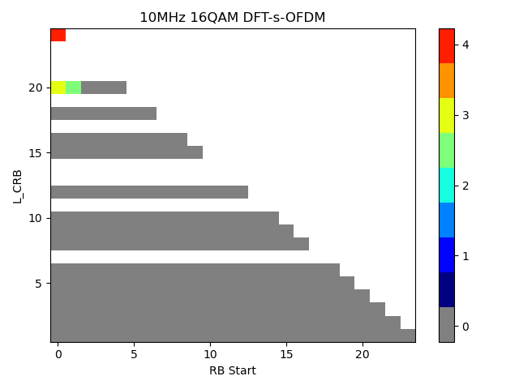

6 Transmitter characteristics
=============================

6.1 General
-----------

Unless otherwise stated, the transmitter characteristics are specified
at the antenna connector of the UE with a single or multiple transmit
antenna(s). For UE with integral antenna only, a reference antenna with
a gain of 0 dBi is assumed.

For UEs that do not indicate IE *dualPA-Architecture*, transmitter
requirements for CA operation apply only when the DMRS initialization
parameters (including the case when the UE applies cell ID as DMRS
scrambling ID) are different across all CCs. The UE may use higher MPR
values outside this limitation.

Transmitter requirements for UL MIMO operation apply when the UE
transmits on 2 ports/4 ports on the same CDM group. The UE may use
higher MPR values outside this limitation.

The applicability of transmitter requirements for Band n90 is in
accordance with that for Band n41; a UE supporting Band n90 shall meet
the minimum requirements for Band n41.

NOTE: For FRMCS (Future Railway Mobile Communication System) operation
in bands n100 and n101, the EIRP requirements shall be converted to
conducted requirements based on the post chipset unit antenna connector
gain G~n100post\ connector~ or G~n101post\ connector~ declared for the
UE following the principle described in annex M.

6.1A General
------------

The minimum requirements for band combinations including Band n41 also
apply for the corresponding band combinations with Band n90 replacing
Band n41 but with otherwise identical parameters. For brevity the said
band combinations with Band n90 are not listed in the tables below but
are covered by this specification.

UE supporting the IE posSRS-BWA-IndependentCA-RRC-Connected-r18 for SRS
bandwidth aggregation shall meet the minimum requirements for intra-band
contiguous CA for SRS transmission only.

6.1F General
------------

For wideband operations, the minimum requirements for the transmitter
characteristics are specified for transmissions on one scheduled RB set
or ≥ 1 scheduled contiguous RB set(s) within the UE channel. The
requirements apply with configured UL intra-cell guard bands of non-zero
size according to Table 5.3.3-2, with the union of the scheduled RB sets
and the intra-cell guard bands.

Unless stated otherwise, when a clause is not present for shared
spectrum channel access, the general requirements and the additional
clause requirements (suffices A,B,D) in clause 6 apply.

6.1G (Reserved)
---------------

6.1H (Reserved)
---------------

6.1I (Reserved)
---------------

6.1J General
------------

Unless otherwise stated, the transmitter characteristics are specified
at the antenna connector(s) of the ATG UE with one or multiple
omni-directional antenna(s) or at the *transceiver array boundary* (TAB)
connectors of the ATG UE with the antenna array. The definition about
*transceiver array boundary* (TAB) is specified in clause 4.3.2 of TS
38.104 \[16\].

6.1K (Reserved)
---------------

6.1L (Reserved)
---------------

6.2 Transmitter power
---------------------

### 6.2.1 UE maximum output power

The following UE Power Classes define the maximum output power for any
transmission bandwidth within the channel bandwidth of NR carrier unless
otherwise stated. The period of measurement shall be at least one sub
frame (1ms).

Table 6.2.1-1: UE Power Class

+-------+-------+-------+-------+-------+-------+-------+-------+-------+
| NR    | Class | Tole  | Class | Tole  | Class | Tole  | Class | Tole  |
|       | 1     | rance | 1.5   | rance | 2     | rance | 3     | rance |
| band  | (dBm) | (dB)  | (dBm) | (dB)  | (dBm) | (dB)  | (dBm) | (dB)  |
+=======+=======+=======+=======+=======+=======+=======+=======+=======+
| n1    |       |       |       |       | 26    | +2/-3 | 23    | ±2    |
+-------+-------+-------+-------+-------+-------+-------+-------+-------+
| n2    |       |       |       |       | 26    | +2/   | 23    | ±2^3^ |
|       |       |       |       |       |       | -3^3^ |       |       |
+-------+-------+-------+-------+-------+-------+-------+-------+-------+
| n3    |       |       |       |       | 26    | +2/   | 23    | ±2^3^ |
|       |       |       |       |       |       | -3^3^ |       |       |
+-------+-------+-------+-------+-------+-------+-------+-------+-------+
| n5    |       |       |       |       |       |       | 23    | ±2    |
+-------+-------+-------+-------+-------+-------+-------+-------+-------+
| n7    | 31^6^ | +2/-3 |       |       | 26    | +2/   | 23    | ±2^3^ |
|       |       |       |       |       |       | -3^3^ |       |       |
+-------+-------+-------+-------+-------+-------+-------+-------+-------+
| n8    |       |       |       |       | 26    | +2/   | 23    | ±2^3^ |
|       |       |       |       |       |       | -3^3^ |       |       |
+-------+-------+-------+-------+-------+-------+-------+-------+-------+
| n12   |       |       |       |       |       |       | 23    | ±2^3^ |
+-------+-------+-------+-------+-------+-------+-------+-------+-------+
| n13   |       |       |       |       | 26    | +2/-3 | 23    | ±2    |
+-------+-------+-------+-------+-------+-------+-------+-------+-------+
| n14   | 31    | +2/-3 |       |       | 26    | +2/-3 | 23    | ±2    |
|       | ^6,7^ |       |       |       |       |       |       |       |
+-------+-------+-------+-------+-------+-------+-------+-------+-------+
| n18   |       |       |       |       |       |       | 23    | ±2    |
+-------+-------+-------+-------+-------+-------+-------+-------+-------+
| n20   |       |       |       |       |       |       | 23    | ±2^3^ |
+-------+-------+-------+-------+-------+-------+-------+-------+-------+
| n24   |       |       |       |       |       |       | 23    | +2/   |
|       |       |       |       |       |       |       |       | -3^3^ |
+-------+-------+-------+-------+-------+-------+-------+-------+-------+
| n25   | 31^6^ | +2/-3 |       |       | 26    | +2/   | 23    | ±2^3^ |
|       |       |       |       |       |       | -3^3^ |       |       |
+-------+-------+-------+-------+-------+-------+-------+-------+-------+
| n26   |       |       |       |       |       |       | 23    | ±2^3^ |
+-------+-------+-------+-------+-------+-------+-------+-------+-------+
| n28   |       |       |       |       |       |       | 23    | +2    |
|       |       |       |       |       |       |       |       | /-2.5 |
+-------+-------+-------+-------+-------+-------+-------+-------+-------+
| n30   |       |       |       |       |       |       | 23    | ±2    |
+-------+-------+-------+-------+-------+-------+-------+-------+-------+
| n31   | 31^6^ | +2/-3 |       |       |       |       | 23    | ±2    |
+-------+-------+-------+-------+-------+-------+-------+-------+-------+
| n34   |       |       | 29^5^ | +2/-3 | 26    | +2/-3 | 23    | ±2    |
+-------+-------+-------+-------+-------+-------+-------+-------+-------+
| n38   |       |       |       |       |       |       | 23    | ±2    |
+-------+-------+-------+-------+-------+-------+-------+-------+-------+
| n39   |       |       | 29^5^ | +2/-3 | 26    | +2/-3 | 23    | ±2    |
+-------+-------+-------+-------+-------+-------+-------+-------+-------+
| n40   | 31^6^ | +2/-3 | 29^5^ | +2/-3 | 26    | +2/-3 | 23    | ±2    |
+-------+-------+-------+-------+-------+-------+-------+-------+-------+
| n41   | 31^6^ | +2/-3 | 29^5^ | +2/   | 26    | +2/   | 23    | ±2^3^ |
|       |       |       |       | -3^3^ |       | -3^3^ |       |       |
+-------+-------+-------+-------+-------+-------+-------+-------+-------+
| n47   |       |       |       |       |       |       | 23    | ±2    |
+-------+-------+-------+-------+-------+-------+-------+-------+-------+
| n48   |       |       |       |       |       |       | 23    | +2/-3 |
+-------+-------+-------+-------+-------+-------+-------+-------+-------+
| n50   |       |       |       |       |       |       | 23    | ±2    |
+-------+-------+-------+-------+-------+-------+-------+-------+-------+
| n51   |       |       |       |       |       |       | 23    | ±2    |
+-------+-------+-------+-------+-------+-------+-------+-------+-------+
| n53   |       |       |       |       |       |       | 23    | ±2    |
+-------+-------+-------+-------+-------+-------+-------+-------+-------+
| n54   |       |       |       |       |       |       | 23    | ±2    |
+-------+-------+-------+-------+-------+-------+-------+-------+-------+
| n65   |       |       |       |       |       |       | 23    | ±2    |
+-------+-------+-------+-------+-------+-------+-------+-------+-------+
| n66   | 31^6^ | +2/-3 |       |       | 26    | +2/-3 | 23    | ±2    |
+-------+-------+-------+-------+-------+-------+-------+-------+-------+
| n70   |       |       |       |       | 26    | +2/-3 | 23    | ±2    |
+-------+-------+-------+-------+-------+-------+-------+-------+-------+
| n71   | 31^6^ | +2/-3 |       |       | 26    | +2/-3 | 23    | +2    |
|       |       |       |       |       |       |       |       | /-2.5 |
+-------+-------+-------+-------+-------+-------+-------+-------+-------+
| n72   | 31^6^ | +2/-3 |       |       |       |       | 23    | ±2    |
+-------+-------+-------+-------+-------+-------+-------+-------+-------+
| n74   |       |       |       |       |       |       | 23    | ±2    |
+-------+-------+-------+-------+-------+-------+-------+-------+-------+
| n77   | 31^6^ | +2/-3 | 29^5^ | +2/-3 | 26    | +2/-3 | 23    | +2/-3 |
+-------+-------+-------+-------+-------+-------+-------+-------+-------+
| n78   | 31^6^ | +2/-3 | 29^5^ | +2/-3 | 26    | +2/-3 | 23    | +2/-3 |
+-------+-------+-------+-------+-------+-------+-------+-------+-------+
| n79   |       |       | 29^5^ | +2/-3 | 26    | +2/-3 | 23    | +2/-3 |
+-------+-------+-------+-------+-------+-------+-------+-------+-------+
| n80   |       |       |       |       | 26    | +2/   | 23    | ±2^3^ |
|       |       |       |       |       |       | -3^3^ |       |       |
+-------+-------+-------+-------+-------+-------+-------+-------+-------+
| n81   |       |       |       |       |       |       | 23    | ±2    |
+-------+-------+-------+-------+-------+-------+-------+-------+-------+
| n82   |       |       |       |       |       |       | 23    | ±2    |
+-------+-------+-------+-------+-------+-------+-------+-------+-------+
| n83   |       |       |       |       |       |       | 23    | +2    |
|       |       |       |       |       |       |       |       | /-2.5 |
+-------+-------+-------+-------+-------+-------+-------+-------+-------+
| n84   |       |       |       |       | 26    | +2/-3 | 23    | ±2    |
+-------+-------+-------+-------+-------+-------+-------+-------+-------+
| n85   | 31^6^ | +2/-3 |       |       | 26    | +2/   | 23    | ±2^3^ |
|       |       |       |       |       |       | -3^3^ |       |       |
+-------+-------+-------+-------+-------+-------+-------+-------+-------+
| n86   |       |       |       |       |       |       | 23    | ±2    |
+-------+-------+-------+-------+-------+-------+-------+-------+-------+
| n89   |       |       |       |       |       |       | 23    | ±2    |
+-------+-------+-------+-------+-------+-------+-------+-------+-------+
| n91   |       |       |       |       |       |       | 23    | ±2^3  |
|       |       |       |       |       |       |       |       | ,\ 4^ |
+-------+-------+-------+-------+-------+-------+-------+-------+-------+
| n92   |       |       |       |       |       |       | 23    | ±2^3  |
|       |       |       |       |       |       |       |       | ,\ 4^ |
+-------+-------+-------+-------+-------+-------+-------+-------+-------+
| n93   |       |       |       |       |       |       | 23    | ±2^3  |
|       |       |       |       |       |       |       |       | ,\ 4^ |
+-------+-------+-------+-------+-------+-------+-------+-------+-------+
| n94   |       |       |       |       |       |       | 23    | ±2^3  |
|       |       |       |       |       |       |       |       | ,\ 4^ |
+-------+-------+-------+-------+-------+-------+-------+-------+-------+
| n95   |       |       |       |       | 26    | +2/-3 | 23    | ±2    |
+-------+-------+-------+-------+-------+-------+-------+-------+-------+
| n97   |       |       |       |       | 26    | +2/-3 | 23    | ±2    |
+-------+-------+-------+-------+-------+-------+-------+-------+-------+
| n98   |       |       |       |       | 26    | +2/-3 | 23    | ±2    |
+-------+-------+-------+-------+-------+-------+-------+-------+-------+
| n99   |       |       |       |       |       |       | 23    | +2/   |
|       |       |       |       |       |       |       |       | -3^3^ |
+-------+-------+-------+-------+-------+-------+-------+-------+-------+
| n100  | 31^6  | +2/-3 |       |       |       |       | 23    | ±2    |
|       | ,\ 8^ |       |       |       |       |       |       |       |
+-------+-------+-------+-------+-------+-------+-------+-------+-------+
| n101  | 31^6  | +2/-3 |       |       |       |       | 23    | ±2    |
|       | ,\ 8^ |       |       |       |       |       |       |       |
+-------+-------+-------+-------+-------+-------+-------+-------+-------+
| n104  |       |       |       |       | 26    | +2/-3 | 23    | +2/-3 |
+-------+-------+-------+-------+-------+-------+-------+-------+-------+
| n105  |       |       |       |       |       |       | 23    | +2    |
|       |       |       |       |       |       |       |       | /-2.5 |
+-------+-------+-------+-------+-------+-------+-------+-------+-------+
| n106  |       |       |       |       |       |       | 23    | ±2    |
+-------+-------+-------+-------+-------+-------+-------+-------+-------+
| n109  |       |       |       |       |       |       | 23    | ±2^3  |
|       |       |       |       |       |       |       |       | ,\ 4^ |
+-------+-------+-------+-------+-------+-------+-------+-------+-------+
| NOTE  |       |       |       |       |       |       |       |       |
| 1:    |       |       |       |       |       |       |       |       |
| P~P   |       |       |       |       |       |       |       |       |
| owerC |       |       |       |       |       |       |       |       |
| lass~ |       |       |       |       |       |       |       |       |
| is    |       |       |       |       |       |       |       |       |
| the   |       |       |       |       |       |       |       |       |
| ma    |       |       |       |       |       |       |       |       |
| ximum |       |       |       |       |       |       |       |       |
| UE    |       |       |       |       |       |       |       |       |
| power |       |       |       |       |       |       |       |       |
| spec  |       |       |       |       |       |       |       |       |
| ified |       |       |       |       |       |       |       |       |
| wi    |       |       |       |       |       |       |       |       |
| thout |       |       |       |       |       |       |       |       |
| t     |       |       |       |       |       |       |       |       |
| aking |       |       |       |       |       |       |       |       |
| into  |       |       |       |       |       |       |       |       |
| ac    |       |       |       |       |       |       |       |       |
| count |       |       |       |       |       |       |       |       |
| the   |       |       |       |       |       |       |       |       |
| toler |       |       |       |       |       |       |       |       |
| ance. |       |       |       |       |       |       |       |       |
|       |       |       |       |       |       |       |       |       |
| NOTE  |       |       |       |       |       |       |       |       |
| 2:    |       |       |       |       |       |       |       |       |
| Power |       |       |       |       |       |       |       |       |
| class |       |       |       |       |       |       |       |       |
| 3 is  |       |       |       |       |       |       |       |       |
| de    |       |       |       |       |       |       |       |       |
| fault |       |       |       |       |       |       |       |       |
| power |       |       |       |       |       |       |       |       |
| class |       |       |       |       |       |       |       |       |
| u     |       |       |       |       |       |       |       |       |
| nless |       |       |       |       |       |       |       |       |
| othe  |       |       |       |       |       |       |       |       |
| rwise |       |       |       |       |       |       |       |       |
| st    |       |       |       |       |       |       |       |       |
| ated. |       |       |       |       |       |       |       |       |
|       |       |       |       |       |       |       |       |       |
| NOTE  |       |       |       |       |       |       |       |       |
| 3:    |       |       |       |       |       |       |       |       |
| R     |       |       |       |       |       |       |       |       |
| efers |       |       |       |       |       |       |       |       |
| to    |       |       |       |       |       |       |       |       |
| the   |       |       |       |       |       |       |       |       |
| tr    |       |       |       |       |       |       |       |       |
| ansmi |       |       |       |       |       |       |       |       |
| ssion |       |       |       |       |       |       |       |       |
| bandw |       |       |       |       |       |       |       |       |
| idths |       |       |       |       |       |       |       |       |
| con   |       |       |       |       |       |       |       |       |
| fined |       |       |       |       |       |       |       |       |
| w     |       |       |       |       |       |       |       |       |
| ithin |       |       |       |       |       |       |       |       |
| F~UL\ |       |       |       |       |       |       |       |       |
| _low~ |       |       |       |       |       |       |       |       |
| and   |       |       |       |       |       |       |       |       |
| F~UL\ |       |       |       |       |       |       |       |       |
| _low~ |       |       |       |       |       |       |       |       |
| + 4   |       |       |       |       |       |       |       |       |
| MHz   |       |       |       |       |       |       |       |       |
| or    |       |       |       |       |       |       |       |       |
| F     |       |       |       |       |       |       |       |       |
| ~UL\_ |       |       |       |       |       |       |       |       |
| high~ |       |       |       |       |       |       |       |       |
| -- 4  |       |       |       |       |       |       |       |       |
| MHz   |       |       |       |       |       |       |       |       |
| and   |       |       |       |       |       |       |       |       |
| F~    |       |       |       |       |       |       |       |       |
| UL\_h |       |       |       |       |       |       |       |       |
| igh~, |       |       |       |       |       |       |       |       |
| the   |       |       |       |       |       |       |       |       |
| ma    |       |       |       |       |       |       |       |       |
| ximum |       |       |       |       |       |       |       |       |
| o     |       |       |       |       |       |       |       |       |
| utput |       |       |       |       |       |       |       |       |
| power |       |       |       |       |       |       |       |       |
| r     |       |       |       |       |       |       |       |       |
| equir |       |       |       |       |       |       |       |       |
| ement |       |       |       |       |       |       |       |       |
| is    |       |       |       |       |       |       |       |       |
| re    |       |       |       |       |       |       |       |       |
| laxed |       |       |       |       |       |       |       |       |
| by    |       |       |       |       |       |       |       |       |
| red   |       |       |       |       |       |       |       |       |
| ucing |       |       |       |       |       |       |       |       |
| the   |       |       |       |       |       |       |       |       |
| lower |       |       |       |       |       |       |       |       |
| tole  |       |       |       |       |       |       |       |       |
| rance |       |       |       |       |       |       |       |       |
| limit |       |       |       |       |       |       |       |       |
| by    |       |       |       |       |       |       |       |       |
| 1.5   |       |       |       |       |       |       |       |       |
| dB.   |       |       |       |       |       |       |       |       |
|       |       |       |       |       |       |       |       |       |
| NOTE  |       |       |       |       |       |       |       |       |
| 4:    |       |       |       |       |       |       |       |       |
| The   |       |       |       |       |       |       |       |       |
| ma    |       |       |       |       |       |       |       |       |
| ximum |       |       |       |       |       |       |       |       |
| o     |       |       |       |       |       |       |       |       |
| utput |       |       |       |       |       |       |       |       |
| power |       |       |       |       |       |       |       |       |
| r     |       |       |       |       |       |       |       |       |
| equir |       |       |       |       |       |       |       |       |
| ement |       |       |       |       |       |       |       |       |
| is    |       |       |       |       |       |       |       |       |
| re    |       |       |       |       |       |       |       |       |
| laxed |       |       |       |       |       |       |       |       |
| by    |       |       |       |       |       |       |       |       |
| red   |       |       |       |       |       |       |       |       |
| ucing |       |       |       |       |       |       |       |       |
| the   |       |       |       |       |       |       |       |       |
| lower |       |       |       |       |       |       |       |       |
| tole  |       |       |       |       |       |       |       |       |
| rance |       |       |       |       |       |       |       |       |
| limit |       |       |       |       |       |       |       |       |
| by    |       |       |       |       |       |       |       |       |
| 0.3   |       |       |       |       |       |       |       |       |
| dB.   |       |       |       |       |       |       |       |       |
|       |       |       |       |       |       |       |       |       |
| NOTE  |       |       |       |       |       |       |       |       |
| 5:    |       |       |       |       |       |       |       |       |
| Ach   |       |       |       |       |       |       |       |       |
| ieved |       |       |       |       |       |       |       |       |
| via   |       |       |       |       |       |       |       |       |
| Tx    |       |       |       |       |       |       |       |       |
| diver |       |       |       |       |       |       |       |       |
| sity. |       |       |       |       |       |       |       |       |
|       |       |       |       |       |       |       |       |       |
| NOTE  |       |       |       |       |       |       |       |       |
| 6:    |       |       |       |       |       |       |       |       |
| Gener |       |       |       |       |       |       |       |       |
| ally, |       |       |       |       |       |       |       |       |
| PC1   |       |       |       |       |       |       |       |       |
| UE is |       |       |       |       |       |       |       |       |
| not   |       |       |       |       |       |       |       |       |
| tar   |       |       |       |       |       |       |       |       |
| geted |       |       |       |       |       |       |       |       |
| for   |       |       |       |       |       |       |       |       |
| smart |       |       |       |       |       |       |       |       |
| phone |       |       |       |       |       |       |       |       |
| form  |       |       |       |       |       |       |       |       |
| fa    |       |       |       |       |       |       |       |       |
| ctor. |       |       |       |       |       |       |       |       |
|       |       |       |       |       |       |       |       |       |
| NOTE  |       |       |       |       |       |       |       |       |
| 7:    |       |       |       |       |       |       |       |       |
| The   |       |       |       |       |       |       |       |       |
| UE    |       |       |       |       |       |       |       |       |
| power |       |       |       |       |       |       |       |       |
| class |       |       |       |       |       |       |       |       |
| 1     |       |       |       |       |       |       |       |       |
| re    |       |       |       |       |       |       |       |       |
| quire |       |       |       |       |       |       |       |       |
| ments |       |       |       |       |       |       |       |       |
| for   |       |       |       |       |       |       |       |       |
| Band  |       |       |       |       |       |       |       |       |
| n14   |       |       |       |       |       |       |       |       |
| are   |       |       |       |       |       |       |       |       |
| appli |       |       |       |       |       |       |       |       |
| cable |       |       |       |       |       |       |       |       |
| for   |       |       |       |       |       |       |       |       |
| p     |       |       |       |       |       |       |       |       |
| ublic |       |       |       |       |       |       |       |       |
| s     |       |       |       |       |       |       |       |       |
| afety |       |       |       |       |       |       |       |       |
| sce   |       |       |       |       |       |       |       |       |
| nario |       |       |       |       |       |       |       |       |
| only. |       |       |       |       |       |       |       |       |
|       |       |       |       |       |       |       |       |       |
| NOTE  |       |       |       |       |       |       |       |       |
| 8:    |       |       |       |       |       |       |       |       |
| PC1   |       |       |       |       |       |       |       |       |
| in    |       |       |       |       |       |       |       |       |
| Band  |       |       |       |       |       |       |       |       |
| n100  |       |       |       |       |       |       |       |       |
| and   |       |       |       |       |       |       |       |       |
| n101  |       |       |       |       |       |       |       |       |
| is    |       |       |       |       |       |       |       |       |
| al    |       |       |       |       |       |       |       |       |
| lowed |       |       |       |       |       |       |       |       |
| only  |       |       |       |       |       |       |       |       |
| for   |       |       |       |       |       |       |       |       |
| FRMCS |       |       |       |       |       |       |       |       |
| ca    |       |       |       |       |       |       |       |       |
| b-rad |       |       |       |       |       |       |       |       |
| io's, |       |       |       |       |       |       |       |       |
| i.e.  |       |       |       |       |       |       |       |       |
| user  |       |       |       |       |       |       |       |       |
| equip |       |       |       |       |       |       |       |       |
| ments |       |       |       |       |       |       |       |       |
| inst  |       |       |       |       |       |       |       |       |
| alled |       |       |       |       |       |       |       |       |
| on    |       |       |       |       |       |       |       |       |
| t     |       |       |       |       |       |       |       |       |
| rains |       |       |       |       |       |       |       |       |
| with  |       |       |       |       |       |       |       |       |
| ext   |       |       |       |       |       |       |       |       |
| ernal |       |       |       |       |       |       |       |       |
| an    |       |       |       |       |       |       |       |       |
| tenna |       |       |       |       |       |       |       |       |
| on    |       |       |       |       |       |       |       |       |
| top   |       |       |       |       |       |       |       |       |
| of    |       |       |       |       |       |       |       |       |
| the   |       |       |       |       |       |       |       |       |
| train |       |       |       |       |       |       |       |       |
| roof  |       |       |       |       |       |       |       |       |
| at    |       |       |       |       |       |       |       |       |
| app   |       |       |       |       |       |       |       |       |
| roxim |       |       |       |       |       |       |       |       |
| ately |       |       |       |       |       |       |       |       |
| 4m    |       |       |       |       |       |       |       |       |
| over  |       |       |       |       |       |       |       |       |
| gr    |       |       |       |       |       |       |       |       |
| ound. |       |       |       |       |       |       |       |       |
+-------+-------+-------+-------+-------+-------+-------+-------+-------+

If a UE supports a different power class than the default UE power class
for the band and the supported power class enables the higher maximum
output power than that of the default power class:

\- if the field of UE capability *maxUplinkDutyCycle-PC2-FR1* is absent
and the field of UE capability *maxUplinkDutyCycle-PC1dot5-MPE-FR1* is
absent and the percentage of uplink symbols transmitted in a certain
evaluation period is larger than 50% (The exact evaluation period is no
less than one radio frame); or

\- if the field of UE capability *maxUplinkDutyCycle-PC2-FR1* is not
absent and the percentage of uplink symbols transmitted in a certain
evaluation period is larger than *maxUplinkDutyCycle-PC2-FR1* as defined
in TS 38.306 (The exact evaluation period is no less than one radio
frame); or

\- if the field of UE capability *maxUplinkDutyCycle-PC1dot5-MPE-FR1* is
not absent and half the percentage of uplink symbols transmitted in a
certain evaluation period is larger than
*maxUplinkDutyCycle-PC1dot5-MPE-FR1* as defined in TS 38.306 (The exact
evaluation period is no less than one radio frame); or

\- if the IE P-Max as defined in TS 38.331 \[7\] is provided and set to
the maximum output power of the default power class or lower;

\- shall apply all requirements for the default power class to the
supported power class and set the configured transmitted power as
specified in clause 6.2.4;

\- else if the UE does not support a power class with higher maximum
output power than PC2; or

\- if the field of UE capability *maxUplinkDutyCycle-PC2-FR1* is absent
and the field of UE capability *maxUplinkDutyCycle-PC1dot5-MPE-FR1* is
absent and the percentage of uplink symbols transmitted in a certain
evaluation period is larger than 25% (The exact evaluation period is no
less than one radio frame); or

\- if the field of UE capability *maxUplinkDutyCycle-PC2-FR1* is not
absent and the percentage of uplink symbols transmitted in a certain
evaluation period is larger than 0.5\**maxUplinkDutyCycle-PC2-FR1* (The
exact evaluation period is no less than one radio frame); or

\- if the field of UE capability *maxUplinkDutyCycle-PC1dot5-MPE-FR1* is
not absent and the percentage of uplink symbols transmitted in a certain
evaluation period is larger than *maxUplinkDutyCycle-PC1dot5-MPE-FR1* as
defined in TS 38.306 (The exact evaluation period is no less than one
radio frame); or

\- if the IE P-Max as defined in TS 38.331 \[7\] is provided and set to
the maximum output power of the power class 2 or lower;

\- shall apply all requirements for power class 2 to the supported power
class and set the configured transmitted power as specified in clause
6.2.4;

\- else shall apply all requirements for the supported power class and
set the configured transmitted power as specified in clause 6.2.4.

### 6.2.1I Void

### 6.2.2 UE maximum output power reduction

UE is allowed to reduce the maximum output power due to higher order
modulations and transmit bandwidth configurations. For UE power class 2
and 3 and UE power class 1, the allowed maximum power reduction (MPR) is
defined in Table 6.2.2-2, Table 6.2.2-1, Table 6.2.2-4b and Table
6.2.2-5, respectively for channel bandwidths ≤ 100 MHz. For UE power
class 1.5 with 2Tx, the allowed maximum power reduction (MPR) is defined
in Table 6.2D.2-2 and Table 6.2D.2-3 in accordance with the indicated
*modifiedMPR-Behaviour* specified in Table L.1-1 for channel bandwidths
≤ 100 MHz. For UE power class 1.5 with 4 Tx, the allowed maximum power
reduction is defined in Table 6.2D.2-4, 6.2D.2-5. When A UE that
indicates PC1.5 for a given band is limited to PC2 by the rules in
clause 6.2.1, the MPR requirements in Table 6.2.2-2 apply. Unless
otherwise specified, 'pi/2 BPSK' refers to both variants of pi/2 BPSK
referenced in Table 6.2.2-1.

If the relative channel bandwidth ≤ 4% for TDD bands or ≤ 3% for FDD
band, the ∆MPR is set to zero.

If the relative channel bandwidth \> 4% for TDD bands or \> 3% for FDD
bands, the ∆MPR is defined in Table 6.2.2-3.

Where relative channel bandwidth = 2\*BW~Channel~ / (F~UL\_low~ +
F~UL\_high~)

The allowed MPR for SRS, PUCCH formats 0, 1, 3 and 4, and PRACH shall be
as specified for QPSK modulated DFT-s-OFDM of equivalent RB allocation.
The allowed MPR for PUCCH format 2 shall be as specified for QPSK
modulated CP-OFDM of equivalent RB allocation.

Table 6.2.2-1 Maximum power reduction (MPR) for power class 3

+-------------+-------------+-------------+-------------+----------+
| Modulation  | MPR (dB)    |             |             |          |
+=============+=============+=============+=============+==========+
|             | Edge RB     | Outer RB    | Inner RB    |          |
|             | allocations | allocations | allocations |          |
+-------------+-------------+-------------+-------------+----------+
| DFT-s-OFDM  | Pi/2 BPSK   | ≤ 3.5^1^    | ≤ 1.2^1^    | ≤ 0.2^1^ |
|             | w/ Rel-15   |             |             |          |
|             | DMRS        |             |             |          |
+-------------+-------------+-------------+-------------+----------+
|             |             | ≤ 0.5^2,3^  | ≤ 0.5^2^    | 0^2,4^   |
+-------------+-------------+-------------+-------------+----------+
|             | Pi/2 BPSK w | ≤ 0.5^2,3^  | 0^2^        | 0^2,4^   |
|             | Pi/2 BPSK   |             |             |          |
|             | DMRS        |             |             |          |
+-------------+-------------+-------------+-------------+----------+
|             | QPSK        | ≤ 1         | 0^5^        |          |
+-------------+-------------+-------------+-------------+----------+
|             | 16 QAM      | ≤ 2         | ≤ 1         |          |
+-------------+-------------+-------------+-------------+----------+
|             | 64 QAM      | ≤ 2.5       |             |          |
+-------------+-------------+-------------+-------------+----------+
|             | 256 QAM     | ≤ 4.5       |             |          |
+-------------+-------------+-------------+-------------+----------+
| CP-OFDM     | QPSK        | ≤ 3         | ≤ 1.5       |          |
+-------------+-------------+-------------+-------------+----------+
|             | 16 QAM      | ≤ 3         | ≤ 2         |          |
+-------------+-------------+-------------+-------------+----------+
|             | 64 QAM      | ≤ 3.5       |             |          |
+-------------+-------------+-------------+-------------+----------+
|             | 256 QAM     | ≤ 6.5       |             |          |
+-------------+-------------+-------------+-------------+----------+
| NOTE 1:     |             |             |             |          |
| Applicable  |             |             |             |          |
| for UE      |             |             |             |          |
| operating   |             |             |             |          |
| in TDD mode |             |             |             |          |
| with Pi/2   |             |             |             |          |
| BPSK        |             |             |             |          |
| modulation  |             |             |             |          |
| and UE      |             |             |             |          |
| indicates   |             |             |             |          |
| support for |             |             |             |          |
| UE          |             |             |             |          |
| capability  |             |             |             |          |
| *           |             |             |             |          |
| powerBoosti |             |             |             |          |
| ng-pi2BPSK* |             |             |             |          |
| and if the  |             |             |             |          |
| IE          |             |             |             |          |
| *powerBo    |             |             |             |          |
| ostPi2BPSK* |             |             |             |          |
| is set to 1 |             |             |             |          |
| and 40 % or |             |             |             |          |
| less slots  |             |             |             |          |
| in radio    |             |             |             |          |
| frame are   |             |             |             |          |
| used for UL |             |             |             |          |
| t           |             |             |             |          |
| ransmission |             |             |             |          |
| for bands   |             |             |             |          |
| n40, n41,   |             |             |             |          |
| n77, n78    |             |             |             |          |
| and n79.    |             |             |             |          |
| The         |             |             |             |          |
| reference   |             |             |             |          |
| power of 0  |             |             |             |          |
| dB MPR is   |             |             |             |          |
| 26 dBm.     |             |             |             |          |
|             |             |             |             |          |
| NOTE 2:     |             |             |             |          |
| Applicable  |             |             |             |          |
| for         |             |             |             |          |
| conditions  |             |             |             |          |
| where note  |             |             |             |          |
| 1 does not  |             |             |             |          |
| apply.      |             |             |             |          |
|             |             |             |             |          |
| NOTE 3: For |             |             |             |          |
| 3 MHz       |             |             |             |          |
| channel     |             |             |             |          |
| bandwidth   |             |             |             |          |
| the Pi/2    |             |             |             |          |
| BPSK edge   |             |             |             |          |
| allocation  |             |             |             |          |
| MPR is 1 dB |             |             |             |          |
|             |             |             |             |          |
| NOTE 4: For |             |             |             |          |
| a UE        |             |             |             |          |
| indicating  |             |             |             |          |
| support for |             |             |             |          |
| UE          |             |             |             |          |
| capability  |             |             |             |          |
| *powerBoos  |             |             |             |          |
| ting-pi2BPS |             |             |             |          |
| K-QPSK-r18* |             |             |             |          |
| or          |             |             |             |          |
| *powerBo    |             |             |             |          |
| osting-pi2B |             |             |             |          |
| PSK-QPSK-Mo |             |             |             |          |
| dified-r18* |             |             |             |          |
| and if the  |             |             |             |          |
| IE          |             |             |             |          |
| *           |             |             |             |          |
| powerBoostP |             |             |             |          |
| i2BPSK-r18* |             |             |             |          |
| is set to   |             |             |             |          |
| 1, the      |             |             |             |          |
| reference   |             |             |             |          |
| power is    |             |             |             |          |
| increased   |             |             |             |          |
| by          |             |             |             |          |
| \[ΔP~       |             |             |             |          |
| PowerBoost~ |             |             |             |          |
| -           |             |             |             |          |
| ΔP~Po       |             |             |             |          |
| werClass~\] |             |             |             |          |
|             |             |             |             |          |
| NOTE 5: For |             |             |             |          |
| a UE        |             |             |             |          |
| indicating  |             |             |             |          |
| support for |             |             |             |          |
| UE          |             |             |             |          |
| capability  |             |             |             |          |
| *powerBoos  |             |             |             |          |
| ting-pi2BPS |             |             |             |          |
| K-QPSK-r18* |             |             |             |          |
| or          |             |             |             |          |
| *powerBo    |             |             |             |          |
| osting-pi2B |             |             |             |          |
| PSK-QPSK-Mo |             |             |             |          |
| dified-r18* |             |             |             |          |
| and if the  |             |             |             |          |
| IE          |             |             |             |          |
| *powerBoo   |             |             |             |          |
| stQPSK-r18* |             |             |             |          |
| is set to   |             |             |             |          |
| 1, the      |             |             |             |          |
| reference   |             |             |             |          |
| power is    |             |             |             |          |
| increased   |             |             |             |          |
| by          |             |             |             |          |
| \[ΔP~       |             |             |             |          |
| PowerBoost~ |             |             |             |          |
| -           |             |             |             |          |
| ΔP~Po       |             |             |             |          |
| werClass~\] |             |             |             |          |
+-------------+-------------+-------------+-------------+----------+

Table 6.2.2-2 Maximum power reduction (MPR) for power class 2

+--------------+--------------+--------------+--------------+-------+
| Modulation   | MPR (dB)     |              |              |       |
+==============+==============+==============+==============+=======+
|              | Edge RB      | Outer RB     | Inner RB     |       |
|              | allocations  | allocations  | allocations  |       |
+--------------+--------------+--------------+--------------+-------+
| DFT-s-OFDM   | Pi/2 BPSK    | ≤ 3.5        | ≤ 0.5        | 0^1^  |
+--------------+--------------+--------------+--------------+-------+
|              | QPSK         | ≤ 3.5        | ≤ 1          | 0^2^  |
+--------------+--------------+--------------+--------------+-------+
|              | 16 QAM       | ≤ 3.5        | ≤ 2          | ≤ 1   |
+--------------+--------------+--------------+--------------+-------+
|              | 64 QAM       | ≤ 3.5        | ≤ 2.5        |       |
+--------------+--------------+--------------+--------------+-------+
|              | 256 QAM      | ≤ 4.5        |              |       |
+--------------+--------------+--------------+--------------+-------+
| CP-OFDM      | QPSK         | ≤ 3.5        | ≤ 3          | ≤ 1.5 |
+--------------+--------------+--------------+--------------+-------+
|              | 16 QAM       | ≤ 3.5        | ≤ 3          | ≤ 2   |
+--------------+--------------+--------------+--------------+-------+
|              | 64 QAM       | ≤ 3.5        |              |       |
+--------------+--------------+--------------+--------------+-------+
|              | 256 QAM      | ≤ 6.5        |              |       |
+--------------+--------------+--------------+--------------+-------+
| NOTE 1: For  |              |              |              |       |
| a UE         |              |              |              |       |
| indicating   |              |              |              |       |
| support for  |              |              |              |       |
| UE           |              |              |              |       |
| capability   |              |              |              |       |
| *powerBo     |              |              |              |       |
| osting-pi2BP |              |              |              |       |
| SK-QPSK-r18* |              |              |              |       |
| or           |              |              |              |       |
| *powe        |              |              |              |       |
| rBoosting-pi |              |              |              |       |
| 2BPSK-QPSK-M |              |              |              |       |
| odified-r18* |              |              |              |       |
| and if the   |              |              |              |       |
| IE           |              |              |              |       |
| *powerBoost  |              |              |              |       |
| Pi2BPSK-r18* |              |              |              |       |
| is set to 1, |              |              |              |       |
| the          |              |              |              |       |
| reference    |              |              |              |       |
| power is     |              |              |              |       |
| increased by |              |              |              |       |
| \[ΔP         |              |              |              |       |
| ~PowerBoost~ |              |              |              |       |
| -            |              |              |              |       |
| ΔP~P         |              |              |              |       |
| owerClass~\] |              |              |              |       |
|              |              |              |              |       |
| NOTE 2: For  |              |              |              |       |
| a UE         |              |              |              |       |
| indicating   |              |              |              |       |
| support for  |              |              |              |       |
| UE           |              |              |              |       |
| capability   |              |              |              |       |
| *powerBo     |              |              |              |       |
| osting-pi2BP |              |              |              |       |
| SK-QPSK-r18* |              |              |              |       |
| or           |              |              |              |       |
| *powe        |              |              |              |       |
| rBoosting-pi |              |              |              |       |
| 2BPSK-QPSK-M |              |              |              |       |
| odified-r18* |              |              |              |       |
| and if the   |              |              |              |       |
| IE           |              |              |              |       |
| *powerBo     |              |              |              |       |
| ostQPSK-r18* |              |              |              |       |
| is set to 1, |              |              |              |       |
| thereference |              |              |              |       |
| power is     |              |              |              |       |
| increased by |              |              |              |       |
| \[ΔP         |              |              |              |       |
| ~PowerBoost~ |              |              |              |       |
| -            |              |              |              |       |
| ΔP~P         |              |              |              |       |
| owerClass~\] |              |              |              |       |
+--------------+--------------+--------------+--------------+-------+

Table 6.2.2-3: ∆MPR

+-------------+---------------------------------+-------------------+-----------+
| NR Band     | Power class                     | Channel bandwidth | ∆MPR (dB) |
+-------------+---------------------------------+-------------------+-----------+
| n28 and n83 | Power class 3                   | 30 MHz            | 0.5       |
+-------------+---------------------------------+-------------------+-----------+
| n40 and n97 | Power class 3 and power class 2 | 100 MHz           | 1         |
+-------------+---------------------------------+-------------------+-----------+
| n71         | Power class 3                   | 25 MHz            | 0.5       |
|             |                                 |                   |           |
|             | Power class 2                   | 30 MHz            |           |
|             |                                 |                   |           |
|             |                                 | 35 MHz            |           |
+-------------+---------------------------------+-------------------+-----------+

Table 6.2.2-4 Void

Table 6.2.2-4a Void

Table 6.2.2-4b: Maximum power reduction (MPR) for power class 1 for
bands other than Band n14

+--------------+--------------+--------------+--------------+-------+
| Modulation   | MPR (dB)     |              |              |       |
+==============+==============+==============+==============+=======+
|              | Edge RB      | Outer RB     | Inner RB     |       |
|              | allocations  | allocations  | allocations  |       |
+--------------+--------------+--------------+--------------+-------+
| DFT-s-OFDM   | Pi/2 BPSK w/ | (NOTE 1)     | ≤ 0.5        | 0     |
|              | Rel-15 DMRS  |              |              |       |
+--------------+--------------+--------------+--------------+-------+
|              | Pi/2 BPSK w  | (NOTE 1)     | 0            | 0     |
|              | Pi/2 BPSK    |              |              |       |
|              | DMRS         |              |              |       |
+--------------+--------------+--------------+--------------+-------+
|              | QPSK         | (NOTE 1)     | ≤ 1          | 0     |
+--------------+--------------+--------------+--------------+-------+
|              | 16 QAM       | (NOTE 1)     | ≤ 2          | ≤ 1   |
+--------------+--------------+--------------+--------------+-------+
|              | 64 QAM       | (NOTE 1)     | ≤ 2.5        |       |
+--------------+--------------+--------------+--------------+-------+
|              | 256 QAM      | (NOTE 1)     | ≤ 4.5        |       |
+--------------+--------------+--------------+--------------+-------+
| CP-OFDM      | QPSK         | (NOTE 1)     | ≤ 3          | ≤ 1.5 |
+--------------+--------------+--------------+--------------+-------+
|              | 16 QAM       | (NOTE 1)     | ≤ 3          | ≤ 2   |
+--------------+--------------+--------------+--------------+-------+
|              | 64 QAM       | (NOTE 1)     | ≤ 3.5        |       |
+--------------+--------------+--------------+--------------+-------+
|              | 256 QAM      | (NOTE 1)     | ≤ 6.5        |       |
+--------------+--------------+--------------+--------------+-------+
| NOTE 1: MPR  |              |              |              |       |
| for all      |              |              |              |       |
| modulations  |              |              |              |       |
| for Edge RB  |              |              |              |       |
| allocation   |              |              |              |       |
| is defined   |              |              |              |       |
| as following |              |              |              |       |
| for two      |              |              |              |       |
| d            |              |              |              |       |
| istinguished |              |              |              |       |
| channel      |              |              |              |       |
| bandwidths   |              |              |              |       |
| groups as:   |              |              |              |       |
|              |              |              |              |       |
| Within the   |              |              |              |       |
| \<50MHz      |              |              |              |       |
| channel      |              |              |              |       |
| bandwidth    |              |              |              |       |
| group:       |              |              |              |       |
|              |              |              |              |       |
| $            |              |              |              |       |
| $\ \ \ \ \ \ |              |              |              |       |
|  \ \ \ \ \ \ |              |              |              |       |
|  \ \ \ \ \ \ |              |              |              |       |
|  \ \ \ \ \ \ |              |              |              |       |
|  \ MPR = \ C |              |              |              |       |
| EIL(7.2\ dB  |              |              |              |       |
| - \ 6\ dB \b |              |              |              |       |
| ullet \ \fra |              |              |              |       |
| c{\text{CBW} |              |              |              |       |
| }{100\ MHz}, |              |              |              |       |
| \ 0.5\ dB)$$ |              |              |              |       |
|              |              |              |              |       |
| Within the   |              |              |              |       |
| ≥50MHz       |              |              |              |       |
| channel      |              |              |              |       |
| bandwidth    |              |              |              |       |
| group:       |              |              |              |       |
|              |              |              |              |       |
| $$\ \        |              |              |              |       |
| \ \ \ \ \ \  |              |              |              |       |
| \ \ \ \ \ \  |              |              |              |       |
| \ \ \ \ \ \  |              |              |              |       |
| \ \ \ \ \ \  |              |              |              |       |
| MPR = \ CEIL |              |              |              |       |
| \left( 5.35\ |              |              |              |       |
|  dB + 3.15\  |              |              |              |       |
| dB \bullet \ |              |              |              |       |
|  \frac{\text |              |              |              |       |
| {CBW}}{100\  |              |              |              |       |
| MHz},\ 0.5\  |              |              |              |       |
| dB \right)$$ |              |              |              |       |
|              |              |              |              |       |
| where        |              |              |              |       |
| CEIL(x,0.5   |              |              |              |       |
| dB) means    |              |              |              |       |
| rounding x   |              |              |              |       |
| upwards to   |              |              |              |       |
| the closest  |              |              |              |       |
| multiple of  |              |              |              |       |
| 0.5 dB.      |              |              |              |       |
+--------------+--------------+--------------+--------------+-------+

Table 6.2.2-5 Maximum power reduction (MPR) for power class 1 for Band
n14

  Modulation   MPR (dB)                                                                   
  ------------ ---------------------------- ---------------------- ---------------------- ---
               Edge RB allocations          Outer RB allocations   Inner RB allocations   
  DFT-s-OFDM   Pi/2 BPSK w/ Rel-15 DMRS     ≤ 0.5                  ≤ 0.5                  0
               Pi/2 BPSK w Pi/2 BPSK DMRS   ≤ 0.5                  0                      0
               QPSK                         ≤ 1                    0                      
               16 QAM                       ≤ 2                    ≤ 1                    
               64 QAM                       ≤ 2.5                                         
               256 QAM                      ≤ 4.5                                         
  CP-OFDM      QPSK                         ≤ 3                    ≤ 1.5                  
               16 QAM                       ≤ 3                    ≤ 2                    
               64 QAM                       ≤ 3.5                                         
               256 QAM                      ≤ 6.5                                         

Where the following parameters are defined to specify valid RB
allocation ranges for Outer and Inner RB allocations:

N~RB~ is the maximum number of RBs for a given Channel bandwidth and
sub-carrier spacing defined in Table 5.3.2-1. RB~Start,Low~ = max(1,
floor(L~CRB~/2))

where max() indicates the largest value of all arguments and floor(x) is
the greatest integer less than or equal to x.

RB~Start,High~ = N~RB~ -- RB~Start,Low~ -- L~CRB~

The RB allocation is an Inner RB allocation if the following conditions
are met

RB~Start,Low~ ≤ RB~Start~ ≤ RB~Start,High~, and

L~CRB~ ≤ ceil(N~RB~/2)

where ceil(x) is the smallest integer greater than or equal to x.

An Edge RB allocation is the one for which the RB(s) is (are) allocated
at the lowermost or uppermost edge of the channel L~CRB~ ≤ 2 RBs, except
for PC1 UE supporting other bands than n14.

And for PC1 UE supporting other bands than n14 RB allocation is an Edge
RB allocation if

> $L_{\text{CRB}} \leq L_{\text{CRB},\text{edge}}$ AND (
> $\text{RB}_{\text{start}} \leq \text{RB}_{\text{start},\text{edge}}$
> OR
> $\text{RB}_{\text{start}} \geq {N_{\text{RB}} - \text{RB}}_{\text{start},\text{edge}} - L_{\text{CRB}}$
> ),

where

$$L_{\text{CRB},\text{edge}} = \left\{ \begin{matrix}
6,\ \text{CBW} < 50\ \text{MHz} \\
12,\ \text{CBW} \geq 50\ \text{MHz}. \\
\end{matrix} \right.\ $$

For $CBW \geq 70\ MHz$ with DFT-S-OFDM waveform and pi/2-BPSK, QPSK, or
16-QAM modulation,$\ \text{RB}_{start,edge} = 1.$ Otherwise,
$\text{RB}_{start,edge} = 0.$

The RB allocation is an Outer RB allocation for all other allocations
which are not an Inner RB allocation or Edge RB allocation.

When ΔP~PowerBoost~ is a positive value and the UE supports
*powerBoosting-pi2BPSK-QPSK-r18*

\- An enhanced power inner allocation region within the inner region is
defined so any waveform it contains satisfies the following condition:

RB~Start,Low~ + P1 ≤ RB~Start~ ≤ RB~Start,High~ - P1

Where P1 = MIN{12,CEIL(2+N~RB~/25)}

\- When a UE that supports *powerBoosting-pi2BPSK-QPSK-r18* but does not
support *powerBoosting-pi2BPSK-QPSK-Modified-r18* an RB allocation that
belongs to the inner region but is outside the enhanced power inner
region, the applicable MPR from Table 6.2.2-x is increased by the value
of ΔP~PowerBoost~.

If CP-OFDM allocation satisfies following conditions, it is considered
as almost contiguous allocation

N~RB\_gap~ / (N~RB\_alloc~ + N~RB\_gap~ ) ≤ 0.25

and N~RB\_alloc~ + N~RB\_gap~ is larger than 106, 51 or 24 RBs for 15
kHz, 30 kHz or 60 kHz respectively where N~RB\_gap~ is the total number
of unallocated RBs between allocated RBs and N~RB\_alloc~ is the total
number of allocated RBs. The size and location of allocated and
unallocated RBs are restricted by RBG parameters specified in clause
6.1.2.2 of TS 38.214 \[10\]. For UE that indicates support for
*almostContiguousCP-OFDM-UL*, the almost contiguous signals in power
class 1.5, 2 and 3, the allowed maximum power reduction defined in Table
6.2.2-2, Table 6.2.2-1 and Tables 6.2D.2-1 to 6.2D.2-5 are increased by

CEIL{ 10 log~10~(1 + N~RB\_gap\ /~ N~RB\_alloc~), 0.5 } dB,

where CEIL{x,0.5} means x rounding upwards to closest 0.5dB. The
parameter of L~CRB~ which is used to specify valid RB allocation ranges
for Outer and Inner RB allocations is replaced by (N~RB\_alloc~ +
N~RB\_gap~) for almost contiguous allocation cases

For the UE maximum output power modified by MPR, the power limits
specified in clause 6.2.4 apply.

### 6.2.3 UE additional maximum output power reduction

#### 6.2.3.1 General

Additional emission requirements can be signalled by the network. Each
additional emission requirement is associated with a unique network
signalling (NS) value indicated in RRC signalling by an NR frequency
band number of the applicable operating band and an associated value in
the field *additionalSpectrumEmission.* Throughout this specification,
the notion of indication or signalling of an NS value refers to the
corresponding indication of an NR frequency band number of the
applicable operating band, the IE field *freqBandIndicatorNR* and an
associated value of *additionalSpectrumEmission* in the relevant RRC
information elements \[7\]*.*

To meet the additional requirements, additional maximum power reduction
(A-MPR) is allowed for the maximum output power as specified in Table
6.2.1-1. Unless stated otherwise, the total reduction to UE maximum
output power is max(MPR+∆MPR, A-MPR) where MPR and ∆MPR are defined in
clause 6.2.2. Outer and inner allocation notation used in clause 6.2.3
is defined in clause 6.2.2. Unless stated otherwise, Edge RB allocations
get the same AMPR as Outer RB allocations. In absence of modulation and
waveform types the A-MPR applies to all modulation and waveform types.

Table 6.2.3.1-1 specifies the additional requirements with their
associated network signalling values and the allowed A-MPR and
applicable operating band(s) for each NS value. In case of a power class
3 UE, when IE *powerBoostPi2BPSK* is set to 1, power class 2 A-MPR
values apply. When IE *powerBoostPi2BPSK-r18* or *powerBoostQPSK-r18* is
enabled, A-MPR, if larger than zero, is increased by ΔP~PowerBoost~. The
mapping of NR frequency band numbers and values of the
*additionalSpectrumEmission* to network signalling labels is specified
in Table 6.2.3.1-1A.

For almost contiguous allocations in CP-OFDM waveforms in power class
1.5, 2 and 3, the allowed A-MPR defined in clause 6.2.3 is increased by
CEIL{ 10 log~10~(1 + N~RB\_gap\ /~ N~RB\_alloc~), 0.5 } dB, where
CEIL{x, 0.5} means x rounding upwards to closest 0.5dB, N~RB\_gap~ is
the total number of unallocated RBs between allocated RBs and
N~RB\_alloc~ is the total number of allocated RBs, and the parameter
L~CRB~ is replaced by N~RB\_alloc~ + N~RB\_gap~ in specifying the RB
allocation regions.

Unless otherwise specified, pi/2 BPSK in following A-MPR tables refers
to both variants of pi/2 BPSK referenced in clause 6.2.2 Table 6.2.2-1.

Table 6.2.3.1-1: Additional maximum power reduction (A-MPR)

+----------+----------+----------+----------+----------+----------+
| Network  | Requ     | NR Band  | Channel  | R        | A-MPR    |
| si       | irements |          | b        | esources | (dB)     |
| gnalling | (clause) |          | andwidth | blocks   |          |
| label    |          |          | (MHz)    | (        |          |
|          |          |          |          | *N*~RB~) |          |
+----------+----------+----------+----------+----------+----------+
| NS\_01   |          | Table    | 3, 5,    | Table    | N/A      |
|          |          | 5.2-1    | 10, 15,  | 5.3.2-1  |          |
|          |          |          | 20, 25,  |          |          |
|          |          | (NOTE 8) | 30, 35,  |          |          |
|          |          |          | 40, 45,  |          |          |
|          |          |          | 50, 60,  |          |          |
|          |          |          | 70, 80,  |          |          |
|          |          |          | 90, 100  |          |          |
+----------+----------+----------+----------+----------+----------+
| NS\_03   | 6        | n2, n25, |          |          | Clause   |
|          | .5.2.3.3 | n66,     |          |          | 6.2.3.7  |
|          |          |          |          |          |          |
|          |          | n70, n86 |          |          |          |
+----------+----------+----------+----------+----------+----------+
| NS\_03U  | 6.       | n2, n25, |          |          | Clause   |
|          | 5.2.3.3, | n66, n86 |          |          | 6.2.3.7  |
|          | 6        | (NOTE 1) |          |          |          |
|          | .5.2.4.2 |          |          |          |          |
+----------+----------+----------+----------+----------+----------+
| NS\_04   | 6.       | n41, n90 | 5, 10,   |          | Clause   |
|          | 5.2.3.2, |          | 15, 20,  |          | 6.2.3.2  |
|          | 6        |          | 25, 30,  |          |          |
|          | .5.3.3.1 |          | 35, 40,  |          |          |
|          |          |          | 45, 50,  |          |          |
|          |          |          | 60, 70,  |          |          |
|          |          |          | 80, 90,  |          |          |
|          |          |          | 100      |          |          |
+----------+----------+----------+----------+----------+----------+
| NS\_05   | 6        | n1, n65, | 5, 10,   |          | Clause   |
|          | .5.3.3.4 | n84      | 15, 20   |          | 6.2.3.4  |
|          |          |          | (NOTE 2) |          | (NOTE 7) |
+----------+----------+----------+----------+----------+----------+
| NS\_05U  | 6.       | n1, n65, | 5, 10,   |          | Clause   |
|          | 5.3.3.4, | n84      | 15, 20   |          | 6.2.3.4  |
|          | 6        | (NOTE 1) |          |          | (NOTE 7) |
|          | .5.2.4.2 |          |          |          |          |
+----------+----------+----------+----------+----------+----------+
| NS\_06   | 6        | n12      | 5, 10,   |          | Clause   |
|          | .5.2.3.4 |          | 15       |          |          |
|          |          |          |          |          | 6.2.3.32 |
+----------+----------+----------+----------+----------+----------+
|          |          | n13, n14 | 5, 10    |          |          |
+----------+----------+----------+----------+----------+----------+
|          |          | n85      | 3, 5,    |          |          |
|          |          |          | 10, 15   |          |          |
+----------+----------+----------+----------+----------+----------+
| NS\_07   | 6        | n13      | 5,10     | Table    | Table    |
|          | .5.2.3.4 |          |          | 6.2      |          |
|          |          |          |          | .3.29-1, | 6.2      |
|          | 6.       |          |          |          | .3.29-2. |
|          | 5.3.3.26 |          |          | Table    |          |
|          |          |          |          | 6.       | Table    |
|          |          |          |          | 2.3.29-3 | 6.       |
|          |          |          |          |          | 2.3.29-4 |
+----------+----------+----------+----------+----------+----------+
| NS\_10   |          | n20, n82 | 15, 20   | Table    | Table    |
|          |          |          |          | 6        |          |
|          |          |          |          | .2.3.3-1 | 6        |
|          |          |          |          |          | .2.3.3-1 |
+----------+----------+----------+----------+----------+----------+
| NS\_12   | 6.       | n26      | 3,5,10   | Table    | Table    |
|          | 5.3.3.17 |          |          | 6.       | 6.       |
|          |          |          |          | 2.3.21-1 | 2.3.21-2 |
+----------+----------+----------+----------+----------+----------+
| NS\_13   | 6.       | n26      | 3, 5     | Table    | Table    |
|          | 5.3.3.18 |          |          | 6.       | 6.       |
|          |          |          |          | 2.3.22-1 | 2.3.22-2 |
+----------+----------+----------+----------+----------+----------+
| NS\_14   | 6.       | n26      | 10,15,20 | Table    | Table    |
|          | 5.3.3.19 |          |          | 6.       | 6.       |
|          |          |          |          | 2.3.23-1 | 2.3.23-2 |
+----------+----------+----------+----------+----------+----------+
| NS\_15   | 6.       | n26      | 3,5,     | Table    | Table    |
|          | 5.3.3.20 |          | 10,15,20 | 6.       | 6.       |
|          |          |          |          | 2.3.24-1 | 2.3.24-2 |
+----------+----------+----------+----------+----------+----------+
| NS\_17   | 6        | n28,     | 3,5,10   | Table    | N/A      |
|          | .5.3.3.2 | n83^13^  |          | 5.3.2-1  |          |
+----------+----------+----------+----------+----------+----------+
| NS\_18   | 6        | n28,     | 3, 5     |          | Table    |
|          | .5.3.3.3 | n83^13^, |          |          | 6.2      |
|          |          | n109     |          |          | .3.13-1, |
|          |          |          |          |          | A1       |
+----------+----------+----------+----------+----------+----------+
|          |          |          | 10, 15,  |          | Table    |
|          |          |          | 20       |          | 6.2      |
|          |          |          |          |          | .3.13-1, |
|          |          |          |          |          | A2       |
+----------+----------+----------+----------+----------+----------+
|          |          |          | 25, 30   |          | Table    |
|          |          |          |          |          | 6.2      |
|          |          |          |          |          | .3.13-1, |
|          |          |          |          |          | A3, A4,  |
|          |          |          |          |          | A5       |
+----------+----------+----------+----------+----------+----------+
| NS\_21   | 6        | n30      | 5, 10    |          | Clause   |
|          | .5.2.3.9 |          |          |          | 6.2.3.14 |
|          |          |          |          |          |          |
|          | 6.       |          |          |          |          |
|          | 5.3.3.12 |          |          |          |          |
+----------+----------+----------+----------+----------+----------+
| NS\_24   | 6.       | n65      | 5, 10,   | Table    | Clause   |
|          | 5.3.3.13 | (NOTE 4) | 15, 20   | 6.       | 6.2.3.15 |
|          |          |          |          | 2.3.15-1 |          |
+----------+----------+----------+----------+----------+----------+
| NS\_27   | 6        | n48      | 5, 10,   | Table    | Table    |
|          | .5.2.3.8 |          | 15, 20,  | 6.       | 6.       |
|          |          |          | 30, 40   | 2.3.16-1 | 2.3.16-2 |
|          | 6.       |          |          |          |          |
|          | 5.3.3.14 |          |          |          |          |
+----------+----------+----------+----------+----------+----------+
| NS\_35   | 6        | n71      | 5, 10,   | Table    | Clause   |
|          | .5.2.3.1 |          | 15, 20,  | 5.3.2-1  |          |
|          |          |          | 25, 30,  |          | 6.2.     |
|          |          |          | 35       |          | 3.31^11^ |
+----------+----------+----------+----------+----------+----------+
| NS\_37   | 6        | n74      | 10, 15   | Table    | Table    |
|          | .5.3.3.6 |          |          | 6        |          |
|          |          | (NOTE 3) |          | .2.3.8-1 | 6        |
|          |          |          |          |          | .2.3.8-1 |
+----------+----------+----------+----------+----------+----------+
| NS\_38   | 6        | n74      | 5, 10,   | Table    | Table    |
|          | .5.3.3.7 |          | 15, 20   | 6        |          |
|          |          |          |          | .2.3.9-1 | 6        |
|          |          |          |          |          | .2.3.9-1 |
+----------+----------+----------+----------+----------+----------+
| NS\_39   | 6        | n74      | 10, 15,  | Table    | Table    |
|          | .5.3.3.8 |          | 20       | 6.       | 6.       |
|          |          |          |          | 2.3.10-1 | 2.3.10-1 |
+----------+----------+----------+----------+----------+----------+
| NS\_40   | 6        | n51      | 5        |          | Table    |
|          | .5.3.3.9 |          |          |          |          |
|          |          |          |          |          | 6        |
|          |          |          |          |          | .2.3.5-1 |
+----------+----------+----------+----------+----------+----------+
| NS\_41   | 6.       | n50      | 5, 10,   |          | Table    |
|          | 5.3.3.10 |          | 15, 20,  |          | 6.       |
|          |          |          | 30, 40,  |          | 2.3.11-1 |
|          |          |          | 50, 60   |          |          |
+----------+----------+----------+----------+----------+----------+
| NS\_42   | 6.       | n50      | 5, 10,   |          | Table    |
|          | 5.3.3.11 |          | 15, 20,  |          | 6.       |
|          |          |          | 30, 40,  |          | 2.3.12-1 |
|          |          |          | 50, 60   |          |          |
+----------+----------+----------+----------+----------+----------+
| NS\_43   | 6        | n8, n81  | 5, 10,   |          | Clause   |
|          | .5.3.3.5 |          | 15       |          | 6.2.3.6  |
+----------+----------+----------+----------+----------+----------+
| NS\_43U  | 6.       | n8, n81  | 5, 10,   |          | Clause   |
|          | 5.3.3.5, | (NOTE 1) | 15       |          | 6.2.3.6  |
|          | 6        |          |          |          |          |
|          | .5.2.4.2 |          |          |          |          |
+----------+----------+----------+----------+----------+----------+
| NS\_44   | 6.       | n38      | 25, 30,  | Table    | Table    |
|          | 5.3.3.24 |          | 40       | 6.       | 6.       |
|          |          |          |          | 2.3.20-1 | 2.3.20-1 |
+----------+----------+----------+----------+----------+----------+
| NS\_45   | 6.       | n53      | 5, 10    |          | Clause   |
|          | 5.3.3.21 |          |          |          | 6.2.3.25 |
+----------+----------+----------+----------+----------+----------+
| NS\_46   | 6.       | n7       | 10, 15,  | Table    | Table    |
|          | 5.3.3.25 |          | 20, 25,  | 6.       | 6.       |
|          |          |          | 30, 35,  | 2.3.17-1 | 2.3.17-2 |
|          |          |          | 40, 50   |          |          |
|          |          |          |          | Table    | Table    |
|          |          |          |          | 6.2.3.   | 6.2.3.   |
|          |          |          |          | 17-3^11^ | 17-4^11^ |
|          |          |          |          |          |          |
|          |          |          |          | Table    | Table    |
|          |          |          |          | 6.       | 6.       |
|          |          |          |          | 2.3.17-5 | 2.3.17-6 |
+----------+----------+----------+----------+----------+----------+
| NS\_47   | 6.       | n41      | 30 (Note | Table    | Table    |
|          | 5.3.3.15 | (Note 5) | 5)       | 6.       | 6.       |
|          |          |          |          | 2.3.18-1 | 2.3.18-2 |
|          |          |          |          |          |          |
|          |          |          |          | Table    | Table    |
|          |          |          |          | 6.       | 6.       |
|          |          |          |          | 2.3.18-3 | 2.3.18-4 |
+----------+----------+----------+----------+----------+----------+
| NS\_48   | 6.       | n1 and   | 10, 15,  | Table    | Table    |
|          | 5.3.3.22 | n84      | 20, 25,  | 6.2      | 6.2      |
|          |          |          | 30, 40,  | .3.26-1, | .3.26-2, |
|          |          |          | 45, 50   |          |          |
|          |          |          |          | Table    | Table    |
|          |          |          |          | 6.       | 6.       |
|          |          |          |          | 2.3.26-3 | 2.3.26-4 |
|          |          |          |          |          | (NOTE 7) |
+----------+----------+----------+----------+----------+----------+
| NS\_49   | 6.       | n1 and   | 10, 15,  | Table    | Table    |
|          | 5.3.3.23 | n84      | 20, 25,  | 6.2      | 6.2      |
|          |          |          | 30, 40,  | .3.27-1, | .3.27-2, |
|          |          |          | 45, 50   |          |          |
|          |          |          |          | Table    | Table    |
|          |          |          |          | 6.       | 6.       |
|          |          |          |          | 2.3.27-3 | 2.3.27-4 |
|          |          |          |          |          | (NOTE 7) |
+----------+----------+----------+----------+----------+----------+
| NS\_50   | 6.       | n39, n98 | 10, 15,  |          | Clause   |
|          | 5.3.3.16 |          | 20, 25,  |          | 6.2.3.19 |
|          |          |          | 30, 35,  |          |          |
|          |          |          | 40       |          |          |
+----------+----------+----------+----------+----------+----------+
| NS\_51   | 6.       | n65      | 50       | Table    | Table    |
|          | 5.3.3.22 |          |          | 6.       | 6.       |
|          |          |          |          | 2.3.28-1 | 2.3.28-2 |
+----------+----------+----------+----------+----------+----------+
| NS\_55   | NOTE 6   | n77      | 10, 15,  |          | N/A      |
|          |          |          | 20, 25,  |          |          |
|          |          |          | 30, 40,  |          |          |
|          |          |          | 50, 60,  |          |          |
|          |          |          | 70, 80,  |          |          |
|          |          |          | 90, 100  |          |          |
+----------+----------+----------+----------+----------+----------+
| NS\_56   | 6.       | n24, n99 | 5, 10    |          | Clause   |
|          | 5.3.3.27 |          |          |          | 6.2.3.30 |
+----------+----------+----------+----------+----------+----------+
| NS\_57   | NOTE 10  | n77      | 10, 15,  |          | N/A      |
|          |          |          | 20, 25,  |          |          |
|          |          |          | 30, 40,  |          |          |
|          |          |          | 50, 60,  |          |          |
|          |          |          | 70, 80,  |          |          |
|          |          |          | 90, 100  |          |          |
+----------+----------+----------+----------+----------+----------+
| NS\_62   | 6.       | n54      | 5        |          | N/A      |
|          | 5.3.3.28 |          |          |          |          |
+----------+----------+----------+----------+----------+----------+
| NS\_100  | 6        | n1, n2,  |          |          | Table    |
|          | .5.2.4.2 | n3, n5,  |          |          |          |
|          |          | n8, n18, |          |          | 6        |
|          |          | n25,     |          |          | .2.3.1-2 |
|          |          | n26,     |          |          |          |
|          |          | n65,     |          |          |          |
|          |          | n66,     |          |          |          |
|          |          | n80,     |          |          |          |
|          |          | n81,     |          |          |          |
|          |          | n84,     |          |          |          |
|          |          | n86, n89 |          |          |          |
|          |          |          |          |          |          |
|          |          | (NOTE 1) |          |          |          |
+----------+----------+----------+----------+----------+----------+
| NOTE 1:  |          |          |          |          |          |
| This NS  |          |          |          |          |          |
| can be   |          |          |          |          |          |
| s        |          |          |          |          |          |
| ignalled |          |          |          |          |          |
| for NR   |          |          |          |          |          |
| bands    |          |          |          |          |          |
| that     |          |          |          |          |          |
| have     |          |          |          |          |          |
| UTRA     |          |          |          |          |          |
| services |          |          |          |          |          |
| d        |          |          |          |          |          |
| eployed. |          |          |          |          |          |
|          |          |          |          |          |          |
| NOTE 2:  |          |          |          |          |          |
| No A-MPR |          |          |          |          |          |
| is       |          |          |          |          |          |
| applied  |          |          |          |          |          |
| for 5    |          |          |          |          |          |
| MHz      |          |          |          |          |          |
| BW~      |          |          |          |          |          |
| Channel~ |          |          |          |          |          |
| where    |          |          |          |          |          |
| the      |          |          |          |          |          |
| upper    |          |          |          |          |          |
| channel  |          |          |          |          |          |
| edge is  |          |          |          |          |          |
| ≥ 1930   |          |          |          |          |          |
| MHz,10   |          |          |          |          |          |
| MHz      |          |          |          |          |          |
| BW~      |          |          |          |          |          |
| Channel~ |          |          |          |          |          |
| where    |          |          |          |          |          |
| the      |          |          |          |          |          |
| upper    |          |          |          |          |          |
| channel  |          |          |          |          |          |
| edge is  |          |          |          |          |          |
| ≥ 1950   |          |          |          |          |          |
| MHz and  |          |          |          |          |          |
| 15 MHz   |          |          |          |          |          |
| BW~      |          |          |          |          |          |
| Channel~ |          |          |          |          |          |
| where    |          |          |          |          |          |
| the      |          |          |          |          |          |
| upper    |          |          |          |          |          |
| channel  |          |          |          |          |          |
| edge is  |          |          |          |          |          |
| ≥ 1955   |          |          |          |          |          |
| MHz and  |          |          |          |          |          |
| 20 MHz   |          |          |          |          |          |
| BW~      |          |          |          |          |          |
| Channel~ |          |          |          |          |          |
| where    |          |          |          |          |          |
| the      |          |          |          |          |          |
| upper    |          |          |          |          |          |
| channel  |          |          |          |          |          |
| edge is  |          |          |          |          |          |
| ≥ 1970   |          |          |          |          |          |
| MHz.     |          |          |          |          |          |
|          |          |          |          |          |          |
| NOTE 3:  |          |          |          |          |          |
| Ap       |          |          |          |          |          |
| plicable |          |          |          |          |          |
| when the |          |          |          |          |          |
| NR       |          |          |          |          |          |
| carrier  |          |          |          |          |          |
| is       |          |          |          |          |          |
| within   |          |          |          |          |          |
| 1447.9   |          |          |          |          |          |
| --       |          |          |          |          |          |
| 1462.9   |          |          |          |          |          |
| MHz.     |          |          |          |          |          |
|          |          |          |          |          |          |
| NOTE 4:  |          |          |          |          |          |
| Ap       |          |          |          |          |          |
| plicable |          |          |          |          |          |
| when the |          |          |          |          |          |
| upper    |          |          |          |          |          |
| edge of  |          |          |          |          |          |
| the      |          |          |          |          |          |
| channel  |          |          |          |          |          |
| b        |          |          |          |          |          |
| andwidth |          |          |          |          |          |
| f        |          |          |          |          |          |
| requency |          |          |          |          |          |
| is       |          |          |          |          |          |
| greater  |          |          |          |          |          |
| than     |          |          |          |          |          |
| 1980     |          |          |          |          |          |
| MHz.     |          |          |          |          |          |
|          |          |          |          |          |          |
| NOTE 5:  |          |          |          |          |          |
| Ap       |          |          |          |          |          |
| plicable |          |          |          |          |          |
| when the |          |          |          |          |          |
| NR       |          |          |          |          |          |
| carrier  |          |          |          |          |          |
| is       |          |          |          |          |          |
| within   |          |          |          |          |          |
| 2545 --  |          |          |          |          |          |
| 2575     |          |          |          |          |          |
| MHz. PC1 |          |          |          |          |          |
| o        |          |          |          |          |          |
| peration |          |          |          |          |          |
| is not   |          |          |          |          |          |
| allowed. |          |          |          |          |          |
| BW~      |          |          |          |          |          |
| Channel~ |          |          |          |          |          |
| less     |          |          |          |          |          |
| than 30  |          |          |          |          |          |
| MHz are  |          |          |          |          |          |
| a        |          |          |          |          |          |
| ddressed |          |          |          |          |          |
| in Table |          |          |          |          |          |
| 6.       |          |          |          |          |          |
| 5.3.2-1. |          |          |          |          |          |
|          |          |          |          |          |          |
| NOTE 6:  |          |          |          |          |          |
| This NS  |          |          |          |          |          |
| value is |          |          |          |          |          |
| ap       |          |          |          |          |          |
| plicable |          |          |          |          |          |
| for      |          |          |          |          |          |
| cells in |          |          |          |          |          |
| the      |          |          |          |          |          |
| range    |          |          |          |          |          |
| 3450 --  |          |          |          |          |          |
| 3550 MHz |          |          |          |          |          |
| for      |          |          |          |          |          |
| op       |          |          |          |          |          |
| erations |          |          |          |          |          |
| in the   |          |          |          |          |          |
| USA.     |          |          |          |          |          |
| This NS  |          |          |          |          |          |
| value    |          |          |          |          |          |
| does not |          |          |          |          |          |
| indicate |          |          |          |          |          |
| any      |          |          |          |          |          |
| ad       |          |          |          |          |          |
| ditional |          |          |          |          |          |
| spurious |          |          |          |          |          |
| emission |          |          |          |          |          |
| and      |          |          |          |          |          |
| maximum  |          |          |          |          |          |
| output   |          |          |          |          |          |
| power    |          |          |          |          |          |
| r        |          |          |          |          |          |
| eduction |          |          |          |          |          |
| requi    |          |          |          |          |          |
| rements. |          |          |          |          |          |
|          |          |          |          |          |          |
| NOTE 7:  |          |          |          |          |          |
| The 1Tx  |          |          |          |          |          |
| arch     |          |          |          |          |          |
| itecture |          |          |          |          |          |
| is       |          |          |          |          |          |
| assumed. |          |          |          |          |          |
| For      |          |          |          |          |          |
| power    |          |          |          |          |          |
| class 2  |          |          |          |          |          |
| UE       |          |          |          |          |          |
| in       |          |          |          |          |          |
| dicating |          |          |          |          |          |
| *        |          |          |          |          |          |
| txDivers |          |          |          |          |          |
| ity-r16* |          |          |          |          |          |
| or       |          |          |          |          |          |
| *txD     |          |          |          |          |          |
| iversity |          |          |          |          |          |
| 2Tx-r18* |          |          |          |          |          |
| \[TS     |          |          |          |          |          |
| 3        |          |          |          |          |          |
| 8.306\], |          |          |          |          |          |
| the      |          |          |          |          |          |
| ad       |          |          |          |          |          |
| ditional |          |          |          |          |          |
| re       |          |          |          |          |          |
| laxation |          |          |          |          |          |
| of \[2\] |          |          |          |          |          |
| dB is    |          |          |          |          |          |
| app      |          |          |          |          |          |
| licable. |          |          |          |          |          |
|          |          |          |          |          |          |
| NOTE 8:  |          |          |          |          |          |
| The      |          |          |          |          |          |
| NS\_01   |          |          |          |          |          |
| label    |          |          |          |          |          |
| with the |          |          |          |          |          |
| field    |          |          |          |          |          |
| *additio |          |          |          |          |          |
| nalPmax* |          |          |          |          |          |
| \[7\]    |          |          |          |          |          |
| absent   |          |          |          |          |          |
| is       |          |          |          |          |          |
| default  |          |          |          |          |          |
| for all  |          |          |          |          |          |
| NR       |          |          |          |          |          |
| bands.   |          |          |          |          |          |
|          |          |          |          |          |          |
| NOTE 9:  |          |          |          |          |          |
| Void     |          |          |          |          |          |
|          |          |          |          |          |          |
| NOTE 10: |          |          |          |          |          |
| This NS  |          |          |          |          |          |
| value is |          |          |          |          |          |
| ap       |          |          |          |          |          |
| plicable |          |          |          |          |          |
| for      |          |          |          |          |          |
| cells    |          |          |          |          |          |
| below    |          |          |          |          |          |
| 3980 MHz |          |          |          |          |          |
| that are |          |          |          |          |          |
| partly   |          |          |          |          |          |
| or fully |          |          |          |          |          |
| within   |          |          |          |          |          |
| the      |          |          |          |          |          |
| range    |          |          |          |          |          |
| 3        |          |          |          |          |          |
| 650-3980 |          |          |          |          |          |
| MHz for  |          |          |          |          |          |
| op       |          |          |          |          |          |
| erations |          |          |          |          |          |
| in       |          |          |          |          |          |
| Canada.  |          |          |          |          |          |
| This NS  |          |          |          |          |          |
| value    |          |          |          |          |          |
| does not |          |          |          |          |          |
| indicate |          |          |          |          |          |
| any      |          |          |          |          |          |
| ad       |          |          |          |          |          |
| ditional |          |          |          |          |          |
| spurious |          |          |          |          |          |
| emission |          |          |          |          |          |
| and      |          |          |          |          |          |
| maximum  |          |          |          |          |          |
| output   |          |          |          |          |          |
| power    |          |          |          |          |          |
| r        |          |          |          |          |          |
| eduction |          |          |          |          |          |
| requi    |          |          |          |          |          |
| rements. |          |          |          |          |          |
|          |          |          |          |          |          |
| NOTE 11: |          |          |          |          |          |
| Void.    |          |          |          |          |          |
|          |          |          |          |          |          |
| NOTE 12: |          |          |          |          |          |
| Void.    |          |          |          |          |          |
|          |          |          |          |          |          |
| NOTE 13: |          |          |          |          |          |
| Void.    |          |          |          |          |          |
|          |          |          |          |          |          |
| NOTE 14: |          |          |          |          |          |
| Void.    |          |          |          |          |          |
+----------+----------+----------+----------+----------+----------+

Table 6.2.3.1-1A: Mapping of network signalling label

+-------+-------+-------+-------+-------+-------+-------+-------+-------+
| NR    | Value |       |       |       |       |       |       |       |
| band  | of    |       |       |       |       |       |       |       |
|       | *ad   |       |       |       |       |       |       |       |
|       | ditio |       |       |       |       |       |       |       |
|       | nalSp |       |       |       |       |       |       |       |
|       | ectru |       |       |       |       |       |       |       |
|       | mEmis |       |       |       |       |       |       |       |
|       | sion* |       |       |       |       |       |       |       |
+=======+=======+=======+=======+=======+=======+=======+=======+=======+
|       | **0** | **1** | **2** | **3** | **4** | **5** | **6** | **7** |
+-------+-------+-------+-------+-------+-------+-------+-------+-------+
| n1    | N     | NS    | N     | NS    | N     | N     |       | Res   |
|       | S\_01 | \_100 | S\_05 | \_05U | S\_48 | S\_49 |       | erved |
+-------+-------+-------+-------+-------+-------+-------+-------+-------+
| n2    | N     | NS    | N     | NS    |       |       |       | Res   |
|       | S\_01 | \_100 | S\_03 | \_03U |       |       |       | erved |
+-------+-------+-------+-------+-------+-------+-------+-------+-------+
| n3    | N     | NS    |       |       |       |       |       | Res   |
|       | S\_01 | \_100 |       |       |       |       |       | erved |
+-------+-------+-------+-------+-------+-------+-------+-------+-------+
| n5    | N     | NS    |       |       |       |       |       | Res   |
|       | S\_01 | \_100 |       |       |       |       |       | erved |
+-------+-------+-------+-------+-------+-------+-------+-------+-------+
| n7    | N     | N     |       |       |       |       |       | Res   |
|       | S\_01 | S\_46 |       |       |       |       |       | erved |
+-------+-------+-------+-------+-------+-------+-------+-------+-------+
| n8    | N     | NS    | N     | NS    |       |       |       | Res   |
|       | S\_01 | \_100 | S\_43 | \_43U |       |       |       | erved |
+-------+-------+-------+-------+-------+-------+-------+-------+-------+
| n12   | N     | N     |       |       |       |       |       | Res   |
|       | S\_01 | S\_06 |       |       |       |       |       | erved |
+-------+-------+-------+-------+-------+-------+-------+-------+-------+
| n13   | N     | N     | N     |       |       |       |       | Res   |
|       | S\_01 | S\_06 | S\_07 |       |       |       |       | erved |
+-------+-------+-------+-------+-------+-------+-------+-------+-------+
| n14   | N     | N     |       |       |       |       |       | Res   |
|       | S\_01 | S\_06 |       |       |       |       |       | erved |
+-------+-------+-------+-------+-------+-------+-------+-------+-------+
| n18   | N     | NS    |       |       |       |       |       | Res   |
|       | S\_01 | \_100 |       |       |       |       |       | erved |
+-------+-------+-------+-------+-------+-------+-------+-------+-------+
| n20   | N     | Void  | N     |       |       |       |       | Res   |
|       | S\_01 |       | S\_10 |       |       |       |       | erved |
+-------+-------+-------+-------+-------+-------+-------+-------+-------+
| n24   | N     | N     |       |       |       |       |       | Res   |
|       | S\_01 | S\_56 |       |       |       |       |       | erved |
+-------+-------+-------+-------+-------+-------+-------+-------+-------+
| n25   | N     | NS    | N     | NS    |       |       |       | Res   |
|       | S\_01 | \_100 | S\_03 | \_03U |       |       |       | erved |
+-------+-------+-------+-------+-------+-------+-------+-------+-------+
| n26   | N     | NS    | N     | N     | N     | N     |       | Res   |
|       | S\_01 | \_100 | S\_12 | S\_13 | S\_14 | S\_15 |       | erved |
+-------+-------+-------+-------+-------+-------+-------+-------+-------+
| n28   | N     | N     | N     |       |       |       |       | Res   |
|       | S\_01 | S\_17 | S\_18 |       |       |       |       | erved |
+-------+-------+-------+-------+-------+-------+-------+-------+-------+
| n30   | N     | N     |       |       |       |       |       | Res   |
|       | S\_01 | S\_21 |       |       |       |       |       | erved |
+-------+-------+-------+-------+-------+-------+-------+-------+-------+
| n31   | N     |       |       |       |       |       |       | Res   |
|       | S\_01 |       |       |       |       |       |       | erved |
+-------+-------+-------+-------+-------+-------+-------+-------+-------+
| n34   | N     |       |       |       |       |       |       | Res   |
|       | S\_01 |       |       |       |       |       |       | erved |
+-------+-------+-------+-------+-------+-------+-------+-------+-------+
| n38   | N     | N     |       |       |       |       |       | Res   |
|       | S\_01 | S\_44 |       |       |       |       |       | erved |
+-------+-------+-------+-------+-------+-------+-------+-------+-------+
| n39   | N     | N     |       |       |       |       |       | Res   |
|       | S\_01 | S\_50 |       |       |       |       |       | erved |
+-------+-------+-------+-------+-------+-------+-------+-------+-------+
| n40   | N     |       |       |       |       |       |       | Res   |
|       | S\_01 |       |       |       |       |       |       | erved |
+-------+-------+-------+-------+-------+-------+-------+-------+-------+
| n41   | N     | N     | N     |       |       |       |       | Res   |
|       | S\_01 | S\_04 | S\_47 |       |       |       |       | erved |
+-------+-------+-------+-------+-------+-------+-------+-------+-------+
| n48   | N     | N     |       |       |       |       |       | Res   |
|       | S\_01 | S\_27 |       |       |       |       |       | erved |
+-------+-------+-------+-------+-------+-------+-------+-------+-------+
| n50   | N     | N     | N     |       |       |       |       | Res   |
|       | S\_01 | S\_41 | S\_42 |       |       |       |       | erved |
+-------+-------+-------+-------+-------+-------+-------+-------+-------+
| n51   | N     | N     |       |       |       |       |       | Res   |
|       | S\_01 | S\_40 |       |       |       |       |       | erved |
+-------+-------+-------+-------+-------+-------+-------+-------+-------+
| n53   | N     | N     |       |       |       |       |       | Res   |
|       | S\_01 | S\_45 |       |       |       |       |       | erved |
+-------+-------+-------+-------+-------+-------+-------+-------+-------+
| n54   | N     | N     |       |       |       |       |       | Res   |
|       | S\_01 | S\_62 |       |       |       |       |       | erved |
+-------+-------+-------+-------+-------+-------+-------+-------+-------+
| n65   | N     | N     | NS    | N     | NS    | N     |       | Res   |
|       | S\_01 | S\_24 | \_100 | S\_05 | \_05U | S\_51 |       | erved |
+-------+-------+-------+-------+-------+-------+-------+-------+-------+
| n66   | N     | NS    | N     | NS    |       |       |       | Res   |
|       | S\_01 | \_100 | S\_03 | \_03U |       |       |       | erved |
+-------+-------+-------+-------+-------+-------+-------+-------+-------+
| n70   | N     | N     |       |       |       |       |       | Res   |
|       | S\_01 | S\_03 |       |       |       |       |       | erved |
+-------+-------+-------+-------+-------+-------+-------+-------+-------+
| n71   | N     | N     |       |       |       |       |       | Res   |
|       | S\_01 | S\_35 |       |       |       |       |       | erved |
+-------+-------+-------+-------+-------+-------+-------+-------+-------+
| n72   | N     |       |       |       |       |       |       | Res   |
|       | S\_01 |       |       |       |       |       |       | erved |
+-------+-------+-------+-------+-------+-------+-------+-------+-------+
| n74   | N     | N     | N     | N     |       |       |       | Res   |
|       | S\_01 | S\_37 | S\_38 | S\_39 |       |       |       | erved |
+-------+-------+-------+-------+-------+-------+-------+-------+-------+
| n77   | N     | N     | N     |       |       |       |       | Res   |
|       | S\_01 | S\_55 | S\_57 |       |       |       |       | erved |
+-------+-------+-------+-------+-------+-------+-------+-------+-------+
| n78   | N     |       |       |       |       |       |       | Res   |
|       | S\_01 |       |       |       |       |       |       | erved |
+-------+-------+-------+-------+-------+-------+-------+-------+-------+
| n79   | N     |       |       |       |       |       |       | Res   |
|       | S\_01 |       |       |       |       |       |       | erved |
+-------+-------+-------+-------+-------+-------+-------+-------+-------+
| n80   | N     | NS    |       |       |       |       |       | Res   |
|       | S\_01 | \_100 |       |       |       |       |       | erved |
+-------+-------+-------+-------+-------+-------+-------+-------+-------+
| n81   | N     | NS    | N     | NS    |       |       |       | Res   |
|       | S\_01 | \_100 | S\_43 | \_43U |       |       |       | erved |
+-------+-------+-------+-------+-------+-------+-------+-------+-------+
| n82   | N     | Void  | N     |       |       |       |       | Res   |
|       | S\_01 |       | S\_10 |       |       |       |       | erved |
+-------+-------+-------+-------+-------+-------+-------+-------+-------+
| n83   | N     | N     | N     |       |       |       |       | Res   |
|       | S\_01 | S\_17 | S\_18 |       |       |       |       | erved |
+-------+-------+-------+-------+-------+-------+-------+-------+-------+
| n84   | N     | NS    | N     | NS    | N     | N     |       | Res   |
|       | S\_01 | \_100 | S\_05 | \_05U | S\_48 | S\_49 |       | erved |
+-------+-------+-------+-------+-------+-------+-------+-------+-------+
| n85   | N     | N     |       |       |       |       |       | Res   |
|       | S\_01 | S\_06 |       |       |       |       |       | erved |
+-------+-------+-------+-------+-------+-------+-------+-------+-------+
| n86   | N     | NS    | N     | NS    |       |       |       | Res   |
|       | S\_01 | \_100 | S\_03 | \_03U |       |       |       | erved |
+-------+-------+-------+-------+-------+-------+-------+-------+-------+
| n89   | N     | NS    |       |       |       |       |       | Res   |
|       | S\_01 | \_100 |       |       |       |       |       | erved |
+-------+-------+-------+-------+-------+-------+-------+-------+-------+
| n90   | N     | N     |       |       |       |       |       | Res   |
|       | S\_01 | S\_04 |       |       |       |       |       | erved |
+-------+-------+-------+-------+-------+-------+-------+-------+-------+
| n91   | N     |       |       |       |       |       |       | Res   |
|       | S\_01 |       |       |       |       |       |       | erved |
+-------+-------+-------+-------+-------+-------+-------+-------+-------+
| n92   | N     |       |       |       |       |       |       | Res   |
|       | S\_01 |       |       |       |       |       |       | erved |
+-------+-------+-------+-------+-------+-------+-------+-------+-------+
| n93   | N     |       |       |       |       |       |       | Res   |
|       | S\_01 |       |       |       |       |       |       | erved |
+-------+-------+-------+-------+-------+-------+-------+-------+-------+
| n94   | N     |       |       |       |       |       |       | Res   |
|       | S\_01 |       |       |       |       |       |       | erved |
+-------+-------+-------+-------+-------+-------+-------+-------+-------+
| n95   | N     |       |       |       |       |       |       | Res   |
|       | S\_01 |       |       |       |       |       |       | erved |
+-------+-------+-------+-------+-------+-------+-------+-------+-------+
| n97   | N     |       |       |       |       |       |       | Res   |
|       | S\_01 |       |       |       |       |       |       | erved |
+-------+-------+-------+-------+-------+-------+-------+-------+-------+
| n98   | N     | N     |       |       |       |       |       | Res   |
|       | S\_01 | S\_50 |       |       |       |       |       | erved |
+-------+-------+-------+-------+-------+-------+-------+-------+-------+
| n99   | N     | N     |       |       |       |       |       | Res   |
|       | S\_01 | S\_56 |       |       |       |       |       | erved |
+-------+-------+-------+-------+-------+-------+-------+-------+-------+
| n100  | N     |       |       |       |       |       |       | Res   |
|       | S\_01 |       |       |       |       |       |       | erved |
+-------+-------+-------+-------+-------+-------+-------+-------+-------+
| n101  | N     |       |       |       |       |       |       | Res   |
|       | S\_01 |       |       |       |       |       |       | erved |
+-------+-------+-------+-------+-------+-------+-------+-------+-------+
| n1    | N     |       |       |       |       |       |       | Res   |
| 04^2^ | S\_01 |       |       |       |       |       |       | erved |
+-------+-------+-------+-------+-------+-------+-------+-------+-------+
| n105  | N     |       |       |       |       |       |       | Res   |
|       | S\_01 |       |       |       |       |       |       | erved |
+-------+-------+-------+-------+-------+-------+-------+-------+-------+
| n106  | N     |       |       |       |       |       |       | Res   |
|       | S\_01 |       |       |       |       |       |       | erved |
+-------+-------+-------+-------+-------+-------+-------+-------+-------+
| n109  | N     | N     |       |       |       |       |       | Res   |
|       | S\_01 | S\_18 |       |       |       |       |       | erved |
+-------+-------+-------+-------+-------+-------+-------+-------+-------+
| NOTE  |       |       |       |       |       |       |       |       |
| 1:    |       |       |       |       |       |       |       |       |
| *ad   |       |       |       |       |       |       |       |       |
| ditio |       |       |       |       |       |       |       |       |
| nalSp |       |       |       |       |       |       |       |       |
| ectru |       |       |       |       |       |       |       |       |
| mEmis |       |       |       |       |       |       |       |       |
| sion* |       |       |       |       |       |       |       |       |
| c     |       |       |       |       |       |       |       |       |
| orres |       |       |       |       |       |       |       |       |
| ponds |       |       |       |       |       |       |       |       |
| to an |       |       |       |       |       |       |       |       |
| i     |       |       |       |       |       |       |       |       |
| nform |       |       |       |       |       |       |       |       |
| ation |       |       |       |       |       |       |       |       |
| el    |       |       |       |       |       |       |       |       |
| ement |       |       |       |       |       |       |       |       |
| of    |       |       |       |       |       |       |       |       |
| the   |       |       |       |       |       |       |       |       |
| same  |       |       |       |       |       |       |       |       |
| name  |       |       |       |       |       |       |       |       |
| de    |       |       |       |       |       |       |       |       |
| fined |       |       |       |       |       |       |       |       |
| in    |       |       |       |       |       |       |       |       |
| c     |       |       |       |       |       |       |       |       |
| lause |       |       |       |       |       |       |       |       |
| 6.3.2 |       |       |       |       |       |       |       |       |
| of TS |       |       |       |       |       |       |       |       |
| 3     |       |       |       |       |       |       |       |       |
| 8.331 |       |       |       |       |       |       |       |       |
| \     |       |       |       |       |       |       |       |       |
| [7\]. |       |       |       |       |       |       |       |       |
|       |       |       |       |       |       |       |       |       |
| NOTE  |       |       |       |       |       |       |       |       |
| 2:    |       |       |       |       |       |       |       |       |
| Addit |       |       |       |       |       |       |       |       |
| ional |       |       |       |       |       |       |       |       |
| emi   |       |       |       |       |       |       |       |       |
| ssion |       |       |       |       |       |       |       |       |
| re    |       |       |       |       |       |       |       |       |
| quire |       |       |       |       |       |       |       |       |
| ments |       |       |       |       |       |       |       |       |
| and   |       |       |       |       |       |       |       |       |
| assoc |       |       |       |       |       |       |       |       |
| iated |       |       |       |       |       |       |       |       |
| ne    |       |       |       |       |       |       |       |       |
| twork |       |       |       |       |       |       |       |       |
| signa |       |       |       |       |       |       |       |       |
| lling |       |       |       |       |       |       |       |       |
| for   |       |       |       |       |       |       |       |       |
| Band  |       |       |       |       |       |       |       |       |
| n104  |       |       |       |       |       |       |       |       |
| are   |       |       |       |       |       |       |       |       |
| not   |       |       |       |       |       |       |       |       |
| de    |       |       |       |       |       |       |       |       |
| fined |       |       |       |       |       |       |       |       |
| in    |       |       |       |       |       |       |       |       |
| this  |       |       |       |       |       |       |       |       |
| ve    |       |       |       |       |       |       |       |       |
| rsion |       |       |       |       |       |       |       |       |
| of    |       |       |       |       |       |       |       |       |
| the   |       |       |       |       |       |       |       |       |
| spe   |       |       |       |       |       |       |       |       |
| cific |       |       |       |       |       |       |       |       |
| ation |       |       |       |       |       |       |       |       |
| but   |       |       |       |       |       |       |       |       |
| may   |       |       |       |       |       |       |       |       |
| be    |       |       |       |       |       |       |       |       |
| f     |       |       |       |       |       |       |       |       |
| orthc |       |       |       |       |       |       |       |       |
| oming |       |       |       |       |       |       |       |       |
| in    |       |       |       |       |       |       |       |       |
| the   |       |       |       |       |       |       |       |       |
| fu    |       |       |       |       |       |       |       |       |
| ture. |       |       |       |       |       |       |       |       |
+-------+-------+-------+-------+-------+-------+-------+-------+-------+

Table 6.2.3.1-2: A-MPR for NS\_100 (UTRA protection) (Power Class 3 and
Power Class 2)

+---------------------+------------+-------+
| Modulation/Waveform | Outer (dB) |       |
+=====================+============+=======+
| DFT-s-OFDM          | Pi/2 BPSK  | ≤ 2   |
+---------------------+------------+-------+
|                     | QPSK       | ≤ 2   |
+---------------------+------------+-------+
|                     | 16 QAM     | ≤ 2.5 |
+---------------------+------------+-------+
|                     | 64 QAM     | ≤ 3   |
+---------------------+------------+-------+
|                     | 256 QAM    | ≤ 4.5 |
+---------------------+------------+-------+
| CP-OFDM             | QPSK       | ≤ 4   |
+---------------------+------------+-------+
|                     | 16 QAM     | ≤ 4   |
+---------------------+------------+-------+
|                     | 64 QAM     | ≤ 4   |
+---------------------+------------+-------+
|                     | 256 QAM    | ≤ 6.5 |
+---------------------+------------+-------+
| NOTE 1: Void        |            |       |
|                     |            |       |
| NOTE 2: Void        |            |       |
+---------------------+------------+-------+

#### 6.2.3.2 A-MPR for NS\_04

For NS\_04, A-MPR is not added to MPR. Also, when NS\_04 is signalled,
MPR shall be set to zero in the P~CMAX~ equations to avoid double
counting MPR.

For power Class 1.5, 2 and 3, allowed maximum power reduction is defined
as A-MPR = max(MPR, A-MPR\'),

Note that A-MPR\' = 0 dB means only MPR is applied,

where A-MPR\' is defined as

if RB~start~ ≤ f~start,max,IMD3~ / (12⋅SCS) and L~CRB~ ≤ AW~max,IMD3~ /
(12⋅SCS) and F~C~ - BW~Channel~/2 \< F~UL\_low~ + offset~IMD3~,\
then

the A-MPR\' is defined according to Table 6.2.3.2-2 PC3\_A2 relative to
23 dBm for power class 3, PC2\_A4 relative to 26 dBm for power class 2,
and PC1.5\_A6 relative to 29 dBm for power class 1.5,

else,

if RB~start~ ≤ L~CRB~/2 + ∆~start~ / (12⋅SCS) and L~CRB~ ≤
AW~max,regrowth~ / (12⋅SCS) and F~C~ - BW~Channel~/2 \< F~UL\_low~ +
offset~regrowth~,\
then

the A-MPR\' is defined according to Table 6.2.3.2-2 PC3\_A1 relative to
23 dBm for power class 3, PC2\_A3 relative to 26 dBm for power class 2,
, and PC1.5\_A5 relative to 29 dBm for power class 1.5,

else

A-MPR\' = 0 dB and apply MPR.

With the parameters defined in Table 6.2.3.2-1.

Table 6.2.3.2-1: Parameters for region edges and frequency offsets
(Power Class 1.5, 2 and 3)

  Parameter                                                 Symbol              Value                                  Related condition                                      
  --------------------------------------------------------- ------------------- -------------------------------------- ------------------------------------------------------ ------------------------------------------------------
                                                                                CP-OFDM                                DFT-s-OFDM                                             
  Max allocation start in IMD3 region                       f~start,max,IMD3~   0.33 BW~Channel~                       RB~start~ ≤ f~start,max,IMD3~ / (12SCS)                
  Max allocation BW in IMD3 region                          AW~max,IMD3~        4 MHz                                  L~CRB~ ≤ AW~max,IMD3~ / (12SCS)                        
  Freq. offset required to avoid A-MPR in IMD3 region       offset~IMD3~        BW~Channel~ -- 6 MHz                   F~C~ - BW~Channel~/2 ≥ F~UL\_low~ + offset~IMD3~       
  Right edge of regrowth region                             ∆~start~            0.08 BW~Channel~                       RB~start~ ≤ L~CRB~/2 + ∆~start~ / (12SCS)              
  Max allocation BW in regrowth region                      AW~max,regrowth~    100 MHz                                L~CRB~ ≤ Min(L~CRB,Max,~ AW~max,regrowth~ / (12SCS))   
  Freq. offset required to avoid A-MPR in regrowth region   offset~regrowth~    Max (10 MHz, 0.25\* BW~Channel~ MHz)   Max (10 MHz, 0.45\* BW~Channel~ MHz)                   F~C~ - BW~Channel~/2 ≥ F~UL\_low~ + offset~regrowth~

Table 6.2.3.2-2: A-MPR\' values Access (Power Class 1.5, 2 and 3)

  Modulation/Waveform          A-MPR\' (dB)                                                               
  ---------------------------- -------------- --------- --------- --------- -------------- -------------- --------
                               PC3\_A1        PC3\_A2   PC2\_A3   PC2\_A4   PC1.5\_A5^1^   PC1.5\_A6^1^   
  DFT-s-OFDM                   Pi/2-BPSK      ≤ 3.5     ≤ 3.5     ≤ 3.5     ≤ 5.5          ≤ 5            ≤ 7
                               QPSK           ≤ 4       ≤ 4       ≤ 4.5     ≤ 6            ≤ 6            ≤ 7.5
                               16 QAM         ≤ 4       ≤ 4       ≤ 5       ≤ 6            ≤ 6.5          ≤ 7.5
                               64 QAM         ≤ 4       ≤ 4.5     ≤ 5       ≤ 6.5          ≤ 6.5          ≤ 8
                               256 QAM        ≤ 4.5     ≤ 6       ≤ 6.5     ≤ 8            ≤ 8            ≤ 9.5
  CP-OFDM                      QPSK           ≤ 5.5     ≤ 5.5     ≤ 6.5     ≤ 7.5          ≤ 8            ≤ 9
                               16 QAM         ≤ 5.5     ≤ 5.5     ≤ 6.5     ≤ 7.5          ≤ 8            ≤ 9
                               64 QAM         ≤ 5.5     ≤ 5.5     ≤ 6.5     ≤ 7.5          ≤ 8            ≤ 9
                               256 QAM        ≤ 6.5     ≤ 8       ≤ 7.5     ≤ 10           ≤ 9            ≤ 11.5
  NOTE 1: PC1.5 assumes 2Tx.                                                                              

For Power Class 1, NS\_04 A-MPR is defined as\
A-MPR = max(MPR, A-MPR~regrowth~, A-MPR~IMD3~, A-MPR~CIM3~,
A-MPR~edge~).

A-MPR~regrowth~ is obtained from Table 6.2.3.2-3 in terms of *total
guard bandwidth* (TGBW). The TGBW is defined as the frequency distance
between the RB allocation and the additional spurious emission limit
defined in Table 6.5.3.3.1-1, i.e.,

$\text{TGBW} = f_{alloc,low} - 2496\ MHz$,

where

$$f_{\text{alloc},\text{low}} = F_{C} - \frac{\text{BW}_{\text{Channel}}}{2} + \text{BW}_{\text{GB}} + \text{RB}_{\text{start}} \bullet 12\ \text{SCS}$$

is the lower edge frequency of the RB allocation, $F_{C}$ *is the
channel centre frequency,* $\text{BW}_{\text{Channel}}$ is the channel
bandwidth, and $\text{BW}_{\text{GB}}$ is the minimum guard bandwidth
defined in Table 5.3.3-1.

Table 6.2.3.2-3: A-MPR~regrowth~ for NS\_04 (Power Class 1)

  TGBW range                                      A-MPR~regrowth~ \*(dB)
  ----------------------------------------------- ------------------------
  G~0dB~(BW~alloc~) ≤ TGBW                        0
  G~1dB~(BW~alloc~) ≤ TGBW \< G~0dB~(BW~alloc~)   1
  G~2dB~(BW~alloc~) ≤ TGBW \< G~1dB~(BW~alloc~)   2
  G~3dB~(BW~alloc~) ≤ TGBW \< G~2dB~(BW~alloc~)   3
  G~4dB~(BW~alloc~) ≤ TGBW \< G~3dB~(BW~alloc~)   4
  G~5dB~(BW~alloc~) ≤ TGBW \< G~4dB~(BW~alloc~)   5
  TGBW \< G~5dB~(BW~alloc~)                       6

Each function $G_{A}(\text{BW}_{\text{alloc}})$ defines the required
minimum total guard bandwidth for A-MPR value $A$ and is defined as

$G_{A}(\text{BW}_{\text{alloc}}) = max(0,\ \ C_{2}\left( \frac{\text{BW}_{\text{alloc}}}{100MHz} \right)^{2} + C_{1}\frac{\text{BW}_{\text{alloc}}}{100MHz} + C_{0})$,

where $\text{BW}_{\text{alloc}} = L_{\text{CRB}} \bullet 12\ SCS$ is the
allocation bandwidth, and $C_{2}$, $C_{1}$, and $C_{0}$ are obtained
from Table 6.2.3.2-4 for each combination of waveform, modulation, and
back-off value $A$.

Table 6.2.3.2-4: Polynomial coefficients for determining the required\
total guard bandwidth for each value of A-MPR~regrowth~ (Power Class 1)

+-------+-------+-------+-------+-------+-------+-------+-------+-------+
| Wav   | Modul | Bac   |       |       |       |       |       |       |
| eform | ation | k-off |       |       |       |       |       |       |
|       |       | value |       |       |       |       |       |       |
|       |       | *A*   |       |       |       |       |       |       |
|       |       | \     |       |       |       |       |       |       |
|       |       | [dB\] |       |       |       |       |       |       |
|       |       | /     |       |       |       |       |       |       |
|       |       | Polyn |       |       |       |       |       |       |
|       |       | omial |       |       |       |       |       |       |
|       |       | co    |       |       |       |       |       |       |
|       |       | effic |       |       |       |       |       |       |
|       |       | ients |       |       |       |       |       |       |
|       |       | C~2~, |       |       |       |       |       |       |
|       |       | C~1~, |       |       |       |       |       |       |
|       |       | C~0~  |       |       |       |       |       |       |
|       |       | \[    |       |       |       |       |       |       |
|       |       | MHz\] |       |       |       |       |       |       |
+=======+=======+=======+=======+=======+=======+=======+=======+=======+
|       |       | 0     | 1     | 2     | 3     | 4     | 5     | 6     |
+-------+-------+-------+-------+-------+-------+-------+-------+-------+
| DFT-s | Pi/2  | -3,\  | -91,\ | -     | -2    | 0,0,0 | N/A   | N/A   |
| -OFDM | -BPSK | 40,\  | 98,\  | 248,\ | 148,\ |       |       |       |
|       |       | 10    | 0     | 143,\ | 604,\ |       |       |       |
|       |       |       |       | -9    | -40   |       |       |       |
+-------+-------+-------+-------+-------+-------+-------+-------+-------+
|       | QPSK  | -27,\ | -49,\ | -76,\ | -     | 0,0,0 | N/A   | N/A   |
|       |       | 71,\  | 73,\  | 76,\  | 108,\ |       |       |       |
|       |       | 1     | 0     | -3    | 62,\  |       |       |       |
|       |       |       |       |       | -3    |       |       |       |
+-------+-------+-------+-------+-------+-------+-------+-------+-------+
|       | 1     | -34,\ | -57,\ | -69,\ | -     | 0,0,0 | N/A   | N/A   |
|       | 6-QAM | 81,\  | 92,\  | 82,\  | 119,\ |       |       |       |
|       |       | -1\   | -5    | -5    | 79,\  |       |       |       |
|       |       | (NOTE |       |       | -5    |       |       |       |
|       |       | 1)    |       |       |       |       |       |       |
+-------+-------+-------+-------+-------+-------+-------+-------+-------+
|       | 6     | -23,\ | -61,\ | -84,\ | -     | 0,0,0 | N/A   | N/A   |
|       | 4-QAM | 74,\  | 91,\  | 92,\  | 116,\ |       |       |       |
|       |       | -1\   | -4\   | -5    | 80,\  |       |       |       |
|       |       | (NOTE | (NOTE |       | -5    |       |       |       |
|       |       | 1)    | 1)    |       |       |       |       |       |
+-------+-------+-------+-------+-------+-------+-------+-------+-------+
|       | 25    | 0, 0, | N/A   | N/A   | N/A   | N/A   | N/A   | N/A   |
|       | 6-QAM | 0\    |       |       |       |       |       |       |
|       |       | (NOTE |       |       |       |       |       |       |
|       |       | 2)    |       |       |       |       |       |       |
+-------+-------+-------+-------+-------+-------+-------+-------+-------+
| CP    | QPSK  | -32,\ | -36,\ | -40,\ | -52,\ | -67,\ | -     | 0,0,0 |
| -OFDM |       | 81,\  | 77,\  | 70,\  | 67,\  | 60,\  | 101,\ |       |
|       |       | -2\   | -3    | -3    | -3    | -3    | 56,\  |       |
|       |       | (NOTE |       |       |       |       | -4    |       |
|       |       | 1)    |       |       |       |       |       |       |
+-------+-------+-------+-------+-------+-------+-------+-------+-------+
|       | 1     | -31,\ | -32,\ | -36,\ | -48,\ | -66,\ | -     | 0,0,0 |
|       | 6-QAM | 80,\  | 72,\  | 66,\  | 62,\  | 58,\  | 108,\ |       |
|       |       | -2\   | -2\   | -2    | -2    | -2    | 60,\  |       |
|       |       | (NOTE | (NOTE |       |       |       | -4    |       |
|       |       | 1)    | 1)    |       |       |       |       |       |
+-------+-------+-------+-------+-------+-------+-------+-------+-------+
|       | 6     | -28,\ | -33,\ | -36,\ | -48,\ | -65,\ | -     | 0,0,0 |
|       | 4-QAM | 78,\  | 73,\  | 66,\  | 62,\  | 58,\  | 124,\ |       |
|       |       | -2\   | -2\   | -2\   | -2    | -2    | 67,\  |       |
|       |       | (NOTE | (NOTE | (NOTE |       |       | -5    |       |
|       |       | 1)    | 1)    | 1)    |       |       |       |       |
+-------+-------+-------+-------+-------+-------+-------+-------+-------+
|       | 25    | 0, 0, | N/A   | N/A   | N/A   | N/A   | N/A   | N/A   |
|       | 6-QAM | 0\    |       |       |       |       |       |       |
|       |       | (NOTE |       |       |       |       |       |       |
|       |       | 2)    |       |       |       |       |       |       |
+-------+-------+-------+-------+-------+-------+-------+-------+-------+
| NOTE  |       |       |       |       |       |       |       |       |
| 1:    |       |       |       |       |       |       |       |       |
| Bac   |       |       |       |       |       |       |       |       |
| k-off |       |       |       |       |       |       |       |       |
| value |       |       |       |       |       |       |       |       |
| *A*   |       |       |       |       |       |       |       |       |
| is    |       |       |       |       |       |       |       |       |
| less  |       |       |       |       |       |       |       |       |
| than  |       |       |       |       |       |       |       |       |
| f     |       |       |       |       |       |       |       |       |
| loor( |       |       |       |       |       |       |       |       |
| MPR), |       |       |       |       |       |       |       |       |
| thus  |       |       |       |       |       |       |       |       |
| this  |       |       |       |       |       |       |       |       |
| polyn |       |       |       |       |       |       |       |       |
| omial |       |       |       |       |       |       |       |       |
| is    |       |       |       |       |       |       |       |       |
| i     |       |       |       |       |       |       |       |       |
| rrele |       |       |       |       |       |       |       |       |
| vant. |       |       |       |       |       |       |       |       |
|       |       |       |       |       |       |       |       |       |
| NOTE  |       |       |       |       |       |       |       |       |
| 2:    |       |       |       |       |       |       |       |       |
| For   |       |       |       |       |       |       |       |       |
| 256   |       |       |       |       |       |       |       |       |
| -QAM, |       |       |       |       |       |       |       |       |
| a     |       |       |       |       |       |       |       |       |
| lways |       |       |       |       |       |       |       |       |
| A-MPR |       |       |       |       |       |       |       |       |
| ~regr |       |       |       |       |       |       |       |       |
| owth~ |       |       |       |       |       |       |       |       |
| = 0.  |       |       |       |       |       |       |       |       |
+-------+-------+-------+-------+-------+-------+-------+-------+-------+

For both OFDM and DFT-S-OFDM, A-MPR~IMD3~ =
$\max\left( 0,\ \ \min\left( 3,\ \ 4 - 2.77\ \frac{\text{BW}_{\text{alloc}}}{1\ \text{MHz}} \right) \right)\ \text{dB}$\
if $3f_{\text{alloc},\text{low}} - 2F_{C}\  \leq \ 2490.5\ MHz$;
otherwise, A-MPR~IMD3~ = 0 dB.

For OFDM, A-MPR~CIM3~ =
$\max\left( 0,\ \ \min\left( 11,\ \ 12 - 2\ \frac{\text{BW}_{\text{alloc}}}{1\ MHz} \right) \right)$
dB if
$4\ F_{C} - 3\ f_{\text{alloc},\text{high}}\  \leq \ \ 2490.5\ MHz$;\
otherwise, A-MPR~CIM3~ = 0.

For DFT-S-OFDM, A-MPR~CIM3~ = 3 dB if
$\text{BW}_{\text{alloc}} \leq \ 1.08\ MHz$ and
$4\ F_{C} - 3\ f_{alloc,high}\  \leq \ \ 2490.5\ \text{MHz}$;\
otherwise, A-MPR~CIM3~ = 0.

Here, $f_{alloc,high} = f_{alloc,low} + \text{BW}_{\text{alloc}}$ is the
upper edge frequency of the RB allocation.

For both OFDM and DFT-S-OFDM, if $\text{RB}_{\text{start}} = 0$*,*
$L_{\text{CRB}} = 1$*,* and
$F_{C} - \frac{\text{BW}_{\text{Channel}}}{2} - 2496\ MHz < 360\ kHz$,
A-MPR~edge~ is defined in Table 6.2.3.2-5. Otherwise, A-MPR~edge~ = 0
dB.

Table 6.2.3.2-5: A-MPR~edge~ for NS\_04 (Power Class 1)

  Waveform     $$\mathbf{\text{BW}}_{\mathbf{\text{Channel}}}\mathbf{   $\mathbf{\text{BW}}_{\mathbf{\text{alloc}}}$ \[MHz\]                                                  A-MPR \[dB\]
               }$$                                                                                                                                                            
  ------------ -------------------------------------------------------- ----------------------------------------------------------------------------------------------------- --------------
  DFT-s-OFDM   \< 40                                                    N/A                                                                                                   0
               40...90                                                  $$\leq \  - 9.8\left( \frac{\text{CBW}}{100MHz} \right)^{2} + 24.1\frac{\text{CBW}}{100MHz} - 6.3$$   3.5
               100                                                                                                                                                            11
  OFDM         \< 90                                                    N/A                                                                                                   0
               90                                                       ≤ 6.5                                                                                                 3.5
               100                                                      ≤ 8                                                                                                   11

#### 6.2.3.3 A-MPR for NS\_10

Table 6.2.3.3-1: A-MPR for NS\_10

+------------------------------------------+--------------+----------+
| Channel\                                 | Parameters   | Region A |
| bandwidth (MHz)                          |              |          |
+------------------------------------------+--------------+----------+
| 15                                       | RB~start~    | 0 -- 10  |
+------------------------------------------+--------------+----------+
|                                          | L~CRB~ (RBs) | 1 -- 20  |
+------------------------------------------+--------------+----------+
|                                          | A (dB)       | ≤ 3      |
+------------------------------------------+--------------+----------+
| 20                                       | RB~start~    | 0 -- 15  |
+------------------------------------------+--------------+----------+
|                                          | L~CRB~ (RBs) | 1 -- 20  |
+------------------------------------------+--------------+----------+
|                                          | A (dB)       | ≤ 6      |
+------------------------------------------+--------------+----------+
| NOTE 1: RB~start~ indicates the lowest   |              |          |
| RB index of transmitted resource blocks  |              |          |
|                                          |              |          |
| NOTE 2: L~CRB~ is the length of a        |              |          |
| contiguous resource block allocation     |              |          |
|                                          |              |          |
| NOTE 3: For intra-subframe frequency     |              |          |
| hopping which intersects Region A, notes |              |          |
| 1 and 2 apply on a per slot basis. For   |              |          |
| intra-slot or intra-subslot frequency    |              |          |
| hopping which intersects Region A, notes |              |          |
| 1 and 2 apply on a T~no\_hopping~ basis. |              |          |
|                                          |              |          |
| NOTE 4: For intra-subframe frequency     |              |          |
| hopping which intersect Region A, the    |              |          |
| larger A-MPR value may be applied for    |              |          |
| both slots in the subframe. For          |              |          |
| intra-slot frequency hopping which       |              |          |
| intersects Region A, the larger A-MPR    |              |          |
| value may be applied for the slot. For   |              |          |
| intra-subslot frequency hopping which    |              |          |
| intersects Region A, the larger A-MPR    |              |          |
| value may be applied for the subslot.    |              |          |
|                                          |              |          |
| NOTE 5: The A-MPR for DFT-s-OFDM is the  |              |          |
| total backoff and is obtained by taking  |              |          |
| the maximum value of MPR + A-MPR         |              |          |
| specified in Table 6.2.3-1 and Table     |              |          |
| 6.2.4-1 in TS 36.101 and A value         |              |          |
| specified in Table 6.2.3.3-1.            |              |          |
|                                          |              |          |
| NOTE 6: The A-MPR for CP-OFDM is the     |              |          |
| total backoff and is obtained by adding  |              |          |
| the A value in Table 6.2.3.3-1 to the    |              |          |
| corresponding MPR specified in Table     |              |          |
| 6.2.2-1.                                 |              |          |
+------------------------------------------+--------------+----------+

#### 6.2.3.4 A-MPR for NS\_05 and NS\_05U

Table 6.2.3.4-1: A-MPR regions for NS\_05 and NS\_05U (Power Class 3)

<table>
<thead>
<tr class="header">
<th>Channel Bandwidth (MHz)</th>
<th>Carrier Centre Frequency, Fc (MHz)</th>
<th>Region A</th>
<th>Region B</th>
<th>Region C</th>
<th></th>
<th></th>
<th></th>
<th></th>
<th></th>
<th></th>
</tr>
</thead>
<tbody>
<tr class="odd">
<td></td>
<td></td>
<td>RBstart</td>
<td>LCRB</td>
<td>A-MPR</td>
<td>RBstart</td>
<td>LCRB</td>
<td>A-MPR</td>
<td>RBstart</td>
<td>LCRB</td>
<td>A-MPR</td>
</tr>
<tr class="even">
<td>5</td>
<td>1922.5 ≤ FC &lt; 1927.5</td>
<td>&lt; 1.62 MHz/12/SCS</td>
<td>&gt; 2.52 MHz/12/SCS</td>
<td>A3</td>
<td></td>
<td></td>
<td></td>
<td></td>
<td></td>
<td></td>
</tr>
<tr class="odd">
<td>10</td>
<td>1925 ≤ FC &lt; 1935</td>
<td>≤ 1.62 MHz/12/SCS</td>
<td>&gt; 0</td>
<td>A1</td>
<td>
&gt; 1.62 MHz/12/SCS

≤ 3.60 MHz/12/SCS
</td>
<td>&gt; 5.4 MHz/12/SCS</td>
<td>A7</td>
<td>≥ 7.2 MHz/12/SCS</td>
<td>≤ 1.08 MHz/12/SCS</td>
<td>A2</td>
</tr>
<tr class="even">
<td>10</td>
<td>1935 ≤ FC &lt; 1945</td>
<td></td>
<td>&gt; 4.5 MHz/12/SCS</td>
<td>A4</td>
<td></td>
<td></td>
<td></td>
<td></td>
<td></td>
<td></td>
</tr>
<tr class="odd">
<td>15</td>
<td>1927.5 ≤ FC &lt; 1932.5</td>
<td>≤ 3.24MHz/12/SCS</td>
<td>&gt; 0</td>
<td>A1</td>
<td>
&gt; 3.24 MHz/12/SCS

≤ 5.40 MHz/12/SCS
</td>
<td>&gt; 8.1 MHz/12/SCS</td>
<td>A7</td>
<td>≥ 10.08 MHz/12/SCS</td>
<td>≤ 1.08 MHz/12/SCS</td>
<td>A2</td>
</tr>
<tr class="even">
<td>15</td>
<td>1932.5 ≤ FC &lt; 1942.5</td>
<td>&lt; 1.62 MHz/12/SCS</td>
<td>&gt; 0</td>
<td>A1</td>
<td></td>
<td></td>
<td></td>
<td>≥ 12.24 MHz/12/SCS</td>
<td>≤ 1.08 MHz/12/SCS</td>
<td>A2</td>
</tr>
<tr class="odd">
<td>15</td>
<td>1942.5 ≤ FC &lt; 1947.5</td>
<td></td>
<td>&gt; 7.2 MHz/12/SCS</td>
<td>A5</td>
<td></td>
<td></td>
<td></td>
<td></td>
<td></td>
<td></td>
</tr>
<tr class="even">
<td>20</td>
<td>1930 ≤ FC &lt; 1950</td>
<td>≤ 4.86 MHz/12/SCS</td>
<td>&gt; 0</td>
<td>A1</td>
<td>
&gt; 4.86 MHz/12/SCS

≤ 7.20 MHz/12/SCS
</td>
<td>&gt; 9.0 MHz/12/SCS</td>
<td>A7</td>
<td>≥ 13.68 MHz/12/SCS</td>
<td>≤ 1.08 MHz/12/SCS</td>
<td>A2</td>
</tr>
<tr class="odd">
<td>20</td>
<td>1950 ≤ FC &lt; 1960</td>
<td></td>
<td>&gt; 9.0 MHz/12/SCS</td>
<td>A6</td>
<td></td>
<td></td>
<td></td>
<td></td>
<td></td>
<td></td>
</tr>
<tr class="even">
<td>
NOTE 1: The A-MPR values are specified in Table 6.2.3.4-2, 6.2.3.4-3 and 6.2.3.4-10.

NOTE 2: Void
</td>
<td></td>
<td></td>
<td></td>
<td></td>
<td></td>
<td></td>
<td></td>
<td></td>
<td></td>
<td></td>
</tr>
</tbody>
</table>

Table 6.2.3.4-2: A-MPR for NS\_05 and NS\_05U (Power Class 3)

+---------------------+-------------+-------------+---------+-------+---+
| Modulation/Waveform | A1 (dB)     | A2 (dB)     | A3 (dB) |       |   |
+=====================+=============+=============+=========+=======+===+
|                     | Outer/Inner | Outer/Inner | Outer   |       |   |
+---------------------+-------------+-------------+---------+-------+---+
| DFT-s-OFDM          | Pi/2 BPSK   | ≤ 10        | ≤ 5     | ≤ 4   |   |
+---------------------+-------------+-------------+---------+-------+---+
|                     | QPSK        | ≤ 10        | ≤ 5     | ≤ 4.5 |   |
+---------------------+-------------+-------------+---------+-------+---+
|                     | 16 QAM      | ≤ 10        | ≤ 5     | ≤ 6   |   |
+---------------------+-------------+-------------+---------+-------+---+
|                     | 64 QAM      | ≤ 11        | ≤ 5     | ≤ 6   |   |
+---------------------+-------------+-------------+---------+-------+---+
|                     | 256 QAM     | ≤ 13        | ≤ 5     | ≤ 7   |   |
+---------------------+-------------+-------------+---------+-------+---+
| CP-OFDM             | QPSK        | ≤ 10        | ≤ 5     | ≤ 7.5 |   |
+---------------------+-------------+-------------+---------+-------+---+
|                     | 16 QAM      | ≤ 10        | ≤ 5     | ≤ 7.5 |   |
+---------------------+-------------+-------------+---------+-------+---+
|                     | 64 QAM      | ≤ 11        | ≤ 5     | ≤ 8   |   |
+---------------------+-------------+-------------+---------+-------+---+
|                     | 256 QAM     | ≤ 13        |         | ≤ 10  |   |
+---------------------+-------------+-------------+---------+-------+---+
| NOTE 1: Void        |             |             |         |       |   |
|                     |             |             |         |       |   |
| NOTE 2: Void        |             |             |         |       |   |
+---------------------+-------------+-------------+---------+-------+---+

Table 6.2.3.4-3: A-MPR for NS\_05 (Power Class 3)

+-------+-------+-------+-------+-------+-------+-------+-------+-----+
| Modu  | A4    | A5    | A6    | A7    |       |       |       |     |
| latio | (dB)  | (dB)  | (dB)  | (dB)  |       |       |       |     |
| n/Wav |       |       |       |       |       |       |       |     |
| eform |       |       |       |       |       |       |       |     |
+=======+=======+=======+=======+=======+=======+=======+=======+=====+
|       | Outer | Inner | Outer |       | Outer | Inner | O     |     |
|       |       |       |       |       |       |       | uter/ |     |
|       |       |       |       |       |       |       | Inner |     |
+-------+-------+-------+-------+-------+-------+-------+-------+-----+
| DFT-s | Pi/2  | ≤ 1   | N/A   | ≤ 1   |       | ≤ 1   | N/A   | ≤ 6 |
| -OFDM | BPSK  |       |       |       |       |       |       |     |
+-------+-------+-------+-------+-------+-------+-------+-------+-----+
|       | QPSK  |       |       | ≤ 1.5 |       | ≤ 1.5 |       | ≤ 6 |
+-------+-------+-------+-------+-------+-------+-------+-------+-----+
|       | 16    |       |       |       |       |       |       | ≤ 6 |
|       | QAM   |       |       |       |       |       |       |     |
+-------+-------+-------+-------+-------+-------+-------+-------+-----+
|       | 64    |       |       |       |       |       |       | ≤ 6 |
|       | QAM   |       |       |       |       |       |       |     |
+-------+-------+-------+-------+-------+-------+-------+-------+-----+
|       | 256   |       |       |       |       |       |       | ≤ 6 |
|       | QAM   |       |       |       |       |       |       |     |
+-------+-------+-------+-------+-------+-------+-------+-------+-----+
| CP    | QPSK  | ≤ 3.5 |       | ≤ 3.5 |       | ≤ 3.5 |       | ≤ 6 |
| -OFDM |       |       |       |       |       |       |       |     |
+-------+-------+-------+-------+-------+-------+-------+-------+-----+
|       | 16    | ≤ 3.5 |       | ≤ 3.5 |       | ≤ 3.5 |       | ≤ 6 |
|       | QAM   |       |       |       |       |       |       |     |
+-------+-------+-------+-------+-------+-------+-------+-------+-----+
|       | 64    |       |       |       |       |       |       | ≤ 6 |
|       | QAM   |       |       |       |       |       |       |     |
+-------+-------+-------+-------+-------+-------+-------+-------+-----+
|       | 256   |       |       |       |       |       |       | ≤ 6 |
|       | QAM   |       |       |       |       |       |       |     |
+-------+-------+-------+-------+-------+-------+-------+-------+-----+
| NOTE  |       |       |       |       |       |       |       |     |
| 1:    |       |       |       |       |       |       |       |     |
| Void  |       |       |       |       |       |       |       |     |
|       |       |       |       |       |       |       |       |     |
| NOTE  |       |       |       |       |       |       |       |     |
| 2:    |       |       |       |       |       |       |       |     |
| Void  |       |       |       |       |       |       |       |     |
+-------+-------+-------+-------+-------+-------+-------+-------+-----+

Table 6.2.3.4-4 - Table 6.2.3.4-9: Void

Table 6.2.3.4-10: A-MPR for modulation and waveform type for NS\_05U
(Power Class 3)

+-------+-------+-------+-------+-------+-------+-------+-------+-------+
| Modu  | A4    | A5    | A6    | A7    |       |       |       |       |
| latio | (dB)  | (dB)  | (dB)  | (dB)  |       |       |       |       |
| n/Wav |       |       |       |       |       |       |       |       |
| eform |       |       |       |       |       |       |       |       |
+=======+=======+=======+=======+=======+=======+=======+=======+=======+
|       | Outer | Inner | Outer |       | Outer | Inner | O     |       |
|       |       |       |       |       |       |       | uter/ |       |
|       |       |       |       |       |       |       | Inner |       |
+-------+-------+-------+-------+-------+-------+-------+-------+-------+
| DFT-s | Pi/2  | ≤ 2   | **    | ≤ 2   |       | ≤ 2   | N/A   | ≤ 6   |
| -OFDM | BPSK  |       | N/A** |       |       |       |       |       |
+-------+-------+-------+-------+-------+-------+-------+-------+-------+
|       | QPSK  | ≤ 2   |       | ≤ 2   |       | ≤ 2   |       | ≤ 6   |
+-------+-------+-------+-------+-------+-------+-------+-------+-------+
|       | 16    | ≤ 2.5 |       | ≤ 2.5 |       | ≤ 2.5 |       | ≤ 6   |
|       | QAM   |       |       |       |       |       |       |       |
+-------+-------+-------+-------+-------+-------+-------+-------+-------+
|       | 64    | ≤ 3   |       | ≤ 3   |       | ≤ 3   |       | ≤ 6   |
|       | QAM   |       |       |       |       |       |       |       |
+-------+-------+-------+-------+-------+-------+-------+-------+-------+
|       | 256   | ≤ 4.5 |       | ≤ 4.5 |       | ≤ 4.5 |       | ≤ 6   |
|       | QAM   |       |       |       |       |       |       |       |
+-------+-------+-------+-------+-------+-------+-------+-------+-------+
| CP    | QPSK  | ≤ 4   |       | ≤ 4   |       | ≤ 4   |       | ≤ 6   |
| -OFDM |       |       |       |       |       |       |       |       |
+-------+-------+-------+-------+-------+-------+-------+-------+-------+
|       | 16    | ≤ 4   |       | ≤ 4   |       | ≤ 4   |       | ≤ 6   |
|       | QAM   |       |       |       |       |       |       |       |
+-------+-------+-------+-------+-------+-------+-------+-------+-------+
|       | 64    | ≤ 4   |       | ≤ 4   |       | ≤ 4   |       | ≤ 6   |
|       | QAM   |       |       |       |       |       |       |       |
+-------+-------+-------+-------+-------+-------+-------+-------+-------+
|       | 256   | ≤ 6.5 |       | ≤ 6.5 |       | ≤ 6.5 |       | ≤ 6.5 |
|       | QAM   |       |       |       |       |       |       |       |
+-------+-------+-------+-------+-------+-------+-------+-------+-------+
| NOTE  |       |       |       |       |       |       |       |       |
| 1:    |       |       |       |       |       |       |       |       |
| Void  |       |       |       |       |       |       |       |       |
|       |       |       |       |       |       |       |       |       |
| NOTE  |       |       |       |       |       |       |       |       |
| 2:    |       |       |       |       |       |       |       |       |
| Void  |       |       |       |       |       |       |       |       |
+-------+-------+-------+-------+-------+-------+-------+-------+-------+

Table 6.2.3.4-11: A-MPR regions for NS\_05 and NS\_05U (Power Class 2)

<table>
<thead>
<tr class="header">
<th>Channel Bandwidth (MHz)</th>
<th>Carrier Centre Frequency, Fc (MHz)</th>
<th>Region A</th>
<th>Region B</th>
<th>Region C</th>
<th></th>
<th></th>
<th></th>
<th></th>
<th></th>
<th></th>
</tr>
</thead>
<tbody>
<tr class="odd">
<td></td>
<td></td>
<td>RBstart</td>
<td>LCRB</td>
<td>A-MPR</td>
<td>RBstart</td>
<td>LCRB</td>
<td>A-MPR</td>
<td>RBstart</td>
<td>LCRB</td>
<td>A-MPR</td>
</tr>
<tr class="even">
<td>5</td>
<td>1922.5 ≤ FC &lt; 1927.5</td>
<td>&lt; 1.98 MHz/12/SCS</td>
<td>&gt; 1.44 MHz/12/SCS</td>
<td>A3</td>
<td>&lt; 0.72 MHz/12/SCS</td>
<td>≤ 1.44 MHz/12/SCS</td>
<td>A4</td>
<td></td>
<td></td>
<td></td>
</tr>
<tr class="odd">
<td>10</td>
<td>1925 ≤ FC &lt; 1935</td>
<td>&lt; 1.98 MHz/12/SCS</td>
<td>&gt; 0</td>
<td>A1</td>
<td>≥ 1.98 MHz/12/SCS</td>
<td>&gt; max(0, RBstart-1.08 MHz/12/SCS)</td>
<td>A7</td>
<td>≥ 7.2 MHz/12/SCS</td>
<td>≤ 1.08 MHz/12/SCS</td>
<td>A1</td>
</tr>
<tr class="even">
<td></td>
<td></td>
<td></td>
<td></td>
<td></td>
<td>
≥ 1.98, ≤2.7

MHz/12/SCS
</td>
<td>&lt; 1.08 MHz/12/SCS</td>
<td>A8</td>
<td></td>
<td></td>
<td></td>
</tr>
<tr class="odd">
<td>10</td>
<td>1935 ≤ FC &lt; 1945</td>
<td></td>
<td>&gt; 3.96 MHz/12/SCS</td>
<td>A4</td>
<td></td>
<td></td>
<td></td>
<td></td>
<td></td>
<td></td>
</tr>
<tr class="even">
<td>15</td>
<td>1927.5 ≤ FC &lt; 1932.5</td>
<td>&lt; 3.6 MHz/12/SCS</td>
<td>&gt; 0</td>
<td>A1</td>
<td>≥ 3.6 MHz/12/SCS</td>
<td>&gt; max(0, RBstart-1.8 MHz/12/SCS)</td>
<td>A7</td>
<td>≥ 10.08 MHz/12/SCS</td>
<td>≤ 1.08 MHz/12/SCS</td>
<td>A1</td>
</tr>
<tr class="odd">
<td></td>
<td></td>
<td></td>
<td></td>
<td></td>
<td>
≥ 3.6, ≤4.68

MHz/12/SCS
</td>
<td>≤ 1.08 MHz/12/SCS</td>
<td>A8</td>
<td></td>
<td></td>
<td></td>
</tr>
<tr class="even">
<td>15</td>
<td>1932.5 ≤ FC &lt; 1942.5</td>
<td>&lt; 1.98 MHz/12/SCS</td>
<td>&gt; 0</td>
<td>A1</td>
<td>≥ 1.98 MHz/12/SCS</td>
<td>&gt; max(0, RBstart+1.08 MHz/12/SCS)</td>
<td>A7</td>
<td>≥ 12.24 MHz/12/SCS</td>
<td>≤ 1.08 MHz/12/SCS</td>
<td>A1</td>
</tr>
<tr class="odd">
<td>15</td>
<td>1942.5 ≤ FC &lt; 1947.5</td>
<td></td>
<td>&gt; 5.04 MHz/12/SCS</td>
<td>A5</td>
<td></td>
<td></td>
<td></td>
<td></td>
<td></td>
<td></td>
</tr>
<tr class="even">
<td>20</td>
<td>1930 ≤ FC &lt; 1950</td>
<td>&lt; 5.04 MHz/12/SCS</td>
<td>&gt; 0</td>
<td>A1</td>
<td>≥ 5.04 MHz/12/SCS</td>
<td>&gt; max(0, RBstart-3.6 MHz/12/SCS)</td>
<td>A7</td>
<td>≥ 13.68 MHz/12/SCS</td>
<td>≤ 1.08 MHz/12/SCS</td>
<td>A1</td>
</tr>
<tr class="odd">
<td></td>
<td></td>
<td></td>
<td></td>
<td></td>
<td>
≥ 5.04, ≤6.66

MHz/12/SCS
</td>
<td>≤ 1.08 MHz/12/SCS</td>
<td>A8</td>
<td></td>
<td></td>
<td></td>
</tr>
<tr class="even">
<td>20</td>
<td>1950 ≤ FC &lt; 1960</td>
<td></td>
<td>&gt; 9.0 MHz/12/SCS</td>
<td>A6</td>
<td></td>
<td></td>
<td></td>
<td></td>
<td></td>
<td></td>
</tr>
<tr class="odd">
<td>
NOTE 1: The A-MPR values are specified in Table 6.2.3.4-12 and 6.2.3.4-13.

NOTE 2: Void
</td>
<td></td>
<td></td>
<td></td>
<td></td>
<td></td>
<td></td>
<td></td>
<td></td>
<td></td>
<td></td>
</tr>
</tbody>
</table>

Table 6.2.3.4-12: A-MPR for NS\_05 and NS\_05U (Power Class 2)

+---------------------+-------------+-------------+---------+-------+-----+
| Modulation/Waveform | A1 (dB)     | A2 (dB)     | A3 (dB) |       |     |
+=====================+=============+=============+=========+=======+=====+
|                     | Outer/Inner | Outer/Inner | Outer   | Inner |     |
+---------------------+-------------+-------------+---------+-------+-----+
| DFT-s-OFDM          | Pi/2 BPSK   | ≤ \[13\]    | ≤ 6     | ≤ 6.5 | ≤ 2 |
+---------------------+-------------+-------------+---------+-------+-----+
|                     | QPSK        | ≤ \[13\]    | ≤ 6     | ≤ 7   | ≤ 2 |
+---------------------+-------------+-------------+---------+-------+-----+
|                     | 16 QAM      | ≤ \[13\]    | ≤ 6     | ≤ 8.5 | ≤ 2 |
+---------------------+-------------+-------------+---------+-------+-----+
|                     | 64 QAM      | ≤ \[14\]    | ≤ 6     | ≤ 9   | ≤ 2 |
+---------------------+-------------+-------------+---------+-------+-----+
|                     | 256 QAM     | ≤ \[15\]    | ≤ 6     | ≤ 9.5 |     |
+---------------------+-------------+-------------+---------+-------+-----+
| CP-OFDM             | QPSK        | ≤ \[13\]    | ≤ 6     | ≤ 10  | ≤ 4 |
+---------------------+-------------+-------------+---------+-------+-----+
|                     | 16 QAM      | ≤ \[13\]    | ≤ 6     | ≤ 10  | ≤ 4 |
+---------------------+-------------+-------------+---------+-------+-----+
|                     | 64 QAM      | ≤ \[14\]    | ≤ 6     | ≤ 10  | ≤ 4 |
+---------------------+-------------+-------------+---------+-------+-----+
|                     | 256 QAM     | ≤ \[16\]    |         | ≤ 10  |     |
+---------------------+-------------+-------------+---------+-------+-----+
| NOTE 1: Void        |             |             |         |       |     |
|                     |             |             |         |       |     |
| NOTE 2: Void        |             |             |         |       |     |
+---------------------+-------------+-------------+---------+-------+-----+

Table 6.2.3.4-13: A-MPR for NS\_05 and NS\_05U (Power Class 2)

<table>
<thead>
<tr class="header">
<th>Modulation/Waveform</th>
<th>A4 (dB)</th>
<th>A5 (dB)</th>
<th>A6 (dB)</th>
<th>A7 (dB)</th>
<th>A8 (dB)</th>
<th></th>
<th></th>
<th></th>
<th></th>
</tr>
</thead>
<tbody>
<tr class="odd">
<td></td>
<td>Outer</td>
<td>Inner</td>
<td>Outer</td>
<td>Inner</td>
<td>Outer</td>
<td>Inner</td>
<td>Outer/Inner</td>
<td>Outer/Inner</td>
<td></td>
</tr>
<tr class="even">
<td>DFT-s-OFDM</td>
<td>Pi/2 BPSK</td>
<td>≤ 3</td>
<td>N/A</td>
<td>≤ 2</td>
<td></td>
<td>≤ 2</td>
<td>N/A</td>
<td>≤ 8</td>
<td>≤ 3.5</td>
</tr>
<tr class="odd">
<td></td>
<td>QPSK</td>
<td>≤ 3</td>
<td></td>
<td>≤ 2</td>
<td></td>
<td>≤ 2</td>
<td></td>
<td>≤ 8</td>
<td>≤ 3.5</td>
</tr>
<tr class="even">
<td></td>
<td>16 QAM</td>
<td>≤ 3.5</td>
<td></td>
<td>≤ 2.5</td>
<td></td>
<td>≤ 2</td>
<td></td>
<td>≤ 8</td>
<td>≤ 3.5</td>
</tr>
<tr class="odd">
<td></td>
<td>64 QAM</td>
<td>≤ 3.5</td>
<td></td>
<td>≤ 2.5</td>
<td></td>
<td></td>
<td></td>
<td>≤ 8</td>
<td>≤ 3.5</td>
</tr>
<tr class="even">
<td></td>
<td>256 QAM</td>
<td></td>
<td></td>
<td></td>
<td></td>
<td></td>
<td></td>
<td>≤ 8</td>
<td></td>
</tr>
<tr class="odd">
<td>CP-OFDM</td>
<td>QPSK</td>
<td>≤ 4.5</td>
<td></td>
<td>≤ 4.5</td>
<td></td>
<td>≤ 4</td>
<td></td>
<td>≤ 8.5</td>
<td>≤ 3.5</td>
</tr>
<tr class="even">
<td></td>
<td>16 QAM</td>
<td>≤ 4.5</td>
<td></td>
<td>≤ 4.5</td>
<td></td>
<td>≤ 4</td>
<td></td>
<td>≤ 8.5</td>
<td>≤ 3.5</td>
</tr>
<tr class="odd">
<td></td>
<td>64 QAM</td>
<td>≤ 5</td>
<td></td>
<td>≤ 5</td>
<td>≤ 5</td>
<td>≤ 4</td>
<td></td>
<td>≤ 8.5</td>
<td></td>
</tr>
<tr class="even">
<td></td>
<td>256 QAM</td>
<td></td>
<td></td>
<td></td>
<td></td>
<td></td>
<td></td>
<td>≤ 8.5</td>
<td></td>
</tr>
<tr class="odd">
<td>
NOTE 1: Void

NOTE 2: Void
</td>
<td></td>
<td></td>
<td></td>
<td></td>
<td></td>
<td></td>
<td></td>
<td></td>
<td></td>
</tr>
</tbody>
</table>

#### 6.2.3.5 A-MPR for NS\_40

Table 6.2.3.5-1: A-MPR for NS\_40

  Modulation/ Waveform                                                                                                                                                                                                                   A (dB)                              
  -------------------------------------------------------------------------------------------------------------------------------------------------------------------------------------------------------------------------------------- -------------------------- -------- -------
                                                                                                                                                                                                                                         Channel bandwidth: 5 MHz            
                                                                                                                                                                                                                                         Outer                      Inner    
  DFT-s-OFDM                                                                                                                                                                                                                             QPSK                       ≤ 15.5   ≤ 12
                                                                                                                                                                                                                                         16 QAM                     ≤ 14.5   ≤ 11
                                                                                                                                                                                                                                         64 QAM                     ≤ 14.5   ≤ 10
                                                                                                                                                                                                                                         256 QAM                    ≤ 12.5   ≤ 7.5
  CP-OFDM                                                                                                                                                                                                                                QPSK                       ≤ 14.5   ≤ 10
                                                                                                                                                                                                                                         16 QAM                     ≤ 14.5   ≤ 10
                                                                                                                                                                                                                                         64 QAM                     ≤ 14     ≤ 8
                                                                                                                                                                                                                                         256 QAM                    ≤ 11     ≤ 5.5
  NOTE 1: The A-MPR for NS\_40 is the total backoff and is obtained by taking the maximum value of MPR + A-MPR specified in Table 6.2.3-1 and Table 6.2.4-30a in TS 36.101 and MPR + A specified in Table 6.2.2-1 and Table 6.2.3.5-1.                                       

#### 6.2.3.6 A-MPR for NS\_43 and NS\_43U

Table 6.2.3.6-1: A-MPR regions for NS\_43 (Power class 3 and 2)

+-------+-------+-------+-------+-------+-------+-------+-------+
| Ch    | Ca    | R     | R     |       |       |       |       |
| annel | rrier | egion | egion |       |       |       |       |
| Band  | C     | A     | B     |       |       |       |       |
| width | entre |       |       |       |       |       |       |
| (MHz) | Frequ |       |       |       |       |       |       |
|       | ency, |       |       |       |       |       |       |
|       | Fc    |       |       |       |       |       |       |
|       | (MHz) |       |       |       |       |       |       |
+=======+=======+=======+=======+=======+=======+=======+=======+
|       |       | RB~s  | L     | A-MPR | RB~s  | L     | A-MPR |
|       |       | tart~ | ~CRB~ |       | tart~ | ~CRB~ |       |
+-------+-------+-------+-------+-------+-------+-------+-------+
| 5 MHz | 902.5 |       | \>    | A1    |       |       |       |
|       | ≤     |       | 2.7   |       |       |       |       |
|       | F~C~  |       | MHz/1 |       |       |       |       |
|       | \<    |       | 2/SCS |       |       |       |       |
|       | 912.5 |       |       |       |       |       |       |
+-------+-------+-------+-------+-------+-------+-------+-------+
| 10    | F~C~  |       | \>    | A2    |       | \>    | A4    |
| MHz   | = 910 |       | 7.2   |       |       | 5.4   |       |
|       |       |       | MHz/1 |       |       | MHz/1 |       |
|       |       |       | 2/SCS |       |       | 2/SCS |       |
+-------+-------+-------+-------+-------+-------+-------+-------+
|       |       |       | \>    | A3    |       | \>    | A5    |
|       |       |       | 8.1   |       |       | 7.2   |       |
|       |       |       | MHz/1 |       |       | MHz/1 |       |
|       |       |       | 2/SCS |       |       | 2/SCS |       |
+-------+-------+-------+-------+-------+-------+-------+-------+
| 15    | F~C~  | ≤ 1.8 | \> 0  | A6    | \>    | ≥ 7.2 | A6    |
| MHz   | =     | MHz   |       |       | 1.8   | MHz/1 |       |
|       | 907.5 | /1    |       |       | MHz/1 | 2/SCS |       |
|       |       | 2/SCS |       |       | 2/SCS |       |       |
|       |       |       |       |       |       |       |       |
|       |       |       |       |       | \<    |       |       |
|       |       |       |       |       | 6.12  |       |       |
|       |       |       |       |       | MHz/1 |       |       |
|       |       |       |       |       | 2/SCS |       |       |
+-------+-------+-------+-------+-------+-------+-------+-------+
|       |       | ≥     | \> 0  | A6    | \>    | \<    | A7    |
|       |       | 12.24 |       |       | 1.8   | 7.2   |       |
|       |       | MHz/1 |       |       | MHz/1 | MHz/1 |       |
|       |       | 2/SCS |       |       | 2/SCS | 2/SCS |       |
|       |       |       |       |       |       |       |       |
|       |       |       |       |       | \<    |       |       |
|       |       |       |       |       | 6.12  |       |       |
|       |       |       |       |       | MHz/1 |       |       |
|       |       |       |       |       | 2/SCS |       |       |
+-------+-------+-------+-------+-------+-------+-------+-------+
|       |       |       |       |       | ≥     | \>    | A7    |
|       |       |       |       |       | 6.12  | 5.4   |       |
|       |       |       |       |       | MHz/1 | MHz/1 |       |
|       |       |       |       |       | 2/SCS | 2/SCS |       |
|       |       |       |       |       |       |       |       |
|       |       |       |       |       | ≤ 7.2 |       |       |
|       |       |       |       |       | MHz/1 |       |       |
|       |       |       |       |       | 2/SCS |       |       |
+-------+-------+-------+-------+-------+-------+-------+-------+
| NOTE  |       |       |       |       |       |       |       |
| 1:    |       |       |       |       |       |       |       |
| The   |       |       |       |       |       |       |       |
| A-MPR |       |       |       |       |       |       |       |
| v     |       |       |       |       |       |       |       |
| alues |       |       |       |       |       |       |       |
| are   |       |       |       |       |       |       |       |
| spec  |       |       |       |       |       |       |       |
| ified |       |       |       |       |       |       |       |
| in    |       |       |       |       |       |       |       |
| Table |       |       |       |       |       |       |       |
| 6.2.  |       |       |       |       |       |       |       |
| 3.6-2 |       |       |       |       |       |       |       |
| and   |       |       |       |       |       |       |       |
| Table |       |       |       |       |       |       |       |
| 6     |       |       |       |       |       |       |       |
| .2.3. |       |       |       |       |       |       |       |
| 6-2a. |       |       |       |       |       |       |       |
|       |       |       |       |       |       |       |       |
| NOTE  |       |       |       |       |       |       |       |
| 2:    |       |       |       |       |       |       |       |
| Void  |       |       |       |       |       |       |       |
|       |       |       |       |       |       |       |       |
| NOTE  |       |       |       |       |       |       |       |
| 3:    |       |       |       |       |       |       |       |
| Void  |       |       |       |       |       |       |       |
|       |       |       |       |       |       |       |       |
| NOTE  |       |       |       |       |       |       |       |
| 4:    |       |       |       |       |       |       |       |
| For   |       |       |       |       |       |       |       |
| the   |       |       |       |       |       |       |       |
| re    |       |       |       |       |       |       |       |
| gions |       |       |       |       |       |       |       |
| where |       |       |       |       |       |       |       |
| mul   |       |       |       |       |       |       |       |
| tiple |       |       |       |       |       |       |       |
| AMPR  |       |       |       |       |       |       |       |
| re    |       |       |       |       |       |       |       |
| quire |       |       |       |       |       |       |       |
| ments |       |       |       |       |       |       |       |
| are   |       |       |       |       |       |       |       |
| def   |       |       |       |       |       |       |       |
| ined, |       |       |       |       |       |       |       |
| the   |       |       |       |       |       |       |       |
| ma    |       |       |       |       |       |       |       |
| ximum |       |       |       |       |       |       |       |
| r     |       |       |       |       |       |       |       |
| equir |       |       |       |       |       |       |       |
| ement |       |       |       |       |       |       |       |
| among |       |       |       |       |       |       |       |
| appli |       |       |       |       |       |       |       |
| cable |       |       |       |       |       |       |       |
| AMPR  |       |       |       |       |       |       |       |
| re    |       |       |       |       |       |       |       |
| quire |       |       |       |       |       |       |       |
| ments |       |       |       |       |       |       |       |
| is    |       |       |       |       |       |       |       |
| app   |       |       |       |       |       |       |       |
| lied. |       |       |       |       |       |       |       |
+-------+-------+-------+-------+-------+-------+-------+-------+

Table 6.2.3.6-2: A-MPR for NS\_43 (Power class 3)

<table>
<thead>
<tr class="header">
<th>Modulation/Waveform</th>
<th>A1 (dB)</th>
<th>A2 (dB)</th>
<th>A3 (dB)</th>
<th>A4 (dB)</th>
<th>A5 (dB)</th>
<th>A6 (dB)</th>
<th></th>
<th></th>
<th></th>
<th></th>
<th></th>
<th></th>
</tr>
</thead>
<tbody>
<tr class="odd">
<td></td>
<td>Outer</td>
<td>Inner</td>
<td>Outer</td>
<td>Inner</td>
<td>Outer</td>
<td>Inner</td>
<td>Outer</td>
<td>Inner</td>
<td>Outer</td>
<td>Inner</td>
<td>
Outer /

Inner
</td>
<td></td>
</tr>
<tr class="even">
<td>DFT-s-OFDM</td>
<td>Pi/2 BPSK</td>
<td></td>
<td>N/A</td>
<td>≤ 1.5</td>
<td>N/A</td>
<td></td>
<td></td>
<td></td>
<td>N/A</td>
<td></td>
<td>N/A</td>
<td>≤ 9</td>
</tr>
<tr class="odd">
<td></td>
<td>QPSK</td>
<td>≤ 2</td>
<td></td>
<td></td>
<td></td>
<td></td>
<td></td>
<td>≤ 2.5</td>
<td></td>
<td></td>
<td></td>
<td>≤ 9</td>
</tr>
<tr class="even">
<td></td>
<td>16 QAM</td>
<td></td>
<td></td>
<td></td>
<td></td>
<td></td>
<td></td>
<td></td>
<td></td>
<td>≤ 2.5</td>
<td></td>
<td>≤ 9</td>
</tr>
<tr class="odd">
<td></td>
<td>64 QAM</td>
<td></td>
<td></td>
<td></td>
<td></td>
<td>≤ 2.5</td>
<td></td>
<td></td>
<td></td>
<td></td>
<td></td>
<td>≤ 9</td>
</tr>
<tr class="even">
<td></td>
<td>256 QAM</td>
<td></td>
<td></td>
<td></td>
<td></td>
<td></td>
<td></td>
<td></td>
<td></td>
<td></td>
<td></td>
<td>≤ 9</td>
</tr>
<tr class="odd">
<td>CP-OFDM</td>
<td>QPSK</td>
<td>≤ 3.5</td>
<td></td>
<td></td>
<td></td>
<td></td>
<td></td>
<td></td>
<td></td>
<td>≤ 4</td>
<td></td>
<td>≤ 9</td>
</tr>
<tr class="even">
<td></td>
<td>16 QAM</td>
<td>≤ 3.5</td>
<td></td>
<td></td>
<td></td>
<td></td>
<td></td>
<td></td>
<td></td>
<td>≤ 4</td>
<td></td>
<td>≤ 9</td>
</tr>
<tr class="odd">
<td></td>
<td>64 QAM</td>
<td></td>
<td></td>
<td></td>
<td></td>
<td>≤ 4</td>
<td></td>
<td></td>
<td></td>
<td></td>
<td></td>
<td>≤ 9</td>
</tr>
<tr class="even">
<td></td>
<td>256 QAM</td>
<td></td>
<td></td>
<td></td>
<td></td>
<td></td>
<td></td>
<td></td>
<td></td>
<td></td>
<td></td>
<td>≤ 9</td>
</tr>
</tbody>
</table>

**Table 6.2.3.6-2a: A-MPR for NS\_43 (Power Class 2)**

<table>
<thead>
<tr class="header">
<th>Modulation/Waveform</th>
<th>A1 (dB)</th>
<th>A2 (dB)</th>
<th>A3 (dB)</th>
<th>A4 (dB)</th>
<th>A5 (dB)</th>
<th>A6 (dB)</th>
<th>A7 (dB)</th>
<th></th>
<th></th>
<th></th>
<th></th>
<th></th>
<th></th>
<th></th>
</tr>
</thead>
<tbody>
<tr class="odd">
<td></td>
<td>Outer</td>
<td>Inner</td>
<td>Outer</td>
<td>Inner</td>
<td>Outer</td>
<td>Inner</td>
<td>Outer</td>
<td>Inner</td>
<td>Outer</td>
<td>Inner</td>
<td>
Outer /

Inner
</td>
<td>Outer</td>
<td>Inner</td>
<td></td>
</tr>
<tr class="even">
<td>DFT-s-OFDM</td>
<td>Pi/2 BPSK</td>
<td>≤ 1</td>
<td>N/A</td>
<td>≤ 1.5</td>
<td>N/A</td>
<td></td>
<td></td>
<td></td>
<td>N/A</td>
<td></td>
<td>N/A</td>
<td>≤ 12</td>
<td>≤ 4</td>
<td>3</td>
</tr>
<tr class="odd">
<td></td>
<td>QPSK</td>
<td>≤ 3.5</td>
<td></td>
<td></td>
<td></td>
<td></td>
<td></td>
<td>≤ 3.5</td>
<td></td>
<td>≤ 5.5</td>
<td></td>
<td>≤ 12</td>
<td>≤ 4</td>
<td>3</td>
</tr>
<tr class="even">
<td></td>
<td>16 QAM</td>
<td>≤ 3.5</td>
<td></td>
<td></td>
<td></td>
<td></td>
<td></td>
<td>≤ 3.5</td>
<td></td>
<td>≤ 5.5</td>
<td></td>
<td>≤ 12</td>
<td>≤ 5</td>
<td>4</td>
</tr>
<tr class="odd">
<td></td>
<td>64 QAM</td>
<td>≤ 3.5</td>
<td></td>
<td>≤ 4.5</td>
<td></td>
<td>≤ 5</td>
<td></td>
<td></td>
<td></td>
<td></td>
<td></td>
<td>≤ 12</td>
<td>≤ 5.5</td>
<td>5.5</td>
</tr>
<tr class="even">
<td></td>
<td>256 QAM</td>
<td></td>
<td></td>
<td></td>
<td></td>
<td></td>
<td></td>
<td></td>
<td></td>
<td></td>
<td></td>
<td>≤ 12</td>
<td>≤ 6.5</td>
<td>5.5</td>
</tr>
<tr class="odd">
<td>CP-OFDM</td>
<td>QPSK</td>
<td>≤ 4</td>
<td></td>
<td></td>
<td></td>
<td></td>
<td></td>
<td>≤ 4</td>
<td></td>
<td>≤ 6</td>
<td></td>
<td>≤ 12</td>
<td>≤ 6</td>
<td>4.5</td>
</tr>
<tr class="even">
<td></td>
<td>16 QAM</td>
<td>≤ 4</td>
<td></td>
<td></td>
<td></td>
<td></td>
<td></td>
<td>≤ 4.5</td>
<td></td>
<td>≤ 6</td>
<td></td>
<td>≤ 12</td>
<td>≤ 6</td>
<td>5</td>
</tr>
<tr class="odd">
<td></td>
<td>64 QAM</td>
<td>≤ 4</td>
<td></td>
<td>≤ 5</td>
<td></td>
<td>≤ 6.5</td>
<td></td>
<td></td>
<td></td>
<td></td>
<td></td>
<td>≤ 12</td>
<td>≤ 6.5</td>
<td>6</td>
</tr>
<tr class="even">
<td></td>
<td>256 QAM</td>
<td></td>
<td></td>
<td></td>
<td></td>
<td></td>
<td></td>
<td></td>
<td></td>
<td></td>
<td></td>
<td>≤ 12</td>
<td>≤ 7</td>
<td>7</td>
</tr>
</tbody>
</table>

Table 6.2.3.6-3: Void

For power class 3 operation, when NS\_43U is signalled for 5 and 10 MHz
channel bandwidths A-MPR is defined in Table 6.2.3.1-2 except for
DFT-s-OFDM QPSK when L~CRB~ \> 5.4 MHz/12/SCS the A-MPR is 2.5 dB. For
15 MHz channel bandwidth Table 6.2.3.6-4 applies.

Table 6.2.3.6-4: A-MPR for NS\_43U

+---------------------+------------+-----+
| Modulation/Waveform | 15 MHz     |     |
+=====================+============+=====+
|                     | Outer /    |     |
|                     |            |     |
|                     | Inner (dB) |     |
+---------------------+------------+-----+
| DFT-s-OFDM          | Pi/2 BPSK  | ≤ 9 |
+---------------------+------------+-----+
|                     | QPSK       | ≤ 9 |
+---------------------+------------+-----+
|                     | 16 QAM     | ≤ 9 |
+---------------------+------------+-----+
|                     | 64 QAM     | ≤ 9 |
+---------------------+------------+-----+
|                     | 256 QAM    | ≤ 9 |
+---------------------+------------+-----+
| CP-OFDM             | QPSK       | ≤ 9 |
+---------------------+------------+-----+
|                     | 16 QAM     | ≤ 9 |
+---------------------+------------+-----+
|                     | 64 QAM     | ≤ 9 |
+---------------------+------------+-----+
|                     | 256 QAM    | ≤ 9 |
+---------------------+------------+-----+

For power class 2 operation, when NS\_43U is signalled, the larger one
between the PC2 A-MPR for NS\_100 defined in Table 6.2.3.1-2 and the PC2
A-MPR for NS\_43 defined in this clause applies.

#### 6.2.3.7 A-MPR for NS\_03 and NS\_03U

Table 6.2.3.7-1 A-MPR for NS\_03

+---------------------+------------+------------+-----+
| Modulation/Waveform | Outer (dB) | Inner (dB) |     |
+=====================+============+============+=====+
| DFT-s-OFDM          | PI/2 BPSK  | ≤ 1.5      | N/A |
+---------------------+------------+------------+-----+
|                     | QPSK       | ≤ 2        |     |
+---------------------+------------+------------+-----+
|                     | 16 QAM     | ≤ 3        |     |
+---------------------+------------+------------+-----+
|                     | 64 QAM     | ≤ 3.5      |     |
+---------------------+------------+------------+-----+
|                     | 256 QAM    | ≤ 5.5      |     |
+---------------------+------------+------------+-----+
| CP-OFDM             | QPSK       | ≤ 4        |     |
+---------------------+------------+------------+-----+
|                     | 16 QAM     | ≤ 4        |     |
+---------------------+------------+------------+-----+
|                     | 64 QAM     | ≤ 4.5      |     |
+---------------------+------------+------------+-----+
|                     | 256 QAM    | ≤ 7.5      |     |
+---------------------+------------+------------+-----+
| NOTE 1: Void        |            |            |     |
|                     |            |            |     |
| NOTE 2: Void        |            |            |     |
+---------------------+------------+------------+-----+

In case UE operates in a band where NS\_03U applies and it receives
*additionalSpectrumEmission* value of 3 then A-MPR values specified in
Table 6.2.3.7-1 apply with an exception that DFT-s-OFDM Pi/2 BPSK A-MPR
is 2 dB.

When power class 2 UE receives network signalling NS\_03, A-MPR values
specified in Table 6.2.3.7-1 apply.

#### 6.2.3.8 A-MPR for NS\_37

Table 6.2.3.8-1: A-MPR regions for B11/B21 protection (NS\_37) (1447.9 -
1462.9 MHz)

<table>
<thead>
<tr class="header">
<th>Channel Bandwidth (MHz)</th>
<th>Carrier Centre Frequency, Fc (MHz)</th>
<th>
Region A

(Outer/Inner)
</th>
<th>
Region B

(Outer/Inner)
</th>
<th>
Region C

(Outer/Inner)
</th>
<th></th>
<th></th>
<th></th>
<th></th>
<th></th>
<th></th>
</tr>
</thead>
<tbody>
<tr class="odd">
<td></td>
<td></td>
<td>RBstart</td>
<td>LCRB</td>
<td>A-MPR</td>
<td>RBstart</td>
<td>LCRB</td>
<td>A-MPR</td>
<td>RBstart</td>
<td>LCRB</td>
<td>A-MPR</td>
</tr>
<tr class="even">
<td>10</td>
<td>1452.9 &lt; FC ≤ 1457.9</td>
<td>≥ 0</td>
<td>&gt; 7.2 MHz/12/SCS</td>
<td>≤ A1</td>
<td>N/A</td>
<td>N/A</td>
<td>N/A</td>
<td>N/A</td>
<td>N/A</td>
<td>N/A</td>
</tr>
<tr class="odd">
<td>15</td>
<td>FC = 1455.4</td>
<td>≥ 0</td>
<td>&gt; 9.9 MHz/12/SCS</td>
<td>≤ A1</td>
<td>&lt; 0.54 MHz/12/SCS</td>
<td>&lt; 1.08 MHz/12/SCS</td>
<td>≤ A2</td>
<td>&gt; 13.86 MHz/12/SCS</td>
<td>&lt; 1.08 MHz/12/SCS</td>
<td>≤ A2</td>
</tr>
<tr class="even">
<td>
NOTE 1: The A-MPR values are specified in Table 6.2.3.8-2

NOTE 2: Void

NOTE 3: Void

NOTE 4: No A-MPR for SCS = 60 kHz for region B and C only.
</td>
<td></td>
<td></td>
<td></td>
<td></td>
<td></td>
<td></td>
<td></td>
<td></td>
<td></td>
<td></td>
</tr>
</tbody>
</table>

Table 6.2.3.8-2: A-MPR for NS\_37

+---------------------+-----------+---------+-------------+-----+
| Modulation/Waveform | A1 (dB)   | A2 (dB) |             |     |
+=====================+===========+=========+=============+=====+
|                     | Outer     | Inner   | Outer/Inner |     |
+---------------------+-----------+---------+-------------+-----+
| DFT-s-OFDM          | Pi/2 BPSK | ≤ 1     | N/A         | ≤ 3 |
+---------------------+-----------+---------+-------------+-----+
|                     | QPSK      | ≤ 1.5   |             | ≤ 3 |
+---------------------+-----------+---------+-------------+-----+
|                     | 16 QAM    | ≤ 2.5   |             | ≤ 3 |
+---------------------+-----------+---------+-------------+-----+
|                     | 64 QAM    | ≤ 3     |             | ≤ 3 |
+---------------------+-----------+---------+-------------+-----+
|                     | 256 QAM   |         |             |     |
+---------------------+-----------+---------+-------------+-----+
| CP-OFDM             | QPSK      | ≤ 3.5   |             | ≤ 3 |
+---------------------+-----------+---------+-------------+-----+
|                     | 16 QAM    | ≤ 3.5   |             | ≤ 3 |
+---------------------+-----------+---------+-------------+-----+
|                     | 64 QAM    |         |             |     |
+---------------------+-----------+---------+-------------+-----+
|                     | 256 QAM   |         |             |     |
+---------------------+-----------+---------+-------------+-----+
| NOTE 1: Void        |           |         |             |     |
|                     |           |         |             |     |
| NOTE 2: Void        |           |         |             |     |
+---------------------+-----------+---------+-------------+-----+

#### 6.2.3.9 A-MPR for NS\_38

Table 6.2.3.9-1: A-MPR for EESS (NS\_38) Protection (1430 -- 1470 MHz)

+-------+-------+-------+-------+-------+-------+-------+-------+
| Ch    | Ca    | R     | R     |       |       |       |       |
| annel | rrier | egion | egion |       |       |       |       |
| Band  | C     | A     | B     |       |       |       |       |
| width | entre |       |       |       |       |       |       |
| (MHz) | Frequ | O     | O     |       |       |       |       |
|       | ency, | uter/ | uter/ |       |       |       |       |
|       | Fc    | Inner | Inner |       |       |       |       |
|       | (MHz) |       |       |       |       |       |       |
+=======+=======+=======+=======+=======+=======+=======+=======+
|       |       | RB~s  | L     | A-MPR | RB~s  | R     | A-MPR |
|       |       | tart~ | ~CRB~ | (dB)  | tart~ | B~sta | (dB)  |
|       |       |       |       |       |       | rt~+L |       |
|       |       |       |       |       |       | ~CRB~ |       |
+-------+-------+-------+-------+-------+-------+-------+-------+
| 5     | 1     | ≤     | ≥ 3.6 | ≤ 7   | **~   | ≤     | ≤ 5.5 |
|       | 432.5 | -3.6  | MHz/1 |       | \>~** | 2.16  |       |
|       | ≤ FC  | MHz/1 | 2/SCS |       | -3.6  | MHz/1 |       |
|       | \<    | 2/SCS |       |       | MHz/1 | 2/SCS |       |
|       | 1     | +     |       |       | 2/SCS |       |       |
|       | 437.5 | LCRB  |       |       | +     |       |       |
|       |       |       |       |       | LCRB) |       |       |
+-------+-------+-------+-------+-------+-------+-------+-------+
| 10    | 1435  | ≤     | ≥ 3.6 | ≤ 12  | **~   | ≤     | ≤ 9   |
|       | ≤     | -3.6  | MHz/1 |       | \>~** | 2.16  |       |
|       | F~C~  | MHz/1 | 2/SCS |       | -3.6  | MHz/1 |       |
|       | \<    | 2/SCS |       |       | MHz/1 | 2/SCS |       |
|       | 1442  | +     |       |       | 2/SCS |       |       |
|       |       | L     |       |       | +     |       |       |
|       |       | ~CRB~ |       |       | LCRB) |       |       |
+-------+-------+-------+-------+-------+-------+-------+-------+
| 15    | 1     | ≤     | ≥ 3.6 | ≤ 13  | **~   | ≤ 3.6 | ≤ 10  |
|       | 437.5 | -3.6  | MHz/1 |       | \>~** | MHz/1 |       |
|       | ≤     | MHz/1 | 2/SCS |       | -3.6  | 2/SCS |       |
|       | F~C~  | 2/SCS |       |       | MHz/1 |       |       |
|       | \<    | +     |       |       | 2/SCS |       |       |
|       | 1     | L     |       |       | +     |       |       |
|       | 447.5 | ~CRB~ |       |       | LCRB) |       |       |
+-------+-------+-------+-------+-------+-------+-------+-------+
| 20    | 1440  | ≤     | ≥ 3.6 | ≤ 13  | **~   | ≤ 5.4 | ≤ 10  |
|       | ≤     | -3.6  | MHz/1 |       | \>~** | MHz/1 |       |
|       | F~C~  | MHz/1 | 2/SCS |       | -3.6  | 2/SCS |       |
|       | \<    | 2/SCS |       |       | MHz/1 |       |       |
|       | 1450  | +     |       |       | 2/SCS |       |       |
|       |       | L     |       |       | +     |       |       |
|       |       | ~CRB~ |       |       | LCRB) |       |       |
+-------+-------+-------+-------+-------+-------+-------+-------+
| NOTE  |       |       |       |       |       |       |       |
| 1 -   |       |       |       |       |       |       |       |
| 4:    |       |       |       |       |       |       |       |
| Void  |       |       |       |       |       |       |       |
+-------+-------+-------+-------+-------+-------+-------+-------+

#### 6.2.3.10 A-MPR for NS\_39

Table 6.2.3.10-1: A-MPR for own RX (NS\_39) Protection (1440 -- 1470
MHz)

+-----------------+-----------------+-----------------+------------+
| Channel         | Carrier Centre  | Region A        |            |
| Bandwidth, MHz  | Frequency, Fc,  |                 |            |
|                 | MHz             | (Outer/Inner)   |            |
+=================+=================+=================+============+
|                 |                 | R               | A-MPR (dB) |
|                 |                 | B~start~+L~CRB~ |            |
+-----------------+-----------------+-----------------+------------+
| 10              | 1462 \< F~C~ ≤  | \> 7.9          | ≤ 6        |
|                 | 1465            | MHz/12/SCS      |            |
+-----------------+-----------------+-----------------+------------+
| 15              | 1456.3 \< F~C~  | \> 11.2         | ≤ 6        |
|                 | ≤ 1462.5        | MHz/12/SCS      |            |
+-----------------+-----------------+-----------------+------------+
| 20              | 1450.8 \< F~C~  | \> 12.6         | ≤ 6        |
|                 | ≤ 1460          | MHz/12/SCS      |            |
+-----------------+-----------------+-----------------+------------+
| NOTE 1 - 4:     |                 |                 |            |
| Void            |                 |                 |            |
+-----------------+-----------------+-----------------+------------+

#### 6.2.3.11 A-MPR for NS\_41

Table 6.2.3.11-1: A-MPR for NS\_41

+---------+---------+---------+---------+--------+---------+--------+
| Channel | Carrier | Region  | Region  |        |         |        |
| Ba      | Centre  | A       | B       |        |         |        |
| ndwidth | Fre     |         |         |        |         |        |
| (MHz)   | quency, | Oute    | Oute    |        |         |        |
|         | F~c~    | r/Inner | r/Inner |        |         |        |
|         | (MHz)   |         |         |        |         |        |
+=========+=========+=========+=========+========+=========+========+
|         |         | RB      | L~CRB~  | A-MPR  | RB      | A-MPR  |
|         |         | ~start~ |         |        | ~start~ |        |
|         |         |         |         | (dB)   | +L~CRB~ | (dB)   |
+---------+---------+---------+---------+--------+---------+--------+
| 5       | \-      | \-      | \-      | \-     | \-      | \-     |
+---------+---------+---------+---------+--------+---------+--------+
| 10      | 1437 ≤  | ≤ -4.5  | \> 4.5  | ≤ 9    | \< 1.8  | ≤ 9    |
|         | F~C~ \< | MHz     | MHz     |        | MHz     |        |
|         | 1442    | /12/SCS | /12/SCS |        | /12/SCS |        |
|         |         | +       |         |        |         |        |
|         |         | L~CRB~  |         |        |         |        |
+---------+---------+---------+---------+--------+---------+--------+
| 15      | 1439.5  | ≤ -5.4  | \> 5.4  | ≤ 11   | \< 3.42 | ≤ 9    |
|         | ≤ F~C~  | MHz     | MHz     |        | MHz     |        |
|         | \<      | /12/SCS | /12/SCS |        | /12/SCS |        |
|         | 1447.5  | +       |         |        |         |        |
|         |         | L~CRB~  |         |        |         |        |
+---------+---------+---------+---------+--------+---------+--------+
| 20      | 1442 ≤  | ≤ -5.4  | \> 5.4  | ≤ 12   | \< 5.04 | ≤ 9    |
|         | F~C~ \< | MHz     | MHz     |        | MHz     |        |
|         | 1450    | /12/SCS | /12/SCS |        | /12/SCS |        |
|         |         | +       |         |        |         |        |
|         |         | L~CRB~  |         |        |         |        |
+---------+---------+---------+---------+--------+---------+--------+
| 30      | 1452 ≤  | ≤       | \> 7.2  | ≤ 13.5 | \< 11.7 | ≤ 13.5 |
|         | F~C~ \< | -7.2MHz | MHz     |        | MHz     |        |
|         | 1502    | /12/SCS | /12/SCS |        | /12/SCS |        |
|         |         | +       |         |        |         |        |
|         |         | L~CRB~  |         |        |         |        |
+---------+---------+---------+---------+--------+---------+--------+
| 40      | 1452 ≤  | ≤ -7.2  | \> 7.2  | ≤ 13.5 | \< 11.7 | ≤ 13.5 |
|         | F~C~ \< | MHz     | MHz     |        | MHz     |        |
|         | 1497    | /12/SCS | /12/SCS |        | /12/SCS |        |
|         |         | +       |         |        |         |        |
|         |         | L~CRB~  |         |        |         |        |
+---------+---------+---------+---------+--------+---------+--------+
| 50      | 1457 ≤  | ≤ -7.2  | \> 7.2  | ≤ 13.5 | \<      | ≤ 13.5 |
|         | F~C~ \< | MHz     | MHz     |        | 15.12   |        |
|         | 1492    | /12/SCS | /12/SCS |        | MHz     |        |
|         |         | +       |         |        | /12/SCS |        |
|         |         | L~CRB~  |         |        |         |        |
+---------+---------+---------+---------+--------+---------+--------+
| 60      | 1462 ≤  | ≤ -7.2  | \> 7.2  | ≤ 13.5 | \<      | ≤ 13.5 |
|         | F~C~ \< | MHz     | MHz     |        | 18.72   |        |
|         | 1487    | /12/SCS | /12/SCS |        | MHz     |        |
|         |         | +       |         |        | /12/SCS |        |
|         |         | L~CRB~  |         |        |         |        |
+---------+---------+---------+---------+--------+---------+--------+
| NOTE 1  |         |         |         |        |         |        |
| - 4:    |         |         |         |        |         |        |
| Void    |         |         |         |        |         |        |
+---------+---------+---------+---------+--------+---------+--------+

#### 6.2.3.12 A-MPR for NS\_42

Table 6.2.3.12-1: A-MPR for NS\_42

+-------+-------+-------+-------+-------+-------+-------+-------+
| Ch    | Ca    | R     | R     |       |       |       |       |
| annel | rrier | egion | egion |       |       |       |       |
| Band  | C     | A     | B     |       |       |       |       |
| width | entre |       |       |       |       |       |       |
| (MHz) | Frequ |       |       |       |       |       |       |
|       | ency, |       |       |       |       |       |       |
|       | Fc    |       |       |       |       |       |       |
|       | (MHz) |       |       |       |       |       |       |
+=======+=======+=======+=======+=======+=======+=======+=======+
|       |       | R     | A-MPR | RB~s  | R     | A-MPR | A-MPR |
|       |       | B~sta |       | tart~ | B~sta |       |       |
|       |       | rt~+L | O     |       | rt~+L | Inner | Outer |
|       |       | ~CRB~ | uter/ |       | ~CRB~ | (dB)  | (dB)  |
|       |       |       | Inner |       |       |       |       |
|       |       |       | (dB)  |       |       |       |       |
+-------+-------+-------+-------+-------+-------+-------+-------+
| 5     | 1512  | \>    | ≤ 7   | \<    | ≤ 3.1 | ≤ 1.5 | ≤ 4   |
|       | ≤     | 3.1   |       | 0.90  | MHz / |       |       |
|       | F~C~  | MHz / |       | MHz / | 12 /  |       |       |
|       | ≤     | 12 /  |       | 12 /  | SCS   |       |       |
|       | 1     | SCS   |       | SCS   |       |       |       |
|       | 514.5 |       |       |       |       |       |       |
+-------+-------+-------+-------+-------+-------+-------+-------+
| 10    | 1497  | \>    | ≤ 8   | \<    | ≤ 6.2 | ≤ 1.5 | ≤ 5   |
|       | ≤     | 6.2   |       | 0.90  | MHz / |       |       |
|       | F~C~  | MHz / |       | MHz / | 12 /  |       |       |
|       | ≤     | 12 /  |       | 12 /  | SCS   |       |       |
|       | 1512  | SCS   |       | SCS   |       |       |       |
+-------+-------+-------+-------+-------+-------+-------+-------+
| 15    | 1502  | \>    | ≤ 8   | \<    | ≤ 9.3 | ≤ 1.5 | ≤ 5   |
|       | ≤     | 9.3   |       | 3.06  | MHz / |       |       |
|       | F~C~  | MHz / |       | MHz / | 12 /  |       |       |
|       | ≤     | 12 /  |       | 12 /  | SCS   |       |       |
|       | 1     | SCS   |       | SCS   |       |       |       |
|       | 509.5 |       |       |       |       |       |       |
+-------+-------+-------+-------+-------+-------+-------+-------+
| 20    | 1497  | \>    | ≤ 8   | \<    | ≤     | ≤ 1.5 | ≤ 5   |
|       | ≤     | 12.4  |       | 4.50  | 12.4  |       |       |
|       | F~C~  | MHz / |       | MHz / | MHz / |       |       |
|       | ≤     | 12 /  |       | 12 /  | 12 /  |       |       |
|       | 1507  | SCS   |       | SCS   | SCS   |       |       |
+-------+-------+-------+-------+-------+-------+-------+-------+
| 30    | 1477  | \>    | ≤ 8   | \<    | ≤     | ≤ 1.5 | ≤ 5   |
|       | ≤     | 24.8  |       | 5.40  | 24.8  |       |       |
|       | F~C~  | MHz / |       | MHz / | MHz / |       |       |
|       | ≤     | 12 /  |       | 12 /  | 12 /  |       |       |
|       | 1502  | SCS   |       | SCS   | SCS   |       |       |
+-------+-------+-------+-------+-------+-------+-------+-------+
| 40    | 1477  | \>    | ≤ 8   | \<    | ≤     | ≤ 1.5 | ≤ 5   |
|       | ≤     | 24.8  |       | 5.40  | 24.8  |       |       |
|       | F~C~  | MHz / |       | MHz / | MHz / |       |       |
|       | ≤     | 12 /  |       | 12 /  | 12 /  |       |       |
|       | 1497  | SCS   |       | SCS   | SCS   |       |       |
+-------+-------+-------+-------+-------+-------+-------+-------+
| 50    | 1467  | \> 31 | ≤ 8   | \<    | ≤ 31  | ≤ 1.5 | ≤ 5   |
|       | ≤     | MHz / |       | 7.20  | MHz / |       |       |
|       | F~C~  | 12 /  |       | MHz / | 12 /  |       |       |
|       | ≤     | SCS   |       | 12 /  | SCS   |       |       |
|       | 1492  |       |       | SCS   |       |       |       |
+-------+-------+-------+-------+-------+-------+-------+-------+
| 60    | 1462  | \>    | ≤ 8   | \<    | ≤     | ≤ 1.5 | ≤ 5   |
|       | ≤     | 37.2  |       | 7.20  | 37.2  |       |       |
|       | F~C~  | MHz / |       | MHz / | MHz / |       |       |
|       | ≤     | 12 /  |       | 12 /  | 12 /  |       |       |
|       | 1487  | SCS   |       | SCS   | SCS   |       |       |
+-------+-------+-------+-------+-------+-------+-------+-------+
| NOTE  |       |       |       |       |       |       |       |
| 1 -   |       |       |       |       |       |       |       |
| 5:    |       |       |       |       |       |       |       |
| Void  |       |       |       |       |       |       |       |
+-------+-------+-------+-------+-------+-------+-------+-------+

#### 6.2.3.13 A-MPR for NS\_18

Table 6.2.3.13-0: Band n28 and n83 30MHz A-MPR regions for NS\_18

+---------------+---------------+---------------+---------------+----+
| Channel       | Frequency     | Regions       | A-MPR         |    |
| Bandwidth,    | range of UL   |               |               |    |
| MHz           | transmission  |               |               |    |
|               | bandwidth     |               |               |    |
|               | c             |               |               |    |
|               | onfiguration, |               |               |    |
|               | MHz           |               |               |    |
+===============+===============+===============+===============+====+
|               |               | RB~st         | L~            |    |
|               |               | art~\*12\*SCS | CRB~\*12\*SCS |    |
|               |               |               |               |    |
|               |               | MHz           | MHz           |    |
+---------------+---------------+---------------+---------------+----+
| 25            | 703\~733      | \>(L~CRB~\*1  | ≥Max(0,       | A3 |
|               |               | 2\*SCS)/2+3.6 | 1             |    |
|               |               |               | 2\*SCS\*N~RB~ |    |
|               |               |               | -- 1.8 --     |    |
|               |               |               | RBst          |    |
|               |               |               | art\*12\*SCS) |    |
+---------------+---------------+---------------+---------------+----+
|               |               | ≤(L~CRB~\*1   | ≥5.4          | A4 |
|               |               | 2\*SCS)/2+3.6 |               |    |
+---------------+---------------+---------------+---------------+----+
|               |               | ≤6.3          | \<5.4         | A5 |
+---------------+---------------+---------------+---------------+----+
| 30            | 703\~733      | \>(L~CRB~\*12 | ≥Max(0,       | A3 |
|               |               | \*SCS)/2+5.22 | 1             |    |
|               |               |               | 2\*SCS\*N~RB~ |    |
|               |               |               | -- 1.8 --     |    |
|               |               |               | RBst          |    |
|               |               |               | art\*12\*SCS) |    |
+---------------+---------------+---------------+---------------+----+
|               |               | ≤(L~CRB~\*12  | ≥5.4          | A4 |
|               |               | \*SCS)/2+5.22 |               |    |
+---------------+---------------+---------------+---------------+----+
|               |               | ≤7.92         | \<5.4         | A5 |
+---------------+---------------+---------------+---------------+----+

Table 6.2.3.13-1: A-MPR for NS\_18

+-------+-------+-------+-------+-------+-------+-------+-----+
| Modu  | A1    | A2    | A3    | A4    | A5    |       |     |
| latio | (dB)  | (dB)  | (dB)  | (dB)  | (dB)  |       |     |
| n/Wav |       |       |       |       |       |       |     |
| eform |       |       |       |       |       |       |     |
+-------+-------+-------+-------+-------+-------+-------+-----+
|       | Outer | Inner | I     | O     | O     | O     |     |
|       |       |       | nner/ | uter/ | uter/ | uter/ |     |
|       |       |       | Outer | Inner | Inner | Inner |     |
+-------+-------+-------+-------+-------+-------+-------+-----+
| DFT-s | Pi/2  | ≤ 2   | N/A   | ≤ 5   | 3     | 8     | 3   |
| -OFDM | BPSK  |       |       |       |       |       |     |
+-------+-------+-------+-------+-------+-------+-------+-----+
|       | QPSK  | ≤ 2   |       | ≤ 5   | 3     | 8     | 3   |
+-------+-------+-------+-------+-------+-------+-------+-----+
|       | 16    | ≤ 3   |       | ≤ 6   | 3     | 8     | 3   |
|       | QAM   |       |       |       |       |       |     |
+-------+-------+-------+-------+-------+-------+-------+-----+
|       | 64    | ≤ 4   |       | ≤ 7   | 3     | 8     | 4.5 |
|       | QAM   |       |       |       |       |       |     |
+-------+-------+-------+-------+-------+-------+-------+-----+
|       | 256   | ≤ 6   |       | ≤ 9   | 3     | 8     | 5.5 |
|       | QAM   |       |       |       |       |       |     |
+-------+-------+-------+-------+-------+-------+-------+-----+
| CP    | QPSK  | ≤ 5   |       | ≤ 6.5 | 4.5   | 9.5   | 5   |
| -OFDM |       |       |       |       |       |       |     |
+-------+-------+-------+-------+-------+-------+-------+-----+
|       | 16    | ≤ 5   |       | ≤ 7   | 4.5   | 9.5   | 5   |
|       | QAM   |       |       |       |       |       |     |
+-------+-------+-------+-------+-------+-------+-------+-----+
|       | 64    | ≤ 5.5 |       | ≤ 8.5 | 4.5   | 9.5   | 5.5 |
|       | QAM   |       |       |       |       |       |     |
+-------+-------+-------+-------+-------+-------+-------+-----+
|       | 256   | ≤ 8.5 |       | ≤     | 4.5   | 9.5   | 7.5 |
|       | QAM   |       |       | 11.5  |       |       |     |
+-------+-------+-------+-------+-------+-------+-------+-----+
| NOTE  |       |       |       |       |       |       |     |
| 1:    |       |       |       |       |       |       |     |
| Void  |       |       |       |       |       |       |     |
|       |       |       |       |       |       |       |     |
| NOTE  |       |       |       |       |       |       |     |
| 2:    |       |       |       |       |       |       |     |
| Void  |       |       |       |       |       |       |     |
+-------+-------+-------+-------+-------+-------+-------+-----+

#### 6.2.3.14 A-MPR for NS\_21

Table 6.2.3.14-1: A-MPR for \"NS\_21\"

+-------+-------+-------+-------+-------+-------+-------+---+
| Ch    | Modu  | R     | R     | R     | R     | R     |   |
| annel | latio | egion | egion | egion | egion | egion |   |
| Band  | n/Wav | A1a   | A1b   | A2    | A3b   | A3a   |   |
| width | eform |       |       |       |       |       |   |
|       |       | RB~s  | RB~s  | L     | RB    | RB    |   |
| (MHz) |       | tart~ | tart~ | ~CRB~ | ~end~ | ~end~ |   |
|       |       | ≤     | ≤     | \>    | ≥     | ≥     |   |
|       |       | 1.44  | 1.44  | 5.4   | 7.74  | 7.74  |   |
|       |       | MHz/1 | MHz/1 | MHz/1 | MHz/1 | MHz/1 |   |
|       |       | 2/SCS | 2/SCS | 2/SCS | 2/SCS | 2/SCS |   |
|       |       |       |       |       |       |       |   |
|       |       | L     | L     |       | L     | L     |   |
|       |       | ~CRB~ | ~CRB~ |       | ~CRB~ | ~CRB~ |   |
|       |       | ≤     | \>    |       | \>    | ≤     |   |
|       |       | 0.54  | 0.54  |       | 0.54  | 0.54  |   |
|       |       | MHz/1 | MHz/1 |       | MHz/1 | MHz/1 |   |
|       |       | 2/SCS | 2/SCS |       | 2/SCS | 2/SCS |   |
|       |       |       |       |       |       |       |   |
|       |       |       | L     |       | L     |       |   |
|       |       |       | ~CRB~ |       | ~CRB~ |       |   |
|       |       |       | ≤     |       | ≤     |       |   |
|       |       |       | 2.16  |       | 2.16  |       |   |
|       |       |       | MHz/1 |       | MHz/1 |       |   |
|       |       |       | 2/SCS |       | 2/SCS |       |   |
+=======+=======+=======+=======+=======+=======+=======+===+
|       |       | O     | Outer | O     |       |       |   |
|       |       | uter/ |       | uter/ |       |       |   |
|       |       | Inner |       | Inner |       |       |   |
+-------+-------+-------+-------+-------+-------+-------+---+
| 10    | DFT-s | PI/2  | 6     | 3     | 4     | 3     | 6 |
|       | -OFDM | BPSK  |       |       |       |       |   |
+-------+-------+-------+-------+-------+-------+-------+---+
|       |       | QPSK  | 6     | 3     | 4     | 3     | 6 |
+-------+-------+-------+-------+-------+-------+-------+---+
|       |       | 16    | 6     | 3     | 4     | 3     | 6 |
|       |       | QAM   |       |       |       |       |   |
+-------+-------+-------+-------+-------+-------+-------+---+
|       |       | 64    | 6     | 3     | 4     | 3     | 6 |
|       |       | QAM   |       |       |       |       |   |
+-------+-------+-------+-------+-------+-------+-------+---+
|       |       | 256   | 6     | 3     | 4     | 3     | 6 |
|       |       | QAM   |       |       |       |       |   |
+-------+-------+-------+-------+-------+-------+-------+---+
|       | CP    | QPSK  | 6     | 4     | 5.5   | 4     | 6 |
|       | -OFDM |       |       |       |       |       |   |
+-------+-------+-------+-------+-------+-------+-------+---+
|       |       | 16    | 6     | 4     | 5.5   | 4     | 6 |
|       |       | QAM   |       |       |       |       |   |
+-------+-------+-------+-------+-------+-------+-------+---+
|       |       | 64    | 6     | 4     | 5.5   | 4     | 6 |
|       |       | QAM   |       |       |       |       |   |
+-------+-------+-------+-------+-------+-------+-------+---+
|       |       | 256   | 6     | 4     | 5.5   | 4     | 6 |
|       |       | QAM   |       |       |       |       |   |
+-------+-------+-------+-------+-------+-------+-------+---+

Table 6.2.3.14-2: A-MPR for \"NS\_21\"

+-------+-------+-------+-------+-------+-------+-------+-------+-------+
| Ch    | Modu  | R     | R     | R     | R     | R     | R     |       |
| annel | latio | egion | egion | egion | egion | egion | egion |       |
| Band  | n/Wav | A1a   | A1b   | A2    | A3b   | A3a   | A4\   |       |
| width | eform |       |       |       |       |       | \     |       |
|       |       | RB~s  | RB~s  | L     | RB    | RB    | R     |       |
| (MHz) |       | tart~ | tart~ | ~CRB~ | ~end~ | ~end~ | B~sta |       |
|       |       | ≤     | ≤     | \>    | ≥     | ≥     | rt~\> |       |
|       |       | 0.36  | 0.36  | 2.52  | 3.96  | 3.96  | 0.36M |       |
|       |       | MHz/1 | MHz/1 | MHz/1 | MHz/1 | MHz/1 | Hz/12 |       |
|       |       | 2/SCS | 2/SCS | 2/SCS | 2/SCS | 2/SCS | /SCS\ |       |
|       |       |       |       |       |       |       | \     |       |
|       |       | L     | L     |       | L     | L     | RB~   |       |
|       |       | ~CRB~ | ~CRB~ |       | ~CRB~ | ~CRB~ | end~\ |       |
|       |       | ≤     | \>    |       | \     | ≤     | <3.96 |       |
|       |       | 0.72  | 0.72  |       | >0.72 | 0.72  | MHz/1 |       |
|       |       | MHz/1 | MHz/1 |       | MHz/1 | MHz/1 | 2/SCS |       |
|       |       | 2/SCS | 2/SCS |       | 2/SCS | 2/SCS |       |       |
|       |       |       |       |       |       |       | L     |       |
|       |       |       | L     |       | L     |       | ~CRB~ |       |
|       |       |       | ~CRB~ |       | ~CRB~ |       | ≤2.52 |       |
|       |       |       | ≤     |       | ≤     |       | MHz/1 |       |
|       |       |       | 2.52  |       | 2.52  |       | 2/SCS |       |
|       |       |       | MHz/1 |       | MHz/1 |       |       |       |
|       |       |       | 2/SCS |       | 2/SCS |       |       |       |
+=======+=======+=======+=======+=======+=======+=======+=======+=======+
|       |       | O     | Outer | O     | O     |       |       |       |
|       |       | uter/ |       | uter/ | uter/ |       |       |       |
|       |       | Inner |       | Inner | Inner |       |       |       |
+-------+-------+-------+-------+-------+-------+-------+-------+-------+
| 5     | DFT-s | PI/2  | ≤ 4.0 | ≤ 2.0 | ≤ 1.5 | ≤2.0  | ≤4.0  | ≤ 3.0 |
|       | -OFDM | BPSK  |       |       |       |       |       |       |
+-------+-------+-------+-------+-------+-------+-------+-------+-------+
|       |       | QPSK  | ≤ 4.5 | ≤ 3.5 | ≤ 3.0 | ≤ 3.5 | ≤ 4.5 | ≤ 3.0 |
+-------+-------+-------+-------+-------+-------+-------+-------+-------+
|       |       | 16    | ≤ 4.5 | ≤ 4.0 | ≤ 3.5 | ≤ 4.0 | ≤ 4.5 | ≤ 3.5 |
|       |       | QAM   |       |       |       |       |       |       |
+-------+-------+-------+-------+-------+-------+-------+-------+-------+
|       |       | 64    | ≤ 4.5 | ≤ 4.0 | ≤ 3.5 | ≤ 4.0 | ≤ 4.5 | ≤ 3.5 |
|       |       | QAM   |       |       |       |       |       |       |
+-------+-------+-------+-------+-------+-------+-------+-------+-------+
|       |       | 256   | ≤ 4.5 | ≤ 4.5 | ≤ 4.5 | ≤ 4.5 | ≤ 4.5 | ≤ 4.5 |
|       |       | QAM   |       |       |       |       |       |       |
+-------+-------+-------+-------+-------+-------+-------+-------+-------+
|       | CP    | QPSK  | ≤ 5.0 | ≤ 5.0 | ≤ 5.0 | ≤ 5.0 | ≤ 5.0 | ≤ 4.5 |
|       | -OFDM |       |       |       |       |       |       |       |
+-------+-------+-------+-------+-------+-------+-------+-------+-------+
|       |       | 16    | 5.0   | ≤5.0  | ≤ 5.0 | ≤ 5.0 | ≤ 5.0 | ≤ 4.5 |
|       |       | QAM   |       |       |       |       |       |       |
+-------+-------+-------+-------+-------+-------+-------+-------+-------+
|       |       | 64    | ≤ 5.0 | ≤ 5.0 | ≤ 5.0 | ≤ 5.0 | ≤ 5.0 | ≤ 4.5 |
|       |       | QAM   |       |       |       |       |       |       |
+-------+-------+-------+-------+-------+-------+-------+-------+-------+
|       |       | 256   | ≤ 6.5 | ≤ 6.5 | ≤ 6.5 | ≤ 6.5 | ≤ 6.5 | ≤ 6.5 |
|       |       | QAM   |       |       |       |       |       |       |
+-------+-------+-------+-------+-------+-------+-------+-------+-------+

#### 

#### 6.2.3.15 A-MPR for NS\_24

Table 6.2.3.15-1: A-MPR for NS\_24

<table>
<thead>
<tr class="header">
<th>Channel Bandwidth, MHz</th>
<th>Carrier Centre Frequency, Fc, MHz</th>
<th>Region A</th>
<th>Region B</th>
<th>Region C</th>
<th></th>
<th></th>
<th></th>
<th></th>
<th></th>
<th></th>
</tr>
</thead>
<tbody>
<tr class="odd">
<td></td>
<td></td>
<td>
RBend*12*SCS

MHz
</td>
<td>
LCRB*12*SCS

MHz
</td>
<td>A-MPR</td>
<td>
RBend*12*SCS

MHz
</td>
<td>
LCRB*12*SCS

MHz
</td>
<td>A-MPR</td>
<td>
RBend*12*SCS

MHz
</td>
<td>
LCRB*12*SCS

MHz
</td>
<td>A-MPR</td>
</tr>
<tr class="even">
<td>5MHz</td>
<td>1987.5 &lt; Fc ≤ 1992.5</td>
<td></td>
<td>&gt;3.24</td>
<td>A7</td>
<td></td>
<td></td>
<td></td>
<td></td>
<td></td>
<td></td>
</tr>
<tr class="odd">
<td>5MHz</td>
<td>1992.5 &lt; Fc ≤ 1997.5</td>
<td></td>
<td>&gt;3.24</td>
<td>A4</td>
<td></td>
<td></td>
<td></td>
<td></td>
<td></td>
<td></td>
</tr>
<tr class="even">
<td>5MHz</td>
<td>1997.5 &lt; Fc ≤ 2002.5</td>
<td></td>
<td>&gt;1.98</td>
<td>A1</td>
<td>&gt;3.6</td>
<td>&gt;1.08 ≤1.98</td>
<td>A2</td>
<td>≤3.6</td>
<td>≤1.98</td>
<td>A3</td>
</tr>
<tr class="odd">
<td></td>
<td></td>
<td></td>
<td></td>
<td></td>
<td></td>
<td>≤1.08</td>
<td>A6</td>
<td></td>
<td></td>
<td></td>
</tr>
<tr class="even">
<td>10MHz</td>
<td>1975 &lt; Fc ≤ 1985</td>
<td>&gt;5.4</td>
<td></td>
<td>A4</td>
<td></td>
<td></td>
<td></td>
<td></td>
<td></td>
<td></td>
</tr>
<tr class="odd">
<td>10MHz</td>
<td>1985 &lt; Fc ≤ 1995</td>
<td></td>
<td>&gt;4.32</td>
<td>A1</td>
<td>≥7.2</td>
<td>&gt;1.08 ≤4.32</td>
<td>A2</td>
<td>&lt;7.2</td>
<td>≤4.32</td>
<td>A3</td>
</tr>
<tr class="even">
<td></td>
<td></td>
<td></td>
<td></td>
<td></td>
<td></td>
<td>≤1.08</td>
<td>A6</td>
<td></td>
<td></td>
<td></td>
</tr>
<tr class="odd">
<td>10MHz</td>
<td>1995 &lt; Fc ≤ 2000</td>
<td>≥5.76</td>
<td></td>
<td>A5</td>
<td>&lt;3.06</td>
<td></td>
<td>A5</td>
<td>
≥3.06

&lt;5.76
</td>
<td>&gt;1.44</td>
<td>A6</td>
</tr>
<tr class="even">
<td>15MHz</td>
<td>1972.5 &lt; Fc ≤ 1987.5</td>
<td></td>
<td>&gt;6.84</td>
<td>A1</td>
<td>≥10.8</td>
<td>&gt;1.08 ≤6.84</td>
<td>A2</td>
<td>&lt;10.8</td>
<td>≤6.84</td>
<td>A3</td>
</tr>
<tr class="odd">
<td></td>
<td></td>
<td></td>
<td></td>
<td></td>
<td></td>
<td>≤1.08</td>
<td>A6</td>
<td></td>
<td></td>
<td></td>
</tr>
<tr class="even">
<td>15MHz</td>
<td>1987.5 &lt; Fc ≤ 1997.5</td>
<td>≥8.64</td>
<td></td>
<td>A5</td>
<td>&lt;3.78</td>
<td></td>
<td>A5</td>
<td>
≥3.78

&lt;8.64
</td>
<td>&gt;1.44</td>
<td>A6</td>
</tr>
<tr class="odd">
<td>20MHz</td>
<td>1970 &lt; Fc ≤ 1990</td>
<td>≥12.96</td>
<td></td>
<td>A5</td>
<td>&lt;4.68</td>
<td></td>
<td>A5</td>
<td>
≥4.68

&lt;12.96
</td>
<td>&gt;2.16</td>
<td>A6</td>
</tr>
<tr class="even">
<td>20MHz</td>
<td>1990 &lt; Fc ≤ 1995</td>
<td>≥11.52</td>
<td></td>
<td>A5</td>
<td>&lt;5.58</td>
<td></td>
<td>A5</td>
<td>
≥5.58

&lt;11.52
</td>
<td>&gt;1.44</td>
<td>A6</td>
</tr>
<tr class="odd">
<td>
NOTE 1: The A-MPR values are listed in Table 6.2.3.15-2.

NOTE 2: For any undefined region, MPR applies
</td>
<td></td>
<td></td>
<td></td>
<td></td>
<td></td>
<td></td>
<td></td>
<td></td>
<td></td>
<td></td>
</tr>
</tbody>
</table>

Table 6.2.3.15-2: A-MPR for modulation and waveform type

+-------+-------+-------+-------+-------+-------+-------+-------+
| Modu  | A1    | A2    | A3    | A4    | A5    | A6    | A7    |
| latio |       |       |       |       |       |       |       |
| n/Wav |       |       |       |       |       |       |       |
| eform |       |       |       |       |       |       |       |
+=======+=======+=======+=======+=======+=======+=======+=======+
|       | O     | O     | O     | Outer | O     | O     | Outer |
|       | uter/ | uter/ | uter/ |       | uter/ | uter/ |       |
|       | Inner | Inner | Inner |       | Inner | Inner |       |
+-------+-------+-------+-------+-------+-------+-------+-------+
| DFT-s | ≤ 11  | ≤ 5   | ≤ 4   | ≤ 8.5 | ≤ 18  | ≤ 10  | ≤ 3.5 |
| -OFDM |       |       |       |       |       |       |       |
| PI/2  |       |       |       |       |       |       |       |
| BPSK  |       |       |       |       |       |       |       |
+-------+-------+-------+-------+-------+-------+-------+-------+
| DFT-s | ≤ 11  | ≤ 5   | ≤ 4   | ≤ 8.5 | ≤ 18  | ≤ 10  | ≤ 3.5 |
| -OFDM |       |       |       |       |       |       |       |
| QPSK  |       |       |       |       |       |       |       |
+-------+-------+-------+-------+-------+-------+-------+-------+
| DFT-s | ≤ 11  | ≤ 5   | ≤ 4   | ≤ 8.5 | ≤ 18  | ≤ 10  | ≤ 3.5 |
| -OFDM |       |       |       |       |       |       |       |
| 16    |       |       |       |       |       |       |       |
| QAM   |       |       |       |       |       |       |       |
+-------+-------+-------+-------+-------+-------+-------+-------+
| DFT-s | ≤ 11  | ≤ 5   | ≤ 4   | ≤ 8.5 | ≤ 19  | ≤ 10  | ≤ 3.5 |
| -OFDM |       |       |       |       |       |       |       |
| 64    |       |       |       |       |       |       |       |
| QAM   |       |       |       |       |       |       |       |
+-------+-------+-------+-------+-------+-------+-------+-------+
| DFT-s | ≤ 11  | ≤ 5   |       | ≤ 8.5 | ≤ 20  | ≤ 10  |       |
| -OFDM |       |       |       |       |       |       |       |
| 256   |       |       |       |       |       |       |       |
| QAM   |       |       |       |       |       |       |       |
+-------+-------+-------+-------+-------+-------+-------+-------+
| CP    | ≤ 13  | ≤ 6.5 | ≤ 4   | ≤ 8.5 | ≤ 19  | ≤ 12  | ≤ 5.5 |
| -OFDM |       |       |       |       |       |       |       |
| QPSK  |       |       |       |       |       |       |       |
+-------+-------+-------+-------+-------+-------+-------+-------+
| CP    | ≤ 13  | ≤ 6.5 | ≤ 4   | ≤ 8.5 | ≤ 19  | ≤ 12  | ≤ 5.5 |
| -OFDM |       |       |       |       |       |       |       |
| 16    |       |       |       |       |       |       |       |
| QAM   |       |       |       |       |       |       |       |
+-------+-------+-------+-------+-------+-------+-------+-------+
| CP    | ≤ 13  | ≤ 6.5 | ≤ 4   | ≤ 8.5 | ≤ 19  | ≤ 12  | ≤ 5.5 |
| -OFDM |       |       |       |       |       |       |       |
| 64    |       |       |       |       |       |       |       |
| QAM   |       |       |       |       |       |       |       |
+-------+-------+-------+-------+-------+-------+-------+-------+
| CP    | ≤ 13  | ≤ 6.5 |       | ≤ 8.5 | ≤ 20  | ≤ 12  |       |
| -OFDM |       |       |       |       |       |       |       |
| 256   |       |       |       |       |       |       |       |
| QAM   |       |       |       |       |       |       |       |
+-------+-------+-------+-------+-------+-------+-------+-------+
| NOTE  |       |       |       |       |       |       |       |
| 1:    |       |       |       |       |       |       |       |
| The   |       |       |       |       |       |       |       |
| ba    |       |       |       |       |       |       |       |
| ckoff |       |       |       |       |       |       |       |
| ap    |       |       |       |       |       |       |       |
| plied |       |       |       |       |       |       |       |
| is    |       |       |       |       |       |       |       |
| max   |       |       |       |       |       |       |       |
| (MPR, |       |       |       |       |       |       |       |
| A     |       |       |       |       |       |       |       |
| -MPR) |       |       |       |       |       |       |       |
| where |       |       |       |       |       |       |       |
| MPR   |       |       |       |       |       |       |       |
| is    |       |       |       |       |       |       |       |
| de    |       |       |       |       |       |       |       |
| fined |       |       |       |       |       |       |       |
| in    |       |       |       |       |       |       |       |
| Table |       |       |       |       |       |       |       |
| 6.    |       |       |       |       |       |       |       |
| 2.2-1 |       |       |       |       |       |       |       |
|       |       |       |       |       |       |       |       |
| NOTE  |       |       |       |       |       |       |       |
| 2:    |       |       |       |       |       |       |       |
| Outer |       |       |       |       |       |       |       |
| and   |       |       |       |       |       |       |       |
| inner |       |       |       |       |       |       |       |
| a     |       |       |       |       |       |       |       |
| lloca |       |       |       |       |       |       |       |
| tions |       |       |       |       |       |       |       |
| are   |       |       |       |       |       |       |       |
| de    |       |       |       |       |       |       |       |
| fined |       |       |       |       |       |       |       |
| in    |       |       |       |       |       |       |       |
| c     |       |       |       |       |       |       |       |
| lause |       |       |       |       |       |       |       |
| 6.2.2 |       |       |       |       |       |       |       |
+-------+-------+-------+-------+-------+-------+-------+-------+

#### 6.2.3.16 A-MPR for NS\_27

Table 6.2.3.16-1: A-MPR for NS\_27

+-------+-------+-------+-------+-------+-------+-------+-------+
| Ch    | Ca    | R     | R     |       |       |       |       |
| annel | rrier | egion | egion |       |       |       |       |
| Bandw | C     | A     | B     |       |       |       |       |
| idth, | entre |       |       |       |       |       |       |
| MHz   | Frequ |       |       |       |       |       |       |
|       | ency, |       |       |       |       |       |       |
|       | Fc,   |       |       |       |       |       |       |
|       | MHz   |       |       |       |       |       |       |
+=======+=======+=======+=======+=======+=======+=======+=======+
|       |       | R     | R     | LCR   | A-MPR | LCR   | A-MPR |
|       |       | Bstar | B~end | B\*12 |       | B\*12 |       |
|       |       | t\*12 | ~\*12 | \*SCS |       | \*SCS |       |
|       |       | \*SCS | \*SCS |       |       |       |       |
+-------+-------+-------+-------+-------+-------+-------+-------+
| 15    | 3     | \<1.8 |       |       | A3    | ≥10.8 | A3    |
| MHz   | 557.5 | MHz   |       |       |       | MHz   |       |
|       | ≤     |       |       |       |       |       |       |
|       | F~C~  |       |       |       |       |       |       |
|       | \<    |       |       |       |       |       |       |
|       | 3     |       |       |       |       |       |       |
|       | 562.5 |       |       |       |       |       |       |
+-------+-------+-------+-------+-------+-------+-------+-------+
|       | 3     | \>    |       |       |       |       |       |
|       | 687.5 | 11.52 |       |       |       |       |       |
|       | \<    | MHz   |       |       |       |       |       |
|       | F~C~  |       |       |       |       |       |       |
|       | ≤     |       |       |       |       |       |       |
|       | 3     |       |       |       |       |       |       |
|       | 692.5 |       |       |       |       |       |       |
+-------+-------+-------+-------+-------+-------+-------+-------+
| 15    | 3     | ≤1.08 |       | \     | A4    | ≥     | 2     |
| MHz   | 562.5 | MHz   |       | <1.44 |       | 11.52 |       |
|       | ≤     |       |       | MHz   |       | MHz   |       |
|       | F~C~  |       |       |       |       |       |       |
|       | \<    |       |       |       |       |       |       |
|       | 3     |       |       |       |       |       |       |
|       | 567.5 |       |       |       |       |       |       |
+-------+-------+-------+-------+-------+-------+-------+-------+
|       | 3     |       | ≥     |       |       |       |       |
|       | 682.5 |       | 13.22 |       |       |       |       |
|       | \<    |       | MHz   |       |       |       |       |
|       | F~C~  |       |       |       |       |       |       |
|       | ≤     |       |       |       |       |       |       |
|       | 3     |       |       |       |       |       |       |
|       | 687.5 |       |       |       |       |       |       |
+-------+-------+-------+-------+-------+-------+-------+-------+
| 20    | 3560  | \<3.6 |       |       | A5    | ≥10.8 | A5    |
| MHz   | ≤     | MHz   |       |       |       | MHz   |       |
|       | F~C~  |       |       |       |       |       |       |
|       | \<    |       |       |       |       |       |       |
|       | 3570  |       |       |       |       |       |       |
+-------+-------+-------+-------+-------+-------+-------+-------+
|       | 3680  | \>    |       |       |       |       |       |
|       | \<    | 12.96 |       |       |       |       |       |
|       | F~C~  | MHz   |       |       |       |       |       |
|       | ≤     |       |       |       |       |       |       |
|       | 3690  |       |       |       |       |       |       |
+-------+-------+-------+-------+-------+-------+-------+-------+
| 20    | 3570  | ≤2.16 |       | \     | A6    | ≥14.4 | 2     |
| MHz   | ≤     | MHz   |       | <1.44 |       | MHz   |       |
|       | F~C~  |       |       | MHz   |       |       |       |
|       | \<    |       |       |       |       |       |       |
|       | 3580  |       |       |       |       |       |       |
+-------+-------+-------+-------+-------+-------+-------+-------+
|       | 3670  |       | ≥     |       |       |       |       |
|       | \<    |       | 16.92 |       |       |       |       |
|       | F~C~  |       |       |       |       |       |       |
|       | ≤     |       |       |       |       |       |       |
|       | 3680  |       |       |       |       |       |       |
+-------+-------+-------+-------+-------+-------+-------+-------+
| 30    | 3565  | \<    |       |       | A7    |       |       |
| MHz   | ≤ FC  | 7.    |       |       |       |       |       |
|       | \<    | 38MHz |       |       |       |       |       |
|       | 3585  |       |       |       |       |       |       |
+-------+-------+-------+-------+-------+-------+-------+-------+
|       |       | ≥     |       | ≥     | A2    |       |       |
|       |       | 7.    |       | 15    |       |       |       |
|       |       | 38MHz |       | .3MHz |       |       |       |
|       |       |       |       |       |       |       |       |
|       |       | ≤24.  |       |       |       |       |       |
|       |       | 48MHz |       |       |       |       |       |
+-------+-------+-------+-------+-------+-------+-------+-------+
|       |       |       |       | \<    | A1    |       |       |
|       |       |       |       | 15.3  |       |       |       |
|       |       |       |       | MHz   |       |       |       |
+-------+-------+-------+-------+-------+-------+-------+-------+
|       |       | ≥24.  |       | \<    | A7    |       |       |
|       |       | 48MHz |       | 2.7   |       |       |       |
|       |       |       |       | MHz   |       |       |       |
+-------+-------+-------+-------+-------+-------+-------+-------+
|       |       |       | \>    |       | A7    |       |       |
|       |       |       | 19.44 |       |       |       |       |
|       |       |       | MHz   |       |       |       |       |
+-------+-------+-------+-------+-------+-------+-------+-------+
|       | 3665  |       | ≤19.  | ≥     | A2    |       |       |
|       | \< FC |       | 44MHz | 15.3  |       |       |       |
|       | ≤     |       |       | MHz   |       |       |       |
|       | 3685  |       | ≥3.24 |       |       |       |       |
|       |       |       | MHz   |       |       |       |       |
+-------+-------+-------+-------+-------+-------+-------+-------+
|       |       |       |       | \<    | A1    |       |       |
|       |       |       |       | 15.3  |       |       |       |
|       |       |       |       | MHz   |       |       |       |
+-------+-------+-------+-------+-------+-------+-------+-------+
|       |       |       | \     | \<    | A7    |       |       |
|       |       |       | <3.24 | 2     |       |       |       |
|       |       |       | MHz   | .7MHz |       |       |       |
+-------+-------+-------+-------+-------+-------+-------+-------+
|       | 3585  | ≤\[3  |       | \<    | A8    | ≥     | 4     |
|       | ≤ FC  | .96\] |       | 1.    |       | 19.44 |       |
|       | ≤     | MHz   |       | 44MHz |       | MHz   |       |
|       | 3665  |       |       |       |       |       |       |
+-------+-------+-------+-------+-------+-------+-------+-------+
|       |       |       | ≥24.  |       | A8    |       |       |
|       |       |       | 48MHz |       |       |       |       |
+-------+-------+-------+-------+-------+-------+-------+-------+
| 40    | 3570  | \<    |       |       | A7    |       |       |
| MHz   | ≤     | 11.34 |       |       |       |       |       |
|       | F~C~  | MHz   |       |       |       |       |       |
|       | \<    |       |       |       |       |       |       |
|       | 3600  |       |       |       |       |       |       |
+-------+-------+-------+-------+-------+-------+-------+-------+
|       |       | ≥     |       | ≥18   | A2    |       |       |
|       |       | 11.34 |       | MHz   |       |       |       |
|       |       | MH,   |       |       |       |       |       |
|       |       |       |       |       |       |       |       |
|       |       | ≤31.0 |       |       |       |       |       |
|       |       | MHz   |       |       |       |       |       |
+-------+-------+-------+-------+-------+-------+-------+-------+
|       |       |       |       | \<18  | A1    |       |       |
|       |       |       |       | MHz   |       |       |       |
+-------+-------+-------+-------+-------+-------+-------+-------+
|       |       | \     |       | \<3.6 | A7    |       |       |
|       |       | >31.0 |       | MHz   |       |       |       |
|       |       | MHz   |       |       |       |       |       |
+-------+-------+-------+-------+-------+-------+-------+-------+
|       | 3650  |       | \>    |       | A7    |       |       |
|       | \<    |       | 24.48 |       |       |       |       |
|       | F~C~  |       | MHz   |       |       |       |       |
|       | ≤     |       |       |       |       |       |       |
|       | 3680  |       |       |       |       |       |       |
+-------+-------+-------+-------+-------+-------+-------+-------+
|       |       |       | ≤     | ≥18   | A2    |       |       |
|       |       |       | 24.48 | MHz   |       |       |       |
|       |       |       | MHz,  |       |       |       |       |
|       |       |       | ≥6.48 |       |       |       |       |
|       |       |       | MHz   |       |       |       |       |
+-------+-------+-------+-------+-------+-------+-------+-------+
|       |       |       |       | \<18  | A1    |       |       |
|       |       |       |       | MHz   |       |       |       |
+-------+-------+-------+-------+-------+-------+-------+-------+
|       |       |       | \     | \<3.6 | A7    |       |       |
|       |       |       | <6.48 | MHz   |       |       |       |
|       |       |       | MHz   |       |       |       |       |
+-------+-------+-------+-------+-------+-------+-------+-------+
| 40    | 3600  | ≤6.12 |       | \     | A8    | \>20  | 4.5   |
| MHz   | ≤     | MHz   |       | <1.44 |       | MHz   |       |
|       | F~C~  |       |       | MHz   |       |       |       |
|       | ≤     |       |       |       |       |       |       |
|       | 3650  |       |       |       |       |       |       |
+-------+-------+-------+-------+-------+-------+-------+-------+
|       |       |       | ≥     |       |       |       |       |
|       |       |       | 32.76 |       |       |       |       |
+-------+-------+-------+-------+-------+-------+-------+-------+
| NOTE  |       |       |       |       |       |       |       |
| 1:    |       |       |       |       |       |       |       |
| Void  |       |       |       |       |       |       |       |
|       |       |       |       |       |       |       |       |
| NOTE  |       |       |       |       |       |       |       |
| 2:    |       |       |       |       |       |       |       |
| Void  |       |       |       |       |       |       |       |
+-------+-------+-------+-------+-------+-------+-------+-------+

Table 6.2.3.16-2: A-MPR for modulation and waveform type

<table>
<thead>
<tr class="header">
<th>Modulation/Waveform</th>
<th>A1</th>
<th>A2</th>
<th>A3</th>
<th>A4</th>
<th>A5</th>
<th>A6</th>
<th>A7</th>
<th>A8</th>
<th></th>
</tr>
</thead>
<tbody>
<tr class="odd">
<td></td>
<td>Outer</td>
<td>Outer</td>
<td>Outer/Inner</td>
<td>Outer/Inner</td>
<td>Outer/Inner</td>
<td>Outer/Inner</td>
<td>Outer/Inner</td>
<td>Outer/Inner</td>
<td></td>
</tr>
<tr class="even">
<td>DFT-s-OFDM</td>
<td>PI/2 BPSK</td>
<td>4.5</td>
<td>6</td>
<td>4</td>
<td>4</td>
<td>4</td>
<td>4</td>
<td>10.5</td>
<td>4</td>
</tr>
<tr class="odd">
<td></td>
<td>QPSK</td>
<td>4.5</td>
<td>6</td>
<td>4</td>
<td>4</td>
<td>4</td>
<td>4</td>
<td>10.5</td>
<td>4</td>
</tr>
<tr class="even">
<td></td>
<td>16 QAM</td>
<td>4.5</td>
<td>6</td>
<td>5</td>
<td>4</td>
<td>5</td>
<td>4</td>
<td>11</td>
<td>4</td>
</tr>
<tr class="odd">
<td></td>
<td>64 QAM</td>
<td>4.5</td>
<td>6</td>
<td>5</td>
<td>4</td>
<td>5</td>
<td>4</td>
<td>11</td>
<td>4</td>
</tr>
<tr class="even">
<td></td>
<td>256 QAM</td>
<td></td>
<td>6</td>
<td></td>
<td></td>
<td></td>
<td></td>
<td>11</td>
<td></td>
</tr>
<tr class="odd">
<td>CP-OFDM</td>
<td>QPSK</td>
<td>5.5</td>
<td>7</td>
<td>6</td>
<td>4</td>
<td>6</td>
<td>4</td>
<td>11.5</td>
<td>4</td>
</tr>
<tr class="even">
<td></td>
<td>16 QAM</td>
<td>5.5</td>
<td>7</td>
<td>6</td>
<td>4</td>
<td>6</td>
<td>4</td>
<td>11.5</td>
<td>4</td>
</tr>
<tr class="odd">
<td></td>
<td>64 QAM</td>
<td>5.5</td>
<td>7</td>
<td>6</td>
<td>4</td>
<td>6</td>
<td>4</td>
<td>11.5</td>
<td>4</td>
</tr>
<tr class="even">
<td></td>
<td>256 QAM</td>
<td></td>
<td>7</td>
<td></td>
<td></td>
<td></td>
<td></td>
<td>11.5</td>
<td></td>
</tr>
<tr class="odd">
<td>
NOTE 1: The backoff applied is max (MPR, A-MPR) where MPR is defined in Table 6.2.2-1

NOTE 2: Outer and inner allocations are defined in clause 6.2.2
</td>
<td></td>
<td></td>
<td></td>
<td></td>
<td></td>
<td></td>
<td></td>
<td></td>
<td></td>
</tr>
</tbody>
</table>

#### 6.2.3.17 A-MPR for NS\_46

Table 6.2.3.17-1: A-MPR regions for NS\_46 (Power class 3)

+---------------+---------------+---------------+---------------+----+
| Channel       | Carrier       | Regions       | A-MPR         |    |
| Bandwidth,    | Center        |               |               |    |
| MHz           | Frequency,    |               |               |    |
|               | Fc, MHz       |               |               |    |
+===============+===============+===============+===============+====+
|               |               | RB~           | L~            |    |
|               |               | end~\*12\*SCS | CRB~\*12\*SCS |    |
|               |               |               |               |    |
|               |               | MHz           | MHz           |    |
+---------------+---------------+---------------+---------------+----+
| 25 MHz        | 2534.5 ≤ F~C~ |               | Note 1        | A3 |
|               | ≤ 2557.5      |               |               |    |
+---------------+---------------+---------------+---------------+----+
| 30 MHz        | 2515 ≤ F~C~ ≤ | ≥0, \<1.44    | \>0           | A4 |
|               | 2555          |               |               |    |
+---------------+---------------+---------------+---------------+----+
|               |               | ≥1.44, \<13.5 | \>max (0,     | A5 |
|               |               |               | 12\           |    |
|               |               |               | *SCS\*RB~end~ |    |
|               |               |               | -1.8)         |    |
+---------------+---------------+---------------+---------------+----+
|               |               | ≥13.5, \<19.8 | \>11.52       | A6 |
+---------------+---------------+---------------+---------------+----+
|               |               | ≥19.8,        | \>6.3         | A7 |
|               |               | \<25.92       |               |    |
+---------------+---------------+---------------+---------------+----+
|               |               | ≥25.92        | \>0           | A8 |
+---------------+---------------+---------------+---------------+----+
| 35 MHz        | 2517.5 ≤ F~C~ | ≥0, \<3.42    | \>0           | A4 |
|               | ≤ 2552.5      |               |               |    |
+---------------+---------------+---------------+---------------+----+
|               |               | ≥3.42,        | \>max (0,     | A5 |
|               |               | \<15.84       | 12\           |    |
|               |               |               | *SCS\*RB~end~ |    |
|               |               |               | - 3.06)       |    |
+---------------+---------------+---------------+---------------+----+
|               |               | ≥15.84,       | \>12.6        | A6 |
|               |               | \<22.68       |               |    |
+---------------+---------------+---------------+---------------+----+
|               |               | ≥22.68,       | \>9.0         | A7 |
|               |               | \<28.8        |               |    |
+---------------+---------------+---------------+---------------+----+
|               |               | ≥28.8         | \>0           | A8 |
+---------------+---------------+---------------+---------------+----+
| 40 MHz        | 2520 ≤ F~C~ ≤ | ≥0, \<4.14    | \>0           | A4 |
|               | 2550          |               |               |    |
+---------------+---------------+---------------+---------------+----+
|               |               | ≥4.14, \<18   | \>max (0,     | A5 |
|               |               |               | 12\           |    |
|               |               |               | *SCS\*RB~end~ |    |
|               |               |               | - 4.5)        |    |
+---------------+---------------+---------------+---------------+----+
|               |               | ≥18, \<25.74  | \>13.5        | A6 |
+---------------+---------------+---------------+---------------+----+
|               |               | ≥25.74,       | \>12.6        | A7 |
|               |               | \<32.4        |               |    |
+---------------+---------------+---------------+---------------+----+
|               |               | ≥32.4         | \>0           | A8 |
+---------------+---------------+---------------+---------------+----+
| 50 MHz        | 2525 ≤ F~C~ ≤ | ≥0, \<9       | \>0           | A4 |
|               | 2545          |               |               |    |
+---------------+---------------+---------------+---------------+----+
|               |               | ≥9, \<21.6    | \>max (0,     | A5 |
|               |               |               | 12\           |    |
|               |               |               | *SCS\*RB~end~ |    |
|               |               |               | - 7.2)        |    |
+---------------+---------------+---------------+---------------+----+
|               |               | ≥21.6, \<31.5 | \>18          | A6 |
+---------------+---------------+---------------+---------------+----+
|               |               | ≥31.5, \<39.6 | \>16.2        | A7 |
+---------------+---------------+---------------+---------------+----+
|               |               | ≥39.6         | \>0           | A8 |
+---------------+---------------+---------------+---------------+----+
| NOTE 1: \>    |               |               |               |    |
| 9.72 MHz for  |               |               |               |    |
| DFT-s-OFDM,   |               |               |               |    |
| \> 16.02 MHz  |               |               |               |    |
| for CP-OFDM.  |               |               |               |    |
+---------------+---------------+---------------+---------------+----+

Table 6.2.3.17-2: A-MPR for NS\_46 (Power class 3)

  Modulation/Waveform   A3          A4            A5            A6            A7            A8            
  --------------------- ----------- ------------- ------------- ------------- ------------- ------------- ----
                        Outer       Outer/Inner   Outer/Inner   Outer/Inner   Outer/Inner   Outer/Inner   
  DFT-s-OFDM            PI/2 BPSK   4.5           5             2             3.5           6             10
                        QPSK        4.5           5             2             3.5           6             10
                        16 QAM      4.5           5             2             3.5           6             10
                        64 QAM      4.5           5                           3.5           6             10
                        256 QAM                                                             6             10
  CP-OFDM               QPSK        6             5             3.5           5.5           7             11
                        16 QAM      6             5             3.5           5.5           7             11
                        64 QAM      6             5             3.5           5.5           7             11
                        256 QAM     6                                                       7             11

Table 6.2.3.17-3: A-MPR regions for NS\_46 (Power class 1)

+---------------+---------------+---------------+---------------+-----+
| Channel       | Carrier       | Regions       | A-MPR         |     |
| Bandwidth,    | Center        |               |               |     |
| MHz           | Frequency,    |               |               |     |
|               | Fc, MHz       |               |               |     |
+===============+===============+===============+===============+=====+
|               |               | RB~           | L~            |     |
|               |               | end~\*12\*SCS | CRB~\*12\*SCS |     |
|               |               |               |               |     |
|               |               | MHz           | MHz           |     |
+---------------+---------------+---------------+---------------+-----+
| 15 MHz        | F~c~ \>       | ≥ 11.8        | ≥             | A1  |
|               | 2559.5        |               | -1.8\*12\     |     |
|               |               |               | *SCS\*RB~end~ |     |
|               |               |               | + 32.5        |     |
+---------------+---------------+---------------+---------------+-----+
|               |               | ≥ 13.3        | ≤ 1.62        | A2  |
+---------------+---------------+---------------+---------------+-----+
| 20 MHz        | F~c~ \>       | ≥ 15.3        | ≥             | A1  |
|               | 2547.5        |               | -1.5\*12\     |     |
|               |               |               | *SCS\*RB~end~ |     |
|               |               |               | + 36.5        |     |
+---------------+---------------+---------------+---------------+-----+
|               |               | ≥ 15          | ≤ 5.7         | A2  |
+---------------+---------------+---------------+---------------+-----+
| 25 MHz        | F~c~ \>       | ≥ 17          | ≥             | A3  |
|               | 2547.5        |               | -1.5\*12\     |     |
|               |               |               | *SCS\*RB~end~ |     |
|               |               |               | + 43.5        |     |
+---------------+---------------+---------------+---------------+-----+
|               |               | ≥ 18.5        | ≤ 6.7         | A2  |
+---------------+---------------+---------------+---------------+-----+
|               | 2535.5 \<     | ≥ 21.6        | ≥ 21.6        | A5  |
|               | F~c~ ≤ 2547.5 |               |               |     |
+---------------+---------------+---------------+---------------+-----+
|               |               | ≥ 20.5        | ≤ 5.6         | A2  |
+---------------+---------------+---------------+---------------+-----+
| 30 MHz        | 2523 \< F~c~  | ≥ 22.5        | ≥             | A5  |
|               | ≤ 2545        |               | -0.7\*12\     |     |
|               |               |               | *SCS\*RB~end~ |     |
|               |               |               | + 41.0        |     |
+---------------+---------------+---------------+---------------+-----+
|               |               | ≥ 23.4        | ≤ 7.2         | A2  |
+---------------+---------------+---------------+---------------+-----+
|               | F~c~ \> 2545  | ≥ 20.0        | ≥             | A8  |
|               |               |               | -1.5\*12\     |     |
|               |               |               | *SCS\*RB~end~ |     |
|               |               |               | + 50.5        |     |
+---------------+---------------+---------------+---------------+-----+
|               |               | ≥ 21.6        | ≤ 7.2         | A9  |
+---------------+---------------+---------------+---------------+-----+
|               |               | ≤ 9.6         | ≥             | A7  |
|               |               |               | 1.1\*12\      |     |
|               |               |               | *SCS\*RB~end~ |     |
|               |               |               | - 1.5         |     |
+---------------+---------------+---------------+---------------+-----+
| 35 MHz        | F~c~ ≤ 2532.5 | ≥ 28          | ≤ 7.2         | A2  |
+---------------+---------------+---------------+---------------+-----+
|               | 2532.5 \<     | ≥ 27.7        | ≥             | A4  |
|               | F~c~ ≤ 2542.5 |               | -1.2\*12\     |     |
|               |               |               | *SCS\*RB~end~ |     |
|               |               |               | + 59.4        |     |
+---------------+---------------+---------------+---------------+-----+
|               |               | ≥ 24.5        | ≤ 7.2         | A2  |
+---------------+---------------+---------------+---------------+-----+
|               | F~c~ \>       | ≤ 18.4        | ≥             | A7  |
|               | 2542.5        |               | 1.15\*12\     |     |
|               |               |               | *SCS\*RB~end~ |     |
|               |               |               | -- 3.4        |     |
+---------------+---------------+---------------+---------------+-----+
|               |               | ≥ 21.6        | ≥ 9, ≥        | A8  |
|               |               |               | -1.2\*12\     |     |
|               |               |               | *SCS\*RB~end~ |     |
|               |               |               | + 47          |     |
+---------------+---------------+---------------+---------------+-----+
|               |               | ≥ 23          | \< 9          | A9  |
+---------------+---------------+---------------+---------------+-----+
| 40 MHz        | F~c~ \> 2540  | ≤ 24          | ≥             | A7  |
|               |               |               | 1.15\*12\     |     |
|               |               |               | *SCS\*RB~end~ |     |
|               |               |               | - 6           |     |
+---------------+---------------+---------------+---------------+-----+
|               |               | \> 24, \< 35  | ≥             | A9  |
|               |               |               | -0.75\*12\    |     |
|               |               |               | *SCS\*RB~end~ |     |
|               |               |               | + 40.5        |     |
+---------------+---------------+---------------+---------------+-----+
|               |               | ≥ 34          | \> 7.2        | A9  |
+---------------+---------------+---------------+---------------+-----+
|               |               | ≥ 27          | \> 2.2, ≤ 7.2 | A8  |
+---------------+---------------+---------------+---------------+-----+
|               |               | ≥ 27          | ≤ 2.2         | A9  |
+---------------+---------------+---------------+---------------+-----+
|               | 2530 \< F~c~  | ≤ 10.8        | ≥             | A7  |
|               | ≤ 2540        |               | 1.2\*12\      |     |
|               |               |               | *SCS\*RB~end~ |     |
|               |               |               | -- 2          |     |
+---------------+---------------+---------------+---------------+-----+
|               |               | ≥ 29          | ≤ 7.2         | A9  |
+---------------+---------------+---------------+---------------+-----+
|               |               | ≥ 28          | ≥             | A10 |
|               |               |               | -1\*12\       |     |
|               |               |               | *SCS\*RB~end~ |     |
|               |               |               | + 56          |     |
+---------------+---------------+---------------+---------------+-----+
|               | F~c~ ≤ 2530   | ≥ 30          | ≤ 7.2         | A2  |
+---------------+---------------+---------------+---------------+-----+
| 50 MHz        | F~c~ \> 2535  | ≤ 19          | ≥             | A7  |
|               |               |               | 1.17\*12\     |     |
|               |               |               | *SCS\*RB~end~ |     |
|               |               |               | -- 10         |     |
+---------------+---------------+---------------+---------------+-----+
|               |               | \> 19, ≤ 29.5 | ≥             | A11 |
|               |               |               | 1.17\*12\     |     |
|               |               |               | *SCS\*RB~end~ |     |
|               |               |               | -- 10         |     |
+---------------+---------------+---------------+---------------+-----+
|               |               | \> 29.5       | \> 12.8, ≥    | A9  |
|               |               |               | -1.15\*12\    |     |
|               |               |               | *SCS\*RB~end~ |     |
|               |               |               | + 60          |     |
+---------------+---------------+---------------+---------------+-----+
|               |               | \> 41         | \> 7.2, ≤     | A12 |
|               |               |               | 12.8          |     |
+---------------+---------------+---------------+---------------+-----+
|               |               | ≥ 33          | \> 2.2, ≤ 7.2 | A8  |
+---------------+---------------+---------------+---------------+-----+
|               |               | ≥ 33          | ≤ 2.2         | A9  |
+---------------+---------------+---------------+---------------+-----+
|               | 2525 \< F~c~  | ≤ 14          | ≥             | A7  |
|               | ≤ 2535        |               | 1.17\*12\     |     |
|               |               |               | *SCS\*RB~end~ |     |
|               |               |               | -- 6          |     |
+---------------+---------------+---------------+---------------+-----+
|               |               | \> 14, ≤ 26   | ≥             | A11 |
|               |               |               | 1.17\*12\     |     |
|               |               |               | *SCS\*RB~end~ |     |
|               |               |               | -- 6          |     |
+---------------+---------------+---------------+---------------+-----+
|               |               | ≥ 34          | \> 22.5, ≥    | A8  |
|               |               |               | -1.25\*12\    |     |
|               |               |               | *SCS\*RB~end~ |     |
|               |               |               | + 77.5        |     |
+---------------+---------------+---------------+---------------+-----+
|               |               | ≥ 43          | \> 7.2, ≤     | A12 |
|               |               |               | 22.5          |     |
+---------------+---------------+---------------+---------------+-----+
|               |               | ≥ 35          | \> 2.2, ≤ 7.2 | A8  |
+---------------+---------------+---------------+---------------+-----+
|               |               | ≥ 35          | ≤ 2.2         | A9  |
+---------------+---------------+---------------+---------------+-----+
|               | F~c~ = 2525   | ≥ 47          | ≥             | A13 |
|               |               |               | -1\*12\       |     |
|               |               |               | *SCS\*RB~end~ |     |
|               |               |               | + 94          |     |
+---------------+---------------+---------------+---------------+-----+
|               |               | ≤ 9           | ≥             | A7  |
|               |               |               | 1.14\*12\     |     |
|               |               |               | *SCS\*RB~end~ |     |
|               |               |               | -- 2          |     |
+---------------+---------------+---------------+---------------+-----+
|               |               | ≥ 37.4        | \> 2.2, ≤ 7.6 | A8  |
+---------------+---------------+---------------+---------------+-----+
|               |               | ≥ 37.4        | ≤ 2.2         | A9  |
+---------------+---------------+---------------+---------------+-----+

Table 6.2.3.17-4: A-MPR regions for NS\_46 (Power class 1)

  Modulation/Waveform   A1            A2            A3            A4            A5            A6            A7            A8            A9            A10           A11           A12           A13           
  --------------------- ------------- ------------- ------------- ------------- ------------- ------------- ------------- ------------- ------------- ------------- ------------- ------------- ------------- -----
                        Outer/Inner   Outer/Inner   Outer/Inner   Outer/Inner   Outer/Inner   Outer/Inner   Outer/Inner   Outer/Inner   Outer/Inner   Outer/Inner   Outer/Inner   Outer/Inner   Outer/Inner   
  DFT-s-OFDM            PI/2 BPSK     2                           2             1             1             3             9.5           5             6             4                           4             2.5
                        QPSK          3             4             3             2             2             6             11            6             6             5                           4             4
                        16 QAM        3             6.5           3                                         6             12            6             6.5           5                           4             4
                        64 QAM        3             7             3                                         6             12.5          6             7             5                           4             4
                        256 QAM                     7                                                       6             12.5          6             7             5                                         
  CP-OFDM               QPSK          4             12.5          6             4                           6.5           15            9             12.5          5.5           10            5             4
                        16 QAM        4             12.5          6             4                           6.5           15            9             13            5.5           10            5             4
                        64 QAM        4             13            6                                         6.5           15            9             13            5.5           10            5             4
                        256 QAM                     13                                                                    15            9             13                          10                          

Table 6.2.3.17-5: A-MPR regions for NS\_46 (power class 2)

+---------------+---------------+---------------+---------------+-----+
| Channel       | Carrier       | Regions       | A-MPR         |     |
| Bandwidth,    | Center        |               |               |     |
| MHz           | Frequency,    |               |               |     |
|               | Fc, MHz       |               |               |     |
+===============+===============+===============+===============+=====+
|               |               | RB~           | L~            |     |
|               |               | end~\*12\*SCS | CRB~\*12\*SCS |     |
|               |               |               |               |     |
|               |               | MHz           | MHz           |     |
+---------------+---------------+---------------+---------------+-----+
| 10 MHz        | 2563 ≤ F~C~ ≤ | ≥ 7.92        | ≥ 5.4         | A6  |
|               | 2565          |               |               |     |
+---------------+---------------+---------------+---------------+-----+
|               |               | ≥ 7.92        | \< 2.16       | A5  |
+---------------+---------------+---------------+---------------+-----+
| 15 MHz        | 2560.5 ≤ F~C~ | ≥ 11.16       | ≥ 7.2         | A6  |
|               | ≤ 2562.5      |               |               |     |
+---------------+---------------+---------------+---------------+-----+
|               |               | ≥ 11.16       | \< 7.2        | A5  |
+---------------+---------------+---------------+---------------+-----+
| 20 MHz        | 2552 ≤ F~C~ ≤ | ≥12.6, \<     | \> 10.8       | A6  |
|               | 2560          | 15.3          |               |     |
+---------------+---------------+---------------+---------------+-----+
|               |               | ≥ 15.3        | \> 8.64       | A9  |
+---------------+---------------+---------------+---------------+-----+
|               |               | ≥ 14.4        | ≤ 8.64        | A10 |
+---------------+---------------+---------------+---------------+-----+
| 25 MHz        | 2534.5 ≤ F~C~ | \< 14.4       | \>max (0,     | A5  |
|               | ≤ 2557.5      |               | 12\           |     |
|               |               |               | *SCS\*RB~end~ |     |
|               |               |               | - 2.7)        |     |
+---------------+---------------+---------------+---------------+-----+
|               |               | ≥ 14.4,       | \> 12.6       | A6  |
|               |               | \<18.9        |               |     |
+---------------+---------------+---------------+---------------+-----+
|               |               | ≥ 18.9        | \> 16.02      | A9  |
+---------------+---------------+---------------+---------------+-----+
|               |               | ≥ 18.9        | ≤ 16.02, ≥    | A6  |
|               |               |               | 9.72          |     |
+---------------+---------------+---------------+---------------+-----+
|               |               | ≥ 17.64       | \< 9.72       | A10 |
+---------------+---------------+---------------+---------------+-----+
| 30 MHz        | 2515 ≤ F~C~ ≤ | ≥ 0, \< 1.44  | \> 0          | A4  |
|               | 2555          |               |               |     |
+---------------+---------------+---------------+---------------+-----+
|               |               | ≥ 1.44, \<    | \>max (0,     | A5  |
|               |               | 13.5          | 1             |     |
|               |               |               | 2\*SCS\*RBend |     |
|               |               |               | -1.8)         |     |
+---------------+---------------+---------------+---------------+-----+
|               |               | ≥ 13.5, \<    | \> 11.52      | A6  |
|               |               | 19.8          |               |     |
+---------------+---------------+---------------+---------------+-----+
|               |               | ≥ 19.8, \<    | \> 6.3        | A7  |
|               |               | 25.92         |               |     |
+---------------+---------------+---------------+---------------+-----+
|               |               | ≥ 25.92       | \> 0          | A8  |
+---------------+---------------+---------------+---------------+-----+
|               |               | \> 20.7 , \<  | ≤ 6.3         | A10 |
|               |               | 25.92         |               |     |
+---------------+---------------+---------------+---------------+-----+
| 35 MHz        | 2517.5 ≤ F~C~ | ≥0, \<3.42    | \> 0          | A4  |
|               | ≤ 2552.5      |               |               |     |
+---------------+---------------+---------------+---------------+-----+
|               |               | ≥3.42,        | \> max (0,    | A5  |
|               |               | \<15.84       | 1             |     |
|               |               |               | 2\*SCS\*RBend |     |
|               |               |               | - 3.06)       |     |
+---------------+---------------+---------------+---------------+-----+
|               |               | ≥15.84,       | \> 12.6       | A6  |
|               |               | \<22.68       |               |     |
+---------------+---------------+---------------+---------------+-----+
|               |               | ≥22.68,       | \> 9.0        | A7  |
|               |               | \<28.8        |               |     |
+---------------+---------------+---------------+---------------+-----+
|               |               | ≥28.8         | \> 0          | A8  |
+---------------+---------------+---------------+---------------+-----+
|               |               | \> 24.3 , \<  | ≤ 9.0         | A10 |
|               |               | 28.8          |               |     |
+---------------+---------------+---------------+---------------+-----+
| 40 MHz        | 2520 ≤ F~C~ ≤ | ≥0, \< 4.5    | \> 0          | A4  |
|               | 2550          |               |               |     |
+---------------+---------------+---------------+---------------+-----+
|               |               | ≥ 4.14, \<    | \> max (0,    | A11 |
|               |               | 5.04          | 1             |     |
|               |               |               | 2\*SCS\*RBend |     |
|               |               |               | - 4.5)        |     |
+---------------+---------------+---------------+---------------+-----+
|               |               | ≥ 5.04, \< 18 | \> max (0,    | A5  |
|               |               |               | 1             |     |
|               |               |               | 2\*SCS\*RBend |     |
|               |               |               | - 4.5)        |     |
+---------------+---------------+---------------+---------------+-----+
|               |               | ≥ 18, \<      | \> 13.5       | A6  |
|               |               | 25.74         |               |     |
+---------------+---------------+---------------+---------------+-----+
|               |               | ≥ 25.74, \<   | \> 12.6       | A7  |
|               |               | 32.4          |               |     |
+---------------+---------------+---------------+---------------+-----+
|               |               | ≥ 32.4        | \> 0          | A8  |
+---------------+---------------+---------------+---------------+-----+
|               |               | \> 27.9 , \<  | ≤ 12.6        | A10 |
|               |               | 32.4          |               |     |
+---------------+---------------+---------------+---------------+-----+
| 50 MHz        | 2525 ≤ F~C~ ≤ | ≥ 0, \< 9     | \> 0          | A4  |
|               | 2545          |               |               |     |
+---------------+---------------+---------------+---------------+-----+
|               |               | ≥ 9, \< 21.6  | \> max (0,    | A5  |
|               |               |               | 1             |     |
|               |               |               | 2\*SCS\*RBend |     |
|               |               |               | - 7.2)        |     |
+---------------+---------------+---------------+---------------+-----+
|               |               | ≥ 21.6, \<    | \> 18         | A6  |
|               |               | 31.5          |               |     |
+---------------+---------------+---------------+---------------+-----+
|               |               | ≥ 31.5, \<    | \> 16.2       | A7  |
|               |               | 39.6          |               |     |
+---------------+---------------+---------------+---------------+-----+
|               |               | ≥ 39.6        | \> 0          | A8  |
+---------------+---------------+---------------+---------------+-----+
|               |               | \> 33.84, \<  | ≤ 16.2        | A10 |
|               |               | 39.6          |               |     |
+---------------+---------------+---------------+---------------+-----+

Table 6.2.3.17-6: A-MPR for NS\_46 (power class 2)

<table>
<thead>
<tr class="header">
<th>Modulation/Waveform</th>
<th>A4</th>
<th>A5</th>
<th>A6</th>
<th>A7</th>
<th>A8</th>
<th>A9</th>
<th>A10</th>
<th>A11</th>
<th></th>
</tr>
</thead>
<tbody>
<tr class="odd">
<td></td>
<td>
Outer/

Inner
</td>
<td>
Outer/

Inner
</td>
<td>
Outer/

Inner
</td>
<td>
Outer/

Inner
</td>
<td>
Outer/

Inner
</td>
<td>
Outer/

Inner
</td>
<td>
Outer/

Inner
</td>
<td>
Outer/

Inner
</td>
<td></td>
</tr>
<tr class="even">
<td>DFT-s-OFDM</td>
<td>PI/2 BPSK</td>
<td>6.5</td>
<td>2.5</td>
<td>3.5</td>
<td>7</td>
<td>11</td>
<td>6.5</td>
<td>3.0</td>
<td>5.0</td>
</tr>
<tr class="odd">
<td></td>
<td>QPSK</td>
<td>6.5</td>
<td>2.5</td>
<td>3.5</td>
<td>7</td>
<td>11</td>
<td>6.5</td>
<td>3.0</td>
<td>5.0</td>
</tr>
<tr class="even">
<td></td>
<td>16 QAM</td>
<td>6.5</td>
<td>2.5</td>
<td>3.5</td>
<td>7</td>
<td>11</td>
<td>6.5</td>
<td>3.5</td>
<td>5.0</td>
</tr>
<tr class="odd">
<td></td>
<td>64 QAM</td>
<td>6.5</td>
<td>2.5</td>
<td>3.5</td>
<td>7</td>
<td>11</td>
<td>6.5</td>
<td>3.5</td>
<td>5.0</td>
</tr>
<tr class="even">
<td></td>
<td>256 QAM</td>
<td>6.5</td>
<td></td>
<td></td>
<td>7</td>
<td>11</td>
<td>6.5</td>
<td></td>
<td>5.0</td>
</tr>
<tr class="odd">
<td>CP-OFDM</td>
<td>QPSK</td>
<td>6.5</td>
<td>3.5</td>
<td>5.5</td>
<td>8</td>
<td>12</td>
<td>8</td>
<td>4.5</td>
<td>6.5</td>
</tr>
<tr class="even">
<td></td>
<td>16 QAM</td>
<td>6.5</td>
<td>3.5</td>
<td>5.5</td>
<td>8</td>
<td>12</td>
<td>8</td>
<td>4.5</td>
<td>6.5</td>
</tr>
<tr class="odd">
<td></td>
<td>64 QAM</td>
<td>6.5</td>
<td>3.5</td>
<td>5.5</td>
<td>8</td>
<td>12</td>
<td>8</td>
<td>4.5</td>
<td>6.5</td>
</tr>
<tr class="even">
<td></td>
<td>256 QAM</td>
<td>6.5</td>
<td></td>
<td></td>
<td>8</td>
<td>12</td>
<td>8</td>
<td></td>
<td></td>
</tr>
</tbody>
</table>

#### 6.2.3.18 A-MPR for NS\_47

Table 6.2.3.18-1: A-MPR regions and types for NS\_47 (Power Class 2 and
3)

+--------------+--------------+--------------+--------------+-------+
| Channel      | Carrier      | RBst         | L            | A-MPR |
| Bandwidth,   | Centre       | art\*12\*SCS | CRB\*12\*SCS |       |
| (MHz)        | Frequency,   |              |              |       |
|              | Fc, (MHz)    | (MHz)        | (MHz)        |       |
+==============+==============+==============+==============+=======+
| 30MHz        | Fc=2         | ≤5.04        | ≤1.44        | A1    |
|              | 560-2560.020 |              |              |       |
+--------------+--------------+--------------+--------------+-------+
|              |              | \>5.04, ≤9.6 | ≤1.44        | A2    |
+--------------+--------------+--------------+--------------+-------+
|              |              | \>24.48      | ≤1.44        | A3    |
+--------------+--------------+--------------+--------------+-------+
|              |              | ≤9.6         | \>21         | A2    |
+--------------+--------------+--------------+--------------+-------+
|              |              |              | \>14.4, \<21 | A4    |
+--------------+--------------+--------------+--------------+-------+
|              |              | ≤6.12        | \>10, ≤14.4  | A4    |
+--------------+--------------+--------------+--------------+-------+
|              |              |              | \>1.44, \<10 | A2    |
+--------------+--------------+--------------+--------------+-------+
| NOTE: The    |              |              |              |       |
| A-MPR values |              |              |              |       |
| are listed   |              |              |              |       |
| in Table     |              |              |              |       |
| 6.2.3.18-2.  |              |              |              |       |
+--------------+--------------+--------------+--------------+-------+

Table 6.2.3.18-2: A-MPR for modulation and waveform type (Power Class 2
and 3)

  ------------------------------------------------------------------------------------------------------
  Modulation/Waveform    A1(dB)    A2(dB)    A3(dB)    A4(dB)                                  
  ---------------------- --------- --------- --------- --------- --------- --------- --------- ---------
                         PC3       PC2       PC3       PC2       PC3       PC2       PC3       PC2

                         Outer/\   Outer/\   Outer/\   Outer/\   Outer/\   Outer/\   Outer/\   Outer/\
                         Inner     Inner     Inner     Inner     Inner     Inner     Inner     Inner

  DFT-s-OFDM PI/2 BPSK   ≤ 7       ≤ 10      ≤ 5.5     ≤ 8.5     ≤ 2       ≤ 5       ≤ 3       ≤ 6

  DFT-s-OFDM QPSK        ≤ 7       ≤ 10      ≤ 5.5     ≤ 8.5     ≤ 2       ≤ 5       ≤ 3       ≤ 6

  DFT-s-OFDM 16 QAM      ≤ 7       ≤ 10      ≤ 5.5     ≤ 8.5               ≤ 5       ≤ 3       ≤ 6

  DFT-s-OFDM 64 QAM      ≤ 7       ≤ 10      ≤ 6       ≤ 8.5               ≤ 5       ≤ 3       ≤ 6

  DFT-s-OFDM 256 QAM     ≤ 7       ≤ 10      ≤ 6       ≤ 8.5               ≤ 5                 ≤ 6

  CP-OFDM QPSK           ≤ 7       ≤ 10      ≤ 7       ≤ 10                ≤ 5       ≤ 4       ≤ 7

  CP-OFDM 16 QAM         ≤ 7       ≤ 10      ≤ 7       ≤ 10                ≤ 5       ≤ 4       ≤ 7

  CP-OFDM 64 QAM         ≤ 7       ≤ 10      ≤ 7       ≤ 10                ≤ 5                 ≤ 7

  CP-OFDM 256 QAM        ≤ 7       ≤ 10      ≤ 7       ≤ 10                                    ≤ 7
  ------------------------------------------------------------------------------------------------------

Table 6.2.3.18-3: A-MPR regions and types for NS\_47 (Power Class 1.5)

+--------------+--------------+--------------+--------------+-------+
| Channel      | Carrier      | RBst         | L            | A-MPR |
| Bandwidth,   | Centre       | art\*12\*SCS | CRB\*12\*SCS |       |
| (MHz)        | Frequency,   |              |              |       |
|              | Fc, (MHz)    | (MHz)        | (MHz)        |       |
+==============+==============+==============+==============+=======+
| 30MHz        | Fc=2         | ≤5.04        | ≤1.44        | A1    |
|              | 560-2560.020 |              |              |       |
+--------------+--------------+--------------+--------------+-------+
|              |              | \>5.04, ≤9.6 | ≤1.44        | A2    |
+--------------+--------------+--------------+--------------+-------+
|              |              | \>24.48      | ≤1.44        | A3    |
+--------------+--------------+--------------+--------------+-------+
|              |              | ≤9.6         | \>21         | A2    |
+--------------+--------------+--------------+--------------+-------+
|              |              |              | \>14.4, \<21 | A4    |
+--------------+--------------+--------------+--------------+-------+
|              |              | \>6.12,      | \>10, ≤14.4  | A5    |
|              |              | ≤7.92        |              |       |
+--------------+--------------+--------------+--------------+-------+
|              |              | ≤6.12        | \>10, ≤14.4  | A4    |
+--------------+--------------+--------------+--------------+-------+
|              |              |              | \>1.44, \<10 | A2    |
+--------------+--------------+--------------+--------------+-------+
| NOTE: The    |              |              |              |       |
| A-MPR values |              |              |              |       |
| are listed   |              |              |              |       |
| in Table     |              |              |              |       |
| 6.2.3.18-4.  |              |              |              |       |
+--------------+--------------+--------------+--------------+-------+

Table 6.2.3.18-4: A-MPR for NS\_47 (Power Class 1.5)

  Modulation/Waveform          A1(dB)        A2(dB)        A3(dB)        A4(dB)        A5(dB)        
  ---------------------------- ------------- ------------- ------------- ------------- ------------- -----
                               Outer/Inner   Outer/Inner   Outer/Inner   Outer/Inner   Outer/Inner   
  DFT-s-OFDM                   PI/2 BPSK     ≤ 13          ≤ 11          ≤ 8           ≤ 8.5         ≤ 3
                               QPSK          ≤ 13          ≤ 11          ≤ 8           ≤ 8.5         ≤ 3
                               16 QAM        ≤ 13          ≤ 11          ≤ 8           ≤ 8.5         ≤ 3
                               64 QAM        ≤ 13          ≤ 11          ≤ 8           ≤ 8.5         
                               256 QAM       ≤ 13          ≤ 11          ≤ 8           ≤ 8.5         
  CP-OFDM                      QPSK          ≤ 13          ≤ 12.5        ≤ 8           ≤ 9.5         ≤ 4
                               16 QAM        ≤ 13          ≤ 12.5        ≤ 8           ≤ 9.5         ≤ 4
                               64 QAM        ≤ 13          ≤ 12.5        ≤ 8           ≤ 9.5         
                               256 QAM       ≤ 13          ≤ 12.5        ≤ 8           ≤ 9.5         
  NOTE 1: PC1.5 assumes 2Tx.                                                                         

#### 6.2.3.19 A-MPR for NS\_50

Table 6.2.3.19-1: A-MPR regions for NS\_50 (Power Class 3)

  Channel Bandwidth (MHz)                                       RB~start~\*12\*SCS (MHz)   L~CRB~\*12\*SCS (MHz)                     A-MPR
  ------------------------------------------------------------- -------------------------- ----------------------------------------- -------
  25 MHz                                                        ≤ L~CRB~\*12\*SCS - 5      \> 5                                      A7
                                                                ≤ 6.48                     ≤ 1.44                                    A8
                                                                                           ≤ 3.6                                     A9
  30 MHz                                                        ≤ L~CRB~\*12\*SCS - 5      \> 5                                      A7
                                                                ≤ 8.64                     ≤ 1.44                                    A8
                                                                                           ≤ 3.6                                     A9
  35 MHz                                                        ≤ 1.62                     \> 0                                      A1
                                                                \> 1.62, ≤ 9.36            ≤ 9.0                                     A3
                                                                \> 1.62, ≤ 13.68           \> 9.0                                    A2
                                                                \> 13.68, ≤ 30.6           \> max (29.7 --RB~start~ \*12\*SCS, 0)    A6
                                                                \> 30.6                    \> 0                                      A5
  40 MHz                                                        ≤ 4.32                     \> 0                                      A1
                                                                \> 4.32, ≤ 10.44           ≤ 10.8                                    A3
                                                                \> 4.32, ≤ 18              \> 10.8                                   A2
                                                                \> 18, ≤ 31.68             \> max (31.68 -- RB~start~\*12\*SCS, 0)   A6
                                                                \> 31.68                   \> 0                                      A5
  NOTE 1: The A-MPR values are specified in Table 6.2.3.19-2.                                                                        

Table 6.2.3.19-2: A-MPR for NS\_50 (Power Class 3)

  Modulation/Waveform   A1 (dB)       A2 (dB)       A3 (dB)       A5 (dB)       A6 (dB)       A7 (dB)       A8 (dB)       A9 (dB)   
  --------------------- ------------- ------------- ------------- ------------- ------------- ------------- ------------- --------- -------
                        Outer/Inner   Outer/Inner   Outer/Inner   Outer/Inner   Outer/Inner   Outer/Inner   Outer/Inner   Inner     
  DFT-s-OFDM            Pi/2 BPSK     ≤ 11          ≤ 7           ≤ 3           ≤ 5           ≤ 2           ≤ 4           ≤ 2       
                        QPSK          ≤ 11          ≤ 7           ≤ 3           ≤ 5           ≤ 2           ≤ 5           ≤ 2       
                        16 QAM        ≤ 11          ≤ 7           ≤ 3           ≤ 5           ≤ 2           ≤ 5           ≤ 2.5     
                        64 QAM        ≤ 11          ≤ 7           ≤ 3           ≤ 5                         ≤ 5                     
                        256 QAM       ≤ 11          ≤ 7                         ≤ 5                         ≤ 5                     
  CP-OFDM               QPSK          ≤ 12          ≤ 8           ≤ 4.5         ≤ 5           ≤ 3.5         ≤ 6.5                   
                        16 QAM        ≤ 12          ≤ 8           ≤ 4.5         ≤ 5           ≤ 3.5         ≤ 6.5                   ≤ 3.0
                        64 QAM        ≤ 12          ≤ 8           ≤ 4.5         ≤ 5                         ≤ 6.5                   ≤ 3.0
                        256 QAM       ≤ 12          ≤ 8                                                     ≤ 6.5                   

Table 6.2.3.19-3: A-MPR regions for NS\_50 (Power Class 2)

  Channel Bandwidth (MHz)                                       RB~start~\*12\*SCS (MHz)          L~CRB~\*12\*SCS (MHz)                                             A-MPR
  ------------------------------------------------------------- --------------------------------- ----------------------------------------------------------------- -------
  10 MHz                                                        ≤ 1.44                            \< 1.44                                                           A5
                                                                ≤ 1.8                             ≥ 2.7+2\* RBstart\*12\*SCS                                        A4
                                                                \>1.8                             ≥ 8.1- RBstart\*12\*SCS                                           A4
  15 MHz                                                        ≤ 2.88                            \< 2.7                                                            A5
                                                                ≤ 3.24                            ≥ 2.7+2\* RBstart\*12\*SCS                                        A3
                                                                \>3.24                            ≥ 12.42- RBstart\*12\*SCS                                         A4
  20 MHz                                                        ≤ 4.32                            \< 3.6                                                            A5
                                                                ≤ 4.5                             ≥ 3.6+2\* RBstart\*12\*SCS                                        A3
                                                                \>4.5                             ≥ 17.1- RBstart\*12\*SCS                                          A4
  25 MHz                                                        ≤ L~CRB~\*12\*SCS -- 5            \> 5                                                              A2
                                                                ≤ 6.48                            ≤ 1.44                                                            A5
                                                                \> 8.28                           \> max (21.6 -- RB~start~\*12\*SCS, 0), \<RB~start~\*12\*SCS+5    A4
                                                                \>1.8, ≤6.48                      \> 1.44, ≤ 3.6                                                    A6
                                                                \> L~CRB~ \*12\*SCS -- 5, ≤ 1.8   \> 1.44                                                           A4
  30 MHz                                                        ≤ L~CRB~\*12\*SCS -- 5            \>5                                                               A2
                                                                ≤ 7.56                            ≤ 1.44                                                            A5
                                                                \>1.8, ≤7.56                      \> 1.44, ≤ 3.6                                                    A6
                                                                ≤ 1.8                             \>1.44, \<RB~start~\*12\*SCS+5                                    A4
                                                                \> 10.8                           \> max (26.64 -- RB~start~\*12\*SCS, 0), \<RB~start~\*12\*SCS+5   A4
  35 MHz                                                        ≤ 1.62                            \> 0                                                              A1
                                                                \> 1.62, ≤ 9.36                   ≤ 9.0                                                             A3
                                                                \> 1.62, ≤ 13.68                  \> 9.0                                                            A8
                                                                \> 13.68, ≤ 30.6                  \> max (29.7 --RB~start~ \*12\*SCS, 0)                            A4
                                                                \> 30.6                           \> 0                                                              A9
  40 MHz                                                        ≤ 4.32                            \> 0                                                              A1
                                                                \> 4.32                           \> RB~start~\*12\*SCS + 11.88                                     A8
                                                                \> 4.32, ≤ 12.96                  ≤ 10.8                                                            A3
                                                                \> 4.32, ≤ 18                     \> 10.8, \<= RB~start~\*12\*SCS + 11.88                           A7
                                                                \> 18, ≤ 31.68                    \> max (31.68 -- RB~start~\*12\*SCS, 0)                           A4
                                                                \> 31.68                          \> 0                                                              A9
  NOTE 1: The A-MPR values are specified in Table 6.2.3.19-4.                                                                                                       

Table 6.2.3.19-4: A-MPR for NS\_50 (Power Class 2)

  Modulation/Waveform   A1 (dB)       A2 (dB)       A3 (dB)       A4 (dB)       A5 (dB)       A6 (dB)       A7 (dB)       A8 (dB)       A9 (dB)       
  --------------------- ------------- ------------- ------------- ------------- ------------- ------------- ------------- ------------- ------------- -----
                        Outer/Inner   Outer/Inner   Outer/Inner   Outer/Inner   Outer/Inner   Outer/Inner   Outer/Inner   Outer/Inner   Outer/Inner   
  DFT-s-OFDM            Pi/2 BPSK     ≤ 11.5        ≤4.5          ≤ 4           ≤ 2.5         ≤ 4           ≤ 1           ≤ 3.5         ≤ 10          ≤ 8
                        QPSK          ≤ 11.5        ≤ 5.5         ≤ 4           ≤ 2.5         ≤ 4           ≤ 1           ≤ 3.5         ≤ 10          ≤ 8
                        16 QAM        ≤ 11.5        ≤ 5.5         ≤ 4           ≤ 2.5         ≤ 4           ≤ 1.5         ≤ 3.5         ≤ 10          ≤ 8
                        64 QAM        ≤ 11.5        ≤ 5.5         ≤ 4                         ≤ 4                                       ≤ 10          ≤ 8
                        256 QAM       ≤ 11.5        ≤ 5.5                                                                               ≤ 10          ≤ 8
  CP-OFDM               QPSK          ≤ 12.5        ≤ 7           ≤ 5.5         ≤ 4           ≤ 4           ≤ 2           ≤ 5           ≤ 11          ≤ 8
                        16 QAM        ≤ 12.5        ≤ 7           ≤ 5.5         ≤ 4           ≤ 4                         ≤ 5           ≤ 11          ≤ 8
                        64 QAM        ≤ 12.5        ≤ 7           ≤ 5.5         ≤ 4           ≤ 4                         ≤ 5           ≤ 11          ≤ 8
                        256 QAM       ≤ 12.5        ≤ 7                                                                                 ≤ 11          ≤ 8

Table 6.2.3.19-5: A-MPR regions for NS\_50 (Power Class 1.5)

+-------------------+-------------------+-------------------+-------+
| Channel Bandwidth | R                 | L~CRB~\*12\*SCS   | A-MPR |
| (MHz)             | B~start~\*12\*SCS | (MHz)             |       |
|                   | (MHz)             |                   |       |
+===================+===================+===================+=======+
| 10 MHz            | ≤ 1.44            | \< 1.44           | A5    |
+-------------------+-------------------+-------------------+-------+
|                   | ≤ 1.8             | ≥ 2.7+2\*         | A4    |
|                   |                   | RBstart\*12\*SCS  |       |
+-------------------+-------------------+-------------------+-------+
|                   | \>1.8             | ≥ 8.1-            | A4    |
|                   |                   | RBstart\*12\*SCS  |       |
+-------------------+-------------------+-------------------+-------+
| 15 MHz            | ≤ 2.88            | \< 2.7            | A5    |
+-------------------+-------------------+-------------------+-------+
|                   | ≤ 3.24            | ≥ 2.7+2\*         | A3    |
|                   |                   | RBstart\*12\*SCS  |       |
+-------------------+-------------------+-------------------+-------+
|                   | \>3.24            | ≥ 12.42-          | A4    |
|                   |                   | RBstart\*12\*SCS  |       |
+-------------------+-------------------+-------------------+-------+
|                   | \< 12.42-         | ≥ 2.7             | A10   |
|                   | L~CRB~\*12\*SCS   |                   |       |
|                   |                   | \< 2.7+2\*        |       |
|                   |                   | R                 |       |
|                   |                   | B~start~\*12\*SCS |       |
|                   |                   |                   |       |
|                   |                   | ≥ 2\*             |       |
|                   |                   | RB~sta            |       |
|                   |                   | rt~\*12\*SCS-1.08 |       |
+-------------------+-------------------+-------------------+-------+
| 20 MHz            | ≤ 4.32            | \< 3.6            | A5    |
+-------------------+-------------------+-------------------+-------+
|                   | ≤ 4.5             | ≥ 3.6+2\*         | A3    |
|                   |                   | RBstart\*12\*SCS  |       |
+-------------------+-------------------+-------------------+-------+
|                   | \>4.5             | ≥ 17.1-           | A4    |
|                   |                   | RBstart\*12\*SCS  |       |
+-------------------+-------------------+-------------------+-------+
|                   | \< 17.1-          | ≥ 3.6             | A10   |
|                   | L~CRB~\*12\*SCS   |                   |       |
|                   |                   | \< 3.6+2\*        |       |
|                   |                   | R                 |       |
|                   |                   | B~start~\*12\*SCS |       |
|                   |                   |                   |       |
|                   |                   | ≥ 2\*             |       |
|                   |                   | RB~st             |       |
|                   |                   | art~\*12\*SCS-3.6 |       |
+-------------------+-------------------+-------------------+-------+
| 25 MHz            | ≤ L~CRB~\*12\*SCS | \> 5              | A2    |
|                   | -- 5              |                   |       |
+-------------------+-------------------+-------------------+-------+
|                   | ≤ 6.48            | ≤ 1.44            | A5    |
+-------------------+-------------------+-------------------+-------+
|                   | \> 8.28           | \> max (21.6 --   | A4    |
|                   |                   | RB                |       |
|                   |                   | ~start~\*12\*SCS, |       |
|                   |                   | 0),               |       |
|                   |                   | \<RB~             |       |
|                   |                   | start~\*12\*SCS+5 |       |
+-------------------+-------------------+-------------------+-------+
|                   | \>1.8, ≤6.48      | \> 1.44, ≤ 3.6    | A6    |
+-------------------+-------------------+-------------------+-------+
|                   | \> L~CRB~         | \> 1.44           | A4    |
|                   | \*12\*SCS -- 5, ≤ |                   |       |
|                   | 1.8               |                   |       |
+-------------------+-------------------+-------------------+-------+
|                   | \> 1.8, ≤ 6.48    | \> 3.6            | A10   |
|                   |                   |                   |       |
|                   | \> L~CRB~         |                   |       |
|                   | \*12\*SCS -5      |                   |       |
+-------------------+-------------------+-------------------+-------+
| 30 MHz            | ≤ L~CRB~\*12\*SCS | \>5               | A2    |
|                   | -- 5              |                   |       |
+-------------------+-------------------+-------------------+-------+
|                   | ≤ 7.56            | ≤ 1.44            | A5    |
+-------------------+-------------------+-------------------+-------+
|                   | \>1.8, ≤7.56      | \> 1.44, ≤ 3.6    | A6    |
+-------------------+-------------------+-------------------+-------+
|                   | ≤ 1.8             | \>1.44,           | A4    |
|                   |                   | \<RB~             |       |
|                   |                   | start~\*12\*SCS+5 |       |
+-------------------+-------------------+-------------------+-------+
|                   | \> 10.8           | \> max (26.64 --  | A4    |
|                   |                   | RB                |       |
|                   |                   | ~start~\*12\*SCS, |       |
|                   |                   | 0),               |       |
|                   |                   | \<RB~             |       |
|                   |                   | start~\*12\*SCS+5 |       |
+-------------------+-------------------+-------------------+-------+
|                   | \> 1.8, ≤ 7.56    | \> 3.6            | A10   |
|                   |                   |                   |       |
|                   | \> L~CRB~         |                   |       |
|                   | \*12\*SCS -5      |                   |       |
+-------------------+-------------------+-------------------+-------+
| 35 MHz            | ≤ 1.62            | \> 0              | A1    |
+-------------------+-------------------+-------------------+-------+
|                   | \> 1.62, ≤ 9.36   | ≤ 9.0             | A3    |
+-------------------+-------------------+-------------------+-------+
|                   | \> 1.62, ≤ 13.68  | \> 9.0            | A8    |
+-------------------+-------------------+-------------------+-------+
|                   | \> 13.68, ≤ 30.6  | \> max (29.7      | A4    |
|                   |                   | --RB~start~       |       |
|                   |                   | \*12\*SCS, 0)     |       |
+-------------------+-------------------+-------------------+-------+
|                   | \> 30.6           | \> 0              | A9    |
+-------------------+-------------------+-------------------+-------+
| 40 MHz            | ≤ 4.32            | \> 0              | A1    |
+-------------------+-------------------+-------------------+-------+
|                   | \> 4.32           | \>                | A8    |
|                   |                   | R                 |       |
|                   |                   | B~start~\*12\*SCS |       |
|                   |                   | + 11.88           |       |
+-------------------+-------------------+-------------------+-------+
|                   | \> 4.32, ≤ 12.96  | ≤ 10.8            | A3    |
+-------------------+-------------------+-------------------+-------+
|                   | \> 4.32, ≤ 18     | \> 10.8, \<=      | A7    |
|                   |                   | R                 |       |
|                   |                   | B~start~\*12\*SCS |       |
|                   |                   | + 11.88           |       |
+-------------------+-------------------+-------------------+-------+
|                   | \> 18, ≤ 31.68    | \> max (31.68 --  | A4    |
|                   |                   | RB                |       |
|                   |                   | ~start~\*12\*SCS, |       |
|                   |                   | 0)                |       |
+-------------------+-------------------+-------------------+-------+
|                   | \> 31.68          | \> 0              | A9    |
+-------------------+-------------------+-------------------+-------+
| NOTE 1: The A-MPR |                   |                   |       |
| values are        |                   |                   |       |
| specified in      |                   |                   |       |
| Table 6.2.3.19-4. |                   |                   |       |
+-------------------+-------------------+-------------------+-------+

Table 6.2.3.19-6: A-MPR for NS\_50 (Power Class 1.5)

<table>
<thead>
<tr class="header">
<th>Modulation/Waveform</th>
<th>A1 (dB)</th>
<th>A2 (dB)</th>
<th>A3 (dB)</th>
<th>A4 (dB)</th>
<th>A5 (dB)</th>
<th>A6 (dB)</th>
<th>A7 (dB)</th>
<th>A8 (dB)</th>
<th>A9 (dB)</th>
<th>A10 (dB)</th>
<th></th>
<th></th>
</tr>
</thead>
<tbody>
<tr class="odd">
<td></td>
<td>
Outer/

Inner
</td>
<td>
Outer/

Inner
</td>
<td>
Outer/

Inner
</td>
<td>
Outer/

Inner
</td>
<td>
Outer/

Inner
</td>
<td>
Outer/

Inner
</td>
<td>
Outer/

Inner
</td>
<td>
Outer/

Inner
</td>
<td>
Outer/

Inner
</td>
<td>Outer</td>
<td>Inner</td>
<td></td>
</tr>
<tr class="even">
<td>DFT-s-OFDM</td>
<td>Pi/2 BPSK</td>
<td>≤ 14.5</td>
<td>≤ 7.5</td>
<td>≤ 6.5</td>
<td>≤ 5.0</td>
<td>≤ 6.0</td>
<td>≤ 3.5</td>
<td>≤ 5.5</td>
<td>≤ 12.5</td>
<td>≤ 10.5</td>
<td>≤ 3.5</td>
<td>≤ 3.0</td>
</tr>
<tr class="odd">
<td></td>
<td>QPSK</td>
<td>≤ 14.5</td>
<td>≤ 8.5</td>
<td>≤ 6.5</td>
<td>≤ 5.0</td>
<td>≤ 6.0</td>
<td>≤ 3.5</td>
<td>≤ 5.5</td>
<td>≤ 12.5</td>
<td>≤ 10.5</td>
<td>≤ 3.5</td>
<td>≤ 3.0</td>
</tr>
<tr class="even">
<td></td>
<td>16 QAM</td>
<td>≤ 14.5</td>
<td>≤ 8.5</td>
<td>≤ 6.5</td>
<td>≤ 5.0</td>
<td>≤ 6.0</td>
<td>≤ 4.0</td>
<td>≤ 5.5</td>
<td>≤ 12.5</td>
<td>≤ 10.5</td>
<td>≤ 4.0</td>
<td>≤ 4.0</td>
</tr>
<tr class="odd">
<td></td>
<td>64 QAM</td>
<td>≤ 14.5</td>
<td>≤ 8.5</td>
<td>≤ 6.5</td>
<td>≤ 5.0</td>
<td>≤ 6.0</td>
<td>≤ 4.0</td>
<td>≤ 5.5</td>
<td>≤ 12.5</td>
<td>≤ 10.5</td>
<td>≤ 4.0</td>
<td>≤ 4.0</td>
</tr>
<tr class="even">
<td></td>
<td>256 QAM</td>
<td>≤ 14.5</td>
<td>≤ 8.5</td>
<td>≤ 6.5</td>
<td>≤ 5.0</td>
<td>≤ 6.0</td>
<td></td>
<td>≤ 5.5</td>
<td>≤ 12.5</td>
<td>≤ 10.5</td>
<td></td>
<td></td>
</tr>
<tr class="odd">
<td>CP-OFDM</td>
<td>QPSK</td>
<td>≤ 15.5</td>
<td>≤ 10.0</td>
<td>≤ 8.5</td>
<td>≤ 7.0</td>
<td>≤ 6.5</td>
<td>≤ 5.0</td>
<td>≤ 7.0</td>
<td>≤ 13.5</td>
<td>≤ 10.5</td>
<td>≤ 5.0</td>
<td>≤ 4.5</td>
</tr>
<tr class="even">
<td></td>
<td>16 QAM</td>
<td>≤ 15.5</td>
<td>≤ 10.0</td>
<td>≤ 8.5</td>
<td>≤ 7.0</td>
<td>≤ 6.5</td>
<td>≤ 5.0</td>
<td>≤ 7.0</td>
<td>≤ 13.5</td>
<td>≤ 10.5</td>
<td>≤ 5.0</td>
<td>≤ 4.5</td>
</tr>
<tr class="odd">
<td></td>
<td>64 QAM</td>
<td>≤ 15.5</td>
<td>≤ 10.0</td>
<td>≤ 8.5</td>
<td>≤ 7.0</td>
<td>≤ 6.5</td>
<td>≤ 5.0</td>
<td>≤ 7.0</td>
<td>≤ 13.5</td>
<td>≤ 10.5</td>
<td>≤ 5.0</td>
<td>≤ 4.5</td>
</tr>
<tr class="even">
<td></td>
<td>256 QAM</td>
<td>≤ 15.5</td>
<td>≤ 10.0</td>
<td>≤ 8.5</td>
<td>≤ 7.0</td>
<td></td>
<td></td>
<td>≤ 7.0</td>
<td>≤ 13.5</td>
<td>≤ 10.5</td>
<td></td>
<td></td>
</tr>
</tbody>
</table>

#### 6.2.3.20 A-MPR for NS\_44

Table 6.2.3.20-1: A-MPR regions for NS\_44

+--------------+--------------+--------------+--------------+--------+
| Channel      | Carrier      | Regions      | A-MPR        |        |
| Bandwidth,   | Center       |              |              |        |
| MHz          | Frequency,   |              |              |        |
|              | Fc, MHz      |              |              |        |
+==============+==============+==============+==============+========+
|              |              | RB~e         | L~C          |        |
|              |              | nd~\*12\*SCS | RB~\*12\*SCS |        |
|              |              |              |              |        |
|              |              | MHz          | MHz          |        |
+--------------+--------------+--------------+--------------+--------+
| 25 MHz       | 2582.5≤ F~C~ | \<18.0       | **\>max(0,   | **A3** |
|              | ≤ 2602.5     |              | 12\*SCS\***  |        |
|              |              |              | RB~end~ -    |        |
|              |              |              | 3.6)         |        |
+--------------+--------------+--------------+--------------+--------+
|              |              | ≥18.0        | **\<7.2**    | **A3** |
+--------------+--------------+--------------+--------------+--------+
|              |              | ≥18.0        | ≥7.2         | **A6** |
+--------------+--------------+--------------+--------------+--------+
| 30 MHz       | 2585 ≤ F~C~  | \<21.6       | **\>max(0,   | **A3** |
|              | ≤ 2600       |              | 12\*SCS\***  |        |
|              |              |              | RB~end~ -    |        |
|              |              |              | 3.6)         |        |
+--------------+--------------+--------------+--------------+--------+
|              |              | ≥21.6        | **\<12.6**   | **A3** |
+--------------+--------------+--------------+--------------+--------+
|              |              | ≥21.6        | ≥12.6        | **A6** |
+--------------+--------------+--------------+--------------+--------+
| 40 MHz       | 2590 ≤ F~C~  | ≥0, \<2.88   | \>0          | A1     |
|              | ≤ 2595       |              |              |        |
+--------------+--------------+--------------+--------------+--------+
|              |              | ≥2.88,       | \>max (0,    | A2     |
|              |              | \<14.4       | 12\*         |        |
|              |              |              | SCS\*RB~end~ |        |
|              |              |              | - 3.6)       |        |
+--------------+--------------+--------------+--------------+--------+
|              |              | ≥14.4,       | \>10.8       | A3     |
|              |              | \<23.4       |              |        |
+--------------+--------------+--------------+--------------+--------+
|              |              | ≥23.4,       | \>16.2       | A4     |
|              |              | \<32.4       |              |        |
+--------------+--------------+--------------+--------------+--------+
|              |              | ≥32.4        | \>0          | A5     |
+--------------+--------------+--------------+--------------+--------+

Table 6.2.3.20-2: A-MPR for NS\_44

  Modulation/Waveform   A1            A2            A3            A4            A5            A6            
  --------------------- ------------- ------------- ------------- ------------- ------------- ------------- ---
                        Outer/Inner   Outer/Inner   Outer/Inner   Outer/Inner   Outer/Inner   Outer/Inner   
  DFT-s-OFDM            PI/2 BPSK     5             2             3             7             12            4
                        QPSK          **5**         2             3             7             12            4
                        16 QAM        **5**         2             3             7             12            4
                        64 QAM        **5**                       3             7             12            4
                        256 QAM       **5**                                     7             12            
  CP-OFDM               QPSK          **5**         4             5             8             12            6
                        16 QAM        **5**         4             5             8             12            6
                        64 QAM        **5**         4             5             8             12            6
                        256 QAM                                                 8             12            

#### 6.2.3.21 A-MPR for NS\_12

Table 6.2.3.21-1: A-MPR regions for NS\_12

  Channel BW   Carrier Frequency, Fc, MHz   RB~Start~\*12\*SCS (MHz)   L~CRB~\*12\*SCS (MHz)   A-MPR
  ------------ ---------------------------- -------------------------- ----------------------- -------
  3MHz         815.5 ≤ Fc \< 817.5          ≤0.9                       \>0                     A2
  5MHz                                      ≤1.8                       \>0                     A1
  10MHz                                     ≤3.6                       \>0                     A1

Table 6.2.3.21-2: A-MPR for NS\_12

  Modulation/Waveform    A1            A2
  ---------------------- ------------- -------------
                         Outer/Inner   Outer/Inner
  DFT-s-OFDM PI/2 BPSK   ≤ 5           ≤ 4
  DFT-s-OFDM QPSK        ≤ 5           ≤ 4.5
  DFT-s-OFDM 16 QAM      ≤ 5.5         ≤ 4.5
  DFT-s-OFDM 64 QAM      ≤ 5.5         ≤ 5
  DFT-s-OFDM 256 QAM     ≤ 9.5         ≤ 5
  CP-OFDM QPSK           ≤ 7           ≤ 6
  CP-OFDM 16 QAM         ≤ 7           ≤ 6
  CP-OFDM 64 QAM         ≤ 7           ≤ 6
  CP-OFDM 256 QAM        ≤ 9.5         

#### 6.2.3.22 A-MPR for NS\_13

Table 6.2.3.22-1: A-MPR regions for NS\_13

  Channel BW   Carrier Frequency, Fc, MHz   RB~Start~\*12\*SCS (MHz)   L~CRB~\*12\*SCS (MHz)   A-MPR
  ------------ ---------------------------- -------------------------- ----------------------- -------
  3MHz         818.5 ≤ Fc \< 820            ≤0.54                      \>0                     A4
  5MHz         819.5 ≤ Fc \< 821.5          ≤1.44                      \<1.08                  A1
                                            ≤1.44                      ≥1.08                   A2
  5MHz         Fc ≥ 821.5                   ≤0.54                      \<1.08                  A1
                                                                       ≥3.24                   A3

Table 6.2.3.22-2: A-MPR for NS\_13

  Modulation/Waveform    A1            A2            A3      A4
  ---------------------- ------------- ------------- ------- -------------
                         Outer/Inner   Outer/Inner   Outer   Outer/Inner
  DFT-s-OFDM PI/2 BPSK   ≤ 3.5         ≤ 4.5         ≤ 3     ≤ 3
  DFT-s-OFDM QPSK        ≤ 3.5         ≤ 4.5         ≤ 3     ≤ 4
  DFT-s-OFDM 16 QAM      ≤ 3.5         ≤ 5           ≤ 3     ≤ 4
  DFT-s-OFDM 64 QAM      ≤ 4.5         ≤ 5           ≤ 3     ≤ 4
  DFT-s-OFDM 256 QAM     ≤ 8           ≤ 6                   
  CP-OFDM QPSK           ≤ 5           ≤ 6.5         ≤ 4.5   ≤ 5.5
  CP-OFDM 16 QAM         ≤ 5           ≤ 6.5         ≤ 4.5   ≤ 5.5
  CP-OFDM 64 QAM         ≤ 6           ≤ 6.5         ≤ 4.5   ≤ 5.5
  CP-OFDM 256 QAM        ≤ 8           ≤ 8                   

#### 6.2.3.23 A-MPR for NS\_14

Table 6.2.3.23-1: A-MPR regions for NS\_14

  Channel BW   RB~Start~\*12\*SCS (MHz)   L~CRB~\*12\*SCS (MHz)   A-MPR
  ------------ -------------------------- ----------------------- -------
  10MHz        ≤0.18                      \<1.08                  A1
               ≥0                         ≥9                      A2
  15MHz        ≤1.8                       \<1.8                   A1
               ≥0                         ≥9                      A2
  20MHz        ≤3.42                      \<1.8                   A3
               ≥0                         ≥9                      A2

Table 6.2.3.23-2: A-MPR for NS\_14

  Modulation/Waveform    A1            A2      A3
  ---------------------- ------------- ------- -------------
                         Outer/Inner   Outer   Outer/Inner
  DFT-s-OFDM PI/2 BPSK   ≤ 3           ≤ 2     ≤ 3
  DFT-s-OFDM QPSK        ≤ 3           ≤ 2     ≤ 3
  DFT-s-OFDM 16 QAM      ≤ 3           ≤ 2     ≤ 3
  DFT-s-OFDM 64 QAM      ≤ 3                   ≤ 3
  DFT-s-OFDM 256 QAM                           ≤ 8
  CP-OFDM QPSK           ≤ 5           ≤ 4     ≤ 5
  CP-OFDM 16 QAM         ≤ 5           ≤ 4     ≤ 5
  CP-OFDM 64 QAM         ≤ 6                   ≤ 6
  CP-OFDM 256 QAM        ≤ 8                   ≤ 8

#### 6.2.3.24 A-MPR for NS\_15

Table 6.2.3.24-1: A-MPR regions for NS\_15

  Channel BW   Carrier Frequency, Fc, MHz   RB~end~\*12\*SCS (MHz)   L~CRB~\*12\*SCS (MHz)   A-MPR
  ------------ ---------------------------- ------------------------ ----------------------- -------
  3MHz         844.5 \< Fc ≤ 847.5          ≥1.44                    \>0                     A5
                                            ≤ 0.18                   ≤ 0.36                  A6
  5MHz         840.5 \< Fc ≤ 846.5          ≥3.24                    \>0                     A1
                                            \<3.24, ≥2.52            ≥1.44                   A2
                                            \<0.9                    ≤0.36                   A3
  10MHz        840 \< Fc ≤ 844              ≥5.76                    \>1.08                  A1
                                            ≥5.76                    ≤1.08                   A4
                                            \<5.76, ≥4.14            ≥2.7                    A2
                                            \<2.52                   ≤0.36                   A3
               835 \< Fc ≤ 840              ≥7.2                     \>0                     A1
                                            \<7.2, ≥5.22             ≥4.32                   A2
                                            \<1.08                   ≤0.36                   A3
  15MHz        837.5 \< Fc ≤ 841.5          ≥9.36                    \>1.08                  A1
                                            ≥9.36                    ≤1.08                   A4
                                            \<9.36, ≥4.68            ≥3.6                    A2
                                            \<3.96                   ≤0.36                   A3
               831.5 \< Fc ≤ 837.5          ≥10.8                    \>1.08                  A1
                                            ≥10.8                    ≤1.08                   A4
                                            \<10.8, ≥6.48            ≥3.6                    A2
                                            \<2.7                    ≤0.36                   A3
               Fc ≤ 831.5                   ≥13.14                   \>0                     A1
                                            \<13.14, ≥7.92           ≥3.6                    A2
                                            \<0.72                   ≤0.36                   A3
  20MHz        835 \< Fc ≤ 839              ≥12.24                   \>1.08                  A1
                                            ≥12.24                   ≤1.08                   A4
                                            \<12.24, ≥8.46           ≥5.4                    A2
                                            \<5.58                   ≤0.36                   A3
               Fc ≤ 835                     ≥13.68                   \>1.08                  A1
                                            ≥13.68                   ≤1.08                   A4
                                            \<13.68, ≥8.46           ≥5.4                    A2
                                            \<4.32                   ≤0.36                   A3

Table 6.2.3.24-2: A-MPR for NS\_15

  Modulation/Waveform    A1            A2            A3            A4            A5            A6
  ---------------------- ------------- ------------- ------------- ------------- ------------- ------------
                         Outer/Inner   Outer/Inner   Outer/Inner   Outer/Inner   Outer/Inner   Edge/Inner
  DFT-s-OFDM PI/2 BPSK   ≤ 9           ≤ 5           ≤ 4           ≤ 9           ≤ 5           1
  DFT-s-OFDM QPSK        ≤ 9           ≤ 5           ≤ 4           ≤ 9           ≤ 5.5         1.5
  DFT-s-OFDM 16 QAM      ≤ 9           ≤ 5           ≤ 4           ≤ 9           ≤ 5.5         2
  DFT-s-OFDM 64 QAM      ≤ 9           ≤ 5           ≤ 4           ≤ 9           ≤ 5.5         
  DFT-s-OFDM 256 QAM     ≤ 9           ≤ 5           ≤ 9           ≤ 13.5        ≤ 6           
  CP-OFDM QPSK           ≤ 10.5        ≤ 6.5         ≤ 4           ≤ 10.5        ≤ 7           3
  CP-OFDM 16 QAM         ≤ 10.5        ≤ 6.5         ≤ 4           ≤ 10.5        ≤ 7           3
  CP-OFDM 64 QAM         ≤ 10.5        ≤ 6.5         ≤ 4           ≤ 10.5        ≤ 7           
  CP-OFDM 256 QAM        ≤ 10.5        ≤ 6.5         ≤ 9           ≤ 13.5        ≤ 7.5         

#### 6.2.3.25 A-MPR for NS\_45

Table 6.2.3.25-1: A-MPR for NS\_45

  Modulation/Waveform   Outer       
  --------------------- ----------- -------
  DFT-s-OFDM            Pi/2 BPSK   ≤ 1.5
                        QPSK        ≤ 2
                        16 QAM      ≤ 2.5
                        64 QAM      ≤ 3

#### 6.2.3.26 A-MPR for NS\_48

Table 6.2.3.26-1: A-MPR regions for NS\_48 (Power Class 3)

+--------------+--------------+--------------+--------------+--------+
| Channel      | Carrier      | Regions      | A-MPR        |        |
| Bandwidth,   | Center       |              |              |        |
| MHz          | Frequency,   |              |              |        |
|              | Fc, MHz      |              |              |        |
+==============+==============+==============+==============+========+
|              |              | RB~e         | L~C          |        |
|              |              | nd~\*12\*SCS | RB~\*12\*SCS |        |
|              |              |              |              |        |
|              |              | MHz          | MHz          |        |
+--------------+--------------+--------------+--------------+--------+
| 25 MHz       | 1932.5≤ F~C~ | ≥0           | ≥9.72        | **A3** |
|              | ≤ 1967.5     |              |              |        |
+--------------+--------------+--------------+--------------+--------+
|              |              | ≥18.72       | **\<1.08**   | **A3** |
+--------------+--------------+--------------+--------------+--------+
| 30 MHz       | 1935 ≤ F~C~  | ≥0           | ≥13.5        | **A3** |
|              | ≤ 1965       |              |              |        |
+--------------+--------------+--------------+--------------+--------+
|              |              | ≥21.6        | **\<1.08**   | **A5** |
+--------------+--------------+--------------+--------------+--------+
| 40 MHz       | 1940 ≤ F~C~  | ≥0, \<2.88   | ≥**0**       | **A2** |
|              | ≤ 1960       |              |              |        |
+--------------+--------------+--------------+--------------+--------+
|              |              | ≥2.88,       | ≥max (0,     | A3     |
|              |              | \<17.1       | 12\*         |        |
|              |              |              | SCS\*RB~end~ |        |
|              |              |              | - 3.6)       |        |
+--------------+--------------+--------------+--------------+--------+
|              |              | ≥17.1,       | ≥13.5        | A4     |
|              |              | \<27.36      |              |        |
+--------------+--------------+--------------+--------------+--------+
|              |              | ≥27.36,      | ≥13.5        | A2     |
|              |              | \<34.56      |              |        |
+--------------+--------------+--------------+--------------+--------+
|              |              | ≥27.36,      | \<1.08       | A3     |
|              |              | \<34.56      |              |        |
+--------------+--------------+--------------+--------------+--------+
|              |              | ≥34.56       | ≥0           | A1     |
+--------------+--------------+--------------+--------------+--------+
| 45 MHz       | 1942.5 ≤ FC  | ≥0, \<4.86   | \>0          | A2     |
|              | ≤ 1957.5     |              |              |        |
+--------------+--------------+--------------+--------------+--------+
|              |              | ≥4.86, \<19  | ≥max (0,     | A4     |
|              |              |              | 12\*         |        |
|              |              |              | SCS\*RB~end~ |        |
|              |              |              | - 3.6)       |        |
+--------------+--------------+--------------+--------------+--------+
|              |              | ≥19, \<37.44 | ≥15.4        | A2     |
+--------------+--------------+--------------+--------------+--------+
|              |              | ≥30.96,      | **\<1.08**   | A5     |
|              |              | \<37.44      |              |        |
+--------------+--------------+--------------+--------------+--------+
|              |              | ≥37.44       | \>0          | A1     |
+--------------+--------------+--------------+--------------+--------+
| 50 MHz       | 1945 ≤ F~C~  | ≥0, \<6.12   | \>0          | A2     |
|              | ≤ 1955       |              |              |        |
+--------------+--------------+--------------+--------------+--------+
|              |              | ≥6.12,       | ≥max (0,     | A4     |
|              |              | \<20.7       | 12\*         |        |
|              |              |              | SCS\*RB~end~ |        |
|              |              |              | - 3.6)       |        |
+--------------+--------------+--------------+--------------+--------+
|              |              | ≥20.7,       | ≥17.1        | A2     |
|              |              | \<41.04      |              |        |
+--------------+--------------+--------------+--------------+--------+
|              |              | ≥33.84,      | \<1.08       | A5     |
|              |              | \<41.04      |              |        |
+--------------+--------------+--------------+--------------+--------+
|              |              | ≥41.04       | \>0          | A1     |
+--------------+--------------+--------------+--------------+--------+

Table 6.2.3.26-2: A-MPR for NS\_48 (Power Class 3)

  Modulation/Waveform   A1            A2            A3            A4            A5            
  --------------------- ------------- ------------- ------------- ------------- ------------- --------
                        Outer/Inner   Outer/Inner   Outer/Inner   Outer/Inner   Outer/Inner   
  DFT-s-OFDM            PI/2 BPSK     **≤10**       **≤6**        **≤3**        **≤4**        **≤5**
                        QPSK          **≤10**       **≤6**        **≤3**        **≤4**        **≤5**
                        16 QAM        **≤10**       **≤6**        **≤3**        **≤4**        **≤5**
                        64 QAM        **≤10**       **≤6**        **≤3**        **≤4**        **≤5**
                        256 QAM       **≤10**       **≤6**        **≤3**        **≤4**        **≤5**
  CP-OFDM               QPSK          **≤11**       **≤7**        **≤4.5**      **≤5.5**      **≤5**
                        16 QAM        **≤11**       **≤7**        **≤4.5**      **≤5.5**      **≤5**
                        64 QAM        **≤11**       **≤7**        **≤4.5**      **≤5.5**      **≤5**
                        256 QAM       **≤11**       **≤7**        **≤4.5**      **≤5.5**      **≤5**

Table 6.2.3.26-3: A-MPR regions for NS\_48 (Power Class 2)

+--------------+--------------+--------------+--------------+--------+
| Channel      | Carrier      | Regions      | A-MPR        |        |
| Bandwidth,   | Center       |              |              |        |
| MHz          | Frequency,   |              |              |        |
|              | Fc, MHz      |              |              |        |
+==============+==============+==============+==============+========+
|              |              | RB~e         | L~C          |        |
|              |              | nd~\*12\*SCS | RB~\*12\*SCS |        |
|              |              |              |              |        |
|              |              | MHz          | MHz          |        |
+--------------+--------------+--------------+--------------+--------+
| 10 MHz       | 1925≤ F~C~ ≤ | ≥0           | ≥8.1         | A6     |
|              | 1975         |              |              |        |
+--------------+--------------+--------------+--------------+--------+
|              |              | \<1.8        | ≥0           | A6     |
+--------------+--------------+--------------+--------------+--------+
| 15 MHz       | 1927.5≤ F~C~ | ≥0           | **≥9**       | **A6** |
|              | ≤ 1972.5     |              |              |        |
+--------------+--------------+--------------+--------------+--------+
|              |              | ≥0           | **≥max       | **A6** |
|              |              |              | (0,12\*SCS\* |        |
|              |              |              | RB~end~ -    |        |
|              |              |              | 2.88)**      |        |
|              |              |              |              |        |
|              |              |              | **\<9**      |        |
+--------------+--------------+--------------+--------------+--------+
| 20 MHz       | 1930≤ F~C~ ≤ | ≥0           | **≥9.72**    | **A4** |
|              | 1970         |              |              |        |
+--------------+--------------+--------------+--------------+--------+
|              |              | ≥0           | **≥max       | **A6** |
|              |              |              | (0,12\*SCS\* |        |
|              |              |              | RB~end~ -    |        |
|              |              |              | 3.6)**       |        |
|              |              |              |              |        |
|              |              |              | **\<9.72**   |        |
+--------------+--------------+--------------+--------------+--------+
| 25 MHz       | 1932.5≤ F~C~ | ≥0           | ≥9.72        | **A4** |
|              | ≤ 1967.5     |              |              |        |
+--------------+--------------+--------------+--------------+--------+
|              |              | ≥18.72       | **\<1.08**   | **A3** |
+--------------+--------------+--------------+--------------+--------+
|              |              | ≥0           | ≥max (0,     | **A4** |
|              |              |              | 12\*         |        |
|              |              |              | SCS\*RB~end~ |        |
|              |              |              | - 1.08)      |        |
|              |              |              |              |        |
|              |              |              | \< 9.72      |        |
+--------------+--------------+--------------+--------------+--------+
| 30 MHz       | 1935 ≤ F~C~  | ≥0           | ≥12.96       | **A4** |
|              | ≤ 1965       |              |              |        |
+--------------+--------------+--------------+--------------+--------+
|              |              | ≥21.6        | **\<1.08**   | **A5** |
+--------------+--------------+--------------+--------------+--------+
|              |              | ≥0           | ≥max (0,     | **A4** |
|              |              |              | 12\*         |        |
|              |              |              | SCS\*RB~end~ |        |
|              |              |              | - 3.6)       |        |
|              |              |              |              |        |
|              |              |              | \< 12.96     |        |
+--------------+--------------+--------------+--------------+--------+
| 40 MHz       | 1940 ≤ F~C~  | ≥0, \<2.88   | ≥**0**       | **A1** |
|              | ≤ 1960       |              |              |        |
+--------------+--------------+--------------+--------------+--------+
|              |              | ≥2.88,       | ≥max (0,     | A3     |
|              |              | \<17.1       | 12\*         |        |
|              |              |              | SCS\*RB~end~ |        |
|              |              |              | - 4.68)      |        |
+--------------+--------------+--------------+--------------+--------+
|              |              | ≥17.1,       | ≥12.96       | A4     |
|              |              | \<27.36      |              |        |
+--------------+--------------+--------------+--------------+--------+
|              |              | ≥27.36,      | ≥12.96       | A2     |
|              |              | \<34.56      |              |        |
+--------------+--------------+--------------+--------------+--------+
|              |              | ≥27.36,      | \<1.08       | A3     |
|              |              | \<34.56      |              |        |
+--------------+--------------+--------------+--------------+--------+
|              |              | ≥34.56       | ≥0           | A1     |
+--------------+--------------+--------------+--------------+--------+
| 45 MHz       | 1942.5 ≤ FC  | ≥0, \<5.22   | \>0          | A1     |
|              | ≤ 1957.5     |              |              |        |
+--------------+--------------+--------------+--------------+--------+
|              |              | ≥5.22, \<19  | ≥max (0,     | A4     |
|              |              |              | 12\*         |        |
|              |              |              | SCS\*RB~end~ |        |
|              |              |              | - 5.4)       |        |
+--------------+--------------+--------------+--------------+--------+
|              |              | ≥19, \<37.44 | ≥14.04       | A2     |
+--------------+--------------+--------------+--------------+--------+
|              |              | ≥30.96,      | **\<1.08**   | A5     |
|              |              | \<37.44      |              |        |
+--------------+--------------+--------------+--------------+--------+
|              |              | ≥37.44       | \>0          | A1     |
+--------------+--------------+--------------+--------------+--------+
| 50 MHz       | 1945 ≤ F~C~  | ≥0, \<7.2    | \>0          | A1     |
|              | ≤ 1955       |              |              |        |
+--------------+--------------+--------------+--------------+--------+
|              |              | ≥7.2, \<20.7 | ≥max (0,     | A4     |
|              |              |              | 12\*         |        |
|              |              |              | SCS\*RB~end~ |        |
|              |              |              | -- 5.4)      |        |
+--------------+--------------+--------------+--------------+--------+
|              |              | ≥20.7,       | ≥15.12       | A2     |
|              |              | \<41.04      |              |        |
+--------------+--------------+--------------+--------------+--------+
|              |              | ≥33.84,      | \<1.08       | A5     |
|              |              | \<41.04      |              |        |
+--------------+--------------+--------------+--------------+--------+
|              |              | ≥41.04       | \>0          | A1     |
+--------------+--------------+--------------+--------------+--------+

Table 6.2.3.26-4: A-MPR for NS\_48 (Power Class 2)

  Modulation/Waveform   A1            A2              A3            A4            A5            A6            
  --------------------- ------------- --------------- ------------- ------------- ------------- ------------- ----------
                        Outer/Inner   Outer/Inner     Outer/Inner   Outer/Inner   Outer/Inner   Outer/Inner   
  DFT-s-OFDM            PI/2 BPSK     **≤\[12\]**     **≤8.0**      **≤4.0**      **≤4.5**      **≤6.0**      **≤3.0**
                        QPSK          **≤\[12\]**     **≤8.0**      **≤4.0**      **≤4.5**      **≤6.0**      **≤3.0**
                        16 QAM        **≤\[12\]**     **≤8.0**      **≤4.0**      **≤4.5**      **≤6.0**      **≤3.0**
                        64 QAM        **≤\[12\]**     **≤8.0**      **≤4.0**      **≤4.5**      **≤6.0**      **≤3.0**
                        256 QAM       **≤\[12\]**     **≤8.0**      **≤4.0**      **≤4.5**      **≤6.0**      **≤3.0**
  CP-OFDM               QPSK          **≤\[12.5\]**   **≤9.0**      **≤5.5**      **≤6.0**      **≤6.0**      **≤4.5**
                        16 QAM        **≤\[12.5\]**   **≤9.0**      **≤5.5**      **≤6.0**      **≤6.0**      **≤4.5**
                        64 QAM        **≤\[12.5\]**   **≤9.0**      **≤5.5**      **≤6.0**      **≤6.0**      **≤4.5**
                        256 QAM       **≤\[12.5\]**   **≤9.0**      **≤5.5**      **≤6.0**      **≤6.0**      **≤4.5**

#### 6.2.3.27 A-MPR for NS\_49

Table 6.2.3.27-1: A-MPR regions for NS\_49 (Power Class 3)

+--------------+--------------+--------------+--------------+--------+
| Channel      | Carrier      | Regions      | A-MPR        |        |
| Bandwidth,   | Center       |              |              |        |
| MHz          | Frequency,   |              |              |        |
|              | Fc, MHz      |              |              |        |
+==============+==============+==============+==============+========+
|              |              | RB~e         | L~C          |        |
|              |              | nd~\*12\*SCS | RB~\*12\*SCS |        |
|              |              |              |              |        |
|              |              | MHz          | MHz          |        |
+--------------+--------------+--------------+--------------+--------+
| 25 MHz       | 1932.5≤ F~C~ | ≥0           | ≥9.72        | **A3** |
|              | ≤ 1967.5     |              |              |        |
+--------------+--------------+--------------+--------------+--------+
|              |              | ≥18.72       | \<1.08       | **A3** |
+--------------+--------------+--------------+--------------+--------+
|              |              | ≤3.96        | \<1.08       | **A3** |
+--------------+--------------+--------------+--------------+--------+
| 30 MHz       | 1935 ≤ F~C~  | ≥0, \<3.6    | ≥0           | **A1** |
|              | ≤ 1965       |              |              |        |
+--------------+--------------+--------------+--------------+--------+
|              |              | ≥3.6, \<6.48 | ≥0           | **A5** |
+--------------+--------------+--------------+--------------+--------+
|              |              | ≥6.48,       | ≥max         | **A3** |
|              |              | \<14.4       | (0,12\*SCS\* |        |
|              |              |              | RB~end~ -    |        |
|              |              |              | 3.6)         |        |
+--------------+--------------+--------------+--------------+--------+
|              |              | ≥14.4,       | ≥10.8        | **A4** |
|              |              | \<21.6       |              |        |
+--------------+--------------+--------------+--------------+--------+
|              |              | ≥21.6        | ≥10.8        | **A2** |
+--------------+--------------+--------------+--------------+--------+
|              |              | ≥21.6        | \<1.08       | **A5** |
+--------------+--------------+--------------+--------------+--------+
| 40 MHz       | 1940 ≤ F~C~  | ≥0, \<7.2    | ≥0           | A1     |
|              | ≤ 1960       |              |              |        |
+--------------+--------------+--------------+--------------+--------+
|              |              | ≥7.2,        | \<1.08       | A5     |
|              |              | \<10.44      |              |        |
+--------------+--------------+--------------+--------------+--------+
|              |              | ≥7.2, \<18   | ≥max (0,     | A4     |
|              |              |              | 12\*         |        |
|              |              |              | SCS\*RB~end~ |        |
|              |              |              | - 3.6)       |        |
+--------------+--------------+--------------+--------------+--------+
|              |              | ≥18, \<34.56 | ≥14.4,       | A2     |
|              |              |              | \<28.8       |        |
+--------------+--------------+--------------+--------------+--------+
|              |              | ≥27.36,      | \<1.08       | A5     |
|              |              | \<34.56      |              |        |
+--------------+--------------+--------------+--------------+--------+
|              |              | \<34.56      | ≥28.8        | A1     |
+--------------+--------------+--------------+--------------+--------+
|              |              | ≥34.56       | ≥0           | A1     |
+--------------+--------------+--------------+--------------+--------+
|              |              | ≥6.12,       | \< min       | A5     |
|              |              | \<12.42      | \[1.08,      |        |
|              |              |              | max          |        |
|              |              |              | (0,12\*SCS\* |        |
|              |              |              | RB~          |        |
|              |              |              | end~-6.12)\] |        |
+--------------+--------------+--------------+--------------+--------+
|              |              | ≥30.76,      | \<1.08       | A5     |
|              |              | \<36.72      |              |        |
+--------------+--------------+--------------+--------------+--------+
| 45 MHz       | 1942.5 ≤ FC  | \<36.72      | ≥16.2, \<max | A2     |
|              | ≤ 1957.5     |              | (0,          |        |
|              |              |              | 12\*         |        |
|              |              |              | SCS\*RB~end~ |        |
|              |              |              | -- 6.12)     |        |
+--------------+--------------+--------------+--------------+--------+
|              |              | \<36.72      | ≥max (0,     | A1     |
|              |              |              | 12\*         |        |
|              |              |              | SCS\*RB~end~ |        |
|              |              |              | -- 6.12)     |        |
+--------------+--------------+--------------+--------------+--------+
|              |              | ≥36.72       | \>0          | A1     |
+--------------+--------------+--------------+--------------+--------+
| 50 MHz       | 1945 ≤ F~C~  | ≥7.74,       | \< min       | A5     |
|              | ≤ 1955       | \<14.4       | \[1.08,      |        |
|              |              |              | max          |        |
|              |              |              | (0,12\*SCS\* |        |
|              |              |              | RB~          |        |
|              |              |              | end~-7.74)\] |        |
+--------------+--------------+--------------+--------------+--------+
|              |              | ≥36, \<39.6  | \<1.08       | A5     |
+--------------+--------------+--------------+--------------+--------+
|              |              | \<39.6       | ≥18, \<max   | A2     |
|              |              |              | (0,          |        |
|              |              |              | 12\*         |        |
|              |              |              | SCS\*RB~end~ |        |
|              |              |              | -- 7.74)     |        |
+--------------+--------------+--------------+--------------+--------+
|              |              | \<39.6       | ≥max (0,     | A1     |
|              |              |              | 12\*         |        |
|              |              |              | SCS\*RB~end~ |        |
|              |              |              | -- 7.74)     |        |
+--------------+--------------+--------------+--------------+--------+
|              |              | ≥39.6        | \>0          | A1     |
+--------------+--------------+--------------+--------------+--------+

Table 6.2.3.27-2: A-MPR for NS\_49 (Power Class 3)

  Modulation/Waveform   A1            A2            A3            A4            A5            
  --------------------- ------------- ------------- ------------- ------------- ------------- --------
                        Outer/Inner   Outer/Inner   Outer/Inner   Outer/Inner   Outer/Inner   
  DFT-s-OFDM            PI/2 BPSK     **≤10**       **≤6**        **≤3**        **≤4**        **≤5**
                        QPSK          **≤10**       **≤6**        **≤3**        **≤4**        **≤5**
                        16 QAM        **≤10**       **≤6**        **≤3**        **≤4**        **≤5**
                        64 QAM        **≤10**       **≤6**        **≤3**        **≤4**        **≤5**
                        256 QAM       **≤10**       **≤6**        **≤3**        **≤4**        **≤5**
  CP-OFDM               QPSK          **≤11**       **≤7**        **≤4.5**      **≤5.5**      **≤5**
                        16 QAM        **≤11**       **≤7**        **≤4.5**      **≤5.5**      **≤5**
                        64 QAM        **≤11**       **≤7**        **≤4.5**      **≤5.5**      **≤5**
                        256 QAM       **≤11**       **≤7**        **≤4.5**      **≤5.5**      **≤5**

Table 6.2.3.27-3: A-MPR regions for NS\_49 (Power Class 2)

+--------------+--------------+--------------+--------------+--------+
| Channel      | Carrier      | Regions      | A-MPR        |        |
| Bandwidth,   | Center       |              |              |        |
| MHz          | Frequency,   |              |              |        |
|              | Fc, MHz      |              |              |        |
+==============+==============+==============+==============+========+
|              |              | RB~e         | L~C          |        |
|              |              | nd~\*12\*SCS | RB~\*12\*SCS |        |
|              |              |              |              |        |
|              |              | MHz          | MHz          |        |
+--------------+--------------+--------------+--------------+--------+
| 10 MHz       | 1925≤ F~C~ ≤ | ≥0           | ≥8.1         | A3     |
|              | 1975         |              |              |        |
+--------------+--------------+--------------+--------------+--------+
|              |              | \<1.8        | ≥0           | A3     |
+--------------+--------------+--------------+--------------+--------+
| 15 MHz       | 1927.5≤ F~C~ | ≥0           | ≥9           | **A3** |
|              | ≤ 1972.5     |              |              |        |
+--------------+--------------+--------------+--------------+--------+
|              |              | ≥0           | ≥max         | **A3** |
|              |              |              | (0,12\*SCS\* |        |
|              |              |              | RB~end~ -    |        |
|              |              |              | 2.88)        |        |
|              |              |              |              |        |
|              |              |              | \<9          |        |
+--------------+--------------+--------------+--------------+--------+
| 20 MHz       | 1930≤ F~C~ ≤ | ≥0           | ≥**9.72**    | **A4** |
|              | 1970         |              |              |        |
+--------------+--------------+--------------+--------------+--------+
|              |              | ≥0           | ≥max         | **A3** |
|              |              |              | (0,12\*SCS\* |        |
|              |              |              | RB~end~ -    |        |
|              |              |              | 3.6)         |        |
|              |              |              |              |        |
|              |              |              | \<**9.72**   |        |
+--------------+--------------+--------------+--------------+--------+
| 25 MHz       | 1932.5≤ F~C~ | ≥0           | ≥7.92        | **A4** |
|              | ≤ 1967.5     |              |              |        |
+--------------+--------------+--------------+--------------+--------+
|              |              | ≥18.72       | \<1.08       | **A3** |
+--------------+--------------+--------------+--------------+--------+
|              |              | ≤6.48        | \<3.6        | **A3** |
+--------------+--------------+--------------+--------------+--------+
| 30 MHz       | 1935 ≤ F~C~  | ≥0, \<3.6    | ≥0           | **A1** |
|              | ≤ 1965       |              |              |        |
+--------------+--------------+--------------+--------------+--------+
|              |              | ≥3.6, \<7.92 | ≥0           | **A5** |
+--------------+--------------+--------------+--------------+--------+
|              |              | ≥7.92,       | ≥max         | **A3** |
|              |              | \<14.4       | (0,12\*SCS\* |        |
|              |              |              | RB~end~ -    |        |
|              |              |              | 4.32)        |        |
+--------------+--------------+--------------+--------------+--------+
|              |              | ≥14.4,       | ≥10.44       | **A4** |
|              |              | \<21.6       |              |        |
+--------------+--------------+--------------+--------------+--------+
|              |              | ≥21.6        | ≥10.44       | **A2** |
+--------------+--------------+--------------+--------------+--------+
|              |              | ≥21.6        | \<1.8        | **A1** |
+--------------+--------------+--------------+--------------+--------+
| 40 MHz       | 1940 ≤ F~C~  | ≥0, \<9      | ≥0           | A1     |
|              | ≤ 1960       |              |              |        |
+--------------+--------------+--------------+--------------+--------+
|              |              | ≥9, \<11.52  | \<3.06       | A5     |
+--------------+--------------+--------------+--------------+--------+
|              |              | ≥9, \<18     | ≥max (3.06,  | A4     |
|              |              |              | 12\*         |        |
|              |              |              | SCS\*RB~end~ |        |
|              |              |              | -- 6.48)     |        |
+--------------+--------------+--------------+--------------+--------+
|              |              | ≥18, \<34.56 | ≥11.16, \<27 | A2     |
+--------------+--------------+--------------+--------------+--------+
|              |              | ≥27.36,      | \<1.08       | A5     |
|              |              | \<34.56      |              |        |
+--------------+--------------+--------------+--------------+--------+
|              |              | \<34.56      | ≥27          | A1     |
+--------------+--------------+--------------+--------------+--------+
|              |              | ≥34.56       | ≥0           | A1     |
+--------------+--------------+--------------+--------------+--------+
|              |              | ≥7.92,       | \< min       | A5     |
|              |              | \<12.42      | \[1.08,      |        |
|              |              |              | max          |        |
|              |              |              | (0,12\*SCS\* |        |
|              |              |              | RB~          |        |
|              |              |              | end~-7.92)\] |        |
+--------------+--------------+--------------+--------------+--------+
|              |              | ≥30.76,      | \<1.08       | A5     |
|              |              | \<36.72      |              |        |
+--------------+--------------+--------------+--------------+--------+
| 45 MHz       | 1942.5 ≤ FC  | \<36.72      | ≥12.24,      | A2     |
|              | ≤ 1957.5     |              | \<max (0,    |        |
|              |              |              | 12\*         |        |
|              |              |              | SCS\*RB~end~ |        |
|              |              |              | -- 7.92)     |        |
+--------------+--------------+--------------+--------------+--------+
|              |              | \<36.72      | ≥max (0,     | A1     |
|              |              |              | 12\*         |        |
|              |              |              | SCS\*RB~end~ |        |
|              |              |              | -- 7.92)     |        |
+--------------+--------------+--------------+--------------+--------+
|              |              | ≥36.72       | \>0          | A1     |
+--------------+--------------+--------------+--------------+--------+
| 50 MHz       | 1945 ≤ F~C~  | ≥10.08,      | \< min       | A5     |
|              | ≤ 1955       | \<14.4       | \[1.08,      |        |
|              |              |              | max          |        |
|              |              |              | (0,12\*SCS\* |        |
|              |              |              | RB~e         |        |
|              |              |              | nd~-10.08)\] |        |
+--------------+--------------+--------------+--------------+--------+
|              |              | ≥36, \<39.6  | \<1.08       | A5     |
+--------------+--------------+--------------+--------------+--------+
|              |              | \<39.6       | ≥13.68,      | A2     |
|              |              |              | \<max (0,    |        |
|              |              |              | 12\*         |        |
|              |              |              | SCS\*RB~end~ |        |
|              |              |              | -- 10.08)    |        |
+--------------+--------------+--------------+--------------+--------+
|              |              | \<39.6       | ≥max (0,     | A1     |
|              |              |              | 12\*         |        |
|              |              |              | SCS\*RB~end~ |        |
|              |              |              | -- 10.08)    |        |
+--------------+--------------+--------------+--------------+--------+
|              |              | ≥39.6        | \>0          | A1     |
+--------------+--------------+--------------+--------------+--------+

Table 6.2.3.27-4: A-MPR for NS\_49 (Power Class 2)

  Modulation/Waveform   A1            A2              A3            A4            A5            
  --------------------- ------------- --------------- ------------- ------------- ------------- --------
                        Outer/Inner   Outer/Inner     Outer/Inner   Outer/Inner   Outer/Inner   
  DFT-s-OFDM            PI/2 BPSK     **≤\[12.5\]**   **≤7**        **≤4**        **≤5.5**      **≤6**
                        QPSK          **≤\[12.5\]**   **≤7**        **≤4**        **≤5.5**      **≤6**
                        16 QAM        **≤\[12.5\]**   **≤7**        **≤4**        **≤5.5**      **≤6**
                        64 QAM        **≤\[12.5\]**   **≤7**        **≤4**        **≤5.5**      **≤6**
                        256 QAM       **≤\[12.5\]**   **≤7**        **≤4**        **≤5.5**      **≤6**
  CP-OFDM               QPSK          **≤\[13.5\]**   **≤8**        **≤5.5**      **≤7.5**      **≤6**
                        16 QAM        **≤\[13.5\]**   **≤8**        **≤5.5**      **≤7.5**      **≤6**
                        64 QAM        **≤\[13.5\]**   **≤8**        **≤5.5**      **≤7.5**      **≤6**
                        256 QAM       **≤\[13.5\]**   **≤8**        **≤5.5**      **≤7.5**      **≤6**

#### 6.2.3.28 A-MPR for NS\_51

Table 6.2.3.28-1: A-MPR regions for NS\_51

+---------------+---------------+---------------+---------------+----+
| Channel       | Carrier       | Regions       | A-MPR         |    |
| Bandwidth,    | Center        |               |               |    |
| MHz           | Frequency,    |               |               |    |
|               | Fc, MHz       |               |               |    |
+===============+===============+===============+===============+====+
|               |               | RB~           | L~            |    |
|               |               | end~\*12\*SCS | CRB~\*12\*SCS |    |
|               |               |               |               |    |
|               |               | MHz           | MHz           |    |
+---------------+---------------+---------------+---------------+----+
| 50 MHz        | F~c~ ≤ 1945   | ≤ 4.5         | \> 0          | A7 |
+---------------+---------------+---------------+---------------+----+
|               |               | \>4.5, \<     | ≥ max(0,      | A4 |
|               |               | 32.4          | 12\           |    |
|               |               |               | *SCS\*RB~end~ |    |
|               |               |               | - 14.4)       |    |
+---------------+---------------+---------------+---------------+----+
|               |               | \< 32.4       | \< max(0,     | A5 |
|               |               |               | 12\           |    |
|               |               |               | *SCS\*RB~end~ |    |
|               |               |               | - 14.4)       |    |
+---------------+---------------+---------------+---------------+----+
|               |               | ≥ 32.4        | \> 0          | A6 |
+---------------+---------------+---------------+---------------+----+
| 50 MHz        | 1945 \< F~c~  | \< 27         | ≥ max(0,      | A1 |
|               | ≤ 1980        |               | 12\           |    |
|               |               |               | *SCS\*RB~end~ |    |
|               |               |               | - 14.4)       |    |
+---------------+---------------+---------------+---------------+----+
|               |               | \< 27         | \< max(0,     | A2 |
|               |               |               | 12\           |    |
|               |               |               | *SCS\*RB~end~ |    |
|               |               |               | - 14.4)       |    |
+---------------+---------------+---------------+---------------+----+
|               |               | ≥ 27          | \> 0          | A3 |
+---------------+---------------+---------------+---------------+----+

Table 6.2.3.28-2: A-MPR for NS\_51

  Modulation/Waveform   A1            A2            A3            A4            A5            A6            A7            
  --------------------- ------------- ------------- ------------- ------------- ------------- ------------- ------------- ----
                        Outer/Inner   Outer/Inner   Outer/Inner   Outer/Inner   Outer/Inner   Outer/Inner   Outer/Inner   
  DFT-s-OFDM            PI/2 BPSK     17            12.5          22            7             4.5           16            14
                        QPSK          17            12.5          22            7             4.5           16            14
                        16 QAM        17            12.5          22            7             4.5           16            14
                        64 QAM        17            12.5          22            7             4.5           16            14
                        256 QAM       17            12.5          22            7             4.5           16            14
  CP-OFDM               QPSK          17            12.5          22            8.5           4.5           17            14
                        16 QAM        17            12.5          22            8.5           4.5           17            14
                        64 QAM        17            12.5          22            8.5           4.5           17            14
                        256 QAM       17            12.5          22            8.5           4.5           17            14

#### 6.2.3.29 A-MPR for NS\_07

Table 6.2.3.29-1: A-MPR regions for NS\_07 (Power class 3)

+---------------+---------------+---------------+---------------+----+
| Channel       | Carrier       | Regions       | A-MPR         |    |
| Bandwidth,    | Frequency,    |               |               |    |
| MHz           | MHz           |               |               |    |
+===============+===============+===============+===============+====+
|               |               | RB~st         | L~            |    |
|               |               | art~\*12\*SCS | CRB~\*12\*SCS |    |
|               |               |               |               |    |
|               |               | MHz           | MHz           |    |
+---------------+---------------+---------------+---------------+----+
| 5 MHz         | 782 ≤ Fc ≤    | ≥0            | ≥ 1.8         | A3 |
|               | 784.5         |               |               |    |
+---------------+---------------+---------------+---------------+----+
| 5 MHz         | 779.5 ≤ Fc \< | ≤ 0.9         | ≥ 0           | A1 |
|               | 782           |               |               |    |
+---------------+---------------+---------------+---------------+----+
|               |               | \> 0.9, ≤     | ≥1.26         | A2 |
|               |               | 1.26          |               |    |
+---------------+---------------+---------------+---------------+----+
|               |               | \> 1.26, ≤    | ≥ 1.8         | A3 |
|               |               | 3.42          |               |    |
+---------------+---------------+---------------+---------------+----+
|               |               | \>3.42        | ≤ 0.36        | A4 |
+---------------+---------------+---------------+---------------+----+
| 10 MHz        | Fc = 782      | ≤ 2.34        | ≥ 0           | A1 |
+---------------+---------------+---------------+---------------+----+
|               |               | \>2.34, ≤     | ≥ 1.44        | A2 |
|               |               | 3.24          |               |    |
+---------------+---------------+---------------+---------------+----+
|               |               | \> 3.24, ≤    | ≥ 3.24        | A3 |
|               |               | 6.48          |               |    |
+---------------+---------------+---------------+---------------+----+
|               |               | \> 6.48       | ≤ 0.36        | A4 |
+---------------+---------------+---------------+---------------+----+

Table 6.2.3.29-2: A-MPR for NS\_07 (Power class 3)

  Modulation/Waveform    A1            A2            A3            A4
  ---------------------- ------------- ------------- ------------- -------------
                         Outer/Inner   Outer/Inner   Outer/Inner   Outer/Inner
  DFT-s-OFDM PI/2 BPSK   12            9             6             3
  DFT-s-OFDM QPSK        12            9             6             3
  DFT-s-OFDM 16 QAM      12            9             6             3
  DFT-s-OFDM 64 QAM      12            9             6             3
  DFT-s-OFDM 256 QAM     12            9             6             3
  CP-OFDM QPSK           14            10            7             3
  CP-OFDM 16 QAM         14            10            7             3
  CP-OFDM 64 QAM         14            10            7             3
  CP-OFDM 256 QAM        14            10            7             3

Table 6.2.3.29-3: A-MPR regions for NS\_07 (Power class 2)

+---------------+---------------+---------------+---------------+----+
| Channel       | Carrier       | Regions       | A-MPR         |    |
| Bandwidth,    | Frequency,    |               |               |    |
| MHz           | MHz           |               |               |    |
+===============+===============+===============+===============+====+
|               |               | RB~st         | L~            |    |
|               |               | art~\*12\*SCS | CRB~\*12\*SCS |    |
|               |               |               |               |    |
|               |               | MHz           | MHz           |    |
+---------------+---------------+---------------+---------------+----+
| 5 MHz         | 782 ≤ Fc ≤    | ≥0            | ≥ 1.8         | A3 |
|               | 784.5         |               |               |    |
+---------------+---------------+---------------+---------------+----+
| 5 MHz         | 779.5 ≤ Fc \< | ≤ 0.9         | ≥ 0           | A1 |
|               | 782           |               |               |    |
+---------------+---------------+---------------+---------------+----+
|               |               | \> 0.9, ≤     | ≥ 1.26        | A2 |
|               |               | 1.26          |               |    |
+---------------+---------------+---------------+---------------+----+
|               |               | \> 1.26, ≤    | ≥ 1.8         | A3 |
|               |               | 3.42          |               |    |
+---------------+---------------+---------------+---------------+----+
|               |               | \> 3.42       | ≤ 0.36        | A4 |
+---------------+---------------+---------------+---------------+----+
|               |               | \>1.26, ≤     | ≥ 1.26, \<    | A5 |
|               |               | 2.16          | 1.8           |    |
+---------------+---------------+---------------+---------------+----+
|               |               | \> 3.06       | \> 0.36       | A5 |
+---------------+---------------+---------------+---------------+----+
| 10 MHz        | Fc = 782      | ≤ 2.34        | ≥ 0           | A1 |
+---------------+---------------+---------------+---------------+----+
|               |               | \> 2.34, ≤    | ≥ 1.44        | A2 |
|               |               | 3.24          |               |    |
+---------------+---------------+---------------+---------------+----+
|               |               | \> 3.24, ≤    | ≥ 3.24        | A3 |
|               |               | 6.48          |               |    |
+---------------+---------------+---------------+---------------+----+
|               |               | \> 6.48       | ≤ 0.36        | A4 |
+---------------+---------------+---------------+---------------+----+
|               |               | \> 3.24, ≤    | ≥ 1.8, \<     | A5 |
|               |               | 6.48          | 3.24          |    |
+---------------+---------------+---------------+---------------+----+
|               |               | \> 6.48       | \> 0.36       | A5 |
+---------------+---------------+---------------+---------------+----+

Table 6.2.3.29-4: A-MPR for NS\_07 (Power class 2)

  Modulation/Waveform    A1            A2            A3            A4            A5
  ---------------------- ------------- ------------- ------------- ------------- -------------
                         Outer/Inner   Outer/Inner   Outer/Inner   Outer/Inner   Outer/Inner
  DFT-s-OFDM PI/2 BPSK   14.5          11            8.5           6             3
  DFT-s-OFDM QPSK        14.5          11            8.5           6             3
  DFT-s-OFDM 16 QAM      14.5          11            8.5           6             3
  DFT-s-OFDM 64 QAM      14.5          11            8.5           6             3
  DFT-s-OFDM 256 QAM     14.5          11            8.5           6             3
  CP-OFDM QPSK           16.5          12            9.5           6             3
  CP-OFDM 16 QAM         16.5          12            9.5           6             3
  CP-OFDM 64 QAM         16.5          12            9.5           6             3
  CP-OFDM 256 QAM        16.5          12            9.5           6             3

#### 6.2.3.30 A-MPR for NS\_56

For 5 MHz channel centered on frequencies (F~C~) = 1630.0, 1630.3 MHz,
A-MPR is defined as

> if RB~start~ \<= ceil{3/SCS/15 kHz)}and L~CRB~ \<= ceil{17/SCS/15
> kHz)},
>
> then
>
> the A-MPR = 14 dB for SCS = 15 kHz and AMPR = 8 dB for SCS \>= 30 kHz,
>
> else,
>
> if RB~start~ \<= ceil{3/(SCS/15 kHz)} and L~CRB~ \> ceil{17/(SCS/15
> kHz)},
>
> then
>
> the A-MPR = 6 dB,
>
> else,
>
> if RBstart \<= ceil{8/(SCS/15 kHz)},
>
> then
>
> the A-MPR = 4 dB.

For 5 MHz channel centered on frequencies (Fc) = 1635.0, 1649.0, 1654.0
MHz, no A-MPR is needed.

For Channel 10 MHz with center frequency of 1632.5 MHz, A-MPR is defined
as

> if RB~start~ \< ceil{3/(SCS/15 kHz)} and L~CRB~ \<= ceil{8/(SCS/15
> kHz)},
>
> then
>
> the A-MPR = 12 dB for SCS = 15 kHz and AMPR = 8 dB for SCS \>= 30 kHz,
>
> else,
>
> if RB~start~ \< ceil{9/(SCS/15 kHz)}, and L~CRB~ \> ceil{8/(SCS/15
> kHz)},
>
> then
>
> the A-MPR = 8 dB,
>
> else,
>
> if RB~start~ \<= ceil{18/(SCS/15 kHz)},
>
> then
>
> the A-MPR = 6 dB,
>
> else,
>
> if RB~start~ \>= floor{40/(SCS/15 kHz)}\], and L~CRB~ \<=
> ceil{7/(SCS/15 kHz)},
>
> then
>
> the A-MPR = 5 dB,
>
> else,
>
> if RB~start~ \>= floor{40/(SCS/15 kHz)} and L~CRB~ \> ceil{7/(SCS/15
> kHz)},
>
> then
>
> the A-MPR = 3 dB,
>
> else,
>
> if RB~start~ \>= floor{35/(SCS/15 kHz)} and L~CRB~ \<= ceil{7/(SCS/15
> kHz)},
>
> then
>
> the A-MPR = 4 dB,
>
> else,
>
> if RB~start~ \>= floor{35/(SCS/15 kHz)} and L~CRB~ \> ceil{7/(SCS/15
> kHz)},
>
> then
>
> the A-MPR = 2 dB.

For 10 MHz channel centered on frequency of 1651.5 MHz, no A-MPR is
needed.

#### 6.2.3.31 A-MPR for NS\_35

For power class 1 operation A-MPR = 8.5 dB if

( L~CRB~ ≤ 0.20 ∙ N~RB~ and ( RB~start~ = 0 or RB~start~ + L~CRB~ =
N~RB~ ) )

or

( L~CRB~ = 1 and 5 ∙ \| RB~start~ + 0.5 -- N~RB~ / 2 \| ∙ 12 ∙ SCS ≥ 1.5
∙ CBW + 5 MHz ).

\[For power class 2 operation A-MPR = 3dB for DFT-s-OFDM and A-MPR =
4.5dB for and CP-OFDM if

( L~CRB~ ≤ 0.20 ∙ N~RB~ and ( RB~start~ = 0 or RB~start~ + L~CRB~ =
N~RB~ ) )

or

( L~CRB~ = 1 and 5 ∙ \| RB~start~ + 0.5 -- N~RB~ / 2 \| ∙ 12 ∙ SCS ≥ 1.5
∙ CBW + 5 MHz ).\]

#### 6.2.3.32 A-MPR for NS\_06

For power class 3 operation on bands n12, n13, n14 and n85, no A-MPR is
applicable.

For power class 1 operation on band n14, no A-MPR is applicable.

For power class 1 operation on band n85 A-MPR = 8.5 dB if

( L~CRB~ ≤ 0.20 ∙ N~RB~ and ( RB~start~ = 0 or RB~start~ + L~CRB~ =
N~RB~ ) )

or

( L~CRB~ = 1 and 5 ∙ \| RB~start~ + 0.5 -- N~RB~ / 2 \| ∙ 12 ∙ SCS ≥ 1.5
∙ CBW + 5 MHz ).

For power class 2 operation on bands n13, n14 and n85, the PC2 A-MPR
requirements for NS\_06 are defined below in Table 6.2.3.32-1.

Table 6.2.3.32-1: A-MPR for NS\_06 (Power Class 2)

  Modulation/Waveform   Outer (dB)   
  --------------------- ------------ -------
  DFT-s-OFDM            Pi/2 BPSK    ≤ 1.0
                        QPSK         ≤ 1.5
                        16 QAM       ≤ 2.5
                        64 QAM       ≤ 3.0
                        256 QAM      ≤ 4.5
  CP-OFDM               QPSK         ≤ 3.5
                        16 QAM       ≤ 3.5
                        64 QAM       ≤ 4.0
                        256 QAM      ≤ 6.5

### 6.2.4 Configured transmitted power

The UE is allowed to set its configured maximum output power P~CMAX,f,c~
for carrier f of serving cell c in each slot. The configured maximum
output power P~CMAX,f,c~ is set within the following bounds:

P~CMAX\_L,f,c~ ≤ P~CMAX,f,c~ ≤ P~CMAX\_H,f,c~ with

P~CMAX\_L,f,c~ = MIN {P~EMAX,c~-- ∆T~C,c~, (P~PowerClass~ --
ΔP~PowerClass~ + ΔP~PowerBoost~) -- MAX(MAX(MPR~c~+∆MPR~c~, A-MPR~c~)+
ΔT~IB,c~ + ∆T~C,c~ + ∆T~RxSRS~, P-MPR~c~) }

P~CMAX\_H,f,c~ = MIN {P~EMAX,c~, P~PowerClass~ -- ΔP~PowerClass~ +
ΔP~PowerBoost~}

where

P~EMAX,c~ is the value given by either the *p-Max* IE or the field
*additionalPmax* of the *NR-NS-PmaxList IE*, whichever is applicable
according to TS 38.331\[7\];

P~PowerClass~ is the maximum UE power specified in Table 6.2.1-1 and in
Table 6.2F.1-1 for shared spectrum access operation, without taking into
account the tolerance specified in the Table 6.2.1-1 and in Table
6.2F.1-1 for shared spectrum access operation;

When the IE *powerBoostPi2BPSK* is set to 1, P~EMAX,c~ is increased by
+3 dB for a power class 3 UE operating in TDD bands n40, n41, n77, n78,
and n79 with PI/2 BPSK modulation with Rel-15 DMRS and UE indicates
support for UE capability *powerBoosting-pi2BPSK* and 40% or less
symbols in certain evaluation period are used for UL transmission when
P~EMAX,c~ ≥ 20 dBm (The exact evaluation period is no less than one
radio frame).

When the IE *powerBoostPi2BPSK* is set to 1, ΔP~PowerClass~ = -3 dB for
a power class 3 UE operating in TDD bands n40, n41, n77, n78, and n79
with Pi/2 BPSK modulation with Rel-15 DMRS and UE indicates support for
UE capability *powerBoosting-pi2BPSK* and 40% or less slots in radio
frame are used for UL transmission.

ΔP~PowerClass~ =

\- 3 dB for a power class 2 UE or 6 dB for a power class 1.5 UE when
P-max of 23 dBm or lower is indicated; or when the field of UE
capability *maxUplinkDutyCycle-PC2-FR1* is absent and the field of UE
capability *maxUplinkDutyCycle-PC1dot5-MPE-FR1* is absent and the
percentage of uplink symbols transmitted in a certain evaluation period
is larger than 50%; or when the field of UE capability
*maxUplinkDutyCycle-PC2-FR1* is not absent and the percentage of uplink
symbols transmitted in a certain evaluation period is larger than
*maxUplinkDutyCycle-PC2-FR1* as defined in TS 38.306 (The exact
evaluation period is no less than one radio frame); or when the field of
UE capability *maxUplinkDutyCycle-PC1dot5-MPE-FR1* is not absent and
half the percentage of uplink symbols transmitted in a certain
evaluation period is larger than *maxUplinkDutyCycle-PC1dot5-MPE-FR1* as
defined in TS 38.306 (The exact evaluation period is no less than one
radio frame).

\- 3 dB for a power class 1.5 UE when P-max of between 23 dBm and 26 dB
is indicated; or when the field of UE capability
*maxUplinkDutyCycle-PC2-FR1* is absent and the field of UE capability
*maxUplinkDutyCycle-PC1dot5-MPE-FR1* is absent and the percentage of
uplink symbols transmitted in a certain evaluation period is between 25%
and 50%; or when the field of UE capability *maxUplinkDutyCycle-PC2-FR1*
is not absent and the percentage of uplink symbols transmitted in a
certain evaluation period is between *maxUplinkDutyCycle-PC2-FR1* and
*maxUplinkDutyCycle-PC2-FR1/2* as defined in TS 38.306 (The exact
evaluation period is no less than one radio frame); or when the field of
UE capability *maxUplinkDutyCycle-PC1dot5-MPE-FR1* is not absent and the
percentage of uplink symbols transmitted in a certain evaluation period
is larger than *maxUplinkDutyCycle-PC1dot5-MPE-FR1* as defined in TS
38.306 (The exact evaluation period is no less than one radio frame).

\- 3dB when the UE is configured with SUL configurations and the
requirements of default power class are applied as specified in
sub-clause 6.2C.1 on the band where UE indicates power class 2;

\- 3dB is applied during SRS transmission occasions with usage in
SRS-ResourceSet set as 'antennaSwitching' with configured SRS resources
in each SRS resource set(s) consisting of one SRS port when PC2 UE with
txDiversity-r16 or *txDiversity2Tx-r18* capability or PC1.5 UE further
indicates SRS-TxSwitch capability 't1r2' or 't1r4' or 't1r1-t1r2' or
't1r1-t1r2-t1r4' or further indicates
*srs-AntennaSwitchingBeyond4RX-r17* as 't1r8';

\- 0 dB otherwise;

NOTE: **UE reports** ∆P~PowerClass~ when *deltaPowerClassReporting-r18*
is present, dpc-Reporting-FR1 \[7\] is configured and the reporting is
triggered only by uplink duty cycle exceedance or by return to the
*ue-PowerClass* after the duty cycle exceedance.

∆T~IB,c~ is the additional tolerance for serving cell c as specified in
clause 6.2A.4.2 for NR CA, clause 6.2C.2 for SUL, or TS 38.101-3 clause
6.2B.4.2 for EN-DC; ∆T~IB,c~ = 0 dB otherwise; In case the UE supports
more than one of band combinations for V2X operating bands for
concurrent operation, CA, SUL or DC, and an operating band belongs to
more than one band combinations then

a\) When the operating band frequency range is ≤ 1 GHz, the applicable
additional ∆T~IB,c~ shall be the average value for all band combinations
defined in clause 6.2A.4.2, 6.2C.2 in this specification and 6.2B.4.2 in
TS 38.101-3 \[3\], truncated to one decimal place that apply for that
operating band among the supported band combinations. In case there is a
harmonic relation between low band UL and high band DL, then the maximum
∆T~IB,c~ among the different supported band combinations involving such
band shall be applied

b\) When the operating band frequency range is \> 1 GHz, the applicable
additional ∆T~IB,c~ shall be the maximum value for all band combinations
defined in clause 6.2A.4.2, 6.2C.2 in this specification and 6.2B.4.2 in
TS 38.101-3 \[3\] for the applicable operating bands.

ΔP~PowerBoost~ is defined as 1dB for power class 3 and 0.5dB for power
class 2, when all of the following conditions are met:

\- If the UE indicates support for UE capability
*powerBoosting-pi2BPSK-QPSK-r18* and/or
*powerBoosting-pi2BPSK-QPSK-Modified-r18*, and if IE
*powerBoostPi2BPSK-r18* and/or *powerBoostQPSK-r18* is set to 1 and
P~EMAX,c~, if configured, is increased by at least ΔP~PowerBoost~

\- If UE indicates power class 2 in a TDD band or power class 3

\- IfΔP~PowerClass~ is 0dB

*- If scheduled UL transmission is DFT-s-OFDM with either PI/2 BPSK
modulation (with either Rel-15 DMRS or with pi/2 BPSK DMRS) or QPSK
modulation*

*- If the RB allocation belongs to the inner region defined in clause
6.2.2.*

\- If UE indicates power class 3, the percentage of uplink symbols
transmitted in a certain evaluation period is less than 80%

\- If UE indicates power class 2, when the field of UE capability
*maxUplinkDutyCycle-PC2-FR1* is absent and the field of UE capability
*maxUplinkDutyCycle-PC1dot5-MPE-FR1* is absent and the percentage of
uplink symbols transmitted in a certain evaluation period is less than
0.9\*50%; or when the field of UE capability
*maxUplinkDutyCycle-PC2-FR1* is not absent and the percentage of uplink
symbols transmitted in a certain evaluation period is less than
0.9\**maxUplinkDutyCycle-PC2-FR1* as defined in TS 38.306 (The exact
evaluation period is no less than one radio frame); or when the field of
UE capability *maxUplinkDutyCycle-PC1dot5-MPE-FR1* is not absent and
half the percentage of uplink symbols transmitted in a certain
evaluation period is less than 0.9\**maxUplinkDutyCycle-PC1dot5-MPE-FR1*
as defined in TS 38.306 (The exact evaluation period is no less than one
radio frame)

\- 0 dB otherwise;

∆T~C,c~ = 1.5dB when NOTE 3 in Table 6.2.1-1 in 38.101-1 applies for a
serving cell c, otherwise ∆T~C,c~ = 0 dB ;

MPR~c~ and A-MPR~c~ for serving cell c are specified in clause 6.2.2 and
clause 6.2.3, respectively and in clause 6.2F.2 and clause 6.2F.3
respectively for shared spectrum access operation;

∆MPR~c~ for serving cell c is specified in clause 6.2.2 and in clause
6.2F.2 for shared spectrum access operation.

∆T~RxSRS~ is applied during SRS transmission occasions with *usage* in
*SRS-ResourceSet* set as 'antennaSwitching' when

a\) UE transmits SRS on the second SRS resource in every configured SRS
resource set when the *SRS-TxSwitch* capability is indicated as \'t1r2\'
or \'t1r1-t1r2\'

b\) UE transmits SRS on the second, third and fourth SRS resources of
the total 4 SRS resources from all configured SRS resource set(s)
consisting of one SRS port when the *SRS-TxSwitch* capability is
indicated as \'t1r4\' or, \'t1r4-t2r4\' or \'t1r1-t1r2-t1r4\' or,
\'t1r1-t1r2-t2r2-t1r4-t2r4\'

c\) UE transmits SRS from the SRS port pair on the second SRS resource
in every configured SRS resource set consisting of two SRS ports when
the *SRS-TxSwitch* capability is indicated as \' t2r4\' or \'
t1r4-t2r4\', or \'t1r1-t1r2-t2r2-t2r4\' or \'t1r1-t1r2-t2r2-t1r4-t2r4\',
or

d\) UE transmits SRS to a DL-only carrier

e\) UE transmits SRS on the second, third, fourth, fifth, sixth, seventh
and eighth SRS resources of the total 8 SRS resources from all
configured SRS resource set(s) consisting of one SRS port when the
*srs-AntennaSwitchingBeyond4RX-r17* capability is indicated as at least
\'t1r8\', or

> f\) UE transmits SRS from the SRS port pair on the second, third and
> fourth SRS resource in every configured SRS resource set consisting of
> two SRS ports when the *srs-AntennaSwitchingBeyond4RX-r17* capability
> is indicated as at least \'t2r8\', or

g\) UE transmits SRS from the set of SRS ports on the second SRS
resource in every configured SRS resource set consisting of four SRS
ports when the *srs-AntennaSwitchingBeyond4RX-r17* capability is
indicated as at least \'t4r8\',

> The following ∆T~RxSRS~ applies according to the indicated
> *SRS-TxSwitch or srs-AntennaSwitchingBeyond4RX-r17* capabilities:
>
> if \'t1r8\' and \'t4r8\' are indicated:
>
> \- The value of ∆T~RxSRS~ is 7.3 dB for bands whose F~UL\_high~ is
> higher than the F~UL\_low~ of n79 and 5.8 dB for bands whose
> F~UL\_high~ is lower than the F~UL\_low~ of n79 when the device is
> power class 3 or power class 5 or power class 1.5 in the band, or when
> the device is power class 2 in the band and ΔP~PowerClass~ = 3 dB, or
> when UE indicating Tx diversity capability.
>
> \- The value of ∆T~RxSRS~ is 10.3 dB for bands whose F~UL\_high~ is
> higher than the F~UL\_low~ of n79 and 8.8 dB for bands whose
> F~UL\_high~ is lower than the F~UL\_low~ of n79 during SRS
> transmission occasions with [ ]{.underline} configured SRS resources
> consisting of one SRS port when the device is power class 2 in the
> band and ΔP~PowerClass~ = 0 dB and not indicating Tx diversity
> capability.
>
> else, if \'t1r8\' and \'t2r8\' are indicated:
>
> \- The value of ∆T~RxSRS~ is 6.0 dB for bands whose F~UL\_high~ is
> higher than the F~UL\_low~ of n79 and 4.5 dB for bands whose
> F~UL\_high~ is lower than the F~UL\_low~ of n79 when the device is
> power class 3 or power class 5 or power class 1.5 in the band, or when
> the device is power class 2 in the band and ΔP~PowerClass~ = 3 dB, or
> when UE indicating *txDiversity-r16*.
>
> \- The value of ∆T~RxSRS~ is 9.0 dB for bands whose F~UL\_high~ is
> higher than the F~UL\_low~ of n79 and 7.5 dB for bands whose
> F~UL\_high~ is lower than the F~UL\_low~ of n79 during SRS
> transmission occasions with [ ]{.underline} configured SRS resources
> consisting of one SRS port when the device is power class 2 in the
> band and ΔP~PowerClass~ = 0 dB and not indicating Tx diversity
> capability.
>
> else, if \'t1r8\' or \'t2r8\', but not both is indicated:
>
> \- The value of ∆T~RxSRS~ is 5.5 dB for bands whose F~UL\_high~ is
> higher than the F~UL\_low~ of n79 and 4.0 dB for bands whose
> F~UL\_high~ is lower than the F~UL\_low~ of n79 when the device is
> power class 3 or power class 5 or power class 1.5 in the band, or when
> the device is power class 2 in the band and ΔP~PowerClass~ = 3 dB, or
> when UE indicating Tx diversity capability.

\- The value of ∆T~RxSRS~ is 8.5 dB for bands whose F~UL\_high~ is
higher than the F~UL\_low~ of n79 and 7.0 dB for bands whose F~UL\_high~
is lower than the F~UL\_low~ of n79 during SRS transmission occasions
with [ ]{.underline} configured SRS resources consisting of one SRS port
when the device is power class 2 in the band and ΔP~PowerClass~ = 0 dB
and not indicating Tx diversity capability.

else, if \'t1r2\', \'t1r1-t1r2\', \'t1r4\', \'t1r4-t2r4\',
\'t1r1-t1r2-t1r4\', \'t2r4\', \'t1r1-t1r2-t2r2-t2r4\',
\'t1r1-t1r2-t2r2-t1r4-t2r4\' or \'t4r8\' is indicated:

\- The value of ∆T~RxSRS~ is 4.5dB for bands whose F~UL\_high~ is higher
than the F~UL\_low~ of n79 and 3 dB for bands whose F~UL\_high~ is lower
than the F~UL\_low~ of n79 when the device is power class 3 or power
class 5 or power class 1.5 in the band, or when the device is power
class 2 in the band and ΔP~PowerClass~ = 3 dB, or when UE indicating Tx
diversity capability.

\- The value of ∆T~RxSRS~ is 7.5dB for bands whose F~UL\_high~ is higher
than the F~UL\_low~ of n79 and 6 dB for bands whose F~UL\_high~ is lower
than the F~UL\_low~ of n79 during SRS transmission occasions with [
]{.underline} configured SRS resources consisting of one SRS port when
the device is power class 2 in the band and ΔP~PowerClass~ = 0 dB and
not indicating Tx diversity capability.

For other SRS transmissions ∆T~RxSRS~ is zero;

P-MPR~c~ is the power management maximum power reduction for

a\) ensuring compliance with applicable electromagnetic energy
absorption requirements and addressing unwanted emissions / self desense
requirements in case of simultaneous transmissions on multiple RAT(s)
for scenarios not in scope of 3GPP RAN specifications;

b\) ensuring compliance with applicable electromagnetic energy
absorption requirements in case of proximity detection is used to
address such requirements that require a lower maximum output power.

The UE shall apply P-MPR~c~ for serving cell c only for the above cases.
For UE conducted conformance testing P-MPR~c~ shall be 0 dB

> NOTE 1: P-MPRc was introduced in the P~CMAX,f,c~ equation such that
> the UE can report to the gNB the available maximum output transmit
> power. This information can be used by the gNB for scheduling
> decisions.
>
> NOTE 2: P-MPRc may impact the maximum uplink performance for the
> selected UL transmission path.

T~REF~ and T~eval~ are specified in Table 6.2.4-1. For each T~REF~, the
P~CMAX,L,c~ for serving cell c are evaluated per T~eval~ and given by
the minimum value taken over the transmission(s) within the T~eval~; the
minimum P~CMAX\_L,f,c~ over one or more T~eval~ is then applied for the
entire T~REF~

Table 6.2.4-1: Evaluation and reference periods for PCMAX

  T~REF~                    T~eval~                   T~eval~ with frequency hopping
  ------------------------- ------------------------- ------------------------------------------------
  Physical channel length   Physical channel length   Min(*T~no\_hopping~*, Physical Channel Length)

The measured configured maximum output power P~UMAX,f,c~ shall be within
the following bounds:

P~CMAX\_L,f,c~ -- MAX{T~L,c~, T(P~CMAX\_L,f,c~)} ≤ P~UMAX,f,c~ ≤
P~CMAX\_H,f,c~ + T(P~CMAX\_H,f,c~).

where the tolerance T(P~CMAX,f,c~) for applicable values of P~CMAX,f,c~
is specified in Table 6.2.4-1. The tolerance T~L,c~ is the absolute
value of the lower tolerance for the applicable operating band as
specified in Table 6.2.1-1 and in Table 6.2F.1-1 for shared spectrum
access operation.

Table 6.2.4-1: P~CMAX~ tolerance

  P~CMAX,f,c~ (dBm)      Tolerance T(P~CMAX,f,c~) (dB)
  ---------------------- -------------------------------
  23 \< P~CMAX,c~ ≤ 33   2.0
  21 ≤ P~CMAX,c~ ≤ 23    2.0
  20 ≤ P~CMAX,c~ \< 21   2.5
  19 ≤ P~CMAX,c~ \< 20   3.5
  18 ≤ P~CMAX,c~ \< 19   4.0
  13 ≤ P~CMAX,c~ \< 18   5.0
  8 ≤ P~CMAX,c~ \< 13    6.0
  -40 ≤ P~CMAX,c~ \< 8   7.0

6.2A Transmitter power for CA
-----------------------------

### 6.2A.0 General

As an exception, HPUE applicability notes in 5.5A do not restrict power
class indication for single configured UL CC with DL CA. UE can indicate
power class for the single configured UL CC with DL CA as specified in
Table 6.2.1-1 and if UE supports UL MIMO in this carrier, UE can
indicate power class for the CA configuration as specified in Table
6.2D.1-1.

### 6.2A.1 UE maximum output power for CA

#### 6.2A.1.1 UE maximum output power for Intra-band contiguous CA

For uplink intra-band contiguous carrier aggregation, the maximum output
power is specified in Table 6.2A.1.1-1. For downlink intra-band
contiguous carrier aggregation with a single uplink component carrier
configured in the NR band, the maximum output power is specified in
Table 6.2.1-1 for power class 3 and other power classes if indicated in
clause 5.5A.1.

Table 6.2A.1.1-1: UE Power Class for intra-band contiguous CA

+-------+-------+-------+-------+-------+-------+-------+-------+-------+
| NR CA | Class | Tole  | Class | Tole  | Class | Tole  | Class | Tole  |
| Con   | 1     | rance | 2     | rance | 3     | rance | 5     | rance |
| figur | (dBm) | (dB)  | (dBm) | (dB)  | (dBm) | (dB)  | (dBm) | (dB)  |
| ation |       |       |       |       |       |       |       |       |
+=======+=======+=======+=======+=======+=======+=======+=======+=======+
| *     |       |       |       |       | *     | **+2  |       |       |
| *CA\_ |       |       |       |       | *23** | /-2** |       |       |
| n3B** |       |       |       |       |       |       |       |       |
+-------+-------+-------+-------+-------+-------+-------+-------+-------+
| *     |       |       |       |       | *     | **+2  |       |       |
| *CA\_ |       |       |       |       | *23** | /-2** |       |       |
| n5B** |       |       |       |       |       |       |       |       |
+-------+-------+-------+-------+-------+-------+-------+-------+-------+
| CA    |       |       |       |       | 23    | +2/-2 |       |       |
| \_n7B |       |       |       |       |       |       |       |       |
+-------+-------+-------+-------+-------+-------+-------+-------+-------+
| CA\   |       |       | 26    | +2/-3 | 23    | +2/-2 |       |       |
| _n40B |       |       |       |       |       |       |       |       |
+-------+-------+-------+-------+-------+-------+-------+-------+-------+
| CA\   |       |       |       |       | 23    | +2/-2 |       |       |
| _n41B |       |       |       |       |       |       |       |       |
+-------+-------+-------+-------+-------+-------+-------+-------+-------+
| CA\   |       |       | 26    | +2/-3 | 23    | +2/-2 |       |       |
| _n41C |       |       |       |       |       |       |       |       |
+-------+-------+-------+-------+-------+-------+-------+-------+-------+
| CA\   |       |       |       |       | 23    | +2/-3 |       |       |
| _n48B |       |       |       |       |       |       |       |       |
+-------+-------+-------+-------+-------+-------+-------+-------+-------+
| CA\   |       |       | 26    | +2/-3 | 23    | +2/-3 |       |       |
| _n77C |       |       |       |       |       |       |       |       |
+-------+-------+-------+-------+-------+-------+-------+-------+-------+
| CA\   |       |       | 26    | +2/-3 | 23    | +2/-3 |       |       |
| _n78C |       |       |       |       |       |       |       |       |
+-------+-------+-------+-------+-------+-------+-------+-------+-------+
| CA\   |       |       | 26    | +2/-3 | 23    | +2/-3 |       |       |
| _n79C |       |       |       |       |       |       |       |       |
+-------+-------+-------+-------+-------+-------+-------+-------+-------+
| NOTE  |       |       |       |       |       |       |       |       |
| 1: An |       |       |       |       |       |       |       |       |
| u     |       |       |       |       |       |       |       |       |
| plink |       |       |       |       |       |       |       |       |
| CA    |       |       |       |       |       |       |       |       |
| con   |       |       |       |       |       |       |       |       |
| figur |       |       |       |       |       |       |       |       |
| ation |       |       |       |       |       |       |       |       |
| in    |       |       |       |       |       |       |       |       |
| which |       |       |       |       |       |       |       |       |
| the   |       |       |       |       |       |       |       |       |
| band  |       |       |       |       |       |       |       |       |
| has   |       |       |       |       |       |       |       |       |
| NOTE  |       |       |       |       |       |       |       |       |
| 3 in  |       |       |       |       |       |       |       |       |
| Table |       |       |       |       |       |       |       |       |
| 6.    |       |       |       |       |       |       |       |       |
| 2.1-1 |       |       |       |       |       |       |       |       |
| is    |       |       |       |       |       |       |       |       |
| al    |       |       |       |       |       |       |       |       |
| lowed |       |       |       |       |       |       |       |       |
| to    |       |       |       |       |       |       |       |       |
| r     |       |       |       |       |       |       |       |       |
| educe |       |       |       |       |       |       |       |       |
| the   |       |       |       |       |       |       |       |       |
| lower |       |       |       |       |       |       |       |       |
| tole  |       |       |       |       |       |       |       |       |
| rance |       |       |       |       |       |       |       |       |
| limit |       |       |       |       |       |       |       |       |
| by    |       |       |       |       |       |       |       |       |
| 1.5   |       |       |       |       |       |       |       |       |
| dB    |       |       |       |       |       |       |       |       |
| when  |       |       |       |       |       |       |       |       |
| the   |       |       |       |       |       |       |       |       |
| tr    |       |       |       |       |       |       |       |       |
| ansmi |       |       |       |       |       |       |       |       |
| ssion |       |       |       |       |       |       |       |       |
| bandw |       |       |       |       |       |       |       |       |
| idths |       |       |       |       |       |       |       |       |
| of    |       |       |       |       |       |       |       |       |
| the   |       |       |       |       |       |       |       |       |
| band  |       |       |       |       |       |       |       |       |
| are   |       |       |       |       |       |       |       |       |
| con   |       |       |       |       |       |       |       |       |
| fined |       |       |       |       |       |       |       |       |
| w     |       |       |       |       |       |       |       |       |
| ithin |       |       |       |       |       |       |       |       |
| F~UL\ |       |       |       |       |       |       |       |       |
| _low~ |       |       |       |       |       |       |       |       |
| and   |       |       |       |       |       |       |       |       |
| F~UL\ |       |       |       |       |       |       |       |       |
| _low~ |       |       |       |       |       |       |       |       |
| + 4   |       |       |       |       |       |       |       |       |
| MHz   |       |       |       |       |       |       |       |       |
| or    |       |       |       |       |       |       |       |       |
| F     |       |       |       |       |       |       |       |       |
| ~UL\_ |       |       |       |       |       |       |       |       |
| high~ |       |       |       |       |       |       |       |       |
| - 4   |       |       |       |       |       |       |       |       |
| MHz   |       |       |       |       |       |       |       |       |
| and   |       |       |       |       |       |       |       |       |
| F~    |       |       |       |       |       |       |       |       |
| UL\_h |       |       |       |       |       |       |       |       |
| igh~. |       |       |       |       |       |       |       |       |
|       |       |       |       |       |       |       |       |       |
| NOTE  |       |       |       |       |       |       |       |       |
| 2:    |       |       |       |       |       |       |       |       |
| P~P   |       |       |       |       |       |       |       |       |
| owerC |       |       |       |       |       |       |       |       |
| lass~ |       |       |       |       |       |       |       |       |
| is    |       |       |       |       |       |       |       |       |
| the   |       |       |       |       |       |       |       |       |
| ma    |       |       |       |       |       |       |       |       |
| ximum |       |       |       |       |       |       |       |       |
| UE    |       |       |       |       |       |       |       |       |
| power |       |       |       |       |       |       |       |       |
| spec  |       |       |       |       |       |       |       |       |
| ified |       |       |       |       |       |       |       |       |
| wi    |       |       |       |       |       |       |       |       |
| thout |       |       |       |       |       |       |       |       |
| t     |       |       |       |       |       |       |       |       |
| aking |       |       |       |       |       |       |       |       |
| into  |       |       |       |       |       |       |       |       |
| ac    |       |       |       |       |       |       |       |       |
| count |       |       |       |       |       |       |       |       |
| the   |       |       |       |       |       |       |       |       |
| toler |       |       |       |       |       |       |       |       |
| ance. |       |       |       |       |       |       |       |       |
|       |       |       |       |       |       |       |       |       |
| NOTE  |       |       |       |       |       |       |       |       |
| 3:    |       |       |       |       |       |       |       |       |
| For   |       |       |       |       |       |       |       |       |
| intra |       |       |       |       |       |       |       |       |
| -band |       |       |       |       |       |       |       |       |
| conti |       |       |       |       |       |       |       |       |
| guous |       |       |       |       |       |       |       |       |
| ca    |       |       |       |       |       |       |       |       |
| rrier |       |       |       |       |       |       |       |       |
| a     |       |       |       |       |       |       |       |       |
| ggreg |       |       |       |       |       |       |       |       |
| ation |       |       |       |       |       |       |       |       |
| the   |       |       |       |       |       |       |       |       |
| ma    |       |       |       |       |       |       |       |       |
| ximum |       |       |       |       |       |       |       |       |
| power |       |       |       |       |       |       |       |       |
| r     |       |       |       |       |       |       |       |       |
| equir |       |       |       |       |       |       |       |       |
| ement |       |       |       |       |       |       |       |       |
| shall |       |       |       |       |       |       |       |       |
| apply |       |       |       |       |       |       |       |       |
| to    |       |       |       |       |       |       |       |       |
| the   |       |       |       |       |       |       |       |       |
| total |       |       |       |       |       |       |       |       |
| t     |       |       |       |       |       |       |       |       |
| ransm |       |       |       |       |       |       |       |       |
| itted |       |       |       |       |       |       |       |       |
| power |       |       |       |       |       |       |       |       |
| over  |       |       |       |       |       |       |       |       |
| all   |       |       |       |       |       |       |       |       |
| comp  |       |       |       |       |       |       |       |       |
| onent |       |       |       |       |       |       |       |       |
| car   |       |       |       |       |       |       |       |       |
| riers |       |       |       |       |       |       |       |       |
| (per  |       |       |       |       |       |       |       |       |
| UE).  |       |       |       |       |       |       |       |       |
|       |       |       |       |       |       |       |       |       |
| NOTE  |       |       |       |       |       |       |       |       |
| 4:    |       |       |       |       |       |       |       |       |
| Power |       |       |       |       |       |       |       |       |
| class |       |       |       |       |       |       |       |       |
| 3 is  |       |       |       |       |       |       |       |       |
| the   |       |       |       |       |       |       |       |       |
| de    |       |       |       |       |       |       |       |       |
| fault |       |       |       |       |       |       |       |       |
| power |       |       |       |       |       |       |       |       |
| class |       |       |       |       |       |       |       |       |
| u     |       |       |       |       |       |       |       |       |
| nless |       |       |       |       |       |       |       |       |
| othe  |       |       |       |       |       |       |       |       |
| rwise |       |       |       |       |       |       |       |       |
| st    |       |       |       |       |       |       |       |       |
| ated. |       |       |       |       |       |       |       |       |
+-------+-------+-------+-------+-------+-------+-------+-------+-------+

If a UE supports a different power class than the default UE power class
for the band combination listed in Table 6.2A.1.1-1 and the supported
power class enables the higher maximum output power than that of the
default power class:

\- if the field of UE capability *maxUplinkDutyCycle-PC2-FR1* is absent
and the percentage of total uplink symbols transmitted on all UL CCs in
a certain evaluation period is larger than 50% (The exact evaluation
period is no less than one radio frame); or

\- if the field of UE capability *maxUplinkDutyCycle-PC2-FR1* is not
absent and the percentage of total uplink symbols transmitted on all UL
CCs in a certain evaluation period is larger than
*maxUplinkDutyCycle-PC2-FR1* as defined in TS 38.306 (The exact
evaluation period is no less than one radio frame); or

\- if 10 log~10~ ∑ p~EMAX,c~ or P~EMAX,CA~ which defined in clause
6.2A.4.1.1 is 23dBm or lower;

\- shall apply all requirements for the default power class to the
supported power class and set the configured transmitted power as
specified in clause 6.2A.4.1.1;

\- else shall apply all requirements for the supported power class and
set the configured transmitted power as specified in clause 6.2A.4.1.1.

#### 6.2A.1.2 UE maximum output power for Intra-band non-contiguous CA

For intra-band non-contiguous carrier aggregation with one uplink
carrier on the PCC, the requirements in clause 6.2.1 apply for power
class 3 and other power classes if indicated in clause 5.5A.2. For
intra-band non-contiguous carrier aggregation with two uplink carriers
the maximum output power is specified in Table 6.2A.1.2-1.

Table 6.2A.1.2-1: UE Power Class for intraband non-contiguous CA

+-------+-------+-------+-------+-------+-------+-------+-------+-------+
| NR CA | Class | Tole  | Class | Tole  | Class | Tole  | Class | Tole  |
| Con   | 1     | rance | 2     | rance | 3     | rance | 5     | rance |
| figur | (dBm) | (dB)  | (dBm) | (dB)  | (dBm) | (dB)  | (dBm) | (dB)  |
| ation |       |       |       |       |       |       |       |       |
+=======+=======+=======+=======+=======+=======+=======+=======+=======+
| C     |       |       |       |       | 23    | +2/-3 |       |       |
| A\_n2 |       |       |       |       |       |       |       |       |
| 6(2A) |       |       |       |       |       |       |       |       |
+-------+-------+-------+-------+-------+-------+-------+-------+-------+
| C     |       |       | 26    | +2/-3 | 23    | +2/-3 |       |       |
| A\_n4 |       |       |       |       |       |       |       |       |
| 0(2A) |       |       |       |       |       |       |       |       |
+-------+-------+-------+-------+-------+-------+-------+-------+-------+
| C     |       |       | 26    | +2/-3 | 23    | +2/-3 |       |       |
| A\_n4 |       |       |       |       |       |       |       |       |
| 1(2A) |       |       |       |       |       |       |       |       |
+-------+-------+-------+-------+-------+-------+-------+-------+-------+
| C     |       |       | 26    | +2/-3 | 23    | +2/-3 |       |       |
| A\_n7 |       |       |       |       |       |       |       |       |
| 7(2A) |       |       |       |       |       |       |       |       |
+-------+-------+-------+-------+-------+-------+-------+-------+-------+
| C     |       |       | 26    | +2/-3 | 23    | +2/-3 |       |       |
| A\_n7 |       |       |       |       |       |       |       |       |
| 8(2A) |       |       |       |       |       |       |       |       |
+-------+-------+-------+-------+-------+-------+-------+-------+-------+
| C     |       |       |       |       | 23    | +2/-3 |       |       |
| A\_n7 |       |       |       |       |       |       |       |       |
| 9(2A) |       |       |       |       |       |       |       |       |
+-------+-------+-------+-------+-------+-------+-------+-------+-------+
| NOTE  |       |       |       |       |       |       |       |       |
| 1: An |       |       |       |       |       |       |       |       |
| u     |       |       |       |       |       |       |       |       |
| plink |       |       |       |       |       |       |       |       |
| CA    |       |       |       |       |       |       |       |       |
| con   |       |       |       |       |       |       |       |       |
| figur |       |       |       |       |       |       |       |       |
| ation |       |       |       |       |       |       |       |       |
| in    |       |       |       |       |       |       |       |       |
| which |       |       |       |       |       |       |       |       |
| the   |       |       |       |       |       |       |       |       |
| band  |       |       |       |       |       |       |       |       |
| has   |       |       |       |       |       |       |       |       |
| NOTE  |       |       |       |       |       |       |       |       |
| 3 in  |       |       |       |       |       |       |       |       |
| Table |       |       |       |       |       |       |       |       |
| 6.    |       |       |       |       |       |       |       |       |
| 2.1-1 |       |       |       |       |       |       |       |       |
| is    |       |       |       |       |       |       |       |       |
| al    |       |       |       |       |       |       |       |       |
| lowed |       |       |       |       |       |       |       |       |
| to    |       |       |       |       |       |       |       |       |
| r     |       |       |       |       |       |       |       |       |
| educe |       |       |       |       |       |       |       |       |
| the   |       |       |       |       |       |       |       |       |
| lower |       |       |       |       |       |       |       |       |
| tole  |       |       |       |       |       |       |       |       |
| rance |       |       |       |       |       |       |       |       |
| limit |       |       |       |       |       |       |       |       |
| by    |       |       |       |       |       |       |       |       |
| 1.5   |       |       |       |       |       |       |       |       |
| dB    |       |       |       |       |       |       |       |       |
| when  |       |       |       |       |       |       |       |       |
| the   |       |       |       |       |       |       |       |       |
| tr    |       |       |       |       |       |       |       |       |
| ansmi |       |       |       |       |       |       |       |       |
| ssion |       |       |       |       |       |       |       |       |
| bandw |       |       |       |       |       |       |       |       |
| idths |       |       |       |       |       |       |       |       |
| of    |       |       |       |       |       |       |       |       |
| the   |       |       |       |       |       |       |       |       |
| band  |       |       |       |       |       |       |       |       |
| are   |       |       |       |       |       |       |       |       |
| con   |       |       |       |       |       |       |       |       |
| fined |       |       |       |       |       |       |       |       |
| w     |       |       |       |       |       |       |       |       |
| ithin |       |       |       |       |       |       |       |       |
| F~UL\ |       |       |       |       |       |       |       |       |
| _low~ |       |       |       |       |       |       |       |       |
| and   |       |       |       |       |       |       |       |       |
| F~UL\ |       |       |       |       |       |       |       |       |
| _low~ |       |       |       |       |       |       |       |       |
| + 4   |       |       |       |       |       |       |       |       |
| MHz   |       |       |       |       |       |       |       |       |
| or    |       |       |       |       |       |       |       |       |
| F     |       |       |       |       |       |       |       |       |
| ~UL\_ |       |       |       |       |       |       |       |       |
| high~ |       |       |       |       |       |       |       |       |
| - 4   |       |       |       |       |       |       |       |       |
| MHz   |       |       |       |       |       |       |       |       |
| and   |       |       |       |       |       |       |       |       |
| F~    |       |       |       |       |       |       |       |       |
| UL\_h |       |       |       |       |       |       |       |       |
| igh~. |       |       |       |       |       |       |       |       |
|       |       |       |       |       |       |       |       |       |
| NOTE  |       |       |       |       |       |       |       |       |
| 2:    |       |       |       |       |       |       |       |       |
| P~P   |       |       |       |       |       |       |       |       |
| owerC |       |       |       |       |       |       |       |       |
| lass~ |       |       |       |       |       |       |       |       |
| is    |       |       |       |       |       |       |       |       |
| the   |       |       |       |       |       |       |       |       |
| ma    |       |       |       |       |       |       |       |       |
| ximum |       |       |       |       |       |       |       |       |
| UE    |       |       |       |       |       |       |       |       |
| power |       |       |       |       |       |       |       |       |
| spec  |       |       |       |       |       |       |       |       |
| ified |       |       |       |       |       |       |       |       |
| wi    |       |       |       |       |       |       |       |       |
| thout |       |       |       |       |       |       |       |       |
| t     |       |       |       |       |       |       |       |       |
| aking |       |       |       |       |       |       |       |       |
| into  |       |       |       |       |       |       |       |       |
| ac    |       |       |       |       |       |       |       |       |
| count |       |       |       |       |       |       |       |       |
| the   |       |       |       |       |       |       |       |       |
| toler |       |       |       |       |       |       |       |       |
| ance. |       |       |       |       |       |       |       |       |
|       |       |       |       |       |       |       |       |       |
| NOTE  |       |       |       |       |       |       |       |       |
| 3:    |       |       |       |       |       |       |       |       |
| For   |       |       |       |       |       |       |       |       |
| intra |       |       |       |       |       |       |       |       |
| -band |       |       |       |       |       |       |       |       |
| non-  |       |       |       |       |       |       |       |       |
| conti |       |       |       |       |       |       |       |       |
| guous |       |       |       |       |       |       |       |       |
| ca    |       |       |       |       |       |       |       |       |
| rrier |       |       |       |       |       |       |       |       |
| a     |       |       |       |       |       |       |       |       |
| ggreg |       |       |       |       |       |       |       |       |
| ation |       |       |       |       |       |       |       |       |
| the   |       |       |       |       |       |       |       |       |
| ma    |       |       |       |       |       |       |       |       |
| ximum |       |       |       |       |       |       |       |       |
| power |       |       |       |       |       |       |       |       |
| r     |       |       |       |       |       |       |       |       |
| equir |       |       |       |       |       |       |       |       |
| ement |       |       |       |       |       |       |       |       |
| shall |       |       |       |       |       |       |       |       |
| apply |       |       |       |       |       |       |       |       |
| to    |       |       |       |       |       |       |       |       |
| the   |       |       |       |       |       |       |       |       |
| total |       |       |       |       |       |       |       |       |
| t     |       |       |       |       |       |       |       |       |
| ransm |       |       |       |       |       |       |       |       |
| itted |       |       |       |       |       |       |       |       |
| power |       |       |       |       |       |       |       |       |
| over  |       |       |       |       |       |       |       |       |
| all   |       |       |       |       |       |       |       |       |
| comp  |       |       |       |       |       |       |       |       |
| onent |       |       |       |       |       |       |       |       |
| car   |       |       |       |       |       |       |       |       |
| riers |       |       |       |       |       |       |       |       |
| (per  |       |       |       |       |       |       |       |       |
| UE).  |       |       |       |       |       |       |       |       |
|       |       |       |       |       |       |       |       |       |
| NOTE  |       |       |       |       |       |       |       |       |
| 4:    |       |       |       |       |       |       |       |       |
| Power |       |       |       |       |       |       |       |       |
| class |       |       |       |       |       |       |       |       |
| 3 is  |       |       |       |       |       |       |       |       |
| the   |       |       |       |       |       |       |       |       |
| de    |       |       |       |       |       |       |       |       |
| fault |       |       |       |       |       |       |       |       |
| power |       |       |       |       |       |       |       |       |
| class |       |       |       |       |       |       |       |       |
| u     |       |       |       |       |       |       |       |       |
| nless |       |       |       |       |       |       |       |       |
| othe  |       |       |       |       |       |       |       |       |
| rwise |       |       |       |       |       |       |       |       |
| st    |       |       |       |       |       |       |       |       |
| ated. |       |       |       |       |       |       |       |       |
+-------+-------+-------+-------+-------+-------+-------+-------+-------+

If a UE supports a different power class than the default UE power class
for the band combination listed in Table 6.2A.1.1-2 and the supported
power class enables the higher maximum output power than that of the
default power class:

\- if the field of UE capability *maxUplinkDutyCycle-PC2-FR1* is absent
and the percentage of total uplink symbols transmitted on all UL CCs in
a certain evaluation period is larger than 50% (The exact evaluation
period is no less than one radio frame); or

\- if the field of UE capability *maxUplinkDutyCycle-PC2-FR1* is not
absent and the percentage of total uplink symbols transmitted on all UL
CCs in a certain evaluation period is larger than
*maxUplinkDutyCycle-PC2-FR1* as defined in TS 38.306 (The exact
evaluation period is no less than one radio frame); or

\- if 10 log~10~ ∑ p~EMAX,c~ or P~EMAX,CA~ which defined in clause
6.2A.4.1.2 is 23dBm or lower;

\- shall apply all requirements for the default power class to the
supported power class and set the configured transmitted power as
specified in clause 6.2A.4.1.2;

\- else shall apply all requirements for the supported power class and
set the configured transmitted power as specified in clause 6.2A.4.1.2.

#### 6.2A.1.3 UE maximum output power for Inter-band CA

For inter-band downlink carrier aggregation with one uplink carrier
assigned to one NR band, the transmitter power requirements in Table
6.2.1-1 apply for power class 3 and other power classes if indicated in
clause 5.5A.3.

For inter-band carrier aggregation with two uplink contiguous carrier
assigned to one NR band, the transmitter power requirements specified in
subclause 6.2A.1.1 apply.

For inter-band carrier aggregation with two uplink non-contiguous
carrier assigned to one NR band, the transmitter power requirements
specified in subclause 6.2A.1.2 apply. For inter-band uplink carrier
aggregation with uplink assigned to two NR bands, UE maximum output
power shall be measured over all component carriers from different
bands. If each band has separate antenna connectors, maximum output
power is defined as the sum of maximum output power from each UE antenna
connector. The period of measurement shall be at least one sub frame (1
ms). The maximum output power is specified in Table 6.2A.1.3-1.

Table 6.2A.1.3-1: UE Power Class for uplink inter-band CA (two bands)

+-------+-------+-------+-------+-------+-------+-------+-------+-------+
| U     | Class | Tole  | Class | Tole  | Class | Tole  | Class | Tole  |
| plink | 1     | rance | 2     | rance | 3     | rance | 5     | rance |
| CA    | (dBm) | (dB)  | (dBm) |       | (dBm) | (dB)  | (dBm) | (dB)  |
| Con   |       |       |       | (dB)  |       |       |       |       |
| figur |       |       |       |       |       |       |       |       |
| ation |       |       |       |       |       |       |       |       |
+=======+=======+=======+=======+=======+=======+=======+=======+=======+
| C     |       |       |       |       | 23    | +2/-3 |       |       |
| A\_n1 |       |       |       |       |       |       |       |       |
| A-n3A |       |       |       |       |       |       |       |       |
+-------+-------+-------+-------+-------+-------+-------+-------+-------+
| C     |       |       |       |       | 23    | +2/-3 |       |       |
| A\_n1 |       |       |       |       |       |       |       |       |
| A-n5A |       |       |       |       |       |       |       |       |
+-------+-------+-------+-------+-------+-------+-------+-------+-------+
| C     |       |       |       |       | 23    | +2/-3 |       |       |
| A\_n1 |       |       |       |       |       |       |       |       |
| A-n7A |       |       |       |       |       |       |       |       |
+-------+-------+-------+-------+-------+-------+-------+-------+-------+
| C     |       |       |       |       | 23    | +2/-3 |       |       |
| A\_n1 |       |       |       |       |       |       |       |       |
| A-n8A |       |       |       |       |       |       |       |       |
+-------+-------+-------+-------+-------+-------+-------+-------+-------+
| CA    |       |       |       |       | 23    | +2/-3 |       |       |
| \_n1A |       |       |       |       |       |       |       |       |
| -n18A |       |       |       |       |       |       |       |       |
+-------+-------+-------+-------+-------+-------+-------+-------+-------+
| CA    |       |       |       |       | 23    | +2/-3 |       |       |
| \_n1A |       |       |       |       |       |       |       |       |
| -n20A |       |       |       |       |       |       |       |       |
+-------+-------+-------+-------+-------+-------+-------+-------+-------+
| CA    |       |       |       |       | 23    | +2/-3 |       |       |
| \_n1A |       |       |       |       |       |       |       |       |
| -n26A |       |       |       |       |       |       |       |       |
+-------+-------+-------+-------+-------+-------+-------+-------+-------+
| CA    |       |       |       |       | 23    | +2/-3 |       |       |
| \_n1A |       |       |       |       |       |       |       |       |
| -n28A |       |       |       |       |       |       |       |       |
+-------+-------+-------+-------+-------+-------+-------+-------+-------+
| CA    |       |       |       |       | 23    | +2/-3 |       |       |
| \_n1A |       |       |       |       |       |       |       |       |
| -n40A |       |       |       |       |       |       |       |       |
+-------+-------+-------+-------+-------+-------+-------+-------+-------+
| CA    |       |       | 26^6^ | +2/-3 | 23    | +2/-3 |       |       |
| \_n1A |       |       |       |       |       |       |       |       |
| -n41A |       |       |       |       |       |       |       |       |
+-------+-------+-------+-------+-------+-------+-------+-------+-------+
| CA    |       |       |       |       | 23    | +2/-3 |       |       |
| \_n1A |       |       |       |       |       |       |       |       |
| -n46A |       |       |       |       |       |       |       |       |
+-------+-------+-------+-------+-------+-------+-------+-------+-------+
| CA    |       |       |       |       | 23    | +2/-3 |       |       |
| \_n1A |       |       |       |       |       |       |       |       |
| -n74A |       |       |       |       |       |       |       |       |
+-------+-------+-------+-------+-------+-------+-------+-------+-------+
| CA    |       |       | 26^6^ | +2/-3 | 23    | +2/-3 |       |       |
| \_n1A |       |       |       |       |       |       |       |       |
| -n77A |       |       |       |       |       |       |       |       |
+-------+-------+-------+-------+-------+-------+-------+-------+-------+
| CA    |       |       | 26^6^ | +2/-3 | 23    | +2/-3 |       |       |
| \_n1A |       |       |       |       |       |       |       |       |
| -n78A |       |       |       |       |       |       |       |       |
+-------+-------+-------+-------+-------+-------+-------+-------+-------+
| CA    |       |       |       |       | 23    | +2/-3 |       |       |
| \_n1A |       |       |       |       |       |       |       |       |
| -n78C |       |       |       |       |       |       |       |       |
+-------+-------+-------+-------+-------+-------+-------+-------+-------+
| CA    |       |       | 26^6^ | +2/-3 | 23    | +2/-3 |       |       |
| \_n1A |       |       |       |       |       |       |       |       |
| -n79A |       |       |       |       |       |       |       |       |
+-------+-------+-------+-------+-------+-------+-------+-------+-------+
| CA\   |       |       |       |       | 23    | +2/-3 |       |       |
| _n1A- |       |       |       |       |       |       |       |       |
| n102A |       |       |       |       |       |       |       |       |
+-------+-------+-------+-------+-------+-------+-------+-------+-------+
| CA\   |       |       |       |       | 23    | +2/-3 |       |       |
| _n1A- |       |       |       |       |       |       |       |       |
| n102B |       |       |       |       |       |       |       |       |
+-------+-------+-------+-------+-------+-------+-------+-------+-------+
| CA\   |       |       |       |       | 23    | +2/-3 |       |       |
| _n1A- |       |       |       |       |       |       |       |       |
| n102C |       |       |       |       |       |       |       |       |
+-------+-------+-------+-------+-------+-------+-------+-------+-------+
| CA\   |       |       |       |       | 23    | +2/-3 |       |       |
| _n1A- |       |       |       |       |       |       |       |       |
| n105A |       |       |       |       |       |       |       |       |
+-------+-------+-------+-------+-------+-------+-------+-------+-------+
| C     |       |       |       |       | 23    | +2/-3 |       |       |
| A\_n2 |       |       |       |       |       |       |       |       |
| A-n5A |       |       |       |       |       |       |       |       |
+-------+-------+-------+-------+-------+-------+-------+-------+-------+
| C     |       |       |       |       | 23    | +2/-3 |       |       |
| A\_n2 |       |       |       |       |       |       |       |       |
| A-n7A |       |       |       |       |       |       |       |       |
+-------+-------+-------+-------+-------+-------+-------+-------+-------+
| CA    |       |       |       |       | 23    | +2/-3 |       |       |
| \_n2A |       |       |       |       |       |       |       |       |
| -n12A |       |       |       |       |       |       |       |       |
+-------+-------+-------+-------+-------+-------+-------+-------+-------+
| CA    |       |       |       |       | 23    | +2/-3 |       |       |
| \_n2A |       |       |       |       |       |       |       |       |
| -n14A |       |       |       |       |       |       |       |       |
+-------+-------+-------+-------+-------+-------+-------+-------+-------+
| CA    |       |       |       |       | 23    | +2/-3 |       |       |
| \_n2A |       |       |       |       |       |       |       |       |
| -n30A |       |       |       |       |       |       |       |       |
+-------+-------+-------+-------+-------+-------+-------+-------+-------+
| CA    |       |       |       |       | 23    | +2/-3 |       |       |
| \_n2A |       |       |       |       |       |       |       |       |
| -n41A |       |       |       |       |       |       |       |       |
+-------+-------+-------+-------+-------+-------+-------+-------+-------+
| CA    |       |       |       |       | 23    | +2/-3 |       |       |
| \_n2A |       |       |       |       |       |       |       |       |
| -n48A |       |       |       |       |       |       |       |       |
+-------+-------+-------+-------+-------+-------+-------+-------+-------+
| CA    |       |       |       |       | 23    | +2/-3 |       |       |
| \_n2A |       |       |       |       |       |       |       |       |
| -n66A |       |       |       |       |       |       |       |       |
+-------+-------+-------+-------+-------+-------+-------+-------+-------+
| CA    |       |       |       |       | 23    | +2/-3 |       |       |
| \_n2A |       |       |       |       |       |       |       |       |
| -n71A |       |       |       |       |       |       |       |       |
+-------+-------+-------+-------+-------+-------+-------+-------+-------+
| CA    |       |       | 26^6^ | +2/-3 | 23    | +2/-3 |       |       |
| \_n2A |       |       |       |       |       |       |       |       |
| -n77A |       |       |       |       |       |       |       |       |
+-------+-------+-------+-------+-------+-------+-------+-------+-------+
| CA    |       |       |       |       | 23    | +2/-3 |       |       |
| \_n2A |       |       |       |       |       |       |       |       |
| -n78A |       |       |       |       |       |       |       |       |
+-------+-------+-------+-------+-------+-------+-------+-------+-------+
| C     |       |       |       |       | 23    | +2/-3 |       |       |
| A\_n3 |       |       |       |       |       |       |       |       |
| A-n5A |       |       |       |       |       |       |       |       |
+-------+-------+-------+-------+-------+-------+-------+-------+-------+
| C     |       |       |       |       | 23    | +2/-3 |       |       |
| A\_n3 |       |       |       |       |       |       |       |       |
| A-n7A |       |       |       |       |       |       |       |       |
+-------+-------+-------+-------+-------+-------+-------+-------+-------+
| C     |       |       |       |       | 23    | +2/-3 |       |       |
| A\_n3 |       |       |       |       |       |       |       |       |
| A-n8A |       |       |       |       |       |       |       |       |
+-------+-------+-------+-------+-------+-------+-------+-------+-------+
| CA    |       |       |       |       | 23    | +2/-3 |       |       |
| \_n3A |       |       |       |       |       |       |       |       |
| -n18A |       |       |       |       |       |       |       |       |
+-------+-------+-------+-------+-------+-------+-------+-------+-------+
| CA    |       |       |       |       | 23    | +2/-3 |       |       |
| \_n3A |       |       |       |       |       |       |       |       |
| -n20A |       |       |       |       |       |       |       |       |
+-------+-------+-------+-------+-------+-------+-------+-------+-------+
| CA    |       |       |       |       | 23    | +2/-3 |       |       |
| \_n3A |       |       |       |       |       |       |       |       |
| -n26A |       |       |       |       |       |       |       |       |
+-------+-------+-------+-------+-------+-------+-------+-------+-------+
| CA    |       |       |       |       | 23    | +2/-3 |       |       |
| \_n3A |       |       |       |       |       |       |       |       |
| -n28A |       |       |       |       |       |       |       |       |
+-------+-------+-------+-------+-------+-------+-------+-------+-------+
| CA    |       |       |       |       | 23    | +2/-3 |       |       |
| \_n3A |       |       |       |       |       |       |       |       |
| -n34A |       |       |       |       |       |       |       |       |
+-------+-------+-------+-------+-------+-------+-------+-------+-------+
| CA    |       |       |       |       | 23    | +2/-3 |       |       |
| \_n3A |       |       |       |       |       |       |       |       |
| -n38A |       |       |       |       |       |       |       |       |
+-------+-------+-------+-------+-------+-------+-------+-------+-------+
| CA    |       |       | 26^6^ | +2/-3 | 23    | +2/-3 |       |       |
| \_n3A |       |       |       |       |       |       |       |       |
| -n40A |       |       |       |       |       |       |       |       |
+-------+-------+-------+-------+-------+-------+-------+-------+-------+
| CA    |       |       | 26^6^ | +2/-3 | 23    | +2/-3 |       |       |
| \_n3A |       |       |       |       |       |       |       |       |
| -n41A |       |       |       |       |       |       |       |       |
+-------+-------+-------+-------+-------+-------+-------+-------+-------+
| CA    |       |       | 26^6^ | +2/-3 | 23    | +2/-3 |       |       |
| \_n3A |       |       |       |       |       |       |       |       |
| -n41C |       |       |       |       |       |       |       |       |
+-------+-------+-------+-------+-------+-------+-------+-------+-------+
| CA    |       |       |       |       | 23    | +2/-3 |       |       |
| \_n3A |       |       |       |       |       |       |       |       |
| -n74A |       |       |       |       |       |       |       |       |
+-------+-------+-------+-------+-------+-------+-------+-------+-------+
| CA    |       |       | 26^6^ | +2/-3 | 23    | +2/-3 |       |       |
| \_n3A |       |       |       |       |       |       |       |       |
| -n77A |       |       |       |       |       |       |       |       |
+-------+-------+-------+-------+-------+-------+-------+-------+-------+
| CA    |       |       | 26^6^ | +2/-3 | 23    | +2/-3 |       |       |
| \_n3A |       |       |       |       |       |       |       |       |
| -n78A |       |       |       |       |       |       |       |       |
+-------+-------+-------+-------+-------+-------+-------+-------+-------+
| *     |       |       |       |       | 23    | +2/-3 |       |       |
| *CA\_ |       |       |       |       |       |       |       |       |
| n3A-n |       |       |       |       |       |       |       |       |
| 78C** |       |       |       |       |       |       |       |       |
+-------+-------+-------+-------+-------+-------+-------+-------+-------+
| CA    |       |       | 26^6^ | +2/-3 | 23    | +2/-3 |       |       |
| \_n3A |       |       |       |       |       |       |       |       |
| -n79A |       |       |       |       |       |       |       |       |
+-------+-------+-------+-------+-------+-------+-------+-------+-------+
| CA    |       |       | 26^6^ | +2/-3 | 23    | +2/-3 |       |       |
| \_n3A |       |       |       |       |       |       |       |       |
| -n79C |       |       |       |       |       |       |       |       |
+-------+-------+-------+-------+-------+-------+-------+-------+-------+
| CA\   |       |       |       |       | 23    | +2/-3 |       |       |
| _n3A- |       |       |       |       |       |       |       |       |
| n102A |       |       |       |       |       |       |       |       |
+-------+-------+-------+-------+-------+-------+-------+-------+-------+
| CA\   |       |       |       |       | 23    | +2/-3 |       |       |
| _n3A- |       |       |       |       |       |       |       |       |
| n102B |       |       |       |       |       |       |       |       |
+-------+-------+-------+-------+-------+-------+-------+-------+-------+
| CA\   |       |       |       |       | 23    | +2/-3 |       |       |
| _n3A- |       |       |       |       |       |       |       |       |
| n102C |       |       |       |       |       |       |       |       |
+-------+-------+-------+-------+-------+-------+-------+-------+-------+
| CA\   |       |       |       |       | 23    | +2/-3 |       |       |
| _n3A- |       |       |       |       |       |       |       |       |
| n105A |       |       |       |       |       |       |       |       |
+-------+-------+-------+-------+-------+-------+-------+-------+-------+
| C     |       |       |       |       | 23    | +2/-3 |       |       |
| A\_n5 |       |       |       |       |       |       |       |       |
| A-n7A |       |       |       |       |       |       |       |       |
+-------+-------+-------+-------+-------+-------+-------+-------+-------+
| CA    |       |       |       |       | 23    | +2/-3 |       |       |
| \_n5A |       |       |       |       |       |       |       |       |
| -n12A |       |       |       |       |       |       |       |       |
+-------+-------+-------+-------+-------+-------+-------+-------+-------+
| CA    |       |       |       |       | 23    | +2/-3 |       |       |
| \_n5A |       |       |       |       |       |       |       |       |
| -n13A |       |       |       |       |       |       |       |       |
+-------+-------+-------+-------+-------+-------+-------+-------+-------+
| CA    |       |       |       |       | 23    | +2/-3 |       |       |
| \_n5A |       |       |       |       |       |       |       |       |
| -n14A |       |       |       |       |       |       |       |       |
+-------+-------+-------+-------+-------+-------+-------+-------+-------+
| CA    |       |       |       |       | 23    | +2/-3 |       |       |
| \_n5A |       |       |       |       |       |       |       |       |
| -n25A |       |       |       |       |       |       |       |       |
+-------+-------+-------+-------+-------+-------+-------+-------+-------+
| CA    |       |       |       |       | 23    | +2/-3 |       |       |
| \_n5A |       |       |       |       |       |       |       |       |
| -n28A |       |       |       |       |       |       |       |       |
+-------+-------+-------+-------+-------+-------+-------+-------+-------+
| CA    |       |       |       |       | 23    | +2/-3 |       |       |
| \_n5A |       |       |       |       |       |       |       |       |
| -n30A |       |       |       |       |       |       |       |       |
+-------+-------+-------+-------+-------+-------+-------+-------+-------+
| CA    |       |       |       |       | 23    | +2/-3 |       |       |
| \_n5A |       |       |       |       |       |       |       |       |
| -n40A |       |       |       |       |       |       |       |       |
+-------+-------+-------+-------+-------+-------+-------+-------+-------+
| CA    |       |       |       |       | 23    | +2/-3 |       |       |
| \_n5A |       |       |       |       |       |       |       |       |
| -n41A |       |       |       |       |       |       |       |       |
+-------+-------+-------+-------+-------+-------+-------+-------+-------+
| CA    |       |       |       |       | 23    | +2/-3 |       |       |
| \_n5A |       |       |       |       |       |       |       |       |
| -n48A |       |       |       |       |       |       |       |       |
+-------+-------+-------+-------+-------+-------+-------+-------+-------+
| CA    |       |       |       |       | 23    | +2/-3 |       |       |
| \_n5A |       |       |       |       |       |       |       |       |
| -n66A |       |       |       |       |       |       |       |       |
+-------+-------+-------+-------+-------+-------+-------+-------+-------+
| CA    |       |       | 26^6^ | +2/-3 | 23    | +2/-3 |       |       |
| \_n5A |       |       |       |       |       |       |       |       |
| -n77A |       |       |       |       |       |       |       |       |
+-------+-------+-------+-------+-------+-------+-------+-------+-------+
| CA    |       |       | 26^6^ | +2/-3 | 23    | +2/-3 |       |       |
| \_n5A |       |       |       |       |       |       |       |       |
| -n78A |       |       |       |       |       |       |       |       |
+-------+-------+-------+-------+-------+-------+-------+-------+-------+
| *     |       |       |       |       | 23    | +2/-3 |       |       |
| *CA\_ |       |       |       |       |       |       |       |       |
| n5A-n |       |       |       |       |       |       |       |       |
| 78C** |       |       |       |       |       |       |       |       |
+-------+-------+-------+-------+-------+-------+-------+-------+-------+
| CA    |       |       |       |       | 23    | +2/-3 |       |       |
| \_n5A |       |       |       |       |       |       |       |       |
| -n79A |       |       |       |       |       |       |       |       |
+-------+-------+-------+-------+-------+-------+-------+-------+-------+
| CA\   |       |       |       |       | 23    | +2/-3 |       |       |
| _n5A- |       |       |       |       |       |       |       |       |
| n105A |       |       |       |       |       |       |       |       |
+-------+-------+-------+-------+-------+-------+-------+-------+-------+
| C     |       |       |       |       | 23    | +2/-3 |       |       |
| A\_n7 |       |       |       |       |       |       |       |       |
| A-n8A |       |       |       |       |       |       |       |       |
+-------+-------+-------+-------+-------+-------+-------+-------+-------+
| *     |       |       |       |       | 23    | +2/-3 |       |       |
| *CA\_ |       |       |       |       |       |       |       |       |
| n7A-n |       |       |       |       |       |       |       |       |
| 20A** |       |       |       |       |       |       |       |       |
+-------+-------+-------+-------+-------+-------+-------+-------+-------+
| *     |       |       |       |       | 23    | +2/-3 |       |       |
| *CA\_ |       |       |       |       |       |       |       |       |
| n7A-n |       |       |       |       |       |       |       |       |
| 25A** |       |       |       |       |       |       |       |       |
+-------+-------+-------+-------+-------+-------+-------+-------+-------+
| *     |       |       |       |       | 23    | +2/-3 |       |       |
| *CA\_ |       |       |       |       |       |       |       |       |
| n7A-n |       |       |       |       |       |       |       |       |
| 26A** |       |       |       |       |       |       |       |       |
+-------+-------+-------+-------+-------+-------+-------+-------+-------+
| CA    |       |       |       |       | 23    | +2/-3 |       |       |
| \_n7A |       |       |       |       |       |       |       |       |
| -n28A |       |       |       |       |       |       |       |       |
+-------+-------+-------+-------+-------+-------+-------+-------+-------+
| CA    |       |       |       |       | 23    | +2/-3 |       |       |
| \_n7A |       |       |       |       |       |       |       |       |
| -n40A |       |       |       |       |       |       |       |       |
+-------+-------+-------+-------+-------+-------+-------+-------+-------+
| CA    |       |       |       |       | 23    | +2/-3 |       |       |
| \_n7A |       |       |       |       |       |       |       |       |
| -n46A |       |       |       |       |       |       |       |       |
+-------+-------+-------+-------+-------+-------+-------+-------+-------+
| CA    |       |       |       |       | 23    | +2/-3 |       |       |
| \_n7A |       |       |       |       |       |       |       |       |
| -n66A |       |       |       |       |       |       |       |       |
+-------+-------+-------+-------+-------+-------+-------+-------+-------+
| CA    |       |       |       |       | 23    | +2/-3 |       |       |
| \_n7A |       |       |       |       |       |       |       |       |
| -n71A |       |       |       |       |       |       |       |       |
+-------+-------+-------+-------+-------+-------+-------+-------+-------+
| CA    |       |       | 26^6^ | +2/-3 | 23    | +2/-3 |       |       |
| \_n7A |       |       |       |       |       |       |       |       |
| -n77A |       |       |       |       |       |       |       |       |
+-------+-------+-------+-------+-------+-------+-------+-------+-------+
| CA    |       |       | 26^6^ | +2/-3 | 23    | +2/-3 |       |       |
| \_n7A |       |       |       |       |       |       |       |       |
| -n78A |       |       |       |       |       |       |       |       |
+-------+-------+-------+-------+-------+-------+-------+-------+-------+
| CA\   |       |       |       |       | 23    | +2/-3 |       |       |
| _n7A- |       |       |       |       |       |       |       |       |
| n102A |       |       |       |       |       |       |       |       |
+-------+-------+-------+-------+-------+-------+-------+-------+-------+
| CA\   |       |       |       |       | 23    | +2/-3 |       |       |
| _n7A- |       |       |       |       |       |       |       |       |
| n102B |       |       |       |       |       |       |       |       |
+-------+-------+-------+-------+-------+-------+-------+-------+-------+
| CA\   |       |       |       |       | 23    | +2/-3 |       |       |
| _n7A- |       |       |       |       |       |       |       |       |
| n102C |       |       |       |       |       |       |       |       |
+-------+-------+-------+-------+-------+-------+-------+-------+-------+
| CA\   |       |       |       |       | 23    | +2/-3 |       |       |
| _n7A- |       |       |       |       |       |       |       |       |
| n105A |       |       |       |       |       |       |       |       |
+-------+-------+-------+-------+-------+-------+-------+-------+-------+
| CA    |       |       |       |       | 23    | +2/-3 |       |       |
| \_n8A |       |       |       |       |       |       |       |       |
| -n20A |       |       |       |       |       |       |       |       |
+-------+-------+-------+-------+-------+-------+-------+-------+-------+
| CA    |       |       |       |       | 23    | +2/-3 |       |       |
| \_n8A |       |       |       |       |       |       |       |       |
| -n28A |       |       |       |       |       |       |       |       |
+-------+-------+-------+-------+-------+-------+-------+-------+-------+
| CA    |       |       | 26^6^ | +2/-3 | 23    | +2/-3 |       |       |
| \_n8A |       |       |       |       |       |       |       |       |
| -n34A |       |       |       |       |       |       |       |       |
+-------+-------+-------+-------+-------+-------+-------+-------+-------+
| CA    |       |       | 26^6^ | +2/-3 | 23    | +2/-3 |       |       |
| \_n8A |       |       |       |       |       |       |       |       |
| -n39A |       |       |       |       |       |       |       |       |
+-------+-------+-------+-------+-------+-------+-------+-------+-------+
| CA    |       |       | 26^6^ | +2/-3 | 23    | +2/-3 |       |       |
| \_n8A |       |       |       |       |       |       |       |       |
| -n40A |       |       |       |       |       |       |       |       |
+-------+-------+-------+-------+-------+-------+-------+-------+-------+
| CA    |       |       |       |       | 23    | +2/-3 |       |       |
| \_n8A |       |       |       |       |       |       |       |       |
| -n41A |       |       |       |       |       |       |       |       |
+-------+-------+-------+-------+-------+-------+-------+-------+-------+
| *     |       |       |       |       | 23    | +2/-3 |       |       |
| *CA\_ |       |       |       |       |       |       |       |       |
| n8A-n |       |       |       |       |       |       |       |       |
| 41C** |       |       |       |       |       |       |       |       |
+-------+-------+-------+-------+-------+-------+-------+-------+-------+
| CA    |       |       | 26^6^ | +2/-3 | 23    | +2/-3 |       |       |
| \_n8A |       |       |       |       |       |       |       |       |
| -n77A |       |       |       |       |       |       |       |       |
+-------+-------+-------+-------+-------+-------+-------+-------+-------+
| CA    |       |       | 26^6^ | +2/-3 | 23    | +2/-3 |       |       |
| \_n8A |       |       |       |       |       |       |       |       |
| -n78A |       |       |       |       |       |       |       |       |
+-------+-------+-------+-------+-------+-------+-------+-------+-------+
| *     |       |       |       |       | 23    | +2/-3 |       |       |
| *CA\_ |       |       |       |       |       |       |       |       |
| n8A-n |       |       |       |       |       |       |       |       |
| 78C** |       |       |       |       |       |       |       |       |
+-------+-------+-------+-------+-------+-------+-------+-------+-------+
| CA    |       |       | 26^6^ | +2/-3 | 23    | +2/-3 |       |       |
| \_n8A |       |       |       |       |       |       |       |       |
| -n79A |       |       |       |       |       |       |       |       |
+-------+-------+-------+-------+-------+-------+-------+-------+-------+
| CA    |       |       | 26^6^ | +2/-3 | 23    | +2/-3 |       |       |
| \_n8A |       |       |       |       |       |       |       |       |
| -n79C |       |       |       |       |       |       |       |       |
+-------+-------+-------+-------+-------+-------+-------+-------+-------+
| CA\   |       |       |       |       | 23    | +2/-3 |       |       |
| _n12A |       |       |       |       |       |       |       |       |
| -n25A |       |       |       |       |       |       |       |       |
+-------+-------+-------+-------+-------+-------+-------+-------+-------+
| CA\   |       |       |       |       | 23    | +2/-3 |       |       |
| _n12A |       |       |       |       |       |       |       |       |
| -n30A |       |       |       |       |       |       |       |       |
+-------+-------+-------+-------+-------+-------+-------+-------+-------+
| CA\   |       |       |       |       | 23    | +2/-3 |       |       |
| _n12A |       |       |       |       |       |       |       |       |
| -n66A |       |       |       |       |       |       |       |       |
+-------+-------+-------+-------+-------+-------+-------+-------+-------+
| **    |       |       | 26^6^ | +2/-3 | 23    | +2/-3 |       |       |
| CA\_n |       |       |       |       |       |       |       |       |
| 12A-n |       |       |       |       |       |       |       |       |
| 77A** |       |       |       |       |       |       |       |       |
+-------+-------+-------+-------+-------+-------+-------+-------+-------+
| CA\   |       |       |       |       | 23    | +2/-3 |       |       |
| _n12A |       |       |       |       |       |       |       |       |
| -n78A |       |       |       |       |       |       |       |       |
+-------+-------+-------+-------+-------+-------+-------+-------+-------+
| CA\   |       |       |       |       | 23    | +2/-3 |       |       |
| _n13A |       |       |       |       |       |       |       |       |
| -n25A |       |       |       |       |       |       |       |       |
+-------+-------+-------+-------+-------+-------+-------+-------+-------+
| CA\   |       |       |       |       | 23    | +2/-3 |       |       |
| _n13A |       |       |       |       |       |       |       |       |
| -n66A |       |       |       |       |       |       |       |       |
+-------+-------+-------+-------+-------+-------+-------+-------+-------+
| **    |       |       | 26^6^ | +2/-3 | 23    | +2/-3 |       |       |
| CA\_n |       |       |       |       |       |       |       |       |
| 13A-n |       |       |       |       |       |       |       |       |
| 77A** |       |       |       |       |       |       |       |       |
+-------+-------+-------+-------+-------+-------+-------+-------+-------+
| CA\   |       |       |       |       | 23    | +2/-3 |       |       |
| _n14A |       |       |       |       |       |       |       |       |
| -n30A |       |       |       |       |       |       |       |       |
+-------+-------+-------+-------+-------+-------+-------+-------+-------+
| CA\   |       |       |       |       | 23    | +2/-3 |       |       |
| _n14A |       |       |       |       |       |       |       |       |
| -n66A |       |       |       |       |       |       |       |       |
+-------+-------+-------+-------+-------+-------+-------+-------+-------+
| **    |       |       | 26^6^ | +2/-3 | 23    | +2/-3 |       |       |
| CA\_n |       |       |       |       |       |       |       |       |
| 14A-n |       |       |       |       |       |       |       |       |
| 77A** |       |       |       |       |       |       |       |       |
+-------+-------+-------+-------+-------+-------+-------+-------+-------+
| CA\   |       |       |       |       | 23    | +2/-3 |       |       |
| _n18A |       |       |       |       |       |       |       |       |
| -n28A |       |       |       |       |       |       |       |       |
+-------+-------+-------+-------+-------+-------+-------+-------+-------+
| CA\   |       |       |       |       | 23    | +2/-3 |       |       |
| _n18A |       |       |       |       |       |       |       |       |
| -n40A |       |       |       |       |       |       |       |       |
+-------+-------+-------+-------+-------+-------+-------+-------+-------+
| CA\   |       |       | 26^6^ | +2/-3 | 23    | +2/-3 |       |       |
| _n18A |       |       |       |       |       |       |       |       |
| -n41A |       |       |       |       |       |       |       |       |
+-------+-------+-------+-------+-------+-------+-------+-------+-------+
| CA\   |       |       |       |       | 23    | +2/-3 |       |       |
| _n18A |       |       |       |       |       |       |       |       |
| -n74A |       |       |       |       |       |       |       |       |
+-------+-------+-------+-------+-------+-------+-------+-------+-------+
| CA\   |       |       | 26^6^ | +2/-3 | 23    | +2/-3 |       |       |
| _n18A |       |       |       |       |       |       |       |       |
| -n77A |       |       |       |       |       |       |       |       |
+-------+-------+-------+-------+-------+-------+-------+-------+-------+
| CA\   |       |       |       |       | 23    | +2/-3 |       |       |
| _n18A |       |       |       |       |       |       |       |       |
| -n78A |       |       |       |       |       |       |       |       |
+-------+-------+-------+-------+-------+-------+-------+-------+-------+
| CA\   |       |       |       |       | 23    | +2/-3 |       |       |
| _n20A |       |       |       |       |       |       |       |       |
| -n28A |       |       |       |       |       |       |       |       |
+-------+-------+-------+-------+-------+-------+-------+-------+-------+
| CA\   |       |       |       |       | 23    | +2/-3 |       |       |
| _n20A |       |       |       |       |       |       |       |       |
| -n78A |       |       |       |       |       |       |       |       |
+-------+-------+-------+-------+-------+-------+-------+-------+-------+
| CA\   |       |       |       |       | 23    | +2/-3 |       |       |
| _n24A |       |       |       |       |       |       |       |       |
| -n41A |       |       |       |       |       |       |       |       |
+-------+-------+-------+-------+-------+-------+-------+-------+-------+
| CA\   |       |       |       |       | 23    | +2/-3 |       |       |
| _n24A |       |       |       |       |       |       |       |       |
| -n48A |       |       |       |       |       |       |       |       |
+-------+-------+-------+-------+-------+-------+-------+-------+-------+
| CA\   |       |       |       |       | 23    | +2/-3 |       |       |
| _n24A |       |       |       |       |       |       |       |       |
| -n77A |       |       |       |       |       |       |       |       |
+-------+-------+-------+-------+-------+-------+-------+-------+-------+
| CA\   |       |       |       |       | 23    | +2/-3 |       |       |
| _n25A |       |       |       |       |       |       |       |       |
| -n38A |       |       |       |       |       |       |       |       |
+-------+-------+-------+-------+-------+-------+-------+-------+-------+
| CA\   |       |       | 26^6^ | +2/   | 23    | +2/-3 |       |       |
| _n25A |       |       |       | -3^2^ |       |       |       |       |
| -n41A |       |       |       |       |       |       |       |       |
+-------+-------+-------+-------+-------+-------+-------+-------+-------+
| CA\   |       |       |       |       | 23    | +2/-3 |       |       |
| _n25A |       |       |       |       |       |       |       |       |
| -n41C |       |       |       |       |       |       |       |       |
+-------+-------+-------+-------+-------+-------+-------+-------+-------+
| CA\   |       |       |       |       | 23    | +2/-3 |       |       |
| _n25A |       |       |       |       |       |       |       |       |
| -n48A |       |       |       |       |       |       |       |       |
+-------+-------+-------+-------+-------+-------+-------+-------+-------+
| CA\   |       |       | 2     | +2/   | 23    | +2/-3 |       |       |
| _n25A |       |       | 6^10^ | -3^2^ |       |       |       |       |
| -n66A |       |       |       |       |       |       |       |       |
+-------+-------+-------+-------+-------+-------+-------+-------+-------+
| CA\   |       |       | 2     | +2/   | 23    | +2/-3 |       |       |
| _n25A |       |       | 6^10^ | -3^2^ |       |       |       |       |
| -n71A |       |       |       |       |       |       |       |       |
+-------+-------+-------+-------+-------+-------+-------+-------+-------+
| CA\   |       |       | 26^6^ | +2/-3 | 23    | +2/-3 |       |       |
| _n25A |       |       |       |       |       |       |       |       |
| -n77A |       |       |       |       |       |       |       |       |
+-------+-------+-------+-------+-------+-------+-------+-------+-------+
| CA\   |       |       | 26^6^ | +2/-3 | 23    | +2/-3 |       |       |
| _n25A |       |       |       |       |       |       |       |       |
| -n78A |       |       |       |       |       |       |       |       |
+-------+-------+-------+-------+-------+-------+-------+-------+-------+
| **    |       |       | 2     | +2/   | 23    | +2/-3 |       |       |
| CA\_n |       |       | 6^10^ | -3^2^ |       |       |       |       |
| 25A-n |       |       |       |       |       |       |       |       |
| 85A** |       |       |       |       |       |       |       |       |
+-------+-------+-------+-------+-------+-------+-------+-------+-------+
| CA\   |       |       |       |       | 23    | +2/-3 |       |       |
| _n26A |       |       |       |       |       |       |       |       |
| -n28A |       |       |       |       |       |       |       |       |
+-------+-------+-------+-------+-------+-------+-------+-------+-------+
| CA\   |       |       |       |       | 23    | +2/-3 |       |       |
| _n26A |       |       |       |       |       |       |       |       |
| -n48A |       |       |       |       |       |       |       |       |
+-------+-------+-------+-------+-------+-------+-------+-------+-------+
| CA\   |       |       |       |       | 23    | +2/-3 |       |       |
| _n26A |       |       |       |       |       |       |       |       |
| -n66A |       |       |       |       |       |       |       |       |
+-------+-------+-------+-------+-------+-------+-------+-------+-------+
| CA\   |       |       |       |       | 23    | +2/-3 |       |       |
| _n26A |       |       |       |       |       |       |       |       |
| -n70A |       |       |       |       |       |       |       |       |
+-------+-------+-------+-------+-------+-------+-------+-------+-------+
| CA\   |       |       |       |       | 23    | +2/-3 |       |       |
| _n26A |       |       |       |       |       |       |       |       |
| -n77A |       |       |       |       |       |       |       |       |
+-------+-------+-------+-------+-------+-------+-------+-------+-------+
| CA\   |       |       | 26^6^ | +2/   | 23    | +2/-3 |       |       |
| _n26A |       |       |       | -3^2^ |       |       |       |       |
| -n78A |       |       |       |       |       |       |       |       |
+-------+-------+-------+-------+-------+-------+-------+-------+-------+
| CA\   |       |       | 26^6^ | +2/   | 23    | +2/-3 |       |       |
| _n28A |       |       |       | -3^2^ |       |       |       |       |
| -n34A |       |       |       |       |       |       |       |       |
+-------+-------+-------+-------+-------+-------+-------+-------+-------+
| CA\   |       |       | 26^6^ | +2/   | 23    | +2/-3 |       |       |
| _n28A |       |       |       | -3^2^ |       |       |       |       |
| -n39A |       |       |       |       |       |       |       |       |
+-------+-------+-------+-------+-------+-------+-------+-------+-------+
| CA\   |       |       | 26^6^ | +2/   | 23    | +2/-3 |       |       |
| _n28A |       |       |       | -3^2^ |       |       |       |       |
| -n40A |       |       |       |       |       |       |       |       |
+-------+-------+-------+-------+-------+-------+-------+-------+-------+
| CA\   |       |       | 26^6^ | +2/-3 | 23    | +2/-3 |       |       |
| _n28A |       |       |       |       |       |       |       |       |
| -n41A |       |       |       |       |       |       |       |       |
+-------+-------+-------+-------+-------+-------+-------+-------+-------+
| CA\   |       |       | 26^6^ | +2/-3 | 23    | +2/-3 |       |       |
| _n28A |       |       |       |       |       |       |       |       |
| -n41C |       |       |       |       |       |       |       |       |
+-------+-------+-------+-------+-------+-------+-------+-------+-------+
| CA\   |       |       |       |       | 23    | +2/-3 |       |       |
| _n28A |       |       |       |       |       |       |       |       |
| -n46A |       |       |       |       |       |       |       |       |
+-------+-------+-------+-------+-------+-------+-------+-------+-------+
| CA\   |       |       |       |       | 23    | +2/-3 |       |       |
| _n28A |       |       |       |       |       |       |       |       |
| -n50A |       |       |       |       |       |       |       |       |
+-------+-------+-------+-------+-------+-------+-------+-------+-------+
| CA\   |       |       |       |       | 23    | +2/-3 |       |       |
| _n28A |       |       |       |       |       |       |       |       |
| -n74A |       |       |       |       |       |       |       |       |
+-------+-------+-------+-------+-------+-------+-------+-------+-------+
| CA\   |       |       | 26^6^ | +2/-3 | 23    | +2/-3 |       |       |
| _n28A |       |       |       |       |       |       |       |       |
| -n77A |       |       |       |       |       |       |       |       |
+-------+-------+-------+-------+-------+-------+-------+-------+-------+
| CA\   |       |       | 26^6^ | +2/-3 | 23    | +2/-3 |       |       |
| _n28A |       |       |       |       |       |       |       |       |
| -n78A |       |       |       |       |       |       |       |       |
+-------+-------+-------+-------+-------+-------+-------+-------+-------+
| CA\   |       |       | 26^6^ | +2/-3 | 23    | +2/-3 |       |       |
| _n28A |       |       |       |       |       |       |       |       |
| -n79A |       |       |       |       |       |       |       |       |
+-------+-------+-------+-------+-------+-------+-------+-------+-------+
| CA\   |       |       | 26^6^ | +2/-3 | 23    | +2/-3 |       |       |
| _n28A |       |       |       |       |       |       |       |       |
| -n79C |       |       |       |       |       |       |       |       |
+-------+-------+-------+-------+-------+-------+-------+-------+-------+
| CA\_  |       |       |       |       | 23    | +2/-3 |       |       |
| n28A- |       |       |       |       |       |       |       |       |
| n102A |       |       |       |       |       |       |       |       |
+-------+-------+-------+-------+-------+-------+-------+-------+-------+
| CA\_  |       |       |       |       | 23    | +2/-3 |       |       |
| n28A- |       |       |       |       |       |       |       |       |
| n102B |       |       |       |       |       |       |       |       |
+-------+-------+-------+-------+-------+-------+-------+-------+-------+
| CA\_  |       |       |       |       | 23    | +2/-3 |       |       |
| n28A- |       |       |       |       |       |       |       |       |
| n102C |       |       |       |       |       |       |       |       |
+-------+-------+-------+-------+-------+-------+-------+-------+-------+
| CA\   |       |       |       |       | 23    | +2/-3 |       |       |
| _n34A |       |       |       |       |       |       |       |       |
| -n79A |       |       |       |       |       |       |       |       |
+-------+-------+-------+-------+-------+-------+-------+-------+-------+
| CA\   |       |       |       |       | 23    | +2/-3 |       |       |
| _n30A |       |       |       |       |       |       |       |       |
| -n66A |       |       |       |       |       |       |       |       |
+-------+-------+-------+-------+-------+-------+-------+-------+-------+
| CA\   |       |       | 26^6^ | +2/-3 | 23    | +2/-3 |       |       |
| _n30A |       |       |       |       |       |       |       |       |
| -n77A |       |       |       |       |       |       |       |       |
+-------+-------+-------+-------+-------+-------+-------+-------+-------+
| CA\   |       |       | 26^9^ | +2/-3 | 23    | +2/-3 |       |       |
| _n34A |       |       |       |       |       |       |       |       |
| -n39A |       |       |       |       |       |       |       |       |
+-------+-------+-------+-------+-------+-------+-------+-------+-------+
| CA\   |       |       | 26^9^ | +2/-3 | 23    | +2/-3 |       |       |
| _n34A |       |       |       |       |       |       |       |       |
| -n40A |       |       |       |       |       |       |       |       |
+-------+-------+-------+-------+-------+-------+-------+-------+-------+
| CA\   |       |       | 26^9^ | +2/-3 | 23    | +2/-3 |       |       |
| _n34A |       |       |       |       |       |       |       |       |
| -n41A |       |       |       |       |       |       |       |       |
+-------+-------+-------+-------+-------+-------+-------+-------+-------+
| CA\   |       |       |       |       | 23    | +2/-3 |       |       |
| _n34A |       |       |       |       |       |       |       |       |
| -n41C |       |       |       |       |       |       |       |       |
+-------+-------+-------+-------+-------+-------+-------+-------+-------+
| CA\   |       |       | 26^9^ | +2/-3 | 23    | +2/-3 |       |       |
| _n34A |       |       |       |       |       |       |       |       |
| -n79A |       |       |       |       |       |       |       |       |
+-------+-------+-------+-------+-------+-------+-------+-------+-------+
| CA\   |       |       |       |       | 23    | +2/-3 |       |       |
| _n34A |       |       |       |       |       |       |       |       |
| -n79C |       |       |       |       |       |       |       |       |
+-------+-------+-------+-------+-------+-------+-------+-------+-------+
| CA\   |       |       |       |       | 23    | +2/-3 |       |       |
| _n38A |       |       |       |       |       |       |       |       |
| -n66A |       |       |       |       |       |       |       |       |
+-------+-------+-------+-------+-------+-------+-------+-------+-------+
| CA\   |       |       |       |       | 23    | +2/-3 |       |       |
| _n38A |       |       |       |       |       |       |       |       |
| -n78A |       |       |       |       |       |       |       |       |
+-------+-------+-------+-------+-------+-------+-------+-------+-------+
| CA\   |       |       | 26^9^ | +2/-3 | 23    | +2/-3 |       |       |
| _n39A |       |       |       |       |       |       |       |       |
| -n40A |       |       |       |       |       |       |       |       |
+-------+-------+-------+-------+-------+-------+-------+-------+-------+
| CA\   |       |       | 26^9^ | +2/-3 | 23    | +2/-3 |       |       |
| _n39A |       |       |       |       |       |       |       |       |
| -n41A |       |       |       |       |       |       |       |       |
+-------+-------+-------+-------+-------+-------+-------+-------+-------+
| CA\   |       |       | 26^9^ | +2/-3 | 23    | +2/-3 |       |       |
| _n39A |       |       |       |       |       |       |       |       |
| -n41C |       |       |       |       |       |       |       |       |
+-------+-------+-------+-------+-------+-------+-------+-------+-------+
| CA\   |       |       | 26^9^ | +2/-3 | 23    | +2/-3 |       |       |
| _n39A |       |       |       |       |       |       |       |       |
| -n79A |       |       |       |       |       |       |       |       |
+-------+-------+-------+-------+-------+-------+-------+-------+-------+
| **    |       |       |       |       | 23    | +2/-3 |       |       |
| CA\_n |       |       |       |       |       |       |       |       |
| 39A-n |       |       |       |       |       |       |       |       |
| 79C** |       |       |       |       |       |       |       |       |
+-------+-------+-------+-------+-------+-------+-------+-------+-------+
| CA\   |       |       | 26^9^ | +2/-3 | 23    | +2/-3 |       |       |
| _n40A |       |       |       |       |       |       |       |       |
| -n41A |       |       |       |       |       |       |       |       |
+-------+-------+-------+-------+-------+-------+-------+-------+-------+
| CA\   |       |       |       |       | 23    | +2/-3 |       |       |
| _n40A |       |       |       |       |       |       |       |       |
| -n41C |       |       |       |       |       |       |       |       |
+-------+-------+-------+-------+-------+-------+-------+-------+-------+
| CA\   |       |       | 26^9^ | +2/-3 | 23    | +2/-3 |       |       |
| _n40A |       |       |       |       |       |       |       |       |
| -n77A |       |       |       |       |       |       |       |       |
+-------+-------+-------+-------+-------+-------+-------+-------+-------+
| CA\   |       |       | 26^9^ | +2/-3 | 23    | +2/-3 |       |       |
| _n40A |       |       |       |       |       |       |       |       |
| -n78A |       |       |       |       |       |       |       |       |
+-------+-------+-------+-------+-------+-------+-------+-------+-------+
| CA\   |       |       | 26^9^ | +2/-3 | 23    | +2/-3 |       |       |
| _n40A |       |       |       |       |       |       |       |       |
| -n79A |       |       |       |       |       |       |       |       |
+-------+-------+-------+-------+-------+-------+-------+-------+-------+
| CA\   |       |       | 26^9^ | +2/-3 | 23    | +2/-3 |       |       |
| _n40A |       |       |       |       |       |       |       |       |
| -n79C |       |       |       |       |       |       |       |       |
+-------+-------+-------+-------+-------+-------+-------+-------+-------+
| CA\_  |       |       |       |       | 23    | +2/-3 |       |       |
| n40A- |       |       |       |       |       |       |       |       |
| n105A |       |       |       |       |       |       |       |       |
+-------+-------+-------+-------+-------+-------+-------+-------+-------+
| CA\   |       |       |       |       | 23    | +2/-3 |       |       |
| _n41A |       |       |       |       |       |       |       |       |
| -n48A |       |       |       |       |       |       |       |       |
+-------+-------+-------+-------+-------+-------+-------+-------+-------+
| CA\   |       |       |       |       | 23    | +2/-3 |       |       |
| _n41A |       |       |       |       |       |       |       |       |
| -n50A |       |       |       |       |       |       |       |       |
+-------+-------+-------+-------+-------+-------+-------+-------+-------+
| CA\   |       |       | 26^6^ | +2/-3 | 23    | +2/-3 |       |       |
| _n41A |       |       |       |       |       |       |       |       |
| -n66A |       |       |       |       |       |       |       |       |
+-------+-------+-------+-------+-------+-------+-------+-------+-------+
| CA\   |       |       |       |       | 23    | +2/-3 |       |       |
| _n41A |       |       |       |       |       |       |       |       |
| -n70A |       |       |       |       |       |       |       |       |
+-------+-------+-------+-------+-------+-------+-------+-------+-------+
| CA\   |       |       | 26^6^ | +2/-3 | 23    | +2/-3 |       |       |
| _n41A |       |       |       |       |       |       |       |       |
| -n71A |       |       |       |       |       |       |       |       |
+-------+-------+-------+-------+-------+-------+-------+-------+-------+
| CA\   |       |       |       |       | 23    | +2/-3 |       |       |
| _n41A |       |       |       |       |       |       |       |       |
| -n74A |       |       |       |       |       |       |       |       |
+-------+-------+-------+-------+-------+-------+-------+-------+-------+
| CA\   |       |       | 26^9^ | +2/-3 | 23    | +2/-3 |       |       |
| _n41A |       |       |       |       |       |       |       |       |
| -n77A |       |       |       |       |       |       |       |       |
+-------+-------+-------+-------+-------+-------+-------+-------+-------+
| CA\   |       |       |       |       | 23    | +2/-3 |       |       |
| _n41A |       |       |       |       |       |       |       |       |
| -n78A |       |       |       |       |       |       |       |       |
+-------+-------+-------+-------+-------+-------+-------+-------+-------+
| CA\   |       |       | 26^9^ | +2/-3 | 23    | +2/-3 |       |       |
| _n41A |       |       |       |       |       |       |       |       |
| -n79A |       |       |       |       |       |       |       |       |
+-------+-------+-------+-------+-------+-------+-------+-------+-------+
| CA\   |       |       | 26^9^ | +2/-3 | 23    | +2/-3 |       |       |
| _n41A |       |       |       |       |       |       |       |       |
| -n79C |       |       |       |       |       |       |       |       |
+-------+-------+-------+-------+-------+-------+-------+-------+-------+
| CA\   |       |       |       |       | 23    | +2/-3 |       |       |
| _n41C |       |       |       |       |       |       |       |       |
| -n66A |       |       |       |       |       |       |       |       |
+-------+-------+-------+-------+-------+-------+-------+-------+-------+
| CA\   |       |       |       |       | 23    | +2/-3 |       |       |
| _n41C |       |       |       |       |       |       |       |       |
| -n71A |       |       |       |       |       |       |       |       |
+-------+-------+-------+-------+-------+-------+-------+-------+-------+
| CA\   |       |       |       |       | 23    | +2/-3 |       |       |
| _n41C |       |       |       |       |       |       |       |       |
| -n77A |       |       |       |       |       |       |       |       |
+-------+-------+-------+-------+-------+-------+-------+-------+-------+
| CA\   |       |       | 26^9^ | +2/-3 | 23    | +2/-3 |       |       |
| _n41C |       |       |       |       |       |       |       |       |
| -n79A |       |       |       |       |       |       |       |       |
+-------+-------+-------+-------+-------+-------+-------+-------+-------+
| CA\   |       |       | 26^6^ | +2/-3 | 23    | +2/-3 |       |       |
| _n41A |       |       |       |       |       |       |       |       |
| -n85A |       |       |       |       |       |       |       |       |
+-------+-------+-------+-------+-------+-------+-------+-------+-------+
| CA\   |       |       |       |       | 23    | +2/-3 |       |       |
| _n46A |       |       |       |       |       |       |       |       |
| -n48A |       |       |       |       |       |       |       |       |
+-------+-------+-------+-------+-------+-------+-------+-------+-------+
| CA\   |       |       |       |       | 23    | +2/-3 |       |       |
| _n46A |       |       |       |       |       |       |       |       |
| -n48B |       |       |       |       |       |       |       |       |
+-------+-------+-------+-------+-------+-------+-------+-------+-------+
| CA\   |       |       |       |       | 23    | +2/-3 |       |       |
| _n46A |       |       |       |       |       |       |       |       |
| -n77A |       |       |       |       |       |       |       |       |
+-------+-------+-------+-------+-------+-------+-------+-------+-------+
| CA\   |       |       |       |       | 23    | +2/-3 |       |       |
| _n46A |       |       |       |       |       |       |       |       |
| -n78A |       |       |       |       |       |       |       |       |
+-------+-------+-------+-------+-------+-------+-------+-------+-------+
| CA\   |       |       |       |       | 23    | +2/-3 |       |       |
| _n48A |       |       |       |       |       |       |       |       |
| -n66A |       |       |       |       |       |       |       |       |
+-------+-------+-------+-------+-------+-------+-------+-------+-------+
| CA\   |       |       |       |       | 23    | +2/-3 |       |       |
| _n48A |       |       |       |       |       |       |       |       |
| -n70A |       |       |       |       |       |       |       |       |
+-------+-------+-------+-------+-------+-------+-------+-------+-------+
| CA\   |       |       |       |       | 23    | +2/-3 |       |       |
| _n48A |       |       |       |       |       |       |       |       |
| -n71A |       |       |       |       |       |       |       |       |
+-------+-------+-------+-------+-------+-------+-------+-------+-------+
| CA\   |       |       |       |       | 23    | +2/-3 |       |       |
| _n48A |       |       |       |       |       |       |       |       |
| -n96A |       |       |       |       |       |       |       |       |
+-------+-------+-------+-------+-------+-------+-------+-------+-------+
| CA\   |       |       |       |       | 23    | +2/-3 |       |       |
| _n48B |       |       |       |       |       |       |       |       |
| -n96A |       |       |       |       |       |       |       |       |
+-------+-------+-------+-------+-------+-------+-------+-------+-------+
| CA\   |       |       |       |       | 23    | +2/-3 |       |       |
| _n48A |       |       |       |       |       |       |       |       |
| -n96B |       |       |       |       |       |       |       |       |
+-------+-------+-------+-------+-------+-------+-------+-------+-------+
| CA\   |       |       |       |       | 23    | +2/-3 |       |       |
| _n50A |       |       |       |       |       |       |       |       |
| -n78A |       |       |       |       |       |       |       |       |
+-------+-------+-------+-------+-------+-------+-------+-------+-------+
| CA\   |       |       | 2     | +2/   | 23    | +2/-3 |       |       |
| _n66A |       |       | 6^10^ | -3^2^ |       |       |       |       |
| -n71A |       |       |       |       |       |       |       |       |
+-------+-------+-------+-------+-------+-------+-------+-------+-------+
| CA\   |       |       | 26^6^ | +2/-3 | 23    | +2/-3 |       |       |
| _n66A |       |       |       |       |       |       |       |       |
| -n77A |       |       |       |       |       |       |       |       |
+-------+-------+-------+-------+-------+-------+-------+-------+-------+
| CA\   |       |       | 26^6^ | +2/-3 | 23    | +2/-3 |       |       |
| _n66A |       |       |       |       |       |       |       |       |
| -n78A |       |       |       |       |       |       |       |       |
+-------+-------+-------+-------+-------+-------+-------+-------+-------+
| **    |       |       | 2     | +2/   | 23    | +2/-3 |       |       |
| CA\_n |       |       | 6^10^ | -3^2^ |       |       |       |       |
| 66A-n |       |       |       |       |       |       |       |       |
| 85A** |       |       |       |       |       |       |       |       |
+-------+-------+-------+-------+-------+-------+-------+-------+-------+
| CA\   |       |       |       |       | 23    | +2/-3 |       |       |
| _n70A |       |       |       |       |       |       |       |       |
| -n71A |       |       |       |       |       |       |       |       |
+-------+-------+-------+-------+-------+-------+-------+-------+-------+
| CA\   |       |       |       |       | 23    | +2/-3 |       |       |
| _n70A |       |       |       |       |       |       |       |       |
| -n77A |       |       |       |       |       |       |       |       |
+-------+-------+-------+-------+-------+-------+-------+-------+-------+
| CA\   |       |       |       |       | 23    | +2/-3 |       |       |
| _n70A |       |       |       |       |       |       |       |       |
| -n78A |       |       |       |       |       |       |       |       |
+-------+-------+-------+-------+-------+-------+-------+-------+-------+
| CA\   |       |       | 26^6^ | +2/-3 | 23    | +2/-3 |       |       |
| _n71A |       |       |       |       |       |       |       |       |
| -n77A |       |       |       |       |       |       |       |       |
+-------+-------+-------+-------+-------+-------+-------+-------+-------+
| CA\   |       |       | 26^6^ | +2/-3 | 23    | +2/-3 |       |       |
| _n71A |       |       |       |       |       |       |       |       |
| -n78A |       |       |       |       |       |       |       |       |
+-------+-------+-------+-------+-------+-------+-------+-------+-------+
| CA\   |       |       |       |       | 23    | +2/-3 |       |       |
| _n74A |       |       |       |       |       |       |       |       |
| -n77A |       |       |       |       |       |       |       |       |
+-------+-------+-------+-------+-------+-------+-------+-------+-------+
| CA\   |       |       |       |       | 23    | +2/-3 |       |       |
| _n74A |       |       |       |       |       |       |       |       |
| -n78A |       |       |       |       |       |       |       |       |
+-------+-------+-------+-------+-------+-------+-------+-------+-------+
| CA\   |       |       | 26^9^ | +2/-3 | 23    | +2/-3 |       |       |
| _n77A |       |       |       |       |       |       |       |       |
| -n79A |       |       |       |       |       |       |       |       |
+-------+-------+-------+-------+-------+-------+-------+-------+-------+
| **    |       |       | 26^6^ | +2/-3 | 23    | +2/-3 |       |       |
| CA\_n |       |       |       |       |       |       |       |       |
| 77A-n |       |       |       |       |       |       |       |       |
| 85A** |       |       |       |       |       |       |       |       |
+-------+-------+-------+-------+-------+-------+-------+-------+-------+
| CA\_  |       |       |       |       | 23    | +2/-3 |       |       |
| n77A- |       |       |       |       |       |       |       |       |
| n102A |       |       |       |       |       |       |       |       |
+-------+-------+-------+-------+-------+-------+-------+-------+-------+
| CA\_  |       |       |       |       | 23    | +2/-3 |       |       |
| n77A- |       |       |       |       |       |       |       |       |
| n102B |       |       |       |       |       |       |       |       |
+-------+-------+-------+-------+-------+-------+-------+-------+-------+
| CA\_  |       |       |       |       | 23    | +2/-3 |       |       |
| n77A- |       |       |       |       |       |       |       |       |
| n102C |       |       |       |       |       |       |       |       |
+-------+-------+-------+-------+-------+-------+-------+-------+-------+
| CA\   |       |       | 26^9^ | +2/-3 | 23    | +2/-3 |       |       |
| _n78A |       |       |       |       |       |       |       |       |
| -n79A |       |       |       |       |       |       |       |       |
+-------+-------+-------+-------+-------+-------+-------+-------+-------+
| CA\   |       |       |       |       | 23    | +2/-3 |       |       |
| _n78A |       |       |       |       |       |       |       |       |
| -n92A |       |       |       |       |       |       |       |       |
+-------+-------+-------+-------+-------+-------+-------+-------+-------+
| CA\_  |       |       |       |       | 23    | +2/-3 |       |       |
| n78A- |       |       |       |       |       |       |       |       |
| n102A |       |       |       |       |       |       |       |       |
+-------+-------+-------+-------+-------+-------+-------+-------+-------+
| CA\_  |       |       |       |       | 23    | +2/-3 |       |       |
| n78A- |       |       |       |       |       |       |       |       |
| n102B |       |       |       |       |       |       |       |       |
+-------+-------+-------+-------+-------+-------+-------+-------+-------+
| CA\_  |       |       |       |       | 23    | +2/-3 |       |       |
| n78A- |       |       |       |       |       |       |       |       |
| n102C |       |       |       |       |       |       |       |       |
+-------+-------+-------+-------+-------+-------+-------+-------+-------+
| CA\_  |       |       |       |       | 23    | +2/-3 |       |       |
| n78A- |       |       |       |       |       |       |       |       |
| n104A |       |       |       |       |       |       |       |       |
+-------+-------+-------+-------+-------+-------+-------+-------+-------+
| CA\_  |       |       |       |       | 23    | +2/-3 |       |       |
| n78A- |       |       |       |       |       |       |       |       |
| n105A |       |       |       |       |       |       |       |       |
+-------+-------+-------+-------+-------+-------+-------+-------+-------+
| NOTE  |       |       |       |       |       |       |       |       |
| 1:    |       |       |       |       |       |       |       |       |
| Void  |       |       |       |       |       |       |       |       |
|       |       |       |       |       |       |       |       |       |
| NOTE  |       |       |       |       |       |       |       |       |
| 2: An |       |       |       |       |       |       |       |       |
| u     |       |       |       |       |       |       |       |       |
| plink |       |       |       |       |       |       |       |       |
| CA    |       |       |       |       |       |       |       |       |
| con   |       |       |       |       |       |       |       |       |
| figur |       |       |       |       |       |       |       |       |
| ation |       |       |       |       |       |       |       |       |
| in    |       |       |       |       |       |       |       |       |
| which |       |       |       |       |       |       |       |       |
| at    |       |       |       |       |       |       |       |       |
| least |       |       |       |       |       |       |       |       |
| one   |       |       |       |       |       |       |       |       |
| of    |       |       |       |       |       |       |       |       |
| the   |       |       |       |       |       |       |       |       |
| bands |       |       |       |       |       |       |       |       |
| has   |       |       |       |       |       |       |       |       |
| NOTE  |       |       |       |       |       |       |       |       |
| 3 in  |       |       |       |       |       |       |       |       |
| Table |       |       |       |       |       |       |       |       |
| 6.    |       |       |       |       |       |       |       |       |
| 2.1-1 |       |       |       |       |       |       |       |       |
| is    |       |       |       |       |       |       |       |       |
| al    |       |       |       |       |       |       |       |       |
| lowed |       |       |       |       |       |       |       |       |
| to    |       |       |       |       |       |       |       |       |
| r     |       |       |       |       |       |       |       |       |
| educe |       |       |       |       |       |       |       |       |
| the   |       |       |       |       |       |       |       |       |
| lower |       |       |       |       |       |       |       |       |
| tole  |       |       |       |       |       |       |       |       |
| rance |       |       |       |       |       |       |       |       |
| limit |       |       |       |       |       |       |       |       |
| by    |       |       |       |       |       |       |       |       |
| 1.5   |       |       |       |       |       |       |       |       |
| dB    |       |       |       |       |       |       |       |       |
| when  |       |       |       |       |       |       |       |       |
| the   |       |       |       |       |       |       |       |       |
| tr    |       |       |       |       |       |       |       |       |
| ansmi |       |       |       |       |       |       |       |       |
| ssion |       |       |       |       |       |       |       |       |
| bandw |       |       |       |       |       |       |       |       |
| idths |       |       |       |       |       |       |       |       |
| of at |       |       |       |       |       |       |       |       |
| least |       |       |       |       |       |       |       |       |
| one   |       |       |       |       |       |       |       |       |
| of    |       |       |       |       |       |       |       |       |
| the   |       |       |       |       |       |       |       |       |
| bands |       |       |       |       |       |       |       |       |
| is    |       |       |       |       |       |       |       |       |
| con   |       |       |       |       |       |       |       |       |
| fined |       |       |       |       |       |       |       |       |
| w     |       |       |       |       |       |       |       |       |
| ithin |       |       |       |       |       |       |       |       |
| F~UL\ |       |       |       |       |       |       |       |       |
| _low~ |       |       |       |       |       |       |       |       |
| and   |       |       |       |       |       |       |       |       |
| F~UL\ |       |       |       |       |       |       |       |       |
| _low~ |       |       |       |       |       |       |       |       |
| + 4   |       |       |       |       |       |       |       |       |
| MHz   |       |       |       |       |       |       |       |       |
| or    |       |       |       |       |       |       |       |       |
| F     |       |       |       |       |       |       |       |       |
| ~UL\_ |       |       |       |       |       |       |       |       |
| high~ |       |       |       |       |       |       |       |       |
| - 4   |       |       |       |       |       |       |       |       |
| MHz   |       |       |       |       |       |       |       |       |
| and   |       |       |       |       |       |       |       |       |
| F~    |       |       |       |       |       |       |       |       |
| UL\_h |       |       |       |       |       |       |       |       |
| igh~. |       |       |       |       |       |       |       |       |
|       |       |       |       |       |       |       |       |       |
| NOTE  |       |       |       |       |       |       |       |       |
| 3:    |       |       |       |       |       |       |       |       |
| P~P   |       |       |       |       |       |       |       |       |
| owerC |       |       |       |       |       |       |       |       |
| lass~ |       |       |       |       |       |       |       |       |
| is    |       |       |       |       |       |       |       |       |
| the   |       |       |       |       |       |       |       |       |
| ma    |       |       |       |       |       |       |       |       |
| ximum |       |       |       |       |       |       |       |       |
| UE    |       |       |       |       |       |       |       |       |
| power |       |       |       |       |       |       |       |       |
| spec  |       |       |       |       |       |       |       |       |
| ified |       |       |       |       |       |       |       |       |
| wi    |       |       |       |       |       |       |       |       |
| thout |       |       |       |       |       |       |       |       |
| t     |       |       |       |       |       |       |       |       |
| aking |       |       |       |       |       |       |       |       |
| into  |       |       |       |       |       |       |       |       |
| ac    |       |       |       |       |       |       |       |       |
| count |       |       |       |       |       |       |       |       |
| the   |       |       |       |       |       |       |       |       |
| tole  |       |       |       |       |       |       |       |       |
| rance |       |       |       |       |       |       |       |       |
|       |       |       |       |       |       |       |       |       |
| NOTE  |       |       |       |       |       |       |       |       |
| 4:    |       |       |       |       |       |       |       |       |
| For   |       |       |       |       |       |       |       |       |
| inter |       |       |       |       |       |       |       |       |
| -band |       |       |       |       |       |       |       |       |
| ca    |       |       |       |       |       |       |       |       |
| rrier |       |       |       |       |       |       |       |       |
| a     |       |       |       |       |       |       |       |       |
| ggreg |       |       |       |       |       |       |       |       |
| ation |       |       |       |       |       |       |       |       |
| the   |       |       |       |       |       |       |       |       |
| ma    |       |       |       |       |       |       |       |       |
| ximum |       |       |       |       |       |       |       |       |
| power |       |       |       |       |       |       |       |       |
| r     |       |       |       |       |       |       |       |       |
| equir |       |       |       |       |       |       |       |       |
| ement |       |       |       |       |       |       |       |       |
| s     |       |       |       |       |       |       |       |       |
| hould |       |       |       |       |       |       |       |       |
| apply |       |       |       |       |       |       |       |       |
| to    |       |       |       |       |       |       |       |       |
| the   |       |       |       |       |       |       |       |       |
| total |       |       |       |       |       |       |       |       |
| t     |       |       |       |       |       |       |       |       |
| ransm |       |       |       |       |       |       |       |       |
| itted |       |       |       |       |       |       |       |       |
| power |       |       |       |       |       |       |       |       |
| over  |       |       |       |       |       |       |       |       |
| all   |       |       |       |       |       |       |       |       |
| comp  |       |       |       |       |       |       |       |       |
| onent |       |       |       |       |       |       |       |       |
| car   |       |       |       |       |       |       |       |       |
| riers |       |       |       |       |       |       |       |       |
| (per  |       |       |       |       |       |       |       |       |
| UE).  |       |       |       |       |       |       |       |       |
|       |       |       |       |       |       |       |       |       |
| NOTE  |       |       |       |       |       |       |       |       |
| 5:    |       |       |       |       |       |       |       |       |
| Power |       |       |       |       |       |       |       |       |
| class |       |       |       |       |       |       |       |       |
| 3 is  |       |       |       |       |       |       |       |       |
| the   |       |       |       |       |       |       |       |       |
| de    |       |       |       |       |       |       |       |       |
| fault |       |       |       |       |       |       |       |       |
| power |       |       |       |       |       |       |       |       |
| class |       |       |       |       |       |       |       |       |
| u     |       |       |       |       |       |       |       |       |
| nless |       |       |       |       |       |       |       |       |
| othe  |       |       |       |       |       |       |       |       |
| rwise |       |       |       |       |       |       |       |       |
| st    |       |       |       |       |       |       |       |       |
| ated. |       |       |       |       |       |       |       |       |
|       |       |       |       |       |       |       |       |       |
| NOTE  |       |       |       |       |       |       |       |       |
| 6:    |       |       |       |       |       |       |       |       |
| The   |       |       |       |       |       |       |       |       |
| UE    |       |       |       |       |       |       |       |       |
| sup   |       |       |       |       |       |       |       |       |
| ports |       |       |       |       |       |       |       |       |
| PC3   |       |       |       |       |       |       |       |       |
| w     |       |       |       |       |       |       |       |       |
| ithin |       |       |       |       |       |       |       |       |
| NR    |       |       |       |       |       |       |       |       |
| FDD   |       |       |       |       |       |       |       |       |
| band, |       |       |       |       |       |       |       |       |
| and   |       |       |       |       |       |       |       |       |
| sup   |       |       |       |       |       |       |       |       |
| ports |       |       |       |       |       |       |       |       |
| e     |       |       |       |       |       |       |       |       |
| ither |       |       |       |       |       |       |       |       |
| PC3   |       |       |       |       |       |       |       |       |
| or    |       |       |       |       |       |       |       |       |
| PC2   |       |       |       |       |       |       |       |       |
| w     |       |       |       |       |       |       |       |       |
| ithin |       |       |       |       |       |       |       |       |
| NR    |       |       |       |       |       |       |       |       |
| TDD   |       |       |       |       |       |       |       |       |
| band. |       |       |       |       |       |       |       |       |
|       |       |       |       |       |       |       |       |       |
| NOTE  |       |       |       |       |       |       |       |       |
| 7:    |       |       |       |       |       |       |       |       |
| The   |       |       |       |       |       |       |       |       |
| UE    |       |       |       |       |       |       |       |       |
| that  |       |       |       |       |       |       |       |       |
| sup   |       |       |       |       |       |       |       |       |
| ports |       |       |       |       |       |       |       |       |
| a PC2 |       |       |       |       |       |       |       |       |
| u     |       |       |       |       |       |       |       |       |
| plink |       |       |       |       |       |       |       |       |
| CA    |       |       |       |       |       |       |       |       |
| con   |       |       |       |       |       |       |       |       |
| figur |       |       |       |       |       |       |       |       |
| ation |       |       |       |       |       |       |       |       |
| with  |       |       |       |       |       |       |       |       |
| s     |       |       |       |       |       |       |       |       |
| ingle |       |       |       |       |       |       |       |       |
| ca    |       |       |       |       |       |       |       |       |
| rrier |       |       |       |       |       |       |       |       |
| for   |       |       |       |       |       |       |       |       |
| each  |       |       |       |       |       |       |       |       |
| indiv |       |       |       |       |       |       |       |       |
| idual |       |       |       |       |       |       |       |       |
| band  |       |       |       |       |       |       |       |       |
| and a |       |       |       |       |       |       |       |       |
| comp  |       |       |       |       |       |       |       |       |
| osite |       |       |       |       |       |       |       |       |
| of    |       |       |       |       |       |       |       |       |
| suppo |       |       |       |       |       |       |       |       |
| rting |       |       |       |       |       |       |       |       |
| PC3   |       |       |       |       |       |       |       |       |
| w     |       |       |       |       |       |       |       |       |
| ithin |       |       |       |       |       |       |       |       |
| an NR |       |       |       |       |       |       |       |       |
| TDD   |       |       |       |       |       |       |       |       |
| or    |       |       |       |       |       |       |       |       |
| FDD   |       |       |       |       |       |       |       |       |
| band  |       |       |       |       |       |       |       |       |
| and   |       |       |       |       |       |       |       |       |
| PC2   |       |       |       |       |       |       |       |       |
| w     |       |       |       |       |       |       |       |       |
| ithin |       |       |       |       |       |       |       |       |
| a     |       |       |       |       |       |       |       |       |
| s     |       |       |       |       |       |       |       |       |
| econd |       |       |       |       |       |       |       |       |
| NR    |       |       |       |       |       |       |       |       |
| TDD   |       |       |       |       |       |       |       |       |
| band  |       |       |       |       |       |       |       |       |
| may   |       |       |       |       |       |       |       |       |
| s     |       |       |       |       |       |       |       |       |
| ignal |       |       |       |       |       |       |       |       |
| a     |       |       |       |       |       |       |       |       |
| *     |       |       |       |       |       |       |       |       |
| **hig |       |       |       |       |       |       |       |       |
| herPo |       |       |       |       |       |       |       |       |
| werLi |       |       |       |       |       |       |       |       |
| mit-r |       |       |       |       |       |       |       |       |
| 17*** |       |       |       |       |       |       |       |       |
| capab |       |       |       |       |       |       |       |       |
| ility |       |       |       |       |       |       |       |       |
| wh    |       |       |       |       |       |       |       |       |
| ereby |       |       |       |       |       |       |       |       |
| the   |       |       |       |       |       |       |       |       |
| ma    |       |       |       |       |       |       |       |       |
| ximum |       |       |       |       |       |       |       |       |
| o     |       |       |       |       |       |       |       |       |
| utput |       |       |       |       |       |       |       |       |
| power |       |       |       |       |       |       |       |       |
| indi  |       |       |       |       |       |       |       |       |
| cated |       |       |       |       |       |       |       |       |
| in    |       |       |       |       |       |       |       |       |
| the   |       |       |       |       |       |       |       |       |
| table |       |       |       |       |       |       |       |       |
| may   |       |       |       |       |       |       |       |       |
| be    |       |       |       |       |       |       |       |       |
| exc   |       |       |       |       |       |       |       |       |
| eeded |       |       |       |       |       |       |       |       |
| in    |       |       |       |       |       |       |       |       |
| accor |       |       |       |       |       |       |       |       |
| dance |       |       |       |       |       |       |       |       |
| with  |       |       |       |       |       |       |       |       |
| sub-c |       |       |       |       |       |       |       |       |
| lause |       |       |       |       |       |       |       |       |
| 6     |       |       |       |       |       |       |       |       |
| .2A.4 |       |       |       |       |       |       |       |       |
| .1.3. |       |       |       |       |       |       |       |       |
| The   |       |       |       |       |       |       |       |       |
| power |       |       |       |       |       |       |       |       |
| cl    |       |       |       |       |       |       |       |       |
| asses |       |       |       |       |       |       |       |       |
| refer |       |       |       |       |       |       |       |       |
| enced |       |       |       |       |       |       |       |       |
| are   |       |       |       |       |       |       |       |       |
| acco  |       |       |       |       |       |       |       |       |
| rding |       |       |       |       |       |       |       |       |
| to    |       |       |       |       |       |       |       |       |
| the   |       |       |       |       |       |       |       |       |
| rep   |       |       |       |       |       |       |       |       |
| orted |       |       |       |       |       |       |       |       |
| ***ue |       |       |       |       |       |       |       |       |
| -Powe |       |       |       |       |       |       |       |       |
| rClas |       |       |       |       |       |       |       |       |
| sPerB |       |       |       |       |       |       |       |       |
| andPe |       |       |       |       |       |       |       |       |
| rBC-r |       |       |       |       |       |       |       |       |
| 17*** |       |       |       |       |       |       |       |       |
| if    |       |       |       |       |       |       |       |       |
| indi  |       |       |       |       |       |       |       |       |
| cated |       |       |       |       |       |       |       |       |
| or    |       |       |       |       |       |       |       |       |
| ue-   |       |       |       |       |       |       |       |       |
| Power |       |       |       |       |       |       |       |       |
| Class |       |       |       |       |       |       |       |       |
| other |       |       |       |       |       |       |       |       |
| wise. |       |       |       |       |       |       |       |       |
|       |       |       |       |       |       |       |       |       |
| NOTE  |       |       |       |       |       |       |       |       |
| 8:    |       |       |       |       |       |       |       |       |
| The   |       |       |       |       |       |       |       |       |
| UE    |       |       |       |       |       |       |       |       |
| that  |       |       |       |       |       |       |       |       |
| sup   |       |       |       |       |       |       |       |       |
| ports |       |       |       |       |       |       |       |       |
| a PC3 |       |       |       |       |       |       |       |       |
| u     |       |       |       |       |       |       |       |       |
| plink |       |       |       |       |       |       |       |       |
| CA    |       |       |       |       |       |       |       |       |
| con   |       |       |       |       |       |       |       |       |
| figur |       |       |       |       |       |       |       |       |
| ation |       |       |       |       |       |       |       |       |
| with  |       |       |       |       |       |       |       |       |
| a     |       |       |       |       |       |       |       |       |
| comp  |       |       |       |       |       |       |       |       |
| osite |       |       |       |       |       |       |       |       |
| of    |       |       |       |       |       |       |       |       |
| suppo |       |       |       |       |       |       |       |       |
| rting |       |       |       |       |       |       |       |       |
| PC3   |       |       |       |       |       |       |       |       |
| w     |       |       |       |       |       |       |       |       |
| ithin |       |       |       |       |       |       |       |       |
| an NR |       |       |       |       |       |       |       |       |
| TDD   |       |       |       |       |       |       |       |       |
| or    |       |       |       |       |       |       |       |       |
| FDD   |       |       |       |       |       |       |       |       |
| band  |       |       |       |       |       |       |       |       |
| and   |       |       |       |       |       |       |       |       |
| PC5   |       |       |       |       |       |       |       |       |
| w     |       |       |       |       |       |       |       |       |
| ithin |       |       |       |       |       |       |       |       |
| a     |       |       |       |       |       |       |       |       |
| s     |       |       |       |       |       |       |       |       |
| econd |       |       |       |       |       |       |       |       |
| NR    |       |       |       |       |       |       |       |       |
| band  |       |       |       |       |       |       |       |       |
| l     |       |       |       |       |       |       |       |       |
| isted |       |       |       |       |       |       |       |       |
| in    |       |       |       |       |       |       |       |       |
| Table |       |       |       |       |       |       |       |       |
| 6.2   |       |       |       |       |       |       |       |       |
| F.1-1 |       |       |       |       |       |       |       |       |
| may   |       |       |       |       |       |       |       |       |
| s     |       |       |       |       |       |       |       |       |
| ignal |       |       |       |       |       |       |       |       |
| a     |       |       |       |       |       |       |       |       |
| *     |       |       |       |       |       |       |       |       |
| **hig |       |       |       |       |       |       |       |       |
| herPo |       |       |       |       |       |       |       |       |
| werLi |       |       |       |       |       |       |       |       |
| mit-r |       |       |       |       |       |       |       |       |
| 17*** |       |       |       |       |       |       |       |       |
| capab |       |       |       |       |       |       |       |       |
| ility |       |       |       |       |       |       |       |       |
| wh    |       |       |       |       |       |       |       |       |
| ereby |       |       |       |       |       |       |       |       |
| the   |       |       |       |       |       |       |       |       |
| ma    |       |       |       |       |       |       |       |       |
| ximum |       |       |       |       |       |       |       |       |
| o     |       |       |       |       |       |       |       |       |
| utput |       |       |       |       |       |       |       |       |
| power |       |       |       |       |       |       |       |       |
| indi  |       |       |       |       |       |       |       |       |
| cated |       |       |       |       |       |       |       |       |
| in    |       |       |       |       |       |       |       |       |
| the   |       |       |       |       |       |       |       |       |
| table |       |       |       |       |       |       |       |       |
| may   |       |       |       |       |       |       |       |       |
| be    |       |       |       |       |       |       |       |       |
| exc   |       |       |       |       |       |       |       |       |
| eeded |       |       |       |       |       |       |       |       |
| in    |       |       |       |       |       |       |       |       |
| accor |       |       |       |       |       |       |       |       |
| dance |       |       |       |       |       |       |       |       |
| with  |       |       |       |       |       |       |       |       |
| sub-c |       |       |       |       |       |       |       |       |
| lause |       |       |       |       |       |       |       |       |
| 6     |       |       |       |       |       |       |       |       |
| .2A.4 |       |       |       |       |       |       |       |       |
| .1.3. |       |       |       |       |       |       |       |       |
| The   |       |       |       |       |       |       |       |       |
| power |       |       |       |       |       |       |       |       |
| cl    |       |       |       |       |       |       |       |       |
| asses |       |       |       |       |       |       |       |       |
| refer |       |       |       |       |       |       |       |       |
| enced |       |       |       |       |       |       |       |       |
| are   |       |       |       |       |       |       |       |       |
| acco  |       |       |       |       |       |       |       |       |
| rding |       |       |       |       |       |       |       |       |
| to    |       |       |       |       |       |       |       |       |
| the   |       |       |       |       |       |       |       |       |
| rep   |       |       |       |       |       |       |       |       |
| orted |       |       |       |       |       |       |       |       |
| ***ue |       |       |       |       |       |       |       |       |
| -Powe |       |       |       |       |       |       |       |       |
| rClas |       |       |       |       |       |       |       |       |
| sPerB |       |       |       |       |       |       |       |       |
| andPe |       |       |       |       |       |       |       |       |
| rBC-r |       |       |       |       |       |       |       |       |
| 17*** |       |       |       |       |       |       |       |       |
| if    |       |       |       |       |       |       |       |       |
| indi  |       |       |       |       |       |       |       |       |
| cated |       |       |       |       |       |       |       |       |
| or    |       |       |       |       |       |       |       |       |
| ue-   |       |       |       |       |       |       |       |       |
| Power |       |       |       |       |       |       |       |       |
| Class |       |       |       |       |       |       |       |       |
| other |       |       |       |       |       |       |       |       |
| wise. |       |       |       |       |       |       |       |       |
|       |       |       |       |       |       |       |       |       |
| NOTE  |       |       |       |       |       |       |       |       |
| 9:    |       |       |       |       |       |       |       |       |
| *     |       |       |       |       |       |       |       |       |
| **The |       |       |       |       |       |       |       |       |
| UE    |       |       |       |       |       |       |       |       |
| sup   |       |       |       |       |       |       |       |       |
| ports |       |       |       |       |       |       |       |       |
| e     |       |       |       |       |       |       |       |       |
| ither |       |       |       |       |       |       |       |       |
| PC3   |       |       |       |       |       |       |       |       |
| or    |       |       |       |       |       |       |       |       |
| PC2   |       |       |       |       |       |       |       |       |
| w     |       |       |       |       |       |       |       |       |
| ithin |       |       |       |       |       |       |       |       |
| each  |       |       |       |       |       |       |       |       |
| NR    |       |       |       |       |       |       |       |       |
| TDD   |       |       |       |       |       |       |       |       |
| ban   |       |       |       |       |       |       |       |       |
| d.*** |       |       |       |       |       |       |       |       |
|       |       |       |       |       |       |       |       |       |
| NOTE  |       |       |       |       |       |       |       |       |
| 10:   |       |       |       |       |       |       |       |       |
| The   |       |       |       |       |       |       |       |       |
| UE    |       |       |       |       |       |       |       |       |
| sup   |       |       |       |       |       |       |       |       |
| ports |       |       |       |       |       |       |       |       |
| PC3   |       |       |       |       |       |       |       |       |
| w     |       |       |       |       |       |       |       |       |
| ithin |       |       |       |       |       |       |       |       |
| each  |       |       |       |       |       |       |       |       |
| NR    |       |       |       |       |       |       |       |       |
| FDD   |       |       |       |       |       |       |       |       |
| band  |       |       |       |       |       |       |       |       |
+-------+-------+-------+-------+-------+-------+-------+-------+-------+

If a UE supports a different power class than the default UE power class
for the band combination listed in Table 6.2A.1.3-1 and the supported
power class enables the higher maximum output power than that of the
default power class:

> -- if the field of UE capability maxUplinkDutyCycle-interBandCA-PC2 is
> not absent and the average percentage of uplink symbols transmitted in
> a certain evaluation period is larger than
> maxUplinkDutyCycle-interBandCA-PC2 as defined in TS 38.331 (The exact
> evaluation period is no less than one radio frame); or
>
> -- if 10 log~10~ ∑ p~EMAX,c~ or P~EMAX,CA~ which defined in clause
> 6.2A.4.1.3 is 23dBm or lower;
>
> -- shall apply all requirements for the default power class to the
> supported power class and set the configured transmitted power as
> specified in clause 6.2A.4.1.3;

-- else;

> -- shall apply all requirements for the supported power class and set
> the configured transmitted power as specified in clause 6.2A.4.1.3
> (regardless of the average percentage of uplink symbols if the field
> of UE capability *maxUplinkDutyCycle-interBandCA-PC2* is absent).

The average percentage of uplink symbols is defined as 50% *× (*
Duty~NR,\ x~ /maxDuty~NR,x~ + Duty~NR,\ y~ /maxDuty~NR,y,~ ).
Duty~NR,\ x~, Duty~NR,\ y~ represent the actual percentage of uplink
symbols transmitted in the same evaluation period (The exact evaluation
period is no less than one radio frame) for NR Band x, NR Band y
respectively; maxDuty~NR,x~, maxDuty~NR,y~ represent the field of UE
capability *maxUplinkDutyCycle-PC2-FR1* per band as defined in TS
38.331. For NR Band x or NR Band y,

-- if power class of one or both of the bands within the band
combination is power class 2 and the corresponding UE capability
maxUplinkDutyCycle-PC2-FR1 is absent;

-- the corresponding maxDutyNR,x or maxDutyNR,y is equal to 50%;

-- else if the band is configured with power class 3;

-- the corresponding maxDutyNR,x or maxDutyNR,y is equal to 100%.

Table 6.2A.1.3-2 Void

#### 6.2A.1.4 Void

#### 6.2A.1.5 Void

### 6.2A.2 UE maximum output power reduction for CA

#### 6.2A.2.1 UE maximum output power reduction for Intra-band contiguous CA

For intra-band contiguous carrier aggregation the allowed Maximum Power
Reduction (MPR) for the maximum output power in 6.2A.1.1-1 with
contiguous RB allocation is specified in Table 6.2A.2.1-1 for UE power
class 3 CA bandwidth classes B and C. The MPR with contiguous RB
allocation is specified in Table 6.2A.2.1-1a for power class 2 CA
bandwidth classes B and C when the signalling is absent for
*dualPA-Architecture* IE, and for power class 2 CA bandwidth classe C
when the signalling is indicated for *dualPA-Architecture* IE. The MPR
with contiguous RB allocation is specified in Table 6.2A.2.1-1b for
power class 2 CA bandwidth classes B and C with TxD supported.

In case the modulation format or waveform type is different on different
component carriers then the requirement is set by rules applied to the
waveform type (DFT-s-OFDM or CP-OFDM) and modulation order used in the
configuration with the largest MPR..

Unless otherwise specified, pi/2 BPSK in following MPR tables refers to
both variants of pi/2 BPSK referenced in clause 6.2.2 Table 6.2.2-1.

Table 6.2A.2.1-1: Contiguous RB allocation for Power Class 3

  Modulation   MPR for bandwidth class B(dB)   MPR for bandwidth class C(dB)                   
  ------------ ------------------------------- ------------------------------- ------- ------- -----
               inner                           outer                           inner   outer   
  DFT-s-OFDM   Pi/2 BPSK                       1.0                             3.5     2.5     7
               QPSK                            1.0                             3.5     2.5     7
               16QAM                           1.5                             3.5     2.5     7
               64QAM                           3.0                             4.0     5       7
               256QAM                          5.5                             6.0     7       7.5
  CP-OFDM      QPSK                            2.0                             4.0     3.5     8
               16QAM                           2.5                             4.0     3.5     8
               64QAM                           3.5                             4.0     5       8
               256QAM                          6.5                             6.5     7       8

Table 6.2A.2.1-1a: Contiguous RB allocation for Power Class 2

  Modulation                                                                                                                   MPR for bandwidth class B(dB)   MPR for bandwidth class C(dB)                    
  ---------------------------------------------------------------------------------------------------------------------------- ------------------------------- ------------------------------- -------- ------- -----
                                                                                                                               inner                           Outer^1^                        inner    outer   
  DFT-s-OFDM                                                                                                                   Pi/2 BPSK                       2.0                             4.0^1^   2.5     7
                                                                                                                               QPSK                            2.0                             4.0^1^   2.5     7
                                                                                                                               16QAM                           2.5                             4.0^1^   2.5     7
                                                                                                                               64QAM                           3.0                             4.5^1^   5       7
                                                                                                                               256QAM                          5.5                             6.0      7       7.5
  CP-OFDM                                                                                                                      QPSK                            2.5                             5.0^1^   3.5     8
                                                                                                                               16QAM                           3.0                             5.0^1^   3.5     8
                                                                                                                               64QAM                           3.5                             5.0^1^   5       8
                                                                                                                               256QAM                          6.5                             6.5      7       8
  NOTE 1: When 1 RB or 2 RB are allocated at the lower edge of lowest CC or upper edge of upper CC, MPR for outer is 5.5 dB.                                                                                    

Table 6.2A.2.1-1b: Contiguous RB allocation for Power Class 2 with
2Tx^2^

+-------------+-------------+-------------+--------+-------+-----+
| Modulation  | MPR for     | MPR for     |        |       |     |
|             | bandwidth   | bandwidth   |        |       |     |
|             | class B(dB) | class C(dB) |        |       |     |
+=============+=============+=============+========+=======+=====+
|             | inner       | Outer^1^    | inner  | outer |     |
+-------------+-------------+-------------+--------+-------+-----+
| DFT-s-OFDM  | Pi/2 BPSK   | 3.0         | 5.0^1^ | 3.5   | 8   |
+-------------+-------------+-------------+--------+-------+-----+
|             | QPSK        | 3.0         | 5.0^1^ | 3.5   | 8   |
+-------------+-------------+-------------+--------+-------+-----+
|             | 16QAM       | 3.5         | 5.0^1^ | 3.5   | 8   |
+-------------+-------------+-------------+--------+-------+-----+
|             | 64QAM       | 4.0         | 5.5^1^ | 6     | 8   |
+-------------+-------------+-------------+--------+-------+-----+
|             | 256QAM      | 6.5         | 7.0    | 8     | 8.5 |
+-------------+-------------+-------------+--------+-------+-----+
| CP-OFDM     | QPSK        | 3.0         | 5.5^1^ | 4.0   | 8.5 |
+-------------+-------------+-------------+--------+-------+-----+
|             | 16QAM       | 3.5         | 5.5^1^ | 4.0   | 8.5 |
+-------------+-------------+-------------+--------+-------+-----+
|             | 64QAM       | 4.0         | 5.5^1^ | 5.5   | 8.5 |
+-------------+-------------+-------------+--------+-------+-----+
|             | 256QAM      | 7.0         | 7.0    | 7.5   | 8.5 |
+-------------+-------------+-------------+--------+-------+-----+
| NOTE 1:     |             |             |        |       |     |
| When 1 RB   |             |             |        |       |     |
| or 2 RB are |             |             |        |       |     |
| allocated   |             |             |        |       |     |
| at the      |             |             |        |       |     |
| lower edge  |             |             |        |       |     |
| of lowest   |             |             |        |       |     |
| CC or upper |             |             |        |       |     |
| edge of     |             |             |        |       |     |
| upper CC,   |             |             |        |       |     |
| MPR for     |             |             |        |       |     |
| outer is    |             |             |        |       |     |
| 5.5 dB.     |             |             |        |       |     |
|             |             |             |        |       |     |
| NOTE 2: UE  |             |             |        |       |     |
| indicating  |             |             |        |       |     |
| TxD         |             |             |        |       |     |
| supported   |             |             |        |       |     |
+-------------+-------------+-------------+--------+-------+-----+

For CA bandwidth class B and bandwidth class C with contiguous RB
allocation, the following parameters are defined to specify valid RB
allocation ranges for Inner and Outer RB allocations:

An RB allocation is contiguous if L~CRB1~ = 0 or L~CRB2~ = 0 or (L~CRB1~
≠ 0 and L~CRB2~  ≠ 0 and RB~Start1~ + L~CRB1~ = N~RB1~ and RB~Start2~ =
0), where RB~Start1~, L~CRB1~, and N~RB1~ are for CC1, RB~Start2~,
L~CRB2~, and N~RB2~ are for CC2, CC1 is the component carrier with lower
frequency.

In contiguous CA, a contiguous allocation is an inner allocation if

RB~Start,Low~ ≤ RB~Start\_CA~ ≤ RB~Start,High~, and N~RB\_alloc~ ≤
ceil(N~RB,agg~ /2),

where

RB~Start,Low~ = max(1, floor(N~RB\_alloc~ /2))

RB~Start,High~ = N~RB,agg~ -- RB~Start,Low~ -- N~RB,alloc~,

with

N~RB\_alloc~= L~CRB1~ ∙ 2\^µ~1~ + L~CRB2~ ∙ 2\^µ~2~,

N~RB,agg~=N~RB1~∙2\^µ~1~+ N~RB2~∙2\^µ~2~.

If L~CRB1~ =0, RB~Start\_CA~ = N~RB1~∙2\^µ~1~+ RB~Start2~∙2\^µ~2~,

if L~CRB1~ \> 0, RB~Start\_CA~ = RB~Start1~∙2\^µ~1~.

A contiguous allocation that is not an Inner contiguous allocation is an
Outer contiguous allocation.

For intra-band contiguous carrier aggregation the allowed Maximum Power
Reduction (MPR) for the maximum output power in Table Table 6.2A.1.1-1
with non-contiguous RB allocation is specified in Table 6.2A.2.1-2 for
UE power class 3 CA bandwidth classes B and C. The MPR with
non-contiguous RB allocation is specified in Table 6.2A.2.1-3 for power
class 2 CA bandwidth classes B and C when the signalling is absent for
*dualPA-Architecture* IE, and for power class 2 CA bandwidth classe C
when the signalling is indicated for *dualPA-Architecture* IE. The MPR
with non-contiguous RB allocation is specified in Table 6.2A.2.1-4 for
power class 2 CA bandwidth classes B and C with TxD supported.

Table 6.2A.2.1-2: non-contiguous RB allocation for Power Class 3

+-------+-------+-------+-------+-------+-------+-------+----+
| Modul | MPR   | MPR   |       |       |       |       |    |
| ation | for   | for   |       |       |       |       |    |
|       | band  | band  |       |       |       |       |    |
|       | width | width |       |       |       |       |    |
|       | class | class |       |       |       |       |    |
|       | B(dB) | C(dB) |       |       |       |       |    |
+=======+=======+=======+=======+=======+=======+=======+====+
|       | inner | Oute  | Oute  | inner | Oute  | Oute  |    |
|       |       | r1^1^ | r2^2^ |       | r1^1^ | r2^2^ |    |
+-------+-------+-------+-------+-------+-------+-------+----+
| DFT-s | Pi/2  | 2     | 5.5   | 11.5  | 2.5   | 6     | 13 |
| -OFDM | BPSK  |       |       |       |       |       |    |
+-------+-------+-------+-------+-------+-------+-------+----+
|       | QPSK  | 2     | 5.5   |       | 2.5   | 6     |    |
+-------+-------+-------+-------+-------+-------+-------+----+
|       | 16QAM | 2.5   | 5.5   |       | 3     | 6     |    |
+-------+-------+-------+-------+-------+-------+-------+----+
|       | 64QAM | 4.5   | 6     |       | 5     | 6     |    |
+-------+-------+-------+-------+-------+-------+-------+----+
|       | 2     | 6     | 6.5   |       | 6.5   | 6.5   |    |
|       | 56QAM |       |       |       |       |       |    |
+-------+-------+-------+-------+-------+-------+-------+----+
| CP    | QPSK  | 2.5   | 6.5   | 12    | 3.5   | 7     | 14 |
| -OFDM |       |       |       |       |       |       |    |
+-------+-------+-------+-------+-------+-------+-------+----+
|       | 16QAM | 3     | 7     |       | 3.5   | 7     |    |
+-------+-------+-------+-------+-------+-------+-------+----+
|       | 64QAM | 5     | 7     |       | 5     | 7     |    |
+-------+-------+-------+-------+-------+-------+-------+----+
|       | 2     | 7.5   | 7.5   |       | 7.5   | 7.5   |    |
|       | 56QAM |       |       |       |       |       |    |
+-------+-------+-------+-------+-------+-------+-------+----+
| NOTE  |       |       |       |       |       |       |    |
| 1:    |       |       |       |       |       |       |    |
| Outer |       |       |       |       |       |       |    |
| 1 MPR |       |       |       |       |       |       |    |
| for   |       |       |       |       |       |       |    |
| Pi/2  |       |       |       |       |       |       |    |
| BPSK  |       |       |       |       |       |       |    |
| and   |       |       |       |       |       |       |    |
| QPSK  |       |       |       |       |       |       |    |
| is    |       |       |       |       |       |       |    |
| re    |       |       |       |       |       |       |    |
| duced |       |       |       |       |       |       |    |
| by    |       |       |       |       |       |       |    |
| 2dB   |       |       |       |       |       |       |    |
| for   |       |       |       |       |       |       |    |
| aggre |       |       |       |       |       |       |    |
| gated |       |       |       |       |       |       |    |
| alloc |       |       |       |       |       |       |    |
| ation |       |       |       |       |       |       |    |
| band  |       |       |       |       |       |       |    |
| width |       |       |       |       |       |       |    |
| \>    |       |       |       |       |       |       |    |
| 10MHz |       |       |       |       |       |       |    |
|       |       |       |       |       |       |       |    |
| NOTE  |       |       |       |       |       |       |    |
| 2:    |       |       |       |       |       |       |    |
| Outer |       |       |       |       |       |       |    |
| 2 MPR |       |       |       |       |       |       |    |
| is    |       |       |       |       |       |       |    |
| re    |       |       |       |       |       |       |    |
| duced |       |       |       |       |       |       |    |
| by    |       |       |       |       |       |       |    |
| 4.5dB |       |       |       |       |       |       |    |
| for   |       |       |       |       |       |       |    |
| aggre |       |       |       |       |       |       |    |
| gated |       |       |       |       |       |       |    |
| alloc |       |       |       |       |       |       |    |
| ation |       |       |       |       |       |       |    |
| band  |       |       |       |       |       |       |    |
| width |       |       |       |       |       |       |    |
| \>    |       |       |       |       |       |       |    |
| 10MHz |       |       |       |       |       |       |    |
+-------+-------+-------+-------+-------+-------+-------+----+

Table 6.2A.2.1-3: non-contiguous RB allocation for Power Class 2

+-------+-------+-------+-------+-------+-------+-------+------+
| Modul | MPR   | MPR   |       |       |       |       |      |
| ation | for   | for   |       |       |       |       |      |
|       | band  | band  |       |       |       |       |      |
|       | width | width |       |       |       |       |      |
|       | class | class |       |       |       |       |      |
|       | B(dB) | C(dB) |       |       |       |       |      |
+=======+=======+=======+=======+=======+=======+=======+======+
|       | inner | Oute  | Oute  | Inner | Oute  | Oute  |      |
|       |       | r1^2^ | r2^3^ |       | r1^2^ | r2^3^ |      |
+-------+-------+-------+-------+-------+-------+-------+------+
| DFT-s | Pi/2  | 3^1^  | 6.5   | 13    | 3^1^  | 7.5   | 13.5 |
| -OFDM | BPSK  |       |       |       |       |       |      |
+-------+-------+-------+-------+-------+-------+-------+------+
|       | QPSK  | 3^1^  | 6.5   |       | 3^1^  | 7.5   |      |
+-------+-------+-------+-------+-------+-------+-------+------+
|       | 16QAM | 3^1^  | 6.5   |       | 3^1^  | 7.5   |      |
+-------+-------+-------+-------+-------+-------+-------+------+
|       | 64QAM | 5     | 6.5   |       | 5     | 7.5   |      |
+-------+-------+-------+-------+-------+-------+-------+------+
|       | 2     | 6.5   | 7     |       | 6.5   | 7.5   |      |
|       | 56QAM |       |       |       |       |       |      |
+-------+-------+-------+-------+-------+-------+-------+------+
| CP    | QPSK  | 3     | 7     | 14    | 3     | 8     | 14.5 |
| -OFDM |       | .5^1^ |       |       | .5^1^ |       |      |
+-------+-------+-------+-------+-------+-------+-------+------+
|       | 16QAM | 3     | 7     |       | 3     | 8     |      |
|       |       | .5^1^ |       |       | .5^1^ |       |      |
+-------+-------+-------+-------+-------+-------+-------+------+
|       | 64QAM | 5     | 7     |       | 5     | 8     |      |
+-------+-------+-------+-------+-------+-------+-------+------+
|       | 2     | 7.5   | 7.5   |       | 7.5   | 8     |      |
|       | 56QAM |       |       |       |       |       |      |
+-------+-------+-------+-------+-------+-------+-------+------+
| NOTE  |       |       |       |       |       |       |      |
| 1:    |       |       |       |       |       |       |      |
| the   |       |       |       |       |       |       |      |
| al    |       |       |       |       |       |       |      |
| lowed |       |       |       |       |       |       |      |
| MPR   |       |       |       |       |       |       |      |
| is    |       |       |       |       |       |       |      |
| \[    |       |       |       |       |       |       |      |
| 4\]dB |       |       |       |       |       |       |      |
| for   |       |       |       |       |       |       |      |
| aggre |       |       |       |       |       |       |      |
| gated |       |       |       |       |       |       |      |
| alloc |       |       |       |       |       |       |      |
| ation |       |       |       |       |       |       |      |
| band  |       |       |       |       |       |       |      |
| width |       |       |       |       |       |       |      |
| \<    |       |       |       |       |       |       |      |
| \[2M  |       |       |       |       |       |       |      |
| Hz\]. |       |       |       |       |       |       |      |
|       |       |       |       |       |       |       |      |
| NOTE  |       |       |       |       |       |       |      |
| 2:    |       |       |       |       |       |       |      |
| Outer |       |       |       |       |       |       |      |
| 1 MPR |       |       |       |       |       |       |      |
| for   |       |       |       |       |       |       |      |
| Pi/2  |       |       |       |       |       |       |      |
| BPSK  |       |       |       |       |       |       |      |
| and   |       |       |       |       |       |       |      |
| QPSK  |       |       |       |       |       |       |      |
| is    |       |       |       |       |       |       |      |
| re    |       |       |       |       |       |       |      |
| duced |       |       |       |       |       |       |      |
| by    |       |       |       |       |       |       |      |
| 2dB   |       |       |       |       |       |       |      |
| for   |       |       |       |       |       |       |      |
| aggre |       |       |       |       |       |       |      |
| gated |       |       |       |       |       |       |      |
| alloc |       |       |       |       |       |       |      |
| ation |       |       |       |       |       |       |      |
| band  |       |       |       |       |       |       |      |
| width |       |       |       |       |       |       |      |
| \>    |       |       |       |       |       |       |      |
| 10MHz |       |       |       |       |       |       |      |
|       |       |       |       |       |       |       |      |
| NOTE  |       |       |       |       |       |       |      |
| 3:    |       |       |       |       |       |       |      |
| Outer |       |       |       |       |       |       |      |
| 2 MPR |       |       |       |       |       |       |      |
| is    |       |       |       |       |       |       |      |
| re    |       |       |       |       |       |       |      |
| duced |       |       |       |       |       |       |      |
| by    |       |       |       |       |       |       |      |
| 4.5dB |       |       |       |       |       |       |      |
| for   |       |       |       |       |       |       |      |
| aggre |       |       |       |       |       |       |      |
| gated |       |       |       |       |       |       |      |
| alloc |       |       |       |       |       |       |      |
| ation |       |       |       |       |       |       |      |
| band  |       |       |       |       |       |       |      |
| width |       |       |       |       |       |       |      |
| \>    |       |       |       |       |       |       |      |
| 10MHz |       |       |       |       |       |       |      |
+-------+-------+-------+-------+-------+-------+-------+------+

Table 6.2A.2.1-4: non-contiguous RB allocation for Power Class 2 with
2Tx^4^

+-------+-------+-------+-------+-------+-------+-------+------+
| Modul | MPR   | MPR   |       |       |       |       |      |
| ation | for   | for   |       |       |       |       |      |
|       | band  | band  |       |       |       |       |      |
|       | width | width |       |       |       |       |      |
|       | class | class |       |       |       |       |      |
|       | B(dB) | C(dB) |       |       |       |       |      |
+=======+=======+=======+=======+=======+=======+=======+======+
|       | inner | Oute  | Oute  | Inner | Oute  | Oute  |      |
|       |       | r1^2^ | r2^3^ |       | r1^2^ | r2^3^ |      |
+-------+-------+-------+-------+-------+-------+-------+------+
| DFT-s | Pi/2  | 4^1^  | 7.5   | 14    | 4^1^  | 8.5   | 14.5 |
| -OFDM | BPSK  |       |       |       |       |       |      |
+-------+-------+-------+-------+-------+-------+-------+------+
|       | QPSK  | 4^1^  | 7.5   |       | 4^1^  | 8.5   |      |
+-------+-------+-------+-------+-------+-------+-------+------+
|       | 16QAM | 4^1^  | 7.5   |       | 4^1^  | 8.5   |      |
+-------+-------+-------+-------+-------+-------+-------+------+
|       | 64QAM | 6     | 7.5   |       | 6     | 8.5   |      |
+-------+-------+-------+-------+-------+-------+-------+------+
|       | 2     | 7.5   | 8     |       | 7.5   | 8.5   |      |
|       | 56QAM |       |       |       |       |       |      |
+-------+-------+-------+-------+-------+-------+-------+------+
| CP    | QPSK  | 4     | 8     | 15    | 4     | 9     | 15.5 |
| -OFDM |       | .5^1^ |       |       | .5^1^ |       |      |
+-------+-------+-------+-------+-------+-------+-------+------+
|       | 16QAM | 4     | 8     |       | 4     | 9     |      |
|       |       | .5^1^ |       |       | .5^1^ |       |      |
+-------+-------+-------+-------+-------+-------+-------+------+
|       | 64QAM | 6     | 8     |       | 6     | 9     |      |
+-------+-------+-------+-------+-------+-------+-------+------+
|       | 2     | 8.5   | 8.5   |       | 8.5   | 9     |      |
|       | 56QAM |       |       |       |       |       |      |
+-------+-------+-------+-------+-------+-------+-------+------+
| NOTE  |       |       |       |       |       |       |      |
| 1:    |       |       |       |       |       |       |      |
| the   |       |       |       |       |       |       |      |
| al    |       |       |       |       |       |       |      |
| lowed |       |       |       |       |       |       |      |
| MPR   |       |       |       |       |       |       |      |
| is    |       |       |       |       |       |       |      |
| \[    |       |       |       |       |       |       |      |
| 4\]dB |       |       |       |       |       |       |      |
| for   |       |       |       |       |       |       |      |
| aggre |       |       |       |       |       |       |      |
| gated |       |       |       |       |       |       |      |
| alloc |       |       |       |       |       |       |      |
| ation |       |       |       |       |       |       |      |
| band  |       |       |       |       |       |       |      |
| width |       |       |       |       |       |       |      |
| \<    |       |       |       |       |       |       |      |
| \[2M  |       |       |       |       |       |       |      |
| Hz\]. |       |       |       |       |       |       |      |
|       |       |       |       |       |       |       |      |
| NOTE  |       |       |       |       |       |       |      |
| 2:    |       |       |       |       |       |       |      |
| Outer |       |       |       |       |       |       |      |
| 1 MPR |       |       |       |       |       |       |      |
| for   |       |       |       |       |       |       |      |
| Pi/2  |       |       |       |       |       |       |      |
| BPSK  |       |       |       |       |       |       |      |
| and   |       |       |       |       |       |       |      |
| QPSK  |       |       |       |       |       |       |      |
| is    |       |       |       |       |       |       |      |
| re    |       |       |       |       |       |       |      |
| duced |       |       |       |       |       |       |      |
| by    |       |       |       |       |       |       |      |
| 2dB   |       |       |       |       |       |       |      |
| for   |       |       |       |       |       |       |      |
| aggre |       |       |       |       |       |       |      |
| gated |       |       |       |       |       |       |      |
| alloc |       |       |       |       |       |       |      |
| ation |       |       |       |       |       |       |      |
| band  |       |       |       |       |       |       |      |
| width |       |       |       |       |       |       |      |
| \>    |       |       |       |       |       |       |      |
| 10MHz |       |       |       |       |       |       |      |
|       |       |       |       |       |       |       |      |
| NOTE  |       |       |       |       |       |       |      |
| 3:    |       |       |       |       |       |       |      |
| Outer |       |       |       |       |       |       |      |
| 2 MPR |       |       |       |       |       |       |      |
| is    |       |       |       |       |       |       |      |
| re    |       |       |       |       |       |       |      |
| duced |       |       |       |       |       |       |      |
| by    |       |       |       |       |       |       |      |
| 4.5dB |       |       |       |       |       |       |      |
| for   |       |       |       |       |       |       |      |
| aggre |       |       |       |       |       |       |      |
| gated |       |       |       |       |       |       |      |
| alloc |       |       |       |       |       |       |      |
| ation |       |       |       |       |       |       |      |
| band  |       |       |       |       |       |       |      |
| width |       |       |       |       |       |       |      |
| \>    |       |       |       |       |       |       |      |
| 10MHz |       |       |       |       |       |       |      |
|       |       |       |       |       |       |       |      |
| NOTE  |       |       |       |       |       |       |      |
| 4: UE |       |       |       |       |       |       |      |
| indic |       |       |       |       |       |       |      |
| ating |       |       |       |       |       |       |      |
| TxD   |       |       |       |       |       |       |      |
| supp  |       |       |       |       |       |       |      |
| orted |       |       |       |       |       |       |      |
+-------+-------+-------+-------+-------+-------+-------+------+

For CA bandwidth classes B and C with non-contiguous RB allocation, the
following parameters are defined to specify valid RB allocation ranges
for Inner, Outer1 and Outer2 RB allocations:

Non-Contiguous RB allocation is defined as RB~Start1~ + L~CRB1~ \<
N~RB1~, or RB~Start2~ \> 0, when both uplink CCs are activated and
allocated with RB(s), where RB~Start1~, L~CRB1~, and N~RB1~ are for CC1,
RB~Start2~, L~CRB2~, and N~RB2~ are for CC2, CC1 is the component
carrier with lower frequency.

In contiguous CA, a non-contiguous RB allocation is a non-contiguous
Inner RB allocation if the following conditions are met:

RB~Start,Low~ ≤ RB~Start\_CA~ ≤ RB~Start,High~ and N~RB\_alloc~ ≤
ceil((BW~Channel\_CA~ / 3 -- BW~gap~ ) / 0.18MHz),

where

N~RB\_alloc~ = (N~RB1~ - RB~Start1~)∙ 2\^µ~1~ + (RB~Start2~ + L~CRB2~ )
∙ 2\^µ~2,~

RB~Start\_CA~ = RB~Start1~∙2\^μ~1~

RB~Start,Low~ = max(1, floor(N~RB\_alloc~ + (BW~gap~ --
BW~GB,low~)/0.18MHz))

RB~Start,High~ = floor((BW~Channel\_CA~ -- 2 ∙ BW~gap~ --
BW~GB,low~)/0.18MHz -- 2 ∙ N~RB\_alloc~)

BW~GB,low~ =F~offset,low~ -- (N~RB1~∙12+1)∙SCS~1~/2

BW~gap~ is the bandwidth of the gap between the upper edge of the
Transmission Bandwidth Configuration N~RB1~ of CC1 and the lower edge of
the Transmisson Bandwidth Configuration N~RB2~ of CC2.

In contiguous CA, a non-contiguous RB allocation is a non-contiguous
outer 1 RB allocation when it is not satisfying inner allocation
conditions and when the following conditions are met:

RB~Start,Low~ ≤ RB~Start\_CA~ ≤ RB~Start,High~ and N~RB\_alloc~ ≤
ceil((3 BW~Channel\_CA~ / 5 -- BW~gap~) / 0.18MHz)

where

RB~Start,Low~ = max(1, 2 ∙ N~RB\_alloc~ -- floor( (BW~Channel\_CA~ -- 2
∙ BW~gap~ + BW~GB,low~)/0.18MHz)),

RB~Start,High~ = floor((2 ∙ BW~Channel\_CA~ -- 3 ∙ BW~gap~ --
BW~GB,low~) / 0.18MHz -- 3 ∙ N~RB\_alloc~)

N~RB\_alloc\ ,~ RB~Start\_CA\ ,~ BW~gap~ and BW~GB,low~ are as defined
for the Inner region.

In contiguous CA, a non-contiguous allocation is an Outer 2 allocation
if it is neither a non-contiguous Inner allocation nor an Outer 1
allocation.

#### 6.2A.2.2 UE maximum output power reduction for Intra-band non-contiguous CA

##### 6.2A.2.2.0 General

For intra-band non-contiguous CA, the allowed Maximum Power Reduction
(MPR) for the maximum output power is specified into 2 types: MPR to
meet -30dBm/MHz and -13dBm/MHz. The UE determins the MPR type as
follows:

For UE indicating *dualPA-Architecture* supported

> If OR (L~CRB1~ = 0, L~CRB2~ = 0)
>
> MPR defined in Table 6.2.2-1 and Table 6.2.2-2 for PC3 and PC2 UE
> respectively
>
> Else If AND( F~IM3,low\_block,low~ \> SEM~-13,low\ ,~
> F~IM3,high\_block,high~ \< SEM~-13,high~ )
>
> MPR defined in Clause 6.2A.2.2.2.1 and Clause 6.2A.2.2.2.2 for PC3 and
> PC2 UE respectively.
>
> Else
>
> MPR defined in Clause 6.2A.2.2.1.1 and Clause 6.2A.2.2.1.2 for PC3 and
> PC2 UE respectively.

For UE without indicating *dualPA-Architecture* supported

> If OR( L~CRB1~ = 0, L~CRB2~ = 0 )
>
> For PC3 UE, MPR defined in Table 6.2.2-1, except for B \< **9** MHz
> where **5.5** dB MPR is used;
>
> For PC2 UE without indicating *TxD*, MPR defined in Table 6.2.2-2 is
> used, except for B \< **11.52** MHz where **6.5** dB MPR is used;
>
> For PC2 UE indicating *TxD*, MPR defined in Table 6.2D.2-1 is used,
> except for B \< **11.52** MHz where the maximum value between **6.5**
> dB and MPR defined in Table 6.2D.2-1 is used.
>
> Else If AND( F~IM3,low\_block,low~ \> SEM~-13,low\ ,~
> F~IM3,high\_block,high~ \< SEM~-13,high~ )
>
> MPR defined in Clause 6.2A.2.2.2.3 and Clause 6.2A.2.2.2.4 for PC3 and
> PC2 UE respectively.
>
> Else
>
> MPR defined in Clause 6.2A.2.2.1.3 and Clause 6.2A.2.2.1.4 for PC3 and
> PC2 UE respectively.

where

\- L~CRB1~ is for CC1 which is the component carrier with lower
frequency

\- L~CRB2~ is for CC2 which is the component carrier with higher
frequency

\- B = (L~CRB1~\* 12\* SCS~1~ + L~CRB2~ \* 12 \* SCS~2~)/1,000 (MHz),
where SCS~1~ and SCS~2~ are expressed in kHz.

\- F~IM3,high\_block,high~ = (2 \* F~high\_alloc,high\_edge~ ) --
F~low\_alloc,low\_edge~

\- F~IM3,low\_block,low~ = (2 \* F~low\_alloc,low\_edge~) --
F~high\_alloc,high\_edge~

\- F~low\_alloc,low\_edge~ is the lowermost frequency of the lower
transmission bandwidth allocation.

\- F~low\_alloc,high\_edge~ is the uppermost frequency of the lower
transmission bandwidth allocation.

\- F~high\_alloc,low\_edge~ is the lowermost frequency of the upper
transmission bandwidth allocation.

\- F~high\_alloc,high\_edge~ is the uppermost frequency of the upper
transmission bandwidth allocation.

\- SEM~-13,low~ = Threshold frequency where lower spectral emission mask
below the lower channel drops from -13 dBm / MHz to -25 dBm / MHz, as
specified in Clause 6.5A.2.2.2.

\- SEM~-13,high~ = Threshold frequency where upper spectral emission
mask above the upper channel drops from -13 dBm / MHz to -25 dBm / MHz,
as specified in Clause 6.5A.2.2.2.

MPRs in section 6.2A.2.2.1.3, 6.2A.2.2.1.4, 6.2A.2.2.2.3 and
6.2A.2.2.2.4 are applicable only when the Gap between the component
carriers is ≤ the overall channel bandwidth summed across all the
component carriers and when UE declares
*intraBandFreqSeparationUL-AggBW-GapBW-r16* value ≤ 200 MHz.

The definition of the gap is between the component carriers in a
spectrum that is not part of any configured component carrier that is
located in between the lowest edge of the component carrier with higher
center frequency and the highest edge of the component carrier with
center frequency that is located lower in frequency.

##### 6.2A.2.2.1 MPR to meet -30dBm/MHz

##### 6.2A.2.2.1.1 PC3 with indicating dualPA-Architecture supported {#a.2.2.1.1-pc3-with-indicating-dualpa-architecture-supported .H6}

MPR in this clause is for intra-band non-contiguous CA power class 3 for
UEs indicating IE *dualPA-Architecture* supported. The allowed maximum
output power reduction is defined as:

MPR=M~A~Where M~A~ is defined as follows

M~A~ = 15; 0 ≤ B \< 1.08

14.5; 1.08 ≤ B \< 2.16

13.5; 2.16 ≤ B \< 3.24

12.5; 3.24 ≤ B \< 5.04

11.5; 5.04≤ B \< 10.08

10.5; 10.08 ≤ B \< 16.38

10; 16.38 ≤ B \< 21.78

9; 21.78 ≤ B

##### 6.2A.2.2.1.2 PC2 with indicating dualPA-Architecture supported {#a.2.2.1.2-pc2-with-indicating-dualpa-architecture-supported .H6}

MPR in this clause is for intra-band non-contiguous CA power class 2 for
UEs indicating IE *dualPA-Architecture* supported. The allowed maximum
output power reduction is defined as:

MPR=M~A~Where M~A~ is defined as follows

M~A~ = 15.5; 0 ≤ B \< 1.44

15.0; 1.44 ≤ B \< 2.88

14.0; 2.88 ≤ B \< 5.76

12.0; 5.76 ≤ B \< 10.8

10.5; 10.8 ≤ B \< 23.04

9.0; 23.04 ≤ B

##### 6.2A.2.2.1.3 PC3 without indicating dualPA-Architecture supported {#a.2.2.1.3-pc3-without-indicating-dualpa-architecture-supported .H6}

MPR in this clause is for intra-band non-contiguous CA power class 3 for
UEs without indicating IE *dualPA-Architecture* supported. The allowed
maximum output power reduction is defined as:

MPR=M~A~Where M~A~ is defined as follows

M~A~ = 17.5; 0 ≤ B \< 1.08

17.0; 1.08 ≤ B \< 2.16

16.5; 2.16 ≤ B \< 3.24

16; 3.24 ≤ B \< 5.04

15; 5.04≤ B \< 10.08

14.5; 10.08 ≤ B \< 36

10; 36 ≤ B \< 56.88

9; 56.88 ≤ B

##### 6.2A.2.2.1.4 PC2 without indicating dualPA-Architecture supported {#a.2.2.1.4-pc2-without-indicating-dualpa-architecture-supported .H6}

MPR in this clause is for intra-band non-contiguous CA power class 2 for
UEs without indicating IE *dualPA-Architecture* supported. The allowed
maximum output power reduction is defined as:

MPR=M~A~Where M~A~ is defined as follows

M~A~ = 19.5; 0 ≤ B \< 1.08

19; 1.08 ≤ B \< 2.16

18; 2.16 ≤ B \< 5.04

16.5; 5.04≤ B \< 10.08

16; 10.08 ≤ B \< 36

12; 36 ≤ B \< 56.88

10.5; 56.88 ≤ B

##### 6.2A.2.2.2 MPR to meet -13dBm/MHz

##### 6.2A.2.2.2.1 PC3 with indicating dualPA-Architecture supported {#a.2.2.2.1-pc3-with-indicating-dualpa-architecture-supported .H6}

MPR in this clause is for intra-band non-contiguous CA power class 3 for
UEs indicating IE *dualPA-Architecture* supported. The allowed maximum
output power reduction is defined as:

MPR=M~A~

Where M~A~ is defined as follows

M~A~ = 9 ; 0 ≤ B \< 0.54

8 ; 0.54 ≤ B \< 1.08

7 ; 1.08 ≤ B \< 2.16

6.5 ; 2.16 ≤ B \< 3.24

5.5 ; 3.24 ≤ B \< 5.4

4 ; 5.4 ≤ B

##### 6.2A.2.2.2.2 PC2 with indicating dualPA-Architecture supported {#a.2.2.2.2-pc2-with-indicating-dualpa-architecture-supported .H6}

MPR in this clause is for intra-band non-contiguous CA power class 2 for
UEs indicating IE *dualPA-Architecture* supported. The allowed maximum
output power reduction is defined as:

MPR=M~A~

Where M~A~ is defined as follows

M~A~ = 9 ; 0 ≤ B \< 0.54

8 ; 0.54 ≤ B \< 1.08

7 ; 1.08 ≤ B \< 2.16

6.5 ; 2.16 ≤ B \< 3.24

6 ; 3.24 ≤ B \< 5.4

5.5 ; 5.4 ≤ B ≤ 10.8

4 ; 10.8 \< B

##### 6.2A.2.2.2.3 PC3 without indicating dualPA-Architecture supported {#a.2.2.2.3-pc3-without-indicating-dualpa-architecture-supported .H6}

MPR in this clause is for intra-band non-contiguous CA power class 3 for
UEs without indicating IE *dualPA-Architecture* supported. The allowed
maximum output power reduction is defined as:

MPR=M~A~Where M~A~ is defined as follows

M~A~ = 11; 0 ≤ B \< 1.08

10.5; 1.08 ≤ B \< 2.16

10; 2.16 ≤ B \< 3.24

9.5; 3.24≤ B \< 5.04

8.5; 5.04 ≤ B \< 10.08

7.5; 10.08 ≤ B \< 36

7; 36 ≤ B

##### 6.2A.2.2.2.4 PC2 without indicating dualPA-Architecture supported {#a.2.2.2.4-pc2-without-indicating-dualpa-architecture-supported .H6}

MPR in this clause is for intra-band non-contiguous CA power class 2 for
UEs without indicating IE *dualPA-Architecture* supported. The allowed
maximum output power reduction is defined as:

MPR=M~A~Where M~A~ is defined as follows

M~A~ = 14; 0 ≤ B \< 1.08

12; 1.08 ≤ B \< 2.16

11.5; 2.16 ≤ B \< 3.24

11; 3.24≤ B \< 5.04

9.5; 5.04 ≤ B \< 10.08

8.5; 10.08 ≤ B \< 36

6.5; 36 ≤ B

#### 6.2A.2.3 UE maximum output power reduction for Inter-band CA

For inter-band carrier aggregation with one uplink carrier assigned to
one NR band, the requirements in subclause 6.2.2 apply.

For inter-band carrier aggregation with two uplink contiguous carrier
assigned to one NR band, the maximum output power reduction requirements
for intra-band contiguous carrier aggregation in subclause 6.2A.2.1
apply for that band.

For inter-band carrier aggregation with two uplink non-contiguous
carrier assigned to one NR band, the maximum output power reduction
requirements for intra-band non-contiguous carrier aggregation in
subclause 6.2A.2.2 apply for that band.

For inter-band carrier aggregation with uplink assigned to two NR bands,
the requirements in clause 6.2.2 apply for each uplink component
carrier.

For combinations of intra-band and inter-band carrier aggregation with
three uplink component carriers (up to two contiguously aggregated
carriers per operating band), the maximum output power reduction
requirements specified in subclause 6.2.2 apply for the NR band
supporting one component carrier, and for the NR band supporting two
contiguous component carriers the requirements specified in subclause
6.2A.2.1 apply.

#### 6.2A.2.4 Void

### 6.2A.3 UE additional maximum output power reduction for CA

#### 6.2A.3.1 UE additional maximum output power reduction for Intra-band CA

##### 6.2A.3.1.1 UE additional maximum output power reduction for Intra-band contiguous CA

Additional emission requirements can be signalled by the network. Each
additional emission requirement is associated with a unique network
signalling (NS) value indicated in RRC signalling by an NR frequency
band number of the applicable operating band and an associated value in
the field *additionalSpectrumEmission.* Throughout this specification,
the notion of indication or signalling of an NS value refers to the
corresponding indication of an NR frequency band number of the
applicable operating band, the IE field *freqBandIndicatorNR* and an
associated value of *additionalSpectrumEmission* in the relevant RRC
information elements \[7\]*.* Relation between NR CA band and NR
frequency band is specified in Table 5.2A.1-1.

To meet the additional requirements, additional maximum power reduction
(A-MPR) is allowed for the maximum output power as specified in Table
6.2A.1.1-1. Unless stated otherwise, the total reduction to UE maximum
output power is max(MPR, A-MPR) where MPR is defined in clause 6.2A.2.1.
In absense of modulation and waveform types the A-MPR applies to all
modulation and waveform types.

Table 6.2A.3.1.1-1 specifies the additional requirements with their
associated network signalling values and the allowed A-MPR and
applicable CA band(s) for each CA\_NS value. The CA\_NS\_xy value
indicates the additional unwanted emissions requirements that apply for
intra-band contiguous CA bands with NS\_xy indicated or configured in
multiple uplink serving cells, except CA\_NS\_01 that indicates the
general emission requirements for intra-band contiguous CA bands. The
mapping of NR CA band numbers and values of the
*additionalSpectrumEmission* to network signalling labels is specified
in Table 6.2A.3.1.1-2. For any NR CA band not listed in Table
6.2A.3.1.1-2 the network signalling label CA\_NS\_01 applies.

Table 6.2A.3.1.1-1: Additional maximum power reduction (A-MPR)

+----------+----------+----------+----------+----------+----------+
| Network  | Requ     | NR CA    | Ag       | R        | A-MPR    |
| si       | irements | Band     | gregated | esources | (dB)     |
| gnalling | (clause) |          | channel  | blocks   |          |
| label    |          |          | b        | (        |          |
|          |          |          | andwidth | *N*~RB~) |          |
|          |          |          | (MHz)    |          |          |
+----------+----------+----------+----------+----------+----------+
| CA       | 6.       | Table    | All      | All      | N/A      |
| \_NS\_01 | 5A.2.2.1 | 5.2A.1-1 | ap       | ap       |          |
|          |          |          | plicaple | plicaple |          |
|          | 6.       |          | NR CA    | NR CA    |          |
|          | 5A.3.2.1 |          | bands    | config   |          |
|          |          |          |          | urations |          |
+----------+----------+----------+----------+----------+----------+
| CA       | 6.5A     | CA\_n41  | Table    | 6.2A     | 6.2A     |
| \_NS\_04 | .2.3.1.1 |          | 5.5A.1-1 | .3.1.1.1 | .3.1.1.1 |
|          |          |          |          |          |          |
|          | 6.5A     |          |          |          |          |
|          | .3.3.1.1 |          |          |          |          |
+----------+----------+----------+----------+----------+----------+
| CA       | 6.5A     | CA\_n48  | Table    | 6.2A     | 6.2A     |
| \_NS\_27 | .2.3.1.2 |          | 5.5A.1-1 | .3.1.1.2 | .3.1.1.2 |
|          |          |          |          |          |          |
|          | 6.5A     |          |          |          |          |
|          | .3.3.1.2 |          |          |          |          |
+----------+----------+----------+----------+----------+----------+
| CA       | 6.5A     | CA\_n7   | Table    | 6.2A     | 6.2A     |
| \_NS\_46 | .3.3.1.3 |          | 5.5A.1-1 | .3.1.1.3 | .3.1.1.3 |
+----------+----------+----------+----------+----------+----------+
| CA\      | See      | CA\_n77  | Table    | 6.2A.2.1 | See      |
| _NS\_55, | CA       |          | 5.5A.1-1 |          | CA       |
| CA       | \_NS\_01 |          |          |          | \_NS\_01 |
| \_NS\_57 |          |          |          |          |          |
+----------+----------+----------+----------+----------+----------+

For UEs configured with intra-band contiguous CA in n77 and if NS\_01 is
indicated for an uplink component carrier in the range 3450-3650 MHz and
NS\_01 or NS\_57 for another uplink component carrier below 3980 MHz and
partly or fully confined within the range 3650-3980 MHz, the allowed
additional spurious emission and maximum output power reduction
requirements are according to CA\_NS\_01.

Table 6.2A.3.1.1-2: Mapping of network signaling label

  NR CA band                                                                                                                              Value of additionalSpectrumEmission                                                             
  --------------------------------------------------------------------------------------------------------------------------------------- ------------------------------------- ------------ ------------ ------- ------- ------- ------- -------
                                                                                                                                          **0**                                 **1**        **2**        **3**   **4**   **5**   **6**   **7**
  CA\_n41                                                                                                                                 CA\_NS\_01                            CA\_NS\_04                                                
  CA\_n48                                                                                                                                 CA\_NS\_01                            CA\_NS\_27                                                
  CA\_n7                                                                                                                                  CA\_NS\_01                            CA\_NS\_46                                                
  CA\_n77                                                                                                                                 CA\_NS\_01                            CA\_NS\_55   CA\_NS\_57                                   
  NOTE: *additionalSpectrumEmission* corresponds to an information element of the same name defined in clause 6.3.2 of TS 38.331 \[7\].                                                                                                   

##### 6.2A.3.1.1.1 A-MPR for CA\_NS\_04 {#a.3.1.1.1-a-mpr-for-ca_ns_04 .H6}

##### 6.2A.3.1.1.1.1 Contiguous allocations {#a.3.1.1.1.1-contiguous-allocations .H6}

For all waveform type, modulations and scs when F~edge,\ low~ -
BW~Channel\_CA~ ≥ 2490.5 MHz, A-MPR = MPR

For all modulations and SCS when F~edge,\ low~ - BW~Channel\_CA~ \<
2490.5 MHz

if the RB allocation is an inner allocation as defined in clause
6.2A.2.1, then A-MPR = MPR

Except for RBstart ≤ 0.33\*BWchannel\_CA/0.18MHz, AMPR= max (MPR,
AMPRcc).

if the RB allocation is an outer allocation as defined in clause
6.2A.2.1,

then A-MPR = MPR+1.5dB for BW Class B A-MPR = MPR for BW class C.

Where

\- MPR is the MPR as defined in Table 6.2A.2.1-1, Table 6.2A.2.1-1a and
Table 6.2A.2.1-1b for PC3 and PC2 respectively and the respective CA
bandwidth class

\- AMPRcc is defined as the PC3\_A2 or PC2\_A4 AMPR in Table 6.2.3.2-2
for PC3 and PC2 respectively.

##### 6.2A.3.1.1.1.2 Non-contiguous allocations {#a.3.1.1.1.2-non-contiguous-allocations .H6}

For intra-band contiguous CA\_n41B and CA\_n41C and it receives IE CA\_
NS\_04, the UE determines the allowed Additional Maximum Power Reduction
(AMPR) for the maximum output power as specified in this clause. The
AMPR is specified by AMPR~IM3~ to meet -25dBm/MHz when IM3 falls in
-25dBm/MHz region of Table 6.5A.2.3.1.1-1 or Table 6.5A.3.3.1.1-1. And
uses MPR for all other cases.

The UE determines the AMPR type as follows:

For all waveform types, modulations and SCS when F~edge,\ low~ -
BW~Channel\_CA~ ≥ 2490.5 MHz,

\- if allocation is an inner or outer 1 allocation as defined in clause
6.2A.2.1 then A-MPR = MPR

\- if allocation is an outer 2 allocation as defined in clause 6.2A.2.1
then A-MPR = MPR+1dB

For all waveform types, modulations and SCS when F~edge,\ low~ -
BW~Channel\_CA~ \< 2490.5 MHz

If AND( MIN(F~IM3,low\_block,high~, SEM~-13,low~) \< F~filter,low\ ,~
MAX( SEM~-13,high~, F~IM3,high\_block,low~ ) \> F~filter,high~ )

\- if RB allocation is an inner or outer 1 allocation as defined in
clause 6.2A.2.1 then A-MPR = MPR

\- if RB allocation is an outer 2 allocation as defined in clause
6.2A.2.1 then A-MPR = MPR+1dB

Else

A-MPR = A-MPR~IM3~ defined in Clause 6.2A.3.1.1.1.3.

where

\- MPR is the MPR as defined in Table 6.2A.2.1-2, Table 6.2A.2.1-3 and
Table 6.2A.2.1-4 for PC3 and PC2 respectively and the respective CA
bandwidth class

\- F~IM3,low\_block,high~ = (2 \* F~low\_alloc,high\_edge~ ) --
F~high\_alloc,low\_edge~

\- F~IM3,high\_block,low~ = (2 \* F~high\_alloc,low\_edge~) --
F~low\_alloc,high\_edge~

\- F~low\_alloc,low\_edge~ is the lowermost frequency of lower
transmission bandwidth allocation.

\- F~low\_alloc,high\_edge~ is the uppermost frequency of lower
transmission bandwidth allocation.

\- F~high\_alloc,low\_edge~ is the lowermost frequency of upper
transmission bandwidth allocation.

\- F~high\_alloc,high\_edge~ is the uppermost frequency of upper
transmission bandwidth allocation.

\- F~filter,low~ = 2480 MHz

\- F~filter,high~ = 2745 MHz

\- SEM~-13,high~ = Threshold frequency where upper spectral emission
mask for upper channel drops from -13 dBm / 1MHz to -25 dBm / 1MHz, as
specified in Clause 6.5A.2.3.1.1

\- SEM~-13,low~ = Threshold frequency where lower spectral emission mask
below the lower channel drops from -13 dBm / MHz to -25 dBm / MHz, as
specified in Clause 6.5A.2.3.1.1

##### 6.2A.3.1.1.1.3 AMPR~IM3~ to meet -25dBm/MHz {#a.3.1.1.1.3-amprim3-to-meet--25dbmmhz .Header-7}

AMPR in this clause is for intra-band contiguous CA\_n41B and CA\_n41C.
The allowed maximum output power reduction is defined as:

AMPR~IM3~=M~A,~ Where M~A~ is defined as follows

M~A~ = 13; 0 ≤ B \< 2.16

11.5; 2.16 ≤ B \< 3.24

10.5; 3.24 ≤ B \< 5.04

9.5; 5.04 ≤ B \< 10.08

8; 10.08 ≤ B \< 16.56

7; 16.56 ≤ B \< 21.96

6; 21.96 ≤ B

Where:

B=(L~CRB1~\* 12\* SCS~1~ + L~CRB2~ \* 12 \* SCS~2~)/1,000 (MHz), where
SCS~1~ and SCS~2~ are expressed in kHz.

and LCRB1, SCS1 are for CC1, LCRB2, SCS2 are for CC2, CC1 is the
component carrier with lower frequency.

##### 6.2A.3.1.1.2 A-MPR for CA\_NS\_27 {#a.3.1.1.2-a-mpr-for-ca_ns_27 .H6}

##### 6.2A.3.1.1.2.1 Contiguous allocations {#a.3.1.1.2.1-contiguous-allocations .H6}

For all modulations and scs when F~edge,\ low~ - BW~Channel\_CA~ ≥ 3540
MHz AND F~edge,\ high~ + BW~Channel\_CA~ ≤ 3710 MHz

if allocation is inner 1 then A-MPR = 0 dB where inner 1 is defined as

RB~Start,Low~ = max(1, floor(L~CRB~/2))

where max() indicates the largest value of all arguments and floor(x) is
the greatest integer less than or equal to x.

RB~Start,High~ = N~RB\_agg~ -- RB~Start,Low~ -- L~CRB~

with following conditions

RB~Start,Low~ ≤ RB~Start~ ≤ RB~Start,High~, and

L~CRB~ ≤ ceil(N~RB\_agg~ /2)

AMPR = 5 dB for some exeptions for inner 1 region. These exceptions are
defined when LCRB \< 8 any of the following conditions are met:

RBstart ≤ 30 or RBend ≥ 164 for BW~Channel\_CA~ = 40MHz or

for the subset of frequencies that satisfy 3540 MHz + BW~Channel\_CA~ ≤
F~edge,\ low~ \< 3530 MHz + 2\*BW~Channel\_CA,~ the following exception
thresholds apply

for BW~Channel\_CA~ = 35MHz threshold of RBstart ≤ 25, and

for BW~Channel\_CA~ = 30MHz threshold of RBstart ≤ 19, and

for BW~Channel\_CA~ = 25MHz threshold of RBstart ≤ 14, and

for BW~Channel\_CA~ = 20MHz threshold of RBstart ≤ 9, and

for BW~Channel\_CA~ = 15MHz threshold of RBstart ≤ 3

or for the subset of frequencies that satisfy 3720 MHz --
2\*BW~Channel\_CA~ \< F~edge,\ high~ ≤ 3710 MHz -- BW~Channel\_CA,~ the
following exception thresholds apply

for BW~Channel\_CA~ = 35MHz threshold of RBend ≥ 144, and

for BW~Channel\_CA~ = 30MHz threshold of RBend ≥ 124, and

for BW~Channel\_CA~ = 25MHz threshold of RBend ≥ 104, and

for BW~Channel\_CA~ = 20MHz threshold of RBend ≥ 80, and

for BW~Channel\_CA~ = 15MHz threshold of RBend ≥ 68,

else for non-inner 1 allocations A-MPR= 5 dB when F~edge,\ low~ -
BW~Channel\_CA~ ≥ 3540 MHz AND F~edge,\ high~ + BW~Channel\_CA~ ≤ 3710
MHz

For all modulations and scs when 3550 MHz ≤ F~edge,\ low~ \< 3540 MHz +
BW~Channel\_CA~

if allocation is inner 3 then A-MPR = 0 dB, where inner 3 is defined as

N~RB\_agg~ /4 \< RB~Start~ \< N~RB\_agg~ 3/4 − L~CRB~ AND L~CRB~ \<
N~RB\_agg~/4

Inner 3 region exceptions thresholds are

for BW~Channel\_CA~ = 40MHz threshold of RBstart ≤ 63, and

for BW~Channel\_CA~ = 35MHz threshold of RBstart ≤ 52, and

for BW~Channel\_CA~ = 30MHz threshold of RBstart ≤ 42, and

For which AMPR = 11.5dB

else for non-inner 3 allocations when BWagg ≤ 20 MHz, A-MPR = 7 dB or
when BWagg \> 20 MHz, A-MPR = 11.5dB when 3550 MHz ≤ F~edge,\ low~ \<
3540 MHz + BW~Channel\_CA~.

For all modulations and scs when 3710 MHz - BW~Channel\_CA~ \<
F~edge,\ high~ ≤ 3700

if allocation is inner 3 then A-MPR = 0 dB.

Inner 3 region exceptions thresholds are

for BW~Channel\_CA~ = 40MHz threshold of RBend ≥ 132, and

for BW~Channel\_CA~ = 35MHz threshold of RBend ≥ 121, and

for BW~Channel\_CA~ = 30MHz threshold of RBend ≥ 110, and

For which AMPR 11.5dB

else for non-inner 3 allocation when BWagg ≤ 20 MHz, A-MPR = 7 dB or
when BWagg \> 20 MHz, A-MPR = 11.5dB when 3710 MHz - BW~Channel\_CA~ \<
F~edge,\ high~ ≤ 3700..

##### 6.2A.3.1.1.2.2 Non-contiguous allocations {#a.3.1.1.2.2-non-contiguous-allocations .Header-7}

For all modulations and scs when F~edge,\ low~ - BW~Channel\_CA~ ≥ 3540
MHz AND F~edge,\ high~ + BW~Channel\_CA~ ≤ 3710 MHz

> **A-MPR=     **
>
> **13; 0 ≤B\<1.08**
>
> **12; 1.08 ≤B\<2.16**
>
> **11; 2.16 ≤B\<3.24**
>
> **10.5; 3.24 ≤ B \< 5.04**
>
> **9.5; 5.04≤B\< 10.08**
>
> **8; 10.08 ≤B\< 16.56**
>
> **7; 16.56 ≤ B \< 21.96**

**6.5; 21.96 ≤B**

For all modulations and scs when 3550 MHz ≤ F~edge,\ low~ \< 3540 MHz +
BW~Channel\_CA~ or 3710 MHz - BW~Channel\_CA~ \< F~edge,\ high~ ≤ 3700

when BW~Channel\_CA~ ≤ 20 MHz

> **A-MPR=     **
>
> **13; 0 ≤B\<1.08**
>
> **12; 1.08 ≤B\<2.16**
>
> **11; 2.16 ≤B\<3.24**
>
> **10.5; 3.24 ≤ B \< 5.04**
>
> **9.5; 5.04 ≤B\< 10.08**
>
> **8; 10.08 ≤B\< 16.56**
>
> **7; 16.56 ≤ B \< 21.96**
>
> **6.5; 21.96 ≤B**

or when BW~Channel\_CA~ \> 20 MHz

> A-MPR =
>
> 20; 0 ≤B\<1.08
>
> 19.5; 1.08 ≤B\<2.16
>
> 19; 2.16 ≤B\<3.24
>
> 18.5; 3.24 ≤ B \< 5.04
>
> 18; 5.04 ≤B\< 10.08
>
> 17; 10.08 ≤B\< 16.56
>
> 16; 16.56 ≤ B \< 21.96
>
> 13; 21.96 ≤B.

Where:

> B=(L~CRB1~\* 12\* SCS~1~ + L~CRB2~ \* 12 \* SCS~2~)/1,000 (MHz), where
> SCS~1~ and SCS~2~ are expressed in kHz.
>
> and LCRB1, SCS1 are for CC1, LCRB2, SCS2 are for CC2, CC1 is the
> component carrier with lower frequency.

##### 6.2A.3.1.1.3 A-MPR for CA\_NS\_46 {#a.3.1.1.3-a-mpr-for-ca_ns_46 .H6}

##### 6.2A.3.1.1.3.1 Contiguous allocations {#a.3.1.1.3.1-contiguous-allocations .H6}

For all modulations and scs when BWChannel\_CA \> 25 MHz

> IF RBend \> NRB\_agg 5/6 for all BW's except for BWChannel\_CA=50MHz
> where the threshold is RBend\>NRB\_agg 3/4 OR for all BW's RBend \>
> 4/3 NRB\_agg - LCRB

THEN A-MPR = 11dB

ELSE IF RBend \< NRB\_agg /6 AND LCRB \< 5

THEN A-MPR = 5dB

> ELSE IF LCRB 3/2\< RBend \< NRB\_agg 3/4 AND LCRB \< NRB\_agg /4

THEN A-MPR = 0 dB,

> OTHERWISE A-MPR = 7 dB.

For all modulations and scs when BWChannel\_CA \<= 25 MHz and 2595 MHz
-- 2\*BWChannel\_CA \< Fedge,high ≤ 2570 MHz

> IF RBend ≥ 4/3 NRB\_agg - LCRB
>
> THEN A-MPR = 6 dB.
>
> OTHERWISE A-MPR = 0 dB.

For all modulations and scs when BWChannel\_CA \<= 25 MHz and
Fedge\_high \<= 2595 MHz -- 2\*BWChannel\_CA,

A-MPR = 0 dB.

##### 6.2A.3.1.1.3.2 Non-contiguous allocations {#a.3.1.1.3.2-non-contiguous-allocations .Header-7}

\[For all modulations and scs when BWChannel\_CA \> 25 MHz and 2595 MHz
- BWChannel\_CA ≤ Fedge\_high ≤ 2570 MHz

> A-MPR~CA\_IM3\ =~
>
> 20; 0 ≤B\<1.08
>
> 19.5; 1.08 ≤B\<2.16
>
> 19; 2.16 ≤B\<3.24
>
> 18.5; 3.24 ≤ B \< 5.04
>
> 18; 5.04 ≤B\< 10.08
>
> 17; 10.08 ≤B\< 16.56
>
> 16; 16.56 ≤ B \< 21.96
>
> 13; 21.96 ≤B

For all modulations and scs when BWChannel\_CA \> 25 MHz and Fedge\_high
\< 2595 MHz - BWChannel\_CA

> A-MPR~CA\_IM5\ =~
>
> **13; 0 ≤B\<1.08**
>
> **12; 1.08 ≤B\<2.16**
>
> **11; 2.16 ≤B\<3.24**
>
> **10.5; 3.24 ≤ B \< 5.04**
>
> **9.5; 5.04 ≤B\< 10.08**
>
> **8; 10.08 ≤B\< 16.56**
>
> **7.5; 16.56 ≤ B \< 21.96**
>
> **7; 21.96 ≤B**

For all modulations and scs when BWChannel\_CA \<= 25 MHz and 2595 MHz
-- 2\*BWChannel\_CA ≤ Fedge\_high ≤ 2570 MHz

> A-MPR~CA\_IM5\ =~
>
> **13; 0 ≤B\<1.08**
>
> **12; 1.08 ≤B\<2.16**
>
> **11; 2.16 ≤B\<3.24**
>
> **10.5; 3.24 ≤ B \< 5.04**
>
> **9.5; 5.04 ≤B\< 10.08**
>
> **8; 10.08 ≤B\< 16.56**
>
> **7.5; 16.56 ≤ B \< 21.96**
>
> **7; 21.96 ≤B**

Where:

> B=(L~CRB1~\* 12\* SCS~1~ + L~CRB2~ \* 12 \* SCS~2~)/1,000 (MHz), where
> SCS~1~ and SCS~2~ are expressed in kHz.
>
> and LCRB1, SCS1 are for CC1, LCRB2, SCS2 are for CC2, CC1 is the
> component carrier with lower frequency.\]

##### 6.2A.3.1.2 UE additional maximum output power reduction for Intra-band non-contiguous CA

##### 6.2A.3.1.2.0 General {#a.3.1.2.0-general .H6}

Table 6.2A.3.1.2-1 specifies the additional requirements with their
associated network signalling values and the allowed A-MPR and
applicable CA band(s) for each CA\_NC\_NS value. The CA\_NC\_NS\_xy
value indicates the additional unwanted emissions requirements that
apply for intra-band non-contiguous CA bands with NS\_xy indicated or
configured in multiple uplink serving cells, except CA\_NC\_NS\_01 that
indicates the general emission requirements for intra-band
non-contiguous CA bands. The mapping of NR CA band numbers and values of
the *additionalSpectrumEmission* to network signalling labels is
specified in Table 6.2A.3.1.2-2. For any NR CA band not listed in Table
6.2A.3.1.2-2 the network signalling label CA\_NC\_NS\_01 applies.

Table 6.2A.3.1.2-1: Additional Maximum Power Reduction (A-MPR) for\
intra-band non-contiguous CA

+----------------+----------------+----------------+----------------+
| CA Network     | Requirements   | Uplink CA      | A-MPR for      |
| Signalling     | (clause)       | Configuration  | sub-blocks in  |
| value          |                |                | order of       |
|                |                |                | increasing     |
|                |                |                | uplink carrier |
|                |                |                | frequency      |
+================+================+================+================+
|                |                |                | A-MPR \[dB\]   |
|                |                |                |                |
|                |                |                | (clause)       |
+----------------+----------------+----------------+----------------+
| CA\_NC\_NS\_01 | 6.5A.2.2.2     | All applicaple | N/A            |
|                |                | NR CA          |                |
|                | 6.5A.3.2.2     | configurations |                |
+----------------+----------------+----------------+----------------+
| CA\_NC\_NS\_04 | 6.5A.2.3.2.1   | CA\_n41(2A)    | 6.2A.3.1.2.1   |
|                |                |                |                |
|                | 6.5A.3.3.2.1   |                |                |
+----------------+----------------+----------------+----------------+
| CA\_NC\_NS\_12 | 6.5A.3.3.2.2   | CA\_n26(2A)    | \[20\] dB      |
+----------------+----------------+----------------+----------------+
| CA\_NC\_NS\_13 | 6.5A.3.3.2.3   | CA\_n26(2A)    | \[20\] dB      |
+----------------+----------------+----------------+----------------+
| CA\_NC\_NS\_14 | 6.5A.3.3.2.4   | CA\_n26(2A)    | \[20\] dB      |
+----------------+----------------+----------------+----------------+
| CA\_NC\_NS\_15 | 6.5A.3.3.2.5   | CA\_n26(2A)    | \[20\] dB      |
+----------------+----------------+----------------+----------------+
| C              | See            | CA\_n77(2A)    | See            |
| A\_NC\_NS\_55, |                |                |                |
|                | CA\_NC\_NS\_01 |                | CA\_NC\_NS\_01 |
| CA\_NC\_NS\_57 |                |                |                |
+----------------+----------------+----------------+----------------+
| C              | 6.5A.2.4.2.4   | CA\_n26(2A)    | \[20\] dB      |
| A\_NC\_NS\_100 |                |                |                |
+----------------+----------------+----------------+----------------+

For UEs configured with intra-band non-contiguous CA in n77 and if
NS\_01 is indicated for an uplink component carrier in the range
3700-3980 MHz and NS\_01 or NS\_55 for another uplink component carrier
in the range 3450-3550 MHz, or if NS\_01 is indicated for an uplink
component carrier in the range 3450-3650 MHz and NS\_01 or NS\_57 for
another uplink component carrier below 3980 MHz and partly or fully
confined within the range 3650-3980 MHz, the allowed additional spurious
emission and maximum output power reduction requirements are according
to CA\_NC\_NS\_01.

Table 6.2A.3.1.2-2: Mapping of network signaling label

  NR CA band                                                                                                                              Value of additionalSpectrumEmission                                                                                                 
  --------------------------------------------------------------------------------------------------------------------------------------- ------------------------------------- ----------------- ---------------- ---------------- ---------------- ---------------- ------- -------
                                                                                                                                          **0**                                 **1**             **2**            **3**            **4**            **5**            **6**   **7**
  CA\_n26                                                                                                                                 CA\_NC\_NS\_01                        CA\_NC\_NS\_100   CA\_NC\_NS\_12   CA\_NC\_NS\_13   CA\_NC\_NS\_14   CA\_NC\_NS\_15           
  CA\_n41                                                                                                                                 CA\_NC\_NS\_01                        CA\_NC\_NS\_04                                                                                
  CA\_n77                                                                                                                                 CA\_NC\_NS\_01                        CA\_NC\_NS\_55    CA\_NC\_NS\_57                                                              
  NOTE: *additionalSpectrumEmission* corresponds to an information element of the same name defined in clause 6.3.2 of TS 38.331 \[7\].                                                                                                                                       

##### 6.2A.3.1.2.1 AMPR for CA\_NC\_NS\_04 (CA\_n41(2A)) {#a.3.1.2.1-ampr-for-ca_nc_ns_04-ca_n412a .H6}

For intra-band non-contiguous CA\_n41(2A) and it receives CA\_NC\_NS\_04
for UE indicating *dualPA-Architecture* supported for PC3 and PC2
operation, the UE determines the allowed Additional Maximum Power
Reduction (AMPR) for the maximum output power as specified in this
clause. The AMPR is specified into 2 types: AMPR to meet -25dBm/MHz and
-13dBm/MHz. The A-MPR defined in this clause is used instead of MPR
defined in 6.2A.2.2, not additively, so CA MPR=0 when CA\_NC\_NS\_04 is
signaled.

The UE determins the AMPR type as follows:

> If AND( MIN(F~IM3,low\_block,high~, SEM~-13,low~) \< F~filter,low\ ,~
> MAX( SEM~-13,high~, F~IM3,high\_block,low~ ) \> F~filter,high~ )

\- A-MPR~IM3~ defined in Clause 6.2A.3.1.2.1.2 for PC3 and
6.2A.3.1.2.1.4 for PC2

> Else

\- A-MPR~IM3~ defined in Clause 6.2A.3.1.2.1.1 for PC3 and
6.2A.3.1.2.1.3 for PC2

where

\- L~CRB1~ is for CC1 which is the component carrier with lower
frequency

\- L~CRB2~ is for CC2 which is the component carrier with higher
frequency

\- B = (L~CRB1~\* 12\* SCS~1~ + L~CRB2~ \* 12 \* SCS~2~)/1,000 (MHz),
where SCS~1~ and SCS~2~ are expressed in kHz.

\- F~IM3,low\_block,high~ = (2 \* F~low\_alloc,high\_edge~ ) --
F~high\_alloc,low\_edge~

\- F~IM3,high\_block,low~ = (2 \* F~high\_alloc,low\_edge~) --
F~low\_alloc,high\_edge~

\- F~low\_alloc,low\_edge~ is the lowermost frequency of lower
transmission bandwidth allocation.

\- F~low\_alloc,high\_edge~ is the uppermost frequency of lower
transmission bandwidth allocation.

\- F~high\_alloc,low\_edge~ is the lowermost frequency of upper
transmission bandwidth allocation.

\- F~high\_alloc,high\_edge~ is the uppermost frequency of upper
transmission bandwidth allocation.

\- F~filter,low~ = 2480 MHz

\- F~filter,high~ = 2745 MHz

\- SEM~-13,high~ = Threshold frequency where upper spectral emission
mask for upper channel drops from -13 dBm / 1MHz to -25 dBm / 1MHz, as
specified in Clause 6.5A.2.3.2.

\- SEM~-13,low~ = Threshold frequency where lower spectral emission mask
below the lower channel drops from -13 dBm / MHz to -25 dBm / MHz, as
specified in Clause 6.5A.2.3.2.

##### 6.2A.3.1.2.1.1 AMPR~IM3~ to meet -25dBm/MHz for PC3 {#a.3.1.2.1.1-amprim3-to-meet--25dbmmhz-for-pc3 .H6}

AMPR in this clause is for intra-band non-contiguous CA\_n41(2A) power
class 3 for UEs indicating IE *dualPA-Architecture* supported. The
allowed maximum output power reduction is defined as:

AMPR~IM3~=M~A~Where M~A~ is defined as follows

M~A~ = 12; 0 ≤ B \< 1.08

12; 1.08 ≤ B \< 2.16

11; 2.16 ≤ B \< 3.24

10; 3.24 ≤ B \< 5.04

9; 5.04 ≤ B \< 10.08

8; 10.08 ≤ B \< 16.38

7; 16.38 ≤ B \< 21.78

6; 21.78 ≤ B

##### 6.2A.3.1.2.1.2 AMPR~IM3~ to meet -13dBm/MHz for PC3 {#a.3.1.2.1.2-amprim3-to-meet--13dbmmhz-for-pc3 .H6}

AMPR in this clause is for intra-band non-contiguous CA\_n41(2A) power
class 3 for UEs indicating IE *dualPA-Architecture* supported. The
allowed maximum output power reduction is defined as:

AMPR~IM3~=M~A~

Where M~A~ is defined as follows

M~A~ = 9 ; 0 ≤ B \< 0.54

8 ; 0.54 ≤ B \< 1.08

7 ; 1.08 ≤ B \< 2.16

6.5 ; 2.16 ≤ B \< 3.24

5.5 ; 3.24 ≤ B \< 5.4

4 ; 5.4 ≤ B

##### 6.2A.3.1.2.1.3 AMPR~IM3~ to meet -25dBm/MHz for PC2 {#a.3.1.2.1.3-amprim3-to-meet--25dbmmhz-for-pc2 .H6}

AMPR in this clause is for intra-band non-contiguous CA\_n41(2A) power
class 2 for UEs indicating IE *dualPA-Architecture* supported. The
allowed maximum output power reduction is defined as:

AMPR~IM3~=M~A~Where M~A~ is defined as follows

M~A~ = 14.5; 0 ≤ B \< 1.44

14.0; 1.44 ≤ B \< 2.88

13.0; 2.88 ≤ B \< 5.76

11.0; 5.76 ≤ B \< 10.8

9.5; 10.8 ≤ B \< 23.04

9.0; 23.04 ≤ B

Where:

> B=(L~CRB\_alloc,\ 1~\* 12\* SCS~1~ + L~CRB\_alloc,2~ \* 12 \*
> SCS~2~)/1,000 (MHz), where SCS~1~ and SCS~2~ are expressed in kHz.

##### 6.2A.3.1.2.1.4 AMPR~IM3~ to meet -13dBm/MHz for PC2 {#a.3.1.2.1.4-amprim3-to-meet--13dbmmhz-for-pc2 .H6}

AMPR in this clause is for intra-band non-contiguous CA\_n41(2A) power
class 2 for UEs indicating IE *dualPA-Architecture* supported. The
allowed maximum output power reduction is defined as:

AMPR~IM3~=M~A~

Where M~A~ is defined as follows

M~A~ = 9 ; 0 ≤ B \< 0.54

8 ; 0.54 ≤ B \< 1.08

7 ; 1.08 ≤ B \< 2.16

6.5 ; 2.16 ≤ B \< 3.24

6 ; 3.24 ≤ B \< 5.4

5.5 ; 5.4 ≤ B ≤ 10.8

4 ; 10.8 \< B

Where:

B=(L~CRB\_alloc,\ 1~\* 12\* SCS~1~ + L~CRB\_alloc,2~ \* 12 \*
SCS~2~)/1,000 (MHz), where SCS~1~ and SCS~2~ are expressed in kHz.

##### 6.2A.3.1.3 UE additional maximum output power reduction for Inter-band CA

Unless otherwise stated, for inter-band carrier aggregation with one
uplink carrier assigned to one NR band, the requirements in subclause
6.2.3 apply.

Unless otherwise stated, for inter-band carrier aggregation with two
uplink contiguous carrier assigned to one NR band, the additional
maximum output power reduction requirements for intra-band contiguous
carrier aggregation in subclause 6.2A.3.1.1 apply for that band, for
inter-band carrier aggregation with two uplink non-contiguous carrier
assigned to one NR band, the additional maximum output power reduction
requirements for intra-band contiguous carrier aggregation in subclause
6.2A.3.1.2 apply for that band.

For combinations of intra-band and inter-band carrier aggregation with
three uplink component carriers (up to two contiguously aggregated
carriers per operating band), the additional maximum output power
reduction requirements specified in subclause 6.2.3 apply for the NR
band supporting one component carrier, and for the NR band supporting
two contiguous component carriers the requirements specified in
subclause 6.2A.3.1.1apply.

Unless specified in Table 6.2A.3.1.3-1, for inter-band carrier
aggregation with uplink assigned to two NR bands, the requirements in
clause 6.2.3 apply only to the indicated carrier. The requirements in
Table 6.2A.3.1.3-1 are specified in terms of an additional spectrum
emission requirement with their associated network signalling values and
the allowed A-MPR. Unless otherwise stated, the combined requirements
and allowed A-MPR are applicable on both bands when both component
carriers are active. Additional spurious emission requirements are
signalled by the network to indicate that the UE shall meet the
additional requirement for a specific deployment scenario as part of the
cell handover/broadcast message.

To meet the additional requirements, additional maximum power reduction
(A-MPR) is allowed for the maximum output power as specified in Table
6.2.1-1. Unless stated otherwise, the total reduction to UE maximum
output power is max(MPR+∆MPR, A-MPR) where MPR and ∆MPR are defined in
clause 6.2.2. In case of a power class 3 UE, when IE powerBoostPi2BPSK
is set to 1, power class 2 A-MPR values apply.

For almost contiguous allocations in CP-OFDM waveforms in power class
1.5, 2 and 3, the allowed A-MPR defined in clause 6.2.3 is increased by
CEIL{ 10 log10(1 + NRB\_gap / NRB\_alloc), 0.5 } dB, where NRB\_gap is
the total number of unallocated RBs between allocated RBs and NRB\_alloc
is the total number of allocated RBs, and the parameter LCRB is replaced
by NRB\_alloc + NRB\_gap in specifying the RB allocation regions.

Unless otherwise specified, pi/2 BPSK in following A-MPR tables refers
to both variants of pi/2 BPSK referenced in clause 6.2.2 Table 6.2.2-1.

The emission requirements specified in Table 6.2A.3.1.3-1 also apply for
the frequency ranges that are less than F~OOB~ (MHz) in Table 6.5.3.1-1
from the edge of the channel bandwidth.

Table 6.2A.3.1.3-1: Additional Requirements for uplink inter-band
carrier aggregation (two-bands)

+-------------+------+---------+-------------+-------------+------+
| NR CA       | Band | Applied | R           | A-MPR       | Note |
| combination |      |         | equirements |             |      |
|             |      | NS      |             | (ta         |      |
|             |      |         | (clause)    | ble/clause) |      |
+=============+======+=========+=============+=============+======+
| CA\_n1-n3   | n1   | 05      | 6.5.3.3.4   | Clause      | 1    |
|             |      |         |             | 6.2.3.4     |      |
+-------------+------+---------+-------------+-------------+------+
|             |      | 05U     | 6.5.3.3.4,  | Clause      |      |
|             |      |         | 6.5.2.4.2   | 6.2.3.4     |      |
+-------------+------+---------+-------------+-------------+------+
|             | n3   | 100     | 6.5.2.4.2   | Table       |      |
|             |      |         |             | 6.2.3.1-2   |      |
+-------------+------+---------+-------------+-------------+------+
| CA\_n1-n8   | n1   | 05      | 6.5.3.3.4   | Clause      | 1    |
|             |      |         |             | 6.2.3.4     |      |
+-------------+------+---------+-------------+-------------+------+
|             |      | 05U     | 6.5.3.3.4,  | Clause      |      |
|             |      |         | 6.5.2.4.2   | 6.2.3.4     |      |
+-------------+------+---------+-------------+-------------+------+
|             | n8   | 43      | 6.5.3.3.5   | Clause      |      |
|             |      |         |             | 6.2.3.6     |      |
+-------------+------+---------+-------------+-------------+------+
|             |      | 43U     | 6.5.3.3.5,  | Clause      |      |
|             |      |         | 6.5.2.4.2   | 6.2.3.6     |      |
+-------------+------+---------+-------------+-------------+------+
| CA\_n1-n18  | n1   | 05      | 6.5.3.3.4   | Clause      | 1    |
|             |      |         |             | 6.2.3.4     |      |
+-------------+------+---------+-------------+-------------+------+
|             |      | 05U     | 6.5.3.3.4,  | Clause      |      |
|             |      |         | 6.5.2.4.2   | 6.2.3.4     |      |
+-------------+------+---------+-------------+-------------+------+
|             | n18  | 100     | 6.5.2.4.2   | Table       |      |
|             |      |         |             | 6.2.3.1-2   |      |
+-------------+------+---------+-------------+-------------+------+
| CA\_n1-n28  | n1   | 05      | 6.5.3.3.4   | Clause      | 1,2  |
|             |      |         |             | 6.2.3.4     |      |
+-------------+------+---------+-------------+-------------+------+
|             |      | 05U     | 6.5.3.3.4,  | Clause      |      |
|             |      |         | 6.5.2.4.2   | 6.2.3.4     |      |
+-------------+------+---------+-------------+-------------+------+
|             | n28  | 17      | 6.5.3.3.2   | N/A         |      |
+-------------+------+---------+-------------+-------------+------+
| CA\_n1-n40  | n1   | 05      | 6.5.3.3.4   | Clause      | 1    |
|             |      |         |             | 6.2.3.4     |      |
+-------------+------+---------+-------------+-------------+------+
|             |      | 05U     | 6.5.3.3.4,  | Clause      |      |
|             |      |         | 6.5.2.4.2   | 6.2.3.4     |      |
+-------------+------+---------+-------------+-------------+------+
| CA\_n1-n41  | n1   | 05      | 6.5.3.3.4   | Clause      | 1    |
|             |      |         |             | 6.2.3.4     |      |
+-------------+------+---------+-------------+-------------+------+
|             |      | 05U     | 6.5.3.3.4,  | Clause      |      |
|             |      |         | 6.5.2.4.2   | 6.2.3.4     |      |
+-------------+------+---------+-------------+-------------+------+
|             | n41  | 47      | 6.5.3.3.15  | Table       |      |
|             |      |         |             | 6.2.3.18-2  |      |
+-------------+------+---------+-------------+-------------+------+
| CA\_n1-n74  | n1   | 05      | 6.5.3.3.4   | Clause      | 1    |
|             |      |         |             | 6.2.3.4     |      |
+-------------+------+---------+-------------+-------------+------+
|             |      | 05U     | 6.5.3.3.4,  | Clause      |      |
|             |      |         | 6.5.2.4.2   | 6.2.3.4     |      |
+-------------+------+---------+-------------+-------------+------+
|             | n74  | 37      | 6.5.3.3.6   | Table       |      |
|             |      |         |             | 6.2.3.8-1   |      |
+-------------+------+---------+-------------+-------------+------+
| CA\_n1-n77  | n1   | 05      | 6.5.3.3.4   | Clause      | 1    |
|             |      |         |             | 6.2.3.4     |      |
+-------------+------+---------+-------------+-------------+------+
|             |      | 05U     | 6.5.3.3.4,  | Clause      |      |
|             |      |         | 6.5.2.4.2   | 6.2.3.4     |      |
+-------------+------+---------+-------------+-------------+------+
| CA\_n1-n78  | n1   | 05      | 6.5.3.3.4   | Clause      | 1    |
|             |      |         |             | 6.2.3.4     |      |
+-------------+------+---------+-------------+-------------+------+
|             |      | 05U     | 6.5.3.3.4,  | Clause      |      |
|             |      |         | 6.5.2.4.2   | 6.2.3.4     |      |
+-------------+------+---------+-------------+-------------+------+
| CA\_n1-n79  | n1   | 05      | 6.5.3.3.4   | Clause      | 1    |
|             |      |         |             | 6.2.3.4     |      |
+-------------+------+---------+-------------+-------------+------+
|             |      | 05U     | 6.5.3.3.4,  | Clause      |      |
|             |      |         | 6.5.2.4.2   | 6.2.3.4     |      |
+-------------+------+---------+-------------+-------------+------+
| CA\_n3-n8   | n3   | 100     | 6.5.2.4.2   | Table       | 1    |
|             |      |         |             | 6.2.3.1-2   |      |
+-------------+------+---------+-------------+-------------+------+
|             | n8   | 43      | 6.5.3.3.5   | Clause      |      |
|             |      |         |             | 6.2.3.6     |      |
+-------------+------+---------+-------------+-------------+------+
|             |      | 43U     | 6.5.3.3.5,  | Clause      |      |
|             |      |         | 6.5.2.4.2   | 6.2.3.6     |      |
+-------------+------+---------+-------------+-------------+------+
| CA\_n3-n18  | n3   | 100     | 6.5.2.4.2   | Table       | 1    |
|             |      |         |             | 6.2.3.1-2   |      |
+-------------+------+---------+-------------+-------------+------+
|             | n18  | 100     | 6.5.2.4.2   | Table       |      |
|             |      |         |             | 6.2.3.1-2   |      |
+-------------+------+---------+-------------+-------------+------+
| CA\_n3-n28  | n3   | 100     | 6.5.2.4.2   | Table       | 1,2  |
|             |      |         |             | 6.2.3.1-2   |      |
+-------------+------+---------+-------------+-------------+------+
|             | n28  | 17      | 6.5.3.3.2   | N/A         |      |
+-------------+------+---------+-------------+-------------+------+
| CA\_n3-n40  | n3   | 100     | 6.5.2.4.2   | Table       | 1    |
|             |      |         |             | 6.2.3.1-2   |      |
+-------------+------+---------+-------------+-------------+------+
| CA\_n3-n41  | n3   | 100     | 6.5.2.4.2   | Table       | 1    |
|             |      |         |             | 6.2.3.1-2   |      |
+-------------+------+---------+-------------+-------------+------+
|             | n41  | 47      | 6.5.3.3.15  | Table       |      |
|             |      |         |             | 6.2.3.18-2  |      |
+-------------+------+---------+-------------+-------------+------+
| CA\_n3-n74  | n3   | 100     | 6.5.2.4.2   | Table       | 1    |
|             |      |         |             | 6.2.3.1-2   |      |
+-------------+------+---------+-------------+-------------+------+
|             | n74  | 37      | 6.5.3.3.6   | Table       |      |
|             |      |         |             | 6.2.3.8-1   |      |
+-------------+------+---------+-------------+-------------+------+
| CA\_n3-n77  | n3   | 100     | 6.5.2.4.2   | Table       | 1    |
|             |      |         |             | 6.2.3.1-2   |      |
+-------------+------+---------+-------------+-------------+------+
| CA\_n3-n78  | n3   | 100     | 6.5.2.4.2   | Table       | 1    |
|             |      |         |             | 6.2.3.1-2   |      |
+-------------+------+---------+-------------+-------------+------+
| CA\_n3-n79  | n3   | 100     | 6.5.2.4.2   | Table       | 1    |
|             |      |         |             | 6.2.3.1-2   |      |
+-------------+------+---------+-------------+-------------+------+
| CA\_n5-n28  | n5   | 100     | 6.5.2.4.2   | Table       | 1,2  |
|             |      |         |             | 6.2.3.1-2   |      |
+-------------+------+---------+-------------+-------------+------+
|             | n28  | 17      | 6.5.3.3.2   | N/A         |      |
+-------------+------+---------+-------------+-------------+------+
| CA\_n5-n77  | n5   | 100     | 6.5.2.4.2   | Table       | 1    |
|             |      |         |             | 6.2.3.1-2   |      |
+-------------+------+---------+-------------+-------------+------+
| CA\_n5-n78  | n5   | 100     | 6.5.2.4.2   | Table       | 1    |
|             |      |         |             | 6.2.3.1-2   |      |
+-------------+------+---------+-------------+-------------+------+
| CA\_n5-n79  | n5   | 100     | 6.5.2.4.2   | Table       | 1    |
|             |      |         |             | 6.2.3.1-2   |      |
+-------------+------+---------+-------------+-------------+------+
| CA\_n8-n40  | n8   | 43      | 6.5.3.3.5   | Clause      | 1    |
|             |      |         |             | 6.2.3.6     |      |
+-------------+------+---------+-------------+-------------+------+
|             |      | 43U     | 6.5.3.3.5,  | Clause      |      |
|             |      |         | 6.5.2.4.2   | 6.2.3.6     |      |
+-------------+------+---------+-------------+-------------+------+
| CA\_n8-n41  | n8   | 43      | 6.5.3.3.5   | Clause      | 1    |
|             |      |         |             | 6.2.3.6     |      |
+-------------+------+---------+-------------+-------------+------+
|             |      | 43U     | 6.5.3.3.5,  | Clause      |      |
|             |      |         | 6.5.2.4.2   | 6.2.3.6     |      |
+-------------+------+---------+-------------+-------------+------+
|             | n41  | 47      | 6.5.3.3.15  | Table       |      |
|             |      |         |             | 6.2.3.18-2  |      |
+-------------+------+---------+-------------+-------------+------+
| CA\_n8-n78  | n8   | 43      | 6.5.3.3.5   | Clause      | 1    |
|             |      |         |             | 6.2.3.6     |      |
+-------------+------+---------+-------------+-------------+------+
|             |      | 43U     | 6.5.3.3.5,  | Clause      |      |
|             |      |         | 6.5.2.4.2   | 6.2.3.6     |      |
+-------------+------+---------+-------------+-------------+------+
| CA\_n8-n79  | n8   | 43      | 6.5.3.3.5   | Clause      | 1    |
|             |      |         |             | 6.2.3.6     |      |
+-------------+------+---------+-------------+-------------+------+
|             |      | 43U     | 6.5.3.3.5,  | Clause      |      |
|             |      |         | 6.5.2.4.2   | 6.2.3.6     |      |
+-------------+------+---------+-------------+-------------+------+
| CA\_n18-n28 | n18  | 100     | 6.5.2.4.2   | Table       | 1, 2 |
|             |      |         |             | 6.2.3.1-2   |      |
+-------------+------+---------+-------------+-------------+------+
|             | n28  | 17      | 6.5.3.3.2   | N/A         |      |
+-------------+------+---------+-------------+-------------+------+
| CA\_n18-n41 | n18  | 100     | 6.5.2.4.2   | Table       | 1    |
|             |      |         |             | 6.2.3.1-2   |      |
+-------------+------+---------+-------------+-------------+------+
| CA\_n18-n74 | n18  | 100     | 6.5.2.4.2   | Table       | 1    |
|             |      |         |             | 6.2.3.1-2   |      |
+-------------+------+---------+-------------+-------------+------+
|             | n74  | 37      | 6.5.3.3.6   | Table       |      |
|             |      |         |             | 6.2.3.8-1   |      |
+-------------+------+---------+-------------+-------------+------+
| CA\_n18-n77 | n18  | 100     | 6.5.2.4.2   | Table       | 1    |
|             |      |         |             | 6.2.3.1-2   |      |
+-------------+------+---------+-------------+-------------+------+
| CA\_n18-n78 | n18  | 100     | 6.5.2.4.2   | Table       | 1    |
|             |      |         |             | 6.2.3.1-2   |      |
+-------------+------+---------+-------------+-------------+------+
| CA\_n26-n28 | n26  | 100     | 6.5.2.4.2   | Table       | 1,2  |
|             |      |         |             | 6.2.3.1-2   |      |
+-------------+------+---------+-------------+-------------+------+
|             | n28  | 17      | 6.5.3.3.2   | N/A         |      |
+-------------+------+---------+-------------+-------------+------+
| CA\_n28-n40 | n28  | 17      | 6.5.3.3.2   | N/A         | 2    |
+-------------+------+---------+-------------+-------------+------+
| CA\_n28-n41 | n28  | 17      | 6.5.3.3.2   | N/A         | 2    |
+-------------+------+---------+-------------+-------------+------+
|             | n41  | 47      | 6.5.3.3.15  | Table       |      |
|             |      |         |             | 6.2.3.18-2  |      |
+-------------+------+---------+-------------+-------------+------+
| CA\_n28-n74 | n28  | 17      | 6.5.3.3.2   | N/A         | 2    |
|             |      |         |             |             |      |
|             |      |         |             |             | 2    |
+-------------+------+---------+-------------+-------------+------+
|             | n74  | 37      | 6.5.3.3.6   | Table       |      |
|             |      |         |             | 6.2.3.8-1   |      |
+-------------+------+---------+-------------+-------------+------+
| CA\_n28-n77 | n28  | 17      | 6.5.3.3.2   | N/A         | 2    |
+-------------+------+---------+-------------+-------------+------+
| CA\_n28-n78 | n28  | 17      | 6.5.3.3.2   | N/A         | 2    |
+-------------+------+---------+-------------+-------------+------+
| CA\_n28-n79 | n28  | 17      | 6.5.3.3.2   | N/A         | 2    |
+-------------+------+---------+-------------+-------------+------+
| CA\_n40-n41 | n41  | 47      | 6.5.3.3.15  | Table       |      |
|             |      |         |             | 6.2.3.18-2  |      |
+-------------+------+---------+-------------+-------------+------+
| CA\_n41-n74 | n41  | 47      | 6.5.3.3.15  | Table       |      |
|             |      |         |             | 6.2.3.18-2  |      |
+-------------+------+---------+-------------+-------------+------+
|             | n74  | 37      | 6.5.3.3.6   | Table       |      |
|             |      |         |             | 6.2.3.8-1   |      |
+-------------+------+---------+-------------+-------------+------+
| CA\_n41-n77 | n41  | 47      | 6.5.3.3.15  | Table       |      |
|             |      |         |             | 6.2.3.18-2  |      |
+-------------+------+---------+-------------+-------------+------+
| CA\_n41-n78 | n41  | 47      | 6.5.3.3.15  | Table       |      |
|             |      |         |             | 6.2.3.18-2  |      |
+-------------+------+---------+-------------+-------------+------+
| CA\_n41-n79 | n41  | 47      | 6.5.3.3.15  | Table       |      |
|             |      |         |             | 6.2.3.18-2  |      |
+-------------+------+---------+-------------+-------------+------+
| CA\_n74-n77 | n74  | 37      | 6.5.3.3.6   | Table       |      |
|             |      |         |             | 6.2.3.8-1   |      |
+-------------+------+---------+-------------+-------------+------+
| CA\_n74-n78 | n74  | 37      | 6.5.3.3.6   | Table       |      |
|             |      |         |             | 6.2.3.8-1   |      |
+-------------+------+---------+-------------+-------------+------+
| NOTE 1:     |      |         |             |             |      |
| NS\_05U,    |      |         |             |             |      |
| NS\_43U and |      |         |             |             |      |
| NS\_100 can |      |         |             |             |      |
| be          |      |         |             |             |      |
| signalled   |      |         |             |             |      |
| for NR      |      |         |             |             |      |
| bands that  |      |         |             |             |      |
| have UTRA   |      |         |             |             |      |
| services    |      |         |             |             |      |
| deployed    |      |         |             |             |      |
| and the     |      |         |             |             |      |
| r           |      |         |             |             |      |
| equirements |      |         |             |             |      |
| in clause   |      |         |             |             |      |
| 6.5.2.4.2   |      |         |             |             |      |
| are only    |      |         |             |             |      |
| applicable  |      |         |             |             |      |
| to the      |      |         |             |             |      |
| signalling  |      |         |             |             |      |
| carrier.    |      |         |             |             |      |
|             |      |         |             |             |      |
| NOTE 2:     |      |         |             |             |      |
| Applicable  |      |         |             |             |      |
| when the    |      |         |             |             |      |
| assigned NR |      |         |             |             |      |
| carrier is  |      |         |             |             |      |
| confined    |      |         |             |             |      |
| within 718  |      |         |             |             |      |
| MHz and 748 |      |         |             |             |      |
| MHz and     |      |         |             |             |      |
| when the    |      |         |             |             |      |
| channel     |      |         |             |             |      |
| bandwidth   |      |         |             |             |      |
| used is 5   |      |         |             |             |      |
| or 10 MHz.  |      |         |             |             |      |
+-------------+------+---------+-------------+-------------+------+

### 6.2A.4 Configured output power for CA

#### 6.2A.4.1 Configured transmitted power level

##### 6.2A.4.1.1 Configured transmitted power for Intra-band contiguous CA

For uplink carrier aggregation the UE is allowed to set its configured
maximum output power P~CMAX,*c*~ for serving cell *c* and its total
configured maximum output power P~CMAX~.

The configured maximum output power P~CMAX,*c*~ on serving cell *c*
shall be set as specified in clause 6.2.4, but with MPR*~c~* = MPR and
A-MPR*~c~* = A-MPR with MPR and A-MPR as determined by subclause 6.2A.2
and 6.2A.3, respectively. For PH reporting the following exception
applies: if the UE is configured with multiple uplink serving cells, the
power P~CMAX,*c*~ used for the purpose of PH reporting on first serving
cell *c* = *c~1~* does not consider for computation of the PH report
transmissions on a second serving cell *c~2~* as exempted in subclause
7.7.1 in \[8\]. There is one power management term for the UE, denoted
P-MPR, and P-MPR *~c~* = P-MPR.

The total configured maximum output power P~CMAX~ shall be set within
the following bounds:

P~CMAX\_L~ ≤ P~CMAX~ ≤ P~CMAX\_H~

For uplink intra-band contiguous carrier aggregation when same slot
pattern is used in all aggregated serving cells,

P~CMAX\_L~ = MIN{10 log~10~ ∑ p~EMAX,c~ - ∆T~C~ ,
P~EMAX,CA~,(P~PowerClass,CA~-- ΔP~PowerClass,CA~) -- MAX(MAX(MPR, A-MPR)
+ ΔT~IB,c~ + ∆T~C~ + ∆T~RxSRS~, P-MPR~c~ ) }

P~CMAX\_H~ = MIN{10 log~10~ ∑ p~EMAX,c~ , P~EMAX,CA~ ,P~PowerClass,CA~--
ΔP~PowerClass,CA~ }

where

\- p~EMAX,c~ is the linear value of P~EMAX,*c*~ which is given by IE
*P-Max* for serving cell *c* in \[7\];

P~PowerClass,CA~ is the maximum UE power specified in Table 6.2A.1.1-1
without taking into account the tolerance;

\- MPR and A-MPR are specified in clause 6.2A.2 and 6.2A.3,
respectively;

\- ΔP~PowerClass,CA~ = 3 dB for a power class 2 UE when the requirements
of default power class are applied as specified in sub-clause 6.2.A.1.1;
otherwise ΔP~PowerClass,CA~ = 0 dB;

NOTE: UE reports ∆P~PowerClass,CA~ when *deltaPowerClassReporting-r18*
is present, dpc-Reporting-FR1 \[7\] is configured and the reporting is
triggered only by uplink duty cycle exceedance or by return to the
*powerClass* after the duty cycle exceedance.

\- ∆*T~IB,c~* is the additional tolerance for serving cell *c* as
specified in clause 6.2A.4.2 for NR CA, clause 6.2C.2 for SUL, or TS
38.101-3 clause 6.2B.4.2 for EN-DC; In case the UE supports more than
one of band combinations for CA, SUL or DC, and an operating band
belongs to more than one band combinations then

a\) When the operating band frequency range is ≤ 1 GHz, the applicable
additional ∆T~IB,c~ shall be the average value for all band combinations
defined in clause 6.2A.4.2, 6.2C.2 in this specification and 6.2B.4.2 in
TS 38.101-3 \[3\], truncated to one decimal place that apply for that
operating band among the supported band combinations. In case there is a
harmonic relation between low band UL and high band DL, then the maximum
∆T~IB,c~ among the different supported band combinations involving such
band shall be applied

b\) When the operating band frequency range is \> 1 GHz, the applicable
additional ∆T~IB,c~ shall be the maximum value for all band combinations
defined in clause 6.2A.4.2, 6.2C.2 in this specification and 6.2B.4.2 in
TS 38.101-3 \[3\] for the applicable operating bands.

\- P-MPR is the power management term for the UE;

\- ∆T~C~ is the highest value ∆T~C,c~ among all serving cells *c*;

\- ∆T~RxSRS~ is the highest value among all serving cells *c;*

\- P~EMAX,CA~ is the value indicated by *p-NR-FR1* or by *p-UE-FR1*
whichever is the smallest if both are present*.*

For uplink intra-band contiguous carrier aggregation, when at least one
different numerology/slot pattern is used in aggregated cells, the UE is
allowed to set its configured maximum output power P~CMAX,c(i),i~ for
serving cell c(i) of slot numerology type *i*, and its total configured
maximum output power P~CMAX~.

The configured maximum output power P~CMAX,c(i),i~ (p) in slot p of
serving cell c(i) on slot numerology type *i* shall be set within the
following bounds:

P~CMAX\_L,f,c(i),i~ (p) ≤ P~CMAX,f,c(i),\ i~ (p) ≤ P~CMAX\_H,f,c(i),i~
(p)

where P~CMAX\_L,f,c~ ~(i),i~ (p) and P~CMAX\_H,f,c(i),i~ (p) are the
limits for a serving cell c(i) of slot numerology type i as specified in
clause 6.2.4.

The total UE configured maximum output power P~CMAX~ (p,q) in a slot p
of slot numerology or symbol pattern *i*, and a slot q of slot
numerology or symbol pattern *j* that overlap in time shall be set
within the following bounds unless stated otherwise:

P~CMAX\_L~(p,q) ≤ P~CMAX~ (p,q) ≤ P~CMAX\_H~ (p,q)

When slots p and q have different transmissions lengths and belong to
different cells on different or same bands:

P~CMAX\_L~ (p,q) = MIN {10 log~10~ \[p~CMAX\_L,f,c(i),i~ (p) +
p~CMAX\_L,f,c(i),j~ (q)\], P~PowerClass,CA~, P~EMAX,CA~}

P~CMAX\_H~ (p,q) = MIN {10 log~10~ \[p~CMAX\_\ H,f,c(i),i~ (p) +
p~CMAX\_\ H,f,c(i),j~ (q)\], P~PowerClass,CA~, P~EMAX,CA~}

where p~CMAX\_L,f,c~ ~(i),i~ and p~CMAX\_\ H,f,c(i),i~ are the
respective limits P~CMAX\_L,f,c~ ~(i),i~ and P~CMAX\_H,f,c(i),i~
expressed in linear scale.

T~REF~ and T~eval~ are specified in Table 6.2A.4.1.1-0 when same and
different slot patterns are used in aggregated carriers. For each
T~REF~, the P~CMAX\_L~ is evaluated per T~eval~ and given by the minimum
value taken over the transmission(s) within the T~eval~; the minimum
P~CMAX\_L~ over the one or more T~eval~ is then applied for the entire
T~REF~. The lesser of P~PowerClass,CA~ and P~EMAX,CA~ shall not be
exceeded by the UE during any period of time.

Table 6.2A.4.1.1-0: P~CMAX~ evaluation window for different slot and
channel durations

  -------------------------------------------------- ------------------------- ----------------------------------------------
  T**~REF~**                                         T**~eval~**               T**~eval~** with frequency hopping
  T~REF~ of largest slot duration over both UL CCs   Physical channel length   Min(T~no\_hopping~, Physical Channel Length)
  -------------------------------------------------- ------------------------- ----------------------------------------------

If the UE is configured with multiple TAGs and transmissions of the UE
on slot *i* for any serving cell in one TAG overlap some portion of the
first symbol of the transmission on slot *i* +1 for a different serving
cell in another TAG, the UE minimum of P~CMAX\_L~ for slots *i* and *i*
+ 1 applies for any overlapping portion of slots *i* and *i* + 1. The
lesser of P~PowerClass,CA~ and P~EMAX,CA~ shall not be exceeded by the
UE during any period of time.

The measured maximum output power P~UMAX~ over all serving cells with
same slot pattern shall be within the following range:

P~CMAX\_L~ -- MAX{T~L~, T~LOW~(P~CMAX\_L~) } ≤ P~UMAX~ ≤ P~CMAX\_H~ +
T~HIGH~(P~CMAX\_H~)

P~UMAX~ = 10 log~10~ ∑ p~UMAX,c~

where p~UMAX,c~ denotes the measured maximum output power for serving
cell *c* expressed in linear scale. The tolerances T~LOW~(P~CMAX~) and
T~HIGH~(P~CMAX~) for applicable values of P~CMAX~ are specified in Table
6.2A.4.1.1-1. The tolerance T~L~ is the absolute value of the lower
tolerance for applicable NR CA configuration as specified in Table
6.2A.1.1-1 for intra-band carrier aggregation.

The measured maximum output power P~UMAX~ over all serving cells, when
at least one slot has a different transmission numerology or slot
pattern, shall be within the following range:

P\'~CMAX\_L~-- MAX{T~L~, T~LOW~ (P\'~CMAX\_L~)} ≤ P\'~UMAX~ ≤
P\'~CMAX\_H~ + T~HIGH~ (P\'~CMAX\_H~)

P\'~UMAX~ = 10 log~10~ ∑ p\'~UMAX,c~

where p\'~UMAX,c~ denotes the average measured maximum output power for
serving cell *c* expressed in linear scale over T~REF~. The tolerances
T~LOW~(P\'~CMAX~) and T~HIGH~(P\'~CMAX~) for applicable values of
P\'~CMAX~ are specified in Table 6.2A.4.1.1-1 for intra-band carrier
aggregation. The tolerance T~L~ is the absolute value of the lower
tolerance for applicable NR CA configuration as specified in Table
6.2A.1.1-1 for intra-band carrier aggregation.

where:

P\'~CMAX\_L~ = MIN{ MIN {10log~10~∑( p~CMAX\_L,f,c(i),i~),
P~PowerClass,CA~} over all overlapping slots in T~REF~}

P\'~CMAX\_H~ = MAX{ MIN{10 log~10~ ∑ p~EMAX,c~ , P~PowerClass,CA~} over
all overlapping slots in T~REF~}

Table 6.2A.4.1.1-1: P~CMAX~ tolerance for uplink intra-band contiguous
CA

  -------------------- ------------------ -------------------
  P~CMAX~\             Tolerance\         Tolerance\
  (dBm)                T~LOW~(P~CMAX~)\   T~HIGH~(P~CMAX~)\
                       (dB)               (dB)

  23 \< P~CMAX~ ≤ 26   3                  2

  21 ≤ P~CMAX~ ≤ 23    2.0                

  20 ≤ P~CMAX~ \< 21   2.5                

  19 ≤ P~CMAX~ \< 20   3.5                

  18 ≤ P~CMAX~ \< 19   4.0                

  13 ≤ P~CMAX~ \< 18   5.0                

  8 ≤ P~CMAX~ \< 13    6.0                

  -40 ≤ P~CMAX~ \< 8   7.0                
  -------------------- ------------------ -------------------

##### 6.2A.4.1.2 Configured transmitted power for Intra-band non-contiguous CA

For uplink carrier aggregation the UE is allowed to set its configured
maximum output power P~CMAX,*c*~ for serving cell *c* and its total
configured maximum output power P~CMAX~.

The configured maximum output power P~CMAX,*c*~ on serving cell *c*
shall be set as specified in subclause 6.2.4.

The configured maximum output power PCMAX,c on serving cell c shall be
set as specified in subclause 6.2.4, but with MPRc = MPR and A-MPRc =
A-MPR with MPR and A-MPR as determined by subclause 6.2A.2 and 6.2A.3,
respectively. For PH reporting the following exception applies: if the
UE is configured with multiple uplink serving cells, the power PCMAX,c
used for the purpose of PH reporting on first serving cell c = c1 does
not consider for computation of the PH report transmissions on a second
serving cell c2 as exempted in subclause 7.7.1 in \[8\]. There is one
power management term for the UE, denoted P-MPR, and P-MPR c = P-MPR.

The total configured maximum output power P~CMAX~ shall be set within
the following bounds:

P~CMAX\_L~ ≤ P~CMAX~ ≤ P~CMAX\_H~

For uplink intra-band non-contiguous carrier aggregation when same slot
pattern is used in all aggregated serving cells,

P~CMAX\_L~ = MIN{10 log~10~ ∑ p~EMAX,c~ - ∆T~C~ ,
P~EMAX,CA~,(P~PowerClass,CA~-- ΔP~PowerClass,CA~) -- MAX(MAX(MPR~c~,
A-MPR~c~) + ΔT~IB,c~ + ∆T~C~ + ∆T~RxSRS~, P-MPR ) }

P~CMAX\_H~ = MIN{10 log~10~ ∑ p~EMAX,c~ , P~EMAX,CA~ ,P~PowerClass,CA~--
ΔP~PowerClass,CA~)}

where

\- p~EMAX,c~ is the linear value of P~EMAX,*c*~ which is given by IE
*P-Max* for serving cell *c* in \[7\];

\- P~PowerClass,CA~ is the maximum UE power specified in Table
6.2A.1.2-1 without taking into account the tolerance;

\- MPR and A-MPR are specified in subclause 6.2A.2 and subclause 6.2A.3
respectively;

\- ΔP~PowerClass,CA~ = 3 dB for a power class 2 UE when the requirements
of default power class are applied as specified in sub-clause 6.2.A.1.2;
otherwise ΔP~PowerClass,CA~ = 0 dB;

NOTE: UE reports ∆P~PowerClass,CA~ when *deltaPowerClassReporting-r18*
is present, dpc-Reporting-FR1 \[7\] is configured and the reporting is
triggered only by uplink duty cycle exceedance or by return to the
*powerClass* after the duty cycle exceedance.

\- ∆*T~IB,c~* is the additional tolerance for serving cell *c* as
specified in clause 6.2A.4.2 for NR CA, clause 6.2C.2 for SUL, or TS
38.101-3 clause 6.2B.4.2 for EN-DC; In case the UE supports more than
one of band combinations for CA, SUL or DC, and an operating band
belongs to more than one band combinations then

a\) When the operating band frequency range is ≤ 1 GHz, the applicable
additional ∆T~IB,c~ shall be the average value for all band combinations
defined in clause 6.2A.4.2, 6.2C.2 in this specification and 6.2B.4.2 in
TS 38.101-3 \[3\], truncated to one decimal place that apply for that
operating band among the supported band combinations. In case there is a
harmonic relation between low band UL and high band DL, then the maximum
∆T~IB,c~ among the different supported band combinations involving such
band shall be applied

b\) When the operating band frequency range is \> 1 GHz, the applicable
additional ∆T~IB,c~ shall be the maximum value for all band combinations
defined in clause 6.2A.4.2, 6.2C.2 in this specification and 6.2B.4.2 in
TS 38.101-3 \[3\] for the applicable operating bands.

\- P-MPR is the power management term for the UE;

\- ∆T~C~ is the highest value ∆T~C,c~ among all serving cells *c*;

\- ∆T~RxSRS~ is the highest value among all serving cells *c;*

\- P~EMAX,CA~ is the value indicated by *p-NR-FR1* or by *p-UE-FR1*
whichever is the smallest if both are present*.*

\[For uplink intra-band non-contiguous carrier aggregation, when at
least one different numerology/slot pattern is used in aggregated cells,
the UE is allowed to set its configured maximum output power
P~CMAX,c(i),i~ for serving cell c(i) of slot numerology type *i*, and
its total configured maximum output power P~CMAX~.

The configured maximum output power P~CMAX,c(i),i~ (p) in slot p of
serving cell c(i) on slot numerology type *i* shall be set within the
following bounds:

P~CMAX\_L,f,c(i),i~ (p) ≤ P~CMAX,f,c(i),\ i~ (p) ≤ P~CMAX\_H,f,c(i),i~
(p)

where P~CMAX\_L,f,c~ ~(i),i~ (p) and P~CMAX\_H,f,c(i),i~ (p) are the
limits for a serving cell c(i) of slot numerology type i as specified in
subclause 6.2.4.

The total UE configured maximum output power P~CMAX~ (p,q) in a slot p
of slot numerology or symbol pattern *i*, and a slot q of slot
numerology or symbol pattern *j* that overlap in time shall be set
within the following bounds unless stated otherwise:

P~CMAX\_L~(p,q) ≤ P~CMAX~ (p,q) ≤ P~CMAX\_H~ (p,q)

When slots p and q have different transmissions lengths and belong to
different cells on different or same bands:

P~CMAX\_L~ (p,q) = MIN {10 log~10~ \[p~CMAX\_L,f,c(i),i~ (p) +
p~CMAX\_L,f,c(i),j~ (q)\], P~PowerClass,CA~, P~EMAX,CA~}

P~CMAX\_H~ (p,q) = MIN {10 log~10~ \[p~CMAX\_\ H,f,c(i),i~ (p) +
p~CMAX\_\ H,f,c(i),j~ (q)\], P~PowerClass,CA~, P~EMAX,CA~}

where p~CMAX\_L,f,c~ ~(i),i~ and p~CMAX\_\ H,f,c(i),i~ are the
respective limits P~CMAX\_L,f,c~ ~(i),i~ and P~CMAX\_H,f,c(i),i~
expressed in linear scale.\]

T~REF~ and T~eval~ are specified in Table 6.2A.4.1.2-1 when same and
different slot patterns are used in aggregated carriers. For each
T~REF~, the P~CMAX\_L~ is evaluated per T~eval~ and given by the minimum
value taken over the transmission(s) within the T~eval~; the minimum
P~CMAX\_L~ over the one or more T~eval~ is then applied for the entire
T~REF~. The lesser of P~PowerClass,CA~ and P~EMAX,CA~ shall not be
exceeded by the UE during any period of time.

Table 6.2A.4.1.2-1: P~CMAX~ evaluation window for different slot and
channel durations

  -------------------------------------------------- ------------------------- ----------------------------------------------
  T**~REF~**                                         T**~eval~**               T**~eval~** with frequency hopping
  T~REF~ of largest slot duration over both UL CCs   Physical channel length   Min(T~no\_hopping~, Physical Channel Length)
  -------------------------------------------------- ------------------------- ----------------------------------------------

If the UE is configured with multiple TAGs and transmissions of the UE
on slot *i* for any serving cell in one TAG overlap some portion of the
first symbol of the transmission on slot *i* +1 for a different serving
cell in another TAG, the UE minimum of P~CMAX\_L~ for slots *i* and *i*
+ 1 applies for any overlapping portion of slots *i* and *i* + 1. The
lesser of P~PowerClass,CA~ and P~EMAX,CA~ shall not be exceeded by the
UE during any period of time.

The measured maximum output power P~UMAX~ over all serving cells with
same slot pattern shall be within the following range:

P~CMAX\_L~ -- MAX{T~L~, T~LOW~(P~CMAX\_L~) } ≤ P~UMAX~ ≤ P~CMAX\_H~ +
T~HIGH~(P~CMAX\_H~)

P~UMAX~ = 10 log~10~ ∑ p~UMAX,c~

where p~UMAX,c~ denotes the measured maximum output power for serving
cell *c* expressed in linear scale. The tolerances T~LOW~(P~CMAX~) and
T~HIGH~(P~CMAX~) for applicable values of P~CMAX~ are specified in Table
6.2A.4.1.2-2. The tolerance T~L~ is the absolute value of the lower
tolerance for applicable NR CA configuration as specified in Table
6.2A.1.2-1 for intra-band carrier aggregation.

The measured maximum output power P~UMAX~ over all serving cells, when
at least one slot has a different transmission numerology or slot
pattern, shall be within the following range:

P\'~CMAX\_L~-- MAX{T~L~, T~LOW~ (P\'~CMAX\_L~)} ≤ P\'~UMAX~ ≤
P\'~CMAX\_H~ + T~HIGH~ (P\'~CMAX\_H~)

P\'~UMAX~ = 10 log~10~ ∑ p\'~UMAX,c~

where p\'~UMAX,c~ denotes the average measured maximum output power for
serving cell *c* expressed in linear scale over T~REF~. The tolerances
T~LOW~(P\'~CMAX~) and T~HIGH~(P\'~CMAX~) for applicable values of
P\'~CMAX~ are specified in Table 6.2A.4.1.2-2 for intra-band carrier
aggregation. The tolerance T~L~ is the absolute value of the lower
tolerance for applicable NR CA configuration as specified in Table
6.2A.1.2-1 for intra-band carrier aggregation.

where:

P\'~CMAX\_L~ = MIN{ MIN {10log~10~∑( p~CMAX\_L,f,c(i),i~),
P~PowerClass,CA~} over all overlapping slots in T~REF~}

P\'~CMAX\_H~ = MAX{ MIN{10 log~10~ ∑ p~EMAX,c~ , P~PowerClass,CA~} over
all overlapping slots in T~REF~}

Table 6.2A.4.1.2-2: P~CMAX~ tolerance for uplink intra-band
non-contiguous CA

  -------------------- ------------------ -------------------
  P~CMAX~\             Tolerance\         Tolerance\
  (dBm)                T~LOW~(P~CMAX~)\   T~HIGH~(P~CMAX~)\
                       (dB)               (dB)

  21 ≤ P~CMAX~ ≤ 26    3.0                2.0

  20 ≤ P~CMAX~ \< 21   2.5                

  19 ≤ P~CMAX~ \< 20   3.5                

  18 ≤ P~CMAX~ \< 19   4.0                

  13 ≤ P~CMAX~ \< 18   5.0                

  8 ≤ P~CMAX~ \< 13    6.0                

  -40 ≤ P~CMAX~ \< 8   7.0                
  -------------------- ------------------ -------------------

##### 6.2A.4.1.3 Configured transmitted power for Inter-band CA

For uplink carrier aggregation the UE is allowed to set its configured
maximum output power P~CMAX,*c*~ for serving cell *c* and its total
configured maximum output power P~CMAX~.

The configured maximum output power P~CMAX,*c*~ on serving cell *c*
shall be set as specified in clause 6.2.4, except that the UE power
class for serving cell *c on the specific operating band shall be
determined by the **ue-PowerClassPerBandPerBC-r17** IE \[7\] as
indicated for the band combination if signalled.*

For uplink inter-band carrier aggregation, MPR*~c~* and A-MPR*~c~* apply
per serving cell *c* and are specified in clause 6.2.2 and clause 6.2.3,
respectively. P-MPR *~c~* accounts for power management for serving cell
*c*. P~CMAX,*c*~ is calculated under the assumption that the transmit
power is increased independently on all component carriers.

The total configured maximum output power P~CMAX~ shall be set within
the following bounds:

P~CMAX\_L~ ≤ P~CMAX~ ≤ P~CMAX\_H~

For uplink inter-band carrier aggregation with one serving cell c per
operating band when same slot symbol pattern is used in all aggregated
serving cells,

P~CMAX\_L~ = MIN {10log~10~∑ MIN \[ p~EMAX,c~/ (∆t~C,c~),
p~PowerClass.c~/(MAX(mpr~c~·∆mpr~c~, a-mpr~c~)·∆t~C,c~
·∆t~IB,c~·∆t~RxSRS,c~) , p~PowerClass,c~/pmpr~c~\], P~EMAX,CA~,
P~PowerClass,CA~-ΔP~PowerClass,\ CA~}

P~CMAX\_H~ = MIN{10 log~10~ ∑ p~EMAX,c~ , P~EMAX,CA~,
P~PowerClass,CA~-ΔP~PowerClass,\ CA~}

where

\- p~EMAX,c~ is the linear value of P~EMAX,\ *c*~ which is given by IE
*P-Max* for serving cell *c* in \[7\];

\- P~PowerClass,CA~ is the maximum UE power specified in Table
6.2A.1.3-1 without taking into account the tolerance specified in the
Table 6.2A.1.3-1; If the UE indicates ***higherPowerLimit-r17*** for an
eligible CA configuration as specified in Table 6.2A.1.3-1 and
ΔP~PowerClass,\ CA~ = 0, P~PowerClass,CA~ is replaced by 10 log~10~ ∑
p~PowerClass,c.~

\- p~PowerClass,c~ is the linear value of the maximum UE power for
serving cell *c* specified in Table 6.2.1-1 according to
***ue-PowerClassPerBandPerBC-r17*** if indicated or ue-PowerClass
otherwise without taking into account the tolerance;

\- For uplink inter-band UL carrier aggregation with a single uplink
component carrier configured in any bands;

\- If the UE indicates the support of ***higherPowerLimit-r17*** for
this band combination which is an eligible CA configuration as specified
in Table 6.2A.1.3, and;

\- If the UE further indicates support of
*powerBoosting-pi2BPSK-QPSK-Modified-r18* or
*powerBoosting-pi2BPSK-QPSK-r18* for any of the bands that comprise the
band combination, p~PowerClass,c~ is replaced by p~PowerClass,c~ ∙
∆p~PowerBoost,c~, for the one band for which IE *powerBoostPi2BPSK-r18*
or *powerBoostQPSK-r18* is set to 1, where ∆p~PowerBoost,c~ is linear
value of ΔP~PowerBoost.c~ as specified in 6.2.4, with the power class
according to *ue-PowerClassPerBandPerBC-r17* if indicated or
ue-PowerClass otherwise.

\- ΔP~PowerClass,CA~ = 3 dB for a power class 2 UE when the requirements
of default power class are applied as specified in sub-clause 6.2.A.1.3;
otherwise ΔP~PowerClass,\ CA~ = 0 dB;

NOTE: UE reports ∆P~PowerClass,CA~ when *deltaPowerClassReporting-r18*
is present, dpc-Reporting-FR1 \[7\] is configured and the reporting is
triggered only by uplink duty cycle exceedance or by return to the
*powerClass* after the duty cycle exceedance.

\- mpr *~c~* and a-mpr *~c~* are the linear values of MPR *~c~* and
A-MPR *~c~* as specified in clause 6.2.2 and clause 6.2.3, respectively;

\- ∆mpr *~c~* is the linear value of ∆MPR *~c~* as specified in clause
6.2.2;

\- pmpr~c~ is the linear value of P-MPR *~c~*;

\- ∆t~RxSRS,c~ is the linear value of ∆T~RxSRS,c~;

\- ∆t~C,c~ is the linear value of ∆T~C*,c*~. ∆t~C,c~ = 1.41 when NOTE 2
in Table 6.2A.1.3-1 applies for a serving cell *c*, otherwise ∆t~C,c~ =
1;

\- ∆t~IB,c~ is the linear value of the inter-band relaxation term
∆T~IB,c~ of the serving cell *c* as specified in clause 6.2A.4.2 for NR
CA, clause 6.2C.2 for SUL, or TS 38.101-3 clause 6.2B.4.2 for EN-DC;
otherwise ∆t~IB,c~ = 1; In case the UE supports more than one of band
combinations for CA, SUL or DC, and an operating band belongs to more
than one band combinations then

a\) When the operating band frequency range is ≤ 1 GHz, the applicable
additional ∆T~IB,c~ shall be the average value for all band combinations
defined in clause 6.2A.4.2, 6.2C.2 in this specification and 6.2B.4.2 in
TS 38.101-3 \[3\], truncated to one decimal place that apply for that
operating band among the supported band combinations. In case there is a
harmonic relation between low band UL and high band DL, then the maximum
∆T~IB,c~ among the different supported band combinations involving such
band shall be applied

b\) When the operating band frequency range is \> 1 GHz, the applicable
additional ∆T~IB,c~ shall be the maximum value for all band combinations
defined in clause 6.2A.4.2, 6.2C.2 in this specification and 6.2B.4.2 in
TS 38.101-3 \[3\] for the applicable operating bands.

\- P~EMAX,CA~ is the value indicated by *p-NR-FR1* or by *p-UE-FR1*
whichever is the smallest if both are present.For uplink inter-band
carrier aggregation with one serving cell *c* per operating band when at
least one different numerology/slot pattern is used in aggregated cells,
the UE is allowed to set its configured maximum output power
P~CMAX,c(i),i~ for serving cell c(i) of slot numerology type *i*, and
its total configured maximum output power P~CMAX~.

The configured maximum output power P~CMAX,c(i),i~ (p) in slot p of
serving cell c(i) on slot numerology type *i* shall be set within the
following bounds:

P~CMAX\_L,f,c(i),i~ (p) ≤ P~CMAX,f,c(i),\ i~ (p) ≤ P~CMAX\_H,f,c(i),i~
(p)

where P~CMAX\_L,f,c~ ~(i),i~ (p) and P~CMAX\_H,f,c(i),i~ (p) are the
limits for a serving cell c(i) of slot numerology type i as specified in
clause 6.2.4, except that the UE power class for the serving cell c(i)
*on the specific operating band shall be determined by the
**ue-PowerClassPerBandPerBC-r17** IE \[7\] as indicated for the band
combination* if signalled.

The total UE configured maximum output power P~CMAX~ (p,q) in a slot p
of slot numerology or symbol pattern *i*, and a slot q of slot
numerology or symbol pattern *j* that overlap in time shall be set
within the following bounds unless stated otherwise:

P~CMAX\_L~(p,q) ≤ P~CMAX~ (p,q) ≤ P~CMAX\_H~ (p,q)

When slots p and q have different transmissions lengths and belong to
different cells on different bands:

P~CMAX\_L~ (p,q) = MIN {10 log~10~ \[p~CMAX\_L,f,c(i),i~ (p) +
p~CMAX\_L,f,c(i),j~ (q)\], P~PowerClass,CA~, P~EMAX,CA~}

P~CMAX\_H~ (p,q) = MIN {10 log~10~ \[p~CMAX\_\ H,f,c(i),i~ (p) +
p~CMAX\_\ H,f,c(i),j~ (q)\], P~PowerClass,CA~, P~EMAX,CA~}

where p~CMAX\_L,f,c~ ~(i),i~ and p~CMAX\_\ H,f,c(i),i~ are the
respective limits P~CMAX\_L,f,c~ ~(i),i~ and P~CMAX\_H,f,c(i),i~
expressed in linear scale and p~PowerClass,c~ is the linear value of the
maximum UE power for serving cell c specified in Table 6.2.1-1 according
to ***ue-PowerClassPerBandPerBC-r17*** if indicated or ue-PowerClass
otherwise without taking into account the tolerance; If the UE indicates
***higherPowerLimit-r17***, P~PowerClass,CA~ is replaced by 10 log~10~ ∑
p~PowerClass,c~.

For combinations of intra-band and inter-band carrier aggregation with
UE configured for transmission on three serving cells (up to two
contiguously aggregated carriers per operating band), the following
apply:

The UE power class for the serving cell(s) on the operating band *B~i~
including intra-band carrier aggregation shall be determined by the
**ue-PowerClassPerBandPerBC-r17** IE \[7\] as indicated for the band
combination* if signalled*.*

For the case when the UE indicates ***higherPowerLimit-r17***,
P~PowerClass,CA~ is replaced by 10 log~10~ (p~PowerClass,A~ +
p~PowerClass,CA,B~).

Where

\- p~PowerClass,A~ is the linear value of the maximum UE power for
serving cell *c* on the operating band A specified in Table 6.2.1-1
according to ***ue-PowerClassPerBandPerBC-r17*** if indicated or
*ue-PowerClass* otherwise without taking into account the tolerance;

\- p~PowerClass,CA,B~ is the linear value of the maximum UE power for
serving cell(s) on the operating band B including intra-band carrier
aggregation specified in Table 6.2F.1A.2-1 according to
***ue-PowerClassPerBandPerBC-r17*** if indicated or *ue-PowerClass*,
otherwise without taking into account the tolerance.

For the case when p and q belong to the same band and k belongs to a
different band, but p, q and k are of the same numerology and slot
patterns.

> P~CMAX\_L~ = MIN {10log~10~∑( p~CMAX\_L,\ Bi~), P~EMAX,CA,~
> P~PowerClass.CA~ }

P~CMAX\_H~ = MIN{10 log~10~ ∑ p~EMAX,c~ , P~EMAX,CA~, P~PowerClass.CA~ }

Where

\- p~CMAX\_L,\ Bi~ is the linear values of P~CMAX\_L~ specified for the
specific operating band *B~i~*.

\- The linear value of P~CMAX\_L~ specified for uplink intra-band
contiguous carrier aggregation in subclause 6.2A.4.1.1 applies for
operating band supporting two contiguous serving cells, designated by
its band index *B~i~*. The linear value of P~CMAX\_L~ specified for
single carrier in subclause 6.2.4 applies for operating band *B~j~*
supporting one serving cell.

For the case when p and q belong to the same band and are of the same
numerology *i* and slot patterns (p,q),while k belong to a different
band and is of different numerology *j* and/or slot pattern on the 3^rd^
cell then:

P~CMAX\_L~ (p,q,k) = MIN {10 log~10~ \[p~CMAX\_L,Bi,i~(p,q) +
p~CMAX\_L,c(3),Bj,j~(k)\], P~EMAX,CA~, P~PowerClass.CA~ }

P~CMAX\_H~ (p,q,k) = MIN {10 log~10~ \[p~CMAX\_\ H,Bi,i~ (p,q) +
p~CMAX\_\ H,c(3),\ Bj,j~(k)\], P~EMAX,CA~, P~PowerClass.CA~ }

Where

\- p~EMAX,c~ is the linear value of P~EMAX,\ *c*~ which is given by IE
*P-Max* for serving cell *c* in \[7\];

\- P~EMAX,CA~ is p-UE-FR1 value signalled by RRC and defined in
\[38.331\];

\- P~PowerClass.CA~ is the maximum UE power specified in Table
6.2A.1.3-1 without taking into account the tolerance specified in the
Table 6.2A.1.3-1 or Table 6.2F.1A.1-1 for shared spectrum bands;

\- p~CMAX\_L,c(3),Bj,j~(k) and p~CMAX\_\ H,c(3),\ Bj,j~(k) are the
linear values of P~CMAX\_L~ and P~CMAX\_H~ respectively, specified for
single carrier in subclause 6.2.4 and applies for operating band
supporting one serving cell in the *B~j~* band on numerology *j*, using
slot pattern k;

\- p~CMAX\_L,Bi,i~(p,q) and p~CMAX\_\ H,Bi,i~ (p,q) are the linear
values of P~CMAX\_L~ respectively P~CMAX\_H~ for uplink intra-band
contiguous carrier aggregation specified in subclause 6.2A.4.1.1 which
applies for operating band *B~i~* on numerology *i*, supporting two
contiguous serving cells, using the same slot pattern (p,q).

T~REF~ and T~eval~ are specified in Table 6.2A.4.1.3-0 when same and
different slot patterns are used in aggregated carriers. For each
T~REF~, the P~CMAX\_L~ is evaluated per T~eval~ and given by the minimum
value taken over the transmission(s) within the T~eval~; the minimum
P~CMAX\_L~ over the one or more T~eval~ is then applied for the entire
T~REF~. The lesser of P~PowerClass,CA~ and P~EMAX,CA~ shall not be
exceeded by the UE during any period of time.

Table 6.2A.4.1.3-0: P~CMAX~ evaluation window for different slot and
channel durations

  -------------------------------------------------- ------------------------- ----------------------------------------------
  T**~REF~**                                         T**~eval~**               T**~eval~** with frequency hopping
  T~REF~ of largest slot duration over both UL CCs   Physical channel length   Min(T~no\_hopping~, Physical Channel Length)
  -------------------------------------------------- ------------------------- ----------------------------------------------

If the UE is configured with multiple TAGs and transmissions of the UE
on slot *i* for any serving cell in one TAG overlap some portion of the
first symbol of the transmission on slot *i* +1 for a different serving
cell in another TAG, the UE minimum of P~CMAX\_L~ for slots *i* and *i*
+ 1 applies for any overlapping portion of slots *i* and *i* + 1. The
lesser of P~PowerClass,CA~ and P~EMAX,CA~ shall not be exceeded by the
UE during any period of time.

The measured maximum output power P~UMAX~ over all serving cells with
same slot pattern shall be within the following range:

P~CMAX\_L~ -- MAX{T~L~, T~LOW~(P~CMAX\_L~) } ≤ P~UMAX~ ≤ P~CMAX\_H~ +
T~HIGH~(P~CMAX\_H~)

P~UMAX~ = 10 log~10~ ∑ p~UMAX,c~

where p~UMAX,c~ denotes the measured maximum output power for serving
cell *c* expressed in linear scale. The tolerances T~LOW~(P~CMAX~) and
T~HIGH~(P~CMAX~) for applicable values of P~CMAX~ are specified in Table
6.2A.4.1.3-1. The tolerance T~L~ is the absolute value of the lower
tolerance for applicable NR CA configuration as specified in Table
6.2A.1.3-1 for inter-band carrier aggregation.

The measured maximum output power P~UMAX~ over all serving cells, when
at least one slot has a different transmission numerology or symbol
pattern, shall be within the following range:

P\'~CMAX\_L~-- MAX{T~L~, T~LOW~ (P\'~CMAX\_L~)} ≤ P\'~UMAX~ ≤
P\'~CMAX\_H~ + T~HIGH~ (P\'~CMAX\_H~)

P\'~UMAX~ = 10 log~10~ ∑ p\'~UMAX,c~

where p\'~UMAX,c~ denotes the average measured maximum output power for
serving cell *c* expressed in linear scale over T~REF~. The tolerances
T~LOW~(P\'~CMAX~) and T~HIGH~(P\'~CMAX~) for applicable values of
P\'~CMAX~ are specified in Table 6.2A.4.1.3-1 for inter-band carrier
aggregation. The tolerance T~L~ is the absolute value of the lower
tolerance for applicable NR CA configuration as specified in Table
6.2A.1.3-1 for inter-band carrier aggregation.

where:

P\'~CMAX\_L~ = MIN{ MIN {10log~10~∑( p~CMAX\_L,f,c(i),i~),
P~PowerClass,CA~} over all overlapping slots in T~REF~}

P\'~CMAX\_H~ = MAX{ MIN{10 log~10~ ∑ p~EMAX,c~ , P~PowerClass,CA~} over
all overlapping slots in T~REF~}

If the UE indicates ***higherPowerLimit-r17***, P~PowerClass,CA~ is
replaced by 10 log~10~ ∑ p~PowerClass,c~

Table 6.2A.4.1.3-1: P~CMAX~ tolerance for uplink inter-band CA (two
bands)

  --------------------- ------------------ -------------------
  P~CMAX~\              Tolerance\         Tolerance\
  (dBm)                 T~LOW~(P~CMAX~)\   T~HIGH~(P~CMAX~)\
                        (dB)               (dB)

  23 ≤ P~CMAX~ ≤ 29     3.0                2.0

  22 ≤ P~CMAX~ \< 23    5.0                2.0

  21 ≤ P~CMAX~ \< 22    5.0                3.0

  20 ≤ P~CMAX~ \< 21    5.0                4.0

  16 ≤ P~CMAX~ \< 20    5.0                

  11 ≤ P~CMAX~ \< 16    6.0                

  -40 ≤ P~CMAX~ \< 11   7.0                
  --------------------- ------------------ -------------------

##### 6.2A.4.1.4 Void

#### 6.2A.4.2 ΔT~IB,c~ for CA

For the UE which supports inter-band NR CA configuration, ΔT~IB,c~ in
tables below applies. Unless otherwise stated, ΔT~IB,c~ is set to zero.

##### 6.2A.4.2.1 Void

##### 6.2A.4.2.2 Void

##### 6.2A.4.2.3 ΔT~IB,c~ for Inter-band CA (two bands)

Table 6.2A.4.2.3-1: ΔT**~IB,c~** due to NR CA (two bands)

+------------------------+------------------------+-----------------+
| Inter-band CA          | ΔT~IB,c~ for NR bands  |                 |
| combination            | (dB)^9^                |                 |
+========================+========================+=================+
|                        | Component band in      |                 |
|                        | order of bands in      |                 |
|                        | configuration^10^      |                 |
+------------------------+------------------------+-----------------+
| CA\_n1-n3              | 0.3                    | 0.3             |
+------------------------+------------------------+-----------------+
| CA\_n1-n5              | 0.3                    | 0.3             |
+------------------------+------------------------+-----------------+
| CA\_n1-n7              | 0.5                    | 0.6             |
+------------------------+------------------------+-----------------+
| CA\_n1-n8              | 0.3                    | 0.3             |
+------------------------+------------------------+-----------------+
| CA\_n1-n18             | 0.3                    | 0.3             |
+------------------------+------------------------+-----------------+
| CA\_n1-n20             | 0.3                    | 0.3             |
+------------------------+------------------------+-----------------+
| CA\_n1-n26             | 0.3                    | 0.3             |
+------------------------+------------------------+-----------------+
| CA\_n1-n28             | 0.3                    | 0.6             |
+------------------------+------------------------+-----------------+
| CA\_n1-n38             | 0.5                    | 0.5             |
+------------------------+------------------------+-----------------+
| CA\_n1-n40             | 0.5                    | 0.5             |
+------------------------+------------------------+-----------------+
| CA\_n1-n41             | 0.5                    | 0.5             |
+------------------------+------------------------+-----------------+
| CA\_n1-n67             | 0.3                    | N/A             |
+------------------------+------------------------+-----------------+
| CA\_n1-n74             | 0.3                    | 0.3             |
+------------------------+------------------------+-----------------+
| CA\_n1-n75             | 0.3                    | N/A             |
+------------------------+------------------------+-----------------+
| CA\_n1-n77             | 0.6                    | 0.8             |
+------------------------+------------------------+-----------------+
| CA\_n1-n78             | 0.3                    | 0.8             |
+------------------------+------------------------+-----------------+
| CA\_n1-n102            | 0.6                    | 0.8             |
+------------------------+------------------------+-----------------+
| CA\_n1-n105            | 0.3                    | 0.6             |
+------------------------+------------------------+-----------------+
| CA\_n2-n5              | 0.3                    | 0.3             |
+------------------------+------------------------+-----------------+
| **CA\_n2-n7**          | **0.5**                | **0.5**         |
+------------------------+------------------------+-----------------+
| CA\_n2-n12             | 0.3                    | 0.3             |
+------------------------+------------------------+-----------------+
| CA\_n2-n14             | 0.3                    | 0.3             |
+------------------------+------------------------+-----------------+
| CA\_n2-n29             | 0.3                    | N/A             |
+------------------------+------------------------+-----------------+
| CA\_n2-n30             | 0.5                    | 0.3             |
+------------------------+------------------------+-----------------+
| CA\_n2-n41             | 0.5                    | 0.4^5/^0.9^6^   |
+------------------------+------------------------+-----------------+
| CA\_n2-n48             | 0.6                    | 0.8             |
+------------------------+------------------------+-----------------+
| CA\_n2-n66             | 0.5                    | 0.5             |
+------------------------+------------------------+-----------------+
| CA\_n2-n71             | 0.3                    | 0.6             |
+------------------------+------------------------+-----------------+
| CA\_n2-n77             | 0.6                    | 0.8             |
+------------------------+------------------------+-----------------+
| **CA\_n2-n78**         | **0.6**                | 0.8             |
+------------------------+------------------------+-----------------+
| CA\_n3-n7              | 0.5                    | 0.5             |
+------------------------+------------------------+-----------------+
| CA\_n3-n8              | 0.3                    | 0.3             |
+------------------------+------------------------+-----------------+
| CA\_n3-n18             | 0.3                    | 0.3             |
+------------------------+------------------------+-----------------+
| CA\_n3-n20             | 0.3                    | 0.3             |
+------------------------+------------------------+-----------------+
| CA\_n3-n26             | 0.3                    | 0.3             |
+------------------------+------------------------+-----------------+
| CA\_n3-n28             | 0.3                    | 0.3             |
+------------------------+------------------------+-----------------+
| CA\_n3-n34             | 0.5                    | 0.5             |
+------------------------+------------------------+-----------------+
| CA\_n3-n38             | 0.5                    | 0.5             |
+------------------------+------------------------+-----------------+
| CA\_n3-n39             | 0.5                    | 0.5             |
+------------------------+------------------------+-----------------+
| CA\_n3-n40             | 0.5                    | 0.5             |
+------------------------+------------------------+-----------------+
| CA\_n3-n41             | 0.5                    | 0.3^4^ / 0.8^5^ |
+------------------------+------------------------+-----------------+
| CA\_n3-n74             | 0.8                    | 0.9             |
+------------------------+------------------------+-----------------+
| CA\_n3-n77             | 0.6                    | 0.8             |
+------------------------+------------------------+-----------------+
| CA\_n3-n78             | 0.6                    | 0.8             |
+------------------------+------------------------+-----------------+
| CA\_n3-n79             | 0.3                    | 0.8             |
+------------------------+------------------------+-----------------+
| CA\_n3-n102            | 0.3                    | 0.8             |
+------------------------+------------------------+-----------------+
| CA\_n3-n105            | 0.3                    | 0.6             |
+------------------------+------------------------+-----------------+
| CA\_n5-n7              | 0.3                    | 0.3             |
+------------------------+------------------------+-----------------+
| CA\_n5-n8              | 0.5                    | 0.5             |
+------------------------+------------------------+-----------------+
| CA\_n5-n12             | 0.8                    | 0.4             |
+------------------------+------------------------+-----------------+
| CA\_n5-n13             | 0.5                    | 0.5             |
+------------------------+------------------------+-----------------+
| CA\_n5-n14             | 0.5                    | 0.5             |
+------------------------+------------------------+-----------------+
| CA\_n5-n25             | 0.3                    | 0.3             |
+------------------------+------------------------+-----------------+
| CA\_n5-n28             | 0.7                    | 0.7             |
+------------------------+------------------------+-----------------+
| CA\_n5-n29             | 0.5                    | N/A             |
+------------------------+------------------------+-----------------+
| CA\_n5-n30             | 0.3                    | 0.3             |
+------------------------+------------------------+-----------------+
| CA\_n5-n40             | 0.3                    | 0.3             |
+------------------------+------------------------+-----------------+
| CA\_n5-n41             | 0.6                    | 0.3             |
+------------------------+------------------------+-----------------+
| CA\_n5-n48             | 0.3                    | 0.3             |
+------------------------+------------------------+-----------------+
| CA\_n5-n66             | 0.3                    | 0.3             |
+------------------------+------------------------+-----------------+
| CA\_n5-n71             | 0.5                    | 0.5             |
+------------------------+------------------------+-----------------+
| CA\_n5-n77             | 0.6                    | 0.8             |
+------------------------+------------------------+-----------------+
| CA\_n5-n78             | 0.6                    | 0.8             |
+------------------------+------------------------+-----------------+
| CA\_n5-n105            | 0.5                    | 0.5             |
+------------------------+------------------------+-----------------+
| CA\_n7-n8              | 0.3                    | 0.6             |
+------------------------+------------------------+-----------------+
| CA\_n7-n12             | 0.3                    | 0.3             |
+------------------------+------------------------+-----------------+
| CA\_n7-n20             | 0.3                    | 0.3             |
+------------------------+------------------------+-----------------+
| CA\_n7-n25             | 0.5                    | 0.5             |
+------------------------+------------------------+-----------------+
| CA\_n7-n26             | 0.3                    | 0.3             |
+------------------------+------------------------+-----------------+
| CA\_n7-n28             | 0.3                    | 0.3             |
+------------------------+------------------------+-----------------+
| **CA\_n7-n40**         | **0.5**                | **0.6**         |
+------------------------+------------------------+-----------------+
| CA\_n7-n46             | 0.3                    | \-              |
+------------------------+------------------------+-----------------+
| CA\_n7-n66             | 0.5                    | 0.5             |
+------------------------+------------------------+-----------------+
| CA\_n7-n67             | 0.3                    | N/A             |
+------------------------+------------------------+-----------------+
| CA\_n7-n71             | 0.6                    | 0.3             |
+------------------------+------------------------+-----------------+
| CA\_n7-n75             | 0.7                    | N/A             |
+------------------------+------------------------+-----------------+
| CA\_n7-n77             | 0.5                    | 0.8             |
+------------------------+------------------------+-----------------+
| CA\_n7-n78             | 0.5                    | 0.8             |
+------------------------+------------------------+-----------------+
| **CA\_n7-n79**         | **0.5**                | **0.8**         |
+------------------------+------------------------+-----------------+
| CA\_n7-n102            | 0.5                    | 0.8             |
+------------------------+------------------------+-----------------+
| CA\_n7-n105            | 0.3                    | 0.6             |
+------------------------+------------------------+-----------------+
| CA\_n8-n20             | 0.4                    | 0.4             |
+------------------------+------------------------+-----------------+
| CA\_n8-n28             | 0.6                    | 0.5             |
+------------------------+------------------------+-----------------+
| CA\_n8-n34             | 0.3                    | 0.3             |
+------------------------+------------------------+-----------------+
| **CA\_n8-n38**         | **0.6**                | **0.3**         |
+------------------------+------------------------+-----------------+
| CA\_n8-n39             | 0.3                    | 0.3             |
+------------------------+------------------------+-----------------+
| CA\_n8-n40             | 0.3                    | 0.3             |
+------------------------+------------------------+-----------------+
| CA\_n8-n41             | 0.6                    | 0.3             |
+------------------------+------------------------+-----------------+
| CA\_n8-n75             | 0.3                    | N/A             |
+------------------------+------------------------+-----------------+
| **CA\_n8-n77**         | 0.6                    | **0.8**         |
+------------------------+------------------------+-----------------+
| CA\_n8-n78             | 0.6                    | 0.8             |
+------------------------+------------------------+-----------------+
| CA\_n8-n79             | 0.3                    | 0.8             |
+------------------------+------------------------+-----------------+
| CA\_n12-n25            | 0.3                    | 0.3             |
+------------------------+------------------------+-----------------+
| CA\_n12-n30            | 0.3                    | 0.3             |
+------------------------+------------------------+-----------------+
| CA\_n12-n41            | 0.3                    | 0.3             |
+------------------------+------------------------+-----------------+
| CA\_n12-n48            | 0.3                    | 0.3             |
+------------------------+------------------------+-----------------+
| CA\_n12-n66            | 0.8                    | 0.3             |
+------------------------+------------------------+-----------------+
| CA\_n12-n71            | 1.0                    | 1.0             |
+------------------------+------------------------+-----------------+
| **CA\_n12-n77**        | **0.5**                | 0.8             |
+------------------------+------------------------+-----------------+
| CA\_n12-n78            | 0.5                    | 0.8             |
+------------------------+------------------------+-----------------+
| CA\_n13-n25            | 0.3                    | 0.3             |
+------------------------+------------------------+-----------------+
| CA\_n13-n66            | 0.3                    | 0.3             |
+------------------------+------------------------+-----------------+
| **CA\_n13-n77**        | **0.5**                | **0.8**         |
+------------------------+------------------------+-----------------+
| CA\_n14-n30            | 0.3                    | 0.3             |
+------------------------+------------------------+-----------------+
| CA\_n14-n66            | 0.3                    | 0.3             |
+------------------------+------------------------+-----------------+
| **CA\_n14-n77**        | **0.5**                | 0.8             |
+------------------------+------------------------+-----------------+
| CA\_n18-n28            | 0.5                    | 0.5             |
+------------------------+------------------------+-----------------+
| CA\_n18-n40            | 0.3                    | 0.3             |
+------------------------+------------------------+-----------------+
| CA\_n18-n41            | 0.3                    | 0.3             |
+------------------------+------------------------+-----------------+
| CA\_n18-n74            | 0.3                    | 0.3             |
+------------------------+------------------------+-----------------+
| CA\_n18-n77            | 0.3                    | 0.8             |
+------------------------+------------------------+-----------------+
| CA\_n18-n78            | 0.3                    | 0.8             |
+------------------------+------------------------+-----------------+
| CA\_n20-n28            | 0.5                    | 0.5             |
+------------------------+------------------------+-----------------+
| CA\_n20-n40            | 0.3                    | 0.3             |
+------------------------+------------------------+-----------------+
| CA\_n20-n67            | 0.5                    | N/A             |
+------------------------+------------------------+-----------------+
| CA\_n20-n75            | 0.3                    | N/A             |
+------------------------+------------------------+-----------------+
| CA\_n20-n78            | 0.6                    | 0.8             |
+------------------------+------------------------+-----------------+
| CA\_n24-n41            | 0.3                    | 0.4^6^ / 0.9^7^ |
+------------------------+------------------------+-----------------+
| CA\_n24-n48            | 0.6                    | 0.8             |
+------------------------+------------------------+-----------------+
| CA\_n24-n77            | 0.6                    | 0.8             |
+------------------------+------------------------+-----------------+
| CA\_n25-n29            | 0.3                    | N/A             |
+------------------------+------------------------+-----------------+
| CA\_n25-n38            | 0.5                    | 0.5             |
+------------------------+------------------------+-----------------+
| CA\_n25-n41            | 0.5                    | 0.4^6^ / 0.9^7^ |
+------------------------+------------------------+-----------------+
| CA\_n25-n48            | 0.6                    | 0.8             |
+------------------------+------------------------+-----------------+
| CA\_n25-n66            | 0.5                    | 0.5             |
+------------------------+------------------------+-----------------+
| CA\_n25-n71            | 0.3                    | 0.6             |
+------------------------+------------------------+-----------------+
| CA\_n25-n77            | 0.6                    | 0.8             |
+------------------------+------------------------+-----------------+
| CA\_n25-n85            | 0.3                    | 0.6             |
+------------------------+------------------------+-----------------+
| CA\_n26-n28            | 0.7                    | 0.7             |
+------------------------+------------------------+-----------------+
| CA\_n26-n29            | 0.5                    | N/A             |
+------------------------+------------------------+-----------------+
| CA\_n26-n48            | 0.3                    | 0.8             |
+------------------------+------------------------+-----------------+
| CA\_n26-n66            | 0.3                    | 0.3             |
+------------------------+------------------------+-----------------+
| CA\_n26-n70            | 0.3                    | 0.3             |
+------------------------+------------------------+-----------------+
| CA\_n26-n71            | 0.5                    | 0.5             |
+------------------------+------------------------+-----------------+
| CA\_n26-n77            | 0.3                    | 0.8             |
+------------------------+------------------------+-----------------+
| CA\_n26-n78            | 0.3                    | 0.8             |
+------------------------+------------------------+-----------------+
| CA\_n28-n34            | 0.3                    | 0.3             |
+------------------------+------------------------+-----------------+
| **CA\_n28-n38**        | 0.3                    | **0.3**         |
+------------------------+------------------------+-----------------+
| CA\_n28-n39            | 0.3                    | 0.3             |
+------------------------+------------------------+-----------------+
| CA\_n28-n40            | 0.3                    | 0.3             |
+------------------------+------------------------+-----------------+
| CA\_n28-n41            | 0.3                    | 0.3             |
+------------------------+------------------------+-----------------+
| CA\_n28-n50            | 0.3                    | 0.4             |
+------------------------+------------------------+-----------------+
| **CA\_n28-n71**        | 1.1                    | **1.1**         |
+------------------------+------------------------+-----------------+
| **CA\_n28-n74**        | 0.6                    | **0.4**         |
+------------------------+------------------------+-----------------+
| CA\_n28-n75            | 0.3                    | N/A             |
+------------------------+------------------------+-----------------+
| CA\_n28-n77            | 0.5                    | 0.8             |
+------------------------+------------------------+-----------------+
| CA\_n28-n78            | 0.5                    | 0.8             |
+------------------------+------------------------+-----------------+
| CA\_n28-n79            | 0.5                    | 0.8             |
+------------------------+------------------------+-----------------+
| CA\_n28-n94            | 0.5                    | 0.6             |
+------------------------+------------------------+-----------------+
| CA\_n28-n102           | 0.5                    | 0.8             |
+------------------------+------------------------+-----------------+
| CA\_n28-n105           | 1.0                    | 1.0             |
+------------------------+------------------------+-----------------+
| CA\_n29-n30            | N/A                    | 0.3             |
+------------------------+------------------------+-----------------+
| CA\_n29-n48            | N/A                    | 0.8             |
+------------------------+------------------------+-----------------+
| CA\_n29-n66            | N/A                    | 0.3             |
+------------------------+------------------------+-----------------+
| CA\_n29-n70            | N/A                    | 0.3             |
+------------------------+------------------------+-----------------+
| CA\_n29-n71            | N/A                    | 0.5             |
+------------------------+------------------------+-----------------+
| CA\_n29-n77            | N/A                    | 0.8             |
+------------------------+------------------------+-----------------+
| CA\_n34-n79            | 0.3                    | 0.8             |
+------------------------+------------------------+-----------------+
| CA\_n30-n66            | 0.5                    | 0.8             |
+------------------------+------------------------+-----------------+
| **CA\_n30-n77**        | **0.3**                | **0.8**         |
+------------------------+------------------------+-----------------+
| CA\_n34-n41            | 0.3                    | 0.3             |
+------------------------+------------------------+-----------------+
| CA\_n34-n79            | 0.3                    | 0.8             |
+------------------------+------------------------+-----------------+
| **CA\_n38-n40**        | 0.5^3^                 | 0.5^3^          |
+------------------------+------------------------+-----------------+
| **CA\_n38-n66**        | **0.5**                | 0.5             |
+------------------------+------------------------+-----------------+
| CA\_n38-n78            | 0.3                    | 0.8             |
+------------------------+------------------------+-----------------+
| CA\_n38-n79            | 0.3                    | 0.8             |
+------------------------+------------------------+-----------------+
| CA\_n39-n41            | 0^2^ / 0.5             | 0^2^ / 0.5      |
+------------------------+------------------------+-----------------+
| CA\_n39-n79            | 0.3                    | 0.8             |
+------------------------+------------------------+-----------------+
| CA\_n40-n41            | 0.5                    | 0.5             |
+------------------------+------------------------+-----------------+
| CA\_n40-n77            | N/A                    | 0.5             |
+------------------------+------------------------+-----------------+
| CA\_n40-n78            | N/A                    | 0.5             |
+------------------------+------------------------+-----------------+
| CA\_n40-n79            | 0.3                    | 0.8             |
+------------------------+------------------------+-----------------+
| CA\_n40-n105           | 0.3                    | 0.6             |
+------------------------+------------------------+-----------------+
| CA\_n41-n48            | 0.3                    | 0.8             |
+------------------------+------------------------+-----------------+
| CA\_n41-n50            | 0.3                    | 0.4             |
+------------------------+------------------------+-----------------+
| CA\_n41-n66            | 0.8^6^ / 1.3^7^        | 0.5             |
+------------------------+------------------------+-----------------+
| CA\_n41-n70            | 0.5                    | 0.5             |
+------------------------+------------------------+-----------------+
| CA\_n41-n71            | 0.3                    | 0.6             |
+------------------------+------------------------+-----------------+
| CA\_n41-n74            | 0.3                    | 0.3             |
+------------------------+------------------------+-----------------+
| CA\_n41-n77^1^         | 0.3                    | 0.8             |
+------------------------+------------------------+-----------------+
| CA\_n41-n78^1^         | 0.3                    | 0.8             |
+------------------------+------------------------+-----------------+
| CA\_n41-n79            | 0.3                    | 0.8             |
+------------------------+------------------------+-----------------+
| CA\_n41-n85            | 0.3                    | 0.6             |
+------------------------+------------------------+-----------------+
| **CA\_n46-n48**        | \-                     | 0.5             |
+------------------------+------------------------+-----------------+
| CA\_n46-n77            | \-                     | 0.8             |
+------------------------+------------------------+-----------------+
| **CA\_n46-n78**        | **-**                  | 0.8             |
+------------------------+------------------------+-----------------+
| **CA\_n46-n96**        | \-                     | 0.5             |
+------------------------+------------------------+-----------------+
| **CA\_n46-n102**       | \-                     | 0.5             |
+------------------------+------------------------+-----------------+
| CA\_n48-n53            | 0.5^3^                 | 0.3^3^          |
+------------------------+------------------------+-----------------+
| CA\_n48-n66            | 0.8                    | 0.6             |
+------------------------+------------------------+-----------------+
| CA\_n48-n70            | 0.8                    | 0.6             |
+------------------------+------------------------+-----------------+
| CA\_n48-n71            | 0.3                    | 0.3             |
+------------------------+------------------------+-----------------+
| CA\_n48-n96            | 0.5                    | 0.5             |
+------------------------+------------------------+-----------------+
| CA\_n50-n78            | 0^2^ / 0.5^3^          | 0^2^ / 0.5^3^   |
+------------------------+------------------------+-----------------+
| CA\_n66-n70            | 0.5                    | 0.5             |
+------------------------+------------------------+-----------------+
| CA\_n66-n71            | 0.3                    | 0.3             |
+------------------------+------------------------+-----------------+
| CA\_n66-n77            | 0.6                    | 0.8             |
+------------------------+------------------------+-----------------+
| CA\_n66-n78            | 0.6                    | 0.8             |
+------------------------+------------------------+-----------------+
| CA\_n66-n85            | 0.3                    | 0.3             |
+------------------------+------------------------+-----------------+
| CA\_n67-n78            | **N/A**                | **0.8**         |
+------------------------+------------------------+-----------------+
| CA\_n70-n71            | 0.3                    | 0.6             |
+------------------------+------------------------+-----------------+
| CA\_n70-n77            | 0.6                    | 0.8             |
+------------------------+------------------------+-----------------+
| CA\_n70-n78            | 0.6                    | 0.8             |
+------------------------+------------------------+-----------------+
| CA\_n71-n77            | 0.5                    | 0.8             |
+------------------------+------------------------+-----------------+
| **CA\_n71-n78**        | **0.5**                | 0.8             |
+------------------------+------------------------+-----------------+
| CA\_n71-n85            | 1                      | 1               |
+------------------------+------------------------+-----------------+
| **CA\_n74-n77**        | 0.4                    | 0.8             |
+------------------------+------------------------+-----------------+
| CA\_n74-n78            | 0.4                    | 0.8             |
+------------------------+------------------------+-----------------+
| CA\_n75-n78            | \-                     | 0.8             |
+------------------------+------------------------+-----------------+
| CA\_n76-n78            | \-                     | 0.8             |
+------------------------+------------------------+-----------------+
| CA\_n77-n79            | 0.5                    | 0.5             |
+------------------------+------------------------+-----------------+
| CA\_n77-n85            | 0.7                    | 0.5             |
+------------------------+------------------------+-----------------+
| CA\_n77-n102           | 1.5                    | 1.5             |
+------------------------+------------------------+-----------------+
| CA\_n78-n79            | 0.5 / 1.5^8^           | 0.5 / 1.5^8^    |
+------------------------+------------------------+-----------------+
| CA\_n78-n92            | 0.8                    | 0.6             |
+------------------------+------------------------+-----------------+
| CA\_n78-n102           | 1.5                    | 1.5             |
+------------------------+------------------------+-----------------+
| CA\_n78-n104           | 0.9                    | 1.0             |
+------------------------+------------------------+-----------------+
| CA\_n78-n105           | 0.8                    | 0.5             |
+------------------------+------------------------+-----------------+
| NOTE 1: The            |                        |                 |
| requirements only      |                        |                 |
| apply when the         |                        |                 |
| sub-frame and Tx-Rx    |                        |                 |
| timings are            |                        |                 |
| synchronized between   |                        |                 |
| the component          |                        |                 |
| carriers. In the       |                        |                 |
| absence of             |                        |                 |
| synchronization, the   |                        |                 |
| requirements are not   |                        |                 |
| within scope of these  |                        |                 |
| specifications.        |                        |                 |
|                        |                        |                 |
| NOTE 2: Only           |                        |                 |
| applicable for UE      |                        |                 |
| supporting inter-band  |                        |                 |
| carrier aggregation    |                        |                 |
| with uplink in one NR  |                        |                 |
| band and without       |                        |                 |
| simultaneous Rx/Tx.    |                        |                 |
|                        |                        |                 |
| NOTE 3: Applicable for |                        |                 |
| UE supporting          |                        |                 |
| inter-band carrier     |                        |                 |
| aggregation without    |                        |                 |
| simultaneous Rx/Tx.    |                        |                 |
|                        |                        |                 |
| NOTE 4: The            |                        |                 |
| requirement is applied |                        |                 |
| for UE transmitting on |                        |                 |
| the frequency range of |                        |                 |
| 2515-2690 MHz.         |                        |                 |
|                        |                        |                 |
| NOTE 5: The            |                        |                 |
| requirement is applied |                        |                 |
| for UE transmitting on |                        |                 |
| the frequency range of |                        |                 |
| 2496-2515 MHz.         |                        |                 |
|                        |                        |                 |
| NOTE 6: The            |                        |                 |
| requirement is applied |                        |                 |
| for UE transmitting on |                        |                 |
| the frequency range of |                        |                 |
| 2545-2690 MHz.         |                        |                 |
|                        |                        |                 |
| NOTE 7: The            |                        |                 |
| requirement is applied |                        |                 |
| for UE transmitting on |                        |                 |
| the frequency range of |                        |                 |
| 2496-2545 MHz.         |                        |                 |
|                        |                        |                 |
| NOTE 8: The            |                        |                 |
| requirements only      |                        |                 |
| apply for UE           |                        |                 |
| supporting inter-band  |                        |                 |
| carrier aggregation    |                        |                 |
| with simultaneous      |                        |                 |
| Rx/Tx capability, and  |                        |                 |
| NR UL carrier          |                        |                 |
| frequencies are        |                        |                 |
| confined to 3700       |                        |                 |
| MHz-3800MHz for n78    |                        |                 |
| and 4400 MHz-4500MHz   |                        |                 |
| for n79. Simultaneous  |                        |                 |
| Rx/Tx capability does  |                        |                 |
| not apply for UEs      |                        |                 |
| supporting band n78    |                        |                 |
| with a n77             |                        |                 |
| implementation.        |                        |                 |
|                        |                        |                 |
| NOTE 9: "-" denotes    |                        |                 |
| ΔT~IB,c~ = 0.          |                        |                 |
|                        |                        |                 |
| NOTE 10: The component |                        |                 |
| band order in the      |                        |                 |
| configuration should   |                        |                 |
| be listed by the order |                        |                 |
| of NR bands, such as   |                        |                 |
| for CA\_n1-n3 the band |                        |                 |
| order from left to     |                        |                 |
| right is n1 and n3.    |                        |                 |
+------------------------+------------------------+-----------------+

**Table 6.2A.4.2.3-2: Void**

Table 6.2A.4.2.3-3: Void

##### 6.2A.4.2.4 ΔT~IB,c~ for Inter-band CA (three bands)

**Table 6.2A.4.2.4-1: ΔT~IB,c~ due to NR CA (three bands)**

+----------------+----------------+----------------+----------------+
| Inter-band CA  | ΔT~IB,c~ for   |                |                |
| combination    | NR bands       |                |                |
|                | (dB)^8^        |                |                |
+================+================+================+================+
|                | Component band |                |                |
|                | in order of    |                |                |
|                | bands in       |                |                |
|                | co             |                |                |
|                | nfiguration^9^ |                |                |
+----------------+----------------+----------------+----------------+
| CA\_n1-n3-n5   | 0.3            | 0.3            | 0.3            |
+----------------+----------------+----------------+----------------+
| CA\_n1-n3-n7   | 0.6            | 0.6            | 0.6            |
+----------------+----------------+----------------+----------------+
| CA\_n1-n3-n8   | 0.3            | 0.3            | 0.3            |
+----------------+----------------+----------------+----------------+
| CA\_n1-n3-n18  | 0.3            | 0.3            | 0.3            |
+----------------+----------------+----------------+----------------+
| CA\_n1-n3-n20  | 0.3            | 0.3            | 0.3            |
+----------------+----------------+----------------+----------------+
| CA\_n1-n3-n26  | 0.3            | 0.3            | 0.3            |
+----------------+----------------+----------------+----------------+
| CA\_n1-n3-n28  | 0.3            | 0.3            | 0.6            |
+----------------+----------------+----------------+----------------+
| CA\_n1-n3-n38  | 0.5            | 0.5            | 0.3            |
+----------------+----------------+----------------+----------------+
| CA\_n1-n3-n40  | 0.5            | 0.5            | 0.5            |
+----------------+----------------+----------------+----------------+
| CA\_n1-n3-n41  | 0.5            | 0.5            | 0.3^5^ /       |
|                |                |                | 0.8^6^         |
+----------------+----------------+----------------+----------------+
| CA\_n1-n3-n75  | 0.3            | 0.3            | N/A            |
+----------------+----------------+----------------+----------------+
| CA\_n1-n3-n77  | 0.6            | 0.6            | 0.8            |
+----------------+----------------+----------------+----------------+
| CA\_n1-n3-n78  | 0.6            | 0.6            | 0.8            |
+----------------+----------------+----------------+----------------+
| CA\_n1-n3-n79  | 0.3            | 0.3            | 0.8            |
+----------------+----------------+----------------+----------------+
| CA\_n1-n3-n105 | 0.3            | 0.3            | 0.6            |
+----------------+----------------+----------------+----------------+
| CA\_n1-n5-n7   | 0.5            | 0.3            | 0.6            |
+----------------+----------------+----------------+----------------+
| CA\_n1-n5-n28  | 0.3            | 0.6            | 0.6            |
+----------------+----------------+----------------+----------------+
| CA\_n1-n5-n40  | 0.6            | 0.3            | 0.5            |
+----------------+----------------+----------------+----------------+
| CA\_n1-n5-n78  | 0.6            | 0.6            | 0.8            |
+----------------+----------------+----------------+----------------+
| CA\_n1-n5-n79  | 0.6            | 0.6            | 0.8            |
+----------------+----------------+----------------+----------------+
| CA\_n1-n5-n105 | 0.3            | 0.6            | 0.6            |
+----------------+----------------+----------------+----------------+
| CA\_n1-n7-n8   | 0.5            | 0.6            | 0.6            |
+----------------+----------------+----------------+----------------+
| CA\_n1-n7-n26  | 0.5            | 0.6            | 0.3            |
+----------------+----------------+----------------+----------------+
| CA\_n1-n7-n28  | 0.5            | 0.6            | 0.6            |
+----------------+----------------+----------------+----------------+
| CA\_n1-n7-n38  | 0.5            | N/A            | N/A            |
+----------------+----------------+----------------+----------------+
| CA\_n1-n7-n40  | 0.6            | 0.8            | 0.9            |
+----------------+----------------+----------------+----------------+
| CA\_n1-n7-n67  | 0.5            | 0.5            | N/A            |
+----------------+----------------+----------------+----------------+
| CA\_n1-n7-n75  | 0.5            | 0.6            | N/A            |
+----------------+----------------+----------------+----------------+
| CA\_n1-n7-n78  | 0.6            | 0.6            | 0.8            |
+----------------+----------------+----------------+----------------+
| CA\_n1-n7-n79  | 0.6            | 0.6            | 0.8            |
+----------------+----------------+----------------+----------------+
| CA\_n1-n7-n105 | 0.5            | 0.6            | 0.6            |
+----------------+----------------+----------------+----------------+
| CA\_n1-n8-n28  | 0.3            | 0.6            | 0.6            |
+----------------+----------------+----------------+----------------+
| CA\_n1-n8-n40  | 0.3            | 0.3            | 0.5            |
+----------------+----------------+----------------+----------------+
| CA\_n1-n8-n77  | 0.3            | 0.6            | 0.8            |
+----------------+----------------+----------------+----------------+
| CA\_n1-n8-n78  | 0.3            | 0.6            | 0.8            |
+----------------+----------------+----------------+----------------+
| CA\_n1-n8-n79  | 0.3            | 0.6            | 0.8            |
+----------------+----------------+----------------+----------------+
| CA\_n1-n18-n28 | 0.3            | 0.5            | 0.5            |
+----------------+----------------+----------------+----------------+
| CA\_n1-n18-n41 | 0.5            | 0.3            | 0.5            |
+----------------+----------------+----------------+----------------+
| CA\_n1-n18-n77 | 0.3            | 0.3            | 0.8            |
+----------------+----------------+----------------+----------------+
| CA\_n1-n20-n67 | 0.5            | 0.6            | N/A            |
+----------------+----------------+----------------+----------------+
| CA\_n1-n20-n78 | 0.3            | 0.6            | 0.8            |
+----------------+----------------+----------------+----------------+
| CA\_n1-n26-n78 | 0.6            | 0.6            | 0.8            |
+----------------+----------------+----------------+----------------+
| CA\_n1-n28-n38 | 0.5            | 0.6            | 0.5            |
+----------------+----------------+----------------+----------------+
| CA\_n1-n28-n40 | 0.6            | 0.3            | 0.5            |
+----------------+----------------+----------------+----------------+
| CA\_n1-n28-n41 | 0.5            | 0.6            | 0.6            |
+----------------+----------------+----------------+----------------+
| CA\_n1-n28-n46 | 0.3            | 0.6            | \-             |
+----------------+----------------+----------------+----------------+
| CA\_n1-n28-n75 | 0.3            | 0.6            | N/A            |
+----------------+----------------+----------------+----------------+
| CA\_n1-n28-n77 | 0.6            | 0.6            | 0.8            |
+----------------+----------------+----------------+----------------+
| CA\_n1-n28-n78 | 0.3            | 0.6            | 0.8            |
+----------------+----------------+----------------+----------------+
| CA\_n1-n28-n79 | \-             | 0.2            | 0.5            |
+----------------+----------------+----------------+----------------+
| C              | 0.6            | 0.6            | 0.8            |
| A\_n1-n28-n102 |                |                |                |
+----------------+----------------+----------------+----------------+
| CA\_n1-n38-n78 | 0.5            | 0.5            | 0.8            |
+----------------+----------------+----------------+----------------+
| CA\_n1-n40-n77 | 0.3            | 0.5            | 0.8            |
+----------------+----------------+----------------+----------------+
| CA\_n1-n40-n78 | 0.3            | 0.5            | 0.8            |
+----------------+----------------+----------------+----------------+
| C              | 0.5            | 0.5            | 0.6            |
| A\_n1-n40-n105 |                |                |                |
+----------------+----------------+----------------+----------------+
| CA\_n1-n41-n77 | 0.5            | 0.5            | 0.8            |
+----------------+----------------+----------------+----------------+
| CA\_n1-n41-n79 | 0.5            | 0.5            | 0.8            |
+----------------+----------------+----------------+----------------+
| CA\_n1-n46-n78 | 0.3            | \-             | 0.8            |
+----------------+----------------+----------------+----------------+
| CA\_n1-n67-n78 | 0.3            | N/A            | 0.8            |
+----------------+----------------+----------------+----------------+
| CA\_n1-n75-n78 | 0.3            | N/A            | 0.8            |
+----------------+----------------+----------------+----------------+
| CA\_n1-n77-n79 | 0.6            | 0.8            | 0.5            |
+----------------+----------------+----------------+----------------+
| CA\_n1-n78-n79 | 0.3            | 0.8 / 1.5^7^   | 0.5 / 1.5^7^   |
+----------------+----------------+----------------+----------------+
| C              | 0.6            | 1.5            | 1.5            |
| A\_n1-n78-n102 |                |                |                |
+----------------+----------------+----------------+----------------+
| C              | 0.3            | 0.8            | 0.6            |
| A\_n1-n78-n105 |                |                |                |
+----------------+----------------+----------------+----------------+
| **C            | 0.5            | 0.3            | 0.3            |
| A\_n2-n5-n30** |                |                |                |
+----------------+----------------+----------------+----------------+
| CA\_n2-n5-n41  | 0.5            | 0.6            | 0.4^5^ /       |
|                |                |                | 0.9^6^         |
+----------------+----------------+----------------+----------------+
| **C            | **0.6**        | **0.3**        | 0.8            |
| A\_n2-n5-n48** |                |                |                |
+----------------+----------------+----------------+----------------+
| **C            | **0.5**        | **0.3**        | 0.5            |
| A\_n2-n5-n66** |                |                |                |
+----------------+----------------+----------------+----------------+
| **C            | **0.6**        | **0.8**        | 0.8            |
| A\_n2-n5-n77** |                |                |                |
+----------------+----------------+----------------+----------------+
| CA\_n2-n7-n12  | 0.5            | 0.5            | 0.3            |
+----------------+----------------+----------------+----------------+
| CA\_n2-n7-n71  | 0.5            | 0.5            | 0.6            |
+----------------+----------------+----------------+----------------+
| CA\_n2-n7-n66  | 0.5            | 0.5            | 0.5            |
+----------------+----------------+----------------+----------------+
| CA\_n2-n7-n77  | 0.6            | 0.5            | 0.8            |
+----------------+----------------+----------------+----------------+
| CA\_n2-n12-n30 | 0.5            | 0.3            | 0.3            |
+----------------+----------------+----------------+----------------+
| CA\_n2-n12-n41 | 0.5            | 0.3            | 0.4^5^ /       |
|                |                |                | 0.9^6^         |
+----------------+----------------+----------------+----------------+
| CA\_n2-n12-n66 | 0.5            | 0.8            | 0.5            |
+----------------+----------------+----------------+----------------+
| CA\_n2-n12-n71 | 0.3            | 1              | 1              |
+----------------+----------------+----------------+----------------+
| **CA           | 0.6            | 0.3            | 0.8            |
| \_n2-n12-n77** |                |                |                |
+----------------+----------------+----------------+----------------+
| **CA           | 0.5            | **0.3**        | 0.5            |
| \_n2-n14-n30** |                |                |                |
+----------------+----------------+----------------+----------------+
| **CA           | 0.5            | **0.3**        | 0.5            |
| \_n2-n14-n66** |                |                |                |
+----------------+----------------+----------------+----------------+
| **CA           | 0.5            | **0.3**        | 0.8            |
| \_n2-n14-n77** |                |                |                |
+----------------+----------------+----------------+----------------+
| CA\_n2-n29-n30 | 0.5            | N/A            | 0.3            |
+----------------+----------------+----------------+----------------+
| CA\_n2-n29-n66 | 0.5            | N/A            | 0.5            |
+----------------+----------------+----------------+----------------+
| CA\_n2-n29-n77 | 0.6            | N/A            | 0.8            |
+----------------+----------------+----------------+----------------+
| **CA           | 0.5            | 0.3            | 0.5            |
| \_n2-n30-n66** |                |                |                |
+----------------+----------------+----------------+----------------+
| **CA           | 0.6            | 0.3            | 0.8            |
| \_n2-n30-n77** |                |                |                |
+----------------+----------------+----------------+----------------+
| CA\_n2-n41-n66 | 0.5            | 0.8^6^ /       | 0.5            |
|                |                | 1.3^7^         |                |
+----------------+----------------+----------------+----------------+
| CA\_n2-n41-n71 | 0.5            | 0.4^5/^0.9^6^  | 0.6            |
+----------------+----------------+----------------+----------------+
| **CA           | **0.6**        | **0.8**        | 0.6            |
| \_n2-n48-n66** |                |                |                |
+----------------+----------------+----------------+----------------+
| **CA           | **0.6**        | **0.8**        | 0.8            |
| \_n2-n48-n77** |                |                |                |
+----------------+----------------+----------------+----------------+
| CA\_n2-n66-n71 | 0.5            | 0.5            | 0.3            |
+----------------+----------------+----------------+----------------+
| **CA           | **0.6**        | **0.6**        | 0.8            |
| \_n2-n66-n77** |                |                |                |
+----------------+----------------+----------------+----------------+
| CA\_n2-n66-n78 | **0.6**        | **0.6**        | 0.8            |
+----------------+----------------+----------------+----------------+
| CA\_n2-n71-n77 | **0.6**        | **0.3**        | 0.8            |
+----------------+----------------+----------------+----------------+
| CA\_n2-n71-n78 | **0.6**        | **0.6**        | 0.8            |
+----------------+----------------+----------------+----------------+
| CA\_n3-n5-n7   | 0.5            | 0.3            | 0.5            |
+----------------+----------------+----------------+----------------+
| CA\_n3-n5-n28  | 0.3            | 0.6            | **0.5**        |
+----------------+----------------+----------------+----------------+
| **C            | **0.6**        | **0.6**        | **0.8**        |
| A\_n3-n5-n78** |                |                |                |
+----------------+----------------+----------------+----------------+
| **C            | **0.3**        | **0.5**        | **0.8**        |
| A\_n3-n5-n79** |                |                |                |
+----------------+----------------+----------------+----------------+
| CA\_n3-n7-n8   | 0.5            | 0.5            | 0.6            |
+----------------+----------------+----------------+----------------+
| CA\_n3-n7-n20  | 0.5            | 0.5            | 0.3            |
+----------------+----------------+----------------+----------------+
| CA\_n3-n7-n26  | 0.5            | 0.5            | 0.3            |
+----------------+----------------+----------------+----------------+
| CA\_n3-n7-n28  | 0.5            | 0.5            | 0.3            |
+----------------+----------------+----------------+----------------+
| CA\_n3-n7-n38  | 0.5            | N/A            | N/A            |
+----------------+----------------+----------------+----------------+
| CA\_n3-n7-n40  | 0.6            | 0.6            | 0.6            |
+----------------+----------------+----------------+----------------+
| CA\_n3-n7-n67  | 0.5            | 0.5            | N/A            |
+----------------+----------------+----------------+----------------+
| CA\_n3-n7-n75  | 0.7            | 0.7            | N/A            |
+----------------+----------------+----------------+----------------+
| CA\_n3-n7-n78  | 0.6            | 0.6            | 0.8            |
+----------------+----------------+----------------+----------------+
| CA\_n3-n7-n79  | 0.5            | 0.5            | 0.8            |
+----------------+----------------+----------------+----------------+
| CA\_n3-n7-n105 | 0.5            | 0.5            | 0.6            |
+----------------+----------------+----------------+----------------+
| CA\_n3-n8-n28  | 0.3            | 0.6            | 0.5            |
+----------------+----------------+----------------+----------------+
| CA\_n3-n8-n39  | 0.5            | 0.3            | 0.5            |
+----------------+----------------+----------------+----------------+
| CA\_n3-n8-n40  | 0.5            | 0.3            | 0.5            |
+----------------+----------------+----------------+----------------+
| CA\_n3-n8-n41  | 0.5            | 0.3            | 0.3^1^ /       |
|                |                |                | 0.8^2^         |
+----------------+----------------+----------------+----------------+
| CA\_n3-n8-n77  | 0.6            | 0.6            | 0.8            |
+----------------+----------------+----------------+----------------+
| CA\_n3-n8-n78  | 0.6            | 0.6            | 0.8            |
+----------------+----------------+----------------+----------------+
| CA\_n3-n8-n79  | 0.3            | 0.3            | 0.5            |
+----------------+----------------+----------------+----------------+
| CA\_n3-n18-n28 | 0.3            | 0.5            | 0.3            |
+----------------+----------------+----------------+----------------+
| CA\_n3-n18-n41 | 0.5            | 0.3            | 0.3^1^ /       |
|                |                |                | 0.8^2^         |
+----------------+----------------+----------------+----------------+
| CA\_n3-n18-n77 | 0.6            | 0.3            | 0.8            |
+----------------+----------------+----------------+----------------+
| CA\_n3-n20-n28 | 0.3            | 0.5            | 0.5            |
+----------------+----------------+----------------+----------------+
| CA\_n3-n20-n67 | 0.3            | 0.5            | N/A            |
+----------------+----------------+----------------+----------------+
| CA\_n3-n20-n78 | 0.5            | 0.3            | 0.8            |
+----------------+----------------+----------------+----------------+
| CA\_n3-n26-n78 | 0.6            | 0.6            | 0.8            |
+----------------+----------------+----------------+----------------+
| CA\_n3-n28-n38 | 0.5            | 0.5            | 0.3            |
+----------------+----------------+----------------+----------------+
| CA\_n3-n28-n40 | 0.5            | 0.3            | 0.5            |
+----------------+----------------+----------------+----------------+
| CA\_n3-n28-n41 | 0.5            | 0.3            | 0.3^1^ /       |
|                |                |                | 0.8^2^         |
+----------------+----------------+----------------+----------------+
| CA\_n3-n28-n77 | 0.6            | 0.5            | 0.8            |
+----------------+----------------+----------------+----------------+
| CA\_n3-n28-n78 | 0.5            | 0.3            | 0.8            |
+----------------+----------------+----------------+----------------+
| CA\_n3-n28-n79 | 0.3            | 0.5            | 0.8            |
+----------------+----------------+----------------+----------------+
| CA\_n3-n38-n40 | 0.5            | 0.5^1,3^       | 0.5            |
+----------------+----------------+----------------+----------------+
| CA\_n3-n39-n41 | 0.5            | 0.5            | 0.5^4^ /       |
|                |                |                | 1.0^5^         |
+----------------+----------------+----------------+----------------+
| CA\_n3-n39-n79 | 0.5            | 0.5            | 0.8            |
+----------------+----------------+----------------+----------------+
| CA\_n3-n40-n78 | 0.6            | 0.5            | 0.8            |
+----------------+----------------+----------------+----------------+
| C              | 0.5            | 0.5            | 0.6            |
| A\_n3-n40-n105 |                |                |                |
+----------------+----------------+----------------+----------------+
| CA\_n3-n67-n78 | 0.5            | N/A            | 0.8            |
+----------------+----------------+----------------+----------------+
| CA\_n3-n75-n78 | 0.6            | N/A            | 0.8            |
+----------------+----------------+----------------+----------------+
| CA\_n3-n77-n79 | 0.6            | 0.8            | \-             |
+----------------+----------------+----------------+----------------+
| CA\_n3-n78-n79 | 0.6            | 0.8            | 0.8            |
+----------------+----------------+----------------+----------------+
| C              | 0.6            | 0.8            | 0.6            |
| A\_n3-n78-n105 |                |                |                |
+----------------+----------------+----------------+----------------+
| CA\_n3-n40-n41 | 0.5            | 0.5            | 0.5^1^ /       |
|                |                |                | 0.8^2^         |
+----------------+----------------+----------------+----------------+
| CA\_n3-n40-n77 | 0.6            | 0.5            | 0.8            |
+----------------+----------------+----------------+----------------+
| CA\_n3-n41-n77 | 0.6            | 0.3^1^ /       | 0.8            |
|                |                | 0.8^2^         |                |
+----------------+----------------+----------------+----------------+
| CA\_n3-n41-n78 | 0.6            | 0.3^1^ /       | 0.8            |
|                |                | 0.8^2^         |                |
+----------------+----------------+----------------+----------------+
| CA\_n3-n41-n79 | 0.3            | 0.3^1^ /       | 0.8            |
|                |                | 0.8^2^         |                |
+----------------+----------------+----------------+----------------+
| CA\_n5-n7-n25  | 0.3            | 0.5            | 0.5            |
+----------------+----------------+----------------+----------------+
| CA\_n5-n7-n28  | 0.5            | 0.3            | 0.6            |
+----------------+----------------+----------------+----------------+
| CA\_n5-n7-n40  | 0.3            | 0.5            | 0.6            |
+----------------+----------------+----------------+----------------+
| CA\_n5-n7-n66  | 0.3            | 0.5            | 0.5            |
+----------------+----------------+----------------+----------------+
| CA\_n5-n7-n77  | 0.6            | 0.6            | 0.8            |
+----------------+----------------+----------------+----------------+
| CA\_n5-n7-n78  | 0.6            | 0.6            | 0.8            |
+----------------+----------------+----------------+----------------+
| CA\_n5-n7-n105 | 0.5            | 0.3            | 0.6            |
+----------------+----------------+----------------+----------------+
| CA\_n5-n12-n77 | 0.8            | 0.4            | 0.5            |
+----------------+----------------+----------------+----------------+
| CA\_n5-n14-n77 | 0.5            | 0.3            | 0.8            |
+----------------+----------------+----------------+----------------+
| CA\_n5-n25-n29 | 0.5            | 0.3            | N/A            |
+----------------+----------------+----------------+----------------+
| CA\_n5-n25-n41 | 0.6            | 0.5            | 0.4^5^ /       |
|                |                |                | 0.9^6^         |
+----------------+----------------+----------------+----------------+
| CA\_n5-n25-n66 | 0.3            | 0.5            | 0.5            |
+----------------+----------------+----------------+----------------+
| CA\_n5-n25-n77 | 0.6            | 0.6            | 0.8            |
+----------------+----------------+----------------+----------------+
| CA\_n5-n25-n78 | 0.6            | 0.6            | 0.8            |
+----------------+----------------+----------------+----------------+
| C              | 0.7            | 1.0            | 1.0            |
| A\_n5-n28-n105 |                |                |                |
+----------------+----------------+----------------+----------------+
| CA\_n5-n28-n78 | 0.7            | 0.7            | 0.8            |
+----------------+----------------+----------------+----------------+
| CA\_n5-n28-n79 | 0.7            | 0.7            | 0.8            |
+----------------+----------------+----------------+----------------+
| CA\_n5-n29-n66 | 0.5            | N/A            | 0.3            |
+----------------+----------------+----------------+----------------+
| CA\_n5-n29-n77 | 0.8            | N/A            | 0.5            |
+----------------+----------------+----------------+----------------+
| CA\_n5-n30-n66 | 0.3            | 0.3            | 0.5            |
+----------------+----------------+----------------+----------------+
| CA\_n5-n30-n77 | 0.6            | 0.3            | 0.8            |
+----------------+----------------+----------------+----------------+
| CA\_n5-n40-n78 | 0.6            | 0.5            | 0.8            |
+----------------+----------------+----------------+----------------+
| C              | 0.6            | 0.9            | 0.6            |
| A\_n5-n40-n105 |                |                |                |
+----------------+----------------+----------------+----------------+
| CA\_n5-n41-n66 | 0.6            | 0.8^5^ /       | 0.5            |
|                |                | 1.3^6^         |                |
+----------------+----------------+----------------+----------------+
| CA\_n5-n41-n77 | 0.6            | 0.3            | 0.8            |
+----------------+----------------+----------------+----------------+
| CA\_n5-n48-n66 | 0.3            | 0.8            | 0.6            |
+----------------+----------------+----------------+----------------+
| CA\_n5-n48-n77 | 0.6            | 0.8            | 0.8            |
+----------------+----------------+----------------+----------------+
| CA\_n5-n66-n77 | 0.6            | 0.6            | 0.8            |
+----------------+----------------+----------------+----------------+
| CA\_n5-n66-n78 | 0.6            | 0.6            | 0.8            |
+----------------+----------------+----------------+----------------+
| CA\_n5-n78-n79 | 0.5            | 0.8 / 1.5^7^   | 0.5 / 1.5^7^   |
+----------------+----------------+----------------+----------------+
| C              | 0.7            | 0.8            | 0.7            |
| A\_n5-n78-n105 |                |                |                |
+----------------+----------------+----------------+----------------+
| CA\_n7-n8-n28  | 0.3            | 0.6            | 0.5            |
+----------------+----------------+----------------+----------------+
| CA\_n7-n8-n40  | 0.5            | 0.6            | 0.6            |
+----------------+----------------+----------------+----------------+
| CA\_n7-n8-n78  | 0.5            | 0.6            | 0.8            |
+----------------+----------------+----------------+----------------+
| CA\_n7-n12-n25 | 0.5            | 0.3            | 0.5            |
+----------------+----------------+----------------+----------------+
| CA\_n7-n12-n66 | 0.5            | 0.3            | 0.5            |
+----------------+----------------+----------------+----------------+
| CA\_n7-n12-n71 | 0.3            | 1              | 1              |
+----------------+----------------+----------------+----------------+
| CA\_n7-n12-n77 | 0.5            | 0.5            | 0.8            |
+----------------+----------------+----------------+----------------+
| CA\_n7-n20-n67 | 0.3            | 0.3            | N/A            |
+----------------+----------------+----------------+----------------+
| CA\_n7-n20-n78 | 0.3            | 0.3            | 0.8            |
+----------------+----------------+----------------+----------------+
| CA\_n7-n25-n66 | 0.5            | 0.5            | 0.5            |
+----------------+----------------+----------------+----------------+
| CA\_n7-n25-n71 | 0.5            | 0.5            | 0.3            |
+----------------+----------------+----------------+----------------+
| CA\_n7-n25-n77 | 0.5            | 0.6            | 0.8            |
+----------------+----------------+----------------+----------------+
| CA\_n7-n25-n78 | 0.5            | 0.6            | 0.8            |
+----------------+----------------+----------------+----------------+
| CA\_n7-n26-n78 | 0.6            | 0.6            | 0.8            |
+----------------+----------------+----------------+----------------+
| CA\_n7-n28-n38 | N/A            | 0.3            | N/A            |
+----------------+----------------+----------------+----------------+
| CA\_n7-n28-n40 | 0.5            | 0.3            | 0.6            |
+----------------+----------------+----------------+----------------+
| CA\_n7-n28-n78 | 0.3            | 0.3            | 0.8            |
+----------------+----------------+----------------+----------------+
| C              | 0.5            | 0.6            | 0.6            |
| A\_n7-n40-n105 |                |                |                |
+----------------+----------------+----------------+----------------+
| CA\_n7-n46-n78 | 0.5            | \-             | 0.8            |
+----------------+----------------+----------------+----------------+
| CA\_n7-n66-n71 | 0.5            | 0.5            | 0.5            |
+----------------+----------------+----------------+----------------+
| CA\_n7-n66-n77 | 0.5            | 0.6            | 0.8            |
+----------------+----------------+----------------+----------------+
| CA\_n7-n66-n78 | 0.5            | 0.6            | 0.8            |
+----------------+----------------+----------------+----------------+
| CA\_n7-n67-n78 | 0.5            | N/A            | 0.8            |
+----------------+----------------+----------------+----------------+
| CA\_n7-n71-n77 | 0.3            | 0.5            | 0.8            |
+----------------+----------------+----------------+----------------+
| CA\_n7-n75-n78 | 0.7            | N/A            | 0.8            |
+----------------+----------------+----------------+----------------+
| C              | 0.5            | 1.5            | 1.5            |
| A\_n7-n78-n102 |                |                |                |
+----------------+----------------+----------------+----------------+
| C              | 0.3            | 0.8            | 0.5            |
| A\_n7-n78-n105 |                |                |                |
+----------------+----------------+----------------+----------------+
| CA\_n8-n20-n28 | 0.8            | **0.7**        | 0.7            |
+----------------+----------------+----------------+----------------+
| CA\_n8-n20-n75 | 0.4            | 0.4            | N/A            |
+----------------+----------------+----------------+----------------+
| CA\_n8-n28-n40 | 0.6            | 0.5            | 0.3            |
+----------------+----------------+----------------+----------------+
| CA\_n8-n28-n75 | 0.6            | 0.5            | N/A            |
+----------------+----------------+----------------+----------------+
| CA\_n8-n28-n77 | 0.6            | 0.5            | 0.8            |
+----------------+----------------+----------------+----------------+
| CA\_n8-n28-n78 | 0.6            | **0.5**        | 0.8            |
+----------------+----------------+----------------+----------------+
| CA\_n8-n38-n40 | 0.3            | 0.3            | **0.3**        |
+----------------+----------------+----------------+----------------+
| CA\_n8-n39-n40 | 0.3            | 0.3            | **0.3**        |
+----------------+----------------+----------------+----------------+
| CA\_n8-n39-n41 | 0.6            | 0.5            | 0.5            |
+----------------+----------------+----------------+----------------+
| CA\_n8-n39-n79 | 0.3            | 0.3            | \-             |
+----------------+----------------+----------------+----------------+
| CA\_n8-n40-n41 | 0.3            | 0.3            | 0.3            |
+----------------+----------------+----------------+----------------+
| CA\_n8-n40-n77 | 0.6            | 0.3            | 0.8            |
+----------------+----------------+----------------+----------------+
| CA\_n8-n40-n78 | 0.6            | 0.3            | 0.8            |
+----------------+----------------+----------------+----------------+
| CA\_n8-n40-n79 | 0.3            | 0.3            | 0.8            |
+----------------+----------------+----------------+----------------+
| CA\_n8-n41-n79 | 0.6            | 0.3            | 0.8            |
+----------------+----------------+----------------+----------------+
| CA\_n8-n78-n79 | 0.6            | 0.8            | 0.8            |
+----------------+----------------+----------------+----------------+
| C              | 0.3            | 0.5            | 0.4^5^ /       |
| A\_n12-n25-n41 |                |                | 0.9^6^         |
+----------------+----------------+----------------+----------------+
| C              | 0.8            | 0.5            | 0.5            |
| A\_n12-n25-n66 |                |                |                |
+----------------+----------------+----------------+----------------+
| C              | 0.8            | 0.3            | 0.5            |
| A\_n12-n30-n66 |                |                |                |
+----------------+----------------+----------------+----------------+
| C              | 0.5            | 0.3            | 0.5            |
| A\_n12-n30-n77 |                |                |                |
+----------------+----------------+----------------+----------------+
| C              | 0.5            | 0.5            | 0.5            |
| A\_n12-n41-n66 |                |                |                |
+----------------+----------------+----------------+----------------+
| C              | 0.5            | 0.5            | 0.8            |
| A\_n12-n41-n77 |                |                |                |
+----------------+----------------+----------------+----------------+
| C              | 0.8            | 0.6            | 0.8            |
| A\_n12-n66-n77 |                |                |                |
+----------------+----------------+----------------+----------------+
| C              | 1              | 1              | 0.8            |
| A\_n12-n71-n77 |                |                |                |
+----------------+----------------+----------------+----------------+
| C              | 0.3            | 0.5            | 0.5            |
| A\_n13-n25-n66 |                |                |                |
+----------------+----------------+----------------+----------------+
| C              | 0.3            | 0.6            | 0.8            |
| A\_n13-n25-n77 |                |                |                |
+----------------+----------------+----------------+----------------+
| C              | 0.5            | 0.6            | 0.8            |
| A\_n13-n66-n77 |                |                |                |
+----------------+----------------+----------------+----------------+
| C              | 0.3            | **0.3**        | 0.5            |
| A\_n14-n30-n66 |                |                |                |
+----------------+----------------+----------------+----------------+
| C              | 0.5            | 0.3            | 0.8            |
| A\_n14-n30-n77 |                |                |                |
+----------------+----------------+----------------+----------------+
| C              | 0.6            | 0.6            | 0.8            |
| A\_n14-n66-n77 |                |                |                |
+----------------+----------------+----------------+----------------+
| C              | 0.4            | 0.4            | 0.3            |
| A\_n18-n28-n41 |                |                |                |
+----------------+----------------+----------------+----------------+
| C              | 0.5            | 0.5            | 0.8            |
| A\_n18-n28-n77 |                |                |                |
+----------------+----------------+----------------+----------------+
| C              | 0.3            | 0.3            | 0.8            |
| A\_n18-n41-n77 |                |                |                |
+----------------+----------------+----------------+----------------+
| C              | 0.5            | 0.5            | N/A            |
| A\_n20-n28-n75 |                |                |                |
+----------------+----------------+----------------+----------------+
| C              | 0.6            | 0.5            | 0.8            |
| A\_n20-n28-n78 |                |                |                |
+----------------+----------------+----------------+----------------+
| C              | 0.6            | N/A            | 0.8            |
| A\_n20-n67-n78 |                |                |                |
+----------------+----------------+----------------+----------------+
| C              | 0.6            | 0.4^1^ /       | 0.8            |
| A\_n24-n41-n48 |                | 0.9^2^         |                |
+----------------+----------------+----------------+----------------+
| C              | 0.6            | 0.4^5^ /       | 0.8            |
| A\_n24-n41-n77 |                | 0.9^6^         |                |
+----------------+----------------+----------------+----------------+
| C              | 0.6            | 0.8            | 0.8            |
| A\_n24-n48-n77 |                |                |                |
+----------------+----------------+----------------+----------------+
| C              | 0.5            | N/A            | 0.5            |
| A\_n25-n29-n66 |                |                |                |
+----------------+----------------+----------------+----------------+
| C              | 0.5            | 0.4            | 0.8            |
| A\_n25-n38-n78 |                |                |                |
+----------------+----------------+----------------+----------------+
| C              | 0.5            | 0.8^5^ /       | 0.5            |
| A\_n25-n41-n66 |                | 1.3^6^         |                |
+----------------+----------------+----------------+----------------+
| C              | 0.5            | 0.5            | 0.6            |
| A\_n25-n41-n71 |                |                |                |
+----------------+----------------+----------------+----------------+
| C              | 0.5            | 0.5            | 0.6            |
| A\_n25-n41-n77 |                |                |                |
+----------------+----------------+----------------+----------------+
| C              | 0.6            | 0.5            | 0.8            |
| A\_n25-n41-n78 |                |                |                |
+----------------+----------------+----------------+----------------+
| C              | 0.5            | 0.5            | 0.3            |
| A\_n25-n41-n85 |                |                |                |
+----------------+----------------+----------------+----------------+
| C              | 0.6            | 0.8            | 0.6            |
| A\_n25-n48-n66 |                |                |                |
+----------------+----------------+----------------+----------------+
| C              | 0.5            | 0.5            | 0.6            |
| A\_n25-n66-n71 |                |                |                |
+----------------+----------------+----------------+----------------+
| C              | 0.6            | 0.6            | 0.8            |
| A\_n25-n66-n77 |                |                |                |
+----------------+----------------+----------------+----------------+
| C              | 0.6            | 0.6            | 0.8            |
| A\_n25-n66-n78 |                |                |                |
+----------------+----------------+----------------+----------------+
| C              | 0.5            | 0.5            | 0.8            |
| A\_n25-n66-n85 |                |                |                |
+----------------+----------------+----------------+----------------+
| C              | 0.6            | 0.6            | 0.8            |
| A\_n25-n71-n77 |                |                |                |
+----------------+----------------+----------------+----------------+
| C              | 0.6            | 0.6            | 0.8            |
| A\_n25-n71-n78 |                |                |                |
+----------------+----------------+----------------+----------------+
| C              | 0.3            | 1              | 1              |
| A\_n25-n71-n85 |                |                |                |
+----------------+----------------+----------------+----------------+
| C              | 0.6            | 0.8            | 0.3            |
| A\_n25-n77-n85 |                |                |                |
+----------------+----------------+----------------+----------------+
| C              | 0.5            | N/A            | 0.3            |
| A\_n26-n29-n66 |                |                |                |
+----------------+----------------+----------------+----------------+
| C              | 0.5            | N/A            | 0.3            |
| A\_n26-n29-n70 |                |                |                |
+----------------+----------------+----------------+----------------+
| C              | 0.3            | 0.8            | 0.6            |
| A\_n26-n48-n66 |                |                |                |
+----------------+----------------+----------------+----------------+
| C              | 0.3            | 0.8            | 0.6            |
| A\_n26-n48-n70 |                |                |                |
+----------------+----------------+----------------+----------------+
| C              | 0.3            | 0.5            | 0.5            |
| A\_n26-n66-n70 |                |                |                |
+----------------+----------------+----------------+----------------+
| C              | 0.5            | 0.3            | 0.5            |
| A\_n26-n66-n71 |                |                |                |
+----------------+----------------+----------------+----------------+
| C              | 0.6            | 0.6            | 0.8            |
| A\_n26-n66-n77 |                |                |                |
+----------------+----------------+----------------+----------------+
| C              | 0.5            | 0.3            | 0.6            |
| A\_n26-n70-n71 |                |                |                |
+----------------+----------------+----------------+----------------+
| C              | 0.6            | 0.6            | 0.8            |
| A\_n26-n70-n77 |                |                |                |
+----------------+----------------+----------------+----------------+
| C              | 0.5            | 0.3            | 0.8            |
| A\_n28-n38-n78 |                |                |                |
+----------------+----------------+----------------+----------------+
| C              | 0.3            | 0.3            | 0.3            |
| A\_n28-n39-n40 |                |                |                |
+----------------+----------------+----------------+----------------+
| C              | 0.3            | 0.5            | 0.5            |
| A\_n28-n39-n41 |                |                |                |
+----------------+----------------+----------------+----------------+
| C              | 0.5            | 0.3            | 0.8            |
| A\_n28-n39-n79 |                |                |                |
+----------------+----------------+----------------+----------------+
| C              | 0.3            | 0.5            | 0.5            |
| A\_n28-n40-n41 |                |                |                |
+----------------+----------------+----------------+----------------+
| C              | 0.5            | 0.3            | 0.8            |
| A\_n28-n40-n77 |                |                |                |
+----------------+----------------+----------------+----------------+
| C              | 0.5            | 0.3            | 0.8            |
| A\_n28-n40-n78 |                |                |                |
+----------------+----------------+----------------+----------------+
| C              | 0.5            | 0.3            | 0.8            |
| A\_n28-n40-n79 |                |                |                |
+----------------+----------------+----------------+----------------+
| C              | 0.5            | 0.3            | 0.8            |
| A\_n28-n41-n79 |                |                |                |
+----------------+----------------+----------------+----------------+
| C              | 0.5            | 0.3            | 0.8            |
| A\_n28-n41-n77 |                |                |                |
+----------------+----------------+----------------+----------------+
| C              | 0.5            | 0.3            | 0.8            |
| A\_n28-n41-n78 |                |                |                |
+----------------+----------------+----------------+----------------+
| C              | 0.5            | \-             | 0.8            |
| A\_n28-n46-n78 |                |                |                |
+----------------+----------------+----------------+----------------+
| C              | 0.3            | N/A            | 0.8            |
| A\_n28-n75-n78 |                |                |                |
+----------------+----------------+----------------+----------------+
| C              | 0.5            | 0.8            | 0.5            |
| A\_n28-n77-n79 |                |                |                |
+----------------+----------------+----------------+----------------+
| C              | 0.5            | 0.8 / 1.5^7^   | 0.5 / 1.5^7^   |
| A\_n28-n78-n79 |                |                |                |
+----------------+----------------+----------------+----------------+
| CA             | 0.5            | 1.5            | 1.5            |
| \_n28-n78-n102 |                |                |                |
+----------------+----------------+----------------+----------------+
| C              | N/A            | 0.3            | 0.5            |
| A\_n29-n30-n66 |                |                |                |
+----------------+----------------+----------------+----------------+
| C              | N/A            | 0.3            | 0.5            |
| A\_n29-n30-n77 |                |                |                |
+----------------+----------------+----------------+----------------+
| C              | N/A            | 0.5            | 0.5            |
| A\_n29-n66-n70 |                |                |                |
+----------------+----------------+----------------+----------------+
| C              | N/A            | 0.3            | 0.5            |
| A\_n29-n66-n71 |                |                |                |
+----------------+----------------+----------------+----------------+
| C              | N/A            | 0.6            | 0.8            |
| A\_n29-n66-n77 |                |                |                |
+----------------+----------------+----------------+----------------+
| C              | N/A            | 0.3            | 0.6            |
| A\_n29-n70-n71 |                |                |                |
+----------------+----------------+----------------+----------------+
| C              | 0.3            | 0.6            | 0.8            |
| A\_n30-n66-n77 |                |                |                |
+----------------+----------------+----------------+----------------+
| C              | 0.3            | 0.5            | 0.5            |
| A\_n34-n39-n41 |                |                |                |
+----------------+----------------+----------------+----------------+
| C              | 0.3            | 0.5            | 0.5            |
| A\_n34-n40-n41 |                |                |                |
+----------------+----------------+----------------+----------------+
| C              | 0.3            | 0.5            | 0.8            |
| A\_n34-n41-n79 |                |                |                |
+----------------+----------------+----------------+----------------+
| C              | 0.5            | 0.5            | 0.8            |
| A\_n38-n66-n78 |                |                |                |
+----------------+----------------+----------------+----------------+
| C              | 0.3            | 0.3 / 0.6^10^  | 0.3 / 0.6^10^  |
| A\_n39-n40-n41 |                |                |                |
+----------------+----------------+----------------+----------------+
| C              | 0.3            | \-             | 0.8            |
| A\_n39-n40-n79 |                |                |                |
+----------------+----------------+----------------+----------------+
| C              | 0.3            | 0.3            | 0.8            |
| A\_n39-n41-n79 |                |                |                |
+----------------+----------------+----------------+----------------+
| C              | 0.5            | 0.5            | 0.8            |
| A\_n40-n41-n79 |                |                |                |
+----------------+----------------+----------------+----------------+
| CA             | 0.3            | 0.8            | 0.5            |
| \_n40-n78-n105 |                |                |                |
+----------------+----------------+----------------+----------------+
| C              | 0.8 / 1.3^6^   | 0.5            | 0.3            |
| A\_n41-n66-n71 |                |                |                |
+----------------+----------------+----------------+----------------+
| C              | 0.5            | 0.6            | 0.8            |
| A\_n41-n66-n77 |                |                |                |
+----------------+----------------+----------------+----------------+
| C              | 0.5            | 0.6            | 0.8            |
| A\_n41-n66-n78 |                |                |                |
+----------------+----------------+----------------+----------------+
| C              | 0.8^1^ /       | 0.5            | 0.6            |
| A\_n41-n66-n85 | 1.3^2^         |                |                |
+----------------+----------------+----------------+----------------+
| C              | 0.6            | 0.6            | 0.8            |
| A\_n41-n70-n78 |                |                |                |
+----------------+----------------+----------------+----------------+
| C              | 0.3            | 0.5            | 0.8            |
| A\_n41-n71-n77 |                |                |                |
+----------------+----------------+----------------+----------------+
| C              | 0.3            | 0.5            | 0.8            |
| A\_n41-n71-n78 |                |                |                |
+----------------+----------------+----------------+----------------+
| C              | 0.3            | 1              | 1              |
| A\_n41-n71-n85 |                |                |                |
+----------------+----------------+----------------+----------------+
| C              | 0.3            | 0.8            | 0.8            |
| A\_n41-n77-n79 |                |                |                |
+----------------+----------------+----------------+----------------+
| C              | 0.6            | 0.8            | 0.8            |
| A\_n41-n77-n85 |                |                |                |
+----------------+----------------+----------------+----------------+
| C              | 0.5            | 0.8            | 0.6            |
| A\_n46-n48-n96 |                |                |                |
+----------------+----------------+----------------+----------------+
| CA             | \-             | 1.5            | 1.5            |
| \_n46-n78-n102 |                |                |                |
+----------------+----------------+----------------+----------------+
| C              | 0.8            | 0.6            | 0.6            |
| A\_n48-n66-n70 |                |                |                |
+----------------+----------------+----------------+----------------+
| C              | 0.5            | 0.5            | 0.3            |
| A\_n48-n66-n71 |                |                |                |
+----------------+----------------+----------------+----------------+
| C              | 0.8            | **0.6**        | 0.8            |
| A\_n48-n66-n77 |                |                |                |
+----------------+----------------+----------------+----------------+
| C              | 0.5            | 0.5            | 0.3            |
| A\_n48-n70-n71 |                |                |                |
+----------------+----------------+----------------+----------------+
| C              | 0.8            | 0.6            | 0.8            |
| A\_n48-n70-n77 |                |                |                |
+----------------+----------------+----------------+----------------+
| C              | 0.8            | 0.6            | 0.8            |
| A\_n48-n71-n77 |                |                |                |
+----------------+----------------+----------------+----------------+
| C              | 0.5            | 0.5            | 0.6            |
| A\_n66-n70-n71 |                |                |                |
+----------------+----------------+----------------+----------------+
| C              | 0.6            | 0.6            | 0.8            |
| A\_n66-n70-n77 |                |                |                |
+----------------+----------------+----------------+----------------+
| C              | 0.6            | 0.6            | 0.8            |
| A\_n66-n71-n77 |                |                |                |
+----------------+----------------+----------------+----------------+
| C              | 0.6            | 0.5            | 0.8            |
| A\_n66-n71-n78 |                |                |                |
+----------------+----------------+----------------+----------------+
| C              | 0.8            | 1              | 1              |
| A\_n66-n71-n85 |                |                |                |
+----------------+----------------+----------------+----------------+
| C              | 0.6            | 0.8            | 0.8            |
| A\_n66-n77-n85 |                |                |                |
+----------------+----------------+----------------+----------------+
| C              | 0.6            | 0.3            | 0.8            |
| A\_n70-n71-n77 |                |                |                |
+----------------+----------------+----------------+----------------+
| NOTE 1: The    |                |                |                |
| requirement is |                |                |                |
| applied for UE |                |                |                |
| transmitting   |                |                |                |
| on the         |                |                |                |
| frequency      |                |                |                |
| range of       |                |                |                |
| 2515-2690 MHz. |                |                |                |
|                |                |                |                |
| NOTE 2: The    |                |                |                |
| requirement is |                |                |                |
| applied for UE |                |                |                |
| transmitting   |                |                |                |
| on the         |                |                |                |
| frequency      |                |                |                |
| range of       |                |                |                |
| 2496-2515 MHz. |                |                |                |
|                |                |                |                |
| NOTE 3: Void.  |                |                |                |
|                |                |                |                |
| NOTE 4: Void.  |                |                |                |
|                |                |                |                |
| NOTE 5: The    |                |                |                |
| requirement is |                |                |                |
| applied for UE |                |                |                |
| transmitting   |                |                |                |
| on the         |                |                |                |
| frequency      |                |                |                |
| range of 2545  |                |                |                |
| - 2690 MHz.    |                |                |                |
|                |                |                |                |
| NOTE 6: The    |                |                |                |
| requirement is |                |                |                |
| applied for UE |                |                |                |
| transmitting   |                |                |                |
| on the         |                |                |                |
| frequency      |                |                |                |
| range of 2496  |                |                |                |
| - 2545 MHz.    |                |                |                |
|                |                |                |                |
| NOTE 7: The    |                |                |                |
| requirements   |                |                |                |
| only apply for |                |                |                |
| UE supporting  |                |                |                |
| inter-band     |                |                |                |
| carrier        |                |                |                |
| aggregation    |                |                |                |
| with           |                |                |                |
| simultaneous   |                |                |                |
| Rx/Tx          |                |                |                |
| capability,    |                |                |                |
| and NR UL      |                |                |                |
| carrier        |                |                |                |
| frequencies    |                |                |                |
| are confined   |                |                |                |
| to 3700        |                |                |                |
| MHz-3800MHz    |                |                |                |
| for n78 and    |                |                |                |
| 4400           |                |                |                |
| MHz-4500MHz    |                |                |                |
| for n79.       |                |                |                |
| Simultaneous   |                |                |                |
| Rx/Tx          |                |                |                |
| capability     |                |                |                |
| does not apply |                |                |                |
| for UEs        |                |                |                |
| supporting     |                |                |                |
| band n78 with  |                |                |                |
| a n77          |                |                |                |
| i              |                |                |                |
| mplementation. |                |                |                |
|                |                |                |                |
| NOTE 8: "-"    |                |                |                |
| denotes        |                |                |                |
| ΔT~IB,c~ = 0.  |                |                |                |
|                |                |                |                |
| NOTE 9: The    |                |                |                |
| component band |                |                |                |
| order in the   |                |                |                |
| configuration  |                |                |                |
| should be      |                |                |                |
| listed by the  |                |                |                |
| order of NR    |                |                |                |
| bands, such as |                |                |                |
| for            |                |                |                |
| CA\_n1-n3-n5   |                |                |                |
| the band order |                |                |                |
| from left to   |                |                |                |
| right is n1,   |                |                |                |
| n3 and n5.     |                |                |                |
|                |                |                |                |
| NOTE 10: The   |                |                |                |
| requirements   |                |                |                |
| only apply for |                |                |                |
| UE supporting  |                |                |                |
| inter-band     |                |                |                |
| carrier        |                |                |                |
| aggregation    |                |                |                |
| with           |                |                |                |
| simultaneous   |                |                |                |
| Rx/Tx          |                |                |                |
| capability.    |                |                |                |
+----------------+----------------+----------------+----------------+

##### 6.2A.4.2.5 ΔT~IB,c~ for Inter-band CA (four bands)

**Table 6.2A.4.2.5-1: ΔT~IB,c~ due to NR CA (four bands)**

+-------------+-------------+-------------+-------------+-------------+
| Inter-band  | ΔT~IB,c~    |             |             |             |
| CA          | for NR      |             |             |             |
| combination | bands       |             |             |             |
|             | (dB)^5^     |             |             |             |
+=============+=============+=============+=============+=============+
|             | Component   |             |             |             |
|             | band in     |             |             |             |
|             | order of    |             |             |             |
|             | bands in    |             |             |             |
|             | confi       |             |             |             |
|             | guration^6^ |             |             |             |
+-------------+-------------+-------------+-------------+-------------+
| CA\_        | 0.6         | 0.6         | 0.3         | \-          |
| n1-n3-n5-n7 |             |             |             |             |
+-------------+-------------+-------------+-------------+-------------+
| CA\_n       | 0.3         | 0.3         | 0.7         | 0.7         |
| 1-n3-n5-n28 |             |             |             |             |
+-------------+-------------+-------------+-------------+-------------+
| CA\_n       | 0.6         | 0.6         | 0.3         | 0.8         |
| 1-n3-n5-n78 |             |             |             |             |
+-------------+-------------+-------------+-------------+-------------+
| CA\_        | 0.6         | 0.6         | 0.6         | 0.6         |
| n1-n3-n7-n8 |             |             |             |             |
+-------------+-------------+-------------+-------------+-------------+
| CA\_n       | 0.6         | 0.6         | 0.6         | 0.6         |
| 1-n3-n7-n26 |             |             |             |             |
+-------------+-------------+-------------+-------------+-------------+
| CA\_n       | 0.6         | 0.6         | 0.6         | 0.6         |
| 1-n3-n7-n28 |             |             |             |             |
+-------------+-------------+-------------+-------------+-------------+
| CA\_n       | 0.6         | 0.6         | N/A         | N/A         |
| 1-n3-n7-n38 |             |             |             |             |
+-------------+-------------+-------------+-------------+-------------+
| CA\_n       | 0.6         | 0.6         | 0.6         | 0.6         |
| 1-n3-n7-n40 |             |             |             |             |
+-------------+-------------+-------------+-------------+-------------+
| CA\_n       | 0.6         | 0.6         | 0.6         | N/A         |
| 1-n3-n7-n67 |             |             |             |             |
+-------------+-------------+-------------+-------------+-------------+
| CA\_n       | 0.6         | 0.6         | 0.6         | N/A         |
| 1-n3-n7-n75 |             |             |             |             |
+-------------+-------------+-------------+-------------+-------------+
| CA\_n       | 0.7         | 0.7         | 0.7         | 0.8         |
| 1-n3-n7-n78 |             |             |             |             |
+-------------+-------------+-------------+-------------+-------------+
| CA\_n       | 0.6         | 0.6         | 0.6         | 0.8         |
| 1-n3-n7-n79 |             |             |             |             |
+-------------+-------------+-------------+-------------+-------------+
| CA\_n1      | 0.6         | 0.6         | 0.6         | 0.6         |
| -n3-n7-n105 |             |             |             |             |
+-------------+-------------+-------------+-------------+-------------+
| CA\_n       | 0.6         | 0.6         | 0.6         | 0.8         |
| 1-n3-n8-n78 |             |             |             |             |
+-------------+-------------+-------------+-------------+-------------+
| CA\_n       | 0.6         | 0.6         | 0.6         | 0.8         |
| 1-n3-n8-n77 |             |             |             |             |
+-------------+-------------+-------------+-------------+-------------+
| CA\_n1      | 0.3         | 0.3         | 0.5         | 0.5         |
| -n3-n18-n28 |             |             |             |             |
+-------------+-------------+-------------+-------------+-------------+
| CA\_n1      | 0.5         | 0.5         | 0.3         | 0.3^3^ /    |
| -n3-n18-n41 |             |             |             | 0.8^4^      |
+-------------+-------------+-------------+-------------+-------------+
| CA\_n1      | 0.6         | 0.6         | 0.3         | 0.8         |
| -n3-n18-n77 |             |             |             |             |
+-------------+-------------+-------------+-------------+-------------+
| CA\_n1      | 0.3         | 0.3         | 0.3         | N/A         |
| -n3-n20-n67 |             |             |             |             |
+-------------+-------------+-------------+-------------+-------------+
| CA\_n1      | 0.6         | 0.6         | 0.6         | 0.8         |
| -n3-n26-n78 |             |             |             |             |
+-------------+-------------+-------------+-------------+-------------+
| CA\_n1      | 0.6         | 0.6         | 0.6         | 0.6         |
| -n3-n28-n38 |             |             |             |             |
+-------------+-------------+-------------+-------------+-------------+
| CA\_n1      | 0.5         | 0.5         | 0.5         | 0.3^3^ /    |
| -n3-n28-n41 |             |             |             | 0.8^4^      |
+-------------+-------------+-------------+-------------+-------------+
| CA\_n1      | 0.6         | 0.6         | 0.6         | 0.8         |
| -n3-n28-n77 |             |             |             |             |
+-------------+-------------+-------------+-------------+-------------+
| CA\_n1      | 0.6         | 0.6         | 0.6         | 0.8         |
| -n3-n28-n78 |             |             |             |             |
+-------------+-------------+-------------+-------------+-------------+
| CA\_n1      | 0.3         | 0.3         | 0.6         | 0.8         |
| -n3-n28-n79 |             |             |             |             |
+-------------+-------------+-------------+-------------+-------------+
| CA\_n1      | 0.7         | 0.7         | 0.7         | 0.8         |
| -n3-n40-n77 |             |             |             |             |
+-------------+-------------+-------------+-------------+-------------+
| CA\_n1      | 0.6         | 0.6         | 0.6         | 0.8         |
| -n3-n40-n78 |             |             |             |             |
+-------------+-------------+-------------+-------------+-------------+
| CA\_n1-     | 0.7         | 0.7         | 0.7         | 0.5         |
| n3-n40-n105 |             |             |             |             |
+-------------+-------------+-------------+-------------+-------------+
| CA\_n1      | 0.6         | 0.6         | 0.3^3^ /    | 0.8         |
| -n3-n41-n77 |             |             | 0.8^4^      |             |
+-------------+-------------+-------------+-------------+-------------+
| CA\_n1      | 0.5         | 0.5         | 0.5^3^ /    | 0.8         |
| -n3-n41-n79 |             |             | 0.8^4^      |             |
+-------------+-------------+-------------+-------------+-------------+
| CA\_n1      | 0.6         | 0.6         | N/A         | 0.8         |
| -n3-n67-n78 |             |             |             |             |
+-------------+-------------+-------------+-------------+-------------+
| CA\_n1      | 0.6         | 0.6         | N/A         | 0.8         |
| -n3-n75-n78 |             |             |             |             |
+-------------+-------------+-------------+-------------+-------------+
| CA\_n1      | 0.6         | 0.6         | 0.8         | 0.8         |
| -n3-n77-n79 |             |             |             |             |
+-------------+-------------+-------------+-------------+-------------+
| CA\_n       | 0.5         | 0.3         | 0.6         | 0.5         |
| 1-n5-n7-n40 |             |             |             |             |
+-------------+-------------+-------------+-------------+-------------+
| CA\_n       | 0.6         | 0.6         | 0.6         | 0.8         |
| 1-n5-n7-n78 |             |             |             |             |
+-------------+-------------+-------------+-------------+-------------+
| CA\_n1      | 0.5         | 0.3         | 0.6         | 0.6         |
| -n5-n7-n105 |             |             |             |             |
+-------------+-------------+-------------+-------------+-------------+
| CA\_n1      | 0.3         | 0.7         | 0.7         | 0.8         |
| -n5-n28-n78 |             |             |             |             |
+-------------+-------------+-------------+-------------+-------------+
| CA\_n1      | 0.3         | 0.7         | 0.7         | 0.8         |
| -n5-n28-n79 |             |             |             |             |
+-------------+-------------+-------------+-------------+-------------+
| CA\_n1      | 0.6         | 0.6         | 0.5         | 0.8         |
| -n5-n40-n78 |             |             |             |             |
+-------------+-------------+-------------+-------------+-------------+
| CA\_n1-     | 0.5         | 0.3         | 0.5         | 0.6         |
| n5-n40-n105 |             |             |             |             |
+-------------+-------------+-------------+-------------+-------------+
| CA\_n1      | 0.6         | 0.6         | 0.8         | 0.5         |
| -n5-n78-n79 |             |             |             |             |
+-------------+-------------+-------------+-------------+-------------+
| CA\_n1-     | 0.3         | 0.6         | 0.8         | 0.6         |
| n5-n78-n105 |             |             |             |             |
+-------------+-------------+-------------+-------------+-------------+
| CA\_n       | 0.6         | 0.8         | 0.6         | 0.9         |
| 1-n7-n8-n40 |             |             |             |             |
+-------------+-------------+-------------+-------------+-------------+
| CA\_n       | 0.6         | 0.6         | 0.6         | 0.8         |
| 1-n7-n8-n78 |             |             |             |             |
+-------------+-------------+-------------+-------------+-------------+
| CA\_n1      | 0.6         | 0.6         | 0.6         | 0.8         |
| -n7-n26-n78 |             |             |             |             |
+-------------+-------------+-------------+-------------+-------------+
| CA\_n1      | 0.5         | N/A         | 0.6         | N/A         |
| -n7-n28-n38 |             |             |             |             |
+-------------+-------------+-------------+-------------+-------------+
| CA\_n1      | 0.6         | 0.6         | 0.6         | 0.8         |
| -n7-n28-n78 |             |             |             |             |
+-------------+-------------+-------------+-------------+-------------+
| CA\_n1      | 0.6         | 0.5         | 0.5         | 0.8         |
| -n7-n40-n78 |             |             |             |             |
+-------------+-------------+-------------+-------------+-------------+
| CA\_n1-     | 0.6         | 0.5         | 0.5         | 0.5         |
| n7-n40-n105 |             |             |             |             |
+-------------+-------------+-------------+-------------+-------------+
| CA\_n1      | 0.6         | 0.6         | N/A         | 0.8         |
| -n7-n67-n78 |             |             |             |             |
+-------------+-------------+-------------+-------------+-------------+
| CA\_n1      | 0.6         | 0.6         | N/A         | 0.8         |
| -n7-n75-n78 |             |             |             |             |
+-------------+-------------+-------------+-------------+-------------+
| CA\_n1-     | 0.6         | 0.6         | 0.8         | 0.5         |
| n7-n78-n105 |             |             |             |             |
+-------------+-------------+-------------+-------------+-------------+
| CA\_n1      | 0.5         | 0.3         | 0.5         | 0.8         |
| -n8-n40-n78 |             |             |             |             |
+-------------+-------------+-------------+-------------+-------------+
| CA\_n1      | 0.3         | 0.6         | 0.8         | 0.5         |
| -n8-n78-n79 |             |             |             |             |
+-------------+-------------+-------------+-------------+-------------+
| CA\_n1-     | 0.6         | 0.5         | 0.6         | 0.5         |
| n18-n28-n41 |             |             |             |             |
+-------------+-------------+-------------+-------------+-------------+
| CA\_n1-     | 0.6         | 0.5         | 0.6         | 0.8         |
| n18-n28-n77 |             |             |             |             |
+-------------+-------------+-------------+-------------+-------------+
| CA\_n1-     | 0.5         | 0.5         | 0.5         | 0.8         |
| n18-n41-n77 |             |             |             |             |
+-------------+-------------+-------------+-------------+-------------+
| CA\_n1-     | 0.6         | 0.6         | 0.6         | 0.8         |
| n28-n38-n78 |             |             |             |             |
+-------------+-------------+-------------+-------------+-------------+
| CA\_n1-     | 0.3         | 0.6         | 0.5         | 0.8         |
| n28-n40-n77 |             |             |             |             |
+-------------+-------------+-------------+-------------+-------------+
| CA\_n1-     | 0.3         | 0.6         | 0.5         | 0.8         |
| n28-n40-n78 |             |             |             |             |
+-------------+-------------+-------------+-------------+-------------+
| CA\_n1-     | 0.6         | 0.6         | 0.6         | 0.8         |
| n28-n41-n77 |             |             |             |             |
+-------------+-------------+-------------+-------------+-------------+
| CA\_n1-     | 0.5         | 0.6         | 0.6         | 0.8         |
| n28-n41-n79 |             |             |             |             |
+-------------+-------------+-------------+-------------+-------------+
| CA\_n1-     | 0.5         | 0.6         | N/A         | 0.8         |
| n28-n75-n78 |             |             |             |             |
+-------------+-------------+-------------+-------------+-------------+
| CA\_n1-     | 0.6         | 0.6         | 0.8         | 0.8         |
| n28-n77-n79 |             |             |             |             |
+-------------+-------------+-------------+-------------+-------------+
| CA\_n1-     | 0.6         | 0.6         | 0.8         | 0.8         |
| n28-n78-n79 |             |             |             |             |
+-------------+-------------+-------------+-------------+-------------+
| CA\_n1-     | 0.6         | 0.5         | 0.8         | 0.8         |
| n41-n77-n79 |             |             |             |             |
+-------------+-------------+-------------+-------------+-------------+
| CA\_n2      | 0.5         | 0.3         | 0.3         | 0.5         |
| -n5-n30-n66 |             |             |             |             |
+-------------+-------------+-------------+-------------+-------------+
| CA\_n2      | 0.6         | 0.6         | 0.3         | 0.8         |
| -n5-n30-n77 |             |             |             |             |
+-------------+-------------+-------------+-------------+-------------+
| CA\_n2      | 0.6         | 0.3         | **0.8**     | 0.6         |
| -n5-n48-n66 |             |             |             |             |
+-------------+-------------+-------------+-------------+-------------+
| CA\_n2      | 0.6         | 0.3         | **0.8**     | 0.8         |
| -n5-n48-n77 |             |             |             |             |
+-------------+-------------+-------------+-------------+-------------+
| CA\_n2      | 0.5         | 0.3         | 0.5         | 0.8         |
| -n5-n66-n77 |             |             |             |             |
+-------------+-------------+-------------+-------------+-------------+
| CA\_n2-     | 0.5         | 0.8         | 0.3         | 0.5         |
| n12-n30-n66 |             |             |             |             |
+-------------+-------------+-------------+-------------+-------------+
| CA\_n2-     | 0.6         | 0.5         | 0.3         | 0.8         |
| n12-n30-n77 |             |             |             |             |
+-------------+-------------+-------------+-------------+-------------+
| CA\_n2-     | 0.6         | 0.8         | 0.6         | 0.8         |
| n12-n66-n77 |             |             |             |             |
+-------------+-------------+-------------+-------------+-------------+
| CA\_n2-     | 0.5         | 0.3         | 0.3         | 0.5         |
| n14-n30-n66 |             |             |             |             |
+-------------+-------------+-------------+-------------+-------------+
| CA\_n2-     | 0.6         | 0.5         | 0.3         | 0.8         |
| n14-n30-n77 |             |             |             |             |
+-------------+-------------+-------------+-------------+-------------+
| CA\_n2-     | 0.6         | 0.6         | 0.6         | 0.8         |
| n14-n66-n77 |             |             |             |             |
+-------------+-------------+-------------+-------------+-------------+
| CA\_n2-     | 0.5         | N/A         | 0.3         | 0.5         |
| n29-n30-n66 |             |             |             |             |
+-------------+-------------+-------------+-------------+-------------+
| CA\_n2-     | 0.6         | N/A         | 0.3         | 0.8         |
| n29-n30-n77 |             |             |             |             |
+-------------+-------------+-------------+-------------+-------------+
| CA\_n2-     | 0.6         | N/A         | 0.6         | 0.8         |
| n29-n66-n77 |             |             |             |             |
+-------------+-------------+-------------+-------------+-------------+
| CA\_n2-     | 0.6         | 0.3         | 0.6         | 0.8         |
| n30-n66-n77 |             |             |             |             |
+-------------+-------------+-------------+-------------+-------------+
| CA\_n2-     | 0.5         | 0.8^3^ /    | 0.5         | 0.6         |
| n41-n66-n71 |             | 1.3^4^      |             |             |
+-------------+-------------+-------------+-------------+-------------+
| CA\_n2-     | 0.6         | 0.8         | 0.6         | 0.8         |
| n48-n66-n77 |             |             |             |             |
+-------------+-------------+-------------+-------------+-------------+
| CA\_n2-     | 0.5         | 0.5         | 0.3         | 0.5         |
| n66-n71-n77 |             |             |             |             |
+-------------+-------------+-------------+-------------+-------------+
| CA\_n2-     | 0.5         | 0.5         | 0.3         | 0.5         |
| n66-n71-n78 |             |             |             |             |
+-------------+-------------+-------------+-------------+-------------+
| CA\_n       | 0.6         | 0.6         | 0.6         | 0.8         |
| 3-n5-n7-n78 |             |             |             |             |
+-------------+-------------+-------------+-------------+-------------+
| CA\_n3      | 0.6         | 0.7         | 0.7         | 0.8         |
| -n5-n28-n78 |             |             |             |             |
+-------------+-------------+-------------+-------------+-------------+
| CA\_n3      | 0.6         | 0.7         | 0.7         | 0.8         |
| -n5-n28-n79 |             |             |             |             |
+-------------+-------------+-------------+-------------+-------------+
| CA\_n       | 0.6         | 0.6         | 0.6         | 0.8         |
| 3-n7-n8-n78 |             |             |             |             |
+-------------+-------------+-------------+-------------+-------------+
| CA\_n3      | 0.5         | 0.5         | 0.3         | N/A         |
| -n7-n20-n67 |             |             |             |             |
+-------------+-------------+-------------+-------------+-------------+
| CA\_n3      | 0.6         | 0.6         | 0.6         | 0.8         |
| -n7-n20-n78 |             |             |             |             |
+-------------+-------------+-------------+-------------+-------------+
| CA\_n3      | 0.6         | 0.6         | 0.6         | 0.6         |
| -n7-n26-n78 |             |             |             |             |
+-------------+-------------+-------------+-------------+-------------+
| CA\_n3      | 0.5         | N/A         | 0.3         | N/A         |
| -n7-n28-n38 |             |             |             |             |
+-------------+-------------+-------------+-------------+-------------+
| CA\_n3      | 0.6         | 0.6         | 0.6         | 0.6         |
| -n7-n28-n78 |             |             |             |             |
+-------------+-------------+-------------+-------------+-------------+
| CA\_n3      | 0.6         | 0.6         | 0.6         | 0.8         |
| -n7-n40-n78 |             |             |             |             |
+-------------+-------------+-------------+-------------+-------------+
| CA\_n3-     | 0.6         | 0.6         | 0.6         | 0.5         |
| n7-n40-n105 |             |             |             |             |
+-------------+-------------+-------------+-------------+-------------+
| CA\_n3      | 0.6         | 0.6         | N/A         | 0.6         |
| -n7-n67-n78 |             |             |             |             |
+-------------+-------------+-------------+-------------+-------------+
| CA\_n3      | 0.6         | 0.6         | N/A         | 0.6         |
| -n7-n75-n78 |             |             |             |             |
+-------------+-------------+-------------+-------------+-------------+
| CA\_n3-     | 0.6         | 0.6         | 0.8         | 0.5         |
| n7-n78-n105 |             |             |             |             |
+-------------+-------------+-------------+-------------+-------------+
| CA\_n3      | 0.5         | 0.5         | 0.3^1^ /    | 0.8         |
| -n8-n41-n79 |             |             | 0.8^2^      |             |
+-------------+-------------+-------------+-------------+-------------+
| CA\_n3-     | 0.5         | 0.4         | 0.4         | 0.3^3^ /    |
| n18-n28-n41 |             |             |             | 0.8^4^      |
+-------------+-------------+-------------+-------------+-------------+
| CA\_n3-     | 0.6         | 0.5         | 0.5         | 0.8         |
| n18-n28-n77 |             |             |             |             |
+-------------+-------------+-------------+-------------+-------------+
| CA\_n3-     | 0.6         | 0.4         | 0.3^3^ /    | 0.8         |
| n18-n41-n77 |             |             | 0.8^4^      |             |
+-------------+-------------+-------------+-------------+-------------+
| CA\_n3-     | 0.5         | 0.5         | N/A         | 0.8         |
| n20-n67-n78 |             |             |             |             |
+-------------+-------------+-------------+-------------+-------------+
| CA\_n3-     | 0.6         | 0.6         | 0.6         | 0.8         |
| n28-n40-n77 |             |             |             |             |
+-------------+-------------+-------------+-------------+-------------+
| CA\_n3-     | 1           | 0.5         | 0.3^1^ /    | 0.8         |
| n28-n41-n77 |             |             | 0.8^2^      |             |
+-------------+-------------+-------------+-------------+-------------+
| CA\_n3-     | 1           | 0.5         | 0.3^1^ /    | 0.8         |
| n28-n41-n78 |             |             | 0.8^2^      |             |
+-------------+-------------+-------------+-------------+-------------+
| CA\_n3-     | 0.5         | 0.5         | 0.3^1^ /    | 0.8         |
| n28-n41-n79 |             |             | 0.8^2^      |             |
+-------------+-------------+-------------+-------------+-------------+
| CA\_n3-     | 0.6         | 0.5         | 0.8         | 0.8         |
| n28-n77-n79 |             |             |             |             |
+-------------+-------------+-------------+-------------+-------------+
| CA\_n3-     | 0.6         | 0.3^1^ /    | 0.8         | 0.8         |
| n41-n77-n79 |             | 0.8^2^      |             |             |
+-------------+-------------+-------------+-------------+-------------+
| CA\_n5      | 0.6         | 0.6         | 0.5         | 0.8         |
| -n7-n40-n78 |             |             |             |             |
+-------------+-------------+-------------+-------------+-------------+
| CA\_n5-     | 0.3         | 0.3         | 0.6         | 0.6         |
| n7-n40-n105 |             |             |             |             |
+-------------+-------------+-------------+-------------+-------------+
| CA\_n5      | 0.6         | 0.6         | 0.6         | 0.8         |
| -n7-n66-n77 |             |             |             |             |
+-------------+-------------+-------------+-------------+-------------+
| CA\_n5-     | 0.6         | 0.3         | 0.8         | 0.5         |
| n7-n78-n105 |             |             |             |             |
+-------------+-------------+-------------+-------------+-------------+
| CA\_n5-     | 0.5         | 0.5         | N/A         | 0.5         |
| n25-n29-n66 |             |             |             |             |
+-------------+-------------+-------------+-------------+-------------+
| CA\_n5-     | 0.6         | 0.6         | 0.6         | 0.8         |
| n25-n66-n77 |             |             |             |             |
+-------------+-------------+-------------+-------------+-------------+
| CA\_n5-     | 0.6         | 0.6         | 0.6         | 0.8         |
| n25-n66-n78 |             |             |             |             |
+-------------+-------------+-------------+-------------+-------------+
| CA\_n5-     | 0.7         | 0.7         | 0.8         | 0.8         |
| n28-n78-n79 |             |             |             |             |
+-------------+-------------+-------------+-------------+-------------+
| CA\_n5-     | 0.6         | 0.3         | 0.6         | 0.8         |
| n30-n66-n77 |             |             |             |             |
+-------------+-------------+-------------+-------------+-------------+
| CA\_n5-n    | 0.6         | 0.3         | 0.8         | 0.5         |
| 40-n78-n105 |             |             |             |             |
+-------------+-------------+-------------+-------------+-------------+
| CA\_n5-     | 0.6         | 0.8         | **0.6**     | 0.8         |
| n48-n66-n77 |             |             |             |             |
+-------------+-------------+-------------+-------------+-------------+
| CA\_n7      | 0.5         | 0.3         | 0.5         | 0.8         |
| -n8-n40-n78 |             |             |             |             |
+-------------+-------------+-------------+-------------+-------------+
| CA\_n7-     | 0.5         | 0.3         | 0.5         | 0.5         |
| n12-n25-n66 |             |             |             |             |
+-------------+-------------+-------------+-------------+-------------+
| CA\_n7-     | 0.6         | 0.6         | N/A         | 0.8         |
| n20-n67-n78 |             |             |             |             |
+-------------+-------------+-------------+-------------+-------------+
| CA\_n7-     | 0.5         | 0.5         | 0.5         | 0.6         |
| n25-n66-n71 |             |             |             |             |
+-------------+-------------+-------------+-------------+-------------+
| CA\_n7-     | 0.5         | 0.6         | 0.6         | 0.8         |
| n25-n66-n77 |             |             |             |             |
+-------------+-------------+-------------+-------------+-------------+
| CA\_n7-     | 0.5         | 0.6         | 0.6         | 0.8         |
| n25-n66-n78 |             |             |             |             |
+-------------+-------------+-------------+-------------+-------------+
| CA\_n7-n    | 0.5         | 0.6         | 0.8         | 0.5         |
| 40-n78-n105 |             |             |             |             |
+-------------+-------------+-------------+-------------+-------------+
| CA\_n7-     | 0.5         | 0.6         | 0.6         | 0.8         |
| n66-n71-n77 |             |             |             |             |
+-------------+-------------+-------------+-------------+-------------+
| CA\_n8-     | 0.8         | **0.7**     | 0.7         | N/A         |
| n20-n28-n75 |             |             |             |             |
+-------------+-------------+-------------+-------------+-------------+
| CA\_n8-     | 0.5         | 0.5         | 0.3^1^ /    | 0.8         |
| n39-n41-n79 |             |             | 0.8^2^      |             |
+-------------+-------------+-------------+-------------+-------------+
| CA\_n12-    | 0.8         | 0.3         | 0.6         | 0.8         |
| n30-n66-n77 |             |             |             |             |
+-------------+-------------+-------------+-------------+-------------+
| CA\_n13-    | 0.5         | 0.6         | 0.6         | 0.8         |
| n25-n66-n77 |             |             |             |             |
+-------------+-------------+-------------+-------------+-------------+
| CA\_n14-    | 0.6         | 0.3         | 0.6         | 0.8         |
| n30-n66-n77 |             |             |             |             |
+-------------+-------------+-------------+-------------+-------------+
| CA\_n18-    | 0.5         | 0.5         | 0.3^3^ /    | 0.8         |
| n28-n41-n77 |             |             | 0.8^4^      |             |
+-------------+-------------+-------------+-------------+-------------+
| CA\_n25-    | 0.6         | 0.6         | 0.6         | 0.8         |
| n38-n66-n78 |             |             |             |             |
+-------------+-------------+-------------+-------------+-------------+
| CA\_n25-    | 0.5         | 0.5         | 0.5         | 0.3         |
| n41-n66-n71 |             |             |             |             |
+-------------+-------------+-------------+-------------+-------------+
| CA\_n25-    | 0.5         | 0.8^3^ /    | 0.5         | 0.8         |
| n41-n66-n77 |             | 1.3^4^      |             |             |
+-------------+-------------+-------------+-------------+-------------+
| CA\_n25-    | 0.5         | 0.8^3^ /    | 0.5         | 0.8         |
| n41-n66-n78 |             | 1.3^4^      |             |             |
+-------------+-------------+-------------+-------------+-------------+
| CA\_n25-    | 0.5         | 0.5         | 0.5         | 0.3         |
| n41-n66-n85 |             |             |             |             |
+-------------+-------------+-------------+-------------+-------------+
| CA\_n25-    | 0.5         | 0.5         | 0.6         | 0.8         |
| n41-n71-n77 |             |             |             |             |
+-------------+-------------+-------------+-------------+-------------+
| CA\_n25-    | 0.5         | 0.5         | 0.6         | 0.8         |
| n41-n71-n78 |             |             |             |             |
+-------------+-------------+-------------+-------------+-------------+
| CA\_n25-    | 0.5         | 0.5         | 0.5         | 0.5         |
| n41-n71-n85 |             |             |             |             |
+-------------+-------------+-------------+-------------+-------------+
| CA\_n25-    | 0.5         | 0.5         | 0.8         | 0.6         |
| n41-n77-n85 |             |             |             |             |
+-------------+-------------+-------------+-------------+-------------+
| CA\_n25-    | 0.5         | 0.5         | 0.6         | 0.8         |
| n66-n71-n77 |             |             |             |             |
+-------------+-------------+-------------+-------------+-------------+
| CA\_n25-    | 0.6         | 0.6         | 0.6         | 0.8         |
| n66-n71-n78 |             |             |             |             |
+-------------+-------------+-------------+-------------+-------------+
| CA\_n25-    | 0.5         | 0.5         | 1           | 1           |
| n66-n71-n85 |             |             |             |             |
+-------------+-------------+-------------+-------------+-------------+
| CA\_n25-    | 0.6         | 0.6         | 0.8         | 0.8         |
| n66-n77-n85 |             |             |             |             |
+-------------+-------------+-------------+-------------+-------------+
| CA\_n28-    | 0.5         | 0.3         | 0.8         | 0.8         |
| n41-n77-n79 |             |             |             |             |
+-------------+-------------+-------------+-------------+-------------+
| CA\_n29-    | N/A         | 0.3         | 0.6         | 0.8         |
| n30-n66-n77 |             |             |             |             |
+-------------+-------------+-------------+-------------+-------------+
| CA\_n29-    | N/A         | 0.5         | 0.5         | 0.6         |
| n66-n70-n71 |             |             |             |             |
+-------------+-------------+-------------+-------------+-------------+
| CA\_n41-    | 0.5         | 0.6         | 0.6         | 0.8         |
| n66-n70-n78 |             |             |             |             |
+-------------+-------------+-------------+-------------+-------------+
| CA\_n41-    | 0.3^3^ /    | 1           | 0.5         | 0.8         |
| n66-n71-n77 | 0.8^4^      |             |             |             |
+-------------+-------------+-------------+-------------+-------------+
| CA\_n41-    | 0.3^3^ /    | 1           | 0.5         | 0.8         |
| n66-n71-n78 | 0.8^4^      |             |             |             |
+-------------+-------------+-------------+-------------+-------------+
| CA\_n41-    | 0.5         | 0.5         | 0.5         | 0.5         |
| n66-n71-n85 |             |             |             |             |
+-------------+-------------+-------------+-------------+-------------+
| CA\_n41-    | 0.3^3^ /    | 1           | 0.8         | 0.5         |
| n66-n77-n85 | 0.8^4^      |             |             |             |
+-------------+-------------+-------------+-------------+-------------+
| CA\_n48-    | 0.8         | 0.6         | 0.6         | 0.8         |
| n66-n70-n77 |             |             |             |             |
+-------------+-------------+-------------+-------------+-------------+
| NOTE 1:     |             |             |             |             |
| Applicable  |             |             |             |             |
| for the     |             |             |             |             |
| frequency   |             |             |             |             |
| range of    |             |             |             |             |
| 2515-2690   |             |             |             |             |
| MHz.        |             |             |             |             |
|             |             |             |             |             |
| NOTE 2:     |             |             |             |             |
| Applicable  |             |             |             |             |
| for the     |             |             |             |             |
| frequency   |             |             |             |             |
| range of    |             |             |             |             |
| 2496-2515   |             |             |             |             |
| MHz.        |             |             |             |             |
|             |             |             |             |             |
| NOTE 3: The |             |             |             |             |
| requirement |             |             |             |             |
| is applied  |             |             |             |             |
| for UE      |             |             |             |             |
| t           |             |             |             |             |
| ransmitting |             |             |             |             |
| on the      |             |             |             |             |
| frequency   |             |             |             |             |
| range of    |             |             |             |             |
| 2545 - 2690 |             |             |             |             |
| MHz.        |             |             |             |             |
|             |             |             |             |             |
| NOTE 4: The |             |             |             |             |
| requirement |             |             |             |             |
| is applied  |             |             |             |             |
| for UE      |             |             |             |             |
| t           |             |             |             |             |
| ransmitting |             |             |             |             |
| on the      |             |             |             |             |
| frequency   |             |             |             |             |
| range of    |             |             |             |             |
| 2496 - 2545 |             |             |             |             |
| MHz.        |             |             |             |             |
|             |             |             |             |             |
| NOTE 5: "-" |             |             |             |             |
| denotes     |             |             |             |             |
| ΔT~IB,c~ =  |             |             |             |             |
| 0.          |             |             |             |             |
|             |             |             |             |             |
| NOTE 6: The |             |             |             |             |
| component   |             |             |             |             |
| band order  |             |             |             |             |
| in the      |             |             |             |             |
| co          |             |             |             |             |
| nfiguration |             |             |             |             |
| should be   |             |             |             |             |
| listed by   |             |             |             |             |
| the order   |             |             |             |             |
| of NR       |             |             |             |             |
| bands, such |             |             |             |             |
| as for      |             |             |             |             |
| CA\_n       |             |             |             |             |
| 1-n3-n5-n78 |             |             |             |             |
| the band    |             |             |             |             |
| order from  |             |             |             |             |
| left to     |             |             |             |             |
| right is    |             |             |             |             |
| n1, n3, n5  |             |             |             |             |
| and n78.    |             |             |             |             |
+-------------+-------------+-------------+-------------+-------------+

##### 6.2A.4.2.6 ΔT~IB,c~ for Inter-band CA (five bands)

**Table 6.2A.4.2.6-1: ΔT~IB,c~ due to NR CA (five bands)**

+------------+------------+-----+------------+------------+-----+
| Inter-band | ΔT~IB,c~   |     |            |            |     |
| CA         | for NR     |     |            |            |     |
| c          | bands      |     |            |            |     |
| ombination | (dB)^1^    |     |            |            |     |
+============+============+=====+============+============+=====+
|            | Component  |     |            |            |     |
|            | band in    |     |            |            |     |
|            | order of   |     |            |            |     |
|            | bands in   |     |            |            |     |
|            | config     |     |            |            |     |
|            | uration^2^ |     |            |            |     |
+------------+------------+-----+------------+------------+-----+
| CA\_n1-n3  | 0.6        | 0.6 | 0.6        | 0.6        | 0.8 |
| -n5-n7-n78 |            |     |            |            |     |
+------------+------------+-----+------------+------------+-----+
| CA\_n1-n3- | 0.6        | 0.6 | 0.7        | 0.7        | 0.8 |
| n5-n28-n78 |            |     |            |            |     |
+------------+------------+-----+------------+------------+-----+
| CA\_n1-n3  | 0.7        | 0.7 | 0.7        | 0.6        | 0.8 |
| -n7-n8-n78 |            |     |            |            |     |
+------------+------------+-----+------------+------------+-----+
| CA\_n1-n3- | 0.7        | 0.7 | 0.7        | 0.6        | 0.8 |
| n7-n26-n78 |            |     |            |            |     |
+------------+------------+-----+------------+------------+-----+
| CA\_n1-n3- | 0.6        | 0.6 | N/A        | 0.6        | N/A |
| n7-n28-n38 |            |     |            |            |     |
+------------+------------+-----+------------+------------+-----+
| CA\_n1-n3- | 0.7        | 0.7 | 0.7        | 0.6        | 0.8 |
| n7-n28-n78 |            |     |            |            |     |
+------------+------------+-----+------------+------------+-----+
| CA\_n1-n3- | 0.6        | 0.6 | 0.6        | 0.6        | 0.8 |
| n7-n40-n78 |            |     |            |            |     |
+------------+------------+-----+------------+------------+-----+
| C          | 0.6        | 0.6 | 0.6        | 0.6        | 0.6 |
| A\_n1-n3-n |            |     |            |            |     |
| 7-n40-n105 |            |     |            |            |     |
+------------+------------+-----+------------+------------+-----+
| CA\_n1-n3- | 0.7        | 0.7 | 0.7        | N/A        | 0.8 |
| n7-n67-n78 |            |     |            |            |     |
+------------+------------+-----+------------+------------+-----+
| CA\_n1-n3- | 0.6        | 0.6 | 0.6        | N/A        | 0.8 |
| n7-n75-n78 |            |     |            |            |     |
+------------+------------+-----+------------+------------+-----+
| C          | 0.6        | 1   | 0.6        | 0.6        | 0.8 |
| A\_n1-n3-n |            |     |            | ^3^/0.8^4^ |     |
| 28-n41-n77 |            |     |            |            |     |
+------------+------------+-----+------------+------------+-----+
| C          | 0.5        | 0.5 | 0.6        | 0.6        | 0.8 |
| A\_n1-n3-n |            |     |            | ^3^/0.8^4^ |     |
| 28-n41-n79 |            |     |            |            |     |
+------------+------------+-----+------------+------------+-----+
| C          | 0.6        | 0.6 | 0.6        | 0.8        | 0.8 |
| A\_n1-n3-n |            |     |            |            |     |
| 28-n77-n79 |            |     |            |            |     |
+------------+------------+-----+------------+------------+-----+
| CA         | 0.6        | 0.6 | 0.6        | 0.8        | 0.6 |
| \_n1-n3-n4 |            |     |            |            |     |
| 0-n78-n105 |            |     |            |            |     |
+------------+------------+-----+------------+------------+-----+
| C          | 0.6        | 0.6 | 0.5        | 0.8        | 0.8 |
| A\_n1-n3-n |            |     | ^3^/0.8^4^ |            |     |
| 41-n77-n79 |            |     |            |            |     |
+------------+------------+-----+------------+------------+-----+
| CA\_n1-n5- | 0.5        | 0.6 | 0.6        | 0.5        | 0.8 |
| n7-n40-n78 |            |     |            |            |     |
+------------+------------+-----+------------+------------+-----+
| C          | 0.5        | 0.3 | 0.6        | 0.5        | 0.6 |
| A\_n1-n5-n |            |     |            |            |     |
| 7-n40-n105 |            |     |            |            |     |
+------------+------------+-----+------------+------------+-----+
| C          | 0.5        | 0.6 | 0.6        | 0.8        | 0.6 |
| A\_n1-n5-n |            |     |            |            |     |
| 7-n78-n105 |            |     |            |            |     |
+------------+------------+-----+------------+------------+-----+
| C          | 0.6        | 0.7 | 0.7        | 0.8        | 0.8 |
| A\_n1-n5-n |            |     |            |            |     |
| 28-n78-n79 |            |     |            |            |     |
+------------+------------+-----+------------+------------+-----+
| CA         | 0.5        | 0.6 | 0.5        | 0.8        | 0.6 |
| \_n1-n5-n4 |            |     |            |            |     |
| 0-n78-n105 |            |     |            |            |     |
+------------+------------+-----+------------+------------+-----+
| CA         | 0.6        | 0.6 | 0.6        | 0.8        | 0.6 |
| \_n1-n7-n4 |            |     |            |            |     |
| 0-n78-n105 |            |     |            |            |     |
+------------+------------+-----+------------+------------+-----+
| CA         | 0.6        | 0.6 | 0.6        | 0.8        | 0.8 |
| \_n1-n28-n |            |     |            |            |     |
| 41-n77-n79 |            |     |            |            |     |
+------------+------------+-----+------------+------------+-----+
| C          | 0.6        | 0.6 | 0.3        | 0.6        | 0.8 |
| A\_n2-n5-n |            |     |            |            |     |
| 30-n66-n77 |            |     |            |            |     |
+------------+------------+-----+------------+------------+-----+
| C          | 0.6        | 0.3 | 0.8        | 0.6        | 0.8 |
| A\_n2-n5-n |            |     |            |            |     |
| 48-n66-n77 |            |     |            |            |     |
+------------+------------+-----+------------+------------+-----+
| CA         | 0.6        | 0.8 | 0.3        | 0.6        | 0.8 |
| \_n2-n12-n |            |     |            |            |     |
| 30-n66-n77 |            |     |            |            |     |
+------------+------------+-----+------------+------------+-----+
| CA         | 0.6        | 0.6 | 0.3        | 0.6        | 0.8 |
| \_n2-n14-n |            |     |            |            |     |
| 30-n66-n77 |            |     |            |            |     |
+------------+------------+-----+------------+------------+-----+
| CA         | 0.6        | N/A | 0.3        | 0.6        | 0.8 |
| \_n2-n29-n |            |     |            |            |     |
| 30-n66-n77 |            |     |            |            |     |
+------------+------------+-----+------------+------------+-----+
| C          | 0.6        | 0.6 | 0.6        | N/A        | 0.8 |
| A\_n3-n7-n |            |     |            |            |     |
| 20-n67-n78 |            |     |            |            |     |
+------------+------------+-----+------------+------------+-----+
| CA         | 0.6        | 0.8 | 0.6        | 0.8        | 0.6 |
| \_n3-n7-n4 |            |     |            |            |     |
| 0-n78-n105 |            |     |            |            |     |
+------------+------------+-----+------------+------------+-----+
| CA         | 1          | 0.5 | 0.8        | 0.8        | 0.8 |
| \_n3-n28-n |            |     |            |            |     |
| 41-n77-n79 |            |     |            |            |     |
+------------+------------+-----+------------+------------+-----+
| CA         | 0.6        | 0.6 | 0.5        | 0.8        | 0.6 |
| \_n5-n7-n4 |            |     |            |            |     |
| 0-n78-n105 |            |     |            |            |     |
+------------+------------+-----+------------+------------+-----+
| NOTE 1:    |            |     |            |            |     |
| "-"        |            |     |            |            |     |
| denotes    |            |     |            |            |     |
| ΔT~IB,c~ = |            |     |            |            |     |
| 0.         |            |     |            |            |     |
|            |            |     |            |            |     |
| NOTE 2:    |            |     |            |            |     |
| The        |            |     |            |            |     |
| component  |            |     |            |            |     |
| band order |            |     |            |            |     |
| in the     |            |     |            |            |     |
| con        |            |     |            |            |     |
| figuration |            |     |            |            |     |
| should be  |            |     |            |            |     |
| listed by  |            |     |            |            |     |
| the order  |            |     |            |            |     |
| of NR      |            |     |            |            |     |
| bands,     |            |     |            |            |     |
| such as    |            |     |            |            |     |
| for        |            |     |            |            |     |
| CA\_n1-n3  |            |     |            |            |     |
| -n5-n7-n78 |            |     |            |            |     |
| the band   |            |     |            |            |     |
| order from |            |     |            |            |     |
| left to    |            |     |            |            |     |
| right is   |            |     |            |            |     |
| n1, n3,    |            |     |            |            |     |
| n5, n7 and |            |     |            |            |     |
| n78.       |            |     |            |            |     |
|            |            |     |            |            |     |
| NOTE 3:    |            |     |            |            |     |
| The        |            |     |            |            |     |
| r          |            |     |            |            |     |
| equirement |            |     |            |            |     |
| is applied |            |     |            |            |     |
| for UE     |            |     |            |            |     |
| tr         |            |     |            |            |     |
| ansmitting |            |     |            |            |     |
| on the     |            |     |            |            |     |
| frequency  |            |     |            |            |     |
| range of   |            |     |            |            |     |
| 2545 -     |            |     |            |            |     |
| 2690 MHz   |            |     |            |            |     |
|            |            |     |            |            |     |
| NOTE 4:    |            |     |            |            |     |
| The        |            |     |            |            |     |
| r          |            |     |            |            |     |
| equirement |            |     |            |            |     |
| is applied |            |     |            |            |     |
| for UE     |            |     |            |            |     |
| tr         |            |     |            |            |     |
| ansmitting |            |     |            |            |     |
| on the     |            |     |            |            |     |
| frequency  |            |     |            |            |     |
| range of   |            |     |            |            |     |
| 2496 -     |            |     |            |            |     |
| 2545 MHz   |            |     |            |            |     |
+------------+------------+-----+------------+------------+-----+

##### 6.2A.4.2.7 ΔT~IB,c~ for Inter-band CA (six bands)

Table 6.2A.4.2.7-1: ΔT~IB,c~ due to NR CA (six bands)

+-------------------+-----+-------------------+-----+-----+-----+-----+
| Inter-band CA     |     | ΔT~IB,c~ for NR   |     |     |     |     |
| combination       |     | bands (dB)^1^     |     |     |     |     |
+===================+=====+===================+=====+=====+=====+=====+
|                   |     | Component band in |     |     |     |     |
|                   |     | order of bands in |     |     |     |     |
|                   |     | configuration^2^  |     |     |     |     |
+-------------------+-----+-------------------+-----+-----+-----+-----+
| CA\_n1-           | 0.7 | 0.7               | N/A | 0.6 | N/A | 0.8 |
| n3-n7-n28-n38-n78 |     |                   |     |     |     |     |
+-------------------+-----+-------------------+-----+-----+-----+-----+
| CA\_n1-n          | 0.6 | 0.6               | 0.6 | 0.6 | 0.8 | 0.6 |
| 3-n7-n40-n78-n105 |     |                   |     |     |     |     |
+-------------------+-----+-------------------+-----+-----+-----+-----+
| CA\_n1-n          | 0.5 | 0.6               | 0.6 | 0.5 | 0.8 | 0.6 |
| 5-n7-n40-n78-n105 |     |                   |     |     |     |     |
+-------------------+-----+-------------------+-----+-----+-----+-----+
| NOTE 1: "-"       |     |                   |     |     |     |     |
| denotes ΔT~IB,c~  |     |                   |     |     |     |     |
| = 0.              |     |                   |     |     |     |     |
|                   |     |                   |     |     |     |     |
| NOTE 2: The       |     |                   |     |     |     |     |
| component band    |     |                   |     |     |     |     |
| order in the      |     |                   |     |     |     |     |
| configuration     |     |                   |     |     |     |     |
| should be listed  |     |                   |     |     |     |     |
| by the order of   |     |                   |     |     |     |     |
| NR bands, such as |     |                   |     |     |     |     |
| for               |     |                   |     |     |     |     |
| CA                |     |                   |     |     |     |     |
| \_n1-n3-n5-n7-n78 |     |                   |     |     |     |     |
| the band order    |     |                   |     |     |     |     |
| from left to      |     |                   |     |     |     |     |
| right is n1, n3,  |     |                   |     |     |     |     |
| n5, n7 and n78.   |     |                   |     |     |     |     |
+-------------------+-----+-------------------+-----+-----+-----+-----+

6.2B Transmitter power for NR-DC
--------------------------------

### 6.2B.0 General

The requirements apply for inter-band NR-DC with one uplink serving cell
configured per CG.

### 6.2B.1 UE maximum output power for NR-DC

For inter-band NR-DC with one uplink carrier assigned per NR band, the
transmitter power requirements in clause 6.2 apply per band.

For inter-band NR-DC with one uplink assigned per band, the UE maximum
output power shall be measured over all component carriers from
different bands. If each band has separate antenna connectors, the
maximum output power is defined as the sum of maximum output power from
each UE antenna connector. The period of measurement shall be at least
one sub frame (1 ms). The maximum output power is specified in Table
6.2B.1.3-1.

Table 6.2B.1.3-1 UE Power Class for inter-band NR-DC

+-------+-------+-------+-------+-------+-------+-------+-------+-------+
| U     | Class | Tole  | Class | Tole  | Class | Tole  | Class | Tole  |
| plink | 1     | rance | 2     | rance | 3     | rance | 5     | rance |
| CA    | (dBm) | (dB)  | (dBm) |       | (dBm) | (dB)  | (dBm) | (dB)  |
| Con   |       |       |       | (dB)  |       |       |       |       |
| figur |       |       |       |       |       |       |       |       |
| ation |       |       |       |       |       |       |       |       |
+=======+=======+=======+=======+=======+=======+=======+=======+=======+
| D     |       |       |       |       | 23    | +2/-3 |       |       |
| C\_n1 |       |       |       |       |       |       |       |       |
| A-n3A |       |       |       |       |       |       |       |       |
+-------+-------+-------+-------+-------+-------+-------+-------+-------+
| D     |       |       |       |       | 23    | +2/-3 |       |       |
| C\_n1 |       |       |       |       |       |       |       |       |
| A-n7A |       |       |       |       |       |       |       |       |
+-------+-------+-------+-------+-------+-------+-------+-------+-------+
| DC    |       |       |       |       | 23    | +2/-3 |       |       |
| \_n1A |       |       |       |       |       |       |       |       |
| -n20A |       |       |       |       |       |       |       |       |
+-------+-------+-------+-------+-------+-------+-------+-------+-------+
| DC    |       |       |       |       | 23    | +2/-3 |       |       |
| \_n1A |       |       |       |       |       |       |       |       |
| -n28A |       |       |       |       |       |       |       |       |
+-------+-------+-------+-------+-------+-------+-------+-------+-------+
| DC    |       |       |       |       | 23    | +2/-3 |       |       |
| \_n1A |       |       |       |       |       |       |       |       |
| -n41A |       |       |       |       |       |       |       |       |
+-------+-------+-------+-------+-------+-------+-------+-------+-------+
| DC    |       |       |       |       | 23    | +2/-3 |       |       |
| \_n1A |       |       |       |       |       |       |       |       |
| -n46A |       |       |       |       |       |       |       |       |
+-------+-------+-------+-------+-------+-------+-------+-------+-------+
| DC    |       |       |       |       | 23    | +2/-3 |       |       |
| \_n1A |       |       |       |       |       |       |       |       |
| -n77A |       |       |       |       |       |       |       |       |
+-------+-------+-------+-------+-------+-------+-------+-------+-------+
| DC    |       |       |       |       | 23    | +2/-3 |       |       |
| \_n1A |       |       |       |       |       |       |       |       |
| -n78A |       |       |       |       |       |       |       |       |
+-------+-------+-------+-------+-------+-------+-------+-------+-------+
| DC    |       |       |       |       | 23    | +2/-3 |       |       |
| \_n1A |       |       |       |       |       |       |       |       |
| -n79A |       |       |       |       |       |       |       |       |
+-------+-------+-------+-------+-------+-------+-------+-------+-------+
| DC\   |       |       |       |       | 23    | +2/-3 |       |       |
| _n1A- |       |       |       |       |       |       |       |       |
| n102A |       |       |       |       |       |       |       |       |
+-------+-------+-------+-------+-------+-------+-------+-------+-------+
| DC\   |       |       |       |       | 23    | +2/-3 |       |       |
| _n1A- |       |       |       |       |       |       |       |       |
| n102B |       |       |       |       |       |       |       |       |
+-------+-------+-------+-------+-------+-------+-------+-------+-------+
| DC\   |       |       |       |       | 23    | +2/-3 |       |       |
| _n1A- |       |       |       |       |       |       |       |       |
| n102C |       |       |       |       |       |       |       |       |
+-------+-------+-------+-------+-------+-------+-------+-------+-------+
| D     |       |       |       |       | 23    | +2/-3 |       |       |
| C\_n2 |       |       |       |       |       |       |       |       |
| A-n5A |       |       |       |       |       |       |       |       |
+-------+-------+-------+-------+-------+-------+-------+-------+-------+
| DC    |       |       |       |       | 23    | +2/-3 |       |       |
| \_n2A |       |       |       |       |       |       |       |       |
| -n48A |       |       |       |       |       |       |       |       |
+-------+-------+-------+-------+-------+-------+-------+-------+-------+
| DC    |       |       |       |       | 23    | +2/-3 |       |       |
| \_n2A |       |       |       |       |       |       |       |       |
| -n66A |       |       |       |       |       |       |       |       |
+-------+-------+-------+-------+-------+-------+-------+-------+-------+
| DC    |       |       |       |       | 23    | +2/-3 |       |       |
| \_n2A |       |       |       |       |       |       |       |       |
| -n77A |       |       |       |       |       |       |       |       |
+-------+-------+-------+-------+-------+-------+-------+-------+-------+
| D     |       |       |       |       | 23    | +2/-3 |       |       |
| C\_n3 |       |       |       |       |       |       |       |       |
| A-n7A |       |       |       |       |       |       |       |       |
+-------+-------+-------+-------+-------+-------+-------+-------+-------+
| DC    |       |       |       |       | 23    | +2/-3 |       |       |
| \_n3A |       |       |       |       |       |       |       |       |
| -n20A |       |       |       |       |       |       |       |       |
+-------+-------+-------+-------+-------+-------+-------+-------+-------+
| DC    |       |       |       |       | 23    | +2/-3 |       |       |
| \_n3A |       |       |       |       |       |       |       |       |
| -n28A |       |       |       |       |       |       |       |       |
+-------+-------+-------+-------+-------+-------+-------+-------+-------+
| DC    |       |       |       |       | 23    | +2/-3 |       |       |
| \_n3A |       |       |       |       |       |       |       |       |
| -n41A |       |       |       |       |       |       |       |       |
+-------+-------+-------+-------+-------+-------+-------+-------+-------+
| DC    |       |       |       |       | 23    | +2/-3 |       |       |
| \_n3A |       |       |       |       |       |       |       |       |
| -n77A |       |       |       |       |       |       |       |       |
+-------+-------+-------+-------+-------+-------+-------+-------+-------+
| DC    |       |       |       |       | 23    | +2/-3 |       |       |
| \_n3A |       |       |       |       |       |       |       |       |
| -n78A |       |       |       |       |       |       |       |       |
+-------+-------+-------+-------+-------+-------+-------+-------+-------+
| DC    |       |       |       |       | 23    | +2/-3 |       |       |
| \_n3A |       |       |       |       |       |       |       |       |
| -n79A |       |       |       |       |       |       |       |       |
+-------+-------+-------+-------+-------+-------+-------+-------+-------+
| DC\   |       |       |       |       | 23    | +2/-3 |       |       |
| _n3A- |       |       |       |       |       |       |       |       |
| n102A |       |       |       |       |       |       |       |       |
+-------+-------+-------+-------+-------+-------+-------+-------+-------+
| DC    |       |       |       |       | 23    | +2/-3 |       |       |
| \_n5A |       |       |       |       |       |       |       |       |
| -n13A |       |       |       |       |       |       |       |       |
+-------+-------+-------+-------+-------+-------+-------+-------+-------+
| DC    |       |       |       |       | 23    | +2/-3 |       |       |
| \_n5A |       |       |       |       |       |       |       |       |
| -n48A |       |       |       |       |       |       |       |       |
+-------+-------+-------+-------+-------+-------+-------+-------+-------+
| DC    |       |       |       |       | 23    | +2/-3 |       |       |
| \_n5A |       |       |       |       |       |       |       |       |
| -n66A |       |       |       |       |       |       |       |       |
+-------+-------+-------+-------+-------+-------+-------+-------+-------+
| DC    |       |       |       |       | 23    | +2/-3 |       |       |
| \_n5A |       |       |       |       |       |       |       |       |
| -n77A |       |       |       |       |       |       |       |       |
+-------+-------+-------+-------+-------+-------+-------+-------+-------+
| DC    |       |       |       |       | 23    | +2/-3 |       |       |
| \_n7A |       |       |       |       |       |       |       |       |
| -n20A |       |       |       |       |       |       |       |       |
+-------+-------+-------+-------+-------+-------+-------+-------+-------+
| DC    |       |       |       |       | 23    | +2/-3 |       |       |
| \_n7A |       |       |       |       |       |       |       |       |
| -n28A |       |       |       |       |       |       |       |       |
+-------+-------+-------+-------+-------+-------+-------+-------+-------+
| DC    |       |       |       |       | 23    | +2/-3 |       |       |
| \_n7A |       |       |       |       |       |       |       |       |
| -n46A |       |       |       |       |       |       |       |       |
+-------+-------+-------+-------+-------+-------+-------+-------+-------+
| DC    |       |       |       |       | 23    | +2/-3 |       |       |
| \_n7A |       |       |       |       |       |       |       |       |
| -n78A |       |       |       |       |       |       |       |       |
+-------+-------+-------+-------+-------+-------+-------+-------+-------+
| DC\   |       |       |       |       | 23    | +2/-3 |       |       |
| _n7A- |       |       |       |       |       |       |       |       |
| n102A |       |       |       |       |       |       |       |       |
+-------+-------+-------+-------+-------+-------+-------+-------+-------+
| DC\   |       |       |       |       | 23    | +2/-3 |       |       |
| _n7A- |       |       |       |       |       |       |       |       |
| n102B |       |       |       |       |       |       |       |       |
+-------+-------+-------+-------+-------+-------+-------+-------+-------+
| DC\   |       |       |       |       | 23    | +2/-3 |       |       |
| _n7A- |       |       |       |       |       |       |       |       |
| n102C |       |       |       |       |       |       |       |       |
+-------+-------+-------+-------+-------+-------+-------+-------+-------+
| DC    |       |       |       |       | 23    | +2/-3 |       |       |
| \_n8A |       |       |       |       |       |       |       |       |
| -n78A |       |       |       |       |       |       |       |       |
+-------+-------+-------+-------+-------+-------+-------+-------+-------+
| DC\   |       |       |       |       | 23    | +2/-3 |       |       |
| _n12A |       |       |       |       |       |       |       |       |
| -n77A |       |       |       |       |       |       |       |       |
+-------+-------+-------+-------+-------+-------+-------+-------+-------+
| DC\   |       |       |       |       | 23    | +2/-3 |       |       |
| _n13A |       |       |       |       |       |       |       |       |
| -n66A |       |       |       |       |       |       |       |       |
+-------+-------+-------+-------+-------+-------+-------+-------+-------+
| DC\   |       |       |       |       | 23    | +2/-3 |       |       |
| _n13A |       |       |       |       |       |       |       |       |
| -n77A |       |       |       |       |       |       |       |       |
+-------+-------+-------+-------+-------+-------+-------+-------+-------+
| DC\   |       |       |       |       | 23    | +2/-3 |       |       |
| _n20A |       |       |       |       |       |       |       |       |
| -n78A |       |       |       |       |       |       |       |       |
+-------+-------+-------+-------+-------+-------+-------+-------+-------+
| DC\   |       |       |       |       | 23    | +2/-3 |       |       |
| _n25A |       |       |       |       |       |       |       |       |
| -n41A |       |       |       |       |       |       |       |       |
+-------+-------+-------+-------+-------+-------+-------+-------+-------+
| DC\   |       |       |       |       | 23    | +2/-3 |       |       |
| _n25A |       |       |       |       |       |       |       |       |
| -n66A |       |       |       |       |       |       |       |       |
+-------+-------+-------+-------+-------+-------+-------+-------+-------+
| DC\   |       |       |       |       | 23    | +2/-3 |       |       |
| _n25A |       |       |       |       |       |       |       |       |
| -n71A |       |       |       |       |       |       |       |       |
+-------+-------+-------+-------+-------+-------+-------+-------+-------+
| DC\   |       |       |       |       | 23    | +2/-3 |       |       |
| _n25A |       |       |       |       |       |       |       |       |
| -n77A |       |       |       |       |       |       |       |       |
+-------+-------+-------+-------+-------+-------+-------+-------+-------+
| DC\   |       |       |       |       | 23    | +2/-3 |       |       |
| _n28A |       |       |       |       |       |       |       |       |
| -n41A |       |       |       |       |       |       |       |       |
+-------+-------+-------+-------+-------+-------+-------+-------+-------+
| DC\   |       |       |       |       | 23    | +2/-3 |       |       |
| _n28A |       |       |       |       |       |       |       |       |
| -n46A |       |       |       |       |       |       |       |       |
+-------+-------+-------+-------+-------+-------+-------+-------+-------+
| DC\   |       |       |       |       | 23    | +2/-3 |       |       |
| _n28A |       |       |       |       |       |       |       |       |
| -n77A |       |       |       |       |       |       |       |       |
+-------+-------+-------+-------+-------+-------+-------+-------+-------+
| DC\   |       |       |       |       | 23    | +2/-3 |       |       |
| _n28A |       |       |       |       |       |       |       |       |
| -n78A |       |       |       |       |       |       |       |       |
+-------+-------+-------+-------+-------+-------+-------+-------+-------+
| DC\   |       |       |       |       | 23    | +2/-3 |       |       |
| _n28A |       |       |       |       |       |       |       |       |
| -n79A |       |       |       |       |       |       |       |       |
+-------+-------+-------+-------+-------+-------+-------+-------+-------+
| DC\_  |       |       |       |       | 23    | +2/-3 |       |       |
| n28A- |       |       |       |       |       |       |       |       |
| n102A |       |       |       |       |       |       |       |       |
+-------+-------+-------+-------+-------+-------+-------+-------+-------+
| DC\_  |       |       |       |       | 23    | +2/-3 |       |       |
| n28A- |       |       |       |       |       |       |       |       |
| n102B |       |       |       |       |       |       |       |       |
+-------+-------+-------+-------+-------+-------+-------+-------+-------+
| DC\_  |       |       |       |       | 23    | +2/-3 |       |       |
| n28A- |       |       |       |       |       |       |       |       |
| n102C |       |       |       |       |       |       |       |       |
+-------+-------+-------+-------+-------+-------+-------+-------+-------+
| DC\   |       |       |       |       | 23    | +2/-3 |       |       |
| _n41A |       |       |       |       |       |       |       |       |
| -n66A |       |       |       |       |       |       |       |       |
+-------+-------+-------+-------+-------+-------+-------+-------+-------+
| DC\   |       |       |       |       | 23    | +2/-3 |       |       |
| _n41A |       |       |       |       |       |       |       |       |
| -n71A |       |       |       |       |       |       |       |       |
+-------+-------+-------+-------+-------+-------+-------+-------+-------+
| DC\   |       |       |       |       | 23    | +2/-3 |       |       |
| _n41A |       |       |       |       |       |       |       |       |
| -n77A |       |       |       |       |       |       |       |       |
+-------+-------+-------+-------+-------+-------+-------+-------+-------+
| DC\   |       |       |       |       | 23    | +2/-3 |       |       |
| _n41A |       |       |       |       |       |       |       |       |
| -n78A |       |       |       |       |       |       |       |       |
+-------+-------+-------+-------+-------+-------+-------+-------+-------+
| DC\   |       |       |       |       | 23    | +2/-3 |       |       |
| _n41A |       |       |       |       |       |       |       |       |
| -n79A |       |       |       |       |       |       |       |       |
+-------+-------+-------+-------+-------+-------+-------+-------+-------+
| DC\   |       |       |       |       | 23    | +2/-3 |       |       |
| _n46A |       |       |       |       |       |       |       |       |
| -n48A |       |       |       |       |       |       |       |       |
+-------+-------+-------+-------+-------+-------+-------+-------+-------+
| DC\   |       |       |       |       | 23    | +2/-3 |       |       |
| _n46A |       |       |       |       |       |       |       |       |
| -n48B |       |       |       |       |       |       |       |       |
+-------+-------+-------+-------+-------+-------+-------+-------+-------+
| DC\   |       |       |       |       | 23    | +2/-3 |       |       |
| _n46A |       |       |       |       |       |       |       |       |
| -n77A |       |       |       |       |       |       |       |       |
+-------+-------+-------+-------+-------+-------+-------+-------+-------+
| DC\   |       |       |       |       | 23    | +2/-3 |       |       |
| _n46A |       |       |       |       |       |       |       |       |
| -n78A |       |       |       |       |       |       |       |       |
+-------+-------+-------+-------+-------+-------+-------+-------+-------+
| DC\   |       |       |       |       | 23    | +2/-3 |       |       |
| _n48A |       |       |       |       |       |       |       |       |
| -n66A |       |       |       |       |       |       |       |       |
+-------+-------+-------+-------+-------+-------+-------+-------+-------+
| DC\   |       |       |       |       | 23    | +2/-3 |       |       |
| _n48A |       |       |       |       |       |       |       |       |
| -n70A |       |       |       |       |       |       |       |       |
+-------+-------+-------+-------+-------+-------+-------+-------+-------+
| DC\   |       |       |       |       | 23    | +2/-3 |       |       |
| _n48A |       |       |       |       |       |       |       |       |
| -n71A |       |       |       |       |       |       |       |       |
+-------+-------+-------+-------+-------+-------+-------+-------+-------+
| DC\   |       |       |       |       | 23    | +2/-3 |       |       |
| _n48A |       |       |       |       |       |       |       |       |
| -n96A |       |       |       |       |       |       |       |       |
+-------+-------+-------+-------+-------+-------+-------+-------+-------+
| DC\   |       |       |       |       | 23    | +2/-3 |       |       |
| _n48B |       |       |       |       |       |       |       |       |
| -n96A |       |       |       |       |       |       |       |       |
+-------+-------+-------+-------+-------+-------+-------+-------+-------+
| DC\   |       |       |       |       | 23    | +2/-3 |       |       |
| _n66A |       |       |       |       |       |       |       |       |
| -n71A |       |       |       |       |       |       |       |       |
+-------+-------+-------+-------+-------+-------+-------+-------+-------+
| DC\   |       |       |       |       | 23    | +2/-3 |       |       |
| _n66A |       |       |       |       |       |       |       |       |
| -n77A |       |       |       |       |       |       |       |       |
+-------+-------+-------+-------+-------+-------+-------+-------+-------+
| DC\   |       |       |       |       | 23    | +2/-3 |       |       |
| _n71A |       |       |       |       |       |       |       |       |
| -n77A |       |       |       |       |       |       |       |       |
+-------+-------+-------+-------+-------+-------+-------+-------+-------+
| DC\   |       |       |       |       | 23    | +2/-3 |       |       |
| _n77A |       |       |       |       |       |       |       |       |
| -n79A |       |       |       |       |       |       |       |       |
+-------+-------+-------+-------+-------+-------+-------+-------+-------+
| DC\_  |       |       |       |       | 23    | +2/-3 |       |       |
| n77A- |       |       |       |       |       |       |       |       |
| n102A |       |       |       |       |       |       |       |       |
+-------+-------+-------+-------+-------+-------+-------+-------+-------+
| DC\_  |       |       |       |       | 23    | +2/-3 |       |       |
| n77A- |       |       |       |       |       |       |       |       |
| n102B |       |       |       |       |       |       |       |       |
+-------+-------+-------+-------+-------+-------+-------+-------+-------+
| DC\_  |       |       |       |       | 23    | +2/-3 |       |       |
| n77A- |       |       |       |       |       |       |       |       |
| n102C |       |       |       |       |       |       |       |       |
+-------+-------+-------+-------+-------+-------+-------+-------+-------+
| DC\   |       |       |       |       | 23    | +2/-3 |       |       |
| _n78A |       |       |       |       |       |       |       |       |
| -n79A |       |       |       |       |       |       |       |       |
+-------+-------+-------+-------+-------+-------+-------+-------+-------+
| DC\_  |       |       |       |       | 23    | +2/-3 |       |       |
| n78A- |       |       |       |       |       |       |       |       |
| n102A |       |       |       |       |       |       |       |       |
+-------+-------+-------+-------+-------+-------+-------+-------+-------+
| DC\_  |       |       |       |       | 23    | +2/-3 |       |       |
| n78A- |       |       |       |       |       |       |       |       |
| n102B |       |       |       |       |       |       |       |       |
+-------+-------+-------+-------+-------+-------+-------+-------+-------+
| DC\_  |       |       |       |       | 23    | +2/-3 |       |       |
| n78A- |       |       |       |       |       |       |       |       |
| n102C |       |       |       |       |       |       |       |       |
+-------+-------+-------+-------+-------+-------+-------+-------+-------+
| NOTE  |       |       |       |       |       |       |       |       |
| 1: An |       |       |       |       |       |       |       |       |
| u     |       |       |       |       |       |       |       |       |
| plink |       |       |       |       |       |       |       |       |
| DC    |       |       |       |       |       |       |       |       |
| con   |       |       |       |       |       |       |       |       |
| figur |       |       |       |       |       |       |       |       |
| ation |       |       |       |       |       |       |       |       |
| in    |       |       |       |       |       |       |       |       |
| which |       |       |       |       |       |       |       |       |
| at    |       |       |       |       |       |       |       |       |
| least |       |       |       |       |       |       |       |       |
| one   |       |       |       |       |       |       |       |       |
| of    |       |       |       |       |       |       |       |       |
| the   |       |       |       |       |       |       |       |       |
| bands |       |       |       |       |       |       |       |       |
| has   |       |       |       |       |       |       |       |       |
| NOTE  |       |       |       |       |       |       |       |       |
| 3 in  |       |       |       |       |       |       |       |       |
| Table |       |       |       |       |       |       |       |       |
| 6.    |       |       |       |       |       |       |       |       |
| 2.1-1 |       |       |       |       |       |       |       |       |
| is    |       |       |       |       |       |       |       |       |
| al    |       |       |       |       |       |       |       |       |
| lowed |       |       |       |       |       |       |       |       |
| to    |       |       |       |       |       |       |       |       |
| r     |       |       |       |       |       |       |       |       |
| educe |       |       |       |       |       |       |       |       |
| the   |       |       |       |       |       |       |       |       |
| lower |       |       |       |       |       |       |       |       |
| tole  |       |       |       |       |       |       |       |       |
| rance |       |       |       |       |       |       |       |       |
| limit |       |       |       |       |       |       |       |       |
| by    |       |       |       |       |       |       |       |       |
| 1.5   |       |       |       |       |       |       |       |       |
| dB    |       |       |       |       |       |       |       |       |
| when  |       |       |       |       |       |       |       |       |
| the   |       |       |       |       |       |       |       |       |
| tr    |       |       |       |       |       |       |       |       |
| ansmi |       |       |       |       |       |       |       |       |
| ssion |       |       |       |       |       |       |       |       |
| bandw |       |       |       |       |       |       |       |       |
| idths |       |       |       |       |       |       |       |       |
| of at |       |       |       |       |       |       |       |       |
| least |       |       |       |       |       |       |       |       |
| one   |       |       |       |       |       |       |       |       |
| of    |       |       |       |       |       |       |       |       |
| the   |       |       |       |       |       |       |       |       |
| bands |       |       |       |       |       |       |       |       |
| is    |       |       |       |       |       |       |       |       |
| con   |       |       |       |       |       |       |       |       |
| fined |       |       |       |       |       |       |       |       |
| w     |       |       |       |       |       |       |       |       |
| ithin |       |       |       |       |       |       |       |       |
| F~UL\ |       |       |       |       |       |       |       |       |
| _low~ |       |       |       |       |       |       |       |       |
| and   |       |       |       |       |       |       |       |       |
| F~UL\ |       |       |       |       |       |       |       |       |
| _low~ |       |       |       |       |       |       |       |       |
| + 4   |       |       |       |       |       |       |       |       |
| MHz   |       |       |       |       |       |       |       |       |
| or    |       |       |       |       |       |       |       |       |
| F     |       |       |       |       |       |       |       |       |
| ~UL\_ |       |       |       |       |       |       |       |       |
| high~ |       |       |       |       |       |       |       |       |
| - 4   |       |       |       |       |       |       |       |       |
| MHz   |       |       |       |       |       |       |       |       |
| and   |       |       |       |       |       |       |       |       |
| F~    |       |       |       |       |       |       |       |       |
| UL\_h |       |       |       |       |       |       |       |       |
| igh~. |       |       |       |       |       |       |       |       |
|       |       |       |       |       |       |       |       |       |
| NOTE  |       |       |       |       |       |       |       |       |
| 2:    |       |       |       |       |       |       |       |       |
| P~P   |       |       |       |       |       |       |       |       |
| owerC |       |       |       |       |       |       |       |       |
| lass~ |       |       |       |       |       |       |       |       |
| is    |       |       |       |       |       |       |       |       |
| the   |       |       |       |       |       |       |       |       |
| ma    |       |       |       |       |       |       |       |       |
| ximum |       |       |       |       |       |       |       |       |
| UE    |       |       |       |       |       |       |       |       |
| power |       |       |       |       |       |       |       |       |
| spec  |       |       |       |       |       |       |       |       |
| ified |       |       |       |       |       |       |       |       |
| wi    |       |       |       |       |       |       |       |       |
| thout |       |       |       |       |       |       |       |       |
| ac    |       |       |       |       |       |       |       |       |
| count |       |       |       |       |       |       |       |       |
| of    |       |       |       |       |       |       |       |       |
| the   |       |       |       |       |       |       |       |       |
| tole  |       |       |       |       |       |       |       |       |
| rance |       |       |       |       |       |       |       |       |
|       |       |       |       |       |       |       |       |       |
| NOTE  |       |       |       |       |       |       |       |       |
| 3:    |       |       |       |       |       |       |       |       |
| The   |       |       |       |       |       |       |       |       |
| ma    |       |       |       |       |       |       |       |       |
| ximum |       |       |       |       |       |       |       |       |
| power |       |       |       |       |       |       |       |       |
| r     |       |       |       |       |       |       |       |       |
| equir |       |       |       |       |       |       |       |       |
| ement |       |       |       |       |       |       |       |       |
| ap    |       |       |       |       |       |       |       |       |
| plies |       |       |       |       |       |       |       |       |
| to    |       |       |       |       |       |       |       |       |
| the   |       |       |       |       |       |       |       |       |
| total |       |       |       |       |       |       |       |       |
| t     |       |       |       |       |       |       |       |       |
| ransm |       |       |       |       |       |       |       |       |
| itted |       |       |       |       |       |       |       |       |
| power |       |       |       |       |       |       |       |       |
| over  |       |       |       |       |       |       |       |       |
| both  |       |       |       |       |       |       |       |       |
| the   |       |       |       |       |       |       |       |       |
| MCG   |       |       |       |       |       |       |       |       |
| and   |       |       |       |       |       |       |       |       |
| SCG.  |       |       |       |       |       |       |       |       |
|       |       |       |       |       |       |       |       |       |
| NOTE  |       |       |       |       |       |       |       |       |
| 4:    |       |       |       |       |       |       |       |       |
| Power |       |       |       |       |       |       |       |       |
| class |       |       |       |       |       |       |       |       |
| 3 is  |       |       |       |       |       |       |       |       |
| the   |       |       |       |       |       |       |       |       |
| de    |       |       |       |       |       |       |       |       |
| fault |       |       |       |       |       |       |       |       |
| power |       |       |       |       |       |       |       |       |
| class |       |       |       |       |       |       |       |       |
| u     |       |       |       |       |       |       |       |       |
| nless |       |       |       |       |       |       |       |       |
| othe  |       |       |       |       |       |       |       |       |
| rwise |       |       |       |       |       |       |       |       |
| st    |       |       |       |       |       |       |       |       |
| ated. |       |       |       |       |       |       |       |       |
+-------+-------+-------+-------+-------+-------+-------+-------+-------+

### 6.2B.2 UE maximum output power reduction for NR-DC

For inter-band NR-DC with one uplink assigned per band, the requirements
in clause 6.2.2 or 6.2F.2 when the uplink belongs to a spectrum sharing
defined band apply for each uplink component carrier.

When inter-band NR-DC is configured with intra-band contiguous carrier
aggregation in one of the cell groups or both, the requirements in
clause 6.2A.2 apply for each cell group configured with uplink
contiguous carrier aggregation.

### 6.2B.3 UE additional maximum output power reduction for NR-DC

For inter-band NR-DC with one uplink assigned per band, the requirements
in clause 6.2.3 apply for each uplink component carrier.

For inter-band NR-DC with one uplink assigned per band, the requirements
in clause 6.2.3 or 6.2F.3 when the uplink belongs to a spectrum sharing
defined band apply for each uplink component carrier.

For inter-band NR-DC where the corresponding inter-band CA configuration
is specified in Table 6.2A.3.1.3-1, the combined requirements and
allowed A-MPR are applicable on both bands when both component carriers
are active.

When inter-band NR-DC is configured with intra-band contiguous carrier
aggregation in one of the cell groups or both, the requirements in
clause 6.2A.3 or 6.2F.3A for shared spectrum defined bands, are
applicable for each cell group configured with uplink contiguous carrier
aggregation.

6.2B.4 Configured output power for NR-DC

#### 6.2B.4.1 Configured transmitted power level for NR-DC

The UE is allowed to set its configured maximum output power
P~CMAX,f,*c,MCG\ *~and P~CMAX,f,*c,SCG\ *~for the respective MCG and SCG
and its total configured maximum output power for NR-DC operation
$P_{\text{Total}}^{NR - DC} = 10log10({\widehat{P}}_{\text{Total}}^{NR - DC})$
with ${\widehat{P}}_{\text{Total}}^{NR - DC}$ as specified in clause
7.6.2 of \[8\]. The UE is configured with an inter-CG power sharing mode
by *NR-DC-PC-mode.*The requirements apply for one uplink serving cell
configured per CG and for asynchronous and synchronous NR-DC if not
otherwise stated.

Unless otherwise stated, the configured maximum output power
P~CMAX,f,*c,MCG\ *~(*q*) in physical-channel *q* for carrier *f* of
serving cell *c* shall be set within the bounds if contained in the MCG,

P~CMAX\_L,f,*c,MCG*~ (*q*) ≤ P~CMAX,f,*c,MCG\ *~(*q*) ≤
P~CMAX\_H,f,*c,MCG*~ (*q*)

and the corresponding P~CMAX\_L,f,*c,SCG*~ (*q*) for a serving cell
contained in the SCG,

P~CMAX\_L,f,*c,SCG*~ (*q*) ≤ P~CMAX,f,*c,SCG\ *~(*q*) ≤
P~CMAX\_H,f,*c,SCG*~ (*q*)

where P~CMAX\_L,f,c,MCG~, P~CMAX\_H,f,c,MCG~, P~CMAX\_L,f,c,SCG~ and
P~CMAX\_H,f,c,SCG~ are the limits for a serving cell *c* as specified in
clause 6.2.4 modified as follows:

P~CMAX\_L,f,c,MCG~ = MIN{MIN(P~EMAX,c~ , P~EMAX,NR-DC~, P~NR~) --
∆T~C,c~, (P~PowerClass,NR-DC~ -- ΔP~PowerClass,NR-DC~) --
MAX(MAX(MPR~c~+∆MPR~c~, A-MPR~c~)+ ΔT~IB,c~ + ∆T~C,c~ + ∆T~RxSRS~,
P-MPR~c~)}

P~CMAX\_H,f,c,MCG~ = MIN{P~EMAX,c~, P~EMAX,NR-DC~, P~NR~,
P~PowerClass,\ NR-DC~ -- ΔP~PowerClass,NR-DC~}

for the MCG and

P~CMAX\_L,f,c,SCG~ = MIN{MIN(P~EMAX,c~ , P~EMAX,NR-DC~, P~NR~) --
∆T~C,c~, (P~PowerClass,NR-DC~ -- ΔP~PowerClass,NR-DC~) --
MAX(MAX(MPR~c~+∆MPR~c~, A-MPR~c~)+ ΔT~IB,c~ + ∆T~C,c~ + ∆T~RxSRS~,
P-MPR~c~)}

P~CMAX\_H,f,c,SCG~ = MIN{P~EMAX,c~, P~EMAX,NR-DC~, P~NR~,
P~PowerClass,NR-DC~ -- ΔP~PowerClass,NR-DC~}

for the SCG, where

\- P~EMAX,NR-DC~ is the value given by the field *p-UE-FR1* of the
*PhysicalCellGroupConfig* IE for the MCG as defined in \[7\];

\- P~NR~ is the value given by the field *p-NR-FR1* of the
*PhysicalCellGroupConfig* IE as defined in \[7\];

\- P~PowerClass,NR-DC~ is the maximum UE power specified in Table
6.2B.1.3-1 without taking into account the tolerance specified in the
Table 6.2B.1.3-1;

\- ∆T~IB,c~ is the additional tolerance for serving cell c as specified
in clause 6.2B.4.2 for NR-DC; ∆T~IB,c~ = 0 dB otherwise;

\- ∆T~C,c~ = 1.5dB when NOTE 2 in Table 6.2B.1.3-1 applies for a serving
cell c, otherwise ∆T~C,c~ = 0 dB ;

\- ∆MPR~c~ for serving cell c is specified in clause 6.2.2.

\- ΔP~PowerClass,NR-DC~ = 0 dB for a power class 3 UE.

When MSG or SCG are configured with intra-band contiguous carrier
aggregation, then intra-band carrier aggregation P~CMAX*,CA,MCG\ *~(*q*)
and/or P~CMAX,CA,*SCG\ *~(*q*) in physical-channel *q* shall be set
within the bounds:

P~CMAX\_L,CA,\ *MCG*~ (*q*) ≤ P~CMAX,CA,*MCG\ *~(*q*) ≤
P~CMAX\_H,CA,*MCG*~ (*q*)

for MSG, and/or

P~CMAX\_L,CA,*SCG*~ (*q*) ≤ P~CMAX,CA,*SCG\ *~(*q*) ≤
P~CMAX\_H,CA,*SCG*~ (*q*)

for SCG, where P~CMAX\_L,CA,MCG~, P~CMAX\_H,CA,MCG~, P~CMAX,CA,SCG~ and
P~CMAX\_H,CA,SCG~ are the limits for a carrier aggregation uplink as
specified in clause 6.2A.4.1.1 modified as follows:

P~CMAX\_L,CA,*MCG*~ = MIN{10 log~10~ ∑ p~EMAX,c~ - ∆T~C~ , P~EMAX,CA~,
P~EMAX,NR-DC~, P~NR,MCG~, (P~PowerClass,NR-DC~ -- ΔP~PowerClass,NR-DC~)
-- MAX(MAX(MPR, A-MPR) + ΔT~IB,c~ + ∆T~C~ + ∆T~RxSRS~, P-MPR~c~ ) }

P~CMAX\_H,CA,MCG~ = MIN{10 log~10~ ∑ p~EMAX,c~ , P~EMAX,CA~ ,
P~EMAX,NR-DC~, P~NR,MCG~, P~PowerClass,NR-DC~ -- ΔP~PowerClass,NR-DC~ }

for the MCG, and

P~CMAX\_L,CA,*SCG*~ = MIN{10 log~10~ ∑ p~EMAX,c~ - ∆T~C~ , P~EMAX,CA~,
P~EMAX,NR-DC~, P~NR,SCG~, (P~PowerClass,NR-DC~ -- ΔP~PowerClass,NR-DC~)
-- MAX(MAX(MPR, A-MPR) + ΔT~IB,c~ + ∆T~C~ + ∆T~RxSRS~, P-MPR~c~ ) }

P~CMAX\_H,CA,SCG~ = MIN{10 log~10~ ∑ p~EMAX,c~ , P~EMAX,CA~ ,
P~EMAX,NR-DC~, P~NR,SCG~, P~PowerClass,NR-DC~ -- ΔP~PowerClass,NR-DC~}

for SCG.

For a UE provided with *NR-DC-PC-mode* = *Semi-static-mode1*,

$P_{\text{Total}}^{NR - DC}$ = MIN{P~EMAX,\ NR-DC~, P~PowerClass,NR-DC~}
+ 0.3 dB

with P~PowerClass,NR-DC~ set to power class 3 in case the UE indicates a
higher power class in any CG. The UE determines the maximum transmission
power for the MCG and the SCG using the respective configured maximum
power P~CMAX,f,*c,MCG\ *~and P~CMAX,f,*c,SCG*~*.*

If for synchronous NR-DC operation a UE is provided *NR-DC-PC-mode* =
*Semi-static-mode2*, the $P_{\text{Total}}^{NR - DC}$ is determined as
above and

\- if at least one symbol of slot $i_{1}$ of the MCG/SCG is indicated as
uplink or flexible to a UE by *tdd-UL-DL-ConfigurationCommon* and
*tdd*-*UL-DL-ConfigurationDedicated*, if provided, overlaps with a
symbol for any ongoing transmission overlapping with slot $i_{2}$ of the
SCG/MCG, the UE determines a maximum power for the transmission on the
SCG/MCG overlapping with slot $i_{2}$ using the configured maximum power
P~CMAX,f,*c,SCG\ *~or P~CMAX,f,*c,MCG*~ for the SCG or MSG,
respectively,

\- otherwise (i.e. an ongoing transmission overlapping with slot $i_{2}$
of the SCG/MCG overlaps with only semi-static downlink symbols within
slot $i_{1}$ of the MCG/SCG), the UE determines a maximum power for the
transmission on MCG or the SCG overlapping with slot $i_{2}$ using the
configured maximum power as specified in clause 6.2.4.

If a UE indicates a capability for dynamic power sharing between the MCG
and the SCG and is provided with *NR-DC-PC-mode = Dynamic*,

$P_{\text{Total}}^{NR - DC}$ = MIN{P~EMAX,\ NR-DC~, P~PowerClass,NR-DC~}

with P~PowerClass,NR-DC~ set to power class 3 in case the UE indicates a
higher power class in any CG. The UE determines the maximum transmission
power for the MCG and the SCG using the respective configured maximum
power P~CMAX,f,*c,MCG\ *~and P~CMAX,f,*c,SCG*~ *except*

\- if UE transmission(s) in slot $i_{1}$ of the MCG or in slot $i_{2}$
of the SCG do not overlap in time with any UE transmission(s) on the SCG
or the MCG, respectively, the UE determines a maximum transmission power
in slot $i_{1}$ of the MCG or in slot $i_{2}$ of the SCG using the
configured maximum power as specified in clause 6.2.4.

If a UE indicates a capability to determine a total transmission power
on the SCG at a first symbol of a transmission occasion on the SCG by
determining transmissions on the MCG as specified in clause 7.6.2 of
\[8\], and is provided with *NR-DC-PC-mode = Dynamic*,

$P_{\text{Total}}^{NR - DC}$ = MIN{P~EMAX,\ NR-DC~, P~PowerClass,NR-DC~}

with P~PowerClass,NR-DC~ set to power class 3 in case the UE indicates a
higher power class in any CG. The UE determines the maximum transmission
power for the MCG and the SCG using the respective configured maximum
power P~CMAX,f,*c,MCG\ *~and P~CMAX,f,*c,SCG*~*.*

The measured total maximum output power P~UMAX~ over both CGs measured
over the transmission reference time duration is

P~UMAX~ = 10 log~10~ (p~UMAX,*c,MCG*~ + p~UMAX,*c,SCG*~),

where p~UMAX,*c,MSG*~ and p~UMAX,*c,SCG*~ denote the measured output
power of serving cells *c contained in the respective MSG and SCG
expressed in linear scale.*

The measured total configured maximum output power P~UMAX~ shall be
within the following bounds:

P~CMAX\_L~ -T~LOW~ (P~CMAX\_L~) ≤ P~UMAX~ ≤ P~CMAX\_H~ + T~HIGH~
(P~CMAX\_H~)

with the tolerances T~LOW~(P~CMAX\_H~) and T~HIGH~(P~CMAX\_H~) for
applicable values of P~CMAX~ specified in Table 6.2B.4.1.3-2.

When a subframe *p* on the MSG overlap with a physical-channel *q* on
the SCG*,* then for P~UMAX~ evaluation, the subframe *p* on the MCG is
taken as reference period T~REF~ and always considered as the reference
measurement duration and the following rules are applicable.

T~REF~ and T~eval~ are specified in Table 6.2B.4.1.3-1 when same or
different subframe and physical-channel durations are used on the
carriers. The P~PowerClass~ shall not be exceeded by the UE during any
evaluation period of time.

Table 6.2B.4.1.3-1: P~CMAX~ evaluation window

  Transmission duration                                      T~REF~         T~eval~
  ---------------------------------------------------------- -------------- ------------------------------------------------
  Different transmission duration in different CG carriers   MCG subframe   MIN(*T~no\_hopping~*, Physical Channel Length)

For each T~REF~, the P~CMAX\_H~ is evaluated per T~eval~ and given by
the maximum value over the transmission(s) within the T~eval~ as
follows:

P~CMAX\_H~ = MAX{P~CMAX\_NR-DC\_H~(*p,q*), P~CMAX\_NR-DC\_H~(*p,q+1*),
... , P~CMAX\_NR-DC\_H~(*p,q+n*)}

where P~CMAX\_NR-DC\_H~ entries are the applicable upper limits for each
overlapping scheduling unit pairs *(p,q*), (*p, q+1*), up to *(p, q+n*)
for each applicable T~eval~ duration, where *q+n* is the last
physical-channel on the SCG overlapping with subframe *p* on the MCG,
while P~CMAX\_L~ is computed as follows:

P~CMAX\_L~ = MIN{P~CMAX\_NR-DC\_L~(*p,q*), P~CMAX\_NR-DC\_L~(*p,q+1*),
... , P~CMAX\_NR-DC\_L~(*p,q+n*)}

where P~CMAX\_NR-DC\_L~ entries are the applicable lower limits for each
overlapping scheduling unit pairs *(p,q*), (*p, q+1*) up to *(p, q+n*)
for each applicable T~eval~ duration, where *q+n* is the last
physical-channel on the SCG overlapping with subframe *p* on the MCG.

For a UE provided with *NR-DC-PC-mode* = *Semi-static-mode1* and
configured with p~NR,MCG~ + p~NR,SCG~ ≤
${\widehat{P}}_{\text{Total}}^{NR - DC}$ with p~NR,MCG~ and p~NR,SCG~
the values of the P~NR~ for the respective MCG and SCG expressed in
linear scale

P~CMAX\_NR-DC\_L~(*p,q*) = 10 log~10~ \[p~CMAX\_L,\ MCG~ (*p*) +
p~CMAX\_L,\ SCG~ (*q*)\]

P~CMAX\_NR-DC\_H~(*p,q*) = 10 log~10~ \[p~CMAX\_H,\ MCG~ (*p*) +
p~CMAX\_H,\ SCG~ (*q*)\]

where

p~CMAX\_L,\ MCG,~ p~CMAX\_L,\ SCG,~ p~CMAX\_H,\ MCG~, p~CMAX\_H,\ SCG~
can be p~CMAX\_L,f,c,MCG~, p~CMAX\_H,f,c,MCG~, p~CMAX\_L,f,c,SCG~, and
p~CMAX\_H,f,c,SCG~ the values of the respective P~CMAX\_L,f,c,MCG~,
P~CMAX\_H,f,c,MCG~, P~CMAX\_L,f,c,MCG~, and P~CMAX\_H,f,c,SCG~ expressed
in linear scale, or p~CMAX\_L,CA,MCG~, p~CMAX\_H,CA,MCG~,
p~CMAX\_L,CA,SCG~, and p~CMAX\_H,CA,SCG~ the values of the respective
P~CMAX\_L,CA,MCG~, P~CMAX\_H,CA,MCG~, P~CMAX\_L,CA,SCG~, and
P~CMAX\_H,CA,SCG~ expressed in linear scale if the contiguous carrier
aggregation is configured in MCG and/or SCG or a combinations of single
cell and carrier aggregation while the measured configured maximum power
P~UMAX~ for each CG shall meet the requirements as specified in clause
6.2.4 but with bounds for P~CMAX,f,*c,MCG\ *~(*p*) and
P~CMAX,f,*c,SCG\ *~ as specified in this clause or 6.2A.4.1.1 as
modified in this clause for contiguous carrier aggregation configured
cell group.

If for synchronized NR-DC a UE is provided with *NR-DC-PC-mode* =
*Semi-static-mode2* and configured with p~NR,MCG~ + p~NR,SCG~ ≤
${\widehat{P}}_{\text{Total}}^{NR - DC}$ with p~NR,MCG~ and p~NR,SCG~
the linear-scale values of the P~NR~ for the respective MCG and SCG

P~CMAX\_NR-DC\_L~(*p,q*) = 10 log~10~ \[p~CMAX\_L,\ MCG~ (*p*) +
p~CMAX\_L,\ SCG~ (*q*)\]

P~CMAX\_NR-DC\_H~(*p,q*) = 10 log~10~ \[p~CMAX\_H,\ MCG~ (*p*) +
p~CMAX\_H,\ SCG~ (*q*)\]

while the measured configured maximum power P~UMAX~ for each CG shall
meet the requirements specified in Table 6.2.4-2 but with bounds for
P~CMAX,f,*c,MCG\ *~(*p*) and P~CMAX,f,*c,SCG*~(*q*) as specified in this
clause or 6.2A.4.1.1-1when intra-band carrier aggregation contiguous is
configured in the MCG and/or SCG with the bounds P~CMAX,CA*,MCG\ *~(*p*)
and P~CMAX,CA*,SCG\ *~ defined in this clause except

> \- if an ongoing transmission overlapping with physical channel *q* of
> the SCG or subframe *p* of the MCG overlaps with only semi-static
> downlink symbols within the respective subframe *p* of the MCG or
> physical channel *q* of the SCG as indicated to a UE by
> *tdd-UL-DL-ConfigurationCommon* and
> *tdd*-*UL-DL-ConfigurationDedicated*, if provided,

then the measured configured maximum power P~UMAX~ for the transmission
subframe *p* on the MCG or physical channel *q* on the SCG shall meet
the requirements as specified in clause 6.2.4 and with bounds for
P~CMAX,f,*c,MCG\ *~(*p*) or P~CMAX,f,*c,SCG\ *~ as specified in this
clause or Table 6.2A.4.1.1-1when intra-band carrier aggregation
contiguous is configured in the MCG and/or SCG with bounds for
P~CMAX,CA*,MCG\ *~(*p*) and P~CMAX,CA*,SCG\ *~ defined in this clause
For a UE provided with *NR-DC-PC-mode* = *Dynamic*,

P~CMAX\_NR-DC\_L~(*p,q*) = MIN{10 log~10~ \[p~CMAX\_L,\ MCG~ (*p*) +
p~CMAX\_L,\ SCG~ (*q*)\], $P_{\text{Total}}^{NR - DC}$}

P~CMAX\_NR-DC\_H~(*p,q*) = MIN{10 log~10~ \[p~CMAX\_H,\ MCG~ (*p*) +
p~CMAX\_H,\ SCG~ (*q*)\], $P_{\text{Total}}^{NR - DC}$}

while the measured configured maximum power P~UMAX~ on the MCG shall
meet the requirements as specified in clause 6.2.4-2 but with bounds for
P~CMAX,f,*c,MCG\ *~(*p*) as specified in this clause, or as specified in
Table 6.2A.4.1.1-1 when intra-band carrier aggregation contiguous is
configured in the MCG with the bounds for P~CMAX,CA,*MCG\ *~(*p*) as
specified in this clause and the P~UMAX~ on the SCG shall be within

P~CMAX\_L,~ -- MAX{T~L,c~, T(P~CMAX\_L,~)} ≤ P~UMAX~ ≤ P~CMAX\_H~ +
T(P~CMAX\_H,f,c~)

where for single uplink cell SCG

P~CMAX\_L~ = MIN{P~CMAX\_L,f,c,SCG~ (*p*), 10 log~10~
(${\widehat{P}}_{\text{Total}}^{NR - DC}$ -- p~NR,MSG~)}

P~CMAX\_H~ = MIN{P~CMAX\_H,f,c,SCG~ (*p*), 10 log~10~
(${\widehat{P}}_{\text{Total}}^{NR - DC}$ -- p~NR,MSG~)}

and for intra-band carrier aggregation configured SCG

P~CMAX\_L~ = MIN{P~CMAX\_L,CA,SCG~ (*p*), 10 log~10~
(${\widehat{P}}_{\text{Total}}^{NR - DC}$ -- p~NR,MSG~)}

P~CMAX\_H~ = MIN{P~CMAX\_H,CA,SCG~ (*p*), 10 log~10~
(${\widehat{P}}_{\text{Total}}^{NR - DC}$ -- p~NR,MSG~)}

where P~CMAX\_L,CA,SCG~ and P~CMAX\_H,CA,SCG~ bounds are defined in this
clause,

with limits as specified in Table 6.2.4-2 or as specified in Table
6.2A.4.1.1-1 when intra-band carrier aggregation contiguous is
configured in the MCG and p~NR,MCG~ the value of the P~NR~ for the MCG
expressed in linear scale.

Table **6.2B.4.1.3-2**: P~CMAX~ tolerance for NR-DC

+----------------------+----------------------+----------------------+
| P~CMAX~(dBm)         | Tolerance            | Tolerance            |
|                      |                      |                      |
|                      | T~LOW~ (P~CMAX\_L~)  | T~HIGH~ (P~CMAX\_H~) |
|                      | (dB)                 | (dB)                 |
+======================+======================+======================+
| 23 ≤ P~CMAX~ ≤ 33    | 3.0                  | 2.0                  |
+----------------------+----------------------+----------------------+
| 22 ≤ P~CMAX~ \< 23   | 5.0                  | 2.0                  |
+----------------------+----------------------+----------------------+
| 21 ≤ P~CMAX~\< 22    | 5.0                  | 3.0                  |
+----------------------+----------------------+----------------------+
| 20 ≤ P~CMAX~ \< 21   | 5.0                  | 4.0                  |
+----------------------+----------------------+----------------------+
| 16 ≤ P~CMAX~ \< 20   | 5.0                  |                      |
+----------------------+----------------------+----------------------+
| 11 ≤ P~CMAX~ \< 16   | 6.0                  |                      |
+----------------------+----------------------+----------------------+
| -40 ≤ P~CMAX~ \< 11  | 7.0                  |                      |
+----------------------+----------------------+----------------------+
| NOTE 1: For UEs      |                      |                      |
| provided with        |                      |                      |
| *NR-DC-PC-mode* =    |                      |                      |
| *Semi-static-mode1   |                      |                      |
| or* with             |                      |                      |
| *NR-DC-PC-mode* =    |                      |                      |
| *Semi-static-mode2*, |                      |                      |
| the upper tolerance  |                      |                      |
| T~high~ shall be     |                      |                      |
| reduced by 0.3 dB    |                      |                      |
| for P ≥ 20 dBm.      |                      |                      |
+----------------------+----------------------+----------------------+

#### 6.2B.4.2 ΔT~IB,c~ for NR-DC

For inter-band NR-DC with one uplink carrier assigned per NR band, the
ΔT~IB,c~ for the corresponding inter-band CA configuration as specified
in clause 6.2A.4.2 applies.

6.2C Transmitter power for SUL
------------------------------

### 6.2C.1 Configured transmitted power for SUL

When a UE is configured with both NR UL and NR SUL carriers in a serving
cell with active transmission either on the UL carrier(s) or SUL
carrier, the configured transmit power requirements specified in clause
6.2.4 and 6.2A.4 are applicable for the UL carrier(s) and the SUL
carrier, respectively.

If a UE supports a different power class than the default UE power class
for NR UL band of SUL combination and the supported power class enables
the higher maximum output power for SUL combination than that of the
default power class:

-- if the field of UE capability *maxUplinkDutyCycle-
SULcombination-PC2* is not absent and the average percentage of uplink
symbols transmitted in a certain evaluation period is larger than the
maximum percentage of uplink symbols that the UE indicates by
*maxUplinkDutyCycle- SULcombination-PC2* as defined in TS 38.331 (The
exact evaluation period is no less than one radio frame); or

-- if the IE P-Max as defined in TS 38.331 \[7\] is provided and set to
the maximum output power of the default power class or lower;

-- shall apply all requirements for the default power class to the
supported power class and set the configured transmitted power as
specified in clause 6.2.4;

-- else;

-- shall apply all requirements for the supported power class and set
the configured transmitted power as specified in clause 6.2.4
(regardless of the average percentage of uplink symbols if the field of
UE capability maxUplinkDutyCycle-interBandCA-PC2 is absent).

The average percentage of uplink symbols is defined as 50% *× (*
Duty~NR,\ x~ /maxDuty~NR,x~ + Duty~NR,\ y~ /maxDuty~NR,y,~ ).
Duty~NR,\ x~, Duty~NR,\ y~ represent the actual percentage of uplink
symbols transmitted in the same evaluation period (The exact evaluation
period is no less than one radio frame) for NR Band x, NR Band y
respectively maxDuty~NR,x~, maxDuty~NR,y~ represent the field of UE
capability *maxUplinkDutyCycle-PC2-FR1* per band as defined in TS
38.331. For NR Band x or NR Band y,

-- if power class of one or both of the bands within the band
combination is power class 2 and the corresponding UE capability
maxUplinkDutyCycle-PC2-FR1 is absent;

-- the corresponding maxDutyNR,x or maxDutyNR,y is equal to 50%;

-- else if the band is configured with power class 3;

-- the corresponding maxDutyNR,x or maxDutyNR,y is equal to 100%.

### 6.2C.2 ΔT~IB,c~

For the UE which supports SUL band combination, ΔT~IB,c~ in Tables below
applies. Unless otherwise stated, ΔT~IB,c~ is set to zero.

Table 6.2C.2-1: ΔT**~IB,c~** due to SUL

+------------------------------+------------------------------+-----+
| Band combination for SUL     | ΔT~IB,c~ for NR bands        |     |
|                              | (dB)^3^                      |     |
+------------------------------+------------------------------+-----+
|                              | Component band in order of   |     |
|                              | bands in configuration^4^    |     |
+------------------------------+------------------------------+-----+
| SUL\_n1-n80                  | 0.3                          | 0.3 |
+------------------------------+------------------------------+-----+
| SUL\_n1-n81                  | 0.3                          | 0.3 |
+------------------------------+------------------------------+-----+
| SUL\_n1-n89                  | 0.3                          | 0.3 |
+------------------------------+------------------------------+-----+
| SUL\_n3-n84                  | 0.3                          | 0.3 |
+------------------------------+------------------------------+-----+
| SUL\_n5-n84                  | 0.3                          | 0.3 |
+------------------------------+------------------------------+-----+
| SUL\_n8-n84                  | 0.3                          | 0.3 |
+------------------------------+------------------------------+-----+
| SUL\_n41-n80                 | 0.3^1^ / 0.8^2^              | 0.5 |
+------------------------------+------------------------------+-----+
| SUL\_n41-n81                 | 0.3                          | 0.3 |
+------------------------------+------------------------------+-----+
| SUL\_n41-n83                 | 0.3                          | 0.3 |
+------------------------------+------------------------------+-----+
| SUL\_n41-n97                 | 0.5                          | 0.5 |
+------------------------------+------------------------------+-----+
| SUL\_n41-n98                 | 0.5                          | 0.5 |
+------------------------------+------------------------------+-----+
| SUL\_n41-n99                 | 0.4^1^ / 0.9^2^              | 0.3 |
+------------------------------+------------------------------+-----+
| SUL\_n48-n99                 | 0.6                          | 0.8 |
+------------------------------+------------------------------+-----+
| SUL\_n77-n80                 | 0.8                          | 0.6 |
+------------------------------+------------------------------+-----+
| SUL\_n77-n84                 | 0.8                          | 0.6 |
+------------------------------+------------------------------+-----+
| SUL\_n77-n99                 | 0.6                          | 0.8 |
+------------------------------+------------------------------+-----+
| SUL\_n78-n80                 | 0.8                          | 0.6 |
+------------------------------+------------------------------+-----+
| SUL\_n78-n81                 | 0.8                          | 0.6 |
+------------------------------+------------------------------+-----+
| SUL\_n78-n82                 | 0.8                          | 0.6 |
+------------------------------+------------------------------+-----+
| SUL\_n78-n83                 | 0.8                          | 0.5 |
+------------------------------+------------------------------+-----+
| SUL\_n78-n84                 | 0.8                          | 0.3 |
+------------------------------+------------------------------+-----+
| SUL\_n78-n86                 | 0.8                          | 0.6 |
+------------------------------+------------------------------+-----+
| SUL\_n78-n89                 | 0.8                          | 0.6 |
+------------------------------+------------------------------+-----+
| SUL\_n79-n83                 | 0.8                          | 0.5 |
+------------------------------+------------------------------+-----+
| SUL\_n79-n97                 | 0.8                          | 0.3 |
+------------------------------+------------------------------+-----+
| SUL\_n79-n98                 | 0.8                          | 0.3 |
+------------------------------+------------------------------+-----+
| NOTE 1: The requirement is   |                              |     |
| applied for UE transmitting  |                              |     |
| on the frequency range of    |                              |     |
| 2515 -- 2690MHz.             |                              |     |
|                              |                              |     |
| NOTE 2: The requirement is   |                              |     |
| applied for UE transmitting  |                              |     |
| on the frequency range of    |                              |     |
| 2496 - 2515MHz.              |                              |     |
|                              |                              |     |
| NOTE 3: "-" denotes ΔT~IB,c~ |                              |     |
| = 0.                         |                              |     |
|                              |                              |     |
| NOTE 4: The component band   |                              |     |
| order in the configuration   |                              |     |
| should be listed by the      |                              |     |
| order of NR bands such as    |                              |     |
| for SUL\_n41-n81 the order   |                              |     |
| of band is n41 and n81.      |                              |     |
+------------------------------+------------------------------+-----+

Table 6.2C.2-2: ΔT**~IB,c~** for SUL band combination (Three bands)

+-------------------+-------------------+-----------------+-----+
| Band combination  | ΔT~IB,c~ for NR   |                 |     |
| for SUL           | bands (dB)^3^     |                 |     |
+===================+===================+=================+=====+
|                   | Component band in |                 |     |
|                   | order of bands in |                 |     |
|                   | configuration^4^  |                 |     |
+-------------------+-------------------+-----------------+-----+
| CA\_n1\_n78-n80   | 0.6               | 0.8             | 0.6 |
+-------------------+-------------------+-----------------+-----+
| CA\_n1\_n78-n81   | 0.3               | 0.8             | 0.6 |
+-------------------+-------------------+-----------------+-----+
| CA\_n1\_n78-n84   | 0.6               | 0.8             | 0.6 |
+-------------------+-------------------+-----------------+-----+
| CA\_n1\_n78-n89   | 0.6               | 0.8             | 0.6 |
+-------------------+-------------------+-----------------+-----+
| CA\_n3\_n41-n80   | 0.5               | 0.3^1^ / 0.8^2^ | 0.5 |
+-------------------+-------------------+-----------------+-----+
| CA\_n3\_n78-n80   | 0.6               | 0.8             | 0.6 |
+-------------------+-------------------+-----------------+-----+
| CA\_n3\_n78-n84   | 0.6               | 0.8             | 0.6 |
+-------------------+-------------------+-----------------+-----+
| CA\_n3\_n79-n80   | 0.3               | 0.8             | 0.3 |
+-------------------+-------------------+-----------------+-----+
| CA\_n5\_n78-n84   | 0.6               | 0.8             | 0.6 |
+-------------------+-------------------+-----------------+-----+
| CA\_n8\_n78-n81   | 0.6               | 0.8             | 0.6 |
+-------------------+-------------------+-----------------+-----+
| CA\_n8\_n78-n84   | 0.6               | 0.8             | 0.3 |
+-------------------+-------------------+-----------------+-----+
| CA\_n28\_n41-n83  | 0.3               | 0.3             | 0.3 |
+-------------------+-------------------+-----------------+-----+
| CA\_n28\_n79-n83  | 0.5               | 0.8             | 0.5 |
+-------------------+-------------------+-----------------+-----+
| CA\_n41\_n79-n80  | 0.3^1^ / 0.8^2^   | 0.8             | 0.3 |
+-------------------+-------------------+-----------------+-----+
| CA\_n41\_n79-n83  | 0.3               | 0.8             | 0.5 |
+-------------------+-------------------+-----------------+-----+
| CA\_n41\_n79-n95  | 0.3               | 0.8             | 0.3 |
+-------------------+-------------------+-----------------+-----+
| CA\_n41\_n79-n97  | 0.5               | 0.5             | 0.5 |
+-------------------+-------------------+-----------------+-----+
| CA\_n41\_n79-n98  | 0.3               | 0.8             | 0.3 |
+-------------------+-------------------+-----------------+-----+
| CA\_n78\_n1-n80   | 0.8               | 0.6             | 0.6 |
+-------------------+-------------------+-----------------+-----+
| CA\_n78\_n1-n81   | 0.8               | 0.3             | 0.6 |
+-------------------+-------------------+-----------------+-----+
| CA\_n78\_n1-n89   | 0.8               | 0.6             | 0.6 |
+-------------------+-------------------+-----------------+-----+
| CA\_n78\_n3-n84   | 0.8               | 0.6             | 0.6 |
+-------------------+-------------------+-----------------+-----+
| CA\_n78\_n5-n84   | 0.8               | 0.6             | 0.6 |
+-------------------+-------------------+-----------------+-----+
| CA\_n78\_n8-n84   | 0.8               | 0.6             | 0.3 |
+-------------------+-------------------+-----------------+-----+
| CA\_n78\_n80-n84  | 0.8               | 0.6             | 0.6 |
+-------------------+-------------------+-----------------+-----+
| CA\_n78\_n81-n84  | 0.8               | 0.6             | 0.3 |
+-------------------+-------------------+-----------------+-----+
| CA\_n78\_n84-n89  | 0.8               | 0.6             | 0.6 |
+-------------------+-------------------+-----------------+-----+
| CA\_n79\_n41-n80  | 0.3^1^ / 0.8^2^   | 0.8             | 0.3 |
+-------------------+-------------------+-----------------+-----+
| CA\_n79\_n41-n83  | 0.3               | 0.8             | 0.5 |
+-------------------+-------------------+-----------------+-----+
| CA\_n79\_n41-n95  | 0.3               | 0.8             | 0.3 |
+-------------------+-------------------+-----------------+-----+
| CA\_n79\_n41-n97  | 0.5               | 0.5             | 0.5 |
+-------------------+-------------------+-----------------+-----+
| CA\_n79\_n41-n98  | 0.3               | 0.8             | 0.3 |
+-------------------+-------------------+-----------------+-----+
| NOTE 1: The       |                   |                 |     |
| requirement is    |                   |                 |     |
| applied for UE    |                   |                 |     |
| transmitting on   |                   |                 |     |
| the frequency     |                   |                 |     |
| range of          |                   |                 |     |
| 2515-2690MHz.     |                   |                 |     |
|                   |                   |                 |     |
| NOTE 2: The       |                   |                 |     |
| requirement is    |                   |                 |     |
| applied for UE    |                   |                 |     |
| transmitting on   |                   |                 |     |
| the frequency     |                   |                 |     |
| range of          |                   |                 |     |
| 2496-2515MHz.     |                   |                 |     |
|                   |                   |                 |     |
| NOTE 3: "-"       |                   |                 |     |
| denotes ΔT~IB,c~  |                   |                 |     |
| = 0.              |                   |                 |     |
|                   |                   |                 |     |
| NOTE 4: The       |                   |                 |     |
| component band    |                   |                 |     |
| order in the      |                   |                 |     |
| configuration     |                   |                 |     |
| should be listed  |                   |                 |     |
| by the order of   |                   |                 |     |
| NR bands, such as |                   |                 |     |
| for               |                   |                 |     |
| CA\_n1\_n78-n80   |                   |                 |     |
| the band order    |                   |                 |     |
| from left to      |                   |                 |     |
| right is n1, n78  |                   |                 |     |
| and n80.          |                   |                 |     |
+-------------------+-------------------+-----------------+-----+

Table 6.2C.2-3: ΔT**~IB,c~** for SUL band combination (Four bands)

+-------------------------+-------------------------+-----+-----+-----+
| Band combination for    | ΔT~IB,c~ for NR bands   |     |     |     |
| SUL                     | (dB)^1^                 |     |     |     |
+=========================+=========================+=====+=====+=====+
|                         | Component band in order |     |     |     |
|                         | of bands in             |     |     |     |
|                         | configuration^2^        |     |     |     |
+-------------------------+-------------------------+-----+-----+-----+
| CA\_n28-n79\_n41-n83    | 0.3                     | 0.3 | 0.5 | 0.3 |
+-------------------------+-------------------------+-----+-----+-----+
| CA\_n28-n41\_n79-n83    | 0.3                     | 0.3 | 0.5 | 0.3 |
+-------------------------+-------------------------+-----+-----+-----+
| C                       | 0.3                     | 0.8 | \-  | 0.3 |
| A\_n41A-n95A\_n79A-n98A |                         |     |     |     |
+-------------------------+-------------------------+-----+-----+-----+
| C                       | 0.5                     | 0.8 | 0.5 | \-  |
| A\_n41A-n98A\_n79A-n95A |                         |     |     |     |
+-------------------------+-------------------------+-----+-----+-----+
| C                       | 0.3                     | 0.8 | 0.3 | 0.3 |
| A\_n41A-n83A\_n79A-n98A |                         |     |     |     |
+-------------------------+-------------------------+-----+-----+-----+
| C                       | 0.3                     | 0.8 | 0.3 | \-  |
| A\_n41A-n83A\_n79A-n95A |                         |     |     |     |
+-------------------------+-------------------------+-----+-----+-----+
| NOTE 1: "-" denotes     |                         |     |     |     |
| ΔT~IB,c~ = 0.           |                         |     |     |     |
|                         |                         |     |     |     |
| NOTE 2: The component   |                         |     |     |     |
| band order in the       |                         |     |     |     |
| configuration should be |                         |     |     |     |
| listed by the order of  |                         |     |     |     |
| NR bands and SUL band,  |                         |     |     |     |
| such as for             |                         |     |     |     |
| CA\_n28-n79\_n41-n83    |                         |     |     |     |
| the band order from     |                         |     |     |     |
| left to right is n28,   |                         |     |     |     |
| n41, n79 and n83.       |                         |     |     |     |
+-------------------------+-------------------------+-----+-----+-----+

6.2D Transmitter power for UL MIMO
----------------------------------

### 6.2D.1 UE maximum output power for UL MIMO

For UE with two or four transmit antenna connectors in closed-loop
spatial multiplexing scheme, the maximum output power for any
transmission bandwidth within the channel bandwidth is specified in
Table 6.2D.1-1. The requirements shall be met with the UL MIMO
configurations specified in Table 6.2D.1-2. For UE supporting UL MIMO,
the maximum output power is defined as the sum of the maximum output
power from all UE antenna connectors. The period of measurement shall be
at least one sub frame (1 ms).

The requirements shall be met with the UL MIMO configurations of using
2-layer UL MIMO codebook-based transmission with precoding matrix of
*W=*{width="0.6666666666666666in"
height="0.4270833333333333in"}. or 4-layer UL MIMO transmission with
codebook of . DCI Format for UE configured in PUSCH transmission mode
for uplink single-user MIMO shall be used.

Table 6.2D.1-1: UE Power Class for UL MIMO in closed loop spatial
multiplexing scheme

+-------+-------+-------+-------+-------+-------+-------+-------+-------+
| NR    | Class | Tole  | Class | Tole  | Class | Tole  | Class | Tole  |
| band  | 1.5   | rance | 2     | rance | 3     | rance | 5     | rance |
|       | (dBm) | (dB)  | (dBm) | (dB)  | (dBm) | (dB)  | (dBm) | (dB)  |
+=======+=======+=======+=======+=======+=======+=======+=======+=======+
| n1    |       |       | *     | +2/   | 23    | +2/-3 |       |       |
|       |       |       | *26** | -3^1^ |       |       |       |       |
+-------+-------+-------+-------+-------+-------+-------+-------+-------+
| n2    |       |       |       |       | 23    | +2/   |       |       |
|       |       |       |       |       |       | -3^1^ |       |       |
+-------+-------+-------+-------+-------+-------+-------+-------+-------+
| n3    |       |       | *     | +2/   | 23    | +2/   |       |       |
|       |       |       | *26** | -3^1^ |       | -3^1^ |       |       |
+-------+-------+-------+-------+-------+-------+-------+-------+-------+
| n5    |       |       |       |       | 23    | +2/   |       |       |
|       |       |       |       |       |       | -3^1^ |       |       |
+-------+-------+-------+-------+-------+-------+-------+-------+-------+
| n7    |       |       |       |       | 23    | +2/   |       |       |
|       |       |       |       |       |       | -3^1^ |       |       |
+-------+-------+-------+-------+-------+-------+-------+-------+-------+
| n8    |       |       | *     | +2/   | 23    | +2/   |       |       |
|       |       |       | *26** | -3^1^ |       | -3^1^ |       |       |
+-------+-------+-------+-------+-------+-------+-------+-------+-------+
| n13   |       |       |       |       | 23    | +2/-3 |       |       |
+-------+-------+-------+-------+-------+-------+-------+-------+-------+
| n24   |       |       |       |       | 23    | +2/   |       |       |
|       |       |       |       |       |       | -4^1^ |       |       |
+-------+-------+-------+-------+-------+-------+-------+-------+-------+
| n25   |       |       | 26    | +2/   | 23    | +2/   |       |       |
|       |       |       |       | -3^1^ |       | -3^1^ |       |       |
+-------+-------+-------+-------+-------+-------+-------+-------+-------+
| n26   |       |       |       |       | 23    | +2/   |       |       |
|       |       |       |       |       |       | -3^1^ |       |       |
+-------+-------+-------+-------+-------+-------+-------+-------+-------+
| n28   |       |       |       |       | 23    | +2/   |       |       |
|       |       |       |       |       |       | -3^1^ |       |       |
+-------+-------+-------+-------+-------+-------+-------+-------+-------+
| n30   |       |       |       |       | 23    | +2/-3 |       |       |
+-------+-------+-------+-------+-------+-------+-------+-------+-------+
| n34   |       |       | *     | **+2  | 23    | +2/-3 |       |       |
|       |       |       | *26** | /-3** |       |       |       |       |
+-------+-------+-------+-------+-------+-------+-------+-------+-------+
| n38   |       |       |       |       | 23    | +2/-3 |       |       |
+-------+-------+-------+-------+-------+-------+-------+-------+-------+
| n39   |       |       | 26    | +2/-3 | 23    | +2/-3 |       |       |
+-------+-------+-------+-------+-------+-------+-------+-------+-------+
| n40   |       |       | *     | +2/   | 23    | +2/-3 |       |       |
|       |       |       | *26** | -3^1^ |       |       |       |       |
+-------+-------+-------+-------+-------+-------+-------+-------+-------+
| n41   | 29    | +2/   | 26    | +2/   | 23    | +2/   |       |       |
|       |       | -3^1^ |       | -3^1^ |       | -3^1^ |       |       |
+-------+-------+-------+-------+-------+-------+-------+-------+-------+
| n48   |       |       |       |       | 23    | +2/-3 |       |       |
+-------+-------+-------+-------+-------+-------+-------+-------+-------+
| n66   |       |       | 26    | +2/-3 | 23    | +2/-3 |       |       |
+-------+-------+-------+-------+-------+-------+-------+-------+-------+
| n70   |       |       | 26    | +2/-3 | 23    | +2/-3 |       |       |
+-------+-------+-------+-------+-------+-------+-------+-------+-------+
| n71   |       |       | 26    | +2/-3 | 23    | +2/-3 |       |       |
+-------+-------+-------+-------+-------+-------+-------+-------+-------+
| n77   | 29    | +2/-3 | 26    | +2/-3 | 23    | +2/-3 |       |       |
+-------+-------+-------+-------+-------+-------+-------+-------+-------+
| n78   | 29    | +2/-3 | 26    | +2/-3 | 23    | +2/-3 |       |       |
+-------+-------+-------+-------+-------+-------+-------+-------+-------+
| n79   | 29    | +2/-3 | 26    | +2/-3 | 23    | +2/-3 |       |       |
+-------+-------+-------+-------+-------+-------+-------+-------+-------+
| n80   |       |       | 26    | +2/   | 23    | +2/   |       |       |
|       |       |       |       | -3^1^ |       | -3^1^ |       |       |
+-------+-------+-------+-------+-------+-------+-------+-------+-------+
| n81   |       |       |       |       | 23    | +2/   |       |       |
|       |       |       |       |       |       | -3^1^ |       |       |
+-------+-------+-------+-------+-------+-------+-------+-------+-------+
| n83   |       |       |       |       | 23    | +2/   |       |       |
|       |       |       |       |       |       | -3^1^ |       |       |
+-------+-------+-------+-------+-------+-------+-------+-------+-------+
| n84   |       |       | 26    | +2/   | 23    | +2/-3 |       |       |
|       |       |       |       | -3^1^ |       |       |       |       |
+-------+-------+-------+-------+-------+-------+-------+-------+-------+
| n85   |       |       |       |       | 23    | +2/   |       |       |
|       |       |       |       |       |       | -3^1^ |       |       |
+-------+-------+-------+-------+-------+-------+-------+-------+-------+
| n86   |       |       | 26    | +2/   | 23    | +2/   |       |       |
|       |       |       |       | -3^1^ |       | -3^1^ |       |       |
+-------+-------+-------+-------+-------+-------+-------+-------+-------+
| n95   |       |       | 26    | +2/-3 | 23    | +2/-3 |       |       |
+-------+-------+-------+-------+-------+-------+-------+-------+-------+
| n97   |       |       | 26    | +2/-3 | 23    | +2/-3 |       |       |
+-------+-------+-------+-------+-------+-------+-------+-------+-------+
| n98   |       |       | 26    | +2/-3 | 23    | +2/-3 |       |       |
+-------+-------+-------+-------+-------+-------+-------+-------+-------+
| n99   |       |       |       |       | 23    | +2/   |       |       |
|       |       |       |       |       |       | -4^1^ |       |       |
+-------+-------+-------+-------+-------+-------+-------+-------+-------+
| n104  |       |       | 26    | +2/-3 | 23    | +2/-3 |       |       |
+-------+-------+-------+-------+-------+-------+-------+-------+-------+
| n105  |       |       |       |       | 23    | +2/-3 |       |       |
+-------+-------+-------+-------+-------+-------+-------+-------+-------+
| NOTE  |       |       |       |       |       |       |       |       |
| 1:    |       |       |       |       |       |       |       |       |
| The   |       |       |       |       |       |       |       |       |
| tr    |       |       |       |       |       |       |       |       |
| ansmi |       |       |       |       |       |       |       |       |
| ssion |       |       |       |       |       |       |       |       |
| bandw |       |       |       |       |       |       |       |       |
| idths |       |       |       |       |       |       |       |       |
| con   |       |       |       |       |       |       |       |       |
| fined |       |       |       |       |       |       |       |       |
| w     |       |       |       |       |       |       |       |       |
| ithin |       |       |       |       |       |       |       |       |
| F~UL\ |       |       |       |       |       |       |       |       |
| _low~ |       |       |       |       |       |       |       |       |
| and   |       |       |       |       |       |       |       |       |
| F~UL\ |       |       |       |       |       |       |       |       |
| _low~ |       |       |       |       |       |       |       |       |
| + 4   |       |       |       |       |       |       |       |       |
| MHz   |       |       |       |       |       |       |       |       |
| or    |       |       |       |       |       |       |       |       |
| F     |       |       |       |       |       |       |       |       |
| ~UL\_ |       |       |       |       |       |       |       |       |
| high~ |       |       |       |       |       |       |       |       |
| -- 4  |       |       |       |       |       |       |       |       |
| MHz   |       |       |       |       |       |       |       |       |
| and   |       |       |       |       |       |       |       |       |
| F~    |       |       |       |       |       |       |       |       |
| UL\_h |       |       |       |       |       |       |       |       |
| igh~, |       |       |       |       |       |       |       |       |
| the   |       |       |       |       |       |       |       |       |
| ma    |       |       |       |       |       |       |       |       |
| ximum |       |       |       |       |       |       |       |       |
| o     |       |       |       |       |       |       |       |       |
| utput |       |       |       |       |       |       |       |       |
| power |       |       |       |       |       |       |       |       |
| r     |       |       |       |       |       |       |       |       |
| equir |       |       |       |       |       |       |       |       |
| ement |       |       |       |       |       |       |       |       |
| is    |       |       |       |       |       |       |       |       |
| re    |       |       |       |       |       |       |       |       |
| laxed |       |       |       |       |       |       |       |       |
| by    |       |       |       |       |       |       |       |       |
| red   |       |       |       |       |       |       |       |       |
| ucing |       |       |       |       |       |       |       |       |
| the   |       |       |       |       |       |       |       |       |
| lower |       |       |       |       |       |       |       |       |
| tole  |       |       |       |       |       |       |       |       |
| rance |       |       |       |       |       |       |       |       |
| limit |       |       |       |       |       |       |       |       |
| by    |       |       |       |       |       |       |       |       |
| 1.5   |       |       |       |       |       |       |       |       |
| dB    |       |       |       |       |       |       |       |       |
|       |       |       |       |       |       |       |       |       |
| NOTE  |       |       |       |       |       |       |       |       |
| 2:    |       |       |       |       |       |       |       |       |
| Power |       |       |       |       |       |       |       |       |
| class |       |       |       |       |       |       |       |       |
| 3 is  |       |       |       |       |       |       |       |       |
| the   |       |       |       |       |       |       |       |       |
| de    |       |       |       |       |       |       |       |       |
| fault |       |       |       |       |       |       |       |       |
| power |       |       |       |       |       |       |       |       |
| class |       |       |       |       |       |       |       |       |
| u     |       |       |       |       |       |       |       |       |
| nless |       |       |       |       |       |       |       |       |
| othe  |       |       |       |       |       |       |       |       |
| rwise |       |       |       |       |       |       |       |       |
| s     |       |       |       |       |       |       |       |       |
| tated |       |       |       |       |       |       |       |       |
+-------+-------+-------+-------+-------+-------+-------+-------+-------+

Table 6.2D.1-2: UL MIMO configuration in closed-loop spatial
multiplexing scheme

+-----------------+-----------------+-----------------+------------+
| Transmission    | DCI format      | Number of       | TPMI index |
| scheme          |                 | layers          |            |
+=================+=================+=================+============+
| Codebook based  | DCI format 0\_1 | 2               | 0          |
| uplink          |                 |                 |            |
+-----------------+-----------------+-----------------+------------+
| Codebook based  | DCI format 0\_1 | 4               | 0^2^       |
| uplink          |                 |                 |            |
+-----------------+-----------------+-----------------+------------+
| NOTE 1: The UE  |                 |                 |            |
| is configured   |                 |                 |            |
| with one SRS    |                 |                 |            |
| resource with   |                 |                 |            |
| the parameter   |                 |                 |            |
| *nrofSRS-Ports* |                 |                 |            |
| set to 2.       |                 |                 |            |
|                 |                 |                 |            |
| NOTE 2: The UE  |                 |                 |            |
| is configured   |                 |                 |            |
| with one SRS    |                 |                 |            |
| resource with   |                 |                 |            |
| the parameter   |                 |                 |            |
| *nrofSRS-Ports* |                 |                 |            |
| set to 4.       |                 |                 |            |
+-----------------+-----------------+-----------------+------------+

For UE support uplink full power transmission (ULFPTx) for UL MIMO, the
maximum output power requirements specified in Table 6.2D.1-1 shall be
met with the PUSCH configurations specified in Table 6.2D.1-3, based
upon UE's support of uplink full power transmission mode. For UE
supporting uplink full power transmission (ULFPTx) for UL MIMO, the
maximum output power is defined as the sum of the maximum output power
from all UE antenna connectors. The period of measurement shall be at
least one sub frame (1 ms).

Table 6.2D.1-3: PUSCH Configuration for uplink full power transmission
(ULFPTx)

+---------+---------+---------+---------+---------+---------+---------+
| ULFPTx  | Trans   | DCI     | Mod     | Number  | Number  | TPMI    |
| Mode    | mission | format  | ulation | of      | of Tx   | index   |
|         | scheme  |         |         | layers  | Port    |         |
+=========+=========+=========+=========+=========+=========+=========+
| Mode-1  | C       | DCI     | DFT-    | 1       | 2       | 2       |
|         | odebook | format  | s-OFDM, |         | ^NOTE1^ |         |
|         | based   | 0\_1    | CP-OFDM |         |         |         |
|         | uplink  |         | ^NOTE3^ |         |         |         |
+---------+---------+---------+---------+---------+---------+---------+
|         |         |         |         |         | 4       | 13      |
|         |         |         |         |         | ^NOTE4^ |         |
+---------+---------+---------+---------+---------+---------+---------+
|         |         |         | CP-OFDM | 2       | 4       | 6       |
|         |         |         | ^NOTE3^ |         |         |         |
+---------+---------+---------+---------+---------+---------+---------+
| Mode-2  | C       | DCI     | DFT-    | 1       | 2       | 0 or    |
|         | odebook | format  | s-OFDM, |         | ^NOTE1^ | 1       |
|         | based   | 0\_1    | CP-OFDM |         |         | ^NOTE2^ |
|         | uplink  |         |         |         |         |         |
+---------+---------+---------+---------+---------+---------+---------+
|         |         |         |         |         | 4       | 4, 5, 6 |
|         |         |         |         |         | ^NOTE4^ | ,7 or   |
|         |         |         |         |         |         | 4, 5, 6 |
|         |         |         |         |         |         | ,7, 8,  |
|         |         |         |         |         |         | 9, 10,  |
|         |         |         |         |         |         | 11      |
|         |         |         |         |         |         | ^NOTE2^ |
+---------+---------+---------+---------+---------+---------+---------+
|         |         |         | CP-OFDM | 2       | 4       | 1 or 0, |
|         |         |         |         |         |         | 1, 2,   |
|         |         |         |         |         |         | 3, 4    |
|         |         |         |         |         |         | ,5      |
|         |         |         |         |         |         | ^NOTE2^ |
+---------+---------+---------+---------+---------+---------+---------+
| Mo      | C       | DCI     | DFT-    | 1       | 2       | 0,1     |
| de-full | odebook | format  | s-OFDM, |         | ^NOTE1^ |         |
| power   | based   | 0\_1    | CP-OFDM |         |         |         |
|         | uplink  |         |         |         |         |         |
+---------+---------+---------+---------+---------+---------+---------+
| NOTE 1: |         |         |         |         |         |         |
| The UE  |         |         |         |         |         |         |
| is      |         |         |         |         |         |         |
| con     |         |         |         |         |         |         |
| figured |         |         |         |         |         |         |
| with    |         |         |         |         |         |         |
| one SRS |         |         |         |         |         |         |
| r       |         |         |         |         |         |         |
| esource |         |         |         |         |         |         |
| with    |         |         |         |         |         |         |
| the     |         |         |         |         |         |         |
| pa      |         |         |         |         |         |         |
| rameter |         |         |         |         |         |         |
| *       |         |         |         |         |         |         |
| nrofSRS |         |         |         |         |         |         |
| -Ports* |         |         |         |         |         |         |
| set to  |         |         |         |         |         |         |
| 2.      |         |         |         |         |         |         |
|         |         |         |         |         |         |         |
| NOTE 2: |         |         |         |         |         |         |
| TPMI    |         |         |         |         |         |         |
| index   |         |         |         |         |         |         |
| s       |         |         |         |         |         |         |
| elected |         |         |         |         |         |         |
| shall   |         |         |         |         |         |         |
| be      |         |         |         |         |         |         |
| based   |         |         |         |         |         |         |
| upon    |         |         |         |         |         |         |
| the     |         |         |         |         |         |         |
| full    |         |         |         |         |         |         |
| power   |         |         |         |         |         |         |
| TPMI    |         |         |         |         |         |         |
| r       |         |         |         |         |         |         |
| eported |         |         |         |         |         |         |
| by the  |         |         |         |         |         |         |
| UE \[8, |         |         |         |         |         |         |
| TS      |         |         |         |         |         |         |
| 38      |         |         |         |         |         |         |
| .213\]. |         |         |         |         |         |         |
|         |         |         |         |         |         |         |
| NOTE 3: |         |         |         |         |         |         |
| For     |         |         |         |         |         |         |
| PUSCH   |         |         |         |         |         |         |
| con     |         |         |         |         |         |         |
| figured |         |         |         |         |         |         |
| with    |         |         |         |         |         |         |
| *ul-F   |         |         |         |         |         |         |
| ullPowe |         |         |         |         |         |         |
| rTransm |         |         |         |         |         |         |
| ission* |         |         |         |         |         |         |
| set to  |         |         |         |         |         |         |
| *fu     |         |         |         |         |         |         |
| llpower |         |         |         |         |         |         |
| Mode1*, |         |         |         |         |         |         |
| all the |         |         |         |         |         |         |
| tran    |         |         |         |         |         |         |
| smitter |         |         |         |         |         |         |
| requ    |         |         |         |         |         |         |
| irement |         |         |         |         |         |         |
| for     |         |         |         |         |         |         |
| CP-OFDM |         |         |         |         |         |         |
| based   |         |         |         |         |         |         |
| mod     |         |         |         |         |         |         |
| ulation |         |         |         |         |         |         |
| does    |         |         |         |         |         |         |
| not     |         |         |         |         |         |         |
| need to |         |         |         |         |         |         |
| be      |         |         |         |         |         |         |
| v       |         |         |         |         |         |         |
| erified |         |         |         |         |         |         |
| if the  |         |         |         |         |         |         |
| requi   |         |         |         |         |         |         |
| rements |         |         |         |         |         |         |
| for     |         |         |         |         |         |         |
| 2-layer |         |         |         |         |         |         |
| or      |         |         |         |         |         |         |
| 4-layer |         |         |         |         |         |         |
| UL MIMO |         |         |         |         |         |         |
| ac      |         |         |         |         |         |         |
| cording |         |         |         |         |         |         |
| to      |         |         |         |         |         |         |
| Table   |         |         |         |         |         |         |
| 6       |         |         |         |         |         |         |
| .2D.1-2 |         |         |         |         |         |         |
| has     |         |         |         |         |         |         |
| been    |         |         |         |         |         |         |
| ve      |         |         |         |         |         |         |
| rified. |         |         |         |         |         |         |
|         |         |         |         |         |         |         |
| NOTE 4: |         |         |         |         |         |         |
| The UE  |         |         |         |         |         |         |
| is      |         |         |         |         |         |         |
| con     |         |         |         |         |         |         |
| figured |         |         |         |         |         |         |
| with    |         |         |         |         |         |         |
| one SRS |         |         |         |         |         |         |
| r       |         |         |         |         |         |         |
| esource |         |         |         |         |         |         |
| with    |         |         |         |         |         |         |
| the     |         |         |         |         |         |         |
| pa      |         |         |         |         |         |         |
| rameter |         |         |         |         |         |         |
| *       |         |         |         |         |         |         |
| nrofSRS |         |         |         |         |         |         |
| -Ports* |         |         |         |         |         |         |
| set to  |         |         |         |         |         |         |
| 4.      |         |         |         |         |         |         |
+---------+---------+---------+---------+---------+---------+---------+

If the UE is scheduled for single antenna-port PUSCH transmission by DCI
format 0\_0 or by DCI format 0\_1 for codebook based transmission with
precoding matrix *W*=1 \[6.3.1.5 TS 38.211\], the requirements in clause
6.2 apply for at least one antenna connector for the power class as
indicated by the *ue-PowerClass* field in capability signalling with the
following exception: for UEs indicating Tx diversity capability, the
requirements in clause 6.2G for the power class indicated by the
*ue-PowerClass*.

A UE with 2Tx indicating the feature *ul-FullPwrMode-r16* or
*ul-FullPwrMode2-TPMIGroup-r16* for a band shall meet the requirement in
clause 6.2 for at least one antenna connector when scheduled for single
antenna-port transmission by DCI format 0\_0 or by DCI format 0\_1 for
codebook-based transmission with precoding matrix *W*=1 \[6.3.1.5 TS
38.211\].

### 6.2D.2 UE maximum output power reduction for UL MIMO

For UE with two or four transmit antenna connectors in closed-loop
spatial multiplexing scheme, the allowed Maximum Power Reduction (MPR)
for the maximum output power in Table 6.2D.1-1 is specified in Table
6.2.2-1for PC3, Table 6.2D.2-1 for 2Tx PC2 when the UE does not indicate
ul-FullPwrMode-r16 or ul-FullPwrMode2-TPMIGroup-r16 for the band and
Table 6.2.2-2 for 2Tx PC2 when the UE indicates ul-FullPwrMode-r16 or
ul-FullPwrMode2-TPMIGroup-r16 for the band, Table 6.2D.2-2 and Table
6.2D.2-3 for PC1.5 with 2Tx, Table 6.2D.2-4, 6.2D.2-5 for PC1.5 with 4
Tx respectively. For UE power class 1.5 with 2Tx, the allowed maximum
power reduction (MPR) defined in Table 6.2D.2-3 is in accordance with
the indicated *modifiedMPR-Behaviour* specified in Table L.1-1 for
channel bandwidths ≤ 100 MHz. The requirements shall be met with UL MIMO
configurations defined in Table 6.2D.1-2. For UE supporting UL MIMO, the
maximum output power is defined as the sum of the maximum output power
from all UE antenna connectors.

For UE support uplink full power transmission (ULFPTx) for UL MIMO
except the feature *ul-FullPwrMode-r16* or
*ul-FullPwrMode2-TPMIGroup-r16*, the allowed MPR for the maximum output
power in Table 6.2D.1-1 is specified in Table 6.2.2-1 for PC3, Table
6.2D.2-1 when *TxD* is indicated and Table 6.2.2-2 when *TxD* is not
indicated for PC2 , Table 6.2D.2-2 and Table 6.2D.2-3 for PC1.5 with
2Tx, Table 6.2D.2-4, 6.2D.2-5 for PC1.5 with 4 Tx respectively, and the
requirements shall be met with the PUSCH configurations specified in
Table 6.2D.1-3, based upon UE's support of uplink full power
transmission mode. A UE with 2Tx indicating the feature
*ul-FullPwrMode-r16* or *ul-FullPwrMode2-TPMIGroup-r16* for a band shall
meet the maximum output power requirement with MPR according to clause
6.2.2. When a UE that indicates PC1.5 for a given band is limited to PC2
by the rules in clause 6.2.1, the MPR requirements in Table 6.2.2-2
apply. For UE support uplink full power transmission (ULFPTx) for UL
MIMO, the maximum output power is defined as the sum of the maximum
output power from all UE antenna connectors.

The same MPR requirements shall be applicable to UE with 1-layer UL MIMO
transmission (either with or without ULPFTx) as with the UL MIMO
configurations of using 2-layer UL MIMO transmission with codebook
of{width="0.6180555555555556in"
height="0.4270833333333333in"}.

For the UE maximum output power modified by MPR, the power limits
specified in clause 6.2D.4 apply.

If UE is scheduled for single antenna-port PUSCH transmission by DCI
format 0\_0 or by DCI format 0\_1 for single antenna port codebook based
transmission, the corresponding requirements in clause 6.2D.1 apply for
the power class as indicated by the *ue-PowerClass* field in capability
signaling. A UE indicating the feature *ul-FullPwrMode-r16* or
*ul-FullPwrMode2-TPMIGroup-r16* for a band shall meet the requirement in
clause 6.2 with MPR according to clause 6.2.2 for at least one antenna
connector when scheduled for single antenna-port transmission by DCI
format 0\_0 or by DCI format 0\_1 for codebook-based transmission on a
single antenna port with precoding matrix *W*=1 \[6.3.1.5 TS 38.211\].

Unless otherwise specified, 'pi/2 BPSK' refers to both variants of pi/2
BPSK referenced in Table 6.2.2-1.

Table 6.2D.2-1: Maximum power reduction (MPR) for power class 2 with 2Tx

+--------------+--------------+--------------+--------------+--------+
| Modulation   | MPR (dB)     |              |              |        |
+==============+==============+==============+==============+========+
|              | Edge RB      | Outer RB     | Inner RB     |        |
|              | allocations  | allocations  | allocations  |        |
+--------------+--------------+--------------+--------------+--------+
| DFT-s-OFDM   | Pi/2 BPSK    | ≤ 3.5        | ≤ 1          | 0^1^   |
+--------------+--------------+--------------+--------------+--------+
|              | QPSK         | ≤ 3.5        | ≤ 2          | 0.5^2^ |
+--------------+--------------+--------------+--------------+--------+
|              | 16 QAM       | ≤ 3.5        | ≤ 2.5        | ≤ 1.5  |
+--------------+--------------+--------------+--------------+--------+
|              | 64 QAM       | ≤ 3.5        | ≤ 3          |        |
+--------------+--------------+--------------+--------------+--------+
|              | 256 QAM      | ≤ 5.5        |              |        |
+--------------+--------------+--------------+--------------+--------+
| CP-OFDM      | QPSK         | ≤ 4.0        | ≤ 3.5        | ≤ 2    |
+--------------+--------------+--------------+--------------+--------+
|              | 16 QAM       | ≤ 4.0        | ≤ 3.5        | ≤ 2.5  |
+--------------+--------------+--------------+--------------+--------+
|              | 64 QAM       | ≤ 4.5        |              |        |
+--------------+--------------+--------------+--------------+--------+
|              | 256 QAM      | ≤ 8.0        |              |        |
+--------------+--------------+--------------+--------------+--------+
| NOTE 1: For  |              |              |              |        |
| a UE         |              |              |              |        |
| indicating   |              |              |              |        |
| support for  |              |              |              |        |
| UE           |              |              |              |        |
| capability   |              |              |              |        |
| *powerBo     |              |              |              |        |
| osting-pi2BP |              |              |              |        |
| SK-QPSK-r18* |              |              |              |        |
| or           |              |              |              |        |
| *powe        |              |              |              |        |
| rBoosting-pi |              |              |              |        |
| 2BPSK-QPSK-M |              |              |              |        |
| odified-r18* |              |              |              |        |
| and if the   |              |              |              |        |
| IE           |              |              |              |        |
| *powerBoost  |              |              |              |        |
| Pi2BPSK-r18* |              |              |              |        |
| is set to 1, |              |              |              |        |
| the          |              |              |              |        |
| reference    |              |              |              |        |
| power is     |              |              |              |        |
| increased by |              |              |              |        |
| Δ            |              |              |              |        |
| PPowerBoost. |              |              |              |        |
|              |              |              |              |        |
| NOTE 2: For  |              |              |              |        |
| a UE         |              |              |              |        |
| indicating   |              |              |              |        |
| support for  |              |              |              |        |
| UE           |              |              |              |        |
| capability   |              |              |              |        |
| *powerBo     |              |              |              |        |
| osting-pi2BP |              |              |              |        |
| SK-QPSK-r18* |              |              |              |        |
| or           |              |              |              |        |
| *powe        |              |              |              |        |
| rBoosting-pi |              |              |              |        |
| 2BPSK-QPSK-M |              |              |              |        |
| odified-r18* |              |              |              |        |
| and if the   |              |              |              |        |
| IE           |              |              |              |        |
| *powerBo     |              |              |              |        |
| ostQPSK-r18* |              |              |              |        |
| is set to 1, |              |              |              |        |
| the          |              |              |              |        |
| reference    |              |              |              |        |
| power is     |              |              |              |        |
| increased by |              |              |              |        |
| Δ            |              |              |              |        |
| PPowerBoost. |              |              |              |        |
+--------------+--------------+--------------+--------------+--------+

Table 6.2D.2-2: Maximum power reduction (MPR) for power class 1.5 with
2Tx

  Modulation   MPR (dB)                                                            
  ------------ --------------------- ---------------------- ---------------------- -----------
               Edge RB allocations   Outer RB allocations   Inner RB allocations   
  DFT-s-OFDM   Pi/2 BPSK             ≤ 6                    ≤ \[2\]                ≤ 0.5
               QPSK                  ≤ 6.5                  ≤ \[2.5\]              ≤ 0.5
               16 QAM                ≤ 6.5                  ≤ \[3.5\]              ≤ 1.5
               64 QAM                ≤ 6.5                  ≤ \[4\]                ≤ 3.5
               256 QAM               ≤ 6.5                  ≤ 6.5                  ≤ \[6.5\]
  CP-OFDM      QPSK                  ≤ 6.5                  ≤ \[4.5\]              ≤ 2
               16 QAM                ≤ 6.5                  ≤ \[4.5\]              ≤ 2.5
               64 QAM                ≤ 6.5                  ≤ \[5\]                ≤ 4.5
               256 QAM               ≤ 8.5                  ≤ 8.5                  ≤ \[8.5\]

Table 6.2D.2-3: Maximum power reduction (MPR) for power class 1.5 with
2Tx

  Modulation                                                                                       MPR (dB)                                                            
  ------------------------------------------------------------------------------------------------ --------------------- ---------------------- ---------------------- -------
                                                                                                   Edge RB allocations   Outer RB allocations   Inner RB allocations   
  DFT-s-OFDM                                                                                       Pi/2 BPSK             ≤ 6                    ≤ 1.5                  ≤ 0
                                                                                                   QPSK                  ≤ 6.5                  ≤ 2                    ≤ 0
                                                                                                   16 QAM                ≤ 6.5                  ≤ 3                    ≤ 1
                                                                                                   64 QAM                ≤ 6.5                  ≤ 3.5                  ≤ 3
                                                                                                   256 QAM               ≤ 6.5                  ≤ 5.5                  ≤ 5.5
  CP-OFDM                                                                                          QPSK                  ≤ 6.5                  ≤ 4                    ≤ 1.5
                                                                                                   16 QAM                ≤ 6.5                  ≤ 4                    ≤ 2
                                                                                                   64 QAM                ≤ 6.5                  ≤ 4.5                  ≤ 4
                                                                                                   256 QAM               ≤ 7.5                  ≤ 7.5                  ≤ 7.5
  NOTE 1: This table is targeted to large FWA form factor with 20 dB or above antenna isolation.                                                                       

Table 6.2D.2-4: Maximum power reduction (MPR) for power class 1.5 with 4
Tx

  Modulation                                                                                                           MPR (dB)                                                            
  -------------------------------------------------------------------------------------------------------------------- --------------------- ---------------------- ---------------------- -------
                                                                                                                       Edge RB allocations   Outer RB allocations   Inner RB allocations   
  DFT-s-OFDM                                                                                                           Pi/2 BPSK             ≤ 8.0                  ≤ 3.0                  ≤ 2.0
                                                                                                                       QPSK                  ≤ 8.5                  ≤ 3.5                  ≤ 2.0
                                                                                                                       16 QAM                ≤ 8.5                  ≤ 4.0                  ≤ 2.5
                                                                                                                       64 QAM                ≤ 8.5                  ≤ 4.7                  ≤ 4.5
                                                                                                                       256 QAM               ≤ 9.5                  ≤ 7.0                  ≤ 7.0
  CP-OFDM                                                                                                              QPSK                  ≤ 9.5                  ≤ 5.0                  ≤ 3.5
                                                                                                                       16 QAM                ≤ 9.5                  ≤ 5.0                  ≤ 4.0
                                                                                                                       64 QAM                ≤ 9.5                  ≤ 7.0                  ≤ 7.0
                                                                                                                       256 QAM               ≤ 9.5                  ≤ 9.5                  ≤ 9.5
  NOTE 1: This table is targeted to vehicular UE or other industrial device form factor with 10dB antenna isolation.                                                                       

Table 6.2D.2-5: Maximum power reduction (MPR) for power class 1.5 with 4
Tx

  Modulation                                                                                       MPR (dB)                                                            
  ------------------------------------------------------------------------------------------------ --------------------- ---------------------- ---------------------- -------
                                                                                                   Edge RB allocations   Outer RB allocations   Inner RB allocations   
  DFT-s-OFDM                                                                                       Pi/2 BPSK             ≤ 7.5                  ≤ 2.0                  ≤ 0.5
                                                                                                   QPSK                  ≤ 8.0                  ≤ 2.5                  ≤ 0.5
                                                                                                   16 QAM                ≤ 8.0                  ≤ 3.5                  ≤ 1.5
                                                                                                   64 QAM                ≤ 8.0                  ≤ 4.0                  ≤ 3.5
                                                                                                   256 QAM               ≤ 8.0                  ≤ 6.5                  ≤ 6.5
  CP-OFDM                                                                                          QPSK                  ≤ 8.0                  ≤ 4.5                  ≤ 2.0
                                                                                                   16 QAM                ≤ 8.0                  ≤ 4.5                  ≤ 2.5
                                                                                                   64 QAM                ≤ 8.0                  ≤ 5.0                  ≤ 5.0
                                                                                                   256 QAM               ≤ 8.5                  ≤ 8.5                  ≤ 8.5
  NOTE 1: This table is targeted to large FWA form factor with 20 dB or above antenna isolation.                                                                       

Inner, outer and edge allocations are as defined in section 6.2.2 except
for PC1.5 edge allocations which is for L~CRB~ ≤ 4 RBs instead of L~CRB~
≤ 2 RBs for other power classes.

### 6.2D.3 UE additional maximum output power reduction for UL MIMO

For UE with two or four transmit antenna connectors in closed-loop
spatial multiplexing scheme, the A-MPR values specified in clause 6.2.3
shall apply to the maximum output power specified in Table 6.2D.1-1. The
requirements shall be met with the UL MIMO configurations specified in
Table 6.2D.1-2. For UE supporting UL MIMO, the maximum output power is
defined as the sum of the maximum output power from all UE antenna
connector. Unless stated otherwise, an A-MPR of 0 dB shall be used.

For UE support uplink full power transmission (ULFPTx) for UL MIMO, the
A-MPR values specified in clause 6.2.3 shall apply to the maximum output
power specified in Table 6.2D.1-1. The requirements shall be met with
the PUSCH configurations specified in Table 6.2D.1-3, based upon UE's
support of uplink full power transmission mode. For UE support uplink
full power transmission (ULFPTx) for UL MIMO, the maximum output power
is defined as the sum of the maximum output power from all UE antenna
connector.

For the UE maximum output power modified by A-MPR, the power limits
specified in clause 6.2D.4 apply.

If the UE is scheduled for single antenna-port PUSCH transmission by DCI
format 0\_0 or by DCI format 0\_1 for single antenna port codebook-based
transmission, the corresponding requirements in clause 6.2D.1 apply for
the power class as indicated by the *ue-PowerClass* field in capability
signaling. A UE with 2Tx indicating the feature *ul-FullPwrMode-r16* or
*ul-FullPwrMode2-TPMIGroup-r16* for a band shall meet the requirement in
clause 6.2 for at least one connector with A-MPR according to clause
6.2.3 when scheduled for single antenna-port transmission by DCI format
0\_0 or by DCI format 0\_1 for codebook-based transmission on a single
antenna port with precoding matrix *W*=1 \[6.3.1.5 TS 38.211\].

### 6.2D.4 Configured transmitted power for UL MIMO

For UE supporting UL MIMO, the transmitted power is configured per each
UE.

The definitions of configured maximum output power P~CMAX,*c*~, the
lower bound P~CMAX\_L,*c*~, and the higher bound P~CMAX\_H,*c*~
specified in clause 6.2.4 shall apply to UE supporting UL MIMO, where

\- P~PowerClass~, ΔP~PowerClass~ , ΔP~PowerBoost~ and ∆T~C,c~ are
specified in clause 6.2.4 unless otherwise stated;

\- MPR~c~ is specified in clause 6.2D.2;

\- A-MPR~c~ is specified in clause 6.2D.3.

The measured configured maximum output power P~UMAX,*c*~ for serving
cell *c* shall be within the following bounds:

P~CMAX\_L,*c*~ -- MAX{T~L~, T ~LOW~(P~CMAX\_L,*c*~)} ≤ P~UMAX,*c*~ ≤
P~CMAX\_H,*c*~ + T ~HIGH~(P~CMAX\_H,*c*~)

where T~LOW~(P~CMAX\_L,*c*~) and T~HIGH~(P~CMAX\_H,*c*~) are defined as
the tolerance and applies to P~CMAX\_L,*c*~ and P~CMAX\_H,*c*~
separately, while T~L~ is the absolute value of the lower tolerance in
Table 6.2D.1-1 for the applicable operating band.

For UE with two transmit antenna connectors in closed-loop spatial
multiplexing scheme, the tolerance is specified in Table 6.2D.4-1. For
UE with four transmit antenna connectors in closed-loop spatial
multiplexing scheme, the tolerance is specified in Table 6.2D.4-2. The
requirements shall be met with UL MIMO configurations specified in Table
6.2D.1-2.

For UE support uplink full power transmission (ULFPTx) for UL MIMO, the
tolerance is specified in Table 6.2D.4-1. The requirements shall be met
with the PUSCH configurations specified in Table 6.2D.1-3, based upon
UE's support of uplink full power transmission mode.

Table 6.2D.4-1: P~CMAX,*c*~ tolerance in closed-loop spatial
multiplexing scheme

  ------------------------- ----------------------------- ------------------------------
  P~CMAX,*c*\               Tolerance\                    Tolerance\
  ~(dBm)                    T~LOW~(P~CMAX\_L,*c*~) (dB)   T~HIGH~(P~CMAX\_H,*c*~) (dB)

  23 ≤ P~CMAX,*c*~ ≤ 29     3.0                           2.0

  22 ≤ P~CMAX,*c*~ \< 23    5.0                           2.0

  21 ≤ P~CMAX,*c*~ \< 22    5.0                           3.0

  20 ≤ P~CMAX,*c*~ \< 21    5.0                           4.0

  16 ≤ P~CMAX,*c*~ \< 20    5.0                           

  11 ≤ P~CMAX,*c*~ \< 16    6.0                           

  -40 ≤ P~CMAX,*c*~ \< 11   7.0                           
  ------------------------- ----------------------------- ------------------------------

Table 6.2D.4-2: P~CMAX,*c*~ tolerance in closed-loop spatial
multiplexing scheme for 4Tx

  ---------------------------- ----------------------------- ------------------------------
  P~CMAX,*c*\                  Tolerance\                    Tolerance\
  ~(dBm)                       T~LOW~(P~CMAX\_L,*c*~) (dB)   T~HIGH~(P~CMAX\_H,*c*~) (dB)

  24.5 ≤ P~CMAX,*c*~ ≤ 29      3.0                           2.0

  23.5 ≤ P~CMAX,*c*~ \< 24.5   5.0                           2.0

  22.5 ≤ P~CMAX,*c*~ \< 23.5   5.0                           3.0

  21.5 ≤ P~CMAX,*c*~ \< 22.5   5.0                           4.0

  18 ≤ P~CMAX,*c*~ \< 21.5     5.0                           

  13 ≤ P~CMAX,*c*~ \< 18       6.0                           

  -40 ≤ P~CMAX,*c*~ \< 13      7.0                           
  ---------------------------- ----------------------------- ------------------------------

If the UE is scheduled for single antenna-port PUSCH transmission by DCI
format 0\_0 or by DCI format 0\_1 for single antenna port codebook-based
transmission, the corresponding requirements in clause 6.2D.1 apply for
the power class as indicated by the *ue-PowerClass* field in capability
signaling.

6.2E Transmitter power for V2X
------------------------------

### 6.2E.1 UE maximum output power for V2X

#### 6.2E.1.1 General

When NR V2X UE is configured for NR V2X sidelink transmissions
non-concurrent with NR uplink transmissions for NR V2X operating bands
specified in Table 5.2E.1-1, the allowed NR V2X UE maximum output power
is specified in Table 6.2E.1.1-0.

Table 6.2E.1.1-0: NR V2X UE Power Class

  NR band   Class 1 (dBm)   Tolerance (dB)   Class 2 (dBm)   Tolerance (dB)   Class 3 (dBm)   Tolerance (dB)
  --------- --------------- ---------------- --------------- ---------------- --------------- ----------------
  n14       31              +2/-3                                             23              ±2
  n38                                                                         23              ±2
  n47                                        26              +2/-3            23              ±2
  n79                                                                         23              +2/-3

When a UE is configured for NR V2X sidelink transmissions in NR Band
n47, the V2X UE shall meet the following additional requirements for
transmission within the frequency ranges 5855-5925 MHz:

\- The maximum mean power spectral density shall be restricted to 23
dBm/MHz EIRP when the network signaling value NS\_33 is indicated.

where the network signaling values are specified in clause 6.2E.3.

NOTE: The PSD limit in EIRP shall be converted to conducted requirement
depend on the supported post antenna connector gain G~post\ connector~
declared by the UE following the principle described in annex I in
\[11\].

For NR V2X UE supporting SL MIMO or Tx diversity, the maximum output
power requirements in Table 6.2E.1.1-1 is defined as the sum of the
maximum output power from each UE antenna connector. The period of
measurement shall be at least one sub frame (1 ms).

Table 6.2E.1.1-1: NR V2X UE Power Class for SL-MIMO

  NR band   Class 1 (dBm)   Tolerance (dB)   Class 2 (dBm)   Tolerance (dB)   Class 3 (dBm)   Tolerance (dB)   Class 5 (dBm)   Tolerance (dB)
  --------- --------------- ---------------- --------------- ---------------- --------------- ---------------- --------------- ----------------
                                                                                                                               
  n38                                                                         23              +2/-3                            
  n47                                        26              +2/-3            23              +2/-3                            
  n79                                                                         23              +2/-3                            

If the UE transmits on one antenna connector at a time, the requirements
in Table 6.2E.1.1-0 shall apply to the active antenna connector.

#### 6.2E.1.1A Void

#### 6.2E.1.2 UE maximum output power for V2X concurrent operation

For the inter-band NR V2X concurrent operation, the maximum output power
is specified in Table 6.2E.1.2-1 for each operating band. The period of
measurement shall be at least one sub frame (1ms).

Table 6.2E.1.2-1: Power Class for NR V2X inter-band concurrent
combination (two bands)

<table>
<thead>
<tr class="header">
<th>NR V2X concurrent operating band Configuration</th>
<th>NR band</th>
<th>Class 1 (dBm)</th>
<th>Tolerance (dB)</th>
<th>Class 2 (dBm)</th>
<th>
Tolerance

(dB)
</th>
<th>Class 3 (dBm)</th>
<th>Tolerance (dB)</th>
<th>Class 5 (dBm)</th>
<th>Tolerance (dB)</th>
</tr>
</thead>
<tbody>
<tr class="odd">
<td>V2X_n1A-n47A</td>
<td>n1</td>
<td></td>
<td></td>
<td></td>
<td></td>
<td>23</td>
<td>±2</td>
<td></td>
<td></td>
</tr>
<tr class="even">
<td></td>
<td>n47</td>
<td></td>
<td></td>
<td></td>
<td></td>
<td>23</td>
<td>+2/-3</td>
<td></td>
<td></td>
</tr>
<tr class="odd">
<td>V2X_n5A-n47A</td>
<td>n5</td>
<td></td>
<td></td>
<td></td>
<td></td>
<td>23</td>
<td>±2</td>
<td></td>
<td></td>
</tr>
<tr class="even">
<td></td>
<td>n47</td>
<td></td>
<td></td>
<td></td>
<td></td>
<td>23</td>
<td>+2/-3</td>
<td></td>
<td></td>
</tr>
<tr class="odd">
<td>V2X_n8A-n47A</td>
<td>n8</td>
<td></td>
<td></td>
<td></td>
<td></td>
<td>23</td>
<td>±2</td>
<td></td>
<td></td>
</tr>
<tr class="even">
<td></td>
<td>n47</td>
<td></td>
<td></td>
<td></td>
<td></td>
<td>23</td>
<td>+2/-3</td>
<td></td>
<td></td>
</tr>
<tr class="odd">
<td>V2X_n39A-n47A</td>
<td>n39</td>
<td></td>
<td></td>
<td></td>
<td></td>
<td>23</td>
<td>+2/-3</td>
<td></td>
<td></td>
</tr>
<tr class="even">
<td></td>
<td>n47</td>
<td></td>
<td></td>
<td></td>
<td></td>
<td>23</td>
<td>+2/-3</td>
<td></td>
<td></td>
</tr>
<tr class="odd">
<td>V2X_n40A-n47A</td>
<td>n40</td>
<td></td>
<td></td>
<td></td>
<td></td>
<td>23</td>
<td>+2/-3</td>
<td></td>
<td></td>
</tr>
<tr class="even">
<td></td>
<td>n47</td>
<td></td>
<td></td>
<td></td>
<td></td>
<td>23</td>
<td>+2/-3</td>
<td></td>
<td></td>
</tr>
<tr class="odd">
<td>V2X_n41A-n47A</td>
<td>n41</td>
<td></td>
<td></td>
<td></td>
<td></td>
<td>23</td>
<td>+2/-3</td>
<td></td>
<td></td>
</tr>
<tr class="even">
<td></td>
<td>n47</td>
<td></td>
<td></td>
<td></td>
<td></td>
<td>23</td>
<td>+2/-3</td>
<td></td>
<td></td>
</tr>
<tr class="odd">
<td>V2X_n71A-n47A</td>
<td>n71</td>
<td></td>
<td></td>
<td></td>
<td></td>
<td>23</td>
<td>+2/-34</td>
<td></td>
<td></td>
</tr>
<tr class="even">
<td></td>
<td>n47</td>
<td></td>
<td></td>
<td></td>
<td></td>
<td>23</td>
<td>+2/-3</td>
<td></td>
<td></td>
</tr>
<tr class="odd">
<td>V2X_n78A-n47A</td>
<td>n78</td>
<td></td>
<td></td>
<td></td>
<td></td>
<td>23</td>
<td>+2/-3</td>
<td></td>
<td></td>
</tr>
<tr class="even">
<td></td>
<td>n47</td>
<td></td>
<td></td>
<td></td>
<td></td>
<td>23</td>
<td>+2/-3</td>
<td></td>
<td></td>
</tr>
<tr class="odd">
<td>V2X_n79A-n47A</td>
<td>n79</td>
<td></td>
<td></td>
<td></td>
<td></td>
<td>23</td>
<td>+2/-3</td>
<td></td>
<td></td>
</tr>
<tr class="even">
<td></td>
<td>n47</td>
<td></td>
<td></td>
<td></td>
<td></td>
<td>23</td>
<td>+2/-3</td>
<td></td>
<td></td>
</tr>
<tr class="odd">
<td>
NOTE 1: For the concurrent band combinations, the simultaneous transmission and reception of sidelink and Uu interfaces can be supported while operation is agnostic of the service used on each interface.

NOTE 2: PPowerClass is the maximum output power specified without taking into account the tolerance for each operating band.

NOTE 3: For inter-band concurrent operation, the aggregation power apply to the total transmitted power over all component carriers (per UE).

NOTE 4: 4 refers to the transmission bandwidths (Figure 5.6-1) confined within FUL_low and FUL_low + 4 MHz or FUL_high – 4 MHz and FUL_high, the maximum output power requirement is relaxed by reducing the lower tolerance limit by 1.5 dB
</td>
<td></td>
<td></td>
<td></td>
<td></td>
<td></td>
<td></td>
<td></td>
<td></td>
<td></td>
</tr>
</tbody>
</table>

For the intra-band concurrent NR V2X operation, the maximum output power
is specified in Table 6.2E.1.2-2. The period of measurement shall be at
least one sub frame (1ms).

Table 6.2E.1.2-2: NR V2X UE Power Class for intra-band concurrent
combination

+-------+-------+-------+-------+-------+-------+-------+-------+-------+
| NR    | Class | Tole  | Class | Tole  | Class | Tole  | Class | Tole  |
| V2X   | 1     | rance | 2     | rance | 3     | rance | 5     | rance |
| concu | (dBm) | (dB)  | (dBm) |       | (dBm) | (dB)  | (dBm) | (dB)  |
| rrent |       |       |       | (dB)  |       |       |       |       |
| oper  |       |       |       |       |       |       |       |       |
| ating |       |       |       |       |       |       |       |       |
| band  |       |       |       |       |       |       |       |       |
| Con   |       |       |       |       |       |       |       |       |
| figur |       |       |       |       |       |       |       |       |
| ation |       |       |       |       |       |       |       |       |
+=======+=======+=======+=======+=======+=======+=======+=======+=======+
| V2X\  |       |       | 26    | +2/   | 23    | +2/   |       |       |
| _n79B |       |       |       | -3^2^ |       | -3^2^ |       |       |
+-------+-------+-------+-------+-------+-------+-------+-------+-------+
| NOTE  |       |       |       |       |       |       |       |       |
| 1:    |       |       |       |       |       |       |       |       |
| Void. |       |       |       |       |       |       |       |       |
|       |       |       |       |       |       |       |       |       |
| NOTE  |       |       |       |       |       |       |       |       |
| 2:    |       |       |       |       |       |       |       |       |
| P~P   |       |       |       |       |       |       |       |       |
| owerC |       |       |       |       |       |       |       |       |
| lass~ |       |       |       |       |       |       |       |       |
| is    |       |       |       |       |       |       |       |       |
| the   |       |       |       |       |       |       |       |       |
| ma    |       |       |       |       |       |       |       |       |
| ximum |       |       |       |       |       |       |       |       |
| UE    |       |       |       |       |       |       |       |       |
| power |       |       |       |       |       |       |       |       |
| spec  |       |       |       |       |       |       |       |       |
| ified |       |       |       |       |       |       |       |       |
| wi    |       |       |       |       |       |       |       |       |
| thout |       |       |       |       |       |       |       |       |
| t     |       |       |       |       |       |       |       |       |
| aking |       |       |       |       |       |       |       |       |
| into  |       |       |       |       |       |       |       |       |
| ac    |       |       |       |       |       |       |       |       |
| count |       |       |       |       |       |       |       |       |
| the   |       |       |       |       |       |       |       |       |
| tole  |       |       |       |       |       |       |       |       |
| rance |       |       |       |       |       |       |       |       |
|       |       |       |       |       |       |       |       |       |
| NOTE  |       |       |       |       |       |       |       |       |
| 3:    |       |       |       |       |       |       |       |       |
| For   |       |       |       |       |       |       |       |       |
| intra |       |       |       |       |       |       |       |       |
| -band |       |       |       |       |       |       |       |       |
| concu |       |       |       |       |       |       |       |       |
| rrent |       |       |       |       |       |       |       |       |
| a     |       |       |       |       |       |       |       |       |
| ggreg |       |       |       |       |       |       |       |       |
| ation |       |       |       |       |       |       |       |       |
| the   |       |       |       |       |       |       |       |       |
| ma    |       |       |       |       |       |       |       |       |
| ximum |       |       |       |       |       |       |       |       |
| power |       |       |       |       |       |       |       |       |
| r     |       |       |       |       |       |       |       |       |
| equir |       |       |       |       |       |       |       |       |
| ement |       |       |       |       |       |       |       |       |
| apply |       |       |       |       |       |       |       |       |
| to    |       |       |       |       |       |       |       |       |
| the   |       |       |       |       |       |       |       |       |
| total |       |       |       |       |       |       |       |       |
| t     |       |       |       |       |       |       |       |       |
| ransm |       |       |       |       |       |       |       |       |
| itted |       |       |       |       |       |       |       |       |
| power |       |       |       |       |       |       |       |       |
| over  |       |       |       |       |       |       |       |       |
| all   |       |       |       |       |       |       |       |       |
| comp  |       |       |       |       |       |       |       |       |
| onent |       |       |       |       |       |       |       |       |
| car   |       |       |       |       |       |       |       |       |
| riers |       |       |       |       |       |       |       |       |
| (per  |       |       |       |       |       |       |       |       |
| UE).  |       |       |       |       |       |       |       |       |
|       |       |       |       |       |       |       |       |       |
| NOTE  |       |       |       |       |       |       |       |       |
| 4:    |       |       |       |       |       |       |       |       |
| Power |       |       |       |       |       |       |       |       |
| Class |       |       |       |       |       |       |       |       |
| 3 is  |       |       |       |       |       |       |       |       |
| the   |       |       |       |       |       |       |       |       |
| de    |       |       |       |       |       |       |       |       |
| fault |       |       |       |       |       |       |       |       |
| power |       |       |       |       |       |       |       |       |
| class |       |       |       |       |       |       |       |       |
| u     |       |       |       |       |       |       |       |       |
| nless |       |       |       |       |       |       |       |       |
| othe  |       |       |       |       |       |       |       |       |
| rwise |       |       |       |       |       |       |       |       |
| st    |       |       |       |       |       |       |       |       |
| ated. |       |       |       |       |       |       |       |       |
+-------+-------+-------+-------+-------+-------+-------+-------+-------+

### 6.2E.1A UE maximum output power for Sidelink CA

For the intra-band SL CA operation, the following NR SL CA UE Power
Classes define the maximum output power for any transmission bandwidth
within the channel bandwidth. The period of measurement shall be at
least one sub frame (1ms).

Table 6.2E.1A-1: NR SL CA UE Power Class

+-------+-------+-------+-------+-------+-------+-------+-------+-------+
| NR SL | Class | Tole  | Class | Tole  | Class | Tole  | Class | Tole  |
| CA    | 1     | rance | 2     | rance | 3     | rance | 4     | rance |
| band  | (dBm) | (dB)  | (dBm) | (dB)  | (dBm) | (dB)  | (dBm) | (dB)  |
| Con   |       |       |       |       |       |       |       |       |
| figur |       |       |       |       |       |       |       |       |
| ation |       |       |       |       |       |       |       |       |
+=======+=======+=======+=======+=======+=======+=======+=======+=======+
| SL    |       |       |       |       | 23    | +2/-3 |       |       |
| \     |       |       |       |       |       |       |       |       |
| _n47B |       |       |       |       |       |       |       |       |
+-------+-------+-------+-------+-------+-------+-------+-------+-------+
| NOTE  |       |       |       |       |       |       |       |       |
| 1:    |       |       |       |       |       |       |       |       |
| P~P   |       |       |       |       |       |       |       |       |
| owerC |       |       |       |       |       |       |       |       |
| lass~ |       |       |       |       |       |       |       |       |
| is    |       |       |       |       |       |       |       |       |
| the   |       |       |       |       |       |       |       |       |
| ma    |       |       |       |       |       |       |       |       |
| ximum |       |       |       |       |       |       |       |       |
| UE    |       |       |       |       |       |       |       |       |
| power |       |       |       |       |       |       |       |       |
| spec  |       |       |       |       |       |       |       |       |
| ified |       |       |       |       |       |       |       |       |
| wi    |       |       |       |       |       |       |       |       |
| thout |       |       |       |       |       |       |       |       |
| t     |       |       |       |       |       |       |       |       |
| aking |       |       |       |       |       |       |       |       |
| into  |       |       |       |       |       |       |       |       |
| ac    |       |       |       |       |       |       |       |       |
| count |       |       |       |       |       |       |       |       |
| the   |       |       |       |       |       |       |       |       |
| tole  |       |       |       |       |       |       |       |       |
| rance |       |       |       |       |       |       |       |       |
|       |       |       |       |       |       |       |       |       |
| NOTE  |       |       |       |       |       |       |       |       |
| 2:    |       |       |       |       |       |       |       |       |
| For   |       |       |       |       |       |       |       |       |
| intra |       |       |       |       |       |       |       |       |
| -band |       |       |       |       |       |       |       |       |
| SL CA |       |       |       |       |       |       |       |       |
| UE,   |       |       |       |       |       |       |       |       |
| the   |       |       |       |       |       |       |       |       |
| ma    |       |       |       |       |       |       |       |       |
| ximum |       |       |       |       |       |       |       |       |
| power |       |       |       |       |       |       |       |       |
| r     |       |       |       |       |       |       |       |       |
| equir |       |       |       |       |       |       |       |       |
| ement |       |       |       |       |       |       |       |       |
| apply |       |       |       |       |       |       |       |       |
| to    |       |       |       |       |       |       |       |       |
| the   |       |       |       |       |       |       |       |       |
| total |       |       |       |       |       |       |       |       |
| t     |       |       |       |       |       |       |       |       |
| ransm |       |       |       |       |       |       |       |       |
| itted |       |       |       |       |       |       |       |       |
| power |       |       |       |       |       |       |       |       |
| over  |       |       |       |       |       |       |       |       |
| all   |       |       |       |       |       |       |       |       |
| comp  |       |       |       |       |       |       |       |       |
| onent |       |       |       |       |       |       |       |       |
| car   |       |       |       |       |       |       |       |       |
| riers |       |       |       |       |       |       |       |       |
| (per  |       |       |       |       |       |       |       |       |
| UE).  |       |       |       |       |       |       |       |       |
+-------+-------+-------+-------+-------+-------+-------+-------+-------+

### 6.2E.1F UE maximum output power for Sidelink Unlicensed

#### 6.2E.1F.1 General

The following UE Power Classes define the maximum output power for any
transmission bandwidth within the channel bandwidth of shared spectrum
channel access carrier unless otherwise stated. The period of
measurement shall be at least one sub frame (1ms).

Table 6.2E.1F-1: UE Power Class

+-------+-------+-------+-------+-------+-------+-------+-------+-------+
| NR    | Class | Tole  | Class | Tole  | Class | Tole  | Class | Tole  |
|       | 1     | rance | 2     | rance | 3     | rance | 5     | rance |
| band  | (dBm) | (dB)  | (dBm) | (dB)  | (dBm) | (dB)  | (dBm) | (dB)  |
+=======+=======+=======+=======+=======+=======+=======+=======+=======+
| n46   |       |       |       |       |       |       | 20    | +2/-3 |
+-------+-------+-------+-------+-------+-------+-------+-------+-------+
| n96   |       |       |       |       |       |       | 20    | +2/-3 |
+-------+-------+-------+-------+-------+-------+-------+-------+-------+
| n102  |       |       |       |       |       |       | 20    | +2/-3 |
+-------+-------+-------+-------+-------+-------+-------+-------+-------+
| NOTE  |       |       |       |       |       |       |       |       |
| 1:    |       |       |       |       |       |       |       |       |
| P~P   |       |       |       |       |       |       |       |       |
| owerC |       |       |       |       |       |       |       |       |
| lass~ |       |       |       |       |       |       |       |       |
| is    |       |       |       |       |       |       |       |       |
| the   |       |       |       |       |       |       |       |       |
| ma    |       |       |       |       |       |       |       |       |
| ximum |       |       |       |       |       |       |       |       |
| UE    |       |       |       |       |       |       |       |       |
| power |       |       |       |       |       |       |       |       |
| spec  |       |       |       |       |       |       |       |       |
| ified |       |       |       |       |       |       |       |       |
| wi    |       |       |       |       |       |       |       |       |
| thout |       |       |       |       |       |       |       |       |
| t     |       |       |       |       |       |       |       |       |
| aking |       |       |       |       |       |       |       |       |
| into  |       |       |       |       |       |       |       |       |
| ac    |       |       |       |       |       |       |       |       |
| count |       |       |       |       |       |       |       |       |
| the   |       |       |       |       |       |       |       |       |
| tole  |       |       |       |       |       |       |       |       |
| rance |       |       |       |       |       |       |       |       |
|       |       |       |       |       |       |       |       |       |
| NOTE  |       |       |       |       |       |       |       |       |
| 2:    |       |       |       |       |       |       |       |       |
| Power |       |       |       |       |       |       |       |       |
| class |       |       |       |       |       |       |       |       |
| 5 is  |       |       |       |       |       |       |       |       |
| de    |       |       |       |       |       |       |       |       |
| fault |       |       |       |       |       |       |       |       |
| power |       |       |       |       |       |       |       |       |
| class |       |       |       |       |       |       |       |       |
| u     |       |       |       |       |       |       |       |       |
| nless |       |       |       |       |       |       |       |       |
| othe  |       |       |       |       |       |       |       |       |
| rwise |       |       |       |       |       |       |       |       |
| s     |       |       |       |       |       |       |       |       |
| tated |       |       |       |       |       |       |       |       |
+-------+-------+-------+-------+-------+-------+-------+-------+-------+

The UE operating shall meet the following additional requirements for
maximum mean transmission power density specified in Table 6.2E.1F-2
when NS is signaled and when transmission overlaps with any portion of
the specified frequency range. In case transmission overlaps multiple
frequency ranges, the lowest power density requirement applies.

Table 6.2E.1F-2: Additional requirements for transmit power density

+---------+----------+---------------+---------------+---------------+
| NR Band | NS value | Channel       | Frequency     | Maximum mean  |
|         |          | bandwidth     | range (MHz)   | power density |
|         |          | (MHz)         |               | (dBm/MHz)     |
+---------+----------+---------------+---------------+---------------+
| n46     | NS\_28   | 20, 40, 60,   | 5150 -- 5350  | 10            |
|         |          | 80            |               |               |
+---------+----------+---------------+---------------+---------------+
|         |          |               | 5470 -- 5725  |               |
+---------+----------+---------------+---------------+---------------+
|         | NS\_29   | 20            | 5170 -- 5330  | 10            |
+---------+----------+---------------+---------------+---------------+
|         |          |               | 5490 -- 5730  |               |
+---------+----------+---------------+---------------+---------------+
|         |          | 40            | 5170 -- 5330  | 7             |
+---------+----------+---------------+---------------+---------------+
|         |          |               | 5490 -- 5730  |               |
+---------+----------+---------------+---------------+---------------+
|         |          | 60, 80        | 5170 -- 5330  | 4             |
+---------+----------+---------------+---------------+---------------+
|         |          |               | 5490 -- 5730  |               |
+---------+----------+---------------+---------------+---------------+
|         | NS\_30   | 20, 40, 60,   | 5150 -- 5350  | 11            |
|         |          | 80            |               |               |
+---------+----------+---------------+---------------+---------------+
|         |          |               | 5470 -- 5725  |               |
+---------+----------+---------------+---------------+---------------+
|         | NS\_31   | 20            | 5150 - 5230   | 10            |
+---------+----------+---------------+---------------+---------------+
|         |          |               | 5250 -- 5350  |               |
+---------+----------+---------------+---------------+---------------+
|         |          |               | 5470 -- 5725  |               |
+---------+----------+---------------+---------------+---------------+
|         |          |               | 5725 - 5850   |               |
+---------+----------+---------------+---------------+---------------+
|         |          |               | 5230 -- 5250  | 4             |
+---------+----------+---------------+---------------+---------------+
|         |          | 40            | 5150 - 5230   | 7             |
+---------+----------+---------------+---------------+---------------+
|         |          |               | 5250 -- 5350  |               |
+---------+----------+---------------+---------------+---------------+
|         |          |               | 5470 -- 5725  |               |
+---------+----------+---------------+---------------+---------------+
|         |          |               | 5725 - 5850   |               |
+---------+----------+---------------+---------------+---------------+
|         |          |               | 5230 -- 5250  | 4             |
+---------+----------+---------------+---------------+---------------+
|         |          | 60, 80        | 5150 - 5230   | 4             |
+---------+----------+---------------+---------------+---------------+
|         |          |               | 5250 -- 5350  |               |
+---------+----------+---------------+---------------+---------------+
|         |          |               | 5470 -- 5725  |               |
+---------+----------+---------------+---------------+---------------+
|         |          |               | 5725 - 5850   |               |
+---------+----------+---------------+---------------+---------------+
|         |          |               | 5230 -- 5250  |               |
+---------+----------+---------------+---------------+---------------+
|         | NS\_54   | 20, 40, 60,   | 5925 -- 6425  | 17            |
|         |          | 80            |               |               |
+---------+----------+---------------+---------------+---------------+
| n96     |          |               | 6525 -- 6875  |               |
+---------+----------+---------------+---------------+---------------+
|         | NS\_61   | 20, 40, 60,   | 5925 - 6425   | 1             |
|         |          | 80            |               |               |
+---------+----------+---------------+---------------+---------------+
|         | NS\_66   | 20, 40, 60,   | 5925 - 7125   | -8            |
|         |          | 80, 100       |               |               |
+---------+----------+---------------+---------------+---------------+
|         | NS\_67   | 20, 40, 60,   | 5925 - 7125   | -5            |
|         |          | 80, 100       |               |               |
+---------+----------+---------------+---------------+---------------+
|         | NS\_71   | 20, 40, 60,   | 5925 --       | -5            |
|         |          | 80, 100       | 6425MHz       |               |
|         |          |               |               |               |
|         |          |               | 6525 --       |               |
|         |          |               | 6875MHz       |               |
+---------+----------+---------------+---------------+---------------+
| n102    | NS\_64   | 20, 40, 60,   | 5945 -- 6425  | 1             |
|         |          | 80, 100       |               |               |
+---------+----------+---------------+---------------+---------------+
|         | NS\_65   | 20, 40, 60,   | 5945 -- 6425  | 11            |
|         |          | 80, 100       |               |               |
+---------+----------+---------------+---------------+---------------+
|         | NS\_68   | 20, 40, 60,   | 5945 -- 6425  | 1             |
|         |          | 80, 100       |               |               |
+---------+----------+---------------+---------------+---------------+

#### 6.2E.1.2F Void

#### 6.2E.1F.2 UE Maximum output power for SL-U concurrent operation

For the inter-band NR SL-U concurrent operation, the maximum output
power is specified in Table 6.2E.1F.2-1 for each operating band. The
period of measurement shall be at least one sub frame (1ms).

Table 6.2E.1F.2-1:NR UE Power Class for inter band SL-U concurrent
combination

<table>
<thead>
<tr class="header">
<th>NR SL concurrent operating band Configuration</th>
<th>NR band</th>
<th>
Class

1 (dBm)
</th>
<th>Tolerance (dB)</th>
<th>
Class

2 (dBm)
</th>
<th>Tolerance (dB)</th>
<th>
Class

3 (dBm)
</th>
<th>Tolerance (dB)</th>
<th>
Class

4 (dBm)
</th>
<th>Tolerance (dB)</th>
<th>
Class

5 (dBm)
</th>
<th>Tolerance (dB)</th>
</tr>
</thead>
<tbody>
<tr class="odd">
<td>SL_n78A-n46A</td>
<td>n78</td>
<td></td>
<td></td>
<td></td>
<td></td>
<td>23</td>
<td>+2/-3</td>
<td></td>
<td></td>
<td></td>
<td></td>
</tr>
<tr class="even">
<td></td>
<td>n46</td>
<td></td>
<td></td>
<td></td>
<td></td>
<td></td>
<td></td>
<td></td>
<td></td>
<td>20</td>
<td>+2/-3</td>
</tr>
<tr class="odd">
<td>
NOTE 1: For the concurrent band combinations, the simultaneous transmission and reception of sidelink and Uu interfaces can be supported while operation is agnostic of the service used on each interface.

NOTE 2: PPowerClass is the maximum output power specified without taking into account the tolerance for each operating band.

NOTE 3: For inter-band concurrent operation, the aggregation power apply to the total transmitted power over all component carriers per UE.
</td>
<td></td>
<td></td>
<td></td>
<td></td>
<td></td>
<td></td>
<td></td>
<td></td>
<td></td>
<td></td>
<td></td>
</tr>
</tbody>
</table>

### 6.2E.2 UE maximum output power reduction for V2X

#### 6.2E.2.1 General

When UE is configured for NR V2X sidelink transmissions non-concurrent
with NR uplink transmissions for NR V2X operating bands specified in
Table 5.2E.1-1, this clause specifies the allowed Maximum Power
Reduction (MPR) power for V2X physical channels and signals due to
PSCCH/PSSCH, PSFCH and S-SSB transmission.

#### 6.2E.2.1A MPR for sidelink CA

For SL intra-band contiguous CA of PSCCH and PSSCH simultaneous
transmission with contiguous RB allocation, the allowed MPR for the
maximum output power are specified in Table 6.2E.2.1A-1.

Table 6.2E.2.1A-1: MPR for power class 3 SL CA with contiguous RB
allocation

  Modulation   MPR for bandwidth class B(dB)               
  ------------ ------------------------------- ----------- -----------
               inner                           outer       
  CP-OFDM      QPSK                            **≤ 3.0**   **≤** 5.0
               16QAM                           **≤** 3.0   **≤** 5.0
               64QAM                           **≤** 4.5   **≤** 5.0
               256QAM                          **≤** 6.5   **≤** 7.0

The contiguous allocation rule of inner and outer for SL intra-band
contiguous CA refers to that for NR intra-band contiguous CA in 6.2A.2.1
in TS38.101-1.

For SL intra-band contiguous CA of PSCCH and PSSCH simultaneous
transmission with non-contiguous RB allocation, the allowed MPR for the
maximum output power are specified in Table 6.2E.2A-1a.

Table 6.2E.2A-1a: MPR for power class 3 SL CA with non-contiguous RB
allocation

  Modulation   MPR for bandwidth class B(dB)                           
  ------------ ------------------------------- ----------- ----------- -----------
               Inner                           Outer1      Outer2      
  CP-OFDM      QPSK                            **≤** 3.0   **≤** 5.0   **≤** 9.5
               16QAM                           **≤** 3.0   **≤** 5.0   **≤** 9.5
               64QAM                           **≤** 4.5   **≤** 5.0   **≤** 9.5
               256QAM                          **≤** 7.0   **≤** 7.0   **≤** 9.5

The non-contiguous allocation rule of inner, outer1, and outer2 for SL
intra-band contiguous CA refers to that for NR intra-band contiguous CA
in 6.2A.2.1 in TS38.101-1.

For SL intra-band CA of PSFCH with single RB transmission on each
carrier, the required MPR are specified as Table 6.2E.2.1A-2.

Table 6.2E.2.1A-2: PSFCH MPR for intra-band SL CA

  MPR\_~PSFCH\_SLCA~ (dB)   R (Ratio of gap bandwidth)
  ------------------------- ----------------------------
  2.5;                      0\< R ≤ 0.3
  7.5;                      0.3\< R ≤ 0.5
  12;                       0.5\< R ≤ 1

Where,

R is the ratio of the gap bandwidth between the two PSFCH transmitted on
the two intra-band carrier by the total bandwidth of the two carrier.

When single S-SSB is transmitted on intra-band contiguous carriers,
required MPR for single cell V2X in Table 6.2E.2.2-2 is reused. For two
S-SSB transmissions on intra-band contiguous carriers, the required MPR
are specified as Table 6.2E.2.1A-3.

Table 6.2E.2.1A-3: MPR for two S-SSB transmissions on intra-band\
contiguous carriers for power class 3

  MPR for bandwidth class B(dB)            
  ------------------------------- -------- --------
  Inner                           Outer1   Outer2
  3.5                             9.0      13.0

#### 6.2E.2.2 MPR for Power class 2 and Power class 3 V2X UE

For contiguous allocation of PSCCH and PSSCH simultaneous transmission,
the allowed MPR for the maximum output power for NR V2X physical
channels PSCCH and PSSCH shall be as specified in Table 6.2E.2.2-1 for
Power class 3 NR V2X UE and Table 6.2E.2.2-2 for power class 2 NR V2X
UE.

Table 6.2E.2.2-1: Maximum Power Reduction (MPR) for power class 3 NR V2X

  Modulation   Channel bandwidth/MPR (dB)                          
  ------------ ---------------------------- ---------------------- -------
               Outer RB allocations         Inner RB allocations   
  CP-OFDM      QPSK                         ≤ 4.5                  ≤ 2.5
               16QAM                        ≤ 4.5                  ≤ 2.5
               64 QAM                       ≤ 4.5                  
               256 QAM                      ≤ 7.0                  

Table 6.2E.2.2-2: Maximum Power Reduction (MPR) for power class 2 NR V2X

  Modulation   Channel bandwidth/MPR (dB)                          
  ------------ ---------------------------- ---------------------- -------
               Outer RB allocations         Inner RB allocations   
               QPSK                         ≤ 5.5                  ≤ 2.5
  CP-OFDM      16QAM                                               
               64 QAM                       ≤ 6                    ≤ 4.5
               256 QAM                      ≤ 7.0                  

For NR V2X UE supporting SL MIMO or Tx diversity, the allowed MPR for
the maximum output power for NR V2X physical channels PSCCH and PSSCH
are specified in Table 6.2E.2.2-3 for power class 2 UE.

Table 6.2E.2.2-3: Maximum Power Reduction (MPR) for power class 2 NR V2X
with 2Tx

  **Modulation**   **Channel bandwidth/MPR (dB)**                              
  ---------------- -------------------------------- -------------------------- -------
                   **Outer RB allocations**         **Inner RB allocations**   
  CP-OFDM          QPSK                             ≤ 6.0                      ≤ 3.0
                   16QAM                                                       
                   64 QAM                           ≤ 7.0                      ≤ 5.5
                   256 QAM                          ≤ 9.0                      

Where the following parameters are defined to specify valid RB
allocation ranges for Outer and Inner RB allocations:

N~RB~ is the maximum number of RBs for a given Channel bandwidth and
sub-carrier spacing defined in Table 5.3.2-1.

> RB~Start,Low~ = max(1, floor(L~CRB~/2))

where max() indicates the largest value of all arguments and floor(x) is
the greatest integer less than or equal to x.

RB~Start,High~ = N~RB~ -- RB~Start,Low~ -- L~CRB~

The RB allocation is an Inner RB allocation if the following conditions
are met

RB~Start,Low~ ≤ RB~Start~ ≤ RB~Start,High~, and

L~CRB~ ≤ ceil(N~RB~/2)

where ceil(x) is the smallest integer greater than or equal to x.

The RB allocation is an Outer RB allocation for all other allocations
which are not an Inner RB allocation.

For PSFCH with single RB transmission for PC3 NR V2X UE, the required
MPR is defined as follow

MPR\_~PSFCH~ = 3.5 dB

For contiguous and non-contiguous allocation for simultaneous PSFCH
transmission for PC3 NR V2X UE, the required MPR are specified as follow

> MPR\_~PSFCH~ = CEIL {M~A\_PSFCH~, 0.5}

Where M~A\_PSFCH~ for power class 3 is defined as follows

> M~A\_PSFCH~ = 7.5 ; 0.00\< N~Gap~/N~RB~ ≤ 0.55
>
> = 12.0 ; 0.55\< N~Gap~/N~RB~ ≤1.0

For PSFCH with single RB transmission for PC2 NR V2X UE, the required
MPR is defined as follow

MPR\_~PSFCH~ = 4.5 dB

*For contiguous and non-contiguous allocation for simultaneous PSFCH
transmission for* PC2 NR V2X UE, the required MPR are specified as
follow

*MPR\_~PSFCH~ = CEIL {M~A\_PSFCH~, 0.5}*

*Where M~A~ is defined as follows*

Where M~A\_PSFCH~ for power class 2 is defined as follows

> M~A\_PSFCH~ = 8.5 ; 0.00 ≤ N~Gap~/N~RB~ \< 0.4
>
> = 10.0 ; 0.4 ≤ N~Gap~/N~RB~ \< 0.55
>
> = 14.0 ; 0.55 ≤ N~Gap~/N~RB~ ≤ 1.0

Where,

> N~Gap~ is the gap RB amount between RB~start~ and RB~end~ for
> contiguous and non-contiguous allocation simultaneous PSFCH
> transmission. (N~Gap~ = RB~end~ - RB~start~)
>
> CEIL{M~A,~ 0.5} means rounding upwards to closest 0.5dB.

The allowed MPR for the maximum output power for NR V2X physical
channels on S-SSB transmission shall be specified in Table 6.2E.2.2-4
for power class 3 and power class 2.

Table 6.2E.2.2-4: Maximum Power Reduction (MPR) for S-SSB transmission
for power class 3 and power class 2 NR V2X

  Channel   MPR~S-SSB~ (dB)        
  --------- ---------------------- ----------------------
            Outer RB allocations   Inner RB allocations
  S-SSB     ≤ 6.0                  ≤ 2.5

For NR V2X UE with two transmit antenna connectors, the allowed Maximum
Power Reduction (MPR) values specified in clause 6.2E.2 for PC3 and PC2
shall apply to the maximum output power specified in Table 6.2E.1.1-1.

For the UE maximum output power modified by MPR, the power limits
specified in clause 6.2E.4 apply.

#### 6.2E.2.3 MPR for Power class 2 and Power class 3 V2X concurrent operation

For the inter-band concurrent NR V2X operation, the allowed maximum
power reduction (MPR) for the maximum output power shall be applied per
each component carrier. The MPR requirements in clause 6.2.2 apply for
NR Uu operation in licensed band, and the MPR requirements in clause
6.2E.2 apply for NR sidelink operation in licensed band or Band n47.

For the intra-band concurrent NR V2X operation with contiguous RB
allocation, the allowed maximum power reduction (MPR) for NR V2X
physical channels PSCCH and PSSCH shall be as specified in Table
6.2E.2.3-1 for Power class 3 V2X concurrent UE.

Table 6.2E.2.3-1: MPR for contiguous RB allocation for power class 3 NR
V2X concurrent UE

  Higher Modulation order between Sidelink and Uplink   MPR for bandwidth class B(dB)                         
  ----------------------------------------------------- ------------------------------- --------------------- -------
                                                        Inner RB allocation             Outer RB allocation   
  CP-OFDM                                               QPSK                            ≤ 2.5                 ≤ 4.5
                                                        16QAM                           ≤ 2.5                 ≤ 4.5
                                                        64QAM                           ≤ 4.5                 ≤ 5.0
                                                        256QAM                          ≤ 6.0                 ≤ 6.0

For bandwidth class B with contiguous RB allocation, the following
parameters are defined to specify valid RB allocation ranges for Inner
and Outer RB allocations:

An RB allocation is contiguous if L~CRB1~ = 0 or L~CRB2~ = 0 or (L~CRB1~
≠ 0 and L~CRB2~  ≠ 0 and RB~Start1~ + L~CRB1~ = N~RB1~ and RB~Start2~ =
0), where RB~Start1~, L~CRB1~, and N~RB1~ are for SL CC1, RB~Start2~,
L~CRB2~, and N~RB2~ are for UL CC2. SL CC1 is the component carrier with
lower frequency.

In contiguous NR V2X intra-band concurrent operation, a contiguous
allocation is an inner allocation if

RB~Start,Low~ ≤ RB~Start\_SL&UL~ ≤ RB~Start,High~, and N~RB\_alloc~ ≤
ceil(N~RB,agg~ /2),

where

RB~Start,Low~ = max(1, floor(N~RB\_alloc~ /2))

RB~Start,High~ = N~RB,agg~ -- RB~Start,Low~ -- N~RB,alloc~,

with

N~RB\_alloc~= L~CRB1~ ∙ 2^µ1^ + L~CRB2~ ∙ 2^µ2^

N~RB\_alloc~= (N~RB1~ - RB~Start1~)∙ 2^µ1^ + (RB~Start2~ + L~CRB2~ ) ∙
2^µ2^,

N~RB,agg~=N~RB1~∙2^µ1^+ N~RB2~∙2^µ2^.

If L~CRB1~ =0, RB~Start\_SL&UL~ = N~RB1~∙2^µ1^+ RB~Start2~∙2^µ2^,

if L~CRB1~ \> 0, RB~Start\_SL&UL~ = RB~Start1~∙2^µ1^.

Where, µ1 and µ2 is 0, 1 and 2 for SCS of 15kHz, 30kHz and 60kHz
respectively.

A contiguous allocation that is not an Inner contiguous allocation is an
Outer contiguous allocation.

For the intra-band concurrent NR V2X operation with non-contiguous RB
allocation, the allowed maximum power reduction (MPR) for NR V2X
physical channels PSCCH and PSSCH shall be as specified in Table
6.2E.2.3-2 for Power class 3 V2X concurrent UE.

Table 6.2E.2.3-2: MPR for non-contiguous RB allocation for power class 3
NR V2X concurrent UE

  Higher Modulation order between Sidelink and Uplink   MPR for bandwidth class B(dB)                                                 
  ----------------------------------------------------- ------------------------------- ---------------------- ---------------------- -------
                                                        Inner RB allocation             Outer1 RB allocation   Outer2 RB allocation   
  CP-OFDM                                               QPSK                            ≤ 2.5                  ≤ 4.0                  ≤ 4.5
                                                        16QAM                           ≤ 2.5                  ≤ 4.0                  ≤ 4.5
                                                        64QAM                           ≤ 4.5                  ≤ 4.5                  ≤ 5.0
                                                        256QAM                          ≤ 6.0                  ≤ 6.0                  ≤ 6.0

For bandwidth classes B with non-contiguous RB allocation, the following
parameters are defined to specify valid RB allocation ranges for Inner,
Outer1 and Outer2 RB allocations:

Non-Contiguous RB allocation is defined as RB~Start1~ + L~CRB1~ \<
N~RB1~, or RB~Start2~ \> 0, when both SL CC and UL CC are activated and
allocated with RB(s), where RB~Start1~, L~CRB1~, and N~RB1~ are for SL
CC1, RB~Start2~, L~CRB2~, and N~RB2~ are for UL CC2. SL CC1 is the
component carrier with lower frequency.

In contiguous NR V2X intra-band concurrent operation, a non-contiguous
RB allocation is a non-contiguous Inner RB allocation if the following
conditions are met:

RB~Start,Low~ ≤ RB~Start\_CA~ ≤ RB~Start,High~ and N~RB\_alloc~ ≤
ceil((BW~Channel\_SL&UL~ / 3 -- BW~gap~ ) / 0.18MHz),

where

N~RB\_alloc~ = (N~RB1~ - RB~Start1~)∙ 2^µ1^ + (RB~Start2~ + L~CRB2~ ) ∙
2^µ2^~,~ RB~Start\_SL&UL~ = RB~Start1~∙2^μ1^

RB~Start,Low~ = max(1, floor(N~RB\_alloc~ + (BW~gap~ --
BW~GB,low~)/0.18MHz))

RB~Start,High~ = floor((BW~Channel\_SL&UL~ -- 2 ∙ BW~gap~ --
BW~GB,low~)/0.18MHz -- 2 ∙ N~RB\_alloc~)

BW~GB,low~ =F~offset,low~ -- (N~RB1~∙12+1)∙SCS~1~/2

BW~gap~ is the bandwidth of the gap between N~RB1~ and N~RB2~ possible
allocations of SL CC1 and UL CC2 respectively.

In contiguous NR V2X intra-band concurrent operation, a non-contiguous
RB allocation is a non-contiguous outer 1 RB allocation if the following
conditions are met:

RB~Start,Low~ ≤ RB~Start\_SL&UL~ ≤ RB~Start,High~ and N~RB\_alloc~ ≤
ceil((3 BW~Channel\_SL&UL~ / 5 -- BW~gap~) / 0.18MHz)

where

RB~Start,Low~ = max(1, 2 ∙ N~RB\_alloc~ -- floor( (BW~Channel\_SL&UL~ --
2 ∙ BW~gap~ + BW~GB,low~)/0.18MHz)),

RB~Start,High~ = floor((2 ∙ BW~Channel\_SL&UL~ -- 3 ∙ BW~gap~ --
BW~GB,low~) / 0.18MHz -- 3 ∙ N~RB\_alloc~)

N~RB\_alloc\ ,~ RB~Start\_SL&UL\ ,~ BW~gap~ and BW~GB,low~ are as
defined for the Inner region.

In contiguous NR V2X intra-band concurrent operation, a non-contiguous
allocation is an Outer 2 allocation if it is neither a non-contiguous
Inner allocation nor an Outer 1 allocation.

For PSFCH with single RB transmission for PC3 NR V2X intra-band
concurrent UE, the required MPR is specified in clause 6.2E.2.2 shall be
applied.

For the allowed MPR for S-SSB transmission for PC3 NR V2X intra-band
concurrent UE, the required MPR is specified in clasue 6.2E.2.2 shall be
applied.

For the intra-band concurrent NR V2X operation with contiguous RB
allocation in contiguous carrier, the allowed maximum power reduction
(MPR) for NR V2X physical channels PSCCH and PSSCH shall be as specified
in Table 6.2E.2.3-3 for Power class 2 V2X concurrent UE.

Table 6.2E.2.3-3: MPR for contiguous RB allocation for power class 2 NR
V2X concurrent UE

  Higher Modulation order between Sidelink and Uplink   MPR for bandwidth class B(dB)                         
  ----------------------------------------------------- ------------------------------- --------------------- -------
                                                        Inner RB allocation             Outer RB allocation   
  CP-OFDM                                               QPSK                            ≤ 3.0                 ≤ 5.5
                                                        16QAM                           ≤ 4.0                 ≤ 5.5
                                                        64QAM                           ≤ 5.5                 ≤ 6.0
                                                        256QAM                          ≤ 7.5                 ≤ 7.5

For the intra-band concurrent NR V2X operation with non-contiguous RB
allocation in contiguous carrier, the allowed maximum power reduction
(MPR) for NR V2X physical channels PSCCH and PSSCH shall be as specified
in Table 6.2E.2.3-4 for Power class 2 V2X concurrent UE.

Table 6.2E.2.3-4: MPR for non-contiguous RB allocation for power class 2
NR V2X concurrent UE

  Higher Modulation order between Sidelink and Uplink   MPR for bandwidth class B(dB)                                                 
  ----------------------------------------------------- ------------------------------- ---------------------- ---------------------- -------
                                                        Inner RB allocation             Outer1 RB allocation   Outer2 RB allocation   
  CP-OFDM                                               QPSK                            ≤ 3.0                  ≤ 5.5                  ≤ 6.0
                                                        16QAM                           ≤ 4.5                  ≤ 5.5                  ≤ 6.5
                                                        64QAM                           ≤ 5.5                  ≤ 6.5                  ≤ 7.0
                                                        256QAM                          ≤ 8.0                  ≤ 8.0                  ≤ 8.0

The parameters in clause 6.2E.2.3 are considered to determine MPR values
according to RB allocation.

For PSFCH with single RB transmission for PC2 NR V2X intra-band
concurrent UE, the required MPR is specified in clause 6.2E.2.2 shall be
applied.

For the allowed MPR for S-SSB transmission for PC2 NR V2X intra-band
concurrent UE, the required MPR is specified in clause 6.2E.2.2 shall be
applied.

#### 6.2E.2.4 MPR for Power class 1 UE in Band n14

For NR Public Safety (PS) UE with contiguous allocation of PSCCH and
PSSCH simultaneous transmission, the allowed NR PS UE maximum output
power reduction for power class 1 UE shall meet the NR V2X MPR values
specified in Table 6.2E.2.2-1 of clause 6.2E.2.2.

For NR Public Safety (PS) UE of single or multiple PSFCH simultaneous
transmission, the allowed NR PS UE maximum output power reduction for
power class 1 UE shall meet the NR V2X MPR values for PC3 UE's PSFCH
transmission in clause 6.2E.2.2.

For NR Public Safety (PS) UE of S-SSB transmission, the allowed NR PS UE
maximum output power reduction for power class 1 UE shall meet the NR
V2X MPR values specified in Table 6.2E.2.2-2 of clause 6.2E.2.2.

### 6.2E.2F UE maximum output power reduction for Sidelink Unlicensed

#### 6.2E.2F.1 General

When UE is configured for NR sidelink transmissions in the unlicensed
operating bands in FR1 defined in Table 5.2E.1F-1, this clause specifies
the allowed Maximum Power Reduction (MPR) power for NR sidelink physical
channels and signals due to PSCCH/PSSCH, PSFCH and S-SSB transmission.

For wideband operation, only sub-bands which are contiguously
transmitted are considered in Table 6.2E.2F-3 for PSCCH/PSSCH.

For wideband operation, sub-bands which are contiguously transmitted and
sub-bands which are non-contiguously transmitted in Table 6.2E.2F-3 are
considered for PSFCH and S-SSB.

#### 6.2E.2F.2 MPR for NR SL-U UE

For contiguous allocation of PSCCH and PSSCH simultaneous transmission,
the allowed MPR for the maximum output power is specified in Table
6.2E.2F-1 for power class 5 NR sidelink UE.

Table 6.2E.2F-1 Maximum power reduction (MPR) for NR SL-U UE power class
5

+---------+---------+---------+---------+---------+---------+---------+
| Pre     | Mod     | MPR for |         |         |         |         |
| -coding | ulation | PSCCH   |         |         |         |         |
|         |         | and     |         |         |         |         |
|         |         | PSSCH   |         |         |         |         |
|         |         | simul   |         |         |         |         |
|         |         | taneous |         |         |         |         |
|         |         | trans   |         |         |         |         |
|         |         | mission |         |         |         |         |
|         |         | (dB)/   |         |         |         |         |
|         |         | RB      |         |         |         |         |
|         |         | All     |         |         |         |         |
|         |         | ocation |         |         |         |         |
+=========+=========+=========+=========+=========+=========+=========+
|         |         | Outer   | Inner   |         |         |         |
|         |         | RB set  | RB set  |         |         |         |
|         |         | co      | co      |         |         |         |
|         |         | nfigura | nfigura |         |         |         |
|         |         | tion^5^ | tion^5^ |         |         |         |
+---------+---------+---------+---------+---------+---------+---------+
|         |         | Full    | Partial | Full    | Partial | **Ex    |
|         |         | **^2^** | **^3^** | **^2^** | **^3^** | ception |
|         |         |         |         |         |         | for     |
|         |         |         |         |         |         | 100MHz  |
|         |         |         |         |         |         | Fu      |
|         |         |         |         |         |         | ll^4^** |
+---------+---------+---------+---------+---------+---------+---------+
| CP-OFDM | QPSK    | ≤ 3.5   | ≤ 3.5   | ≤ 3.5   | ≤ 2.0   | ≤ 4.5   |
+---------+---------+---------+---------+---------+---------+---------+
|         | 16 QAM  | ≤ 4.0   | ≤ 4.0   | ≤ 4.0   | ≤ 3.0   | ≤ 4.5   |
+---------+---------+---------+---------+---------+---------+---------+
|         | 64 QAM  | ≤ 5.5   | ≤ 5.5   | ≤ 5.5   | ≤ 5.5   |         |
+---------+---------+---------+---------+---------+---------+---------+
|         | 256 QAM | ≤ 7.0   | ≤ 7.0   | ≤ 7.0   | ≤ 7.0   |         |
+---------+---------+---------+---------+---------+---------+---------+
| NOTE 1: |         |         |         |         |         |         |
| The MPR |         |         |         |         |         |         |
| shall   |         |         |         |         |         |         |
| apply   |         |         |         |         |         |         |
| to all  |         |         |         |         |         |         |
| SCS in  |         |         |         |         |         |         |
| all     |         |         |         |         |         |         |
| active  |         |         |         |         |         |         |
| 20 MHz  |         |         |         |         |         |         |
| su      |         |         |         |         |         |         |
| b-bands |         |         |         |         |         |         |
| conti   |         |         |         |         |         |         |
| guously |         |         |         |         |         |         |
| al      |         |         |         |         |         |         |
| located |         |         |         |         |         |         |
| in the  |         |         |         |         |         |         |
| c       |         |         |         |         |         |         |
| hannel. |         |         |         |         |         |         |
|         |         |         |         |         |         |         |
| NOTE 2: |         |         |         |         |         |         |
| The MPR |         |         |         |         |         |         |
| for     |         |         |         |         |         |         |
| Full RB |         |         |         |         |         |         |
| all     |         |         |         |         |         |         |
| ocation |         |         |         |         |         |         |
| applies |         |         |         |         |         |         |
| to all  |         |         |         |         |         |         |
| RB's in |         |         |         |         |         |         |
| all     |         |         |         |         |         |         |
| tran    |         |         |         |         |         |         |
| smitted |         |         |         |         |         |         |
| 20 MHz  |         |         |         |         |         |         |
| or      |         |         |         |         |         |         |
| larger  |         |         |         |         |         |         |
| c       |         |         |         |         |         |         |
| hannels |         |         |         |         |         |         |
| that    |         |         |         |         |         |         |
| are     |         |         |         |         |         |         |
| fully   |         |         |         |         |         |         |
| al      |         |         |         |         |         |         |
| located |         |         |         |         |         |         |
| or all  |         |         |         |         |         |         |
| RB's in |         |         |         |         |         |         |
| all     |         |         |         |         |         |         |
| tran    |         |         |         |         |         |         |
| smitted |         |         |         |         |         |         |
| su      |         |         |         |         |         |         |
| b-bands |         |         |         |         |         |         |
| for     |         |         |         |         |         |         |
| w       |         |         |         |         |         |         |
| ideband |         |         |         |         |         |         |
| op      |         |         |         |         |         |         |
| eration |         |         |         |         |         |         |
| that    |         |         |         |         |         |         |
| are     |         |         |         |         |         |         |
| fully   |         |         |         |         |         |         |
| al      |         |         |         |         |         |         |
| located |         |         |         |         |         |         |
| ex      |         |         |         |         |         |         |
| cluding |         |         |         |         |         |         |
| the     |         |         |         |         |         |         |
| w       |         |         |         |         |         |         |
| ideband |         |         |         |         |         |         |
| configu |         |         |         |         |         |         |
| rations |         |         |         |         |         |         |
| of      |         |         |         |         |         |         |
| Table   |         |         |         |         |         |         |
| 6.2     |         |         |         |         |         |         |
| E.2F-2. |         |         |         |         |         |         |
|         |         |         |         |         |         |         |
| NOTE 3: |         |         |         |         |         |         |
| The MPR |         |         |         |         |         |         |
| for     |         |         |         |         |         |         |
| Partial |         |         |         |         |         |         |
| RB      |         |         |         |         |         |         |
| all     |         |         |         |         |         |         |
| ocation |         |         |         |         |         |         |
| applies |         |         |         |         |         |         |
| to      |         |         |         |         |         |         |
| int     |         |         |         |         |         |         |
| erlaced |         |         |         |         |         |         |
| allo    |         |         |         |         |         |         |
| cations |         |         |         |         |         |         |
| with    |         |         |         |         |         |         |
| uplink  |         |         |         |         |         |         |
| r       |         |         |         |         |         |         |
| esource |         |         |         |         |         |         |
| all     |         |         |         |         |         |         |
| ocation |         |         |         |         |         |         |
| type 2  |         |         |         |         |         |         |
| as      |         |         |         |         |         |         |
| sp      |         |         |         |         |         |         |
| ecified |         |         |         |         |         |         |
| in TS   |         |         |         |         |         |         |
| 38.214  |         |         |         |         |         |         |
| \[10\]  |         |         |         |         |         |         |
| or      |         |         |         |         |         |         |
| tran    |         |         |         |         |         |         |
| smitted |         |         |         |         |         |         |
| su      |         |         |         |         |         |         |
| b-bands |         |         |         |         |         |         |
| for     |         |         |         |         |         |         |
| w       |         |         |         |         |         |         |
| ideband |         |         |         |         |         |         |
| op      |         |         |         |         |         |         |
| eration |         |         |         |         |         |         |
| are     |         |         |         |         |         |         |
| tran    |         |         |         |         |         |         |
| smitted |         |         |         |         |         |         |
| ac      |         |         |         |         |         |         |
| cording |         |         |         |         |         |         |
| to the  |         |         |         |         |         |         |
| w       |         |         |         |         |         |         |
| ideband |         |         |         |         |         |         |
| configu |         |         |         |         |         |         |
| rations |         |         |         |         |         |         |
| of      |         |         |         |         |         |         |
| Table   |         |         |         |         |         |         |
| 6.2     |         |         |         |         |         |         |
| E.2F-2. |         |         |         |         |         |         |
|         |         |         |         |         |         |         |
| NOTE 4: |         |         |         |         |         |         |
| Ex      |         |         |         |         |         |         |
| ception |         |         |         |         |         |         |
| for     |         |         |         |         |         |         |
| 100MHz  |         |         |         |         |         |         |
| Full RB |         |         |         |         |         |         |
| all     |         |         |         |         |         |         |
| ocation |         |         |         |         |         |         |
| MPR     |         |         |         |         |         |         |
| applies |         |         |         |         |         |         |
| when    |         |         |         |         |         |         |
| all     |         |         |         |         |         |         |
| RB's in |         |         |         |         |         |         |
| all     |         |         |         |         |         |         |
| su      |         |         |         |         |         |         |
| b-bands |         |         |         |         |         |         |
| for     |         |         |         |         |         |         |
| 100MHz  |         |         |         |         |         |         |
| w       |         |         |         |         |         |         |
| ideband |         |         |         |         |         |         |
| op      |         |         |         |         |         |         |
| eration |         |         |         |         |         |         |
| are     |         |         |         |         |         |         |
| fully   |         |         |         |         |         |         |
| al      |         |         |         |         |         |         |
| located |         |         |         |         |         |         |
| and     |         |         |         |         |         |         |
| su      |         |         |         |         |         |         |
| b-bands |         |         |         |         |         |         |
| are     |         |         |         |         |         |         |
| tran    |         |         |         |         |         |         |
| smitted |         |         |         |         |         |         |
| ac      |         |         |         |         |         |         |
| cording |         |         |         |         |         |         |
| to the  |         |         |         |         |         |         |
| w       |         |         |         |         |         |         |
| ideband |         |         |         |         |         |         |
| configu |         |         |         |         |         |         |
| rations |         |         |         |         |         |         |
| of      |         |         |         |         |         |         |
| Table   |         |         |         |         |         |         |
| 6.2     |         |         |         |         |         |         |
| E.2F-2. |         |         |         |         |         |         |
|         |         |         |         |         |         |         |
| NOTE 5: |         |         |         |         |         |         |
| Con     |         |         |         |         |         |         |
| tiguous |         |         |         |         |         |         |
| s       |         |         |         |         |         |         |
| ub-band |         |         |         |         |         |         |
| config  |         |         |         |         |         |         |
| uration |         |         |         |         |         |         |
| in      |         |         |         |         |         |         |
| Table   |         |         |         |         |         |         |
| 6.      |         |         |         |         |         |         |
| 2E.2F-3 |         |         |         |         |         |         |
| a       |         |         |         |         |         |         |
| pplies. |         |         |         |         |         |         |
+---------+---------+---------+---------+---------+---------+---------+

Table 6.2E.2F-2: Exception MPR mapping for NR SL-U wideband operation

+----------------------------------+----------------------------------+
| Wideband operation channel       | Sub-band configuration           |
| bandwidth (MHz)                  | exceptions                       |
+==================================+==================================+
| 40                               | 10, 01                           |
+----------------------------------+----------------------------------+
| 60                               | None                             |
+----------------------------------+----------------------------------+
| 80                               | 1100, 0011, 0100, 0010           |
+----------------------------------+----------------------------------+
| 100                              | 00111, 11100, 00011, 11000       |
+----------------------------------+----------------------------------+
| NOTE 1: The sub-band             |                                  |
| configuration is represented as  |                                  |
| a bitmap where '1' indicates     |                                  |
| that a sub-band is transmitted   |                                  |
| and '0' indicates a sub-band is  |                                  |
| not transmitted. The bitmap is   |                                  |
| ordered with MSB mapped to the   |                                  |
| lowest frequency sub-band and    |                                  |
| LSB mapped to highest frequency  |                                  |
| sub-band within the wideband     |                                  |
| channel.                         |                                  |
|                                  |                                  |
| NOTE 2: Void.                    |                                  |
+----------------------------------+----------------------------------+

Table 6.2E.2F-3 Outer/Inner sub-band configuration for NR SL-U wideband
operation

+--------------+--------------+--------------+--------------+-------+
| Wideband     | Contiguous   | No           |              |       |
| operation    | sub-band     | n-contiguous |              |       |
| channel      | conf         | sub-band     |              |       |
| bandwidth    | iguration^2^ | conf         |              |       |
| (MHz)        |              | iguration^2^ |              |       |
+==============+==============+==============+==============+=======+
|              | **Outer**    | Inner        | Outer        | Inner |
+--------------+--------------+--------------+--------------+-------+
| 40           | 11, 10, 01   | N/A          | N/A          | N/A   |
+--------------+--------------+--------------+--------------+-------+
| 60           | 111, 110,    | 010          | 101          | N/A   |
|              | 011, 100,    |              |              |       |
|              | 001          |              |              |       |
+--------------+--------------+--------------+--------------+-------+
| 80           | 1111, 1110,  | 0110, 0100,  | 1101, 1011,  | N/A   |
|              | 0111, 1100,  | 0010         | 1010, 0101,  |       |
|              | 0011, 1000,  |              | 1001         |       |
|              | 0001         |              |              |       |
+--------------+--------------+--------------+--------------+-------+
| 100          | 11111,       | 01110,       | 11011,       | 01010 |
|              | 11110,       | 01100,       | 11010,       |       |
|              | 01111,       | 00110,       | 01011,       |       |
|              | 11100,       | 01000,       | 11001,       |       |
|              | 00111,       | 00010, 00100 | 10011,       |       |
|              | 11000,       |              | 10101,       |       |
|              | 00011,       |              | 10110,       |       |
|              | 10000, 00001 |              | 01101,       |       |
|              |              |              | 10100,       |       |
|              |              |              | 00101,       |       |
|              |              |              | 10010,       |       |
|              |              |              | 01001,       |       |
|              |              |              | 11101,       |       |
|              |              |              | 10111, 10001 |       |
+--------------+--------------+--------------+--------------+-------+
| NOTE 1: The  |              |              |              |       |
| sub-band     |              |              |              |       |
| c            |              |              |              |       |
| onfiguration |              |              |              |       |
| is           |              |              |              |       |
| represented  |              |              |              |       |
| as a bitmap  |              |              |              |       |
| where '1'    |              |              |              |       |
| indicates    |              |              |              |       |
| that a       |              |              |              |       |
| sub-band is  |              |              |              |       |
| transmitted  |              |              |              |       |
| and '0'      |              |              |              |       |
| indicates a  |              |              |              |       |
| sub-band is  |              |              |              |       |
| not          |              |              |              |       |
| transmitted. |              |              |              |       |
| The bitmap   |              |              |              |       |
| is ordered   |              |              |              |       |
| with MSB     |              |              |              |       |
| mapped to    |              |              |              |       |
| the lowest   |              |              |              |       |
| frequency    |              |              |              |       |
| sub-band and |              |              |              |       |
| LSB mapped   |              |              |              |       |
| to highest   |              |              |              |       |
| frequency    |              |              |              |       |
| sub-band     |              |              |              |       |
| within the   |              |              |              |       |
| wideband     |              |              |              |       |
| channel.     |              |              |              |       |
|              |              |              |              |       |
| NOTE 2: Only |              |              |              |       |
| contiguous   |              |              |              |       |
| sub-band     |              |              |              |       |
| c            |              |              |              |       |
| onfiguration |              |              |              |       |
| applies to   |              |              |              |       |
| PSCCH/PSSCH. |              |              |              |       |
| Both         |              |              |              |       |
| contiguous   |              |              |              |       |
| and          |              |              |              |       |
| no           |              |              |              |       |
| n-contiguous |              |              |              |       |
| sub-band     |              |              |              |       |
| c            |              |              |              |       |
| onfiguration |              |              |              |       |
| apply to     |              |              |              |       |
| PSFCH and    |              |              |              |       |
| S-SSB.       |              |              |              |       |
+--------------+--------------+--------------+--------------+-------+

For PSFCH transmission with single RB set the allowed MPR for the
maximum output power is 10dB for power class 5 NR sidelink UE.

For PSFCH transmission with multiple RB sets the allowed MPR for the
maximum output power is specified in Table 6.2E.2F-4 for power class 5
NR sidelink UE.

Table 6.2E.2F-4 Maximum power reduction (MPR) for\
PSFCH transmission for NR SL-U UE power class 5

+----------------------+----------------------+----------------------+
|                      | MPR for PSFCH (dB)   |                      |
|                      | /RB Allocation       |                      |
+======================+======================+======================+
|                      | Outer RB set         | Inner RB set         |
|                      | configuration^2^     | configuration^2^     |
+----------------------+----------------------+----------------------+
| Conti                | ≤ 12.5               | ≤ 10.0               |
| guous/Non-contiguous |                      |                      |
| sub-band RB sets     |                      |                      |
+----------------------+----------------------+----------------------+
| NOTE 1: The MPR      |                      |                      |
| shall apply to all   |                      |                      |
| SCS in all active 20 |                      |                      |
| MHz sub-bands        |                      |                      |
| contiguously or      |                      |                      |
| non-contiguously     |                      |                      |
| allocated in the     |                      |                      |
| channel.             |                      |                      |
|                      |                      |                      |
| NOTE 2: Outer        |                      |                      |
| sub-band             |                      |                      |
| configuration and    |                      |                      |
| inner sub-band       |                      |                      |
| configuration in     |                      |                      |
| Table 6.2E.2F-3      |                      |                      |
| apply.               |                      |                      |
+----------------------+----------------------+----------------------+

For S-SSB transmission, the allowed MPR for the maximum output power is
specified in Table 6.2E.2F-5 for power class 5 NR sidelink UE.

Table 6.2E.2F-5 Maximum power reduction (MPR) for\
S-SSB transmission for NR SL-U UE power class 5

                                                                                                    MPR for S-SSB (dB) /RB Allocation   
  ------------------------------------------------------------------------------------------------- ----------------------------------- ----------------------------
                                                                                                    Outer RB set configuration          Inner RB set configuration
  Contiguous/Non-contiguous sub-band RB sets                                                        ≤ 12.5                              ≤ 9.5
  NOTE 1: Outer sub-band configuration and inner sub-band configuration in Table 6.2E.2F-3 apply.                                       

#### 6.2E.2F.3 MPR for SL-U concurrent operation

For NR SL-U inter-band concurrent operation, the allowed maximum power
reduction (MPR) for the maximum output power shall be applied per each
component carrier. The MPR requirements in clause 6.2.2 apply for NR Uu
operation in licensed band, and the MPR requirements in clause 6.2E.2F
apply for NR sidelink operation in unlicensed band.

### 6.2E.3 UE additional maximum output power reduction for V2X

#### 6.2E.3.1 General

For the applied maximum output power reduction is obtained by taking the
maximum value of MPR requirements specified in clause 6.2E.2 and A-MPR
requirements specified in current clause.

Additional emission requirements can be indicated by the network or
pre-configured radio parameters. Each additional emission requirement is
associated with a unique network signalling (NS) value indicated in RRC
signalling by an NR frequency band number of the applicable operating
band and an associated value in the field
\[*additionalSpectrumEmission*\]*.* Throughout this specification, the
notion of indication or signalling of an NS value refers to the
corresponding indication of an NR V2X frequency band number of the
applicable operating band, the IE field \[*freqBandIndicatorNR*\] and an
associated value of \[*additionalSpectrumEmission*\] in the relevant RRC
information elements \[7\]*.*

To meet the additional requirements, additional maximum power reduction
(A-MPR) is allowed for the maximum output power as specified in Table
6.2.1-1. Outer and inner allocation notation used in clause 6.2E.3 is
defined in clause 6.2E.2. In absence of modulation and waveform types
the A-MPR applies to all modulation and waveform types.

Table 6.2E.3.1-1: Additional Maximum Power Reduction (A-MPR) for PC3 NR
V2X

+----------+----------+----------+----------+----------+----------+
| Network  | Requ     | NR Band  | Channel  | R        | A-MPR    |
| Si       | irements |          | b        | esources | (dB)     |
| gnalling | (clause) |          | andwidth | Blocks   |          |
| value    |          |          | (MHz)    | (        |          |
|          |          |          |          | *N*~RB~) |          |
+==========+==========+==========+==========+==========+==========+
| NS\_01   |          | Table    | 10, 20,  | Table    | N/A      |
|          |          | 5.2E.1-1 | 30, 40   | 5.3.2-1  |          |
+----------+----------+----------+----------+----------+----------+
| NS\_06   | 6        | n14      | 5, 10    | Table    | N/A      |
|          | .5.2.3.4 |          |          | 5.3.2-1  |          |
|          | (A-SEM)  |          |          |          |          |
+----------+----------+----------+----------+----------+----------+
| NS\_33   | 6.       | n47      | 10       | Clause   |          |
|          | 5E.2.3.1 |          |          | 6.2E.3.2 |          |
|          | (A-SEM)  |          |          |          |          |
|          |          |          |          |          |          |
|          | 6.5E.3.4 |          |          |          |          |
|          | (A-SE)   |          |          |          |          |
+----------+----------+----------+----------+----------+----------+
| NS\_52   | 6.       | n47      | 40       | Clause   |          |
|          | 5E.2.3.2 |          |          | 6.2E.3.3 |          |
|          | (A-SEM)  |          |          |          |          |
+----------+----------+----------+----------+----------+----------+

Table 6.2E.3.1-2: Mapping of network signaling label

+-------+-------+-------+-------+-------+-------+-------+-------+-------+
| NR    | Value |       |       |       |       |       |       |       |
| V2X   | of    |       |       |       |       |       |       |       |
| oper  | a     |       |       |       |       |       |       |       |
| ating | dditi |       |       |       |       |       |       |       |
| bands | onalS |       |       |       |       |       |       |       |
|       | pectr |       |       |       |       |       |       |       |
|       | umEmi |       |       |       |       |       |       |       |
|       | ssion |       |       |       |       |       |       |       |
+=======+=======+=======+=======+=======+=======+=======+=======+=======+
|       | **0** | **1** | **2** | **3** | **4** | **5** | **6** | **7** |
+-------+-------+-------+-------+-------+-------+-------+-------+-------+
| n     | N     | N     |       |       |       |       |       |       |
| 14^2^ | S\_01 | S\_06 |       |       |       |       |       |       |
+-------+-------+-------+-------+-------+-------+-------+-------+-------+
| n38   | N     |       |       |       |       |       |       |       |
|       | S\_01 |       |       |       |       |       |       |       |
+-------+-------+-------+-------+-------+-------+-------+-------+-------+
| n47   | N     | N     | N     |       |       |       |       |       |
|       | S\_01 | S\_33 | S\_52 |       |       |       |       |       |
+-------+-------+-------+-------+-------+-------+-------+-------+-------+
| NOTE  |       |       |       |       |       |       |       |       |
| 1:    |       |       |       |       |       |       |       |       |
| \[    |       |       |       |       |       |       |       |       |
| *addi |       |       |       |       |       |       |       |       |
| tiona |       |       |       |       |       |       |       |       |
| lSpec |       |       |       |       |       |       |       |       |
| trumE |       |       |       |       |       |       |       |       |
| missi |       |       |       |       |       |       |       |       |
| on*\] |       |       |       |       |       |       |       |       |
| c     |       |       |       |       |       |       |       |       |
| orres |       |       |       |       |       |       |       |       |
| ponds |       |       |       |       |       |       |       |       |
| to an |       |       |       |       |       |       |       |       |
| i     |       |       |       |       |       |       |       |       |
| nform |       |       |       |       |       |       |       |       |
| ation |       |       |       |       |       |       |       |       |
| el    |       |       |       |       |       |       |       |       |
| ement |       |       |       |       |       |       |       |       |
| of    |       |       |       |       |       |       |       |       |
| the   |       |       |       |       |       |       |       |       |
| same  |       |       |       |       |       |       |       |       |
| name  |       |       |       |       |       |       |       |       |
| de    |       |       |       |       |       |       |       |       |
| fined |       |       |       |       |       |       |       |       |
| in    |       |       |       |       |       |       |       |       |
| c     |       |       |       |       |       |       |       |       |
| lause |       |       |       |       |       |       |       |       |
| 6.3.2 |       |       |       |       |       |       |       |       |
| of TS |       |       |       |       |       |       |       |       |
| 3     |       |       |       |       |       |       |       |       |
| 8.331 |       |       |       |       |       |       |       |       |
| \     |       |       |       |       |       |       |       |       |
| [7\]. |       |       |       |       |       |       |       |       |
|       |       |       |       |       |       |       |       |       |
| NOTE  |       |       |       |       |       |       |       |       |
| 2:    |       |       |       |       |       |       |       |       |
| For   |       |       |       |       |       |       |       |       |
| the   |       |       |       |       |       |       |       |       |
| NR PS |       |       |       |       |       |       |       |       |
| UE in |       |       |       |       |       |       |       |       |
| n14,  |       |       |       |       |       |       |       |       |
| same  |       |       |       |       |       |       |       |       |
| A-MPR |       |       |       |       |       |       |       |       |
| shall |       |       |       |       |       |       |       |       |
| be    |       |       |       |       |       |       |       |       |
| ap    |       |       |       |       |       |       |       |       |
| plied |       |       |       |       |       |       |       |       |
| for   |       |       |       |       |       |       |       |       |
| PC1   |       |       |       |       |       |       |       |       |
| PS UE |       |       |       |       |       |       |       |       |
| since |       |       |       |       |       |       |       |       |
| PC1   |       |       |       |       |       |       |       |       |
| PS UE |       |       |       |       |       |       |       |       |
| for   |       |       |       |       |       |       |       |       |
| Band  |       |       |       |       |       |       |       |       |
| n14   |       |       |       |       |       |       |       |       |
| is    |       |       |       |       |       |       |       |       |
| not   |       |       |       |       |       |       |       |       |
| tar   |       |       |       |       |       |       |       |       |
| geted |       |       |       |       |       |       |       |       |
| for   |       |       |       |       |       |       |       |       |
| smart |       |       |       |       |       |       |       |       |
| phone |       |       |       |       |       |       |       |       |
| form  |       |       |       |       |       |       |       |       |
| fa    |       |       |       |       |       |       |       |       |
| ctor. |       |       |       |       |       |       |       |       |
+-------+-------+-------+-------+-------+-------+-------+-------+-------+

For UE with two transmit antenna connectors, the A-MPR values specified
in clause 6.2E.3.2 and 6.2E.3.3 shall apply to the maximum output power
specified in Table 6.2E.1.1-1. Unless stated otherwise, an A-MPR of 0 dB
shall be used.

For the UE maximum output power modified by A-MPR, the power limits
specified in clause 6.2E.4 apply.

#### 6.2E.3.2 A-MPR for V2X UE by NS\_33

When NS\_33 is indicated by the network or pre-configured radio
parameters for NR V2X UE, the additional maximum output power reduction
specified as

A-MPR = CEIL {M~A~, 0.5}

Where M~A~ is defined as follows

M~A~ = A-MPR~Base~ + G~post\ connector~\* A-MPRStep

CEIL{M~A,~ 0.5} means rounding upwards to closest 0.5dB.

A-MPR~Base~ and A-MPR~Step~ are specified in Tables 6.2E.3.2-1,
6.2E.3.2-2 is allowed when network signalling value is provided*.*
A-MPR~Base~ is the default A-MPR value when no G~post\ connector~ is
declared. The supported post antenna connector gain G~post\ connector~
is declared by the UE following the principle described in annex I in
\[11\]. The A-MPR~step~ is the increase in A-MPR allowance to allow UE
to meet tighter conducted A-SE and A-SEM requirements with higher value
of declared G~post\ connector~.

For the contiguous PSSCH and PSCCH transmission when NS\_33 is indicated
by the network or pre-configured radio parameters for NR V2X UE, the NR
UE allow the follow A-MPR requirements specified in Table 6.2E.3.2-1 and
6.2E.3.2-2 for power class 3. And A-MPR requirements specified in Table
6.2E.3.2-2a and 6.2E.3.2-2b for power class 2 are allowed for NR V2X UE.

Table 6.2E.3.2-1: PC3 A-MPR for PSSCH/PSCCH by NS\_33 (at Fc =5860MHz,
and 5920MHz)

+-----------+-----------+-----------+-----------+-------+--------+
| Carrier   | Region    | A-        |           |       |        |
| frequency |           | MPR~Base~ |           |       |        |
| \[MHz\]   |           | (dB)      |           |       |        |
+===========+===========+===========+===========+=======+========+
|           | L~CRB~\*  | RB~start~ | Q         | 64QAM | 256QAM |
|           | 12\*SCS   | \*12\*SCS | PSK/16QAM |       |        |
|           |           |           |           |       |        |
|           | \[MHz\]   | \[MHz\]   |           |       |        |
+-----------+-----------+-----------+-----------+-------+--------+
| 5860      | ≥ 1.8 and | 0         | ≤ 24.0    |       |        |
|           | ≤ 2.7     |           |           |       |        |
+-----------+-----------+-----------+-----------+-------+--------+
|           |           | ≥ 0.18    | ≤19.0     |       |        |
|           |           | and ≤     |           |       |        |
|           |           | 0.54      |           |       |        |
+-----------+-----------+-----------+-----------+-------+--------+
|           |           | ≥ 4.68    | ≤ 6.0     |       |        |
+-----------+-----------+-----------+-----------+-------+--------+
|           | ≥ 1.8 and | ≥ 2.16    | ≤11.0     |       |        |
|           | ≤ 3.6     | and ≤     |           |       |        |
|           |           | 2.52      |           |       |        |
+-----------+-----------+-----------+-----------+-------+--------+
|           |           | ≥ 2.7 and | ≤ 9.5     |       |        |
|           |           | ≤ 3.42    |           |       |        |
+-----------+-----------+-----------+-----------+-------+--------+
|           |           | ≥ 3.6 and | ≤ 8.0     |       |        |
|           |           | ≤ 4.5     |           |       |        |
+-----------+-----------+-----------+-----------+-------+--------+
|           | \> 2.7    | ≥ 4.5     | ≤ 8.0     |       |        |
|           | and \<    |           |           |       |        |
|           | 4.5       |           |           |       |        |
+-----------+-----------+-----------+-----------+-------+--------+
|           | ≥ 1.8 and | ≥ 0.72    | ≤ 16.0    |       |        |
|           | \< 7.2    | and ≤1.26 |           |       |        |
+-----------+-----------+-----------+-----------+-------+--------+
|           |           | ≥ 1.44    | ≤ 13.5    |       |        |
|           |           | and ≤     |           |       |        |
|           |           | 1.98      |           |       |        |
+-----------+-----------+-----------+-----------+-------+--------+
|           | ≥ 3.6 and | ≥ 0 and ≤ | ≤ 22.0    |       |        |
|           | \< 7.2    | 0.54      |           |       |        |
+-----------+-----------+-----------+-----------+-------+--------+
|           | ≥ 4.32    | ≥ 2.88    | ≤ 9.5     |       |        |
|           | and \<    | and ≤     |           |       |        |
|           | 7.2       | 3.78      |           |       |        |
+-----------+-----------+-----------+-----------+-------+--------+
|           |           | ≥ 3.96    | ≤ 8.0     |       |        |
|           |           | and ≤     |           |       |        |
|           |           | 4.86      |           |       |        |
+-----------+-----------+-----------+-----------+-------+--------+
|           | ≥ 4.32    | ≥ 2.16    | ≤ 12.0    |       |        |
|           | and ≤ 7.2 | and ≤ 2.7 |           |       |        |
+-----------+-----------+-----------+-----------+-------+--------+
|           | 7.2 and   | ≥ 0 and ≤ | ≤ 19.0    |       |        |
|           | 8.1       | 0.18      |           |       |        |
+-----------+-----------+-----------+-----------+-------+--------+
|           |           | ≥ 0.36    | ≤ 16.0    |       |        |
|           |           | and ≤ 0.9 |           |       |        |
+-----------+-----------+-----------+-----------+-------+--------+
|           |           | ≥ 1.08    | ≤ 13.5    |       |        |
|           |           | and ≤     |           |       |        |
|           |           | 1.98      |           |       |        |
+-----------+-----------+-----------+-----------+-------+--------+
|           | \> 8.1    | ≥ 0       | ≤ 16.0    |       |        |
+-----------+-----------+-----------+-----------+-------+--------+
| Carrier   | L~CRB~\*  | RB~end~   | Q         | 64QAM | 256QAM |
| frequency | 12\*SCS   | \*12\*SCS | PSK/16QAM |       |        |
| \[MHz\]   |           |           |           |       |        |
|           | \[MHz\]   | \[MHz\]   |           |       |        |
+-----------+-----------+-----------+-----------+-------+--------+
| 5920      | ≥ 1.8 and | 9.36      | ≤ 24.0    |       |        |
|           | ≤ 2.7     |           |           |       |        |
+-----------+-----------+-----------+-----------+-------+--------+
|           |           | ≥ 8.82    | ≤19.0     |       |        |
|           |           | and ≤     |           |       |        |
|           |           | 9.18      |           |       |        |
+-----------+-----------+-----------+-----------+-------+--------+
|           |           | ≤ 4.68    | ≤ 6.0     |       |        |
+-----------+-----------+-----------+-----------+-------+--------+
|           | ≥ 1.8 and | ≥ 6.84    | ≤11.0     |       |        |
|           | ≤ 3.6     | and ≤ 7.2 |           |       |        |
+-----------+-----------+-----------+-----------+-------+--------+
|           |           | ≥ 5.94    | ≤ 9.5     |       |        |
|           |           | and ≤     |           |       |        |
|           |           | 6.66      |           |       |        |
+-----------+-----------+-----------+-----------+-------+--------+
|           |           | ≥ 4.86    | ≤ 8.0     |       |        |
|           |           | and ≤     |           |       |        |
|           |           | 5.76      |           |       |        |
+-----------+-----------+-----------+-----------+-------+--------+
|           | \> 2.7    | ≤ 4.86    | ≤ 8.0     |       |        |
|           | and \<    |           |           |       |        |
|           | 4.5       |           |           |       |        |
+-----------+-----------+-----------+-----------+-------+--------+
|           | ≥ 1.8 and | ≥ 8.1 and | ≤ 16.0    |       |        |
|           | \< 7.2    | ≤8.64     |           |       |        |
+-----------+-----------+-----------+-----------+-------+--------+
|           |           | ≥ 7.38    | ≤ 13.5    |       |        |
|           |           | and ≤     |           |       |        |
|           |           | 7.92      |           |       |        |
+-----------+-----------+-----------+-----------+-------+--------+
|           | ≥ 3.6 and | ≥ 8.82    | ≤ 22.0    |       |        |
|           | \< 7.2    | and ≤     |           |       |        |
|           |           | 9.36      |           |       |        |
+-----------+-----------+-----------+-----------+-------+--------+
|           | ≥ 4.32    | ≥ 5.58    | ≤ 9.5     |       |        |
|           | and \<    | and ≤     |           |       |        |
|           | 7.2       | 6.48      |           |       |        |
+-----------+-----------+-----------+-----------+-------+--------+
|           |           | ≥ 4.5 and | ≤ 8.0     |       |        |
|           |           | ≤ 5.4     |           |       |        |
+-----------+-----------+-----------+-----------+-------+--------+
|           | ≥ 4.32    | ≥ 6.66    | ≤ 12.0    |       |        |
|           | and ≤ 7.2 | and ≤ 7.2 |           |       |        |
+-----------+-----------+-----------+-----------+-------+--------+
|           | 7.2 and   | ≥ 9.18    | ≤ 19.0    |       |        |
|           | 8.1       | and ≤     |           |       |        |
|           |           | 9.36      |           |       |        |
+-----------+-----------+-----------+-----------+-------+--------+
|           |           | ≥ 8.46    | ≤ 16.0    |       |        |
|           |           | and ≤ 9.0 |           |       |        |
+-----------+-----------+-----------+-----------+-------+--------+
|           |           | ≥ 7.38    | ≤ 13.5    |       |        |
|           |           | and ≤     |           |       |        |
|           |           | 8.28      |           |       |        |
+-----------+-----------+-----------+-----------+-------+--------+
|           | \> 8.1    | ≤ 9.36    | ≤ 16.0    |       |        |
+-----------+-----------+-----------+-----------+-------+--------+
| NOTE 1:   |           |           |           |       |        |
| A-        |           |           |           |       |        |
| MPR~step~ |           |           |           |       |        |
| =1.2 dB   |           |           |           |       |        |
| is        |           |           |           |       |        |
| applied   |           |           |           |       |        |
| for       |           |           |           |       |        |
| RB~start~ |           |           |           |       |        |
| 0 and 1   |           |           |           |       |        |
| and       |           |           |           |       |        |
| A-        |           |           |           |       |        |
| MPR~step~ |           |           |           |       |        |
| =0.7 dB   |           |           |           |       |        |
| is        |           |           |           |       |        |
| applied   |           |           |           |       |        |
| for all   |           |           |           |       |        |
| other     |           |           |           |       |        |
| RB~start~ |           |           |           |       |        |
|           |           |           |           |       |        |
| NOTE 2:   |           |           |           |       |        |
| A         |           |           |           |       |        |
| pplicable |           |           |           |       |        |
| for       |           |           |           |       |        |
| Channel   |           |           |           |       |        |
| Bandwidth |           |           |           |       |        |
| = 10 MHz  |           |           |           |       |        |
+-----------+-----------+-----------+-----------+-------+--------+

Table 6.2E.3.2-2: PC3 A-MPR for PSSCH/PSCCH by NS\_33 (at other carrier
frequency)

+-----------+-----------+-----------+-----------+-------+--------+---+
| Carrier   | RB        | A-        | A-        |       |        |   |
| frequency | al        | MPR~Base~ | MPR~step~ |       |        |   |
| \[MHz\]   | locations | (dB)      | (dB)      |       |        |   |
+===========+===========+===========+===========+=======+========+===+
|           |           | QPSK      | 16QAM     | 64QAM | 256QAM |   |
+-----------+-----------+-----------+-----------+-------+--------+---+
| 5870,     | Inner     | ≤ 3.0     | ≤ 5.0     | ≤ 6.0 | 0.5    |   |
| 5880,     |           |           |           |       |        |   |
| 5890,     |           |           |           |       |        |   |
| 5900,     |           |           |           |       |        |   |
| 5910      |           |           |           |       |        |   |
+-----------+-----------+-----------+-----------+-------+--------+---+
|           | Outer     | ≤ 4.5     |           |       |        |   |
+-----------+-----------+-----------+-----------+-------+--------+---+
| NOTE 1:   |           |           |           |       |        |   |
| Inner and |           |           |           |       |        |   |
| Outer RB  |           |           |           |       |        |   |
| al        |           |           |           |       |        |   |
| locations |           |           |           |       |        |   |
| are       |           |           |           |       |        |   |
| defined   |           |           |           |       |        |   |
| in clause |           |           |           |       |        |   |
| 6.2E.2.2  |           |           |           |       |        |   |
|           |           |           |           |       |        |   |
| NOTE 2:   |           |           |           |       |        |   |
| A         |           |           |           |       |        |   |
| pplicable |           |           |           |       |        |   |
| for       |           |           |           |       |        |   |
| Channel   |           |           |           |       |        |   |
| Bandwidth |           |           |           |       |        |   |
| = 10 MHz  |           |           |           |       |        |   |
+-----------+-----------+-----------+-----------+-------+--------+---+

Table 6.2E.3.2-2a: PC2 A-MPR for PSCCH/PSSCH by NS\_33 (at Fc=5860MHz)

+-----------+-----------+-----------+-----------+-------+--------+
| Carrier   | L~CRB~\*  | RB~start~ | A-MPR(dB) |       |        |
| frequency | 12\*SCS   | \*12\*SCS |           |       |        |
| \[MHz\]   |           |           |           |       |        |
|           | \[MHz\]   | \[MHz\]   |           |       |        |
+===========+===========+===========+===========+=======+========+
|           |           |           | Q         | 64QAM | 256QAM |
|           |           |           | PSK/16QAM |       |        |
+-----------+-----------+-----------+-----------+-------+--------+
| 5860      | ≥ 1.8 and | ≥ 0 and ≤ | ≤ 24      |       |        |
|           | ≤ 2.7     | 0.18      |           |       |        |
+-----------+-----------+-----------+-----------+-------+--------+
|           |           | ≥ 0.36    | ≤ 22      |       |        |
|           |           | and ≤     |           |       |        |
|           |           | 0.54      |           |       |        |
+-----------+-----------+-----------+-----------+-------+--------+
|           |           | 0.72      | ≤ 20      |       |        |
+-----------+-----------+-----------+-----------+-------+--------+
|           | ≥ 1.8 and | ≥ 0.9 and | ≤ 17.5    |       |        |
|           | ≤ 4.5     | ≤ 1.26    |           |       |        |
+-----------+-----------+-----------+-----------+-------+--------+
|           | ≥ 1.8 and | 1.8       | ≤ 16      |       |        |
|           | ≤ 5.4     |           |           |       |        |
+-----------+-----------+-----------+-----------+-------+--------+
|           | ≥ 1.8     | ≥ 1.44    | ≤ 16      |       |        |
|           |           | and ≤     |           |       |        |
|           |           | 1.62      |           |       |        |
+-----------+-----------+-----------+-----------+-------+--------+
|           |           | ≥ 1.98    | ≤ 14.5    |       |        |
|           |           | and ≤     |           |       |        |
|           |           | 2.52      |           |       |        |
+-----------+-----------+-----------+-----------+-------+--------+
|           |           | ≥ 2.7 and | ≤ 13      |       |        |
|           |           | ≤ 3.42    |           |       |        |
+-----------+-----------+-----------+-----------+-------+--------+
|           |           | ≥ 3.6 and | ≤ 11.5    |       |        |
|           |           | ≤ 4.32    |           |       |        |
+-----------+-----------+-----------+-----------+-------+--------+
|           |           | ≥ 4.5 and | ≤ 10      |       |        |
|           |           | ≤ 5.22    |           |       |        |
+-----------+-----------+-----------+-----------+-------+--------+
|           |           | ≥ 5.4     | ≤ 8.5     |       |        |
+-----------+-----------+-----------+-----------+-------+--------+
|           | ≥ 3.6 and | 0.18      | ≤ 22      |       |        |
|           | ≤ 4.32    |           |           |       |        |
+-----------+-----------+-----------+-----------+-------+--------+
|           | ≥ 3.6 and | 0         | ≤ 22      |       |        |
|           | ≤ 5,4     |           |           |       |        |
+-----------+-----------+-----------+-----------+-------+--------+
|           |           | ≥ 0.36    | ≤ 20      |       |        |
|           |           | and ≤     |           |       |        |
|           |           | 0.54      |           |       |        |
+-----------+-----------+-----------+-----------+-------+--------+
|           |           | 0.72      | ≤ 17.5    |       |        |
+-----------+-----------+-----------+-----------+-------+--------+
|           | ≥ 25 and  | 0.18      | ≤ 20      |       |        |
|           | ≤ 40      |           |           |       |        |
+-----------+-----------+-----------+-----------+-------+--------+
|           | ≥ 5.4     | ≥ 0.9 and | ≤ 16      |       |        |
|           |           | ≤ 1.26    |           |       |        |
+-----------+-----------+-----------+-----------+-------+--------+
|           | ≥ 6.48    | 0         | ≤ 20      |       |        |
+-----------+-----------+-----------+-----------+-------+--------+
|           |           | ≥ 0.36    | ≤ 17.5    |       |        |
|           |           | and ≤     |           |       |        |
|           |           | 0.72      |           |       |        |
+-----------+-----------+-----------+-----------+-------+--------+
|           |           | 1.8       | ≤ 14.5    |       |        |
+-----------+-----------+-----------+-----------+-------+--------+
|           | ≥ 8.1     | 0.18      | ≤ 17.5    |       |        |
+-----------+-----------+-----------+-----------+-------+--------+
| Carrier   | L~CRB~\*  | RB~end~   | A-MPR(dB) |       |        |
| frequency | 12\*SCS   | \*12\*SCS |           |       |        |
| \[MHz\]   |           |           |           |       |        |
|           | \[MHz\]   | \[MHz\]   |           |       |        |
+-----------+-----------+-----------+-----------+-------+--------+
|           |           |           | Q         | 64QAM | 256QAM |
|           |           |           | PSK/16QAM |       |        |
+-----------+-----------+-----------+-----------+-------+--------+
| 5920      | ≥ 1.8 and | ≥ 9.18    | ≤ 24      |       |        |
|           | ≤ 2.7     | and ≤     |           |       |        |
|           |           | 9.36      |           |       |        |
+-----------+-----------+-----------+-----------+-------+--------+
|           |           | ≥ 8.82    | ≤ 22      |       |        |
|           |           | and ≤ 9.0 |           |       |        |
+-----------+-----------+-----------+-----------+-------+--------+
|           |           | 8.64      | ≤ 20      |       |        |
+-----------+-----------+-----------+-----------+-------+--------+
|           | ≥ 1.8 and | ≥ 8.1 and | ≤ 17.5    |       |        |
|           | ≤ 4.5     | ≤ 8.46    |           |       |        |
+-----------+-----------+-----------+-----------+-------+--------+
|           | ≥ 1.8 and | 7.56      | ≤ 16      |       |        |
|           | ≤ 5.4     |           |           |       |        |
+-----------+-----------+-----------+-----------+-------+--------+
|           | ≥ 1.8     | ≥ 7.74    | ≤ 16      |       |        |
|           |           | and ≤     |           |       |        |
|           |           | 7.92      |           |       |        |
+-----------+-----------+-----------+-----------+-------+--------+
|           |           | ≥ 6.84    | ≤ 14.5    |       |        |
|           |           | and ≤     |           |       |        |
|           |           | 7.38      |           |       |        |
+-----------+-----------+-----------+-----------+-------+--------+
|           |           | ≥ 5.94    | ≤ 13      |       |        |
|           |           | and ≤     |           |       |        |
|           |           | 6.66      |           |       |        |
+-----------+-----------+-----------+-----------+-------+--------+
|           |           | ≥ 5.04    | ≤ 11.5    |       |        |
|           |           | and ≤     |           |       |        |
|           |           | 5.76      |           |       |        |
+-----------+-----------+-----------+-----------+-------+--------+
|           |           | ≥ 4.14    | ≤ 10      |       |        |
|           |           | and ≤     |           |       |        |
|           |           | 4.86      |           |       |        |
+-----------+-----------+-----------+-----------+-------+--------+
|           |           | ≥ 3.96    | ≤ 8.5     |       |        |
+-----------+-----------+-----------+-----------+-------+--------+
|           | ≥ 3.6 and | 9.18      | ≤ 22      |       |        |
|           | ≤ 4.32    |           |           |       |        |
+-----------+-----------+-----------+-----------+-------+--------+
|           | ≥ 3.6 and | 9.36      | ≤ 22      |       |        |
|           | ≤ 5,4     |           |           |       |        |
+-----------+-----------+-----------+-----------+-------+--------+
|           |           | ≥ 8.82    | ≤ 20      |       |        |
|           |           | and ≤ 9.0 |           |       |        |
+-----------+-----------+-----------+-----------+-------+--------+
|           |           | 8.64      | ≤ 17.5    |       |        |
+-----------+-----------+-----------+-----------+-------+--------+
|           | ≥ 25 and  | 9.18      | ≤ 20      |       |        |
|           | ≤ 40      |           |           |       |        |
+-----------+-----------+-----------+-----------+-------+--------+
|           | ≥ 5.4     | ≥ 8.1 and | ≤ 16      |       |        |
|           |           | ≤ 8.46    |           |       |        |
+-----------+-----------+-----------+-----------+-------+--------+
|           | ≥ 6.48    | 9.36      | ≤ 20      |       |        |
+-----------+-----------+-----------+-----------+-------+--------+
|           |           | ≥ 8.64    | ≤ 17.5    |       |        |
|           |           | and ≤ 9.0 |           |       |        |
+-----------+-----------+-----------+-----------+-------+--------+
|           |           | 7.56      | ≤ 14.5    |       |        |
+-----------+-----------+-----------+-----------+-------+--------+
|           | ≥ 8.1     | 9.18      | ≤ 17.5    |       |        |
+-----------+-----------+-----------+-----------+-------+--------+
| NOTE 1:   |           |           |           |       |        |
| A-        |           |           |           |       |        |
| MPR~step~ |           |           |           |       |        |
| =1.2 dB   |           |           |           |       |        |
| is        |           |           |           |       |        |
| applied   |           |           |           |       |        |
| for       |           |           |           |       |        |
| RB~start~ |           |           |           |       |        |
| 0 and 1   |           |           |           |       |        |
| and       |           |           |           |       |        |
| A-        |           |           |           |       |        |
| MPR~step~ |           |           |           |       |        |
| =0.7 dB   |           |           |           |       |        |
| is        |           |           |           |       |        |
| applied   |           |           |           |       |        |
| for all   |           |           |           |       |        |
| other     |           |           |           |       |        |
| RB~start~ |           |           |           |       |        |
|           |           |           |           |       |        |
| NOTE 2:   |           |           |           |       |        |
| A         |           |           |           |       |        |
| pplicable |           |           |           |       |        |
| for       |           |           |           |       |        |
| Channel   |           |           |           |       |        |
| Bandwidth |           |           |           |       |        |
| = 10 MHz  |           |           |           |       |        |
+-----------+-----------+-----------+-----------+-------+--------+

Table 6.2E.3.2-2b: PC2 A-MPR for PSSCH/PSCCH by NS\_33 (at other carrier
frequency)

+------------+------------+------------+-------+-------+--------+
| Carrier    | RB         | A-MPR (dB) |       |       |        |
| frequency  | a          |            |       |       |        |
| \[MHz\]    | llocations |            |       |       |        |
+============+============+============+=======+=======+========+
|            |            | QPSK       | 16QAM | 64QAM | 256QAM |
+------------+------------+------------+-------+-------+--------+
| 5870,5910  | outer      | ≤ 8.5      | ≤ 8.5 |       |        |
+------------+------------+------------+-------+-------+--------+
|            | inner      | ≤ 6.0      |       |       |        |
+------------+------------+------------+-------+-------+--------+
| 5880       | outer      | ≤ 6.0      | ≤ 6.5 |       |        |
| ,5890,5900 |            |            |       |       |        |
+------------+------------+------------+-------+-------+--------+
|            | inner      | ≤ 3.5      | ≤ 4.5 |       |        |
+------------+------------+------------+-------+-------+--------+
| NOTE 1:    |            |            |       |       |        |
| Inner and  |            |            |       |       |        |
| Outer RB   |            |            |       |       |        |
| a          |            |            |       |       |        |
| llocations |            |            |       |       |        |
| are        |            |            |       |       |        |
| defined in |            |            |       |       |        |
| clause     |            |            |       |       |        |
| 6.2E.2.1   |            |            |       |       |        |
|            |            |            |       |       |        |
| NOTE 2:    |            |            |       |       |        |
| Applicable |            |            |       |       |        |
| for        |            |            |       |       |        |
| Channel    |            |            |       |       |        |
| Bandwidth  |            |            |       |       |        |
| = 10 MHz   |            |            |       |       |        |
+------------+------------+------------+-------+-------+--------+

For the simultaneous PSFCH transmission when NS\_33 is indicated by the
network or pre-configured radio parameters for NR V2X UE, the NR UE
allow the follow A-MPR requirements specified in Table 6.2E.3.2-3 for
power class 3 and in Table 6.2E.3.2-3a for power class 2.

Table 6.2E.3.2-3: PC3 A-MPR for simultaneous PSFCH by NS\_33

+----------+----------+----------+----------+----------+----------+---+
| Channel  | Center   | RB       | A-M      | A-M      |          |   |
| B        | F        | al       | PR~Base~ | PR~step~ |          |   |
| andwidth | requency | location | (dB)     | (dB)     |          |   |
|          |          |          |          |          |          |   |
| \[MHz\]  | \[MHz\]  |          |          |          |          |   |
+==========+==========+==========+==========+==========+==========+===+
|          |          |          | 0 ≤      | 0.15≤    | 0.3≤     |   |
|          |          |          | N~Gap~ / | N~Gap~ / | N~Gap~ / |   |
|          |          |          | N~RB~ \< | N~RB~ \< | N~RB~ ≤  |   |
|          |          |          | 0.15     | 0.3      | 1        |   |
+----------+----------+----------+----------+----------+----------+---+
| 10       | **5860,  | N~RB~ =1 | 19.0     | 1.0      |          |   |
|          | 5920**   |          |          |          |          |   |
+----------+----------+----------+----------+----------+----------+---+
|          |          | N~RB~ \> | 22.0     |          |          |   |
|          |          | 1        |          |          |          |   |
+----------+----------+----------+----------+----------+----------+---+
|          | 5870,    | N~RB~ =1 | 5        | 0.8      |          |   |
|          | 5880,    |          |          |          |          |   |
|          | 5890,    |          |          |          |          |   |
|          | 5900,    |          |          |          |          |   |
|          | 5910     |          |          |          |          |   |
+----------+----------+----------+----------+----------+----------+---+
|          |          | N~RB~ \> | 14       | 7        | 18.5     |   |
|          |          | 1        |          |          |          |   |
+----------+----------+----------+----------+----------+----------+---+
| Note 1:  |          |          |          |          |          |   |
| N~Gap~   |          |          |          |          |          |   |
| is the   |          |          |          |          |          |   |
| gap RB   |          |          |          |          |          |   |
| amount   |          |          |          |          |          |   |
| between  |          |          |          |          |          |   |
| R        |          |          |          |          |          |   |
| B~start~ |          |          |          |          |          |   |
| and      |          |          |          |          |          |   |
| RB~end~  |          |          |          |          |          |   |
| for      |          |          |          |          |          |   |
| co       |          |          |          |          |          |   |
| ntiguous |          |          |          |          |          |   |
| and      |          |          |          |          |          |   |
| non-co   |          |          |          |          |          |   |
| ntiguous |          |          |          |          |          |   |
| al       |          |          |          |          |          |   |
| location |          |          |          |          |          |   |
| simu     |          |          |          |          |          |   |
| ltaneous |          |          |          |          |          |   |
| PSFCH    |          |          |          |          |          |   |
| trans    |          |          |          |          |          |   |
| mission. |          |          |          |          |          |   |
| (N~Gap~  |          |          |          |          |          |   |
| =        |          |          |          |          |          |   |
| RB~end~  |          |          |          |          |          |   |
| -        |          |          |          |          |          |   |
| RB       |          |          |          |          |          |   |
| ~start~) |          |          |          |          |          |   |
+----------+----------+----------+----------+----------+----------+---+

Table 6.2E.3.2-3a: PC2 A-MPR for simultaneous PSFCH by NS\_33

+----------+----------+----------+----------+----------+----------+---+
| Channel  | Center   | RB       | A-M      | A-M      |          |   |
| B        | F        | al       | PR~Base~ | PR~step~ |          |   |
| andwidth | requency | location | (dB)     | (dB)     |          |   |
|          |          |          |          |          |          |   |
| \[MHz\]  | \[MHz\]  |          |          |          |          |   |
+==========+==========+==========+==========+==========+==========+===+
|          |          |          | 0 ≤      | 0.2≤     | 0.4≤     |   |
|          |          |          | N~Gap~ / | N~Gap~ / | N~Gap~ / |   |
|          |          |          | N~RB~ \< | N~RB~ \< | N~RB~ ≤  |   |
|          |          |          | 0.2      | 0.4      | 1        |   |
+----------+----------+----------+----------+----------+----------+---+
| 10       | **5860,  | N~RB~ =1 | 25.0     | 1.0      |          |   |
|          | 5920**   |          |          |          |          |   |
+----------+----------+----------+----------+----------+----------+---+
|          |          | N~RB~ \> | 22.0     |          |          |   |
|          |          | 1        |          |          |          |   |
+----------+----------+----------+----------+----------+----------+---+
|          | 5870,    | N~RB~ =1 | 5        | 0.8      |          |   |
|          | 5880,    |          |          |          |          |   |
|          | 5890,    |          |          |          |          |   |
|          | 5900,    |          |          |          |          |   |
|          | 5910     |          |          |          |          |   |
+----------+----------+----------+----------+----------+----------+---+
|          |          | N~RB~ \> | 16.5     | 12       | 20       |   |
|          |          | 1        |          |          |          |   |
+----------+----------+----------+----------+----------+----------+---+
| Note 1:  |          |          |          |          |          |   |
| N~Gap~   |          |          |          |          |          |   |
| is the   |          |          |          |          |          |   |
| gap RB   |          |          |          |          |          |   |
| amount   |          |          |          |          |          |   |
| between  |          |          |          |          |          |   |
| R        |          |          |          |          |          |   |
| B~start~ |          |          |          |          |          |   |
| and      |          |          |          |          |          |   |
| RB~end~  |          |          |          |          |          |   |
| for      |          |          |          |          |          |   |
| co       |          |          |          |          |          |   |
| ntiguous |          |          |          |          |          |   |
| and      |          |          |          |          |          |   |
| non-co   |          |          |          |          |          |   |
| ntiguous |          |          |          |          |          |   |
| al       |          |          |          |          |          |   |
| location |          |          |          |          |          |   |
| simu     |          |          |          |          |          |   |
| ltaneous |          |          |          |          |          |   |
| PSFCH    |          |          |          |          |          |   |
| trans    |          |          |          |          |          |   |
| mission. |          |          |          |          |          |   |
| (N~Gap~  |          |          |          |          |          |   |
| =        |          |          |          |          |          |   |
| RB~end~  |          |          |          |          |          |   |
| -        |          |          |          |          |          |   |
| RB       |          |          |          |          |          |   |
| ~start~) |          |          |          |          |          |   |
+----------+----------+----------+----------+----------+----------+---+

For the S-SSB transmission when NS\_33 is indicated by the network or
pre-configured radio parameters for NR V2X UE, the NR UE allow the
follow A-MPR requirements specified in Table 6.2E.3.2-4 for power class
3 and in Table 6.2E.3.2-5 for power class 2.

Table 6.2E.3.2-4: PC3 A-MPR for S-SSB transmission by NS\_33

+----------------+----------------+----------------+----------------+
| Carrier        | RB~Start~ \*   | A-MPR~Base~    | AMPR~Step~     |
| Frequency      | 12\*SCS        | (dB)           | (dB)           |
| (MHz)          |                |                |                |
|                | \[MHz\]        |                |                |
+================+================+================+================+
| 5860           | ≤1.0           | ≤ 25           | 0.6            |
+----------------+----------------+----------------+----------------+
|                | \>1.0 and ≤2.0 | ≤ 19           |                |
+----------------+----------------+----------------+----------------+
|                | \>2.0 and      | ≤ 12           |                |
|                | ≤3.24          |                |                |
+----------------+----------------+----------------+----------------+
|                | \>3.24 and     | ≤ 10           |                |
|                | ≤3.6           |                |                |
+----------------+----------------+----------------+----------------+
|                | \>3.6          | ≤ 9            |                |
+----------------+----------------+----------------+----------------+
| 5870, 5880,    | ≤1.0           | ≤ 7.0          | 0.85           |
| 5890, 5900,    |                |                |                |
| 5910           |                |                |                |
+----------------+----------------+----------------+----------------+
|                | \>1.0 and ≤1.6 | ≤ 6.5          |                |
+----------------+----------------+----------------+----------------+
|                | \>1.6 and ≤2.6 | ≤ 5.8          |                |
+----------------+----------------+----------------+----------------+
|                | \>2.6 and      | ≤ 4.5          |                |
|                | ≤3.24          |                |                |
+----------------+----------------+----------------+----------------+
|                | \>3.24 and     | ≤ 5.5          |                |
|                | ≤4.32          |                |                |
+----------------+----------------+----------------+----------------+
|                | \>4.32         | ≤ 6.5          |                |
+----------------+----------------+----------------+----------------+
| **Carrier      | **RB~end~ \*   | **A-MPR~Base~  | **AMPR~Step~   |
| Frequency      | 12\*SCS**      | (dB)**         | (dB)**         |
| (MHz)**        |                |                |                |
|                | **\[MHz\]**    |                |                |
+----------------+----------------+----------------+----------------+
| 5920           | ≥ 8.36         | ≤ 25           | 0.6            |
+----------------+----------------+----------------+----------------+
|                | ≥ 7.36 and \<  | ≤ 19           |                |
|                | 8.36           |                |                |
+----------------+----------------+----------------+----------------+
|                | ≥ 6.12 and \<  | ≤ 12           |                |
|                | 7.36           |                |                |
+----------------+----------------+----------------+----------------+
|                | ≥ 5.76 and \<  | ≤ 10           |                |
|                | 6.12           |                |                |
+----------------+----------------+----------------+----------------+
|                | \< 5.76        | ≤ 9            |                |
+----------------+----------------+----------------+----------------+

Table 6.2E.3.2-5: PC2 A-MPR for S-SSB transmission by NS\_33

+----------------+----------------+----------------+----------------+
| Carrier        | RB~Start~ \*   | A-MPR~Base~    | AMPR~Step~     |
| Frequency      | 12\*SCS        | (dB)           | (dB)           |
| (MHz)          |                |                |                |
|                | \[MHz\]        |                |                |
+================+================+================+================+
| 5860           | ≤1.0           | ≤ 25           | 0.6            |
+----------------+----------------+----------------+----------------+
|                | \>1.0 and ≤2.0 | ≤ 19           |                |
+----------------+----------------+----------------+----------------+
|                | \>2.0 and      | ≤ 12           |                |
|                | ≤3.24          |                |                |
+----------------+----------------+----------------+----------------+
|                | \>3.24 and     | ≤ 10           |                |
|                | ≤3.6           |                |                |
+----------------+----------------+----------------+----------------+
|                | \>3.6          | ≤ 9            |                |
+----------------+----------------+----------------+----------------+
| 5870, 5880,    | ≤1.0           | ≤ 7.0          | 0.85           |
| 5890, 5900,    |                |                |                |
| 5910           |                |                |                |
+----------------+----------------+----------------+----------------+
|                | \>1.0 and ≤1.6 | ≤ 6.5          |                |
+----------------+----------------+----------------+----------------+
|                | \>1.6 and ≤2.6 | ≤ 5.8          |                |
+----------------+----------------+----------------+----------------+
|                | \>2.6 and      | ≤ 4.5          |                |
|                | ≤3.24          |                |                |
+----------------+----------------+----------------+----------------+
|                | \>3.24 and     | ≤ 5.5          |                |
|                | ≤4.32          |                |                |
+----------------+----------------+----------------+----------------+
|                | \>4.32         | ≤ 6.5          |                |
+----------------+----------------+----------------+----------------+
| **Carrier      | **RB~end~ \*   | **A-MPR~Base~  | **AMPR~Step~   |
| Frequency      | 12\*SCS**      | (dB)**         | (dB)**         |
| (MHz)**        |                |                |                |
|                | **\[MHz\]**    |                |                |
+----------------+----------------+----------------+----------------+
| 5920           | ≥ 8.36         | ≤ 25           | 0.6            |
+----------------+----------------+----------------+----------------+
|                | ≥ 7.36 and \<  | ≤ 19           |                |
|                | 8.36           |                |                |
+----------------+----------------+----------------+----------------+
|                | ≥ 6.12 and \<  | ≤ 12           |                |
|                | 7.36           |                |                |
+----------------+----------------+----------------+----------------+
|                | ≥ 5.76 and \<  | ≤ 10           |                |
|                | 6.12           |                |                |
+----------------+----------------+----------------+----------------+
|                | \< 5.76        | ≤ 9            |                |
+----------------+----------------+----------------+----------------+

#### 6.2E.3.3 A-MPR for Power class 3 V2X UE by NS\_52

When NS\_52 is indicated by the network or pre-configured radio
parameters for NR V2X UE, the additional maximum output power reduction
specified as

A-MPR = CEIL {M~A~, 0.5}

Where M~A~ is defined as follows

M~A~ = A-MPR

CEIL{M~A,~ 0.5} means rounding upwards to closest 0.5dB.

For the contiguous PSSCH and PSCCH transmission when NS\_52 is indicated
by the network or pre-configured radio parameters for NR V2X UE, the NR
UE allow the follow A-MPR requirements.

Table 6.2E.3.3-1: A-MPR for PSSCH/PSCCH by NS\_52

  Carrier frequency(MHz)   Modulation   A-MPR(dB)              
  ------------------------ ------------ ----------- ---------- ----------
                                        Region 1    Region 2   Region 3
  5885                     QPSK         ≤ 15        ≤ 8.0      ≤ 5.5
                           16QAM                    ≤ 8.0      ≤ 5.5
                           64QAM                    ≤ 8.5      ≤ 5.5
                           256QAM                   ≤ 8.5      ≤ 6.0
  Note1: Void.                                                 

**Where the following parameters are defined to specify valid RB
allocation ranges for Region1, Region2 and Region3 according to RB
allocations:**

Table 6.2E.3.3-1a: A-MPR Region definitions for PSSCH/PSCCH by NS\_52

  Channel Bandwidth, MHz   Carrier frequency (MHz)   A-MPR parameters for region definitions                                                                                A-MPR                           
  ------------------------ ------------------------- ---------------------------------------------------------------------------------------------------------------------- ------------------------------- ----------
                                                     RB~start~ or RB~end~                                                                                                   L~CRB~                          
  40                       5885                      **RB~start~ ≤ floor(N~RB~\*0.2) or RB~end~ ≥ N~RB~ - floor(N~RB~\*0.2)**                                               **L~CRB~ ≤floor(N~RB~\*0.2)**   Region 1
                                                     The RB allocation is in Region 2 allocation for all other allocations which are not a Region1 or Region3 allocation.   Region 2                        
                                                     **floor(N~RB~ /3.5) ≤ RB~start~ ≤ N~RB~ --floor(N~RB~ /3.5) -- L~CRB~**                                                **L~CRB~ ≤ceil(N~RB~/3.5)**     Region 3

N~RB~ is the maximum number of RBs for a given Channel bandwidth and
sub-carrier spacing defined in Table 5.3.2-1 \[3\].

For the simultaneous PSFCH transmission when NS\_52 is indicated by the
network or pre-configured radio parameters for NR V2X UE, the NR UE
allow the follow A-MPR requirements

Table 6.2E.3.3-2: A-MPR for simultaneous PSFCH by NS\_52

  Channel Bandwidth \[MHz\]   Carrier frequency \[MHz\]   A-MPR (dB)
  --------------------------- --------------------------- ------------
  40 MHz                      5885                        23.5

For the S-SSB transmission when NS\_52 is indicated by the network or
pre-configured radio parameters for NR V2X UE, the NR UE allow the
follow A-MPR requirements

Table 6.2E.3.2-3: A-MPR for S-SSB transmission by NS\_52

+---------------------------+----------------------+------------+
| Carrier Frequency \[MHz\] | RB~Start~ \* 12\*SCS | A-MPR (dB) |
|                           |                      |            |
|                           | \[MHz\]              |            |
+===========================+======================+============+
| 5885                      | ≤ 7                  | **≤** 16   |
+---------------------------+----------------------+------------+
|                           | \> 7 and ≤ 12        | **≤** 10.5 |
+---------------------------+----------------------+------------+
|                           | \> 12 and ≤ 19       | **≤** 4.0  |
+---------------------------+----------------------+------------+
|                           | \> 19 and ≤ 25       | **≤ 1**0.5 |
+---------------------------+----------------------+------------+
|                           | \> 25                | **≤** 16   |
+---------------------------+----------------------+------------+

#### 6.2E.3.4 A-MPR for V2X concurrent operation

For the inter-band concurrent NR V2X operation, the allowed additional
maximum power reduction (A-MPR) for the maximum output power shall be
applied per each component carrier. The A-MPR requirements in clause
6.2.3 apply for NR Uu operation in licensed band, and the A-MPR
requirements in clause 6.2E.3.2 and 6.2E.3.3 apply for NR sidelink
operation in Band n47.

For the intra-band concurrent NR V2X operation, the A-MPR
requirements in \[6.2E.3.4\] apply for NR Uu and SL concurrent operation
in the licensed band.

### 6.2E.3F UE additional maximum output power reduction for Sidelink Unlicensed

#### 6.2E.3F.1 General

Additional emission requirements can be signalled by the network or
pre-configured radio parameters. Each additional emission requirement is
associated with a unique network signalling (NS) value indicated in RRC
signalling by an NR frequency band number of the applicable operating
band and an associated value in the field *additionalSpectrumEmission.*
Throughout this specification, the notion of indication or signalling of
an NS value refers to the corresponding indication of an NR frequency
band number of the applicable operating band, the IE field
*freqBandIndicatorNR* and an associated value of
*additionalSpectrumEmission* in the relevant RRC information elements
\[7\]*.*

To meet the additional requirements, additional maximum power reduction
(A-MPR) is allowed for the maximum output power as specified in Table
6.2E.1F-1. Unless stated otherwise, the total reduction to UE maximum
output power is max(MPR, A-MPR) where MPR is defined in clause 6.2E.2F.

Table 6.2E.3F.1-1 specifies the additional requirements with their
associated network signalling values and the allowed A-MPR and
applicable operating band(s) for each NS value. The mapping of NR
frequency band numbers and values of the *additionalSpectrumEmission* to
network signalling labels is specified in Table 6.2E.3F.1-1A.

Table 6.2E.3F.1-1: Additional maximum power reduction (A-MPR)

  ----------------------------------------------------------------------------------------------------- ----------------------- ---------- ------------------------- ---------------------------- ----------------
  Network signalling label                                                                              Requirements (clause)   NR Band    Channel bandwidth (MHz)   Resources blocks (*N*~RB~)   A-MPR (clause)
  NS\_01                                                                                                                        n46, n96   20, 40, 60, 80                                         N/A
  NS\_28                                                                                                6.5F.3.3.1, 6.2F.1      n46        20, 40, 60, 80                                         6.2E.3F.8
  NS\_29                                                                                                6.5F.3.3.2, 6.2F.1      n46        20, 40, 60, 80                                         6.2E.3F.9
  NS\_30                                                                                                6.5F.3.3.3, 6.2F.1      n46        20, 40, 60, 80                                         6.2E.3F.10
  NS\_31                                                                                                6.5F.3.3.4, 6.2F.1      n46        20, 40, 60, 80                                         6.2E.3F.2
  NS\_54                                                                                                6.5F.3.3.5, 6.2F.1      n96        20, 40, 60, 80                                         6.2E.3F.11
  NS\_61                                                                                                6.5F.3.3.7, 6.2F.1      n96        20, 40, 60, 80, 100                                    6.2E.3F.6
  NS\_64                                                                                                6.5F.3.3.9, 6.2F.1      n102       20, 40, 60, 80, 100                                    6.2E.3F.14
  NS\_65                                                                                                6.2F.1                  n102       20, 40, 60, 80, 100                                    6.2E.3F.15
  NS\_66                                                                                                6.5F.3.3.5, 6.2F.1      n96        20, 40, 60, 80, 100                                    6.2E.3F.16
  NS\_67                                                                                                6.5F.3.3.5, 6.2F.1      n96        20, 40, 60, 80, 100                                    6.2E.3F.17
  NS\_68                                                                                                6.2F.1                  n102       20, 40, 60, 80, 100                                    6.2E.3F.18
  NS\_69                                                                                                6.5F.3.3.8              n102       20, 40, 80                                             6.2E.3F.19
  NS\_71                                                                                                6.5F.3.3.5, 6.2F.1      n96        20, 40, 60, 80, 100                                    6.2E.3F.17
  NOTE 1: The A-MPR shall apply to all active 20 MHz sub-bands contiguously allocated in the channel.                                                                                             
  ----------------------------------------------------------------------------------------------------- ----------------------- ---------- ------------------------- ---------------------------- ----------------

\[The NS\_01 label with the field *additionalPmax* \[7\] absent is
default for all NR bands.\]

Table 6.2E.3F.1-1A: Mapping of network signaling label

  NR band                                                                                                                                 Value of additionalSpectrumEmission                                                    
  --------------------------------------------------------------------------------------------------------------------------------------- ------------------------------------- -------- -------- -------- -------- -------- --- ----------
                                                                                                                                          0                                     1        2        3        4        5        6   7
  n46                                                                                                                                     NS\_01                                NS\_28   NS\_29   NS\_30   NS\_31                Reserved
  n96                                                                                                                                     NS\_01                                         NS\_54                     NS\_61       Reserved
  n102                                                                                                                                    NS\_01                                                                                 Reserved
  NOTE: *additionalSpectrumEmission* corresponds to an information element of the same name defined in clause 6.3.2 of TS 38.331 \[7\].                                                                                          

Table 6.2E.3F.1-1B: Mapping of extended network signaling label

  NR band                                                                                                                                                                              Value of extendedAdditionalSpectrumEmission                                                         
  ------------------------------------------------------------------------------------------------------------------------------------------------------------------------------------ --------------------------------------------- -------- -------- -------- -------- -------- -------- --------
                                                                                                                                                                                       **8**                                         **9**    **10**   **11**   **12**   **13**   **14**   **15**
  n96                                                                                                                                                                                  NS\_66                                        NS\_67   NS\_71                                       
  n102                                                                                                                                                                                 NS\_64                                        NS\_65   NS\_68   NS\_69                              
  NOTE: *extendedAdditionalSpectrumEmission* corresponds to an information element of the name \[EXTENDED\_ additionalSpectrumEmission\] defined in clause 6.3.2 of TS 38.331 \[7\].                                                                                                       

#### 6.2E.3F.2 A-MPR for NS\_31

When NS\_31 is indicated by the network or pre-configured radio
parameters for NR sidelink UE, this clause specifies the allowed Maximum
Power Reduction (MPR) power for NR sidelink physical channels and
signals due to PSCCH/PSSCH, PSFCH and S-SSB transmission.

For contiguous allocation of PSCCH and PSSCH simultaneous transmission,
the allowed A-MPR is specified in Table 6.2E.3F.2-1 for power class 5 NR
sidelink UE.

Table 6.2E.3F.2-1: A-MPR for NS\_31 NR SL-U UE power class 5

+---------+---------+---------+---------+---------+---------+---------+
| Pre     | Mod     | RB      | RB      |         |         |         |
| -coding | ulation | All     | All     |         |         |         |
|         |         | ocation | ocation |         |         |         |
|         |         | (Note   | (Note   |         |         |         |
|         |         | 4)      | 3)      |         |         |         |
+=========+=========+=========+=========+=========+=========+=========+
|         |         | Outer   | Inner   |         |         |         |
|         |         | RB set  | RB set  |         |         |         |
|         |         | co      | co      |         |         |         |
|         |         | nfigura | nfigura |         |         |         |
|         |         | tion^5^ | tion^5^ |         |         |         |
+---------+---------+---------+---------+---------+---------+---------+
|         |         | Full    | Partial | Full    | Partial | Full/   |
|         |         | (dB)    | (dB)    | (dB)    | (dB)    | Partial |
+---------+---------+---------+---------+---------+---------+---------+
| CP-OFDM | QPSK    | ≤ 5.5   | ≤ 6.5   | ≤ 4.5   | ≤ 6.5   | See     |
|         |         |         |         |         |         | Table   |
|         |         |         |         |         |         | 6.      |
|         |         |         |         |         |         | 2E.2F-1 |
+---------+---------+---------+---------+---------+---------+---------+
|         | 16 QAM  | ≤ 5.5   | ≤ 7.0   | ≤ 4.5   | ≤ 7.0   |         |
+---------+---------+---------+---------+---------+---------+---------+
|         | 64 QAM  | ≤ 5.5   | ≤ 7.0   | ≤ 4.5   | ≤ 7.0   |         |
+---------+---------+---------+---------+---------+---------+---------+
|         | 256 QAM | ≤ 7.5   | ≤ 7.5   | ≤ 7.5   | ≤ 7.5   |         |
+---------+---------+---------+---------+---------+---------+---------+
| NOTE 1: |         |         |         |         |         |         |
| The     |         |         |         |         |         |         |
| A-MPR   |         |         |         |         |         |         |
| shall   |         |         |         |         |         |         |
| apply   |         |         |         |         |         |         |
| to all  |         |         |         |         |         |         |
| SCS in  |         |         |         |         |         |         |
| all     |         |         |         |         |         |         |
| active  |         |         |         |         |         |         |
| 20 MHz  |         |         |         |         |         |         |
| su      |         |         |         |         |         |         |
| b-bands |         |         |         |         |         |         |
| conti   |         |         |         |         |         |         |
| guously |         |         |         |         |         |         |
| al      |         |         |         |         |         |         |
| located |         |         |         |         |         |         |
| in the  |         |         |         |         |         |         |
| c       |         |         |         |         |         |         |
| hannel. |         |         |         |         |         |         |
|         |         |         |         |         |         |         |
| NOTE 2: |         |         |         |         |         |         |
| Full    |         |         |         |         |         |         |
| all     |         |         |         |         |         |         |
| ocation |         |         |         |         |         |         |
| A-MPR   |         |         |         |         |         |         |
| applies |         |         |         |         |         |         |
| when    |         |         |         |         |         |         |
| all     |         |         |         |         |         |         |
| RB's in |         |         |         |         |         |         |
| a 20    |         |         |         |         |         |         |
| MHz     |         |         |         |         |         |         |
| channel |         |         |         |         |         |         |
| or all  |         |         |         |         |         |         |
| RB's in |         |         |         |         |         |         |
| all     |         |         |         |         |         |         |
| su      |         |         |         |         |         |         |
| b-bands |         |         |         |         |         |         |
| for     |         |         |         |         |         |         |
| w       |         |         |         |         |         |         |
| ideband |         |         |         |         |         |         |
| op      |         |         |         |         |         |         |
| eration |         |         |         |         |         |         |
| are     |         |         |         |         |         |         |
| fully   |         |         |         |         |         |         |
| al      |         |         |         |         |         |         |
| located |         |         |         |         |         |         |
| and all |         |         |         |         |         |         |
| su      |         |         |         |         |         |         |
| b-bands |         |         |         |         |         |         |
| are     |         |         |         |         |         |         |
| trans   |         |         |         |         |         |         |
| mitted. |         |         |         |         |         |         |
| Partial |         |         |         |         |         |         |
| all     |         |         |         |         |         |         |
| ocation |         |         |         |         |         |         |
| A-MPR   |         |         |         |         |         |         |
| applies |         |         |         |         |         |         |
| when    |         |         |         |         |         |         |
| one or  |         |         |         |         |         |         |
| more    |         |         |         |         |         |         |
| RB's in |         |         |         |         |         |         |
| one or  |         |         |         |         |         |         |
| more    |         |         |         |         |         |         |
| su      |         |         |         |         |         |         |
| b-bands |         |         |         |         |         |         |
| are not |         |         |         |         |         |         |
| al      |         |         |         |         |         |         |
| located |         |         |         |         |         |         |
| or when |         |         |         |         |         |         |
| not all |         |         |         |         |         |         |
| tran    |         |         |         |         |         |         |
| smitted |         |         |         |         |         |         |
| su      |         |         |         |         |         |         |
| b-bands |         |         |         |         |         |         |
| for     |         |         |         |         |         |         |
| w       |         |         |         |         |         |         |
| ideband |         |         |         |         |         |         |
| op      |         |         |         |         |         |         |
| eration |         |         |         |         |         |         |
| are     |         |         |         |         |         |         |
| trans   |         |         |         |         |         |         |
| mitted. |         |         |         |         |         |         |
|         |         |         |         |         |         |         |
| NOTE 3: |         |         |         |         |         |         |
| App     |         |         |         |         |         |         |
| licable |         |         |         |         |         |         |
| for 20  |         |         |         |         |         |         |
| MHz     |         |         |         |         |         |         |
| c       |         |         |         |         |         |         |
| hannels |         |         |         |         |         |         |
| c       |         |         |         |         |         |         |
| entered |         |         |         |         |         |         |
| at the  |         |         |         |         |         |         |
| nearest |         |         |         |         |         |         |
| N       |         |         |         |         |         |         |
| R-ARFCN |         |         |         |         |         |         |
| corres  |         |         |         |         |         |         |
| ponding |         |         |         |         |         |         |
| to      |         |         |         |         |         |         |
| 5180,   |         |         |         |         |         |         |
| 5200,   |         |         |         |         |         |         |
| 5220,   |         |         |         |         |         |         |
| 5280,   |         |         |         |         |         |         |
| 5300,   |         |         |         |         |         |         |
| 5320,   |         |         |         |         |         |         |
| 5500,   |         |         |         |         |         |         |
| 5520,   |         |         |         |         |         |         |
| 5540,   |         |         |         |         |         |         |
| 5560,   |         |         |         |         |         |         |
| 5580,   |         |         |         |         |         |         |
| 5600,   |         |         |         |         |         |         |
| 5620,   |         |         |         |         |         |         |
| 5640,   |         |         |         |         |         |         |
| 5660,   |         |         |         |         |         |         |
| 5680,   |         |         |         |         |         |         |
| 5745,   |         |         |         |         |         |         |
| 5765,   |         |         |         |         |         |         |
| 5785,   |         |         |         |         |         |         |
| and     |         |         |         |         |         |         |
| 5805    |         |         |         |         |         |         |
| MHz.    |         |         |         |         |         |         |
|         |         |         |         |         |         |         |
| NOTE 4: |         |         |         |         |         |         |
| App     |         |         |         |         |         |         |
| licable |         |         |         |         |         |         |
| for all |         |         |         |         |         |         |
| valid   |         |         |         |         |         |         |
| c       |         |         |         |         |         |         |
| hannels |         |         |         |         |         |         |
| and     |         |         |         |         |         |         |
| ban     |         |         |         |         |         |         |
| dwidths |         |         |         |         |         |         |
| other   |         |         |         |         |         |         |
| than    |         |         |         |         |         |         |
| those   |         |         |         |         |         |         |
| enu     |         |         |         |         |         |         |
| merated |         |         |         |         |         |         |
| in NOTE |         |         |         |         |         |         |
| 3.      |         |         |         |         |         |         |
|         |         |         |         |         |         |         |
| NOTE 5: |         |         |         |         |         |         |
| Con     |         |         |         |         |         |         |
| tiguous |         |         |         |         |         |         |
| s       |         |         |         |         |         |         |
| ub-band |         |         |         |         |         |         |
| config  |         |         |         |         |         |         |
| uration |         |         |         |         |         |         |
| in      |         |         |         |         |         |         |
| Table   |         |         |         |         |         |         |
| 6.      |         |         |         |         |         |         |
| 2E.2F-3 |         |         |         |         |         |         |
| a       |         |         |         |         |         |         |
| pplies. |         |         |         |         |         |         |
+---------+---------+---------+---------+---------+---------+---------+

For PSFCH transmission with single RB set and multiple RB sets, the
allowed A-MPR is specified in Table 6.2E.3F.2-2 for power class 5 NR
sidelink UE.

Table 6.2E.3F.2-2: A-MPR for NS\_31 for PSFCH transmission for NR SL-U
UE power class 5

+----------------------+----------------------+----------------------+
|                      | RB Allocation        |                      |
+======================+======================+======================+
|                      | Outer RB set         | Inner RB set         |
|                      | configuration^2^     | configuration^2^     |
+----------------------+----------------------+----------------------+
| Conti                | ≤ 12.5               | ≤ 12.5               |
| guous/Non-contiguous |                      |                      |
| sub-band RB sets     |                      |                      |
+----------------------+----------------------+----------------------+
| NOTE 1: The MPR      |                      |                      |
| shall apply to all   |                      |                      |
| SCS in all active 20 |                      |                      |
| MHz sub-bands        |                      |                      |
| contiguously or      |                      |                      |
| non-contiguously     |                      |                      |
| allocated in the     |                      |                      |
| channel.             |                      |                      |
|                      |                      |                      |
| NOTE 2: Outer        |                      |                      |
| sub-band             |                      |                      |
| configuration and    |                      |                      |
| inner sub-band       |                      |                      |
| configuration in     |                      |                      |
| Table 6.2E.2F-3      |                      |                      |
| apply.               |                      |                      |
|                      |                      |                      |
| NOTE 3: Void         |                      |                      |
|                      |                      |                      |
| NOTE 4: Void         |                      |                      |
+----------------------+----------------------+----------------------+

For S-SSB transmission, the allowed A-MPR is specified in Table
6.2E.3F.2-3 for power class 5 NR sidelink UE.

Table 6.2E.3F.2-3: A-MPR for NS\_31 for S-SSB transmission for NR SL-U
UE power class 5

+----------------+----------------+----------------+--------+--------+
|                | RB Allocation  |                |        |        |
+================+================+================+========+========+
|                | Outer RB set   | Inner RB set   |        |        |
|                | configuration  | configuration  |        |        |
+----------------+----------------+----------------+--------+--------+
| \# of S-SSB    | \> 2           | 2              | \> 2   | 2      |
| re             |                |                |        |        |
| petition/RBset |                |                |        |        |
+----------------+----------------+----------------+--------+--------+
| Contiguous/    | ≤ 13.5         | ≤ 10.0         | ≤ 10.0 | ≤ 10.0 |
| Non-contiguous |                |                |        |        |
| sub-band RB    |                |                |        |        |
| sets           |                |                |        |        |
+----------------+----------------+----------------+--------+--------+
| NOTE 1: The    |                |                |        |        |
| A-MPR shall    |                |                |        |        |
| apply to all   |                |                |        |        |
| SCS in all     |                |                |        |        |
| active 20 MHz  |                |                |        |        |
| sub-bands      |                |                |        |        |
| contiguously   |                |                |        |        |
| or             |                |                |        |        |
| no             |                |                |        |        |
| n-contiguously |                |                |        |        |
| allocated in   |                |                |        |        |
| the channel.   |                |                |        |        |
|                |                |                |        |        |
| NOTE 2: Void   |                |                |        |        |
|                |                |                |        |        |
| NOTE 3: Void   |                |                |        |        |
+----------------+----------------+----------------+--------+--------+

#### 6.2E.3F.3 Void

#### 6.2E.3F.4 Void

#### 6.2E.3F.5 Void

#### 6.2E.3F.6 A-MPR for NS\_61

When NS\_61 is indicated by the network or pre-configured radio
parameters for NR sidelink UE, this clause specifies the allowed Maximum
Power Reduction (MPR) power for NR sidelink physical channels and
signals due to PSCCH/PSSCH, PSFCH and S-SSB transmission.

For contiguous allocation of PSCCH and PSSCH simultaneous transmission,
the allowed A-MPR is specified in Table 6.2E.3F.6-1 for power class 5 NR
sidelink UE.

Table 6.2E.3F.6-1: A-MPR for NS\_61 NR SL-U UE power class 5

<table>
<thead>
<tr class="header">
<th>Pre-coding</th>
<th>Modulation</th>
<th>Channel bandwidth (Sub-band allocation) / RB Allocation</th>
<th></th>
<th></th>
<th></th>
<th></th>
<th></th>
<th></th>
<th></th>
<th></th>
<th></th>
</tr>
</thead>
<tbody>
<tr class="odd">
<td></td>
<td></td>
<td>20MHz</td>
<td>40MHz</td>
<td>60MHz</td>
<td>80MHz</td>
<td>100MHz</td>
<td></td>
<td></td>
<td></td>
<td></td>
<td></td>
</tr>
<tr class="even">
<td></td>
<td></td>
<td>Full (dB)</td>
<td>Partial (dB)</td>
<td>Full (dB)</td>
<td>Partial (dB)</td>
<td>Full (dB)</td>
<td>Partial (dB)</td>
<td>Full (dB)</td>
<td>Partial (dB)</td>
<td>Full (dB)</td>
<td>Partial (dB)</td>
</tr>
<tr class="odd">
<td>CP-OFDM</td>
<td>QPSK</td>
<td>≤ 7.5</td>
<td>≤ 10.0</td>
<td>≤ 6.5</td>
<td>≤ 6.5</td>
<td>≤ 6.0</td>
<td>≤ 6.0</td>
<td>≤ 6.0</td>
<td>≤ 6.0</td>
<td>≤ 6.0</td>
<td>≤ 6.0</td>
</tr>
<tr class="even">
<td></td>
<td>16 QAM</td>
<td>≤ 7.5</td>
<td>≤ 10.5</td>
<td>≤ 6.5</td>
<td>≤ 6.5</td>
<td>≤ 6.0</td>
<td>≤ 6.0</td>
<td>≤ 6.0</td>
<td>≤ 6.0</td>
<td>≤ 6.0</td>
<td>≤ 6.0</td>
</tr>
<tr class="odd">
<td></td>
<td><em>64 QAM</em></td>
<td>≤ 7.5</td>
<td>≤ 10.5</td>
<td>≤ 6.5</td>
<td>≤ 6.5</td>
<td>≤ 6.0</td>
<td>≤ 6.0</td>
<td>≤ 6.0</td>
<td>≤ 6.0</td>
<td>≤ 6.0</td>
<td>≤ 6.0</td>
</tr>
<tr class="even">
<td></td>
<td>256 QAM</td>
<td>≤ 8.0</td>
<td>≤ 10.5</td>
<td>≤ 8.0</td>
<td>≤ 7.0</td>
<td>≤ 8.0</td>
<td>≤ 7.0</td>
<td>≤ 8.0</td>
<td>≤ 7.0</td>
<td>≤ 8.0</td>
<td>≤ 7.0</td>
</tr>
<tr class="odd">
<td>
NOTE 1: The A-MPR shall apply to all SCS in all active 20 MHz sub-bands contiguously allocated in the channel.

NOTE 2: Full allocation A-MPR applies when all RB’s in a 20 MHz channel or all RB’s in all sub-bands for wideband operation are fully allocated and all sub-bands are transmitted. Partial allocation A-MPR applies when one or more RB’s in one or more sub-bands are not allocated but when all sub-bands within the channel are transmitted. When not all sub-bands within the channel are transmitted, the A-MPR associated with the channel bandwidth according to the bandwidth of the contiguously transmitted sub-bands and according to the allocation type applies
</td>
<td></td>
<td></td>
<td></td>
<td></td>
<td></td>
<td></td>
<td></td>
<td></td>
<td></td>
<td></td>
<td></td>
</tr>
</tbody>
</table>

For PSFCH transmission with single RB set and multiple RB sets, the
allowed A-MPR is specified in Table 6.2E.3F.6-2 for power class 5 NR
sidelink UE.

Table 6.2E.3F.6-2: A-MPR for NS\_61 for PSFCH transmission for NR SL-U
UE power class 5

  RB set configuration                                                                                                                 Channel bandwidth (Sub-band allocation) / RB Allocation                           
  ------------------------------------------------------------------------------------------------------------------------------------ --------------------------------------------------------- ------- ------- ------- --------
                                                                                                                                       20MHz                                                     40MHz   60MHz   80MHz   100MHz
  Contiguous/Non-contiguous                                                                                                            ≤12.5                                                     ≤12.5   ≤12.5   ≤12.5   ≤12.5
  NOTE 1: The A-MPR shall apply to all SCS in all active 20 MHz sub-bands contiguously or non-contiguously allocated in the channel.                                                                                     

For S-SSB transmission, the allowed A-MPR is specified in Table
6.2E.3F.6-3 for power class 5 NR sidelink UE.

Table 6.2E.3F.6-3: A-MPR for NS\_61 for S-SSB transmission for NR SL-U
UE power class 5

  RB set configuration                                                                                                                 Channel bandwidth (Sub-band allocation) / RB Allocation                                                                    
  ------------------------------------------------------------------------------------------------------------------------------------ --------------------------------------------------------- ------- ------- ------- -------- ------- ------- ------- ------- -------
                                                                                                                                       20MHz                                                     40MHz   60MHz   80MHz   100MHz                                   
  \# of S-SSB repetition/RBset                                                                                                         \> 2                                                      2       \> 2    2       \> 2     2       \> 2    2       \> 2    2
  Contiguous/Non-contiguous                                                                                                            ≤13.5                                                     ≤15.5   ≤13.5   ≤15.5   ≤13.5    ≤13.5   ≤13.5   ≤13.5   ≤13.5   ≤13.5
  NOTE 1: The A-MPR shall apply to all SCS in all active 20 MHz sub-bands contiguously or non-contiguously allocated in the channel.                                                                                                                              

#### 6.2E.3F.7 A-MPR for SL-U concurrent operation

For NR SL-U inter-band concurrent operation, the allowed additional
maximum power reduction (A-MPR) for the maximum output power shall be
applied per each component carrier. The A-MPR requirements in clause
6.2.3 apply for NR Uu operation in licensed band, and the A-MPR
requirements in clause 6.2E.3F apply for NR sidelink operation in
unlicensed band, n46, n96 and n102.

#### 6.2E.3F.8 A-MPR for NS\_28

When NS\_28 is indicated by the network or pre-configured radio
parameters for NR sidelink UE, this clause specifies the allowed Maximum
Power Reduction (MPR) power for NR sidelink physical channels and
signals due to PSCCH/PSSCH, PSFCH and S-SSB transmission.

For contiguous allocation of PSCCH and PSSCH simultaneous transmission,
the allowed A-MPR is specified in Table 6.2F.3F.8-1 for power class 5 NR
sidelink UE.

Table 6.2E.3F.8-1: A-MPR for NS\_28 NR SL-U UE power class 5

+---------+---------+---------+---------+---------+---------+---------+
| Pre     | Mod     | RB      | RB      |         |         |         |
| -coding | ulation | All     | All     |         |         |         |
|         |         | ocation | ocation |         |         |         |
|         |         | (Note   | (Note   |         |         |         |
|         |         | 3)      | 4)      |         |         |         |
+=========+=========+=========+=========+=========+=========+=========+
|         |         | Outer   | Inner   |         |         |         |
|         |         | RB set  | RB set  |         |         |         |
|         |         | co      | co      |         |         |         |
|         |         | nfigura | nfigura |         |         |         |
|         |         | tion^5^ | tion^5^ |         |         |         |
+---------+---------+---------+---------+---------+---------+---------+
|         |         | Full    | Partial | Full    | Partial | Full/   |
|         |         | (dB)    | (dB)    | (dB)    | (dB)    | Partial |
+---------+---------+---------+---------+---------+---------+---------+
| CP-OFDM | QPSK    | ≤ 6.0   | ≤ 7.0   | ≤ 4.0   | ≤ 5.0   | Table   |
|         |         |         |         |         |         | 6.      |
|         |         |         |         |         |         | 2E.2F-1 |
+---------+---------+---------+---------+---------+---------+---------+
|         | 16 QAM  | ≤ 6.0   | ≤ 7.5   | ≤ 4.0   | ≤ 5.0   |         |
+---------+---------+---------+---------+---------+---------+---------+
|         | 64 QAM  | ≤ 6.5   | ≤ 7.5   | ≤ 4.5   | ≤ 5.5   |         |
+---------+---------+---------+---------+---------+---------+---------+
|         | 256 QAM | ≤ 8.0   | ≤ 8.5   | ≤ 7.5   | ≤ 7.5   |         |
+---------+---------+---------+---------+---------+---------+---------+
| NOTE 1: |         |         |         |         |         |         |
| The     |         |         |         |         |         |         |
| A-MPR   |         |         |         |         |         |         |
| shall   |         |         |         |         |         |         |
| apply   |         |         |         |         |         |         |
| to all  |         |         |         |         |         |         |
| SCS in  |         |         |         |         |         |         |
| all     |         |         |         |         |         |         |
| active  |         |         |         |         |         |         |
| 20 MHz  |         |         |         |         |         |         |
| su      |         |         |         |         |         |         |
| b-bands |         |         |         |         |         |         |
| conti   |         |         |         |         |         |         |
| guously |         |         |         |         |         |         |
| al      |         |         |         |         |         |         |
| located |         |         |         |         |         |         |
| in the  |         |         |         |         |         |         |
| c       |         |         |         |         |         |         |
| hannel. |         |         |         |         |         |         |
|         |         |         |         |         |         |         |
| NOTE 2: |         |         |         |         |         |         |
| Full    |         |         |         |         |         |         |
| all     |         |         |         |         |         |         |
| ocation |         |         |         |         |         |         |
| A-MPR   |         |         |         |         |         |         |
| applies |         |         |         |         |         |         |
| when    |         |         |         |         |         |         |
| all     |         |         |         |         |         |         |
| RB's in |         |         |         |         |         |         |
| a 20    |         |         |         |         |         |         |
| MHz     |         |         |         |         |         |         |
| channel |         |         |         |         |         |         |
| or all  |         |         |         |         |         |         |
| RB's in |         |         |         |         |         |         |
| all     |         |         |         |         |         |         |
| su      |         |         |         |         |         |         |
| b-bands |         |         |         |         |         |         |
| for     |         |         |         |         |         |         |
| w       |         |         |         |         |         |         |
| ideband |         |         |         |         |         |         |
| op      |         |         |         |         |         |         |
| eration |         |         |         |         |         |         |
| are     |         |         |         |         |         |         |
| fully   |         |         |         |         |         |         |
| al      |         |         |         |         |         |         |
| located |         |         |         |         |         |         |
| and all |         |         |         |         |         |         |
| su      |         |         |         |         |         |         |
| b-bands |         |         |         |         |         |         |
| are     |         |         |         |         |         |         |
| trans   |         |         |         |         |         |         |
| mitted. |         |         |         |         |         |         |
| Partial |         |         |         |         |         |         |
| all     |         |         |         |         |         |         |
| ocation |         |         |         |         |         |         |
| A-MPR   |         |         |         |         |         |         |
| applies |         |         |         |         |         |         |
| when    |         |         |         |         |         |         |
| one or  |         |         |         |         |         |         |
| more    |         |         |         |         |         |         |
| RB's in |         |         |         |         |         |         |
| one or  |         |         |         |         |         |         |
| more    |         |         |         |         |         |         |
| su      |         |         |         |         |         |         |
| b-bands |         |         |         |         |         |         |
| are not |         |         |         |         |         |         |
| al      |         |         |         |         |         |         |
| located |         |         |         |         |         |         |
| or when |         |         |         |         |         |         |
| not all |         |         |         |         |         |         |
| tran    |         |         |         |         |         |         |
| smitted |         |         |         |         |         |         |
| su      |         |         |         |         |         |         |
| b-bands |         |         |         |         |         |         |
| for     |         |         |         |         |         |         |
| w       |         |         |         |         |         |         |
| ideband |         |         |         |         |         |         |
| op      |         |         |         |         |         |         |
| eration |         |         |         |         |         |         |
| are     |         |         |         |         |         |         |
| trans   |         |         |         |         |         |         |
| mitted. |         |         |         |         |         |         |
|         |         |         |         |         |         |         |
| NOTE 3: |         |         |         |         |         |         |
| App     |         |         |         |         |         |         |
| licable |         |         |         |         |         |         |
| for 20  |         |         |         |         |         |         |
| MHz     |         |         |         |         |         |         |
| c       |         |         |         |         |         |         |
| hannels |         |         |         |         |         |         |
| c       |         |         |         |         |         |         |
| entered |         |         |         |         |         |         |
| at the  |         |         |         |         |         |         |
| nearest |         |         |         |         |         |         |
| N       |         |         |         |         |         |         |
| R-ARFCN |         |         |         |         |         |         |
| corres  |         |         |         |         |         |         |
| ponding |         |         |         |         |         |         |
| to      |         |         |         |         |         |         |
| 5160,   |         |         |         |         |         |         |
| 5340,   |         |         |         |         |         |         |
| 5480,   |         |         |         |         |         |         |
| and     |         |         |         |         |         |         |
| 5700    |         |         |         |         |         |         |
| MHz, 40 |         |         |         |         |         |         |
| MHz     |         |         |         |         |         |         |
| c       |         |         |         |         |         |         |
| hannels |         |         |         |         |         |         |
| c       |         |         |         |         |         |         |
| entered |         |         |         |         |         |         |
| at the  |         |         |         |         |         |         |
| nearest |         |         |         |         |         |         |
| N       |         |         |         |         |         |         |
| R-ARFCN |         |         |         |         |         |         |
| corres  |         |         |         |         |         |         |
| ponding |         |         |         |         |         |         |
| to      |         |         |         |         |         |         |
| 5170,   |         |         |         |         |         |         |
| 5190,   |         |         |         |         |         |         |
| 5310,   |         |         |         |         |         |         |
| 5330,   |         |         |         |         |         |         |
| 5490,   |         |         |         |         |         |         |
| and     |         |         |         |         |         |         |
| 5510    |         |         |         |         |         |         |
| MHz, 60 |         |         |         |         |         |         |
| MHz     |         |         |         |         |         |         |
| c       |         |         |         |         |         |         |
| hannels |         |         |         |         |         |         |
| c       |         |         |         |         |         |         |
| entered |         |         |         |         |         |         |
| at the  |         |         |         |         |         |         |
| nearest |         |         |         |         |         |         |
| N       |         |         |         |         |         |         |
| R-ARFCN |         |         |         |         |         |         |
| corres  |         |         |         |         |         |         |
| ponding |         |         |         |         |         |         |
| to      |         |         |         |         |         |         |
| 5180,   |         |         |         |         |         |         |
| 5200,   |         |         |         |         |         |         |
| 5300,   |         |         |         |         |         |         |
| 5320,   |         |         |         |         |         |         |
| 5500,   |         |         |         |         |         |         |
| 5520,   |         |         |         |         |         |         |
| 5680    |         |         |         |         |         |         |
| MHz,    |         |         |         |         |         |         |
| and 80  |         |         |         |         |         |         |
| MHz     |         |         |         |         |         |         |
| c       |         |         |         |         |         |         |
| hannels |         |         |         |         |         |         |
| c       |         |         |         |         |         |         |
| entered |         |         |         |         |         |         |
| at the  |         |         |         |         |         |         |
| nearest |         |         |         |         |         |         |
| N       |         |         |         |         |         |         |
| R-ARFCN |         |         |         |         |         |         |
| corres  |         |         |         |         |         |         |
| ponding |         |         |         |         |         |         |
| to      |         |         |         |         |         |         |
| 5190,   |         |         |         |         |         |         |
| 5210,   |         |         |         |         |         |         |
| 5290,   |         |         |         |         |         |         |
| 5310,   |         |         |         |         |         |         |
| 5510,   |         |         |         |         |         |         |
| and     |         |         |         |         |         |         |
| 5530    |         |         |         |         |         |         |
| MHz.    |         |         |         |         |         |         |
|         |         |         |         |         |         |         |
| NOTE 4: |         |         |         |         |         |         |
| App     |         |         |         |         |         |         |
| licable |         |         |         |         |         |         |
| for all |         |         |         |         |         |         |
| valid   |         |         |         |         |         |         |
| c       |         |         |         |         |         |         |
| hannels |         |         |         |         |         |         |
| other   |         |         |         |         |         |         |
| than    |         |         |         |         |         |         |
| those   |         |         |         |         |         |         |
| enu     |         |         |         |         |         |         |
| merated |         |         |         |         |         |         |
| under   |         |         |         |         |         |         |
| NOTE 3. |         |         |         |         |         |         |
|         |         |         |         |         |         |         |
| NOTE 5: |         |         |         |         |         |         |
| Con     |         |         |         |         |         |         |
| tiguous |         |         |         |         |         |         |
| outer   |         |         |         |         |         |         |
| s       |         |         |         |         |         |         |
| ub-band |         |         |         |         |         |         |
| config  |         |         |         |         |         |         |
| uration |         |         |         |         |         |         |
| and     |         |         |         |         |         |         |
| con     |         |         |         |         |         |         |
| tiguous |         |         |         |         |         |         |
| inner   |         |         |         |         |         |         |
| s       |         |         |         |         |         |         |
| ub-band |         |         |         |         |         |         |
| config  |         |         |         |         |         |         |
| uration |         |         |         |         |         |         |
| in      |         |         |         |         |         |         |
| Table   |         |         |         |         |         |         |
| 6.      |         |         |         |         |         |         |
| 2E.2F-3 |         |         |         |         |         |         |
| apply.  |         |         |         |         |         |         |
|         |         |         |         |         |         |         |
| NOTE 6: |         |         |         |         |         |         |
| In      |         |         |         |         |         |         |
| current |         |         |         |         |         |         |
| release |         |         |         |         |         |         |
| larger  |         |         |         |         |         |         |
| CBW     |         |         |         |         |         |         |
| than    |         |         |         |         |         |         |
| 80MHz   |         |         |         |         |         |         |
| are not |         |         |         |         |         |         |
| app     |         |         |         |         |         |         |
| licable |         |         |         |         |         |         |
| for     |         |         |         |         |         |         |
| this    |         |         |         |         |         |         |
| network |         |         |         |         |         |         |
| sign    |         |         |         |         |         |         |
| alling. |         |         |         |         |         |         |
+---------+---------+---------+---------+---------+---------+---------+

For PSFCH transmission with single RB set and multiple RB sets, the
allowed A-MPR is specified in Table 6.2E.3F.8-2 for power class 5 NR
sidelink UE.

Table 6.2E.3F.8-2: A-MPR for NS\_28 for PSFCH transmission for NR SL-U
UE power class 5

+----------------+----------------+----------------+----------------+
|                | RB             | RB             |                |
|                | Allocation^2^  | Allocation^3^  |                |
+================+================+================+================+
|                | Outer RB set   | Inner RB set   | Outer/Inner RB |
|                | configuration  | configuration  | sets           |
+----------------+----------------+----------------+----------------+
| Contiguous/    | ≤ 15.0         | ≤ 12.5         | Table          |
| Non-contiguous |                |                | 6.2E.2F        |
| sub-band RB    |                |                | -4(TS38.101-1) |
| sets           |                |                |                |
+----------------+----------------+----------------+----------------+
| NOTE 1: The    |                |                |                |
| A-MPR shall    |                |                |                |
| apply to all   |                |                |                |
| SCS in all     |                |                |                |
| active 20 MHz  |                |                |                |
| sub-bands      |                |                |                |
| contiguously   |                |                |                |
| or             |                |                |                |
| no             |                |                |                |
| n-contiguously |                |                |                |
| allocated in   |                |                |                |
| the channel.   |                |                |                |
|                |                |                |                |
| NOTE 2:        |                |                |                |
| Applicable for |                |                |                |
| 20 MHz         |                |                |                |
| channels       |                |                |                |
| centered at    |                |                |                |
| the nearest    |                |                |                |
| NR-ARFCN       |                |                |                |
| corresponding  |                |                |                |
| to 5160, 5340, |                |                |                |
| and 5480 MHz,  |                |                |                |
| 40 MHz         |                |                |                |
| channels       |                |                |                |
| centered at    |                |                |                |
| the nearest    |                |                |                |
| NR-ARFCN       |                |                |                |
| corresponding  |                |                |                |
| to 5170, 5190, |                |                |                |
| 5310, 5330,    |                |                |                |
| and 5490 MHz,  |                |                |                |
| 60 MHz hannels |                |                |                |
| centered at    |                |                |                |
| the nearest    |                |                |                |
| NR-ARFCN       |                |                |                |
| corresponding  |                |                |                |
| to 5180, 5200, |                |                |                |
| 5220, 5280,    |                |                |                |
| 5300, 5320,    |                |                |                |
| 5500, 5520,    |                |                |                |
| 5540, 5680     |                |                |                |
| MHz, and 80    |                |                |                |
| MHz channels   |                |                |                |
| centered at    |                |                |                |
| the nearest    |                |                |                |
| NR-ARFCN       |                |                |                |
| corresponding  |                |                |                |
| to 5190, 5210, |                |                |                |
| 5290, 5310,    |                |                |                |
| 5510, 5530,    |                |                |                |
| and 5610 MHz.  |                |                |                |
|                |                |                |                |
| NOTE 3:        |                |                |                |
| Applicable for |                |                |                |
| all valid      |                |                |                |
| channels other |                |                |                |
| than those     |                |                |                |
| enumerated     |                |                |                |
| under NOTE 3.  |                |                |                |
|                |                |                |                |
| NOTE 4: Void   |                |                |                |
|                |                |                |                |
| NOTE 5: In     |                |                |                |
| current        |                |                |                |
| release larger |                |                |                |
| CBW than 80MHz |                |                |                |
| are not        |                |                |                |
| applicable for |                |                |                |
| this network   |                |                |                |
| signalling.    |                |                |                |
+----------------+----------------+----------------+----------------+

For S-SSB transmission, the allowed A-MPR is specified in Table
6.2E.3F.8-3 for power class 5 NR sidelink UE.

Table 6.2E.3F.8-3: A-MPR for NS\_28 for S-SSB transmission for NR SL-U
UE power class 5

+----------+----------+----------+----------+-------+----------+
|          | RB       | RB       |          |       |          |
|          | Alloc    | Alloc    |          |       |          |
|          | ation^2^ | ation^3^ |          |       |          |
+==========+==========+==========+==========+=======+==========+
|          | Outer RB | Inner RB | Out      |       |          |
|          | set      | set      | er/Inner |       |          |
|          | confi    | confi    | RB sets  |       |          |
|          | guration | guration |          |       |          |
+----------+----------+----------+----------+-------+----------+
| \# of    | \> 2     | 2        | \> 2     | 2     |          |
| S-SSB    |          |          |          |       |          |
| repetiti |          |          |          |       |          |
| on/RBset |          |          |          |       |          |
+----------+----------+----------+----------+-------+----------+
| C        | ≤ 13.5   | ≤ 10.0   | ≤ 10.0   | ≤ 8.5 | Table    |
| ontiguou |          |          |          |       | 6.2E.    |
| s/Non-co |          |          |          |       | 2F-5(TS3 |
| ntiguous |          |          |          |       | 8.101-1) |
| sub-band |          |          |          |       |          |
| RB sets  |          |          |          |       |          |
+----------+----------+----------+----------+-------+----------+
| NOTE 1:  |          |          |          |       |          |
| The      |          |          |          |       |          |
| A-MPR    |          |          |          |       |          |
| shall    |          |          |          |       |          |
| apply to |          |          |          |       |          |
| all SCS  |          |          |          |       |          |
| in all   |          |          |          |       |          |
| active   |          |          |          |       |          |
| 20 MHz   |          |          |          |       |          |
| s        |          |          |          |       |          |
| ub-bands |          |          |          |       |          |
| cont     |          |          |          |       |          |
| iguously |          |          |          |       |          |
| or       |          |          |          |       |          |
| non-cont |          |          |          |       |          |
| iguously |          |          |          |       |          |
| a        |          |          |          |       |          |
| llocated |          |          |          |       |          |
| in the   |          |          |          |       |          |
| channel. |          |          |          |       |          |
|          |          |          |          |       |          |
| NOTE 2:  |          |          |          |       |          |
| Ap       |          |          |          |       |          |
| plicable |          |          |          |       |          |
| for 40   |          |          |          |       |          |
| MHz      |          |          |          |       |          |
| channels |          |          |          |       |          |
| centered |          |          |          |       |          |
| at the   |          |          |          |       |          |
| nearest  |          |          |          |       |          |
| NR-ARFCN |          |          |          |       |          |
| corre    |          |          |          |       |          |
| sponding |          |          |          |       |          |
| to 5965  |          |          |          |       |          |
| MHz, 60  |          |          |          |       |          |
| MHz      |          |          |          |       |          |
| channels |          |          |          |       |          |
| centered |          |          |          |       |          |
| at the   |          |          |          |       |          |
| nearest  |          |          |          |       |          |
| NR-ARFCN |          |          |          |       |          |
| corre    |          |          |          |       |          |
| sponding |          |          |          |       |          |
| to 5975  |          |          |          |       |          |
| MHz, and |          |          |          |       |          |
| 80 MHz   |          |          |          |       |          |
| channels |          |          |          |       |          |
| centered |          |          |          |       |          |
| at the   |          |          |          |       |          |
| nearest  |          |          |          |       |          |
| NR-ARFCN |          |          |          |       |          |
| corre    |          |          |          |       |          |
| sponding |          |          |          |       |          |
| to 5985  |          |          |          |       |          |
| MHz.     |          |          |          |       |          |
|          |          |          |          |       |          |
| NOTE 3:  |          |          |          |       |          |
| Ap       |          |          |          |       |          |
| plicable |          |          |          |       |          |
| for all  |          |          |          |       |          |
| valid    |          |          |          |       |          |
| channels |          |          |          |       |          |
| and      |          |          |          |       |          |
| ba       |          |          |          |       |          |
| ndwidths |          |          |          |       |          |
| other    |          |          |          |       |          |
| than     |          |          |          |       |          |
| those    |          |          |          |       |          |
| en       |          |          |          |       |          |
| umerated |          |          |          |       |          |
| under    |          |          |          |       |          |
| NOTE 2.  |          |          |          |       |          |
|          |          |          |          |       |          |
| NOTE 4:  |          |          |          |       |          |
| Void     |          |          |          |       |          |
|          |          |          |          |       |          |
| NOTE 5:  |          |          |          |       |          |
| In       |          |          |          |       |          |
| current  |          |          |          |       |          |
| release  |          |          |          |       |          |
| larger   |          |          |          |       |          |
| CBW than |          |          |          |       |          |
| 80MHz    |          |          |          |       |          |
| are not  |          |          |          |       |          |
| ap       |          |          |          |       |          |
| plicable |          |          |          |       |          |
| for this |          |          |          |       |          |
| network  |          |          |          |       |          |
| sig      |          |          |          |       |          |
| nalling. |          |          |          |       |          |
+----------+----------+----------+----------+-------+----------+

#### 6.2E.3F.9 A-MPR for NS\_29

When NS\_29 is indicated by the network or pre-configured radio
parameters for NR sidelink UE, this clause specifies the allowed Maximum
Power Reduction (MPR) power for NR sidelink physical channels and
signals due to PSCCH/PSSCH, PSFCH and S-SSB transmission.

For contiguous allocation of PSCCH and PSSCH simultaneous transmission,
the allowed A-MPR is specified in Table 6.2E.3F.9-1 for power class 5 NR
sidelink UE.

Table 6.2E.3F.9-1: A-MPR for NS\_29 NR SL-U UE power class 5

<table>
<thead>
<tr class="header">
<th>Pre-coding</th>
<th>Modulation</th>
<th>Channel bandwidth (Sub-band allocation) / RB Allocation</th>
<th></th>
<th></th>
<th></th>
<th></th>
<th></th>
<th></th>
<th></th>
</tr>
</thead>
<tbody>
<tr class="odd">
<td></td>
<td></td>
<td>20MHz</td>
<td>40MHz</td>
<td>60MHz</td>
<td>80MHz</td>
<td></td>
<td></td>
<td></td>
<td></td>
</tr>
<tr class="even">
<td></td>
<td></td>
<td>Full (dB)</td>
<td>Partial (dB)</td>
<td>Full (dB)</td>
<td>Partial (dB)</td>
<td>Full (dB)</td>
<td>Partial (dB)</td>
<td>Full (dB)</td>
<td>Partial (dB)</td>
</tr>
<tr class="odd">
<td>CP-OFDM</td>
<td>QPSK</td>
<td>≤ 4.5</td>
<td>≤ 7.5</td>
<td>≤ 3.5</td>
<td>≤ 4.5</td>
<td>≤ 3.5</td>
<td>≤ 4.0</td>
<td>≤ 3.5</td>
<td>≤ 4.0</td>
</tr>
<tr class="even">
<td></td>
<td>16 QAM</td>
<td>≤ 5.0</td>
<td>≤ 7.5</td>
<td>≤ 4.0</td>
<td>≤ 4.5</td>
<td>≤ 4.0</td>
<td>≤ 4.0</td>
<td>≤ 4.0</td>
<td>≤ 4.0</td>
</tr>
<tr class="odd">
<td></td>
<td><em>64 QAM</em></td>
<td>≤ 5.5</td>
<td>≤ 7.5</td>
<td>≤ 5.5</td>
<td>≤ 5.5</td>
<td>≤ 5.5</td>
<td>≤ 5.0</td>
<td>≤ 5.5</td>
<td>≤ 5.0</td>
</tr>
<tr class="even">
<td></td>
<td>256 QAM</td>
<td>≤ 7.5</td>
<td>≤ 7.5</td>
<td>≤ 7.5</td>
<td>≤ 7.5</td>
<td>≤ 7.5</td>
<td>≤ 7.5</td>
<td>≤ 7.5</td>
<td>≤ 7.5</td>
</tr>
<tr class="odd">
<td>
NOTE 1: The A-MPR shall apply to all SCS in all active 20 MHz sub-bands contiguously allocated in the channel.

NOTE 2: Full allocation A-MPR applies when all RB’s in a 20 MHz channel or all RB’s in all sub-bands for wideband operation are fully allocated and all sub-bands are transmitted. Partial allocation A-MPR applies when one or more RB’s in one or more sub-bands are not allocated but when all sub-bands within the channel are transmitted. When not all sub-bands within the channel are transmitted, the A-MPR associated with the channel bandwidth according to the bandwidth of the contiguously transmitted sub-bands and according to the allocation type applies.

NOTE 3: In current release larger CBW than 80MHz are not applicable for this network signalling.
</td>
<td></td>
<td></td>
<td></td>
<td></td>
<td></td>
<td></td>
<td></td>
<td></td>
<td></td>
</tr>
</tbody>
</table>

For PSFCH transmission with single RB set and multiple RB sets, the
allowed A-MPR is specified in Table 6.2E.3F.9-2 for power class 5 NR
sidelink UE.

Table 6.2E.3F.9-2: A-MPR for NS\_29 for PSFCH transmission for NR SL-U
UE power class 5

+-------------+-------------+-------------+-------------+-------------+
| RB set      | Channel     |             |             |             |
| co          | bandwidth   |             |             |             |
| nfiguration | (Sub-band   |             |             |             |
|             | allocation) |             |             |             |
|             | / RB        |             |             |             |
|             | Allocation  |             |             |             |
+=============+=============+=============+=============+=============+
|             | 20MHz       | 40MHz       | 60MHz       | 80MHz       |
|             |             |             |             |             |
|             | (Fu         | (Fu         | (Fu         | (Fu         |
|             | ll/Partial) | ll/Partial) | ll/Partial) | ll/Partial) |
+-------------+-------------+-------------+-------------+-------------+
| Con         | ≤ 11.0      | ≤12.5       | ≤13.5       | ≤15.5       |
| tiguous/Non |             |             |             |             |
| -contiguous |             |             |             |             |
| sub-band RB |             |             |             |             |
| sets        |             |             |             |             |
+-------------+-------------+-------------+-------------+-------------+
| NOTE 1: The |             |             |             |             |
| A-MPR shall |             |             |             |             |
| apply to    |             |             |             |             |
| all SCS in  |             |             |             |             |
| all active  |             |             |             |             |
| 20 MHz      |             |             |             |             |
| sub-bands   |             |             |             |             |
| c           |             |             |             |             |
| ontiguously |             |             |             |             |
| or          |             |             |             |             |
| non-c       |             |             |             |             |
| ontiguously |             |             |             |             |
| allocated   |             |             |             |             |
| in the      |             |             |             |             |
| channel.    |             |             |             |             |
|             |             |             |             |             |
| NOTE 2:     |             |             |             |             |
| Larger CBW  |             |             |             |             |
| than 80MHz  |             |             |             |             |
| are not     |             |             |             |             |
| applicable  |             |             |             |             |
| for this    |             |             |             |             |
| network     |             |             |             |             |
| signalling. |             |             |             |             |
+-------------+-------------+-------------+-------------+-------------+

For S-SSB transmission, the allowed A-MPR is specified in Table
6.2E.3F.9-3 for power class 5 NR sidelink UE.

Table 6.2E.3F.9-3: A-MPR for NS\_29 for S-SSB transmission for NR SL-U
UE power class 5

  RB set configuration                                                                                                                 Channel bandwidth (Sub-band allocation) / RB Allocation                                                   
  ------------------------------------------------------------------------------------------------------------------------------------ --------------------------------------------------------- ------- ------- ------- ------- ------- ------- -------
                                                                                                                                       20MHz                                                     40MHz   60MHz   80MHz                           
  \# of S-SSB repetition/RBset                                                                                                         \> 2                                                      2       \> 2    2       \> 2    2       \> 2    2
  Contiguous/Non-contiguous                                                                                                            ≤ 11.5                                                    ≤ 8.0   ≤12.0   ≤10.0   ≤12.0   ≤10.0   ≤12.5   ≤10.0
  NOTE 1: The A-MPR shall apply to all SCS in all active 20 MHz sub-bands contiguously or non-contiguously allocated in the channel.                                                                                                             

#### 6.2E.3F.10 A-MPR for NS\_30

When NS\_30 is indicated by the network or pre-configured radio
parameters for NR sidelink UE, this clause specifies the allowed Maximum
Power Reduction (MPR) power for NR sidelink physical channels and
signals due to PSCCH/PSSCH, PSFCH and S-SSB transmission.

For contiguous allocation of PSCCH and PSSCH simultaneous transmission,
the allowed A-MPR is specified in Table 6.2E.3F.10-1 for power class 5
NR sidelink UE.

Table 6.2E.3F.10-1: A-MPR for NS\_30 NR SL-U UE power class 5

<table>
<thead>
<tr class="header">
<th>Pre-coding</th>
<th>Modulation</th>
<th>RB Allocation3</th>
<th>RB Allocation4</th>
<th>RB Allocation (Note 5)</th>
<th></th>
<th></th>
<th></th>
<th></th>
<th></th>
<th></th>
</tr>
</thead>
<tbody>
<tr class="odd">
<td></td>
<td></td>
<td>Outer RB set configuration</td>
<td>Inner RB set configuration</td>
<td>Outer RB set configuration</td>
<td>Inner RB set configuration</td>
<td></td>
<td></td>
<td></td>
<td></td>
<td></td>
</tr>
<tr class="even">
<td></td>
<td></td>
<td>Full (dB)</td>
<td>Partial (dB)</td>
<td>Full (dB)</td>
<td>Partial (dB)</td>
<td>Full (dB)</td>
<td>Partial (dB)</td>
<td>Full (dB)</td>
<td>Partial (dB)</td>
<td>Full/Partial</td>
</tr>
<tr class="odd">
<td>CP-OFDM</td>
<td>QPSK</td>
<td>≤ 10.0</td>
<td>≤ 12.0</td>
<td>≤ 7.0</td>
<td>≤ 7.5</td>
<td>≤ 6.0</td>
<td>≤ 7.0</td>
<td>≤ 3.0</td>
<td>≤ 2.0</td>
<td>Table 6.2E.2F-1</td>
</tr>
<tr class="even">
<td></td>
<td>16 QAM</td>
<td>≤ 10.0</td>
<td>≤ 12.5</td>
<td>≤ 7.0</td>
<td>≤ 7.5</td>
<td>≤ 6.0</td>
<td>≤ 7.0</td>
<td>≤ 3.0</td>
<td>≤ 2.0</td>
<td></td>
</tr>
<tr class="odd">
<td></td>
<td>64 QAM</td>
<td>≤ 10.0</td>
<td>≤ 13.0</td>
<td>≤ 7.0</td>
<td>≤ 7.5</td>
<td>≤ 6.0</td>
<td>≤ 7.0</td>
<td>≤ 4.0</td>
<td>≤ 3.0</td>
<td></td>
</tr>
<tr class="even">
<td></td>
<td>256 QAM</td>
<td>≤ 10.5</td>
<td>≤ 13.5</td>
<td>≤ 7.5</td>
<td>≤ 8.0</td>
<td>≤ 7.5</td>
<td>≤ 7.5</td>
<td>≤ 7.5</td>
<td>≤ 7.5</td>
<td></td>
</tr>
<tr class="odd">
<td>
NOTE 1: The A-MPR shall apply to all SCS in all active 20 MHz sub-bands contiguously allocated in the channel.

NOTE 2: Full allocation A-MPR applies when all RB’s in a 20 MHz channel or all RB’s in all sub-bands for wideband operation are fully allocated and all sub-bands are transmitted. Partial allocation A-MPR applies when one or more RB’s in one or more sub-bands are not allocated or when not all transmitted sub-bands for wideband operation are transmitted.

NOTE 3: Applicable for 20 MHz channels centered at the nearest NR-ARFCN corresponding to 5160, 5340, and 5480 MHz, 40 MHz channels centered at the nearest NR-ARFCN corresponding to 5170, 5190, 5310, 5330, and 5490 MHz, 60 MHz channels centered at the nearest NR-ARFCN corresponding to 5180, 5200, 5300, 5320, 5500, and 5520 MHz, and 80 MHz channels centered at the nearest NR-ARFCN corresponding to 5190, 5210, 5290, 5310, 5510, and 5530 MHz.

NOTE 4 Applicable for 20 MHz channels centered at the nearest NR-ARFCN corresponding to 5180 and 5320 MHz, and 40 MHz channels centered at the nearest NR-ARFCN corresponding to 5510 MHz, and 60 MHz channels centered at the nearest NR-ARFCN corresponding to 5220, 5280, 5540, and 5680 MHz.

NOTE 5: Applicable for all valid channels other than those enumerated under NOTE 3 and NOTE 4.

NOTE 6: In current release larger CBW than 80MHz are not applicable for this network signalling.
</td>
<td></td>
<td></td>
<td></td>
<td></td>
<td></td>
<td></td>
<td></td>
<td></td>
<td></td>
<td></td>
</tr>
</tbody>
</table>

For PSFCH transmission with single RB set and multiple RB sets, the
allowed A-MPR is specified in Table 6.2E.3F.10-2 for power class 5 NR
sidelink UE.

Table 6.2E.3F.10-2: A-MPR for NS\_30 for PSFCH transmission for NR SL-U
UE power class 5

+-------------+-------------+-------------+-------------+-------------+
| RB set      | RB          |             |             |             |
| co          | Allocation  |             |             |             |
| nfiguration | /Centre     |             |             |             |
|             | frequency   |             |             |             |
|             | of CBW      |             |             |             |
|             | (MHz)       |             |             |             |
+=============+=============+=============+=============+=============+
|             | > RB        | > RB        |             |             |
|             | > Al        | > Al        |             |             |
|             | location^2^ | location^3^ |             |             |
+-------------+-------------+-------------+-------------+-------------+
|             | Outer RB    | Inner RB    | Outer RB    | Inner RB    |
|             | set         | set         | set         | set         |
|             | co          | co          | co          | co          |
|             | nfiguration | nfiguration | nfiguration | nfiguration |
+-------------+-------------+-------------+-------------+-------------+
| Con         | ≤ 36.0      | ≤ 16.0      | ≤ 15.5      | ≤ 12.5      |
| tiguous/Non |             |             |             |             |
| -contiguous |             |             |             |             |
| sub-band RB |             |             |             |             |
| sets        |             |             |             |             |
+-------------+-------------+-------------+-------------+-------------+
| NOTE 1: The |             |             |             |             |
| A-MPR shall |             |             |             |             |
| apply to    |             |             |             |             |
| all SCS in  |             |             |             |             |
| all active  |             |             |             |             |
| 20 MHz      |             |             |             |             |
| sub-bands   |             |             |             |             |
| c           |             |             |             |             |
| ontiguously |             |             |             |             |
| or          |             |             |             |             |
| non-c       |             |             |             |             |
| ontiguously |             |             |             |             |
| allocated   |             |             |             |             |
| in the      |             |             |             |             |
| channel.    |             |             |             |             |
|             |             |             |             |             |
| NOTE 2:     |             |             |             |             |
| Applicable  |             |             |             |             |
| for 20 MHz  |             |             |             |             |
| channels    |             |             |             |             |
| centered at |             |             |             |             |
| the nearest |             |             |             |             |
| NR-ARFCN    |             |             |             |             |
| co          |             |             |             |             |
| rresponding |             |             |             |             |
| to 5160,    |             |             |             |             |
| 5340, and   |             |             |             |             |
| 5480 MHz,   |             |             |             |             |
| 40 MHz      |             |             |             |             |
| channels    |             |             |             |             |
| centered at |             |             |             |             |
| the nearest |             |             |             |             |
| NR-ARFCN    |             |             |             |             |
| co          |             |             |             |             |
| rresponding |             |             |             |             |
| to 5170,    |             |             |             |             |
| 5190, 5310, |             |             |             |             |
| 5330, 5490, |             |             |             |             |
| and 5510    |             |             |             |             |
| MHz, 60 MHz |             |             |             |             |
| channels    |             |             |             |             |
| centered at |             |             |             |             |
| the nearest |             |             |             |             |
| NR-ARFCN    |             |             |             |             |
| co          |             |             |             |             |
| rresponding |             |             |             |             |
| to 5180,    |             |             |             |             |
| 5200, 5300, |             |             |             |             |
| 5320, 5500, |             |             |             |             |
| and 5520    |             |             |             |             |
| MHz, and 80 |             |             |             |             |
| MHz         |             |             |             |             |
| channels    |             |             |             |             |
| centered at |             |             |             |             |
| the nearest |             |             |             |             |
| NR-ARFCN    |             |             |             |             |
| co          |             |             |             |             |
| rresponding |             |             |             |             |
| to 5190,    |             |             |             |             |
| 5210, 5290, |             |             |             |             |
| 5310, 5510, |             |             |             |             |
| and 5530    |             |             |             |             |
| MHz.        |             |             |             |             |
|             |             |             |             |             |
| NOTE 3:     |             |             |             |             |
| Applicable  |             |             |             |             |
| for all     |             |             |             |             |
| valid       |             |             |             |             |
| channels    |             |             |             |             |
| other than  |             |             |             |             |
| those       |             |             |             |             |
| enumerated  |             |             |             |             |
| under NOTE  |             |             |             |             |
| 2.          |             |             |             |             |
|             |             |             |             |             |
| NOTE 4: In  |             |             |             |             |
| current     |             |             |             |             |
| release     |             |             |             |             |
| larger CBW  |             |             |             |             |
| than 80MHz  |             |             |             |             |
| are not     |             |             |             |             |
| applicable  |             |             |             |             |
| for this    |             |             |             |             |
| network     |             |             |             |             |
| signalling. |             |             |             |             |
+-------------+-------------+-------------+-------------+-------------+

For S-SSB transmission, the allowed A-MPR is specified in Table
6.2E.3F.10-3 for power class 5 NR sidelink UE.

Table 6.2E.3F.10-3: A-MPR for NS\_30 for S-SSB transmission for NR SL-U
UE power class 5

+-------+-------+-------+-------+-------+-------+-------+-------+-------+
|       | RB    | RB    |       |       |       |       |       |       |
|       | All   | All   |       |       |       |       |       |       |
|       | ocati | ocati |       |       |       |       |       |       |
|       | on^2^ | on^3^ |       |       |       |       |       |       |
+=======+=======+=======+=======+=======+=======+=======+=======+=======+
|       | Outer | Inner | Outer | Inner |       |       |       |       |
|       | RB    | RB    | RB    | RB    |       |       |       |       |
|       | set   | set   | set   | set   |       |       |       |       |
|       | con   | con   | con   | con   |       |       |       |       |
|       | figur | figur | figur | figur |       |       |       |       |
|       | ation | ation | ation | ation |       |       |       |       |
+-------+-------+-------+-------+-------+-------+-------+-------+-------+
| \# of | \> 2  | 2     | \> 2  | 2     | \> 2  | 2     | \> 2  | 2     |
| S-SSB |       |       |       |       |       |       |       |       |
| r     |       |       |       |       |       |       |       |       |
| epeti |       |       |       |       |       |       |       |       |
| tion/ |       |       |       |       |       |       |       |       |
| RBset |       |       |       |       |       |       |       |       |
+-------+-------+-------+-------+-------+-------+-------+-------+-------+
| C     | ≤     | ≤     | ≤     | ≤     | ≤     | ≤     | ≤     | ≤ 8.5 |
| ontig | 35.5  | 28.0  | 13.5  | 11.0  | 13.0  | 11.0  | 10.5  |       |
| uous/ |       |       |       |       |       |       |       |       |
| Non-  |       |       |       |       |       |       |       |       |
| conti |       |       |       |       |       |       |       |       |
| guous |       |       |       |       |       |       |       |       |
| sub   |       |       |       |       |       |       |       |       |
| -band |       |       |       |       |       |       |       |       |
| RB    |       |       |       |       |       |       |       |       |
| sets  |       |       |       |       |       |       |       |       |
+-------+-------+-------+-------+-------+-------+-------+-------+-------+
| NOTE  |       |       |       |       |       |       |       |       |
| 1:    |       |       |       |       |       |       |       |       |
| The   |       |       |       |       |       |       |       |       |
| A-MPR |       |       |       |       |       |       |       |       |
| shall |       |       |       |       |       |       |       |       |
| apply |       |       |       |       |       |       |       |       |
| to    |       |       |       |       |       |       |       |       |
| all   |       |       |       |       |       |       |       |       |
| SCS   |       |       |       |       |       |       |       |       |
| in    |       |       |       |       |       |       |       |       |
| all   |       |       |       |       |       |       |       |       |
| a     |       |       |       |       |       |       |       |       |
| ctive |       |       |       |       |       |       |       |       |
| 20    |       |       |       |       |       |       |       |       |
| MHz   |       |       |       |       |       |       |       |       |
| sub-  |       |       |       |       |       |       |       |       |
| bands |       |       |       |       |       |       |       |       |
| co    |       |       |       |       |       |       |       |       |
| ntigu |       |       |       |       |       |       |       |       |
| ously |       |       |       |       |       |       |       |       |
| or    |       |       |       |       |       |       |       |       |
| n     |       |       |       |       |       |       |       |       |
| on-co |       |       |       |       |       |       |       |       |
| ntigu |       |       |       |       |       |       |       |       |
| ously |       |       |       |       |       |       |       |       |
| allo  |       |       |       |       |       |       |       |       |
| cated |       |       |       |       |       |       |       |       |
| in    |       |       |       |       |       |       |       |       |
| the   |       |       |       |       |       |       |       |       |
| cha   |       |       |       |       |       |       |       |       |
| nnel. |       |       |       |       |       |       |       |       |
|       |       |       |       |       |       |       |       |       |
| NOTE  |       |       |       |       |       |       |       |       |
| 2:    |       |       |       |       |       |       |       |       |
| Appli |       |       |       |       |       |       |       |       |
| cable |       |       |       |       |       |       |       |       |
| for   |       |       |       |       |       |       |       |       |
| 20    |       |       |       |       |       |       |       |       |
| MHz   |       |       |       |       |       |       |       |       |
| cha   |       |       |       |       |       |       |       |       |
| nnels |       |       |       |       |       |       |       |       |
| cen   |       |       |       |       |       |       |       |       |
| tered |       |       |       |       |       |       |       |       |
| at    |       |       |       |       |       |       |       |       |
| the   |       |       |       |       |       |       |       |       |
| ne    |       |       |       |       |       |       |       |       |
| arest |       |       |       |       |       |       |       |       |
| NR-   |       |       |       |       |       |       |       |       |
| ARFCN |       |       |       |       |       |       |       |       |
| cor   |       |       |       |       |       |       |       |       |
| respo |       |       |       |       |       |       |       |       |
| nding |       |       |       |       |       |       |       |       |
| to    |       |       |       |       |       |       |       |       |
| 5160, |       |       |       |       |       |       |       |       |
| 5340, |       |       |       |       |       |       |       |       |
| and   |       |       |       |       |       |       |       |       |
| 5480  |       |       |       |       |       |       |       |       |
| MHz,  |       |       |       |       |       |       |       |       |
| 40    |       |       |       |       |       |       |       |       |
| MHz   |       |       |       |       |       |       |       |       |
| cha   |       |       |       |       |       |       |       |       |
| nnels |       |       |       |       |       |       |       |       |
| cen   |       |       |       |       |       |       |       |       |
| tered |       |       |       |       |       |       |       |       |
| at    |       |       |       |       |       |       |       |       |
| the   |       |       |       |       |       |       |       |       |
| ne    |       |       |       |       |       |       |       |       |
| arest |       |       |       |       |       |       |       |       |
| NR-   |       |       |       |       |       |       |       |       |
| ARFCN |       |       |       |       |       |       |       |       |
| cor   |       |       |       |       |       |       |       |       |
| respo |       |       |       |       |       |       |       |       |
| nding |       |       |       |       |       |       |       |       |
| to    |       |       |       |       |       |       |       |       |
| 5170, |       |       |       |       |       |       |       |       |
| 5190, |       |       |       |       |       |       |       |       |
| 5310, |       |       |       |       |       |       |       |       |
| 5330, |       |       |       |       |       |       |       |       |
| and   |       |       |       |       |       |       |       |       |
| 5490  |       |       |       |       |       |       |       |       |
| MHz,  |       |       |       |       |       |       |       |       |
| 60    |       |       |       |       |       |       |       |       |
| MHz   |       |       |       |       |       |       |       |       |
| cha   |       |       |       |       |       |       |       |       |
| nnels |       |       |       |       |       |       |       |       |
| cen   |       |       |       |       |       |       |       |       |
| tered |       |       |       |       |       |       |       |       |
| at    |       |       |       |       |       |       |       |       |
| the   |       |       |       |       |       |       |       |       |
| ne    |       |       |       |       |       |       |       |       |
| arest |       |       |       |       |       |       |       |       |
| NR-   |       |       |       |       |       |       |       |       |
| ARFCN |       |       |       |       |       |       |       |       |
| cor   |       |       |       |       |       |       |       |       |
| respo |       |       |       |       |       |       |       |       |
| nding |       |       |       |       |       |       |       |       |
| to    |       |       |       |       |       |       |       |       |
| 5180, |       |       |       |       |       |       |       |       |
| 5200, |       |       |       |       |       |       |       |       |
| 5300, |       |       |       |       |       |       |       |       |
| 5320, |       |       |       |       |       |       |       |       |
| 5500, |       |       |       |       |       |       |       |       |
| and   |       |       |       |       |       |       |       |       |
| 5520  |       |       |       |       |       |       |       |       |
| MHz,  |       |       |       |       |       |       |       |       |
| and   |       |       |       |       |       |       |       |       |
| 80    |       |       |       |       |       |       |       |       |
| MHz   |       |       |       |       |       |       |       |       |
| cha   |       |       |       |       |       |       |       |       |
| nnels |       |       |       |       |       |       |       |       |
| cen   |       |       |       |       |       |       |       |       |
| tered |       |       |       |       |       |       |       |       |
| at    |       |       |       |       |       |       |       |       |
| the   |       |       |       |       |       |       |       |       |
| ne    |       |       |       |       |       |       |       |       |
| arest |       |       |       |       |       |       |       |       |
| NR-   |       |       |       |       |       |       |       |       |
| ARFCN |       |       |       |       |       |       |       |       |
| cor   |       |       |       |       |       |       |       |       |
| respo |       |       |       |       |       |       |       |       |
| nding |       |       |       |       |       |       |       |       |
| to    |       |       |       |       |       |       |       |       |
| 5190, |       |       |       |       |       |       |       |       |
| 5210, |       |       |       |       |       |       |       |       |
| 5290, |       |       |       |       |       |       |       |       |
| 5310, |       |       |       |       |       |       |       |       |
| 5510, |       |       |       |       |       |       |       |       |
| and   |       |       |       |       |       |       |       |       |
| 5530  |       |       |       |       |       |       |       |       |
| MHz.  |       |       |       |       |       |       |       |       |
|       |       |       |       |       |       |       |       |       |
| NOTE  |       |       |       |       |       |       |       |       |
| 3:    |       |       |       |       |       |       |       |       |
| Appli |       |       |       |       |       |       |       |       |
| cable |       |       |       |       |       |       |       |       |
| for   |       |       |       |       |       |       |       |       |
| all   |       |       |       |       |       |       |       |       |
| valid |       |       |       |       |       |       |       |       |
| cha   |       |       |       |       |       |       |       |       |
| nnels |       |       |       |       |       |       |       |       |
| other |       |       |       |       |       |       |       |       |
| than  |       |       |       |       |       |       |       |       |
| those |       |       |       |       |       |       |       |       |
| enume |       |       |       |       |       |       |       |       |
| rated |       |       |       |       |       |       |       |       |
| under |       |       |       |       |       |       |       |       |
| NOTE  |       |       |       |       |       |       |       |       |
| 2.    |       |       |       |       |       |       |       |       |
|       |       |       |       |       |       |       |       |       |
| NOTE  |       |       |       |       |       |       |       |       |
| 4: In |       |       |       |       |       |       |       |       |
| cu    |       |       |       |       |       |       |       |       |
| rrent |       |       |       |       |       |       |       |       |
| re    |       |       |       |       |       |       |       |       |
| lease |       |       |       |       |       |       |       |       |
| l     |       |       |       |       |       |       |       |       |
| arger |       |       |       |       |       |       |       |       |
| CBW   |       |       |       |       |       |       |       |       |
| than  |       |       |       |       |       |       |       |       |
| 80MHz |       |       |       |       |       |       |       |       |
| are   |       |       |       |       |       |       |       |       |
| not   |       |       |       |       |       |       |       |       |
| appli |       |       |       |       |       |       |       |       |
| cable |       |       |       |       |       |       |       |       |
| for   |       |       |       |       |       |       |       |       |
| this  |       |       |       |       |       |       |       |       |
| ne    |       |       |       |       |       |       |       |       |
| twork |       |       |       |       |       |       |       |       |
| s     |       |       |       |       |       |       |       |       |
| ignal |       |       |       |       |       |       |       |       |
| ling. |       |       |       |       |       |       |       |       |
+-------+-------+-------+-------+-------+-------+-------+-------+-------+

#### 6.2E.3F.11 A-MPR for NS\_54

When NS\_54 is indicated by the network or pre-configured radio
parameters for NR sidelink UE, this clause specifies the allowed Maximum
Power Reduction (MPR) power for NR sidelink physical channels and
signals due to PSCCH/PSSCH, PSFCH and S-SSB transmission.

For contiguous allocation of PSCCH and PSSCH simultaneous transmission,
the allowed A-MPR is specified in Table 6.2E.3F.11-1 for power class 5
NR sidelink UE.

Table 6.2E.3F.11-1: A-MPR for NS\_54 NR SL-U UE power class 5

+---------+---------+---------+---------+---------+---------+---------+
| Pre     | Mod     | RB      | RB      |         |         |         |
| -coding | ulation | All     | All     |         |         |         |
|         |         | ocation | ocation |         |         |         |
|         |         | (Note   | (Note   |         |         |         |
|         |         | 3)      | 4)      |         |         |         |
+=========+=========+=========+=========+=========+=========+=========+
|         |         | Outer   | Inner   |         |         |         |
|         |         | RB set  | RB set  |         |         |         |
|         |         | co      | co      |         |         |         |
|         |         | nfigura | nfigura |         |         |         |
|         |         | tion^5^ | tion^5^ |         |         |         |
+---------+---------+---------+---------+---------+---------+---------+
|         |         | Full    | Partial | Full    | Partial | Full/   |
|         |         | (dB)    | (dB)    | (dB)    | (dB)    | Partial |
+---------+---------+---------+---------+---------+---------+---------+
| CP-OFDM | QPSK    | ≤ 4.5   | ≤ 6.0   | ≤ 4.5   | ≤ 2.0   | Table   |
|         |         |         |         |         |         | 6.      |
|         |         |         |         |         |         | 2E.2F-1 |
+---------+---------+---------+---------+---------+---------+---------+
|         | 16 QAM  | ≤ 4.5   | ≤ 6.0   | ≤ 4.5   | ≤ 3.0   |         |
+---------+---------+---------+---------+---------+---------+---------+
|         | 64 QAM  | ≤ 5.5   | ≤ 6.0   | ≤ 5.5   | ≤ 5.5   |         |
+---------+---------+---------+---------+---------+---------+---------+
|         | 256 QAM | ≤ 7.5   | ≤ 7.5   | ≤ 7.5   | ≤ 7.5   |         |
+---------+---------+---------+---------+---------+---------+---------+
| NOTE 1: |         |         |         |         |         |         |
| The     |         |         |         |         |         |         |
| A-MPR   |         |         |         |         |         |         |
| shall   |         |         |         |         |         |         |
| apply   |         |         |         |         |         |         |
| to all  |         |         |         |         |         |         |
| SCS in  |         |         |         |         |         |         |
| all     |         |         |         |         |         |         |
| active  |         |         |         |         |         |         |
| 20 MHz  |         |         |         |         |         |         |
| su      |         |         |         |         |         |         |
| b-bands |         |         |         |         |         |         |
| conti   |         |         |         |         |         |         |
| guously |         |         |         |         |         |         |
| al      |         |         |         |         |         |         |
| located |         |         |         |         |         |         |
| in the  |         |         |         |         |         |         |
| c       |         |         |         |         |         |         |
| hannel. |         |         |         |         |         |         |
|         |         |         |         |         |         |         |
| NOTE 2: |         |         |         |         |         |         |
| Full    |         |         |         |         |         |         |
| all     |         |         |         |         |         |         |
| ocation |         |         |         |         |         |         |
| A-MPR   |         |         |         |         |         |         |
| applies |         |         |         |         |         |         |
| when    |         |         |         |         |         |         |
| all     |         |         |         |         |         |         |
| RB's in |         |         |         |         |         |         |
| a 20    |         |         |         |         |         |         |
| MHz     |         |         |         |         |         |         |
| channel |         |         |         |         |         |         |
| or all  |         |         |         |         |         |         |
| RB's in |         |         |         |         |         |         |
| all     |         |         |         |         |         |         |
| su      |         |         |         |         |         |         |
| b-bands |         |         |         |         |         |         |
| for     |         |         |         |         |         |         |
| w       |         |         |         |         |         |         |
| ideband |         |         |         |         |         |         |
| op      |         |         |         |         |         |         |
| eration |         |         |         |         |         |         |
| are     |         |         |         |         |         |         |
| fully   |         |         |         |         |         |         |
| al      |         |         |         |         |         |         |
| located |         |         |         |         |         |         |
| and all |         |         |         |         |         |         |
| su      |         |         |         |         |         |         |
| b-bands |         |         |         |         |         |         |
| are     |         |         |         |         |         |         |
| trans   |         |         |         |         |         |         |
| mitted. |         |         |         |         |         |         |
| Partial |         |         |         |         |         |         |
| all     |         |         |         |         |         |         |
| ocation |         |         |         |         |         |         |
| A-MPR   |         |         |         |         |         |         |
| applies |         |         |         |         |         |         |
| when    |         |         |         |         |         |         |
| one or  |         |         |         |         |         |         |
| more    |         |         |         |         |         |         |
| RB's in |         |         |         |         |         |         |
| one or  |         |         |         |         |         |         |
| more    |         |         |         |         |         |         |
| su      |         |         |         |         |         |         |
| b-bands |         |         |         |         |         |         |
| are not |         |         |         |         |         |         |
| al      |         |         |         |         |         |         |
| located |         |         |         |         |         |         |
| or when |         |         |         |         |         |         |
| not all |         |         |         |         |         |         |
| tran    |         |         |         |         |         |         |
| smitted |         |         |         |         |         |         |
| su      |         |         |         |         |         |         |
| b-bands |         |         |         |         |         |         |
| for     |         |         |         |         |         |         |
| w       |         |         |         |         |         |         |
| ideband |         |         |         |         |         |         |
| op      |         |         |         |         |         |         |
| eration |         |         |         |         |         |         |
| are     |         |         |         |         |         |         |
| trans   |         |         |         |         |         |         |
| mitted. |         |         |         |         |         |         |
|         |         |         |         |         |         |         |
| NOTE 3: |         |         |         |         |         |         |
| App     |         |         |         |         |         |         |
| licable |         |         |         |         |         |         |
| for 40  |         |         |         |         |         |         |
| MHz     |         |         |         |         |         |         |
| c       |         |         |         |         |         |         |
| hannels |         |         |         |         |         |         |
| c       |         |         |         |         |         |         |
| entered |         |         |         |         |         |         |
| at the  |         |         |         |         |         |         |
| nearest |         |         |         |         |         |         |
| N       |         |         |         |         |         |         |
| R-ARFCN |         |         |         |         |         |         |
| corres  |         |         |         |         |         |         |
| ponding |         |         |         |         |         |         |
| to 5965 |         |         |         |         |         |         |
| MHz, 60 |         |         |         |         |         |         |
| MHz     |         |         |         |         |         |         |
| c       |         |         |         |         |         |         |
| hannels |         |         |         |         |         |         |
| c       |         |         |         |         |         |         |
| entered |         |         |         |         |         |         |
| at the  |         |         |         |         |         |         |
| nearest |         |         |         |         |         |         |
| N       |         |         |         |         |         |         |
| R-ARFCN |         |         |         |         |         |         |
| corres  |         |         |         |         |         |         |
| ponding |         |         |         |         |         |         |
| to 5975 |         |         |         |         |         |         |
| MHz,    |         |         |         |         |         |         |
| and 80  |         |         |         |         |         |         |
| MHz     |         |         |         |         |         |         |
| c       |         |         |         |         |         |         |
| hannels |         |         |         |         |         |         |
| c       |         |         |         |         |         |         |
| entered |         |         |         |         |         |         |
| at the  |         |         |         |         |         |         |
| nearest |         |         |         |         |         |         |
| N       |         |         |         |         |         |         |
| R-ARFCN |         |         |         |         |         |         |
| corres  |         |         |         |         |         |         |
| ponding |         |         |         |         |         |         |
| to 5985 |         |         |         |         |         |         |
| MHz.    |         |         |         |         |         |         |
|         |         |         |         |         |         |         |
| NOTE 4: |         |         |         |         |         |         |
| App     |         |         |         |         |         |         |
| licable |         |         |         |         |         |         |
| for all |         |         |         |         |         |         |
| valid   |         |         |         |         |         |         |
| c       |         |         |         |         |         |         |
| hannels |         |         |         |         |         |         |
| other   |         |         |         |         |         |         |
| than    |         |         |         |         |         |         |
| those   |         |         |         |         |         |         |
| enu     |         |         |         |         |         |         |
| merated |         |         |         |         |         |         |
| under   |         |         |         |         |         |         |
| NOTE 3. |         |         |         |         |         |         |
|         |         |         |         |         |         |         |
| NOTE 5: |         |         |         |         |         |         |
| Con     |         |         |         |         |         |         |
| tiguous |         |         |         |         |         |         |
| outer   |         |         |         |         |         |         |
| s       |         |         |         |         |         |         |
| ub-band |         |         |         |         |         |         |
| config  |         |         |         |         |         |         |
| uration |         |         |         |         |         |         |
| and     |         |         |         |         |         |         |
| con     |         |         |         |         |         |         |
| tiguous |         |         |         |         |         |         |
| inner   |         |         |         |         |         |         |
| s       |         |         |         |         |         |         |
| ub-band |         |         |         |         |         |         |
| config  |         |         |         |         |         |         |
| uration |         |         |         |         |         |         |
| in      |         |         |         |         |         |         |
| Table   |         |         |         |         |         |         |
| 6.      |         |         |         |         |         |         |
| 2E.2F-3 |         |         |         |         |         |         |
| apply.  |         |         |         |         |         |         |
|         |         |         |         |         |         |         |
| NOTE 6: |         |         |         |         |         |         |
| In      |         |         |         |         |         |         |
| current |         |         |         |         |         |         |
| release |         |         |         |         |         |         |
| larger  |         |         |         |         |         |         |
| CBW     |         |         |         |         |         |         |
| than    |         |         |         |         |         |         |
| 80MHz   |         |         |         |         |         |         |
| are not |         |         |         |         |         |         |
| app     |         |         |         |         |         |         |
| licable |         |         |         |         |         |         |
| for     |         |         |         |         |         |         |
| this    |         |         |         |         |         |         |
| network |         |         |         |         |         |         |
| sign    |         |         |         |         |         |         |
| alling. |         |         |         |         |         |         |
+---------+---------+---------+---------+---------+---------+---------+

For PSFCH transmission with single RB set and multiple RB sets, the
allowed A-MPR is specified in Table 6.2E.3F.11-2 for power class 5 NR
sidelink UE.

Table 6.2E.3F.11-2: A-MPR for NS\_54 for PSFCH transmission for NR SL-U
UE power class 5

+----------------+----------------+----------------+----------------+
|                | RB             | RB             |                |
|                | Allocation^2^  | Allocation^3^  |                |
+================+================+================+================+
|                | Outer RB set   | Inner RB set   | Outer/Inner RB |
|                | configuration  | configuration  | sets           |
+----------------+----------------+----------------+----------------+
| Contiguous/    | ≤ 15.0         | ≤ 12.5         | Table          |
| Non-contiguous |                |                | 6.2E.2F-4      |
| sub-band RB    |                |                |                |
| sets           |                |                |                |
+----------------+----------------+----------------+----------------+
| NOTE 1: The    |                |                |                |
| A-MPR shall    |                |                |                |
| apply to all   |                |                |                |
| SCS in all     |                |                |                |
| active 20 MHz  |                |                |                |
| sub-bands      |                |                |                |
| contiguously   |                |                |                |
| or             |                |                |                |
| no             |                |                |                |
| n-contiguously |                |                |                |
| allocated in   |                |                |                |
| the channel.   |                |                |                |
|                |                |                |                |
| NOTE 2:        |                |                |                |
| Applicable for |                |                |                |
| 40 MHz         |                |                |                |
| channels       |                |                |                |
| centered at    |                |                |                |
| the nearest    |                |                |                |
| NR-ARFCN       |                |                |                |
| corresponding  |                |                |                |
| to 5965 MHz,   |                |                |                |
| 60 MHz         |                |                |                |
| channels       |                |                |                |
| centered at    |                |                |                |
| the nearest    |                |                |                |
| NR-ARFCN       |                |                |                |
| corresponding  |                |                |                |
| to 5975 MHz,   |                |                |                |
| and 80 MHz     |                |                |                |
| channels       |                |                |                |
| centered at    |                |                |                |
| the nearest    |                |                |                |
| NR-ARFCN       |                |                |                |
| corresponding  |                |                |                |
| to 5985 MHz.   |                |                |                |
|                |                |                |                |
| NOTE 3:        |                |                |                |
| Applicable for |                |                |                |
| all valid      |                |                |                |
| channels and   |                |                |                |
| bandwidths     |                |                |                |
| other than     |                |                |                |
| those          |                |                |                |
| enumerated     |                |                |                |
| under NOTE 2.  |                |                |                |
|                |                |                |                |
| NOTE 4: Void   |                |                |                |
|                |                |                |                |
| NOTE 5: In     |                |                |                |
| current        |                |                |                |
| release larger |                |                |                |
| CBW than 80MHz |                |                |                |
| are not        |                |                |                |
| applicable for |                |                |                |
| this network   |                |                |                |
| signalling.    |                |                |                |
+----------------+----------------+----------------+----------------+

For S-SSB transmission, the allowed A-MPR is specified in Table
6.2E.3F.11-3 for power class 5 NR sidelink UE.

Table 6.2E.3F.11-3: A-MPR for NS\_54 for S-SSB transmission for NR SL-U
UE power class 5

+----------+----------+----------+----------+-------+----------+
|          | RB       | RB       |          |       |          |
|          | Alloc    | Alloc    |          |       |          |
|          | ation^2^ | ation^3^ |          |       |          |
+==========+==========+==========+==========+=======+==========+
|          | Outer RB | Inner RB | Out      |       |          |
|          | set      | set      | er/Inner |       |          |
|          | confi    | confi    | RB sets  |       |          |
|          | guration | guration |          |       |          |
+----------+----------+----------+----------+-------+----------+
| \# of    | \> 2     | 2        | \> 2     | 2     |          |
| S-SSB    |          |          |          |       |          |
| repetiti |          |          |          |       |          |
| on/RBset |          |          |          |       |          |
+----------+----------+----------+----------+-------+----------+
| C        | ≤ 13.5   | ≤ 10.0   | ≤ 10.0   | ≤ 8.5 | Table    |
| ontiguou |          |          |          |       | 6        |
| s/Non-co |          |          |          |       | .2E.2F-5 |
| ntiguous |          |          |          |       |          |
| sub-band |          |          |          |       |          |
| RB sets  |          |          |          |       |          |
+----------+----------+----------+----------+-------+----------+
| NOTE 1:  |          |          |          |       |          |
| The      |          |          |          |       |          |
| A-MPR    |          |          |          |       |          |
| shall    |          |          |          |       |          |
| apply to |          |          |          |       |          |
| all SCS  |          |          |          |       |          |
| in all   |          |          |          |       |          |
| active   |          |          |          |       |          |
| 20 MHz   |          |          |          |       |          |
| s        |          |          |          |       |          |
| ub-bands |          |          |          |       |          |
| cont     |          |          |          |       |          |
| iguously |          |          |          |       |          |
| or       |          |          |          |       |          |
| non-cont |          |          |          |       |          |
| iguously |          |          |          |       |          |
| a        |          |          |          |       |          |
| llocated |          |          |          |       |          |
| in the   |          |          |          |       |          |
| channel. |          |          |          |       |          |
|          |          |          |          |       |          |
| NOTE 2:  |          |          |          |       |          |
| Ap       |          |          |          |       |          |
| plicable |          |          |          |       |          |
| for 40   |          |          |          |       |          |
| MHz      |          |          |          |       |          |
| channels |          |          |          |       |          |
| centered |          |          |          |       |          |
| at the   |          |          |          |       |          |
| nearest  |          |          |          |       |          |
| NR-ARFCN |          |          |          |       |          |
| corre    |          |          |          |       |          |
| sponding |          |          |          |       |          |
| to 5965  |          |          |          |       |          |
| MHz, 60  |          |          |          |       |          |
| MHz      |          |          |          |       |          |
| channels |          |          |          |       |          |
| centered |          |          |          |       |          |
| at the   |          |          |          |       |          |
| nearest  |          |          |          |       |          |
| NR-ARFCN |          |          |          |       |          |
| corre    |          |          |          |       |          |
| sponding |          |          |          |       |          |
| to 5975  |          |          |          |       |          |
| MHz, and |          |          |          |       |          |
| 80 MHz   |          |          |          |       |          |
| channels |          |          |          |       |          |
| centered |          |          |          |       |          |
| at the   |          |          |          |       |          |
| nearest  |          |          |          |       |          |
| NR-ARFCN |          |          |          |       |          |
| corre    |          |          |          |       |          |
| sponding |          |          |          |       |          |
| to 5985  |          |          |          |       |          |
| MHz.     |          |          |          |       |          |
|          |          |          |          |       |          |
| NOTE 3:  |          |          |          |       |          |
| Ap       |          |          |          |       |          |
| plicable |          |          |          |       |          |
| for all  |          |          |          |       |          |
| valid    |          |          |          |       |          |
| channels |          |          |          |       |          |
| and      |          |          |          |       |          |
| ba       |          |          |          |       |          |
| ndwidths |          |          |          |       |          |
| other    |          |          |          |       |          |
| than     |          |          |          |       |          |
| those    |          |          |          |       |          |
| en       |          |          |          |       |          |
| umerated |          |          |          |       |          |
| under    |          |          |          |       |          |
| NOTE 2.  |          |          |          |       |          |
|          |          |          |          |       |          |
| NOTE 4:  |          |          |          |       |          |
| Void     |          |          |          |       |          |
|          |          |          |          |       |          |
| NOTE 5:  |          |          |          |       |          |
| In       |          |          |          |       |          |
| current  |          |          |          |       |          |
| release  |          |          |          |       |          |
| larger   |          |          |          |       |          |
| CBW than |          |          |          |       |          |
| 80MHz    |          |          |          |       |          |
| are not  |          |          |          |       |          |
| ap       |          |          |          |       |          |
| plicable |          |          |          |       |          |
| for this |          |          |          |       |          |
| network  |          |          |          |       |          |
| sig      |          |          |          |       |          |
| nalling. |          |          |          |       |          |
+----------+----------+----------+----------+-------+----------+

#### 6.2E.3F.12 A-MPR for NS\_64

When NS\_64 is indicated by the network or pre-configured radio
parameters for NR sidelink UE, this clause specifies the allowed Maximum
Power Reduction (MPR) power for NR sidelink physical channels and
signals due to PSCCH/PSSCH, PSFCH and S-SSB transmission.

For contiguous allocation of PSCCH and PSSCH simultaneous transmission,
the allowed A-MPR is specified in Table 6.2E.3F.12-1 for power class 5
NR sidelink UE.

Table 6.2E.3F.12-1: A-MPR for NS\_64 NR SL-U UE power class 5

<table>
<thead>
<tr class="header">
<th>Pre-coding</th>
<th>Modulation</th>
<th>RB Allocation3</th>
<th>RB Allocation4</th>
<th></th>
<th></th>
<th></th>
<th></th>
<th></th>
<th></th>
</tr>
</thead>
<tbody>
<tr class="odd">
<td></td>
<td></td>
<td>Outer RB set configuration</td>
<td>Inner RB set configuration</td>
<td>Outer RB set configuration</td>
<td>Inner RB set configuration</td>
<td></td>
<td></td>
<td></td>
<td></td>
</tr>
<tr class="even">
<td></td>
<td></td>
<td>Full (dB)</td>
<td>Partial (dB)</td>
<td>Full (dB)</td>
<td>Partial (dB)</td>
<td>Full (dB)</td>
<td>Partial (dB)</td>
<td>Full (dB)</td>
<td>Partial (dB)</td>
</tr>
<tr class="odd">
<td>CP-OFDM</td>
<td>QPSK</td>
<td>≤ 14.0</td>
<td>≤ 15.0</td>
<td>≤ 9.0</td>
<td>≤ 11.5</td>
<td>≤ 9.0</td>
<td>≤ 11.5</td>
<td>≤ 8.5</td>
<td>≤ 11.5</td>
</tr>
<tr class="even">
<td></td>
<td>16 QAM</td>
<td>≤ 14.0</td>
<td>≤ 15.0</td>
<td>≤ 9.0</td>
<td>≤ 11.5</td>
<td>≤ 9.0</td>
<td>≤ 11.5</td>
<td>≤ 8.5</td>
<td>≤ 11.5</td>
</tr>
<tr class="odd">
<td></td>
<td>64 QAM</td>
<td>≤ 14.0</td>
<td>≤ 15.0</td>
<td>≤ 9.0</td>
<td>≤ 11.5</td>
<td>≤ 9.0</td>
<td>≤ 11.5</td>
<td>≤ 8.5</td>
<td>≤ 11.5</td>
</tr>
<tr class="even">
<td></td>
<td>256 QAM</td>
<td>≤ 15.0</td>
<td>≤ 15.0</td>
<td>≤ 9.0</td>
<td>≤ 11.5</td>
<td>≤ 9.0</td>
<td>≤ 11.5</td>
<td>≤ 8.5</td>
<td>≤ 11.5</td>
</tr>
<tr class="odd">
<td>
NOTE 1: The A-MPR shall apply to all SCS in all active 20 MHz sub-bands contiguously allocated in the channel.

NOTE 2: Full allocation A-MPR applies when all RB’s in a 20 MHz channel or all RB’s in all sub-bands for wideband operation are fully allocated and all sub-bands are transmitted. Partial allocation A-MPR applies when one or more RB’s in one or more sub-bands are not allocated or when not all transmitted sub-bands for wideband operation are transmitted.

NOTE 3: Applicable for 20 MHz channels centered at the nearest NR-ARFCN corresponding to 5955 MHz, 40 MHz channels centered at the nearest NR-ARFCN corresponding to 5965 MHz, 60 MHz channels centered at the nearest NR-ARFCN corresponding to 5975 MHz, 80 MHz channels centered at the nearest NR-ARFCN corresponding to 5985 MHz, and 100 MHz channels centered at the nearest NR-ARFCN corresponding to 5995 MHz.

NOTE 4: Applicable for all valid channels other than those enumerated under NOTE 3.
</td>
<td></td>
<td></td>
<td></td>
<td></td>
<td></td>
<td></td>
<td></td>
<td></td>
<td></td>
</tr>
</tbody>
</table>

For PSFCH transmission with single RB set and multiple RB sets, the
allowed A-MPR is specified in Table 6.2E.3F.12-2 for power class 5 NR
sidelink UE.

Table 6.2E.3F.12-2: A-MPR for NS\_64 for PSFCH transmission for NR SL-U
UE power class 5

+-------------+-------------+-------------+-------------+-------------+
|             | RB          | RB          |             |             |
|             | Al          | Al          |             |             |
|             | location^2^ | location^3^ |             |             |
+=============+=============+=============+=============+=============+
|             | Outer RB    | Inner RB    | Outer RB    | Inner RB    |
|             | set         | set         | set         | set         |
|             | co          | co          | co          | co          |
|             | nfiguration | nfiguration | nfiguration | nfiguration |
+-------------+-------------+-------------+-------------+-------------+
| Con         | ≤36.0       | ≤32.0       | ≤13.5       | ≤12.5       |
| tiguous/Non |             |             |             |             |
| -contiguous |             |             |             |             |
| sub-band RB |             |             |             |             |
| sets        |             |             |             |             |
+-------------+-------------+-------------+-------------+-------------+
| NOTE 1: The |             |             |             |             |
| A-MPR shall |             |             |             |             |
| apply to    |             |             |             |             |
| all SCS in  |             |             |             |             |
| all active  |             |             |             |             |
| 20 MHz      |             |             |             |             |
| sub-bands   |             |             |             |             |
| c           |             |             |             |             |
| ontiguously |             |             |             |             |
| allocated   |             |             |             |             |
| in the      |             |             |             |             |
| channel.    |             |             |             |             |
|             |             |             |             |             |
| NOTE 2:     |             |             |             |             |
| Applicable  |             |             |             |             |
| for 20 MHz  |             |             |             |             |
| channels    |             |             |             |             |
| centered at |             |             |             |             |
| the nearest |             |             |             |             |
| NR-ARFCN    |             |             |             |             |
| co          |             |             |             |             |
| rresponding |             |             |             |             |
| to 5955     |             |             |             |             |
| MHz, 40 MHz |             |             |             |             |
| channels    |             |             |             |             |
| centered at |             |             |             |             |
| the nearest |             |             |             |             |
| NR-ARFCN    |             |             |             |             |
| co          |             |             |             |             |
| rresponding |             |             |             |             |
| to 5965     |             |             |             |             |
| MHz, 60 MHz |             |             |             |             |
| channels    |             |             |             |             |
| centered at |             |             |             |             |
| the nearest |             |             |             |             |
| NR-ARFCN    |             |             |             |             |
| co          |             |             |             |             |
| rresponding |             |             |             |             |
| to 5975 and |             |             |             |             |
| 5995 MHz,   |             |             |             |             |
| 80 MHz      |             |             |             |             |
| channels    |             |             |             |             |
| centered at |             |             |             |             |
| the nearest |             |             |             |             |
| NR-ARFCN    |             |             |             |             |
| co          |             |             |             |             |
| rresponding |             |             |             |             |
| to 5985     |             |             |             |             |
| MHz, and    |             |             |             |             |
| 100 MHz     |             |             |             |             |
| channels    |             |             |             |             |
| centered at |             |             |             |             |
| the nearest |             |             |             |             |
| NR-ARFCN    |             |             |             |             |
| co          |             |             |             |             |
| rresponding |             |             |             |             |
| to 5995 and |             |             |             |             |
| 6055 MHz.   |             |             |             |             |
|             |             |             |             |             |
| NOTE 3:     |             |             |             |             |
| Applicable  |             |             |             |             |
| for all     |             |             |             |             |
| valid       |             |             |             |             |
| channels    |             |             |             |             |
| other than  |             |             |             |             |
| those       |             |             |             |             |
| enumerated  |             |             |             |             |
| under NOTE  |             |             |             |             |
| 2.          |             |             |             |             |
+-------------+-------------+-------------+-------------+-------------+

For S-SSB transmission, the allowed A-MPR is specified in Table
6.2E.3F.12-3 for power class 5 NR sidelink UE.

Table 6.2E.3F.12-3: A-MPR for NS\_64 for S-SSB transmission for NR SL-U
UE power class 5

+-------+-------+-------+-------+-------+-------+-------+-------+-------+
|       | RB    | RB    |       |       |       |       |       |       |
|       | All   | All   |       |       |       |       |       |       |
|       | ocati | ocati |       |       |       |       |       |       |
|       | on^2^ | on^3^ |       |       |       |       |       |       |
+=======+=======+=======+=======+=======+=======+=======+=======+=======+
|       | Outer | Inner | Outer | Inner |       |       |       |       |
|       | RB    | RB    | RB    | RB    |       |       |       |       |
|       | set   | set   | set   | set   |       |       |       |       |
|       | con   | con   | con   | con   |       |       |       |       |
|       | figur | figur | figur | figur |       |       |       |       |
|       | ation | ation | ation | ation |       |       |       |       |
+-------+-------+-------+-------+-------+-------+-------+-------+-------+
| \# of | \> 2  | 2     | \> 2  | 2     | \> 2  | 2     | \> 2  | 2     |
| S-SSB |       |       |       |       |       |       |       |       |
| r     |       |       |       |       |       |       |       |       |
| epeti |       |       |       |       |       |       |       |       |
| tion/ |       |       |       |       |       |       |       |       |
| RBset |       |       |       |       |       |       |       |       |
+-------+-------+-------+-------+-------+-------+-------+-------+-------+
| C     | ≤     | ≤     | ≤     | ≤     | ≤     | ≤     | ≤     | ≤     |
| ontig | 35.0  | 32.0  | 24.0  | 13.0  | 11.5  | 15.5  | 10.0  | 12.5  |
| uous/ |       |       |       |       |       |       |       |       |
| Non-  |       |       |       |       |       |       |       |       |
| conti |       |       |       |       |       |       |       |       |
| guous |       |       |       |       |       |       |       |       |
| sub   |       |       |       |       |       |       |       |       |
| -band |       |       |       |       |       |       |       |       |
| RB    |       |       |       |       |       |       |       |       |
| sets  |       |       |       |       |       |       |       |       |
+-------+-------+-------+-------+-------+-------+-------+-------+-------+
| NOTE  |       |       |       |       |       |       |       |       |
| 1:    |       |       |       |       |       |       |       |       |
| The   |       |       |       |       |       |       |       |       |
| A-MPR |       |       |       |       |       |       |       |       |
| shall |       |       |       |       |       |       |       |       |
| apply |       |       |       |       |       |       |       |       |
| to    |       |       |       |       |       |       |       |       |
| all   |       |       |       |       |       |       |       |       |
| SCS   |       |       |       |       |       |       |       |       |
| in    |       |       |       |       |       |       |       |       |
| all   |       |       |       |       |       |       |       |       |
| a     |       |       |       |       |       |       |       |       |
| ctive |       |       |       |       |       |       |       |       |
| 20    |       |       |       |       |       |       |       |       |
| MHz   |       |       |       |       |       |       |       |       |
| sub-  |       |       |       |       |       |       |       |       |
| bands |       |       |       |       |       |       |       |       |
| co    |       |       |       |       |       |       |       |       |
| ntigu |       |       |       |       |       |       |       |       |
| ously |       |       |       |       |       |       |       |       |
| or    |       |       |       |       |       |       |       |       |
| n     |       |       |       |       |       |       |       |       |
| on-co |       |       |       |       |       |       |       |       |
| ntigu |       |       |       |       |       |       |       |       |
| ously |       |       |       |       |       |       |       |       |
| allo  |       |       |       |       |       |       |       |       |
| cated |       |       |       |       |       |       |       |       |
| in    |       |       |       |       |       |       |       |       |
| the   |       |       |       |       |       |       |       |       |
| cha   |       |       |       |       |       |       |       |       |
| nnel. |       |       |       |       |       |       |       |       |
|       |       |       |       |       |       |       |       |       |
| NOTE  |       |       |       |       |       |       |       |       |
| 2:    |       |       |       |       |       |       |       |       |
| Appli |       |       |       |       |       |       |       |       |
| cable |       |       |       |       |       |       |       |       |
| for   |       |       |       |       |       |       |       |       |
| 20    |       |       |       |       |       |       |       |       |
| MHz   |       |       |       |       |       |       |       |       |
| cha   |       |       |       |       |       |       |       |       |
| nnels |       |       |       |       |       |       |       |       |
| cen   |       |       |       |       |       |       |       |       |
| tered |       |       |       |       |       |       |       |       |
| at    |       |       |       |       |       |       |       |       |
| the   |       |       |       |       |       |       |       |       |
| ne    |       |       |       |       |       |       |       |       |
| arest |       |       |       |       |       |       |       |       |
| NR-   |       |       |       |       |       |       |       |       |
| ARFCN |       |       |       |       |       |       |       |       |
| cor   |       |       |       |       |       |       |       |       |
| respo |       |       |       |       |       |       |       |       |
| nding |       |       |       |       |       |       |       |       |
| to    |       |       |       |       |       |       |       |       |
| 5955  |       |       |       |       |       |       |       |       |
| MHz,  |       |       |       |       |       |       |       |       |
| 40    |       |       |       |       |       |       |       |       |
| MHz   |       |       |       |       |       |       |       |       |
| cha   |       |       |       |       |       |       |       |       |
| nnels |       |       |       |       |       |       |       |       |
| cen   |       |       |       |       |       |       |       |       |
| tered |       |       |       |       |       |       |       |       |
| at    |       |       |       |       |       |       |       |       |
| the   |       |       |       |       |       |       |       |       |
| ne    |       |       |       |       |       |       |       |       |
| arest |       |       |       |       |       |       |       |       |
| NR-   |       |       |       |       |       |       |       |       |
| ARFCN |       |       |       |       |       |       |       |       |
| cor   |       |       |       |       |       |       |       |       |
| respo |       |       |       |       |       |       |       |       |
| nding |       |       |       |       |       |       |       |       |
| to    |       |       |       |       |       |       |       |       |
| 5965  |       |       |       |       |       |       |       |       |
| MHz,  |       |       |       |       |       |       |       |       |
| 60    |       |       |       |       |       |       |       |       |
| MHz   |       |       |       |       |       |       |       |       |
| cha   |       |       |       |       |       |       |       |       |
| nnels |       |       |       |       |       |       |       |       |
| cen   |       |       |       |       |       |       |       |       |
| tered |       |       |       |       |       |       |       |       |
| at    |       |       |       |       |       |       |       |       |
| the   |       |       |       |       |       |       |       |       |
| ne    |       |       |       |       |       |       |       |       |
| arest |       |       |       |       |       |       |       |       |
| NR-   |       |       |       |       |       |       |       |       |
| ARFCN |       |       |       |       |       |       |       |       |
| cor   |       |       |       |       |       |       |       |       |
| respo |       |       |       |       |       |       |       |       |
| nding |       |       |       |       |       |       |       |       |
| to    |       |       |       |       |       |       |       |       |
| 5975  |       |       |       |       |       |       |       |       |
| and   |       |       |       |       |       |       |       |       |
| 5995  |       |       |       |       |       |       |       |       |
| MHz,  |       |       |       |       |       |       |       |       |
| 80    |       |       |       |       |       |       |       |       |
| MHz   |       |       |       |       |       |       |       |       |
| cha   |       |       |       |       |       |       |       |       |
| nnels |       |       |       |       |       |       |       |       |
| cen   |       |       |       |       |       |       |       |       |
| tered |       |       |       |       |       |       |       |       |
| at    |       |       |       |       |       |       |       |       |
| the   |       |       |       |       |       |       |       |       |
| ne    |       |       |       |       |       |       |       |       |
| arest |       |       |       |       |       |       |       |       |
| NR-   |       |       |       |       |       |       |       |       |
| ARFCN |       |       |       |       |       |       |       |       |
| cor   |       |       |       |       |       |       |       |       |
| respo |       |       |       |       |       |       |       |       |
| nding |       |       |       |       |       |       |       |       |
| to    |       |       |       |       |       |       |       |       |
| 5985  |       |       |       |       |       |       |       |       |
| MHz   |       |       |       |       |       |       |       |       |
| and   |       |       |       |       |       |       |       |       |
| 100   |       |       |       |       |       |       |       |       |
| MHz   |       |       |       |       |       |       |       |       |
| cha   |       |       |       |       |       |       |       |       |
| nnels |       |       |       |       |       |       |       |       |
| cen   |       |       |       |       |       |       |       |       |
| tered |       |       |       |       |       |       |       |       |
| at    |       |       |       |       |       |       |       |       |
| the   |       |       |       |       |       |       |       |       |
| ne    |       |       |       |       |       |       |       |       |
| arest |       |       |       |       |       |       |       |       |
| NR-   |       |       |       |       |       |       |       |       |
| ARFCN |       |       |       |       |       |       |       |       |
| cor   |       |       |       |       |       |       |       |       |
| respo |       |       |       |       |       |       |       |       |
| nding |       |       |       |       |       |       |       |       |
| to    |       |       |       |       |       |       |       |       |
| 5995  |       |       |       |       |       |       |       |       |
| and   |       |       |       |       |       |       |       |       |
| 6055  |       |       |       |       |       |       |       |       |
| MHz.  |       |       |       |       |       |       |       |       |
|       |       |       |       |       |       |       |       |       |
| NOTE  |       |       |       |       |       |       |       |       |
| 3:    |       |       |       |       |       |       |       |       |
| Appli |       |       |       |       |       |       |       |       |
| cable |       |       |       |       |       |       |       |       |
| for   |       |       |       |       |       |       |       |       |
| all   |       |       |       |       |       |       |       |       |
| valid |       |       |       |       |       |       |       |       |
| cha   |       |       |       |       |       |       |       |       |
| nnels |       |       |       |       |       |       |       |       |
| other |       |       |       |       |       |       |       |       |
| than  |       |       |       |       |       |       |       |       |
| those |       |       |       |       |       |       |       |       |
| enume |       |       |       |       |       |       |       |       |
| rated |       |       |       |       |       |       |       |       |
| under |       |       |       |       |       |       |       |       |
| NOTE  |       |       |       |       |       |       |       |       |
| 2.    |       |       |       |       |       |       |       |       |
+-------+-------+-------+-------+-------+-------+-------+-------+-------+

#### 6.2E.3F.13 A-MPR for NS\_65

When NS\_65 is indicated by the network or pre-configured radio
parameters for NR sidelink UE, this clause specifies the allowed Maximum
Power Reduction (MPR) power for NR sidelink physical channels and
signals due to PSCCH/PSSCH, PSFCH and S-SSB transmission.

For contiguous allocation of PSCCH and PSSCH simultaneous transmission,
the allowed A-MPR is specified in Table 6.2E.3F.13-1 for power class 5
NR sidelink UE.

Table 6.2E.3F.13-1: A-MPR for NS\_65 NR SL-U UE power class 5

+----------+----------+----------+----------+----------+----------+
| Pr       | Mo       | RB       |          |          |          |
| e-coding | dulation | Al       |          |          |          |
|          |          | location |          |          |          |
+==========+==========+==========+==========+==========+==========+
|          |          | Outer RB | Inner RB |          |          |
|          |          | set      | set      |          |          |
|          |          | configur | configur |          |          |
|          |          | ation^3^ | ation^3^ |          |          |
+----------+----------+----------+----------+----------+----------+
|          |          | Full     | Partial  | Full     | Partial  |
|          |          | (dB)     | (dB)     | (dB)     | (dB)     |
+----------+----------+----------+----------+----------+----------+
| CP-OFDM  | QPSK     | ≤ 6.0    | ≤ 6.0    | ≤ 6.0    | ≤ 6.0    |
+----------+----------+----------+----------+----------+----------+
|          | 16 QAM   | ≤ 6.0    | ≤ 6.0    | ≤ 6.0    | ≤ 6.0    |
+----------+----------+----------+----------+----------+----------+
|          | 64 QAM   | ≤ 6.0    | ≤ 6.0    | ≤ 6.0    | ≤ 6.0    |
+----------+----------+----------+----------+----------+----------+
|          | 256 QAM  | ≤ 7.0    | ≤ 7.5    | ≤ 7.0    | ≤ 7.5    |
+----------+----------+----------+----------+----------+----------+
| NOTE 1:  |          |          |          |          |          |
| The      |          |          |          |          |          |
| A-MPR    |          |          |          |          |          |
| shall    |          |          |          |          |          |
| apply to |          |          |          |          |          |
| all SCS  |          |          |          |          |          |
| in all   |          |          |          |          |          |
| active   |          |          |          |          |          |
| 20 MHz   |          |          |          |          |          |
| s        |          |          |          |          |          |
| ub-bands |          |          |          |          |          |
| cont     |          |          |          |          |          |
| iguously |          |          |          |          |          |
| a        |          |          |          |          |          |
| llocated |          |          |          |          |          |
| in the   |          |          |          |          |          |
| channel. |          |          |          |          |          |
|          |          |          |          |          |          |
| NOTE 2:  |          |          |          |          |          |
| Full     |          |          |          |          |          |
| al       |          |          |          |          |          |
| location |          |          |          |          |          |
| A-MPR    |          |          |          |          |          |
| applies  |          |          |          |          |          |
| when all |          |          |          |          |          |
| RB's in  |          |          |          |          |          |
| a 20 MHz |          |          |          |          |          |
| channel  |          |          |          |          |          |
| or all   |          |          |          |          |          |
| RB's in  |          |          |          |          |          |
| all      |          |          |          |          |          |
| s        |          |          |          |          |          |
| ub-bands |          |          |          |          |          |
| for      |          |          |          |          |          |
| wideband |          |          |          |          |          |
| o        |          |          |          |          |          |
| peration |          |          |          |          |          |
| are      |          |          |          |          |          |
| fully    |          |          |          |          |          |
| a        |          |          |          |          |          |
| llocated |          |          |          |          |          |
| and all  |          |          |          |          |          |
| s        |          |          |          |          |          |
| ub-bands |          |          |          |          |          |
| are      |          |          |          |          |          |
| tran     |          |          |          |          |          |
| smitted. |          |          |          |          |          |
| Partial  |          |          |          |          |          |
| al       |          |          |          |          |          |
| location |          |          |          |          |          |
| A-MPR    |          |          |          |          |          |
| applies  |          |          |          |          |          |
| when one |          |          |          |          |          |
| or more  |          |          |          |          |          |
| RB's in  |          |          |          |          |          |
| one or   |          |          |          |          |          |
| more     |          |          |          |          |          |
| s        |          |          |          |          |          |
| ub-bands |          |          |          |          |          |
| are not  |          |          |          |          |          |
| a        |          |          |          |          |          |
| llocated |          |          |          |          |          |
| or when  |          |          |          |          |          |
| not all  |          |          |          |          |          |
| tra      |          |          |          |          |          |
| nsmitted |          |          |          |          |          |
| s        |          |          |          |          |          |
| ub-bands |          |          |          |          |          |
| for      |          |          |          |          |          |
| wideband |          |          |          |          |          |
| o        |          |          |          |          |          |
| peration |          |          |          |          |          |
| are      |          |          |          |          |          |
| tran     |          |          |          |          |          |
| smitted. |          |          |          |          |          |
|          |          |          |          |          |          |
| NOTE 3:  |          |          |          |          |          |
| Co       |          |          |          |          |          |
| ntiguous |          |          |          |          |          |
| outer    |          |          |          |          |          |
| sub-band |          |          |          |          |          |
| confi    |          |          |          |          |          |
| guration |          |          |          |          |          |
| and      |          |          |          |          |          |
| co       |          |          |          |          |          |
| ntiguous |          |          |          |          |          |
| inner    |          |          |          |          |          |
| sub-band |          |          |          |          |          |
| confi    |          |          |          |          |          |
| guration |          |          |          |          |          |
| in Table |          |          |          |          |          |
| 6        |          |          |          |          |          |
| .2E.2F-3 |          |          |          |          |          |
| apply.   |          |          |          |          |          |
+----------+----------+----------+----------+----------+----------+

For PSFCH transmission with single RB set and multiple RB sets, the
allowed A-MPR is specified in Table 6.2E.3F.13-2 for power class 5 NR
sidelink UE.

Table 6.2E.3F.13-2: A-MPR for NS\_65 for PSFCH transmission for NR SL-U
UE power class 5

                                                                                                                                       RB Allocation                
  ------------------------------------------------------------------------------------------------------------------------------------ ---------------------------- ----------------------------
                                                                                                                                       Outer RB set configuration   Inner RB set configuration
  Contiguous/Non-contiguous sub-band RB sets                                                                                           ≤ 16.0                       ≤ 12.5
  NOTE 1: The A-MPR shall apply to all SCS in all active 20 MHz sub-bands contiguously or non-contiguously allocated in the channel.                                

For S-SSB transmission, the allowed A-MPR is specified in Table
6.2E.3F.13-3 for power class 5 NR sidelink UE.

Table 6.2E.3F.13-3: A-MPR for NS\_65 for S-SSB transmission for NR SL-U
UE power class 5

                                                                                                                                       RB Allocation                                                      
  ------------------------------------------------------------------------------------------------------------------------------------ ---------------------------- ---------------------------- -------- -------
                                                                                                                                       Outer RB set configuration   Inner RB set configuration            
  \# of S-SSB repetition/RBset                                                                                                         \> 2                         2                            \> 2     2
  Contiguous/Non-contiguous sub-band RB sets                                                                                           ≤ 13.5                       ≤ 10.0                       ≤ 10.0   ≤ 8.5
  NOTE 1: The A-MPR shall apply to all SCS in all active 20 MHz sub-bands contiguously or non-contiguously allocated in the channel.                                                                      

#### 6.2E.3F.14 A-MPR for NS\_66

When NS\_66 is indicated by the network or pre-configured radio
parameters for NR sidelink UE, this clause specifies the allowed Maximum
Power Reduction (MPR) power for NR sidelink physical channels and
signals due to PSCCH/PSSCH, PSFCH and S-SSB transmission.

For contiguous allocation of PSCCH and PSSCH simultaneous transmission,
the allowed A-MPR is specified in Table 6.2E.3F.14-1 for power class 5
NR sidelink UE.

Table 6.2E.3F.14-1: A-MPR for NS\_66 NR SL-U UE power class 5

<table>
<thead>
<tr class="header">
<th>Pre-coding</th>
<th>Modulation</th>
<th>Channel bandwidth (Sub-band allocation) / RB Allocation</th>
<th></th>
<th></th>
<th></th>
<th></th>
<th></th>
<th></th>
<th></th>
<th></th>
<th></th>
</tr>
</thead>
<tbody>
<tr class="odd">
<td></td>
<td></td>
<td>20MHz</td>
<td>40MHz</td>
<td>60MHz</td>
<td>80MHz</td>
<td>100MHz</td>
<td></td>
<td></td>
<td></td>
<td></td>
<td></td>
</tr>
<tr class="even">
<td></td>
<td></td>
<td>Full (dB)</td>
<td>Partial (dB)</td>
<td>Full (dB)</td>
<td>Partial (dB)</td>
<td>Full (dB)</td>
<td>Partial (dB)</td>
<td>Full (dB)</td>
<td>Partial (dB)</td>
<td>Full (dB)</td>
<td>Partial (dB)</td>
</tr>
<tr class="odd">
<td>CP-OFDM</td>
<td>QPSK</td>
<td>≤ 16.5</td>
<td>≤ 19.0</td>
<td>≤ 13.5</td>
<td>≤ 16.0</td>
<td>≤ 11.5</td>
<td>≤ 14.0</td>
<td>≤ 10.0</td>
<td>≤ 12.5</td>
<td>≤ 9.0</td>
<td>≤ 11.5</td>
</tr>
<tr class="even">
<td></td>
<td>16 QAM</td>
<td>≤ 16.5</td>
<td>≤ 19.0</td>
<td>≤ 13.5</td>
<td>≤ 16.0</td>
<td>≤ 11.5</td>
<td>≤ 14.0</td>
<td>≤ 10.0</td>
<td>≤ 12.5</td>
<td>≤ 9.0</td>
<td>≤ 11.5</td>
</tr>
<tr class="odd">
<td></td>
<td><em>64 QAM</em></td>
<td>≤ 16.5</td>
<td>≤ 19.0</td>
<td>≤ 13.5</td>
<td>≤ 16.0</td>
<td>≤ 11.5</td>
<td>≤ 14.0</td>
<td>≤ 10.0</td>
<td>≤ 12.5</td>
<td>≤ 9.0</td>
<td>≤ 11.5</td>
</tr>
<tr class="even">
<td></td>
<td>256 QAM</td>
<td>≤ 16.5</td>
<td>≤ 19.0</td>
<td>≤ 13.5</td>
<td>≤ 16.0</td>
<td>≤ 11.5</td>
<td>≤ 14.0</td>
<td>≤ 10.0</td>
<td>≤ 12.5</td>
<td>≤ 9.0</td>
<td>≤ 11.5</td>
</tr>
<tr class="odd">
<td>
NOTE 1: The A-MPR shall apply to all SCS in all active 20 MHz sub-bands contiguously allocated in the channel.

NOTE 2: Full allocation A-MPR applies when all RB’s in a 20 MHz channel or all RB’s in all sub-bands for wideband operation are fully allocated and all sub-bands are transmitted. Partial allocation A-MPR applies when one or more RB’s in one or more sub-bands are not allocated but when all sub-bands within the channel are transmitted. When not all sub-bands within the channel are transmitted, the A-MPR associated with the channel bandwidth according to the bandwidth of the contiguously transmitted sub-bands and according to the allocation type applies.
</td>
<td></td>
<td></td>
<td></td>
<td></td>
<td></td>
<td></td>
<td></td>
<td></td>
<td></td>
<td></td>
<td></td>
</tr>
</tbody>
</table>

For PSFCH transmission with single RB set and multiple RB sets, the
allowed A-MPR is specified in Table 6.2E.3F.14-2 for power class 5 NR
sidelink UE.

Table 6.2E.3F.14-2: A-MPR for NS\_66 for PSFCH transmission for NR SL-U
UE power class 5

  RB set configuration                                                                                                                 Channel bandwidth (Sub-band allocation) / RB Allocation                           
  ------------------------------------------------------------------------------------------------------------------------------------ --------------------------------------------------------- ------- ------- ------- --------
                                                                                                                                       20MHz                                                     40MHz   60MHz   80MHz   100MHz
  Contiguous/Non-contiguous                                                                                                            ≤ 20.5                                                    ≤17.5   ≤15.5   ≤14.5   ≤14.0
  NOTE 1: The A-MPR shall apply to all SCS in all active 20 MHz sub-bands contiguously or non-contiguously allocated in the channel.                                                                                     

For S-SSB transmission, the allowed A-MPR is specified in Table
6.2E.3F.14-3 for power class 5 NR sidelink UE.

Table 6.2E.3F.14-3: A-MPR for NS\_66 for S-SSB transmission for NR SL-U
UE power class 5

  RB set configuration                                                                                                                 Channel bandwidth (Sub-band allocation) / RB Allocation                                                                      
  ------------------------------------------------------------------------------------------------------------------------------------ --------------------------------------------------------- -------- -------- ------- -------- ------- ------- ------- ------- -------
                                                                                                                                       20MHz                                                     40MHz    60MHz    80MHz   100MHz                                   
  \# of S-SSB repetition/RBset                                                                                                         \> 2                                                      2        \> 2     2       \> 2     2       \> 2    2       \> 2    2
  Contiguous/Non-contiguous                                                                                                            ≤ 21.0                                                    ≤ 24.5   ≤ 21.0   ≤24.5   ≤19.0    ≤21.5   ≤19.0   ≤21.5   ≤19.0   ≤21.5
  NOTE 1: The A-MPR shall apply to all SCS in all active 20 MHz sub-bands contiguously or non-contiguously allocated in the channel.                                                                                                                                

#### 6.2E.3F.15 A-MPR for NS\_67 or NS\_71

When NS\_67 or NS\_71 is indicated by the network or pre-configured
radio parameters for NR sidelink UE, this clause specifies the allowed
Maximum Power Reduction (MPR) power for NR sidelink physical channels
and signals due to PSCCH/PSSCH, PSFCH and S-SSB transmission.

For contiguous allocation of PSCCH and PSSCH simultaneous transmission,
the allowed A-MPR is specified in Table 6.2E.3F.15-1 for power class 5
NR sidelink UE.

Table 6.2E.3F.15-1: A-MPR for NS\_67 or NS\_71 NR SL-U UE power class 5

<table>
<thead>
<tr class="header">
<th>Pre-coding</th>
<th>Modulation</th>
<th>Channel bandwidth (Sub-band allocation) / RB Allocation</th>
<th></th>
<th></th>
<th></th>
<th></th>
<th></th>
<th></th>
<th></th>
<th></th>
<th></th>
</tr>
</thead>
<tbody>
<tr class="odd">
<td></td>
<td></td>
<td>20MHz</td>
<td>40MHz</td>
<td>60MHz</td>
<td>80MHz</td>
<td>100MHz</td>
<td></td>
<td></td>
<td></td>
<td></td>
<td></td>
</tr>
<tr class="even">
<td></td>
<td></td>
<td>Full (dB)</td>
<td>Partial (dB)</td>
<td>Full (dB)</td>
<td>Partial (dB)</td>
<td>Full (dB)</td>
<td>Partial (dB)</td>
<td>Full (dB)</td>
<td>Partial (dB)</td>
<td>Full (dB)</td>
<td>Partial (dB)</td>
</tr>
<tr class="odd">
<td>CP-OFDM</td>
<td>QPSK</td>
<td>≤ 13.5</td>
<td>≤ 16.0</td>
<td>≤ 10.5</td>
<td>≤ 13.5</td>
<td>≤ 8.5</td>
<td>≤ 11.5</td>
<td>≤ 7.0</td>
<td>≤ 10.0</td>
<td>≤ 6.5</td>
<td>≤ 9.0</td>
</tr>
<tr class="even">
<td></td>
<td>16 QAM</td>
<td>≤ 13.5</td>
<td>≤ 16.0</td>
<td>≤ 10.5</td>
<td>≤ 13.5</td>
<td>≤ 8.5</td>
<td>≤ 11.5</td>
<td>≤ 7.0</td>
<td>≤ 10.0</td>
<td>≤ 6.5</td>
<td>≤ 9.0</td>
</tr>
<tr class="odd">
<td></td>
<td><em>64 QAM</em></td>
<td>≤ 13.5</td>
<td>≤ 16.0</td>
<td>≤ 10.5</td>
<td>≤ 13.5</td>
<td>≤ 8.5</td>
<td>≤ 11.5</td>
<td>≤ 7.0</td>
<td>≤ 10.0</td>
<td>≤ 6.5</td>
<td>≤ 9.0</td>
</tr>
<tr class="even">
<td></td>
<td>256 QAM</td>
<td>≤ 13.5</td>
<td>≤ 16.0</td>
<td>≤ 10.5</td>
<td>≤ 13.5</td>
<td>≤ 8.5</td>
<td>≤ 11.5</td>
<td>≤ 7.0</td>
<td>≤ 10.0</td>
<td>≤ 6.5</td>
<td>≤ 9.0</td>
</tr>
<tr class="odd">
<td>
NOTE 1: The A-MPR shall apply to all SCS in all active 20 MHz sub-bands contiguously allocated in the channel.

NOTE 2: Full allocation A-MPR applies when all RB’s in a 20 MHz channel or all RB’s in all sub-bands for wideband operation are fully allocated and all sub-bands are transmitted. Partial allocation A-MPR applies when one or more RB’s in one or more sub-bands are not allocated but when all sub-bands within the channel are transmitted. When not all sub-bands within the channel are transmitted, the A-MPR associated with the channel bandwidth according to the bandwidth of the contiguously transmitted sub-bands and according to the allocation type applies.
</td>
<td></td>
<td></td>
<td></td>
<td></td>
<td></td>
<td></td>
<td></td>
<td></td>
<td></td>
<td></td>
<td></td>
</tr>
</tbody>
</table>

For PSFCH transmission with single RB set and multiple RB sets, the
allowed A-MPR is specified in Table 6.2E.3F.15-2 for power class 5 NR
sidelink UE.

Table 6.2E.3F.15-2: A-MPR for NS\_67 or NS\_71 for PSFCH transmission
for NR SL-U UE power class 5

  RB set configuration                                                                                                                 Channel bandwidth (Sub-band allocation) / RB Allocation                           
  ------------------------------------------------------------------------------------------------------------------------------------ --------------------------------------------------------- ------- ------- ------- --------
                                                                                                                                       20MHz                                                     40MHz   60MHz   80MHz   100MHz
  Contiguous/Non-contiguous                                                                                                            ≤17.5                                                     ≤14.5   ≤14.0   ≤14.0   ≤14.0
  NOTE 1: The A-MPR shall apply to all SCS in all active 20 MHz sub-bands contiguously or non-contiguously allocated in the channel.                                                                                     

For S-SSB transmission, the allowed A-MPR is specified in Table
6.2E.3F.15-3 for power class 5 NR sidelink UE.

Table 6.2E.3F.15-3: A-MPR for NS\_67 or NS\_71 for S-SSB transmission
for NR SL-U UE power class 5

  RB set configuration                                                                                                                 Channel bandwidth (Sub-band allocation) / RB Allocation                                                                     
  ------------------------------------------------------------------------------------------------------------------------------------ --------------------------------------------------------- -------- ------- ------- -------- ------- ------- ------- ------- -------
                                                                                                                                       20MHz                                                     40MHz    60MHz   80MHz   100MHz                                   
  \# of S-SSB repetition/RBset                                                                                                         \> 2                                                      2        \> 2    2       \> 2     2       \> 2    2       \> 2    2
  Contiguous/Non-contiguous                                                                                                            ≤ 18.5                                                    ≤ 21.5   ≤18.0   ≤21.5   ≤16.0    ≤18.5   ≤16.0   ≤18.5   ≤16.0   ≤18.5
  NOTE 1: The A-MPR shall apply to all SCS in all active 20 MHz sub-bands contiguously or non-contiguously allocated in the channel.                                                                                                                               

#### 6.2E.3F.16 A-MPR for NS\_68

When NS\_68 is indicated by the network or pre-configured radio
parameters for NR sidelink UE, this clause specifies the allowed Maximum
Power Reduction (MPR) power for NR sidelink physical channels and
signals due to PSCCH/PSSCH, PSFCH and S-SSB transmission.

For contiguous allocation of PSCCH and PSSCH simultaneous transmission,
the allowed A-MPR is specified in Table 6.2E.3F.16-1 for power class 5
NR sidelink UE.

Table 6.2E.3F.16-1: A-MPR for NS\_68 NR SL-U UE power class 5

<table>
<thead>
<tr class="header">
<th>Pre-coding</th>
<th>Modulation</th>
<th>Channel bandwidth (Sub-band allocation) / RB Allocation</th>
<th></th>
<th></th>
<th></th>
<th></th>
<th></th>
<th></th>
<th></th>
<th></th>
<th></th>
</tr>
</thead>
<tbody>
<tr class="odd">
<td></td>
<td></td>
<td>20MHz</td>
<td>40MHz</td>
<td>60MHz</td>
<td>80MHz</td>
<td>100MHz</td>
<td></td>
<td></td>
<td></td>
<td></td>
<td></td>
</tr>
<tr class="even">
<td></td>
<td></td>
<td>Full (dB)</td>
<td>Partial (dB)</td>
<td>Full (dB)</td>
<td>Partial (dB)</td>
<td>Full (dB)</td>
<td>Partial (dB)</td>
<td>Full (dB)</td>
<td>Partial (dB)</td>
<td>Full (dB)</td>
<td>Partial (dB)</td>
</tr>
<tr class="odd">
<td>CP-OFDM</td>
<td>QPSK</td>
<td>≤ 7.5</td>
<td>≤ 10.0</td>
<td>≤ 6.0</td>
<td>≤ 7.0</td>
<td>≤ 6.0</td>
<td>≤ 6.0</td>
<td>≤ 6.0</td>
<td>≤ 6.0</td>
<td>≤ 6.0</td>
<td>≤ 6.0</td>
</tr>
<tr class="even">
<td></td>
<td>16 QAM</td>
<td>≤ 7.5</td>
<td>≤ 10.0</td>
<td>≤ 6.0</td>
<td>≤ 7.0</td>
<td>≤ 6.0</td>
<td>≤ 6.0</td>
<td>≤ 6.0</td>
<td>≤ 6.0</td>
<td>≤ 6.0</td>
<td>≤ 6.0</td>
</tr>
<tr class="odd">
<td></td>
<td><em>64 QAM</em></td>
<td>≤ 7.5</td>
<td>≤ 10.0</td>
<td>≤ 6.0</td>
<td>≤ 7.0</td>
<td>≤ 6.0</td>
<td>≤ 6.0</td>
<td>≤ 6.0</td>
<td>≤ 6.0</td>
<td>≤ 6.0</td>
<td>≤ 6.0</td>
</tr>
<tr class="even">
<td></td>
<td>256 QAM</td>
<td>≤ 7.5</td>
<td>≤ 10.0</td>
<td>≤ 6.0</td>
<td>≤ 7.0</td>
<td>≤ 6.0</td>
<td>≤ 6.0</td>
<td>≤ 6.0</td>
<td>≤ 6.0</td>
<td>≤ 6.0</td>
<td>≤ 6.0</td>
</tr>
<tr class="odd">
<td>
NOTE 1: The A-MPR shall apply to all SCS in all active 20 MHz sub-bands contiguously allocated in the channel.

NOTE 2: Full allocation A-MPR applies when all RB’s in a 20 MHz channel or all RB’s in all sub-bands for wideband operation are fully allocated and all sub-bands are transmitted. Partial allocation A-MPR applies when one or more RB’s in one or more sub-bands are not allocated but when all sub-bands within the channel are transmitted. When not all sub-bands within the channel are transmitted, the A-MPR associated with the channel bandwidth according to the bandwidth of the contiguously transmitted sub-bands and according to the allocation type applies.
</td>
<td></td>
<td></td>
<td></td>
<td></td>
<td></td>
<td></td>
<td></td>
<td></td>
<td></td>
<td></td>
<td></td>
</tr>
</tbody>
</table>

For PSFCH transmission with single RB set and multiple RB sets, the
allowed A-MPR is specified in Table 6.2E.3F.16-2 for power class 5 NR
sidelink UE.

Table 6.2E.3F.16-2: A-MPR for NS\_68 for PSFCH transmission for NR SL-U
UE power class 5

  RB set configuration                                                                                                                 Channel bandwidth (Sub-band allocation) / RB Allocation                              
  ------------------------------------------------------------------------------------------------------------------------------------ --------------------------------------------------------- -------- -------- -------- --------
                                                                                                                                       20MHz                                                     40MHz    60MHz    80MHz    100MHz
  Contiguous/Non-contiguous                                                                                                            ≤ 13.5                                                    ≤ 13.5   ≤ 13.5   ≤ 13.5   ≤ 13.0
  NOTE 1: The A-MPR shall apply to all SCS in all active 20 MHz sub-bands contiguously or non-contiguously allocated in the channel.                                                                                        

For S-SSB transmission, the allowed A-MPR is specified in Table
6.2E.3F.16-3 for power class 5 NR sidelink UE.

Table 6.2E.3F.16-3: A-MPR for NS\_68 for S-SSB transmission for NR SL-U
UE power class 5

  RB set configuration                                                                                                                 Channel bandwidth (Sub-band allocation) / RB Allocation                                                                       
  ------------------------------------------------------------------------------------------------------------------------------------ --------------------------------------------------------- -------- -------- -------- -------- ------- ------- ------- ------- -------
                                                                                                                                       20MHz                                                     40MHz    60MHz    80MHz    100MHz                                   
  \# of S-SSB repetition/RBset                                                                                                         \> 2                                                      2        \> 2     2        \> 2     2       \> 2    2       \> 2    2
  Contiguous/Non-contiguous                                                                                                            ≤ 13.5                                                    ≤ 15.5   ≤ 13.5   ≤ 15.5   ≤12.0    ≤12.5   ≤12.0   ≤12.5   ≤12.0   ≤12.5
  NOTE 1: The A-MPR shall apply to all SCS in all active 20 MHz sub-bands contiguously or non-contiguously allocated in the channel.                                                                                                                                 

#### 6.2E.3F.17 A-MPR for NS\_69

When NS\_69 is indicated by the network or pre-configured radio
parameters for NR sidelink UE, this clause specifies the allowed Maximum
Power Reduction (MPR) power for NR sidelink physical channels and
signals due to PSCCH/PSSCH, PSFCH and S-SSB transmission.

For contiguous allocation of PSCCH and PSSCH simultaneous transmission,
the allowed A-MPR is specified in Table 6.2E.3F.17-1 for power class 5
NR sidelink UE.

Table 6.2E.3F.17-1: A-MPR for NS\_69 NR SL-U UE power class 5

+-------+-------+-------+-------+-------+-------+-------+-------+
| Pre-c | Modul | Ch    |       |       |       |       |       |
| oding | ation | annel |       |       |       |       |       |
|       |       | band  |       |       |       |       |       |
|       |       | width |       |       |       |       |       |
|       |       | (Sub  |       |       |       |       |       |
|       |       | -band |       |       |       |       |       |
|       |       | a     |       |       |       |       |       |
|       |       | lloca |       |       |       |       |       |
|       |       | tion) |       |       |       |       |       |
|       |       | / RB  |       |       |       |       |       |
|       |       | Alloc |       |       |       |       |       |
|       |       | ation |       |       |       |       |       |
+=======+=======+=======+=======+=======+=======+=======+=======+
|       |       | 20MHz | 40MHz | 80MHz |       |       |       |
+-------+-------+-------+-------+-------+-------+-------+-------+
|       |       | Full  | Pa    | Full  | Pa    | Full  | Pa    |
|       |       | (dB)  | rtial | (dB)  | rtial | (dB)  | rtial |
|       |       |       | (dB)  |       | (dB)  |       | (dB)  |
+-------+-------+-------+-------+-------+-------+-------+-------+
| CP    | >     | > ≤   | > ≤   | > ≤   | > ≤   | > ≤   | > ≤   |
| -OFDM |  QPSK | > 6.0 | > 6.0 | > 6.0 | > 8.0 | > 6.5 | > 8.5 |
+-------+-------+-------+-------+-------+-------+-------+-------+
|       | > 16  | > ≤   | > ≤   | > ≤   | > ≤   | > ≤   | > ≤   |
|       | > QAM | > 6.0 | > 6.0 | > 6.0 | > 8.0 | > 6.5 | > 8.5 |
+-------+-------+-------+-------+-------+-------+-------+-------+
|       | > *64 | > ≤   | > ≤   | > ≤   | > ≤   | > ≤   | > ≤   |
|       | >     | > 6.0 | > 6.0 | > 6.0 | > 8.0 | > 6.5 | > 8.5 |
|       |  QAM* |       |       |       |       |       |       |
+-------+-------+-------+-------+-------+-------+-------+-------+
|       | > 256 | > ≤   | > ≤   | > ≤   | > ≤   | > ≤   | > ≤   |
|       | > QAM | > 7.5 | > 6.5 | > 7.5 | > 8.0 | > 7.5 | > 8.5 |
+-------+-------+-------+-------+-------+-------+-------+-------+
| NOTE  |       |       |       |       |       |       |       |
| 1:    |       |       |       |       |       |       |       |
| The   |       |       |       |       |       |       |       |
| A-MPR |       |       |       |       |       |       |       |
| shall |       |       |       |       |       |       |       |
| apply |       |       |       |       |       |       |       |
| to    |       |       |       |       |       |       |       |
| all   |       |       |       |       |       |       |       |
| SCS   |       |       |       |       |       |       |       |
| in    |       |       |       |       |       |       |       |
| all   |       |       |       |       |       |       |       |
| a     |       |       |       |       |       |       |       |
| ctive |       |       |       |       |       |       |       |
| 20    |       |       |       |       |       |       |       |
| MHz   |       |       |       |       |       |       |       |
| sub-  |       |       |       |       |       |       |       |
| bands |       |       |       |       |       |       |       |
| co    |       |       |       |       |       |       |       |
| ntigu |       |       |       |       |       |       |       |
| ously |       |       |       |       |       |       |       |
| allo  |       |       |       |       |       |       |       |
| cated |       |       |       |       |       |       |       |
| in    |       |       |       |       |       |       |       |
| the   |       |       |       |       |       |       |       |
| cha   |       |       |       |       |       |       |       |
| nnel. |       |       |       |       |       |       |       |
|       |       |       |       |       |       |       |       |
| NOTE  |       |       |       |       |       |       |       |
| 2:    |       |       |       |       |       |       |       |
| Full  |       |       |       |       |       |       |       |
| alloc |       |       |       |       |       |       |       |
| ation |       |       |       |       |       |       |       |
| A-MPR |       |       |       |       |       |       |       |
| ap    |       |       |       |       |       |       |       |
| plies |       |       |       |       |       |       |       |
| when  |       |       |       |       |       |       |       |
| all   |       |       |       |       |       |       |       |
| RB's  |       |       |       |       |       |       |       |
| in a  |       |       |       |       |       |       |       |
| 20    |       |       |       |       |       |       |       |
| MHz   |       |       |       |       |       |       |       |
| ch    |       |       |       |       |       |       |       |
| annel |       |       |       |       |       |       |       |
| or    |       |       |       |       |       |       |       |
| all   |       |       |       |       |       |       |       |
| RB's  |       |       |       |       |       |       |       |
| in    |       |       |       |       |       |       |       |
| all   |       |       |       |       |       |       |       |
| sub-  |       |       |       |       |       |       |       |
| bands |       |       |       |       |       |       |       |
| for   |       |       |       |       |       |       |       |
| wid   |       |       |       |       |       |       |       |
| eband |       |       |       |       |       |       |       |
| oper  |       |       |       |       |       |       |       |
| ation |       |       |       |       |       |       |       |
| are   |       |       |       |       |       |       |       |
| fully |       |       |       |       |       |       |       |
| allo  |       |       |       |       |       |       |       |
| cated |       |       |       |       |       |       |       |
| and   |       |       |       |       |       |       |       |
| all   |       |       |       |       |       |       |       |
| sub-  |       |       |       |       |       |       |       |
| bands |       |       |       |       |       |       |       |
| are   |       |       |       |       |       |       |       |
| tr    |       |       |       |       |       |       |       |
| ansmi |       |       |       |       |       |       |       |
| tted. |       |       |       |       |       |       |       |
| Pa    |       |       |       |       |       |       |       |
| rtial |       |       |       |       |       |       |       |
| alloc |       |       |       |       |       |       |       |
| ation |       |       |       |       |       |       |       |
| A-MPR |       |       |       |       |       |       |       |
| ap    |       |       |       |       |       |       |       |
| plies |       |       |       |       |       |       |       |
| when  |       |       |       |       |       |       |       |
| one   |       |       |       |       |       |       |       |
| or    |       |       |       |       |       |       |       |
| more  |       |       |       |       |       |       |       |
| RB's  |       |       |       |       |       |       |       |
| in    |       |       |       |       |       |       |       |
| one   |       |       |       |       |       |       |       |
| or    |       |       |       |       |       |       |       |
| more  |       |       |       |       |       |       |       |
| sub-  |       |       |       |       |       |       |       |
| bands |       |       |       |       |       |       |       |
| are   |       |       |       |       |       |       |       |
| not   |       |       |       |       |       |       |       |
| allo  |       |       |       |       |       |       |       |
| cated |       |       |       |       |       |       |       |
| but   |       |       |       |       |       |       |       |
| when  |       |       |       |       |       |       |       |
| all   |       |       |       |       |       |       |       |
| sub-  |       |       |       |       |       |       |       |
| bands |       |       |       |       |       |       |       |
| w     |       |       |       |       |       |       |       |
| ithin |       |       |       |       |       |       |       |
| the   |       |       |       |       |       |       |       |
| ch    |       |       |       |       |       |       |       |
| annel |       |       |       |       |       |       |       |
| are   |       |       |       |       |       |       |       |
| tr    |       |       |       |       |       |       |       |
| ansmi |       |       |       |       |       |       |       |
| tted. |       |       |       |       |       |       |       |
| When  |       |       |       |       |       |       |       |
| not   |       |       |       |       |       |       |       |
| all   |       |       |       |       |       |       |       |
| sub-  |       |       |       |       |       |       |       |
| bands |       |       |       |       |       |       |       |
| w     |       |       |       |       |       |       |       |
| ithin |       |       |       |       |       |       |       |
| the   |       |       |       |       |       |       |       |
| ch    |       |       |       |       |       |       |       |
| annel |       |       |       |       |       |       |       |
| are   |       |       |       |       |       |       |       |
| tr    |       |       |       |       |       |       |       |
| ansmi |       |       |       |       |       |       |       |
| tted, |       |       |       |       |       |       |       |
| the   |       |       |       |       |       |       |       |
| A-MPR |       |       |       |       |       |       |       |
| assoc |       |       |       |       |       |       |       |
| iated |       |       |       |       |       |       |       |
| with  |       |       |       |       |       |       |       |
| the   |       |       |       |       |       |       |       |
| ch    |       |       |       |       |       |       |       |
| annel |       |       |       |       |       |       |       |
| band  |       |       |       |       |       |       |       |
| width |       |       |       |       |       |       |       |
| acco  |       |       |       |       |       |       |       |
| rding |       |       |       |       |       |       |       |
| to    |       |       |       |       |       |       |       |
| the   |       |       |       |       |       |       |       |
| band  |       |       |       |       |       |       |       |
| width |       |       |       |       |       |       |       |
| of    |       |       |       |       |       |       |       |
| the   |       |       |       |       |       |       |       |
| co    |       |       |       |       |       |       |       |
| ntigu |       |       |       |       |       |       |       |
| ously |       |       |       |       |       |       |       |
| t     |       |       |       |       |       |       |       |
| ransm |       |       |       |       |       |       |       |
| itted |       |       |       |       |       |       |       |
| sub-  |       |       |       |       |       |       |       |
| bands |       |       |       |       |       |       |       |
| and   |       |       |       |       |       |       |       |
| acco  |       |       |       |       |       |       |       |
| rding |       |       |       |       |       |       |       |
| to    |       |       |       |       |       |       |       |
| the   |       |       |       |       |       |       |       |
| alloc |       |       |       |       |       |       |       |
| ation |       |       |       |       |       |       |       |
| type  |       |       |       |       |       |       |       |
| app   |       |       |       |       |       |       |       |
| lies. |       |       |       |       |       |       |       |
|       |       |       |       |       |       |       |       |
| NOTE  |       |       |       |       |       |       |       |
| 3:    |       |       |       |       |       |       |       |
| Ch    |       |       |       |       |       |       |       |
| annel |       |       |       |       |       |       |       |
| band  |       |       |       |       |       |       |       |
| width |       |       |       |       |       |       |       |
| sizes |       |       |       |       |       |       |       |
| of    |       |       |       |       |       |       |       |
| 60MHz |       |       |       |       |       |       |       |
| and   |       |       |       |       |       |       |       |
| 1     |       |       |       |       |       |       |       |
| 00MHz |       |       |       |       |       |       |       |
| are   |       |       |       |       |       |       |       |
| not   |       |       |       |       |       |       |       |
| appli |       |       |       |       |       |       |       |
| cable |       |       |       |       |       |       |       |
| for   |       |       |       |       |       |       |       |
| this  |       |       |       |       |       |       |       |
| ne    |       |       |       |       |       |       |       |
| twork |       |       |       |       |       |       |       |
| s     |       |       |       |       |       |       |       |
| ignal |       |       |       |       |       |       |       |
| ling. |       |       |       |       |       |       |       |
+-------+-------+-------+-------+-------+-------+-------+-------+

For PSFCH transmission with single RB set and multiple RB sets, the
allowed A-MPR is specified in Table 6.2E.3F.17-2 for power class 5 NR
sidelink UE.

Table 6.2E.3F.17-2: A-MPR for NS\_69 for PSFCH transmission for NR SL-U
UE power class 5

  RB set configuration                                                                                                                 Channel bandwidth (Sub-band allocation) / RB Allocation            
  ------------------------------------------------------------------------------------------------------------------------------------ --------------------------------------------------------- -------- --------
                                                                                                                                       20MHz                                                     40MHz    80MHz
  Contiguous/Non-contiguous sub-band RB sets                                                                                           ≤ 11.0                                                    ≤ 12.5   ≤ 15.0
  NOTE 1: The A-MPR shall apply to all SCS in all active 20 MHz sub-bands contiguously or non-contiguously allocated in the channel.                                                                      

For S-SSB transmission, the allowed A-MPR is specified in Table
6.2E.3F.17-3 for power class 5 NR sidelink UE.

Table 6.2E.3F.17-3: A-MPR for NS\_69 for S-SSB transmission for NR SL-U
UE power class 5

  RB set configuration                                                                                                                 Channel bandwidth (Sub-band allocation) / RB Allocation                                    
  ------------------------------------------------------------------------------------------------------------------------------------ --------------------------------------------------------- ------- -------- ------- ------- -------
                                                                                                                                       20MHz                                                     40MHz   80MHz                    
  \# of S-SSB repetition/RBset                                                                                                         \> 2                                                      2       \> 2     2       \> 2    2
  Contiguous/ Non-contiguous sub-band RB sets                                                                                          ≤ 11.5                                                    ≤ 8.0   ≤ 11.5   ≤ 8.0   ≤12.5   ≤10.0
  NOTE 1: The A-MPR shall apply to all SCS in all active 20 MHz sub-bands contiguously or non-contiguously allocated in the channel.                                                                                              

### 6.2E.4 Configured transmitted power for V2X

#### 6.2E.4.1 General

The NR V2X UE is allowed to set its configured maximum output power
P~CMAX,f,*c*~ for carrier f of serving cell *c* in each slot. The
configured maximum output power P~CMAX,f,*c*~ is set within the
following bounds:

P~CMAX\_L,f,c~ ≤ P~CMAX,f,*c*~ ≤ P~CMAX\_H,f,*c*~ with

P~CMAX\_L,f,\ *c*~ = MIN {P~EMAX,*c*~, P~PowerClass,\ V2X~ --
MAX(MAX(MPR*~c~* , A-MPR*~c~*) + ∆T~IB,*c*~ , P-MPR*~c~*),
P~Regulatory,c~ }

P~CMAX\_H,f,\ c~ = MIN {P~EMAX~,c, P~PowerClass,\ V2X~, P~Regulatory,c~
}

where

\- P~CMAX,f,*c\ *~is configured for PSSCH\\PSCCH, S-SSB and PSFCH,
respectively;

\- For the total transmitted power P~CMAX,PSSCH/PSCCH~, P~EMAX,c~ is the
value given by IE *sl-maxTransPower*, defined by TS 38.331

\- For the total transmitted power P~CMAX,S-SSB~, the
P~CMAX\_L,f,*c\ *~and P~CMAX\_H,f,*c*~ are defined as follows:

> P~CMAX\_L,f,*c*~ = MIN {P~PowerClass,\ V2X~ -- MAX(MAX(MPR*~c~* ,
> A-MPR*~c~*) + ∆T~IB,*c*~ , P-MPR*~c~*), P~Regulatory,c~}
>
> P~CMAX\_H,f,*c*~ = MIN {P~PowerClass,\ V2X~, P~Regulatory,c~}

\- For the total transmitted power P~CMAX,PSFCH~, P~EMAX,c~ is the value
given by IE *sl-maxTransPower* when single resource pool configured is
transmitted at a given time and sum of the IEs *sl-maxTransPower* when
multiple resource pools configured are transmitted at a given time,
defined by TS 38.331.

\- P~PowerClass,V2X~ is the maximum UE power specified in Table
6.2E.1.1-1 without taking into account the tolerance specified in the
Table 6.2E.1.1-1;

\- MPR*~c~* and A-MPR*~c~* for serving cell *c* are specified in clause
6.2E.2 and clause 6.2E.3 for PSSCH\\PSCCH, S-SSB and PSFCH,
respectively;

\-  ∆*T~IB,c~*, and P-MPR*~c~* are specified in clause 6.2.4

\- P~Regulatory,c~ = 10 - G~post\ connector~ dBm the V2X UE is within
the protected zone \[12\] of CEN DSRC tolling system and operating in
Band n47; P~Regulatory,c~ = 33 - G~post\ connector~ dBm otherwise.

The maximum output power P*~CMAX,PSSCH~* and P*~CMAX,PSCCH~* are derived
from P~CMAX,c~ based on 0dB PSD offset between PSSCH and PSCCH.

For the measured configured maximum output power P~UMAX,*c*~ for NR V2X
sidelink transmissions non-concurrent with NR uplink transmissions, the
same requirement as in clause 6.2.4 shall be applied.

When NR V2X UE is configured to co-channel coexistence operation with
LTE V2X and NR SCS is configured to 30kHz the evaluation period for
P~UMAX,c~ for NR V2X sidelink is the first slot of NR SL slots
overlapping with an LTE SL subframe and the P~CMAX,f,c~ tolerances in
Table 6.2.4-1 are relaxed by 1dB i.e. T(P~CMAX,f,c~) = T(P~CMAX,f,c~) +1
(dB).

For NR V2X UE supporting SL MIMO or Tx Diversity, the transmitted power
is configured per each UE.

For NR V2X UE with two transmit antenna connectors at the same time, the
tolerance is specified in Table 6.2E.4.1-1.

Table 6.2E.4.1-1: P~CMAX,*c*~ tolerance schemes for MIMO

  --------------------------------------------------------------------------------------
  P~CMAX,*c*\               Tolerance\                    Tolerance\
  ~(dBm)                    T~LOW~(P~CMAX\_L,*c*~) (dB)   T~HIGH~(P~CMAX\_H,*c*~) (dB)
  ------------------------- ----------------------------- ------------------------------
  P~CMAX,*c*~ = 26          3.0                           2.0

  23 ≤ P~CMAX,*c*~ \< 26    3.0                           2.0

  22 ≤ P~CMAX,*c*~ \< 23    5.0                           2.0

  21 ≤ P~CMAX,*c*~ \< 22    5.0                           3.0

  20 ≤ P~CMAX,*c*~ \< 21    5.0                           4.0

  16 ≤ P~CMAX,*c*~ \< 20    5.0                           

  11 ≤ P~CMAX,*c*~ \< 16    6.0                           

  -40 ≤ P~CMAX,*c*~ \< 11   7.0                           
  --------------------------------------------------------------------------------------

#### 6.2E.4.2 Configured transmitted power for inter-band V2X concurrent operation

When a UE is configured for simultaneous NR V2X sidelink and NR uplink
transmissions for inter-band concurrent operation, the UE is allowed to
set its configured maximum output power P~CMAX,*c*,*NR*~ and
P~CMAX,*c*,*V2X*~ for the configured NR uplink carrier and the
configured NR V2X carrier, respectively, and its total configured
maximum output power P~CMAX,c~.

The configured maximum output power P~CMAX\ *c*,*NR*~*(p)* in slot *p*
for the configured NR uplink carrier shall be set within the bounds:

P~CMAX\_L,*c,NR*~ (*p*) ≤ P~CMAX,*c,NR\ *~(*p*) ≤ P~CMAX\_H,*c,NR*~
(*p*)

where P~CMAX\_L,*c,NR\ *~and P~CMAX\_H,*c,NR*~ are the limit as
specified in clause 6.2.4.1.

The configured maximum output power P~CMAX\ *c*,*V2X\ *~*(q)* in slot
*q* for the configured NR V2X carrier shall be set within the bounds:

P~CMAX,*c,V2X\ *~(*q*) ≤ P~CMAX\_H,*c,V2X*~ (*q*)

where P~CMAX\_H,*c,V2X*~ is the limit as specified in clause 6.2E.4.1.

The total UE configured maximum output power P~CMAX~ (*p,q*) in a slot
*p* of NR uplink carrier and a slot *q* of NR V2X sidelink that overlap
in time shall be set within the following bounds for synchronous and
asynchronous operation unless stated otherwise:

P~CMAX\_L~ (*p,q*) ≤ P~CMAX~ (*p,q*) ≤ P~CMAX\_H~ (*p,q*)

with

P~CMAX\_L~ (*p,q*) = P~CMAX\_L,*c,NR*~ (*p*)

P~CMAX\_H~ (*p,q*) = 10 log~10~ \[p~CMAX\_H,*c,NR*~ (*p*) +
p~CMAX\_H,*c,V2X*~ (*q*)\]

where p~CMAX\_H*,c,V2X*~ and p~CMAX\_H,*c,NR*~ are the limits
P~CMAX\_H,*c,V2X*~ (*q*) and P~CMAX\_H,*c,NR*~ (*p*) expressed in linear
scale.

The measured total maximum output power P~UMAX~ over both the NR uplink
and NR V2X carriers is

P~UMAX~ = 10 log~10~ \[p~UMAX,*c,NR*~ + p~UMAX,*c,V2X*~\],

where p~UMAX,*c,NR\ *~ denotes the measured output power of serving cell
*c* for the configured NR uplink carrier, and p~UMAX,*c,V2X\ *~denotes
the measured output power for the configured NR V2X carrier expressed in
linear scale.

When a UE is configured for synchronous V2X sidelink and uplink
transmissions,

P~CMAX\_L~(*p, q*) -- T~LOW~ (P~CMAX\_L~(*p, q*)) ≤ P~UMAX~ ≤
P~CMAX\_H~(*p, q*) + T~HIGH~ (P~CMAX\_H~(*p, q*))

where P~CMAX\_L~ (*p,q*) and P~CMAX\_H~ (*p,q*) are the limits for the
pair (*p,q*) and with the tolerances T~LOW~(P~CMAX~) and
T~HIGH~(P~CMAX~) for applicable values of P~CMAX~ specified in Table
6.2E.4.1-1.. P~CMAX\_L~ may be modified for any overlapping portion of
slots *(p, q)* and *(p +1, q+1).*

#### 6.2E.4.3 Configured transmitted power for intra-band V2X concurrent operation

For intra-band concurrent operation, if transmission of Uu and SL does
not overlap in time, the configured output power P~CMAX,*c*~ specified
in clause 6.2E.4.1 and 6.2.4 apply for SL and Uu transmission
respectively; otherwise, if transmission of Uu and SL overlap in time,
the configured maximum output power P~CMAX,*c*~ on serving cell *c* for
SL and Uu shall be set as specified in clause 6.2E.4.1 and in clause
6.2.4, but with MPR*~c~* = MPR and A-MPR*~c~* = A-MPR with MPR and A-MPR
as determined by subclause 6.2E.2.3 for both PC3 and PC2 and subclause
6.2E.3.4, respectively. There is one power management term for the UE,
denoted P-MPR, and P-MPR *~c~* = P-MPR.

The total configured maximum output power P~CMAX~ shall be set within
the following bounds:

P~CMAX\_L~ ≤ P~CMAX~ ≤ P~CMAX\_H~

For intra-band concurrent operation when same slot pattern is used in
all aggregated serving cells,

P~CMAX\_L~ = MIN{10 log~10~ ∑ p~EMAX,c~ - ∆T~C~ ,
P~PowerClass,concurrent~ -- MAX(MAX(MPR, A-MPR) + ΔT~IB,c~ + ∆T~C~,
P-MPR ) }

P~CMAX\_H~ = MIN{10 log~10~ ∑ p~EMAX,c~ , P~PowerClass,concurrent~}

where

\- p~EMAX,c~ is the linear value of P~EMAX,*c*~ which is given by IE
*P-Max* for Uu serving cell *c* or by IE *sl-MaxTransPower for SL
defined* in \[7\];

\- P~PowerClass,concurrent~ is the maximum UE power specified in Table
6.2E.1.2-2 without taking into account the tolerance;

\- MPR and A-MPR are specified in clause 6.2E.2 and 6.2E.3,
respectively;

\- ∆*T~IB,c~* is the additional tolerance for serving cell *c* as
specified in clause 6.2E.4.3

\- P-MPR is the power management term for the UE;

\- ∆T~C~ is the highest value ∆T~C,c~ among all serving cells *c*;

For intra-band concurrent operation, when at least one different
numerology/slot pattern is used in aggregated cells, the UE is allowed
to set its configured maximum output power P~CMAX,c(i),i~ for serving
cell c(i) of slot numerology type *i*, and its total configured maximum
output power P~CMAX~.

The configured maximum output power P~CMAX,c(i),i~ (p) in slot p of
serving cell c(i) on slot numerology type *i* shall be set within the
following bounds:

P~CMAX\_L,f,c(i),i~ (p) ≤ P~CMAX,f,c(i),\ i~ (p) ≤ P~CMAX\_H,f,c(i),i~
(p)

where P~CMAX\_L,f,c~ ~(i),i~ (p) and P~CMAX\_H,f,c(i),i~ (p) are the
limits for a serving cell c(i) of slot numerology type i as specified in
clause 6.2.4.

The total UE configured maximum output power P~CMAX~ (p,q) in a slot p
of slot numerology or symbol pattern *i*, and a slot q of slot
numerology or symbol pattern *j* that overlap in time shall be set
within the following bounds unless stated otherwise:

P~CMAX\_L~(p,q) ≤ P~CMAX~ (p,q) ≤ P~CMAX\_H~ (p,q)

When slots p and q have different transmissions lengths and belong to
different cells on same band for intra-band operation:

P~CMAX\_L~ (p,q) = MIN {10 log~10~ \[p~CMAX\_L,f,c(i),Uu,i~ (p) +
p~CMAX\_L,f,c(i),V2X,j~ (q)\], P~PowerClass,concurrent~}

P~CMAX\_H~ (p,q) = MIN {10 log~10~ \[p~CMAX\_\ H,f,c(i),\ Uu,,i~ (p) +
p~CMAX\_\ H,f,c(i),V2X,j~ (q)\], P~PowerClass,concurrent~}

where p~CMAX\_L,f,c~ ~(i),Uu,i~ and p~CMAX\_\ H,f,c(i),Uu,i~ are the
respective limits P~CMAX\_L,f,c~ ~(i),Uu,i~ and P~CMAX\_H,f,c(i),Uu,i~
expressed in linear scale.

T~REF~ and T~eval~ are specified in Table 6.2E.4.3-1 when same and
different slot patterns are used in aggregated carriers. For each
T~REF~, the P~CMAX\_L~ is evaluated per T~eval~ and given by the minimum
value taken over the transmission(s) within the T~eval~; the minimum
P~CMAX\_L~ over the one or more T~eval~ is then applied for the entire
T~REF~. P~PowerClass,Concurrent~ shall not be exceeded by the UE during
any period of time.

Table 6.2E.4.3-1: P~CMAX~ evaluation window for different slot and
channel durations

  --------------------------------------------------------- ------------------------- ----------------------------------------------
  T**~REF~**                                                T**~eval~**               T**~eval~** with frequency hopping
  T~REF~ of largest slot duration over both UL and SL CCs   Physical channel length   Min(T~no\_hopping~, Physical Channel Length)
  --------------------------------------------------------- ------------------------- ----------------------------------------------

The measured maximum output power P~UMAX~ over all serving cells with
same slot pattern shall be within the following range:

P~CMAX\_L~ -- MAX{T~L~, T~LOW~(P~CMAX\_L~) } ≤ P~UMAX~ ≤ P~CMAX\_H~ +
T~HIGH~(P~CMAX\_H~)

P~UMAX~ = 10 log~10~ ∑ p~UMAX,c~

where p~UMAX,c~ denotes the measured maximum output power for serving
cell *c* expressed in linear scale. The tolerances T~LOW~(P~CMAX~) and
T~HIGH~(P~CMAX~) for applicable values of P~CMAX~ are specified in Table
6.2E.4.3-2. The tolerance T~L~ is the absolute value of the lower
tolerance for applicable NRV2X concurrent operation configuration as
specified in Table 6.2 E.1.2-2 for intra-band NR V2X concurrent
operation.

The measured maximum output power P~UMAX~ over all serving cells, when
at least one slot has a different transmission numerology or slot
pattern, shall be within the following range:

P\'~CMAX\_L~-- MAX{T~L~, T~LOW~ (P\'~CMAX\_L~)} ≤ P\'~UMAX~ ≤
P\'~CMAX\_H~ + T~HIGH~ (P\'~CMAX\_H~)

P\'~UMAX~ = 10 log~10~ ∑ p\'~UMAX,c~

where p\'~UMAX,c~ denotes the average measured maximum output power for
serving cell *c* expressed in linear scale over T~REF~. The tolerances
T~LOW~(P\'~CMAX~) and T~HIGH~(P\'~CMAX~) for applicable values of
P\'~CMAX~ are specified in Table 6.2E.4.3-2. The tolerance T~L~ is the
absolute value of the lower tolerance for applicable NR V2X concurrent
operation configuration as specified in Table 6.2E.1.2-2 for intra-band
NR V2X concurrent operation.

where:

P\'~CMAX\_L~ = MIN{ MIN {10log~10~∑( p~CMAX\_L,f,c(i),i~),
P~PowerClass,concurrent~} over all overlapping slots in T~REF~}

P\'~CMAX\_H~ = MAX{ MIN{10 log~10~ ∑ p~EMAX,c~ ,
P~PowerClass,concurrent~} over all overlapping slots in T~REF~}

Table 6.2E.4.3-2: P~CMAX~ tolerance for SL intra-band concurrent
operation

  -------------------- ------------------ -------------------
  P~CMAX~\             Tolerance\         Tolerance\
  (dBm)                T~LOW~(P~CMAX~)\   T~HIGH~(P~CMAX~)\
                       (dB)               (dB)

  26 ≤ P~CMAX~ \< 23   3                  2

  21 ≤ P~CMAX~ ≤ 23    2.0                

  20 ≤ P~CMAX~ \< 21   2.5                

  19 ≤ P~CMAX~ \< 20   3.5                

  18 ≤ P~CMAX~ \< 19   4.0                

  13 ≤ P~CMAX~ \< 18   5.0                

  8 ≤ P~CMAX~ \< 13    6.0                

  -40 ≤ P~CMAX~ \< 8   7.0                
  -------------------- ------------------ -------------------

A UE supporting sidelink operation can be configured by higher layers
with one or more sidelink resource pools. A sidelink resource pool can
be associated with either sidelink resource allocation mode 1 or
sidelink resource allocation mode 2.

For sidelink resource allocation in either mode 1 or mode 2, if UE is in
RRC\_CONNECTED state, and the preparation procedure time for
transmission of sidelink physical channel is available before of PUSCH
preparation procedure time, for transmission of Uu and SL not overlap in
time, the configured output power P~CMAX,*c*~ specified in clause
6.2E.4.1 and in clause 6.2.4 apply for SL and Uu transmission
respectively, otherwise, the configured maximum output power P~CMAX~
specified in this clause shall apply.

For sidelink resource allocation mode 2, if UE is in RRC\_IDLE state,
sidelink transmission is based on pre-configured sidelink resource pool,
the UE configured output power is determined by sidelink only, where the
configured output power specified in clause 6.2E.4.1 apply.

For sidelink resource allocation mode 2, if UE is in RRC\_INACTIVE
state, and Uu does not support SDT, the configured output power
specified in clause 6.2E.4.1 apply, otherwise, the configured maximum
output power P~CMAX~ in this clause shall apply.

### 6.2E.4A Configured transmitted power for Sidelink CA

For intra-band contiguous SL CA operation, MPR*~c~* = MPR and A-MPR*~c~*
= A-MPR with MPR and A-MPR specified in subclause 6.2E.2 and subclause
6.2E.3 respectively. There is one power management term for the UE,
denoted P-MPR, and P-MPR *~c~* = P-MPR. P~CMAX,*c*~ is calculated under
the assumption that the transmit power is increased by the same amount
in dB on all component carriers.

The total configured maximum output power P~CMAX~ shall be set within
the following bounds:

P~CMAX\_L~ ≤ P~CMAX,~ ≤ P~CMAX\_H~

For SL transmission of intra-band contiguous CA when same slot pattern
is used in all aggregated component carriers.

P~CMAX\_L~ = MIN{10 log~10~ ∑ p~EMAX,C~ - ∆T~C~,P~EMAX,CA~,
P~PowerClass,\ SL\_CA~ -- MAX(MAX(MPR, A-MPR) + ΔT~IB,c~+∆T~C~, P-MPR ),
P~Regulatory~ }

P~CMAX\_H~ = MIN{10 log~10~ ∑ p~EMAX,C~ , P~EMAX,CA~,
P~PowerClass,\ SL\_CA~, P~Regulatory~ }

where

\- For the total transmitted power P~CMAX,PSSCH/PSCCH~, p~EMAX,\ C~ is
the linear value of P~EMAX,c~ given by the *IE sl-maxTransPower for each
component carrier and* P~EMAX,\ CA~ is the value given by the *IE
sl-maxTransPower-CA for maximum transmitted power of SL CA*, defined by
TS 38.331;

\- For the total transmitted power P~CMAX,S-SSB~, the P~CMAX\_L~ and
P~CMAX\_H~ are defined as follows:

> P~CMAX\_L~ = MIN {P~PowerClass,\ SL\_CA~ -- MAX(MAX(MPR , A-MPR) +
> ∆T~IB,*c*~ , P-MPR), P~EMAX,CA~ , P~Regulatory~}
>
> P~CMAX\_H~ = MIN {P~PowerClass,\ SL\_CA~, P~EMAX,CA~ , P~Regulatory~}

\- For the total transmitted power P~CMAX,PSFCH~, p~EMAX,C~ is the
linear value of P~EMAX,c~ given by IE *sl-maxTransPower* when single
resource pool configured is transmitted at a given time and sum of the
IEs *sl-maxTransPower* when multiple resource pools configured are
transmitted at a given time, defined by TS 38.331;

\- P~PowerClass,\ SL\_CA~ is the maximum UE power specified in Table
6.2E.1A-1 without taking into account the tolerance;

\- MPR and A-MPR are specified in subclause 6.2E.2 and subclause 6.2E.3
respectively;

\- ∆*T~IB,c~* and P-MPR are specified in clause 6.2.4 in TS38.101-1;

\- ∆T~C~ is the highest value ∆T~C,c~ among all component carriers *c*
in the subframe over both timeslots. ∆T~C,c~ = 1.5 dB when NOTE 3 in
Table 6.2.1-1 in TS38.101-1 applies, otherwise ∆T~C,c~ = 0 dB;

\- P~Regulatory~ = 10 - G~post\ connector~ dBm when V2X UE is within the
protected zone in ETSI TS 102 792 of CEN DSRC tolling system and
operating in Band n47; P~Regulatory~ = 33 - G~post\ connector~ dBm
otherwise.

The maximum output power P*~CMAX,PSSCH~* and P*~CMAX,PSCCH~* are derived
from P~CMAX,c~ based on 0dB PSD offset between PSSCH and PSCCH.

For intra-band SL CA operation, when at least one different
numerology/slot pattern is used in aggregated cells, the same
requirement as specified in clause 6.2E.4.3 in TS38.101-1 shall be
applied.

The measured configured maximum output power P~UMAX,*c*~ for sidelink CA
operation, when at least one slot has a different transmission
numerology or slot pattern, the same requirement as specified in clause
6.2E.4.3 in TS38.101-1 shall be applied.

### 6.2E.4F Configured transmitted power for Sidelink Unlicensed

#### 6.2E.4F.1 General

The NR SL-U UE is allowed to set its configured maximum output power
P~CMAX,f,*c*~ for carrier f of serving cell *c* in each slot. The
configured maximum output power P~CMAX,f,*c*~ is set within the
following bounds:

P~CMAX\_L,f,c~ ≤ P~CMAX,f,*c*~ ≤ P~CMAX\_H,f,*c*~ with

P~CMAX\_L,f,\ *c*~ = MIN {P~EMAX,*c*~, P~PowerClass,\ SL~ --
MAX(MAX(MPR*~c~* , A-MPR*~c~*) + ∆T~IB,*c*~ , P-MPR*~c~*),
P~Regulatory,c~ }

P~CMAX\_H,f,\ c~ = MIN {P~EMAX~,c, P~PowerClass,\ SL~, P~Regulatory,c~ }

where

\- P~CMAX,f,*c\ *~is configured for PSSCH\\PSCCH, S-SSB and PSFCH,
respectively;

\- For the total transmitted power P~CMAX,PSSCH/PSCCH~, P~EMAX,c~ is the
value given by IE *sl-maxTransPower*, defined by TS 38.331

> \- For the total transmitted power P~CMAX,S-SSB~, the
> P~CMAX\_L,f,*c\ *~and P~CMAX\_H,f,*c*~ are defined as follows:

P~CMAX\_L,f,*c*~ = ~MIN~ {P~PowerClass,\ SL~ -- MAX(MAX(MPR*~c~* ,
A-MPR*~c~*) + ∆T~IB,*c*~ , P-MPR*~c~*), P~Regulatory,c~}

P~CMAX\_H,f,*c*~ = MIN {P~PowerClass,\ SL~, P~Regulatory,c~}

\- For the total transmitted power P~CMAX,PSFCH~, P~EMAX,c~ is the value
given by IE *sl-maxTransPower* when single resource pool configured is
transmitted at a given time and sum of the IEs *sl-maxTransPower* when
multiple resource pools configured are transmitted at a given time,
defined by TS 38.331.

\- P~PowerClass,SL~ is the maximum UE power specified in Table 6.2E.1F-1
without taking into account the tolerance specified in the Table
6.2E.1F-1;

\- MPR*~c~* and A-MPR*~c~* for serving cell *c* are specified in clause
6.2E.2F and clause 6.2E.3F for PSSCH\\PSCCH, S-SSB and PSFCH,
respectively;

\-  ∆*T~IB,c~*, and P-MPR*~c~* are specified in clause 6.2.4

\- P~Regulatory,c~ = 10 - G~post\ connector~ dBm the V2X UE is within
the protected zone \[12\] of CEN DSRC tolling system and operating in
Band n47; P~Regulatory,c~ = 33 - G~post\ connector~ dBm otherwise.

The maximum output power P*~CMAX,PSSCH~* and P*~CMAX,PSCCH~* are derived
from P~CMAX,c~ based on 0dB PSD offset between PSSCH and PSCCH.

For the measured configured maximum output power P~UMAX,*c*~ for NR SL-U
transmissions non-concurrent with NR uplink transmissions, the same
requirement as in clause 6.2.4 shall be applied.

#### 6.2E.4F.2 Configured transmitted power for inter-band concurrent operation

When a UE is configured for simultaneous NR sidelink and NR uplink
transmissions for inter-band concurrent operation, the UE is allowed to
set its configured maximum output power P~CMAX,*c*,*NR*~ and
P~CMAX,*c*,SL~ for the configured NR uplink carrier and the configured
NR SL carrier, respectively, and its total configured maximum output
power P~CMAX,c~.

The configured maximum output power P~CMAX\ *c*,*NR*~*(p)* in slot *p*
for the configured NR uplink carrier shall be set within the bounds:

P~CMAX\_L,*c,NR*~ (*p*) ≤ P~CMAX,*c,NR\ *~(*p*) ≤ P~CMAX\_H,*c,NR*~
(*p*)

where P~CMAX\_L,*c,NR\ *~and P~CMAX\_H,*c,NR*~ are the limit as
specified in TS 38.101-1 clause 6.2.4.

The configured maximum output power P~CMAX\ *c*,SL~ *(q)* in slot *q*
for the configured NR SL carrier shall be set within the bounds:

P~CMAX,*c,SL\ *~(*q*) ≤ P~CMAX\_H,*c,SL*~ (*q*)

where P~CMAX\_H,*c,SL*~ is the limit as specified in TS 38.101-1 clause
6.2E.4F.1.

The total UE configured maximum output power P~CMAX~ (*p,q*) in a slot
*p* of NR uplink carrier and a slot *q* of NR sidelink that overlap in
time shall be set within the following bounds for synchronous and
asynchronous operation unless stated otherwise:

P~CMAX\_L~ (*p,q*) ≤ P~CMAX~ (*p,q*) ≤ P~CMAX\_H~ (*p,q*)

> with

P~CMAX\_L~ (*p,q*) = P~CMAX\_L,*c,NR*~ (*p*)

P~CMAX\_H~ (*p,q*) = 10 log~10~ \[p~CMAX\_H,*c,NR*~ (*p*) +
p~CMAX\_H,*c,SL*~ (*q*)\]

where p~CMAX\_H*,c,SL*~ and p~CMAX\_H,*c,NR*~ are the limits
P~CMAX\_H,*c,SL*~ (*q*) and P~CMAX\_H,*c,NR*~ (*p*) expressed in linear
scale.

The measured total maximum output power P~UMAX~ over both the NR uplink
and NR SL carriers is

P~UMAX~ = 10 log~10~ \[p~UMAX,*c,NR*~ + p~UMAX,*c,SL*~\],

where p~UMAX,*c,NR\ *~ denotes the measured output power of serving cell
*c* for the configured NR uplink carrier, and p~UMAX,*c,SL\ *~denotes
the measured output power for the configured NR SL carrier expressed in
linear scale.

When a UE is configured for synchronous NR sidelink and uplink
transmissions,

P~CMAX\_L~(*p, q*) -- T~LOW~ (P~CMAX\_L~(*p, q*)) ≤ P~UMAX~ ≤
P~CMAX\_H~(*p, q*) + T~HIGH~ (P~CMAX\_H~(*p, q*))

where P~CMAX\_L~ (*p,q*) and P~CMAX\_H~ (*p,q*) are the limits for the
pair (*p,q*) and with the tolerances T~LOW~(P~CMAX~) and
T~HIGH~(P~CMAX~) for applicable values of P~CMAX~ specified in Table
6.2E.4.1-1.. P~CMAX\_L~ may be modified for any overlapping portion of
slots *(p, q)* and *(p +1, q+1).*

6.2F Transmitter power for shared spectrum channel access
---------------------------------------------------------

### 6.2F.1 UE maximum output power

The following UE Power Classes define the maximum output power for any
transmission bandwidth within the channel bandwidth of shared spectrum
channel access carrier unless otherwise stated. The period of
measurement shall be at least one sub frame (1ms).

Table 6.2F.1-1: UE Power Class

+-------+-------+-------+-------+-------+-------+-------+-------+-------+
| NR    | Class | Tole  | Class | Tole  | Class | Tole  | Class | Tole  |
|       | 1     | rance | 2     | rance | 3     | rance | 5     | rance |
| band  | (dBm) | (dB)  | (dBm) | (dB)  | (dBm) | (dB)  | (dBm) | (dB)  |
+=======+=======+=======+=======+=======+=======+=======+=======+=======+
| n46   |       |       |       |       | 23    | +2/-3 | 20    | +2/-3 |
+-------+-------+-------+-------+-------+-------+-------+-------+-------+
| n96   |       |       |       |       | 23    | +2/-3 | 20    | +2/-3 |
+-------+-------+-------+-------+-------+-------+-------+-------+-------+
| n102  |       |       |       |       | 23    | +2/-3 | 20    | +2/-3 |
+-------+-------+-------+-------+-------+-------+-------+-------+-------+
| NOTE  |       |       |       |       |       |       |       |       |
| 1:    |       |       |       |       |       |       |       |       |
| P~P   |       |       |       |       |       |       |       |       |
| owerC |       |       |       |       |       |       |       |       |
| lass~ |       |       |       |       |       |       |       |       |
| is    |       |       |       |       |       |       |       |       |
| the   |       |       |       |       |       |       |       |       |
| ma    |       |       |       |       |       |       |       |       |
| ximum |       |       |       |       |       |       |       |       |
| UE    |       |       |       |       |       |       |       |       |
| power |       |       |       |       |       |       |       |       |
| spec  |       |       |       |       |       |       |       |       |
| ified |       |       |       |       |       |       |       |       |
| wi    |       |       |       |       |       |       |       |       |
| thout |       |       |       |       |       |       |       |       |
| t     |       |       |       |       |       |       |       |       |
| aking |       |       |       |       |       |       |       |       |
| into  |       |       |       |       |       |       |       |       |
| ac    |       |       |       |       |       |       |       |       |
| count |       |       |       |       |       |       |       |       |
| the   |       |       |       |       |       |       |       |       |
| tole  |       |       |       |       |       |       |       |       |
| rance |       |       |       |       |       |       |       |       |
|       |       |       |       |       |       |       |       |       |
| NOTE  |       |       |       |       |       |       |       |       |
| 2:    |       |       |       |       |       |       |       |       |
| Power |       |       |       |       |       |       |       |       |
| class |       |       |       |       |       |       |       |       |
| 5 is  |       |       |       |       |       |       |       |       |
| de    |       |       |       |       |       |       |       |       |
| fault |       |       |       |       |       |       |       |       |
| power |       |       |       |       |       |       |       |       |
| class |       |       |       |       |       |       |       |       |
| u     |       |       |       |       |       |       |       |       |
| nless |       |       |       |       |       |       |       |       |
| othe  |       |       |       |       |       |       |       |       |
| rwise |       |       |       |       |       |       |       |       |
| st    |       |       |       |       |       |       |       |       |
| ated. |       |       |       |       |       |       |       |       |
+-------+-------+-------+-------+-------+-------+-------+-------+-------+

The UE operating shall meet the following additional requirements for
maximum mean transmission power density specified in Table 6.2F.1-2 when
NS is signaled and when transmission overlaps with any portion of the
specified frequency range. In case transmission overlaps multiple
frequency ranges, the lowest power density requirement applies.

Table 6.2F.1-2: Additional requirements for transmit power density

  --------- ---------- ------------------------- ----------------------- --------------------------------------
  NR Band   NS value   Channel bandwidth (MHz)   Frequency range (MHz)   Maximum mean power density (dBm/MHz)
  n46       NS\_28     20, 40, 60, 80            5150 -- 5350            10
                                                 5470 -- 5725            
            NS\_29     20                        5170 -- 5330            10
                                                 5490 -- 5730            
                       40                        5170 -- 5330            7
                                                 5490 -- 5730            
                       60, 80                    5170 -- 5330            4
                                                 5490 -- 5730            
            NS\_30     20, 40, 60, 80            5150 -- 5350            11
                                                 5470 -- 5725            
            NS\_31     20                        5150 -- 5230            10
                                                 5250 -- 5350            
                                                 5470 -- 5725            
                                                 5725 -- 5850            
                                                 5230 -- 5250            4
                       40                        5150 -- 5230            7
                                                 5250 -- 5350            
                                                 5470 -- 5725            
                                                 5725 -- 5850            
                                                 5230 -- 5250            4
                       60, 80                    5150 -- 5230            4
                                                 5250 -- 5350            
                                                 5470 -- 5725            
                                                 5725 -- 5850            
                                                 5230 -- 5250            
  n96       NS\_53     20, 40, 60, 80, 100       5925 -- 7125            -1
            NS\_54     20, 40, 60, 80            5925 -- 6425            17
                                                 6525 -- 6875            
            NS\_59     20, 40, 60, 80, 100       5925 -- 7125            5
            NS\_60     20, 40, 60, 80, 100       5925 -- 7125            2
            NS\_61     20, 40, 60, 80            5925 -- 6425            1
            NS\_66     20, 40, 60, 80, 100       5925 -- 7125            -8
            NS\_67     20, 40, 60, 80, 100       5925 -- 7125            -5
            NS\_71     20, 40, 60, 80, 100       5925 -- 7125            -5
  n102      NS\_58     20, 40, 60, 80, 100       5945 -- 6425            10
            NS\_64     20, 40, 60, 80, 100       5945 -- 6425            1
            NS\_65     20, 40, 60, 80, 100       5945 -- 6425            11
            NS\_68     20, 40, 60, 80, 100       5945 -- 6425            1
  --------- ---------- ------------------------- ----------------------- --------------------------------------

### 6.2F.1A UE maximum output power for CA

#### 6.2F.1A.1 UE maximum output power for inter-band CA

For inter-band carrier aggregation with one uplink carrier assigned to
one NR band, the transmitter power requirements in clause 6.2 apply.

For inter-band carrier aggregation with uplink assigned to two bands and
including one of the bands listed in Table 6.2F.1-1, the requirements in
clause 6.2.2 apply for the NR uplink carrier and clause 6.2F.2 for the
carrier operating with shared spectrum access.

For inter-band carrier aggregation with uplink assigned to two NR bands
and including one of the bands listed in Table 6.2F.1-1, UE maximum
output power shall be measured over all component carriers from
different bands. If each band has separate antenna connectors, maximum
output power is defined as the sum of maximum output power from each UE
antenna connector. The period of measurement shall be at least one sub
frame (1 ms). The maximum output power is specified in Table 6.2A.1.3-1.

Table 6.2F.1A.1-1 void

#### 6.2F.1A.2 UE maximum output power for intra-band contiguous CA

For uplink intra-band contiguous carrier aggregation, the maximum output
power is specified in Table 6.2F.1A.2-1. For downlink intra-band
contiguous carrier aggregation with a single uplink component carrier
configured in the NR-U band, the maximum output power is specified in
Table 6.2F.1-1 for power class 5.

Table 6.2F.1A.2-1: UE Power Class for intra-band contiguous CA

+-------+-------+-------+-------+-------+-------+-------+-------+-------+
| NR CA | Class | Tole  | Class | Tole  | Class | Tole  | Class | Tole  |
| Con   | 1     | rance | 2     | rance | 3     | rance | 5     | rance |
| figur | (dBm) | (dB)  | (dBm) | (dB)  | (dBm) | (dB)  | (dBm) | (dB)  |
| ation |       |       |       |       |       |       |       |       |
+=======+=======+=======+=======+=======+=======+=======+=======+=======+
| CA\   |       |       |       |       |       |       | 20    | +2/-3 |
| _n96B |       |       |       |       |       |       |       |       |
+-------+-------+-------+-------+-------+-------+-------+-------+-------+
| CA\   |       |       |       |       |       |       | 20    | +2/-3 |
| _n96C |       |       |       |       |       |       |       |       |
+-------+-------+-------+-------+-------+-------+-------+-------+-------+
| CA\_  |       |       |       |       |       |       | 20    | +2/-3 |
| n102B |       |       |       |       |       |       |       |       |
+-------+-------+-------+-------+-------+-------+-------+-------+-------+
| CA\_  |       |       |       |       |       |       | 20    | +2/-3 |
| n102C |       |       |       |       |       |       |       |       |
+-------+-------+-------+-------+-------+-------+-------+-------+-------+
| NOTE  |       |       |       |       |       |       |       |       |
| 1:    |       |       |       |       |       |       |       |       |
| P~P   |       |       |       |       |       |       |       |       |
| owerC |       |       |       |       |       |       |       |       |
| lass~ |       |       |       |       |       |       |       |       |
| is    |       |       |       |       |       |       |       |       |
| the   |       |       |       |       |       |       |       |       |
| ma    |       |       |       |       |       |       |       |       |
| ximum |       |       |       |       |       |       |       |       |
| UE    |       |       |       |       |       |       |       |       |
| power |       |       |       |       |       |       |       |       |
| spec  |       |       |       |       |       |       |       |       |
| ified |       |       |       |       |       |       |       |       |
| wi    |       |       |       |       |       |       |       |       |
| thout |       |       |       |       |       |       |       |       |
| t     |       |       |       |       |       |       |       |       |
| aking |       |       |       |       |       |       |       |       |
| into  |       |       |       |       |       |       |       |       |
| ac    |       |       |       |       |       |       |       |       |
| count |       |       |       |       |       |       |       |       |
| the   |       |       |       |       |       |       |       |       |
| toler |       |       |       |       |       |       |       |       |
| ance. |       |       |       |       |       |       |       |       |
|       |       |       |       |       |       |       |       |       |
| NOTE  |       |       |       |       |       |       |       |       |
| 2:    |       |       |       |       |       |       |       |       |
| Power |       |       |       |       |       |       |       |       |
| class |       |       |       |       |       |       |       |       |
| 5 is  |       |       |       |       |       |       |       |       |
| de    |       |       |       |       |       |       |       |       |
| fault |       |       |       |       |       |       |       |       |
| power |       |       |       |       |       |       |       |       |
| class |       |       |       |       |       |       |       |       |
| u     |       |       |       |       |       |       |       |       |
| nless |       |       |       |       |       |       |       |       |
| othe  |       |       |       |       |       |       |       |       |
| rwise |       |       |       |       |       |       |       |       |
| st    |       |       |       |       |       |       |       |       |
| ated. |       |       |       |       |       |       |       |       |
+-------+-------+-------+-------+-------+-------+-------+-------+-------+

##### 6.2F.1A.2.1 Additional requirements for transmit power density for intra-band contiguous CA for CA\_NS\_53

The UE operating shall meet the following additional requirements for
maximum mean transmission power density specified in Table 6.2F.1A.2.1-1
when CA\_NS\_53 is signalled.

Table 6.2F.1A.2.1-1: Additional requirements for transmit power density
for CA\_NS\_53

  ------------ ------------ ------------------------------------ ----------------------- --------------------------------------
  NR CA Band   NS value     Aggregated channel bandwidth (MHz)   Frequency range (MHz)   Maximum mean power density (dBm/MHz)
  CA\_n96      CA\_NS\_53   40, 60, 80, 100, 120, 140, 160       5925 -- 7125            -1
  ------------ ------------ ------------------------------------ ----------------------- --------------------------------------

##### 6.2F.1A.2.2 Additional requirements for transmit power density for intra-band contiguous CA for CA\_NS\_54

The UE operating shall meet the following additional requirements for
maximum mean transmission power density specified in Table 6.2F.1A.2.2-1
when CA\_NS\_54 is signalled and when transmission overlaps with any
portion of the specified frequency range. In case transmission overlaps
multiple frequency ranges, the lowest power density requirement applies.

Table 6.2F.1A.2.2-1: Additional requirements for transmit power density
for CA\_NS\_54

  ------------ ------------ ------------------------------------ ----------------------- --------------------------------------
  NR CA Band   NS value     Aggregated channel bandwidth (MHz)   Frequency range (MHz)   Maximum mean power density (dBm/MHz)
  CA\_n96      CA\_NS\_54   40, 60, 80, 100, 120, 140, 160       5925 -- 6425            17
                                                                 6525 -- 6875            
  ------------ ------------ ------------------------------------ ----------------------- --------------------------------------

### 6.2F.1B UE maximum output power for NR-DC

For inter-band NR-DC with uplink assigned to two bands and including one
of the bands listed in Table 6.2F.1-1, the requirements in clause 6.2.2
apply for the NR uplink carrier and clause 6.2F.2 for the carrier
operating with shared spectrum access.

For inter-band NR-DC with uplink assigned to two bands and including one
of the bands listed in Table 6.2F.1-1, the UE maximum output power shall
be measured over all component carriers from different bands. If each
band has separate antenna connectors, the maximum output power is
defined as the sum of maximum output power from each UE antenna
connector. The period of measurement shall be at least one sub frame (1
ms). The maximum output power is specified in Table 6.2B.1.3-1.

### 6.2F.1D UE maximum output power for UL MIMO

For UE with two transmit antenna connectors in closed-loop spatial
multiplexing scheme, the maximum output power for any transmission
bandwidth within the channel bandwidth is specified in Table 6.2F.1D-1.
The requirements shall be met with the UL MIMO configurations specified
in Table 6.2D.1-2. For UE supporting UL MIMO, the maximum output power
is defined as the sum of the maximum output power from both UE antenna
connectors. The period of measurement shall be at least one sub frame (1
ms).

The requirements shall be met with the UL MIMO configurations of using
2-layer UL MIMO transmission with codebook
of{width="0.6666666666666666in"
height="0.4270833333333333in"}. DCI Format for UE configured in PUSCH
transmission mode for uplink single-user MIMO shall be used.

Table 6.2F.1D-1 UE Power Class for UL MIMO in closed loop spatial
multiplexing scheme

+-------+-------+-------+-------+-------+-------+-------+-------+-------+
| NR    | Class | Tole  | Class | Tole  | Class | Tole  | Class | Tole  |
|       | 1     | rance | 2     | rance | 3     | rance | 5     | rance |
| band  | (dBm) | (dB)  | (dBm) | (dB)  | (dBm) | (dB)  | (dBm) | (dB)  |
+=======+=======+=======+=======+=======+=======+=======+=======+=======+
| n46   |       |       |       |       | 23    | +2/-3 | 20    | +2/-3 |
+-------+-------+-------+-------+-------+-------+-------+-------+-------+
| n96   |       |       |       |       | 23    | +2/-3 | 20    | +2/-3 |
+-------+-------+-------+-------+-------+-------+-------+-------+-------+
| n102  |       |       |       |       | 23    | +2/-3 | 20    | +2/-3 |
+-------+-------+-------+-------+-------+-------+-------+-------+-------+
| NOTE  |       |       |       |       |       |       |       |       |
| 1:    |       |       |       |       |       |       |       |       |
| Power |       |       |       |       |       |       |       |       |
| class |       |       |       |       |       |       |       |       |
| 5 is  |       |       |       |       |       |       |       |       |
| de    |       |       |       |       |       |       |       |       |
| fault |       |       |       |       |       |       |       |       |
| power |       |       |       |       |       |       |       |       |
| class |       |       |       |       |       |       |       |       |
| u     |       |       |       |       |       |       |       |       |
| nless |       |       |       |       |       |       |       |       |
| othe  |       |       |       |       |       |       |       |       |
| rwise |       |       |       |       |       |       |       |       |
| st    |       |       |       |       |       |       |       |       |
| ated. |       |       |       |       |       |       |       |       |
+-------+-------+-------+-------+-------+-------+-------+-------+-------+

For UE supporting uplink full power transmission (ULFPTx) for UL MIMO,
the maximum output power requirements specified in Table 6.2F.1D-1 shall
be met with the PUSCH configurations specified in Table 6.2D.1-3, based
upon UE's support of uplink full power transmission mode.

### 6.2F.2 UE maximum output power reduction

For UE maximum output power reduction, the general requirements of
clause 6.2.2 do not apply but instead the UE is allowed to reduce the
maximum output power due to higher order modulations and transmit
bandwidth configurations for power class 5 according to Table 6.2F.2-1
and Table 6.2F.2-2.

For wideband operation only sub-bands which are contiguously transmitted
are considered in the current version of the specification as defined in
clause 6.1F.

Unless otherwise specified, pi/2 BPSK in this clause refers to both
variants of pi/2 BPSK referenced in Table 6.2.2-1.

Table 6.2F.2-1: Maximum power reduction (MPR) for shared spectrum access
UE power class 5

+-------------+-------------+-------------+-------------+-------------+
| Pre-coding  | Modulation  | RB          |             |             |
|             |             | Allocation  |             |             |
+=============+=============+=============+=============+=============+
|             |             | Full**^2^** | Par         | Exception   |
|             |             | (dB)        | tial**^3^** | for 100MHz  |
|             |             |             | (dB)        | Full^5^     |
|             |             |             |             | (dB)        |
+-------------+-------------+-------------+-------------+-------------+
| DFT-s-OFDM  | Pi/2        | ≤ 1.5       | ≤ 2.5       |             |
|             | BPSK^4^     |             |             |             |
+-------------+-------------+-------------+-------------+-------------+
|             | QPSK        | ≤ 1.5       | ≤ 2.5       |             |
+-------------+-------------+-------------+-------------+-------------+
|             | 16 QAM      | ≤ 2.0       | ≤ 3.0       |             |
+-------------+-------------+-------------+-------------+-------------+
|             | 64 QAM      | ≤ 3.5       | ≤ 4.5       |             |
+-------------+-------------+-------------+-------------+-------------+
|             | 256 QAM     | ≤ 5.0       | ≤ 5.5       |             |
+-------------+-------------+-------------+-------------+-------------+
| CP-OFDM     | QPSK        | ≤ 3.5       | ≤ 3.5       | ≤ 4.5       |
+-------------+-------------+-------------+-------------+-------------+
|             | 16 QAM      | ≤ 4.0       | ≤ 4.0       | ≤ 4.5       |
+-------------+-------------+-------------+-------------+-------------+
|             | 64 QAM      | ≤ 5.5       | ≤ 5.5       |             |
+-------------+-------------+-------------+-------------+-------------+
|             | 256 QAM     | ≤ 7.0       | ≤ 7.0       |             |
+-------------+-------------+-------------+-------------+-------------+
| NOTE 1: The |             |             |             |             |
| MPR shall   |             |             |             |             |
| apply to    |             |             |             |             |
| all SCS in  |             |             |             |             |
| all active  |             |             |             |             |
| 20 MHz      |             |             |             |             |
| sub-bands   |             |             |             |             |
| c           |             |             |             |             |
| ontiguously |             |             |             |             |
| allocated   |             |             |             |             |
| in the      |             |             |             |             |
| channel.    |             |             |             |             |
|             |             |             |             |             |
| NOTE 2: The |             |             |             |             |
| MPR for     |             |             |             |             |
| Full RB     |             |             |             |             |
| allocation  |             |             |             |             |
| applies to  |             |             |             |             |
| all RB's in |             |             |             |             |
| all         |             |             |             |             |
| transmitted |             |             |             |             |
| 20 MHz or   |             |             |             |             |
| larger      |             |             |             |             |
| channels    |             |             |             |             |
| that are    |             |             |             |             |
| fully       |             |             |             |             |
| allocated   |             |             |             |             |
| or all RB's |             |             |             |             |
| in all      |             |             |             |             |
| transmitted |             |             |             |             |
| sub-bands   |             |             |             |             |
| for         |             |             |             |             |
| wideband    |             |             |             |             |
| operation   |             |             |             |             |
| that are    |             |             |             |             |
| fully       |             |             |             |             |
| allocated   |             |             |             |             |
| excluding   |             |             |             |             |
| the         |             |             |             |             |
| wideband    |             |             |             |             |
| con         |             |             |             |             |
| figurations |             |             |             |             |
| of Table    |             |             |             |             |
| 6.2F.2-2.   |             |             |             |             |
|             |             |             |             |             |
| NOTE 3: The |             |             |             |             |
| MPR for     |             |             |             |             |
| Partial RB  |             |             |             |             |
| allocation  |             |             |             |             |
| applies to  |             |             |             |             |
| interlaced  |             |             |             |             |
| allocations |             |             |             |             |
| with uplink |             |             |             |             |
| resource    |             |             |             |             |
| allocation  |             |             |             |             |
| type 2 as   |             |             |             |             |
| specified   |             |             |             |             |
| in TS       |             |             |             |             |
| 38.214      |             |             |             |             |
| \[10\] or   |             |             |             |             |
| transmitted |             |             |             |             |
| sub-bands   |             |             |             |             |
| for         |             |             |             |             |
| wideband    |             |             |             |             |
| operation   |             |             |             |             |
| are         |             |             |             |             |
| transmitted |             |             |             |             |
| according   |             |             |             |             |
| to the      |             |             |             |             |
| wideband    |             |             |             |             |
| con         |             |             |             |             |
| figurations |             |             |             |             |
| of Table    |             |             |             |             |
| 6.2F.2-2.   |             |             |             |             |
|             |             |             |             |             |
| NOTE 4:     |             |             |             |             |
| Applicable  |             |             |             |             |
| to          |             |             |             |             |
| Pi/2-BPSK   |             |             |             |             |
| modulation  |             |             |             |             |
| when IE     |             |             |             |             |
| powerB      |             |             |             |             |
| oostPi2BPSK |             |             |             |             |
| is set to   |             |             |             |             |
| 0.          |             |             |             |             |
|             |             |             |             |             |
| NOTE 5:     |             |             |             |             |
| Exception   |             |             |             |             |
| for 100MHz  |             |             |             |             |
| Full RB     |             |             |             |             |
| allocation  |             |             |             |             |
| MPR applies |             |             |             |             |
| when all    |             |             |             |             |
| RB's in all |             |             |             |             |
| sub-bands   |             |             |             |             |
| for 100MHz  |             |             |             |             |
| wideband    |             |             |             |             |
| operation   |             |             |             |             |
| are fully   |             |             |             |             |
| allocated   |             |             |             |             |
| and         |             |             |             |             |
| sub-bands   |             |             |             |             |
| are         |             |             |             |             |
| transmitted |             |             |             |             |
| according   |             |             |             |             |
| to the      |             |             |             |             |
| wideband    |             |             |             |             |
| con         |             |             |             |             |
| figurations |             |             |             |             |
| of Table    |             |             |             |             |
| 6.2F.2-2.   |             |             |             |             |
+-------------+-------------+-------------+-------------+-------------+

Table 6.2F.2-2: Exception MPR mapping for wideband operation

+----------------------------------+----------------------------------+
| Wideband operation channel       | Sub-band configuration           |
| bandwidth (MHz)                  | exceptions                       |
+==================================+==================================+
| 40                               | 10, 01                           |
+----------------------------------+----------------------------------+
| 60                               | None                             |
+----------------------------------+----------------------------------+
| 80                               | 1100, 0011, 0100, 0010           |
+----------------------------------+----------------------------------+
| 100                              | 00111, 11100, 00011, 11000       |
+----------------------------------+----------------------------------+
| NOTE 1: The sub-band             |                                  |
| configuration is represented as  |                                  |
| a bitmap where '1' indicates     |                                  |
| that a sub-band is transmitted   |                                  |
| and '0' indicates a sub-band is  |                                  |
| not transmitted. The bitmap is   |                                  |
| ordered with MSB mapped to the   |                                  |
| lowest frequency sub-band and    |                                  |
| LSB mapped to highest frequency  |                                  |
| sub-band within the wideband     |                                  |
| channel.                         |                                  |
|                                  |                                  |
| NOTE 2: Void.                    |                                  |
+----------------------------------+----------------------------------+

Table 6.2F.2-3: Maximum power reduction (MPR) for shared spectrum access
UE power class 3

+-------------+-------------+-------------+-------------+-------------+
| Pre-coding  | Modulation  | RB          |             |             |
|             |             | Allocation  |             |             |
+=============+=============+=============+=============+=============+
|             |             | Full**^2^** | Par         | Exception   |
|             |             | (dB)        | tial**^3^** | for 100MHz  |
|             |             |             | (dB)        | Full^5^     |
|             |             |             |             | (dB)        |
+-------------+-------------+-------------+-------------+-------------+
| DFT-s-OFDM  | Pi/2        | ≤ 1.0       | ≤ 1.5       |             |
|             | BPSK^4^     |             |             |             |
+-------------+-------------+-------------+-------------+-------------+
|             | QPSK        | ≤ 1.0       | ≤ 2.0       |             |
+-------------+-------------+-------------+-------------+-------------+
|             | 16 QAM      | ≤ 1.5       | ≤ 2.5       |             |
+-------------+-------------+-------------+-------------+-------------+
|             | 64 QAM      | ≤ 2.0       | ≤ 3.0       |             |
+-------------+-------------+-------------+-------------+-------------+
|             | 256 QAM     | ≤ 4.5       | ≤ 4.5       |             |
+-------------+-------------+-------------+-------------+-------------+
| CP-OFDM     | QPSK        | ≤ 2.0       | ≤ 3.5       | ≤ \[4.0\]   |
+-------------+-------------+-------------+-------------+-------------+
|             | 16 QAM      | ≤ 2.5       | ≤ 3.5       | ≤ \[4.0\]   |
+-------------+-------------+-------------+-------------+-------------+
|             | 64 QAM      | ≤ 4.0       | ≤ 4.5       |             |
+-------------+-------------+-------------+-------------+-------------+
|             | 256 QAM     | ≤ 6.5       | ≤ 6.5       |             |
+-------------+-------------+-------------+-------------+-------------+
| NOTE 1: The |             |             |             |             |
| MPR shall   |             |             |             |             |
| apply to    |             |             |             |             |
| all SCS in  |             |             |             |             |
| all active  |             |             |             |             |
| 20 MHz      |             |             |             |             |
| sub-bands   |             |             |             |             |
| c           |             |             |             |             |
| ontiguously |             |             |             |             |
| allocated   |             |             |             |             |
| in the      |             |             |             |             |
| channel.    |             |             |             |             |
|             |             |             |             |             |
| NOTE 2: The |             |             |             |             |
| MPR for     |             |             |             |             |
| Full RB     |             |             |             |             |
| allocation  |             |             |             |             |
| applies to  |             |             |             |             |
| all RB's in |             |             |             |             |
| all         |             |             |             |             |
| transmitted |             |             |             |             |
| 20 MHz or   |             |             |             |             |
| larger      |             |             |             |             |
| channels    |             |             |             |             |
| that are    |             |             |             |             |
| fully       |             |             |             |             |
| allocated   |             |             |             |             |
| or all RB's |             |             |             |             |
| in all      |             |             |             |             |
| transmitted |             |             |             |             |
| sub-bands   |             |             |             |             |
| for         |             |             |             |             |
| wideband    |             |             |             |             |
| operation   |             |             |             |             |
| that are    |             |             |             |             |
| fully       |             |             |             |             |
| allocated   |             |             |             |             |
| excluding   |             |             |             |             |
| the         |             |             |             |             |
| wideband    |             |             |             |             |
| con         |             |             |             |             |
| figurations |             |             |             |             |
| of Table    |             |             |             |             |
| 6.2F.2-2.   |             |             |             |             |
|             |             |             |             |             |
| NOTE 3: The |             |             |             |             |
| MPR for     |             |             |             |             |
| Partial RB  |             |             |             |             |
| allocation  |             |             |             |             |
| applies to  |             |             |             |             |
| interlaced  |             |             |             |             |
| allocations |             |             |             |             |
| with uplink |             |             |             |             |
| resource    |             |             |             |             |
| allocation  |             |             |             |             |
| type 2 as   |             |             |             |             |
| specified   |             |             |             |             |
| in TS       |             |             |             |             |
| 38.214      |             |             |             |             |
| \[10\] or   |             |             |             |             |
| transmitted |             |             |             |             |
| sub-bands   |             |             |             |             |
| for         |             |             |             |             |
| wideband    |             |             |             |             |
| operation   |             |             |             |             |
| are         |             |             |             |             |
| transmitted |             |             |             |             |
| according   |             |             |             |             |
| to the      |             |             |             |             |
| wideband    |             |             |             |             |
| con         |             |             |             |             |
| figurations |             |             |             |             |
| of Table    |             |             |             |             |
| 6.2F.2-2.   |             |             |             |             |
|             |             |             |             |             |
| NOTE 4:     |             |             |             |             |
| Applicable  |             |             |             |             |
| to          |             |             |             |             |
| Pi/2-BPSK   |             |             |             |             |
| modulation  |             |             |             |             |
| when IE     |             |             |             |             |
| powerB      |             |             |             |             |
| oostPi2BPSK |             |             |             |             |
| is set to   |             |             |             |             |
| 0.          |             |             |             |             |
|             |             |             |             |             |
| NOTE 5:     |             |             |             |             |
| Exception   |             |             |             |             |
| for 100MHz  |             |             |             |             |
| Full RB     |             |             |             |             |
| allocation  |             |             |             |             |
| MPR applies |             |             |             |             |
| when all    |             |             |             |             |
| RB's in all |             |             |             |             |
| sub-bands   |             |             |             |             |
| for 100MHz  |             |             |             |             |
| wideband    |             |             |             |             |
| operation   |             |             |             |             |
| are fully   |             |             |             |             |
| allocated   |             |             |             |             |
| and         |             |             |             |             |
| sub-bands   |             |             |             |             |
| are         |             |             |             |             |
| transmitted |             |             |             |             |
| according   |             |             |             |             |
| to the      |             |             |             |             |
| wideband    |             |             |             |             |
| con         |             |             |             |             |
| figurations |             |             |             |             |
| of Table    |             |             |             |             |
| 6.2F.2-2.   |             |             |             |             |
+-------------+-------------+-------------+-------------+-------------+

Table 6.2F.2-4: Maximum power reduction (MPR)

for shared spectrum access UE power class 3 with 2Tx

+-------------+-------------+-------------+-------------+-------------+
| Pre-coding  | Modulation  | RB          |             |             |
|             |             | Allocation  |             |             |
+=============+=============+=============+=============+=============+
|             |             | Full**^2^** | Par         | Exception   |
|             |             | (dB)        | tial**^3^** | for 100MHz  |
|             |             |             | (dB)        | Full^5^     |
|             |             |             |             | (dB)        |
+-------------+-------------+-------------+-------------+-------------+
| DFT-s-OFDM  | Pi/2        | ≤ \[2.0\]   | ≤ \[3.0\]   |             |
|             | BPSK^4^     |             |             |             |
+-------------+-------------+-------------+-------------+-------------+
|             | QPSK        | ≤ \[2.0\]   | ≤ \[3.0\]   |             |
+-------------+-------------+-------------+-------------+-------------+
|             | 16 QAM      | ≤ \[2.5\]   | ≤ \[3.0\]   |             |
+-------------+-------------+-------------+-------------+-------------+
|             | 64 QAM      | ≤ \[2.5\]   | ≤ \[3.5\]   |             |
+-------------+-------------+-------------+-------------+-------------+
|             | 256 QAM     | ≤ \[4.5\]   | ≤ \[4.5\]   |             |
+-------------+-------------+-------------+-------------+-------------+
| CP-OFDM     | QPSK        | ≤ \[3.5\]   | ≤ \[4.0\]   | ≤ \[5.0\]   |
+-------------+-------------+-------------+-------------+-------------+
|             | 16 QAM      | ≤ \[3.5\]   | ≤ \[4.0\]   | ≤ \[5.0\]   |
+-------------+-------------+-------------+-------------+-------------+
|             | 64 QAM      | ≤ \[4.5\]   | ≤ \[4.5\]   |             |
+-------------+-------------+-------------+-------------+-------------+
|             | 256 QAM     | ≤ \[6.5\]   | ≤ \[6.5\]   |             |
+-------------+-------------+-------------+-------------+-------------+
| NOTE 1: The |             |             |             |             |
| MPR shall   |             |             |             |             |
| apply to    |             |             |             |             |
| all SCS in  |             |             |             |             |
| all active  |             |             |             |             |
| 20 MHz      |             |             |             |             |
| sub-bands   |             |             |             |             |
| c           |             |             |             |             |
| ontiguously |             |             |             |             |
| allocated   |             |             |             |             |
| in the      |             |             |             |             |
| channel.    |             |             |             |             |
|             |             |             |             |             |
| NOTE 2: The |             |             |             |             |
| MPR for     |             |             |             |             |
| Full RB     |             |             |             |             |
| allocation  |             |             |             |             |
| applies to  |             |             |             |             |
| all RB's in |             |             |             |             |
| all         |             |             |             |             |
| transmitted |             |             |             |             |
| 20 MHz or   |             |             |             |             |
| larger      |             |             |             |             |
| channels    |             |             |             |             |
| that are    |             |             |             |             |
| fully       |             |             |             |             |
| allocated   |             |             |             |             |
| or all RB's |             |             |             |             |
| in all      |             |             |             |             |
| transmitted |             |             |             |             |
| sub-bands   |             |             |             |             |
| for         |             |             |             |             |
| wideband    |             |             |             |             |
| operation   |             |             |             |             |
| that are    |             |             |             |             |
| fully       |             |             |             |             |
| allocated   |             |             |             |             |
| excluding   |             |             |             |             |
| the         |             |             |             |             |
| wideband    |             |             |             |             |
| con         |             |             |             |             |
| figurations |             |             |             |             |
| of Table    |             |             |             |             |
| 6.2F.2-2.   |             |             |             |             |
|             |             |             |             |             |
| NOTE 3: The |             |             |             |             |
| MPR for     |             |             |             |             |
| Partial RB  |             |             |             |             |
| allocation  |             |             |             |             |
| applies to  |             |             |             |             |
| interlaced  |             |             |             |             |
| allocations |             |             |             |             |
| with uplink |             |             |             |             |
| resource    |             |             |             |             |
| allocation  |             |             |             |             |
| type 2 as   |             |             |             |             |
| specified   |             |             |             |             |
| in TS       |             |             |             |             |
| 38.214      |             |             |             |             |
| \[10\] or   |             |             |             |             |
| transmitted |             |             |             |             |
| sub-bands   |             |             |             |             |
| for         |             |             |             |             |
| wideband    |             |             |             |             |
| operation   |             |             |             |             |
| are         |             |             |             |             |
| transmitted |             |             |             |             |
| according   |             |             |             |             |
| to the      |             |             |             |             |
| wideband    |             |             |             |             |
| con         |             |             |             |             |
| figurations |             |             |             |             |
| of Table    |             |             |             |             |
| 6.2F.2-2.   |             |             |             |             |
|             |             |             |             |             |
| NOTE 4:     |             |             |             |             |
| Applicable  |             |             |             |             |
| to          |             |             |             |             |
| Pi/2-BPSK   |             |             |             |             |
| modulation  |             |             |             |             |
| when IE     |             |             |             |             |
| powerB      |             |             |             |             |
| oostPi2BPSK |             |             |             |             |
| is set to   |             |             |             |             |
| 0.          |             |             |             |             |
|             |             |             |             |             |
| **NOTE 5:   |             |             |             |             |
| Exception   |             |             |             |             |
| for 100MHz  |             |             |             |             |
| Full RB     |             |             |             |             |
| allocation  |             |             |             |             |
| MPR applies |             |             |             |             |
| when all    |             |             |             |             |
| RB's in all |             |             |             |             |
| sub-bands   |             |             |             |             |
| for 100MHz  |             |             |             |             |
| wideband    |             |             |             |             |
| operation   |             |             |             |             |
| are fully   |             |             |             |             |
| allocated   |             |             |             |             |
| and         |             |             |             |             |
| sub-bands   |             |             |             |             |
| are         |             |             |             |             |
| transmitted |             |             |             |             |
| according   |             |             |             |             |
| to the      |             |             |             |             |
| wideband    |             |             |             |             |
| con         |             |             |             |             |
| figurations |             |             |             |             |
| of Table    |             |             |             |             |
| 6.2F.2-2.** |             |             |             |             |
+-------------+-------------+-------------+-------------+-------------+

For the UE maximum output power modified by MPR, the power limits
specified in clause 6.2F.4 apply.

### 6.2F.2A UE maximum output power reduction for CA

#### 6.2F.2A.1 UE maximum output power reduction for inter-band CA

For inter-band carrier aggregation with uplink assigned to two bands and
including one of the bands listed in Table 6.2F.1-1, the requirements in
clause 6.2.2 apply for the NR uplink carrier and clause 6.2F.2 for the
carrier operating with shared spectrum access.

When inter-band carrier aggregation is configured with intra-band
contiguous carrier aggregation in one of the bands, the requirements in
clause 6.2A.2 apply for the NR uplink contiguous carrier aggregation and
6.2F.2A.2 apply for the shared spectrum band.

#### 6.2F.2A.2 UE maximum output power reduction for intra-band contiguous CA

For intra-band contiguous carrier aggregation, the allowed Maximum Power
Reduction (MPR) for the maximum output power in Table 6.2A.1.1-1 with
contiguous RB allocation is specified in Table 6.2F.2A.2-1 and Table
6.2F.2A.2-2 for UE power class 5 CA bandwidth classes B and C. For UE
maximum output power reduction, the general requirements of clause 6.2.2
do not apply but instead the UE is allowed to reduce the maximum output
power due to higher order modulations and transmit bandwidth
configurations for power class 5 according to Table 6.2F.2A.2-1 and
Table 6.2F.2A.2-2.

For wideband operation only sub-bands which are contiguously transmitted
are considered in the current version of the specification as defined in
clause 6.1F.

Table 6.2F.2A.2-1: Maximum power reduction (MPR) for power class 5
shared spectrum access intra-band contiguous CA for bandwidth class B
and class C.

+-------------+-------------+-------------+-------------+-------------+
| Pre-coding  | Modulation  | RB          |             |             |
|             |             | Allocation  |             |             |
+=============+=============+=============+=============+=============+
|             |             | Full**^2^** | P           | Exception   |
|             |             | (dB)        | artial**^3\ | for         |
|             |             |             | ^**(dB)     | Full**^5^** |
|             |             |             |             | (dB)        |
+-------------+-------------+-------------+-------------+-------------+
| DFT-s-OFDM  | Pi/2        | ≤ \[3.0\]   | ≤ \[4.0\]   |             |
|             | BPSK^4^     |             |             |             |
+-------------+-------------+-------------+-------------+-------------+
|             | QPSK        | ≤ \[3.0\]   | ≤ \[4.0\]   |             |
+-------------+-------------+-------------+-------------+-------------+
|             | 16 QAM      | ≤ \[3.5\]   | ≤ \[4.5\]   |             |
+-------------+-------------+-------------+-------------+-------------+
|             | 64 QAM      | ≤ \[4.5\]   | ≤ \[5.0\]   |             |
+-------------+-------------+-------------+-------------+-------------+
|             | 256 QAM     | ≤ \[6.0\]   | ≤ \[6.0\]   |             |
+-------------+-------------+-------------+-------------+-------------+
| CP-OFDM     | QPSK        | ≤ \[4.0\]   | ≤ \[5.5\]   |             |
+-------------+-------------+-------------+-------------+-------------+
|             | 16 QAM      | ≤ \[4.5\]   | ≤ \[6.0\]   |             |
+-------------+-------------+-------------+-------------+-------------+
|             | 64 QAM      | ≤ \[6.0\]   | ≤ \[6.5\]   |             |
+-------------+-------------+-------------+-------------+-------------+
|             | 256 QAM     | ≤ \[7.0\]   | ≤ \[7.0\]   |             |
+-------------+-------------+-------------+-------------+-------------+
| NOTE 1: The |             |             |             |             |
| MPR shall   |             |             |             |             |
| apply to    |             |             |             |             |
| all SCS in  |             |             |             |             |
| all active  |             |             |             |             |
| 20 MHz      |             |             |             |             |
| sub-bands   |             |             |             |             |
| c           |             |             |             |             |
| ontiguously |             |             |             |             |
| allocated   |             |             |             |             |
| in the      |             |             |             |             |
| channel.    |             |             |             |             |
|             |             |             |             |             |
| NOTE 2: The |             |             |             |             |
| MPR for     |             |             |             |             |
| Full RB     |             |             |             |             |
| allocation  |             |             |             |             |
| applies to  |             |             |             |             |
| all RB's in |             |             |             |             |
| all         |             |             |             |             |
| transmitted |             |             |             |             |
| 20 MHz or   |             |             |             |             |
| larger      |             |             |             |             |
| channels    |             |             |             |             |
| that are    |             |             |             |             |
| fully       |             |             |             |             |
| allocated   |             |             |             |             |
| or all RB's |             |             |             |             |
| in all      |             |             |             |             |
| c           |             |             |             |             |
| ontiguously |             |             |             |             |
| transmitted |             |             |             |             |
| sub-bands   |             |             |             |             |
| for         |             |             |             |             |
| wideband    |             |             |             |             |
| operation   |             |             |             |             |
| that are    |             |             |             |             |
| fully       |             |             |             |             |
| allocated   |             |             |             |             |
| excluding   |             |             |             |             |
| the         |             |             |             |             |
| wideband    |             |             |             |             |
| con         |             |             |             |             |
| figurations |             |             |             |             |
| of Table    |             |             |             |             |
| 6.          |             |             |             |             |
| 2F.2A.2-2.. |             |             |             |             |
|             |             |             |             |             |
| NOTE 3: The |             |             |             |             |
| MPR for     |             |             |             |             |
| Partial RB  |             |             |             |             |
| allocation  |             |             |             |             |
| applies to  |             |             |             |             |
| interlaced  |             |             |             |             |
| allocations |             |             |             |             |
| with uplink |             |             |             |             |
| resource    |             |             |             |             |
| allocation  |             |             |             |             |
| type 2 as   |             |             |             |             |
| specified   |             |             |             |             |
| in TS       |             |             |             |             |
| 38.214      |             |             |             |             |
| \[10\]      |             |             |             |             |
| excluding   |             |             |             |             |
| the         |             |             |             |             |
| wideband    |             |             |             |             |
| con         |             |             |             |             |
| figurations |             |             |             |             |
| of Table    |             |             |             |             |
| 6           |             |             |             |             |
| .2F.2A.2-2. |             |             |             |             |
|             |             |             |             |             |
| NOTE 4:     |             |             |             |             |
| Applicable  |             |             |             |             |
| to          |             |             |             |             |
| Pi/2-BPSK   |             |             |             |             |
| modulation  |             |             |             |             |
| when IE     |             |             |             |             |
| powerB      |             |             |             |             |
| oostPi2BPSK |             |             |             |             |
| is set to   |             |             |             |             |
| 0.          |             |             |             |             |
|             |             |             |             |             |
| **NOTE 5:   |             |             |             |             |
| Exception   |             |             |             |             |
| for Full RB |             |             |             |             |
| allocation  |             |             |             |             |
| MPR applies |             |             |             |             |
| when all**  |             |             |             |             |
| RB's in a   |             |             |             |             |
| 20 MHz      |             |             |             |             |
| channel or  |             |             |             |             |
| all RB's in |             |             |             |             |
| all         |             |             |             |             |
| sub-bands   |             |             |             |             |
| for         |             |             |             |             |
| wideband    |             |             |             |             |
| operation   |             |             |             |             |
| are fully   |             |             |             |             |
| allocated   |             |             |             |             |
| and         |             |             |             |             |
| sub-bands   |             |             |             |             |
| are         |             |             |             |             |
| transmitted |             |             |             |             |
| according   |             |             |             |             |
| to the      |             |             |             |             |
| wideband    |             |             |             |             |
| con         |             |             |             |             |
| figurations |             |             |             |             |
| of Table    |             |             |             |             |
| 6           |             |             |             |             |
| .2F.2A.2-2. |             |             |             |             |
+-------------+-------------+-------------+-------------+-------------+

Table 6.2F.2A.2-2: Exception MPR mapping for intra-band CA wideband
operation

+----------------------+----------------------+----------------------+
| Wideband operation   | Sub-band             |                      |
| channel bandwidth    | configuration        |                      |
| (MHz)                | exceptions           |                      |
+======================+======================+======================+
| 20+20                | 1-1                  | 1-0, 0-1             |
+----------------------+----------------------+----------------------+
| 20+40                | 1-11, 1-10, 0-01,    | None                 |
|                      | 0-10, 0-11, 1-00     |                      |
+----------------------+----------------------+----------------------+
| 20+60                | 1-111, 1-110, 0-111, | **0-010, 0-100,      |
|                      | 0-110, 1-000, 0-001  | 0-011, 1-100**       |
+----------------------+----------------------+----------------------+
| 20+80                | 1-1111, 1-1110,      | **1-1100, 0-0111**   |
|                      | 0-1111, 0-1110,      |                      |
|                      | 0-1100, 0-0100,      |                      |
|                      | 0-0111, 1-1000,      |                      |
|                      | 0-0011, 0-1000,      |                      |
|                      | 0-0010, 1-0000,      |                      |
|                      | 0-0001               |                      |
+----------------------+----------------------+----------------------+
| 40+20                | 11-1, 01-1, 11-0,    | None                 |
|                      | 00-1, 01-0, 01-1,    |                      |
|                      | 10-0                 |                      |
+----------------------+----------------------+----------------------+
| 40+40                | 11-11, 11-10, 01-11, | **00-10, 01-00,      |
|                      | 01-10, 10-00, 00-01  | 00-11, 11-00**       |
+----------------------+----------------------+----------------------+
| 40+60                | 11-111, 11-110,      | 11-100, 00-111       |
|                      | 01-111, 01-110,      |                      |
|                      | 01-100, 00-100,      |                      |
|                      | 00-111, 11-000,      |                      |
|                      | 00-011, 01-000,      |                      |
|                      | 00-010,              |                      |
|                      | 10-000,00-001        |                      |
+----------------------+----------------------+----------------------+
| 40+80                | 11-1111, 11-1110,    | **11-1000, 00-0111,  |
|                      | 01-1111, 01-1110,    | 01-1000, 00-0110,    |
|                      | 11-1100, 00-1111,    | 00-1000, 00-0100**   |
|                      | 01-1100, 00-1110,    |                      |
|                      | 00-1100, 11-0000,    |                      |
|                      | 00-0011, 01-0000,    |                      |
|                      | 00-0010, 10-0000,    |                      |
|                      | 00-0001              |                      |
+----------------------+----------------------+----------------------+
| 60+20                | 111-1, 111-0, 011-1, | **001-0, 010-0,      |
|                      | 011-0, 100-0, 000-1  | 001-1, 110-0**       |
+----------------------+----------------------+----------------------+
| 60+40                | 111-11, 111-10,      | **111-00, 001-11**   |
|                      | 011-11, 011-10,      |                      |
|                      | 011-00, 001-00,      |                      |
|                      | 001-10, 001-11,      |                      |
|                      | 110-00, 000-11,      |                      |
|                      | 010-00, 000-10,      |                      |
|                      | 100-00, 000-01       |                      |
+----------------------+----------------------+----------------------+
| 60+60                | 111-111, 111-110,    | **111-000, 000-111,  |
|                      | 011-111, 011-110,    | 011-000, 000-110,    |
|                      | 111-100, 001-111,    | 001-000, 000-100**   |
|                      | 011-100, 001-110,    |                      |
|                      | 001-100, 110-000,    |                      |
|                      | 000-011, 010-000,    |                      |
|                      | 000-010, 100-000,    |                      |
|                      | 000-001              |                      |
+----------------------+----------------------+----------------------+
| 60+80                | 111-1111, 111-1110,  | **111-1000,          |
|                      | 111-1100, ,          | 000-1111, 011-1000,  |
|                      | 011-1111, 011-1110,  | 000-1110, 111-0000,  |
|                      | 011-1100, 001-1111,  | 000-0111, 011-0000,  |
|                      | 001-1110, 001-1100,  | 000-0110**           |
|                      | 001-1000, 000-1100,  |                      |
|                      | 000-1000, 000-1000,  |                      |
|                      | 001-0000, 000-0100,  |                      |
|                      | 110-0000, 000-0011,  |                      |
|                      | 010-0000, 000-0010,  |                      |
|                      | 100-0000, 000-0001   |                      |
+----------------------+----------------------+----------------------+
| 80+20                | 1111-1, 1111-0,      | 1110-0, 0011-1       |
|                      | 0111-1, 0111-0,      |                      |
|                      | 0110-0, 0010-0,      |                      |
|                      | 0011-1, 1100-0,      |                      |
|                      | 0001-1, 0100-0,      |                      |
|                      | 0001-0, 1000-0,      |                      |
|                      | 0000-1               |                      |
+----------------------+----------------------+----------------------+
| 80+40                | 1111-11, 1111-10,    | 1110-00, 0001-11,    |
|                      | 0111-11, 0111-10,    | 0110-00, 0001-10,    |
|                      | 1111-00, 0011-11,    | 0010-00, 0001-00     |
|                      | 0111-00, 0011-10,    |                      |
|                      | 0011-00, 1100-00,    |                      |
|                      | 0000-11, 0100-00,    |                      |
|                      | 0000-10, 1000-00,    |                      |
|                      | 0000-01              |                      |
+----------------------+----------------------+----------------------+
| **80+60**            | 1111-111, 1111-110,  | 1111-000, 0001-111,  |
|                      | 1111-100, 0111-111,  | 0111-000, 0001-110,  |
|                      | 0111-110, 0111-100,  | 1110-000, 0000-111,  |
|                      | 0011-111, 0011-110,  | 0110-000, 0000-110   |
|                      | 0011-100, 0011-000,  |                      |
|                      | 0001-100, 0001-000,  |                      |
|                      | 0001-000, 0010-000,  |                      |
|                      | 0000-100, 1100-000,  |                      |
|                      | 0000-011, 01000-00,  |                      |
|                      | 0000-010, 1000-000,  |                      |
|                      | 0000-001             |                      |
+----------------------+----------------------+----------------------+
| **80+80**            | 1111-1111,           | 1111-1000,           |
|                      | 1111-1110,           | 0001-1111,           |
|                      | 1111-1100,           | 0111-1000,           |
|                      | 0111-1111,           | 0001-1110,           |
|                      | 0111-1110,           | 1111-0000,           |
|                      | 0111-1100,           | 0000-1111,           |
|                      | 0011-1111,           | 0111-0000,           |
|                      | 0011-1110,           | 0000-1110,           |
|                      | 0011-1100,           | 0011-0000,           |
|                      | 0011-1000,           | 0000-1100,           |
|                      | 0001-1100,           | 0001-0000, 0000-1000 |
|                      | 0001-1000,           |                      |
|                      | 1110-0000,           |                      |
|                      |                      |                      |
|                      | 0000-0111,           |                      |
|                      | 0110-0000,           |                      |
|                      | 0000-0110,           |                      |
|                      | 0010-0000,           |                      |
|                      | 0000-0100,           |                      |
|                      | 1100-0000,           |                      |
|                      | 0000-0011,           |                      |
|                      | 0100-0000,           |                      |
|                      | 0000-0010,           |                      |
|                      | 1000-0000, 0000-0001 |                      |
+----------------------+----------------------+----------------------+
| NOTE 1: The sub-band |                      |                      |
| configuration is     |                      |                      |
| represented as a     |                      |                      |
| bitmap where '1'     |                      |                      |
| indicates that a     |                      |                      |
| sub-band is          |                      |                      |
| transmitted and '0'  |                      |                      |
| indicates a sub-band |                      |                      |
| is not transmitted.  |                      |                      |
| The bitmap is        |                      |                      |
| ordered with MSB     |                      |                      |
| mapped to the lowest |                      |                      |
| frequency sub-band   |                      |                      |
| and LSB mapped to    |                      |                      |
| highest frequency    |                      |                      |
| sub-band within the  |                      |                      |
| wideband channel.    |                      |                      |
+----------------------+----------------------+----------------------+

### 6.2F.2D UE maximum output power reduction for UL MIMO

For UE with two transmit antenna connectors in closed-loop spatial
multiplexing scheme, the allowed Maximum Power Reduction (MPR) for the
maximum output power in Table 6.2F.1D-1 is specified in Table 6.2F.2-1
for power class 5, and in Table 6.2F.2-3 and Table 6.2F.2-4 for power
class 3. The requirements shall be met with UL MIMO configurations
defined in Table 6.2D.1-2. For UE supporting UL MIMO, the maximum output
power is defined as the sum of the maximum output power from both UE
antenna connectors.

For UE supporting uplink full power transmission (ULFPTx) for UL MIMO,
the allowed MPR for the maximum output power in Table 6.2F.1D-1 is
specified in Table 6.2F.2-1 for power class 5, and in Table 6.2F.2-3 and
Table 6.2F.2-4 for power class 3, and the requirements shall be met with
the PUSCH configurations specified in Table 6.2D.1-3, based upon UE's
support of uplink full power transmission mode.

The same MPR requirements shall be applicable to UE with 1-layer UL MIMO
transmission (either with or without ULPFTx) as with the UL MIMO
configurations of using 2-layer UL MIMO transmission with codebook
of{width="0.6666666666666666in"
height="0.4270833333333333in"}.

For the UE maximum output power modified by MPR, the power limits
specified in clause 6.2D.4 apply.

If UE is scheduled for single antenna-port PUSCH transmission by DCI
format 0\_0 or by DCI format 0\_1 for single antenna port codebook based
transmission, the requirements in clause 6.2F.2 apply for the power
class as indicated by the *ue-PowerClass* field in capability signaling.

### 6.2F.3 UE additional maximum output power reduction

#### 6.2F.3.1 General

Additional emission requirements can be signalled by the network. Each
additional emission requirement is associated with a unique network
signalling (NS) value indicated in RRC signalling by an NR frequency
band number of the applicable operating band and an associated value in
the field *additionalSpectrumEmission.* Throughout this specification,
the notion of indication or signalling of an NS value refers to the
corresponding indication of an NR frequency band number of the
applicable operating band, the IE field *freqBandIndicatorNR* and an
associated value of *additionalSpectrumEmission* in the relevant RRC
information elements \[7\]*.*

To meet the additional requirements, additional maximum power reduction
(A-MPR) is allowed for the maximum output power as specified in Table
6.2F.1-1. Unless stated otherwise, the total reduction to UE maximum
output power is max(MPR, A-MPR) where MPR is defined in clause 6.2F.2.

Table 6.2F.3.1-1 specifies the additional requirements with their
associated network signalling values and the allowed A-MPR and
applicable operating band(s) for each NS value. The mapping of NR
frequency band numbers and values of the *additionalSpectrumEmission* to
network signalling labels is specified in Table 6.2F.3.1-1A and Table
6.2F.3.1-1B. The NS\_01 label with the field *additionalPmax* \[7\]
absent is default for all NR bands.

Unless otherwise specified, pi/2 BPSK refers to both variants of pi/2
BPSK referenced in Table 6.2.2-1.

Table 6.2F.3.1-1: Additional maximum power reduction (A-MPR)

  ----------------------------------------------------------------------------------------------------- ----------------------- ---------------- ------------------------- ---------------------------- ----------------
  Network signalling label                                                                              Requirements (clause)   NR Band          Channel bandwidth (MHz)   Resources blocks (*N*~RB~)   A-MPR (clause)
  NS\_01                                                                                                                        n46, n96, n102   20, 40, 60, 80                                         N/A
  NS\_28                                                                                                6.5F.3.3.1, 6.2F.1      n46              20, 40, 60, 80                                         6.2F.3.2
  NS\_29                                                                                                6.5F.3.3.2, 6.2F.1      n46              20, 40, 60, 80                                         6.2F.3.3
  NS\_30                                                                                                6.5F.3.3.3, 6.2F.1      n46              20, 40, 60, 80                                         6.2F.3.4
  NS\_31                                                                                                6.5F.3.3.4, 6.2F.1      n46              20, 40, 60, 80                                         6.2F.3.5
  NS\_53                                                                                                6.5F.3.3.5, 6.2F.1      n96              20, 40, 60, 80, 100                                    6.2F.3.6
  NS\_54                                                                                                6.5F.3.3.5, 6.2F.1      n96              20, 40, 60, 80                                         6.2F.3.7
  NS\_58                                                                                                6.5F.3.3.6, 6.2F.1      n102             20, 40, 60, 80                                         6.2F.3.8
  NS\_59                                                                                                6.2F.1                  n96              20, 40, 60, 80, 100                                    6.2F.3.9
  NS\_60                                                                                                6.5F.3.3.5, 6.2F.1      n96              20, 40, 60, 80, 100                                    6.2F.3.10
  NS\_61                                                                                                6.5F.3.3.7, 6.2F.1      n96              20, 40, 60, 80                                         6.2F.3.11
  NS\_63                                                                                                6.5F.3.3.8              n102             20, 40, 80                                             6.2F.3.12
  NS\_64                                                                                                6.5F.3.3.9, 6.2F.1      n102             20, 40, 60, 80, 100                                    6.2F.3.13
  NS\_65                                                                                                6.2F.1                  n102             20, 40, 60, 80, 100                                    6.2F.3.14
  NS\_66                                                                                                6.5F.3.3.5, 6.2F.1      n96              20, 40, 60, 80, 100                                    6.2F.3.15
  NS\_67                                                                                                6.5F.3.3.5, 6.2F.1      n96              20, 40, 60, 80, 100                                    6.2F.3.16
  NS\_68                                                                                                6.2F.1                  n102             20, 40, 60, 80, 100                                    6.2F.3.17
  NS\_69                                                                                                6.5F.3.3.8              n102             20, 40, 80                                             6.2F.3.18
  NS\_71                                                                                                6.5F.3.3.5, 6.2F.1      n96              20, 40, 60, 80, 100                                    6.2F.3.19
  NOTE 1: The A-MPR shall apply to all active 20 MHz sub-bands contiguously allocated in the channel.                                                                                                   
  ----------------------------------------------------------------------------------------------------- ----------------------- ---------------- ------------------------- ---------------------------- ----------------

Table 6.2F.3.1-1A: Mapping of network signaling label

  NR band                                                                                                                                 Value of *additionalSpectrumEmission*                                                        
  --------------------------------------------------------------------------------------------------------------------------------------- --------------------------------------- -------- -------- -------- -------- -------- ------- ----------
                                                                                                                                          **0**                                   **1**    **2**    **3**    **4**    **5**    **6**   **7**
  n46                                                                                                                                     NS\_01                                  NS\_28   NS\_29   NS\_30   NS\_31                    Reserved
  n96                                                                                                                                     NS\_01                                  NS\_53   NS\_54   NS\_59   NS\_60   NS\_61           Reserved
  n102                                                                                                                                    NS\_01                                  NS\_58   NS\_63                                      Reserved
  NOTE: *additionalSpectrumEmission* corresponds to an information element of the same name defined in clause 6.3.2 of TS 38.331 \[7\].                                                                                                

Table 6.2F.3.1-1B: Mapping of extended network signaling label

  NR band                                                                                                                                                                              Value of *extendedAdditionalSpectrumEmission*                                                         
  ------------------------------------------------------------------------------------------------------------------------------------------------------------------------------------ ----------------------------------------------- -------- -------- -------- -------- -------- -------- --------
                                                                                                                                                                                       **8**                                           **9**    **10**   **11**   **12**   **13**   **14**   **15**
  n96                                                                                                                                                                                  NS\_66                                          NS\_67   NS\_71                                       
  n102                                                                                                                                                                                 NS\_64                                          NS\_65   NS\_68   NS\_69                              
  NOTE: *extendedAdditionalSpectrumEmission* corresponds to an information element of the name \[EXTENDED\_ additionalSpectrumEmission\] defined in clause 6.3.2 of TS 38.331 \[7\].                                                                                                         

#### 6.2F.3.2 A-MPR for NS\_28

When \"NS\_28\" is indicated in the cell, the A-MPR is specified in
Table 6.2F.3.2-1.

Table 6.2F.3.2-1: A-MPR for NS\_28 power class 5

+-------------+-------------+-------------+-------------+-------------+
| Pre-coding  | Modulation  | RB          | RB          |             |
|             |             | Allocation  | Allocation  |             |
|             |             | (Note 2)    | (Note 3)    |             |
+=============+=============+=============+=============+=============+
|             |             | Full (dB)   | Partial     | F           |
|             |             |             | (dB)        | ull/Partial |
+-------------+-------------+-------------+-------------+-------------+
| DFT-s-OFDM  | PI/2        | ≤ 4.0       | ≤ 6.0       | See Table   |
|             | BPSK**^4^** |             |             | 6.2F.2-1    |
+-------------+-------------+-------------+-------------+-------------+
|             | QPSK        | ≤ 4.0       | ≤ 6.0       |             |
+-------------+-------------+-------------+-------------+-------------+
|             | 16 QAM      | ≤ 4.5       | ≤ 6.0       |             |
+-------------+-------------+-------------+-------------+-------------+
|             | 64 QAM      | ≤ 4.5       | ≤ 6.5       |             |
+-------------+-------------+-------------+-------------+-------------+
|             | 256 QAM     | ≤ 5.5       | ≤ 6.5       |             |
+-------------+-------------+-------------+-------------+-------------+
| CP-OFDM     | QPSK        | ≤ 6.0       | ≤ 7.0       |             |
+-------------+-------------+-------------+-------------+-------------+
|             | 16 QAM      | ≤ 6.0       | ≤ 7.5       |             |
+-------------+-------------+-------------+-------------+-------------+
|             | 64 QAM      | ≤ 6.5       | ≤ 7.5       |             |
+-------------+-------------+-------------+-------------+-------------+
|             | 256 QAM     | ≤ 7.0       | ≤ 7.5       |             |
+-------------+-------------+-------------+-------------+-------------+
| NOTE 1:     |             |             |             |             |
| Full        |             |             |             |             |
| allocation  |             |             |             |             |
| A-MPR       |             |             |             |             |
| applies     |             |             |             |             |
| when all    |             |             |             |             |
| RB's in a   |             |             |             |             |
| 20 MHz      |             |             |             |             |
| channel or  |             |             |             |             |
| all RB's in |             |             |             |             |
| all         |             |             |             |             |
| sub-bands   |             |             |             |             |
| for         |             |             |             |             |
| wideband    |             |             |             |             |
| operation   |             |             |             |             |
| are fully   |             |             |             |             |
| allocated   |             |             |             |             |
| and all     |             |             |             |             |
| sub-bands   |             |             |             |             |
| are         |             |             |             |             |
| t           |             |             |             |             |
| ransmitted. |             |             |             |             |
| Partial     |             |             |             |             |
| allocation  |             |             |             |             |
| A-MPR       |             |             |             |             |
| applies     |             |             |             |             |
| when one or |             |             |             |             |
| more RB's   |             |             |             |             |
| in one or   |             |             |             |             |
| more        |             |             |             |             |
| sub-bands   |             |             |             |             |
| are not     |             |             |             |             |
| allocated   |             |             |             |             |
| or when not |             |             |             |             |
| all         |             |             |             |             |
| transmitted |             |             |             |             |
| sub-bands   |             |             |             |             |
| for         |             |             |             |             |
| wideband    |             |             |             |             |
| operation   |             |             |             |             |
| are         |             |             |             |             |
| t           |             |             |             |             |
| ransmitted. |             |             |             |             |
|             |             |             |             |             |
| NOTE 2:     |             |             |             |             |
| Applicable  |             |             |             |             |
| for 20 MHz  |             |             |             |             |
| channels    |             |             |             |             |
| centered at |             |             |             |             |
| the nearest |             |             |             |             |
| NR-ARFCN    |             |             |             |             |
| co          |             |             |             |             |
| rresponding |             |             |             |             |
| to 5160,    |             |             |             |             |
| 5340, 5480, |             |             |             |             |
| and 5700    |             |             |             |             |
| MHz, 40 MHz |             |             |             |             |
| channels    |             |             |             |             |
| centered at |             |             |             |             |
| the nearest |             |             |             |             |
| NR-ARFCN    |             |             |             |             |
| co          |             |             |             |             |
| rresponding |             |             |             |             |
| to 5170,    |             |             |             |             |
| 5190, 5310, |             |             |             |             |
| 5330, 5490, |             |             |             |             |
| and 5510    |             |             |             |             |
| MHz, 60 MHz |             |             |             |             |
| channels    |             |             |             |             |
| centered at |             |             |             |             |
| the nearest |             |             |             |             |
| NR-ARFCN    |             |             |             |             |
| co          |             |             |             |             |
| rresponding |             |             |             |             |
| to 5180,    |             |             |             |             |
| 5200, 5220, |             |             |             |             |
| 5280, 5300, |             |             |             |             |
| 5320, 5500, |             |             |             |             |
| 5520, 5540, |             |             |             |             |
| 5680 MHz,   |             |             |             |             |
| and 80 MHz  |             |             |             |             |
| channels    |             |             |             |             |
| centered at |             |             |             |             |
| the nearest |             |             |             |             |
| NR-ARFCN    |             |             |             |             |
| co          |             |             |             |             |
| rresponding |             |             |             |             |
| to 5190,    |             |             |             |             |
| 5210, 5290, |             |             |             |             |
| 5310, 5510, |             |             |             |             |
| and 5530    |             |             |             |             |
| MHz.        |             |             |             |             |
|             |             |             |             |             |
| NOTE 3:     |             |             |             |             |
| Applicable  |             |             |             |             |
| for all     |             |             |             |             |
| valid       |             |             |             |             |
| channels    |             |             |             |             |
| other than  |             |             |             |             |
| those       |             |             |             |             |
| enumerated  |             |             |             |             |
| under NOTE  |             |             |             |             |
| 2.          |             |             |             |             |
|             |             |             |             |             |
| NOTE 4:     |             |             |             |             |
| Applicable  |             |             |             |             |
| to          |             |             |             |             |
| Pi/2-BPSK   |             |             |             |             |
| modulation  |             |             |             |             |
| when IE     |             |             |             |             |
| powerB      |             |             |             |             |
| oostPi2BPSK |             |             |             |             |
| is set to   |             |             |             |             |
| 0.          |             |             |             |             |
|             |             |             |             |             |
| NOTE 5: In  |             |             |             |             |
| current     |             |             |             |             |
| release     |             |             |             |             |
| larger CBW  |             |             |             |             |
| than 80MHz  |             |             |             |             |
| are not     |             |             |             |             |
| applicable  |             |             |             |             |
| for this    |             |             |             |             |
| network     |             |             |             |             |
| signalling. |             |             |             |             |
+-------------+-------------+-------------+-------------+-------------+

#### 6.2F.3.3 A-MPR for NS\_29

When \"NS\_29\" is indicated in the cell, the A-MPR is specified in
Table 6.2F.3.3-1.

Table 6.2F.3.3-1: A-MPR for NS\_29 power class 5

+---------+---------+---------+---------+---------+---------+---------+
| Pre     | Mod     | Channel |         |         |         |         |
| -coding | ulation | ba      |         |         |         |         |
|         |         | ndwidth |         |         |         |         |
|         |         | (S      |         |         |         |         |
|         |         | ub-band |         |         |         |         |
|         |         | allo    |         |         |         |         |
|         |         | cation) |         |         |         |         |
|         |         | / RB    |         |         |         |         |
|         |         | All     |         |         |         |         |
|         |         | ocation |         |         |         |         |
+=========+=========+=========+=========+=========+=========+=========+
|         |         | 20 MHz  | 40 MHz  | 60 MHz, |         |         |
|         |         |         |         | 80 MHz  |         |         |
+---------+---------+---------+---------+---------+---------+---------+
|         |         | Full/   | Full    | Partial | Full    | Partial |
|         |         | Partial | (dB)    | (dB)    | (dB)    | (dB)    |
+---------+---------+---------+---------+---------+---------+---------+
| DFT     | PI/2    | See     | ≤ 2.0   | ≤ 4.0   | ≤ 4.0   | ≤ 6.0   |
| -s-OFDM | BPSK^2^ | Table   |         |         |         |         |
|         |         | 6       |         |         |         |         |
|         |         | .2F.2-1 |         |         |         |         |
+---------+---------+---------+---------+---------+---------+---------+
|         | QPSK    |         | ≤ 2.0   | ≤ 4.0   | ≤ 4.0   | ≤ 6.0   |
+---------+---------+---------+---------+---------+---------+---------+
|         | 16 QAM  |         | ≤ 2.5   | ≤ 4.0   | ≤ 4.0   | ≤ 6.0   |
+---------+---------+---------+---------+---------+---------+---------+
|         | 64 QAM  |         | ≤ 3.5   | ≤ 4.5   | ≤ 4.5   | ≤ 6.0   |
+---------+---------+---------+---------+---------+---------+---------+
|         | 256 QAM |         | ≤ 5.0   | ≤ 5.5   | ≤ 5.5   | ≤ 6.0   |
+---------+---------+---------+---------+---------+---------+---------+
| CP-OFDM | QPSK    |         | ≤ 3.5   | ≤ 4.5   | ≤ 4.0   | ≤ 6.0   |
+---------+---------+---------+---------+---------+---------+---------+
|         | 16 QAM  |         | ≤ 4.0   | ≤ 4.5   | ≤ 4.0   | ≤ 6.0   |
+---------+---------+---------+---------+---------+---------+---------+
|         | 64 QAM  |         | ≤ 5.5   | ≤ 5.5   | ≤ 5.5   | ≤ 6.5   |
+---------+---------+---------+---------+---------+---------+---------+
|         | 256 QAM |         | ≤ 7.0   | ≤ 7.0   | ≤ 7.0   | ≤ 7.0   |
+---------+---------+---------+---------+---------+---------+---------+
| NOTE 1: |         |         |         |         |         |         |
| Full    |         |         |         |         |         |         |
| all     |         |         |         |         |         |         |
| ocation |         |         |         |         |         |         |
| A-MPR   |         |         |         |         |         |         |
| applies |         |         |         |         |         |         |
| when    |         |         |         |         |         |         |
| all     |         |         |         |         |         |         |
| RB's in |         |         |         |         |         |         |
| a 20    |         |         |         |         |         |         |
| MHz     |         |         |         |         |         |         |
| channel |         |         |         |         |         |         |
| or all  |         |         |         |         |         |         |
| RB's in |         |         |         |         |         |         |
| all     |         |         |         |         |         |         |
| su      |         |         |         |         |         |         |
| b-bands |         |         |         |         |         |         |
| for     |         |         |         |         |         |         |
| w       |         |         |         |         |         |         |
| ideband |         |         |         |         |         |         |
| op      |         |         |         |         |         |         |
| eration |         |         |         |         |         |         |
| are     |         |         |         |         |         |         |
| fully   |         |         |         |         |         |         |
| al      |         |         |         |         |         |         |
| located |         |         |         |         |         |         |
| and all |         |         |         |         |         |         |
| su      |         |         |         |         |         |         |
| b-bands |         |         |         |         |         |         |
| are     |         |         |         |         |         |         |
| trans   |         |         |         |         |         |         |
| mitted. |         |         |         |         |         |         |
| Partial |         |         |         |         |         |         |
| all     |         |         |         |         |         |         |
| ocation |         |         |         |         |         |         |
| A-MPR   |         |         |         |         |         |         |
| applies |         |         |         |         |         |         |
| when    |         |         |         |         |         |         |
| one or  |         |         |         |         |         |         |
| more    |         |         |         |         |         |         |
| RB's in |         |         |         |         |         |         |
| one or  |         |         |         |         |         |         |
| more    |         |         |         |         |         |         |
| su      |         |         |         |         |         |         |
| b-bands |         |         |         |         |         |         |
| are not |         |         |         |         |         |         |
| al      |         |         |         |         |         |         |
| located |         |         |         |         |         |         |
| but     |         |         |         |         |         |         |
| when    |         |         |         |         |         |         |
| all     |         |         |         |         |         |         |
| su      |         |         |         |         |         |         |
| b-bands |         |         |         |         |         |         |
| within  |         |         |         |         |         |         |
| the     |         |         |         |         |         |         |
| channel |         |         |         |         |         |         |
| are     |         |         |         |         |         |         |
| trans   |         |         |         |         |         |         |
| mitted. |         |         |         |         |         |         |
| When    |         |         |         |         |         |         |
| not all |         |         |         |         |         |         |
| su      |         |         |         |         |         |         |
| b-bands |         |         |         |         |         |         |
| within  |         |         |         |         |         |         |
| the     |         |         |         |         |         |         |
| channel |         |         |         |         |         |         |
| are     |         |         |         |         |         |         |
| trans   |         |         |         |         |         |         |
| mitted, |         |         |         |         |         |         |
| the     |         |         |         |         |         |         |
| A-MPR   |         |         |         |         |         |         |
| ass     |         |         |         |         |         |         |
| ociated |         |         |         |         |         |         |
| with    |         |         |         |         |         |         |
| the     |         |         |         |         |         |         |
| channel |         |         |         |         |         |         |
| ba      |         |         |         |         |         |         |
| ndwidth |         |         |         |         |         |         |
| ac      |         |         |         |         |         |         |
| cording |         |         |         |         |         |         |
| to the  |         |         |         |         |         |         |
| ba      |         |         |         |         |         |         |
| ndwidth |         |         |         |         |         |         |
| of the  |         |         |         |         |         |         |
| conti   |         |         |         |         |         |         |
| guously |         |         |         |         |         |         |
| tran    |         |         |         |         |         |         |
| smitted |         |         |         |         |         |         |
| su      |         |         |         |         |         |         |
| b-bands |         |         |         |         |         |         |
| and     |         |         |         |         |         |         |
| ac      |         |         |         |         |         |         |
| cording |         |         |         |         |         |         |
| to the  |         |         |         |         |         |         |
| all     |         |         |         |         |         |         |
| ocation |         |         |         |         |         |         |
| type    |         |         |         |         |         |         |
| a       |         |         |         |         |         |         |
| pplies. |         |         |         |         |         |         |
|         |         |         |         |         |         |         |
| NOTE 2: |         |         |         |         |         |         |
| App     |         |         |         |         |         |         |
| licable |         |         |         |         |         |         |
| to      |         |         |         |         |         |         |
| Pi      |         |         |         |         |         |         |
| /2-BPSK |         |         |         |         |         |         |
| mod     |         |         |         |         |         |         |
| ulation |         |         |         |         |         |         |
| when IE |         |         |         |         |         |         |
| pow     |         |         |         |         |         |         |
| erBoost |         |         |         |         |         |         |
| Pi2BPSK |         |         |         |         |         |         |
| is set  |         |         |         |         |         |         |
| to 0.   |         |         |         |         |         |         |
|         |         |         |         |         |         |         |
| NOTE 3: |         |         |         |         |         |         |
| Larger  |         |         |         |         |         |         |
| CBW     |         |         |         |         |         |         |
| than    |         |         |         |         |         |         |
| 80MHz   |         |         |         |         |         |         |
| are not |         |         |         |         |         |         |
| app     |         |         |         |         |         |         |
| licable |         |         |         |         |         |         |
| for     |         |         |         |         |         |         |
| this    |         |         |         |         |         |         |
| network |         |         |         |         |         |         |
| sign    |         |         |         |         |         |         |
| alling. |         |         |         |         |         |         |
+---------+---------+---------+---------+---------+---------+---------+

#### 6.2F.3.4 A-MPR for NS\_30

When "NS\_30" is indicated in the cell, the A-MPR is specified in Table
6.2F.3.4-1 for power class 5 and Table 6.2F.3.4-2 for power class 3.

Table 6.2F.3.4-1: A-MPR for NS\_30 power class 5

+---------+---------+---------+---------+---------+---------+---------+
| Pre     | Mod     | RB      | RB      | RB      |         |         |
| -coding | ulation | All     | All     | All     |         |         |
|         |         | ocation | ocation | ocation |         |         |
|         |         | (Note   | (Note   | (Note   |         |         |
|         |         | 2)      | 3)      | 4)      |         |         |
+=========+=========+=========+=========+=========+=========+=========+
|         |         | Full    | Partial | Full    | Partial | Full/   |
|         |         | (dB)    | (dB)    | (dB)    | (dB)    | Partial |
+---------+---------+---------+---------+---------+---------+---------+
| DFT     | PI/2    | ≤ 9.0   | ≤ 15.0  | ≤ 2.5   | ≤ 5.0   | See     |
| -s-OFDM | BPSK    |         |         |         |         | Table   |
|         | **^5^** |         |         |         |         | 6       |
|         |         |         |         |         |         | .2F.2-1 |
+---------+---------+---------+---------+---------+---------+---------+
|         | QPSK    | ≤ 9.0   | ≤ 15.0  | ≤ 2.5   | ≤ 5.0   |         |
+---------+---------+---------+---------+---------+---------+---------+
|         | 16 QAM  | ≤ 9.0   | ≤ 15.5  | ≤ 3.0   | ≤ 5.0   |         |
+---------+---------+---------+---------+---------+---------+---------+
|         | 64 QAM  | ≤ 9.0   | ≤ 15.5  | ≤ 4.5   | ≤ 5.5   |         |
+---------+---------+---------+---------+---------+---------+---------+
|         | 256 QAM | ≤ 9.0   | ≤ 16.0  | ≤ 5.5   | ≤ 5.5   |         |
+---------+---------+---------+---------+---------+---------+---------+
| CP-OFDM | QPSK    | ≤ 9.0   | ≤ 14.0  | ≤ 4.0   | ≤ 6.0   |         |
+---------+---------+---------+---------+---------+---------+---------+
|         | 16 QAM  | ≤ 9.5   | ≤ 14.5  | ≤ 4.0   | ≤ 6.0   |         |
+---------+---------+---------+---------+---------+---------+---------+
|         | 64 QAM  | ≤ 9.5   | ≤ 15.0  | ≤ 5.5   | ≤ 6.5   |         |
+---------+---------+---------+---------+---------+---------+---------+
|         | 256 QAM | ≤ 9.5   | ≤ 15.0  | ≤ 7.0   | ≤ 7.0   |         |
+---------+---------+---------+---------+---------+---------+---------+
| NOTE 1: |         |         |         |         |         |         |
| Full    |         |         |         |         |         |         |
| all     |         |         |         |         |         |         |
| ocation |         |         |         |         |         |         |
| A-MPR   |         |         |         |         |         |         |
| applies |         |         |         |         |         |         |
| when    |         |         |         |         |         |         |
| all     |         |         |         |         |         |         |
| RB's in |         |         |         |         |         |         |
| a 20    |         |         |         |         |         |         |
| MHz     |         |         |         |         |         |         |
| channel |         |         |         |         |         |         |
| or all  |         |         |         |         |         |         |
| RB's in |         |         |         |         |         |         |
| all     |         |         |         |         |         |         |
| su      |         |         |         |         |         |         |
| b-bands |         |         |         |         |         |         |
| for     |         |         |         |         |         |         |
| w       |         |         |         |         |         |         |
| ideband |         |         |         |         |         |         |
| op      |         |         |         |         |         |         |
| eration |         |         |         |         |         |         |
| are     |         |         |         |         |         |         |
| fully   |         |         |         |         |         |         |
| al      |         |         |         |         |         |         |
| located |         |         |         |         |         |         |
| and all |         |         |         |         |         |         |
| su      |         |         |         |         |         |         |
| b-bands |         |         |         |         |         |         |
| are     |         |         |         |         |         |         |
| trans   |         |         |         |         |         |         |
| mitted. |         |         |         |         |         |         |
| Partial |         |         |         |         |         |         |
| all     |         |         |         |         |         |         |
| ocation |         |         |         |         |         |         |
| A-MPR   |         |         |         |         |         |         |
| applies |         |         |         |         |         |         |
| when    |         |         |         |         |         |         |
| one or  |         |         |         |         |         |         |
| more    |         |         |         |         |         |         |
| RB's in |         |         |         |         |         |         |
| one or  |         |         |         |         |         |         |
| more    |         |         |         |         |         |         |
| su      |         |         |         |         |         |         |
| b-bands |         |         |         |         |         |         |
| are not |         |         |         |         |         |         |
| al      |         |         |         |         |         |         |
| located |         |         |         |         |         |         |
| or when |         |         |         |         |         |         |
| not all |         |         |         |         |         |         |
| tran    |         |         |         |         |         |         |
| smitted |         |         |         |         |         |         |
| su      |         |         |         |         |         |         |
| b-bands |         |         |         |         |         |         |
| for     |         |         |         |         |         |         |
| w       |         |         |         |         |         |         |
| ideband |         |         |         |         |         |         |
| op      |         |         |         |         |         |         |
| eration |         |         |         |         |         |         |
| are     |         |         |         |         |         |         |
| trans   |         |         |         |         |         |         |
| mitted. |         |         |         |         |         |         |
|         |         |         |         |         |         |         |
| NOTE 2: |         |         |         |         |         |         |
| App     |         |         |         |         |         |         |
| licable |         |         |         |         |         |         |
| for 20  |         |         |         |         |         |         |
| MHz     |         |         |         |         |         |         |
| c       |         |         |         |         |         |         |
| hannels |         |         |         |         |         |         |
| c       |         |         |         |         |         |         |
| entered |         |         |         |         |         |         |
| at the  |         |         |         |         |         |         |
| nearest |         |         |         |         |         |         |
| N       |         |         |         |         |         |         |
| R-ARFCN |         |         |         |         |         |         |
| corres  |         |         |         |         |         |         |
| ponding |         |         |         |         |         |         |
| to      |         |         |         |         |         |         |
| 5160,   |         |         |         |         |         |         |
| 5340,   |         |         |         |         |         |         |
| 5480,   |         |         |         |         |         |         |
| and     |         |         |         |         |         |         |
| 5700    |         |         |         |         |         |         |
| MHz, 40 |         |         |         |         |         |         |
| MHz     |         |         |         |         |         |         |
| c       |         |         |         |         |         |         |
| hannels |         |         |         |         |         |         |
| c       |         |         |         |         |         |         |
| entered |         |         |         |         |         |         |
| at the  |         |         |         |         |         |         |
| nearest |         |         |         |         |         |         |
| N       |         |         |         |         |         |         |
| R-ARFCN |         |         |         |         |         |         |
| corres  |         |         |         |         |         |         |
| ponding |         |         |         |         |         |         |
| to      |         |         |         |         |         |         |
| 5170,   |         |         |         |         |         |         |
| 5190,   |         |         |         |         |         |         |
| 5310,   |         |         |         |         |         |         |
| 5330,   |         |         |         |         |         |         |
| 5490,   |         |         |         |         |         |         |
| and     |         |         |         |         |         |         |
| 5510    |         |         |         |         |         |         |
| MHz, 60 |         |         |         |         |         |         |
| MHz     |         |         |         |         |         |         |
| c       |         |         |         |         |         |         |
| hannels |         |         |         |         |         |         |
| c       |         |         |         |         |         |         |
| entered |         |         |         |         |         |         |
| at the  |         |         |         |         |         |         |
| nearest |         |         |         |         |         |         |
| N       |         |         |         |         |         |         |
| R-ARFCN |         |         |         |         |         |         |
| corres  |         |         |         |         |         |         |
| ponding |         |         |         |         |         |         |
| to      |         |         |         |         |         |         |
| 5180,   |         |         |         |         |         |         |
| 5200,   |         |         |         |         |         |         |
| 5220,   |         |         |         |         |         |         |
| 5280,   |         |         |         |         |         |         |
| 5300,   |         |         |         |         |         |         |
| 5320,   |         |         |         |         |         |         |
| 5500,   |         |         |         |         |         |         |
| 5520,   |         |         |         |         |         |         |
| 5540,   |         |         |         |         |         |         |
| 5680    |         |         |         |         |         |         |
| MHz,    |         |         |         |         |         |         |
| and 80  |         |         |         |         |         |         |
| MHz     |         |         |         |         |         |         |
| c       |         |         |         |         |         |         |
| hannels |         |         |         |         |         |         |
| c       |         |         |         |         |         |         |
| entered |         |         |         |         |         |         |
| at the  |         |         |         |         |         |         |
| nearest |         |         |         |         |         |         |
| N       |         |         |         |         |         |         |
| R-ARFCN |         |         |         |         |         |         |
| corres  |         |         |         |         |         |         |
| ponding |         |         |         |         |         |         |
| to      |         |         |         |         |         |         |
| 5190,   |         |         |         |         |         |         |
| 5210,   |         |         |         |         |         |         |
| 5290,   |         |         |         |         |         |         |
| 5310,   |         |         |         |         |         |         |
| 5510,   |         |         |         |         |         |         |
| and     |         |         |         |         |         |         |
| 5530    |         |         |         |         |         |         |
| MHz.    |         |         |         |         |         |         |
|         |         |         |         |         |         |         |
| NOTE 3: |         |         |         |         |         |         |
| App     |         |         |         |         |         |         |
| licable |         |         |         |         |         |         |
| for 20  |         |         |         |         |         |         |
| MHz     |         |         |         |         |         |         |
| c       |         |         |         |         |         |         |
| hannels |         |         |         |         |         |         |
| c       |         |         |         |         |         |         |
| entered |         |         |         |         |         |         |
| at the  |         |         |         |         |         |         |
| nearest |         |         |         |         |         |         |
| N       |         |         |         |         |         |         |
| R-ARFCN |         |         |         |         |         |         |
| corres  |         |         |         |         |         |         |
| ponding |         |         |         |         |         |         |
| to 5180 |         |         |         |         |         |         |
| and     |         |         |         |         |         |         |
| 5320    |         |         |         |         |         |         |
| MHz,    |         |         |         |         |         |         |
| and 40  |         |         |         |         |         |         |
| MHz     |         |         |         |         |         |         |
| c       |         |         |         |         |         |         |
| hannels |         |         |         |         |         |         |
| c       |         |         |         |         |         |         |
| entered |         |         |         |         |         |         |
| at the  |         |         |         |         |         |         |
| nearest |         |         |         |         |         |         |
| N       |         |         |         |         |         |         |
| R-ARFCN |         |         |         |         |         |         |
| corres  |         |         |         |         |         |         |
| ponding |         |         |         |         |         |         |
| to 5230 |         |         |         |         |         |         |
| and     |         |         |         |         |         |         |
| 5270    |         |         |         |         |         |         |
| MHz.    |         |         |         |         |         |         |
|         |         |         |         |         |         |         |
| NOTE 4: |         |         |         |         |         |         |
| App     |         |         |         |         |         |         |
| licable |         |         |         |         |         |         |
| for all |         |         |         |         |         |         |
| valid   |         |         |         |         |         |         |
| c       |         |         |         |         |         |         |
| hannels |         |         |         |         |         |         |
| other   |         |         |         |         |         |         |
| than    |         |         |         |         |         |         |
| those   |         |         |         |         |         |         |
| enu     |         |         |         |         |         |         |
| merated |         |         |         |         |         |         |
| under   |         |         |         |         |         |         |
| NOTE 2  |         |         |         |         |         |         |
| and     |         |         |         |         |         |         |
| NOTE 3. |         |         |         |         |         |         |
|         |         |         |         |         |         |         |
| NOTE 5: |         |         |         |         |         |         |
| App     |         |         |         |         |         |         |
| licable |         |         |         |         |         |         |
| to      |         |         |         |         |         |         |
| Pi      |         |         |         |         |         |         |
| /2-BPSK |         |         |         |         |         |         |
| mod     |         |         |         |         |         |         |
| ulation |         |         |         |         |         |         |
| when IE |         |         |         |         |         |         |
| pow     |         |         |         |         |         |         |
| erBoost |         |         |         |         |         |         |
| Pi2BPSK |         |         |         |         |         |         |
| is set  |         |         |         |         |         |         |
| to 0.   |         |         |         |         |         |         |
|         |         |         |         |         |         |         |
| NOTE 6: |         |         |         |         |         |         |
| In      |         |         |         |         |         |         |
| current |         |         |         |         |         |         |
| release |         |         |         |         |         |         |
| larger  |         |         |         |         |         |         |
| CBW     |         |         |         |         |         |         |
| than    |         |         |         |         |         |         |
| 80MHz   |         |         |         |         |         |         |
| are not |         |         |         |         |         |         |
| app     |         |         |         |         |         |         |
| licable |         |         |         |         |         |         |
| for     |         |         |         |         |         |         |
| this    |         |         |         |         |         |         |
| network |         |         |         |         |         |         |
| sign    |         |         |         |         |         |         |
| alling. |         |         |         |         |         |         |
+---------+---------+---------+---------+---------+---------+---------+

Table 6.2F.3.4-2: A-MPR for NS\_30 power class 3 with 1Tx

+---------+---------+---------+---------+---------+---------+---------+
| Pre     | Mod     | RB      | RB      | RB      |         |         |
| -coding | ulation | All     | All     | All     |         |         |
|         |         | ocation | ocation | ocation |         |         |
|         |         | (Note   | (Note   | (Note   |         |         |
|         |         | 2)      | 3)      | 4)      |         |         |
+=========+=========+=========+=========+=========+=========+=========+
|         |         | Full    | Partial | Full    | Partial | Full/   |
|         |         | (dB)    | (dB)    | (dB)    | (dB)    | Partial |
+---------+---------+---------+---------+---------+---------+---------+
| DFT     | PI/2    | ≤ 12.0  | ≤ 15.5  | ≤ 3.5   | ≤ 5.5   | See     |
| -s-OFDM | BPSK    |         |         |         |         | Table   |
|         | **^5^** |         |         |         |         | MPR     |
|         |         |         |         |         |         | table   |
|         |         |         |         |         |         | for PC3 |
+---------+---------+---------+---------+---------+---------+---------+
|         | QPSK    | ≤ 12.5  | ≤ 16.0  | ≤ 4.0   | ≤ 6.5   |         |
+---------+---------+---------+---------+---------+---------+---------+
|         | 16 QAM  | ≤ 12.5  | ≤ 16.0  | ≤ 4.5   | ≤ 7.0   |         |
+---------+---------+---------+---------+---------+---------+---------+
|         | 64 QAM  | ≤ 13.0  | ≤ 16.0  | ≤ 4.5   | ≤ 7.0   |         |
+---------+---------+---------+---------+---------+---------+---------+
|         | 256 QAM | ≤ 13.0  | ≤ 16.0  | ≤ 4.5   | ≤ 7.0   |         |
+---------+---------+---------+---------+---------+---------+---------+
| CP-OFDM | QPSK    | ≤ 14.0  | ≤ 16.5  | ≤ 6.0   | ≤ 7.5   |         |
+---------+---------+---------+---------+---------+---------+---------+
|         | 16 QAM  | ≤ 14.0  | ≤ 16.5  | ≤ 6.0   | ≤ 7.5   |         |
+---------+---------+---------+---------+---------+---------+---------+
|         | 64 QAM  | ≤ 14.0  | ≤ 16.5  | ≤ 6.0   | ≤ 7.5   |         |
+---------+---------+---------+---------+---------+---------+---------+
|         | 256 QAM | ≤ 14.0  | ≤ 16.5  | ≤ 6.5   | ≤ 7.5   |         |
+---------+---------+---------+---------+---------+---------+---------+
| NOTE 1: |         |         |         |         |         |         |
| Full    |         |         |         |         |         |         |
| all     |         |         |         |         |         |         |
| ocation |         |         |         |         |         |         |
| A-MPR   |         |         |         |         |         |         |
| applies |         |         |         |         |         |         |
| when    |         |         |         |         |         |         |
| all     |         |         |         |         |         |         |
| RB's in |         |         |         |         |         |         |
| a 20    |         |         |         |         |         |         |
| MHz     |         |         |         |         |         |         |
| channel |         |         |         |         |         |         |
| or all  |         |         |         |         |         |         |
| RB's in |         |         |         |         |         |         |
| all     |         |         |         |         |         |         |
| su      |         |         |         |         |         |         |
| b-bands |         |         |         |         |         |         |
| for     |         |         |         |         |         |         |
| w       |         |         |         |         |         |         |
| ideband |         |         |         |         |         |         |
| op      |         |         |         |         |         |         |
| eration |         |         |         |         |         |         |
| are     |         |         |         |         |         |         |
| fully   |         |         |         |         |         |         |
| al      |         |         |         |         |         |         |
| located |         |         |         |         |         |         |
| and all |         |         |         |         |         |         |
| su      |         |         |         |         |         |         |
| b-bands |         |         |         |         |         |         |
| are     |         |         |         |         |         |         |
| trans   |         |         |         |         |         |         |
| mitted. |         |         |         |         |         |         |
| Partial |         |         |         |         |         |         |
| all     |         |         |         |         |         |         |
| ocation |         |         |         |         |         |         |
| A-MPR   |         |         |         |         |         |         |
| applies |         |         |         |         |         |         |
| when    |         |         |         |         |         |         |
| one or  |         |         |         |         |         |         |
| more    |         |         |         |         |         |         |
| RB's in |         |         |         |         |         |         |
| one or  |         |         |         |         |         |         |
| more    |         |         |         |         |         |         |
| su      |         |         |         |         |         |         |
| b-bands |         |         |         |         |         |         |
| are not |         |         |         |         |         |         |
| al      |         |         |         |         |         |         |
| located |         |         |         |         |         |         |
| or when |         |         |         |         |         |         |
| not all |         |         |         |         |         |         |
| tran    |         |         |         |         |         |         |
| smitted |         |         |         |         |         |         |
| su      |         |         |         |         |         |         |
| b-bands |         |         |         |         |         |         |
| for     |         |         |         |         |         |         |
| w       |         |         |         |         |         |         |
| ideband |         |         |         |         |         |         |
| op      |         |         |         |         |         |         |
| eration |         |         |         |         |         |         |
| are     |         |         |         |         |         |         |
| trans   |         |         |         |         |         |         |
| mitted. |         |         |         |         |         |         |
|         |         |         |         |         |         |         |
| NOTE 2: |         |         |         |         |         |         |
| App     |         |         |         |         |         |         |
| licable |         |         |         |         |         |         |
| for 20  |         |         |         |         |         |         |
| MHz     |         |         |         |         |         |         |
| c       |         |         |         |         |         |         |
| hannels |         |         |         |         |         |         |
| c       |         |         |         |         |         |         |
| entered |         |         |         |         |         |         |
| at the  |         |         |         |         |         |         |
| nearest |         |         |         |         |         |         |
| N       |         |         |         |         |         |         |
| R-ARFCN |         |         |         |         |         |         |
| corres  |         |         |         |         |         |         |
| ponding |         |         |         |         |         |         |
| to      |         |         |         |         |         |         |
| 5160,   |         |         |         |         |         |         |
| 5340,   |         |         |         |         |         |         |
| 5480,   |         |         |         |         |         |         |
| and     |         |         |         |         |         |         |
| 5700    |         |         |         |         |         |         |
| MHz, 40 |         |         |         |         |         |         |
| MHz     |         |         |         |         |         |         |
| c       |         |         |         |         |         |         |
| hannels |         |         |         |         |         |         |
| c       |         |         |         |         |         |         |
| entered |         |         |         |         |         |         |
| at the  |         |         |         |         |         |         |
| nearest |         |         |         |         |         |         |
| N       |         |         |         |         |         |         |
| R-ARFCN |         |         |         |         |         |         |
| corres  |         |         |         |         |         |         |
| ponding |         |         |         |         |         |         |
| to      |         |         |         |         |         |         |
| 5170,   |         |         |         |         |         |         |
| 5190,   |         |         |         |         |         |         |
| 5310,   |         |         |         |         |         |         |
| 5330,   |         |         |         |         |         |         |
| 5490,   |         |         |         |         |         |         |
| and     |         |         |         |         |         |         |
| 5510    |         |         |         |         |         |         |
| MHz, 60 |         |         |         |         |         |         |
| MHz     |         |         |         |         |         |         |
| c       |         |         |         |         |         |         |
| hannels |         |         |         |         |         |         |
| c       |         |         |         |         |         |         |
| entered |         |         |         |         |         |         |
| at the  |         |         |         |         |         |         |
| nearest |         |         |         |         |         |         |
| N       |         |         |         |         |         |         |
| R-ARFCN |         |         |         |         |         |         |
| corres  |         |         |         |         |         |         |
| ponding |         |         |         |         |         |         |
| to      |         |         |         |         |         |         |
| 5180,   |         |         |         |         |         |         |
| 5200,   |         |         |         |         |         |         |
| 5220,   |         |         |         |         |         |         |
| 5280,   |         |         |         |         |         |         |
| 5300,   |         |         |         |         |         |         |
| 5320,   |         |         |         |         |         |         |
| 5500,   |         |         |         |         |         |         |
| 5520,   |         |         |         |         |         |         |
| 5540,   |         |         |         |         |         |         |
| 5680    |         |         |         |         |         |         |
| MHz,    |         |         |         |         |         |         |
| and 80  |         |         |         |         |         |         |
| MHz     |         |         |         |         |         |         |
| c       |         |         |         |         |         |         |
| hannels |         |         |         |         |         |         |
| c       |         |         |         |         |         |         |
| entered |         |         |         |         |         |         |
| at the  |         |         |         |         |         |         |
| nearest |         |         |         |         |         |         |
| N       |         |         |         |         |         |         |
| R-ARFCN |         |         |         |         |         |         |
| corres  |         |         |         |         |         |         |
| ponding |         |         |         |         |         |         |
| to      |         |         |         |         |         |         |
| 5190,   |         |         |         |         |         |         |
| 5210,   |         |         |         |         |         |         |
| 5290,   |         |         |         |         |         |         |
| 5310,   |         |         |         |         |         |         |
| 5510,   |         |         |         |         |         |         |
| and     |         |         |         |         |         |         |
| 5530    |         |         |         |         |         |         |
| MHz.    |         |         |         |         |         |         |
|         |         |         |         |         |         |         |
| NOTE 3: |         |         |         |         |         |         |
| App     |         |         |         |         |         |         |
| licable |         |         |         |         |         |         |
| for 20  |         |         |         |         |         |         |
| MHz     |         |         |         |         |         |         |
| c       |         |         |         |         |         |         |
| hannels |         |         |         |         |         |         |
| c       |         |         |         |         |         |         |
| entered |         |         |         |         |         |         |
| at the  |         |         |         |         |         |         |
| nearest |         |         |         |         |         |         |
| N       |         |         |         |         |         |         |
| R-ARFCN |         |         |         |         |         |         |
| corres  |         |         |         |         |         |         |
| ponding |         |         |         |         |         |         |
| to 5180 |         |         |         |         |         |         |
| and     |         |         |         |         |         |         |
| 5320    |         |         |         |         |         |         |
| MHz,    |         |         |         |         |         |         |
| and 40  |         |         |         |         |         |         |
| MHz     |         |         |         |         |         |         |
| c       |         |         |         |         |         |         |
| hannels |         |         |         |         |         |         |
| c       |         |         |         |         |         |         |
| entered |         |         |         |         |         |         |
| at the  |         |         |         |         |         |         |
| nearest |         |         |         |         |         |         |
| N       |         |         |         |         |         |         |
| R-ARFCN |         |         |         |         |         |         |
| corres  |         |         |         |         |         |         |
| ponding |         |         |         |         |         |         |
| to 5230 |         |         |         |         |         |         |
| and     |         |         |         |         |         |         |
| 5270    |         |         |         |         |         |         |
| MHz.    |         |         |         |         |         |         |
|         |         |         |         |         |         |         |
| NOTE 4: |         |         |         |         |         |         |
| App     |         |         |         |         |         |         |
| licable |         |         |         |         |         |         |
| for all |         |         |         |         |         |         |
| valid   |         |         |         |         |         |         |
| c       |         |         |         |         |         |         |
| hannels |         |         |         |         |         |         |
| other   |         |         |         |         |         |         |
| than    |         |         |         |         |         |         |
| those   |         |         |         |         |         |         |
| enu     |         |         |         |         |         |         |
| merated |         |         |         |         |         |         |
| under   |         |         |         |         |         |         |
| NOTE 2  |         |         |         |         |         |         |
| and     |         |         |         |         |         |         |
| NOTE 3. |         |         |         |         |         |         |
|         |         |         |         |         |         |         |
| NOTE 5: |         |         |         |         |         |         |
| App     |         |         |         |         |         |         |
| licable |         |         |         |         |         |         |
| to      |         |         |         |         |         |         |
| Pi      |         |         |         |         |         |         |
| /2-BPSK |         |         |         |         |         |         |
| mod     |         |         |         |         |         |         |
| ulation |         |         |         |         |         |         |
| when IE |         |         |         |         |         |         |
| pow     |         |         |         |         |         |         |
| erBoost |         |         |         |         |         |         |
| Pi2BPSK |         |         |         |         |         |         |
| is set  |         |         |         |         |         |         |
| to 0.   |         |         |         |         |         |         |
|         |         |         |         |         |         |         |
| NOTE 6: |         |         |         |         |         |         |
| In      |         |         |         |         |         |         |
| current |         |         |         |         |         |         |
| release |         |         |         |         |         |         |
| larger  |         |         |         |         |         |         |
| CBW     |         |         |         |         |         |         |
| than    |         |         |         |         |         |         |
| 80MHz   |         |         |         |         |         |         |
| are not |         |         |         |         |         |         |
| app     |         |         |         |         |         |         |
| licable |         |         |         |         |         |         |
| for     |         |         |         |         |         |         |
| this    |         |         |         |         |         |         |
| network |         |         |         |         |         |         |
| sign    |         |         |         |         |         |         |
| alling. |         |         |         |         |         |         |
+---------+---------+---------+---------+---------+---------+---------+

#### 6.2F.3.5 A-MPR for NS\_31

When \"NS\_31\" is indicated in the cell, the A-MPR is specified in
Table 6.2F.3.5-1.

Table 6.2F.3.5-1: A-MPR for NS\_31 power class 5

+-------------+-------------+-------------+-------------+-------------+
| Pre-coding  | Modulation  | RB          | RB          |             |
|             |             | Allocation  | Allocation  |             |
|             |             | (Note 2)    | (Note 3)    |             |
+=============+=============+=============+=============+=============+
|             |             | F           | Full (dB)   | Partial     |
|             |             | ull/Partial |             | (dB)        |
+-------------+-------------+-------------+-------------+-------------+
| DFT-s-OFDM  | PI/2        | See Table   | ≤ 4.0       | ≤ 6.5       |
|             | BPSK**^4^** | 6.2F.2-1    |             |             |
+-------------+-------------+-------------+-------------+-------------+
|             | QPSK        |             | ≤ 4.0       | ≤ 6.5       |
+-------------+-------------+-------------+-------------+-------------+
|             | 16 QAM      |             | ≤ 4.0       | ≤ 6.5       |
+-------------+-------------+-------------+-------------+-------------+
|             | 64 QAM      |             | ≤ 4.0       | ≤ 6.5       |
+-------------+-------------+-------------+-------------+-------------+
|             | 256 QAM     |             | ≤ 5.0       | ≤ 6.5       |
+-------------+-------------+-------------+-------------+-------------+
| CP-OFDM     | QPSK        |             | ≤ 5.5       | ≤ 6.5       |
+-------------+-------------+-------------+-------------+-------------+
|             | 16 QAM      |             | ≤ 5.5       | ≤ 7.0       |
+-------------+-------------+-------------+-------------+-------------+
|             | 64 QAM      |             | ≤ 5.5       | ≤ 7.0       |
+-------------+-------------+-------------+-------------+-------------+
|             | 256 QAM     |             | ≤ 7.0       | ≤ 7.0       |
+-------------+-------------+-------------+-------------+-------------+
| NOTE 1:     |             |             |             |             |
| Full        |             |             |             |             |
| allocation  |             |             |             |             |
| A-MPR       |             |             |             |             |
| applies     |             |             |             |             |
| when all    |             |             |             |             |
| RB's in a   |             |             |             |             |
| 20 MHz      |             |             |             |             |
| channel or  |             |             |             |             |
| all RB's in |             |             |             |             |
| all         |             |             |             |             |
| sub-bands   |             |             |             |             |
| for         |             |             |             |             |
| wideband    |             |             |             |             |
| operation   |             |             |             |             |
| are fully   |             |             |             |             |
| allocated   |             |             |             |             |
| and all     |             |             |             |             |
| sub-bands   |             |             |             |             |
| are         |             |             |             |             |
| t           |             |             |             |             |
| ransmitted. |             |             |             |             |
| Partial     |             |             |             |             |
| allocation  |             |             |             |             |
| A-MPR       |             |             |             |             |
| applies     |             |             |             |             |
| when one or |             |             |             |             |
| more RB's   |             |             |             |             |
| in one or   |             |             |             |             |
| more        |             |             |             |             |
| sub-bands   |             |             |             |             |
| are not     |             |             |             |             |
| allocated   |             |             |             |             |
| or when not |             |             |             |             |
| all         |             |             |             |             |
| transmitted |             |             |             |             |
| sub-bands   |             |             |             |             |
| for         |             |             |             |             |
| wideband    |             |             |             |             |
| operation   |             |             |             |             |
| are         |             |             |             |             |
| t           |             |             |             |             |
| ransmitted. |             |             |             |             |
|             |             |             |             |             |
| NOTE 2:     |             |             |             |             |
| Applicable  |             |             |             |             |
| for 20 MHz  |             |             |             |             |
| channels    |             |             |             |             |
| centered at |             |             |             |             |
| the nearest |             |             |             |             |
| NR-ARFCN    |             |             |             |             |
| co          |             |             |             |             |
| rresponding |             |             |             |             |
| to 5180,    |             |             |             |             |
| 5200, 5220, |             |             |             |             |
| 5280, 5300, |             |             |             |             |
| 5320, 5500, |             |             |             |             |
| 5520, 5540, |             |             |             |             |
| 5560, 5580, |             |             |             |             |
| 5600, 5620, |             |             |             |             |
| 5640, 5660, |             |             |             |             |
| 5680, 5745, |             |             |             |             |
| 5765, 5785, |             |             |             |             |
| and 5805    |             |             |             |             |
| MHz.        |             |             |             |             |
|             |             |             |             |             |
| NOTE 3:     |             |             |             |             |
| Applicable  |             |             |             |             |
| for all     |             |             |             |             |
| valid       |             |             |             |             |
| channels    |             |             |             |             |
| and         |             |             |             |             |
| bandwidths  |             |             |             |             |
| other than  |             |             |             |             |
| those       |             |             |             |             |
| enumerated  |             |             |             |             |
| in NOTE 2.  |             |             |             |             |
|             |             |             |             |             |
| NOTE 4:     |             |             |             |             |
| Applicable  |             |             |             |             |
| to          |             |             |             |             |
| Pi/2-BPSK   |             |             |             |             |
| modulation  |             |             |             |             |
| when IE     |             |             |             |             |
| powerB      |             |             |             |             |
| oostPi2BPSK |             |             |             |             |
| is set to   |             |             |             |             |
| 0.          |             |             |             |             |
+-------------+-------------+-------------+-------------+-------------+

#### 6.2F.3.6 A-MPR for NS\_53

When "NS\_53" is indicated in the cell, the A-MPR is specified in Table
6.2F.3.6-1 for power class 5 and in Table 6.2F.3.6-2 for power class 3.

Table 6.2F.3.6-1: A-MPR for NS\_53 power class 5

<table>
<thead>
<tr class="header">
<th>Pre-coding</th>
<th>Modulation</th>
<th>Channel bandwidth (Sub-band allocation) / RB Allocation</th>
<th></th>
<th></th>
<th></th>
<th></th>
<th></th>
<th></th>
<th></th>
<th></th>
<th></th>
</tr>
</thead>
<tbody>
<tr class="odd">
<td></td>
<td></td>
<td>20 MHz</td>
<td>40 MHz</td>
<td>60 MHz</td>
<td>80 MHz</td>
<td>100MHz</td>
<td></td>
<td></td>
<td></td>
<td></td>
<td></td>
</tr>
<tr class="even">
<td></td>
<td></td>
<td>Full (dB)</td>
<td>Partial (dB)</td>
<td>Full (dB)</td>
<td>Partial (dB)</td>
<td>Full (dB)</td>
<td>Partial (dB)</td>
<td>Full (dB)</td>
<td>Partial (dB)</td>
<td>Full (dB)</td>
<td>Partial (dB)</td>
</tr>
<tr class="odd">
<td>DFT-s-OFDM</td>
<td>PI/2 BPSK2</td>
<td>≤ 9.0</td>
<td>≤ 12.0</td>
<td>≤ 6.5</td>
<td>≤ 8.5</td>
<td>≤ 4.5</td>
<td>≤ 6.5</td>
<td>≤ 3.0</td>
<td>≤ 5.5</td>
<td>≤ 1.5</td>
<td>≤ 4.0</td>
</tr>
<tr class="even">
<td></td>
<td>QPSK</td>
<td>≤ 9.0</td>
<td>≤ 12.0</td>
<td>≤ 6.5</td>
<td>≤ 8.5</td>
<td>≤ 4.5</td>
<td>≤ 6.5</td>
<td>≤ 3.0</td>
<td>≤ 5.5</td>
<td>≤ 1.5</td>
<td>≤ 4.0</td>
</tr>
<tr class="odd">
<td></td>
<td>16 QAM</td>
<td>≤ 9.0</td>
<td>≤ 12.0</td>
<td>≤ 6.5</td>
<td>≤ 8.5</td>
<td>≤ 4.5</td>
<td>≤ 6.5</td>
<td>≤ 3.0</td>
<td>≤ 5.5</td>
<td>≤ 1.5</td>
<td>≤ 4.0</td>
</tr>
<tr class="even">
<td></td>
<td>64 QAM</td>
<td>≤ 9.0</td>
<td>≤ 12.0</td>
<td>≤ 6.5</td>
<td>≤ 8.5</td>
<td>≤ 4.5</td>
<td>≤ 6.5</td>
<td>≤ 4.0</td>
<td>≤ 5.5</td>
<td>≤ 2.0</td>
<td>≤ 4.0</td>
</tr>
<tr class="odd">
<td></td>
<td>256 QAM</td>
<td>≤ 9.0</td>
<td>≤ 12.0</td>
<td>≤ 6.5</td>
<td>≤ 8.5</td>
<td>≤ 5.0</td>
<td>≤ 7.0</td>
<td>≤ 5.0</td>
<td>≤ 5.5</td>
<td>≤ 3.5</td>
<td>≤ 4.5</td>
</tr>
<tr class="even">
<td>CP-OFDM</td>
<td>QPSK</td>
<td>≤ 9.0</td>
<td>≤ 12.0</td>
<td>≤ 6.5</td>
<td>≤ 8.5</td>
<td>≤ 4.5</td>
<td>≤ 6.5</td>
<td>≤ 4.0</td>
<td>≤ 5.5</td>
<td>≤ 4.0</td>
<td>≤ 4.5</td>
</tr>
<tr class="odd">
<td></td>
<td>16 QAM</td>
<td>≤ 9.0</td>
<td>≤ 12.0</td>
<td>≤ 6.5</td>
<td>≤ 8.5</td>
<td>≤ 4.5</td>
<td>≤ 6.5</td>
<td>≤ 4.0</td>
<td>≤ 5.5</td>
<td>≤ 4.0</td>
<td>≤ 4.5</td>
</tr>
<tr class="even">
<td></td>
<td>64 QAM</td>
<td>≤ 9.0</td>
<td>≤ 12.0</td>
<td>≤ 6.5</td>
<td>≤ 8.5</td>
<td>≤ 5.5</td>
<td>≤ 6.5</td>
<td>≤ 5.5</td>
<td>≤ 5.5</td>
<td>≤ 5.5</td>
<td>≤ 5.5</td>
</tr>
<tr class="odd">
<td></td>
<td>256 QAM</td>
<td>≤ 9.0</td>
<td>≤ 12.0</td>
<td>≤ 7.0</td>
<td>≤ 8.5</td>
<td>≤ 7.0</td>
<td>≤ 7.0</td>
<td>≤ 7.0</td>
<td>≤ 7.0</td>
<td>≤ 7.0</td>
<td>≤ 7.0</td>
</tr>
<tr class="even">
<td>
NOTE 1: Full allocation A-MPR applies when all RB’s in a 20 MHz channel or all RB’s in all sub-bands for wideband operation are fully allocated and all sub-bands are transmitted. Partial allocation A-MPR applies when one or more RB’s in one or more sub-bands are not allocated but when all sub-bands within the channel are transmitted. When not all sub-bands within the channel are transmitted, the A-MPR associated with the channel bandwidth according to the bandwidth of the contiguously transmitted sub-bands and according to the allocation type applies.

NOTE 2: Applicable to Pi/2-BPSK modulation when IE powerBoostPi2BPSK is set to 0.
</td>
<td></td>
<td></td>
<td></td>
<td></td>
<td></td>
<td></td>
<td></td>
<td></td>
<td></td>
<td></td>
<td></td>
</tr>
</tbody>
</table>

Table 6.2F.3.6-2: A-MPR for NS\_53 power class 3 with 1Tx

<table>
<thead>
<tr class="header">
<th>Pre-coding</th>
<th>Modulation</th>
<th>Channel bandwidth (Sub-band allocation) / RB Allocation</th>
<th></th>
<th></th>
<th></th>
<th></th>
<th></th>
<th></th>
<th></th>
<th></th>
<th></th>
</tr>
</thead>
<tbody>
<tr class="odd">
<td></td>
<td></td>
<td>20 MHz</td>
<td>40 MHz</td>
<td>60 MHz</td>
<td>80 MHz</td>
<td>100 MHz</td>
<td></td>
<td></td>
<td></td>
<td></td>
<td></td>
</tr>
<tr class="even">
<td></td>
<td></td>
<td>Full (dB)</td>
<td>Partial (dB)</td>
<td>Full (dB)</td>
<td>Partial (dB)</td>
<td>Full (dB)</td>
<td>Partial (dB)</td>
<td>Full (dB)</td>
<td>Partial (dB)</td>
<td>Full (dB)</td>
<td>Partial (dB)</td>
</tr>
<tr class="odd">
<td>DFT-s-OFDM</td>
<td>PI/2 BPSK2</td>
<td>≤ 12.0</td>
<td>≤ 14.5</td>
<td>≤ 9.0</td>
<td>≤ 11.5</td>
<td>≤ 7.0</td>
<td>≤ 10.0</td>
<td>≤ 5.5</td>
<td>≤ 8.5</td>
<td>≤ 4.5</td>
<td>≤ 7.5</td>
</tr>
<tr class="even">
<td></td>
<td>QPSK</td>
<td>≤ 12.0</td>
<td>≤ 14.5</td>
<td>≤ 9.0</td>
<td>≤ 11.5</td>
<td>≤ 7.0</td>
<td>≤ 10.0</td>
<td>≤ 5.5</td>
<td>≤ 8.5</td>
<td>≤ 4.5</td>
<td>≤ 7.5</td>
</tr>
<tr class="odd">
<td></td>
<td>16 QAM</td>
<td>≤ 12.0</td>
<td>≤ 14.5</td>
<td>≤ 9.0</td>
<td>≤ 11.5</td>
<td>≤ 7.0</td>
<td>≤ 10.0</td>
<td>≤ 5.5</td>
<td>≤ 8.5</td>
<td>≤ 4.5</td>
<td>≤ 7.5</td>
</tr>
<tr class="even">
<td></td>
<td>64 QAM</td>
<td>≤ 12.0</td>
<td>≤ 14.5</td>
<td>≤ 9.0</td>
<td>≤ 11.5</td>
<td>≤ 7.0</td>
<td>≤ 10.0</td>
<td>≤ 5.5</td>
<td>≤ 8.5</td>
<td>≤ 4.5</td>
<td>≤ 7.5</td>
</tr>
<tr class="odd">
<td></td>
<td>256 QAM</td>
<td>≤ 12.0</td>
<td>≤ 14.5</td>
<td>≤ 9.0</td>
<td>≤ 11.5</td>
<td>≤ 7.0</td>
<td>≤ 10.0</td>
<td>≤ 5.5</td>
<td>≤ 8.5</td>
<td>≤ 4.5</td>
<td>≤ 7.5</td>
</tr>
<tr class="even">
<td>CP-OFDM</td>
<td>QPSK</td>
<td>≤ 12.0</td>
<td>≤ 14.5</td>
<td>≤ 9.0</td>
<td>≤ 11.5</td>
<td>≤ 7.0</td>
<td>≤ 10.0</td>
<td>≤ 5.5</td>
<td>≤ 8.5</td>
<td>≤ 4.5</td>
<td>≤ 7.5</td>
</tr>
<tr class="odd">
<td></td>
<td>16 QAM</td>
<td>≤ 12.0</td>
<td>≤ 14.5</td>
<td>≤ 9.0</td>
<td>≤ 11.5</td>
<td>≤ 7.0</td>
<td>≤ 10.0</td>
<td>≤ 5.5</td>
<td>≤ 8.5</td>
<td>≤ 4.5</td>
<td>≤ 7.5</td>
</tr>
<tr class="even">
<td></td>
<td>64 QAM</td>
<td>≤ 12.0</td>
<td>≤ 14.5</td>
<td>≤ 9.0</td>
<td>≤ 11.5</td>
<td>≤ 7.0</td>
<td>≤ 10.0</td>
<td>≤ 5.5</td>
<td>≤ 8.5</td>
<td>≤ 4.5</td>
<td>≤ 7.5</td>
</tr>
<tr class="odd">
<td></td>
<td>256 QAM</td>
<td>≤ 12.0</td>
<td>≤ 14.5</td>
<td>≤ 9.0</td>
<td>≤ 11.5</td>
<td>≤ 7.0</td>
<td>≤ 10.0</td>
<td>≤ 6.5</td>
<td>≤ 8.5</td>
<td>≤ 6.5</td>
<td>≤ 7.5</td>
</tr>
<tr class="even">
<td>
NOTE 1: Full allocation A-MPR applies when all RB’s in a 20 MHz channel or all RB’s in all sub-bands for wideband operation are fully allocated and all sub-bands are transmitted. Partial allocation A-MPR applies when one or more RB’s in one or more sub-bands are not allocated but when all sub-bands within the channel are transmitted. When not all sub-bands within the channel are transmitted, the A-MPR associated with the channel bandwidth according to the bandwidth of the contiguously transmitted sub-bands and according to the allocation type applies.

NOTE 2: Applicable to Pi/2-BPSK modulation when IE powerBoostPi2BPSK is set to 0.
</td>
<td></td>
<td></td>
<td></td>
<td></td>
<td></td>
<td></td>
<td></td>
<td></td>
<td></td>
<td></td>
<td></td>
</tr>
</tbody>
</table>

#### 6.2F.3.7 A-MPR for NS\_54

When "NS\_54" is indicated in the cell, the A-MPR is specified in Table
6.2F.3.7-1 for power class 5 and Table 6.2F.3.7-2 for power class 3.

Table 6.2F.3.7-1: A-MPR for NS\_54 power class 5

+-------------+-------------+-------------+-------------+-------------+
| Pre-coding  | Modulation  | RB          | RB          |             |
|             |             | Allocation  | Allocation  |             |
|             |             | (Note 2)    | (Note 3)    |             |
+=============+=============+=============+=============+=============+
|             |             | F           | Full (dB)   | Partial     |
|             |             | ull/Partial |             | (dB)        |
+-------------+-------------+-------------+-------------+-------------+
| DFT-s-OFDM  | PI/2        | See Table   | ≤ 2.5       | ≤ 5.0       |
|             | BPSK^4^     | 6.2F.2-1    |             |             |
+-------------+-------------+-------------+-------------+-------------+
|             | QPSK        |             | ≤ 2.5       | ≤ 5.0       |
+-------------+-------------+-------------+-------------+-------------+
|             | 16 QAM      |             | ≤ 3.0       | ≤ 5.0       |
+-------------+-------------+-------------+-------------+-------------+
|             | 64 QAM      |             | ≤ 3.5       | ≤ 5.0       |
+-------------+-------------+-------------+-------------+-------------+
|             | 256 QAM     |             | ≤ 5.0       | ≤ 6.0       |
+-------------+-------------+-------------+-------------+-------------+
| CP-OFDM     | QPSK        |             | ≤ 4.5       | ≤ 6.0       |
+-------------+-------------+-------------+-------------+-------------+
|             | 16 QAM      |             | ≤ 4.5       | ≤ 6.0       |
+-------------+-------------+-------------+-------------+-------------+
|             | 64 QAM      |             | ≤ 5.5       | ≤ 6.0       |
+-------------+-------------+-------------+-------------+-------------+
|             | 256 QAM     |             | ≤ 7.0       | ≤ 7.0       |
+-------------+-------------+-------------+-------------+-------------+
| NOTE 1:     |             |             |             |             |
| Full        |             |             |             |             |
| allocation  |             |             |             |             |
| A-MPR       |             |             |             |             |
| applies     |             |             |             |             |
| when all    |             |             |             |             |
| RB's in a   |             |             |             |             |
| 20 MHz      |             |             |             |             |
| channel or  |             |             |             |             |
| all RB's in |             |             |             |             |
| all         |             |             |             |             |
| sub-bands   |             |             |             |             |
| for         |             |             |             |             |
| wideband    |             |             |             |             |
| operation   |             |             |             |             |
| are fully   |             |             |             |             |
| allocated   |             |             |             |             |
| and all     |             |             |             |             |
| sub-bands   |             |             |             |             |
| are         |             |             |             |             |
| t           |             |             |             |             |
| ransmitted. |             |             |             |             |
| Partial     |             |             |             |             |
| allocation  |             |             |             |             |
| A-MPR       |             |             |             |             |
| applies     |             |             |             |             |
| when one or |             |             |             |             |
| more RB's   |             |             |             |             |
| in one or   |             |             |             |             |
| more        |             |             |             |             |
| sub-bands   |             |             |             |             |
| are not     |             |             |             |             |
| allocated   |             |             |             |             |
| or when not |             |             |             |             |
| all         |             |             |             |             |
| transmitted |             |             |             |             |
| sub-bands   |             |             |             |             |
| for         |             |             |             |             |
| wideband    |             |             |             |             |
| operation   |             |             |             |             |
| are         |             |             |             |             |
| t           |             |             |             |             |
| ransmitted. |             |             |             |             |
|             |             |             |             |             |
| NOTE 2:     |             |             |             |             |
| Applicable  |             |             |             |             |
| for all     |             |             |             |             |
| valid       |             |             |             |             |
| channels    |             |             |             |             |
| and         |             |             |             |             |
| bandwidths  |             |             |             |             |
| other than  |             |             |             |             |
| those       |             |             |             |             |
| enumerated  |             |             |             |             |
| in NOTE 3.  |             |             |             |             |
|             |             |             |             |             |
| NOTE 3:     |             |             |             |             |
| Applicable  |             |             |             |             |
| for 40 MHz  |             |             |             |             |
| channels    |             |             |             |             |
| centered at |             |             |             |             |
| the nearest |             |             |             |             |
| NR-ARFCN    |             |             |             |             |
| co          |             |             |             |             |
| rresponding |             |             |             |             |
| to \[5965   |             |             |             |             |
| MHz\], 60   |             |             |             |             |
| MHz         |             |             |             |             |
| channels    |             |             |             |             |
| centered at |             |             |             |             |
| the nearest |             |             |             |             |
| NR-ARFCN    |             |             |             |             |
| co          |             |             |             |             |
| rresponding |             |             |             |             |
| to \[5975   |             |             |             |             |
| and 5995    |             |             |             |             |
| MHz\], and  |             |             |             |             |
| 80 MHz      |             |             |             |             |
| channels    |             |             |             |             |
| centered at |             |             |             |             |
| the nearest |             |             |             |             |
| NR-ARFCN    |             |             |             |             |
| co          |             |             |             |             |
| rresponding |             |             |             |             |
| to \[5985   |             |             |             |             |
| MHz\].      |             |             |             |             |
|             |             |             |             |             |
| NOTE 4:     |             |             |             |             |
| Applicable  |             |             |             |             |
| to          |             |             |             |             |
| Pi/2-BPSK   |             |             |             |             |
| modulation  |             |             |             |             |
| when IE     |             |             |             |             |
| powerB      |             |             |             |             |
| oostPi2BPSK |             |             |             |             |
| is set to   |             |             |             |             |
| 0.          |             |             |             |             |
+-------------+-------------+-------------+-------------+-------------+

Table 6.2F.3.7-2: A-MPR for NS\_54 power class 3 with 1Tx

+-------------+-------------+-------------+-------------+-------------+
| Pre-coding  | Modulation  | RB          | RB          |             |
|             |             | Allocation  | Allocation  |             |
|             |             | (Note 2)    | (Note 3)    |             |
+=============+=============+=============+=============+=============+
|             |             | F           | Full (dB)   | Partial     |
|             |             | ull/Partial |             | (dB)        |
+-------------+-------------+-------------+-------------+-------------+
| DFT-s-OFDM  | PI/2        | See Table   | ≤ 2.0       | ≤ 4.5       |
|             | BPSK**^4^** | PC3 MPR     |             |             |
+-------------+-------------+-------------+-------------+-------------+
|             | QPSK        |             | ≤ 3.0       | ≤ 5.0       |
+-------------+-------------+-------------+-------------+-------------+
|             | 16 QAM      |             | ≤ 3.5       | ≤ 5.0       |
+-------------+-------------+-------------+-------------+-------------+
|             | 64 QAM      |             | ≤ 3.5       | ≤ 5.0       |
+-------------+-------------+-------------+-------------+-------------+
|             | 256 QAM     |             | ≤ 5.0       | ≤ 6.0       |
+-------------+-------------+-------------+-------------+-------------+
| CP-OFDM     | QPSK        |             | ≤ 4.5       | ≤ 6.0       |
+-------------+-------------+-------------+-------------+-------------+
|             | 16 QAM      |             | ≤ 5.0       | ≤ 6.0       |
+-------------+-------------+-------------+-------------+-------------+
|             | 64 QAM      |             | ≤ 5.0       | ≤ 6.0       |
+-------------+-------------+-------------+-------------+-------------+
|             | 256 QAM     |             | ≤ 6.5       | ≤ 7.0       |
+-------------+-------------+-------------+-------------+-------------+
| NOTE 1:     |             |             |             |             |
| Full        |             |             |             |             |
| allocation  |             |             |             |             |
| A-MPR       |             |             |             |             |
| applies     |             |             |             |             |
| when all    |             |             |             |             |
| RB's in a   |             |             |             |             |
| 20 MHz      |             |             |             |             |
| channel or  |             |             |             |             |
| all RB's in |             |             |             |             |
| all         |             |             |             |             |
| sub-bands   |             |             |             |             |
| for         |             |             |             |             |
| wideband    |             |             |             |             |
| operation   |             |             |             |             |
| are fully   |             |             |             |             |
| allocated   |             |             |             |             |
| and all     |             |             |             |             |
| sub-bands   |             |             |             |             |
| are         |             |             |             |             |
| t           |             |             |             |             |
| ransmitted. |             |             |             |             |
| Partial     |             |             |             |             |
| allocation  |             |             |             |             |
| A-MPR       |             |             |             |             |
| applies     |             |             |             |             |
| when one or |             |             |             |             |
| more RB's   |             |             |             |             |
| in one or   |             |             |             |             |
| more        |             |             |             |             |
| sub-bands   |             |             |             |             |
| are not     |             |             |             |             |
| allocated   |             |             |             |             |
| or when not |             |             |             |             |
| all         |             |             |             |             |
| transmitted |             |             |             |             |
| sub-bands   |             |             |             |             |
| for         |             |             |             |             |
| wideband    |             |             |             |             |
| operation   |             |             |             |             |
| are         |             |             |             |             |
| t           |             |             |             |             |
| ransmitted. |             |             |             |             |
|             |             |             |             |             |
| NOTE 2:     |             |             |             |             |
| Applicable  |             |             |             |             |
| for all     |             |             |             |             |
| valid       |             |             |             |             |
| channels    |             |             |             |             |
| and         |             |             |             |             |
| bandwidths  |             |             |             |             |
| other than  |             |             |             |             |
| those       |             |             |             |             |
| enumerated  |             |             |             |             |
| in NOTE 3   |             |             |             |             |
| and NOTE 5. |             |             |             |             |
|             |             |             |             |             |
| NOTE 3:     |             |             |             |             |
| Applicable  |             |             |             |             |
| for 40 MHz  |             |             |             |             |
| channels    |             |             |             |             |
| centered at |             |             |             |             |
| the nearest |             |             |             |             |
| NR-ARFCN    |             |             |             |             |
| co          |             |             |             |             |
| rresponding |             |             |             |             |
| to \[5965   |             |             |             |             |
| MHz\], 60   |             |             |             |             |
| MHz         |             |             |             |             |
| channels    |             |             |             |             |
| centered at |             |             |             |             |
| the nearest |             |             |             |             |
| NR-ARFCN    |             |             |             |             |
| co          |             |             |             |             |
| rresponding |             |             |             |             |
| to \[5975   |             |             |             |             |
| and 5995    |             |             |             |             |
| MHz\], and  |             |             |             |             |
| 80 MHz      |             |             |             |             |
| channels    |             |             |             |             |
| centered at |             |             |             |             |
| the nearest |             |             |             |             |
| NR-ARFCN    |             |             |             |             |
| co          |             |             |             |             |
| rresponding |             |             |             |             |
| to \[5985   |             |             |             |             |
| MHz\].      |             |             |             |             |
|             |             |             |             |             |
| NOTE 4:     |             |             |             |             |
| Applicable  |             |             |             |             |
| to          |             |             |             |             |
| Pi/2-BPSK   |             |             |             |             |
| modulation  |             |             |             |             |
| when IE     |             |             |             |             |
| powerB      |             |             |             |             |
| oostPi2BPSK |             |             |             |             |
| is set to   |             |             |             |             |
| 0.          |             |             |             |             |
+-------------+-------------+-------------+-------------+-------------+

#### 6.2F.3.8 A-MPR for NS\_58

When "NS\_58" is indicated in the cell, the A-MPR is specified in Table
6.2F.3.8-1 for power class 5. The Table 6.2F.3.8-2 is applicable for
power class 3 with 1Tx.

Table 6.2F.3.8-1: A-MPR for NS\_58 power class 5

+----------------+--------------+----------------+----------------+
| Pre-coding     | Modulation   | RB Allocation  |                |
+================+==============+================+================+
|                |              | Full**^2^**    | Partial**^3^** |
|                |              | (dB)           | (dB)           |
+----------------+--------------+----------------+----------------+
| DFT-s-OFDM     | Pi/2 BPSK^4^ | ≤ 1.5          | ≤ 2.5          |
+----------------+--------------+----------------+----------------+
|                | QPSK         | ≤ 2.0          | ≤ 3.5          |
+----------------+--------------+----------------+----------------+
|                | 16 QAM       | ≤ 2.5          | ≤ 4.0          |
+----------------+--------------+----------------+----------------+
|                | 64 QAM       | ≤ 3.5          | ≤ 4.5          |
+----------------+--------------+----------------+----------------+
|                | 256 QAM      | ≤ 5.0          | ≤ 5.5          |
+----------------+--------------+----------------+----------------+
| CP-OFDM        | QPSK         | ≤ 3.5          | ≤ 4.5          |
+----------------+--------------+----------------+----------------+
|                | 16 QAM       | ≤ 4.0          | ≤ 4.5          |
+----------------+--------------+----------------+----------------+
|                | 64 QAM       | ≤ 5.5          | ≤ 5.5          |
+----------------+--------------+----------------+----------------+
|                | 256 QAM      | ≤ 7.0          | ≤ 7.0          |
+----------------+--------------+----------------+----------------+
| NOTE 1: The    |              |                |                |
| A-MPR shall    |              |                |                |
| apply to all   |              |                |                |
| SCS in all     |              |                |                |
| active 20 MHz  |              |                |                |
| sub-bands      |              |                |                |
| contiguously   |              |                |                |
| allocated in   |              |                |                |
| the channel.   |              |                |                |
|                |              |                |                |
| NOTE 2: The    |              |                |                |
| A-MPR for Full |              |                |                |
| RB allocation  |              |                |                |
| applies to all |              |                |                |
| RB's in all    |              |                |                |
| transmitted 20 |              |                |                |
| MHz or larger  |              |                |                |
| channels that  |              |                |                |
| are fully      |              |                |                |
| allocated or   |              |                |                |
| all RB's in    |              |                |                |
| all            |              |                |                |
| transmitted    |              |                |                |
| sub-bands for  |              |                |                |
| wideband       |              |                |                |
| operation that |              |                |                |
| are fully      |              |                |                |
| allocated      |              |                |                |
| excluding the  |              |                |                |
| wideband       |              |                |                |
| configurations |              |                |                |
| of Table       |              |                |                |
| 6.2F.2-2.      |              |                |                |
|                |              |                |                |
| NOTE 3: The    |              |                |                |
| A-MPR for      |              |                |                |
| Partial RB     |              |                |                |
| allocation     |              |                |                |
| applies to     |              |                |                |
| interlaced     |              |                |                |
| allocations    |              |                |                |
| with uplink    |              |                |                |
| resource       |              |                |                |
| allocation     |              |                |                |
| type 2 as      |              |                |                |
| specified in   |              |                |                |
| TS 38.214      |              |                |                |
| \[10\] or      |              |                |                |
| transmitted    |              |                |                |
| sub-bands for  |              |                |                |
| wideband       |              |                |                |
| operation are  |              |                |                |
| transmitted    |              |                |                |
| according to   |              |                |                |
| the wideband   |              |                |                |
| configurations |              |                |                |
| of Table       |              |                |                |
| 6.2F.2-2.      |              |                |                |
|                |              |                |                |
| NOTE 4:        |              |                |                |
| Applicable to  |              |                |                |
| Pi/2-BPSK      |              |                |                |
| modulation     |              |                |                |
| when IE        |              |                |                |
| pow            |              |                |                |
| erBoostPi2BPSK |              |                |                |
| is set to 0.   |              |                |                |
|                |              |                |                |
| NOTE 5: The    |              |                |                |
| A-MPR applies  |              |                |                |
| instead of MPR |              |                |                |
| for 20 MHz     |              |                |                |
| channel        |              |                |                |
| centered at    |              |                |                |
| the nearest    |              |                |                |
| NR-ARFCN       |              |                |                |
| corresponding  |              |                |                |
| to 5955 MHz,   |              |                |                |
| 40 MHz channel |              |                |                |
| at the nearest |              |                |                |
| NR-ARFCN       |              |                |                |
| corresponding  |              |                |                |
| to 5965 MHz,   |              |                |                |
| 60 MHz channel |              |                |                |
| at the nearest |              |                |                |
| NR-ARFCN       |              |                |                |
| corresponding  |              |                |                |
| to 5975 MHz,   |              |                |                |
| and 80 MHz     |              |                |                |
| channel at the |              |                |                |
| nearest        |              |                |                |
| NR-ARFCN       |              |                |                |
| corresponding  |              |                |                |
| to 5985 MHz.   |              |                |                |
| For all other  |              |                |                |
| channels,      |              |                |                |
| A-MPR is zero  |              |                |                |
| and MPR as     |              |                |                |
| specified in   |              |                |                |
| Table 6.2F.2-1 |              |                |                |
| applies.       |              |                |                |
+----------------+--------------+----------------+----------------+

Table 6.2F.3.8-2: A-MPR for NS\_58 power class 3 with 1Tx

+-----------------+------------+-----------------+-----------------+
| Pre-coding      | Modulation | RB Allocation   |                 |
+=================+============+=================+=================+
|                 |            | Full**^2^**     | Partial**^3^**  |
|                 |            | (dB)            | (dB)            |
+-----------------+------------+-----------------+-----------------+
| DFT-s-OFDM      | Pi/2 BPSK4 | ≤ 1.5           | ≤ 4.5           |
+-----------------+------------+-----------------+-----------------+
|                 | QPSK       | ≤ 2.0           | ≤ 4.5           |
+-----------------+------------+-----------------+-----------------+
|                 | 16 QAM     | ≤ 2.5           | ≤ 4.5           |
+-----------------+------------+-----------------+-----------------+
|                 | 64 QAM     | ≤ 3.0           | ≤ 4.5           |
+-----------------+------------+-----------------+-----------------+
|                 | 256 QAM    | ≤ 4.5           | ≤ 5.5           |
+-----------------+------------+-----------------+-----------------+
| CP-OFDM         | QPSK       | ≤ 3.5           | ≤ 5.0           |
+-----------------+------------+-----------------+-----------------+
|                 | 16 QAM     | ≤ 4.0           | ≤ 5.0           |
+-----------------+------------+-----------------+-----------------+
|                 | 64 QAM     | ≤ 4.5           | ≤ 5.5           |
+-----------------+------------+-----------------+-----------------+
|                 | 256 QAM    | ≤ 6.5           | ≤ 7.0           |
+-----------------+------------+-----------------+-----------------+
| NOTE 1: The     |            |                 |                 |
| A-MPR shall     |            |                 |                 |
| apply to all    |            |                 |                 |
| SCS in all      |            |                 |                 |
| active 20 MHz   |            |                 |                 |
| sub-bands       |            |                 |                 |
| contiguously    |            |                 |                 |
| allocated in    |            |                 |                 |
| the channel.    |            |                 |                 |
|                 |            |                 |                 |
| NOTE 2: The     |            |                 |                 |
| A-MPR for Full  |            |                 |                 |
| RB allocation   |            |                 |                 |
| applies to all  |            |                 |                 |
| RB's in all     |            |                 |                 |
| transmitted 20  |            |                 |                 |
| MHz or larger   |            |                 |                 |
| channels that   |            |                 |                 |
| are fully       |            |                 |                 |
| allocated or    |            |                 |                 |
| all RB's in all |            |                 |                 |
| transmitted     |            |                 |                 |
| sub-bands for   |            |                 |                 |
| wideband        |            |                 |                 |
| operation that  |            |                 |                 |
| are fully       |            |                 |                 |
| allocated       |            |                 |                 |
| excluding the   |            |                 |                 |
| wideband        |            |                 |                 |
| configurations  |            |                 |                 |
| of Table        |            |                 |                 |
| 6.2F.2-2.       |            |                 |                 |
|                 |            |                 |                 |
| NOTE 3: The     |            |                 |                 |
| A-MPR for       |            |                 |                 |
| Partial RB      |            |                 |                 |
| allocation      |            |                 |                 |
| applies to      |            |                 |                 |
| interlaced      |            |                 |                 |
| allocations     |            |                 |                 |
| with uplink     |            |                 |                 |
| resource        |            |                 |                 |
| allocation type |            |                 |                 |
| 2 as specified  |            |                 |                 |
| in TS 38.214    |            |                 |                 |
| \[10\] or       |            |                 |                 |
| transmitted     |            |                 |                 |
| sub-bands for   |            |                 |                 |
| wideband        |            |                 |                 |
| operation are   |            |                 |                 |
| transmitted     |            |                 |                 |
| according to    |            |                 |                 |
| the wideband    |            |                 |                 |
| configurations  |            |                 |                 |
| of Table        |            |                 |                 |
| 6.2F.2-2.       |            |                 |                 |
|                 |            |                 |                 |
| NOTE 4:         |            |                 |                 |
| Applicable to   |            |                 |                 |
| Pi/2-BPSK       |            |                 |                 |
| modulation when |            |                 |                 |
| IE              |            |                 |                 |
| po              |            |                 |                 |
| werBoostPi2BPSK |            |                 |                 |
| is set to 0.    |            |                 |                 |
|                 |            |                 |                 |
| NOTE 5: The     |            |                 |                 |
| A-MPR applies   |            |                 |                 |
| instead of MPR  |            |                 |                 |
| for 20 MHz      |            |                 |                 |
| channel         |            |                 |                 |
| centered at the |            |                 |                 |
| nearest         |            |                 |                 |
| NR-ARFCN        |            |                 |                 |
| corresponding   |            |                 |                 |
| to 5955 MHz, 40 |            |                 |                 |
| MHz channel at  |            |                 |                 |
| the nearest     |            |                 |                 |
| NR-ARFCN        |            |                 |                 |
| corresponding   |            |                 |                 |
| to 5965 MHz, 60 |            |                 |                 |
| MHz channel at  |            |                 |                 |
| the nearest     |            |                 |                 |
| NR-ARFCN        |            |                 |                 |
| corresponding   |            |                 |                 |
| to 5975 MHz, 80 |            |                 |                 |
| MHz channel at  |            |                 |                 |
| the nearest     |            |                 |                 |
| NR-ARFCN        |            |                 |                 |
| corresponding   |            |                 |                 |
| to 5985 MHz.    |            |                 |                 |
| For all other   |            |                 |                 |
| channels, A-MPR |            |                 |                 |
| is zero and MPR |            |                 |                 |
| as specified in |            |                 |                 |
| Table 6.2F.2-1  |            |                 |                 |
| applies.        |            |                 |                 |
+-----------------+------------+-----------------+-----------------+

#### 6.2F.3.9 A-MPR for NS\_59

When \"NS\_59\" is indicated in the cell, the A-MPR is specified in
Table 6.2F.3.9-1.

Table 6.2F.3.9-1: A-MPR for NS\_59 power class 5

+------------------+--------------+------------------+--------------+
| Pre-coding       | Modulation   | Channel          |              |
|                  |              | bandwidth        |              |
|                  |              | (Sub-band        |              |
|                  |              | allocation) / RB |              |
|                  |              | Allocation       |              |
+==================+==============+==================+==============+
|                  |              | Full (dB)        | Partial (dB) |
+------------------+--------------+------------------+--------------+
| **DFT-s-OFDM**   | PI/2 BPSK^2^ | ≤ 3.0            | ≤ 5.5        |
+------------------+--------------+------------------+--------------+
|                  | QPSK         | ≤ 3.0            | ≤ 5.5        |
+------------------+--------------+------------------+--------------+
|                  | 16 QAM       | ≤ 3.0            | ≤ 5.5        |
+------------------+--------------+------------------+--------------+
|                  | 64 QAM       | ≤ 3.5            | ≤ 5.5        |
+------------------+--------------+------------------+--------------+
|                  | 256 QAM      | ≤ 5.0            | ≤ 5.5        |
+------------------+--------------+------------------+--------------+
| CP-OFDM          | QPSK         | ≤ 3.5            | ≤ 5.5        |
+------------------+--------------+------------------+--------------+
|                  | 16 QAM       | ≤ 4.0            | ≤ 5.5        |
+------------------+--------------+------------------+--------------+
|                  | 64 QAM       | ≤ 5.5            | ≤ 5.5        |
+------------------+--------------+------------------+--------------+
|                  | 256 QAM      | ≤ 7.0            | ≤ 7.0        |
+------------------+--------------+------------------+--------------+
| NOTE 1: Full     |              |                  |              |
| allocation A-MPR |              |                  |              |
| applies when all |              |                  |              |
| RB's in a 20 MHz |              |                  |              |
| channel or all   |              |                  |              |
| RB's in all      |              |                  |              |
| sub-bands for    |              |                  |              |
| wideband         |              |                  |              |
| operation are    |              |                  |              |
| fully allocated  |              |                  |              |
| and all          |              |                  |              |
| sub-bands are    |              |                  |              |
| transmitted.     |              |                  |              |
| Partial          |              |                  |              |
| allocation A-MPR |              |                  |              |
| applies when one |              |                  |              |
| or more RB's in  |              |                  |              |
| one or more      |              |                  |              |
| sub-bands are    |              |                  |              |
| not allocated    |              |                  |              |
| but when all     |              |                  |              |
| sub-bands within |              |                  |              |
| the channel are  |              |                  |              |
| transmitted.     |              |                  |              |
| When not all     |              |                  |              |
| sub-bands within |              |                  |              |
| the channel are  |              |                  |              |
| transmitted, the |              |                  |              |
| A-MPR associated |              |                  |              |
| with the channel |              |                  |              |
| bandwidth        |              |                  |              |
| according to the |              |                  |              |
| bandwidth of the |              |                  |              |
| contiguously     |              |                  |              |
| transmitted      |              |                  |              |
| sub-bands and    |              |                  |              |
| according to the |              |                  |              |
| allocation type  |              |                  |              |
| applies.         |              |                  |              |
|                  |              |                  |              |
| NOTE 2:          |              |                  |              |
| Applicable to    |              |                  |              |
| Pi/2-BPSK        |              |                  |              |
| modulation when  |              |                  |              |
| IE               |              |                  |              |
| p                |              |                  |              |
| owerBoostPi2BPSK |              |                  |              |
| is set to 0.     |              |                  |              |
+------------------+--------------+------------------+--------------+

#### 6.2F.3.10 A-MPR for NS\_60

When \"NS\_60\" is indicated in the cell, the A-MPR is specified in
Table 6.2F.3.10-1 for power class 5. The Table 6.2F.3.10-2 is applicable
for power class 3 with 1Tx and Table 6.2F.3.10-3 is applicable for power
class 3 with 2Tx.

Table 6.2F.3.10-1: A-MPR for NS\_60 power class 5

<table>
<thead>
<tr class="header">
<th>Pre-coding</th>
<th>Modulation</th>
<th>Channel bandwidth (Sub-band allocation) / RB Allocation</th>
<th></th>
<th></th>
<th></th>
<th></th>
<th></th>
<th></th>
<th></th>
</tr>
</thead>
<tbody>
<tr class="odd">
<td></td>
<td></td>
<td>20 MHz</td>
<td>40 MHz</td>
<td>60 MHz</td>
<td>80 MHz</td>
<td></td>
<td></td>
<td></td>
<td></td>
</tr>
<tr class="even">
<td></td>
<td></td>
<td>Full (dB)</td>
<td>Partial (dB)</td>
<td>Full (dB)</td>
<td>Partial (dB)</td>
<td>Full (dB)</td>
<td>Partial (dB)</td>
<td>Full (dB)</td>
<td>Partial (dB)</td>
</tr>
<tr class="odd">
<td>DFT-s-OFDM</td>
<td>PI/2 BPSK<strong>2</strong></td>
<td>≤ 6.0</td>
<td>≤ 8.5</td>
<td>≤ 4.0</td>
<td>≤ 5.5</td>
<td>≤ 3.5</td>
<td>≤ 4.5</td>
<td>≤ 3.0</td>
<td>≤ 4.5</td>
</tr>
<tr class="even">
<td></td>
<td>QPSK</td>
<td>≤ 6.0</td>
<td>≤ 8.5</td>
<td>≤ 4.0</td>
<td>≤ 5.5</td>
<td>≤ 3.5</td>
<td>≤ 4.5</td>
<td>≤ 3.0</td>
<td>≤ 4.5</td>
</tr>
<tr class="odd">
<td></td>
<td>16 QAM</td>
<td>≤ 6.0</td>
<td>≤ 8.5</td>
<td>≤ 4.0</td>
<td>≤ 5.5</td>
<td>≤ 4.0</td>
<td>≤ 5.0</td>
<td>≤ 3.5</td>
<td>≤ 5.0</td>
</tr>
<tr class="even">
<td></td>
<td>64 QAM</td>
<td>≤ 6.0</td>
<td>≤ 8.5</td>
<td>≤ 4.0</td>
<td>≤ 5.5</td>
<td>≤ 4.0</td>
<td>≤ 5.0</td>
<td>≤ 3.5</td>
<td>≤ 5.0</td>
</tr>
<tr class="odd">
<td></td>
<td>256 QAM</td>
<td>≤ 6.0</td>
<td>≤ 8.5</td>
<td>≤ 5.0</td>
<td>≤ 5.5</td>
<td>≤ 5.0</td>
<td>≤ 5.5</td>
<td>≤ 5.0</td>
<td>≤ 5.5</td>
</tr>
<tr class="even">
<td>CP-OFDM</td>
<td>QPSK</td>
<td>≤ 6.0</td>
<td>≤ 8.5</td>
<td>≤ 5.5</td>
<td>≤ 5.5</td>
<td>≤ 5.0</td>
<td>≤ 5.5</td>
<td>≤ 4.5</td>
<td>≤ 5.5</td>
</tr>
<tr class="odd">
<td></td>
<td>16 QAM</td>
<td>≤ 6.0</td>
<td>≤ 8.5</td>
<td>≤ 5.5</td>
<td>≤ 5.5</td>
<td>≤ 5.0</td>
<td>≤ 5.5</td>
<td>≤ 4.5</td>
<td>≤ 5.5</td>
</tr>
<tr class="even">
<td></td>
<td>64 QAM</td>
<td>≤ 6.0</td>
<td>≤ 8.5</td>
<td>≤ 5.5</td>
<td>≤ 5.5</td>
<td>≤ 5.5</td>
<td>≤ 5.5</td>
<td>≤ 5.5</td>
<td>≤ 5.5</td>
</tr>
<tr class="odd">
<td></td>
<td>256 QAM</td>
<td>≤ 7.0</td>
<td>≤ 8.5</td>
<td>≤ 7.0</td>
<td>≤ 7.0</td>
<td>≤ 7.0</td>
<td>≤ 7.0</td>
<td>≤ 7.0</td>
<td>≤ 7.0</td>
</tr>
<tr class="even">
<td>
NOTE 1: Full allocation A-MPR applies when all RB’s in a 20 MHz channel or all RB’s in all sub-bands for wideband operation are fully allocated and all sub-bands are transmitted. Partial allocation A-MPR applies when one or more RB’s in one or more sub-bands are not allocated but when all sub-bands within the channel are transmitted. When not all sub-bands within the channel are transmitted, the A-MPR associated with the channel bandwidth according to the bandwidth of the contiguously transmitted sub-bands and according to the allocation type applies

NOTE 2: Applicable to Pi/2-BPSK modulation when IE powerBoostPi2BPSK is set to 0.

NOTE 3: For larger channels than 80MHz the A-MPR is zero and MPR as specified in Table 6.2F.2-1 applies.
</td>
<td></td>
<td></td>
<td></td>
<td></td>
<td></td>
<td></td>
<td></td>
<td></td>
<td></td>
</tr>
</tbody>
</table>

Table 6.2F.3.10-2: A-MPR for NS\_60 power class 3 with 1Tx

<table>
<thead>
<tr class="header">
<th>Pre-coding</th>
<th>Modulation</th>
<th>Channel bandwidth (Sub-band allocation) / RB Allocation</th>
<th></th>
<th></th>
<th></th>
<th></th>
<th></th>
<th></th>
<th></th>
<th></th>
<th></th>
</tr>
</thead>
<tbody>
<tr class="odd">
<td></td>
<td></td>
<td>20 MHz</td>
<td>40 MHz</td>
<td>60 MHz</td>
<td>80 MHz</td>
<td>100 MHz</td>
<td></td>
<td></td>
<td></td>
<td></td>
<td></td>
</tr>
<tr class="even">
<td></td>
<td></td>
<td>Full (dB)</td>
<td>Partial (dB)</td>
<td>Full (dB)</td>
<td>Partial (dB)</td>
<td>Full (dB)</td>
<td>Partial (dB)</td>
<td>Full (dB)</td>
<td>Partial (dB)</td>
<td>Full (dB)</td>
<td>Partial (dB)</td>
</tr>
<tr class="odd">
<td>DFT-s-OFDM</td>
<td>PI/2 BPSK2</td>
<td>≤ 9.5</td>
<td>≤ 11.5</td>
<td>≤ 6.0</td>
<td>≤ 9.0</td>
<td>≤ 4.5</td>
<td>≤ 7.0</td>
<td>≤ 3.0</td>
<td>≤ 6.0</td>
<td>≤ 2.5</td>
<td>≤ 5.0</td>
</tr>
<tr class="even">
<td></td>
<td>QPSK</td>
<td>≤ 9.5</td>
<td>≤ 11.5</td>
<td>≤ 6.0</td>
<td>≤ 9.0</td>
<td>≤ 4.5</td>
<td>≤ 7.0</td>
<td>≤ 3.0</td>
<td>≤ 6.0</td>
<td>≤ 2.5</td>
<td>≤ 5.0</td>
</tr>
<tr class="odd">
<td></td>
<td>16 QAM</td>
<td>≤ 9.5</td>
<td>≤ 11.5</td>
<td>≤ 6.0</td>
<td>≤ 9.0</td>
<td>≤ 4.5</td>
<td>≤ 7.0</td>
<td>≤ 3.0</td>
<td>≤ 6.0</td>
<td>≤ 2.5</td>
<td>≤ 5.0</td>
</tr>
<tr class="even">
<td></td>
<td>64 QAM</td>
<td>≤ 9.5</td>
<td>≤ 11.5</td>
<td>≤ 6.0</td>
<td>≤ 9.0</td>
<td>≤ 4.5</td>
<td>≤ 7.0</td>
<td>≤ 3.0</td>
<td>≤ 6.0</td>
<td>≤ 2.5</td>
<td>≤ 5.5</td>
</tr>
<tr class="odd">
<td></td>
<td>256 QAM</td>
<td>≤ 9.5</td>
<td>≤ 11.5</td>
<td>≤ 6.0</td>
<td>≤ 9.0</td>
<td>≤ 4.5</td>
<td>≤ 7.0</td>
<td>≤ 4.5</td>
<td>≤ 6.0</td>
<td>≤ 4.5</td>
<td>≤ 5.5</td>
</tr>
<tr class="even">
<td>CP-OFDM</td>
<td>QPSK</td>
<td>≤ 9.5</td>
<td>≤ 11.5</td>
<td>≤ 6.0</td>
<td>≤ 9.0</td>
<td>≤ 4.5</td>
<td>≤ 7.0</td>
<td>≤ 4.0</td>
<td>≤ 6.0</td>
<td>≤ 3.5</td>
<td>≤ 5.0</td>
</tr>
<tr class="odd">
<td></td>
<td>16 QAM</td>
<td>≤ 9.5</td>
<td>≤ 11.5</td>
<td>≤ 6.0</td>
<td>≤ 9.0</td>
<td>≤ 4.5</td>
<td>≤ 7.0</td>
<td>≤ 4.0</td>
<td>≤ 6.0</td>
<td>≤ 3.5</td>
<td>≤ 5.0</td>
</tr>
<tr class="even">
<td></td>
<td>64 QAM</td>
<td>≤ 9.5</td>
<td>≤ 11.5</td>
<td>≤ 6.0</td>
<td>≤ 9.0</td>
<td>≤ 4.5</td>
<td>≤ 7.0</td>
<td>≤ 4.0</td>
<td>≤ 6.0</td>
<td>≤ 4.0</td>
<td>≤ 5.0</td>
</tr>
<tr class="odd">
<td></td>
<td>256 QAM</td>
<td>≤ 9.5</td>
<td>≤ 11.5</td>
<td>≤ 6.0</td>
<td>≤ 9.0</td>
<td>≤ 4.5</td>
<td>≤ 7.0</td>
<td>≤ 5.5</td>
<td>≤ 6.5</td>
<td>≤ 5.5</td>
<td>≤ 6.0</td>
</tr>
<tr class="even">
<td>
NOTE 1: Full allocation A-MPR applies when all RB’s in a 20 MHz channel or all RB’s in all sub-bands for wideband operation are fully allocated and all sub-bands are transmitted. Partial allocation A-MPR applies when one or more RB’s in one or more sub-bands are not allocated but when all sub-bands within the channel are transmitted. When not all sub-bands within the channel are transmitted, the A-MPR associated with the channel bandwidth according to the bandwidth of the contiguously transmitted sub-bands and according to the allocation type applies.

NOTE 2: Applicable to Pi/2-BPSK modulation when IE powerBoostPi2BPSK is set to 0.
</td>
<td></td>
<td></td>
<td></td>
<td></td>
<td></td>
<td></td>
<td></td>
<td></td>
<td></td>
<td></td>
<td></td>
</tr>
</tbody>
</table>

Table 6.2F.3.10-3: A-MPR for NS\_60 power class 3 with 2Tx

<table>
<thead>
<tr class="header">
<th>Pre-coding</th>
<th>Modulation</th>
<th>Channel bandwidth (Sub-band allocation) / RB Allocation</th>
<th></th>
<th></th>
<th></th>
<th></th>
<th></th>
<th></th>
<th></th>
<th></th>
<th></th>
</tr>
</thead>
<tbody>
<tr class="odd">
<td></td>
<td></td>
<td>20 MHz</td>
<td>40 MHz</td>
<td>60 MHz</td>
<td>80 MHz</td>
<td>100 MHz</td>
<td></td>
<td></td>
<td></td>
<td></td>
<td></td>
</tr>
<tr class="even">
<td></td>
<td></td>
<td>Full (dB)</td>
<td>Partial (dB)</td>
<td>Full (dB)</td>
<td>Partial (dB)</td>
<td>Full (dB)</td>
<td>Partial (dB)</td>
<td>Full (dB)</td>
<td>Partial (dB)</td>
<td>Full (dB)</td>
<td>Partial (dB)</td>
</tr>
<tr class="odd">
<td>DFT-s-OFDM</td>
<td>PI/2 BPSK2</td>
<td>≤ 9.5</td>
<td>≤ 11.5</td>
<td>≤ 6.0</td>
<td>≤ 9.0</td>
<td>≤ 4.5</td>
<td>≤ 7.0</td>
<td>≤ 3.0</td>
<td>≤ 6.0</td>
<td>≤ 3.0</td>
<td>≤ 5.5</td>
</tr>
<tr class="even">
<td></td>
<td>QPSK</td>
<td>≤ 9.5</td>
<td>≤ 11.5</td>
<td>≤ 6.0</td>
<td>≤ 9.0</td>
<td>≤ 4.5</td>
<td>≤ 7.0</td>
<td>≤ 3.0</td>
<td>≤ 6.0</td>
<td>≤ 3.0</td>
<td>≤ 5.5</td>
</tr>
<tr class="odd">
<td></td>
<td>16 QAM</td>
<td>≤ 9.5</td>
<td>≤ 11.5</td>
<td>≤ 6.0</td>
<td>≤ 9.0</td>
<td>≤ 4.5</td>
<td>≤ 7.0</td>
<td>≤ 3.0</td>
<td>≤ 6.0</td>
<td>≤ 3.0</td>
<td>≤ 5.5</td>
</tr>
<tr class="even">
<td></td>
<td>64 QAM</td>
<td>≤ 9.5</td>
<td>≤ 11.5</td>
<td>≤ 6.0</td>
<td>≤ 9.0</td>
<td>≤ 4.5</td>
<td>≤ 7.0</td>
<td>≤ 3.0</td>
<td>≤ 6.0</td>
<td>≤ 3.0</td>
<td>≤ 5.5</td>
</tr>
<tr class="odd">
<td></td>
<td>256 QAM</td>
<td>≤ 9.5</td>
<td>≤ 11.5</td>
<td>≤ 6.0</td>
<td>≤ 9.0</td>
<td>≤ 4.5</td>
<td>≤ 7.0</td>
<td>≤ 4.5</td>
<td>≤ 6.0</td>
<td>≤ 4.5</td>
<td>≤ 5.5</td>
</tr>
<tr class="even">
<td>CP-OFDM</td>
<td>QPSK</td>
<td>≤ 9.5</td>
<td>≤ 11.5</td>
<td>≤ 6.0</td>
<td>≤ 9.0</td>
<td>≤ 5.0</td>
<td>≤ 7.0</td>
<td>≤ 4.5</td>
<td>≤ 6.0</td>
<td>≤ 4.5</td>
<td>≤ 5.5</td>
</tr>
<tr class="odd">
<td></td>
<td>16 QAM</td>
<td>≤ 9.5</td>
<td>≤ 11.5</td>
<td>≤ 6.0</td>
<td>≤ 9.0</td>
<td>≤ 5.0</td>
<td>≤ 7.0</td>
<td>≤ 4.5</td>
<td>≤ 6.0</td>
<td>≤ 4.5</td>
<td>≤ 5.5</td>
</tr>
<tr class="even">
<td></td>
<td>64 QAM</td>
<td>≤ 9.5</td>
<td>≤ 11.5</td>
<td>≤ 6.0</td>
<td>≤ 9.0</td>
<td>≤ 5.0</td>
<td>≤ 7.0</td>
<td>≤ 4.5</td>
<td>≤ 6.0</td>
<td>≤ 4.5</td>
<td>≤ 5.5</td>
</tr>
<tr class="odd">
<td></td>
<td>256 QAM</td>
<td>≤ 9.5</td>
<td>≤ 11.5</td>
<td>≤ 6.0</td>
<td>≤ 9.0</td>
<td>≤ 5.0</td>
<td>≤ 7.0</td>
<td>≤ 5.5</td>
<td>≤ 6.5</td>
<td>≤ 5.5</td>
<td>≤ 6.0</td>
</tr>
<tr class="even">
<td>
NOTE 1: Full allocation A-MPR applies when all RB’s in a 20 MHz channel or all RB’s in all sub-bands for wideband operation are fully allocated and all sub-bands are transmitted. Partial allocation A-MPR applies when one or more RB’s in one or more sub-bands are not allocated but when all sub-bands within the channel are transmitted. When not all sub-bands within the channel are transmitted, the A-MPR associated with the channel bandwidth according to the bandwidth of the contiguously transmitted sub-bands and according to the allocation type applies

NOTE 2: Applicable to Pi/2-BPSK modulation when IE powerBoostPi2BPSK is set to 0.
</td>
<td></td>
<td></td>
<td></td>
<td></td>
<td></td>
<td></td>
<td></td>
<td></td>
<td></td>
<td></td>
<td></td>
</tr>
</tbody>
</table>

#### 6.2F.3.11 A-MPR for NS\_61

When \"NS\_61\" is indicated in the cell, the A-MPR is specified in
Table 6.2F.3.11-1.

Table 6.2F.3.11-1: A-MPR for NS\_61 power class 5

<table>
<thead>
<tr class="header">
<th>Pre-coding</th>
<th>Modulation</th>
<th>Channel bandwidth (Sub-band allocation) / RB Allocation</th>
<th></th>
<th></th>
<th></th>
<th></th>
<th></th>
<th></th>
<th></th>
</tr>
</thead>
<tbody>
<tr class="odd">
<td></td>
<td></td>
<td>20 MHz</td>
<td>40 MHz</td>
<td>60 MHz</td>
<td>80 MHz</td>
<td></td>
<td></td>
<td></td>
<td></td>
</tr>
<tr class="even">
<td></td>
<td></td>
<td>Full (dB)</td>
<td>Partial (dB)</td>
<td>Full (dB)</td>
<td>Partial (dB)</td>
<td>Full (dB)</td>
<td>Partial (dB)</td>
<td>Full (dB)</td>
<td>Partial (dB)</td>
</tr>
<tr class="odd">
<td>DFT-s-OFDM</td>
<td>PI/2 BPSK2</td>
<td>≤ 7.5</td>
<td>≤ 10.0</td>
<td>≤ 6.5</td>
<td>≤ 6.5</td>
<td>≤ 6.0</td>
<td>≤ 6.0</td>
<td>≤ 6.0</td>
<td>≤ 6.0</td>
</tr>
<tr class="even">
<td></td>
<td>QPSK</td>
<td>≤ 7.5</td>
<td>≤ 10.0</td>
<td>≤ 6.5</td>
<td>≤ 6.5</td>
<td>≤ 6.0</td>
<td>≤ 6.0</td>
<td>≤ 6.0</td>
<td>≤ 6.0</td>
</tr>
<tr class="odd">
<td></td>
<td>16 QAM</td>
<td>≤ 7.5</td>
<td>≤ 10.5</td>
<td>≤ 6.5</td>
<td>≤ 6.5</td>
<td>≤ 6.0</td>
<td>≤ 6.0</td>
<td>≤ 6.0</td>
<td>≤ 6.0</td>
</tr>
<tr class="even">
<td></td>
<td>64 QAM</td>
<td>≤ 7.5</td>
<td>≤ 10.5</td>
<td>≤ 6.5</td>
<td>≤ 6.5</td>
<td>≤ 6.0</td>
<td>≤ 6.0</td>
<td>≤ 6.0</td>
<td>≤ 6.0</td>
</tr>
<tr class="odd">
<td></td>
<td>256 QAM</td>
<td>≤ 7.5</td>
<td>≤ 10.5</td>
<td>≤ 6.5</td>
<td>≤ 6.5</td>
<td>≤ 6.0</td>
<td>≤ 6.0</td>
<td>≤ 6.0</td>
<td>≤ 6.0</td>
</tr>
<tr class="even">
<td>CP-OFDM</td>
<td>QPSK</td>
<td>≤ 7.5</td>
<td>≤ 10.0</td>
<td>≤ 6.5</td>
<td>≤ 6.5</td>
<td>≤ 6.0</td>
<td>≤ 6.0</td>
<td>≤ 6.0</td>
<td>≤ 6.0</td>
</tr>
<tr class="odd">
<td></td>
<td>16 QAM</td>
<td>≤ 7.5</td>
<td>≤ 10.5</td>
<td>≤ 6.5</td>
<td>≤ 6.5</td>
<td>≤ 6.0</td>
<td>≤ 6.0</td>
<td>≤ 6.0</td>
<td>≤ 6.0</td>
</tr>
<tr class="even">
<td></td>
<td>64 QAM</td>
<td>≤ 7.5</td>
<td>≤ 10.5</td>
<td>≤ 6.5</td>
<td>≤ 6.5</td>
<td>≤ 6.0</td>
<td>≤ 6.0</td>
<td>≤ 6.0</td>
<td>≤ 6.0</td>
</tr>
<tr class="odd">
<td></td>
<td>256 QAM</td>
<td>≤ 7.5</td>
<td>≤ 10.5</td>
<td>≤ 7.0</td>
<td>≤ 7.0</td>
<td>≤ 7.0</td>
<td>≤ 7.0</td>
<td>≤ 7.0</td>
<td>≤ 7.0</td>
</tr>
<tr class="even">
<td>
NOTE 1: Full allocation A-MPR applies when all RB’s in a 20 MHz channel or all RB’s in all sub-bands for wideband 
operation are fully allocated and all sub-bands are transmitted. Partial allocation A-MPR applies when one or more RB’s in one or more sub-bands are not allocated but when all sub-bands within the channel are transmitted. When not all sub-bands within the channel are transmitted, the A-MPR associated with the channel bandwidth according to the bandwidth of the contiguously transmitted sub-bands and according to the allocation type applies.

NOTE 2: Applicable to Pi/2-BPSK modulation when IE powerBoostPi2BPSK is set to 0.
</td>
<td></td>
<td></td>
<td></td>
<td></td>
<td></td>
<td></td>
<td></td>
<td></td>
<td></td>
</tr>
</tbody>
</table>

#### 6.2F.3.12 A-MPR for NS\_63

When \"NS\_63\" is indicated in the cell, the A-MPR is specified in
Table 6.2F.3.12-1.

Table 6.2F.3.12-1: A-MPR for NS\_63 power class 5

+-------------+-------------+-------------+-------------+-------------+
| Pre-coding  | Modulation  | RB          | RB          |             |
|             |             | Allocation  | Allocation  |             |
|             |             | (Note 2)    |             |             |
|             |             |             | (Note 3,    |             |
|             |             |             | Note 4)     |             |
+=============+=============+=============+=============+=============+
|             |             | F           | Full (dB)   | Partial     |
|             |             | ull/Partial |             | (dB)        |
+-------------+-------------+-------------+-------------+-------------+
| DFT-s-OFDM  | PI/2        | See Table   | **≤ 2.0**   | **≤ 3.0**   |
|             | BPSK^4^     | PC5 MPR     |             |             |
+-------------+-------------+-------------+-------------+-------------+
|             | QPSK        |             | ≤ 2.5       | ≤ 3.5       |
+-------------+-------------+-------------+-------------+-------------+
|             | 16 QAM      |             | ≤ 3.0       | ≤ 3.5       |
+-------------+-------------+-------------+-------------+-------------+
|             | 64 QAM      |             | ≤ 3.5       | ≤ 4.5       |
+-------------+-------------+-------------+-------------+-------------+
|             | 256 QAM     |             | ≤ 5.0       | ≤ 5.5       |
+-------------+-------------+-------------+-------------+-------------+
| CP-OFDM     | QPSK        |             | ≤ 4.5       | ≤ 5.0       |
+-------------+-------------+-------------+-------------+-------------+
|             | 16 QAM      |             | ≤ 4.5       | ≤ 5.5       |
+-------------+-------------+-------------+-------------+-------------+
|             | 64 QAM      |             | ≤ 5.5       | ≤ 5.5       |
+-------------+-------------+-------------+-------------+-------------+
|             | 256 QAM     |             | ≤ 7.0       | ≤ 7.0       |
+-------------+-------------+-------------+-------------+-------------+
| NOTE 1:     |             |             |             |             |
| Full        |             |             |             |             |
| allocation  |             |             |             |             |
| A-MPR       |             |             |             |             |
| applies     |             |             |             |             |
| when all    |             |             |             |             |
| RB's in a   |             |             |             |             |
| 20 MHz      |             |             |             |             |
| channel or  |             |             |             |             |
| all RB's in |             |             |             |             |
| all         |             |             |             |             |
| sub-bands   |             |             |             |             |
| for         |             |             |             |             |
| wideband    |             |             |             |             |
| operation   |             |             |             |             |
| are fully   |             |             |             |             |
| allocated   |             |             |             |             |
| and all     |             |             |             |             |
| sub-bands   |             |             |             |             |
| are         |             |             |             |             |
| t           |             |             |             |             |
| ransmitted. |             |             |             |             |
| Partial     |             |             |             |             |
| allocation  |             |             |             |             |
| A-MPR       |             |             |             |             |
| applies     |             |             |             |             |
| when one or |             |             |             |             |
| more RB's   |             |             |             |             |
| in one or   |             |             |             |             |
| more        |             |             |             |             |
| sub-bands   |             |             |             |             |
| are not     |             |             |             |             |
| allocated   |             |             |             |             |
| or when not |             |             |             |             |
| all         |             |             |             |             |
| transmitted |             |             |             |             |
| sub-bands   |             |             |             |             |
| for         |             |             |             |             |
| wideband    |             |             |             |             |
| operation   |             |             |             |             |
| are         |             |             |             |             |
| t           |             |             |             |             |
| ransmitted. |             |             |             |             |
|             |             |             |             |             |
| NOTE 2:     |             |             |             |             |
| Applicable  |             |             |             |             |
| for all     |             |             |             |             |
| valid       |             |             |             |             |
| channels    |             |             |             |             |
| and         |             |             |             |             |
| bandwidths  |             |             |             |             |
| other than  |             |             |             |             |
| those       |             |             |             |             |
| enumerated  |             |             |             |             |
| in NOTE 3   |             |             |             |             |
| and NOTE 4. |             |             |             |             |
|             |             |             |             |             |
| NOTE 3:     |             |             |             |             |
| Applicable  |             |             |             |             |
| for 40 MHz  |             |             |             |             |
| channels    |             |             |             |             |
| centered at |             |             |             |             |
| the nearest |             |             |             |             |
| NR-ARFCN    |             |             |             |             |
| co          |             |             |             |             |
| rresponding |             |             |             |             |
| to \[5965   |             |             |             |             |
| MHz\], and  |             |             |             |             |
| 80 MHz      |             |             |             |             |
| channels    |             |             |             |             |
| centered at |             |             |             |             |
| the nearest |             |             |             |             |
| NR-ARFCN    |             |             |             |             |
| co          |             |             |             |             |
| rresponding |             |             |             |             |
| to \[5985   |             |             |             |             |
| MHz\].      |             |             |             |             |
|             |             |             |             |             |
| NOTE 4:     |             |             |             |             |
| Applicable  |             |             |             |             |
| for 20 MHz  |             |             |             |             |
| channels    |             |             |             |             |
| centered at |             |             |             |             |
| the nearest |             |             |             |             |
| NR-ARFCN    |             |             |             |             |
| co          |             |             |             |             |
| rresponding |             |             |             |             |
| to \[6415   |             |             |             |             |
| MHz\], 40   |             |             |             |             |
| MHz         |             |             |             |             |
| channels    |             |             |             |             |
| centered at |             |             |             |             |
| the nearest |             |             |             |             |
| NR-ARFCN    |             |             |             |             |
| co          |             |             |             |             |
| rresponding |             |             |             |             |
| to \[6405   |             |             |             |             |
| MHz\] and   |             |             |             |             |
| 80 MHz      |             |             |             |             |
| channels    |             |             |             |             |
| centered at |             |             |             |             |
| the nearest |             |             |             |             |
| NR-ARFCN    |             |             |             |             |
| co          |             |             |             |             |
| rresponding |             |             |             |             |
| to \[6385   |             |             |             |             |
| MHz\].      |             |             |             |             |
|             |             |             |             |             |
| NOTE 5:     |             |             |             |             |
| Applicable  |             |             |             |             |
| to          |             |             |             |             |
| Pi/2-BPSK   |             |             |             |             |
| modulation  |             |             |             |             |
| when IE     |             |             |             |             |
| powerB      |             |             |             |             |
| oostPi2BPSK |             |             |             |             |
| is set to   |             |             |             |             |
| 0.          |             |             |             |             |
|             |             |             |             |             |
| NOTE 6:     |             |             |             |             |
| Channel     |             |             |             |             |
| bandwidth   |             |             |             |             |
| sizes of    |             |             |             |             |
| 60MHz and   |             |             |             |             |
| 100MHz are  |             |             |             |             |
| not         |             |             |             |             |
| applicable  |             |             |             |             |
| for this    |             |             |             |             |
| network     |             |             |             |             |
| signalling. |             |             |             |             |
+-------------+-------------+-------------+-------------+-------------+

#### 6.2F.3.13 A-MPR for NS\_64

When \"NS\_64\" is indicated in the cell, the A-MPR is specified in
Table 6.2F.3.13-1.

Table 6.2F.3.13-1: A-MPR for NS\_64 power class 5

+----------+----------+----------+----------+----------+----------+
| Pr       | Mo       | RB       | RB       |          |          |
| e-coding | dulation | Al       | Al       |          |          |
|          |          | location | location |          |          |
|          |          | (Note 2) | (Note 3) |          |          |
+==========+==========+==========+==========+==========+==========+
|          |          | Full     | Partial  | Full     | Partial  |
|          |          | (dB)     | (dB)     | (dB)     | (dB)     |
+----------+----------+----------+----------+----------+----------+
| DF       | **Pi/2   | ≤ 12     | ≤ 14     | ≤ 8      | ≤ 10     |
| T-s-OFDM | B        |          |          |          |          |
|          | PSK^4^** |          |          |          |          |
+----------+----------+----------+----------+----------+----------+
|          | QPSK     | ≤ 12     | ≤ 14     | ≤ 8      | ≤ 10     |
+----------+----------+----------+----------+----------+----------+
|          | 16 QAM   | ≤ 12     | ≤ 15     | ≤ 9      | ≤ 10     |
+----------+----------+----------+----------+----------+----------+
|          | 64 QAM   | ≤ 12     | ≤ 15     | ≤ 11     | ≤ 11     |
+----------+----------+----------+----------+----------+----------+
|          | 256 QAM  | ≤ 13     | ≤ 15     | ≤ 13     | ≤ 14     |
+----------+----------+----------+----------+----------+----------+
| CP-OFDM  | QPSK     | ≤ 13     | ≤ 15     | ≤ 10     | ≤ 10     |
+----------+----------+----------+----------+----------+----------+
|          | 16 QAM   | ≤ 13     | ≤ 15     | ≤ 11     | ≤ 11     |
+----------+----------+----------+----------+----------+----------+
|          | 64 QAM   | ≤ 13     | ≤ 15     | ≤ 13     | ≤ 13     |
+----------+----------+----------+----------+----------+----------+
|          | 256 QAM  | ≤ 15     | ≤ 15     | ≤ 15     | ≤ 15     |
+----------+----------+----------+----------+----------+----------+
| NOTE 1:  |          |          |          |          |          |
| Full     |          |          |          |          |          |
| al       |          |          |          |          |          |
| location |          |          |          |          |          |
| A-MPR    |          |          |          |          |          |
| applies  |          |          |          |          |          |
| when all |          |          |          |          |          |
| RB's in  |          |          |          |          |          |
| a 20 MHz |          |          |          |          |          |
| channel  |          |          |          |          |          |
| or all   |          |          |          |          |          |
| RB's in  |          |          |          |          |          |
| all      |          |          |          |          |          |
| s        |          |          |          |          |          |
| ub-bands |          |          |          |          |          |
| for      |          |          |          |          |          |
| wideband |          |          |          |          |          |
| o        |          |          |          |          |          |
| peration |          |          |          |          |          |
| are      |          |          |          |          |          |
| fully    |          |          |          |          |          |
| a        |          |          |          |          |          |
| llocated |          |          |          |          |          |
| and all  |          |          |          |          |          |
| s        |          |          |          |          |          |
| ub-bands |          |          |          |          |          |
| are      |          |          |          |          |          |
| tran     |          |          |          |          |          |
| smitted. |          |          |          |          |          |
| Partial  |          |          |          |          |          |
| al       |          |          |          |          |          |
| location |          |          |          |          |          |
| A-MPR    |          |          |          |          |          |
| applies  |          |          |          |          |          |
| when one |          |          |          |          |          |
| or more  |          |          |          |          |          |
| RB's in  |          |          |          |          |          |
| one or   |          |          |          |          |          |
| more     |          |          |          |          |          |
| s        |          |          |          |          |          |
| ub-bands |          |          |          |          |          |
| are not  |          |          |          |          |          |
| a        |          |          |          |          |          |
| llocated |          |          |          |          |          |
| or when  |          |          |          |          |          |
| not all  |          |          |          |          |          |
| tra      |          |          |          |          |          |
| nsmitted |          |          |          |          |          |
| s        |          |          |          |          |          |
| ub-bands |          |          |          |          |          |
| for      |          |          |          |          |          |
| wideband |          |          |          |          |          |
| o        |          |          |          |          |          |
| peration |          |          |          |          |          |
| are      |          |          |          |          |          |
| tran     |          |          |          |          |          |
| smitted. |          |          |          |          |          |
|          |          |          |          |          |          |
| NOTE 2:  |          |          |          |          |          |
| Ap       |          |          |          |          |          |
| plicable |          |          |          |          |          |
| for 20   |          |          |          |          |          |
| MHz      |          |          |          |          |          |
| channels |          |          |          |          |          |
| centered |          |          |          |          |          |
| at the   |          |          |          |          |          |
| nearest  |          |          |          |          |          |
| NR-ARFCN |          |          |          |          |          |
| corre    |          |          |          |          |          |
| sponding |          |          |          |          |          |
| to 5955  |          |          |          |          |          |
| MHz, 40  |          |          |          |          |          |
| MHz      |          |          |          |          |          |
| channels |          |          |          |          |          |
| centered |          |          |          |          |          |
| at the   |          |          |          |          |          |
| nearest  |          |          |          |          |          |
| NR-ARFCN |          |          |          |          |          |
| corre    |          |          |          |          |          |
| sponding |          |          |          |          |          |
| to 5965  |          |          |          |          |          |
| MHz, 60  |          |          |          |          |          |
| MHz      |          |          |          |          |          |
| channels |          |          |          |          |          |
| centered |          |          |          |          |          |
| at the   |          |          |          |          |          |
| nearest  |          |          |          |          |          |
| NR-ARFCN |          |          |          |          |          |
| corre    |          |          |          |          |          |
| sponding |          |          |          |          |          |
| to 5975  |          |          |          |          |          |
| and 5995 |          |          |          |          |          |
| MHz,80   |          |          |          |          |          |
| MHz      |          |          |          |          |          |
| channels |          |          |          |          |          |
| centered |          |          |          |          |          |
| at the   |          |          |          |          |          |
| nearest  |          |          |          |          |          |
| NR-ARFCN |          |          |          |          |          |
| corre    |          |          |          |          |          |
| sponding |          |          |          |          |          |
| to 5985  |          |          |          |          |          |
| MHz, and |          |          |          |          |          |
| 100 MHz  |          |          |          |          |          |
| channels |          |          |          |          |          |
| centered |          |          |          |          |          |
| at the   |          |          |          |          |          |
| nearest  |          |          |          |          |          |
| NR-ARFCN |          |          |          |          |          |
| corre    |          |          |          |          |          |
| sponding |          |          |          |          |          |
| to 5995  |          |          |          |          |          |
| MHz.     |          |          |          |          |          |
|          |          |          |          |          |          |
| NOTE 3:  |          |          |          |          |          |
| Ap       |          |          |          |          |          |
| plicable |          |          |          |          |          |
| for all  |          |          |          |          |          |
| valid    |          |          |          |          |          |
| channels |          |          |          |          |          |
| other    |          |          |          |          |          |
| than     |          |          |          |          |          |
| those    |          |          |          |          |          |
| en       |          |          |          |          |          |
| umerated |          |          |          |          |          |
| under    |          |          |          |          |          |
| NOTE 2.  |          |          |          |          |          |
|          |          |          |          |          |          |
| NOTE 4:  |          |          |          |          |          |
| Ap       |          |          |          |          |          |
| plicable |          |          |          |          |          |
| to       |          |          |          |          |          |
| P        |          |          |          |          |          |
| i/2-BPSK |          |          |          |          |          |
| mo       |          |          |          |          |          |
| dulation |          |          |          |          |          |
| when IE  |          |          |          |          |          |
| p        |          |          |          |          |          |
| owerBoos |          |          |          |          |          |
| tPi2BPSK |          |          |          |          |          |
| is set   |          |          |          |          |          |
| to 0.    |          |          |          |          |          |
+----------+----------+----------+----------+----------+----------+

#### 6.2F.3.14 A-MPR for NS\_65

When \"NS\_65\" is indicated in the cell, the A-MPR is specified in
Table 6.2F.3.14-1.

Table 6.2F.3.14-1: A-MPR for NS\_65 power class 5

+----------------+----------------+----------------+----------------+
| Pre-coding     | Modulation     | RB Allocation  |                |
+================+================+================+================+
|                |                | Full**^2^**    | Partial**^3^** |
|                |                | (dB)           | (dB)           |
+----------------+----------------+----------------+----------------+
| DFT-s-OFDM     | Pi/2           | ≤ 6.0          | ≤ 6.0          |
|                | BPSK**^4^**    |                |                |
+----------------+----------------+----------------+----------------+
|                | QPSK           | **≤ 6.0**      | ≤ 6.0          |
+----------------+----------------+----------------+----------------+
|                | 16 QAM         | **≤ 6.0**      | ≤ 6.0          |
+----------------+----------------+----------------+----------------+
|                | 64 QAM         | **≤ 6.0**      | ≤ 6.0          |
+----------------+----------------+----------------+----------------+
|                | 256 QAM        | **≤ 6.0**      | ≤ 6.0          |
+----------------+----------------+----------------+----------------+
| CP-OFDM        | QPSK           | ≤ 6.0          | ≤ 6.0          |
+----------------+----------------+----------------+----------------+
|                | 16 QAM         | ≤ 6.0          | ≤ 6.0          |
+----------------+----------------+----------------+----------------+
|                | 64 QAM         | ≤ 6.0          | ≤ 6.0          |
+----------------+----------------+----------------+----------------+
|                | 256 QAM        | ≤ 6.5          | ≤ 7.0          |
+----------------+----------------+----------------+----------------+
| NOTE 1: The    |                |                |                |
| A-MPR shall    |                |                |                |
| apply to all   |                |                |                |
| SCS in all     |                |                |                |
| active 20 MHz  |                |                |                |
| sub-bands      |                |                |                |
| contiguously   |                |                |                |
| allocated in   |                |                |                |
| the channel.   |                |                |                |
|                |                |                |                |
| NOTE 2: The    |                |                |                |
| A-MPR for Full |                |                |                |
| RB allocation  |                |                |                |
| applies to all |                |                |                |
| RB's in all    |                |                |                |
| transmitted 20 |                |                |                |
| MHz or larger  |                |                |                |
| channels that  |                |                |                |
| are fully      |                |                |                |
| allocated or   |                |                |                |
| all RB's in    |                |                |                |
| all            |                |                |                |
| contiguously   |                |                |                |
| transmitted    |                |                |                |
| sub-bands for  |                |                |                |
| wideband       |                |                |                |
| operation that |                |                |                |
| are fully      |                |                |                |
| allocated      |                |                |                |
| excluding the  |                |                |                |
| wideband       |                |                |                |
| configurations |                |                |                |
| of Table       |                |                |                |
| 6.2F.2-2.      |                |                |                |
|                |                |                |                |
| NOTE 3: The    |                |                |                |
| A-MPR for      |                |                |                |
| Partial RB     |                |                |                |
| allocation     |                |                |                |
| applies to     |                |                |                |
| interlaced     |                |                |                |
| allocations    |                |                |                |
| with uplink    |                |                |                |
| resource       |                |                |                |
| allocation     |                |                |                |
| type 2 as      |                |                |                |
| specified in   |                |                |                |
| TS 38.214      |                |                |                |
| \[10\] or      |                |                |                |
| transmitted    |                |                |                |
| sub-bands for  |                |                |                |
| wideband       |                |                |                |
| operation are  |                |                |                |
| transmitted    |                |                |                |
| according to   |                |                |                |
| the wideband   |                |                |                |
| configurations |                |                |                |
| of Table       |                |                |                |
| 6.2F.2-2.      |                |                |                |
|                |                |                |                |
| NOTE 4:        |                |                |                |
| Applicable to  |                |                |                |
| Pi/2-BPSK      |                |                |                |
| modulation     |                |                |                |
| when IE        |                |                |                |
| pow            |                |                |                |
| erBoostPi2BPSK |                |                |                |
| is set to 0.   |                |                |                |
+----------------+----------------+----------------+----------------+

#### 6.2F.3.15 A-MPR for NS\_66

When \"NS\_66\" is indicated in the cell, the A-MPR is specified in
Table 6.2F.3.15-1.

Table 6.2F.3.15-1: A-MPR for NS\_66 power class 5

<table>
<thead>
<tr class="header">
<th>Pre-coding</th>
<th>Modulation</th>
<th>Channel bandwidth (Sub-band allocation) / RB Allocation</th>
<th></th>
<th></th>
<th></th>
<th></th>
<th></th>
<th></th>
<th></th>
<th></th>
<th></th>
</tr>
</thead>
<tbody>
<tr class="odd">
<td></td>
<td></td>
<td>20 MHz</td>
<td>40 MHz</td>
<td>60 MHz</td>
<td>80 MHz</td>
<td>100 MHz</td>
<td></td>
<td></td>
<td></td>
<td></td>
<td></td>
</tr>
<tr class="even">
<td></td>
<td></td>
<td>Full (dB)</td>
<td>Partial (dB)</td>
<td>Full (dB)</td>
<td>Partial (dB)</td>
<td>Full (dB)</td>
<td>Partial (dB)</td>
<td>Full (dB)</td>
<td>Partial (dB)</td>
<td>Full (dB)</td>
<td>Partial (dB)</td>
</tr>
<tr class="odd">
<td>DFT-s-OFDM</td>
<td>PI/2 BPSK2</td>
<td>≤ 16.0</td>
<td>≤ 18.5</td>
<td>≤ 12.5</td>
<td>≤ 15.5</td>
<td>≤ 11.0</td>
<td>≤ 14.0</td>
<td>≤ 9.5</td>
<td>≤ 12.5</td>
<td>≤ 8.5</td>
<td>≤ 11.5</td>
</tr>
<tr class="even">
<td></td>
<td>QPSK</td>
<td>≤ 16.0</td>
<td>≤ 18.5</td>
<td>≤ 12.5</td>
<td>≤ 15.5</td>
<td>≤ 11.0</td>
<td>≤ 14.0</td>
<td>≤ 9.5</td>
<td>≤ 12.5</td>
<td>≤ 8.5</td>
<td>≤ 11.5</td>
</tr>
<tr class="odd">
<td></td>
<td>16 QAM</td>
<td>≤ 16.0</td>
<td>≤ 18.5</td>
<td>≤ 12.5</td>
<td>≤ 15.5</td>
<td>≤ 11.0</td>
<td>≤ 14.0</td>
<td>≤ 9.5</td>
<td>≤ 12.5</td>
<td>≤ 8.5</td>
<td>≤ 11.5</td>
</tr>
<tr class="even">
<td></td>
<td>64 QAM</td>
<td>≤ 16.0</td>
<td>≤ 18.5</td>
<td>≤ 12.5</td>
<td>≤ 15.5</td>
<td>≤ 11.0</td>
<td>≤ 14.0</td>
<td>≤ 9.5</td>
<td>≤ 12.5</td>
<td>≤ 8.5</td>
<td>≤ 11.5</td>
</tr>
<tr class="odd">
<td></td>
<td>256 QAM</td>
<td>≤ 16.0</td>
<td>≤ 18.5</td>
<td>≤ 12.5</td>
<td>≤ 15.5</td>
<td>≤ 11.0</td>
<td>≤ 14.0</td>
<td>≤ 9.5</td>
<td>≤ 12.5</td>
<td>≤ 8.5</td>
<td>≤ 11.5</td>
</tr>
<tr class="even">
<td>CP-OFDM</td>
<td>QPSK</td>
<td>≤ 16.0</td>
<td>≤ 18.5</td>
<td>≤ 12.5</td>
<td>≤ 15.5</td>
<td>≤ 11.0</td>
<td>≤ 14.0</td>
<td>≤ 9.5</td>
<td>≤ 12.5</td>
<td>≤ 8.5</td>
<td>≤ 11.5</td>
</tr>
<tr class="odd">
<td></td>
<td>16 QAM</td>
<td>≤ 16.0</td>
<td>≤ 18.5</td>
<td>≤ 12.5</td>
<td>≤ 15.5</td>
<td>≤ 11.0</td>
<td>≤ 14.0</td>
<td>≤ 9.5</td>
<td>≤ 12.5</td>
<td>≤ 8.5</td>
<td>≤ 11.5</td>
</tr>
<tr class="even">
<td></td>
<td>64 QAM</td>
<td>≤ 16.0</td>
<td>≤ 18.5</td>
<td>≤ 12.5</td>
<td>≤ 15.5</td>
<td>≤ 11.0</td>
<td>≤ 14.0</td>
<td>≤ 9.5</td>
<td>≤ 12.5</td>
<td>≤ 8.5</td>
<td>≤ 11.5</td>
</tr>
<tr class="odd">
<td></td>
<td>256 QAM</td>
<td>≤ 16.0</td>
<td>≤ 18.5</td>
<td>≤ 12.5</td>
<td>≤ 15.5</td>
<td>≤ 11.0</td>
<td>≤ 14.0</td>
<td>≤ 9.5</td>
<td>≤ 12.5</td>
<td>≤ 8.5</td>
<td>≤ 11.5</td>
</tr>
<tr class="even">
<td>
NOTE 1: Full allocation A-MPR applies when all RB’s in a 20 MHz channel or all RB’s in all sub-bands for wideband operation are fully allocated and all sub-bands are transmitted. Partial allocation A-MPR applies when one or more RB’s in one or more sub-bands are not allocated but when all sub-bands within the channel are transmitted. When not all sub-bands within the channel are transmitted, the A-MPR associated with the channel bandwidth according to the bandwidth of the contiguously transmitted sub-bands and according to the allocation type applies.

NOTE 2: Applicable to Pi/2-BPSK modulation when IE powerBoostPi2BPSK is set to 0.
</td>
<td></td>
<td></td>
<td></td>
<td></td>
<td></td>
<td></td>
<td></td>
<td></td>
<td></td>
<td></td>
<td></td>
</tr>
</tbody>
</table>

#### 6.2F.3.16 A-MPR for \"NS\_67\" or \"NS\_71\"

When \"NS\_67\" or \"NS\_71\" is indicated in the cell, the A-MPR is
specified in Table 6.2F.3.16-1.

Table 6.2F.3.16-1: A-MPR for \"NS\_67\" and \"NS\_71\" power class 5

<table>
<thead>
<tr class="header">
<th>Pre-coding</th>
<th>Modulation</th>
<th>Channel bandwidth (Sub-band allocation) / RB Allocation</th>
<th></th>
<th></th>
<th></th>
<th></th>
<th></th>
<th></th>
<th></th>
<th></th>
<th></th>
</tr>
</thead>
<tbody>
<tr class="odd">
<td></td>
<td></td>
<td>20 MHz</td>
<td>40 MHz</td>
<td>60 MHz</td>
<td>80 MHz</td>
<td>100 MHz</td>
<td></td>
<td></td>
<td></td>
<td></td>
<td></td>
</tr>
<tr class="even">
<td></td>
<td></td>
<td>Full (dB)</td>
<td>Partial (dB)</td>
<td>Full (dB)</td>
<td>Partial (dB)</td>
<td>Full (dB)</td>
<td>Partial (dB)</td>
<td>Full (dB)</td>
<td>Partial (dB)</td>
<td>Full (dB)</td>
<td>Partial (dB)</td>
</tr>
<tr class="odd">
<td>DFT-s-OFDM</td>
<td>PI/2 BPSK2</td>
<td>≤ 13.0</td>
<td>≤ 15.5</td>
<td>≤ 9.5</td>
<td>≤ 12.5</td>
<td>≤ 8.0</td>
<td>≤ 11.0</td>
<td>≤ 6.5</td>
<td>≤ 9.5</td>
<td>≤ 6.0</td>
<td>≤ 8.5</td>
</tr>
<tr class="even">
<td></td>
<td>QPSK</td>
<td>≤ 13.0</td>
<td>≤ 15.5</td>
<td>≤ 9.5</td>
<td>≤ 12.5</td>
<td>≤ 8.0</td>
<td>≤ 11.0</td>
<td>≤ 6.5</td>
<td>≤ 9.5</td>
<td>≤ 6.0</td>
<td>≤ 8.5</td>
</tr>
<tr class="odd">
<td></td>
<td>16 QAM</td>
<td>≤ 13.0</td>
<td>≤ 15.5</td>
<td>≤ 9.5</td>
<td>≤ 12.5</td>
<td>≤ 8.0</td>
<td>≤ 11.0</td>
<td>≤ 6.5</td>
<td>≤ 9.5</td>
<td>≤ 6.0</td>
<td>≤ 8.5</td>
</tr>
<tr class="even">
<td></td>
<td>64 QAM</td>
<td>≤ 13.0</td>
<td>≤ 15.5</td>
<td>≤ 9.5</td>
<td>≤ 12.5</td>
<td>≤ 8.0</td>
<td>≤ 11.0</td>
<td>≤ 6.5</td>
<td>≤ 9.5</td>
<td>≤ 6.0</td>
<td>≤ 8.5</td>
</tr>
<tr class="odd">
<td></td>
<td>256 QAM</td>
<td>≤ 13.0</td>
<td>≤ 15.5</td>
<td>≤ 9.5</td>
<td>≤ 12.5</td>
<td>≤ 8.0</td>
<td>≤ 11.0</td>
<td>≤ 6.5</td>
<td>≤ 9.5</td>
<td>≤ 6.0</td>
<td>≤ 8.5</td>
</tr>
<tr class="even">
<td>CP-OFDM</td>
<td>QPSK</td>
<td>≤ 13.0</td>
<td>≤ 15.5</td>
<td>≤ 9.5</td>
<td>≤ 12.5</td>
<td>≤ 8.0</td>
<td>≤ 11.0</td>
<td>≤ 6.5</td>
<td>≤ 9.5</td>
<td>≤ 6.0</td>
<td>≤ 8.5</td>
</tr>
<tr class="odd">
<td></td>
<td>16 QAM</td>
<td>≤ 13.0</td>
<td>≤ 15.5</td>
<td>≤ 9.5</td>
<td>≤ 12.5</td>
<td>≤ 8.0</td>
<td>≤ 11.0</td>
<td>≤ 6.5</td>
<td>≤ 9.5</td>
<td>≤ 6.0</td>
<td>≤ 8.5</td>
</tr>
<tr class="even">
<td></td>
<td>64 QAM</td>
<td>≤ 13.0</td>
<td>≤ 15.5</td>
<td>≤ 9.5</td>
<td>≤ 12.5</td>
<td>≤ 8.0</td>
<td>≤ 11.0</td>
<td>≤ 6.5</td>
<td>≤ 9.5</td>
<td>≤ 6.0</td>
<td>≤ 8.5</td>
</tr>
<tr class="odd">
<td></td>
<td>256 QAM</td>
<td>≤ 13.0</td>
<td>≤ 15.5</td>
<td>≤ 9.5</td>
<td>≤ 12.5</td>
<td>≤ 8.0</td>
<td>≤ 11.0</td>
<td>≤ 6.5</td>
<td>≤ 9.5</td>
<td>≤ 6.0</td>
<td>≤ 8.5</td>
</tr>
<tr class="even">
<td>
NOTE 1: Full allocation A-MPR applies when all RB’s in a 20 MHz channel or all RB’s in all sub-bands for wideband operation are fully allocated and all sub-bands are transmitted. Partial allocation A-MPR applies when one or more RB’s in one or more sub-bands are not allocated but when all sub-bands within the channel are transmitted. When not all sub-bands within the channel are transmitted, the A-MPR associated with the channel bandwidth according to the bandwidth of the contiguously transmitted sub-bands and according to the allocation type applies.

NOTE 2: Applicable to Pi/2-BPSK modulation when IE powerBoostPi2BPSK is set to 0.
</td>
<td></td>
<td></td>
<td></td>
<td></td>
<td></td>
<td></td>
<td></td>
<td></td>
<td></td>
<td></td>
<td></td>
</tr>
</tbody>
</table>

#### 6.2F.3.17 A-MPR for NS\_68

When \"NS\_68\" is indicated in the cell, the A-MPR is specified in
Table 6.2F.3.17-1.

Table 6.2F.3.17-1: A-MPR for NS\_68 power class 5

<table>
<thead>
<tr class="header">
<th>Pre-coding</th>
<th>Modulation</th>
<th>Channel bandwidth (Sub-band allocation) / RB Allocation</th>
<th></th>
<th></th>
<th></th>
<th></th>
<th></th>
<th></th>
<th></th>
<th></th>
<th></th>
</tr>
</thead>
<tbody>
<tr class="odd">
<td></td>
<td></td>
<td>20 MHz</td>
<td>40 MHz</td>
<td>60 MHz</td>
<td>80 MHz</td>
<td>100 MHz</td>
<td></td>
<td></td>
<td></td>
<td></td>
<td></td>
</tr>
<tr class="even">
<td></td>
<td></td>
<td>Full (dB)</td>
<td>Partial (dB)</td>
<td>Full (dB)</td>
<td>Partial (dB)</td>
<td>Full (dB)</td>
<td>Partial (dB)</td>
<td>Full (dB)</td>
<td>Partial (dB)</td>
<td>Full (dB)</td>
<td>Partial (dB)</td>
</tr>
<tr class="odd">
<td>DFT-s-OFDM</td>
<td>PI/2 BPSK2</td>
<td>≤ 7.0</td>
<td>≤ 9.5</td>
<td>≤ 6.0</td>
<td>≤ 6.5</td>
<td>≤ 6.0</td>
<td>≤ 6.0</td>
<td>≤ 6.0</td>
<td>≤ 6.0</td>
<td>≤ 6.0</td>
<td>≤ 6.0</td>
</tr>
<tr class="even">
<td></td>
<td>QPSK</td>
<td>≤ 7.0</td>
<td>≤ 9.5</td>
<td>≤ 6.0</td>
<td>≤ 6.5</td>
<td>≤ 6.0</td>
<td>≤ 6.0</td>
<td>≤ 6.0</td>
<td>≤ 6.0</td>
<td>≤ 6.0</td>
<td>≤ 6.0</td>
</tr>
<tr class="odd">
<td></td>
<td>16 QAM</td>
<td>≤ 7.0</td>
<td>≤ 9.5</td>
<td>≤ 6.0</td>
<td>≤ 6.5</td>
<td>≤ 6.0</td>
<td>≤ 6.0</td>
<td>≤ 6.0</td>
<td>≤ 6.0</td>
<td>≤ 6.0</td>
<td>≤ 6.0</td>
</tr>
<tr class="even">
<td></td>
<td>64 QAM</td>
<td>≤ 7.0</td>
<td>≤ 9.5</td>
<td>≤ 6.0</td>
<td>≤ 6.5</td>
<td>≤ 6.0</td>
<td>≤ 6.0</td>
<td>≤ 6.0</td>
<td>≤ 6.0</td>
<td>≤ 6.0</td>
<td>≤ 6.0</td>
</tr>
<tr class="odd">
<td></td>
<td>256 QAM</td>
<td>≤ 7.0</td>
<td>≤ 9.5</td>
<td>≤ 6.0</td>
<td>≤ 6.5</td>
<td>≤ 6.0</td>
<td>≤ 6.0</td>
<td>≤ 6.0</td>
<td>≤ 6.0</td>
<td>≤ 6.0</td>
<td>≤ 6.0</td>
</tr>
<tr class="even">
<td>CP-OFDM</td>
<td>QPSK</td>
<td>≤ 7.0</td>
<td>≤ 9.5</td>
<td>≤ 6.0</td>
<td>≤ 6.5</td>
<td>≤ 6.0</td>
<td>≤ 6.0</td>
<td>≤ 6.0</td>
<td>≤ 6.0</td>
<td>≤ 6.0</td>
<td>≤ 6.0</td>
</tr>
<tr class="odd">
<td></td>
<td>16 QAM</td>
<td>≤ 7.0</td>
<td>≤ 9.5</td>
<td>≤ 6.0</td>
<td>≤ 6.5</td>
<td>≤ 6.0</td>
<td>≤ 6.0</td>
<td>≤ 6.0</td>
<td>≤ 6.0</td>
<td>≤ 6.0</td>
<td>≤ 6.0</td>
</tr>
<tr class="even">
<td></td>
<td>64 QAM</td>
<td>≤ 7.0</td>
<td>≤ 9.5</td>
<td>≤ 6.0</td>
<td>≤ 6.5</td>
<td>≤ 6.0</td>
<td>≤ 6.0</td>
<td>≤ 6.0</td>
<td>≤ 6.0</td>
<td>≤ 6.0</td>
<td>≤ 6.0</td>
</tr>
<tr class="odd">
<td></td>
<td>256 QAM</td>
<td>≤ 7.0</td>
<td>≤ 9.5</td>
<td>≤ 6.0</td>
<td>≤ 6.5</td>
<td>≤ 6.0</td>
<td>≤ 6.0</td>
<td>≤ 6.0</td>
<td>≤ 6.0</td>
<td>≤ 6.0</td>
<td>≤ 6.0</td>
</tr>
<tr class="even">
<td>
NOTE 1: Full allocation A-MPR applies when all RB’s in a 20 MHz channel or all RB’s in all sub-bands for wideband operation are fully allocated and all sub-bands are transmitted. Partial allocation A-MPR applies when one or more RB’s in one or more sub-bands are not allocated but when all sub-bands within the channel are transmitted. When not all sub-bands within the channel are transmitted, the A-MPR associated with the channel bandwidth according to the bandwidth of the contiguously transmitted sub-bands and according to the allocation type applies.

NOTE 2: Applicable to Pi/2-BPSK modulation when IE powerBoostPi2BPSK is set to 0.
</td>
<td></td>
<td></td>
<td></td>
<td></td>
<td></td>
<td></td>
<td></td>
<td></td>
<td></td>
<td></td>
<td></td>
</tr>
</tbody>
</table>

#### 6.2F.3.18 A-MPR for NS\_69

When \"NS\_69\" is indicated in the cell, the A-MPR is specified in
Table 6.2F.3.18-1.

Table 6.2F.3.18-1: A-MPR for NS\_69 power class 5

+-------+-------+-------+-------+-------+-------+-------+-------+
| Pre-c | Modul | Ch    |       |       |       |       |       |
| oding | ation | annel |       |       |       |       |       |
|       |       | band  |       |       |       |       |       |
|       |       | width |       |       |       |       |       |
|       |       | (Sub  |       |       |       |       |       |
|       |       | -band |       |       |       |       |       |
|       |       | a     |       |       |       |       |       |
|       |       | lloca |       |       |       |       |       |
|       |       | tion) |       |       |       |       |       |
|       |       | / RB  |       |       |       |       |       |
|       |       | Alloc |       |       |       |       |       |
|       |       | ation |       |       |       |       |       |
+=======+=======+=======+=======+=======+=======+=======+=======+
|       |       | 20    | 40    | 80    |       |       |       |
|       |       | MHz   | MHz   | MHz   |       |       |       |
+-------+-------+-------+-------+-------+-------+-------+-------+
|       |       | Full  | Pa    | Full  | Pa    | Full  | Pa    |
|       |       | (dB)  | rtial | (dB)  | rtial | (dB)  | rtial |
|       |       |       | (dB)  |       | (dB)  |       | (dB)  |
+-------+-------+-------+-------+-------+-------+-------+-------+
| DFT-s | PI/2  | ≤ 6.0 | ≤ 6.0 | ≤ 6.0 | ≤ 6.5 | ≤ 6.5 | ≤ 7.0 |
| -OFDM | BP    |       |       |       |       |       |       |
|       | SK^2^ |       |       |       |       |       |       |
+-------+-------+-------+-------+-------+-------+-------+-------+
|       | QPSK  | ≤ 6.0 | ≤ 6.0 | ≤ 6.0 | ≤ 6.5 | ≤ 6.5 | ≤ 7.0 |
+-------+-------+-------+-------+-------+-------+-------+-------+
|       | 16    | ≤ 6.0 | ≤ 6.0 | ≤ 6.0 | ≤ 6.5 | ≤ 6.5 | ≤ 7.0 |
|       | QAM   |       |       |       |       |       |       |
+-------+-------+-------+-------+-------+-------+-------+-------+
|       | 64    | ≤ 6.0 | ≤ 6.0 | ≤ 6.0 | ≤ 6.5 | ≤ 6.5 | ≤ 7.0 |
|       | QAM   |       |       |       |       |       |       |
+-------+-------+-------+-------+-------+-------+-------+-------+
|       | 256   | ≤ 6.0 | ≤ 6.0 | ≤ 6.0 | ≤ 6.5 | ≤ 6.5 | ≤ 7.0 |
|       | QAM   |       |       |       |       |       |       |
+-------+-------+-------+-------+-------+-------+-------+-------+
| CP    | QPSK  | ≤ 6.0 | ≤ 6.0 | ≤ 6.0 | ≤ 8.0 | ≤ 6.5 | ≤ 8.5 |
| -OFDM |       |       |       |       |       |       |       |
+-------+-------+-------+-------+-------+-------+-------+-------+
|       | 16    | ≤ 6.0 | ≤ 6.0 | ≤ 6.0 | ≤ 8.0 | ≤ 6.5 | ≤ 8.5 |
|       | QAM   |       |       |       |       |       |       |
+-------+-------+-------+-------+-------+-------+-------+-------+
|       | 64    | ≤ 6.0 | ≤ 6.0 | ≤ 6.0 | ≤ 8.0 | ≤ 6.5 | ≤ 8.5 |
|       | QAM   |       |       |       |       |       |       |
+-------+-------+-------+-------+-------+-------+-------+-------+
|       | 256   | ≤ 7.0 | ≤ 6.0 | ≤ 6.0 | ≤ 8.0 | ≤ 7.0 | ≤ 8.5 |
|       | QAM   |       |       |       |       |       |       |
+-------+-------+-------+-------+-------+-------+-------+-------+
| NOTE  |       |       |       |       |       |       |       |
| 1:    |       |       |       |       |       |       |       |
| Full  |       |       |       |       |       |       |       |
| alloc |       |       |       |       |       |       |       |
| ation |       |       |       |       |       |       |       |
| A-MPR |       |       |       |       |       |       |       |
| ap    |       |       |       |       |       |       |       |
| plies |       |       |       |       |       |       |       |
| when  |       |       |       |       |       |       |       |
| all   |       |       |       |       |       |       |       |
| RB's  |       |       |       |       |       |       |       |
| in a  |       |       |       |       |       |       |       |
| 20    |       |       |       |       |       |       |       |
| MHz   |       |       |       |       |       |       |       |
| ch    |       |       |       |       |       |       |       |
| annel |       |       |       |       |       |       |       |
| or    |       |       |       |       |       |       |       |
| all   |       |       |       |       |       |       |       |
| RB's  |       |       |       |       |       |       |       |
| in    |       |       |       |       |       |       |       |
| all   |       |       |       |       |       |       |       |
| sub-  |       |       |       |       |       |       |       |
| bands |       |       |       |       |       |       |       |
| for   |       |       |       |       |       |       |       |
| wid   |       |       |       |       |       |       |       |
| eband |       |       |       |       |       |       |       |
| oper  |       |       |       |       |       |       |       |
| ation |       |       |       |       |       |       |       |
| are   |       |       |       |       |       |       |       |
| fully |       |       |       |       |       |       |       |
| allo  |       |       |       |       |       |       |       |
| cated |       |       |       |       |       |       |       |
| and   |       |       |       |       |       |       |       |
| all   |       |       |       |       |       |       |       |
| sub-  |       |       |       |       |       |       |       |
| bands |       |       |       |       |       |       |       |
| are   |       |       |       |       |       |       |       |
| tr    |       |       |       |       |       |       |       |
| ansmi |       |       |       |       |       |       |       |
| tted. |       |       |       |       |       |       |       |
| Pa    |       |       |       |       |       |       |       |
| rtial |       |       |       |       |       |       |       |
| alloc |       |       |       |       |       |       |       |
| ation |       |       |       |       |       |       |       |
| A-MPR |       |       |       |       |       |       |       |
| ap    |       |       |       |       |       |       |       |
| plies |       |       |       |       |       |       |       |
| when  |       |       |       |       |       |       |       |
| one   |       |       |       |       |       |       |       |
| or    |       |       |       |       |       |       |       |
| more  |       |       |       |       |       |       |       |
| RB's  |       |       |       |       |       |       |       |
| in    |       |       |       |       |       |       |       |
| one   |       |       |       |       |       |       |       |
| or    |       |       |       |       |       |       |       |
| more  |       |       |       |       |       |       |       |
| sub-  |       |       |       |       |       |       |       |
| bands |       |       |       |       |       |       |       |
| are   |       |       |       |       |       |       |       |
| not   |       |       |       |       |       |       |       |
| allo  |       |       |       |       |       |       |       |
| cated |       |       |       |       |       |       |       |
| but   |       |       |       |       |       |       |       |
| when  |       |       |       |       |       |       |       |
| all   |       |       |       |       |       |       |       |
| sub-  |       |       |       |       |       |       |       |
| bands |       |       |       |       |       |       |       |
| w     |       |       |       |       |       |       |       |
| ithin |       |       |       |       |       |       |       |
| the   |       |       |       |       |       |       |       |
| ch    |       |       |       |       |       |       |       |
| annel |       |       |       |       |       |       |       |
| are   |       |       |       |       |       |       |       |
| tr    |       |       |       |       |       |       |       |
| ansmi |       |       |       |       |       |       |       |
| tted. |       |       |       |       |       |       |       |
| When  |       |       |       |       |       |       |       |
| not   |       |       |       |       |       |       |       |
| all   |       |       |       |       |       |       |       |
| sub-  |       |       |       |       |       |       |       |
| bands |       |       |       |       |       |       |       |
| w     |       |       |       |       |       |       |       |
| ithin |       |       |       |       |       |       |       |
| the   |       |       |       |       |       |       |       |
| ch    |       |       |       |       |       |       |       |
| annel |       |       |       |       |       |       |       |
| are   |       |       |       |       |       |       |       |
| tr    |       |       |       |       |       |       |       |
| ansmi |       |       |       |       |       |       |       |
| tted, |       |       |       |       |       |       |       |
| the   |       |       |       |       |       |       |       |
| A-MPR |       |       |       |       |       |       |       |
| assoc |       |       |       |       |       |       |       |
| iated |       |       |       |       |       |       |       |
| with  |       |       |       |       |       |       |       |
| the   |       |       |       |       |       |       |       |
| ch    |       |       |       |       |       |       |       |
| annel |       |       |       |       |       |       |       |
| band  |       |       |       |       |       |       |       |
| width |       |       |       |       |       |       |       |
| acco  |       |       |       |       |       |       |       |
| rding |       |       |       |       |       |       |       |
| to    |       |       |       |       |       |       |       |
| the   |       |       |       |       |       |       |       |
| band  |       |       |       |       |       |       |       |
| width |       |       |       |       |       |       |       |
| of    |       |       |       |       |       |       |       |
| the   |       |       |       |       |       |       |       |
| co    |       |       |       |       |       |       |       |
| ntigu |       |       |       |       |       |       |       |
| ously |       |       |       |       |       |       |       |
| t     |       |       |       |       |       |       |       |
| ransm |       |       |       |       |       |       |       |
| itted |       |       |       |       |       |       |       |
| sub-  |       |       |       |       |       |       |       |
| bands |       |       |       |       |       |       |       |
| and   |       |       |       |       |       |       |       |
| acco  |       |       |       |       |       |       |       |
| rding |       |       |       |       |       |       |       |
| to    |       |       |       |       |       |       |       |
| the   |       |       |       |       |       |       |       |
| alloc |       |       |       |       |       |       |       |
| ation |       |       |       |       |       |       |       |
| type  |       |       |       |       |       |       |       |
| app   |       |       |       |       |       |       |       |
| lies. |       |       |       |       |       |       |       |
|       |       |       |       |       |       |       |       |
| NOTE  |       |       |       |       |       |       |       |
| 2:    |       |       |       |       |       |       |       |
| Appli |       |       |       |       |       |       |       |
| cable |       |       |       |       |       |       |       |
| to    |       |       |       |       |       |       |       |
| Pi/2  |       |       |       |       |       |       |       |
| -BPSK |       |       |       |       |       |       |       |
| modul |       |       |       |       |       |       |       |
| ation |       |       |       |       |       |       |       |
| when  |       |       |       |       |       |       |       |
| IE    |       |       |       |       |       |       |       |
| po    |       |       |       |       |       |       |       |
| werBo |       |       |       |       |       |       |       |
| ostPi |       |       |       |       |       |       |       |
| 2BPSK |       |       |       |       |       |       |       |
| is    |       |       |       |       |       |       |       |
| set   |       |       |       |       |       |       |       |
| to 0. |       |       |       |       |       |       |       |
|       |       |       |       |       |       |       |       |
| NOTE  |       |       |       |       |       |       |       |
| 3:    |       |       |       |       |       |       |       |
| Ch    |       |       |       |       |       |       |       |
| annel |       |       |       |       |       |       |       |
| band  |       |       |       |       |       |       |       |
| width |       |       |       |       |       |       |       |
| sizes |       |       |       |       |       |       |       |
| of    |       |       |       |       |       |       |       |
| 60MHz |       |       |       |       |       |       |       |
| and   |       |       |       |       |       |       |       |
| 1     |       |       |       |       |       |       |       |
| 00MHz |       |       |       |       |       |       |       |
| are   |       |       |       |       |       |       |       |
| not   |       |       |       |       |       |       |       |
| appli |       |       |       |       |       |       |       |
| cable |       |       |       |       |       |       |       |
| for   |       |       |       |       |       |       |       |
| this  |       |       |       |       |       |       |       |
| ne    |       |       |       |       |       |       |       |
| twork |       |       |       |       |       |       |       |
| s     |       |       |       |       |       |       |       |
| ignal |       |       |       |       |       |       |       |
| ling. |       |       |       |       |       |       |       |
+-------+-------+-------+-------+-------+-------+-------+-------+

### 6.2F.3A UE additional maximum output power reduction for CA

#### 6.2F.3A.1 UE additional maximum output power reduction for inter-band CA

For inter-band carrier aggregation with uplink assigned to two bands and
including one of the bands listed in Table 6.2F.1-1, the requirements in
clause 6.2.3 apply for the NR uplink carrier and clause 6.2F.3 for the
carrier operating with shared spectrum access.

#### 6.2F.3A.2 UE additional maximum output power reduction for intra-band CA

##### 6.2F.3A.2.0 General

To meet the additional requirements, additional maximum power reduction
(A-MPR) is allowed for the maximum output power as specified in Table
6.2F.1A.2-1. Unless stated otherwise, the total reduction to UE maximum
output power is max(MPR, A-MPR) where MPR is defined in clause 6.2F.2A.2
for intra-band carrier aggregation.

Unless otherwise specified, pi/2 BPSK refers to both variants of pi/2
BPSK referenced in Table 6.2.2-1.

##### 6.2F.3A.2.1 UE additional maximum output power reduction for intra-band contiguous CA

Additional emission requirements can be signalled by the network. Each
additional emission requirement is associated with a unique network
signalling (NS) value indicated in RRC signalling by an NR frequency
band number of the applicable operating band and an associated value in
the field *additionalSpectrumEmission.* Throughout this specification,
the notion of indication or signalling of an NS value refers to the
corresponding indication of an NR frequency band number of the
applicable operating band, the IE field *freqBandIndicatorNR* and an
associated value of *additionalSpectrumEmission* in the relevant RRC
information elements \[7\]*.* Relation between NR CA band and NR
frequency band is specified in Table 5.2A.1-1.

To meet the additional requirements, additional maximum power reduction
(A-MPR) is allowed for the maximum output power as specified in Table
6.2F.1A.2-1. Unless stated otherwise, the total reduction to UE maximum
output power is max(MPR, A-MPR) where MPR is defined in clause
6.2F.2A.2. In absence of modulation and waveform types the A-MPR applies
to all modulation and waveform types.

Table 6.2F.3A.2.1-1 specifies the additional requirements with their
associated network signalling values and the allowed A-MPR and
applicable CA band(s) for each CA\_NS value. The CA\_NS\_xy value
indicates the additional unwanted emissions requirements that apply for
intra-band contiguous CA bands with NS\_xy indicated or configured in
multiple uplinks serving cells, except CA\_NS\_01 that indicates the
general emission requirements for intra-band contiguous CA bands. The
mapping of NR CA band numbers and values of the
*additionalSpectrumEmission* to network signalling labels is specified
in Table 6.2F.3A.2.1-2. For any NR CA band not listed in Table
6.2F.3A.2.1-2 the network signalling label CA\_NS\_01 applies.

Table 6.2F.3A.2.1-1: Additional maximum power reduction (A-MPR)

+----------+----------+----------+----------+----------+----------+
| Network  | Requ     | NR CA    | Ag       | R        | A-MPR    |
| si       | irements | Band     | gregated | esources | (dB)     |
| gnalling | (clause) |          | channel  | blocks   |          |
| label    |          |          | b        | (        |          |
|          |          |          | andwidth | *N*~RB~) |          |
|          |          |          | (MHz)    |          |          |
+----------+----------+----------+----------+----------+----------+
| CA       | 6.5      | CA\_n96  | 40, 60,  |          | 6.2      |
| \_NS\_53 | F.3A.3.1 |          | 80, 100, |          | F.3A.2.2 |
|          |          |          | 120,     |          |          |
|          | 6.2      |          | 140, 160 |          |          |
|          | F.1A.2.1 |          |          |          |          |
+----------+----------+----------+----------+----------+----------+
| CA       | 6.5      | CA\_n96  | 40, 60,  |          | 6.2      |
| \_NS\_54 | F.3A.3.1 |          | 80, 100, |          | F.3A.2.3 |
|          |          |          | 120,     |          |          |
|          | 6.2      |          | 140, 160 |          |          |
|          | F.1A.2.2 |          |          |          |          |
+----------+----------+----------+----------+----------+----------+
| NOTE 1:  |          |          |          |          |          |
| The      |          |          |          |          |          |
| A-MPR    |          |          |          |          |          |
| shall    |          |          |          |          |          |
| apply to |          |          |          |          |          |
| all      |          |          |          |          |          |
| active   |          |          |          |          |          |
| 20 MHz   |          |          |          |          |          |
| s        |          |          |          |          |          |
| ub-bands |          |          |          |          |          |
| cont     |          |          |          |          |          |
| iguously |          |          |          |          |          |
| a        |          |          |          |          |          |
| llocated |          |          |          |          |          |
| in the   |          |          |          |          |          |
| channel. |          |          |          |          |          |
+----------+----------+----------+----------+----------+----------+

Table 6.2F.3A.2.1-2: Mapping of network signalling label

  NR CA band                                                                                                                              Value of additionalSpectrumEmission                                             
  --------------------------------------------------------------------------------------------------------------------------------------- ------------------------------------- ------------ ------------ --- --- --- --- ---
                                                                                                                                          0                                     1            2            3   4   5   6   7
  CA\_n96                                                                                                                                 CA\_NS\_01                            CA\_NS\_53   CA\_NS\_54                   
  NOTE: *additionalSpectrumEmission* corresponds to an information element of the same name defined in clause 6.3.2 of TS 38.331 \[7\].                                                                                   

##### 6.2F.3A.2.2 A-MPR for CA\_NS\_53

When \"CA\_NS\_53\" is indicated in the cell, the A-MPR is specified in
Table 6.2F.3A.2.2-1.

Table 6.2F.3A.2.2-1: A-MPR for CA\_NS\_53 power class 5

<table>
<thead>
<tr class="header">
<th>Pre-coding</th>
<th>Modulation</th>
<th>Bandwidth of contiguously transmitted sub-bands / RB Allocation / A-MPR (dB)</th>
<th></th>
<th></th>
<th></th>
<th></th>
<th></th>
<th></th>
<th></th>
<th></th>
<th></th>
<th></th>
<th></th>
<th></th>
<th></th>
<th></th>
<th></th>
</tr>
</thead>
<tbody>
<tr class="odd">
<td></td>
<td></td>
<td>20 MHz</td>
<td>40 MHz</td>
<td>60 MHz</td>
<td>80 MHz</td>
<td>100MHz</td>
<td>120MHz</td>
<td>140MHz</td>
<td>160MHz</td>
<td></td>
<td></td>
<td></td>
<td></td>
<td></td>
<td></td>
<td></td>
<td></td>
</tr>
<tr class="even">
<td></td>
<td></td>
<td>Full</td>
<td>Partial</td>
<td>Full</td>
<td>Partial</td>
<td>Full</td>
<td>Partial</td>
<td>Full</td>
<td>Partial</td>
<td>Full</td>
<td>Partial</td>
<td>Full</td>
<td>Partial</td>
<td>Full</td>
<td>Partial</td>
<td>Full</td>
<td>Partial</td>
</tr>
<tr class="odd">
<td>DFT-s-OFDM</td>
<td>PI/2 BPSK2</td>
<td>
≤

9.0
</td>
<td>
≤

11.5
</td>
<td>
≤

5.5
</td>
<td>
≤

8.5
</td>
<td>
≤

4.0
</td>
<td>
≤

6.5
</td>
<td>
≤

3.5
</td>
<td>
≤

5.5
</td>
<td>
≤

3.5
</td>
<td>
≤

5.0
</td>
<td>
≤

3.5
</td>
<td>
≤

4.0
</td>
<td>
≤

3.5
</td>
<td>
≤

4.0
</td>
<td>
≤

3.5
</td>
<td>
≤

4.0
</td>
</tr>
<tr class="even">
<td></td>
<td>QPSK</td>
<td>≤ 9.0</td>
<td>≤ 11.5</td>
<td>≤ 5.5</td>
<td>≤ 8.5</td>
<td>≤ 4.0</td>
<td>≤ 6.5</td>
<td>≤ 3.5</td>
<td>≤ 5.5</td>
<td>≤ 3.5</td>
<td>≤ 5.0</td>
<td>≤ 3.5</td>
<td>≤ 4.0</td>
<td>≤ 3.5</td>
<td>≤ 4.0</td>
<td>≤ 3.5</td>
<td>≤ 4.0</td>
</tr>
<tr class="odd">
<td></td>
<td>16 QAM</td>
<td>
≤

9.0
</td>
<td>
≤

11.5
</td>
<td>
≤

5.5
</td>
<td>
≤

8.5
</td>
<td>
≤

4.0
</td>
<td>
≤

6.5
</td>
<td>
≤

3.5
</td>
<td>
≤

5.5
</td>
<td>
≤

3.5
</td>
<td>
≤

5.0
</td>
<td>
≤

3.5
</td>
<td>
≤

4.5
</td>
<td>
≤

3.5
</td>
<td>
≤

4.0
</td>
<td>
≤

3.5
</td>
<td>
≤

4.0
</td>
</tr>
<tr class="even">
<td></td>
<td>64 QAM</td>
<td>
≤

9.0
</td>
<td>
≤

11.5
</td>
<td>
≤

5.5
</td>
<td>
≤

8.5
</td>
<td>
≤

4.5
</td>
<td>
≤

6.5
</td>
<td>
≤

4.5
</td>
<td>
≤

5.5
</td>
<td>
≤

4.5
</td>
<td>
≤

5.0
</td>
<td>
≤

4.5
</td>
<td>
≤

4.5
</td>
<td>
≤

4.5
</td>
<td>
≤

4.5
</td>
<td>
≤

4.5
</td>
<td>
≤

4.5
</td>
</tr>
<tr class="odd">
<td></td>
<td>256 QAM</td>
<td>
≤

9.0
</td>
<td>
≤

11.5
</td>
<td>
≤

6.0
</td>
<td>
≤

8.5
</td>
<td>
≤

6.0
</td>
<td>
≤

6.5
</td>
<td>
≤

6.0
</td>
<td>
≤

6.0
</td>
<td>
≤

6.0
</td>
<td>
≤

6.0
</td>
<td>
≤

6.0
</td>
<td>
≤

6.0
</td>
<td>
≤

6.0
</td>
<td>
≤

6.0
</td>
<td>
≤

6.0
</td>
<td>
≤

6.0
</td>
</tr>
<tr class="even">
<td>CP-OFDM</td>
<td>QPSK</td>
<td>≤ 9.0</td>
<td>≤ 11.0</td>
<td>≤ 5.5</td>
<td>≤ 8.5</td>
<td>≤ 5.0</td>
<td>≤ 6.5</td>
<td>≤ 5.0</td>
<td>≤ 5.5</td>
<td>≤ 5.0</td>
<td>≤ 5.0</td>
<td>≤ 4.5</td>
<td>≤ 5.0</td>
<td>≤ 4.5</td>
<td>≤ 5.0</td>
<td>≤ 4.5</td>
<td>≤5.0</td>
</tr>
<tr class="odd">
<td></td>
<td>16 QAM</td>
<td>≤ 9.0</td>
<td>≤ 11.0</td>
<td>≤ 5.5</td>
<td>≤ 8.5</td>
<td>≤ 5.0</td>
<td>≤ 6.5</td>
<td>≤ 5.0</td>
<td>≤ 5.5</td>
<td>≤ 5.0</td>
<td>≤ 5.0</td>
<td>≤ 5.0</td>
<td>≤ 5.0</td>
<td>≤ 5.0</td>
<td>≤ 5.0</td>
<td>≤ 4.5</td>
<td>≤ 5.0</td>
</tr>
<tr class="even">
<td></td>
<td>64 QAM</td>
<td>
≤

9.0
</td>
<td>
≤

11.0
</td>
<td>
≤

6.0
</td>
<td>
≤

8.5
</td>
<td>
≤

6.0
</td>
<td>
≤

6.5
</td>
<td>
≤

6.0
</td>
<td>
≤

6.0
</td>
<td>
≤

6.0
</td>
<td>
≤

6.0
</td>
<td>
≤

6.0
</td>
<td>
≤

6.0
</td>
<td>
≤

6.0
</td>
<td>
≤

6.0
</td>
<td>
≤

6.0
</td>
<td>
≤

6.0
</td>
</tr>
<tr class="odd">
<td></td>
<td>256 QAM</td>
<td>
≤

9.0
</td>
<td>
≤

11.0
</td>
<td>
≤

7.0
</td>
<td>
≤

8.5
</td>
<td>
≤

7.0
</td>
<td>
≤

7.0
</td>
<td>
≤

7.0
</td>
<td>
≤

7.0
</td>
<td>
≤

7.0
</td>
<td>
≤

7.0
</td>
<td>
≤

7.0
</td>
<td>
≤

7.0
</td>
<td>
≤

7.0
</td>
<td>
≤

7.0
</td>
<td>
≤

7.0
</td>
<td>
≤

7.0
</td>
</tr>
<tr class="even">
<td>
NOTE 1: Full allocation A-MPR applies when all RB’s in a 20 MHz channel or all RB’s in all sub-bands for wideband operation are fully allocated and all sub-bands are transmitted. Partial allocation A-MPR applies when one or more RB’s in one or more sub-bands are not allocated but when all sub-bands within the channel are transmitted. When not all sub-bands within the channel are transmitted, the A-MPR associated with the channel bandwidth according to the bandwidth of the contiguously transmitted sub-bands and according to the allocation type applies.

NOTE 2: Applicable to Pi/2-BPSK modulation when IE powerBoostPi2BPSK is set to 0.
</td>
<td></td>
<td></td>
<td></td>
<td></td>
<td></td>
<td></td>
<td></td>
<td></td>
<td></td>
<td></td>
<td></td>
<td></td>
<td></td>
<td></td>
<td></td>
<td></td>
<td></td>
</tr>
</tbody>
</table>

##### 6.2F.3A.2.3 A-MPR for CA\_NS\_54

When "CA\_NS\_54" is indicated in the cell, the A-MPR is specified in
Table 6.2F.3A.2.3-1.

Table 6.2F.3A.2.3-1: A-MPR for CA\_NS\_54 power class 5

<table>
<thead>
<tr class="header">
<th>Pre-coding</th>
<th>Modulation</th>
<th>Bandwidth of contiguously transmitted sub-bands / RB Allocation / A-MPR (dB)</th>
<th></th>
<th></th>
<th></th>
<th></th>
<th></th>
<th></th>
<th></th>
</tr>
</thead>
<tbody>
<tr class="odd">
<td></td>
<td></td>
<td>
RB Allocation

(Note 4)
</td>
<td>
40MHz – 80MHz

(Note 5)
</td>
<td>
100MHz – 120MHz

(Note 5)
</td>
<td>
140MHz – 160MHz

(Note 5)
</td>
<td></td>
<td></td>
<td></td>
<td></td>
</tr>
<tr class="even">
<td></td>
<td></td>
<td><strong>Full2</strong></td>
<td><strong>Partial3</strong></td>
<td><strong>Full2</strong></td>
<td><strong>Partial3</strong></td>
<td><strong>Full2</strong></td>
<td><strong>Partial3</strong></td>
<td><strong>Full2</strong></td>
<td><strong>Partial3</strong></td>
</tr>
<tr class="odd">
<td>DFT-s-OFDM</td>
<td>PI/2 BPSK7</td>
<td>≤ 3.0</td>
<td>≤ 3.5</td>
<td>≤ 4.5</td>
<td>≤ 3.0</td>
<td>≤ 4.0</td>
<td>≤ 3.0</td>
<td>≤ 3.5</td>
<td></td>
</tr>
<tr class="even">
<td></td>
<td>QPSK</td>
<td>≤ 3.0</td>
<td>≤ 3.5</td>
<td>≤ 4.5</td>
<td>≤ 3.0</td>
<td>≤ 4.0</td>
<td>≤ 3.0</td>
<td>≤ 3.5</td>
<td></td>
</tr>
<tr class="odd">
<td></td>
<td>16 QAM</td>
<td>≤ 3.5</td>
<td>≤ 4.0</td>
<td>≤ 4.5</td>
<td>≤ 3.5</td>
<td>≤ 4.0</td>
<td>≤ 3.5</td>
<td>≤ 3.5</td>
<td></td>
</tr>
<tr class="even">
<td></td>
<td>64 QAM</td>
<td>≤ 4.5</td>
<td>≤ 4.5</td>
<td>≤ 4.5</td>
<td>≤ 4.5</td>
<td>≤ 4.5</td>
<td>≤ 4.5</td>
<td>≤ 4.5</td>
<td></td>
</tr>
<tr class="odd">
<td></td>
<td>256 QAM</td>
<td>≤ 6.0</td>
<td>≤ 6.0</td>
<td>≤ 6.0</td>
<td>≤ 6.0</td>
<td>≤ 6.0</td>
<td>≤ 6.0</td>
<td>≤ 6.0</td>
<td></td>
</tr>
<tr class="even">
<td>CP-OFDM</td>
<td>QPSK</td>
<td>≤ 4.0</td>
<td>≤ 4.5</td>
<td>≤ 5.0</td>
<td>≤ 4.0</td>
<td>≤ 4.5</td>
<td>≤ 4.0</td>
<td>≤ 4.0</td>
<td></td>
</tr>
<tr class="odd">
<td></td>
<td>16 QAM</td>
<td>≤ 4.5</td>
<td>≤ 4.5</td>
<td>≤ 5.5</td>
<td>≤ 4.5</td>
<td>≤ 4.5</td>
<td>≤ 4.5</td>
<td>≤ 4.0</td>
<td></td>
</tr>
<tr class="even">
<td></td>
<td>64 QAM</td>
<td>≤ 6.0</td>
<td>≤ 5.5</td>
<td>≤ 6.0</td>
<td>≤ 6.0</td>
<td>≤ 6.0</td>
<td>≤ 6.0</td>
<td>≤ 6.0</td>
<td></td>
</tr>
<tr class="odd">
<td></td>
<td>256 QAM</td>
<td>≤ 7.0</td>
<td>≤ 7.0</td>
<td>≤ 7.0</td>
<td>≤ 7.0</td>
<td>≤ 7.0</td>
<td>≤ 7.0</td>
<td>≤ 7.0</td>
<td></td>
</tr>
</tbody>
</table>

### 6.2F.3D UE additional maximum output power reduction for UL MIMO

For UE with two transmit antenna connectors in closed-loop spatial
multiplexing scheme, the A-MPR values specified in clause 6.2F.3 shall
apply to the maximum output power specified in Table 6.2F.1D-1. The
requirements shall be met with the UL MIMO configurations specified in
Table 6.2D.1-2. For UE supporting UL MIMO, the maximum output power is
defined as the sum of the maximum output power from both UE antenna
connector.

For UE supporting uplink full power transmission (ULFPTx) for UL MIMO,
the A-MPR values specified in clause 6.2F.3 shall apply to the maximum
output power specified in Table 6.2F.1D-1. The requirements shall be met
with the PUSCH configurations specified in Table 6.2D.1-3, based upon
UE's support of uplink full power transmission mode.

For the UE maximum output power modified by A-MPR, the power limits
specified in clause 6.2D.4 apply.

If UE is scheduled for single antenna-port PUSCH transmission by DCI
format 0\_0 or by DCI format 0\_1 for single antenna port codebook based
transmission, the requirements in clause 6.2.4 apply for the power class
as indicated by the *ue-PowerClass* field in capability signaling.

### 6.2F.4 Configured transmitted power

The requirements for configured maximum output power in clause 6.2.4
apply.

### 6.2F.4D Configured transmitted power UL MIMO

For UE supporting UL MIMO, the transmitted power is configured per each
UE.

The definitions of configured maximum output power P~CMAX,*c*~, the
lower bound P~CMAX\_L,*c*~, and the higher bound P~CMAX\_H,*c*~
specified in clause 6.2.4 shall apply to UE supporting UL MIMO, where

\- P~PowerClass~, ΔP~PowerClass~ and ∆T~C,c~ are specified in clause
6.2.4 unless otherwise stated;

\- MPR~c~ is specified in clause 6.2F.2D;

\- A-MPR~c~ is specified in clause 6.2F.3.

The measured configured maximum output power P~UMAX,*c*~ for serving
cell *c* shall be within the following bounds:

P~CMAX\_L,*c*~ -- MAX{T~L~, T ~LOW~(P~CMAX\_L,*c*~)} ≤ P~UMAX,*c*~ ≤
P~CMAX\_H,*c*~ + T ~HIGH~(P~CMAX\_H,*c*~)

where T~LOW~(P~CMAX\_L,*c*~) and T~HIGH~(P~CMAX\_H,*c*~) are defined as
the tolerance and applies to P~CMAX\_L,*c*~ and P~CMAX\_H,*c*~
separately, while T~L~ is the absolute value of the lower tolerance in
Table 6.2F.1D-1 for the applicable operating band.

For UE with two transmit antenna connectors in closed-loop spatial
multiplexing scheme, the tolerance is specified in Table 6.2F.4D-1. The
requirements shall be met with UL MIMO configurations specified in Table
6.2D.1-2.

For UE supporting uplink full power transmission (ULFPTx) for UL MIMO,
the tolerance is specified in Table 6.2F.4D-1. The requirements shall be
met with the PUSCH configurations specified in Table 6.2D.1-3, based
upon UE's support of uplink full power transmission mode.

Table 6.2F.4D-1: P~CMAX,*c*~ tolerance in closed-loop spatial
multiplexing scheme

  ------------------------ ----------------------------- ------------------------------
  P~CMAX,*c*\              Tolerance\                    Tolerance\
  ~(dBm)                   T~LOW~(P~CMAX\_L,*c*~) (dB)   T~HIGH~(P~CMAX\_H,*c*~) (dB)

  P~CMAX,*c*~ = 23         3.0                           2.0

  20 ≤ P~CMAX,*c*~ \< 23   3.0                           2.0

  19 ≤ P~CMAX,*c*~ \< 20   5.0                           2.0

  18 ≤ P~CMAX,*c*~ \< 19   5.0                           3.0

  17 ≤ P~CMAX,*c*~ \< 18   5.0                           4.0

  13 ≤ P~CMAX,*c*~ \< 17   5.0                           

  8 ≤ P~CMAX,*c*~ \< 13    6.0                           

  -40 ≤ P~CMAX,*c*~ \< 8   7.0                           
  ------------------------ ----------------------------- ------------------------------

6.2G Transmitter power for Tx Diversity
---------------------------------------

### 6.2G.1 UE maximum output power for Tx Diversity

For UE supporting Tx Diversity, the maximum output power as indicated by
UE power class in Table 6.2.1-1is defined as the sum of the maximum
output power from all UE transmit antenna connectors. The period of
measurement shall be at least one sub frame (1 ms).

When a UE indicates PC1.5 for a given band it achieves maximum power by
means of Tx Diversity in the current version of the spec. Therefore, Tx
Diversity is implied for PC1.5 even if the UE does not indicate Tx
diversity capability.

### 6.2G.2 UE maximum output power reduction for Tx Diversity

For UE supporting Tx diversity, the allowed MPR for the maximum output
power is specified in Table 6.2.2-1 for UE power class 3, in Table
6.2D.2-1 for UE power class 2, in Table 6.2D.2-2 and Table 6.2D.2-3 for
UE power class 1.5 with 2Tx, in Table 6.2D.2-4 and 6.2D.2-5 for UE power
class 1.5 with 4 Tx. For UE power class 1.5 with 2Tx, the allowed
maximum power reduction (MPR) defined in Table 6.2D.2-3 is in accordance
with the indicated *modifiedMPR-Behaviour* specified in Table L.1-1 for
channel bandwidths ≤ 100 MHz. The maximum output power is defined as the
sum of the maximum output power at each UE antenna connector. If a UE
that supports PC1.5 has to apply the requirements of PC2 according to
the rules in clause 6.2.1, the MPR requirements in Table 6.2.2-2 apply

### 6.2G.3 UE additional maximum output power reduction for Tx Diversity

For UE supporting Tx diversity, the A-MPR values specified in clause
6.2.3 shall apply to the maximum output power specified in Table
6.2.1-1, and the maximum output power is defined as the sum of the
maximum output power at each UE antenna connector. Unless stated
otherwise, an A-MPR of 0 dB shall be used.

### 6.2G.4 Configured transmitted power for Tx Diversity

For UE supporting Tx diversity, the transmitted power is configured per
each UE.

The definitions of configured maximum output power P~CMAX,*c*~, the
lower bound P~CMAX\_L,*c*~, and the higher bound P~CMAX\_H,*c*~
specified in clause 6.2.4 shall apply to UE supporting Tx diversity,
where

\- P~PowerClass~, ΔP~PowerClass\ +~ ΔP~PowerBoost~, and ∆T~C,c~ are
specified in clause 6.2.4 unless otherwise stated;

\- MPR~c~ is specified in clause 6.2G.2;

The measured configured maximum output power P~UMAX,*c*~ for serving
cell *c* shall be within the following bounds:

P~CMAX\_L,*c*~ -- MAX{T~L~, T ~LOW~(P~CMAX\_L,*c*~)} ≤ P~UMAX,*c*~ ≤
P~CMAX\_H,*c*~ + T ~HIGH~(P~CMAX\_H,*c*~)

where T~LOW~(P~CMAX\_L,*c*~) and T~HIGH~(P~CMAX\_H,*c*~) are defined as
the tolerance and applies to P~CMAX\_L,*c*~ and P~CMAX\_H,*c*~
separately, while T~L~ is the absolute value of the lower tolerance in
Table 6.2.1-1 for the applicable operating band.

For UE supporting Tx diversity, the tolerance is specified in Table
6.2G.4-1 and 6.2G.4-2.

Table 6.2G.4-1: P~CMAX,*c*~ tolerance for Tx Diverstiy with 2Tx

  ------------------------- ----------------------------- ------------------------------
  P~CMAX,*c*\               Tolerance\                    Tolerance\
  ~(dBm)                    T~LOW~(P~CMAX\_L,*c*~) (dB)   T~HIGH~(P~CMAX\_H,*c*~) (dB)

  23 ≤ P~CMAX,*c*~ ≤ 29     3.0                           2.0

  22 ≤ P~CMAX,*c*~ \< 23    5.0                           2.0

  21 ≤ P~CMAX,*c*~ \< 22    5.0                           3.0

  20 ≤ P~CMAX,*c*~ \< 21    5.0                           4.0

  16 ≤ P~CMAX,*c*~ \< 20    5.0                           

  11 ≤ P~CMAX,*c*~ \< 16    6.0                           

  -40 ≤ P~CMAX,*c*~ \< 11   7.0                           
  ------------------------- ----------------------------- ------------------------------

Table 6.2G.4-2: P~CMAX,*c*~ tolerance for Tx Diverstiy with 4Tx

  ---------------------------- ----------------------------- ------------------------------
  P~CMAX,*c*\                  Tolerance\                    Tolerance\
  ~(dBm)                       T~LOW~(P~CMAX\_L,*c*~) (dB)   T~HIGH~(P~CMAX\_H,*c*~) (dB)

  24.5 ≤ P~CMAX,*c*~ ≤ 29      3.0                           2.0

  23.5 ≤ P~CMAX,*c*~ \< 24.5   5.0                           2.0

  22.5 ≤ P~CMAX,*c*~ \< 23.5   5.0                           3.0

  21.5 ≤ P~CMAX,*c*~ \< 22.5   5.0                           4.0

  18 ≤ P~CMAX,*c*~ \< 21.5     5.0                           

  13 ≤ P~CMAX,*c*~ \< 18       6.0                           

  -40 ≤ P~CMAX,*c*~ \< 13      7.0                           
  ---------------------------- ----------------------------- ------------------------------

6.2H Transmitter power for CA with UL MIMO
------------------------------------------

### 6.2H.1 Transmitter power for intra-band UL contiguous CA with UL MIMO

#### 6.2H.1.1 UE maximum output power for intra-band UL contiguous CA with UL MIMO

For intra-band UL contiguous CA and UE with two transmit antenna
connectors in closed-loop spatial multiplexing scheme, the maximum
output power is defined as the sum of the maximum output power from both
UE antenna connectors and all UL CCs. The period of measurement shall be
at least one sub frame (1 ms), as specified in Table 6.2H.1.1-1. The
requirements shall be met with the UL MIMO configurations specified in
Table 6.2D.1-2 for 2 layer configuration and the PUSCH configurations
specified in Table 6.2D.1-3 for ULFPTx configuration.

Table 6.2H.1.1-1: UE Power Class for intra-band UL contiguous CA with UL
MIMO in closed loop spatial multiplexing scheme

+-------+-------+-------+-------+-------+-------+-------+-------+-------+
| NR CA | Class | Tole  | Class | Tole  | Class | Tole  | Class | Tole  |
| Con   | 1     | rance | 2     | rance | 3     | rance | 5     | rance |
| figur | (dBm) | (dB)  | (dBm) | (dB)  | (dBm) | (dB)  | (dBm) | (dB)  |
| ation |       |       |       |       |       |       |       |       |
+=======+=======+=======+=======+=======+=======+=======+=======+=======+
| CA\   |       |       | 26    | +2/-3 | 23    | +2/-3 |       |       |
| _n41C |       |       |       |       |       |       |       |       |
+-------+-------+-------+-------+-------+-------+-------+-------+-------+
| CA\   |       |       | 26    | +2/-3 | 23    | +2/-3 |       |       |
| _n78C |       |       |       |       |       |       |       |       |
+-------+-------+-------+-------+-------+-------+-------+-------+-------+
| NOTE  |       |       |       |       |       |       |       |       |
| 1: An |       |       |       |       |       |       |       |       |
| u     |       |       |       |       |       |       |       |       |
| plink |       |       |       |       |       |       |       |       |
| CA    |       |       |       |       |       |       |       |       |
| con   |       |       |       |       |       |       |       |       |
| figur |       |       |       |       |       |       |       |       |
| ation |       |       |       |       |       |       |       |       |
| in    |       |       |       |       |       |       |       |       |
| which |       |       |       |       |       |       |       |       |
| the   |       |       |       |       |       |       |       |       |
| band  |       |       |       |       |       |       |       |       |
| has   |       |       |       |       |       |       |       |       |
| NOTE  |       |       |       |       |       |       |       |       |
| 3 in  |       |       |       |       |       |       |       |       |
| Table |       |       |       |       |       |       |       |       |
| 6.    |       |       |       |       |       |       |       |       |
| 2.1-1 |       |       |       |       |       |       |       |       |
| is    |       |       |       |       |       |       |       |       |
| al    |       |       |       |       |       |       |       |       |
| lowed |       |       |       |       |       |       |       |       |
| to    |       |       |       |       |       |       |       |       |
| r     |       |       |       |       |       |       |       |       |
| educe |       |       |       |       |       |       |       |       |
| the   |       |       |       |       |       |       |       |       |
| lower |       |       |       |       |       |       |       |       |
| tole  |       |       |       |       |       |       |       |       |
| rance |       |       |       |       |       |       |       |       |
| limit |       |       |       |       |       |       |       |       |
| by    |       |       |       |       |       |       |       |       |
| 1.5   |       |       |       |       |       |       |       |       |
| dB    |       |       |       |       |       |       |       |       |
| when  |       |       |       |       |       |       |       |       |
| the   |       |       |       |       |       |       |       |       |
| tr    |       |       |       |       |       |       |       |       |
| ansmi |       |       |       |       |       |       |       |       |
| ssion |       |       |       |       |       |       |       |       |
| bandw |       |       |       |       |       |       |       |       |
| idths |       |       |       |       |       |       |       |       |
| of    |       |       |       |       |       |       |       |       |
| the   |       |       |       |       |       |       |       |       |
| band  |       |       |       |       |       |       |       |       |
| are   |       |       |       |       |       |       |       |       |
| con   |       |       |       |       |       |       |       |       |
| fined |       |       |       |       |       |       |       |       |
| w     |       |       |       |       |       |       |       |       |
| ithin |       |       |       |       |       |       |       |       |
| F~UL\ |       |       |       |       |       |       |       |       |
| _low~ |       |       |       |       |       |       |       |       |
| and   |       |       |       |       |       |       |       |       |
| F~UL\ |       |       |       |       |       |       |       |       |
| _low~ |       |       |       |       |       |       |       |       |
| + 4   |       |       |       |       |       |       |       |       |
| MHz   |       |       |       |       |       |       |       |       |
| or    |       |       |       |       |       |       |       |       |
| F     |       |       |       |       |       |       |       |       |
| ~UL\_ |       |       |       |       |       |       |       |       |
| high~ |       |       |       |       |       |       |       |       |
| - 4   |       |       |       |       |       |       |       |       |
| MHz   |       |       |       |       |       |       |       |       |
| and   |       |       |       |       |       |       |       |       |
| F~    |       |       |       |       |       |       |       |       |
| UL\_h |       |       |       |       |       |       |       |       |
| igh~. |       |       |       |       |       |       |       |       |
|       |       |       |       |       |       |       |       |       |
| NOTE  |       |       |       |       |       |       |       |       |
| 2:    |       |       |       |       |       |       |       |       |
| P~P   |       |       |       |       |       |       |       |       |
| owerC |       |       |       |       |       |       |       |       |
| lass~ |       |       |       |       |       |       |       |       |
| is    |       |       |       |       |       |       |       |       |
| the   |       |       |       |       |       |       |       |       |
| ma    |       |       |       |       |       |       |       |       |
| ximum |       |       |       |       |       |       |       |       |
| UE    |       |       |       |       |       |       |       |       |
| power |       |       |       |       |       |       |       |       |
| spec  |       |       |       |       |       |       |       |       |
| ified |       |       |       |       |       |       |       |       |
| wi    |       |       |       |       |       |       |       |       |
| thout |       |       |       |       |       |       |       |       |
| t     |       |       |       |       |       |       |       |       |
| aking |       |       |       |       |       |       |       |       |
| into  |       |       |       |       |       |       |       |       |
| ac    |       |       |       |       |       |       |       |       |
| count |       |       |       |       |       |       |       |       |
| the   |       |       |       |       |       |       |       |       |
| toler |       |       |       |       |       |       |       |       |
| ance. |       |       |       |       |       |       |       |       |
+-------+-------+-------+-------+-------+-------+-------+-------+-------+

If UE is scheduled for single antenna-port PUSCH transmission by DCI
format 0\_0 or by DCI format 0\_1 for single antenna port codebook based
transmission with precoding matrix *W*=1 \[6.3.1.5 TS 38.211\], the
requirements in clause 6.2A.1.1 apply for at least one antenna connector
for the power class as indicated by the *ue-PowerClass* field in
capability signalling.

#### 6.2H.1.2 UE maximum output power reduction for intra-band UL contiguous CA with UL MIMO

For intra-band UL contiguous CA and UE with two transmit antenna
connectors in closed-loop spatial multiplexing scheme, the allowed
Maximum Power Reduction (MPR) for the maximum output power in Table
6.2H.1.1-1 is specified in Table 6.2A.2.1-1, Table 6.2A.2.1-2 for power
class 3 CA; Table 6.2A.2.1-1b, Table 6.2A.2.1-4 for power class 2 CA.

The requirements shall be met with UL MIMO configurations defined in
Table 6.2D.1-2 for 2 layer configuration and the PUSCH configurations
specified in Table 6.2D.1-3 for ULFPTx configuration. For the UE maximum
output power modified by MPR, the power limits specified in clause
6.2H.1.4 apply.

If UE is scheduled for single antenna-port PUSCH transmission by DCI
format 0\_0 or by DCI format 0\_1 for single antenna port codebook based
transmission with precoding matrix *W*=1 \[6.3.1.5 TS 38.211\], the
requirements in clause 6.2A.2.1 apply for the power class as indicated
by the *ue-PowerClass* field in capability signaling.

#### 6.2H.1.3 UE additional maximum output power reduction for intra-band UL contiguous CA with UL MIMO

For intra-band UL contiguous CA and UE with two transmit antenna
connectors in closed-loop spatial multiplexing scheme, the A-MPR values
specified in clause 6.2A.3.1.1 shall apply to the maximum output power
specified in Table 6.2H.1.1-1. The requirements shall be met with UL
MIMO configurations defined in Table 6.2D.1-2 for 2 layer configuration
and the PUSCH configurations specified in Table 6.2D.1-3 for ULFPTx
configuration.

For the UE maximum output power modified by A-MPR, the power limits
specified in clause 6.2H.1.4 apply.

If UE is scheduled for single antenna-port PUSCH transmission by DCI
format 0\_0 or by DCI format 0\_1 for single antenna port codebook based
transmission with precoding matrix *W*=1 \[6.3.1.5 TS 38.211\], the
requirements in clause 6.2A.3.1.1 apply for the power class as indicated
by the *ue-PowerClass* field in capability signaling.

#### 6.2H.1.4 Configured transmitted power for intra-band UL contiguous CA with UL MIMO

For UE supporting intra-band UL contiguous CA with UL MIMO, the
transmitted power is configured per each UE.

The definitions of configured maximum output power P~CMAX,*c*~, the
lower bound P~CMAX\_L,*c*~, and the higher bound P~CMAX\_H,*c*~
specified in clause 6.2A.4.1.1 shall apply to UE supporting intra-band
UL contiguous CA with UL MIMO, where

\- ΔP~PowerClass,CA~ and ∆T~C,c~ are specified in clause 6.2A.4.1.1
unless otherwise stated;

\- P~PowerClass,CA~ is the maximum UE power specified in Table
6.2H.1.1-1 without taking into account the tolerance;

\- MPR~,~ AMPR is specified in clause 6.2H.1.2 and 6.2H.1.3;

The measured configured maximum output power P~UMAX~ over all serving
cells shall be within the following bounds:

P~CMAX\_L~ -- MAX{T~L~, T ~LOW~(P~CMAX\_L~)} ≤ P~UMAX~ ≤ P~CMAX\_H~ + T
~HIGH~(P~CMAX\_H~)

where T~LOW~(P~CMAX\_L~) and T~HIGH~(P~CMAX\_H~) are defined as the
tolerance and applies to P~CMAX\_L~ and P~CMAX\_H~ separately, while
T~L~ is the absolute value of the lower tolerance in Table 6.2H.1.1-1
for the applicable operating band.

For UE supporting intra-band UL contiguous CA with UL MIMO, the
tolerance is specified in Table 6.2H.1.4-1.

Table 6.2H.1.4-1: P~CMAX~ tolerance for intra-band UL contiguous CA with
UL MIMO

  --------------------------------------------------------------------------
  P~CMAX\               Tolerance\                Tolerance\
  ~(dBm)                T~LOW~(P~CMAX\_L~) (dB)   T~HIGH~(P~CMAX\_H~) (dB)
  --------------------- ------------------------- --------------------------
  23 ≤ P~CMAX~ ≤ 26     3.0                       2.0

  22 ≤ P~CMAX~ \< 23    5.0                       2.0

  21 ≤ P~CMAX~ \< 22    5.0                       3.0

  20 ≤ P~CMAX~ \< 21    5.0                       4.0

  16 ≤ P~CMAX~ \< 20    5.0                       

  11 ≤ P~CMAX~ \< 16    6.0                       

  -40 ≤ P~CMAX~ \< 11   7.0                       
  --------------------------------------------------------------------------

### 6.2H.2 Void

### 6.2H.3 Transmitter power for inter-band UL CA with UL MIMO

#### 6.2H.3.1 UE maximum output power for inter-band UL CA with UL MIMO

For inter-band UL CA with UL MIMO in one of the two frequency bands, the
maximum output power is defined as the sum of the maximum output power
from all UE antenna connectors and all UL CCs, as specified in Table
6.2H.3.1-1. The period of measurement shall be at least one sub frame (1
ms). The requirements shall be met with the UL MIMO configurations
specified in Table 6.2D.1-2 and 6.2D.1-3 for 2-layer configuration and
ULFPTx configuration respectively for the component carrier configured
with UL MIMO.

Table 6.2H.3.1-1: UE Power Class for inter-band UL CA with UL MIMO in
one frequency band

+---------+---------+---------+---------+---------+---------+---------+
| NR UL   | Class   | To      | Class 2 | To      | Class 3 | To      |
| CA      | 1.5     | lerance | (dBm)   | lerance | (dBm)   | lerance |
| Config  | (dBm)   | (dB)    |         | (dB)    |         | (dB)    |
| uration |         |         |         |         |         |         |
+=========+=========+=========+=========+=========+=========+=========+
| CA\_n   | 29^3^   | +2/-3   | 26^2^   | +2/-3   | 23      | +2/-3   |
| 2A-n77A |         |         |         |         |         |         |
+---------+---------+---------+---------+---------+---------+---------+
| CA\_n   | 29^3^   | +2/-3   | 26^2^   | +2/-3   | 23      | +2/-3   |
| 5A-n77A |         |         |         |         |         |         |
+---------+---------+---------+---------+---------+---------+---------+
| CA\_n   | 29^3^   | +2/-3   | 26^2^   | +2/-3   | 23      | +2/-3   |
| 7A-n77A |         |         |         |         |         |         |
+---------+---------+---------+---------+---------+---------+---------+
| CA\_n   |         |         | 26^2^   | +2/-3   | 23      | +2/-3   |
| 8A-n78A |         |         |         |         |         |         |
+---------+---------+---------+---------+---------+---------+---------+
| CA\_n2  | 29^3^   | +2/-3   | 26^2^   | +2/-3   | 23      | +2/-3   |
| 5A-n41A |         |         |         |         |         |         |
+---------+---------+---------+---------+---------+---------+---------+
| CA\_n2  | 29^3^   | +2/-3   |         |         | 23      | +2/-3   |
| 5A-n77A |         |         |         |         |         |         |
+---------+---------+---------+---------+---------+---------+---------+
| CA\_n2  |         |         | 26^2^   | +2/-3   | 23      | +2/-3   |
| 6A-n78A |         |         |         |         |         |         |
+---------+---------+---------+---------+---------+---------+---------+
| CA\_n2  |         |         | 26^2^   | +2/-3   | 23      | +2/-3   |
| 8A-n41A |         |         |         |         |         |         |
+---------+---------+---------+---------+---------+---------+---------+
| CA\_n2  |         |         | 26^2^   | +2/-3   | 23      | +2/-3   |
| 8A-n78A |         |         |         |         |         |         |
+---------+---------+---------+---------+---------+---------+---------+
| CA\_n4  | 29^3^   | +2/-3   | 26^2^   | +2/-3   | 23      | +2/-3   |
| 1A-n66A |         |         |         |         |         |         |
+---------+---------+---------+---------+---------+---------+---------+
| CA\_n4  | 29^3^   | +2/-3   | 26^2^   | +2/-3   | 23      | +2/-3   |
| 1A-n71A |         |         |         |         |         |         |
+---------+---------+---------+---------+---------+---------+---------+
| CA\_n4  |         |         | 26^4^   | +2/-3   | 23      | +2/-3   |
| 1A-n77A |         |         |         |         |         |         |
+---------+---------+---------+---------+---------+---------+---------+
| CA\_n6  | 29^3^   | +2/-3   | 26^2^   | +2/-3   | 23      | +2/-3   |
| 6A-n77A |         |         |         |         |         |         |
+---------+---------+---------+---------+---------+---------+---------+
| CA\_n7  | 29^3^   | +2/-3   | 26^2^   | +2/-3   | 23      | +2/-3   |
| 0A-n77A |         |         |         |         |         |         |
+---------+---------+---------+---------+---------+---------+---------+
| CA\_n7  | 29^3^   | +2/-3   | 26^2^   | +2/-3   | 23      | +2/-3   |
| 1A-n77A |         |         |         |         |         |         |
+---------+---------+---------+---------+---------+---------+---------+
| NOTE 1: |         |         |         |         |         |         |
| An      |         |         |         |         |         |         |
| uplink  |         |         |         |         |         |         |
| CA      |         |         |         |         |         |         |
| config  |         |         |         |         |         |         |
| uration |         |         |         |         |         |         |
| in      |         |         |         |         |         |         |
| which   |         |         |         |         |         |         |
| at      |         |         |         |         |         |         |
| least   |         |         |         |         |         |         |
| one of  |         |         |         |         |         |         |
| the     |         |         |         |         |         |         |
| bands   |         |         |         |         |         |         |
| has     |         |         |         |         |         |         |
| NOTE 3  |         |         |         |         |         |         |
| in      |         |         |         |         |         |         |
| Table   |         |         |         |         |         |         |
| 6.2.1-1 |         |         |         |         |         |         |
| is      |         |         |         |         |         |         |
| allowed |         |         |         |         |         |         |
| to      |         |         |         |         |         |         |
| reduce  |         |         |         |         |         |         |
| the     |         |         |         |         |         |         |
| lower   |         |         |         |         |         |         |
| to      |         |         |         |         |         |         |
| lerance |         |         |         |         |         |         |
| limit   |         |         |         |         |         |         |
| by 1.5  |         |         |         |         |         |         |
| dB when |         |         |         |         |         |         |
| the     |         |         |         |         |         |         |
| trans   |         |         |         |         |         |         |
| mission |         |         |         |         |         |         |
| ban     |         |         |         |         |         |         |
| dwidths |         |         |         |         |         |         |
| of at   |         |         |         |         |         |         |
| least   |         |         |         |         |         |         |
| one of  |         |         |         |         |         |         |
| the     |         |         |         |         |         |         |
| bands   |         |         |         |         |         |         |
| is      |         |         |         |         |         |         |
| c       |         |         |         |         |         |         |
| onfined |         |         |         |         |         |         |
| within  |         |         |         |         |         |         |
| F~U     |         |         |         |         |         |         |
| L\_low~ |         |         |         |         |         |         |
| and     |         |         |         |         |         |         |
| F~U     |         |         |         |         |         |         |
| L\_low~ |         |         |         |         |         |         |
| + 4 MHz |         |         |         |         |         |         |
| or      |         |         |         |         |         |         |
| F~UL    |         |         |         |         |         |         |
| \_high~ |         |         |         |         |         |         |
| - 4 MHz |         |         |         |         |         |         |
| and     |         |         |         |         |         |         |
| F~UL\   |         |         |         |         |         |         |
| _high~. |         |         |         |         |         |         |
|         |         |         |         |         |         |         |
| NOTE 2: |         |         |         |         |         |         |
| The UE  |         |         |         |         |         |         |
| s       |         |         |         |         |         |         |
| upports |         |         |         |         |         |         |
| PC3 in  |         |         |         |         |         |         |
| FDD     |         |         |         |         |         |         |
| band    |         |         |         |         |         |         |
| and PC3 |         |         |         |         |         |         |
| or PC2  |         |         |         |         |         |         |
| with UL |         |         |         |         |         |         |
| MIMO in |         |         |         |         |         |         |
| TDD     |         |         |         |         |         |         |
| band.   |         |         |         |         |         |         |
|         |         |         |         |         |         |         |
| NOTE 3: |         |         |         |         |         |         |
| The UE  |         |         |         |         |         |         |
| s       |         |         |         |         |         |         |
| upports |         |         |         |         |         |         |
| PC3 in  |         |         |         |         |         |         |
| FDD     |         |         |         |         |         |         |
| band    |         |         |         |         |         |         |
| and     |         |         |         |         |         |         |
| PC1.5   |         |         |         |         |         |         |
| with UL |         |         |         |         |         |         |
| MIMO in |         |         |         |         |         |         |
| TDD     |         |         |         |         |         |         |
| band.   |         |         |         |         |         |         |
|         |         |         |         |         |         |         |
| NOTE 4: |         |         |         |         |         |         |
| The UE  |         |         |         |         |         |         |
| s       |         |         |         |         |         |         |
| upports |         |         |         |         |         |         |
| PC2     |         |         |         |         |         |         |
| with UL |         |         |         |         |         |         |
| MIMO in |         |         |         |         |         |         |
| either  |         |         |         |         |         |         |
| one of  |         |         |         |         |         |         |
| the TDD |         |         |         |         |         |         |
| bands   |         |         |         |         |         |         |
| and PC2 |         |         |         |         |         |         |
| in the  |         |         |         |         |         |         |
| other   |         |         |         |         |         |         |
| TDD     |         |         |         |         |         |         |
| band.   |         |         |         |         |         |         |
|         |         |         |         |         |         |         |
| NOTE 5: |         |         |         |         |         |         |
| Power   |         |         |         |         |         |         |
| class 3 |         |         |         |         |         |         |
| is      |         |         |         |         |         |         |
| default |         |         |         |         |         |         |
| power   |         |         |         |         |         |         |
| class   |         |         |         |         |         |         |
| unless  |         |         |         |         |         |         |
| ot      |         |         |         |         |         |         |
| herwise |         |         |         |         |         |         |
| stated. |         |         |         |         |         |         |
|         |         |         |         |         |         |         |
| NOTE 6: |         |         |         |         |         |         |
| FWA     |         |         |         |         |         |         |
| form    |         |         |         |         |         |         |
| factor  |         |         |         |         |         |         |
| is      |         |         |         |         |         |         |
| t       |         |         |         |         |         |         |
| argeted |         |         |         |         |         |         |
| unless  |         |         |         |         |         |         |
| ot      |         |         |         |         |         |         |
| herwise |         |         |         |         |         |         |
| stated. |         |         |         |         |         |         |
+---------+---------+---------+---------+---------+---------+---------+

If a UE supports power class 2 for the band combination listed in Table
6.2H.3.1-1:

-- if the field of UE capability *maxUplinkDutyCycle-interBandCA-PC2* is
present and the average percentage of uplink symbols transmitted in a
certain evaluation period is larger than
*maxUplinkDutyCycle-interBandCA-PC2* as defined in TS 38.331 (The exact
evaluation period is no less than one radio frame); or

-- if 10log~10~ ∑ p~EMAX,c~ or P~EMAX,CA~ which defined in clause
6.2H.3.4 is 23dBm or lower;

> -- shall apply all requirements for the default power class and set
> the configured transmitted power as specified in clause 6.2H.3.4;

-- else;

> -- shall apply all requirements for the power class 2 and set the
> configured transmitted power as specified in clause 6.2H.3.4
> (regardless of the average percentage of uplink symbols if the field
> of UE capability *maxUplinkDutyCycle-interBandCA-PC2* is absent).

The average percentage of uplink symbols is defined as
0.5*\*(*Duty~NR,\ x~ /maxDuty~NR,x~ + Duty~NR,\ y~ /maxDuty~NR,y,~ ).
Duty~NR,\ x~, Duty~NR,\ y~ represent the actual percentage of uplink
symbols transmitted in the same evaluation period (The exact evaluation
period is no less than one radio frame) for NR Band x, NR Band y
respectively; maxDuty~NR,x~, maxDuty~NR,y~ represent the field of UE
capability *maxUplinkDutyCycle-PC2-FR1* per band as defined in TS
38.331. For NR Band x or NR Band y,

-- if power class of one or both of the bands within the band
combination is power class 2 and the corresponding UE capability
maxUplinkDutyCycle-PC2-FR1 is absent;

-- the corresponding maxDutyNR,x or maxDutyNR,y is equal to 50%;

-- else if the band is configured with power class 3;

-- the corresponding maxDutyNR,x or maxDutyNR,y is equal to 100%.

If a UE supports power class 1.5 for the band combination listed in
Table 6.2H.3.1-1:

-- if the field of UE capability *maxUplinkDutyCycle-interBandCA-PC2* is
present and the average percentage of uplink symbols transmitted in a
certain evaluation period is larger than
*maxUplinkDutyCycle-interBandCA-PC2* (The exact evaluation period is no
less than one radio frame); or

> -- if 10log10 ∑ p~EMAX,c~ or P~EMAX,CA~ which defined in clause
> 6.2H.3.4 is 23dBm or lower;
>
> -- shall apply all requirements for the default power class and set
> the configured transmitted power as specified in clause 6.2H.3.4;

-- if the field of UE capability maxUplinkDutyCycle-interBandCA-PC2 is
present and the average percentage of uplink symbols transmitted in a
certain evaluation period is larger than
0.5×maxUplinkDutyCycle-interBandCA-PC2 but less than or equal to
maxUplinkDutyCycle-interBandCA-PC2; or

> -- if 10log10 ∑ p~EMAX,c~ or P~EMAX,CA~ which defined in clause
> 6.2H.3.4 is between 23dBm and 26dBm;
>
> -- shall apply all requirements for the power class 2 and set the
> configured transmitted power as specified in clause 6.2H.3.4;

-- else;

> -- shall apply all requirements for the power class 1.5 and set the
> configured transmitted power as specified in clause 6.2H.3.4
> (regardless of the average percentage of uplink symbols if the field
> of UE capability *maxUplinkDutyCycle-interBandCA-PC2* is absent).

The average percentage of uplink symbols is defined as
0.5*\*(*Duty~NR,\ x~ /maxDuty~NR,x~ + Duty~NR,\ y~ /maxDuty~NR,y,~ ).
Duty~NR,\ x~, Duty~NR,\ y~ represent the actual percentage of uplink
symbols transmitted in the same evaluation period (The exact evaluation
period is no less than one radio frame) for NR Band x, NR Band y
respectively; maxDuty~NR,x~, maxDuty~NR,y~ represent the field of UE
capability 0.5*×maxUplinkDutyCycle-PC2-FR1* or
*maxUplinkDutyCycle-PC1dot5-MPE-FR1* per band as defined in TS 38.331.
For NR Band x or NR Band y,

-- if power class of one band within the band combination is power class
1.5

-- if the corresponding UE capability 0.5*\*maxUplinkDutyCycle-PC2-FR1*
and *maxUplinkDutyCycle-PC1dot5-MPE-FR1* are both absent;

> -- the corresponding maxDutyNR,x or maxDutyNR,y is equal to 25%;

-- else if only one of the corresponding UE capability
0.5*\*maxUplinkDutyCycle-PC2-FR1* and
*maxUplinkDutyCycle-PC1dot5-MPE-FR1* is reported;

> -- the corresponding maxDutyNR,x or maxDutyNR,y is according to the
> reported capability;

-- else

> -- the corresponding maxDutyNR,x or maxDutyNR,y is the smaller of
> *maxUplinkDutyCycle-PC1dot5-MPE-FR1* and
> 0.5\**maxUplinkDutyCycle-PC2-FR1*;

-- if the band is configured with power class 3;

-- the corresponding maxDutyNR,x or maxDutyNR,y is equal to 100%.

#### 6.2H.3.2 UE maximum output power reduction for inter-band UL CA with UL MIMO

For inter-band UL CA with UL MIMO in one of the two frequency bands, the
requirements in clause 6.2D.2 apply for the component carrier configured
with UL MIMO and the requirements in clause 6.2.2 apply for the other
component carrier.

#### 6.2H.3.3 UE additional maximum output power reduction for inter-band UL CA with UL MIMO

For inter-band UL CA with UL MIMO in one of the two frequency bands,
unless specified in Table 6.2A.3.1.3-1, the requirements in clause 6.2.3
apply only to the indicated carrier.

#### 6.2H.3.4 Configured transmitted power for inter-band UL CA with UL MIMO

For inter-band UL CA with UL MIMO in one of the two frequency bands, the
requirements in clause 6.2A.4.1.3 apply except that:

\- P~PowerClass,CA~ is the maximum UE power specified in Table
6.2H.3.1-1 without taking into account the tolerance;

\- MPRc and A-MPRc are specified in clause 6.2D.2 and clause 6.2D.3
respectively for the component carrier configured with UL MIMO.

\- ΔP~PowerClass,CA~:

-- For a power class 2 UE, it is 3dB when the requirements of default
power class are applied as specified in sub-clause 6.2.H.3.1, otherwise
ΔP~PowerClass,\ CA~ = 0 dB;

-- For a power class 1.5 UE, it is 6dB when the requirements of default
power class are applied as specified in sub-clause 6.2.H.3.1; and it is
3dB when the requirements of power class 2 are applied as specified in
sub-clause 6.2.H.3.1; otherwise ΔP~PowerClass,\ CA~ = 0 dB;

6.2I Transmitter power for (e)RedCap
------------------------------------

### 6.2I.1 Maximum output power for RedCap

For (e)Redcap UE, the requirements for power class 3 specified in clause
6.2.1 apply.

6.2J Transmitter power for ATG
------------------------------

### 6.2J.1 UE maximum output power for ATG

For the ATG UE, the rated maximum output power is reported via UE
capability *maxOutputPowerATG-r18* at maximum modulation order reported
by ATG UE and full PRB configurations within the channel bandwidth of NR
carrier unless otherwise stated. The period of measurement shall be at
least one sub frame (1ms). UE capability *maxOutputPowerATG-r18* is an
integer value in the range 23 to 40 dBm.

For ATG UE with multiple omni-directional antennas not indicating the
capability *antennaArrayType-r18,* the measured maximum output power
P~max,c,AC~ shall remain within +2 dB and -2 dB of the *rated maximum
output power* *P~rated,c,AC~* reported by the ATG UE.

For ATG UE with antenna array indicating the capability
*antennaArrayType-r18,* the measured maximum output power P~max,c,TABC~
shall remain within +2 dB and -2 dB of the *rated maximum output power
P~rated,c,TABC~* reported by the ATG UE.

### 6.2J.2 Configured transmitted power for ATG

The UE is allowed to set its configured maximum output power P~CMAX,f,c~
for carrier f of serving cell c in each slot. The configured maximum
output power P~CMAX,f,c~ is set within the following bounds:

P~CMAX\_L,f,c~ ≤ P~CMAX,f,c~ ≤ P~CMAX\_H,f,c~ with

P~CMAX\_L,f,c~ = MIN {P~EMAX,c~, *P~rated,c,AC~ or P~rated,c,TABC~*}

P~CMAX\_H,f,c~ = P~EMAX,c~

where

P~EMAX,c~ is the value given by ATG specific the *p-Max* IE or the field
*additionalPmax* of the *NR-NS-PmaxList IE\]*, whichever is applicable
according to TS 38.331\[7\]; It's noted that the actual P~EMAX,c~ value
is (9 + field value) in ATG cell, according to *p-Max* IE definition in
TS 38.331 \[7\];

*P~rated,c,AC~* is the rated maximum output power at maximum modulation
order and full PRB configurations which is indicated by ATG UE
capability *maxOutputPowerATG-r18* for ATG UE with multiple
omni-directional antennas not indicating the capability
*antennaArrayType-r18*;

*P~rated,c,TABC\ ~*is the rated maximum output power at maximum
modulation order and full PRB configurations which is indicated by ATG
UE capability *maxOutputPowerATG-r18* for ATG UE with antenna array
indicating the capability *antennaArrayType-r18*.

T~REF~ and T~eval~ are specified in Table 6.2J.2-0. For each T~REF~, the
P~CMAX,L,c~ for serving cell c are evaluated per T~eval~ and given by
the minimum value taken over the transmission(s) within the T~eval~; the
minimum P~CMAX\_L,f,c~ over one or more T~eval~ is then applied for the
entire T~REF~

Table 6.2J.2-0: Evaluation and reference periods for PCMAX

  T~REF~                    T~eval~                   T~eval~ with frequency hopping
  ------------------------- ------------------------- ------------------------------------------------
  Physical channel length   Physical channel length   Min(*T~no\_hopping~*, Physical Channel Length)

The measured configured maximum output power P~UMAX,f,c~ shall be within
the following bounds:

P~CMAX\_L,f,c~ -- T(P~CMAX\_L,f,c~) ≤ P~UMAX,f,c~ ≤ P~CMAX\_H,f,c~ +
T(P~CMAX\_H,f,c~).

where the tolerance T(P~CMAX,f,c~) for applicable values of P~CMAX,f,c~
is specified in Table 6.2J.2-1.

Table 6.2J.2-1: ATG P~CMAX~ tolerance

  P~CMAX,f,c~ (dBm)      Tolerance T(P~CMAX,f,c~) (dB)
  ---------------------- -------------------------------
  23 \< P~CMAX,c~ ≤ 40   2.0
  21 ≤ P~CMAX,c~ ≤ 23    2.0
  20 ≤ P~CMAX,c~ \< 21   2.5
  19 ≤ P~CMAX,c~ \< 20   3.5
  18 ≤ P~CMAX,c~ \< 19   4.0
  13 ≤ P~CMAX,c~ \< 18   5.0
  8 ≤ P~CMAX,c~ \< 13    6.0
  -19 ≤ P~CMAX,c~ \< 8   7.0

6.2K Transmitter power for Aerial UE
------------------------------------

### 6.2K.1 Maximum output power for Aerial UE

For Aerial UE, the requirements for power class 3 specified in clause
6.2.1 apply.

### 6.2K.2 Maximum output power reduction for Aerial UE

For Aerial UE, the requirements specified in clause 6.2.2 apply.

### 6.2K.3 Additional maximum output power reduction for Aerial UE

#### 6.2K.3.1 General

Additional emission requirements can be signalled by the network. Each
additional emission requirement is associated with a unique network
signalling (NS) value indicated in RRC signalling by an NR frequency
band number of the applicable operating band and an associated value in
the field *additionalSpectrumEmission as described in Clause 5.2.2.4 of
\[7\]. In this specification, NS\_UAV refers to a network signalling
value applicable only for Aerial UEs \[7\].* The notion of indication or
signalling of an NS\_UAV value refers to the corresponding indication of
an NR frequency band number of the applicable operating band, the IE
field *frequencyBandListAerial* and an associated value of
*additionalSpectrumEmission* in the relevant RRC information elements
\[7\]*.*

To meet the additional requirements, additional maximum power reduction
(A-MPR) is allowed for the maximum output power as specified in Table
6.2.1-1. Unless stated otherwise, the total reduction to UE maximum
output power is max(MPR, A-MPR) where MPR is defined in clause 6.2.2.
Outer and inner allocation notation used in clause 6.2K.3 are defined in
clause 6.2.2. Unless stated otherwise, Edge RB allocations get the same
AMPR as Outer RB allocations. In absence of modulation and waveform
types the A-MPR applies to all modulation and waveform types.

Table 6.2K.3.1-1 specifies the additional requirements with their
associated Network Signalling label and the allowed A-MPR and applicable
operating band(s). The mapping of NR frequency band numbers and values
of the *additionalSpectrumEmission* to network signalling labels is
specified in Table 6.2.3.1-1A.

For almost contiguous allocations in CP-OFDM waveforms in power class 3,
the allowed A-MPR defined in clause 6.2K.3 is increased by CEIL{ 10
log~10~(1 + N~RB\_gap\ /~ N~RB\_alloc~), 0.5 } dB, where CEIL{x, 0.5}
means x rounding upwards to closest 0.5dB, N~RB\_gap~ is the total
number of unallocated RBs between allocated RBs and N~RB\_alloc~ is the
total number of allocated RBs, and the parameter L~CRB~ is replaced by
N~RB\_alloc~ + N~RB\_gap~ in specifying the RB allocation regions.

Unless otherwise specified, pi/2 BPSK refers to both variants of pi/2
BPSK referenced in Table 6.2.2-1.

Table 6.2K.3.1-1: Additional Maximum Power Reduction (A-MPR) for
Uncrewed Aerial UE

  Network signalling label   Requirements (clause)   NR Band   Channel bandwidth (MHz)                 Resources blocks (*N*~RB~)   A-MPR (dB)
  -------------------------- ----------------------- --------- --------------------------------------- ---------------------------- ------------------
  NS\_UAV\_44                6.5K.3.3.1              38        25, 30, 40                              Table 6.2K.3.2-1             Table 6.2K.3.2-2
  NS\_UAV\_46                6.5K.3.3.2              7         5, 10, 15, 20, 25, 30, 35, 40, 50                                    N/A
  NS\_UAV\_70                6.5K.3.3.3              3         5, 10, 15, 20, 25, 30, 35, 40, 45, 50   Table 6.2K.3.3-1             Table 6.2K.3.3-2

Table 6.2K.3.1-1A: Mapping of network signalling label

  NR band   Value of *additionalSpectrumEmission*                                                         
  --------- --------------------------------------- ------------- ------- ------- ------- ------- ------- ----------
            **0**                                   **1**         **2**   **3**   **4**   **5**   **6**   **7**
  n3        NS\_UAV\_01                             NS\_UAV\_70                                           Reserved
  n7        NS\_UAV\_01                             NS\_UAV\_46                                           Reserved
  n38       NS\_UAV\_01                             NS\_UAV\_44                                           Reserved

#### 6.2K.3.2 A-MPR for NS\_UAV\_44 

Table 6.2K.3.2-1: A-MPR regions for NS\_UAV\_44

+--------------+--------------+--------------+--------------+--------+
| Channel      | Carrier      | Regions      | A-MPR        |        |
| Bandwidth,   | Center       |              |              |        |
| MHz          | Frequency,   |              |              |        |
|              | Fc, MHz      |              |              |        |
+==============+==============+==============+==============+========+
|              |              | RB~e         | L~C          |        |
|              |              | nd~\*12\*SCS | RB~\*12\*SCS |        |
|              |              |              |              |        |
|              |              | MHz          | MHz          |        |
+--------------+--------------+--------------+--------------+--------+
| 25 MHz       | 2582.5≤ F~C~ | \<18.0       | **\>         | **A3** |
|              | ≤ 2602.5     |              | 12\*SCS\***  |        |
|              |              |              | RB~end~ -    |        |
|              |              |              | 3.6          |        |
+--------------+--------------+--------------+--------------+--------+
|              |              | ≥18.0        | **\<7.2**    | **A3** |
+--------------+--------------+--------------+--------------+--------+
|              |              | ≥18.0        | ≥7.2         | **A6** |
+--------------+--------------+--------------+--------------+--------+
| 30 MHz       | 2585 ≤ F~C~  | \<21.6       | **\>         | **A3** |
|              | ≤ 2600       |              | 12\*SCS\***  |        |
|              |              |              | RB~end~ -    |        |
|              |              |              | 3.6          |        |
+--------------+--------------+--------------+--------------+--------+
|              |              | ≥21.6        | **\<12.6**   | **A3** |
+--------------+--------------+--------------+--------------+--------+
|              |              | ≥21.6        | ≥12.6        | **A6** |
+--------------+--------------+--------------+--------------+--------+
| 40 MHz       | 2590 ≤ F~C~  | ≥0, \<2.88   | \>0          | A1     |
|              | ≤ 2595       |              |              |        |
+--------------+--------------+--------------+--------------+--------+
|              |              | ≥2.88,       | \>,          | A2     |
|              |              | \<14.4       | 12\*         |        |
|              |              |              | SCS\*RB~end~ |        |
|              |              |              | - 3.6        |        |
+--------------+--------------+--------------+--------------+--------+
|              |              | ≥14.4,       | \>10.8       | A3     |
|              |              | \<23.4       |              |        |
+--------------+--------------+--------------+--------------+--------+
|              |              | ≥23.4,       | \>16.2       | A4     |
|              |              | \<32.4       |              |        |
+--------------+--------------+--------------+--------------+--------+
|              |              | ≥32.4        | \>0          | A5     |
+--------------+--------------+--------------+--------------+--------+

Table 6.2K.3.2-2: A-MPR for NS\_UAV\_44

  Modulation/Waveform   A1            A2            A3            A4            A5            A6            
  --------------------- ------------- ------------- ------------- ------------- ------------- ------------- -------
                        Outer/Inner   Outer/Inner   Outer/Inner   Outer/Inner   Outer/Inner   Outer/Inner   
  DFT-s-OFDM            PI/2 BPSK     **5**         **2**         **3**         **7**         **12**        **4**
                        QPSK          **5**         2             3             7             12            **4**
                        16 QAM        **5**         2             3             7             12            4
                        64 QAM        **5**                       3             7             12            4
                        256 QAM       **5**                                     7             12            
  CP-OFDM               QPSK          **5**         4             5             8             12            **6**
                        16 QAM        **5**         4             5             8             12            **6**
                        64 QAM        **5**         4             5             8             12            **6**
                        256 QAM       5                                         8             12            

#### 6.2K.3.3 A-MPR for NS\_UAV\_70

Table 6.2K.3.3-1: A-MPR regions for NS\_UAV\_70 (Power Class 3)

+--------------+--------------+--------------+--------------+--------+
| Channel      | Carrier      | Regions      | A-MPR        |        |
|              | Center       |              |              |        |
+==============+==============+==============+==============+========+
| Bandwidth,   | Frequency,   | RB~sta       | L~C          |        |
| \[MHz\]      | Fc, \[MHz\]  | rt~\*12\*SCS | RB~\*12\*SCS |        |
|              |              |              |              |        |
|              |              | \[MHz\]      | \[MHz\]      |        |
+--------------+--------------+--------------+--------------+--------+
| 5 MHz        | F~C~ ≤       | ≤ 0.18       | ≤ 2.34       | **A1** |
|              | 1722.5       |              |              |        |
+--------------+--------------+--------------+--------------+--------+
|              |              |              | \> 2.34      | **A3** |
+--------------+--------------+--------------+--------------+--------+
|              |              | \> 0.18, ≤   | ≤ 0.36       | **A2** |
|              |              | 0.36         |              |        |
+--------------+--------------+--------------+--------------+--------+
|              |              |              | \> 0.36      | **A3** |
+--------------+--------------+--------------+--------------+--------+
|              |              | \> 0.36, ≤   | \< 1.8       | **A4** |
|              |              | 0.72         |              |        |
+--------------+--------------+--------------+--------------+--------+
|              |              |              | ≥ 1.8        | **A3** |
+--------------+--------------+--------------+--------------+--------+
|              |              | \> 0.72      | \>           | **A4** |
|              |              |              | 1.5\*RB~sta  |        |
|              |              |              | rt~\*12\*SCS |        |
|              |              |              | -            |        |
|              |              |              | 2.5\*12\*SCS |        |
+--------------+--------------+--------------+--------------+--------+
|              |              |              | ≤            | **A5** |
|              |              |              | 1.5\*RB~sta  |        |
|              |              |              | rt~\*12\*SCS |        |
|              |              |              | --           |        |
|              |              |              | 2.5\*12\*SCS |        |
+--------------+--------------+--------------+--------------+--------+
| 10 MHz       | F~C~ ≤ 1735  | ≤ 0.72       | ≤ 1.26       | **A1** |
+--------------+--------------+--------------+--------------+--------+
|              |              |              | \> 1.26      | **A2** |
+--------------+--------------+--------------+--------------+--------+
|              |              | \> 0.72, ≤   | \>           | **A4** |
|              |              | 3.78         | 1.5\*RB~sta  |        |
|              |              |              | rt~\*12\*SCS |        |
|              |              |              | -            |        |
|              |              |              | 2.5\*12\*SCS |        |
+--------------+--------------+--------------+--------------+--------+
|              |              |              | ≤            | **A5** |
|              |              |              | 1.5\*RB~sta  |        |
|              |              |              | rt~\*12\*SCS |        |
|              |              |              | -            |        |
|              |              |              | 2.5\*12\*SCS |        |
+--------------+--------------+--------------+--------------+--------+
|              |              | \> 3.78, ≤   | **\> 2.7**   | **A5** |
|              |              | 5.04         |              |        |
+--------------+--------------+--------------+--------------+--------+
|              |              |              | ≤ 2.7        | **A6** |
+--------------+--------------+--------------+--------------+--------+
|              |              | \> 5.04      | **\> 0**     | **A5** |
+--------------+--------------+--------------+--------------+--------+
| 15 MHz       | F~C~ ≤       | ≤ 0.72       | ≤ 1.26       | **A1** |
|              | 1747.5       |              |              |        |
+--------------+--------------+--------------+--------------+--------+
|              |              |              | \> 1.26      | **A2** |
+--------------+--------------+--------------+--------------+--------+
|              |              | \> 0.72, ≤   | \>           | **A4** |
|              |              | 5.58         | 1.5\*RB~sta  |        |
|              |              |              | rt~\*12\*SCS |        |
|              |              |              | -            |        |
|              |              |              | 2.5\*12\*SCS |        |
+--------------+--------------+--------------+--------------+--------+
|              |              |              | ≤            | **A5** |
|              |              |              | 1.5\*RB~sta  |        |
|              |              |              | rt~\*12\*SCS |        |
|              |              |              | -            |        |
|              |              |              | 2.5\*12\*SCS |        |
+--------------+--------------+--------------+--------------+--------+
|              |              | \> 5.58, ≤   | **\> 3.78**  | **A5** |
|              |              | 9.72         |              |        |
+--------------+--------------+--------------+--------------+--------+
|              |              |              | ≤ 3.78       | **A6** |
+--------------+--------------+--------------+--------------+--------+
|              |              | \> 9.72      | **\> 0**     | **A5** |
+--------------+--------------+--------------+--------------+--------+
| 20 MHz       | F~C~ ≤ 1760  | ≤ 0.72       | ≤ 8.1        | **A1** |
+--------------+--------------+--------------+--------------+--------+
|              |              |              | \> 8.1       | **A4** |
+--------------+--------------+--------------+--------------+--------+
|              |              | \> 0.72, ≤   | \>           | **A4** |
|              |              | 7.2          | 1.5\*RB~sta  |        |
|              |              |              | rt~\*12\*SCS |        |
|              |              |              | -            |        |
|              |              |              | 2.5\*12\*SCS |        |
+--------------+--------------+--------------+--------------+--------+
|              |              |              | ≤            | **A5** |
|              |              |              | 1.5\*RB~sta  |        |
|              |              |              | rt~\*12\*SCS |        |
|              |              |              | -            |        |
|              |              |              | 2.5\*12\*SCS |        |
+--------------+--------------+--------------+--------------+--------+
|              |              | \> 7.2, ≤    | **\> 5.58**  | **A5** |
|              |              | 12.96        |              |        |
+--------------+--------------+--------------+--------------+--------+
|              |              |              | ≤ 5.58       | **A6** |
+--------------+--------------+--------------+--------------+--------+
|              |              | \> 12.96     | **\> 0**     | **A5** |
+--------------+--------------+--------------+--------------+--------+
| 25 MHz       | F~C~ ≤       | ≤ 0.72       | \> 0         | A1     |
|              | 1772.5       |              |              |        |
+--------------+--------------+--------------+--------------+--------+
|              |              | \> 0.72, ≤   | \>           | **A4** |
|              |              | 8.64         | 1.5\*RB~sta  |        |
|              |              |              | rt~\*12\*SCS |        |
|              |              |              | -            |        |
|              |              |              | 2.5\*12\*SCS |        |
+--------------+--------------+--------------+--------------+--------+
|              |              |              | ≤            | **A5** |
|              |              |              | 1.5\*RB~sta  |        |
|              |              |              | rt~\*12\*SCS |        |
|              |              |              | -            |        |
|              |              |              | 2.5\*12\*SCS |        |
+--------------+--------------+--------------+--------------+--------+
|              |              | \> 8.64      | **\> 6.12**  | **A5** |
+--------------+--------------+--------------+--------------+--------+
|              |              |              | ≤ 6.12, \>   | **A6** |
|              |              |              | 0.72         |        |
+--------------+--------------+--------------+--------------+--------+
|              |              |              | ≤ 0.72       | A5     |
+--------------+--------------+--------------+--------------+--------+
| 30 MHz       | F~C~ ≤ 1750  | ≤ 24.3       | \> 0         | A2     |
+--------------+--------------+--------------+--------------+--------+
|              |              | \> 24.3      | \> 0         | A5     |
+--------------+--------------+--------------+--------------+--------+
|              | 1750 \< F~C~ | ≤ 24.3       | \> 0         | A5     |
|              | \< 1765      |              |              |        |
+--------------+--------------+--------------+--------------+--------+
|              |              | \> 24.3      | \> 0         | A6     |
+--------------+--------------+--------------+--------------+--------+
|              | F~C~ ≥ 1765  | ≥ 0          | \> 0         | A5     |
+--------------+--------------+--------------+--------------+--------+
| 35 MHz       | F~C~ ≤ 1750  | ≤ 29.16      | \> 0         | A2     |
+--------------+--------------+--------------+--------------+--------+
|              |              | \> 29.16     | \> 0         | A5     |
+--------------+--------------+--------------+--------------+--------+
|              | 1750 \< F~C~ | ≤ 29.16      | \> 0         | A5     |
|              | \< 1765      |              |              |        |
+--------------+--------------+--------------+--------------+--------+
|              |              | \> 29.16     | \> 0         | A6     |
+--------------+--------------+--------------+--------------+--------+
|              | F~C~ ≥ 1765  | ≥ 0          | \> 0         | A6     |
+--------------+--------------+--------------+--------------+--------+
| 40 MHz       | F~C~ ≤ 1740  | ≤ 32.4       | \> 0         | A2     |
+--------------+--------------+--------------+--------------+--------+
|              |              | \> 32.4      | \> 0         | A5     |
+--------------+--------------+--------------+--------------+--------+
|              | F~C~ \> 1740 | ≤ 32.4       | \> 0         | A5     |
+--------------+--------------+--------------+--------------+--------+
|              |              | \> 32.4      | \> 0         | A6     |
+--------------+--------------+--------------+--------------+--------+
| 45 MHz       | F~C~ ≤ 1740  | ≤ 35.64      | \> 0         | A2     |
+--------------+--------------+--------------+--------------+--------+
|              |              | \> 35.64     | \> 0         | A5     |
+--------------+--------------+--------------+--------------+--------+
|              | F~C~ \> 1740 | ≤ 35.64      | \> 0         | A5     |
+--------------+--------------+--------------+--------------+--------+
|              |              | \> 35.64     | \> 0         | A6     |
+--------------+--------------+--------------+--------------+--------+
| 50 MHz       | F~C~ ≤ 1740  | ≤ 38.88      | \> 0         | A2     |
+--------------+--------------+--------------+--------------+--------+
|              |              | \> 38.88     | \> 0         | A5     |
+--------------+--------------+--------------+--------------+--------+
|              | F~C~ \> 1740 | ≤ 38.88      | \> 0         | A5     |
+--------------+--------------+--------------+--------------+--------+
|              |              | \> 38.88     | \> 0         | A6     |
+--------------+--------------+--------------+--------------+--------+
| NOTE 1: The  |              |              |              |        |
| A-MPR values |              |              |              |        |
| are listed   |              |              |              |        |
| in Table     |              |              |              |        |
| 6.2K.3.2-2.  |              |              |              |        |
|              |              |              |              |        |
| NOTE 2: For  |              |              |              |        |
| any          |              |              |              |        |
| undefined    |              |              |              |        |
| region, MPR  |              |              |              |        |
| applies.     |              |              |              |        |
+--------------+--------------+--------------+--------------+--------+

Table 6.2K.3.3-2: A-MPR for NS\_UAV\_70 (Power Class 3)

  Modulation/Waveform                                                                     A1            A2            A3            A4            A5            A6            
  --------------------------------------------------------------------------------------- ------------- ------------- ------------- ------------- ------------- ------------- ---
                                                                                          Outer/Inner   Outer/Inner   Outer/Inner   Outer/Inner   Outer/Inner   Outer/Inner   
  DFT-s-OFDM                                                                              PI/2 BPSK     30            25            20            15            10            5
                                                                                          QPSK          30            25            20            15            10            5
                                                                                          16 QAM        30            25            20            15            10            5
                                                                                          64 QAM        30            25            20            15            10            5
                                                                                          256 QAM       30            25            20            15            10            
  CP-OFDM                                                                                 QPSK          30            25            20            15            10            5
                                                                                          16 QAM        30            25            20            15            10            5
                                                                                          64 QAM        30            25            20            15            10            5
                                                                                          256 QAM       30            25            20            15            10            
  NOTE 1: The backoff applied is max (MPR, A-MPR) where MPR is defined in Table 6.2.2-1                                                                                       

### 6.2K.4 Configured transmitted power for Aerial UE

For the Aerial UE, the requirements in clause 6.2.4 apply with the
following modifications:

\- only requirements related to Power Class 3 UEs are applicable for
Aerial UEs. In the current Release Aerial UEs that are not PC3 are not
considered; and

\- when *NR-NS-PmaxValueAerial* is configured for the applicable
operating band, the UE shall not consider the value of the
*additionalPmax* of the *NR-NS-PmaxList IE. In such case,* the value of
*additionalPmax* to be considered is the one related to
*NR-NS-PmaxValueAerial*, when configured, according to TS 38.331\[7\];
and

\- when determining the parameters in the formulas used to calculate the
UE configured transmitted power, use clause 6.2K.3 for A-MPR
determination instead of clause 6.2.3, whenever
*frequencyBandListAerial* is configured for the operating band.

NOTE: When the aerial UE is not configured with *NR-NS-PmaxValueAerial*
the determination of whether to use and which value to use for
*additionalPmax* shall be performed as described in clause 6.2.4.

6.2L Transmitter power for CA with Tx Diversity
-----------------------------------------------

### 6.2L.1 Void

### 6.2L.2 Void

### 6.2L.3 Transmitter power for inter-band UL CA with Tx Diversity

#### 6.2L.3.1 UE maximum output power for inter-band UL CA with Tx Diversity

For inter-band UL CA with Tx Diversity in one of the two frequency
bands, the maximum output power is defined as the sum of the maximum
output power from all UE antenna connectors and all UL CCs, as specified
in Table 6.2L.3.1-1. The period of measurement shall be at least one sub
frame (1 ms).

Table 6.2L.3.1-1: UE Power Class for inter-band UL CA with Tx Diversity
in one frequency band

+---------+---------+---------+---------+---------+---------+---------+
| NR UL   | Class   | To      | Class 2 | To      | Class 3 | To      |
| CA      | 1.5     | lerance | (dBm)   | lerance | (dBm)   | lerance |
| Config  | (dBm)   | (dB)    |         | (dB)    |         | (dB)    |
| uration |         |         |         |         |         |         |
+=========+=========+=========+=========+=========+=========+=========+
| CA\_n   | 29^3^   | +2/-3   | 26^2^   | +2/-3   | 23      | +2/-3   |
| 2A-n77A |         |         |         |         |         |         |
+---------+---------+---------+---------+---------+---------+---------+
| CA\_n   | 29^3^   | +2/-3   | 26^2^   | +2/-3   | 23      | +2/-3   |
| 5A-n77A |         |         |         |         |         |         |
+---------+---------+---------+---------+---------+---------+---------+
| CA\_n   | 29^3^   | +2/-3   | 26^2^   | +2/-3   | 23      | +2/-3   |
| 7A-n77A |         |         |         |         |         |         |
+---------+---------+---------+---------+---------+---------+---------+
| CA\_n   |         |         | 26^2^   | +2/-3   | 23      | +2/-3   |
| 8A-n78A |         |         |         |         |         |         |
+---------+---------+---------+---------+---------+---------+---------+
| CA\_n2  | 29^3^   | +2/-3   | 26^2^   | +2/-3   | 23      | +2/-3   |
| 5A-n41A |         |         |         |         |         |         |
+---------+---------+---------+---------+---------+---------+---------+
| CA\_n2  | 29^3^   | +2/-3   | 26^2^   | +2/-3   | 23      | +2/-3   |
| 5A-n77A |         |         |         |         |         |         |
+---------+---------+---------+---------+---------+---------+---------+
| CA\_n2  |         |         | 26^2^   | +2/-3   | 23      | +2/-3   |
| 6A-n78A |         |         |         |         |         |         |
+---------+---------+---------+---------+---------+---------+---------+
| CA\_n2  |         |         | 26^2^   | +2/-3   | 23      | +2/-3   |
| 8A-n41A |         |         |         |         |         |         |
+---------+---------+---------+---------+---------+---------+---------+
| CA\_n2  |         |         | 26^2^   | +2/-3   | 23      | +2/-3   |
| 8A-n78A |         |         |         |         |         |         |
+---------+---------+---------+---------+---------+---------+---------+
| CA\_n4  | 29^3^   | +2/-3   | 26^2^   | +2/-3   | 23      | +2/-3   |
| 1A-n66A |         |         |         |         |         |         |
+---------+---------+---------+---------+---------+---------+---------+
| CA\_n4  | 29^3^   | +2/-3   | 26^2^   | +2/-3   | 23      | +2/-3   |
| 1A-n71A |         |         |         |         |         |         |
+---------+---------+---------+---------+---------+---------+---------+
| CA\_n4  |         |         | 26^2^   | +2/-3   | 23      | +2/-3   |
| 1A-n77A |         |         |         |         |         |         |
+---------+---------+---------+---------+---------+---------+---------+
| CA\_n6  | 29^3^   | +2/-3   | 26^2^   | +2/-3   | 23      | +2/-3   |
| 6A-n77A |         |         |         |         |         |         |
+---------+---------+---------+---------+---------+---------+---------+
| CA\_n7  | 29^3^   | +2/-3   | 26^2^   | +2/-3   | 23      | +2/-3   |
| 0A-n77A |         |         |         |         |         |         |
+---------+---------+---------+---------+---------+---------+---------+
| CA\_n7  | 29^3^   | +2/-3   | 26^2^   | +2/-3   | 23      | +2/-3   |
| 1A-n77A |         |         |         |         |         |         |
+---------+---------+---------+---------+---------+---------+---------+
| NOTE 1: |         |         |         |         |         |         |
| An      |         |         |         |         |         |         |
| uplink  |         |         |         |         |         |         |
| CA      |         |         |         |         |         |         |
| config  |         |         |         |         |         |         |
| uration |         |         |         |         |         |         |
| in      |         |         |         |         |         |         |
| which   |         |         |         |         |         |         |
| at      |         |         |         |         |         |         |
| least   |         |         |         |         |         |         |
| one of  |         |         |         |         |         |         |
| the     |         |         |         |         |         |         |
| bands   |         |         |         |         |         |         |
| has     |         |         |         |         |         |         |
| NOTE 3  |         |         |         |         |         |         |
| in      |         |         |         |         |         |         |
| Table   |         |         |         |         |         |         |
| 6.2.1-1 |         |         |         |         |         |         |
| is      |         |         |         |         |         |         |
| allowed |         |         |         |         |         |         |
| to      |         |         |         |         |         |         |
| reduce  |         |         |         |         |         |         |
| the     |         |         |         |         |         |         |
| lower   |         |         |         |         |         |         |
| to      |         |         |         |         |         |         |
| lerance |         |         |         |         |         |         |
| limit   |         |         |         |         |         |         |
| by 1.5  |         |         |         |         |         |         |
| dB when |         |         |         |         |         |         |
| the     |         |         |         |         |         |         |
| trans   |         |         |         |         |         |         |
| mission |         |         |         |         |         |         |
| ban     |         |         |         |         |         |         |
| dwidths |         |         |         |         |         |         |
| of at   |         |         |         |         |         |         |
| least   |         |         |         |         |         |         |
| one of  |         |         |         |         |         |         |
| the     |         |         |         |         |         |         |
| bands   |         |         |         |         |         |         |
| is      |         |         |         |         |         |         |
| c       |         |         |         |         |         |         |
| onfined |         |         |         |         |         |         |
| within  |         |         |         |         |         |         |
| F~U     |         |         |         |         |         |         |
| L\_low~ |         |         |         |         |         |         |
| and     |         |         |         |         |         |         |
| F~U     |         |         |         |         |         |         |
| L\_low~ |         |         |         |         |         |         |
| + 4 MHz |         |         |         |         |         |         |
| or      |         |         |         |         |         |         |
| F~UL    |         |         |         |         |         |         |
| \_high~ |         |         |         |         |         |         |
| - 4 MHz |         |         |         |         |         |         |
| and     |         |         |         |         |         |         |
| F~UL\   |         |         |         |         |         |         |
| _high~. |         |         |         |         |         |         |
|         |         |         |         |         |         |         |
| NOTE 2: |         |         |         |         |         |         |
| The UE  |         |         |         |         |         |         |
| s       |         |         |         |         |         |         |
| upports |         |         |         |         |         |         |
| PC3 in  |         |         |         |         |         |         |
| FDD     |         |         |         |         |         |         |
| band    |         |         |         |         |         |         |
| and PC2 |         |         |         |         |         |         |
| with Tx |         |         |         |         |         |         |
| Di      |         |         |         |         |         |         |
| versity |         |         |         |         |         |         |
| in TDD  |         |         |         |         |         |         |
| band.   |         |         |         |         |         |         |
|         |         |         |         |         |         |         |
| NOTE 3: |         |         |         |         |         |         |
| The UE  |         |         |         |         |         |         |
| s       |         |         |         |         |         |         |
| upports |         |         |         |         |         |         |
| PC3 in  |         |         |         |         |         |         |
| FDD     |         |         |         |         |         |         |
| band    |         |         |         |         |         |         |
| and     |         |         |         |         |         |         |
| PC1.5   |         |         |         |         |         |         |
| with Tx |         |         |         |         |         |         |
| Di      |         |         |         |         |         |         |
| versity |         |         |         |         |         |         |
| in TDD  |         |         |         |         |         |         |
| band.   |         |         |         |         |         |         |
|         |         |         |         |         |         |         |
| NOTE 4: |         |         |         |         |         |         |
| Power   |         |         |         |         |         |         |
| class 3 |         |         |         |         |         |         |
| is the  |         |         |         |         |         |         |
| default |         |         |         |         |         |         |
| power   |         |         |         |         |         |         |
| class   |         |         |         |         |         |         |
| unless  |         |         |         |         |         |         |
| ot      |         |         |         |         |         |         |
| herwise |         |         |         |         |         |         |
| stated. |         |         |         |         |         |         |
|         |         |         |         |         |         |         |
| NOTE 5: |         |         |         |         |         |         |
| FWA     |         |         |         |         |         |         |
| form    |         |         |         |         |         |         |
| factor  |         |         |         |         |         |         |
| is      |         |         |         |         |         |         |
| t       |         |         |         |         |         |         |
| argeted |         |         |         |         |         |         |
| unless  |         |         |         |         |         |         |
| ot      |         |         |         |         |         |         |
| herwise |         |         |         |         |         |         |
| stated. |         |         |         |         |         |         |
+---------+---------+---------+---------+---------+---------+---------+

If a UE supports power class 2 for the band combination listed in Table
6.2L.3.1-1:

-- if the field of UE capability *maxUplinkDutyCycle-interBandCA-PC2* is
present and the average percentage of uplink symbols transmitted in a
certain evaluation period is larger than
*maxUplinkDutyCycle-interBandCA-PC2* as defined in TS 38.331 (The exact
evaluation period is no less than one radio frame); or

-- if 10log~10~ ∑ p~EMAX,c~ or P~EMAX,CA~ which defined in clause
6.2L.3.4 is 23dBm or lower;

> -- shall apply all requirements for the default power class and set
> the configured transmitted power as specified in clause 6.2L.3.4;

-- else;

> -- shall apply all requirements for the power class 2 and set the
> configured transmitted power as specified in clause 6.2L.3.4
> (regardless of the average percentage of uplink symbols if the field
> of UE capability *maxUplinkDutyCycle-interBandCA-PC2* is absent).

The average percentage of uplink symbols is defined as
0.5*\*(*Duty~NR,\ x~ /maxDuty~NR,x~ + Duty~NR,\ y~ /maxDuty~NR,y,~ ).
Duty~NR,\ x~, Duty~NR,\ y~ represent the actual percentage of uplink
symbols transmitted in the same evaluation period (The exact evaluation
period is no less than one radio frame) for NR Band x, NR Band y
respectively; maxDuty~NR,x~, maxDuty~NR,y~ represent the field of UE
capability *maxUplinkDutyCycle-PC2-FR1* per band as defined in TS
38.331. For NR Band x or NR Band y,

-- if power class of one or both of the bands within the band
combination is power class 2 and the corresponding UE capability
*maxUplinkDutyCycle-PC2-FR1* is absent;

-- the corresponding maxDutyNR,x or maxDutyNR,y is equal to 50%;

-- else if the band is configured with power class 3;

-- the corresponding maxDutyNR,x or maxDutyNR,y is equal to 100%.

If a UE supports power class 1.5 for the band combination listed in
Table 6.2L.3.1-1:

-- if the field of UE capability *maxUplinkDutyCycle-interBandCA-PC2* is
present and the average percentage of uplink symbols transmitted in a
certain evaluation period is larger than
*maxUplinkDutyCycle-interBandCA-PC2* (The exact evaluation period is no
less than one radio frame); or

> -- if 10log10 ∑ p~EMAX,c~ or P~EMAX,CA~ which defined in clause
> 6.2L.3.4 is 23dBm or lower;
>
> -- shall apply all requirements for the default power class and set
> the configured transmitted power as specified in clause 6.2L.3.4;

-- if the field of UE capability maxUplinkDutyCycle-interBandCA-PC2 is
present and the average percentage of uplink symbols transmitted in a
certain evaluation period is larger than
0.5×maxUplinkDutyCycle-interBandCA-PC2 but less than or equal to
maxUplinkDutyCycle-interBandCA-PC2; or

> -- if 10log10 ∑ p~EMAX,c~ or P~EMAX,CA~ which defined in clause
> 6.2L.3.4 is between 23dBm and 26dBm;
>
> -- shall apply all requirements for the power class 2 and set the
> configured transmitted power as specified in clause 6.2L.3.4;

-- else;

> -- shall apply all requirements for the power class 1.5 and set the
> configured transmitted power as specified in clause 6.2L.3.4
> (regardless of the average percentage of uplink symbols if the field
> of UE capability *maxUplinkDutyCycle-interBandCA-PC2* is absent).

The average percentage of uplink symbols is defined as
0.5*\*(*Duty~NR,\ x~ /maxDuty~NR,x~ + Duty~NR,\ y~ /maxDuty~NR,y,~ ).
Duty~NR,\ x~, Duty~NR,\ y~ represent the actual percentage of uplink
symbols transmitted in the same evaluation period (The exact evaluation
period is no less than one radio frame) for NR Band x, NR Band y
respectively; maxDuty~NR,x~, maxDuty~NR,y~ represent the field of UE
capability 0.5*\*maxUplinkDutyCycle-PC2-FR1* or
*maxUplinkDutyCycle-PC1dot5-MPE-FR1* per band as defined in TS 38.331.
For NR Band x or NR Band y,

-- if power class of one band within the band combination is power class
1.5

-- if the corresponding UE capability 0.5*\*maxUplinkDutyCycle-PC2-FR1*
and *maxUplinkDutyCycle-PC1dot5-MPE-FR1* are both absent;

> -- the corresponding maxDutyNR,x or maxDutyNR,y is equal to 25%;

-- else if only one of the corresponding UE capability
0.5*\*maxUplinkDutyCycle-PC2-FR1* and
*maxUplinkDutyCycle-PC1dot5-MPE-FR1* is reported;

> -- the corresponding maxDutyNR,x or maxDutyNR,y is according to the
> reported capability;

-- else

> -- the corresponding maxDutyNR,x or maxDutyNR,y is the smaller of
> *maxUplinkDutyCycle-PC1dot5-MPE-FR1* and
> 0.5\**maxUplinkDutyCycle-PC2-FR1*;

-- if the band is configured with power class 3;

-- the corresponding maxDutyNR,x or maxDutyNR,y is equal to 100%.

#### 6.2L.3.2 UE maximum output power reduction for inter-band UL CA with Tx Diversity

For inter-band UL CA with Tx Diversity in one of the two frequency
bands, the requirements in clause 6.2G.2 apply for the component carrier
configured with Tx Diversity and the requirements in clause 6.2.2 apply
for the other component carrier.

#### 6.2L.3.3 UE additional maximum output power reduction for inter-band UL CA with Tx Diversity

For inter-band UL CA with Tx Diversity in one of the two frequency
bands, unless specified in Table 6.2A.3.1.3-1, the requirements in
clause 6.2.3 apply only to the indicated carrier.

#### 6.2L.3.4 Configured transmitted power for inter-band UL CA with Tx Diversity

For inter-band UL CA with Tx Diversity in one of the two frequency
bands, the requirements in clause 6.2A.4.1.3 apply except that:

\- P~PowerClass,CA~ is the maximum UE power specified in Table
6.2L.3.1-1 without taking into account the tolerance;

\- MPRc and A-MPRc are specified in clause 6.2G.2 and clause 6.2G.3
respectively for the component carrier configured with Tx Diversity.

\- ΔP~PowerClass,CA~:

-- For a power class 2 UE, it is 3dB when the requirements of default
power class are applied as specified in sub-clause 6.2.L.3.1, otherwise
ΔP~PowerClass,\ CA~ = 0 dB;

-- For a power class 1.5 UE, it is 6dB when the requirements of default
power class are applied as specified in sub-clause 6.2.L.3.1; and it is
3dB when the requirements of power class 2 are applied as specified in
sub-clause 6.2.L.3.1; otherwise ΔP~PowerClass,\ CA~ = 0 dB;

6.3 Output power dynamics
-------------------------

### 6.3.1 Minimum output power

The minimum controlled output power of the UE is defined as the power in
the channel bandwidth for all transmit bandwidth configurations
(resource blocks), when the power is set to a minimum value.

The minimum output power is defined as the mean power in at least one
sub-frame 1 ms. The minimum output power shall not exceed the values
specified in Table 6.3.1-1.

Table 6.3.1-1: Minimum output power

  Channel bandwidth                                                                                  (MHz)   3,5,10,15,20                       25,30,35,40,45,50                 60,70,80,90,100
  -------------------------------------------------------------------------------------------------- ------- ---------------------------------- --------------------------------- ---------------------------------
  REF\_SCS                                                                                           (kHz)   15                                 30                                
  Minimum output power                                                                               (dBm)   -40                                -40+10log~10~ (BW~Channel~ /20)   -40+10log~10~ (BW~Channel~ /20)
  Measurement bandwidth                                                                              (MHz)   MBW=REF\_SCS\*(12\*N~RB~+1)/1000                                     
  NOTE: The minimum output power value is rounded to the nearest number down to one decimal point.                                                                                

### 6.3.2 Transmit OFF power

Transmit OFF power is defined as the mean power in the channel bandwidth
when the transmitter is OFF. The transmitter is considered OFF when the
UE is not allowed to transmit on any of its ports..

The transmit OFF power is defined as the mean power in a duration of at
least one sub-frame (1 ms) excluding any transient periods. The transmit
OFF power shall not exceed the values specified in Table 6.3.2-1.

Table 6.3.2-1: Transmit OFF power

  **Channel bandwidth**                                                                                            (MHz)   3,5,10,15,20,25,30,35,40,45,50     60,70,80,90,100
  ---------------------------------------------------------------------------------------------------------------- ------- ---------------------------------- -----------------
  **REF\_SCS**                                                                                                     (kHz)   15                                 30
  **Transmit OFF power**                                                                                           (dBm)   -50                                
  **Measurement bandwidth**                                                                                        (MHz)   MBW=REF\_SCS\*(12\*N~RB~+1)/1000   
  NOTE : "N~RB~" in the formula is the maximum transmission bandwidth configuration as defined in Table 5.3.2-1.                                              

### 6.3.3 Transmit ON/OFF time mask

#### 6.3.3.1 General

The transmit power time mask defines the transient period(s) allowed

\- between transmit OFF power as defined in clause 6.3.2 and transmit ON
power symbols (transmit ON/OFF)

\- between continuous ON-power transmissions with power change or RB
hopping is applied. When a UE signals the transient period capability,
the transient period value (*tp) can be 2, 4, or 7*μs*. If no capability
is signalled, the default transient period value of 10*μs *applies.*

In case of RB hopping, and in following figures where *tp~start~ is
specified, the* transient period is shared symmetrically when the
transient period is 10usec. If the *UE signals a transient period (tp)
of 2, 4 or 7*μs*, the transient period start position is given by
tp~start~* in *Table 6.3.3.1-1.*

Table 6.3.3.1-1 tp~start~ values

+----------------------------------------------------+----------------+
| tp                                                 | tp~start~ (μs) |
|                                                    |                |
| (μs)                                               |                |
+====================================================+================+
| 2                                                  | -0.5           |
+----------------------------------------------------+----------------+
| 4                                                  | -1             |
+----------------------------------------------------+----------------+
| 7                                                  | -2.7           |
+----------------------------------------------------+----------------+
| NOTE 1: Negative values mean that the transient    |                |
| period starts before the symbol boundary           |                |
+----------------------------------------------------+----------------+

Unless otherwise stated the requirements in clause 6.5 apply also in
transient periods.

In the following clauses, following definitions apply:

\- A slot or long subslot transmission is a transmission with more than
2 symbols.

\- A short subslot transmission is a transmission with 1 or 2 symbols.

#### 6.3.3.2 General ON/OFF time mask

The general ON/OFF time mask defines the observation period between
transmit OFF and ON power and between transmit ON and OFF power for each
SCS. ON/OFF scenarios include: contiguous, and non-contiguous
transmission, etc

The OFF power measurement period is defined in a duration of at least
one slot excluding any transient periods. The ON power is defined as the
mean power over one slot excluding any transient period.

{width="6.479166666666667in"
height="1.6666666666666667in"}

Figure 6.3.3.2-1: General ON/OFF time mask for NR UL transmission in FR1

#### 6.3.3.3 Transmit power time mask for slot and short or long subslot boundaries

The transmit power time mask for slot and a long subslot transmission
boundaries defines the transient periods allowed between slot and long
subslot PUSCH transmissions. For PUSCH-PUCCH and PUSCH-SRS transitions
and multiplexing the time masks in clause 6.3.3.7 apply.

The transmit power time mask for slot or long subslot and short subslot
transmission boundaries defines the transient periods allowed between
slot or long subslot and short subslot transmissions. The time masks in
clause 6.3.3.8 apply.

The transmit power time mask for short subslot transmission boundaries
defines the transient periods allowed between short subslot
transmissions. The time masks in clause 6.3.3.9 apply.

#### 6.3.3.4 PRACH time mask

The PRACH ON power is specified as the mean power over the PRACH
measurement period excluding any transient periods as shown in Figure
6.3.3.4-1. The measurement period for different PRACH preamble format is
specified in Table 6.3.3.4-1.

Table 6.3.3.4-1: PRACH ON power measurement period

  ------------------------------------------------------------------------------------------------------------------------------------------------------------------------------------------------------------------------
  PRACH preamble format                                                                                                                                               SCS (kHz)   Measurement period (ms)
  ------------------------------------------------------------------------------------------------------------------------------------------------------------------- ----------- ----------------------------------------
  0                                                                                                                                                                   1.25        0.903125

  1                                                                                                                                                                   1.25        2.284375

  2                                                                                                                                                                   1.25        3.352604

  3                                                                                                                                                                   5           0.903125

  A1                                                                                                                                                                  15          0.142708

                                                                                                                                                                      30          0.071354

  A2                                                                                                                                                                  15          0.285417

                                                                                                                                                                      30          0.142708

  A3                                                                                                                                                                  15          0.428125

                                                                                                                                                                      30          0.2140625

  B1                                                                                                                                                                  15          0.140365

                                                                                                                                                                      30          0.070182

  B4                                                                                                                                                                  15          0.83046875

                                                                                                                                                                      30          0.415234375

  A1/B1                                                                                                                                                               15          0.142708 ms for first six occasion\
                                                                                                                                                                                  0.140365 ms for the last occasion

                                                                                                                                                                      30          0.071354 ms for first six occasion\
                                                                                                                                                                                  0.070182 ms for the last occasion

  A2/B2                                                                                                                                                               15          0.285417 ms for first two occasion\
                                                                                                                                                                                  0.278385 ms for the third occasion

                                                                                                                                                                      30          0.142708 ms for first two occasion\
                                                                                                                                                                                  0.1391925 ms for the third occasion

  A3/B3                                                                                                                                                               15          0.428125 ms for the first occasion\
                                                                                                                                                                                  0.41640625 ms for the second occasion

                                                                                                                                                                      30          0.2140625 ms for the first occasion\
                                                                                                                                                                                  0.208203125 ms for the second occasion

  C0                                                                                                                                                                  15          0.10703125

                                                                                                                                                                      30          0.053515625

  C2                                                                                                                                                                  15          0.333333

                                                                                                                                                                      30          0.166667

  NOTE: For PRACH on PRACH occasion start from the beginning of 0.5 ms or span the boundary of 0.5 ms of the subframe, the measurement period will plus 0.032552 μs               
  ------------------------------------------------------------------------------------------------------------------------------------------------------------------------------------------------------------------------

{width="6.375in" height="1.8645833333333333in"}

Figure 6.3.3.4-1: PRACH ON/OFF time mask

#### 6.3.3.5 Void

#### 6.3.3.6 SRS time mask

For SRS transmission mapped to one OFDM symbol, the ON power is defined
as the mean power over the symbol duration excluding any transient
period; See Figure 6.3.3.6-1

{width="4.510416666666667in"
height="1.8645833333333333in"}

Figure 6.3.3.6-1: Single SRS time mask for NR UL transmission

For SRS transmission mapped to two or more OFDM symbols the ON power is
defined as the mean power for each symbol duration excluding any
transient period. For consecutive SRS transmissions without power
change, Figure 6.3.3.6-2 applies.

{width="6.697916666666667in"
height="1.4479166666666667in"}

Figure 6.3.3.6-2: Consecutive SRS time mask for the case when no power
change is required with SRS usage other than antenna switching.

When power change between consecutive SRS transmissions is required,
then Figure 6.3.3.6-3 and Figure 6.3.3.6-4 apply.

{width="6.697222222222222in"
height="1.5104166666666667in"}

Figure 6.3.3.6-3: Consecutive SRS time mask for the case when power
change is required and when 15 kHz and 30 kHz SCS is used in FR1 with
SRS usage other than antenna switching.

{width="6.6875in" height="1.8125in"}

Figure 6.3.3.6-4: Consecutive SRS time mask for the case when power
change is required and when 60 kHz SCS is used in FR1, when the
transient period is 10 µs

{width="6.69375in"
height="1.2534722222222223in"}

Figure 6.3.3.6-5: FR1 Time mask for 15 kHz and 30 kHz SCS for the case
when consecutive SRS switching usage is between antenna switching &
other sets

where \"other sets\" belongs to a \"usage set\" other than the set for
antenna switching. The usage sets for SRS switching are defined in
clause 6.2.1 of TS 38.214 \[10\].

NOTE: Guard period of one symbol is defined between two SRS resources of
an SRS resource set for antenna switching for 15kHz, 30kHz and 60kHz SCS
in Table 6.2.1.2-1 of TS 38.214 \[10\].

The above transient period applies to all the transmit CCs in CA with
the CC sounding SRS. UE RF requirements do not apply during this
transient period.

#### 6.3.3.7 PUSCH-PUCCH and PUSCH-SRS time masks

The PUCCH/PUSCH/SRS time mask defines the observation period between
sounding reference symbol (SRS) and an adjacent PUSCH/PUCCH symbol and
subsequent UL transmissions. The time masks apply for all types of frame
structures and their allowed PUCCH/PUSCH/SRS transmissions unless
otherwise stated.

{width="6.697222222222222in"
height="1.7916666666666667in"}

Figure 6.3.3.7-1: PUCCH/PUSCH/SRS time mask when there is a transmission
before or after or both before and after SRS, when sounded on the same
antenna (Ant \'x\')

{width="6.707638888888889in" height="1.78125in"}

Figure 6.3.3.7-2: PUCCH/PUSCH/SRS time mask when there is a transmission
before or after or both before and after SRS, when sounded on a
different antenna (Ant \'x\' and Ant \'y\' are different antenna ports)

Figure 6.3.3.7-3: Consecutive long subslot transmission and long subslot
transmission time mask

This transient period of 15 µsec applies before and after SRS
transmission to all the transmit CCs in CA with the CC sounding SRS. UE
RF requirements do not apply during this transient period.

When there is no transmission preceding SRS transmission or succeeding
SRS transmission, then the same time mask applies as shown in Figure
6.3.3.7-1.

#### 6.3.3.8 Transmit power time mask for consecutive slot or long subslot transmission and short subslot transmission boundaries

The transmit power time mask for consecutive slot or long subslot
transmission and short slot transmission boundaries defines the
transient periods allowed between such transmissions.

{width="6.867361111111111in"
height="2.033333333333333in"}

Figure 6.3.3.8-1: Consecutive slot or long subslot transmission and\
short subslot transmission time mask

#### 6.3.3.9 Transmit power time mask for consecutive short subslot transmissions boundaries

The transmit power time mask for consecutive short subslot transmission
boundaries defines the transient periods allowed between short subslot
transmissions.

The transient period shall be equally shared as shown on Figure
6.3.3.9-2.

Figure 6.3.3.9-1: Void

{width="4.697222222222222in" height="2.125in"}

Figure 6.3.3.9-2: Consecutive short subslot transmissions time mask

{width="6.6875in" height="1.8125in"}

Figure 6.3.3.9-3: Consecutive short subslot (1 symbol gap) time mask for
the case when transient period is required on both sides of the symbol
and when 60 kHz SCS is used in FR1, where the transient period is 10 µs

### 6.3.4 Power control

#### 6.3.4.1 General

The requirements on power control accuracy apply under normal
conditions.

#### 6.3.4.2 Absolute power tolerance

The absolute power tolerance is the ability of the UE transmitter to set
its initial output power to a specific value for the first sub-frame (1
ms) at the start of a contiguous transmission or non-contiguous
transmission with a transmission gap larger than 20 ms. The tolerance
includes the channel estimation error.

The minimum requirement specified in Table 6.3.4.2-1 apply in the power
range bounded by the minimum output power as specified in clause 6.3.1
and the maximum output power as specified in clause 6.2.1.

Table 6.3.4.2-1: Absolute power tolerance

  Conditions   Tolerance
  ------------ -----------
  Normal       ± 9.0 dB

#### 6.3.4.3 Relative power tolerance

The relative power tolerance is the ability of the UE transmitter to set
its output power in a target sub-frame (1 ms) relatively to the power of
the most recently transmitted reference sub-frame (1 ms) if the
transmission gap between these sub-frames is less than or equal to 20
ms.

The minimum requirements specified in Table 6.3.4.3-1 apply when the
power of the target and reference sub-frames are within the power range
bounded by the minimum output power as defined in clause 6.3.1 and the
measured P~UMAX~ as defined in clause 6.2.4.

To account for RF Power amplifier mode changes, 2 exceptions are allowed
for each of two test patterns. The test patterns are a monotonically
increasing power sweep and a monotonically decreasing power sweep over a
range bounded by the requirements of minimum power and maximum power
specified in clauses 6.3.1 and 6.2.1, respectively. For those
exceptions, the power tolerance limit is a maximum of ± 6.0 dB in Table
6.3.4.3-1.

Table 6.3.4.3-1: Relative power tolerance

+-----------------+-----------------+-----------------+------------+
| Power step ∆P   | All             | All             | PRACH (dB) |
| (Up or down)    | combinations of | combinations of |            |
|                 | PUSCH and PUCCH | PUSCH/PUCCH and |            |
| (dB)            | transitions     | SRS transitions |            |
|                 | (dB)            | between         |            |
|                 |                 | sub-frames (dB) |            |
+=================+=================+=================+============+
| ΔP \< 2         | ± 2.0 (NOTE)    | ± 2.5           | ± 2.0      |
+-----------------+-----------------+-----------------+------------+
| 2 ≤ ΔP \< 3     | ± 2.5           | ± 3.5           | ± 2.5      |
+-----------------+-----------------+-----------------+------------+
| 3 ≤ ΔP \< 4     | ± 3.0           | ± 4.5           | ± 3.0      |
+-----------------+-----------------+-----------------+------------+
| 4 ≤ ΔP \< 10    | ± 3.5           | ± 5.5           | ± 3.5      |
+-----------------+-----------------+-----------------+------------+
| 10 ≤ ΔP \< 15   | ± 4.0           | ± 7.0           | ± 4.0      |
+-----------------+-----------------+-----------------+------------+
| 15 ≤ ΔP         | ± 5.0           | ± 8.0           | ± 5.0      |
+-----------------+-----------------+-----------------+------------+
| NOTE: For PUSCH |                 |                 |            |
| to PUSCH        |                 |                 |            |
| transitions     |                 |                 |            |
| with the        |                 |                 |            |
| allocated       |                 |                 |            |
| resource blocks |                 |                 |            |
| fixed in        |                 |                 |            |
| frequency and   |                 |                 |            |
| no transmission |                 |                 |            |
| gaps other than |                 |                 |            |
| those generated |                 |                 |            |
| by downlink     |                 |                 |            |
| subframes,      |                 |                 |            |
| DwPTS fields or |                 |                 |            |
| Guard Periods:  |                 |                 |            |
| for a power     |                 |                 |            |
| step ΔP ≤ 1 dB, |                 |                 |            |
| the relative    |                 |                 |            |
| power tolerance |                 |                 |            |
| for             |                 |                 |            |
| transmission is |                 |                 |            |
| ± 0.7 dB.       |                 |                 |            |
+-----------------+-----------------+-----------------+------------+

#### 6.3.4.4 Aggregate power tolerance

The aggregate power control tolerance is the ability of the UE
transmitter to maintain its power in a sub-frame (1 ms) during
non-contiguous transmissions within 21 ms in response to 0 dB commands
with respect to the first UE transmission and all other power control
parameters as specified in TS 38.213 \[8\] kept constant.

The minimum requirement specified in Table 6.3.4.4-1 apply in the power
range bounded by the minimum output power as specified in clause 6.3.1
and the maximum output power as specified in clause 6.2.1.

Table 6.3.4.4-1: Aggregate power tolerance

  TPC command   UL channel   Aggregate power tolerance within 21 ms
  ------------- ------------ ----------------------------------------
  0 dB          PUCCH        ± 2.5 dB
  0 dB          PUSCH        ± 3.5 dB

6.3A Output power dynamics for CA
---------------------------------

### 6.3A.1 Minimum output power for CA

#### 6.3A.1.1 Minimum output power for intra-band contiguous CA

For intra-band contiguous carrier aggregation, the minimum output power
is defined per carrier and the requirement is specified in clause 6.3.1.

#### 6.3A.1.2 Minimum output power for intra-band non-contiguous CA

For intra-band non-contiguous carrier aggregation, the minimum output
power is defined per carrier and the requirement is specified in clause
6.3.1.

#### 6.3A.1.3 Minimum output power for inter-band CA

For inter-band carrier aggregation with one uplink carrier assigned to
one NR band, the minimum output power requirements in clause 6.3.1
apply.

For inter-band carrier aggregation with two uplink contiguous carrier
assigned to one NR band, the minimum output power requirements in
subclause 6.3A.1.1apply for those carriers. For inter-band carrier
aggregation with uplink assigned to two NR bands, the minimum output
power is defined per carrier and the requirement is specified in clause
6.3.1.

For inter-band carrier aggregation with two uplink non-contiguous
carrier assigned to one NR band, the minimum output power requirements
in subclause 6.3A.1.2 apply for those carriers.

For inter-band carrier aggregation with uplink assigned to two NR bands,
the minimum output power is defined per carrier and the requirement is
specified in clause 6.3.1.

For combinations of intra-band and inter-band carrier aggregation with
three uplink component carriers (up to two contiguously aggregated
carriers per operating band), the minimum output power requirements
specified in subclause 6.3.1 apply for the NR band supporting one
component carrier, and for the NR band supporting two contiguous
component carriers the requirements specified in subclause 6.3A.1.1
apply.

#### 6.3A.1.4 Void

### 6.3A.2 Transmit OFF power for CA

#### 6.3A.2.1 Transmit OFF power for intra-band contiguous CA

For intra-band contiguous carrier aggregation, the transmit OFF power
specified in clause 6.3.2 is applicable for each component carrier when
the transmitter is OFF on all component carriers. The transmitter is
considered to be OFF when the UE is not allowed to transmit on any of
its ports.

#### 6.3A.2.2 Transmit OFF power for intra-band non-contiguous CA

For intra-band non-contiguous carrier aggregation, the transmit OFF
power specified in clause 6.3.2 is applicable for each component carrier
when the transmitter is OFF on all component carriers. The transmitter
is considered to be OFF when the UE is not allowed to transmit on any of
its ports.

#### 6.3A.2.3 Transmit OFF power for inter-band CA

For inter-band carrier aggregation with one uplink carrier assigned to
one NR band, the transmit OFF power requirements in subclause 6.3.2
apply.

For inter-band carrier aggregation with two contiguous carriers assigned
to one NR band, the transmit OFF power requirements in subclause
6.3A.2.1 apply for those carriers.

For inter-band carrier aggregation with two uplink non-contiguous
carrier assigned to one NR band, the transmit OFF power requirements in
subclause 6.3A.2.2 apply for those carriers.

For inter-band carrier aggregation with uplink assigned to two NR bands,
the transmit OFF power specified in clause 6.3.2 is applicable for each
component carrier when the transmitter is OFF on all component carriers.
The transmitter is considered to be OFF when the UE is not allowed to
transmit on any of its ports.

For combinations of intra-band and inter-band carrier aggregation with
three uplink component carriers (up to two contiguously aggregated
carriers per operating band), the transmit OFF power requirements
specified in subclause 6.3.2 apply for the NR band supporting one
component carrier, and for the NR band supporting two contiguous
component carriers the requirements specified in subclause 6.3A.2.1
apply.

#### 6.3A.2.4 Void

### 6.3A.3 Transmit ON/OFF time mask for CA

#### 6.3A.3.1 Transmit ON/OFF time mask for intra-band contiguous CA

For intra-band contiguous carrier aggregation, the general output power
ON/OFF time mask specified in clause 6.3.3.1 is applicable for each
component carrier during the ON power period and the transient periods.
The OFF period as specified in clause 6.3.3.1 shall only be applicable
for each component carrier when all the component carriers are OFF.

#### 6.3A.3.2 Transmit ON/OFF time mask for intra-band non-contiguous CA

For intra-band non-contiguous carrier aggregation, the general output
power ON/OFF time mask specified in clause 6.3.3.1 is applicable for
each component carrier during the ON power period and the transient
periods. The OFF period as specified in clause 6.3.3.1 shall only be
applicable for each component carrier when all the component carriers
are OFF.

#### 6.3A.3.3 Transmit ON/OFF time mask for inter-band CA

##### 6.3A.3.3.1 General

For inter-band carrier aggregation with one uplink carrier assigned to
one NR band, the transmit ON/OFF time mask requirements in subclause
6.3.3 apply.

For inter-band carrier aggregation with two contiguous carriers assigned
to one NR band, the transmit ON/OFF time mask requirements in subclause
6.3A.3.1 apply for those carriers.

For inter-band carrier aggregation with two uplink non-contiguous
carrier assigned to one NR band, the transmit ON/OFF time mask
requirements in subclause 6.3A.3.2 apply for those carriers.

For inter-band carrier aggregation with uplink assigned to two NR bands,
the general output power ON/OFF time mask specified in clause 6.3.3.1 is
applicable for each component carrier during the ON power period and the
transient periods. The OFF period as specified in clause 6.3.3.1 shall
only be applicable for each component carrier when all the component
carriers are OFF.

Time masks for Tx switching due to switching period are defined in
clauses 6.3A.3.3.2-6.3A.3.3.5 for both single TAG and dual-TAG
scenarios. When a UE is configured with dual-TAG with at least two cells
corresponding to two TAGs involved in one switching event, the timing
advance difference should be considered in the time masks in sub-clauses
6.3A.3.3.2-6.3A.3.3.5 for two uplink carriers or two uplink bands and in
sub-clause 6.3A.3.3.6 for 3-4 uplink bands. The UE may omit uplink
transmission on OFDM symbols that partially or fully overlap with the
configured switching period for any timing advance difference.

When the location of the switching period by
*uplinkTxSwitchingPeriodLocation is ignored by the UE, the length and
location of allowed transient periods for dual TAG are* as specified in
6.3A.3.3.2 -- 6.3A.3.3.5 and in 6.3A.3.3.6 for a switching band pair
with the UE scheduled or configured with uplink transmissions that do
not result in

\- simultaneous transmission on two antenna ports on one uplink carrier
on one band, and any transmission on another uplink carrier on another
band

\- transmission of any of the carriers for a duration of at least the
uplink switching gap indicated by UE capability

for any timing difference between uplink carriers in different bands up
to the MTTD specified for UL CA in clause 7.5.4 of \[7\] in case of dual
TAG.

Carriers within the same band belong to the same TAG in all cases.

##### 6.3A.3.3.2 Time mask for switching between two uplink carriers

In addition to the requirements in 6.3A.3.3.1 and the maximum output
power requirement specified in Table 6.2A.1.3-1 with uplink assigned to
two NR bands, the switching time mask specified in this clause is
applicable for an uplink band pair of a inter-band UL CA configuration
when the capability ***uplinkTxSwitchingPeriod*** is present, and is
only applicable for uplink switching mechanisms specified in clause
6.1.6 of TS 38.214 \[10\], where NR UL carrier 1 is capable of one
transmit antenna connector and NR UL carrier 2 is capable of two
transmit antenna connectors with 3dB boosting on the maximum output
power for CA power class 3 when the capability
*uplinkTxSwitching-PowerBoosting* is present and the IE
*uplinkTxSwitchingPowerBoosting* is enabled, and the two uplink carriers
are in different bands with different carrier frequencies. The UE shall
support the switch between single layer transmission with one antenna
port and two-layer transmission with two antenna ports on the two uplink
carriers following the scheduling commands and rank adaptation, i.e.,
both single layer and two-layer transmission with 2 antenna ports, and
single layer transmission with 1 antenna port shall be supported on NR
UL carrier 2 as specified in \[38.306\].

The switching periods described in Figure 6.3A.3.3.2-1a and Figure
6.3A.3.3.2-1b are located in either NR carrier 1 or carrier 2 as
indicated in RRC signalling *uplinkTxSwitchingPeriodLocation* \[7\], and
the length of uplink switching period *X* is less than the value
indicated by UE capability ***uplinkTxSwitchingPeriod***.

When switching from one carrier to another, if there is no uplink
transmission scheduled or configured on the switch-from carrier for at
least the duration of the switching period (X µs) before the point in
time the UE is scheduled or configured to start the transmission on the
switch-to carrier, the switching period is fully contained in the time
period between the end of the transmission on the switch-from carrier
and the start of the transmission on the switch-to carrier. In addition,
the RRC signalling *uplinkTxSwitchingPeriodLocation* is ignored by the
UE and does not take effect in this case.

{width="5.9375in" height="1.7083333333333333in"}

Figure 6.3A.3.3.2-1a: Time mask for switching between UL carrier 1 and
UL Carrier 2,\
where the switching period is located in carrier 1

{width="6.0in" height="1.7604166666666667in"}

Figure 6.3A.3.3.2-1b: Time mask for switching between UL carrier 1 and
UL Carrier 2, where the switching period is located in carrier 2

The following applies for the uplink switching cases specified in clause
6.1.6.2 of \[10\] with *uplinkTxSwitchingOption* set to either
*switchedUL* or *dualUL* when the configuration of the location of the
switching period by *uplinkTxSwitchingPeriodLocation is ignored by the
UE:*

\- if an uplink switching is triggered for an uplink transmission
starting at *T~0~* based on higher layer configuration(s) or DCI(s)
received before *T~0~ − T~offset~* as specified in \[10\] and the UE is
not configured or scheduled with uplink transmissions for a duration of
at least the uplink switching gap indicated by
***uplinkTxSwitchingPeriod*** on any of the carriers before *T~0~*,
transient periods of 10 μs are located at the end of the last symbol(s)
configured or scheduled on the carriers before *T~0~* and at the start
of the first symbol(s) configured or scheduled at *T~0~ on the
switched-to carrier.*

The requirements apply for the case of both non-co-located and
co-located and synchronized network deployment for the two uplink
carriers.

The time mask is applicable to uplink transmissions when configured with
*switchedUL* or *dualUL*.

##### 6.3A.3.3.3 Time mask for switching between two uplink carriers with two transmit antenna connectors

In addition to the requirements in 6.3A.3.3.1 and the maximum output
power requirement specified in Table 6.2A.1.3-1 with uplink assigned to
two NR bands, the switching time mask specified in this clause is
applicable for an uplink band pair of a inter-band UL CA configuration
when the capability *uplinkTxSwitchingPeriod2T2T* is present, and is
only applicable for uplink switching mechanisms specified in clause
6.1.6 of TS 38.214 \[10\], where NR UL carrier 1 is capable of two
transmit antenna connectors and NR UL carrier 2 is capable of two
transmit antenna connectors, and the two uplink carriers are in
different bands with different carrier frequencies. The UE shall support
the switch between two-layer transmission with two antenna ports and
two-layer transmission with two antenna ports on the two uplink carriers
following the scheduling commands and rank adaptation, i.e., both single
layer and two-layer transmission with 2 antenna ports, and single layer
transmission with 1 antenna port shall be supported on NR UL carrier 1
and carrier 2.

The switching periods described in Figure 6.3A.3.3.3-1a and Figure
6.3A.3.3.3-1b are located in either NR carrier 1 or carrier 2 as
indicated in RRC signalling *uplinkTxSwitchingPeriodLocation* \[7\], and
the length of uplink switching period *X* is less than the value
indicated by UE capability *uplinkTxSwitchingPeriod2T2T*.

When switching from one carrier to another, if there is no uplink
transmission scheduled or configured on the switch-from carrier for at
least the duration of the switching period (X µs) before the point in
time the UE is scheduled or configured to start the transmission on the
switch-to carrier, the switching period is fully contained in the time
period between the end of the transmission on the switch-from carrier
and the start of the transmission on the switch-to carrier. In addition,
the RRC signalling *uplinkTxSwitchingPeriodLocation* is ignored by the
UE and does not take effect in this case.

{width="5.939130577427822in"
height="1.7080336832895888in"}

Figure 6.3A.3.3.3-1a: Time mask for switching between UL carrier 1 and
UL Carrier 2, where the switching period is located in carrier 1

{width="6.0in" height="1.764636920384952in"}

Figure 6.3A.3.3.3-1b: Time mask for switching between UL carrier 1 and
UL Carrier 2, where the switching period is located in carrier 2

The following applies for the uplink switching cases specified in clause
6.1.6.2 of \[10\] with *uplinkTxSwitchingOption* set to either
*switchedUL* or *dualUL* when the configuration of the location of the
switching period by *uplinkTxSwitchingPeriodLocation is ignored by the
UE:*

\- if an uplink switching is triggered for an uplink transmission
starting at *T~0~* based on higher layer configuration(s) or DCI(s)
received before *T~0~ − T~offset~* as specified in \[10\] and the UE is
not configured or scheduled with uplink transmissions for a duration of
at least the uplink switching gap indicated by
***uplinkTxSwitchingPeriod2T2T*** on any of the carriers before *T~0~*,
transient periods of 10 μs are located at the end of the last symbol(s)
configured or scheduled on the carriers before *T~0~* and at the start
of the first symbol(s) configured or scheduled at *T~0~ on the
switched-to carrier.*

The requirements apply for the case of both non-co-located and
co-located and synchronized network deployment for the two uplink
carriers.

The time mask is applicable to uplink transmissions when configured with
*switchedUL* or *dualUL*.

##### 6.3A.3.3.4 Time mask for switching between one uplink band with one transmit antenna connector and one uplink band with two transmit antenna connectors

In addition to the requirements in 6.3A.3.3.1 and the maximum output
power requirement specified in Table 6.2A.1.3-1 with uplink assigned to
two NR bands, the switching time mask specified in this clause is
applicable for an uplink band pair of a inter-band UL CA configuration
when the capability *uplinkTxSwitchingPeriod* is present, and is only
applicable for uplink switching mechanisms specified in clause 6.1.6 of
TS 38.214 \[10\], where NR UL carrier 1 in band A is capable of one
transmit antenna connector, NR UL carrier 2 and carrier 3 in band B are
capable of two transmit antenna connectors. NR UL carrier 2 and carrier
3 are two contiguous aggregated carriers, and band A and band B are
different bands with different carrier frequencies. The UE shall support
the switch between single layer transmission with one antenna port and
two-layer transmission with two antenna ports on the two uplink bands
following the scheduling commands and rank adaptation, i.e., both single
layer and two-layer transmission with 2 antenna ports, and single layer
transmission with 1 antenna port shall be supported on NR UL carrier 2
and carrier 3 in band B.

The switching periods described in Figure 6.3A.3.3.4-1a and Figure
6.3A.3.3.4-1b are located in either NR band A or band B as indicated in
RRC signalling *uplinkTxSwitchingPeriodLocation* \[7\], and the length
of uplink switching period *X* is less than the value indicated by UE
capability *uplinkTxSwitchingPeriod* .

When switching from one carrier to another, if there is no uplink
transmission scheduled or configured on the switch-from carrier for at
least the duration of the switching period (X µs) before the point in
time the UE is scheduled or configured to start the transmission on the
switch-to carrier, the switching period is fully contained in the time
period between the end of the transmission on the switch-from carrier
and the start of the transmission on the switch-to carrier. In addition,
the RRC signalling *uplinkTxSwitchingPeriodLocation* is ignored by the
UE and does not take effect in this case.

{width="6.247999781277341in"
height="1.7968624234470691in"}

Figure 6.3A.3.3.4-1a: Time mask for switching between one carrier in
band A and two contiguous carriers in band B, where the switching period
is located in band A

{width="6.071999125109361in"
height="1.785812554680665in"}

Figure 6.3A.3.3.4-1b: Time mask for switching between one carrier in
band A and two contiguous carriers in band B, where the switching period
is located in band B

The following applies for the uplink switching cases specified in clause
6.1.6.2 of \[10\] with *uplinkTxSwitchingOption* set to either
*switchedUL* or *dualUL* when the configuration of the location of the
switching period by *uplinkTxSwitchingPeriodLocation is ignored by the
UE:*

\- if an uplink switching is triggered for an uplink transmission
starting at *T~0~* based on higher layer configuration(s) or DCI(s)
received before *T~0~ − T~offset~* as specified in \[10\] and the UE is
not configured or scheduled with uplink transmissions for a duration of
at least the uplink switching gap indicated by
***uplinkTxSwitchingPeriod*** on any of the carriers before *T~0~*,
transient periods of 10 μs are located at the end of the last symbol(s)
configured or scheduled on the carriers before *T~0~* and at the start
of the first symbol(s) configured or scheduled at *T~0~ on the
switched-to carrier.*

The requirements apply for the case of both non-co-located and
co-located and synchronized network deployment for the three uplink
carriers.

The time mask is applicable to uplink transmissions when configured with
*switchedUL* or *dualUL*.

##### 6.3A.3.3.5 Time mask for switching between two uplink bands with two transmit antenna connectors

In addition to the requirements in 6.3A.3.3.1 and the maximum output
power requirement specified in Table 6.2A.1.3-1 with uplink assigned to
two NR bands, the switching time mask specified in this clause is
applicable for an uplink band pair of a inter-band UL CA configuration
when the capability *uplinkTxSwitchingPeriod2T2T* is present, and is
only applicable for uplink switching mechanisms specified in clause
6.1.6 of TS 38.214 \[10\], where NR UL carriers in band A and B are
capable of two transmit antenna connectors. NR UL carriers are two
contiguous aggregated carriers in band B, and one or two contiguous
aggregated carriers in band A. Band A and band B are different bands
with different carrier frequencies. The UE shall support the switch
between two-layer transmission with two antenna ports and two-layer
transmission with two antenna ports on the two uplink bands following
the scheduling commands and rank adaptation, i.e., both single layer and
two-layer transmission with 2 antenna ports, and single layer
transmission with 1 antenna port shall be supported on NR UL carriers in
the two bands.

The switching periods described in Figure 6.3A.3.3.5-1a and Figure
6.3A.3.3.5-1b are located in either NR band A or band B as indicated in
RRC signalling *uplinkTxSwitchingPeriodLocation* \[7\], and the length
of uplink switching period *X* is less than the value indicated by UE
capability *uplinkTxSwitchingPeriod2T2T*.

When switching from one carrier to another, if there is no uplink
transmission scheduled or configured on the switch-from carrier for at
least the duration of the switching period (X µs) before the point in
time the UE is scheduled or configured to start the transmission on the
switch-to carrier, the switching period is fully contained in the time
period between the end of the transmission on the switch-from carrier
and the start of the transmission on the switch-to carrier. In addition,
the RRC signalling *uplinkTxSwitchingPeriodLocation* is ignored by the
UE and does not take effect in this case.

{width="6.21259842519685in"
height="1.7322834645669292in"}

Figure 6.3A.3.3.5-1a: Time mask for switching between band A and band B,
where the switching period is located in band A

{width="6.21259842519685in"
height="1.7322834645669292in"}

Figure 6.3A.3.3.5-1b: Time mask for switching between band A and band B,
where the switching period is located in band B

The following applies for the uplink switching cases specified in clause
6.1.6.2 of \[10\] with *uplinkTxSwitchingOption* set to either
*switchedUL* or *dualUL* when the configuration of the location of the
switching period by *uplinkTxSwitchingPeriodLocation is ignored by the
UE:*

\- if an uplink switching is triggered for an uplink transmission
starting at *T~0~* based on higher layer configuration(s) or DCI(s)
received before *T~0~ − T~offset~* as specified in \[10\] and the UE is
not configured or scheduled with uplink transmissions for a duration of
at least the uplink switching gap indicated by
***uplinkTxSwitchingPeriod2T2T*** on any of the carriers before *T~0~*,
transient periods of 10 μs are located at the end of the last symbol(s)
configured or scheduled on the carriers before *T~0~* and at the start
of the first symbol(s) configured or scheduled at *T~0~ on the
switched-to carrier.*

The requirements apply for the case of both non-co-located and
co-located and synchronized network deployment for the three uplink
carriers.

The time mask is applicable to uplink transmissions when configured with
*switchedUL* or *dualUL*.

##### 6.3A.3.3.6 Time mask for switching across up to four uplink bands

The switching time mask requirements specified in this sub-clause are
applicable for an NR inter-band CA configuration when the capability
*supportedBandPairListNR-r18* is present, and are only applicable for
uplink switching mechanisms specified in clause \[6.1.6\] of TS
38.214 \[10\].

In the NR inter-band CA configuration, the number of NR uplink bands is
up to four. NR UL carrier(s) in each of the up to four uplink bands are
capable of one or two transmit antenna connector(s), according to the UE
capability *FeatureSetUplinkPerCC*.

The switching time masks in Figure 6.3A.3.3.6-1 and Figure 6.3A.3.3.6-2
are applicable to each of the uplink band pairs in the CA configuration,
and are applicable to uplink transmissions when configured with
*switchedUL* or *dualUL* by the parameter
*switchingOptionConfigForBandPair-r18*. To simplify the figures, the two
bands in different band pairs are denoted as NR band X and band Y. The
uplink transmission on either band X or band Y is with one or two
transmit antenna connector(s),

-- if NR UL carriers in both bands in one band pair are capable of one
transmit antenna connector, 1Tx-1Tx switching is supported for the band
pair;

-- if NR UL carrier(s) in one band of one band pair is capable of one
transmit antenna connector, and NR UL carrier(s) in the other band of
the band pair is capable of two transmit antenna connectors, 1Tx-2Tx
switching is supported for the band pair;

-- if NR UL carriers in both bands of one band pair are capable of two
transmit antenna connectors, 2Tx-2Tx switching is supported for the band
pair.

For each band pair, the switching periods described in Figure
6.3A.3.3.6-1 and Figure 6.3A.3.3.6-2 are located in either NR band X or
band Y as indicated in RRC signalling *uplinkTxSwitchingBandList* \[7\].
For each band pair, the length of uplink switching period X is indicated
by RRC signalling *switchingPeriodConfigForBandPair*. UE shall be
capable to transmit until the beginning of the switching period and
after the end of switching period with the exception of transient
periods.

{width="6.2204724409448815in"
height="1.7889457567804024in"}

Figure 6.3A.3.3.6-1: Time mask for switching between band X and band Y,
where the switching period is located in band X

{width="6.2204724409448815in"
height="1.8294794400699912in"}

Figure 6.3A.3.3.6-2: Time mask for switching between band X and band Y,
where the switching period is located in band Y

The following applies for the uplink switching cases specified in Figure
6.3A.3.3.6-1 and 6.3A.3.3.6-2 in a band pair with
*switchingOptionConfigForBandPair-r18* set to either *switchedUL* or
*dualUL:*

\- if an uplink switching is triggered for an uplink transmission
starting at *T~0~* based on higher layer configuration(s) or DCI(s)
received before *T~0~ − T~offset~* as specified in \[10\] and the UE is
not configured or scheduled with uplink transmissions for a duration of
at least the length of uplink switching period of X µs indicated by RRC
signalling *switchingPeriodConfigForBandPair*on any of the carriers band
X and band Y before *T~0~*,

\- the configuration of the location of the switching period by
*uplinkTxSwitchingBandList is ignored by the UE*;

\- transient periods of 10 μs are located at the end of the last
symbol(s) configured or scheduled on the carrier(s) before *T~0~* and at
the start of the first symbol(s) configured or scheduled at *T~0~ on the
switch-to carrier(s).*

In addition to the requirements in Figure 6.3A.3.3.6-1 and Figure
6.3A.3.3.6-2, the requirements in Figure 6.3A.3.3.6-3 to 6.3A.3.3.6-5
are applicable when *dualUL* are supported on certain band pair(s) in
the CA configuration.

The switching time masks in Figure 6.3A.3.3.6-3 and Figure 6.3A.3.3.6-4
are applicable when *dualUL* is supported for at least two uplink band
pairs in the CA configuration. The two band pairs supporting *dualUL*
are denoted as band pairs of {band X and band Z} and {band Y and band
Z}. When one transmitter is switched between band X and band Y,

-- As baseline UE behaviour, the UE is not required to transmit on any
of the three bands during time period T1 located on band X and band Z,
where T1 is the length of switching period for the band pair of band X
and band Y, as shown in Figure 6.3A.3.3.6-4.

-- As optional UE behaviours, when the UE indicates band Z in the
capability *bandIndexUnaffected,*

-- if the UE indicates *maintainedUL-Trans* for band pair of {band X and
band Y}, UE shall be capable of uplink transmission on band Z during the
switching period that is located on band X, and UE is not required to
transmit on band X and Y during time period T1 located on band X, where
T1 is the length of switching period for the band pair of band X and
band Y, as shown in Figure 6.3A.3.3.6-3;

-- otherwise, the UE is not required to transmit on any of the three
bands during the switching period indicated by UE capability
*periodOnULBands* located on band X and band Z, as shown in Figure
6.3A.3.3.6-4.

In Figure 6.3A.3.3.6-3 and Figure 6.3A.3.3.6-4, the uplink transmission
on band X, band Y and band Z are all with one transmit antenna connector
and one antenna port.

{width="6.062992125984252in"
height="2.4854615048118984in"}

Figure 6.3A.3.3.6-3: Time mask for one transmitter switching between
band X and band Y, and UE is capable of uplink transmission on band Z
during the switching period

The following applies for the uplink switching cases specified in Figure
6.3A.3.3.6-3 in a band pair with *switchingOptionConfigForBandPair-r18*
set to *dualUL:*

\- if an uplink switching is triggered for an uplink transmission
starting at *T~0~* based on higher layer configuration(s) or DCI(s)
received before *T~0~ − T~offset~* as specified in \[10\] and the UE is
not configured or scheduled with uplink transmissions for a duration of
at least the length of uplink switching period X indicated by RRC
signalling *switchingPeriodConfigForBandPair* on any of the carriers in
band X and band Y before *T~0~*,

\- the configuration of the location of the switching period by
*uplinkTxSwitchingBandList is ignored by the UE*;

\- transient periods of 10 μs are located at the end of the last
symbol(s) configured or scheduled on the carrier(s) before *T~0~* and at
the start of the first symbol(s) configured or scheduled at *T~0~ on the
switch-to carrier(s).*

{width="6.062992125984252in"
height="3.5156157042869642in"}

Figure 6.3A.3.3.6-4: Time mask for one transmitter switching between
band X and band Y, and UE is not capable of uplink transmission on band
Z during the switching period

The switching time mask in Figure 6.3A.3.3.6-5 is applicable when
*dualUL* is supported for at least one uplink band pair including band X
and band Y, and two transmit antenna connectors are supported on at
least one uplink band of band Z. When one transmitter is switched
between band X and band Z, and across the same time, the other
transmitter is switched between Y and band Z, the switching time mask in
Figure 6.3A.3.3.6-5 is applicable.

-- As baseline UE behaviour, UE is not required to transmit on any of
the three bands during time period with the larger one of swithching
period T2 and T3, where T2 is the length of switching period for the
band pair of band X and band Z, and T3 is the length of switching period
for the band pair of band Y and band Z.

-- As optional UE behaviour, when UE additionally reports band pair of
{band X and band Y} and band Z in the capability
*uplinkTxSwitchingAdditionalPeriodDualUL-List* , UE is not required to
transmit on any of the three bands during time period indicated by UE
capability *switchingAdditionalPeriodDualUL*.

In Figure 6.3A.3.3.6-5, the uplink transmission on band X and band Y is
with one transmit antenna connector and one antenna port, and the uplink
transmission on band Z is with two transmit antenna connectors and two
antenna ports. The switching period location is configured according to
\[7\], and band Z is with the highest priority according to the RRC
configuration *uplinkTxSwitchingBandList*.

{width="6.062992125984252in"
height="3.521512467191601in"}

Figure 6.3A.3.3.6-5: Time mask for one transmitter switching between
band X and band Z, and one transmitter switching between band Y and band
Z

The following applies for the uplink switching case specified in Figure
6.3A.3.3.6-5 and with *uplinkTxSwitchingOptionForBandPair-r18* set to
*dualUL for at least one band pair*

\- if uplink switching on a band pair is triggered for an uplink
transmission starting at *T~0~* based on higher layer configuration(s)
or DCI(s) received before *T~0~ − T~offset~* as specified in \[10\] and
the UE is not configured or scheduled with uplink transmissions for a
duration of at least the maximum of the lengths of uplink switching
periods indicated by RRC signalling *switchingPeriodConfigForBandPair*
on any of the carriers in band X, band Y and band Z before *T~0~* on any
switched-to carrier

\- the configuration of the location of the switching period and the
priority of bands in the *uplinkTxSwitchingBandList are ignored by the
UE*

\- transient periods of 10 μs are located at the end of the last
symbol(s) configured or scheduled on the switched-from carrier(s) before
*T~0~* on any switched-to carrier and at the start of the first
symbol(s) configured or scheduled at *T~0~ on the switch-to carrier(s)*

The requirements in this sub-clause apply for the case of synchronized
network deployment for the uplink bands.

##### 6.3A.3.3.6a Additional requirements for three-band switching with dual TAG 

The following applies for the uplink switching case specified in Figure
6.3A.3.3.6-5 with three bands involved in the switching and with
*uplinkTxSwitchingOptionForBandPair-r18* set to *dualUL for at least one
band pair.*

If the UE is configured with dual TAG and not configured or scheduled
with uplink transmissions for a duration of at least the maximum of the
lengths of uplink switching periods indicated by RRC signalling
*switchingPeriodConfigForBandPair* on any of the carriers in band X,
band Y and band Z including any timing difference between the uplink
carriers before the first *T~0~* on any switched-to carrier,

\- the configuration of the location of the switching period and the
priority of bands in the *uplinkTxSwitchingBandList are ignored by the
UE*

\- transient periods of 10 μs are located at the end of the last
symbol(s) configured or scheduled on the switched-from carrier(s) before
the first *T~0~* on any switched-to carrier and at the start of the
first symbol(s) configured or scheduled at *T~0~ on the switch-to
carrier(s)*

#### 6.3A.3.4 Void

### 6.3A.4 Power control for CA

#### 6.3A.4.1 Power control for intra-band contiguous CA

##### 6.3A.4.1.1 Absolute power tolerance

The absolute power tolerance is the ability of the UE transmitter to set
its initial output power to a specific value for the first sub-frame at
the start of a contiguous transmission or non-contiguous transmission
with a transmission gap on each active component carriers larger than
20ms. The requirement can be tested by time aligning any transmission
gaps on the component carriers.

##### 6.3A.4.1.1.1 Minimum requirements {#a.4.1.1.1-minimum-requirements .H6}

For intra-band contiguous carrier aggregation the absolute power control
tolerance per component carrier is given in Table 6.3.4.2-1.

##### 6.3A.4.1.2 Relative power tolerance

##### 6.3A.4.1.2.1 Minimum requirements {#a.4.1.2.1-minimum-requirements .H6}

For intra-band contiguous carrier aggregation, the requirements apply
when the power of the target and reference sub-frames on each component
carrier exceed the minimum output power as defined in clause 6.3A.1 and
the total power is limited by P~UMAX~ as defined in clause 6.2A.4. The
UE shall meet the following requirements for transmission on both
assigned component carriers when the average transmit power per PRB is
aligned across both assigned carriers in the reference sub-frame:

a\) for all possible combinations of PUSCH and PUCCH transitions per
component carrier, the corresponding requirements given in Table
6.3.4.3-1;

b\) for SRS transitions on each component carrier, the requirements for
combinations of PUSCH/PUCCH and SRS transitions given in Table 6.3.4.2-1
with simultaneous SRS of constant SRS bandwidth allocated in the target
and reference subrames;

c\) for RACH on the primary component carrier, the requirements given in
Table 6.3.4.3-1 for PRACH.

For a) and b) above, the power step ∆P between the reference and target
subframes shall be set by a TPC command and/or an uplink scheduling
grant transmitted by means of an appropriate DCI Format.

##### 6.3A.4.1.3 Aggregate power control tolerance

For intra-band contiguous carrier aggregation, the aggregate power
tolerance per component carrier is given in Table 6.3.4.4-1. The average
power per PRB shall be aligned across both assigned carriers before the
start of the test. The requirement can be tested with the transmission
gaps time aligned between component carriers.

#### 6.3A.4.2 Power control for intra-band non-contiguous CA

#### 6.3A.4.2.1 Absolute power tolerance

The absolute power tolerance is the ability of the UE transmitter to set
its initial output power to a specific value for the first sub-frame at
the start of a contiguous transmission or non-contiguous transmission
with a transmission gap on each active component carriers larger than
20ms. The requirement can be tested by time aligning any transmission
gaps on the component carriers.

##### 6.3A.4.2.1.1 Minimum requirements

For intra-band non-contiguous carrier aggregation the absolute power
control tolerance per component carrier is given in Table 6.3.4.2-1.

#### 6.3A.4.2.2 Relative power tolerance

##### 6.3A.4.2.2.1 Minimum requirements

For intra-band non-contiguous carrier aggregation, the requirements
apply when the power of the target and reference sub-frames on each
component carrier exceed the minimum output power as defined in
subclause 6.3A.1 and the total power is limited by P~UMAX~ as defined in
subclause 6.2A.4. The UE shall meet the following requirements for
transmission on both assigned component carriers when the average
transmit power per PRB is aligned across both assigned carriers in the
reference sub-frame:

a\) for all possible combinations of PUSCH and PUCCH transitions per
component carrier, the corresponding requirements given in Table
6.3.4.3-1;

b\) for SRS transitions on each component carrier, the requirements for
combinations of PUSCH/PUCCH and SRS transitions given in Table 6.3.4.3-1
with simultaneous SRS of constant SRS bandwidth allocated in the target
and reference subrames;

c\) for RACH on the primary component carrier, the requirements given in
Table 6.3.4.3-1for PRACH.

For a) and b) above, the power step ∆P between the reference and target
subframes shall be set by a TPC command and/or an uplink scheduling
grant transmitted by means of an appropriate DCI Format.

#### 6.3A.4.2.3 Aggregate power control tolerance

For intra-band non-contiguous carrier aggregation, the aggregate power
tolerance per component carrier is given in Table 6.3.4.4-1. The average
power per PRB shall be aligned across both assigned carriers before the
start of the test. The requirement can be tested with the transmission
gaps time aligned between component carriers.

#### 6.3A.4.3 Power control for inter-band CA

No requirements unique to CA operation are defined.

#### 6.3A.4.4 Void

6.3B Output power dynamics for NR-DC
------------------------------------

For inter-band NR-DC with one uplink carrier assigned per NR band, the
output power dynamics for the corresponding inter-band CA configuration
as specified in clause 6.3A applies.

6.3C Output power dynamics for SUL
----------------------------------

### 6.3C.1 Void

### 6.3C.2 Void

### 6.3C.3 Transmit ON/OFF time mask for SUL

#### 6.3C.3.0 General

Time masks for Tx switching due to switching period are defined in
clause 6.3C.3.5 for both single TAG and dual-TAG scenarios. When a UE is
configured with dual-TAG with at least two cells corresponding to two
TAGs involved in one switching event, the timing advance difference is
considered in the time masks in sub-clause 6.3C.3.5. The UE may omit
uplink transmissionon OFDM symbols that partially or fully overlap with
the configured switching period for any timing advance difference.

#### 6.3C.3.1 Time mask for switching between two uplink carriers

The switching time mask specified in this clause is applicable for an
uplink band pair of a SUL configuration when the capability
***uplinkTxSwitchingPeriod*** is present, is only applicable for uplink
switching mechanisms specified in clause 6.16 of TS 38.214 \[10\], where
NR SUL carrier 1 is capable of one transmit antenna connector and NR UL
carrier 2 is capable of two transmit antenna connectors, and the two
uplink carriers are in different bands with different carrier
frequencies. The UE shall support the switch between single layer
transmission with one antenna port and two-layer transmission with two
antenna ports on the two uplink carriers following the scheduling
commands and rank adaptation, i.e., both single layer and two-layer
transmission with 2 antenna ports, and single layer transmission with 1
antenna port shall be supported on NR UL carrier 2 as specified in
\[38.306\].

The switching periods described in Figure 6.3C.3.1-1a and Figure
6.3C.3.1-1b are located in either NR carrier 1 or carrier 2 as indicated
in RRC signalling *uplinkTxSwitchingPeriodLocation* \[7\], and the
length of uplink switching period *X* is less than the value indicated
by UE capability ***uplinkTxSwitchingPeriod***.

When switching from one carrier to another, if there is no uplink
transmission scheduled or configured on the switch-from carrier for at
least the duration of the switching period (X µs) before the point in
time the UE is scheduled or configured to start the transmission on the
switch-to carrier, the switching period is fully contained in the time
period between the end of the transmission on the switch-from carrier
and the start of the transmission on the switch-to carrier. In addition,
the RRC signalling *uplinkTxSwitchingPeriodLocation* is ignored by the
UE and does not take effect in this case.

{width="5.9375in" height="1.7083333333333333in"}

Figure 6.3C.3.1-1a: Time mask for switching between SUL carrier 1 and UL
Carrier 2, where the switching period is located in carrier 1

{width="6.0in" height="1.7604166666666667in"}

Figure 6.3C.3.1-1b: Time mask for switching between SUL carrier 1 and UL
Carrier 2, where the switching period is located in carrier 2

The following applies for the uplink switching case specified in clause
6.1.6.3 of \[10\] when the configuration of the location of the
switching period by *uplinkTxSwitchingPeriodLocation is ignored by the
UE:*

\- if an uplink switching is triggered for an uplink transmission
starting at *T~0~* based on higher layer configuration(s) or DCI(s)
received before *T~0~ − T~offset~* as specified in \[10\] and the UE is
not configured or scheduled with uplink transmissions for a duration of
at least the uplink switching gap indicated by
***uplinkTxSwitchingPeriod*** on any of the carriers before *T~0~*,
transient periods of 10 μs are located at the end of the last symbol(s)
scheduled on the carriers before *T~0~* and at the start of the first
symbol(s) configured or scheduled at *T~0~ on the switched-to carrier.*

The requirements apply for the case of co-located and synchronized
network deployment for the two uplink carriers.

The requirements apply for the case of single TAG for the two uplink
carriers, i.e., the same uplink timing for the two carriers as described
in clause 4.2 of TS 38.213 \[8\].

#### 6.3C.3.2 Time mask for switching between two uplink carriers with two transmit antenna connectors

The switching time mask specified in this clause is applicable for an
uplink band pair of a SUL configuration when the capability
*uplinkTxSwitchingPeriod2T2T* is present, is only applicable for uplink
switching mechanisms specified in clause 6.1.6 of TS 38.214 \[10\],
where NR SUL carrier 1 is capable of two transmit antenna connectors and
NR UL carrier 2 is capable of two transmit antenna connectors, and the
two uplink carriers are in different bands with different carrier
frequencies. The UE shall support the switch between two-layer
transmission with two antenna ports and two-layer transmission with two
antenna ports on the two uplink carriers following the scheduling
commands and rank adaptation, i.e., both single layer and two-layer
transmission with 2 antenna ports, and single layer transmission with 1
antenna port shall be supported on NR UL carrier 1 and carrier 2.

The switching periods described in Figure 6.3C.3.2-1a and Figure
6.3C.3.2-1b are located in either NR carrier 1 or carrier 2 as indicated
in RRC signalling *uplinkTxSwitchingPeriodLocation* \[7\], and the
length of uplink switching period *X* is less than the value indicated
by UE capability *uplinkTxSwitchingPeriod2T2T*.

When switching from one carrier to another, if there is no uplink
transmission scheduled or configured on the switch-from carrier for at
least the duration of the switching period (X µs) before the point in
time the UE is scheduled or configured to start the transmission on the
switch-to carrier, the switching period is fully contained in the time
period between the end of the transmission on the switch-from carrier
and the start of the transmission on the switch-to carrier. In addition,
the RRC signalling *uplinkTxSwitchingPeriodLocation* is ignored by the
UE and does not take effect in this case.

{width="5.939130577427822in"
height="1.7080336832895888in"}

Figure 6.3C.3.2-1a: Time mask for switching between SUL carrier 1 and UL
Carrier 2, where the switching period is located in carrier 1

{width="6.0in" height="1.764636920384952in"}

Figure 6.3C.3.2-1b: Time mask for switching between SUL carrier 1 and UL
Carrier 2, where the switching period is located in carrier 2

The following applies for the uplink switching case specified in clause
6.1.6.3 of \[10\] when the configuration of the location of the
switching period by *uplinkTxSwitchingPeriodLocation is ignored by the
UE:*

\- if an uplink switching is triggered for an uplink transmission
starting at *T~0~* based on higher layer configuration(s) or DCI(s)
received before *T~0~ − T~offset~* as specified in \[10\] and the UE is
not configured or scheduled with uplink transmissions for a duration of
at least the uplink switching gap indicated by
***uplinkTxSwitchingPeriod2T2T*** on any of the carriers before *T~0~*,
transient periods of 10 μs are located at the end of the last symbol(s)
configured or scheduled on the carriers before *T~0~* and at the start
of the first symbol(s) configured or scheduled at *T~0~ on the
switched-to carrier.*

The requirements apply for the case of co-located and synchronized
network deployment for the two uplink carriers.

The requirements apply for the case of single TAG for the two uplink
carriers, i.e., the same uplink timing for the two carriers as described
in clause 4.2 of TS 38.213 \[8\].

#### 6.3C.3.3 Time mask for switching between one uplink band with one transmit antenna connector and one uplink band with two transmit antenna connectors

The switching time mask specified in this clause is applicable for an
uplink band pair of a SUL configuration when the capability
*uplinkTxSwitchingPeriod* is present, is only applicable for uplink
switching mechanisms specified in clause 6.1.6 of TS 38.214 \[10\],
where NR SUL carrier 1 in band A is capable of one transmit antenna
connector and NR UL carrier 2 and carrier 3 in band B are capable of two
transmit antenna connectors. NR UL carrier 2 and carrier 3 are two
contiguous aggregated carriers, and band A and band B are different
bands with different carrier frequencies. The UE shall support the
switch between single layer transmission with one antenna port and
two-layer transmission with two antenna ports on the two uplink bands
following the scheduling commands and rank adaptation, i.e., both single
layer and two-layer transmission with 2 antenna ports, and single layer
transmission with 1 antenna port shall be supported on NR UL carrier 2
and carrier 3 in band B.

The switching periods described in Figure 6.3C.3.3-1a and Figure
6.3C.3.3-1b are located in either NR band A or band B as indicated in
RRC signalling *uplinkTxSwitchingPeriodLocation* \[7\], and the length
of uplink switching period *X* is less than the value indicated by UE
capability *uplinkTxSwitchingPeriod* .

When switching from one carrier to another, if there is no uplink
transmission scheduled or configured on the switch-from carrier for at
least the duration of the switching period (X µs) before the point in
time the UE is scheduled or configured to start the transmission on the
switch-to carrier, the switching period is fully contained in the time
period between the end of the transmission on the switch-from carrier
and the start of the transmission on the switch-to carrier. In addition,
the RRC signalling *uplinkTxSwitchingPeriodLocation* is ignored by the
UE and does not take effect in this case.

{width="6.247999781277341in"
height="1.7968624234470691in"}

Figure 6.3C.3.3-1a: Time mask for switching between one carrier in band
A and two contiguous carriers in band B, where the switching period is
located in band A

{width="6.071999125109361in"
height="1.785812554680665in"}

Figure 6.3C.3.3-1b: Time mask for switching between one carrier in band
A and two contiguous carriers in band B, where the switching period is
located in band B

The following applies for the uplink switching case specified in clause
6.1.6.3 of \[10\] when the configuration of the location of the
switching period by *uplinkTxSwitchingPeriodLocation is ignored by the
UE:*

\- if an uplink switching is triggered for an uplink transmission
starting at *T~0~* based on higher layer configuration(s) or DCI(s)
received before *T~0~ − T~offset~* as specified in \[10\] and the UE is
not configured or scheduled with uplink transmissions for a duration of
at least the uplink switching gap indicated by
***uplinkTxSwitchingPeriod*** on any of the carriers before *T~0~*,
transient periods of 10 μs are located at the end of the last symbol(s)
configured or scheduled on the carriers before *T~0~* and at the start
of the first symbol(s) configured or scheduled at *T~0~ on the
switched-to carrier.*

The requirements apply for the case of co-located and synchronized
network deployment for the three uplink carriers.

The requirements apply for the case of single TAG for the three uplink
carriers, i.e., the same uplink timing for the three carriers as
described in clause 4.2 of TS 38.213 \[8\].

#### 6.3C.3.4 Time mask for switching between two uplink bands with two transmit antenna connectors

The switching time mask specified in this clause is applicable for an
uplink band pair of a SUL configuration when the capability
*uplinkTxSwitchingPeriod2T2T* is present, is only applicable for uplink
switching mechanisms specified in clause 6.1.6 of TS 38.214 \[10\],
where NR SUL carrier 1 in band A is capable of two transmit antenna
connectors and NR UL carrier 2 and carrier 3 in band B are capable of
two transmit antenna connectors. NR UL carrier 2 and carrier 3 are two
contiguous aggregated carriers, and band A and band B are different
bands with different carrier frequencies. The UE shall support the
switch between two-layer transmission with two antenna ports and
two-layer transmission with two antenna ports on the two uplink bands
following the scheduling commands and rank adaptation, i.e., both single
layer and two-layer transmission with 2 antenna ports, and single layer
transmission with 1 antenna port shall be supported on NR UL carrier 1,
carrier 2 and carrier 3 in the two bands.

The switching periods described in Figure 6.3C.3.4-1a and Figure
6.3C.3.4-1b are located in either NR band A or band B as indicated in
RRC signalling *uplinkTxSwitchingPeriodLocation* \[7\], and the length
of uplink switching period *X* is less than the value indicated by UE
capability *uplinkTxSwitchingPeriod2T2T*.

When switching from one carrier to another, if there is no uplink
transmission scheduled or configured on the switch-from carrier for at
least the duration of the switching period (X µs) before the point in
time the UE is scheduled or configured to start the transmission on the
switch-to carrier, the switching period is fully contained in the time
period between the end of the transmission on the switch-from carrier
and the start of the transmission on the switch-to carrier. In addition,
the RRC signalling *uplinkTxSwitchingPeriodLocation* is ignored by the
UE and does not take effect in this case.

{width="6.247999781277341in"
height="1.7968624234470691in"}

Figure 6.3C.3.4-1a: Time mask for switching between one carrier in band
A and two contiguous carriers in band B, where the switching period is
located in band A

{width="6.071999125109361in"
height="1.785812554680665in"}

Figure 6.3C.3.4-1b: Time mask for switching between one carrier in band
A and two contiguous carriers in band B, where the switching period is
located in band B

The following applies for the uplink switching case specified in clause
6.1.6.3 of \[10\] when the configuration of the location of the
switching period by *uplinkTxSwitchingPeriodLocation is ignored by the
UE:*

\- if an uplink switching is triggered for an uplink transmission
starting at *T~0~* based on higher layer configuration(s) or DCI(s)
received before *T~0~ − T~offset~* as specified in \[10\] and the UE is
not configured or scheduled with uplink transmissions for a duration of
at least the uplink switching gap indicated by
***uplinkTxSwitchingPeriod2T2T*** on any of the carriers before *T~0~*,
transient periods of 10 μs are located at the end of the last symbol(s)
configured or scheduled on the carriers before *T~0~* and at the start
of the first symbol(s) configured or scheduled at *T~0~ on the
switched-to carrier.*

The requirements apply for the case of co-located and synchronized
network deployment for the three uplink carriers.

The requirements apply for the case of single TAG for the three uplink
carriers, i.e., the same uplink timing for the three carriers as
described in clause 4.2 of TS 38.213 \[8\].

#### 6.3C.3.5 Time mask for switching across up to four uplink bands

The switching time mask requirements specified in this sub-clause are
applicable for an NR SUL band configuration with inter-band CA when the
capability *supportedBandPairListNR-r18* is present, and are only
applicable for uplink switching mechanisms specified in clause \[6.1.6\]
of TS 38.214 \[10\].

In the NR SUL band configuration with inter-band CA, the number of
uplink bands with different carrier frequencies is up to four. NR UL
carrier(s) in each of the up to four uplink bands are capable of one or
two transmit antenna connector(s), according to the UE capability
*FeatureSetUplinkPerCC*.

The switching time masks in Figure 6.3C.3.5-1 and Figure 6.3C.3.5-2 are
applicable to each of the uplink band pairs in the SUL band
configuration with inter-band CA, and are applicable to uplink
transmissions when configured with *switchedUL* or *dualUL* by the
parameter *switchingOptionConfigForBandPair*. To simplify the figures,
the two bands in different band pairs are denoted as NR band X and band
Y. The uplink transmission on either band X or band Y is with one or two
transmit antenna connector(s),

-- if NR UL carriers in both bands in one band pair are capable of one
transmit antenna connector, 1Tx-1Tx switching is supported for the band
pair;

-- if NR UL carrier(s) in one band of one band pair is capable of one
transmit antenna connector, and NR UL carrier(s) in the other band of
the band pair is capable of two transmit antenna connectors, 1Tx-2Tx
switching is supported for the band pair;

-- if NR UL carriers in both bands of one band pair are capable of two
transmit antenna connectors, 2Tx-2Tx switching is supported for the band
pair.

For each band pair, the switching periods described in Figure 6.3C.3.5-1
and Figure 6.3C.3.5-2 are located in either NR band X or band Y as
indicated in RRC signalling *uplinkTxSwitchingBandList* \[7\]. For each
band pair, the length of uplink switching period *X* is indicated by RRC
signalling *switchingPeriodConfigForBandPair* \[7\]. UE shall be capable
to transmit until the beginning of the switching period and after the
end of switching period with the exception of transient periods.

{width="6.2204724409448815in"
height="1.7889457567804024in"}

Figure 6.3C.3.5-1: Time mask for switching between band X and band Y,\
where the switching period is located in band X

{width="6.2204724409448815in"
height="1.8294794400699912in"}

Figure 6.3C.3.5-2: Time mask for switching between band X and band Y,\
where the switching period is located in band Y

The following applies for the uplink switching cases specified in Figure
6.3C.3.5-1 and 6.3C.3.5-2 in a band pair with
*switchingOptionConfigForBandPair* set to either *switchedUL* or
*dualUL:*

\- if an uplink switching is triggered for an uplink transmission
starting at *T~0~* based on higher layer configuration(s) or DCI(s)
received before *T~0~ − T~offset~* as specified in \[10\] and the UE is
not configured or scheduled with uplink transmissions for a duration of
at least the length of uplink switching period of X µs indicated by RRC
signalling *switchingPeriodConfigForBandPair* on any of the carriers
band X and band Y before *T~0~*,

\- the configuration of the location of the switching period by
\[*uplinkTxSwitchingBandList-r18*\] *is ignored by the UE*;

\- transient periods of 10 μs are located at the end of the last
symbol(s) configured or scheduled on the carrier(s) before *T~0~* and at
the start of the first symbol(s) configured or scheduled at *T~0~ on the
switch-to carrier(s).*

In addition to the requirements in Figure 6.3C.3.5-1 and Figure
6.3C.3.5-2, the requirements in Figure 6.3C.3.5-3 to 6.3C.3.5-5 are
applicable when *dualUL* are supported on certain band pair(s) in the
SUL band configuration with inter-band CA.

The switching time masks in Figure 6.3C.3.5-3 and Figure 6.3C.3.5-4 are
applicable when *dualUL* is supported for at least two uplink band pairs
in the band configuration. The two band pairs supporting *dualUL* are
denoted as band pairs of {band X and band Z} and {band Y and band Z}.
When one transmitter is switched between band X and band Y,

-- As baseline UE behaviour, the UE is not required to transmit on any
of the three bands during time period T1 located on band X and band Z,
where T1 is the length of switching period for the band pair of band X
and band Y, as shown in Figure 6.3C.3.5-4.

-- As optional UE behaviours, when the UE indicates band Z in the
capability *bandIndexUnaffected,*

-- if the UE indicates *maintainedUL-Trans* for band pair of {band X and
band Y}, UE shall be capable of uplink transmission on band Z during the
switching period that is located on band X, and UE is not required to
transmit on band X and Y during time period T1 located on band X, where
T1 is the length of switching period for the band pair of band X and
band Y, as shown in Figure 6.3C.3.5-3;

-- otherwise, theUE is not required to transmit on any of the three
bands during the switching period indicated by UE capability
*periodOnULBands* \[located on band X and band Z, as shown in Figure
6.3C.3.5-4.

In Figure 6.3C.3.5-3 and Figure 6.3C.3.5-4, the uplink transmission on
band X, band Y and band Z are all with one transmit antenna connector
and one antenna port.

{width="6.062992125984252in"
height="2.4854615048118984in"}

Figure 6.3C.3.5-3: Time mask for one transmitter switching between band
X and band Y, and UE is capable of uplink transmission on band Z during
the switching period

The following applies for the uplink switching cases specified in Figure
6.3C.3.5-3 in a band pair with *switchingOptionConfigForBandPair* set to
*dualUL:*

\- if an uplink switching is triggered for an uplink transmission
starting at *T~0~* based on higher layer configuration(s) or DCI(s)
received before *T~0~ − T~offset~* as specified in \[10\] and the UE is
not configured or scheduled with uplink transmissions for a duration of
at least the length of uplink switching periods indicated by RRC
signalling *switchingPeriodConfigForBandPair* on any of the carriers in
band X and band Y before *T~0~*,

\- the configuration of the location of the switching period by
*uplinkTxSwitchingBandList is ignored by the UE*;

\- transient periods of 10 μs are located at the end of the last
symbol(s) configured or scheduled on the carrier(s) before *T~0~* and at
the start of the first symbol(s) configured or scheduled at *T~0~ on the
switch-to carrier(s).*

{width="6.062992125984252in"
height="3.5156157042869642in"}

Figure 6.3C.3.5-4: Time mask for one transmitter switching between band
X and band Y, and UE is not capable of uplink transmission on band Z
during the switching period

The switching time mask in Figure 6.3C.3.5-5 is applicable when *dualUL*
is supported for at least one uplink band pair including band X and band
Y, and two transmit antenna connectors are supported on at least one
uplink band of band Z. When one transmitter is switched between band X
and band Z, and across the same time, the other transmitter is switched
between Y and band Z, the switching time mask in Figure 6.3C.3.5-5 is
applicable.

-- As baseline UE behaviour, UE is not required to transmit on any of
the three bands during time period with the larger one of swithching
period T2 and T3, where T2 is the length of switching period for the
band pair of band X and band Z, and T3 is the length of switching period
for the band pair of band Y and band Z.

-- As optional UE behaviour when UE additionally reports band pair of
{band X and band Y} and band Z in the capability
*uplinkTxSwitchingAdditionalPeriodDualUL-List*, UE is not required to
transmit on any of the three bands during time period indicated by UE
capability *switchingAdditionalPeriodDualUL*.

In Figure 6.3C.3.5-5, the uplink transmission on band X and band Y is
with one transmit antenna connector and one antenna port, and the uplink
transmission on band Z is with two transmit antenna connectors and two
antenna ports. The switching period location is configured according to
\[7\], and band Z is with the highest priority according to the RRC
configuration *uplinkTxSwitchingBandList*.

{width="6.062992125984252in"
height="3.521512467191601in"}

Figure 6.3C.3.5-5: Time mask for one transmitter switching between band
X and band Z,\
and one transmitter switching between band Y and band Z

The following applies for the uplink switching case specified in Figure
6.3C.3.5-5 and with *uplinkTxSwitchingOptionForBandPair* set to *dualUL
for at least one band pair*

\- if uplink switching on a band pair is triggered for an uplink
transmission starting at *T~0~* based on higher layer configuration(s)
or DCI(s) received before *T~0~ − T~offset~* as specified in \[10\] and
the UE is not configured or scheduled with uplink transmissions for a
duration of at least the maximum of the lengths of uplink switching
periods indicated by RRC signalling *switchingPeriodConfigForBandPair*
on any of the carriers in band X, band Y and band Z before *T~0~* on any
switched-to carrier

\- the configuration of the location of the switching period and the
priority of bands in the *uplinkTxSwitchingBandList are ignored by the
UE*

\- transient periods of 10 μs are located at the end of the last
symbol(s) configured or scheduled on the switched-from carrier(s) before
*T~0~* on any switched-to and at the start of the first symbol(s)
configured or scheduled at *T~0~ on the switch-to carrier(s)*

The requirements in this sub-clause apply for the case of synchronized
network deployment for the uplink bands.

#### 6.3C.3.5a Additional requirements for three-band switching with dual TAG

The following applies for the uplink switching case specified in Figure
6.3C.3.5-5 with three bands involved in the switching and with
*uplinkTxSwitchingOptionForBandPair-r18* set to *dualUL for at least one
band pair.*

If the UE is configured with dual TAG and not configured or scheduled
with uplink transmissions for a duration of at least the maximum of the
lengths of uplink switching periods indicated by UE capability
\[*uplinkTxSwitchingPeriodForBandPair-r18*\] on any of the carriers in
band X, band Y and band Z including any timing difference between the
uplink carriers before the first *T~0~* on any switched-to carrier,

\- the configuration of the location of the switching period and the
priority of bands in the *uplinkTxSwitchingBandList are ignored by the
UE*

\- transient periods of 10 μs are located at the end of the last
symbol(s) configured or scheduled on the switched-from carrier(s) before
the first *T~0~* on any switched-to carrier and at the start of the
first symbol(s) configured or scheduled at *T~0~ on the switch-to
carrier(s)*

6.3D Output power dynamics for UL MIMO
--------------------------------------

### 6.3D.1 Minimum output power for UL MIMO

For UE with two or four transmit antenna connectors in closed-loop
spatial multiplexing scheme, the minimum output power is defined as the
sum of the mean power from all transmit connectors in one sub-frame (1
ms). The minimum output power shall not exceed the values specified in
Table 6.3.1-1.

If UE is scheduled for single antenna-port PUSCH transmission by DCI
format 0\_0 or by DCI format 0\_1 for single antenna port codebook based
transmission with precoding matrix *W*=1 \[6.3.1.5 TS 38.211\], the
requirements in clause 6.3.1 apply when *TxD* is not indicated, and the
requirements in clause 6.3G.1 apply when *TxD* is indicated.

### 6.3D.2 Transmit OFF power for UL MIMO

The transmit OFF power is defined as the mean power at each transmit
antenna connector in a duration of at least one sub-frame (1 ms)
excluding any transient periods.

The transmit OFF power at each transmit antenna connector shall not
exceed the values specified in Table 6.3.2-1.

### 6.3D.3 Transmit ON/OFF time mask for UL MIMO

For UE supporting UL MIMO, the ON/OFF time mask requirements in clause
6.3.3 apply at each transmit antenna connector.

For UE with two or four transmit antenna connectors in closed-loop
spatial multiplexing scheme, the general ON/OFF time mask requirements
specified in clause 6.3.3.1 apply to each transmit antenna connector.
The requirements shall be met with the UL MIMO configurations described
in clause 6.2D.1.

If UE is scheduled for single antenna-port PUSCH transmission by DCI
format 0\_0 or by DCI format 0\_1 for single antenna port codebook based
transmission with precoding matrix *W*=1 \[6.3.1.5 TS 38.211\], the
requirements in clause 6.3.3 apply when *TxD* is not indicated, and the
requirements in clause 6.3G.3 apply when *TxD* is indicated.

### 6.3D.4 Power control for UL MIMO

For UE supporting UL MIMO, the power control tolerance applies to the
sum of output powers from all transmit antenna connectors.

The power control requirements specified in clause 6.3.4 apply to UE
with all transmit antenna connectors in closed-loop spatial multiplexing
scheme. The requirements shall be met with UL MIMO configurations
described in clause 6.2D.1.

If UE is scheduled for single antenna-port PUSCH transmission by DCI
format 0\_0 or by DCI format 0\_1 for single antenna port codebook based
transmission with precoding matrix *W*=1 \[6.3.1.5 TS 38.211\], the
requirements in clause 6.3.4 apply when *TxD* is not indicated, and the
requirements in clause 6.3G.4 apply when *TxD* is indicated.

6.3E Output power dynamics for V2X
----------------------------------

### 6.3E.1 Minimum output power for V2X

#### 6.3E.1.1 General

When UE is configured for NR V2X sidelink transmissions non-concurrent
with NR uplink transmissions for NR V2X operating bands in Table
5.2E.1-1, the minimum output power is specified in Table 6.3E.1.1-1. The
minimum output power is defined as the mean power in at least one
sub-frame 1 ms.

Table 6.3E.1.1-1: Minimum output power

+----------------------+----------------------+----------------------+
| Channel bandwidth    | Minimum output power | Measurement          |
|                      |                      | bandwidth            |
| (MHz)                | (dBm)                |                      |
|                      |                      | (MHz)                |
+======================+======================+======================+
| 5^1^                 | -30                  | 4.515                |
+----------------------+----------------------+----------------------+
| 10                   | -30                  | 9.375                |
+----------------------+----------------------+----------------------+
| 20                   | -30                  | 19.095               |
+----------------------+----------------------+----------------------+
| 30                   | -28.2                | 28.815               |
+----------------------+----------------------+----------------------+
| 40                   | -27                  | 38.895               |
+----------------------+----------------------+----------------------+
| Note 1: The CBW is   |                      |                      |
| only applicable to   |                      |                      |
| PS UE in n14.        |                      |                      |
+----------------------+----------------------+----------------------+

For NR V2X UE with two transmit antenna connectors, the minimum output
power is defined as the sum of the mean power at each transmit connector
in one sub-frame (1 ms). The minimum output power shall not exceed the
values specified for single carrier.

If the UE transmits on one antenna connector at a time, the requirements
specified for single carrier shall apply to the active antenna
connector.

#### 6.3E.1.1A Minimum output power for sidelink CA

For SL intra-band contiguous CA, the minimum output power requirement as
specified in Table 6.3E.1.1A -1 shall be applied per component carrier.

Table 6.3E.1.1A -1: Minimum output power

+-------------------+----------------------+----------------------------------+
| Channel bandwidth | Minimum output power | Measurement bandwidth            |
|                   |                      |                                  |
| (MHz)             | (dBm)                | (MHz)                            |
+===================+======================+==================================+
| 10                | -30                  | MBW=REF\_SCS\*(12\*N~RB~+1)/1000 |
+-------------------+----------------------+----------------------------------+
| 20                | -30                  |                                  |
+-------------------+----------------------+----------------------------------+
| 30                | -28.2                |                                  |
+-------------------+----------------------+----------------------------------+
| 40                | -27                  |                                  |
+-------------------+----------------------+----------------------------------+

#### 6.3E.1.2 Minimum output power for V2X concurrent operation

For the inter-band concurrent NR V2X operation, the requirements
specified in clause 6.3.1 shall apply for the uplink in licensed band
and the requirements specified in clause 6.3E.1.1 shall apply for the
sidelink in licensed band or Band n47.

For intra-band concurrent NR V2X operation, the minimum output power is
defined per carrier and the requirement for NR uplink is specified in
clause 6.3.1 and the requirement for NR sidelink is specified in clause
6.3E.1, respectively.

### 6.3E.1F Minimum output power for Sidelink Unlicensed

The requirements for minimum output power in clause 6.3.1 apply.

#### 6.3E.1F.1 Minimum output power for SL-U concurrent operation

For NR SL-U inter-band concurrent operation, the requirements specified
in clause 6.3.1 shall apply for NR Uu operation in licensed band and the
requirements specified in clause 6.3E.1F shall apply for NR sidelink
operation in unlicensed band.

### 6.3E.2 Transmit OFF power for V2X

#### 6.3E.2.1 General

When UE is configured for NR V2X sidelink transmissions non-concurrent
with NR uplink transmissions for NR V2X operating bands in Table
5.2E.1-1, the requirements specified in current clause apply.

Table 6.3E.2.1-1: Transmit OFF power

+-----------------------+--------------------+-----------------------+
| Channel bandwidth     | Transmit OFF power | Measurement bandwidth |
|                       |                    |                       |
| (MHz)                 | (dBm)              | (MHz)                 |
+=======================+====================+=======================+
| 5^1^                  | -50                | 4.515                 |
+-----------------------+--------------------+-----------------------+
| 10                    | -50                | 9.375                 |
+-----------------------+--------------------+-----------------------+
| 20                    | -50                | 19.095                |
+-----------------------+--------------------+-----------------------+
| 30                    | -50                | 28.815                |
+-----------------------+--------------------+-----------------------+
| 40                    | -50                | 38.895                |
+-----------------------+--------------------+-----------------------+
| Note 1: The CBW is    |                    |                       |
| only applicable to PS |                    |                       |
| UE in n14.            |                    |                       |
+-----------------------+--------------------+-----------------------+

For NR V2X UE supporting SL MIMO or Tx Diversity, the transmit OFF power
at each transmit antenna connector shall not exceed the values specified
in Table 6.3E.2.1-1 for single carrier. Transmit off power is defined as
the mean power in at least one sub-frame 1 ms.

#### 6.3E.2.1A Transmit OFF power for sidelink CA

For SL intra-band contiguous CA, the transmit OFF power requirement as
specified in Table 6.3E.2.1A -1 shall be applied per component carrier.

Table 6.3E.2.1A -1: Transmit OFF power

+-------------------+--------------------+----------------------------------+
| Channel bandwidth | Transmit OFF power | Measurement bandwidth            |
|                   |                    |                                  |
| (MHz)             | (dBm)              | (MHz)                            |
+===================+====================+==================================+
| 10                | -50                | MBW=REF\_SCS\*(12\*N~RB~+1)/1000 |
+-------------------+--------------------+----------------------------------+
| 20                | -50                |                                  |
+-------------------+--------------------+----------------------------------+
| 30                | -50                |                                  |
+-------------------+--------------------+----------------------------------+
| 40                | -50                |                                  |
+-------------------+--------------------+----------------------------------+

#### 6.3E.2.2 Transmit OFF power for V2X concurrent operation

For the inter-band concurrent NR V2X operation, the requirements
specified in clause 6.3.2 shall apply for the uplink in licensed band
and the requirements specified in clause 6.3E.2.1 shall apply for the
sidelink in licensed band or Band n47.

For intra-band concurrent NR V2X operation, the transmit OFF power
requirement is defined per carrier and the requirement for NR uplink is
specified in clause 6.3.2 and the requirement for NR sidelink is
specified in clause 6.3E.2, respectively.

### 6.3E.2F Transmit OFF power for Sidelink Unlicensed

The requirements for Transmit OFF power in clause 6.3.2 apply for SL-U
operation.

#### 6.3E.2F.1 Transmit OFF power for SL-U concurrent operation

For NR SL-U inter-band concurrent operation, the requirements specified
in TS 38.101-1 clause 6.3.2 shall apply for NR Uu operation in licensed
band and the requirements specified in clause 6.3E.2F shall apply for NR
sidelink operation in unlicensed band.

### 6.3E.3 Transmit ON/OFF time mask for V2X

#### 6.3E.3.1 General

For NR V2X UE, additional requirements on ON/OFF time masks for V2X
physical channels and signals are specified in this clause.

#### 6.3E.3.1A Transmit ON/OFF time mask for sidelink CA

For SL intra-band contiguous CA, the SL ON/OFF time masks specified in
clause 6.3E.3.2, 6.3E.3.3 and 6.3E.3.4 are applicable to each component
carrier during the ON power period and the transient periods. The OFF
period shall only be applicable to each component carrier when all the
component carriers are OFF.

#### 6.3E.3.2 General time mask

The General ON/OFF time mask defines the observation period between the
Transmit OFF and ON power and between Transmit ON and OFF power for
PSCCH, and PSSCH transmissions in a slot wherein the last symbol is
punctured to create a guard period.

Figure 6.3E.3.2-1: General PSCCH/PSSCH time mask for NR V2X UE

For NR V2X UE supporting SL MIMO or Tx Diversity, the ON/OFF time mask
requirements apply at each transmit antenna connector.

For UE with two transmit antenna connectors, the general ON/OFF time
mask requirements specified in current subclause apply to each transmit
antenna connector.

If the UE transmits on one antenna connector at a time, the general
ON/OFF time mask requirements apply to the active antenna connector.

#### 6.3E.3.3 S-SSB time mask

The S-PSS/S-SSS/PSBCH time mask for NR V2X UE defines the observation
period between transmit OFF and ON S-PSS power and between transmit ON
PSBCH and OFF power in a slot wherein the last symbol is punctured to
create a guard period.

{width="6.583333333333333in" height="2.0in"}

Figure 6.3E.3.3-1: S-SSB time mask for NR V2X UE

For NR V2X UE supporting SL MIMO or Tx Divesity, the ON/OFF time mask
requirements apply at each transmit antenna connector.

For UE with two transmit antenna connectors, the S-SSB ON/OFF time mask
requirements specified in current subclause apply to each transmit
antenna connector.

If the UE transmits on one antenna connector at a time, the S-SSB ON/OFF
time mask requirements apply to the active antenna connector.

#### 6.3E.3.4 Transmit ON/OFF time mask for V2X concurrent operation

For the inter-band concurrent NR V2X operation, the requirements
specified in clause 6.3.3 shall apply for the uplink in licensed band
and the requirements specified in clause 6.3E.3.2 and 6.3E.3.3 shall
apply for the sidelink in licensed band or Band n47.

For intra-band V2X concurrent operation band specified in subclause
5.2.E.2, the general output power ON/OFF time mask is defined per
carrier during the ON power period and the transient periods. The ON/OFF
time mask specified in clause 6.3.3.1 is applicable for NR uplink and
the ON/OFF time mask in 6.3E.3.1 is applicable for NR sidelink. The OFF
period as specified in clause 6.3.3.1 shall only be applicable for each
component carrier when all the component carriers are OFF.

For the TDM operation in same carrier with same bandwidth, the switching
time mask in Figure 6.3E.3.4-1 shall be applied.

{width="6.695138888888889in"
height="2.2604166666666665in"}

Figure 6.3E.3.4-1: Time mask for switching between Uu and SL for\
same carrier case with same bandwidth

For intra-band V2X concurrent operation band specified in subclause
5.3.E.2, the switching time mask in Figure 6.3E.3.4-2 shall apply for
the different carrier case. The switching time shall be located on the
RAT of low priority when NR Uu and NR SL have different priorities based
on priority information specified in TS 38.321 and TS38.213. It is up to
UE implementation when NR Uu and NR SL have the same priority based on
priority information specified in TS 38.213.

{width="6.695138888888889in"
height="1.7694444444444444in"}

Figure 6.3E.3.4-2: Time mask for switching between Uu and SL for
different carrier case

In the real field, there is a timing advance difference, i.e.
$N_{\text{TA}} \bullet T_{c}$ between NR Uu slot and NR SL slot due to
different timing advance of NR Uu and NR SL. The switching time masks do
not include timing advance difference but the timing advance difference
should be considered with the switching time for same carrier case and
different carrier case.

### 6.3E.3F Transmit ON/OFF time mask for Sidelink Unlicensed

#### 6.3E.3F.1 General

The transmit power time mask defines the transient period(s) allowed
between transmit OFF power as defined in clause 6.3E.2F and transmit ON
power symbols (transmit ON/OFF). The transmit power ON/OFF time mask
specified in clause 6.3E.3F.2 supercedes the ON/OFF masks specified in
clause 6.3.3; however, between continuous ON-power transmissions the
requirements in clause 6.3.3 apply. Unless otherwise stated the
requirements in clause 6.5F apply also in transient periods.

#### 6.3E.3F.2 General ON/OFF time mask

The general ON/OFF time mask defines the observation period between
transmit OFF and ON power and between transmit ON and OFF power for each
SCS as illustrated below in Figure 6.3E.3F.2-1. ON/OFF scenarios
include: contiguous, and non-contiguous transmission, etc.

The OFF power measurement period is defined in a duration of at least
one slot excluding any transient periods. The ON power is defined as the
mean power over the duration of at least one slot excluding any
transient period and non-transmitted symbols. The leading transient
period starts 5us before the beginning of the first symbol of
transmission and extends 10us into the transmission including the CP
extension if applicable. The last symbol is punctured to create a guard
period where the trailing transient period of 10us is located inside.

{width="6.727083333333334in" height="1.5in"}

Figure 6.3E.3F-1 General ON/OFF time mask for SL-U PSSCH and PSCCH

#### 6.3E.3F.3 S-SSB time mask

The S-PSS/S-SSS/PSBCH time mask for NR Sidelink Unlicensed UE defines
the observation period between transmit OFF and ON S-PSS power and
between transmit ON PSBCH and OFF power in a slot wherein the last
symbol is punctured to create a guard period. The leading transient
period starts 5us before the beginning of the first symbol of
transmission and extends 10us into the transmission including the CP
extension if applicable. The last symbol is punctured to create a guard
period where the trailing transient period of 10us is located inside.

{width="6.6875in" height="1.4736111111111112in"}

Figure 6.3E.3F-2 ON/OFF time mask for SL-U S-SSB

#### 6.3E.3F.4 Transmit ON/OFF time mask for NR SL-U concurrent operation

For NR SL-U inter-band concurrent operation, the requirements specified
in clause 6.3.3 shall apply for the uplink in licensed band and the
requirements specified in clause 6.3E.3F.2 and 6.3E.3F.3 shall apply for
NR sidelink operation in unlicensed band.

### 6.3E.4 Power control for V2X

#### 6.3E.4.1 General

When UE is configured for NR V2X sidelink transmissions non-concurrent
with NR uplink transmissions for NR V2X operating bands in Table
5.2E.1-1, the following requirements are applied for NR V2X sidelink
transmission.

For NR V2X UE supporting SL MIMO or Tx Diversity, the power control
tolerance for single carrier shall apply to the sum of output power at
each transmit antenna connector.

If the UE transmits on one antenna connector at a time, the requirements
for single carrier shall apply to the active antenna connector.

The relative slot power tolerance for V2X UE supporting co-channel
coexistence with LTE SL is the ability of the NR V2X UE operating with
30kHz SCS to control the output power of transmitted slots during
PSCCH/PSSCH transmission consisting of two slots overlapping with an LTE
SL subframe (500us). The reference slot is the 1st slot overlapping with
LTE SL subframe and target slot is the subsequent NR SL slot overlapping
with the LTE SL subframe. The measurement period for reference and
target slot is one NR SL slot with guard symbol omitted. The power of
the target slot must be the same or lower than the power of the
reference slot using the tolerance equal to relaxation given for Table
6.2.4-1 values in 6.2E.4.1.

#### 6.3E.4.1A Power control for sidelink CA

For SL intra-band contiguous CA, the power control requirement as
specified in clause 6.3E.4.2 shall be applied per component carrier.

#### 6.3E.4.2 Absolute power tolerance

The requirements in clause 6.3.4.2 shall apply for NR V2X transmission.

#### 6.3E.4.3 Power control for V2X concurrent operation

For the inter-band concurrent NR V2X operation, the requirements
specified in clause 6.3.4 shall apply for the uplink in licensed band
and the requirements specified in clause 6.3E.4.1 and 6.3E.4.2 shall
apply for the sidelink in licensed band or Band n47.

For the intra-band concurrent NR V2X operation, the requirements
specified in clause 6.3.4 shall apply for the uplink in licensed band
and the requirements specified in clause 6.3E.4 shall apply for the
sidelink in licensed band.

### 6.3E.4F Power control for Sidelink Unlicensed

#### 6.3E.4F.1 General

The requirements on power control accuracy apply under normal
conditions.

#### 6.3E.4F.2 Absolute power tolerance

The absolute power tolerance requirements of clause 6.3.4.2 apply at the
start of a contiguous transmission or non-contiguous transmission with a
transmission gap larger than 40 ms.

#### 6.3E.4F.3 Power control for SL-U concurrent operation

For NR SL-U inter-band concurrent operation, the requirements specified
in clause 6.3.4 shall apply for NR Uu operation in licensed band and the
requirements specified in clause 6.3E.4F.1 and 6.3E.4F.2 shall apply for
NR sidelink operation in unlicensed band.

6.3F Output power dynamics for shared spectrum channel access
-------------------------------------------------------------

### 6.3F.1 Minimum output power

The requirements for minimum output power in clause 6.3.1 apply.

### 6.3F.2 Transmit OFF power

The requirements for Transmit OFF power in clause 6.3.2 apply.

### 6.3F.3 Transmit ON/OFF time mask

#### 6.3F.3.1 General

The transmit power time mask defines the transient period(s) allowed
between transmit OFF power as defined in clause 6.3F.2 and transmit ON
power symbols (transmit ON/OFF). The transmit power ON/OFF time mask
specified in clause 6.3F.3.2 supercedes the ON/OFF masks specified in
clause 6.3.3; however, between continuous ON-power transmissions the
requirements in clause 6.3.3 apply. Unless otherwise stated the
requirements in clause 6.5F apply also in transient periods.

#### 6.3F.3.2 General ON/OFF time mask

The general ON/OFF time mask defines the observation period between
transmit OFF and ON power and between transmit ON and OFF power for each
SCS as illustrated below in Figure 6.3F.3.2-1. ON/OFF scenarios include:
contiguous, and non-contiguous transmission, etc.

The OFF power measurement period is defined in a duration of at least
one slot excluding any transient periods. The ON power is defined as the
mean power over the duration of at least one slot excluding any
transient period and non-transmitted symbols. The leading transient
period starts 5us before the beginning of the first symbol of
transmission and extends 10us into the transmission including the CP
extension if applicable. The trailing transient period starts 5us before
the end of transmssion and extends 5us beyond the end of transmission.

**Figure 6.3F.3.2-1: General ON/OFF time mask for shared spectrum
channel access**

### 6.3F.3A General ON/OFF mask for CA

#### 6.3F.3A.1 General ON/OFF mask for inter-band CA

For inter-band carrier aggregation with uplink assigned to two bands and
including one of the bands listed in Table 6.2F.1-1, the general output
power ON/OFF time mask specified in clause 6.3.3.1 is applicable for the
NR uplink carrier while the general output power ON/OFF time mask
specified in clause 6.3F.3 is applicable for the carrier operating with
shared spectrum access. The OFF period as specified in clause 6.3.3.1
and clause 6.3F.3 shall only be applicable for each component carrier
when all the component carriers are OFF.

### 6.3F.4 Power control

#### 6.3F.4.1 General

The requirements on power control accuracy apply under normal
conditions.

#### 6.3F.4.2 Absolute power tolerance

The absolute power tolerance requirements of clause 6.3.4.2 apply at the
start of a contiguous transmission or non-contiguous transmission with a
transmission gap larger than 40 ms.

#### 6.3F.4.3 Relative power tolerance

The relative power tolerance requirements of clause 6.3.4.3 apply if the
transmission gap between the target sub-frame and the reference
sub-frame is less than or equal to 40 ms.

#### 6.3F.4.4 Aggregate power tolerance

The aggregate power tolerance requirements of clause 6.3.4.4 apply
during non-contiguous transmissions within 41ms with respect to the
first UE transmission.

### 6.3F.4A Power control for inter-band CA

No requirements unique to CA operation are defined.

6.3G Output power dynamics for Tx Diversity
-------------------------------------------

### 6.3G.1 Minimum output power for Tx Diversity

For UE supporting Tx diversity, the minimum output power is defined as
the sum of the mean power at each transmit connector in one sub-frame (1
ms). The minimum output power shall not exceed the values specified in
Table 6.3.1-1.

### 6.3G.2 Transmit OFF power for Tx Diversity

For UE supporting Tx diverstidy, the transmit OFF power is defined as
the mean power at each transmit antenna connector in a duration of at
least one sub-frame (1 ms) excluding any transient periods.

The transmit OFF power at each transmit antenna connector shall not
exceed the values specified in Table 6.3.2-1.

### 6.3G.3 Transmit ON/OFF time mask for Tx Diversity

For UE supporting Tx diversity, the ON/OFF time mask requirements in
clause 6.3.3 apply at each transmit antenna connector.

### 6.3G.4 Power control for Tx Diversity

For UE supporting Tx diversity, the power control tolerance applies to
the sum of output power at each transmit antenna connector.

The requirements specified in clause 6.3.4 apply.

6.3H Output power dynamics for CA with UL MIMO
----------------------------------------------

### 6.3H.1 Output power dynamics for intra-band UL contiguous CA with UL MIMO

#### 6.3H.1.1 Minimum output power for intra-band UL contiguous CA with UL MIMO 

For intra-band UL contiguous CA and UE with two transmit antenna
connectors in closed-loop spatial multiplexing scheme, the minimum
output power is defined as the sum of the mean power from both transmit
connector in one sub-frame (1 ms) on each CC. The minimum output power
shall not exceed the values specified in clause 6.3A.1.1.

If UE is scheduled for single antenna-port PUSCH transmission by DCI
format 0\_0 or by DCI format 0\_1 for single antenna port codebook based
transmission with precoding matrix *W*=1 \[6.3.1.5 TS 38.211\], the
requirements in clause 6.3A.1.1 apply.

#### 6.3H.1.2 Transmit OFF power for intra-band UL contiguous CA with UL MIMO 

The transmit OFF power is defined as the mean power at each transmit
antenna connector in a duration of at least one sub-frame (1 ms)
excluding any transient periods.

The transmit OFF power at each transmit antenna connector on each CC
shall not exceed the values specified in clause 6.3A.2.1.

#### 6.3H.1.3 Transmit ON/OFF time mask for intra-band UL contiguous CA with UL MIMO

For UE supporting intra-band UL contiguous CA and UL MIMO, the ON/OFF
time mask requirements in clause 6.3A.3.1 apply at each transmit antenna
connector on each CC. The requirements shall be met with the UL MIMO
configurations described in Table 6.2D.1-2.

If UE is scheduled for single antenna-port PUSCH transmission by DCI
format 0\_0 or by DCI format 0\_1 for single antenna port codebook based
transmission with precoding matrix *W*=1 \[6.3.1.5 TS 38.211\], the
requirements in clause 6.3A.3.1 apply.

#### 6.3H.1.4 Power control for intra-band UL contiguous CA with UL MIMO

For UE supporting intra-band UL contiguous CA and UL MIMO, the power
control tolerance in clause 6.3A.4.1 applies to the sum of output powers
from both transmit antenna connector on each CC. The requirements shall
be met with UL MIMO configurations described in Table 6.2D.1-2.

If UE is scheduled for single antenna-port PUSCH transmission by DCI
format 0\_0 or by DCI format 0\_1 for single antenna port codebook based
transmission with precoding matrix *W*=1 \[6.3.1.5 TS 38.211\], the
requirements in clause 6.3A.4.1 apply.

6.3H.2 Void

### 6.3H.3 Output power dynamics for inter-band UL CA with UL MIMO

#### 6.3H.3.1 Minimum output power for inter-band UL CA with UL MIMO 

For inter-band UL CA with UL MIMO in one of the two frequency bands, the
minimum output power is defined per carrier. The requirement is
specified in clause 6.3.1 for the carrier without UL MIMO and specified
in clause 6.3D.1 for the carrier configured with UL MIMO.

#### 6.3H.3.2 Transmit OFF power for inter-band UL CA with UL MIMO 

For inter-band UL CA with UL MIMO in one of the two frequency bands, the
transmit OFF power specified in clause 6.3.2 is applicable for the
carrier without UL MIMO and the transmit OFF power specified in clause
6.3D.2 is applicable for the carrier configured with UL MIMO when the
transmitter is OFF on all component carriers. The transmitter is
considered to be OFF when the UE is not allowed to transmit on any of
its ports.

#### 6.3H.3.3 Transmit ON/OFF time mask for inter-band UL CA with UL MIMO

For inter-band UL CA with UL MIMO in one of the two frequency bands, the
general output power ON/OFF time mask specified in clause 6.3.3.1 is
applicable for the component carrier without UL MIMO during the ON power
period and the transient periods, the ON/OFF time mask specified in
clause 6.3D.3 is applicable for the component carrier configured with UL
MIMO. The OFF period as specified in clause 6.3.3.1 shall only be
applicable for each component carrier when all the component carriers
are OFF.

#### 6.3H.3.4 Power control for inter-band UL CA with UL MIMO

No requirements unique to CA operation are defined.

6.3I (Reserved)
---------------

6.3J Output power dynamics for ATG
----------------------------------

### 6.3J.1 Minimum output power for ATG

The minimum controlled output power of the UE is defined as the power in
the channel bandwidth for all transmit bandwidth configurations
(resource blocks) when the power is set to a minimum value.

The minimum output power is defined as the sum of the mean power from
all antenna connectors or all TAB connectors in at least one sub-frame
(1 ms). The minimum output power shall not exceed the values specified
in Table 6.3J.1-1for ATG UE with omni-directional antenna and in Table
6.3J.1-2 for ATG UE with antenna array.

Table 6.3J.1-1: Minimum output power for ATG UE with omni-directional
antenna

  Channel bandwidth                                                                                  (MHz)   5,10,15,20                         25,30,35,40,45,50                     60,70,80,90,100
  -------------------------------------------------------------------------------------------------- ------- ---------------------------------- ------------------------------------- -------------------------------------
  REF\_SCS                                                                                           (kHz)   15                                 30                                    
  Minimum output power                                                                               (dBm)   **-15**                            **-15+10log~10~ (BW~Channel~ /20)**   **-15+10log~10~ (BW~Channel~ /20)**
  Measurement bandwidth                                                                              (MHz)   MBW=REF\_SCS\*(12\*N~RB~+1)/1000                                         
  NOTE: The minimum output power value is rounded to the nearest number down to one decimal point.                                                                                    

Table 6.3J.1-2: Minimum output power for ATG UE with antenna array

  Channel bandwidth                                                                                  (MHz)   5,10,15,20                         25,30,35,40,45,50                 60,70,80,90,100
  -------------------------------------------------------------------------------------------------- ------- ---------------------------------- --------------------------------- ---------------------------------
  REF\_SCS                                                                                           (kHz)   15                                 30                                
  Minimum output power                                                                               (dBm)   -19                                -19+10log~10~ (BW~Channel~ /20)   -19+10log~10~ (BW~Channel~ /20)
  Measurement bandwidth                                                                              (MHz)   MBW=REF\_SCS\*(12\*N~RB~+1)/1000                                     
  NOTE: The minimum output power value is rounded to the nearest number down to one decimal point.                                                                                

### 6.3J.2 Transmit OFF power for ATG

The transmit OFF power is defined as the mean power at each transmit
antenna connector or each TAB connector in a duration of at least one
sub-frame (1 ms) excluding any transient periods.

The transmit OFF power requirements as specified in clause 6.3.2 are
applicable for ATG UE.

### 6.3J.3 Transmit ON/OFF time mask for ATG

The transmit ON/OFF time mask requirements as specified in clause 6.3.3
are applicable for ATG UE at each transmit antenna connector or each TAB
connector.

### 6.3J.4 Power control for ATG

The power control requirements specified in clause 6.3.4 are applicable
to the sum of output power at each transmit antenna connector for UE
with omnidirectional antenna(s) or to the sum of output power at each
transceiver array boundary (TAB) connectors for UE with antenna array
for ATG UE.

6.3K (Reserved)
---------------

6.3L Output power dynamics for CA with Tx Diversity
---------------------------------------------------

### 6.3L.1 Void

### 6.3L.2 Void

### 6.3L.3 Output power dynamics for inter-band UL CA with Tx Diversity

#### 6.3L.3.1 Minimum output power for inter-band UL CA with Tx Diversity

For inter-band UL CA with Tx Diversity in one of the two frequency
bands, the minimum output power is defined per carrier. The requirement
is specified in clause 6.3.1 for the carrier without Tx Diversity and
specified in clause 6.3G.1 for the carrier configured with Tx Diversity.

#### 6.3L.3.2 Transmit OFF power for inter-band UL CA with Tx Diversity

For inter-band UL CA with Tx Diversity in one of the two frequency
bands, the transmit OFF power specified in clause 6.3.2 is applicable
for the carrier without Tx Diversity and the transmit OFF power
specified in clause 6.3G.2 is applicable for the carrier configured with
Tx Diversity when the transmitter is OFF on all component carriers. The
transmitter is considered to be OFF when the UE is not allowed to
transmit on any of its ports.

#### 6.3L.3.3 Transmit ON/OFF time mask for inter-band UL CA with Tx Diversity

For inter-band UL CA with Tx Diversity in one of the two frequency
bands, the general output power ON/OFF time mask specified in clause
6.3.3.1 is applicable for the component carrier without Tx Diversity
during the ON power period and the transient periods, the ON/OFF time
mask specified in clause 6.3G.3 is applicable for the component carrier
configured with Tx Diversity. The OFF period as specified in clause
6.3.3.1 shall only be applicable for each component carrier when all the
component carriers are OFF.

#### 6.3L.3.4 Power control for inter-band UL CA with Tx Diversity

No requirements unique to CA operation are defined.

6.4 Transmit signal quality
---------------------------

### 6.4.1 Frequency error

The UE basic measurement interval of modulated carrier frequency is 1 UL
slot. The mean value of basic measurements of UE modulated carrier
frequency shall be accurate to within ± 0.1 PPM observed over a period
of 1 ms of cumulated measurement intervals compared to the carrier
frequency received from the NR Node B.

### 6.4.2 Transmit modulation quality

#### 6.4.2.0 General

Transmit modulation quality defines the modulation quality for expected
in-channel RF transmissions from the UE. The transmit modulation quality
is specified in terms of:

\- Error Vector Magnitude (EVM) for the allocated resource blocks (RBs)

\- EVM equalizer spectrum flatness derived from the equalizer
coefficients generated by the EVM measurement process

\- Carrier leakage

\- In-band emissions for the non-allocated RB

All the parameters defined in clause 6.4.2 are defined using the
measurement methodology specified in Annex F.

In case the parameter 3300 or 3301 is reported from UE via the parameter
*txDirectCurrentLocation* in *UplinkTxDirectCurrentList* IE (as defined
in TS 38.331 \[7\]), carrier leakage measurement requirement in clause
6.4.2.2 and 6.4.2.3 shall be waived, and the RF correction with regard
to the carrier leakage and IQ image shall be omitted during the
calculation of transmit modulation quality.

#### 6.4.2.1 Error Vector Magnitude

The Error Vector Magnitude is a measure of the difference between the
reference waveform and the measured waveform. This difference is called
the error vector. Before calculating the EVM the measured waveform is
corrected by the sample timing offset and RF frequency offset. Then the
carrier leakage shall be removed from the measured waveform before
calculating the EVM.

The measured waveform is further equalised using the channel estimates
subjected to the EVM equaliser spectrum flatness requirement specified
in clause 6.4.2.4. For DFT-s-OFDM waveforms, the EVM result is defined
after the front-end FFT and IDFT as the square root of the ratio of the
mean error vector power to the mean reference power expressed as a %.
For CP-OFDM waveforms, the EVM result is defined after the front-end FFT
as the square root of the ratio of the mean error vector power to the
mean reference power expressed as a %.

The basic EVM measurement interval in the time domain is one preamble
sequence for the PRACH and one slotfor PUCCH and PUSCH in the time
domain. The EVM measurement interval is reduced by any symbols that
contains an allowable power transient in the measurement interval, as
defined in clause 6.3.3.

The RMS average of the basic EVM measurements over 10 subframes for the
average EVM case, and over 60 subframes for the reference signal EVM
case, for the different modulation schemes shall not exceed the values
specified in Table 6.4.2.1-1 for the parameters defined in Table
6.4.2.1-2. For EVM evaluation purposes, all 13 PRACH preamble formats
and all 5 PUCCH formats are considered to have the same EVM requirement
as QPSK modulated..

Unless otherwise specified, pi/2 BPSK in this clause refers to both
variants of pi/2 BPSK referenced in Table 6.2.2-1.

Table 6.4.2.1-1: Requirements for Error Vector Magnitude

  ----------- ------ -------------------
  Parameter   Unit   Average EVM Level
  Pi/2-BPSK   \%     30
  QPSK        \%     17.5
  16 QAM      \%     12.5
  64 QAM      \%     8
  256 QAM     \%     3.5
  ----------- ------ -------------------

Table 6.4.2.1-2: Parameters for Error Vector Magnitude

  ----------------------------- ------ -------------------------
  Parameter                     Unit   Level
  UE Output Power               dBm    ≥ Table 6.3.1-1
  UE Output Power for 256 QAM   dBm    ≥ Table 6.3.1-1 + 10 dB
  Operating conditions                 Normal conditions
  ----------------------------- ------ -------------------------

#### 6.4.2.1a Error Vector Magnitude including symbols with transient period

In 6.4.2.1, EVM has been defined by excluding the symbols which have a
transient period. In this section, measurement interval is defined for
the symbols with a transient period to include these symbols in the RMS
average EVM computation when the UE reports a transient period
capability other than the default. Before calculating the EVM, the
measured waveform is corrected for sample timing offset and RF frequency
offset. Then the carrier leakage shall be removed from the measured
waveform before calculating the EVM. The symbols with transient period
should not be used for equalization. Only CP-OFDM waveform is used for
conformance testing.

In the case of PUSCH or PUCCH transmissions when the mean power,
modulation or RB allocation across slot or subslot boundaries is
expected to change the EVM result over the symbols where the transient
occurs is calculated according to Table 6.4.2.1a-1.

Table 6.4.2.1a-1: EVM definition for reported transient period

+----------------+----------------+----------------+----------------+
| Reported       | EVM definition | *tp~start~*    | SCS^4^         |
| transient      |                | (µs)           |                |
| capability     |                |                |                |
| (us)           |                |                |                |
+================+================+================+================+
| 2              | $$\text{E      | -0.5           | 15kHz or       |
|                | VM}_{\text{aft |                | 30kHz^5^       |
|                | er}} = max(\ov |                |                |
|                | erline{\text{E |                |                |
|                | VM}_{l\_ tp},} |                |                |
|                | \overline{\tex |                |                |
|                | t{EVM}_{h})}$$ |                |                |
|                |                |                |                |
|                | $$\text{EV     |                |                |
|                | M}_{\text{befo |                |                |
|                | re}} = max(\ov |                |                |
|                | erline{\text{E |                |                |
|                | VM}_{l},}\over |                |                |
|                | line{\text{EVM |                |                |
|                | }_{h\_ tp})}$$ |                |                |
+----------------+----------------+----------------+----------------+
| 4              | $$\text{E      | -1             | 15kHz          |
|                | VM}_{\text{aft |                |                |
|                | er}} = max(\ov |                |                |
|                | erline{\text{E |                |                |
|                | VM}_{l\_ tp},} |                |                |
|                | \overline{\tex |                |                |
|                | t{EVM}_{h})}$$ |                |                |
|                |                |                |                |
|                | $$\text{EV     |                |                |
|                | M}_{\text{befo |                |                |
|                | re}} = max(\ov |                |                |
|                | erline{\text{E |                |                |
|                | VM}_{l},}\over |                |                |
|                | line{\text{EVM |                |                |
|                | }_{h\_ tp})}$$ |                |                |
+----------------+----------------+----------------+----------------+
| 7              | $$\text{E      | -2.7           | 15kHz          |
|                | VM}_{\text{aft |                |                |
|                | er}} = min(\ov |                |                |
|                | erline{\text{E |                |                |
|                | VM}_{l\_ tp},} |                |                |
|                | \overline{\tex |                |                |
|                | t{EVM}_{h})}$$ |                |                |
|                |                |                |                |
|                | $$\text{EV     |                |                |
|                | M}_{\text{befo |                |                |
|                | re}} = max(\ov |                |                |
|                | erline{\text{E |                |                |
|                | VM}_{l},}\over |                |                |
|                | line{\text{EVM |                |                |
|                | }_{h\_ tp})}$$ |                |                |
+----------------+----------------+----------------+----------------+
| NOTE 1:        |                |                |                |
| $\overline{\t  |                |                |                |
| ext{EVM}_{l}}$ |                |                |                |
| ,$\ \          |                |                |                |
| overline{\text |                |                |                |
| {EVM}_{h}}$,$\ |                |                |                |
|  \overline{\te |                |                |                |
| xt{EVM}_{l\_\t |                |                |                |
| ext{tp}}},$and |                |                |                |
| $\overline     |                |                |                |
| {\text{EVM}_{h |                |                |                |
| \_\text{tp}}}$ |                |                |                |
| are defined in |                |                |                |
| Annex F        |                |                |                |
|                |                |                |                |
| NOTE 2:        |                |                |                |
| $\text{EVM}_{  |                |                |                |
| \text{after}}$ |                |                |                |
| is the EVM for |                |                |                |
| a symbol right |                |                |                |
| after a        |                |                |                |
| transition;    |                |                |                |
| $\text{EVM}_{\ |                |                |                |
| text{before}}$ |                |                |                |
| is the EVM for |                |                |                |
| a symbol right |                |                |                |
| before a       |                |                |                |
| transition     |                |                |                |
|                |                |                |                |
| NOTE 3:        |                |                |                |
| *tp~start~*    |                |                |                |
| denotes the    |                |                |                |
| start position |                |                |                |
| of the EVM     |                |                |                |
| exclusion      |                |                |                |
| window as      |                |                |                |
| shown in Annex |                |                |                |
| F.4            |                |                |                |
|                |                |                |                |
| NOTE 4: SCS    |                |                |                |
| denotes the    |                |                |                |
| SCS that can   |                |                |                |
| be used in the |                |                |                |
| conformance    |                |                |                |
| test           |                |                |                |
|                |                |                |                |
| NOTE 5: 30kHz  |                |                |                |
| shall be used  |                |                |                |
| in the         |                |                |                |
| conformance    |                |                |                |
| test unless    |                |                |                |
| the UE signals |                |                |                |
| in             |                |                |                |
| *s             |                |                |                |
| upportedSubCar |                |                |                |
| rierSpacingUL* |                |                |                |
| in             |                |                |                |
| *Fe            |                |                |                |
| atureSetPerCC* |                |                |                |
| that it only   |                |                |                |
| supports 15kHz |                |                |                |
| in the         |                |                |                |
| corresponding  |                |                |                |
| band           |                |                |                |
+----------------+----------------+----------------+----------------+

The RMS average of the basic EVM measurements over 108 subframes
calculated only on the symbols where the transient occurs for the
different modulation schemes shall not exceed the values specified in
Table 6.4.2.1a-2 for the parameters defined in Table 6.4.2.1a-3. This
requirement can be verified with 64 QAM and 256 QAM modulation.

Table 6.4.2.1a-2: Requirements for Error Vector Magnitude

  ----------- ------ -------------------
  Parameter   Unit   Average EVM Level
  64 QAM      \%     10
  256 QAM     \%     8
  ----------- ------ -------------------

Table 6.4.2.1a-3: Parameters for Error Vector Magnitude

  ----------------------------- ------ -------------------------
  Parameter                     Unit   Level
  UE Output Power               dBm    ≥ Table 6.3.1-1
  UE Output Power for 256 QAM   dBm    ≥ Table 6.3.1-1 + 10 dB
  Operating conditions                 Normal conditions
  ----------------------------- ------ -------------------------

#### 6.4.2.2 Carrier leakage

Carrier leakage is an additive sinusoid waveform whose frequency is the
same as the modulated waveform carrier frequency. The measurement
interval is one slot in the time domain.

In the case that uplink sharing, the carrier leakage may have 7.5 kHz
shift with the carrier frequency.

The relative carrier leakage power is a power ratio of the additive
sinusoid waveform and the modulated waveform. The relative carrier
leakage power shall not exceed the values specified in Table 6.4.2.2-1.

Table 6.4.2.2-1: Requirements for Carrier Leakage

  **Parameter**                       **Relative Limit (dBc)**
  ----------------------------------- --------------------------
  Output power \> 10 dBm              -28
  0 dBm ≤ Output power ≤ 10 dBm       -25
  -30 dBm ≤ Output power \< 0 dBm     -20
  -40 dBm ≤ Output power \< -30 dBm   -10

#### 6.4.2.3 In-band emissions

The in-band emission is defined as the average emission across 12
sub-carriers and as a function of the RB offset from the edge of the
allocated UL transmission bandwidth. The in-band emission is measured as
the ratio of the UE output power in a non--allocated RB to the UE output
power in an allocated RB.

The basic in-band emissions measurement interval is defined over one
slot in the time domain; however, the minimum requirement applies when
the in-band emission measurement is averaged over 10 sub-frames. When
the PUSCH or PUCCH transmission slot is shortened due to multiplexing
with SRS, the in-band emissions measurement interval is reduced by one
or more symbols, accordingly.

The average of the basic in-band emission measurement over 10 sub-frames
shall not exceed the values specified in Table 6.4.2.3-1.

Unless otherwise specified, pi/2 BPSK in this clause refers to both
variants of pi/2 BPSK referenced in Table 6.2.2-1.

Table 6.4.2.3-1: Requirements for in-band emissions

+--------------+------+--------------+--------------+--------------+
| Parameter    | Unit | Limit (NOTE  | Applicable   |              |
| description  |      | 1)           | Frequencies  |              |
+==============+======+==============+==============+==============+
| General      | dB   |              | Any          |              |
|              |      |              | n            |              |
|              |      |              | on-allocated |              |
|              |      |              | (NOTE 2)     |              |
+--------------+------+--------------+--------------+--------------+
| IQ Image     | dB   | -28          | Image        | Image        |
|              |      |              | frequencies  | frequencies  |
|              |      |              | when output  | (NOTES 2, 3) |
|              |      |              | power \> 10  |              |
|              |      |              | dBm          |              |
+--------------+------+--------------+--------------+--------------+
|              |      | -25          | Image        |              |
|              |      |              | frequencies  |              |
|              |      |              | when output  |              |
|              |      |              | power ≤ 10   |              |
|              |      |              | dBm          |              |
+--------------+------+--------------+--------------+--------------+
| Carrier      | dBc  | -28          | Output power | Carrier      |
| leakage      |      |              | \> 10 dBm    | leakage      |
|              |      |              |              | frequency    |
|              |      |              |              | (NOTES 4, 5) |
+--------------+------+--------------+--------------+--------------+
|              |      | -25          | 0 dBm ≤      |              |
|              |      |              | Output power |              |
|              |      |              | ≤ 10 dBm     |              |
+--------------+------+--------------+--------------+--------------+
|              |      | -20          | -30 dBm ≤    |              |
|              |      |              | Output power |              |
|              |      |              | \< 0 dBm     |              |
+--------------+------+--------------+--------------+--------------+
|              |      | -10          | -40 dBm ≤    |              |
|              |      |              | Output power |              |
|              |      |              | \< -30 dBm   |              |
+--------------+------+--------------+--------------+--------------+
| NOTE 1: An   |      |              |              |              |
| in-band      |      |              |              |              |
| emissions    |      |              |              |              |
| combined     |      |              |              |              |
| limit is     |      |              |              |              |
| evaluated in |      |              |              |              |
| each         |      |              |              |              |
| n            |      |              |              |              |
| on-allocated |      |              |              |              |
| RB. For each |      |              |              |              |
| such RB, the |      |              |              |              |
| minimum      |      |              |              |              |
| requirement  |      |              |              |              |
| is           |      |              |              |              |
| calculated   |      |              |              |              |
| as the       |      |              |              |              |
| higher of    |      |              |              |              |
| $\           |      |              |              |              |
| overline{P_{ |      |              |              |              |
| \text{RB}}}$ |      |              |              |              |
| - 30 dB and  |      |              |              |              |
| the power    |      |              |              |              |
| sum of all   |      |              |              |              |
| limit values |      |              |              |              |
| (General, IQ |      |              |              |              |
| Image or     |      |              |              |              |
| Carrier      |      |              |              |              |
| leakage)     |      |              |              |              |
| that apply.  |      |              |              |              |
| $\           |      |              |              |              |
| overline{P_{ |      |              |              |              |
| \text{RB}}}$ |      |              |              |              |
| is defined   |      |              |              |              |
| in NOTE 10.  |      |              |              |              |
|              |      |              |              |              |
| NOTE 2: The  |      |              |              |              |
| measurement  |      |              |              |              |
| bandwidth is |      |              |              |              |
| 1 RB and the |      |              |              |              |
| limit is     |      |              |              |              |
| expressed as |      |              |              |              |
| a ratio of   |      |              |              |              |
| measured     |      |              |              |              |
| power in one |      |              |              |              |
| n            |      |              |              |              |
| on-allocated |      |              |              |              |
| RB to the    |      |              |              |              |
| measured     |      |              |              |              |
| average      |      |              |              |              |
| power per    |      |              |              |              |
| allocated    |      |              |              |              |
| RB, where    |      |              |              |              |
| the          |      |              |              |              |
| averaging is |      |              |              |              |
| done across  |      |              |              |              |
| all          |      |              |              |              |
| allocated    |      |              |              |              |
| RBs. For     |      |              |              |              |
| pi/2 BPSK    |      |              |              |              |
| with         |      |              |              |              |
| Spectrum     |      |              |              |              |
| Shaping, the |      |              |              |              |
| limit is     |      |              |              |              |
| expressed as |      |              |              |              |
| a ratio of   |      |              |              |              |
| measured     |      |              |              |              |
| power in one |      |              |              |              |
| n            |      |              |              |              |
| on-allocated |      |              |              |              |
| RB to the    |      |              |              |              |
| measured     |      |              |              |              |
| power in the |      |              |              |              |
| allocated RB |      |              |              |              |
| with highest |      |              |              |              |
| PSD.         |      |              |              |              |
|              |      |              |              |              |
| NOTE 3: The  |      |              |              |              |
| applicable   |      |              |              |              |
| frequencies  |      |              |              |              |
| for this     |      |              |              |              |
| limit are    |      |              |              |              |
| those that   |      |              |              |              |
| are enclosed |      |              |              |              |
| in the       |      |              |              |              |
| reflection   |      |              |              |              |
| of the       |      |              |              |              |
| allocated    |      |              |              |              |
| bandwidth,   |      |              |              |              |
| based on     |      |              |              |              |
| symmetry     |      |              |              |              |
| with respect |      |              |              |              |
| to the       |      |              |              |              |
| carrier      |      |              |              |              |
| leakage      |      |              |              |              |
| frequency,   |      |              |              |              |
| but          |      |              |              |              |
| excluding    |      |              |              |              |
| any          |      |              |              |              |
| allocated    |      |              |              |              |
| RBs.         |      |              |              |              |
|              |      |              |              |              |
| NOTE 4: The  |      |              |              |              |
| measurement  |      |              |              |              |
| bandwidth is |      |              |              |              |
| 1 RB and the |      |              |              |              |
| limit is     |      |              |              |              |
| expressed as |      |              |              |              |
| a ratio of   |      |              |              |              |
| measured     |      |              |              |              |
| power in one |      |              |              |              |
| n            |      |              |              |              |
| on-allocated |      |              |              |              |
| RB to the    |      |              |              |              |
| measured     |      |              |              |              |
| total power  |      |              |              |              |
| in all       |      |              |              |              |
| allocated    |      |              |              |              |
| RBs.         |      |              |              |              |
|              |      |              |              |              |
| NOTE 5: The  |      |              |              |              |
| applicable   |      |              |              |              |
| frequencies  |      |              |              |              |
| for this     |      |              |              |              |
| limit depend |      |              |              |              |
| on the       |      |              |              |              |
| parameter    |      |              |              |              |
| *            |      |              |              |              |
| txDirectCurr |      |              |              |              |
| entLocation* |      |              |              |              |
| in           |      |              |              |              |
| *UplinkTxDi  |      |              |              |              |
| rectCurrent* |      |              |              |              |
| IE, and are  |      |              |              |              |
| those that   |      |              |              |              |
| are enclosed |      |              |              |              |
| either in    |      |              |              |              |
| the RB       |      |              |              |              |
| containing   |      |              |              |              |
| the carrier  |      |              |              |              |
| leakage      |      |              |              |              |
| frequency,   |      |              |              |              |
| or in the    |      |              |              |              |
| two RBs      |      |              |              |              |
| immediately  |      |              |              |              |
| adjacent to  |      |              |              |              |
| the carrier  |      |              |              |              |
| leakage      |      |              |              |              |
| frequency    |      |              |              |              |
| but          |      |              |              |              |
| excluding    |      |              |              |              |
| any          |      |              |              |              |
| allocated    |      |              |              |              |
| RB.          |      |              |              |              |
|              |      |              |              |              |
| NOTE 6:      |      |              |              |              |
| *L~CRB\ ~*is |      |              |              |              |
| the          |      |              |              |              |
| Transmission |      |              |              |              |
| Bandwidth    |      |              |              |              |
| (see clause  |      |              |              |              |
| 5.3).        |      |              |              |              |
|              |      |              |              |              |
| NOTE 7:      |      |              |              |              |
| *N~RB~* is   |      |              |              |              |
| the          |      |              |              |              |
| Transmission |      |              |              |              |
| Bandwidth    |      |              |              |              |
| C            |      |              |              |              |
| onfiguration |      |              |              |              |
| (see clause  |      |              |              |              |
| 5.3).        |      |              |              |              |
|              |      |              |              |              |
| NOTE 8:      |      |              |              |              |
| *EVM* is the |      |              |              |              |
| limit        |      |              |              |              |
| specified in |      |              |              |              |
| Table        |      |              |              |              |
| 6.4.2.1-1    |      |              |              |              |
| for the      |      |              |              |              |
| modulation   |      |              |              |              |
| format used  |      |              |              |              |
| in the       |      |              |              |              |
| allocated    |      |              |              |              |
| RBs.         |      |              |              |              |
|              |      |              |              |              |
| NOTE 9: is   |      |              |              |              |
| the starting |      |              |              |              |
| frequency    |      |              |              |              |
| offset       |      |              |              |              |
| between the  |      |              |              |              |
| allocated RB |      |              |              |              |
| and the      |      |              |              |              |
| measured     |      |              |              |              |
| n            |      |              |              |              |
| on-allocated |      |              |              |              |
| RB (e.g.     |      |              |              |              |
| *∆~RB~* = 1  |      |              |              |              |
| or *∆~RB~* = |      |              |              |              |
| -1 for the   |      |              |              |              |
| first        |      |              |              |              |
| adjacent RB  |      |              |              |              |
| outside of   |      |              |              |              |
| the          |      |              |              |              |
| allocated    |      |              |              |              |
| bandwidth.   |      |              |              |              |
|              |      |              |              |              |
| NOTE 10: is  |      |              |              |              |
| an average   |      |              |              |              |
| of the       |      |              |              |              |
| transmitted  |      |              |              |              |
| power over   |      |              |              |              |
| 10           |      |              |              |              |
| sub-frames   |      |              |              |              |
| normalized   |      |              |              |              |
| by the       |      |              |              |              |
| number of    |      |              |              |              |
| allocated    |      |              |              |              |
| RBs,         |      |              |              |              |
| measured in  |      |              |              |              |
| dBm.         |      |              |              |              |
|              |      |              |              |              |
| NOTE 11: For |      |              |              |              |
| almost       |      |              |              |              |
| contiguous   |      |              |              |              |
| allocations  |      |              |              |              |
| defined in   |      |              |              |              |
| clause       |      |              |              |              |
| 6.2.2,       |      |              |              |              |
| *L~CRB\ ~*=  |      |              |              |              |
| N~RB\_alloc~ |      |              |              |              |
| + N~RB\_gap~ |      |              |              |              |
| with no      |      |              |              |              |
| in-gap       |      |              |              |              |
| emission     |      |              |              |              |
| requirement. |      |              |              |              |
+--------------+------+--------------+--------------+--------------+

#### 6.4.2.4 EVM equalizer spectrum flatness

The zero-forcing equalizer correction applied in the EVM measurement
process (as described in Annex F) must meet a spectral flatness
requirement for the EVM measurement to be valid. The EVM equalizer
spectrum flatness is defined in terms of the maximum peak-to-peak ripple
of the equalizer coefficients (dB) across the allocated uplink block.
The basic measurement interval is the same as for EVM.

The peak-to-peak variation of the EVM equalizer coefficients contained
within the frequency range of the uplink allocation shall not exceed the
maximum ripple specified in Table 6.4.2.4-1 for normal conditions. For
uplink allocations contained within both Range 1 and Range 2, the
coefficients evaluated within each of these frequency ranges shall meet
the corresponding ripple requirement and the following additional
requirement: the relative difference between the maximum coefficient in
Range 1 and the minimum coefficient in Range 2 must not be larger than 5
dB, and the relative difference between the maximum coefficient in Range
2 and the minimum coefficient in Range 1 must not be larger than 7 dB
(see Figure 6.4.2.4-1).

The EVM equalizer spectral flatness shall not exceed the values
specified in Table 6.4.2.4-2 for extreme conditions. For uplink
allocations contained within both Range 1 and Range 2, the coefficients
evaluated within each of these frequency ranges shall meet the
corresponding ripple requirement and the following additional
requirement: the relative difference between the maximum coefficient in
Range 1 and the minimum coefficient in Range 2 must not be larger than 6
dB, and the relative difference between the maximum coefficient in Range
2 and the minimum coefficient in Range 1 must not be larger than 10 dB
(see Figure 6.4.2.4-1).

Table 6.4.2.4-1: Requirements for EVM equalizer spectrum flatness
(normal conditions)

+-----------------------------------------------+---------------------+
| Frequency range                               | Maximum ripple (dB) |
+-----------------------------------------------+---------------------+
| F~UL\_Meas~ -- F~UL\_Low~ ≥ 3 MHz and         | 4 (p-p)             |
| F~UL\_High~ -- F~UL\_Meas~ ≥ 3 MHz            |                     |
|                                               |                     |
| (Range 1)                                     |                     |
+-----------------------------------------------+---------------------+
| F~UL\_Meas~ -- F~UL\_Low~ \< 3 MHz or         | 8 (p-p)             |
| F~UL\_High~ -- F~UL\_Meas~ \< 3 MHz           |                     |
|                                               |                     |
| (Range 2)                                     |                     |
+-----------------------------------------------+---------------------+
| NOTE 1: F~UL\_Meas~ refers to the sub-carrier |                     |
| frequency for which the equalizer coefficient |                     |
| is evaluated                                  |                     |
|                                               |                     |
| NOTE 2: F~UL\_Low~ and F~UL\_High~ refer to   |                     |
| each NR frequency band specified in Table     |                     |
| 5.2-1                                         |                     |
+-----------------------------------------------+---------------------+

Table 6.4.2.4-2: Minimum requirements for EVM equalizer spectrum
flatness (extreme conditions)

+-----------------------------------------------+---------------------+
| Frequency range                               | Maximum Ripple (dB) |
+-----------------------------------------------+---------------------+
| F~UL\_Meas~ -- F~UL\_Low~ ≥ 5 MHz and         | 4 (p-p)             |
| F~UL\_High~ -- F~UL\_Meas~ ≥ 5 MHz            |                     |
|                                               |                     |
| (Range 1)                                     |                     |
+-----------------------------------------------+---------------------+
| F~UL\_Meas~ -- F~UL\_Low~ \< 5 MHz or         | 12 (p-p)            |
| F~UL\_High~ -- F~UL\_Meas~ \< 5 MHz           |                     |
|                                               |                     |
| (Range 2)                                     |                     |
+-----------------------------------------------+---------------------+
| NOTE 1: F~UL\_Meas~ refers to the sub-carrier |                     |
| frequency for which the equalizer coefficient |                     |
| is evaluated                                  |                     |
|                                               |                     |
| NOTE 2: F~UL\_Low~ and F~UL\_High~ refer to   |                     |
| each NR frequency band specified in Table     |                     |
| 5.2-1                                         |                     |
+-----------------------------------------------+---------------------+

Figure 6.4.2.4-1: The limits for EVM equalizer spectral flatness with
the maximum allowed variation of the coefficients indicated (the ETC
minimum requirement are within brackets).

##### 6.4.2.4.1 Requirements for Pi/2 BPSK modulation with *powerBoosting-pi2BPSK* capability

These requirements apply if the IE *powerBoostPi2BPSK* is set to 1 for
power class 3 UE operating in TDD bands n40, n41, n77, n78 and n79 with
Pi/2 BPSK modulation and UE indicates support for UE capability
*powerBoosting-pi2BPSK* and 40 % or less slots in radio frame are used
for UL transmission. These requirements also apply if the IE
*dmrs-UplinkTransformPrecoding-r16* is configured and UE indicates
support for UE capability *lowPAPR-DMRS-PUSCHwithPrecoding-r16*.
Otherwise the requirements for EVM equalizer spectrum flatness defined
in clause 6.4.2.4 apply

The EVM equalizer coefficients across the allocated uplink block shall
be modified to fit inside the mask specified in Table 6.4.2.4.1-1 for
normal conditions, prior to the calculation of EVM. The limiting mask
shall be placed to minimize the change in equalizer coefficients in a
sum of squares sense.

Table 6.4.2.4.1-1: Mask for EVM equalizer coefficients for Pi/2 BPSK,
normal conditions

+----------------------------------+-----------+---------------------+
| Frequency range                  | Parameter | Maximum ripple (dB) |
+----------------------------------+-----------+---------------------+
| \|F~UL\_Meas~ -- F~center~\| ≤ X | X1        | 6 (p-p)             |
| MHz                              |           |                     |
|                                  |           |                     |
| (Range 1)                        |           |                     |
+----------------------------------+-----------+---------------------+
| \|F~UL\_Meas~ -- F~center~\| \>  | X2        | 14 (p-p)            |
| X MHz                            |           |                     |
|                                  |           |                     |
| (Range 2)                        |           |                     |
+----------------------------------+-----------+---------------------+
| NOTE 1: F~UL\_Meas~ refers to    |           |                     |
| the sub-carrier frequency for    |           |                     |
| which the equalizer coefficient  |           |                     |
| is evaluated                     |           |                     |
|                                  |           |                     |
| NOTE 2: F~center~ refers to the  |           |                     |
| center frequency of an allocated |           |                     |
| block of PRBs                    |           |                     |
|                                  |           |                     |
| NOTE 3: X, in MHz, is equal to   |           |                     |
| 25% of the bandwidth of the PRB  |           |                     |
| allocation                       |           |                     |
|                                  |           |                     |
| NOTE 4: See Figure 6.4.2.4.1-1   |           |                     |
| for description of X1, X2        |           |                     |
+----------------------------------+-----------+---------------------+

Figure 6.4.2.4.1-1: The limits for EVM equalizer spectral flatness with
the maximum allowed variation

For Pi/2 BPSK modulation the UE shall be allowed to employ spectral
shaping and the shaping filter shall be restricted so that the impulse
response of the shaping filter itself shall meet

│*ã~t~*(*t*,0)│ ≥ │*ã~t~*(*t*, *τ*)│ ∀*τ* ≠ 0

20*log*~10~│*ã~t~*(*t*,*τ*)│\< -15 dB 1\< *τ* \< M - 1,

where│*ã~t~*(*t*, *τ*)│=*IDFT*{│*ã~t~*(*t*,*f*)│*e^jφ\ (t^*^,*f)*^}, *f*
is the frequency of the *M* allocated subcarriers , *ã*(*t*,*f*) and
*φ*(*t*,*f*) are the amplitude and phase response.

0 dB reference is defined as 20*log*~10~│*ã~t~*(*t*,0)│.

##### 6.4.2.4.2 Requirements for Pi/2 BPSK and QPSK modulation with *powerBoosting-pi2BPSK-QPSK-Modified-r18 capability*

These requirements apply when the IE powerBoostPi2BPSK-r18 or
powerBoostQPSK-r18 is set to 1 for a UE supporting the capability of
powerBoosting-pi2BPSK-QPSK-Modified-r18 and ΔP~PowerBoost~ assumes a
positive value. If the UE also indicates support for
powerBoosting-pi2BPSK-QPSK-r18, and the allocation belongs to the
enhanced power inner region, as defined in clause 6.2.2, these
requirements do not apply, requirements in clause 6.4.2.4 apply instead.

The EVM equalizer coefficients across the allocated uplink block shall
be modified to fit inside the mask specified in Table 6.4.2.4.2-1 for
normal conditions, prior to the calculation of EVM. The limiting mask
shall be placed to minimize the change in equalizer coefficients in a
sum of squares sense.

Table 6.4.2.4.2-1: Mask for EVM equalizer coefficients for\
*powerBoosting-pi2BPSK-QPSK-Modified-r18* normal conditions

+----------------------------------+-----------+---------------------+
| Frequency range                  | Parameter | Maximum ripple (dB) |
+----------------------------------+-----------+---------------------+
| \|F~UL\_Meas~ -- F~center~\| ≤ X | X1        | 6 (p-p)             |
| MHz                              |           |                     |
|                                  |           |                     |
| (Range 1)                        |           |                     |
+----------------------------------+-----------+---------------------+
| \|F~UL\_Meas~ -- F~center~\| \>  | X2        | 10 (p-p)            |
| X MHz                            |           |                     |
|                                  |           |                     |
| (Range 2)                        |           |                     |
+----------------------------------+-----------+---------------------+
| NOTE 1: F~UL\_Meas~ refers to    |           |                     |
| the sub-carrier frequency for    |           |                     |
| which the equalizer coefficient  |           |                     |
| is evaluated                     |           |                     |
|                                  |           |                     |
| NOTE 2: F~center~ refers to the  |           |                     |
| center frequency of an allocated |           |                     |
| block of PRBs                    |           |                     |
|                                  |           |                     |
| \[NOTE 3: X, in MHz, is equal to |           |                     |
| \[35%\] of the bandwidth of the  |           |                     |
| PRB allocation\]                 |           |                     |
|                                  |           |                     |
| NOTE 4: See Figure 6.4.2.4.2-1   |           |                     |
| for description of X1, X2        |           |                     |
+----------------------------------+-----------+---------------------+

Figure 6.4.2.4.2-1: The limits for EVM equalizer spectral flatness
referenced in table 6.4.2.4.2-1.

#### 6.4.2.5 Phase continuity requirements for DMRS bundling

For bands that UE indicates the support of DMRS bundling, when the UE is
configured with DMRS bundling, the maximum allowable difference between
the measured phase value in any slot *p-1* and slot *p*, or slot 0 and
any slot *p* for each antenna connector shall satisfy the requirements
as listed in Table 6.4.2.5-1 for the measurement conditions defined in
Table 6.4.2.5-2, within a measurement time window limited by the UE
capability of maximum duration for DMRS bundling
*maxDurationDMRS-Bundling-r17*, and defined for each frequency band
separately. The phase value for each slot is measured as shown in Annex
F.9. These requirements apply to PUCCH and PUSCH transmissions with
DFT-s-OFDM and CP-OFDM waveforms.

Unless otherwise specified, pi/2 BPSK in this clause refers to both
variants of pi/2 BPSK referenced in Table 6.2.2-1.

Table 6.4.2.5-1: Maximum allowable phase difference for DMRS bundling

+----------------+----------------+----------------+----------------+
| UL channel     | Modulation     | Phase          | Phase          |
|                | order          | difference     | difference     |
|                |                | between any    | between slot   |
|                |                | slot *p-1* and | *0* and any    |
|                |                | slot *p*       | slot *p*       |
|                |                |                |                |
|                |                | (NOTE 2)       | (NOTE 3)       |
+================+================+================+================+
| PUSCH          | Pi/2 BPSK,     | \[25\] degrees | \[30\] degrees |
|                | QPSK           |                |                |
+----------------+----------------+----------------+----------------+
| PUCCH          | Pi/2 BPSK,     |                |                |
|                | BPSK, QPSK     |                |                |
+----------------+----------------+----------------+----------------+
| NOTE 1: The UE |                |                |                |
| capability of  |                |                |                |
| the length of  |                |                |                |
| maximum        |                |                |                |
| duration       |                |                |                |
| refers to the  |                |                |                |
| maximum time   |                |                |                |
| duration       |                |                |                |
| during which   |                |                |                |
| UE is able to  |                |                |                |
| meet the phase |                |                |                |
| continuity     |                |                |                |
| requirements,  |                |                |                |
| assuming no    |                |                |                |
| phase          |                |                |                |
| consistency    |                |                |                |
| violating      |                |                |                |
| events defined |                |                |                |
| in TS 38.214   |                |                |                |
| in between.    |                |                |                |
|                |                |                |                |
| NOTE 2: This   |                |                |                |
| requirement    |                |                |                |
| applies for    |                |                |                |
| FDD and TDD    |                |                |                |
| bands, for     |                |                |                |
| supported DMRS |                |                |                |
| bundling       |                |                |                |
| configurations |                |                |                |
| ≤ 8 slots.     |                |                |                |
|                |                |                |                |
| NOTE 3: This   |                |                |                |
| requirement    |                |                |                |
| applies only   |                |                |                |
| for FDD bands, |                |                |                |
| for supported  |                |                |                |
| DMRS bundling  |                |                |                |
| configurations |                |                |                |
| of 16 slots.   |                |                |                |
+----------------+----------------+----------------+----------------+

The above requirements are applicable when all the following conditions
are met within the measurement time window:

\- RB allocation in terms of length and frequency position does not
change, and intra-slot and inter-slot frequency hopping is not
activated.

\- Modulation order does not change.

\- No network commanded TA takes effect.

\- The TPMI precoder does not change.

\- There is no change in UE transmission power level, and no change in
the level of P-MPR applied by the UE.

\- UE is not scheduled with uplink transmission of other physical
channel/signal in-between the PUSCH or PUCCH transmissions.

\- For TDD, no *downlink slot(s) or downlink symbol(s) or flexible
symbol(s) with/without DL monitoring occasion configured* in-between the
PUSCH or PUCCH transmissions*.*

Table 6.4.2.5-2: Measurement conditions for the maximum allowable phase
difference

  Parameter                    Unit   Level
  ---------------------------- ------ ---------------------------------------------------------------------
  UE Output Power              dBm    P~CMAX,f,c~ in clause 6.2.4, P-MPR = 0
  UE downlink received power          Not change
  Operating conditions                Normal conditions
  Transmission bandwidth              Confined within F~UL\_low~ + \[4\] MHz and F~UL\_high~ -- \[4\] MHz
  DL signal frequency                 Not change before and during the measurement window
  DL signal timing                    Maintained constant before and during the measurement window
  UL slots for testing                Tested on consecutive UL slots
  PUSCH waveform for testing          DFT-s-OFDM

6.4A Transmit signal quality for CA
-----------------------------------

### 6.4A.1 Frequency error for CA

#### 6.4A.1.1 Frequency error for intra-band contiguous CA

For intra-band contiguous carrier aggregation the UE modulated carrier
frequencies per band shall be accurate to within ±0.1 PPM observed over
a period of 1 ms of cumulated measurement intervals compared to the
carrier frequency of primary component carrier received in the
corresponding band

#### 6.4A.1.2 Frequency error for intra-band non-contiguous CA

For intra-band non-contiguous carrier aggregation the requirements in
Section 6.4.1 applies per component carrier.

#### 6.4A.1.3 Frequency error for inter-band CA

For inter-band carrier aggregation with one uplink carrier assigned to
one NR band, the frequency error requirements in subclause 6.4.1 apply.

For inter-band carrier aggregation with two uplink non-contiguous
carrier assigned to one NR band, the frequency error requirements in
subclause 6.4A.1.2 apply for those carriers.

For inter-band carrier aggregation with uplink assigned to two NR bands,
the frequency error requirements defined in clause 6.4.1 shall apply on
each component carrier with all component carriers active.

For combinations of intra-band and inter-band carrier aggregation with
three uplink component carriers (up to two contiguously aggregated
carriers per operating band), the frequency error requirements specified
in subclause 6.4.1 apply for the NR band supporting one component
carrier, and for the NR band supporting two contiguous component
carriers the requirements specified in subclause 6.4A.1.1 apply.

#### 6.4A.1.4 Void

### 6.4A.2 Transmit modulation quality for CA

#### 6.4A.2.1 Transmit modulation quality for intra-band contiguous CA

##### 6.4A.2.1.0 General

For intra-band contiguous carrier aggregation, the requirements in
clauses 6.4A.2.1.1, 6.4A.2.1.2 and 6.4A.2.1.3 applies.

The requirements in this clause apply with PCC and SCC in the UL
configured and activated: PCC with PRB allocation and SCC without PRB
allocation and without CSI reporting and SRS configured.

The Carrier leakage frequency is optionally indicated by the UE via IE
*UplinkTxDirectCurrentList ,* IE
*UplinkTxDirectCurrentTwoCarrierList-r16 for CA with two component
carriers configured for uplink or* IE
*UplinkTxDirectCurrentMoreCarrierList-r17* for CA of any
configuration*.*

If the UE does not indicate DC location parameters, the carrier leakage
measurement requirement in clauses 6.4A.2.2 and 6.4A.2.3 shall be waived
and the UE's UL signal left uncorrected for carrier leakage. Any
requirement relaxation to accommodate the IQ image shall be omitted.

If the UE indicates carrier leakage frequency as 3300 or 3301 with IE
*UplinkTxDirectCurrentList or UplinkTxDirectCurrentTwoCarrierList-r16,
or* if the *carrier leakage frequency is outside the activated UL
component carriers, th*e carrier leakage measurement requirement in
clauses 6.4A.2.2 and 6.4A.2.3 shall be waived and the UE's UL signal
left uncorrected for carrier leakage. Any requirement relaxation to
accommodate the IQ image shall be omitted.

##### 6.4A.2.1.1 Error Vector Magnitude

For the intra-band contiguous carrier aggregation, the Error Vector
Magnitude requirement should be defined for each component carrier.
Requirements only apply with PRB allocation in one of the component
carriers. Similar transmitter impairment removal procedures are applied
for CA waveform before EVM calculation as is specified for non-CA
waveform in sub-clause 6.4.2.1.

When a single component carrier is configured Table 6.4.2.1-1 apply.

The EVM requirements are according to Table 6.4A.2.1.1-1 if CA is
configured in uplink with the parameters defined in Table 6.4.2.1-2.

Unless otherwise specified, pi/2 BPSK in this clause refers to both
variants of pi/2 BPSK referenced in Table 6.2.2-1.

Table 6.4A.2.1.1-1: Minimum requirements for Error Vector Magnitude

  ----------- ------ --------------------------
  Parameter   Unit   Average EVM Level per CC
  Pi/2-BPSK   \%     30
  QPSK        \%     17.5
  16 QAM      \%     12.5
  64 QAM      \%     8
  256 QAM     \%     3.5
  ----------- ------ --------------------------

##### 6.4A.2.1.2 In-band emissions

For intra-band contiguous carrier aggregation, the requirements in Table
6.4A.2.1.2-1 and 6.4A.2.1.2-2 apply within the aggregated transmission
bandwidth configuration with both component carrier (s) active and one
single contiguous PRB allocation of bandwidth at the edge of the
aggregated transmission bandwidth configuration.

The inband emission is defined as the interference falling into the non
allocated resource blocks for all component carriers. The measurement
method for the inband emissions in the component carrier with PRB
allocation is specified in annex F.3. For a non allocated component
carrier a spectral measurement is specified.

Table 6.4A.2.1.2-1: Minimum requirements for in-band emissions
(allocated component carrier)

+-----------------+------+-------+-----------------+-----------------+
| Parameter       | Unit | Limit | Applicable      |                 |
|                 |      |       | Frequencies     |                 |
+=================+======+=======+=================+=================+
| General         | dB   |       | Any             |                 |
|                 |      |       | non-allocated   |                 |
|                 |      |       | (NOTE 2)        |                 |
+-----------------+------+-------+-----------------+-----------------+
| IQ Image        | dB   | -28   | Output power \> | Image           |
|                 |      |       | 10 dBm          | frequencies     |
|                 |      |       |                 |                 |
|                 |      |       |                 | (NOTE 3)        |
+-----------------+------+-------+-----------------+-----------------+
|                 |      | -25   | 0≤ Output power |                 |
|                 |      |       | ≤ 10 dBm        |                 |
+-----------------+------+-------+-----------------+-----------------+
| Carrier leakage | dBc  | -28   | Output power \> | Carrier leakage |
|                 |      |       | 10 dBm          | frequency (NOTE |
|                 |      |       |                 | 4,5)            |
+-----------------+------+-------+-----------------+-----------------+
|                 |      | -25   | 0 dBm ≤ Output  |                 |
|                 |      |       | power ≤ 10 dBm  |                 |
+-----------------+------+-------+-----------------+-----------------+
|                 |      | -20   | -30 dBm ≤       |                 |
|                 |      |       | Output power ≤  |                 |
|                 |      |       | 0 dBm           |                 |
+-----------------+------+-------+-----------------+-----------------+
|                 |      | -10   | -40 dBm ≤       |                 |
|                 |      |       | Output power \< |                 |
|                 |      |       | -30 dBm         |                 |
+-----------------+------+-------+-----------------+-----------------+
| NOTE 1: An      |      |       |                 |                 |
| in-band         |      |       |                 |                 |
| emissions       |      |       |                 |                 |
| combined limit  |      |       |                 |                 |
| is evaluated in |      |       |                 |                 |
| each            |      |       |                 |                 |
| non-allocated   |      |       |                 |                 |
| RB. For each    |      |       |                 |                 |
| such RB, the    |      |       |                 |                 |
| minimum         |      |       |                 |                 |
| requirement is  |      |       |                 |                 |
| calculated as   |      |       |                 |                 |
| the higher of   |      |       |                 |                 |
| $\overline{     |      |       |                 |                 |
| P_{\text{RB}}}$ |      |       |                 |                 |
| - 30 dB and the |      |       |                 |                 |
| power sum of    |      |       |                 |                 |
| all limit       |      |       |                 |                 |
| values          |      |       |                 |                 |
| (General, IQ    |      |       |                 |                 |
| Image or        |      |       |                 |                 |
| Carrier         |      |       |                 |                 |
| leakage) that   |      |       |                 |                 |
| apply.          |      |       |                 |                 |
| $\overline{     |      |       |                 |                 |
| P_{\text{RB}}}$ |      |       |                 |                 |
| is defined in   |      |       |                 |                 |
| NOTE 10. The    |      |       |                 |                 |
| limit is        |      |       |                 |                 |
| evaluated in    |      |       |                 |                 |
| each            |      |       |                 |                 |
| non-allocated   |      |       |                 |                 |
| RB.             |      |       |                 |                 |
|                 |      |       |                 |                 |
| NOTE 2: The     |      |       |                 |                 |
| measurement     |      |       |                 |                 |
| bandwidth is 1  |      |       |                 |                 |
| RB and the      |      |       |                 |                 |
| limit is        |      |       |                 |                 |
| expressed as a  |      |       |                 |                 |
| ratio of        |      |       |                 |                 |
| measured power  |      |       |                 |                 |
| in one          |      |       |                 |                 |
| non-allocated   |      |       |                 |                 |
| RB to the       |      |       |                 |                 |
| measured        |      |       |                 |                 |
| average power   |      |       |                 |                 |
| per allocated   |      |       |                 |                 |
| RB, where the   |      |       |                 |                 |
| averaging is    |      |       |                 |                 |
| done across all |      |       |                 |                 |
| allocated RBs   |      |       |                 |                 |
|                 |      |       |                 |                 |
| NOTE 3: The     |      |       |                 |                 |
| applicable      |      |       |                 |                 |
| frequencies for |      |       |                 |                 |
| this limit are  |      |       |                 |                 |
| those that are  |      |       |                 |                 |
| enclosed in the |      |       |                 |                 |
| reflection of   |      |       |                 |                 |
| the allocated   |      |       |                 |                 |
| bandwidth,      |      |       |                 |                 |
| based on        |      |       |                 |                 |
| symmetry with   |      |       |                 |                 |
| respect to the  |      |       |                 |                 |
| carrier leakage |      |       |                 |                 |
| frequency, but  |      |       |                 |                 |
| excluding any   |      |       |                 |                 |
| allocated RBs.  |      |       |                 |                 |
|                 |      |       |                 |                 |
| NOTE 4:         |      |       |                 |                 |
| Exceptions to   |      |       |                 |                 |
| the general     |      |       |                 |                 |
| limit are       |      |       |                 |                 |
| allowed for up  |      |       |                 |                 |
| to two          |      |       |                 |                 |
| contiguous      |      |       |                 |                 |
| non-allocated   |      |       |                 |                 |
| RBs. The        |      |       |                 |                 |
| measurement     |      |       |                 |                 |
| bandwidth is 1  |      |       |                 |                 |
| RB and the      |      |       |                 |                 |
| limit is        |      |       |                 |                 |
| expressed as a  |      |       |                 |                 |
| ratio of        |      |       |                 |                 |
| measured power  |      |       |                 |                 |
| in the          |      |       |                 |                 |
| non-allocated   |      |       |                 |                 |
| RB to the       |      |       |                 |                 |
| measured total  |      |       |                 |                 |
| power in all    |      |       |                 |                 |
| allocated RBs.  |      |       |                 |                 |
|                 |      |       |                 |                 |
| NOTE 5: The     |      |       |                 |                 |
| applicable      |      |       |                 |                 |
| frequencies for |      |       |                 |                 |
| this limit are  |      |       |                 |                 |
| those that are  |      |       |                 |                 |
| enclosed either |      |       |                 |                 |
| in the RB       |      |       |                 |                 |
| containing the  |      |       |                 |                 |
| carrier leakage |      |       |                 |                 |
| frequency, or   |      |       |                 |                 |
| in the two RBs  |      |       |                 |                 |
| immediately     |      |       |                 |                 |
| adjacent to the |      |       |                 |                 |
| carrier leakage |      |       |                 |                 |
| frequency but   |      |       |                 |                 |
| excluding any   |      |       |                 |                 |
| allocated RB.   |      |       |                 |                 |
| Carrier leakage |      |       |                 |                 |
| frequency is    |      |       |                 |                 |
| indicated by    |      |       |                 |                 |
| the UE as       |      |       |                 |                 |
| described in    |      |       |                 |                 |
| clause          |      |       |                 |                 |
| 6.4A.2.1.0.     |      |       |                 |                 |
| When only one   |      |       |                 |                 |
| uplink carrier  |      |       |                 |                 |
| is activated,   |      |       |                 |                 |
| the applicable  |      |       |                 |                 |
| LO leakage      |      |       |                 |                 |
| frequency       |      |       |                 |                 |
| follow          |      |       |                 |                 |
| definition in   |      |       |                 |                 |
| clause 6.4.2.   |      |       |                 |                 |
|                 |      |       |                 |                 |
| NOTE 6: is the  |      |       |                 |                 |
| Transmission    |      |       |                 |                 |
| Bandwidth (see  |      |       |                 |                 |
| clause 5.3) not |      |       |                 |                 |
| exceeding .     |      |       |                 |                 |
|                 |      |       |                 |                 |
| NOTE 7: is the  |      |       |                 |                 |
| Transmission    |      |       |                 |                 |
| Bandwidth       |      |       |                 |                 |
| Configuration   |      |       |                 |                 |
| (see clause     |      |       |                 |                 |
| 5.3) of the     |      |       |                 |                 |
| component       |      |       |                 |                 |
| carrier with    |      |       |                 |                 |
| RBs allocated.  |      |       |                 |                 |
|                 |      |       |                 |                 |
| NOTE 8: is the  |      |       |                 |                 |
| limit specified |      |       |                 |                 |
| in Table        |      |       |                 |                 |
| 6.4.2.1-1 for   |      |       |                 |                 |
| the modulation  |      |       |                 |                 |
| format used in  |      |       |                 |                 |
| the allocated   |      |       |                 |                 |
| RBs.            |      |       |                 |                 |
|                 |      |       |                 |                 |
| NOTE 9: is the  |      |       |                 |                 |
| starting        |      |       |                 |                 |
| frequency       |      |       |                 |                 |
| offset between  |      |       |                 |                 |
| the allocated   |      |       |                 |                 |
| RB and the      |      |       |                 |                 |
| measured        |      |       |                 |                 |
| non-allocated   |      |       |                 |                 |
| RB (e.g. or for |      |       |                 |                 |
| the first       |      |       |                 |                 |
| adjacent RB     |      |       |                 |                 |
| outside of the  |      |       |                 |                 |
| allocated       |      |       |                 |                 |
| bandwidth).     |      |       |                 |                 |
|                 |      |       |                 |                 |
| NOTE 10: is an  |      |       |                 |                 |
| average of the  |      |       |                 |                 |
| transmitted     |      |       |                 |                 |
| power over 10   |      |       |                 |                 |
| sub-frames      |      |       |                 |                 |
| normalized by   |      |       |                 |                 |
| the number of   |      |       |                 |                 |
| allocated RBs,  |      |       |                 |                 |
| measured in     |      |       |                 |                 |
| dBm.            |      |       |                 |                 |
+-----------------+------+-------+-----------------+-----------------+

Table 6.4A.2.1.2-2: Minimum requirements for in-band emissions (not
allocated component carrier)

+-----------+------+-----------+--------+-----------+-----------+---+
| P         | Unit | Meas BW   | Limit  | remark    | A         |   |
| ara-meter |      |           |        |           | pplicable |   |
|           |      | NOTE 1    |        |           | Fr        |   |
|           |      |           |        |           | equencies |   |
+===========+======+===========+========+===========+===========+===+
| General   | dB   | BW of 1   |        | The       | Any RB in |   |
|           |      | RB        |        | reference | the non   |   |
|           |      |           |        | value is  | allocated |   |
|           |      |           |        | the       | component |   |
|           |      |           |        | average   | carrier.  |   |
|           |      |           |        | power per |           |   |
|           |      |           |        | allocated | The       |   |
|           |      |           |        | RB in the | frequency |   |
|           |      |           |        | allocated | raster of |   |
|           |      |           |        | component | the RBs   |   |
|           |      |           |        | carrier   | is        |   |
|           |      |           |        |           | derived   |   |
|           |      |           |        |           | when this |   |
|           |      |           |        |           | component |   |
|           |      |           |        |           | carrier   |   |
|           |      |           |        |           | is        |   |
|           |      |           |        |           | allocated |   |
|           |      |           |        |           | with RBs  |   |
+-----------+------+-----------+--------+-----------+-----------+---+
| IQ Image  | dB   | BW of 1   | NOTE 2 | The       | Image     |   |
|           |      | RB        |        | reference | fr        |   |
|           |      |           |        | value is  | equencies |   |
|           |      |           |        | the       | (NOTES    |   |
|           |      |           |        | average   | 6,7) If   |   |
|           |      |           |        | power per | UE does   |   |
|           |      |           |        | allocated | not       |   |
|           |      |           |        | RB in the | indicate  |   |
|           |      |           |        | allocated | exact     |   |
|           |      |           |        | component | frequency |   |
|           |      |           |        | carrier   | for       |   |
|           |      |           |        |           | carrier   |   |
|           |      |           |        |           | leakage,  |   |
|           |      |           |        |           | this      |   |
|           |      |           |        |           | re        |   |
|           |      |           |        |           | quirement |   |
|           |      |           |        |           | does not  |   |
|           |      |           |        |           | apply.    |   |
+-----------+------+-----------+--------+-----------+-----------+---+
|           |      |           | -28    | Output    |           |   |
|           |      |           |        | power \>  |           |   |
|           |      |           |        | 10 dBm    |           |   |
+-----------+------+-----------+--------+-----------+-----------+---+
|           |      |           | -25    | 0≤ Output |           |   |
|           |      |           |        | power ≤   |           |   |
|           |      |           |        | 10 dBm    |           |   |
+-----------+------+-----------+--------+-----------+-----------+---+
| Carrier   | dBc  | BW of 1   | NOTE 3 | The       | The       |   |
| leakage   |      | RB        |        | reference | fr        |   |
|           |      |           |        | value is  | equencies |   |
|           |      |           |        | the total | of the up |   |
|           |      |           |        | power of  | to 2      |   |
|           |      |           |        | the       | non-      |   |
|           |      |           |        | allocated | allocated |   |
|           |      |           |        | RBs in    | RBs are   |   |
|           |      |           |        | the       | indicated |   |
|           |      |           |        | allocated | with IE   |   |
|           |      |           |        | component | *Uplink   |   |
|           |      |           |        | carrier   | TxDirectC |   |
|           |      |           |        |           | urrentMor |   |
|           |      |           |        |           | eCarrierL |   |
|           |      |           |        |           | ist-r17*. |   |
|           |      |           |        |           | If UE     |   |
|           |      |           |        |           | does not  |   |
|           |      |           |        |           | indicate  |   |
|           |      |           |        |           | exact     |   |
|           |      |           |        |           | frequency |   |
|           |      |           |        |           | for       |   |
|           |      |           |        |           | carrier   |   |
|           |      |           |        |           | leakage,  |   |
|           |      |           |        |           | this      |   |
|           |      |           |        |           | re        |   |
|           |      |           |        |           | quirement |   |
|           |      |           |        |           | does not  |   |
|           |      |           |        |           | apply.    |   |
+-----------+------+-----------+--------+-----------+-----------+---+
|           |      |           | -28    | Output    |           |   |
|           |      |           |        | power \>  |           |   |
|           |      |           |        | 10 dBm    |           |   |
+-----------+------+-----------+--------+-----------+-----------+---+
|           |      |           | -25    | 0 dBm ≤   |           |   |
|           |      |           |        | Output    |           |   |
|           |      |           |        | power ≤   |           |   |
|           |      |           |        | 10 dBm    |           |   |
+-----------+------+-----------+--------+-----------+-----------+---+
|           |      |           | -20    | -30 dBm ≤ |           |   |
|           |      |           |        | Output    |           |   |
|           |      |           |        | power ≤ 0 |           |   |
|           |      |           |        | dBm       |           |   |
+-----------+------+-----------+--------+-----------+-----------+---+
|           |      |           | -10    | -40 dBm ≤ |           |   |
|           |      |           |        | Output    |           |   |
|           |      |           |        | power \<  |           |   |
|           |      |           |        | -30 dBm   |           |   |
+-----------+------+-----------+--------+-----------+-----------+---+
| NOTE1:    |      |           |        |           |           |   |
| R         |      |           |        |           |           |   |
| esolution |      |           |        |           |           |   |
| BWs       |      |           |        |           |           |   |
| smaller   |      |           |        |           |           |   |
| than the  |      |           |        |           |           |   |
| me        |      |           |        |           |           |   |
| asurement |      |           |        |           |           |   |
| BW may be |      |           |        |           |           |   |
| i         |      |           |        |           |           |   |
| ntegrated |      |           |        |           |           |   |
| to        |      |           |        |           |           |   |
| achieve   |      |           |        |           |           |   |
| the       |      |           |        |           |           |   |
| me        |      |           |        |           |           |   |
| asurement |      |           |        |           |           |   |
| b         |      |           |        |           |           |   |
| andwidth. |      |           |        |           |           |   |
|           |      |           |        |           |           |   |
| NOTE 2:   |      |           |        |           |           |   |
| E         |      |           |        |           |           |   |
| xceptions |      |           |        |           |           |   |
| to the    |      |           |        |           |           |   |
| general   |      |           |        |           |           |   |
| limit is  |      |           |        |           |           |   |
| are       |      |           |        |           |           |   |
| allowed   |      |           |        |           |           |   |
| for up to |      |           |        |           |           |   |
| +1 RBs    |      |           |        |           |           |   |
| within a  |      |           |        |           |           |   |
| c         |      |           |        |           |           |   |
| ontiguous |      |           |        |           |           |   |
| width of  |      |           |        |           |           |   |
| +1        |      |           |        |           |           |   |
| non-      |      |           |        |           |           |   |
| allocated |      |           |        |           |           |   |
| RBs.      |      |           |        |           |           |   |
|           |      |           |        |           |           |   |
| NOTE 3:   |      |           |        |           |           |   |
| Two       |      |           |        |           |           |   |
| E         |      |           |        |           |           |   |
| xceptions |      |           |        |           |           |   |
| to the    |      |           |        |           |           |   |
| general   |      |           |        |           |           |   |
| limit are |      |           |        |           |           |   |
| allowed   |      |           |        |           |           |   |
| for up to |      |           |        |           |           |   |
| two       |      |           |        |           |           |   |
| c         |      |           |        |           |           |   |
| ontiguous |      |           |        |           |           |   |
| non-      |      |           |        |           |           |   |
| allocated |      |           |        |           |           |   |
| RBs       |      |           |        |           |           |   |
|           |      |           |        |           |           |   |
| NOTE 4:   |      |           |        |           |           |   |
| NOTES 1,  |      |           |        |           |           |   |
| 5, 6, 7,  |      |           |        |           |           |   |
| 8, 9 from |      |           |        |           |           |   |
| Table     |      |           |        |           |           |   |
| 6.4       |      |           |        |           |           |   |
| A.2.1.1-1 |      |           |        |           |           |   |
| apply for |      |           |        |           |           |   |
| Table     |      |           |        |           |           |   |
| 6.4       |      |           |        |           |           |   |
| A.2.1.2-2 |      |           |        |           |           |   |
| as well.  |      |           |        |           |           |   |
|           |      |           |        |           |           |   |
| NOTE 5:   |      |           |        |           |           |   |
| for       |      |           |        |           |           |   |
| measured  |      |           |        |           |           |   |
| non-      |      |           |        |           |           |   |
| allocated |      |           |        |           |           |   |
| RB in the |      |           |        |           |           |   |
| non       |      |           |        |           |           |   |
| allocated |      |           |        |           |           |   |
| component |      |           |        |           |           |   |
| carrier   |      |           |        |           |           |   |
| may take  |      |           |        |           |           |   |
| no        |      |           |        |           |           |   |
| n-integer |      |           |        |           |           |   |
| values    |      |           |        |           |           |   |
| when the  |      |           |        |           |           |   |
| carrier   |      |           |        |           |           |   |
| spacing   |      |           |        |           |           |   |
| between   |      |           |        |           |           |   |
| the CCs   |      |           |        |           |           |   |
| is not a  |      |           |        |           |           |   |
| multiple  |      |           |        |           |           |   |
| of RB.    |      |           |        |           |           |   |
|           |      |           |        |           |           |   |
| NOTE 6:   |      |           |        |           |           |   |
| The       |      |           |        |           |           |   |
| a         |      |           |        |           |           |   |
| pplicable |      |           |        |           |           |   |
| fr        |      |           |        |           |           |   |
| equencies |      |           |        |           |           |   |
| for this  |      |           |        |           |           |   |
| limit are |      |           |        |           |           |   |
| those     |      |           |        |           |           |   |
| that are  |      |           |        |           |           |   |
| enclosed  |      |           |        |           |           |   |
| in the    |      |           |        |           |           |   |
| r         |      |           |        |           |           |   |
| eflection |      |           |        |           |           |   |
| of the    |      |           |        |           |           |   |
| allocated |      |           |        |           |           |   |
| b         |      |           |        |           |           |   |
| andwidth, |      |           |        |           |           |   |
| based on  |      |           |        |           |           |   |
| symmetry  |      |           |        |           |           |   |
| with      |      |           |        |           |           |   |
| respect   |      |           |        |           |           |   |
| to the    |      |           |        |           |           |   |
| carrier   |      |           |        |           |           |   |
| leakage   |      |           |        |           |           |   |
| f         |      |           |        |           |           |   |
| requency, |      |           |        |           |           |   |
| but       |      |           |        |           |           |   |
| excluding |      |           |        |           |           |   |
| any       |      |           |        |           |           |   |
| allocated |      |           |        |           |           |   |
| RBs       |      |           |        |           |           |   |
|           |      |           |        |           |           |   |
| NOTE 7:   |      |           |        |           |           |   |
| The       |      |           |        |           |           |   |
| me        |      |           |        |           |           |   |
| asurement |      |           |        |           |           |   |
| bandwidth |      |           |        |           |           |   |
| is 1 RB   |      |           |        |           |           |   |
| and the   |      |           |        |           |           |   |
| limit is  |      |           |        |           |           |   |
| expressed |      |           |        |           |           |   |
| as a      |      |           |        |           |           |   |
| ratio of  |      |           |        |           |           |   |
| measured  |      |           |        |           |           |   |
| power in  |      |           |        |           |           |   |
| one       |      |           |        |           |           |   |
| non-      |      |           |        |           |           |   |
| allocated |      |           |        |           |           |   |
| RB to the |      |           |        |           |           |   |
| measured  |      |           |        |           |           |   |
| average   |      |           |        |           |           |   |
| power per |      |           |        |           |           |   |
| allocated |      |           |        |           |           |   |
| RB, where |      |           |        |           |           |   |
| the       |      |           |        |           |           |   |
| averaging |      |           |        |           |           |   |
| is done   |      |           |        |           |           |   |
| across    |      |           |        |           |           |   |
| all       |      |           |        |           |           |   |
| allocated |      |           |        |           |           |   |
| RBs.      |      |           |        |           |           |   |
+-----------+------+-----------+--------+-----------+-----------+---+

##### 6.4A.2.1.3 Carrier leakage

Carrier leakage is an additive sinusoid waveform that is confined within
the aggregated transmission bandwidth configuration. When only one
uplink carrier is activated, the applicable carrier leakage requirement
follows definition in clause 6.4.2. The measurement interval is one slot
in the time domain.

The relative carrier leakage power is a power ratio of the additive
sinusoid waveform and the modulated waveform. For intra-band contiguous
CA, the relative carrier leakage power shall not exceed the values
specified in Table 6.4A.2.1.3-1. The requirement does not apply if the
indicated location of carrier leakage is outside the activated UL
carriers.

Table 6.4A.2.1.3-1: Minimum requirements for Relative Carrier Leakage
Power

  Parameters                          Relative Limit (dBc)
  ----------------------------------- ----------------------
  Output power \> 10 dBm              -28
  0 dBm ≤ Output power ≤ 10 dBm       -25
  -30 dBm ≤ Output power \< 0 dBm     -20
  -40 dBm ≤ Output power \< -30 dBm   -10

#### 6.4A.2.2 Transmit modulation quality for intra-band non-contiguous CA

##### 6.4A.2.2.0 General

For intra-band non-contiguous carrier aggregation, the requirements in
subclauses 6.4A.2.2.1, 6.4A.2.2.2 applies.

The requirements in this clause apply with PCC and SCC in the UL
configured and activated: PCC with PRB allocation and SCC without PRB
allocation and without CSI reporting and SRS configured.

Carrier leakage frequency is indicated by the UE with IE
UplinkTxDirectCurrentMoreCarrierList-r17 or
UplinkTxDirectCurrentTwoCarrierList-r16 or UplinkTxDirectCurrentList.

The carrier leakage measurement requirement in clause 6.4A.2.2.2 shall
be waived and the UE's UL signal left uncorrected for carrier leakage
when one of the following qualifying conditions apply:

1\. UE reports the parameter 3300 or 3301

2\. UE doesn't indicate the DC location parameters

Any requirement relaxation to accommodate the IQ image shall be omitted
if the qualifying conditions above are present or if the *IQ image
frequency is outside the activated UL component carriers*.

##### 6.4A.2.2.1 Error Vector Magnitude

For the intra-band non-contiguous carrier aggregation, the Error Vector
Magnitude requirement should be defined for each component carrier.
Requirements only apply with PRB allocation in one of the component
carriers. Similar transmitter impairment removal procedures are applied
for CA waveform before EVM calculation as is specified for non-CA
waveform in sub-section 6.4.2.1.

When a single component carrier is configured Table 6.4.2.1-1 apply.

The EVM requirements are according to Table 6.4A.2.2.1-1 if CA is
configured in uplink with the parameters defined in Table 6.4.2.1-2.

Unless otherwise specified, pi/2 BPSK in this clause refers to both
variants of pi/2 BPSK referenced in Table 6.2.2-1.

Table 6.4A.2.2.1-1: Minimum requirements for Error Vector Magnitude

  ----------- ------ --------------------------
  Parameter   Unit   Average EVM Level per CC
  Pi/2-BPSK   \%     30
  QPSK        \%     17.5
  16 QAM      \%     12.5
  64 QAM      \%     8
  256 QAM     \%     3.5
  ----------- ------ --------------------------

##### 6.4A.2.2.2 In-band emissions

For intra-band non-contiguous carrier aggregation the requirements for
in-band emissions are defined for each component carrier. Requirements
defined in clause 6.4A.2.1.2 only apply with PRB allocation in one of
the component carriers.

When signalling for dualPA-Architecture IE is absent, carrier leakage or
I/Q image may land inside the gap spectrum between 2 UL CCs.

For intra-band non-contiguous CA, the IQ image requirement is defined
with the applicable frequencies based on symmetry with respect to the
carrier leakage frequency, but excluding any allocated RBs.

##### 6.4A.2.2.3 Carrier leakage

The relative carrier leakage power is a power ratio of the additive
sinusoid waveform and the modulated waveform. For intra-band
non-contiguous CA,te relative carrier leakage power shall not exceed the
values specified in Table 6.4A.2.1.3-1. The requirement does not apply
if the indicated location of carrier leakage is outside the activated UL
carriers.

#### 6.4A.2.3 Transmit modulation quality for inter-band CA

For inter-band carrier aggregation with one uplink carrier assigned to
one NR band, the transmit modulation quality requirements in subclause
6.4.2 apply.

For inter-band downlink carrier aggregation with a single uplink carrier
assigned to one NR band, DMRS bundling requirements in subclause 6.4.2.5
apply to the uplink carrier when the UE indicates support of
*maxDurationDMRS-Bundling-r17* for the NR band and is configured for
DMRS bundling in the uplink carrier.

For inter-band carrier aggregation with two contiguous carriers assigned
to one NR band, the transmit modulation quality requirements in
subclause 6.4A.2.1 apply for those carriers.

For inter-band carrier aggregation with two uplink non-contiguous
carrier assigned to one NR band, the transmit modulation quality
requirements in subclause 6.4A.2.2 apply for those carriers.

For inter-band carrier aggregation with uplink assigned to two NR bands,
the transmit modulation quality requirements shall apply on each
component carrier as defined in clause 6.4.2 with all component carriers
active: PCC with PRB allocation and SCC without PRB allocation and
without CSI reporting and SRS configured. For DMRS bundling
*maxDurationDMRS-Bundling-r17*, requirements for phase continuity in
clause 6.4.2.5 apply when all of the following additional conditions are
met:

\- During DMRS bundling time window, concurrent transmissions
scheduled/configured over multiple carriers \[including any channels
and/or signals\] are not expected by UE

\- Only one band is configured with DMRS bundling at a time

\- All carriers are on same TAG

When the capability *uplinkTxSwitchingPeriod* is present, the UE
indicates support of *dmrs-BundlingPUCCH-RepPerBC-r17*, and the UE is
configured for uplink switching mechanisms specified in clause 6.1.6 of
TS 38.214 \[10\], the phase continuity requirement in clause 6.4.2.5 for
DMRS bundling is applicable under the following conditions:

> \- During the DMRS bundling time window, concurrent transmissions
> scheduled/configured over multiple carriers, including any channels
> and/or signals, are not expected by UE
>
> \- Only one carrier is configured with DMRS bundling at a time
>
> \- All carriers are on the same TAG
>
> \- DMRS bundling is not maintained across Tx switching period in the
> UL carrier configured with DMRS bundling

For combinations of intra-band and inter-band carrier aggregation with
three uplink component carriers (up to two contiguously aggregated
carriers per operating band): for the NR band supporting one component
carrier the transmit modulation quality requirements specified in
subclauses from 6.4.2.1 to 6.4.2.4 apply and for DMRS bundling
*maxDurationDMRS-Bundling-r17* the DMRS bundling requirements for
inter-band carrier aggregation with uplink assigned to two NR bands
apply. For the NR band supporting two contiguous component carriers the
requirements specified in subclause 6.4A.2.1 apply.

#### 6.4A.2.4 Void

6.4B Transmit signal quality for NR-DC
--------------------------------------

For inter-band NR-DC with one uplink carrier assigned per NR band, the
transmit signal quality for the corresponding inter-band CA
configuration as specified in clause 6.4A applies with the exception
of DMRS bundling *maxDurationDMRS-Bundling-r17* requirements.

6.4C Transmit signal quality for SUL
------------------------------------

For the UE which is configured with both NR UL and NR SUL carriers in a
serving cell with active transmission either on the UL carrier(s) or SUL
carrier, the transmit signal quality requirements specified in clause
6.4.2 and 6.4A.2 are applicable for the UL carrier(s) and the SUL
carrier, respectively.

If the UE indicates that it is capable of DMRS bundling
*maxDurationDMRS-Bundling-r17* on the NR SUL band and UE is configured
for DMRS bundling on SUL carrier or the UE indicates that it is capable
of DMRS bundling *maxDurationDMRS-Bundling-r17* on the NR UL band and UE
is configured for DMRS bundling on NR UL carrier, the requirements for
phase continuity in clause 6.4.2.5 apply for the corresponding SUL
carrier or NR UL carrier, respectively. Only one band can be configured
with DMRS bundling at a time.

6.4D Transmit signal quality for UL MIMO
----------------------------------------

### 6.4D.0 General

For a UE supporting UL MIMO, the requirements in this section are
defined per layer or as the sum of emissions from all UE antennas to
account for the UL MIMO scheme.

Alternatively, when applicable, requirements may be verified per antenna
connector using 2-layer UL MIMO transmission with codebook
of{width="0.6638888888888889in"
height="0.42430555555555555in"}or 4-layer UL MIMO transmission with
codebook of , and a configuration defined in Table 6.4D.0-1.

Table 6.4D.0-1: UL MIMO configuration for per connector measurements

  ----------------------- ----------------- ------------------
  Transmission scheme     DCI format        Codebook Index
  Codebook based uplink   DCI format 0\_1   Codebook index 0
  ----------------------- ----------------- ------------------

### 6.4D.1 Frequency error for UL MIMO

For UE(s) supporting UL MIMO, the basic measurement interval of
modulated carrier frequency is 1 UL slot. The mean value of basic
measurements of UE modulated carrier frequency per layer shall be
accurate to within ± 0.1 PPM observed over a period of 1 ms of cumulated
measurement intervals compared to the carrier frequency received from
the NR Node B.

### 6.4D.2 Transmit modulation quality for UL MIMO

#### 6.4D.2.0 General

For UE supporting UL MIMO, the transmit modulation quality requirements
are specified based on measurements made at each transmit antenna
connector.

If UE is scheduled for single antenna-port PUSCH transmission by DCI
format 0\_0 or by DCI format 0\_1 for single antenna port codebook based
transmission with precoding matrix *W*=1 \[6.3.1.5 TS 38.211\], the
requirements in clause 6.4.2 apply when *TxD* is not indicated, and the
requirements in clause 6.4G.2 apply when *TxD* is indicated.

The transmit modulation quality is specified in terms of:

\- Error Vector Magnitude (EVM) for the allocated resource blocks (RBs)

\- EVM equalizer spectrum flatness derived from the equalizer
coefficients generated by the EVM measurement process

\- Carrier leakage (caused by IQ offset)

\- In-band emissions for the non-allocated RB

In case the parameter 3300 or 3301 is reported from UE via the parameter
*txDirectCurrentLocation* in *UplinkTxDirectCurrentList* IE (as defined
in TS 38.331 \[7\]), carrier leakage measurement requirement in clause
6.4D.2.2 and 6.4D.2.3 shall be waived, and the RF correction with regard
to the carrier leakage and IQ image shall be omitted during the
calculation of transmit modulation quality.

#### 6.4D.2.1 Error Vector Magnitude

For UE with two or four transmit antenna connectors in closed-loop
spatial multiplexing scheme, the Error Vector Magnitude requirements
specified in clause 6.4.2.1 apply per layer. The requirements shall be
met with the UL MIMO configurations specified in Table 6.2D.1-2.

#### 6.4D.2.2 Carrier leakage

For UE with two or four transmit antenna connectors in closed-loop
spatial multiplexing scheme, the Relative Carrier Leakage Power
requirements specified in Table 6.4.2.2-1 which is defined in clause
6.4.2.2 apply per layer. The requirements shall be met with the UL MIMO
configurations specified in Table 6.2D.1-2.

#### 6.4D.2.3 In-band emissions

For UE with two or four transmit antenna connectors in closed-loop
spatial multiplexing scheme, the In-band Emission requirements specified
in Table 6.4.2.3-1 which is defined in clause 6.4.2.3 apply at each
transmit antenna connector. The requirements shall be met with the
uplink MIMO configurations specified in Table 6.2D.1-2

#### 6.4D.2.4 EVM equalizer spectrum flatness for UL MIMO

For UE with two or four transmit antenna connectors in closed-loop
spatial multiplexing scheme, the EVM Equalizer Spectrum Flatness
requirements specified in clause 6.4.2.4 apply per layer. The
requirements shall be met with the UL MIMO configurations specified in
Table 6.2D.1-2

### 6.4D.3 Time alignment error for UL MIMO

For UE(s) with multiple transmit antenna connectors supporting UL MIMO,
this requirement applies to frame timing differences between
transmissions on multiple transmit antenna connectors in the closed-loop
spatial multiplexing scheme.

The time alignment error (TAE) is defined as the average frame timing
difference between any two transmissions on different transmit antenna
connectors.

For UE(s) with multiple transmit antenna connectors, the Time Alignment
Error (TAE) shall not exceed 130 ns.

### 6.4D.4 Requirements for coherent UL MIMO

For coherent UL MIMO, Table 6.4D.4-1 lists the maximum allowable
difference between the measured relative power and phase errors between
any two coherent ports out of the scheduled ports for UL transmission at
their respective antenna connectors in any slot within the specified
time window from the last transmitted SRS on the same antenna
connectors, for the purpose of uplink transmission (codebook or
non-codebook usage) and those measured at that last SRS. The
requirements in Table 6.4D.4-1 apply when the UL transmission power at
each antenna connector is larger than 0 dBm for SRS transmission and for
the duration of time window.

Table 6.4D.4-1: Maximum allowable difference of relative phase and power
errors in a given slot compared to those measured at last SRS
transmitted

  Difference of relative phase error   Difference of relative power error   Time window
  ------------------------------------ ------------------------------------ -------------
  40 degrees                           4 dB                                 20 msec

The above requirements when all the following conditions are met within
the specified time window:

\- UE is not signaled with a change in number of SRS ports in
SRS-config, or a change in PUSCH-config

\- UE remains in DRX active time (UE does not enter DRX OFF time)

\- No measurement gap occurs

\- No instance of SRS transmission with the usage antenna switching
occurs

\- Active BWP remains the same

\- EN-DC and CA configuration is not changed for the UE (UE is not
configured or de-configured with PSCell or SCell(s))

\- When *UE is not* configured with uplink switching; or when *UE is*
configured with uplink switching, and 'fullCoherent' codebook subset is
supported in the corresponding carrier according to the capability
***uplinkTxSwitching***-*PUSCH**-**TransCoherence and/or
uplinkTxSwitching2T2T-PUSCH-TransCoherence; or* when *UE is* configured
with uplink switching, *'nonCoherent'* codebook subset is supported in
the corresponding carrier according to the capability
***uplinkTxSwitching***-*PUSCH**-**TransCoherence and/or
uplinkTxSwitching2T2T-PUSCH-TransCoherence, and* uplink switching is not
triggered *by the* switching mechanisms specified in sub-clause 6.1.6 of
TS 38.214 \[10\] *between last transmitted SRS and scheduled
transmission.*

6.4E Transmit signal quality for V2X
------------------------------------

### 6.4E.1 Frequency error for V2X

#### 6.4E.1.1 General

The UE modulated carrier frequency for NR V2X sidelink transmissions in
Table 5.2E.1-1, shall be accurate to within ±0.1 PPM observed over a
period of 1 ms compared to the absolute frequency in case of using GNSS
synchronization source. The same requirements applied over a period of 1
ms compared to the carrier frequency received from the gNB or V2X
synchronization reference UE in case of using the gNB or V2X
synchronization reference UE sidelink synchronization signals.

For NR V2X UE supporting SL MIMO or Tx Diversity, the UE modulated
carrier frequency at each transmit antenna connector shall be accurate
to within ±0.1 PPM observed over a period of 1 ms in case of using GNSS
synchronization source. The same requirements apply over a period of 1
ms compared to the relative frequency in case of using the NR gNode B or
V2X synchronization reference UE sidelink synchronization signals.

If the UE transmits on one antenna connector at a time, the requirements
for single carrier shall apply to the active antenna connector.

#### 6.4E.1.1A Frequency error for sidelink CA

For SL intra-band contiguous CA, **±0.1 PPM observed over a period of 1
ms will be applied per CC** compared to the absolute frequency in case
of using GNSS synchronization source. The same requirements will be
applied to **all SL synchronous reference sources (**the gNB or V2X
synchronization reference UE**).**

#### 6.4E.1.2 Frequency error for V2X concurrent operation

For the inter-band concurrent NR V2X operation, the requirements
specified in clause 6.4.1 shall apply for the uplink in licensed band
and the requirements specified in clause 6.4E.1.1 shall apply for the
sidelink in licensed band or Band n47.

For the intra-band concurrent NR V2X operation, the requirements
specified in clause 6.4.1 shall apply for the uplink in licensed band
and the requirements specified in clause 6.4E.1 shall apply for the
sidelink in licensed band.

### 6.4E.1F Frequency error for Sidelink Unlicensed

The requirements for frequency error in 6.4E.1 apply for SL-U operation.

#### 6.4E.1F.1 Frequency error for SL-U concurrent operation

For NR SL-U inter-band concurrent operation, the requirements specified
in clause 6.4.1 shall apply for NR Uu operation in licensed band and the
requirements specified in clause 6.4E.1 shall apply for NR sidelink
operation in unlicensed band.

### 6.4E.2 Transmit modulation quality for V2X

#### 6.4E.2.1 General

The transmit modulation quality requirements in this clause apply to V2X
sidelink transmissions.

For NR V2X UE supporting SL MIMO or Tx Diversity, the transmit
modulation quality requirements for single carrier shall apply to each
transmit antenna connector.

If V2X UE transmits on one antenna connector at a time, the requirements
specified for single carrier apply to the active antenna connector.

#### 6.4E.2.2 Error Vector Magnitude for V2X

For V2X sidelink physical channels PSCCH and PSSCH, the Error Vector
Magnitude requirements shall be as specified for PUSCH in Table
6.4.2.1-1 except pi/2-BPSK for NR V2X operating bands in Table 5.2E.1-1.
When sidelink transmissions are shortened due to transmission gap of one
symbol at the end of the slot, the EVM measurement interval is reduced
by one symbol, accordingly.

#### 6.4E.2.2A Error Vector Magnitude for sidelink CA

For SL intra-band contiguous CA, the EVM requirement as specified in
clause 6.4E.2.2 shall be applied per component carrier.

#### 6.4E.2.3 Carrier leakage for V2X

Carrier leakage of NR V2X sidelink transmission, the requirements for NR
PUSCH in Table 6.4.2.2-1 shall be applied.

#### 6.4E.2.3A Carrier leakage for sidelink CA

For SL intra-band contiguous CA, the carrier leakage requirement as
specified in clause 6.4E.2.3 shall be applied per component carrier when
**only one SL transmission carrier is activated in a time.**

#### 6.4E.2.4 In-band emissions for V2X

For V2X sidelink physical channels PSCCH, PSSCH and PSBCH, the In-band
emissions requirements shall be as specified for PUSCH in subclause
6.4.2.3 for the corresponding modulation and transmission bandwidth.
When V2X transmissions are shortened due to transmission gap of one
symbol at the end of the subframe, the In-band emissions measurement
interval is reduced by one symbol, accordingly.

#### 6.4E.2.4A In-band emissions for sidelink CA

For SL intra-band contiguous CA, the In-band emission requirement as
specified in clause 6.4E.2.4 shall be applied **to the SL aggregated
transmission bandwidth**. This is same as NR intra-band CA UE.

#### 6.4E.2.5 EVM equalizer spectrum flatness for V2X

For V2X sidelink physical channels PSCCH, PSSCH and PSBCH, the EVM
equalizer spectrum flatness requirements shall be as specified for PUSCH
in clause 6.4.2.4 for the corresponding modulation and transmission
bandwidth.

#### 6.4E.2.6 Transmit modulation quality for V2X concurrent operation

For the inter-band concurrent NR V2X operation, the requirements
specified in clause 6.4.2 shall apply for the uplink in licensed band
and the requirements specified in clause 6.4E.2.1 through 6.4E.2.5 shall
apply for the sidelink in licensed band or Band n47.

For the intra-band concurrent NR V2X operation, the requirements
specified in clause 6.4.2 shall apply for the uplink in licensed band
and the requirements specified in clause 6.4E.2 shall apply for the
sidelink in licensed band.

### 6.4E.2F Transmit modulation quality for Sidelink Unlicensed

#### 6.4E.2F.0 General

Transmit modulation quality defines the modulation quality for expected
in-channel RF transmissions from the UE. The transmit modulation quality
is specified in terms of:

\- Error Vector Magnitude (EVM) for the allocated resource blocks (RBs)

\- EVM equalizer spectrum flatness derived from the equalizer
coefficients generated by the EVM measurement process

\- Carrier leakage

\- In-band emissions for the non-allocated RB

All the parameters defined in clause 6.4.2 are defined using the
measurement methodology specified in Annex F.

In case the parameter 3300 or 3301 is reported from UE via
*txDirectCurrentLocation* IE (as defined in TS 38.331 \[7\]), carrier
leakage measurement requirement in clause 6.4E.2F.2 and 6.4E.2F.3 shall
be waived, and the RF correction with regard to the carrier leakage and
IQ image shall be omitted during the calculation of transmit modulation
quality.

#### 6.4E.2F.1 Error Vector Magnitude

The requirements for Error Vector Magnitude in clause 6.4E.2.2 apply for
SL-U operation.

#### 6.4E.2F.2 Carrier leakage

The requirements for carrier leakage in clause 6.4.2.2 apply for SL-U
operation.

#### 6.4E.2F.3 In-band emissions

The requirements for in-band emission in clause 6.4F.2.3 apply for SL-U
operation.

#### 6.4E.2F.4 EVM equalizer spectrum flatness

The requirements for EVM equalizer spectrum flatness in clause 6.4.2.4
apply for SL-U operation.

#### 6.4E.2F.5 Transmit modulation quality for SL-U concurrent operation

For NR SL-U inter-band concurrent operation, the requirements specified
in clause 6.4.2 shall apply for the uplink in licensed band and the
requirements specified in clause 6.4E.2F.0 through 6.4E.2F.4 shall apply
for NR sidelink operation in unlicensed band.

6.4F Transmit signal quality for shared spectrum channel access
---------------------------------------------------------------

### 6.4F.1 Frequency error

The requirements for frequency error in clause 6.4.1 apply.

### 6.4F.2 Transmit modulation quality

#### 6.4F.2.0 General

Transmit modulation quality defines the modulation quality for expected
in-channel RF transmissions from the UE. The transmit modulation quality
is specified in terms of:

\- Error Vector Magnitude (EVM) for the allocated resource blocks (RBs)

\- EVM equalizer spectrum flatness derived from the equalizer
coefficients generated by the EVM measurement process

\- Carrier leakage

\- In-band emissions for the non-allocated RB

All the parameters defined in clause 6.4.2 are defined using the
measurement methodology specified in Annex F.

In case the parameter 3300 or 3301 is reported from UE via
*txDirectCurrentLocation* IE (as defined in TS 38.331 \[7\]), carrier
leakage measurement requirement in clause 6.4F.2.2 and 6.4F.2.3 shall be
waived, and the RF correction with regard to the carrier leakage and IQ
image shall be omitted during the calculation of transmit modulation
quality.

#### 6.4F.2.1 Error Vector Magnitude

The requirements for Error Vector Magnitude in clause 6.4.2.1 apply.

#### 6.4F.2.2 Carrier leakage

The requirements for carrier leakage in clause 6.4.2.2 apply.

#### 6.4F.2.3 In-band emissions

The in-band emission is defined as the average emission across 12
sub-carriers and as a function of the RB offset from the edge of the
allocated UL transmission bandwidth. The in-band emission is measured as
the ratio of the UE output power in a non--allocated RB to the UE output
power in an allocated RB.

The basic in-band emissions measurement interval is defined over one
slot in the time domain; however, the minimum requirement applies when
the in-band emission measurement is averaged over 10 sub-frames. When
the PUSCH or PUCCH transmission slot is shortened, the in-band emissions
measurement interval is reduced by one or more symbols, accordingly. The
requirement applies for power class 5 UE for 20 MHz channel bandwidth
and 15 kHz SCS,

Instead of the general requirement in clause 6.4.2.3, the average of the
basic in-band emission measurement over 10 sub-frames shall not exceed
the values specified in Table 6.4F.2.3-1.

Table 6.4F.2.3-1: Minimum requirements for in-band emissions

+--------------+------+--------------+--------------+--------------+
| Parameter    | Unit | Limit (NOTE  | Applicable   |              |
| description  |      | 1)           | Frequencies  |              |
+==============+======+==============+==============+==============+
| General      | dB   | $$\max\be    | Any          |              |
|              |      | gin{Bmatrix} | n            |              |
|              |      |  -           | on-allocated |              |
|              |      |  10 - 6\left | (NOTE 2)     |              |
|              |      | ( \left| \ma |              |              |
|              |      | thrm{\Delta} |              |              |
|              |      | _{\text{RB}} |              |              |
|              |      |  \right| - 1 |              |              |
|              |      |  \right), \\ |              |              |
|              |      |              |              |              |
|              |      | - 57\frac{\t |              |              |
|              |      | ext{dBm}}{18 |              |              |
|              |      | 0}kHz - P_{\ |              |              |
|              |      | text{RB}} \\ |              |              |
|              |      | \en          |              |              |
|              |      | d{Bmatrix}$$ |              |              |
+--------------+------+--------------+--------------+--------------+
| IQ Image     | dB   | -28          | Image        | Image        |
|              |      |              | frequencies  | frequencies  |
|              |      |              | when output  | (NOTES 2, 3) |
|              |      |              | power \> 10  |              |
|              |      |              | dBm          |              |
+--------------+------+--------------+--------------+--------------+
|              |      | -25          | Image        |              |
|              |      |              | frequencies  |              |
|              |      |              | when output  |              |
|              |      |              | power ≤ 10   |              |
|              |      |              | dBm          |              |
+--------------+------+--------------+--------------+--------------+
| Carrier      | dBc  | -28          | Output power | Carrier      |
| leakage      |      |              | \> 10 dBm    | frequency    |
|              |      |              |              | (NOTES 4, 5) |
+--------------+------+--------------+--------------+--------------+
|              |      | -25          | 0 dBm ≤      |              |
|              |      |              | Output power |              |
|              |      |              | ≤10 dBm      |              |
+--------------+------+--------------+--------------+--------------+
|              |      | -20          | -30 dBm ≤    |              |
|              |      |              | Output power |              |
|              |      |              | ≤ 0 dBm      |              |
+--------------+------+--------------+--------------+--------------+
|              |      | -10          | -40 dBm ≤    |              |
|              |      |              | Output power |              |
|              |      |              | \< -30 dBm   |              |
+--------------+------+--------------+--------------+--------------+
| NOTE 1: An   |      |              |              |              |
| in-band      |      |              |              |              |
| emissions    |      |              |              |              |
| combined     |      |              |              |              |
| limit is     |      |              |              |              |
| evaluated in |      |              |              |              |
| each         |      |              |              |              |
| n            |      |              |              |              |
| on-allocated |      |              |              |              |
| RB. For each |      |              |              |              |
| such RB, the |      |              |              |              |
| minimum      |      |              |              |              |
| requirement  |      |              |              |              |
| is           |      |              |              |              |
| calculated   |      |              |              |              |
| as the       |      |              |              |              |
| higher of    |      |              |              |              |
| *P~RB\ ~*-   |      |              |              |              |
| 30 dB and    |      |              |              |              |
| the power    |      |              |              |              |
| sum of all   |      |              |              |              |
| limit values |      |              |              |              |
| (General, IQ |      |              |              |              |
| Image or     |      |              |              |              |
| Carrier      |      |              |              |              |
| leakage)     |      |              |              |              |
| that apply.  |      |              |              |              |
| *P~RB~* is   |      |              |              |              |
| defined in   |      |              |              |              |
| NOTE 10.     |      |              |              |              |
|              |      |              |              |              |
| NOTE 2: The  |      |              |              |              |
| measurement  |      |              |              |              |
| bandwidth is |      |              |              |              |
| 1 RB and the |      |              |              |              |
| limit is     |      |              |              |              |
| expressed as |      |              |              |              |
| a ratio of   |      |              |              |              |
| measured     |      |              |              |              |
| power in one |      |              |              |              |
| n            |      |              |              |              |
| on-allocated |      |              |              |              |
| RB to the    |      |              |              |              |
| measured     |      |              |              |              |
| average      |      |              |              |              |
| power per    |      |              |              |              |
| allocated    |      |              |              |              |
| RB, where    |      |              |              |              |
| the          |      |              |              |              |
| averaging is |      |              |              |              |
| done across  |      |              |              |              |
| all          |      |              |              |              |
| allocated    |      |              |              |              |
| RBs. The     |      |              |              |              |
| requirement  |      |              |              |              |
| applies with |      |              |              |              |
| for any      |      |              |              |              |
| n            |      |              |              |              |
| on-allocated |      |              |              |              |
| RB with      |      |              |              |              |
| *RIV*=1 and  |      |              |              |              |
| *RIV*=5 in   |      |              |              |              |
| the uplink   |      |              |              |              |
| scheduling   |      |              |              |              |
| grant where  |      |              |              |              |
| *RIV* is     |      |              |              |              |
| specified in |      |              |              |              |
| \[10\].      |      |              |              |              |
|              |      |              |              |              |
| NOTE 3:      |      |              |              |              |
| \[The        |      |              |              |              |
| applicable   |      |              |              |              |
| frequencies  |      |              |              |              |
| for this     |      |              |              |              |
| limit are    |      |              |              |              |
| those that   |      |              |              |              |
| are enclosed |      |              |              |              |
| in the       |      |              |              |              |
| reflection   |      |              |              |              |
| of the       |      |              |              |              |
| allocated    |      |              |              |              |
| RBs, based   |      |              |              |              |
| on symmetry  |      |              |              |              |
| with respect |      |              |              |              |
| to the       |      |              |              |              |
| reported     |      |              |              |              |
| carrier      |      |              |              |              |
| frequency    |      |              |              |              |
| location in  |      |              |              |              |
| *            |      |              |              |              |
| txDirectCurr |      |              |              |              |
| entLocation* |      |              |              |              |
| field of the |      |              |              |              |
| *Up          |      |              |              |              |
| linkTxDirect |      |              |              |              |
| CurrentBWP*, |      |              |              |              |
| but          |      |              |              |              |
| excluding    |      |              |              |              |
| any          |      |              |              |              |
| allocated    |      |              |              |              |
| RBs. If      |      |              |              |              |
| *            |      |              |              |              |
| txDirectCurr |      |              |              |              |
| entLocation* |      |              |              |              |
| is not       |      |              |              |              |
| available or |      |              |              |              |
| is reported  |      |              |              |              |
| with value   |      |              |              |              |
| 3300 or      |      |              |              |              |
| 3301,        |      |              |              |              |
| applicable   |      |              |              |              |
| frequencies  |      |              |              |              |
| shall be     |      |              |              |              |
| calculated   |      |              |              |              |
| with an      |      |              |              |              |
| assumed      |      |              |              |              |
| carrier      |      |              |              |              |
| frequency    |      |              |              |              |
| location at  |      |              |              |              |
| the center   |      |              |              |              |
| of the       |      |              |              |              |
| channel.\]   |      |              |              |              |
|              |      |              |              |              |
| NOTE 4:      |      |              |              |              |
| \[The        |      |              |              |              |
| measurement  |      |              |              |              |
| bandwidth is |      |              |              |              |
| 1 RB and the |      |              |              |              |
| limit is     |      |              |              |              |
| expressed as |      |              |              |              |
| a ratio of   |      |              |              |              |
| measured     |      |              |              |              |
| power in one |      |              |              |              |
| n            |      |              |              |              |
| on-allocated |      |              |              |              |
| RB to the    |      |              |              |              |
| measured     |      |              |              |              |
| total power  |      |              |              |              |
| in all       |      |              |              |              |
| allocated    |      |              |              |              |
| RBs with     |      |              |              |              |
| *RIV*=1 and  |      |              |              |              |
| *RIV*=5 in   |      |              |              |              |
| the uplink   |      |              |              |              |
| scheduling   |      |              |              |              |
| grant.\]     |      |              |              |              |
|              |      |              |              |              |
| NOTE 5:      |      |              |              |              |
| \[The        |      |              |              |              |
| applicable   |      |              |              |              |
| frequencies  |      |              |              |              |
| for this     |      |              |              |              |
| limit are    |      |              |              |              |
| those that   |      |              |              |              |
| are enclosed |      |              |              |              |
| in the RBs   |      |              |              |              |
| containing   |      |              |              |              |
| the DC       |      |              |              |              |
| frequency if |      |              |              |              |
| is odd, or   |      |              |              |              |
| in the two   |      |              |              |              |
| RBs          |      |              |              |              |
| immediately  |      |              |              |              |
| adjacent to  |      |              |              |              |
| the DC       |      |              |              |              |
| frequency if |      |              |              |              |
| is even, but |      |              |              |              |
| excluding    |      |              |              |              |
| any          |      |              |              |              |
| allocated    |      |              |              |              |
| RB. The      |      |              |              |              |
| location of  |      |              |              |              |
| the DC       |      |              |              |              |
| frequency is |      |              |              |              |
| given by     |      |              |              |              |
| *            |      |              |              |              |
| txDirectCurr |      |              |              |              |
| entLocation* |      |              |              |              |
| field of the |      |              |              |              |
| *Up          |      |              |              |              |
| linkTxDirect |      |              |              |              |
| CurrentBWP*. |      |              |              |              |
| If           |      |              |              |              |
| *            |      |              |              |              |
| txDirectCurr |      |              |              |              |
| entLocation* |      |              |              |              |
| is not       |      |              |              |              |
| available or |      |              |              |              |
| is reported  |      |              |              |              |
| with value   |      |              |              |              |
| 3300 or      |      |              |              |              |
| 3301,        |      |              |              |              |
| applicable   |      |              |              |              |
| frequencies  |      |              |              |              |
| shall be     |      |              |              |              |
| those that   |      |              |              |              |
| are enclosed |      |              |              |              |
| in the RB(s) |      |              |              |              |
| in the       |      |              |              |              |
| center of    |      |              |              |              |
| the          |      |              |              |              |
| channel.\]   |      |              |              |              |
|              |      |              |              |              |
| NOTE 6: is   |      |              |              |              |
| the          |      |              |              |              |
| Transmission |      |              |              |              |
| Bandwidth    |      |              |              |              |
| C            |      |              |              |              |
| onfiguration |      |              |              |              |
| (see Figure  |      |              |              |              |
| 5.6-1).      |      |              |              |              |
|              |      |              |              |              |
| NOTE 7: is   |      |              |              |              |
| the starting |      |              |              |              |
| frequency    |      |              |              |              |
| offset       |      |              |              |              |
| between the  |      |              |              |              |
| allocated RB |      |              |              |              |
| and the      |      |              |              |              |
| measured     |      |              |              |              |
| n            |      |              |              |              |
| on-allocated |      |              |              |              |
| RB (e.g. or  |      |              |              |              |
| for the      |      |              |              |              |
| first        |      |              |              |              |
| adjacent RB  |      |              |              |              |
| outside of   |      |              |              |              |
| the          |      |              |              |              |
| allocated    |      |              |              |              |
| bandwidth.   |      |              |              |              |
|              |      |              |              |              |
| NOTE 10: is  |      |              |              |              |
| the          |      |              |              |              |
| transmitted  |      |              |              |              |
| power per    |      |              |              |              |
| 180\*2^μ^    |      |              |              |              |
| kHz in       |      |              |              |              |
| allocated    |      |              |              |              |
| RBs,         |      |              |              |              |
| measured in  |      |              |              |              |
| dBm.         |      |              |              |              |
+--------------+------+--------------+--------------+--------------+

#### 6.4F.2.4 EVM equalizer spectrum flatness

The requirements for EVM equalizer spectrum flatness in clause 6.4.2.4
apply.

### 6.4F.2A Transmit modulation quality for CA

#### 6.4F.2A.1 Transmit modulation quality for inter-band CA

For inter-band carrier aggregation with uplink assigned to two bands and
including one of the bands listed in Table 6.2F.1-1, the transmit
modulation quality requirements shall apply on the NR carrier as defined
in clause 6.4.2 and on the carrier operating with shared spectrum access
as defined in clause 6.4F.2. The requirements apply with all component
carrier active: PCC with PRB allocation and SCC without PRB allocation
and without CSI reporting and SRS configured.

6.4G Transmit signal quality for Tx Diversity
---------------------------------------------

### 6.4G.1 Frequency error for Tx Diversity

For UE(s) supporting Tx diversity, the basic measurement interval of
modulated carrier frequency is 1 UL slot. The mean value of basic
measurements of UE modulated carrier frequency at each transmit antenna
connector shall be accurate to within ± 0.1 PPM observed over a period
of 1 ms of cumulated measurement intervals compared to the carrier
frequency received from the NR Node B.

### 6.4G.2 Transmit modulation quality for Tx Diversity

#### 6.4G.2.0 General

For UE supporting Tx diversity, the transmit modulation quality
requirements are specified based on measurements made at each transmit
antenna connector. The transmit modulation quality is specified in terms
of:

\- Error Vector Magnitude (EVM) for the allocated resource blocks (RBs)

\- EVM equalizer spectrum flatness derived from the equalizer
coefficients generated by the EVM measurement process

\- Carrier leakage (caused by IQ offset)

\- In-band emissions for the non-allocated RB

In case the parameter 3300 or 3301 is reported from UE via
*txDirectCurrentLocation* IE (as defined in TS 38.331 \[7\]), carrier
leakage measurement requirement in clause 6.4.2.2 and 6.4.2.3 shall be
waived, and the RF correction with regard to the carrier leakage and IQ
image shall be omitted during the calculation of transmit modulation
quality.

#### 6.4G.2.1 Error Vector Magnitude

For UE supporting Tx diversity, the Error Vector Magnitude requirements
specified in clause 6.4.2.1. The total EVM requirement is derived based
on the measurement at each antenna connector according to Annex F.8.

#### 6.4G.2.2 Carrier leakage

For UE supporting Tx diversity, the Relative Carrier Leakage Power
requirements specified in Table 6.4.2.2-1 which is defined in clause
6.4.2.2 apply at each transmit antenna connector.

#### 6.4G.2.3 In-band emissions

For UE supporting Tx diversity, the In-band Emission requirements
specified in Table 6.4.2.3-1 which is defined in clause 6.4.2.3 apply at
each transmit antenna connector.

#### 6.4G.2.4 EVM equalizer spectrum flatness for Tx Diversity

For UE supporting Tx diversity, the EVM Equalizer Spectrum Flatness
requirements specified in Table 6.4.2.4-1 and Table 6.4.2.4-2 which are
defined in clause 6.4.2.4. The composite EVM equalizer *EC(f)* is
defined as

$$EC(f) = \frac{P_{1}{\  \bullet |EC}_{1}\left( f \right)| + {P_{2}\  \bullet |EC}_{2}(f)|}{P_{1} + P_{2}}$$

*where*

> *EC~n~(f)* represents equalizer coefficient for each antenna
> connector, ，f is the allocated subcarriers within the transmission
> bandwidth ((\|*F*\|=12\*);
>
> *P~1~* and *P~2~* denote the linear power measured at each antenna
> connector respectively.

6.4H Transmit signal quality for CA with UL MIMO
------------------------------------------------

### 6.4H.1 Transmit signal quality for intra-band UL contiguous CA with UL MIMO

#### 6.4H.1.1 Frequency error for intra-band UL contiguous CA with UL MIMO

For UE supporting intra-band UL contiguous CA and UL MIMO, the basic
measurement interval of modulated carrier frequency is 1 UL slot. The
mean value of basic measurements of UE modulated carrier frequency at
each transmit antenna connector on each CC shall be accurate to within ±
0.1 PPM observed over a period of 1 ms of cumulated measurement
intervals compared to the carrier frequency of primary component carrier
received from the NR Node B.

#### 6.4H.1.2 Transmit modulation quality for intra-band UL contiguous CA with UL MIMO

##### 6.4H.1.2.0 General

For UE supporting intra-band UL contiguous CA and UL MIMO, the transmit
modulation quality requirements are specified based on measurements made
at each transmit antenna connector on each CC.

The requirements in this clause apply with PCC and SCC in the UL
configured and activated: PCC with PRB allocation and SCC without PRB
allocation and without CSI reporting and SRS configured.

If UE is scheduled for single antenna-port PUSCH transmission by DCI
format 0\_0 or by DCI format 0\_1 for single antenna port codebook based
transmission with precoding matrix *W*=1 \[6.3.1.5 TS 38.211\], the
requirements in clause 6.4A.2.1 apply.

The transmit modulation quality requirements listed below shall be met
with UL MIMO configurations specified in Table 6.2D.1-2.

For all Transmit modulation quality requirements the Carrier leakage
frequency is indicted by the UE with IE
*UplinkTxDirectCurrentTwoCarrierList-r16* *or*
*UplinkTxDirectCurrentMoreCarrierList-r17 or UplinkTxDirectCurrentList*.

The carrier leakage measurement requirement in clauses 6.4H.1.2.2 and
6.4H.1.2.3 shall be waived and the UE's UL signal left uncorrected for
carrier leakage when one of the following qualifying conditions apply:

1\. UE reports the parameter 3300 or 3301

2\. UE doesn't indicate the DC location parameters

Any requirement relaxation to accommodate the IQ image shall be omitted
if the qualifying conditions above are present or if the *IQ image
frequency is outside the activated UL component carriers*.

##### 6.4H.1.2.1 Error Vector Magnitude

For intra-band UL contiguous CA and UE with two transmit antenna
connectors in closed-loop spatial multiplexing scheme, the Error Vector
Magnitude requirements specified in clause 6.4A.2.1.1 apply per layer.

##### 6.4H.1.2.2 Carrier leakage

For UE supporting intra-band UL contiguous CA and UL MIMO, the relative
carrier leakage power requirements specified in clause 6.4A.2.1.3 apply
at each transmit antenna connector.

##### 6.4H.1.2.3 In-band emissions

For UE supporting intra-band UL contiguous CA and UL MIMO, the In-band
emission requirements specified in clause 6.4A.2.1.2 apply at each
transmit antenna connector.

#### 6.4H.1.3 Time alignment error for intra-band UL contiguous CA with UL MIMO

For intra-band UL contiguous CA and UE(s) with multiple transmit antenna
connectors supporting UL MIMO, this requirement applies as specified in
clause 6.4D.3: The time alignment error (TAE) is defined as the average
frame timing difference between any two transmissions on different
transmit antenna connectors for each CC. For UE(s) with multiple
transmit antenna connectors, the Time Alignment Error (TAE) shall not
exceed 130 ns.

#### 6.4H.1.4 Coherent UL MIMO requirement for intra-band UL contiguous CA with UL MIMO

For UE supporting intra-band UL contiguous CA and UL MIMO, the coherent
UL MIMO requirement are specified on each CC as in clause 6.4D.4.

### 6.4H.2 Void

### 6.4H.3 Transmit signal quality for inter-band UL CA with UL MIMO

#### 6.4H.3.1 Frequency error for inter-band UL CA with UL MIMO

For inter-band UL CA with UL MIMO in one of the two frequency bands, the
frequency error requirement defined in clause 6.4.1 shall apply on the
component carrier without UL MIMO and the frequency error requirement
defined in clause 6.4D.1 shall apply on the component carrier configured
with UL MIMO with all component carriers active.

#### 6.4H.3.2 Transmit modulation quality for inter-band UL CA with UL MIMO

For inter-band UL CA with UL MIMO in one of the two frequency bands, the
transmit modulation quality requirements defined in clause 6.4.2 shall
apply on the component carrier without UL MIMO and the transmit
modulation quality requirements defined in clause 6.4D.2 shall apply on
the component carrier configured with UL MIMO with all component
carriers active: PCC with PRB allocation and SCC without PRB allocation
and without CSI reporting and SRS configured.

6.4I (Reserved)
---------------

6.4J Transmit signal quality for ATG
------------------------------------

### 6.4J.1 Frequency error for ATG

The ATG UE basic measurement interval of modulated carrier frequency is
1 UL slot. The ATG UE pre-compensates the uplink modulated carrier
frequency by the estimated Doppler shift. The mean value of basic
measurements of ATG UE modulated carrier frequency per layer at each
transmit antenna connector for UE with omni-directional antenna(s) or at
each transceiver array boundary (TAB) connector for UE with antenna
array shall be accurate to within ± 0.1 PPM observed over a period of 1
ms of cumulated measurement intervals compared to ideally
pre-compensated reference uplink carrier frequency.

UE \[shall\] rely on the ATG BS location broadcasted by the SIB22 in TS
38.331 \[7\].

NOTE 1: the ideally pre-compensated reference uplink carrier frequency
consists of the UL carrier frequency signalled to the UE by ATG BS and
UL precompensated doppler frequency shift.

### 6.4J.2 Transmit modulation quality for ATG

The requirements for transmit modulation quality defined in clause 6.4.2
shall apply for ATG UE at each transmit antenna connector for UE with
omni-directional antenna(s) or at each transceiver array boundary (TAB)
connector for UE with antenna array, except for the phase continuity
requirements for DMRS bundling in 6.4.2.5. The requirements for 256QAM
modulation are only applicable to ATG UE indicating support of 256QAM.

6.4K (Reserved)
---------------

6.4L Transmit signal quality for CA with Tx Diversity
-----------------------------------------------------

### 6.4L.1 Void

### 6.4L.2 Void

### 6.4L.3 Transmit signal quality for inter-band UL CA with Tx Diversity

#### 6.4L.3.1 Frequency error for inter-band UL CA with Tx Diversity

For inter-band UL CA with Tx Diversity in one of the two frequency
bands, the frequency error requirement defined in clause 6.4.1 shall
apply on the component carrier without Tx Diversity and the frequency
error requirement defined in clause 6.4G.1 shall apply on the component
carrier configured with Tx Diversity with all component carriers active.

#### 6.4L.3.2 Transmit modulation quality for inter-band UL CA with Tx Diversity

For inter-band UL CA with Tx Diversity in one of the two frequency
bands, the transmit modulation quality requirements defined in clause
6.4.2 shall apply on the component carrier without Tx Diversity and the
transmit modulation quality requirements defined in clause 6.4G.2 shall
apply on the component carrier configured with Tx Diversity with all
component carriers active: PCC with PRB allocation and SCC without PRB
allocation and without CSI reporting and SRS configured.

6.5 Output RF spectrum emissions
--------------------------------

### 6.5.1 Occupied bandwidth

Occupied bandwidth is defined as the bandwidth containing 99 % of the
total integrated mean power of the transmitted spectrum on the assigned
channel. The occupied bandwidth for all transmission bandwidth
configurations (Resources Blocks) shall be less than the channel
bandwidth specified in Table 6.5.1-1.

Table 6.5.1-1: Occupied channel bandwidth

                                         NR channel bandwidth (MHz)
  -------------------------------------- ---------------------------------------------------------------
                                         3, 5, 10, 15, 20, 25, 30, 35, 40, 45, 50, 60, 70, 80, 90, 100
  **Occupied channel bandwidth (MHz)**   Same as NR channel bandwidth

### 6.5.2 Out of band emission

#### 6.5.2.1 General

The Out of band emissions are unwanted emissions immediately outside the
assigned channel bandwidth resulting from the modulation process and
non-linearity in the transmitter but excluding spurious emissions. This
out of band emission limit is specified in terms of a spectrum emission
mask and an adjacent channel leakage power ratio.

To improve measurement accuracy, sensitivity and efficiency, the
resolution bandwidth may be smaller than the measurement bandwidth. When
the resolution bandwidth is smaller than the measurement bandwidth, the
result should be integrated over the measurement bandwidth in order to
obtain the equivalent noise bandwidth of the measurement bandwidth.

#### 6.5.2.2 Spectrum emission mask

The spectrum emission mask of the UE applies to frequencies (Δf~OOB~)
starting from the ± edge of the assigned NR channel bandwidth. For
frequencies offset greater than Δf~OOB~, the spurious requirements in
clause 6.5.3 are applicable.

NOTE: For measurement conditions at the edge of each frequency range,
the lowest frequency of the measurement position in each frequency range
should be set at the lowest boundary of the frequency range plus MBW/2.
The highest frequency of the measurement position in each frequency
range should be set at the highest boundary of the frequency range minus
MBW/2. MBW denotes the measurement bandwidth defined for the protected
band.

The power of any UE emission shall not exceed the levels specified in
Table 6.5.2.2-1 for the specified channel bandwidth.

Table 6.5.2.2-1: General NR spectrum emission mask

  ------------------------------------------------------------------------------------------------------------------------------------------------------------------------------------------------
  Δf~OOB~\                        Channel bandwidth (MHz) / Spectrum emission limit (dBm)   Measurement bandwidth                                                              
  (MHz)                                                                                                                                                                        
  ------------------------------- --------------------------------------------------------- ----------------------- -------------------------------- ------------------------- -------------------
                                  3                                                         5                       10, 15, 20, 25, 30, 35, 40, 45   50, 60, 70, 80, 90, 100   

  ± 0-1                           -13                                                       -13                     -13                                                        1 % of channel BW

  ± 0-1                                                                                                                                              -24                       30 kHz

  ± 1-5                           -10                                                       -10                     -10                              1 MHz                     

  ± 5-6                           -25                                                       -13                                                                                

  ± 6-10                                                                                    -25                                                                                

  ± 5-BW~Channel~                                                                                                   -13                                                        

  ± BW~Channel~-(BW~Channel~+5)                                                                                     -25                                                        
  ------------------------------------------------------------------------------------------------------------------------------------------------------------------------------------------------

#### 6.5.2.3 Additional spectrum emission mask

##### 6.5.2.3.1 Requirements for network signalling value \"NS\_35\"

Additional spectrum emission requirements are signalled by the network
to indicate that the UE shall meet an additional requirement for a
specific deployment scenario as part of the cell handover/broadcast
message.

When \"NS\_35\" is indicated in the cell, the power of any UE emission
shall not exceed the levels specified in Table 6.5.2.3.1-1.

Table 6.5.2.3.1-1: Additional requirements for \"NS\_35\"

  --------------------------------------------------------------------------------------------------------------------------------------------
  Δf~OOB~\      Channel bandwidth (MHz) / Spectrum emission limit (dBm)   Measurement bandwidth                                       
  (MHz)                                                                                                                               
  ------------- --------------------------------------------------------- ----------------------- --------- ----- ----- ----- ------- --------
                5                                                         10                      15        20    25    30    35      

  ± 0-0.1       -15                                                       -18                     -20       -21   -22   -23   -23.5   30 kHz

  ± 0.1-6       -13                                                       100 kHz                                                     

  ± 6-10        -25                                                                               1 MHz                               

  ± 6-CBW                                                                 -13                     100 kHz                             

  ± CBW-CBW+5                                                             -25                     1 MHz                               
  --------------------------------------------------------------------------------------------------------------------------------------------

NOTE: As a general rule, the resolution bandwidth of the measuring
equipment should be equal to the measurement bandwidth. However, to
improve measurement accuracy, sensitivity and efficiency, the resolution
bandwidth may be smaller than the measurement bandwidth. When the
resolution bandwidth is smaller than the measurement bandwidth, the
result should be integrated over the measurement bandwidth in order to
obtain the equivalent noise bandwidth of the measurement bandwidth.

##### 6.5.2.3.2 Requirements for network signalling value \"NS\_04\"

Additional spectrum emission requirements are signalled by the network
to indicate that the UE shall meet an additional requirement for a
specific deployment scenario as part of the cell handover/broadcast
message. The additional spectrum emission requirements in NS\_04 are
based on FCC rule 47 CFR 27.53(m)(4).

The n41 SEM transition point from -13 dBm/MHz to -25 dBm/MHz is based on
the emission bandwidth. The emission bandwidth is defined as the width
of the signal between two points, one below the carrier center frequency
and one above the carrier center frequency, outside of which all
emissions are attenuated at least 26 dB below the transmitter power
based on FCC rule 47 CFR 27.53(m)(6). Since the 26-dB emission bandwidth
is implementation dependent, the maximum transmission bandwidth of the
channel bandwidth in MHz (for CP-OFDM, this bandwidth equals N~RB~ \*
SCS \* 12 / 1,000, and for DFT-S-OFDM, this bandwidth equals the maximum
applicable L~CRB~ \* SCS \* 12 / 1,000) contained within the 26 dB
emission bandwidth is used for determining the applicable SEM indicated
by NS\_04 as specified in Table 6.5.2.3.2-1 and Table 6.5.2.3.2-2.

Table 6.5.2.3.2-1: transmission bandwidth determining the NS\_04 SEM for
CP-OFDM

  SCS (kHz)   Channel bandwidth (MHz) / Maximum transmission bandwidth (MHz)                                                                                                          
  ----------- ---------------------------------------------------------------- ------ ------- ------- ------- ------- ------- ------- ------- ------- ------- ------- ------- ------- -------
              5                                                                10     15      20      25      30      35      40      45      50      60      70      80      90      100
  15          4.50                                                             9.36   14.22   19.08   23.94   28.80   33.84   38.88   43.56   48.6    N/A     N/A     N/A     N/A     N/A
  30          N/A                                                              8.64   13.68   18.36   23.40   28.08   33.12   38.16   42.84   47.88   58.32   68.04   78.12   88.02   98.28
  60          N/A                                                              7.92   12.96   17.28   22.32   27.36   31.68   36.72   41.76   46.8    56.88   66.96   77.04   87.12   97.20

Table 6.5.2.3.2-2: transmission bandwidth determining the NS\_04 SEM for
DFT-S-OFDM

  SCS (kHz)   Channel bandwidth (MHz) / Maximum transmission bandwidth (MHz)                                                                                                          
  ----------- ---------------------------------------------------------------- ------ ------- ------- ------- ------- ------- ------- ------- ------- ------- ------- ------- ------- -------
              5                                                                10     15      20      25      30      35      40      45      50      60      70      80      90      100
  15          4.50                                                             9.00   13.50   18.00   23.04   28.80   32.40   38.88   43.20   48.60   N/A     N/A     N/A     N/A     N/A
  30          N/A                                                              8.64   12.96   18.00   23.04   27.00   32.40   36.00   38.88   46.08   58.32   64.80   77.76   87.48   97.20
  60          N/A                                                              7.20   12.96   17.28   21.60   25.92   28.80   36.00   38.88   46.08   54.00   64.80   72.00   86.40   97.20

When \"NS\_04\" is indicated in the cell, the power of any UE emission
shall not exceed the levels specified in Table 6.5.2.3.2-3.

Table 6.5.2.3.2-3: n41 and n90 SEM with \"NS\_04\"

  ---------------------------------------------------------------------------------------------------------------------------------------------------------------------------------------------------------------------------------------------------------------------------------------------------------------------------------------------
  Δf~OOB~\                                                                                                                                                             Channel bandwidth (MHz) / Spectrum emission limit (dBm)   Measurement\                                                                                                
  MHz                                                                                                                                                                                                                            bandwidth                                                                                                   
  -------------------------------------------------------------------------------------------------------------------------------------------------------------------- --------------------------------------------------------- -------------- ---- ----------------------- ---- ----- ------- ---- ---- ---- ----- ------- ---- ---- ----- --
                                                                                                                                                                       5                                                         10             15   20                      25   30    35      40   45   50   60    70      80   90   100   

  ± 0 - 1                                                                                                                                                              -10                                                                           2 % channel bandwidth                                                                   

                                                                                                                                                                                                                                                                                                               -10   1 MHz                   

  ± 1 - 5                                                                                                                                                                                                                                                                         -10   1 MHz                                                

  ± 5 - X                                                                                                                                                                                                                                                                         -13                                                        

  ± X - (BW~Channel~ + 5 MHz)                                                                                                                                                                                                                                                     -25                                                        

  NOTE 1: X= MAX(6, maximum transmission bandwidth), where maximum transmission bandwidth is defined in Table 6.5.2.3.2-1 for CP-OFDM and 6.5.2.3.2-2 for DFT-S-OFDM                                                                                                                                                                         
  ---------------------------------------------------------------------------------------------------------------------------------------------------------------------------------------------------------------------------------------------------------------------------------------------------------------------------------------------

##### 6.5.2.3.3 Requirements for network signalling values \"NS\_03\" and "NS\_03U"

Additional spectrum emission requirements are signalled by the network
to indicate that the UE shall meet an additional requirement for a
specific deployment scenario as part of the cell handover/broadcast
message.

When \"NS\_03\" or "NS\_03U" is indicated in the cell, the power of any
UE emission shall not exceed the levels specified in Table 6.5.2.3.3-1.

Table 6.5.2.3.3-1: Additional requirements for \"NS\_03\" and "NS\_03U"

  --------------------------------------------------------------------------------------------------------------------------------------------------
  **Δf~OOB~\                  **Channel bandwidth (MHz) / Spectrum emission limit (dBm)**   **Measurement bandwidth**            
  MHz**                                                                                                                          
  --------------------------- ------------------------------------------------------------- ------------------------------------ -------------------
                              **5**                                                         **10, 15, 20, 25, 30, 35, 40, 45**   

  ± 0-1                       -13                                                           -13                                  1 % of channel BW

  ± 1-6                       -13                                                                                                1 MHz

  ± 6-10                      -25                                                                                                

  ± 1-BWChannel                                                                             -13                                  

  ± BWChannel-(BWChannel+5)                                                                 -25                                  
  --------------------------------------------------------------------------------------------------------------------------------------------------

NOTE: As a general rule, the resolution bandwidth of the measuring
equipment should be equal to the measurement bandwidth. However, to
improve measurement accuracy, sensitivity and efficiency, the resolution
bandwidth may be smaller than the measurement bandwidth. When the
resolution bandwidth is smaller than the measurement bandwidth, the
result should be integrated over the measurement bandwidth in order to
obtain the equivalent noise bandwidth of the measurement bandwidth.

Table 6.5.2.3.3-2: Void

##### 6.5.2.3.4 Requirements for network signalling value \"NS\_06\" or "NS\_07"

Additional spectrum emission requirements are signalled by the network
to indicate that the UE shall meet an additional requirement for a
specific deployment scenario as part of the cell handover/broadcast
message.

When \"NS\_06\" or \"NS\_07\" is indicated in the cell, the power of any
UE emission shall not exceed the levels specified in Table 6.5.2.3.4-1.

Table 6.5.2.3.4-1: Additional requirements for \"NS\_06\" or \"NS\_07\"

  -----------------------------------------------------------------------------------------------------------
  Δf~OOB\      Channel bandwidth (MHz) / Spectrum emission limit (dBm)   Measurement\               
  ~(MHz)                                                                 bandwidth                  
  ------------ --------------------------------------------------------- -------------- ----- ----- ---------
               3                                                         5              10    15    

  ± 0 -- 0.1   -13                                                       -15            -18   -20   30 kHz

  ± 0.1 -- 1   -13                                                       -13            -13   -13   100 kHz

  ± 1 -- 5     -13                                                       -13            -13   -13   1 MHz

  ± 5 -- 6     -25                                                       -13            -13   -13   1 MHz

  ± 6 -- 10                                                              -25                        

  ± 10 -- 15                                                                            -25         

  ± 15 -- 20                                                                                  -25   
  -----------------------------------------------------------------------------------------------------------

NOTE: As a general rule, the resolution bandwidth of the measuring
equipment should be equal to the measurement bandwidth. However, to
improve measurement accuracy, sensitivity and efficiency, the resolution
bandwidth may be smaller than the measurement bandwidth. When the
resolution bandwidth is smaller than the measurement bandwidth, the
result should be integrated over the measurement bandwidth in order to
obtain the equivalent noise bandwidth of the measurement bandwidth.

##### 6.5.2.3.5 Void

##### 6.5.2.3.6 Void

##### 6.5.2.3.7 Void

##### 6.5.2.3.8 Requirements for network signalling value \"NS\_27\"

Additional spectrum emission requirements are signalled by the network
to indicate that the UE shall meet an additional requirement for a
specific deployment scenario as part of the cell handover/broadcast
message.

When \"NS\_27\" is indicated in the cell, the power of any UE emission
shall not exceed the levels specified in Table 6.5.2.3.8-1.

Table 6.5.2.3.8-1: Additional requirements for \"NS\_27\"

+------------+------------+------------+----+----+----+----+---+
| Δf~OOB~\   | Channel    | Me         |    |    |    |    |   |
| MHz        | bandwidth  | asurement\ |    |    |    |    |   |
|            | (MHz) /    | bandwidth  |    |    |    |    |   |
|            |            |            |    |    |    |    |   |
|            | Spectrum   |            |    |    |    |    |   |
|            | emission   |            |    |    |    |    |   |
|            | limit      |            |    |    |    |    |   |
|            |            |            |    |    |    |    |   |
|            | (dBm)      |            |    |    |    |    |   |
+============+============+============+====+====+====+====+===+
|            | 5          | 10         | 15 | 20 | 30 | 40 |   |
+------------+------------+------------+----+----+----+----+---+
| ± 0 - 1    | -13        | 1 %        |    |    |    |    |   |
|            |            | channel    |    |    |    |    |   |
|            |            | bandwidth  |    |    |    |    |   |
+------------+------------+------------+----+----+----+----+---+
| ± 1 - X    | -13        | 1 MHz      |    |    |    |    |   |
+------------+------------+------------+----+----+----+----+---+
| \< -- X or | -25        |            |    |    |    |    |   |
| \> X       |            |            |    |    |    |    |   |
+------------+------------+------------+----+----+----+----+---+
| NOTE 1: X  |            |            |    |    |    |    |   |
| is         |            |            |    |    |    |    |   |
| occupied   |            |            |    |    |    |    |   |
| channel    |            |            |    |    |    |    |   |
| bandwidth  |            |            |    |    |    |    |   |
| as defined |            |            |    |    |    |    |   |
| in Table   |            |            |    |    |    |    |   |
| 6.5.1-1.   |            |            |    |    |    |    |   |
|            |            |            |    |    |    |    |   |
| NOTE 2:    |            |            |    |    |    |    |   |
| The        |            |            |    |    |    |    |   |
| re         |            |            |    |    |    |    |   |
| quirements |            |            |    |    |    |    |   |
| apply only |            |            |    |    |    |    |   |
| at the     |            |            |    |    |    |    |   |
| frequency  |            |            |    |    |    |    |   |
| range from |            |            |    |    |    |    |   |
| 3540 MHz   |            |            |    |    |    |    |   |
| to 3710    |            |            |    |    |    |    |   |
| MHz.       |            |            |    |    |    |    |   |
+------------+------------+------------+----+----+----+----+---+

NOTE: As a general rule, the resolution bandwidth of the measuring
equipment should be equal to the measurement bandwidth. However, to
improve measurement accuracy, sensitivity and efficiency, the resolution
bandwidth may be smaller than the measurement bandwidth. When the
resolution bandwidth is smaller than the measurement bandwidth, the
result should be integrated over the measurement bandwidth in order to
obtain the equivalent noise bandwidth of the measurement bandwidth.

##### 6.5.2.3.9 Requirements for network signalling value \"NS\_21\"

Additional spectrum emission requirements are signalled by the network
to indicate that the UE shall meet an additional requirement for a
specific deployment scenario as part of the cell handover/broadcast
message.

When \"NS\_21\" is indicated in the cell, the power of any UE emission
shall not exceed the levels specified in Table 6.5.2.3.9-1.

Table 6.5.2.3.9-1: Additional requirements for \"NS\_21\"

  --------------------------------------------------------------------------------------------------------------
  **Δf~OOB~\   **Channel bandwidth (MHz) / Spectrum emission limit (dBm)**   **Measurement bandwidth**   
  MHz**                                                                                                  
  ------------ ------------------------------------------------------------- --------------------------- -------
               **5**                                                         **10**                      

  ± 0-1        -13                                                           -13                         1 MHz

  ± 1-6        -13                                                           -13                         1 MHz

  ± 6-10       -25                                                           -13                         1 MHz

  ± 10-15                                                                    -25                         1 MHz
  --------------------------------------------------------------------------------------------------------------

NOTE 1: As a general rule, the resolution bandwidth of the measuring
equipment should be equal to the measurement bandwidth. However, to
improve measurement accuracy, sensitivity and efficiency, the resolution
bandwidth may be smaller than the measurement bandwidth. When the
resolution bandwidth is smaller than the measurement bandwidth, the
result should be integrated over the measurement bandwidth in order to
obtain the equivalent noise bandwidth of the measurement bandwidth.

NOTE 2: For Δf~OOB~ = ±0-1MHz, a resolution bandwidth of as close as
possible to, without being less than 1% of the channel bandwidth, shall
be employed provided that the measured power is integrated over the full
required measurement bandwidth of 1 MHz.

#### 6.5.2.4 Adjacent channel leakage ratio

Adjacent Channel Leakage power Ratio (ACLR) is the ratio of the filtered
mean power centred on the assigned channel frequency to the filtered
mean power centred on an adjacent channel frequency.

To improve measurement accuracy, sensitivity and efficiency, the
resolution bandwidth may be smaller than the measurement bandwidth. When
the resolution bandwidth is smaller than the measurement bandwidth, the
result should be integrated over the measurement bandwidth in order to
obtain the equivalent noise bandwidth of the measurement bandwidth.

##### 6.5.2.4.1 NR ACLR

NR Adjacent Channel Leakage power Ratio (NR~ACLR~) is the ratio of the
filtered mean power centred on the assigned NR channel frequency to the
filtered mean power centred on an adjacent NR channel frequency at
nominal channel spacing.

The assigned NR channel power and adjacent NR channel power are measured
with rectangular filters with measurement bandwidths specified in
Table 6.5.2.4.1-1.

If the measured adjacent channel power is greater than --50 dBm then the
NR~ACLR~ shall be higher than the value specified in Table 6.5.2.4.1-2.

When the IE *powerBoostPi2BPSK-r18* or *powerBoostQPSK-r18* is set to 1
for a UE supporting the capability of *powerBoosting-pi2BPSK-QPSK-r18*
or capability of *powerBoosting-pi2BPSK-QPSK-Modified-r18*, for power
class 2 UE, the ACLR requirement of PC2 applies. For power class 3 UE,
the ACLR requirement of PC3 applies.

Table 6.5.2.4.1-1: NR ACLR measurement bandwidth

  Channel bandwidth                                                                                                (MHz)   3,5,10,15,20,25,30,35,40,45,50     60,70,80,90,100
  ---------------------------------------------------------------------------------------------------------------- ------- ---------------------------------- -----------------
  REF\_SCS                                                                                                         (kHz)   15                                 30
  NR ACLR measurement bandwidth                                                                                    (MHz)   MBW=REF\_SCS\*(12\*N~RB~+1)/1000   
  NOTE : "N~RB~" in the formula is the maximum transmission bandwidth configuration as defined in Table 5.3.2-1.                                              

Table 6.5.2.4.1-2: NR ACLR requirement

                 Power class 1   Power class 1.5   Power class 2   Power class 3
  -------------- --------------- ----------------- --------------- ---------------
  NR ACLR        37 dB           31 dB             31 dB           30 dB
  NOTE 1: Void                                                     

##### 6.5.2.4.2 UTRA ACLR

UTRA adjacent channel leakage power ratio (UTRA~ACLR~) is the ratio of
the filtered mean power centred on the assigned NR channel frequency to
the filtered mean power centred on an adjacent(s) UTRA channel
frequency.

UTRA~ACLR~ is specified for the first adjacent UTRA channel
(UTRA~ACLR1~) which center frequency is ± 2.5 MHz from NR channel edge
and for the 2^nd^ adjacent UTRA channel (UTRA~ACLR2~) which center
frequency is ± 7.5 MHz from NR channel edge.

The UTRA channel power is measured with a RRC filter with roll-off
factor α = 0.22 and bandwidth of 3.84 MHz. The assigned NR channel power
is measured with a rectangular filter with measurement bandwidth
specified in Table 6.5.2.4.1-1.

If the measured adjacent channel power is greater than -- 50 dBm then
the UTRA~ACLR1~ and UTRA~ACLR2~ shall be higher than the value specified
in Table 6.5.2.4.2-1.

Table 6.5.2.4.2-1: UTRA ACLR requirement

                Power class 2   Power class 3
  ------------- --------------- ---------------
  UTRA~ACLR1~   33 dB           33 dB
  UTRA~ACLR2~   36 dB           36 dB

UTRA ACLR requirement is applicable when the network signalling value
NS\_03U, NS\_05U, NS\_43U or NS\_100 is signalled by the network in the
field *additionalSpectrumEmission*.

### 6.5.3 Spurious emissions

#### 6.5.3.0 General

Spurious emissions are emissions which are caused by unwanted
transmitter effects such as harmonics emission, parasitic emissions,
intermodulation products and frequency conversion products, but exclude
out of band emissions unless otherwise stated. The spurious emission
limits are specified in terms of general requirements in line with
SM.329 \[9\] and NR operating band requirement to address UE
co-existence.

To improve measurement accuracy, sensitivity and efficiency, the
resolution bandwidth may be smaller than the measurement bandwidth. When
the resolution bandwidth is smaller than the measurement bandwidth, the
result should be integrated over the measurement bandwidth in order to
obtain the equivalent noise bandwidth of the measurement bandwidth.

NOTE: For measurement conditions at the edge of each frequency range,
the lowest frequency of the measurement position in each frequency range
should be set at the lowest boundary of the frequency range plus MBW/2.
The highest frequency of the measurement position in each frequency
range should be set at the highest boundary of the frequency range minus
MBW/2. MBW denotes the measurement bandwidth defined for the protected
band.

#### 6.5.3.1 General spurious emissions

Unless otherwise stated, the spurious emission limits apply for the
frequency ranges that are more than F~OOB~ (MHz) in Table 6.5.3.1-1 from
the edge of the channel bandwidth. The spurious emission limits in Table
6.5.3.1-2 apply for all transmitter band configurations (N~RB~) and
channel bandwidths.

Table 6.5.3.1-1: Boundary between NR out of band and general spurious
emission domain

  Channel bandwidth                                            OOB boundary F~OOB~ (MHz)
  ------------------------------------------------------------ ---------------------------
  3                                                            6
  5, 10, 15, 20, 25, 30, 35, 40, 45, 50, 60, 70, 80, 90, 100   BW**~Channel~** + 5

Table 6.5.3.1-2: Requirement for general spurious emissions limits

+---------------------+---------------+---------------------+------+
| Frequency Range     | Maximum Level | Measurement         | NOTE |
|                     |               | bandwidth           |      |
+=====================+===============+=====================+======+
| 9 kHz ≤ f \< 150    | -36 dBm       | 1 kHz               |      |
| kHz                 |               |                     |      |
+---------------------+---------------+---------------------+------+
| 150 kHz ≤ f \< 30   | -36 dBm       | 10 kHz              |      |
| MHz                 |               |                     |      |
+---------------------+---------------+---------------------+------+
| 30 MHz ≤ f \< 1000  | -36 dBm       | 100 kHz             |      |
| MHz                 |               |                     |      |
+---------------------+---------------+---------------------+------+
| 1 GHz ≤ f \< 12.75  | -30 dBm       | 1 MHz               | 4    |
| GHz                 |               |                     |      |
+---------------------+---------------+---------------------+------+
|                     | -25 dBm       | 1 MHz               | 3    |
+---------------------+---------------+---------------------+------+
| 12.75 GHz ≤ f \<    | -30 dBm       | 1 MHz               | 1    |
| 5^th^ harmonic of   |               |                     |      |
| the upper frequency |               |                     |      |
| edge of the UL      |               |                     |      |
| operating band in   |               |                     |      |
| GHz                 |               |                     |      |
+---------------------+---------------+---------------------+------+
| 12.75 GHz \< f \<   | -30 dBm       | 1 MHz               | 2    |
| 26 GHz              |               |                     |      |
+---------------------+---------------+---------------------+------+
| NOTE 1: Applies for |               |                     |      |
| Band for which the  |               |                     |      |
| upper frequency     |               |                     |      |
| edge of the UL Band |               |                     |      |
| is greater than     |               |                     |      |
| 2.55 GHz and less   |               |                     |      |
| than or equal to    |               |                     |      |
| 5.2 GHz             |               |                     |      |
|                     |               |                     |      |
| NOTE 2: Applies for |               |                     |      |
| Band that the upper |               |                     |      |
| frequency edge of   |               |                     |      |
| the UL Band more    |               |                     |      |
| than 5.2 GHz        |               |                     |      |
|                     |               |                     |      |
| NOTE 3: Applies for |               |                     |      |
| Band n41, CA        |               |                     |      |
| configurations      |               |                     |      |
| including Band n41, |               |                     |      |
| and EN-DC           |               |                     |      |
| configurations that |               |                     |      |
| include n41         |               |                     |      |
| specified in clause |               |                     |      |
| 5.2B of TS 38.101-3 |               |                     |      |
| \[3\] when NS\_04   |               |                     |      |
| is signalled.       |               |                     |      |
|                     |               |                     |      |
| NOTE 4: Does not    |               |                     |      |
| apply for Band n41, |               |                     |      |
| CA configurations   |               |                     |      |
| including Band n41, |               |                     |      |
| and EN-DC           |               |                     |      |
| configurations that |               |                     |      |
| include n41         |               |                     |      |
| specified in        |               |                     |      |
| subclause 5.2B of   |               |                     |      |
| TS 38.101-3 \[3\]   |               |                     |      |
| when NS\_04 is      |               |                     |      |
| signalled.          |               |                     |      |
+---------------------+---------------+---------------------+------+

#### 6.5.3.2 Spurious emissions for UE co-existence

This clause specifies the requirements for NR bands for coexistence with
protected bands. Unless otherwise stated, the spurious emission for UE
co-existence apply for the frequency ranges that are more than F~OOB~
(MHz) in Table 6.5.3.1-1 from the edge of the channel bandwidth.

Table 6.5.3.2-1: Requirements for spurious emissions for UE co-existence

+-------+-------+-------+-------+-------+-------+-------+-------+
| NR    | Spu   |       |       |       |       |       |       |
| Band  | rious |       |       |       |       |       |       |
|       | emi   |       |       |       |       |       |       |
|       | ssion |       |       |       |       |       |       |
|       | for   |       |       |       |       |       |       |
|       | UE    |       |       |       |       |       |       |
|       | co    |       |       |       |       |       |       |
|       | -exis |       |       |       |       |       |       |
|       | tence |       |       |       |       |       |       |
+=======+=======+=======+=======+=======+=======+=======+=======+
|       | Prot  | Freq  | Ma    | MBW   | NOTE  |       |       |
|       | ected | uency | ximum | (MHz) |       |       |       |
|       | band  | range | Level |       |       |       |       |
|       |       | (MHz) | (dBm) |       |       |       |       |
+-------+-------+-------+-------+-------+-------+-------+-------+
| n1,   | E     | F~DL\ | \-    | F     | -50   | 1     |       |
| n84   | -UTRA | _low~ |       | ~DL\_ |       |       |       |
|       | Band  |       |       | high~ |       |       |       |
|       | 1, 5, |       |       |       |       |       |       |
|       | 7, 8, |       |       |       |       |       |       |
|       | 11,   |       |       |       |       |       |       |
|       | 18,   |       |       |       |       |       |       |
|       | 19,   |       |       |       |       |       |       |
|       | 20,   |       |       |       |       |       |       |
|       | 21,   |       |       |       |       |       |       |
|       | 22,   |       |       |       |       |       |       |
|       | 26,   |       |       |       |       |       |       |
|       | 27,   |       |       |       |       |       |       |
|       | 28,   |       |       |       |       |       |       |
|       | 31,   |       |       |       |       |       |       |
|       | 32,   |       |       |       |       |       |       |
|       | 38,   |       |       |       |       |       |       |
|       | 40,   |       |       |       |       |       |       |
|       | 41,   |       |       |       |       |       |       |
|       | 42,   |       |       |       |       |       |       |
|       | 43,   |       |       |       |       |       |       |
|       | 44,   |       |       |       |       |       |       |
|       | 45,   |       |       |       |       |       |       |
|       | 50,   |       |       |       |       |       |       |
|       | 51,   |       |       |       |       |       |       |
|       | 52,   |       |       |       |       |       |       |
|       | 65,   |       |       |       |       |       |       |
|       | 67,   |       |       |       |       |       |       |
|       | 68,   |       |       |       |       |       |       |
|       | 69,   |       |       |       |       |       |       |
|       | 72,   |       |       |       |       |       |       |
|       | 73,   |       |       |       |       |       |       |
|       | 74,   |       |       |       |       |       |       |
|       | 75,   |       |       |       |       |       |       |
|       | 76    |       |       |       |       |       |       |
|       |       |       |       |       |       |       |       |
|       | NR    |       |       |       |       |       |       |
|       | Band  |       |       |       |       |       |       |
|       | n78,  |       |       |       |       |       |       |
|       | n79,  |       |       |       |       |       |       |
|       | n100, |       |       |       |       |       |       |
|       | n104, |       |       |       |       |       |       |
|       | n105, |       |       |       |       |       |       |
|       | n109  |       |       |       |       |       |       |
+-------+-------+-------+-------+-------+-------+-------+-------+
|       | NR    | F~DL\ | \-    | F     | -50   | 1     | 2     |
|       | Band  | _low~ |       | ~DL\_ |       |       |       |
|       | n77   |       |       | high~ |       |       |       |
+-------+-------+-------+-------+-------+-------+-------+-------+
|       | E     | F~DL\ | \-    | F     | -50   | 1     | 15    |
|       | -UTRA | _low~ |       | ~DL\_ |       |       |       |
|       | Band  |       |       | high~ |       |       |       |
|       | 3     |       |       |       |       |       |       |
+-------+-------+-------+-------+-------+-------+-------+-------+
|       | E     | F~DL\ | \-    | F     | -50   | 1     | 15,   |
|       | -UTRA | _low~ |       | ~DL\_ |       |       | 47    |
|       | Band  |       |       | high~ |       |       |       |
|       | 34    |       |       |       |       |       |       |
+-------+-------+-------+-------+-------+-------+-------+-------+
|       | Freq  | 1880  | \-    | 1895  | -40   | 1     | 15,   |
|       | uency |       |       |       |       |       | 27    |
|       | range |       |       |       |       |       |       |
+-------+-------+-------+-------+-------+-------+-------+-------+
|       | Freq  | 1895  | \-    | 1915  | -15.5 | 5     | 15,   |
|       | uency |       |       |       |       |       | 26,   |
|       | range |       |       |       |       |       | 27    |
+-------+-------+-------+-------+-------+-------+-------+-------+
|       | Freq  | 1915  | \-    | 1920  | +1.6  | 5     | 15,   |
|       | uency |       |       |       |       |       | 26,   |
|       | range |       |       |       |       |       | 27    |
+-------+-------+-------+-------+-------+-------+-------+-------+
| n2    | E     | F~DL\ | \-    | F     | -50   | 1     |       |
|       | -UTRA | _low~ |       | ~DL\_ |       |       |       |
|       | Band  |       |       | high~ |       |       |       |
|       | 4, 5, |       |       |       |       |       |       |
|       | 7,    |       |       |       |       |       |       |
|       | 12,   |       |       |       |       |       |       |
|       | 13,   |       |       |       |       |       |       |
|       | 14,   |       |       |       |       |       |       |
|       | 17,   |       |       |       |       |       |       |
|       | 24,   |       |       |       |       |       |       |
|       | 26,   |       |       |       |       |       |       |
|       | 27,   |       |       |       |       |       |       |
|       | 28,   |       |       |       |       |       |       |
|       | 29,   |       |       |       |       |       |       |
|       | 30,   |       |       |       |       |       |       |
|       | 38,   |       |       |       |       |       |       |
|       | 41,   |       |       |       |       |       |       |
|       | 42,   |       |       |       |       |       |       |
|       | 50,   |       |       |       |       |       |       |
|       | 51,   |       |       |       |       |       |       |
|       | 53,   |       |       |       |       |       |       |
|       | 54,   |       |       |       |       |       |       |
|       | 66,   |       |       |       |       |       |       |
|       | 70,   |       |       |       |       |       |       |
|       | 71,   |       |       |       |       |       |       |
|       | 74,   |       |       |       |       |       |       |
|       | 85,   |       |       |       |       |       |       |
|       | 103,  |       |       |       |       |       |       |
|       | 106   |       |       |       |       |       |       |
|       |       |       |       |       |       |       |       |
|       | NR    |       |       |       |       |       |       |
|       | Band  |       |       |       |       |       |       |
|       | n105  |       |       |       |       |       |       |
+-------+-------+-------+-------+-------+-------+-------+-------+
|       | E     | F~DL\ | \-    | F     | -50   | 1     | 15    |
|       | -UTRA | _low~ |       | ~DL\_ |       |       |       |
|       | Band  |       |       | high~ |       |       |       |
|       | 2, 25 |       |       |       |       |       |       |
+-------+-------+-------+-------+-------+-------+-------+-------+
|       | E     | F~DL\ | \-    | F     | -50   | 1     | 2     |
|       | -UTRA | _low~ |       | ~DL\_ |       |       |       |
|       | Band  |       |       | high~ |       |       |       |
|       | 43,   |       |       |       |       |       |       |
|       | 48    |       |       |       |       |       |       |
|       |       |       |       |       |       |       |       |
|       | NR    |       |       |       |       |       |       |
|       | Band  |       |       |       |       |       |       |
|       | n77,  |       |       |       |       |       |       |
|       | n78   |       |       |       |       |       |       |
+-------+-------+-------+-------+-------+-------+-------+-------+
| n3,   | E     | F~DL\ | \-    | F     | -50   | 1     |       |
| n80   | -UTRA | _low~ |       | ~DL\_ |       |       |       |
|       | Band  |       |       | high~ |       |       |       |
|       | 1, 5, |       |       |       |       |       |       |
|       | 7, 8, |       |       |       |       |       |       |
|       | 20,   |       |       |       |       |       |       |
|       | 26,   |       |       |       |       |       |       |
|       | 27,   |       |       |       |       |       |       |
|       | 28,   |       |       |       |       |       |       |
|       | 31,   |       |       |       |       |       |       |
|       | 32,   |       |       |       |       |       |       |
|       | 33,   |       |       |       |       |       |       |
|       | 34,   |       |       |       |       |       |       |
|       | 38,   |       |       |       |       |       |       |
|       | 39,   |       |       |       |       |       |       |
|       | 40,   |       |       |       |       |       |       |
|       | 41,   |       |       |       |       |       |       |
|       | 43,   |       |       |       |       |       |       |
|       | 44,   |       |       |       |       |       |       |
|       | 45,   |       |       |       |       |       |       |
|       | 50,   |       |       |       |       |       |       |
|       | 51,   |       |       |       |       |       |       |
|       | 65,   |       |       |       |       |       |       |
|       | 67,   |       |       |       |       |       |       |
|       | 68,   |       |       |       |       |       |       |
|       | 69,   |       |       |       |       |       |       |
|       | 72,   |       |       |       |       |       |       |
|       | 7     |       |       |       |       |       |       |
|       | 3,74, |       |       |       |       |       |       |
|       | 75,   |       |       |       |       |       |       |
|       | 76    |       |       |       |       |       |       |
|       |       |       |       |       |       |       |       |
|       | NR    |       |       |       |       |       |       |
|       | Band  |       |       |       |       |       |       |
|       | n79,  |       |       |       |       |       |       |
|       | n100, |       |       |       |       |       |       |
|       | n101, |       |       |       |       |       |       |
|       | n105  |       |       |       |       |       |       |
+-------+-------+-------+-------+-------+-------+-------+-------+
|       | E     | F~DL\ | \-    | F     | -50   | 1     | 15    |
|       | -UTRA | _low~ |       | ~DL\_ |       |       |       |
|       | Band  |       |       | high~ |       |       |       |
|       | 3     |       |       |       |       |       |       |
+-------+-------+-------+-------+-------+-------+-------+-------+
|       | E     | F~DL\ | \-    | F     | -50   | 1     |       |
|       | -UTRA | _low~ |       | ~DL\_ |       |       |       |
|       | Band  |       |       | high~ |       |       |       |
|       | 11,   |       |       |       |       |       |       |
|       | 18,   |       |       |       |       |       |       |
|       | 19,   |       |       |       |       |       |       |
|       | 21    |       |       |       |       |       |       |
+-------+-------+-------+-------+-------+-------+-------+-------+
|       | E     | F~DL\ | \-    | F     | -50   | 1     | 2     |
|       | -UTRA | _low~ |       | ~DL\_ |       |       |       |
|       | Band  |       |       | high~ |       |       |       |
|       | 22,   |       |       |       |       |       |       |
|       | 42,   |       |       |       |       |       |       |
|       | 52    |       |       |       |       |       |       |
|       |       |       |       |       |       |       |       |
|       | NR    |       |       |       |       |       |       |
|       | Band  |       |       |       |       |       |       |
|       | n77,  |       |       |       |       |       |       |
|       | n78,  |       |       |       |       |       |       |
|       | n104  |       |       |       |       |       |       |
+-------+-------+-------+-------+-------+-------+-------+-------+
|       | Freq  | 1     | \-    | 1     | -41   | 0.3   | 8     |
|       | uency | 884.5 |       | 915.7 |       |       |       |
|       | range |       |       |       |       |       |       |
+-------+-------+-------+-------+-------+-------+-------+-------+
| n5,   | E     | F~DL\ | \-    | F     | -50   | 1     |       |
| n89   | -UTRA | _low~ |       | ~DL\_ |       |       |       |
|       | Band  |       |       | high~ |       |       |       |
|       | 1, 2, |       |       |       |       |       |       |
|       | 3, 4, |       |       |       |       |       |       |
|       | 5, 7, |       |       |       |       |       |       |
|       | 8,    |       |       |       |       |       |       |
|       | 12,   |       |       |       |       |       |       |
|       | 13,   |       |       |       |       |       |       |
|       | 14,   |       |       |       |       |       |       |
|       | 17,   |       |       |       |       |       |       |
|       | 18,   |       |       |       |       |       |       |
|       | 19,   |       |       |       |       |       |       |
|       | 24,   |       |       |       |       |       |       |
|       | 25,   |       |       |       |       |       |       |
|       | 28,   |       |       |       |       |       |       |
|       | 29,   |       |       |       |       |       |       |
|       | 30,   |       |       |       |       |       |       |
|       | 31,   |       |       |       |       |       |       |
|       | 34,   |       |       |       |       |       |       |
|       | 38,   |       |       |       |       |       |       |
|       | 40,   |       |       |       |       |       |       |
|       | 42,   |       |       |       |       |       |       |
|       | 43,   |       |       |       |       |       |       |
|       | 45,   |       |       |       |       |       |       |
|       | 48,   |       |       |       |       |       |       |
|       | 50,   |       |       |       |       |       |       |
|       | 51,   |       |       |       |       |       |       |
|       | 65,   |       |       |       |       |       |       |
|       | 66,   |       |       |       |       |       |       |
|       | 70,   |       |       |       |       |       |       |
|       | 71,   |       |       |       |       |       |       |
|       | 73,   |       |       |       |       |       |       |
|       | 74,   |       |       |       |       |       |       |
|       | 85,   |       |       |       |       |       |       |
|       | 103,  |       |       |       |       |       |       |
|       | 106   |       |       |       |       |       |       |
|       |       |       |       |       |       |       |       |
|       | NR    |       |       |       |       |       |       |
|       | Band  |       |       |       |       |       |       |
|       | n79,  |       |       |       |       |       |       |
|       | n105, |       |       |       |       |       |       |
|       | n109  |       |       |       |       |       |       |
+-------+-------+-------+-------+-------+-------+-------+-------+
|       | E     | F~DL\ | \-    | F     | -50   | 1     | 2     |
|       | -UTRA | _low~ |       | ~DL\_ |       |       |       |
|       | Band  |       |       | high~ |       |       |       |
|       | 41,   |       |       |       |       |       |       |
|       | 52,   |       |       |       |       |       |       |
|       | 53,   |       |       |       |       |       |       |
|       | 54    |       |       |       |       |       |       |
|       |       |       |       |       |       |       |       |
|       | NR    |       |       |       |       |       |       |
|       | Band  |       |       |       |       |       |       |
|       | n77,  |       |       |       |       |       |       |
|       | n78   |       |       |       |       |       |       |
+-------+-------+-------+-------+-------+-------+-------+-------+
|       | E     | F~DL\ | \-    | F     | -50   | 1     |       |
|       | -UTRA | _low~ |       | ~DL\_ |       |       |       |
|       | Band  |       |       | high~ |       |       |       |
|       | 11,   |       |       |       |       |       |       |
|       | 21    |       |       |       |       |       |       |
+-------+-------+-------+-------+-------+-------+-------+-------+
|       | E     | F~DL\ | \-    | F     | -50   | 1     | 15    |
|       | -UTRA | _low~ |       | ~DL\_ |       |       |       |
|       | Band  |       |       | high~ |       |       |       |
|       | 26    |       |       |       |       |       |       |
+-------+-------+-------+-------+-------+-------+-------+-------+
|       | Freq  | 1     | \-    | 1     | -41   | 0.3   | 8     |
|       | uency | 884.5 |       | 915.7 |       |       |       |
|       | range |       |       |       |       |       |       |
+-------+-------+-------+-------+-------+-------+-------+-------+
| n7    | E     | F~DL\ | \-    | F     | -50   | 1     |       |
|       | -UTRA | _low~ |       | ~DL\_ |       |       |       |
|       | Band  |       |       | high~ |       |       |       |
|       | 1, 2, |       |       |       |       |       |       |
|       | 3, 4, |       |       |       |       |       |       |
|       | 5, 7, |       |       |       |       |       |       |
|       | 8,    |       |       |       |       |       |       |
|       | 12,   |       |       |       |       |       |       |
|       | 13,   |       |       |       |       |       |       |
|       | 14,   |       |       |       |       |       |       |
|       | 17,   |       |       |       |       |       |       |
|       | 20,   |       |       |       |       |       |       |
|       | 22,   |       |       |       |       |       |       |
|       | 25,   |       |       |       |       |       |       |
|       | 26,   |       |       |       |       |       |       |
|       | 27,   |       |       |       |       |       |       |
|       | 28,   |       |       |       |       |       |       |
|       | 29,   |       |       |       |       |       |       |
|       | 30,   |       |       |       |       |       |       |
|       | 31,   |       |       |       |       |       |       |
|       | 32,   |       |       |       |       |       |       |
|       | 33,   |       |       |       |       |       |       |
|       | 34,   |       |       |       |       |       |       |
|       | 40,   |       |       |       |       |       |       |
|       | 42,   |       |       |       |       |       |       |
|       | 43,   |       |       |       |       |       |       |
|       | 50,   |       |       |       |       |       |       |
|       | 51,   |       |       |       |       |       |       |
|       | 52,   |       |       |       |       |       |       |
|       | 65,   |       |       |       |       |       |       |
|       | 66,   |       |       |       |       |       |       |
|       | 67,   |       |       |       |       |       |       |
|       | 68,   |       |       |       |       |       |       |
|       | 71,   |       |       |       |       |       |       |
|       | 72,   |       |       |       |       |       |       |
|       | 74,   |       |       |       |       |       |       |
|       | 75,   |       |       |       |       |       |       |
|       | 76,   |       |       |       |       |       |       |
|       | 85,   |       |       |       |       |       |       |
|       | 103,  |       |       |       |       |       |       |
|       |       |       |       |       |       |       |       |
|       | NR    |       |       |       |       |       |       |
|       | Band  |       |       |       |       |       |       |
|       | n77,  |       |       |       |       |       |       |
|       | n78,  |       |       |       |       |       |       |
|       | n100, |       |       |       |       |       |       |
|       | n101, |       |       |       |       |       |       |
|       | n105, |       |       |       |       |       |       |
|       | n109  |       |       |       |       |       |       |
+-------+-------+-------+-------+-------+-------+-------+-------+
|       | NR    | F~DL\ | \-    | F     | -50   | 1     | 2     |
|       | Band  | _low~ |       | ~DL\_ |       |       |       |
|       | n79   |       |       | high~ |       |       |       |
+-------+-------+-------+-------+-------+-------+-------+-------+
|       | Freq  | 2570  | \-    | 2575  | +1.6  | 5     | 15,   |
|       | uency |       |       |       |       |       | 21,   |
|       | range |       |       |       |       |       | 26    |
+-------+-------+-------+-------+-------+-------+-------+-------+
|       | Freq  | 2575  | \-    | 2595  | -15.5 | 5     | 15,   |
|       | uency |       |       |       |       |       | 21,   |
|       | range |       |       |       |       |       | 26    |
+-------+-------+-------+-------+-------+-------+-------+-------+
|       | Freq  | 2595  | \-    | 2620  | -40   | 1     | 15,   |
|       | uency |       |       |       |       |       | 21    |
|       | range |       |       |       |       |       |       |
+-------+-------+-------+-------+-------+-------+-------+-------+
| n8,   | E     | F~DL\ | \-    | F     | -50   | 1     |       |
| n81,  | -UTRA | _low~ |       | ~DL\_ |       |       |       |
| n93,  | Band  |       |       | high~ |       |       |       |
| n94   | 1,    |       |       |       |       |       |       |
|       | 20,   |       |       |       |       |       |       |
|       | 28,   |       |       |       |       |       |       |
|       | 31,   |       |       |       |       |       |       |
|       | 32,   |       |       |       |       |       |       |
|       | 33,   |       |       |       |       |       |       |
|       | 34,   |       |       |       |       |       |       |
|       | 38,   |       |       |       |       |       |       |
|       | 39,   |       |       |       |       |       |       |
|       | 40,   |       |       |       |       |       |       |
|       | 45,   |       |       |       |       |       |       |
|       | 50,   |       |       |       |       |       |       |
|       | 51,   |       |       |       |       |       |       |
|       | 54,   |       |       |       |       |       |       |
|       | 65,   |       |       |       |       |       |       |
|       | 67,   |       |       |       |       |       |       |
|       | 68,   |       |       |       |       |       |       |
|       | 69,   |       |       |       |       |       |       |
|       | 72,   |       |       |       |       |       |       |
|       | 73,   |       |       |       |       |       |       |
|       | 74,   |       |       |       |       |       |       |
|       | 75,   |       |       |       |       |       |       |
|       | 76    |       |       |       |       |       |       |
|       |       |       |       |       |       |       |       |
|       | NR    |       |       |       |       |       |       |
|       | Band  |       |       |       |       |       |       |
|       | n101, |       |       |       |       |       |       |
|       | n104, |       |       |       |       |       |       |
|       | n105, |       |       |       |       |       |       |
|       | n109  |       |       |       |       |       |       |
+-------+-------+-------+-------+-------+-------+-------+-------+
|       | E     | F~DL\ | \-    | F     | -50   | 1     | 2     |
|       | -UTRA | _low~ |       | ~DL\_ |       |       |       |
|       | band  |       |       | high~ |       |       |       |
|       | 3, 7, |       |       |       |       |       |       |
|       | 22,   |       |       |       |       |       |       |
|       | 41,   |       |       |       |       |       |       |
|       | 42,   |       |       |       |       |       |       |
|       | 43,   |       |       |       |       |       |       |
|       | 52    |       |       |       |       |       |       |
|       |       |       |       |       |       |       |       |
|       | NR    |       |       |       |       |       |       |
|       | Band  |       |       |       |       |       |       |
|       | n77,  |       |       |       |       |       |       |
|       | n78,  |       |       |       |       |       |       |
|       | n79   |       |       |       |       |       |       |
+-------+-------+-------+-------+-------+-------+-------+-------+
|       | E     | F~DL\ | \-    | F     | -50   | 1     | 15    |
|       | -UTRA | _low~ |       | ~DL\_ |       |       |       |
|       | 8     |       |       | high~ |       |       |       |
+-------+-------+-------+-------+-------+-------+-------+-------+
|       | E     | F~DL\ | \-    | F     | -50   | 1     |       |
|       | -UTRA | _low~ |       | ~DL\_ |       |       |       |
|       | Band  |       |       | high~ |       |       |       |
|       | 11,   |       |       |       |       |       |       |
|       | 21    |       |       |       |       |       |       |
+-------+-------+-------+-------+-------+-------+-------+-------+
|       | Freq  | 1     | \-    | 1     | -41   | 0.3   | 8     |
|       | uency | 884.5 |       | 915.7 |       |       |       |
|       | range |       |       |       |       |       |       |
+-------+-------+-------+-------+-------+-------+-------+-------+
| n12   | E     | F~DL\ | \-    | F     | -50   | 1     |       |
|       | -UTRA | _low~ |       | ~DL\_ |       |       |       |
|       | Band  |       |       | high~ |       |       |       |
|       | 2, 5, |       |       |       |       |       |       |
|       | 13,   |       |       |       |       |       |       |
|       | 14,   |       |       |       |       |       |       |
|       | 17,   |       |       |       |       |       |       |
|       | 24,   |       |       |       |       |       |       |
|       | 25,   |       |       |       |       |       |       |
|       | 26,   |       |       |       |       |       |       |
|       | 27,   |       |       |       |       |       |       |
|       | 30,   |       |       |       |       |       |       |
|       | 41,   |       |       |       |       |       |       |
|       | 53,   |       |       |       |       |       |       |
|       | 54,   |       |       |       |       |       |       |
|       | 70,   |       |       |       |       |       |       |
|       | 71,   |       |       |       |       |       |       |
|       | 74,   |       |       |       |       |       |       |
|       | 103,  |       |       |       |       |       |       |
|       | 106   |       |       |       |       |       |       |
+-------+-------+-------+-------+-------+-------+-------+-------+
|       | E     | F~DL\ | \-    | F     | -50   | 1     | 2     |
|       | -UTRA | _low~ |       | ~DL\_ |       |       |       |
|       | Band  |       |       | high~ |       |       |       |
|       | 4,    |       |       |       |       |       |       |
|       | 48,   |       |       |       |       |       |       |
|       | 50,   |       |       |       |       |       |       |
|       | 51,   |       |       |       |       |       |       |
|       | 66    |       |       |       |       |       |       |
|       |       |       |       |       |       |       |       |
|       | NR    |       |       |       |       |       |       |
|       | Band  |       |       |       |       |       |       |
|       | n77   |       |       |       |       |       |       |
+-------+-------+-------+-------+-------+-------+-------+-------+
|       | E     | F~DL\ | \-    | F     | -50   | 1     | 15    |
|       | -UTRA | _low~ |       | ~DL\_ |       |       |       |
|       | Band  |       |       | high~ |       |       |       |
|       | 12,   |       |       |       |       |       |       |
|       | 85    |       |       |       |       |       |       |
+-------+-------+-------+-------+-------+-------+-------+-------+
| n13   | E     | F~DL\ | \-    | F     | -50   | 1     |       |
|       | -UTRA | _low~ |       | ~DL\_ |       |       |       |
|       | Band  |       |       | high~ |       |       |       |
|       | 2, 4, |       |       |       |       |       |       |
|       | 5,    |       |       |       |       |       |       |
|       | 12,   |       |       |       |       |       |       |
|       | 13,   |       |       |       |       |       |       |
|       | 17,   |       |       |       |       |       |       |
|       | 25,   |       |       |       |       |       |       |
|       | 26,   |       |       |       |       |       |       |
|       | 27,   |       |       |       |       |       |       |
|       | 29,   |       |       |       |       |       |       |
|       | 41,   |       |       |       |       |       |       |
|       | 48,   |       |       |       |       |       |       |
|       | 50,   |       |       |       |       |       |       |
|       | 51,   |       |       |       |       |       |       |
|       | 53,   |       |       |       |       |       |       |
|       | 54,   |       |       |       |       |       |       |
|       | 66,   |       |       |       |       |       |       |
|       | 70,   |       |       |       |       |       |       |
|       | 71,   |       |       |       |       |       |       |
|       | 74,   |       |       |       |       |       |       |
|       | 85,   |       |       |       |       |       |       |
|       | 106   |       |       |       |       |       |       |
+-------+-------+-------+-------+-------+-------+-------+-------+
|       | E     | F~DL\ | \-    | F     | -50   | 1     | 15    |
|       | -UTRA | _low~ |       | ~DL\_ |       |       |       |
|       | Band  |       |       | high~ |       |       |       |
|       | 14,   |       |       |       |       |       |       |
|       | 103   |       |       |       |       |       |       |
+-------+-------+-------+-------+-------+-------+-------+-------+
|       | E     | F~DL\ | \-    | F     | -50   | 1     | 2     |
|       | -UTRA | _low~ |       | ~DL\_ |       |       |       |
|       | Band  |       |       | high~ |       |       |       |
|       | 24,   |       |       |       |       |       |       |
|       | 30    |       |       |       |       |       |       |
|       |       |       |       |       |       |       |       |
|       | NR    |       |       |       |       |       |       |
|       | Band  |       |       |       |       |       |       |
|       | n77   |       |       |       |       |       |       |
+-------+-------+-------+-------+-------+-------+-------+-------+
|       | Freq  | 769   | \-    | 775   | -35   | 0.    | 15    |
|       | uency |       |       |       |       | 00625 |       |
|       | range |       |       |       |       |       |       |
+-------+-------+-------+-------+-------+-------+-------+-------+
|       | Freq  | 799   | \-    | 805   | -35   | 0.    | 11,   |
|       | uency |       |       |       |       | 00625 | 15    |
|       | range |       |       |       |       |       |       |
+-------+-------+-------+-------+-------+-------+-------+-------+
| n14   | E     | FD~L\ | \-    | F     | -50   | 1     |       |
|       | -UTRA | _low~ |       | D~L\_ |       |       |       |
|       | Band  |       |       | high~ |       |       |       |
|       | 2, 4, |       |       |       |       |       |       |
|       | 5,    |       |       |       |       |       |       |
|       | 12,   |       |       |       |       |       |       |
|       | 13,   |       |       |       |       |       |       |
|       | 14,   |       |       |       |       |       |       |
|       | 17,   |       |       |       |       |       |       |
|       | 23,   |       |       |       |       |       |       |
|       | 24,   |       |       |       |       |       |       |
|       | 25,   |       |       |       |       |       |       |
|       | 26,   |       |       |       |       |       |       |
|       | 27,   |       |       |       |       |       |       |
|       | 29,   |       |       |       |       |       |       |
|       | 30,   |       |       |       |       |       |       |
|       | 41,   |       |       |       |       |       |       |
|       | 48,   |       |       |       |       |       |       |
|       | 53,   |       |       |       |       |       |       |
|       | 54,   |       |       |       |       |       |       |
|       | 66,   |       |       |       |       |       |       |
|       | 70,   |       |       |       |       |       |       |
|       | 71,   |       |       |       |       |       |       |
|       | 85,   |       |       |       |       |       |       |
|       | 103,  |       |       |       |       |       |       |
|       | 106   |       |       |       |       |       |       |
+-------+-------+-------+-------+-------+-------+-------+-------+
|       | NR    | F~DL\ | \-    | F     | -50   | 1     | 2     |
|       | Band  | _low~ |       | ~DL\_ |       |       |       |
|       | n77   |       |       | high~ |       |       |       |
+-------+-------+-------+-------+-------+-------+-------+-------+
|       | Freq  | 769   | \-    | 775   | -35   | 0.    | 12,   |
|       | uency |       |       |       |       | 00625 | 15    |
|       | range |       |       |       |       |       |       |
+-------+-------+-------+-------+-------+-------+-------+-------+
|       | Freq  | 799   | \-    | 805   | -35   | 0.    | 11,   |
|       | uency |       |       |       |       | 00625 | 12,   |
|       | range |       |       |       |       |       | 15    |
+-------+-------+-------+-------+-------+-------+-------+-------+
| n18   | E     | F~DL\ | \-    | F     | -50   | 1     |       |
|       | -UTRA | _low~ |       | ~DL\_ |       |       |       |
|       | Band  |       |       | high~ |       |       |       |
|       | 1, 3, |       |       |       |       |       |       |
|       | 11,   |       |       |       |       |       |       |
|       | 21,   |       |       |       |       |       |       |
|       | 34,   |       |       |       |       |       |       |
|       | 40,   |       |       |       |       |       |       |
|       | 42,   |       |       |       |       |       |       |
|       | 65    |       |       |       |       |       |       |
|       |       |       |       |       |       |       |       |
|       | NR    |       |       |       |       |       |       |
|       | Band  |       |       |       |       |       |       |
|       | n79   |       |       |       |       |       |       |
+-------+-------+-------+-------+-------+-------+-------+-------+
|       | NR    | F~DL\ | \-    | F     | -50   | 1     | 2     |
|       | Band  | _low~ |       | ~DL\_ |       |       |       |
|       | n77,  |       |       | high~ |       |       |       |
|       | n78   |       |       |       |       |       |       |
+-------+-------+-------+-------+-------+-------+-------+-------+
|       | Freq  | 758   | \-    | 799   | -50   | 1     |       |
|       | uency |       |       |       |       |       |       |
|       | range |       |       |       |       |       |       |
+-------+-------+-------+-------+-------+-------+-------+-------+
|       | Freq  | 799   | \-    | 803   | -40   | 1     |       |
|       | uency |       |       |       |       |       |       |
|       | range |       |       |       |       |       |       |
+-------+-------+-------+-------+-------+-------+-------+-------+
|       | Freq  | 860   | \-    | 890   | -40   | 1     |       |
|       | uency |       |       |       |       |       |       |
|       | range |       |       |       |       |       |       |
+-------+-------+-------+-------+-------+-------+-------+-------+
|       | Freq  | 945   | \-    | 960   | -50   | 1     |       |
|       | uency |       |       |       |       |       |       |
|       | range |       |       |       |       |       |       |
+-------+-------+-------+-------+-------+-------+-------+-------+
|       | Freq  | 1     | \-    | 1     | -41   | 0.3   | 8     |
|       | uency | 884.5 |       | 915.7 |       |       |       |
|       | range |       |       |       |       |       |       |
+-------+-------+-------+-------+-------+-------+-------+-------+
|       | Freq  | 2545  | \-    | 2575  | -50   | 1     |       |
|       | uency |       |       |       |       |       |       |
|       | range |       |       |       |       |       |       |
+-------+-------+-------+-------+-------+-------+-------+-------+
|       | Freq  | 2595  | \-    | 2645  | -50   | 1     |       |
|       | uency |       |       |       |       |       |       |
|       | range |       |       |       |       |       |       |
+-------+-------+-------+-------+-------+-------+-------+-------+
| n20,  | E     | F~DL\ | \-    | F     | -50   | 1     |       |
| n82,  | -UTRA | _low~ |       | ~DL\_ |       |       |       |
| n91,  | Band  |       |       | high~ |       |       |       |
| n92   | 1, 3, |       |       |       |       |       |       |
|       | 7, 8, |       |       |       |       |       |       |
|       | 22,   |       |       |       |       |       |       |
|       | 31,   |       |       |       |       |       |       |
|       | 32,   |       |       |       |       |       |       |
|       | 33,   |       |       |       |       |       |       |
|       | 34,   |       |       |       |       |       |       |
|       | 40,   |       |       |       |       |       |       |
|       | 43,   |       |       |       |       |       |       |
|       | 50,   |       |       |       |       |       |       |
|       | 51,   |       |       |       |       |       |       |
|       | 65,   |       |       |       |       |       |       |
|       | 67,   |       |       |       |       |       |       |
|       | 68,   |       |       |       |       |       |       |
|       | 72,   |       |       |       |       |       |       |
|       | 74,   |       |       |       |       |       |       |
|       | 75,   |       |       |       |       |       |       |
|       | 76    |       |       |       |       |       |       |
|       |       |       |       |       |       |       |       |
|       | NR    |       |       |       |       |       |       |
|       | Band  |       |       |       |       |       |       |
|       | n100, |       |       |       |       |       |       |
|       | n101, |       |       |       |       |       |       |
|       | n104, |       |       |       |       |       |       |
|       | n109  |       |       |       |       |       |       |
+-------+-------+-------+-------+-------+-------+-------+-------+
|       | E     | F~DL\ | \-    | F     | -50   | 1     | 15    |
|       | -UTRA | _low~ |       | ~DL\_ |       |       |       |
|       | Band  |       |       | high~ |       |       |       |
|       | 20    |       |       |       |       |       |       |
+-------+-------+-------+-------+-------+-------+-------+-------+
|       | E     | F~DL\ | \-    | F     | -50   | 1     | 2     |
|       | -UTRA | _low~ |       | ~DL\_ |       |       |       |
|       | Band  |       |       | high~ |       |       |       |
|       | 38,   |       |       |       |       |       |       |
|       | 42,   |       |       |       |       |       |       |
|       | 52,   |       |       |       |       |       |       |
|       | 69    |       |       |       |       |       |       |
|       |       |       |       |       |       |       |       |
|       | NR    |       |       |       |       |       |       |
|       | Band  |       |       |       |       |       |       |
|       | n77,  |       |       |       |       |       |       |
|       | n78   |       |       |       |       |       |       |
+-------+-------+-------+-------+-------+-------+-------+-------+
|       | Freq  | 758   | \-    | 788   | -50   | 1     |       |
|       | uency |       |       |       |       |       |       |
|       | range |       |       |       |       |       |       |
+-------+-------+-------+-------+-------+-------+-------+-------+
| n24,  | E     | F~DL\ | \-    | F     | -50   | 1     |       |
| n99   | -UTRA | _low~ |       | ~DL\_ |       |       |       |
|       | Band  |       |       | high~ |       |       |       |
|       | 2, 4, |       |       |       |       |       |       |
|       | 5,    |       |       |       |       |       |       |
|       | 10,   |       |       |       |       |       |       |
|       | 12,   |       |       |       |       |       |       |
|       | 13,   |       |       |       |       |       |       |
|       | 14,   |       |       |       |       |       |       |
|       | 17,   |       |       |       |       |       |       |
|       | 24,   |       |       |       |       |       |       |
|       | 25,   |       |       |       |       |       |       |
|       | 26,   |       |       |       |       |       |       |
|       | 29,   |       |       |       |       |       |       |
|       | 30,   |       |       |       |       |       |       |
|       | 41,   |       |       |       |       |       |       |
|       | 48,   |       |       |       |       |       |       |
|       | 66,   |       |       |       |       |       |       |
|       | 70,   |       |       |       |       |       |       |
|       | 71,   |       |       |       |       |       |       |
|       | 85,   |       |       |       |       |       |       |
|       | 103,  |       |       |       |       |       |       |
|       | 106   |       |       |       |       |       |       |
+-------+-------+-------+-------+-------+-------+-------+-------+
|       | NR    | F~DL\ | \-    | F     | -50   | 1     | 2     |
|       | Band  | _low~ |       | ~DL\_ |       |       |       |
|       | n77   |       |       | high~ |       |       |       |
+-------+-------+-------+-------+-------+-------+-------+-------+
| n25   | E     | F~DL\ | \-    | F     | -50   | 1     |       |
|       | -UTRA | _low~ |       | ~DL\_ |       |       |       |
|       | Band  |       |       | high~ |       |       |       |
|       | 4, 5, |       |       |       |       |       |       |
|       | 7,    |       |       |       |       |       |       |
|       | 12,   |       |       |       |       |       |       |
|       | 13,   |       |       |       |       |       |       |
|       | 14,   |       |       |       |       |       |       |
|       | 17,   |       |       |       |       |       |       |
|       | 24,   |       |       |       |       |       |       |
|       | 26,   |       |       |       |       |       |       |
|       | 27,   |       |       |       |       |       |       |
|       | 28,   |       |       |       |       |       |       |
|       | 29,   |       |       |       |       |       |       |
|       | 30,   |       |       |       |       |       |       |
|       | 38,   |       |       |       |       |       |       |
|       | 41,   |       |       |       |       |       |       |
|       | 42,   |       |       |       |       |       |       |
|       | 53,   |       |       |       |       |       |       |
|       | 54,   |       |       |       |       |       |       |
|       | 66,   |       |       |       |       |       |       |
|       | 70,   |       |       |       |       |       |       |
|       | 71,   |       |       |       |       |       |       |
|       | 85,   |       |       |       |       |       |       |
|       | 103,  |       |       |       |       |       |       |
|       | 106   |       |       |       |       |       |       |
|       |       |       |       |       |       |       |       |
|       | NR    |       |       |       |       |       |       |
|       | Band  |       |       |       |       |       |       |
|       | n105  |       |       |       |       |       |       |
+-------+-------+-------+-------+-------+-------+-------+-------+
|       | E     | F~DL\ | \-    | F     | -50   | 1     | 15    |
|       | -UTRA | _low~ |       | ~DL\_ |       |       |       |
|       | Band  |       |       | high~ |       |       |       |
|       | 2     |       |       |       |       |       |       |
+-------+-------+-------+-------+-------+-------+-------+-------+
|       | E     | F~DL\ | \-    | F     | -50   | 1     | 15    |
|       | -UTRA | _low~ |       | ~DL\_ |       |       |       |
|       | Band  |       |       | high~ |       |       |       |
|       | 25    |       |       |       |       |       |       |
+-------+-------+-------+-------+-------+-------+-------+-------+
|       | E     | F~DL\ | \-    | F     | -50   | 1     | 2     |
|       | -UTRA | _low~ |       | ~DL\_ |       |       |       |
|       | Band  |       |       | high~ |       |       |       |
|       | 43,   |       |       |       |       |       |       |
|       | 48    |       |       |       |       |       |       |
|       |       |       |       |       |       |       |       |
|       | NR    |       |       |       |       |       |       |
|       | Band  |       |       |       |       |       |       |
|       | n77,  |       |       |       |       |       |       |
|       | n78   |       |       |       |       |       |       |
+-------+-------+-------+-------+-------+-------+-------+-------+
| n26   | E     | F~DL\ | \-    | F     | -50   | 1     |       |
|       | -UTRA | _low~ |       | ~DL\_ |       |       |       |
|       | Band  |       |       | high~ |       |       |       |
|       | 1, 2, |       |       |       |       |       |       |
|       | 3, 4, |       |       |       |       |       |       |
|       | 5, 7, |       |       |       |       |       |       |
|       | 11,   |       |       |       |       |       |       |
|       | 12,   |       |       |       |       |       |       |
|       | 13,   |       |       |       |       |       |       |
|       | 14,   |       |       |       |       |       |       |
|       | 17,   |       |       |       |       |       |       |
|       | 18,   |       |       |       |       |       |       |
|       | 19,   |       |       |       |       |       |       |
|       | 21,   |       |       |       |       |       |       |
|       | 24,   |       |       |       |       |       |       |
|       | 25,   |       |       |       |       |       |       |
|       | 29,   |       |       |       |       |       |       |
|       | 30,   |       |       |       |       |       |       |
|       | 31,   |       |       |       |       |       |       |
|       | 34,   |       |       |       |       |       |       |
|       | 39,   |       |       |       |       |       |       |
|       | 40,   |       |       |       |       |       |       |
|       | 42,   |       |       |       |       |       |       |
|       | 43,   |       |       |       |       |       |       |
|       | 48,   |       |       |       |       |       |       |
|       | 50,   |       |       |       |       |       |       |
|       | 51,   |       |       |       |       |       |       |
|       | 65,   |       |       |       |       |       |       |
|       | 66,   |       |       |       |       |       |       |
|       | 70,   |       |       |       |       |       |       |
|       | 71,   |       |       |       |       |       |       |
|       | 73,   |       |       |       |       |       |       |
|       | 74,   |       |       |       |       |       |       |
|       | 85,   |       |       |       |       |       |       |
|       | 103,  |       |       |       |       |       |       |
|       | 106   |       |       |       |       |       |       |
+-------+-------+-------+-------+-------+-------+-------+-------+
|       | E     | F~DL\ | \-    | F     | -50   | 1     | 2     |
|       | -UTRA | _low~ |       | ~DL\_ |       |       |       |
|       | Band  |       |       | high~ |       |       |       |
|       | 41,   |       |       |       |       |       |       |
|       | 53,   |       |       |       |       |       |       |
|       | 54    |       |       |       |       |       |       |
|       |       |       |       |       |       |       |       |
|       | NR    |       |       |       |       |       |       |
|       | Band  |       |       |       |       |       |       |
|       | n77,  |       |       |       |       |       |       |
|       | n78,  |       |       |       |       |       |       |
|       | n79   |       |       |       |       |       |       |
+-------+-------+-------+-------+-------+-------+-------+-------+
|       | E     | F~DL\ | \-    | F     | -50   | 1     | 15    |
|       | -UTRA | _low~ |       | ~DL\_ |       |       |       |
|       | Band  |       |       | high~ |       |       |       |
|       | 26    |       |       |       |       |       |       |
+-------+-------+-------+-------+-------+-------+-------+-------+
|       | Freq  | 703   | \-    | 79    | -50   | 1     |       |
|       | uency |       |       | 9^48^ |       |       |       |
|       | range |       |       |       |       |       |       |
+-------+-------+-------+-------+-------+-------+-------+-------+
|       | Freq  | 79    | \-    | 803   | -40   | 1     | 15    |
|       | uency | 9^48^ |       |       |       |       |       |
|       | range |       |       |       |       |       |       |
+-------+-------+-------+-------+-------+-------+-------+-------+
|       | Freq  | 945   | \-    | 960   | -50   | 1     |       |
|       | uency |       |       |       |       |       |       |
|       | range |       |       |       |       |       |       |
+-------+-------+-------+-------+-------+-------+-------+-------+
|       | Freq  | 1     | \-    | 1     | -41   | 0.3   | 8     |
|       | uency | 884.5 |       | 915.7 |       |       |       |
|       | range |       |       |       |       |       |       |
+-------+-------+-------+-------+-------+-------+-------+-------+
| n28,  | E     | F~DL\ | \-    | F     | -50   | 1     | 2     |
| n83   | -UTRA | _low~ |       | ~DL\_ |       |       |       |
|       | Band  |       |       | high~ |       |       |       |
|       | 1, 4, |       |       |       |       |       |       |
|       | 22,   |       |       |       |       |       |       |
|       | 32,   |       |       |       |       |       |       |
|       | 42,   |       |       |       |       |       |       |
|       | 43,   |       |       |       |       |       |       |
|       | 50,   |       |       |       |       |       |       |
|       | 51,   |       |       |       |       |       |       |
|       | 65,   |       |       |       |       |       |       |
|       | 66,   |       |       |       |       |       |       |
|       | 74,   |       |       |       |       |       |       |
|       | 75,   |       |       |       |       |       |       |
|       | 76    |       |       |       |       |       |       |
|       |       |       |       |       |       |       |       |
|       | NR    |       |       |       |       |       |       |
|       | Band  |       |       |       |       |       |       |
|       | n77,  |       |       |       |       |       |       |
|       | n78,  |       |       |       |       |       |       |
|       | n100, |       |       |       |       |       |       |
|       | n101, |       |       |       |       |       |       |
|       | n109  |       |       |       |       |       |       |
+-------+-------+-------+-------+-------+-------+-------+-------+
|       | E     | F~DL\ | \-    | F     | -50   | 1     | 19,   |
|       | -UTRA | _low~ |       | ~DL\_ |       |       | 25    |
|       | Band  |       |       | high~ |       |       |       |
|       | 1     |       |       |       |       |       |       |
+-------+-------+-------+-------+-------+-------+-------+-------+
|       | E     | F~DL\ | \-    | F     | -50   | 1     |       |
|       | -UTRA | _low~ |       | ~DL\_ |       |       |       |
|       | Band  |       |       | high~ |       |       |       |
|       | 2, 3, |       |       |       |       |       |       |
|       | 5, 7, |       |       |       |       |       |       |
|       | 8,    |       |       |       |       |       |       |
|       | 18,   |       |       |       |       |       |       |
|       | 19,   |       |       |       |       |       |       |
|       | 20,   |       |       |       |       |       |       |
|       | 25,   |       |       |       |       |       |       |
|       | 26,   |       |       |       |       |       |       |
|       | 27,   |       |       |       |       |       |       |
|       | 31,   |       |       |       |       |       |       |
|       | 34,   |       |       |       |       |       |       |
|       | 38,   |       |       |       |       |       |       |
|       | 39,   |       |       |       |       |       |       |
|       | 40,   |       |       |       |       |       |       |
|       | 41,   |       |       |       |       |       |       |
|       | 52,   |       |       |       |       |       |       |
|       | 71,   |       |       |       |       |       |       |
|       | 72,   |       |       |       |       |       |       |
|       | 73    |       |       |       |       |       |       |
|       |       |       |       |       |       |       |       |
|       | NR    |       |       |       |       |       |       |
|       | Band  |       |       |       |       |       |       |
|       | n79,  |       |       |       |       |       |       |
|       | n105  |       |       |       |       |       |       |
+-------+-------+-------+-------+-------+-------+-------+-------+
|       | E     | F~DL\ | \-    | F     | -50   | 1     | 19,   |
|       | -UTRA | _low~ |       | ~DL\_ |       |       | 24    |
|       | Band  |       |       | high~ |       |       |       |
|       | 11,   |       |       |       |       |       |       |
|       | 21    |       |       |       |       |       |       |
+-------+-------+-------+-------+-------+-------+-------+-------+
|       | Freq  | 470   | \-    | 694   | -42   | 8     | 15,   |
|       | uency |       |       |       |       |       | 35    |
|       | range |       |       |       |       |       |       |
+-------+-------+-------+-------+-------+-------+-------+-------+
|       | Freq  | 470   | \-    | 710   | -26.2 | 6     | 34    |
|       | uency |       |       |       |       |       |       |
|       | range |       |       |       |       |       |       |
+-------+-------+-------+-------+-------+-------+-------+-------+
|       | Freq  | 662   | \-    | 694   | -26.2 | 6     | 15    |
|       | uency |       |       |       |       |       |       |
|       | range |       |       |       |       |       |       |
+-------+-------+-------+-------+-------+-------+-------+-------+
|       | Freq  | 758   | \-    | 773   | -32   | 1     | 15    |
|       | uency |       |       |       |       |       |       |
|       | range |       |       |       |       |       |       |
+-------+-------+-------+-------+-------+-------+-------+-------+
|       | Freq  | 773   | \-    | 803   | -50   | 1     |       |
|       | uency |       |       |       |       |       |       |
|       | range |       |       |       |       |       |       |
+-------+-------+-------+-------+-------+-------+-------+-------+
|       | Freq  | 1     | \-    | 1     | -41   | 0.3   | 8, 19 |
|       | uency | 884.5 |       | 915.7 |       |       |       |
|       | range |       |       |       |       |       |       |
+-------+-------+-------+-------+-------+-------+-------+-------+
| n30   | E     | F~DL\ | \-    | F     | -50   | 1     |       |
|       | -UTRA | _low~ |       | ~DL\_ |       |       |       |
|       | Band  |       |       | high~ |       |       |       |
|       | 2, 4, |       |       |       |       |       |       |
|       | 5, 7, |       |       |       |       |       |       |
|       | 12,   |       |       |       |       |       |       |
|       | 13,   |       |       |       |       |       |       |
|       | 14,   |       |       |       |       |       |       |
|       | 17,   |       |       |       |       |       |       |
|       | 24,   |       |       |       |       |       |       |
|       | 25,   |       |       |       |       |       |       |
|       | 26,   |       |       |       |       |       |       |
|       | 27,   |       |       |       |       |       |       |
|       | 29,   |       |       |       |       |       |       |
|       | 30,   |       |       |       |       |       |       |
|       | 38,   |       |       |       |       |       |       |
|       | 41,   |       |       |       |       |       |       |
|       | 48,   |       |       |       |       |       |       |
|       | 53,   |       |       |       |       |       |       |
|       | 54,   |       |       |       |       |       |       |
|       | 66,   |       |       |       |       |       |       |
|       | 70,   |       |       |       |       |       |       |
|       | 71,   |       |       |       |       |       |       |
|       | 85,   |       |       |       |       |       |       |
|       | 103,  |       |       |       |       |       |       |
|       | 106   |       |       |       |       |       |       |
|       |       |       |       |       |       |       |       |
|       | NR    |       |       |       |       |       |       |
|       | Band  |       |       |       |       |       |       |
|       | n77   |       |       |       |       |       |       |
+-------+-------+-------+-------+-------+-------+-------+-------+
| n31   | E     | F~DL\ | \-    | F     | -50   | 1     |       |
|       | -UTRA | _low~ |       | ~DL\_ |       |       |       |
|       | Band  |       |       | high~ |       |       |       |
|       | 1, 5, |       |       |       |       |       |       |
|       | 7, 8, |       |       |       |       |       |       |
|       | 20,   |       |       |       |       |       |       |
|       | 22,   |       |       |       |       |       |       |
|       | 26,   |       |       |       |       |       |       |
|       | 27,   |       |       |       |       |       |       |
|       | 28,   |       |       |       |       |       |       |
|       | 31,   |       |       |       |       |       |       |
|       | 32,   |       |       |       |       |       |       |
|       | 33,   |       |       |       |       |       |       |
|       | 34,   |       |       |       |       |       |       |
|       | 38,   |       |       |       |       |       |       |
|       | 40,   |       |       |       |       |       |       |
|       | 42,   |       |       |       |       |       |       |
|       | 43,   |       |       |       |       |       |       |
|       | 50,   |       |       |       |       |       |       |
|       | 51,   |       |       |       |       |       |       |
|       | 52,   |       |       |       |       |       |       |
|       | 65,   |       |       |       |       |       |       |
|       | 67,   |       |       |       |       |       |       |
|       | 68,   |       |       |       |       |       |       |
|       | 69,   |       |       |       |       |       |       |
|       | 74,   |       |       |       |       |       |       |
|       | 75,   |       |       |       |       |       |       |
|       | 76,   |       |       |       |       |       |       |
|       | 87,   |       |       |       |       |       |       |
|       | 88    |       |       |       |       |       |       |
|       |       |       |       |       |       |       |       |
|       | NR    |       |       |       |       |       |       |
|       | Band  |       |       |       |       |       |       |
|       | n100, |       |       |       |       |       |       |
|       | n101  |       |       |       |       |       |       |
+-------+-------+-------+-------+-------+-------+-------+-------+
|       | E     | F~DL\ | \-    | F     | -50   | 1     | 2     |
|       | -UTRA | _low~ |       | ~DL\_ |       |       |       |
|       | Band  |       |       | high~ |       |       |       |
|       | 3     |       |       |       |       |       |       |
+-------+-------+-------+-------+-------+-------+-------+-------+
|       | Freq  | 470   | \-    | 694   | -42   | 8     |       |
|       | uency |       |       |       |       |       |       |
|       | range |       |       |       |       |       |       |
+-------+-------+-------+-------+-------+-------+-------+-------+
| n34   | E     | F~DL\ | \-    | F     | -50   | 1     | 5     |
|       | -UTRA | _low~ |       | ~DL\_ |       |       |       |
|       | Band  |       |       | high~ |       |       |       |
|       | 1, 3, |       |       |       |       |       |       |
|       | 7, 8, |       |       |       |       |       |       |
|       | 11,   |       |       |       |       |       |       |
|       | 18,   |       |       |       |       |       |       |
|       | 19,   |       |       |       |       |       |       |
|       | 20,   |       |       |       |       |       |       |
|       | 21,   |       |       |       |       |       |       |
|       | 22,   |       |       |       |       |       |       |
|       | 26,   |       |       |       |       |       |       |
|       | 28,   |       |       |       |       |       |       |
|       | 31,   |       |       |       |       |       |       |
|       | 32,   |       |       |       |       |       |       |
|       | 33,   |       |       |       |       |       |       |
|       | 38,   |       |       |       |       |       |       |
|       | 39,   |       |       |       |       |       |       |
|       | 40,   |       |       |       |       |       |       |
|       | 41,   |       |       |       |       |       |       |
|       | 42,   |       |       |       |       |       |       |
|       | 43,   |       |       |       |       |       |       |
|       | 44,   |       |       |       |       |       |       |
|       | 45,   |       |       |       |       |       |       |
|       | 50,   |       |       |       |       |       |       |
|       | 51,   |       |       |       |       |       |       |
|       | 52,   |       |       |       |       |       |       |
|       | 65,   |       |       |       |       |       |       |
|       | 67,   |       |       |       |       |       |       |
|       | 69,   |       |       |       |       |       |       |
|       | 72,   |       |       |       |       |       |       |
|       | 74,   |       |       |       |       |       |       |
|       | 75,   |       |       |       |       |       |       |
|       | 76    |       |       |       |       |       |       |
|       |       |       |       |       |       |       |       |
|       | NR    |       |       |       |       |       |       |
|       | Band  |       |       |       |       |       |       |
|       | n78,  |       |       |       |       |       |       |
|       | n79,  |       |       |       |       |       |       |
|       | n100, |       |       |       |       |       |       |
|       | n101, |       |       |       |       |       |       |
|       | n105, |       |       |       |       |       |       |
|       | n109  |       |       |       |       |       |       |
+-------+-------+-------+-------+-------+-------+-------+-------+
|       | NR    | F~DL\ | \-    | F     | -50   | 1     | 2     |
|       | Band  | _low~ |       | ~DL\_ |       |       |       |
|       | n77   |       |       | high~ |       |       |       |
+-------+-------+-------+-------+-------+-------+-------+-------+
|       | Freq  | 1     | \-    | 1     | -41   | 0.3   | 8     |
|       | uency | 884.5 |       | 915.7 |       |       |       |
|       | range |       |       |       |       |       |       |
+-------+-------+-------+-------+-------+-------+-------+-------+
| n38   | E     | F~DL\ | \-    | F     | -50   | 1     |       |
|       | -UTRA | _low~ |       | ~DL\_ |       |       |       |
|       | Band  |       |       | high~ |       |       |       |
|       | 1, 2, |       |       |       |       |       |       |
|       | 3, 4, |       |       |       |       |       |       |
|       | 5, 8, |       |       |       |       |       |       |
|       | 12,   |       |       |       |       |       |       |
|       | 13,   |       |       |       |       |       |       |
|       | 14,   |       |       |       |       |       |       |
|       | 17,   |       |       |       |       |       |       |
|       | 20,   |       |       |       |       |       |       |
|       | 22,   |       |       |       |       |       |       |
|       | 25,   |       |       |       |       |       |       |
|       | 27,   |       |       |       |       |       |       |
|       | 28,   |       |       |       |       |       |       |
|       | 29,   |       |       |       |       |       |       |
|       | 30,   |       |       |       |       |       |       |
|       | 31,   |       |       |       |       |       |       |
|       | 32,   |       |       |       |       |       |       |
|       | 33,   |       |       |       |       |       |       |
|       | 34,   |       |       |       |       |       |       |
|       | 40,   |       |       |       |       |       |       |
|       | 42,   |       |       |       |       |       |       |
|       | 43,   |       |       |       |       |       |       |
|       | 50,   |       |       |       |       |       |       |
|       | 51,   |       |       |       |       |       |       |
|       | 52,   |       |       |       |       |       |       |
|       | 65,   |       |       |       |       |       |       |
|       | 66,   |       |       |       |       |       |       |
|       | 67,   |       |       |       |       |       |       |
|       | 68,   |       |       |       |       |       |       |
|       | 71,   |       |       |       |       |       |       |
|       | 72,   |       |       |       |       |       |       |
|       | 74,   |       |       |       |       |       |       |
|       | 75,   |       |       |       |       |       |       |
|       | 76,   |       |       |       |       |       |       |
|       | 85,   |       |       |       |       |       |       |
|       | 103   |       |       |       |       |       |       |
|       |       |       |       |       |       |       |       |
|       | NR    |       |       |       |       |       |       |
|       | Band  |       |       |       |       |       |       |
|       | n100, |       |       |       |       |       |       |
|       | n101, |       |       |       |       |       |       |
|       | n109  |       |       |       |       |       |       |
+-------+-------+-------+-------+-------+-------+-------+-------+
|       | NR    | FDL   | \-    | FDL\  | -50   | 1     |       |
|       | Band  | \_low |       | _high |       |       |       |
|       | n77,  |       |       |       |       |       |       |
|       | n78,  |       |       |       |       |       |       |
|       | n79   |       |       |       |       |       |       |
+-------+-------+-------+-------+-------+-------+-------+-------+
|       | Freq  | 2620  | \-    | 2645  | -15.5 | 5     | 15,   |
|       | uency |       |       |       |       |       | 22,   |
|       | range |       |       |       |       |       | 26    |
+-------+-------+-------+-------+-------+-------+-------+-------+
|       | Freq  | 2645  | \-    | 2690  | -40   | 1     | 15,   |
|       | uency |       |       |       |       |       | 22    |
|       | range |       |       |       |       |       |       |
+-------+-------+-------+-------+-------+-------+-------+-------+
| n39,  | E     | F~DL\ | \-    | F     | -50   | 1     |       |
| n98   | -UTRA | _low~ |       | ~DL\_ |       |       |       |
|       | Band  |       |       | high~ |       |       |       |
|       | 1, 8, |       |       |       |       |       |       |
|       | 22,   |       |       |       |       |       |       |
|       | 26,   |       |       |       |       |       |       |
|       | 28,   |       |       |       |       |       |       |
|       | 34,   |       |       |       |       |       |       |
|       | 40,   |       |       |       |       |       |       |
|       | 41,   |       |       |       |       |       |       |
|       | 42,   |       |       |       |       |       |       |
|       | 44,   |       |       |       |       |       |       |
|       | 45,   |       |       |       |       |       |       |
|       | 50,   |       |       |       |       |       |       |
|       | 51,   |       |       |       |       |       |       |
|       | 52,   |       |       |       |       |       |       |
|       | 74    |       |       |       |       |       |       |
|       |       |       |       |       |       |       |       |
|       | NR    |       |       |       |       |       |       |
|       | Band  |       |       |       |       |       |       |
|       | n79,  |       |       |       |       |       |       |
|       | n105  |       |       |       |       |       |       |
+-------+-------+-------+-------+-------+-------+-------+-------+
|       | NR    | F~DL\ | \-    | F     | -50   | 1     | 2     |
|       | Band  | _low~ |       | ~DL\_ |       |       |       |
|       | n77,  |       |       | high~ |       |       |       |
|       | n78   |       |       |       |       |       |       |
+-------+-------+-------+-------+-------+-------+-------+-------+
|       | Freq  | 1805  | \-    | 1855  | -40   | 1     | 33    |
|       | uency |       |       |       |       |       |       |
|       | range |       |       |       |       |       |       |
+-------+-------+-------+-------+-------+-------+-------+-------+
|       | Freq  | 1855  | \-    | 1880  | -15.5 | 5     | 15,   |
|       | uency |       |       |       |       |       | 26,   |
|       | range |       |       |       |       |       | 33    |
+-------+-------+-------+-------+-------+-------+-------+-------+
| n40,  | E     | F~DL\ | \-    | F     | -50   | 1     | 44    |
| n97   | -UTRA | _low~ |       | ~DL\_ |       |       |       |
|       | Band  |       |       | high~ |       |       |       |
|       | 1, 3, |       |       |       |       |       |       |
|       | 5, 7, |       |       |       |       |       |       |
|       | 8,    |       |       |       |       |       |       |
|       | 11,   |       |       |       |       |       |       |
|       | 18,   |       |       |       |       |       |       |
|       | 19,   |       |       |       |       |       |       |
|       | 20,   |       |       |       |       |       |       |
|       | 21,   |       |       |       |       |       |       |
|       | 22,   |       |       |       |       |       |       |
|       | 26,   |       |       |       |       |       |       |
|       | 27,   |       |       |       |       |       |       |
|       | 28,   |       |       |       |       |       |       |
|       | 31,   |       |       |       |       |       |       |
|       | 32,   |       |       |       |       |       |       |
|       | 33,   |       |       |       |       |       |       |
|       | 34,   |       |       |       |       |       |       |
|       | 38,   |       |       |       |       |       |       |
|       | 39,   |       |       |       |       |       |       |
|       | 41,   |       |       |       |       |       |       |
|       | 42,   |       |       |       |       |       |       |
|       | 43,   |       |       |       |       |       |       |
|       | 44,   |       |       |       |       |       |       |
|       | 45,   |       |       |       |       |       |       |
|       | 50,   |       |       |       |       |       |       |
|       | 51,   |       |       |       |       |       |       |
|       | 52,   |       |       |       |       |       |       |
|       | 65,   |       |       |       |       |       |       |
|       | 67,   |       |       |       |       |       |       |
|       | 68,   |       |       |       |       |       |       |
|       | 69,   |       |       |       |       |       |       |
|       | 72,   |       |       |       |       |       |       |
|       | 74,   |       |       |       |       |       |       |
|       | 75,   |       |       |       |       |       |       |
|       | 76    |       |       |       |       |       |       |
|       |       |       |       |       |       |       |       |
|       | NR    |       |       |       |       |       |       |
|       | Band  |       |       |       |       |       |       |
|       | n77,  |       |       |       |       |       |       |
|       | n78,  |       |       |       |       |       |       |
|       | n100, |       |       |       |       |       |       |
|       | n101, |       |       |       |       |       |       |
|       | n105, |       |       |       |       |       |       |
|       | n109  |       |       |       |       |       |       |
+-------+-------+-------+-------+-------+-------+-------+-------+
|       | NR    | F~DL\ | \-    | F     | -50   | 1     | 2     |
|       | Band  | _low~ |       | ~DL\_ |       |       |       |
|       | n79   |       |       | high~ |       |       |       |
+-------+-------+-------+-------+-------+-------+-------+-------+
|       | Freq  | 1     | \-    | 1     | -41   | 0.3   | 8     |
|       | uency | 884.5 |       | 915.7 |       |       |       |
|       | range |       |       |       |       |       |       |
+-------+-------+-------+-------+-------+-------+-------+-------+
| n41   | E     | F~DL\ | \-    | F     | -50   | 1     |       |
|       | -UTRA | _low~ |       | ~DL\_ |       |       |       |
|       | Band  |       |       | high~ |       |       |       |
|       | 1, 2, |       |       |       |       |       |       |
|       | 3, 4, |       |       |       |       |       |       |
|       | 5, 8, |       |       |       |       |       |       |
|       | 12,   |       |       |       |       |       |       |
|       | 13,   |       |       |       |       |       |       |
|       | 14,   |       |       |       |       |       |       |
|       | 17,   |       |       |       |       |       |       |
|       | 24,   |       |       |       |       |       |       |
|       | 25,   |       |       |       |       |       |       |
|       | 26,   |       |       |       |       |       |       |
|       | 27,   |       |       |       |       |       |       |
|       | 28,   |       |       |       |       |       |       |
|       | 29,   |       |       |       |       |       |       |
|       | 30,   |       |       |       |       |       |       |
|       | 34,   |       |       |       |       |       |       |
|       | 39,   |       |       |       |       |       |       |
|       | 42,   |       |       |       |       |       |       |
|       | 44,   |       |       |       |       |       |       |
|       | 45,   |       |       |       |       |       |       |
|       | 48,   |       |       |       |       |       |       |
|       | 50,   |       |       |       |       |       |       |
|       | 51,   |       |       |       |       |       |       |
|       | 52,   |       |       |       |       |       |       |
|       | 54,   |       |       |       |       |       |       |
|       | 65,   |       |       |       |       |       |       |
|       | 66,   |       |       |       |       |       |       |
|       | 70,   |       |       |       |       |       |       |
|       | 71,   |       |       |       |       |       |       |
|       | 73,   |       |       |       |       |       |       |
|       | 74,   |       |       |       |       |       |       |
|       | 85,   |       |       |       |       |       |       |
|       | 103,  |       |       |       |       |       |       |
|       | 106   |       |       |       |       |       |       |
|       |       |       |       |       |       |       |       |
|       | NR    |       |       |       |       |       |       |
|       | Band  |       |       |       |       |       |       |
|       | n77,  |       |       |       |       |       |       |
|       | n78,  |       |       |       |       |       |       |
|       | n105  |       |       |       |       |       |       |
+-------+-------+-------+-------+-------+-------+-------+-------+
|       | E     | F~DL\ | \-    | F     | -40   | 1     |       |
|       | -UTRA | _low~ |       | ~DL\_ |       |       |       |
|       | Band  |       |       | high~ |       |       |       |
|       | 40    |       |       |       |       |       |       |
+-------+-------+-------+-------+-------+-------+-------+-------+
|       | NR    | F~DL\ | \-    | F     | -50   | 1     | 2     |
|       | Band  | _low~ |       | ~DL\_ |       |       |       |
|       | n79   |       |       | high~ |       |       |       |
+-------+-------+-------+-------+-------+-------+-------+-------+
|       | E     | F~DL\ | \-    | F     | -50   | 1     |       |
|       | -UTRA | _low~ |       | ~DL\_ |       |       |       |
|       | Band  |       |       | high~ |       |       |       |
|       | 11,   |       |       |       |       |       |       |
|       | 18,   |       |       |       |       |       |       |
|       | 19,   |       |       |       |       |       |       |
|       | 21    |       |       |       |       |       |       |
+-------+-------+-------+-------+-------+-------+-------+-------+
|       | Freq  | 1     |       | 1     | -41   | 0.3   | 8     |
|       | uency | 884.5 |       | 915.7 |       |       |       |
|       | range |       |       |       |       |       |       |
+-------+-------+-------+-------+-------+-------+-------+-------+
|       | Freq  | 2530  | \-    | 2535  | -25   | 1     | 49    |
|       | uency |       |       |       |       |       |       |
|       | range |       |       |       |       |       |       |
+-------+-------+-------+-------+-------+-------+-------+-------+
|       | Freq  | 2505  | \-    | 2530  | -30   | 1     | 49    |
|       | uency |       |       |       |       |       |       |
|       | range |       |       |       |       |       |       |
+-------+-------+-------+-------+-------+-------+-------+-------+
| n47   | E     | FDL   | \-    | FDL\  | -50   | 1     |       |
|       | -UTRA | \_low |       | _high |       |       |       |
|       | Band  |       |       |       |       |       |       |
|       | 1, 3, |       |       |       |       |       |       |
|       | 5, 7, |       |       |       |       |       |       |
|       | 8,    |       |       |       |       |       |       |
|       | 22,   |       |       |       |       |       |       |
|       | 26,   |       |       |       |       |       |       |
|       | 28,   |       |       |       |       |       |       |
|       | 34,   |       |       |       |       |       |       |
|       | 39,   |       |       |       |       |       |       |
|       | 40,   |       |       |       |       |       |       |
|       | 41,   |       |       |       |       |       |       |
|       | 42,   |       |       |       |       |       |       |
|       | 44,   |       |       |       |       |       |       |
|       | 45,   |       |       |       |       |       |       |
|       | 65,   |       |       |       |       |       |       |
|       | 68,   |       |       |       |       |       |       |
|       | 72,   |       |       |       |       |       |       |
|       | 73,   |       |       |       |       |       |       |
|       | 75,   |       |       |       |       |       |       |
|       | 76    |       |       |       |       |       |       |
+-------+-------+-------+-------+-------+-------+-------+-------+
|       | NR    | FDL   | \-    | FDL\  | -50   | 1     |       |
|       | Band  | \_low |       | _high |       |       |       |
|       | n71,  |       |       |       |       |       |       |
|       | n77,  |       |       |       |       |       |       |
|       | n78,  |       |       |       |       |       |       |
|       | n79,  |       |       |       |       |       |       |
|       | n105, |       |       |       |       |       |       |
|       | n109  |       |       |       |       |       |       |
+-------+-------+-------+-------+-------+-------+-------+-------+
| n48   | E     | F~DL\ | \-    | F     | -50   | 1     |       |
|       | -UTRA | _low~ |       | ~DL\_ |       |       |       |
|       | Band  |       |       | high~ |       |       |       |
|       | 2, 4, |       |       |       |       |       |       |
|       | 5,    |       |       |       |       |       |       |
|       | 12,   |       |       |       |       |       |       |
|       | 13,   |       |       |       |       |       |       |
|       | 14,   |       |       |       |       |       |       |
|       | 17,   |       |       |       |       |       |       |
|       | 24,   |       |       |       |       |       |       |
|       | 25,   |       |       |       |       |       |       |
|       | 26,   |       |       |       |       |       |       |
|       | 29,   |       |       |       |       |       |       |
|       | 30,   |       |       |       |       |       |       |
|       | 41,   |       |       |       |       |       |       |
|       | 50,   |       |       |       |       |       |       |
|       | 51,   |       |       |       |       |       |       |
|       | 53,   |       |       |       |       |       |       |
|       | 54,   |       |       |       |       |       |       |
|       | 66,   |       |       |       |       |       |       |
|       | 70,   |       |       |       |       |       |       |
|       | 71,   |       |       |       |       |       |       |
|       | 74,   |       |       |       |       |       |       |
|       | 85,   |       |       |       |       |       |       |
|       | 103,  |       |       |       |       |       |       |
|       | 106   |       |       |       |       |       |       |
+-------+-------+-------+-------+-------+-------+-------+-------+
| n50   | E     | F~DL\ | \-    | F     | -50   | 1     |       |
|       | -UTRA | _low~ |       | ~DL\_ |       |       |       |
|       | Band  |       |       | high~ |       |       |       |
|       | 1, 2, |       |       |       |       |       |       |
|       | 3, 4, |       |       |       |       |       |       |
|       | 5, 7, |       |       |       |       |       |       |
|       | 8,    |       |       |       |       |       |       |
|       | 12,   |       |       |       |       |       |       |
|       | 13,   |       |       |       |       |       |       |
|       | 17,   |       |       |       |       |       |       |
|       | 20,   |       |       |       |       |       |       |
|       | 26,   |       |       |       |       |       |       |
|       | 28,   |       |       |       |       |       |       |
|       | 29,   |       |       |       |       |       |       |
|       | 31,   |       |       |       |       |       |       |
|       | 34,   |       |       |       |       |       |       |
|       | 38,   |       |       |       |       |       |       |
|       | 39,   |       |       |       |       |       |       |
|       | 40,   |       |       |       |       |       |       |
|       | 41,   |       |       |       |       |       |       |
|       | 42,   |       |       |       |       |       |       |
|       | 43,   |       |       |       |       |       |       |
|       | 48,   |       |       |       |       |       |       |
|       | 65,   |       |       |       |       |       |       |
|       | 66,   |       |       |       |       |       |       |
|       | 67,   |       |       |       |       |       |       |
|       | 68,   |       |       |       |       |       |       |
|       | 103   |       |       |       |       |       |       |
|       |       |       |       |       |       |       |       |
|       | NR    |       |       |       |       |       |       |
|       | Band  |       |       |       |       |       |       |
|       | n100, |       |       |       |       |       |       |
|       | n101, |       |       |       |       |       |       |
|       | n105  |       |       |       |       |       |       |
+-------+-------+-------+-------+-------+-------+-------+-------+
| n51   | E     | F~DL\ | \-    | F     | -50   | 1     |       |
|       | -UTRA | _low~ |       | ~DL\_ |       |       |       |
|       | Band  |       |       | high~ |       |       |       |
|       | 1, 2, |       |       |       |       |       |       |
|       | 3, 4, |       |       |       |       |       |       |
|       | 5, 7, |       |       |       |       |       |       |
|       | 8,    |       |       |       |       |       |       |
|       | 12,   |       |       |       |       |       |       |
|       | 13,   |       |       |       |       |       |       |
|       | 17,   |       |       |       |       |       |       |
|       | 20,   |       |       |       |       |       |       |
|       | 26,   |       |       |       |       |       |       |
|       | 28,   |       |       |       |       |       |       |
|       | 29,   |       |       |       |       |       |       |
|       | 31,   |       |       |       |       |       |       |
|       | 34,   |       |       |       |       |       |       |
|       | 38,   |       |       |       |       |       |       |
|       | 39,   |       |       |       |       |       |       |
|       | 40,   |       |       |       |       |       |       |
|       | 41,   |       |       |       |       |       |       |
|       | 42,   |       |       |       |       |       |       |
|       | 43,   |       |       |       |       |       |       |
|       | 48,   |       |       |       |       |       |       |
|       | 52,   |       |       |       |       |       |       |
|       | 65,   |       |       |       |       |       |       |
|       | 66,   |       |       |       |       |       |       |
|       | 67,   |       |       |       |       |       |       |
|       | 68,   |       |       |       |       |       |       |
|       | 85,   |       |       |       |       |       |       |
|       | 103   |       |       |       |       |       |       |
|       |       |       |       |       |       |       |       |
|       | NR    |       |       |       |       |       |       |
|       | Band  |       |       |       |       |       |       |
|       | n100, |       |       |       |       |       |       |
|       | n101, |       |       |       |       |       |       |
|       | n105  |       |       |       |       |       |       |
+-------+-------+-------+-------+-------+-------+-------+-------+
| n53   | E     | F~DL\ | \-    | F     | -50   | 1     |       |
|       | -UTRA | _low~ |       | ~DL\_ |       |       |       |
|       | Band  |       |       | high~ |       |       |       |
|       | 2, 4, |       |       |       |       |       |       |
|       | 5,    |       |       |       |       |       |       |
|       | 12,   |       |       |       |       |       |       |
|       | 13,   |       |       |       |       |       |       |
|       | 14,   |       |       |       |       |       |       |
|       | 17,   |       |       |       |       |       |       |
|       | 24,   |       |       |       |       |       |       |
|       | 25,   |       |       |       |       |       |       |
|       | 26,   |       |       |       |       |       |       |
|       | 29,   |       |       |       |       |       |       |
|       | 30,   |       |       |       |       |       |       |
|       | 48,   |       |       |       |       |       |       |
|       | 54,   |       |       |       |       |       |       |
|       | 66,   |       |       |       |       |       |       |
|       | 70,   |       |       |       |       |       |       |
|       | 71,   |       |       |       |       |       |       |
|       | 85,   |       |       |       |       |       |       |
|       | 103,  |       |       |       |       |       |       |
|       | 106   |       |       |       |       |       |       |
|       |       |       |       |       |       |       |       |
|       | NR    |       |       |       |       |       |       |
|       | Band  |       |       |       |       |       |       |
|       | n77   |       |       |       |       |       |       |
+-------+-------+-------+-------+-------+-------+-------+-------+
| n54   | E     | F~DL\ | \-    | F     | -50   | 1     |       |
|       | -UTRA | _low~ |       | ~DL\_ |       |       |       |
|       | Band  |       |       | high~ |       |       |       |
|       | 2, 4, |       |       |       |       |       |       |
|       | 5,    |       |       |       |       |       |       |
|       | 12,   |       |       |       |       |       |       |
|       | 13,   |       |       |       |       |       |       |
|       | 14,   |       |       |       |       |       |       |
|       | 17,   |       |       |       |       |       |       |
|       | 24,   |       |       |       |       |       |       |
|       | 25,   |       |       |       |       |       |       |
|       | 26,   |       |       |       |       |       |       |
|       | 29,   |       |       |       |       |       |       |
|       | 30,   |       |       |       |       |       |       |
|       | 48,   |       |       |       |       |       |       |
|       | 50,   |       |       |       |       |       |       |
|       | 51,   |       |       |       |       |       |       |
|       | 53,   |       |       |       |       |       |       |
|       | 66,   |       |       |       |       |       |       |
|       | 70,   |       |       |       |       |       |       |
|       | 71,   |       |       |       |       |       |       |
|       | 85,   |       |       |       |       |       |       |
|       | 103,  |       |       |       |       |       |       |
|       | 106   |       |       |       |       |       |       |
+-------+-------+-------+-------+-------+-------+-------+-------+
|       | NR    |       |       |       |       |       |       |
|       | NTN   |       |       |       |       |       |       |
|       | Band  |       |       |       |       |       |       |
|       | n255, |       |       |       |       |       |       |
|       | n256  |       |       |       |       |       |       |
+-------+-------+-------+-------+-------+-------+-------+-------+
|       | NR    | F~DL\ | \-    | F     | -50   | 1     | 2     |
|       | Band  | _low~ |       | ~DL\_ |       |       |       |
|       | n77   |       |       | high~ |       |       |       |
+-------+-------+-------+-------+-------+-------+-------+-------+
| n65   | E     | F~DL\ | \-    | F     | -50   | 1     |       |
|       | -UTRA | _low~ |       | ~DL\_ |       |       |       |
|       | Band  |       |       | high~ |       |       |       |
|       | 1, 3, |       |       |       |       |       |       |
|       | 5, 7, |       |       |       |       |       |       |
|       | 8,    |       |       |       |       |       |       |
|       | 11,   |       |       |       |       |       |       |
|       | 18,   |       |       |       |       |       |       |
|       | 19,   |       |       |       |       |       |       |
|       | 20,   |       |       |       |       |       |       |
|       | 21,   |       |       |       |       |       |       |
|       | 22,   |       |       |       |       |       |       |
|       | 26,   |       |       |       |       |       |       |
|       | 27,   |       |       |       |       |       |       |
|       | 28,   |       |       |       |       |       |       |
|       | 31,   |       |       |       |       |       |       |
|       | 32,   |       |       |       |       |       |       |
|       | 38,   |       |       |       |       |       |       |
|       | 40,   |       |       |       |       |       |       |
|       | 41,   |       |       |       |       |       |       |
|       | 42,   |       |       |       |       |       |       |
|       | 43,   |       |       |       |       |       |       |
|       | 50,   |       |       |       |       |       |       |
|       | 51,   |       |       |       |       |       |       |
|       | 65,   |       |       |       |       |       |       |
|       | 68,   |       |       |       |       |       |       |
|       | 69,   |       |       |       |       |       |       |
|       | 72,   |       |       |       |       |       |       |
|       | 74,   |       |       |       |       |       |       |
|       | 75,   |       |       |       |       |       |       |
|       | 76    |       |       |       |       |       |       |
|       |       |       |       |       |       |       |       |
|       | NR    |       |       |       |       |       |       |
|       | Band  |       |       |       |       |       |       |
|       | n78,  |       |       |       |       |       |       |
|       | n79,  |       |       |       |       |       |       |
|       | n100, |       |       |       |       |       |       |
|       | n105  |       |       |       |       |       |       |
|       | n109  |       |       |       |       |       |       |
+-------+-------+-------+-------+-------+-------+-------+-------+
|       | NR    | F~DL\ | \-    | F     | -50   | 1     | 2     |
|       | Band  | _low~ |       | ~DL\_ |       |       |       |
|       | n77   |       |       | high~ |       |       |       |
+-------+-------+-------+-------+-------+-------+-------+-------+
|       | E     | F~DL\ | \-    | F     | -50   | 1     | 43    |
|       | -UTRA | _low~ |       | ~DL\_ |       |       |       |
|       | Band  |       |       | high~ |       |       |       |
|       | 34    |       |       |       |       |       |       |
+-------+-------+-------+-------+-------+-------+-------+-------+
|       | Freq  | 1900  | \-    | 1915  | -15.5 | 5     | 15,   |
|       | uency |       |       |       |       |       | 26,   |
|       | range |       |       |       |       |       | 27    |
+-------+-------+-------+-------+-------+-------+-------+-------+
|       | Freq  | 1915  | \-    | 1920  | +1.6  | 5     | 15,   |
|       | uency |       |       |       |       |       | 26,   |
|       | range |       |       |       |       |       | 27    |
+-------+-------+-------+-------+-------+-------+-------+-------+
| n66,  | E     | F~DL\ | \-    | F     | -50   | 1     |       |
| n86   | -UTRA | _low~ |       | ~DL\_ |       |       |       |
|       | Band  |       |       | high~ |       |       |       |
|       | 2, 4, |       |       |       |       |       |       |
|       | 5, 7, |       |       |       |       |       |       |
|       | 12,   |       |       |       |       |       |       |
|       | 13,   |       |       |       |       |       |       |
|       | 14,   |       |       |       |       |       |       |
|       | 17,   |       |       |       |       |       |       |
|       | 25,   |       |       |       |       |       |       |
|       | 26,   |       |       |       |       |       |       |
|       | 27,   |       |       |       |       |       |       |
|       | 28,   |       |       |       |       |       |       |
|       | 29,   |       |       |       |       |       |       |
|       | 30,   |       |       |       |       |       |       |
|       | 38,   |       |       |       |       |       |       |
|       | 41,   |       |       |       |       |       |       |
|       | 43,   |       |       |       |       |       |       |
|       | 50,   |       |       |       |       |       |       |
|       | 51,   |       |       |       |       |       |       |
|       | 53,   |       |       |       |       |       |       |
|       | 66,   |       |       |       |       |       |       |
|       | 70,   |       |       |       |       |       |       |
|       | 71,   |       |       |       |       |       |       |
|       | 74,   |       |       |       |       |       |       |
|       | 85,   |       |       |       |       |       |       |
|       | 103,  |       |       |       |       |       |       |
|       | 106   |       |       |       |       |       |       |
|       |       |       |       |       |       |       |       |
|       | NR    |       |       |       |       |       |       |
|       | Band  |       |       |       |       |       |       |
|       | n105  |       |       |       |       |       |       |
+-------+-------+-------+-------+-------+-------+-------+-------+
|       | E     | F~DL\ | \-    | F     | -50   | 1     | 2     |
|       | -UTRA | _low~ |       | ~DL\_ |       |       |       |
|       | Band  |       |       | high~ |       |       |       |
|       | 42,   |       |       |       |       |       |       |
|       | 48    |       |       |       |       |       |       |
|       |       |       |       |       |       |       |       |
|       | NR    |       |       |       |       |       |       |
|       | Band  |       |       |       |       |       |       |
|       | n77   |       |       |       |       |       |       |
+-------+-------+-------+-------+-------+-------+-------+-------+
| n70   | E     | F~DL\ | \-    | F     | -50   | 1     |       |
|       | -UTRA | _low~ |       | ~DL\_ |       |       |       |
|       | Band  |       |       | high~ |       |       |       |
|       | 2, 4, |       |       |       |       |       |       |
|       | 5,    |       |       |       |       |       |       |
|       | 12,   |       |       |       |       |       |       |
|       | 13,   |       |       |       |       |       |       |
|       | 14,   |       |       |       |       |       |       |
|       | 17,   |       |       |       |       |       |       |
|       | 24,   |       |       |       |       |       |       |
|       | 25,   |       |       |       |       |       |       |
|       | 26,   |       |       |       |       |       |       |
|       | 29,   |       |       |       |       |       |       |
|       | 30,   |       |       |       |       |       |       |
|       | 41,   |       |       |       |       |       |       |
|       | 47,   |       |       |       |       |       |       |
|       | 48,   |       |       |       |       |       |       |
|       | 66,   |       |       |       |       |       |       |
|       | 70,   |       |       |       |       |       |       |
|       | 71,   |       |       |       |       |       |       |
|       | 85,   |       |       |       |       |       |       |
|       | 103,  |       |       |       |       |       |       |
|       | 106   |       |       |       |       |       |       |
+-------+-------+-------+-------+-------+-------+-------+-------+
|       | NR    | F~DL\ | \-    | F     | -50   | 1     | 2     |
|       | Band  | _low~ |       | ~DL\_ |       |       |       |
|       | n77,  |       |       | high~ |       |       |       |
|       | n78   |       |       |       |       |       |       |
+-------+-------+-------+-------+-------+-------+-------+-------+
| n71   | E     | F~DL\ | \-    | F     | -50   | 1     |       |
|       | -UTRA | _low~ |       | ~DL\_ |       |       |       |
|       | Band  |       |       | high~ |       |       |       |
|       | 4, 5, |       |       |       |       |       |       |
|       | 12,   |       |       |       |       |       |       |
|       | 13,   |       |       |       |       |       |       |
|       | 14,   |       |       |       |       |       |       |
|       | 17,   |       |       |       |       |       |       |
|       | 24,   |       |       |       |       |       |       |
|       | 26,   |       |       |       |       |       |       |
|       | 28,   |       |       |       |       |       |       |
|       | 30,   |       |       |       |       |       |       |
|       | 38,   |       |       |       |       |       |       |
|       | 48,   |       |       |       |       |       |       |
|       | 53,   |       |       |       |       |       |       |
|       | 54,   |       |       |       |       |       |       |
|       | 66,   |       |       |       |       |       |       |
|       | 85,   |       |       |       |       |       |       |
|       | 103,  |       |       |       |       |       |       |
|       | 106   |       |       |       |       |       |       |
+-------+-------+-------+-------+-------+-------+-------+-------+
|       | E     | F~DL\ | \-    | F     | -50   | 1     | 2     |
|       | -UTRA | _low~ |       | ~DL\_ |       |       |       |
|       | Band  |       |       | high~ |       |       |       |
|       | 2, 7, |       |       |       |       |       |       |
|       | 25,   |       |       |       |       |       |       |
|       | 41,   |       |       |       |       |       |       |
|       | 70    |       |       |       |       |       |       |
|       |       |       |       |       |       |       |       |
|       | NR    |       |       |       |       |       |       |
|       | Band  |       |       |       |       |       |       |
|       | n77,  |       |       |       |       |       |       |
|       | n78   |       |       |       |       |       |       |
+-------+-------+-------+-------+-------+-------+-------+-------+
|       | E     | F~DL\ | \-    | F     | -38   | 1     | 15    |
|       | -UTRA | _low~ |       | ~DL\_ |       |       |       |
|       | Band  |       |       | high~ |       |       |       |
|       | 29    |       |       |       |       |       |       |
+-------+-------+-------+-------+-------+-------+-------+-------+
|       | E     | F~DL\ | \-    | F     | -50   | 1     | 15    |
|       | -UTRA | _low~ |       | ~DL\_ |       |       |       |
|       | Band  |       |       | high~ |       |       |       |
|       | 71    |       |       |       |       |       |       |
+-------+-------+-------+-------+-------+-------+-------+-------+
| n72   | E     | F~DL\ | \-    | F     | -50   | 1     |       |
|       | -UTRA | _low~ |       | ~DL\_ |       |       |       |
|       | Band  |       |       | high~ |       |       |       |
|       | 1, 7, |       |       |       |       |       |       |
|       | 20,   |       |       |       |       |       |       |
|       | 22,   |       |       |       |       |       |       |
|       | 28,   |       |       |       |       |       |       |
|       | 31,   |       |       |       |       |       |       |
|       | 32,   |       |       |       |       |       |       |
|       | 33,   |       |       |       |       |       |       |
|       | 34,   |       |       |       |       |       |       |
|       | 38,   |       |       |       |       |       |       |
|       | 42,   |       |       |       |       |       |       |
|       | 43,   |       |       |       |       |       |       |
|       | 47,   |       |       |       |       |       |       |
|       | 52,   |       |       |       |       |       |       |
|       | 65,   |       |       |       |       |       |       |
|       | 68,   |       |       |       |       |       |       |
|       | 72,   |       |       |       |       |       |       |
|       | 87,   |       |       |       |       |       |       |
|       | 88    |       |       |       |       |       |       |
|       |       |       |       |       |       |       |       |
|       | NR    |       |       |       |       |       |       |
|       | Band  |       |       |       |       |       |       |
|       | n100, |       |       |       |       |       |       |
|       | n101  |       |       |       |       |       |       |
+-------+-------+-------+-------+-------+-------+-------+-------+
|       | E     | F~DL\ | \-    | F     | -50   | 1     | 2     |
|       | -UTRA | _low~ |       | ~DL\_ |       |       |       |
|       | Band  |       |       | high~ |       |       |       |
|       | 3, 8, |       |       |       |       |       |       |
|       | 40    |       |       |       |       |       |       |
+-------+-------+-------+-------+-------+-------+-------+-------+
|       | Freq  | 470   | \-    | 694   | -42   | 8     |       |
|       | uency |       |       |       |       |       |       |
|       | range |       |       |       |       |       |       |
+-------+-------+-------+-------+-------+-------+-------+-------+
| n74   | E     | F~DL\ | \-    | F     | -50   | 1     |       |
|       | -UTRA | _low~ |       | ~DL\_ |       |       |       |
|       | Band  |       |       | high~ |       |       |       |
|       | 1, 2, |       |       |       |       |       |       |
|       | 3, 4, |       |       |       |       |       |       |
|       | 5, 7, |       |       |       |       |       |       |
|       | 8,    |       |       |       |       |       |       |
|       | 12,   |       |       |       |       |       |       |
|       | 13,   |       |       |       |       |       |       |
|       | 17,   |       |       |       |       |       |       |
|       | 18,   |       |       |       |       |       |       |
|       | 19,   |       |       |       |       |       |       |
|       | 20,   |       |       |       |       |       |       |
|       | 26,   |       |       |       |       |       |       |
|       | 28,   |       |       |       |       |       |       |
|       | 29,   |       |       |       |       |       |       |
|       | 31,   |       |       |       |       |       |       |
|       | 34,   |       |       |       |       |       |       |
|       | 38,   |       |       |       |       |       |       |
|       | 39,   |       |       |       |       |       |       |
|       | 40,   |       |       |       |       |       |       |
|       | 41,   |       |       |       |       |       |       |
|       | 42,   |       |       |       |       |       |       |
|       | 43,   |       |       |       |       |       |       |
|       | 48,   |       |       |       |       |       |       |
|       | 52,   |       |       |       |       |       |       |
|       | 65,   |       |       |       |       |       |       |
|       | 66,   |       |       |       |       |       |       |
|       | 67,   |       |       |       |       |       |       |
|       | 68,   |       |       |       |       |       |       |
|       | 85    |       |       |       |       |       |       |
|       |       |       |       |       |       |       |       |
|       | NR    |       |       |       |       |       |       |
|       | Band  |       |       |       |       |       |       |
|       | n77,  |       |       |       |       |       |       |
|       | n78,  |       |       |       |       |       |       |
|       | n100, |       |       |       |       |       |       |
|       | n101, |       |       |       |       |       |       |
|       | n103, |       |       |       |       |       |       |
|       | n105  |       |       |       |       |       |       |
+-------+-------+-------+-------+-------+-------+-------+-------+
|       | NR    | F~DL\ | \-    | F     | -50   | 1     | 2     |
|       | Band  | _low~ |       | ~DL\_ |       |       |       |
|       | n79   |       |       | high~ |       |       |       |
+-------+-------+-------+-------+-------+-------+-------+-------+
|       | Freq  | 1     | \-    | 1     | -41   | 0.3   | 8     |
|       | uency | 884.5 |       | 915.7 |       |       |       |
|       | range |       |       |       |       |       |       |
+-------+-------+-------+-------+-------+-------+-------+-------+
|       | Freq  | 1400  | \-    | 1427  | -32   | 27    | 15,   |
|       | uency |       |       |       |       |       | 41    |
|       | range |       |       |       |       |       |       |
+-------+-------+-------+-------+-------+-------+-------+-------+
|       | Freq  | 1475  | \-    | 1488  | -28   | 1     | 15,   |
|       | uency |       |       |       |       |       | 42    |
|       | range |       |       |       |       |       |       |
+-------+-------+-------+-------+-------+-------+-------+-------+
|       | Freq  | 1475  | \-    | 1488  | -50   | 1     | 15,   |
|       | uency |       |       |       |       |       | 45    |
|       | range |       |       |       |       |       |       |
+-------+-------+-------+-------+-------+-------+-------+-------+
|       | Freq  | 1     | \-    | 1     | -35   | 1     | 15,   |
|       | uency | 475.9 |       | 510.9 |       |       | 46    |
|       | range |       |       |       |       |       |       |
+-------+-------+-------+-------+-------+-------+-------+-------+
|       | Freq  | 1488  | \-    | 1518  | -50   | 1     | 15    |
|       | uency |       |       |       |       |       |       |
|       | range |       |       |       |       |       |       |
+-------+-------+-------+-------+-------+-------+-------+-------+
| n77   | E     | F~DL\ | \-    | F     | -50   | 1     |       |
|       | -UTRA | _low~ |       | ~DL\_ |       |       |       |
|       | Band  |       |       | high~ |       |       |       |
|       | 1, 2, |       |       |       |       |       |       |
|       | 3, 4, |       |       |       |       |       |       |
|       | 5, 7, |       |       |       |       |       |       |
|       | 8,    |       |       |       |       |       |       |
|       | 11,   |       |       |       |       |       |       |
|       | 12,   |       |       |       |       |       |       |
|       | 13,   |       |       |       |       |       |       |
|       | 14,   |       |       |       |       |       |       |
|       | 17,   |       |       |       |       |       |       |
|       | 18,   |       |       |       |       |       |       |
|       | 19,   |       |       |       |       |       |       |
|       | 20,   |       |       |       |       |       |       |
|       | 21,   |       |       |       |       |       |       |
|       | 24,   |       |       |       |       |       |       |
|       | 25,   |       |       |       |       |       |       |
|       | 26,   |       |       |       |       |       |       |
|       | 27,   |       |       |       |       |       |       |
|       | 28,   |       |       |       |       |       |       |
|       | 29,   |       |       |       |       |       |       |
|       | 30,   |       |       |       |       |       |       |
|       | 34,   |       |       |       |       |       |       |
|       | 39,   |       |       |       |       |       |       |
|       | 40,   |       |       |       |       |       |       |
|       | 41,   |       |       |       |       |       |       |
|       | 53,   |       |       |       |       |       |       |
|       | 54,   |       |       |       |       |       |       |
|       | 65,   |       |       |       |       |       |       |
|       | 66,   |       |       |       |       |       |       |
|       | 70,   |       |       |       |       |       |       |
|       | 71,   |       |       |       |       |       |       |
|       | 74,   |       |       |       |       |       |       |
|       | 85,   |       |       |       |       |       |       |
|       | 103   |       |       |       |       |       |       |
|       |       |       |       |       |       |       |       |
|       | NR    |       |       |       |       |       |       |
|       | Band  |       |       |       |       |       |       |
|       | n100, |       |       |       |       |       |       |
|       | n101, |       |       |       |       |       |       |
|       | n105  |       |       |       |       |       |       |
+-------+-------+-------+-------+-------+-------+-------+-------+
|       | NR    | F~DL\ | \-    | F     | -50   | 1     | 2     |
|       | Band  | _low~ |       | ~DL\_ |       |       |       |
|       | n104  |       |       | high~ |       |       |       |
+-------+-------+-------+-------+-------+-------+-------+-------+
|       | Freq  | 1     | \-    | 1     | -41   | 0.3   | 8     |
|       | uency | 884.5 |       | 915.7 |       |       |       |
|       | range |       |       |       |       |       |       |
+-------+-------+-------+-------+-------+-------+-------+-------+
| n78   | E     | F~DL\ | \-    | F     | -50   | 1     |       |
|       | -UTRA | _low~ |       | ~DL\_ |       |       |       |
|       | Band  |       |       | high~ |       |       |       |
|       | 1, 2, |       |       |       |       |       |       |
|       | 3, 5, |       |       |       |       |       |       |
|       | 7, 8, |       |       |       |       |       |       |
|       | 11,   |       |       |       |       |       |       |
|       | 18,   |       |       |       |       |       |       |
|       | 19,   |       |       |       |       |       |       |
|       | 20,   |       |       |       |       |       |       |
|       | 21,   |       |       |       |       |       |       |
|       | 25,   |       |       |       |       |       |       |
|       | 26,   |       |       |       |       |       |       |
|       | 28,   |       |       |       |       |       |       |
|       | 32,   |       |       |       |       |       |       |
|       | 34,   |       |       |       |       |       |       |
|       | 38,   |       |       |       |       |       |       |
|       | 39,   |       |       |       |       |       |       |
|       | 40,   |       |       |       |       |       |       |
|       | 41,   |       |       |       |       |       |       |
|       | 50,   |       |       |       |       |       |       |
|       | 65,   |       |       |       |       |       |       |
|       | 66,   |       |       |       |       |       |       |
|       | 67,   |       |       |       |       |       |       |
|       | 70,   |       |       |       |       |       |       |
|       | 71,   |       |       |       |       |       |       |
|       | 74,   |       |       |       |       |       |       |
|       | 75,   |       |       |       |       |       |       |
|       | 76    |       |       |       |       |       |       |
|       |       |       |       |       |       |       |       |
|       | NR    |       |       |       |       |       |       |
|       | Band  |       |       |       |       |       |       |
|       | n100, |       |       |       |       |       |       |
|       | n101, |       |       |       |       |       |       |
|       | n105, |       |       |       |       |       |       |
|       | n109  |       |       |       |       |       |       |
+-------+-------+-------+-------+-------+-------+-------+-------+
|       | NR    | F~DL\ | \-    | F     | -50   | 1     | 2     |
|       | Band  | _low~ |       | ~DL\_ |       |       |       |
|       | n104  |       |       | high~ |       |       |       |
+-------+-------+-------+-------+-------+-------+-------+-------+
|       | Freq  | 1     | \-    | 1     | -41   | 0.3   | 8     |
|       | uency | 884.5 |       | 915.7 |       |       |       |
|       | range |       |       |       |       |       |       |
+-------+-------+-------+-------+-------+-------+-------+-------+
| n79   | E     | F~DL\ | \-    | F     | -50   | 1     |       |
|       | -UTRA | _low~ |       | ~DL\_ |       |       |       |
|       | Band  |       |       | high~ |       |       |       |
|       | 1, 3, |       |       |       |       |       |       |
|       | 5, 7, |       |       |       |       |       |       |
|       | 8,    |       |       |       |       |       |       |
|       | 11,   |       |       |       |       |       |       |
|       | 18,   |       |       |       |       |       |       |
|       | 19,   |       |       |       |       |       |       |
|       | 21,   |       |       |       |       |       |       |
|       | 28,   |       |       |       |       |       |       |
|       | 34,   |       |       |       |       |       |       |
|       | 38,   |       |       |       |       |       |       |
|       | 39,   |       |       |       |       |       |       |
|       | 40,   |       |       |       |       |       |       |
|       | 41,   |       |       |       |       |       |       |
|       | 42,   |       |       |       |       |       |       |
|       | 65,   |       |       |       |       |       |       |
|       | 74    |       |       |       |       |       |       |
|       |       |       |       |       |       |       |       |
|       | NR    |       |       |       |       |       |       |
|       | Band  |       |       |       |       |       |       |
|       | n105  |       |       |       |       |       |       |
+-------+-------+-------+-------+-------+-------+-------+-------+
|       | Freq  | 1     | \-    | 1     | -41   | 0.3   | 8     |
|       | uency | 884.5 |       | 915.7 |       |       |       |
|       | range |       |       |       |       |       |       |
+-------+-------+-------+-------+-------+-------+-------+-------+
| n85   | E     | F~DL\ | \-    | F     | -50   | 1     |       |
|       | -UTRA | _low~ |       | ~DL\_ |       |       |       |
|       | Band  |       |       | high~ |       |       |       |
|       | 2, 5, |       |       |       |       |       |       |
|       | 13,   |       |       |       |       |       |       |
|       | 14,   |       |       |       |       |       |       |
|       | 17,   |       |       |       |       |       |       |
|       | 24,   |       |       |       |       |       |       |
|       | 25,   |       |       |       |       |       |       |
|       | 26,   |       |       |       |       |       |       |
|       | 27,   |       |       |       |       |       |       |
|       | 30,   |       |       |       |       |       |       |
|       | 41,   |       |       |       |       |       |       |
|       | 53,   |       |       |       |       |       |       |
|       | 54,   |       |       |       |       |       |       |
|       | 70,   |       |       |       |       |       |       |
|       | 71,   |       |       |       |       |       |       |
|       | 74,   |       |       |       |       |       |       |
|       | 103,  |       |       |       |       |       |       |
|       | 106   |       |       |       |       |       |       |
+-------+-------+-------+-------+-------+-------+-------+-------+
|       | E     | F~DL\ | \-    | F     | -50   | 1     | 2     |
|       | -UTRA | _low~ |       | ~DL\_ |       |       |       |
|       | Band  |       |       | high~ |       |       |       |
|       | 4,    |       |       |       |       |       |       |
|       | 48,   |       |       |       |       |       |       |
|       | 50,   |       |       |       |       |       |       |
|       | 51,   |       |       |       |       |       |       |
|       | 66    |       |       |       |       |       |       |
|       |       |       |       |       |       |       |       |
|       | NR    |       |       |       |       |       |       |
|       | Band  |       |       |       |       |       |       |
|       | n77,  |       |       |       |       |       |       |
|       | n78   |       |       |       |       |       |       |
+-------+-------+-------+-------+-------+-------+-------+-------+
|       | E     | F~DL\ | \-    | F     | -50   | 1     | 15    |
|       | -UTRA | _low~ |       | ~DL\_ |       |       |       |
|       | Band  |       |       | high~ |       |       |       |
|       | 12,   |       |       |       |       |       |       |
|       | 85    |       |       |       |       |       |       |
+-------+-------+-------+-------+-------+-------+-------+-------+
| n95   | E     | F~DL\ | \-    | F     | -50   | 1     | 5     |
|       | -UTRA | _low~ |       | ~DL\_ |       |       |       |
|       | Band  |       |       | high~ |       |       |       |
|       | 1, 3, |       |       |       |       |       |       |
|       | 5, 8, |       |       |       |       |       |       |
|       | 28,   |       |       |       |       |       |       |
|       | 39,   |       |       |       |       |       |       |
|       | 40,   |       |       |       |       |       |       |
|       | 41    |       |       |       |       |       |       |
|       |       |       |       |       |       |       |       |
|       | NR    |       |       |       |       |       |       |
|       | Band  |       |       |       |       |       |       |
|       | n78,  |       |       |       |       |       |       |
|       | n79   |       |       |       |       |       |       |
+-------+-------+-------+-------+-------+-------+-------+-------+
|       | NR    | F~DL\ | \-    | F     | -50   | 1     | 2     |
|       | Band  | _low~ |       | ~DL\_ |       |       |       |
|       | n77   |       |       | high~ |       |       |       |
+-------+-------+-------+-------+-------+-------+-------+-------+
|       | Freq  | 1     | \-    | 1     | -41   | 0.3   | 8     |
|       | uency | 884.5 |       | 915.7 |       |       |       |
|       | range |       |       |       |       |       |       |
+-------+-------+-------+-------+-------+-------+-------+-------+
| n100  | E     | F~DL\ | \-    | F     | -50   | 1     |       |
|       | -UTRA | _low~ |       | ~DL\_ |       |       |       |
|       | Band  |       |       | high~ |       |       |       |
|       | 1, 3, |       |       |       |       |       |       |
|       | 8,    |       |       |       |       |       |       |
|       | 20,   |       |       |       |       |       |       |
|       | 28,   |       |       |       |       |       |       |
|       | 31,   |       |       |       |       |       |       |
|       | 32,   |       |       |       |       |       |       |
|       | 33,   |       |       |       |       |       |       |
|       | 34,   |       |       |       |       |       |       |
|       | 38,   |       |       |       |       |       |       |
|       | 40,   |       |       |       |       |       |       |
|       | 43,   |       |       |       |       |       |       |
|       | 50,   |       |       |       |       |       |       |
|       | 51,   |       |       |       |       |       |       |
|       | 52,   |       |       |       |       |       |       |
|       | 65,   |       |       |       |       |       |       |
|       | 67,   |       |       |       |       |       |       |
|       | 68,   |       |       |       |       |       |       |
|       | 69,   |       |       |       |       |       |       |
|       | 72,   |       |       |       |       |       |       |
|       | 74,   |       |       |       |       |       |       |
|       | 75,   |       |       |       |       |       |       |
|       | 76    |       |       |       |       |       |       |
|       |       |       |       |       |       |       |       |
|       | NR    |       |       |       |       |       |       |
|       | Band  |       |       |       |       |       |       |
|       | n101, |       |       |       |       |       |       |
|       | n105, |       |       |       |       |       |       |
|       | n109  |       |       |       |       |       |       |
+-------+-------+-------+-------+-------+-------+-------+-------+
|       | E     | F~DL\ | \-    | F     | -50   | 1     | 2     |
|       | -UTRA | _low~ |       | ~DL\_ |       |       |       |
|       | Band  |       |       | high~ |       |       |       |
|       | 7,    |       |       |       |       |       |       |
|       | 22,   |       |       |       |       |       |       |
|       | 42    |       |       |       |       |       |       |
|       |       |       |       |       |       |       |       |
|       | NR    |       |       |       |       |       |       |
|       | Band  |       |       |       |       |       |       |
|       | n77,  |       |       |       |       |       |       |
|       | n78   |       |       |       |       |       |       |
+-------+-------+-------+-------+-------+-------+-------+-------+
|       | Freq  | 758   | \-    | 788   | -50   | 1     |       |
|       | uency |       |       |       |       |       |       |
|       | range |       |       |       |       |       |       |
+-------+-------+-------+-------+-------+-------+-------+-------+
| n101  | E     | F~DL\ | \-    | F     | -50   | 1     |       |
|       | -UTRA | _low~ |       | ~DL\_ |       |       |       |
|       | Band  |       |       | high~ |       |       |       |
|       | 1, 3, |       |       |       |       |       |       |
|       | 8,    |       |       |       |       |       |       |
|       | 20,   |       |       |       |       |       |       |
|       | 22,   |       |       |       |       |       |       |
|       | 28,   |       |       |       |       |       |       |
|       | 31,   |       |       |       |       |       |       |
|       | 32,   |       |       |       |       |       |       |
|       | 38,   |       |       |       |       |       |       |
|       | 40,   |       |       |       |       |       |       |
|       | 50,   |       |       |       |       |       |       |
|       | 51,   |       |       |       |       |       |       |
|       | 52,   |       |       |       |       |       |       |
|       | 65,   |       |       |       |       |       |       |
|       | 67,   |       |       |       |       |       |       |
|       | 68,   |       |       |       |       |       |       |
|       | 69,   |       |       |       |       |       |       |
|       | 72,   |       |       |       |       |       |       |
|       | 74,   |       |       |       |       |       |       |
|       | 75,   |       |       |       |       |       |       |
|       | 76    |       |       |       |       |       |       |
|       |       |       |       |       |       |       |       |
|       | NR    |       |       |       |       |       |       |
|       | Band  |       |       |       |       |       |       |
|       | n100, |       |       |       |       |       |       |
|       | n109  |       |       |       |       |       |       |
+-------+-------+-------+-------+-------+-------+-------+-------+
|       | E     | F~DL\ | \-    | F     | -50   | 1     | 2     |
|       | -UTRA | _low~ |       | ~DL\_ |       |       |       |
|       | Band  |       |       | high~ |       |       |       |
|       | 7,    |       |       |       |       |       |       |
|       | 42,   |       |       |       |       |       |       |
|       | 43    |       |       |       |       |       |       |
|       |       |       |       |       |       |       |       |
|       | NR    |       |       |       |       |       |       |
|       | Band  |       |       |       |       |       |       |
|       | n77,  |       |       |       |       |       |       |
|       | n78   |       |       |       |       |       |       |
+-------+-------+-------+-------+-------+-------+-------+-------+
|       | Freq  | 758   | \-    | 788   | -50   | 1     |       |
|       | uency |       |       |       |       |       |       |
|       | range |       |       |       |       |       |       |
+-------+-------+-------+-------+-------+-------+-------+-------+
| n104  | E     | F~DL\ | \-    | F     | -50   | 1     |       |
|       | -UTRA | _low~ |       | ~DL\_ |       |       |       |
|       | Band  |       |       | high~ |       |       |       |
|       | 1, 3, |       |       |       |       |       |       |
|       | 7, 8, |       |       |       |       |       |       |
|       | 20    |       |       |       |       |       |       |
+-------+-------+-------+-------+-------+-------+-------+-------+
|       | NR    | F~DL\ | \-    | F     | -50   | 1     |       |
|       | Band  | _low~ |       | ~DL\_ |       |       |       |
|       | n77,  |       |       | high~ |       |       |       |
|       | n78   |       |       |       |       |       |       |
+-------+-------+-------+-------+-------+-------+-------+-------+
| n105  | E     | F~DL\ | \-    | F     | -50   | 1     |       |
|       | -UTRA | _low~ |       | ~DL\_ |       |       |       |
|       | Band  |       |       | high~ |       |       |       |
|       | 1, 3, |       |       |       |       |       |       |
|       | 4, 5, |       |       |       |       |       |       |
|       | 8,    |       |       |       |       |       |       |
|       | 11,   |       |       |       |       |       |       |
|       | 18,   |       |       |       |       |       |       |
|       | 19,   |       |       |       |       |       |       |
|       | 20,   |       |       |       |       |       |       |
|       | 21,   |       |       |       |       |       |       |
|       | 26,   |       |       |       |       |       |       |
|       | 27,   |       |       |       |       |       |       |
|       | 28,   |       |       |       |       |       |       |
|       | 31,   |       |       |       |       |       |       |
|       | 32,   |       |       |       |       |       |       |
|       | 38,   |       |       |       |       |       |       |
|       | 39,   |       |       |       |       |       |       |
|       | 40,   |       |       |       |       |       |       |
|       | 43,   |       |       |       |       |       |       |
|       | 50,   |       |       |       |       |       |       |
|       | 51,   |       |       |       |       |       |       |
|       | 65,   |       |       |       |       |       |       |
|       | 66,   |       |       |       |       |       |       |
|       | 72,   |       |       |       |       |       |       |
|       | 73,   |       |       |       |       |       |       |
|       | 74,   |       |       |       |       |       |       |
|       | 75,   |       |       |       |       |       |       |
|       | 76    |       |       |       |       |       |       |
|       |       |       |       |       |       |       |       |
|       | NR    |       |       |       |       |       |       |
|       | Band  |       |       |       |       |       |       |
|       | n79,  |       |       |       |       |       |       |
|       | n100, |       |       |       |       |       |       |
|       | n109  |       |       |       |       |       |       |
+-------+-------+-------+-------+-------+-------+-------+-------+
|       | E     | F~DL\ | \-    | F     | -50   | 1     | 2     |
|       | -UTRA | _low~ |       | ~DL\_ |       |       |       |
|       | Band  |       |       | high~ |       |       |       |
|       | 2, 7, |       |       |       |       |       |       |
|       | 22,   |       |       |       |       |       |       |
|       | 25,   |       |       |       |       |       |       |
|       | 34,   |       |       |       |       |       |       |
|       | 41,   |       |       |       |       |       |       |
|       | 42,   |       |       |       |       |       |       |
|       | 52    |       |       |       |       |       |       |
|       |       |       |       |       |       |       |       |
|       | NR    |       |       |       |       |       |       |
|       | Band  |       |       |       |       |       |       |
|       | n77,  |       |       |       |       |       |       |
|       | n78   |       |       |       |       |       |       |
+-------+-------+-------+-------+-------+-------+-------+-------+
|       | Freq  | 1     | \-    | 1     | -41   | 0.3   | 8     |
|       | uency | 884.5 |       | 915.7 |       |       |       |
|       | range |       |       |       |       |       |       |
+-------+-------+-------+-------+-------+-------+-------+-------+
| n106  | E     | F~DL\ | \-    | F     | -50   | 1     |       |
|       | -UTRA | _low~ |       | ~DL\_ |       |       |       |
|       | Band  |       |       | high~ |       |       |       |
|       | 2, 4, |       |       |       |       |       |       |
|       | 12,   |       |       |       |       |       |       |
|       | 13,   |       |       |       |       |       |       |
|       | 14,   |       |       |       |       |       |       |
|       | 23,   |       |       |       |       |       |       |
|       | 24,   |       |       |       |       |       |       |
|       | 25,   |       |       |       |       |       |       |
|       | 30,   |       |       |       |       |       |       |
|       | 53,   |       |       |       |       |       |       |
|       | 54,   |       |       |       |       |       |       |
|       | 66,   |       |       |       |       |       |       |
|       | 70,   |       |       |       |       |       |       |
|       | 71,   |       |       |       |       |       |       |
|       | 85,   |       |       |       |       |       |       |
|       | 103,  |       |       |       |       |       |       |
|       | 106   |       |       |       |       |       |       |
+-------+-------+-------+-------+-------+-------+-------+-------+
|       | E     | F~DL\ | \-    | F     | -50   | 1     | 2     |
|       | -UTRA | _low~ |       | ~DL\_ |       |       |       |
|       | Band  |       |       | high~ |       |       |       |
|       | 41,   |       |       |       |       |       |       |
|       | 48,   |       |       |       |       |       |       |
|       |       |       |       |       |       |       |       |
|       | NR    |       |       |       |       |       |       |
|       | Band  |       |       |       |       |       |       |
|       | n77   |       |       |       |       |       |       |
+-------+-------+-------+-------+-------+-------+-------+-------+
|       | E     | F~DL\ | \-    | F     | -30   | 1     |       |
|       | -UTRA | _low~ |       | ~DL\_ |       |       |       |
|       | Band  |       |       | high~ |       |       |       |
|       | 5, 26 |       |       |       |       |       |       |
+-------+-------+-------+-------+-------+-------+-------+-------+
| n109  | E     | F~DL\ | \-    | F     | -50   | 1     | 2     |
|       | -UTRA | _low~ |       | ~DL\_ |       |       |       |
|       | Band  |       |       | high~ |       |       |       |
|       | 22,   |       |       |       |       |       |       |
|       | 32,   |       |       |       |       |       |       |
|       | 42,   |       |       |       |       |       |       |
|       | 43,   |       |       |       |       |       |       |
|       | 65,   |       |       |       |       |       |       |
|       | 75,   |       |       |       |       |       |       |
|       | 76,   |       |       |       |       |       |       |
|       |       |       |       |       |       |       |       |
|       | NR    |       |       |       |       |       |       |
|       | Band  |       |       |       |       |       |       |
|       | n78,  |       |       |       |       |       |       |
|       | n100, |       |       |       |       |       |       |
|       | n101  |       |       |       |       |       |       |
+-------+-------+-------+-------+-------+-------+-------+-------+
|       | E     | F~DL\ | \-    | F     | -50   | 1     | 19,   |
|       | -UTRA | _low~ |       | ~DL\_ |       |       | 25    |
|       | Band  |       |       | high~ |       |       |       |
|       | 1     |       |       |       |       |       |       |
+-------+-------+-------+-------+-------+-------+-------+-------+
|       | E     | F~DL\ | \-    | F     | -50   | 1     |       |
|       | -UTRA | _low~ |       | ~DL\_ |       |       |       |
|       | Band  |       |       | high~ |       |       |       |
|       | 3, 7, |       |       |       |       |       |       |
|       | 8,    |       |       |       |       |       |       |
|       | 20,   |       |       |       |       |       |       |
|       | 38,40 |       |       |       |       |       |       |
+-------+-------+-------+-------+-------+-------+-------+-------+
|       | Freq  | 662   | \-    | 694   | -26.2 | 6     | 15    |
|       | uency |       |       |       |       |       |       |
|       | range |       |       |       |       |       |       |
+-------+-------+-------+-------+-------+-------+-------+-------+
|       | Freq  | 758   | \-    | 773   | -32   | 1     | 15    |
|       | uency |       |       |       |       |       |       |
|       | range |       |       |       |       |       |       |
+-------+-------+-------+-------+-------+-------+-------+-------+
|       | Freq  | 773   | \-    | 803   | -50   | 1     |       |
|       | uency |       |       |       |       |       |       |
|       | range |       |       |       |       |       |       |
+-------+-------+-------+-------+-------+-------+-------+-------+
| NOTE  |       |       |       |       |       |       |       |
| 1:    |       |       |       |       |       |       |       |
| F~DL\ |       |       |       |       |       |       |       |
| _low~ |       |       |       |       |       |       |       |
| and   |       |       |       |       |       |       |       |
| F     |       |       |       |       |       |       |       |
| ~DL\_ |       |       |       |       |       |       |       |
| high~ |       |       |       |       |       |       |       |
| refer |       |       |       |       |       |       |       |
| to    |       |       |       |       |       |       |       |
| each  |       |       |       |       |       |       |       |
| freq  |       |       |       |       |       |       |       |
| uency |       |       |       |       |       |       |       |
| band  |       |       |       |       |       |       |       |
| spec  |       |       |       |       |       |       |       |
| ified |       |       |       |       |       |       |       |
| in    |       |       |       |       |       |       |       |
| Table |       |       |       |       |       |       |       |
| 5.2-1 |       |       |       |       |       |       |       |
| in TS |       |       |       |       |       |       |       |
| 38.   |       |       |       |       |       |       |       |
| 101-1 |       |       |       |       |       |       |       |
| or    |       |       |       |       |       |       |       |
| Table |       |       |       |       |       |       |       |
| 5.5-1 |       |       |       |       |       |       |       |
| in TS |       |       |       |       |       |       |       |
| 3     |       |       |       |       |       |       |       |
| 6.101 |       |       |       |       |       |       |       |
|       |       |       |       |       |       |       |       |
| NOTE  |       |       |       |       |       |       |       |
| 2: As |       |       |       |       |       |       |       |
| e     |       |       |       |       |       |       |       |
| xcept |       |       |       |       |       |       |       |
| ions, |       |       |       |       |       |       |       |
| me    |       |       |       |       |       |       |       |
| asure |       |       |       |       |       |       |       |
| ments |       |       |       |       |       |       |       |
| with  |       |       |       |       |       |       |       |
| a     |       |       |       |       |       |       |       |
| level |       |       |       |       |       |       |       |
| up to |       |       |       |       |       |       |       |
| the   |       |       |       |       |       |       |       |
| appli |       |       |       |       |       |       |       |
| cable |       |       |       |       |       |       |       |
| re    |       |       |       |       |       |       |       |
| quire |       |       |       |       |       |       |       |
| ments |       |       |       |       |       |       |       |
| de    |       |       |       |       |       |       |       |
| fined |       |       |       |       |       |       |       |
| in    |       |       |       |       |       |       |       |
| Table |       |       |       |       |       |       |       |
| 6.5.  |       |       |       |       |       |       |       |
| 3.1-2 |       |       |       |       |       |       |       |
| are   |       |       |       |       |       |       |       |
| perm  |       |       |       |       |       |       |       |
| itted |       |       |       |       |       |       |       |
| for   |       |       |       |       |       |       |       |
| each  |       |       |       |       |       |       |       |
| ass   |       |       |       |       |       |       |       |
| igned |       |       |       |       |       |       |       |
| NR    |       |       |       |       |       |       |       |
| ca    |       |       |       |       |       |       |       |
| rrier |       |       |       |       |       |       |       |
| used  |       |       |       |       |       |       |       |
| in    |       |       |       |       |       |       |       |
| the   |       |       |       |       |       |       |       |
| m     |       |       |       |       |       |       |       |
| easur |       |       |       |       |       |       |       |
| ement |       |       |       |       |       |       |       |
| due   |       |       |       |       |       |       |       |
| to    |       |       |       |       |       |       |       |
| 2nd,  |       |       |       |       |       |       |       |
| 3rd,  |       |       |       |       |       |       |       |
| 4th   |       |       |       |       |       |       |       |
| or    |       |       |       |       |       |       |       |
| 5th   |       |       |       |       |       |       |       |
| har   |       |       |       |       |       |       |       |
| monic |       |       |       |       |       |       |       |
| spu   |       |       |       |       |       |       |       |
| rious |       |       |       |       |       |       |       |
| emiss |       |       |       |       |       |       |       |
| ions. |       |       |       |       |       |       |       |
| Due   |       |       |       |       |       |       |       |
| to    |       |       |       |       |       |       |       |
| spre  |       |       |       |       |       |       |       |
| ading |       |       |       |       |       |       |       |
| of    |       |       |       |       |       |       |       |
| the   |       |       |       |       |       |       |       |
| har   |       |       |       |       |       |       |       |
| monic |       |       |       |       |       |       |       |
| emi   |       |       |       |       |       |       |       |
| ssion |       |       |       |       |       |       |       |
| the   |       |       |       |       |       |       |       |
| exce  |       |       |       |       |       |       |       |
| ption |       |       |       |       |       |       |       |
| is    |       |       |       |       |       |       |       |
| also  |       |       |       |       |       |       |       |
| al    |       |       |       |       |       |       |       |
| lowed |       |       |       |       |       |       |       |
| for   |       |       |       |       |       |       |       |
| the   |       |       |       |       |       |       |       |
| first |       |       |       |       |       |       |       |
| 1 MHz |       |       |       |       |       |       |       |
| freq  |       |       |       |       |       |       |       |
| uency |       |       |       |       |       |       |       |
| range |       |       |       |       |       |       |       |
| i     |       |       |       |       |       |       |       |
| mmedi |       |       |       |       |       |       |       |
| ately |       |       |       |       |       |       |       |
| ou    |       |       |       |       |       |       |       |
| tside |       |       |       |       |       |       |       |
| the   |       |       |       |       |       |       |       |
| har   |       |       |       |       |       |       |       |
| monic |       |       |       |       |       |       |       |
| emi   |       |       |       |       |       |       |       |
| ssion |       |       |       |       |       |       |       |
| on    |       |       |       |       |       |       |       |
| both  |       |       |       |       |       |       |       |
| sides |       |       |       |       |       |       |       |
| of    |       |       |       |       |       |       |       |
| the   |       |       |       |       |       |       |       |
| har   |       |       |       |       |       |       |       |
| monic |       |       |       |       |       |       |       |
| emis  |       |       |       |       |       |       |       |
| sion. |       |       |       |       |       |       |       |
| This  |       |       |       |       |       |       |       |
| re    |       |       |       |       |       |       |       |
| sults |       |       |       |       |       |       |       |
| in an |       |       |       |       |       |       |       |
| ov    |       |       |       |       |       |       |       |
| erall |       |       |       |       |       |       |       |
| exce  |       |       |       |       |       |       |       |
| ption |       |       |       |       |       |       |       |
| int   |       |       |       |       |       |       |       |
| erval |       |       |       |       |       |       |       |
| ce    |       |       |       |       |       |       |       |
| ntred |       |       |       |       |       |       |       |
| at    |       |       |       |       |       |       |       |
| the   |       |       |       |       |       |       |       |
| har   |       |       |       |       |       |       |       |
| monic |       |       |       |       |       |       |       |
| emi   |       |       |       |       |       |       |       |
| ssion |       |       |       |       |       |       |       |
| of (2 |       |       |       |       |       |       |       |
| MHz + |       |       |       |       |       |       |       |
| N x   |       |       |       |       |       |       |       |
| L     |       |       |       |       |       |       |       |
| ~CRB~ |       |       |       |       |       |       |       |
| x     |       |       |       |       |       |       |       |
| RB~   |       |       |       |       |       |       |       |
| size~ |       |       |       |       |       |       |       |
| kHz), |       |       |       |       |       |       |       |
| where |       |       |       |       |       |       |       |
| N is  |       |       |       |       |       |       |       |
| 2, 3, |       |       |       |       |       |       |       |
| 4, 5  |       |       |       |       |       |       |       |
| for   |       |       |       |       |       |       |       |
| the   |       |       |       |       |       |       |       |
| 2nd,  |       |       |       |       |       |       |       |
| 3rd,  |       |       |       |       |       |       |       |
| 4th   |       |       |       |       |       |       |       |
| or    |       |       |       |       |       |       |       |
| 5th   |       |       |       |       |       |       |       |
| har   |       |       |       |       |       |       |       |
| monic |       |       |       |       |       |       |       |
| res   |       |       |       |       |       |       |       |
| pecti |       |       |       |       |       |       |       |
| vely. |       |       |       |       |       |       |       |
| The   |       |       |       |       |       |       |       |
| exce  |       |       |       |       |       |       |       |
| ption |       |       |       |       |       |       |       |
| is    |       |       |       |       |       |       |       |
| al    |       |       |       |       |       |       |       |
| lowed |       |       |       |       |       |       |       |
| if    |       |       |       |       |       |       |       |
| the   |       |       |       |       |       |       |       |
| m     |       |       |       |       |       |       |       |
| easur |       |       |       |       |       |       |       |
| ement |       |       |       |       |       |       |       |
| band  |       |       |       |       |       |       |       |
| width |       |       |       |       |       |       |       |
| (MBW) |       |       |       |       |       |       |       |
| to    |       |       |       |       |       |       |       |
| tally |       |       |       |       |       |       |       |
| or    |       |       |       |       |       |       |       |
| part  |       |       |       |       |       |       |       |
| ially |       |       |       |       |       |       |       |
| ove   |       |       |       |       |       |       |       |
| rlaps |       |       |       |       |       |       |       |
| the   |       |       |       |       |       |       |       |
| ov    |       |       |       |       |       |       |       |
| erall |       |       |       |       |       |       |       |
| exce  |       |       |       |       |       |       |       |
| ption |       |       |       |       |       |       |       |
| inte  |       |       |       |       |       |       |       |
| rval. |       |       |       |       |       |       |       |
|       |       |       |       |       |       |       |       |
| NOTE  |       |       |       |       |       |       |       |
| 3: 15 |       |       |       |       |       |       |       |
| kHz   |       |       |       |       |       |       |       |
| SCS   |       |       |       |       |       |       |       |
| is    |       |       |       |       |       |       |       |
| as    |       |       |       |       |       |       |       |
| sumed |       |       |       |       |       |       |       |
| when  |       |       |       |       |       |       |       |
| RB is |       |       |       |       |       |       |       |
| ment  |       |       |       |       |       |       |       |
| ioned |       |       |       |       |       |       |       |
| in    |       |       |       |       |       |       |       |
| the   |       |       |       |       |       |       |       |
| note  |       |       |       |       |       |       |       |
| when  |       |       |       |       |       |       |       |
| ch    |       |       |       |       |       |       |       |
| annel |       |       |       |       |       |       |       |
| band  |       |       |       |       |       |       |       |
| width |       |       |       |       |       |       |       |
| is    |       |       |       |       |       |       |       |
| less  |       |       |       |       |       |       |       |
| than  |       |       |       |       |       |       |       |
| or    |       |       |       |       |       |       |       |
| equal |       |       |       |       |       |       |       |
| to 50 |       |       |       |       |       |       |       |
| MHz,  |       |       |       |       |       |       |       |
| l     |       |       |       |       |       |       |       |
| owest |       |       |       |       |       |       |       |
| SCS   |       |       |       |       |       |       |       |
| is    |       |       |       |       |       |       |       |
| as    |       |       |       |       |       |       |       |
| sumed |       |       |       |       |       |       |       |
| when  |       |       |       |       |       |       |       |
| ch    |       |       |       |       |       |       |       |
| annel |       |       |       |       |       |       |       |
| band  |       |       |       |       |       |       |       |
| width |       |       |       |       |       |       |       |
| is    |       |       |       |       |       |       |       |
| l     |       |       |       |       |       |       |       |
| arger |       |       |       |       |       |       |       |
| than  |       |       |       |       |       |       |       |
| 50    |       |       |       |       |       |       |       |
| MHz.  |       |       |       |       |       |       |       |
| The   |       |       |       |       |       |       |       |
| tr    |       |       |       |       |       |       |       |
| ansmi |       |       |       |       |       |       |       |
| ssion |       |       |       |       |       |       |       |
| band  |       |       |       |       |       |       |       |
| width |       |       |       |       |       |       |       |
| in    |       |       |       |       |       |       |       |
| terms |       |       |       |       |       |       |       |
| of RB |       |       |       |       |       |       |       |
| pos   |       |       |       |       |       |       |       |
| ition |       |       |       |       |       |       |       |
| and   |       |       |       |       |       |       |       |
| range |       |       |       |       |       |       |       |
| is    |       |       |       |       |       |       |       |
| not   |       |       |       |       |       |       |       |
| li    |       |       |       |       |       |       |       |
| mited |       |       |       |       |       |       |       |
| to 15 |       |       |       |       |       |       |       |
| kHz   |       |       |       |       |       |       |       |
| SCS   |       |       |       |       |       |       |       |
| and   |       |       |       |       |       |       |       |
| shall |       |       |       |       |       |       |       |
| scale |       |       |       |       |       |       |       |
| with  |       |       |       |       |       |       |       |
| SCS   |       |       |       |       |       |       |       |
| ac    |       |       |       |       |       |       |       |
| cordi |       |       |       |       |       |       |       |
| ngly. |       |       |       |       |       |       |       |
|       |       |       |       |       |       |       |       |
| NOTE  |       |       |       |       |       |       |       |
| 4:    |       |       |       |       |       |       |       |
| Void  |       |       |       |       |       |       |       |
|       |       |       |       |       |       |       |       |
| NOTE  |       |       |       |       |       |       |       |
| 5:    |       |       |       |       |       |       |       |
| For   |       |       |       |       |       |       |       |
| n     |       |       |       |       |       |       |       |
| on-sy |       |       |       |       |       |       |       |
| nchro |       |       |       |       |       |       |       |
| nised |       |       |       |       |       |       |       |
| TDD   |       |       |       |       |       |       |       |
| oper  |       |       |       |       |       |       |       |
| ation |       |       |       |       |       |       |       |
| to    |       |       |       |       |       |       |       |
| meet  |       |       |       |       |       |       |       |
| these |       |       |       |       |       |       |       |
| re    |       |       |       |       |       |       |       |
| quire |       |       |       |       |       |       |       |
| ments |       |       |       |       |       |       |       |
| some  |       |       |       |       |       |       |       |
| r     |       |       |       |       |       |       |       |
| estri |       |       |       |       |       |       |       |
| ction |       |       |       |       |       |       |       |
| will  |       |       |       |       |       |       |       |
| be    |       |       |       |       |       |       |       |
| n     |       |       |       |       |       |       |       |
| eeded |       |       |       |       |       |       |       |
| for   |       |       |       |       |       |       |       |
| e     |       |       |       |       |       |       |       |
| ither |       |       |       |       |       |       |       |
| the   |       |       |       |       |       |       |       |
| oper  |       |       |       |       |       |       |       |
| ating |       |       |       |       |       |       |       |
| band  |       |       |       |       |       |       |       |
| or    |       |       |       |       |       |       |       |
| prot  |       |       |       |       |       |       |       |
| ected |       |       |       |       |       |       |       |
| band  |       |       |       |       |       |       |       |
|       |       |       |       |       |       |       |       |
| NOTE  |       |       |       |       |       |       |       |
| 6:    |       |       |       |       |       |       |       |
| N/A   |       |       |       |       |       |       |       |
|       |       |       |       |       |       |       |       |
| NOTE  |       |       |       |       |       |       |       |
| 7:    |       |       |       |       |       |       |       |
| Void  |       |       |       |       |       |       |       |
|       |       |       |       |       |       |       |       |
| NOTE  |       |       |       |       |       |       |       |
| 8:    |       |       |       |       |       |       |       |
| Appli |       |       |       |       |       |       |       |
| cable |       |       |       |       |       |       |       |
| when  |       |       |       |       |       |       |       |
| co    |       |       |       |       |       |       |       |
| -exis |       |       |       |       |       |       |       |
| tence |       |       |       |       |       |       |       |
| with  |       |       |       |       |       |       |       |
| PHS   |       |       |       |       |       |       |       |
| s     |       |       |       |       |       |       |       |
| ystem |       |       |       |       |       |       |       |
| oper  |       |       |       |       |       |       |       |
| ating |       |       |       |       |       |       |       |
| in    |       |       |       |       |       |       |       |
| 1     |       |       |       |       |       |       |       |
| 884.5 |       |       |       |       |       |       |       |
| -     |       |       |       |       |       |       |       |
| 1     |       |       |       |       |       |       |       |
| 915.7 |       |       |       |       |       |       |       |
| MHz.  |       |       |       |       |       |       |       |
|       |       |       |       |       |       |       |       |
| NOTE  |       |       |       |       |       |       |       |
| 9:    |       |       |       |       |       |       |       |
| Void  |       |       |       |       |       |       |       |
|       |       |       |       |       |       |       |       |
| NOTE  |       |       |       |       |       |       |       |
| 10:   |       |       |       |       |       |       |       |
| Void  |       |       |       |       |       |       |       |
|       |       |       |       |       |       |       |       |
| NOTE  |       |       |       |       |       |       |       |
| 11:   |       |       |       |       |       |       |       |
| Void  |       |       |       |       |       |       |       |
|       |       |       |       |       |       |       |       |
| NOTE  |       |       |       |       |       |       |       |
| 12:   |       |       |       |       |       |       |       |
| The   |       |       |       |       |       |       |       |
| emis  |       |       |       |       |       |       |       |
| sions |       |       |       |       |       |       |       |
| m     |       |       |       |       |       |       |       |
| easur |       |       |       |       |       |       |       |
| ement |       |       |       |       |       |       |       |
| shall |       |       |       |       |       |       |       |
| be    |       |       |       |       |       |       |       |
| su    |       |       |       |       |       |       |       |
| ffici |       |       |       |       |       |       |       |
| ently |       |       |       |       |       |       |       |
| power |       |       |       |       |       |       |       |
| ave   |       |       |       |       |       |       |       |
| raged |       |       |       |       |       |       |       |
| to    |       |       |       |       |       |       |       |
| e     |       |       |       |       |       |       |       |
| nsure |       |       |       |       |       |       |       |
| a     |       |       |       |       |       |       |       |
| sta   |       |       |       |       |       |       |       |
| ndard |       |       |       |       |       |       |       |
| devi  |       |       |       |       |       |       |       |
| ation |       |       |       |       |       |       |       |
| \<    |       |       |       |       |       |       |       |
| 0.5   |       |       |       |       |       |       |       |
| dB    |       |       |       |       |       |       |       |
|       |       |       |       |       |       |       |       |
| NOTE  |       |       |       |       |       |       |       |
| 13:   |       |       |       |       |       |       |       |
| Void  |       |       |       |       |       |       |       |
|       |       |       |       |       |       |       |       |
| NOTE  |       |       |       |       |       |       |       |
| 14:   |       |       |       |       |       |       |       |
| Void  |       |       |       |       |       |       |       |
|       |       |       |       |       |       |       |       |
| NOTE  |       |       |       |       |       |       |       |
| 15:   |       |       |       |       |       |       |       |
| These |       |       |       |       |       |       |       |
| re    |       |       |       |       |       |       |       |
| quire |       |       |       |       |       |       |       |
| ments |       |       |       |       |       |       |       |
| also  |       |       |       |       |       |       |       |
| apply |       |       |       |       |       |       |       |
| for   |       |       |       |       |       |       |       |
| the   |       |       |       |       |       |       |       |
| freq  |       |       |       |       |       |       |       |
| uency |       |       |       |       |       |       |       |
| r     |       |       |       |       |       |       |       |
| anges |       |       |       |       |       |       |       |
| that  |       |       |       |       |       |       |       |
| are   |       |       |       |       |       |       |       |
| less  |       |       |       |       |       |       |       |
| than  |       |       |       |       |       |       |       |
| F     |       |       |       |       |       |       |       |
| ~OOB~ |       |       |       |       |       |       |       |
| (MHz) |       |       |       |       |       |       |       |
| in    |       |       |       |       |       |       |       |
| Table |       |       |       |       |       |       |       |
| 6.5.  |       |       |       |       |       |       |       |
| 3.1-1 |       |       |       |       |       |       |       |
| from  |       |       |       |       |       |       |       |
| the   |       |       |       |       |       |       |       |
| edge  |       |       |       |       |       |       |       |
| of    |       |       |       |       |       |       |       |
| the   |       |       |       |       |       |       |       |
| ch    |       |       |       |       |       |       |       |
| annel |       |       |       |       |       |       |       |
| bandw |       |       |       |       |       |       |       |
| idth. |       |       |       |       |       |       |       |
|       |       |       |       |       |       |       |       |
| NOTE  |       |       |       |       |       |       |       |
| 16:   |       |       |       |       |       |       |       |
| Void  |       |       |       |       |       |       |       |
|       |       |       |       |       |       |       |       |
| NOTE  |       |       |       |       |       |       |       |
| 17:   |       |       |       |       |       |       |       |
| Void  |       |       |       |       |       |       |       |
|       |       |       |       |       |       |       |       |
| NOTE  |       |       |       |       |       |       |       |
| 18:   |       |       |       |       |       |       |       |
| Void  |       |       |       |       |       |       |       |
|       |       |       |       |       |       |       |       |
| NOTE  |       |       |       |       |       |       |       |
| 19:   |       |       |       |       |       |       |       |
| Appli |       |       |       |       |       |       |       |
| cable |       |       |       |       |       |       |       |
| when  |       |       |       |       |       |       |       |
| the   |       |       |       |       |       |       |       |
| ass   |       |       |       |       |       |       |       |
| igned |       |       |       |       |       |       |       |
| NR    |       |       |       |       |       |       |       |
| ca    |       |       |       |       |       |       |       |
| rrier |       |       |       |       |       |       |       |
| is    |       |       |       |       |       |       |       |
| con   |       |       |       |       |       |       |       |
| fined |       |       |       |       |       |       |       |
| w     |       |       |       |       |       |       |       |
| ithin |       |       |       |       |       |       |       |
| 718   |       |       |       |       |       |       |       |
| MHz   |       |       |       |       |       |       |       |
| and   |       |       |       |       |       |       |       |
| 748   |       |       |       |       |       |       |       |
| MHz   |       |       |       |       |       |       |       |
| and   |       |       |       |       |       |       |       |
| when  |       |       |       |       |       |       |       |
| the   |       |       |       |       |       |       |       |
| ch    |       |       |       |       |       |       |       |
| annel |       |       |       |       |       |       |       |
| band  |       |       |       |       |       |       |       |
| width |       |       |       |       |       |       |       |
| used  |       |       |       |       |       |       |       |
| is 5  |       |       |       |       |       |       |       |
| or 10 |       |       |       |       |       |       |       |
| MHz.  |       |       |       |       |       |       |       |
| Appli |       |       |       |       |       |       |       |
| cable |       |       |       |       |       |       |       |
| when  |       |       |       |       |       |       |       |
| the   |       |       |       |       |       |       |       |
| ass   |       |       |       |       |       |       |       |
| igned |       |       |       |       |       |       |       |
| NR    |       |       |       |       |       |       |       |
| ca    |       |       |       |       |       |       |       |
| rrier |       |       |       |       |       |       |       |
| is    |       |       |       |       |       |       |       |
| con   |       |       |       |       |       |       |       |
| fined |       |       |       |       |       |       |       |
| w     |       |       |       |       |       |       |       |
| ithin |       |       |       |       |       |       |       |
| 715   |       |       |       |       |       |       |       |
| MHz   |       |       |       |       |       |       |       |
| and   |       |       |       |       |       |       |       |
| 718   |       |       |       |       |       |       |       |
| MHz   |       |       |       |       |       |       |       |
| and   |       |       |       |       |       |       |       |
| when  |       |       |       |       |       |       |       |
| the   |       |       |       |       |       |       |       |
| ch    |       |       |       |       |       |       |       |
| annel |       |       |       |       |       |       |       |
| band  |       |       |       |       |       |       |       |
| width |       |       |       |       |       |       |       |
| used  |       |       |       |       |       |       |       |
| is 3  |       |       |       |       |       |       |       |
| MHz.  |       |       |       |       |       |       |       |
|       |       |       |       |       |       |       |       |
| NOTE  |       |       |       |       |       |       |       |
| 20:   |       |       |       |       |       |       |       |
| Void  |       |       |       |       |       |       |       |
|       |       |       |       |       |       |       |       |
| NOTE  |       |       |       |       |       |       |       |
| 21:   |       |       |       |       |       |       |       |
| This  |       |       |       |       |       |       |       |
| r     |       |       |       |       |       |       |       |
| equir |       |       |       |       |       |       |       |
| ement |       |       |       |       |       |       |       |
| is    |       |       |       |       |       |       |       |
| appli |       |       |       |       |       |       |       |
| cable |       |       |       |       |       |       |       |
| for   |       |       |       |       |       |       |       |
| any   |       |       |       |       |       |       |       |
| ch    |       |       |       |       |       |       |       |
| annel |       |       |       |       |       |       |       |
| bandw |       |       |       |       |       |       |       |
| idths |       |       |       |       |       |       |       |
| up to |       |       |       |       |       |       |       |
| 20MHz |       |       |       |       |       |       |       |
| w     |       |       |       |       |       |       |       |
| ithin |       |       |       |       |       |       |       |
| the   |       |       |       |       |       |       |       |
| range |       |       |       |       |       |       |       |
| 2500  |       |       |       |       |       |       |       |
| -     |       |       |       |       |       |       |       |
| 2570  |       |       |       |       |       |       |       |
| MHz   |       |       |       |       |       |       |       |
| with  |       |       |       |       |       |       |       |
| the   |       |       |       |       |       |       |       |
| foll  |       |       |       |       |       |       |       |
| owing |       |       |       |       |       |       |       |
| re    |       |       |       |       |       |       |       |
| stric |       |       |       |       |       |       |       |
| tion: |       |       |       |       |       |       |       |
| for   |       |       |       |       |       |       |       |
| car   |       |       |       |       |       |       |       |
| riers |       |       |       |       |       |       |       |
| of 15 |       |       |       |       |       |       |       |
| MHz   |       |       |       |       |       |       |       |
| band  |       |       |       |       |       |       |       |
| width |       |       |       |       |       |       |       |
| when  |       |       |       |       |       |       |       |
| ca    |       |       |       |       |       |       |       |
| rrier |       |       |       |       |       |       |       |
| c     |       |       |       |       |       |       |       |
| entre |       |       |       |       |       |       |       |
| freq  |       |       |       |       |       |       |       |
| uency |       |       |       |       |       |       |       |
| is    |       |       |       |       |       |       |       |
| w     |       |       |       |       |       |       |       |
| ithin |       |       |       |       |       |       |       |
| the   |       |       |       |       |       |       |       |
| range |       |       |       |       |       |       |       |
| 2     |       |       |       |       |       |       |       |
| 560.5 |       |       |       |       |       |       |       |
| -     |       |       |       |       |       |       |       |
| 2     |       |       |       |       |       |       |       |
| 562.5 |       |       |       |       |       |       |       |
| MHz   |       |       |       |       |       |       |       |
| and   |       |       |       |       |       |       |       |
| for   |       |       |       |       |       |       |       |
| car   |       |       |       |       |       |       |       |
| riers |       |       |       |       |       |       |       |
| of 20 |       |       |       |       |       |       |       |
| MHz   |       |       |       |       |       |       |       |
| band  |       |       |       |       |       |       |       |
| width |       |       |       |       |       |       |       |
| when  |       |       |       |       |       |       |       |
| ca    |       |       |       |       |       |       |       |
| rrier |       |       |       |       |       |       |       |
| c     |       |       |       |       |       |       |       |
| entre |       |       |       |       |       |       |       |
| freq  |       |       |       |       |       |       |       |
| uency |       |       |       |       |       |       |       |
| is    |       |       |       |       |       |       |       |
| w     |       |       |       |       |       |       |       |
| ithin |       |       |       |       |       |       |       |
| the   |       |       |       |       |       |       |       |
| range |       |       |       |       |       |       |       |
| 2552  |       |       |       |       |       |       |       |
| -     |       |       |       |       |       |       |       |
| 2560  |       |       |       |       |       |       |       |
| MHz   |       |       |       |       |       |       |       |
| the   |       |       |       |       |       |       |       |
| r     |       |       |       |       |       |       |       |
| equir |       |       |       |       |       |       |       |
| ement |       |       |       |       |       |       |       |
| is    |       |       |       |       |       |       |       |
| appli |       |       |       |       |       |       |       |
| cable |       |       |       |       |       |       |       |
| only  |       |       |       |       |       |       |       |
| for   |       |       |       |       |       |       |       |
| an    |       |       |       |       |       |       |       |
| u     |       |       |       |       |       |       |       |
| plink |       |       |       |       |       |       |       |
| tr    |       |       |       |       |       |       |       |
| ansmi |       |       |       |       |       |       |       |
| ssion |       |       |       |       |       |       |       |
| band  |       |       |       |       |       |       |       |
| width |       |       |       |       |       |       |       |
| less  |       |       |       |       |       |       |       |
| than  |       |       |       |       |       |       |       |
| or    |       |       |       |       |       |       |       |
| equal |       |       |       |       |       |       |       |
| to 54 |       |       |       |       |       |       |       |
| RB.   |       |       |       |       |       |       |       |
|       |       |       |       |       |       |       |       |
| NOTE  |       |       |       |       |       |       |       |
| 22:   |       |       |       |       |       |       |       |
| This  |       |       |       |       |       |       |       |
| r     |       |       |       |       |       |       |       |
| equir |       |       |       |       |       |       |       |
| ement |       |       |       |       |       |       |       |
| is    |       |       |       |       |       |       |       |
| appli |       |       |       |       |       |       |       |
| cable |       |       |       |       |       |       |       |
| for   |       |       |       |       |       |       |       |
| power |       |       |       |       |       |       |       |
| class |       |       |       |       |       |       |       |
| 3 UE  |       |       |       |       |       |       |       |
| for   |       |       |       |       |       |       |       |
| any   |       |       |       |       |       |       |       |
| ch    |       |       |       |       |       |       |       |
| annel |       |       |       |       |       |       |       |
| bandw |       |       |       |       |       |       |       |
| idths |       |       |       |       |       |       |       |
| up to |       |       |       |       |       |       |       |
| 20    |       |       |       |       |       |       |       |
| MHz.  |       |       |       |       |       |       |       |
| For   |       |       |       |       |       |       |       |
| ch    |       |       |       |       |       |       |       |
| annel |       |       |       |       |       |       |       |
| band  |       |       |       |       |       |       |       |
| width |       |       |       |       |       |       |       |
| w     |       |       |       |       |       |       |       |
| ithin |       |       |       |       |       |       |       |
| the   |       |       |       |       |       |       |       |
| range |       |       |       |       |       |       |       |
| 2570  |       |       |       |       |       |       |       |
| -     |       |       |       |       |       |       |       |
| 2615  |       |       |       |       |       |       |       |
| MHz   |       |       |       |       |       |       |       |
| with  |       |       |       |       |       |       |       |
| the   |       |       |       |       |       |       |       |
| foll  |       |       |       |       |       |       |       |
| owing |       |       |       |       |       |       |       |
| re    |       |       |       |       |       |       |       |
| stric |       |       |       |       |       |       |       |
| tion: |       |       |       |       |       |       |       |
| for   |       |       |       |       |       |       |       |
| car   |       |       |       |       |       |       |       |
| riers |       |       |       |       |       |       |       |
| of 15 |       |       |       |       |       |       |       |
| MHz   |       |       |       |       |       |       |       |
| band  |       |       |       |       |       |       |       |
| width |       |       |       |       |       |       |       |
| when  |       |       |       |       |       |       |       |
| the   |       |       |       |       |       |       |       |
| ca    |       |       |       |       |       |       |       |
| rrier |       |       |       |       |       |       |       |
| c     |       |       |       |       |       |       |       |
| entre |       |       |       |       |       |       |       |
| freq  |       |       |       |       |       |       |       |
| uency |       |       |       |       |       |       |       |
| is    |       |       |       |       |       |       |       |
| w     |       |       |       |       |       |       |       |
| ithin |       |       |       |       |       |       |       |
| the   |       |       |       |       |       |       |       |
| range |       |       |       |       |       |       |       |
| 2     |       |       |       |       |       |       |       |
| 605.5 |       |       |       |       |       |       |       |
| -     |       |       |       |       |       |       |       |
| 2     |       |       |       |       |       |       |       |
| 607.5 |       |       |       |       |       |       |       |
| MHz   |       |       |       |       |       |       |       |
| and   |       |       |       |       |       |       |       |
| for   |       |       |       |       |       |       |       |
| car   |       |       |       |       |       |       |       |
| riers |       |       |       |       |       |       |       |
| of 20 |       |       |       |       |       |       |       |
| MHz   |       |       |       |       |       |       |       |
| band  |       |       |       |       |       |       |       |
| width |       |       |       |       |       |       |       |
| when  |       |       |       |       |       |       |       |
| the   |       |       |       |       |       |       |       |
| ca    |       |       |       |       |       |       |       |
| rrier |       |       |       |       |       |       |       |
| c     |       |       |       |       |       |       |       |
| entre |       |       |       |       |       |       |       |
| freq  |       |       |       |       |       |       |       |
| uency |       |       |       |       |       |       |       |
| is    |       |       |       |       |       |       |       |
| w     |       |       |       |       |       |       |       |
| ithin |       |       |       |       |       |       |       |
| the   |       |       |       |       |       |       |       |
| range |       |       |       |       |       |       |       |
| 2597  |       |       |       |       |       |       |       |
| -     |       |       |       |       |       |       |       |
| 2605  |       |       |       |       |       |       |       |
| MHz   |       |       |       |       |       |       |       |
| the   |       |       |       |       |       |       |       |
| r     |       |       |       |       |       |       |       |
| equir |       |       |       |       |       |       |       |
| ement |       |       |       |       |       |       |       |
| is    |       |       |       |       |       |       |       |
| appli |       |       |       |       |       |       |       |
| cable |       |       |       |       |       |       |       |
| only  |       |       |       |       |       |       |       |
| for   |       |       |       |       |       |       |       |
| an    |       |       |       |       |       |       |       |
| u     |       |       |       |       |       |       |       |
| plink |       |       |       |       |       |       |       |
| tr    |       |       |       |       |       |       |       |
| ansmi |       |       |       |       |       |       |       |
| ssion |       |       |       |       |       |       |       |
| band  |       |       |       |       |       |       |       |
| width |       |       |       |       |       |       |       |
| less  |       |       |       |       |       |       |       |
| than  |       |       |       |       |       |       |       |
| or    |       |       |       |       |       |       |       |
| equal |       |       |       |       |       |       |       |
| to 54 |       |       |       |       |       |       |       |
| RB.   |       |       |       |       |       |       |       |
| For   |       |       |       |       |       |       |       |
| car   |       |       |       |       |       |       |       |
| riers |       |       |       |       |       |       |       |
| o     |       |       |       |       |       |       |       |
| verla |       |       |       |       |       |       |       |
| pping |       |       |       |       |       |       |       |
| the   |       |       |       |       |       |       |       |
| freq  |       |       |       |       |       |       |       |
| uency |       |       |       |       |       |       |       |
| range |       |       |       |       |       |       |       |
| 2615  |       |       |       |       |       |       |       |
| -     |       |       |       |       |       |       |       |
| 2620  |       |       |       |       |       |       |       |
| MHz   |       |       |       |       |       |       |       |
| the   |       |       |       |       |       |       |       |
| r     |       |       |       |       |       |       |       |
| equir |       |       |       |       |       |       |       |
| ement |       |       |       |       |       |       |       |
| ap    |       |       |       |       |       |       |       |
| plies |       |       |       |       |       |       |       |
| with  |       |       |       |       |       |       |       |
| the   |       |       |       |       |       |       |       |
| ma    |       |       |       |       |       |       |       |
| ximum |       |       |       |       |       |       |       |
| o     |       |       |       |       |       |       |       |
| utput |       |       |       |       |       |       |       |
| power |       |       |       |       |       |       |       |
| confi |       |       |       |       |       |       |       |
| gured |       |       |       |       |       |       |       |
| to    |       |       |       |       |       |       |       |
| +19   |       |       |       |       |       |       |       |
| dBm   |       |       |       |       |       |       |       |
| in    |       |       |       |       |       |       |       |
| the   |       |       |       |       |       |       |       |
| IE    |       |       |       |       |       |       |       |
| P     |       |       |       |       |       |       |       |
| -Max. |       |       |       |       |       |       |       |
|       |       |       |       |       |       |       |       |
| NOTE  |       |       |       |       |       |       |       |
| 23:   |       |       |       |       |       |       |       |
| Void  |       |       |       |       |       |       |       |
|       |       |       |       |       |       |       |       |
| NOTE  |       |       |       |       |       |       |       |
| 24:   |       |       |       |       |       |       |       |
| As    |       |       |       |       |       |       |       |
| e     |       |       |       |       |       |       |       |
| xcept |       |       |       |       |       |       |       |
| ions, |       |       |       |       |       |       |       |
| me    |       |       |       |       |       |       |       |
| asure |       |       |       |       |       |       |       |
| ments |       |       |       |       |       |       |       |
| with  |       |       |       |       |       |       |       |
| a     |       |       |       |       |       |       |       |
| level |       |       |       |       |       |       |       |
| up to |       |       |       |       |       |       |       |
| the   |       |       |       |       |       |       |       |
| appli |       |       |       |       |       |       |       |
| cable |       |       |       |       |       |       |       |
| r     |       |       |       |       |       |       |       |
| equir |       |       |       |       |       |       |       |
| ement |       |       |       |       |       |       |       |
| of    |       |       |       |       |       |       |       |
| -38   |       |       |       |       |       |       |       |
| dB    |       |       |       |       |       |       |       |
| m/MHz |       |       |       |       |       |       |       |
| is    |       |       |       |       |       |       |       |
| perm  |       |       |       |       |       |       |       |
| itted |       |       |       |       |       |       |       |
| for   |       |       |       |       |       |       |       |
| each  |       |       |       |       |       |       |       |
| ass   |       |       |       |       |       |       |       |
| igned |       |       |       |       |       |       |       |
| NR    |       |       |       |       |       |       |       |
| ca    |       |       |       |       |       |       |       |
| rrier |       |       |       |       |       |       |       |
| used  |       |       |       |       |       |       |       |
| in    |       |       |       |       |       |       |       |
| the   |       |       |       |       |       |       |       |
| m     |       |       |       |       |       |       |       |
| easur |       |       |       |       |       |       |       |
| ement |       |       |       |       |       |       |       |
| due   |       |       |       |       |       |       |       |
| to    |       |       |       |       |       |       |       |
| 2nd   |       |       |       |       |       |       |       |
| har   |       |       |       |       |       |       |       |
| monic |       |       |       |       |       |       |       |
| spu   |       |       |       |       |       |       |       |
| rious |       |       |       |       |       |       |       |
| emiss |       |       |       |       |       |       |       |
| ions. |       |       |       |       |       |       |       |
| An    |       |       |       |       |       |       |       |
| exce  |       |       |       |       |       |       |       |
| ption |       |       |       |       |       |       |       |
| is    |       |       |       |       |       |       |       |
| al    |       |       |       |       |       |       |       |
| lowed |       |       |       |       |       |       |       |
| if    |       |       |       |       |       |       |       |
| there |       |       |       |       |       |       |       |
| is at |       |       |       |       |       |       |       |
| least |       |       |       |       |       |       |       |
| one   |       |       |       |       |       |       |       |
| indiv |       |       |       |       |       |       |       |
| idual |       |       |       |       |       |       |       |
| RB    |       |       |       |       |       |       |       |
| w     |       |       |       |       |       |       |       |
| ithin |       |       |       |       |       |       |       |
| the   |       |       |       |       |       |       |       |
| tr    |       |       |       |       |       |       |       |
| ansmi |       |       |       |       |       |       |       |
| ssion |       |       |       |       |       |       |       |
| band  |       |       |       |       |       |       |       |
| width |       |       |       |       |       |       |       |
| (see  |       |       |       |       |       |       |       |
| F     |       |       |       |       |       |       |       |
| igure |       |       |       |       |       |       |       |
| 5.3   |       |       |       |       |       |       |       |
| .1-1) |       |       |       |       |       |       |       |
| for   |       |       |       |       |       |       |       |
| which |       |       |       |       |       |       |       |
| the   |       |       |       |       |       |       |       |
| 2nd   |       |       |       |       |       |       |       |
| har   |       |       |       |       |       |       |       |
| monic |       |       |       |       |       |       |       |
| to    |       |       |       |       |       |       |       |
| tally |       |       |       |       |       |       |       |
| or    |       |       |       |       |       |       |       |
| part  |       |       |       |       |       |       |       |
| ially |       |       |       |       |       |       |       |
| ove   |       |       |       |       |       |       |       |
| rlaps |       |       |       |       |       |       |       |
| the   |       |       |       |       |       |       |       |
| m     |       |       |       |       |       |       |       |
| easur |       |       |       |       |       |       |       |
| ement |       |       |       |       |       |       |       |
| band  |       |       |       |       |       |       |       |
| width |       |       |       |       |       |       |       |
| (     |       |       |       |       |       |       |       |
| MBW). |       |       |       |       |       |       |       |
|       |       |       |       |       |       |       |       |
| NOTE  |       |       |       |       |       |       |       |
| 25:   |       |       |       |       |       |       |       |
| As    |       |       |       |       |       |       |       |
| e     |       |       |       |       |       |       |       |
| xcept |       |       |       |       |       |       |       |
| ions, |       |       |       |       |       |       |       |
| me    |       |       |       |       |       |       |       |
| asure |       |       |       |       |       |       |       |
| ments |       |       |       |       |       |       |       |
| with  |       |       |       |       |       |       |       |
| a     |       |       |       |       |       |       |       |
| level |       |       |       |       |       |       |       |
| up to |       |       |       |       |       |       |       |
| the   |       |       |       |       |       |       |       |
| appli |       |       |       |       |       |       |       |
| cable |       |       |       |       |       |       |       |
| r     |       |       |       |       |       |       |       |
| equir |       |       |       |       |       |       |       |
| ement |       |       |       |       |       |       |       |
| of    |       |       |       |       |       |       |       |
| -36   |       |       |       |       |       |       |       |
| dB    |       |       |       |       |       |       |       |
| m/MHz |       |       |       |       |       |       |       |
| is    |       |       |       |       |       |       |       |
| perm  |       |       |       |       |       |       |       |
| itted |       |       |       |       |       |       |       |
| for   |       |       |       |       |       |       |       |
| each  |       |       |       |       |       |       |       |
| ass   |       |       |       |       |       |       |       |
| igned |       |       |       |       |       |       |       |
| NR    |       |       |       |       |       |       |       |
| ca    |       |       |       |       |       |       |       |
| rrier |       |       |       |       |       |       |       |
| used  |       |       |       |       |       |       |       |
| in    |       |       |       |       |       |       |       |
| the   |       |       |       |       |       |       |       |
| m     |       |       |       |       |       |       |       |
| easur |       |       |       |       |       |       |       |
| ement |       |       |       |       |       |       |       |
| due   |       |       |       |       |       |       |       |
| to    |       |       |       |       |       |       |       |
| 3rd   |       |       |       |       |       |       |       |
| har   |       |       |       |       |       |       |       |
| monic |       |       |       |       |       |       |       |
| spu   |       |       |       |       |       |       |       |
| rious |       |       |       |       |       |       |       |
| emiss |       |       |       |       |       |       |       |
| ions. |       |       |       |       |       |       |       |
| An    |       |       |       |       |       |       |       |
| exce  |       |       |       |       |       |       |       |
| ption |       |       |       |       |       |       |       |
| is    |       |       |       |       |       |       |       |
| al    |       |       |       |       |       |       |       |
| lowed |       |       |       |       |       |       |       |
| if    |       |       |       |       |       |       |       |
| there |       |       |       |       |       |       |       |
| is at |       |       |       |       |       |       |       |
| least |       |       |       |       |       |       |       |
| one   |       |       |       |       |       |       |       |
| indiv |       |       |       |       |       |       |       |
| idual |       |       |       |       |       |       |       |
| RB    |       |       |       |       |       |       |       |
| w     |       |       |       |       |       |       |       |
| ithin |       |       |       |       |       |       |       |
| the   |       |       |       |       |       |       |       |
| tr    |       |       |       |       |       |       |       |
| ansmi |       |       |       |       |       |       |       |
| ssion |       |       |       |       |       |       |       |
| band  |       |       |       |       |       |       |       |
| width |       |       |       |       |       |       |       |
| (see  |       |       |       |       |       |       |       |
| F     |       |       |       |       |       |       |       |
| igure |       |       |       |       |       |       |       |
| 5.3   |       |       |       |       |       |       |       |
| .1-1) |       |       |       |       |       |       |       |
| for   |       |       |       |       |       |       |       |
| which |       |       |       |       |       |       |       |
| the   |       |       |       |       |       |       |       |
| 3rd   |       |       |       |       |       |       |       |
| har   |       |       |       |       |       |       |       |
| monic |       |       |       |       |       |       |       |
| to    |       |       |       |       |       |       |       |
| tally |       |       |       |       |       |       |       |
| or    |       |       |       |       |       |       |       |
| part  |       |       |       |       |       |       |       |
| ially |       |       |       |       |       |       |       |
| ove   |       |       |       |       |       |       |       |
| rlaps |       |       |       |       |       |       |       |
| the   |       |       |       |       |       |       |       |
| m     |       |       |       |       |       |       |       |
| easur |       |       |       |       |       |       |       |
| ement |       |       |       |       |       |       |       |
| band  |       |       |       |       |       |       |       |
| width |       |       |       |       |       |       |       |
| (     |       |       |       |       |       |       |       |
| MBW). |       |       |       |       |       |       |       |
|       |       |       |       |       |       |       |       |
| NOTE  |       |       |       |       |       |       |       |
| 26:   |       |       |       |       |       |       |       |
| For   |       |       |       |       |       |       |       |
| these |       |       |       |       |       |       |       |
| adj   |       |       |       |       |       |       |       |
| acent |       |       |       |       |       |       |       |
| b     |       |       |       |       |       |       |       |
| ands, |       |       |       |       |       |       |       |
| the   |       |       |       |       |       |       |       |
| emi   |       |       |       |       |       |       |       |
| ssion |       |       |       |       |       |       |       |
| limit |       |       |       |       |       |       |       |
| could |       |       |       |       |       |       |       |
| imply |       |       |       |       |       |       |       |
| risk  |       |       |       |       |       |       |       |
| of    |       |       |       |       |       |       |       |
| ha    |       |       |       |       |       |       |       |
| rmful |       |       |       |       |       |       |       |
| in    |       |       |       |       |       |       |       |
| terfe |       |       |       |       |       |       |       |
| rence |       |       |       |       |       |       |       |
| to    |       |       |       |       |       |       |       |
| UE(s) |       |       |       |       |       |       |       |
| oper  |       |       |       |       |       |       |       |
| ating |       |       |       |       |       |       |       |
| in    |       |       |       |       |       |       |       |
| the   |       |       |       |       |       |       |       |
| prot  |       |       |       |       |       |       |       |
| ected |       |       |       |       |       |       |       |
| oper  |       |       |       |       |       |       |       |
| ating |       |       |       |       |       |       |       |
| band. |       |       |       |       |       |       |       |
|       |       |       |       |       |       |       |       |
| NOTE  |       |       |       |       |       |       |       |
| 27:   |       |       |       |       |       |       |       |
| This  |       |       |       |       |       |       |       |
| r     |       |       |       |       |       |       |       |
| equir |       |       |       |       |       |       |       |
| ement |       |       |       |       |       |       |       |
| is    |       |       |       |       |       |       |       |
| appli |       |       |       |       |       |       |       |
| cable |       |       |       |       |       |       |       |
| for   |       |       |       |       |       |       |       |
| power |       |       |       |       |       |       |       |
| class |       |       |       |       |       |       |       |
| 3 and |       |       |       |       |       |       |       |
| ch    |       |       |       |       |       |       |       |
| annel |       |       |       |       |       |       |       |
| bandw |       |       |       |       |       |       |       |
| idths |       |       |       |       |       |       |       |
| up to |       |       |       |       |       |       |       |
| 20    |       |       |       |       |       |       |       |
| MHz   |       |       |       |       |       |       |       |
| w     |       |       |       |       |       |       |       |
| ithin |       |       |       |       |       |       |       |
| the   |       |       |       |       |       |       |       |
| range |       |       |       |       |       |       |       |
| 1920  |       |       |       |       |       |       |       |
| -     |       |       |       |       |       |       |       |
| 1980  |       |       |       |       |       |       |       |
| MHz   |       |       |       |       |       |       |       |
| with  |       |       |       |       |       |       |       |
| the   |       |       |       |       |       |       |       |
| foll  |       |       |       |       |       |       |       |
| owing |       |       |       |       |       |       |       |
| re    |       |       |       |       |       |       |       |
| stric |       |       |       |       |       |       |       |
| tion: |       |       |       |       |       |       |       |
| for   |       |       |       |       |       |       |       |
| car   |       |       |       |       |       |       |       |
| riers |       |       |       |       |       |       |       |
| of 15 |       |       |       |       |       |       |       |
| MHz   |       |       |       |       |       |       |       |
| band  |       |       |       |       |       |       |       |
| width |       |       |       |       |       |       |       |
| when  |       |       |       |       |       |       |       |
| the   |       |       |       |       |       |       |       |
| ca    |       |       |       |       |       |       |       |
| rrier |       |       |       |       |       |       |       |
| c     |       |       |       |       |       |       |       |
| entre |       |       |       |       |       |       |       |
| freq  |       |       |       |       |       |       |       |
| uency |       |       |       |       |       |       |       |
| is    |       |       |       |       |       |       |       |
| w     |       |       |       |       |       |       |       |
| ithin |       |       |       |       |       |       |       |
| the   |       |       |       |       |       |       |       |
| range |       |       |       |       |       |       |       |
| 1     |       |       |       |       |       |       |       |
| 927.5 |       |       |       |       |       |       |       |
| -     |       |       |       |       |       |       |       |
| 1     |       |       |       |       |       |       |       |
| 929.5 |       |       |       |       |       |       |       |
| MHz   |       |       |       |       |       |       |       |
| and   |       |       |       |       |       |       |       |
| for   |       |       |       |       |       |       |       |
| car   |       |       |       |       |       |       |       |
| riers |       |       |       |       |       |       |       |
| of 20 |       |       |       |       |       |       |       |
| MHz   |       |       |       |       |       |       |       |
| band  |       |       |       |       |       |       |       |
| width |       |       |       |       |       |       |       |
| when  |       |       |       |       |       |       |       |
| the   |       |       |       |       |       |       |       |
| ca    |       |       |       |       |       |       |       |
| rrier |       |       |       |       |       |       |       |
| c     |       |       |       |       |       |       |       |
| entre |       |       |       |       |       |       |       |
| freq  |       |       |       |       |       |       |       |
| uency |       |       |       |       |       |       |       |
| is    |       |       |       |       |       |       |       |
| w     |       |       |       |       |       |       |       |
| ithin |       |       |       |       |       |       |       |
| the   |       |       |       |       |       |       |       |
| range |       |       |       |       |       |       |       |
| 1930  |       |       |       |       |       |       |       |
| -     |       |       |       |       |       |       |       |
| 1938  |       |       |       |       |       |       |       |
| MHz   |       |       |       |       |       |       |       |
| the   |       |       |       |       |       |       |       |
| r     |       |       |       |       |       |       |       |
| equir |       |       |       |       |       |       |       |
| ement |       |       |       |       |       |       |       |
| is    |       |       |       |       |       |       |       |
| appli |       |       |       |       |       |       |       |
| cable |       |       |       |       |       |       |       |
| only  |       |       |       |       |       |       |       |
| for   |       |       |       |       |       |       |       |
| an    |       |       |       |       |       |       |       |
| u     |       |       |       |       |       |       |       |
| plink |       |       |       |       |       |       |       |
| tr    |       |       |       |       |       |       |       |
| ansmi |       |       |       |       |       |       |       |
| ssion |       |       |       |       |       |       |       |
| band  |       |       |       |       |       |       |       |
| width |       |       |       |       |       |       |       |
| less  |       |       |       |       |       |       |       |
| than  |       |       |       |       |       |       |       |
| or    |       |       |       |       |       |       |       |
| equal |       |       |       |       |       |       |       |
| to 54 |       |       |       |       |       |       |       |
| RB.   |       |       |       |       |       |       |       |
|       |       |       |       |       |       |       |       |
| NOTE  |       |       |       |       |       |       |       |
| 28:   |       |       |       |       |       |       |       |
| Void  |       |       |       |       |       |       |       |
|       |       |       |       |       |       |       |       |
| NOTE  |       |       |       |       |       |       |       |
| 29:   |       |       |       |       |       |       |       |
| Void  |       |       |       |       |       |       |       |
|       |       |       |       |       |       |       |       |
| NOTE  |       |       |       |       |       |       |       |
| 30:   |       |       |       |       |       |       |       |
| Void  |       |       |       |       |       |       |       |
|       |       |       |       |       |       |       |       |
| NOTE  |       |       |       |       |       |       |       |
| 31:   |       |       |       |       |       |       |       |
| Void  |       |       |       |       |       |       |       |
|       |       |       |       |       |       |       |       |
| NOTE  |       |       |       |       |       |       |       |
| 32:   |       |       |       |       |       |       |       |
| Void  |       |       |       |       |       |       |       |
|       |       |       |       |       |       |       |       |
| NOTE  |       |       |       |       |       |       |       |
| 33:   |       |       |       |       |       |       |       |
| This  |       |       |       |       |       |       |       |
| r     |       |       |       |       |       |       |       |
| equir |       |       |       |       |       |       |       |
| ement |       |       |       |       |       |       |       |
| is    |       |       |       |       |       |       |       |
| only  |       |       |       |       |       |       |       |
| appli |       |       |       |       |       |       |       |
| cable |       |       |       |       |       |       |       |
| for   |       |       |       |       |       |       |       |
| car   |       |       |       |       |       |       |       |
| riers |       |       |       |       |       |       |       |
| with  |       |       |       |       |       |       |       |
| band  |       |       |       |       |       |       |       |
| width |       |       |       |       |       |       |       |
| up to |       |       |       |       |       |       |       |
| 20MHz |       |       |       |       |       |       |       |
| and   |       |       |       |       |       |       |       |
| con   |       |       |       |       |       |       |       |
| fined |       |       |       |       |       |       |       |
| w     |       |       |       |       |       |       |       |
| ithin |       |       |       |       |       |       |       |
| 1885  |       |       |       |       |       |       |       |
| -1920 |       |       |       |       |       |       |       |
| MHz   |       |       |       |       |       |       |       |
| (r    |       |       |       |       |       |       |       |
| equir |       |       |       |       |       |       |       |
| ement |       |       |       |       |       |       |       |
| for   |       |       |       |       |       |       |       |
| car   |       |       |       |       |       |       |       |
| riers |       |       |       |       |       |       |       |
| with  |       |       |       |       |       |       |       |
| at    |       |       |       |       |       |       |       |
| least |       |       |       |       |       |       |       |
| 1RB   |       |       |       |       |       |       |       |
| con   |       |       |       |       |       |       |       |
| fined |       |       |       |       |       |       |       |
| w     |       |       |       |       |       |       |       |
| ithin |       |       |       |       |       |       |       |
| 1880  |       |       |       |       |       |       |       |
| -     |       |       |       |       |       |       |       |
| 1885  |       |       |       |       |       |       |       |
| MHz   |       |       |       |       |       |       |       |
| is    |       |       |       |       |       |       |       |
| not   |       |       |       |       |       |       |       |
| s     |       |       |       |       |       |       |       |
| pecif |       |       |       |       |       |       |       |
| ied). |       |       |       |       |       |       |       |
| This  |       |       |       |       |       |       |       |
| r     |       |       |       |       |       |       |       |
| equir |       |       |       |       |       |       |       |
| ement |       |       |       |       |       |       |       |
| ap    |       |       |       |       |       |       |       |
| plies |       |       |       |       |       |       |       |
| for   |       |       |       |       |       |       |       |
| an    |       |       |       |       |       |       |       |
| u     |       |       |       |       |       |       |       |
| plink |       |       |       |       |       |       |       |
| tr    |       |       |       |       |       |       |       |
| ansmi |       |       |       |       |       |       |       |
| ssion |       |       |       |       |       |       |       |
| band  |       |       |       |       |       |       |       |
| width |       |       |       |       |       |       |       |
| less  |       |       |       |       |       |       |       |
| than  |       |       |       |       |       |       |       |
| or    |       |       |       |       |       |       |       |
| equal |       |       |       |       |       |       |       |
| to 54 |       |       |       |       |       |       |       |
| RB    |       |       |       |       |       |       |       |
| for   |       |       |       |       |       |       |       |
| car   |       |       |       |       |       |       |       |
| riers |       |       |       |       |       |       |       |
| of 15 |       |       |       |       |       |       |       |
| MHz   |       |       |       |       |       |       |       |
| band  |       |       |       |       |       |       |       |
| width |       |       |       |       |       |       |       |
| when  |       |       |       |       |       |       |       |
| ca    |       |       |       |       |       |       |       |
| rrier |       |       |       |       |       |       |       |
| c     |       |       |       |       |       |       |       |
| enter |       |       |       |       |       |       |       |
| freq  |       |       |       |       |       |       |       |
| uency |       |       |       |       |       |       |       |
| is    |       |       |       |       |       |       |       |
| w     |       |       |       |       |       |       |       |
| ithin |       |       |       |       |       |       |       |
| the   |       |       |       |       |       |       |       |
| range |       |       |       |       |       |       |       |
| 1     |       |       |       |       |       |       |       |
| 892.5 |       |       |       |       |       |       |       |
| -     |       |       |       |       |       |       |       |
| 1     |       |       |       |       |       |       |       |
| 894.5 |       |       |       |       |       |       |       |
| MHz   |       |       |       |       |       |       |       |
| and   |       |       |       |       |       |       |       |
| for   |       |       |       |       |       |       |       |
| car   |       |       |       |       |       |       |       |
| riers |       |       |       |       |       |       |       |
| of 20 |       |       |       |       |       |       |       |
| MHz   |       |       |       |       |       |       |       |
| band  |       |       |       |       |       |       |       |
| width |       |       |       |       |       |       |       |
| when  |       |       |       |       |       |       |       |
| ca    |       |       |       |       |       |       |       |
| rrier |       |       |       |       |       |       |       |
| c     |       |       |       |       |       |       |       |
| enter |       |       |       |       |       |       |       |
| freq  |       |       |       |       |       |       |       |
| uency |       |       |       |       |       |       |       |
| is    |       |       |       |       |       |       |       |
| w     |       |       |       |       |       |       |       |
| ithin |       |       |       |       |       |       |       |
| the   |       |       |       |       |       |       |       |
| range |       |       |       |       |       |       |       |
| 1895  |       |       |       |       |       |       |       |
| -     |       |       |       |       |       |       |       |
| 1903  |       |       |       |       |       |       |       |
| MHz.  |       |       |       |       |       |       |       |
| The   |       |       |       |       |       |       |       |
| above |       |       |       |       |       |       |       |
| r     |       |       |       |       |       |       |       |
| estri |       |       |       |       |       |       |       |
| ction |       |       |       |       |       |       |       |
| is    |       |       |       |       |       |       |       |
| appli |       |       |       |       |       |       |       |
| cable |       |       |       |       |       |       |       |
| to    |       |       |       |       |       |       |       |
| only  |       |       |       |       |       |       |       |
| power |       |       |       |       |       |       |       |
| class |       |       |       |       |       |       |       |
| 3     |       |       |       |       |       |       |       |
| UEs.  |       |       |       |       |       |       |       |
|       |       |       |       |       |       |       |       |
| NOTE  |       |       |       |       |       |       |       |
| 34:   |       |       |       |       |       |       |       |
| This  |       |       |       |       |       |       |       |
| r     |       |       |       |       |       |       |       |
| equir |       |       |       |       |       |       |       |
| ement |       |       |       |       |       |       |       |
| is    |       |       |       |       |       |       |       |
| appli |       |       |       |       |       |       |       |
| cable |       |       |       |       |       |       |       |
| for 5 |       |       |       |       |       |       |       |
| and   |       |       |       |       |       |       |       |
| 10    |       |       |       |       |       |       |       |
| MHz   |       |       |       |       |       |       |       |
| NR    |       |       |       |       |       |       |       |
| ch    |       |       |       |       |       |       |       |
| annel |       |       |       |       |       |       |       |
| band  |       |       |       |       |       |       |       |
| width |       |       |       |       |       |       |       |
| allo  |       |       |       |       |       |       |       |
| cated |       |       |       |       |       |       |       |
| w     |       |       |       |       |       |       |       |
| ithin |       |       |       |       |       |       |       |
| 71    |       |       |       |       |       |       |       |
| 8-728 |       |       |       |       |       |       |       |
| MHz.  |       |       |       |       |       |       |       |
| For   |       |       |       |       |       |       |       |
| car   |       |       |       |       |       |       |       |
| riers |       |       |       |       |       |       |       |
| of 10 |       |       |       |       |       |       |       |
| MHz   |       |       |       |       |       |       |       |
| bandw |       |       |       |       |       |       |       |
| idth, |       |       |       |       |       |       |       |
| this  |       |       |       |       |       |       |       |
| r     |       |       |       |       |       |       |       |
| equir |       |       |       |       |       |       |       |
| ement |       |       |       |       |       |       |       |
| ap    |       |       |       |       |       |       |       |
| plies |       |       |       |       |       |       |       |
| for   |       |       |       |       |       |       |       |
| an    |       |       |       |       |       |       |       |
| u     |       |       |       |       |       |       |       |
| plink |       |       |       |       |       |       |       |
| tr    |       |       |       |       |       |       |       |
| ansmi |       |       |       |       |       |       |       |
| ssion |       |       |       |       |       |       |       |
| band  |       |       |       |       |       |       |       |
| width |       |       |       |       |       |       |       |
| less  |       |       |       |       |       |       |       |
| than  |       |       |       |       |       |       |       |
| or    |       |       |       |       |       |       |       |
| equal |       |       |       |       |       |       |       |
| to 30 |       |       |       |       |       |       |       |
| RB    |       |       |       |       |       |       |       |
| with  |       |       |       |       |       |       |       |
| RB~s  |       |       |       |       |       |       |       |
| tart~ |       |       |       |       |       |       |       |
| \> 1  |       |       |       |       |       |       |       |
| and   |       |       |       |       |       |       |       |
| RB~s  |       |       |       |       |       |       |       |
| tart~ |       |       |       |       |       |       |       |
| \<    |       |       |       |       |       |       |       |
| 48.   |       |       |       |       |       |       |       |
| Appli |       |       |       |       |       |       |       |
| cable |       |       |       |       |       |       |       |
| when  |       |       |       |       |       |       |       |
| the   |       |       |       |       |       |       |       |
| ass   |       |       |       |       |       |       |       |
| igned |       |       |       |       |       |       |       |
| NR    |       |       |       |       |       |       |       |
| ca    |       |       |       |       |       |       |       |
| rrier |       |       |       |       |       |       |       |
| is    |       |       |       |       |       |       |       |
| con   |       |       |       |       |       |       |       |
| fined |       |       |       |       |       |       |       |
| w     |       |       |       |       |       |       |       |
| ithin |       |       |       |       |       |       |       |
| 715   |       |       |       |       |       |       |       |
| MHz   |       |       |       |       |       |       |       |
| and   |       |       |       |       |       |       |       |
| 718   |       |       |       |       |       |       |       |
| MHz   |       |       |       |       |       |       |       |
| and   |       |       |       |       |       |       |       |
| when  |       |       |       |       |       |       |       |
| the   |       |       |       |       |       |       |       |
| ch    |       |       |       |       |       |       |       |
| annel |       |       |       |       |       |       |       |
| band  |       |       |       |       |       |       |       |
| width |       |       |       |       |       |       |       |
| used  |       |       |       |       |       |       |       |
| is 3  |       |       |       |       |       |       |       |
| MHz.  |       |       |       |       |       |       |       |
|       |       |       |       |       |       |       |       |
| NOTE  |       |       |       |       |       |       |       |
| 35:   |       |       |       |       |       |       |       |
| This  |       |       |       |       |       |       |       |
| r     |       |       |       |       |       |       |       |
| equir |       |       |       |       |       |       |       |
| ement |       |       |       |       |       |       |       |
| is    |       |       |       |       |       |       |       |
| appli |       |       |       |       |       |       |       |
| cable |       |       |       |       |       |       |       |
| in    |       |       |       |       |       |       |       |
| the   |       |       |       |       |       |       |       |
| case  |       |       |       |       |       |       |       |
| of a  |       |       |       |       |       |       |       |
| 10    |       |       |       |       |       |       |       |
| MHz   |       |       |       |       |       |       |       |
| NR    |       |       |       |       |       |       |       |
| ca    |       |       |       |       |       |       |       |
| rrier |       |       |       |       |       |       |       |
| con   |       |       |       |       |       |       |       |
| fined |       |       |       |       |       |       |       |
| w     |       |       |       |       |       |       |       |
| ithin |       |       |       |       |       |       |       |
| 703   |       |       |       |       |       |       |       |
| MHz   |       |       |       |       |       |       |       |
| and   |       |       |       |       |       |       |       |
| 733   |       |       |       |       |       |       |       |
| MHz,  |       |       |       |       |       |       |       |
| othe  |       |       |       |       |       |       |       |
| rwise |       |       |       |       |       |       |       |
| the   |       |       |       |       |       |       |       |
| r     |       |       |       |       |       |       |       |
| equir |       |       |       |       |       |       |       |
| ement |       |       |       |       |       |       |       |
| of    |       |       |       |       |       |       |       |
| -25   |       |       |       |       |       |       |       |
| dBm   |       |       |       |       |       |       |       |
| with  |       |       |       |       |       |       |       |
| a     |       |       |       |       |       |       |       |
| m     |       |       |       |       |       |       |       |
| easur |       |       |       |       |       |       |       |
| ement |       |       |       |       |       |       |       |
| band  |       |       |       |       |       |       |       |
| width |       |       |       |       |       |       |       |
| of 8  |       |       |       |       |       |       |       |
| MHz   |       |       |       |       |       |       |       |
| app   |       |       |       |       |       |       |       |
| lies. |       |       |       |       |       |       |       |
|       |       |       |       |       |       |       |       |
| NOTE  |       |       |       |       |       |       |       |
| 36:   |       |       |       |       |       |       |       |
| Void  |       |       |       |       |       |       |       |
|       |       |       |       |       |       |       |       |
| NOTE  |       |       |       |       |       |       |       |
| 37:   |       |       |       |       |       |       |       |
| Void  |       |       |       |       |       |       |       |
|       |       |       |       |       |       |       |       |
| NOTE  |       |       |       |       |       |       |       |
| 38:   |       |       |       |       |       |       |       |
| Void  |       |       |       |       |       |       |       |
|       |       |       |       |       |       |       |       |
| NOTE  |       |       |       |       |       |       |       |
| 39:   |       |       |       |       |       |       |       |
| Void  |       |       |       |       |       |       |       |
|       |       |       |       |       |       |       |       |
| NOTE  |       |       |       |       |       |       |       |
| 40:   |       |       |       |       |       |       |       |
| Void  |       |       |       |       |       |       |       |
|       |       |       |       |       |       |       |       |
| NOTE  |       |       |       |       |       |       |       |
| 41:   |       |       |       |       |       |       |       |
| Appli |       |       |       |       |       |       |       |
| cable |       |       |       |       |       |       |       |
| for   |       |       |       |       |       |       |       |
| cases |       |       |       |       |       |       |       |
| and   |       |       |       |       |       |       |       |
| when  |       |       |       |       |       |       |       |
| the   |       |       |       |       |       |       |       |
| lower |       |       |       |       |       |       |       |
| edge  |       |       |       |       |       |       |       |
| of    |       |       |       |       |       |       |       |
| the   |       |       |       |       |       |       |       |
| ass   |       |       |       |       |       |       |       |
| igned |       |       |       |       |       |       |       |
| NR UL |       |       |       |       |       |       |       |
| ch    |       |       |       |       |       |       |       |
| annel |       |       |       |       |       |       |       |
| band  |       |       |       |       |       |       |       |
| width |       |       |       |       |       |       |       |
| freq  |       |       |       |       |       |       |       |
| uency |       |       |       |       |       |       |       |
| is    |       |       |       |       |       |       |       |
| gr    |       |       |       |       |       |       |       |
| eater |       |       |       |       |       |       |       |
| than  |       |       |       |       |       |       |       |
| or    |       |       |       |       |       |       |       |
| equal |       |       |       |       |       |       |       |
| to    |       |       |       |       |       |       |       |
| 1427  |       |       |       |       |       |       |       |
| MHz + |       |       |       |       |       |       |       |
| the   |       |       |       |       |       |       |       |
| ch    |       |       |       |       |       |       |       |
| annel |       |       |       |       |       |       |       |
| BW    |       |       |       |       |       |       |       |
| ass   |       |       |       |       |       |       |       |
| igned |       |       |       |       |       |       |       |
| for 5 |       |       |       |       |       |       |       |
| and   |       |       |       |       |       |       |       |
| 10    |       |       |       |       |       |       |       |
| MHz   |       |       |       |       |       |       |       |
| bandw |       |       |       |       |       |       |       |
| idth, |       |       |       |       |       |       |       |
| and   |       |       |       |       |       |       |       |
| when  |       |       |       |       |       |       |       |
| the   |       |       |       |       |       |       |       |
| lower |       |       |       |       |       |       |       |
| edge  |       |       |       |       |       |       |       |
| of    |       |       |       |       |       |       |       |
| the   |       |       |       |       |       |       |       |
| ass   |       |       |       |       |       |       |       |
| igned |       |       |       |       |       |       |       |
| NR UL |       |       |       |       |       |       |       |
| ch    |       |       |       |       |       |       |       |
| annel |       |       |       |       |       |       |       |
| band  |       |       |       |       |       |       |       |
| width |       |       |       |       |       |       |       |
| freq  |       |       |       |       |       |       |       |
| uency |       |       |       |       |       |       |       |
| is    |       |       |       |       |       |       |       |
| gr    |       |       |       |       |       |       |       |
| eater |       |       |       |       |       |       |       |
| than  |       |       |       |       |       |       |       |
| or    |       |       |       |       |       |       |       |
| equal |       |       |       |       |       |       |       |
| to    |       |       |       |       |       |       |       |
| 1440  |       |       |       |       |       |       |       |
| MHz   |       |       |       |       |       |       |       |
| for   |       |       |       |       |       |       |       |
| 15    |       |       |       |       |       |       |       |
| and   |       |       |       |       |       |       |       |
| 20    |       |       |       |       |       |       |       |
| MHz   |       |       |       |       |       |       |       |
| bandw |       |       |       |       |       |       |       |
| idth. |       |       |       |       |       |       |       |
| This  |       |       |       |       |       |       |       |
| r     |       |       |       |       |       |       |       |
| equir |       |       |       |       |       |       |       |
| ement |       |       |       |       |       |       |       |
| shall |       |       |       |       |       |       |       |
| be    |       |       |       |       |       |       |       |
| ver   |       |       |       |       |       |       |       |
| ified |       |       |       |       |       |       |       |
| with  |       |       |       |       |       |       |       |
| UE    |       |       |       |       |       |       |       |
| tr    |       |       |       |       |       |       |       |
| ansmi |       |       |       |       |       |       |       |
| ssion |       |       |       |       |       |       |       |
| power |       |       |       |       |       |       |       |
| confi |       |       |       |       |       |       |       |
| gured |       |       |       |       |       |       |       |
| as    |       |       |       |       |       |       |       |
| high  |       |       |       |       |       |       |       |
| as    |       |       |       |       |       |       |       |
| pos   |       |       |       |       |       |       |       |
| sible |       |       |       |       |       |       |       |
| but   |       |       |       |       |       |       |       |
| no    |       |       |       |       |       |       |       |
| h     |       |       |       |       |       |       |       |
| igher |       |       |       |       |       |       |       |
| than  |       |       |       |       |       |       |       |
| 15    |       |       |       |       |       |       |       |
| dBm.  |       |       |       |       |       |       |       |
|       |       |       |       |       |       |       |       |
| NOTE  |       |       |       |       |       |       |       |
| 42:   |       |       |       |       |       |       |       |
| Appli |       |       |       |       |       |       |       |
| cable |       |       |       |       |       |       |       |
| when  |       |       |       |       |       |       |       |
| upper |       |       |       |       |       |       |       |
| edge  |       |       |       |       |       |       |       |
| of    |       |       |       |       |       |       |       |
| the   |       |       |       |       |       |       |       |
| ass   |       |       |       |       |       |       |       |
| igned |       |       |       |       |       |       |       |
| NR UL |       |       |       |       |       |       |       |
| ch    |       |       |       |       |       |       |       |
| annel |       |       |       |       |       |       |       |
| band  |       |       |       |       |       |       |       |
| width |       |       |       |       |       |       |       |
| freq  |       |       |       |       |       |       |       |
| uency |       |       |       |       |       |       |       |
| is    |       |       |       |       |       |       |       |
| more  |       |       |       |       |       |       |       |
| than  |       |       |       |       |       |       |       |
| 1460  |       |       |       |       |       |       |       |
| MHz   |       |       |       |       |       |       |       |
| and   |       |       |       |       |       |       |       |
| less  |       |       |       |       |       |       |       |
| than  |       |       |       |       |       |       |       |
| or    |       |       |       |       |       |       |       |
| equal |       |       |       |       |       |       |       |
| to    |       |       |       |       |       |       |       |
| 1470  |       |       |       |       |       |       |       |
| MHz   |       |       |       |       |       |       |       |
| for 5 |       |       |       |       |       |       |       |
| MHz   |       |       |       |       |       |       |       |
| bandw |       |       |       |       |       |       |       |
| idth, |       |       |       |       |       |       |       |
| and   |       |       |       |       |       |       |       |
| when  |       |       |       |       |       |       |       |
| the   |       |       |       |       |       |       |       |
| upper |       |       |       |       |       |       |       |
| edge  |       |       |       |       |       |       |       |
| of    |       |       |       |       |       |       |       |
| the   |       |       |       |       |       |       |       |
| ass   |       |       |       |       |       |       |       |
| igned |       |       |       |       |       |       |       |
| NR UL |       |       |       |       |       |       |       |
| ch    |       |       |       |       |       |       |       |
| annel |       |       |       |       |       |       |       |
| band  |       |       |       |       |       |       |       |
| width |       |       |       |       |       |       |       |
| freq  |       |       |       |       |       |       |       |
| uency |       |       |       |       |       |       |       |
| is    |       |       |       |       |       |       |       |
| more  |       |       |       |       |       |       |       |
| than  |       |       |       |       |       |       |       |
| 1460  |       |       |       |       |       |       |       |
| MHz   |       |       |       |       |       |       |       |
| and   |       |       |       |       |       |       |       |
| less  |       |       |       |       |       |       |       |
| than  |       |       |       |       |       |       |       |
| or    |       |       |       |       |       |       |       |
| equal |       |       |       |       |       |       |       |
| to    |       |       |       |       |       |       |       |
| 1465  |       |       |       |       |       |       |       |
| MHz   |       |       |       |       |       |       |       |
| for   |       |       |       |       |       |       |       |
| 10    |       |       |       |       |       |       |       |
| MHz   |       |       |       |       |       |       |       |
| bandw |       |       |       |       |       |       |       |
| idth. |       |       |       |       |       |       |       |
|       |       |       |       |       |       |       |       |
| NOTE  |       |       |       |       |       |       |       |
| 43:   |       |       |       |       |       |       |       |
| This  |       |       |       |       |       |       |       |
| r     |       |       |       |       |       |       |       |
| equir |       |       |       |       |       |       |       |
| ement |       |       |       |       |       |       |       |
| is    |       |       |       |       |       |       |       |
| appli |       |       |       |       |       |       |       |
| cable |       |       |       |       |       |       |       |
| for   |       |       |       |       |       |       |       |
| UE    |       |       |       |       |       |       |       |
| which |       |       |       |       |       |       |       |
| is    |       |       |       |       |       |       |       |
| oper  |       |       |       |       |       |       |       |
| ating |       |       |       |       |       |       |       |
| in    |       |       |       |       |       |       |       |
| power |       |       |       |       |       |       |       |
| class |       |       |       |       |       |       |       |
| 3 and |       |       |       |       |       |       |       |
| NR    |       |       |       |       |       |       |       |
| ch    |       |       |       |       |       |       |       |
| annel |       |       |       |       |       |       |       |
| bandw |       |       |       |       |       |       |       |
| idths |       |       |       |       |       |       |       |
| up to |       |       |       |       |       |       |       |
| 20MHz |       |       |       |       |       |       |       |
| w     |       |       |       |       |       |       |       |
| ithin |       |       |       |       |       |       |       |
| freq  |       |       |       |       |       |       |       |
| uency |       |       |       |       |       |       |       |
| range |       |       |       |       |       |       |       |
| 1920  |       |       |       |       |       |       |       |
| -1980 |       |       |       |       |       |       |       |
| MHz.  |       |       |       |       |       |       |       |
|       |       |       |       |       |       |       |       |
| NOTE  |       |       |       |       |       |       |       |
| 44:   |       |       |       |       |       |       |       |
| As    |       |       |       |       |       |       |       |
| e     |       |       |       |       |       |       |       |
| xcept |       |       |       |       |       |       |       |
| ions, |       |       |       |       |       |       |       |
| for   |       |       |       |       |       |       |       |
| 90    |       |       |       |       |       |       |       |
| and   |       |       |       |       |       |       |       |
| 100   |       |       |       |       |       |       |       |
| MHz   |       |       |       |       |       |       |       |
| ch    |       |       |       |       |       |       |       |
| annel |       |       |       |       |       |       |       |
| bandw |       |       |       |       |       |       |       |
| idth, |       |       |       |       |       |       |       |
| -40   |       |       |       |       |       |       |       |
| dB    |       |       |       |       |       |       |       |
| m/MHz |       |       |       |       |       |       |       |
| is    |       |       |       |       |       |       |       |
| appli |       |       |       |       |       |       |       |
| cable |       |       |       |       |       |       |       |
| in    |       |       |       |       |       |       |       |
| the   |       |       |       |       |       |       |       |
| freq  |       |       |       |       |       |       |       |
| uency |       |       |       |       |       |       |       |
| range |       |       |       |       |       |       |       |
| of    |       |       |       |       |       |       |       |
| 2496  |       |       |       |       |       |       |       |
| --    |       |       |       |       |       |       |       |
| 2505  |       |       |       |       |       |       |       |
| MHz.  |       |       |       |       |       |       |       |
|       |       |       |       |       |       |       |       |
| NOTE  |       |       |       |       |       |       |       |
| 45:   |       |       |       |       |       |       |       |
| Appli |       |       |       |       |       |       |       |
| cable |       |       |       |       |       |       |       |
| when  |       |       |       |       |       |       |       |
| upper |       |       |       |       |       |       |       |
| edge  |       |       |       |       |       |       |       |
| of    |       |       |       |       |       |       |       |
| the   |       |       |       |       |       |       |       |
| ass   |       |       |       |       |       |       |       |
| igned |       |       |       |       |       |       |       |
| NR UL |       |       |       |       |       |       |       |
| ch    |       |       |       |       |       |       |       |
| annel |       |       |       |       |       |       |       |
| band  |       |       |       |       |       |       |       |
| width |       |       |       |       |       |       |       |
| freq  |       |       |       |       |       |       |       |
| uency |       |       |       |       |       |       |       |
| is    |       |       |       |       |       |       |       |
| equal |       |       |       |       |       |       |       |
| to or |       |       |       |       |       |       |       |
| less  |       |       |       |       |       |       |       |
| than  |       |       |       |       |       |       |       |
| 1460  |       |       |       |       |       |       |       |
| MHz.  |       |       |       |       |       |       |       |
|       |       |       |       |       |       |       |       |
| NOTE  |       |       |       |       |       |       |       |
| 46:   |       |       |       |       |       |       |       |
| Appli |       |       |       |       |       |       |       |
| cable |       |       |       |       |       |       |       |
| for 5 |       |       |       |       |       |       |       |
| MHz   |       |       |       |       |       |       |       |
| band  |       |       |       |       |       |       |       |
| width |       |       |       |       |       |       |       |
| and   |       |       |       |       |       |       |       |
| when  |       |       |       |       |       |       |       |
| the   |       |       |       |       |       |       |       |
| NR    |       |       |       |       |       |       |       |
| ca    |       |       |       |       |       |       |       |
| rrier |       |       |       |       |       |       |       |
| is    |       |       |       |       |       |       |       |
| w     |       |       |       |       |       |       |       |
| ithin |       |       |       |       |       |       |       |
| 1     |       |       |       |       |       |       |       |
| 447.9 |       |       |       |       |       |       |       |
| --    |       |       |       |       |       |       |       |
| 1     |       |       |       |       |       |       |       |
| 462.9 |       |       |       |       |       |       |       |
| MHz.  |       |       |       |       |       |       |       |
|       |       |       |       |       |       |       |       |
| NOTE  |       |       |       |       |       |       |       |
| 47:   |       |       |       |       |       |       |       |
| This  |       |       |       |       |       |       |       |
| r     |       |       |       |       |       |       |       |
| equir |       |       |       |       |       |       |       |
| ement |       |       |       |       |       |       |       |
| is    |       |       |       |       |       |       |       |
| appli |       |       |       |       |       |       |       |
| cable |       |       |       |       |       |       |       |
| for   |       |       |       |       |       |       |       |
| power |       |       |       |       |       |       |       |
| class |       |       |       |       |       |       |       |
| 3 and |       |       |       |       |       |       |       |
| ch    |       |       |       |       |       |       |       |
| annel |       |       |       |       |       |       |       |
| bandw |       |       |       |       |       |       |       |
| idths |       |       |       |       |       |       |       |
| up to |       |       |       |       |       |       |       |
| 2     |       |       |       |       |       |       |       |
| 0MHz. |       |       |       |       |       |       |       |
|       |       |       |       |       |       |       |       |
| NOTE  |       |       |       |       |       |       |       |
| 48:   |       |       |       |       |       |       |       |
| For   |       |       |       |       |       |       |       |
| 20MHz |       |       |       |       |       |       |       |
| ch    |       |       |       |       |       |       |       |
| annel |       |       |       |       |       |       |       |
| band  |       |       |       |       |       |       |       |
| width |       |       |       |       |       |       |       |
| this  |       |       |       |       |       |       |       |
| value |       |       |       |       |       |       |       |
| is    |       |       |       |       |       |       |       |
| ch    |       |       |       |       |       |       |       |
| anged |       |       |       |       |       |       |       |
| to    |       |       |       |       |       |       |       |
| 79    |       |       |       |       |       |       |       |
| 4MHz. |       |       |       |       |       |       |       |
|       |       |       |       |       |       |       |       |
| NOTE  |       |       |       |       |       |       |       |
| 49:   |       |       |       |       |       |       |       |
| Appli |       |       |       |       |       |       |       |
| cable |       |       |       |       |       |       |       |
| when  |       |       |       |       |       |       |       |
| cont  |       |       |       |       |       |       |       |
| ained |       |       |       |       |       |       |       |
| w     |       |       |       |       |       |       |       |
| ithin |       |       |       |       |       |       |       |
| 2545  |       |       |       |       |       |       |       |
| --    |       |       |       |       |       |       |       |
| 2575  |       |       |       |       |       |       |       |
| MHz   |       |       |       |       |       |       |       |
| in    |       |       |       |       |       |       |       |
| J     |       |       |       |       |       |       |       |
| apan. |       |       |       |       |       |       |       |
| Ch    |       |       |       |       |       |       |       |
| annel |       |       |       |       |       |       |       |
| band  |       |       |       |       |       |       |       |
| width |       |       |       |       |       |       |       |
| shall |       |       |       |       |       |       |       |
| be    |       |       |       |       |       |       |       |
| con   |       |       |       |       |       |       |       |
| fined |       |       |       |       |       |       |       |
| so    |       |       |       |       |       |       |       |
| that  |       |       |       |       |       |       |       |
| there |       |       |       |       |       |       |       |
| is at |       |       |       |       |       |       |       |
| least |       |       |       |       |       |       |       |
| B     |       |       |       |       |       |       |       |
| W~Cha |       |       |       |       |       |       |       |
| nnel~ |       |       |       |       |       |       |       |
| separ |       |       |       |       |       |       |       |
| ation |       |       |       |       |       |       |       |
| be    |       |       |       |       |       |       |       |
| tween |       |       |       |       |       |       |       |
| 2535  |       |       |       |       |       |       |       |
| MHz   |       |       |       |       |       |       |       |
| and   |       |       |       |       |       |       |       |
| lower |       |       |       |       |       |       |       |
| B     |       |       |       |       |       |       |       |
| W~Cha |       |       |       |       |       |       |       |
| nnel~ |       |       |       |       |       |       |       |
| edge  |       |       |       |       |       |       |       |
| in    |       |       |       |       |       |       |       |
| the   |       |       |       |       |       |       |       |
| cu    |       |       |       |       |       |       |       |
| rrent |       |       |       |       |       |       |       |
| rel   |       |       |       |       |       |       |       |
| ease. |       |       |       |       |       |       |       |
| With  |       |       |       |       |       |       |       |
| this  |       |       |       |       |       |       |       |
| B     |       |       |       |       |       |       |       |
| W~Cha |       |       |       |       |       |       |       |
| nnel~ |       |       |       |       |       |       |       |
| plac  |       |       |       |       |       |       |       |
| ement |       |       |       |       |       |       |       |
| the   |       |       |       |       |       |       |       |
| r     |       |       |       |       |       |       |       |
| equir |       |       |       |       |       |       |       |
| ement |       |       |       |       |       |       |       |
| is    |       |       |       |       |       |       |       |
| co    |       |       |       |       |       |       |       |
| vered |       |       |       |       |       |       |       |
| by    |       |       |       |       |       |       |       |
| ge    |       |       |       |       |       |       |       |
| neral |       |       |       |       |       |       |       |
| SEM   |       |       |       |       |       |       |       |
| and   |       |       |       |       |       |       |       |
| the   |       |       |       |       |       |       |       |
| spu   |       |       |       |       |       |       |       |
| rious |       |       |       |       |       |       |       |
| emi   |       |       |       |       |       |       |       |
| ssion |       |       |       |       |       |       |       |
| li    |       |       |       |       |       |       |       |
| mits. |       |       |       |       |       |       |       |
+-------+-------+-------+-------+-------+-------+-------+-------+

NOTE: To simplify Table 6.5.3.2-1, E-UTRA band numbers are listed for
bands which are specified only for E-UTRA operation or both E-UTRA and
NR operation. NR band numbers are listed for bands which are specified
only for NR operation.

#### 6.5.3.3 Additional spurious emissions

These requirements are specified in terms of an additional spectrum
emission requirement. Additional spurious emission requirements are
signalled by the network to indicate that the UE shall meet an
additional requirement for a specific deployment scenario as part of the
cell handover/broadcast message.

##### 6.5.3.3.1 Requirement for network signalling value \"NS\_04\"

When \"NS\_04\" is indicated in the cell, the power of any UE emission
shall not exceed the levels specified in Table 6.5.3.3.1-1. This
requirement also applies for the frequency ranges that are less than
F~OOB~ (MHz) in Table 6.5.3.1-1 from the edge of the channel bandwidth.

Table 6.5.3.3.1-1: Additional requirements for \"NS\_04\"

+----------------------+----------------------+----------------------+
| Frequency range      | Channel bandwidth    | Measurement          |
|                      | (MHz) / Spectrum     | bandwidth            |
| (MHz)                | emission limit (dBm) |                      |
+======================+======================+======================+
|                      | 10, 15, 20, 30, 40,  |                      |
|                      | 50, 60, 80, 90, 100  |                      |
|                      | MHz                  |                      |
+----------------------+----------------------+----------------------+
| 2495 ≤ f \< 2496     | -13                  | 1 % of Channel BW    |
+----------------------+----------------------+----------------------+
| 2490.5 ≤ f \< 2495   | -13                  | 1 MHz                |
+----------------------+----------------------+----------------------+
| 0.009 \< f \< 2490.5 | -25                  | 1 MHz                |
+----------------------+----------------------+----------------------+

##### 6.5.3.3.2 Requirement for network signalling value \"NS\_17\"

When \"NS\_17\" is indicated in the cell, the power of any UE emission
shall not exceed the levels specified in Table 6.5.3.3.2-1. This
requirement also applies for the frequency ranges that are less than
F~OOB~ (MHz) in Table 6.5.3.1-1 from the edge of the channel bandwidth.

Table 6.5.3.3.2-1: Additional requirements for \"NS\_17\"

+------------------+------------------+------------------+----------+
| **Frequency      | **Channel        | **Measurement    | **NOTE** |
| range**          | bandwidth (MHz)  | bandwidth**      |          |
|                  | / Spectrum       |                  |          |
| **(MHz)**        | emission limit   |                  |          |
|                  | (dBm)**          |                  |          |
+==================+==================+==================+==========+
|                  | 3, 5, 10         |                  |          |
+------------------+------------------+------------------+----------+
| 470 ≤ f ≤ 710    | -26.2            | 6 MHz            | 1        |
+------------------+------------------+------------------+----------+
| NOTE 1:          |                  |                  |          |
| Applicable when  |                  |                  |          |
| the assigned NR  |                  |                  |          |
| carrier is       |                  |                  |          |
| confined within  |                  |                  |          |
| 718 MHz and 748  |                  |                  |          |
| MHz and when the |                  |                  |          |
| channel          |                  |                  |          |
| bandwidth used   |                  |                  |          |
| is 5 or 10 MHz.  |                  |                  |          |
| Applicable when  |                  |                  |          |
| the assigned NR  |                  |                  |          |
| carrier is       |                  |                  |          |
| confined within  |                  |                  |          |
| 715 MHz and 718  |                  |                  |          |
| MHz and when the |                  |                  |          |
| channel          |                  |                  |          |
| bandwidth used   |                  |                  |          |
| is 3 MHz.        |                  |                  |          |
+------------------+------------------+------------------+----------+

##### 6.5.3.3.3 Requirement for network signalling value \"NS\_18\"

When \"NS\_18\" is indicated in the cell, the power of any UE emission
shall not exceed the levels specified in Table 6.5.3.3.3-1. This
requirement also applies for the frequency ranges that are less than
F~OOB~ (MHz) in Table 6.5.3.1-1 from the edge of the channel bandwidth.

Table 6.5.3.3.3-1: Additional requirements for \"NS\_18\"

+-----------------+--------------------+--------------------+---+
| Frequency range | Channel bandwidth  | Measurement        |   |
|                 | (MHz) / Spectrum   | bandwidth          |   |
| (MHz)           | emission limit     |                    |   |
|                 | (dBm)              |                    |   |
+=================+====================+====================+===+
|                 | 3, 5, 10, 15, 20,  |                    |   |
|                 | 25, 30             |                    |   |
+-----------------+--------------------+--------------------+---+
| 692-698         | -26.2              | 6 MHz              |   |
+-----------------+--------------------+--------------------+---+

##### 6.5.3.3.4 Requirement for network signalling values \"NS\_05\" and "NS\_05U"

When \"NS\_05\" or "NS\_05U" is indicated in the cell, the power of any
UE emission shall not exceed the levels specified in Table 6.5.3.3.4-1.
This requirement also applies for the frequency ranges that are less
than F~OOB~ (MHz) in Table 6.5.3.1-1 from the edge of the channel
bandwidth.

Table 6.5.3.3.4-1: Additional requirements for \"NS\_05\" and "NS\_05U"

+--------------------+--------------------+--------------------+---+
| **Frequency        | **Channel          | **Measurement      |   |
| range**            | bandwidth (MHz) /  | bandwidth**        |   |
|                    | Spectrum emission  |                    |   |
| **(MHz)**          | limit (dBm)**      |                    |   |
+====================+====================+====================+===+
|                    | **5, 10, 15, 20**  |                    |   |
+--------------------+--------------------+--------------------+---+
| 1884.5 ≤ f         | -41                | 300 kHz            |   |
| ≤ 1915.7           |                    |                    |   |
+--------------------+--------------------+--------------------+---+

##### 6.5.3.3.5 Requirement for network signalling values \"NS\_43\" and "NS\_43U"

When \"NS\_43\" or "NS\_43U" is indicated in the cell, the power of any
UE emission shall not exceed the levels specified in Table 6.5.3.3.5-1.
This requirement also applies for the frequency ranges that are less
than F~OOB~ (MHz) in Table 6.5.3.1-1 from the edge of the channel
bandwidth.

Table 6.5.3.3.5-1: Additional requirements for \"NS\_43\" and "NS\_43U"

+----------------------+----------------------+----------------------+
| Frequency range      | Channel bandwidth    | Measurement          |
|                      | (MHz) / Spectrum     | bandwidth            |
| (MHz)                | emission limit (dBm) |                      |
+======================+======================+======================+
|                      | 5, 10, 15            |                      |
+----------------------+----------------------+----------------------+
| 860 ≤ f ≤ 890        | -40                  | 1 MHz                |
+----------------------+----------------------+----------------------+
| NOTE 1: Applicable   |                      |                      |
| for 5 MHz and 15 MHz |                      |                      |
| channel BW confined  |                      |                      |
| between 900 MHz and  |                      |                      |
| 915 MHz and for 10   |                      |                      |
| MHz channel BW       |                      |                      |
| confined between 905 |                      |                      |
| MHz and 915 MHz      |                      |                      |
+----------------------+----------------------+----------------------+

##### 6.5.3.3.6 Requirement for network signalling value \"NS\_37\"

When \"NS\_37\" is indicated in the cell, the power of any UE emission
shall not exceed the levels specified in Table 6.5.3.3.6-1. This
requirement also applies for the frequency ranges that are less than
F~OOB~ (MHz) in Table 6.5.3.1-1 from the edge of the channel bandwidth.

Table 6.5.3.3.6-1: Additional requirement for \"NS\_37\"

+---------------------+----------------------+----------------------+
| Frequency range     | Channel bandwidth    | Measurement          |
|                     | (MHz) / Spectrum     | bandwidth            |
| (MHz)               | emission limit (dBm) |                      |
+=====================+======================+======================+
|                     | 5, 10, 15            |                      |
+---------------------+----------------------+----------------------+
| 1475.9 ≤ f ≤ 1510.9 | -35                  | 1 MHz                |
+---------------------+----------------------+----------------------+

##### 6.5.3.3.7 Requirement for network signalling value \"NS\_38\"

When \"NS\_38\" is indicated in the cell, the power of any UE emission
shall not exceed the levels specified in Table 6.5.3.3.7-1. This
requirement also applies for the frequency ranges that are less than
F~OOB~ (MHz) in Table 6.5.3.1-1 from the edge of the channel bandwidth.

Table 6.5.3.3.7-1: Additional requirements for NR channels assigned
within 1430-1452MHz for \"NS\_38\"

+----------------------+----------------------+----------------------+
| Frequency range      | Channel bandwidth    | Measurement          |
|                      | (MHz) /              | bandwidth            |
| (MHz)                |                      |                      |
|                      | Spectrum emission    |                      |
|                      | limit                |                      |
|                      |                      |                      |
|                      | (dBm)                |                      |
+======================+======================+======================+
|                      | 5, 10, 15            |                      |
+----------------------+----------------------+----------------------+
| 1400 ≤ f ≤ 1427      | -32                  | 27 MHz               |
+----------------------+----------------------+----------------------+
| NOTE 1: This         |                      |                      |
| requirement shall be |                      |                      |
| verified with UE     |                      |                      |
| transmission power   |                      |                      |
| configured as high   |                      |                      |
| as possible but no   |                      |                      |
| higher than 15 dBm.  |                      |                      |
+----------------------+----------------------+----------------------+

##### 6.5.3.3.8 Requirement for network signalling value \"NS\_39\"

When \"NS\_39\" is indicated in the cell, the power of any UE emission
shall not exceed the levels specified in Table 6.5.3.3.8-1. This
requirement also applies for the frequency ranges that are less than
F~OOB~ (MHz) in Table 6.5.3.1-1 from the edge of the channel bandwidth.

Table 6.5.3.3.8-1: Additional requirements for \"NS\_39\"

+-----------------+---------------------------+-----------------------+
| Frequency range | Channel bandwidth (MHz) / | Measurement bandwidth |
|                 |                           |                       |
| (MHz)           | Spectrum emission limit   |                       |
|                 |                           |                       |
|                 | (dBm)                     |                       |
+=================+===========================+=======================+
|                 | 5, 10, 15, 20             |                       |
+-----------------+---------------------------+-----------------------+
| 1475 ≤ f ≤ 1488 | -28                       | 1 MHz                 |
+-----------------+---------------------------+-----------------------+

##### 6.5.3.3.9 Requirement for network signalling value \"NS\_40\"

When \"NS\_40\" is indicated in the cell, the power of any UE emission
shall not exceed the levels specified in Table 6.5.3.3.9-1. This
requirement also applies for the frequency ranges that are less than
F~OOB~ (MHz) in Table 6.5.3.1-1 from the edge of the channel bandwidth.

Table 6.5.3.3.9-1: Additional requirements for NR channels assigned\
within 1427-1432MHz for \"NS\_40\"

+----------------------+----------------------+----------------------+
| Frequency range      | Channel bandwidth    | Measurement          |
|                      | (MHz) /              | bandwidth            |
| (MHz)                |                      |                      |
|                      | Spectrum emission    |                      |
|                      | limit                |                      |
|                      |                      |                      |
|                      | (dBm)                |                      |
+======================+======================+======================+
|                      | 5                    |                      |
+----------------------+----------------------+----------------------+
| 1400 ≤ f ≤ 1427      | -32                  | 27 MHz               |
+----------------------+----------------------+----------------------+
| NOTE 1: This         |                      |                      |
| requirement shall be |                      |                      |
| verified with UE     |                      |                      |
| transmission power   |                      |                      |
| configured as high   |                      |                      |
| as possible but no   |                      |                      |
| higher than 15 dBm.  |                      |                      |
+----------------------+----------------------+----------------------+

##### 6.5.3.3.10 Requirement for network signalling value \"NS\_41\"

When \"NS\_41\" is indicated in the cell, the power of any UE emission
shall not exceed the levels specified in Table 6.5.3.3.10-1. This
requirement also applies for the frequency ranges that are less than
F~OOB~ (MHz) in Table 6.5.3.1-1 from the edge of the channel bandwidth.

Table 6.5.3.3.10-1: Additional requirements for NR channels assigned
within 1432-1517 MHz for \"NS\_41\"

+----------------------+----------------------+----------------------+
| Frequency range      | Channel bandwidth    | Measurement          |
|                      | (MHz) /              | bandwidth            |
| (MHz)                |                      |                      |
|                      | Spectrum emission    |                      |
|                      | limit                |                      |
|                      |                      |                      |
|                      | (dBm)                |                      |
+======================+======================+======================+
|                      | 5, 10, 15, 20, 40,   |                      |
|                      | 50, 60               |                      |
+----------------------+----------------------+----------------------+
| 1400 ≤ f ≤ 1427      | -32                  | 27 MHz               |
+----------------------+----------------------+----------------------+
| NOTE 1: This         |                      |                      |
| requirement shall be |                      |                      |
| verified with UE     |                      |                      |
| transmission power   |                      |                      |
| configured as high   |                      |                      |
| as possible but no   |                      |                      |
| higher than 15 dBm.  |                      |                      |
+----------------------+----------------------+----------------------+

##### 6.5.3.3.11 Requirement for network signalling value \"NS\_42\"

When \"NS\_42\" is indicated in the cell, the power of any UE emission
shall not exceed the levels specified in Table 6.5.3.3.11-1. This
requirement also applies for the frequency ranges that are less than
F~OOB~ (MHz) in Table 6.5.3.1-1 from the edge of the channel bandwidth.

Table 6.5.3.3.11-1: Additional requirements for NR channels assigned
within 1432-1517 MHz for \"NS\_42\"

+------------------+-------------------------------+-----------------------+
| Frequency range  | Channel bandwidth (MHz) /     | Measurement bandwidth |
|                  |                               |                       |
| (MHz)            | Spectrum emission limit       |                       |
|                  |                               |                       |
|                  | (dBm)                         |                       |
+==================+===============================+=======================+
|                  | 5, 10, 15, 20, 40, 50, 60 MHz |                       |
+------------------+-------------------------------+-----------------------+
| 1518 ≤ f ≤ 1520  | -0.8                          | 1 MHz                 |
+------------------+-------------------------------+-----------------------+
| 1520 \< f ≤ 1559 | -30                           | 1 MHz                 |
+------------------+-------------------------------+-----------------------+

##### 6.5.3.3.12 Requirement for network signalling value \"NS\_21\"

When \"NS\_21\" is indicated in the cell, the power of any UE emission
shall not exceed the levels specified in Table 6.5.3.3.12-1. These
requirements also apply for the frequency ranges that are less than
F~OOB~ (MHz) in Table 6.5.3.1-1 from the edge of the channel bandwidth.

Table 6.5.3.3.12-1: Additional requirements for \"NS\_21\"

+------------------+------------------------+-----------------------+
| Frequency range  | Channel bandwidth      | Measurement bandwidth |
|                  | (MHz) / Spectrum       |                       |
| (MHz)            | emission limit (dBm)   |                       |
+==================+========================+=======================+
|                  | 5, 10                  |                       |
+------------------+------------------------+-----------------------+
| 2200 ≤ f \< 2288 | -40                    | 1 MHz                 |
+------------------+------------------------+-----------------------+
| 2288 ≤ f \< 2292 | -37                    | 1 MHz                 |
+------------------+------------------------+-----------------------+
| 2292 ≤ f \< 2296 | -31                    | 1 MHz                 |
+------------------+------------------------+-----------------------+
| 2296 ≤ f \< 2300 | -25                    | 1 MHz                 |
+------------------+------------------------+-----------------------+
| 2320 ≤ f \< 2324 | -25                    | 1 MHz                 |
+------------------+------------------------+-----------------------+
| 2324 ≤ f \< 2328 | -31                    | 1 MHz                 |
+------------------+------------------------+-----------------------+
| 2328 ≤ f \< 2332 | -37                    | 1 MHz                 |
+------------------+------------------------+-----------------------+
| 2332 ≤ f ≤ 2395  | -40                    | 1 MHz                 |
+------------------+------------------------+-----------------------+

##### 6.5.3.3.13 Requirement for network signalling value \"NS\_24\"

When \"NS\_24\" is indicated in the cell, the power of any UE emission
shall not exceed the levels specified in Table 6.5.3.3.13-1. This
requirement also applies for the frequency ranges that are less than
F~OOB~ (MHz) in Table 6.5.3.1-1 from the edge of the channel bandwidth.

Table 6.5.3.3.13-1: Additional requirements for \"NS\_24\"

+----------------------+----------------------+----------------------+
| Frequency range      | Channel bandwidth    | Measurement          |
|                      | (MHz) /              | bandwidth            |
| (MHz)                |                      |                      |
|                      | Spectrum emission    |                      |
|                      | limit                |                      |
|                      |                      |                      |
|                      | (dBm)                |                      |
+======================+======================+======================+
|                      | 5 MHz, 10 MHz, 15    |                      |
|                      | MHz, 20 MHz          |                      |
+----------------------+----------------------+----------------------+
| 2010 ≤ f ≤ 2025      | -50                  | 1 MHz                |
+----------------------+----------------------+----------------------+
| NOTE 1: This         |                      |                      |
| requirement applies  |                      |                      |
| at a frequency       |                      |                      |
| offset equal or      |                      |                      |
| larger than 5 MHz    |                      |                      |
| from the upper edge  |                      |                      |
| of the channel       |                      |                      |
| bandwidth, whenever  |                      |                      |
| these frequencies    |                      |                      |
| overlap with the     |                      |                      |
| specified frequency  |                      |                      |
| band.                |                      |                      |
+----------------------+----------------------+----------------------+

##### 6.5.3.3.14 Requirement for network signalling value \"NS\_27\"

When \"NS\_27\" is indicated in the cell, the power of any UE emission
shall not exceed the levels specified in Table 6.5.3.3.14-1. This
requirement also applies for the frequency ranges that are less than
F~OOB~ (MHz) in Table 6.5.3.1-1 from the edge of the channel bandwidth.

Table 6.5.3.3.14-1: Additional requirements for \"NS\_27\"

+----------------------+----------------------+----------------------+
| Frequency range      | Channel bandwidth    | Measurement          |
|                      | (MHz) / Spectrum     | bandwidth            |
| (MHz)                | emission limit (dBm) |                      |
+======================+======================+======================+
|                      | 5, 10, 15, 20, 30,   |                      |
|                      | 40                   |                      |
+----------------------+----------------------+----------------------+
| 9 kHz -- 3530 MHz    | -40                  | 1 MHz                |
+----------------------+----------------------+----------------------+
| 3530 MHz -- 3540 MHz | -25                  |                      |
+----------------------+----------------------+----------------------+
| 3710 MHz -- 3720 MHz | -25                  |                      |
+----------------------+----------------------+----------------------+
| 3720 MHz -- 12.75    | -40                  |                      |
| GHz                  |                      |                      |
+----------------------+----------------------+----------------------+

##### 6.5.3.3.15 Requirement for network signalling value \"NS\_47\"

When \"NS\_47\" is indicated in the cell, the power of any UE emission
shall not exceed the levels specified in Table 6.5.3.3.15-1. This
requirement also applies for the frequency ranges that are less than
F~OOB~ (MHz) in Table 6.5.3.1-1 from the edge of the channel bandwidth.

Table 6.5.3.3.15-1: Additional requirements for NR channels assigned
within 2545 - 2575 MHz for \"NS\_47\"

+-----------------+---------------------------+-----------------------+
| Frequency range | Channel bandwidth (MHz) / | Measurement bandwidth |
|                 |                           |                       |
| (MHz)           | Spectrum emission limit   |                       |
|                 |                           |                       |
|                 | (dBm)                     |                       |
+=================+===========================+=======================+
|                 | 30                        |                       |
+-----------------+---------------------------+-----------------------+
| 2530 ≤ f ≤ 2535 | -25                       | 1 MHz                 |
+-----------------+---------------------------+-----------------------+
| 2505 ≤ f ≤ 2530 | -30                       | 1 MHz                 |
+-----------------+---------------------------+-----------------------+

##### 6.5.3.3.16 Requirement for network signalling value \"NS\_50\"

When \"NS\_50\" is indicated in the cell, the power of any UE emission
shall not exceed the levels specified in Table 6.5.3.3.16-1. This
requirement also applies for the frequency ranges that are less than
F~OOB~ (MHz) in Table 6.5.3.1-1 from the edge of the channel bandwidth.

Table 6.5.3.3.16-1: Additional requirements for \"NS\_50\"

+----------+----------+----------+----------+-------+---+---------+
| P        | F        | Maximum  | MBW      | NOTE  |   |         |
| rotected | requency | Level    | (MHz)    |       |   |         |
| band     | range    | (dBm)    |          |       |   |         |
|          | (MHz)    |          |          |       |   |         |
+----------+----------+----------+----------+-------+---+---------+
| F        | 1805     | \-       | 1855     | -40   | 1 | 1       |
| requency |          |          |          |       |   |         |
| range    |          |          |          |       |   |         |
+----------+----------+----------+----------+-------+---+---------+
| F        | 1855     | \-       | 1880     | -15.5 | 5 | 1, 2, 3 |
| requency |          |          |          |       |   |         |
| range    |          |          |          |       |   |         |
+----------+----------+----------+----------+-------+---+---------+
| NOTE 1:  |          |          |          |       |   |         |
| This     |          |          |          |       |   |         |
| req      |          |          |          |       |   |         |
| uirement |          |          |          |       |   |         |
| is       |          |          |          |       |   |         |
| ap       |          |          |          |       |   |         |
| plicable |          |          |          |       |   |         |
| for      |          |          |          |       |   |         |
| carriers |          |          |          |       |   |         |
| with     |          |          |          |       |   |         |
| ag       |          |          |          |       |   |         |
| gregated |          |          |          |       |   |         |
| channel  |          |          |          |       |   |         |
| ba       |          |          |          |       |   |         |
| ndwidths |          |          |          |       |   |         |
| confined |          |          |          |       |   |         |
| in       |          |          |          |       |   |         |
| 1        |          |          |          |       |   |         |
| 885-1920 |          |          |          |       |   |         |
| MHz for  |          |          |          |       |   |         |
| ≤ 35MHz  |          |          |          |       |   |         |
| channel  |          |          |          |       |   |         |
| BWs and  |          |          |          |       |   |         |
| confined |          |          |          |       |   |         |
| in       |          |          |          |       |   |         |
| 1        |          |          |          |       |   |         |
| 880-1920 |          |          |          |       |   |         |
| MHz for  |          |          |          |       |   |         |
| 40MHz    |          |          |          |       |   |         |
| channel  |          |          |          |       |   |         |
| BW.      |          |          |          |       |   |         |
|          |          |          |          |       |   |         |
| NOTE 2:  |          |          |          |       |   |         |
| The      |          |          |          |       |   |         |
| req      |          |          |          |       |   |         |
| uirement |          |          |          |       |   |         |
| also     |          |          |          |       |   |         |
| applies  |          |          |          |       |   |         |
| for the  |          |          |          |       |   |         |
| f        |          |          |          |       |   |         |
| requency |          |          |          |       |   |         |
| ranges   |          |          |          |       |   |         |
| that are |          |          |          |       |   |         |
| less     |          |          |          |       |   |         |
| than     |          |          |          |       |   |         |
| F~OOB~   |          |          |          |       |   |         |
| (MHz) in |          |          |          |       |   |         |
| Table    |          |          |          |       |   |         |
| 6        |          |          |          |       |   |         |
| .5.3.1-1 |          |          |          |       |   |         |
| and      |          |          |          |       |   |         |
| Table    |          |          |          |       |   |         |
| 6.       |          |          |          |       |   |         |
| 5A.3.1-1 |          |          |          |       |   |         |
| from the |          |          |          |       |   |         |
| edge of  |          |          |          |       |   |         |
| the      |          |          |          |       |   |         |
| channel  |          |          |          |       |   |         |
| ba       |          |          |          |       |   |         |
| ndwidth. |          |          |          |       |   |         |
|          |          |          |          |       |   |         |
| NOTE 3:  |          |          |          |       |   |         |
| For      |          |          |          |       |   |         |
| these    |          |          |          |       |   |         |
| adjacent |          |          |          |       |   |         |
| bands,   |          |          |          |       |   |         |
| the      |          |          |          |       |   |         |
| emission |          |          |          |       |   |         |
| limit    |          |          |          |       |   |         |
| could    |          |          |          |       |   |         |
| imply    |          |          |          |       |   |         |
| risk of  |          |          |          |       |   |         |
| harmful  |          |          |          |       |   |         |
| inte     |          |          |          |       |   |         |
| rference |          |          |          |       |   |         |
| to UE(s) |          |          |          |       |   |         |
| o        |          |          |          |       |   |         |
| perating |          |          |          |       |   |         |
| in the   |          |          |          |       |   |         |
| p        |          |          |          |       |   |         |
| rotected |          |          |          |       |   |         |
| o        |          |          |          |       |   |         |
| perating |          |          |          |       |   |         |
| band.    |          |          |          |       |   |         |
+----------+----------+----------+----------+-------+---+---------+

##### 6.5.3.3.17 Requirement for network signalling value \"NS\_12\"

When \"NS\_12\" is indicated in the cell, the power of any UE emission
shall not exceed the levels specified in Table 6.5.3.3.17-1. This
requirement also applies for the frequency ranges that are less than
F~OOB~ (MHz) in Table 6.5.3.1-1 from the edge of the channel bandwidth.

Table 6.5.3.3.17-1: Additional requirements \"NS\_12\"

+----------------------+----------------------+----------------------+
| Frequency range      | Channel bandwidth /  | Measurement          |
|                      |                      | bandwidth            |
| (MHz)                | Spectrum emission    |                      |
|                      | limit                |                      |
|                      |                      |                      |
|                      | (dBm)                |                      |
+======================+======================+======================+
|                      | 3 MHz, 5 MHz, 10 MHz |                      |
+----------------------+----------------------+----------------------+
| 806 ≤ f ≤ 813.5      | -42                  | 6.25 kHz             |
+----------------------+----------------------+----------------------+
| NOTE 1: The          |                      |                      |
| requirement applies  |                      |                      |
| for NR carriers with |                      |                      |
| lower channel edge   |                      |                      |
| at or above 814 MHz. |                      |                      |
|                      |                      |                      |
| NOTE 2: The          |                      |                      |
| emissions            |                      |                      |
| measurement shall be |                      |                      |
| sufficiently power   |                      |                      |
| averaged to ensure a |                      |                      |
| standard deviation   |                      |                      |
| \< 0.5 dB.           |                      |                      |
+----------------------+----------------------+----------------------+

##### 6.5.3.3.18 Requirement for network signalling value \"NS\_13\"

When \"NS\_13\" is indicated in the cell, the power of any UE emission
shall not exceed the levels specified in Table 6.5.3.3.18-1. This
requirement also applies for the frequency ranges that are less than
F~OOB~ (MHz) in Table 6.5.3.1-1 from the edge of the channel bandwidth.

Table 6.5.3.3.18-1: Additional requirements \"NS\_13\"

+----------------------+----------------------+----------------------+
| Frequency range      | Channel bandwidth /  | Measurement          |
|                      |                      | bandwidth            |
| (MHz)                | Spectrum emission    |                      |
|                      | limit                |                      |
|                      |                      |                      |
|                      | (dBm)                |                      |
+======================+======================+======================+
|                      | 3 MHz, 5 MHz         |                      |
+----------------------+----------------------+----------------------+
| 806 ≤ f ≤ 816        | -42                  | 6.25 kHz             |
+----------------------+----------------------+----------------------+
| NOTE 1: The          |                      |                      |
| requirement applies  |                      |                      |
| for NR carriers with |                      |                      |
| lower channel edge   |                      |                      |
| at or above 817 MHz. |                      |                      |
|                      |                      |                      |
| NOTE 2: The          |                      |                      |
| emissions            |                      |                      |
| measurement shall be |                      |                      |
| sufficiently power   |                      |                      |
| averaged to ensure a |                      |                      |
| standard deviation   |                      |                      |
| \< 0.5 dB.           |                      |                      |
+----------------------+----------------------+----------------------+

##### 6.5.3.3.19 Requirement for network signalling value \"NS\_14\"

When \"NS\_14\" is indicated in the cell, the power of any UE emission
shall not exceed the levels specified in Table 6.5.3.3.19-1. This
requirement also applies for the frequency ranges that are less than
F~OOB~ (MHz) in Table 6.5.3.1-1 from the edge of the channel bandwidth.

Table 6.5.3.3.19-1: Additional requirements \"NS\_14\"

+----------------------+----------------------+----------------------+
| Frequency range      | Channel bandwidth /  | Measurement          |
|                      |                      | bandwidth            |
| (MHz)                | Spectrum emission    |                      |
|                      | limit                |                      |
|                      |                      |                      |
|                      | (dBm)                |                      |
+======================+======================+======================+
|                      | 10 MHz, 15 MHz,      |                      |
|                      | 20MHz                |                      |
+----------------------+----------------------+----------------------+
| 806 ≤ f ≤ 816        | -42                  | 6.25 kHz             |
+----------------------+----------------------+----------------------+
| NOTE 1: The          |                      |                      |
| requirement applies  |                      |                      |
| for NR carriers with |                      |                      |
| lower channel edge   |                      |                      |
| at or above 824 MHz  |                      |                      |
|                      |                      |                      |
| NOTE 2: The          |                      |                      |
| emissions            |                      |                      |
| measurement shall be |                      |                      |
| sufficiently power   |                      |                      |
| averaged to ensure a |                      |                      |
| standard deviation   |                      |                      |
| \< 0.5 dB.           |                      |                      |
+----------------------+----------------------+----------------------+

##### 6.5.3.3.20 Requirement for network signalling value \"NS\_15\"

When \"NS\_15\" is indicated in the cell, the power of any UE emission
shall not exceed the levels specified in Table 6.5.3.3.20-1. This
requirement also applies for the frequency ranges that are less than
F~OOB~ (MHz) in Table 6.5.3.1-1 from the edge of the channel bandwidth.

Table 6.5.3.3.20-1: Additional requirements \"NS\_15\"

+----------------------+----------------------+----------------------+
| Frequency range      | Channel bandwidth /  | Measurement          |
|                      |                      | bandwidth            |
| (MHz)                | Spectrum emission    |                      |
|                      | limit                |                      |
|                      |                      |                      |
|                      | (dBm)                |                      |
+======================+======================+======================+
|                      | **3 MHz, 5 MHz, 10   |                      |
|                      | MHz, 15 MHz, 20      |                      |
|                      | MHz**                |                      |
+----------------------+----------------------+----------------------+
| 851 ≤ f ≤ 859        | -53                  | 6.25 kHz             |
+----------------------+----------------------+----------------------+
| NOTE 1: The          |                      |                      |
| emissions            |                      |                      |
| measurement shall be |                      |                      |
| sufficiently power   |                      |                      |
| averaged to ensure a |                      |                      |
| standard deviation   |                      |                      |
| \< 0.5 dB.           |                      |                      |
+----------------------+----------------------+----------------------+

##### 6.5.3.3.21 Requirement for network signalling value \"NS\_45\"

When \"NS\_45\" is indicated in the cell, the power of any UE emission
shall not exceed the levels specified in Table 6.5.3.3.21-1. This
requirement also applies for the frequency ranges that are less than
F~OOB~ (MHz) in Table 6.5.3.1-1 from the edge of the channel bandwidth.

Table 6.5.3.3.21-1: Additional requirements \"NS\_45\"

+----------------+----------------+----------------+----------------+
| Frequency      | Channel        | Measurement    |                |
| range          | bandwidth /    | bandwidth      |                |
|                | Spectrum       |                |                |
| (MHz)          | emission limit |                |                |
|                | (dBm)          |                |                |
+================+================+================+================+
|                | 5 MHz          | 10 MHz         |                |
+----------------+----------------+----------------+----------------+
| 0.009 \< f ≤   | -25            | -25            | 1 MHz          |
| 2473.5         |                |                |                |
+----------------+----------------+----------------+----------------+
| 2473.5 \< f ≤  | -25            | -13            | 1 MHz          |
| 2477.5         |                |                |                |
+----------------+----------------+----------------+----------------+
| 2477.5 \< f ≤  | -13            | -13            | 1 MHz          |
| 2478.5         |                |                |                |
+----------------+----------------+----------------+----------------+
| 2478.5\< f ≤   | -10            | -10            | 1 MHz          |
| 2483.5         |                |                |                |
+----------------+----------------+----------------+----------------+
| 2495 ≤ f \<    | -13            | -13            | 1% of Channel  |
| 2496           |                |                | Bandwidth      |
+----------------+----------------+----------------+----------------+
| 2496 ≤ f \<    | -13            | -13            | 1 MHz          |
| 2501           |                |                |                |
+----------------+----------------+----------------+----------------+
| 2501 \< f ≤    | -25            | -13            | 1 MHz          |
| 2505           |                |                |                |
+----------------+----------------+----------------+----------------+
| 2505 ≤ f ≤     | -25            | -25            | 1 MHz          |
| 5^th^ harmonic |                |                |                |
| of the upper   |                |                |                |
| frequency edge |                |                |                |
| of the UL      |                |                |                |
| operating band |                |                |                |
+----------------+----------------+----------------+----------------+

##### 6.5.3.3.22 Requirement for network signalling values \"NS\_48\" and \"NS\_51\"

When \"NS\_48\" or \"NS\_51\" is indicated in the cell, the power of any
UE emission shall not exceed the levels specified in Table 6.5.3.3.22-1.
This requirement also applies for the frequency ranges that are less
than F~OOB~ (MHz) in Table 6.5.3.1-1 from the edge of the channel
bandwidth.

Table 6.5.3.3.22-1: Additional requirements for \"NS\_48\" and
\"NS\_51\"

+------------+------------+------------+------------+-------+---+---+
| Protected  | Frequency  | Maximum    | MBW (MHz)  | NOTE  |   |   |
| band       | range      | Level      |            |       |   |   |
|            | (MHz)      | (dBm)      |            |       |   |   |
+------------+------------+------------+------------+-------+---+---+
| E-UTRA     | F~DL\_low~ | \-         | F          | -50   | 1 |   |
| band 34 -- |            |            | ~DL\_high~ |       |   |   |
|            |            |            |            |       |   |   |
| NR band    |            |            |            |       |   |   |
| n34        |            |            |            |       |   |   |
+------------+------------+------------+------------+-------+---+---+
| Frequency  | 1900       | \-         | 1915       | -15.5 | 5 | 1 |
| range      |            |            |            |       |   |   |
+------------+------------+------------+------------+-------+---+---+
| Frequency  | 1915       | \-         | 1920       | +1.6  | 5 | 1 |
| range      |            |            |            |       |   |   |
+------------+------------+------------+------------+-------+---+---+
| NOTE 1:    |            |            |            |       |   |   |
| For these  |            |            |            |       |   |   |
| adjacent   |            |            |            |       |   |   |
| bands, the |            |            |            |       |   |   |
| emission   |            |            |            |       |   |   |
| limit      |            |            |            |       |   |   |
| could      |            |            |            |       |   |   |
| imply risk |            |            |            |       |   |   |
| of harmful |            |            |            |       |   |   |
| in         |            |            |            |       |   |   |
| terference |            |            |            |       |   |   |
| to UE(s)   |            |            |            |       |   |   |
| operating  |            |            |            |       |   |   |
| in the     |            |            |            |       |   |   |
| protected  |            |            |            |       |   |   |
| operating  |            |            |            |       |   |   |
| band.      |            |            |            |       |   |   |
+------------+------------+------------+------------+-------+---+---+

##### 6.5.3.3.23 Requirement for network signalling value \"NS\_49\"

When \"NS\_49\" is indicated in the cell, the power of any UE emission
shall not exceed the levels specified in Table 6.5.3.3.23-1. This
requirement also applies for the frequency ranges that are less than
F~OOB~ (MHz) in Table 6.5.3.1-1 from the edge of the channel bandwidth.

Table 6.5.3.3.23-1: Additional requirements for \"NS\_49\"

+------------+------------+------------+------------+-------+---+---+
| Protected  | Frequency  | Maximum    | MBW (MHz)  | NOTE  |   |   |
| band       | range      | Level      |            |       |   |   |
|            | (MHz)      | (dBm)      |            |       |   |   |
+------------+------------+------------+------------+-------+---+---+
| E-UTRA     | F~DL\_low~ | \-         | F          | -50   | 1 |   |
| band 34 -  |            |            | ~DL\_high~ |       |   |   |
|            |            |            |            |       |   |   |
| NR band    |            |            |            |       |   |   |
| n34        |            |            |            |       |   |   |
+------------+------------+------------+------------+-------+---+---+
| Frequency  | 1880       | \-         | 1895       | -40   | 1 |   |
| range      |            |            |            |       |   |   |
+------------+------------+------------+------------+-------+---+---+
| Frequency  | 1895       |            | 1915       | -15.5 | 5 | 1 |
| range      |            |            |            |       |   |   |
+------------+------------+------------+------------+-------+---+---+
| Frequency  | 1915       | \-         | 1920       | 1.6   | 5 | 1 |
| range      |            |            |            |       |   |   |
+------------+------------+------------+------------+-------+---+---+
| NOTE 1:    |            |            |            |       |   |   |
| For these  |            |            |            |       |   |   |
| adjacent   |            |            |            |       |   |   |
| bands, the |            |            |            |       |   |   |
| emission   |            |            |            |       |   |   |
| limit      |            |            |            |       |   |   |
| could      |            |            |            |       |   |   |
| imply risk |            |            |            |       |   |   |
| of harmful |            |            |            |       |   |   |
| in         |            |            |            |       |   |   |
| terference |            |            |            |       |   |   |
| to UE(s)   |            |            |            |       |   |   |
| operating  |            |            |            |       |   |   |
| in the     |            |            |            |       |   |   |
| protected  |            |            |            |       |   |   |
| operating  |            |            |            |       |   |   |
| band.      |            |            |            |       |   |   |
+------------+------------+------------+------------+-------+---+---+

##### 6.5.3.3.24 Requirement for network signalling value \"NS\_44\"

When \"NS\_44\" is indicated in the cell, the power of any UE emission
shall not exceed the levels specified in Table 6.5.3.3.24-1. This
requirement also applies for the frequency ranges that are less than
F~OOB~ (MHz) in Table 6.5.3.1-1 from the edge of the channel bandwidth.

Table 6.5.3.3.24-1: Additional requirements for \"NS\_44\"

+-----------+-----------+-----------+-----------+-------+---+------+
| Protected | Frequency | Maximum   | MBW (MHz) | NOTE  |   |      |
| band      | range     | Level     |           |       |   |      |
|           | (MHz)     | (dBm)     |           |       |   |      |
+-----------+-----------+-----------+-----------+-------+---+------+
| Frequency | 2620      | \-        | 2645      | -15.5 | 5 | 1, 2 |
| range     |           |           |           |       |   |      |
+-----------+-----------+-----------+-----------+-------+---+------+
| Frequency | 2645      | \-        | 2690      | -40   | 1 | 1    |
| range     |           |           |           |       |   |      |
+-----------+-----------+-----------+-----------+-------+---+------+
| NOTE 1:   |           |           |           |       |   |      |
| This      |           |           |           |       |   |      |
| re        |           |           |           |       |   |      |
| quirement |           |           |           |       |   |      |
| is        |           |           |           |       |   |      |
| a         |           |           |           |       |   |      |
| pplicable |           |           |           |       |   |      |
| for       |           |           |           |       |   |      |
| carriers  |           |           |           |       |   |      |
| confined  |           |           |           |       |   |      |
| in        |           |           |           |       |   |      |
| 2570-2615 |           |           |           |       |   |      |
| MHz.      |           |           |           |       |   |      |
|           |           |           |           |       |   |      |
| NOTE 2:   |           |           |           |       |   |      |
| For these |           |           |           |       |   |      |
| adjacent  |           |           |           |       |   |      |
| bands,    |           |           |           |       |   |      |
| the       |           |           |           |       |   |      |
| emission  |           |           |           |       |   |      |
| limit     |           |           |           |       |   |      |
| could     |           |           |           |       |   |      |
| imply     |           |           |           |       |   |      |
| risk of   |           |           |           |       |   |      |
| harmful   |           |           |           |       |   |      |
| int       |           |           |           |       |   |      |
| erference |           |           |           |       |   |      |
| to UE(s)  |           |           |           |       |   |      |
| operating |           |           |           |       |   |      |
| in the    |           |           |           |       |   |      |
| protected |           |           |           |       |   |      |
| operating |           |           |           |       |   |      |
| band.     |           |           |           |       |   |      |
+-----------+-----------+-----------+-----------+-------+---+------+

##### 6.5.3.3.25 Requirement for network signalling value \"NS\_46\"

When \"NS\_46\" is indicated in the cell, the power of any UE emission
shall not exceed the levels specified in Table 6.5.3.3.25-1. This
requirement also applies for the frequency ranges that are less than
F~OOB~ (MHz) in Table 6.5.3.1-1 from the edge of the channel bandwidth.

Table 6.5.3.3.25-1: Additional requirements for "NS\_46"

+-----------+-----------+-----------+-----------+-------+---+------+
| Protected | Frequency | Maximum   | MBW (MHz) | NOTE  |   |      |
| band      | range     | Level     |           |       |   |      |
|           | (MHz)     | (dBm)     |           |       |   |      |
+===========+===========+===========+===========+=======+===+======+
| Frequency | 2570      | \-        | 2575      | +1.6  | 5 | 1, 2 |
| range     |           |           |           |       |   |      |
+-----------+-----------+-----------+-----------+-------+---+------+
| Frequency | 2575      | \-        | 2595      | -15.5 | 5 | 1, 2 |
| range     |           |           |           |       |   |      |
+-----------+-----------+-----------+-----------+-------+---+------+
| Frequency | 2595      | \-        | 2620      | -40   | 1 | 1    |
| range     |           |           |           |       |   |      |
+-----------+-----------+-----------+-----------+-------+---+------+
| NOTE 1:   |           |           |           |       |   |      |
| This      |           |           |           |       |   |      |
| re        |           |           |           |       |   |      |
| quirement |           |           |           |       |   |      |
| is        |           |           |           |       |   |      |
| a         |           |           |           |       |   |      |
| pplicable |           |           |           |       |   |      |
| for all   |           |           |           |       |   |      |
| carriers  |           |           |           |       |   |      |
| confined  |           |           |           |       |   |      |
| in        |           |           |           |       |   |      |
| 2500-2570 |           |           |           |       |   |      |
| MHz. For  |           |           |           |       |   |      |
| power     |           |           |           |       |   |      |
| class 3   |           |           |           |       |   |      |
| UE        |           |           |           |       |   |      |
| special   |           |           |           |       |   |      |
| res       |           |           |           |       |   |      |
| trictions |           |           |           |       |   |      |
| apply for |           |           |           |       |   |      |
| channel   |           |           |           |       |   |      |
| b         |           |           |           |       |   |      |
| andwidths |           |           |           |       |   |      |
| up to     |           |           |           |       |   |      |
| 20MHz:    |           |           |           |       |   |      |
| For       |           |           |           |       |   |      |
| carriers  |           |           |           |       |   |      |
| of 15 MHz |           |           |           |       |   |      |
| bandwidth |           |           |           |       |   |      |
| when      |           |           |           |       |   |      |
| carrier   |           |           |           |       |   |      |
| centre    |           |           |           |       |   |      |
| frequency |           |           |           |       |   |      |
| is within |           |           |           |       |   |      |
| the range |           |           |           |       |   |      |
| 2560.5 -  |           |           |           |       |   |      |
| 2562.5    |           |           |           |       |   |      |
| MHz and   |           |           |           |       |   |      |
| for       |           |           |           |       |   |      |
| carriers  |           |           |           |       |   |      |
| of 20 MHz |           |           |           |       |   |      |
| bandwidth |           |           |           |       |   |      |
| when      |           |           |           |       |   |      |
| carrier   |           |           |           |       |   |      |
| centre    |           |           |           |       |   |      |
| frequency |           |           |           |       |   |      |
| is within |           |           |           |       |   |      |
| the range |           |           |           |       |   |      |
| 2552 -    |           |           |           |       |   |      |
| 2560 MHz  |           |           |           |       |   |      |
| the       |           |           |           |       |   |      |
| re        |           |           |           |       |   |      |
| quirement |           |           |           |       |   |      |
| is        |           |           |           |       |   |      |
| a         |           |           |           |       |   |      |
| pplicable |           |           |           |       |   |      |
| only for  |           |           |           |       |   |      |
| an uplink |           |           |           |       |   |      |
| tra       |           |           |           |       |   |      |
| nsmission |           |           |           |       |   |      |
| bandwidth |           |           |           |       |   |      |
| less than |           |           |           |       |   |      |
| or equal  |           |           |           |       |   |      |
| to 54 RB  |           |           |           |       |   |      |
| with the  |           |           |           |       |   |      |
| minimum   |           |           |           |       |   |      |
| supported |           |           |           |       |   |      |
| SCS of    |           |           |           |       |   |      |
| 15KHz.    |           |           |           |       |   |      |
|           |           |           |           |       |   |      |
| NOTE 2:   |           |           |           |       |   |      |
| For these |           |           |           |       |   |      |
| adjacent  |           |           |           |       |   |      |
| bands,    |           |           |           |       |   |      |
| the       |           |           |           |       |   |      |
| emission  |           |           |           |       |   |      |
| limit     |           |           |           |       |   |      |
| could     |           |           |           |       |   |      |
| imply     |           |           |           |       |   |      |
| risk of   |           |           |           |       |   |      |
| harmful   |           |           |           |       |   |      |
| int       |           |           |           |       |   |      |
| erference |           |           |           |       |   |      |
| to UE(s)  |           |           |           |       |   |      |
| operating |           |           |           |       |   |      |
| in the    |           |           |           |       |   |      |
| protected |           |           |           |       |   |      |
| operating |           |           |           |       |   |      |
| band.     |           |           |           |       |   |      |
+-----------+-----------+-----------+-----------+-------+---+------+

##### 6.5.3.3.26 Requirement for network signalling value \"NS\_07\"

When \"NS\_07\" is indicated in the cell, the power of any UE emission
shall not exceed the levels specified in Table 6.5.3.3.26-1. This
requirement also applies for the frequency ranges that are less than
F~OOB~ (MHz) in Table 6.5.3.1-1 from the edge of the channel bandwidth.

**Table** **6.5.3.3.26-1: Additional requirements for \"NS\_07\"**

+----------------------+----------------------+----------------------+
| Frequency range      | Channel bandwidth /  | Measurement          |
|                      | Spectrum emission    | bandwidth            |
| (MHz)                | limit (dBm)          |                      |
+======================+======================+======================+
|                      | 5 MHz, 10 MHz        |                      |
+----------------------+----------------------+----------------------+
| 769 ≤ f ≤ 775        | -57                  | 6.25 kHz             |
+----------------------+----------------------+----------------------+
| NOTE: The emissions  |                      |                      |
| measurement shall be |                      |                      |
| sufficiently power   |                      |                      |
| averaged to ensure   |                      |                      |
| standard standard    |                      |                      |
| deviation \< 0.5 dB. |                      |                      |
+----------------------+----------------------+----------------------+

##### 6.5.3.3.27 Requirement for network signalling value "NS\_56"

When \"NS\_56\" is indicated in the cell, the power of any UE emission
shall not exceed the levels specified in Table 6.5.3.3.27-1. This
requirement also applies for the frequency ranges that are less than
F~OOB~ (MHz) in Table 6.5.3.1-1 from the edge of the channel bandwidth.

Table 6.5.3.3.27-1: Additional requirements for \"NS\_56\"

+----------------+----------------+----------------+----------------+
| **Frequency    | **Channel      | **Measurement  | **NOTE**       |
| range**        | bandwidth /    | bandwidth**    |                |
|                | Spectrum       |                |                |
| **(MHz)**      | emission       |                |                |
|                | limit^1^       |                |                |
|                | (dBm)**        |                |                |
+================+================+================+================+
|                | 5 MHz, 10MHz   |                |                |
+----------------+----------------+----------------+----------------+
| 1541 ≤ f ≤     | -102           | 2kHz           | Averaged over  |
| 1559           |                |                | any 2          |
|                |                |                | millisecond    |
|                |                |                | active         |
|                |                |                | transmission   |
|                |                |                | interval       |
+----------------+----------------+----------------+----------------+
| 1559≤ f ≤ 1608 | -85            | 700Hz          |                |
+----------------+----------------+----------------+----------------+
| 1608≤ f ≤ 1610 | -85 +5/2       | 700Hz          |                |
|                | (f-1608)       |                |                |
+----------------+----------------+----------------+----------------+
| 1610≤ f ≤ 1625 | -80+ 66/15     | 700Hz          |                |
|                | (f-1610)       |                |                |
+----------------+----------------+----------------+----------------+
| 1541 ≤ f ≤     | -75            | 1MHz           | Averaged over  |
| 1608           |                |                | any 2          |
|                |                |                | millisecond    |
|                |                |                | active         |
|                |                |                | transmission   |
|                |                |                | interval       |
+----------------+----------------+----------------+----------------+
| 1608≤ f ≤ 1610 | -75 + 5/2      | 1MHz           |                |
|                | (f-1608)       |                |                |
+----------------+----------------+----------------+----------------+
| 1610≤ f ≤      | -70+ 57/17.5   | 1MHz           |                |
| 1627.5         | (f-1610)       |                |                |
+----------------+----------------+----------------+----------------+
| 1627.5         | -37            | 4kHz           |                |
+----------------+----------------+----------------+----------------+
| 1638.5 ≤f ≤    | -28            | 4kHz           |                |
| 1645.5         |                |                |                |
+----------------+----------------+----------------+----------------+
| 1657.5 ≤f ≤    | -28            | 4kHz           |                |
| 1660.5         |                |                |                |
+----------------+----------------+----------------+----------------+
| NOTE 1: The    |                |                |                |
| EIRP           |                |                |                |
| requirement in |                |                |                |
| regulation is  |                |                |                |
| converted to   |                |                |                |
| conducted      |                |                |                |
| requirement    |                |                |                |
| using a 0 dBi  |                |                |                |
| antenna.       |                |                |                |
+----------------+----------------+----------------+----------------+

##### 6.5.3.3.28 Requirement for network signalling value "NS\_62"

When \"NS\_62\" is indicated in the cell, the power of any UE emission
shall not exceed the levels specified in Table 6.5.3.3.28-1. This
requirement also applies for the frequency ranges that are less than
F~OOB~ (MHz) in Table 6.5.3.1-1 from the edge of the channel bandwidth.

Table 6.5.3.3.28-1: Additional requirements for \"NS\_62\"

+----------------+----------------+----------------+----------------+
| **Frequency    | **Channel      | **Measurement  | **NOTE**       |
| range**        | bandwidth /    | bandwidth**    |                |
|                | Spectrum       |                |                |
| **(MHz)**      | emission limit |                |                |
|                | (dBm)**        |                |                |
+================+================+================+================+
|                | 5 MHz          |                |                |
+----------------+----------------+----------------+----------------+
| 1541 ≤ f ≤     | -102           | 2kHz           | Averaged over  |
| 1559           |                |                | any 2          |
|                |                |                | millisecond    |
|                |                |                | active         |
|                |                |                | transmission   |
|                |                |                | interval       |
+----------------+----------------+----------------+----------------+
| 1559≤ f ≤ 1608 | -85            | 700Hz          |                |
+----------------+----------------+----------------+----------------+
| 1608≤ f ≤ 1610 | -85 +5/2       | 700Hz          |                |
|                | (f-1608)       |                |                |
+----------------+----------------+----------------+----------------+
| 1610≤ f ≤ 1625 | -80+ 66/15     | 700Hz          |                |
|                | (f-1610)       |                |                |
+----------------+----------------+----------------+----------------+
| 1541 ≤ f ≤     | -75            | 1MHz           | Averaged over  |
| 1608           |                |                | any 2          |
|                |                |                | millisecond    |
|                |                |                | active         |
|                |                |                | transmission   |
|                |                |                | interval       |
+----------------+----------------+----------------+----------------+
| 1608≤ f ≤ 1610 | -75 + 5/2      | 1MHz           |                |
|                | (f-1608)       |                |                |
+----------------+----------------+----------------+----------------+
| 1610≤ f ≤ 1625 | -70+ 66/15     | 1MHz           |                |
|                | (f-1610)       |                |                |
+----------------+----------------+----------------+----------------+
| NOTE 1: The    |                |                |                |
| EIRP           |                |                |                |
| requirement in |                |                |                |
| regulation is  |                |                |                |
| converted to   |                |                |                |
| conducted      |                |                |                |
| requirement    |                |                |                |
| using 0 dBi    |                |                |                |
| antenna.       |                |                |                |
+----------------+----------------+----------------+----------------+

### 6.5.4 Transmit intermodulation

The transmit intermodulation performance is a measure of the capability
of the transmitter to inhibit the generation of signals in its non
linear elements caused by presence of the wanted signal and an
interfering signal reaching the transmitter via the antenna.

UE transmit intermodulation is defined by the ratio of the mean power of
the wanted signal to the mean power of the intermodulation product when
an interfering CW signal is added at a level below the wanted signal at
each transmitter antenna port with the other antenna port(s) if any
terminated. Both the wanted signal power and the intermodulation product
power are measured through NR rectangular filter with measurement
bandwidth shown in Table 6.5.4-1.

The requirement of transmit intermodulation is specified in Table
6.5.4-1.

Table 6.5.4-1: Transmit Intermodulation

+----------------------+----------------------+----------------------+
| Wanted signal        | BW~Channel~          |                      |
|                      |                      |                      |
| channel bandwidth    |                      |                      |
+======================+======================+======================+
| Interference signal  | BW~Channel~          | 2\*BW~Channel~       |
|                      |                      |                      |
| frequency offset     |                      |                      |
| from channel center  |                      |                      |
+----------------------+----------------------+----------------------+
| Interference CW      | -40 dBc              |                      |
| signal level         |                      |                      |
+----------------------+----------------------+----------------------+
| Intermodulation      | \< -29 dBc           | \< -35 dBc           |
| product              |                      |                      |
+----------------------+----------------------+----------------------+
| Measurement          | The maximum          |                      |
| bandwidth            | transmission         |                      |
|                      | bandwidth            |                      |
|                      | configuration among  |                      |
|                      | the different SCS\'s |                      |
|                      | for the channel BW   |                      |
|                      | as defined in Table  |                      |
|                      | 6.5.2.4.1-1          |                      |
+----------------------+----------------------+----------------------+
| Measurement offset   | BW~Channel~ and      | 2\*BW~Channel~ and   |
| from channel center  | 2\*BW~Channel~       | 4\*BW~Channel~       |
+----------------------+----------------------+----------------------+

6.5A Output RF spectrum emissions for CA
----------------------------------------

### 6.5A.0 General

For inter-band carrier aggregation with one uplink carrier assigned to
one NR band, the output RF spectrum emissions requirements in clause 6.5
apply.

### 6.5A.1 Occupied bandwidth for CA

#### 6.5A.1.1 Void

#### 6.5A.1.1a Occupied bandwidth for Intra-band contiguous CA

For intra-band contiguous carrier aggregation the occupied bandwidth is
a measure of the bandwidth containing 99 % of the total integrated power
of the transmitted spectrum. The occupied bandwidth shall be less than
the aggregated channel bandwidth defined in clause 5.3A.3.

#### 6.5A.1.2 Occupied bandwidth for Intra-band non-contiguous CA

For intra-band non-contiguous carrier aggregation, the OBW requirement
is met when the ratio of the transmitted power in all sub-blocks of the
uplink CA configuration to the total integrated power of the transmitted
spectrum is greater than 99%.

#### 6.5A.1.3 Occupied bandwidth for Inter-band CA

For inter-band carrier aggregation with two contiguous carriers assigned
to one NR band, the occupied bandwidth requirements in subclause
6.5A.1.1a apply for that band.

For inter-band carrier aggregation with uplink assigned to two NR bands,
the occupied bandwidth is defined per component carrier. Occupied
bandwidth is the bandwidth containing 99 % of the total integrated mean
power of the transmitted spectrum on assigned channel bandwidth on the
component carrier. The occupied bandwidth shall be less than the channel
bandwidth specified in Table 6.5.1-1.

### 6.5A.2 Out of band emission for CA

#### 6.5A.2.1 General

This clause contains requirements for out of band emissions for UE
configured of carrier aggregation.

#### 6.5A.2.2 Spectrum emission mask

##### 6.5A.2.2.1 Spectrum emission mask for intra-band contiguous CA

For intra-band contiguous carrier aggregation the spectrum emission mask
of the UE applies to frequencies (Δf~OOB~) starting from the ± edge of
the aggregated channel bandwidth. For intra-band contiguous carrier
aggregation, the power of any UE emission shall not exceed the levels
specified in Table 6.5A.2.2.1-1 for the specified channel bandwidth.

For power class 2 intra-band contiguous carrier aggregation, the
spectrum emission mask is measured as the sum from both UE transmit
antenna connectors when UE indicates support for *dualPA-Architecture*
IE.

Table 6.5A.2.2.1-1: General NR CA spectrum emission mask

+----------------------+----------------------+----------------------+
| Δf~OOB~              | Spectrum emission    | MBW(MHz)             |
|                      | limit(dBm)           |                      |
| (MHz)                |                      |                      |
+======================+======================+======================+
| ± 0 - 1              | -13                  | Min(0.               |
|                      |                      | 01\*BW~channel\_CA~, |
|                      |                      | 0.4)                 |
+----------------------+----------------------+----------------------+
| ± 1 - 5              | -10                  | 1MHz                 |
+----------------------+----------------------+----------------------+
| ± 5 --               | -13                  | 1MHz                 |
| BW~channel\_CA~      |                      |                      |
+----------------------+----------------------+----------------------+
| ±BW~channel\_CA~-    | -25                  | 1MHz                 |
| BW~channel\_CA~+5    |                      |                      |
+----------------------+----------------------+----------------------+

##### 6.5A.2.2.2 Spectrum emission mask for intra-band non-contiguous CA

For intra-band non-contiguous carrier aggregation the spectrum emission
mask requirement is defined as a composite spectrum emissions mask.
Composite spectrum emission mask applies to frequencies up to ΔfOOB
starting from the edges of the sub-blocks. Composite spectrum emission
mask is defined as follows

a\) Composite spectrum emission mask is a combination of individual
sub-block spectrum emissions masks

b\) In case the sub-block consist of one component carrier the sub-lock
general spectrum emission mask is defined in subclause 6.5.2.1

c\) If for some frequency sub-block spectrum emission masks overlap then
spectrum emission mask allowing higher power spectral density applies
for that frequency

d\) If for some frequency a sub-block spectrum emission mask overlaps
with the sub-block bandwidth of another sub-block, then the emission
mask does not apply for that frequency.

For intra-band non-contiguous carrier aggregation, the spectrum emission
mask is measured as the sum from both UE transmit antenna connectors
when UE indicates support for *dualPA-Architecture* IE.

##### 6.5A.2.2.3 Spectrum emission mask for Inter-band CA

For inter-band carrier aggregation with two contiguous carriers assigned
to one NR band, the spectrum emission mask requirements in subclause
6.5A.2.2.1 apply for that band.

For inter-band carrier aggregation with two uplink non-contiguous
carrier assigned to one NR band, the spectrum emission mask requirements
in subclause 6.5A.2.2.2 apply for that band.

For inter-band carrier aggregation with uplink assigned to two NR bands,
the spectrum emission mask of the UE is defined per component carrier
while both component carriers are active and the requirements are
specified in clauses 6.5.2.1 and 6.5.2.2. If for some frequency spectrum
emission masks of component carriers overlap then spectrum emission mask
allowing higher power spectral density applies for that frequency. If
for some frequency a component carrier spectrum emission mask overlaps
with the channel bandwidth of another component carrier, then the
emission mask does not apply for that frequency.

For combinations of intra-band and inter-band carrier aggregation with
three uplink component carriers (up to two contiguously aggregated
carriers per operating band), the spectrum emission mask of the UE is
defined per NR band while all component carriers are active. For the NR
band supporting one component carrier the requirements in subclauses
6.5.2.1 and 6.5.2.2 apply. For the NR band supporting two contiguous
component carriers the requirements specified in subclause
6.5A.2.2.1apply. If for some frequency spectrum emission masks of single
component carrier and two contiguous component carriers overlap then
spectrum emission mask allowing higher power spectral density applies
for that frequency. If for some frequency spectrum emission masks of
single component carrier or two contiguous component carriers overlap
then the emission mask does not apply for that frequency.

##### 6.5.A.2.2.4 Void

#### 6.5A.2.3 Additional spectrum emission mask for CA

##### 6.5A.2.3.1 Additional spectrum emission mask for intra-band contiguous CA

##### 6.5A.2.3.1.1 Requirements for network signalling value \"CA\_NS\_04\" {#a.2.3.1.1-requirements-for-network-signalling-value-ca_ns_04 .H6}

When \"CA\_NS\_04\" is indicated in the cell, the power of any UE
emission shall not exceed the levels specified in Table 6.5A.2.3.1.1-1.
For power class 2 intra-band contiguous carrier aggregation, the
additional spectrum emission mask is measured as the sum from both UE
transmit antenna connectors when UE indicates support for
*dualPA-Architecture* IE.

Table 6.5A.2.3.1.1-1: Additional requirements for \"CA\_NS\_04\"

  -------------------------------------------------------------------------------------------------------------------------------
  Δf~OOB~\                          BWChannel\_CA (MHz) / Spectrum emission limit (dBm)   Measurement\   
  MHz                                                                                     bandwidth      
  --------------------------------- ----------------------------------------------------- -------------- ------------------------
                                    ≤50                                                   \>50           

  ± 0 -- 1                          -10                                                                  2 % of BW~Channel\_CA~

                                                                                          -10            1 MHz

  ± 1 -- 5                          -10                                                   1 MHz          

  ± 5 -- X                          -13                                                                  

  ± X - (BW~Channel\_CA~ + 5 MHz)   -25                                                                  

  NOTE: X is aggregated bandwidth                                                                        
  -------------------------------------------------------------------------------------------------------------------------------

##### 6.5A.2.3.1.2 Requirements for network signalling value \"CA\_NS\_27\" {#a.2.3.1.2-requirements-for-network-signalling-value-ca_ns_27 .H6}

When \"CA\_NS\_27\" is indicated in the cell, the power of any UE
emission shall not exceed the levels specified in Table 6.2A.2.3.2.1.-1.

Table 6.2A.2.3.2.1-1: Additional requirements for \"CA\_NS\_27\"

+--------------------------+--------------------------+--------------+
| Spectrum emission limit  |                          |              |
| (dBm) / measurement      |                          |              |
| bandwidth                |                          |              |
|                          |                          |              |
| for each aggregated      |                          |              |
| channel bandwidth        |                          |              |
+==========================+==========================+==============+
| Δf~OOB~\                 | Aggregated channel       | Measurement\ |
| MHz                      | bandwidth of             | bandwidth    |
|                          |                          |              |
|                          | max 40 MHz               |              |
+--------------------------+--------------------------+--------------+
| ± 0 -- 1                 | -13                      | 1 % of X     |
+--------------------------+--------------------------+--------------+
| ± 1 -- X                 | -13                      | 1 MHz        |
+--------------------------+--------------------------+--------------+
| \< -- X or \> X          | -25                      |              |
+--------------------------+--------------------------+--------------+
| NOTE 1: X is the         |                          |              |
| aggregated channel       |                          |              |
| bandwidth                |                          |              |
|                          |                          |              |
| NOTE 2: The requirements |                          |              |
| apply only at the        |                          |              |
| frequency range from     |                          |              |
| 3540 MHz to 3710 MHz.    |                          |              |
+--------------------------+--------------------------+--------------+

NOTE: As a general rule, the resolution bandwidth of the measuring
equipment should be equal to the measurement bandwidth. However, to
improve measurement accuracy, sensitivity and efficiency, the resolution
bandwidth may be smaller than the measurement bandwidth. When the
resolution bandwidth is smaller than the measurement bandwidth, the
result should be integrated over the measurement bandwidth in order to
obtain the equivalent noise bandwidth of the measurement bandwidth.

##### 6.5A.2.3.2 Additional spectrum emission mask for Intra-band non-contiguous CA

##### 6.5A.2.3.2.1 Minimum requirement (network signalling value "CA\_NC\_NS\_04") {#a.2.3.2.1-minimum-requirement-network-signalling-value-ca_nc_ns_04 .H6}

For intra-band non-cotiguous CA\_n41(2A), the additional SEM
requirements in subclause 6.5.2.3.2 (indicated by NS\_04) applies in
each uplink CC.

##### 6.5A.2.3.3 Additional spectrum emission mask for Inter-band CA

#### 6.5A.2.4 Adjacent channel leakage ratio

##### 6.5A.2.4.1 NR ACLR

##### 6.5A.2.4.1.1 NR ACLR for intra-band contiguous CA {#a.2.4.1.1-nr-aclr-for-intra-band-contiguous-ca .H6}

For intra-band contiguous carrier aggregation the carrier aggregation
the Adjacent Channel Leakage power Ratio is the ratio of the filtered
mean power centred on the aggregated channel bandwidth to the filtered
mean power centred on an adjacent aggregated channel bandwidth at
nominal channel spacing. The assigned aggregated channel bandwidth power
and adjacent aggregated channel bandwidth power are measured with
rectangular filters with measurement bandwidths specified in
Table 6.5A.2.4.1.1-1 for power class 3 and 6.5A.2.4.1.1-2 for power
class 2. If the measured adjacent channel power is greater than --50dBm
then the NR~ACLR~ shall be higher than the value specified in
Table 6.5A.2.4.1.1-1 for power class 3 and 6.5A.2.4.1.1-2 for power
class 2.

Table 6.5A.2.4.1.1-1: General requirements for intra-band contiguous CA
ACLR power class 3

+----------------------------------+----------------------------------+
|                                  | ACLR / Measurement bandwidth     |
+==================================+==================================+
| CA ACLR                          | 30 dB                            |
+----------------------------------+----------------------------------+
| CA Measurement bandwidth         | Nominal channel                  |
|                                  | space+MBW~ACLR,low~/2+           |
| (NOTE 1)                         | MBW~ACLR,high~/2                 |
+----------------------------------+----------------------------------+
| Adjacent channel centre          | \+ BW~Channel\_CA~               |
| frequency offset (in MHz)        |                                  |
|                                  | /                                |
|                                  |                                  |
|                                  | \- BW~Channel\_CA~               |
+----------------------------------+----------------------------------+
| Difference between ACLR MBW      | MBW~shift~=                      |
| center and F~c,low~              | (MBW~ACLR\_CA~-MBW~ACLR,low~)/2  |
+----------------------------------+----------------------------------+
| NOTE 1: MBW~ACLR,low~ and        |                                  |
| MBW~ACLR,high~ are the           |                                  |
| single-channel ACLR measurement  |                                  |
| bandwidths specified for channel |                                  |
| bandwidths BW~channel(low)~ and  |                                  |
| BW~channel(high)~ in 6.5.2.4.1,  |                                  |
| respectively.                    |                                  |
+----------------------------------+----------------------------------+

Table 6.5A.2.4.1.1-2: General requirements for intra-band contiguous CA
ACLR power class 2

+----------------------------------+----------------------------------+
|                                  | ACLR / Measurement bandwidth     |
+==================================+==================================+
| CA ACLR                          | 31 dB                            |
+----------------------------------+----------------------------------+
| CA Measurement bandwidth         | Nominal channel                  |
|                                  | space+MBW~ACLR,low~/2+           |
| (NOTE 1)                         | MBW~ACLR,high~/2                 |
+----------------------------------+----------------------------------+
| Adjacent channel centre          | \+ BW~Channel\_CA~               |
| frequency offset (in MHz)        |                                  |
|                                  | /                                |
|                                  |                                  |
|                                  | \- BW~Channel\_CA~               |
+----------------------------------+----------------------------------+
| Difference between ACLR MBW      | MBW~shift~=                      |
| center and F~c,low~              | (MBW~ACLR\_CA~-MBW~ACLR,low~)/2  |
+----------------------------------+----------------------------------+
| NOTE 1: MBW~ACLR,low~ and        |                                  |
| MBW~ACLR,high~ are the           |                                  |
| single-channel ACLR measurement  |                                  |
| bandwidths specified for channel |                                  |
| bandwidths BW~channel(low)~ and  |                                  |
| BW~channel(high)~ in 6.5.2.4.1,  |                                  |
| respectively.                    |                                  |
+----------------------------------+----------------------------------+

##### 6.5A.2.4.1.2 NR ACLR for intra-band non-contiguous CA {#a.2.4.1.2-nr-aclr-for-intra-band-non-contiguous-ca .H6}

For intra-band non-contiguous carrier aggregation, CA Adjacent Channel
Leakage power Ratio(CA~ACLR~) is the ratio of the sum of the filtered
mean power centred on each assigned channel frequency to the filtered
mean power centred on an adjacent NR channel frequency at nominal
channel spacing. In case the sub-block gap bandwidth Wgap between two
uplink sub-blocks is smaller than maximum of the two uplink sub-block
bandwidths then no CA~ACLR~ requirement is set for the gap. Each
assigned NR channel power and adjacent NR channel power are measured
with rectangular filters with measurement bandwidths specified in Table
6.5A.2.4.1.2-1 for power class 3 and 6.5A.2.4.1.2-2 for power class 2.
If the measured adjacent channel power is greater than --50dBm then the
ACLR shall be higher than the value specified in Table 6.5A.2.4.1.2-1
for power class 3 and 6.5A.2.4.1.2-2 for power class 2.

Table 6.5A.2.4.1.2-1: General requirements for intra-band non-contiguous
CA ACLR power class 3

+--------------------------------------+------------------------------+
|                                      | ACLR / Measurement bandwidth |
+======================================+==============================+
| CA ACLR                              | 30 dB                        |
+--------------------------------------+------------------------------+
| CA Measurement bandwidth for each    | MBW~ACLR~                    |
| sub block                            |                              |
|                                      |                              |
| (NOTE 1)                             |                              |
+--------------------------------------+------------------------------+
| Adjacent channel centre frequency    | \+ BW~Channel~               |
| offset (in MHz)                      |                              |
|                                      | /                            |
|                                      |                              |
|                                      | \- BW~Channel~               |
+--------------------------------------+------------------------------+
| NOTE 1: MBW~ACLR~ is the             |                              |
| single-channel ACLR measurement      |                              |
| bandwidths specified in 6.5.2.4.1.   |                              |
+--------------------------------------+------------------------------+

Table 6.5A.2.4.1.2-2: General requirements for intra-band non-contiguous
CA ACLR power class 2

+--------------------------------------+------------------------------+
|                                      | ACLR / Measurement bandwidth |
+======================================+==============================+
| CA ACLR                              | 31 dB                        |
+--------------------------------------+------------------------------+
| CA Measurement bandwidth for each    | MBW~ACLR~                    |
| sub block                            |                              |
|                                      |                              |
| (NOTE 1)                             |                              |
+--------------------------------------+------------------------------+
| Adjacent channel centre frequency    | \+ BW~Channel~               |
| offset (in MHz)                      |                              |
|                                      | /                            |
|                                      |                              |
|                                      | \- BW~Channel~               |
+--------------------------------------+------------------------------+
| NOTE 1: MBW~ACLR~ is the             |                              |
| single-channel ACLR measurement      |                              |
| bandwidths specified in 6.5.2.4.1.   |                              |
+--------------------------------------+------------------------------+

##### 6.5A.2.4.1.3 NR ACLR for Inter-band CA {#a.2.4.1.3-nr-aclr-for-inter-band-ca .H6}

For inter-band carrier aggregation with two contiguous carriers assigned
to one NR band, the NR Adjacent Channel Leakage power Ratio (NRACLR)
requirements in subclause 6.5A.2.4.1.1apply for that band. For
inter-band carrier aggregation with two uplink non-contiguous carrier
assigned to one NR band, the NR Adjacent Channel Leakage power Ratio
(NRACLR) requirements in subclause 6.5A.2.4.1.2 apply for that band.

For inter-band carrier aggregation with uplink assigned to two NR bands,
the NR Adjacent Channel Leakage power Ratio (NRACLR) is defined per
component carrier while both component carriers are active and the
requirement is specified in clause 6.5.2.4.1.

For combinations of intra-band and inter-band carrier aggregation with
three uplink component carriers (up to two contiguously aggregated
carriers per operating band), the NR ACLR is defined as follows. For the
NR band supporting one component carrier, the NR ACLR is the ratio of
the filtered mean power centred on the assigned channel bandwidth of the
component carrier to the filtered mean power centred on an adjacent
channel frequency and the requirements in subclause 6.5.2.4.1 apply. For
the NR band supporting two contiguous component carriers the NR ACLR is
the ratio of the filtered mean power centred on the aggregated channel
bandwidth to the filtered mean power centred on an adjacent(s)
aggregated channel bandwidth at nominal channel spacing and the
requirements of CA ACLR specified in subclause 6.5A.2.4.1.1apply.

##### 6.5A.2.4.1.4 Void {#a.2.4.1.4-void .H6}

##### 6.5A.2.4.2 UTRA ACLR

##### 6.5A.2.4.2.1 Void {#a.2.4.2.1-void .H6}

##### 6.5A.2.4.2.2 Void {#a.2.4.2.2-void .H6}

##### 6.5A.2.4.2.3 UTRA ACLR for Inter-band CA {#a.2.4.2.3-utra-aclr-for-inter-band-ca .H6}

For inter-band carrier aggregation with uplink assigned to two NR bands,
the UTRA Adjacent Channel Leakage power Ratio (UTRAACLR) is defined per
component carrier while both component carrier are active and the
requirement is specified in clause 6.5.2.4.2.

##### 6.5A.2.4.2.4 UTRA ACLR for Intra-band non-contiguous CA {#a.2.4.2.4-utra-aclr-for-intra-band-non-contiguous-ca .H6}

For intra-band non-contiguous carrier aggregation, UTRA adjacent channel
leakage power ratio (UTRA~ACLR~) is the ratio of the sum of the filtered
mean power centred on each assigned channel frequency to the filtered
mean power centred on an adjacent(s) UTRA channel frequency. In case the
gap bandwidth Wgap between 2 uplink CCs is smaller than 10MHz then no
UTRA ACLR requirement is set for the gap. In case Wgap is greater than
or equal to 10MHz but less than 20MHz, then only the first UTRA ACLR
(UTRA~ACLR1~) requirement applies in the gap. In case Wgap is greater
than or equal to 20MHz, then both the first and the second UTRA ACLR
(UTRA~ACLR1~ and UTRA~ACLR2~) requirements apply in the gap. Each
assigned NR channel power is measured with rectangular filters with
measurement bandwidths specified in Table 6.5.2.4.1-1 and adjacent UTRA
channel power is measured with a RRC filter with roll-off factor α= 0.22
and bandwidth of 3.84 MHz. If the measured adjacent channel power is
greater than --50dBm then the UTRAACLR1 and UTRAACLR2 shall be higher
than the value specified in Table 6.5A.2.4.2.4-1.

Table 6.5A.2.4.2.4-1: General requirements for intra-band non-contiguous
CA ACLR

+----------------------+----------------------+----------------------+
|                      | ACLR / Measurement   | UTRA ACLR            |
|                      | bandwidth            | requirement          |
+======================+======================+======================+
| CA Measurement       | MBW~ACLR~            |                      |
| bandwidth for each   |                      |                      |
| sub block            |                      |                      |
|                      |                      |                      |
| (NOTE 1)             |                      |                      |
+----------------------+----------------------+----------------------+
| The first adjacent   | ± 2.5 MHz            | 33dB                 |
| UTRA channel         |                      |                      |
| (UTRA~ACLR1~) center |                      |                      |
| frequency from NR    |                      |                      |
| channel edge         |                      |                      |
+----------------------+----------------------+----------------------+
| The 2^nd^ adjacent   | ± 7.5 MHz            | 36dB                 |
| UTRA channel         |                      |                      |
| (UTRA~ACLR2~) center |                      |                      |
| frequency from NR    |                      |                      |
| channel edge         |                      |                      |
+----------------------+----------------------+----------------------+
| NOTE 1: MBW~ACLR~ is |                      |                      |
| the single-channel   |                      |                      |
| ACLR measurement     |                      |                      |
| bandwidths specified |                      |                      |
| in 6.5.2.4.1.        |                      |                      |
+----------------------+----------------------+----------------------+

### 6.5A.3 Spurious emission for CA

#### 6.5A.3.1 General spurious emissions

For inter-band carrier aggregation with uplink assigned to two NR bands,
the spurious emission requirement Table 6.5.3.1-2 apply for the
frequency ranges that are more than F~OOB~ as defined in Table 6.5.3.1-1
away from edges of the assigned channel bandwidth on a component
carrier. If for some frequency a spurious emission requirement of
individual component carrier overlaps with the spectrum emission mask or
channel bandwidth of another component carrier then it does not apply.

NOTE: For inter-band carrier aggregation with uplink assigned to two NR
bands the requirements in Table 6.5.3.1-2 could be verified by measuring
spurious emissions at the specific frequencies where second and third
order intermodulation products generated by the two transmitted carriers
can occur; in that case, the requirements for remaining applicable
frequencies in Table 6.5.3.1-2 would be considered to be verified by the
measurements verifying the one uplink inter-band CA spurious emission
requirement.

For intra-band contiguous carrier aggregation the spurious emission
limits apply for the frequency ranges that are more than FOOB (MHz) in
Table 6.5A.3.1-1 from the edge of the aggregated channel bandwidth. For
frequencies ΔfOOB greater than FOOB as specified in Table 6.5A.3.1-1 the
spurious emission requirements in Table 6.5.3.1-2 are applicable. For
power class 2 intra-band contiguous carrier aggregation, the spurious
emissions is measured as the sum from both UE transmit antenna
connectors when UE indicates support for *dualPA-Architecture* IE.

Table 6.5A.3.1-1: Boundary between out of band and spurious emission
domain for intra-band contiguous carrier aggregation

  Aggregated Channel bandwidth   OOB boundary F~OOB~ (MHz)
  ------------------------------ ---------------------------
  BW~Channel\_CA~                BW**~Channel\_CA~** + 5

For intra-band non-contiguous carrier aggregation transmission the
spurious emission requirement is defined as a composite spurious
emission requirement. Composite spurious emission requirement applies to
frequency ranges that are more than FOOB away from the edges of each
carrier in the gap and out of the gap. Composite spurious emission
requirement is defined as follows

a\) Composite spurious emission requirement is a combination of
individual sub-block spurious emission requirements

b\) In case the sub-block consist of one component carrier the sub-lock
spurious emission requirement and FOOB are defined in subclause 6.5.3.1

c\) If for some frequency an individual sub-block spurious emission
requirement overlaps with the general spectrum emission mask or the
sub-block bandwidth of another sub-block then it does not apply

For intra-band non-contiguous carrier aggregation, the spurious
emissions is measured as the sum from both UE transmit antenna
connectors when UE indicates support for *dualPA-Architecture* IE.

For combinations of intra-band and inter-band carrier aggregation with
three uplink component carriers (up to two contiguously aggregated
carriers per operating band), the spurious emission requirement is
defined as follows. For the NR band supporting one component carrier the
requirements in Table 6.5.3.1-2 apply for frequency ranges that are more
than FOOB (MHz) from the edges of assigned channel bandwidth as defined
in Table 6.5.3.1-1. For the NR band supporting two contiguous component
carriers the requirements in Table 6.5.3.1-2 apply for frequency ranges
that are more than FOOB (MHz) from the edges of assigned aggregated
channel bandwidth as defined in Table 6.5A.3.1-1. If for some frequency
a spurious emission requirement of a single component carrier or two
contiguous component carriers overlap with the spurious emission
requirement or channel bandwidth of another component carrier or two
contiguously aggregated carriers then it does not apply.

#### 6.5A.3.2 Spurious emissions for UE co-existence

##### 6.5A.3.2.0 General

Unless otherwise stated, the spurious emission for UE co-existence apply
for the frequency ranges that are more than FOOB (MHz) in Table
6.5.3.1-1 from the edge of the channel bandwidth configured on each
component carrier.

##### 6.5A.3.2.1 Spurious emissions for UE co-existence for intra-band contiguous CA

This clause specifies the requirements for the specified intra-band
contiguous carrier aggregation configurations for coexistence with
protected bands, the requirements in Table 6.5A.3.2.1-1 apply. For power
class 2 intra-band contiguous carrier aggregation, the spurious
emissions is measured as the sum from both UE transmit antenna
connectors when UE indicates support for *dualPA-Architecture* IE.

NOTE: For measurement conditions at the edge of each frequency range,
the lowest frequency of the measurement position in each frequency range
should be set at the lowest boundary of the frequency range plus MBW/2.
The highest frequency of the measurement position in each frequency
range should be set at the highest boundary of the frequency range minus
MBW/2. MBW denotes the measurement bandwidth defined for the protected
band.

Table 6.5A.3.2.1-1: Requirements for uplink intra-band contiguous
carrier aggregation

+-------+-------+-------+-------+-------+------+-----+------+
| NR CA | Spu   |       |       |       |      |     |      |
| c     | rious |       |       |       |      |     |      |
| ombin | emi   |       |       |       |      |     |      |
| ation | ssion |       |       |       |      |     |      |
+=======+=======+=======+=======+=======+======+=====+======+
|       | Prot  | Freq  | Ma    | MBW   | NOTE |     |      |
|       | ected | uency | ximum | (MHz) |      |     |      |
|       | Band  | range | Level |       |      |     |      |
|       |       | (MHz) | (dBm) |       |      |     |      |
+-------+-------+-------+-------+-------+------+-----+------+
| C     | E     | F~DL\ | \-    | F     | -50  | 1   |      |
| A\_n3 | -UTRA | _low~ |       | ~DL\_ |      |     |      |
|       | Band  |       |       | high~ |      |     |      |
|       | 1, 5, |       |       |       |      |     |      |
|       | 7, 8, |       |       |       |      |     |      |
|       | 11,   |       |       |       |      |     |      |
|       | 18,   |       |       |       |      |     |      |
|       | 19,   |       |       |       |      |     |      |
|       | 20,   |       |       |       |      |     |      |
|       | 21,   |       |       |       |      |     |      |
|       | 26,   |       |       |       |      |     |      |
|       | 27,   |       |       |       |      |     |      |
|       | 28,   |       |       |       |      |     |      |
|       | 31,   |       |       |       |      |     |      |
|       | 32,   |       |       |       |      |     |      |
|       | 33,   |       |       |       |      |     |      |
|       | 34,   |       |       |       |      |     |      |
|       | 38,   |       |       |       |      |     |      |
|       | 39,   |       |       |       |      |     |      |
|       | 40,   |       |       |       |      |     |      |
|       | 41,   |       |       |       |      |     |      |
|       | 43,   |       |       |       |      |     |      |
|       | 44,   |       |       |       |      |     |      |
|       | 45,   |       |       |       |      |     |      |
|       | 50,   |       |       |       |      |     |      |
|       | 51,   |       |       |       |      |     |      |
|       | 65,   |       |       |       |      |     |      |
|       | 67,   |       |       |       |      |     |      |
|       | 68,   |       |       |       |      |     |      |
|       | 69,   |       |       |       |      |     |      |
|       | 72,   |       |       |       |      |     |      |
|       | 7     |       |       |       |      |     |      |
|       | 3,74, |       |       |       |      |     |      |
|       | 75,   |       |       |       |      |     |      |
|       | 76,   |       |       |       |      |     |      |
|       | 87,   |       |       |       |      |     |      |
|       | 88    |       |       |       |      |     |      |
|       |       |       |       |       |      |     |      |
|       | NR    |       |       |       |      |     |      |
|       | Band  |       |       |       |      |     |      |
|       | n79,  |       |       |       |      |     |      |
|       | n100, |       |       |       |      |     |      |
|       | n101, |       |       |       |      |     |      |
|       | n105  |       |       |       |      |     |      |
+-------+-------+-------+-------+-------+------+-----+------+
|       | E     | F~DL\ | \-    | F     | -50  | 1   | 8    |
|       | -UTRA | _low~ |       | ~DL\_ |      |     |      |
|       | Band  |       |       | high~ |      |     |      |
|       | 3     |       |       |       |      |     |      |
+-------+-------+-------+-------+-------+------+-----+------+
|       | E     | F~DL\ | \-    | F     | -50  | 1   | 4    |
|       | -UTRA | _low~ |       | ~DL\_ |      |     |      |
|       | Band  |       |       | high~ |      |     |      |
|       | 22,   |       |       |       |      |     |      |
|       | 42,   |       |       |       |      |     |      |
|       | 52    |       |       |       |      |     |      |
|       |       |       |       |       |      |     |      |
|       | NR    |       |       |       |      |     |      |
|       | Band  |       |       |       |      |     |      |
|       | n77,  |       |       |       |      |     |      |
|       | n78   |       |       |       |      |     |      |
+-------+-------+-------+-------+-------+------+-----+------+
|       | Freq  | 1     | \-    | 1     | -41  | 0.3 | 5    |
|       | uency | 884.5 |       | 915.7 |      |     |      |
|       | range |       |       |       |      |     |      |
+-------+-------+-------+-------+-------+------+-----+------+
| C     | E     | F~DL\ | \-    | F     | -50  | 1   |      |
| A\_n5 | -UTRA | _low~ |       | ~DL\_ |      |     |      |
|       | Band  |       |       | high~ |      |     |      |
|       | 1, 2, |       |       |       |      |     |      |
|       | 3, 4, |       |       |       |      |     |      |
|       | 5, 7, |       |       |       |      |     |      |
|       | 8,    |       |       |       |      |     |      |
|       | 12,   |       |       |       |      |     |      |
|       | 13,   |       |       |       |      |     |      |
|       | 14,   |       |       |       |      |     |      |
|       | 17,   |       |       |       |      |     |      |
|       | 18,   |       |       |       |      |     |      |
|       | 19,   |       |       |       |      |     |      |
|       | 24,   |       |       |       |      |     |      |
|       | 25,   |       |       |       |      |     |      |
|       | 28,   |       |       |       |      |     |      |
|       | 29,   |       |       |       |      |     |      |
|       | 30,   |       |       |       |      |     |      |
|       | 31,   |       |       |       |      |     |      |
|       | 34,   |       |       |       |      |     |      |
|       | 38,   |       |       |       |      |     |      |
|       | 40,   |       |       |       |      |     |      |
|       | 42,   |       |       |       |      |     |      |
|       | 43,   |       |       |       |      |     |      |
|       | 45,   |       |       |       |      |     |      |
|       | 48,   |       |       |       |      |     |      |
|       | 50,   |       |       |       |      |     |      |
|       | 51,   |       |       |       |      |     |      |
|       | 54,   |       |       |       |      |     |      |
|       | 65,   |       |       |       |      |     |      |
|       | 66,   |       |       |       |      |     |      |
|       | 70,   |       |       |       |      |     |      |
|       | 71,   |       |       |       |      |     |      |
|       | 73,   |       |       |       |      |     |      |
|       | 74,   |       |       |       |      |     |      |
|       | 85,   |       |       |       |      |     |      |
|       | 103   |       |       |       |      |     |      |
|       |       |       |       |       |      |     |      |
|       | NR    |       |       |       |      |     |      |
|       | Band  |       |       |       |      |     |      |
|       | n79,  |       |       |       |      |     |      |
|       | n105  |       |       |       |      |     |      |
+-------+-------+-------+-------+-------+------+-----+------+
|       | E     | F~DL\ | \-    | F     | -50  | 1   | 4    |
|       | -UTRA | _low~ |       | ~DL\_ |      |     |      |
|       | Band  |       |       | high~ |      |     |      |
|       | 41,   |       |       |       |      |     |      |
|       | 52,   |       |       |       |      |     |      |
|       | 53    |       |       |       |      |     |      |
|       |       |       |       |       |      |     |      |
|       | NR    |       |       |       |      |     |      |
|       | Band  |       |       |       |      |     |      |
|       | n77,  |       |       |       |      |     |      |
|       | n78   |       |       |       |      |     |      |
+-------+-------+-------+-------+-------+------+-----+------+
|       | E     | F~DL\ | \-    | F     | -50  | 1   |      |
|       | -UTRA | _low~ |       | ~DL\_ |      |     |      |
|       | Band  |       |       | high~ |      |     |      |
|       | 11,   |       |       |       |      |     |      |
|       | 21    |       |       |       |      |     |      |
+-------+-------+-------+-------+-------+------+-----+------+
|       | E     | F~DL\ | \-    | F     | -50  | 1   | 8    |
|       | -UTRA | _low~ |       | ~DL\_ |      |     |      |
|       | Band  |       |       | high~ |      |     |      |
|       | 26    |       |       |       |      |     |      |
+-------+-------+-------+-------+-------+------+-----+------+
|       | Freq  | 1     | \-    | 1     | -41  | 0.3 | 9    |
|       | uency | 884.5 |       | 915.7 |      |     |      |
|       | range |       |       |       |      |     |      |
+-------+-------+-------+-------+-------+------+-----+------+
| C     | E     | F~DL\ | \-    | F     | -50  | 1   |      |
| A\_n7 | -UTRA | _low~ |       | ~DL\_ |      |     |      |
|       | Band  |       |       | high~ |      |     |      |
|       | 1, 2, |       |       |       |      |     |      |
|       | 3, 4, |       |       |       |      |     |      |
|       | 5, 7, |       |       |       |      |     |      |
|       | 8,    |       |       |       |      |     |      |
|       | 12,   |       |       |       |      |     |      |
|       | 13,   |       |       |       |      |     |      |
|       | 14,   |       |       |       |      |     |      |
|       | 17,   |       |       |       |      |     |      |
|       | 20,   |       |       |       |      |     |      |
|       | 22,   |       |       |       |      |     |      |
|       | 26,   |       |       |       |      |     |      |
|       | 27,   |       |       |       |      |     |      |
|       | 28,   |       |       |       |      |     |      |
|       | 29,   |       |       |       |      |     |      |
|       | 30,   |       |       |       |      |     |      |
|       | 31,   |       |       |       |      |     |      |
|       | 32,   |       |       |       |      |     |      |
|       | 33,   |       |       |       |      |     |      |
|       | 34,   |       |       |       |      |     |      |
|       | 40,   |       |       |       |      |     |      |
|       | 42,   |       |       |       |      |     |      |
|       | 43,   |       |       |       |      |     |      |
|       | 50,   |       |       |       |      |     |      |
|       | 51,   |       |       |       |      |     |      |
|       | 52,   |       |       |       |      |     |      |
|       | 65,   |       |       |       |      |     |      |
|       | 66,   |       |       |       |      |     |      |
|       | 67,   |       |       |       |      |     |      |
|       | 68,   |       |       |       |      |     |      |
|       | 72,   |       |       |       |      |     |      |
|       | 74,   |       |       |       |      |     |      |
|       | 75,   |       |       |       |      |     |      |
|       | 76,   |       |       |       |      |     |      |
|       | 85,   |       |       |       |      |     |      |
|       | 103   |       |       |       |      |     |      |
|       |       |       |       |       |      |     |      |
|       | NR    |       |       |       |      |     |      |
|       | Band  |       |       |       |      |     |      |
|       | n77,  |       |       |       |      |     |      |
|       | n78,  |       |       |       |      |     |      |
|       | n100, |       |       |       |      |     |      |
|       | n101  |       |       |       |      |     |      |
+-------+-------+-------+-------+-------+------+-----+------+
| CA    | E     | F~DL\ | \-    | F     | -50  | 1   | 7    |
| \_n40 | -UTRA | _low~ |       | ~DL\_ |      |     |      |
|       | Band  |       |       | high~ |      |     |      |
|       | 1, 3, |       |       |       |      |     |      |
|       | 5, 7, |       |       |       |      |     |      |
|       | 8,    |       |       |       |      |     |      |
|       | 11,   |       |       |       |      |     |      |
|       | 18,   |       |       |       |      |     |      |
|       | 19,   |       |       |       |      |     |      |
|       | 20,   |       |       |       |      |     |      |
|       | 21,   |       |       |       |      |     |      |
|       | 22,   |       |       |       |      |     |      |
|       | 26,   |       |       |       |      |     |      |
|       | 27,   |       |       |       |      |     |      |
|       | 28,   |       |       |       |      |     |      |
|       | 31,   |       |       |       |      |     |      |
|       | 32,   |       |       |       |      |     |      |
|       | 33,   |       |       |       |      |     |      |
|       | 34,   |       |       |       |      |     |      |
|       | 38,   |       |       |       |      |     |      |
|       | 39,   |       |       |       |      |     |      |
|       | 41,   |       |       |       |      |     |      |
|       | 42,   |       |       |       |      |     |      |
|       | 43,   |       |       |       |      |     |      |
|       | 44,   |       |       |       |      |     |      |
|       | 45,   |       |       |       |      |     |      |
|       | 50,   |       |       |       |      |     |      |
|       | 51,   |       |       |       |      |     |      |
|       | 52,   |       |       |       |      |     |      |
|       | 65,   |       |       |       |      |     |      |
|       | 67,   |       |       |       |      |     |      |
|       | 68,   |       |       |       |      |     |      |
|       | 69,   |       |       |       |      |     |      |
|       | 72,   |       |       |       |      |     |      |
|       | 74,   |       |       |       |      |     |      |
|       | 75,   |       |       |       |      |     |      |
|       | 76,   |       |       |       |      |     |      |
|       |       |       |       |       |      |     |      |
|       | NR    |       |       |       |      |     |      |
|       | Band  |       |       |       |      |     |      |
|       | n77,  |       |       |       |      |     |      |
|       | n78,  |       |       |       |      |     |      |
|       | n100, |       |       |       |      |     |      |
|       | n101  |       |       |       |      |     |      |
+-------+-------+-------+-------+-------+------+-----+------+
|       | NR    | F~DL\ | \-    | F     | -50  | 1   | 2, 4 |
|       | Band  | _low~ |       | ~DL\_ |      |     |      |
|       | n79   |       |       | high~ |      |     |      |
+-------+-------+-------+-------+-------+------+-----+------+
|       | Freq  | 1     | \-    | 1     | -41  | 0.3 | 5    |
|       | uency | 884.5 |       | 915.7 |      |     |      |
|       | range |       |       |       |      |     |      |
+-------+-------+-------+-------+-------+------+-----+------+
| CA    | E     | F~DL\ | \-    | F     | -50  | 1   |      |
| \_n41 | -UTRA | _low~ |       | ~DL\_ |      |     |      |
|       | Band  |       |       | high~ |      |     |      |
|       | 1, 2, |       |       |       |      |     |      |
|       | 3, 4, |       |       |       |      |     |      |
|       | 5, 8, |       |       |       |      |     |      |
|       | 12,   |       |       |       |      |     |      |
|       | 13,   |       |       |       |      |     |      |
|       | 14,   |       |       |       |      |     |      |
|       | 17,   |       |       |       |      |     |      |
|       | 24,   |       |       |       |      |     |      |
|       | 25,   |       |       |       |      |     |      |
|       | 26,   |       |       |       |      |     |      |
|       | 27,   |       |       |       |      |     |      |
|       | 28,   |       |       |       |      |     |      |
|       | 29,   |       |       |       |      |     |      |
|       | 30,   |       |       |       |      |     |      |
|       | 34,   |       |       |       |      |     |      |
|       | 39,   |       |       |       |      |     |      |
|       | 42,   |       |       |       |      |     |      |
|       | 44,   |       |       |       |      |     |      |
|       | 45,   |       |       |       |      |     |      |
|       | 48,   |       |       |       |      |     |      |
|       | 50,   |       |       |       |      |     |      |
|       | 51,   |       |       |       |      |     |      |
|       | 52,   |       |       |       |      |     |      |
|       | 54,   |       |       |       |      |     |      |
|       | 65,   |       |       |       |      |     |      |
|       | 66,   |       |       |       |      |     |      |
|       | 70,   |       |       |       |      |     |      |
|       | 71,   |       |       |       |      |     |      |
|       | 73,   |       |       |       |      |     |      |
|       | 74,   |       |       |       |      |     |      |
|       | 85,   |       |       |       |      |     |      |
|       | 103   |       |       |       |      |     |      |
|       |       |       |       |       |      |     |      |
|       | NR    |       |       |       |      |     |      |
|       | Band  |       |       |       |      |     |      |
|       | n77,  |       |       |       |      |     |      |
|       | n78,  |       |       |       |      |     |      |
|       | n100  |       |       |       |      |     |      |
+-------+-------+-------+-------+-------+------+-----+------+
|       | NR    | F~DL\ | \-    | F     | -50  | 1   | 2, 4 |
|       | Band  | _low~ |       | ~DL\_ |      |     |      |
|       | n79   |       |       | high~ |      |     |      |
+-------+-------+-------+-------+-------+------+-----+------+
|       | E     | F~DL\ | \-    | F     | -50  | 1   | 6    |
|       | -UTRA | _low~ |       | ~DL\_ |      |     |      |
|       | Band  |       |       | high~ |      |     |      |
|       | 9,    |       |       |       |      |     |      |
|       | 11,   |       |       |       |      |     |      |
|       | 18,   |       |       |       |      |     |      |
|       | 19,   |       |       |       |      |     |      |
|       | 21    |       |       |       |      |     |      |
+-------+-------+-------+-------+-------+------+-----+------+
|       | E     | F~DL\ | \-    | F     | -40  | 1   |      |
|       | -UTRA | _low~ |       | ~DL\_ |      |     |      |
|       | Band  |       |       | high~ |      |     |      |
|       | 40    |       |       |       |      |     |      |
+-------+-------+-------+-------+-------+------+-----+------+
|       | Freq  | 1     |       | 1     | -41  | 0.3 | 5, 6 |
|       | uency | 884.5 |       | 915.7 |      |     |      |
|       | range |       |       |       |      |     |      |
+-------+-------+-------+-------+-------+------+-----+------+
| CA    | E     | F~DL\ | \-    | F     | -50  | 1   |      |
| \_n48 | -UTRA | _low~ |       | ~DL\_ |      |     |      |
|       | Band  |       |       | high~ |      |     |      |
|       | 2, 4, |       |       |       |      |     |      |
|       | 5,    |       |       |       |      |     |      |
|       | 12,   |       |       |       |      |     |      |
|       | 13,   |       |       |       |      |     |      |
|       | 14,   |       |       |       |      |     |      |
|       | 17,   |       |       |       |      |     |      |
|       | 24,   |       |       |       |      |     |      |
|       | 25,   |       |       |       |      |     |      |
|       | 26,   |       |       |       |      |     |      |
|       | 29,   |       |       |       |      |     |      |
|       | 30,   |       |       |       |      |     |      |
|       | 41,   |       |       |       |      |     |      |
|       | 50,   |       |       |       |      |     |      |
|       | 51,   |       |       |       |      |     |      |
|       | 54,   |       |       |       |      |     |      |
|       | 66,   |       |       |       |      |     |      |
|       | 70,   |       |       |       |      |     |      |
|       | 71,   |       |       |       |      |     |      |
|       | 74,   |       |       |       |      |     |      |
|       | 85,   |       |       |       |      |     |      |
|       | 103   |       |       |       |      |     |      |
+-------+-------+-------+-------+-------+------+-----+------+
| CA    | E     | F~DL\ | \-    | F     | -50  | 1   |      |
| \_n77 | -UTRA | _low~ |       | ~DL\_ |      |     |      |
|       | Band  |       |       | high~ |      |     |      |
|       | 1, 3, |       |       |       |      |     |      |
|       | 5, 7, |       |       |       |      |     |      |
|       | 8,    |       |       |       |      |     |      |
|       | 11,   |       |       |       |      |     |      |
|       | 18,   |       |       |       |      |     |      |
|       | 19,   |       |       |       |      |     |      |
|       | 20,   |       |       |       |      |     |      |
|       | 21,   |       |       |       |      |     |      |
|       | 26,   |       |       |       |      |     |      |
|       | 28,   |       |       |       |      |     |      |
|       | 34,   |       |       |       |      |     |      |
|       | 39,   |       |       |       |      |     |      |
|       | 40,   |       |       |       |      |     |      |
|       | 41,   |       |       |       |      |     |      |
|       | 54,   |       |       |       |      |     |      |
|       | 65,   |       |       |       |      |     |      |
|       | n100, |       |       |       |      |     |      |
|       | n101  |       |       |       |      |     |      |
+-------+-------+-------+-------+-------+------+-----+------+
|       | Freq  | 1     | \-    | 1     | -41  | 0.3 | 5    |
|       | uency | 884.5 |       | 915.7 |      |     |      |
|       | range |       |       |       |      |     |      |
+-------+-------+-------+-------+-------+------+-----+------+
| CA    | E     | F~DL\ | \-    | F     | -50  | 1   |      |
| \_n78 | -UTRA | _low~ |       | ~DL\_ |      |     |      |
|       | Band  |       |       | high~ |      |     |      |
|       | 1, 3, |       |       |       |      |     |      |
|       | 5, 7, |       |       |       |      |     |      |
|       | 8,    |       |       |       |      |     |      |
|       | 11,   |       |       |       |      |     |      |
|       | 18,   |       |       |       |      |     |      |
|       | 19,   |       |       |       |      |     |      |
|       | 20,   |       |       |       |      |     |      |
|       | 21,   |       |       |       |      |     |      |
|       | 26,   |       |       |       |      |     |      |
|       | 28,   |       |       |       |      |     |      |
|       | 34,   |       |       |       |      |     |      |
|       | 39,   |       |       |       |      |     |      |
|       | 40,   |       |       |       |      |     |      |
|       | 41,   |       |       |       |      |     |      |
|       | 65,   |       |       |       |      |     |      |
|       | n100, |       |       |       |      |     |      |
|       | n101  |       |       |       |      |     |      |
+-------+-------+-------+-------+-------+------+-----+------+
|       | Freq  | 1     | \-    | 1     | -41  | 0.3 | 5    |
|       | uency | 884.5 |       | 915.7 |      |     |      |
|       | range |       |       |       |      |     |      |
+-------+-------+-------+-------+-------+------+-----+------+
| CA    | E     | F~DL\ | \-    | F     | -50  | 1   |      |
| \_n79 | -UTRA | _low~ |       | ~DL\_ |      |     |      |
|       | Band  |       |       | high~ |      |     |      |
|       | 1, 3, |       |       |       |      |     |      |
|       | 5, 8, |       |       |       |      |     |      |
|       | 11,   |       |       |       |      |     |      |
|       | 18,   |       |       |       |      |     |      |
|       | 19,   |       |       |       |      |     |      |
|       | 21,   |       |       |       |      |     |      |
|       | 28,   |       |       |       |      |     |      |
|       | 34,   |       |       |       |      |     |      |
|       | 39,   |       |       |       |      |     |      |
|       | 40,   |       |       |       |      |     |      |
|       | 41,   |       |       |       |      |     |      |
|       | 42,   |       |       |       |      |     |      |
|       | 65    |       |       |       |      |     |      |
+-------+-------+-------+-------+-------+------+-----+------+
|       | Freq  | 1     | \-    | 1     | -41  | 0.3 | 5    |
|       | uency | 884.5 |       | 915.7 |      |     |      |
|       | range |       |       |       |      |     |      |
+-------+-------+-------+-------+-------+------+-----+------+
| NOTE  |       |       |       |       |      |     |      |
| 1:    |       |       |       |       |      |     |      |
| Void  |       |       |       |       |      |     |      |
|       |       |       |       |       |      |     |      |
| NOTE  |       |       |       |       |      |     |      |
| 2:    |       |       |       |       |      |     |      |
| Void  |       |       |       |       |      |     |      |
|       |       |       |       |       |      |     |      |
| NOTE  |       |       |       |       |      |     |      |
| 3:    |       |       |       |       |      |     |      |
| Void  |       |       |       |       |      |     |      |
|       |       |       |       |       |      |     |      |
| NOTE  |       |       |       |       |      |     |      |
| 4: As |       |       |       |       |      |     |      |
| e     |       |       |       |       |      |     |      |
| xcept |       |       |       |       |      |     |      |
| ions, |       |       |       |       |      |     |      |
| me    |       |       |       |       |      |     |      |
| asure |       |       |       |       |      |     |      |
| ments |       |       |       |       |      |     |      |
| with  |       |       |       |       |      |     |      |
| a     |       |       |       |       |      |     |      |
| level |       |       |       |       |      |     |      |
| up to |       |       |       |       |      |     |      |
| the   |       |       |       |       |      |     |      |
| appli |       |       |       |       |      |     |      |
| cable |       |       |       |       |      |     |      |
| re    |       |       |       |       |      |     |      |
| quire |       |       |       |       |      |     |      |
| ments |       |       |       |       |      |     |      |
| de    |       |       |       |       |      |     |      |
| fined |       |       |       |       |      |     |      |
| in    |       |       |       |       |      |     |      |
| Table |       |       |       |       |      |     |      |
| 6.5.  |       |       |       |       |      |     |      |
| 3.1-2 |       |       |       |       |      |     |      |
| are   |       |       |       |       |      |     |      |
| perm  |       |       |       |       |      |     |      |
| itted |       |       |       |       |      |     |      |
| for   |       |       |       |       |      |     |      |
| each  |       |       |       |       |      |     |      |
| ass   |       |       |       |       |      |     |      |
| igned |       |       |       |       |      |     |      |
| NR    |       |       |       |       |      |     |      |
| ca    |       |       |       |       |      |     |      |
| rrier |       |       |       |       |      |     |      |
| used  |       |       |       |       |      |     |      |
| in    |       |       |       |       |      |     |      |
| the   |       |       |       |       |      |     |      |
| m     |       |       |       |       |      |     |      |
| easur |       |       |       |       |      |     |      |
| ement |       |       |       |       |      |     |      |
| due   |       |       |       |       |      |     |      |
| to    |       |       |       |       |      |     |      |
| 2nd,  |       |       |       |       |      |     |      |
| 3rd,  |       |       |       |       |      |     |      |
| 4th   |       |       |       |       |      |     |      |
| or    |       |       |       |       |      |     |      |
| 5th   |       |       |       |       |      |     |      |
| har   |       |       |       |       |      |     |      |
| monic |       |       |       |       |      |     |      |
| spu   |       |       |       |       |      |     |      |
| rious |       |       |       |       |      |     |      |
| emiss |       |       |       |       |      |     |      |
| ions. |       |       |       |       |      |     |      |
| Due   |       |       |       |       |      |     |      |
| to    |       |       |       |       |      |     |      |
| spre  |       |       |       |       |      |     |      |
| ading |       |       |       |       |      |     |      |
| of    |       |       |       |       |      |     |      |
| the   |       |       |       |       |      |     |      |
| har   |       |       |       |       |      |     |      |
| monic |       |       |       |       |      |     |      |
| emi   |       |       |       |       |      |     |      |
| ssion |       |       |       |       |      |     |      |
| the   |       |       |       |       |      |     |      |
| exce  |       |       |       |       |      |     |      |
| ption |       |       |       |       |      |     |      |
| is    |       |       |       |       |      |     |      |
| also  |       |       |       |       |      |     |      |
| al    |       |       |       |       |      |     |      |
| lowed |       |       |       |       |      |     |      |
| for   |       |       |       |       |      |     |      |
| the   |       |       |       |       |      |     |      |
| first |       |       |       |       |      |     |      |
| 1 MHz |       |       |       |       |      |     |      |
| freq  |       |       |       |       |      |     |      |
| uency |       |       |       |       |      |     |      |
| range |       |       |       |       |      |     |      |
| i     |       |       |       |       |      |     |      |
| mmedi |       |       |       |       |      |     |      |
| ately |       |       |       |       |      |     |      |
| ou    |       |       |       |       |      |     |      |
| tside |       |       |       |       |      |     |      |
| the   |       |       |       |       |      |     |      |
| har   |       |       |       |       |      |     |      |
| monic |       |       |       |       |      |     |      |
| emi   |       |       |       |       |      |     |      |
| ssion |       |       |       |       |      |     |      |
| on    |       |       |       |       |      |     |      |
| both  |       |       |       |       |      |     |      |
| sides |       |       |       |       |      |     |      |
| of    |       |       |       |       |      |     |      |
| the   |       |       |       |       |      |     |      |
| har   |       |       |       |       |      |     |      |
| monic |       |       |       |       |      |     |      |
| emis  |       |       |       |       |      |     |      |
| sion. |       |       |       |       |      |     |      |
| This  |       |       |       |       |      |     |      |
| re    |       |       |       |       |      |     |      |
| sults |       |       |       |       |      |     |      |
| in an |       |       |       |       |      |     |      |
| ov    |       |       |       |       |      |     |      |
| erall |       |       |       |       |      |     |      |
| exce  |       |       |       |       |      |     |      |
| ption |       |       |       |       |      |     |      |
| int   |       |       |       |       |      |     |      |
| erval |       |       |       |       |      |     |      |
| ce    |       |       |       |       |      |     |      |
| ntred |       |       |       |       |      |     |      |
| at    |       |       |       |       |      |     |      |
| the   |       |       |       |       |      |     |      |
| har   |       |       |       |       |      |     |      |
| monic |       |       |       |       |      |     |      |
| emi   |       |       |       |       |      |     |      |
| ssion |       |       |       |       |      |     |      |
| of (2 |       |       |       |       |      |     |      |
| MHz + |       |       |       |       |      |     |      |
| N x   |       |       |       |       |      |     |      |
| L     |       |       |       |       |      |     |      |
| ~CRB~ |       |       |       |       |      |     |      |
| x     |       |       |       |       |      |     |      |
| RB~   |       |       |       |       |      |     |      |
| size~ |       |       |       |       |      |     |      |
| kHz), |       |       |       |       |      |     |      |
| where |       |       |       |       |      |     |      |
| N is  |       |       |       |       |      |     |      |
| 2, 3, |       |       |       |       |      |     |      |
| 4, 5  |       |       |       |       |      |     |      |
| for   |       |       |       |       |      |     |      |
| the   |       |       |       |       |      |     |      |
| 2nd,  |       |       |       |       |      |     |      |
| 3rd,  |       |       |       |       |      |     |      |
| 4th   |       |       |       |       |      |     |      |
| or    |       |       |       |       |      |     |      |
| 5th   |       |       |       |       |      |     |      |
| har   |       |       |       |       |      |     |      |
| monic |       |       |       |       |      |     |      |
| res   |       |       |       |       |      |     |      |
| pecti |       |       |       |       |      |     |      |
| vely. |       |       |       |       |      |     |      |
| The   |       |       |       |       |      |     |      |
| exce  |       |       |       |       |      |     |      |
| ption |       |       |       |       |      |     |      |
| is    |       |       |       |       |      |     |      |
| al    |       |       |       |       |      |     |      |
| lowed |       |       |       |       |      |     |      |
| if    |       |       |       |       |      |     |      |
| the   |       |       |       |       |      |     |      |
| m     |       |       |       |       |      |     |      |
| easur |       |       |       |       |      |     |      |
| ement |       |       |       |       |      |     |      |
| band  |       |       |       |       |      |     |      |
| width |       |       |       |       |      |     |      |
| (MBW) |       |       |       |       |      |     |      |
| to    |       |       |       |       |      |     |      |
| tally |       |       |       |       |      |     |      |
| or    |       |       |       |       |      |     |      |
| part  |       |       |       |       |      |     |      |
| ially |       |       |       |       |      |     |      |
| ove   |       |       |       |       |      |     |      |
| rlaps |       |       |       |       |      |     |      |
| the   |       |       |       |       |      |     |      |
| ov    |       |       |       |       |      |     |      |
| erall |       |       |       |       |      |     |      |
| exce  |       |       |       |       |      |     |      |
| ption |       |       |       |       |      |     |      |
| inte  |       |       |       |       |      |     |      |
| rval. |       |       |       |       |      |     |      |
|       |       |       |       |       |      |     |      |
| NOTE  |       |       |       |       |      |     |      |
| 5:    |       |       |       |       |      |     |      |
| Appli |       |       |       |       |      |     |      |
| cable |       |       |       |       |      |     |      |
| when  |       |       |       |       |      |     |      |
| co    |       |       |       |       |      |     |      |
| -exis |       |       |       |       |      |     |      |
| tence |       |       |       |       |      |     |      |
| with  |       |       |       |       |      |     |      |
| PHS   |       |       |       |       |      |     |      |
| s     |       |       |       |       |      |     |      |
| ystem |       |       |       |       |      |     |      |
| oper  |       |       |       |       |      |     |      |
| ating |       |       |       |       |      |     |      |
| in    |       |       |       |       |      |     |      |
| 1     |       |       |       |       |      |     |      |
| 884.5 |       |       |       |       |      |     |      |
| -     |       |       |       |       |      |     |      |
| 1     |       |       |       |       |      |     |      |
| 915.7 |       |       |       |       |      |     |      |
| MHz.  |       |       |       |       |      |     |      |
|       |       |       |       |       |      |     |      |
| NOTE  |       |       |       |       |      |     |      |
| 6:    |       |       |       |       |      |     |      |
| This  |       |       |       |       |      |     |      |
| r     |       |       |       |       |      |     |      |
| equir |       |       |       |       |      |     |      |
| ement |       |       |       |       |      |     |      |
| ap    |       |       |       |       |      |     |      |
| plies |       |       |       |       |      |     |      |
| when  |       |       |       |       |      |     |      |
| the   |       |       |       |       |      |     |      |
| NR    |       |       |       |       |      |     |      |
| ca    |       |       |       |       |      |     |      |
| rrier |       |       |       |       |      |     |      |
| is    |       |       |       |       |      |     |      |
| con   |       |       |       |       |      |     |      |
| fined |       |       |       |       |      |     |      |
| w     |       |       |       |       |      |     |      |
| ithin |       |       |       |       |      |     |      |
| 2545  |       |       |       |       |      |     |      |
| --    |       |       |       |       |      |     |      |
| 2575  |       |       |       |       |      |     |      |
| MHz   |       |       |       |       |      |     |      |
| or    |       |       |       |       |      |     |      |
| 2595  |       |       |       |       |      |     |      |
| --    |       |       |       |       |      |     |      |
| 2645  |       |       |       |       |      |     |      |
| MHz   |       |       |       |       |      |     |      |
| and   |       |       |       |       |      |     |      |
| the   |       |       |       |       |      |     |      |
| ch    |       |       |       |       |      |     |      |
| annel |       |       |       |       |      |     |      |
| band  |       |       |       |       |      |     |      |
| width |       |       |       |       |      |     |      |
| is 10 |       |       |       |       |      |     |      |
| or 20 |       |       |       |       |      |     |      |
| MHz   |       |       |       |       |      |     |      |
|       |       |       |       |       |      |     |      |
| NOTE  |       |       |       |       |      |     |      |
| 7: As |       |       |       |       |      |     |      |
| e     |       |       |       |       |      |     |      |
| xcept |       |       |       |       |      |     |      |
| ions, |       |       |       |       |      |     |      |
| for   |       |       |       |       |      |     |      |
| 90    |       |       |       |       |      |     |      |
| and   |       |       |       |       |      |     |      |
| 100   |       |       |       |       |      |     |      |
| MHz   |       |       |       |       |      |     |      |
| aggre |       |       |       |       |      |     |      |
| gated |       |       |       |       |      |     |      |
| bandw |       |       |       |       |      |     |      |
| idth, |       |       |       |       |      |     |      |
| -40   |       |       |       |       |      |     |      |
| dB    |       |       |       |       |      |     |      |
| m/MHz |       |       |       |       |      |     |      |
| is    |       |       |       |       |      |     |      |
| appli |       |       |       |       |      |     |      |
| cable |       |       |       |       |      |     |      |
| in    |       |       |       |       |      |     |      |
| the   |       |       |       |       |      |     |      |
| freq  |       |       |       |       |      |     |      |
| uency |       |       |       |       |      |     |      |
| range |       |       |       |       |      |     |      |
| of    |       |       |       |       |      |     |      |
| 2496  |       |       |       |       |      |     |      |
| --    |       |       |       |       |      |     |      |
| 2505  |       |       |       |       |      |     |      |
| MHz.  |       |       |       |       |      |     |      |
|       |       |       |       |       |      |     |      |
| NOTE  |       |       |       |       |      |     |      |
| 8:    |       |       |       |       |      |     |      |
| These |       |       |       |       |      |     |      |
| re    |       |       |       |       |      |     |      |
| quire |       |       |       |       |      |     |      |
| ments |       |       |       |       |      |     |      |
| also  |       |       |       |       |      |     |      |
| apply |       |       |       |       |      |     |      |
| for   |       |       |       |       |      |     |      |
| the   |       |       |       |       |      |     |      |
| freq  |       |       |       |       |      |     |      |
| uency |       |       |       |       |      |     |      |
| r     |       |       |       |       |      |     |      |
| anges |       |       |       |       |      |     |      |
| that  |       |       |       |       |      |     |      |
| are   |       |       |       |       |      |     |      |
| less  |       |       |       |       |      |     |      |
| than  |       |       |       |       |      |     |      |
| F     |       |       |       |       |      |     |      |
| ~OOB~ |       |       |       |       |      |     |      |
| (MHz) |       |       |       |       |      |     |      |
| in    |       |       |       |       |      |     |      |
| Table |       |       |       |       |      |     |      |
| 6.5.  |       |       |       |       |      |     |      |
| 3.1-1 |       |       |       |       |      |     |      |
| from  |       |       |       |       |      |     |      |
| the   |       |       |       |       |      |     |      |
| edge  |       |       |       |       |      |     |      |
| of    |       |       |       |       |      |     |      |
| the   |       |       |       |       |      |     |      |
| aggre |       |       |       |       |      |     |      |
| gated |       |       |       |       |      |     |      |
| u     |       |       |       |       |      |     |      |
| plink |       |       |       |       |      |     |      |
| ch    |       |       |       |       |      |     |      |
| annel |       |       |       |       |      |     |      |
| bandw |       |       |       |       |      |     |      |
| idth. |       |       |       |       |      |     |      |
|       |       |       |       |       |      |     |      |
| NOTE  |       |       |       |       |      |     |      |
| 9:    |       |       |       |       |      |     |      |
| Appli |       |       |       |       |      |     |      |
| cable |       |       |       |       |      |     |      |
| when  |       |       |       |       |      |     |      |
| co    |       |       |       |       |      |     |      |
| -exis |       |       |       |       |      |     |      |
| tence |       |       |       |       |      |     |      |
| with  |       |       |       |       |      |     |      |
| PHS   |       |       |       |       |      |     |      |
| s     |       |       |       |       |      |     |      |
| ystem |       |       |       |       |      |     |      |
| oper  |       |       |       |       |      |     |      |
| ating |       |       |       |       |      |     |      |
| in    |       |       |       |       |      |     |      |
| 1     |       |       |       |       |      |     |      |
| 884.5 |       |       |       |       |      |     |      |
| -     |       |       |       |       |      |     |      |
| 1     |       |       |       |       |      |     |      |
| 915.7 |       |       |       |       |      |     |      |
| MHz.  |       |       |       |       |      |     |      |
+-------+-------+-------+-------+-------+------+-----+------+

##### 6.5A.3.2.2 Spurious emissions for UE co-existence for intra-band non-contiguous CA

This clause specifies the requirements for the specified intra-band
non-contiguous carrier aggregation configurations for coexistence with
protected bands, the requirements in Table 6.5A.3.2.2-1 apply. For
intra-band non-contiguous carrier aggregation, the spurious emissions is
measured as the sum from both UE transmit antenna connectors when UE
indicates support for *dualPA-Architecture* IE.

NOTE: For measurement conditions at the edge of each frequency range,
the lowest frequency of the measurement position in each frequency range
should be set at the lowest boundary of the frequency range plus MBW/2.
The highest frequency of the measurement position in each frequency
range should be set at the highest boundary of the frequency range minus
MBW/2. MBW denotes the measurement bandwidth defined for the protected
band.

Table 6.5A.3.2.2-1: Requirements for uplink intra-band non-contiguous
carrier aggregation

+-------+-------+-------+-------+-------+------+-----+-------+
| NR CA | Spu   |       |       |       |      |     |       |
| c     | rious |       |       |       |      |     |       |
| ombin | emi   |       |       |       |      |     |       |
| ation | ssion |       |       |       |      |     |       |
+=======+=======+=======+=======+=======+======+=====+=======+
|       | Prot  | Freq  | Ma    | MBW   | NOTE |     |       |
|       | ected | uency | ximum | (MHz) |      |     |       |
|       | Band  | range | Level |       |      |     |       |
|       |       | (MHz) | (dBm) |       |      |     |       |
+-------+-------+-------+-------+-------+------+-----+-------+
| CA    | E     | F~DL\ | \-    | F     | -50  | 1   |       |
| \_n26 | -UTRA | _low~ |       | ~DL\_ |      |     |       |
|       | Band  |       |       | high~ |      |     |       |
|       | 1, 2, |       |       |       |      |     |       |
|       | 3, 4, |       |       |       |      |     |       |
|       | 5, 7, |       |       |       |      |     |       |
|       | 11,   |       |       |       |      |     |       |
|       | 12,   |       |       |       |      |     |       |
|       | 13,   |       |       |       |      |     |       |
|       | 14,   |       |       |       |      |     |       |
|       | 17,   |       |       |       |      |     |       |
|       | 1     |       |       |       |      |     |       |
|       | 8,19, |       |       |       |      |     |       |
|       | 21,   |       |       |       |      |     |       |
|       | 24,   |       |       |       |      |     |       |
|       | 25,   |       |       |       |      |     |       |
|       | 29,   |       |       |       |      |     |       |
|       | 30,   |       |       |       |      |     |       |
|       | 31,   |       |       |       |      |     |       |
|       | 34,   |       |       |       |      |     |       |
|       | 39,   |       |       |       |      |     |       |
|       | 40,   |       |       |       |      |     |       |
|       | 42,   |       |       |       |      |     |       |
|       | 43,   |       |       |       |      |     |       |
|       | 48,   |       |       |       |      |     |       |
|       | 50,   |       |       |       |      |     |       |
|       | 51,   |       |       |       |      |     |       |
|       | 65,   |       |       |       |      |     |       |
|       | 66,   |       |       |       |      |     |       |
|       | 70,   |       |       |       |      |     |       |
|       | 71,   |       |       |       |      |     |       |
|       | 7     |       |       |       |      |     |       |
|       | 3,74, |       |       |       |      |     |       |
|       | 85,   |       |       |       |      |     |       |
|       | 103   |       |       |       |      |     |       |
+-------+-------+-------+-------+-------+------+-----+-------+
|       | E     | F~DL\ | \-    | F     | -50  | 1   | 2     |
|       | -UTRA | _low~ |       | ~DL\_ |      |     |       |
|       | Band  |       |       | high~ |      |     |       |
|       | 41,   |       |       |       |      |     |       |
|       | 53,   |       |       |       |      |     |       |
|       | 54    |       |       |       |      |     |       |
|       |       |       |       |       |      |     |       |
|       | NR    |       |       |       |      |     |       |
|       | Band  |       |       |       |      |     |       |
|       | n77,  |       |       |       |      |     |       |
|       | n78,  |       |       |       |      |     |       |
|       | n79   |       |       |       |      |     |       |
+-------+-------+-------+-------+-------+------+-----+-------+
|       | E     | F~DL\ | \-    | F     | -50  | 1   | \[5\] |
|       | -UTRA | _low~ |       | ~DL\_ |      |     |       |
|       | Band  |       |       | high~ |      |     |       |
|       | 26    |       |       |       |      |     |       |
+-------+-------+-------+-------+-------+------+-----+-------+
|       | Freq  | 703   | \-    | 7     | -50  | 1   |       |
|       | uency |       |       | 99^3^ |      |     |       |
|       | range |       |       |       |      |     |       |
+-------+-------+-------+-------+-------+------+-----+-------+
|       | Freq  | 7     | \-    | 803   | -40  | 1   | \[5\] |
|       | uency | 99^3^ |       |       |      |     |       |
|       | range |       |       |       |      |     |       |
+-------+-------+-------+-------+-------+------+-----+-------+
|       | Freq  | 945   | \-    | 960   | -50  | 1   |       |
|       | uency |       |       |       |      |     |       |
|       | range |       |       |       |      |     |       |
+-------+-------+-------+-------+-------+------+-----+-------+
|       | Freq  | 1     | \-    | 1     | -41  | 0.3 | 4     |
|       | uency | 884.5 |       | 915.7 |      |     |       |
|       | range |       |       |       |      |     |       |
+-------+-------+-------+-------+-------+------+-----+-------+
| CA    | E     | F~DL\ | \-    | F     | -50  | 1   |       |
| \_n41 | -UTRA | _low~ |       | ~DL\_ |      |     |       |
|       | Band  |       |       | high~ |      |     |       |
|       | 1, 2, |       |       |       |      |     |       |
|       | 3, 4, |       |       |       |      |     |       |
|       | 5, 8, |       |       |       |      |     |       |
|       | 10,   |       |       |       |      |     |       |
|       | 12,   |       |       |       |      |     |       |
|       | 13,   |       |       |       |      |     |       |
|       | 14,   |       |       |       |      |     |       |
|       | 17,   |       |       |       |      |     |       |
|       | 24,   |       |       |       |      |     |       |
|       | 25,   |       |       |       |      |     |       |
|       | 26,   |       |       |       |      |     |       |
|       | 27,   |       |       |       |      |     |       |
|       | 28,   |       |       |       |      |     |       |
|       | 29,   |       |       |       |      |     |       |
|       | 30,   |       |       |       |      |     |       |
|       | 34,   |       |       |       |      |     |       |
|       | 39,   |       |       |       |      |     |       |
|       | 42,   |       |       |       |      |     |       |
|       | 44,   |       |       |       |      |     |       |
|       | 45,   |       |       |       |      |     |       |
|       | 48,   |       |       |       |      |     |       |
|       | 50,   |       |       |       |      |     |       |
|       | 51,   |       |       |       |      |     |       |
|       | 52,   |       |       |       |      |     |       |
|       | 54,   |       |       |       |      |     |       |
|       | 65,   |       |       |       |      |     |       |
|       | 66,   |       |       |       |      |     |       |
|       | 70,   |       |       |       |      |     |       |
|       | 71,   |       |       |       |      |     |       |
|       | 73,   |       |       |       |      |     |       |
|       | 74,   |       |       |       |      |     |       |
|       | 85,   |       |       |       |      |     |       |
|       | 103   |       |       |       |      |     |       |
|       |       |       |       |       |      |     |       |
|       | NR    |       |       |       |      |     |       |
|       | Band  |       |       |       |      |     |       |
|       | n77,  |       |       |       |      |     |       |
|       | n78,  |       |       |       |      |     |       |
|       | n100  |       |       |       |      |     |       |
+-------+-------+-------+-------+-------+------+-----+-------+
|       | NR    | F~DL\ | \-    | F     | -50  | 1   | 1, 2  |
|       | Band  | _low~ |       | ~DL\_ |      |     |       |
|       | n79   |       |       | high~ |      |     |       |
+-------+-------+-------+-------+-------+------+-----+-------+
|       | E     | F~DL\ | \-    | F     | -40  | 1   |       |
|       | -UTRA | _low~ |       | ~DL\_ |      |     |       |
|       | Band  |       |       | high~ |      |     |       |
|       | 40    |       |       |       |      |     |       |
+-------+-------+-------+-------+-------+------+-----+-------+
|       | E     | F~DL\ | \-    | F     | -50  | 1   | 2     |
|       | -UTRA | _low~ |       | ~DL\_ |      |     |       |
|       | Band  |       |       | high~ |      |     |       |
|       | 9,    |       |       |       |      |     |       |
|       | 11,   |       |       |       |      |     |       |
|       | 18,   |       |       |       |      |     |       |
|       | 19,   |       |       |       |      |     |       |
|       | 21    |       |       |       |      |     |       |
+-------+-------+-------+-------+-------+------+-----+-------+
| CA    | E     | F~DL\ | \-    | F     | -50  | 1   |       |
| \_n77 | -UTRA | _low~ |       | ~DL\_ |      |     |       |
|       | Band  |       |       | high~ |      |     |       |
|       | 1, 3, |       |       |       |      |     |       |
|       | 5, 7, |       |       |       |      |     |       |
|       | 8,    |       |       |       |      |     |       |
|       | 11,   |       |       |       |      |     |       |
|       | 18,   |       |       |       |      |     |       |
|       | 19,   |       |       |       |      |     |       |
|       | 20,   |       |       |       |      |     |       |
|       | 21,   |       |       |       |      |     |       |
|       | 26,   |       |       |       |      |     |       |
|       | 28,   |       |       |       |      |     |       |
|       | 34,   |       |       |       |      |     |       |
|       | 39,   |       |       |       |      |     |       |
|       | 40,   |       |       |       |      |     |       |
|       | 41,   |       |       |       |      |     |       |
|       | 54,   |       |       |       |      |     |       |
|       | 65    |       |       |       |      |     |       |
|       |       |       |       |       |      |     |       |
|       | NR    |       |       |       |      |     |       |
|       | Band  |       |       |       |      |     |       |
|       | n100, |       |       |       |      |     |       |
|       | n101  |       |       |       |      |     |       |
+-------+-------+-------+-------+-------+------+-----+-------+
|       |       |       |       |       |      |     |       |
+-------+-------+-------+-------+-------+------+-----+-------+
| CA    | E     | F~DL\ | \-    | F     | -50  | 1   |       |
| \_n78 | -UTRA | _low~ |       | ~DL\_ |      |     |       |
|       | Band  |       |       | high~ |      |     |       |
|       | 1, 3, |       |       |       |      |     |       |
|       | 5, 7, |       |       |       |      |     |       |
|       | 8,    |       |       |       |      |     |       |
|       | 11,   |       |       |       |      |     |       |
|       | 18,   |       |       |       |      |     |       |
|       | 19,   |       |       |       |      |     |       |
|       | 20,   |       |       |       |      |     |       |
|       | 21,   |       |       |       |      |     |       |
|       | 26,   |       |       |       |      |     |       |
|       | 28,   |       |       |       |      |     |       |
|       | 34,   |       |       |       |      |     |       |
|       | 39,   |       |       |       |      |     |       |
|       | 40,   |       |       |       |      |     |       |
|       | 41,   |       |       |       |      |     |       |
|       | 65,   |       |       |       |      |     |       |
|       | n101  |       |       |       |      |     |       |
+-------+-------+-------+-------+-------+------+-----+-------+
|       |       |       |       |       |      |     |       |
+-------+-------+-------+-------+-------+------+-----+-------+
| NOTE  |       |       |       |       |      |     |       |
| 1: As |       |       |       |       |      |     |       |
| e     |       |       |       |       |      |     |       |
| xcept |       |       |       |       |      |     |       |
| ions, |       |       |       |       |      |     |       |
| me    |       |       |       |       |      |     |       |
| asure |       |       |       |       |      |     |       |
| ments |       |       |       |       |      |     |       |
| with  |       |       |       |       |      |     |       |
| a     |       |       |       |       |      |     |       |
| level |       |       |       |       |      |     |       |
| up to |       |       |       |       |      |     |       |
| the   |       |       |       |       |      |     |       |
| appli |       |       |       |       |      |     |       |
| cable |       |       |       |       |      |     |       |
| re    |       |       |       |       |      |     |       |
| quire |       |       |       |       |      |     |       |
| ments |       |       |       |       |      |     |       |
| de    |       |       |       |       |      |     |       |
| fined |       |       |       |       |      |     |       |
| in    |       |       |       |       |      |     |       |
| Table |       |       |       |       |      |     |       |
| 6.5.  |       |       |       |       |      |     |       |
| 3.1-2 |       |       |       |       |      |     |       |
| are   |       |       |       |       |      |     |       |
| perm  |       |       |       |       |      |     |       |
| itted |       |       |       |       |      |     |       |
| for   |       |       |       |       |      |     |       |
| each  |       |       |       |       |      |     |       |
| ass   |       |       |       |       |      |     |       |
| igned |       |       |       |       |      |     |       |
| NR    |       |       |       |       |      |     |       |
| ca    |       |       |       |       |      |     |       |
| rrier |       |       |       |       |      |     |       |
| used  |       |       |       |       |      |     |       |
| in    |       |       |       |       |      |     |       |
| the   |       |       |       |       |      |     |       |
| m     |       |       |       |       |      |     |       |
| easur |       |       |       |       |      |     |       |
| ement |       |       |       |       |      |     |       |
| due   |       |       |       |       |      |     |       |
| to    |       |       |       |       |      |     |       |
| 2nd,  |       |       |       |       |      |     |       |
| 3rd,  |       |       |       |       |      |     |       |
| 4th   |       |       |       |       |      |     |       |
| or    |       |       |       |       |      |     |       |
| 5th   |       |       |       |       |      |     |       |
| har   |       |       |       |       |      |     |       |
| monic |       |       |       |       |      |     |       |
| spu   |       |       |       |       |      |     |       |
| rious |       |       |       |       |      |     |       |
| emiss |       |       |       |       |      |     |       |
| ions. |       |       |       |       |      |     |       |
| Due   |       |       |       |       |      |     |       |
| to    |       |       |       |       |      |     |       |
| spre  |       |       |       |       |      |     |       |
| ading |       |       |       |       |      |     |       |
| of    |       |       |       |       |      |     |       |
| the   |       |       |       |       |      |     |       |
| har   |       |       |       |       |      |     |       |
| monic |       |       |       |       |      |     |       |
| emi   |       |       |       |       |      |     |       |
| ssion |       |       |       |       |      |     |       |
| the   |       |       |       |       |      |     |       |
| exce  |       |       |       |       |      |     |       |
| ption |       |       |       |       |      |     |       |
| is    |       |       |       |       |      |     |       |
| also  |       |       |       |       |      |     |       |
| al    |       |       |       |       |      |     |       |
| lowed |       |       |       |       |      |     |       |
| for   |       |       |       |       |      |     |       |
| the   |       |       |       |       |      |     |       |
| first |       |       |       |       |      |     |       |
| 1 MHz |       |       |       |       |      |     |       |
| freq  |       |       |       |       |      |     |       |
| uency |       |       |       |       |      |     |       |
| range |       |       |       |       |      |     |       |
| i     |       |       |       |       |      |     |       |
| mmedi |       |       |       |       |      |     |       |
| ately |       |       |       |       |      |     |       |
| ou    |       |       |       |       |      |     |       |
| tside |       |       |       |       |      |     |       |
| the   |       |       |       |       |      |     |       |
| har   |       |       |       |       |      |     |       |
| monic |       |       |       |       |      |     |       |
| emi   |       |       |       |       |      |     |       |
| ssion |       |       |       |       |      |     |       |
| on    |       |       |       |       |      |     |       |
| both  |       |       |       |       |      |     |       |
| sides |       |       |       |       |      |     |       |
| of    |       |       |       |       |      |     |       |
| the   |       |       |       |       |      |     |       |
| har   |       |       |       |       |      |     |       |
| monic |       |       |       |       |      |     |       |
| emis  |       |       |       |       |      |     |       |
| sion. |       |       |       |       |      |     |       |
| This  |       |       |       |       |      |     |       |
| re    |       |       |       |       |      |     |       |
| sults |       |       |       |       |      |     |       |
| in an |       |       |       |       |      |     |       |
| ov    |       |       |       |       |      |     |       |
| erall |       |       |       |       |      |     |       |
| exce  |       |       |       |       |      |     |       |
| ption |       |       |       |       |      |     |       |
| int   |       |       |       |       |      |     |       |
| erval |       |       |       |       |      |     |       |
| ce    |       |       |       |       |      |     |       |
| ntred |       |       |       |       |      |     |       |
| at    |       |       |       |       |      |     |       |
| the   |       |       |       |       |      |     |       |
| har   |       |       |       |       |      |     |       |
| monic |       |       |       |       |      |     |       |
| emi   |       |       |       |       |      |     |       |
| ssion |       |       |       |       |      |     |       |
| of (2 |       |       |       |       |      |     |       |
| MHz + |       |       |       |       |      |     |       |
| N x   |       |       |       |       |      |     |       |
| L     |       |       |       |       |      |     |       |
| ~CRB~ |       |       |       |       |      |     |       |
| x     |       |       |       |       |      |     |       |
| RB~   |       |       |       |       |      |     |       |
| size~ |       |       |       |       |      |     |       |
| kHz), |       |       |       |       |      |     |       |
| where |       |       |       |       |      |     |       |
| N is  |       |       |       |       |      |     |       |
| 2, 3, |       |       |       |       |      |     |       |
| 4, 5  |       |       |       |       |      |     |       |
| for   |       |       |       |       |      |     |       |
| the   |       |       |       |       |      |     |       |
| 2nd,  |       |       |       |       |      |     |       |
| 3rd,  |       |       |       |       |      |     |       |
| 4th   |       |       |       |       |      |     |       |
| or    |       |       |       |       |      |     |       |
| 5th   |       |       |       |       |      |     |       |
| har   |       |       |       |       |      |     |       |
| monic |       |       |       |       |      |     |       |
| res   |       |       |       |       |      |     |       |
| pecti |       |       |       |       |      |     |       |
| vely. |       |       |       |       |      |     |       |
| The   |       |       |       |       |      |     |       |
| exce  |       |       |       |       |      |     |       |
| ption |       |       |       |       |      |     |       |
| is    |       |       |       |       |      |     |       |
| al    |       |       |       |       |      |     |       |
| lowed |       |       |       |       |      |     |       |
| if    |       |       |       |       |      |     |       |
| the   |       |       |       |       |      |     |       |
| m     |       |       |       |       |      |     |       |
| easur |       |       |       |       |      |     |       |
| ement |       |       |       |       |      |     |       |
| band  |       |       |       |       |      |     |       |
| width |       |       |       |       |      |     |       |
| (MBW) |       |       |       |       |      |     |       |
| to    |       |       |       |       |      |     |       |
| tally |       |       |       |       |      |     |       |
| or    |       |       |       |       |      |     |       |
| part  |       |       |       |       |      |     |       |
| ially |       |       |       |       |      |     |       |
| ove   |       |       |       |       |      |     |       |
| rlaps |       |       |       |       |      |     |       |
| the   |       |       |       |       |      |     |       |
| ov    |       |       |       |       |      |     |       |
| erall |       |       |       |       |      |     |       |
| exce  |       |       |       |       |      |     |       |
| ption |       |       |       |       |      |     |       |
| inte  |       |       |       |       |      |     |       |
| rval. |       |       |       |       |      |     |       |
|       |       |       |       |       |      |     |       |
| NOTE  |       |       |       |       |      |     |       |
| 2:    |       |       |       |       |      |     |       |
| This  |       |       |       |       |      |     |       |
| r     |       |       |       |       |      |     |       |
| equir |       |       |       |       |      |     |       |
| ement |       |       |       |       |      |     |       |
| ap    |       |       |       |       |      |     |       |
| plies |       |       |       |       |      |     |       |
| when  |       |       |       |       |      |     |       |
| the   |       |       |       |       |      |     |       |
| NR    |       |       |       |       |      |     |       |
| ca    |       |       |       |       |      |     |       |
| rrier |       |       |       |       |      |     |       |
| is    |       |       |       |       |      |     |       |
| con   |       |       |       |       |      |     |       |
| fined |       |       |       |       |      |     |       |
| w     |       |       |       |       |      |     |       |
| ithin |       |       |       |       |      |     |       |
| 2545  |       |       |       |       |      |     |       |
| --    |       |       |       |       |      |     |       |
| 2575  |       |       |       |       |      |     |       |
| MHz   |       |       |       |       |      |     |       |
| or    |       |       |       |       |      |     |       |
| 2595  |       |       |       |       |      |     |       |
| --    |       |       |       |       |      |     |       |
| 2645  |       |       |       |       |      |     |       |
| MHz   |       |       |       |       |      |     |       |
| and   |       |       |       |       |      |     |       |
| the   |       |       |       |       |      |     |       |
| ch    |       |       |       |       |      |     |       |
| annel |       |       |       |       |      |     |       |
| band  |       |       |       |       |      |     |       |
| width |       |       |       |       |      |     |       |
| is 10 |       |       |       |       |      |     |       |
| or 20 |       |       |       |       |      |     |       |
| MHz   |       |       |       |       |      |     |       |
|       |       |       |       |       |      |     |       |
| NOTE  |       |       |       |       |      |     |       |
| 3:    |       |       |       |       |      |     |       |
| This  |       |       |       |       |      |     |       |
| value |       |       |       |       |      |     |       |
| is    |       |       |       |       |      |     |       |
| ch    |       |       |       |       |      |     |       |
| anged |       |       |       |       |      |     |       |
| to    |       |       |       |       |      |     |       |
| 7     |       |       |       |       |      |     |       |
| 94MHz |       |       |       |       |      |     |       |
| if    |       |       |       |       |      |     |       |
| ch    |       |       |       |       |      |     |       |
| annel |       |       |       |       |      |     |       |
| band  |       |       |       |       |      |     |       |
| width |       |       |       |       |      |     |       |
| of    |       |       |       |       |      |     |       |
| one   |       |       |       |       |      |     |       |
| UL    |       |       |       |       |      |     |       |
| ca    |       |       |       |       |      |     |       |
| rrier |       |       |       |       |      |     |       |
| is 20 |       |       |       |       |      |     |       |
| MHz.  |       |       |       |       |      |     |       |
|       |       |       |       |       |      |     |       |
| NOTE  |       |       |       |       |      |     |       |
| 4:    |       |       |       |       |      |     |       |
| Appli |       |       |       |       |      |     |       |
| cable |       |       |       |       |      |     |       |
| when  |       |       |       |       |      |     |       |
| co    |       |       |       |       |      |     |       |
| -exis |       |       |       |       |      |     |       |
| tence |       |       |       |       |      |     |       |
| with  |       |       |       |       |      |     |       |
| PHS   |       |       |       |       |      |     |       |
| s     |       |       |       |       |      |     |       |
| ystem |       |       |       |       |      |     |       |
| oper  |       |       |       |       |      |     |       |
| ating |       |       |       |       |      |     |       |
| in    |       |       |       |       |      |     |       |
| 1     |       |       |       |       |      |     |       |
| 884.5 |       |       |       |       |      |     |       |
| -     |       |       |       |       |      |     |       |
| 1     |       |       |       |       |      |     |       |
| 915.7 |       |       |       |       |      |     |       |
| MHz.  |       |       |       |       |      |     |       |
|       |       |       |       |       |      |     |       |
| \     |       |       |       |       |      |     |       |
| [NOTE |       |       |       |       |      |     |       |
| 5:    |       |       |       |       |      |     |       |
| These |       |       |       |       |      |     |       |
| re    |       |       |       |       |      |     |       |
| quire |       |       |       |       |      |     |       |
| ments |       |       |       |       |      |     |       |
| also  |       |       |       |       |      |     |       |
| apply |       |       |       |       |      |     |       |
| for   |       |       |       |       |      |     |       |
| the   |       |       |       |       |      |     |       |
| freq  |       |       |       |       |      |     |       |
| uency |       |       |       |       |      |     |       |
| r     |       |       |       |       |      |     |       |
| anges |       |       |       |       |      |     |       |
| that  |       |       |       |       |      |     |       |
| are   |       |       |       |       |      |     |       |
| less  |       |       |       |       |      |     |       |
| than  |       |       |       |       |      |     |       |
| F     |       |       |       |       |      |     |       |
| ~OOB~ |       |       |       |       |      |     |       |
| (MHz) |       |       |       |       |      |     |       |
| in    |       |       |       |       |      |     |       |
| Table |       |       |       |       |      |     |       |
| 6.5.  |       |       |       |       |      |     |       |
| 3.1-1 |       |       |       |       |      |     |       |
| from  |       |       |       |       |      |     |       |
| the   |       |       |       |       |      |     |       |
| edge  |       |       |       |       |      |     |       |
| of    |       |       |       |       |      |     |       |
| the   |       |       |       |       |      |     |       |
| ch    |       |       |       |       |      |     |       |
| annel |       |       |       |       |      |     |       |
| ba    |       |       |       |       |      |     |       |
| ndwid |       |       |       |       |      |     |       |
| th.\] |       |       |       |       |      |     |       |
+-------+-------+-------+-------+-------+------+-----+-------+

##### 6.5A.3.2.3 Spurious emissions for UE co-existence for Inter-band CA

This clause specifies the additional requirements for inter-band uplink
carrier aggregation configurations with the single CC uplink assigned to
two NR bands for coexistence with protected bandsfor the specified
uplink carrier aggregation configurations in Table 6.5A.3.2.3-1. The
intersection of the requirements for the individual bands specified in
clause 6.5.3.2 shall also apply for the specified uplink carrier
aggregation configurations. Intersection of a requirement means that
both UL constituent bands have the same protected band requirement
specified and if one or both protected bands have note(s) associated
those note(s) also apply.

For inter-band carrier aggregation with two contiguous carriers assigned
to one NR band, the requirements in subclause 6.5A.3.2.1 apply for that
band.

For inter-band carrier aggregation with two uplink non-contiguous
carrier assigned to one NR band, the spurious emissions for UE
co-existence requirements in subclause 6.5A.3.2.2 apply for that band.

For inter-band carrier aggregation with the uplink assigned to two NR
bands, the requirements in Table 6.5A.3.2.3-1 apply on each component
carrier with all component carriers are active.

NOTE: For inter-band carrier aggregation with uplink assigned to two NR
bands the requirements in Table 6.5A.3.2.3-1 could be verified by
measuring spurious emissions at the specific frequencies where second
and third order intermodulation products generated by the two
transmitted carriers can occur; in that case, the requirements for
remaining applicable frequencies in Table 6.5A.3.2.3-1 and in clause
6.5.3.2 would be considered to be verified by the measurements verifying
the one uplink inter-band CA UE to UE co-existence requirements.

Table 6.5A.3.2.3-1: Requirements for uplink inter-band carrier
aggregation (two bands)

+-------+-------+-------+-------+-------+-------+-------+-------+
| NR CA | Spu   |       |       |       |       |       |       |
| c     | rious |       |       |       |       |       |       |
| ombin | emi   |       |       |       |       |       |       |
| ation | ssion |       |       |       |       |       |       |
+=======+=======+=======+=======+=======+=======+=======+=======+
|       | Prot  | Freq  | Ma    | MBW   | NOTE  |       |       |
|       | ected | uency | ximum | (MHz) |       |       |       |
|       | Band  | range | Level |       |       |       |       |
|       |       | (MHz) | (dBm) |       |       |       |       |
+-------+-------+-------+-------+-------+-------+-------+-------+
| CA\_n | Freq  | 758   | \-    | 799   | -50   | 1     |       |
| 1-n18 | uency |       |       |       |       |       |       |
|       | range |       |       |       |       |       |       |
+-------+-------+-------+-------+-------+-------+-------+-------+
|       | Freq  | 799   | \-    | 803   | -40   | 1     | 4     |
|       | uency |       |       |       |       |       |       |
|       | range |       |       |       |       |       |       |
+-------+-------+-------+-------+-------+-------+-------+-------+
|       | Freq  | 860   | \-    | 890   | -40   | 1     |       |
|       | uency |       |       |       |       |       |       |
|       | range |       |       |       |       |       |       |
+-------+-------+-------+-------+-------+-------+-------+-------+
|       | Freq  | 945   | \-    | 960   | -50   | 1     |       |
|       | uency |       |       |       |       |       |       |
|       | range |       |       |       |       |       |       |
+-------+-------+-------+-------+-------+-------+-------+-------+
|       | Freq  | 2545  | \-    | 2575  | -50   | 1     |       |
|       | uency |       |       |       |       |       |       |
|       | range |       |       |       |       |       |       |
+-------+-------+-------+-------+-------+-------+-------+-------+
|       | Freq  | 2595  | \-    | 2645  | -50   | 1     |       |
|       | uency |       |       |       |       |       |       |
|       | range |       |       |       |       |       |       |
+-------+-------+-------+-------+-------+-------+-------+-------+
| CA\_n | Freq  | 758   | \-    | 788   | -50   | 1     |       |
| 1-n20 | uency |       |       |       |       |       |       |
|       | range |       |       |       |       |       |       |
+-------+-------+-------+-------+-------+-------+-------+-------+
| CA\_n | Freq  | 945   | \-    | 960   | -50   | 1     |       |
| 1-n26 | uency |       |       |       |       |       |       |
|       | range |       |       |       |       |       |       |
+-------+-------+-------+-------+-------+-------+-------+-------+
|       | Freq  | 703   | \-    | 79    | -50   | 1     |       |
|       | uency |       |       | 9^24^ |       |       |       |
|       | range |       |       |       |       |       |       |
+-------+-------+-------+-------+-------+-------+-------+-------+
|       | Freq  | 79    | \-    | 803   | -40   | 1     | 4     |
|       | uency | 9^24^ |       |       |       |       |       |
|       | range |       |       |       |       |       |       |
+-------+-------+-------+-------+-------+-------+-------+-------+
| CA\_n | Freq  | 470   | \-    | 694   | -42   | 8     | 4, 14 |
| 1-n28 | uency |       |       |       |       |       |       |
|       | range |       |       |       |       |       |       |
+-------+-------+-------+-------+-------+-------+-------+-------+
|       | Freq  | 470   | \-    | 710   | -26.2 | 6     | 15    |
|       | uency |       |       |       |       |       |       |
|       | range |       |       |       |       |       |       |
+-------+-------+-------+-------+-------+-------+-------+-------+
|       | Freq  | 758   | \-    | 773   | -30   | 1     | 4     |
|       | uency |       |       |       |       |       |       |
|       | range |       |       |       |       |       |       |
+-------+-------+-------+-------+-------+-------+-------+-------+
|       | Freq  | 773   | \-    | 803   | -50   | 1     |       |
|       | uency |       |       |       |       |       |       |
|       | range |       |       |       |       |       |       |
+-------+-------+-------+-------+-------+-------+-------+-------+
|       | Freq  | 662   | \-    | 694   | -26.2 | 6     | 4     |
|       | uency |       |       |       |       |       |       |
|       | range |       |       |       |       |       |       |
+-------+-------+-------+-------+-------+-------+-------+-------+
| CA\_n | Freq  | 1     | \-    | 1     | -41   | 0.3   | 3     |
| 1-n40 | uency | 884.5 |       | 915.7 |       |       |       |
|       | range |       |       |       |       |       |       |
+-------+-------+-------+-------+-------+-------+-------+-------+
| CA\_n | Freq  | 1     | \-    | 1     | -41   | 0.3   | 3     |
| 1-n74 | uency | 884.5 |       | 915.7 |       |       |       |
|       | range |       |       |       |       |       |       |
+-------+-------+-------+-------+-------+-------+-------+-------+
|       | Freq  | 1400  | \-    | 1427  | -32   | 27    | 4, 20 |
|       | uency |       |       |       |       |       |       |
|       | range |       |       |       |       |       |       |
+-------+-------+-------+-------+-------+-------+-------+-------+
|       | Freq  | 1475  | \-    | 1488  | -28   | 1     | 4, 21 |
|       | uency |       |       |       |       |       |       |
|       | range |       |       |       |       |       |       |
+-------+-------+-------+-------+-------+-------+-------+-------+
|       | Freq  | 1475  | \-    | 1488  | -50   | 1     | 4, 22 |
|       | uency |       |       |       |       |       |       |
|       | range |       |       |       |       |       |       |
+-------+-------+-------+-------+-------+-------+-------+-------+
|       | Freq  | 1488  | \-    | 1     | -35   | 1     | 4, 23 |
|       | uency |       |       | 510.9 |       |       |       |
|       | range |       |       |       |       |       |       |
+-------+-------+-------+-------+-------+-------+-------+-------+
|       | Freq  | 1488  | \-    | 1518  | -50   | 1     | 4     |
|       | uency |       |       |       |       |       |       |
|       | range |       |       |       |       |       |       |
+-------+-------+-------+-------+-------+-------+-------+-------+
| CA\_n | Freq  | 769   | \-    | 775   | -35   | 0.    | 4     |
| 2-n14 | uency |       |       |       |       | 00625 |       |
|       | range |       |       |       |       |       |       |
+-------+-------+-------+-------+-------+-------+-------+-------+
|       | Freq  | 799   | \-    | 805   | -35   | 0.    | 4     |
|       | uency |       |       |       |       | 00625 |       |
|       | range |       |       |       |       |       |       |
+-------+-------+-------+-------+-------+-------+-------+-------+
| CA\_  | Freq  | 1     | \-    | 1     | -41   | 0.3   | 3     |
| n3-n5 | uency | 884.5 |       | 915.7 |       |       |       |
|       | range |       |       |       |       |       |       |
+-------+-------+-------+-------+-------+-------+-------+-------+
| CA\_  | Freq  | 1     | \-    | 1     | -41   | 0.3   | 3     |
| n3-n8 | uency | 884.5 |       | 915.7 |       |       |       |
|       | range |       |       |       |       |       |       |
+-------+-------+-------+-------+-------+-------+-------+-------+
| CA\_n | Freq  | 945   | \-    | 960   | -50   | 1     |       |
| 3-n18 | uency |       |       |       |       |       |       |
|       | range |       |       |       |       |       |       |
+-------+-------+-------+-------+-------+-------+-------+-------+
|       | Freq  | 1     | \-    | 1     | -41   | 0.3   | 3     |
|       | uency | 884.5 |       | 915.7 |       |       |       |
|       | range |       |       |       |       |       |       |
+-------+-------+-------+-------+-------+-------+-------+-------+
|       | Freq  | 2545  | \-    | 2575  | -50   | 1     |       |
|       | uency |       |       |       |       |       |       |
|       | range |       |       |       |       |       |       |
+-------+-------+-------+-------+-------+-------+-------+-------+
|       | Freq  | 2595  | \-    | 2645  | -50   | 1     |       |
|       | uency |       |       |       |       |       |       |
|       | range |       |       |       |       |       |       |
+-------+-------+-------+-------+-------+-------+-------+-------+
| CA\_n | Freq  | 758   | \-    | 788   | -50   | 1     |       |
| 3-n20 | uency |       |       |       |       |       |       |
|       | range |       |       |       |       |       |       |
+-------+-------+-------+-------+-------+-------+-------+-------+
| CA\_n | Freq  | 1     | \-    | 1     | -41   | 0.3   | 3     |
| 3-n26 | uency | 884.5 |       | 915.7 |       |       |       |
|       | range |       |       |       |       |       |       |
+-------+-------+-------+-------+-------+-------+-------+-------+
|       | Freq  | 703   | \-    | 79    | -50   | 1     |       |
|       | uency |       |       | 9^24^ |       |       |       |
|       | range |       |       |       |       |       |       |
+-------+-------+-------+-------+-------+-------+-------+-------+
|       | Freq  | 79    | \-    | 803   | -40   | 1     | 4     |
|       | uency | 9^24^ |       |       |       |       |       |
|       | range |       |       |       |       |       |       |
+-------+-------+-------+-------+-------+-------+-------+-------+
|       | Freq  | 945   | \-    | 960   | -50   | 1     |       |
|       | uency |       |       |       |       |       |       |
|       | range |       |       |       |       |       |       |
+-------+-------+-------+-------+-------+-------+-------+-------+
| CA\_n | Freq  | 1     | \-    | 1     | -41   | 0.3   | 3     |
| 3-n34 | uency | 884.5 |       | 915.7 |       |       |       |
|       | range |       |       |       |       |       |       |
+-------+-------+-------+-------+-------+-------+-------+-------+
| CA\_n | Freq  | 470   | \-    | 694   | -42   | 8     | 4, 14 |
| 3-n28 | uency |       |       |       |       |       |       |
|       | range |       |       |       |       |       |       |
+-------+-------+-------+-------+-------+-------+-------+-------+
|       | Freq  | 470   | \-    | 710   | -26.2 | 6     | 15    |
|       | uency |       |       |       |       |       |       |
|       | range |       |       |       |       |       |       |
+-------+-------+-------+-------+-------+-------+-------+-------+
|       | Freq  | 758   | \-    | 773   | -30   | 1     | 4     |
|       | uency |       |       |       |       |       |       |
|       | range |       |       |       |       |       |       |
+-------+-------+-------+-------+-------+-------+-------+-------+
|       | Freq  | 773   | \-    | 803   | -50   | 1     |       |
|       | uency |       |       |       |       |       |       |
|       | range |       |       |       |       |       |       |
+-------+-------+-------+-------+-------+-------+-------+-------+
|       | Freq  | 662   | \-    | 694   | -26.2 | 6     | 4     |
|       | uency |       |       |       |       |       |       |
|       | range |       |       |       |       |       |       |
+-------+-------+-------+-------+-------+-------+-------+-------+
|       | Freq  | 1     | \-    | 1     | -50   | 1     | 4     |
|       | uency | 839.9 |       | 879.9 |       |       |       |
|       | range |       |       |       |       |       |       |
+-------+-------+-------+-------+-------+-------+-------+-------+
|       | Freq  | 1     | \-    | 1     | -41   | 0.3   | 3, 11 |
|       | uency | 884.5 |       | 915.7 |       |       |       |
|       | range |       |       |       |       |       |       |
+-------+-------+-------+-------+-------+-------+-------+-------+
| CA\_n | Freq  | 1     | \-    | 1     | -41   | 0.3   | 3     |
| 3-n40 | uency | 884.5 |       | 915.7 |       |       |       |
|       | range |       |       |       |       |       |       |
+-------+-------+-------+-------+-------+-------+-------+-------+
| CA\_n | Freq  | 1     | \-    | 1     | -41   | 0.3   | 3     |
| 3-n41 | uency | 884.5 |       | 915.7 |       |       |       |
|       | range |       |       |       |       |       |       |
+-------+-------+-------+-------+-------+-------+-------+-------+
| CA\_n | Freq  | 1     | \-    | 1     | -41   | 0.3   | 3     |
| 3-n74 | uency | 884.5 |       | 915.7 |       |       |       |
|       | range |       |       |       |       |       |       |
+-------+-------+-------+-------+-------+-------+-------+-------+
|       | Freq  | 1400  | \-    | 1427  | -32   | 27    | 4, 20 |
|       | uency |       |       |       |       |       |       |
|       | range |       |       |       |       |       |       |
+-------+-------+-------+-------+-------+-------+-------+-------+
|       | Freq  | 1475  | \-    | 1488  | -28   | 1     | 4, 21 |
|       | uency |       |       |       |       |       |       |
|       | range |       |       |       |       |       |       |
+-------+-------+-------+-------+-------+-------+-------+-------+
|       | Freq  | 1475  | \-    | 1488  | -50   | 1     | 4, 22 |
|       | uency |       |       |       |       |       |       |
|       | range |       |       |       |       |       |       |
+-------+-------+-------+-------+-------+-------+-------+-------+
|       | Freq  | 1488  | \-    | 1     | -35   | 1     | 4, 23 |
|       | uency |       |       | 510.9 |       |       |       |
|       | range |       |       |       |       |       |       |
+-------+-------+-------+-------+-------+-------+-------+-------+
|       | Freq  | 1488  | \-    | 1518  | -50   | 1     | 4     |
|       | uency |       |       |       |       |       |       |
|       | range |       |       |       |       |       |       |
+-------+-------+-------+-------+-------+-------+-------+-------+
| CA\_n | Freq  | 1     | \-    | 1     | -41   | 0.3   | 3     |
| 3-n77 | uency | 884.5 |       | 915.7 |       |       |       |
|       | range |       |       |       |       |       |       |
+-------+-------+-------+-------+-------+-------+-------+-------+
| CA\_n | Freq  | 1     | \-    | 1     | -41   | 0.3   | 3     |
| 3-n78 | uency | 884.5 |       | 915.7 |       |       |       |
|       | range |       |       |       |       |       |       |
+-------+-------+-------+-------+-------+-------+-------+-------+
| CA\_n | Freq  | 1     | \-    | 1     | -41   | 0.3   | 3     |
| 3-n79 | uency | 884.5 |       | 915.7 |       |       |       |
|       | range |       |       |       |       |       |       |
+-------+-------+-------+-------+-------+-------+-------+-------+
| CA\_  | Freq  | 859   | \-    | 869   | -27   | 1     |       |
| n5-n7 | uency |       |       |       |       |       |       |
|       | range |       |       |       |       |       |       |
+-------+-------+-------+-------+-------+-------+-------+-------+
| CA\_n | Freq  | 470   | \-    | 710   | -26.2 | 6     | 13    |
| 5-n28 | uency |       |       |       |       |       |       |
|       | range |       |       |       |       |       |       |
+-------+-------+-------+-------+-------+-------+-------+-------+
|       | Freq  | 758   | \-    | 773   | -32   | 1     | 4     |
|       | uency |       |       |       |       |       |       |
|       | range |       |       |       |       |       |       |
+-------+-------+-------+-------+-------+-------+-------+-------+
|       | Freq  | 773   | \-    | 803   | -50   | 1     |       |
|       | uency |       |       |       |       |       |       |
|       | range |       |       |       |       |       |       |
+-------+-------+-------+-------+-------+-------+-------+-------+
|       | Freq  | 1     | \-    | 1     | -41   | 0.3   | 3     |
|       | uency | 884.5 |       | 915.7 |       |       |       |
|       | range |       |       |       |       |       |       |
+-------+-------+-------+-------+-------+-------+-------+-------+
| CA\_n | Freq  | 1     | \-    | 1     | -41   | 0.3   | 3     |
| 5-n40 | uency | 884.5 |       | 915.7 |       |       |       |
|       | range |       |       |       |       |       |       |
+-------+-------+-------+-------+-------+-------+-------+-------+
| CA\_n | Freq  | 1     | \-    | 1     | -41   | 0.3   | 8     |
| 5-n48 | uency | 884.5 |       | 915.7 |       |       |       |
|       | range |       |       |       |       |       |       |
+-------+-------+-------+-------+-------+-------+-------+-------+
| CA\_n | Freq  | 1     | \-    | 1     | -41   | 0.3   | 3     |
| 5-n66 | uency | 884.5 |       | 915.7 |       |       |       |
|       | range |       |       |       |       |       |       |
+-------+-------+-------+-------+-------+-------+-------+-------+
| CA\_n | Freq  | 1     | \-    | 1     | -41   | 0.3   | 3     |
| 5-n77 | uency | 884.5 |       | 915.7 |       |       |       |
|       | range |       |       |       |       |       |       |
+-------+-------+-------+-------+-------+-------+-------+-------+
| CA\_n | Freq  | 945   | \-    | 960   | -50   | 1     |       |
| 5-n78 | uency |       |       |       |       |       |       |
|       | range |       |       |       |       |       |       |
+-------+-------+-------+-------+-------+-------+-------+-------+
|       | Freq  | 1     | \-    | 1     | -41   | 0.3   | 3     |
|       | uency | 884.5 |       | 915.7 |       |       |       |
|       | range |       |       |       |       |       |       |
+-------+-------+-------+-------+-------+-------+-------+-------+
|       | Freq  | 2545  | \-    | 2575  | -50   | 1     | 2     |
|       | uency |       |       |       |       |       |       |
|       | range |       |       |       |       |       |       |
+-------+-------+-------+-------+-------+-------+-------+-------+
|       | Freq  | 2595  | \-    | 2645  | -50   | 1     |       |
|       | uency |       |       |       |       |       |       |
|       | range |       |       |       |       |       |       |
+-------+-------+-------+-------+-------+-------+-------+-------+
| CA\_n | Freq  | 1     | \-    | 1     | -41   | 0.3   | 3     |
| 5-n79 | uency | 884.5 |       | 915.7 |       |       |       |
|       | range |       |       |       |       |       |       |
+-------+-------+-------+-------+-------+-------+-------+-------+
| C     | Freq  | 1     | \-    | 1     | -41   | 0.3   | 3     |
| A\_n5 | uency | 884.5 |       | 915.7 |       |       |       |
| -n105 | range |       |       |       |       |       |       |
+-------+-------+-------+-------+-------+-------+-------+-------+
| CA\_n | Freq  | 703   | \-    | 79    | -50   | 1     |       |
| 7-n26 | uency |       |       | 9^24^ |       |       |       |
|       | range |       |       |       |       |       |       |
+-------+-------+-------+-------+-------+-------+-------+-------+
|       | Freq  | 79    | \-    | 803   | -40   | 1     | 4     |
|       | uency | 9^24^ |       |       |       |       |       |
|       | range |       |       |       |       |       |       |
+-------+-------+-------+-------+-------+-------+-------+-------+
|       | Freq  | 945   | \-    | 960   | -50   | 1     |       |
|       | uency |       |       |       |       |       |       |
|       | range |       |       |       |       |       |       |
+-------+-------+-------+-------+-------+-------+-------+-------+
|       | Freq  | 1     | \-    | 1     | -41   | 0.3   | 3     |
|       | uency | 884.5 |       | 915.7 |       |       |       |
|       | range |       |       |       |       |       |       |
+-------+-------+-------+-------+-------+-------+-------+-------+
| CA\_n | Freq  | 758   | \-    | 773   | -32   | 1     | 4     |
| 7-n28 | uency |       |       |       |       |       |       |
|       | range |       |       |       |       |       |       |
+-------+-------+-------+-------+-------+-------+-------+-------+
|       | Freq  | 773   | \-    | 803   | -50   | 1     |       |
|       | uency |       |       |       |       |       |       |
|       | range |       |       |       |       |       |       |
+-------+-------+-------+-------+-------+-------+-------+-------+
| CA\_n | Freq  | 758   | \-    | 788   | -50   | 1     |       |
| 8-n20 | uency |       |       |       |       |       |       |
|       | range |       |       |       |       |       |       |
+-------+-------+-------+-------+-------+-------+-------+-------+
| CA\_n | Freq  | 470   | \-    | 694   | -42   | 8     | 4, 14 |
| 8-n28 | uency |       |       |       |       |       |       |
|       | range |       |       |       |       |       |       |
+-------+-------+-------+-------+-------+-------+-------+-------+
|       | Freq  | 470   | \-    | 710   | -26.2 | 6     | 13    |
|       | uency |       |       |       |       |       |       |
|       | range |       |       |       |       |       |       |
+-------+-------+-------+-------+-------+-------+-------+-------+
|       | Freq  | 662   | \-    | 694   | -26.2 | 6     | 4     |
|       | uency |       |       |       |       |       |       |
|       | range |       |       |       |       |       |       |
+-------+-------+-------+-------+-------+-------+-------+-------+
|       | Freq  | 758   | \-    | 773   | -32   | 1     | 4     |
|       | uency |       |       |       |       |       |       |
|       | range |       |       |       |       |       |       |
+-------+-------+-------+-------+-------+-------+-------+-------+
|       | Freq  | 773   | \-    | 803   | -50   | 1     |       |
|       | uency |       |       |       |       |       |       |
|       | range |       |       |       |       |       |       |
+-------+-------+-------+-------+-------+-------+-------+-------+
|       | Freq  | 1     | \-    | 1     | -41   | 0.3   | 3, 11 |
|       | uency | 884.5 |       | 915.7 |       |       |       |
|       | range |       |       |       |       |       |       |
+-------+-------+-------+-------+-------+-------+-------+-------+
| CA\_n | Freq  | 1     | \-    | 1     | -41   | 0.3   | 3     |
| 8-n34 | uency | 884.5 |       | 915.7 |       |       |       |
|       | range |       |       |       |       |       |       |
+-------+-------+-------+-------+-------+-------+-------+-------+
| **CA  | Freq  | 1     | \-    | 1     | -41   | 0.3   | 3     |
| **\_n | uency | 884.5 |       | 915.7 |       |       |       |
| 8-n40 | range |       |       |       |       |       |       |
+-------+-------+-------+-------+-------+-------+-------+-------+
| CA\_n | Freq  | 1     | \-    | 1     | -41   | 0.3   | 3     |
| 8-n41 | uency | 884.5 |       | 915.7 |       |       |       |
|       | range |       |       |       |       |       |       |
+-------+-------+-------+-------+-------+-------+-------+-------+
| CA\_n | Freq  | 1     | \-    | 1     | -41   | 0.3   | 3     |
| 8-n77 | uency | 884.5 |       | 915.7 |       |       |       |
|       | range |       |       |       |       |       |       |
+-------+-------+-------+-------+-------+-------+-------+-------+
| CA\_n | Freq  | 1     | \-    | 1     | -41   | 0.3   | 3     |
| 8-n78 | uency | 884.5 |       | 915.7 |       |       |       |
|       | range |       |       |       |       |       |       |
+-------+-------+-------+-------+-------+-------+-------+-------+
| **CA  | Freq  | 1     | \-    | 1     | -41   | 0.3   | 3     |
| **\_n | uency | 884.5 |       | 915.7 |       |       |       |
| 8-n79 | range |       |       |       |       |       |       |
+-------+-------+-------+-------+-------+-------+-------+-------+
| C     | Freq  | 1     | \-    | 1     | -41   | 0.3   | 3     |
| A\_n1 | uency | 884.5 |       | 915.7 |       |       |       |
| 2-n78 | range |       |       |       |       |       |       |
+-------+-------+-------+-------+-------+-------+-------+-------+
| C     | Freq  | 769   | \-    | 775   | -35   | 0.    | 4     |
| A\_n1 | uency |       |       |       |       | 00625 |       |
| 3-n25 | range |       |       |       |       |       |       |
+-------+-------+-------+-------+-------+-------+-------+-------+
|       | Freq  | 799   | \-    | 805   | -35   | 0.    | 4     |
|       | uency |       |       |       |       | 00625 |       |
|       | range |       |       |       |       |       |       |
+-------+-------+-------+-------+-------+-------+-------+-------+
| C     | Freq  | 769   | \-    | 775   | -35   | 0.    | 4     |
| A\_n1 | uency |       |       |       |       | 00625 |       |
| 3-n66 | range |       |       |       |       |       |       |
+-------+-------+-------+-------+-------+-------+-------+-------+
|       | Freq  | 799   | \-    | 805   | -35   | 0.    | 4     |
|       | uency |       |       |       |       | 00625 |       |
|       | range |       |       |       |       |       |       |
+-------+-------+-------+-------+-------+-------+-------+-------+
| C     | Freq  | 769   | \-    | 775   | -35   | 0.    | 4     |
| A\_n1 | uency |       |       |       |       | 00625 |       |
| 3-n77 | range |       |       |       |       |       |       |
+-------+-------+-------+-------+-------+-------+-------+-------+
|       | Freq  | 799   | \-    | 805   | -35   | 0.    | 4     |
|       | uency |       |       |       |       | 00625 |       |
|       | range |       |       |       |       |       |       |
+-------+-------+-------+-------+-------+-------+-------+-------+
| C     | Freq  | 769   | \-    | 775   | -35   | 0.    | 4     |
| A\_n1 | uency |       |       |       |       | 00625 |       |
| 4-n30 | range |       |       |       |       |       |       |
+-------+-------+-------+-------+-------+-------+-------+-------+
|       | Freq  | 799   | \-    | 805   | -35   | 0.    | 4     |
|       | uency |       |       |       |       | 00625 |       |
|       | range |       |       |       |       |       |       |
+-------+-------+-------+-------+-------+-------+-------+-------+
| C     | Freq  | 769   | \-    | 775   | -35   | 0.    | 4     |
| A\_n1 | uency |       |       |       |       | 00625 |       |
| 4-n66 | range |       |       |       |       |       |       |
+-------+-------+-------+-------+-------+-------+-------+-------+
|       | Freq  | 799   | \-    | 805   | -35   | 0.    | 4     |
|       | uency |       |       |       |       | 00625 |       |
|       | range |       |       |       |       |       |       |
+-------+-------+-------+-------+-------+-------+-------+-------+
| C     | Freq  | 769   | \-    | 775   | -35   | 0.    | 4, 20 |
| A\_n1 | uency |       |       |       |       | 00625 |       |
| 4-n77 | range |       |       |       |       |       |       |
+-------+-------+-------+-------+-------+-------+-------+-------+
|       | Freq  | 799   | \-    | 805   | -35   | 0.    | 4, 20 |
|       | uency |       |       |       |       | 00625 |       |
|       | range |       |       |       |       |       |       |
+-------+-------+-------+-------+-------+-------+-------+-------+
| C     | Freq  | 470   | \-    | 694   | -42   | 8     | 4, 14 |
| A\_n1 | uency |       |       |       |       |       |       |
| 8-n28 | range |       |       |       |       |       |       |
+-------+-------+-------+-------+-------+-------+-------+-------+
|       | Freq  | 470   | \-    | 710   | -26.2 | 6     | 13    |
|       | uency |       |       |       |       |       |       |
|       | range |       |       |       |       |       |       |
+-------+-------+-------+-------+-------+-------+-------+-------+
|       | Freq  | 662   | \-    | 694   | -26.2 | 6     | 4     |
|       | uency |       |       |       |       |       |       |
|       | range |       |       |       |       |       |       |
+-------+-------+-------+-------+-------+-------+-------+-------+
|       | Freq  | 758   | \-    | 799   | -50   | 1     |       |
|       | uency |       |       |       |       |       |       |
|       | range |       |       |       |       |       |       |
+-------+-------+-------+-------+-------+-------+-------+-------+
|       | Freq  | 799   | \-    | 803   | -40   | 1     | 4     |
|       | uency |       |       |       |       |       |       |
|       | range |       |       |       |       |       |       |
+-------+-------+-------+-------+-------+-------+-------+-------+
|       | Freq  | 860   | \-    | 890   | -40   | 1     |       |
|       | uency |       |       |       |       |       |       |
|       | range |       |       |       |       |       |       |
+-------+-------+-------+-------+-------+-------+-------+-------+
|       | Freq  | 945   | \-    | 960   | -50   | 1     | 4     |
|       | uency |       |       |       |       |       |       |
|       | range |       |       |       |       |       |       |
+-------+-------+-------+-------+-------+-------+-------+-------+
|       | Freq  | 1     | \-    | 1     | -41   | 0.3   | 3     |
|       | uency | 884.5 |       | 915.7 |       |       |       |
|       | range |       |       |       |       |       |       |
+-------+-------+-------+-------+-------+-------+-------+-------+
|       | Freq  | 2545  | \-    | 2575  | -50   | 1     |       |
|       | uency |       |       |       |       |       |       |
|       | range |       |       |       |       |       |       |
+-------+-------+-------+-------+-------+-------+-------+-------+
|       | Freq  | 2595  | \-    | 2645  | -50   | 1     |       |
|       | uency |       |       |       |       |       |       |
|       | range |       |       |       |       |       |       |
+-------+-------+-------+-------+-------+-------+-------+-------+
| C     | Freq  | 758   | \-    | 799   | -50   | 1     |       |
| A\_n1 | uency |       |       |       |       |       |       |
| 8-n40 | range |       |       |       |       |       |       |
+-------+-------+-------+-------+-------+-------+-------+-------+
|       | Freq  | 799   | \-    | 803   | -40   | 1     |       |
|       | uency |       |       |       |       |       |       |
|       | range |       |       |       |       |       |       |
+-------+-------+-------+-------+-------+-------+-------+-------+
|       | Freq  | 860   | \-    | 890   | -40   | 1     |       |
|       | uency |       |       |       |       |       |       |
|       | range |       |       |       |       |       |       |
+-------+-------+-------+-------+-------+-------+-------+-------+
|       | Freq  | 945   | \-    | 960   | -50   | 1     |       |
|       | uency |       |       |       |       |       |       |
|       | range |       |       |       |       |       |       |
+-------+-------+-------+-------+-------+-------+-------+-------+
|       | Freq  | 1     | \-    | 1     | -41   | 0.3   | 3     |
|       | uency | 884.5 |       | 915.7 |       |       |       |
|       | range |       |       |       |       |       |       |
+-------+-------+-------+-------+-------+-------+-------+-------+
|       | Freq  | 2545  | \-    | 2575  | -50   | 1     |       |
|       | uency |       |       |       |       |       |       |
|       | range |       |       |       |       |       |       |
+-------+-------+-------+-------+-------+-------+-------+-------+
|       | Freq  | 2595  | \-    | 2645  | -50   | 1     |       |
|       | uency |       |       |       |       |       |       |
|       | range |       |       |       |       |       |       |
+-------+-------+-------+-------+-------+-------+-------+-------+
| C     | Freq  | 758   | \-    | 799   | -50   | 1     |       |
| A\_n1 | uency |       |       |       |       |       |       |
| 8-n41 | range |       |       |       |       |       |       |
+-------+-------+-------+-------+-------+-------+-------+-------+
|       | Freq  | 799   | \-    | 803   | -40   | 1     |       |
|       | uency |       |       |       |       |       |       |
|       | range |       |       |       |       |       |       |
+-------+-------+-------+-------+-------+-------+-------+-------+
|       | Freq  | 860   | \-    | 890   | -40   | 1     |       |
|       | uency |       |       |       |       |       |       |
|       | range |       |       |       |       |       |       |
+-------+-------+-------+-------+-------+-------+-------+-------+
|       | Freq  | 945   | \-    | 960   | -50   | 1     |       |
|       | uency |       |       |       |       |       |       |
|       | range |       |       |       |       |       |       |
+-------+-------+-------+-------+-------+-------+-------+-------+
|       | Freq  | 1     | \-    | 1     | -41   | 0.3   | 3     |
|       | uency | 884.5 |       | 915.7 |       |       |       |
|       | range |       |       |       |       |       |       |
+-------+-------+-------+-------+-------+-------+-------+-------+
| C     | Freq  | 758   | \-    | 799   | -50   | 1     |       |
| A\_n1 | uency |       |       |       |       |       |       |
| 8-n74 | range |       |       |       |       |       |       |
+-------+-------+-------+-------+-------+-------+-------+-------+
|       | Freq  | 799   | \-    | 803   | -40   | 1     |       |
|       | uency |       |       |       |       |       |       |
|       | range |       |       |       |       |       |       |
+-------+-------+-------+-------+-------+-------+-------+-------+
|       | Freq  | 860   | \-    | 890   | -40   | 1     |       |
|       | uency |       |       |       |       |       |       |
|       | range |       |       |       |       |       |       |
+-------+-------+-------+-------+-------+-------+-------+-------+
|       | Freq  | 945   | \-    | 960   | -50   | 1     |       |
|       | uency |       |       |       |       |       |       |
|       | range |       |       |       |       |       |       |
+-------+-------+-------+-------+-------+-------+-------+-------+
|       | Freq  | 1400  | \-    | 1427  | -32   | 27    | 4, 20 |
|       | uency |       |       |       |       |       |       |
|       | range |       |       |       |       |       |       |
+-------+-------+-------+-------+-------+-------+-------+-------+
|       | Freq  | 1475  | \-    | 1488  | -28   | 1     | 4, 21 |
|       | uency |       |       |       |       |       |       |
|       | range |       |       |       |       |       |       |
+-------+-------+-------+-------+-------+-------+-------+-------+
|       | Freq  | 1475  | \-    | 1488  | -50   | 1     | 4, 22 |
|       | uency |       |       |       |       |       |       |
|       | range |       |       |       |       |       |       |
+-------+-------+-------+-------+-------+-------+-------+-------+
|       | Freq  | 1488  | \-    | 1     | -35   | 1     | 4, 23 |
|       | uency |       |       | 510.9 |       |       |       |
|       | range |       |       |       |       |       |       |
+-------+-------+-------+-------+-------+-------+-------+-------+
|       | Freq  | 1488  | \-    | 1518  | -50   | 1     | 4     |
|       | uency |       |       |       |       |       |       |
|       | range |       |       |       |       |       |       |
+-------+-------+-------+-------+-------+-------+-------+-------+
|       | Freq  | 1     | \-    | 1     | -41   | 0.3   | 3     |
|       | uency | 884.5 |       | 915.7 |       |       |       |
|       | range |       |       |       |       |       |       |
+-------+-------+-------+-------+-------+-------+-------+-------+
|       | Freq  | 2545  | \-    | 2575  | -50   | 1     |       |
|       | uency |       |       |       |       |       |       |
|       | range |       |       |       |       |       |       |
+-------+-------+-------+-------+-------+-------+-------+-------+
|       | Freq  | 2595  | \-    | 2645  | -50   | 1     |       |
|       | uency |       |       |       |       |       |       |
|       | range |       |       |       |       |       |       |
+-------+-------+-------+-------+-------+-------+-------+-------+
| C     | Freq  | 758   | \-    | 799   | -50   | 1     |       |
| A\_n1 | uency |       |       |       |       |       |       |
| 8-n77 | range |       |       |       |       |       |       |
+-------+-------+-------+-------+-------+-------+-------+-------+
|       | Freq  | 799   | \-    | 803   | -40   | 1     |       |
|       | uency |       |       |       |       |       |       |
|       | range |       |       |       |       |       |       |
+-------+-------+-------+-------+-------+-------+-------+-------+
|       | Freq  | 860   | \-    | 890   | -40   | 1     |       |
|       | uency |       |       |       |       |       |       |
|       | range |       |       |       |       |       |       |
+-------+-------+-------+-------+-------+-------+-------+-------+
|       | Freq  | 945   | \-    | 960   | -50   | 1     |       |
|       | uency |       |       |       |       |       |       |
|       | range |       |       |       |       |       |       |
+-------+-------+-------+-------+-------+-------+-------+-------+
|       | Freq  | 1     | \-    | 1     | -41   | 0.3   | 3     |
|       | uency | 884.5 |       | 915.7 |       |       |       |
|       | range |       |       |       |       |       |       |
+-------+-------+-------+-------+-------+-------+-------+-------+
|       | Freq  | 2545  | \-    | 2575  | -50   | 1     |       |
|       | uency |       |       |       |       |       |       |
|       | range |       |       |       |       |       |       |
+-------+-------+-------+-------+-------+-------+-------+-------+
|       | Freq  | 2595  | \-    | 2645  | -50   | 1     |       |
|       | uency |       |       |       |       |       |       |
|       | range |       |       |       |       |       |       |
+-------+-------+-------+-------+-------+-------+-------+-------+
| C     | Freq  | 758   | \-    | 799   | -50   | 1     |       |
| A\_n1 | uency |       |       |       |       |       |       |
| 8-n78 | range |       |       |       |       |       |       |
+-------+-------+-------+-------+-------+-------+-------+-------+
|       | Freq  | 799   | \-    | 803   | -40   | 1     |       |
|       | uency |       |       |       |       |       |       |
|       | range |       |       |       |       |       |       |
+-------+-------+-------+-------+-------+-------+-------+-------+
|       | Freq  | 860   | \-    | 890   | -40   | 1     |       |
|       | uency |       |       |       |       |       |       |
|       | range |       |       |       |       |       |       |
+-------+-------+-------+-------+-------+-------+-------+-------+
|       | Freq  | 945   | \-    | 960   | -50   | 1     |       |
|       | uency |       |       |       |       |       |       |
|       | range |       |       |       |       |       |       |
+-------+-------+-------+-------+-------+-------+-------+-------+
|       | Freq  | 1     | \-    | 1     | -41   | 0.3   | 3     |
|       | uency | 884.5 |       | 915.7 |       |       |       |
|       | range |       |       |       |       |       |       |
+-------+-------+-------+-------+-------+-------+-------+-------+
|       | Freq  | 2545  | \-    | 2575  | -50   | 1     |       |
|       | uency |       |       |       |       |       |       |
|       | range |       |       |       |       |       |       |
+-------+-------+-------+-------+-------+-------+-------+-------+
|       | Freq  | 2595  | \-    | 2645  | -50   | 1     |       |
|       | uency |       |       |       |       |       |       |
|       | range |       |       |       |       |       |       |
+-------+-------+-------+-------+-------+-------+-------+-------+
| C     | Freq  | 758   | \-    | 773   | -32   | 1     | 4     |
| A\_n2 | uency |       |       |       |       |       |       |
| 0-n28 | range |       |       |       |       |       |       |
+-------+-------+-------+-------+-------+-------+-------+-------+
|       | Freq  | 773   | \-    | 803   | -50   | 1     |       |
|       | uency |       |       |       |       |       |       |
|       | range |       |       |       |       |       |       |
+-------+-------+-------+-------+-------+-------+-------+-------+
| C     | Freq  | 470   | \-    | 710   | -26.2 | 6     | 13    |
| A\_n2 | uency |       |       |       |       |       |       |
| 6-n28 | range |       |       |       |       |       |       |
+-------+-------+-------+-------+-------+-------+-------+-------+
|       | Freq  | 758   | \-    | 773   | -32   | 1     | 4     |
|       | uency |       |       |       |       |       |       |
|       | range |       |       |       |       |       |       |
+-------+-------+-------+-------+-------+-------+-------+-------+
|       | Freq  | 773   | \-    | 79    | -50   | 1     |       |
|       | uency |       |       | 9^24^ |       |       |       |
|       | range |       |       |       |       |       |       |
+-------+-------+-------+-------+-------+-------+-------+-------+
|       | Freq  | 79    | \-    | 803   | -40   | 1     | 4     |
|       | uency | 9^24^ |       |       |       |       |       |
|       | range |       |       |       |       |       |       |
+-------+-------+-------+-------+-------+-------+-------+-------+
|       | Freq  | 1     | \-    | 1     | -41   | 0.3   | 3     |
|       | uency | 884.5 |       | 915.7 |       |       |       |
|       | range |       |       |       |       |       |       |
+-------+-------+-------+-------+-------+-------+-------+-------+
| C     | Freq  | 703   | \-    | 79    | -50   | 1     |       |
| A\_n2 | uency |       |       | 9^24^ |       |       |       |
| 6-n48 | range |       |       |       |       |       |       |
+-------+-------+-------+-------+-------+-------+-------+-------+
|       | Freq  | 79    | \-    | 803   | -40   | 1     | 4     |
|       | uency | 9^24^ |       |       |       |       |       |
|       | range |       |       |       |       |       |       |
+-------+-------+-------+-------+-------+-------+-------+-------+
|       | Freq  | 945   | \-    | 960   | -50   | 1     |       |
|       | uency |       |       |       |       |       |       |
|       | range |       |       |       |       |       |       |
+-------+-------+-------+-------+-------+-------+-------+-------+
|       | Freq  | 1     | \-    | 1     | -41   | 0.3   | 3     |
|       | uency | 884.5 |       | 915.7 |       |       |       |
|       | range |       |       |       |       |       |       |
+-------+-------+-------+-------+-------+-------+-------+-------+
| C     | Freq  | 1     | \-    | 1     | -41   | 0.3   | 3     |
| A\_n2 | uency | 884.5 |       | 915.7 |       |       |       |
| 6-n66 | range |       |       |       |       |       |       |
+-------+-------+-------+-------+-------+-------+-------+-------+
| C     | Freq  | 1     | \-    | 1     | -41   | 0.3   | 3     |
| A\_n2 | uency | 884.5 |       | 915.7 |       |       |       |
| 6-n70 | range |       |       |       |       |       |       |
+-------+-------+-------+-------+-------+-------+-------+-------+
| C     | Freq  | 1     | \-    | 1     | -41   | 0.3   | 3     |
| A\_n2 | uency | 884.5 |       | 915.7 |       |       |       |
| 6-n77 | range |       |       |       |       |       |       |
+-------+-------+-------+-------+-------+-------+-------+-------+
| C     | Freq  | 703   | \-    | 7     | -50   | 1     |       |
| A\_n2 | uency |       |       | 99^x^ |       |       |       |
| 6-n78 | range |       |       |       |       |       |       |
+-------+-------+-------+-------+-------+-------+-------+-------+
|       | Freq  | 7     | \-    | 803   | -40   | 1     | 4     |
|       | uency | 99^x^ |       |       |       |       |       |
|       | range |       |       |       |       |       |       |
+-------+-------+-------+-------+-------+-------+-------+-------+
|       | Freq  | 945   | \-    | 960   | -50   | 1     |       |
|       | uency |       |       |       |       |       |       |
|       | range |       |       |       |       |       |       |
+-------+-------+-------+-------+-------+-------+-------+-------+
|       | Freq  | 1     | \-    | 1     | -41   | 0.3   | 3     |
|       | uency | 884.5 |       | 915.7 |       |       |       |
|       | range |       |       |       |       |       |       |
+-------+-------+-------+-------+-------+-------+-------+-------+
| C     | Freq  | 470   | \-    | 694   | -42   | 8     | 4, 14 |
| A\_n2 | uency |       |       |       |       |       |       |
| 8-n34 | range |       |       |       |       |       |       |
+-------+-------+-------+-------+-------+-------+-------+-------+
|       | Freq  | 470   | \-    | 710   | -26.2 | 6     | 13    |
|       | uency |       |       |       |       |       |       |
|       | range |       |       |       |       |       |       |
+-------+-------+-------+-------+-------+-------+-------+-------+
|       | Freq  | 662   | \-    | 694   | -26.2 | 6     | 4     |
|       | uency |       |       |       |       |       |       |
|       | range |       |       |       |       |       |       |
+-------+-------+-------+-------+-------+-------+-------+-------+
|       | Freq  | 758   | \-    | 773   | -32   | 1     | 4     |
|       | uency |       |       |       |       |       |       |
|       | range |       |       |       |       |       |       |
+-------+-------+-------+-------+-------+-------+-------+-------+
|       | Freq  | 773   | \-    | 803   | -50   | 1     |       |
|       | uency |       |       |       |       |       |       |
|       | range |       |       |       |       |       |       |
+-------+-------+-------+-------+-------+-------+-------+-------+
|       | Freq  | 1     | \-    | 1     | -41   | 0.3   | 3     |
|       | uency | 884.5 |       | 915.7 |       |       |       |
|       | range |       |       |       |       |       |       |
+-------+-------+-------+-------+-------+-------+-------+-------+
| C     | Freq  | 470   | \-    | 694   | -42   | 8     | 4, 14 |
| A\_n2 | uency |       |       |       |       |       |       |
| 8-n39 | range |       |       |       |       |       |       |
+-------+-------+-------+-------+-------+-------+-------+-------+
|       | Freq  | 470   | \-    | 710   | -26.2 | 6     | 13    |
|       | uency |       |       |       |       |       |       |
|       | range |       |       |       |       |       |       |
+-------+-------+-------+-------+-------+-------+-------+-------+
|       | Freq  | 662   | \-    | 694   | -26.2 | 6     | 4     |
|       | uency |       |       |       |       |       |       |
|       | range |       |       |       |       |       |       |
+-------+-------+-------+-------+-------+-------+-------+-------+
|       | Freq  | 758   | \-    | 773   | -32   | 1     | 4     |
|       | uency |       |       |       |       |       |       |
|       | range |       |       |       |       |       |       |
+-------+-------+-------+-------+-------+-------+-------+-------+
|       | Freq  | 773   | \-    | 803   | -50   | 1     |       |
|       | uency |       |       |       |       |       |       |
|       | range |       |       |       |       |       |       |
+-------+-------+-------+-------+-------+-------+-------+-------+
| C     | Freq  | 758   | \-    | 773   | -32   | 1     | 4     |
| A\_n2 | uency |       |       |       |       |       |       |
| 8-n40 | range |       |       |       |       |       |       |
+-------+-------+-------+-------+-------+-------+-------+-------+
|       | Freq  | 773   | \-    | 803   | -50   | 1     |       |
|       | uency |       |       |       |       |       |       |
|       | range |       |       |       |       |       |       |
+-------+-------+-------+-------+-------+-------+-------+-------+
|       | Freq  | 1     | \-    | 1     | -41   | 0.3   | 3     |
|       | uency | 884.5 |       | 915.7 |       |       |       |
|       | range |       |       |       |       |       |       |
+-------+-------+-------+-------+-------+-------+-------+-------+
| C     | Freq  | 470   | \-    | 694   | -42   | 8     | 4, 14 |
| A\_n2 | uency |       |       |       |       |       |       |
| 8-n41 | range |       |       |       |       |       |       |
+-------+-------+-------+-------+-------+-------+-------+-------+
|       | Freq  | 470   | \-    | 710   | -26.2 | 6     | 13    |
|       | uency |       |       |       |       |       |       |
|       | range |       |       |       |       |       |       |
+-------+-------+-------+-------+-------+-------+-------+-------+
|       | Freq  | 662   | \-    | 694   | -26.2 | 6     | 4     |
|       | uency |       |       |       |       |       |       |
|       | range |       |       |       |       |       |       |
+-------+-------+-------+-------+-------+-------+-------+-------+
|       | Freq  | 758   | \-    | 773   | -32   | 1     | 4     |
|       | uency |       |       |       |       |       |       |
|       | range |       |       |       |       |       |       |
+-------+-------+-------+-------+-------+-------+-------+-------+
|       | Freq  | 773   | \-    | 803   | -50   | 1     |       |
|       | uency |       |       |       |       |       |       |
|       | range |       |       |       |       |       |       |
+-------+-------+-------+-------+-------+-------+-------+-------+
|       | Freq  | 1     | \-    | 1     | -41   | 0.3   | 3, 11 |
|       | uency | 884.5 |       | 915.7 |       |       |       |
|       | range |       |       |       |       |       |       |
+-------+-------+-------+-------+-------+-------+-------+-------+
| C     | Freq  | 470   | \-    | 694   | -42   | 8     | 15    |
| A\_n2 | uency |       |       |       |       |       |       |
| 8-n46 | range |       |       |       |       |       |       |
+-------+-------+-------+-------+-------+-------+-------+-------+
|       | Freq  | 470   | \-    | 710   | -26.2 | 6     |       |
|       | uency |       |       |       |       |       |       |
|       | range |       |       |       |       |       |       |
+-------+-------+-------+-------+-------+-------+-------+-------+
|       | Freq  | 662   | \-    | 694   | -26.2 | 6     | 15    |
|       | uency |       |       |       |       |       |       |
|       | range |       |       |       |       |       |       |
+-------+-------+-------+-------+-------+-------+-------+-------+
|       | Freq  | 758   | \-    | 773   | -32   | 1     | 15    |
|       | uency |       |       |       |       |       |       |
|       | range |       |       |       |       |       |       |
+-------+-------+-------+-------+-------+-------+-------+-------+
|       | Freq  | 773   | \-    | 803   | -50   | 1     |       |
|       | uency |       |       |       |       |       |       |
|       | range |       |       |       |       |       |       |
+-------+-------+-------+-------+-------+-------+-------+-------+
|       | Freq  | 1     | \-    | 1     | -41   | 0.3   | 8, 19 |
|       | uency | 884.5 |       | 915.7 |       |       |       |
|       | range |       |       |       |       |       |       |
+-------+-------+-------+-------+-------+-------+-------+-------+
| **CA* | Freq  | 470   | \-    | 694   | -42   | 8     | 4, 14 |
| *\_n2 | uency |       |       |       |       |       |       |
| 8-n50 | range |       |       |       |       |       |       |
+-------+-------+-------+-------+-------+-------+-------+-------+
|       | Freq  | 470   | \-    | 710   | -26.2 | 6     | 13    |
|       | uency |       |       |       |       |       |       |
|       | range |       |       |       |       |       |       |
+-------+-------+-------+-------+-------+-------+-------+-------+
|       | Freq  | 662   | \-    | 694   | -26.2 | 6     | 4     |
|       | uency |       |       |       |       |       |       |
|       | range |       |       |       |       |       |       |
+-------+-------+-------+-------+-------+-------+-------+-------+
|       | Freq  | 758   | \-    | 773   | -32   | 1     | 4     |
|       | uency |       |       |       |       |       |       |
|       | range |       |       |       |       |       |       |
+-------+-------+-------+-------+-------+-------+-------+-------+
|       | Freq  | 773   | \-    | 803   | -50   | 1     |       |
|       | uency |       |       |       |       |       |       |
|       | range |       |       |       |       |       |       |
+-------+-------+-------+-------+-------+-------+-------+-------+
|       | Freq  | 1     | \-    | 1     | -41   | 0.3   | 3, 11 |
|       | uency | 884.5 |       | 915.7 |       |       |       |
|       | range |       |       |       |       |       |       |
+-------+-------+-------+-------+-------+-------+-------+-------+
| C     | Freq  | 758   | \-    | 773   | -32   | 1     |       |
| A\_n2 | uency |       |       |       |       |       |       |
| 8-n77 | range |       |       |       |       |       |       |
+-------+-------+-------+-------+-------+-------+-------+-------+
|       | Freq  | 773   | \-    | 803   | -50   | 1     |       |
|       | uency |       |       |       |       |       |       |
|       | range |       |       |       |       |       |       |
+-------+-------+-------+-------+-------+-------+-------+-------+
|       | Freq  | 1     | \-    | 1     | -41   | 0.3   | 3, 11 |
|       | uency | 884.5 |       | 915.7 |       |       |       |
|       | range |       |       |       |       |       |       |
+-------+-------+-------+-------+-------+-------+-------+-------+
| C     | Freq  | 470   | \-    | 694   | -42   | 8     | 4, 14 |
| A\_n2 | uency |       |       |       |       |       |       |
| 8-n74 | range |       |       |       |       |       |       |
+-------+-------+-------+-------+-------+-------+-------+-------+
|       | Freq  | 470   | \-    | 710   | -26.2 | 6     | 13    |
|       | uency |       |       |       |       |       |       |
|       | range |       |       |       |       |       |       |
+-------+-------+-------+-------+-------+-------+-------+-------+
|       | Freq  | 662   | \-    | 694   | -26.2 | 6     | 4     |
|       | uency |       |       |       |       |       |       |
|       | range |       |       |       |       |       |       |
+-------+-------+-------+-------+-------+-------+-------+-------+
|       | Freq  | 758   | \-    | 773   | -32   | 1     | 4     |
|       | uency |       |       |       |       |       |       |
|       | range |       |       |       |       |       |       |
+-------+-------+-------+-------+-------+-------+-------+-------+
|       | Freq  | 773   | \-    | 803   | -50   | 1     |       |
|       | uency |       |       |       |       |       |       |
|       | range |       |       |       |       |       |       |
+-------+-------+-------+-------+-------+-------+-------+-------+
|       | Freq  | 1     | \-    | 1     | -41   | 0.3   | 3, 11 |
|       | uency | 884.5 |       | 915.7 |       |       |       |
|       | range |       |       |       |       |       |       |
+-------+-------+-------+-------+-------+-------+-------+-------+
|       | Freq  | 1400  | \-    | 1427  | -32   | 27    | 4,    |
|       | uency |       |       |       |       |       | 20, 2 |
|       | range |       |       |       |       |       |       |
+-------+-------+-------+-------+-------+-------+-------+-------+
|       | Freq  | 1475  | \-    | 1488  | -28   | 1     | 4,    |
|       | uency |       |       |       |       |       | 21, 2 |
|       | range |       |       |       |       |       |       |
+-------+-------+-------+-------+-------+-------+-------+-------+
|       | Freq  | 1475  | \-    | 1488  | -50   | 1     | 4,    |
|       | uency |       |       |       |       |       | 22, 2 |
|       | range |       |       |       |       |       |       |
+-------+-------+-------+-------+-------+-------+-------+-------+
|       | Freq  | 1488  | \-    | 1     | -35   | 1     | 4,    |
|       | uency |       |       | 510.9 |       |       | 23, 2 |
|       | range |       |       |       |       |       |       |
+-------+-------+-------+-------+-------+-------+-------+-------+
|       | Freq  | 1488  | \-    | 1518  | -50   | 1     | 4, 2  |
|       | uency |       |       |       |       |       |       |
|       | range |       |       |       |       |       |       |
+-------+-------+-------+-------+-------+-------+-------+-------+
| C     | Freq  | 758   | \-    | 773   | -32   | 1     |       |
| A\_n2 | uency |       |       |       |       |       |       |
| 8-n78 | range |       |       |       |       |       |       |
+-------+-------+-------+-------+-------+-------+-------+-------+
|       | Freq  | 773   | \-    | 803   | -50   | 1     |       |
|       | uency |       |       |       |       |       |       |
|       | range |       |       |       |       |       |       |
+-------+-------+-------+-------+-------+-------+-------+-------+
|       | Freq  | 1     | \-    | 1     | -41   | 0.3   | 3, 11 |
|       | uency | 884.5 |       | 915.7 |       |       |       |
|       | range |       |       |       |       |       |       |
+-------+-------+-------+-------+-------+-------+-------+-------+
| C     | Freq  | 470   | \-    | 694   | -42   | 8     | 4, 14 |
| A\_n2 | uency |       |       |       |       |       |       |
| 8-n79 | range |       |       |       |       |       |       |
+-------+-------+-------+-------+-------+-------+-------+-------+
|       | Freq  | 470   | \-    | 710   | -26.2 | 6     | 13    |
|       | uency |       |       |       |       |       |       |
|       | range |       |       |       |       |       |       |
+-------+-------+-------+-------+-------+-------+-------+-------+
|       | Freq  | 662   | \-    | 694   | -26.2 | 6     | 4     |
|       | uency |       |       |       |       |       |       |
|       | range |       |       |       |       |       |       |
+-------+-------+-------+-------+-------+-------+-------+-------+
|       | Freq  | 758   | \-    | 773   | -32   | 1     | 4     |
|       | uency |       |       |       |       |       |       |
|       | range |       |       |       |       |       |       |
+-------+-------+-------+-------+-------+-------+-------+-------+
|       | Freq  | 773   | \-    | 803   | -50   | 1     |       |
|       | uency |       |       |       |       |       |       |
|       | range |       |       |       |       |       |       |
+-------+-------+-------+-------+-------+-------+-------+-------+
|       | Freq  | 1     | \-    | 1     | -41   | 0.3   | 3, 11 |
|       | uency | 884.5 |       | 915.7 |       |       |       |
|       | range |       |       |       |       |       |       |
+-------+-------+-------+-------+-------+-------+-------+-------+
| C     | Freq  | 1     | \-    | 1     | -41   | 0.3   | 3     |
| A\_n3 | uency | 884.5 |       | 915.7 |       |       |       |
| 4-n39 | range |       |       |       |       |       |       |
+-------+-------+-------+-------+-------+-------+-------+-------+
| C     | Freq  | 1     | \-    | 1     | -41   | 0.3   | 8     |
| A\_n3 | uency | 884.5 |       | 915.7 |       |       |       |
| 4-n40 | range |       |       |       |       |       |       |
+-------+-------+-------+-------+-------+-------+-------+-------+
| C     | Freq  | 1     | \-    | 1     | -41   | 0.3   | 3     |
| A\_n3 | uency | 884.5 |       | 915.7 |       |       |       |
| 4-n41 | range |       |       |       |       |       |       |
+-------+-------+-------+-------+-------+-------+-------+-------+
| C     | Freq  | 1     | \-    | 1     | -41   | 0.3   | 8     |
| A\_n3 | uency | 884.5 |       | 915.7 |       |       |       |
| 4-n79 | range |       |       |       |       |       |       |
+-------+-------+-------+-------+-------+-------+-------+-------+
| C     | Freq  | 1     | \-    | 1     | -41   | 0.3   | 3     |
| A\_n4 | uency | 884.5 |       | 915.7 |       |       |       |
| 0-n41 | range |       |       |       |       |       |       |
+-------+-------+-------+-------+-------+-------+-------+-------+
| C     | Freq  | 1     | \-    | 1     | -41   | 0.3   | 3     |
| A\_n4 | uency | 884.5 |       | 915.7 |       |       |       |
| 0-n77 | range |       |       |       |       |       |       |
+-------+-------+-------+-------+-------+-------+-------+-------+
| C     | Freq  | 1     | \-    | 1     | -41   | 0.3   | 3     |
| A\_n4 | uency | 884.5 |       | 915.7 |       |       |       |
| 0-n78 | range |       |       |       |       |       |       |
+-------+-------+-------+-------+-------+-------+-------+-------+
| C     | Freq  | 1     | \-    | 1     | -41   | 0.3   | 3     |
| A\_n4 | uency | 884.5 |       | 915.7 |       |       |       |
| 0-n79 | range |       |       |       |       |       |       |
+-------+-------+-------+-------+-------+-------+-------+-------+
| C     | Freq  | 1     |       | 1     | -41   | 0.3   | 3     |
| A\_n4 | uency | 884.5 |       | 915.7 |       |       |       |
| 1-n74 | range |       |       |       |       |       |       |
+-------+-------+-------+-------+-------+-------+-------+-------+
|       | Freq  | 1400  | \-    | 1427  | -32   | 27    | 4, 20 |
|       | uency |       |       |       |       |       |       |
|       | range |       |       |       |       |       |       |
+-------+-------+-------+-------+-------+-------+-------+-------+
|       | Freq  | 1475  | \-    | 1488  | -28   | 1     | 4, 21 |
|       | uency |       |       |       |       |       |       |
|       | range |       |       |       |       |       |       |
+-------+-------+-------+-------+-------+-------+-------+-------+
|       | Freq  | 1475  | \-    | 1488  | -50   | 1     | 4, 22 |
|       | uency |       |       |       |       |       |       |
|       | range |       |       |       |       |       |       |
+-------+-------+-------+-------+-------+-------+-------+-------+
|       | Freq  | 1488  | \-    | 1     | -35   | 1     | 4, 23 |
|       | uency |       |       | 510.9 |       |       |       |
|       | range |       |       |       |       |       |       |
+-------+-------+-------+-------+-------+-------+-------+-------+
|       | Freq  | 1488  | \-    | 1518  | -50   | 1     | 4     |
|       | uency |       |       |       |       |       |       |
|       | range |       |       |       |       |       |       |
+-------+-------+-------+-------+-------+-------+-------+-------+
| C     | Freq  | 1     |       | 1     | -41   | 0.3   | 3     |
| A\_n4 | uency | 884.5 |       | 915.7 |       |       |       |
| 1-n77 | range |       |       |       |       |       |       |
+-------+-------+-------+-------+-------+-------+-------+-------+
| C     | Freq  | 1     |       | 1     | -41   | 0.3   | 3     |
| A\_n4 | uency | 884.5 |       | 915.7 |       |       |       |
| 1-n78 | range |       |       |       |       |       |       |
+-------+-------+-------+-------+-------+-------+-------+-------+
| C     | Freq  | 1     | \-    | 1     | -41   | 0.3   | 3     |
| A\_n4 | uency | 884.5 |       | 915.7 |       |       |       |
| 1-n79 | range |       |       |       |       |       |       |
+-------+-------+-------+-------+-------+-------+-------+-------+
| C     | Freq  | 1     | \-    | 1     | -41   | 0.3   | 8     |
| A\_n4 | uency | 884.5 |       | 915.7 |       |       |       |
| 6-n77 | range |       |       |       |       |       |       |
+-------+-------+-------+-------+-------+-------+-------+-------+
| C     | Freq  | 1     | \-    | 1     | -41   | 0.3   | 8     |
| A\_n4 | uency | 884.5 |       | 915.7 |       |       |       |
| 6-n78 | range |       |       |       |       |       |       |
+-------+-------+-------+-------+-------+-------+-------+-------+
| C     | Freq  | 1     | \-    | 1     | -41   | 0.3   | 3     |
| A\_n7 | uency | 884.5 |       | 915.7 |       |       |       |
| 0-n77 | range |       |       |       |       |       |       |
+-------+-------+-------+-------+-------+-------+-------+-------+
| C     | Freq  | 1     |       | 1     | -41   | 0.3   | 3     |
| A\_n7 | uency | 884.5 |       | 915.7 |       |       |       |
| 1-n77 | range |       |       |       |       |       |       |
+-------+-------+-------+-------+-------+-------+-------+-------+
| C     | Freq  | 1     | \-    | 1     | -41   | 0.3   | 3     |
| A\_n7 | uency | 884.5 |       | 915.7 |       |       |       |
| 4-n77 | range |       |       |       |       |       |       |
+-------+-------+-------+-------+-------+-------+-------+-------+
|       | Freq  | 1400  | \-    | 1427  | -32   | 27    | 4, 20 |
|       | uency |       |       |       |       |       |       |
|       | range |       |       |       |       |       |       |
+-------+-------+-------+-------+-------+-------+-------+-------+
|       | Freq  | 1475  | \-    | 1488  | -50   | 1     | 21    |
|       | uency |       |       |       |       |       |       |
|       | range |       |       |       |       |       |       |
+-------+-------+-------+-------+-------+-------+-------+-------+
|       | Freq  | 1475  | \-    | 1488  | -28   | 1     | 4, 21 |
|       | uency |       |       |       |       |       |       |
|       | range |       |       |       |       |       |       |
+-------+-------+-------+-------+-------+-------+-------+-------+
|       | Freq  | 1475  | \-    | 1488  | -50   | 1     | 4, 22 |
|       | uency |       |       |       |       |       |       |
|       | range |       |       |       |       |       |       |
+-------+-------+-------+-------+-------+-------+-------+-------+
|       | Freq  | 1488  | \-    | 1     | -35   | 1     | 4, 23 |
|       | uency |       |       | 510.9 |       |       |       |
|       | range |       |       |       |       |       |       |
+-------+-------+-------+-------+-------+-------+-------+-------+
| C     | Freq  | 1     | \-    | 1     | -41   | 0.3   | 3     |
| A\_n7 | uency | 884.5 |       | 915.7 |       |       |       |
| 4-n78 | range |       |       |       |       |       |       |
+-------+-------+-------+-------+-------+-------+-------+-------+
|       | Freq  | 1400  | \-    | 1427  | -32   | 27    | 4, 20 |
|       | uency |       |       |       |       |       |       |
|       | range |       |       |       |       |       |       |
+-------+-------+-------+-------+-------+-------+-------+-------+
|       | Freq  | 1475  | \-    | 1488  | -28   | 1     | 4, 21 |
|       | uency |       |       |       |       |       |       |
|       | range |       |       |       |       |       |       |
+-------+-------+-------+-------+-------+-------+-------+-------+
|       | Freq  | 1475  | \-    | 1488  | -50   | 1     | 4, 22 |
|       | uency |       |       |       |       |       |       |
|       | range |       |       |       |       |       |       |
+-------+-------+-------+-------+-------+-------+-------+-------+
|       | Freq  | 1488  | \-    | 1     | -35   | 1     | 4, 23 |
|       | uency |       |       | 510.9 |       |       |       |
|       | range |       |       |       |       |       |       |
+-------+-------+-------+-------+-------+-------+-------+-------+
|       | Freq  | 1488  | \-    | 1518  | -50   | 1     | 4     |
|       | uency |       |       |       |       |       |       |
|       | range |       |       |       |       |       |       |
+-------+-------+-------+-------+-------+-------+-------+-------+
| C     | Freq  | 1     | \-    | 1     | -41   | 0.3   | 3     |
| A\_n7 | uency | 884.5 |       | 915.7 |       |       |       |
| 7-n79 | range |       |       |       |       |       |       |
+-------+-------+-------+-------+-------+-------+-------+-------+
| C     | Freq  | 1     |       | 1     | -41   | 0.3   | 3     |
| A\_n7 | uency | 884.5 |       | 915.7 |       |       |       |
| 7-n85 | range |       |       |       |       |       |       |
+-------+-------+-------+-------+-------+-------+-------+-------+
| C     | Freq  | 1     | \-    | 1     | -41   | 0.3   | 3     |
| A\_n7 | uency | 884.5 |       | 915.7 |       |       |       |
| 8-n79 | range |       |       |       |       |       |       |
+-------+-------+-------+-------+-------+-------+-------+-------+
| NOTE  |       |       |       |       |       |       |       |
| 1:    |       |       |       |       |       |       |       |
| Void. |       |       |       |       |       |       |       |
|       |       |       |       |       |       |       |       |
| NOTE  |       |       |       |       |       |       |       |
| 2: As |       |       |       |       |       |       |       |
| e     |       |       |       |       |       |       |       |
| xcept |       |       |       |       |       |       |       |
| ions, |       |       |       |       |       |       |       |
| me    |       |       |       |       |       |       |       |
| asure |       |       |       |       |       |       |       |
| ments |       |       |       |       |       |       |       |
| with  |       |       |       |       |       |       |       |
| a     |       |       |       |       |       |       |       |
| level |       |       |       |       |       |       |       |
| up to |       |       |       |       |       |       |       |
| the   |       |       |       |       |       |       |       |
| appli |       |       |       |       |       |       |       |
| cable |       |       |       |       |       |       |       |
| re    |       |       |       |       |       |       |       |
| quire |       |       |       |       |       |       |       |
| ments |       |       |       |       |       |       |       |
| de    |       |       |       |       |       |       |       |
| fined |       |       |       |       |       |       |       |
| in    |       |       |       |       |       |       |       |
| Table |       |       |       |       |       |       |       |
| 6.5.  |       |       |       |       |       |       |       |
| 3.1-2 |       |       |       |       |       |       |       |
| are   |       |       |       |       |       |       |       |
| perm  |       |       |       |       |       |       |       |
| itted |       |       |       |       |       |       |       |
| for   |       |       |       |       |       |       |       |
| each  |       |       |       |       |       |       |       |
| ass   |       |       |       |       |       |       |       |
| igned |       |       |       |       |       |       |       |
| NR    |       |       |       |       |       |       |       |
| ca    |       |       |       |       |       |       |       |
| rrier |       |       |       |       |       |       |       |
| used  |       |       |       |       |       |       |       |
| in    |       |       |       |       |       |       |       |
| the   |       |       |       |       |       |       |       |
| m     |       |       |       |       |       |       |       |
| easur |       |       |       |       |       |       |       |
| ement |       |       |       |       |       |       |       |
| due   |       |       |       |       |       |       |       |
| to    |       |       |       |       |       |       |       |
| 2nd,  |       |       |       |       |       |       |       |
| 3rd,  |       |       |       |       |       |       |       |
| 4th   |       |       |       |       |       |       |       |
| or    |       |       |       |       |       |       |       |
| 5^th^ |       |       |       |       |       |       |       |
| har   |       |       |       |       |       |       |       |
| monic |       |       |       |       |       |       |       |
| spu   |       |       |       |       |       |       |       |
| rious |       |       |       |       |       |       |       |
| emiss |       |       |       |       |       |       |       |
| ions. |       |       |       |       |       |       |       |
| Due   |       |       |       |       |       |       |       |
| to    |       |       |       |       |       |       |       |
| spre  |       |       |       |       |       |       |       |
| ading |       |       |       |       |       |       |       |
| of    |       |       |       |       |       |       |       |
| the   |       |       |       |       |       |       |       |
| har   |       |       |       |       |       |       |       |
| monic |       |       |       |       |       |       |       |
| emi   |       |       |       |       |       |       |       |
| ssion |       |       |       |       |       |       |       |
| the   |       |       |       |       |       |       |       |
| exce  |       |       |       |       |       |       |       |
| ption |       |       |       |       |       |       |       |
| is    |       |       |       |       |       |       |       |
| also  |       |       |       |       |       |       |       |
| al    |       |       |       |       |       |       |       |
| lowed |       |       |       |       |       |       |       |
| for   |       |       |       |       |       |       |       |
| the   |       |       |       |       |       |       |       |
| first |       |       |       |       |       |       |       |
| 1 MHz |       |       |       |       |       |       |       |
| freq  |       |       |       |       |       |       |       |
| uency |       |       |       |       |       |       |       |
| range |       |       |       |       |       |       |       |
| i     |       |       |       |       |       |       |       |
| mmedi |       |       |       |       |       |       |       |
| ately |       |       |       |       |       |       |       |
| ou    |       |       |       |       |       |       |       |
| tside |       |       |       |       |       |       |       |
| the   |       |       |       |       |       |       |       |
| har   |       |       |       |       |       |       |       |
| monic |       |       |       |       |       |       |       |
| emi   |       |       |       |       |       |       |       |
| ssion |       |       |       |       |       |       |       |
| on    |       |       |       |       |       |       |       |
| both  |       |       |       |       |       |       |       |
| sides |       |       |       |       |       |       |       |
| of    |       |       |       |       |       |       |       |
| the   |       |       |       |       |       |       |       |
| har   |       |       |       |       |       |       |       |
| monic |       |       |       |       |       |       |       |
| emis  |       |       |       |       |       |       |       |
| sion. |       |       |       |       |       |       |       |
| This  |       |       |       |       |       |       |       |
| re    |       |       |       |       |       |       |       |
| sults |       |       |       |       |       |       |       |
| in an |       |       |       |       |       |       |       |
| ov    |       |       |       |       |       |       |       |
| erall |       |       |       |       |       |       |       |
| exce  |       |       |       |       |       |       |       |
| ption |       |       |       |       |       |       |       |
| int   |       |       |       |       |       |       |       |
| erval |       |       |       |       |       |       |       |
| ce    |       |       |       |       |       |       |       |
| ntred |       |       |       |       |       |       |       |
| at    |       |       |       |       |       |       |       |
| the   |       |       |       |       |       |       |       |
| har   |       |       |       |       |       |       |       |
| monic |       |       |       |       |       |       |       |
| emi   |       |       |       |       |       |       |       |
| ssion |       |       |       |       |       |       |       |
| of (2 |       |       |       |       |       |       |       |
| MHz + |       |       |       |       |       |       |       |
| N x   |       |       |       |       |       |       |       |
| L     |       |       |       |       |       |       |       |
| ~CRB~ |       |       |       |       |       |       |       |
| x     |       |       |       |       |       |       |       |
| 180   |       |       |       |       |       |       |       |
| kHz), |       |       |       |       |       |       |       |
| where |       |       |       |       |       |       |       |
| N is  |       |       |       |       |       |       |       |
| 2, 3, |       |       |       |       |       |       |       |
| 4, 5  |       |       |       |       |       |       |       |
| for   |       |       |       |       |       |       |       |
| the   |       |       |       |       |       |       |       |
| 2nd,  |       |       |       |       |       |       |       |
| 3rd,  |       |       |       |       |       |       |       |
| 4th   |       |       |       |       |       |       |       |
| or    |       |       |       |       |       |       |       |
| 5th   |       |       |       |       |       |       |       |
| har   |       |       |       |       |       |       |       |
| monic |       |       |       |       |       |       |       |
| res   |       |       |       |       |       |       |       |
| pecti |       |       |       |       |       |       |       |
| vely. |       |       |       |       |       |       |       |
| The   |       |       |       |       |       |       |       |
| exce  |       |       |       |       |       |       |       |
| ption |       |       |       |       |       |       |       |
| is    |       |       |       |       |       |       |       |
| al    |       |       |       |       |       |       |       |
| lowed |       |       |       |       |       |       |       |
| if    |       |       |       |       |       |       |       |
| the   |       |       |       |       |       |       |       |
| m     |       |       |       |       |       |       |       |
| easur |       |       |       |       |       |       |       |
| ement |       |       |       |       |       |       |       |
| band  |       |       |       |       |       |       |       |
| width |       |       |       |       |       |       |       |
| (MBW) |       |       |       |       |       |       |       |
| to    |       |       |       |       |       |       |       |
| tally |       |       |       |       |       |       |       |
| or    |       |       |       |       |       |       |       |
| part  |       |       |       |       |       |       |       |
| ially |       |       |       |       |       |       |       |
| ove   |       |       |       |       |       |       |       |
| rlaps |       |       |       |       |       |       |       |
| the   |       |       |       |       |       |       |       |
| ov    |       |       |       |       |       |       |       |
| erall |       |       |       |       |       |       |       |
| exce  |       |       |       |       |       |       |       |
| ption |       |       |       |       |       |       |       |
| inte  |       |       |       |       |       |       |       |
| rval. |       |       |       |       |       |       |       |
|       |       |       |       |       |       |       |       |
| NOTE  |       |       |       |       |       |       |       |
| 3:    |       |       |       |       |       |       |       |
| Appli |       |       |       |       |       |       |       |
| cable |       |       |       |       |       |       |       |
| when  |       |       |       |       |       |       |       |
| co    |       |       |       |       |       |       |       |
| -exis |       |       |       |       |       |       |       |
| tence |       |       |       |       |       |       |       |
| with  |       |       |       |       |       |       |       |
| PHS   |       |       |       |       |       |       |       |
| s     |       |       |       |       |       |       |       |
| ystem |       |       |       |       |       |       |       |
| oper  |       |       |       |       |       |       |       |
| ating |       |       |       |       |       |       |       |
| in    |       |       |       |       |       |       |       |
| 1     |       |       |       |       |       |       |       |
| 884.5 |       |       |       |       |       |       |       |
| -1    |       |       |       |       |       |       |       |
| 915.7 |       |       |       |       |       |       |       |
| MHz   |       |       |       |       |       |       |       |
|       |       |       |       |       |       |       |       |
| NOTE  |       |       |       |       |       |       |       |
| 4:    |       |       |       |       |       |       |       |
| These |       |       |       |       |       |       |       |
| re    |       |       |       |       |       |       |       |
| quire |       |       |       |       |       |       |       |
| ments |       |       |       |       |       |       |       |
| also  |       |       |       |       |       |       |       |
| apply |       |       |       |       |       |       |       |
| for   |       |       |       |       |       |       |       |
| the   |       |       |       |       |       |       |       |
| freq  |       |       |       |       |       |       |       |
| uency |       |       |       |       |       |       |       |
| r     |       |       |       |       |       |       |       |
| anges |       |       |       |       |       |       |       |
| that  |       |       |       |       |       |       |       |
| are   |       |       |       |       |       |       |       |
| less  |       |       |       |       |       |       |       |
| than  |       |       |       |       |       |       |       |
| F     |       |       |       |       |       |       |       |
| ~OOB~ |       |       |       |       |       |       |       |
| (MHz) |       |       |       |       |       |       |       |
| in    |       |       |       |       |       |       |       |
| Table |       |       |       |       |       |       |       |
| 6.5.  |       |       |       |       |       |       |       |
| 3.1-1 |       |       |       |       |       |       |       |
| from  |       |       |       |       |       |       |       |
| the   |       |       |       |       |       |       |       |
| edge  |       |       |       |       |       |       |       |
| of    |       |       |       |       |       |       |       |
| the   |       |       |       |       |       |       |       |
| ch    |       |       |       |       |       |       |       |
| annel |       |       |       |       |       |       |       |
| bandw |       |       |       |       |       |       |       |
| idth. |       |       |       |       |       |       |       |
|       |       |       |       |       |       |       |       |
| NOTE  |       |       |       |       |       |       |       |
| 5:    |       |       |       |       |       |       |       |
| Void. |       |       |       |       |       |       |       |
|       |       |       |       |       |       |       |       |
| NOTE  |       |       |       |       |       |       |       |
| 6:    |       |       |       |       |       |       |       |
| Void. |       |       |       |       |       |       |       |
|       |       |       |       |       |       |       |       |
| NOTE  |       |       |       |       |       |       |       |
| 7:    |       |       |       |       |       |       |       |
| Void. |       |       |       |       |       |       |       |
|       |       |       |       |       |       |       |       |
| NOTE  |       |       |       |       |       |       |       |
| 8:    |       |       |       |       |       |       |       |
| This  |       |       |       |       |       |       |       |
| r     |       |       |       |       |       |       |       |
| equir |       |       |       |       |       |       |       |
| ement |       |       |       |       |       |       |       |
| is    |       |       |       |       |       |       |       |
| only  |       |       |       |       |       |       |       |
| appli |       |       |       |       |       |       |       |
| cable |       |       |       |       |       |       |       |
| for   |       |       |       |       |       |       |       |
| car   |       |       |       |       |       |       |       |
| riers |       |       |       |       |       |       |       |
| with  |       |       |       |       |       |       |       |
| band  |       |       |       |       |       |       |       |
| width |       |       |       |       |       |       |       |
| con   |       |       |       |       |       |       |       |
| fined |       |       |       |       |       |       |       |
| w     |       |       |       |       |       |       |       |
| ithin |       |       |       |       |       |       |       |
| 1885  |       |       |       |       |       |       |       |
| -1920 |       |       |       |       |       |       |       |
| MHz   |       |       |       |       |       |       |       |
| (r    |       |       |       |       |       |       |       |
| equir |       |       |       |       |       |       |       |
| ement |       |       |       |       |       |       |       |
| for   |       |       |       |       |       |       |       |
| car   |       |       |       |       |       |       |       |
| riers |       |       |       |       |       |       |       |
| with  |       |       |       |       |       |       |       |
| at    |       |       |       |       |       |       |       |
| least |       |       |       |       |       |       |       |
| 1RB   |       |       |       |       |       |       |       |
| con   |       |       |       |       |       |       |       |
| fined |       |       |       |       |       |       |       |
| w     |       |       |       |       |       |       |       |
| ithin |       |       |       |       |       |       |       |
| 1880  |       |       |       |       |       |       |       |
| -     |       |       |       |       |       |       |       |
| 1885  |       |       |       |       |       |       |       |
| MHz   |       |       |       |       |       |       |       |
| is    |       |       |       |       |       |       |       |
| not   |       |       |       |       |       |       |       |
| s     |       |       |       |       |       |       |       |
| pecif |       |       |       |       |       |       |       |
| ied). |       |       |       |       |       |       |       |
| This  |       |       |       |       |       |       |       |
| r     |       |       |       |       |       |       |       |
| equir |       |       |       |       |       |       |       |
| ement |       |       |       |       |       |       |       |
| ap    |       |       |       |       |       |       |       |
| plies |       |       |       |       |       |       |       |
| for   |       |       |       |       |       |       |       |
| an    |       |       |       |       |       |       |       |
| u     |       |       |       |       |       |       |       |
| plink |       |       |       |       |       |       |       |
| tr    |       |       |       |       |       |       |       |
| ansmi |       |       |       |       |       |       |       |
| ssion |       |       |       |       |       |       |       |
| band  |       |       |       |       |       |       |       |
| width |       |       |       |       |       |       |       |
| less  |       |       |       |       |       |       |       |
| than  |       |       |       |       |       |       |       |
| or    |       |       |       |       |       |       |       |
| equal |       |       |       |       |       |       |       |
| to 54 |       |       |       |       |       |       |       |
| RB    |       |       |       |       |       |       |       |
| for   |       |       |       |       |       |       |       |
| car   |       |       |       |       |       |       |       |
| riers |       |       |       |       |       |       |       |
| of 15 |       |       |       |       |       |       |       |
| MHz   |       |       |       |       |       |       |       |
| band  |       |       |       |       |       |       |       |
| width |       |       |       |       |       |       |       |
| when  |       |       |       |       |       |       |       |
| ca    |       |       |       |       |       |       |       |
| rrier |       |       |       |       |       |       |       |
| c     |       |       |       |       |       |       |       |
| enter |       |       |       |       |       |       |       |
| freq  |       |       |       |       |       |       |       |
| uency |       |       |       |       |       |       |       |
| is    |       |       |       |       |       |       |       |
| w     |       |       |       |       |       |       |       |
| ithin |       |       |       |       |       |       |       |
| the   |       |       |       |       |       |       |       |
| range |       |       |       |       |       |       |       |
| 1     |       |       |       |       |       |       |       |
| 892.5 |       |       |       |       |       |       |       |
| -     |       |       |       |       |       |       |       |
| 1     |       |       |       |       |       |       |       |
| 894.5 |       |       |       |       |       |       |       |
| MHz   |       |       |       |       |       |       |       |
| and   |       |       |       |       |       |       |       |
| for   |       |       |       |       |       |       |       |
| car   |       |       |       |       |       |       |       |
| riers |       |       |       |       |       |       |       |
| of 20 |       |       |       |       |       |       |       |
| MHz   |       |       |       |       |       |       |       |
| band  |       |       |       |       |       |       |       |
| width |       |       |       |       |       |       |       |
| when  |       |       |       |       |       |       |       |
| ca    |       |       |       |       |       |       |       |
| rrier |       |       |       |       |       |       |       |
| c     |       |       |       |       |       |       |       |
| enter |       |       |       |       |       |       |       |
| freq  |       |       |       |       |       |       |       |
| uency |       |       |       |       |       |       |       |
| is    |       |       |       |       |       |       |       |
| w     |       |       |       |       |       |       |       |
| ithin |       |       |       |       |       |       |       |
| the   |       |       |       |       |       |       |       |
| range |       |       |       |       |       |       |       |
| 1895  |       |       |       |       |       |       |       |
| -     |       |       |       |       |       |       |       |
| 1903  |       |       |       |       |       |       |       |
| MHz.  |       |       |       |       |       |       |       |
|       |       |       |       |       |       |       |       |
| NOTE  |       |       |       |       |       |       |       |
| 9:    |       |       |       |       |       |       |       |
| Void. |       |       |       |       |       |       |       |
|       |       |       |       |       |       |       |       |
| NOTE  |       |       |       |       |       |       |       |
| 10:   |       |       |       |       |       |       |       |
| Void. |       |       |       |       |       |       |       |
|       |       |       |       |       |       |       |       |
| NOTE  |       |       |       |       |       |       |       |
| 11:   |       |       |       |       |       |       |       |
| Appli |       |       |       |       |       |       |       |
| cable |       |       |       |       |       |       |       |
| when  |       |       |       |       |       |       |       |
| the   |       |       |       |       |       |       |       |
| ass   |       |       |       |       |       |       |       |
| igned |       |       |       |       |       |       |       |
| NR    |       |       |       |       |       |       |       |
| ca    |       |       |       |       |       |       |       |
| rrier |       |       |       |       |       |       |       |
| is    |       |       |       |       |       |       |       |
| con   |       |       |       |       |       |       |       |
| fined |       |       |       |       |       |       |       |
| w     |       |       |       |       |       |       |       |
| ithin |       |       |       |       |       |       |       |
| 718   |       |       |       |       |       |       |       |
| MHz   |       |       |       |       |       |       |       |
| and   |       |       |       |       |       |       |       |
| 748   |       |       |       |       |       |       |       |
| MHz   |       |       |       |       |       |       |       |
| and   |       |       |       |       |       |       |       |
| when  |       |       |       |       |       |       |       |
| the   |       |       |       |       |       |       |       |
| ch    |       |       |       |       |       |       |       |
| annel |       |       |       |       |       |       |       |
| band  |       |       |       |       |       |       |       |
| width |       |       |       |       |       |       |       |
| used  |       |       |       |       |       |       |       |
| is 5  |       |       |       |       |       |       |       |
| or 10 |       |       |       |       |       |       |       |
| MHz.  |       |       |       |       |       |       |       |
|       |       |       |       |       |       |       |       |
| NOTE  |       |       |       |       |       |       |       |
| 12:   |       |       |       |       |       |       |       |
| Void. |       |       |       |       |       |       |       |
|       |       |       |       |       |       |       |       |
| NOTE  |       |       |       |       |       |       |       |
| 13:   |       |       |       |       |       |       |       |
| This  |       |       |       |       |       |       |       |
| r     |       |       |       |       |       |       |       |
| equir |       |       |       |       |       |       |       |
| ement |       |       |       |       |       |       |       |
| is    |       |       |       |       |       |       |       |
| appli |       |       |       |       |       |       |       |
| cable |       |       |       |       |       |       |       |
| for 5 |       |       |       |       |       |       |       |
| and   |       |       |       |       |       |       |       |
| 10    |       |       |       |       |       |       |       |
| MHz   |       |       |       |       |       |       |       |
| NR    |       |       |       |       |       |       |       |
| ch    |       |       |       |       |       |       |       |
| annel |       |       |       |       |       |       |       |
| band  |       |       |       |       |       |       |       |
| width |       |       |       |       |       |       |       |
| allo  |       |       |       |       |       |       |       |
| cated |       |       |       |       |       |       |       |
| w     |       |       |       |       |       |       |       |
| ithin |       |       |       |       |       |       |       |
| 718 - |       |       |       |       |       |       |       |
| 728   |       |       |       |       |       |       |       |
| MHz.  |       |       |       |       |       |       |       |
| For   |       |       |       |       |       |       |       |
| car   |       |       |       |       |       |       |       |
| riers |       |       |       |       |       |       |       |
| of 10 |       |       |       |       |       |       |       |
| MHz   |       |       |       |       |       |       |       |
| bandw |       |       |       |       |       |       |       |
| idth, |       |       |       |       |       |       |       |
| this  |       |       |       |       |       |       |       |
| r     |       |       |       |       |       |       |       |
| equir |       |       |       |       |       |       |       |
| ement |       |       |       |       |       |       |       |
| ap    |       |       |       |       |       |       |       |
| plies |       |       |       |       |       |       |       |
| for   |       |       |       |       |       |       |       |
| an    |       |       |       |       |       |       |       |
| u     |       |       |       |       |       |       |       |
| plink |       |       |       |       |       |       |       |
| tr    |       |       |       |       |       |       |       |
| ansmi |       |       |       |       |       |       |       |
| ssion |       |       |       |       |       |       |       |
| band  |       |       |       |       |       |       |       |
| width |       |       |       |       |       |       |       |
| less  |       |       |       |       |       |       |       |
| than  |       |       |       |       |       |       |       |
| or    |       |       |       |       |       |       |       |
| equal |       |       |       |       |       |       |       |
| to 30 |       |       |       |       |       |       |       |
| RB    |       |       |       |       |       |       |       |
| with  |       |       |       |       |       |       |       |
| RB    |       |       |       |       |       |       |       |
| start |       |       |       |       |       |       |       |
| \> 1  |       |       |       |       |       |       |       |
| and   |       |       |       |       |       |       |       |
| Rb    |       |       |       |       |       |       |       |
| start |       |       |       |       |       |       |       |
| \<    |       |       |       |       |       |       |       |
| 48.   |       |       |       |       |       |       |       |
|       |       |       |       |       |       |       |       |
| NOTE  |       |       |       |       |       |       |       |
| 14:   |       |       |       |       |       |       |       |
| This  |       |       |       |       |       |       |       |
| r     |       |       |       |       |       |       |       |
| equir |       |       |       |       |       |       |       |
| ement |       |       |       |       |       |       |       |
| is    |       |       |       |       |       |       |       |
| appli |       |       |       |       |       |       |       |
| cable |       |       |       |       |       |       |       |
| in    |       |       |       |       |       |       |       |
| the   |       |       |       |       |       |       |       |
| case  |       |       |       |       |       |       |       |
| of a  |       |       |       |       |       |       |       |
| 10    |       |       |       |       |       |       |       |
| MHz   |       |       |       |       |       |       |       |
| NR    |       |       |       |       |       |       |       |
| ca    |       |       |       |       |       |       |       |
| rrier |       |       |       |       |       |       |       |
| con   |       |       |       |       |       |       |       |
| fined |       |       |       |       |       |       |       |
| w     |       |       |       |       |       |       |       |
| ithin |       |       |       |       |       |       |       |
| 703   |       |       |       |       |       |       |       |
| MHz   |       |       |       |       |       |       |       |
| and   |       |       |       |       |       |       |       |
| 733   |       |       |       |       |       |       |       |
| MHz,  |       |       |       |       |       |       |       |
| othe  |       |       |       |       |       |       |       |
| rwise |       |       |       |       |       |       |       |
| the   |       |       |       |       |       |       |       |
| r     |       |       |       |       |       |       |       |
| equir |       |       |       |       |       |       |       |
| ement |       |       |       |       |       |       |       |
| of    |       |       |       |       |       |       |       |
| -25   |       |       |       |       |       |       |       |
| dBm   |       |       |       |       |       |       |       |
| with  |       |       |       |       |       |       |       |
| a     |       |       |       |       |       |       |       |
| m     |       |       |       |       |       |       |       |
| easur |       |       |       |       |       |       |       |
| ement |       |       |       |       |       |       |       |
| band  |       |       |       |       |       |       |       |
| width |       |       |       |       |       |       |       |
| of 8  |       |       |       |       |       |       |       |
| MHz   |       |       |       |       |       |       |       |
| app   |       |       |       |       |       |       |       |
| lies. |       |       |       |       |       |       |       |
|       |       |       |       |       |       |       |       |
| NOTE  |       |       |       |       |       |       |       |
| 15:   |       |       |       |       |       |       |       |
| As    |       |       |       |       |       |       |       |
| e     |       |       |       |       |       |       |       |
| xcept |       |       |       |       |       |       |       |
| ions, |       |       |       |       |       |       |       |
| me    |       |       |       |       |       |       |       |
| asure |       |       |       |       |       |       |       |
| ments |       |       |       |       |       |       |       |
| with  |       |       |       |       |       |       |       |
| a     |       |       |       |       |       |       |       |
| level |       |       |       |       |       |       |       |
| up to |       |       |       |       |       |       |       |
| the   |       |       |       |       |       |       |       |
| appli |       |       |       |       |       |       |       |
| cable |       |       |       |       |       |       |       |
| r     |       |       |       |       |       |       |       |
| equir |       |       |       |       |       |       |       |
| ement |       |       |       |       |       |       |       |
| of    |       |       |       |       |       |       |       |
| -36   |       |       |       |       |       |       |       |
| dB    |       |       |       |       |       |       |       |
| m/MHz |       |       |       |       |       |       |       |
| is    |       |       |       |       |       |       |       |
| perm  |       |       |       |       |       |       |       |
| itted |       |       |       |       |       |       |       |
| for   |       |       |       |       |       |       |       |
| each  |       |       |       |       |       |       |       |
| ass   |       |       |       |       |       |       |       |
| igned |       |       |       |       |       |       |       |
| E     |       |       |       |       |       |       |       |
| -UTRA |       |       |       |       |       |       |       |
| ca    |       |       |       |       |       |       |       |
| rrier |       |       |       |       |       |       |       |
| used  |       |       |       |       |       |       |       |
| in    |       |       |       |       |       |       |       |
| the   |       |       |       |       |       |       |       |
| m     |       |       |       |       |       |       |       |
| easur |       |       |       |       |       |       |       |
| ement |       |       |       |       |       |       |       |
| due   |       |       |       |       |       |       |       |
| to    |       |       |       |       |       |       |       |
| 3rd   |       |       |       |       |       |       |       |
| har   |       |       |       |       |       |       |       |
| monic |       |       |       |       |       |       |       |
| spu   |       |       |       |       |       |       |       |
| rious |       |       |       |       |       |       |       |
| emiss |       |       |       |       |       |       |       |
| ions. |       |       |       |       |       |       |       |
| An    |       |       |       |       |       |       |       |
| exce  |       |       |       |       |       |       |       |
| ption |       |       |       |       |       |       |       |
| is    |       |       |       |       |       |       |       |
| al    |       |       |       |       |       |       |       |
| lowed |       |       |       |       |       |       |       |
| if    |       |       |       |       |       |       |       |
| there |       |       |       |       |       |       |       |
| is at |       |       |       |       |       |       |       |
| least |       |       |       |       |       |       |       |
| one   |       |       |       |       |       |       |       |
| indiv |       |       |       |       |       |       |       |
| idual |       |       |       |       |       |       |       |
| RB    |       |       |       |       |       |       |       |
| w     |       |       |       |       |       |       |       |
| ithin |       |       |       |       |       |       |       |
| the   |       |       |       |       |       |       |       |
| tr    |       |       |       |       |       |       |       |
| ansmi |       |       |       |       |       |       |       |
| ssion |       |       |       |       |       |       |       |
| band  |       |       |       |       |       |       |       |
| width |       |       |       |       |       |       |       |
| (see  |       |       |       |       |       |       |       |
| F     |       |       |       |       |       |       |       |
| igure |       |       |       |       |       |       |       |
| 5     |       |       |       |       |       |       |       |
| .6-1) |       |       |       |       |       |       |       |
| for   |       |       |       |       |       |       |       |
| which |       |       |       |       |       |       |       |
| the   |       |       |       |       |       |       |       |
| 3rd   |       |       |       |       |       |       |       |
| har   |       |       |       |       |       |       |       |
| monic |       |       |       |       |       |       |       |
| to    |       |       |       |       |       |       |       |
| tally |       |       |       |       |       |       |       |
| or    |       |       |       |       |       |       |       |
| part  |       |       |       |       |       |       |       |
| ially |       |       |       |       |       |       |       |
| ove   |       |       |       |       |       |       |       |
| rlaps |       |       |       |       |       |       |       |
| the   |       |       |       |       |       |       |       |
| m     |       |       |       |       |       |       |       |
| easur |       |       |       |       |       |       |       |
| ement |       |       |       |       |       |       |       |
| band  |       |       |       |       |       |       |       |
| width |       |       |       |       |       |       |       |
| (     |       |       |       |       |       |       |       |
| MBW). |       |       |       |       |       |       |       |
|       |       |       |       |       |       |       |       |
| NOTE  |       |       |       |       |       |       |       |
| 17:   |       |       |       |       |       |       |       |
| Void. |       |       |       |       |       |       |       |
|       |       |       |       |       |       |       |       |
| NOTE  |       |       |       |       |       |       |       |
| 18:   |       |       |       |       |       |       |       |
| Void. |       |       |       |       |       |       |       |
|       |       |       |       |       |       |       |       |
| NOTE  |       |       |       |       |       |       |       |
| 19:   |       |       |       |       |       |       |       |
| This  |       |       |       |       |       |       |       |
| r     |       |       |       |       |       |       |       |
| equir |       |       |       |       |       |       |       |
| ement |       |       |       |       |       |       |       |
| is    |       |       |       |       |       |       |       |
| appli |       |       |       |       |       |       |       |
| cable |       |       |       |       |       |       |       |
| for   |       |       |       |       |       |       |       |
| power |       |       |       |       |       |       |       |
| class |       |       |       |       |       |       |       |
| 3 UE  |       |       |       |       |       |       |       |
| for   |       |       |       |       |       |       |       |
| any   |       |       |       |       |       |       |       |
| ch    |       |       |       |       |       |       |       |
| annel |       |       |       |       |       |       |       |
| bandw |       |       |       |       |       |       |       |
| idths |       |       |       |       |       |       |       |
| w     |       |       |       |       |       |       |       |
| ithin |       |       |       |       |       |       |       |
| the   |       |       |       |       |       |       |       |
| range |       |       |       |       |       |       |       |
| 2570  |       |       |       |       |       |       |       |
| -     |       |       |       |       |       |       |       |
| 2615  |       |       |       |       |       |       |       |
| MHz   |       |       |       |       |       |       |       |
| with  |       |       |       |       |       |       |       |
| the   |       |       |       |       |       |       |       |
| foll  |       |       |       |       |       |       |       |
| owing |       |       |       |       |       |       |       |
| re    |       |       |       |       |       |       |       |
| stric |       |       |       |       |       |       |       |
| tion: |       |       |       |       |       |       |       |
| for   |       |       |       |       |       |       |       |
| car   |       |       |       |       |       |       |       |
| riers |       |       |       |       |       |       |       |
| of 15 |       |       |       |       |       |       |       |
| MHz   |       |       |       |       |       |       |       |
| band  |       |       |       |       |       |       |       |
| width |       |       |       |       |       |       |       |
| when  |       |       |       |       |       |       |       |
| ca    |       |       |       |       |       |       |       |
| rrier |       |       |       |       |       |       |       |
| c     |       |       |       |       |       |       |       |
| entre |       |       |       |       |       |       |       |
| freq  |       |       |       |       |       |       |       |
| uency |       |       |       |       |       |       |       |
| is    |       |       |       |       |       |       |       |
| w     |       |       |       |       |       |       |       |
| ithin |       |       |       |       |       |       |       |
| the   |       |       |       |       |       |       |       |
| range |       |       |       |       |       |       |       |
| 2     |       |       |       |       |       |       |       |
| 605.5 |       |       |       |       |       |       |       |
| -     |       |       |       |       |       |       |       |
| 2     |       |       |       |       |       |       |       |
| 607.5 |       |       |       |       |       |       |       |
| MHz   |       |       |       |       |       |       |       |
| and   |       |       |       |       |       |       |       |
| for   |       |       |       |       |       |       |       |
| car   |       |       |       |       |       |       |       |
| riers |       |       |       |       |       |       |       |
| of 20 |       |       |       |       |       |       |       |
| MHz   |       |       |       |       |       |       |       |
| band  |       |       |       |       |       |       |       |
| width |       |       |       |       |       |       |       |
| when  |       |       |       |       |       |       |       |
| ca    |       |       |       |       |       |       |       |
| rrier |       |       |       |       |       |       |       |
| c     |       |       |       |       |       |       |       |
| entre |       |       |       |       |       |       |       |
| freq  |       |       |       |       |       |       |       |
| uency |       |       |       |       |       |       |       |
| is    |       |       |       |       |       |       |       |
| w     |       |       |       |       |       |       |       |
| ithin |       |       |       |       |       |       |       |
| the   |       |       |       |       |       |       |       |
| range |       |       |       |       |       |       |       |
| 2597  |       |       |       |       |       |       |       |
| -     |       |       |       |       |       |       |       |
| 2605  |       |       |       |       |       |       |       |
| MHz   |       |       |       |       |       |       |       |
| the   |       |       |       |       |       |       |       |
| r     |       |       |       |       |       |       |       |
| equir |       |       |       |       |       |       |       |
| ement |       |       |       |       |       |       |       |
| is    |       |       |       |       |       |       |       |
| appli |       |       |       |       |       |       |       |
| cable |       |       |       |       |       |       |       |
| only  |       |       |       |       |       |       |       |
| for   |       |       |       |       |       |       |       |
| an    |       |       |       |       |       |       |       |
| u     |       |       |       |       |       |       |       |
| plink |       |       |       |       |       |       |       |
| tr    |       |       |       |       |       |       |       |
| ansmi |       |       |       |       |       |       |       |
| ssion |       |       |       |       |       |       |       |
| band  |       |       |       |       |       |       |       |
| width |       |       |       |       |       |       |       |
| less  |       |       |       |       |       |       |       |
| than  |       |       |       |       |       |       |       |
| or    |       |       |       |       |       |       |       |
| equal |       |       |       |       |       |       |       |
| to 54 |       |       |       |       |       |       |       |
| RB.   |       |       |       |       |       |       |       |
| For   |       |       |       |       |       |       |       |
| power |       |       |       |       |       |       |       |
| class |       |       |       |       |       |       |       |
| 2 UE  |       |       |       |       |       |       |       |
| for   |       |       |       |       |       |       |       |
| any   |       |       |       |       |       |       |       |
| ch    |       |       |       |       |       |       |       |
| annel |       |       |       |       |       |       |       |
| bandw |       |       |       |       |       |       |       |
| idths |       |       |       |       |       |       |       |
| w     |       |       |       |       |       |       |       |
| ithin |       |       |       |       |       |       |       |
| the   |       |       |       |       |       |       |       |
| range |       |       |       |       |       |       |       |
| 2570  |       |       |       |       |       |       |       |
| -     |       |       |       |       |       |       |       |
| 2615  |       |       |       |       |       |       |       |
| MHz,  |       |       |       |       |       |       |       |
| N     |       |       |       |       |       |       |       |
| S\_44 |       |       |       |       |       |       |       |
| shall |       |       |       |       |       |       |       |
| a     |       |       |       |       |       |       |       |
| pply. |       |       |       |       |       |       |       |
| For   |       |       |       |       |       |       |       |
| power |       |       |       |       |       |       |       |
| class |       |       |       |       |       |       |       |
| 2 or  |       |       |       |       |       |       |       |
| 3 UE  |       |       |       |       |       |       |       |
| for   |       |       |       |       |       |       |       |
| car   |       |       |       |       |       |       |       |
| riers |       |       |       |       |       |       |       |
| with  |       |       |       |       |       |       |       |
| ch    |       |       |       |       |       |       |       |
| annel |       |       |       |       |       |       |       |
| band  |       |       |       |       |       |       |       |
| width |       |       |       |       |       |       |       |
| o     |       |       |       |       |       |       |       |
| verla |       |       |       |       |       |       |       |
| pping |       |       |       |       |       |       |       |
| the   |       |       |       |       |       |       |       |
| freq  |       |       |       |       |       |       |       |
| uency |       |       |       |       |       |       |       |
| range |       |       |       |       |       |       |       |
| 2615  |       |       |       |       |       |       |       |
| -     |       |       |       |       |       |       |       |
| 2620  |       |       |       |       |       |       |       |
| MHz   |       |       |       |       |       |       |       |
| the   |       |       |       |       |       |       |       |
| r     |       |       |       |       |       |       |       |
| equir |       |       |       |       |       |       |       |
| ement |       |       |       |       |       |       |       |
| ap    |       |       |       |       |       |       |       |
| plies |       |       |       |       |       |       |       |
| with  |       |       |       |       |       |       |       |
| the   |       |       |       |       |       |       |       |
| ma    |       |       |       |       |       |       |       |
| ximum |       |       |       |       |       |       |       |
| o     |       |       |       |       |       |       |       |
| utput |       |       |       |       |       |       |       |
| power |       |       |       |       |       |       |       |
| confi |       |       |       |       |       |       |       |
| gured |       |       |       |       |       |       |       |
| to    |       |       |       |       |       |       |       |
| +19   |       |       |       |       |       |       |       |
| dBm   |       |       |       |       |       |       |       |
| in    |       |       |       |       |       |       |       |
| the   |       |       |       |       |       |       |       |
| IE    |       |       |       |       |       |       |       |
| P     |       |       |       |       |       |       |       |
| -Max. |       |       |       |       |       |       |       |
|       |       |       |       |       |       |       |       |
| NOTE  |       |       |       |       |       |       |       |
| 20:   |       |       |       |       |       |       |       |
| Appli |       |       |       |       |       |       |       |
| cable |       |       |       |       |       |       |       |
| for   |       |       |       |       |       |       |       |
| cases |       |       |       |       |       |       |       |
| and   |       |       |       |       |       |       |       |
| when  |       |       |       |       |       |       |       |
| the   |       |       |       |       |       |       |       |
| lower |       |       |       |       |       |       |       |
| edge  |       |       |       |       |       |       |       |
| of    |       |       |       |       |       |       |       |
| the   |       |       |       |       |       |       |       |
| ass   |       |       |       |       |       |       |       |
| igned |       |       |       |       |       |       |       |
| NR UL |       |       |       |       |       |       |       |
| ch    |       |       |       |       |       |       |       |
| annel |       |       |       |       |       |       |       |
| band  |       |       |       |       |       |       |       |
| width |       |       |       |       |       |       |       |
| freq  |       |       |       |       |       |       |       |
| uency |       |       |       |       |       |       |       |
| is    |       |       |       |       |       |       |       |
| gr    |       |       |       |       |       |       |       |
| eater |       |       |       |       |       |       |       |
| than  |       |       |       |       |       |       |       |
| or    |       |       |       |       |       |       |       |
| equal |       |       |       |       |       |       |       |
| to    |       |       |       |       |       |       |       |
| 1427  |       |       |       |       |       |       |       |
| MHz + |       |       |       |       |       |       |       |
| the   |       |       |       |       |       |       |       |
| ch    |       |       |       |       |       |       |       |
| annel |       |       |       |       |       |       |       |
| BW    |       |       |       |       |       |       |       |
| ass   |       |       |       |       |       |       |       |
| igned |       |       |       |       |       |       |       |
| for 5 |       |       |       |       |       |       |       |
| and   |       |       |       |       |       |       |       |
| 10    |       |       |       |       |       |       |       |
| MHz   |       |       |       |       |       |       |       |
| bandw |       |       |       |       |       |       |       |
| idth, |       |       |       |       |       |       |       |
| and   |       |       |       |       |       |       |       |
| when  |       |       |       |       |       |       |       |
| the   |       |       |       |       |       |       |       |
| lower |       |       |       |       |       |       |       |
| edge  |       |       |       |       |       |       |       |
| of    |       |       |       |       |       |       |       |
| the   |       |       |       |       |       |       |       |
| ass   |       |       |       |       |       |       |       |
| igned |       |       |       |       |       |       |       |
| NR UL |       |       |       |       |       |       |       |
| ch    |       |       |       |       |       |       |       |
| annel |       |       |       |       |       |       |       |
| band  |       |       |       |       |       |       |       |
| width |       |       |       |       |       |       |       |
| freq  |       |       |       |       |       |       |       |
| uency |       |       |       |       |       |       |       |
| is    |       |       |       |       |       |       |       |
| gr    |       |       |       |       |       |       |       |
| eater |       |       |       |       |       |       |       |
| than  |       |       |       |       |       |       |       |
| or    |       |       |       |       |       |       |       |
| equal |       |       |       |       |       |       |       |
| to    |       |       |       |       |       |       |       |
| 1440  |       |       |       |       |       |       |       |
| MHz   |       |       |       |       |       |       |       |
| for   |       |       |       |       |       |       |       |
| 15    |       |       |       |       |       |       |       |
| and   |       |       |       |       |       |       |       |
| 20    |       |       |       |       |       |       |       |
| MHz   |       |       |       |       |       |       |       |
| bandw |       |       |       |       |       |       |       |
| idth. |       |       |       |       |       |       |       |
|       |       |       |       |       |       |       |       |
| NOTE  |       |       |       |       |       |       |       |
| 21:   |       |       |       |       |       |       |       |
| Appli |       |       |       |       |       |       |       |
| cable |       |       |       |       |       |       |       |
| for 5 |       |       |       |       |       |       |       |
| MHz   |       |       |       |       |       |       |       |
| bandw |       |       |       |       |       |       |       |
| idth, |       |       |       |       |       |       |       |
| and   |       |       |       |       |       |       |       |
| when  |       |       |       |       |       |       |       |
| the   |       |       |       |       |       |       |       |
| upper |       |       |       |       |       |       |       |
| edge  |       |       |       |       |       |       |       |
| of    |       |       |       |       |       |       |       |
| the   |       |       |       |       |       |       |       |
| ass   |       |       |       |       |       |       |       |
| igned |       |       |       |       |       |       |       |
| NR UL |       |       |       |       |       |       |       |
| ch    |       |       |       |       |       |       |       |
| annel |       |       |       |       |       |       |       |
| band  |       |       |       |       |       |       |       |
| width |       |       |       |       |       |       |       |
| freq  |       |       |       |       |       |       |       |
| uency |       |       |       |       |       |       |       |
| is    |       |       |       |       |       |       |       |
| less  |       |       |       |       |       |       |       |
| than  |       |       |       |       |       |       |       |
| or    |       |       |       |       |       |       |       |
| equal |       |       |       |       |       |       |       |
| to    |       |       |       |       |       |       |       |
| 1467  |       |       |       |       |       |       |       |
| MHz   |       |       |       |       |       |       |       |
| ass   |       |       |       |       |       |       |       |
| igned |       |       |       |       |       |       |       |
| for   |       |       |       |       |       |       |       |
| 10    |       |       |       |       |       |       |       |
| MHz   |       |       |       |       |       |       |       |
| bandw |       |       |       |       |       |       |       |
| idth, |       |       |       |       |       |       |       |
| and   |       |       |       |       |       |       |       |
| when  |       |       |       |       |       |       |       |
| the   |       |       |       |       |       |       |       |
| upper |       |       |       |       |       |       |       |
| edge  |       |       |       |       |       |       |       |
| of    |       |       |       |       |       |       |       |
| the   |       |       |       |       |       |       |       |
| ass   |       |       |       |       |       |       |       |
| igned |       |       |       |       |       |       |       |
| NR UL |       |       |       |       |       |       |       |
| ch    |       |       |       |       |       |       |       |
| annel |       |       |       |       |       |       |       |
| band  |       |       |       |       |       |       |       |
| width |       |       |       |       |       |       |       |
| freq  |       |       |       |       |       |       |       |
| uency |       |       |       |       |       |       |       |
| is    |       |       |       |       |       |       |       |
| less  |       |       |       |       |       |       |       |
| than  |       |       |       |       |       |       |       |
| or    |       |       |       |       |       |       |       |
| equal |       |       |       |       |       |       |       |
| to    |       |       |       |       |       |       |       |
| 1     |       |       |       |       |       |       |       |
| 463.8 |       |       |       |       |       |       |       |
| MHz   |       |       |       |       |       |       |       |
| for   |       |       |       |       |       |       |       |
| 15    |       |       |       |       |       |       |       |
| MHz   |       |       |       |       |       |       |       |
| bandw |       |       |       |       |       |       |       |
| idth, |       |       |       |       |       |       |       |
| and   |       |       |       |       |       |       |       |
| when  |       |       |       |       |       |       |       |
| the   |       |       |       |       |       |       |       |
| upper |       |       |       |       |       |       |       |
| edge  |       |       |       |       |       |       |       |
| of    |       |       |       |       |       |       |       |
| the   |       |       |       |       |       |       |       |
| ass   |       |       |       |       |       |       |       |
| igned |       |       |       |       |       |       |       |
| NR UL |       |       |       |       |       |       |       |
| ch    |       |       |       |       |       |       |       |
| annel |       |       |       |       |       |       |       |
| bandw |       |       |       |       |       |       |       |
| idth. |       |       |       |       |       |       |       |
|       |       |       |       |       |       |       |       |
| NOTE  |       |       |       |       |       |       |       |
| 22:   |       |       |       |       |       |       |       |
| As    |       |       |       |       |       |       |       |
| e     |       |       |       |       |       |       |       |
| xcept |       |       |       |       |       |       |       |
| ions, |       |       |       |       |       |       |       |
| for   |       |       |       |       |       |       |       |
| 90    |       |       |       |       |       |       |       |
| and   |       |       |       |       |       |       |       |
| 100   |       |       |       |       |       |       |       |
| MHz   |       |       |       |       |       |       |       |
| ch    |       |       |       |       |       |       |       |
| annel |       |       |       |       |       |       |       |
| bandw |       |       |       |       |       |       |       |
| idth, |       |       |       |       |       |       |       |
| -40   |       |       |       |       |       |       |       |
| dB    |       |       |       |       |       |       |       |
| m/MHz |       |       |       |       |       |       |       |
| is    |       |       |       |       |       |       |       |
| appli |       |       |       |       |       |       |       |
| cable |       |       |       |       |       |       |       |
| in    |       |       |       |       |       |       |       |
| the   |       |       |       |       |       |       |       |
| freq  |       |       |       |       |       |       |       |
| uency |       |       |       |       |       |       |       |
| range |       |       |       |       |       |       |       |
| of    |       |       |       |       |       |       |       |
| 2496  |       |       |       |       |       |       |       |
| --    |       |       |       |       |       |       |       |
| 2505  |       |       |       |       |       |       |       |
| MHz.  |       |       |       |       |       |       |       |
|       |       |       |       |       |       |       |       |
| NOTE  |       |       |       |       |       |       |       |
| 23:   |       |       |       |       |       |       |       |
| For   |       |       |       |       |       |       |       |
| these |       |       |       |       |       |       |       |
| adj   |       |       |       |       |       |       |       |
| acent |       |       |       |       |       |       |       |
| b     |       |       |       |       |       |       |       |
| ands, |       |       |       |       |       |       |       |
| the   |       |       |       |       |       |       |       |
| emi   |       |       |       |       |       |       |       |
| ssion |       |       |       |       |       |       |       |
| limit |       |       |       |       |       |       |       |
| could |       |       |       |       |       |       |       |
| imply |       |       |       |       |       |       |       |
| risk  |       |       |       |       |       |       |       |
| of    |       |       |       |       |       |       |       |
| ha    |       |       |       |       |       |       |       |
| rmful |       |       |       |       |       |       |       |
| in    |       |       |       |       |       |       |       |
| terfe |       |       |       |       |       |       |       |
| rence |       |       |       |       |       |       |       |
| to    |       |       |       |       |       |       |       |
| UE(s) |       |       |       |       |       |       |       |
| oper  |       |       |       |       |       |       |       |
| ating |       |       |       |       |       |       |       |
| in    |       |       |       |       |       |       |       |
| the   |       |       |       |       |       |       |       |
| prot  |       |       |       |       |       |       |       |
| ected |       |       |       |       |       |       |       |
| oper  |       |       |       |       |       |       |       |
| ating |       |       |       |       |       |       |       |
| ba    |       |       |       |       |       |       |       |
| nd.if |       |       |       |       |       |       |       |
| the   |       |       |       |       |       |       |       |
| m     |       |       |       |       |       |       |       |
| easur |       |       |       |       |       |       |       |
| ement |       |       |       |       |       |       |       |
| band  |       |       |       |       |       |       |       |
| width |       |       |       |       |       |       |       |
| (MBW) |       |       |       |       |       |       |       |
| to    |       |       |       |       |       |       |       |
| tally |       |       |       |       |       |       |       |
| or    |       |       |       |       |       |       |       |
| part  |       |       |       |       |       |       |       |
| ially |       |       |       |       |       |       |       |
| ove   |       |       |       |       |       |       |       |
| rlaps |       |       |       |       |       |       |       |
| the   |       |       |       |       |       |       |       |
| ov    |       |       |       |       |       |       |       |
| erall |       |       |       |       |       |       |       |
| exce  |       |       |       |       |       |       |       |
| ption |       |       |       |       |       |       |       |
| inte  |       |       |       |       |       |       |       |
| rval. |       |       |       |       |       |       |       |
|       |       |       |       |       |       |       |       |
| NOTE  |       |       |       |       |       |       |       |
| 24:   |       |       |       |       |       |       |       |
| For   |       |       |       |       |       |       |       |
| 20MHz |       |       |       |       |       |       |       |
| ch    |       |       |       |       |       |       |       |
| annel |       |       |       |       |       |       |       |
| band  |       |       |       |       |       |       |       |
| width |       |       |       |       |       |       |       |
| in    |       |       |       |       |       |       |       |
| band  |       |       |       |       |       |       |       |
| n26   |       |       |       |       |       |       |       |
| this  |       |       |       |       |       |       |       |
| value |       |       |       |       |       |       |       |
| is    |       |       |       |       |       |       |       |
| ch    |       |       |       |       |       |       |       |
| anged |       |       |       |       |       |       |       |
| to    |       |       |       |       |       |       |       |
| 79    |       |       |       |       |       |       |       |
| 4MHz. |       |       |       |       |       |       |       |
+-------+-------+-------+-------+-------+-------+-------+-------+

##### 6.5A.3.2.4 Void

##### 6.5A.3.2.5 Void

##### 6.5A.3.2.6 Void

#### 6.5A.3.3 Additional spurious emissions for CA

##### 6.5A.3.3.1 Additional spurious emissions for intra-band contiguous CA

##### 6.5A.3.3.1.1 Requirement for network signalling value \"CA\_ NS\_04\" {#a.3.3.1.1-requirement-for-network-signalling-value-ca_-ns_04 .H6}

When \"CA\_NS04\" is indicated in the cell, the power of any UE emission
shall not exceed the levels specified in Table 6.5A.3.3.1.1-1. This
requirement also applies for the frequency ranges that are less than
FOOB (MHz) in Table 6.5A.3.1-1 from the edge of the aggregated channel
bandwidth. For power class 2 intra-band contiguous carrier aggregation,
the additional spurious emissions is measured as the sum from both UE
transmit antenna connectors when UE indicates support for
*dualPA-Architecture* IE.

Table 6.5A.3.3.1.1-1: Additional requirements for \"CA\_ NS\_04\"

+----------------------+----------------------+----------------------+
| Frequency range      | BWChannel\_CA (MHz)  | Measurement          |
|                      | / Spectrum emission  | bandwidth            |
| (MHz)                | limit (dBm)          |                      |
+======================+======================+======================+
|                      | 20 to 190 MHz        |                      |
+----------------------+----------------------+----------------------+
| 2495 ≤ f \< 2496     | -13                  | Max(1 % of           |
|                      |                      | BW~Channel\_CA~, 1   |
|                      |                      | MHz)                 |
+----------------------+----------------------+----------------------+
| 2490.5 ≤ f \< 2495   | -13                  | 1 MHz                |
+----------------------+----------------------+----------------------+
| 0.009 \< f \< 2490.5 | -25                  | 1 MHz                |
+----------------------+----------------------+----------------------+

##### 6.5A.3.3.1.2 Requirement for network signalling value \"CA\_NS\_27\" {#a.3.3.1.2-requirement-for-network-signalling-value-ca_ns_27 .H6}

When \"CA\_NS 27\" is indicated in the cell, the power of any UE
emission shall not exceed the levels specified in Table 6.5A.3.3.1.2-1.
This requirement also applies for the frequency ranges that are less
than F~OOB~ (MHz) in Table 6.5A.3.1-1 from the edge of the aggregated
channel bandwidth.

Table 6.5A.3.3.1.2-1: Additional requirements for \"CA\_NS\_27\"

+----------------------+----------------------+----------------------+
| Frequency range      | Spectrum emission    | Measurement          |
|                      | limit (dBm) for      | bandwidth            |
| (MHz)                | aggregated channel   |                      |
|                      | bandwidth of         |                      |
|                      |                      |                      |
|                      | max 40 MHz           |                      |
+======================+======================+======================+
| 9 kHz -- 3530 MHz    | -40                  | 1 MHz                |
+----------------------+----------------------+----------------------+
| 3530 MHz -- 3540 MHz | -25                  |                      |
+----------------------+----------------------+----------------------+
| 3710 MHz -- 3720 MHz | -25                  |                      |
+----------------------+----------------------+----------------------+
| 3720 MHz -- 12.75    | -40                  |                      |
| GHz                  |                      |                      |
+----------------------+----------------------+----------------------+

##### 6.5A.3.3.1.3 Requirement for network signalling value \"CA\_NS\_46\" {#a.3.3.1.3-requirement-for-network-signalling-value-ca_ns_46 .H6}

When \"CA\_NS 46\" is indicated in the cell, the power of any UE
emission shall not exceed the levels specified in Table 6.5A.3.3.1.3-1.
This requirement also applies for the frequency ranges that are less
than F~OOB~ (MHz) in Table 6.5A.3.1-1 from the edge of the aggregated
channel bandwidth.

Table 6.5A.3.3.1.3-1: Additional requirements for "CA\_NS\_46"

+-----------+-----------+-----------+-----------+-------+---+------+
| Protected | Frequency | Maximum   | MBW (MHz) | NOTE  |   |      |
| band      | range     | Level     |           |       |   |      |
|           | (MHz)     | (dBm)     |           |       |   |      |
+===========+===========+===========+===========+=======+===+======+
| Frequency | 2570      | \-        | 2575      | +1.6  | 5 | 1, 2 |
| range     |           |           |           |       |   |      |
+-----------+-----------+-----------+-----------+-------+---+------+
| Frequency | 2575      | \-        | 2595      | -15.5 | 5 | 1, 2 |
| range     |           |           |           |       |   |      |
+-----------+-----------+-----------+-----------+-------+---+------+
| Frequency | 2595      | \-        | 2620      | -40   | 1 | 1    |
| range     |           |           |           |       |   |      |
+-----------+-----------+-----------+-----------+-------+---+------+
| NOTE 1:   |           |           |           |       |   |      |
| This      |           |           |           |       |   |      |
| re        |           |           |           |       |   |      |
| quirement |           |           |           |       |   |      |
| is        |           |           |           |       |   |      |
| a         |           |           |           |       |   |      |
| pplicable |           |           |           |       |   |      |
| for       |           |           |           |       |   |      |
| carriers  |           |           |           |       |   |      |
| confined  |           |           |           |       |   |      |
| in        |           |           |           |       |   |      |
| 2500-2570 |           |           |           |       |   |      |
| MHz.      |           |           |           |       |   |      |
|           |           |           |           |       |   |      |
| NOTE 2:   |           |           |           |       |   |      |
| For these |           |           |           |       |   |      |
| adjacent  |           |           |           |       |   |      |
| bands,    |           |           |           |       |   |      |
| the       |           |           |           |       |   |      |
| emission  |           |           |           |       |   |      |
| limit     |           |           |           |       |   |      |
| could     |           |           |           |       |   |      |
| imply     |           |           |           |       |   |      |
| risk of   |           |           |           |       |   |      |
| harmful   |           |           |           |       |   |      |
| int       |           |           |           |       |   |      |
| erference |           |           |           |       |   |      |
| to UE(s)  |           |           |           |       |   |      |
| operating |           |           |           |       |   |      |
| in the    |           |           |           |       |   |      |
| protected |           |           |           |       |   |      |
| operating |           |           |           |       |   |      |
| band.     |           |           |           |       |   |      |
+-----------+-----------+-----------+-----------+-------+---+------+

##### 6.5A.3.3.2 Additional spurious emissions for intra-band non-contiguous CA

##### 6.5A.3.3.2.1 Requirement for network signalling value \"CA\_NC\_NS\_04\" {#a.3.3.2.1-requirement-for-network-signalling-value-ca_nc_ns_04 .H6}

For intra-band non-contiguous CA\_n41(2A), the spurious emission
requirements in subclause 6.5.3.3.1 (indicated by NS\_04) applies in
each uplink CC.

##### 6.5A.3.3.2.2 Requirement for network signalling value \"CA\_NC\_NS\_12\" {#a.3.3.2.2-requirement-for-network-signalling-value-ca_nc_ns_12 .H6}

For intra-band non-contiguous CA\_n26(2A), the spurious emission
requirements in subclause 6.5.3.3.17 (indicated by NS\_12) applies in
each uplink CC for 5MHz and 10MHz channel bandwidth.

##### 6.5A.3.3.2.3 Requirement for network signalling value \"CA\_NC\_NS\_13\" {#a.3.3.2.3-requirement-for-network-signalling-value-ca_nc_ns_13 .H6}

For intra-band non-contiguous CA\_n26(2A), the spurious emission
requirements in subclause 6.5.3.3.18 (indicated by NS\_13) applies in
each uplink CC for 5MHz channel bandwidth.

##### 6.5A.3.3.2.4 Requirement for network signalling value \"CA\_NC\_NS\_14\" {#a.3.3.2.4-requirement-for-network-signalling-value-ca_nc_ns_14 .H6}

For intra-band non-contiguous CA\_n26(2A), the spurious emission
requirements in subclause 6.5.3.3.19 (indicated by NS\_14) applies in
each uplink CC for 10MHz channel bandwidth.

##### 6.5A.3.3.2.5 Requirement for network signalling value \"CA\_NC\_NS\_15\" {#a.3.3.2.5-requirement-for-network-signalling-value-ca_nc_ns_15 .H6}

For intra-band non-contiguous CA\_n26(2A), the spurious emission
requirements in subclause 6.5.3.3.20 (indicated by NS\_15) applies in
each uplink CC for 5MHz, 10MHz and 15MHz channel bandwidth.

### 6.5A.4 Transmit intermodulation for CA

##### 6.5A.4.2.1 Transmit intermodulation for intra-band contiguous CA

For intra-band contiguous carrier aggregation the requirement of
transmitting intermodulation is specified in Table 6.5A.4.2.1-1.

Table 6.5A.4.2.1-1: Transmit Intermodulation

+----------------------+----------------------+----------------------+
| CA bandwidth         | B and C              |                      |
| class(UL)            |                      |                      |
+======================+======================+======================+
| Interference Signal  | BW~Channel\_CA~      | 2\*BW~Channel\_CA~   |
|                      |                      |                      |
| Frequency Offset     |                      |                      |
+----------------------+----------------------+----------------------+
| Interference CW      | -40dBc               |                      |
| Signal Level         |                      |                      |
+----------------------+----------------------+----------------------+
| Intermodulation      | -29dBc               | -35dBc               |
| Product              |                      |                      |
+----------------------+----------------------+----------------------+
| Measurement          | Nominal channel      |                      |
| bandwidth            | sp                   |                      |
|                      | ace+MBW~ACLR,low~/2+ |                      |
| (NOTE1)              | MBW~ACLR,high~/2     |                      |
+----------------------+----------------------+----------------------+
| Measurement offset   | BW~Channel\_CA~ and  | 2\*BW~Channel\_CA~   |
| from channel center  | 2\*BW~Channel\_CA~   | and                  |
|                      |                      | 4\*BW~Channel\_CA~   |
+----------------------+----------------------+----------------------+
| NOTE 1:              |                      |                      |
| MBW~ACLR,low~ and    |                      |                      |
| MBW~ACLR,high~ are   |                      |                      |
| the single-channel   |                      |                      |
| ACLR measurement     |                      |                      |
| bandwidths specified |                      |                      |
| for channel          |                      |                      |
| bandwidths           |                      |                      |
| BW~channel(low)~ and |                      |                      |
| BW~channel(high)~ in |                      |                      |
| 6.5.2.4.1,           |                      |                      |
| respectively.        |                      |                      |
+----------------------+----------------------+----------------------+

##### 6.5A.4.2.2 Void

##### 6.5A.4.2.3 Transmit intermodulation for Inter-band CA {#a.4.2.3-transmit-intermodulation-for-inter-band-ca .H6}

For inter-band carrier aggregation with two contiguous carriers assigned
to one NR band, the transmit intermodulation requirements in subclause
6.5A.4.2.1apply for that band.

For inter-band carrier aggregation with two uplink non-contiguous
carrier assigned to one NR band, the transmit intermodulation
requirements in subclause 6.5A.4.2.2 apply for that band.

For inter-band carrier aggregation with uplink assigned to two NR bands,
the transmit intermodulation requirement is specified in Table 6.5.4-1
which shall apply on each component carrier with both component carriers
active.

For combinations of intra-band and inter-band carrier aggregation with
three uplink component carriers (up to two contiguously aggregated
carriers per operating band) transmit intermodulation is defined as
follows. For the NR band supporting one component carrier the
requirement specified in Table 6.5.4-1 apply. For the NR band supporting
two contiguous component carriers the requirements specified in Table
6.5A.4.2.1-1 apply.

6.5B Output RF spectrum emissions for NR-DC
-------------------------------------------

For inter-band NR-DC with one uplink carrier assigned per NR band, the
output RF spectrum emissions for the corresponding inter-band CA
configuration as specified in clause 6.5A applies.

6.5D Output RF spectrum emissions for UL MIMO
---------------------------------------------

### 6.5D.1 Occupied bandwidth for UL MIMO

For UE supporting UL MIMO, the requirements for occupied bandwidth apply
to the sum of the powers from all UE transmit antenna connectors. The
occupied bandwidth is defined as the bandwidth containing 99 % of the
total integrated mean power of the transmitted spectrum on the assigned
channel at each transmit antenna connector.

For UE with two or four transmit antenna connectors in closed-loop
spatial multiplexing scheme, the occupied bandwidth shall be less than
the channel bandwidth specified in Table 6.5.1-1. The requirements shall
be met with UL MIMO configurations described in clause 6.2D.1.

If UE is scheduled for single antenna-port PUSCH transmission by DCI
format 0\_0 or by DCI format 0\_1 for single antenna port codebook based
transmission with precoding matrix *W*=1 \[6.3.1.5 TS 38.211\], the
requirements in clause 6.5.1 apply when *TxD* is not indicated, and the
requirements in clause 6.5G.1 apply when *TxD* is indicated.

### 6.5D.2 Out of band emission for UL MIMO

For UE supporting UL MIMO or uplink full power transmission (ULFPTx) for
UL MIMO, the requirements for Out of band emissions resulting from the
modulation process and non-linearity in the transmitters is defined as
the sum of the emissions from all UE transmit antenna connectors.

For UEs with two or four transmit antenna connectors in closed-loop
spatial multiplexing scheme, the requirements in subclause 6.5.2 apply.
The requirements shall be met with UL MIMO configurations described in
clause 6.2D.1.

For UE support uplink full power transmission (ULFPTx) for UL MIMO, the
requirements in clause 6.5.2 shall apply. The requirements shall be met
with the PUSCH configurations specified in Table 6.2D.1-3, based upon
UE's support of uplink full power transmission mode.

If UE is scheduled for single antenna-port PUSCH transmission by DCI
format 0\_0 or by DCI format 0\_1 for single antenna port codebook based
transmission with precoding matrix *W*=1 \[6.3.1.5 TS 38.211\], the
requirements in clause 6.5.2 apply when *TxD* is not indicated, and the
requirements in clause 6.5G.2 apply when *TxD* is indicated.

### 6.5D.3 Spurious emission for UL MIMO

For UE supporting UL MIMO or uplink full power transmission (ULFPTx) for
UL MIMO, the requirements for Spurious emissions which are caused by
unwanted transmitter effects such as harmonics emission, parasitic
emissions, intermodulation products and frequency conversion products is
defined as the sum of the emissions from all UE transmit antenna
connectors.

For UEs with two or four transmit antenna connectors in closed-loop
spatial multiplexing scheme, the requirements specified in subclause
6.5.3 apply. The requirements shall be met with the UL MIMO
configurations described in clause 6.2D.1.

For UE support uplink full power transmission (ULFPTx) for UL MIMO, the
requirements in clause 6.5.3 shall apply. The requirements shall be met
with the PUSCH configurations specified in Table 6.2D.1-3, based upon
UE's support of uplink full power transmission mode.

If UE is scheduled for single antenna-port PUSCH transmission by DCI
format 0\_0 or by DCI format 0\_1 for single antenna port codebook based
transmission with precoding matrix *W*=1 \[6.3.1.5 TS 38.211\], the
requirements in clause 6.5.3 apply when *TxD* is not indicated, and the
requirements in clause 6.5G.3 apply when *TxD* is indicated.

### 6.5D.4 Transmit intermodulation for UL MIMO

For UE supporting UL MIMO, the transmit intermodulation requirements are
specified at each transmit antenna connector and the wanted signal is
defined as the sum of output powers from all UE transmit antenna
connectors.

For UEs with two or four transmit antenna connectors in closed-loop
spatial multiplexing scheme, the requirements specified in clause 6.5.4
apply to each transmit antenna connector. The requirements shall be met
with the UL MIMO configurations described in clause 6.2D.1.

If UE is scheduled for single antenna-port PUSCH transmission by DCI
format 0\_0 or by DCI format 0\_1 for single antenna port codebook based
transmission with precoding matrix *W*=1 \[6.3.1.5 TS 38.211\], the
requirements in clause 6.5.4 apply when *TxD* is not indicated, and the
requirements in clause 6.5G.4 apply when *TxD* is indicated.

6.5E Output RF spectrum emissions for V2X
-----------------------------------------

### 6.5E.1 Occupied bandwidth for V2X

#### 6.5E.1.1 General

When UE is configured for NR V2X sidelink transmissions non-concurrent
with NR uplink transmissions for NR V2X operating bands specified in
Table 5.2E.1-1, the requirements in clause 6.5.1 shall apply for NR V2X
sidelink transmission.

For NR V2X UE with two transmit antenna connectors, the occupied
bandwidth at each transmitter antenna shall be less than the channel
bandwidth specified in Table 6.5.1-1.

If V2X UE transmits on one antenna connector at a time, the requirements
specified for single carrier shall apply to the active antenna
connector.

#### 6.5E.1.1A Occupied bandwidth for sidelink CA

For SL intra-band contiguous CA, t**he occupied bandwidth is a measure
of the bandwidth containing 99 % of the total integrated power of the
aggregated CBW. The occupied bandwidth shall be less than the aggregated
channel bandwidth.**

#### 6.5E.1.2 Occupied bandwidth for V2X concurrent operation

For the inter-band concurrent NR V2X operation, the requirements
specified in clause 6.5.1 shall apply for the uplink in licensed band
and the requirements specified in clause 6.5E.1.1 shall apply for the
sidelink in licensed band or Band n47.

For the intra-band concurrent NR V2X operation, the requirements
specified in clause 6.5.1 shall apply for the uplink in licensed band
and the requirements specified in clause 6.5E.1 shall apply for the
sidelink in licensed band.

### 6.5E.1F Occupied bandwidth for Sidelink Unlicensed

The requirements for occupied bandwidth in clause 6.5.1 apply for the
specified SL-U channel bandwidths in Table 5.3E.1F-1.

#### 6.5E.1F.1 Occupied bandwidth for SL-U concurrent operation

For NR SL-U inter-band concurrent operation, the requirements specified
in clause 6.5.1 shall apply for the uplink in licensed band and the
requirements specified in clause 6.5E.1F shall apply for NR sidelink
operation in unlicensed band.

### 6.5E.2 Out of band emission for V2X

#### 6.5E.2.1 General

When UE is configured for NR V2X sidelink transmissions non-concurrent
with NR uplink transmissions for NR V2X operating bands specified in
Table 5.2E.1-1, the requirements in clause 6.5E.2.2.1, 6.5E.2.3 and
6.5E.2.4.1 apply for NR V2X sidelink transmission.

For NR V2X UE with two transmit antenna connectors, the requirements
specified for single carrier shall apply to each transmit antenna
connector.

#### 6.5E.2.2 Spectrum emission mask

##### 6.5E.2.2.1 General

For NR V2X UE, the existing NR general spectrum emission mask in
subclause 6.5.2.2 applies for all supporting NR V2X channel bandwidths.
The spectrum emission mask of the UE applies to frequencies (Δf~OOB~)
starting from the ± edge of the assigned NR channel bandwidth. For
frequencies greater than (Δf~OOB~), the power of any UE emission shall
not exceed the levels specified in Table 6.5.2.2-1 for the specified
channel bandwidth for NR V2X operating bands in Table 5.2E.1-1.

##### 6.5E.2.2.1A Spectrum emission mask for sidelink CA

For SL intra-band contiguous CA, the SEM requirement for NR intra-band
contiguous CA as specified in clause 6.5A.2.2.1 shall be applied to the
aggregated channel bandwidth with SL CA bandwidth class B.

##### 6.5E.2.2.2 Spectrum emission mask for V2X concurrent operation

For the inter-band concurrent NR V2X operation, the general/additional
SEM requirements specified in clause 6.5.2 shall apply for the uplink in
licensed band and the general/additional SEM requirements specified in
clause 6.5E.2.2.1 shall apply for the sidelink in licensed band or Band
n47.

For intra-band NR V2X transmission with bandwidth class B where Uu and
SL overlap in time the specifications in section 6.5A.2.2.1 and
6.5A.2.2.2 apply.

#### 6.5E.2.3 Additional Spectrum emission mask

##### 6.5E.2.3.1 Requirements for network signalling value \"NS\_33\"

The additional spectrum mask in Table 6.5E.2.3.1-1 applies for NR V2X UE
within 5855 MHz to 5925 MHz according to ETSI EN 302 571. Additional
spectrum emission requirements are signalled by the network to indicate
that the UE shall meet an additional requirement for a specific
deployment scenario as part of the cell handover/broadcast message.

When \"NS\_33\" is indicated in the cell or pre-configured radio
parameters, the power of any V2X UE emission shall not exceed the levels
specified in Table 6.5E.2.3.1-1.

Table 6.5E.2.3.1-1: Additional spectrum mask requirements for 10MHz
channel bandwidth

+----------------------+----------------------+----------------------+
| Spectrum emission    |                      |                      |
| limit (dBm EIRP)/    |                      |                      |
| Channel bandwidth    |                      |                      |
+----------------------+----------------------+----------------------+
| Δf~OOB~              | 10 MHz               | Measurement          |
|                      |                      | bandwidth            |
| (MHz)                |                      |                      |
+----------------------+----------------------+----------------------+
| ± 0-0.5              | \[$- 13 -            | 100 kHz              |
|                      | 12\left( \frac{\left |                      |
|                      | | \mathrm{\Delta}\te |                      |
|                      | xt{fOOB} \right|}{\t |                      |
|                      | ext{MHz}} \right)$\] |                      |
+----------------------+----------------------+----------------------+
| ± 0.5-5              | \[$- 1               | 100 kHz              |
|                      | 9 - \frac{16}{9}\lef |                      |
|                      | t( \frac{\left| \mat |                      |
|                      | hrm{\Delta}\text{fOO |                      |
|                      | B} \right|}{\text{MH |                      |
|                      | z}} - 0.5 \right)$\] |                      |
+----------------------+----------------------+----------------------+
| ± 5-10               | \[$- 27 - 2\lef      | 100 kHz              |
|                      | t( \frac{\left| \mat |                      |
|                      | hrm{\Delta}\text{fOO |                      |
|                      | B} \right|}{\text{MH |                      |
|                      | z}} - 5.0 \right)$\] |                      |
+----------------------+----------------------+----------------------+

NOTE 1: As a general rule, the resolution bandwidth of the measuring
equipment should be equal to the measurement bandwidth. However, to
improve measurement accuracy, sensitivity and efficiency, the resolution
bandwidth may be smaller than the measurement bandwidth. When the
resolution bandwidth is smaller than the measurement bandwidth, the
result should be integrated over the measurement bandwidth in order to
obtain the equivalent noise bandwidth of the measurement bandwidth.

NOTE 2: Additional SEM for NR V2X overrides any other requirements in
frequency range 5855-5925 MHz.

NOTE 3: The EIRP requirement is converted to conducted requirement
depend on the supported post antenna connector gain G~post\ connector~
declared by the UE following the principle described in annex I in
\[11\].

##### 6.5E.2.3.2 Requirements for network signalling value \"NS\_52\"

The additional spectrum mask in Table 6.5E.2.3.2-1 applies for NR V2X UE
within 5 765 MHz to 6 005 MHz according to FCC regulation. Additional
spectrum emission requirements are signalled by the network to indicate
that the UE shall meet an additional requirement for a specific
deployment scenario as part of the cell handover/broadcast message.

When \"NS\_52\" is indicated in the cell or pre-configured radio
parameters, the power of any V2X UE emission shall not exceed the levels
specified in Table 6.5E.2.3.2-1.

Table 6.5E.2.3.2-1: Additional spectrum mask requirements for 40MHz
channel bandwidth (fc = 5885MHz)

  Δf~OOB~ (MHz)   Emission Limit (dBm)   Measurement Bandwidth
  --------------- ---------------------- -----------------------
  ±0-2            -32                    100kHz
  ±2-10           -36                    100kHz
  ±10-20          -38                    100kHz
  ±20-40          -43                    100kHz
  ±40-100         -50                    100kHz

NOTE: The ASE requirements for NS\_52 will not be verified until the
corresponding regulation release a formal rule for C-V2X emission
limits.

##### 6.5E.2.3.3 Requirements for network signalling value \"NS\_06\"

The additional spectrum mask are signalled by the network to indicate
that the public safety (PS) UE in NR band n14 shall meet an additional
for a specific deployement scenarios.

When \"NS\_06\" is indicated by serving cell or pre-configured radio
parameters, the power of any PS UE emission shall not exceed the levels
specified in Table 6.5.2.3.4-1.

#### 6.5E.2.4 Adjacent channel leakage ratio

##### 6.5E.2.4.1 General

Adjacent Channel Leakage power Ratio (ACLR) is the ratio of the filtered
mean power centred on the assigned channel frequency to the filtered
mean power centred on an adjacent channel frequency.

For NR V2X UE, the existing ACLR requirement for NR uplink transmission
in clause 6.5.2.4 are applied for NR V2X UE for NR V2X operating bands
in 5.2E.1-1.

For NR V2X UE with two transmit antenna connectors, the requirements
specified for single carrier shall apply to each transmit antenna
connector.

If V2X UE transmits on one antenna connector at a time, the requirements
specified for single carrier shall apply to the active antenna
connector.

##### 6.5E.2.4.1A ACLR for sidelink CA

For SL intra-band contiguous CA, the general NR CA ACLR requirements for
CA Bandwidth Class B specified in subclause 6.5A.2.4.1.1 shall be
applied to the aggregated channel bandwidth with SL CA bandwidth class
B.

##### 6.5E.2.4.2 ACLR for V2X concurrent operation

For the inter-band concurrent NR V2X operation, the ACLR requirement
specified in clause 6.5.2.4 shall apply for the uplink in licensed band
and the ACLR requirement specified in clause 6.5E.2.4.1 shall apply for
the sidelink in licensed band or Band n47.

For the intra-band NR V2X operation with bandwidth classes B where Uu
and SL transmission overlaps in time, the ACLR requirement specified in
clause 6.5A.2.4.1 shall apply for the both uplink and sidelink
transmission in licensed band.

### 6.5E.2F Out of band emission for Sidelink Unlicensed

#### 6.5E.2F.1 General

The Out of band emissions are unwanted emissions immediately outside the
assigned channel bandwidth resulting from the modulation process and
non-linearity in the transmitter but excluding spurious emissions. This
out of band emission limit is specified in terms of a spectrum emission
mask and an adjacent channel leakage power ratio.

To improve measurement accuracy, sensitivity and efficiency, the
resolution bandwidth may be smaller than the measurement bandwidth. When
the resolution bandwidth is smaller than the measurement bandwidth, the
result should be integrated over the measurement bandwidth in order to
obtain the equivalent noise bandwidth of the measurement bandwidth.

#### 6.5E.2F.2 Spectrum emission mask for operation with shared spectrum channel access

The requirements for spectrum emission mask in clause 6.5F.2.2 apply for
SL-U operation.

##### 6.5E.2F.2.1 Spectrum emission mask for SL-U concurrent operation

For NR SL-U inter-band concurrent operation, the general/additional SEM
requirements specified in clause 6.5.2 shall apply for NR Uu operation
in licensed band and the general/additional SEM requirements specified
in clause 6.5E.2F shall apply for NR sidelink operation in unlicensed
band.

#### 6.5E.2F.3 Additional spectrum emission mask

There are no additional spectrum emission mask requirements for SL-U
operation. in this version of the specification.

#### 6.5E.2F.4 Adjacent channel leakage ratio

The requirements for ACLR in clause 6.5F.2.4 apply for SL-U operation.

##### 6.5E.2F.4.1 Adjacent channel leakage ratio for SL-U concurrent operation

For NR SL-U inter-band concurrent operation, the ACLR requirement
specified in clause 6.5.2.4 shall apply for NR Uu operation in licensed
band and the ACLR requirement specified in clause 6.5E.2F.4 shall apply
for NR sidelink operation in unlicensed band.

### 6.5E.3 Spurious emissions for V2X

#### 6.5E.3.1 General spurious emissions

When UE is configured for NR V2X sidelink transmissions non-concurrent
with NR uplink transmissions for NR V2X operating bands specified in
Table 5.2E.1-1, the general spurious emission requirements in clause
6.5.3.1 shall apply for NR V2X sidelink transmission.

For NR V2X UE with two transmit antenna connectors, the requirements
specified for single carrier shall apply to each transmit antenna
connector.

#### 6.5E.3.1A Spurious emissions for sidelink CA

For SL intra-band contiguous CA, the general NR CA general SE for CA
Bandwidth specified in subclause 6.5A.3.1 shall be applied to the
aggregated channel bandwidth with SL CA bandwidth class B.

#### 6.5E.3.2 Spurious emissions for UE co-existence

When UE is configured for NR V2X sidelink transmissions non-concurrent
with NR uplink transmissions for NR V2X operating bands specified in
Table 5.2E.1-1, the requirements in clause 6.5.3.2 shall apply for NR
V2X sidelink transmission.

For NR V2X UE with two transmit antenna connectors, the requirements
specified for single carrier shall apply to each transmit antenna
connector.

#### 6.5E.3.2A Spurious emissions band UE co-existence for sidelink CA

For SL intra-band contiguous CA**, the protection operating band lists
for n47 transmission is defined in Table 6.5.3.2-1 which shall be
applied to NR SL intra-band contiguous CA UE.**

#### 6.5E.3.3 Spurious emissions for UE co-existence for V2X concurrent operation

This clause specifies the additional requirements for inter-band
concurrent V2X operation with the single CC uplink assigned to two NR
bands for coexistence with protected bands for the specified
simultaneous transmission of the inter-band concurrent V2X
configurations in Table 6.5E.3.3-1. The intersection of the requirements
for the individual bands specified in clause 6.5.3.2 shall also apply
for the specified simultaneous transmission of the inter-band concurrent
V2X. Intersection of a requirement means that both UL or sidelink
transmission constituent bands have the same protected band requirement
specified and if one or both protected bands have note(s) associated
those note(s) also apply.

For the inter-band concurrent NR V2X operation, the UE-coexistence
requirements in Table 6.5E.3.3-1 apply for the corresponding inter-band
concurrent operation with transmission assigned to both uplink in
licensed band and sidelink in Band n47.

NOTE: For inter-band concurrent V2X operation with uplink assigned to NR
band and slidelink transmission assigned to NR V2X operating bands, the
requirements in Table 6.5E.3.3-1 could be verified by measuring spurious
emissions at the specific frequencies where second and third order
intermodulation products generated by the two transmitted carriers can
occur; in that case, the requirements for remaining applicable
frequencies in Table 6.5E.3.3-1 and in clause 6.5.3.2 would be
considered to be verified by the measurements verifying the one uplink
inter-band concurrent UE to UE co-existence requirements.

Table 6.5E.3.3-1: Requirements for inter-band concurrent V2X operation

+--------+--------+--------+--------+--------+------+---+---+
| V2X    | Sp     |        |        |        |      |   |   |
|        | urious |        |        |        |      |   |   |
|        | em     |        |        |        |      |   |   |
|        | ission |        |        |        |      |   |   |
+========+========+========+========+========+======+===+===+
| conc   | Pro    | Fre    | M      | MBW    | NOTE |   |   |
| urrent | tected | quency | aximum | (MHz)  |      |   |   |
| ope    | band   | range  | Level  |        |      |   |   |
| rating |        | (MHz)  | (dBm)  |        |      |   |   |
| band   |        |        |        |        |      |   |   |
| c      |        |        |        |        |      |   |   |
| onfigu |        |        |        |        |      |   |   |
| ration |        |        |        |        |      |   |   |
+--------+--------+--------+--------+--------+------+---+---+
| V      | Fre    | 5925   | \-     | 5945   | -30  | 1 | 3 |
| 2X\_n1 | quency |        |        |        |      |   |   |
| A-n47A | range  |        |        |        |      |   |   |
+--------+--------+--------+--------+--------+------+---+---+
|        | Fre    | 5835   | \-     | 5855   | -30  | 1 | 3 |
|        | quency |        |        |        |      |   |   |
|        | range  |        |        |        |      |   |   |
+--------+--------+--------+--------+--------+------+---+---+
| V      | Fre    | 5925   | \-     | 5945   | -30  | 1 | 3 |
| 2X\_n3 | quency |        |        |        |      |   |   |
| A-n47A | range  |        |        |        |      |   |   |
+--------+--------+--------+--------+--------+------+---+---+
|        | Fre    | 5835   | \-     | 5855   | -30  | 1 | 3 |
|        | quency |        |        |        |      |   |   |
|        | range  |        |        |        |      |   |   |
+--------+--------+--------+--------+--------+------+---+---+
| V      | Fre    | 5925   | \-     | 5945   | -30  | 1 | 3 |
| 2X\_n8 | quency |        |        |        |      |   |   |
| A-n47A | range  |        |        |        |      |   |   |
+--------+--------+--------+--------+--------+------+---+---+
|        | Fre    | 5835   | \-     | 5855   | -30  | 1 | 3 |
|        | quency |        |        |        |      |   |   |
|        | range  |        |        |        |      |   |   |
+--------+--------+--------+--------+--------+------+---+---+
| V2     | E-UTRA | F~DL   | \-     | F~DL\  | -50  | 1 |   |
| X\_n34 | Band   | \_low~ |        | _high~ |      |   |   |
| A-n47A | 1, 3,  |        |        |        |      |   |   |
|        | 7, 8,  |        |        |        |      |   |   |
|        | 22,    |        |        |        |      |   |   |
|        | 26,    |        |        |        |      |   |   |
|        | 28,    |        |        |        |      |   |   |
|        | 39,    |        |        |        |      |   |   |
|        | 40,    |        |        |        |      |   |   |
|        | 41,    |        |        |        |      |   |   |
|        | 42,    |        |        |        |      |   |   |
|        | 44,    |        |        |        |      |   |   |
|        | 45,    |        |        |        |      |   |   |
|        | 65, 72 |        |        |        |      |   |   |
+--------+--------+--------+--------+--------+------+---+---+
|        | NR     | F~DL   | \-     | F~DL\  | -50  | 1 | 1 |
|        | Band   | \_low~ |        | _high~ |      |   |   |
|        | n77,   |        |        |        |      |   |   |
|        | n78,   |        |        |        |      |   |   |
|        | n79    |        |        |        |      |   |   |
+--------+--------+--------+--------+--------+------+---+---+
|        | Fre    | 5925   | \-     | 5945   | -30  | 1 | 3 |
|        | quency |        |        |        |      |   |   |
|        | range  |        |        |        |      |   |   |
+--------+--------+--------+--------+--------+------+---+---+
|        | Fre    | 5835   | \-     | 5855   | -30  | 1 | 3 |
|        | quency |        |        |        |      |   |   |
|        | range  |        |        |        |      |   |   |
+--------+--------+--------+--------+--------+------+---+---+
| V2     | Fre    | 5925   | \-     | 5945   | -30  | 1 | 3 |
| X\_n34 | quency |        |        |        |      |   |   |
| A-n47A | range  |        |        |        |      |   |   |
+--------+--------+--------+--------+--------+------+---+---+
|        | Fre    | 5835   | \-     | 5855   | -30  | 1 | 3 |
|        | quency |        |        |        |      |   |   |
|        | range  |        |        |        |      |   |   |
+--------+--------+--------+--------+--------+------+---+---+
| V2     | Fre    | 5925   | \-     | 5945   | -30  | 1 | 3 |
| X\_n40 | quency |        |        |        |      |   |   |
| A-n47A | range  |        |        |        |      |   |   |
+--------+--------+--------+--------+--------+------+---+---+
|        | Fre    | 5835   | \-     | 5855   | -30  | 1 | 3 |
|        | quency |        |        |        |      |   |   |
|        | range  |        |        |        |      |   |   |
+--------+--------+--------+--------+--------+------+---+---+
| V2     | Fre    | 5925   | \-     | 5945   | -30  | 1 | 3 |
| X\_n41 | quency |        |        |        |      |   |   |
| A-n47A | range  |        |        |        |      |   |   |
+--------+--------+--------+--------+--------+------+---+---+
|        | Fre    | 5835   | \-     | 5855   | -30  | 1 | 3 |
|        | quency |        |        |        |      |   |   |
|        | range  |        |        |        |      |   |   |
+--------+--------+--------+--------+--------+------+---+---+
| V2     | Fre    | 5925   | \-     | 5945   | -30  | 1 | 3 |
| X\_n71 | quency |        |        |        |      |   |   |
| A-n47A | range  |        |        |        |      |   |   |
+--------+--------+--------+--------+--------+------+---+---+
|        | Fre    | 5835   | \-     | 5855   | -30  | 1 | 3 |
|        | quency |        |        |        |      |   |   |
|        | range  |        |        |        |      |   |   |
+--------+--------+--------+--------+--------+------+---+---+
| V2     | Fre    | 5925   | \-     | 5945   | -30  | 1 | 3 |
| X\_n78 | quency |        |        |        |      |   |   |
| A-n47A | range  |        |        |        |      |   |   |
+--------+--------+--------+--------+--------+------+---+---+
|        | Fre    | 5835   | \-     | 5855   | -30  | 1 | 3 |
|        | quency |        |        |        |      |   |   |
|        | range  |        |        |        |      |   |   |
+--------+--------+--------+--------+--------+------+---+---+
| NOTE   |        |        |        |        |      |   |   |
| 1:     |        |        |        |        |      |   |   |
| Void.  |        |        |        |        |      |   |   |
|        |        |        |        |        |      |   |   |
| NOTE   |        |        |        |        |      |   |   |
| 2:     |        |        |        |        |      |   |   |
| Void.  |        |        |        |        |      |   |   |
|        |        |        |        |        |      |   |   |
| NOTE   |        |        |        |        |      |   |   |
| 3:     |        |        |        |        |      |   |   |
| Appl   |        |        |        |        |      |   |   |
| icable |        |        |        |        |      |   |   |
| when   |        |        |        |        |      |   |   |
| NS\_33 |        |        |        |        |      |   |   |
| is     |        |        |        |        |      |   |   |
| conf   |        |        |        |        |      |   |   |
| igured |        |        |        |        |      |   |   |
| by the |        |        |        |        |      |   |   |
| pr     |        |        |        |        |      |   |   |
| e-conf |        |        |        |        |      |   |   |
| igured |        |        |        |        |      |   |   |
| radio  |        |        |        |        |      |   |   |
| para   |        |        |        |        |      |   |   |
| meters |        |        |        |        |      |   |   |
| for    |        |        |        |        |      |   |   |
| power  |        |        |        |        |      |   |   |
| class  |        |        |        |        |      |   |   |
| 3 V2X  |        |        |        |        |      |   |   |
| UE.    |        |        |        |        |      |   |   |
|        |        |        |        |        |      |   |   |
| NOTE   |        |        |        |        |      |   |   |
| 4:     |        |        |        |        |      |   |   |
| Void.  |        |        |        |        |      |   |   |
+--------+--------+--------+--------+--------+------+---+---+

For the intra-band NR V2X transmission where Uu and SLoverlap in time ,
the UE-coexistence requirements in Table 6.5A.3.2.1-1 apply for the
corresponding intra-band concurrent operation for the both uplink and
sidelink transmission in licensed band.

#### 6.5E.3.4 Additional spurious emissions requirements for V2X

##### 6.5E.3.4.1 General

This clause specifies additional spurious emission requirements for V2X
operation

##### 6.5E.3.4.2 Requirements for network signalling value \"NS\_33\"

Table 6.5E.3.4.2-1: Additional requirements for \"NS\_33\"

+------------+------------+------------+-----------+------+---+---+
| Protected  | Frequency  | Maximum    | MBW (MHz) | NOTE |   |   |
| band       | range      | Level      |           |      |   |   |
|            | (MHz)      | (EIRP^2^)  |           |      |   |   |
+------------+------------+------------+-----------+------+---+---+
| Frequency  | 5925       | \-         | 5945      | -30  | 1 |   |
| range      |            |            |           |      |   |   |
+------------+------------+------------+-----------+------+---+---+
| Frequency  | 5835       | \-         | 5855      | -30  | 1 |   |
| range      |            |            |           |      |   |   |
+------------+------------+------------+-----------+------+---+---+
| NOTE 1:    |            |            |           |      |   |   |
| Void.      |            |            |           |      |   |   |
|            |            |            |           |      |   |   |
| NOTE 2:    |            |            |           |      |   |   |
| The EIRP   |            |            |           |      |   |   |
| r          |            |            |           |      |   |   |
| equirement |            |            |           |      |   |   |
| is         |            |            |           |      |   |   |
| converted  |            |            |           |      |   |   |
| to         |            |            |           |      |   |   |
| conducted  |            |            |           |      |   |   |
| r          |            |            |           |      |   |   |
| equirement |            |            |           |      |   |   |
| depend on  |            |            |           |      |   |   |
| the        |            |            |           |      |   |   |
| supported  |            |            |           |      |   |   |
| post       |            |            |           |      |   |   |
| antenna    |            |            |           |      |   |   |
| connector  |            |            |           |      |   |   |
| gain       |            |            |           |      |   |   |
| G~post\    |            |            |           |      |   |   |
| connector~ |            |            |           |      |   |   |
| declared   |            |            |           |      |   |   |
| by the UE  |            |            |           |      |   |   |
| following  |            |            |           |      |   |   |
| the        |            |            |           |      |   |   |
| principle  |            |            |           |      |   |   |
| described  |            |            |           |      |   |   |
| in annex I |            |            |           |      |   |   |
| in \[11\]. |            |            |           |      |   |   |
|            |            |            |           |      |   |   |
| NOTE 3:    |            |            |           |      |   |   |
| Void.      |            |            |           |      |   |   |
+------------+------------+------------+-----------+------+---+---+

When \"NS\_33\" is configured from pre-configured radio parameters or
the cell, and the indication from upper layers has indicated that the UE
is within the protection zone of CEN DSRC devices or HDR DSRC devices,
the power of any NR V2X UE emission shall fulfil either one of the two
sets of conditions.

Table 6.5E.3.4.2-2: Requirements for spurious emissions to protect CEN
DSRC for V2X UE

                                                                                                                                                                                                                         Maximum Transmission Power (dBm EIRP^1^)   Emission Limit in Frequency Range 5795-5815 (dBm/MHz EIRP^1^)
  ---------------------------------------------------------------------------------------------------------------------------------------------------------------------------------------------------------------------- ------------------------------------------ ---------------------------------------------------------------
  Condition 1                                                                                                                                                                                                            10                                         -65
  Condition 2                                                                                                                                                                                                            10                                         -45
  NOTE 1: The EIRP requirement is converted to conducted requirement depend on the supported post antenna connector gain G~post\ connector~ declared by the UE following the principle described in annex I in \[11\].                                              

##### 6.5E.3.4.3 Void

### 6.5E.3F Spurious emissions for Sidelink Unlicensed

#### 6.5E.3F.0 General

Spurious emissions are emissions which are caused by unwanted
transmitter effects such as harmonics emission, parasitic emissions,
intermodulation products and frequency conversion products, but exclude
out of band emissions unless otherwise stated. The spurious emission
limits are specified in terms of general requirements in line with
SM.329 \[9\] and NR operating band requirement to address UE
co-existence.

To improve measurement accuracy, sensitivity and efficiency, the
resolution bandwidth may be smaller than the measurement bandwidth. When
the resolution bandwidth is smaller than the measurement bandwidth, the
result should be integrated over the measurement bandwidth in order to
obtain the equivalent noise bandwidth of the measurement bandwidth.

NOTE: For measurement conditions at the edge of each frequency range,
the lowest frequency of the measurement position in each frequency range
should be set at the lowest boundary of the frequency range plus MBW/2.
The highest frequency of the measurement position in each frequency
range should be set at the highest boundary of the frequency range minus
MBW/2. MBW denotes the measurement bandwidth defined for the protected
band.

#### 6.5E.3F.1 General spurious emissions

The requirements for general spurious emission requirements in clause
6.5.3.1 apply for SL-U operation..

#### 6.5E.3F.2 Spurious emissions for UE co-existence

Spurious emissions requirements for UE coexistence are not applicable to
bands restricted to stand-alone operation with shared spectrum channel
access as identified in Table 5.2-1.

##### 6.5E.3F.2.1 Spurious emissions for UE co-existence for SL-U concurrent operation

For NR SL-U inter-band concurrent operation, the UE-coexistence
requirements in Table 6.5A.3.2.3-1 apply for the corresponding
inter-band concurrent operation with transmission assigned to both
uplink in licensed band and NR sidelink in unlicensed band.

#### 6.5E.3F.3 Additional spurious emissions

##### 6.5E.3F.3.0 General

These requirements are specified in terms of an additional spectrum
emission requirement. Additional spurious emission requirements are
signalled by the network to indicate that the UE shall meet an
additional requirement for a specific deployment scenario as part of the
cell handover/broadcast message.

Editor's note: Further new NS values with new requirements can be added
here.

### 6.5E.4 Transmit intermodulation

#### 6.5E.4.1 General

When UE is configured for NR V2X sidelink transmissions non-concurrent
with NR uplink transmissions for NR V2X operating bands specified in
Table 5.2E.1-1, the requirements in clause 6.5.4 apply for NR V2X
sidelink transmission.

For NR V2X UE with two transmit antenna connectors, the requirements
specified for single carrier shall apply to each transmit antenna
connector.

#### 6.5E.4.1A Transmit intermodulation for sidelink CA

For SL intra-band contiguous CA**, the general NR CA Transmit
Intermodulation requirements for CA Bandwidth Class B specified in
clause 6.5A.4.2.1 shall be applied to the aggregated channel bandwidth
with SL CA bandwidth class B.**

#### 6.5E.4.2 Transmit intermodulation for V2X concurrent operation

For the inter-band concurrent NR V2X operation, the requirements
specified in clause 6.5.4 shall apply for the uplink in licensed band
and the requirements specified in clause 6.5E.4.1 shall apply for the
sidelink in licensed band or Band n47.

For the intra-band NR V2X operation where Uu and SLtransmission overlaps
in time, the requirements specified in clause 6.5A.4 shall apply for
both uplink and sidelink in licensed band.

### 6.5E.4F Transmit intermodulation for sidelink Unlicensed

The requirements for transmit intermodulation in clause 6.5.4 apply for
SL-U operation.

#### 6.5E.4F.1 Transmit intermodulation for SL-U concurrent operation

For NR-U SL inter-band concurrent operation, the requirements specified
in clause 6.5.4 shall apply for NR Uu operation in licensed band and the
requirements specified in clause 6.5E.4F shall apply for NR sidelink
operation in unlicensed band.

6.5F Output RF spectrum emissions for shared spectrum channel access
--------------------------------------------------------------------

### 6.5F.1 Occupied bandwidth

The requirements for occupied bandwidth in clause 6.5.1 apply for the
specified NR-U channel bandwidths in Table 5.3.5-1.

### 6.5F.2 Out of band emission

#### 6.5F.2.1 General

The Out of band emissions are unwanted emissions immediately outside the
assigned channel bandwidth resulting from the modulation process and
non-linearity in the transmitter but excluding spurious emissions. This
out of band emission limit is specified in terms of a spectrum emission
mask and an adjacent channel leakage power ratio.

To improve measurement accuracy, sensitivity and efficiency, the
resolution bandwidth may be smaller than the measurement bandwidth. When
the resolution bandwidth is smaller than the measurement bandwidth, the
result should be integrated over the measurement bandwidth in order to
obtain the equivalent noise bandwidth of the measurement bandwidth.

#### 6.5F.2.2 Spectrum emission mask for operation with shared spectrum channel access

##### 6.5F.2.2.0 General 

Instead of the general spectrum emission mask requirement in clause
6.5.2.2, when operating with shared spectrum channel access the relative
power of any UE emission shall not exceed the levels specified in Table
6.5F.2.2.0-1 for the specified channel bandwidth or -30 dBm/MHz
whichever is the greatest. The spectrum emission mask for operation with
shared spectrum channel access is defined relative to the maximum power
density in a 1 MHz measurement bandwidth within the channel bandwidth.

The spectrum emission mask for operation with shared spectrum channel
access applies to frequencies (Δf~OOB~) starting from the ± edge of the
assigned channel bandwidth. For offsets greater than Δf~OOB~, the
spurious requirements in clause 6.5.3 are applicable.

Table 6.5F.2.2.0-1: Spectrum emission mask for operation with shared
spectrum channel access

+----------------------+----------------------+----------------------+
| Spectrum emission    |                      |                      |
| limit (dBr) /        |                      |                      |
| Channel bandwidth    |                      |                      |
+======================+======================+======================+
| Δf~OOB~              | 10, 20, 40, 60, 80,  | Measurement          |
|                      | 100 MHz              | bandwidth\           |
| (MHz)                |                      | (MBW)                |
+----------------------+----------------------+----------------------+
| ± 0-1                | $\mathbf{- 20\ }\le  | \[100kHz\]^3^        |
|                      | ft| \mathbf{\mathrm{ |                      |
|                      | \Delta}f}_{\mathbf{\ |                      |
|                      | text{OOB}}} \right|$ |                      |
|                      | **/ 1 MHz**          |                      |
+----------------------+----------------------+----------------------+
| ± 1-(BW~Channel~ /   | **-- 20 -- 8         | 1 MHz                |
| 2)                   | \|Δf~OOB~ -- 1 MHz\| |                      |
|                      | / (BW~Channel~ / 2   |                      |
|                      | -- 1 MHz)**          |                      |
+----------------------+----------------------+----------------------+
| ± (BW~Channel~ /     | **-- 16 -- 24        |                      |
| 2)-BW~Channel~       | \|Δf~OOB~\| /        |                      |
|                      | BW~Channel~**        |                      |
+----------------------+----------------------+----------------------+
| \< - BW~Channel~ or  | -40                  |                      |
| \> BW~Channel~       |                      |                      |
+----------------------+----------------------+----------------------+
| NOTE 1: Void         |                      |                      |
|                      |                      |                      |
| NOTE 2: Void         |                      |                      |
|                      |                      |                      |
| NOTE 3: The measured |                      |                      |
| value shall be       |                      |                      |
| scaled by a factor   |                      |                      |
| equal to the ratio   |                      |                      |
| of the reference     |                      |                      |
| bandwidth (1 MHz) to |                      |                      |
| the measurement      |                      |                      |
| bandwidth before the |                      |                      |
| emission limit (dBr) |                      |                      |
| is applied.          |                      |                      |
|                      |                      |                      |
| NOTE 4: The carrier  |                      |                      |
| leakage exceptions   |                      |                      |
| from Table           |                      |                      |
| 6.4F.2.3-1 apply and |                      |                      |
| carrier leakage      |                      |                      |
| contribution shall   |                      |                      |
| be removed prior to  |                      |                      |
| setting the 0dBr     |                      |                      |
| level of the mask,   |                      |                      |
| the reported carrier |                      |                      |
| frequency location   |                      |                      |
| in                   |                      |                      |
| *txDi                |                      |                      |
| rectCurrentLocation* |                      |                      |
| field of the         |                      |                      |
| *Uplin               |                      |                      |
| kTxDirectCurrentBWP* |                      |                      |
| can be used to       |                      |                      |
| cancel the carrier   |                      |                      |
| leakage              |                      |                      |
| contribution. If     |                      |                      |
| *txDi                |                      |                      |
| rectCurrentLocation* |                      |                      |
| is not available or  |                      |                      |
| is reported with     |                      |                      |
| value 3300 or 3301,  |                      |                      |
| a carrier frequency  |                      |                      |
| location at the      |                      |                      |
| center of the        |                      |                      |
| channel shall be     |                      |                      |
| assumed.             |                      |                      |
+----------------------+----------------------+----------------------+

For measurement conditions at the edge of each frequency range, the
lowest frequency of the measurement position in each frequency range
should be set at the lowest boundary of the frequency range plus MBW/2.
The highest frequency of the measurement position in each frequency
range should be set at the highest boundary of the frequency range minus
MBW/2.

##### 6.5F.2.2.1 Spectrum emission mask for non-transmitted channels

In the case of non-transmitted 20 MHz channel(s) on the edges of an
assigned channel bandwidth the spectrum emission mask for operation with
shared spectrum channel access, specified in Table 6.5F.2.2.0-1, is
applied by using the total bandwidth of the remaining transmitted
channels. The spectrum emission mask for non-transmitted channels is
floored at -28dBr.

The relative power of any UE emission shall not exceed the most
stringent levels given by the spectrum emission mask for operation with
shared spectrum channel access with full channel bandwidth and the
spectrum emission mask for non-transmitted channels with the channel
bandwidth of the transmitted channels in the case of non-transmitted
channels at the edge of an assigned channel bandwidth.

An exception to the spectrum emission mask for non-transmitted channels
allows a single \[2\] MHz bandwidth to extend to \[-28\] dBc relative to
total transmit power, or \[-20\] dBm, whichever is the greatest.

#### 6.5F.2.3 Additional spectrum emission mask

There are no additional spectrum emission mask requirements in this
version of the specification.

#### 6.5F.2.4 Adjacent channel leakage ratio

##### 6.5F.2.4.0 General 

Adjacent Channel Leakage power Ratio (ACLR) is the ratio of the filtered
mean power centred on the assigned channel frequency to the filtered
mean power centred on an adjacent channel frequency.

To improve measurement accuracy, sensitivity and efficiency, the
resolution bandwidth may be smaller than the measurement bandwidth. When
the resolution bandwidth is smaller than the measurement bandwidth, the
result should be integrated over the measurement bandwidth in order to
obtain the equivalent noise bandwidth of the measurement bandwidth.

##### 6.5F.2.4.1 Shared spectrum channel access ACLR

The Adjacent Channel Leakage power Ratio is the ratio of the filtered
mean power centred on the assigned channel frequency to the filtered
mean power centred on an adjacent channel frequency at nominal channel
spacing. The assigned channel power and adjacent channel power are
measured with rectangular filters with measurement bandwidths specified
in Table 6.5.2.4.1-1.

Instead of the general ACLR requirement in clause 6.5.2.4, if the
measured adjacent channel power is greater than --47 dBm then the ACLR
shall be higher than the value specified in Table 6.5F.2.4.1-1.

Table 6.5F.2.4.1-1: Shared spectrum channel access ACLR requirement

         Power class 5   Power class 3
  ------ --------------- ---------------
  ACLR   27 dB           27 dB

##### 6.5F.2.4.2 Additional requirement for network signalled value \"NS\_29\"

When \"NS\_29\" is indicated in the cell, the UE emission shall meet the
additional requirements specified in Table 6.5F.2.4.2-1 for shared
spectrum channels assigned within 5150 -- 5350 MHz and 5470 -- 5730 MHz.

Table 6.5F.2.4.2-1: ACLR2 requirement for \"NS\_29\"

  **Power class 5**                                20 MHz      40 MHz      60, 80 MHz
  ------------------------------------------------ ----------- ----------- ------------
  ACLR2                                            40 dB       40 dB       N/A
  Measurement bandwidth                            20 MHz      40 MHz      N/A
  Adjacent channel center frequency offset (MHz)   +40 / -40   +80 / -80   N/A

### 6.5F.2A Out of band emission for CA

#### 6.5F.2A.1 Spectrum emission mask for CA

##### 6.5F.2A.1.1 Spectrum emission mask for Inter-band CA

For inter-band carrier aggregation with uplink assigned to two bands and
including one of the bands listed in Table 6.2F.1-1, the spectrum
emission mask requirements in clause 6.5.2.1 and 6.5.2.2 apply for the
NR uplink carrier and clause 6.5F.2.1 and 6.5F.2.2 for the carrier
operating with shared spectrum access.

For combinations of intra-band and inter-band carrier aggregation with
three uplink component carriers (up to two contiguously aggregated
carriers per operating band and including one of the bands listed in
Table 6.2F.1-1), the spectrum emission mask of the UE is defined per
band while all component carriers are active. For the NR band supporting
two contiguous component carriers the requirements specified in
subclause 6.5A.2.2.1 apply. For the shared spectrum defined band
supporting one component carrier the requirements in subclauses 6.5F.2.2
apply.

##### 6.5F.2A.1.2 Spectrum emission mask for Intra-band contiguous CA

###### 6.5F.2A.1.2.1 General

For intra-band contiguous carrier aggregation operation with shared
spectrum channel access, the relative power of any UE emission shall not
exceed the levels specified in Table 6.5F.2A.1.1-1 for the specified
aggregated channel bandwidth or -30 dBm/MHz whichever is the greatest.
The spectrum emission mask for operation with shared spectrum channel
access is defined relative to the maximum power density in a 1 MHz
measurement bandwidth within the aggregated channel bandwidth.

The spectrum emission mask for operation with shared spectrum channel
access applies to frequencies (Δf~OOB~) starting from the ± edge of the
assigned aggregated channel bandwidth. For frequencies offsets greater
than Δf~OOB~, the spurious requirements in clause 6.5.3 are applicable.

Table 6.5F.2A.1.2-1: Spectrum emission mask for intra-band contiguous CA
operation with shared spectrum channel access

+----------------------+----------------------+----------------------+
| Spectrum emission    |                      |                      |
| limit (dBr) /        |                      |                      |
| Aggregated channel   |                      |                      |
| bandwidth            |                      |                      |
+======================+======================+======================+
| Δf~OOB~              | 10, 20, 40, 60, 80,  | Measurement          |
|                      | 100 MHz              | bandwidth\           |
| (MHz)                |                      | (MBW)                |
+----------------------+----------------------+----------------------+
| ± 0-1                | $\mathbf{- 20\ }\le  | \[100kHz\]^3^        |
|                      | ft| \mathbf{\mathrm{ |                      |
|                      | \Delta}f}_{\mathbf{\ |                      |
|                      | text{OOB}}} \right|$ |                      |
|                      | **/ 1MHz**           |                      |
+----------------------+----------------------+----------------------+
| ± 1-(BW~Channel\_CA~ | **-- 20 -- 8**       | 1 MHz                |
| / 2)                 | **\|Δf~OOB~ -- 1     |                      |
|                      | MHz\| /              |                      |
|                      | (BW~Channel\_CA~ / 2 |                      |
|                      | -- 1 MHz)**          |                      |
+----------------------+----------------------+----------------------+
| ± (BW~Channel\_CA~ / | **-- 16 --** **24    |                      |
| 2)-BW~Channel\_CA~   | \|Δf~OOB~\| /**      |                      |
|                      | **BW~Channel\_CA~**  |                      |
+----------------------+----------------------+----------------------+
| \< - BW~Channel\_CA~ | -40                  |                      |
| or \>                |                      |                      |
| BW~Channel\_CA~      |                      |                      |
+----------------------+----------------------+----------------------+
| NOTE 1: Void         |                      |                      |
|                      |                      |                      |
| NOTE 2: Void         |                      |                      |
|                      |                      |                      |
| NOTE 3: The measured |                      |                      |
| value shall be       |                      |                      |
| scaled by a factor   |                      |                      |
| equal to the ratio   |                      |                      |
| of the reference     |                      |                      |
| bandwidth (1 MHz) to |                      |                      |
| the measurement      |                      |                      |
| bandwidth before the |                      |                      |
| emission limit (dBr) |                      |                      |
| is applied.          |                      |                      |
|                      |                      |                      |
| NOTE 4: The carrier  |                      |                      |
| leakage exceptions   |                      |                      |
| from Table           |                      |                      |
| 6.4F.2.3-1 apply and |                      |                      |
| carrier leakage      |                      |                      |
| contribution shall   |                      |                      |
| be removed prior to  |                      |                      |
| setting the 0dBr     |                      |                      |
| level of the mask,   |                      |                      |
| the reported carrier |                      |                      |
| frequency location   |                      |                      |
| in                   |                      |                      |
| *txDi                |                      |                      |
| rectCurrentLocation* |                      |                      |
| field of the         |                      |                      |
| *Uplin               |                      |                      |
| kTxDirectCurrentBWP* |                      |                      |
| can be used to       |                      |                      |
| cancel the carrier   |                      |                      |
| leakage              |                      |                      |
| contribution. If     |                      |                      |
| *txDi                |                      |                      |
| rectCurrentLocation* |                      |                      |
| is not available or  |                      |                      |
| is reported with     |                      |                      |
| value 3300 or 3301,  |                      |                      |
| a carrier frequency  |                      |                      |
| location at the      |                      |                      |
| center of the        |                      |                      |
| channel shall be     |                      |                      |
| assumed.             |                      |                      |
+----------------------+----------------------+----------------------+

For measurement conditions at the edge of each frequency range, the
lowest frequency of the measurement position in each frequency range
should be set at the lowest boundary of the frequency range plus MBW/2.
The highest frequency of the measurement position in each frequency
range should be set at the highest boundary of the frequency range minus
MBW/2.

###### 6.5F.2A.1.2.2 Intra-band contiguous CA spectrum emission mask for non-transmitted channels

In the case of non-transmitted 20 MHz channel(s) on the edges of an
assigned aggregated channel bandwidth, the spectrum emission mask for
operation with shared spectrum channel access specified in Table
6.5F.2A.1.2-1 is applied by using the total bandwidth of the remaining
transmitted channels. The spectrum emission mask for non-transmitted
channels is floored at -28dBr.

The relative power of any UE emission shall not exceed the most
stringent levels given by the spectrum emission mask for operation with
shared spectrum channel access with full aggregated channel bandwidth,
and the spectrum emission mask for non-transmitted channels with the
channel bandwidth of the transmitted channels in the case of
non-transmitted channels at the edge of an assigned aggregated channel
bandwidth.

An exception to the spectrum emission mask for non-transmitted channels
allows a single \[2\] MHz bandwidth to extend to \[-28\] dBc relative to
total transmit power, or \[-20\] dBm, whichever is the greatest.

#### 6.5F.2A.2 Adjacent channel leakage ratio for CA

##### 6.5F.2A.2.1 Adjacent channel leakage ratio for inter-band CA

For inter-band carrier aggregation with uplink assigned to two bands and
including one of the bands listed in Table 6.2F.1-1, the ACLR
requirements in clause 6.5.2.4 apply for the NR uplink carrier and
clause 6.5F.2.4 for the carrier operating with shared spectrum access.

For combinations of intra-band and inter-band carrier aggregation with
three uplink component carriers (up to two contiguously aggregated
carriers per operating band and including one of the bands listed in
Table 6.2F.1-1). For the NR band supporting two contiguous component
carriers, the requirements in subclause 6.5A.2.4.1.1 apply. For the
shared spectrum defined band supporting one component carrier, the
requirements in subclause 6.5F.2.4.1 apply.

##### 6.5F.2A.2.2 Adjacent channel leakage ratio for intra-band contiguous CA

For intra-band contiguous carrier aggregation, the Carrier Aggregation
Adjacent Channel Leakage Power Ratio (CA~ACLR~) is the ratio of the
filtered mean power centred on the aggregated channel bandwidth to the
filtered mean power centred on an adjacent aggregated channel bandwidth
at nominal channel spacing. The assigned aggregated channel bandwidth
power and adjacent aggregated channel bandwidth power are measured with
rectangular filters with measurement bandwidths specified in
Table 6.5F.2A.2.2-1. If the measured adjacent channel power is greater
than -47dBm then the ACLR shall be higher than the value specified in
Table 6.5F.2A.2.2-1.

Table 6.5F.2A.2.2-1: General requirements for intra-band contiguous CA
ACLR power class 5

+----------------------------------+----------------------------------+
|                                  | ACLR / Measurement bandwidth     |
+==================================+==================================+
| CA ACLR                          | 27 dB                            |
+----------------------------------+----------------------------------+
| CA Measurement bandwidth         | Nominal channel                  |
|                                  | space+MBW~ACLR,low~/2+           |
| (NOTE 1)                         | MBW~ACLR,high~/2                 |
+----------------------------------+----------------------------------+
| Adjacent channel centre          | \+ BW~Channel\_CA~               |
| frequency offset (in MHz)        |                                  |
|                                  | /                                |
|                                  |                                  |
|                                  | \- BW~Channel\_CA~               |
+----------------------------------+----------------------------------+
| Difference between ACLR MBW      | MBW~shift~=                      |
| center and F~c,low~              | (MBW~ACLR\_CA~-MBW~ACLR,low~)/2  |
+----------------------------------+----------------------------------+
| NOTE 1: MBW~ACLR,low~ and        |                                  |
| MBW~ACLR,high~ are the           |                                  |
| single-channel ACLR measurement  |                                  |
| bandwidths specified for channel |                                  |
| bandwidths BW~channel(low)~ and  |                                  |
| BW~channel(high)~ in 6.5.2.4.1,  |                                  |
| respectively.                    |                                  |
+----------------------------------+----------------------------------+

### 6.5F.3 Spurious emissions

#### 6.5F.3.0 General

Spurious emissions are emissions which are caused by unwanted
transmitter effects such as harmonics emission, parasitic emissions,
intermodulation products and frequency conversion products, but exclude
out of band emissions unless otherwise stated. The spurious emission
limits are specified in terms of general requirements in line with
SM.329 \[9\] and NR operating band requirement to address UE
co-existence.

To improve measurement accuracy, sensitivity and efficiency, the
resolution bandwidth may be smaller than the measurement bandwidth. When
the resolution bandwidth is smaller than the measurement bandwidth, the
result should be integrated over the measurement bandwidth in order to
obtain the equivalent noise bandwidth of the measurement bandwidth.

NOTE: For measurement conditions at the edge of each frequency range,
the lowest frequency of the measurement position in each frequency range
should be set at the lowest boundary of the frequency range plus MBW/2.
The highest frequency of the measurement position in each frequency
range should be set at the highest boundary of the frequency range minus
MBW/2. MBW denotes the measurement bandwidth defined for the protected
band.

#### 6.5F.3.1 General spurious emissions

The requirements for general spurious emission requirements in clause
6.5.3.1 apply.

#### 6.5F.3.2 Spurious emissions for UE co-existence

Spurious emissions requirements for UE coexistence are not applicable to
bands restricted to stand-alone operation with shared spectrum channel
access as identified in Table 5.2-1.

#### 6.5F.3.3 Additional spurious emissions

##### 6.5F.3.3.0 General 

These requirements are specified in terms of an additional spectrum
emission requirement. Additional spurious emission requirements are
signalled by the network to indicate that the UE shall meet an
additional requirement for a specific deployment scenario as part of the
cell handover/broadcast message.

##### 6.5F.3.3.1 Requirement for network signalling value \"NS\_28\"

When \"NS\_28\" is indicated in the cell, the power of any UE emission
for channels assigned within 5150-5350 and 5470-5725 MHz shall not
exceed the levels specified in Table 6.5F.3.3.1-1. This requirement also
applies for the frequency ranges that are less than F~OOB~ (MHz) in
Table 6.5.3.1-1 from the edge of the channel bandwidth.

Table 6.5F.3.3.1-1: Additional requirements

+------------------+-----------------------------+-----------------------+
| Frequency band   | Channel bandwidth /         | Measurement bandwidth |
|                  |                             |                       |
| (MHz)            | Spectrum emission limit     |                       |
|                  |                             |                       |
|                  | (dBm)                       |                       |
+==================+=============================+=======================+
|                  | 20, 40, 60, 80, \[100\] MHz |                       |
+------------------+-----------------------------+-----------------------+
| 47 ≤ f ≤ 74      | -54                         | 100 kHz               |
+------------------+-----------------------------+-----------------------+
| 87.5 ≤ f ≤ 118   | -54                         | 100 kHz               |
+------------------+-----------------------------+-----------------------+
| 174 ≤ f ≤ 230    | -54                         | 100 kHz               |
+------------------+-----------------------------+-----------------------+
| 470 ≤ f ≤ 862    | -54                         | 100 kHz               |
+------------------+-----------------------------+-----------------------+
| 1000 ≤ f ≤ 5150  | -30                         | 1 MHz                 |
+------------------+-----------------------------+-----------------------+
| 5350 ≤ f ≤ 5470  | -30                         | 1 MHz                 |
+------------------+-----------------------------+-----------------------+
| 5725 ≤ f ≤ 26000 | -30                         | 1 MHz                 |
+------------------+-----------------------------+-----------------------+

##### 6.5F.3.3.2 Requirement for network signalling value \"NS\_29\"

When \"NS\_29\" is indicated in the cell, the power of any UE emission
for channels assigned within 5150-5350 and 5470-5730 MHz shall not
exceed the levels specified in Table 6.5F.3.3.2-1, Table 6.5F.3.3.2-2,
and Table 6.F.3.3.2-3. This requirement also applies for the frequency
ranges that are less than F~OOB~ (MHz) in Table 6.5.3.1-1 from the edge
of the channel bandwidth.

Table 6.5F.3.3.2-1: Additional requirements for 20 MHz channel bandwidth

+----------------+----------------+----------------+----------------+
| Center         | Protected      | Minimum        | Measurement    |
|                | range          | requirement    | bandwidth      |
| Frequency Fc   |                |                |                |
|                | \[MHz\]        | \[dBm\]        |                |
| \[MHz\]        |                |                |                |
+================+================+================+================+
| 5179.98 ≤ Fc ≤ | 5135 ≤ f ≤     | -26            | 1 MHz          |
| 5239.98        | 5142           |                |                |
+----------------+----------------+----------------+----------------+
|                | 5142 \< f ≤    | -18            |                |
|                | 5150           |                |                |
+----------------+----------------+----------------+----------------+
|                | 5250 ≤ f \<    | 3 to -2        |                |
|                | 5250.2         |                |                |
+----------------+----------------+----------------+----------------+
|                | 5250.2 ≤ f \<  | -2 to -10      |                |
|                | 5251           |                |                |
+----------------+----------------+----------------+----------------+
|                | 5251 ≤ f \<    | -10 to -18     |                |
|                | 5260           |                |                |
+----------------+----------------+----------------+----------------+
|                | 5260 ≤ f \<    | -18 to -26     |                |
|                | 5266.7         |                |                |
+----------------+----------------+----------------+----------------+
|                | 5266.7 ≤ f ≤   | -26            |                |
|                | 5365           |                |                |
+----------------+----------------+----------------+----------------+
| 5260.02 ≤ Fc ≤ | 5135 ≤ f ≤     | -26            |                |
| 5320.02        | 5233.3         |                |                |
+----------------+----------------+----------------+----------------+
|                | 5233.3 \< f ≤  | -26 to -18     |                |
|                | 5240           |                |                |
+----------------+----------------+----------------+----------------+
|                | 5240 \< f ≤    | -18 to -10     |                |
|                | 5249           |                |                |
+----------------+----------------+----------------+----------------+
|                | 5249 \< f ≤    | -10 to -2      |                |
|                | 5249.8         |                |                |
+----------------+----------------+----------------+----------------+
|                | 5249.8 \< f ≤  | -2 to 3        |                |
|                | 5250           |                |                |
+----------------+----------------+----------------+----------------+
|                | 5350 ≤ f ≤     | -26            |                |
|                | 5365           |                |                |
+----------------+----------------+----------------+----------------+
| 5500.02 ≤ Fc ≤ | 5420 ≤ f ≤     | -26            |                |
| 5719.98        | 5460           |                |                |
+----------------+----------------+----------------+----------------+
|                | 5460 \< f ≤    | -19            |                |
|                | 5470           |                |                |
+----------------+----------------+----------------+----------------+
|                | 5745 ≤ f \<    | -19            |                |
|                | 5765           |                |                |
+----------------+----------------+----------------+----------------+
|                | 5765 ≤ f ≤     | -26            |                |
|                | 5800           |                |                |
+----------------+----------------+----------------+----------------+
| NOTE: The      |                |                |                |
| minimum        |                |                |                |
| requirement    |                |                |                |
| when specified |                |                |                |
| as a range     |                |                |                |
| denotes the    |                |                |                |
| emission       |                |                |                |
| requirement at |                |                |                |
| the end points |                |                |                |
| of the         |                |                |                |
| protected      |                |                |                |
| range. The     |                |                |                |
| requirement    |                |                |                |
| within the     |                |                |                |
| protected      |                |                |                |
| range is       |                |                |                |
| obtained by    |                |                |                |
| linear         |                |                |                |
| interpolation  |                |                |                |
| between the    |                |                |                |
| requirements   |                |                |                |
| at the end     |                |                |                |
| points.        |                |                |                |
+----------------+----------------+----------------+----------------+

Table 6.5F.3.3.2-2: Additional requirements for 40 MHz channel bandwidth

+----------------+----------------+----------------+----------------+
| Center         | Protected      | Minimum        | Measurement    |
|                | range          | requirement    | bandwidth      |
| Frequency Fc   |                |                |                |
|                | \[MHz\]        | \[dBm\]        |                |
| \[MHz\]        |                |                |                |
+================+================+================+================+
| 5190 ≤ Fc ≤    | 5100 ≤ f ≤     | -26            | 1 MHz          |
| 5230.02        | 5141.6         |                |                |
+----------------+----------------+----------------+----------------+
|                | 5141.6 \< f ≤  | -18            |                |
|                | 5150           |                |                |
+----------------+----------------+----------------+----------------+
|                | 5250 ≤ f \<    | -3 to -13      |                |
|                | 5251           |                |                |
+----------------+----------------+----------------+----------------+
|                | 5251 ≤ f \<    | -13 to -21     |                |
|                | 5270           |                |                |
+----------------+----------------+----------------+----------------+
|                | 5270 ≤ f \<    | -21 to -26     |                |
|                | 5278.4         |                |                |
+----------------+----------------+----------------+----------------+
|                | 5278.4 ≤ f ≤   | -26            |                |
|                | 5400           |                |                |
+----------------+----------------+----------------+----------------+
| 5269.98 ≤ Fc ≤ | 5210 \< f ≤    | -26            |                |
| 5310           | 5221.6         |                |                |
+----------------+----------------+----------------+----------------+
|                | 5221.6 \< f ≤  | -26 to -21     |                |
|                | 5230           |                |                |
+----------------+----------------+----------------+----------------+
|                | 5230 \< f ≤    | -21 to -13     |                |
|                | 5249           |                |                |
+----------------+----------------+----------------+----------------+
|                | 5249 ≤ f ≤     | -13 to -3      |                |
|                | 5250           |                |                |
+----------------+----------------+----------------+----------------+
|                | 5350 ≤ f ≤     | -18            |                |
|                | 5358.4         |                |                |
+----------------+----------------+----------------+----------------+
|                | 5358.4 \< f ≤  | -26            |                |
|                | 5400           |                |                |
+----------------+----------------+----------------+----------------+
| 5509.98 ≤ Fc ≤ | 5420 ≤ f ≤     | -19            |                |
| 5670           | 5460           |                |                |
+----------------+----------------+----------------+----------------+
|                | 5460 \< f ≤    | -13            |                |
|                | 5470           |                |                |
+----------------+----------------+----------------+----------------+
|                | 5770 ≤ f ≤     | -19            |                |
|                | 5800           |                |                |
+----------------+----------------+----------------+----------------+
| > NOTE: The    |                |                |                |
| > minimum      |                |                |                |
| > requirement  |                |                |                |
| > when         |                |                |                |
| > specified as |                |                |                |
| > a range      |                |                |                |
| > denotes the  |                |                |                |
| > emission     |                |                |                |
| > requirement  |                |                |                |
| > at the end   |                |                |                |
| > points of    |                |                |                |
| > the          |                |                |                |
| > protected    |                |                |                |
| > range. The   |                |                |                |
| > requirement  |                |                |                |
| > within the   |                |                |                |
| > protected    |                |                |                |
| > range is     |                |                |                |
| > obtained by  |                |                |                |
| > linear       |                |                |                |
| >              |                |                |                |
|  interpolation |                |                |                |
| > between the  |                |                |                |
| > requirements |                |                |                |
| > at the end   |                |                |                |
| > points.      |                |                |                |
+----------------+----------------+----------------+----------------+

Table 6.5F.3.3.2-3: Additional requirements for 60 and 80 MHz channel
bandwidth

+----------------+----------------+----------------+----------------+
| Center         | Protected      | Minimum        | Measurement    |
|                | range          | requirement    | bandwidth      |
| Frequency Fc   |                |                |                |
|                | \[MHz\]        | \[dBm\]        |                |
| \[MHz\]        |                |                |                |
+================+================+================+================+
| 5200.02 ≤ Fc ≤ | 5020 ≤ f ≤     | -26            | 1 MHz          |
| 5220           | 5123.2         |                |                |
+----------------+----------------+----------------+----------------+
|                | 5123.2 \< f ≤  | -18            |                |
|                | 5150           |                |                |
+----------------+----------------+----------------+----------------+
|                | 5250 ≤ f \<    | -6 to -16      |                |
|                | 5251           |                |                |
+----------------+----------------+----------------+----------------+
|                | 5251 ≤ f \<    | -16 to -24     |                |
|                | 5290           |                |                |
+----------------+----------------+----------------+----------------+
|                | 5290 ≤ f \<    | -24 to -26     |                |
|                | 5296.7         |                |                |
+----------------+----------------+----------------+----------------+
|                | 5296.7 ≤ f ≤   | -26            |                |
|                | 5480           |                |                |
+----------------+----------------+----------------+----------------+
| 5280 ≤ Fc ≤    | 5020 ≤ f ≤     | -26            |                |
| 5299.98        | 5203.3         |                |                |
+----------------+----------------+----------------+----------------+
|                | 5203.3 \< f ≤  | -26 to -24     |                |
|                | 5210           |                |                |
+----------------+----------------+----------------+----------------+
|                | 5210 \< f ≤    | -24 to -16     |                |
|                | 5249           |                |                |
+----------------+----------------+----------------+----------------+
|                | 5249 \< f ≤    | -16 to -6      |                |
|                | 5250           |                |                |
+----------------+----------------+----------------+----------------+
|                | 5350 ≤ f \<    | -18            |                |
|                | 5376.8         |                |                |
+----------------+----------------+----------------+----------------+
|                | 5376.8 ≤ f ≤   | -26            |                |
|                | 5480           |                |                |
+----------------+----------------+----------------+----------------+
| 5520 ≤ Fc ≤    | 5340 ≤ f ≤     | -19            |                |
| 5689.98        | 5460           |                |                |
+----------------+----------------+----------------+----------------+
|                | 5460 \< f ≤    | -13            |                |
|                | 5469.5         |                |                |
+----------------+----------------+----------------+----------------+
|                | 5469.5 \< f ≤  | -13            |                |
|                | 5470           |                |                |
+----------------+----------------+----------------+----------------+
|                | 5770 ≤ f ≤     | -19            |                |
|                | 5800           |                |                |
+----------------+----------------+----------------+----------------+
| > NOTE: The    |                |                |                |
| > minimum      |                |                |                |
| > requirement  |                |                |                |
| > when         |                |                |                |
| > specified as |                |                |                |
| > a range      |                |                |                |
| > denotes the  |                |                |                |
| > emission     |                |                |                |
| > requirement  |                |                |                |
| > at the end   |                |                |                |
| > points of    |                |                |                |
| > the          |                |                |                |
| > protected    |                |                |                |
| > range. The   |                |                |                |
| > requirement  |                |                |                |
| > within the   |                |                |                |
| > protected    |                |                |                |
| > range is     |                |                |                |
| > obtained by  |                |                |                |
| > linear       |                |                |                |
| >              |                |                |                |
|  interpolation |                |                |                |
| > between the  |                |                |                |
| > requirements |                |                |                |
| > at the end   |                |                |                |
| > points.      |                |                |                |
+----------------+----------------+----------------+----------------+

##### 6.5F.3.3.3 Requirement for network signalling value \"NS\_30\"

When \"NS\_30\" is indicated in the cell, the power of any UE emission
for channels assigned within 5150-5350 MHz, 5470-5725 MHz and 5725-5850
MHz shall not exceed the levels specified in Table 6.5F.3.3.3-1-1, Table
6.5F.3.3.3-1-2 and Table 6.5F.3.3.3-1-3, respectively. These
requirements also apply for the frequency ranges that are less than
F~OOB~ (MHz) in Table 6.5.3.1-1 from the edge of the channel bandwidth.

Table 6.5F.3.3.3-1: Additional requirements for shared access channels
assigned within 5150-5350 MHz

+-----------------+------------------------+-----------------------+
| Protected range | Channel                | Measurement bandwidth |
|                 | bandwidth/Spectrum     |                       |
| (MHz)           | emission limit         |                       |
|                 |                        |                       |
|                 | (dBm)                  |                       |
+=================+========================+=======================+
|                 | 20, 40, 60, 80 MHz     |                       |
+-----------------+------------------------+-----------------------+
| 4500 ≤ f ≤ 5150 | -41                    | 1 MHz                 |
+-----------------+------------------------+-----------------------+
| 5350 ≤ f ≤ 5460 | -41                    |                       |
+-----------------+------------------------+-----------------------+

Table 6.5F.3.3.3-2: Additional requirements for shared access channels
assigned within 5470-5725 MHz

+------------------+------------------------+-----------------------+
| Protected range  | Channel                | Measurement bandwidth |
|                  | bandwidth/Spectrum     |                       |
| (MHz)            | emission limit         |                       |
|                  |                        |                       |
|                  | (dBm)                  |                       |
+==================+========================+=======================+
|                  | 20, 40, 60, 80 MHz     |                       |
+------------------+------------------------+-----------------------+
| 4500 ≤ f ≤ 5150  | -41                    | 1 MHz                 |
+------------------+------------------------+-----------------------+
| 5350 ≤ f ≤ 5460  | -41                    |                       |
+------------------+------------------------+-----------------------+
| 5460 \< f ≤ 5470 | -27                    |                       |
+------------------+------------------------+-----------------------+
| 5725 ≤ f         | -27                    |                       |
+------------------+------------------------+-----------------------+

Table 6.5F.3.3.3-3: Additional requirements for shared access channels
assigned within 5725-5850 MHz

+----------------------+----------------------+----------------------+
| Protected range      | Channel              | Measurement          |
|                      | bandwidth/Spectrum   | bandwidth            |
| (MHz)                | emission limit       |                      |
|                      |                      |                      |
|                      | (dBm)                |                      |
+======================+======================+======================+
|                      | 20, 40, 60, 80,      |                      |
|                      | \[100\] MHz          |                      |
+----------------------+----------------------+----------------------+
| f \< 5650            | -27                  | 1 MHz                |
+----------------------+----------------------+----------------------+
| 5650 ≤ f \< 5700     | -27 to 10            |                      |
+----------------------+----------------------+----------------------+
| 5700 ≤ f \< 5720     | 10 to 15.6           |                      |
+----------------------+----------------------+----------------------+
| 5720 \< f ≤ 5725     | 15.6 to 27           |                      |
+----------------------+----------------------+----------------------+
| 5850 ≤ f ≤ 5855      | 27 to 15.6           |                      |
+----------------------+----------------------+----------------------+
| 5855 \< f ≤ 5875     | 15.6 to 10           |                      |
+----------------------+----------------------+----------------------+
| 5875 \< f ≤ 5925     | 10 to -27            |                      |
+----------------------+----------------------+----------------------+
| 5925 \< f            | -27                  |                      |
+----------------------+----------------------+----------------------+
| NOTE: The minimum    |                      |                      |
| requirement when     |                      |                      |
| specified as a range |                      |                      |
| denotes the emission |                      |                      |
| requirement at the   |                      |                      |
| end points of the    |                      |                      |
| protected range. The |                      |                      |
| requirement within   |                      |                      |
| the protected range  |                      |                      |
| is obtained by       |                      |                      |
| linear interpolation |                      |                      |
| between the          |                      |                      |
| requirements at the  |                      |                      |
| end points.          |                      |                      |
+----------------------+----------------------+----------------------+

##### 6.5F.3.3.4 Requirement for network signalling value \"NS\_31\"

When \"NS\_31\" is indicated in the cell, the power of any UE emission
for channels assigned within 5150-5250 MHz, 5250-5350 MHz, 5470-5725 MHz
and 5725-5850 MHz shall not exceed the levels specified in Table
6.5F.3.3.4-1, Table 6.5F.3.3.4-2, Table 6.5F.3.3.4-3 and Table
6.5F.3.3.4-4, respectively. These requirements also apply for the
frequency ranges that are less than F~OOB~ (MHz) in Table 6.5.3.1-1 from
the edge of the channel bandwidth.

Table 6.5F.3.3.4-1: Additional requirements for NR-U channels assigned
within 5150-5250 MHz

+----------------+-------------------------+-----------------------+
| Frequency band | Channel bandwidth /     | Measurement bandwidth |
|                |                         |                       |
| (MHz)          | Spectrum emission limit |                       |
|                |                         |                       |
|                | (dBm)                   |                       |
+================+=========================+=======================+
|                | 20, 40, 60, 80 MHz      |                       |
+----------------+-------------------------+-----------------------+
| f ≤ 5150       | -27                     | 1 MHz                 |
+----------------+-------------------------+-----------------------+
| f ≥ 5250       | -27                     |                       |
+----------------+-------------------------+-----------------------+

Table 6.5F.3.3.4-2: Additional requirements for NR-U channels assigned
within 5250-5350 MHz

+----------------+-------------------------+-----------------------+
| Frequency band | Channel bandwidth /     | Measurement bandwidth |
|                |                         |                       |
| (MHz)          | Spectrum emission limit |                       |
|                |                         |                       |
|                | (dBm)                   |                       |
+================+=========================+=======================+
|                | 20, 40, 60, 80 MHz      |                       |
+----------------+-------------------------+-----------------------+
| f ≤ 5250       | -27                     | 1 MHz                 |
+----------------+-------------------------+-----------------------+
| f ≥ 5350       | -27                     |                       |
+----------------+-------------------------+-----------------------+

Table 6.5F.3.3.4-3: Additional requirements for NR-U channels assigned
within 5470-5725 MHz

+----------------+-------------------------+-----------------------+
| Frequency band | Channel bandwidth /     | Measurement bandwidth |
|                |                         |                       |
| (MHz)          | Spectrum emission limit |                       |
|                |                         |                       |
|                | (dBm)                   |                       |
+================+=========================+=======================+
|                | 20, 40, 60, 80 MHz      |                       |
+----------------+-------------------------+-----------------------+
| f ≤ 5470       | -27                     | 1 MHz                 |
+----------------+-------------------------+-----------------------+
| f ≥ 5725       | -27                     |                       |
+----------------+-------------------------+-----------------------+

Table 6.5F.3.3.4-4: Additional requirements for NR-U channels assigned
within 5725-5850 MHz

+----------------+-------------------------+-----------------------+
| Frequency band | Channel bandwidth /     | Measurement bandwidth |
|                |                         |                       |
| (MHz)          | Spectrum emission limit |                       |
|                |                         |                       |
|                | (dBm)                   |                       |
+================+=========================+=======================+
|                | 20, 40, 60, 80 MHz      |                       |
+----------------+-------------------------+-----------------------+
| f ≤ 5725       | -27                     | 1 MHz                 |
+----------------+-------------------------+-----------------------+
| f ≥ 5850       | -27                     |                       |
+----------------+-------------------------+-----------------------+
|                |                         |                       |
+----------------+-------------------------+-----------------------+

##### 6.5F.3.3.5 Requirements for network signalling value \"NS\_53\" or \"NS\_54\" or \"NS\_60\" or \"NS\_66\" or \"NS\_67\" or \"NS\_71\"

When \"NS\_53\" or \"NS\_54\" or \"NS\_60\" or \"NS\_66\" or \"NS\_67\"
or \"NS\_71\" is indicated in the cell, the power of any UE emission
shall not exceed the levels specified in Table 6.5F.3.3.5-1. These
requirements also apply for the frequency ranges that are less than
F~OOB~ (MHz) in Table 6.5.3.1-1 from the edge of the channel bandwidth.

Table 6.5F.3.3.5-1: Additional requirements

+----------------+-------------------------+-----------------------+
| Frequency band | Spectrum emission limit | Measurement bandwidth |
|                |                         |                       |
| (MHz)          | (dBm)                   |                       |
+================+=========================+=======================+
| f ≤ 5925       | -27                     | 1 MHz                 |
+----------------+-------------------------+-----------------------+
| f ≥ 7125       | -27                     |                       |
+----------------+-------------------------+-----------------------+

##### 6.5F.3.3.6 Requirements for network signalling value \"NS\_58\"

When \"NS\_58\" is indicated in the cell, the power of any UE emission
for channels assigned within 5945-6425 MHz shall not exceed the levels
specified in Table 6.5F.3.3.6-1. These requirements also apply for
frequency ranges that are less than FOOB (MHz) in Table 6.5.3.1-1 from
the edge of the channel bandwidth.

Table 6.5F.3.3.6-1: Additional requirements

+----------------+-------------------------+-----------------------+
| Frequency band | Channel bandwidth /     | Measurement bandwidth |
|                |                         |                       |
| (MHz)          | Spectrum emission limit |                       |
|                |                         |                       |
|                | (dBm)                   |                       |
+================+=========================+=======================+
| 87.5 ≤ f ≤ 118 | -54                     | 100 kHz               |
+----------------+-------------------------+-----------------------+
| 174 ≤ f ≤ 230  | -54                     | 100 kHz               |
+----------------+-------------------------+-----------------------+
| 470 ≤ f ≤ 694  | -54                     | 100 kHz               |
+----------------+-------------------------+-----------------------+
| f ≤ 5935       | -22                     | 1 MHz                 |
+----------------+-------------------------+-----------------------+

##### 6.5F.3.3.7 Requirements for network signalling value \"NS\_61\"

When \"NS\_61\" is indicated in the cell, the power of any UE emission
shall not exceed the levels specified in Table 6.5F.3.3.7-1. These
requirements also apply for the frequency ranges that are less than
F~OOB~ (MHz) in Table 6.5.3.1-1 from the edge of the channel bandwidth.

Table 6.5F.3.3.7-1: Additional requirements

+----------------+-------------------------+-----------------------+
| Frequency band | Channel bandwidth /     | Measurement bandwidth |
|                |                         |                       |
| (MHz)          | Spectrum emission limit |                       |
|                |                         |                       |
|                | (dBm)                   |                       |
+================+=========================+=======================+
| f ≤ 5925       | -34                     | 1 MHz                 |
+----------------+-------------------------+-----------------------+
| f ≥ 6445       | -34                     |                       |
+----------------+-------------------------+-----------------------+

##### 6.5F.3.3.8 Requirements for network signalling value "NS\_63" or "NS\_69"

When \"NS\_63\" or "NS\_69" is indicated in the cell, the power of any
UE emission for channels assigned within 5945-6425 MHz shall not exceed
the levels specified in Table 6.5F.3.3.8-1. These requirements also
apply for frequency ranges that are less than FOOB (MHz) in Table
6.5.3.1-1 from the edge of the channel bandwidth.

Table 6.5F.3.3.8-1: Additional requirements

+----------------------+----------------------+----------------------+
| Frequency band       | Channel bandwidth /  | Measurement          |
|                      |                      | bandwidth            |
| (MHz)                | Spectrum emission    |                      |
|                      | limit                |                      |
|                      |                      |                      |
|                      | (dBm)                |                      |
+======================+======================+======================+
| f ≤ 5925             | -27                  | 1 MHz                |
+----------------------+----------------------+----------------------+
| 6425 ≤ f ≤ X         | -13                  | 1 MHz                |
+----------------------+----------------------+----------------------+
| f ≥ X                | -19                  | 1 MHz                |
+----------------------+----------------------+----------------------+
| Note 1: In case of   |                      |                      |
| NS\_63 the parameter |                      |                      |
| X is defined as      |                      |                      |
| 6435.9MHz for 20MHz  |                      |                      |
| channel, 6440.1MHz   |                      |                      |
| for 40MHz channel,   |                      |                      |
| and 6440.4MHz for    |                      |                      |
| 80MHz.               |                      |                      |
|                      |                      |                      |
| Note 2: In case of   |                      |                      |
| NS\_69 the parameter |                      |                      |
| X is defined as      |                      |                      |
| 6425.5MHz for 20MHz  |                      |                      |
| channel, 6425.4MHz   |                      |                      |
| for 40MHz channel,   |                      |                      |
| and 6425.2MHz for    |                      |                      |
| 80MHz.               |                      |                      |
+----------------------+----------------------+----------------------+

ACLR is specified for the first adjacent channel (ACLR1) which centre
frequency is ±CBW from assigned channel centre and for the 2^nd^
adjacent channel (ACLR2) which centre frequency is ±2\*CBW from assigned
channel centre. The assigned channel power and ACLR1/ACLR2 are measured
with rectangular filters with measurement bandwidth of CBW.

Instead of the general ACLR requirement in clause 6.5.2.4 and
6.5F.2.4.1, if the measured adjacent channel power is greater than --47
dBm then the ACLR shall be higher than the value specified in
Table 6.5F.3.3.10-2.

Table 6.5F.3.3.10-2: Shared spectrum channel access ACLR requirement

                                 ACLR1   ACLR2
  ------------------------------ ------- -------
  Spectrum emission limit (dB)   25      40

##### 6.5F.3.3.9 Requirements for network signalling value "NS\_64"

When \"NS\_64\" is indicated in the cell, the power of any UE emission
for channels assigned within 5945-6425 MHz shall not exceed the levels
specified in Table 6.5F.3.3.9-1. These requirements also apply for
frequency ranges that are less than FOOB (MHz) in Table 6.5.3.1-1 from
the edge of the channel bandwidth.

Table 6.5F.3.3.9-1: Additional requirements

+----------------+-------------------------+-----------------------+
| Frequency band | Channel bandwidth /     | Measurement bandwidth |
|                |                         |                       |
| (MHz)          | Spectrum emission limit |                       |
|                |                         |                       |
|                | (dBm)                   |                       |
+================+=========================+=======================+
| 87.5 ≤ f ≤ 118 | -54                     | 100 kHz               |
+----------------+-------------------------+-----------------------+
| 174 ≤ f ≤ 230  | -54                     | 100 kHz               |
+----------------+-------------------------+-----------------------+
| 470 ≤ f ≤ 694  | -54                     | 100 kHz               |
+----------------+-------------------------+-----------------------+
| f ≤ 5935       | -45                     | 1 MHz                 |
+----------------+-------------------------+-----------------------+

### 6.5F.3A Spurious emissions for CA

#### 6.5F.3A.0 General

To improve measurement accuracy, sensitivity and efficiency, the
resolution bandwidth may be smaller than the measurement bandwidth. When
the resolution bandwidth is smaller than the measurement bandwidth, the
result should be integrated over the measurement bandwidth in order to
obtain the equivalent noise bandwidth of the measurement bandwidth.

NOTE: For measurement conditions at the edge of each frequency range,
the lowest frequency of the measurement position in each frequency range
should be set at the lowest boundary of the frequency range plus MBW/2.
The highest frequency of the measurement position in each frequency
range should be set at the highest boundary of the frequency range minus
MBW/2. MBW denotes the measurement bandwidth defined for the protected
band.

#### 6.5F.3A.1 General spurious emissions

For intra-band contiguous carrier aggregation, the spurious emission
limits apply for the frequency ranges that are more than FOOB (MHz) in
Table 6.5F.3A.1-1 from the edge of the aggregated channel bandwidth. For
frequencies ΔfOOB greater than FOOB as specified in Table 6.5F.3A.1-1
the spurious emission requirements in Table 6.5.3.1-2 are applicable.

Table 6.5F.3A.1-1: Boundary between out of band and spurious emission
domain for intra-band contiguous carrier aggregation

  Aggregated channel bandwidth   OOB boundary F~OOB~ (MHz)
  ------------------------------ ---------------------------
  BW~Channel\_CA~                BW**~Channel\_CA~** + 5

#### 6.5F.3A.2 Spurious emissions for UE co-existence

Spurious emissions requirements for UE coexistence are not applicable to
bands restricted to stand-alone operation with shared spectrum channel
access as identified in Table 5.2-1.

#### 6.5F.3A.3 Additional spurious emissions

##### 6.5F.3A.3.0 General

These requirements are specified in terms of an additional spectrum
emission requirement. Additional spurious emission requirements are
signalled by the network to indicate that the UE shall meet an
additional requirement for a specific deployment scenario as part of the
cell handover/broadcast message.

##### 6.5F.3A.3.1 Requirements for network signalling value \"CA\_NS\_53\" or \"CA\_NS\_54\"

When \"CA\_NS\_53\" or \"CA\_NS\_54\" is indicated in the cell, the
power of any UE emission shall not exceed the levels specified in Table
6.5F.3A.3.1-1. These requirements also apply for the frequency ranges
that are less than F~OOB~ (MHz) in Table 6.5.3.1-1 from the edge of the
aggregated channel bandwidth.

Table 6.5F.3A.3.1-1: Additional requirements

+----------------+-------------------------+-----------------------+
| Frequency band | Spectrum emission limit | Measurement bandwidth |
|                |                         |                       |
| (MHz)          | (dBm)                   |                       |
+================+=========================+=======================+
| f ≤ 5925       | -27                     | 1 MHz                 |
+----------------+-------------------------+-----------------------+
| f ≥ 7125       | -27                     |                       |
+----------------+-------------------------+-----------------------+

### 6.5F.4 Transmit intermodulation

The requirements for transmit intermodulation in clause 6.5F.4 apply.

6.5G Output RF spectrum emissions for Tx Diversity
--------------------------------------------------

### 6.5G.1 Occupied bandwidth for Tx Diversity

For UE supporting Tx diversity, the requirements for occupied bandwidth
apply to the transmitted spectrum as measured as the sum of the power
from all UE transmit antenna connectors. The occupied bandwidth is
defined as the bandwidth containing 99 % of the total integrated mean
power of the transmitted spectrum on the assigned channel at each
transmit antenna connector.

### 6.5G.2 Out of band emission for Tx Diversity

For UE supporting Tx diversity, the requirements for Out of band
emissions resulting from the modulation process and non-linearity in the
transmitters apply to the sum of the emissions from all UE transmit
antenna connectors.

If UE indicates Tx diversity capability, Adjacent Channel Leakage power
Ratio (ACLR) is defined as the ratio of sum of the filtered mean power
at each antenna connector centred on the assigned channel frequency to
sum of the filtered mean power at each antenna connector centred on an
adjacent channel frequency.

The requirements specified in clause 6.5.2 apply.

### 6.5G.3 Spurious emission for Tx Diversity

For UE supporting Tx diversity, the requirements for Spurious emissions
which are caused by unwanted transmitter effects such as harmonics
emission, parasitic emissions, intermodulation products and frequency
conversion products apply to the sum of the emissions from all UE
transmit antenna connectors.

The requirements specified in clause 6.5.3 apply.

### 6.5G.4 Transmit intermodulation for Tx Diversity

For UE supporting Tx diversity, the transmit intermodulation
requirements are specified at each transmit antenna connector and the
wanted signal is defined as the sum of output power from all UE transmit
antenna connectors.

The requirements specified in clause 6.5.4 apply.

6.5H Output RF spectrum emissions for CA with UL MIMO
-----------------------------------------------------

### 6.5H.1 Output RF spectrum emissions for intra-band UL contiguous CA with UL MIMO

#### 6.5H.1.1 Occupied bandwidth for intra-band UL contiguous CA with UL MIMO

For UE supporting intra-band UL contiguous CA and UL MIMO, the
requirements for occupied bandwidth specified in clause 6.5A.1.1a apply
to the sum of the powers from both UE transmit antenna connectors and
all UL CCs. The requirements shall be met with UL MIMO configurations
described in Table 6.2D.1-2.

If UE is scheduled for single antenna-port PUSCH transmission by DCI
format 0\_0 or by DCI format 0\_1 for single antenna port codebook based
transmission with precoding matrix *W*=1 \[6.3.1.5 TS 38.211\], the
requirements in clause 6.5A.1.1a apply.

#### 6.5H.1.2 Out of band emission for intra-band UL contiguous CA with UL MIMO

For UE supporting intra-band UL contiguous CA and UL MIMO, the
requirements for Out of band emissions resulting from the modulation
process and non-linearity in the transmitters is defined as the sum of
the emissions from both UE transmit antenna connectors and all UL CCs,
the requirements in subclause 6.5A.2.2.1, 6.5A.2.3.1 and 6.5A.2.4.1.1
apply. The requirements shall be met with UL MIMO configurations
described in Table 6.2D.1-2.

If UE is scheduled for single antenna-port PUSCH transmission by DCI
format 0\_0 or by DCI format 0\_1 for single antenna port codebook based
transmission with precoding matrix *W*=1 \[6.3.1.5 TS 38.211\], the
requirements in clause 6.5A.2.2.1, 6.5A.2.3.1 and 6.5A.2.4.1.1 apply.

#### 6.5H.1.3 Spurious emission for intra-band UL contiguous CA with UL MIMO

For UE supporting intra-band UL contiguous CA and UL MIMO, the
requirements for Spurious emissions is defined as the sum of the
emissions from both UE transmit antenna connectors and all UL CCs, the
requirements specified in subclasuse 6.5A.3.1, 6.5A.3.2.1 and 6.5A.3.3.1
apply. The requirements shall be met with the UL MIMO configurations
described in Table 6.2D.1-2.

If UE is scheduled for single antenna-port PUSCH transmission by DCI
format 0\_0 or by DCI format 0\_1 for single antenna port codebook based
transmission with precoding matrix *W*=1 \[6.3.1.5 TS 38.211\], the
requirements in clause 6.5A.3.1, 6.5A.3.2.1 and 6.5A.3.3.1 apply.

#### 6.5H.1.4 Transmit intermodulation for intra-band UL contiguous CA with UL MIMO

For UE supporting intra-band UL contiguous CA and UL MIMO, the transmit
intermodulation requirements are specified at each transmit antenna
connector and the wanted signal is defined as the sum of output powers
from both UE transmit antenna connectors, the requirements specified in
clause 6.5A.4.2.1 apply. The requirements shall be met with the UL MIMO
configurations described in Table 6.2D.1-2.

If UE is scheduled for single antenna-port PUSCH transmission by DCI
format 0\_0 or by DCI format 0\_1 for single antenna port codebook based
transmission with precoding matrix *W*=1 \[6.3.1.5 TS 38.211\], the
requirements in clause 6.5A.4.2.1 apply.

### 6.5H.2 Void

### 6.5H.3 Output RF spectrum emissions for inter-band UL CA with UL MIMO

#### 6.5H.3.1 Occupied bandwidth for inter-band UL CA with UL MIMO

For inter-band UL CA with UL MIMO in one of the two frequency bands, the
occupied bandwidth is defined per component carrier. The requirement
specified in clause 6.5.1 shall apply for the component carrier without
UL MIMO and the requirement specified in clause 6.5D.1 shall apply for
the component carrier configured with UL MIMO.

#### 6.5H.3.2 Out of band emission for inter-band UL CA with UL MIMO

For inter-band UL CA with UL MIMO in one of the two frequency bands, the
out of band emission requirement is defined per component carrier while
both component carriers are active. The requirements specified in
clauses 6.5.2.1 and 6.5.2.2 shall apply for the component carrier
without UL MIMO and the requirements specified in clause 6.5D.2 shall
apply for the component carrier configured with UL MIMO. If for some
frequency spectrum emission masks of component carriers overlap, then
spectrum emission mask allowing higher power spectral density applies
for that frequency. If for some frequency a component carrier spectrum
emission mask overlaps with the channel bandwidth of another component
carrier, then the emission mask does not apply for that frequency.

#### 6.5H.3.3 Spurious emission for inter-band UL CA with UL MIMO

For inter-band UL CA with UL MIMO in one of the two frequency bands, the
general spurious emission requirements in Table 6.5.3.1-2 apply for the
frequency ranges that are more than F~OOB~ as defined in Table 6.5.3.1-1
away from edges of the assigned channel bandwidth on a component
carrier. The spurious emission requirements for co-existence in Table
6.5A.3.2.3-1 apply with all component carriers are active.

#### 6.5H.3.4 Transmit intermodulation for inter-band UL CA with UL MIMO

For inter-band UL CA with UL MIMO in one of the two frequency bands, the
transmit intermodulation requirement specified in clause 6.5.4 shall
apply for the component carrier without UL MIMO and the transmit
intermodulation requirement specified in Table 6.5D.4 shall apply for
the component carrier configured with UL MIMO with all component
carriers active.

6.5I (Reserved)
---------------

6.5J Output RF spectrum emissions for ATG
-----------------------------------------

### 6.5J.1 Occupied bandwidth for ATG

The requirements for occupied bandwidth in clause 6.5.1 apply. For ATG
UE, the requirements for occupied bandwidth are defined at each transmit
antenna connector or each TAB connector.

### 6.5J.2 Out of band emission for ATG

#### 6.5J.2.1 General

This clause contains requirements for out of band emissions for ATG UE,
the requirement defined in general part of clause 6.5.2.1 should apply.

#### 6.5J.2.2 Spectrum emission mask

If the actual transmission power of ATG UE is less than or equal to
31dBm, the requirements for spectrum emission mask in clause 6.5.2.2
apply; if the actual transmission power of ATG UE is larger than 31dBm,
the requirements of spectrum emission mask in clause 6.5.2.2 shall be
relaxed with scaling factor equal to (the actual transmission power
minus 31) dB. For ATG UE, the requirements for spectrum emission mask
are defined as the sum of the emissions from all UE transmit antenna
connectors or all TAB connectors.

NOTE: This scaling factor is only applicable to ATG airborne UE.

#### 6.5J.2.3 Adjacent channel leakage ratio

NR Adjacent Channel Leakage power Ratio (NR~ACLR~) is the ratio of the
filtered mean power centred on the assigned NR channel frequency to the
filtered mean power centred on an adjacent NR channel frequency at
nominal channel spacing. For ATG UE, the requirements for ACLR are
defined as the sum of the emissions from all UE transmit antenna
connectors or all TAB connectors.

The assigned NR channel power and adjacent NR channel power are measured
with rectangular filters with measurement bandwidths specified in
Table 6.5J.2.3-1.

If the measured adjacent channel power is greater than --50 dBm then the
NR~ACLR~ shall be higher than the value 30dBc.

Table 6.5J.2.3-1: NR ACLR measurement bandwidth

  Channel bandwidth                                                                                                (MHz)   5,10,15,20,25,30,35,40,45,50       60,70,80,90,100
  ---------------------------------------------------------------------------------------------------------------- ------- ---------------------------------- -----------------
  REF\_SCS                                                                                                         (kHz)   15                                 30
  NR ACLR measurement bandwidth                                                                                    (MHz)   MBW=REF\_SCS\*(12\*N~RB~+1)/1000   
  NOTE : "N~RB~" in the formula is the maximum transmission bandwidth configuration as defined in Table 5.3.2-1.                                              

### 6.5J.3 Spurious emissions for ATG

The requirements for spurious emission in general part of clause 6.5.3.0
and clause 6.5.3.1 apply. For ATG UE, the requirements for Spurious
emissions are defined as the sum of the emissions from all UE transmit
antenna connectors or all TAB connectors.

6.5K Output RF spectrum emissions for Aerial UE
-----------------------------------------------

### 6.5K.1 Occupied bandwidth for Aerial UE

For Aerial UE, the requirements specified in clause 6.5.1 apply.

### 6.5K.2 Out of band emission for Aerial UE

For Aerial UE, the requirements specified in clause 6.5.2 apply.

### 6.5K.3 Spurious emissions for Aerial UE

#### 6.5K.3.0 General

For Aerial UE, the requirements specified in clause 6.5.3.0 apply.

#### 6.5K.3.1 General spurious emissions

For Aerial UE, the requirements specified in clause 6.5.3.1 apply.

#### 6.5K.3.2 Spurious emissions for UE co-existence

For Aerial UE, the requirements specified in clause 6.5.3.2 apply.

#### 6.5K.3.3 Additional spurious emissions

##### 6.5K.3.3.1 Requirement for network signalling value \"NS\_UAV\_44\"

When \"NS UAV\_44\" is indicated in the cell, the power of any UE
emission shall not exceed the levels specified in Table 6.5K.3.3.1-1.
This requirement also applies for the frequency ranges that are less
than F~OOB~ (MHz) in Table 6.5.3.1-1 from the edge of the channel
bandwidth.

Table 6.5K.3.3.1-1: Additional requirements for \"NS\_UAV\_44\"

+-------------------+-------------------+-------------------+------+
| Frequency range   | Channel bandwidth | Measurement       | Note |
|                   | (MHz) / Spectrum  | bandwidth         |      |
| (MHz)             | emission limit    |                   |      |
|                   | (dBm)             |                   |      |
+===================+===================+===================+======+
|                   | 5, 10, 15, 20,    |                   |      |
|                   | 25, 30, 40 MHz    |                   |      |
+-------------------+-------------------+-------------------+------+
| 2620 ≤ f \< 2645  | -15.5             | 5 MHz             | 1    |
+-------------------+-------------------+-------------------+------+
| 2645 ≤ f \< 2690  | -40               | 1 MHz             |      |
+-------------------+-------------------+-------------------+------+
| 2690 ≤ f ≤ 2900   | -50               | 1 MHz             |      |
+-------------------+-------------------+-------------------+------+
| NOTE 1: For these |                   |                   |      |
| adjacent bands,   |                   |                   |      |
| the emission      |                   |                   |      |
| limit could imply |                   |                   |      |
| risk of harmful   |                   |                   |      |
| interference to   |                   |                   |      |
| UE(s) operating   |                   |                   |      |
| in the protected  |                   |                   |      |
| operating band.   |                   |                   |      |
+-------------------+-------------------+-------------------+------+

##### 6.5K.3.3.2 Requirement for network signalling value \"NS\_UAV\_46\" 

When \"NS\_UAV\_46\" is indicated in the cell, the power of any UE
emission shall not exceed the levels specified in Table 6.5K.3.3.2-1.
This requirement also applies for the frequency ranges that are less
than F~OOB~ (MHz) in Table 6.5.3.1-1 from the edge of the channel
bandwidth.

Table 6.5K.3.3.2-1: Additional requirements for \"NS\_UAV\_46\"

+-----------------+------------------------+-----------------------+
| Frequency range | Channel bandwidth      | Measurement bandwidth |
|                 | (MHz) / Spectrum       |                       |
| (MHz)           | emission limit (dBm)   |                       |
+=================+========================+=======================+
|                 | 5, 10, 15, 20, 25, 30, |                       |
|                 | 35, 40, 50 MHz         |                       |
+-----------------+------------------------+-----------------------+
| 2690 ≤ f ≤ 2900 | -50                    | 1 MHz                 |
+-----------------+------------------------+-----------------------+

##### 6.5K.3.3.3 Requirement for network signalling value "NS\_UAV\_70\" 

When \"NS UAV\_70\" is indicated in the cell, the power of any UE
emission shall not exceed the levels specified in Table 6.5K.3.3.3-1.
This requirement also applies for the frequency ranges that are less
than F~OOB~ (MHz) in Table 6.5.3.1-1 from the edge of the channel
bandwidth.

Table 6.5K.3.3.3-1: Additional requirements for \"NS\_UAV\_70\"

+-----------------+------------------------+-----------------------+
| Frequency range | Channel bandwidth      | Measurement bandwidth |
|                 | (MHz) / Spectrum       |                       |
| (MHz)           | emission limit (dBm)   |                       |
+=================+========================+=======================+
|                 | 5, 10, 15, 20, 25, 30, |                       |
|                 | 35, 40, 45, 50 MHz     |                       |
+-----------------+------------------------+-----------------------+
| 1675 ≤ f ≤ 1710 | -40                    | 1 MHz                 |
+-----------------+------------------------+-----------------------+

6.5L Output RF spectrum emissions for CA with Tx Diversity
----------------------------------------------------------

### 6.5L.1 Void

### 6.5L.2 Void

### 6.5L.3 Output RF spectrum emissions for inter-band UL CA with Tx Diversity

#### 6.5L.3.1 Occupied bandwidth for inter-band UL CA with Tx Diversity

For inter-band UL CA with Tx Diversity in one of the two frequency
bands, the occupied bandwidth is defined per component carrier. The
requirement specified in clause 6.5.1 shall apply for the component
carrier without Tx Diversity and the requirement specified in clause
6.5G.1 shall apply for the component carrier configured with Tx
Diversity.

#### 6.5L.3.2 Out of band emission for inter-band UL CA with Tx Diversity

For inter-band UL CA with Tx Diversity in one of the two frequency
bands, the out of band emission requirement is defined per component
carrier while both component carriers are active. The requirements
specified in clauses 6.5.2.1 and 6.5.2.2 shall apply for the component
carrier without Tx Diversity and the requirements specified in clause
6.5G.2 shall apply for the component carrier configured with Tx
Diversity. If for some frequency spectrum emission masks of component
carriers overlap, then spectrum emission mask allowing higher power
spectral density applies for that frequency. If for some frequency a
component carrier spectrum emission mask overlaps with the channel
bandwidth of another component carrier, then the emission mask does not
apply for that frequency.

#### 6.5L.3.3 Spurious emission for inter-band UL CA with Tx Diversity

For inter-band UL CA with Tx Diversity in one of the two frequency
bands, the general spurious emission requirements in Table 6.5.3.1-2
apply for the frequency ranges that are more than F~OOB~ as defined in
Table 6.5.3.1-1 away from edges of the assigned channel bandwidth on a
component carrier. The spurious emission requirements for co-existence
in Table 6.5A.3.2.3-1 apply with all component carriers are active.

#### 6.5L.3.4 Transmit intermodulation for inter-band UL CA with Tx Diversity

For inter-band UL CA with Tx Diversity in one of the two frequency
bands, the transmit intermodulation requirement specified in clause
6.5.4 shall apply for the component carrier without Tx Diversity and the
transmit intermodulation requirement specified in Table 6.5G.4 shall
apply for the component carrier configured with Tx Diversity with all
component carriers active.

6.6 Void
--------

6.6E Time alignment error
-------------------------

For V2X UE(s) with two transmit antenna connectors in SL MIMO, this
requirement applies to slot timing differences between transmissions on
two transmit antenna connectors.The Time Alignment Error (TAE) shall not
exceed 260 ns.
