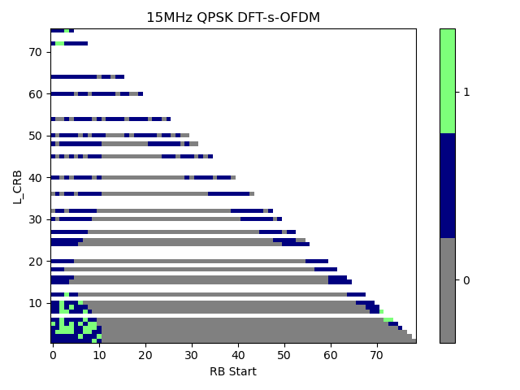

+----------------------------------+----------------------------------+
| 3GPP TS 38.104 V18.10.0          |                                  |
| (2025-06)                        |                                  |
+==================================+==================================+
| Technical Specification          |                                  |
+----------------------------------+----------------------------------+
| 3rd Generation Partnership       |                                  |
| Project;                         |                                  |
|                                  |                                  |
| Technical Specification Group    |                                  |
| Radio Access Network;            |                                  |
|                                  |                                  |
| NR;                              |                                  |
|                                  |                                  |
| Base Station (BS) radio          |                                  |
| transmission and reception       |                                  |
|                                  |                                  |
| (Release 18)                     |                                  |
+----------------------------------+----------------------------------+
|                                  |                                  |
+----------------------------------+----------------------------------+
|                                  | {width="1.7708333333333333in" |
|                                  | height="1.0347222222222223in"}   |
+----------------------------------+----------------------------------+
|                                  |                                  |
+----------------------------------+----------------------------------+
| The present document has been    |                                  |
| developed within the 3rd         |                                  |
| Generation Partnership Project   |                                  |
| (3GPP ^TM^) and may be further   |                                  |
| elaborated for the purposes of   |                                  |
| 3GPP.\                           |                                  |
| The present document has not     |                                  |
| been subject to any approval     |                                  |
| process by the 3GPP              |                                  |
| Organizational Partners and      |                                  |
| shall not be implemented.\       |                                  |
| This Specification is provided   |                                  |
| for future development work      |                                  |
| within 3GPP only. The            |                                  |
| Organizational Partners accept   |                                  |
| no liability for any use of this |                                  |
| Specification.\                  |                                  |
| Specifications and Reports for   |                                  |
| implementation of the 3GPP ^TM^  |                                  |
| system should be obtained via    |                                  |
| the 3GPP Organizational          |                                  |
| Partners\' Publications Offices. |                                  |
+----------------------------------+----------------------------------+

+----------------------------------------------------------------------+
|                                                                      |
+======================================================================+
| > ***3GPP***                                                         |
| >                                                                    |
| > Postal address                                                     |
| >                                                                    |
| > 3GPP support office address                                        |
| >                                                                    |
| > 650 Route des Lucioles - Sophia Antipolis                          |
| >                                                                    |
| > Valbonne - FRANCE                                                  |
| >                                                                    |
| > Tel.: +33 4 92 94 42 00 Fax: +33 4 93 65 47 16                     |
| >                                                                    |
| > Internet                                                           |
| >                                                                    |
| > http://www.3gpp.org                                                |
+----------------------------------------------------------------------+
| ***Copyright Notification***                                         |
|                                                                      |
| No part may be reproduced except as authorized by written            |
| permission.\                                                         |
| The copyright and the foregoing restriction extend to reproduction   |
| in all media.                                                        |
|                                                                      |
| © 2025, 3GPP Organizational Partners (ARIB, ATIS, CCSA, ETSI, TSDSI, |
| TTA, TTC).                                                           |
|                                                                      |
| All rights reserved.                                                 |
|                                                                      |
| UMTS™ is a Trade Mark of ETSI registered for the benefit of its      |
| members                                                              |
|                                                                      |
| 3GPP™ is a Trade Mark of ETSI registered for the benefit of its      |
| Members and of the 3GPP Organizational Partners\                     |
| LTE™ is a Trade Mark of ETSI registered for the benefit of its       |
| Members and of the 3GPP Organizational Partners                      |
|                                                                      |
| GSM® and the GSM logo are registered and owned by the GSM            |
| Association                                                          |
+----------------------------------------------------------------------+

 Contents {#contents .TT}
========

Foreword 14

1 Scope 16

2 References 16

3 Definitions, symbols and abbreviations 17

3.1 Definitions 17

3.2 Symbols 22

3.3 Abbreviations 24

4 General 26

4.1 Relationship with other core specifications 26

4.2 Relationship between minimum requirements and test requirements 26

4.3 Conducted and radiated requirement reference points 26

4.3.1 *BS type 1-C* 26

4.3.2 *BS type 1-H* 27

4.3.3 *BS type 1-O* and *BS type 2-O* 28

4.4 Base station classes 28

4.5 Regional requirements 29

4.6 Applicability of requirements 32

4.7 Requirements for contiguous and *non-contiguous spectrum* 33

4.8 Requirements for BS capable of multi-band operation 33

4.9 OTA co-location with other base stations 34

5 *Operating bands* and channel arrangement 36

5.1 General 36

5.2 *Operating bands* 36

5.3 *BS channel bandwidth* 39

5.3.1 General 39

5.3.2 *Transmission bandwidth configuration* 40

5.3.3 Minimum guardband and *transmission bandwidth configuration* 41

5.3.4 RB alignment 42

5.3.5 *BS channel bandwidth* per *operating band* 42

5.3A *BS channel bandwidth* for CA 47

5.3A.1 *Transmission bandwidth configuration* for CA 47

5.3A.2 Minimum guardband and *transmission bandwidth configuration* for
CA 47

5.4 Channel arrangement 50

5.4.1 Channel spacing 50

5.4.1.1 Channel spacing for adjacent NR carriers 50

5.4.1.2 Channel spacing for CA 50

5.4.2 Channel raster 51

5.4.2.1 NR-ARFCN and channel raster 51

5.4.2.1A NB-IoT carrier frequency numbering 52

5.4.2.2 Channel raster to resource element mapping 52

5.4.2.3 Channel raster entries for each *operating band* 52

5.4.3 Synchronization raster 58

5.4.3.1 Synchronization raster and numbering 58

5.4.3.3 Synchronization raster entries for each operating band 59

6 Conducted transmitter characteristics 64

6.1 General 64

6.2 Base station output power 64

6.2.1 General 64

6.2.2 Minimum requirement for *BS type 1-C* 65

6.2.3 Minimum requirement for *BS type 1-H* 65

6.2.4 Additional requirements (regional) 65

6.3 Output power dynamics 66

6.3.1 General 66

6.3.2 RE power control dynamic range 66

6.3.2.1 General 66

6.3.2.2 Minimum requirement for *BS type 1-C* and *BS type 1-H* 66

6.3.3 Total power dynamic range 66

6.3.3.1 General 66

6.3.3.2 Minimum requirement for *BS type 1-C* and *BS type 1-H* 67

6.3.4 NB-IoT RB power dynamic range for NB-IoT operation in NR in-band
67

6.3.4.1 General 67

6.3.4.2 Minimum Requirement 67

6.4 Transmit ON/OFF power 68

6.4.1 Transmitter OFF power 68

6.4.1.1 General 68

6.4.1.2 Minimum requirement for *BS type 1-C* 68

6.4.1.3 Minimum requirement for *BS type 1-H* 68

6.4.2 *Transmitter transient period* 68

6.4.2.1 General 68

6.4.2.2 Minimum requirement for *BS type 1-C* and *BS type 1-H* 1-H 69

6.4.2.3 Void 69

6.5 Transmitted signal quality 69

6.5.1 Frequency error 69

6.5.1.1 General 69

6.5.1.2 Minimum requirement for *BS type 1-C* and *BS type 1-H* 70

6.5.2 Modulation quality 70

6.5.2.1 General 70

6.5.2.2 Minimum Requirement for *BS type 1-C* and *BS type 1-H* 70

6.5.2.3 EVM frame structure for measurement 70

6.5.3 Time alignment error 71

6.5.3.1 General 71

6.5.3.2 Minimum requirement for *BS type 1-C* and *BS type* 1-H 71

6.6 Unwanted emissions 71

6.6.1 General 71

6.6.2 Occupied bandwidth 72

6.6.2.1 General 72

6.6.2.2 Minimum requirement for *BS type 1-C* and *BS type 1-H* 72

6.6.3 Adjacent Channel Leakage Power Ratio 73

6.6.3.1 General 73

6.6.3.2 Limits and *Basic limits* 73

6.6.3.3 Minimum requirement for *BS type 1-C* 76

6.6.3.4 Minimum requirement for *BS type 1-H* 76

6.6.4 Operating band unwanted emissions 77

6.6.4.1 General 77

6.6.4.2 *Basic limits* 78

6.6.4.2.1 *Basic limits* for Wide Area BS (Category A) 78

6.6.4.2.2 Basic limits for Wide Area BS (Category B) 80

6.6.4.2.3 *Basic limits* for Medium Range BS (Category A and B) 84

6.6.4.2.4 *Basic limits* for Local Area BS (Category A and B) 87

**6.6.4.2.4A** **Basic limits for Local Area and Medium Range BS for
bands n46, n96 and n102 (Category A and B)** 89

6.6.4.2.5 *Basic limits* for additional requirements 92

6.6.4.3 Minimum requirements for *BS type 1-C* 94

6.6.4.4 Minimum requirements for *BS type 1-H* 94

6.6.5 Transmitter spurious emissions 95

6.6.5.1 General 95

6.6.5.2 *Basic limits* 95

6.6.5.2.1 General transmitter spurious emissions requirements 95

6.6.5.2.2 Protection of the BS receiver of own or different BS 96

6.6.5.2.3 Additional spurious emissions requirements 96

6.6.5.2.4 Co-location with other base stations 108

6.6.5.3 Minimum requirements for *BS type 1-C* 114

6.6.5.4 Minimum requirements for *BS type 1-H* 114

6.7 Transmitter intermodulation 114

6.7.1 General 114

6.7.2 Minimum requirements for *BS type 1-C* 115

6.7.2.1 Co-location minimum requirements 115

6.7.2.2 Additional requirements 115

6.7.3 Minimum requirements for *BS type 1-H* 116

6.7.3.1 Co-location minimum requirements 116

6.7.3.2 Intra-system minimum requirements 117

6.7.3.3 Additional requirements 117

7 Conducted receiver characteristics 119

7.1 General 119

7.2 Reference sensitivity level 119

7.2.1 General 119

7.2.2 Minimum requirements for *BS type 1-C* and *BS type 1-H* 119

7.3 Dynamic range 125

7.3.1 General 125

7.3.2 Minimum requirement for *BS type 1-C* and *BS type 1-H* 125

7.4 In-band selectivity and blocking 137

7.4.1 Adjacent Channel Selectivity (ACS) 137

7.4.1.1 General 137

7.4.1.2 Minimum requirement for *BS type 1-C* and *BS type 1-H* 137

7.4.1.3 Void 140

7.4.1.4 Void 140

7.4.2 In-band blocking 140

7.4.2.1 General 140

7.4.2.2 Minimum requirement for *BS type 1-C* and *BS type 1-H* 140

7.4.2.3 Void 144

7.4.2.4 Void 144

7.4.2.5 Additional narrowband blocking requirement for Band n100 144

7.5 Out-of-band blocking 144

7.5.1 General 144

7.5.2 Minimum requirement for *BS type 1-C* and *BS type 1-H* 145

7.5.3 Co-location minimum requirements for *BS type 1-C* and *BS type
1-H* 146

7.5.4 Void 147

7.5.5 Additional out-of-band blocking requirements for the use of RMR
bands 147

7.6 Receiver spurious emissions 147

7.6.1 General 147

7.6.2 *Basic limits* 147

7.6.3 Minimum requirement for *BS type 1-C* 148

7.6.4 Minimum requirement for *BS type 1-H* 148

7.7 Receiver intermodulation 149

7.7.1 General 149

7.7.2 Minimum requirement for *BS type 1-C* and *BS type 1-H* 149

7.7.3 Additional narrowband intermodulation requirement for Band n100
155

7.8 In-channel selectivity 155

7.8.1 General 155

7.8.2 Minimum requirement for *BS type 1-C* and *BS type 1-H* 155

8 Conducted performance requirements 168

8.1 General 168

8.1.1 Scope and definitions 168

8.1.2 Void 168

8.2 Performance requirements for PUSCH 168

8.2.1 Requirements for PUSCH with transform precoding disabled 168

8.2.1.1 General 168

8.2.1.2 Minimum requirements 169

8.2.2 Requirements for PUSCH with transform precoding enabled 178

8.2.2.1 General 178

8.2.2.2 Minimum requirements 179

8.2.3 Requirements for UCI multiplexed on PUSCH 180

8.2.3.1 General 180

8.2.3.2 Minimum requirements 181

8.2.4 Requirements for PUSCH for high speed train 182

8.2.4.1 General 182

8.2.4.2 Minimum requirements 183

8.2.5 Requirements for UL timing adjustment 185

8.2.5.1 Minimum requirements for high speed train 186

8.2.5.2 Minimum requirements for normal mode 187

8.2.6 Requirements for PUSCH 0.001% BLER 188

8.2.6.1 General 188

8.2.6.2 Minimum requirements 188

8.2.7 Requirements for PUSCH repetition Type A 189

8.2.7.1 General 189

8.2.7.2 Minimum requirements 190

8.2.8 Requirements for PUSCH mapping Type B with non-slot transmission
192

8.2.8.1 General 192

8.2.8.2 Minimum requirements 192

8.2.9 Requirements of PUSCH for 2-step RA type 193

8.2.9.1 General 193

8.2.9.2 Minimum requirements 194

8.2.10 Requirements for interlaced PUSCH 194

8.2.10.1 General 194

8.2.10.2 Minimum requirements 195

8.2.11 Performance requirements for CG-UCI multiplexed on interlaced
PUSCH 196

8.2.11.1 General 196

8.2.11.2 Minimum requirements 197

8.2.12 Requirements for TB processing over multi-slot PUSCH (TBoMS) 198

8.2.12.1 General 198

8.2.12.2 Minimum requirements 198

8.2.13 Requirements for PUSCH with DM-RS bundling 199

8.2.13.1 General 199

8.2.13.2 Minimum requirements 200

8.3 Performance requirements for PUCCH 205

8.3.1 DTX to ACK probability 205

8.3.1.1 General 205

8.3.1.2 Minimum requirement 205

8.3.2 Performance requirements for PUCCH format 0 206

8.3.2.1 General 206

8.3.2.2 Minimum requirements 206

8.3.3 Performance requirements for PUCCH format 1 207

8.3.3.1 NACK to ACK requirements 207

8.3.3.1.1 General 207

8.3.3.1.2 Minimum requirements 207

8.3.3.2 ACK missed detection requirements 208

8.3.3.2.1 General 208

8.3.3.2.2 Minimum requirements 208

8.3.4 Performance requirements for PUCCH format 2 209

8.3.4.1 ACK missed detection requirements 209

8.3.4.1.1 General 209

8.3.4.1.2 Minimum requirements 209

8.3.4.2 UCI BLER performance requirements 210

8.3.4.2.1 General 210

8.3.4.2.2 Minimum requirements 210

8.3.5 Performance requirements for PUCCH format 3 211

8.3.5.1 General 211

8.3.5.2 Minimum requirements 212

8.3.6 Performance requirements for PUCCH format 4 212

8.3.6.1 General 212

8.3.6.2 Minimum requirement 213

8.3.7 Performance requirements for multi-slot PUCCH 214

8.3.7.1 General 214

8.3.7.2 Performance requirements for multi-slot PUCCH format 1 214

8.3.7.2.1 NACK to ACK requirements 214

8.3.7.2.1.1 General 214

8.3.7.2.1.2 Minimum requirements 215

8.3.7.2.2 ACK missed detection requirements 215

8.3.8 Performance requirements for interlaced PUCCH format 0 215

8.3.8.1 General 215

8.3.8.2 Minimum requirements 216

8.3.9 Performance requirements for interlaced PUCCH format 1 216

8.3.9.1 NACK to ACK requirements 216

8.3.9.1.1 General 216

8.3.9.1.2 Minimum requirements 217

8.3.9.2 ACK missed detection requirements 217

8.3.9.2.1 General 217

8.3.9.2.2 Minimum requirements 217

8.3.10 Performance requirements for interlaced PUCCH format 2 218

8.3.10.1 General 218

8.3.10.2 Minimum requirements 218

8.3.11 Performance requirements for interlaced PUCCH format 3 219

8.3.11.1 General 219

8.3.11.2 Minimum requirements 219

8.3.12 Performance requirements for PUCCH format 1 with DM-RS bundling
220

8.3.12.1 NACK to ACK requirements 220

8.3.12.1.1 General 220

8.3.12.1.2 Minimum requirements 220

8.3.12.2 ACK missed detection requirements 221

8.3.12.2.1 General 221

8.3.12.2.2 Minimum requirements 221

8.3.13 Performance requirements for PUCCH format 3 with DMRS bundling
221

8.3.13.1 General 221

8.3.13.2 Minimum requirements 222

8.3.14 Performance requirements for sub-slot repetition PUCCH format 0
223

8.3.14.1 General 223

8.3.14.2 Minimum requirements 223

8.4 Performance requirements for PRACH 224

8.4.1 PRACH False alarm probability 224

8.4.1.1 General 224

8.4.1.2 Minimum requirement 224

8.4.2 PRACH detection requirements 224

8.4.2.1 General 224

8.4.2.2 Minimum requirements for Normal Mode 224

8.4.2.3 Minimum requirements for high speed train 225

8.4.2.4 Minimum requirements for PRACH with L~RA~=1151 and L~RA~=571 226

9 Radiated transmitter characteristics 228

9.1 General 228

9.2 Radiated transmit power 228

9.2.1 General 228

9.2.2 Minimum requirement for *BS type 1-H* and *BS type 1-O* 229

9.2.3 Minimum requirement for *BS type 2-O* 229

9.3 OTA base station output power 229

9.3.1 General 229

9.3.2 Minimum requirement for *BS type 1-O* 230

9.3.3 Minimum requirement for *BS type 2-O* 230

9.3.4 Additional requirements (regional) 230

9.4 OTA output power dynamics 230

9.4.1 General 230

9.4.2 OTA RE power control dynamic range 230

9.4.2.1 General 230

9.4.2.2 Minimum requirement for *BS type 1-O* 230

9.4.3 OTA total power dynamic range 230

9.4.3.1 General 230

9.4.3.2 Minimum requirement for *BS type 1-O* 231

9.4.3.3 Minimum requirement for *BS type 2-O* 231

9.5 OTA transmit ON/OFF power 231

9.5.1 General 231

9.5.2 OTA transmitter OFF power 231

9.5.2.1 General 231

9.5.2.2 Minimum requirement for *BS type 1-O* 231

9.5.2.3 Minimum requirement for *BS type 2-O* 232

9.5.3 OTA transient period 232

9.5.3.1 General 232

9.5.3.2 Minimum requirement for *BS type 1-O* 232

9.5.3.3 Minimum requirement for *BS type 2-O* 232

9.6 OTA transmitted signal quality 232

9.6.1 OTA frequency error 232

9.6.1.1 General 232

9.6.1.2 Minimum requirement for *BS type 1-O* 232

9.6.1.3 Minimum requirement for *BS type 2-O* 233

9.6.2 OTA modulation quality 233

9.6.2.1 General 233

9.6.2.2 Minimum Requirement for *BS type 1-O* 233

9.6.2.3 Minimum Requirement for *BS type 2-O* 233

9.6.2.3.1 EVM frame structure for measurement 233

9.6.3 OTA time alignment error 233

9.6.3.1 General 233

9.6.3.2 Minimum requirement for *BS type 1-O* 234

9.6.3.3 Minimum requirement for *BS type 2-O* 234

9.7 OTA unwanted emissions 234

9.7.1 General 234

9.7.2 OTA occupied bandwidth 235

9.7.2.1 General 235

9.7.2.2 Minimum requirement for *BS type 1-O* and *BS type* 2-O 235

9.7.3 OTA Adjacent Channel Leakage Power Ratio (ACLR) 236

9.7.3.1 General 236

9.7.3.2 Minimum requirement for *BS type 1-O* 236

9.7.3.3 Minimum requirement for *BS type 2-O* 236

9.7.4 OTA operating band unwanted emissions 238

9.7.4.1 General 238

9.7.4.2 Minimum requirement for *BS type 1-O* 238

9.7.4.2.1 Additional requirements 239

9.7.4.2.1.1 Protection of DTT 239

9.7.4.2.1.2 Limits in FCC Title 47 239

9.7.4.3 Minimum requirement for *BS type 2-O* 239

9.7.4.3.1 General 239

9.7.4.3.2 OTA operating band unwanted emission limits (Category A) 240

9.7.4.3.3 OTA operating band unwanted emission limits (Category B) 241

9.7.4.3.4 Additional OTA operating band unwanted emission requirements
242

9.7.5 OTA transmitter spurious emissions 242

9.7.5.1 General 242

9.7.5.2 Minimum requirement for *BS type 1-O* 242

9.7.5.2.1 General 242

9.7.5.2.2 General OTA transmitter spurious emissions requirements 243

9.7.5.2.3 Protection of the BS receiver of own or different BS 243

9.7.5.2.4 Additional spurious emissions requirements 243

9.7.5.2.5 Co-location with other base stations 243

9.7.5.3 Minimum requirement for *BS type 2-O* 243

9.7.5.3.1 General 243

9.7.5.3.2 General OTA transmitter spurious emissions requirements 244

9.7.5.3.3 Additional OTA transmitter spurious emissions requirements 245

9.8 OTA transmitter intermodulation 245

9.8.1 General 245

9.8.2 Minimum requirement for *BS type 1-O* 245

9.8.3 Additional requirements (regional) 246

10 Radiated receiver characteristics 248

10.1 General 248

10.2 OTA sensitivity 249

10.2.1 *BS type 1-H* and *BS type 1-O* 249

10.2.1.1 General 249

10.2.1.2 Minimum requirement 249

10.2.2 *BS type 2-O* 249

10.3 OTA reference sensitivity level 250

10.3.1 General 250

10.3.2 Minimum requirement for *BS type 1-O* 250

10.3.3 Minimum requirement for *BS type 2-O* 252

10.4 OTA dynamic range 253

10.4.1 General 253

10.4.2 Minimum requirement for *BS type 1-O* 253

10.5 OTA in-band selectivity and blocking 266

10.5.1 OTA adjacent channel selectivity 266

10.5.1.1 General 266

10.5.1.2 Minimum requirement for *BS type 1-O* 266

10.5.1.3 Minimum requirement for *BS type 2-O* 267

10.5.2 OTA in-band blocking 268

10.5.2.1 General 268

10.5.2.2 Minimum requirement for *BS type 1-O* 268

10.5.2.3 Minimum requirement for *BS type 2-O* 271

10.6 OTA out-of-band blocking 272

10.6.1 General 272

10.6.2 Minimum requirement for *BS type 1-O* 272

10.6.2.1 General minimum requirement 272

10.6.2.2 Co-location minimum requirement 273

10.6.3 Minimum requirement for *BS type 2-O* 273

10.6.3.1 General minimum requirement 273

10.7 OTA receiver spurious emissions 274

10.7.1 General 274

10.7.2 Minimum requirement for *BS type 1-O* 274

10.7.3 Minimum requirement for *BS type 2-O* 275

10.8 OTA receiver intermodulation 276

10.8.1 General 276

10.8.2 Minimum requirement for *BS type 1-O* 276

10.8.3 Minimum requirement for *BS type 2-O* 281

10.9 OTA in-channel selectivity 282

10.9.1 General 282

10.9.2 Minimum requirement for *BS type 1-O* 282

10.9.3 Minimum requirement for *BS type 2-O* 286

11 Radiated performance requirements 288

11.1 General 288

11.1.1 Scope and definitions 288

11.1.2 OTA demodulation branches 288

11.1.3 Void 289

11.2 Performance requirements for PUSCH 289

11.2.1 Requirements for *BS type 1-O* 289

11.2.1.1 Requirements for PUSCH with transform precoding disabled 289

11.2.1.2 Requirements for PUSCH with transform precoding enabled 289

11.2.1.3 Requirements for UCI multiplexed on PUSCH 289

11.2.1.4 Requirements for PUSCH for high speed train 289

11.2.1.5 Requirements for UL timing adjustment 289

11.2.1.6 Requirements for PUSCH 0.001% BLER 289

11.2.1.7 Requirements for PUSCH repetition Type A 289

11.2.1.8 Requirements for PUSCH mapping Type B with non-slot
transmission 289

11.2.1.9 Requirements for PUSCH for 2-step RA type 289

11.2.1.10 Requirements for interlaced PUSCH 289

11.2.1.11 Requirements for CG-UCI multiplexed on interlaced PUSCH 289

11.2.1.12 Requirements for TB processing over multi-slot PUSCH (TBoMS)
289

11.2.1.13 Requirements for PUSCH with DM-RS bundling 290

11.2.2 Requirements for *BS type 2-O* 290

11.2.2.1 Requirements for PUSCH with transform precoding disabled 290

11.2.2.1.1 General 290

11.2.2.1.2 Minimum requirements 290

11.2.2.2 Requirements for PUSCH with transform precoding enabled 295

11.2.2.2.1 General 295

11.2.2.2.2 Minimum requirements 295

11.2.2.3 Requirements for UCI multiplexed on PUSCH 296

11.2.2.3.1 General 296

11.2.2.3.2 Minimum requirements 297

11.2.2.4 Requirements for PUSCH for 2-step RA type 299

11.2.2.4.1 General 299

11.2.2.4.2 Minimum requirements 300

11.2.2.5 Requirements for PUSCH repetition Type A 300

11.2.2.5.1 General 300

11.2.2.5.2 Minimum requirements 301

11.2.2.6 Requirements for PUSCH mapping Type B with non-slot
transmission 302

11.2.2.6.1 General 302

11.2.2.6.2 Minimum requirements 302

11.2.2.7 Requirements for PUSCH for high speed train 303

11.2.2.7.1 General 303

11.2.2.7.2 Minimum requirements 303

11.2.2.8 Requirements for UL timing adjustment 304

11.2.2.8.1 General 304

11.2.2.8.2 Minimum requirements for high speed train 305

11.2.2.9 Requirements for TB processing over multi-slot PUSCH (TBoMS)
306

11.2.2.9.1 General 306

11.2.2.9.2 Minimum requirements 306

11.2.2.10 Requirements for PUSCH with DM-RS bundling 307

11.2.2.10.1 General 307

11.2.2.10.2 Minimum requirements 307

11.3 Performance requirements for PUCCH 308

11.3.1 Requirements for *BS type 1-O* 308

11.3.1.1 DTX to ACK probability 308

11.3.1.2 Performance requirements for PUCCH format 0 308

11.3.1.3 Performance requirements for PUCCH format 1 308

11.3.1.4 Performance requirements for PUCCH format 2 308

11.3.1.5 Performance requirements for PUCCH format 3 308

11.3.1.6 Performance requirements for PUCCH format 4 308

11.3.1.7 Performance requirements for multi-slot PUCCH 308

11.3.1.8 Performance requirements for PUCCH format 1 with DMRS bundling
308

11.3.1.9 Performance requirements for PUCCH format 3 with DMRS bundling
309

11.3.1.10 Performance requirements for sub-slot repetition PUCCH format
0 309

11.3.2 Requirements for *BS type 2-O* 309

11.3.2.1 DTX to ACK probability 309

11.3.2.2 Performance requirements for PUCCH format 0. 309

11.3.2.2.1 General 309

11.3.2.2.2 Minimum requirements 309

11.3.2.3 Performance requirements for PUCCH format 1. 310

11.3.2.3.1 NACK to ACK requirements 310

11.3.2.3.1.1 General 310

11.3.2.3.1.2 Minimum requirements 311

11.3.2.3.2 ACK missed detection requirements 312

11.3.2.3.2.1 General 312

11.3.2.3.2.2 Minimum requirements 312

11.3.2.4 Performance requirements for PUCCH format 2 313

11.3.2.4.1 ACK missed detection requirements 313

11.3.2.4.1.1 General 313

11.3.2.4.1.2 Minimum requirements 313

11.3.2.4.2 UCI BLER performance requirements 314

11.3.2.4.2.1 Genera 314

11.3.2.4.2.2 Minimum requirements 314

11.3.2.5 Performance requirements for PUCCH format 3 315

11.3.2.5.1 General 315

11.3.2.5.2 Minimum requirements 315

11.3.2.6 Performance requirements for PUCCH format 4 316

11.3.2.6.1 General 316

11.3.2.6.2 Minimum requirements 317

11.3.2.7 Performance requirements for PUCCH format 1 with DMRS bundling
318

11.3.2.7.1 NACK to ACK requirements 318

11.3.2.7.1.1 General 318

11.3.2.7.1.2 Minimum requirements 319

11.3.2.7.2 ACK missed detection requirements 319

11.3.2.7.2.1 General 319

11.3.2.7.2.2 Minimum requirements 320

11.3.2.8 Performance requirements for PUCCH format 3 with DMRS bunding
320

11.3.2.8.1 General 320

11.3.2.8.2 Minimum requirements 321

11.4 Performance requirements for PRACH 321

11.4.1 Requirements for *BS type 1-O* 321

11.4.1.1 PRACH False alarm probability 321

11.4.1.2 PRACH detection requirements 321

11.4.2 Requirements for *BS type 2-O* 321

11.4.2.1 PRACH False alarm probability 321

11.4.2.1.1 General 321

11.4.2.1.2 Minimum requirement 321

11.4.2.2 PRACH detection requirements 322

11.4.2.2.1 General 322

11.4.2.2.2 Minimum requirements for Normal mode 322

11.4.2.2.3 Minimum requirements for high speed train 323

11.4.2.2.4 Minimum requirements for PRACH with L~RA~=1151 and L~RA~=571
323

11.4.2.2.5 Minimum requirements for multiple PRACH transmission 324

Annex A (normative): Reference measurement channels 325

A.1 Fixed Reference Channels for reference sensitivity level, ACS,
in-band blocking, out-of-band blocking, receiver intermodulation and
in-channel selectivity (QPSK, R=1/3) 325

A.2 Fixed Reference Channels for dynamic range (16QAM, R=2/3) 328

A.3 Fixed Reference Channels for performance requirements (QPSK,
R=193/1024) 330

A.3A Fixed Reference Channels for performance requirements (QPSK,
R=99/1024) 337

A.3B Fixed Reference Channels for performance requirements (QPSK,
R=308/1024) 339

A.4 Fixed Reference Channels for performance requirements (16QAM,
R=658/1024) 343

A.5 Fixed Reference Channels for performance requirements (64QAM,
R=567/1024) 348

A.6 PRACH Test preambles 351

A.7 Fixed Reference Channels for performance requirements (16QAM,
R=434/1024) 352

A.8 Fixed Reference Channels for performance requirements (QPSK,
R=157/1024) 354

A.9 Fixed Reference Channels for performance requirements (256QAM,
R=682.5/1024) 355

A.10 Fixed Reference Channels for performance requirements (64QAM,
R=517/1024) 357

A.11 Fixed Reference Channels for performance requirements (64QAM,
R=438/1024) 361

A.12 Void 362

Annex B (normative): Error Vector Magnitude (FR1) 364

B.1 Reference point for measurement 364

B.2 Basic unit of measurement 364

B.3 Modified signal under test 365

B.4 Estimation of frequency offset 365

B.5 Estimation of time offset 365

B.5.1 General 365

B.5.2 Window length 366

B.6 Estimation of TX chain amplitude and frequency response parameters
367

B.7 Averaged EVM 369

Annex C (normative): Error Vector Magnitude (FR2) 371

C.1 Reference point for measurement 371

C.2 Basic unit of measurement 371

C.3 Modified signal under test 372

C.4 Estimation of frequency offset 372

C.5 Estimation of time offset 372

C.5.1 General 372

C.5.2 Window length 373

C.6 Estimation of TX chain amplitude and frequency response parameters
374

C.7 Averaged EVM 376

Annex D (normative): Characteristics of the interfering signals 378

Annex E: Void 379

Annex F (normative): Relationship between EIRP based regulatory
requirements and 3GPP requirements 380

F.1 General 380

F.2 Relationship between EIRP based regulatory requirements and
conducted requirements 380

F.3 Relationship between EIRP based regulatory requirements and OTA
requirements 381

Annex G (Normative): Propagation conditions 382

G.1 Static propagation condition 382

G.2 Multi-path fading propagation conditions 382

G.2.1 Delay profiles 382

G.2.1.1 Delay profiles for FR1 383

G.2.1.2 Delay profiles for FR2 384

G.2.2 Combinations of channel model parameters 386

G.2.3 MIMO Channel Correlation Matrices 387

G.2.3.1 MIMO Correlation Matrices using Uniform Linear Array (ULA) 387

G.2.3.1.1 Definition of MIMO Correlation Matrices 387

G.2.3.1.2 MIMO Correlation Matrices at High, Medium and Low Level 391

G.2.3.2 Multi-Antenna channel models using cross polarized antennas 393

G.2.3.2.1 Definition of MIMO Correlation Matrices using cross polarized
antennas 394

G.2.3.2.2 Spatial Correlation Matrices at UE and gNB sides 394

G.2.3.2.2.1 Spatial Correlation Matrices at UE side 394

G.2.3.2.2.2 Spatial Correlation Matrices at gNB side 395

G.2.3.2.3 MIMO Correlation Matrices using cross polarized antennas 395

G.3 High speed train condition 395

G.4 Moving propagation conditions 400

Annex H (informative): Change history 402

 Foreword
========

This Technical Specification has been produced by the 3rd Generation
Partnership Project (3GPP).

The contents of the present document are subject to continuing work
within the TSG and may change following formal TSG approval. Should the
TSG modify the contents of the present document, it will be re-released
by the TSG with an identifying change of release date and an increase in
version number as follows:

Version x.y.z

where:

x the first digit:

1 presented to TSG for information;

2 presented to TSG for approval;

3 or greater indicates TSG approved document under change control.

y the second digit is incremented for all changes of substance, i.e.
technical enhancements, corrections, updates, etc.

z the third digit is incremented when editorial only changes have been
incorporated in the document.

In the present document, modal verbs have the following meanings:

**shall** indicates a mandatory requirement to do something

**shall not** indicates an interdiction (prohibition) to do something

The constructions \"shall\" and \"shall not\" are confined to the
context of normative provisions, and do not appear in Technical Reports.

The constructions \"must\" and \"must not\" are not used as substitutes
for \"shall\" and \"shall not\". Their use is avoided insofar as
possible, and they are not used in a normative context except in a
direct citation from an external, referenced, non-3GPP document, or so
as to maintain continuity of style when extending or modifying the
provisions of such a referenced document.

**should** indicates a recommendation to do something

**should not** indicates a recommendation not to do something

**may** indicates permission to do something

**need not** indicates permission not to do something

The construction \"may not\" is ambiguous and is not used in normative
elements. The unambiguous constructions \"might not\" or \"shall not\"
are used instead, depending upon the meaning intended.

**can** indicates that something is possible

**cannot** indicates that something is impossible

The constructions \"can\" and \"cannot\" are not substitutes for \"may\"
and \"need not\".

**will** indicates that something is certain or expected to happen as a
result of action taken by an agency the behaviour of which is outside
the scope of the present document

**will not** indicates that something is certain or expected not to
happen as a result of action taken by an agency the behaviour of which
is outside the scope of the present document

**might** indicates a likelihood that something will happen as a result
of action taken by some agency the behaviour of which is outside the
scope of the present document

**might not** indicates a likelihood that something will not happen as a
result of action taken by some agency the behaviour of which is outside
the scope of the present document

In addition:

**is** (or any other verb in the indicative mood) indicates a statement
of fact

**is not** (or any other negative verb in the indicative mood) indicates
a statement of fact

The constructions \"is\" and \"is not\" do not indicate requirements.

 1 Scope
=======

The present document establishes the minimum RF characteristics and
minimum performance requirements of NR and NB-IoT operation in NR
in-band Base Station (BS).

2 References
============

The following documents contain provisions which, through reference in
this text, constitute provisions of the present document.

\- References are either specific (identified by date of publication,
edition number, version number, etc.) or non‑specific.

\- For a specific reference, subsequent revisions do not apply.

\- For a non-specific reference, the latest version applies. In the case
of a reference to a 3GPP document (including a GSM document), a
non-specific reference implicitly refers to the latest version of that
document *in the same Release as the present document*.

\[1\] 3GPP TR 21.905: \"Vocabulary for 3GPP Specifications\".

\[2\] ITU-R Recommendation SM.329: \"Unwanted emissions in the spurious
domain\".

\[3\] Recommendation ITU-R SM.328: \"Spectra and bandwidth of
emissions\".

\[4\] 3GPP TR 25.942: \"RF system scenarios\".

\[5\] 3GPP TS 38.141-1: \"NR; Base Station (BS) conformance testing;
Part 1: Conducted conformance testing\".

\[6\] 3GPP TS 38.141-2: \"NR; Base Station (BS) conformance testing;
Part 2: Radiated conformance testing\".

\[7\] Recommendation ITU-R M.1545: \"Measurement uncertainty as it
applies to test limits for the terrestrial component of International
Mobile Telecommunications-2000\".

\[8\] \"Title 47 of the Code of Federal Regulations (CFR)\", Federal
Communications Commission.

\[9\] 3GPP TS 38.211: \"NR; Physical channels and modulation\".

\[10\] 3GPP TS 38.213: \"NR; Physical layer procedures for control\".

\[11\] 3GPP TS 38.331: \"NR; Radio Resource Control (RRC); Protocol
specification\".

\[12\] ECC/DEC/(17)06: \"The harmonised use of the frequency bands
1427-1452 MHz and 1492-1518 MHz for Mobile/Fixed Communications Networks
Supplemental Downlink (MFCN SDL)\"

\[13\] 3GPP TS 36.104: \"Evolved Universal Terrestrial Radio Access
(E-UTRA); Base Station (BS) radio transmission and reception\".

\[14\] 3GPP TS 37.105: \"Active Antenna System (AAS) Base Station (BS)
transmission and reception\".

\[15\] 3GPP TS 38.212: \"NR; Multiplexing and channel coding\".

\[16\] 3GPP TR 38.901: \"Study on channel model for frequencies from 0.5
to 100 GHz\"

\[17\] 3GPP TS 38.101-1: \"NR; User Equipment (UE) radio transmission
and reception; Part 1: Range 1 Standalone\".

\[18\] 3GPP TS 38.101-2: \"NR; User Equipment (UE) radio transmission
and reception; Part 2: Range 2 Standalone\"

\[19\] ERC Recommendation 74-01, \"Unwanted emissions in the spurious
domain\".

\[20\] 3GPP TS 37.213: \"Physical layer procedures for shared spectrum
channel access\".

\[21\] ECC Decision(20)02: "Harmonised use of the paired frequency bands
874.4-880.0 MHz and 919.4-925.0 MHz and of the unpaired frequency band
1900-1910 MHz for Railway Mobile Radio (RMR)"

\[22\] 3GPP TR 38.852: Introduction of 1900MHz NR band for Europe for
Rail Mobile Radio (RMR)

\[23\] 3GPP TR 38.853: Introduction of 900MHz NR band for Europe for
Rail Mobile Radio (RMR)

\[24\] FCC Report And Order And Further Notice Of Proposed Rulemaking
FCC 20-51, April 2020.

\[25\] FCC Order DA 20-48, April 2020

\[26\] Commission Implementing Decision (EU) 2020/590 of 24 April 2020
amending Decision (EU) 2019/784 as regards an update of relevant
technical conditions applicable to the 24,25-27,5 GHz frequency
band** **

3 Definitions, symbols and abbreviations
========================================

3.1 Definitions
---------------

For the purposes of the present document, the terms and definitions
given in 3GPP TR 21.905 \[1\] and the following apply. A term defined in
the present document takes precedence over the definition of the same
term, if any, in 3GPP TR 21.905 \[1\].

**Aggregated BS Channel Bandwidth:** The RF bandwidth in which a Base
Station transmits and receives multiple contiguously aggregated
carriers. The *aggregated BS channel bandwidth* is measured in MHz.

**antenna connector:** connector at the conducted interface of the *BS
type 1-C*

**active transmitter unit:** transmitter unit which is ON, and has the
ability to send modulated data streams that are parallel and distinct to
those sent from other transmitter units to a *BS type 1-C* *antenna
connector*, or to one or more *BS type 1-H* *TAB connectors* at the
*transceiver array boundary*

**Base Station RF Bandwidth**: RF bandwidth in which a base station
transmits and/or receives single or multiple carrier(s) within a
supported *operating band*

NOTE: In single carrier operation, the *Base Station RF Bandwidth* is
equal to the *BS channel bandwidth*.

**Base Station RF Bandwidth edge:** frequency of one of the edges of the
*Base Station RF Bandwidth*.

**basic limit:** emissions limit relating to the power supplied by a
single transmitter to a single antenna transmission line in ITU-R SM.329
\[2\] used for the formulation of unwanted emission requirements for FR1

**beam:** beam (of the antenna) is the main lobe of the radiation
pattern of an *antenna array*

NOTE: For certain BS *antenna array*, there may be more than one beam.

**beam centre direction:** direction equal to the geometric centre of
the half-power contour of the beam

**beam direction pair:** data set consisting of the *beam centre
direction* and the related *beam peak direction*

**beam peak direction:** direction where the maximum EIRP is found

**beamwidth:** beam which has a half-power contour that is essentially
elliptical, the half-power beamwidths in the two pattern cuts that
respectively contain the major and minor axis of the ellipse

**BS channel bandwidth**: RF bandwidth supporting a single NR RF carrier
with the *transmission bandwidth* configured in the uplink or downlink

NOTE 1: The *BS channel bandwidth* is measured in MHz and is used as a
reference for transmitter and receiver RF requirements.

NOTE 2: It is possible for the BS to transmit to and/or receive from one
or more UE bandwidth parts that are smaller than or equal to the *BS
transmission bandwidth configuration*, in any part of the *BS
transmission bandwidth configuration*.

**BS transmission bandwidth configuration**: set of resource blocks
located within the *BS channel bandwidth* which may be used for
transmitting or receiving by the BS

**BS type 1-C:** NR base station operating at FR1 with requirements set
consisting only of conducted requirements defined at individual *antenna
connectors*

**BS type 1-H:** NR base station operating at FR1 with a *requirement
set* consisting of conducted requirements defined at individual *TAB
connectors* and OTA requirements defined at RIB

**BS type 1-O:** NR base station operating at FR1 with a *requirement
set* consisting only of OTA requirements defined at the RIB

**BS type 2-O:** NR base station operating at FR2 with a *requirement
set* consisting only of OTA requirements defined at the RIB

**Channel edge:** lowest or highest frequency of the NR carrier,
separated by the *BS channel bandwidth*.

**Carrier aggregation: aggregation of two or more component carriers in
order to support wider *transmission bandwidths***

**Carrier aggregation configuration:** a set of one or more *operating
bands* across which the BS aggregates carriers with a specific set of
technical requirements

**co-location reference antenna**: a passive antenna used as reference
for base station to base station co-location requirements

**Contiguous carriers:** set of two or more carriers configured in a
spectrum block where there are no RF requirements based on co-existence
for un-coordinated operation within the spectrum block.

**Contiguous spectrum:** spectrum consisting of a contiguous block of
spectrum with no *sub-block gap(s)*.

**directional requirement: requirement which is applied in a specific
direction within the *OTA coverage range* for the Tx and when the AoA of
the incident wave of a received signal is within the *OTA REFSENS RoAoA*
or the *minSENS RoAoA* as appropriate for the receiver**

**Enhanced channel raster: channel raster with a 10 kHz granularity in
bands with a 100 kHz channel raster.**

**equivalent isotropic radiated power:** equivalent power radiated from
an isotropic directivity device producing the same field intensity at a
point of observation as the field intensity radiated in the direction of
the same point of observation by the discussed device

NOTE: Isotropic directivity is equal in all directions (i.e. 0 dBi).

**equivalent isotropic sensitivity:** sensitivity for an isotropic
directivity device equivalent to the sensitivity of the discussed device
exposed to an incoming wave from a defined AoA

NOTE 1: The sensitivity is the minimum received power level at which
specific requirement is met.

NOTE 2: Isotropic directivity is equal in all directions (i.e. 0 dBi).

**fractional bandwidth: *fractional bandwidth* FBW is defined as**
$\text{FBW} = 200 \bullet \frac{F_{\text{FBWhigh}} - F_{\text{FBWlow}}}{F_{\text{FBWhigh}} + F_{\text{FBWlow}}}\%$

**Highest Carrier:** The carrier with the highest carrier frequency
transmitted/received in a specified frequency band.

**Inter-band carrier aggregation: *carrier aggregation* of component
carriers in different *operating bands*.**

NOTE: Carriers aggregated in each band can be contiguous or
non-contiguous.

**Inter-band gap**: The frequency gap between two supported consecutive
*operating bands*.

**Intra-band contiguous carrier aggregation:** *contiguous carriers*
aggregated in the same *operating band*.

**Intra-band non-contiguous carrier aggregation:** non-contiguous
carriers aggregated in the same *operating band*.

**Inter RF Bandwidth gap: frequency gap between two consecutive *Base
Station RF Bandwidths* that are placed within two supported *operating
bands***

**Lowest Carrier:** The carrier with the lowest carrier frequency
transmitted/received in a specified frequency band.

**Lower sub-block edge:** frequency at the lower edge of one
*sub-block*.

NOTE: It is used as a frequency reference point for both transmitter and
receiver requirements.

**maximum carrier output power:** mean power level measured per carrier
at the indicated interface, during the *transmitter ON period* in a
specified reference condition

**maximum carrier TRP output power:** mean power level measured per RIB
during the *transmitter ON period* for a specific carrier in a specified
reference condition and corresponding to the declared *rated carrier TRP
output* power (P~rated,c,TRP~)

**maximum total output power:** mean power level measured within the
*operating band* at the indicated interface, during the *transmitter ON
period* in a specified reference condition

**maximum total TRP output power:** mean power level measured per RIB
during the *transmitter ON period* in a specified reference condition
and corresponding to the declared *rated total TRP output* power
(P~rated,t,TRP~)

**measurement bandwidth**: RF bandwidth in which an emission level is
specified

**minSENS:** the lowest declared EIS value for the OSDD\'s declared for
OTA sensitivity requirement**.**

**minSENS RoAoA:** The *reference RoAoA* associated with the OSDD with
the lowest declared EIS

**multi-band connector**: *Antenna Connector* of *BS type 1-C* or *TAB
connector* of *BS type 1-H* associated with a transmitter or receiver
that is characterized by the ability to process two or more carriers in
common active RF components simultaneously, where at least one carrier
is configured at a different *operating band* than the other carrier(s)
and where this different *operating band* is not a *sub-band* or
*superseding-band* of another supported *operating band*

**multi-band RIB:** *operating band* specific RIB associated with a
transmitter or receiver that is characterized by the ability to process
two or more carriers in common active RF components simultaneously,
where at least one carrier is configured at a different *operating band*
than the other carrier(s) and where this different *operating band* is
not a *sub-band* or *superseding-band* of another supported *operating
band*

**Multi-carrier transmission configuration:** set of one or more
contiguous or non-contiguous carriers that a NR BS is able to transmit
simultaneously according to the manufacturer's specification.

**NB-IoT operation in NR in-band:** NB-IoT is operating in-band when it
is located within a NR transmission bandwidth configuration plus 15 kHz
at each edge but not within the NR minimum guard band GB~Channel~.

**NB-IoT operation in NR guard band:** NB-IoT is operating in guard band
when it is located within a NR BS channel bandwidth but is not NB-IoT
operation in NR in-band.

**Non-contiguous spectrum:** spectrum consisting of two or more
*sub-blocks* separated by *sub-block gap(s)*.

**operating band:** frequency range in which NR operates (paired or
unpaired), that is defined with a specific set of technical requirements

NOTE: The *operating band*(s) for a BS is declared by the manufacturer
according to the designations in tables 5.2-1 and 5.2-2.

**OTA coverage range**: a common range of directions within which TX OTA
requirements that are neither specified in the *OTA peak directions
sets* nor as *TRP requirement* are intended to be met

**OTA peak directions set:** set(s) of *beam peak directions* within
which certain TX OTA requirements are intended to be met, where all *OTA
peak directions set(s)* are subsets of the *OTA coverage range*

NOTE:     The *beam peak directions* are related to a corresponding
contiguous range or discrete list of *beam centre directions *by
the *beam direction pairs* included in the set.

**OTA REFSENS RoAoA:** the RoAoA determined by the contour defined by
the points at which the achieved EIS is 3dB higher than the achieved EIS
in the reference direction assuming that for any AoA, the receiver gain
is optimized for that AoA

NOTE: This contour will be related to the average element/sub-array
radiation pattern 3dB beamwidth.

**OTA sensitivity directions declaration:** set of manufacturer
declarations comprising at least one set of declared minimum EIS values
(with *BS channel bandwidth*), and related directions over which the EIS
applies

NOTE: All the directions apply to all the EIS values in an OSDD.

**polarization match:** condition that exists when a plane wave,
incident upon an antenna from a given direction, has a polarization that
is the same as the receiving polarization of the antenna in that
direction

**radiated interface boundary**: *operating band* specific radiated
requirements reference where the radiated requirements apply

NOTE: For requirements based on EIRP/EIS, the *radiated interface
boundary* is associated to the far-field region

**Radio Bandwidth:** **frequency difference between the upper edge of
the highest used carrier and the lower edge of the lowest used carrier**

**Railway Mobile Radio:** railway operations encompassing GSM-R and its
successor(s), including the Future Railway Mobile Communication System
(FRMCS); in the context of this specification the Railway Mobile Radio
is limited to NR operation in band n100, or n101

**rated beam EIRP:** For a declared beam and *beam direction pair*, the
*rated beam EIRP* level is the maximum power that the base station is
declared to radiate at the associated *beam peak direction* during the
*transmitter ON period*

**rated carrier output power:** mean power level associated with a
particular carrier the manufacturer has declared to be available at the
indicated interface, during the *transmitter ON period* in a specified
reference condition

**rated carrier TRP output power:** mean power level declared by the
manufacturer per carrier, for BS operating in single carrier,
multi-carrier, or carrier aggregation configurations that the
manufacturer has declared to be available at the RIB during the
*transmitter ON period*

**rated total output power:** mean power level associated with a
particular *operating band* the manufacturer has declared to be
available at the indicated interface, during the *transmitter ON period*
in a specified reference condition

**rated total TRP output power:** mean power level declared by the
manufacturer, that the manufacturer has declared to be available at the
RIB during the *transmitter ON period*

**reference beam direction pair: declared *beam direction pair*,
including reference *beam centre direction* and reference *beam peak
direction* where the reference *beam peak direction* is the direction
for the intended maximum EIRP within the *OTA peak directions set***

**receiver target:** AoA in which reception is performed by *BS types
1-H* or *BS type 1-O*

**receiver target redirection range:** union of all the *sensitivity
RoAoA* achievable through redirecting the *receiver target* related to
particular OSDD

**receiver target reference direction: direction inside the *OTA
sensitivity directions declaration* declared by the manufacturer for
conformance testing. For an OSDD without *receiver target redirection
range*, this is a direction inside the *sensitivity RoAoA***

**reference RoAoA**: the *sensitivity RoAoA* associated with the
*receiver target reference direction* for each OSDD.

**requirement set:** one of the NR base station requirement\'s set as
defined for *BS type 1-C*, *BS type 1-H*, *BS type 1-O*, and *BS type
2-O*

**sensitivity RoAoA: RoAoA within the *OTA sensitivity directions
declaration*, within which the declared EIS(s) of an OSDD is intended to
be achieved at any** instance of time **for a specific BS direction
setting**

**single-band connector:** *BS type 1-C* *antenna connector* or *BS type
1-H* *TAB connector* supporting operation either in a single *operating
band* only, or in multiple *operating bands* but does not meet the
conditions for a *multi-band connector*.

**single-band RIB:** *operating band* specific RIB supporting operation
either in a single *operating band* only, or in multiple *operating
bands* but does not meet the conditions for a *multi-band RIB*.

**sub-band**: A *sub-band* of an operating band contains a part of the
uplink and downlink frequency range of the operating band.

**sub-block bandwidth:** bandwidth of one *sub-block*.

**sub-block:** one contiguous allocated block of spectrum for
transmission and reception by the same base station

NOTE: There may be multiple instances of *sub-blocks* within a *Base
Station RF Bandwidth*.

**sub-block gap:** frequency gap between two consecutive sub-blocks
within a *Base Station RF Bandwidth*, where the RF requirements in the
gap are based on co-existence for un-coordinated operation

**superseding-band**: A *superseding-band* of an operating band includes
the whole of the uplink and downlink frequency range of the operating
band.

**TAB connector:** *transceiver array boundary* connector

**TAB connector RX min cell group:** *operating band* specific declared
group of *TAB connectors* to which *BS type 1-H* conducted RX
requirements are applied

NOTE: Within this definition, the group corresponds to the group of *TAB
connectors* which are responsible for receiving a cell when the *BS type
1-H* setting corresponding to the declared minimum number of cells with
reception on all *TAB connectors* supporting an *operating band*, but
its existence is not limited to that condition

**TAB connector TX min cell group:** *operating band* specific declared
group of *TAB connectors* to which *BS type 1-H* conducted TX
requirements are applied.

NOTE: Within this definition, the group corresponds to the group of *TAB
connectors* which are responsible for transmitting a cell when the *BS
type 1-H* setting corresponding to the declared minimum number of cells
with transmission on all *TAB connectors* supporting an *operating
band*, but its existence is not limited to that condition

**total radiated power: is the total power radiated by the antenna**

NOTE: The *total radiated power* is the power radiating in all direction
for two orthogonal polarizations. *Total radiated power* is defined in
both the near-field region and the far-field region

**transceiver array boundary:** conducted interface between the
transceiver unit array and the composite antenna

**transmission bandwidth:** RF Bandwidth of an instantaneous
transmission from a UE or BS, measured in resource block units

**transmitter OFF period:** time period during which the BS transmitter
is not allowed to transmit

**transmitter ON period: time period during which the BS transmitter is
transmitting data and/or reference symbols**

**transmitter transient period:** time period during which the
transmitter is changing from the OFF period to the ON period or vice
versa

**UE transmission bandwidth configuration:** set of resource blocks
located within the *UE channel bandwidth* which may be used for
transmitting or receiving by the UE

**upper sub-block edge:** frequency at the upper edge of one
*sub-block*.

NOTE: It is used as a frequency reference point for both transmitter and
receiver requirements.

3.2 Symbols
-----------

For the purposes of the present document, the following symbols apply:

β Percentage of the mean transmitted power emitted outside the occupied
bandwidth on the assigned channel

BeW~θ,REFSENS~ Beamwidth equivalent to the *OTA REFSENS RoAoA* in the
θ-axis in degrees. Applicable for FR1 only.

BeW~φ,REFSENS~ Beamwidth equivalent to the *OTA REFSENS RoAoA* in the
φ-axis in degrees. Applicable for FR1 only.

BW~Channel~ *BS channel bandwidth*

BW~Channel\_CA~ *Aggregated BS Channel Bandwidth*, expressed in MHz.
BW~Channel\_CA~ = F~edge,high~- F~edge,low.~

BW~Channel,block~ *Sub-block bandwidth*, expressed in MHz.
BW~Channel,block~ = F~edge,block,high~- F~edge,block,low.~

BW~Config~ *Transmission bandwidth configuration*, where BW~Config~ =
*N*~RB~ x SCS x 12

BW~Contiguous~ Contiguous *transmission bandwidth*, i.e. *BS channel
bandwidth* for single carrier or *Aggregated BS channel bandwidth* for
contiguously aggregated carriers. For non-contiguous operation within a
band the term is applied per *sub-block*.

BW~GB,low~ The minimum guard band defined in clause 5.3.3 for lowest
assigned component carrier

BW~GB,high~ The minimum guard band defined in clause 5.3.3 for highest
assigned component carrier

∆f Separation between the *channel edge* frequency and the nominal -3 dB
point of the measuring filter closest to the carrier frequency

> Δf~BE\_offset~ Separation between the edge of the last transmitted
> channel of the channels assigned for NR-U channel bandwidth and the
> nominal -3 dB point of the measuring filter closest to the carrier
> frequency

ΔF~Global~ Global frequency raster granularity

∆f~max~ f\_offset~max~ minus half of the bandwidth of the measuring
filter

Δf~OBUE~ Maximum offset of the *operating band* unwanted emissions mask
from the downlink *operating band* edge

Δf~OOB~ Maximum offset of the out-of-band boundary from the uplink
*operating band* edge

Δ~FR2\_REFSENS~ Offset applied to the FR2 OTA REFSENS depending on the
AoA

Δ~minSENS~ Difference between conducted reference sensitivity and
minSENS

Δ~OTAREFSENS~ Difference between conducted reference sensitivity and OTA
REFSENS

ΔF~Raster~ Channel raster granularity

Δ~shift~ Channel raster offset for SUL

EIS~minSENS~ The EIS declared for the *minSENS RoAoA*

EIS~REFSENS~ OTA REFSENS EIS value

EIS~REFSENS\_50M~ Declared OTA reference sensitivity basis level for FR2
based on a reference measurement channel with 50MHz *BS channel
bandwidth*

F~FBWhigh~ Highest supported frequency within supported *operating
band*, for which *fractional bandwidth* support was declared

F~FBWlow~ Lowest supported frequency within supported *operating band*,
for which *fractional bandwidth* support was declared

F~C~ *RF reference frequency* on the channel raster, given in table
5.4.2.2-1

**F~C,block,high~** Fc of the highest transmitted/received carrier in a
*sub-block*.

**F~C,block,low~** Fc of the lowest transmitted/received carrier in a
*sub-block*.

F~C,low~ The Fc of the *lowest carrier*, expressed in MHz.

F~C,high~ The Fc of the *highest carrier*, expressed in MHz.

F~DL,low~ The lowest frequency of the downlink *operating band*

F~DL,high~ The highest frequency of the downlink *operating band*

F~edge,low~ The lower edge of *Aggregated BS Channel Bandwidth*,
expressed in MHz. F~edge,low~ = F~C,low~ - F~offset,low.~

F~edge,high~ The upper edge of *Aggregated BS Channel Bandwidth*,
expressed in MHz. F~edge,high~ = F~C,high~ + F~offset,high.~

F~edge,block,low~ The *lower sub-block edge*, where F~edge,block,low~ =
F~C,block,low~ - F~offset,low.~

F~edge,block,high~ The *upper sub-block edge*, where F~edge,block,high~
= F~C,block,high~ + F~offset,high.~

F~filter~ Filter centre frequency

F~offset,high~ Frequency offset from F~C,high~ to the upper *Base
Station RF Bandwidth edge*, or from **F ~C,block,high\ ~**to the *upper
sub-block edge*

F~offset,low~ Frequency offset from F~C,low~ to the lower *Base Station
RF Bandwidth edge*, or from **F~C,block,low\ ~**to the *lower sub-block
edge*.

> f\_BE\_offset Separation between the edge of the last transmitted
> channel of the channels assigned for NR-U channel bandwidth and the
> centre of the measuring

f\_offset Separation between the *channel edge* frequency and the centre
of the measuring

f\_offset~max~ The offset to the frequency Δf~OBUE~ outside the downlink
*operating band*

F~REF~ RF reference frequency

F~REF-Offs~ Offset used for calculating F~REF~

F~REF,shift~ RF reference frequency for Supplementary Uplink (SUL) bands

F~step,X~ Frequency steps for the OTA transmitter spurious emissions
(Category B)

F~UL,low~ The lowest frequency of the uplink *operating band*

F~UL,high~ The highest frequency of the uplink *operating band*

GB~Channel~ Minimum guard band defined in clause 5.3.3

N~cells~ The declared number corresponding to the minimum number of
cells that can be transmitted by an *BS type 1-H* in a particular
*operating band*

Physical resource block number

N~RB~ *Transmission bandwidth configuration*, expressed in resource
blocks

N~RB,high~ *Transmission bandwidth configuration* for the highest
assigned component carrier within a *sub-block* in CA

N~RB,low~ *Transmission bandwidth configuration* for the lowest assigned
component carrier within a *sub-block* in CA

N~REF~ NR Absolute Radio Frequency Channel Number (NR-ARFCN)

N~REF-Offs~ Offset used for calculating N~REF~

N~RXU,active~ The number of active receiver units. The same as the
number of *demodulation branches* to which compliance is declared for
chapter 8 performance requirements

N~RXU,counted~ The number of active receiver units that are taken into
account for conducted Rx spurious emission scaling, as calculated in
clause 7.6.1

N~RXU,countedpercell~ The number of active receiver units that are taken
into account for conducted RX spurious emissions scaling per cell, as
calculated in clause 7.6.1

N~TXU,counted~ The number of *active transmitter units* as calculated in
clause 6.1, that are taken into account for conducted TX output power
limit in clause 6.2.1, and for unwanted TX emissions scaling

N~TXU,countedpercell~ The number of *active transmitter units* that are
taken into account for conducted TX emissions scaling per cell, as
calculated in clause 6.1

P~EM,n50/n75,ind~ Declared emission level for Band n50/n75; ind = a, b

P~EM,n54,ind~ Declared emission level for Band n54; ind = a, b, c, d, e,
f

P~EIRP,N~ EIRP level for channel N

P~max,c,AC~ *Maximum carrier output power* measured per *antenna
connector*

P~max,c,cell~ The *maximum carrier output power* per *TAB connector TX
min cell group*

P~max,c,TABC~ The *maximum carrier output power per TAB connector*

P~max,c**,**TRP~ *Maximum carrier TRP output power* measured at the
RIB(s), and corresponding to the declared *rated carrier TRP output
power* (**P~rated,c,TRP~**)

P~max,c,EIRP~ The maximum carrier EIRP when the NR BS is configured at
the maximum rated carrier output TRP (P~rated,c,TRP~)

P~rated,c,AC~ The *rated carrier output power per antenna connector*

P~rated,c,cell~ The *rated carrier output power* per *TAB connector TX
min cell group*

P~rated,c,FBWhigh~ The rated carrier EIRP for the higher supported
frequency range within supported *operating band,* for which *fractional
bandwidth* support was declared

P~rated,c,FBWlow~ The rated carrier EIRP for the lower supported
frequency range within supported *operating band,* for which *fractional
bandwidth* support was declared

P~rated,c,sys~ The sum of P~rated,c,TABC~ for all *TAB connectors* for a
single carrier

P~rated,c,TABC~ The *rated carrier output power per TAB connector*

**P~rated,c,TRP~** *Rated carrier TRP output power* declared per RIB

P~rated,t,AC~ The *rated total output power* declared at the *antenna
connector*

P~rated,t,TABC~ The *rated total output power* declared at *TAB
connector*

P~rated,t,TRP~ *Rated total TRP output power* declared per RIB

P~REFSENS~ Conducted Reference Sensitivity power level

SCS~low~ Sub-Carrier Spacing for the lowest assigned component carrier
within a *sub-block* in CA

SCS~high~ Sub-Carrier Spacing for the highest assigned component carrier
within a *sub-block* in CA

SS~REF~ SS block reference frequency position

W~gap~ *Sub-block gap* or *Inter RF Bandwidth gap* size

3.3 Abbreviations
-----------------

For the purposes of the present document, the abbreviations given in
3GPP TR 21.905 \[1\] and the following apply. An abbreviation defined in
the present document takes precedence over the definition of the same
abbreviation, if any, in 3GPP TR 21.905 \[1\].

AA Antenna Array

AAS Active Antenna System

ACLR Adjacent Channel Leakage Ratio

ACS Adjacent Channel Selectivity

> AoA Angle of Arrival

ATG Air-To-Ground

AWGN Additive White Gaussian Noise

BS Base Station

BW Bandwidth

CA Carrier Aggregation

CACLR Cumulative ACLR

CPE Common Phase Error

CP-OFDM Cyclic Prefix-OFDM

CW Continuous Wave

DFT-s-OFDM Discrete Fourier Transform-spread-OFDM

DM-RS Demodulation Reference Signal

EIS Equivalent Isotropic Sensitivity

EIRP Effective Isotropic Radiated Power

E-UTRA Evolved UTRA

EVM Error Vector Magnitude

FBW Fractional Bandwidth

FR Frequency Range

FRC Fixed Reference Channel

FRMCS Future Railway Mobile Communication System

GSCN Global Synchronization Channel Number

GSM Global System for Mobile communications

HAPS High Altitude Platform Station

ITU‑R Radiocommunication Sector of the International Telecommunication
Union

ICS In-Channel Selectivity

LA Local Area

LNA Low Noise Amplifier

MCS Modulation and Coding Scheme

MR Medium Range

NB-IoT Narrowband -- Internet of Things

NR New Radio

NR-ARFCN NR Absolute Radio Frequency Channel Number

OBUE Operating Band Unwanted Emissions

OCC Orthogonal Covering Code

OOB Out-of-band

OSDD OTA Sensitivity Directions Declaration

OTA Over-The-Air

PRB Physical Resource Block

PT-RS Phase Tracking Reference Signal

QAM Quadrature Amplitude Modulation

RB Resource Block

RDN Radio Distribution Network

RE Resource Element

REFSENS Reference Sensitivity

RF Radio Frequency

RIB Radiated Interface Boundary

RMR Railway Mobile Radio

RMS Root Mean Square (value)

RoAoA Range of Angles of Arrival

QAM Quadrature Amplitude Modulation

RB Resource Block

RX Receiver

SCS Sub-Carrier Spacing

SDL Supplementary Downlink

SS Synchronization Symbol

SSB Synchronization Signal Block

SUL Supplementary Uplink

TAB Transceiver Array Boundary

TAE Time Alignment Error

TDL Tapped Delay Line

TX Transmitter

TRP Total Radiated Power

UCI Uplink Control Information

UEM Unwanted Emissions Mask

UTRA Universal Terrestrial Radio Access

WA Wide Area

ZF Zero Forcing

 4 General
=========

4.1 Relationship with other core specifications
-----------------------------------------------

The present document is a single-RAT specification for a BS, covering RF
characteristics and minimum performance requirements. Conducted and
radiated core requirements are defined for the BS architectures and BS
types defined in clause 4.3.

The applicability of each requirement is described in clause 5.

4.2 Relationship between minimum requirements and test requirements
-------------------------------------------------------------------

Conformance to the present specification is demonstrated by fulfilling
the test requirements specified in the conformance specification TS
38.141-1 \[5\] and TS 38.141-2 \[6\].

The minimum requirements given in this specification make no allowance
for measurement uncertainty. The test specifications TS 38.141-1 \[5\]
and TS 38.141-2 \[6\] define test tolerances. These test tolerances are
individually calculated for each test. The test tolerances are used to
relax the minimum requirements in this specification to create test
requirements. For some requirements, including regulatory requirements,
the test tolerance is set to zero.

The measurement results returned by the test system are compared -
without any modification - against the test requirements as defined by
the shared risk principle.

The shared risk principle is defined in recommendation ITU‑R M.1545
\[7\].

4.3 Conducted and radiated requirement reference points
-------------------------------------------------------

### 4.3.1 *BS type 1-C*

For *BS type 1-C*, the requirements are applied at the BS *antenna
connector* (port A) for a single transmitter or receiver with a full
complement of transceivers for the configuration in normal operating
conditions. If any external apparatus such as an amplifier, a filter or
the combination of such devices is used, requirements apply at the far
end *antenna connector* (port B).

{width="6.694444444444445in"
height="1.9861111111111112in"}

Figure 4.3.1-1: *BS type 1-C* transmitter interface

{width="6.5in" height="2.0in"}

Figure 4.3.1-2: *BS type 1-C* receiver interface

### 4.3.2 *BS type 1-H*

For *BS type 1-H*, the requirements are defined for two points of
reference, signified by radiated requirements and conducted
requirements.

Figure 4.3.2-1: Radiated and conducted reference points for *BS type
1-H*

Radiated characteristics are defined over the air (OTA), where the
*operating band* specific radiated interface is referred to as the
*Radiated Interface Boundary* (RIB). Radiated requirements are also
referred to as OTA requirements. The (spatial) characteristics in which
the OTA requirements apply are detailed for each requirement.

Conducted characteristics are defined at individual or groups of *TAB
connectors* at the *transceiver array boundary*, which is the conducted
interface between the transceiver unit array and the composite antenna.

The transceiver unit array is part of the composite transceiver
functionality generating modulated transmit signal structures and
performing receiver combining and demodulation.

The transceiver unit array contains an implementation specific number of
transmitter units and an implementation specific number of receiver
units. Transmitter units and receiver units may be combined into
transceiver units. The transmitter/receiver units have the ability to
transmit/receive parallel independent modulated symbol streams.

The composite antenna contains a radio distribution network (RDN) and an
antenna array. The RDN is a linear passive network which distributes the
RF power generated by the transceiver unit array to the antenna array,
and/or distributes the radio signals collected by the antenna array to
the transceiver unit array, in an implementation specific way.

How a conducted requirement is applied to the *transceiver array
boundary* is detailed in the respective requirement clause.

### 4.3.3 *BS type 1-O* and *BS type 2-O*

For *BS type 1-O* and *BS type 2-O*, the radiated characteristics are
defined over the air (OTA), where the *operating band* specific radiated
interface is referred to as the *Radiated Interface Boundary* (RIB).
Radiated requirements are also referred to as OTA requirements. The
(spatial) characteristics in which the OTA requirements apply are
detailed for each requirement.

Figure 4.3.3-1: Radiated reference points for *BS type 1-O* and *BS type
2-O*

Co-location requirements are specified at the conducted interface of the
*co-location reference antenna*, the c*o-location reference antenna*
does not form part of the BS under test but is a means to provide OTA
power levels which are representative of a co-located system, further
defined in clause 4.9.

For a *BS type 1-O* the transceiver unit array must contain at least 8
transmitter units and at least 8 receiver units. Transmitter units and
receiver units may be combined into transceiver units. The
transmitter/receiver units have the ability to transmit/receive parallel
independent modulated symbol streams.

4.4 Base station classes
------------------------

The requirements in this specification apply to Wide Area Base Stations,
Medium Range Base Stations and Local Area Base Stations unless otherwise
stated. The associated deployment scenarios for each class are exactly
the same for BS with and without connectors.

For BS *type 1-O* and 2-O, BS classes are defined as indicated below:

\- Wide Area Base Stations are characterised by requirements derived
from Macro Cell scenarios with a BS to UE minimum distance along the
ground equal to 35 m.

\- Medium Range Base Stations are characterised by requirements derived
from Micro Cell scenarios with a BS to UE minimum distance along the
ground equal to 5 m.

\- Local Area Base Stations are characterised by requirements derived
from Pico Cell scenarios with a BS to UE minimum distance along the
ground equal to 2 m.

NOTE: For BS *type 2-O*, Local Area Base stations are applicable also in
Femto Cell scenarios.

For *BS type 1-C* and 1-H, BS classes are defined as indicated below:

\- Wide Area Base Stations are characterised by requirements derived
from Macro Cell scenarios with a BS to UE minimum coupling loss equal to
70 dB.

\- Medium Range Base Stations are characterised by requirements derived
from Micro Cell scenarios with a BS to UE minimum coupling loss equals
to 53 dB.

\- Local Area Base Stations are characterised by requirements derived
from Pico Cell scenarios with a BS to UE minimum coupling loss equal to
45 dB.

NOTE: Local Are Base stations are applicable also in Femto Cell
scenarios.

For BS *type 1-C, 1-H and 1-O,* HAPS BS class is defined as indicated
below:

> \- HAPS Base Stations are characterised by requirements derived from
> High Altitude Platform scenarios with a BS to ground UE minimum
> distance of typically around 20km.

\- Unless otherwise stated, HAPS BS class would refer to Wide Area BS
class, which is specified in clause 4.4.

For ATG BS type*1-C*, *1-H* and *1-O*, ATG BS class is defined as below:

> \- *ATG Base Stations are characterized by requirements derived from
> ATG scenarios with a ground BS to air UE with typical vertical
> altitude of around 10,000m and take-off/landing altitudes down to
> 3000m.*

\- Unless otherwise stated, ATG BS class would refer to Wide Area BS
class, which is specified in clause 4.4.

4.5 Regional requirements
-------------------------

Some requirements in the present document may only apply in certain
regions either as optional requirements, or as mandatory requirements
set by local and regional regulation. It is normally not stated in the
3GPP specifications under what exact circumstances the regional
requirements apply, since this is defined by local or regional
regulation.

Table 4.5-1 lists all requirements in the present specification that may
be applied differently in different regions.

Table 4.5-1: List of regional requirements

+------------------+------------------------+------------------------+
| Clause number    | Requirement            | Comments               |
+------------------+------------------------+------------------------+
| 5.2              | *Operating bands*      | Some NR *operating     |
|                  |                        | bands* may be applied  |
|                  |                        | regionally.            |
+------------------+------------------------+------------------------+
| 6.2.1,           | Base station output    | For Band n41 and n90   |
|                  | power,                 | operation in Japan,    |
| 9.3.1            |                        | additional output      |
|                  | OTA base station       | power limits shall be  |
|                  | output power:          | applied.               |
+------------------+------------------------+------------------------+
| 6.2.4,           | Base station output    | These requirements may |
|                  | power,                 | be applied regionally  |
| 9.3.4            |                        | as additional base     |
|                  | OTA base station       | station output power   |
|                  | output power:          | requirements.          |
|                  |                        |                        |
|                  | Additional             | For operation with     |
|                  | requirements           | shared spectrum        |
|                  |                        | channel access, the BS |
|                  |                        | may have to comply     |
|                  |                        | with the applicable BS |
|                  |                        | power limits           |
|                  |                        | established            |
|                  |                        | regionally, when       |
|                  |                        | deployed in regions    |
|                  |                        | where those limits     |
|                  |                        | apply and under the    |
|                  |                        | conditions declared by |
|                  |                        | the manufacturer.      |
+------------------+------------------------+------------------------+
| 6.6.2,           | Occupied bandwidth,    | The requirement may be |
|                  |                        | applied regionally.    |
| 9.7.2            | OTA occupied bandwidth | There may also be      |
|                  |                        | regional requirements  |
|                  |                        | to declare the         |
|                  |                        | occupied bandwidth     |
|                  |                        | according to the       |
|                  |                        | definition in present  |
|                  |                        | specification.         |
+------------------+------------------------+------------------------+
| 6.6.3.3          | Adjacent Channel       | For Band n41 and n90   |
|                  | Leakage Power Ratio    | operation in Japan,    |
|                  |                        | absolute ACLR limits   |
|                  |                        | shall be applied to    |
|                  |                        | the sum of the         |
|                  |                        | absolute ACLR power    |
|                  |                        | over all *antenna      |
|                  |                        | connectors* for *BS    |
|                  |                        | type 1-C*.             |
+------------------+------------------------+------------------------+
| 6.6.4.2,         | Operating band         | Category A or Category |
|                  | unwanted emission,     | B operating band       |
| 9.7.4.2          |                        | unwanted emissions     |
|                  | OTA operating band     | limits may be applied  |
|                  | unwanted emissions     | regionally.            |
|                  |                        |                        |
|                  |                        | In addition, for       |
|                  |                        | operation with shared  |
|                  |                        | spectrum channel       |
|                  |                        | access, the BS may     |
|                  |                        | have to comply with    |
|                  |                        | the applicable         |
|                  |                        | operating band         |
|                  |                        | unwanted emission      |
|                  |                        | limits established     |
|                  |                        | regionally, when       |
|                  |                        | deployed in regions    |
|                  |                        | where those limits     |
|                  |                        | apply and under the    |
|                  |                        | conditions declared by |
|                  |                        | the manufacturer.      |
+------------------+------------------------+------------------------+
| 6.6.4.2.5.1,     | Operating band         | The BS may have to     |
|                  | unwanted emission,     | comply with the        |
| 9.7.4.2.1.2      |                        | additional             |
|                  | OTA operating band     | requirements, when     |
|                  | unwanted emissions:    | deployed in regions    |
|                  |                        | where those limits are |
|                  | Limits in FCC Title 47 | applied, and under the |
|                  |                        | conditions declared by |
|                  |                        | the manufacturer.      |
+------------------+------------------------+------------------------+
| 6.6.4.2.5.2,     | Operating band         | The BS operating in    |
|                  | unwanted emission,     | Band n20 may have to   |
| 9.7.4.2.1.1      |                        | comply with the        |
|                  | OTA operating band     | additional             |
|                  | unwanted emissions     | requirements for       |
|                  |                        | protection of DTT,     |
|                  | Protection of DTT      | when deployed in       |
|                  |                        | certain regions.       |
+------------------+------------------------+------------------------+
| 6.6.4.3          | Operating band         | For Band n41 and n90   |
|                  | unwanted emissions     | operation in Japan,    |
|                  |                        | the operating band     |
|                  |                        | unwanted emissions     |
|                  |                        | limits shall be        |
|                  |                        | applied to the sum of  |
|                  |                        | the emission power     |
|                  |                        | over all *antenna      |
|                  |                        | connectors* for *BS    |
|                  |                        | type 1-C.*             |
+------------------+------------------------+------------------------+
| 6.6.5.2.1,       | Tx spurious emissions, | Category A or Category |
|                  |                        | B spurious emission    |
| 9.7.5.2          | OTA Tx spurious        | limits, as defined in  |
|                  | emissions              | ITU-R Recommendation   |
|                  |                        | SM.329 \[2\], may      |
|                  |                        | apply regionally.      |
|                  |                        |                        |
|                  |                        | The emission limits    |
|                  |                        | for *BS type 1-H* and  |
|                  |                        | *BS type 1-O*          |
|                  |                        | specified as the       |
|                  |                        | *basic limit* + X (dB) |
|                  |                        | are applicable, unless |
|                  |                        | stated differently in  |
|                  |                        | regional regulation.   |
|                  |                        |                        |
|                  |                        | In addition, for       |
|                  |                        | operation with shared  |
|                  |                        | spectrum channel       |
|                  |                        | access, the BS may     |
|                  |                        | have to comply with    |
|                  |                        | the applicable         |
|                  |                        | spurious emission      |
|                  |                        | limits established     |
|                  |                        | regionally, when       |
|                  |                        | deployed in regions    |
|                  |                        | where those limits     |
|                  |                        | apply and under the    |
|                  |                        | conditions declared by |
|                  |                        | the manufacturer.      |
+------------------+------------------------+------------------------+
| 6.6.5.2.3,       | Tx spurious emissions: | These requirements may |
|                  | additional             | be applied for the     |
| 9.7.5.3.3        | requirements,          | protection of system   |
|                  |                        | operating in frequency |
|                  | OTA Tx spurious        | ranges other than the  |
|                  | emissions: additional  | BS *operating band*.   |
|                  | requirements           |                        |
+------------------+------------------------+------------------------+
| 6.6.5.3          | Transmitter spurious   | For Band n41 and n90   |
|                  | emissions              | operation in Japan,    |
|                  |                        | the sum of the         |
|                  |                        | spurious emissions     |
|                  |                        | over all *antenna      |
|                  |                        | connectors* for *BS    |
|                  |                        | type 1-C* shall not    |
|                  |                        | exceed the *basic      |
|                  |                        | limits*.               |
+------------------+------------------------+------------------------+
| 6.7.2.1.1,       | Transmitter            | Interfering signal     |
|                  | intermodulation,       | positions that are     |
| 6.7.3.1.1        |                        | partially or           |
|                  | OTA transmitter        | completely outside of  |
| 9.8.2            | intermodulation        | any downlink           |
|                  |                        | *operating band* of    |
|                  |                        | the base station are   |
|                  |                        | not excluded from the  |
|                  |                        | requirement in Japan   |
|                  |                        | in Band n77, n78, n79. |
+------------------+------------------------+------------------------+
| 6.7.2.2, 6.7.3.3 | Transmitter            | For Band n41 and n90   |
|                  | intermodulation        | operation in Japan,    |
|                  |                        | the BS may have to     |
|                  |                        | comply with the        |
|                  |                        | additional             |
|                  |                        | requirements, when     |
|                  |                        | deployed in certain    |
|                  |                        | regions.               |
+------------------+------------------------+------------------------+
| 6.7.2.2,         | Transmitter            | For Band n79 operation |
|                  | intermodulation,       | in Japan, the BS shall |
| 6.7.3.3,         |                        | comply with the        |
|                  | OTA transmitter        | additional             |
| 9.8.3            | intermodulation        | requirements.          |
+------------------+------------------------+------------------------+
| 6.7.2.2,         | Transmitter            | For Band n26 and n28   |
|                  | intermodulation,       | operation in Japan,    |
| 6.7.3.3,         |                        | the BS shall comply    |
|                  | OTA transmitter        | with the additional    |
| 9.8.3            | intermodulation        | requirements when the  |
|                  |                        | narrowest channel      |
|                  |                        | bandwidth supported by |
|                  |                        | the BS is 5MHz or      |
|                  |                        | wider.                 |
+------------------+------------------------+------------------------+
| 7.6.3            | Rx spurious emissions, | For Band n41 and n90   |
|                  |                        | operation in Japan,    |
|                  |                        | the emission limits    |
|                  |                        | for *BS type 1-C* may  |
|                  |                        | apply to the sum of    |
|                  |                        | the emission power     |
|                  |                        | over all *antenna      |
|                  |                        | connectors*.           |
+------------------+------------------------+------------------------+
| 7.6.4,\          | Rx spurious emissions, | The emission limits    |
| 10.7.2           |                        | for BS type 1-H and BS |
|                  | OTA Rx spurious        | type 1-O specified as  |
| 10.7.3           | emissions              | the basic limit + X    |
|                  |                        | (dB) are applicable,   |
|                  |                        | unless stated          |
|                  |                        | differently in         |
|                  |                        | regional regulation.   |
|                  |                        |                        |
|                  |                        | Additional limits for  |
|                  |                        | BS type 2-O may apply  |
|                  |                        | regionally.            |
+------------------+------------------------+------------------------+

4.6 Applicability of requirements
---------------------------------

In table 4.6-1, the requirement applicability for each *requirement set*
is defined. For each requirement, the applicable requirement clause in
the specification is identified. Requirements not included in a
*requirement set* is marked not applicable (NA).

Table 4.6-1: *Requirement set* applicability

+-------------+-------------+-------------+-------------+-------------+
| Requirement | Requirement |             |             |             |
|             | set         |             |             |             |
+=============+=============+=============+=============+=============+
|             | *BS type    | *BS type    | *BS type    | *BS type    |
|             | 1-C*        | 1-H*        | 1-O*        | 2-O*        |
+-------------+-------------+-------------+-------------+-------------+
| BS output   | 6.2         | 6.2         |             |             |
| power       |             |             |             |             |
+-------------+-------------+-------------+-------------+-------------+
| Output      | 6.3         | 6.3         |             |             |
| power       |             |             |             |             |
| dynamics    |             |             |             |             |
+-------------+-------------+-------------+-------------+-------------+
| Transmit    | 6.4         | 6.4         |             |             |
| ON/OFF      |             |             |             |             |
| power       |             |             |             |             |
+-------------+-------------+-------------+-------------+-------------+
| Transmitted | 6.5         | 6.5         |             |             |
| signal      |             |             |             |             |
| quality     |             |             |             |             |
+-------------+-------------+-------------+-------------+-------------+
| Occupied    | 6.6.2       | 6.6.2       |             |             |
| bandwidth   |             |             |             |             |
+-------------+-------------+-------------+-------------+-------------+
| ACLR        | 6.6.3       | 6.6.3       |             |             |
+-------------+-------------+-------------+-------------+-------------+
| Operating   | 6.6.4       | 6.6.4       |             |             |
| band        |             |             |             |             |
| unwanted    |             |             |             |             |
|             |             |             |             |             |
| emissions   |             |             |             |             |
+-------------+-------------+-------------+-------------+-------------+
| Transmitter | 6.6.5       | 6.6.5       |             |             |
| spurious    |             |             |             |             |
| emissions   |             |             |             |             |
+-------------+-------------+-------------+-------------+-------------+
| Transmitter | 6.7         | 6.7         | NA          | NA          |
| inte        |             |             |             |             |
| rmodulation |             |             |             |             |
+-------------+-------------+-------------+-------------+-------------+
| Reference   | 7.2         | 7.2         |             |             |
| sensitivity |             |             |             |             |
| level       |             |             |             |             |
+-------------+-------------+-------------+-------------+-------------+
| Dynamic     | 7.3         | 7.3         |             |             |
| range       |             |             |             |             |
+-------------+-------------+-------------+-------------+-------------+
| In-band     | 7.4         | 7.4         |             |             |
| selectivity |             |             |             |             |
| and         |             |             |             |             |
| blocking    |             |             |             |             |
+-------------+-------------+-------------+-------------+-------------+
| Out-of-band | 7.5         | 7.5         |             |             |
| blocking    |             |             |             |             |
+-------------+-------------+-------------+-------------+-------------+
| Receiver    | 7.6         | 7.6         |             |             |
| spurious    |             |             |             |             |
| emissions   |             |             |             |             |
+-------------+-------------+-------------+-------------+-------------+
| Receiver    | 7.7         | 7.7         |             |             |
| inte        |             |             |             |             |
| rmodulation |             |             |             |             |
+-------------+-------------+-------------+-------------+-------------+
| In-channel  | 7.8         | 7.8         |             |             |
| selectivity |             |             |             |             |
+-------------+-------------+-------------+-------------+-------------+
| Performance | 8           | 8           |             |             |
| r           |             |             |             |             |
| equirements |             |             |             |             |
+-------------+-------------+-------------+-------------+-------------+
| Radiated    |             | 9.2         | 9.2         | 9.2         |
| transmit    |             |             |             |             |
| power       |             |             |             |             |
+-------------+-------------+-------------+-------------+-------------+
| OTA base    |             |             | 9.3         | 9.3         |
| station     |             |             |             |             |
| output      |             |             |             |             |
| power       |             |             |             |             |
+-------------+-------------+-------------+-------------+-------------+
| OTA output  |             |             | 9.4         | 9.4         |
| power       |             |             |             |             |
| dynamics    |             |             |             |             |
+-------------+-------------+-------------+-------------+-------------+
| OTA         |             |             | 9.5         | 9.5         |
| transmit    |             |             |             |             |
| ON/OFF      |             |             |             |             |
| power       |             |             |             |             |
+-------------+-------------+-------------+-------------+-------------+
| OTA         |             |             | 9.6         | 9.6         |
| transmitted |             |             |             |             |
| signal      |             |             |             |             |
| quality     |             |             |             |             |
+-------------+-------------+-------------+-------------+-------------+
| OTA         |             |             | 9.7.2       | 9.7.2       |
| occupied    |             |             |             |             |
| bandwidth   |             |             |             |             |
+-------------+-------------+-------------+-------------+-------------+
| OTA ACLR    |             | NA          | 9.7.3       | 9.7.3       |
+-------------+-------------+-------------+-------------+-------------+
| OTA         |             |             | 9.7.4       | 9.7.4       |
| out-of-band |             |             |             |             |
| emission    |             |             |             |             |
+-------------+-------------+-------------+-------------+-------------+
| OTA         |             |             | 9.7.5       | 9.7.5       |
| transmitter |             |             |             |             |
| spurious    |             |             |             |             |
| emission    |             |             |             |             |
+-------------+-------------+-------------+-------------+-------------+
| OTA         |             |             | 9.8         | NA          |
| transmitter |             |             |             |             |
| inte        |             |             |             |             |
| rmodulation |             |             |             |             |
+-------------+-------------+-------------+-------------+-------------+
| OTA         |             | 10.2        | 10.2        | NA          |
| sensitivity |             |             |             |             |
+-------------+-------------+-------------+-------------+-------------+
| OTA         | NA          |             | 10.3        | 10.3        |
| reference   |             |             |             |             |
| sensitivity |             |             |             |             |
| level       |             |             |             |             |
+-------------+-------------+-------------+-------------+-------------+
| OTA dynamic |             |             | 10.4        | NA          |
| range       |             |             |             |             |
+-------------+-------------+-------------+-------------+-------------+
| OTA in-band |             |             | 10.5        | 10.5        |
| selectivity |             |             |             |             |
| and         |             |             |             |             |
| blocking    |             |             |             |             |
+-------------+-------------+-------------+-------------+-------------+
| OTA         |             | NA          | 10.6        | 10.6        |
| out-of-band |             |             |             |             |
| blocking    |             |             |             |             |
+-------------+-------------+-------------+-------------+-------------+
| OTA         |             |             | 10.7        | 10.7        |
| receiver    |             |             |             |             |
| spurious    |             |             |             |             |
| emission    |             |             |             |             |
+-------------+-------------+-------------+-------------+-------------+
| OTA         |             |             | 10.8        | 10.8        |
| receiver    |             |             |             |             |
| inte        |             |             |             |             |
| rmodulation |             |             |             |             |
+-------------+-------------+-------------+-------------+-------------+
| OTA         |             |             | 10.9        | 10.9        |
| in-channel  |             |             |             |             |
| selectivity |             |             |             |             |
+-------------+-------------+-------------+-------------+-------------+
| Radiated    |             |             | 11          | 11          |
| performance |             |             |             |             |
| r           |             |             |             |             |
| equirements |             |             |             |             |
+-------------+-------------+-------------+-------------+-------------+

4.7 Requirements for contiguous and *non-contiguous spectrum*
-------------------------------------------------------------

A spectrum allocation where a BS operates can either be contiguous or
non-contiguous. Unless otherwise stated, the requirements in the present
specification apply for BS configured for both *contiguous spectrum*
operation and *non-contiguous spectrum* operation.

For BS operation in *non-contiguous spectrum*, some requirements apply
both at the *Base Station RF Bandwidth edges* and inside the *sub-block
gaps*. For each such requirement, it is stated how the limits apply
relative to the *Base Station RF Bandwidth edges* and the *sub-block*
edges respectively.

There are no CA requirements for ATG BS in the present specification.

4.8 Requirements for BS capable of multi-band operation
-------------------------------------------------------

For *multi-band connector* or *multi-band* *RIB*, the RF requirements in
clause 6, 7, 9 and 10 apply separately to each supported *operating
band* unless otherwise stated. For some requirements, it is explicitly
stated that specific additions or exclusions to the requirement apply at
*multi-band connector(s)*, and *multi-band RIB(s)* as detailed in the
requirement clause. For *BS* capable of multi-band operation, various
structures in terms of combinations of different transmitter and
receiver implementations (multi-band or single band) with mapping of
transceivers to one or more *antenna* *connectors* for *BS type 1-C* or
*TAB connectors* for *BS type 1-H* in different ways are possible. For
*multi-band connector(s)* the exclusions or provisions for multi-band
apply. For *single-band connector(s)*, the following applies:

\- Single-band transmitter spurious emissions, *operating band* unwanted
emissions, ACLR, transmitter intermodulation and receiver spurious
emissions requirements apply to this *connector* that is mapped to
single-band. In case there are carrier(s) transmitted simultaneously in
another supported operating band in common active RF components, when
the RF signals of these antenna connectors cover the same geographical
area, the frequency range of the Base Station RF bandwidth in the other
supported band to this antenna connector should be excluded from the
unwanted emission requirements.

\- If the BS is configured for single-band operation, single-band
requirements shall apply to this *connector* configured for single-band
operation and no exclusions or provisions for multi-band capable BS are
applicable. Single-band requirements are tested separately at the
*connector* configured for single-band operation, with all other
*antenna connectors* terminated.

A *BS type 1-H* may be capable of supporting operation in multiple
*operating bands* with one of the following implementations of *TAB
connectors* in the *transceiver array boundary*:

\- All *TAB connectors* are *single-band connectors*.

\- Different sets of *single-band connectors* support different
*operating bands*, but each *TAB connector* supports only operation in
one single *operating band*.

\- Sets of *single-band connectors* support operation in multiple
*operating bands* with some *single-band connectors* supporting more
than one *operating band*.

\- All *TAB connectors* are multi-band *connectors*.

\- A combination of single-band sets and multi-band sets of *TAB
connectors* provides support of the type *BS type 1-H* capability of
operation in multiple *operating bands*.

Unless otherwise stated all requirements specified for an *operating
band* apply only to the set of *TAB connectors* supporting that
*operating band*.

In the case of an *operating band* being supported only by *single-band
connectors* in a *TAB connector TX min cell group* or a *TAB connector
RX min cell group*, *single-band requirements* apply to that set of *TAB
connectors*.

In the case of an *operating band* being supported only by *multi-band
connector*s supporting the same *operating band* combination in a *TAB
connector TX min cell group* or a *TAB connector RX min cell group*,
*multi-band requirements* apply to that set of *TAB connectors*.

The case of an *operating band* being supported by both *multi-band
connectors* and *single-band connectors* in a *TAB connector TX min cell
group* or a *TAB connector RX min cell group* is not covered by the
present release of this specification.

The case of an *operating band* being supported by *multi-band
connectors* which are not all supporting the same *operating band*
combination in a *TAB connector TX min cell group* or a *TAB connector
RX min cell group* is not covered by the present release of this
specification.

*BS type 1-O* may be capable of supporting operation in multiple
*operating bands* with one of the following implementations at the
*radiated interface boundary*:

\- All RIBs are *single-band RIBs*.

\- All RIBs are *multi-band* *RIBs*.

\- A combination of single-band *RIBs* and *multi-band RIBs* provides
support of the *BS type 1-O* capability of operation in multiple
*operating bands*.

For *multi-band connectors* and *multi-band RIBs* supporting the bands
for TDD, the RF requirements in the present specification assume no
simultaneous uplink and downlink occur between the bands.

The RF requirements for *multi-band connectors* and *multi-band RIBs*
supporting bands for both FDD and TDD are not covered by the present
release of this specification.

There is no multi-band operation requirement for ATG BS.

4.9 OTA co-location with other base stations
--------------------------------------------

Co-location requirements are requirements which are based on assuming
the *BS type 1-O* is co-located with another BS of the same base station
class, they ensure that both co-located systems can operate with minimal
degradation to each other.

Unwanted emission and out of band blocking co-location requirements are
optional requirements based on declaration. TX OFF and TX IMD are
mandatory requirements and have the form of a co-location requirement as
it represents the worst-case scenario of all the interference cases.

NOTE: Due to the low level of the unwanted emissions for the spurious
emissions and TX OFF level co-location is the most suitable method to
show conformance.

The *co-location reference antenna* shall be a single column passive
antenna which has the same vertical radiating dimension (h), frequency
range, polarization, as the composite antenna of the *BS type 1-O* and
nominal 65° horizontal half-power beamwidth (suitable for 3-sector
deployment) and is placed at a distance *d* from the edge of the *BS
type 1-O*, as shown in figure 4.9-1.

{width="6.680555555555555in"
height="4.041666666666667in"}

Figure 4.9-1: Illustration of *BS type 1-O* enclosure and co-location
reference antenna

Edge-to-edge separation *d* between the *BS type 1-O* and the
*co-location reference antenna* shall be set to 0.1 m.

The *BS type 1-O* and the *co-location reference antenna* shall be
aligned in a common plane perpendicular to the mechanical bore-sight
direction, as shown in figure 4.9-1.

The *co-location reference antenna* and the *BS type 1-O* can have
different width.

The vertical radiating regions of the *co-location reference antenna*
and the *BS type 1-O* composite antenna shall be aligned.

For co-location requirements where the frequency range of the signal at
the *co-location reference antenna* is different from the *BS type 1-O*,
a *co-location reference antenna* suitable for the frequency stated in
the requirement is assumed.

OTA co-location requirements are based on the power at the conducted
interface of a *co-location reference antenna*, depending on the
requirement this interface is either an input or an output. For *BS type
1-O* with dual polarization *the co-location reference antenna* has two
conducted interfaces each representing one polarization.

 5 *Operating bands* and channel arrangement
===========================================

5.1 General
-----------

The channel arrangements presented in this clause are based on the
*operating bands* and *BS channel bandwidths* defined in the present
release of specifications.

NOTE: Other *operating bands* and *BS channel bandwidth*s may be
considered in future releases.

Requirements throughout the RF specifications are in many cases defined
separately for different frequency ranges (FR). The frequency ranges in
which NR can operate according to the present version of the
specification are identified as described in table 5.1-1. Whenever FR2
is referred, both FR2-1 and FR2-2 frequency sub-ranges shall be applied,
unless otherwise stated.

Table 5.1-1: Definition of frequency ranges

  Frequency range designation   Corresponding frequency range   
  ----------------------------- ------------------------------- ------------------------
  FR1                           410 MHz -- 7125 MHz             
  FR2                           FR2-1                           24250 MHz -- 52600 MHz
                                FR2-2                           52600 MHz -- 71000 MHz

5.2 *Operating bands*
---------------------

NR is designed to operate in the *operating bands* defined in
table 5.2-1 and 5.2-2.

NR operating band n1, which is defined in Table 5.2-1, can be applied
for HAPS operation.

NR operating bands n1, n3, n34, n39, n41, n78, n79, which are defined in
Table 5.2-1, can be applied for ATG operation.

NB-IoT is designed to operate in the NR operating bands n1, n2, n3, n5,
n7, n8, n12, n13, n14, n18, n20, n25, n26, n28, n31, n41, n65, n66, n70,
n71, n72, n74, n85, n90, n106 which are defined in Table 5.2-1.

Table 5.2-1: NR *operating bands* in FR1

+-------------+-------------+-------------+-------------+-------------+
| NR          | Uplink (UL) | Downlink    | Duplex mode | Notes       |
| *operating  | *operating  | (DL)        |             |             |
| band*       | band*\      | *operating  |             |             |
|             | BS receive  | band*\      |             |             |
|             | / UE        | BS transmit |             |             |
|             | transmit    | / UE        |             |             |
|             |             | receive     |             |             |
|             | F~UL,low~   |             |             |             |
|             | --          | F~DL,low~   |             |             |
|             | F~UL,high~  | --          |             |             |
|             |             | F~DL,high~  |             |             |
|             | (MHz)       |             |             |             |
|             |             | (MHz)       |             |             |
+=============+=============+=============+=============+=============+
| n1          | 1920 --     | 2110 --     | FDD         |             |
|             | 1980        | 2170        |             |             |
+-------------+-------------+-------------+-------------+-------------+
| n2          | 1850 --     | 1930 --     | FDD         |             |
|             | 1910        | 1990        |             |             |
+-------------+-------------+-------------+-------------+-------------+
| n3          | 1710 --     | 1805 --     | FDD         |             |
|             | 1785        | 1880        |             |             |
+-------------+-------------+-------------+-------------+-------------+
| n5          | 824 -- 849  | 869 -- 894  | FDD         |             |
+-------------+-------------+-------------+-------------+-------------+
| n7          | 2500 --     | 2620 --     | FDD         |             |
|             | 2570        | 2690        |             |             |
+-------------+-------------+-------------+-------------+-------------+
| n8          | 880 -- 915  | 925 -- 960  | FDD         |             |
+-------------+-------------+-------------+-------------+-------------+
| n12         | 699 -- 716  | 729 -- 746  | FDD         |             |
+-------------+-------------+-------------+-------------+-------------+
| n13         | 777 -- 787  | 746 -- 756  | FDD         |             |
+-------------+-------------+-------------+-------------+-------------+
| n14         | 788 -- 798  | 758 -- 768  | FDD         |             |
+-------------+-------------+-------------+-------------+-------------+
| n18         | 815 -- 830  | 860 -- 875  | FDD         |             |
+-------------+-------------+-------------+-------------+-------------+
| n20         | 832 -- 862  | 791 -- 821  | FDD         |             |
+-------------+-------------+-------------+-------------+-------------+
| n24         | 1626.5 --   | 1525 --     | FDD         | Note 7      |
|             | 1660.5      | 1559        |             |             |
+-------------+-------------+-------------+-------------+-------------+
| n25         | 1850 --     | 1930 --     | FDD         |             |
|             | 1915        | 1995        |             |             |
+-------------+-------------+-------------+-------------+-------------+
| n26         | 814 -- 849  | 859 -- 894  | FDD         |             |
+-------------+-------------+-------------+-------------+-------------+
| n28         | 703 -- 748  | 758 -- 803  | FDD         |             |
+-------------+-------------+-------------+-------------+-------------+
| n29         | N/A         | 717 -- 728  | SDL         |             |
+-------------+-------------+-------------+-------------+-------------+
| n30         | 2305 --     | 2350 --     | FDD         |             |
|             | 2315        | 2360        |             |             |
+-------------+-------------+-------------+-------------+-------------+
| n31         | 452.5 --    | 462.5 --    | FDD         |             |
|             | 457.5       | 467.5       |             |             |
+-------------+-------------+-------------+-------------+-------------+
| n34         | 2010 --     | 2010 --     | TDD         |             |
|             | 2025        | 2025        |             |             |
+-------------+-------------+-------------+-------------+-------------+
| n38         | 2570 --     | 2570 --     | TDD         |             |
|             | 2620        | 2620        |             |             |
+-------------+-------------+-------------+-------------+-------------+
| n39         | 1880 --     | 1880 --     | TDD         |             |
|             | 1920        | 1920        |             |             |
+-------------+-------------+-------------+-------------+-------------+
| n40         | 2300 --     | 2300 --     | TDD         |             |
|             | 2400        | 2400        |             |             |
+-------------+-------------+-------------+-------------+-------------+
| n41         | 2496 --     | 2496 --     | TDD         |             |
|             | 2690        | 2690        |             |             |
+-------------+-------------+-------------+-------------+-------------+
| n46         | 5150 --     | 5150 --     | TDD         | Note 3      |
|             | 5925        | 5925        |             |             |
+-------------+-------------+-------------+-------------+-------------+
| n48         | 3550 --     | 3550 --     | TDD         |             |
|             | 3700        | 3700        |             |             |
+-------------+-------------+-------------+-------------+-------------+
| n50         | 1432 --     | 1432 --     | TDD         |             |
|             | 1517        | 1517        |             |             |
+-------------+-------------+-------------+-------------+-------------+
| n51         | 1427 --     | 1427 --     | TDD         |             |
|             | 1432        | 1432        |             |             |
+-------------+-------------+-------------+-------------+-------------+
| n53         | 2483.5 --   | 2483.5 --   | TDD         |             |
|             | 2495        | 2495        |             |             |
+-------------+-------------+-------------+-------------+-------------+
| n54         | 1670 --     | 1670 --     | TDD         |             |
|             | 1675        | 1675        |             |             |
+-------------+-------------+-------------+-------------+-------------+
| n65         | 1920 --     | 2110 --     | FDD         |             |
|             | 2010        | 2200        |             |             |
+-------------+-------------+-------------+-------------+-------------+
| n66         | 1710 --     | 2110 --     | FDD         |             |
|             | 1780        | 2200        |             |             |
+-------------+-------------+-------------+-------------+-------------+
| n67         | N/A         | 738 -- 758  | SDL         |             |
+-------------+-------------+-------------+-------------+-------------+
| n70         | 1695 --     | 1995 --     | FDD         |             |
|             | 1710        | 2020        |             |             |
+-------------+-------------+-------------+-------------+-------------+
| n71         | 663 -- 698  | 617 -- 652  | FDD         |             |
+-------------+-------------+-------------+-------------+-------------+
| n72         | 451 -- 456  | 461 -- 466  | FDD         |             |
+-------------+-------------+-------------+-------------+-------------+
| n74         | 1427 --     | 1475 --     | FDD         |             |
|             | 1470        | 1518        |             |             |
+-------------+-------------+-------------+-------------+-------------+
| n75         | N/A         | 1432 --     | SDL         |             |
|             |             | 1517        |             |             |
+-------------+-------------+-------------+-------------+-------------+
| n76         | N/A         | 1427 --     | SDL         |             |
|             |             | 1432        |             |             |
+-------------+-------------+-------------+-------------+-------------+
| n77         | 3300 --     | 3300 --     | TDD         | Note 11     |
|             | 4200        | 4200        |             |             |
+-------------+-------------+-------------+-------------+-------------+
| n78         | 3300 --     | 3300 --     | TDD         |             |
|             | 3800        | 3800        |             |             |
+-------------+-------------+-------------+-------------+-------------+
| n79         | 4400 --     | 4400 --     | TDD         |             |
|             | 5000        | 5000        |             |             |
+-------------+-------------+-------------+-------------+-------------+
| n80         | 1710 --     | N/A         | SUL         |             |
|             | 1785        |             |             |             |
+-------------+-------------+-------------+-------------+-------------+
| n81         | 880 -- 915  | N/A         | SUL         |             |
+-------------+-------------+-------------+-------------+-------------+
| n82         | 832 -- 862  | N/A         | SUL         |             |
+-------------+-------------+-------------+-------------+-------------+
| n83         | 703 -- 748  | N/A         | SUL         |             |
+-------------+-------------+-------------+-------------+-------------+
| n84         | 1920 --     | N/A         | SUL         |             |
|             | 1980        |             |             |             |
+-------------+-------------+-------------+-------------+-------------+
| n85         | 698 -- 716  | 728 -- 746  | FDD         |             |
+-------------+-------------+-------------+-------------+-------------+
| n86         | 1710 --     | N/A         | SUL         |             |
|             | 1780        |             |             |             |
+-------------+-------------+-------------+-------------+-------------+
| n89         | 824 -- 849  | N/A         | SUL         |             |
+-------------+-------------+-------------+-------------+-------------+
| n90         | 2496 --     | 2496 --     | TDD         |             |
|             | 2690        | 2690        |             |             |
+-------------+-------------+-------------+-------------+-------------+
| n91         | 832 -- 862  | 1427 --     | FDD         | Note 2      |
|             |             | 1432        |             |             |
+-------------+-------------+-------------+-------------+-------------+
| n92         | 832 -- 862  | 1432 --     | FDD         | Note 2      |
|             |             | 1517        |             |             |
+-------------+-------------+-------------+-------------+-------------+
| n93         | 880 -- 915  | 1427 --     | FDD         | Note 2      |
|             |             | 1432        |             |             |
+-------------+-------------+-------------+-------------+-------------+
| n94         | 880 -- 915  | 1432 --     | FDD         | Note 2      |
|             |             | 1517        |             |             |
+-------------+-------------+-------------+-------------+-------------+
| n95         | 2010 --     | N/A         | SUL         | Note 1      |
|             | 2025        |             |             |             |
+-------------+-------------+-------------+-------------+-------------+
| n96         | 5925 --     | 5925 --     | TDD         | Note 3,     |
|             | 7125        | 7125        |             | Note 4      |
+-------------+-------------+-------------+-------------+-------------+
| n97         | 2300 --     | N/A         | SUL         | Note 5      |
|             | 2400        |             |             |             |
+-------------+-------------+-------------+-------------+-------------+
| n98         | 1880 --     | N/A         | SUL         | Note 5      |
|             | 1920        |             |             |             |
+-------------+-------------+-------------+-------------+-------------+
| n99         | 1626.5 --   | N/A         | SUL         | Note 6      |
|             | 1660.5      |             |             |             |
+-------------+-------------+-------------+-------------+-------------+
| n100        | 874.4 --    | 919.4 --    | FDD         | Note 10     |
|             | 880         | 925         |             |             |
+-------------+-------------+-------------+-------------+-------------+
| n101        | 1900 --     | 1900 --     | TDD         | Note 10     |
|             | 1910        | 1910        |             |             |
+-------------+-------------+-------------+-------------+-------------+
| n102        | 5925 --     | 5925 --     | TDD         | Note 3,     |
|             | 6425        | 6425        |             | Note 4      |
+-------------+-------------+-------------+-------------+-------------+
| n104        | 6425 --     | 6425 --     | TDD         | Note 8      |
|             | 7125        | 7125        |             |             |
+-------------+-------------+-------------+-------------+-------------+
| n105        | 663 -- 703  | 612 -- 652  | FDD         |             |
+-------------+-------------+-------------+-------------+-------------+
| n106        | 896 -- 901  | 935 -- 940  | FDD         |             |
+-------------+-------------+-------------+-------------+-------------+
| n109        | 703 -- 733  | 1432 --     | FDD         | Note 2      |
|             |             | 1517        |             |             |
+-------------+-------------+-------------+-------------+-------------+
| NOTE 1:     |             |             |             |             |
| This band   |             |             |             |             |
| is          |             |             |             |             |
| applicable  |             |             |             |             |
| in China    |             |             |             |             |
| only.       |             |             |             |             |
|             |             |             |             |             |
| NOTE 2:     |             |             |             |             |
| Variable    |             |             |             |             |
| duplex      |             |             |             |             |
| operation   |             |             |             |             |
| does not    |             |             |             |             |
| enable      |             |             |             |             |
| dynamic     |             |             |             |             |
| variable    |             |             |             |             |
| duplex      |             |             |             |             |
| co          |             |             |             |             |
| nfiguration |             |             |             |             |
| by the      |             |             |             |             |
| network,    |             |             |             |             |
| and is used |             |             |             |             |
| such that   |             |             |             |             |
| DL and UL   |             |             |             |             |
| frequency   |             |             |             |             |
| ranges are  |             |             |             |             |
| supported   |             |             |             |             |
| in          |             |             |             |             |
| dependently |             |             |             |             |
| in any      |             |             |             |             |
| valid       |             |             |             |             |
| frequency   |             |             |             |             |
| range for   |             |             |             |             |
| the band.   |             |             |             |             |
|             |             |             |             |             |
| NOTE 3:     |             |             |             |             |
| This band   |             |             |             |             |
| is          |             |             |             |             |
| restricted  |             |             |             |             |
| to          |             |             |             |             |
| operation   |             |             |             |             |
| with shared |             |             |             |             |
| spectrum    |             |             |             |             |
| channel     |             |             |             |             |
| access as   |             |             |             |             |
| defined in  |             |             |             |             |
| TS 37.213   |             |             |             |             |
| \[20\].     |             |             |             |             |
|             |             |             |             |             |
| NOTE 4:     |             |             |             |             |
| This band   |             |             |             |             |
| is          |             |             |             |             |
| applicable  |             |             |             |             |
| only in     |             |             |             |             |
| countr      |             |             |             |             |
| ies/regions |             |             |             |             |
| designating |             |             |             |             |
| this band   |             |             |             |             |
| for         |             |             |             |             |
| shar        |             |             |             |             |
| ed-spectrum |             |             |             |             |
| access use  |             |             |             |             |
| subject to  |             |             |             |             |
| count       |             |             |             |             |
| ry-specific |             |             |             |             |
| conditions. |             |             |             |             |
|             |             |             |             |             |
| NOTE 5: The |             |             |             |             |
| r           |             |             |             |             |
| equirements |             |             |             |             |
| for this    |             |             |             |             |
| band are    |             |             |             |             |
| applicable  |             |             |             |             |
| only where  |             |             |             |             |
| no other NR |             |             |             |             |
| or E-UTRA   |             |             |             |             |
| TDD         |             |             |             |             |
| operating   |             |             |             |             |
| band(s) are |             |             |             |             |
| used within |             |             |             |             |
| the         |             |             |             |             |
| frequency   |             |             |             |             |
| range of    |             |             |             |             |
| this band   |             |             |             |             |
| in the same |             |             |             |             |
| g           |             |             |             |             |
| eographical |             |             |             |             |
| area. For   |             |             |             |             |
| scenarios   |             |             |             |             |
| where other |             |             |             |             |
| NR or       |             |             |             |             |
| E-UTRA TDD  |             |             |             |             |
| operating   |             |             |             |             |
| band(s) are |             |             |             |             |
| used within |             |             |             |             |
| the         |             |             |             |             |
| frequency   |             |             |             |             |
| range of    |             |             |             |             |
| this band   |             |             |             |             |
| in the same |             |             |             |             |
| g           |             |             |             |             |
| eographical |             |             |             |             |
| area,       |             |             |             |             |
| special     |             |             |             |             |
| c           |             |             |             |             |
| o-existence |             |             |             |             |
| r           |             |             |             |             |
| equirements |             |             |             |             |
| may apply   |             |             |             |             |
| that are    |             |             |             |             |
| not covered |             |             |             |             |
| by the 3GPP |             |             |             |             |
| spec        |             |             |             |             |
| ifications. |             |             |             |             |
|             |             |             |             |             |
| NOTE 6: UL  |             |             |             |             |
| operation   |             |             |             |             |
| is          |             |             |             |             |
| restricted  |             |             |             |             |
| to 1627.5   |             |             |             |             |
| -- 1637.5   |             |             |             |             |
| MHz and     |             |             |             |             |
| 1646.5 --   |             |             |             |             |
| 1656.5 MHz  |             |             |             |             |
| per FCC     |             |             |             |             |
| Order DA    |             |             |             |             |
| 20-48       |             |             |             |             |
| \[25\].     |             |             |             |             |
|             |             |             |             |             |
| NOTE 7: DL  |             |             |             |             |
| operation   |             |             |             |             |
| is          |             |             |             |             |
| restricted  |             |             |             |             |
| to          |             |             |             |             |
| 1526-1536   |             |             |             |             |
| MHz         |             |             |             |             |
| frequency   |             |             |             |             |
| range. UL   |             |             |             |             |
| operation   |             |             |             |             |
| is          |             |             |             |             |
| restricted  |             |             |             |             |
| to 1627.5   |             |             |             |             |
| -- 1637.5   |             |             |             |             |
| MHz and     |             |             |             |             |
| 1646.5 --   |             |             |             |             |
| 1656.5 MHz  |             |             |             |             |
| per FCC     |             |             |             |             |
| Order 20-51 |             |             |             |             |
| \[24\].     |             |             |             |             |
|             |             |             |             |             |
| NOTE 8:     |             |             |             |             |
| This band   |             |             |             |             |
| is          |             |             |             |             |
| applicable  |             |             |             |             |
| only in     |             |             |             |             |
| countr      |             |             |             |             |
| ies/regions |             |             |             |             |
| designating |             |             |             |             |
| this band   |             |             |             |             |
| for IMT     |             |             |             |             |
| licensed    |             |             |             |             |
| operation   |             |             |             |             |
| subject to  |             |             |             |             |
| count       |             |             |             |             |
| ry-specific |             |             |             |             |
| conditions. |             |             |             |             |
|             |             |             |             |             |
| NOTE 9:     |             |             |             |             |
| Operating   |             |             |             |             |
| band n200   |             |             |             |             |
| is a        |             |             |             |             |
| reserved    |             |             |             |             |
| value.      |             |             |             |             |
|             |             |             |             |             |
| NOTE 10:    |             |             |             |             |
| This band   |             |             |             |             |
| is          |             |             |             |             |
| applicable  |             |             |             |             |
| to CEPT     |             |             |             |             |
| countries   |             |             |             |             |
| subject to  |             |             |             |             |
| ECC         |             |             |             |             |
| Decision    |             |             |             |             |
| (20)02      |             |             |             |             |
| \[21\], for |             |             |             |             |
| the RMR     |             |             |             |             |
| a           |             |             |             |             |
| pplication. |             |             |             |             |
|             |             |             |             |             |
| NOTE 11: In |             |             |             |             |
| the USA     |             |             |             |             |
| this band   |             |             |             |             |
| is          |             |             |             |             |
| restricted  |             |             |             |             |
| to 3450 --  |             |             |             |             |
| 3550 MHz    |             |             |             |             |
| and 3700 -- |             |             |             |             |
| 3980 MHz.   |             |             |             |             |
| In Canada   |             |             |             |             |
| this band   |             |             |             |             |
| is          |             |             |             |             |
| restricted  |             |             |             |             |
| to 3450 --  |             |             |             |             |
| 3650 MHz    |             |             |             |             |
| and 3650 -- |             |             |             |             |
| 3980 MHz.   |             |             |             |             |
+-------------+-------------+-------------+-------------+-------------+

Table 5.2-2: NR *operating bands* in FR2

+---------------------+--------------------------------+-------------+
| NR *operating band* | Uplink (UL) and Downlink (DL)  | Duplex mode |
|                     | *operating band*\              |             |
|                     | BS transmit/receive\           |             |
|                     | UE transmit/receive            |             |
|                     |                                |             |
|                     | F~UL,low~ -- F~UL,high~        |             |
|                     |                                |             |
|                     | F~DL,low~ -- F~DL,high~        |             |
|                     |                                |             |
|                     | (MHz)                          |             |
+=====================+================================+=============+
| n257                | 26500 -- 29500                 | TDD         |
+---------------------+--------------------------------+-------------+
| n258                | 24250 -- 27500                 | TDD         |
+---------------------+--------------------------------+-------------+
| n259                | 39500 -- 43500                 | TDD         |
+---------------------+--------------------------------+-------------+
| n260                | 37000 -- 40000                 | TDD         |
+---------------------+--------------------------------+-------------+
| n261                | 27500 -- 28350                 | TDD         |
+---------------------+--------------------------------+-------------+
| n262                | 47200 -- 48200                 | TDD         |
+---------------------+--------------------------------+-------------+
| n263                | 57000 -- 71000                 | TDD         |
+---------------------+--------------------------------+-------------+

5.3 *BS channel bandwidth*
--------------------------

### 5.3.1 General

The *BS channel bandwidth* supports a single NR RF carrier in the uplink
or downlink at the Base Station. Different *UE channel bandwidths* may
be supported within the same spectrum for transmitting to and receiving
from UEs connected to the BS. The placement of the *UE channel
bandwidth* is flexible but can only be completely within the *BS channel
bandwidth*. The BS shall be able to transmit to and/or receive from one
or more UE bandwidth parts that are smaller than or equal to the number
of carrier resource blocks on the RF carrier, in any part of the carrier
resource blocks.

The relationship between the channel bandwidth, the guardband and the
*transmission bandwidth configuration* is shown in figure 5.3.1-1.

.

Figure 5.3.1-1: Definition of channel bandwidth and *transmission
bandwidth configuration* for one NR channel

### 5.3.2 *Transmission bandwidth configuration*

The *transmission bandwidth configuration* N~RB~ for each *BS channel
bandwidth* and subcarrier spacing is specified in table 5.3.2.-1 for FR1
and table 5.3.2-2 for FR2.

Table 5.3.2-1: *Transmission bandwidth configuration* N~RB~ for FR1

<table>
<thead>
<tr class="header">
<th><strong>SCS (kHz)</strong></th>
<th>
<strong>3</strong>

<strong>MHz</strong>
</th>
<th>
<strong>5</strong>

<strong>MHz</strong>
</th>
<th>
<strong>10</strong>

<strong>MHz</strong>
</th>
<th>
<strong>15</strong>

<strong>MHz</strong>
</th>
<th><strong>20 MHz</strong></th>
<th><strong>25 MHz</strong></th>
<th>
<strong>30</strong>

<strong>MHz</strong>
</th>
<th>
<strong>35</strong>

<strong>MHz</strong>
</th>
<th><strong>40 MHz</strong></th>
<th><strong>45 MHz</strong></th>
<th><strong>50 MHz</strong></th>
<th><strong>60 MHz</strong></th>
<th>
<strong>70</strong>

<strong>MHz</strong>
</th>
<th><strong>80 MHz</strong></th>
<th>
<strong>90</strong>

<strong>MHz</strong>
</th>
<th><strong>100 MHz</strong></th>
</tr>
</thead>
<tbody>
<tr class="odd">
<td></td>
<td>NRB</td>
<td>NRB</td>
<td>NRB</td>
<td>NRB</td>
<td>NRB</td>
<td>NRB</td>
<td>NRB</td>
<td>NRB</td>
<td>NRB</td>
<td>NRB</td>
<td>NRB</td>
<td>NRB</td>
<td>NRB</td>
<td>NRB</td>
<td>NRB</td>
<td>NRB</td>
</tr>
<tr class="even">
<td>15</td>
<td>15</td>
<td>25</td>
<td>52</td>
<td>79</td>
<td>106</td>
<td>133</td>
<td>160</td>
<td>188</td>
<td>216</td>
<td>242</td>
<td>270</td>
<td>N/A</td>
<td>N/A</td>
<td>N/A</td>
<td>N/A</td>
<td>N/A</td>
</tr>
<tr class="odd">
<td>30</td>
<td>N/A</td>
<td>11</td>
<td>24</td>
<td>38</td>
<td>51</td>
<td>65</td>
<td>78</td>
<td>92</td>
<td>106</td>
<td>119</td>
<td>133</td>
<td>162</td>
<td>189</td>
<td>217</td>
<td>245</td>
<td>273</td>
</tr>
<tr class="even">
<td>60</td>
<td>N/A</td>
<td>N/A</td>
<td>11</td>
<td>18</td>
<td>24</td>
<td>31</td>
<td>38</td>
<td>44</td>
<td>51</td>
<td>58</td>
<td>65</td>
<td>79</td>
<td>93</td>
<td>107</td>
<td>121</td>
<td>135</td>
</tr>
</tbody>
</table>

Table 5.3.2-2: *Transmission bandwidth configuration* N~RB~ for FR2-1

  SCS (kHz)   50 MHz   100 MHz   200 MHz   400 MHz
  ----------- -------- --------- --------- ---------
              N~RB~    N~RB~     N~RB~     N~RB~
  60          66       132       264       N/A
  120         32       66        132       264

Table 5.3.2-3: Transmission bandwidth configuration N~RB~ for FR2-2

  SCS (kHz)   100 MHz   400 MHz   800 MHz   1600 MHz   2000 MHz
  ----------- --------- --------- --------- ---------- ----------
              N~RB~     N~RB~     N~RB~     N~RB~      N~RB~
  120         66        264       N/A       N/A        N/A
  480         N/A       66        124       248        N/A
  960         N/A       33        62        124        148

NOTE: All Tx and Rx requirements are defined based on *transmission
bandwidth configuration* specified in table 5.3.2-1 for FR1 and table
5.3.2-2 and table 5.3.2-3 for FR2.

The transmission bandwidth configuration for NB-IoT is specified in TS
36.104 \[13\] clause 5.6.

### 5.3.3 Minimum guardband and *transmission bandwidth configuration*

The minimum guardband for each *BS channel bandwidth* and SCS is
specified in table 5.3.3-1 for FR1 and in table 5.3.3-2 and table
5.3.3-2a for FR2.

Table 5.3.3-1: Minimum guardband (kHz) (FR1)

<table>
<thead>
<tr class="header">
<th><strong>SCS (kHz)</strong></th>
<th><strong>3 
MHz</strong></th>
<th><strong>5 
MHz</strong></th>
<th><strong>10 
MHz</strong></th>
<th>
<strong>15</strong>

<strong>MHz</strong>
</th>
<th>
<strong>20</strong>

<strong>MHz</strong>
</th>
<th>
<strong>25</strong>

<strong>MHz</strong>
</th>
<th>
<strong>30</strong>

<strong>MHz</strong>
</th>
<th>
<strong>35</strong>

<strong>MHz</strong>
</th>
<th>
<strong>40</strong>

<strong>MHz</strong>
</th>
<th>
<strong>45</strong>

<strong>MHz</strong>
</th>
<th>
<strong>50</strong>

<strong>MHz</strong>
</th>
<th>
<strong>60</strong>

<strong>MHz</strong>
</th>
<th>
<strong>70</strong>

<strong>MHz</strong>
</th>
<th>
<strong>80</strong>

<strong>MHz</strong>
</th>
<th>
<strong>90</strong>

<strong>MHz</strong>
</th>
<th>
<strong>100</strong>

<strong>MHz</strong>
</th>
</tr>
</thead>
<tbody>
<tr class="odd">
<td>15</td>
<td>142.5</td>
<td>242.5</td>
<td>312.5</td>
<td>382.5</td>
<td>452.5</td>
<td>522.5</td>
<td>592.5</td>
<td>572.5</td>
<td>552.5</td>
<td>712.5</td>
<td>692.5</td>
<td>N/A</td>
<td>N/A</td>
<td>N/A</td>
<td>N/A</td>
<td>N/A</td>
</tr>
<tr class="even">
<td>30</td>
<td>N/A</td>
<td>505</td>
<td>665</td>
<td>645</td>
<td>805</td>
<td>785</td>
<td>945</td>
<td>925</td>
<td>905</td>
<td>1065</td>
<td>1045</td>
<td>825</td>
<td>965</td>
<td>925</td>
<td>885</td>
<td>845</td>
</tr>
<tr class="odd">
<td>60</td>
<td>N/A</td>
<td>N/A</td>
<td>1010</td>
<td>990</td>
<td>1330</td>
<td>1310</td>
<td>1290</td>
<td>1630</td>
<td>1610</td>
<td>1590</td>
<td>1570</td>
<td>1530</td>
<td>1490</td>
<td>1450</td>
<td>1410</td>
<td>1370</td>
</tr>
</tbody>
</table>

Table 5.3.3-2: Minimum guardband (kHz) (FR2-1)

  ----------- -------- --------- --------- ---------
  SCS (kHz)   50 MHz   100 MHz   200 MHz   400 MHz
  60          1210     2450      4930      N/A
  120         1900     2420      4900      9860
  ----------- -------- --------- --------- ---------

Table 5.3.3-2a: Minimum guardband (kHz) (FR2-2)

  ----------- --------- --------- ----------- ---------- ----------
  SCS (kHz)   100 MHz   400 MHz   800 MHz     1600 MHz   2000 MHz
  120         2420      9860      N/A         N/A        N/A
  480         N/A       9680      42640       85520      N/A
  960         N/A       9440      \[42400\]   85280      147040
  ----------- --------- --------- ----------- ---------- ----------

The minimum guardband of SCS 240 kHz SS/PBCH block for each *BS channel
bandwidth* is specified in table 5.3.3-3 for FR2.

Table 5.3.3-3: Minimum guardband (kHz) of SCS 240 kHz SS/PBCH block
(FR2)

  ----------- --------- --------- ---------
  SCS (kHz)   100 MHz   200 MHz   400 MHz
  240         3800      7720      15560
  ----------- --------- --------- ---------

NOTE: The minimum guardband in Table 5.3.3-3 is applicable only when the
SCS 240 kHz SS/PBCH block is placed adjacent to the edge of the *BS
channel bandwidth* within which the SS/PBCH block is located.

The number of RBs configured in any *BS channel bandwidth* shall ensure
that the minimum guardband specified in this clause is met.

{width="4.333333333333333in"
height="2.3541666666666665in"}

Figure 5.3.3-1: BS PRB utilization

In the case that multiple numerologies are multiplexed in the same
symbol, the minimum guardband on each side of the carrier is the
guardband applied at the configured *BS channel bandwidth* for the
numerology that is transmitted/received immediately adjacent to the
guard band.

For FR1, if multiple numerologies are multiplexed in the same symbol and
the *BS channel bandwidth* is \>50 MHz, the guardband applied adjacent
to 15 kHz SCS shall be the same as the guardband defined for 30 kHz SCS
for the same *BS channel bandwidth*.

For FR2, if multiple numerologies are multiplexed in the same symbol and
the *BS channel bandwidth* is \>200 MHz, the guardband applied adjacent
to 60 kHz SCS shall be the same as the guardband defined for 120 kHz SCS
for the same *BS channel bandwidth*.

{width="4.416666666666667in"
height="1.9652777777777777in"}

Figure 5.3.3-2: Guard band definition when transmitting multiple
numerologies

NOTE: Figure 5.3.3-2 is not intended to imply the size of any guard
between the two numerologies. Inter-numerology guard band within the
carrier is implementation dependent.

Figure 5.3.3-3: Void

Figure 5.3.3-4: Void

Figure 5.3.3-5: Void

### 5.3.4 RB alignment

For each *BS channel bandwidth* and each numerology, *BS transmission
bandwidth configuration* must fulfil the minimum guardband requirement
specified in clause 5.3.3.

For each numerology, its common resource blocks are specified in clause
4.4.4.3 in \[9\], and the starting point of its *transmission bandwidth
configuration* on the common resource block grid for a given channel
bandwidth is indicated by an offset to "Reference point A" in the unit
of the numerology.

For each numerology, all *UE transmission bandwidth configurations*
indicated to UEs served by the BS by higher layer parameter
*carrierBandwidth* defined in TS 38.331 \[11\] shall fall within the *BS
transmission bandwidth configuration*.

### 5.3.5 *BS channel bandwidth* per *operating band*

The requirements in this specification apply to the combination of *BS
channel bandwidths*, SCS and *operating bands* shown in table 5.3.5-1
for FR1 and in table 5.3.5-2 and table 5.3.5-3 for FR2. The
*transmission bandwidth configuration* in table 5.3.2-1, table 5.3.2-2
and table 5.3.2-3 shall be supported for each of the *BS channel
bandwidths* within the BS capability. The *BS channel bandwidths* are
specified for both the Tx and Rx path.

Table 5.3.5-1: *BS channel bandwidths* and SCS per *operating band* in
FR1

<table>
<thead>
<tr class="header">
<th>NR Band</th>
<th>SCS (kHz)</th>
<th><em>BS channel bandwidth</em> (MHz)</th>
<th></th>
<th></th>
<th></th>
<th></th>
<th></th>
<th></th>
<th></th>
<th></th>
<th></th>
<th></th>
<th></th>
<th></th>
<th></th>
<th></th>
<th></th>
</tr>
</thead>
<tbody>
<tr class="odd">
<td></td>
<td></td>
<td>3</td>
<td>5</td>
<td>10</td>
<td>15</td>
<td>20</td>
<td>25</td>
<td>30</td>
<td>35</td>
<td>40</td>
<td>45</td>
<td>50</td>
<td>60</td>
<td>70</td>
<td>80</td>
<td>90</td>
<td>100</td>
</tr>
<tr class="even">
<td></td>
<td>15</td>
<td></td>
<td>5</td>
<td>10</td>
<td>15</td>
<td>20</td>
<td>25</td>
<td>30</td>
<td></td>
<td>40</td>
<td>45</td>
<td>50</td>
<td></td>
<td></td>
<td></td>
<td></td>
<td></td>
</tr>
<tr class="odd">
<td>n1</td>
<td>30</td>
<td></td>
<td></td>
<td>10</td>
<td>15</td>
<td>20</td>
<td>25</td>
<td>30</td>
<td></td>
<td>40</td>
<td>45</td>
<td>50</td>
<td></td>
<td></td>
<td></td>
<td></td>
<td></td>
</tr>
<tr class="even">
<td></td>
<td>60</td>
<td></td>
<td></td>
<td>10</td>
<td>15</td>
<td>20</td>
<td>25</td>
<td>30</td>
<td></td>
<td>40</td>
<td>45</td>
<td>50</td>
<td></td>
<td></td>
<td></td>
<td></td>
<td></td>
</tr>
<tr class="odd">
<td></td>
<td>15</td>
<td></td>
<td>5</td>
<td>10</td>
<td>15</td>
<td>20</td>
<td>25</td>
<td>30</td>
<td>35</td>
<td>40</td>
<td></td>
<td></td>
<td></td>
<td></td>
<td></td>
<td></td>
<td></td>
</tr>
<tr class="even">
<td>n2</td>
<td>30</td>
<td></td>
<td></td>
<td>10</td>
<td>15</td>
<td>20</td>
<td>25</td>
<td>30</td>
<td>35</td>
<td>40</td>
<td></td>
<td></td>
<td></td>
<td></td>
<td></td>
<td></td>
<td></td>
</tr>
<tr class="odd">
<td></td>
<td>60</td>
<td></td>
<td></td>
<td>10</td>
<td>15</td>
<td>20</td>
<td>25</td>
<td>30</td>
<td>35</td>
<td>40</td>
<td></td>
<td></td>
<td></td>
<td></td>
<td></td>
<td></td>
<td></td>
</tr>
<tr class="even">
<td></td>
<td>15</td>
<td></td>
<td>5</td>
<td>10</td>
<td>15</td>
<td>20</td>
<td>25</td>
<td>30</td>
<td>35</td>
<td>40</td>
<td>45</td>
<td>50</td>
<td></td>
<td></td>
<td></td>
<td></td>
<td></td>
</tr>
<tr class="odd">
<td>n3</td>
<td>30</td>
<td></td>
<td></td>
<td>10</td>
<td>15</td>
<td>20</td>
<td>25</td>
<td>30</td>
<td>35</td>
<td>40</td>
<td>45</td>
<td>50</td>
<td></td>
<td></td>
<td></td>
<td></td>
<td></td>
</tr>
<tr class="even">
<td></td>
<td>60</td>
<td></td>
<td></td>
<td>10</td>
<td>15</td>
<td>20</td>
<td>25</td>
<td>30</td>
<td>35</td>
<td>40</td>
<td>45</td>
<td>50</td>
<td></td>
<td></td>
<td></td>
<td></td>
<td></td>
</tr>
<tr class="odd">
<td></td>
<td>15</td>
<td></td>
<td>5</td>
<td>10</td>
<td>15</td>
<td>20</td>
<td>257</td>
<td></td>
<td></td>
<td></td>
<td></td>
<td></td>
<td></td>
<td></td>
<td></td>
<td></td>
<td></td>
</tr>
<tr class="even">
<td>n5</td>
<td>30</td>
<td></td>
<td></td>
<td>10</td>
<td>15</td>
<td>20</td>
<td>257</td>
<td></td>
<td></td>
<td></td>
<td></td>
<td></td>
<td></td>
<td></td>
<td></td>
<td></td>
<td></td>
</tr>
<tr class="odd">
<td></td>
<td>60</td>
<td></td>
<td></td>
<td></td>
<td></td>
<td></td>
<td></td>
<td></td>
<td></td>
<td></td>
<td></td>
<td></td>
<td></td>
<td></td>
<td></td>
<td></td>
<td></td>
</tr>
<tr class="even">
<td></td>
<td>15</td>
<td></td>
<td>5</td>
<td>10</td>
<td>15</td>
<td>20</td>
<td>25</td>
<td>30</td>
<td>35</td>
<td>40</td>
<td></td>
<td>50</td>
<td></td>
<td></td>
<td></td>
<td></td>
<td></td>
</tr>
<tr class="odd">
<td>n7</td>
<td>30</td>
<td></td>
<td></td>
<td>10</td>
<td>15</td>
<td>20</td>
<td>25</td>
<td>30</td>
<td>35</td>
<td>40</td>
<td></td>
<td>50</td>
<td></td>
<td></td>
<td></td>
<td></td>
<td></td>
</tr>
<tr class="even">
<td></td>
<td>60</td>
<td></td>
<td></td>
<td>10</td>
<td>15</td>
<td>20</td>
<td>25</td>
<td>30</td>
<td>35</td>
<td>40</td>
<td></td>
<td>50</td>
<td></td>
<td></td>
<td></td>
<td></td>
<td></td>
</tr>
<tr class="odd">
<td></td>
<td>15</td>
<td></td>
<td>5</td>
<td>10</td>
<td>15</td>
<td>20</td>
<td>257</td>
<td>307</td>
<td>357</td>
<td></td>
<td></td>
<td></td>
<td></td>
<td></td>
<td></td>
<td></td>
<td></td>
</tr>
<tr class="even">
<td>n8</td>
<td>30</td>
<td></td>
<td></td>
<td>10</td>
<td>15</td>
<td>20</td>
<td>257</td>
<td>307</td>
<td>357</td>
<td></td>
<td></td>
<td></td>
<td></td>
<td></td>
<td></td>
<td></td>
<td></td>
</tr>
<tr class="odd">
<td></td>
<td>60</td>
<td></td>
<td></td>
<td></td>
<td></td>
<td></td>
<td></td>
<td></td>
<td></td>
<td></td>
<td></td>
<td></td>
<td></td>
<td></td>
<td></td>
<td></td>
<td></td>
</tr>
<tr class="even">
<td></td>
<td>15</td>
<td></td>
<td>5</td>
<td>10</td>
<td>15</td>
<td></td>
<td></td>
<td></td>
<td></td>
<td></td>
<td></td>
<td></td>
<td></td>
<td></td>
<td></td>
<td></td>
<td></td>
</tr>
<tr class="odd">
<td>n12</td>
<td>30</td>
<td></td>
<td></td>
<td>10</td>
<td>15</td>
<td></td>
<td></td>
<td></td>
<td></td>
<td></td>
<td></td>
<td></td>
<td></td>
<td></td>
<td></td>
<td></td>
<td></td>
</tr>
<tr class="even">
<td></td>
<td>60</td>
<td></td>
<td></td>
<td></td>
<td></td>
<td></td>
<td></td>
<td></td>
<td></td>
<td></td>
<td></td>
<td></td>
<td></td>
<td></td>
<td></td>
<td></td>
<td></td>
</tr>
<tr class="odd">
<td>n13</td>
<td>15</td>
<td></td>
<td>5</td>
<td>10</td>
<td></td>
<td></td>
<td></td>
<td></td>
<td></td>
<td></td>
<td></td>
<td></td>
<td></td>
<td></td>
<td></td>
<td></td>
<td></td>
</tr>
<tr class="even">
<td></td>
<td>30</td>
<td></td>
<td></td>
<td>10</td>
<td></td>
<td></td>
<td></td>
<td></td>
<td></td>
<td></td>
<td></td>
<td></td>
<td></td>
<td></td>
<td></td>
<td></td>
<td></td>
</tr>
<tr class="odd">
<td></td>
<td>60</td>
<td></td>
<td></td>
<td></td>
<td></td>
<td></td>
<td></td>
<td></td>
<td></td>
<td></td>
<td></td>
<td></td>
<td></td>
<td></td>
<td></td>
<td></td>
<td></td>
</tr>
<tr class="even">
<td></td>
<td>15</td>
<td></td>
<td>5</td>
<td>10</td>
<td></td>
<td></td>
<td></td>
<td></td>
<td></td>
<td></td>
<td></td>
<td></td>
<td></td>
<td></td>
<td></td>
<td></td>
<td></td>
</tr>
<tr class="odd">
<td>n14</td>
<td>30</td>
<td></td>
<td></td>
<td>10</td>
<td></td>
<td></td>
<td></td>
<td></td>
<td></td>
<td></td>
<td></td>
<td></td>
<td></td>
<td></td>
<td></td>
<td></td>
<td></td>
</tr>
<tr class="even">
<td></td>
<td>60</td>
<td></td>
<td></td>
<td></td>
<td></td>
<td></td>
<td></td>
<td></td>
<td></td>
<td></td>
<td></td>
<td></td>
<td></td>
<td></td>
<td></td>
<td></td>
<td></td>
</tr>
<tr class="odd">
<td></td>
<td>15</td>
<td></td>
<td>5</td>
<td>10</td>
<td>15</td>
<td></td>
<td></td>
<td></td>
<td></td>
<td></td>
<td></td>
<td></td>
<td></td>
<td></td>
<td></td>
<td></td>
<td></td>
</tr>
<tr class="even">
<td>n18</td>
<td>30</td>
<td></td>
<td></td>
<td>10</td>
<td>15</td>
<td></td>
<td></td>
<td></td>
<td></td>
<td></td>
<td></td>
<td></td>
<td></td>
<td></td>
<td></td>
<td></td>
<td></td>
</tr>
<tr class="odd">
<td></td>
<td>60</td>
<td></td>
<td></td>
<td></td>
<td></td>
<td></td>
<td></td>
<td></td>
<td></td>
<td></td>
<td></td>
<td></td>
<td></td>
<td></td>
<td></td>
<td></td>
<td></td>
</tr>
<tr class="even">
<td></td>
<td>15</td>
<td></td>
<td>5</td>
<td>10</td>
<td>15</td>
<td>20</td>
<td></td>
<td></td>
<td></td>
<td></td>
<td></td>
<td></td>
<td></td>
<td></td>
<td></td>
<td></td>
<td></td>
</tr>
<tr class="odd">
<td>n20</td>
<td>30</td>
<td></td>
<td></td>
<td>10</td>
<td>15</td>
<td>20</td>
<td></td>
<td></td>
<td></td>
<td></td>
<td></td>
<td></td>
<td></td>
<td></td>
<td></td>
<td></td>
<td></td>
</tr>
<tr class="even">
<td></td>
<td>60</td>
<td></td>
<td></td>
<td></td>
<td></td>
<td></td>
<td></td>
<td></td>
<td></td>
<td></td>
<td></td>
<td></td>
<td></td>
<td></td>
<td></td>
<td></td>
<td></td>
</tr>
<tr class="odd">
<td></td>
<td>15</td>
<td></td>
<td>5</td>
<td>10</td>
<td></td>
<td></td>
<td></td>
<td></td>
<td></td>
<td></td>
<td></td>
<td></td>
<td></td>
<td></td>
<td></td>
<td></td>
<td></td>
</tr>
<tr class="even">
<td>n24</td>
<td>30</td>
<td></td>
<td></td>
<td>10</td>
<td></td>
<td></td>
<td></td>
<td></td>
<td></td>
<td></td>
<td></td>
<td></td>
<td></td>
<td></td>
<td></td>
<td></td>
<td></td>
</tr>
<tr class="odd">
<td></td>
<td>60</td>
<td></td>
<td></td>
<td>10</td>
<td></td>
<td></td>
<td></td>
<td></td>
<td></td>
<td></td>
<td></td>
<td></td>
<td></td>
<td></td>
<td></td>
<td></td>
<td></td>
</tr>
<tr class="even">
<td></td>
<td>15</td>
<td></td>
<td>5</td>
<td>10</td>
<td>15</td>
<td>20</td>
<td>25</td>
<td>30</td>
<td>35</td>
<td>40</td>
<td>45</td>
<td></td>
<td></td>
<td></td>
<td></td>
<td></td>
<td></td>
</tr>
<tr class="odd">
<td>n25</td>
<td>30</td>
<td></td>
<td></td>
<td>10</td>
<td>15</td>
<td>20</td>
<td>25</td>
<td>30</td>
<td>35</td>
<td>40</td>
<td>45</td>
<td></td>
<td></td>
<td></td>
<td></td>
<td></td>
<td></td>
</tr>
<tr class="even">
<td></td>
<td>60</td>
<td></td>
<td></td>
<td>10</td>
<td>15</td>
<td>20</td>
<td>25</td>
<td>30</td>
<td>35</td>
<td>40</td>
<td>45</td>
<td></td>
<td></td>
<td></td>
<td></td>
<td></td>
<td></td>
</tr>
<tr class="odd">
<td>n26</td>
<td>15</td>
<td>3</td>
<td>5</td>
<td>10</td>
<td>15</td>
<td>20</td>
<td>257</td>
<td>307</td>
<td></td>
<td></td>
<td></td>
<td></td>
<td></td>
<td></td>
<td></td>
<td></td>
<td></td>
</tr>
<tr class="even">
<td></td>
<td>30</td>
<td></td>
<td></td>
<td>10</td>
<td>15</td>
<td>20</td>
<td>257</td>
<td>307</td>
<td></td>
<td></td>
<td></td>
<td></td>
<td></td>
<td></td>
<td></td>
<td></td>
<td></td>
</tr>
<tr class="odd">
<td></td>
<td>15</td>
<td>3</td>
<td>5</td>
<td>10</td>
<td>15</td>
<td>20</td>
<td>25</td>
<td>30</td>
<td></td>
<td>40</td>
<td></td>
<td></td>
<td></td>
<td></td>
<td></td>
<td></td>
<td></td>
</tr>
<tr class="even">
<td>n28</td>
<td>30</td>
<td></td>
<td></td>
<td>10</td>
<td>15</td>
<td>20</td>
<td>25</td>
<td>30</td>
<td></td>
<td>40</td>
<td></td>
<td></td>
<td></td>
<td></td>
<td></td>
<td></td>
<td></td>
</tr>
<tr class="odd">
<td></td>
<td>60</td>
<td></td>
<td></td>
<td></td>
<td></td>
<td></td>
<td></td>
<td></td>
<td></td>
<td></td>
<td></td>
<td></td>
<td></td>
<td></td>
<td></td>
<td></td>
<td></td>
</tr>
<tr class="even">
<td></td>
<td>15</td>
<td></td>
<td>5</td>
<td>10</td>
<td></td>
<td></td>
<td></td>
<td></td>
<td></td>
<td></td>
<td></td>
<td></td>
<td></td>
<td></td>
<td></td>
<td></td>
<td></td>
</tr>
<tr class="odd">
<td>n29</td>
<td>30</td>
<td></td>
<td></td>
<td>10</td>
<td></td>
<td></td>
<td></td>
<td></td>
<td></td>
<td></td>
<td></td>
<td></td>
<td></td>
<td></td>
<td></td>
<td></td>
<td></td>
</tr>
<tr class="even">
<td></td>
<td>60</td>
<td></td>
<td></td>
<td></td>
<td></td>
<td></td>
<td></td>
<td></td>
<td></td>
<td></td>
<td></td>
<td></td>
<td></td>
<td></td>
<td></td>
<td></td>
<td></td>
</tr>
<tr class="odd">
<td></td>
<td>15</td>
<td></td>
<td>5</td>
<td>10</td>
<td></td>
<td></td>
<td></td>
<td></td>
<td></td>
<td></td>
<td></td>
<td></td>
<td></td>
<td></td>
<td></td>
<td></td>
<td></td>
</tr>
<tr class="even">
<td>n30</td>
<td>30</td>
<td></td>
<td></td>
<td>10</td>
<td></td>
<td></td>
<td></td>
<td></td>
<td></td>
<td></td>
<td></td>
<td></td>
<td></td>
<td></td>
<td></td>
<td></td>
<td></td>
</tr>
<tr class="odd">
<td></td>
<td>60</td>
<td></td>
<td></td>
<td></td>
<td></td>
<td></td>
<td></td>
<td></td>
<td></td>
<td></td>
<td></td>
<td></td>
<td></td>
<td></td>
<td></td>
<td></td>
<td></td>
</tr>
<tr class="even">
<td></td>
<td>15</td>
<td>3</td>
<td>5</td>
<td></td>
<td></td>
<td></td>
<td></td>
<td></td>
<td></td>
<td></td>
<td></td>
<td></td>
<td></td>
<td></td>
<td></td>
<td></td>
<td></td>
</tr>
<tr class="odd">
<td>n31</td>
<td>30</td>
<td></td>
<td></td>
<td></td>
<td></td>
<td></td>
<td></td>
<td></td>
<td></td>
<td></td>
<td></td>
<td></td>
<td></td>
<td></td>
<td></td>
<td></td>
<td></td>
</tr>
<tr class="even">
<td></td>
<td>60</td>
<td></td>
<td></td>
<td></td>
<td></td>
<td></td>
<td></td>
<td></td>
<td></td>
<td></td>
<td></td>
<td></td>
<td></td>
<td></td>
<td></td>
<td></td>
<td></td>
</tr>
<tr class="odd">
<td></td>
<td>15</td>
<td></td>
<td>5</td>
<td>10</td>
<td>15</td>
<td></td>
<td></td>
<td></td>
<td></td>
<td></td>
<td></td>
<td></td>
<td></td>
<td></td>
<td></td>
<td></td>
<td></td>
</tr>
<tr class="even">
<td>n34</td>
<td>30</td>
<td></td>
<td></td>
<td>10</td>
<td>15</td>
<td></td>
<td></td>
<td></td>
<td></td>
<td></td>
<td></td>
<td></td>
<td></td>
<td></td>
<td></td>
<td></td>
<td></td>
</tr>
<tr class="odd">
<td></td>
<td>60</td>
<td></td>
<td></td>
<td>10</td>
<td>15</td>
<td></td>
<td></td>
<td></td>
<td></td>
<td></td>
<td></td>
<td></td>
<td></td>
<td></td>
<td></td>
<td></td>
<td></td>
</tr>
<tr class="even">
<td></td>
<td>15</td>
<td></td>
<td>5</td>
<td>10</td>
<td>15</td>
<td>20</td>
<td>25</td>
<td>30</td>
<td></td>
<td>40</td>
<td></td>
<td></td>
<td></td>
<td></td>
<td></td>
<td></td>
<td></td>
</tr>
<tr class="odd">
<td>n38</td>
<td>30</td>
<td></td>
<td></td>
<td>10</td>
<td>15</td>
<td>20</td>
<td>25</td>
<td>30</td>
<td></td>
<td>40</td>
<td></td>
<td></td>
<td></td>
<td></td>
<td></td>
<td></td>
<td></td>
</tr>
<tr class="even">
<td></td>
<td>60</td>
<td></td>
<td></td>
<td>10</td>
<td>15</td>
<td>20</td>
<td>25</td>
<td>30</td>
<td></td>
<td>40</td>
<td></td>
<td></td>
<td></td>
<td></td>
<td></td>
<td></td>
<td></td>
</tr>
<tr class="odd">
<td></td>
<td>15</td>
<td></td>
<td>5</td>
<td>10</td>
<td>15</td>
<td>20</td>
<td>25</td>
<td>30</td>
<td>35</td>
<td>40</td>
<td></td>
<td></td>
<td></td>
<td></td>
<td></td>
<td></td>
<td></td>
</tr>
<tr class="even">
<td>n39</td>
<td>30</td>
<td></td>
<td></td>
<td>10</td>
<td>15</td>
<td>20</td>
<td>25</td>
<td>30</td>
<td>35</td>
<td>40</td>
<td></td>
<td></td>
<td></td>
<td></td>
<td></td>
<td></td>
<td></td>
</tr>
<tr class="odd">
<td></td>
<td>60</td>
<td></td>
<td></td>
<td>10</td>
<td>15</td>
<td>20</td>
<td>25</td>
<td>30</td>
<td>35</td>
<td>40</td>
<td></td>
<td></td>
<td></td>
<td></td>
<td></td>
<td></td>
<td></td>
</tr>
<tr class="even">
<td></td>
<td>15</td>
<td></td>
<td>54</td>
<td>10</td>
<td>15</td>
<td>20</td>
<td>25</td>
<td>30</td>
<td></td>
<td>40</td>
<td></td>
<td>50</td>
<td></td>
<td></td>
<td></td>
<td></td>
<td></td>
</tr>
<tr class="odd">
<td>n40</td>
<td>30</td>
<td></td>
<td></td>
<td>10</td>
<td>15</td>
<td>20</td>
<td>25</td>
<td>30</td>
<td></td>
<td>40</td>
<td></td>
<td>50</td>
<td>60</td>
<td>70</td>
<td>80</td>
<td>90</td>
<td>100</td>
</tr>
<tr class="even">
<td></td>
<td>60</td>
<td></td>
<td></td>
<td>10</td>
<td>15</td>
<td>20</td>
<td>25</td>
<td>30</td>
<td></td>
<td>40</td>
<td></td>
<td>50</td>
<td>60</td>
<td>70</td>
<td>80</td>
<td>90</td>
<td>100</td>
</tr>
<tr class="odd">
<td></td>
<td>15</td>
<td></td>
<td>58</td>
<td>10</td>
<td>15</td>
<td>20</td>
<td>25</td>
<td>30</td>
<td>35</td>
<td>40</td>
<td>45</td>
<td>50</td>
<td></td>
<td></td>
<td></td>
<td></td>
<td></td>
</tr>
<tr class="even">
<td>n41</td>
<td>30</td>
<td></td>
<td></td>
<td>10</td>
<td>15</td>
<td>20</td>
<td>25</td>
<td>30</td>
<td>35</td>
<td>40</td>
<td>45</td>
<td>50</td>
<td>60</td>
<td>70</td>
<td>80</td>
<td>90</td>
<td>100</td>
</tr>
<tr class="odd">
<td></td>
<td>60</td>
<td></td>
<td></td>
<td>10</td>
<td>15</td>
<td>20</td>
<td>25</td>
<td>30</td>
<td>35</td>
<td>40</td>
<td>45</td>
<td>50</td>
<td>60</td>
<td>70</td>
<td>80</td>
<td>90</td>
<td>100</td>
</tr>
<tr class="even">
<td></td>
<td>15</td>
<td></td>
<td></td>
<td>106</td>
<td></td>
<td>20</td>
<td></td>
<td></td>
<td></td>
<td>40</td>
<td></td>
<td></td>
<td></td>
<td></td>
<td></td>
<td></td>
<td></td>
</tr>
<tr class="odd">
<td>n46</td>
<td>30</td>
<td></td>
<td></td>
<td>106</td>
<td></td>
<td>20</td>
<td></td>
<td></td>
<td></td>
<td>40</td>
<td></td>
<td></td>
<td>60</td>
<td></td>
<td>80</td>
<td></td>
<td>100</td>
</tr>
<tr class="even">
<td></td>
<td>60</td>
<td></td>
<td></td>
<td>106</td>
<td></td>
<td>20</td>
<td></td>
<td></td>
<td></td>
<td>40</td>
<td></td>
<td></td>
<td>60</td>
<td></td>
<td>80</td>
<td></td>
<td>100</td>
</tr>
<tr class="odd">
<td></td>
<td>15</td>
<td></td>
<td>52</td>
<td>10</td>
<td>15</td>
<td>20</td>
<td></td>
<td>30</td>
<td></td>
<td>40</td>
<td></td>
<td>501</td>
<td></td>
<td></td>
<td></td>
<td></td>
<td></td>
</tr>
<tr class="even">
<td>n48</td>
<td>30</td>
<td></td>
<td></td>
<td>10</td>
<td>15</td>
<td>20</td>
<td></td>
<td>30</td>
<td></td>
<td>40</td>
<td></td>
<td>501</td>
<td>601</td>
<td>701</td>
<td>801</td>
<td>901</td>
<td>1001</td>
</tr>
<tr class="odd">
<td></td>
<td>60</td>
<td></td>
<td></td>
<td>10</td>
<td>15</td>
<td>20</td>
<td></td>
<td>30</td>
<td></td>
<td>40</td>
<td></td>
<td>501</td>
<td>601</td>
<td>701</td>
<td>801</td>
<td>901</td>
<td>1001</td>
</tr>
<tr class="even">
<td></td>
<td>15</td>
<td></td>
<td>52</td>
<td>10</td>
<td>15</td>
<td>20</td>
<td></td>
<td>30</td>
<td></td>
<td>40</td>
<td></td>
<td>50</td>
<td></td>
<td></td>
<td></td>
<td></td>
<td></td>
</tr>
<tr class="odd">
<td>n50</td>
<td>30</td>
<td></td>
<td></td>
<td>10</td>
<td>15</td>
<td>20</td>
<td></td>
<td>30</td>
<td></td>
<td>40</td>
<td></td>
<td>50</td>
<td>60</td>
<td></td>
<td>80</td>
<td></td>
<td></td>
</tr>
<tr class="even">
<td></td>
<td>60</td>
<td></td>
<td></td>
<td>10</td>
<td>15</td>
<td>20</td>
<td></td>
<td>30</td>
<td></td>
<td>40</td>
<td></td>
<td>50</td>
<td>60</td>
<td></td>
<td>80</td>
<td></td>
<td></td>
</tr>
<tr class="odd">
<td></td>
<td>15</td>
<td></td>
<td>5</td>
<td></td>
<td></td>
<td></td>
<td></td>
<td></td>
<td></td>
<td></td>
<td></td>
<td></td>
<td></td>
<td></td>
<td></td>
<td></td>
<td></td>
</tr>
<tr class="even">
<td>n51</td>
<td>30</td>
<td></td>
<td></td>
<td></td>
<td></td>
<td></td>
<td></td>
<td></td>
<td></td>
<td></td>
<td></td>
<td></td>
<td></td>
<td></td>
<td></td>
<td></td>
<td></td>
</tr>
<tr class="odd">
<td></td>
<td>60</td>
<td></td>
<td></td>
<td></td>
<td></td>
<td></td>
<td></td>
<td></td>
<td></td>
<td></td>
<td></td>
<td></td>
<td></td>
<td></td>
<td></td>
<td></td>
<td></td>
</tr>
<tr class="even">
<td></td>
<td>15</td>
<td></td>
<td>5</td>
<td>10</td>
<td></td>
<td></td>
<td></td>
<td></td>
<td></td>
<td></td>
<td></td>
<td></td>
<td></td>
<td></td>
<td></td>
<td></td>
<td></td>
</tr>
<tr class="odd">
<td>n53</td>
<td>30</td>
<td></td>
<td></td>
<td>10</td>
<td></td>
<td></td>
<td></td>
<td></td>
<td></td>
<td></td>
<td></td>
<td></td>
<td></td>
<td></td>
<td></td>
<td></td>
<td></td>
</tr>
<tr class="even">
<td></td>
<td>60</td>
<td></td>
<td></td>
<td>10</td>
<td></td>
<td></td>
<td></td>
<td></td>
<td></td>
<td></td>
<td></td>
<td></td>
<td></td>
<td></td>
<td></td>
<td></td>
<td></td>
</tr>
<tr class="odd">
<td>n54</td>
<td>15</td>
<td></td>
<td>5</td>
<td></td>
<td></td>
<td></td>
<td></td>
<td></td>
<td></td>
<td></td>
<td></td>
<td></td>
<td></td>
<td></td>
<td></td>
<td></td>
<td></td>
</tr>
<tr class="even">
<td></td>
<td>15</td>
<td></td>
<td>5</td>
<td>10</td>
<td>15</td>
<td>20</td>
<td></td>
<td></td>
<td></td>
<td></td>
<td></td>
<td>50</td>
<td></td>
<td></td>
<td></td>
<td></td>
<td></td>
</tr>
<tr class="odd">
<td>n65</td>
<td>30</td>
<td></td>
<td></td>
<td>10</td>
<td>15</td>
<td>20</td>
<td></td>
<td></td>
<td></td>
<td></td>
<td></td>
<td>50</td>
<td></td>
<td></td>
<td></td>
<td></td>
<td></td>
</tr>
<tr class="even">
<td></td>
<td>60</td>
<td></td>
<td></td>
<td>10</td>
<td>15</td>
<td>20</td>
<td></td>
<td></td>
<td></td>
<td></td>
<td></td>
<td>50</td>
<td></td>
<td></td>
<td></td>
<td></td>
<td></td>
</tr>
<tr class="odd">
<td></td>
<td>15</td>
<td></td>
<td>5</td>
<td>10</td>
<td>15</td>
<td>20</td>
<td>25</td>
<td>30</td>
<td>35</td>
<td>40</td>
<td>45</td>
<td></td>
<td></td>
<td></td>
<td></td>
<td></td>
<td></td>
</tr>
<tr class="even">
<td>n66</td>
<td>30</td>
<td></td>
<td></td>
<td>10</td>
<td>15</td>
<td>20</td>
<td>25</td>
<td>30</td>
<td>35</td>
<td>40</td>
<td>45</td>
<td></td>
<td></td>
<td></td>
<td></td>
<td></td>
<td></td>
</tr>
<tr class="odd">
<td></td>
<td>60</td>
<td></td>
<td></td>
<td>10</td>
<td>15</td>
<td>20</td>
<td>25</td>
<td>30</td>
<td>35</td>
<td>40</td>
<td>45</td>
<td></td>
<td></td>
<td></td>
<td></td>
<td></td>
<td></td>
</tr>
<tr class="even">
<td></td>
<td>15</td>
<td></td>
<td>5</td>
<td>10</td>
<td>15</td>
<td>20</td>
<td></td>
<td></td>
<td></td>
<td></td>
<td></td>
<td></td>
<td></td>
<td></td>
<td></td>
<td></td>
<td></td>
</tr>
<tr class="odd">
<td>n67</td>
<td>30</td>
<td></td>
<td></td>
<td>10</td>
<td>15</td>
<td>20</td>
<td></td>
<td></td>
<td></td>
<td></td>
<td></td>
<td></td>
<td></td>
<td></td>
<td></td>
<td></td>
<td></td>
</tr>
<tr class="even">
<td></td>
<td>60</td>
<td></td>
<td></td>
<td></td>
<td></td>
<td></td>
<td></td>
<td></td>
<td></td>
<td></td>
<td></td>
<td></td>
<td></td>
<td></td>
<td></td>
<td></td>
<td></td>
</tr>
<tr class="odd">
<td></td>
<td>15</td>
<td></td>
<td>5</td>
<td>10</td>
<td>15</td>
<td>20</td>
<td>25</td>
<td></td>
<td></td>
<td></td>
<td></td>
<td></td>
<td></td>
<td></td>
<td></td>
<td></td>
<td></td>
</tr>
<tr class="even">
<td>n70</td>
<td>30</td>
<td></td>
<td></td>
<td>10</td>
<td>15</td>
<td>20</td>
<td>25</td>
<td></td>
<td></td>
<td></td>
<td></td>
<td></td>
<td></td>
<td></td>
<td></td>
<td></td>
<td></td>
</tr>
<tr class="odd">
<td></td>
<td>60</td>
<td></td>
<td></td>
<td>10</td>
<td>15</td>
<td>20</td>
<td>25</td>
<td></td>
<td></td>
<td></td>
<td></td>
<td></td>
<td></td>
<td></td>
<td></td>
<td></td>
<td></td>
</tr>
<tr class="even">
<td></td>
<td>15</td>
<td></td>
<td>5</td>
<td>10</td>
<td>15</td>
<td>20</td>
<td>25</td>
<td>30</td>
<td>35</td>
<td></td>
<td></td>
<td></td>
<td></td>
<td></td>
<td></td>
<td></td>
<td></td>
</tr>
<tr class="odd">
<td>n71</td>
<td>30</td>
<td></td>
<td></td>
<td>10</td>
<td>15</td>
<td>20</td>
<td>25</td>
<td>30</td>
<td>35</td>
<td></td>
<td></td>
<td></td>
<td></td>
<td></td>
<td></td>
<td></td>
<td></td>
</tr>
<tr class="even">
<td></td>
<td>60</td>
<td></td>
<td></td>
<td></td>
<td></td>
<td></td>
<td></td>
<td></td>
<td></td>
<td></td>
<td></td>
<td></td>
<td></td>
<td></td>
<td></td>
<td></td>
<td></td>
</tr>
<tr class="odd">
<td></td>
<td>15</td>
<td>3</td>
<td>5</td>
<td></td>
<td></td>
<td></td>
<td></td>
<td></td>
<td></td>
<td></td>
<td></td>
<td></td>
<td></td>
<td></td>
<td></td>
<td></td>
<td></td>
</tr>
<tr class="even">
<td>n72</td>
<td>30</td>
<td></td>
<td></td>
<td></td>
<td></td>
<td></td>
<td></td>
<td></td>
<td></td>
<td></td>
<td></td>
<td></td>
<td></td>
<td></td>
<td></td>
<td></td>
<td></td>
</tr>
<tr class="odd">
<td></td>
<td>60</td>
<td></td>
<td></td>
<td></td>
<td></td>
<td></td>
<td></td>
<td></td>
<td></td>
<td></td>
<td></td>
<td></td>
<td></td>
<td></td>
<td></td>
<td></td>
<td></td>
</tr>
<tr class="even">
<td></td>
<td>15</td>
<td></td>
<td>5</td>
<td>10</td>
<td>15</td>
<td>20</td>
<td></td>
<td></td>
<td></td>
<td></td>
<td></td>
<td></td>
<td></td>
<td></td>
<td></td>
<td></td>
<td></td>
</tr>
<tr class="odd">
<td>n74</td>
<td>30</td>
<td></td>
<td></td>
<td>10</td>
<td>15</td>
<td>20</td>
<td></td>
<td></td>
<td></td>
<td></td>
<td></td>
<td></td>
<td></td>
<td></td>
<td></td>
<td></td>
<td></td>
</tr>
<tr class="even">
<td></td>
<td>60</td>
<td></td>
<td></td>
<td>10</td>
<td>15</td>
<td>20</td>
<td></td>
<td></td>
<td></td>
<td></td>
<td></td>
<td></td>
<td></td>
<td></td>
<td></td>
<td></td>
<td></td>
</tr>
<tr class="odd">
<td></td>
<td>15</td>
<td></td>
<td>5</td>
<td>10</td>
<td>15</td>
<td>20</td>
<td>25</td>
<td>30</td>
<td></td>
<td>40</td>
<td></td>
<td>50</td>
<td></td>
<td></td>
<td></td>
<td></td>
<td></td>
</tr>
<tr class="even">
<td>n75</td>
<td>30</td>
<td></td>
<td></td>
<td>10</td>
<td>15</td>
<td>20</td>
<td>25</td>
<td>30</td>
<td></td>
<td>40</td>
<td></td>
<td>50</td>
<td></td>
<td></td>
<td></td>
<td></td>
<td></td>
</tr>
<tr class="odd">
<td></td>
<td>60</td>
<td></td>
<td></td>
<td>10</td>
<td>15</td>
<td>20</td>
<td>25</td>
<td>30</td>
<td></td>
<td>40</td>
<td></td>
<td>50</td>
<td></td>
<td></td>
<td></td>
<td></td>
<td></td>
</tr>
<tr class="even">
<td></td>
<td>15</td>
<td></td>
<td>5</td>
<td></td>
<td></td>
<td></td>
<td></td>
<td></td>
<td></td>
<td></td>
<td></td>
<td></td>
<td></td>
<td></td>
<td></td>
<td></td>
<td></td>
</tr>
<tr class="odd">
<td>n76</td>
<td>30</td>
<td></td>
<td></td>
<td></td>
<td></td>
<td></td>
<td></td>
<td></td>
<td></td>
<td></td>
<td></td>
<td></td>
<td></td>
<td></td>
<td></td>
<td></td>
<td></td>
</tr>
<tr class="even">
<td></td>
<td>60</td>
<td></td>
<td></td>
<td></td>
<td></td>
<td></td>
<td></td>
<td></td>
<td></td>
<td></td>
<td></td>
<td></td>
<td></td>
<td></td>
<td></td>
<td></td>
<td></td>
</tr>
<tr class="odd">
<td></td>
<td>15</td>
<td></td>
<td></td>
<td>10</td>
<td>15</td>
<td>20</td>
<td>25</td>
<td>30</td>
<td></td>
<td>40</td>
<td></td>
<td>50</td>
<td></td>
<td></td>
<td></td>
<td></td>
<td></td>
</tr>
<tr class="even">
<td>n77</td>
<td>30</td>
<td></td>
<td></td>
<td>10</td>
<td>15</td>
<td>20</td>
<td>25</td>
<td>30</td>
<td></td>
<td>40</td>
<td></td>
<td>50</td>
<td>60</td>
<td>70</td>
<td>80</td>
<td>90</td>
<td>100</td>
</tr>
<tr class="odd">
<td></td>
<td>60</td>
<td></td>
<td></td>
<td>10</td>
<td>15</td>
<td>20</td>
<td>25</td>
<td>30</td>
<td></td>
<td>40</td>
<td></td>
<td>50</td>
<td>60</td>
<td>70</td>
<td>80</td>
<td>90</td>
<td>100</td>
</tr>
<tr class="even">
<td></td>
<td>15</td>
<td></td>
<td></td>
<td>10</td>
<td>15</td>
<td>20</td>
<td>25</td>
<td>30</td>
<td></td>
<td>40</td>
<td></td>
<td>50</td>
<td></td>
<td></td>
<td></td>
<td></td>
<td></td>
</tr>
<tr class="odd">
<td>n78</td>
<td>30</td>
<td></td>
<td></td>
<td>10</td>
<td>15</td>
<td>20</td>
<td>25</td>
<td>30</td>
<td></td>
<td>40</td>
<td></td>
<td>50</td>
<td>60</td>
<td>70</td>
<td>80</td>
<td>90</td>
<td>100</td>
</tr>
<tr class="even">
<td></td>
<td>60</td>
<td></td>
<td></td>
<td>10</td>
<td>15</td>
<td>20</td>
<td>25</td>
<td>30</td>
<td></td>
<td>40</td>
<td></td>
<td>50</td>
<td>60</td>
<td>70</td>
<td>80</td>
<td>90</td>
<td>100</td>
</tr>
<tr class="odd">
<td></td>
<td>15</td>
<td></td>
<td></td>
<td>10</td>
<td></td>
<td>20</td>
<td></td>
<td>30</td>
<td></td>
<td>40</td>
<td></td>
<td>50</td>
<td></td>
<td></td>
<td></td>
<td></td>
<td></td>
</tr>
<tr class="even">
<td>n79</td>
<td>30</td>
<td></td>
<td></td>
<td>10</td>
<td></td>
<td>20</td>
<td></td>
<td>30</td>
<td></td>
<td>40</td>
<td></td>
<td>50</td>
<td>60</td>
<td>70</td>
<td>80</td>
<td>90</td>
<td>100</td>
</tr>
<tr class="odd">
<td></td>
<td>60</td>
<td></td>
<td></td>
<td>10</td>
<td></td>
<td>20</td>
<td></td>
<td>30</td>
<td></td>
<td>40</td>
<td></td>
<td>50</td>
<td>60</td>
<td>70</td>
<td>80</td>
<td>90</td>
<td>100</td>
</tr>
<tr class="even">
<td></td>
<td>15</td>
<td></td>
<td>5</td>
<td>10</td>
<td>15</td>
<td>20</td>
<td>25</td>
<td>30</td>
<td></td>
<td>40</td>
<td></td>
<td></td>
<td></td>
<td></td>
<td></td>
<td></td>
<td></td>
</tr>
<tr class="odd">
<td>n80</td>
<td>30</td>
<td></td>
<td></td>
<td>10</td>
<td>15</td>
<td>20</td>
<td>25</td>
<td>30</td>
<td></td>
<td>40</td>
<td></td>
<td></td>
<td></td>
<td></td>
<td></td>
<td></td>
<td></td>
</tr>
<tr class="even">
<td></td>
<td>60</td>
<td></td>
<td></td>
<td>10</td>
<td>15</td>
<td>20</td>
<td>25</td>
<td>30</td>
<td></td>
<td>40</td>
<td></td>
<td></td>
<td></td>
<td></td>
<td></td>
<td></td>
<td></td>
</tr>
<tr class="odd">
<td></td>
<td>15</td>
<td></td>
<td>5</td>
<td>10</td>
<td>15</td>
<td>20</td>
<td></td>
<td></td>
<td></td>
<td></td>
<td></td>
<td></td>
<td></td>
<td></td>
<td></td>
<td></td>
<td></td>
</tr>
<tr class="even">
<td>n81</td>
<td>30</td>
<td></td>
<td></td>
<td>10</td>
<td>15</td>
<td>20</td>
<td></td>
<td></td>
<td></td>
<td></td>
<td></td>
<td></td>
<td></td>
<td></td>
<td></td>
<td></td>
<td></td>
</tr>
<tr class="odd">
<td></td>
<td>60</td>
<td></td>
<td></td>
<td></td>
<td></td>
<td></td>
<td></td>
<td></td>
<td></td>
<td></td>
<td></td>
<td></td>
<td></td>
<td></td>
<td></td>
<td></td>
<td></td>
</tr>
<tr class="even">
<td></td>
<td>15</td>
<td></td>
<td>5</td>
<td>10</td>
<td>15</td>
<td>20</td>
<td></td>
<td></td>
<td></td>
<td></td>
<td></td>
<td></td>
<td></td>
<td></td>
<td></td>
<td></td>
<td></td>
</tr>
<tr class="odd">
<td>n82</td>
<td>30</td>
<td></td>
<td></td>
<td>10</td>
<td>15</td>
<td>20</td>
<td></td>
<td></td>
<td></td>
<td></td>
<td></td>
<td></td>
<td></td>
<td></td>
<td></td>
<td></td>
<td></td>
</tr>
<tr class="even">
<td></td>
<td>60</td>
<td></td>
<td></td>
<td></td>
<td></td>
<td></td>
<td></td>
<td></td>
<td></td>
<td></td>
<td></td>
<td></td>
<td></td>
<td></td>
<td></td>
<td></td>
<td></td>
</tr>
<tr class="odd">
<td></td>
<td>15</td>
<td></td>
<td>5</td>
<td>10</td>
<td>15</td>
<td>20</td>
<td>25</td>
<td>30</td>
<td></td>
<td>40</td>
<td></td>
<td></td>
<td></td>
<td></td>
<td></td>
<td></td>
<td></td>
</tr>
<tr class="even">
<td>n83</td>
<td>30</td>
<td></td>
<td></td>
<td>10</td>
<td>15</td>
<td>20</td>
<td>25</td>
<td>30</td>
<td></td>
<td>40</td>
<td></td>
<td></td>
<td></td>
<td></td>
<td></td>
<td></td>
<td></td>
</tr>
<tr class="odd">
<td></td>
<td>60</td>
<td></td>
<td></td>
<td></td>
<td></td>
<td></td>
<td></td>
<td></td>
<td></td>
<td></td>
<td></td>
<td></td>
<td></td>
<td></td>
<td></td>
<td></td>
<td></td>
</tr>
<tr class="even">
<td></td>
<td>15</td>
<td></td>
<td>5</td>
<td>10</td>
<td>15</td>
<td>20</td>
<td>25</td>
<td>30</td>
<td></td>
<td>40</td>
<td></td>
<td>50</td>
<td></td>
<td></td>
<td></td>
<td></td>
<td></td>
</tr>
<tr class="odd">
<td>n84</td>
<td>30</td>
<td></td>
<td></td>
<td>10</td>
<td>15</td>
<td>20</td>
<td>25</td>
<td>30</td>
<td></td>
<td>40</td>
<td></td>
<td>50</td>
<td></td>
<td></td>
<td></td>
<td></td>
<td></td>
</tr>
<tr class="even">
<td></td>
<td>60</td>
<td></td>
<td></td>
<td>10</td>
<td>15</td>
<td>20</td>
<td>25</td>
<td>30</td>
<td></td>
<td>40</td>
<td></td>
<td>50</td>
<td></td>
<td></td>
<td></td>
<td></td>
<td></td>
</tr>
<tr class="odd">
<td></td>
<td>15</td>
<td>3</td>
<td>5</td>
<td>10</td>
<td>15</td>
<td></td>
<td></td>
<td></td>
<td></td>
<td></td>
<td></td>
<td></td>
<td></td>
<td></td>
<td></td>
<td></td>
<td></td>
</tr>
<tr class="even">
<td>n85</td>
<td>30</td>
<td></td>
<td></td>
<td>10</td>
<td>15</td>
<td></td>
<td></td>
<td></td>
<td></td>
<td></td>
<td></td>
<td></td>
<td></td>
<td></td>
<td></td>
<td></td>
<td></td>
</tr>
<tr class="odd">
<td></td>
<td>60</td>
<td></td>
<td></td>
<td></td>
<td></td>
<td></td>
<td></td>
<td></td>
<td></td>
<td></td>
<td></td>
<td></td>
<td></td>
<td></td>
<td></td>
<td></td>
<td></td>
</tr>
<tr class="even">
<td></td>
<td>15</td>
<td></td>
<td>5</td>
<td>10</td>
<td>15</td>
<td>20</td>
<td></td>
<td></td>
<td></td>
<td>40</td>
<td></td>
<td></td>
<td></td>
<td></td>
<td></td>
<td></td>
<td></td>
</tr>
<tr class="odd">
<td>n86</td>
<td>30</td>
<td></td>
<td></td>
<td>10</td>
<td>15</td>
<td>20</td>
<td></td>
<td></td>
<td></td>
<td>40</td>
<td></td>
<td></td>
<td></td>
<td></td>
<td></td>
<td></td>
<td></td>
</tr>
<tr class="even">
<td></td>
<td>60</td>
<td></td>
<td></td>
<td>10</td>
<td>15</td>
<td>20</td>
<td></td>
<td></td>
<td></td>
<td>40</td>
<td></td>
<td></td>
<td></td>
<td></td>
<td></td>
<td></td>
<td></td>
</tr>
<tr class="odd">
<td></td>
<td>15</td>
<td></td>
<td>5</td>
<td>10</td>
<td>15</td>
<td>20</td>
<td></td>
<td></td>
<td></td>
<td></td>
<td></td>
<td></td>
<td></td>
<td></td>
<td></td>
<td></td>
<td></td>
</tr>
<tr class="even">
<td>n89</td>
<td>30</td>
<td></td>
<td></td>
<td>10</td>
<td>15</td>
<td>20</td>
<td></td>
<td></td>
<td></td>
<td></td>
<td></td>
<td></td>
<td></td>
<td></td>
<td></td>
<td></td>
<td></td>
</tr>
<tr class="odd">
<td></td>
<td>60</td>
<td></td>
<td></td>
<td></td>
<td></td>
<td></td>
<td></td>
<td></td>
<td></td>
<td></td>
<td></td>
<td></td>
<td></td>
<td></td>
<td></td>
<td></td>
<td></td>
</tr>
<tr class="even">
<td></td>
<td>15</td>
<td></td>
<td>5</td>
<td>10</td>
<td>15</td>
<td>20</td>
<td>25</td>
<td>30</td>
<td>35</td>
<td>40</td>
<td>45</td>
<td>50</td>
<td></td>
<td></td>
<td></td>
<td></td>
<td></td>
</tr>
<tr class="odd">
<td>n90</td>
<td>30</td>
<td></td>
<td></td>
<td>10</td>
<td>15</td>
<td>20</td>
<td>25</td>
<td>30</td>
<td>35</td>
<td>40</td>
<td>45</td>
<td>50</td>
<td>60</td>
<td>70</td>
<td>80</td>
<td>90</td>
<td>100</td>
</tr>
<tr class="even">
<td></td>
<td>60</td>
<td></td>
<td></td>
<td>10</td>
<td>15</td>
<td>20</td>
<td>25</td>
<td>30</td>
<td>35</td>
<td>40</td>
<td>45</td>
<td>50</td>
<td>60</td>
<td>70</td>
<td>80</td>
<td>90</td>
<td>100</td>
</tr>
<tr class="odd">
<td></td>
<td>15</td>
<td></td>
<td>5</td>
<td>103</td>
<td></td>
<td></td>
<td></td>
<td></td>
<td></td>
<td></td>
<td></td>
<td></td>
<td></td>
<td></td>
<td></td>
<td></td>
<td></td>
</tr>
<tr class="even">
<td>n91</td>
<td>30</td>
<td></td>
<td></td>
<td></td>
<td></td>
<td></td>
<td></td>
<td></td>
<td></td>
<td></td>
<td></td>
<td></td>
<td></td>
<td></td>
<td></td>
<td></td>
<td></td>
</tr>
<tr class="odd">
<td></td>
<td>60</td>
<td></td>
<td></td>
<td></td>
<td></td>
<td></td>
<td></td>
<td></td>
<td></td>
<td></td>
<td></td>
<td></td>
<td></td>
<td></td>
<td></td>
<td></td>
<td></td>
</tr>
<tr class="even">
<td></td>
<td>15</td>
<td></td>
<td>5</td>
<td>10</td>
<td>15</td>
<td>20</td>
<td></td>
<td></td>
<td></td>
<td></td>
<td></td>
<td></td>
<td></td>
<td></td>
<td></td>
<td></td>
<td></td>
</tr>
<tr class="odd">
<td>n92</td>
<td>30</td>
<td></td>
<td></td>
<td>10</td>
<td>15</td>
<td>20</td>
<td></td>
<td></td>
<td></td>
<td></td>
<td></td>
<td></td>
<td></td>
<td></td>
<td></td>
<td></td>
<td></td>
</tr>
<tr class="even">
<td></td>
<td>60</td>
<td></td>
<td></td>
<td></td>
<td></td>
<td></td>
<td></td>
<td></td>
<td></td>
<td></td>
<td></td>
<td></td>
<td></td>
<td></td>
<td></td>
<td></td>
<td></td>
</tr>
<tr class="odd">
<td></td>
<td>15</td>
<td></td>
<td>5</td>
<td>103</td>
<td></td>
<td></td>
<td></td>
<td></td>
<td></td>
<td></td>
<td></td>
<td></td>
<td></td>
<td></td>
<td></td>
<td></td>
<td></td>
</tr>
<tr class="even">
<td>n93</td>
<td>30</td>
<td></td>
<td></td>
<td></td>
<td></td>
<td></td>
<td></td>
<td></td>
<td></td>
<td></td>
<td></td>
<td></td>
<td></td>
<td></td>
<td></td>
<td></td>
<td></td>
</tr>
<tr class="odd">
<td></td>
<td>60</td>
<td></td>
<td></td>
<td></td>
<td></td>
<td></td>
<td></td>
<td></td>
<td></td>
<td></td>
<td></td>
<td></td>
<td></td>
<td></td>
<td></td>
<td></td>
<td></td>
</tr>
<tr class="even">
<td></td>
<td>15</td>
<td></td>
<td>5</td>
<td>10</td>
<td>15</td>
<td>20</td>
<td></td>
<td></td>
<td></td>
<td></td>
<td></td>
<td></td>
<td></td>
<td></td>
<td></td>
<td></td>
<td></td>
</tr>
<tr class="odd">
<td>n94</td>
<td>30</td>
<td></td>
<td></td>
<td>10</td>
<td>15</td>
<td>20</td>
<td></td>
<td></td>
<td></td>
<td></td>
<td></td>
<td></td>
<td></td>
<td></td>
<td></td>
<td></td>
<td></td>
</tr>
<tr class="even">
<td></td>
<td>60</td>
<td></td>
<td></td>
<td></td>
<td></td>
<td></td>
<td></td>
<td></td>
<td></td>
<td></td>
<td></td>
<td></td>
<td></td>
<td></td>
<td></td>
<td></td>
<td></td>
</tr>
<tr class="odd">
<td></td>
<td>15</td>
<td></td>
<td>5</td>
<td>10</td>
<td>15</td>
<td></td>
<td></td>
<td></td>
<td></td>
<td></td>
<td></td>
<td></td>
<td></td>
<td></td>
<td></td>
<td></td>
<td></td>
</tr>
<tr class="even">
<td>n95</td>
<td>30</td>
<td></td>
<td></td>
<td>10</td>
<td>15</td>
<td></td>
<td></td>
<td></td>
<td></td>
<td></td>
<td></td>
<td></td>
<td></td>
<td></td>
<td></td>
<td></td>
<td></td>
</tr>
<tr class="odd">
<td></td>
<td>60</td>
<td></td>
<td></td>
<td>10</td>
<td>15</td>
<td></td>
<td></td>
<td></td>
<td></td>
<td></td>
<td></td>
<td></td>
<td></td>
<td></td>
<td></td>
<td></td>
<td></td>
</tr>
<tr class="even">
<td></td>
<td>15</td>
<td></td>
<td></td>
<td></td>
<td></td>
<td>20</td>
<td></td>
<td></td>
<td></td>
<td>40</td>
<td></td>
<td></td>
<td></td>
<td></td>
<td></td>
<td></td>
<td></td>
</tr>
<tr class="odd">
<td>n96</td>
<td>30</td>
<td></td>
<td></td>
<td></td>
<td></td>
<td>20</td>
<td></td>
<td></td>
<td></td>
<td>40</td>
<td></td>
<td></td>
<td>60</td>
<td></td>
<td>80</td>
<td></td>
<td>100</td>
</tr>
<tr class="even">
<td></td>
<td>60</td>
<td></td>
<td></td>
<td></td>
<td></td>
<td>20</td>
<td></td>
<td></td>
<td></td>
<td>40</td>
<td></td>
<td></td>
<td>60</td>
<td></td>
<td>80</td>
<td></td>
<td>100</td>
</tr>
<tr class="odd">
<td>n97</td>
<td>15</td>
<td></td>
<td>5</td>
<td>10</td>
<td>15</td>
<td>20</td>
<td>25</td>
<td>30</td>
<td></td>
<td>40</td>
<td></td>
<td>50</td>
<td></td>
<td></td>
<td></td>
<td></td>
<td></td>
</tr>
<tr class="even">
<td></td>
<td>30</td>
<td></td>
<td></td>
<td>10</td>
<td>15</td>
<td>20</td>
<td>25</td>
<td>30</td>
<td></td>
<td>40</td>
<td></td>
<td>50</td>
<td>60</td>
<td>70</td>
<td>80</td>
<td>90</td>
<td>100</td>
</tr>
<tr class="odd">
<td></td>
<td>60</td>
<td></td>
<td></td>
<td>10</td>
<td>15</td>
<td>20</td>
<td>25</td>
<td>30</td>
<td></td>
<td>40</td>
<td></td>
<td>50</td>
<td>60</td>
<td>70</td>
<td>80</td>
<td>90</td>
<td>100</td>
</tr>
<tr class="even">
<td>n98</td>
<td>15</td>
<td></td>
<td>5</td>
<td>10</td>
<td>15</td>
<td>20</td>
<td>25</td>
<td>30</td>
<td>35</td>
<td>40</td>
<td></td>
<td></td>
<td></td>
<td></td>
<td></td>
<td></td>
<td></td>
</tr>
<tr class="odd">
<td></td>
<td>30</td>
<td></td>
<td></td>
<td>10</td>
<td>15</td>
<td>20</td>
<td>25</td>
<td>30</td>
<td>35</td>
<td>40</td>
<td></td>
<td></td>
<td></td>
<td></td>
<td></td>
<td></td>
<td></td>
</tr>
<tr class="even">
<td></td>
<td>60</td>
<td></td>
<td></td>
<td>10</td>
<td>15</td>
<td>20</td>
<td>25</td>
<td>30</td>
<td>35</td>
<td>40</td>
<td></td>
<td></td>
<td></td>
<td></td>
<td></td>
<td></td>
<td></td>
</tr>
<tr class="odd">
<td>n99</td>
<td>15</td>
<td></td>
<td>5</td>
<td>10</td>
<td></td>
<td></td>
<td></td>
<td></td>
<td></td>
<td></td>
<td></td>
<td></td>
<td></td>
<td></td>
<td></td>
<td></td>
<td></td>
</tr>
<tr class="even">
<td></td>
<td>30</td>
<td></td>
<td></td>
<td>10</td>
<td></td>
<td></td>
<td></td>
<td></td>
<td></td>
<td></td>
<td></td>
<td></td>
<td></td>
<td></td>
<td></td>
<td></td>
<td></td>
</tr>
<tr class="odd">
<td></td>
<td>60</td>
<td></td>
<td></td>
<td>10</td>
<td></td>
<td></td>
<td></td>
<td></td>
<td></td>
<td></td>
<td></td>
<td></td>
<td></td>
<td></td>
<td></td>
<td></td>
<td></td>
</tr>
<tr class="even">
<td></td>
<td>15</td>
<td>3</td>
<td>5</td>
<td></td>
<td></td>
<td></td>
<td></td>
<td></td>
<td></td>
<td></td>
<td></td>
<td></td>
<td></td>
<td></td>
<td></td>
<td></td>
<td></td>
</tr>
<tr class="odd">
<td>n100</td>
<td>30</td>
<td></td>
<td></td>
<td></td>
<td></td>
<td></td>
<td></td>
<td></td>
<td></td>
<td></td>
<td></td>
<td></td>
<td></td>
<td></td>
<td></td>
<td></td>
<td></td>
</tr>
<tr class="even">
<td></td>
<td>60</td>
<td></td>
<td></td>
<td></td>
<td></td>
<td></td>
<td></td>
<td></td>
<td></td>
<td></td>
<td></td>
<td></td>
<td></td>
<td></td>
<td></td>
<td></td>
<td></td>
</tr>
<tr class="odd">
<td>n101</td>
<td>15</td>
<td></td>
<td>5</td>
<td>10</td>
<td></td>
<td></td>
<td></td>
<td></td>
<td></td>
<td></td>
<td></td>
<td></td>
<td></td>
<td></td>
<td></td>
<td></td>
<td></td>
</tr>
<tr class="even">
<td></td>
<td>30</td>
<td></td>
<td></td>
<td>10</td>
<td></td>
<td></td>
<td></td>
<td></td>
<td></td>
<td></td>
<td></td>
<td></td>
<td></td>
<td></td>
<td></td>
<td></td>
<td></td>
</tr>
<tr class="odd">
<td></td>
<td>60</td>
<td></td>
<td></td>
<td></td>
<td></td>
<td></td>
<td></td>
<td></td>
<td></td>
<td></td>
<td></td>
<td></td>
<td></td>
<td></td>
<td></td>
<td></td>
<td></td>
</tr>
<tr class="even">
<td></td>
<td>15</td>
<td></td>
<td></td>
<td></td>
<td></td>
<td>20</td>
<td></td>
<td></td>
<td></td>
<td>40</td>
<td></td>
<td></td>
<td></td>
<td></td>
<td></td>
<td></td>
<td></td>
</tr>
<tr class="odd">
<td>n102</td>
<td>30</td>
<td></td>
<td></td>
<td></td>
<td></td>
<td>20</td>
<td></td>
<td></td>
<td></td>
<td>40</td>
<td></td>
<td></td>
<td>60</td>
<td></td>
<td>80</td>
<td></td>
<td>100</td>
</tr>
<tr class="even">
<td></td>
<td>60</td>
<td></td>
<td></td>
<td></td>
<td></td>
<td>20</td>
<td></td>
<td></td>
<td></td>
<td>40</td>
<td></td>
<td></td>
<td>60</td>
<td></td>
<td>80</td>
<td></td>
<td>100</td>
</tr>
<tr class="odd">
<td></td>
<td>15</td>
<td></td>
<td></td>
<td></td>
<td></td>
<td>20</td>
<td></td>
<td>30</td>
<td></td>
<td>40</td>
<td></td>
<td>50</td>
<td></td>
<td></td>
<td></td>
<td></td>
<td></td>
</tr>
<tr class="even">
<td>n104</td>
<td>30</td>
<td></td>
<td></td>
<td></td>
<td></td>
<td>20</td>
<td></td>
<td>30</td>
<td></td>
<td>40</td>
<td></td>
<td>50</td>
<td>60</td>
<td>70</td>
<td>80</td>
<td>90</td>
<td>100</td>
</tr>
<tr class="odd">
<td></td>
<td>60</td>
<td></td>
<td></td>
<td></td>
<td></td>
<td>20</td>
<td></td>
<td>30</td>
<td></td>
<td>40</td>
<td></td>
<td>50</td>
<td>60</td>
<td>70</td>
<td>80</td>
<td>90</td>
<td>100</td>
</tr>
<tr class="even">
<td></td>
<td>15</td>
<td></td>
<td>5</td>
<td>10</td>
<td>15</td>
<td>20</td>
<td>257</td>
<td>307</td>
<td>357</td>
<td></td>
<td></td>
<td></td>
<td></td>
<td></td>
<td></td>
<td></td>
<td></td>
</tr>
<tr class="odd">
<td>n105</td>
<td>30</td>
<td></td>
<td></td>
<td>10</td>
<td>15</td>
<td>20</td>
<td>257</td>
<td>307</td>
<td>357</td>
<td></td>
<td></td>
<td></td>
<td></td>
<td></td>
<td></td>
<td></td>
<td></td>
</tr>
<tr class="even">
<td></td>
<td>60</td>
<td></td>
<td></td>
<td></td>
<td></td>
<td></td>
<td></td>
<td></td>
<td></td>
<td></td>
<td></td>
<td></td>
<td></td>
<td></td>
<td></td>
<td></td>
<td></td>
</tr>
<tr class="odd">
<td>n106</td>
<td>15</td>
<td>3</td>
<td></td>
<td></td>
<td></td>
<td></td>
<td></td>
<td></td>
<td></td>
<td></td>
<td></td>
<td></td>
<td></td>
<td></td>
<td></td>
<td></td>
<td></td>
</tr>
<tr class="even">
<td></td>
<td>30</td>
<td></td>
<td></td>
<td></td>
<td></td>
<td></td>
<td></td>
<td></td>
<td></td>
<td></td>
<td></td>
<td></td>
<td></td>
<td></td>
<td></td>
<td></td>
<td></td>
</tr>
<tr class="odd">
<td></td>
<td>60</td>
<td></td>
<td></td>
<td></td>
<td></td>
<td></td>
<td></td>
<td></td>
<td></td>
<td></td>
<td></td>
<td></td>
<td></td>
<td></td>
<td></td>
<td></td>
<td></td>
</tr>
<tr class="even">
<td>n109</td>
<td>15</td>
<td>5</td>
<td>5</td>
<td>10</td>
<td>15</td>
<td>20</td>
<td>25</td>
<td>30</td>
<td></td>
<td>407</td>
<td></td>
<td>507</td>
<td></td>
<td></td>
<td></td>
<td></td>
<td></td>
</tr>
<tr class="odd">
<td></td>
<td>30</td>
<td></td>
<td></td>
<td>10</td>
<td>15</td>
<td>20</td>
<td>25</td>
<td>30</td>
<td></td>
<td>407</td>
<td></td>
<td>507</td>
<td></td>
<td></td>
<td></td>
<td></td>
<td></td>
</tr>
<tr class="even">
<td></td>
<td>60</td>
<td></td>
<td></td>
<td></td>
<td></td>
<td></td>
<td></td>
<td></td>
<td></td>
<td></td>
<td></td>
<td></td>
<td></td>
<td></td>
<td></td>
<td></td>
<td></td>
</tr>
<tr class="odd">
<td></td>
<td>
NOTE 1: For this bandwidth, the minimum requirements are restricted to operation when carrier is configured as an downlink SCell part of CA configuration.

NOTE 2: For this bandwidth, the minimum requirements are restricted to operation when carrier is configured as an SCell part of DC or CA configuration.

NOTE 3: For this bandwidth, it only applies for UL transmission.

NOTE 4: For this bandwidth, the minimum requirements are restricted to operation when carrier is configured as an SCell part of DC or CA configuration.

NOTE 5: Void.

NOTE 6: This bandwidth can only be applied in certain regions where the absence of non 3GPP technologies can be guaranteed on a long term basis in this version of specification.

NOTE 7: For this bandwidth, it only applies for DL transmission.

NOTE 8: Not all frequency positions of 5 MHz carriers are possible due limitations of the SSB position relative to the 5 MHz channels. 5 MHz channels with Fc such that 2499+N*1.2 ≤Fc&lt;2499.3+N*1.2MHz for 0≤N&lt;157 are not compatible with SSB positions and cannot be used for 5 MHz n41.
</td>
<td></td>
<td></td>
<td></td>
<td></td>
<td></td>
<td></td>
<td></td>
<td></td>
<td></td>
<td></td>
<td></td>
<td></td>
<td></td>
<td></td>
<td></td>
<td></td>
</tr>
</tbody>
</table>

Table 5.3.5-2: *BS channel bandwidths* and SCS per *operating band* in
FR2-1

  ------------------------------------------------------------------
  NR Band   SCS\    *BS channel bandwidth* (MHz)               
            (kHz)                                              
  --------- ------- ------------------------------ ----- ----- -----
                    50                             100   200   400

  n257      60      50                             100   200   

            120     50                             100   200   400

  n258      60      50                             100   200   

            120     50                             100   200   400

  n259      60      50                             100   200   

            120     50                             100   200   400

  n260      60      50                             100   200   

            120     50                             100   200   400

  n261      60      50                             100   200   

            120     50                             100   200   400

  n262      60      50                             100   200   

            120     50                             100   200   400
  ------------------------------------------------------------------

> Table 5.3.5-3: *BS channel bandwidths* and SCS per *operating band* in
> FR2-2

+---------+---------+---------+---------+---------+---------+---------+
| **NR    | **SCS** | ***BS   |         |         |         |         |
| Band**  |         | channel |         |         |         |         |
|         | **      | ba      |         |         |         |         |
|         | (kHz)** | ndwidth |         |         |         |         |
|         |         | (       |         |         |         |         |
|         |         | MHz)*** |         |         |         |         |
+=========+=========+=========+=========+=========+=========+=========+
|         |         | **100** | **400** | **800** | *       | *       |
|         |         |         |         |         | *1600** | *2000** |
+---------+---------+---------+---------+---------+---------+---------+
| n263    | 120     | 100     | 400     |         |         |         |
+---------+---------+---------+---------+---------+---------+---------+
|         | 480     |         | 400     | 800     | 1600    |         |
+---------+---------+---------+---------+---------+---------+---------+
|         | 960     |         | 400     | 800     | 1600    | 2000    |
+---------+---------+---------+---------+---------+---------+---------+

5.3A *BS channel bandwidth* for CA
----------------------------------

### 5.3A.1 *Transmission bandwidth configuration* for CA

For *carrier aggregation*, the *transmission bandwidth configuration* is
defined per component carrier and the requirement is specified in clause
5.3.2.

### 5.3A.2 Minimum guardband and *transmission bandwidth configuration* for CA

For intra-band contiguous *carrier aggregation*, *Aggregated BS Channel
Bandwidth* and *Guard Bands* are defined as follows, see Figure
5.3A.2-1.

Figure 5.3A.2-1: Definition of *Aggregated BS Channel Bandwidth* for
intra-band *carrier aggregation*

The *aggregated BS Channel Bandwidth*, **BW~Channel\_CA,~** is defined
as

BW~Channel\_CA~ = F~edge,high~ - F~edge,low~ (MHz)

The lower bandwidth edge F~edge,\ low~ and the upper bandwidth edge
F~edge,high~ of the *aggregated BS channel bandwidth* are used as
frequency reference points for transmitter and receiver requirements and
are defined by

F~edge,low~ = F~C,low~ - F~offset,low~

F~edge,high~ = F~C,high~ + F~offset,high~

The lower and upper frequency offsets depend on the *transmission
bandwidth configurations* of the lowest and highest assigned edge
component carrier and are defined as

F~offset,low~ = (N~RB,low~\*12 + 1)\*SCS~low~/2 + BW~GB,low~ (MHz)

F~offset,high~ = (N~RB,high~\*12 - 1)\*SCS~high~/2 + BW~GB,high~ (MHz)

N~RB,low~ and N~RB,high~ are the *transmission bandwidth configurations*
according to Table 5.3.2-1 or Table 5.3.2-2 or Table 5.3.2-3 for the
lowest and highest assigned component carrier, SCS~low~ and SCS~high~
are the sub-carrier spacing for the lowest and highest assigned
component carrier respectively. SCS~low~, SCS~high~, N~RB,low~,
N~RB,high~, BW~GB,low~ and BW~GB,high~ use the largest μ value among the
subcarrier spacing configurations supported in the operating band for
both of the channel bandwidths according to Table 5.3.5-1 and BW~GB,low~
and BW~GB,high~ are the minimum guard band for lowest and highest
assigned component carrier according to Table 5.3.3-1 for the said *μ*
value. In case there is no common μ value for both of the channel
bandwidths, *μ*=1 is used for SCS~low~, SCS~high~, N~RB,low~,
N~RB,high~, BW~GB,low~ and BW~GB,high~.

For *intra-band non-contiguous carrier aggregation* *sub-block
bandwidth* and *sub-block edges* are defined as follows, see figure
5.3A.2-2.

Figure 5.3A.2-2: Definition of *sub-block bandwidth* for intra-band
*non-contiguous spectrum*

The *lower sub-block edge* of the *sub-block bandwidth*
(BW~Channel,block~) is defined as follows:

F~edge,block,\ low~ = F~C,block,low~ - F~offset,low~

The upper *sub-block* edge of the *sub-block bandwidth* is defined as
follows:

F~edge,block,high~ = F~C,block,high~ + F~offset,high~

The *sub-block bandwidth*, BW~Channel,block~, is defined as follows:

BW~Channel,block~ = F~edge,block,high\ -~ F~edge,block,low~ (MHz)

The lower and upper frequency offsets F~offset,block,low~ and
F~offset,block,high~ depend on the *transmission bandwidth
configurations* of the lowest and highest assigned edge component
carriers within a *sub-block* and are defined as

F~offset,block,low~ = (N~RB,low~\*12 + 1)\*SCS~low~/2 + BW~GB,low~ (MHz)

F~offset,block,high~ = (N~RB,high~\*12 - 1)\*SCS~high~/2 + BW~GB,high~
(MHz)

where N~RB,low~ and N~RB,high~ are the *transmission bandwidth
configurations* according to Table 5.3.2-1 or Table 5.3.2-2 for the
lowest and highest assigned component carrier within a *sub-block*,
respectively. SCS~low~ and SCS~high~ are the sub-carrier spacing for the
lowest and highest assigned component carrier within a *sub-block*,
respectively. SCS~low~, SCS~high~, N~RB,low~, N~RB,high~, BW~GB,low~ and
BW~GB,high~ use the largest μ value among the subcarrier spacing
configurations supported in the operating band for both of the channel
bandwidths according to Table 5.3.5-1 and BW~GB,low~ and BW~GB,high~ are
the minimum guard band for lowest and highest assigned component carrier
according to Table 5.3.3-1 for the said *μ* value. In case there is no
common μ value for both of the channel bandwidths, *μ*=1 is used for
SCS~low~, SCS~high~, N~RB,low~, N~RB,high~, BW~GB,low~ and BW~GB,high~.

The *sub-block gap size* between two consecutive *sub-blocks* W~gap~ is
defined as follows:

W~gap~ = F~edge,block\ n+1,low~ - F~edge,block\ n,high~ (MHz)

5.4 Channel arrangement
-----------------------

### 5.4.1 Channel spacing

#### 5.4.1.1 Channel spacing for adjacent NR carriers

The spacing between carriers will depend on the deployment scenario, the
size of the frequency block available and the *BS channel bandwidths*.
The nominal channel spacing between two adjacent NR carriers is defined
as following:

\- For NR FR1 *operating bands* with 100 kHz channel raster,

▪ Nominal Channel spacing = (BW~Channel(1)~ + BW~Channel(2)~)/2

\- For NR FR1 *operating bands* with 15 kHz channel raster,

▪ Nominal Channel spacing = (BW~Channel(1)~ + BW~Channel(2)~)/2 + {-5
kHz, 0 kHz, 5 kHz} for ∆F~Raster~ equals to 15 kHz

▪ Nominal Channel spacing = (BW~Channel(1)~ + BW~Channel(2)~)/2 + {-10
kHz, 0 kHz, 10 kHz} for ∆F~Raster~ equals to 30 kHz

\- For NR FR2 *operating bands* with 60 kHz channel raster,

▪ Nominal Channel spacing = (BW~Channel(1)~ + BW~Channel(2)~)/2 + {-20
kHz, 0 kHz, 20 kHz} for ∆F~Raster~ equals to 60 kHz

▪ Nominal Channel spacing = (BW~Channel(1)~ + BW~Channel(2)~)/2 + {-40
kHz, 0 kHz, 40 kHz} for ∆F~Raster~ equals to 120 kHz

\- For operating band n263

▪ Nominal Channel spacing = ceil((BW~Channel(1)~ +
BW~Channel(2)~)/100.8)\*50.4 MHz,

where BW~Channel(1)~ and BW~Channel(2)~ are the *BS channel bandwidths*
of the two respective NR carriers. The channel spacing can be adjusted
depending on the channel raster to optimize performance in a particular
deployment scenario.

For NR bands restricted to operation with shared-spectrum channel
access, the maximum deviation from the nominal channel spacing is 40
kHz.

#### 5.4.1.2 Channel spacing for CA

For intra-band contiguously aggregated carriers, the channel spacing
between adjacent component carriers shall be multiple of least common
multiple of channel raster and sub-carrier spacing.

The nominal channel spacing between two adjacent aggregated NR carriers
is defined as follows:

For NR *operating bands* with 100 kHz channel raster:

$\text{Nominal}\mspace{6mu}\text{channel}\mspace{6mu}\text{spacing} = \left\lfloor \frac{BW_{Channel(1)} + BW_{Channel(2)} - 2\left| GB_{Channel(1)} - GB_{Channel(2)} \right|}{0.6} \right\rfloor 0.3\mspace{6mu}(\text{MHz)}$

For NR *operating bands* with 15 kHz channel raster:

$\text{Nominal}\mspace{6mu}\text{channel}\mspace{6mu}\text{spacing} = \left\lfloor \frac{BW_{Channel(1)} + BW_{Channel(2)} - 2\left| GB_{Channel(1)} - GB_{Channel(2)} \right|}{0.015*2^{n + 1}} \right\rfloor 0.015*2^{n}\mspace{6mu}(\text{MHz)}$

with

$n = \mu_{0}$

For NR *operating bands* with 60kHz channel raster:

$\text{Nominal}\mspace{6mu}\text{channel}\mspace{6mu}\text{spacing} = \left\lfloor \frac{BW_{Channel(1)} + BW_{Channel(2)} - 2\left| GB_{Channel(1)} - GB_{Channel(2)} \right|}{0.06*2^{n + 1}} \right\rfloor 0.06*2^{n}\mspace{6mu}(\text{MHz)}$

with

$n = \mu_{0} - 2$

For operating band n263

> Nominal Channel spacing = ceil((BW~Channel(1)~ +
> BW~Channel(2)~)/100.8)\*50.4 MHz,

where BW~Channel(1)~ and BW~Channel(2)~ are the *BS channel bandwidths*
of the two respective NR component carriers according to Table 5.3.2-1,
5.3.2-2 and 5.3.2-3 with values in MHz, $\mu_{0}\ $the largest $\mu$
value among the subcarrier spacing configurations supported in the
operating band for both of the channel bandwidths according to Table
5.3.5-1 and Table 5.3.5-2 and *GB~Channel(i)~* the minimum guard band
for channel bandwidth *i* according to Table 5.3.3-1, Table 5.3.3-2 and
Table 5.3.3-2a for the said $\mu$ value, with $\mu$ as defined in TS
38.211 \[9\]. In case there is no common μ value for both of the channel
bandwidths, μ~0~=1 is selected for NR *operating bands* with 15 kHz
channel raster and *GB~Channel(i)~* is the minimum guard band for
channel bandwidth i according to Table 5.3.3-1 for *μ=1* with *μ* as
defined in TS 38.211\[9\].

The channel spacing for *intra-band contiguous carrier aggregation* can
be adjusted to any multiple of least common multiple of channel raster
and sub-carrier spacing less than the nominal channel spacing to
optimize performance in a particular deployment scenario.

For intra-band contiguous carrier aggregation in NR bands restricted to
operation with shared-spectrum channel access, the maximum deviation
from the nominal channel spacing is 300 kHz.

For *intra-band non-contiguous carrier aggregation*, the channel spacing
between two NR component carriers in different *sub-blocks* shall be
larger than the nominal channel spacing defined in this clause.

### 5.4.2 Channel raster

#### 5.4.2.1 NR-ARFCN and channel raster

The global frequency raster defines a set of *RF reference frequencies*
F~REF~. The *RF reference frequency* is used in signalling to identify
the position of RF channels, SS blocks and other elements. The global
frequency raster is defined for all frequencies from 0 to 100 GHz. The
granularity of the global frequency raster is ΔF~Global~.

*RF reference frequencies* are designated by an NR Absolute Radio
Frequency Channel Number (NR-ARFCN) in the range \[0...3279165\] on the
global frequency raster. The relation between the NR-ARFCN and the *RF
reference frequency* F~REF~ in MHz is given by the following equation,
where F~REF-Offs~ and N~Ref-Offs~ are given in table 5.4.2.1-1 and
N~REF~ is the NR-ARFCN.

F~REF~ = F~REF-Offs~ + ΔF~Global~ (N~REF~ -- N~REF-Offs~)

Table 5.4.2.1-1: NR-ARFCN parameters for the global frequency raster

  Range of frequencies (MHz)   ΔF~Global~ (kHz)   F~REF-Offs~ (MHz)   N~REF-Offs~   Range of N~REF~
  ---------------------------- ------------------ ------------------- ------------- --------------------
  0 -- 3000                    5                  0                   0             0 -- 599999
  3000 -- 24250                15                 3000                600000        600000 -- 2016666
  24250 -- 100000              60                 24250.08            2016667       2016667 -- 3279165

The *channel raster* defines a subset of *RF reference frequencies* that
can be used to identify the RF channel position in the uplink and
downlink. The *RF reference frequency* for an RF channel maps to a
resource element on the carrier. For each *operating band*, a subset of
frequencies from the global frequency raster are applicable for that
band and forms a channel raster with a granularity ΔF~Raster~, which may
be equal to or larger than ΔF~Global~.

For SUL bands except n95, n97, n98 and for the uplink of all FDD bands
defined in table 5.2-1, for TDD bands n34, n38, n39, n48, n90, and n40,

F~REF,shift~ = F~REF~ + Δ~shift~, where Δ~shift~ = 0 kHz or 7.5 kHz

where Δ~shift~ is signalled by the network in higher layer parameter
*frequencyShift7p5khz* as defined in TS 38.331 \[11\].

For bands n34, n38, n39, n48 and n40, F~REF,\ shift~ is only applicable
to uplink transmissions using a 15 kHz SCS.

The mapping between the *channel raster* and corresponding resource
element is given in clause 5.4.2.2. The applicable entries for each
*operating band* are defined in clause 5.4.2.3.

#### 5.4.2.1A NB-IoT carrier frequency numbering

The NB-IoT carrier frequency numbering (EARFCN) is defined in clause 5.7
of TS 36.104 \[4\].

#### 5.4.2.2 Channel raster to resource element mapping

The mapping between the *RF reference frequency* on the channel raster
and the corresponding resource element is given in table 5.4.2.2-1 and
can be used to identify the RF channel position. The mapping depends on
the total number of RBs that are allocated in the channel and applies to
both UL and DL. The mapping must apply to at least one numerology
supported by the BS.

Table 5.4.2.2-1: Channel Raster to Resource Element Mapping

                                  $$N_{\text{RB}}\text{mod}2 = 0$$   $$N_{\text{RB}}\text{mod}2 = 1$$
  ------------------------------- ---------------------------------- ----------------------------------
  Resource element index          0                                  6
  Physical resource block index                                      

*N*~RB~ is the transmission bandwidth configuration specified in
sub-clause 5.3.2, {width="0.3076388888888889in"
height="0.19305555555555556in"}*is the PRB index within the N*~RB~, and
is the resource element index within this PRB

#### 5.4.2.3 Channel raster entries for each *operating band*

The RF channel positions on the channel raster in each NR *operating
band* are given through the applicable NR-ARFCN in table 5.4.2.3-1 for
FR1 and table 5.4.2.3-2 for FR2, using the channel raster to resource
element mapping in clause 5.4.2.2.

\- For NR *operating bands* with 100 kHz channel raster, ΔF~Raster~ = 20
× ΔF~Global~. In this case, every 20^th^ NR-ARFCN within the *operating
band* are applicable for the channel raster within the *operating band*
and the step size for the channel raster in table 5.4.2.3-1 is given as
\<20\>.

\- For NR *operating bands* with 15 kHz channel raster below 3 GHz,
ΔF~Raster~ = *I* × ΔF~Global~, where *I* ϵ {3,6}. In this case, every
*I^th^* NR‑ARFCN within the *operating band* are applicable for the
channel raster within the *operating band* and the step size for the
channel raster in table 5.4.2.3-1 is given as \<*I*\>.

\- For NR *operating bands* with 15 kHz and 60 kHz channel raster above
3 GHz, ΔF~Raster~ = *I* ×ΔF~Global~, where *I* ϵ {1, 2}. In this case,
every *I^th^* NR‑ARFCN within the *operating band* are applicable for
the channel raster within the *operating band* and the step size for the
channel raster in table 5.4.2.3-1 and table 5.4.2.3-2 is given as
\<*I*\>.

\- For frequency bands with two ΔF~Raster~ in FR1, the higher ΔF~Raster~
applies to channels using only the SCS that is equal to or larger than
the higher ΔF~Raster~ and SSB SCS is equal to the higher ΔF~Raster~.

\- For frequency bands with two ΔF~Raster~ in FR2, the higher ΔF~Raster~
applies to channels using only the SCS that is equal to the higher
ΔF~Raster~ and the SSB SCS that is equal to or larger than the higher
ΔF~Raster~.

Table 5.4.2.3-1: Applicable NR-ARFCN per *operating band* in FR1

+-----------------+------------+-----------------+-----------------+
| NR *operating   | ΔF~Raster~ | Uplink          | Downlink        |
| band*           |            |                 |                 |
|                 | (kHz)      | range of N~REF~ | range of N~REF~ |
|                 |            |                 |                 |
|                 |            | (First --       | (First --       |
|                 |            | \<Step size\>   | \<Step size\>   |
|                 |            | -- Last)        | -- Last)        |
+=================+============+=================+=================+
| n1              | 100        | 384000 --       | 422000 --       |
|                 |            | \<20\> --       | \<20\> --       |
|                 |            | 396000          | 434000          |
+-----------------+------------+-----------------+-----------------+
| n2              | 100        | 370000 --       | 386000 --       |
|                 |            | \<20\> --       | \<20\> --       |
|                 |            | 382000          | 398000          |
+-----------------+------------+-----------------+-----------------+
| n3              | 100        | 342000 --       | 361000 --       |
|                 |            | \<20\> --       | \<20\> --       |
|                 |            | 357000          | 376000          |
+-----------------+------------+-----------------+-----------------+
| n5              | 100        | 164800 --       | 173800 --       |
|                 |            | \<20\> --       | \<20\> --       |
|                 |            | 169800          | 178800          |
+-----------------+------------+-----------------+-----------------+
| n7              | 100        | 500000 --       | 524000 --       |
|                 |            | \<20\> --       | \<20\> --       |
|                 |            | 514000          | 538000          |
+-----------------+------------+-----------------+-----------------+
| n8              | 100        | 176000 --       | 185000 --       |
|                 |            | \<20\> --       | \<20\> --       |
|                 |            | 183000          | 192000          |
+-----------------+------------+-----------------+-----------------+
| n12             | 100        | 139800 --       | 145800 --       |
|                 |            | \<20\> --       | \<20\> --       |
|                 |            | 143200          | 149200          |
+-----------------+------------+-----------------+-----------------+
| n13             | 100        | 155400 --       | 149200 --       |
|                 |            | \<20\> --       | \<20\> --       |
|                 |            | 157400          | 151200          |
+-----------------+------------+-----------------+-----------------+
| n14             | 100        | 157600 --       | 151600 --       |
|                 |            | \<20\> --159600 | \<20\> --       |
|                 |            |                 | 153600          |
+-----------------+------------+-----------------+-----------------+
| n18             | 100        | 163000 --       | 172000 --       |
|                 |            | \<20\> --       | \<20\> --       |
|                 |            | 166000          | 175000          |
+-----------------+------------+-----------------+-----------------+
| n20             | 100        | 166400 --       | 158200 --       |
|                 |            | \<20\> --       | \<20\> --       |
|                 |            | 172400          | 164200          |
+-----------------+------------+-----------------+-----------------+
| n25             | 100        | 370000 --       | 386000 --       |
|                 |            | \<20\> --       | \<20\> --       |
|                 |            | 383000          | 399000          |
+-----------------+------------+-----------------+-----------------+
| n24             | 100        | 325300 --       | 305000 --       |
|                 |            | \<20\> --       | \<20\> --       |
|                 |            | 332100          | 311800          |
+-----------------+------------+-----------------+-----------------+
| n26             | 100        | 162800 --       | 171800 --       |
|                 |            | \<20\> --       | \<20\> --       |
|                 |            | 169800          | 178800          |
+-----------------+------------+-----------------+-----------------+
| n28             | 100        | 140600 --       | 151600 --       |
|                 |            | \<20\> --       | \<20\> --       |
|                 |            | 149600          | 160600          |
+-----------------+------------+-----------------+-----------------+
|                 |            |                 |                 |
+-----------------+------------+-----------------+-----------------+
| n29             | 100        | N/A             | 143400 --       |
|                 |            |                 | \<20\> --       |
|                 |            |                 | 145600          |
+-----------------+------------+-----------------+-----------------+
| n30             | 100        | 461000 --       | 470000 --       |
|                 |            | \<20\> --       | \<20\> --       |
|                 |            | 463000          | 472000          |
+-----------------+------------+-----------------+-----------------+
| n31             | 100        | 90500 -- \<20\> | 92500 -- \<20\> |
|                 |            | -- 91500        | -- 93500        |
+-----------------+------------+-----------------+-----------------+
| n34             | 100        | 402000 --       | 402000 --       |
|                 |            | \<20\> --       | \<20\> --       |
|                 |            | 405000          | 405000          |
+-----------------+------------+-----------------+-----------------+
| n38             | 100        | 514000 --       | 514000 --       |
|                 |            | \<20\> --       | \<20\> --       |
|                 |            | 524000          | 524000          |
+-----------------+------------+-----------------+-----------------+
| n39             | 100        | 376000 --       | 376000 --       |
|                 |            | \<20\> --       | \<20\> --       |
|                 |            | 384000          | 384000          |
+-----------------+------------+-----------------+-----------------+
| n40             | 100        | 460000 --       | 460000 --       |
|                 |            | \<20\> --       | \<20\> --       |
|                 |            | 480000          | 480000          |
+-----------------+------------+-----------------+-----------------+
| n41             | 15         | 499200 -- \<3\> | 499200 -- \<3\> |
|                 |            | -- 537999       | -- 537999       |
+-----------------+------------+-----------------+-----------------+
|                 | 30         | 499200 -- \<6\> | 499200 -- \<6\> |
|                 |            | -- 537996       | -- 537996       |
+-----------------+------------+-----------------+-----------------+
| n46^1^          | 15         | 743334 -- \<1\> | 743334 -- \<1\> |
|                 |            | -- 795000       | -- 795000       |
+-----------------+------------+-----------------+-----------------+
| n48             | 15         | 636667 -- \<1\> | 636667 -- \<1\> |
|                 |            | -- 646666       | -- 646666       |
+-----------------+------------+-----------------+-----------------+
|                 | 30         | 636668 -- \<2\> | 636668 -- \<2\> |
|                 |            | -- 646666       | -- 646666       |
+-----------------+------------+-----------------+-----------------+
| n50             | 100        | 286400 --       | 286400 --       |
|                 |            | \<20\> --       | \<20\> --       |
|                 |            | 303400          | 303400          |
+-----------------+------------+-----------------+-----------------+
| n51             | 100        | 285400 --       | 285400 --       |
|                 |            | \<20\> --       | \<20\> --       |
|                 |            | 286400          | 286400          |
+-----------------+------------+-----------------+-----------------+
| n53             | 100        | 496700 --       | 496700 --       |
|                 |            | \<20\> --       | \<20\> --       |
|                 |            | 499000          | 499000          |
+-----------------+------------+-----------------+-----------------+
| n54             | 100        | 334000 - \<20\> | 334000 - \<20\> |
|                 |            | - 335000        | - 335000        |
+-----------------+------------+-----------------+-----------------+
| n65             | 100        | 384000 --       | 422000 --       |
|                 |            | \<20\> --       | \<20\> --       |
|                 |            | 402000          | 440000          |
+-----------------+------------+-----------------+-----------------+
| n66             | 100        | 342000 --       | 422000 --       |
|                 |            | \<20\> --       | \<20\> --       |
|                 |            | 356000          | 440000          |
+-----------------+------------+-----------------+-----------------+
| n67             | 100        | N/A             | 147600 --       |
|                 |            |                 | \<20\> --       |
|                 |            |                 | 151600          |
+-----------------+------------+-----------------+-----------------+
| n70             | 100        | 339000 --       | 399000 --       |
|                 |            | \<20\> --       | \<20\> --       |
|                 |            | 342000          | 404000          |
+-----------------+------------+-----------------+-----------------+
| n71             | 100        | 132600 --       | 123400 --       |
|                 |            | \<20\> --       | \<20\> --       |
|                 |            | 139600          | 130400          |
+-----------------+------------+-----------------+-----------------+
| n72             | 100        | 90200 -- \<20\> | 92200 -- \<20\> |
|                 |            | -- 91200        | -- 93200        |
+-----------------+------------+-----------------+-----------------+
| n74             | 100        | 285400 --       | 295000 --       |
|                 |            | \<20\> --       | \<20\> --       |
|                 |            | 294000          | 303600          |
+-----------------+------------+-----------------+-----------------+
| n75             | 100        | N/A             | 286400 --       |
|                 |            |                 | \<20\> --       |
|                 |            |                 | 303400          |
+-----------------+------------+-----------------+-----------------+
| n76             | 100        | N/A             | 285400 --       |
|                 |            |                 | \<20\> --       |
|                 |            |                 | 286400          |
+-----------------+------------+-----------------+-----------------+
| n77             | 15         | 620000 -- \<1\> | 620000 -- \<1\> |
|                 |            | -- 680000       | -- 680000       |
+-----------------+------------+-----------------+-----------------+
|                 | 30         | 620000 -- \<2\> | 620000 -- \<2\> |
|                 |            | -- 680000       | -- 680000       |
+-----------------+------------+-----------------+-----------------+
| n78             | 15         | 620000 -- \<1\> | 620000 -- \<1\> |
|                 |            | -- 653333       | -- 653333       |
+-----------------+------------+-----------------+-----------------+
|                 | 30         | 620000 -- \<2\> | 620000 -- \<2\> |
|                 |            | -- 653332       | -- 653332       |
+-----------------+------------+-----------------+-----------------+
| n79             | 15         | 693334 -- \<1\> | 693334 -- \<1\> |
|                 |            | -- 733333       | -- 733333       |
+-----------------+------------+-----------------+-----------------+
|                 | 30         | 693334 -- \<2\> | 693334 -- \<2\> |
|                 |            | -- 733332       | -- 733332       |
+-----------------+------------+-----------------+-----------------+
| n80             | 100        | 342000 --       | N/A             |
|                 |            | \<20\> --       |                 |
|                 |            | 357000          |                 |
+-----------------+------------+-----------------+-----------------+
| n81             | 100        | 176000 --       | N/A             |
|                 |            | \<20\> --       |                 |
|                 |            | 183000          |                 |
+-----------------+------------+-----------------+-----------------+
| n82             | 100        | 166400 --       | N/A             |
|                 |            | \<20\> --       |                 |
|                 |            | 172400          |                 |
+-----------------+------------+-----------------+-----------------+
| n83             | 100        | 140600 --       | N/A             |
|                 |            | \<20\> --149600 |                 |
+-----------------+------------+-----------------+-----------------+
| n84             | 100        | 384000 --       | N/A             |
|                 |            | \<20\> --       |                 |
|                 |            | 396000          |                 |
+-----------------+------------+-----------------+-----------------+
| n85             | 100        | 139600 --       | 145600 --       |
|                 |            | \<20\> --       | \<20\> --       |
|                 |            | 143200          | 149200          |
+-----------------+------------+-----------------+-----------------+
| n86             | 100        | 342000 --       | N/A             |
|                 |            | \<20\> --       |                 |
|                 |            | 356000          |                 |
+-----------------+------------+-----------------+-----------------+
| n89             | 100        | 164800 --       | N/A             |
|                 |            | \<20\> --       |                 |
|                 |            | 169800          |                 |
+-----------------+------------+-----------------+-----------------+
|                 | 15         | 499200 -- \<3\> | 499200 -- \<3\> |
|                 |            | -- 537999       | -- 537999       |
+-----------------+------------+-----------------+-----------------+
| n90             | 30         | 499200 -- \<6\> | 499200 -- \<6\> |
|                 |            | -- 537996       | -- 537996       |
+-----------------+------------+-----------------+-----------------+
|                 | 100        | 499200 --       | 499200 --       |
|                 |            | \<20\> --       | \<20\> --       |
|                 |            | 538000          | 538000          |
+-----------------+------------+-----------------+-----------------+
| n91             | 100        | 166400 --       | 285400 --       |
|                 |            | \<20\> --       | \<20\> --       |
|                 |            | 172400          | 286400          |
+-----------------+------------+-----------------+-----------------+
| n92             | 100        | 166400 --       | 286400 --       |
|                 |            | \<20\> --       | \<20\> --       |
|                 |            | 172400          | 303400          |
+-----------------+------------+-----------------+-----------------+
| n93             | 100        | 176000 --       | 285400 --       |
|                 |            | \<20\> --       | \<20\> --       |
|                 |            | 183000          | 286400          |
+-----------------+------------+-----------------+-----------------+
| n94             | 100        | 176000 --       | 286400 --       |
|                 |            | \<20\> --       | \<20\> --       |
|                 |            | 183000          | 303400          |
+-----------------+------------+-----------------+-----------------+
| n95             | 100        | 402000 --       | N/A             |
|                 |            | \<20\> --       |                 |
|                 |            | 405000          |                 |
+-----------------+------------+-----------------+-----------------+
| n96^2^          | 15         | 795000 -- \<1\> | 795000 -- \<1\> |
|                 |            | -- 875000       | -- 875000       |
+-----------------+------------+-----------------+-----------------+
| n97             | 100        | 460000 --       | N/A             |
|                 |            | \<20\> --       |                 |
|                 |            | 480000          |                 |
+-----------------+------------+-----------------+-----------------+
| n98             | 100        | 376000 --       | N/A             |
|                 |            | \<20\> --       |                 |
|                 |            | 384000          |                 |
+-----------------+------------+-----------------+-----------------+
| n99             | 100        | 325300 \--      | N/A             |
|                 |            | \<20\> --       |                 |
|                 |            | 332100          |                 |
+-----------------+------------+-----------------+-----------------+
| n100            | 100        | 174880 --       | 183880 --       |
|                 |            | \<20\> --       | \<20\> --       |
|                 |            | 176000          | 185000          |
+-----------------+------------+-----------------+-----------------+
| n101            | 100        | 380000 --       | 380000 --       |
|                 |            | \<20\> --       | \<20\> --       |
|                 |            | 382000          | 382000          |
+-----------------+------------+-----------------+-----------------+
| n102^3^         | 15         | 795000 -- \<1\> | 795000 -- \<1\> |
|                 |            | -- 828333       | -- 828333       |
+-----------------+------------+-----------------+-----------------+
| n104            | 15         | 828334 -- \<1\> | 828334 -- \<1\> |
|                 |            | -- 875000       | -- 875000       |
+-----------------+------------+-----------------+-----------------+
|                 | 30         | 828334 -- \<2\> | 828334 -- \<2\> |
|                 |            | -- 875000       | -- 875000       |
+-----------------+------------+-----------------+-----------------+
| n105            | 100        | 132600 --       | 122400 --       |
|                 |            | \<20\> --       | \<20\> --       |
|                 |            | 140600          | 130400          |
+-----------------+------------+-----------------+-----------------+
| n106^5^         | 100        | 179200 --       | 187000 --       |
|                 |            | \<20\> --       | \<20\> --       |
|                 |            | 180200          | 188000          |
+-----------------+------------+-----------------+-----------------+
| n109            | 100        | 140600 --       | 286400 --       |
|                 |            | \<20\> --       | \<20\> --       |
|                 |            | 146600          | 303400          |
+-----------------+------------+-----------------+-----------------+
| NOTE 1:         |            |                 |                 |
| Applicable      |            |                 |                 |
| NR-ARFCN for    |            |                 |                 |
| band n46        |            |                 |                 |
|                 |            |                 |                 |
| for 10 MHz      |            |                 |                 |
| channel         |            |                 |                 |
| bandwidth,      |            |                 |                 |
| N~REF~ =        |            |                 |                 |
| {**782000,      |            |                 |                 |
| 788668}**       |            |                 |                 |
|                 |            |                 |                 |
| for 20 MHz      |            |                 |                 |
| channel         |            |                 |                 |
| bandwidth,      |            |                 |                 |
| N~REF~ =        |            |                 |                 |
| {744000,        |            |                 |                 |
| 745332, 746668, |            |                 |                 |
| 748000, 749332, |            |                 |                 |
| 750668, 752000, |            |                 |                 |
| 753332, 754668, |            |                 |                 |
| 756000, 765332, |            |                 |                 |
| 766668, 768000, |            |                 |                 |
| 769332, 770668, |            |                 |                 |
| 772000, 773332, |            |                 |                 |
| 774668, 776000, |            |                 |                 |
| 777332, 778668, |            |                 |                 |
| 780000, 781332, |            |                 |                 |
| 783000, 784332, |            |                 |                 |
| 785668, 787000, |            |                 |                 |
| 788332, 789668, |            |                 |                 |
| 791000, 792332, |            |                 |                 |
| 793668};        |            |                 |                 |
|                 |            |                 |                 |
| for 40 MHz      |            |                 |                 |
| channel         |            |                 |                 |
| bandwidth,      |            |                 |                 |
| N~REF~ =        |            |                 |                 |
| {744668,        |            |                 |                 |
| 746000, 748668, |            |                 |                 |
| 751332, 754000, |            |                 |                 |
| 755332, 766000, |            |                 |                 |
| 767332, 770000, |            |                 |                 |
| 772668, 775332, |            |                 |                 |
| 778000, 780668, |            |                 |                 |
| 783668, 786332, |            |                 |                 |
| 787668, 790332, |            |                 |                 |
| 793000};        |            |                 |                 |
|                 |            |                 |                 |
| for 60 MHz      |            |                 |                 |
| channel         |            |                 |                 |
| bandwidth,      |            |                 |                 |
| N~REF~ =        |            |                 |                 |
| {**745332,      |            |                 |                 |
| 746668, 748000, |            |                 |                 |
| 752000, 753332, |            |                 |                 |
| 754668, 766668, |            |                 |                 |
| 768000, 769332, |            |                 |                 |
| 773332, 774668, |            |                 |                 |
| 778668, 780000, |            |                 |                 |
| 784332, 785668, |            |                 |                 |
| 791000,         |            |                 |                 |
| 792332};**      |            |                 |                 |
|                 |            |                 |                 |
| **for 80 MHz    |            |                 |                 |
| channel         |            |                 |                 |
| bandwidth,**    |            |                 |                 |
| N~REF~ =        |            |                 |                 |
| {746000,        |            |                 |                 |
| 747332, 752668, |            |                 |                 |
| 754000, 767332, |            |                 |                 |
| 768668, 774000, |            |                 |                 |
| 779332, 785000, |            |                 |                 |
| 791668}         |            |                 |                 |
|                 |            |                 |                 |
| **for 100 MHz   |            |                 |                 |
| channel         |            |                 |                 |
| bandwidth,**    |            |                 |                 |
| N~REF~ =        |            |                 |                 |
| {746668,        |            |                 |                 |
| 753332, 768000, |            |                 |                 |
| 791000}         |            |                 |                 |
|                 |            |                 |                 |
| NOTE 2:         |            |                 |                 |
| Applicable      |            |                 |                 |
| NR-ARFCN for    |            |                 |                 |
| band n96        |            |                 |                 |
|                 |            |                 |                 |
| for 20 MHz      |            |                 |                 |
| channel         |            |                 |                 |
| bandwidth,      |            |                 |                 |
| N~REF~ =        |            |                 |                 |
| {795668,        |            |                 |                 |
| 797000, 798332, |            |                 |                 |
| 799668, 801000, |            |                 |                 |
| 802332, 803668, |            |                 |                 |
| 805000, 806332, |            |                 |                 |
| 807668, 809000, |            |                 |                 |
| 810332, 811668, |            |                 |                 |
| 813000, 814332, |            |                 |                 |
| 815668, 817000, |            |                 |                 |
| 818332, 819668, |            |                 |                 |
| 821000, 822332, |            |                 |                 |
| 823668, 825000, |            |                 |                 |
| 826332, 827668, |            |                 |                 |
| 829000, 830332, |            |                 |                 |
| 831668, 833000, |            |                 |                 |
| 834332, 835668, |            |                 |                 |
| 837000, 838332, |            |                 |                 |
| 839668, 841000, |            |                 |                 |
| 842332, 843668, |            |                 |                 |
| 845000, 846332, |            |                 |                 |
| 847668, 849000, |            |                 |                 |
| 850332, 851668, |            |                 |                 |
| 853000, 854332, |            |                 |                 |
| 855668, 857000, |            |                 |                 |
| 858332, 859668, |            |                 |                 |
| 861000, 862332, |            |                 |                 |
| 863668, 865000, |            |                 |                 |
| 866332, 867668, |            |                 |                 |
| 869000, 870332, |            |                 |                 |
| 871668, 873000, |            |                 |                 |
| 874332**}**     |            |                 |                 |
|                 |            |                 |                 |
| for 40 MHz      |            |                 |                 |
| channel         |            |                 |                 |
| bandwidth,      |            |                 |                 |
| N~REF~ =        |            |                 |                 |
| {797668,        |            |                 |                 |
| 800332, 803000, |            |                 |                 |
| 805668, 808332, |            |                 |                 |
| 811000, 813668, |            |                 |                 |
| 816332, 819000, |            |                 |                 |
| 821668, 824332, |            |                 |                 |
| 827000, 829668, |            |                 |                 |
| 832332, 835000, |            |                 |                 |
| 837668, 840332, |            |                 |                 |
| 843000, 845668, |            |                 |                 |
| 848332, 851000, |            |                 |                 |
| 853668, 856332, |            |                 |                 |
| 859000, 861668, |            |                 |                 |
| 864332, 867000, |            |                 |                 |
| 869668, 872332} |            |                 |                 |
|                 |            |                 |                 |
| for 60 MHz      |            |                 |                 |
| channel         |            |                 |                 |
| bandwidth,      |            |                 |                 |
| N~REF~ =        |            |                 |                 |
| {798332,        |            |                 |                 |
| 799668, 803668, |            |                 |                 |
| 805000, 809000, |            |                 |                 |
| 810332, 814332, |            |                 |                 |
| 815668, 819668, |            |                 |                 |
| 821000, 825000, |            |                 |                 |
| 826332, 830332, |            |                 |                 |
| 831668, 835668, |            |                 |                 |
| 837000, 841000, |            |                 |                 |
| 842332, 846332, |            |                 |                 |
| 847668, 851668, |            |                 |                 |
| 853000, 857000, |            |                 |                 |
| 858332, 862332, |            |                 |                 |
| 863668, 867668, |            |                 |                 |
| 869000, 873000} |            |                 |                 |
|                 |            |                 |                 |
| for 80 MHz      |            |                 |                 |
| channel         |            |                 |                 |
| bandwidth,      |            |                 |                 |
| N~REF~ =        |            |                 |                 |
| {799000,        |            |                 |                 |
| 804332, 809668, |            |                 |                 |
| 815000, 820332, |            |                 |                 |
| 825668, 831000, |            |                 |                 |
| 836332, 841668, |            |                 |                 |
| 847000, 852332, |            |                 |                 |
| 857668, 863000, |            |                 |                 |
| 868332}         |            |                 |                 |
|                 |            |                 |                 |
| for 100 MHz     |            |                 |                 |
| channel         |            |                 |                 |
| bandwidth,      |            |                 |                 |
| N~REF~ =        |            |                 |                 |
| {**799668,      |            |                 |                 |
| 803668, 810332, |            |                 |                 |
| 814332, 821000, |            |                 |                 |
| 825000, 831668, |            |                 |                 |
| 835668, 842332, |            |                 |                 |
| 846332, 853000, |            |                 |                 |
| 857000, 863668, |            |                 |                 |
| 867668, 869000, |            |                 |                 |
| 870332,         |            |                 |                 |
| 871668**}       |            |                 |                 |
|                 |            |                 |                 |
| NOTE 3:         |            |                 |                 |
| Applicable      |            |                 |                 |
| NR-ARFCN for    |            |                 |                 |
| band n102       |            |                 |                 |
|                 |            |                 |                 |
| for 20 MHz      |            |                 |                 |
| channel         |            |                 |                 |
| bandwidth,      |            |                 |                 |
| N~REF~ =        |            |                 |                 |
| {795668,        |            |                 |                 |
| 797000, 798332, |            |                 |                 |
| 799668, 801000, |            |                 |                 |
| 802332, 803668, |            |                 |                 |
| 805000, 806332, |            |                 |                 |
| 807668, 809000, |            |                 |                 |
| 810332, 811668, |            |                 |                 |
| 813000, 814332, |            |                 |                 |
| 815668, 817000, |            |                 |                 |
| 818332, 819668, |            |                 |                 |
| 821000, 822332, |            |                 |                 |
| 823668, 825000, |            |                 |                 |
| 826332,         |            |                 |                 |
| 827668**}**     |            |                 |                 |
|                 |            |                 |                 |
| for 40 MHz      |            |                 |                 |
| channel         |            |                 |                 |
| bandwidth,      |            |                 |                 |
| N~REF~ =        |            |                 |                 |
| {797668,        |            |                 |                 |
| 800332, 803000, |            |                 |                 |
| 805668, 808332, |            |                 |                 |
| 811000, 813668, |            |                 |                 |
| 816332, 819000, |            |                 |                 |
| 821668, 824332, |            |                 |                 |
| 827000}         |            |                 |                 |
|                 |            |                 |                 |
| for 60 MHz      |            |                 |                 |
| channel         |            |                 |                 |
| bandwidth,      |            |                 |                 |
| N~REF~ =        |            |                 |                 |
| {798332,        |            |                 |                 |
| 799668, 803668, |            |                 |                 |
| 805000, 809000, |            |                 |                 |
| 810332, 814332, |            |                 |                 |
| 815668, 819668, |            |                 |                 |
| 821000, 825000, |            |                 |                 |
| 826332}         |            |                 |                 |
|                 |            |                 |                 |
| for 80 MHz      |            |                 |                 |
| channel         |            |                 |                 |
| bandwidth,      |            |                 |                 |
| N~REF~ =        |            |                 |                 |
| {799000,        |            |                 |                 |
| 804332, 809668, |            |                 |                 |
| 815000, 820332, |            |                 |                 |
| 825668}         |            |                 |                 |
|                 |            |                 |                 |
| for 100 MHz     |            |                 |                 |
| channel         |            |                 |                 |
| bandwidth,      |            |                 |                 |
| N~REF~ =        |            |                 |                 |
| {**799668,      |            |                 |                 |
| 803668, 810332, |            |                 |                 |
| 814332, 821000, |            |                 |                 |
| 825000}**       |            |                 |                 |
|                 |            |                 |                 |
| NOTE 4: Void    |            |                 |                 |
|                 |            |                 |                 |
| NOTE 5: In the  |            |                 |                 |
| present version |            |                 |                 |
| of the          |            |                 |                 |
| specification,  |            |                 |                 |
| only N~REF~     |            |                 |                 |
| 179800 and      |            |                 |                 |
| 187600 is       |            |                 |                 |
| applicable for  |            |                 |                 |
| 3 MHz channel   |            |                 |                 |
| bandwidth.      |            |                 |                 |
+-----------------+------------+-----------------+-----------------+

Table 5.4.2.3-2: Applicable NR-ARFCN per *operating band* in FR2

+---------------------+------------+----------------------------------+
| NR *operating band* | ΔF~Raster~ | Uplink and Downlink              |
|                     |            |                                  |
|                     | (kHz)      | range of N~REF~                  |
|                     |            |                                  |
|                     |            | (First -- \<Step size\> -- Last) |
+=====================+============+==================================+
| n257                | 60         | 2054166 -- \<1\> -- 2104165      |
+---------------------+------------+----------------------------------+
|                     | 120        | 2054167 -- \<2\> -- 2104165      |
+---------------------+------------+----------------------------------+
| n258                | 60         | 2016667 -- \<1\> -- 2070832      |
+---------------------+------------+----------------------------------+
|                     | 120        | 2016667 -- \<2\> -- 2070831      |
+---------------------+------------+----------------------------------+
| n259                | 60         | 2270833 -- \<1\> -- 2337499      |
+---------------------+------------+----------------------------------+
|                     | 120        | 2270833 -- \<2\> -- 2337499      |
+---------------------+------------+----------------------------------+
| n260                | 60         | 2229166 -- \<1\> -- 2279165      |
+---------------------+------------+----------------------------------+
|                     | 120        | 2229167 -- \<2\> -- 2279165      |
+---------------------+------------+----------------------------------+
| n261                | 60         | 2070833 -- \<1\> -- 2084999      |
+---------------------+------------+----------------------------------+
|                     | 120        | 2070833 -- \<2\> -- 2084999      |
+---------------------+------------+----------------------------------+
| n262                | 60         | 2399166 -- \<1\> -- 2415832      |
+---------------------+------------+----------------------------------+
|                     | 120        | 2399167 -- \<2\> -- 2415831      |
+---------------------+------------+----------------------------------+
| n263                | 120        | See Table 5.4.2.3-3              |
+---------------------+------------+----------------------------------+
|                     | 480        |                                  |
+---------------------+------------+----------------------------------+
|                     | 960        |                                  |
+---------------------+------------+----------------------------------+

Table 5.4.2.3-3: Applicable NR-ARFCN for operation in band n263

+-------------------+------------------------------------+
| Channel Bandwidth | Applicable NR-ARFCN                |
+===================+====================================+
| 100 MHz           | 2564083 + 1680 \* N, N = 0:137     |
+-------------------+------------------------------------+
| 400 MHz           | 2566603 + 6720 \* N, N = 0:33      |
+-------------------+------------------------------------+
| 800 MHz           | 2569963 + 6720 \* N, N = 0:32      |
+-------------------+------------------------------------+
| 1600 MHz          | 2576683 + 6720 \* N, N =0:30       |
+-------------------+------------------------------------+
| 2000 MHz          | 2580043 + 6720 \* N, N=0:29,       |
|                   |                                    |
|                   | 2585083, 2655643, 2692603, 2764843 |
+-------------------+------------------------------------+

For NR operating bands with 100 kHz channel raster, Enhanced channel
raster is defined with ΔF~Raster~ = 2 × ΔF~Global~. In this case every
2^th^ NR-ARFCN within the operating band are applicable for the channel
raster within the operating band and the step size for the channel
raster in Table 5.4.2.3‑4 is given as \<2\>.

Table 5.4.2.3-4: Applicable NR-ARFCN per operating band for enhanced
channel raster

+-----------------+------------+-----------------+-----------------+
| NR operating    | ΔF~Raster~ | Uplink          | Downlink        |
| band            |            |                 |                 |
|                 | (kHz)      | Range of N~REF~ | Range of N~REF~ |
|                 |            |                 |                 |
|                 |            | (First --       | (First --       |
|                 |            | \<Step size\>   | \<Step size\>   |
|                 |            | -- Last)        | -- Last)        |
+=================+============+=================+=================+
| n1              | 10         | 384000 -- \<2\> | 422000 -- \<2\> |
|                 |            | -- 396000       | -- 434000       |
+-----------------+------------+-----------------+-----------------+
| n2              | 10         | 370000 -- \<2\> | 386000 -- \<2\> |
|                 |            | -- 382000       | -- 398000       |
+-----------------+------------+-----------------+-----------------+
| n3              | 10         | 342000 -- \<2\> | 361000 -- \<2\> |
|                 |            | -- 357000       | -- 376000       |
+-----------------+------------+-----------------+-----------------+
| n5              | 10         | 164800 -- \<2\> | 173800 -- \<2\> |
|                 |            | -- 169800       | -- 178800       |
+-----------------+------------+-----------------+-----------------+
| n7              | 10         | 500000 -- \<2\> | 524000 -- \<2\> |
|                 |            | -- 514000       | -- 538000       |
+-----------------+------------+-----------------+-----------------+
| n8              | 10         | 176000 -- \<2\> | 185000 -- \<2\> |
|                 |            | -- 183000       | -- 192000       |
+-----------------+------------+-----------------+-----------------+
| n12             | 10         | 139800 -- \<2\> | 145800 -- \<2\> |
|                 |            | -- 143200       | -- 149200       |
+-----------------+------------+-----------------+-----------------+
| n13             | 10         | 155400 -- \<2\> | 149200 -- \<2\> |
|                 |            | -- 157400       | -- 151200       |
+-----------------+------------+-----------------+-----------------+
| n14             | 10         | 157600 -- \<2\> | 151600 -- \<2\> |
|                 |            | -- 159600       | -- 153600       |
+-----------------+------------+-----------------+-----------------+
| n18             | 10         | 163000 -- \<2\> | 172000 -- \<2\> |
|                 |            | -- 166000       | -- 175000       |
+-----------------+------------+-----------------+-----------------+
| n20             | 10         | 166400 -- \<2\> | 158200 -- \<2\> |
|                 |            | -- 172400       | -- 164200       |
+-----------------+------------+-----------------+-----------------+
| n24             | 10         | 325300 -- \<2\> | 305000 -- \<2\> |
|                 |            | -- 332100       | -- 311800       |
+-----------------+------------+-----------------+-----------------+
| n25             | 10         | 370000 -- \<2\> | 386000 -- \<2\> |
|                 |            | -- 383000       | -- 399000       |
+-----------------+------------+-----------------+-----------------+
| n26             | 10         | 162800 -- \<2\> | 171800 -- \<2\> |
|                 |            | -- 169800       | -- 178800       |
+-----------------+------------+-----------------+-----------------+
| n28             | 10         | 140600 -- \<2\> | 151600 -- \<2\> |
|                 |            | -- 149600       | -- 160600       |
+-----------------+------------+-----------------+-----------------+
| n29             | 10         | N/A             | 143400 -- \<2\> |
|                 |            |                 | -- 145600       |
+-----------------+------------+-----------------+-----------------+
| n30             | 10         | 461000 -- \<2\> | 470000 -- \<2\> |
|                 |            | -- 463000       | -- 472000       |
+-----------------+------------+-----------------+-----------------+
| n34             | 10         | 402000 -- \<2\> | 402000 -- \<2\> |
|                 |            | -- 405000       | -- 405000       |
+-----------------+------------+-----------------+-----------------+
| n38             | 10         | 514000 -- \<2\> | 514000 -- \<2\> |
|                 |            | -- 524000       | -- 524000       |
+-----------------+------------+-----------------+-----------------+
| n39             | 10         | 376000 -- \<2\> | 376000 -- \<2\> |
|                 |            | -- 384000       | -- 384000       |
+-----------------+------------+-----------------+-----------------+
| n40             | 10         | 460000 -- \<2\> | 460000 -- \<2\> |
|                 |            | -- 480000       | -- 480000       |
+-----------------+------------+-----------------+-----------------+
| n50             | 10         | 286400 -- \<2\> | 286400 -- \<2\> |
|                 |            | -- 303400       | -- 303400       |
+-----------------+------------+-----------------+-----------------+
| n53             | 10         | 496700 -- \<2\> | 496700 -- \<2\> |
|                 |            | -- 499000       | -- 499000       |
+-----------------+------------+-----------------+-----------------+
| n65             | 10         | 384000 -- \<2\> | 422000 -- \<2\> |
|                 |            | -- 402000       | -- 440000       |
+-----------------+------------+-----------------+-----------------+
| n66             | 10         | 342000 -- \<2\> | 422000 -- \<2\> |
|                 |            | -- 356000       | -- 440000       |
+-----------------+------------+-----------------+-----------------+
| n67             | 10         | N/A             | 147600 -- \<2\> |
|                 |            |                 | -- 151600       |
+-----------------+------------+-----------------+-----------------+
| n70             | 10         | 339000 -- \<2\> | 399000 -- \<2\> |
|                 |            | -- 342000       | -- 404000       |
+-----------------+------------+-----------------+-----------------+
| n71             | 10         | 132600 -- \<2\> | 123400 -- \<2\> |
|                 |            | -- 139600       | -- 130400       |
+-----------------+------------+-----------------+-----------------+
| n74             | 10         | 285400 -- \<2\> | 295000 -- \<2\> |
|                 |            | -- 294000       | -- 303600       |
+-----------------+------------+-----------------+-----------------+
| n75             | 10         | N/A             | 286400 -- \<2\> |
|                 |            |                 | -- 303400       |
+-----------------+------------+-----------------+-----------------+
| n80             | 10         | 342000 -- \<2\> | N/A             |
|                 |            | -- 357000       |                 |
+-----------------+------------+-----------------+-----------------+
| n81             | 10         | 176000 -- \<2\> | N/A             |
|                 |            | -- 183000       |                 |
+-----------------+------------+-----------------+-----------------+
| n82             | 10         | 166400 -- \<2\> | N/A             |
|                 |            | -- 172400       |                 |
+-----------------+------------+-----------------+-----------------+
| n83             | 10         | 140600 -- \<2\> | N/A             |
|                 |            | --149600        |                 |
+-----------------+------------+-----------------+-----------------+
| n84             | 10         | 384000 -- \<2\> | N/A             |
|                 |            | -- 396000       |                 |
+-----------------+------------+-----------------+-----------------+
| n85             | 10         | 139600 -- \<2\> | 145600 -- \<2\> |
|                 |            | -- 143200       | -- 149200       |
+-----------------+------------+-----------------+-----------------+
| n86             | 10         | 342000 -- \<2\> | N/A             |
|                 |            | -- 356000       |                 |
+-----------------+------------+-----------------+-----------------+
| n89             | 10         | 164800 -- \<2\> | N/A             |
|                 |            | -- 169800       |                 |
+-----------------+------------+-----------------+-----------------+
| n90             | 10         | 499200 -- \<2\> | 499200 -- \<2\> |
|                 |            | -- 538000       | -- 538000       |
+-----------------+------------+-----------------+-----------------+
| n91             | 10         | 166400 -- \<2\> | 285400 -- \<2\> |
|                 |            | -- 172400       | -- 286400       |
+-----------------+------------+-----------------+-----------------+
| n92             | 10         | 166400 -- \<2\> | 286400 -- \<2\> |
|                 |            | -- 172400       | -- 303400       |
+-----------------+------------+-----------------+-----------------+
| n93             | 10         | 176000 -- \<2\> | 285400 -- \<2\> |
|                 |            | -- 183000       | -- 286400       |
+-----------------+------------+-----------------+-----------------+
| n94             | 10         | 176000 -- \<2\> | 286400 -- \<2\> |
|                 |            | -- 183000       | -- 303400       |
+-----------------+------------+-----------------+-----------------+
| n95             | 10         | 402000 -- \<2\> | N/A             |
|                 |            | -- 405000       |                 |
+-----------------+------------+-----------------+-----------------+
| n97             | 10         | 460000 -- \<2\> | N/A             |
|                 |            | -- 480000       |                 |
+-----------------+------------+-----------------+-----------------+
| n98             | 10         | 376000 -- \<2\> | N/A             |
|                 |            | -- 384000       |                 |
+-----------------+------------+-----------------+-----------------+
| n99             | 10         | 325300 -- \<2\> | N/A             |
|                 |            | -- 332100       |                 |
+-----------------+------------+-----------------+-----------------+
| n100            | 10         | 174880 -- \<2\> | 183880 -- \<2\> |
|                 |            | -- 176000       | -- 185000       |
+-----------------+------------+-----------------+-----------------+
| n101            | 10         | 380000 -- \<2\> | 380000 -- \<2\> |
|                 |            | -- 382000       | -- 382000       |
+-----------------+------------+-----------------+-----------------+
| n105            | 10         | 132600 -- \<2\> | 122400 -- \<2\> |
|                 |            | -- 140600       | -- 130400       |
+-----------------+------------+-----------------+-----------------+
| n109            | 10         | 140600 -- \<2\> | 286400 -- \<2\> |
|                 |            | -- 146600       | -- 303400       |
+-----------------+------------+-----------------+-----------------+
| NOTE 1: The     |            |                 |                 |
| channel numbers |            |                 |                 |
| that designate  |            |                 |                 |
| carrier         |            |                 |                 |
| frequencies so  |            |                 |                 |
| close to the    |            |                 |                 |
| operating band  |            |                 |                 |
| edges that the  |            |                 |                 |
| carrier extends |            |                 |                 |
| beyond the      |            |                 |                 |
| operating band  |            |                 |                 |
| edge shall not  |            |                 |                 |
| be used. These  |            |                 |                 |
| channel numbers |            |                 |                 |
| shall also be   |            |                 |                 |
| such that the   |            |                 |                 |
| minimum guard   |            |                 |                 |
| band for each   |            |                 |                 |
| channel         |            |                 |                 |
| bandwidth and   |            |                 |                 |
| SCS specified   |            |                 |                 |
| in Table        |            |                 |                 |
| 5.3.3-1 are met |            |                 |                 |
| for carriers    |            |                 |                 |
| located at the  |            |                 |                 |
| upper or lower  |            |                 |                 |
| edge of an      |            |                 |                 |
| operating band. |            |                 |                 |
+-----------------+------------+-----------------+-----------------+

### 5.4.3 Synchronization raster

#### 5.4.3.1 Synchronization raster and numbering

The synchronization raster indicates the frequency positions of the
synchronization block that can be used by the UE for system acquisition
when explicit signalling of the synchronization block position is not
present.

A global synchronization raster is defined for all frequencies. The
frequency position of the SS block is defined as SS~REF~ with
corresponding number GSCN. The parameters defining the SS~REF~ and GSCN
for all the frequency ranges are in table 5.4.3.1-1 for above 3 MHz
channel bandwidth and in table 5.4.3.1-2 for 3 MHz channel bandwidth.

For band n100, additional parameters defining the SS~REF~ and GSCN are
specified in table 5.4.3.1-3.

The resource element corresponding to the SS block reference frequency
SS~REF~ is given in clause 5.4.3.2. The synchronization raster and the
subcarrier spacing of the synchronization block is defined separately
for each band.

The synchronization raster and the corresponding SS block do not cover
all possible RF channel bandwidths and locations on Enhanced channel
raster.

Table 5.4.3.1-1: GSCN parameters for the global frequency raster for
above 3 MHz channel bandwidth

+----------------+----------------+--------------+----------------+
| Range of       | SS block       | GSCN         | Range of GSCN  |
| frequencies    | frequency      |              |                |
| (MHz)          | position       |              |                |
|                | SS~REF~        |              |                |
+================+================+==============+================+
| 0 -- 3000      | N \* 1200 kHz  | 3N + (M-3)/2 | 2^2^ -- 7498   |
|                | + M \* 50 kHz, |              |                |
|                |                |              |                |
|                | N = 1:2499, M  |              |                |
|                | ϵ {1,3,5}      |              |                |
+----------------+----------------+--------------+----------------+
| 3000 -- 24250  | 3000 MHz + N   | 7499 + N     | 7499 -- 22255  |
|                | \* 1.44 MHz,\  |              |                |
|                | N = 0:14756    |              |                |
+----------------+----------------+--------------+----------------+
| 24250 --       | 24250.08 MHz + | 22256 + N    | 22256 -- 26639 |
| 100000         | N \*           |              |                |
|                | 17.28 MHz,\    |              |                |
|                | N = 0:4383     |              |                |
+----------------+----------------+--------------+----------------+
| NOTE 1: The    |                |              |                |
| default value  |                |              |                |
| for *operating |                |              |                |
| bands* which   |                |              |                |
| only support   |                |              |                |
| SCS spaced     |                |              |                |
| channel        |                |              |                |
| raster(s) is   |                |              |                |
| M=3.           |                |              |                |
|                |                |              |                |
| NOTE 2: GSCN=2 |                |              |                |
| (corresponding |                |              |                |
| to             |                |              |                |
| ARFCN-ValueNR  |                |              |                |
| = 250) is a    |                |              |                |
| reserved value |                |              |                |
| paired with    |                |              |                |
| reserved       |                |              |                |
| operating band |                |              |                |
| n200.          |                |              |                |
+----------------+----------------+--------------+----------------+

**Table 5.4.3.1-2: GSCN parameters for the global frequency raster for 3
MHz channel bandwidth**

+----------------+----------------+----------------+----------------+
| **Range of     | **SS block     | **GSCN**       | **Range of     |
| frequencies    | frequency      |                | GSCN**         |
| (MHz)**        | position       |                |                |
|                | SS~REF~**      |                |                |
+================+================+================+================+
| 0 -- 1000      | N \* 600 kHz + | 26638 + 3N +   | 26640 -- 31634 |
|                | M \* 50 kHz +  | (M-3)/2        |                |
|                | 300 kHz,       |                |                |
|                |                |                |                |
|                | N = 1:1665, M  |                |                |
|                | ϵ {1,3,5}      |                |                |
|                | (Note 1)       |                |                |
+----------------+----------------+----------------+----------------+
| NOTE 1: Only   |                |                |                |
| applicable for |                |                |                |
| 15 PRB         |                |                |                |
| transmission   |                |                |                |
| bandwidth      |                |                |                |
| configuration  |                |                |                |
| within 3 MHz   |                |                |                |
| channel        |                |                |                |
| bandwidth with |                |                |                |
| punctured PBCH |                |                |                |
| defined in TS  |                |                |                |
| 38.211 \[9\]   |                |                |                |
| clause         |                |                |                |
| 7.4.3.1.       |                |                |                |
+----------------+----------------+----------------+----------------+

**Table 5.4.3.1-3: Additional GSCN parameters for the global frequency
raster and for band n100**

+----------------------------+----------+----------------------------+
| **SS block frequency       | **GSCN** | **Note**                   |
| position SS~REF~**         |          |                            |
|                            |          |                            |
| **(MHz)**                  |          |                            |
+============================+==========+============================+
| 920.73                     | 41637    | **Only applicable for 12   |
|                            |          | PRB transmission bandwidth |
|                            |          | configuration within 3 MHz |
|                            |          | channel with punctured     |
|                            |          | PBCH defined in TS 38.211  |
|                            |          | \[9\] clause 7.4.3.1.**    |
+----------------------------+----------+----------------------------+
| 921.45                     | 41638    | **Only applicable** for 20 |
|                            |          | PRB transmission           |
|                            |          | **bandwidth                |
|                            |          | configuration** within 5   |
|                            |          | MHz channel with           |
|                            |          | unpunctured PBCH defined   |
|                            |          | in TS 38.211 \[9\] clause  |
|                            |          | 7.4.3.1.                   |
+----------------------------+----------+----------------------------+

5.4.3.2 Synchronization raster to synchronization block resource element
mapping

The mapping between the synchronization raster and the corresponding
resource element of the SS block is given in table 5.4.3.2-1.

**Table 5.4.3.2-1: Synchronization Raster to SS block Resource Element
Mapping**

  Resource element index k   120
  -------------------------- -----
                             

*k* is the subcarrier number of SS/PBCH block defined in TS
38.211 clause 7.4.3.1 \[9\].

#### 5.4.3.3 Synchronization raster entries for each operating band

For FR1 and for above 3 MHz channel bandwidth, the synchronization
raster for each band is given in table 5.4.3.3-1. The distance between
applicable GSCN entries is given by the \<Step size\> indicated in table
5.4.3.3-1.

For FR1 and for 3 MHz channel bandwidth, the synchronization raster for
each band is given in table 5.4.3.3-4. The distance between applicable
GSCN entries is given by the \<Step size\> indicated in table 5.4.3.3-4.

For FR2, the synchronization raster for each band is given in table
5.4.3.3-2. The distance between applicable GSCN entries is given by the
\<Step size\> indicated in table 5.4.3.3-2.

Table 5.4.3.3-1: Applicable SS raster entries per *operating band* (FR1)
for above 3 MHz channel bandwidth

+----------------+--------------+----------------+----------------+
| NR *operating  | SS Block SCS | SS Block       | Range of GSCN  |
| band*          |              | pattern\       |                |
|                |              | (NOTE 1)       | (First --      |
|                |              |                | \<Step size\>  |
|                |              |                | -- Last)       |
+================+==============+================+================+
| n1             | 15 kHz       | Case A         | 5279 -- \<1\>  |
|                |              |                | -- 5419        |
+----------------+--------------+----------------+----------------+
| n2             | 15 kHz       | Case A         | 4829 -- \<1\>  |
|                |              |                | -- 4969        |
+----------------+--------------+----------------+----------------+
| n3             | 15 kHz       | Case A         | 4517 -- \<1\>  |
|                |              |                | -- 4693        |
+----------------+--------------+----------------+----------------+
| n5             | 15 kHz       | Case A         | 2177 -- \<1\>  |
|                |              |                | -- 2230        |
+----------------+--------------+----------------+----------------+
|                | 30 kHz       | Case B         | 2183 -- \<1\>  |
|                |              |                | -- 2224        |
+----------------+--------------+----------------+----------------+
| n7             | 15 kHz       | Case A         | 6554 -- \<1\>  |
|                |              |                | -- 6718        |
+----------------+--------------+----------------+----------------+
| n8             | 15 kHz       | Case A         | 2318 -- \<1\>  |
|                |              |                | -- 2395        |
+----------------+--------------+----------------+----------------+
| n12            | 15 kHz       | Case A         | 1828 -- \<1\>  |
|                |              |                | -- 1858        |
+----------------+--------------+----------------+----------------+
| n13            | 15 kHz       | Case A         | 1871 -- \<1\>  |
|                |              |                | -- 1885        |
+----------------+--------------+----------------+----------------+
| n14            | 15 kHz       | Case A         | 1901 -- \<1\>  |
|                |              |                | -- 1915        |
+----------------+--------------+----------------+----------------+
| n18            | 15 kHz       | Case A         | 2156 -- \<1\>  |
|                |              |                | -- 2182        |
+----------------+--------------+----------------+----------------+
| n20            | 15 kHz       | Case A         | 1982 -- \<1\>  |
|                |              |                | -- 2047        |
+----------------+--------------+----------------+----------------+
| n24            | 15 kHz       | Case A         | 3818 -- \<1\>  |
|                |              |                | -- 3892        |
+----------------+--------------+----------------+----------------+
|                | 30 kHz       | Case B         | 3824 -- \<1\>  |
|                |              |                | -- 3886        |
+----------------+--------------+----------------+----------------+
| n25            | 15 kHz       | Case A         | 4829 -- \<1\>  |
|                |              |                | -- 4981        |
+----------------+--------------+----------------+----------------+
| n26            | 15 kHz       | Case A         | 2153 -- \<1\>  |
|                |              |                | -- 2230        |
+----------------+--------------+----------------+----------------+
| n28            | 15 kHz       | Case A         | 1901 -- \<1\>  |
|                |              |                | -- 2002        |
+----------------+--------------+----------------+----------------+
| n29            | 15 kHz       | Case A         | 1798 -- \<1\>  |
|                |              |                | -- 1813        |
+----------------+--------------+----------------+----------------+
| n30            | 15 kHz       | Case A         | 5879 -- \<1\>  |
|                |              |                | -- 5893        |
+----------------+--------------+----------------+----------------+
| n31            | 15 kHz       | Case A         | 1161 -- \<1\>  |
|                |              |                | -- 1162        |
+----------------+--------------+----------------+----------------+
| n34            | 15 kHz       | Case A         | NOTE 3         |
+----------------+--------------+----------------+----------------+
|                | 30 kHz       | Case C         | 5036 -- \<1\>  |
|                |              |                | -- 5050        |
+----------------+--------------+----------------+----------------+
| n38            | 15 kHz       | Case A         | NOTE 2         |
+----------------+--------------+----------------+----------------+
|                | 30 kHz       | Case C         | 6437 -- \<1\>  |
|                |              |                | -- 6538        |
+----------------+--------------+----------------+----------------+
| n39            | 15 kHz       | Case A         | NOTE 4         |
+----------------+--------------+----------------+----------------+
|                | 30 kHz       | Case C         | 4712 -- \<1\>  |
|                |              |                | -- 4789        |
+----------------+--------------+----------------+----------------+
| n40            | 30 kHz       | Case C         | 5762 -- \<1\>  |
|                |              |                | -- 5989        |
+----------------+--------------+----------------+----------------+
| n41            | 15 kHz       | Case A         | 6246 -- \<3\>  |
|                |              |                | -- 6717        |
+----------------+--------------+----------------+----------------+
|                | 30 kHz       | Case C         | 6252 -- \<3\>  |
|                |              |                | -- 6714        |
+----------------+--------------+----------------+----------------+
| n46^5^         | 30 kHz       | Case C         | 8993 -- \<1\>  |
|                |              |                | -- 9530        |
+----------------+--------------+----------------+----------------+
| n48            | 30 kHz       | Case C         | 7884 -- \<1\>  |
|                |              |                | -- 7982        |
+----------------+--------------+----------------+----------------+
| n50            | 30 kHz       | Case C         | 3590 -- \<1\>  |
|                |              |                | -- 3781        |
+----------------+--------------+----------------+----------------+
| n51            | 15 kHz       | Case A         | 3572 -- \<1\>  |
|                |              |                | -- 3574        |
+----------------+--------------+----------------+----------------+
| n53            | 15 kHz       | Case A         | 6215 -- \<1\>  |
|                |              |                | -- 6232        |
+----------------+--------------+----------------+----------------+
|                | 30 kHz       | Case C         | 6221 -- \<1\>  |
|                |              |                | -- 6226        |
+----------------+--------------+----------------+----------------+
| n54            | 15 kHz       | Case A         | 4181 - \<1\> - |
|                |              |                | 4182           |
+----------------+--------------+----------------+----------------+
| n65            | 15 kHz       | Case A         | 5279 -- \<1\>  |
|                |              |                | -- 5494        |
+----------------+--------------+----------------+----------------+
| n66            | 15 kHz       | Case A         | 5279 -- \<1\>  |
|                |              |                | -- 5494        |
+----------------+--------------+----------------+----------------+
|                | 30 kHz       | Case B         | 5285 -- \<1\>  |
|                |              |                | -- 5488        |
+----------------+--------------+----------------+----------------+
| n67            | 15 kHz       | Case A         | 1850 -- \<1\>  |
|                |              |                | -- 1888        |
+----------------+--------------+----------------+----------------+
| n70            | 15 kHz       | Case A         | 4993 -- \<1\>  |
|                |              |                | -- 5044        |
+----------------+--------------+----------------+----------------+
| n71            | 15 kHz       | Case A         | 1547 -- \<1\>  |
|                |              |                | -- 1624        |
+----------------+--------------+----------------+----------------+
| n72            | 15 kHz       | Case A         | 1157 -- \<1\>  |
|                |              |                | -- 1159        |
+----------------+--------------+----------------+----------------+
| n74            | 15 kHz       | Case A         | 3692 -- \<1\>  |
|                |              |                | -- 3790        |
+----------------+--------------+----------------+----------------+
| n75            | 15 kHz       | Case A         | 3584 -- \<1\>  |
|                |              |                | -- 3787        |
+----------------+--------------+----------------+----------------+
| n76            | 15 kHz       | Case A         | 3572 -- \<1\>  |
|                |              |                | -- 3574        |
+----------------+--------------+----------------+----------------+
| n77            | 30 kHz       | Case C         | 7711 -- \<1\>  |
|                |              |                | -- 8329        |
+----------------+--------------+----------------+----------------+
| n78            | 30 kHz       | Case C         | 7711 -- \<1\>  |
|                |              |                | -- 8051        |
+----------------+--------------+----------------+----------------+
| n79            | 30 kHz       | Case C         | 8480 -- \<16\> |
|                |              |                | -- 8880^7^     |
+----------------+--------------+----------------+----------------+
|                |              |                | 8475 -- \<1\>  |
|                |              |                | -- 8884^8^     |
+----------------+--------------+----------------+----------------+
| n85            | 15 kHz       | Case A         | 1826 -- \<1\>  |
|                |              |                | -- 1858        |
+----------------+--------------+----------------+----------------+
| n90            | 15 kHz       | Case A         | 6246 -- \<1\>  |
|                |              |                | -- 6717^10^    |
+----------------+--------------+----------------+----------------+
|                | 15 kHz       | Case A         | 6245 -- \<1\>  |
|                |              |                | -- 6718^11^    |
+----------------+--------------+----------------+----------------+
|                | 30 kHz       | Case C         | 6252 -- \<1\>  |
|                |              |                | -- 6714        |
+----------------+--------------+----------------+----------------+
| n91            | 15 kHz       | Case A         | 3572 -- \<1\>  |
|                |              |                | -- 3574        |
+----------------+--------------+----------------+----------------+
| n92            | 15 kHz       | Case A         | 3584 -- \<1\>  |
|                |              |                | -- 3787        |
+----------------+--------------+----------------+----------------+
| n93            | 15 kHz       | Case A         | 3572 -- \<1\>  |
|                |              |                | -- 3574        |
+----------------+--------------+----------------+----------------+
| n94            | 15 kHz       | Case A         | 3584 -- \<1\>  |
|                |              |                | -- 3787        |
+----------------+--------------+----------------+----------------+
| n96**^6^**     | 30 kHz       | Case C         | 9531 -- \<1\>  |
|                |              |                | -- 10363       |
+----------------+--------------+----------------+----------------+
| n100           | 15 kHz       | Case A         | 2303 -- \<1\>  |
|                |              |                | -- 2307,       |
|                |              |                | 41638^12^      |
+----------------+--------------+----------------+----------------+
| n101           | 15 kHz       | Case A         | 4754 -- \<1\>  |
|                |              |                | -- 4768        |
+----------------+--------------+----------------+----------------+
|                | 30 kHz       | Case C         | 4760 -- \<1\>  |
|                |              |                | -- 4764        |
+----------------+--------------+----------------+----------------+
| n102**^9^**    | 30 kHz       | Case C         | 9531 -- \<1\>  |
|                |              |                | -- 9877        |
+----------------+--------------+----------------+----------------+
| n104           | 30 kHz       | Case C         | 9882 -- \<7\>  |
|                |              |                | -- 10358       |
+----------------+--------------+----------------+----------------+
| n105           | 15 kHz       | Case A         | 1535 -- \<1\>  |
|                |              |                | -- 1624        |
+----------------+--------------+----------------+----------------+
| n109           | 15 kHz       | Case A         | 3584 -- \<1\>  |
|                |              |                | -- 3787        |
+----------------+--------------+----------------+----------------+
| NOTE 1: SS     |              |                |                |
| Block pattern  |              |                |                |
| is defined in  |              |                |                |
| clause 4.1 in  |              |                |                |
| TS 38.213      |              |                |                |
| \[10\].        |              |                |                |
|                |              |                |                |
| NOTE 2: The    |              |                |                |
| applicable SS  |              |                |                |
| raster entries |              |                |                |
| are GSCN =     |              |                |                |
| {6432, 6443,   |              |                |                |
| 6457, 6468,    |              |                |                |
| 6479, 6493,    |              |                |                |
| 6507, 6518,    |              |                |                |
| 6532, 6543}    |              |                |                |
|                |              |                |                |
| NOTE 3: The    |              |                |                |
| applicable SS  |              |                |                |
| raster entries |              |                |                |
| are GSCN =     |              |                |                |
| {5032, 5043,   |              |                |                |
| 5054}          |              |                |                |
|                |              |                |                |
| NOTE 4: The    |              |                |                |
| applicable SS  |              |                |                |
| raster entries |              |                |                |
| are GSCN =     |              |                |                |
| {4707, 4715,   |              |                |                |
| 4718, 4729,    |              |                |                |
| 4732, 4743,    |              |                |                |
| 4747, 4754,    |              |                |                |
| 4761, 4768,    |              |                |                |
| 4772, 4782,    |              |                |                |
| 4786, 4793}    |              |                |                |
|                |              |                |                |
| NOTE 5: The    |              |                |                |
| following GSCN |              |                |                |
| are allowed    |              |                |                |
| for operation  |              |                |                |
| in band n46:   |              |                |                |
|                |              |                |                |
| GSCN = {8996,  |              |                |                |
| 9010, 9024,    |              |                |                |
| 9038, 9051,    |              |                |                |
| 9065, 9079,    |              |                |                |
| 9093, 9107,    |              |                |                |
| 9121, 9218,    |              |                |                |
| 9232, 9246,    |              |                |                |
| 9260, 9274,    |              |                |                |
| 9288, 9301,    |              |                |                |
| 9315, 9329,    |              |                |                |
| 9343, 9357,    |              |                |                |
| 9371, 9385,    |              |                |                |
| 9402, 9416,    |              |                |                |
| 9430, 9444,    |              |                |                |
| 9458, 9472,    |              |                |                |
| 9485, 9499,    |              |                |                |
| 9513}.         |              |                |                |
|                |              |                |                |
| NOTE 6: The    |              |                |                |
| following GSCN |              |                |                |
| are allowed    |              |                |                |
| for operation  |              |                |                |
| in band n96:   |              |                |                |
|                |              |                |                |
| GSCN = { 9548, |              |                |                |
| 9562, 9576,    |              |                |                |
| 9590, 9603,    |              |                |                |
| 9617, 9631,    |              |                |                |
| 9645, 9659,    |              |                |                |
| 9673, 9687,    |              |                |                |
| 9701, 9714,    |              |                |                |
| 9728, 9742,    |              |                |                |
| 9756, 9770,    |              |                |                |
| 9784, 9798,    |              |                |                |
| 9812, 9826,    |              |                |                |
| 9840, 9853,    |              |                |                |
| 9867, 9881,    |              |                |                |
| 9895, 9909,    |              |                |                |
| 9923, 9937,    |              |                |                |
| 9951, 9964,    |              |                |                |
| 9978, 9992,    |              |                |                |
| 10006, 10020,  |              |                |                |
| 10034, 10048,  |              |                |                |
| 10062, 10076,  |              |                |                |
| 10090, 10103,  |              |                |                |
| 10117, 10131,  |              |                |                |
| 10145, 10159,  |              |                |                |
| 10173, 10187,  |              |                |                |
| 10201, 10214,  |              |                |                |
| 10228, 10242,  |              |                |                |
| 10256, 10270,  |              |                |                |
| 10284, 10298,  |              |                |                |
| 10312, 10325,  |              |                |                |
| 10339, 10353}. |              |                |                |
|                |              |                |                |
| NOTE 7: The SS |              |                |                |
| raster entries |              |                |                |
| apply for      |              |                |                |
| channel        |              |                |                |
| bandwidths     |              |                |                |
| larger than or |              |                |                |
| equal to 40    |              |                |                |
| MHz.           |              |                |                |
|                |              |                |                |
| NOTE 8: The SS |              |                |                |
| raster entries |              |                |                |
| apply for      |              |                |                |
| channel        |              |                |                |
| bandwidths     |              |                |                |
| smaller than   |              |                |                |
| 40 MHz.        |              |                |                |
|                |              |                |                |
| NOTE 9: The    |              |                |                |
| following GSCN |              |                |                |
| are allowed    |              |                |                |
| for operation  |              |                |                |
| in band n102:  |              |                |                |
|                |              |                |                |
| GSCN = {9535,  |              |                |                |
| 9548, 9562,    |              |                |                |
| 9576, 9590,    |              |                |                |
| 9603, 9617,    |              |                |                |
| 9631, 9645,    |              |                |                |
| 9659, 9673,    |              |                |                |
| 9687, 9701,    |              |                |                |
| 9714, 9728,    |              |                |                |
| 9742, 9756,    |              |                |                |
| 9770, 9784,    |              |                |                |
| 9798, 9812,    |              |                |                |
| 9826, 9840,    |              |                |                |
| 9853, 9867}    |              |                |                |
|                |              |                |                |
| NOTE 10: The   |              |                |                |
| SS raster      |              |                |                |
| entries apply  |              |                |                |
| for channel    |              |                |                |
| bandwidths     |              |                |                |
| larger than or |              |                |                |
| equal to 10    |              |                |                |
| MHz.           |              |                |                |
|                |              |                |                |
| NOTE 11: The   |              |                |                |
| SS raster      |              |                |                |
| entries apply  |              |                |                |
| for channel    |              |                |                |
| bandwidth      |              |                |                |
| equal to 5     |              |                |                |
| MHz.           |              |                |                |
|                |              |                |                |
| NOTE 12:       |              |                |                |
| **Only         |              |                |                |
| applicable**   |              |                |                |
| for 20 PRB     |              |                |                |
| transmission   |              |                |                |
| bandwidth      |              |                |                |
| configuration  |              |                |                |
| within 5 MHz   |              |                |                |
| channel with   |              |                |                |
| unpunctured    |              |                |                |
| PBCH defined   |              |                |                |
| in TS 38.211   |              |                |                |
| \[9\] clause   |              |                |                |
| 7.4.3.1.       |              |                |                |
+----------------+--------------+----------------+----------------+

Table 5.4.3.3-2: Applicable SS raster entries per *operating band* (FR2)

+----------------+--------------+----------------+----------------+
| NR *operating  | SS Block SCS | SS Block       | Range of GSCN  |
| band*          |              | pattern\       |                |
|                |              | (note 1)       | (First --      |
|                |              |                | \<Step size\>  |
|                |              |                | -- Last)       |
+================+==============+================+================+
| n257           | 120 kHz      | Case D         | 22388 -- \<1\> |
|                |              |                | -- 22558       |
+----------------+--------------+----------------+----------------+
|                | 240 kHz      | Case E         | 22390 -- \<2\> |
|                |              |                | -- 22556       |
+----------------+--------------+----------------+----------------+
| n258           | 120 kHz      | Case D         | 22257 -- \<1\> |
|                |              |                | -- 22443       |
+----------------+--------------+----------------+----------------+
|                | 240 kHz      | Case E         | 22258 -- \<2\> |
|                |              |                | -- 22442       |
+----------------+--------------+----------------+----------------+
| n259           | 120 kHz      | Case D         | 23140 -- \<1\> |
|                |              |                | -- 23369       |
+----------------+--------------+----------------+----------------+
|                | 240 kHz      | Case E         | 23142 -- \<2\> |
|                |              |                | -- 23368       |
+----------------+--------------+----------------+----------------+
| n260           | 120 kHz      | Case D         | 22995 -- \<1\> |
|                |              |                | -- 23166       |
+----------------+--------------+----------------+----------------+
|                | 240 kHz      | Case E         | 22996 -- \<2\> |
|                |              |                | -- 23164       |
+----------------+--------------+----------------+----------------+
| n261           | 120 kHz      | Case D         | 22446 -- \<1\> |
|                |              |                | -- 22492       |
+----------------+--------------+----------------+----------------+
|                | 240 kHz      | Case E         | 22446 -- \<2\> |
|                |              |                | -- 22490       |
+----------------+--------------+----------------+----------------+
| n262           | 120 kHz      | Case D         | 23586 -- \<1\> |
|                |              |                | -- 23641       |
+----------------+--------------+----------------+----------------+
|                | 240 kHz      | Case E         | 23588 -- \<2\> |
|                |              |                | -- 23640       |
+----------------+--------------+----------------+----------------+
| n263           | 120 kHz      | Case D         | Table          |
|                |              |                | 5.4.3.3-3      |
+----------------+--------------+----------------+----------------+
|                | 480 kHz      | Case F         |                |
+----------------+--------------+----------------+----------------+
|                | 960 kHz^2^   | Case G         | 24162 -- \<6\> |
|                |              |                | -- 24954       |
+----------------+--------------+----------------+----------------+
| NOTE 1: SS     |              |                |                |
| Block pattern  |              |                |                |
| is defined in  |              |                |                |
| section 4.1 in |              |                |                |
| TS 38.213      |              |                |                |
| \[10\].        |              |                |                |
|                |              |                |                |
| NOTE 2: SS     |              |                |                |
| Block SCS of   |              |                |                |
| 960 kHz is not |              |                |                |
| used for       |              |                |                |
| initial        |              |                |                |
| access.        |              |                |                |
+----------------+--------------+----------------+----------------+

Table 5.4.3.3-3: Allowed GSCN for operation in band n263 for 120 kHz and
480 kHz

  SS Block SCS   Range of GSCN
  -------------- ------------------------------------------------------
  120 kHz        **24156 + 6 \* N -- 3 \* floor((N+5)/18), N=0:137**
  480 kHz        **24162 + 24 \* N -- 12 \* floor((N+4)/18), N=0:33**

**Table 5.4.3.3-4: Applicable SS raster entries per operating band (FR1)
for 3 MHz channel bandwidth**

+----------------+----------------+----------------+----------------+
| **NR operating | **SS Block     | **SS Block     | **Range of     |
| band**         | SCS**          | pattern\       | GSCN**         |
|                |                | (NOTE 1)**     |                |
|                |                |                | **(First --    |
|                |                |                | \<Step size\>  |
|                |                |                | -- Last)**     |
+================+================+================+================+
| n26            | 15 kHz         | Case A         | 30937 -- \<1\> |
|                |                |                | -- 31100       |
+----------------+----------------+----------------+----------------+
| n28            | 15 kHz         | Case A         | 30432 -- \<1\> |
|                |                |                | -- 30644       |
+----------------+----------------+----------------+----------------+
| n31            | 15 kHz         | Case A         | 28955 -- \<1\> |
|                |                |                | -- 28967       |
+----------------+----------------+----------------+----------------+
| n72            | 15 kHz         | Case A         | 28947 -- \<1\> |
|                |                |                | -- 28959       |
+----------------+----------------+----------------+----------------+
| n85            | 15 kHz         | Case A         | 30282 -- \<1\> |
|                |                |                | -- 30359       |
+----------------+----------------+----------------+----------------+
| n100           | 15 kHz         | Case A         | 31240 -- \<1\> |
|                |                |                | -- 31242,      |
|                |                |                |                |
|                |                |                | 31244 -- \<1\> |
|                |                |                | -- 31253,      |
|                |                |                |                |
|                |                |                | 41637^2^       |
+----------------+----------------+----------------+----------------+
| n106           | 15 kHz         | Case A         | 31317 -- \<1\> |
|                |                |                | -- 31329       |
+----------------+----------------+----------------+----------------+
| NOTE 1: SS     |                |                |                |
| Block pattern  |                |                |                |
| is defined in  |                |                |                |
| clause 4.1 in  |                |                |                |
| TS 38.213      |                |                |                |
| \[10\].        |                |                |                |
|                |                |                |                |
| NOTE 2: **Only |                |                |                |
| applicable for |                |                |                |
| 12 PRB         |                |                |                |
| transmission   |                |                |                |
| bandwidth      |                |                |                |
| configuration  |                |                |                |
| within 3 MHz   |                |                |                |
| channel with   |                |                |                |
| punctured PBCH |                |                |                |
| defined in TS  |                |                |                |
| 38.211 \[9\]   |                |                |                |
| clause         |                |                |                |
| 7.4.3.1.**     |                |                |                |
+----------------+----------------+----------------+----------------+

 6 Conducted transmitter characteristics
=======================================

6.1 General
-----------

Unless otherwise stated, the conducted transmitter characteristics are
specified at the *antenna connector* for *BS type 1-C* and at the *TAB
connector* for *BS type 1-H*, with a full complement of transceiver
units for the configuration in normal operating conditions.

*For BS type 1-H the manufacturer shall declare the minimum number of
supported geographical cells (i.e. geographical areas c*overed by
beams*). The minimum number of supported geographical cells (N~cells~)
relates to the BS setting with the minimum amount of cell splitting
supported with transmission on all TAB connectors supporting the
operating band,* or with minimum amount of transmitted beams*.*

*For BS type 1-H manufacturer shall also declare TAB connector TX min
cell groups.* Every *TAB connector* of the *BS type 1-H* supporting
transmission in an *operating band* shall map to one *TAB connector* *TX
min cell group* supporting the same *operating band*, where *mapping of
TAB connectors to cells/beams is implementation dependent.*

*The number of active transmitter units that are considered when
calculating the conducted TX emissions limits (N~TXU,counted~) for BS
type 1-H is calculated as follows:*

N~TXU,counted~ = *min(N~TXU,active~ , 8×N~cells~)*

N~TXU,countedpercell~ is used for scaling of *basic limits* and is
derived as N~TXU,countedpercell~ = *N~TXU,counted~ / N~cells~*

NOTE: N~TXU,active~ depends on the actual number of *active transmitter
unit*s and is independent to the declaration of N~cells~.

*For BS type 1-H there is no requirement specified for band n46, n100
and n101 and n102.*

*The requirements for NB-IoT are not applied for ATG BS.*

6.2 Base station output power
-----------------------------

### 6.2.1 General

The BS conducted output power requirement is at *antenna connector* for
*BS type 1-C*, or at *TAB connector* for *BS type 1-H*.

The *rated carrier output power* of the *BS type 1-C* shall be as
specified in table 6.2.1-1.

Table 6.2.1-1: *BS type 1-C* rated output power limits for BS classes

  ------------------------------------------------------------------------------------------------------- ---------------
  BS class                                                                                                P~rated,c,AC~
  Wide Area BS                                                                                            (Note)
  Medium Range BS                                                                                         ≤ 38 dBm
  Local Area BS                                                                                           ≤ 24 dBm
  NOTE: There is no upper limit for the P~rated,c,AC~ rated output power of the Wide Area Base Station.   
  ------------------------------------------------------------------------------------------------------- ---------------

For operation in bands n100 and n101 in CEPT countries subject to the
ECC Decision (20)02 \[21\], the WA BS requirement in table 6.2.1-1 apply
in case of coordinated RMR BS deployments, while the requirements in
clause 6.2.4 apply in case of uncoordinated RMR BS deployments.

The *rated carrier output power* of the *BS type 1-H* shall be as
specified in table 6.2.1-2.

Table 6.2.1-2: *BS type 1-H* rated output power limits for BS classes

  BS class                                                                                                 P~rated,c,sys~                      P~rated,c,TABC~
  -------------------------------------------------------------------------------------------------------- ----------------------------------- -----------------
  Wide Area BS                                                                                             (Note)                              (Note)
  Medium Range BS                                                                                          ≤ 38 dBm +10log(*N~TXU,counted~*)   ≤ 38 dBm
  Local Area BS                                                                                            ≤ 24 dBm +10log(*N~TXU,counted~*)   ≤ 24 dBm
  NOTE: There is no upper limit for the P~rated,c,sys~ or P~rated,c,TABC~ of the Wide Area Base Station.                                       

In addition, for operation with shared spectrum channel access
operation, the BS may have to comply with the applicable BS power limits
established regionally, when deployed in regions where those limits
apply and under the conditions declared by the manufacturer.

### 6.2.2 Minimum requirement for *BS type 1-C*

In normal conditions, P~max,c,AC~ shall remain within +2 dB and -2 dB of
the *rated carrier output power* P~rated,c,AC~, declared by the
manufacturer.

In extreme conditions, P~max,c,AC~ shall remain within +2.5 dB and -2.5
dB of the *rated carrier output power* P~rated,c,AC~, declared by the
manufacturer.

In certain regions, the minimum requirement for normal conditions may
apply also for some conditions outside the range of conditions defined
as normal.

NOTE: For NB-IoT operation in NR in-band, the NR carrier and NB-IoT
carrier shall be seen as a single carrier occupied NR channel bandwidth,
the output power over this carrier is shared between NR and NB-IoT. This
note shall apply for P~max,c,AC~ and P~rated,c,AC~.

### 6.2.3 Minimum requirement for *BS type 1-H*

In normal conditions, P~max,c,TABC~ shall remain within +2 dB and -2 dB
of the *rated carrier output power* P~rated,c,TABC~ for each *TAB
connector* as declared by the manufacturer.

In extreme conditions, P~max,c,TABC~ shall remain within +2.5 dB and
-2.5 dB of the *rated carrier output power* P~rated,c,TABC~ for each
*TAB connector* as declared by the manufacturer.

In certain regions, the minimum requirement for normal conditions may
apply also for some conditions outside the range of conditions defined
as normal.

### 6.2.4 Additional requirements (regional)

In certain regions, additional regional requirements may apply.

For Band n41 and n90 operation in Japan, the rated output power,
P~rated,c.sys~ for BS type 1-H or sum of P~rated,c,AC~ over all *antenna
connectors* for BS type 1-C declared by the manufacturer shall be equal
to or less than 20 W per 10 MHz bandwidth.

For band n100 in CEPT countries subject to the ECC Decision (20)02
\[21\], P~rated,c,AC~ of the WA BS shall be as specified in table
6.2.4-1.

Table 6.2.4-1: WA BS P~rated,c,AC~ *in band n100*

+----------------------------------+----------------------------------+
| Channel bandwidth                | P~rated,c,AC~ (NOTE 1)           |
+==================================+==================================+
| 3MHz (NOTE 2)                    | ≤ 48 dBm/3MHz + (f~DL~-921.4) x  |
|                                  | 40/3 dB                          |
+----------------------------------+----------------------------------+
| 5MHz                             | ≤ 51.5 dBm/5MHz + (f~D~L-922.1)  |
|                                  | x 40/3 dB                        |
+----------------------------------+----------------------------------+
| NOTE 1: f~DL~ = centre frequency |                                  |
| in MHz                           |                                  |
|                                  |                                  |
| NOTE 2 : f~DL~ ≤ 922.5 MHz. No   |                                  |
| additional output power          |                                  |
| restriction for f~DL~ \>         |                                  |
| 922.5MHz                         |                                  |
+----------------------------------+----------------------------------+

This limit is derived from ECC Decision (20)02 \[21\] assuming a 17 dBi
maximum antenna gain and 4 dB losses, and assuming one antenna
connector. The above rated output power limit for band n100 applies to
uncoordinated deployments and in case of coordinated deployments, higher
output power values may be allowed.

For CEPT countries subject to the ECC Decision (20)02 \[21\],
administrations wishing to allow multiple carriers, i.e., more than one
wideband carrier (LTE, NR, NB-IoT standalone, or NR/LTE with NB-IoT
in-band) in band n100, should consider the implementation of a
coordination procedure or other mitigation measures.

NOTE 1: For more details on the maximum level derivation, refer to TR
38.853 \[23\].

NOTE 2: Void.

NOTE 3: Standalone NB-IoT operation is specified in TS 36.104 \[13\].

For band n101 in CEPT countries subject to the ECC Decision (20)02
\[21\], P~rated,c,AC~ shall not exceed 51 dBm/10MHz or 48 dBm/5MHz. This
limit is derived from ECC Decision (20)02 \[21\] assuming a 18 dBi
maximum antenna gain and 4 dB losses, and assuming one antenna
connector. The above rated output power limit for band n101 applies to
uncoordinated deployments and in case of coordinated deployments, higher
output power values may be allowed.

For CEPT countries subject to the ECC Decision (20)02 \[21\],
administrations wishing to allow multiple carriers, i.e., more than one
wideband carrier (LTE, NR, NB-IoT standalone, or NR/LTE with NB-IoT
in-band) in band n101, should consider the implementation of a
coordination procedure or other mitigation measures.

NOTE 4: For more details on the maximum level derivation, refer to TR
38.852 \[22\].

NOTE 5: Standalone NB-IoT operation is specified in TS 36.104 \[13\].

6.3 Output power dynamics
-------------------------

### 6.3.1 General

The requirements in clause 6.3 apply during the *transmitter ON period*.
Transmitted signal quality (as specified in clause 6.5) shall be
maintained for the output power dynamics requirements of this clause.

Power control is used to limit the interference level.

### 6.3.2 RE power control dynamic range

#### 6.3.2.1 General

The RE power control dynamic range is the difference between the power
of an RE and the average RE power for a BS at maximum output power
(P~max,c,AC~ *or* P~max,c,TABC~) for a specified reference condition.

For *BS type 1-C* this requirement shall apply at the *antenna
connector* supporting transmission in the *operating band*.

For *BS type 1-H* this requirement shall apply at each *TAB connector*
supporting transmission in the *operating band*.

#### 6.3.2.2 Minimum requirement for *BS type 1-C* and *BS type 1-H*

RE power control dynamic range:

Table 6.3.2.2-1: RE power control dynamic range

  Modulation scheme used                                                                                              RE power control dynamic range (dB)   
  ------------------------------------------------------------------------------------------------------------------- ------------------------------------- ------
  on the RE                                                                                                           (down)                                (up)
  QPSK (PDCCH)                                                                                                        -6                                    +4
  QPSK (PDSCH)                                                                                                        -6                                    +3
  16QAM (PDSCH)                                                                                                       -3                                    +3
  64QAM (PDSCH)                                                                                                       0                                     0
  256QAM (PDSCH)                                                                                                      0                                     0
  1024QAM (PDSCH)                                                                                                     0                                     0
  NOTE: The output power per carrier shall always be less or equal to the maximum output power of the base station.                                         

### 6.3.3 Total power dynamic range

#### 6.3.3.1 General

The BS total power dynamic range is the difference between the maximum
and the minimum transmit power of an OFDM symbol for a specified
reference condition.

For *BS type 1-C* this requirement shall apply at the *antenna
connector* supporting transmission in the *operating band*.

For *BS type 1-H* this requirement shall apply at each *TAB connector*
supporting transmission in the *operating band*.

NOTE 1: The upper limit of the dynamic range is the OFDM symbol power
for a BS when transmitting on all RBs at maximum output power. The lower
limit of the total power dynamic range is the average power for single
RB transmission. The OFDM symbol shall carry PDSCH and not contain RS or
SSB.

NOTE 2: The requirement does not apply to operation with shared spectrum
channel access.

#### 6.3.3.2 Minimum requirement for *BS type 1-C* and *BS type 1-H*

The downlink (DL) total power dynamic range for each NR carrier shall be
larger than or equal to the level in table 6.3.3.2-1.

Table 6.3.3.2-1: Total power dynamic range

  *BS channel*        Total power dynamic range (dB)                
  ------------------- -------------------------------- ------------ ------------
  *bandwidth* (MHz)   15 kHz SCS                       30 kHz SCS   60 kHz SCS
  3                   11.7                             N/A          N/A
  5                   13.9                             10.4         N/A
  10                  17.1                             13.8         10.4
  15                  18.9                             15.7         12.5
  20                  20.2                             17           13.8
  25                  21.2                             18.1         14.9
  30                  22                               18.9         15.7
  35                  22.7                             19.6         16.4
  40                  23.3                             20.2         17
  45                  23.8                             20.7         17.6
  50                  24.3                             21.2         18.1
  60                  N/A                              22           18.9
  70                  N/A                              22.7         19.6
  80                  N/A                              23.3         20.2
  90                  N/A                              23.8         20.8
  100                 N/A                              24.3         21.3

### 6.3.4 NB-IoT RB power dynamic range for NB-IoT operation in NR in-band

#### 6.3.4.1 General

The NB-IoT RB power dynamic range (or NB-IoT power boosting) is the
difference between the average power of NB-IoT REs (which occupy certain
REs within a NR transmission bandwidth configuration plus 15 kHz at each
edge but not within the NR minimum guard band GB~Channel~) and the
average power over all REs (from both NB-IoT and the NR carrier
containing the NB-IoT REs).

#### 6.3.4.2 Minimum Requirement

NB-IoT RB power dynamic range for NB-IoT operation in NR in-band shall
be larger than or equal to the level specified in Table 6.3.4.2-1. This
power dynamic range level is only required for one NB-IoT RB.

Table 6.3.4.2-1: NB-IoT RB power dynamic range for NB-IoT operation in
NR in-band

  BS channel bandwidth (MHz)                    NB-IoT RB frequency position                   NB-IoT RB power dynamic range (dB)
  --------------------------------------------- ---------------------------------------------- ------------------------------------
  3, 5, 10                                      Any                                            +6
  15                                            Within center 77\*180kHz+15kHz at each edge    +6
                                                Other                                          +3
  20                                            Within center 102\*180kHz+15kHz at each edge   +6
                                                Other                                          +3
  25, 30, 35, 40, 45, 50, 60, 70, 80, 90, 100   Within center 90% of BS channel bandwidth      +6
                                                Other                                          +3

6.4 Transmit ON/OFF power
-------------------------

### 6.4.1 Transmitter OFF power

#### 6.4.1.1 General

Transmit OFF power requirements apply only to TDD operation of the BS.

Transmitter OFF power is defined as the mean power measured over 70/N us
filtered with a square filter of bandwidth equal to the *transmission
bandwidth configuration* of the BS (BW~Config~) centred on the assigned
channel frequency during the *transmitter OFF period*. N = SCS/15, where
SCS is Sub Carrier Spacing in kHz.

For *multi-band connectors* and for *single band connectors* supporting
transmission in multiple *operating bands*, the requirement is only
applicable during the *transmitter OFF period* in all supported
*operating bands*.

For BS supporting intra-band contiguous CA, the transmitter OFF power is
defined as the mean power measured over 70/N us filtered with a square
filter of bandwidth equal to the *Aggregated BS Channel Bandwidth*
**BW~Channel\_CA~ centred on (F~edge,high~+F~edge,low~)/2 during the
*transmitter OFF period*.** N = SCS/15, where SCS is the smallest
supported Sub Carrier Spacing in kHz in the *Aggregated BS Channel
Bandwidth*.

#### 6.4.1.2 Minimum requirement for *BS type 1-C*

For *BS type 1-C*, the requirements for transmitter OFF power spectral
density shall be less than -85 dBm/MHz per *antenna connector*.

#### 6.4.1.3 Minimum requirement for *BS type 1-H*

For *BS type 1-H*, the requirements for transmitter OFF power spectral
density shall be less than -85 dBm/MHz per *TAB connector*.

### 6.4.2 *Transmitter transient period*

#### 6.4.2.1 General

*Transmitter transient period* requirements apply only to TDD operation
of the BS.

The *transmitter transient period* is the time period during which the
transmitter is changing from the *transmitter OFF period* to the
*transmitter ON period* or vice versa. The *transmitter transient
period* is illustrated in figure 6.4.2.1-1.

Figure 6.4.2.1-1: Example of relations between transmitter ON period,
transmitter OFF period and *transmitter transient period*

For *BS type 1-C* this requirement shall be applied at the *antenna
connector* supporting transmission in the *operating band*.

For *BS type 1-H* this requirement shall be applied at each *TAB
connector* supporting transmission in the *operating band.*

#### 6.4.2.2 Minimum requirement for *BS type 1-C* and *BS type 1-H* 1-H

For *BS type 1-C* and *BS type 1-H*, the *transmitter transient period*
shall be shorter than the values listed in the minimum requirement table
6.4.2.2-1.

Table 6.4.2.2-1: Minimum requirement for the *transmitter transient
period* for *BS type 1-C* and *BS type 1-H*

  Transition   Transient period length (µs)
  ------------ ------------------------------
  OFF to ON    10
  ON to OFF    10

#### 6.4.2.3 Void

6.5 Transmitted signal quality
------------------------------

### 6.5.1 Frequency error

#### 6.5.1.1 General

The requirements in clause 6.5.1 apply to the *transmitter ON period*.

Frequency error is the measure of the difference between the actual BS
transmit frequency and the assigned frequency. The same source shall be
used for RF frequency and data clock generation.

For *BS type 1-C* this requirement shall be applied at the *antenna
connector* supporting transmission in the *operating band*.

For *BS type 1-H* this requirement shall be applied at each *TAB
connector* supporting transmission in the *operating band.*

#### 6.5.1.2 Minimum requirement for *BS type 1-C* and *BS type 1-H*

For *BS type 1-C* and *BS type* 1-H, the modulated carrier frequency of
each NR carrier configured by the BS shall be accurate to within the
accuracy range given in table 6.5.1.2-1 observed over 1 ms.

The frequency error requirement for NB-IoT are specified in TS 36.104
\[13\] clause 6.5.1.

Table 6.5.1.2-1: Frequency error minimum requirement

  ----------------- -----------
  BS class          Accuracy
  Wide Area BS      ±0.05 ppm
  Medium Range BS   ±0.1 ppm
  Local Area BS     ±0.1 ppm
  ----------------- -----------

### 6.5.2 Modulation quality

#### 6.5.2.1 General

Modulation quality is defined by the difference between the measured
carrier signal and an ideal signal. Modulation quality can e.g. be
expressed as Error Vector Magnitude (EVM). The Error Vector Magnitude is
a measure of the difference between the ideal symbols and the measured
symbols after the equalization. This difference is called the error
vector. Details about how the EVM is determined are specified in Annex
B.

For *BS type 1-C* this requirement shall be applied at the *antenna
connector* supporting transmission in the *operating band*.

For *BS type 1-H* this requirement shall be applied at each *TAB
connector* supporting transmission in the *operating band.*

#### 6.5.2.2 Minimum Requirement for *BS type 1-C* and *BS type 1-H*

For *BS type 1-C* and *1-H*, the EVM levels of each NR carrier for
different modulation schemes on PDSCH outlined in table 6.5.2.2-1 shall
be met using the frame structure described in clause 6.5.2.3.

Table 6.5.2.2-1: EVM requirements for *BS type 1-C* and *BS type 1-H*
carrier

+------------------------------------------------------+--------------+
| Modulation scheme for PDSCH                          | Required EVM |
+======================================================+==============+
| QPSK                                                 | 17.5 %       |
+------------------------------------------------------+--------------+
| 16QAM                                                | 12.5 %       |
+------------------------------------------------------+--------------+
| 64QAM                                                | 8 %          |
+------------------------------------------------------+--------------+
| 256QAM                                               | 3.5 %        |
+------------------------------------------------------+--------------+
| 1024QAM                                              | 2.5 %^1^     |
|                                                      |              |
|                                                      | 2.8 %^2^     |
+------------------------------------------------------+--------------+
| Note1: This requirement is applicable for            |              |
| frequencies equal to or below 4.2 GHz.               |              |
|                                                      |              |
| Note 2: This requirement is applicable for           |              |
| frequencies above 4.2 GHz.                           |              |
+------------------------------------------------------+--------------+

The modulation quality requirements for NB-IoT are specified in TS
36.104 \[13\] clause 6.5.2.

#### 6.5.2.3 EVM frame structure for measurement

EVM shall be evaluated for each NR carrier over all allocated resource
blocks and downlink subframes. Different modulation schemes listed in
table 6.5.2.2-1 shall be considered for rank 1.

For NR, for all bandwidths, the EVM measurement shall be performed for
each NR carrier over all allocated resource blocks and downlink
subframes within 10 ms measurement periods. The boundaries of the EVM
measurement periods need not be aligned with radio frame boundaries.

### 6.5.3 Time alignment error

#### 6.5.3.1 General

This requirement shall apply to frame timing in MIMO transmission,
*carrier aggregation* and their combinations.

Frames of the NR signals present at the BS transmitter *antenna
connectors* or *TAB connectors* are not perfectly aligned in time. The
RF signals present at the BS transmitter *antenna connectors* or
*transceiver array boundary* may experience certain timing differences
in relation to each other.

The TAE is specified for a specific set of signals/transmitter
configuration/transmission mode.

For *BS type 1-C*, the TAE is defined as the largest timing difference
between any two signals belonging to different *antenna connectors* for
a specific set of signals/transmitter configuration/transmission mode.

For *BS type 1-H*, the TAE is defined as the largest timing difference
between any two signals belonging to *TAB connectors* belonging to
different transmitter groups at the *transceiver array boundary*, where
transmitter groups are associated with the *TAB connectors* in the
transceiver unit array corresponding to MIMO transmission, *carrier
aggregation* for a specific set of signals/transmitter
configuration/transmission mode.

There is no TAE requirement for ATG BS.

#### 6.5.3.2 Minimum requirement for *BS type 1-C* and *BS type* 1-H

For MIMO transmission, at each carrier frequency, TAE shall not exceed
65 ns.

For *intra-band contiguous carrier aggregation*, with or without MIMO,
TAE shall not exceed 260ns.

For *intra-band non-contiguous carrier aggregation*, with or without
MIMO, TAE shall not exceed 3µs.

For inter-band *carrier aggregation*, with or without MIMO, TAE shall
not exceed 3µs.

The time alignment error requirements for NB-IoT are specified in TS
36.104 \[13\] clause 6.5.3.

Table 6.5.3.2-1: Void

Table 6.5.3.2-2: Void

Table 6.5.3.2-3: Void

6.6 Unwanted emissions
----------------------

### 6.6.1 General

Unwanted emissions consist of out-of-band emissions and spurious
emissions according to ITU definitions \[2\]. In ITU terminology, out of
band emissions are unwanted emissions immediately outside the *BS
channel bandwidth* resulting from the modulation process and
non-linearity in the transmitter but excluding spurious emissions.
Spurious emissions are emissions which are caused by unwanted
transmitter effects such as harmonics emission, parasitic emission,
intermodulation products and frequency conversion products, but exclude
out of band emissions.

The out-of-band emissions requirement for the BS transmitter is
specified both in terms of Adjacent Channel Leakage power Ratio (ACLR)
and *operating band* unwanted emissions (OBUE).

The maximum offset of the *operating band* unwanted emissions mask from
the *operating band* edge is Δf~OBUE~. The Operating band unwanted
emissions define all unwanted emissions in each supported downlink
*operating band* plus the frequency ranges Δf~OBUE~ above and Δf~OBUE~
below each band. Unwanted emissions outside of this frequency range are
limited by a spurious emissions requirement.

The values of Δf~OBUE~ are defined in table 6.6.1-1 for the NR
*operating bands*.

Table 6.6.1-1: Maximum offset of OBUE outside the downlink *operating
band*

  BS type         *Operating band* characteristics               Δf~OBUE~ (MHz)
  --------------- ---------------------------------------------- ----------------
  *BS type 1-H*   F~DL,high~ -- F~DL,low~ \< 100 MHz             10
                  100 MHz ≤ F~DL,high~ -- F~DL,low~ ≤ 900 MHz    40
                                                                 
  *BS type 1-C*   F~DL,high~ -- F~DL,low~ ≤ 200 MHz              10
                  200 MHz \< F~DL,high~ -- F~DL,low~ ≤ 900 MHz   40
                                                                 

For band n46, n96 and n102, the values of Δf~OBUE~ are defined in table
6.6.1-1a.

Table 6.6.1-1a: Maximum offset of OBUE outside the downlink *operating
band for band n46, n96 and n102*

  ***Operating band***   **Δf~OBUE~ (MHz)**
  ---------------------- --------------------
  n46, n102              40
  n96                    50

For band n104, the values of Δf~OBUE~ are defined in table 6.6.1-1b.

Table 6.6.1-1b: Maximum offset of OBUE outside the downlink *operating
band* for band n104

  BS type         *Operating band*   Δf~OBUE~ (MHz)
  --------------- ------------------ ----------------
  *BS type 1-H*   n104               100
  *BS type 1-C*   n104               40

For *BS type 1-H* the unwanted emission requirements are applied per the
*TAB connector TX min cell groups* for all the configurations supported
by the BS. The *basic limits* and corresponding emissions scaling are
defined in each relevant clause.

There is in addition a requirement for occupied bandwidth.

### 6.6.2 Occupied bandwidth

#### 6.6.2.1 General

The occupied bandwidth is the width of a frequency band such that, below
the lower and above the upper frequency limits, the mean powers emitted
are each equal to a specified percentage β/2 of the total mean
transmitted power. See also Recommendation ITU-R SM.328 \[3\].

The value of β/2 shall be taken as 0.5%.

The occupied bandwidth requirement shall apply during the *transmitter
ON period* for a single transmitted carrier. The minimum requirement
below may be applied regionally. There may also be regional requirements
to declare the occupied bandwidth according to the definition in the
present clause.

For *BS type 1-C* this requirement shall be applied at the *antenna
connector* supporting transmission in the *operating band*.

For *BS type 1-H* this requirement shall be appliedat each *TAB
connector* supporting transmission in the *operating band.*

#### 6.6.2.2 Minimum requirement for *BS type 1-C* and *BS type 1-H*

The occupied bandwidth for each NR carrier shall be less than the *BS
channel bandwidth*. For intra-band contiguous CA, t**he occupied
bandwidth shall be less than or equal the *Aggregated BS Channel
Bandwidth*.**

For NB.IoT operation in NR in-band, the occupied bandwidth for each NR
carrier with NB-IoT shall be less than than the *BS channel bandwidth*.

### 6.6.3 Adjacent Channel Leakage Power Ratio

#### 6.6.3.1 General

Adjacent Channel Leakage power Ratio (ACLR) is the ratio of the filtered
mean power centred on the assigned channel frequency to the filtered
mean power centred on an adjacent channel frequency.

The requirements shall apply outside the *Base Station RF Bandwidth* or
*Radio Bandwidth* whatever the type of transmitter considered (single
carrier or multi-carrier) and for all transmission modes foreseen by the
manufacturer's specification.

The requirements shall also apply if the BS supports NB-IoT operation in
NR in-band.

For a BS operating in *non-contiguous spectrum*, the ACLR or the CACLR
requirement in Tables 6.6.3.2-2a to 6.6.3.2-3aa shall apply in
*sub-block gaps*, depending on the *operating band* and the *sub-block*
*gap size* (W~gap~) where the limit applies.

For a *multi-band connector*, the ACLR or the CACLR requirement in
Tables 6.6.3.2-2a to 6.6.3.2-3aa shall apply in *Inter RF Bandwidth
gaps*, depending on the *operating band* and the *Inter RF Bandwidth gap
size* (W~gap~) where the limit applies.

The requirement shall apply during the *transmitter ON period*.

#### 6.6.3.2 Limits and *Basic limits*

The ACLR is defined with a square filter of bandwidth equal to the
transmission bandwidth configuration of the transmitted signal
(BW~Config~) centred on the assigned channel frequency and a filter
centred on the adjacent channel frequency according to the tables below.

For operation in paired and unpaired spectrum, the ACLR shall be higher
than the value specified in table 6.6.3.2‑1 in any operating band except
for band n46, n96 and n102.

Table 6.6.3.2-1: Base station ACLR limit

+-------------+-------------+-------------+-------------+-------------+
| *BS channel | BS adjacent | Assumed     | Filter on   | ACLR limit  |
| bandwidth*  | channel     | adjacent    | the         |             |
| of          | centre      | channel     | adjacent    |             |
| *low        | frequency   | carrier     | channel     |             |
| est/highest | offset      | (i          | frequency   |             |
| carrier*    | below the   | nformative) | and         |             |
| transmitted | lowest or   |             | co          |             |
| BW~Channel~ | above the   |             | rresponding |             |
| (MHz)       | highest     |             | filter      |             |
|             | carrier     |             | bandwidth   |             |
|             | centre      |             |             |             |
|             | frequency   |             |             |             |
|             | transmitted |             |             |             |
+-------------+-------------+-------------+-------------+-------------+
| 3, 5, 10,   | BW~Channel~ | NR of same  | Square      | 45 dB,      |
| 15, 20, 25, |             | BW (Note 2) | (           |             |
| 30, 35, 40, |             |             | BW~Config~) | 38 dB (Note |
| 45, 50, 60, |             |             |             | 4)          |
| 70, 80,     |             |             |             |             |
| 90,100      |             |             |             |             |
+-------------+-------------+-------------+-------------+-------------+
|             | 2 x         | NR of same  | Square      | 45 dB,      |
|             | BW~Channel~ | BW (Note 2) | (           |             |
|             |             |             | BW~Config~) | 38 dB       |
|             |             |             |             |             |
|             |             |             |             | (Note 4)    |
+-------------+-------------+-------------+-------------+-------------+
|             | BW~Channel~ | 5 MHz       | Square (4.5 | 45 dB (Note |
|             | /2 + 2.5    | E-UTRA      | MHz)        | 3)          |
|             | MHz         |             |             |             |
+-------------+-------------+-------------+-------------+-------------+
|             | BW~Channel~ | 5 MHz       | Square (4.5 | 45 dB (Note |
|             | /2 + 7.5    | E-UTRA      | MHz)        | 3)          |
|             | MHz         |             |             |             |
+-------------+-------------+-------------+-------------+-------------+
| NOTE 1:     |             |             |             |             |
| BW~Channel~ |             |             |             |             |
| and         |             |             |             |             |
| BW~Config~  |             |             |             |             |
| are the *BS |             |             |             |             |
| channel     |             |             |             |             |
| bandwidth*  |             |             |             |             |
| and         |             |             |             |             |
| *t          |             |             |             |             |
| ransmission |             |             |             |             |
| bandwidth   |             |             |             |             |
| con         |             |             |             |             |
| figuration* |             |             |             |             |
| of the      |             |             |             |             |
| *low        |             |             |             |             |
| est/highest |             |             |             |             |
| carrier*    |             |             |             |             |
| transmitted |             |             |             |             |
| on the      |             |             |             |             |
| assigned    |             |             |             |             |
| channel     |             |             |             |             |
| frequency.  |             |             |             |             |
|             |             |             |             |             |
| NOTE 2:     |             |             |             |             |
| With SCS    |             |             |             |             |
| that        |             |             |             |             |
| provides    |             |             |             |             |
| largest     |             |             |             |             |
| t           |             |             |             |             |
| ransmission |             |             |             |             |
| bandwidth   |             |             |             |             |
| co          |             |             |             |             |
| nfiguration |             |             |             |             |
| (B          |             |             |             |             |
| W~Config~). |             |             |             |             |
|             |             |             |             |             |
| NOTE 3: The |             |             |             |             |
| r           |             |             |             |             |
| equirements |             |             |             |             |
| are         |             |             |             |             |
| applicable  |             |             |             |             |
| when the    |             |             |             |             |
| band is     |             |             |             |             |
| also        |             |             |             |             |
| defined for |             |             |             |             |
| E-UTRA or   |             |             |             |             |
| UTRA.       |             |             |             |             |
|             |             |             |             |             |
| NOTE 4: For |             |             |             |             |
| BS          |             |             |             |             |
| operating   |             |             |             |             |
| in band     |             |             |             |             |
| n104, ACLR  |             |             |             |             |
| requirement |             |             |             |             |
| 38 dB       |             |             |             |             |
| applies.    |             |             |             |             |
| For BS      |             |             |             |             |
| operating   |             |             |             |             |
| in other    |             |             |             |             |
| bands, ACLR |             |             |             |             |
| requirement |             |             |             |             |
| 45 dB       |             |             |             |             |
| applies.    |             |             |             |             |
+-------------+-------------+-------------+-------------+-------------+

For band n46, n96 and n102, the ACLR shall be higher than the value
specified in Table 6.6.3.2-1a.

Table 6.6.3.2-1a: Base station ACLR limit for band n46, n96 and n102

+-------------+-------------+-------------+-------------+------------+
| *BS channel | BS adjacent | Assumed     | Filter on   | ACLR limit |
| bandwidth*  | channel     | adjacent    | the         |            |
| of          | centre      | channel     | adjacent    |            |
| low         | frequency   | carrier     | channel     |            |
| est/highest | offset      | (i          | frequency   |            |
| NR carrier  | below the   | nformative) | and         |            |
| transmitted | lowest or   |             | co          |            |
| BW~Channel~ | above the   |             | rresponding |            |
| (MHz)       | highest     |             | filter      |            |
|             | carrier     |             | bandwidth   |            |
|             | centre      |             |             |            |
|             | frequency   |             |             |            |
|             | transmitted |             |             |            |
+-------------+-------------+-------------+-------------+------------+
| 10, 20, 40, | BW~Channel~ | NR of same  | Square      | 35 dB      |
| 60, 80      |             | BW (Note 2) | (           |            |
|             |             |             | BW~Config~) |            |
+-------------+-------------+-------------+-------------+------------+
|             | 2 x         | NR of same  | Square      | 40 dB      |
|             | BW~Channel~ | BW (Note 2) | (           |            |
|             |             |             | BW~Config~) |            |
+-------------+-------------+-------------+-------------+------------+
| NOTE 1:     |             |             |             |            |
| BW~Channel~ |             |             |             |            |
| and         |             |             |             |            |
| BW~Config~  |             |             |             |            |
| are the *BS |             |             |             |            |
| channel     |             |             |             |            |
| bandwidth*  |             |             |             |            |
| and         |             |             |             |            |
| t           |             |             |             |            |
| ransmission |             |             |             |            |
| bandwidth   |             |             |             |            |
| co          |             |             |             |            |
| nfiguration |             |             |             |            |
| of the      |             |             |             |            |
| low         |             |             |             |            |
| est/highest |             |             |             |            |
| NR carrier  |             |             |             |            |
| transmitted |             |             |             |            |
| on the      |             |             |             |            |
| assigned    |             |             |             |            |
| channel     |             |             |             |            |
| frequency.  |             |             |             |            |
|             |             |             |             |            |
| NOTE 2:     |             |             |             |            |
| With SCS    |             |             |             |            |
| that        |             |             |             |            |
| provides    |             |             |             |            |
| largest     |             |             |             |            |
| t           |             |             |             |            |
| ransmission |             |             |             |            |
| bandwidth   |             |             |             |            |
| co          |             |             |             |            |
| nfiguration |             |             |             |            |
| (B          |             |             |             |            |
| W~Config~). |             |             |             |            |
+-------------+-------------+-------------+-------------+------------+

The ACLR absolute *basic limit* is specified in table 6.6.3.2‑2.

Table 6.6.3.2-2: Base station ACLR absolute *basic limit*

  ------------------------- -----------------------------
  BS category / BS class    ACLR absolute *basic limit*
  Category A Wide Area BS   -13 dBm/MHz
  Category B Wide Area BS   -15 dBm/MHz
  Medium Range BS           -25 dBm/MHz
  Local Area BS             -32 dBm/MHz
  ------------------------- -----------------------------

For operation in non-contiguous spectrum or multiple bands, the ACLR
shall be higher than the value specified in Table 6.6.3.2‑2a in any
operating band except for band n46, n96 and n102.

Table 6.6.3.2-2a: Base Station ACLR limit in non-contiguous spectrum or
multiple bands

+----------+----------+----------+----------+----------+----------+
| *BS      | S        | BS       | Assumed  | Filter   | ACLR     |
| channel  | ub-block | adjacent | adjacent | on the   | limit    |
| ba       | or Inter | channel  | channel  | adjacent |          |
| ndwidth* | RF       | centre   | carrier  | channel  |          |
| of       | B        | f        |          | f        |          |
| *        | andwidth | requency |          | requency |          |
| carrier* | gap size | offset   |          | and      |          |
| tra      | (W~gap~) | below or |          | corre    |          |
| nsmitted | where    | above    |          | sponding |          |
| BW~      | the      | the      |          | filter   |          |
| Channel~ | limit    | s        |          | b        |          |
| adjacent | applies  | ub-block |          | andwidth |          |
| to       | (MHz)    | or Base  |          |          |          |
| s*       |          | Station  |          |          |          |
| ub-block |          | RF       |          |          |          |
| gap* or  |          | B        |          |          |          |
| *inter   |          | andwidth |          |          |          |
| RF       |          | edge     |          |          |          |
| B        |          | (inside  |          |          |          |
| andwidth |          | the gap) |          |          |          |
| gap*     |          |          |          |          |          |
| (MHz)    |          |          |          |          |          |
+----------+----------+----------+----------+----------+----------+
| 3, 5,    | W~gap~ ≥ | 2.5 MHz  | 5 MHz NR | Square   | 45 dB,   |
| 10, 15,  | 15 (Note |          | (Note 2) | (BW~     |          |
| 20       | 3)       |          |          | Config~) | 38 dB    |
|          |          |          |          |          | (Note 5) |
|          | W~gap~ ≥ |          |          |          |          |
|          | 45 (Note |          |          |          |          |
|          | 4)       |          |          |          |          |
+----------+----------+----------+----------+----------+----------+
|          | W~gap~ ≥ | 7.5 MHz  | 5 MHz NR | Square   | 45 dB,   |
|          | 20 (Note |          | (Note 2) | (BW~     |          |
|          | 3)       |          |          | Config~) | 38 dB    |
|          |          |          |          |          | (Note 5) |
|          | W~gap~ ≥ |          |          |          |          |
|          | 50 (Note |          |          |          |          |
|          | 4)       |          |          |          |          |
+----------+----------+----------+----------+----------+----------+
| 25, 30,  | W~gap~ ≥ | 10 MHz   | 20 MHz   | Square   | 45 dB,   |
| 35, 40,  | 60 (Note |          | NR (Note | (BW~     |          |
| 45, 50,  | 4)       |          | 2)       | Config~) | 38 dB    |
| 60, 70,  |          |          |          |          | (Note 5) |
| 80, 90,  | W~gap~ ≥ |          |          |          |          |
| 100      | 30 (Note |          |          |          |          |
|          | 3)       |          |          |          |          |
+----------+----------+----------+----------+----------+----------+
|          | W~gap~ ≥ | 30 MHz   | 20 MHz   | Square   | 45 dB,   |
|          | 80 (Note |          | NR (Note | (BW~     |          |
|          | 4)       |          | 2)       | Config~) | 38 dB    |
|          |          |          |          |          | (Note 5) |
|          | W~gap~ ≥ |          |          |          |          |
|          | 50 (Note |          |          |          |          |
|          | 3)       |          |          |          |          |
+----------+----------+----------+----------+----------+----------+
| NOTE 1:  |          |          |          |          |          |
| BW       |          |          |          |          |          |
| ~Config~ |          |          |          |          |          |
| is the   |          |          |          |          |          |
| tran     |          |          |          |          |          |
| smission |          |          |          |          |          |
| b        |          |          |          |          |          |
| andwidth |          |          |          |          |          |
| confi    |          |          |          |          |          |
| guration |          |          |          |          |          |
| of the   |          |          |          |          |          |
| assumed  |          |          |          |          |          |
| adjacent |          |          |          |          |          |
| channel  |          |          |          |          |          |
| carrier. |          |          |          |          |          |
|          |          |          |          |          |          |
| NOTE 2:  |          |          |          |          |          |
| With SCS |          |          |          |          |          |
| that     |          |          |          |          |          |
| provides |          |          |          |          |          |
| largest  |          |          |          |          |          |
| tran     |          |          |          |          |          |
| smission |          |          |          |          |          |
| b        |          |          |          |          |          |
| andwidth |          |          |          |          |          |
| confi    |          |          |          |          |          |
| guration |          |          |          |          |          |
| (BW~C    |          |          |          |          |          |
| onfig~). |          |          |          |          |          |
|          |          |          |          |          |          |
| NOTE 3:  |          |          |          |          |          |
| Ap       |          |          |          |          |          |
| plicable |          |          |          |          |          |
| in case  |          |          |          |          |          |
| the *BS  |          |          |          |          |          |
| channel  |          |          |          |          |          |
| ba       |          |          |          |          |          |
| ndwidth* |          |          |          |          |          |
| of the   |          |          |          |          |          |
| NR       |          |          |          |          |          |
| carrier  |          |          |          |          |          |
| tra      |          |          |          |          |          |
| nsmitted |          |          |          |          |          |
| at the   |          |          |          |          |          |
| other    |          |          |          |          |          |
| edge of  |          |          |          |          |          |
| the gap  |          |          |          |          |          |
| is 3, 5, |          |          |          |          |          |
| 10, 15,  |          |          |          |          |          |
| 20 MHz.  |          |          |          |          |          |
|          |          |          |          |          |          |
| NOTE 4:  |          |          |          |          |          |
| Ap       |          |          |          |          |          |
| plicable |          |          |          |          |          |
| in case  |          |          |          |          |          |
| the *BS  |          |          |          |          |          |
| channel  |          |          |          |          |          |
| ba       |          |          |          |          |          |
| ndwidth* |          |          |          |          |          |
| of the   |          |          |          |          |          |
| NR       |          |          |          |          |          |
| carrier  |          |          |          |          |          |
| tra      |          |          |          |          |          |
| nsmitted |          |          |          |          |          |
| at the   |          |          |          |          |          |
| other    |          |          |          |          |          |
| edge of  |          |          |          |          |          |
| the gap  |          |          |          |          |          |
| is 25,   |          |          |          |          |          |
| 30, 35,  |          |          |          |          |          |
| 40, 45,  |          |          |          |          |          |
| 50, 60,  |          |          |          |          |          |
| 70, 80,  |          |          |          |          |          |
| 90, 100  |          |          |          |          |          |
| MHz.     |          |          |          |          |          |
|          |          |          |          |          |          |
| NOTE 5:  |          |          |          |          |          |
| For BS   |          |          |          |          |          |
| o        |          |          |          |          |          |
| perating |          |          |          |          |          |
| in band  |          |          |          |          |          |
| n104,    |          |          |          |          |          |
| ACLR     |          |          |          |          |          |
| req      |          |          |          |          |          |
| uirement |          |          |          |          |          |
| 38 dB    |          |          |          |          |          |
| applies. |          |          |          |          |          |
| For BS   |          |          |          |          |          |
| o        |          |          |          |          |          |
| perating |          |          |          |          |          |
| in other |          |          |          |          |          |
| bands,   |          |          |          |          |          |
| ACLR     |          |          |          |          |          |
| req      |          |          |          |          |          |
| uirement |          |          |          |          |          |
| 45 dB    |          |          |          |          |          |
| applies. |          |          |          |          |          |
+----------+----------+----------+----------+----------+----------+

For operation in non-contiguous spectrum for band n46, n96 and n102, the
ACLR shall be higher than the value specified in Table 6.6.3.2-2b.

Table 6.6.3.2-2b: Base Station ACLR limit in non-contiguous spectrum for
band n46, n96 and n102

+----------+----------+----------+----------+----------+----------+
| *BS      | S        | BS       | Assumed  | Filter   | ACLR     |
| channel  | ub-block | adjacent | adjacent | on the   | limit    |
| ba       | or Inter | channel  | channel  | adjacent |          |
| ndwidth* | RF       | centre   | carrier  | channel  |          |
| of NR    | B        | f        |          | f        |          |
| carrier  | andwidth | requency |          | requency |          |
| tra      | gap size | offset   |          | and      |          |
| nsmitted | (W~gap~) | below or |          | corre    |          |
| BW~      | where    | above    |          | sponding |          |
| Channel~ | the      | the      |          | filter   |          |
| adjacent | limit    | s        |          | b        |          |
| to       | applies  | ub-block |          | andwidth |          |
| s*       | (MHz)    | or Base  |          |          |          |
| ub-block |          | Station  |          |          |          |
| gap* or  |          | RF       |          |          |          |
| *inter   |          | B        |          |          |          |
| RF       |          | andwidth |          |          |          |
| B        |          | edge     |          |          |          |
| andwidth |          | (inside  |          |          |          |
| gap*     |          | the gap) |          |          |          |
| (MHz)    |          |          |          |          |          |
+----------+----------+----------+----------+----------+----------+
| 10, 20,  | W~gap~ ≥ | 10 MHz   | 20 MHz   | Square   | 35 dB    |
| 40, 60,  | 60       |          | NR (Note | (BW~     |          |
| 80       |          |          | 2)       | Config~) |          |
+----------+----------+----------+----------+----------+----------+
|          | W~gap~ ≥ | 30 MHz   | 20 MHz   | Square   | 40 dB    |
|          | 80       |          | NR (Note | (BW~     |          |
|          |          |          | 2)       | Config~) |          |
+----------+----------+----------+----------+----------+----------+
| NOTE 1:  |          |          |          |          |          |
| BW       |          |          |          |          |          |
| ~Config~ |          |          |          |          |          |
| is the   |          |          |          |          |          |
| tran     |          |          |          |          |          |
| smission |          |          |          |          |          |
| b        |          |          |          |          |          |
| andwidth |          |          |          |          |          |
| confi    |          |          |          |          |          |
| guration |          |          |          |          |          |
| of the   |          |          |          |          |          |
| assumed  |          |          |          |          |          |
| adjacent |          |          |          |          |          |
| channel  |          |          |          |          |          |
| carrier. |          |          |          |          |          |
|          |          |          |          |          |          |
| NOTE 2:  |          |          |          |          |          |
| With SCS |          |          |          |          |          |
| that     |          |          |          |          |          |
| provides |          |          |          |          |          |
| largest  |          |          |          |          |          |
| tran     |          |          |          |          |          |
| smission |          |          |          |          |          |
| b        |          |          |          |          |          |
| andwidth |          |          |          |          |          |
| confi    |          |          |          |          |          |
| guration |          |          |          |          |          |
| (BW~C    |          |          |          |          |          |
| onfig~). |          |          |          |          |          |
+----------+----------+----------+----------+----------+----------+

The Cumulative Adjacent Channel Leakage power Ratio (CACLR) in a
*sub-block gap* or the *Inter RF Bandwidth gap* is the ratio of:

a\) the sum of the filtered mean power centred on the assigned channel
frequencies for the two carriers adjacent to each side of the *sub-block
gap* or the *Inter RF Bandwidth gap*, and

b\) the filtered mean power centred on a frequency channel adjacent to
one of the respective *sub-block* edges or *Base Station RF Bandwidth
edges*.

The assumed filter for the adjacent channel frequency is defined in
table 6.6.3.2-3 and the filters on the assigned channels are defined in
table 6.6.3.2-4.

For operation in *non-contiguous spectrum* or multiple bands, the CACLR
for NR carriers located on either side of the *sub-block gap* or the
*Inter RF Bandwidth gap* shall be higher than the value specified in
table 6.6.3.2-3.

The CACLR requirements in Table 6.6.3.2-3 apply to BS that supports NR,
in any operating band except for band n46, n96 and n102. The CACLR
requirements for band n46, n96 and n102 are in Table 6.6.3.2-3aa.

Table 6.6.3.2-3: Base Station CACLR limit

+----------+----------+----------+----------+----------+----------+
| *BS      | S        | BS       | Assumed  | Filter   | CACLR    |
| channel  | ub-block | adjacent | adjacent | on the   | limit    |
| ba       | or Inter | channel  | channel  | adjacent |          |
| ndwidth* | RF       | centre   | carrier  | channel  |          |
| of       | B        | f        |          | f        |          |
| *        | andwidth | requency |          | requency |          |
| carrier* | gap size | offset   |          | and      |          |
| tra      | (W~gap~) | below or |          | corre    |          |
| nsmitted | where    | above    |          | sponding |          |
| BW~      | the      | the      |          | filter   |          |
| Channel~ | limit    | s        |          | b        |          |
| adjacent | applies  | ub-block |          | andwidth |          |
| to       | (MHz)    | or Base  |          |          |          |
| s*       |          | Station  |          |          |          |
| ub-block |          | RF       |          |          |          |
| gap* or  |          | B        |          |          |          |
| *inter   |          | andwidth |          |          |          |
| RF       |          | edge     |          |          |          |
| B        |          | (inside  |          |          |          |
| andwidth |          | the gap) |          |          |          |
| gap*     |          |          |          |          |          |
| (MHz)    |          |          |          |          |          |
+----------+----------+----------+----------+----------+----------+
| 3, 5,    | 5        | 2.5 MHz  | 5 MHz NR | Square   | 45 dB,   |
| 10, 15,  | ≤        |          | (Note 2) | (BW~     |          |
| 20       | W~gap~\< |          |          | Config~) | 38 dB    |
|          | 15 (Note |          |          |          | (Note 5) |
|          | 3)       |          |          |          |          |
|          |          |          |          |          |          |
|          | 5        |          |          |          |          |
|          | ≤        |          |          |          |          |
|          | W~gap~\< |          |          |          |          |
|          | 45 (Note |          |          |          |          |
|          | 4)       |          |          |          |          |
+----------+----------+----------+----------+----------+----------+
|          | 10 \<    | 7.5 MHz  | 5 MHz NR | Square   | 45 dB,   |
|          | W~gap~\< |          | (Note 2) | (BW~     |          |
|          | 20 (Note |          |          | Config~) | 38 dB    |
|          | 3)       |          |          |          | (Note 5) |
|          |          |          |          |          |          |
|          | 10       |          |          |          |          |
|          | ≤        |          |          |          |          |
|          | W~gap~\< |          |          |          |          |
|          | 50 (Note |          |          |          |          |
|          | 4)       |          |          |          |          |
+----------+----------+----------+----------+----------+----------+
| 25, 30,  | 20       | 10 MHz   | 20 MHz   | Square   | 45 dB,   |
| 35, 40,  | ≤        |          | NR (Note | (BW~     |          |
| 45, 50,  | W~gap~\< |          | 2)       | Config~) | 38 dB    |
| 60, 70,  | 60 (Note |          |          |          | (Note 5) |
| 80,90,   | 4)       |          |          |          |          |
| 100      |          |          |          |          |          |
|          | 20       |          |          |          |          |
|          | ≤        |          |          |          |          |
|          | W~gap~\< |          |          |          |          |
|          | 30 (Note |          |          |          |          |
|          | 3)       |          |          |          |          |
+----------+----------+----------+----------+----------+----------+
|          | 40 \<    | 30 MHz   | 20 MHz   | Square   | 45 dB,   |
|          | W~gap~\< |          | NR (Note | (BW~     |          |
|          | 80 (Note |          | 2)       | Config~) | 38 dB    |
|          | 4)       |          |          |          | (Note 5) |
|          |          |          |          |          |          |
|          | 40       |          |          |          |          |
|          | ≤        |          |          |          |          |
|          | W~gap~\< |          |          |          |          |
|          | 50 (Note |          |          |          |          |
|          | 3)       |          |          |          |          |
+----------+----------+----------+----------+----------+----------+
| NOTE 1:  |          |          |          |          |          |
| BW       |          |          |          |          |          |
| ~Config~ |          |          |          |          |          |
| is the   |          |          |          |          |          |
| tran     |          |          |          |          |          |
| smission |          |          |          |          |          |
| b        |          |          |          |          |          |
| andwidth |          |          |          |          |          |
| confi    |          |          |          |          |          |
| guration |          |          |          |          |          |
| of the   |          |          |          |          |          |
| assumed  |          |          |          |          |          |
| adjacent |          |          |          |          |          |
| channel  |          |          |          |          |          |
| carrier. |          |          |          |          |          |
|          |          |          |          |          |          |
| NOTE 2:  |          |          |          |          |          |
| With SCS |          |          |          |          |          |
| that     |          |          |          |          |          |
| provides |          |          |          |          |          |
| largest  |          |          |          |          |          |
| tran     |          |          |          |          |          |
| smission |          |          |          |          |          |
| b        |          |          |          |          |          |
| andwidth |          |          |          |          |          |
| confi    |          |          |          |          |          |
| guration |          |          |          |          |          |
| (BW~C    |          |          |          |          |          |
| onfig~). |          |          |          |          |          |
|          |          |          |          |          |          |
| NOTE 3:  |          |          |          |          |          |
| Ap       |          |          |          |          |          |
| plicable |          |          |          |          |          |
| in case  |          |          |          |          |          |
| the *BS  |          |          |          |          |          |
| channel  |          |          |          |          |          |
| ba       |          |          |          |          |          |
| ndwidth* |          |          |          |          |          |
| of the   |          |          |          |          |          |
| NR       |          |          |          |          |          |
| carrier  |          |          |          |          |          |
| tra      |          |          |          |          |          |
| nsmitted |          |          |          |          |          |
| at the   |          |          |          |          |          |
| other    |          |          |          |          |          |
| edge of  |          |          |          |          |          |
| the gap  |          |          |          |          |          |
| is 3, 5, |          |          |          |          |          |
| 10, 15,  |          |          |          |          |          |
| 20 MHz.  |          |          |          |          |          |
|          |          |          |          |          |          |
| NOTE 4:  |          |          |          |          |          |
| Ap       |          |          |          |          |          |
| plicable |          |          |          |          |          |
| in case  |          |          |          |          |          |
| the *BS  |          |          |          |          |          |
| channel  |          |          |          |          |          |
| ba       |          |          |          |          |          |
| ndwidth* |          |          |          |          |          |
| of the   |          |          |          |          |          |
| NR       |          |          |          |          |          |
| carrier  |          |          |          |          |          |
| tra      |          |          |          |          |          |
| nsmitted |          |          |          |          |          |
| at the   |          |          |          |          |          |
| other    |          |          |          |          |          |
| edge of  |          |          |          |          |          |
| the gap  |          |          |          |          |          |
| is 25,   |          |          |          |          |          |
| 30, 35,  |          |          |          |          |          |
| 40, 45,  |          |          |          |          |          |
| 50, 60,  |          |          |          |          |          |
| 70, 80,  |          |          |          |          |          |
| 90, 100  |          |          |          |          |          |
| MHz.     |          |          |          |          |          |
|          |          |          |          |          |          |
| NOTE 5:  |          |          |          |          |          |
| For BS   |          |          |          |          |          |
| o        |          |          |          |          |          |
| perating |          |          |          |          |          |
| in band  |          |          |          |          |          |
| n104,    |          |          |          |          |          |
| ACLR     |          |          |          |          |          |
| req      |          |          |          |          |          |
| uirement |          |          |          |          |          |
| 38 dB    |          |          |          |          |          |
| applies. |          |          |          |          |          |
| For BS   |          |          |          |          |          |
| o        |          |          |          |          |          |
| perating |          |          |          |          |          |
| in other |          |          |          |          |          |
| bands,   |          |          |          |          |          |
| ACLR     |          |          |          |          |          |
| req      |          |          |          |          |          |
| uirement |          |          |          |          |          |
| 45 dB    |          |          |          |          |          |
| applies. |          |          |          |          |          |
+----------+----------+----------+----------+----------+----------+

For operation in non-contiguous spectrum for band n46, n96 and n102, the
CACLR for NR carriers located on either side of the *sub-block gap*
shall be higher than the value specified in Table 6.6.3.2-3aa.

Table 6.6.3.2-3aa: Base Station CACLR limit for band n46, n96 and n102

+----------+----------+----------+----------+----------+----------+
| *BS      | S        | BS       | Assumed  | Filter   | CACLR    |
| channel  | ub-block | adjacent | adjacent | on the   | limit    |
| ba       | or Inter | channel  | channel  | adjacent |          |
| ndwidth* | RF       | centre   | carrier  | channel  |          |
| of NR    | B        | f        |          | f        |          |
| carrier  | andwidth | requency |          | requency |          |
| tra      | gap size | offset   |          | and      |          |
| nsmitted | (W~gap~) | below or |          | corre    |          |
| BW~      | where    | above    |          | sponding |          |
| Channel~ | the      | the      |          | filter   |          |
| adjacent | limit    | s        |          | b        |          |
| to       | applies  | ub-block |          | andwidth |          |
| s*       | (MHz)    | or Base  |          |          |          |
| ub-block |          | Station  |          |          |          |
| gap* or  |          | RF       |          |          |          |
| *inter   |          | B        |          |          |          |
| RF       |          | andwidth |          |          |          |
| B        |          | edge     |          |          |          |
| andwidth |          | (inside  |          |          |          |
| gap*     |          | the gap) |          |          |          |
| (MHz)    |          |          |          |          |          |
+----------+----------+----------+----------+----------+----------+
| 10, 20,  | 20       | 10 MHz   | 20 MHz   | Square   | 35 dB    |
| 40, 60,  | ≤        |          | NR (Note | (BW~     |          |
| 80       | W~gap~\< |          | 2)       | Config~) |          |
|          | 60       |          |          |          |          |
+----------+----------+----------+----------+----------+----------+
|          | 40 \<    | 30 MHz   | 20 MHz   | Square   | 40 dB    |
|          | W~gap~\< |          | NR (Note | (BW~     |          |
|          | 80       |          | 2)       | Config~) |          |
+----------+----------+----------+----------+----------+----------+
| NOTE 1:  |          |          |          |          |          |
| BW       |          |          |          |          |          |
| ~Config~ |          |          |          |          |          |
| is the   |          |          |          |          |          |
| tran     |          |          |          |          |          |
| smission |          |          |          |          |          |
| b        |          |          |          |          |          |
| andwidth |          |          |          |          |          |
| confi    |          |          |          |          |          |
| guration |          |          |          |          |          |
| of the   |          |          |          |          |          |
| assumed  |          |          |          |          |          |
| adjacent |          |          |          |          |          |
| channel  |          |          |          |          |          |
| carrier. |          |          |          |          |          |
|          |          |          |          |          |          |
| NOTE 2:  |          |          |          |          |          |
| With SCS |          |          |          |          |          |
| that     |          |          |          |          |          |
| provides |          |          |          |          |          |
| largest  |          |          |          |          |          |
| tran     |          |          |          |          |          |
| smission |          |          |          |          |          |
| b        |          |          |          |          |          |
| andwidth |          |          |          |          |          |
| confi    |          |          |          |          |          |
| guration |          |          |          |          |          |
| (BW~C    |          |          |          |          |          |
| onfig~). |          |          |          |          |          |
+----------+----------+----------+----------+----------+----------+

The CACLR absolute *basic limit* is specified in table 6.6.3.2‑3a.

Table 6.6.3.2-3a: Base station CACLR absolute *basic limit*

  ------------------------- ------------------------------
  BS category / BS class    CACLR absolute *basic limit*
  Category A Wide Area BS   -13 dBm/MHz
  Category B Wide Area BS   -15 dBm/MHz
  Medium Range BS           -25 dBm/MHz
  Local Area BS             -32 dBm/MHz
  ------------------------- ------------------------------

Table 6.6.3.2-4: Filter parameters for the assigned channel

  RAT of the carrier adjacent to the *sub-block* or *Inter RF Bandwidth gap*   Filter on the assigned channel frequency and corresponding filter bandwidth
  ---------------------------------------------------------------------------- -------------------------------------------------------------------------------------
  NR                                                                           NR of same BW with SCS that provides largest *transmission bandwidth configuration*

#### 6.6.3.3 Minimum requirement for *BS type 1-C*

The ACLR (CACLR) absolute *basic limits* in table 6.6.3.2-2, 6.6.3.2-3a
or the ACLR (CACLR) *limits* in table 6.6.3.2-1, 6.6.3.2-2a or
6.6.3.2-3, whichever is less stringent, shall apply for each *antenna
connector*.

For Band n41 and n90 operation in Japan, absolute ACLR limits shall be
applied to the sum of the absolute ACLR power over all *antenna
connectors* for *BS type 1-C*.

#### 6.6.3.4 Minimum requirement for *BS type 1-H*

The ACLR (CACLR) absolute *basic limits* in table 6.6.3.2-2 + X,
6.6.3.2-3a + X (where X = 10log~10~(N~TXU,countedpercell~)) or the ACLR
(CACLR) *limits* in table 6.6.3.2-1, 6.6.3.2-2a or 6.6.3.2-3, whichever
is less stringent, shall apply for each *TAB connector TX min cell
group*.

NOTE: Conformance to the *BS type 1-H* ACLR requirement can be
demonstrated by meeting at least one of the following criteria as
determined by the manufacturer:

1\) The ratio of the sum of the filtered mean power measured on each
*TAB connector* in the *TAB connector TX min cell group* at the assigned
channel frequency to the sum of the filtered mean power measured on each
*TAB connector* in the *TAB connector TX min cell group* at the adjacent
channel frequency shall be greater than or equal to the ACLR *basic
limit* of the BS. This shall apply for each *TAB connector TX min cell
group*.

Or

2\) The ratio of the filtered mean power at the *TAB connector* centred
on the assigned channel frequency to the filtered mean power at this
*TAB connector* centred on the adjacent channel frequency shall be
greater than or equal to the ACLR *basic limit* of the BS for every *TAB
connector* in the *TAB connector TX min cell group*, for each *TAB
connector TX min cell group*.

In case the ACLR (CACLR) absolute *basic limit* of *BS type 1-H* are
applied, the conformance can be demonstrated by meeting at least one of
the following criteria as determined by the manufacturer:

1\) The sum of the filtered mean power measured on each *TAB connector*
in the *TAB connector TX min cell group* at the adjacent channel
frequency shall be less than or equal to the ACLR (CACLR) absolute
ba*sic limit* + X of the BS. This shall apply to each *TAB* connector
*TX min cell group.*

Or

2\) The filtered mean power at each *TAB connector* centred on the
adjacent channel frequency shall be less than or equal to the ACLR
(CACLR) absolute *basic limit* of the BS scaled by X -10log~10~(*n*) for
every *TAB connector* in the *TAB connector TX min cell group*, for each
*TAB connector TX min cell group*, where *n* is the number of *TAB
connectors* in the *TAB connector TX min cell group.*

### 6.6.4 Operating band unwanted emissions 

#### 6.6.4.1 General

Unless otherwise stated, the operating band unwanted emission (OBUE)
limits in FR1 are defined from Δf~OBUE~ below the lowest frequency of
each supported downlink *operating band* up to Δf~OBUE~ above the
highest frequency of each supported downlink *operating band*. The
values of Δf~OBUE~ are defined in table 6.6.1‑1 for the NR *operating
bands*.

The requirements shall apply whatever the type of transmitter considered
and for all transmission modes foreseen by the manufacturer's
specification. In addition, for a BS operating in *non-contiguous
spectrum*, the requirements apply inside any *sub-block gap*. In
addition, for a BS operating in multiple bands, the requirements apply
inside any *Inter RF Bandwidth gap*.

*Basic limits* are specified in the tables below, where:

\- ∆f is the separation between the *channel edge* frequency and the
nominal -3dB point of the measuring filter closest to the carrier
frequency.

\- f\_offset is the separation between the *channel edge* frequency and
the centre of the measuring filter.

\- f\_offset~max~ is the offset to the frequency Δf~OBUE~ outside the
downlink *operating band*, where Δf~OBUE~ is defined in table 6.6.1-1.

\- ∆f~max~ is equal to f\_offset~max~ minus half of the bandwidth of the
measuring filter.

For a *multi-band connector* inside any *Inter RF Bandwidth gaps* with
W~gap~ \< 2\*Δf~OBUE~, a combined *basic* limit shall be applied which
is the cumulative sum of the *basic limit*s specified at the *Base
Station RF Bandwidth edges* on each side of the *Inter RF Bandwidth
gap*. The *basic limit* for *Base Station RF Bandwidth edge* is
specified in clauses 6.6.4.2.1 to 6.6.4.2.4 below, where in this case:

\- ∆f is the separation between the *Base Station RF Bandwidth edge*
frequency and the nominal -3 dB point of the measuring filter closest to
the *Base Station RF Bandwidth edge*.

\- f\_offset is the separation between the *Base Station RF Bandwidth
edge* frequency and the centre of the measuring filter.

\- f\_offset~max~ is equal to the *Inter RF Bandwidth gap* minus half of
the bandwidth of the measuring filter.

\- ∆f~max~ is equal to f\_offset~max~ minus half of the bandwidth of the
measuring filter.

For a multi-carrier *single-band connector* or a *single-band connector*
configured for intra-band contiguous or non-contiguous *carrier
aggregation* the definitions above apply to the lower edge of the
carrier transmitted at the *lowest carrier* frequency and the upper edge
of the carrier transmitted at the *highest carrier* frequency within a
specified frequency band.

\- In case the *inter-band gap* between a supported downlink *operating
band* with carrier(s) transmitted and a supported downlink *operating
band* without any carrier transmitted is less than 2\*Δf~OBUE~,
f\_offset~max~ shall be the offset to the frequency Δf~OBUE~ MHz outside
the outermost edges of the two supported downlink *operating bands* and
the operating band unwanted emission *basic limits* of the band where
there are carriers transmitted, as defined in the tables of the present
clause, shall apply across both downlink bands.

\- In other cases, the operating band unwanted emission *basic limits*
of the band where there are carriers transmitted, as defined in the
tables of the present clause for the largest frequency offset (∆f~max~),
shall apply from Δf~OBUE~ MHz below the lowest frequency, up to Δf~OBUE~
MHz above the highest frequency of the supported downlink *operating
band* without any carrier transmitted.

For a multicarrier *single-band connector* or a *single-band connector*
configured for intra-band contiguous or non-contiguous *carrier
aggregation* the definitions above apply to the lower edge of the
carrier transmitted at the *lowest carrier* frequency and the upper edge
of the carrier transmitted at the *highest carrier* frequency within a
specified frequency band.

In addition, inside any *sub-block gap* for a *single-band connector*
operating in *non-contiguous spectrum*, a combined *basic* limit shall
be applied which is the cumulative sum of the *basic limit*s specified
for the adjacent *sub-blocks* on each side of the *sub-block gap*. The
*basic limit* for each *sub-block* is specified in clauses 6.6.4.2.1 to
6.6.4.2.4 below, where in this case:

\- ∆f is the separation between the *sub-block* edge frequency and the
nominal -3 dB point of the measuring filter closest to the *sub-block*
edge.

\- f\_offset is the separation between the *sub-block* edge frequency
and the centre of the measuring filter.

\- f\_offset~max~ is equal to the *sub-block gap* bandwidth minus half
of the bandwidth of the measuring filter.

\- ∆f~max~ is equal to f\_offset~max~ minus half of the bandwidth of the
measuring filter.

For Wide Area BS, the requirements of either clause 6.6.4.2.1 (Category
A limits) or clause 6.6.4.2.2 (Category B limits) shall apply.

For Medium Range BS, the requirements in clause 6.6.4.2.3 shall apply
(Category A and B).

For Local Area BS, the requirements of clause 6.6.4.2.4 shall apply
(Category A and B).

The requirements shall also apply if the BS supports NB-IoT operation in
NR in-band.

The application of either Category A or Category B *basic limits* shall
be the same as for Transmitter spurious emissions in clause 6.6.5.

#### 6.6.4.2 *Basic limits*

##### 6.6.4.2.1 *Basic limits* for Wide Area BS (Category A)

For BS operating in Bands n5, n8, n12, n13, n14, n18, n26, n28, n29,
n31, n71, n72, n85, n105, n106, *basic limits* are specified in tables
6.6.4.2.1‑1 and 6.6.4.2.1-1a.

Table 6.6.4.2.1-1: Wide Area BS operating band unwanted emission limits
for above 3 MHz channel\
bandwidth (NR bands below 1 GHz) for Category A

+----------------+----------------+----------------+----------------+
| Frequency      | Frequency      | *Basic limits* | *Measurement   |
| offset of      | offset of      | (Note 1, 2)    | bandwidth*     |
| measurement    | measurement    |                |                |
| filter ‑3dB    | filter centre  |                |                |
| point, ∆f      | frequency,     |                |                |
|                | f\_offset      |                |                |
+----------------+----------------+----------------+----------------+
| 0 MHz ≤ ∆f \<  | 0.05 MHz ≤     | { |                |
|                | 5.05 MHz       | width="1.97916 |                |
|                |                | 66666666667in" |                |
|                |                | he             |                |
|                |                | ight="0.409722 |                |
|                |                | 2222222222in"} |                |
+----------------+----------------+----------------+----------------+
| 5 MHz ≤ ∆f \<  | 5.05 MHz ≤     | -14 dBm        | 100 kHz        |
|                | f\_offset \<   |                |                |
| min(10 MHz,    |                |                |                |
| ∆f~max~)       | min(10.05 MHz, |                |                |
|                | f              |                |                |
|                | \_offset~max~) |                |                |
+----------------+----------------+----------------+----------------+
| 10 MHz ≤ ∆f ≤  | 10.05 MHz ≤    | -13 dBm (Note  | 100 kHz        |
| ∆f~max~        | f\_offset \<   | 3)             |                |
|                | f\_offset~max~ |                |                |
+----------------+----------------+----------------+----------------+
| NOTE 1: For a  |                |                |                |
| BS supporting  |                |                |                |
| *              |                |                |                |
| non-contiguous |                |                |                |
| spectrum*      |                |                |                |
| operation      |                |                |                |
| within any     |                |                |                |
| *operating     |                |                |                |
| band*, the     |                |                |                |
| emission       |                |                |                |
| limits within  |                |                |                |
| *sub-block     |                |                |                |
| gaps* is       |                |                |                |
| calculated as  |                |                |                |
| a cumulative   |                |                |                |
| sum of         |                |                |                |
| contributions  |                |                |                |
| from adjacent  |                |                |                |
| *sub-blocks*   |                |                |                |
| on each side   |                |                |                |
| of the         |                |                |                |
| *sub-block     |                |                |                |
| gap*.          |                |                |                |
| Exception is   |                |                |                |
| ∆f ≥ 10MHz     |                |                |                |
| from both      |                |                |                |
| adjacent       |                |                |                |
| *sub-blocks*   |                |                |                |
| on each side   |                |                |                |
| of the         |                |                |                |
| *sub-block     |                |                |                |
| gap*, where    |                |                |                |
| the emission   |                |                |                |
| limits within  |                |                |                |
| *sub-block     |                |                |                |
| gaps* shall be |                |                |                |
| -1             |                |                |                |
| 3 dBm/100 kHz. |                |                |                |
|                |                |                |                |
| NOTE 2: For a  |                |                |                |
| *multi-band    |                |                |                |
| connector*     |                |                |                |
| with *Inter RF |                |                |                |
| Bandwidth gap* |                |                |                |
| \< 2\*Δf~OBUE~ |                |                |                |
| the emission   |                |                |                |
| limits within  |                |                |                |
| the *Inter RF  |                |                |                |
| Bandwidth      |                |                |                |
| gap*s is       |                |                |                |
| calculated as  |                |                |                |
| a cumulative   |                |                |                |
| sum of         |                |                |                |
| contributions  |                |                |                |
| from adjacent  |                |                |                |
| *sub-blocks*   |                |                |                |
| or RF          |                |                |                |
| Bandwidth on   |                |                |                |
| each side of   |                |                |                |
| the *Inter RF  |                |                |                |
| Bandwidth      |                |                |                |
| gap*.          |                |                |                |
|                |                |                |                |
| NOTE 3: The    |                |                |                |
| requirement is |                |                |                |
| not applicable |                |                |                |
| when ∆f~max~   |                |                |                |
| \< 10 MHz.     |                |                |                |
+----------------+----------------+----------------+----------------+

Table 6.6.4.2.1-1a: Wide Area BS operating band unwanted emission limits
for 3 MHz channel bandwidth (NR bands below 1 GHz) for Category A

+----------------+----------------+----------------+----------------+
| Frequency      | Frequency      | *Basic limits* | *Measurement   |
| offset of      | offset of      | (Note 1, 2)    | bandwidth*     |
| measurement    | measurement    |                |                |
| filter ‑3dB    | filter centre  |                |                |
| point, ∆f      | frequency,     |                |                |
|                | f\_offset      |                |                |
+----------------+----------------+----------------+----------------+
| 0 MHz ≤ ∆f \<  | 0.05 MHz ≤     | { |                |
|                | 3.05 MHz       | width="2.02083 |                |
|                |                | 33333333335in" |                |
|                |                | heigh          |                |
|                |                | t="0.40625in"} |                |
+----------------+----------------+----------------+----------------+
| 3 MHz ≤ ∆f \<  | 3.05 MHz ≤     | -15 dBm        | 100 kHz        |
| 6 MHz          | f\_offset \<   |                |                |
|                | 6.05 MHz       |                |                |
+----------------+----------------+----------------+----------------+
| 6 MHz ≤ ∆f ≤   | 6.05 MHz ≤     | -13 dBm        | 100 kHz        |
| ∆f~max~        | f\_offset \<   |                |                |
|                | f\_offset~max~ |                |                |
+----------------+----------------+----------------+----------------+
| NOTE 1: For a  |                |                |                |
| BS supporting  |                |                |                |
| *              |                |                |                |
| non-contiguous |                |                |                |
| spectrum*      |                |                |                |
| operation      |                |                |                |
| within any     |                |                |                |
| *operating     |                |                |                |
| band*, the     |                |                |                |
| emission       |                |                |                |
| limits within  |                |                |                |
| *sub-block     |                |                |                |
| gaps* is       |                |                |                |
| calculated as  |                |                |                |
| a cumulative   |                |                |                |
| sum of         |                |                |                |
| contributions  |                |                |                |
| from adjacent  |                |                |                |
| *sub-blocks*   |                |                |                |
| on each side   |                |                |                |
| of the         |                |                |                |
| *sub-block     |                |                |                |
| gap*.          |                |                |                |
| Exception is   |                |                |                |
| ∆f ≥ 6MHz from |                |                |                |
| both adjacent  |                |                |                |
| *sub-blocks*   |                |                |                |
| on each side   |                |                |                |
| of the         |                |                |                |
| *sub-block     |                |                |                |
| gap*, where    |                |                |                |
| the emission   |                |                |                |
| limits within  |                |                |                |
| *sub-block     |                |                |                |
| gaps* shall be |                |                |                |
| -1             |                |                |                |
| 3 dBm/100 kHz. |                |                |                |
|                |                |                |                |
| NOTE 2: For a  |                |                |                |
| *multi-band    |                |                |                |
| connector*     |                |                |                |
| with *Inter RF |                |                |                |
| Bandwidth gap* |                |                |                |
| \< 2\*Δf~OBUE~ |                |                |                |
| the emission   |                |                |                |
| limits within  |                |                |                |
| the *Inter RF  |                |                |                |
| Bandwidth      |                |                |                |
| gap*s is       |                |                |                |
| calculated as  |                |                |                |
| a cumulative   |                |                |                |
| sum of         |                |                |                |
| contributions  |                |                |                |
| from adjacent  |                |                |                |
| *sub-blocks*   |                |                |                |
| or RF          |                |                |                |
| Bandwidth on   |                |                |                |
| each side of   |                |                |                |
| the *Inter RF  |                |                |                |
| Bandwidth      |                |                |                |
| gap*.          |                |                |                |
+----------------+----------------+----------------+----------------+

For BS operating in Bands n1, n2, n3, n7, n24, n25, n30, n34, n38, n39,
n40, n41, n48, n50, n54, n65, n66, n70, n74, n75, n77, n78, n79, n90,
n92, n94, n109, *basic limits* are specified in table 6.6.4.2.1-2:

Table 6.6.4.2.1-2: Wide Area BS *operating band* unwanted emission
limits\
(NR bands above 1 GHz) for Category A

+----------------+----------------+----------------+----------------+
| Frequency      | Frequency      | *Basic limits* | *Measurement   |
| offset of      | offset of      | (Note 1, 2)    | bandwidth*     |
| measurement    | measurement    |                |                |
| filter ‑3dB    | filter centre  |                |                |
| point, ∆f      | frequency,     |                |                |
|                | f\_offset      |                |                |
+----------------+----------------+----------------+----------------+
| 0 MHz ≤ ∆f \<  | 0.05 MHz ≤     | { |                |
|                | 5.05 MHz       | width="1.97916 |                |
|                |                | 66666666667in" |                |
|                |                | he             |                |
|                |                | ight="0.409722 |                |
|                |                | 2222222222in"} |                |
+----------------+----------------+----------------+----------------+
| 5 MHz ≤ ∆f \<  | 5.05 MHz ≤     | -14 dBm        | 100 kHz        |
|                | f\_offset \<   |                |                |
| min(10 MHz,    |                |                |                |
| ∆f~max~)       | min(10.05 MHz, |                |                |
|                | f              |                |                |
|                | \_offset~max~) |                |                |
+----------------+----------------+----------------+----------------+
| 10 MHz ≤ ∆f ≤  | 10.5 MHz ≤     | -13 dBm (Note  | 1MHz           |
| ∆f~max~        | f\_offset \<   | 3)             |                |
|                | f\_offset~max~ |                |                |
+----------------+----------------+----------------+----------------+
| NOTE 1: For a  |                |                |                |
| BS supporting  |                |                |                |
| *              |                |                |                |
| non-contiguous |                |                |                |
| spectrum*      |                |                |                |
| operation      |                |                |                |
| within any     |                |                |                |
| *operating     |                |                |                |
| band*, the     |                |                |                |
| emission       |                |                |                |
| limits within  |                |                |                |
| *sub-block     |                |                |                |
| gaps* is       |                |                |                |
| calculated as  |                |                |                |
| a cumulative   |                |                |                |
| sum of         |                |                |                |
| contributions  |                |                |                |
| from adjacent  |                |                |                |
| *sub-blocks*   |                |                |                |
| on each side   |                |                |                |
| of the         |                |                |                |
| *sub-block     |                |                |                |
| gap*, where    |                |                |                |
| the            |                |                |                |
| contribution   |                |                |                |
| from the       |                |                |                |
| far-end        |                |                |                |
| *sub-block*    |                |                |                |
| shall be       |                |                |                |
| scaled         |                |                |                |
| according to   |                |                |                |
| the            |                |                |                |
| *measurement   |                |                |                |
| bandwidth* of  |                |                |                |
| the near-end   |                |                |                |
| *sub-block*.   |                |                |                |
| Exception is   |                |                |                |
| ∆f ≥ 10MHz     |                |                |                |
| from both      |                |                |                |
| adjacent       |                |                |                |
| *sub-blocks*   |                |                |                |
| on each side   |                |                |                |
| of the         |                |                |                |
| *sub-block     |                |                |                |
| gap*, where    |                |                |                |
| the emission   |                |                |                |
| limits within  |                |                |                |
| *sub-block     |                |                |                |
| gaps* shall be |                |                |                |
| ‑13 dBm/1 MHz. |                |                |                |
|                |                |                |                |
| NOTE 2: For a  |                |                |                |
| *multi-band    |                |                |                |
| connector*     |                |                |                |
| with *Inter RF |                |                |                |
| Bandwidth gap* |                |                |                |
| \< 2\*Δf~OBUE~ |                |                |                |
| the emission   |                |                |                |
| limits within  |                |                |                |
| the *Inter RF  |                |                |                |
| Bandwidth      |                |                |                |
| gaps* is       |                |                |                |
| calculated as  |                |                |                |
| a cumulative   |                |                |                |
| sum of         |                |                |                |
| contributions  |                |                |                |
| from adjacent  |                |                |                |
| *sub-blocks*   |                |                |                |
| or RF          |                |                |                |
| Bandwidth on   |                |                |                |
| each side of   |                |                |                |
| the *Inter RF  |                |                |                |
| Bandwidth      |                |                |                |
| gap*, where    |                |                |                |
| the            |                |                |                |
| contribution   |                |                |                |
| from the       |                |                |                |
| far-end        |                |                |                |
| *sub-block* or |                |                |                |
| RF Bandwidth   |                |                |                |
| shall be       |                |                |                |
| scaled         |                |                |                |
| according to   |                |                |                |
| the            |                |                |                |
| *measurement   |                |                |                |
| bandwidth* of  |                |                |                |
| the near-end   |                |                |                |
| *sub-block* or |                |                |                |
| RF Bandwidth.  |                |                |                |
|                |                |                |                |
| NOTE 3: The    |                |                |                |
| requirement is |                |                |                |
| not applicable |                |                |                |
| when ∆f~max~   |                |                |                |
| \< 10 MHz.     |                |                |                |
+----------------+----------------+----------------+----------------+

##### 6.6.4.2.2 Basic limits for Wide Area BS (Category B)

For Category B Operating band unwanted emissions, there are two options
for the *basic limits* that may be applied regionally. Either the *basic
limits* in clause 6.6.4.2.2.1 or clause 6.6.4.2.2.2 shall be applied.

##### 6.6.4.2.2.1 Category B requirements (Option 1) {#category-b-requirements-option-1 .H6}

For BS operating in Bands n5, n8, n12, n20, n26, n28, n29, n31, n67,
n71, n72, n85, n105, the *basic limits* are specified in tables
6.6.4.2.2.1-1 and 6.6.4.2.2.1-1a.:

Table 6.6.4.2.2.1-1: Wide Area BS operating band unwanted emission
limits for above 3 MHz channel\
bandwidth(NR bands below 1 GHz) for Category B

+----------------+----------------+----------------+----------------+
| Frequency      | Frequency      | *Basic limits* | *Measurement   |
| offset of      | offset of      | (Note 1, 2)    | bandwidth*     |
| measurement    | measurement    |                |                |
| filter ‑3dB    | filter centre  |                |                |
| point, ∆f      | frequency,     |                |                |
|                | f\_offset      |                |                |
+----------------+----------------+----------------+----------------+
| 0 MHz ≤ ∆f \<  | 0.05 MHz ≤     | { |                |
|                | 5.05 MHz       | width="1.97916 |                |
|                |                | 66666666667in" |                |
|                |                | he             |                |
|                |                | ight="0.409722 |                |
|                |                | 2222222222in"} |                |
+----------------+----------------+----------------+----------------+
| 5 MHz ≤ ∆f \<  | 5.05 MHz ≤     | -14 dBm        | 100 kHz        |
|                | f\_offset \<   |                |                |
| min(10 MHz,    |                |                |                |
| ∆f~max~)       | min(10.05 MHz, |                |                |
|                | f              |                |                |
|                | \_offset~max~) |                |                |
+----------------+----------------+----------------+----------------+
| 10 MHz ≤ ∆f ≤  | 10.05 MHz ≤    | -16 dBm (Note  | 100 kHz        |
| ∆f~max~        | f\_offset \<   | 3)             |                |
|                | f\_offset~max~ |                |                |
+----------------+----------------+----------------+----------------+
| NOTE 1: For a  |                |                |                |
| BS supporting  |                |                |                |
| *              |                |                |                |
| non-contiguous |                |                |                |
| spectrum*      |                |                |                |
| operation      |                |                |                |
| within any     |                |                |                |
| *operating     |                |                |                |
| band*, the     |                |                |                |
| emission       |                |                |                |
| limits within  |                |                |                |
| *sub-block     |                |                |                |
| gaps* is       |                |                |                |
| calculated as  |                |                |                |
| a cumulative   |                |                |                |
| sum of         |                |                |                |
| contributions  |                |                |                |
| from adjacent  |                |                |                |
| *sub-blocks*   |                |                |                |
| on each side   |                |                |                |
| of the         |                |                |                |
| *sub-block     |                |                |                |
| gap*.          |                |                |                |
| Exception is   |                |                |                |
| ∆f ≥ 10MHz     |                |                |                |
| from both      |                |                |                |
| adjacent       |                |                |                |
| *sub-blocks*   |                |                |                |
| on each side   |                |                |                |
| of the         |                |                |                |
| *sub-block     |                |                |                |
| gap*, where    |                |                |                |
| the emission   |                |                |                |
| limits within  |                |                |                |
| *sub-block     |                |                |                |
| gaps* shall be |                |                |                |
| ‑1             |                |                |                |
| 6 dBm/100 kHz. |                |                |                |
|                |                |                |                |
| NOTE 2: For a  |                |                |                |
| *multi-band    |                |                |                |
| connector*     |                |                |                |
| with *Inter RF |                |                |                |
| Bandwidth gap* |                |                |                |
| \< 2\*Δf~OBUE~ |                |                |                |
| the emission   |                |                |                |
| limits within  |                |                |                |
| the *Inter RF  |                |                |                |
| Bandwidth      |                |                |                |
| gaps* is       |                |                |                |
| calculated as  |                |                |                |
| a cumulative   |                |                |                |
| sum of         |                |                |                |
| contributions  |                |                |                |
| from adjacent  |                |                |                |
| *sub-blocks*   |                |                |                |
| or RF          |                |                |                |
| Bandwidth on   |                |                |                |
| each side of   |                |                |                |
| the *Inter RF  |                |                |                |
| Bandwidth      |                |                |                |
| gap*, where    |                |                |                |
| the            |                |                |                |
| contribution   |                |                |                |
| from the       |                |                |                |
| far-end        |                |                |                |
| *sub-block* or |                |                |                |
| RF Bandwidth   |                |                |                |
| shall be       |                |                |                |
| scaled         |                |                |                |
| according to   |                |                |                |
| the            |                |                |                |
| *measurement   |                |                |                |
| bandwidth* of  |                |                |                |
| the near-end   |                |                |                |
| *sub-block* or |                |                |                |
| RF Bandwidth.  |                |                |                |
|                |                |                |                |
| NOTE 3: The    |                |                |                |
| requirement is |                |                |                |
| not applicable |                |                |                |
| when ∆f~max~   |                |                |                |
| \< 10 MHz.     |                |                |                |
+----------------+----------------+----------------+----------------+

Table 6.6.4.2.2.1-1a: Wide Area BS operating band unwanted emission
limits for 3 MHz channel bandwidth (NR bands below 1 GHz) for Category B

+----------------+----------------+----------------+----------------+
| Frequency      | Frequency      | *Basic limits* | *Measurement   |
| offset of      | offset of      | (Note 1, 2)    | bandwidth*     |
| measurement    | measurement    |                |                |
| filter ‑3dB    | filter centre  |                |                |
| point, ∆f      | frequency,     |                |                |
|                | f\_offset      |                |                |
+----------------+----------------+----------------+----------------+
| 0 MHz ≤ ∆f \<  | 0.05 MHz ≤     | { |                |
|                | 3.05 MHz       | width="2.02083 |                |
|                |                | 33333333335in" |                |
|                |                | heigh          |                |
|                |                | t="0.40625in"} |                |
+----------------+----------------+----------------+----------------+
| 3 MHz ≤ ∆f \<  | 3.05 MHz ≤     | -15 dBm        | 100 kHz        |
| 6 MHz          | f\_offset \<   |                |                |
|                | 6.05 MHz       |                |                |
+----------------+----------------+----------------+----------------+
| 6 MHz ≤ ∆f ≤   | 6.05 MHz ≤     | -16 dBm        | 100 kHz        |
| ∆f~max~        | f\_offset \<   |                |                |
|                | f\_offset~max~ |                |                |
+----------------+----------------+----------------+----------------+
| NOTE 1: For a  |                |                |                |
| BS supporting  |                |                |                |
| *              |                |                |                |
| non-contiguous |                |                |                |
| spectrum*      |                |                |                |
| operation      |                |                |                |
| within any     |                |                |                |
| *operating     |                |                |                |
| band*, the     |                |                |                |
| emission       |                |                |                |
| limits within  |                |                |                |
| *sub-block     |                |                |                |
| gaps* is       |                |                |                |
| calculated as  |                |                |                |
| a cumulative   |                |                |                |
| sum of         |                |                |                |
| contributions  |                |                |                |
| from adjacent  |                |                |                |
| *sub-blocks*   |                |                |                |
| on each side   |                |                |                |
| of the         |                |                |                |
| *sub-block     |                |                |                |
| gap*.          |                |                |                |
| Exception is   |                |                |                |
| ∆f ≥ 6MHz from |                |                |                |
| both adjacent  |                |                |                |
| *sub-blocks*   |                |                |                |
| on each side   |                |                |                |
| of the         |                |                |                |
| *sub-block     |                |                |                |
| gap*, where    |                |                |                |
| the emission   |                |                |                |
| limits within  |                |                |                |
| *sub-block     |                |                |                |
| gaps* shall be |                |                |                |
| ‑1             |                |                |                |
| 6 dBm/100 kHz. |                |                |                |
|                |                |                |                |
| NOTE 2: For a  |                |                |                |
| *multi-band    |                |                |                |
| connector*     |                |                |                |
| with *Inter RF |                |                |                |
| Bandwidth gap* |                |                |                |
| \< 2\*Δf~OBUE~ |                |                |                |
| the emission   |                |                |                |
| limits within  |                |                |                |
| the *Inter RF  |                |                |                |
| Bandwidth      |                |                |                |
| gaps* is       |                |                |                |
| calculated as  |                |                |                |
| a cumulative   |                |                |                |
| sum of         |                |                |                |
| contributions  |                |                |                |
| from adjacent  |                |                |                |
| *sub-blocks*   |                |                |                |
| or RF          |                |                |                |
| Bandwidth on   |                |                |                |
| each side of   |                |                |                |
| the *Inter RF  |                |                |                |
| Bandwidth      |                |                |                |
| gap*, where    |                |                |                |
| the            |                |                |                |
| contribution   |                |                |                |
| from the       |                |                |                |
| far-end        |                |                |                |
| *sub-block* or |                |                |                |
| RF Bandwidth   |                |                |                |
| shall be       |                |                |                |
| scaled         |                |                |                |
| according to   |                |                |                |
| the            |                |                |                |
| *measurement   |                |                |                |
| bandwidth* of  |                |                |                |
| the near-end   |                |                |                |
| *sub-block* or |                |                |                |
| RF Bandwidth.  |                |                |                |
+----------------+----------------+----------------+----------------+

For BS operating in Bands n1, n2, n3, n7, n25, n34, n38, n39, n40, n41,
n48, n50, n65, n66, n70, n75, n77, n78, n79, n90, n92, n94, n109, *basic
limits* are specified in tables 6.6.4.2.2.1-2:

Table 6.6.4.2.2.1-2: Wide Area BS operating band unwanted emission
limits\
(NR bands above 1 GHz) for Category B

+----------------+----------------+----------------+----------------+
| Frequency      | Frequency      | *Basic limits* | *Measurement   |
| offset of      | offset of      | (Note 1, 2)    | bandwidth*     |
| measurement    | measurement    |                |                |
| filter ‑3dB    | filter centre  |                |                |
| point, ∆f      | frequency,     |                |                |
|                | f\_offset      |                |                |
+----------------+----------------+----------------+----------------+
| 0 MHz ≤ ∆f \<  | 0.05 MHz ≤     | { |                |
|                | 5.05 MHz       | width="1.97916 |                |
|                |                | 66666666667in" |                |
|                |                | he             |                |
|                |                | ight="0.409722 |                |
|                |                | 2222222222in"} |                |
+----------------+----------------+----------------+----------------+
| 5 MHz ≤ ∆f \<  | 5.05 MHz ≤     | -14 dBm        | 100 kHz        |
|                | f\_offset \<   |                |                |
| min(10 MHz,    |                |                |                |
| ∆f~max~)       | min(10.05 MHz, |                |                |
|                | f              |                |                |
|                | \_offset~max~) |                |                |
+----------------+----------------+----------------+----------------+
| 10 MHz ≤ ∆f ≤  | 10.5 MHz ≤     | -15 dBm (Note  | 1MHz           |
| ∆f~max~        | f\_offset \<   | 3)             |                |
|                | f\_offset~max~ |                |                |
+----------------+----------------+----------------+----------------+
| NOTE 1: For a  |                |                |                |
| BS supporting  |                |                |                |
| *              |                |                |                |
| non-contiguous |                |                |                |
| spectrum*      |                |                |                |
| operation      |                |                |                |
| within any     |                |                |                |
| *operating     |                |                |                |
| band*, the     |                |                |                |
| emission       |                |                |                |
| limits within  |                |                |                |
| *sub-block     |                |                |                |
| gaps* is       |                |                |                |
| calculated as  |                |                |                |
| a cumulative   |                |                |                |
| sum of         |                |                |                |
| contributions  |                |                |                |
| from adjacent  |                |                |                |
| *sub-blocks*   |                |                |                |
| on each side   |                |                |                |
| of the         |                |                |                |
| *sub-block     |                |                |                |
| gap*, where    |                |                |                |
| the            |                |                |                |
| contribution   |                |                |                |
| from the       |                |                |                |
| far-end        |                |                |                |
| *sub-block*    |                |                |                |
| shall be       |                |                |                |
| scaled         |                |                |                |
| according to   |                |                |                |
| the            |                |                |                |
| *measurement   |                |                |                |
| bandwidth* of  |                |                |                |
| the near-end   |                |                |                |
| *sub-block*.   |                |                |                |
| Exception is   |                |                |                |
| ∆f ≥ 10MHz     |                |                |                |
| from both      |                |                |                |
| adjacent       |                |                |                |
| *sub-blocks*   |                |                |                |
| on each side   |                |                |                |
| of the         |                |                |                |
| *sub-block     |                |                |                |
| gap*, where    |                |                |                |
| the emission   |                |                |                |
| limits within  |                |                |                |
| *sub-block     |                |                |                |
| gaps* shall be |                |                |                |
| ‑15 dBm/1 MHz. |                |                |                |
|                |                |                |                |
| NOTE 2: For a  |                |                |                |
| *multi-band    |                |                |                |
| connector*     |                |                |                |
| with *Inter RF |                |                |                |
| Bandwidth gap* |                |                |                |
| \< 2\*Δf~OBUE~ |                |                |                |
| the emission   |                |                |                |
| limits within  |                |                |                |
| the *Inter RF  |                |                |                |
| Bandwidth      |                |                |                |
| gaps* is       |                |                |                |
| calculated as  |                |                |                |
| a cumulative   |                |                |                |
| sum of         |                |                |                |
| contributions  |                |                |                |
| from adjacent  |                |                |                |
| *sub-blocks*   |                |                |                |
| or RF          |                |                |                |
| Bandwidth on   |                |                |                |
| each side of   |                |                |                |
| the *Inter RF  |                |                |                |
| Bandwidth      |                |                |                |
| gap*, where    |                |                |                |
| the            |                |                |                |
| contribution   |                |                |                |
| from the       |                |                |                |
| far-end        |                |                |                |
| *sub-block* or |                |                |                |
| RF Bandwidth   |                |                |                |
| shall be       |                |                |                |
| scaled         |                |                |                |
| according to   |                |                |                |
| the            |                |                |                |
| *measurement   |                |                |                |
| bandwidth* of  |                |                |                |
| the near-end   |                |                |                |
| *sub-block* or |                |                |                |
| RF Bandwidth.  |                |                |                |
|                |                |                |                |
| NOTE 3: The    |                |                |                |
| requirement is |                |                |                |
| not applicable |                |                |                |
| when ∆f~max~   |                |                |                |
| \< 10 MHz.     |                |                |                |
+----------------+----------------+----------------+----------------+

For *BS type 1-C* operating in Band n104, the *limits* are specified in
tables 6.6.4.2.2.1-2a:

Table 6.6.4.2.2.1-2a: Wide Area *BS type 1-C* operating band unwanted
emission limits for band n104 for Category B

+----------------+----------------+----------------+----------------+
| Frequency      | Frequency      | *Basic limits* | *Measurement   |
| offset of      | offset of      |                | bandwidth*     |
| measurement    | measurement    |                |                |
| filter ‑3dB    | filter centre  |                |                |
| point, ∆f      | frequency,     |                |                |
|                | f\_offset      |                |                |
+================+================+================+================+
| 0 MHz ≤ ∆f \<  | 0.05 MHz ≤     | $$- 7dBm - \f  | 100 kHz        |
| 20 MHz         | f\_offset \<   | rac{7}{20}\lef |                |
|                | 20.05 MHz      | t( \frac{f_{\t |                |
|                |                | ext{offset}}}{ |                |
|                |                | \text{MHz}} -  |                |
|                |                | 0.05 \right)$$ |                |
+----------------+----------------+----------------+----------------+
| 20 MHz ≤ ∆f \< | 20.05 MHz ≤    | -14 dBm        | 100 kHz        |
|                | f\_offset \<   |                |                |
| min(40 MHz,    |                |                |                |
| ∆f~max~)       | min(40.05 MHz, |                |                |
|                | f              |                |                |
|                | \_offset~max~) |                |                |
+----------------+----------------+----------------+----------------+
| 40 MHz ≤ ∆f ≤  | 40.5 MHz ≤     | -15 dBm (Note  | 1MHz           |
| ∆f~max~        | f\_offset \<   | 3)             |                |
|                | f\_offset~max~ |                |                |
+----------------+----------------+----------------+----------------+
| NOTE 1: For a  |                |                |                |
| BS supporting  |                |                |                |
| *              |                |                |                |
| non-contiguous |                |                |                |
| spectrum*      |                |                |                |
| operation      |                |                |                |
| within any     |                |                |                |
| *operating     |                |                |                |
| band* the      |                |                |                |
| emission       |                |                |                |
| limits within  |                |                |                |
| *sub-block     |                |                |                |
| gaps* is       |                |                |                |
| calculated as  |                |                |                |
| a cumulative   |                |                |                |
| sum of         |                |                |                |
| contributions  |                |                |                |
| from adjacent  |                |                |                |
| *sub-blocks*   |                |                |                |
| on each side   |                |                |                |
| of the         |                |                |                |
| *sub-block     |                |                |                |
| gap*.          |                |                |                |
| Exception is   |                |                |                |
| ∆f ≥ 40MHz     |                |                |                |
| from both      |                |                |                |
| adjacent       |                |                |                |
| *sub-blocks*   |                |                |                |
| on each side   |                |                |                |
| of the         |                |                |                |
| *sub-block     |                |                |                |
| gap*, where    |                |                |                |
| the emission   |                |                |                |
| limits within  |                |                |                |
| *sub-block     |                |                |                |
| gaps* shall be |                |                |                |
| ‑15 dBm/1 MHz. |                |                |                |
|                |                |                |                |
| NOTE 2: For a  |                |                |                |
| *multi-band    |                |                |                |
| connector*     |                |                |                |
| with *Inter RF |                |                |                |
| Bandwidth gap* |                |                |                |
| \< 2\*Δf~OBUE~ |                |                |                |
| the emission   |                |                |                |
| limits within  |                |                |                |
| the *Inter RF  |                |                |                |
| Bandwidth      |                |                |                |
| gaps* is       |                |                |                |
| calculated as  |                |                |                |
| a cumulative   |                |                |                |
| sum of         |                |                |                |
| contributions  |                |                |                |
| from adjacent  |                |                |                |
| *sub-blocks*   |                |                |                |
| or RF          |                |                |                |
| Bandwidth on   |                |                |                |
| each side of   |                |                |                |
| the *Inter RF  |                |                |                |
| Bandwidth      |                |                |                |
| gap*.          |                |                |                |
|                |                |                |                |
| NOTE 3: The    |                |                |                |
| requirement is |                |                |                |
| not applicable |                |                |                |
| when ∆f~max~   |                |                |                |
| \<40 MHz.      |                |                |                |
+----------------+----------------+----------------+----------------+

For *BS type 1-H* operating in Band n104, *basic limits* are specified
in tables 6.6.4.2.2.1-2b:

Table 6.6.4.2.2.1-2b: Wide Area *BS type 1-H* operating band unwanted
emission limits for band n104 for Category B

+----------------+----------------+----------------+----------------+
| Frequency      | Frequency      | *Basic limits* | *Measurement   |
| offset of      | offset of      |                | bandwidth*     |
| measurement    | measurement    |                |                |
| filter ‑3dB    | filter centre  |                |                |
| point, ∆f      | frequency,     |                |                |
|                | f\_offset      |                |                |
+================+================+================+================+
| 0 MHz ≤ ∆f \<  | 0.05 MHz ≤     | $$- 7dBm - \f  | 100 kHz        |
| 50 MHz         | f\_offset \<   | rac{7}{50}\lef |                |
|                | 50.05 MHz      | t( \frac{f_{\t |                |
|                |                | ext{offset}}}{ |                |
|                |                | \text{MHz}} -  |                |
|                |                | 0.05 \right)$$ |                |
+----------------+----------------+----------------+----------------+
| 50 MHz ≤ ∆f \< | 50.05 MHz ≤    | -14 dBm        | 100 kHz        |
|                | f\_offset \<   |                |                |
| min(100 MHz,   |                |                |                |
| ∆f~max~)       | min(100.05     |                |                |
|                | MHz,           |                |                |
|                | f              |                |                |
|                | \_offset~max~) |                |                |
+----------------+----------------+----------------+----------------+
| 100 MHz ≤ ∆f ≤ | 100.5 MHz ≤    | -15 dBm (Note  | 1MHz           |
| ∆f~max~        | f\_offset \<   | 3)             |                |
|                | f\_offset~max~ |                |                |
+----------------+----------------+----------------+----------------+
| NOTE 1: For a  |                |                |                |
| BS supporting  |                |                |                |
| *              |                |                |                |
| non-contiguous |                |                |                |
| spectrum*      |                |                |                |
| operation      |                |                |                |
| within any     |                |                |                |
| *operating     |                |                |                |
| band* the      |                |                |                |
| emission       |                |                |                |
| limits within  |                |                |                |
| *sub-block     |                |                |                |
| gaps* is       |                |                |                |
| calculated as  |                |                |                |
| a cumulative   |                |                |                |
| sum of         |                |                |                |
| contributions  |                |                |                |
| from adjacent  |                |                |                |
| *sub-blocks*   |                |                |                |
| on each side   |                |                |                |
| of the         |                |                |                |
| *sub-block     |                |                |                |
| gap*.          |                |                |                |
| Exception is   |                |                |                |
| ∆f ≥ 100MHz    |                |                |                |
| from both      |                |                |                |
| adjacent       |                |                |                |
| *sub-blocks*   |                |                |                |
| on each side   |                |                |                |
| of the         |                |                |                |
| *sub-block     |                |                |                |
| gap*, where    |                |                |                |
| the emission   |                |                |                |
| limits within  |                |                |                |
| *sub-block     |                |                |                |
| gaps* shall be |                |                |                |
| ‑15 dBm/1 MHz. |                |                |                |
|                |                |                |                |
| NOTE 2: For a  |                |                |                |
| *multi-band    |                |                |                |
| connector*     |                |                |                |
| with *Inter RF |                |                |                |
| Bandwidth gap* |                |                |                |
| \< 2\*Δf~OBUE~ |                |                |                |
| the emission   |                |                |                |
| limits within  |                |                |                |
| the *Inter RF  |                |                |                |
| Bandwidth      |                |                |                |
| gaps* is       |                |                |                |
| calculated as  |                |                |                |
| a cumulative   |                |                |                |
| sum of         |                |                |                |
| contributions  |                |                |                |
| from adjacent  |                |                |                |
| *sub-blocks*   |                |                |                |
| or RF          |                |                |                |
| Bandwidth on   |                |                |                |
| each side of   |                |                |                |
| the *Inter RF  |                |                |                |
| Bandwidth      |                |                |                |
| gap*.          |                |                |                |
|                |                |                |                |
| NOTE 3: The    |                |                |                |
| requirement is |                |                |                |
| not applicable |                |                |                |
| when ∆f~max~   |                |                |                |
| \< 100 MHz.    |                |                |                |
+----------------+----------------+----------------+----------------+

##### 6.6.4.2.2.2 Category B requirements (Option 2) {#category-b-requirements-option-2 .H6}

The limits in this clause are intended for Europe and may be applied
regionally for BS operating in bands n1, n3, n7, n8, n38, n65, n100,
n101.

For a BS operating in bands n1, n3, n8, n65 or *BS type 1-C* operating
in bands n7, n38, n100 or n101, *basic limits* are specified in
Tables 6.6.4.2.2.2-1 and 6.6.4.2.2.2-1a.:

Table 6.6.4.2.2.2-1: Regional Wide Area BS operating band unwanted
emission limits for above 3 MHz channel bandwidth for Category B

+----------------+----------------+----------------+----------------+
| Frequency      | Frequency      | *Basic limits* | *Measurement   |
| offset of      | offset of      | (Note 1, 2)    | bandwidth*     |
| measurement    | measurement    |                |                |
| filter ‑3dB    | filter centre  |                |                |
| point, ∆f      | frequency,     |                |                |
|                | f\_offset      |                |                |
+----------------+----------------+----------------+----------------+
| 0 MHz ≤ ∆f \<  | 0.015 MHz ≤    | -14 dBm        | 30 kHz         |
| 0.2 MHz        | f\_offset \<   |                |                |
|                | 0.215 MHz      |                |                |
+----------------+----------------+----------------+----------------+
| 0.2 MHz ≤ ∆f   | 0.215 MHz ≤    | (Note 5)       | 30 kHz         |
| \< 1 MHz       | f\_offset \<   |                |                |
|                | 1.015 MHz      |                |                |
+----------------+----------------+----------------+----------------+
| (Note 4)       | 1.015 MHz ≤    | -26 dBm (Note  | 30 kHz         |
|                | f\_offset \<   | 5)             |                |
|                | 1.5 MHz        |                |                |
+----------------+----------------+----------------+----------------+
| 1 MHz ≤ ∆f ≤   | 1.5 MHz ≤      | -13 dBm (Note  | 1 MHz          |
|                | f\_offset \<   | 5)             |                |
| min( 10 MHz,   |                |                |                |
| ∆f~max~)       | min(10.5 MHz,  |                |                |
|                | f              |                |                |
|                | \_offset~max~) |                |                |
+----------------+----------------+----------------+----------------+
| 10 MHz ≤ ∆f ≤  | 10.5 MHz ≤     | -15 dBm (Note  | 1 MHz          |
| ∆f~max~        | f\_offset \<   | 3) (Note 5)    |                |
|                | f\_offset~max~ |                |                |
+----------------+----------------+----------------+----------------+
| NOTE 1: For a  |                |                |                |
| BS supporting  |                |                |                |
| *              |                |                |                |
| non-contiguous |                |                |                |
| spectrum*      |                |                |                |
| operation      |                |                |                |
| within any     |                |                |                |
| *operating     |                |                |                |
| band*, the     |                |                |                |
| minimum        |                |                |                |
| requirement    |                |                |                |
| within         |                |                |                |
| *sub-block     |                |                |                |
| gaps* is       |                |                |                |
| calculated as  |                |                |                |
| a cumulative   |                |                |                |
| sum of         |                |                |                |
| contributions  |                |                |                |
| from adjacent  |                |                |                |
| *sub-blocks*   |                |                |                |
| on each side   |                |                |                |
| of the         |                |                |                |
| *sub-block     |                |                |                |
| gap*, where    |                |                |                |
| the            |                |                |                |
| contribution   |                |                |                |
| from the       |                |                |                |
| far-end        |                |                |                |
| *sub-block*    |                |                |                |
| shall be       |                |                |                |
| scaled         |                |                |                |
| according to   |                |                |                |
| the            |                |                |                |
| *measurement   |                |                |                |
| bandwidth* of  |                |                |                |
| the near-end   |                |                |                |
| *sub-block*.   |                |                |                |
| Exception is   |                |                |                |
| ∆f ≥ 10MHz     |                |                |                |
| from both      |                |                |                |
| adjacent       |                |                |                |
| *sub-blocks*   |                |                |                |
| on each side   |                |                |                |
| of the         |                |                |                |
| *sub-block     |                |                |                |
| gap*, where    |                |                |                |
| the minimum    |                |                |                |
| requirement    |                |                |                |
| within         |                |                |                |
| *sub-block     |                |                |                |
| gaps* shall be |                |                |                |
| -15dBm/1MHz.   |                |                |                |
| For BS         |                |                |                |
| supporting     |                |                |                |
| multi-band     |                |                |                |
| operation,     |                |                |                |
| either this    |                |                |                |
| limit or       |                |                |                |
| -16dBm/100kHz  |                |                |                |
| (f\_offset     |                |                |                |
| adjusted       |                |                |                |
| according to   |                |                |                |
| the            |                |                |                |
| measurement    |                |                |                |
| bandwidth),    |                |                |                |
| whichever is   |                |                |                |
| less           |                |                |                |
| stringent,     |                |                |                |
| shall apply at |                |                |                |
| ∆f ≥ 10MHz for |                |                |                |
| operating      |                |                |                |
| bands \<1GHz.  |                |                |                |
|                |                |                |                |
| NOTE 2: For a  |                |                |                |
| *multi-band    |                |                |                |
| connector*     |                |                |                |
| with *Inter RF |                |                |                |
| Bandwidth gap* |                |                |                |
| \< 2\*Δf~OBUE~ |                |                |                |
| the minimum    |                |                |                |
| requirement    |                |                |                |
| within the     |                |                |                |
| *Inter RF      |                |                |                |
| Bandwidth      |                |                |                |
| gaps* is       |                |                |                |
| calculated as  |                |                |                |
| a cumulative   |                |                |                |
| sum of         |                |                |                |
| contributions  |                |                |                |
| from adjacent  |                |                |                |
| *sub-blocks*   |                |                |                |
| or RF          |                |                |                |
| Bandwidth on   |                |                |                |
| each side of   |                |                |                |
| the *Inter RF  |                |                |                |
| Bandwidth      |                |                |                |
| gap*, where    |                |                |                |
| the            |                |                |                |
| contribution   |                |                |                |
| from the       |                |                |                |
| far-end        |                |                |                |
| *sub-block* or |                |                |                |
| RF Bandwidth   |                |                |                |
| shall be       |                |                |                |
| scaled         |                |                |                |
| according to   |                |                |                |
| the            |                |                |                |
| *measurement   |                |                |                |
| bandwidth* of  |                |                |                |
| the near-end   |                |                |                |
| *sub-block* or |                |                |                |
| RF Bandwidth.  |                |                |                |
|                |                |                |                |
| NOTE 3: The    |                |                |                |
| requirement is |                |                |                |
| not applicable |                |                |                |
| when ∆f~max~   |                |                |                |
| \< 10 MHz.     |                |                |                |
|                |                |                |                |
| NOTE 4: This   |                |                |                |
| frequency      |                |                |                |
| range ensures  |                |                |                |
| that the range |                |                |                |
| of values of   |                |                |                |
| f\_offset is   |                |                |                |
| continuous.    |                |                |                |
|                |                |                |                |
| NOTE 5: For BS |                |                |                |
| supporting     |                |                |                |
| multi-band     |                |                |                |
| operation,     |                |                |                |
| either this    |                |                |                |
| limit or       |                |                |                |
| -16dBm/100kHz  |                |                |                |
| (f\_offset     |                |                |                |
| adjusted       |                |                |                |
| according to   |                |                |                |
| the            |                |                |                |
| measurement    |                |                |                |
| bandwidth),    |                |                |                |
| whichever is   |                |                |                |
| less           |                |                |                |
| stringent,     |                |                |                |
| shall apply    |                |                |                |
| for operating  |                |                |                |
| bands \<1GHz.  |                |                |                |
+----------------+----------------+----------------+----------------+

Table 6.6.4.2.2.2-1a: Regional Wide Area BS operating band unwanted
emission limits for 3 MHz channel bandwidth for Category B

+----------------+----------------+----------------+----------------+
| Frequency      | Frequency      | *Basic limits* | *Measurement   |
| offset of      | offset of      | (Note 1, 2)    | bandwidth*     |
| measurement    | measurement    |                |                |
| filter ‑3dB    | filter centre  |                |                |
| point, ∆f      | frequency,     |                |                |
|                | f\_offset      |                |                |
+----------------+----------------+----------------+----------------+
| 0 MHz ≤ ∆f \<  | 0.015 MHz ≤    |                | 30 kHz         |
| 0.05 MHz       | f\_offset \<   |                |                |
|                | 0.065 MHz      |                |                |
+----------------+----------------+----------------+----------------+
| 0.05 MHz ≤ ∆f  | 0\. 065 MHz ≤  |                | 30 kHz         |
| \< 0.15 MHz    | f\_offset \<   |                |                |
|                | 0.165 MHz      |                |                |
+----------------+----------------+----------------+----------------+
| 0.15 MHz ≤ ∆f  | 0.165MHz ≤     | -14 dBm        | 30 kHz         |
| \< 0.2 MHz     | f\_offset \<   |                |                |
|                | 0.215MHz       |                |                |
+----------------+----------------+----------------+----------------+
| 0.2 MHz ≤ ∆f   | 0.215MHz ≤     |                | 30 kHz         |
| \< 1 MHz       | f\_offset \<   |                |                |
|                | 1.015MHz       |                |                |
+----------------+----------------+----------------+----------------+
| (Note 3)       | 1.015MHz ≤     | -26 dBm        | 30 kHz         |
|                | f\_offset \<   |                |                |
|                | 1.5 MHz        |                |                |
+----------------+----------------+----------------+----------------+
| 1 MHz ≤ ∆f ≤   | 1.5 MHz ≤      | -13 dBm        | 1 MHz          |
|                | f\_offset \<   |                |                |
| 6 MHz          |                |                |                |
|                | 6.5 MHz        |                |                |
+----------------+----------------+----------------+----------------+
| 6 MHz ≤ ∆f ≤   | 6.5 MHz ≤      | -15 dBm        | 1 MHz          |
| ∆f~max~        | f\_offset \<   |                |                |
|                | f\_offset~max~ |                |                |
+----------------+----------------+----------------+----------------+
| NOTE 1: For a  |                |                |                |
| BS supporting  |                |                |                |
| *              |                |                |                |
| non-contiguous |                |                |                |
| spectrum*      |                |                |                |
| operation      |                |                |                |
| within any     |                |                |                |
| *operating     |                |                |                |
| band*, the     |                |                |                |
| minimum        |                |                |                |
| requirement    |                |                |                |
| within         |                |                |                |
| *sub-block     |                |                |                |
| gaps* is       |                |                |                |
| calculated as  |                |                |                |
| a cumulative   |                |                |                |
| sum of         |                |                |                |
| contributions  |                |                |                |
| from adjacent  |                |                |                |
| *sub-blocks*   |                |                |                |
| on each side   |                |                |                |
| of the         |                |                |                |
| *sub-block     |                |                |                |
| gap*, where    |                |                |                |
| the            |                |                |                |
| contribution   |                |                |                |
| from the       |                |                |                |
| far-end        |                |                |                |
| *sub-block*    |                |                |                |
| shall be       |                |                |                |
| scaled         |                |                |                |
| according to   |                |                |                |
| the            |                |                |                |
| *measurement   |                |                |                |
| bandwidth* of  |                |                |                |
| the near-end   |                |                |                |
| *sub-block*.   |                |                |                |
| Exception is   |                |                |                |
| ∆f ≥ 6MHz from |                |                |                |
| both adjacent  |                |                |                |
| *sub-blocks*   |                |                |                |
| on each side   |                |                |                |
| of the         |                |                |                |
| *sub-block     |                |                |                |
| gap*, where    |                |                |                |
| the minimum    |                |                |                |
| requirement    |                |                |                |
| within         |                |                |                |
| *sub-block     |                |                |                |
| gaps* shall be |                |                |                |
| -15dBm/1MHz.   |                |                |                |
|                |                |                |                |
| NOTE 2: For a  |                |                |                |
| *multi-band    |                |                |                |
| connector*     |                |                |                |
| with *Inter RF |                |                |                |
| Bandwidth gap* |                |                |                |
| \< 2\*Δf~OBUE~ |                |                |                |
| the minimum    |                |                |                |
| requirement    |                |                |                |
| within the     |                |                |                |
| *Inter RF      |                |                |                |
| Bandwidth      |                |                |                |
| gaps* is       |                |                |                |
| calculated as  |                |                |                |
| a cumulative   |                |                |                |
| sum of         |                |                |                |
| contributions  |                |                |                |
| from adjacent  |                |                |                |
| *sub-blocks*   |                |                |                |
| or RF          |                |                |                |
| Bandwidth on   |                |                |                |
| each side of   |                |                |                |
| the *Inter RF  |                |                |                |
| Bandwidth      |                |                |                |
| gap*, where    |                |                |                |
| the            |                |                |                |
| contribution   |                |                |                |
| from the       |                |                |                |
| far-end        |                |                |                |
| *sub-block* or |                |                |                |
| RF Bandwidth   |                |                |                |
| shall be       |                |                |                |
| scaled         |                |                |                |
| according to   |                |                |                |
| the            |                |                |                |
| *measurement   |                |                |                |
| bandwidth* of  |                |                |                |
| the near-end   |                |                |                |
| *sub-block* or |                |                |                |
| RF Bandwidth.  |                |                |                |
|                |                |                |                |
| NOTE 3: This   |                |                |                |
| frequency      |                |                |                |
| range ensures  |                |                |                |
| that the range |                |                |                |
| of values of   |                |                |                |
| f\_offset is   |                |                |                |
| continuous.    |                |                |                |
+----------------+----------------+----------------+----------------+

##### 6.6.4.2.3 *Basic limits* for Medium Range BS (Category A and B)

For Medium Range BS, *basic limits* are specified in tables 6.6.4.2.3-1,
6.6.4.2.3-1aa, 6.6.4.2.3-2, and 6.6.4.2.3-2 aa except for Band n104.

For the tables in this clause for *BS type 1-C* P~rated,x~ =
P~rated,c,AC~, and for *BS type 1-H* P~rated,x~ = P~rated,c,cell~ --
10\*log~10~(N~TXU,countedpercell~), and for *BS type 1-O* P~rated,x~ =
**P~rated,c,TRP~** -- 9 dB.

Table 6.6.4.2.3-1: Medium Range BS *operating band* unwanted emission
limits for above 3 MHz channel bandwidth, 31\< **P~rated,x~** ≤ 38 dBm

+----------------+----------------+----------------+----------------+
| Frequency      | Frequency      | *Basic limits* | *Measurement   |
| offset of      | offset of      | (Note 1, 2)    | bandwidth*     |
| measurement    | measurement    |                |                |
| filter ‑3dB    | filter centre  |                |                |
| point, ∆f      | frequency,     |                |                |
|                | f\_offset      |                |                |
+----------------+----------------+----------------+----------------+
| 0 MHz ≤ ∆f \<  | 0.05 MHz ≤     | $$P_           | 100 kHz        |
| 5 MHz          | f\_offset \<   | {rated,x} - 53 |                |
|                | 5.05 MHz       | dB - \frac{7}{ |                |
|                |                | 5}\left( \frac |                |
|                |                | {f\_\text{offs |                |
|                |                | et}}{\text{MHz |                |
|                |                | }} - 0.05 \rig |                |
|                |                | ht)\text{dB}$$ |                |
+----------------+----------------+----------------+----------------+
| 5 MHz ≤ ∆f \<  | 5.05 MHz ≤     | P~rated,x~ -   | 100 kHz        |
| min(10 MHz,    | f\_offset \<   | 60dB           |                |
| Δf~max~)       | min(10.05 MHz, |                |                |
|                | f              |                |                |
|                | \_offset~max~) |                |                |
+----------------+----------------+----------------+----------------+
| 10 MHz ≤ ∆f ≤  | 10.05 MHz ≤    | Min(P~rated,x~ | 100 kHz        |
| ∆f~max~        | f\_offset \<   | - 60dB,        |                |
|                | f\_offset~max~ | -25dBm) (Note  |                |
|                |                | 3)             |                |
+----------------+----------------+----------------+----------------+
| NOTE 1: For a  |                |                |                |
| BS supporting  |                |                |                |
| *              |                |                |                |
| non-contiguous |                |                |                |
| spectrum*      |                |                |                |
| operation      |                |                |                |
| within any     |                |                |                |
| *operating     |                |                |                |
| band* the      |                |                |                |
| emission       |                |                |                |
| limits within  |                |                |                |
| *sub-block     |                |                |                |
| gaps* is       |                |                |                |
| calculated as  |                |                |                |
| a cumulative   |                |                |                |
| sum of         |                |                |                |
| contributions  |                |                |                |
| from adjacent  |                |                |                |
| *sub-blocks*   |                |                |                |
| on each side   |                |                |                |
| of the         |                |                |                |
| *sub-block     |                |                |                |
| gap*.          |                |                |                |
| Exception is   |                |                |                |
| ∆f ≥ 10MHz     |                |                |                |
| from both      |                |                |                |
| adjacent       |                |                |                |
| *sub-blocks*   |                |                |                |
| on each side   |                |                |                |
| of the         |                |                |                |
| *sub-block     |                |                |                |
| gap*, where    |                |                |                |
| the emission   |                |                |                |
| limits within  |                |                |                |
| *sub-block     |                |                |                |
| gaps* shall be |                |                |                |
| Min(P~rated,x~ |                |                |                |
| -60dB,         |                |                |                |
| ‑              |                |                |                |
| 25dBm)/100kHz. |                |                |                |
|                |                |                |                |
| NOTE 2: For a  |                |                |                |
| *multi-band    |                |                |                |
| connector*     |                |                |                |
| with *Inter RF |                |                |                |
| Bandwidth gap* |                |                |                |
| \< 2\*Δf~OBUE~ |                |                |                |
| the emission   |                |                |                |
| limits within  |                |                |                |
| the *Inter RF  |                |                |                |
| Bandwidth      |                |                |                |
| gaps* is       |                |                |                |
| calculated as  |                |                |                |
| a cumulative   |                |                |                |
| sum of         |                |                |                |
| contributions  |                |                |                |
| from adjacent  |                |                |                |
| *sub-blocks*   |                |                |                |
| or RF          |                |                |                |
| Bandwidth on   |                |                |                |
| each side of   |                |                |                |
| the *Inter RF  |                |                |                |
| Bandwidth      |                |                |                |
| gap*.          |                |                |                |
|                |                |                |                |
| NOTE 3: The    |                |                |                |
| requirement is |                |                |                |
| not applicable |                |                |                |
| when ∆f~max~   |                |                |                |
| \< 10 MHz.     |                |                |                |
+----------------+----------------+----------------+----------------+

Table 6.6.4.2.3-1aa: Medium Range BS operating band unwanted emission
limits for 3 MHz channel bandwidth, 31 \< P~rated,x~ ≤ 38 dBm

+----------------+----------------+----------------+----------------+
| Frequency      | Frequency      | *Basic limits* | *Measurement   |
| offset of      | offset of      | (Note 1, 2)    | bandwidth*     |
| measurement    | measurement    |                |                |
| filter ‑3dB    | filter centre  |                |                |
| point, ∆f      | frequency,     |                |                |
|                | f\_offset      |                |                |
+----------------+----------------+----------------+----------------+
| 0 MHz ≤ ∆f \<  | 0.05 MHz ≤     | P              | 100 kHz        |
| 3 MHz          | f\_offset \<   | ~rated,x~$\tex |                |
|                | 3.05 MHz       | t{-49dB} - \fr |                |
|                |                | ac{10}{3}\left |                |
|                |                | ( \frac{f\_ of |                |
|                |                | fset}{\text{MH |                |
|                |                | z}} - 0.05 \ri |                |
|                |                | ght)\text{dB}$ |                |
+----------------+----------------+----------------+----------------+
| 3 MHz ≤ ∆f \<  | 3.05 MHz ≤     | P~rated,x~     | 100 kHz        |
| 6 MHz          | f\_offset \<   | -59dB          |                |
|                | 6.05 MHz       |                |                |
+----------------+----------------+----------------+----------------+
| 6 MHz ≤ ∆f ≤   | 6.05 MHz ≤     | Min(P~rated,x~ | 100 kHz        |
| ∆f~max~        | f\_offset \<   | -59dB, -25dBm) |                |
|                | f\_offset~max~ |                |                |
+----------------+----------------+----------------+----------------+
| NOTE 1: For a  |                |                |                |
| BS supporting  |                |                |                |
| *              |                |                |                |
| non-contiguous |                |                |                |
| spectrum*      |                |                |                |
| operation      |                |                |                |
| within any     |                |                |                |
| *operating     |                |                |                |
| band* the      |                |                |                |
| emission       |                |                |                |
| limits within  |                |                |                |
| *sub-block     |                |                |                |
| gaps* is       |                |                |                |
| calculated as  |                |                |                |
| a cumulative   |                |                |                |
| sum of         |                |                |                |
| contributions  |                |                |                |
| from adjacent  |                |                |                |
| *sub-blocks*   |                |                |                |
| on each side   |                |                |                |
| of the         |                |                |                |
| *sub-block     |                |                |                |
| gap*.          |                |                |                |
| Exception is   |                |                |                |
| ∆f ≥ 6MHz from |                |                |                |
| both adjacent  |                |                |                |
| *sub-blocks*   |                |                |                |
| on each side   |                |                |                |
| of the         |                |                |                |
| *sub-block     |                |                |                |
| gap*, where    |                |                |                |
| the emission   |                |                |                |
| limits within  |                |                |                |
| *sub-block     |                |                |                |
| gaps* shall be |                |                |                |
| Min(P~rated,x~ |                |                |                |
| -59dB,         |                |                |                |
| ‑              |                |                |                |
| 25dBm)/100kHz. |                |                |                |
|                |                |                |                |
| NOTE 2: For a  |                |                |                |
| *multi-band    |                |                |                |
| connector*     |                |                |                |
| with *Inter RF |                |                |                |
| Bandwidth gap* |                |                |                |
| \< 2\*Δf~OBUE~ |                |                |                |
| the emission   |                |                |                |
| limits within  |                |                |                |
| the *Inter RF  |                |                |                |
| Bandwidth      |                |                |                |
| gaps* is       |                |                |                |
| calculated as  |                |                |                |
| a cumulative   |                |                |                |
| sum of         |                |                |                |
| contributions  |                |                |                |
| from adjacent  |                |                |                |
| *sub-blocks*   |                |                |                |
| or RF          |                |                |                |
| Bandwidth on   |                |                |                |
| each side of   |                |                |                |
| the *Inter RF  |                |                |                |
| Bandwidth      |                |                |                |
| gap*.          |                |                |                |
+----------------+----------------+----------------+----------------+

For *BS type 1-C* operating in Band n104, the limits are specified in
Table 6.6.4.2.3-1a and Table 6.6.4.2.3-2a.

Table 6.6.4.2.3-1a. Medium Range *BS type 1-C* *operating band* unwanted
emission limits for band n104, 31\< **P~rated,x~** ≤ 38 dBm

+----------------+----------------+----------------+----------------+
| Frequency      | Frequency      | *Basic limits* | *Measurement   |
| offset of      | offset of      |                | bandwidth*     |
| measurement    | measurement    |                |                |
| filter ‑3dB    | filter centre  |                |                |
| point, ∆f      | frequency,     |                |                |
|                | f\_offset      |                |                |
+================+================+================+================+
| 0 MHz ≤ ∆f \<  | 0.05 MHz ≤     | $              | 100 kHz        |
| 20 MHz         | f\_offset \<   | $Prated,x - 53 |                |
|                | 20.05 MHz      | dB - \frac{7}{ |                |
|                |                | 20}\left( \fra |                |
|                |                | c{f\_ offset}{ |                |
|                |                | \text{MHz}} -  |                |
|                |                | 0.05 \right)$$ |                |
+----------------+----------------+----------------+----------------+
| 20 MHz ≤ ∆f \< | 20.05 MHz ≤    | P~rated,x~ -   | 100 kHz        |
|                | f\_offset \<   | 60dB           |                |
| min(40 MHz,    |                |                |                |
| ∆f~max~)       | min(40.05 MHz, |                |                |
|                | f              |                |                |
|                | \_offset~max~) |                |                |
+----------------+----------------+----------------+----------------+
| 40 MHz ≤ ∆f ≤  | 40.05 MHz ≤    | Min(P~rated,x~ | 100 kHz        |
| ∆f~max~        | f\_offset \<   | - 60dB,        |                |
|                | f\_offset~max~ | -25dBm) (Note  |                |
|                |                | 3)             |                |
+----------------+----------------+----------------+----------------+
| NOTE 1: For a  |                |                |                |
| BS supporting  |                |                |                |
| *              |                |                |                |
| non-contiguous |                |                |                |
| spectrum*      |                |                |                |
| operation      |                |                |                |
| within any     |                |                |                |
| *operating     |                |                |                |
| band* the      |                |                |                |
| emission       |                |                |                |
| limits within  |                |                |                |
| *sub-block     |                |                |                |
| gaps* is       |                |                |                |
| calculated as  |                |                |                |
| a cumulative   |                |                |                |
| sum of         |                |                |                |
| contributions  |                |                |                |
| from adjacent  |                |                |                |
| *sub-blocks*   |                |                |                |
| on each side   |                |                |                |
| of the         |                |                |                |
| *sub-block     |                |                |                |
| gap*.          |                |                |                |
| Exception is   |                |                |                |
| ∆f ≥ 40MHz     |                |                |                |
| from both      |                |                |                |
| adjacent       |                |                |                |
| *sub-blocks*   |                |                |                |
| on each side   |                |                |                |
| of the         |                |                |                |
| *sub-block     |                |                |                |
| gap*, where    |                |                |                |
| the emission   |                |                |                |
| limits within  |                |                |                |
| *sub-block     |                |                |                |
| gaps* shall be |                |                |                |
| Min(P~rated,x~ |                |                |                |
| -60dB,         |                |                |                |
| ‑              |                |                |                |
| 25dBm)/100kHz. |                |                |                |
|                |                |                |                |
| NOTE 2: For a  |                |                |                |
| *multi-band    |                |                |                |
| connector*     |                |                |                |
| with *Inter RF |                |                |                |
| Bandwidth gap* |                |                |                |
| \< 2\*Δf~OBUE~ |                |                |                |
| the emission   |                |                |                |
| limits within  |                |                |                |
| the *Inter RF  |                |                |                |
| Bandwidth      |                |                |                |
| gaps* is       |                |                |                |
| calculated as  |                |                |                |
| a cumulative   |                |                |                |
| sum of         |                |                |                |
| contributions  |                |                |                |
| from adjacent  |                |                |                |
| *sub-blocks*   |                |                |                |
| or RF          |                |                |                |
| Bandwidth on   |                |                |                |
| each side of   |                |                |                |
| the *Inter RF  |                |                |                |
| Bandwidth      |                |                |                |
| gap*.          |                |                |                |
|                |                |                |                |
| NOTE 3: The    |                |                |                |
| requirement is |                |                |                |
| not applicable |                |                |                |
| when ∆f~max~   |                |                |                |
| \< 40 MHz.     |                |                |                |
+----------------+----------------+----------------+----------------+

For *BS type 1-H* operating in Band n104, *basic limits* are specified
in Table 6.6.4.2.3-1b and Table 6.6.4.2.3-2b:

Table 6.6.4.2.3-1b. Medium Range *BS type 1-H* *operating band* unwanted
emission limits for band n104, 31\< **P~rated,x~** ≤ 38 dBm

+----------------+----------------+----------------+----------------+
| Frequency      | Frequency      | *Basic limits* | *Measurement   |
| offset of      | offset of      |                | bandwidth*     |
| measurement    | measurement    |                |                |
| filter ‑3dB    | filter centre  |                |                |
| point, ∆f      | frequency,     |                |                |
|                | f\_offset      |                |                |
+================+================+================+================+
| 0 MHz ≤ ∆f \<  | 0.05 MHz ≤     | $              | 100 kHz        |
| 50 MHz         | f\_offset \<   | $Prated,x - 53 |                |
|                | 50.05 MHz      | dB - \frac{7}{ |                |
|                |                | 50}\left( \fra |                |
|                |                | c{f\_ offset}{ |                |
|                |                | \text{MHz}} -  |                |
|                |                | 0.05 \right)$$ |                |
+----------------+----------------+----------------+----------------+
| 50 MHz ≤ ∆f \< | 50.05 MHz ≤    | P~rated,x~ -   | 100 kHz        |
|                | f\_offset \<   | 60dB           |                |
| min(100 MHz,   |                |                |                |
| ∆f~max~)       | min(100.05     |                |                |
|                | MHz,           |                |                |
|                | f              |                |                |
|                | \_offset~max~) |                |                |
+----------------+----------------+----------------+----------------+
| 100 MHz ≤ ∆f ≤ | 100.05 MHz ≤   | Min(P~rated,x~ | 100 kHz        |
| ∆f~max~        | f\_offset \<   | - 60dB,        |                |
|                | f\_offset~max~ | -25dBm) (Note  |                |
|                |                | 3)             |                |
+----------------+----------------+----------------+----------------+
| NOTE 1: For a  |                |                |                |
| BS supporting  |                |                |                |
| *              |                |                |                |
| non-contiguous |                |                |                |
| spectrum*      |                |                |                |
| operation      |                |                |                |
| within any     |                |                |                |
| *operating     |                |                |                |
| band* the      |                |                |                |
| emission       |                |                |                |
| limits within  |                |                |                |
| *sub-block     |                |                |                |
| gaps* is       |                |                |                |
| calculated as  |                |                |                |
| a cumulative   |                |                |                |
| sum of         |                |                |                |
| contributions  |                |                |                |
| from adjacent  |                |                |                |
| *sub-blocks*   |                |                |                |
| on each side   |                |                |                |
| of the         |                |                |                |
| *sub-block     |                |                |                |
| gap*.          |                |                |                |
| Exception is   |                |                |                |
| ∆f ≥ 100MHz    |                |                |                |
| from both      |                |                |                |
| adjacent       |                |                |                |
| *sub-blocks*   |                |                |                |
| on each side   |                |                |                |
| of the         |                |                |                |
| *sub-block     |                |                |                |
| gap*, where    |                |                |                |
| the emission   |                |                |                |
| limits within  |                |                |                |
| *sub-block     |                |                |                |
| gaps* shall be |                |                |                |
| Min(P~rated,x~ |                |                |                |
| -60dB,         |                |                |                |
| ‑              |                |                |                |
| 25dBm)/100kHz. |                |                |                |
|                |                |                |                |
| NOTE 2: For a  |                |                |                |
| *multi-band    |                |                |                |
| connector*     |                |                |                |
| with *Inter RF |                |                |                |
| Bandwidth gap* |                |                |                |
| \< 2\*Δf~OBUE~ |                |                |                |
| the emission   |                |                |                |
| limits within  |                |                |                |
| the *Inter RF  |                |                |                |
| Bandwidth      |                |                |                |
| gaps* is       |                |                |                |
| calculated as  |                |                |                |
| a cumulative   |                |                |                |
| sum of         |                |                |                |
| contributions  |                |                |                |
| from adjacent  |                |                |                |
| *sub-blocks*   |                |                |                |
| or RF          |                |                |                |
| Bandwidth on   |                |                |                |
| each side of   |                |                |                |
| the *Inter RF  |                |                |                |
| Bandwidth      |                |                |                |
| gap*.          |                |                |                |
|                |                |                |                |
| NOTE 3: The    |                |                |                |
| requirement is |                |                |                |
| not applicable |                |                |                |
| when ∆f~max~   |                |                |                |
| \< 100 MHz.    |                |                |                |
+----------------+----------------+----------------+----------------+

Table 6.6.4.2.3-2: Medium Range BS operating band unwanted emission
limits for above 3 MHz channel bandwidth, **P~rated,x~** ≤ 31 dBm

+----------------+----------------+----------------+----------------+
| Frequency      | Frequency      | *Basic limits* | *Measurement   |
| offset of      | offset of      | (Note 1, 2)    | bandwidth*     |
| measurement    | measurement    |                |                |
| filter ‑3dB    | filter centre  |                |                |
| point, ∆f      | frequency,     |                |                |
|                | f\_offset      |                |                |
+----------------+----------------+----------------+----------------+
| 0 MHz ≤ ∆f \<  | 0.05 MHz ≤     |                | 100 kHz        |
| 5 MHz          | f\_offset \<   |                |                |
|                | 5.05 MHz       |                |                |
+----------------+----------------+----------------+----------------+
| 5 MHz ≤ ∆f \<  | 5.05 MHz ≤     | -29 dBm        | 100 kHz        |
| min(10 MHz,    | f\_offset \<   |                |                |
| Δf~max~)       | min(10.05 MHz, |                |                |
|                | f              |                |                |
|                | \_offset~max~) |                |                |
+----------------+----------------+----------------+----------------+
| 10 MHz ≤ ∆f ≤  | 10.05 MHz ≤    | -29 dBm (Note  | 100 kHz        |
| ∆f~max~        | f\_offset \<   | 3)             |                |
|                | f\_offset~max~ |                |                |
+----------------+----------------+----------------+----------------+
| NOTE 1: For a  |                |                |                |
| BS supporting  |                |                |                |
| *              |                |                |                |
| non-contiguous |                |                |                |
| spectrum*      |                |                |                |
| operation      |                |                |                |
| within any     |                |                |                |
| *operating     |                |                |                |
| band* the      |                |                |                |
| emission       |                |                |                |
| limits within  |                |                |                |
| *sub-block     |                |                |                |
| gaps* is       |                |                |                |
| calculated as  |                |                |                |
| a cumulative   |                |                |                |
| sum of         |                |                |                |
| contributions  |                |                |                |
| from adjacent  |                |                |                |
| *sub-blocks*   |                |                |                |
| on each side   |                |                |                |
| of the         |                |                |                |
| *sub-block     |                |                |                |
| gap*.          |                |                |                |
| Exception is   |                |                |                |
| ∆f ≥ 10MHz     |                |                |                |
| from both      |                |                |                |
| adjacent       |                |                |                |
| *sub-blocks*   |                |                |                |
| on each side   |                |                |                |
| of the         |                |                |                |
| *sub-block     |                |                |                |
| gap*, where    |                |                |                |
| the emission   |                |                |                |
| limits within  |                |                |                |
| *sub-block     |                |                |                |
| gaps* shall be |                |                |                |
| -29dBm/100kHz. |                |                |                |
|                |                |                |                |
| NOTE 2: For a  |                |                |                |
| *multi-band    |                |                |                |
| connector*     |                |                |                |
| with *Inter RF |                |                |                |
| Bandwidth gap* |                |                |                |
| \< 2\*Δf~OBUE~ |                |                |                |
| the emission   |                |                |                |
| limits within  |                |                |                |
| the *Inter RF  |                |                |                |
| Bandwidth      |                |                |                |
| gaps* is       |                |                |                |
| calculated as  |                |                |                |
| a cumulative   |                |                |                |
| sum of         |                |                |                |
| contributions  |                |                |                |
| from adjacent  |                |                |                |
| *sub-blocks*   |                |                |                |
| or RF          |                |                |                |
| Bandwidth on   |                |                |                |
| each side of   |                |                |                |
| the *Inter RF  |                |                |                |
| Bandwidth      |                |                |                |
| gap*.          |                |                |                |
|                |                |                |                |
| NOTE 3: The    |                |                |                |
| requirement is |                |                |                |
| not applicable |                |                |                |
| when ∆f~max~   |                |                |                |
| \< 10 MHz.     |                |                |                |
+----------------+----------------+----------------+----------------+

Table 6.6.4.2.3-2aa: Medium Range BS operating band unwanted emission
limits for 3 MHz channel bandwidth, P~rated,x~ ≤ 31 dBm

+----------------+----------------+----------------+----------------+
| Frequency      | Frequency      | *Basic limits* | *Measurement   |
| offset of      | offset of      | (Note 1, 2)    | bandwidth*     |
| measurement    | measurement    |                |                |
| filter ‑3dB    | filter centre  |                |                |
| point, ∆f      | frequency,     |                |                |
|                | f\_offset      |                |                |
+----------------+----------------+----------------+----------------+
| 0 MHz ≤ ∆f \<  | 0.05 MHz ≤     |                | 100 kHz        |
| 3 MHz          | f\_offset \<   |                |                |
|                | 3.05 MHz       |                |                |
+----------------+----------------+----------------+----------------+
| 3 MHz ≤ ∆f \<  | 3.05 MHz ≤     | -28 dBm        | 100 kHz        |
| 6 MHz          | f\_offset \<   |                |                |
|                | 6.05 MHz       |                |                |
+----------------+----------------+----------------+----------------+
| 6 MHz ≤ ∆f ≤   | 6.05 MHz ≤     | -28 dBm        | 100 kHz        |
| ∆f~max~        | f\_offset \<   |                |                |
|                | f\_offset~max~ |                |                |
+----------------+----------------+----------------+----------------+
| NOTE 1: For a  |                |                |                |
| BS supporting  |                |                |                |
| *              |                |                |                |
| non-contiguous |                |                |                |
| spectrum*      |                |                |                |
| operation      |                |                |                |
| within any     |                |                |                |
| *operating     |                |                |                |
| band* the      |                |                |                |
| emission       |                |                |                |
| limits within  |                |                |                |
| *sub-block     |                |                |                |
| gaps* is       |                |                |                |
| calculated as  |                |                |                |
| a cumulative   |                |                |                |
| sum of         |                |                |                |
| contributions  |                |                |                |
| from adjacent  |                |                |                |
| *sub-blocks*   |                |                |                |
| on each side   |                |                |                |
| of the         |                |                |                |
| *sub-block     |                |                |                |
| gap*.          |                |                |                |
| Exception is   |                |                |                |
| ∆f ≥ 6MHz from |                |                |                |
| both adjacent  |                |                |                |
| *sub-blocks*   |                |                |                |
| on each side   |                |                |                |
| of the         |                |                |                |
| *sub-block     |                |                |                |
| gap*, where    |                |                |                |
| the emission   |                |                |                |
| limits within  |                |                |                |
| *sub-block     |                |                |                |
| gaps* shall be |                |                |                |
| -28            |                |                |                |
| dBm/100kHz.    |                |                |                |
|                |                |                |                |
| NOTE 2: For a  |                |                |                |
| *multi-band    |                |                |                |
| connector*     |                |                |                |
| with *Inter RF |                |                |                |
| Bandwidth gap* |                |                |                |
| \< 2\*Δf~OBUE~ |                |                |                |
| the emission   |                |                |                |
| limits within  |                |                |                |
| the *Inter RF  |                |                |                |
| Bandwidth      |                |                |                |
| gaps* is       |                |                |                |
| calculated as  |                |                |                |
| a cumulative   |                |                |                |
| sum of         |                |                |                |
| contributions  |                |                |                |
| from adjacent  |                |                |                |
| *sub-blocks*   |                |                |                |
| or RF          |                |                |                |
| Bandwidth on   |                |                |                |
| each side of   |                |                |                |
| the *Inter RF  |                |                |                |
| Bandwidth      |                |                |                |
| gap*.          |                |                |                |
+----------------+----------------+----------------+----------------+

Table 6.6.4.2.3-2a. Medium Range *BS type 1-C* operating band unwanted
emission limits for band 104, **P~rated,x~** ≤ 31 dBm

+----------------+----------------+----------------+----------------+
| Frequency      | Frequency      | *Basic limits* | *Measurement   |
| offset of      | offset of      |                | bandwidth*     |
| measurement    | measurement    |                |                |
| filter ‑3dB    | filter centre  |                |                |
| point, ∆f      | frequency,     |                |                |
|                | f\_offset      |                |                |
+================+================+================+================+
| 0 MHz ≤ ∆f \<  | 0.05 MHz ≤     | $$- 22d        | 100 kHz        |
| 20 MHz         | f\_offset \<   | Bm - \frac{7}{ |                |
|                | 20.05 MHz      | 20}\left( \fra |                |
|                |                | c{f\_ offset}{ |                |
|                |                | \text{MHz}} -  |                |
|                |                | 0.05 \right)$$ |                |
+----------------+----------------+----------------+----------------+
| 20 MHz ≤ ∆f \< | 20.05 MHz ≤    | -29 dBm        | 100 kHz        |
|                | f\_offset \<   |                |                |
| min(40 MHz,    |                |                |                |
| ∆f~max~)       | min(40.05 MHz, |                |                |
|                | f              |                |                |
|                | \_offset~max~) |                |                |
+----------------+----------------+----------------+----------------+
| 40 MHz ≤ ∆f ≤  | 40.05 MHz ≤    | -29 dBm        | 100 kHz        |
| ∆f~max~        | f\_offset \<   |                |                |
|                | f\_offset~max~ |                |                |
+----------------+----------------+----------------+----------------+
| NOTE 1: For a  |                |                |                |
| BS supporting  |                |                |                |
| *              |                |                |                |
| non-contiguous |                |                |                |
| spectrum*      |                |                |                |
| operation      |                |                |                |
| within any     |                |                |                |
| *operating     |                |                |                |
| band* the      |                |                |                |
| emission       |                |                |                |
| limits within  |                |                |                |
| *sub-block     |                |                |                |
| gaps* is       |                |                |                |
| calculated as  |                |                |                |
| a cumulative   |                |                |                |
| sum of         |                |                |                |
| contributions  |                |                |                |
| from adjacent  |                |                |                |
| *sub-blocks*   |                |                |                |
| on each side   |                |                |                |
| of the         |                |                |                |
| *sub-block     |                |                |                |
| gap*.          |                |                |                |
| Exception is   |                |                |                |
| ∆f ≥ 40MHz     |                |                |                |
| from both      |                |                |                |
| adjacent       |                |                |                |
| *sub-blocks*   |                |                |                |
| on each side   |                |                |                |
| of the         |                |                |                |
| *sub-block     |                |                |                |
| gap*, where    |                |                |                |
| the emission   |                |                |                |
| limits within  |                |                |                |
| *sub-block     |                |                |                |
| gaps* shall be |                |                |                |
| -29            |                |                |                |
| dBm/100kHz.    |                |                |                |
|                |                |                |                |
| NOTE 2: For a  |                |                |                |
| *multi-band    |                |                |                |
| connector*     |                |                |                |
| with *Inter RF |                |                |                |
| Bandwidth gap* |                |                |                |
| \< 2\*Δf~OBUE~ |                |                |                |
| the emission   |                |                |                |
| limits within  |                |                |                |
| the *Inter RF  |                |                |                |
| Bandwidth      |                |                |                |
| gaps* is       |                |                |                |
| calculated as  |                |                |                |
| a cumulative   |                |                |                |
| sum of         |                |                |                |
| contributions  |                |                |                |
| from adjacent  |                |                |                |
| *sub-blocks*   |                |                |                |
| or RF          |                |                |                |
| Bandwidth on   |                |                |                |
| each side of   |                |                |                |
| the *Inter RF  |                |                |                |
| Bandwidth      |                |                |                |
| gap*.          |                |                |                |
|                |                |                |                |
| NOTE 3: The    |                |                |                |
| requirement is |                |                |                |
| not applicable |                |                |                |
| when ∆f~max~   |                |                |                |
| \< 40 MHz.     |                |                |                |
+----------------+----------------+----------------+----------------+

Table 6.6.4.2.3-2b. Medium Range *BS type 1-H* operating band unwanted
emission limits for band 104, **P~rated,x~** ≤ 31 dBm

+----------------+----------------+----------------+----------------+
| Frequency      | Frequency      | *Basic limits* | *Measurement   |
| offset of      | offset of      |                | bandwidth*     |
| measurement    | measurement    |                |                |
| filter ‑3dB    | filter centre  |                |                |
| point, ∆f      | frequency,     |                |                |
|                | f\_offset      |                |                |
+================+================+================+================+
| 0 MHz ≤ ∆f \<  | 0.05 MHz ≤     | $$- 22d        | 100 kHz        |
| 50 MHz         | f\_offset \<   | Bm - \frac{7}{ |                |
|                | 50.05 MHz      | 50}\left( \fra |                |
|                |                | c{f\_ offset}{ |                |
|                |                | \text{MHz}} -  |                |
|                |                | 0.05 \right)$$ |                |
+----------------+----------------+----------------+----------------+
| 50 MHz ≤ ∆f \< | 50.05 MHz ≤    | -29 dBm        | 100 kHz        |
|                | f\_offset \<   |                |                |
| min(100 MHz,   |                |                |                |
| ∆f~max~)       | min(100.05     |                |                |
|                | MHz,           |                |                |
|                | f              |                |                |
|                | \_offset~max~) |                |                |
+----------------+----------------+----------------+----------------+
| 100 MHz ≤ ∆f ≤ | 100.05 MHz ≤   | -29 dBm        | 100 kHz        |
| ∆f~max~        | f\_offset \<   |                |                |
|                | f\_offset~max~ |                |                |
+----------------+----------------+----------------+----------------+
| NOTE 1: For a  |                |                |                |
| BS supporting  |                |                |                |
| *              |                |                |                |
| non-contiguous |                |                |                |
| spectrum*      |                |                |                |
| operation      |                |                |                |
| within any     |                |                |                |
| *operating     |                |                |                |
| band* the      |                |                |                |
| emission       |                |                |                |
| limits within  |                |                |                |
| *sub-block     |                |                |                |
| gaps* is       |                |                |                |
| calculated as  |                |                |                |
| a cumulative   |                |                |                |
| sum of         |                |                |                |
| contributions  |                |                |                |
| from adjacent  |                |                |                |
| *sub-blocks*   |                |                |                |
| on each side   |                |                |                |
| of the         |                |                |                |
| *sub-block     |                |                |                |
| gap*.          |                |                |                |
| Exception is   |                |                |                |
| ∆f ≥ 100MHz    |                |                |                |
| from both      |                |                |                |
| adjacent       |                |                |                |
| *sub-blocks*   |                |                |                |
| on each side   |                |                |                |
| of the         |                |                |                |
| *sub-block     |                |                |                |
| gap*, where    |                |                |                |
| the emission   |                |                |                |
| limits within  |                |                |                |
| *sub-block     |                |                |                |
| gaps* shall be |                |                |                |
| -29            |                |                |                |
| dBm/100kHz.    |                |                |                |
|                |                |                |                |
| NOTE 2: For a  |                |                |                |
| *multi-band    |                |                |                |
| connector*     |                |                |                |
| with *Inter RF |                |                |                |
| Bandwidth gap* |                |                |                |
| \< 2\*Δf~OBUE~ |                |                |                |
| the emission   |                |                |                |
| limits within  |                |                |                |
| the *Inter RF  |                |                |                |
| Bandwidth      |                |                |                |
| gaps* is       |                |                |                |
| calculated as  |                |                |                |
| a cumulative   |                |                |                |
| sum of         |                |                |                |
| contributions  |                |                |                |
| from adjacent  |                |                |                |
| *sub-blocks*   |                |                |                |
| or RF          |                |                |                |
| Bandwidth on   |                |                |                |
| each side of   |                |                |                |
| the *Inter RF  |                |                |                |
| Bandwidth      |                |                |                |
| gap*.          |                |                |                |
|                |                |                |                |
| NOTE 3: The    |                |                |                |
| requirement is |                |                |                |
| not applicable |                |                |                |
| when ∆f~max~   |                |                |                |
| \< 100 MHz.    |                |                |                |
+----------------+----------------+----------------+----------------+

##### 6.6.4.2.4 *Basic limits* for Local Area BS (Category A and B)

For Local Area BS, *basic limits* are specified in tables 6.6.4.2.4-1
and 6.6.4.2.4-1aa, except for n46, n96, n102 and n104.

Table 6.6.4.2.4-1: Local Area BS operating band unwanted emission limits
for above 3 MHz channel bandwidth

+----------------+----------------+----------------+----------------+
| Frequency      | Frequency      | *Basic limits* | *Measurement   |
| offset of      | offset of      | (Note 1, 2)    | bandwidth*     |
| measurement    | measurement    |                |                |
| filter ‑3dB    | filter centre  |                |                |
| point, ∆f      | frequency,     |                |                |
|                | f\_offset      |                |                |
+----------------+----------------+----------------+----------------+
| 0 MHz ≤ ∆f \<  | 0.05 MHz ≤     |                | 100 kHz        |
| 5 MHz          | f\_offset \<   |                |                |
|                | 5.05 MHz       |                |                |
+----------------+----------------+----------------+----------------+
| 5 MHz ≤ ∆f \<  | 5.05 MHz ≤     | -37 dBm        | 100 kHz        |
| min(10 MHz,    | f\_offset \<   |                |                |
| Δf~max~)       | min(10.05 MHz, |                |                |
|                | f              |                |                |
|                | \_offset~max~) |                |                |
+----------------+----------------+----------------+----------------+
| 10 MHz ≤ ∆f ≤  | 10.05 MHz ≤    | -37 dBm (Note  | 100 kHz        |
| ∆f~max~        | f\_offset \<   | 10)            |                |
|                | f\_offset~max~ |                |                |
+----------------+----------------+----------------+----------------+
| NOTE 1: For a  |                |                |                |
| BS supporting  |                |                |                |
| *              |                |                |                |
| non-contiguous |                |                |                |
| spectrum*      |                |                |                |
| operation      |                |                |                |
| within any     |                |                |                |
| *operating     |                |                |                |
| band* the      |                |                |                |
| emission       |                |                |                |
| limits within  |                |                |                |
| *sub-block     |                |                |                |
| gaps* is       |                |                |                |
| calculated as  |                |                |                |
| a cumulative   |                |                |                |
| sum of         |                |                |                |
| contributions  |                |                |                |
| from adjacent  |                |                |                |
| *sub-blocks*   |                |                |                |
| on each side   |                |                |                |
| of the         |                |                |                |
| *sub-block     |                |                |                |
| gap*.          |                |                |                |
| Exception is   |                |                |                |
| ∆f ≥ 10MHz     |                |                |                |
| from both      |                |                |                |
| adjacent       |                |                |                |
| *sub-blocks*   |                |                |                |
| on each side   |                |                |                |
| of the         |                |                |                |
| *sub-block     |                |                |                |
| gap*, where    |                |                |                |
| the emission   |                |                |                |
| limits within  |                |                |                |
| *sub-block     |                |                |                |
| gaps* shall be |                |                |                |
| -37dBm/100kHz. |                |                |                |
|                |                |                |                |
| NOTE 2: For a  |                |                |                |
| *multi-band    |                |                |                |
| connector*     |                |                |                |
| with *Inter RF |                |                |                |
| Bandwidth gap* |                |                |                |
| \< 2\*Δf~OBUE~ |                |                |                |
| the emission   |                |                |                |
| limits within  |                |                |                |
| the *Inter RF  |                |                |                |
| Bandwidth      |                |                |                |
| gaps* is       |                |                |                |
| calculated as  |                |                |                |
| a cumulative   |                |                |                |
| sum of         |                |                |                |
| contributions  |                |                |                |
| from adjacent  |                |                |                |
| *sub-blocks*   |                |                |                |
| or RF          |                |                |                |
| Bandwidth on   |                |                |                |
| each side of   |                |                |                |
| the *Inter RF  |                |                |                |
| Bandwidth gap* |                |                |                |
|                |                |                |                |
| NOTE 3: The    |                |                |                |
| requirement is |                |                |                |
| not applicable |                |                |                |
| when ∆f~max~   |                |                |                |
| \< 10 MHz.     |                |                |                |
+----------------+----------------+----------------+----------------+

Table 6.6.4.2.4-1aa: Local Area BS operating band unwanted emission
limits for 3 MHz channel bandwidth

+----------------+----------------+----------------+----------------+
| Frequency      | Frequency      | *Basic limits* | *Measurement   |
| offset of      | offset of      | (Note 1, 2)    | bandwidth*     |
| measurement    | measurement    |                |                |
| filter ‑3dB    | filter centre  |                |                |
| point, ∆f      | frequency,     |                |                |
|                | f\_offset      |                |                |
+----------------+----------------+----------------+----------------+
| 0 MHz ≤ ∆f \<  | 0.05 MHz ≤     |                | 100 kHz        |
| 3 MHz          | f\_offset \<   |                |                |
|                | 3.05 MHz       |                |                |
+----------------+----------------+----------------+----------------+
| 3 MHz ≤ ∆f \<  | 3.05 MHz ≤     | -35 dBm        | 100 kHz        |
| 6 MHz          | f\_offset \<   |                |                |
|                | 6.05 MHz       |                |                |
+----------------+----------------+----------------+----------------+
| 6 MHz ≤ ∆f ≤   | 6.05 MHz ≤     | -35 dBm        | 100 kHz        |
| ∆f~max~        | f\_offset \<   |                |                |
|                | f\_offset~max~ |                |                |
+----------------+----------------+----------------+----------------+
| NOTE 1: For a  |                |                |                |
| BS supporting  |                |                |                |
| *              |                |                |                |
| non-contiguous |                |                |                |
| spectrum*      |                |                |                |
| operation      |                |                |                |
| within any     |                |                |                |
| *operating     |                |                |                |
| band* the      |                |                |                |
| emission       |                |                |                |
| limits within  |                |                |                |
| *sub-block     |                |                |                |
| gaps* is       |                |                |                |
| calculated as  |                |                |                |
| a cumulative   |                |                |                |
| sum of         |                |                |                |
| contributions  |                |                |                |
| from adjacent  |                |                |                |
| *sub-blocks*   |                |                |                |
| on each side   |                |                |                |
| of the         |                |                |                |
| *sub-block     |                |                |                |
| gap*.          |                |                |                |
| Exception is   |                |                |                |
| ∆f ≥ 6MHz from |                |                |                |
| both adjacent  |                |                |                |
| *sub-blocks*   |                |                |                |
| on each side   |                |                |                |
| of the         |                |                |                |
| *sub-block     |                |                |                |
| gap*, where    |                |                |                |
| the emission   |                |                |                |
| limits within  |                |                |                |
| *sub-block     |                |                |                |
| gaps* shall be |                |                |                |
| -35dBm/100kHz. |                |                |                |
|                |                |                |                |
| NOTE 2: For a  |                |                |                |
| *multi-band    |                |                |                |
| connector*     |                |                |                |
| with *Inter RF |                |                |                |
| Bandwidth gap* |                |                |                |
| \< 2\*Δf~OBUE~ |                |                |                |
| the emission   |                |                |                |
| limits within  |                |                |                |
| the *Inter RF  |                |                |                |
| Bandwidth      |                |                |                |
| gaps* is       |                |                |                |
| calculated as  |                |                |                |
| a cumulative   |                |                |                |
| sum of         |                |                |                |
| contributions  |                |                |                |
| from adjacent  |                |                |                |
| *sub-blocks*   |                |                |                |
| or RF          |                |                |                |
| Bandwidth on   |                |                |                |
| each side of   |                |                |                |
| the *Inter RF  |                |                |                |
| Bandwidth gap* |                |                |                |
+----------------+----------------+----------------+----------------+

For *BS type 1-C* operating in Band n104, the *limits* are specified in
Table 6.6.4.2.4-1a.

Table 6.6.4.2.4-1a. Local Area *BS type 1-C* operating band unwanted
emission limits for band n104

+----------------+----------------+----------------+----------------+
| Frequency      | Frequency      | *Basic limits* | *Measurement   |
| offset of      | offset of      | (Note 1, 2)    | bandwidth*     |
| measurement    | measurement    |                |                |
| filter ‑3dB    | filter centre  |                |                |
| point, ∆f      | frequency,     |                |                |
|                | f\_offset      |                |                |
+================+================+================+================+
| 0 MHz ≤ ∆f \<  | 0.05 MHz ≤     | $$- 30d        | 100 kHz        |
| 20 MHz         | f\_offset \<   | Bm - \frac{7}{ |                |
|                | 20.05 MHz      | 20}\left( \fra |                |
|                |                | c{f\_ offset}{ |                |
|                |                | \text{MHz}} -  |                |
|                |                | 0.05 \right)$$ |                |
+----------------+----------------+----------------+----------------+
| 20 MHz ≤ ∆f \< | 20.05 MHz ≤    | -37 dBm        | 100 kHz        |
|                | f\_offset \<   |                |                |
| min(40 MHz,    |                |                |                |
| ∆f~max~)       | min(40.05 MHz, |                |                |
|                | f              |                |                |
|                | \_offset~max~) |                |                |
+----------------+----------------+----------------+----------------+
| 40 MHz ≤ ∆f ≤  | 40.05 MHz ≤    | -37 dBm        | 100 kHz        |
| ∆f~max~        | f\_offset \<   |                |                |
|                | f\_offset~max~ |                |                |
+----------------+----------------+----------------+----------------+
| NOTE 1: For a  |                |                |                |
| BS supporting  |                |                |                |
| *              |                |                |                |
| non-contiguous |                |                |                |
| spectrum*      |                |                |                |
| operation      |                |                |                |
| within any     |                |                |                |
| *operating     |                |                |                |
| band* the      |                |                |                |
| emission       |                |                |                |
| limits within  |                |                |                |
| *sub-block     |                |                |                |
| gaps* is       |                |                |                |
| calculated as  |                |                |                |
| a cumulative   |                |                |                |
| sum of         |                |                |                |
| contributions  |                |                |                |
| from adjacent  |                |                |                |
| *sub-blocks*   |                |                |                |
| on each side   |                |                |                |
| of the         |                |                |                |
| *sub-block     |                |                |                |
| gap*.          |                |                |                |
| Exception is   |                |                |                |
| ∆f ≥ 40MHz     |                |                |                |
| from both      |                |                |                |
| adjacent       |                |                |                |
| *sub-blocks*   |                |                |                |
| on each side   |                |                |                |
| of the         |                |                |                |
| *sub-block     |                |                |                |
| gap*, where    |                |                |                |
| the emission   |                |                |                |
| limits within  |                |                |                |
| *sub-block     |                |                |                |
| gaps* shall be |                |                |                |
| -37dBm/100kHz. |                |                |                |
|                |                |                |                |
| NOTE 2: For a  |                |                |                |
| *multi-band    |                |                |                |
| connector*     |                |                |                |
| with *Inter RF |                |                |                |
| Bandwidth gap* |                |                |                |
| \< 2\*Δf~OBUE~ |                |                |                |
| the emission   |                |                |                |
| limits within  |                |                |                |
| the *Inter RF  |                |                |                |
| Bandwidth      |                |                |                |
| gaps* is       |                |                |                |
| calculated as  |                |                |                |
| a cumulative   |                |                |                |
| sum of         |                |                |                |
| contributions  |                |                |                |
| from adjacent  |                |                |                |
| *sub-blocks*   |                |                |                |
| or RF          |                |                |                |
| Bandwidth on   |                |                |                |
| each side of   |                |                |                |
| the *Inter RF  |                |                |                |
| Bandwidth gap* |                |                |                |
|                |                |                |                |
| NOTE 3: The    |                |                |                |
| requirement is |                |                |                |
| not applicable |                |                |                |
| when ∆f~max~   |                |                |                |
| \< 40 MHz.     |                |                |                |
+----------------+----------------+----------------+----------------+

For *BS type 1-H* operating in Band n104, *basic limits* are specified
in Table 6.6.4.2.4-1b:

Table 6.6.4.2.4-1b. Local Area *BS type 1-H* operating band unwanted
emission limits for band n104

+----------------+----------------+----------------+----------------+
| Frequency      | Frequency      | *Basic limits* | *Measurement   |
| offset of      | offset of      | (Note 1, 2)    | bandwidth*     |
| measurement    | measurement    |                |                |
| filter ‑3dB    | filter centre  |                |                |
| point, ∆f      | frequency,     |                |                |
|                | f\_offset      |                |                |
+================+================+================+================+
| 0 MHz ≤ ∆f \<  | 0.05 MHz ≤     | $$- 30d        | 100 kHz        |
| 50 MHz         | f\_offset \<   | Bm - \frac{7}{ |                |
|                | 50.05 MHz      | 50}\left( \fra |                |
|                |                | c{f\_ offset}{ |                |
|                |                | \text{MHz}} -  |                |
|                |                | 0.05 \right)$$ |                |
+----------------+----------------+----------------+----------------+
| 50 MHz ≤ ∆f \< | 50.05 MHz ≤    | -37 dBm        | 100 kHz        |
|                | f\_offset \<   |                |                |
| min(100 MHz,   |                |                |                |
| ∆f~max~)       | min(100.05     |                |                |
|                | MHz,           |                |                |
|                | f              |                |                |
|                | \_offset~max~) |                |                |
+----------------+----------------+----------------+----------------+
| 100 MHz ≤ ∆f ≤ | 100.05 MHz ≤   | -37 dBm        | 100 kHz        |
| ∆f~max~        | f\_offset \<   |                |                |
|                | f\_offset~max~ |                |                |
+----------------+----------------+----------------+----------------+
| NOTE 1: For a  |                |                |                |
| BS supporting  |                |                |                |
| *              |                |                |                |
| non-contiguous |                |                |                |
| spectrum*      |                |                |                |
| operation      |                |                |                |
| within any     |                |                |                |
| *operating     |                |                |                |
| band* the      |                |                |                |
| emission       |                |                |                |
| limits within  |                |                |                |
| *sub-block     |                |                |                |
| gaps* is       |                |                |                |
| calculated as  |                |                |                |
| a cumulative   |                |                |                |
| sum of         |                |                |                |
| contributions  |                |                |                |
| from adjacent  |                |                |                |
| *sub-blocks*   |                |                |                |
| on each side   |                |                |                |
| of the         |                |                |                |
| *sub-block     |                |                |                |
| gap*.          |                |                |                |
| Exception is   |                |                |                |
| ∆f ≥ 100MHz    |                |                |                |
| from both      |                |                |                |
| adjacent       |                |                |                |
| *sub-blocks*   |                |                |                |
| on each side   |                |                |                |
| of the         |                |                |                |
| *sub-block     |                |                |                |
| gap*, where    |                |                |                |
| the emission   |                |                |                |
| limits within  |                |                |                |
| *sub-block     |                |                |                |
| gaps* shall be |                |                |                |
| -37dBm/100kHz. |                |                |                |
|                |                |                |                |
| NOTE 2: For a  |                |                |                |
| *multi-band    |                |                |                |
| connector*     |                |                |                |
| with *Inter RF |                |                |                |
| Bandwidth gap* |                |                |                |
| \< 2\*Δf~OBUE~ |                |                |                |
| the emission   |                |                |                |
| limits within  |                |                |                |
| the *Inter RF  |                |                |                |
| Bandwidth      |                |                |                |
| gaps* is       |                |                |                |
| calculated as  |                |                |                |
| a cumulative   |                |                |                |
| sum of         |                |                |                |
| contributions  |                |                |                |
| from adjacent  |                |                |                |
| *sub-blocks*   |                |                |                |
| or RF          |                |                |                |
| Bandwidth on   |                |                |                |
| each side of   |                |                |                |
| the *Inter RF  |                |                |                |
| Bandwidth gap* |                |                |                |
|                |                |                |                |
| NOTE 3: The    |                |                |                |
| requirement is |                |                |                |
| not applicable |                |                |                |
| when ∆f~max~   |                |                |                |
| \< 100 MHz.    |                |                |                |
+----------------+----------------+----------------+----------------+

##### **6.6.4.2.4A Basic limits for Local Area and Medium Range BS for bands n46, n96 and n102 (Category A and B)**

For Local Area and Medium Range BS operating in band n46, basic limits
for 10 MHz channel bandwidth are specified in table 6.6.4.2.4A-1. For
Local Area and Medium Range BS operating in bands n46, n96 and n102,
basic limits for 20 MHz, 40 MHz, 60 MHz, 80 MHz and 100 MHz channel
bandwidth are specified in table 6.6.4.2.4A-2. The nominal bandwidth N =
BW~Channel~ of the transmitted carrier. For one non-transmitted channel
basic limits are specified in table 6.6.4.2.4A-3, and for two
non-transmitted channels basic limits are specified in table
6.6.4.2.4A-4, and for three non-transmitted channels basic limits are
specified in table 6.6.4.2.4A-5.

Table 6.6.4.2.4A-1: Medium Range BS and Local Area BS operating band
unwanted emission limits for 10 MHz channel bandwidth for band n46

  ---------------------------------------------------------------------------------------------------------------------------------------------------------------------------------------------------------------------------------------------------------------------------------------------------------------------------------------------------------------------------------------------------------------------------------------------------------------------------- -------------------------------------------------------------------- ---------------------------------------------------------------------------------------------------------------------------- -----------------------
  Frequency offset of measurement filter ‑3dB point, ∆f                                                                                                                                                                                                                                                                                                                                                                                                                        Frequency offset of measurement filter centre frequency, f\_offset   Basic limits (Note 1)                                                                                                        Measurement bandwidth
  0 MHz ≤ ∆f \< 0.5 MHz                                                                                                                                                                                                                                                                                                                                                                                                                                                        0.05 MHz ≤ f\_offset \< 0.55 MHz                                     ${Max(P}_{\text{rated,x}}\text{-19.5dB} - 20\left( \frac{f\_\text{offset}}{\text{MHz}} - 0.05 \right)\text{dB}$, -40dBm)     100 kHz
  0.5 MHz ≤ ∆f \< 5 MHz                                                                                                                                                                                                                                                                                                                                                                                                                                                        0.55 MHz ≤ f\_offset \< min(5.05 MHz, f\_offset~max~)                $Max(P_{\text{rated,x}}\text{-29.5dB} - \frac{16}{9}\left( \frac{f\_ offset}{\text{MHz}} - 0.55 \right)\text{dB}$, -40dBm)   100 kHz
  5 MHz ≤ ∆f \< min(10 MHz, ∆f~max~)                                                                                                                                                                                                                                                                                                                                                                                                                                           5.05 MHz ≤ f\_offset \< min(10.05 MHz, f\_offset~max~)               $Max(P_{\text{rated,x}}\text{-37.5dB} - \frac{12}{5}\left( \frac{f\_ offset}{\text{MHz}} - 5.05 \right)\text{dB}$, -40dBm)   100 kHz
  10 MHz ≤ ∆f \< min(85 MHz, ∆f~max~)                                                                                                                                                                                                                                                                                                                                                                                                                                          10.05 MHz ≤ f\_offset \< min(85.05 MHz, f\_offset~max~)              Max(**P~rated,x\ ~**-- 59.5dB, -40dBm)                                                                                       100 kHz
  85 MHz ≤ ∆f \< min(103 MHz, ∆f~max~)                                                                                                                                                                                                                                                                                                                                                                                                                                         85.05 MHz ≤ f\_offset \< min(103.05 MHz, f\_offset~max~)             Max(**P~rated,x~** -- 61.5dB, -40dBm)                                                                                        100 kHz
  103 MHz ≤ ∆f ≤ ∆f~max~                                                                                                                                                                                                                                                                                                                                                                                                                                                       103.05 MHz ≤ f\_offset \< f\_offset~max~                             Max(**P~rated,x~** -- 66.5dB, -40dBm)                                                                                        100 kHz
  NOTE 1: For a BS supporting non-contiguous spectrum operation within any operating band, the minimum requirement within *sub-block gaps* is calculated as a cumulative sum of contributions from adjacent *sub-blocks* on each side of the *sub-block* *gap*. Exception is ∆f ≥ 10 MHz from both adjacent *sub-blocks* on each side of the *sub-block gap*, where the minimum requirement within *sub-block gaps* shall be Max (**P~rated,x~** -- 59.5dB, -40 dBm)/100kHz.                                                                                                                                                                                                     
  ---------------------------------------------------------------------------------------------------------------------------------------------------------------------------------------------------------------------------------------------------------------------------------------------------------------------------------------------------------------------------------------------------------------------------------------------------------------------------- -------------------------------------------------------------------- ---------------------------------------------------------------------------------------------------------------------------- -----------------------

Table 6.6.4.2.4A-2: Medium Range BS and Local Area BS operating band
unwanted emission limits for 20 MHz, 40 MHz, 60 MHz, 80 MHz and 100 MHz
channel bandwidth for bands n46, n96 and n102

  ----------------------------------------------------------------------------------------------------------------------------------------------------------------------------------------------------------------------------------------------------------------------------------------------------------------------------------------------------------------------------------------------------------------------------------------------------------------------------------------------------------------------------------------------------------------------- ---------------------------------------------------------------------- ----------------------------------------------------------------------------------------------------------------------------------------------------------------------------------------------------------- -----------------------
  Frequency offset of measurement filter ‑3dB point, ∆f                                                                                                                                                                                                                                                                                                                                                                                                                                                                                                                   Frequency offset of measurement filter centre frequency, f\_offset     Basic limits (Note 1)                                                                                                                                                                                       Measurement bandwidth
  0 MHz ≤ ∆f \< 1 MHz                                                                                                                                                                                                                                                                                                                                                                                                                                                                                                                                                     0.05 MHz ≤ f\_offset \< 1.05 MHz                                       ${Max(P}_{\text{rated,x}}\text{-10log10}\left( \frac{\text{B}\text{W}_{\text{channel}}}{100\text{kHz}} \right) - 20\left( \frac{f\_\text{offset}}{\text{MHz}} - 0.05 \right)\text{dB}$, -40dBm)             100 kHz
  1 MHz ≤ ∆f \< min(0.5N MHz, ∆f~max~)                                                                                                                                                                                                                                                                                                                                                                                                                                                                                                                                    1.05 MHz ≤ f\_offset \< min((0.5N+0.05) MHz, f\_offset~max~)           $Max(P_{\text{rated,x}}\text{-10log10}\left( \frac{\text{B}\text{W}_{\text{Channel}}}{100kHz} \right) - 20 - \frac{8}{0.5N - 1}\left( \frac{f\_ offset}{\text{MHz}} - 1.05 \right)\text{dB}$, -40dBm)       100 kHz
  0.5N MHz ≤ ∆f \< min(N MHz, ∆f~max~)                                                                                                                                                                                                                                                                                                                                                                                                                                                                                                                                    (0.5N+0.05) MHz ≤ f\_offset \< min((N+0.05) MHz, f\_offset~max~)       Max($P_{\text{rated,x}}\text{-10log10}\left( \frac{\text{B}\text{W}_{\text{Channel}}}{100kHz} \right) - 28 - \frac{12}{0.5N}\left( \frac{f\_ offset}{\text{MHz}} - 0.5N - 0.05 \right)\text{dB}$, -40dBm)   100 kHz
  N MHz ≤ ∆f \< min(8.5N MHz, ∆f~max~)                                                                                                                                                                                                                                                                                                                                                                                                                                                                                                                                    (N+0.05) MHz ≤ f\_offset \< min((8.5N+0.05) MHz, f\_offset~max~)       $$\text{Max}\left( P_{\text{rated,x}}\text{-10log10}\left( \frac{\text{B}\text{W}_{\text{Channel}}}{100kHz} \right) - 40dB, - 40dBm \right)$$                                                               100 kHz
  8.5N MHz ≤ ∆f \< min(10.3N MHz, ∆f~max~)                                                                                                                                                                                                                                                                                                                                                                                                                                                                                                                                (8.5N+0.05) MHz ≤ f\_offset \< min((10.3N+0.05) MHz, f\_offset~max~)   $$\text{Max}\left( P_{\text{rated,x}}\text{-10log10}\left( \frac{\text{B}\text{W}_{\text{Channel}}}{100kHz} \right) - 42dB, - 40dBm \right)$$                                                               100 kHz
  10.3N MHz ≤ ∆f ≤ ∆f~max~                                                                                                                                                                                                                                                                                                                                                                                                                                                                                                                                                (10.3N+0.05) MHz ≤ f\_offset \< f\_offset~max~                         $$\text{Max}\left( P_{\text{rated,x}}\text{-10log10}\left( \frac{\text{B}\text{W}_{\text{Channel}}}{100kHz} \right) - 47dB, - 40dBm \right)$$                                                               100 kHz
  NOTE 1: For a BS supporting non-contiguous spectrum operation within any operating band, the minimum requirement within *sub-block gaps* is calculated as a cumulative sum of contributions from adjacent *sub-blocks* on each side of the *sub-block* *gap*. Exception is ∆f ≥ N MHz from both adjacent *sub-blocks* on each side of the *sub-block gap*, where the minimum requirement within *sub-block gaps* shall be $\text{Max}\left( P_{\text{rated,x}}\text{-10log10}\left( \frac{\text{B}\text{W}_{\text{Channel}}}{100kHz} \right) - 40dB, - 40dBm \right)$                                                                                                                                                                                                                                                                                      
  ----------------------------------------------------------------------------------------------------------------------------------------------------------------------------------------------------------------------------------------------------------------------------------------------------------------------------------------------------------------------------------------------------------------------------------------------------------------------------------------------------------------------------------------------------------------------- ---------------------------------------------------------------------- ----------------------------------------------------------------------------------------------------------------------------------------------------------------------------------------------------------- -----------------------

In the case of one, two or three non-transmitted 20 MHz channels between
transmitted channels, when a NR-U channel bandwidth of 60 MHz, 80 MHz or
100 MHz have been assigned, the spectrum emission mask for
non-transmitted channels specified in Table 6.6.4.2.4A-3,Table
6.6.4.2.4A-4 and Table 6.6.4.2.4A-5 applies for one, two, and three
non-transmitted channels respectively. The spectrum emission mask for
non-transmitted channels apply to frequencies (Δf~BE\_offset~) starting
from the edge of the last transmitted channel of the channels assigned
for NR-U channel bandwidth. The relative power of any BS emission shall
not exceed the most stringent levels given by Table 6.6.4.2.4A-3, Table
6.6.4.2.4A-4 and Table 6.6.4.2.4A-5 in the case of non-transmitted
channels between transmitted channels.

Table 6.6.4.2.4A-3: Medium Range BS and Local Area BS operating band
unwanted emission limits for one non-transmitted channel for 60 MHz,
80MHz and 100 MHz channel bandwidth for bands n46, n96 and n102

  ------------------------------------------------------------------- ------------------------------------------------------------------------ -------------------------------------------------------------------------------------------------------------------------------------------------------------------------------------------------------------- -----------------------
  Frequency offset of measurement filter ‑3dB point, Δf~BE\_offset~   Frequency offset of measurement filter centre frequency, f\_BE\_offset   *Basic limits*                                                                                                                                                                                                 Measurement bandwidth
  0 MHz ≤ Δf~BE\_offset~ \< 1 MHz                                     0.05 MHz ≤ f\_BE\_offset \< 1.05 MHz                                     $$P_{\text{rated,x}}\text{-10log10}\left( \frac{\text{B}\text{W}_{\text{Channel}}}{100\text{kHz}} \right) - 20\left( \frac{f\_\text{BE}\_\text{offset}}{\text{MHz}} - 0.05 \right)\text{dB}$$                  100 kHz
  1 MHz ≤ Δf~BE\_offset~ \< 10 MHz                                    1.05 MHz ≤ f\_BE\_offset \< 10.05 MHz                                    $$P_{\text{rated,x}}\text{-10log10}\left( \frac{\text{B}\text{W}_{\text{Channel}}}{100\text{kHz}} \right) - 20 - \frac{1}{3}\left( \frac{f\_\text{BE}\_\text{offset}}{\text{MHz}} - 1.05 \right)\text{dB}$$    100 kHz
  10 MHz ≤ Δf~BE\_offset~ \< 19 MHz                                   10.05 MHz ≤ f\_BE offset \< 19.05 MHz                                    $$P_{\text{rated,x}}\text{-10log10}\left( \frac{\text{B}\text{W}_{\text{Channel}}}{100\text{kHz}} \right) - 23 + \frac{1}{3}\left( \frac{f\_\text{BE}\_\text{offset}}{\text{MHz}} - 10.05 \right)\text{dB}$$   100 kHz
  19 MHz ≤ Δf~BE\_offset~ \< 19.9 MHz                                 19.05 MHz ≤ f\_BE\_offset \< 19.95 MHz                                   $$P_{\text{rated,x}}\text{-10log10}\left( \frac{\text{B}\text{W}_{\text{Channel}}}{100\text{kHz}} \right) - 20 + 20\left( \frac{f\_\text{BE}\_\text{offset}}{\text{MHz}} - 19.05 \right)\text{dB}$$            100 kHz
  ------------------------------------------------------------------- ------------------------------------------------------------------------ -------------------------------------------------------------------------------------------------------------------------------------------------------------------------------------------------------------- -----------------------

Table 6.6.4.2.4A-4: Medium Range BS and Local Area BS operating band
unwanted emission limits for two non-transmitted channels for 80 MHz and
100 MHz channel bandwidth for bands n46, n96 and n102

  ----------------------------------------------------------------------- ---------------------------------------------------------------------------- -------------------------------------------------------------------------------------------------------------------------------------------------------------------------------------------------------------- ---------------------------
  **Frequency offset of measurement filter ‑3dB point,** Δf~BE\_offset~   **Frequency offset of measurement filter centre frequency, f\_BE\_offset**   ***Basic limits***                                                                                                                                                                                             **Measurement bandwidth**
  0 MHz ≤ Δf~BE\_offset~ \< 1 MHz                                         0.05 MHz ≤ f\_BE\_offset \< 1.05 MHz                                         $$P_{\text{rated,x}}\text{-10log10}\left( \frac{\text{B}\text{W}_{\text{Channel}}}{100\text{kHz}} \right) - 20\left( \frac{f\_\text{BE}\_\text{offset}}{\text{MHz}} - 0.05 \right)\text{dB}$$                  100 kHz
  1 MHz ≤ Δf~BE\_offset~ \<10 MHz                                         1.05 MHz ≤ f\_BE\_offset \< 10.05 MHz                                        $$P_{\text{rated,x}}\text{-10log10}\left( \frac{\text{B}\text{W}_{\text{Channel}}}{100\text{kHz}} \right) - 20 - \frac{5}{9}\left( \frac{f\_\text{BE}\_\text{offset}}{\text{MHz}} - 1.05 \right)\text{dB}$$    100 kHz
  10 MHz ≤ Δf~BE\_offset~ \<30 MHz                                        10.05 MHz ≤ f\_BE offset \< 30.05 MHz                                        $$P_{\text{rated,x}}\text{-10log10}\left( \frac{\text{B}\text{W}_{\text{Channel}}}{100\text{kHz}} \right) - 25\text{dB}$$                                                                                      100 kHz
  30 MHz ≤ Δf~BE\_offset~ \< 39 MHz                                       30.05 MHz ≤ f\_BE\_offset \< 39.05 MHz                                       $$P_{\text{rated,x}}\text{-10log10}\left( \frac{\text{B}\text{W}_{\text{Channel}}}{100\text{kHz}} \right) - 25 + \frac{5}{9}\left( \frac{f\_\text{BE}\_\text{offset}}{\text{MHz}} - 30.05 \right)\text{dB}$$   100 kHz
  39 MHz ≤ Δf~BE\_offset~ \< 39.9 MHz                                     39.05 MHz ≤ f\_BE\_offset \< 39.95 MHz                                       $$P_{\text{rated,x}}\text{-10log10}\left( \frac{\text{B}\text{W}_{\text{Channel}}}{100\text{kHz}} \right) - 20 + 20\left( \frac{f\_\text{BE}\_\text{offset}}{\text{MHz}} - 39.05 \right)\text{dB}$$            100 kHz
  ----------------------------------------------------------------------- ---------------------------------------------------------------------------- -------------------------------------------------------------------------------------------------------------------------------------------------------------------------------------------------------------- ---------------------------

Table 6.6.4.2.4A-5: Medium Range BS and Local Area BS operating band
unwanted emission limits for three non-transmitted channels for 100 MHz
channel bandwidth for bands n46, n96 and n102

  ------------------------------------------------------------------- ------------------------------------------------------------------------ -------------------------------------------------------------------------------------------------------------------------------------------------------------------------------------------------------------- -----------------------
  Frequency offset of measurement filter ‑3dB point, Δf~BE\_offset~   Frequency offset of measurement filter centre frequency, f\_BE\_offset   *Basic limits*                                                                                                                                                                                                 Measurement bandwidth
  0 MHz ≤ Δf~BE\_offset~ \< 1 MHz                                     0.05 MHz ≤ f\_BE\_offset \< 1.05 MHz                                     $$P_{\text{rated,x}}\text{-10log10}\left( \frac{\text{B}\text{W}_{\text{Channel}}}{100\text{kHz}} \right) - 20\left( \frac{f\_\text{BE}\_\text{offset}}{\text{MHz}} - 0.05 \right)\text{dB}$$                  100 kHz
  1 MHz ≤ Δf~BE\_offset~ \<10 MHz                                     1.05 MHz ≤ f\_BE\_offset \< 10.05 MHz                                    $$P_{\text{rated,x}}\text{-10log10}\left( \frac{\text{B}\text{W}_{\text{Channel}}}{100\text{kHz}} \right) - 20 - \frac{5}{9}\left( \frac{f\_\text{BE}\_\text{offset}}{\text{MHz}} - 1.05 \right)\text{dB}$$    100 kHz
  10 MHz ≤ Δf~BE\_offset~ \<50 MHz                                    10.05 MHz ≤ f\_BE offset \< 50.05 MHz                                    $$P_{\text{rated,x}}\text{-10log10}\left( \frac{\text{B}\text{W}_{\text{Channel}}}{100\text{kHz}} \right) - 25\text{dB}$$                                                                                      100 kHz
  50 MHz ≤ Δf~BE\_offset~ \< 59 MHz                                   50.05 MHz ≤ f\_BE\_offset \< 59.05 MHz                                   $$P_{\text{rated,x}}\text{-10log10}\left( \frac{\text{B}\text{W}_{\text{Channel}}}{100\text{kHz}} \right) - 25 + \frac{5}{9}\left( \frac{f\_\text{BE}\_\text{offset}}{\text{MHz}} - 50.05 \right)\text{dB}$$   100 kHz
  59 MHz ≤ Δf~BE\_offset~ \< 59.9 MHz                                 59.05 MHz ≤ f\_BE\_offset \< 59.95 MHz                                   $$P_{\text{rated,x}}\text{-10log10}\left( \frac{\text{B}\text{W}_{\text{Channel}}}{100\text{kHz}} \right) - 20 + 20\left( \frac{f\_\text{BE}\_\text{offset}}{\text{MHz}} - 59.05 \right)\text{dB}$$            100 kHz
  ------------------------------------------------------------------- ------------------------------------------------------------------------ -------------------------------------------------------------------------------------------------------------------------------------------------------------------------------------------------------------- -----------------------

In the case of non-transmitted 20 MHz channel(s) on the edges of an
assigned NR-U channel bandwidth the general spectrum emission mask
specified in Table 6.6.4.2.4A-2 is applied to the remaining transmitted
channels to form an additional spectrum emission mask. The additional
spectrum emission mask is applied to the total bandwidth of the
remaining transmitted channels.

The additional spectrum emission mask is floored at:
$P_{\text{rated,x}}\text{-10log10}\left( \frac{\text{B}\text{W}_{\text{Channel}}}{100kHz} \right) - 28dB$.

The relative power of any BS emission shall not exceed the most
stringent levels given by the initial general spectrum emission mask
with full channel bandwidth and the additional spectrum emission mask
with the channel bandwidth of the transmitted channels in the case of
non-transmitted channels at the edge of an assigned NR-U channel
bandwidth.

##### 6.6.4.2.5 *Basic limits* for additional requirements

##### 6.6.4.2.5.1 Limits in FCC Title 47 {#limits-in-fcc-title-47 .H6}

In addition to the requirements in clauses 6.6.4.2.1, 6.6.4.2.2,
6.6.4.2.3 and 6.6.4.2.4, the BS may have to comply with the applicable
emission limits established by FCC Title 47 \[8\], when deployed in
regions where those limits are applied, and under the conditions
declared by the manufacturer.

##### 6.6.4.2.5.2 Protection of DTT {#protection-of-dtt .H6}

In certain regions the following requirement may apply for protection of
DTT. For *BS type 1-C* or *BS type 1-H* operating in Band n20, the level
of emissions in the band 470-790 MHz, measured in an 8 MHz filter
bandwidth on centre frequencies F~filter~ according to table
6.6.4.2.5.2-1, a *basic limits* P~EM,N~ is declared by the manufacturer.
This requirement applies in the frequency range 470-790 MHz even though
part of the range falls in the spurious domain.

Table 6.6.4.2.5.2-1: Declared emissions *basic limit* for protection of
DTT

  ------------------------------------------------------------------------------------------------------
  Filter centre frequency, F~filter~   *Measurement bandwidth*   Declared emission *basic limit* (dBm)
  ------------------------------------ ------------------------- ---------------------------------------
  F~filter~ = 8\*N + 306 (MHz);\       8 MHz                     P~EM,N~
  21 ≤ N ≤ 60                                                    

  ------------------------------------------------------------------------------------------------------

Note: The regional requirement is defined in terms of EIRP (effective
isotropic radiated power), which is dependent on both the BS emissions
at the *antenna connector* and the deployment (including antenna gain
and feeder loss). The requirement defined above provides the
characteristics of the BS needed to verify compliance with the regional
requirement. Compliance with the regional requirement can be determined
using the method outlined in TS 36.104 \[13\], annex F.

##### 6.6.4.2.5.3 Additional operating band unwanted emissions limits for Band n48 {#additional-operating-band-unwanted-emissions-limits-for-band-n48 .H6}

The following requirement may apply to BS operating in Band n48 in
certain regions. Emissions shall not exceed the maximum levels specified
in table 6.6.4.2.5.3-1.

Table 6.6.4.2.5.3-1: Additional operating band unwanted emission limits
for Band n48

  Channel bandwidth   Frequency offset of measurement filter ‑3dB point, ∆f   Frequency offset of measurement filter centre frequency, f\_offset   Minimum requirement   *Measurement bandwidth* (Note)
  ------------------- ------------------------------------------------------- -------------------------------------------------------------------- --------------------- --------------------------------
  All                 0 MHz ≤ ∆f \< 10 MHz                                    0.5 MHz ≤ f\_offset \< 9.5 MHz                                       -13 dBm               1 MHz

NOTE: The resolution bandwidth of the measuring equipment should be
equal to the *measurement bandwidth*. However, to improve measurement
accuracy, sensitivity and efficiency, the resolution bandwidth may be
smaller than the *measurement bandwidth*. When the resolution bandwidth
is smaller than the *measurement bandwidth*, the result should be
integrated over the *measurement bandwidth* in order to obtain the
equivalent noise bandwidth of the *measurement bandwidth*.

##### 6.6.4.2.5.4 Additional operating band unwanted emissions limits for Band n53 {#additional-operating-band-unwanted-emissions-limits-for-band-n53 .H6}

The following requirement may apply to BS operating in Band n53 in
certain regions. Emissions shall not exceed the maximum levels specified
in table 6.6.4.2.5.4-1.

Table 6.6.4.2.5.4-1: Additional operating band unwanted emission limits
for Band n53

  Channel bandwidth \[MHz\]   Frequency range \[MHz\]   Frequency offset of measurement filter ‑3dB point, ∆f   Frequency offset of measurement filter centre frequency, f\_offset   Minimum requirement   Measurement bandwidth (Note)
  --------------------------- ------------------------- ------------------------------------------------------- -------------------------------------------------------------------- --------------------- ------------------------------
  5                           2400 - 2477.5             6 MHz ≤ ∆f \< 83.5 MHz                                  6.5 MHz ≤ f\_offset \< 83 MHz                                        -25 dBm               1 MHz
  10                          2400 - 2473.5             10 MHz ≤ ∆f \< 83.5 MHz                                 10.5 MHz ≤ f\_offset \< 83 MHz                                       -25 dBm               1 MHz
  5                           2477.5 - 2478.5           5 MHz ≤ ∆f \< 6 MHz                                     5.5 MHz                                                              -13 dBm               1 MHz
  10                          2473.5 - 2478.5           5 MHz ≤ ∆f \< 10 MHz                                    5.5 MHz ≤ f\_offset \< 9.5 MHz                                       -13 dBm               1 MHz
  All                         2478.5 - 2483.5           0 MHz ≤ ∆f \< 5 MHz                                     0.5 MHz ≤ f\_offset \< 4.5 MHz                                       -10 dBm               1 MHz
  5                           2495 - 2501               0 MHz ≤ ∆f \< 6 MHz                                     0.5 MHz ≤ f\_offset \< 5.5 MHz                                       -13 dBm               1 MHz
  10                          2495 - 2505               0 MHz ≤ ∆f \< 10 MHz                                    0.5 MHz ≤ f\_offset \< 9.5 MHz                                       -13 dBm               1 MHz
  5                           2501 - 2690               6 MHz ≤ ∆f \< 195 MHz                                   6.5 MHz ≤ f\_offset \< 194.5 MHz                                     -25 dBm               1 MHz
  10                          2505 - 2690               10 MHz ≤ ∆f \< 195 MHz                                  10.5 MHz ≤ f\_offset \< 194.5 MHz                                    -25 dBm               1 MHz

NOTE: The resolution bandwidth of the measuring equipment should be
equal to the *measurement bandwidth*. However, to improve measurement
accuracy, sensitivity and efficiency, the resolution bandwidth may be
smaller than the *measurement bandwidth*. When the resolution bandwidth
is smaller than the *measurement bandwidth*, the result should be
integrated over the *measurement bandwidth* in order to obtain the
equivalent noise bandwidth of the *measurement bandwidth*.

##### 6.6.4.2.5.5 Additional operating band unwanted emissions limits for operation with shared spectrum channel access {#additional-operating-band-unwanted-emissions-limits-for-operation-with-shared-spectrum-channel-access .H6}

In addition, for operation with shared spectrum channel access, the BS
may have to comply with the applicable operating band unwanted emission
limits established regionally, when deployed in regions where those
limits apply and under the conditions declared by the manufacturer. The
regional requirements may be in the form of conducted power, power
spectral density, EIRP and other types of limits. In case of regulatory
limits based on EIRP, assessment of the EIRP level is described in Annex
F.2.

##### 6.6.4.2.5.6 Additional operating band unwanted emissions limits for Band n24 {#additional-operating-band-unwanted-emissions-limits-for-band-n24 .H6}

In regions where FCC regulation applies, requirements for protection of
GPS according to FCC Order DA 20-48 \[25\] applies for operation in Band
n24. The following normative requirement covers the base station, to be
used together with other information about the site installation to
verify compliance with the requirement in FCC Order DA 20-48 \[25\]. The
requirement applies to BS operating in Band n24 to ensure that
appropriate interference protection is provided to the 1541 -- 1650 MHz
band. This requirement applies to the frequency range 1541-1650 MHz,
even though part of this range falls within the spurious domain.

The level of emissions in the 1541 -- 1650 MHz band, measured in
measurement bandwidth according to Table 6.6.4.2.5.6-1 shall not exceed
the maximum emission levels P~EM,B24,a,~ P~EM,B24,b~, P~EM,B24,c~,
P~EM,B24,d~, P~EM,B24,e~ and P~EM,B24,f~ declared by the manufacturer.

Table 6.6.4.2.5.6-1: Declared emissions levels for protection of the
1541-1650 MHz band

+-------------+-------------+-------------+-------------+-------------+
| Operating   | Frequency   | Declared    | Declared    | Declared    |
| Band        | range       | emission    | emission    | emission    |
|             |             | level (dBW) | level (dBW) | level (dBW) |
|             |             |             | of discrete | of discrete |
|             |             | (           | emissions   | emissions   |
|             |             | Measurement | of less     | of less     |
|             |             | bandwidth = | than 700 Hz | than 2 kHz  |
|             |             | 1 MHz)      | bandwidth   | bandwidth   |
|             |             |             |             |             |
|             |             |             | (           | (           |
|             |             |             | Measurement | Measurement |
|             |             |             | bandwidth = | bandwidth = |
|             |             |             | 1 kHz)      | 1 kHz)      |
+=============+=============+=============+=============+=============+
| n24         | 1541 - 1559 | P~EM,B24,a~ |             | P~EM,B24,f~ |
|             | MHz         |             |             |             |
+-------------+-------------+-------------+-------------+-------------+
|             | 1559 - 1610 | P~EM,B24,b~ | P~EM,B24,d~ |             |
|             | MHz         |             |             |             |
+-------------+-------------+-------------+-------------+-------------+
|             | 1610 - 1650 | P~EM,B24,c~ | P~EM,B24,e~ |             |
|             | MHz         |             |             |             |
+-------------+-------------+-------------+-------------+-------------+

Note: The regional requirements in FCC Order DA 20-48 \[25\] are defined
in terms of EIRP (effective isotropic radiated power), which is
dependent on both the BS emissions at the antenna connector and the
deployment (including antenna gain and feeder loss). The EIRP level is
calculated using: P~EIRP~ = P~E~ + G~ant~ where P~E~ denotes the BS
unwanted emission level at the antenna connector, G~ant~ equals the BS
antenna gain minus feeder loss. The requirement defined above provides
the characteristics of the base station needed to verify compliance with
the regional requirement.

##### 6.6.4.2.5.7 Void {#void-1 .H6}

#### 6.6.4.3 Minimum requirements for *BS type 1-C*

The operating band unwanted emissions for *BS type 1-C* for each
*antenna connector* shall be below the applicable *basic limits* defined
in clause 6.6.4.2.

For Band n41 and n90 operation in Japan, the operating band unwanted
emissions limits shall be applied to the sum of the emission power over
all *antenna connectors* for *BS type 1-C.*

#### 6.6.4.4 Minimum requirements for *BS type 1-H*

The operating band unwanted emissions requirements for *BS type 1-H* are
that for each *TAB connector TX min cell group* and each applicable
*basic limit* in clause 6.6.4.2, the power summation emissions at the
*TAB connectors* of the *TAB connector TX min cell group* shall not
exceed a BS limit specified as the *basic limit* + X, where X =
10log~10~(N~TXU,countedpercell~).

NOTE: Conformance to the *BS type 1-H* spurious emission requirement can
be demonstrated by meeting at least one of the following criteria as
determined by the manufacturer:

1\) The sum of the emissions power measured on each *TAB connector* in
the *TAB connector TX min cell group* shall be less than or equal to the
limit as defined in this clause for the respective frequency span.

Or

2\) The unwanted emissions power at each *TAB connector* shall be less
than or equal to the *BS type 1-H* limit as defined in this clause for
the respective frequency span, scaled by -10log~10~(n), where n is the
number of *TAB connectors* in the *TAB connector TX min cell group*.

### 6.6.5 Transmitter spurious emissions

#### 6.6.5.1 General

The transmitter spurious emission limits shall apply from 9 kHz to
12.75 GHz, excluding the frequency range from Δf~OBUE~ below the lowest
frequency of each supported downlink *operating band*, up to Δf~OBUE~
above the highest frequency of each supported downlink *operating band*,
where the Δf~OBUE~ is defined in table 6.6.1-1. For some *operating
bands*, the upper limit is higher than 12.75 GHz in order to comply with
the 5^th^ harmonic limit of the downlink *operating band*, as specified
in ITU-R recommendation SM.329 \[2\].

For a *multi-band connector*, for each supported *operating band*
together with Δf~OBUE~ around the band is excluded from the transmitter
spurious emissions requirement.

The requirements shall apply whatever the type of transmitter considered
(single carrier or multi-carrier). It applies for all transmission modes
foreseen by the manufacturer\'s specification.

The requirements shall also apply if the BS supports NB-IoT operation in
NR in-band.

Unless otherwise stated, all requirements are measured as mean power
(RMS).

#### 6.6.5.2 *Basic limits*

##### 6.6.5.2.1 General transmitter spurious emissions requirements

The *basic limits* of either table 6.6.5.2.1-1 (Category A limits) or
table 6.6.5. 2.1-2 (Category B limits) shall apply. The application of
either Category A or Category B limits shall be the same as for
operating band unwanted emissions in clause 6.6.4.

Table 6.6.5.2.1-1: General BS transmitter spurious emission limits in
FR1, Category A

+----------------+---------------+----------------+----------------+
| Spurious       | *Basic limit* | *Measurement   | Notes          |
| frequency      |               | bandwidth*     |                |
| range          |               |                |                |
+================+===============+================+================+
| 9 kHz -- 150   |               | 1 kHz          | Note 1, Note 4 |
| kHz            |               |                |                |
+----------------+---------------+----------------+----------------+
| 150 kHz -- 30  |               | 10 kHz         | Note 1, Note 4 |
| MHz            |               |                |                |
+----------------+---------------+----------------+----------------+
| 30 MHz -- 1    |               | 100 kHz        | Note 1         |
| GHz            |               |                |                |
+----------------+---------------+----------------+----------------+
| 1 GHz 12.75    | -13 dBm       | 1 MHz          | Note 1, Note 2 |
| GHz            |               |                |                |
+----------------+---------------+----------------+----------------+
| 12.75 GHz --   |               | 1 MHz          | Note 1, Note   |
| 5^th^ harmonic |               |                | 2, Note 3      |
| of the upper   |               |                |                |
| frequency edge |               |                |                |
| of the DL      |               |                |                |
| *operating     |               |                |                |
| band* in GHz   |               |                |                |
+----------------+---------------+----------------+----------------+
| 12.75 GHz - 26 | -13 dBm       | 1 MHz          | Note 1, Note   |
| GHz            |               |                | 2, Note 5      |
+----------------+---------------+----------------+----------------+
| NOTE 1:        |               |                |                |
| *Measurement   |               |                |                |
| bandwidth*s as |               |                |                |
| in ITU-R       |               |                |                |
| SM.329 \[2\],  |               |                |                |
| s4.1.          |               |                |                |
|                |               |                |                |
| NOTE 2: Upper  |               |                |                |
| frequency as   |               |                |                |
| in ITU-R       |               |                |                |
| SM.329 \[2\],  |               |                |                |
| s2.5 table 1.  |               |                |                |
|                |               |                |                |
| NOTE 3:        |               |                |                |
| Applies for    |               |                |                |
| Band for which |               |                |                |
| the upper      |               |                |                |
| frequency edge |               |                |                |
| of the DL      |               |                |                |
| *operating     |               |                |                |
| band* is       |               |                |                |
| greater than   |               |                |                |
| 2.55 GHz and   |               |                |                |
| less than or   |               |                |                |
| equal to 5.2   |               |                |                |
| GHz..          |               |                |                |
|                |               |                |                |
| NOTE 4: This   |               |                |                |
| spurious       |               |                |                |
| frequency      |               |                |                |
| range applies  |               |                |                |
| only to *BS    |               |                |                |
| type 1-C* and  |               |                |                |
| *BS type 1-H*. |               |                |                |
|                |               |                |                |
| NOTE 5:        |               |                |                |
| Applies for    |               |                |                |
| Band for which |               |                |                |
| the upper      |               |                |                |
| frequency edge |               |                |                |
| of the DL      |               |                |                |
| *operating     |               |                |                |
| band* is       |               |                |                |
| greater than   |               |                |                |
| 5.2 GHz.       |               |                |                |
+----------------+---------------+----------------+----------------+

Table 6.6.5.2.1-2: General BS transmitter spurious emission limits in
FR1, Category B

+----------------+---------------+----------------+----------------+
| Spurious       | *Basic limit* | *Measurement   | Notes          |
| frequency      |               | bandwidth*     |                |
| range          |               |                |                |
+================+===============+================+================+
| 9 kHz -- 150   |               | 1 kHz          | Note 1, Note 4 |
| kHz            |               |                |                |
+----------------+---------------+----------------+----------------+
| 150 kHz -- 30  | -36 dBm       | 10 kHz         | Note 1, Note 4 |
| MHz            |               |                |                |
+----------------+---------------+----------------+----------------+
| 30 MHz -- 1    |               | 100 kHz        | Note 1         |
| GHz            |               |                |                |
+----------------+---------------+----------------+----------------+
| 1 GHz -- 12.75 |               | 1 MHz          | Note 1, Note 2 |
| GHz            |               |                |                |
+----------------+---------------+----------------+----------------+
| 12.75 GHz --   | -30 dBm       | 1 MHz          | Note 1, Note   |
| 5^th^ harmonic |               |                | 2, Note 3      |
| of the upper   |               |                |                |
| frequency edge |               |                |                |
| of the DL      |               |                |                |
| *operating     |               |                |                |
| band* in GHz   |               |                |                |
+----------------+---------------+----------------+----------------+
| 12.75 GHz - 26 | \- 30 dBm     | 1 MHz          | Note 1, Note   |
| GHz            |               |                | 2, Note 5      |
+----------------+---------------+----------------+----------------+
| NOTE 1:        |               |                |                |
| *Measurement   |               |                |                |
| bandwidth*s as |               |                |                |
| in ITU-R       |               |                |                |
| SM.329 \[2\],  |               |                |                |
| s4.1.          |               |                |                |
|                |               |                |                |
| NOTE 2: Upper  |               |                |                |
| frequency as   |               |                |                |
| in ITU-R       |               |                |                |
| SM.329 \[2\],  |               |                |                |
| s2.5 table 1.  |               |                |                |
|                |               |                |                |
| NOTE 3:        |               |                |                |
| Applies for    |               |                |                |
| Band for which |               |                |                |
| the upper      |               |                |                |
| frequency edge |               |                |                |
| of the DL      |               |                |                |
| *operating     |               |                |                |
| band* is       |               |                |                |
| greater than   |               |                |                |
| 2.55 GHz and   |               |                |                |
| less than or   |               |                |                |
| equal to 5.2   |               |                |                |
| GHz.           |               |                |                |
|                |               |                |                |
| NOTE 4: This   |               |                |                |
| spurious       |               |                |                |
| frequency      |               |                |                |
| range applies  |               |                |                |
| only to *BS    |               |                |                |
| type 1-C* and  |               |                |                |
| *BS type 1-H*. |               |                |                |
|                |               |                |                |
| NOTE 5:        |               |                |                |
| Applies for    |               |                |                |
| Band for which |               |                |                |
| the upper      |               |                |                |
| frequency edge |               |                |                |
| of the DL      |               |                |                |
| *operating     |               |                |                |
| band* is       |               |                |                |
| greater than   |               |                |                |
| 5.2 GHz.       |               |                |                |
+----------------+---------------+----------------+----------------+

##### 6.6.5.2.2 Protection of the BS receiver of own or different BS

This requirement shall be applied for NR FDD operation in order to
prevent the receivers of the BSs being desensitised by emissions from a
BS transmitter. It is measured at the transmit *antenna connector* for
*BS type 1-C* or at the *TAB connector* for *BS type 1-H* for any type
of BS which has common or separate Tx/Rx *antenna* *connectors* / *TAB
connectors*.

The spurious emission *basic limits* are provided in table 6.6.5.2.2-1.

Table 6.6.5.2.2-1: BS spurious emissions *basic limits* for protection
of the BS receiver

+--------------+--------------+--------------+--------------+------+
| BS class     | Frequency    | *Basic       | *Measurement | Note |
|              | range        | limits*      | bandwidth*   |      |
+==============+==============+==============+==============+======+
| Wide Area BS | F~UL,low~ -- | -96 dBm      | 100 kHz      |      |
|              | F~UL,high~   |              |              |      |
+--------------+--------------+--------------+--------------+------+
| Medium Range | F~UL,low~ -- | -91 dBm      | 100 kHz      |      |
| BS           | F~UL,high~   |              |              |      |
+--------------+--------------+--------------+--------------+------+
| Local Area   | F~UL,low~ -- | -88 dBm      | 100 kHz      |      |
| BS           | F~UL,high~   |              |              |      |
+--------------+--------------+--------------+--------------+------+
| NOTE 1: For  |              |              |              |      |
| BS operating |              |              |              |      |
| in band      |              |              |              |      |
| n104, the    |              |              |              |      |
| basic limit  |              |              |              |      |
| is increased |              |              |              |      |
| by 1dB.      |              |              |              |      |
|              |              |              |              |      |
| NOTE 2: For  |              |              |              |      |
| BS operating |              |              |              |      |
| in regions   |              |              |              |      |
| where a band |              |              |              |      |
| is only      |              |              |              |      |
| partially    |              |              |              |      |
| allocated    |              |              |              |      |
| for NR       |              |              |              |      |
| operations   |              |              |              |      |
| (e.g. band   |              |              |              |      |
| n28), this   |              |              |              |      |
| requirement  |              |              |              |      |
| only applies |              |              |              |      |
| in the UL    |              |              |              |      |
| frequency    |              |              |              |      |
| range of the |              |              |              |      |
| partial      |              |              |              |      |
| allocation.  |              |              |              |      |
|              |              |              |              |      |
| NOTE 3: For  |              |              |              |      |
| BS capable   |              |              |              |      |
| of           |              |              |              |      |
| multi-band   |              |              |              |      |
| operation,   |              |              |              |      |
| Table        |              |              |              |      |
| 6.6.5.2.2-1  |              |              |              |      |
| assumes that |              |              |              |      |
| the          |              |              |              |      |
| supported    |              |              |              |      |
| *operating   |              |              |              |      |
| bands*,      |              |              |              |      |
| where the    |              |              |              |      |
| c            |              |              |              |      |
| orresponding |              |              |              |      |
| BS transmit  |              |              |              |      |
| and receive  |              |              |              |      |
| frequency    |              |              |              |      |
| ranges in    |              |              |              |      |
| table 5.2-1  |              |              |              |      |
| would be     |              |              |              |      |
| overlapping, |              |              |              |      |
| are not      |              |              |              |      |
| deployed in  |              |              |              |      |
| the same     |              |              |              |      |
| geographical |              |              |              |      |
| area. For    |              |              |              |      |
| such a case  |              |              |              |      |
| of operation |              |              |              |      |
| with         |              |              |              |      |
| overlapping  |              |              |              |      |
| frequency    |              |              |              |      |
| arrangements |              |              |              |      |
| in the same  |              |              |              |      |
| geographical |              |              |              |      |
| area,        |              |              |              |      |
| special      |              |              |              |      |
| protection   |              |              |              |      |
| requirements |              |              |              |      |
| may apply    |              |              |              |      |
| that are not |              |              |              |      |
| covered by   |              |              |              |      |
| the 3GPP     |              |              |              |      |
| spe          |              |              |              |      |
| cifications. |              |              |              |      |
+--------------+--------------+--------------+--------------+------+

##### 6.6.5.2.3 Additional spurious emissions requirements

These requirements may be applied for the protection of system operating
in frequency ranges other than the BS downlink *operating band*. The
limits may apply as an optional protection of such systems that are
deployed in the same geographical area as the BS, or they may be set by
local or regional regulation as a mandatory requirement for an NR
*operating band*. It is in some cases not stated in the present document
whether a requirement is mandatory or under what exact circumstances
that a limit applies, since this is set by local or regional regulation.
An overview of regional requirements in the present document is given in
clause 4.5.

Some requirements may apply for the protection of specific equipment
(UE, MS and/or BS) or equipment operating in specific systems (GSM,
CDMA, UTRA, E-UTRA, NR, etc.) as listed below.

The spurious emission *basic limits* are provided in table 6.6.5.2.3 -1
for a BS where requirements for co-existence with the system listed in
the first column apply. For a *multi-band connector*, the exclusions and
conditions in the Note column of table 6.6.5.2.3 -1 apply for each
supported *operating band*.

Table 6.6.5.2.3-1: BS spurious emissions *basic* *limits* for BS for
co-existence with systems operating in other frequency bands

+-------------+-------------+-------------+-------------+-------------+
| System type | Frequency   | *Basic      | *           | Note        |
| for NR to   | range for   | limits*     | Measurement |             |
| co-exist    | c           |             | bandwidth*  |             |
| with        | o-existence |             |             |             |
|             | requirement |             |             |             |
+=============+=============+=============+=============+=============+
|             | 921 -- 960  | -57 dBm     | 100 kHz     | This        |
|             | MHz         |             |             | requirement |
|             |             |             |             | does not    |
|             |             |             |             | apply to BS |
|             |             |             |             | operating   |
|             |             |             |             | in band n8  |
+-------------+-------------+-------------+-------------+-------------+
| GSM900      | 876 -- 915  | -61 dBm     | 100 kHz     | For the     |
|             | MHz         |             |             | frequency   |
|             |             |             |             | range       |
|             |             |             |             | 880-915     |
|             |             |             |             | MHz, this   |
|             |             |             |             | requirement |
|             |             |             |             | does not    |
|             |             |             |             | apply to BS |
|             |             |             |             | operating   |
|             |             |             |             | in band n8, |
|             |             |             |             | since it is |
|             |             |             |             | already     |
|             |             |             |             | covered by  |
|             |             |             |             | the         |
|             |             |             |             | requirement |
|             |             |             |             | in clause   |
|             |             |             |             | 6.6.5.2.2.  |
+-------------+-------------+-------------+-------------+-------------+
|             | 1805 --     | -47 dBm     | 100 kHz     | This        |
|             | 1880 MHz    |             |             | requirement |
|             |             |             |             | does not    |
|             |             |             |             | apply to BS |
|             |             |             |             | operating   |
|             |             |             |             | in band n3. |
+-------------+-------------+-------------+-------------+-------------+
| DCS1800     | 1710 --     | -61 dBm     | 100 kHz     | This        |
|             | 1785 MHz    |             |             | requirement |
|             |             |             |             | does not    |
|             |             |             |             | apply to BS |
|             |             |             |             | operating   |
|             |             |             |             | in band n3, |
|             |             |             |             | since it is |
|             |             |             |             | already     |
|             |             |             |             | covered by  |
|             |             |             |             | the         |
|             |             |             |             | requirement |
|             |             |             |             | in clause   |
|             |             |             |             | 6.6.5.2.2.  |
+-------------+-------------+-------------+-------------+-------------+
|             | 1930 --     | -47 dBm     | 100 kHz     | This        |
|             | 1990 MHz    |             |             | requirement |
|             |             |             |             | does not    |
|             |             |             |             | apply to BS |
|             |             |             |             | operating   |
|             |             |             |             | in band n2, |
|             |             |             |             | n25 or band |
|             |             |             |             | n70.        |
+-------------+-------------+-------------+-------------+-------------+
| PCS1900     | 1850 --     | -61 dBm     | 100 kHz     | This        |
|             | 1910 MHz    |             |             | requirement |
|             |             |             |             | does not    |
|             |             |             |             | apply to BS |
|             |             |             |             | operating   |
|             |             |             |             | in band n2  |
|             |             |             |             | or n25      |
|             |             |             |             | since it is |
|             |             |             |             | already     |
|             |             |             |             | covered by  |
|             |             |             |             | the         |
|             |             |             |             | requirement |
|             |             |             |             | in clause   |
|             |             |             |             | 6.6.5.2.2.  |
+-------------+-------------+-------------+-------------+-------------+
|             | 869 -- 894  | -57 dBm     | 100 kHz     | This        |
|             | MHz         |             |             | requirement |
|             |             |             |             | does not    |
|             |             |             |             | apply to BS |
|             |             |             |             | operating   |
|             |             |             |             | in band n5  |
|             |             |             |             | or n26.     |
+-------------+-------------+-------------+-------------+-------------+
| GSM850 or   | 824 -- 849  | -61 dBm     | 100 kHz     | This        |
| CDMA850     | MHz         |             |             | requirement |
|             |             |             |             | does not    |
|             |             |             |             | apply to BS |
|             |             |             |             | operating   |
|             |             |             |             | in band n5  |
|             |             |             |             | or n26,     |
|             |             |             |             | since it is |
|             |             |             |             | already     |
|             |             |             |             | covered by  |
|             |             |             |             | the         |
|             |             |             |             | requirement |
|             |             |             |             | in clause   |
|             |             |             |             | 6.6.5.2.2.  |
+-------------+-------------+-------------+-------------+-------------+
| UTRA FDD    | 2110 --     | -52 dBm     | 1 MHz       | This        |
| Band I or   | 2170 MHz    |             |             | requirement |
|             |             |             |             | does not    |
|             |             |             |             | apply to BS |
|             |             |             |             | operating   |
|             |             |             |             | in band n1  |
|             |             |             |             | or n65      |
+-------------+-------------+-------------+-------------+-------------+
| E-UTRA Band | 1920 --     | -49 dBm     | 1 MHz       | This        |
| 1 or NR     | 1980 MHz    |             |             | requirement |
| Band n1     |             |             |             | does not    |
|             |             |             |             | apply to BS |
|             |             |             |             | operating   |
|             |             |             |             | in band n1  |
|             |             |             |             | or n65,     |
|             |             |             |             | since it is |
|             |             |             |             | already     |
|             |             |             |             | covered by  |
|             |             |             |             | the         |
|             |             |             |             | requirement |
|             |             |             |             | in clause   |
|             |             |             |             | 6.6.5.2.2.  |
+-------------+-------------+-------------+-------------+-------------+
| UTRA FDD    | 1930 --     | -52 dBm     | 1 MHz       | This        |
| Band II or  | 1990 MHz    |             |             | requirement |
|             |             |             |             | does not    |
|             |             |             |             | apply to BS |
|             |             |             |             | operating   |
|             |             |             |             | in band n2  |
|             |             |             |             | or n70.     |
+-------------+-------------+-------------+-------------+-------------+
| E-UTRA Band | 1850 --     | -49 dBm     | 1 MHz       | This        |
| 2 or NR     | 1910 MHz    |             |             | requirement |
| Band n2     |             |             |             | does not    |
|             |             |             |             | apply to BS |
|             |             |             |             | operating   |
|             |             |             |             | in band n2, |
|             |             |             |             | since it is |
|             |             |             |             | already     |
|             |             |             |             | covered by  |
|             |             |             |             | the         |
|             |             |             |             | requirement |
|             |             |             |             | in clause   |
|             |             |             |             | 6.6.5.2.2.  |
+-------------+-------------+-------------+-------------+-------------+
| UTRA FDD    | 1805 --     | -52 dBm     | 1 MHz       | This        |
| Band III or | 1880 MHz    |             |             | requirement |
|             |             |             |             | does not    |
|             |             |             |             | apply to BS |
|             |             |             |             | operating   |
|             |             |             |             | in band n3. |
+-------------+-------------+-------------+-------------+-------------+
| E-UTRA Band | 1710 --     | -49 dBm     | 1 MHz       | This        |
| 3 or NR     | 1785 MHz    |             |             | requirement |
| Band n3     |             |             |             | does not    |
|             |             |             |             | apply to BS |
|             |             |             |             | operating   |
|             |             |             |             | in band n3, |
|             |             |             |             | since it is |
|             |             |             |             | already     |
|             |             |             |             | covered by  |
|             |             |             |             | the         |
|             |             |             |             | requirement |
|             |             |             |             | in clause   |
|             |             |             |             | 6.6.5.2.2.  |
+-------------+-------------+-------------+-------------+-------------+
| UTRA FDD    | 2110 --     | -52 dBm     | 1 MHz       | This        |
| Band IV or  | 2155 MHz    |             |             | requirement |
|             |             |             |             | does not    |
|             |             |             |             | apply to BS |
|             |             |             |             | operating   |
|             |             |             |             | in band n66 |
+-------------+-------------+-------------+-------------+-------------+
| E-UTRA Band | 1710 --     | -49 dBm     | 1 MHz       | This        |
| 4           | 1755 MHz    |             |             | requirement |
|             |             |             |             | does not    |
|             |             |             |             | apply to BS |
|             |             |             |             | operating   |
|             |             |             |             | in band     |
|             |             |             |             | n66, since  |
|             |             |             |             | it is       |
|             |             |             |             | already     |
|             |             |             |             | covered by  |
|             |             |             |             | the         |
|             |             |             |             | requirement |
|             |             |             |             | in clause   |
|             |             |             |             | 6.6.5.2.2.  |
+-------------+-------------+-------------+-------------+-------------+
| UTRA FDD    | 869 -- 894  | -52 dBm     | 1 MHz       | This        |
| Band V or   | MHz         |             |             | requirement |
|             |             |             |             | does not    |
|             |             |             |             | apply to BS |
|             |             |             |             | operating   |
|             |             |             |             | in band n5  |
|             |             |             |             | or n26.     |
+-------------+-------------+-------------+-------------+-------------+
| E-UTRA Band | 824 -- 849  | -49 dBm     | 1 MHz       | This        |
| 5 or NR     | MHz         |             |             | requirement |
| Band n5     |             |             |             | does not    |
|             |             |             |             | apply to BS |
|             |             |             |             | operating   |
|             |             |             |             | in band n5  |
|             |             |             |             | or n26,     |
|             |             |             |             | since it is |
|             |             |             |             | already     |
|             |             |             |             | covered by  |
|             |             |             |             | the         |
|             |             |             |             | requirement |
|             |             |             |             | in clause   |
|             |             |             |             | 6.6.5.2.2.  |
+-------------+-------------+-------------+-------------+-------------+
| UTRA FDD    | 860 -- 890  | -52 dBm     | 1 MHz       | This        |
| Band VI,    | MHz         |             |             | requirement |
| XIX or      |             |             |             | does not    |
|             |             |             |             | apply to BS |
|             |             |             |             | operating   |
|             |             |             |             | in band     |
|             |             |             |             | n18.        |
+-------------+-------------+-------------+-------------+-------------+
| E-UTRA Band | 815 -- 830  | -49 dBm     | 1 MHz       | This        |
| 6, 18, 19   | MHz         |             |             | requirement |
| or NR Band  |             |             |             | does not    |
| n18         |             |             |             | apply to BS |
|             |             |             |             | operating   |
|             |             |             |             | in band     |
|             |             |             |             | n18, since  |
|             |             |             |             | it is       |
|             |             |             |             | already     |
|             |             |             |             | covered by  |
|             |             |             |             | the         |
|             |             |             |             | requirement |
|             |             |             |             | in clause   |
|             |             |             |             | 6.6.5.2.2.  |
+-------------+-------------+-------------+-------------+-------------+
|             | 830 -- 845  | -49 dBm     | 1 MHz       |             |
|             | MHz         |             |             |             |
+-------------+-------------+-------------+-------------+-------------+
| UTRA FDD    | 2620 --     | -52 dBm     | 1 MHz       | This        |
| Band VII or | 2690 MHz    |             |             | requirement |
|             |             |             |             | does not    |
|             |             |             |             | apply to BS |
|             |             |             |             | operating   |
|             |             |             |             | in band n7. |
+-------------+-------------+-------------+-------------+-------------+
| E-UTRA Band | 2500 --     | -49 dBm     | 1 MHz       | This        |
| 7 or NR     | 2570 MHz    |             |             | requirement |
| Band n7     |             |             |             | does not    |
|             |             |             |             | apply to BS |
|             |             |             |             | operating   |
|             |             |             |             | in band n7, |
|             |             |             |             | since it is |
|             |             |             |             | already     |
|             |             |             |             | covered by  |
|             |             |             |             | the         |
|             |             |             |             | requirement |
|             |             |             |             | in clause   |
|             |             |             |             | 6.6.5.2.2.  |
+-------------+-------------+-------------+-------------+-------------+
| UTRA FDD    | 925 -- 960  | -52 dBm     | 1 MHz       | This        |
| Band VIII   | MHz         |             |             | requirement |
| or          |             |             |             | does not    |
|             |             |             |             | apply to BS |
|             |             |             |             | operating   |
|             |             |             |             | in band n8  |
|             |             |             |             | or n100.    |
+-------------+-------------+-------------+-------------+-------------+
| E-UTRA Band | 880 -- 915  | -49 dBm     | 1 MHz       | This        |
| 8 or NR     | MHz         |             |             | requirement |
| Band n8     |             |             |             | does not    |
|             |             |             |             | apply to BS |
|             |             |             |             | operating   |
|             |             |             |             | in band n8, |
|             |             |             |             | since it is |
|             |             |             |             | already     |
|             |             |             |             | covered by  |
|             |             |             |             | the         |
|             |             |             |             | requirement |
|             |             |             |             | in clause   |
|             |             |             |             | 6.6.5.2.2.  |
+-------------+-------------+-------------+-------------+-------------+
| UTRA FDD    | 1844.9 --   | -52 dBm     | 1 MHz       | This        |
| Band IX or  | 1879.9 MHz  |             |             | requirement |
|             |             |             |             | does not    |
|             |             |             |             | apply to BS |
|             |             |             |             | operating   |
|             |             |             |             | in band n3. |
+-------------+-------------+-------------+-------------+-------------+
| E-UTRA Band | 1749.9 --   | -49 dBm     | 1 MHz       | This        |
| 9           | 1784.9 MHz  |             |             | requirement |
|             |             |             |             | does not    |
|             |             |             |             | apply to BS |
|             |             |             |             | operating   |
|             |             |             |             | in band n3, |
|             |             |             |             | since it is |
|             |             |             |             | already     |
|             |             |             |             | covered by  |
|             |             |             |             | the         |
|             |             |             |             | requirement |
|             |             |             |             | in clause   |
|             |             |             |             | 6.6.5.2.2.  |
+-------------+-------------+-------------+-------------+-------------+
| UTRA FDD    | 2110 --     | -52 dBm     | 1 MHz       | This        |
| Band X or   | 2170 MHz    |             |             | requirement |
|             |             |             |             | does not    |
|             |             |             |             | apply to BS |
|             |             |             |             | operating   |
|             |             |             |             | in band n66 |
+-------------+-------------+-------------+-------------+-------------+
| E-UTRA Band | 1710 --     | -49 dBm     | 1 MHz       | This        |
| 10          | 1770 MHz    |             |             | requirement |
|             |             |             |             | does not    |
|             |             |             |             | apply to BS |
|             |             |             |             | operating   |
|             |             |             |             | in band     |
|             |             |             |             | n66, since  |
|             |             |             |             | it is       |
|             |             |             |             | already     |
|             |             |             |             | covered by  |
|             |             |             |             | the         |
|             |             |             |             | requirement |
|             |             |             |             | in clause   |
|             |             |             |             | 6.6.5.2.2.  |
+-------------+-------------+-------------+-------------+-------------+
| UTRA FDD    | 1475.9 --   | -52 dBm     | 1 MHz       | This        |
| Band XI or  | 1510.9 MHz  |             |             | requirement |
| XXI or      |             |             |             | does not    |
|             |             |             |             | apply to BS |
|             |             |             |             | operating   |
|             |             |             |             | in band     |
|             |             |             |             | n50, n74,   |
|             |             |             |             | n75, n92,   |
|             |             |             |             | n94 or      |
|             |             |             |             | n109.       |
+-------------+-------------+-------------+-------------+-------------+
| E-UTRA Band | 1427.9 --   | -49 dBm     | 1 MHz       | This        |
| 11 or 21    | 1447.9 MHz  |             |             | requirement |
|             |             |             |             | does not    |
|             |             |             |             | apply to BS |
|             |             |             |             | operating   |
|             |             |             |             | in band     |
|             |             |             |             | n50, n51,   |
|             |             |             |             | n74, n75,   |
|             |             |             |             | n76, n91,   |
|             |             |             |             | n92, n93,   |
|             |             |             |             | or n109.    |
+-------------+-------------+-------------+-------------+-------------+
|             | 1447.9 --   | -49 dBm     | 1 MHz       | This        |
|             | 1462.9 MHz  |             |             | requirement |
|             |             |             |             | does not    |
|             |             |             |             | apply to BS |
|             |             |             |             | operating   |
|             |             |             |             | in band     |
|             |             |             |             | n50, n74,   |
|             |             |             |             | n75, n92,   |
|             |             |             |             | n94 or      |
|             |             |             |             | n109.       |
+-------------+-------------+-------------+-------------+-------------+
| UTRA FDD    | 729 -- 746  | -52 dBm     | 1 MHz       | This        |
| Band XII or | MHz         |             |             | requirement |
|             |             |             |             | does not    |
|             |             |             |             | apply to BS |
|             |             |             |             | operating   |
|             |             |             |             | in band n12 |
|             |             |             |             | or n85.     |
+-------------+-------------+-------------+-------------+-------------+
| E-UTRA Band | 699 -- 716  | -49 dBm     | 1 MHz       | This        |
| 12 or NR    | MHz         |             |             | requirement |
| Band n12    |             |             |             | does not    |
|             |             |             |             | apply to BS |
|             |             |             |             | operating   |
|             |             |             |             | in band n12 |
|             |             |             |             | or n85,     |
|             |             |             |             | since it is |
|             |             |             |             | already     |
|             |             |             |             | covered by  |
|             |             |             |             | the         |
|             |             |             |             | requirement |
|             |             |             |             | in clause   |
|             |             |             |             | 6.6.5.2.2.  |
|             |             |             |             |             |
|             |             |             |             | For NR BS   |
|             |             |             |             | operating   |
|             |             |             |             | in n29, it  |
|             |             |             |             | applies     |
|             |             |             |             | 1 MHz below |
|             |             |             |             | the Band    |
|             |             |             |             | n29         |
|             |             |             |             | downlink    |
|             |             |             |             | operating   |
|             |             |             |             | band (Note  |
|             |             |             |             | 5).         |
+-------------+-------------+-------------+-------------+-------------+
| UTRA FDD    | 746 -- 756  | -52 dBm     | 1 MHz       | This        |
| Band XIII   | MHz         |             |             | requirement |
| or          |             |             |             | does not    |
|             |             |             |             | apply to BS |
|             |             |             |             | operating   |
|             |             |             |             | in band     |
|             |             |             |             | n13.        |
+-------------+-------------+-------------+-------------+-------------+
| E-UTRA Band | 777 -- 787  | -49 dBm     | 1 MHz       | This        |
| 13 or NR    | MHz         |             |             | requirement |
| Band n13    |             |             |             | does not    |
|             |             |             |             | apply to BS |
|             |             |             |             | operating   |
|             |             |             |             | in band     |
|             |             |             |             | n13, since  |
|             |             |             |             | it is       |
|             |             |             |             | already     |
|             |             |             |             | covered by  |
|             |             |             |             | the         |
|             |             |             |             | requirement |
|             |             |             |             | in clause   |
|             |             |             |             | 6.6.5.2.2.  |
+-------------+-------------+-------------+-------------+-------------+
| UTRA FDD    | 758 -- 768  | -52 dBm     | 1 MHz       | This        |
| Band XIV or | MHz         |             |             | requirement |
|             |             |             |             | does not    |
|             |             |             |             | apply to BS |
|             |             |             |             | operating   |
|             |             |             |             | in band     |
|             |             |             |             | n14.        |
+-------------+-------------+-------------+-------------+-------------+
| E-UTRA Band | 788 -- 798  | -49 dBm     | 1 MHz       | This        |
| 14 or NR    | MHz         |             |             | requirement |
| band n14    |             |             |             | does not    |
|             |             |             |             | apply to BS |
|             |             |             |             | operating   |
|             |             |             |             | in band     |
|             |             |             |             | n14, since  |
|             |             |             |             | it is       |
|             |             |             |             | already     |
|             |             |             |             | covered by  |
|             |             |             |             | the         |
|             |             |             |             | requirement |
|             |             |             |             | in clause   |
|             |             |             |             | 6.6.5.2.2.  |
+-------------+-------------+-------------+-------------+-------------+
|             | 734 -- 746  | -52 dBm     | 1 MHz       |             |
|             | MHz         |             |             |             |
+-------------+-------------+-------------+-------------+-------------+
| E-UTRA Band | 704 -- 716  | -49 dBm     | 1 MHz       | For NR BS   |
| 17          | MHz         |             |             | operating   |
|             |             |             |             | in n29, it  |
|             |             |             |             | applies     |
|             |             |             |             | 1 MHz below |
|             |             |             |             | the Band    |
|             |             |             |             | n29         |
|             |             |             |             | downlink    |
|             |             |             |             | operating   |
|             |             |             |             | band (Note  |
|             |             |             |             | 5).         |
+-------------+-------------+-------------+-------------+-------------+
| UTRA FDD    | 791 -- 821  | -52 dBm     | 1 MHz       | This        |
| Band XX or  | MHz         |             |             | requirement |
|             |             |             |             | does not    |
|             |             |             |             | apply to BS |
|             |             |             |             | operating   |
|             |             |             |             | in band n20 |
|             |             |             |             | or n28.     |
+-------------+-------------+-------------+-------------+-------------+
| E-UTRA Band | 832 -- 862  | -49 dBm     | 1 MHz       | This        |
| 20 or NR    | MHz         |             |             | requirement |
| Band n20    |             |             |             | does not    |
|             |             |             |             | apply to BS |
|             |             |             |             | operating   |
|             |             |             |             | in band     |
|             |             |             |             | n20, since  |
|             |             |             |             | it is       |
|             |             |             |             | already     |
|             |             |             |             | covered by  |
|             |             |             |             | the         |
|             |             |             |             | requirement |
|             |             |             |             | in clause   |
|             |             |             |             | 6.6.5.2.2.  |
+-------------+-------------+-------------+-------------+-------------+
| UTRA FDD    | 3510 --     | -52 dBm     | 1 MHz       | This        |
| Band XXII   | 3590 MHz    |             |             | requirement |
|             |             |             |             | does not    |
|             |             |             |             | apply to BS |
|             |             |             |             | operating   |
|             |             |             |             | in band     |
|             |             |             |             | n48, n77 or |
|             |             |             |             | n78.        |
+-------------+-------------+-------------+-------------+-------------+
| or E-UTRA   | 3410 --     | -49 dBm     | 1 MHz       | This        |
| Band 22     | 3490 MHz    |             |             | requirement |
|             |             |             |             | does not    |
|             |             |             |             | apply to BS |
|             |             |             |             | operating   |
|             |             |             |             | in band n77 |
|             |             |             |             | or n78.     |
+-------------+-------------+-------------+-------------+-------------+
|             | 1525 --     | -52 dBm     | 1 MHz       | This        |
|             | 1559 MHz    |             |             | requirement |
|             |             |             |             | does not    |
|             |             |             |             | apply to BS |
|             |             |             |             | operating   |
|             |             |             |             | in band     |
|             |             |             |             | n24.        |
+-------------+-------------+-------------+-------------+-------------+
| E-UTRA Band | 1626.5 --   | -49 dBm     | 1 MHz       | This        |
| 24 or NR    | 1660.5 MHz  |             |             | requirement |
| Band n24    |             |             |             | does not    |
|             |             |             |             | apply to BS |
|             |             |             |             | operating   |
|             |             |             |             | in band     |
|             |             |             |             | n24, since  |
|             |             |             |             | it is       |
|             |             |             |             | already     |
|             |             |             |             | covered by  |
|             |             |             |             | the         |
|             |             |             |             | requirement |
|             |             |             |             | in clause   |
|             |             |             |             | 6.6.5.2.2.  |
+-------------+-------------+-------------+-------------+-------------+
| UTRA FDD    | 1930 --     | -52 dBm     | 1 MHz       | This        |
| Band XXV or | 1995 MHz    |             |             | requirement |
|             |             |             |             | does not    |
|             |             |             |             | apply to BS |
|             |             |             |             | operating   |
|             |             |             |             | in band n2, |
|             |             |             |             | n25 or n70. |
+-------------+-------------+-------------+-------------+-------------+
| E-UTRA Band | 1850 --     | -49 dBm     | 1 MHz       | This        |
| 25 or NR    | 1915 MHz    |             |             | requirement |
| band n25    |             |             |             | does not    |
|             |             |             |             | apply to BS |
|             |             |             |             | operating   |
|             |             |             |             | in band n25 |
|             |             |             |             | since it is |
|             |             |             |             | already     |
|             |             |             |             | covered by  |
|             |             |             |             | the         |
|             |             |             |             | requirement |
|             |             |             |             | in clause   |
|             |             |             |             | 6.6.5.2.2.  |
|             |             |             |             | For BS      |
|             |             |             |             | operating   |
|             |             |             |             | in Band n2, |
|             |             |             |             | it applies  |
|             |             |             |             | for         |
|             |             |             |             | 1910 MHz to |
|             |             |             |             | 1915 MHz,   |
|             |             |             |             | while the   |
|             |             |             |             | rest is     |
|             |             |             |             | covered in  |
|             |             |             |             | clause      |
|             |             |             |             | 6.6.5.2.2.  |
+-------------+-------------+-------------+-------------+-------------+
| UTRA FDD    | 859 -- 894  | -52 dBm     | 1 MHz       | This        |
| Band XXVI   | MHz         |             |             | requirement |
| or          |             |             |             | does not    |
|             |             |             |             | apply to BS |
|             |             |             |             | operating   |
|             |             |             |             | in band n5  |
|             |             |             |             | or n26.     |
+-------------+-------------+-------------+-------------+-------------+
| E-UTRA Band | 814 -- 849  | -49 dBm     | 1 MHz       | This        |
| 26 or NR    | MHz         |             |             | requirement |
| Band n26    |             |             |             | does not    |
|             |             |             |             | apply to BS |
|             |             |             |             | operating   |
|             |             |             |             | in band n26 |
|             |             |             |             | since it is |
|             |             |             |             | already     |
|             |             |             |             | covered by  |
|             |             |             |             | the         |
|             |             |             |             | requirement |
|             |             |             |             | in clause   |
|             |             |             |             | 6.6.5.2.2.  |
|             |             |             |             | For BS      |
|             |             |             |             | operating   |
|             |             |             |             | in Band n5, |
|             |             |             |             | it applies  |
|             |             |             |             | for 814 MHz |
|             |             |             |             | to 824 MHz, |
|             |             |             |             | while the   |
|             |             |             |             | rest is     |
|             |             |             |             | covered in  |
|             |             |             |             | clause      |
|             |             |             |             | 6.6.5.2.2.  |
+-------------+-------------+-------------+-------------+-------------+
|             | 852 -- 869  | -52 dBm     | 1 MHz       | This        |
|             | MHz         |             |             | requirement |
|             |             |             |             | does not    |
|             |             |             |             | apply to BS |
|             |             |             |             | operating   |
|             |             |             |             | in Band n5. |
+-------------+-------------+-------------+-------------+-------------+
| E-UTRA Band | 807 -- 824  | -49 dBm     | 1 MHz       | This        |
| 27          | MHz         |             |             | requirement |
|             |             |             |             | also        |
|             |             |             |             | applies to  |
|             |             |             |             | BS          |
|             |             |             |             | operating   |
|             |             |             |             | in Band     |
|             |             |             |             | n28,        |
|             |             |             |             | starting    |
|             |             |             |             | 4 MHz above |
|             |             |             |             | the Band    |
|             |             |             |             | n28         |
|             |             |             |             | downlink    |
|             |             |             |             | *operating  |
|             |             |             |             | band* (Note |
|             |             |             |             | 4).         |
+-------------+-------------+-------------+-------------+-------------+
| E-UTRA Band | 758 -- 803  | -52 dBm     | 1 MHz       | This        |
| 28 or       | MHz         |             |             | requirement |
|             |             |             |             | does not    |
|             |             |             |             | apply to BS |
|             |             |             |             | operating   |
|             |             |             |             | in band     |
|             |             |             |             | n20, n67 or |
|             |             |             |             | n28.        |
+-------------+-------------+-------------+-------------+-------------+
| NR Band n28 | 703 -- 748  | -49 dBm     | 1 MHz       | This        |
|             | MHz         |             |             | requirement |
|             |             |             |             | does not    |
|             |             |             |             | apply to BS |
|             |             |             |             | operating   |
|             |             |             |             | in band     |
|             |             |             |             | n28, since  |
|             |             |             |             | it is       |
|             |             |             |             | already     |
|             |             |             |             | covered by  |
|             |             |             |             | the         |
|             |             |             |             | requirement |
|             |             |             |             | in clause   |
|             |             |             |             | 6.6.5.2.2.  |
|             |             |             |             |             |
|             |             |             |             | For BS      |
|             |             |             |             | operating   |
|             |             |             |             | in band     |
|             |             |             |             | n67, it     |
|             |             |             |             | applies for |
|             |             |             |             | 703 MHz to  |
|             |             |             |             | 736 MHz.    |
+-------------+-------------+-------------+-------------+-------------+
| E-UTRA Band | 717 -- 728  | -52 dBm     | 1 MHz       | This        |
| 29 or NR    | MHz         |             |             | requirement |
| Band n29    |             |             |             | does not    |
|             |             |             |             | apply to BS |
|             |             |             |             | operating   |
|             |             |             |             | in Band n29 |
|             |             |             |             | or n85      |
+-------------+-------------+-------------+-------------+-------------+
| E-UTRA Band | 2350 --     | -52 dBm     | 1 MHz       | This        |
| 30 or       | 2360 MHz    |             |             | requirement |
|             |             |             |             | does not    |
|             |             |             |             | apply to BS |
|             |             |             |             | operating   |
|             |             |             |             | in band n30 |
+-------------+-------------+-------------+-------------+-------------+
| NR Band n30 | 2305 --     | -49 dBm     | 1 MHz       | This        |
|             | 2315 MHz    |             |             | requirement |
|             |             |             |             | does not    |
|             |             |             |             | apply to BS |
|             |             |             |             | operating   |
|             |             |             |             | in band     |
|             |             |             |             | n30, since  |
|             |             |             |             | it is       |
|             |             |             |             | already     |
|             |             |             |             | covered by  |
|             |             |             |             | the         |
|             |             |             |             | requirement |
|             |             |             |             | in clause   |
|             |             |             |             | 6.6.5.2.2.  |
+-------------+-------------+-------------+-------------+-------------+
| E-UTRA Band | 462.5 --    | -52 dBm     | 1 MHz       | This        |
| 31 or NR    | 467.5 MHz   |             |             | requirement |
| Band n31    |             |             |             | does not    |
|             |             |             |             | apply to BS |
|             |             |             |             | operating   |
|             |             |             |             | in band n31 |
|             |             |             |             | or n72.     |
+-------------+-------------+-------------+-------------+-------------+
|             | 452.5 --    | -49 dBm     | 1 MHz       | This        |
|             | 457.5 MHz   |             |             | requirement |
|             |             |             |             | does not    |
|             |             |             |             | apply to BS |
|             |             |             |             | operating   |
|             |             |             |             | in band     |
|             |             |             |             | n31, since  |
|             |             |             |             | it is       |
|             |             |             |             | already     |
|             |             |             |             | covered by  |
|             |             |             |             | the         |
|             |             |             |             | requirement |
|             |             |             |             | in clause   |
|             |             |             |             | 6.6.5.2.2.  |
|             |             |             |             | This        |
|             |             |             |             | requirement |
|             |             |             |             | does not    |
|             |             |             |             | apply to BS |
|             |             |             |             | operating   |
|             |             |             |             | in band     |
|             |             |             |             | n72.        |
+-------------+-------------+-------------+-------------+-------------+
| UTRA FDD    | 1452 --     | -52 dBm     | 1 MHz       | This        |
| band XXXII  | 1496 MHz    |             |             | requirement |
| or E-UTRA   |             |             |             | does not    |
| band 32     |             |             |             | apply to BS |
|             |             |             |             | operating   |
|             |             |             |             | in band     |
|             |             |             |             | n50, n74,   |
|             |             |             |             | n75, n92,   |
|             |             |             |             | n94 or n109 |
+-------------+-------------+-------------+-------------+-------------+
| UTRA TDD    | 1900 --     | -52 dBm     | 1 MHz       |             |
| Band a) or  | 1920 MHz    |             |             |             |
| E-UTRA Band |             |             |             |             |
| 33          |             |             |             |             |
+-------------+-------------+-------------+-------------+-------------+
| UTRA TDD    | 2010 --     | -52 dBm     | 1 MHz       | This        |
| Band a) or  | 2025 MHz    |             |             | requirement |
| E-UTRA Band |             |             |             | does not    |
| 34 or NR    |             |             |             | apply to BS |
| band n34    |             |             |             | operating   |
|             |             |             |             | in Band     |
|             |             |             |             | n34.        |
+-------------+-------------+-------------+-------------+-------------+
| UTRA TDD    | 1850 --     | -52 dBm     | 1 MHz       |             |
| Band b) or  | 1910 MHz    |             |             |             |
| E-UTRA Band |             |             |             |             |
| 35          |             |             |             |             |
+-------------+-------------+-------------+-------------+-------------+
| UTRA TDD    | 1930 --     | -52 dBm     | 1 MHz       | This        |
| Band b) or  | 1990 MHz    |             |             | requirement |
| E-UTRA Band |             |             |             | does not    |
| 36          |             |             |             | apply to BS |
|             |             |             |             | operating   |
|             |             |             |             | in Band n2  |
|             |             |             |             | or n25.     |
+-------------+-------------+-------------+-------------+-------------+
| UTRA TDD    | 1910 --     | -52 dBm     | 1 MHz       |             |
| Band c) or  | 1930 MHz    |             |             |             |
| E-UTRA Band |             |             |             |             |
| 37          |             |             |             |             |
+-------------+-------------+-------------+-------------+-------------+
| UTRA TDD    | 2570 --     | -52 dBm     | 1 MHz       | This        |
| Band d) or  | 2620 MHz    |             |             | requirement |
| E-UTRA Band |             |             |             | does not    |
| 38 or NR    |             |             |             | apply to BS |
| Band n38    |             |             |             | operating   |
|             |             |             |             | in Band     |
|             |             |             |             | n38.        |
+-------------+-------------+-------------+-------------+-------------+
| UTRA TDD    | 1880 --     | -52 dBm     | 1 MHz       | This        |
| Band f) or  | 1920MHz     |             |             | requirement |
| E-UTRA Band |             |             |             | does not    |
| 39 or NR    |             |             |             | apply to BS |
| band n39    |             |             |             | operating   |
|             |             |             |             | in Band     |
|             |             |             |             | n39.        |
+-------------+-------------+-------------+-------------+-------------+
| UTRA TDD    | 2300 --     | -52 dBm     | 1 MHz       | This        |
| Band e) or  | 2400MHz     |             |             | requirement |
| E-UTRA Band |             |             |             | does not    |
| 40 or NR    |             |             |             | apply to BS |
| Band n40    |             |             |             | operating   |
|             |             |             |             | in Band n30 |
|             |             |             |             | or n40.     |
+-------------+-------------+-------------+-------------+-------------+
| E-UTRA Band | 2496 --     | -52 dBm     | 1 MHz       | This is not |
| 41 or NR    | 2690 MHz    |             |             | applicable  |
| Band n41,   |             |             |             | to BS       |
| n90         |             |             |             | operating   |
|             |             |             |             | in Band     |
|             |             |             |             | n41, n53 or |
|             |             |             |             | \[n90\].    |
+-------------+-------------+-------------+-------------+-------------+
| E-UTRA Band | 3400 --     | -52 dBm     | 1 MHz       | This is not |
| 42          | 3600 MHz    |             |             | applicable  |
|             |             |             |             | to BS       |
|             |             |             |             | operating   |
|             |             |             |             | in Band     |
|             |             |             |             | n48, n77 or |
|             |             |             |             | n78.        |
+-------------+-------------+-------------+-------------+-------------+
| E-UTRA Band | 3600 --     | -52 dBm     | 1 MHz       | This is not |
| 43          | 3800 MHz    |             |             | applicable  |
|             |             |             |             | to BS       |
|             |             |             |             | operating   |
|             |             |             |             | in Band     |
|             |             |             |             | n48, n77 or |
|             |             |             |             | n78.        |
+-------------+-------------+-------------+-------------+-------------+
| E-UTRA Band | 703 -- 803  | -52 dBm     | 1 MHz       | This is not |
| 44          | MHz         |             |             | applicable  |
|             |             |             |             | to BS       |
|             |             |             |             | operating   |
|             |             |             |             | in Band     |
|             |             |             |             | n28.        |
+-------------+-------------+-------------+-------------+-------------+
| E-UTRA Band | 1447 --     | -52 dBm     | 1 MHz       |             |
| 45          | 1467 MHz    |             |             |             |
+-------------+-------------+-------------+-------------+-------------+
| E-UTRA Band | 5150 --     | -52 dBm     | 1 MHz       | This is not |
| 46 or NR    | 5925 MHz    |             |             | applicable  |
| Band n46    |             |             |             | to BS       |
|             |             |             |             | operating   |
|             |             |             |             | in Band     |
|             |             |             |             | n46, n96 or |
|             |             |             |             | n102.       |
+-------------+-------------+-------------+-------------+-------------+
| E-UTRA Band | 5855 --     | -52 dBm     | 1 MHz       |             |
| 47          | 5925 MHz    |             |             |             |
+-------------+-------------+-------------+-------------+-------------+
| E-UTRA Band | 3550 --     | -52 dBm     | 1 MHz       | This is not |
| 48 or NR    | 3700 MHz    |             |             | applicable  |
| Band n48    |             |             |             | to BS       |
|             |             |             |             | operating   |
|             |             |             |             | in Band     |
|             |             |             |             | n48, n77 or |
|             |             |             |             | n78.        |
+-------------+-------------+-------------+-------------+-------------+
| E-UTRA Band | 1432 --     | -52 dBm     | 1 MHz       | This        |
| 50 or NR    | 1517 MHz    |             |             | requirement |
| band n50    |             |             |             | does not    |
|             |             |             |             | apply to BS |
|             |             |             |             | operating   |
|             |             |             |             | in Band     |
|             |             |             |             | n50, n51,   |
|             |             |             |             | n74, n75,   |
|             |             |             |             | n76, n91,   |
|             |             |             |             | n92, n93,   |
|             |             |             |             | n94 or      |
|             |             |             |             | n109.       |
+-------------+-------------+-------------+-------------+-------------+
| E-UTRA Band | 1427 --     | -52 dBm     | 1 MHz       | This        |
| 51 or NR    | 1432 MHz    |             |             | requirement |
| Band n51    |             |             |             | does not    |
|             |             |             |             | apply to BS |
|             |             |             |             | operating   |
|             |             |             |             | in Band     |
|             |             |             |             | n50, n51,   |
|             |             |             |             | n75, n76,   |
|             |             |             |             | n91, n92,   |
|             |             |             |             | n93, n94 or |
|             |             |             |             | n109.       |
+-------------+-------------+-------------+-------------+-------------+
| E-UTRA Band | 2483.5 -    | -52 dBm     | 1 MHz       | This        |
| 53 or NR    | 2495 MHz    |             |             | requirement |
| Band n53    |             |             |             | does not    |
|             |             |             |             | apply to BS |
|             |             |             |             | operating   |
|             |             |             |             | in Band     |
|             |             |             |             | n41, n53 or |
|             |             |             |             | n90.        |
+-------------+-------------+-------------+-------------+-------------+
| E-UTRA Band | 1670 --     | -52 dBm     | 1 MHz       | This        |
| 54 or NR    | 1675 MHz    |             |             | requirement |
| Band n54    |             |             |             | does not    |
|             |             |             |             | apply to BS |
|             |             |             |             | operating   |
|             |             |             |             | in Band n54 |
+-------------+-------------+-------------+-------------+-------------+
| E-UTRA Band | 2110 --     | -52 dBm     | 1 MHz       | This        |
| 65 or       | 2200 MHz    |             |             | requirement |
|             |             |             |             | does not    |
|             |             |             |             | apply to BS |
|             |             |             |             | operating   |
|             |             |             |             | in band n1  |
|             |             |             |             | or n65.     |
+-------------+-------------+-------------+-------------+-------------+
| NR Band n65 | 1920 --     | -49 dBm     | 1 MHz       | For BS      |
|             | 2010 MHz    |             |             | operating   |
|             |             |             |             | in Band n1, |
|             |             |             |             | it applies  |
|             |             |             |             | for 1980    |
|             |             |             |             | MHz to 2010 |
|             |             |             |             | MHz, while  |
|             |             |             |             | the rest is |
|             |             |             |             | covered in  |
|             |             |             |             | clause      |
|             |             |             |             | 6.6.5.2.2.  |
|             |             |             |             |             |
|             |             |             |             | This        |
|             |             |             |             | requirement |
|             |             |             |             | does not    |
|             |             |             |             | apply to BS |
|             |             |             |             | operating   |
|             |             |             |             | in band     |
|             |             |             |             | n65, since  |
|             |             |             |             | it is       |
|             |             |             |             | already     |
|             |             |             |             | covered by  |
|             |             |             |             | the         |
|             |             |             |             | requirement |
|             |             |             |             | in clause   |
|             |             |             |             | 6.6.5.2.2.  |
+-------------+-------------+-------------+-------------+-------------+
| E-UTRA Band | 2110 --     | -52 dBm     | 1 MHz       | This        |
| 66 or       | 2200 MHz    |             |             | requirement |
|             |             |             |             | does not    |
|             |             |             |             | apply to BS |
|             |             |             |             | operating   |
|             |             |             |             | in band     |
|             |             |             |             | n66.        |
+-------------+-------------+-------------+-------------+-------------+
| NR Band n66 | 1710 --     | -49 dBm     | 1 MHz       | This        |
|             | 1780 MHz    |             |             | requirement |
|             |             |             |             | does not    |
|             |             |             |             | apply to BS |
|             |             |             |             | operating   |
|             |             |             |             | in band     |
|             |             |             |             | n66, since  |
|             |             |             |             | it is       |
|             |             |             |             | already     |
|             |             |             |             | covered by  |
|             |             |             |             | the         |
|             |             |             |             | requirement |
|             |             |             |             | in clause   |
|             |             |             |             | 6.6.5.2.2.  |
+-------------+-------------+-------------+-------------+-------------+
| E-UTRA Band | 738 -- 758  | -52 dBm     | 1 MHz       | This        |
| 67 or NR    | MHz         |             |             | requirement |
| Band n67    |             |             |             | does not    |
|             |             |             |             | apply to BS |
|             |             |             |             | operating   |
|             |             |             |             | in Band n28 |
|             |             |             |             | or n67.     |
+-------------+-------------+-------------+-------------+-------------+
| E-UTRA Band | 753 -783    | -52 dBm     | 1 MHz       | This        |
| 68          | MHz         |             |             | requirement |
|             |             |             |             | does not    |
|             |             |             |             | apply to BS |
|             |             |             |             | operating   |
|             |             |             |             | in band     |
|             |             |             |             | n28.        |
+-------------+-------------+-------------+-------------+-------------+
|             | 698-728 MHz | -49 dBm     | 1 MHz       | For BS      |
|             |             |             |             | operating   |
|             |             |             |             | in Band     |
|             |             |             |             | n28, this   |
|             |             |             |             | requirement |
|             |             |             |             | applies     |
|             |             |             |             | between     |
|             |             |             |             | 698 MHz and |
|             |             |             |             | 703 MHz,    |
|             |             |             |             | while the   |
|             |             |             |             | rest is     |
|             |             |             |             | covered in  |
|             |             |             |             | clause      |
|             |             |             |             | 6.6.5.2.2.  |
+-------------+-------------+-------------+-------------+-------------+
| E-UTRA Band | 2570 --     | -52 dBm     | 1 MHz       | This        |
| 69          | 2620 MHz    |             |             | requirement |
|             |             |             |             | does not    |
|             |             |             |             | apply to BS |
|             |             |             |             | operating   |
|             |             |             |             | in Band     |
|             |             |             |             | n38.        |
+-------------+-------------+-------------+-------------+-------------+
| E-UTRA Band | 1995 --     | -52 dBm     | 1 MHz       | This        |
| 70 or       | 2020 MHz    |             |             | requirement |
|             |             |             |             | does not    |
|             |             |             |             | apply to BS |
|             |             |             |             | operating   |
|             |             |             |             | in band n2, |
|             |             |             |             | n25 or n70  |
+-------------+-------------+-------------+-------------+-------------+
| NR Band n70 | 1695 --     | -49 dBm     | 1 MHz       | This        |
|             | 1710 MHz    |             |             | requirement |
|             |             |             |             | does not    |
|             |             |             |             | apply to BS |
|             |             |             |             | operating   |
|             |             |             |             | in band     |
|             |             |             |             | n70, since  |
|             |             |             |             | it is       |
|             |             |             |             | already     |
|             |             |             |             | covered by  |
|             |             |             |             | the         |
|             |             |             |             | requirement |
|             |             |             |             | in clause   |
|             |             |             |             | 6.6.5.2.2.  |
+-------------+-------------+-------------+-------------+-------------+
| E-UTRA Band | 617 -- 652  | -52 dBm     | 1 MHz       | This        |
| 71 or       | MHz         |             |             | requirement |
|             |             |             |             | does not    |
|             |             |             |             | apply to BS |
|             |             |             |             | operating   |
|             |             |             |             | in band n71 |
|             |             |             |             | or n105     |
+-------------+-------------+-------------+-------------+-------------+
| NR Band n71 | 663 -- 698  | -49 dBm     | 1 MHz       | This        |
|             | MHz         |             |             | requirement |
|             |             |             |             | does not    |
|             |             |             |             | apply to BS |
|             |             |             |             | operating   |
|             |             |             |             | in band n71 |
|             |             |             |             | or n105,    |
|             |             |             |             | since it is |
|             |             |             |             | already     |
|             |             |             |             | covered by  |
|             |             |             |             | the         |
|             |             |             |             | requirement |
|             |             |             |             | in clause   |
|             |             |             |             | 6.6.5.2.2.  |
+-------------+-------------+-------------+-------------+-------------+
| E-UTRA Band | 461 -- 466  | -52 dBm     | 1 MHz       | This        |
| 72 or NR    | MHz         |             |             | requirement |
| Band n72    |             |             |             | does not    |
|             |             |             |             | apply to BS |
|             |             |             |             | operating   |
|             |             |             |             | in band n31 |
|             |             |             |             | or n72.     |
+-------------+-------------+-------------+-------------+-------------+
|             | 451 -- 456  | -49 dBm     | 1 MHz       | This        |
|             | MHz         |             |             | requirement |
|             |             |             |             | does not    |
|             |             |             |             | apply to BS |
|             |             |             |             | operating   |
|             |             |             |             | in band     |
|             |             |             |             | n72, since  |
|             |             |             |             | it is       |
|             |             |             |             | already     |
|             |             |             |             | covered by  |
|             |             |             |             | the         |
|             |             |             |             | requirement |
|             |             |             |             | in clause   |
|             |             |             |             | 6.6.5.2.2.  |
|             |             |             |             | This        |
|             |             |             |             | requirement |
|             |             |             |             | does not    |
|             |             |             |             | apply to BS |
|             |             |             |             | operating   |
|             |             |             |             | in band     |
|             |             |             |             | n31.        |
+-------------+-------------+-------------+-------------+-------------+
| E-UTRA Band | 1475 --     | -52 dBm     | 1 MHz       | This        |
| 74          | 1518 MHz    |             |             | requirement |
|             |             |             |             | does not    |
|             |             |             |             | apply to BS |
|             |             |             |             | operating   |
|             |             |             |             | in band     |
|             |             |             |             | n50, n74,   |
|             |             |             |             | n75, n92,   |
|             |             |             |             | n94 or      |
|             |             |             |             | n109.       |
+-------------+-------------+-------------+-------------+-------------+
| or NR Band  | 1427 --     | -49 dBm     | 1MHz        | This        |
| n74         | 1470 MHz    |             |             | requirement |
|             |             |             |             | does not    |
|             |             |             |             | apply to BS |
|             |             |             |             | operating   |
|             |             |             |             | in band     |
|             |             |             |             | n50, n51,   |
|             |             |             |             | n74, n75,   |
|             |             |             |             | n76, n91,   |
|             |             |             |             | n92, n93 or |
|             |             |             |             | n94 or      |
|             |             |             |             | n109.       |
+-------------+-------------+-------------+-------------+-------------+
| E-UTRA Band | 1432 --     | -52 dBm     | 1 MHz       | This        |
| 75 or NR    | 1517 MHz    |             |             | requirement |
| Band n75    |             |             |             | does not    |
|             |             |             |             | apply to BS |
|             |             |             |             | operating   |
|             |             |             |             | in Band     |
|             |             |             |             | n50, n51,   |
|             |             |             |             | n74, n75,   |
|             |             |             |             | n76, n91,   |
|             |             |             |             | n92, n93 or |
|             |             |             |             | n94 or      |
|             |             |             |             | n109.       |
+-------------+-------------+-------------+-------------+-------------+
| E-UTRA Band | 1427 --     | -52 dBm     | 1 MHz       | This        |
| 76 or NR    | 1432 MHz    |             |             | requirement |
| Band n76    |             |             |             | does not    |
|             |             |             |             | apply to BS |
|             |             |             |             | operating   |
|             |             |             |             | in Band     |
|             |             |             |             | n50, n51,   |
|             |             |             |             | n75, n76,   |
|             |             |             |             | n91, n92,   |
|             |             |             |             | n93, n94 or |
|             |             |             |             | n109.       |
+-------------+-------------+-------------+-------------+-------------+
| NR Band n77 | 3.3 -- 4.2  | -52 dBm     | 1 MHz       | This        |
|             | GHz         |             |             | requirement |
|             |             |             |             | does not    |
|             |             |             |             | apply to BS |
|             |             |             |             | operating   |
|             |             |             |             | in Band     |
|             |             |             |             | n48, n77 or |
|             |             |             |             | n78         |
+-------------+-------------+-------------+-------------+-------------+
| NR Band n78 | 3.3 -- 3.8  | -52 dBm     | 1 MHz       | This        |
|             | GHz         |             |             | requirement |
|             |             |             |             | does not    |
|             |             |             |             | apply to BS |
|             |             |             |             | operating   |
|             |             |             |             | in Band     |
|             |             |             |             | n48, n77 or |
|             |             |             |             | n78         |
+-------------+-------------+-------------+-------------+-------------+
| NR Band n79 | 4.4 -- 5.0  | -52 dBm     | 1 MHz       | This        |
|             | GHz         |             |             | requirement |
|             |             |             |             | does not    |
|             |             |             |             | apply to BS |
|             |             |             |             | operating   |
|             |             |             |             | in Band n79 |
+-------------+-------------+-------------+-------------+-------------+
| NR Band n80 | 1710 --     | -49 dBm     | 1 MHz       | This        |
|             | 1785 MHz    |             |             | requirement |
|             |             |             |             | does not    |
|             |             |             |             | apply to BS |
|             |             |             |             | operating   |
|             |             |             |             | in band n3, |
|             |             |             |             | since it is |
|             |             |             |             | already     |
|             |             |             |             | covered by  |
|             |             |             |             | the         |
|             |             |             |             | requirement |
|             |             |             |             | in clause   |
|             |             |             |             | 6.6.5.2.2.  |
+-------------+-------------+-------------+-------------+-------------+
| NR Band n81 | 880 -- 915  | -49 dBm     | 1 MHz       | This        |
|             | MHz         |             |             | requirement |
|             |             |             |             | does not    |
|             |             |             |             | apply to BS |
|             |             |             |             | operating   |
|             |             |             |             | in band n8, |
|             |             |             |             | since it is |
|             |             |             |             | already     |
|             |             |             |             | covered by  |
|             |             |             |             | the         |
|             |             |             |             | requirement |
|             |             |             |             | in clause   |
|             |             |             |             | 6.6.5.2.2.  |
+-------------+-------------+-------------+-------------+-------------+
| NR Band n82 | 832 -- 862  | -49 dBm     | 1 MHz       | This        |
|             | MHz         |             |             | requirement |
|             |             |             |             | does not    |
|             |             |             |             | apply to BS |
|             |             |             |             | operating   |
|             |             |             |             | in band     |
|             |             |             |             | n20, since  |
|             |             |             |             | it is       |
|             |             |             |             | already     |
|             |             |             |             | covered by  |
|             |             |             |             | the         |
|             |             |             |             | requirement |
|             |             |             |             | in clause   |
|             |             |             |             | 6.6.5.2.2.  |
+-------------+-------------+-------------+-------------+-------------+
| NR Band n83 | 703 -- 748  | -49 dBm     | 1 MHz       | This        |
|             | MHz         |             |             | requirement |
|             |             |             |             | does not    |
|             |             |             |             | apply to BS |
|             |             |             |             | operating   |
|             |             |             |             | in band     |
|             |             |             |             | n28, since  |
|             |             |             |             | it is       |
|             |             |             |             | already     |
|             |             |             |             | covered by  |
|             |             |             |             | the         |
|             |             |             |             | requirement |
|             |             |             |             | in clause   |
|             |             |             |             | 6.6.5.2.2.  |
|             |             |             |             |             |
|             |             |             |             | For BS      |
|             |             |             |             | operating   |
|             |             |             |             | in Band     |
|             |             |             |             | n67, it     |
|             |             |             |             | applies for |
|             |             |             |             | 703 MHz to  |
|             |             |             |             | 736 MHz.    |
+-------------+-------------+-------------+-------------+-------------+
| NR Band n84 | 1920 --     | -49 dBm     | 1 MHz       | This        |
|             | 1980 MHz    |             |             | requirement |
|             |             |             |             | does not    |
|             |             |             |             | apply to BS |
|             |             |             |             | operating   |
|             |             |             |             | in band n1, |
|             |             |             |             | since it is |
|             |             |             |             | already     |
|             |             |             |             | covered by  |
|             |             |             |             | the         |
|             |             |             |             | requirement |
|             |             |             |             | in clause   |
|             |             |             |             | 6.6.5.2.2.  |
+-------------+-------------+-------------+-------------+-------------+
| E-UTRA Band | 728 -- 746  | -52 dBm     | 1 MHz       | This        |
| 85 or NR    | MHz         |             |             | requirement |
| Band n85    |             |             |             | does not    |
|             |             |             |             | apply to BS |
|             |             |             |             | operating   |
|             |             |             |             | in band     |
|             |             |             |             | n12, n29 or |
|             |             |             |             | n85.        |
+-------------+-------------+-------------+-------------+-------------+
|             | 698 -- 716  | -49 dBm     | 1 MHz       | This        |
|             | MHz         |             |             | requirement |
|             |             |             |             | does not    |
|             |             |             |             | apply to BS |
|             |             |             |             | operating   |
|             |             |             |             | in band n12 |
|             |             |             |             | or n85,     |
|             |             |             |             | since it is |
|             |             |             |             | already     |
|             |             |             |             | covered by  |
|             |             |             |             | the         |
|             |             |             |             | requirement |
|             |             |             |             | in clause   |
|             |             |             |             | 6.6.5.2.2.  |
|             |             |             |             |             |
|             |             |             |             | For NR BS   |
|             |             |             |             | operating   |
|             |             |             |             | in n29, it  |
|             |             |             |             | applies     |
|             |             |             |             | 1 MHz below |
|             |             |             |             | the Band    |
|             |             |             |             | n29         |
|             |             |             |             | downlink    |
|             |             |             |             | operating   |
|             |             |             |             | band (Note  |
|             |             |             |             | 5).         |
+-------------+-------------+-------------+-------------+-------------+
| NR Band n86 | 1710 --     | -49 dBm     | 1 MHz       | This        |
|             | 1780 MHz    |             |             | requirement |
|             |             |             |             | does not    |
|             |             |             |             | apply to BS |
|             |             |             |             | operating   |
|             |             |             |             | in band     |
|             |             |             |             | n66, since  |
|             |             |             |             | it is       |
|             |             |             |             | already     |
|             |             |             |             | covered by  |
|             |             |             |             | the         |
|             |             |             |             | requirement |
|             |             |             |             | in clause   |
|             |             |             |             | 6.6.5.2.2.  |
+-------------+-------------+-------------+-------------+-------------+
| E-UTRA Band | 420 -- 425  | -52 dBm     | 1 MHz       |             |
| 87          | MHz         |             |             |             |
+-------------+-------------+-------------+-------------+-------------+
|             | 410 -- 415  | -49 dBm     | 1 MHz       |             |
|             | MHz         |             |             |             |
+-------------+-------------+-------------+-------------+-------------+
| E-UTRA Band | 422 -- 427  | -52 dBm     | 1 MHz       |             |
| 88          | MHz         |             |             |             |
+-------------+-------------+-------------+-------------+-------------+
|             | 412 -- 417  | -49 dBm     | 1 MHz       |             |
|             | MHz         |             |             |             |
+-------------+-------------+-------------+-------------+-------------+
| NR Band n89 | 824 -- 849  | -49 dBm     | 1 MHz       | This        |
|             | MHz         |             |             | requirement |
|             |             |             |             | does not    |
|             |             |             |             | apply to BS |
|             |             |             |             | operating   |
|             |             |             |             | in band n5, |
|             |             |             |             | since it is |
|             |             |             |             | already     |
|             |             |             |             | covered by  |
|             |             |             |             | the         |
|             |             |             |             | requirement |
|             |             |             |             | in clause   |
|             |             |             |             | 6.6.5.2.2.  |
+-------------+-------------+-------------+-------------+-------------+
|             | 1427 --     | -52 dBm     | 1 MHz       | This        |
|             | 1432 MHz    |             |             | requirement |
|             |             |             |             | does not    |
|             |             |             |             | apply to BS |
|             |             |             |             | operating   |
|             |             |             |             | in Band     |
|             |             |             |             | n50, n51,   |
|             |             |             |             | n75, n76 or |
|             |             |             |             | n109        |
+-------------+-------------+-------------+-------------+-------------+
| NR Band n91 | 832 -- 862  | -49 dBm     | 1 MHz       | This        |
|             | MHz         |             |             | requirement |
|             |             |             |             | does not    |
|             |             |             |             | apply to BS |
|             |             |             |             | operating   |
|             |             |             |             | in band     |
|             |             |             |             | n20, since  |
|             |             |             |             | it is       |
|             |             |             |             | already     |
|             |             |             |             | covered by  |
|             |             |             |             | the         |
|             |             |             |             | requirement |
|             |             |             |             | in clause   |
|             |             |             |             | 6.6.5.2.2.  |
+-------------+-------------+-------------+-------------+-------------+
|             | 1432 --     | -52 dBm     | 1 MHz       | This        |
|             | 1517 MHz    |             |             | requirement |
|             |             |             |             | does not    |
|             |             |             |             | apply to BS |
|             |             |             |             | operating   |
|             |             |             |             | in Band     |
|             |             |             |             | n50, n51,   |
|             |             |             |             | n74, n75,   |
|             |             |             |             | n76 or      |
|             |             |             |             | n109.       |
+-------------+-------------+-------------+-------------+-------------+
| NR Band n92 | 832 -- 862  | -49 dBm     | 1 MHz       | This        |
|             | MHz         |             |             | requirement |
|             |             |             |             | does not    |
|             |             |             |             | apply to BS |
|             |             |             |             | operating   |
|             |             |             |             | in band     |
|             |             |             |             | n20, since  |
|             |             |             |             | it is       |
|             |             |             |             | already     |
|             |             |             |             | covered by  |
|             |             |             |             | the         |
|             |             |             |             | requirement |
|             |             |             |             | in clause   |
|             |             |             |             | 6.6.5.2.2.  |
+-------------+-------------+-------------+-------------+-------------+
|             | 1427 --     | -52 dBm     | 1 MHz       | This        |
|             | 1432 MHz    |             |             | requirement |
|             |             |             |             | does not    |
|             |             |             |             | apply to BS |
|             |             |             |             | operating   |
|             |             |             |             | in Band     |
|             |             |             |             | n50, n51,   |
|             |             |             |             | n75, n76 or |
|             |             |             |             | n109.       |
+-------------+-------------+-------------+-------------+-------------+
| NR Band n93 | 880 -- 915  | -49 dBm     | 1 MHz       | This        |
|             | MHz         |             |             | requirement |
|             |             |             |             | does not    |
|             |             |             |             | apply to BS |
|             |             |             |             | operating   |
|             |             |             |             | in band n8, |
|             |             |             |             | since it is |
|             |             |             |             | already     |
|             |             |             |             | covered by  |
|             |             |             |             | the         |
|             |             |             |             | requirement |
|             |             |             |             | in clause   |
|             |             |             |             | 6.6.5.2.2.  |
+-------------+-------------+-------------+-------------+-------------+
|             | 1432 --     | -52 dBm     | 1 MHz       | This        |
|             | 1517 MHz    |             |             | requirement |
|             |             |             |             | does not    |
|             |             |             |             | apply to BS |
|             |             |             |             | operating   |
|             |             |             |             | in Band     |
|             |             |             |             | n50, n51,   |
|             |             |             |             | n74, n75,   |
|             |             |             |             | n76 or      |
|             |             |             |             | n109.       |
+-------------+-------------+-------------+-------------+-------------+
| NR Band n94 | 880 -- 915  | -49 dBm     | 1 MHz       | This        |
|             | MHz         |             |             | requirement |
|             |             |             |             | does not    |
|             |             |             |             | apply to BS |
|             |             |             |             | operating   |
|             |             |             |             | in band n8, |
|             |             |             |             | since it is |
|             |             |             |             | already     |
|             |             |             |             | covered by  |
|             |             |             |             | the         |
|             |             |             |             | requirement |
|             |             |             |             | in clause   |
|             |             |             |             | 6.6.5.2.2.  |
+-------------+-------------+-------------+-------------+-------------+
| NR Band n95 | 2010 --     | -52 dBm     | 1 MHz       |             |
|             | 2025 MHz    |             |             |             |
+-------------+-------------+-------------+-------------+-------------+
| NR Band n96 | 5925 --     | -52 dBm     | 1 MHz       | This        |
|             | 7125 MHz    |             |             | requirement |
|             |             |             |             | does not    |
|             |             |             |             | apply to BS |
|             |             |             |             | operating   |
|             |             |             |             | in Band     |
|             |             |             |             | n46, n96,   |
|             |             |             |             | n102 or     |
|             |             |             |             | n104.       |
+-------------+-------------+-------------+-------------+-------------+
| NR Band n97 | 2300 --     | -52 dBm     | 1 MHz       |             |
|             | 2400MHz     |             |             |             |
+-------------+-------------+-------------+-------------+-------------+
| NR Band n98 | 1880 --     | -52 dBm     | 1 MHz       |             |
|             | 1920MHz     |             |             |             |
+-------------+-------------+-------------+-------------+-------------+
| NR Band n99 | 1626.5 --   | -49 dBm     | 1 MHz       | This        |
|             | 1660.5 MHz  |             |             | requirement |
|             |             |             |             | does not    |
|             |             |             |             | apply to BS |
|             |             |             |             | operating   |
|             |             |             |             | in band     |
|             |             |             |             | n24, since  |
|             |             |             |             | it is       |
|             |             |             |             | already     |
|             |             |             |             | covered by  |
|             |             |             |             | the         |
|             |             |             |             | requirement |
|             |             |             |             | in clause   |
|             |             |             |             | 6.6.5.2.2.  |
+-------------+-------------+-------------+-------------+-------------+
| NR band     | 919.4 --    | -52 dBm     | 1 MHz       | This        |
| n100        | 925 MHz     |             |             | requirement |
|             |             |             |             | does not    |
|             |             |             |             | apply to BS |
|             |             |             |             | operating   |
|             |             |             |             | in Band n8  |
|             |             |             |             | or n100.    |
+-------------+-------------+-------------+-------------+-------------+
|             | 874.4 --    | -49 dBm     | 1 MHz       | This        |
|             | 880 MHz     |             |             | requirement |
|             |             |             |             | does not    |
|             |             |             |             | apply to BS |
|             |             |             |             | operating   |
|             |             |             |             | in band     |
|             |             |             |             | n100, since |
|             |             |             |             | it is       |
|             |             |             |             | already     |
|             |             |             |             | covered by  |
|             |             |             |             | the         |
|             |             |             |             | requirement |
|             |             |             |             | in clause   |
|             |             |             |             | 6.6.5.2.2.  |
+-------------+-------------+-------------+-------------+-------------+
| NR band     | 1900 --     | -52 dBm     | 1 MHz       | This        |
| n101        | 1910 MHz    |             |             | requirement |
|             |             |             |             | does not    |
|             |             |             |             | apply to BS |
|             |             |             |             | operating   |
|             |             |             |             | in Band     |
|             |             |             |             | n101.       |
+-------------+-------------+-------------+-------------+-------------+
| NR Band     | 5925 --     | -52 dBm     | 1 MHz       | This        |
| n102        | 6425 MHz    |             |             | requirement |
|             |             |             |             | does not    |
|             |             |             |             | apply to BS |
|             |             |             |             | operating   |
|             |             |             |             | in Band     |
|             |             |             |             | n46, n96,   |
|             |             |             |             | n102 or     |
|             |             |             |             | n104.       |
+-------------+-------------+-------------+-------------+-------------+
| E-UTRA Band | 757 -- 758  | -52 dBm     | 1 MHz       |             |
| 103         | MHz         |             |             |             |
+-------------+-------------+-------------+-------------+-------------+
|             | 787 -- 788  | -49 dBm     | 1 MHz       |             |
|             | MHz         |             |             |             |
+-------------+-------------+-------------+-------------+-------------+
| NR Band     | 6425 --     | -52 dBm     | 1 MHz       | This        |
| n104        | 7125 MHz    |             |             | requirement |
|             |             |             |             | does not    |
|             |             |             |             | apply to BS |
|             |             |             |             | operating   |
|             |             |             |             | in Band     |
|             |             |             |             | n96, n102   |
|             |             |             |             | or n104     |
+-------------+-------------+-------------+-------------+-------------+
| NR Band     | 612 -- 652  | -52 dBm     | 1 MHz       | This        |
| n105        | MHz         |             |             | requirement |
|             |             |             |             | does not    |
|             |             |             |             | apply to BS |
|             |             |             |             | operating   |
|             |             |             |             | in Band n71 |
|             |             |             |             | or n105     |
+-------------+-------------+-------------+-------------+-------------+
|             | 663 -- 703  | -49 dBm     | 1 MHz       | This        |
|             | MHz         |             |             | requirement |
|             |             |             |             | does not    |
|             |             |             |             | apply to BS |
|             |             |             |             | operating   |
|             |             |             |             | in n105,    |
|             |             |             |             | since it is |
|             |             |             |             | already     |
|             |             |             |             | covered by  |
|             |             |             |             | the         |
|             |             |             |             | requirement |
|             |             |             |             | in clause   |
|             |             |             |             | 6.6.5.2.2.  |
+-------------+-------------+-------------+-------------+-------------+
| E-UTRA Band | 935 - 940   | -52 dBm     | 1 MHz       | This        |
| 106 or NR   | MHz         |             |             | requirement |
| Band n106   |             |             |             | does not    |
|             |             |             |             | apply to BS |
|             |             |             |             | operating   |
|             |             |             |             | in Band     |
|             |             |             |             | n106        |
+-------------+-------------+-------------+-------------+-------------+
|             | 896 -- 901  | -49 dBm     | 1 MHz       | This        |
|             | MHz         |             |             | requirement |
|             |             |             |             | does not    |
|             |             |             |             | apply to BS |
|             |             |             |             | operating   |
|             |             |             |             | in Band n5  |
|             |             |             |             | or n26.     |
|             |             |             |             |             |
|             |             |             |             | This        |
|             |             |             |             | requirement |
|             |             |             |             | does not    |
|             |             |             |             | apply to BS |
|             |             |             |             | operating   |
|             |             |             |             | in n106,    |
|             |             |             |             | since it is |
|             |             |             |             | already     |
|             |             |             |             | covered by  |
|             |             |             |             | the         |
|             |             |             |             | requirement |
|             |             |             |             | in clause   |
|             |             |             |             | 6.6.5.2.2.  |
+-------------+-------------+-------------+-------------+-------------+
| NR Band     | 1432 --     | -52 dBm     | 1 MHz       | This        |
| n109        | 1517 MHz    |             |             | requirement |
|             |             |             |             | does not    |
|             |             |             |             | apply to BS |
|             |             |             |             | operating   |
|             |             |             |             | in Band     |
|             |             |             |             | n50, n51,   |
|             |             |             |             | n74, n75,   |
|             |             |             |             | n76, n91,   |
|             |             |             |             | n92, n93,   |
|             |             |             |             | n94 or n109 |
+-------------+-------------+-------------+-------------+-------------+
|             | 703         | -49 dBm     | 1 MHz       | This        |
|             | --733MHz    |             |             | requirement |
|             |             |             |             | does not    |
|             |             |             |             | apply to BS |
|             |             |             |             | operating   |
|             |             |             |             | in band     |
|             |             |             |             | n28, since  |
|             |             |             |             | it is       |
|             |             |             |             | already     |
|             |             |             |             | covered by  |
|             |             |             |             | the         |
|             |             |             |             | requirement |
|             |             |             |             | in clause   |
|             |             |             |             | 6.6.5.2.2.  |
+-------------+-------------+-------------+-------------+-------------+

NOTE 1: As defined in the scope for spurious emissions in this clause,
except for the cases where the noted requirements apply to a BS
operating in Band n28, the co-existence requirements in table 6.6.5.2.3
-1 do not apply for the Δf~OBUE~ frequency range immediately outside the
downlink *operating band* (see table 5.2-1). Emission limits for this
excluded frequency range may be covered by local or regional
requirements.

NOTE 2: Table 6.6.5.2.3 -1 assumes that two *operating bands*, where the
frequency ranges in table 5.2-1 would be overlapping, are not deployed
in the same geographical area. For such a case of operation with
overlapping frequency arrangements in the same geographical area,
special co-existence requirements may apply that are not covered by the
3GPP specifications.

NOTE 3: TDD base stations deployed in the same geographical area, that
are synchronized and use the same or adjacent *operating bands* can
transmit without additional co-existence requirements. For
unsynchronized base stations, special co-existence requirements may
apply that are not covered by the 3GPP specifications.

NOTE 4: For NR Band n28 BS, specific solutions may be required to fulfil
the spurious emissions limits for BS for co-existence with E-UTRA Band
27 UL *operating band*.

NOTE 5: For NR Band n29 BS, specific solutions may be required to fulfil
the spurious emissions limits for NR BS for co-existence with UTRA Band
XII, E-UTRA Band 12 or NR Band n12 UL operating band, E-UTRA Band 17 UL
operating band or E-UTRA Band 85 UL or NR Band n85 UL operating band.

The following requirement may be applied for the protection of PHS. This
requirement is also applicable at specified frequencies falling between
Δf~OBUE~ below the lowest BS transmitter frequency of the downlink
*operating band* and Δf~OBUE~ above the highest BS transmitter frequency
of the downlink *operating band*. Δf~OBUE~ is defined in clause 6.6.1.

The spurious emission *basic limit* for this requirement is:

Table 6.6.5.2.3-2: BS spurious emissions *basic limits* for BS for
co-existence with PHS

  Frequency range        *Basic limit*   *Measurement Bandwidth*   Note
  ---------------------- --------------- ------------------------- --------------------------------------------------------------------------------
  1884.5 -- 1915.7 MHz   -41 dBm         300 kHz                   Applicable when co-existence with PHS system operating in 1884.5 -- 1915.7 MHz

Table 6.6.5.2.3-3: Void

In certain regions, the following requirement may apply to NR BS
operating in Band n50 and n75 within the 1432 -- 1452 MHz, and in Band
n51 and Band n76. The *basic limit is* specified in Table 6.6.5.2.3-4.
This requirement is also applicable at the frequency range from Δf~OBUE~
below the lowest frequency of the BS downlink *operating band* up to
Δf~OBUE~ above the highest frequency of the BS downlink *operating
band*.

Table 6.6.5.2.3-4: Additional operating band unwanted emission *basic
limit* for NR BS operating in Band n50 and n75 within 1432 -- 1452 MHz,
and in Band n51 and n76

  Filter centre frequency, F~filter~   *Basic limit*   *Measurement Bandwidth*
  ------------------------------------ --------------- -------------------------
  F~filter~ = 1413.5 MHz               -42 dBm         27 MHz

In certain regions, the following requirement may apply to BS operating
in NR Band n50 and n75 within 1492-1517 MHz and in Band n74 within
1492-1518 MHz. The maximum level of emissions, measured on centre
frequencies F~filter~ with filter bandwidth according to Table
6.6.5.2.3-5, shall be defined according to the *basic limits*
P~EM,n50/n75,a~ nor P~EM,n50/n75,b~ declared by the manufacturer.

Table 6.6.5.2.3-5: *Operating band* n50, n74 and n75 declared emission
above 1518 MHz

  Filter centre frequency, F~filter~    Declared *basic limits* (dBm)   *Measurement bandwidth*
  ------------------------------------- ------------------------------- -------------------------
  1518.5 MHz ≤ F~filter~ ≤ 1519.5 MHz   P~EM,\ n50/n75,a~               1 MHz
  1520.5 MHz ≤ F~filter~ ≤ 1558.5 MHz   P~EM,n50/n75,b~                 1 MHz

In certain regions, the following requirement shall be applied to BS
operating in Band n13 and n14 to ensure that appropriate interference
protection is provided to 700 MHz public safety operations. This
requirement is also applicable at the frequency range from 10 MHz below
the lowest frequency of the BS downlink operating band up to 10 MHz
above the highest frequency of the BS downlink operating band.

The power of any spurious emission shall not exceed:

Table 6.6.5.2.3-6: BS Spurious emissions limits for protection of 700
MHz public safety operations

  Operating Band   Frequency range   *Basic limit*   *Measurement Bandwidth*
  ---------------- ----------------- --------------- -------------------------
  n13              763 - 775 MHz     -46 dBm         6.25 kHz
  n13              793 - 805 MHz     -46 dBm         6.25 kHz
  n14              769 - 775 MHz     -46 dBm         6.25 kHz
  n14              799 - 805 MHz     -46 dBm         6.25 kHz

In certain regions, the following requirement may apply to NR BS
operating in Band n30. This requirement is also applicable at the
frequency range from 10 MHz below the lowest frequency of the BS
downlink operating band up to 10 MHz above the highest frequency of the
BS downlink operating band.

The power of any spurious emission shall not exceed:

Table 6.6.5.2.3-7: Additional NR BS Spurious emissions limits for Band
n30

  Frequency range      *Basic limit*   *Measurement Bandwidth*   Note
  -------------------- --------------- ------------------------- ------
  2200 -- 2345 MHz     -45 dBm         1 MHz                     
  2362.5 -- 2365 MHz   -25 dBm         1 MHz                     
  2365 -- 2367.5 MHz   -40 dBm         1 MHz                     
  2367.5 -- 2370 MHz   -42 dBm         1 MHz                     
  2370 -- 2395 MHz     -45 dBm         1 MHz                     

The following requirement may apply to BS operating in Band n48 in
certain regions. The power of any spurious emission shall not exceed:

Table 6.6.5.2.3-8: Additional BS Spurious emissions limits for Band n48

+----------------+---------------+----------------+----------------+
| Frequency      | *Basic limit* | *Measurement   | Note           |
| range          |               | Bandwidth*     |                |
|                |               | (NOTE 1)       |                |
+================+===============+================+================+
| 3530 MHz --    | -25 dBm       | 1 MHz          | Applicable     |
| 3720 MHz       |               |                | 10 MHz from    |
|                |               |                | the assigned   |
|                |               |                | *channel edge* |
+----------------+---------------+----------------+----------------+
| 3100 MHz --    | -40 dBm       | 1 MHz          |                |
| 3530 MHz       |               |                |                |
|                |               |                |                |
| 3720 MHz --    |               |                |                |
| 4200 MHz       |               |                |                |
+----------------+---------------+----------------+----------------+

NOTE 1: The resolution bandwidth of the measuring equipment should be
equal to the measurement bandwidth. However, to improve measurement
accuracy, sensitivity and efficiency, the resolution bandwidth may be
smaller than the measurement bandwidth. When the resolution bandwidth is
smaller than the measurement bandwidth, the result should be integrated
over the measurement bandwidth in order to obtain the equivalent noise
bandwidth of the measurement bandwidth.

NOTE 2: The regional requirement, included in \[12\], is defined in
terms of EIRP, which is dependent on both the BS emissions at the
*antenna connector* and the deployment (including antenna gain and
feeder loss). The requirement defined above provides the characteristics
of the base station needed to verify compliance with the regional
requirement. The assessment of the EIRP level is described in Annex F.

The following requirement shall be applied to BS operating in Band n26
to ensure that appropriate interference protection is provided to 800
MHz public safety operations. This requirement is also applicable at the
frequency range from 10 MHz below the lowest frequency of the BS
downlink operating band up to 10 MHz above the highest frequency of the
BS downlink operating band.

The power of any spurious emission shall not exceed:

Table 6.6.5.2.3-9: BS Spurious emissions limits for protection of 800
MHz public safety operations

  Operating Band   Frequency range   *Basic limit*   Measurement Bandwidth   Note
  ---------------- ----------------- --------------- ----------------------- ---------------------------------------------------------
  n26              851 - 859 MHz     -13 dBm         100 kHz                 Applicable for offsets \> 37.5kHz from the channel edge

The following requirement may apply to BS for Band n41 and n90 operation
in Japan. This requirement is also applicable at the frequency range
from Δf~OBUE~ below the lowest frequency of the BS downlink operating
band up to Δf~OBUE~ above the highest frequency of the BS downlink
operating band.

The power of any spurious emission shall not exceed:

Table 6.6.5.2.3-10: Additional BS Spurious emissions limits for Band n41
and n90

  Frequency range                                                               *Basic limit*   *Measurement Bandwidth*
  ----------------------------------------------------------------------------- --------------- -------------------------
  2505 MHz -- 2535 MHz                                                          -42 dBm         1 MHz
  NOTE: This requirement applies for carriers allocated within 2545-2645 MHz.                   

The following requirement may apply to BS operating in 3.45-3.55 GHz in
Band n77 in certain regions. The power of any spurious emission shall
not exceed:

Table 6.6.5.2.3-11: Additional BS spurious emissions limits for Band n77

+-------------+-------------+-------------+-------------+-------------+
| Channel     | Frequency   | Filter      | *Basic      | *           |
| bandwidth   | range       | centre      | limit*      | Measurement |
| \[MHz\]     | \[MHz\]     | frequency,  | \[dBm\]     | bandwidth*  |
|             |             | F~filter~   |             | \[MHz\]     |
|             |             | \[MHz\]     |             |             |
+=============+=============+=============+=============+=============+
| All         | 3430 --     | 3430.5 ≤    | -25         | 1           |
|             | 3440        | F~filter~   |             |             |
|             |             | \< 3439.5   |             |             |
|             | 3560 --     |             |             |             |
|             | 3570        | 3560.5 ≤    |             |             |
|             |             | F~filter~   |             |             |
|             |             | \< 3569.5   |             |             |
+-------------+-------------+-------------+-------------+-------------+
| All         | ≤ 3430      | F~filter~   | -40         | 1           |
|             |             | \< 3429.5   |             |             |
|             | \> 3570     |             |             |             |
|             |             | 3570.5 ≤    |             |             |
|             |             | F~filter~   |             |             |
+-------------+-------------+-------------+-------------+-------------+

NOTE: The resolution bandwidth of the measuring equipment should be
equal to the measurement bandwidth. However, to improve measurement
accuracy, sensitivity and efficiency, the resolution bandwidth may be
smaller than the measurement bandwidth. When the resolution bandwidth is
smaller than the measurement bandwidth, the result should be integrated
over the measurement bandwidth in order to obtain the equivalent noise
bandwidth of the measurement bandwidth.

The following requirement shall apply to BS operating in Band n101 in
CEPT countries. The power of any spurious emission shall not exceed:

Table 6.6.5.2.3-12: Additional BS Spurious emissions limits for Band
n101

  Frequency range        Maximum Level   *Measurement Bandwidth*   Note
  ---------------------- --------------- ------------------------- ------------------------------------------------------------------------------------------------------------------------------------------------------------------------------------------------------------------------------
  1920 MHz -- 1980 MHz   -57 dBm         5 MHz                     This limit is derived from ECC Decision(20)02 \[21\] assuming a 18 dBi maximum antenna gain and 4 dB losses, and assuming one antenna connector. For more details on the maximum level derivation, refer to TR 38.852 \[23\]

The following requirement shall apply to BS operating in Band n100 in
CEPT countries. The power of any spurious emission shall not exceed:

Table 6.6.5.2.3-13: Additional BS Spurious emissions limits for Band
n100

  Frequency range      Maximum Level   *Measurement Bandwidth*   Note
  -------------------- --------------- ------------------------- -------------------------------------------------------------------------------------------------------------------------------------------------------------------------------------------------------------------------------
  880 MHz -- 915 MHz   -62 dBm         5 MHz                     This limit is derived from ECC Decision(20)02 \[21\] assuming a 17 dBi maximum antenna gain and 4 dB losses, and assuming one antenna connector. For more details on the maximum level derivation, refer to TR 38.853 \[23\].

The following requirement may also apply to BS operating in Band n54 in
certain regions. The level of emissions in the 1541 -- 1650 MHz band,
measured in measurement bandwidth according to Table 6.6.5.2.3-14 shall
not exceed the maximum emission levels P~EM,n54,a,~ P~EM,n54,b~,
P~EM,n54,c~, P~EM,n54,d~, P~EM,n54,e~ and P~EM,n54,f~ declared by the
manufacturer.

Table 6.6.5.2.3-14: Declared Band n54 emissions levels for protection of
the 1541-1650 MHz band

+-------------+-------------+-------------+-------------+-------------+
| Operating   | Frequency   | Declared    | Declared    | Declared    |
| Band        | range       | emission    | emission    | emission    |
|             |             | level (dBW) | level (dBW) | level (dBW) |
|             |             |             | of discrete | of discrete |
|             |             | (           | emissions   | emissions   |
|             |             | Measurement | of less     | of less     |
|             |             | bandwidth = | than 700 Hz | than 2 kHz  |
|             |             | 1 MHz)      | bandwidth   | bandwidth   |
|             |             |             |             |             |
|             |             |             | (           | (           |
|             |             |             | Measurement | Measurement |
|             |             |             | bandwidth = | bandwidth = |
|             |             |             | 1 kHz)      | 1 kHz)      |
+=============+=============+=============+=============+=============+
| n54         | 1541 - 1559 | P~EM,n54,a~ |             | P~EM,n54,f~ |
|             | MHz         |             |             |             |
+-------------+-------------+-------------+-------------+-------------+
|             | 1559 - 1610 | P~EM,n54,b~ | P~EM,n54,d~ |             |
|             | MHz         |             |             |             |
+-------------+-------------+-------------+-------------+-------------+
|             | 1610 - 1650 | P~EM,n54,c~ | P~EM,n54,e~ |             |
|             | MHz         |             |             |             |
+-------------+-------------+-------------+-------------+-------------+

Note: The regional requirements is defined in terms of EIRP (effective
isotropic radiated power), which is dependent on both the BS emissions
at the antenna connector and the deployment (including antenna gain and
feeder loss). The EIRP level is calculated using: P~EIRP~ = P~E~ +
G~ant~ where P~E~ denotes the BS unwanted emission level at the antenna
connector, G~ant~ equals the BS antenna gain minus feeder loss. The
requirement defined above provides the characteristics of the base
station needed to verify compliance with the regional requirement
specified in attachment to the FCC reference document, 0007135419.

##### 6.6.5.2.4 Co-location with other base stations

These requirements may be applied for the protection of other BS
receivers when GSM900, DCS1800, PCS1900, GSM850, CDMA850, UTRA FDD, UTRA
TDD, E-UTRA and/or NR BS are co-located with a BS.

The requirements assume a 30 dB coupling loss between transmitter and
receiver and are based on co-location with base stations of the same
class.

The *basic limits* are in table 6.6.5.2.4-1 for a BS where requirements
for co-location with a BS type listed in the first column apply,
depending on the declared Base Station class. For a *multi-band
connector*, the exclusions and conditions in the Note column of table
6.6.5.2.4-1 shall apply for each supported *operating band*.

Table 6.6.5.2.4-1: BS spurious emissions *basic* limits for BS
co-located with another BS

+---------+---------+---------+---------+---------+---------+---------+
| Type of | Fr      | *Basic  | Meas    | Note    |         |         |
| co-     | equency | limits* | urement |         |         |         |
| located | range   |         |         |         |         |         |
| BS      | for     |         |         |         |         |         |
+=========+=========+=========+=========+=========+=========+=========+
|         | co-l    | WA BS   | MR BS   | LA BS   | ba      |         |
|         | ocation |         |         |         | ndwidth |         |
|         | requ    |         |         |         |         |         |
|         | irement |         |         |         |         |         |
+---------+---------+---------+---------+---------+---------+---------+
| GSM900  | 876 --  | -98 dBm | -91 dBm | -70 dBm | 100 kHz |         |
|         | 915 MHz |         |         |         |         |         |
+---------+---------+---------+---------+---------+---------+---------+
| DCS1800 | 1710 -- | -98 dBm | -91 dBm | -80 dBm | 100 kHz |         |
|         | 1785    |         |         |         |         |         |
|         | MHz     |         |         |         |         |         |
+---------+---------+---------+---------+---------+---------+---------+
| PCS1900 | 1850 -- | -98 dBm | -91 dBm | -80 dBm | 100 kHz |         |
|         | 1910    |         |         |         |         |         |
|         | MHz     |         |         |         |         |         |
+---------+---------+---------+---------+---------+---------+---------+
| GSM850  | 824 --  | -98 dBm | -91 dBm | -70 dBm | 100 kHz |         |
| or      | 849 MHz |         |         |         |         |         |
| CDMA850 |         |         |         |         |         |         |
+---------+---------+---------+---------+---------+---------+---------+
| UTRA    | 1920 -- | -96 dBm | -91 dBm | -88 dBm | 100 kHz |         |
| FDD     | 1980    |         |         |         |         |         |
| Band I  | MHz     |         |         |         |         |         |
| or      |         |         |         |         |         |         |
| E-UTRA  |         |         |         |         |         |         |
| Band 1  |         |         |         |         |         |         |
| or NR   |         |         |         |         |         |         |
| Band n1 |         |         |         |         |         |         |
+---------+---------+---------+---------+---------+---------+---------+
| UTRA    | 1850 -- | -96 dBm | -91 dBm | -88 dBm | 100 kHz |         |
| FDD     | 1910    |         |         |         |         |         |
| Band II | MHz     |         |         |         |         |         |
| or      |         |         |         |         |         |         |
| E-UTRA  |         |         |         |         |         |         |
| Band 2  |         |         |         |         |         |         |
| or NR   |         |         |         |         |         |         |
| Band n2 |         |         |         |         |         |         |
+---------+---------+---------+---------+---------+---------+---------+
| UTRA    | 1710 -- | -96 dBm | -91 dBm | -88 dBm | 100 kHz |         |
| FDD     | 1785    |         |         |         |         |         |
| Band    | MHz     |         |         |         |         |         |
| III or  |         |         |         |         |         |         |
| E-UTRA  |         |         |         |         |         |         |
| Band 3  |         |         |         |         |         |         |
| or NR   |         |         |         |         |         |         |
| Band n3 |         |         |         |         |         |         |
+---------+---------+---------+---------+---------+---------+---------+
| UTRA    | 1710 -- | -96 dBm | -91 dBm | -88 dBm | 100 kHz |         |
| FDD     | 1755    |         |         |         |         |         |
| Band IV | MHz     |         |         |         |         |         |
| or      |         |         |         |         |         |         |
| E-UTRA  |         |         |         |         |         |         |
| Band 4  |         |         |         |         |         |         |
+---------+---------+---------+---------+---------+---------+---------+
| UTRA    | 824 --  | -96 dBm | -91 dBm | -88 dBm | 100 kHz |         |
| FDD     | 849 MHz |         |         |         |         |         |
| Band V  |         |         |         |         |         |         |
| or      |         |         |         |         |         |         |
| E-UTRA  |         |         |         |         |         |         |
| Band 5  |         |         |         |         |         |         |
| or NR   |         |         |         |         |         |         |
| Band n5 |         |         |         |         |         |         |
+---------+---------+---------+---------+---------+---------+---------+
| UTRA    | 830 --  | -96 dBm | -91 dBm | -88 dBm | 100 kHz |         |
| FDD     | 845 MHz |         |         |         |         |         |
| Band    |         |         |         |         |         |         |
| VI, XIX |         |         |         |         |         |         |
| or      |         |         |         |         |         |         |
| E-UTRA  |         |         |         |         |         |         |
| Band 6, |         |         |         |         |         |         |
| 19      |         |         |         |         |         |         |
+---------+---------+---------+---------+---------+---------+---------+
| UTRA    | 2500 -- | -96 dBm | -91 dBm | -88 dBm | 100 kHz |         |
| FDD     | 2570    |         |         |         |         |         |
| Band    | MHz     |         |         |         |         |         |
| VII or  |         |         |         |         |         |         |
| E-UTRA  |         |         |         |         |         |         |
| Band 7  |         |         |         |         |         |         |
| or NR   |         |         |         |         |         |         |
| Band n7 |         |         |         |         |         |         |
+---------+---------+---------+---------+---------+---------+---------+
| UTRA    | 880 --  | -96 dBm | -91 dBm | -88 dBm | 100 kHz |         |
| FDD     | 915 MHz |         |         |         |         |         |
| Band    |         |         |         |         |         |         |
| VIII or |         |         |         |         |         |         |
| E-UTRA  |         |         |         |         |         |         |
| Band 8  |         |         |         |         |         |         |
| or NR   |         |         |         |         |         |         |
| Band n8 |         |         |         |         |         |         |
+---------+---------+---------+---------+---------+---------+---------+
| UTRA    | 1749.9  | -96 dBm | -91 dBm | -88 dBm | 100 kHz |         |
| FDD     | --      |         |         |         |         |         |
| Band IX | 1784.9  |         |         |         |         |         |
| or      | MHz     |         |         |         |         |         |
| E-UTRA  |         |         |         |         |         |         |
| Band 9  |         |         |         |         |         |         |
+---------+---------+---------+---------+---------+---------+---------+
| UTRA    | 1710 -- | -96 dBm | -91 dBm | -88 dBm | 100 kHz |         |
| FDD     | 1770    |         |         |         |         |         |
| Band X  | MHz     |         |         |         |         |         |
| or      |         |         |         |         |         |         |
| E-UTRA  |         |         |         |         |         |         |
| Band 10 |         |         |         |         |         |         |
+---------+---------+---------+---------+---------+---------+---------+
| UTRA    | 1427.9  | -96 dBm | -91 dBm | -88 dBm | 100 kHz | This is |
| FDD     | -       |         |         |         |         | not     |
| Band XI | -1447.9 |         |         |         |         | app     |
| or      | MHz     |         |         |         |         | licable |
| E-UTRA  |         |         |         |         |         | to BS   |
| Band 11 |         |         |         |         |         | op      |
|         |         |         |         |         |         | erating |
|         |         |         |         |         |         | in Band |
|         |         |         |         |         |         | n50,    |
|         |         |         |         |         |         | n75,    |
|         |         |         |         |         |         | n91,    |
|         |         |         |         |         |         | n92,    |
|         |         |         |         |         |         | n93 or  |
|         |         |         |         |         |         | n94     |
+---------+---------+---------+---------+---------+---------+---------+
| UTRA    | 699 --  | -96 dBm | -91 dBm | -88 dBm | 100 kHz |         |
| FDD     | 716 MHz |         |         |         |         |         |
| Band    |         |         |         |         |         |         |
| XII or  |         |         |         |         |         |         |
|         |         |         |         |         |         |         |
| E-UTRA  |         |         |         |         |         |         |
| Band 12 |         |         |         |         |         |         |
| or NR   |         |         |         |         |         |         |
| Band    |         |         |         |         |         |         |
| n12     |         |         |         |         |         |         |
+---------+---------+---------+---------+---------+---------+---------+
| UTRA    | 777 --  | -96 dBm | -91 dBm | -88 dBm | 100 kHz |         |
| FDD     | 787 MHz |         |         |         |         |         |
| Band    |         |         |         |         |         |         |
| XIII or |         |         |         |         |         |         |
|         |         |         |         |         |         |         |
| E-UTRA  |         |         |         |         |         |         |
| Band 13 |         |         |         |         |         |         |
| or NR   |         |         |         |         |         |         |
| Band    |         |         |         |         |         |         |
| n13     |         |         |         |         |         |         |
+---------+---------+---------+---------+---------+---------+---------+
| UTRA    | 788 --  | -96 dBm | -91 dBm | -88 dBm | 100 kHz |         |
| FDD     | 798 MHz |         |         |         |         |         |
| Band    |         |         |         |         |         |         |
| XIV or  |         |         |         |         |         |         |
|         |         |         |         |         |         |         |
| E-UTRA  |         |         |         |         |         |         |
| Band 14 |         |         |         |         |         |         |
| or NR   |         |         |         |         |         |         |
| Band    |         |         |         |         |         |         |
| n14     |         |         |         |         |         |         |
+---------+---------+---------+---------+---------+---------+---------+
| E-UTRA  | 704 --  | -96 dBm | -91 dBm | -88 dBm | 100 kHz |         |
| Band 17 | 716 MHz |         |         |         |         |         |
+---------+---------+---------+---------+---------+---------+---------+
| E-UTRA  | 815 --  | -96 dBm | -91 dBm | -88 dBm | 100 kHz |         |
| Band 18 | 830 MHz |         |         |         |         |         |
| or NR   |         |         |         |         |         |         |
| Band    |         |         |         |         |         |         |
| n18     |         |         |         |         |         |         |
+---------+---------+---------+---------+---------+---------+---------+
| UTRA    | 832 --  | -96 dBm | -91 dBm | -88 dBm | 100 kHz |         |
| FDD     | 862 MHz |         |         |         |         |         |
| Band XX |         |         |         |         |         |         |
| or      |         |         |         |         |         |         |
| E-UTRA  |         |         |         |         |         |         |
| Band 20 |         |         |         |         |         |         |
| or NR   |         |         |         |         |         |         |
| Band    |         |         |         |         |         |         |
| n20     |         |         |         |         |         |         |
+---------+---------+---------+---------+---------+---------+---------+
| UTRA    | 1447.9  | -96 dBm | -91 dBm | -88 dBm | 100 kHz | This is |
| FDD     | --      |         |         |         |         | not     |
| Band    | 1462.9  |         |         |         |         | app     |
| XXI or  | MHz     |         |         |         |         | licable |
| E-UTRA  |         |         |         |         |         | to BS   |
| Band 21 |         |         |         |         |         | op      |
|         |         |         |         |         |         | erating |
|         |         |         |         |         |         | in Band |
|         |         |         |         |         |         | n50,    |
|         |         |         |         |         |         | n75,    |
|         |         |         |         |         |         | n92 or  |
|         |         |         |         |         |         | n94     |
+---------+---------+---------+---------+---------+---------+---------+
| UTRA    | 3410 -- | -96 dBm | -91 dBm | -88 dBm | 100 kHz | This is |
| FDD     | 3490    |         |         |         |         | not     |
| Band    | MHz     |         |         |         |         | app     |
| XXII or |         |         |         |         |         | licable |
| E-UTRA  |         |         |         |         |         | to BS   |
| Band 22 |         |         |         |         |         | op      |
|         |         |         |         |         |         | erating |
|         |         |         |         |         |         | in Band |
|         |         |         |         |         |         | n48,    |
|         |         |         |         |         |         | n77 or  |
|         |         |         |         |         |         | n78     |
+---------+---------+---------+---------+---------+---------+---------+
| E-UTRA  | 1626.5  | -96 dBm | -91 dBm | -88 dBm | 100 kHz |         |
| Band 24 | --      |         |         |         |         |         |
| or NR   | 1660.5  |         |         |         |         |         |
| Band    | MHz     |         |         |         |         |         |
| n24     |         |         |         |         |         |         |
+---------+---------+---------+---------+---------+---------+---------+
| UTRA    | 1850 -- | -96 dBm | -91 dBm | -88 dBm | 100 kHz |         |
| FDD     | 1915    |         |         |         |         |         |
| Band    | MHz     |         |         |         |         |         |
| XXV or  |         |         |         |         |         |         |
|         |         |         |         |         |         |         |
| E-UTRA  |         |         |         |         |         |         |
| Band 25 |         |         |         |         |         |         |
| or NR   |         |         |         |         |         |         |
| Band    |         |         |         |         |         |         |
| n25     |         |         |         |         |         |         |
+---------+---------+---------+---------+---------+---------+---------+
| UTRA    | 814 --  | -96 dBm | -91 dBm | -88 dBm | 100 kHz |         |
| FDD     | 849 MHz |         |         |         |         |         |
| Band    |         |         |         |         |         |         |
| XXVI or |         |         |         |         |         |         |
|         |         |         |         |         |         |         |
| E-UTRA  |         |         |         |         |         |         |
| Band 26 |         |         |         |         |         |         |
| or NR   |         |         |         |         |         |         |
| Band    |         |         |         |         |         |         |
| n26     |         |         |         |         |         |         |
+---------+---------+---------+---------+---------+---------+---------+
| E-UTRA  | 807 --  | -96 dBm | -91 dBm | -88 dBm | 100 kHz |         |
| Band 27 | 824 MHz |         |         |         |         |         |
+---------+---------+---------+---------+---------+---------+---------+
| E-UTRA  | 703 --  | -96 dBm | -91 dBm | -88 dBm | 100 kHz |         |
| Band 28 | 748 MHz |         |         |         |         |         |
| or NR   |         |         |         |         |         |         |
| Band    |         |         |         |         |         |         |
| n28     |         |         |         |         |         |         |
+---------+---------+---------+---------+---------+---------+---------+
| E-UTRA  | 2305 -- | -96 dBm | -91 dBm | -88 dBm | 100 kHz |         |
| Band 30 | 2315    |         |         |         |         |         |
| or NR   | MHz     |         |         |         |         |         |
| Band    |         |         |         |         |         |         |
| n30     |         |         |         |         |         |         |
+---------+---------+---------+---------+---------+---------+---------+
| E-UTRA  | 452.5   | -96 dBm | -91 dBm | -88 dBm | 100 kHz |         |
| Band 31 | --      |         |         |         |         |         |
| or NR   | 457.5   |         |         |         |         |         |
| Band    | MHz     |         |         |         |         |         |
| n31     |         |         |         |         |         |         |
+---------+---------+---------+---------+---------+---------+---------+
| UTRA    | 1900 -- | -96 dBm | -91 dBm | -88 dBm | 100 kHz |         |
| TDD     | 1920    |         |         |         |         |         |
| Band a) | MHz     |         |         |         |         |         |
| or      |         |         |         |         |         |         |
| E-UTRA  |         |         |         |         |         |         |
| Band 33 |         |         |         |         |         |         |
+---------+---------+---------+---------+---------+---------+---------+
| UTRA    | 2010 -- | -96 dBm | -91 dBm | -88 dBm | 100 kHz | This is |
| TDD     | 2025    |         |         |         |         | not     |
| Band a) | MHz     |         |         |         |         | app     |
| or      |         |         |         |         |         | licable |
| E-UTRA  |         |         |         |         |         | to BS   |
| Band 34 |         |         |         |         |         | op      |
| or NR   |         |         |         |         |         | erating |
| band    |         |         |         |         |         | in Band |
| n34     |         |         |         |         |         | n34     |
+---------+---------+---------+---------+---------+---------+---------+
| UTRA    | 1850 -- | -96 dBm | -91 dBm | -88 dBm | 100 kHz |         |
| TDD     | 1910    |         |         |         |         |         |
| Band b) | MHz     |         |         |         |         |         |
| or      |         |         |         |         |         |         |
| E-UTRA  |         |         |         |         |         |         |
| Band 35 |         |         |         |         |         |         |
+---------+---------+---------+---------+---------+---------+---------+
| UTRA    | 1930 -- | -96 dBm | -91 dBm | -88 dBm | 100 kHz | This is |
| TDD     | 1990    |         |         |         |         | not     |
| Band b) | MHz     |         |         |         |         | app     |
| or      |         |         |         |         |         | licable |
| E-UTRA  |         |         |         |         |         | to BS   |
| Band 36 |         |         |         |         |         | op      |
|         |         |         |         |         |         | erating |
|         |         |         |         |         |         | in Band |
|         |         |         |         |         |         | n2 or   |
|         |         |         |         |         |         | band    |
|         |         |         |         |         |         | n25     |
+---------+---------+---------+---------+---------+---------+---------+
| UTRA    | 1910 -- | -96 dBm | -91 dBm | -88 dBm | 100 kHz |         |
| TDD     | 1930    |         |         |         |         |         |
| Band c) | MHz     |         |         |         |         |         |
| or      |         |         |         |         |         |         |
| E-UTRA  |         |         |         |         |         |         |
| Band 37 |         |         |         |         |         |         |
+---------+---------+---------+---------+---------+---------+---------+
| UTRA    | 2570 -- | -96 dBm | -91 dBm | -88 dBm | 100 kHz | This is |
| TDD     | 2620    |         |         |         |         | not     |
| Band d) | MHz     |         |         |         |         | app     |
| or      |         |         |         |         |         | licable |
| E-UTRA  |         |         |         |         |         | to BS   |
| Band 38 |         |         |         |         |         | op      |
| or NR   |         |         |         |         |         | erating |
| Band    |         |         |         |         |         | in Band |
| n38     |         |         |         |         |         | n38.    |
+---------+---------+---------+---------+---------+---------+---------+
| UTRA    | 1880 -- | -96 dBm | -91 dBm | -88 dBm | 100 kHz | This is |
| TDD     | 1920MHz |         |         |         |         | not     |
| Band f) |         |         |         |         |         | app     |
| or      |         |         |         |         |         | licable |
| E-UTRA  |         |         |         |         |         | to BS   |
| Band 39 |         |         |         |         |         | op      |
| or NR   |         |         |         |         |         | erating |
| band    |         |         |         |         |         | in Band |
| n39     |         |         |         |         |         | n39     |
+---------+---------+---------+---------+---------+---------+---------+
| UTRA    | 2300 -- | -96 dBm | -91 dBm | -88 dBm | 100 kHz | This is |
| TDD     | 2400MHz |         |         |         |         | not     |
| Band e) |         |         |         |         |         | app     |
| or      |         |         |         |         |         | licable |
| E-UTRA  |         |         |         |         |         | to BS   |
| Band 40 |         |         |         |         |         | op      |
| or NR   |         |         |         |         |         | erating |
| Band    |         |         |         |         |         | in Band |
| n40     |         |         |         |         |         | n30 or  |
|         |         |         |         |         |         | n40.    |
+---------+---------+---------+---------+---------+---------+---------+
| E-UTRA  | 2496 -- | -96 dBm | -91 dBm | -88 dBm | 100 kHz | This is |
| Band 41 | 2690    |         |         |         |         | not     |
| or NR   | MHz     |         |         |         |         | app     |
| Band    |         |         |         |         |         | licable |
| n41,    |         |         |         |         |         | to BS   |
| n90     |         |         |         |         |         | op      |
|         |         |         |         |         |         | erating |
|         |         |         |         |         |         | in Band |
|         |         |         |         |         |         | n41,    |
|         |         |         |         |         |         | n53 or  |
|         |         |         |         |         |         | \[n90\] |
+---------+---------+---------+---------+---------+---------+---------+
| E-UTRA  | 3400 -- | -96 dBm | -91 dBm | -88 dBm | 100 kHz | This is |
| Band 42 | 3600    |         |         |         |         | not     |
|         | MHz     |         |         |         |         | app     |
|         |         |         |         |         |         | licable |
|         |         |         |         |         |         | to BS   |
|         |         |         |         |         |         | op      |
|         |         |         |         |         |         | erating |
|         |         |         |         |         |         | in Band |
|         |         |         |         |         |         | n48,    |
|         |         |         |         |         |         | n77 or  |
|         |         |         |         |         |         | n78     |
+---------+---------+---------+---------+---------+---------+---------+
| E-UTRA  | 3600 -- | -96 dBm | -91 dBm | -88 dBm | 100 kHz | This is |
| Band 43 | 3800    |         |         |         |         | not     |
|         | MHz     |         |         |         |         | app     |
|         |         |         |         |         |         | licable |
|         |         |         |         |         |         | to BS   |
|         |         |         |         |         |         | op      |
|         |         |         |         |         |         | erating |
|         |         |         |         |         |         | in Band |
|         |         |         |         |         |         | n48,    |
|         |         |         |         |         |         | n77 or  |
|         |         |         |         |         |         | n78     |
+---------+---------+---------+---------+---------+---------+---------+
| E-UTRA  | 703 --  | -96 dBm | -91 dBm | -88 dBm | 100 kHz | This is |
| Band 44 | 803 MHz |         |         |         |         | not     |
|         |         |         |         |         |         | app     |
|         |         |         |         |         |         | licable |
|         |         |         |         |         |         | to BS   |
|         |         |         |         |         |         | op      |
|         |         |         |         |         |         | erating |
|         |         |         |         |         |         | in Band |
|         |         |         |         |         |         | n28     |
+---------+---------+---------+---------+---------+---------+---------+
| E-UTRA  | 1447 -- | -96 dBm | -91 dBm | -88 dBm | 100 kHz |         |
| Band 45 | 1467    |         |         |         |         |         |
|         | MHz     |         |         |         |         |         |
+---------+---------+---------+---------+---------+---------+---------+
| E-UTRA  | 5150 -- | N/A     | -91 dBm | -88 dBm | 100 kHz | This is |
| Band 46 | 5925    |         |         |         |         | not     |
| or NR   | MHz     |         |         |         |         | app     |
| Band    |         |         |         |         |         | licable |
| n46     |         |         |         |         |         | to BS   |
|         |         |         |         |         |         | op      |
|         |         |         |         |         |         | erating |
|         |         |         |         |         |         | in Band |
|         |         |         |         |         |         | n46,    |
|         |         |         |         |         |         | n96 or  |
|         |         |         |         |         |         | n102    |
+---------+---------+---------+---------+---------+---------+---------+
| E-UTRA  | 3550 -- | -96 dBm | -91 dBm | -88 dBm | 100 kHz | This is |
| Band 48 | 3700    |         |         |         |         | not     |
| or NR   | MHz     |         |         |         |         | app     |
| Band    |         |         |         |         |         | licable |
| n48     |         |         |         |         |         | to BS   |
|         |         |         |         |         |         | op      |
|         |         |         |         |         |         | erating |
|         |         |         |         |         |         | in Band |
|         |         |         |         |         |         | n48,    |
|         |         |         |         |         |         | n77 or  |
|         |         |         |         |         |         | n78     |
+---------+---------+---------+---------+---------+---------+---------+
| E-UTRA  | 1432 -- | -96 dBm | -91 dBm | -88 dBm | 100 kHz | This is |
| Band 50 | 1517    |         |         |         |         | not     |
| or NR   | MHz     |         |         |         |         | app     |
| Band    |         |         |         |         |         | licable |
| n50     |         |         |         |         |         | to BS   |
|         |         |         |         |         |         | op      |
|         |         |         |         |         |         | erating |
|         |         |         |         |         |         | in Band |
|         |         |         |         |         |         | n51,    |
|         |         |         |         |         |         | n74,    |
|         |         |         |         |         |         | n75,    |
|         |         |         |         |         |         | n91,    |
|         |         |         |         |         |         | n92,    |
|         |         |         |         |         |         | n93 or  |
|         |         |         |         |         |         | n94     |
+---------+---------+---------+---------+---------+---------+---------+
| E-UTRA  | 1427 -- | N/A     | N/A     | -88 dBm | 100 kHz | This is |
| Band 51 | 1432    |         |         |         |         | not     |
| or NR   | MHz     |         |         |         |         | app     |
| Band    |         |         |         |         |         | licable |
| n51     |         |         |         |         |         | to BS   |
|         |         |         |         |         |         | op      |
|         |         |         |         |         |         | erating |
|         |         |         |         |         |         | in Band |
|         |         |         |         |         |         | n50,    |
|         |         |         |         |         |         | n74,    |
|         |         |         |         |         |         | n75,    |
|         |         |         |         |         |         | n76,    |
|         |         |         |         |         |         | n91,    |
|         |         |         |         |         |         | n92,    |
|         |         |         |         |         |         | n93 or  |
|         |         |         |         |         |         | n94     |
+---------+---------+---------+---------+---------+---------+---------+
| E-UTRA  | 2483.5  | N/A     | -91 dBm | -88 dBm | 100 kHz | This is |
| Band 53 | -- 2495 |         |         |         |         | not     |
| or NR   | MHz     |         |         |         |         | app     |
| Band    |         |         |         |         |         | licable |
| n53     |         |         |         |         |         | to BS   |
|         |         |         |         |         |         | op      |
|         |         |         |         |         |         | erating |
|         |         |         |         |         |         | in Band |
|         |         |         |         |         |         | n41,    |
|         |         |         |         |         |         | n53 or  |
|         |         |         |         |         |         | n90     |
+---------+---------+---------+---------+---------+---------+---------+
| E-UTRA  | 1670 -- | -96 dBm | -91 dBm | -88 dBm | 100 kHz | This is |
| Band 54 | 1675    |         |         |         |         | not     |
| or NR   | MHz     |         |         |         |         | app     |
| Band    |         |         |         |         |         | licable |
| n54     |         |         |         |         |         | to BS   |
|         |         |         |         |         |         | op      |
|         |         |         |         |         |         | erating |
|         |         |         |         |         |         | in Band |
|         |         |         |         |         |         | n54     |
+---------+---------+---------+---------+---------+---------+---------+
| E-UTRA  | 1920 -- | -96 dBm | -91 dBm | -88 dBm | 100 kHz |         |
| Band 65 | 2010    |         |         |         |         |         |
| or NR   | MHz     |         |         |         |         |         |
| Band    |         |         |         |         |         |         |
| n65     |         |         |         |         |         |         |
+---------+---------+---------+---------+---------+---------+---------+
| E-UTRA  | 1710 -- | -96 dBm | -91 dBm | -88 dBm | 100 kHz |         |
| Band 66 | 1780    |         |         |         |         |         |
| or NR   | MHz     |         |         |         |         |         |
| Band    |         |         |         |         |         |         |
| n66     |         |         |         |         |         |         |
+---------+---------+---------+---------+---------+---------+---------+
| E-UTRA  | 698 --  | -96 dBm | -91 dBm | -88 dBm | 100 kHz |         |
| Band 68 | 728 MHz |         |         |         |         |         |
+---------+---------+---------+---------+---------+---------+---------+
| E-UTRA  | 1695 -- | -96 dBm | -91 dBm | -88 dBm | 100 kHz |         |
| Band 70 | 1710    |         |         |         |         |         |
| or NR   | MHz     |         |         |         |         |         |
| Band    |         |         |         |         |         |         |
| n70     |         |         |         |         |         |         |
+---------+---------+---------+---------+---------+---------+---------+
| E-UTRA  | 663 --  | -96 dBm | -91 dBm | -88 dBm | 100 kHz |         |
| Band 71 | 698 MHz |         |         |         |         |         |
| or NR   |         |         |         |         |         |         |
| Band    |         |         |         |         |         |         |
| n71     |         |         |         |         |         |         |
+---------+---------+---------+---------+---------+---------+---------+
| E-UTRA  | 451 --  | -96 dBm | -91 dBm | -88 dBm | 100 kHz |         |
| Band 72 | 456 MHz |         |         |         |         |         |
| or NR   |         |         |         |         |         |         |
| Band    |         |         |         |         |         |         |
| n72     |         |         |         |         |         |         |
+---------+---------+---------+---------+---------+---------+---------+
| E-UTRA  | 1427 -- | -96 dBm | -91 dBm | -88 dBm | 100 kHz | This is |
| Band 74 | 1470    |         |         |         |         | not     |
| or NR   | MHz     |         |         |         |         | app     |
| Band    |         |         |         |         |         | licable |
| n74     |         |         |         |         |         | to BS   |
|         |         |         |         |         |         | op      |
|         |         |         |         |         |         | erating |
|         |         |         |         |         |         | in Band |
|         |         |         |         |         |         | n50,    |
|         |         |         |         |         |         | n51,    |
|         |         |         |         |         |         | n91,    |
|         |         |         |         |         |         | n92,    |
|         |         |         |         |         |         | n93 or  |
|         |         |         |         |         |         | n94     |
+---------+---------+---------+---------+---------+---------+---------+
| NR Band | 3.3 --  | -96 dBm | -91 dBm | -88 dBm | 100 kHz | This is |
| n77     | 4.2 GHz |         |         |         |         | not     |
|         |         |         |         |         |         | app     |
|         |         |         |         |         |         | licable |
|         |         |         |         |         |         | to BS   |
|         |         |         |         |         |         | op      |
|         |         |         |         |         |         | erating |
|         |         |         |         |         |         | in Band |
|         |         |         |         |         |         | n48,    |
|         |         |         |         |         |         | n77 or  |
|         |         |         |         |         |         | n78     |
+---------+---------+---------+---------+---------+---------+---------+
| NR Band | 3.3 --  | -96 dBm | -91 dBm | -88 dBm | 100 kHz | This is |
| n78     | 3.8 GHz |         |         |         |         | not     |
|         |         |         |         |         |         | app     |
|         |         |         |         |         |         | licable |
|         |         |         |         |         |         | to BS   |
|         |         |         |         |         |         | op      |
|         |         |         |         |         |         | erating |
|         |         |         |         |         |         | in Band |
|         |         |         |         |         |         | n48,    |
|         |         |         |         |         |         | n77 or  |
|         |         |         |         |         |         | n78     |
+---------+---------+---------+---------+---------+---------+---------+
| NR Band | 4.4 --  | -96 dBm | -91 dBm | -88 dBm | 100 kHz |         |
| n79     | 5.0 GHz |         |         |         |         |         |
+---------+---------+---------+---------+---------+---------+---------+
| NR Band | 1710 -- | -96 dBm | -91 dBm | -88 dBm | 100 kHz |         |
| n80     | 1785    |         |         |         |         |         |
|         | MHz     |         |         |         |         |         |
+---------+---------+---------+---------+---------+---------+---------+
| NR Band | 880 --  | -96 dBm | -91 dBm | -88 dBm | 100 kHz |         |
| n81     | 915 MHz |         |         |         |         |         |
+---------+---------+---------+---------+---------+---------+---------+
| NR Band | 832 --  | -96 dBm | -91 dBm | -88 dBm | 100 kHz |         |
| n82     | 862 MHz |         |         |         |         |         |
+---------+---------+---------+---------+---------+---------+---------+
| NR Band | 703 --  | -96 dBm | -91 dBm | -88 dBm | 100 kHz |         |
| n83     | 748 MHz |         |         |         |         |         |
+---------+---------+---------+---------+---------+---------+---------+
| NR Band | 1920 -- | -96 dBm | -91 dBm | -88 dBm | 100 kHz |         |
| n84     | 1980    |         |         |         |         |         |
|         | MHz     |         |         |         |         |         |
+---------+---------+---------+---------+---------+---------+---------+
| E-UTRA  | 698 --  | -96 dBm | -91 dBm | -88 dBm | 100 kHz |         |
| Band 85 | 716 MHz |         |         |         |         |         |
| or NR   |         |         |         |         |         |         |
| Band 85 |         |         |         |         |         |         |
+---------+---------+---------+---------+---------+---------+---------+
| NR Band | 1710 -- | -96 dBm | -91 dBm | -88 dBm | 100 kHz |         |
| n86     | 1780    |         |         |         |         |         |
|         | MHz     |         |         |         |         |         |
+---------+---------+---------+---------+---------+---------+---------+
| E-UTRA  | 410 --  | -96 dBm | -91 dBm | -88 dBm | 100 kHz |         |
| Band 87 | 415 MHz |         |         |         |         |         |
+---------+---------+---------+---------+---------+---------+---------+
| E-UTRA  | 412 --  | -96 dBm | -91 dBm | -88 dBm | 100 kHz |         |
| Band 88 | 417 MHz |         |         |         |         |         |
+---------+---------+---------+---------+---------+---------+---------+
| NR Band | 824 --  | -96 dBm | -91 dBm | -88 dBm | 100 kHz |         |
| n89     | 849 MHz |         |         |         |         |         |
+---------+---------+---------+---------+---------+---------+---------+
| NR Band | 832 --  | N/A     | N/A     | -88 dBm | 100 kHz |         |
| n91     | 862 MHz |         |         |         |         |         |
+---------+---------+---------+---------+---------+---------+---------+
| NR Band | 832 --  | -96 dBm | -91 dBm | -88 dBm | 100 kHz |         |
| n92     | 862 MHz |         |         |         |         |         |
+---------+---------+---------+---------+---------+---------+---------+
| NR Band | 880 --  | N/A     | N/A     | -88 dBm | 100 kHz |         |
| n93     | 915 MHz |         |         |         |         |         |
+---------+---------+---------+---------+---------+---------+---------+
| NR Band | 880 --  | -96 dBm | -91 dBm | -88 dBm | 100 kHz |         |
| n94     | 915 MHz |         |         |         |         |         |
+---------+---------+---------+---------+---------+---------+---------+
| NR Band | 2010 -- | -96 dBm | -91 dBm | -88 dBm | 100 kHz |         |
| n95     | 2025    |         |         |         |         |         |
|         | MHz     |         |         |         |         |         |
+---------+---------+---------+---------+---------+---------+---------+
| NR Band | 5925 -- | N/A     | -90 dBm | -87 dBm | 100 kHz | This is |
| n96     | 7125    |         |         |         |         | not     |
|         | MHz     |         |         |         |         | app     |
|         |         |         |         |         |         | licable |
|         |         |         |         |         |         | to BS   |
|         |         |         |         |         |         | op      |
|         |         |         |         |         |         | erating |
|         |         |         |         |         |         | in Band |
|         |         |         |         |         |         | n46,    |
|         |         |         |         |         |         |         |
|         |         |         |         |         |         | n96,    |
|         |         |         |         |         |         | n102 or |
|         |         |         |         |         |         | n104    |
+---------+---------+---------+---------+---------+---------+---------+
| NR Band | 2300 -- | -96 dBm | -91 dBm | -88 dBm | 100 kHz |         |
| n97     | 2400MHz |         |         |         |         |         |
+---------+---------+---------+---------+---------+---------+---------+
| NR Band | 1880 -- | -96 dBm | -91 dBm | -88 dBm | 100 kHz |         |
| n98     | 1920MHz |         |         |         |         |         |
+---------+---------+---------+---------+---------+---------+---------+
| NR Band | 1626.5  | -96 dBm | -91 dBm | -88 dBm | 100 kHz |         |
| n99     | --      |         |         |         |         |         |
|         | 1660.5  |         |         |         |         |         |
|         | MHz     |         |         |         |         |         |
+---------+---------+---------+---------+---------+---------+---------+
| NR Band | 874.4   | -96 dBm | NA      | NA      | 100 kHz |         |
| n100    | -- 880  |         |         |         |         |         |
|         | MHz     |         |         |         |         |         |
+---------+---------+---------+---------+---------+---------+---------+
| NR Band | 1900 -- | -96 dBm | NA      | NA      | 100 kHz |         |
| n101    | 1910    |         |         |         |         |         |
|         | MHz     |         |         |         |         |         |
+---------+---------+---------+---------+---------+---------+---------+
| NR Band | 5925 -- | N/A     | -90 dBm | -87 dBm | 100 kHz | This is |
| n102    | 6425    |         |         |         |         | not     |
|         | MHz     |         |         |         |         | app     |
|         |         |         |         |         |         | licable |
|         |         |         |         |         |         | to BS   |
|         |         |         |         |         |         | op      |
|         |         |         |         |         |         | erating |
|         |         |         |         |         |         | in Band |
|         |         |         |         |         |         | n46,    |
|         |         |         |         |         |         | n96,    |
|         |         |         |         |         |         | n102 or |
|         |         |         |         |         |         | n104    |
+---------+---------+---------+---------+---------+---------+---------+
| E-UTRA  | 787 --  | -96 dBm | -91 dBm | -88 dBm | 100 kHz |         |
| Band    | 788 MHz |         |         |         |         |         |
| 103     |         |         |         |         |         |         |
+---------+---------+---------+---------+---------+---------+---------+
| NR Band | 6425 -- | -95 dBm | -90 dBm | -87 dBm | 100 kHz | This    |
| n104    | 7125    |         |         |         |         | requ    |
|         | MHz     |         |         |         |         | irement |
|         |         |         |         |         |         | does    |
|         |         |         |         |         |         | not     |
|         |         |         |         |         |         | apply   |
|         |         |         |         |         |         | to BS   |
|         |         |         |         |         |         | op      |
|         |         |         |         |         |         | erating |
|         |         |         |         |         |         | in Band |
|         |         |         |         |         |         | n96,    |
|         |         |         |         |         |         | n102 or |
|         |         |         |         |         |         | n104.   |
+---------+---------+---------+---------+---------+---------+---------+
| NR Band | 663 --  | -96 dBm | -91 dBm | -88 dBm | 100 kHz |         |
| n105    | 703 MHz |         |         |         |         |         |
+---------+---------+---------+---------+---------+---------+---------+
| E-UTRA  | 896 --  | -96 dBm | -91 dBm | -88 dBm | 100 kHz |         |
| Band    | 901 MHz |         |         |         |         |         |
| 106 or  |         |         |         |         |         |         |
| NR Band |         |         |         |         |         |         |
| n106    |         |         |         |         |         |         |
+---------+---------+---------+---------+---------+---------+---------+
| NR Band | 703 --  | -96 dBm | -91 dBm | -88 dBm | 100 kHz |         |
| n109    | 733 MHz |         |         |         |         |         |
+---------+---------+---------+---------+---------+---------+---------+

NOTE 1: As defined in the scope for spurious emissions in this clause,
the co-location requirements in table 6.6.5.2.4-1 do not apply for the
frequency range extending Δf~OBUE~ immediately outside the BS transmit
frequency range of a downlink *operating band* (see table 5.2-1). The
current state-of-the-art technology does not allow a single generic
solution for co-location with other system on adjacent frequencies for
30dB BS-BS minimum coupling loss. However, there are certain
site-engineering solutions that can be used. These techniques are
addressed in TR 25.942 \[4\].

NOTE 2: Table 6.6.5.2.4-1 assumes that two *operating bands*, where the
corresponding BS transmit and receive frequency ranges in table 5.2-1
would be overlapping, are not deployed in the same geographical area.
For such a case of operation with overlapping frequency arrangements in
the same geographical area, special co-location requirements may apply
that are not covered by the 3GPP specifications.

NOTE 3: Co-located TDD base stations that are synchronized and using the
same or adjacent *operating band* can transmit without special
co-locations requirements. For unsynchronized base stations, special
co-location requirements may apply that are not covered by the 3GPP
specifications.

#### 6.6.5.3 Minimum requirements for *BS type 1-C*

The Tx spurious emissions for *BS type 1-C* for each *antenna connector*
shall not exceed the *basic limits* specified in clause 6.6.5.2.

For Band n41 and n90 operation in Japan, the sum of the spurious
emissions over all *antenna connectors* for *BS type 1-C* shall not
exceed the *basic limits* defined in clause 6.6.5.2.

#### 6.6.5.4 Minimum requirements for *BS type 1-H*

The Tx spurious emissions requirements for *BS type 1-H* are that for
each *TAB connector TX min cell group* and each applicable *basic limit*
in clause 6.6.5.2, the power summation emissions at the *TAB connectors*
of the *TAB connectors* of the *TAB connector TX min cell group* shall
not exceed a limit specified as the *basic limit* + X, where X =
10log~10~(N~TXU,countedpercell~), unless stated differently in regional
regulation.

NOTE: Conformance to the *BS type 1-H* spurious emission requirement can
be demonstrated by meeting at least one of the following criteria as
determined by the manufacturer:

1\) The sum of the emissions power measured on each *TAB connector* in
the *TAB connector TX min cell group* shall be less than or equal to the
limit as defined in this clause for the respective frequency span.

Or

2\) The unwanted emissions power at each *TAB connector* shall be less
than or equal to the *BS type 1-H* limit as defined in this clause for
the respective frequency span, scaled by -10log~10~(n), where n is the
number of *TAB connectors* in the *TAB connector TX min cell group*.

6.7 Transmitter intermodulation
-------------------------------

### 6.7.1 General

The transmitter intermodulation requirement is a measure of the
capability of the transmitter unit to inhibit the generation of signals
in its non-linear elements caused by presence of the wanted signal and
an interfering signal reaching the transmitter unit via the antenna, RDN
and antenna array. The requirement shall apply during the *transmitter
ON period* and the *transmitter transient period*.

For *BS type 1-C*, the transmitter intermodulation level is the power of
the intermodulation products when an interfering signal is injected into
the *antenna connector*.

For *BS type 1-H*, the transmitter intermodulation level is the power of
the intermodulation products when an interfering signal is injected into
the *TAB connector*.

For *BS type 1-H*, there are two types of transmitter intermodulation
cases captured by the transmitter intermodulation requirement:

1\) Co-location transmitter intermodulation in which the interfering
signal is from a co-located base station.

2\) Intra-system transmitter intermodulation in which the interfering
signal is from other transmitter units within the *BS type 1-H*.

For *BS type 1-H*, the co-location transmitter intermodulation
requirement is considered sufficient if the interference signal for the
co-location requirement is higher than the declared interference signal
for intra-system transmitter intermodulation requirement.

### 6.7.2 Minimum requirements for *BS type 1-C*

#### 6.7.2.1 Co-location minimum requirements

For *BS type 1-C*, the wanted signal and interfering signal centre
frequency is specified in table 6.7.2.1‑1, where interfering signal
level is *Rated total output power* (P~rated,t,AC~) at *antenna
connector* in the *operating band* -- 30 dB.

The requirement is applicable outside the *Base Station RF Bandwidth* or
*Radio Bandwidth*. The interfering signal offset is defined relative to
the *Base Station RF Bandwidth edges* or *Radio Bandwidth* edges.

For a BS operating in *non-contiguous spectrum*, the requirement is also
applicable inside a *sub-block gap* for interfering signal offsets where
the interfering signal falls completely within the *sub-block gap*. The
interfering signal offset is defined relative to the *sub-block* edges.

For a *multi-band connector*, the requirement shall apply relative to
the *Base Station RF Bandwidth edges* of each supported *operating
band*. In case the *Inter RF Bandwidth gap* is less than 3\*BW~Channel~
(where BW~Channel~ is the minimal *BS channel bandwidth* of the band),
the requirement in the gap shall apply only for interfering signal
offsets where the interfering signal falls completely within the *Inter
RF Bandwidth gap*.

The transmitter intermodulation level shall not exceed the unwanted
emission limits in clauses 6.6.3, 6.6.4 and 6.6.5 in the presence of an
NR interfering signal according to table 6.7.2.1-1.

Table 6.7.2.1-1: Interfering and wanted signals for the co-location
transmitter intermodulation requirement

+----------------------------------+----------------------------------+
| Parameter                        | Value                            |
+==================================+==================================+
| Wanted signal type               | NR single carrier, or            |
|                                  | multi-carrier, or multiple       |
|                                  | intra-band contiguously or       |
|                                  | non-contiguously aggregated      |
|                                  | carriers, with NB-IoT operation  |
|                                  | in NR in-band if supported.      |
+----------------------------------+----------------------------------+
| Interfering signal type          | NR signal, the minimum *BS       |
|                                  | channel bandwidth* (BW~Channel~) |
|                                  | with 15 kHz SCS of the band      |
|                                  | defined in clause 5.3.5.         |
+----------------------------------+----------------------------------+
| Interfering signal level         | *Rated total output power*       |
|                                  | (P~rated,t,AC~) in the           |
|                                  | *operating band* -- 30 dB        |
+----------------------------------+----------------------------------+
| Interfering signal centre        | , for n=1, 2 and 3               |
| frequency offset from the        |                                  |
| lower/upper edge of the wanted   |                                  |
| signal or edge of *sub-block*    |                                  |
| inside a *sub-block gap*         |                                  |
+----------------------------------+----------------------------------+
| NOTE 1: Interfering signal       |                                  |
| positions that are partially or  |                                  |
| completely outside of any        |                                  |
| downlink *operating band* of the |                                  |
| base station are excluded from   |                                  |
| the requirement, unless the      |                                  |
| interfering signal positions     |                                  |
| fall within the frequency range  |                                  |
| of adjacent downlink *operating  |                                  |
| bands* in the same geographical  |                                  |
| area. In case that none of the   |                                  |
| interfering signal positions     |                                  |
| fall completely within the       |                                  |
| frequency range of the downlink  |                                  |
| *operating band*, TS 38.141-1    |                                  |
| \[5\] provides further guidance  |                                  |
| regarding appropriate test       |                                  |
| requirements.                    |                                  |
|                                  |                                  |
| NOTE 2: In Japan, NOTE 1 is not  |                                  |
| applied in Band n77, n78, n79.   |                                  |
+----------------------------------+----------------------------------+

#### 6.7.2.2 Additional requirements

For Band n41 and n90 operation in Japan, the sum of transmitter
intermodulation level over all *antenna connectors* shall not exceed the
unwanted emission limits in clauses 6.6.3, 6.6.4 and 6.6.5 in the
presence of an NR interfering signal according to table 6.7.2.2-1.

Table 6.7.2.2-1 Interfering and wanted signals for the additional
transmitter intermodulation requirement for Band n41 and n90

+----------------------------------+----------------------------------+
| Parameter                        | Value                            |
+==================================+==================================+
| Wanted signal                    | NR single carrier (NOTE)         |
+----------------------------------+----------------------------------+
| Interfering signal type          | NR signal of 10 MHz *channel     |
|                                  | bandwidth*                       |
+----------------------------------+----------------------------------+
| Interfering signal level         | Rated total output power in the  |
|                                  | operating band -- 30 dB          |
+----------------------------------+----------------------------------+
| Interfering signal centre        | ± 5 MHz                          |
| frequency offset from the lower  |                                  |
| (upper) edge of the wanted       | ± 15 MHz                         |
| signal　                         |                                  |
|                                  | ± 25 MHz                         |
+----------------------------------+----------------------------------+
| NOTE: This requirement applies   |                                  |
| for NR carriers allocated within |                                  |
| 2545-2645 MHz.                   |                                  |
+----------------------------------+----------------------------------+

For Band n26 and n28 operation in Japan, when the narrowest channel
bandwidth supported by the BS is 5MHz or wider, the transmitter
intermodulation level shall not exceed the unwanted emission limits in
clauses 6.6.3, 6.6.4 and 6.6.5 in the presence of an NR interfering
signal according to table 6.7.2.2-2.

Table 6.7.2.2-2 Interfering and wanted signals for the additional
transmitter intermodulation requirement for Band n26 and n28 when the
narrowest channel bandwidth supported by the BS is 5MHz or wider

+----------------------------------+----------------------------------+
| **Parameter**                    | **Value**                        |
+==================================+==================================+
| Wanted signal                    | NR single carrier                |
+----------------------------------+----------------------------------+
| Interfering signal type          | NR signal of 5 MHz *channel      |
|                                  | bandwidth*                       |
+----------------------------------+----------------------------------+
| Interfering signal level         | Rated total output power in the  |
|                                  | operating band -- 30 dB          |
+----------------------------------+----------------------------------+
| Interfering signal centre        | ± 2.5 MHz                        |
| frequency offset from the        |                                  |
| lower/upper edge of the wanted   | ± 7.5 MHz                        |
| signal                           |                                  |
|                                  | ± 12.5 MHz                       |
+----------------------------------+----------------------------------+

For Band n79 operation in Japan, the transmitter intermodulation level
shall not exceed the unwanted emission limits in clauses 6.6.3, 6.6.4
and 6.6.5 in the presence of an NR interfering signal according to table
6.7.2.2-3.

Table 6.7.2.2-3: Interfering and wanted signals for the additional
transmitter intermodulation requirement for Band n79

+----------------------------------+----------------------------------+
| **Parameter**                    | **Value**                        |
+==================================+==================================+
| Wanted signal                    | NR single carrier                |
+----------------------------------+----------------------------------+
| Interfering signal type          | NR signal of 40 MHz *channel     |
|                                  | bandwidth*                       |
+----------------------------------+----------------------------------+
| Interfering signal level         | Rated total output power in the  |
|                                  | operating band -- 30 dB          |
+----------------------------------+----------------------------------+
| Interfering signal centre        | ± 20 MHz                         |
| frequency offset from the        |                                  |
| lower/upper edge of the wanted   | ± 60 MHz                         |
| signal                           |                                  |
|                                  | ± 100 MHz                        |
+----------------------------------+----------------------------------+

### 6.7.3 Minimum requirements for *BS type 1-H*

#### 6.7.3.1 Co-location minimum requirements

The transmitter intermodulation level shall not exceed the unwanted
emission limits in clauses 6.6.3, 6.6.4 and 6.6.5 in the presence of an
NR interfering signal according to table 6.7.3.1-1

The requirement is applicable outside the *Base Station RF Bandwidth
edges*. The interfering signal offset is defined relative to the *Base
Station RF Bandwidth* *edges* or *Radio Bandwidth* edges.

For *TAB connectors* supporting operation in *non-contiguous spectrum*,
the requirement is also applicable inside a *sub-block gap* for
interfering signal offsets where the interfering signal falls completely
within the *sub-block gap*. The interfering signal offset is defined
relative to the *sub-block* edges.

For *multi-band connector*, the requirement shall apply relative to the
*Base Station RF Bandwidth* *edges* of each *operating band*. In case
the *inter RF Bandwidth gap* is less than 3\*BW~Channel~ (where
BW~Channel~ is the minimal *BS channel bandwidth* of the band), the
requirement in the gap shall apply only for interfering signal offsets
where the interfering signal falls completely within the *inter RF
Bandwidth gap*.

Table 6.7.3.1-1: Interfering and wanted signals for the co-location
transmitter intermodulation requirement

+----------------------------------+----------------------------------+
| Parameter                        | Value                            |
+==================================+==================================+
| Wanted signal type               | NR single carrier, or            |
|                                  | multi-carrier, or multiple       |
|                                  | intra-band contiguously or       |
|                                  | non-contiguously aggregated      |
|                                  | carriers                         |
+----------------------------------+----------------------------------+
| Interfering signal type          | NR signal, the minimum *BS       |
|                                  | channel bandwidth* (BW~Channel~) |
|                                  | with 15 kHz SCS of the band      |
|                                  | defined in clause 5.3.5.         |
+----------------------------------+----------------------------------+
| Interfering signal level         | *Rated total output power* per   |
|                                  | *TAB connector*                  |
|                                  | (P~rated,t,TABC~) in the         |
|                                  | *operating band* -- 30 dB        |
+----------------------------------+----------------------------------+
| Interfering signal centre        | , for n=1, 2 and 3               |
| frequency offset from the        |                                  |
| lower/upper edge of the wanted   |                                  |
| signal or edge of *sub-block*    |                                  |
| inside a gap                     |                                  |
+----------------------------------+----------------------------------+
| NOTE 1: Interfering signal       |                                  |
| positions that are partially or  |                                  |
| completely outside of any        |                                  |
| downlink *operating band* of the |                                  |
| *TAB connector* are excluded     |                                  |
| from the requirement, unless the |                                  |
| interfering signal positions     |                                  |
| fall within the frequency range  |                                  |
| of adjacent downlink *operating  |                                  |
| bands* in the same geographical  |                                  |
| area. In case that none of the   |                                  |
| interfering signal positions     |                                  |
| fall completely within the       |                                  |
| frequency range of the downlink  |                                  |
| *operating band*, TS 38.141-1    |                                  |
| \[5\] provides further guidance  |                                  |
| regarding appropriate test       |                                  |
| requirements.                    |                                  |
|                                  |                                  |
| NOTE 2: In Japan, NOTE 1 is not  |                                  |
| applied in Band n77, n78, n79.   |                                  |
+----------------------------------+----------------------------------+

#### 6.7.3.2 Intra-system minimum requirements

The transmitter intermodulation level shall not exceed the unwanted
emission limits in clauses 6.6.3 and 6.6.4 in the presence of an NR
interfering signal according to table 6.7.3.2-1.

Table 6.7.3.2-1: Interfering and wanted signals for\
intra-system transmitter intermodulation requirement

+----------------------------------+----------------------------------+
| Parameter                        | Value                            |
+==================================+==================================+
| Wanted signal type               | NR signal                        |
+----------------------------------+----------------------------------+
| Interfering signal type          | NR signal of the same *BS        |
|                                  | channel bandwidth* and SCS as    |
|                                  | the wanted signal (Note 1).      |
+----------------------------------+----------------------------------+
| Interfering signal level         | Power level declared by the base |
|                                  | station manufacturer (Note 2).   |
+----------------------------------+----------------------------------+
| Frequency offset between         | 0 MHz                            |
| interfering signal and wanted    |                                  |
| signal                           |                                  |
+----------------------------------+----------------------------------+
| NOTE 1: The interfering signal   |                                  |
| shall be incoherent with the     |                                  |
| wanted signal.                   |                                  |
|                                  |                                  |
| NOTE 2: The declared interfering |                                  |
| signal power level at each *TAB  |                                  |
| connector* is the sum of the     |                                  |
| co-channel leakage power coupled |                                  |
| via the combined RDN and Antenna |                                  |
| Array from all the other *TAB    |                                  |
| connectors*, but does not        |                                  |
| comprise power radiated from the |                                  |
| Antenna Array and reflected back |                                  |
| from the environment. The power  |                                  |
| at each of the interfering *TAB  |                                  |
| connectors* is P~rated,c,TABC~.  |                                  |
+----------------------------------+----------------------------------+

#### 6.7.3.3 Additional requirements

For Band n41 and n90 operation in Japan, the transmitter intermodulation
level shall not exceed the unwanted emission limits in clauses 6.6.3,
6.6.4 and 6.6.5 in the presence of an NR interfering signal according to
table 6.7.3.3-1.

Table 6.7.3.3-1 Interfering and wanted signals for the additional
transmitter intermodulation requirement for Band n41 and n90

+----------------------------------+----------------------------------+
| Parameter                        | Value                            |
+==================================+==================================+
| Wanted signal                    | NR single carrier (NOTE)         |
+----------------------------------+----------------------------------+
| Interfering signal type          | NR signal of 10 MHz *channel     |
|                                  | bandwidth*                       |
+----------------------------------+----------------------------------+
| Interfering signal level         | Rated total output power in the  |
|                                  | operating band -- 30 dB          |
+----------------------------------+----------------------------------+
| Interfering signal centre        | ± 5 MHz                          |
| frequency offset from the lower  |                                  |
| (upper) edge of the wanted       | ± 15 MHz                         |
| signal　                         |                                  |
|                                  | ± 25 MHz                         |
+----------------------------------+----------------------------------+
| NOTE: This requirement applies   |                                  |
| for NR carriers allocated within |                                  |
| 2545-2645 MHz.                   |                                  |
+----------------------------------+----------------------------------+

For Band n26 and n28 operation in Japan, when the narrowest channel
bandwidth supported by the BS is 5MHz or wider, the transmitter
intermodulation level shall not exceed the unwanted emission limits in
clauses 6.6.3, 6.6.4 and 6.6.5 in the presence of an NR interfering
signal according to table 6.7.3.3-2.

Table 6.7.3.3-2 Interfering and wanted signals for the additional
transmitter intermodulation requirement for Band n26 and n28 when the
narrowest channel bandwidth supported by the BS is 5MHz or wider

+----------------------------------+----------------------------------+
| **Parameter**                    | **Value**                        |
+==================================+==================================+
| Wanted signal                    | NR single carrier                |
+----------------------------------+----------------------------------+
| Interfering signal type          | NR signal of 5 MHz *channel      |
|                                  | bandwidth*                       |
+----------------------------------+----------------------------------+
| Interfering signal level         | *Rated total output power* per   |
|                                  | *TAB connector*                  |
|                                  | (P~rated,t,TABC~) in the         |
|                                  | *operating band* -- 30 dB        |
+----------------------------------+----------------------------------+
| Interfering signal centre        | ± 2.5 MHz                        |
| frequency offset from the        |                                  |
| lower/upper edge of the wanted   | ± 7.5 MHz                        |
| signal                           |                                  |
|                                  | ± 12.5 MHz                       |
+----------------------------------+----------------------------------+

For Band n79 operation in Japan, the transmitter intermodulation level
shall not exceed the unwanted emission limits in clauses 6.6.3, 6.6.4
and 6.6.5 in the presence of an NR interfering signal according to table
6.7.3.3-3.

Table 6.7.3.3-3: Interfering and wanted signals for the additional
transmitter intermodulation requirement for Band n79

+----------------------------------+----------------------------------+
| **Parameter**                    | **Value**                        |
+==================================+==================================+
| Wanted signal                    | NR single carrier                |
+----------------------------------+----------------------------------+
| Interfering signal type          | NR signal of 40 MHz *channel     |
|                                  | bandwidth*                       |
+----------------------------------+----------------------------------+
| Interfering signal level         | *Rated total output power* per   |
|                                  | *TAB connector*                  |
|                                  | (P~rated,t,TABC~) in the         |
|                                  | *operating band* -- 30 dB        |
+----------------------------------+----------------------------------+
| Interfering signal centre        | ± 20 MHz                         |
| frequency offset from the        |                                  |
| lower/upper edge of the wanted   | ± 60 MHz                         |
| signal                           |                                  |
|                                  | ± 100 MHz                        |
+----------------------------------+----------------------------------+

 7 Conducted receiver characteristics
====================================

7.1 General
-----------

Conducted receiver characteristics are specified at the *antenna
connector* for *BS type 1-C* and at the *TAB connector* for *BS type
1-H*, with full complement of transceivers for the configuration in
normal operating condition.

Unless otherwise stated, the following arrangements apply for conducted
receiver characteristics requirements in clause 7:

\- Requirements apply during the BS receive period.

\- Requirements shall be met for any transmitter setting.

\- For FDD operation the requirements shall be met with the transmitter
unit(s) ON.

\- Throughput requirements defined for the radiated receiver
characteristics do not assume HARQ retransmissions.

\- When BS is configured to receive multiple carriers, all the
throughput requirements are applicable for each received carrier.

\- For ACS, blocking and intermodulation characteristics, the negative
offsets of the interfering signal apply relative to the lower *Base
Station RF Bandwidth* edge or *sub-block* edge inside a *sub-block gap*,
and the positive offsets of the interfering signal apply relative to the
upper *Base Station RF Bandwidth* edge or *sub-block* edge inside a
*sub-block gap*.

\- Requirements shall also apply for BS supporting NB-IoT operation in
NR in-band. The corresponding NB-IoT requirements are specified in TS
36.104 \[13\] clause 7.

NOTE 1: In normal operating condition the BS in FDD operation is
configured to transmit and receive at the same time.

NOTE 2: In normal operating condition the BS in TDD operation is
configured to TX OFF power during *receive period*.

*For BS type 1-H there is no requirement specified for band n46 and
n102.*

*The requirements for NB-IoT are not applied for ATG BS.*

7.2 Reference sensitivity level
-------------------------------

### 7.2.1 General

The reference sensitivity power level P~REFSENS~ is the minimum mean
power received at the *antenna connector* for *BS type 1-C* or *TAB
connector* for *BS type 1-H* at which a throughput requirement shall be
met for a specified reference measurement channel.

### 7.2.2 Minimum requirements for *BS type 1-C* and *BS type 1-H*

The throughput shall be ≥ 95% of the maximum throughput of the reference
measurement channel as specified in annex A.1 with parameters specified
in table 7.2.2-1 for Wide Area BS, in table 7.2.2-2 for Medium Range BS
and in table 7.2.2-3 for Local Area BS in any operating band except for
band n46, n96, n102 and n104.

The throughput shall be ≥ 95% of the maximum throughput of the reference
measurement channel as specified in annex A.1 with parameters specified
in table 7.2.2-2a for Medium Range BS and in table 7.2.2-3a for Local
Area BS, for band n46 and n102.

The throughput shall be ≥ 95% of the maximum throughput of the reference
measurement channel as specified in annex A.1 with parameters specified
in table 7.2.2-2b for Medium Range BS and in table 7.2.2-3b for Local
Area BS, for band n96.

The throughput shall be ≥ 95% of the maximum throughput of the reference
measurement channel as specified in annex A.1 with parameters specified
in table 7.2.2-1a for Wide Area BS, in table 7.2.2-2c for Medium Range
BS and in table 7.2.2-3c for Local Area BS for band n104.

Table 7.2.2-1: NR Wide Area BS reference sensitivity levels

+----------------+----------------+----------------+----------------+
| *BS channel    | Sub-carrier    | Reference      | Reference      |
| bandwidth*     | spacing (kHz)  | measurement    | sensitivity    |
| (MHz)          |                | channel        | power level,   |
|                |                |                | P~REFSENS~     |
|                |                |                |                |
|                |                |                | (dBm)          |
+================+================+================+================+
| 3              | 15             | G-FR1-A1-7     | -103.6         |
|                |                | (Note 1)       |                |
+----------------+----------------+----------------+----------------+
|                |                | G-FR1-A1-21    | -103.6         |
|                |                | (Note 6)       |                |
+----------------+----------------+----------------+----------------+
| 5, 10, 15      | 15             | G-FR1-A1-1     | -101.7         |
|                |                | (Note 1)       |                |
+----------------+----------------+----------------+----------------+
|                |                | G-FR1-A1-10    | -101.7 (Note   |
|                |                | (Note 3)       | 2)             |
+----------------+----------------+----------------+----------------+
| 10, 15         | 30             | G-FR1-A1-2     | -101.8         |
|                |                | (Note 1)       |                |
+----------------+----------------+----------------+----------------+
| 10, 15         | 60             | G-FR1-A1-3     | -98.9          |
|                |                | (Note 1)       |                |
+----------------+----------------+----------------+----------------+
| 20, 25, 30,    | 15             | G-FR1-A1-4     | -95.3          |
| 35, 40, 45, 50 |                | (Note 1)       |                |
+----------------+----------------+----------------+----------------+
|                |                | G-FR1-A1-11    | -95.3 (Note 2) |
|                |                | (Note 4)       |                |
+----------------+----------------+----------------+----------------+
| 20, 25, 30,    | 30             | G-FR1-A1-5     | -95.6          |
| 35, 40, 45,    |                | (Note 1)       |                |
| 50, 60, 70,    |                |                |                |
| 80, 90, 100    |                |                |                |
+----------------+----------------+----------------+----------------+
| 20, 25, 30,    | 60             | G-FR1-A1-6     | -95.7          |
| 35, 40, 45,    |                | (Note 1)       |                |
| 50, 60, 70,    |                |                |                |
| 80, 90, 100    |                |                |                |
+----------------+----------------+----------------+----------------+
| NOTE 1:        |                |                |                |
| P~REFSENS~ is  |                |                |                |
| the power      |                |                |                |
| level of a     |                |                |                |
| single         |                |                |                |
| instance of    |                |                |                |
| the reference  |                |                |                |
| measurement    |                |                |                |
| channel. This  |                |                |                |
| requirement    |                |                |                |
| shall be met   |                |                |                |
| for each       |                |                |                |
| consecutive    |                |                |                |
| application of |                |                |                |
| a single       |                |                |                |
| instance of    |                |                |                |
| the reference  |                |                |                |
| measurement    |                |                |                |
| channel mapped |                |                |                |
| to disjoint    |                |                |                |
| frequency      |                |                |                |
| ranges with a  |                |                |                |
| width          |                |                |                |
| corresponding  |                |                |                |
| to the number  |                |                |                |
| of resource    |                |                |                |
| blocks of the  |                |                |                |
| reference      |                |                |                |
| measurement    |                |                |                |
| channel each,  |                |                |                |
| except for one |                |                |                |
| instance that  |                |                |                |
| might overlap  |                |                |                |
| one other      |                |                |                |
| instance to    |                |                |                |
| cover the full |                |                |                |
| *BS channel    |                |                |                |
| bandwidth*.    |                |                |                |
|                |                |                |                |
| NOTE 2: The    |                |                |                |
| requirements   |                |                |                |
| apply to BS    |                |                |                |
| that supports  |                |                |                |
| NB-IoT         |                |                |                |
| operation in   |                |                |                |
| NR in-band.    |                |                |                |
|                |                |                |                |
| NOTE 3:        |                |                |                |
| P~REFSENS~ is  |                |                |                |
| the power      |                |                |                |
| level of a     |                |                |                |
| single         |                |                |                |
| instance of    |                |                |                |
| the reference  |                |                |                |
| measurement    |                |                |                |
| channel. This  |                |                |                |
| requirement    |                |                |                |
| shall be met   |                |                |                |
| for a single   |                |                |                |
| instance of    |                |                |                |
| G-FR1-A1-10    |                |                |                |
| mapped to the  |                |                |                |
| 24 NR resource |                |                |                |
| blocks         |                |                |                |
| adjacent to    |                |                |                |
| the NB-IoT     |                |                |                |
| PRB, and for   |                |                |                |
| each           |                |                |                |
| consecutive    |                |                |                |
| application of |                |                |                |
| a single       |                |                |                |
| instance of    |                |                |                |
| G-FR1-A1-1     |                |                |                |
| mapped to      |                |                |                |
| disjoint       |                |                |                |
| frequency      |                |                |                |
| ranges with a  |                |                |                |
| width of 25    |                |                |                |
| resource       |                |                |                |
| blocks each.   |                |                |                |
|                |                |                |                |
| NOTE 4:        |                |                |                |
| P~REFSENS~ is  |                |                |                |
| the power      |                |                |                |
| level of a     |                |                |                |
| single         |                |                |                |
| instance of    |                |                |                |
| the reference  |                |                |                |
| measurement    |                |                |                |
| channel. This  |                |                |                |
| requirement    |                |                |                |
| shall be met   |                |                |                |
| for a single   |                |                |                |
| instance of    |                |                |                |
| G-FR1-A1-11    |                |                |                |
| mapped to the  |                |                |                |
| 105 NR         |                |                |                |
| resource       |                |                |                |
| blocks         |                |                |                |
| adjacent to    |                |                |                |
| the NB-IoT     |                |                |                |
| PRB, and for   |                |                |                |
| each           |                |                |                |
| consecutive    |                |                |                |
| application of |                |                |                |
| a single       |                |                |                |
| instance of    |                |                |                |
| G-FR1-A1-4     |                |                |                |
| mapped to      |                |                |                |
| disjoint       |                |                |                |
| frequency      |                |                |                |
| ranges with a  |                |                |                |
| width of 106   |                |                |                |
| resource       |                |                |                |
| blocks each.   |                |                |                |
|                |                |                |                |
| NOTE 5: Void.  |                |                |                |
|                |                |                |                |
| NOTE 6:        |                |                |                |
| P~REFSENS~ is  |                |                |                |
| the power      |                |                |                |
| level of a     |                |                |                |
| single         |                |                |                |
| instance of    |                |                |                |
| the reference  |                |                |                |
| measurement    |                |                |                |
| channel. This  |                |                |                |
| requirement    |                |                |                |
| shall be met   |                |                |                |
| for a single   |                |                |                |
| instance of    |                |                |                |
| G-FR1-A1-21    |                |                |                |
| mapped to the  |                |                |                |
| 12 NR resource |                |                |                |
| blocks         |                |                |                |
| adjacent to    |                |                |                |
| the NB-IoT     |                |                |                |
| PRB, and for   |                |                |                |
| each           |                |                |                |
| consecutive    |                |                |                |
| application of |                |                |                |
| a single       |                |                |                |
| instance of    |                |                |                |
| G-FR1-A1-7     |                |                |                |
| mapped to      |                |                |                |
| disjoint       |                |                |                |
| frequency      |                |                |                |
| ranges with a  |                |                |                |
| width of 15    |                |                |                |
| resource       |                |                |                |
| blocks each.   |                |                |                |
+----------------+----------------+----------------+----------------+

Table 7.2.2-1a: NR Wide Area BS reference sensitivity levels for band
n104

+----------------+----------------+----------------+----------------+
| BS channel     | Sub-carrier    | Reference      | Reference      |
| bandwidth      | spacing (kHz)  | measurement    | sensitivity    |
| (MHz)          |                | channel        | power level,   |
|                |                |                | P~REFSENS~     |
|                |                |                |                |
|                |                |                | (dBm) (Note 6) |
+================+================+================+================+
| 20, 30, 40, 50 | 15             | G-FR1-A1-4     | -94.3          |
|                |                | (Note 1)       |                |
+----------------+----------------+----------------+----------------+
| 20, 30, 40,    | 30             | G-FR1-A1-5     | -94.6          |
| 50, 60, 70,    |                | (Note 1)       |                |
| 80, 90, 100    |                |                |                |
+----------------+----------------+----------------+----------------+
| 20, 30, 40,    | 60             | G-FR1-A1-6     | -94.7          |
| 50, 60, 70,    |                | (Note 1)       |                |
| 80, 90, 100    |                |                |                |
+----------------+----------------+----------------+----------------+
| Note 1:        |                |                |                |
| P~REFSENS~ is  |                |                |                |
| the power      |                |                |                |
| level of a     |                |                |                |
| single         |                |                |                |
| instance of    |                |                |                |
| the reference  |                |                |                |
| measurement    |                |                |                |
| channel. This  |                |                |                |
| requirement    |                |                |                |
| shall be met   |                |                |                |
| for each       |                |                |                |
| consecutive    |                |                |                |
| application of |                |                |                |
| a single       |                |                |                |
| instance of    |                |                |                |
| the reference  |                |                |                |
| measurement    |                |                |                |
| channel mapped |                |                |                |
| to disjoint    |                |                |                |
| frequency      |                |                |                |
| ranges with a  |                |                |                |
| width          |                |                |                |
| corresponding  |                |                |                |
| to the number  |                |                |                |
| of resource    |                |                |                |
| blocks of the  |                |                |                |
| reference      |                |                |                |
| measurement    |                |                |                |
| channel each,  |                |                |                |
| except for one |                |                |                |
| instance that  |                |                |                |
| might overlap  |                |                |                |
| one other      |                |                |                |
| instance to    |                |                |                |
| cover the full |                |                |                |
| *BS channel    |                |                |                |
| bandwidth*.    |                |                |                |
+----------------+----------------+----------------+----------------+

Table 7.2.2-2: NR Medium Range BS reference sensitivity levels

+----------------+----------------+----------------+----------------+
| *BS channel    | Sub-carrier    | Reference      | Reference      |
| bandwidth*     | spacing (kHz)  | measurement    | sensitivity    |
| (MHz)          |                | channel        | power level,   |
|                |                |                | P~REFSENS~     |
|                |                | (Note 5)       |                |
|                |                |                | (dBm)          |
+================+================+================+================+
| 3              | 15             | G-FR1-A1-7     | -98.6          |
|                |                | (Note 1)       |                |
+----------------+----------------+----------------+----------------+
|                |                | G-FR1-A1-21    | -98.6          |
|                |                | (Note 6)       |                |
+----------------+----------------+----------------+----------------+
| 5, 10, 15      | 15             | G-FR1-A1-1     | -96.7          |
|                |                | (Note 1)       |                |
+----------------+----------------+----------------+----------------+
|                |                | G-FR1-A1-10    | -96.7 (Note 2) |
|                |                | (Note 3)       |                |
+----------------+----------------+----------------+----------------+
| 10, 15         | 30             | G-FR1-A1-2     | -96.8          |
|                |                | (Note 1)       |                |
+----------------+----------------+----------------+----------------+
| 10, 15         | 60             | G-FR1-A1-3     | -93.9          |
|                |                | (Note 1)       |                |
+----------------+----------------+----------------+----------------+
| 20, 25, 30,    | 15             | G-FR1-A1-4     | -90.3          |
| 35, 40, 45, 50 |                | (Note 1)       |                |
+----------------+----------------+----------------+----------------+
|                |                | G-FR1-A1-11    | -90.3 (Note 2) |
|                |                | (Note 4)       |                |
+----------------+----------------+----------------+----------------+
| 20, 25, 30,    | 30             | G-FR1-A1-5     | -90.6          |
| 35, 40, 45,    |                | (Note 1)       |                |
| 50, 60, 70,    |                |                |                |
| 80, 90, 100    |                |                |                |
+----------------+----------------+----------------+----------------+
| 20, 25, 30,    | 60             | G-FR1-A1-6     | -90.7          |
| 35, 40, 45,    |                | (Note 1)       |                |
| 50, 60, 70,    |                |                |                |
| 80, 90, 100    |                |                |                |
+----------------+----------------+----------------+----------------+
| Note 1:        |                |                |                |
| P~REFSENS~ is  |                |                |                |
| the power      |                |                |                |
| level of a     |                |                |                |
| single         |                |                |                |
| instance of    |                |                |                |
| the reference  |                |                |                |
| measurement    |                |                |                |
| channel. This  |                |                |                |
| requirement    |                |                |                |
| shall be met   |                |                |                |
| for each       |                |                |                |
| consecutive    |                |                |                |
| application of |                |                |                |
| a single       |                |                |                |
| instance of    |                |                |                |
| the reference  |                |                |                |
| measurement    |                |                |                |
| channel mapped |                |                |                |
| to disjoint    |                |                |                |
| frequency      |                |                |                |
| ranges with a  |                |                |                |
| width          |                |                |                |
| corresponding  |                |                |                |
| to the number  |                |                |                |
| of resource    |                |                |                |
| blocks of the  |                |                |                |
| reference      |                |                |                |
| measurement    |                |                |                |
| channel each,  |                |                |                |
| except for one |                |                |                |
| instance that  |                |                |                |
| might overlap  |                |                |                |
| one other      |                |                |                |
| instance to    |                |                |                |
| cover the full |                |                |                |
| *BS channel    |                |                |                |
| bandwidth*.    |                |                |                |
|                |                |                |                |
| Note 2: The    |                |                |                |
| requirements   |                |                |                |
| apply to BS    |                |                |                |
| that supports  |                |                |                |
| NB-IoT         |                |                |                |
| operation in   |                |                |                |
| NR in-band.    |                |                |                |
|                |                |                |                |
| Note 3:        |                |                |                |
| P~REFSENS~ is  |                |                |                |
| the power      |                |                |                |
| level of a     |                |                |                |
| single         |                |                |                |
| instance of    |                |                |                |
| the reference  |                |                |                |
| measurement    |                |                |                |
| channel. This  |                |                |                |
| requirement    |                |                |                |
| shall be met   |                |                |                |
| for a single   |                |                |                |
| instance of    |                |                |                |
| G-FR1-A1-10    |                |                |                |
| mapped to the  |                |                |                |
| 24 NR resource |                |                |                |
| blocks         |                |                |                |
| adjacent to    |                |                |                |
| the NB-IoT     |                |                |                |
| PRB, and for   |                |                |                |
| each           |                |                |                |
| consecutive    |                |                |                |
| application of |                |                |                |
| a single       |                |                |                |
| instance of    |                |                |                |
| G-FR1-A1-1     |                |                |                |
| mapped to      |                |                |                |
| disjoint       |                |                |                |
| frequency      |                |                |                |
| ranges with a  |                |                |                |
| width of 25    |                |                |                |
| resource       |                |                |                |
| blocks each.   |                |                |                |
|                |                |                |                |
| Note 4:        |                |                |                |
| P~REFSENS~ is  |                |                |                |
| the power      |                |                |                |
| level of a     |                |                |                |
| single         |                |                |                |
| instance of    |                |                |                |
| the reference  |                |                |                |
| measurement    |                |                |                |
| channel. This  |                |                |                |
| requirement    |                |                |                |
| shall be met   |                |                |                |
| for a single   |                |                |                |
| instance of    |                |                |                |
| G-FR1-A1-11    |                |                |                |
| mapped to the  |                |                |                |
| 105 NR         |                |                |                |
| resource       |                |                |                |
| blocks         |                |                |                |
| adjacent to    |                |                |                |
| the NB-IoT     |                |                |                |
| PRB, and for   |                |                |                |
| each           |                |                |                |
| consecutive    |                |                |                |
| application of |                |                |                |
| a single       |                |                |                |
| instance of    |                |                |                |
| G-FR1-A1-4     |                |                |                |
| mapped to      |                |                |                |
| disjoint       |                |                |                |
| frequency      |                |                |                |
| ranges with a  |                |                |                |
| width of 106   |                |                |                |
| resource       |                |                |                |
| blocks each.   |                |                |                |
|                |                |                |                |
| Note 5: These  |                |                |                |
| reference      |                |                |                |
| measurement    |                |                |                |
| channels are   |                |                |                |
| not applied    |                |                |                |
| for band n46,  |                |                |                |
| n96 and n102.  |                |                |                |
|                |                |                |                |
| Note 6:        |                |                |                |
| P~REFSENS~ is  |                |                |                |
| the power      |                |                |                |
| level of a     |                |                |                |
| single         |                |                |                |
| instance of    |                |                |                |
| the reference  |                |                |                |
| measurement    |                |                |                |
| channel. This  |                |                |                |
| requirement    |                |                |                |
| shall be met   |                |                |                |
| for a single   |                |                |                |
| instance of    |                |                |                |
| G-FR1-A1-21    |                |                |                |
| mapped to the  |                |                |                |
| 12 NR resource |                |                |                |
| blocks         |                |                |                |
| adjacent to    |                |                |                |
| the NB-IoT     |                |                |                |
| PRB, and for   |                |                |                |
| each           |                |                |                |
| consecutive    |                |                |                |
| application of |                |                |                |
| a single       |                |                |                |
| instance of    |                |                |                |
| G-FR1-A1-7     |                |                |                |
| mapped to      |                |                |                |
| disjoint       |                |                |                |
| frequency      |                |                |                |
| ranges with a  |                |                |                |
| width of 15    |                |                |                |
| resource       |                |                |                |
| blocks each.   |                |                |                |
+----------------+----------------+----------------+----------------+

**Table 7.2.2-2a: NR Medium Range BS reference sensitivity levels for
band n46**

+----------------+----------------+----------------+----------------+
| *BS channel    | Sub-carrier    | Reference      | **Reference    |
| bandwidth*     | spacing (kHz)  | measurement    | sensitivity    |
| (MHz)          |                | channel        | power level,   |
|                |                |                | P~REFSENS~**   |
|                |                |                |                |
|                |                |                | (dBm)          |
+================+================+================+================+
| 10             | 15             | G-FR1-A1-12    | -103.0         |
|                |                | (Note 2)       |                |
+----------------+----------------+----------------+----------------+
|                | 30             | G-FR1-A1-13    | -100.7         |
|                |                | (Note 2)       |                |
+----------------+----------------+----------------+----------------+
|                | 60             | G-FR1-A1-3     | -93.9          |
|                |                | (Note 1)       |                |
+----------------+----------------+----------------+----------------+
| 20             | 15             | G-FR1-A1-14    | -100.1         |
|                |                | (Note 2)       |                |
+----------------+----------------+----------------+----------------+
|                | 30             | G-FR1-A1-15    | -97.1          |
|                |                | (Note 2)       |                |
+----------------+----------------+----------------+----------------+
|                | 60             | G-FR1-A1-6     | -90.7          |
|                |                | (Note 1)       |                |
+----------------+----------------+----------------+----------------+
| 40             | 15             | G-FR1-A1-16    | -97.0          |
|                |                | (Note 2)       |                |
+----------------+----------------+----------------+----------------+
|                | 30             | G-FR1-A1-17    | -94.0          |
|                |                | (Note 2)       |                |
+----------------+----------------+----------------+----------------+
|                | 60             | G-FR1-A1-6     | -90.7          |
|                |                | (Note 1)       |                |
+----------------+----------------+----------------+----------------+
| 60             | 30             | G-FR1-A1-18    | -92.4          |
|                |                | (Note 2)       |                |
+----------------+----------------+----------------+----------------+
|                | 60             | G-FR1-A1-6     | -90.7          |
|                |                | (Note 1)       |                |
+----------------+----------------+----------------+----------------+
| 80             | 30             | G-FR1-A1-19    | -91.1          |
|                |                | (Note 2)       |                |
+----------------+----------------+----------------+----------------+
|                | 60             | G-FR1-A1-6     | -90.7          |
|                |                | (Note 1)       |                |
+----------------+----------------+----------------+----------------+
| Note 1:        |                |                |                |
| P~REFSENS~ is  |                |                |                |
| the power      |                |                |                |
| level of a     |                |                |                |
| single         |                |                |                |
| instance of    |                |                |                |
| the reference  |                |                |                |
| measurement    |                |                |                |
| channel. This  |                |                |                |
| requirement    |                |                |                |
| shall be met   |                |                |                |
| for each       |                |                |                |
| consecutive    |                |                |                |
| application of |                |                |                |
| a single       |                |                |                |
| instance of    |                |                |                |
| the reference  |                |                |                |
| measurement    |                |                |                |
| channel mapped |                |                |                |
| to disjoint    |                |                |                |
| frequency      |                |                |                |
| ranges with a  |                |                |                |
| width          |                |                |                |
| corresponding  |                |                |                |
| to the number  |                |                |                |
| of resource    |                |                |                |
| blocks of the  |                |                |                |
| reference      |                |                |                |
| measurement    |                |                |                |
| channel each,  |                |                |                |
| except for one |                |                |                |
| instance that  |                |                |                |
| might overlap  |                |                |                |
| one other      |                |                |                |
| instance to    |                |                |                |
| cover the full |                |                |                |
| *BS channel    |                |                |                |
| bandwidth*.    |                |                |                |
|                |                |                |                |
| Note 2:        |                |                |                |
| P~REFSENS~ is  |                |                |                |
| the power      |                |                |                |
| level of a     |                |                |                |
| single         |                |                |                |
| instance of    |                |                |                |
| the reference  |                |                |                |
| measurement    |                |                |                |
| channel. This  |                |                |                |
| requirement    |                |                |                |
| shall be met   |                |                |                |
| for each       |                |                |                |
| interleaved    |                |                |                |
| application of |                |                |                |
| a single       |                |                |                |
| instance of    |                |                |                |
| the reference  |                |                |                |
| measurement    |                |                |                |
| channel mapped |                |                |                |
| to disjoint    |                |                |                |
| frequency      |                |                |                |
| ranges with a  |                |                |                |
| width          |                |                |                |
| corresponding  |                |                |                |
| to the number  |                |                |                |
| of resource    |                |                |                |
| blocks of the  |                |                |                |
| reference      |                |                |                |
| measurement    |                |                |                |
| channel each,  |                |                |                |
| except for one |                |                |                |
| instance that  |                |                |                |
| might overlap  |                |                |                |
| one other      |                |                |                |
| instance to    |                |                |                |
| cover the full |                |                |                |
| *BS channel    |                |                |                |
| bandwidth*.    |                |                |                |
|                |                |                |                |
| Note 3: For    |                |                |                |
| 60kHz SCS      |                |                |                |
| reference      |                |                |                |
| measurement    |                |                |                |
| channel is     |                |                |                |
| reused from    |                |                |                |
| Table          |                |                |                |
| 7.2.           |                |                |                |
| 2-2.P~REFSENS~ |                |                |                |
| is the power   |                |                |                |
| level of a     |                |                |                |
| single         |                |                |                |
| instance of    |                |                |                |
| the reference  |                |                |                |
| measurement    |                |                |                |
| channel. This  |                |                |                |
| requirement    |                |                |                |
| shall be met   |                |                |                |
| for each       |                |                |                |
| single         |                |                |                |
| interlace of   |                |                |                |
| FRC            |                |                |                |
| G-FR1-A1-12    |                |                |                |
| and            |                |                |                |
| G-FR1-A1-19,   |                |                |                |
| except for one |                |                |                |
| instance that  |                |                |                |
| might overlap  |                |                |                |
| one other      |                |                |                |
| instance to    |                |                |                |
| cover the full |                |                |                |
| *BS channel    |                |                |                |
| bandwidth*.    |                |                |                |
+----------------+----------------+----------------+----------------+

**Table 7.2.2-2b: NR Medium Range BS reference sensitivity levels for
band n96 and n102**

+----------------+----------------+----------------+----------------+
| *BS channel    | Sub-carrier    | Reference      | **Reference    |
| bandwidth*     | spacing (kHz)  | measurement    | sensitivity    |
| (MHz)          |                | channel        | power level,   |
|                |                |                | P~REFSENS~**   |
|                |                |                |                |
|                |                |                | (dBm)          |
+================+================+================+================+
| 20             | 15             | G-FR1-A1-14    | -99.1          |
|                |                | (Note 2)       |                |
+----------------+----------------+----------------+----------------+
|                | 30             | G-FR1-A1-15    | -96.1          |
|                |                | (Note 2)       |                |
+----------------+----------------+----------------+----------------+
|                | 60             | G-FR1-A1-6     | -89.7          |
|                |                | (Note 1)       |                |
+----------------+----------------+----------------+----------------+
| 40             | 15             | G-FR1-A1-16    | -96.0          |
|                |                | (Note 2)       |                |
+----------------+----------------+----------------+----------------+
|                | 30             | G-FR1-A1-17    | -93.0          |
|                |                | (Note 2)       |                |
+----------------+----------------+----------------+----------------+
|                | 60             | G-FR1-A1-6     | -89.7          |
|                |                | (Note 1)       |                |
+----------------+----------------+----------------+----------------+
| 60             | 30             | G-FR1-A1-18    | -91.4          |
|                |                | (Note 2)       |                |
+----------------+----------------+----------------+----------------+
|                | 60             | G-FR1-A1-6     | -89.7          |
|                |                | (Note 1)       |                |
+----------------+----------------+----------------+----------------+
| 80             | 30             | G-FR1-A1-19    | -90.1          |
|                |                | (Note 2)       |                |
+----------------+----------------+----------------+----------------+
|                | 60             | G-FR1-A1-6     | -89.7          |
|                |                | (Note 1)       |                |
+----------------+----------------+----------------+----------------+
| Note 1:        |                |                |                |
| P~REFSENS~ is  |                |                |                |
| the power      |                |                |                |
| level of a     |                |                |                |
| single         |                |                |                |
| instance of    |                |                |                |
| the reference  |                |                |                |
| measurement    |                |                |                |
| channel. This  |                |                |                |
| requirement    |                |                |                |
| shall be met   |                |                |                |
| for each       |                |                |                |
| consecutive    |                |                |                |
| application of |                |                |                |
| a single       |                |                |                |
| instance of    |                |                |                |
| the reference  |                |                |                |
| measurement    |                |                |                |
| channel mapped |                |                |                |
| to disjoint    |                |                |                |
| frequency      |                |                |                |
| ranges with a  |                |                |                |
| width          |                |                |                |
| corresponding  |                |                |                |
| to the number  |                |                |                |
| of resource    |                |                |                |
| blocks of the  |                |                |                |
| reference      |                |                |                |
| measurement    |                |                |                |
| channel each,  |                |                |                |
| except for one |                |                |                |
| instance that  |                |                |                |
| might overlap  |                |                |                |
| one other      |                |                |                |
| instance to    |                |                |                |
| cover the full |                |                |                |
| *BS channel    |                |                |                |
| bandwidth*.    |                |                |                |
|                |                |                |                |
| Note 2:        |                |                |                |
| P~REFSENS~ is  |                |                |                |
| the power      |                |                |                |
| level of a     |                |                |                |
| single         |                |                |                |
| instance of    |                |                |                |
| the reference  |                |                |                |
| measurement    |                |                |                |
| channel. This  |                |                |                |
| requirement    |                |                |                |
| shall be met   |                |                |                |
| for each       |                |                |                |
| interleaved    |                |                |                |
| application of |                |                |                |
| a single       |                |                |                |
| instance of    |                |                |                |
| the reference  |                |                |                |
| measurement    |                |                |                |
| channel mapped |                |                |                |
| to disjoint    |                |                |                |
| frequency      |                |                |                |
| ranges with a  |                |                |                |
| width          |                |                |                |
| corresponding  |                |                |                |
| to the number  |                |                |                |
| of resource    |                |                |                |
| blocks of the  |                |                |                |
| reference      |                |                |                |
| measurement    |                |                |                |
| channel each,  |                |                |                |
| except for one |                |                |                |
| instance that  |                |                |                |
| might overlap  |                |                |                |
| one other      |                |                |                |
| instance to    |                |                |                |
| cover the full |                |                |                |
| *BS channel    |                |                |                |
| bandwidth*.    |                |                |                |
|                |                |                |                |
| Note 3: For    |                |                |                |
| 60kHz SCS      |                |                |                |
| reference      |                |                |                |
| measurement    |                |                |                |
| channel is     |                |                |                |
| reused from    |                |                |                |
| Table 7.2.2-2. |                |                |                |
+----------------+----------------+----------------+----------------+

Table 7.2.2-2c: NR Medium Range BS reference sensitivity levels for band
n104

+----------------+----------------+----------------+----------------+
| BS channel     | Sub-carrier    | Reference      | Reference      |
| bandwidth      | spacing (kHz)  | measurement    | sensitivity    |
| (MHz)          |                | channel        | power level,   |
|                |                |                | P~REFSENS~     |
|                |                | (Note 5)       |                |
|                |                |                | (dBm)          |
+================+================+================+================+
| 20, 30, 40, 50 | 15             | G-FR1-A1-4     | -89.3          |
|                |                | (Note 1)       |                |
+----------------+----------------+----------------+----------------+
| 20, 30, 40,    | 30             | G-FR1-A1-5     | -89.6          |
| 50, 60, 70,    |                | (Note 1)       |                |
| 80, 90, 100    |                |                |                |
+----------------+----------------+----------------+----------------+
| 20, 30, 40,    | 60             | G-FR1-A1-6     | -89.7          |
| 50, 60, 70,    |                | (Note 1)       |                |
| 80, 90, 100    |                |                |                |
+----------------+----------------+----------------+----------------+
| Note 1:        |                |                |                |
| P~REFSENS~ is  |                |                |                |
| the power      |                |                |                |
| level of a     |                |                |                |
| single         |                |                |                |
| instance of    |                |                |                |
| the reference  |                |                |                |
| measurement    |                |                |                |
| channel. This  |                |                |                |
| requirement    |                |                |                |
| shall be met   |                |                |                |
| for each       |                |                |                |
| consecutive    |                |                |                |
| application of |                |                |                |
| a single       |                |                |                |
| instance of    |                |                |                |
| the reference  |                |                |                |
| measurement    |                |                |                |
| channel mapped |                |                |                |
| to disjoint    |                |                |                |
| frequency      |                |                |                |
| ranges with a  |                |                |                |
| width          |                |                |                |
| corresponding  |                |                |                |
| to the number  |                |                |                |
| of resource    |                |                |                |
| blocks of the  |                |                |                |
| reference      |                |                |                |
| measurement    |                |                |                |
| channel each,  |                |                |                |
| except for one |                |                |                |
| instance that  |                |                |                |
| might overlap  |                |                |                |
| one other      |                |                |                |
| instance to    |                |                |                |
| cover the full |                |                |                |
| *BS channel    |                |                |                |
| bandwidth*.    |                |                |                |
+----------------+----------------+----------------+----------------+

Table 7.2.2-3: NR Local Area BS reference sensitivity levels

+----------------+----------------+----------------+----------------+
| *BS channel    | Sub-carrier    | Reference      | Reference      |
| bandwidth*     | spacing (kHz)  | measurement    | sensitivity    |
| (MHz)          |                | channel        | power level,   |
|                |                |                | P~REFSENS~     |
|                |                | (Note 5)       |                |
|                |                |                | (dBm)          |
+================+================+================+================+
| 3              | 15             | G-FR1-A1-7     | -95.6          |
|                |                | (Note 1)       |                |
+----------------+----------------+----------------+----------------+
|                |                | G-FR1-A1-21    | -95.6          |
|                |                | (Note 6)       |                |
+----------------+----------------+----------------+----------------+
| 5, 10, 15      | 15             | G-FR1-A1-1     | -93.7          |
|                |                | (Note 1)       |                |
+----------------+----------------+----------------+----------------+
|                |                | G-FR1-A1-10    | -93.7 (Note 2) |
|                |                | (Note 3)       |                |
+----------------+----------------+----------------+----------------+
| 10, 15         | 30             | G-FR1-A1-2     | -93.8          |
|                |                | (Note 1)       |                |
+----------------+----------------+----------------+----------------+
| 10, 15         | 60             | G-FR1-A1-3     | -90.9          |
|                |                | (Note 1)       |                |
+----------------+----------------+----------------+----------------+
| 20, 25, 30,    | 15             | G-FR1-A1-4     | -87.3          |
| 35, 40, 45, 50 |                | (Note 1)       |                |
+----------------+----------------+----------------+----------------+
|                |                | G-FR1-A1-11    | -87.3 (Note 2) |
|                |                | (Note 4)       |                |
+----------------+----------------+----------------+----------------+
| 20, 25, 30,    | 30             | G-FR1-A1-5     | -87.6          |
| 35, 40, 45,    |                | (Note 1)       |                |
| 50, 60, 70,    |                |                |                |
| 80, 90, 100    |                |                |                |
+----------------+----------------+----------------+----------------+
| 20, 25, 30,    | 60             | G-FR1-A1-6     | -87.7          |
| 35, 40, 45,    |                | (Note 1)       |                |
| 50, 60, 70,    |                |                |                |
| 80, 90, 100    |                |                |                |
+----------------+----------------+----------------+----------------+
| Note 1:        |                |                |                |
| P~REFSENS~ is  |                |                |                |
| the power      |                |                |                |
| level of a     |                |                |                |
| single         |                |                |                |
| instance of    |                |                |                |
| the reference  |                |                |                |
| measurement    |                |                |                |
| channel. This  |                |                |                |
| requirement    |                |                |                |
| shall be met   |                |                |                |
| for each       |                |                |                |
| consecutive    |                |                |                |
| application of |                |                |                |
| a single       |                |                |                |
| instance of    |                |                |                |
| the reference  |                |                |                |
| measurement    |                |                |                |
| channel mapped |                |                |                |
| to disjoint    |                |                |                |
| frequency      |                |                |                |
| ranges with a  |                |                |                |
| width          |                |                |                |
| corresponding  |                |                |                |
| to the number  |                |                |                |
| of resource    |                |                |                |
| blocks of the  |                |                |                |
| reference      |                |                |                |
| measurement    |                |                |                |
| channel each,  |                |                |                |
| except for one |                |                |                |
| instance that  |                |                |                |
| might overlap  |                |                |                |
| one other      |                |                |                |
| instance to    |                |                |                |
| cover the full |                |                |                |
| *BS channel    |                |                |                |
| bandwidth*.    |                |                |                |
|                |                |                |                |
| Note 2: The    |                |                |                |
| requirements   |                |                |                |
| apply to BS    |                |                |                |
| that supports  |                |                |                |
| NB-IoT         |                |                |                |
| operation in   |                |                |                |
| NR in-band.    |                |                |                |
|                |                |                |                |
| Note 3:        |                |                |                |
| P~REFSENS~ is  |                |                |                |
| the power      |                |                |                |
| level of a     |                |                |                |
| single         |                |                |                |
| instance of    |                |                |                |
| the reference  |                |                |                |
| measurement    |                |                |                |
| channel. This  |                |                |                |
| requirement    |                |                |                |
| shall be met   |                |                |                |
| for a single   |                |                |                |
| instance of    |                |                |                |
| G-FR1-A1-10    |                |                |                |
| mapped to the  |                |                |                |
| 24 NR resource |                |                |                |
| blocks         |                |                |                |
| adjacent to    |                |                |                |
| the NB-IoT     |                |                |                |
| PRB, and for   |                |                |                |
| each           |                |                |                |
| consecutive    |                |                |                |
| application of |                |                |                |
| a single       |                |                |                |
| instance of    |                |                |                |
| G-FR1-A1-1     |                |                |                |
| mapped to      |                |                |                |
| disjoint       |                |                |                |
| frequency      |                |                |                |
| ranges with a  |                |                |                |
| width of 25    |                |                |                |
| resource       |                |                |                |
| blocks each.   |                |                |                |
|                |                |                |                |
| Note 4:        |                |                |                |
| P~REFSENS~ is  |                |                |                |
| the power      |                |                |                |
| level of a     |                |                |                |
| single         |                |                |                |
| instance of    |                |                |                |
| the reference  |                |                |                |
| measurement    |                |                |                |
| channel. This  |                |                |                |
| requirement    |                |                |                |
| shall be met   |                |                |                |
| for a single   |                |                |                |
| instance of    |                |                |                |
| G-FR1-A1-11    |                |                |                |
| mapped to the  |                |                |                |
| 105 NR         |                |                |                |
| resource       |                |                |                |
| blocks         |                |                |                |
| adjacent to    |                |                |                |
| the NB-IoT     |                |                |                |
| PRB, and for   |                |                |                |
| each           |                |                |                |
| consecutive    |                |                |                |
| application of |                |                |                |
| a single       |                |                |                |
| instance of    |                |                |                |
| G-FR1-A1-4     |                |                |                |
| mapped to      |                |                |                |
| disjoint       |                |                |                |
| frequency      |                |                |                |
| ranges with a  |                |                |                |
| width of 106   |                |                |                |
| resource       |                |                |                |
| blocks each.   |                |                |                |
|                |                |                |                |
| Note 5: These  |                |                |                |
| reference      |                |                |                |
| measurement    |                |                |                |
| channels are   |                |                |                |
| not applied    |                |                |                |
| for band n46,  |                |                |                |
| n96 and n102.  |                |                |                |
|                |                |                |                |
| Note 6:        |                |                |                |
| P~REFSENS~ is  |                |                |                |
| the power      |                |                |                |
| level of a     |                |                |                |
| single         |                |                |                |
| instance of    |                |                |                |
| the reference  |                |                |                |
| measurement    |                |                |                |
| channel. This  |                |                |                |
| requirement    |                |                |                |
| shall be met   |                |                |                |
| for a single   |                |                |                |
| instance of    |                |                |                |
| G-FR1-A1-21    |                |                |                |
| mapped to the  |                |                |                |
| 12 NR resource |                |                |                |
| blocks         |                |                |                |
| adjacent to    |                |                |                |
| the NB-IoT     |                |                |                |
| PRB, and for   |                |                |                |
| each           |                |                |                |
| consecutive    |                |                |                |
| application of |                |                |                |
| a single       |                |                |                |
| instance of    |                |                |                |
| G-FR1-A1-7     |                |                |                |
| mapped to      |                |                |                |
| disjoint       |                |                |                |
| frequency      |                |                |                |
| ranges with a  |                |                |                |
| width of 15    |                |                |                |
| resource       |                |                |                |
| blocks each.   |                |                |                |
+----------------+----------------+----------------+----------------+

Table 7.2.2-3a: NR Local Area BS reference sensitivity levels for band
n46

+----------------+----------------+----------------+----------------+
| *BS channel    | Sub-carrier    | Reference      | **Reference    |
| bandwidth*     | spacing (kHz)  | measurement    | sensitivity    |
| (MHz)          |                | channel        | power level,   |
|                |                |                | P~REFSENS~**   |
|                |                |                |                |
|                |                |                | (dBm)          |
+================+================+================+================+
| 10             | 15             | G-FR1-A1-12    | -100.0         |
|                |                | (Note 2)       |                |
+----------------+----------------+----------------+----------------+
|                | 30             | G-FR1-A1-13    | -97.7          |
|                |                | (Note 2)       |                |
+----------------+----------------+----------------+----------------+
|                | 60             | G-FR1-A1-3     | -90.9          |
|                |                | (Note 1)       |                |
+----------------+----------------+----------------+----------------+
| 20             | 15             | G-FR1-A1-14    | -97.1          |
|                |                | (Note 2)       |                |
+----------------+----------------+----------------+----------------+
|                | 30             | G-FR1-A1-15    | -94.1          |
|                |                | (Note 2)       |                |
+----------------+----------------+----------------+----------------+
|                | 60             | G-FR1-A1-6     | -87.7          |
|                |                | (Note 1)       |                |
+----------------+----------------+----------------+----------------+
| 40             | 15             | G-FR1-A1-16    | -94.0          |
|                |                | (Note 2)       |                |
+----------------+----------------+----------------+----------------+
|                | 30             | G-FR1-A1-17    | -91.0          |
|                |                | (Note 2)       |                |
+----------------+----------------+----------------+----------------+
|                | 60             | G-FR1-A1-6     | -87.7          |
|                |                | (Note 1)       |                |
+----------------+----------------+----------------+----------------+
| 60             | 30             | G-FR1-A1-18    | -89.4          |
|                |                | (Note 2)       |                |
+----------------+----------------+----------------+----------------+
|                | 60             | G-FR1-A1-6     | -87.7          |
|                |                | (Note 1)       |                |
+----------------+----------------+----------------+----------------+
| 80             | 30             | G-FR1-A1-19    | -88.1          |
|                |                | (Note 2)       |                |
+----------------+----------------+----------------+----------------+
|                | 60             | G-FR1-A1-6     | -87.7          |
|                |                | (Note 1)       |                |
+----------------+----------------+----------------+----------------+
| Note 1:        |                |                |                |
| P~REFSENS~ is  |                |                |                |
| the power      |                |                |                |
| level of a     |                |                |                |
| single         |                |                |                |
| instance of    |                |                |                |
| the reference  |                |                |                |
| measurement    |                |                |                |
| channel. This  |                |                |                |
| requirement    |                |                |                |
| shall be met   |                |                |                |
| for each       |                |                |                |
| consecutive    |                |                |                |
| application of |                |                |                |
| a single       |                |                |                |
| instance of    |                |                |                |
| the reference  |                |                |                |
| measurement    |                |                |                |
| channel mapped |                |                |                |
| to disjoint    |                |                |                |
| frequency      |                |                |                |
| ranges with a  |                |                |                |
| width          |                |                |                |
| corresponding  |                |                |                |
| to the number  |                |                |                |
| of resource    |                |                |                |
| blocks of the  |                |                |                |
| reference      |                |                |                |
| measurement    |                |                |                |
| channel each,  |                |                |                |
| except for one |                |                |                |
| instance that  |                |                |                |
| might overlap  |                |                |                |
| one other      |                |                |                |
| instance to    |                |                |                |
| cover the full |                |                |                |
| BS channel     |                |                |                |
| bandwidth.     |                |                |                |
|                |                |                |                |
| Note 2:        |                |                |                |
| P~REFSENS~ is  |                |                |                |
| the power      |                |                |                |
| level of a     |                |                |                |
| single         |                |                |                |
| instance of    |                |                |                |
| the reference  |                |                |                |
| measurement    |                |                |                |
| channel. This  |                |                |                |
| requirement    |                |                |                |
| shall be met   |                |                |                |
| for each       |                |                |                |
| interleaved    |                |                |                |
| application of |                |                |                |
| a single       |                |                |                |
| instance of    |                |                |                |
| the reference  |                |                |                |
| measurement    |                |                |                |
| channel mapped |                |                |                |
| to disjoint    |                |                |                |
| frequency      |                |                |                |
| ranges with a  |                |                |                |
| width          |                |                |                |
| corresponding  |                |                |                |
| to the number  |                |                |                |
| of resource    |                |                |                |
| blocks of the  |                |                |                |
| reference      |                |                |                |
| measurement    |                |                |                |
| channel each,  |                |                |                |
| except for one |                |                |                |
| instance that  |                |                |                |
| might overlap  |                |                |                |
| one other      |                |                |                |
| instance to    |                |                |                |
| cover the full |                |                |                |
| *BS channel    |                |                |                |
| bandwidth*.    |                |                |                |
|                |                |                |                |
| Note 3: For    |                |                |                |
| 60kHz SCS      |                |                |                |
| reference      |                |                |                |
| measurement    |                |                |                |
| channel is     |                |                |                |
| reused from    |                |                |                |
| Table 7.2.2-3. |                |                |                |
+----------------+----------------+----------------+----------------+

Table 7.2.2-3b: NR Local Area BS reference sensitivity levels for band
n96 and n102

+----------------+----------------+----------------+----------------+
| *BS channel    | Sub-carrier    | Reference      | **Reference    |
| bandwidth*     | spacing (kHz)  | measurement    | sensitivity    |
| (MHz)          |                | channel        | power level,   |
|                |                |                | P~REFSENS~**   |
|                |                |                |                |
|                |                |                | (dBm)          |
+================+================+================+================+
| 20             | 15             | G-FR1-A1-14    | -96.1          |
|                |                | (Note 2)       |                |
+----------------+----------------+----------------+----------------+
|                | 30             | G-FR1-A1-15    | -93.1          |
|                |                | (Note 2)       |                |
+----------------+----------------+----------------+----------------+
|                | 60             | G-FR1-A1-6     | -86.7          |
|                |                | (Note 1)       |                |
+----------------+----------------+----------------+----------------+
| 40             | 15             | G-FR1-A1-16    | -93.0          |
|                |                | (Note 2)       |                |
+----------------+----------------+----------------+----------------+
|                | 30             | G-FR1-A1-17    | -90.0          |
|                |                | (Note 2)       |                |
+----------------+----------------+----------------+----------------+
|                | 60             | G-FR1-A1-6     | -86.7          |
|                |                | (Note 1)       |                |
+----------------+----------------+----------------+----------------+
| 60             | 30             | G-FR1-A1-18    | -88.4          |
|                |                | (Note 2)       |                |
+----------------+----------------+----------------+----------------+
|                | 60             | G-FR1-A1-6     | -86.7          |
|                |                | (Note 1)       |                |
+----------------+----------------+----------------+----------------+
| 80             | 30             | G-FR1-A1-19    | -87.1          |
|                |                | (Note 2)       |                |
+----------------+----------------+----------------+----------------+
|                | 60             | G-FR1-A1-6     | -86.7          |
|                |                | (Note 1)       |                |
+----------------+----------------+----------------+----------------+
| Note 1:        |                |                |                |
| P~REFSENS~ is  |                |                |                |
| the power      |                |                |                |
| level of a     |                |                |                |
| single         |                |                |                |
| instance of    |                |                |                |
| the reference  |                |                |                |
| measurement    |                |                |                |
| channel. This  |                |                |                |
| requirement    |                |                |                |
| shall be met   |                |                |                |
| for each       |                |                |                |
| consecutive    |                |                |                |
| application of |                |                |                |
| a single       |                |                |                |
| instance of    |                |                |                |
| the reference  |                |                |                |
| measurement    |                |                |                |
| channel mapped |                |                |                |
| to disjoint    |                |                |                |
| frequency      |                |                |                |
| ranges with a  |                |                |                |
| width          |                |                |                |
| corresponding  |                |                |                |
| to the number  |                |                |                |
| of resource    |                |                |                |
| blocks of the  |                |                |                |
| reference      |                |                |                |
| measurement    |                |                |                |
| channel each,  |                |                |                |
| except for one |                |                |                |
| instance that  |                |                |                |
| might overlap  |                |                |                |
| one other      |                |                |                |
| instance to    |                |                |                |
| cover the full |                |                |                |
| *BS channel    |                |                |                |
| bandwidth*.    |                |                |                |
|                |                |                |                |
| Note 2:        |                |                |                |
| P~REFSENS~ is  |                |                |                |
| the power      |                |                |                |
| level of a     |                |                |                |
| single         |                |                |                |
| instance of    |                |                |                |
| the reference  |                |                |                |
| measurement    |                |                |                |
| channel. This  |                |                |                |
| requirement    |                |                |                |
| shall be met   |                |                |                |
| for each       |                |                |                |
| interleaved    |                |                |                |
| application of |                |                |                |
| a single       |                |                |                |
| instance of    |                |                |                |
| the reference  |                |                |                |
| measurement    |                |                |                |
| channel mapped |                |                |                |
| to disjoint    |                |                |                |
| frequency      |                |                |                |
| ranges with a  |                |                |                |
| width          |                |                |                |
| corresponding  |                |                |                |
| to the number  |                |                |                |
| of resource    |                |                |                |
| blocks of the  |                |                |                |
| reference      |                |                |                |
| measurement    |                |                |                |
| channel each,  |                |                |                |
| except for one |                |                |                |
| instance that  |                |                |                |
| might overlap  |                |                |                |
| one other      |                |                |                |
| instance to    |                |                |                |
| cover the full |                |                |                |
| *BS channel    |                |                |                |
| bandwidth*.    |                |                |                |
|                |                |                |                |
| Note 3: For    |                |                |                |
| 60kHz SCS      |                |                |                |
| reference      |                |                |                |
| measurement    |                |                |                |
| channel is     |                |                |                |
| reused from    |                |                |                |
| Table 7.2.2-3. |                |                |                |
+----------------+----------------+----------------+----------------+

Table 7.2.2-3c: NR Local Area BS reference sensitivity levels for band
n104

+----------------+----------------+----------------+----------------+
| BS channel     | Sub-carrier    | Reference      | Reference      |
| bandwidth      | spacing (kHz)  | measurement    | sensitivity    |
| (MHz)          |                | channel        | power level,   |
|                |                |                | P~REFSENS~     |
|                |                | (Note 5)       |                |
|                |                |                | (dBm)          |
+================+================+================+================+
| 20, 30, 40, 50 | 15             | G-FR1-A1-4     | -86.3          |
|                |                | (Note 1)       |                |
+----------------+----------------+----------------+----------------+
| 20, 30, 40,    | 30             | G-FR1-A1-5     | -86.6          |
| 50, 60, 70,    |                | (Note 1)       |                |
| 80, 90, 100    |                |                |                |
+----------------+----------------+----------------+----------------+
| 20, 30, 40,    | 60             | G-FR1-A1-6     | -86.7          |
| 50, 60, 70,    |                | (Note 1)       |                |
| 80, 90, 100    |                |                |                |
+----------------+----------------+----------------+----------------+
| Note 1:        |                |                |                |
| P~REFSENS~ is  |                |                |                |
| the power      |                |                |                |
| level of a     |                |                |                |
| single         |                |                |                |
| instance of    |                |                |                |
| the reference  |                |                |                |
| measurement    |                |                |                |
| channel. This  |                |                |                |
| requirement    |                |                |                |
| shall be met   |                |                |                |
| for each       |                |                |                |
| consecutive    |                |                |                |
| application of |                |                |                |
| a single       |                |                |                |
| instance of    |                |                |                |
| the reference  |                |                |                |
| measurement    |                |                |                |
| channel mapped |                |                |                |
| to disjoint    |                |                |                |
| frequency      |                |                |                |
| ranges with a  |                |                |                |
| width          |                |                |                |
| corresponding  |                |                |                |
| to the number  |                |                |                |
| of resource    |                |                |                |
| blocks of the  |                |                |                |
| reference      |                |                |                |
| measurement    |                |                |                |
| channel each,  |                |                |                |
| except for one |                |                |                |
| instance that  |                |                |                |
| might overlap  |                |                |                |
| one other      |                |                |                |
| instance to    |                |                |                |
| cover the full |                |                |                |
| *BS channel    |                |                |                |
| bandwidth*.    |                |                |                |
+----------------+----------------+----------------+----------------+

7.3 Dynamic range
-----------------

### 7.3.1 General

The dynamic range is specified as a measure of the capability of the
receiver to receive a wanted signal in the presence of an interfering
signal at the *antenna connector* for *BS type 1-C* or *TAB connector*
for *BS type 1-H* inside the received *BS channel bandwidth*. In this
condition, a throughput requirement shall be met for a specified
reference measurement channel. The interfering signal for the dynamic
range requirement is an AWGN signal.

### 7.3.2 Minimum requirement for *BS type 1-C* and *BS type 1-H*

The throughput shall be ≥ 95% of the maximum throughput of the reference
measurement channel as specified in annex A.2 with parameters specified
in table 7.3.2-1 for Wide Area BS, in table 7.3.2-2 for Medium Range BS
and in table 7.3.2-3 for Local Area BS in any operating band except for
band n46, n96, n102 and n104.

The throughput shall be ≥ 95% of the maximum throughput of the reference
measurement channel as specified in annex A.2 with parameters specified
in table 7.3.2-2b for Medium Range BS and in table 7.3.2-3b for Local
Area BS, for band n46.

The throughput shall be ≥ 95% of the maximum throughput of the reference
measurement channel as specified in annex A.2 with parameters specified
in table 7.3.2-2c for Medium Range BS and in table 7.3.2-3c for Local
Area BS, for band n96 and n102.

The throughput shall be ≥ 95% of the maximum throughput of the reference
measurement channel as specified in annex A.2 with parameters specified
in table 7.3.2-1b for Wide Area BS, in table 7.3.2-2d for Medium Range
BS and in table 7.3.2-3d for Local Area BS in band n104.

For NB-IoT operation in NR in-band, the throughput shall be ≥ 95% of the
maximum throughput of the reference measurement channel as specified in
Annex A of TS 36.104 \[13\] with parameters specified in table 7.3.2-1a
for Wide Area BS, in table 7.3.2-2a for Medium Range BS and in table
7.3.2-3a for Local Area BS.

Table 7.3.2-1: Wide Area BS dynamic range

  *BS channel bandwidth* (MHz)                                                                                                                                                                                                                                                                                                                                                                                                                                                                                 Subcarrier spacing (kHz)   Reference measurement channel   Wanted signal mean power (dBm)   Interfering signal mean power (dBm) / BW~Config~   Type of interfering signal
  ------------------------------------------------------------------------------------------------------------------------------------------------------------------------------------------------------------------------------------------------------------------------------------------------------------------------------------------------------------------------------------------------------------------------------------------------------------------------------------------------------------ -------------------------- ------------------------------- -------------------------------- -------------------------------------------------- ----------------------------
  3                                                                                                                                                                                                                                                                                                                                                                                                                                                                                                            15                         G-FR1-A2-15                     -73.6                            -84.7                                              AWGN
  5                                                                                                                                                                                                                                                                                                                                                                                                                                                                                                            15                         G-FR1-A2-1                      -70.7                            -82.5                                              AWGN
                                                                                                                                                                                                                                                                                                                                                                                                                                                                                                               30                         G-FR1-A2-2                      -71.4                                                                               
  10                                                                                                                                                                                                                                                                                                                                                                                                                                                                                                           15                         G-FR1-A2-1                      -70.7                            -79.3                                              AWGN
                                                                                                                                                                                                                                                                                                                                                                                                                                                                                                               30                         G-FR1-A2-2                      -71.4                                                                               
                                                                                                                                                                                                                                                                                                                                                                                                                                                                                                               60                         G-FR1-A2-3                      -68.4                                                                               
  15                                                                                                                                                                                                                                                                                                                                                                                                                                                                                                           15                         G-FR1-A2-1                      -70.7                            -77.5                                              AWGN
                                                                                                                                                                                                                                                                                                                                                                                                                                                                                                               30                         G-FR1-A2-2                      -71.4                                                                               
                                                                                                                                                                                                                                                                                                                                                                                                                                                                                                               60                         G-FR1-A2-3                      -68.4                                                                               
  20                                                                                                                                                                                                                                                                                                                                                                                                                                                                                                           15                         G-FR1-A2-4                      -64.5                            -76.2                                              AWGN
                                                                                                                                                                                                                                                                                                                                                                                                                                                                                                               30                         G-FR1-A2-5                      -64.5                                                                               
                                                                                                                                                                                                                                                                                                                                                                                                                                                                                                               60                         G-FR1-A2-6                      -64.8                                                                               
  25                                                                                                                                                                                                                                                                                                                                                                                                                                                                                                           15                         G-FR1-A2-4                      -64.5                            -75.2                                              AWGN
                                                                                                                                                                                                                                                                                                                                                                                                                                                                                                               30                         G-FR1-A2-5                      -64.5                                                                               
                                                                                                                                                                                                                                                                                                                                                                                                                                                                                                               60                         G-FR1-A2-6                      -64.8                                                                               
  30                                                                                                                                                                                                                                                                                                                                                                                                                                                                                                           15                         G-FR1-A2-4                      -64.5                            -74.4                                              AWGN
                                                                                                                                                                                                                                                                                                                                                                                                                                                                                                               30                         G-FR1-A2-5                      -64.5                                                                               
                                                                                                                                                                                                                                                                                                                                                                                                                                                                                                               60                         G-FR1-A2-6                      -64.8                                                                               
  35                                                                                                                                                                                                                                                                                                                                                                                                                                                                                                           15                         G-FR1-A2-4                      -64.5                            -73.7                                              AWGN
                                                                                                                                                                                                                                                                                                                                                                                                                                                                                                               30                         G-FR1-A2-5                      -64.5                                                                               
                                                                                                                                                                                                                                                                                                                                                                                                                                                                                                               60                         G-FR1-A2-6                      -64.8                                                                               
  40                                                                                                                                                                                                                                                                                                                                                                                                                                                                                                           15                         G-FR1-A2-4                      -64.5                            -73.1                                              AWGN
                                                                                                                                                                                                                                                                                                                                                                                                                                                                                                               30                         G-FR1-A2-5                      -64.5                                                                               
                                                                                                                                                                                                                                                                                                                                                                                                                                                                                                               60                         G-FR1-A2-6                      -64.8                                                                               
  45                                                                                                                                                                                                                                                                                                                                                                                                                                                                                                           15                         G-FR1-A2-4                      -64.5                            -72.6                                              AWGN
                                                                                                                                                                                                                                                                                                                                                                                                                                                                                                               30                         G-FR1-A2-5                      -64.5                                                                               
                                                                                                                                                                                                                                                                                                                                                                                                                                                                                                               60                         G-FR1-A2-6                      -64.8                                                                               
  50                                                                                                                                                                                                                                                                                                                                                                                                                                                                                                           15                         G-FR1-A2-4                      -64.5                            -72.1                                              AWGN
                                                                                                                                                                                                                                                                                                                                                                                                                                                                                                               30                         G-FR1-A2-5                      -64.5                                                                               
                                                                                                                                                                                                                                                                                                                                                                                                                                                                                                               60                         G-FR1-A2-6                      -64.8                                                                               
  60                                                                                                                                                                                                                                                                                                                                                                                                                                                                                                           30                         G-FR1-A2-5                      -64.5                            -71.3                                              AWGN
                                                                                                                                                                                                                                                                                                                                                                                                                                                                                                               60                         G-FR1-A2-6                      -64.8                                                                               
  70                                                                                                                                                                                                                                                                                                                                                                                                                                                                                                           30                         G-FR1-A2-5                      -64.5                            -70.7                                              AWGN
                                                                                                                                                                                                                                                                                                                                                                                                                                                                                                               60                         G-FR1-A2-6                      -64.8                                                                               
  80                                                                                                                                                                                                                                                                                                                                                                                                                                                                                                           30                         G-FR1-A2-5                      -64.5                            -70.1                                              AWGN
                                                                                                                                                                                                                                                                                                                                                                                                                                                                                                               60                         G-FR1-A2-6                      -64.8                                                                               
  90                                                                                                                                                                                                                                                                                                                                                                                                                                                                                                           30                         G-FR1-A2-5                      -64.5                            -69.5                                              AWGN
                                                                                                                                                                                                                                                                                                                                                                                                                                                                                                               60                         G-FR1-A2-6                      -64.8                                                                               
  100                                                                                                                                                                                                                                                                                                                                                                                                                                                                                                          30                         G-FR1-A2-5                      -64.5                            -69.1                                              AWGN
                                                                                                                                                                                                                                                                                                                                                                                                                                                                                                               60                         G-FR1-A2-6                      -64.8                                                                               
  NOTE: The wanted signal mean power is the power level of a single instance of the corresponding reference measurement channel. This requirement shall be met for each consecutive application of a single instance of the reference measurement channel mapped to disjoint frequency ranges with a width corresponding to the number of resource blocks of the reference measurement channel each, except for one instance that might overlap one other instance to cover the full *BS channel bandwidth*.                                                                                                                                                  

Table 7.3.2-1a: Wide Area BS dynamic range for NB-IoT operation in NR
in-band

+-------------+-------------+-------------+-------------+-------------+
| *BS channel | Reference   | Wanted      | Interfering | Type of     |
| bandwidth*  | measurement | signal mean | signal mean | interfering |
| (MHz)       | channel     | power (dBm) | power (dBm) | signal      |
|             |             |             | /           |             |
|             |             |             | BW~Config~  |             |
+=============+=============+=============+=============+=============+
| 3           |             |             | -84.7       |             |
+-------------+-------------+-------------+-------------+-------------+
| 5           |             |             | -82.5       |             |
+-------------+-------------+-------------+-------------+-------------+
| 10          |             |             | -79.3       |             |
+-------------+-------------+-------------+-------------+-------------+
| 15          |             |             | -77.5       |             |
+-------------+-------------+-------------+-------------+-------------+
| 20          | FRC A15-1   |             | -76.2       |             |
|             | in          |             |             |             |
+-------------+-------------+-------------+-------------+-------------+
| 25          | Annex A.15  | -99.7       | -75.2       | AWGN        |
|             | in          |             |             |             |
+-------------+-------------+-------------+-------------+-------------+
| 30          | TS 36.104   |             | -74.4       |             |
|             | \[13\]      |             |             |             |
+-------------+-------------+-------------+-------------+-------------+
| 35          |             |             | -73.7       |             |
+-------------+-------------+-------------+-------------+-------------+
| 40          |             |             | -73.1       |             |
+-------------+-------------+-------------+-------------+-------------+
| 45          |             |             | -72.6       |             |
+-------------+-------------+-------------+-------------+-------------+
| 50          |             |             | -72.1       |             |
+-------------+-------------+-------------+-------------+-------------+
| 3           |             |             | -84.7       |             |
+-------------+-------------+-------------+-------------+-------------+
| 5           |             |             | -82.5       |             |
+-------------+-------------+-------------+-------------+-------------+
| 10          |             |             | -79.3       |             |
+-------------+-------------+-------------+-------------+-------------+
| 15          |             |             | -77.5       |             |
+-------------+-------------+-------------+-------------+-------------+
| 20          | FRC A15-2   |             | -76.2       |             |
|             | in          |             |             |             |
|             |             |             |             |             |
|             | Annex A.15  |             |             |             |
|             | in          |             |             |             |
|             |             |             |             |             |
|             | TS 36.104   |             |             |             |
|             | \[13\]      |             |             |             |
+-------------+-------------+-------------+-------------+-------------+
| 25          |             | -105.6      | -75.2       | AWGN        |
+-------------+-------------+-------------+-------------+-------------+
| 30          |             |             | -74.4       |             |
+-------------+-------------+-------------+-------------+-------------+
| 35          |             |             | -73.7       |             |
+-------------+-------------+-------------+-------------+-------------+
| 40          |             |             | -73.1       |             |
+-------------+-------------+-------------+-------------+-------------+
| 45          |             |             | -72.6       |             |
+-------------+-------------+-------------+-------------+-------------+
| 50          |             |             | -72.1       |             |
+-------------+-------------+-------------+-------------+-------------+

Table 7.3.2-1b: Wide Area BS dynamic range for n104

  BS channel bandwidth (MHz)                                                                                                                                                                                                                                                                                                                                                                                                                                                                                     Subcarrier spacing (kHz)   Reference measurement channel   Wanted signal mean power (dBm)   Interfering signal mean power (dBm) / BW~Config~   Type of interfering signal
  -------------------------------------------------------------------------------------------------------------------------------------------------------------------------------------------------------------------------------------------------------------------------------------------------------------------------------------------------------------------------------------------------------------------------------------------------------------------------------------------------------------- -------------------------- ------------------------------- -------------------------------- -------------------------------------------------- ----------------------------
  20                                                                                                                                                                                                                                                                                                                                                                                                                                                                                                             15                         G-FR1-A2-4                      -63.5                            -75.2                                              AWGN
                                                                                                                                                                                                                                                                                                                                                                                                                                                                                                                 30                         G-FR1-A2-5                      -63.5                                                                               
                                                                                                                                                                                                                                                                                                                                                                                                                                                                                                                 60                         G-FR1-A2-6                      -63.8                                                                               
  30                                                                                                                                                                                                                                                                                                                                                                                                                                                                                                             15                         G-FR1-A2-4                      -63.5                            -73.4                                              AWGN
                                                                                                                                                                                                                                                                                                                                                                                                                                                                                                                 30                         G-FR1-A2-5                      -63.5                                                                               
                                                                                                                                                                                                                                                                                                                                                                                                                                                                                                                 60                         G-FR1-A2-6                      -63.8                                                                               
  40                                                                                                                                                                                                                                                                                                                                                                                                                                                                                                             15                         G-FR1-A2-4                      -63.5                            -72.1                                              AWGN
                                                                                                                                                                                                                                                                                                                                                                                                                                                                                                                 30                         G-FR1-A2-5                      -63.5                                                                               
                                                                                                                                                                                                                                                                                                                                                                                                                                                                                                                 60                         G-FR1-A2-6                      -63.8                                                                               
  50                                                                                                                                                                                                                                                                                                                                                                                                                                                                                                             15                         G-FR1-A2-4                      -63.5                            -71.1                                              AWGN
                                                                                                                                                                                                                                                                                                                                                                                                                                                                                                                 30                         G-FR1-A2-5                      -63.5                                                                               
                                                                                                                                                                                                                                                                                                                                                                                                                                                                                                                 60                         G-FR1-A2-6                      -63.8                                                                               
  60                                                                                                                                                                                                                                                                                                                                                                                                                                                                                                             30                         G-FR1-A2-5                      -63.5                            -70.3                                              AWGN
                                                                                                                                                                                                                                                                                                                                                                                                                                                                                                                 60                         G-FR1-A2-6                      -63.8                                                                               
  70                                                                                                                                                                                                                                                                                                                                                                                                                                                                                                             30                         G-FR1-A2-5                      -63.5                            -69.7                                              AWGN
                                                                                                                                                                                                                                                                                                                                                                                                                                                                                                                 60                         G-FR1-A2-6                      -63.8                                                                               
  80                                                                                                                                                                                                                                                                                                                                                                                                                                                                                                             30                         G-FR1-A2-5                      -63.5                            -69.1                                              AWGN
                                                                                                                                                                                                                                                                                                                                                                                                                                                                                                                 60                         G-FR1-A2-6                      -63.8                                                                               
  90                                                                                                                                                                                                                                                                                                                                                                                                                                                                                                             30                         G-FR1-A2-5                      -63.5                            -68.5                                              AWGN
                                                                                                                                                                                                                                                                                                                                                                                                                                                                                                                 60                         G-FR1-A2-6                      -63.8                                                                               
  100                                                                                                                                                                                                                                                                                                                                                                                                                                                                                                            30                         G-FR1-A2-5                      -63.5                            -68.1                                              AWGN
                                                                                                                                                                                                                                                                                                                                                                                                                                                                                                                 60                         G-FR1-A2-6                      -63.8                                                                               
  NOTE 1: The wanted signal mean power is the power level of a single instance of the corresponding reference measurement channel. This requirement shall be met for each consecutive application of a single instance of the reference measurement channel mapped to disjoint frequency ranges with a width corresponding to the number of resource blocks of the reference measurement channel each, except for one instance that might overlap one other instance to cover the full *BS channel bandwidth*.                                                                                                                                                  

Table 7.3.2-2: Medium Range BS dynamic range

+----------+----------+----------+----------+----------+----------+
| *BS      | Su       | R        | Wanted   | Int      | Type of  |
| channel  | bcarrier | eference | signal   | erfering | int      |
| ba       | spacing  | mea      | mean     | signal   | erfering |
| ndwidth* | (kHz)    | surement | power    | mean     | signal   |
| (MHz)    |          | channel  | (dBm)    | power    |          |
|          |          |          |          | (dBm) /  |          |
|          |          | (Note 2) |          | BW       |          |
|          |          |          |          | ~Config~ |          |
+==========+==========+==========+==========+==========+==========+
| 3        | 15       | G-F      | -68.6    | -79.7    | AWGN     |
|          |          | R1-A2-15 |          |          |          |
+----------+----------+----------+----------+----------+----------+
| 5        | 15       | G-       | -65.7    | -77.5    | AWGN     |
|          |          | FR1-A2-1 |          |          |          |
+----------+----------+----------+----------+----------+----------+
|          | 30       | G-       | -66.4    |          |          |
|          |          | FR1-A2-2 |          |          |          |
+----------+----------+----------+----------+----------+----------+
| 10       | 15       | G-       | -65.7    | -74.3    | AWGN     |
|          |          | FR1-A2-1 |          |          |          |
+----------+----------+----------+----------+----------+----------+
|          | 30       | G-       | -66.4    |          |          |
|          |          | FR1-A2-2 |          |          |          |
+----------+----------+----------+----------+----------+----------+
|          | 60       | G-       | -63.4    |          |          |
|          |          | FR1-A2-3 |          |          |          |
+----------+----------+----------+----------+----------+----------+
| 15       | 15       | G-       | -65.7    | -72.5    | AWGN     |
|          |          | FR1-A2-1 |          |          |          |
+----------+----------+----------+----------+----------+----------+
|          | 30       | G-       | -66.4    |          |          |
|          |          | FR1-A2-2 |          |          |          |
+----------+----------+----------+----------+----------+----------+
|          | 60       | G-       | -63.4    |          |          |
|          |          | FR1-A2-3 |          |          |          |
+----------+----------+----------+----------+----------+----------+
| 20       | 15       | G-       | -59.5    | -71.2    | AWGN     |
|          |          | FR1-A2-4 |          |          |          |
+----------+----------+----------+----------+----------+----------+
|          | 30       | G-       | -59.5    |          |          |
|          |          | FR1-A2-5 |          |          |          |
+----------+----------+----------+----------+----------+----------+
|          | 60       | G-       | -59.8    |          |          |
|          |          | FR1-A2-6 |          |          |          |
+----------+----------+----------+----------+----------+----------+
| 25       | 15       | G-       | -59.5    | -70.2    | AWGN     |
|          |          | FR1-A2-4 |          |          |          |
+----------+----------+----------+----------+----------+----------+
|          | 30       | G-       | -59.5    |          |          |
|          |          | FR1-A2-5 |          |          |          |
+----------+----------+----------+----------+----------+----------+
|          | 60       | G-       | -59.8    |          |          |
|          |          | FR1-A2-6 |          |          |          |
+----------+----------+----------+----------+----------+----------+
| 30       | 15       | G-       | -59.5    | -69.4    | AWGN     |
|          |          | FR1-A2-4 |          |          |          |
+----------+----------+----------+----------+----------+----------+
|          | 30       | G-       | -59.5    |          |          |
|          |          | FR1-A2-5 |          |          |          |
+----------+----------+----------+----------+----------+----------+
|          | 60       | G-       | -59.8    |          |          |
|          |          | FR1-A2-6 |          |          |          |
+----------+----------+----------+----------+----------+----------+
| 35       | 15       | G-       | -59.5    | -68.7    | AWGN     |
|          |          | FR1-A2-4 |          |          |          |
+----------+----------+----------+----------+----------+----------+
|          | 30       | G-       | -59.5    |          |          |
|          |          | FR1-A2-5 |          |          |          |
+----------+----------+----------+----------+----------+----------+
|          | 60       | G-       | -59.8    |          |          |
|          |          | FR1-A2-6 |          |          |          |
+----------+----------+----------+----------+----------+----------+
| 40       | 15       | G-       | -59.5    | -68.1    | AWGN     |
|          |          | FR1-A2-4 |          |          |          |
+----------+----------+----------+----------+----------+----------+
|          | 30       | G-       | -59.5    |          |          |
|          |          | FR1-A2-5 |          |          |          |
+----------+----------+----------+----------+----------+----------+
|          | 60       | G-       | -59.8    |          |          |
|          |          | FR1-A2-6 |          |          |          |
+----------+----------+----------+----------+----------+----------+
| 45       | 15       | G-       | -59.5    | -67.6    | AWGN     |
|          |          | FR1-A2-4 |          |          |          |
+----------+----------+----------+----------+----------+----------+
|          | 30       | G-       | -59.5    |          |          |
|          |          | FR1-A2-5 |          |          |          |
+----------+----------+----------+----------+----------+----------+
|          | 60       | G-       | -59.8    |          |          |
|          |          | FR1-A2-6 |          |          |          |
+----------+----------+----------+----------+----------+----------+
| 50       | 15       | G-       | -59.5    | -67.1    | AWGN     |
|          |          | FR1-A2-4 |          |          |          |
+----------+----------+----------+----------+----------+----------+
|          | 30       | G-       | -59.5    |          |          |
|          |          | FR1-A2-5 |          |          |          |
+----------+----------+----------+----------+----------+----------+
|          | 60       | G-       | -59.8    |          |          |
|          |          | FR1-A2-6 |          |          |          |
+----------+----------+----------+----------+----------+----------+
| 60       | 30       | G-       | -59.5    | -66.3    | AWGN     |
|          |          | FR1-A2-5 |          |          |          |
+----------+----------+----------+----------+----------+----------+
|          | 60       | G-       | -59.8    |          |          |
|          |          | FR1-A2-6 |          |          |          |
+----------+----------+----------+----------+----------+----------+
| 70       | 30       | G-       | -59.5    | -65.7    | AWGN     |
|          |          | FR1-A2-5 |          |          |          |
+----------+----------+----------+----------+----------+----------+
|          | 60       | G-       | -59.8    |          |          |
|          |          | FR1-A2-6 |          |          |          |
+----------+----------+----------+----------+----------+----------+
| 80       | 30       | G-       | -59.5    | -65.1    | AWGN     |
|          |          | FR1-A2-5 |          |          |          |
+----------+----------+----------+----------+----------+----------+
|          | 60       | G-       | -59.8    |          |          |
|          |          | FR1-A2-6 |          |          |          |
+----------+----------+----------+----------+----------+----------+
| 90       | 30       | G-       | -59.5    | -64.5    | AWGN     |
|          |          | FR1-A2-5 |          |          |          |
+----------+----------+----------+----------+----------+----------+
|          | 60       | G-       | -59.8    |          |          |
|          |          | FR1-A2-6 |          |          |          |
+----------+----------+----------+----------+----------+----------+
| 100      | 30       | G-       | -59.5    | -64.1    | AWGN     |
|          |          | FR1-A2-5 |          |          |          |
+----------+----------+----------+----------+----------+----------+
|          | 60       | G-       | -59.8    |          |          |
|          |          | FR1-A2-6 |          |          |          |
+----------+----------+----------+----------+----------+----------+
| NOTE 1:  |          |          |          |          |          |
| The      |          |          |          |          |          |
| wanted   |          |          |          |          |          |
| signal   |          |          |          |          |          |
| mean     |          |          |          |          |          |
| power is |          |          |          |          |          |
| the      |          |          |          |          |          |
| power    |          |          |          |          |          |
| level of |          |          |          |          |          |
| a single |          |          |          |          |          |
| instance |          |          |          |          |          |
| of the   |          |          |          |          |          |
| corre    |          |          |          |          |          |
| sponding |          |          |          |          |          |
| r        |          |          |          |          |          |
| eference |          |          |          |          |          |
| mea      |          |          |          |          |          |
| surement |          |          |          |          |          |
| channel. |          |          |          |          |          |
| This     |          |          |          |          |          |
| req      |          |          |          |          |          |
| uirement |          |          |          |          |          |
| shall be |          |          |          |          |          |
| met for  |          |          |          |          |          |
| each     |          |          |          |          |          |
| con      |          |          |          |          |          |
| secutive |          |          |          |          |          |
| app      |          |          |          |          |          |
| lication |          |          |          |          |          |
| of a     |          |          |          |          |          |
| single   |          |          |          |          |          |
| instance |          |          |          |          |          |
| of the   |          |          |          |          |          |
| r        |          |          |          |          |          |
| eference |          |          |          |          |          |
| mea      |          |          |          |          |          |
| surement |          |          |          |          |          |
| channel  |          |          |          |          |          |
| mapped   |          |          |          |          |          |
| to       |          |          |          |          |          |
| disjoint |          |          |          |          |          |
| f        |          |          |          |          |          |
| requency |          |          |          |          |          |
| ranges   |          |          |          |          |          |
| with a   |          |          |          |          |          |
| width    |          |          |          |          |          |
| corre    |          |          |          |          |          |
| sponding |          |          |          |          |          |
| to the   |          |          |          |          |          |
| number   |          |          |          |          |          |
| of       |          |          |          |          |          |
| resource |          |          |          |          |          |
| blocks   |          |          |          |          |          |
| of the   |          |          |          |          |          |
| r        |          |          |          |          |          |
| eference |          |          |          |          |          |
| mea      |          |          |          |          |          |
| surement |          |          |          |          |          |
| channel  |          |          |          |          |          |
| each,    |          |          |          |          |          |
| except   |          |          |          |          |          |
| for one  |          |          |          |          |          |
| instance |          |          |          |          |          |
| that     |          |          |          |          |          |
| might    |          |          |          |          |          |
| overlap  |          |          |          |          |          |
| one      |          |          |          |          |          |
| other    |          |          |          |          |          |
| instance |          |          |          |          |          |
| to cover |          |          |          |          |          |
| the full |          |          |          |          |          |
| *BS      |          |          |          |          |          |
| channel  |          |          |          |          |          |
| ban      |          |          |          |          |          |
| dwidth*. |          |          |          |          |          |
|          |          |          |          |          |          |
| NOTE 2:  |          |          |          |          |          |
| These    |          |          |          |          |          |
| r        |          |          |          |          |          |
| eference |          |          |          |          |          |
| mea      |          |          |          |          |          |
| surement |          |          |          |          |          |
| channels |          |          |          |          |          |
| are not  |          |          |          |          |          |
| applied  |          |          |          |          |          |
| for band |          |          |          |          |          |
| n46, n96 |          |          |          |          |          |
| and      |          |          |          |          |          |
| n102.    |          |          |          |          |          |
+----------+----------+----------+----------+----------+----------+

Table 7.3.2-2a: Medium Range BS dynamic range for NB-IoT operation in NR
in-band

  *BS channel bandwidth* (MHz)   Reference measurement channel   Wanted signal mean power (dBm)   Interfering signal mean power (dBm) / BW~Config~   Type of interfering signal
  ------------------------------ ------------------------------- -------------------------------- -------------------------------------------------- ----------------------------
  3                                                                                               -79.7                                              
  5                                                                                               -77.5                                              
  10                                                                                              -74.3                                              
  15                             FRC A15-1 in                                                     -72.5                                              
  20                             Annex A.15 in                   -94.7                            -71.2                                              AWGN
  25                             TS 36.104 \[13\]                                                 -70.2                                              
  30                                                                                              -69.4                                              
  35                                                                                              -68.7                                              
  40                                                                                              -68.1                                              
  45                                                                                              -67.6                                              
  50                                                                                              -67.1                                              
  3                                                                                               -79.7                                              
  5                                                                                               -77.5                                              
  10                                                                                              -74.3                                              
  15                             FRC A15-2 in                                                     -72.5                                              
  20                             Annex A.15 in                   -100.6                           -71.2                                              AWGN
  25                             TS 36.104 \[13\]                                                 -70.2                                              
  30                                                                                              -69.4                                              
  35                                                                                              -68.7                                              
  40                                                                                              -68.1                                              
  45                                                                                              -67.6                                              
  50                                                                                              -67.1                                              

Table 7.3.2-2b: Medium Range BS dynamic range for band n46

+----------+----------+----------+----------+----------+----------+
| *BS      | Su       | R        | Wanted   | Int      | Type of  |
| channel  | bcarrier | eference | signal   | erfering | int      |
| ba       | spacing  | mea      | mean     | signal   | erfering |
| ndwidth* | (kHz)    | surement | power    | mean     | signal   |
| (MHz)    |          | channel  | (dBm)    | power    |          |
|          |          |          |          | (dBm) /  |          |
|          |          |          |          | BW       |          |
|          |          |          |          | ~Config~ |          |
+==========+==========+==========+==========+==========+==========+
| 10       | 15       | G-       | -72.8    | -74.3    | AWGN     |
|          |          | FR1-A2-7 |          |          |          |
|          |          | (Note 2) |          |          |          |
+----------+----------+----------+----------+----------+----------+
|          | 30       | G-       | -70.6    |          |          |
|          |          | FR1-A2-8 |          |          |          |
|          |          |          |          |          |          |
|          |          | (Note 2) |          |          |          |
+----------+----------+----------+----------+----------+----------+
|          | 60       | G-       | -63.4    |          |          |
|          |          | FR1-A2-3 |          |          |          |
|          |          |          |          |          |          |
|          |          | (Note 1, |          |          |          |
|          |          | 3)       |          |          |          |
+----------+----------+----------+----------+----------+----------+
| 20       | 15       | G-       | -69.8    | -71.2    | AWGN     |
|          |          | FR1-A2-9 |          |          |          |
|          |          |          |          |          |          |
|          |          | (Note 2) |          |          |          |
+----------+----------+----------+----------+----------+----------+
|          | 30       | G-F      | -66.8    |          |          |
|          |          | R1-A2-10 |          |          |          |
|          |          |          |          |          |          |
|          |          | (Note 2) |          |          |          |
+----------+----------+----------+----------+----------+----------+
|          | 60       | G-       | -59.8    |          |          |
|          |          | FR1-A2-6 |          |          |          |
|          |          |          |          |          |          |
|          |          | (Note 1, |          |          |          |
|          |          | 3)       |          |          |          |
+----------+----------+----------+----------+----------+----------+
| 40       | 15       | G-F      | -66.7    | -68.1    | AWGN     |
|          |          | R1-A2-11 |          |          |          |
|          |          |          |          |          |          |
|          |          | (Note 2) |          |          |          |
+----------+----------+----------+----------+----------+----------+
|          | 30       | G-F      | -63.7    |          |          |
|          |          | R1-A2-12 |          |          |          |
|          |          |          |          |          |          |
|          |          | (Note 2) |          |          |          |
+----------+----------+----------+----------+----------+----------+
|          | 60       | G-       | -59.8    |          |          |
|          |          | FR1-A2-6 |          |          |          |
|          |          |          |          |          |          |
|          |          | (Note 1, |          |          |          |
|          |          | 3)       |          |          |          |
+----------+----------+----------+----------+----------+----------+
| 60       | 30       | G-F      | -61.9    | -66.3    | AWGN     |
|          |          | R1-A2-13 |          |          |          |
|          |          |          |          |          |          |
|          |          | (Note 2) |          |          |          |
+----------+----------+----------+----------+----------+----------+
|          | 60       | G-       | -59.8    |          |          |
|          |          | FR1-A2-6 |          |          |          |
|          |          |          |          |          |          |
|          |          | (Note 1, |          |          |          |
|          |          | 3)       |          |          |          |
+----------+----------+----------+----------+----------+----------+
| 80       | 30       | G-F      | -60.7    | -65.1    | AWGN     |
|          |          | R1-A2-14 |          |          |          |
|          |          |          |          |          |          |
|          |          | (Note 2) |          |          |          |
+----------+----------+----------+----------+----------+----------+
|          | 60       | G-       | -59.8    |          |          |
|          |          | FR1-A2-6 |          |          |          |
|          |          |          |          |          |          |
|          |          | (Note 1, |          |          |          |
|          |          | 3)       |          |          |          |
+----------+----------+----------+----------+----------+----------+
| Note 1:  |          |          |          |          |          |
| The      |          |          |          |          |          |
| wanted   |          |          |          |          |          |
| signal   |          |          |          |          |          |
| mean     |          |          |          |          |          |
| power is |          |          |          |          |          |
| the      |          |          |          |          |          |
| power    |          |          |          |          |          |
| level of |          |          |          |          |          |
| a single |          |          |          |          |          |
| instance |          |          |          |          |          |
| of the   |          |          |          |          |          |
| corre    |          |          |          |          |          |
| sponding |          |          |          |          |          |
| r        |          |          |          |          |          |
| eference |          |          |          |          |          |
| mea      |          |          |          |          |          |
| surement |          |          |          |          |          |
| channel. |          |          |          |          |          |
| This     |          |          |          |          |          |
| req      |          |          |          |          |          |
| uirement |          |          |          |          |          |
| shall be |          |          |          |          |          |
| met for  |          |          |          |          |          |
| each     |          |          |          |          |          |
| con      |          |          |          |          |          |
| secutive |          |          |          |          |          |
| app      |          |          |          |          |          |
| lication |          |          |          |          |          |
| of a     |          |          |          |          |          |
| single   |          |          |          |          |          |
| instance |          |          |          |          |          |
| of the   |          |          |          |          |          |
| r        |          |          |          |          |          |
| eference |          |          |          |          |          |
| mea      |          |          |          |          |          |
| surement |          |          |          |          |          |
| channel  |          |          |          |          |          |
| mapped   |          |          |          |          |          |
| to       |          |          |          |          |          |
| disjoint |          |          |          |          |          |
| f        |          |          |          |          |          |
| requency |          |          |          |          |          |
| ranges   |          |          |          |          |          |
| with a   |          |          |          |          |          |
| width    |          |          |          |          |          |
| corre    |          |          |          |          |          |
| sponding |          |          |          |          |          |
| to the   |          |          |          |          |          |
| number   |          |          |          |          |          |
| of       |          |          |          |          |          |
| resource |          |          |          |          |          |
| blocks   |          |          |          |          |          |
| of the   |          |          |          |          |          |
| r        |          |          |          |          |          |
| eference |          |          |          |          |          |
| mea      |          |          |          |          |          |
| surement |          |          |          |          |          |
| channel  |          |          |          |          |          |
| each,    |          |          |          |          |          |
| except   |          |          |          |          |          |
| for one  |          |          |          |          |          |
| instance |          |          |          |          |          |
| that     |          |          |          |          |          |
| might    |          |          |          |          |          |
| overlap  |          |          |          |          |          |
| one      |          |          |          |          |          |
| other    |          |          |          |          |          |
| instance |          |          |          |          |          |
| to cover |          |          |          |          |          |
| the full |          |          |          |          |          |
| *BS      |          |          |          |          |          |
| channel  |          |          |          |          |          |
| ban      |          |          |          |          |          |
| dwidth*. |          |          |          |          |          |
|          |          |          |          |          |          |
| Note 2:  |          |          |          |          |          |
| The      |          |          |          |          |          |
| wanted   |          |          |          |          |          |
| signal   |          |          |          |          |          |
| mean     |          |          |          |          |          |
| power is |          |          |          |          |          |
| the      |          |          |          |          |          |
| power    |          |          |          |          |          |
| level of |          |          |          |          |          |
| a single |          |          |          |          |          |
| instance |          |          |          |          |          |
| of the   |          |          |          |          |          |
| corre    |          |          |          |          |          |
| sponding |          |          |          |          |          |
| r        |          |          |          |          |          |
| eference |          |          |          |          |          |
| mea      |          |          |          |          |          |
| surement |          |          |          |          |          |
| channel. |          |          |          |          |          |
| This     |          |          |          |          |          |
| req      |          |          |          |          |          |
| uirement |          |          |          |          |          |
| shall be |          |          |          |          |          |
| met for  |          |          |          |          |          |
| each     |          |          |          |          |          |
| int      |          |          |          |          |          |
| erleaved |          |          |          |          |          |
| app      |          |          |          |          |          |
| lication |          |          |          |          |          |
| of a     |          |          |          |          |          |
| single   |          |          |          |          |          |
| instance |          |          |          |          |          |
| of the   |          |          |          |          |          |
| r        |          |          |          |          |          |
| eference |          |          |          |          |          |
| mea      |          |          |          |          |          |
| surement |          |          |          |          |          |
| channel  |          |          |          |          |          |
| mapped   |          |          |          |          |          |
| to       |          |          |          |          |          |
| disjoint |          |          |          |          |          |
| f        |          |          |          |          |          |
| requency |          |          |          |          |          |
| ranges   |          |          |          |          |          |
| with a   |          |          |          |          |          |
| width    |          |          |          |          |          |
| corre    |          |          |          |          |          |
| sponding |          |          |          |          |          |
| to the   |          |          |          |          |          |
| number   |          |          |          |          |          |
| of       |          |          |          |          |          |
| resource |          |          |          |          |          |
| blocks   |          |          |          |          |          |
| of the   |          |          |          |          |          |
| r        |          |          |          |          |          |
| eference |          |          |          |          |          |
| mea      |          |          |          |          |          |
| surement |          |          |          |          |          |
| channel  |          |          |          |          |          |
| each,    |          |          |          |          |          |
| except   |          |          |          |          |          |
| for one  |          |          |          |          |          |
| instance |          |          |          |          |          |
| that     |          |          |          |          |          |
| might    |          |          |          |          |          |
| overlap  |          |          |          |          |          |
| one      |          |          |          |          |          |
| other    |          |          |          |          |          |
| instance |          |          |          |          |          |
| to cover |          |          |          |          |          |
| the full |          |          |          |          |          |
| *BS      |          |          |          |          |          |
| channel  |          |          |          |          |          |
| ban      |          |          |          |          |          |
| dwidth*. |          |          |          |          |          |
|          |          |          |          |          |          |
| Note 3:  |          |          |          |          |          |
| For      |          |          |          |          |          |
| 60kHz    |          |          |          |          |          |
| SCS      |          |          |          |          |          |
| r        |          |          |          |          |          |
| eference |          |          |          |          |          |
| mea      |          |          |          |          |          |
| surement |          |          |          |          |          |
| channel  |          |          |          |          |          |
| is       |          |          |          |          |          |
| reused   |          |          |          |          |          |
| from     |          |          |          |          |          |
| Table    |          |          |          |          |          |
| 7.3.2-2. |          |          |          |          |          |
+----------+----------+----------+----------+----------+----------+

**Table 7.3.2-2c: Medium Range BS dynamic range for band n96 and n102**

+----------+----------+----------+----------+----------+----------+
| ***BS    | **Su     | **R      | **Wanted | **Int    | **Type   |
| channel  | bcarrier | eference | signal   | erfering | of       |
| ba       | spacing  | mea      | mean     | signal   | int      |
| ndwidth* | (kHz)**  | surement | power    | mean     | erfering |
| (MHz)**  |          | c        | (dBm)**  | power    | signal** |
|          |          | hannel** |          | (dBm) /  |          |
|          |          |          |          | BW~C     |          |
|          |          |          |          | onfig~** |          |
+==========+==========+==========+==========+==========+==========+
| 20       | 15       | G-       | -68.8    | -70.2    | AWGN     |
|          |          | FR1-A2-9 |          |          |          |
|          |          |          |          |          |          |
|          |          | (Note 2) |          |          |          |
+----------+----------+----------+----------+----------+----------+
|          | 30       | G-F      | -65.8    |          |          |
|          |          | R1-A2-10 |          |          |          |
|          |          |          |          |          |          |
|          |          | (Note 2) |          |          |          |
+----------+----------+----------+----------+----------+----------+
|          | 60       | G-       | -58.8    |          |          |
|          |          | FR1-A2-6 |          |          |          |
|          |          |          |          |          |          |
|          |          | (Note 1, |          |          |          |
|          |          | 3)       |          |          |          |
+----------+----------+----------+----------+----------+----------+
| 40       | 15       | G-F      | -65.7    | -67.1    | AWGN     |
|          |          | R1-A2-11 |          |          |          |
|          |          |          |          |          |          |
|          |          | (Note 2) |          |          |          |
+----------+----------+----------+----------+----------+----------+
|          | 30       | G-F      | -62.7    |          |          |
|          |          | R1-A2-12 |          |          |          |
|          |          |          |          |          |          |
|          |          | (Note 2) |          |          |          |
+----------+----------+----------+----------+----------+----------+
|          | 60       | G-       | -58.8    |          |          |
|          |          | FR1-A2-6 |          |          |          |
|          |          |          |          |          |          |
|          |          | (Note 1, |          |          |          |
|          |          | 3)       |          |          |          |
+----------+----------+----------+----------+----------+----------+
| 60       | 30       | G-F      | -60.9    | -65.3    | AWGN     |
|          |          | R1-A2-13 |          |          |          |
|          |          |          |          |          |          |
|          |          | (Note 2) |          |          |          |
+----------+----------+----------+----------+----------+----------+
|          | 60       | G-       | -58.8    |          |          |
|          |          | FR1-A2-6 |          |          |          |
|          |          |          |          |          |          |
|          |          | (Note 1, |          |          |          |
|          |          | 3)       |          |          |          |
+----------+----------+----------+----------+----------+----------+
| 80       | 30       | G-F      | -59.7    | -64.1    | AWGN     |
|          |          | R1-A2-14 |          |          |          |
|          |          |          |          |          |          |
|          |          | (Note 2) |          |          |          |
+----------+----------+----------+----------+----------+----------+
|          | 60       | G-       | -58.8    |          |          |
|          |          | FR1-A2-6 |          |          |          |
|          |          |          |          |          |          |
|          |          | (Note 1, |          |          |          |
|          |          | 3)       |          |          |          |
+----------+----------+----------+----------+----------+----------+
| Note 1:  |          |          |          |          |          |
| The      |          |          |          |          |          |
| wanted   |          |          |          |          |          |
| signal   |          |          |          |          |          |
| mean     |          |          |          |          |          |
| power is |          |          |          |          |          |
| the      |          |          |          |          |          |
| power    |          |          |          |          |          |
| level of |          |          |          |          |          |
| a single |          |          |          |          |          |
| instance |          |          |          |          |          |
| of the   |          |          |          |          |          |
| corre    |          |          |          |          |          |
| sponding |          |          |          |          |          |
| r        |          |          |          |          |          |
| eference |          |          |          |          |          |
| mea      |          |          |          |          |          |
| surement |          |          |          |          |          |
| channel. |          |          |          |          |          |
| This     |          |          |          |          |          |
| req      |          |          |          |          |          |
| uirement |          |          |          |          |          |
| shall be |          |          |          |          |          |
| met for  |          |          |          |          |          |
| each     |          |          |          |          |          |
| con      |          |          |          |          |          |
| secutive |          |          |          |          |          |
| app      |          |          |          |          |          |
| lication |          |          |          |          |          |
| of a     |          |          |          |          |          |
| single   |          |          |          |          |          |
| instance |          |          |          |          |          |
| of the   |          |          |          |          |          |
| r        |          |          |          |          |          |
| eference |          |          |          |          |          |
| mea      |          |          |          |          |          |
| surement |          |          |          |          |          |
| channel  |          |          |          |          |          |
| mapped   |          |          |          |          |          |
| to       |          |          |          |          |          |
| disjoint |          |          |          |          |          |
| f        |          |          |          |          |          |
| requency |          |          |          |          |          |
| ranges   |          |          |          |          |          |
| with a   |          |          |          |          |          |
| width    |          |          |          |          |          |
| corre    |          |          |          |          |          |
| sponding |          |          |          |          |          |
| to the   |          |          |          |          |          |
| number   |          |          |          |          |          |
| of       |          |          |          |          |          |
| resource |          |          |          |          |          |
| blocks   |          |          |          |          |          |
| of the   |          |          |          |          |          |
| r        |          |          |          |          |          |
| eference |          |          |          |          |          |
| mea      |          |          |          |          |          |
| surement |          |          |          |          |          |
| channel  |          |          |          |          |          |
| each,    |          |          |          |          |          |
| except   |          |          |          |          |          |
| for one  |          |          |          |          |          |
| instance |          |          |          |          |          |
| that     |          |          |          |          |          |
| might    |          |          |          |          |          |
| overlap  |          |          |          |          |          |
| one      |          |          |          |          |          |
| other    |          |          |          |          |          |
| instance |          |          |          |          |          |
| to cover |          |          |          |          |          |
| the full |          |          |          |          |          |
| *BS      |          |          |          |          |          |
| channel  |          |          |          |          |          |
| ban      |          |          |          |          |          |
| dwidth*. |          |          |          |          |          |
|          |          |          |          |          |          |
| Note 2:  |          |          |          |          |          |
| The      |          |          |          |          |          |
| wanted   |          |          |          |          |          |
| signal   |          |          |          |          |          |
| mean     |          |          |          |          |          |
| power is |          |          |          |          |          |
| the      |          |          |          |          |          |
| power    |          |          |          |          |          |
| level of |          |          |          |          |          |
| a single |          |          |          |          |          |
| instance |          |          |          |          |          |
| of the   |          |          |          |          |          |
| corre    |          |          |          |          |          |
| sponding |          |          |          |          |          |
| r        |          |          |          |          |          |
| eference |          |          |          |          |          |
| mea      |          |          |          |          |          |
| surement |          |          |          |          |          |
| channel. |          |          |          |          |          |
| This     |          |          |          |          |          |
| req      |          |          |          |          |          |
| uirement |          |          |          |          |          |
| shall be |          |          |          |          |          |
| met for  |          |          |          |          |          |
| each     |          |          |          |          |          |
| int      |          |          |          |          |          |
| erleaved |          |          |          |          |          |
| app      |          |          |          |          |          |
| lication |          |          |          |          |          |
| of a     |          |          |          |          |          |
| single   |          |          |          |          |          |
| instance |          |          |          |          |          |
| of the   |          |          |          |          |          |
| r        |          |          |          |          |          |
| eference |          |          |          |          |          |
| mea      |          |          |          |          |          |
| surement |          |          |          |          |          |
| channel  |          |          |          |          |          |
| mapped   |          |          |          |          |          |
| to       |          |          |          |          |          |
| disjoint |          |          |          |          |          |
| f        |          |          |          |          |          |
| requency |          |          |          |          |          |
| ranges   |          |          |          |          |          |
| with a   |          |          |          |          |          |
| width    |          |          |          |          |          |
| corre    |          |          |          |          |          |
| sponding |          |          |          |          |          |
| to the   |          |          |          |          |          |
| number   |          |          |          |          |          |
| of       |          |          |          |          |          |
| resource |          |          |          |          |          |
| blocks   |          |          |          |          |          |
| of the   |          |          |          |          |          |
| r        |          |          |          |          |          |
| eference |          |          |          |          |          |
| mea      |          |          |          |          |          |
| surement |          |          |          |          |          |
| channel  |          |          |          |          |          |
| each,    |          |          |          |          |          |
| except   |          |          |          |          |          |
| for one  |          |          |          |          |          |
| instance |          |          |          |          |          |
| that     |          |          |          |          |          |
| might    |          |          |          |          |          |
| overlap  |          |          |          |          |          |
| one      |          |          |          |          |          |
| other    |          |          |          |          |          |
| instance |          |          |          |          |          |
| to cover |          |          |          |          |          |
| the full |          |          |          |          |          |
| *BS      |          |          |          |          |          |
| channel  |          |          |          |          |          |
| ban      |          |          |          |          |          |
| dwidth*. |          |          |          |          |          |
|          |          |          |          |          |          |
| Note 3:  |          |          |          |          |          |
| For      |          |          |          |          |          |
| 60kHz    |          |          |          |          |          |
| SCS      |          |          |          |          |          |
| r        |          |          |          |          |          |
| eference |          |          |          |          |          |
| mea      |          |          |          |          |          |
| surement |          |          |          |          |          |
| channel  |          |          |          |          |          |
| is       |          |          |          |          |          |
| reused   |          |          |          |          |          |
| from     |          |          |          |          |          |
| Table    |          |          |          |          |          |
| 7.3.2-2. |          |          |          |          |          |
+----------+----------+----------+----------+----------+----------+

Table 7.3.2-2d: Medium Range BS dynamic range for n104

+----------+----------+----------+----------+----------+----------+
| BS       | Su       | R        | Wanted   | Int      | Type of  |
| channel  | bcarrier | eference | signal   | erfering | int      |
| b        | spacing  | mea      | mean     | signal   | erfering |
| andwidth | (kHz)    | surement | power    | mean     | signal   |
| (MHz)    |          | channel  | (dBm)    | power    |          |
|          |          |          |          | (dBm) /  |          |
|          |          | (Note 2) |          | BW       |          |
|          |          |          |          | ~Config~ |          |
+==========+==========+==========+==========+==========+==========+
| 20       | 15       | G-       | -58.5    | -70.2    | AWGN     |
|          |          | FR1-A2-4 |          |          |          |
+----------+----------+----------+----------+----------+----------+
|          | 30       | G-       | -58.5    |          |          |
|          |          | FR1-A2-5 |          |          |          |
+----------+----------+----------+----------+----------+----------+
|          | 60       | G-       | -58.8    |          |          |
|          |          | FR1-A2-6 |          |          |          |
+----------+----------+----------+----------+----------+----------+
| 30       | 15       | G-       | -58.5    | -68.4    | AWGN     |
|          |          | FR1-A2-4 |          |          |          |
+----------+----------+----------+----------+----------+----------+
|          | 30       | G-       | -58.5    |          |          |
|          |          | FR1-A2-5 |          |          |          |
+----------+----------+----------+----------+----------+----------+
|          | 60       | G-       | -58.8    |          |          |
|          |          | FR1-A2-6 |          |          |          |
+----------+----------+----------+----------+----------+----------+
| 40       | 15       | G-       | -58.5    | -67.1    | AWGN     |
|          |          | FR1-A2-4 |          |          |          |
+----------+----------+----------+----------+----------+----------+
|          | 30       | G-       | -58.5    |          |          |
|          |          | FR1-A2-5 |          |          |          |
+----------+----------+----------+----------+----------+----------+
|          | 60       | G-       | -58.8    |          |          |
|          |          | FR1-A2-6 |          |          |          |
+----------+----------+----------+----------+----------+----------+
| 50       | 15       | G-       | -58.5    | -66.1    | AWGN     |
|          |          | FR1-A2-4 |          |          |          |
+----------+----------+----------+----------+----------+----------+
|          | 30       | G-       | -58.5    |          |          |
|          |          | FR1-A2-5 |          |          |          |
+----------+----------+----------+----------+----------+----------+
|          | 60       | G-       | -58.8    |          |          |
|          |          | FR1-A2-6 |          |          |          |
+----------+----------+----------+----------+----------+----------+
| 60       | 30       | G-       | -58.5    | -65.3    | AWGN     |
|          |          | FR1-A2-5 |          |          |          |
+----------+----------+----------+----------+----------+----------+
|          | 60       | G-       | -58.8    |          |          |
|          |          | FR1-A2-6 |          |          |          |
+----------+----------+----------+----------+----------+----------+
| 70       | 30       | G-       | -58.5    | -64.7    | AWGN     |
|          |          | FR1-A2-5 |          |          |          |
+----------+----------+----------+----------+----------+----------+
|          | 60       | G-       | -58.8    |          |          |
|          |          | FR1-A2-6 |          |          |          |
+----------+----------+----------+----------+----------+----------+
| 80       | 30       | G-       | -58.5    | -64.1    | AWGN     |
|          |          | FR1-A2-5 |          |          |          |
+----------+----------+----------+----------+----------+----------+
|          | 60       | G-       | -58.8    |          |          |
|          |          | FR1-A2-6 |          |          |          |
+----------+----------+----------+----------+----------+----------+
| 90       | 30       | G-       | -58.5    | -63.5    | AWGN     |
|          |          | FR1-A2-5 |          |          |          |
+----------+----------+----------+----------+----------+----------+
|          | 60       | G-       | -58.8    |          |          |
|          |          | FR1-A2-6 |          |          |          |
+----------+----------+----------+----------+----------+----------+
| 100      | 30       | G-       | -58.5    | -63.1    | AWGN     |
|          |          | FR1-A2-5 |          |          |          |
+----------+----------+----------+----------+----------+----------+
|          | 60       | G-       | -58.8    |          |          |
|          |          | FR1-A2-6 |          |          |          |
+----------+----------+----------+----------+----------+----------+
| NOTE 1:  |          |          |          |          |          |
| The      |          |          |          |          |          |
| wanted   |          |          |          |          |          |
| signal   |          |          |          |          |          |
| mean     |          |          |          |          |          |
| power is |          |          |          |          |          |
| the      |          |          |          |          |          |
| power    |          |          |          |          |          |
| level of |          |          |          |          |          |
| a single |          |          |          |          |          |
| instance |          |          |          |          |          |
| of the   |          |          |          |          |          |
| corre    |          |          |          |          |          |
| sponding |          |          |          |          |          |
| r        |          |          |          |          |          |
| eference |          |          |          |          |          |
| mea      |          |          |          |          |          |
| surement |          |          |          |          |          |
| channel. |          |          |          |          |          |
| This     |          |          |          |          |          |
| req      |          |          |          |          |          |
| uirement |          |          |          |          |          |
| shall be |          |          |          |          |          |
| met for  |          |          |          |          |          |
| each     |          |          |          |          |          |
| con      |          |          |          |          |          |
| secutive |          |          |          |          |          |
| app      |          |          |          |          |          |
| lication |          |          |          |          |          |
| of a     |          |          |          |          |          |
| single   |          |          |          |          |          |
| instance |          |          |          |          |          |
| of the   |          |          |          |          |          |
| r        |          |          |          |          |          |
| eference |          |          |          |          |          |
| mea      |          |          |          |          |          |
| surement |          |          |          |          |          |
| channel  |          |          |          |          |          |
| mapped   |          |          |          |          |          |
| to       |          |          |          |          |          |
| disjoint |          |          |          |          |          |
| f        |          |          |          |          |          |
| requency |          |          |          |          |          |
| ranges   |          |          |          |          |          |
| with a   |          |          |          |          |          |
| width    |          |          |          |          |          |
| corre    |          |          |          |          |          |
| sponding |          |          |          |          |          |
| to the   |          |          |          |          |          |
| number   |          |          |          |          |          |
| of       |          |          |          |          |          |
| resource |          |          |          |          |          |
| blocks   |          |          |          |          |          |
| of the   |          |          |          |          |          |
| r        |          |          |          |          |          |
| eference |          |          |          |          |          |
| mea      |          |          |          |          |          |
| surement |          |          |          |          |          |
| channel  |          |          |          |          |          |
| each,    |          |          |          |          |          |
| except   |          |          |          |          |          |
| for one  |          |          |          |          |          |
| instance |          |          |          |          |          |
| that     |          |          |          |          |          |
| might    |          |          |          |          |          |
| overlap  |          |          |          |          |          |
| one      |          |          |          |          |          |
| other    |          |          |          |          |          |
| instance |          |          |          |          |          |
| to cover |          |          |          |          |          |
| the full |          |          |          |          |          |
| *BS      |          |          |          |          |          |
| channel  |          |          |          |          |          |
| ban      |          |          |          |          |          |
| dwidth*. |          |          |          |          |          |
+----------+----------+----------+----------+----------+----------+

Table 7.3.2-3: Local Area BS dynamic range

+----------+----------+----------+----------+----------+----------+
| *BS      | Su       | R        | Wanted   | Int      | Type of  |
| channel  | bcarrier | eference | signal   | erfering | int      |
| ba       | spacing  | mea      | mean     | signal   | erfering |
| ndwidth* | (kHz)    | surement | power    | mean     | signal   |
| (MHz)    |          | channel  | (dBm)    | power    |          |
|          |          |          |          | (dBm) /  |          |
|          |          |          |          | BW       |          |
|          |          |          |          | ~Config~ |          |
+==========+==========+==========+==========+==========+==========+
| 3        | 15       | G-F      | -65.6    | -76.7    | AWGN     |
|          |          | R1-A2-15 |          |          |          |
+----------+----------+----------+----------+----------+----------+
| 5        | 15       | G-       | -62.7    | -74.5    | AWGN     |
|          |          | FR1-A2-1 |          |          |          |
+----------+----------+----------+----------+----------+----------+
|          | 30       | G-       | -63.4    |          |          |
|          |          | FR1-A2-2 |          |          |          |
+----------+----------+----------+----------+----------+----------+
| 10       | 15       | G-       | -62.7    | -71.3    | AWGN     |
|          |          | FR1-A2-1 |          |          |          |
+----------+----------+----------+----------+----------+----------+
|          | 30       | G-       | -63.4    |          |          |
|          |          | FR1-A2-2 |          |          |          |
+----------+----------+----------+----------+----------+----------+
|          | 60       | G-       | -60.4    |          |          |
|          |          | FR1-A2-3 |          |          |          |
+----------+----------+----------+----------+----------+----------+
| 15       | 15       | G-       | -62.7    | -69.5    | AWGN     |
|          |          | FR1-A2-1 |          |          |          |
+----------+----------+----------+----------+----------+----------+
|          | 30       | G-       | -63.4    |          |          |
|          |          | FR1-A2-2 |          |          |          |
+----------+----------+----------+----------+----------+----------+
|          | 60       | G-       | -60.4    |          |          |
|          |          | FR1-A2-3 |          |          |          |
+----------+----------+----------+----------+----------+----------+
| 20       | 15       | G-       | -56.5    | -68.2    | AWGN     |
|          |          | FR1-A2-4 |          |          |          |
+----------+----------+----------+----------+----------+----------+
|          | 30       | G-       | -56.5    |          |          |
|          |          | FR1-A2-5 |          |          |          |
+----------+----------+----------+----------+----------+----------+
|          | 60       | G-       | -56.8    |          |          |
|          |          | FR1-A2-6 |          |          |          |
+----------+----------+----------+----------+----------+----------+
| 25       | 15       | G-       | -56.5    | -67.2    | AWGN     |
|          |          | FR1-A2-4 |          |          |          |
+----------+----------+----------+----------+----------+----------+
|          | 30       | G-       | -56.5    |          |          |
|          |          | FR1-A2-5 |          |          |          |
+----------+----------+----------+----------+----------+----------+
|          | 60       | G-       | -56.8    |          |          |
|          |          | FR1-A2-6 |          |          |          |
+----------+----------+----------+----------+----------+----------+
| 30       | 15       | G-       | -56.5    | -66.4    | AWGN     |
|          |          | FR1-A2-4 |          |          |          |
+----------+----------+----------+----------+----------+----------+
|          | 30       | G-       | -56.5    |          |          |
|          |          | FR1-A2-5 |          |          |          |
+----------+----------+----------+----------+----------+----------+
|          | 60       | G-       | -56.8    |          |          |
|          |          | FR1-A2-6 |          |          |          |
+----------+----------+----------+----------+----------+----------+
| 35       | 15       | G-       | -56.5    | -65.7    | AWGN     |
|          |          | FR1-A2-4 |          |          |          |
+----------+----------+----------+----------+----------+----------+
|          | 30       | G-       | -56.5    |          |          |
|          |          | FR1-A2-5 |          |          |          |
+----------+----------+----------+----------+----------+----------+
|          | 60       | G-       | -56.8    |          |          |
|          |          | FR1-A2-6 |          |          |          |
+----------+----------+----------+----------+----------+----------+
| 40       | 15       | G-       | -56.5    | -65.1    | AWGN     |
|          |          | FR1-A2-4 |          |          |          |
+----------+----------+----------+----------+----------+----------+
|          | 30       | G-       | -56.5    |          |          |
|          |          | FR1-A2-5 |          |          |          |
+----------+----------+----------+----------+----------+----------+
|          | 60       | G-       | -56.8    |          |          |
|          |          | FR1-A2-6 |          |          |          |
+----------+----------+----------+----------+----------+----------+
| 45       | 15       | G-       | -56.5    | -64.6    | AWGN     |
|          |          | FR1-A2-4 |          |          |          |
+----------+----------+----------+----------+----------+----------+
|          | 30       | G-       | -56.5    |          |          |
|          |          | FR1-A2-5 |          |          |          |
+----------+----------+----------+----------+----------+----------+
|          | 60       | G-       | -56.8    |          |          |
|          |          | FR1-A2-6 |          |          |          |
+----------+----------+----------+----------+----------+----------+
| 50       | 15       | G-       | -56.5    | -64.1    | AWGN     |
|          |          | FR1-A2-4 |          |          |          |
+----------+----------+----------+----------+----------+----------+
|          | 30       | G-       | -56.5    |          |          |
|          |          | FR1-A2-5 |          |          |          |
+----------+----------+----------+----------+----------+----------+
|          | 60       | G-       | -56.8    |          |          |
|          |          | FR1-A2-6 |          |          |          |
+----------+----------+----------+----------+----------+----------+
| 60       | 30       | G-       | -56.5    | -63.3    | AWGN     |
|          |          | FR1-A2-5 |          |          |          |
+----------+----------+----------+----------+----------+----------+
|          | 60       | G-       | -56.8    |          |          |
|          |          | FR1-A2-6 |          |          |          |
+----------+----------+----------+----------+----------+----------+
| 70       | 30       | G-       | -56.5    | -62.7    | AWGN     |
|          |          | FR1-A2-5 |          |          |          |
+----------+----------+----------+----------+----------+----------+
|          | 60       | G-       | -56.8    |          |          |
|          |          | FR1-A2-6 |          |          |          |
+----------+----------+----------+----------+----------+----------+
| 80       | 30       | G-       | -56.5    | -62.1    | AWGN     |
|          |          | FR1-A2-5 |          |          |          |
+----------+----------+----------+----------+----------+----------+
|          | 60       | G-       | -56.8    |          |          |
|          |          | FR1-A2-6 |          |          |          |
+----------+----------+----------+----------+----------+----------+
| 90       | 30       | G-       | -56.5    | -61.5    | AWGN     |
|          |          | FR1-A2-5 |          |          |          |
+----------+----------+----------+----------+----------+----------+
|          | 60       | G-       | -56.8    |          |          |
|          |          | FR1-A2-6 |          |          |          |
+----------+----------+----------+----------+----------+----------+
| 100      | 30       | G-       | -56.5    | -61.1    | AWGN     |
|          |          | FR1-A2-5 |          |          |          |
+----------+----------+----------+----------+----------+----------+
|          | 60       | G-       | -56.8    |          |          |
|          |          | FR1-A2-6 |          |          |          |
+----------+----------+----------+----------+----------+----------+
| NOTE 1:  |          |          |          |          |          |
| The      |          |          |          |          |          |
| wanted   |          |          |          |          |          |
| signal   |          |          |          |          |          |
| mean     |          |          |          |          |          |
| power is |          |          |          |          |          |
| the      |          |          |          |          |          |
| power    |          |          |          |          |          |
| level of |          |          |          |          |          |
| a single |          |          |          |          |          |
| instance |          |          |          |          |          |
| of the   |          |          |          |          |          |
| corre    |          |          |          |          |          |
| sponding |          |          |          |          |          |
| r        |          |          |          |          |          |
| eference |          |          |          |          |          |
| mea      |          |          |          |          |          |
| surement |          |          |          |          |          |
| channel. |          |          |          |          |          |
| This     |          |          |          |          |          |
| req      |          |          |          |          |          |
| uirement |          |          |          |          |          |
| shall be |          |          |          |          |          |
| met for  |          |          |          |          |          |
| each     |          |          |          |          |          |
| con      |          |          |          |          |          |
| secutive |          |          |          |          |          |
| app      |          |          |          |          |          |
| lication |          |          |          |          |          |
| of a     |          |          |          |          |          |
| single   |          |          |          |          |          |
| instance |          |          |          |          |          |
| of the   |          |          |          |          |          |
| r        |          |          |          |          |          |
| eference |          |          |          |          |          |
| mea      |          |          |          |          |          |
| surement |          |          |          |          |          |
| channel  |          |          |          |          |          |
| mapped   |          |          |          |          |          |
| to       |          |          |          |          |          |
| disjoint |          |          |          |          |          |
| f        |          |          |          |          |          |
| requency |          |          |          |          |          |
| ranges   |          |          |          |          |          |
| with a   |          |          |          |          |          |
| width    |          |          |          |          |          |
| corre    |          |          |          |          |          |
| sponding |          |          |          |          |          |
| to the   |          |          |          |          |          |
| number   |          |          |          |          |          |
| of       |          |          |          |          |          |
| resource |          |          |          |          |          |
| blocks   |          |          |          |          |          |
| of the   |          |          |          |          |          |
| r        |          |          |          |          |          |
| eference |          |          |          |          |          |
| mea      |          |          |          |          |          |
| surement |          |          |          |          |          |
| channel  |          |          |          |          |          |
| each,    |          |          |          |          |          |
| except   |          |          |          |          |          |
| for one  |          |          |          |          |          |
| instance |          |          |          |          |          |
| that     |          |          |          |          |          |
| might    |          |          |          |          |          |
| overlap  |          |          |          |          |          |
| one      |          |          |          |          |          |
| other    |          |          |          |          |          |
| instance |          |          |          |          |          |
| to cover |          |          |          |          |          |
| the full |          |          |          |          |          |
| *BS      |          |          |          |          |          |
| channel  |          |          |          |          |          |
| ban      |          |          |          |          |          |
| dwidth*. |          |          |          |          |          |
|          |          |          |          |          |          |
| NOTE 2:  |          |          |          |          |          |
| These    |          |          |          |          |          |
| r        |          |          |          |          |          |
| eference |          |          |          |          |          |
| mea      |          |          |          |          |          |
| surement |          |          |          |          |          |
| channels |          |          |          |          |          |
| are not  |          |          |          |          |          |
| applied  |          |          |          |          |          |
| for band |          |          |          |          |          |
| n46, n96 |          |          |          |          |          |
| and      |          |          |          |          |          |
| n102.    |          |          |          |          |          |
+----------+----------+----------+----------+----------+----------+

Table 7.3.2-3a: Local Area BS dynamic range for NB-IoT operation in NR
in-band

  *BS channel bandwidth* (MHz)   Reference measurement channel   Wanted signal mean power (dBm)   Interfering signal mean power (dBm) / BW~Config~   Type of interfering signal
  ------------------------------ ------------------------------- -------------------------------- -------------------------------------------------- ----------------------------
  3                                                                                               -76.7                                              
  5                                                                                               -74.5                                              
  10                                                                                              -71.3                                              
  15                             FRC A15-1 in                                                     -69.5                                              
  20                             Annex A.15 in                   -91.7                            -68.2                                              AWGN
  25                             TS 36.104 \[13\]                                                 -67.2                                              
  30                                                                                              -66.4                                              
  35                                                                                              -65.7                                              
  40                                                                                              -65.1                                              
  45                                                                                              -64.6                                              
  50                                                                                              -64.1                                              
  3                                                                                               -76.7                                              
  5                                                                                               -74.5                                              
  10                                                                                              -71.3                                              
  15                             FRC A15-2 in                                                     -69.5                                              
  20                             Annex A.15 in                   -97.6                            -68.2                                              AWGN
  25                             TS 36.104 \[13\]                                                 -67.2                                              
  30                                                                                              -66.4                                              
  35                                                                                              -65.7                                              
  40                                                                                              -65.1                                              
  45                                                                                              -64.6                                              
  50                                                                                              -64.1                                              

Table 7.3.2-3b: Local Area BS dynamic range for band n46

+----------+----------+----------+----------+----------+----------+
| *BS      | Su       | R        | Wanted   | Int      | Type of  |
| channel  | bcarrier | eference | signal   | erfering | int      |
| ba       | spacing  | mea      | mean     | signal   | erfering |
| ndwidth* | (kHz)    | surement | power    | mean     | signal   |
| (MHz)    |          | channel  | (dBm)    | power    |          |
|          |          |          |          | (dBm) /  |          |
|          |          |          |          | BW       |          |
|          |          |          |          | ~Config~ |          |
+==========+==========+==========+==========+==========+==========+
| 10       | 15       | G-       | -69.8    | -71.3    | AWGN     |
|          |          | FR1-A2-7 |          |          |          |
|          |          |          |          |          |          |
|          |          | (Note 2) |          |          |          |
+----------+----------+----------+----------+----------+----------+
|          | 30       | G-       | -67.6    |          |          |
|          |          | FR1-A2-8 |          |          |          |
|          |          |          |          |          |          |
|          |          | (Note 2) |          |          |          |
+----------+----------+----------+----------+----------+----------+
|          | 60       | G-       | -60.4    |          |          |
|          |          | FR1-A2-3 |          |          |          |
|          |          |          |          |          |          |
|          |          | (Note 1, |          |          |          |
|          |          | 3)       |          |          |          |
+----------+----------+----------+----------+----------+----------+
| 20       | 15       | G-       | -66.8    | -68.2    | AWGN     |
|          |          | FR1-A2-9 |          |          |          |
|          |          |          |          |          |          |
|          |          | (Note 2) |          |          |          |
+----------+----------+----------+----------+----------+----------+
|          | 30       | G-F      | -63.8    |          |          |
|          |          | R1-A2-10 |          |          |          |
|          |          |          |          |          |          |
|          |          | (Note 2) |          |          |          |
+----------+----------+----------+----------+----------+----------+
|          | 60       | G-       | -56.8    |          |          |
|          |          | FR1-A2-6 |          |          |          |
|          |          |          |          |          |          |
|          |          | (Note 1, |          |          |          |
|          |          | 3)       |          |          |          |
+----------+----------+----------+----------+----------+----------+
| 40       | 15       | G-F      | -63.7    | -65.1    | AWGN     |
|          |          | R1-A2-11 |          |          |          |
|          |          |          |          |          |          |
|          |          | (Note 2) |          |          |          |
+----------+----------+----------+----------+----------+----------+
|          | 30       | G-F      | -60.7    |          |          |
|          |          | R1-A2-12 |          |          |          |
+----------+----------+----------+----------+----------+----------+
|          | 60       | G-       | -56.8    |          |          |
|          |          | FR1-A2-6 |          |          |          |
|          |          |          |          |          |          |
|          |          | (Note 1, |          |          |          |
|          |          | 3)       |          |          |          |
+----------+----------+----------+----------+----------+----------+
| 60       | 30       | G-F      | -58.9    | -63.3    | AWGN     |
|          |          | R1-A2-13 |          |          |          |
|          |          |          |          |          |          |
|          |          | (Note 2) |          |          |          |
+----------+----------+----------+----------+----------+----------+
|          | 60       | G-       | -56.8    |          |          |
|          |          | FR1-A2-6 |          |          |          |
|          |          |          |          |          |          |
|          |          | (Note 1, |          |          |          |
|          |          | 3)       |          |          |          |
+----------+----------+----------+----------+----------+----------+
| 80       | 30       | G-F      | -57.7    | -62.1    | AWGN     |
|          |          | R1-A2-14 |          |          |          |
|          |          |          |          |          |          |
|          |          | (Note 2) |          |          |          |
+----------+----------+----------+----------+----------+----------+
|          | 60       | G-       | -56.8    |          |          |
|          |          | FR1-A2-6 |          |          |          |
|          |          |          |          |          |          |
|          |          | (Note 1, |          |          |          |
|          |          | 3)       |          |          |          |
+----------+----------+----------+----------+----------+----------+
| Note 1:  |          |          |          |          |          |
| The      |          |          |          |          |          |
| wanted   |          |          |          |          |          |
| signal   |          |          |          |          |          |
| mean     |          |          |          |          |          |
| power is |          |          |          |          |          |
| the      |          |          |          |          |          |
| power    |          |          |          |          |          |
| level of |          |          |          |          |          |
| a single |          |          |          |          |          |
| instance |          |          |          |          |          |
| of the   |          |          |          |          |          |
| corre    |          |          |          |          |          |
| sponding |          |          |          |          |          |
| r        |          |          |          |          |          |
| eference |          |          |          |          |          |
| mea      |          |          |          |          |          |
| surement |          |          |          |          |          |
| channel. |          |          |          |          |          |
| This     |          |          |          |          |          |
| req      |          |          |          |          |          |
| uirement |          |          |          |          |          |
| shall be |          |          |          |          |          |
| met for  |          |          |          |          |          |
| each     |          |          |          |          |          |
| con      |          |          |          |          |          |
| secutive |          |          |          |          |          |
| app      |          |          |          |          |          |
| lication |          |          |          |          |          |
| of a     |          |          |          |          |          |
| single   |          |          |          |          |          |
| instance |          |          |          |          |          |
| of the   |          |          |          |          |          |
| r        |          |          |          |          |          |
| eference |          |          |          |          |          |
| mea      |          |          |          |          |          |
| surement |          |          |          |          |          |
| channel  |          |          |          |          |          |
| mapped   |          |          |          |          |          |
| to       |          |          |          |          |          |
| disjoint |          |          |          |          |          |
| f        |          |          |          |          |          |
| requency |          |          |          |          |          |
| ranges   |          |          |          |          |          |
| with a   |          |          |          |          |          |
| width    |          |          |          |          |          |
| corre    |          |          |          |          |          |
| sponding |          |          |          |          |          |
| to the   |          |          |          |          |          |
| number   |          |          |          |          |          |
| of       |          |          |          |          |          |
| resource |          |          |          |          |          |
| blocks   |          |          |          |          |          |
| of the   |          |          |          |          |          |
| r        |          |          |          |          |          |
| eference |          |          |          |          |          |
| mea      |          |          |          |          |          |
| surement |          |          |          |          |          |
| channel  |          |          |          |          |          |
| each,    |          |          |          |          |          |
| except   |          |          |          |          |          |
| for one  |          |          |          |          |          |
| instance |          |          |          |          |          |
| that     |          |          |          |          |          |
| might    |          |          |          |          |          |
| overlap  |          |          |          |          |          |
| one      |          |          |          |          |          |
| other    |          |          |          |          |          |
| instance |          |          |          |          |          |
| to cover |          |          |          |          |          |
| the full |          |          |          |          |          |
| *BS      |          |          |          |          |          |
| channel  |          |          |          |          |          |
| ban      |          |          |          |          |          |
| dwidth*. |          |          |          |          |          |
|          |          |          |          |          |          |
| Note 2:  |          |          |          |          |          |
| The      |          |          |          |          |          |
| wanted   |          |          |          |          |          |
| signal   |          |          |          |          |          |
| mean     |          |          |          |          |          |
| power is |          |          |          |          |          |
| the      |          |          |          |          |          |
| power    |          |          |          |          |          |
| level of |          |          |          |          |          |
| a single |          |          |          |          |          |
| instance |          |          |          |          |          |
| of the   |          |          |          |          |          |
| corre    |          |          |          |          |          |
| sponding |          |          |          |          |          |
| r        |          |          |          |          |          |
| eference |          |          |          |          |          |
| mea      |          |          |          |          |          |
| surement |          |          |          |          |          |
| channel. |          |          |          |          |          |
| This     |          |          |          |          |          |
| req      |          |          |          |          |          |
| uirement |          |          |          |          |          |
| shall be |          |          |          |          |          |
| met for  |          |          |          |          |          |
| each     |          |          |          |          |          |
| int      |          |          |          |          |          |
| erleaved |          |          |          |          |          |
| app      |          |          |          |          |          |
| lication |          |          |          |          |          |
| of a     |          |          |          |          |          |
| single   |          |          |          |          |          |
| instance |          |          |          |          |          |
| of the   |          |          |          |          |          |
| r        |          |          |          |          |          |
| eference |          |          |          |          |          |
| mea      |          |          |          |          |          |
| surement |          |          |          |          |          |
| channel  |          |          |          |          |          |
| mapped   |          |          |          |          |          |
| to       |          |          |          |          |          |
| disjoint |          |          |          |          |          |
| f        |          |          |          |          |          |
| requency |          |          |          |          |          |
| ranges   |          |          |          |          |          |
| with a   |          |          |          |          |          |
| width    |          |          |          |          |          |
| corre    |          |          |          |          |          |
| sponding |          |          |          |          |          |
| to the   |          |          |          |          |          |
| number   |          |          |          |          |          |
| of       |          |          |          |          |          |
| resource |          |          |          |          |          |
| blocks   |          |          |          |          |          |
| of the   |          |          |          |          |          |
| r        |          |          |          |          |          |
| eference |          |          |          |          |          |
| mea      |          |          |          |          |          |
| surement |          |          |          |          |          |
| channel  |          |          |          |          |          |
| each,    |          |          |          |          |          |
| except   |          |          |          |          |          |
| for one  |          |          |          |          |          |
| instance |          |          |          |          |          |
| that     |          |          |          |          |          |
| might    |          |          |          |          |          |
| overlap  |          |          |          |          |          |
| one      |          |          |          |          |          |
| other    |          |          |          |          |          |
| instance |          |          |          |          |          |
| to cover |          |          |          |          |          |
| the full |          |          |          |          |          |
| *BS      |          |          |          |          |          |
| channel  |          |          |          |          |          |
| ban      |          |          |          |          |          |
| dwidth*. |          |          |          |          |          |
|          |          |          |          |          |          |
| Note 3:  |          |          |          |          |          |
| For      |          |          |          |          |          |
| 60kHz    |          |          |          |          |          |
| SCS      |          |          |          |          |          |
| r        |          |          |          |          |          |
| eference |          |          |          |          |          |
| mea      |          |          |          |          |          |
| surement |          |          |          |          |          |
| channel  |          |          |          |          |          |
| is       |          |          |          |          |          |
| reused   |          |          |          |          |          |
| from     |          |          |          |          |          |
| Table    |          |          |          |          |          |
| 7.3.2-3. |          |          |          |          |          |
+----------+----------+----------+----------+----------+----------+

Table 7.3.2-3c: Local area BS dynamic range for band n96 and n102

+----------+----------+----------+----------+----------+----------+
| *BS      | Su       | R        | Wanted   | Int      | Type of  |
| channel  | bcarrier | eference | signal   | erfering | int      |
| ba       | spacing  | mea      | mean     | signal   | erfering |
| ndwidth* | (kHz)    | surement | power    | mean     | signal   |
| (MHz)    |          | channel  | (dBm)    | power    |          |
|          |          |          |          | (dBm) /  |          |
|          |          |          |          | BW       |          |
|          |          |          |          | ~Config~ |          |
+==========+==========+==========+==========+==========+==========+
| 20       | 15       | G-       | -65.8    | -67.2    | AWGN     |
|          |          | FR1-A2-9 |          |          |          |
|          |          |          |          |          |          |
|          |          | (Note 2) |          |          |          |
+----------+----------+----------+----------+----------+----------+
|          | 30       | G-F      | -62.8    |          |          |
|          |          | R1-A2-10 |          |          |          |
|          |          |          |          |          |          |
|          |          | (Note 2) |          |          |          |
+----------+----------+----------+----------+----------+----------+
|          | 60       | G-       | -55.8    |          |          |
|          |          | FR1-A2-6 |          |          |          |
|          |          |          |          |          |          |
|          |          | (Note 1, |          |          |          |
|          |          | 3)       |          |          |          |
+----------+----------+----------+----------+----------+----------+
| 40       | 15       | G-F      | -62.7    | -64.1    | AWGN     |
|          |          | R1-A2-11 |          |          |          |
|          |          |          |          |          |          |
|          |          | (Note 2) |          |          |          |
+----------+----------+----------+----------+----------+----------+
|          | 30       | G-F      | -59.7    |          |          |
|          |          | R1-A2-12 |          |          |          |
|          |          |          |          |          |          |
|          |          | (Note 2) |          |          |          |
+----------+----------+----------+----------+----------+----------+
|          | 60       | G-       | -55.8    |          |          |
|          |          | FR1-A2-6 |          |          |          |
|          |          |          |          |          |          |
|          |          | (Note 1, |          |          |          |
|          |          | 3)       |          |          |          |
+----------+----------+----------+----------+----------+----------+
| 60       | 30       | G-F      | -57.9    | -62.3    | AWGN     |
|          |          | R1-A2-13 |          |          |          |
|          |          |          |          |          |          |
|          |          | (Note 2) |          |          |          |
+----------+----------+----------+----------+----------+----------+
|          | 60       | G-       | -55.8    |          |          |
|          |          | FR1-A2-6 |          |          |          |
|          |          |          |          |          |          |
|          |          | (Note 1, |          |          |          |
|          |          | 3)       |          |          |          |
+----------+----------+----------+----------+----------+----------+
| 80       | 30       | G-F      | -56.7    | -61.1    | AWGN     |
|          |          | R1-A2-14 |          |          |          |
|          |          |          |          |          |          |
|          |          | (Note 2) |          |          |          |
+----------+----------+----------+----------+----------+----------+
|          | 60       | G-       | -55.8    |          |          |
|          |          | FR1-A2-6 |          |          |          |
|          |          |          |          |          |          |
|          |          | (Note 1, |          |          |          |
|          |          | 3)       |          |          |          |
+----------+----------+----------+----------+----------+----------+
| Note 1:  |          |          |          |          |          |
| The      |          |          |          |          |          |
| wanted   |          |          |          |          |          |
| signal   |          |          |          |          |          |
| mean     |          |          |          |          |          |
| power is |          |          |          |          |          |
| the      |          |          |          |          |          |
| power    |          |          |          |          |          |
| level of |          |          |          |          |          |
| a single |          |          |          |          |          |
| instance |          |          |          |          |          |
| of the   |          |          |          |          |          |
| corre    |          |          |          |          |          |
| sponding |          |          |          |          |          |
| r        |          |          |          |          |          |
| eference |          |          |          |          |          |
| mea      |          |          |          |          |          |
| surement |          |          |          |          |          |
| channel. |          |          |          |          |          |
| This     |          |          |          |          |          |
| req      |          |          |          |          |          |
| uirement |          |          |          |          |          |
| shall be |          |          |          |          |          |
| met for  |          |          |          |          |          |
| each     |          |          |          |          |          |
| con      |          |          |          |          |          |
| secutive |          |          |          |          |          |
| app      |          |          |          |          |          |
| lication |          |          |          |          |          |
| of a     |          |          |          |          |          |
| single   |          |          |          |          |          |
| instance |          |          |          |          |          |
| of the   |          |          |          |          |          |
| r        |          |          |          |          |          |
| eference |          |          |          |          |          |
| mea      |          |          |          |          |          |
| surement |          |          |          |          |          |
| channel  |          |          |          |          |          |
| mapped   |          |          |          |          |          |
| to       |          |          |          |          |          |
| disjoint |          |          |          |          |          |
| f        |          |          |          |          |          |
| requency |          |          |          |          |          |
| ranges   |          |          |          |          |          |
| with a   |          |          |          |          |          |
| width    |          |          |          |          |          |
| corre    |          |          |          |          |          |
| sponding |          |          |          |          |          |
| to the   |          |          |          |          |          |
| number   |          |          |          |          |          |
| of       |          |          |          |          |          |
| resource |          |          |          |          |          |
| blocks   |          |          |          |          |          |
| of the   |          |          |          |          |          |
| r        |          |          |          |          |          |
| eference |          |          |          |          |          |
| mea      |          |          |          |          |          |
| surement |          |          |          |          |          |
| channel  |          |          |          |          |          |
| each,    |          |          |          |          |          |
| except   |          |          |          |          |          |
| for one  |          |          |          |          |          |
| instance |          |          |          |          |          |
| that     |          |          |          |          |          |
| might    |          |          |          |          |          |
| overlap  |          |          |          |          |          |
| one      |          |          |          |          |          |
| other    |          |          |          |          |          |
| instance |          |          |          |          |          |
| to cover |          |          |          |          |          |
| the full |          |          |          |          |          |
| *BS      |          |          |          |          |          |
| channel  |          |          |          |          |          |
| ban      |          |          |          |          |          |
| dwidth*. |          |          |          |          |          |
|          |          |          |          |          |          |
| Note 2:  |          |          |          |          |          |
| The      |          |          |          |          |          |
| wanted   |          |          |          |          |          |
| signal   |          |          |          |          |          |
| mean     |          |          |          |          |          |
| power is |          |          |          |          |          |
| the      |          |          |          |          |          |
| power    |          |          |          |          |          |
| level of |          |          |          |          |          |
| a single |          |          |          |          |          |
| instance |          |          |          |          |          |
| of the   |          |          |          |          |          |
| corre    |          |          |          |          |          |
| sponding |          |          |          |          |          |
| r        |          |          |          |          |          |
| eference |          |          |          |          |          |
| mea      |          |          |          |          |          |
| surement |          |          |          |          |          |
| channel. |          |          |          |          |          |
| This     |          |          |          |          |          |
| req      |          |          |          |          |          |
| uirement |          |          |          |          |          |
| shall be |          |          |          |          |          |
| met for  |          |          |          |          |          |
| each     |          |          |          |          |          |
| int      |          |          |          |          |          |
| erleaved |          |          |          |          |          |
| app      |          |          |          |          |          |
| lication |          |          |          |          |          |
| of a     |          |          |          |          |          |
| single   |          |          |          |          |          |
| instance |          |          |          |          |          |
| of the   |          |          |          |          |          |
| r        |          |          |          |          |          |
| eference |          |          |          |          |          |
| mea      |          |          |          |          |          |
| surement |          |          |          |          |          |
| channel  |          |          |          |          |          |
| mapped   |          |          |          |          |          |
| to       |          |          |          |          |          |
| disjoint |          |          |          |          |          |
| f        |          |          |          |          |          |
| requency |          |          |          |          |          |
| ranges   |          |          |          |          |          |
| with a   |          |          |          |          |          |
| width    |          |          |          |          |          |
| corre    |          |          |          |          |          |
| sponding |          |          |          |          |          |
| to the   |          |          |          |          |          |
| number   |          |          |          |          |          |
| of       |          |          |          |          |          |
| resource |          |          |          |          |          |
| blocks   |          |          |          |          |          |
| of the   |          |          |          |          |          |
| r        |          |          |          |          |          |
| eference |          |          |          |          |          |
| mea      |          |          |          |          |          |
| surement |          |          |          |          |          |
| channel  |          |          |          |          |          |
| each,    |          |          |          |          |          |
| except   |          |          |          |          |          |
| for one  |          |          |          |          |          |
| instance |          |          |          |          |          |
| that     |          |          |          |          |          |
| might    |          |          |          |          |          |
| overlap  |          |          |          |          |          |
| one      |          |          |          |          |          |
| other    |          |          |          |          |          |
| instance |          |          |          |          |          |
| to cover |          |          |          |          |          |
| the full |          |          |          |          |          |
| *BS      |          |          |          |          |          |
| channel  |          |          |          |          |          |
| ban      |          |          |          |          |          |
| dwidth*. |          |          |          |          |          |
|          |          |          |          |          |          |
| Note 3:  |          |          |          |          |          |
| For      |          |          |          |          |          |
| 60kHz    |          |          |          |          |          |
| SCS      |          |          |          |          |          |
| r        |          |          |          |          |          |
| eference |          |          |          |          |          |
| mea      |          |          |          |          |          |
| surement |          |          |          |          |          |
| channel  |          |          |          |          |          |
| is       |          |          |          |          |          |
| reused   |          |          |          |          |          |
| from     |          |          |          |          |          |
| Table    |          |          |          |          |          |
| 7.3.2-3. |          |          |          |          |          |
+----------+----------+----------+----------+----------+----------+

Table 7.3.2-3d: Local Area BS dynamic range for n104

  BS channel bandwidth (MHz)                                                                                                                                                                                                                                                                                                                                                                                                                                                                                     Subcarrier spacing (kHz)   Reference measurement channel   Wanted signal mean power (dBm)   Interfering signal mean power (dBm) / BW~Config~   Type of interfering signal
  -------------------------------------------------------------------------------------------------------------------------------------------------------------------------------------------------------------------------------------------------------------------------------------------------------------------------------------------------------------------------------------------------------------------------------------------------------------------------------------------------------------- -------------------------- ------------------------------- -------------------------------- -------------------------------------------------- ----------------------------
  20                                                                                                                                                                                                                                                                                                                                                                                                                                                                                                             15                         G-FR1-A2-4                      -55.5                            -67.2                                              AWGN
                                                                                                                                                                                                                                                                                                                                                                                                                                                                                                                 30                         G-FR1-A2-5                      -55.5                                                                               
                                                                                                                                                                                                                                                                                                                                                                                                                                                                                                                 60                         G-FR1-A2-6                      -55.8                                                                               
  30                                                                                                                                                                                                                                                                                                                                                                                                                                                                                                             15                         G-FR1-A2-4                      -55.5                            -65.4                                              AWGN
                                                                                                                                                                                                                                                                                                                                                                                                                                                                                                                 30                         G-FR1-A2-5                      -55.5                                                                               
                                                                                                                                                                                                                                                                                                                                                                                                                                                                                                                 60                         G-FR1-A2-6                      -55.8                                                                               
  40                                                                                                                                                                                                                                                                                                                                                                                                                                                                                                             15                         G-FR1-A2-4                      -55.5                            -64.1                                              AWGN
                                                                                                                                                                                                                                                                                                                                                                                                                                                                                                                 30                         G-FR1-A2-5                      -55.5                                                                               
                                                                                                                                                                                                                                                                                                                                                                                                                                                                                                                 60                         G-FR1-A2-6                      -55.8                                                                               
  50                                                                                                                                                                                                                                                                                                                                                                                                                                                                                                             15                         G-FR1-A2-4                      -55.5                            -63.1                                              AWGN
                                                                                                                                                                                                                                                                                                                                                                                                                                                                                                                 30                         G-FR1-A2-5                      -55.5                                                                               
                                                                                                                                                                                                                                                                                                                                                                                                                                                                                                                 60                         G-FR1-A2-6                      -55.8                                                                               
  60                                                                                                                                                                                                                                                                                                                                                                                                                                                                                                             30                         G-FR1-A2-5                      -55.5                            -62.3                                              AWGN
                                                                                                                                                                                                                                                                                                                                                                                                                                                                                                                 60                         G-FR1-A2-6                      -55.8                                                                               
  70                                                                                                                                                                                                                                                                                                                                                                                                                                                                                                             30                         G-FR1-A2-5                      -55.5                            -61.7                                              AWGN
                                                                                                                                                                                                                                                                                                                                                                                                                                                                                                                 60                         G-FR1-A2-6                      -55.8                                                                               
  80                                                                                                                                                                                                                                                                                                                                                                                                                                                                                                             30                         G-FR1-A2-5                      -55.5                            -61.1                                              AWGN
                                                                                                                                                                                                                                                                                                                                                                                                                                                                                                                 60                         G-FR1-A2-6                      -55.8                                                                               
  90                                                                                                                                                                                                                                                                                                                                                                                                                                                                                                             30                         G-FR1-A2-5                      -55.5                            -60.5                                              AWGN
                                                                                                                                                                                                                                                                                                                                                                                                                                                                                                                 60                         G-FR1-A2-6                      -55.8                                                                               
  100                                                                                                                                                                                                                                                                                                                                                                                                                                                                                                            30                         G-FR1-A2-5                      -55.5                            -60.1                                              AWGN
                                                                                                                                                                                                                                                                                                                                                                                                                                                                                                                 60                         G-FR1-A2-6                      -55.8                                                                               
  NOTE 1: The wanted signal mean power is the power level of a single instance of the corresponding reference measurement channel. This requirement shall be met for each consecutive application of a single instance of the reference measurement channel mapped to disjoint frequency ranges with a width corresponding to the number of resource blocks of the reference measurement channel each, except for one instance that might overlap one other instance to cover the full *BS channel bandwidth*.                                                                                                                                                  

7.4 In-band selectivity and blocking
------------------------------------

### 7.4.1 Adjacent Channel Selectivity (ACS)

#### 7.4.1.1 General

Adjacent channel selectivity (ACS) is a measure of the receiver\'s
ability to receive a wanted signal at its assigned channel frequency at
the *antenna connector* for *BS type 1-C* or *TAB connector* for *BS
type 1-H* in the presence of an adjacent channel signal with a specified
centre frequency offset of the interfering signal to the band edge of a
victim system.

#### 7.4.1.2 Minimum requirement for *BS type 1-C* and *BS type 1-H*

The throughput shall be ≥ 95% of the maximum throughput of the reference
measurement channel.

For BS operating except for band n46, n96, n102 and n104, the wanted and
the interfering signal coupled to the *BS* *type 1-C* *antenna
connector* or *BS type 1-H* *TAB connector* are specified in table
7.4.1.2-1 and the frequency offset between the wanted and interfering
signal in table 7.4.1.2-2 for ACS. The reference measurement channel for
the wanted signal is identified in table 7.2.2-1, 7.2.2-2 and 7.2.2-3
for each *BS channel bandwidth* in any operating band except for band
n46, n96, n102 and n104 and further specified in annex A.1. The
characteristics of the interfering signal is further specified in annex
D.

For BS operating in band n46, n96 and n102, the wanted and the
interfering signal coupled to the BS type 1-C antenna connector or BS
type 1-H TAB connector are specified in table 7.4.1.2-1a and the
frequency offset between the wanted and interfering signal in table
7.4.1.2-2a for ACS. The reference measurement channel for the wanted
signal is identified in table 7.2.2-2a and 7.2.2-3a for each *BS channel
bandwidth* and further specified in annex A.1a. The characteristics of
the interfering signal is further specified in annex D.

For BS operating in band n104, the wanted and the interfering signal
coupled to the BS type 1-C antenna connector or BS type 1-H TAB
connector are specified in table 7.4.1.2-1b and the frequency offset
between the wanted and interfering signal in table 7.4.1.2-2 for ACS.
The reference measurement channel for the wanted signal is identified in
7.2.2-1a, 7.2.2-2c, 7.2.2-3c for each *BS channel bandwidth* and further
specified in annex A.1. The characteristics of the interfering signal is
further specified in annex D.

For BS supporting NB-IoT operation in NR in-band, the wanted and the
interfering signal coupled to the *BS* *type 1-C* *antenna connector*
are specified in table 7.4.1.2-1 and the frequency offset between the
wanted and interfering signal in table 7.4.1.2-2 for ACS. The reference
measurement channel for the NB-IoT wanted signal is identified in
clause 7.2.1 of TS 36.104 \[13\]. The characteristics of the interfering
signal is further specified in annex D.

The ACS requirement is applicable outside the *Base Station RF
Bandwidth* or *Radio Bandwidth*. The interfering signal offset is
defined relative to the *Base station RF Bandwidth* edges or *Radio
Bandwidth* edges.

For a BS operating in *non-contiguous spectrum* within any *operating
band*, the ACS requirement shall apply in addition inside any *sub-block
gap*, in case the *sub-block gap size* is at least as wide as the NR
interfering signal in table 7.4.1.2-2. The interfering signal offset is
defined relative to the *sub-block* edges inside the *sub-block gap*.

For a *multi-band connector*, the ACS requirement shall apply in
addition inside any *Inter RF Bandwidth gap*, in case the *Inter RF
Bandwidth gap* size is at least as wide as the NR interfering signal in
table 7.4.1.2‑2. The interfering signal offset is defined relative to
the *Base Station RF Bandwidth edges* inside the *Inter RF Bandwidth
gap*.

Minimum conducted requirement is defined at the *antenna connector* for
*BS type 1-C* and at the *TAB connector* for *BS type 1-H.*

Table 7.4.1.2-1: Base station ACS requirement

+----------------------+----------------------+----------------------+
| *BS channel          | Wanted signal mean   | Interfering signal   |
| bandwidth* of the    | power (dBm)          | mean power (dBm)     |
| lowest/*highest      |                      |                      |
| carrier* received    |                      |                      |
| (MHz)                |                      |                      |
+======================+======================+======================+
| 3                    | P~REFSENS~ + 8 dB    | Wide Area BS: -52    |
|                      |                      |                      |
|                      |                      | Medium Range BS: -47 |
|                      |                      |                      |
|                      |                      | Local Area BS: -44   |
+----------------------+----------------------+----------------------+
| 5, 10, 15, 20,\      | P~REFSENS~ + 6 dB    |                      |
| 25, 30, 35, 40, 45,  |                      |                      |
| 50, 60, 70, 80, 90,  |                      |                      |
| 100\                 |                      |                      |
| (Note 1)             |                      |                      |
+----------------------+----------------------+----------------------+
| NOTE 1: The SCS for  |                      |                      |
| the lowest/highest   |                      |                      |
| carrier received is  |                      |                      |
| the lowest SCS       |                      |                      |
| supported by the BS  |                      |                      |
| for that bandwidth.  |                      |                      |
|                      |                      |                      |
| NOTE 2: P~REFSENS~   |                      |                      |
| depends on the RAT.  |                      |                      |
| For NR, P~REFSENS~   |                      |                      |
| depends also on the  |                      |                      |
| *BS channel          |                      |                      |
| bandwidth* as        |                      |                      |
| specified in tables  |                      |                      |
| 7.2.2-1, 7.2.2-2,    |                      |                      |
| 7.2.2-3. For NB-IoT, |                      |                      |
| P~REFSENS~ depends   |                      |                      |
| also on the          |                      |                      |
| *sub-carrier         |                      |                      |
| spacing* as          |                      |                      |
| specified in tables  |                      |                      |
| 7.2.1-5, 7.2.1-5a    |                      |                      |
| and 7.2.1-5c of TS   |                      |                      |
| 36.104 \[13\].       |                      |                      |
+----------------------+----------------------+----------------------+

Table 7.4.1.2-1a: Base station ACS requirement for band n46, n96 and
n102

+----------------------+----------------------+----------------------+
| *BS channel          | Wanted signal mean   | Interfering signal   |
| bandwidth* of the    | power (dBm)          | mean power (dBm)     |
| lowest/*highest      |                      |                      |
| carrier* received    |                      |                      |
| (MHz)                |                      |                      |
+======================+======================+======================+
| 10, 20, 40, 60, 80   | P~REFSENS~ + 6 dB    | Medium Range BS: -47 |
| (Note 1)             |                      |                      |
|                      |                      | Local Area BS: -44   |
+----------------------+----------------------+----------------------+
| NOTE 1: The SCS for  |                      |                      |
| the lowest/highest   |                      |                      |
| carrier received is  |                      |                      |
| the lowest SCS       |                      |                      |
| supported by the BS  |                      |                      |
| for that bandwidth.  |                      |                      |
|                      |                      |                      |
| NOTE 2: P~REFSENS~   |                      |                      |
| depends on the RAT.  |                      |                      |
| For NR, P~REFSENS~   |                      |                      |
| depends also on the  |                      |                      |
| *BS channel          |                      |                      |
| bandwidth* as        |                      |                      |
| specified in tables  |                      |                      |
| 7.2.2-2a, 7.2.2-2b,  |                      |                      |
| 7.2.2-3a, 7.2.2-3b.  |                      |                      |
|                      |                      |                      |
| NOTE 3: Void.        |                      |                      |
+----------------------+----------------------+----------------------+

Table 7.4.1.2-1b: Base station ACS requirement for band n104

+----------------------+----------------------+----------------------+
| BS channel bandwidth | Wanted signal mean   | Interfering signal   |
| of the               | power (dBm)          | mean power (dBm)     |
| lowest/highest       |                      |                      |
| carrier received     |                      |                      |
| (MHz)                |                      |                      |
+======================+======================+======================+
| 20,\                 | P~REFSENS~ + 6 dB    | Wide Area BS: -55    |
| 30, 40, 50, 60, 70,  |                      |                      |
| 80, 90, 100\         |                      | Medium Range BS: -50 |
| (Note 1)             |                      |                      |
|                      |                      | Local Area BS: -47   |
+----------------------+----------------------+----------------------+
| NOTE 1: The SCS for  |                      |                      |
| the lowest/highest   |                      |                      |
| carrier received is  |                      |                      |
| the lowest SCS       |                      |                      |
| supported by the BS  |                      |                      |
| for that bandwidth.  |                      |                      |
|                      |                      |                      |
| NOTE 2: P~REFSENS~   |                      |                      |
| depends on the RAT.  |                      |                      |
| For NR, P~REFSENS~   |                      |                      |
| depends also on the  |                      |                      |
| *BS channel          |                      |                      |
| bandwidth* as        |                      |                      |
| specified in tables  |                      |                      |
| 7.2.2-1a, 7.2.2-2c,  |                      |                      |
| 7.2.2-3c.            |                      |                      |
+----------------------+----------------------+----------------------+

Table 7.4.1.2-2: Base Station ACS interferer frequency offset values

+----------------------+----------------------+----------------------+
| *BS channel          | Interfering signal   | Type of interfering  |
| bandwidth* of the    | centre frequency     | signal               |
| *lowest/highest      | offset from the      |                      |
| carrier* received    | lower/upper *Base    |                      |
| (MHz)                | Station RF Bandwidth |                      |
|                      | edge* or *sub-block* |                      |
|                      | edge inside a        |                      |
|                      | *sub-block gap*      |                      |
|                      | (MHz)                |                      |
+======================+======================+======================+
| 3                    | ±1.5075              | 3 MHz DFT-s-OFDM NR  |
|                      |                      | signal               |
|                      |                      |                      |
|                      |                      | 15 kHz SCS, 15 RBs   |
+----------------------+----------------------+----------------------+
| 5                    | ±2.5025              |                      |
+----------------------+----------------------+----------------------+
| 10                   | ±2.5075              | 5 MHz DFT-s-OFDM NR  |
|                      |                      | signal               |
+----------------------+----------------------+----------------------+
| 15                   | ±2.5125              | 15 kHz SCS, 25 RBs   |
+----------------------+----------------------+----------------------+
| 20                   | ±2.5025              |                      |
+----------------------+----------------------+----------------------+
| 25                   | ±9.4675              |                      |
+----------------------+----------------------+----------------------+
| 30                   | ±9.4725              |                      |
+----------------------+----------------------+----------------------+
| 35                   | ±9.4625              |                      |
+----------------------+----------------------+----------------------+
| 40                   | ±9.4675              |                      |
+----------------------+----------------------+----------------------+
| 45                   | ±9.4725              |                      |
+----------------------+----------------------+----------------------+
| 50                   | ±9.4625              | 20 MHz DFT-s-OFDM NR |
|                      |                      | signal               |
+----------------------+----------------------+----------------------+
| 60                   | ±9.4725              | 15 kHz SCS, 100 RBs  |
+----------------------+----------------------+----------------------+
| 70                   | ±9.4675              |                      |
+----------------------+----------------------+----------------------+
| 80                   | ±9.4625              |                      |
+----------------------+----------------------+----------------------+
| 90                   | ±9.4725              |                      |
+----------------------+----------------------+----------------------+
| 100                  | ±9.4675              |                      |
+----------------------+----------------------+----------------------+

Table 7.4.1.2-2a: Base Station ACS interferer frequency offset values
for band n46, n96 and n102

  *BS channel bandwidth* of the *lowest/highest carrier* received (MHz)   Interfering signal centre frequency offset from the lower/upper *Base Station RF Bandwidth edge* or *sub-block* edge inside a *sub-block gap* (MHz)   Type of interfering signal
  ----------------------------------------------------------------------- ----------------------------------------------------------------------------------------------------------------------------------------------------- -----------------------------
  10                                                                      ±9.4675                                                                                                                                               
  20                                                                      ±9.4625                                                                                                                                               20 MHz DFT-s-OFDM NR signal
  40                                                                      ±9.4675                                                                                                                                               15 kHz SCS, 100 RBs
  60                                                                      ±9.4725                                                                                                                                               
  80                                                                      ±9.4625                                                                                                                                               

#### 7.4.1.3 Void

#### 7.4.1.4 Void

### 7.4.2 In-band blocking

#### 7.4.2.1 General

The in-band blocking characteristics is a measure of the receiver\'s
ability to receive a wanted signal at its assigned channel at the
*antenna connector* for *BS type 1-C* or *TAB connector* for *BS type
1-H* in the presence of an unwanted interferer, which is an NR signal
for general blocking or an NR signal with one resource block for
narrowband blocking.

#### 7.4.2.2 Minimum requirement for *BS type 1-C* and *BS type 1-H*

The throughput shall be ≥ 95% of the maximum throughput of the reference
measurement channel, with a wanted and an interfering signal coupled to
*BS type 1-C* *antenna connector* or *BS type 1‑H* *TAB connector* using
the parameters in tables 7.4.2.2-1, 7.4.2.2-2 and 7.4.2.2-3 for general
blocking and narrowband blocking requirements. Narrowband blocking
requirements are not applied for band n46, n96, n102 and n104. The
reference measurement channel for the wanted signal is identified in
clause 7.2.2 for each *BS channel bandwidth* and further specified in
annex A.1. The characteristics of the interfering signal is further
specified in annex D.

For NB-IoT operation in NR in-band, the throughput shall be ≥ 95% of the
maximum throughput of the reference measurement channel, with a wanted
and an interfering signal coupled to *BS type 1-C* *antenna connector*
using the parameters in tables 7.4.2.2-1, 7.4.2.2-2a and 7.4.2.2-3 for
general blocking and narrowband blocking requirements. The reference
measurement channel for the NB-IoT wanted signal is identified in
clause 7.2.1 of TS 36.104 \[13\]. The characteristics of the interfering
signal is further specified in annex D.

The in-band blocking requirements apply outside the *Base Station RF
Bandwidth* or *Radio Bandwidth*. The interfering signal offset is
defined relative to the *Base Station RF Bandwidth edges* or *Radio
Bandwidth* edges.

The in-band blocking requirement shall apply from F~UL,low~ - Δf~OOB~ to
F~UL,high~ + Δf~OOB~, excluding the downlink frequency range of the FDD
*operating band*. The Δf~OOB~ for *BS type 1-C* and *BS type 1-H* is
defined in table 7.4.2.2-0.

Minimum conducted requirement is defined at the *antenna connector* for
*BS type 1-C* and at the *TAB connector* for *BS type 1-H.*

Table 7.4.2.2-0: Δf~OOB~ offset for NR *operating bands*

  BS type         *Operating band* characteristics               Δf~OOB~ (MHz)
  --------------- ---------------------------------------------- ---------------
                  F~UL,high~ -- F~UL,low~ ≤ 200 MHz              20
  *BS type 1-C*   200 MHz \< F~UL,high~ -- F~UL,low~ ≤ 900 MHz   60
                                                                 
                  F~UL,high~ -- F~UL,low~ \< 100 MHz             20
  *BS type 1-H*   100 MHz ≤ F~UL,high~ -- F~UL,low~ ≤ 900 MHz    60
                                                                 

For band n46, n96 and n102, Δf~OOB~ is defined in table 7.4.2.2-0a.

Table 7.4.2.2-0a: Δf~OOB~ offset for NR *operating bands* for band n46,
n96 and n102

  ***Operating band***   **Δf~OOB~ (MHz)**
  ---------------------- -------------------
  n46, n102              60
  n96                    70

For band n104, Δf~OOB~ for *BS type 1-C* and *BS type 1-H* is defined in
table 7.4.2.2-0b.

Table 7.4.2.2-0b: Δf~OOB~ offset for NR *operating bands* for band n104

  BS type         *Operating band*   Δf~OOB~ (MHz)
  --------------- ------------------ ---------------
  *BS type 1-H*   n104               100
  *BS type 1-C*   n104               60

For a BS operating in *non-contiguous spectrum* within any *operating
band*, the in-band blocking requirements apply in addition inside any
*sub-block gap*, in case the *sub-block gap* size is at least as wide as
twice the interfering signal minimum offset in tables 7.4.2.2-1. The
interfering signal offset is defined relative to the *sub-block* edges
inside the *sub-block gap*.

For a *multi-band connector*, the blocking requirements apply in the
in-band blocking frequency ranges for each supported *operating band*.
The requirement shall apply in addition inside any *Inter RF Bandwidth
gap*, in case the *Inter RF Bandwidth gap* size is at least as wide as
twice the interfering signal minimum offset in tables 7.4.2.2-1.

For a BS operating in *non-contiguous spectrum* within any *operating
band*, the narrowband blocking requirement shall apply in addition
inside any *sub-block gap*, in case the *sub-block gap size* is at least
as wide as the *channel bandwidth* of the NR interfering signal in Table
7.4.2.2-3. The interfering signal offset is defined relative to the
*sub-block* edges inside the *sub-block gap*.

For a *multi-band connector*, the narrowband blocking requirement shall
apply in addition inside any *Inter RF Bandwidth gap*, in case the
*Inter RF Bandwidth gap* size is at least as wide as the NR interfering
signal in Table 7.4.2.2-3. The interfering signal offset is defined
relative to the *Base Station RF Bandwidth* edges inside the *Inter RF
Bandwidth gap*.

Table 7.4.2.2-1: Base station general blocking requirement

+-------------+-------------+-------------+-------------+-------------+
| *BS channel | Wanted      | Interfering | Interfering | Type of     |
| bandwidth*  | signal mean | signal mean | signal      | interfering |
| of the      | power       | power (dBm) | centre      | signal      |
| *low        | (dBm)\      |             | frequency   |             |
| est/highest | (Note 2)    |             | minimum     |             |
| carrier*    |             |             | offset from |             |
| received    |             |             | the         |             |
| (MHz)       |             |             | lower/upper |             |
|             |             |             | *Base       |             |
|             |             |             | Station RF  |             |
|             |             |             | Bandwidth   |             |
|             |             |             | edge* or    |             |
|             |             |             | *sub-block* |             |
|             |             |             | edge inside |             |
|             |             |             | a           |             |
|             |             |             | *sub-block  |             |
|             |             |             | gap* (MHz)  |             |
+=============+=============+=============+=============+=============+
| 3           | PREFSENS +  | Wide Area   | ±4.5        | 3 MHz       |
|             | x dB        | BS: -43     |             | DFT-s-OFDM  |
|             |             |             |             | NR signal   |
|             |             | Medium      |             |             |
|             |             | Range BS:   |             | 15 kHz SCS, |
|             |             | -38         |             | 15 RBs      |
|             |             |             |             |             |
|             |             | Local Area  |             |             |
|             |             | BS: -35     |             |             |
+-------------+-------------+-------------+-------------+-------------+
| 5, 10, 15,  | P~REFSENS~  | Wide Area   | ±7.5        | 5 MHz       |
| 20          | + x dB      | BS: -43     |             | DFT-s-OFDM  |
|             |             |             |             | NR signal   |
|             |             | Medium      |             |             |
|             |             | Range BS:   |             | 15 kHz SCS, |
|             |             | -38         |             | 25 RBs      |
|             |             |             |             |             |
|             |             | Local Area  |             |             |
|             |             | BS: -35     |             |             |
+-------------+-------------+-------------+-------------+-------------+
| 25, 30, 35, | P~REFSENS~  | Wide Area   | ±30         | 20 MHz      |
| 40, 45, 50, | + x dB      | BS: -43     |             | DFT-s-OFDM  |
| 60, 70, 80, |             |             |             | NR signal   |
| 90, 100     |             | Medium      |             |             |
|             |             | Range BS:   |             | 15 kHz SCS, |
|             |             | -38         |             | 100 RBs     |
|             |             |             |             |             |
|             |             | Local Area  |             |             |
|             |             | BS: -35     |             |             |
+-------------+-------------+-------------+-------------+-------------+
| NOTE 1:     |             |             |             |             |
| P~REFSENS~  |             |             |             |             |
| depends on  |             |             |             |             |
| the RAT.    |             |             |             |             |
| For NR,     |             |             |             |             |
| P~REFSENS~  |             |             |             |             |
| depends     |             |             |             |             |
| also on the |             |             |             |             |
| *BS channel |             |             |             |             |
| bandwidth*  |             |             |             |             |
| as          |             |             |             |             |
| specified   |             |             |             |             |
| in tables   |             |             |             |             |
| 7.2.2-1,    |             |             |             |             |
| 7.2.2-2 and |             |             |             |             |
| 7.2.2-3.    |             |             |             |             |
| For band    |             |             |             |             |
| n104,       |             |             |             |             |
| P~REFSENS~  |             |             |             |             |
| depends on  |             |             |             |             |
| the *BS     |             |             |             |             |
| channel     |             |             |             |             |
| bandwidth*  |             |             |             |             |
| as          |             |             |             |             |
| specified   |             |             |             |             |
| in tables   |             |             |             |             |
| 7.2.2-1a,   |             |             |             |             |
| 7.2.2-2c,   |             |             |             |             |
| and         |             |             |             |             |
| 7.2.2-3c.   |             |             |             |             |
| For NB-IoT, |             |             |             |             |
| P~REFSENS~  |             |             |             |             |
| depends     |             |             |             |             |
| also on the |             |             |             |             |
| *           |             |             |             |             |
| sub-carrier |             |             |             |             |
| spacing* as |             |             |             |             |
| specified   |             |             |             |             |
| in tables   |             |             |             |             |
| 7.2.1-5,    |             |             |             |             |
| 7.2.1-5a    |             |             |             |             |
| and         |             |             |             |             |
| 7.2.1-5c of |             |             |             |             |
| TS 36.104   |             |             |             |             |
| \[13\].     |             |             |             |             |
|             |             |             |             |             |
| NOTE 2: For |             |             |             |             |
| a BS        |             |             |             |             |
| capable of  |             |             |             |             |
| single band |             |             |             |             |
| operation   |             |             |             |             |
| only, \"x\" |             |             |             |             |
| is equal to |             |             |             |             |
| 6 dB. For a |             |             |             |             |
| BS capable  |             |             |             |             |
| of          |             |             |             |             |
| multi-band  |             |             |             |             |
| operation,  |             |             |             |             |
| \"x\" is    |             |             |             |             |
| equal to 6  |             |             |             |             |
| dB in case  |             |             |             |             |
| of          |             |             |             |             |
| interfering |             |             |             |             |
| signals     |             |             |             |             |
| that are in |             |             |             |             |
| the in-band |             |             |             |             |
| blocking    |             |             |             |             |
| frequency   |             |             |             |             |
| range of    |             |             |             |             |
| the         |             |             |             |             |
| operating   |             |             |             |             |
| band where  |             |             |             |             |
| the wanted  |             |             |             |             |
| signal is   |             |             |             |             |
| present or  |             |             |             |             |
| in the      |             |             |             |             |
| in-band     |             |             |             |             |
| blocking    |             |             |             |             |
| frequency   |             |             |             |             |
| range of an |             |             |             |             |
| adjacent or |             |             |             |             |
| overlapping |             |             |             |             |
| operating   |             |             |             |             |
| band. For   |             |             |             |             |
| other       |             |             |             |             |
| in-band     |             |             |             |             |
| blocking    |             |             |             |             |
| frequency   |             |             |             |             |
| ranges of   |             |             |             |             |
| the         |             |             |             |             |
| interfering |             |             |             |             |
| signal for  |             |             |             |             |
| the         |             |             |             |             |
| supported   |             |             |             |             |
| operating   |             |             |             |             |
| bands,      |             |             |             |             |
| \"x\" is    |             |             |             |             |
| equal to    |             |             |             |             |
| 1.4 dB.     |             |             |             |             |
+-------------+-------------+-------------+-------------+-------------+

Table 7.4.2.2-1a: Base station general blocking requirement for n46

+-------------+-------------+-------------+-------------+-------------+
| BS channel  | Wanted      | Interfering | Interfering | Type of     |
| bandwidth   | signal mean | signal mean | signal      | interfering |
| of the      | power (dBm) | power (dBm) | centre      | signal      |
| low         |             |             | frequency   |             |
| est/highest |             |             | minimum     |             |
| carrier     |             |             | offset from |             |
| received    |             |             | the         |             |
| (MHz)       |             |             | lower/upper |             |
|             |             |             | Base        |             |
|             |             |             | Station RF  |             |
|             |             |             | Bandwidth   |             |
|             |             |             | edge or     |             |
|             |             |             | sub-block   |             |
|             |             |             | edge inside |             |
|             |             |             | a sub-block |             |
|             |             |             | gap (MHz)   |             |
+=============+=============+=============+=============+=============+
| 10, 20, 40, | P~REFSENS~  | Medium      | ±30         | 20 MHz      |
| 60, 80      | + 6 dB      | Range BS:   |             | DFT-s-OFDM  |
|             |             | -38         |             | NR signal   |
|             |             |             |             |             |
|             |             | Local Area  |             | 15 kHz SCS, |
|             |             | BS: -35     |             | 100 RBs     |
+-------------+-------------+-------------+-------------+-------------+
| NOTE:       |             |             |             |             |
| P~REFSENS~  |             |             |             |             |
| depends on  |             |             |             |             |
| the RAT.    |             |             |             |             |
| For NR,     |             |             |             |             |
| P~REFSENS~  |             |             |             |             |
| depends     |             |             |             |             |
| also on the |             |             |             |             |
| *BS channel |             |             |             |             |
| bandwidth*  |             |             |             |             |
| as          |             |             |             |             |
| specified   |             |             |             |             |
| in tables   |             |             |             |             |
| 7.2.2-2a    |             |             |             |             |
| and         |             |             |             |             |
| 7.2.2-3a.   |             |             |             |             |
+-------------+-------------+-------------+-------------+-------------+

Table 7.4.2.2-1b: Base station general blocking requirement for n96 and
n102

+-------------+-------------+-------------+-------------+-------------+
| BS channel  | Wanted      | Interfering | Interfering | Type of     |
| bandwidth   | signal mean | signal mean | signal      | interfering |
| of the      | power (dBm) | power (dBm) | centre      | signal      |
| low         |             |             | frequency   |             |
| est/highest |             |             | minimum     |             |
| carrier     |             |             | offset from |             |
| received    |             |             | the         |             |
| (MHz)       |             |             | lower/upper |             |
|             |             |             | Base        |             |
|             |             |             | Station RF  |             |
|             |             |             | Bandwidth   |             |
|             |             |             | edge or     |             |
|             |             |             | sub-block   |             |
|             |             |             | edge inside |             |
|             |             |             | a sub-block |             |
|             |             |             | gap (MHz)   |             |
+=============+=============+=============+=============+=============+
| 20, 40, 60, | P~REFSENS~  | Medium      | ±30         | 20 MHz      |
| 80          | + 6 dB      | Range BS:   |             | DFT-s-OFDM  |
|             |             | -38         |             | NR signal   |
|             |             |             |             |             |
|             |             | Local Area  |             | 15 kHz SCS, |
|             |             | BS: -35     |             | 100 RBs     |
+-------------+-------------+-------------+-------------+-------------+
| NOTE 1:     |             |             |             |             |
| P~REFSENS~  |             |             |             |             |
| depends on  |             |             |             |             |
| the RAT.    |             |             |             |             |
| For NR,     |             |             |             |             |
| P~REFSENS~  |             |             |             |             |
| depends     |             |             |             |             |
| also on the |             |             |             |             |
| *BS channel |             |             |             |             |
| bandwidth*  |             |             |             |             |
| as          |             |             |             |             |
| specified   |             |             |             |             |
| in tables   |             |             |             |             |
| 7.2.2-2b    |             |             |             |             |
| and         |             |             |             |             |
| 7.2.2-3b.   |             |             |             |             |
+-------------+-------------+-------------+-------------+-------------+

Table 7.4.2.2-2: Base Station narrowband blocking requirement

+----------------------+----------------------+----------------------+
| *BS channel          | Wanted signal mean   | Interfering signal   |
| bandwidth* of the    | power (dBm)          | mean power (dBm)     |
| *lowest/highest      |                      |                      |
| carrier* received    |                      |                      |
| (MHz)                |                      |                      |
+======================+======================+======================+
| 3, 5, 10, 15, 20,    | P~REFSENS~ + 6 dB    | Wide Area BS: -49    |
| 25, 30, 35, 40, 45,  |                      |                      |
| 50, 60, 70, 80,90,   |                      | Medium Range BS: -44 |
| 100 (Note 1)         |                      |                      |
|                      |                      | Local Area BS: -41   |
+----------------------+----------------------+----------------------+
| NOTE 1: The SCS for  |                      |                      |
| the *lowest/highest  |                      |                      |
| carrier* received is |                      |                      |
| the lowest SCS       |                      |                      |
| supported by the BS  |                      |                      |
| for that *BS channel |                      |                      |
| bandwidth*           |                      |                      |
|                      |                      |                      |
| NOTE 2: P~REFSENS~   |                      |                      |
| depends on the *BS   |                      |                      |
| channel bandwidth*   |                      |                      |
| as specified in      |                      |                      |
| tables 7.2.2-1,      |                      |                      |
| 7.2.2-2 and 7.2.2-3. |                      |                      |
|                      |                      |                      |
| NOTE 3: 7.5 kHz      |                      |                      |
| shift is not applied |                      |                      |
| to the wanted        |                      |                      |
| signal.              |                      |                      |
+----------------------+----------------------+----------------------+

Table 7.4.2.2-2a: Base Station narrowband blocking requirement for
NB-IoT operation in NR in-band

+----------------------+----------------------+----------------------+
| *BS channel          | Wanted signal mean   | Interfering signal   |
| bandwidth* (MHz)     | power (dBm)          | mean power (dBm)     |
+======================+======================+======================+
| 3, 5, 10, 15, 20,    | P~REFSENS~ + x dB    | Wide Area: -49       |
| 25, 30, 35, 40, 45,  | (Note 2)             |                      |
| 50                   |                      | Medium Range: -44    |
|                      |                      |                      |
|                      |                      | Local Area: -41      |
+----------------------+----------------------+----------------------+
| NOTE 1: P~REFSENS~   |                      |                      |
| depends on the       |                      |                      |
| *sub-carrier         |                      |                      |
| spacing* as          |                      |                      |
| specified in tables  |                      |                      |
| 7.2.1-5, 7.2.1-5a    |                      |                      |
| and 7.2.1-5c of TS   |                      |                      |
| 36.104 \[13\].       |                      |                      |
|                      |                      |                      |
| NOTE 2: "x" is equal |                      |                      |
| to 11 in case of 3   |                      |                      |
| MHz channel          |                      |                      |
| bandwidth, equal to  |                      |                      |
| 8 in case of 5 MHz   |                      |                      |
| channel bandwidth    |                      |                      |
| and equal to 6       |                      |                      |
| otherwise.           |                      |                      |
+----------------------+----------------------+----------------------+

Table 7.4.2.2-3: Base Station narrowband blocking interferer frequency
offsets

+----------------------+----------------------+----------------------+
| *BS channel          | Interfering RB       | Type of interfering  |
| bandwidth* of the    | centre frequency     | signal               |
| *lowest/highest      | offset to the        |                      |
| carrier* received    | lower/upper *Base    |                      |
| (MHz)                | Station RF Bandwidth |                      |
|                      | edge* or *sub-block* |                      |
|                      | edge inside a        |                      |
|                      | *sub-block gap*      |                      |
|                      | (kHz) (Note 2)       |                      |
+======================+======================+======================+
| 3                    | ±(255+m\*180),       | 3 MHz DFT-s-OFDM NR  |
|                      |                      | signal, 15 kHz SCS,  |
|                      | m=0, 1, 2, 3, 4, 7,  | 1 RB                 |
|                      | 10, 13               |                      |
+----------------------+----------------------+----------------------+
| 5                    | ±(350+m\*180),       | 5 MHz DFT-s-OFDM NR  |
|                      |                      | signal, 15 kHz SCS,  |
|                      | m=0, 1, 2, 3, 4, 9,  | 1 RB                 |
|                      | 14, 19, 24           |                      |
+----------------------+----------------------+----------------------+
| 10                   | ±(355+m\*180),       |                      |
|                      |                      |                      |
|                      | m=0, 1, 2, 3, 4, 9,  |                      |
|                      | 14, 19, 24           |                      |
+----------------------+----------------------+----------------------+
| 15                   | ±(360+m\*180),       |                      |
|                      |                      |                      |
|                      | m=0, 1, 2, 3, 4, 9,  |                      |
|                      | 14, 19, 24           |                      |
+----------------------+----------------------+----------------------+
| 20                   | ±(350+m\*180),       |                      |
|                      |                      |                      |
|                      | m=0, 1, 2, 3, 4, 9,  |                      |
|                      | 14, 19, 24           |                      |
+----------------------+----------------------+----------------------+
| 25                   | ±(565+m\*180),       | 20 MHz DFT-s-OFDM NR |
|                      |                      | signal, 15 kHz SCS,  |
|                      | m=0, 1, 2, 3, 4, 29, | 1 RB                 |
|                      | 54, 79, 99           |                      |
+----------------------+----------------------+----------------------+
| 30                   | ±(570+m\*180),       |                      |
|                      |                      |                      |
|                      | m=0, 1, 2, 3, 4, 29, |                      |
|                      | 54, 79, 99           |                      |
+----------------------+----------------------+----------------------+
| 35                   | ±(560+m\*180),       |                      |
|                      |                      |                      |
|                      | m=0, 1, 2, 3, 4, 29, |                      |
|                      | 54, 79, 99           |                      |
+----------------------+----------------------+----------------------+
| 40                   | ±(565+m\*180),       |                      |
|                      |                      |                      |
|                      | m=0, 1, 2, 3, 4, 29, |                      |
|                      | 54, 79, 99           |                      |
+----------------------+----------------------+----------------------+
| 45                   | ±(570+m\*180),       |                      |
|                      |                      |                      |
|                      | m=0, 1, 2, 3, 4, 29, |                      |
|                      | 54, 79, 99           |                      |
+----------------------+----------------------+----------------------+
| 50                   | ±(560+m\*180),       |                      |
|                      |                      |                      |
|                      | m=0, 1, 2, 3, 4, 29, |                      |
|                      | 54, 79, 99           |                      |
+----------------------+----------------------+----------------------+
| 60                   | ±(570+m\*180),       |                      |
|                      |                      |                      |
|                      | m=0, 1, 2, 3, 4, 29, |                      |
|                      | 54, 79, 99           |                      |
+----------------------+----------------------+----------------------+
| 70                   | ±(565+m\*180),       |                      |
|                      |                      |                      |
|                      | m=0, 1, 2, 3, 4, 29, |                      |
|                      | 54, 79, 99           |                      |
+----------------------+----------------------+----------------------+
| 80                   | ±(560+m\*180),       |                      |
|                      |                      |                      |
|                      | m=0, 1, 2, 3, 4, 29, |                      |
|                      | 54, 79, 99           |                      |
+----------------------+----------------------+----------------------+
| 90                   | ±(570+m\*180),       |                      |
|                      |                      |                      |
|                      | m=0, 1, 2, 3, 4, 29, |                      |
|                      | 54, 79, 99           |                      |
+----------------------+----------------------+----------------------+
| 100                  | ±(565+m\*180),       |                      |
|                      |                      |                      |
|                      | m=0, 1, 2, 3, 4, 29, |                      |
|                      | 54, 79, 99           |                      |
+----------------------+----------------------+----------------------+
| NOTE 1: Interfering  |                      |                      |
| signal consisting of |                      |                      |
| one resource block   |                      |                      |
| positioned at the    |                      |                      |
| stated offset, the   |                      |                      |
| *channel bandwidth*  |                      |                      |
| of the interfering   |                      |                      |
| signal is located    |                      |                      |
| adjacently to the    |                      |                      |
| lower/upper *Base    |                      |                      |
| Station RF Bandwidth |                      |                      |
| edge* or *sub-block* |                      |                      |
| edge inside a        |                      |                      |
| *sub-block gap*.     |                      |                      |
|                      |                      |                      |
| NOTE 2: The centre   |                      |                      |
| of the interfering   |                      |                      |
| RB refers to the     |                      |                      |
| frequency location   |                      |                      |
| between the two      |                      |                      |
| central subcarriers. |                      |                      |
+----------------------+----------------------+----------------------+

#### 7.4.2.3 Void

#### 7.4.2.4 Void

#### 7.4.2.5 Additional narrowband blocking requirement for Band n100

The following requirement shall apply to BS operating in Band n100 in
CEPT countries. For the wanted and interfering signal coupled to the
antenna connector, using the parameters in table 7.4.2.5-1 and
7.4.2.5-2, the throughput shall be ≥ 95 % of the maximum throughput of
the reference measurement channel.

Table 7.4.2.5-1: Additional narrowband blocking requirement for RMR BS
operating in n100

+----------------------+----------------------+----------------------+
| BS channel bandwidth | Wanted signal mean   | Interfering signal   |
| of the lowest        | power (dBm)          | mean power (dBm)     |
| carrier received     |                      |                      |
| (MHz)                |                      |                      |
+======================+======================+======================+
| 3, 5                 | P~REFSENS~ + 6 dB    | Wide Area BS: -39    |
|                      |                      |                      |
|                      |                      | (Note 2)             |
+----------------------+----------------------+----------------------+
| NOTE 1: P~REFSENS~   |                      |                      |
| depends on the *BS   |                      |                      |
| channel bandwidth*   |                      |                      |
| as specified in      |                      |                      |
| clause 7.2.2.        |                      |                      |
|                      |                      |                      |
| NOTE 2: Interfering  |                      |                      |
| signal mean power    |                      |                      |
| level was derived    |                      |                      |
| considering an       |                      |                      |
| interfering signal   |                      |                      |
| with 10% duty cycle. |                      |                      |
| For more details,    |                      |                      |
| refer to TR 38.853   |                      |                      |
| \[23\].              |                      |                      |
+----------------------+----------------------+----------------------+

Table 7.4.2.5-2: Interferer frequency for additional narrowband blocking
requirement for RMR BS operating in n100

+----------------------+----------------------+----------------------+
| BS channel bandwidth | Interfering RB       | Type of interfering  |
| of the lowest        | centre frequency     | signal               |
| carrier received     |                      |                      |
| (MHz)                | (Note 2)             |                      |
+======================+======================+======================+
| 3                    | 874.4 MHz - (255 kHz | 3 MHz DFT-s-OFDM NR  |
|                      | +m\*180 kHz), m=0,   | signal, 15 kHz SCS,  |
|                      | 1, 2, 3, 4, 7, 10,   | 1 RB                 |
|                      | 13                   |                      |
+----------------------+----------------------+----------------------+
| 5                    | 874.4 MHz - (350 kHz | 5 MHz DFT-s-OFDM NR  |
|                      | +m\*180 kHz), m=0,   | signal, 15 kHz SCS,  |
|                      | 1, 2, 3, 4, 9, 14,   | 1 RB                 |
|                      | 19                   |                      |
+----------------------+----------------------+----------------------+
| NOTE 1: Interfering  |                      |                      |
| signal consisting of |                      |                      |
| one resource block   |                      |                      |
| positioned at the    |                      |                      |
| stated frequency,    |                      |                      |
| the *channel         |                      |                      |
| bandwidth* of the    |                      |                      |
| interfering signal   |                      |                      |
| is located           |                      |                      |
| adjacently to the    |                      |                      |
| lower UL *operating  |                      |                      |
| band edge*.          |                      |                      |
|                      |                      |                      |
| NOTE 2: The centre   |                      |                      |
| of the interfering   |                      |                      |
| RB refers to the     |                      |                      |
| frequency location   |                      |                      |
| between the two      |                      |                      |
| central subcarriers. |                      |                      |
+----------------------+----------------------+----------------------+

7.5 Out-of-band blocking
------------------------

### 7.5.1 General

The out-of-band blocking characteristics is a measure of the receiver
ability to receive a wanted signal at its assigned channel at the
*antenna connector* for *BS type 1-C* or *TAB connector* for *BS type
1-H* in the presence of an unwanted interferer out of the *operating
band*, which is a CW signal for out-of-band blocking.

### 7.5.2 Minimum requirement for *BS type 1-C* and *BS type 1-H*

Except for band n46, n96, n102 and n104, the throughput shall be ≥ 95%
of the maximum throughput of the reference measurement channel, with a
wanted and an interfering signal coupled to *BS type 1-C* *antenna
connector* or *BS type 1-H* *TAB connector* using the parameters in
table 7.5.2-1.

For band n46, n96 and n102, the throughput shall be ≥ 95% of the maximum
throughput of the reference measurement channel, with a wanted and an
interfering signal coupled to BS type 1-C antenna connector or BS type
1-H TAB connector using the parameters in table 7.5.2-1a.

For *BS type 1-C operating in* band n104, the throughput shall be ≥ 95%
of the maximum throughput of the reference measurement channel, with a
wanted and an interfering signal coupled to BS type 1-C antenna
connector using the parameters in table 7.5.2-1a.

For *BS type 1-H operating in* band n104, the throughput shall be ≥ 95%
of the maximum throughput of the reference measurement channel, with a
wanted and an interfering signal coupled to BS type 1-H TAB connector
using the parameters in table 7.5.2-1.

The reference measurement channel for the wanted signal is identified in
clause 7.2.2 for each *BS channel bandwidth* and further specified in
annex A.1. The characteristics of the interfering signal is further
specified in annex D.

For NB-IoT operation in NR in-band, the throughput shall be ≥ 95% of the
maximum throughput of the reference measurement channel, with a wanted
and an interfering signal coupled to *BS type 1-C* *antenna connector*
using the parameters in table 7.5.2-1. The reference measurement channel
for the NB-IoT wanted signal is identified in clause 7.2.1 of TS 36.104
\[13\].

The out-of-band blocking requirement apply from 1 MHz to F~UL,low~ -
Δf~OOB~ and from F~UL,high~ + Δf~OOB~ up to 12750 MHz, including the
downlink frequency range of the FDD *operating band* for BS supporting
FDD. The Δf~OOB~ for *BS type 1-C* and *BS type 1-H* is defined in table
7.4.2.2-0.

Minimum conducted requirement is defined at the *antenna connector* for
*BS type 1-C* and at the *TAB connector* for *BS type 1-H.*

For a *multi-band connector*, the requirement in the out-of-band
blocking frequency ranges apply for each *operating band*, with the
exception that the in-band blocking frequency ranges of all supported
*operating bands* according to clause 7.4.2.2 shall be excluded from the
out-of-band blocking requirement.

Table 7.5.2-1: Out-of-band blocking performance requirement for NR

+----------------------+----------------------+----------------------+
| Wanted Signal mean   | Interfering Signal   | Type of Interfering  |
| power (dBm)          | mean power (dBm)     | Signal               |
+----------------------+----------------------+----------------------+
| P~REFSENS~ +6 dB\    | -15                  | CW carrier           |
| (Note)               |                      |                      |
+----------------------+----------------------+----------------------+
| NOTE 1: P~REFSENS~   |                      |                      |
| depends on the RAT.  |                      |                      |
| For NR, P~REFSENS~   |                      |                      |
| depends also on the  |                      |                      |
| *BS channel          |                      |                      |
| bandwidth* as        |                      |                      |
| specified in Table   |                      |                      |
| 7.2.2-1, 7.2.2-2,    |                      |                      |
| and 7.2.2-3. For     |                      |                      |
| band n104,           |                      |                      |
| P~REFSENS~ depends   |                      |                      |
| on the *BS channel   |                      |                      |
| bandwidth* as        |                      |                      |
| specified in tables  |                      |                      |
| 7.2.2-1a, 7.2.2-2c,  |                      |                      |
| and 7.2.2-3c. For    |                      |                      |
| NB-IoT, P~REFSENS~   |                      |                      |
| depends also on the  |                      |                      |
| *sub-carrier         |                      |                      |
| spacing* as          |                      |                      |
| specified in tables  |                      |                      |
| 7.2.1-5, 7.2.1-5a    |                      |                      |
| and 7.2.1-5c of TS   |                      |                      |
| 36.104 \[13\].       |                      |                      |
|                      |                      |                      |
| NOTE 2: For NB-IoT,  |                      |                      |
| up to 24 exceptions  |                      |                      |
| are allowed for      |                      |                      |
| spurious response    |                      |                      |
| frequencies in each  |                      |                      |
| wanted signal        |                      |                      |
| frequency when       |                      |                      |
| measured using a     |                      |                      |
| 1MHz step size. For  |                      |                      |
| these exceptions the |                      |                      |
| above throughput     |                      |                      |
| requirement shall be |                      |                      |
| met when the         |                      |                      |
| blocking signal is   |                      |                      |
| set to a level of    |                      |                      |
| -40 dBm for 15 kHz   |                      |                      |
| subcarrier spacing   |                      |                      |
| and -46 dBm for 3.75 |                      |                      |
| kHz subcarrier       |                      |                      |
| spacing. In          |                      |                      |
| addition, each group |                      |                      |
| of exceptions shall  |                      |                      |
| not exceed three     |                      |                      |
| contiguous           |                      |                      |
| measurements using a |                      |                      |
| 1MHz step size.      |                      |                      |
|                      |                      |                      |
| NOTE 3: Void         |                      |                      |
+----------------------+----------------------+----------------------+

**Table 7.5.2-1a: Out-of-band blocking performance requirement for NR
band n46, n96, n102 and n104 for BS type 1-C**

+---------+---------+---------+---------+---------+-----+---------+
| Op      | Centre  | Wanted  | Inte    | Type of |     |         |
| erating | Fr      | Signal  | rfering | Inte    |     |         |
| Band    | equency | mean    | Signal  | rfering |     |         |
|         | of      | power   | mean    | Signal  |     |         |
|         | Inte    | (dBm)   | power   |         |     |         |
|         | rfering |         | (dBm)   |         |     |         |
|         | Signal  |         |         |         |     |         |
|         | \[MHz\] |         |         |         |     |         |
+=========+=========+=========+=========+=========+=====+=========+
| n46,    | (F~U    | to      | (F~U    | P~R     | -35 | CW      |
| n96,    | L\_low~ |         | L\_low~ | EFSENS~ |     | carrier |
| n102    | -500)   | to      | -Δ      | +6dB    |     |         |
|         |         |         | f~OOB~) |         |     |         |
|         | (F~UL   |         |         |         |     |         |
|         | \_high~ |         | (F~UL   |         |     |         |
|         | +Δ      |         | \_high~ |         |     |         |
|         | f~OOB~) |         | +500)   |         |     |         |
+---------+---------+---------+---------+---------+-----+---------+
|         | 1       | to      | (F~U    | P~R     | -15 | CW      |
|         |         |         | L\_low~ | EFSENS~ |     | carrier |
|         | (F~UL   | to      | -500)   | +6dB    |     |         |
|         | \_high~ |         |         |         |     |         |
|         | +500)   |         | 12750   |         |     |         |
+---------+---------+---------+---------+---------+-----+---------+
| n104    | (F~U    | to      | (F~U    | P~R     | -35 | CW      |
|         | L\_low~ |         | L\_low~ | EFSENS~ |     | carrier |
|         | -100)   | to      | -Δ      | +6dB    |     |         |
|         |         |         | f~OOB~) |         |     |         |
|         | (F~UL   |         |         |         |     |         |
|         | \_high~ |         | (F~UL   |         |     |         |
|         | +Δ      |         | \_high~ |         |     |         |
|         | f~OOB~) |         | +100)   |         |     |         |
+---------+---------+---------+---------+---------+-----+---------+
|         | 1       | to      | (F~U    | P~R     | -15 | CW      |
|         |         |         | L\_low~ | EFSENS~ |     | carrier |
|         | (F~UL   | to      | -100)   | +6dB    |     |         |
|         | \_high~ |         |         |         |     |         |
|         | +100)   |         | 12750   |         |     |         |
+---------+---------+---------+---------+---------+-----+---------+
| NOTE 1: |         |         |         |         |     |         |
| For     |         |         |         |         |     |         |
| band    |         |         |         |         |     |         |
| n46,    |         |         |         |         |     |         |
| n96,    |         |         |         |         |     |         |
| n102,   |         |         |         |         |     |         |
| P~R     |         |         |         |         |     |         |
| EFSENS~ |         |         |         |         |     |         |
| depends |         |         |         |         |     |         |
| on the  |         |         |         |         |     |         |
| *BS     |         |         |         |         |     |         |
| channel |         |         |         |         |     |         |
| ban     |         |         |         |         |     |         |
| dwidth* |         |         |         |         |     |         |
| as      |         |         |         |         |     |         |
| sp      |         |         |         |         |     |         |
| ecified |         |         |         |         |     |         |
| in      |         |         |         |         |     |         |
| tables  |         |         |         |         |     |         |
| 7.      |         |         |         |         |     |         |
| 2.2-2a, |         |         |         |         |     |         |
| 7.      |         |         |         |         |     |         |
| 2.2-2b, |         |         |         |         |     |         |
| 7.      |         |         |         |         |     |         |
| 2.2-3a, |         |         |         |         |     |         |
| 7.      |         |         |         |         |     |         |
| 2.2-3b. |         |         |         |         |     |         |
|         |         |         |         |         |     |         |
| NOTE 2: |         |         |         |         |     |         |
| For     |         |         |         |         |     |         |
| band    |         |         |         |         |     |         |
| n104,   |         |         |         |         |     |         |
| P~R     |         |         |         |         |     |         |
| EFSENS~ |         |         |         |         |     |         |
| depends |         |         |         |         |     |         |
| on the  |         |         |         |         |     |         |
| *BS     |         |         |         |         |     |         |
| channel |         |         |         |         |     |         |
| ban     |         |         |         |         |     |         |
| dwidth* |         |         |         |         |     |         |
| as      |         |         |         |         |     |         |
| sp      |         |         |         |         |     |         |
| ecified |         |         |         |         |     |         |
| in      |         |         |         |         |     |         |
| tables  |         |         |         |         |     |         |
| 7.      |         |         |         |         |     |         |
| 2.2-1a, |         |         |         |         |     |         |
| 7.      |         |         |         |         |     |         |
| 2.2-2c, |         |         |         |         |     |         |
| 7.      |         |         |         |         |     |         |
| 2.2-3c. |         |         |         |         |     |         |
+---------+---------+---------+---------+---------+-----+---------+

### 7.5.3 Co-location minimum requirements for *BS type 1-C* and *BS type 1-H*

This additional blocking requirement may be applied for the protection
of NR BS receivers when GSM, CDMA, UTRA, E-UTRA or NR BS operating in a
different frequency band are co-located with a NR BS. The requirement is
applicable to all *BS channel bandwidths* supported by the NR BS.

The requirements in this clause assume a 30 dB coupling loss between
interfering transmitter and NR BS receiver and are based on co-location
with base stations of the same class.

The throughput shall be ≥ 95% of the maximum throughput of the reference
measurement channel, with a wanted and an interfering signal coupled to
*BS type 1-C* *antenna connector* or *BS type 1-H* *TAB connector* input
using the parameters in table 7.5.3-1 for all the BS classes. The
reference measurement channel for the wanted signal is identified in
tables 7.2.2-1, 7.2.2-2 and 7.2.2-3 for each *BS channel bandwidth* and
further specified in annex A.1.

The blocking requirement for co-location with BS in other bands is
applied for all *operating bands* for which co-location protection is
provided.

Minimum conducted requirement is defined at the *antenna connector* for
*BS type 1-C* and at the *TAB connector* for *BS type 1-H.*

Table 7.5.3-1: Blocking performance requirement for NR BS when
co-located with BS in other frequency bands.

+----------+----------+----------+----------+----------+----------+
| F        | Wanted   | Int      | Int      | Int      | Type of  |
| requency | signal   | erfering | erfering | erfering | int      |
| range of | mean     | signal   | signal   | signal   | erfering |
| int      | power    | mean     | mean     | mean     | signal   |
| erfering | (dBm)    | power    | power    | power    |          |
| signal   |          | for WA   | for MR   | for LA   |          |
|          |          | BS (dBm) | BS (dBm) | BS (dBm) |          |
+----------+----------+----------+----------+----------+----------+
| F        | P~       | +16      | +8       | x (Note  | CW       |
| requency | REFSENS~ |          |          | 2)       | carrier  |
| range of | +6dB\    |          |          |          |          |
| co       | (Note 1) |          |          |          |          |
| -located |          |          |          |          |          |
| downlink |          |          |          |          |          |
| *o       |          |          |          |          |          |
| perating |          |          |          |          |          |
| band*    |          |          |          |          |          |
+----------+----------+----------+----------+----------+----------+
| NOTE 1:  |          |          |          |          |          |
| P~       |          |          |          |          |          |
| REFSENS~ |          |          |          |          |          |
| depends  |          |          |          |          |          |
| on the   |          |          |          |          |          |
| *BS      |          |          |          |          |          |
| channel  |          |          |          |          |          |
| ba       |          |          |          |          |          |
| ndwidth* |          |          |          |          |          |
| as       |          |          |          |          |          |
| s        |          |          |          |          |          |
| pecified |          |          |          |          |          |
| in Table |          |          |          |          |          |
| 7.2.2-1, |          |          |          |          |          |
| 7.2.2-2, |          |          |          |          |          |
| and      |          |          |          |          |          |
| 7.2.2-3. |          |          |          |          |          |
|          |          |          |          |          |          |
| NOTE 2:  |          |          |          |          |          |
| x =      |          |          |          |          |          |
| -7 dBm   |          |          |          |          |          |
| for NR   |          |          |          |          |          |
| BS       |          |          |          |          |          |
| co       |          |          |          |          |          |
| -located |          |          |          |          |          |
| with     |          |          |          |          |          |
| Pico     |          |          |          |          |          |
| GSM850   |          |          |          |          |          |
| or Pico  |          |          |          |          |          |
| CDMA850\ |          |          |          |          |          |
| x =      |          |          |          |          |          |
| -4 dBm   |          |          |          |          |          |
| for NR   |          |          |          |          |          |
| BS       |          |          |          |          |          |
| co       |          |          |          |          |          |
| -located |          |          |          |          |          |
| with     |          |          |          |          |          |
| Pico     |          |          |          |          |          |
| DCS1800  |          |          |          |          |          |
| or Pico  |          |          |          |          |          |
| PCS1900\ |          |          |          |          |          |
| x =      |          |          |          |          |          |
| -6 dBm   |          |          |          |          |          |
| for NR   |          |          |          |          |          |
| BS       |          |          |          |          |          |
| co       |          |          |          |          |          |
| -located |          |          |          |          |          |
| with     |          |          |          |          |          |
| UTRA     |          |          |          |          |          |
| bands or |          |          |          |          |          |
| E-UTRA   |          |          |          |          |          |
| bands or |          |          |          |          |          |
| NR bands |          |          |          |          |          |
|          |          |          |          |          |          |
| NOTE 3:  |          |          |          |          |          |
| The      |          |          |          |          |          |
| req      |          |          |          |          |          |
| uirement |          |          |          |          |          |
| does not |          |          |          |          |          |
| apply    |          |          |          |          |          |
| when the |          |          |          |          |          |
| int      |          |          |          |          |          |
| erfering |          |          |          |          |          |
| signal   |          |          |          |          |          |
| falls    |          |          |          |          |          |
| within   |          |          |          |          |          |
| any of   |          |          |          |          |          |
| the      |          |          |          |          |          |
| s        |          |          |          |          |          |
| upported |          |          |          |          |          |
| uplink   |          |          |          |          |          |
| *o       |          |          |          |          |          |
| perating |          |          |          |          |          |
| band(s)* |          |          |          |          |          |
| or in    |          |          |          |          |          |
| Δf~OOB~  |          |          |          |          |          |
| imm      |          |          |          |          |          |
| ediately |          |          |          |          |          |
| outside  |          |          |          |          |          |
| any of   |          |          |          |          |          |
| the      |          |          |          |          |          |
| s        |          |          |          |          |          |
| upported |          |          |          |          |          |
| uplink   |          |          |          |          |          |
| *o       |          |          |          |          |          |
| perating |          |          |          |          |          |
| b        |          |          |          |          |          |
| and(s)*. |          |          |          |          |          |
|          |          |          |          |          |          |
| NOTE 4:  |          |          |          |          |          |
| For      |          |          |          |          |          |
| unsync   |          |          |          |          |          |
| hronized |          |          |          |          |          |
| base     |          |          |          |          |          |
| stations |          |          |          |          |          |
| (except  |          |          |          |          |          |
| in band  |          |          |          |          |          |
| n46, n96 |          |          |          |          |          |
| and      |          |          |          |          |          |
| n102),   |          |          |          |          |          |
| special  |          |          |          |          |          |
| co-      |          |          |          |          |          |
| location |          |          |          |          |          |
| requ     |          |          |          |          |          |
| irements |          |          |          |          |          |
| may      |          |          |          |          |          |
| apply    |          |          |          |          |          |
| that are |          |          |          |          |          |
| not      |          |          |          |          |          |
| covered  |          |          |          |          |          |
| by the   |          |          |          |          |          |
| 3GPP     |          |          |          |          |          |
| specifi  |          |          |          |          |          |
| cations. |          |          |          |          |          |
+----------+----------+----------+----------+----------+----------+

### 7.5.4 Void

### 7.5.5 Additional out-of-band blocking requirements for the use of RMR bands

For the additional out-of-band blocking requirements, the interfering
signal differs from the one used for the general out-of-band blocking
requirement.

The throughput shall be ≥ 95% of the maximum throughput of the reference
measurement channel, with a wanted and an interfering signal coupled to
*BS type 1-C* *antenna connector* using the parameters in table 7.5.5-1.
The reference measurement channel for the wanted signal is identified in
clause 7.2.2 for each *BS channel bandwidth* and further specified in
annex A.1.

The following requirement may apply to BS operating in band n101 in
certain regions.

Table 7.5.5-1: Additional out-of-band blocking requirement for RMR BS
operating in n101

  BS channel bandwidth of the lowest/highest carrier received (MHz)                       Wanted signal mean power (dBm)   Interfering signal mean power (dBm)   Centre frequency of interfering signal (MHz)   Type of interfering signal
  --------------------------------------------------------------------------------------- -------------------------------- ------------------------------------- ---------------------------------------------- ----------------------------
  5, 10                                                                                   P~REFSENS~ + 3 dB                Wide Area BS: -20                     1807.5 - 1877.5                                5 MHz LTE signal
  NOTE: P~REFSENS~ depends on the *BS channel bandwidth* as specified in table 7.2.2-1.                                                                                                                         

7.6 Receiver spurious emissions
-------------------------------

### 7.6.1 General

The receiver spurious emissions power is the power of emissions
generated or amplified in a receiver unit that appear at the *antenna
connector* (for *BS type 1-C*) or at the *TAB connector* (for *BS type
1-H*). The requirements apply to all BS with separate RX and TX *antenna
connectors* / *TAB connectors*.

NOTE: In this case for FDD operation the test is performed when both TX
and RX are ON, with the TX *antenna connectors* / *TAB connectors*
terminated.

For a*ntenna connectors* / *TAB connectors* supporting both RX and TX in
TDD, the requirements apply during the *transmitter OFF period*. For
*antenna connectors* / *TAB connectors* supporting both RX and TX in
FDD, the RX spurious emissions requirements are superseded by the TX
spurious emissions requirements, as specified in clause 6.6.5.

For RX-only *multi-band* *connectors*, the spurious emissions
requirements are subject to exclusion zones in each supported *operating
band*. For *multi-band* *connectors* that both transmit and receive in
*operating band* supporting TDD, RX spurious emissions requirements are
applicable during the *TX OFF period*, and are subject to exclusion
zones in each supported *operating band*.

For *BS type 1-H* manufacturer shall declare *TAB connector RX min cell
groups*. Every *TAB connector* of *BS type 1‑H* supporting reception in
an *operating band* shall map to one *TAB connector RX min cell group*,
where mapping of *TAB connectors* to cells/beams is implementation
dependent.

The number of active receiver units that are considered when calculating
the conducted RX spurious emission limits (N~RXU,counted~) for *BS type
1-H* is calculated as follows:

N~RXU,counted~ = *min(N~RXU,active~ , 8* *× N~cells~)*

N~RXU,countedpercell~ is used for scaling of *basic limits* and is
derived as N~RXU,countedpercell~ = *N~RXU,counted~ / N~cells~, where
N~cells~ is defined in clause 6.1.*

NOTE: N~RXU,active~ is the number of actually active receiver units and
is independent to the declaration of N~cells~.

### 7.6.2 *Basic limits*

The receiver spurious emissions *basic limits* are provided in table
7.6.2-1.

Table 7.6.2-1: General BS receiver spurious emissions limits

+----------------+----------------+----------------+----------------+
| Spurious       | *Basic limits* | *Measurement   | Note           |
| frequency      |                | bandwidth*     |                |
| range          |                |                |                |
+================+================+================+================+
| 30 MHz -- 1    | -57 dBm        | 100 kHz        | Note 1         |
| GHz            |                |                |                |
+----------------+----------------+----------------+----------------+
| 1 GHz -- 12.75 | -47 dBm        | 1 MHz          | Note 1, Note 2 |
| GHz            |                |                |                |
+----------------+----------------+----------------+----------------+
| 12.75 GHz --   | -47 dBm        | 1 MHz          | Note 1, Note   |
| 5^th^ harmonic |                |                | 2, Note 3      |
| of the upper   |                |                |                |
| frequency edge |                |                |                |
| of the UL      |                |                |                |
| *operating     |                |                |                |
| band* in GHz   |                |                |                |
+----------------+----------------+----------------+----------------+
| 12.75 GHz ‑ 26 | -47 dBm        | 1 MHz          | Note 1, Note   |
| GHz            |                |                | 2, Note 5      |
+----------------+----------------+----------------+----------------+
| NOTE 1:        |                |                |                |
| *Measurement   |                |                |                |
| bandwidth*s as |                |                |                |
| in ITU-R       |                |                |                |
| SM.329 \[2\],  |                |                |                |
| s4.1.          |                |                |                |
|                |                |                |                |
| NOTE 2: Upper  |                |                |                |
| frequency as   |                |                |                |
| in ITU-R       |                |                |                |
| SM.329 \[2\],  |                |                |                |
| s2.5 table 1.  |                |                |                |
|                |                |                |                |
| NOTE 3:        |                |                |                |
| Applies for    |                |                |                |
| Band for which |                |                |                |
| the upper      |                |                |                |
| frequency edge |                |                |                |
| of the UL      |                |                |                |
| *operating     |                |                |                |
| band* is       |                |                |                |
| greater than   |                |                |                |
| 2.55 GHz and   |                |                |                |
| less than or   |                |                |                |
| equal to 5.2   |                |                |                |
| GHz.           |                |                |                |
|                |                |                |                |
| NOTE 4: The    |                |                |                |
| frequency      |                |                |                |
| range from     |                |                |                |
| Δf~OBUE~ below |                |                |                |
| the lowest     |                |                |                |
| frequency of   |                |                |                |
| the BS         |                |                |                |
| transmitter    |                |                |                |
| *operating     |                |                |                |
| band* to       |                |                |                |
| Δf~OBUE~ above |                |                |                |
| the highest    |                |                |                |
| frequency of   |                |                |                |
| the BS         |                |                |                |
| transmitter    |                |                |                |
| *operating     |                |                |                |
| band* may be   |                |                |                |
| excluded from  |                |                |                |
| the            |                |                |                |
| requirement.   |                |                |                |
| Δf~OBUE~ is    |                |                |                |
| defined in     |                |                |                |
| clause 6.6.1.  |                |                |                |
| For            |                |                |                |
| *multi-band*   |                |                |                |
| *connectors*,  |                |                |                |
| the exclusion  |                |                |                |
| applies for    |                |                |                |
| all supported  |                |                |                |
| *operating     |                |                |                |
| bands*.        |                |                |                |
|                |                |                |                |
| NOTE 5:        |                |                |                |
| Applies for    |                |                |                |
| Band for which |                |                |                |
| the upper      |                |                |                |
| frequency edge |                |                |                |
| of the UL      |                |                |                |
| *operating     |                |                |                |
| band* is       |                |                |                |
| greater than   |                |                |                |
| 5.2 GHz.       |                |                |                |
+----------------+----------------+----------------+----------------+

### 7.6.3 Minimum requirement for *BS type 1-C*

The RX spurious emissions requirements for *BS type 1-C* are that for
each *antenna connector,* the power of emissions shall not exceed *basic
limits* specified in table 7.6.2-1.

For Band n41 and n90 operation in Japan, the sum of RX spurious
emissions requirements over all *antenna connectors* for *BS type 1-C*
shall not exceed *basic limits* specified in table 7.6.2-1.

The Rx spurious emissions requirements shall apply to BS that support NR
or NR with NB-IoT operation in NR in-band.

### 7.6.4 Minimum requirement for *BS type 1-H*

The RX spurious emissions requirements for *BS type 1-H* are that for
each applicable *basic limit* specified in table 7.6.2-1 for each *TAB
connector RX min cell group,* the power sum of emissions at respective
*TAB connectors* shall not exceed the BS limits specified as the *basic
limit*s + X, where X = 10log~10~(N~RXU,countedpercell~), unless stated
differently in regional regulation.

The RX spurious emission requirements are applied per the *TAB connector
RX min cell group for all the configurations supported by the BS.*

NOTE: Conformance to the BS receiver spurious emissions requirement can
be demonstrated by meeting at least one of the following criteria as
determined by the manufacturer:

1\) The sum of the spurious emissions power measured on each *TAB
connector* in the *TAB connector RX min cell group* shall be less than
or equal to the BS limit above for the respective frequency span.

Or

2\) The spurious emissions power at each *TAB connector* shall be less
than or equal to the BS limit as defined above for the respective
frequency span, scaled by -10log~10~(*n*), where *n* is the number of
*TAB connectors* in the *TAB connector RX min cell group*.

7.7 Receiver intermodulation
----------------------------

### 7.7.1 General

Third and higher order mixing of the two interfering RF signals can
produce an interfering signal in the band of the desired channel.
Intermodulation response rejection is a measure of the capability of the
receiver to receive a wanted signal on its assigned channel frequency at
the *antenna connector* for *BS type 1-C* or *TAB connector* for *BS
type 1-H* in the presence of two interfering signals which have a
specific frequency relationship to the wanted signal.

### 7.7.2 Minimum requirement for *BS type 1-C* and *BS type 1-H*

The throughput shall be ≥ 95% of the maximum throughput of the reference
measurement channel, with a wanted signal at the assigned channel
frequency and two interfering signals coupled to the *BS type 1-C
antenna connector* or *BS type 1-H* *TAB connector*, with the conditions
specified in tables 7.7.2-1 and 7.7.2-2 for intermodulation performance
in any operating band except for band n46, n96 and n102, and 7.7.2-2a
for band n46, n96 and n102 and in tables 7.7.2-3, and 7.7.2-4 for
narrowband intermodulation performance. Narrowband intermodulation
requirements are not applied for band n46, n96, n102 and n104. The
reference measurement channel for the wanted signal is identified in
tables 7.2.2-1, 7.2.2-2 and 7.2.2-3 for each *BS channel bandwidth* and
further specified in annex A.1. The characteristics of the interfering
signal is further specified in annex D.

For NB-IoT operation in NR in-band, the throughput shall be ≥ 95% of the
maximum throughput of the reference measurement channel, with a wanted
signal at the assigned channel frequency and two interfering signals
coupled to the *BS type 1-C antenna connector*, with the conditions
specified in tables 7.7.2-1 and 7.7.2-2 for intermodulation performance
and in tables 7.7.2-3, and 7.7.2-4 for narrowband intermodulation
performance. The reference measurement channel for the NB-IoT wanted
signal is identified in clause 7.2.1 of TS 36.104 \[13\]. The
characteristics of the interfering signal is further specified in annex
D.

The subcarrier spacing for the modulated interfering signal shall in
general be the same as the subcarrier spacing for the wanted signal,
except for the case of wanted signal subcarrier spacing 60 kHz and *BS
channel bandwidth* \<=20MHz, for which the subcarrier spacing of the
interfering signal shall be 30 kHz.

The receiver intermodulation requirement is applicable outside the *Base
Station RF Bandwidth* or *Radio Bandwidth edges*. The interfering signal
offset is defined relative to the *Base Station RF Bandwidth edges* or
*Radio Bandwidth* edges.

For a BS operating in *non-contiguous spectrum* within any *operating
band*, the narrowband intermodulation requirement shall apply in
addition inside any *sub-block gap* in case the *sub-block gap* is at
least as wide as the *channel bandwidth* of the NR interfering signal in
table 7.7.2-2 or 7.7.2-4. The interfering signal offset is defined
relative to the *sub-block* edges inside the *sub-block gap*.

For a *multi-band connector*, the intermodulation requirement shall
apply in addition inside any *Inter RF Bandwidth gap*, in case the gap
size is at least twice as wide as the NR interfering signal centre
frequency offset from the *Base Station RF Bandwidth edge*.

For a *multi-band connector*, the narrowband intermodulation requirement
shall apply in addition inside any *Inter RF Bandwidth gap* in case the
gap size is at least as wide as the NR interfering signal in tables
7.7.2-2 and 7.7.2-4. The interfering signal offset is defined relative
to the Base Station RF Bandwidth edges inside the *Inter RF Bandwidth
gap*.

Table 7.7.2-1: General intermodulation requirement

  Base Station Type                                                                                                                                                                                                                                                                    Wanted Signal mean power (dBm)   Mean power of interfering signals (dBm)   Type of interfering signals
  ------------------------------------------------------------------------------------------------------------------------------------------------------------------------------------------------------------------------------------------------------------------------------------ -------------------------------- ----------------------------------------- -----------------------------
  Wide Area BS                                                                                                                                                                                                                                                                         P~REFSENS~ +6 dB                 -52                                       
  Medium Range BS                                                                                                                                                                                                                                                                      P~REFSENS~ +6 dB                 -47                                       See Table 7.7.2-2
  Local Area BS                                                                                                                                                                                                                                                                        P~REFSENS~ +6 dB                 -44                                       
  NOTE 1: P~REFSENS~ depends on the RAT and the BS class. For NR, P~REFSENS~ depends also on the *BS channel bandwidth*, see clause 7.2. For NB-IoT, P~REFSENS~ depends also on the *sub-carrier spacing* as specified in tables 7.2.1-5, 7.2.1-5a and 7.2.1-5c of TS 36.104 \[13\].                                                                              

Table 7.7.2-1a: General intermodulation requirement for band n46, n96
and n102

  Base Station Type                                                                                                                          Wanted Signal mean power (dBm)   Mean power of interfering signals (dBm)   Type of interfering signals
  ------------------------------------------------------------------------------------------------------------------------------------------ -------------------------------- ----------------------------------------- -----------------------------
  Medium Range BS                                                                                                                            P~REFSENS~ +6 dB                 -47                                       See Table 7.7.2-2a
  Local Area BS                                                                                                                              P~REFSENS~ +6 dB                 -44                                       
  NOTE 1: P~REFSENS~ depends on the RAT and the BS class. For NR, P~REFSENS~ depends also on the *BS channel bandwidth*, see clause 7.2.5.                                                                              

Table 7.7.2-2: Interfering signals for intermodulation requirement

+----------------------+----------------------+----------------------+
| *BS channel          | Interfering signal   | Type of interfering  |
| bandwidth* of the    | centre frequency     | signal (Note 3)      |
| *lowest/highest      | offset from the      |                      |
| carrier* received    | lower/upper *Base    |                      |
| (MHz)                | Station RF           |                      |
|                      | Bandwidth* edge      |                      |
|                      | (MHz)                |                      |
+======================+======================+======================+
| 3                    | ±4.5                 | CW                   |
+----------------------+----------------------+----------------------+
|                      | ±10.5                | 3 MHz DFT-s-OFDM NR  |
|                      |                      | signal               |
+----------------------+----------------------+----------------------+
| 5                    | ±7.5                 | CW                   |
+----------------------+----------------------+----------------------+
|                      | ±17.5                | 5 MHz DFT-s-OFDM NR  |
|                      |                      | signal (Note 1)      |
+----------------------+----------------------+----------------------+
| 10                   | ±7.465               | CW                   |
+----------------------+----------------------+----------------------+
|                      | ±17.5                | 5 MHz DFT-s-OFDM NR  |
|                      |                      | signal (Note 1)      |
+----------------------+----------------------+----------------------+
| 15                   | ±7.43                | CW                   |
+----------------------+----------------------+----------------------+
|                      | ±17.5                | 5 MHz DFT-s-OFDM NR  |
|                      |                      | signal (Note 1)      |
+----------------------+----------------------+----------------------+
| 20                   | ±7.395               | CW                   |
+----------------------+----------------------+----------------------+
|                      | ±17.5                | 5 MHz DFT-s-OFDM NR  |
|                      |                      | signal (Note 1)      |
+----------------------+----------------------+----------------------+
| 25                   | ±7.465               | CW                   |
+----------------------+----------------------+----------------------+
|                      | ±25                  | 20MHz DFT-s-OFDM NR  |
|                      |                      | signal (Note 2)      |
+----------------------+----------------------+----------------------+
| 30                   | ±7.43                | CW                   |
+----------------------+----------------------+----------------------+
|                      | ±25                  | 20 MHz DFT-s-OFDM NR |
|                      |                      | signal (Note 2)      |
+----------------------+----------------------+----------------------+
| 35                   | ±7.44                | CW                   |
+----------------------+----------------------+----------------------+
|                      | ±25                  | 20 MHz DFT-s-OFDM NR |
|                      |                      | signal (Note 2)      |
+----------------------+----------------------+----------------------+
| 40                   | ±7.45                | CW                   |
+----------------------+----------------------+----------------------+
|                      | ±25                  | 20 MHz DFT-s-OFDM NR |
|                      |                      | signal (Note 2)      |
+----------------------+----------------------+----------------------+
| 45                   | ±7.37                | CW                   |
+----------------------+----------------------+----------------------+
|                      | ±25                  | 20 MHz DFT-s-OFDM NR |
|                      |                      | signal (Note 2)      |
+----------------------+----------------------+----------------------+
| 50                   | ±7.35                | CW                   |
+----------------------+----------------------+----------------------+
|                      | ±25                  | 20 MHz DFT-s-OFDM NR |
|                      |                      | signal (Note 2)      |
+----------------------+----------------------+----------------------+
| 60                   | ±7.49                | CW                   |
+----------------------+----------------------+----------------------+
|                      | ±25                  | 20 MHz DFT-s-OFDM NR |
|                      |                      | signal (Note 2)      |
+----------------------+----------------------+----------------------+
| 70                   | ±7.42                | CW                   |
+----------------------+----------------------+----------------------+
|                      | ±25                  | 20 MHz DFT-s-OFDM NR |
|                      |                      | signal (Note 2)      |
+----------------------+----------------------+----------------------+
| 80                   | ±7.44                | CW                   |
+----------------------+----------------------+----------------------+
|                      | ±25                  | 20 MHz DFT-s-OFDM NR |
|                      |                      | signal (Note 2)      |
+----------------------+----------------------+----------------------+
| 90                   | ±7.46                | CW                   |
+----------------------+----------------------+----------------------+
|                      | ±25                  | 20 MHz DFT-s-OFDM NR |
|                      |                      | signal (Note 2)      |
+----------------------+----------------------+----------------------+
| 100                  | ±7.48                | CW                   |
+----------------------+----------------------+----------------------+
|                      | ±25                  | 20 MHz DFT-s-OFDM NR |
|                      |                      | signal (Note 2)      |
+----------------------+----------------------+----------------------+
| NOTE 1: Number of    |                      |                      |
| RBs is 25 for 15 kHz |                      |                      |
| subcarrier spacing   |                      |                      |
| and 10 for 30 kHz    |                      |                      |
| subcarrier spacing.  |                      |                      |
|                      |                      |                      |
| NOTE 2: Number of    |                      |                      |
| RBs is 100 for 15    |                      |                      |
| kHz subcarrier       |                      |                      |
| spacing, 50 for 30   |                      |                      |
| kHz subcarrier       |                      |                      |
| spacing and 24 for   |                      |                      |
| 60 kHz subcarrier    |                      |                      |
| spacing.             |                      |                      |
|                      |                      |                      |
| NOTE 3: The RBs      |                      |                      |
| shall be placed      |                      |                      |
| adjacent to the      |                      |                      |
| transmission         |                      |                      |
| bandwidth            |                      |                      |
| configuration edge   |                      |                      |
| which is closer to   |                      |                      |
| the *Base Station RF |                      |                      |
| Bandwidth* edge.     |                      |                      |
+----------------------+----------------------+----------------------+

Table 7.7.2-2a: Interfering signals for intermodulation requirement for
band n46, n96 and n102

+----------------------+----------------------+----------------------+
| *BS channel          | Interfering signal   | Type of interfering  |
| bandwidth of the     | centre frequency     | signal               |
| lowest/highest       | offset from the      |                      |
| carrier* received    | lower/upper *Base    | (Note 2)             |
| (MHz)                | Station RF           |                      |
|                      | Bandwidth* edge      |                      |
|                      | (MHz)                |                      |
+======================+======================+======================+
| 10                   | ±7.57                | CW (Note 3)          |
+----------------------+----------------------+----------------------+
|                      | ±25                  | 20 MHz DFT-s-OFDM NR |
|                      |                      | signal (Note 1, 3)   |
+----------------------+----------------------+----------------------+
| 20                   | ±7.50                | CW                   |
+----------------------+----------------------+----------------------+
|                      | ±25                  | 20 MHz DFT-s-OFDM NR |
|                      |                      | signal (Note 1)      |
+----------------------+----------------------+----------------------+
| 40                   | ±7.45                | CW                   |
+----------------------+----------------------+----------------------+
|                      | ±25                  | 20 MHz DFT-s-OFDM NR |
|                      |                      | signal (Note 1)      |
+----------------------+----------------------+----------------------+
| 60                   | ±7.49                | CW                   |
+----------------------+----------------------+----------------------+
|                      | ±25                  | 20 MHz DFT-s-OFDM NR |
|                      |                      | signal (Note 1)      |
+----------------------+----------------------+----------------------+
| 80                   | ±7.44                | CW                   |
+----------------------+----------------------+----------------------+
|                      | ±25                  | 20 MHz DFT-s-OFDM NR |
|                      |                      | signal (Note 1)      |
+----------------------+----------------------+----------------------+
| NOTE 1: Number of    |                      |                      |
| RBs is 100 for 15    |                      |                      |
| kHz subcarrier       |                      |                      |
| spacing and 50 for   |                      |                      |
| 30 kHz subcarrier    |                      |                      |
| spacing.             |                      |                      |
|                      |                      |                      |
| NOTE 2: The RBs      |                      |                      |
| shall be placed      |                      |                      |
| adjacent to the      |                      |                      |
| transmission         |                      |                      |
| bandwidth            |                      |                      |
| configuration edge   |                      |                      |
| which is closer to   |                      |                      |
| the *Base Station RF |                      |                      |
| Bandwidth* edge.     |                      |                      |
|                      |                      |                      |
| NOTE 3: This type of |                      |                      |
| interfering signal   |                      |                      |
| is only applied for  |                      |                      |
| band n46.            |                      |                      |
+----------------------+----------------------+----------------------+

Table 7.7.2-3: Narrowband intermodulation performance requirement in FR1

+----------------+----------------+----------------+----------------+
| BS type        | Wanted signal  | Interfering    | Type of        |
|                | mean power     | signal mean    | interfering    |
|                | (dBm)          | power (dBm)    | signals        |
+================+================+================+================+
| Wide Area BS   | P~REFSENS~ +   | -52            |                |
|                | 6dB\           |                |                |
|                | (Note 1)       |                |                |
+----------------+----------------+----------------+----------------+
| Medium Range   | P~REFSENS~ +   | -47            | See Table      |
| BS             | 6dB\           |                | 7.7.2-4        |
|                | (Note 2)       |                |                |
+----------------+----------------+----------------+----------------+
| Local Area BS  | P~REFSENS~ +   | -44            |                |
|                | 6dB\           |                |                |
|                | (Note 3)       |                |                |
+----------------+----------------+----------------+----------------+
| NOTE 1:        |                |                |                |
| P~REFSENS~     |                |                |                |
| depends on the |                |                |                |
| RAT.           |                |                |                |
|                |                |                |                |
| For NR,        |                |                |                |
| P~REFSENS~     |                |                |                |
| depends also   |                |                |                |
| on the *BS     |                |                |                |
| channel        |                |                |                |
| bandwidth* as  |                |                |                |
| specified in   |                |                |                |
| table 7.2.2-1. |                |                |                |
|                |                |                |                |
| For NB-IoT,    |                |                |                |
| P~REFSENS~     |                |                |                |
| depends also   |                |                |                |
| on the         |                |                |                |
| *sub-carrier   |                |                |                |
| spacing* as    |                |                |                |
| specified in   |                |                |                |
| tables 7.2.1-5 |                |                |                |
| of TS 36.104   |                |                |                |
| \[13\].        |                |                |                |
|                |                |                |                |
| NOTE 2:        |                |                |                |
| P~REFSENS~     |                |                |                |
| depends on the |                |                |                |
| RAT.           |                |                |                |
|                |                |                |                |
| For NR,        |                |                |                |
| P~REFSENS~     |                |                |                |
| depends also   |                |                |                |
| on the *BS     |                |                |                |
| channel        |                |                |                |
| bandwidth* as  |                |                |                |
| specified in   |                |                |                |
| table 7.2.2-2. |                |                |                |
|                |                |                |                |
| For NB-IoT,    |                |                |                |
| P~REFSENS~     |                |                |                |
| depends also   |                |                |                |
| on the         |                |                |                |
| *sub-carrier   |                |                |                |
| spacing* as    |                |                |                |
| specified in   |                |                |                |
| tables         |                |                |                |
| 7.2.1-5c of TS |                |                |                |
| 36.104 \[13\]. |                |                |                |
|                |                |                |                |
| NOTE 3:        |                |                |                |
| P~REFSENS~     |                |                |                |
| depends on the |                |                |                |
| RAT.           |                |                |                |
|                |                |                |                |
| For NR,        |                |                |                |
| P~REFSENS~     |                |                |                |
| depends also   |                |                |                |
| on the *BS     |                |                |                |
| channel        |                |                |                |
| bandwidth* as  |                |                |                |
| specified in   |                |                |                |
| table 7.2.2-3. |                |                |                |
|                |                |                |                |
| For NB-IoT,    |                |                |                |
| P~REFSENS~     |                |                |                |
| depends also   |                |                |                |
| on the         |                |                |                |
| *sub-carrier   |                |                |                |
| spacing* as    |                |                |                |
| specified in   |                |                |                |
| tables         |                |                |                |
| 7.2.1-5a of TS |                |                |                |
| 36.104 \[13\]. |                |                |                |
|                |                |                |                |
| NOTE 4: For    |                |                |                |
| NB-IoT, the    |                |                |                |
| requirement    |                |                |                |
| shall apply    |                |                |                |
| only for a FRC |                |                |                |
| A1-3 of TS     |                |                |                |
| 36.104 \[13\]  |                |                |                |
| mapped to the  |                |                |                |
| frequency      |                |                |                |
| range at the   |                |                |                |
| channel edge   |                |                |                |
| adjacent to    |                |                |                |
| the            |                |                |                |
| interfering    |                |                |                |
| signals.       |                |                |                |
|                |                |                |                |
| NOTE 5: For    |                |                |                |
| NB-IoT, the    |                |                |                |
| frequency      |                |                |                |
| offset shall   |                |                |                |
| be adjusted to |                |                |                |
| accommodate    |                |                |                |
| the IMD        |                |                |                |
| product to     |                |                |                |
| fall in the    |                |                |                |
| NB-IoT RB for  |                |                |                |
| NB-IoT         |                |                |                |
| operation in   |                |                |                |
| NR in-band.    |                |                |                |
|                |                |                |                |
| NOTE 6: For    |                |                |                |
| NB-IoT, if a   |                |                |                |
| BS RF receiver |                |                |                |
| fails the test |                |                |                |
| of the         |                |                |                |
| requirement,   |                |                |                |
| the test shall |                |                |                |
| be performed   |                |                |                |
| with the CW    |                |                |                |
| interfering    |                |                |                |
| signal         |                |                |                |
| frequency      |                |                |                |
| shifted away   |                |                |                |
| from the       |                |                |                |
| wanted signal  |                |                |                |
| by 180 kHz and |                |                |                |
| the NR         |                |                |                |
| interfering    |                |                |                |
| signal         |                |                |                |
| frequency      |                |                |                |
| shifted away   |                |                |                |
| from the       |                |                |                |
| wanted signal  |                |                |                |
| by 360 kHz. If |                |                |                |
| the BS RF      |                |                |                |
| receiver still |                |                |                |
| fails the test |                |                |                |
| after the      |                |                |                |
| frequency      |                |                |                |
| shift, then    |                |                |                |
| the BS RF      |                |                |                |
| receiver shall |                |                |                |
| be deemed to   |                |                |                |
| fail the       |                |                |                |
| requirement.   |                |                |                |
+----------------+----------------+----------------+----------------+

Table 7.7.2-4: Interfering signals for narrowband intermodulation
requirement in FR1

+----------------------+----------------------+----------------------+
| *BS channel          | Interfering RB       | Type of interfering  |
| bandwidth* of the    | centre frequency     | signal               |
| *lowest/highest      | offset from the      |                      |
| carrier* received    | lower/upper *Base    |                      |
| (MHz)                | Station RF Bandwidth |                      |
|                      | edge* or *sub-block* |                      |
|                      | edge inside a        |                      |
|                      | *sub-block gap*      |                      |
|                      | (kHz) (Note 3)       |                      |
+======================+======================+======================+
| 3                    | ±360                 | CW                   |
+----------------------+----------------------+----------------------+
|                      | ±960                 | 3 MHz DFT-s-OFDM NR  |
|                      |                      | signal, 1 RB (Note   |
|                      |                      | 1)                   |
+----------------------+----------------------+----------------------+
| 5                    | ±360                 | CW                   |
+----------------------+----------------------+----------------------+
|                      | ±1420                | 5 MHz DFT-s-OFDM NR  |
|                      |                      | signal, 1 RB (Note   |
|                      |                      | 1)                   |
+----------------------+----------------------+----------------------+
| 10                   | ±370                 | CW                   |
+----------------------+----------------------+----------------------+
|                      | ±1960                | 5 MHz DFT-s-OFDM NR  |
|                      |                      | signal, 1 RB (Note   |
|                      |                      | 1)                   |
+----------------------+----------------------+----------------------+
| 15 (Note 2)          | ±380                 | CW                   |
+----------------------+----------------------+----------------------+
|                      | ±1960                | 5 MHz DFT-s-OFDM NR  |
|                      |                      | signal, 1 RB (Note   |
|                      |                      | 1)                   |
+----------------------+----------------------+----------------------+
| 20 (Note 2)          | ±390                 | CW                   |
+----------------------+----------------------+----------------------+
|                      | ±2320                | 5 MHz DFT-s-OFDM NR  |
|                      |                      | signal, 1 RB (Note   |
|                      |                      | 1)                   |
+----------------------+----------------------+----------------------+
| 25 (Note 2)          | ±325                 | CW                   |
+----------------------+----------------------+----------------------+
|                      | ±2350                | 20 MHz DFT-s-OFDM NR |
|                      |                      | signal, 1 RB (Note   |
|                      |                      | 1)                   |
+----------------------+----------------------+----------------------+
| 30 (Note 2)          | ±335                 | CW                   |
+----------------------+----------------------+----------------------+
|                      | ±2350                | 20 MHz DFT-s-OFDM NR |
|                      |                      | signal, 1 RB (Note   |
|                      |                      | 1)                   |
+----------------------+----------------------+----------------------+
| 35 (Note 2)          | ±345                 | CW                   |
+----------------------+----------------------+----------------------+
|                      | ±2710                | 20 MHz DFT-s-OFDM NR |
|                      |                      | signal, 1 RB (Note   |
|                      |                      | 1)                   |
+----------------------+----------------------+----------------------+
| 40 (Note 2)          | ±355                 | CW                   |
+----------------------+----------------------+----------------------+
|                      | ±2710                | 20 MHz DFT-s-OFDM NR |
|                      |                      | signal, 1 RB (Note   |
|                      |                      | 1)                   |
+----------------------+----------------------+----------------------+
| 45 (Note 2)          | ±365                 | CW                   |
+----------------------+----------------------+----------------------+
|                      | ±2710                | 20 MHz DFT-s-OFDM NR |
|                      |                      | signal, 1 RB (Note   |
|                      |                      | 1)                   |
+----------------------+----------------------+----------------------+
| 50 (Note 2)          | ±375                 | CW                   |
+----------------------+----------------------+----------------------+
|                      | ±2710                | 20 MHz DFT-s-OFDM NR |
|                      |                      | signal, 1 RB (Note   |
|                      |                      | 1)                   |
+----------------------+----------------------+----------------------+
| 60 (Note 2)          | ±395                 | CW                   |
+----------------------+----------------------+----------------------+
|                      | ±2710                | 20 MHz DFT-s-OFDM NR |
|                      |                      | signal, 1 RB (Note   |
|                      |                      | 1)                   |
+----------------------+----------------------+----------------------+
| 70 (Note 2)          | ±415                 | CW                   |
+----------------------+----------------------+----------------------+
|                      | ±2710                | 20 MHz DFT-s-OFDM NR |
|                      |                      | signal, 1 RB (Note   |
|                      |                      | 1)                   |
+----------------------+----------------------+----------------------+
| 80 (Note 2)          | ±435                 | CW                   |
+----------------------+----------------------+----------------------+
|                      | ±2710                | 20 MHz DFT-s-OFDM NR |
|                      |                      | signal, 1 RB (Note   |
|                      |                      | 1)                   |
+----------------------+----------------------+----------------------+
| 90 (Note 2)          | ±365                 | CW                   |
+----------------------+----------------------+----------------------+
|                      | ±2530                | 20 MHz DFT-s-OFDM NR |
|                      |                      | signal, 1 RB (Note   |
|                      |                      | 1)                   |
+----------------------+----------------------+----------------------+
| 100 (Note 2)         | ±385                 | CW                   |
+----------------------+----------------------+----------------------+
|                      | ±2530                | 20 MHz DFT-s-OFDM NR |
|                      |                      | signal, 1 RB (Note   |
|                      |                      | 1)                   |
+----------------------+----------------------+----------------------+
| NOTE 1: Interfering  |                      |                      |
| signal consisting of |                      |                      |
| one resource block   |                      |                      |
| positioned at the    |                      |                      |
| stated offset, the   |                      |                      |
| *BS channel          |                      |                      |
| bandwidth* of the    |                      |                      |
| interfering signal   |                      |                      |
| is located           |                      |                      |
| adjacently to the    |                      |                      |
| lower/upper *Base    |                      |                      |
| Station RF Bandwidth |                      |                      |
| edge* or *sub-block* |                      |                      |
| edge inside a        |                      |                      |
| *sub-block gap*.     |                      |                      |
|                      |                      |                      |
| NOTE 2: This         |                      |                      |
| requirement shall    |                      |                      |
| apply only for a     |                      |                      |
| G-FRC mapped to the  |                      |                      |
| frequency range at   |                      |                      |
| the *channel edge*   |                      |                      |
| adjacent to the      |                      |                      |
| interfering signals. |                      |                      |
|                      |                      |                      |
| NOTE 3: T**he**      |                      |                      |
| centre of the        |                      |                      |
| interfering RB       |                      |                      |
| refers to the        |                      |                      |
| frequency location   |                      |                      |
| between the two      |                      |                      |
| central subcarriers. |                      |                      |
+----------------------+----------------------+----------------------+

### 7.7.3 Additional narrowband intermodulation requirement for Band n100

The following requirement shall apply to BS operating in Band n100 in
CEPT countries. The throughput shall be ≥ 95% of the maximum throughput
of the reference measurement channel, with a wanted signal at the
assigned channel frequency and two interfering signals coupled to the
*BS type 1-C antenna connector* operating in Band n100, with the
conditions specified in tables 7.7.3-1 and 7.7.3-2 for narrowband
intermodulation performance. The reference measurement channel for the
wanted signal is identified in table 7.2.2-1 and further specified in
annex A.1. The characteristics of the interfering signal is further
specified in annex D.

The receiver intermodulation requirement is applicable outside the *Base
Station RF Bandwidth*. The interfering signal offset is defined relative
to the *Base Station RF Bandwidth edges*.

Table 7.7.3-1: Additional narrowband intermodulation requirement for RMR
BS operating in n100

+----------------------+----------------------+----------------------+
| Wanted signal mean   | Interfering signal   | Type of interfering  |
| power (dBm)          | mean power (dBm)     | signals              |
+======================+======================+======================+
| P~REFSENS~ + 6dB     | Wide Area BS: -39    | See Table 7.7.3-2    |
|                      |                      |                      |
|                      | (Note 2)             |                      |
+----------------------+----------------------+----------------------+
| NOTE 1: P~REFSENS~   |                      |                      |
| depends also on the  |                      |                      |
| *BS channel          |                      |                      |
| bandwidth* as        |                      |                      |
| specified in         |                      |                      |
| clause 7.2.2.        |                      |                      |
|                      |                      |                      |
| NOTE 2: Interfering  |                      |                      |
| signal mean power    |                      |                      |
| level was derived    |                      |                      |
| considering an       |                      |                      |
| interfering signal   |                      |                      |
| with 10% duty cycle. |                      |                      |
| For more details,    |                      |                      |
| refer to TR 38.853   |                      |                      |
| \[23\].              |                      |                      |
+----------------------+----------------------+----------------------+

Table 7.7.3-2: Interfering signals for the additional narrowband
intermodulation requirement for RMR BS operating in n100

+----------------------+----------------------+----------------------+
| BS channel bandwidth | Interfering RB       | Type of interfering  |
| of the lowest        | centre frequency     | signal               |
| carrier received     | offset from the      |                      |
| (MHz)                | lower Base Station   |                      |
|                      | RF Bandwidth edge    |                      |
|                      | (kHz)                |                      |
|                      |                      |                      |
|                      | (Note 3)             |                      |
+======================+======================+======================+
| 3                    | -360                 | CW                   |
+----------------------+----------------------+----------------------+
|                      | -960                 | 3 MHz DFT-s-OFDM NR  |
|                      |                      | signal, 15 kHz SCS,  |
|                      |                      | 1 RB (Note 1)        |
+----------------------+----------------------+----------------------+
| 5                    | -360                 | CW                   |
+----------------------+----------------------+----------------------+
|                      | -1420                | 5 MHz DFT-s-OFDM NR  |
|                      |                      | signal, 15 kHz SCS,  |
|                      |                      | 1 RB (Note 1)        |
+----------------------+----------------------+----------------------+
| NOTE 1: Interfering  |                      |                      |
| signal consisting of |                      |                      |
| one resource block   |                      |                      |
| positioned at the    |                      |                      |
| stated offset, the   |                      |                      |
| *BS channel          |                      |                      |
| bandwidth* of the    |                      |                      |
| interfering signal   |                      |                      |
| is located           |                      |                      |
| adjacently to the    |                      |                      |
| lower *Base Station  |                      |                      |
| RF Bandwidth edge*.  |                      |                      |
|                      |                      |                      |
| NOTE 2: This         |                      |                      |
| requirement shall    |                      |                      |
| apply only for a     |                      |                      |
| G-FRC mapped to the  |                      |                      |
| frequency range at   |                      |                      |
| the *channel edge*   |                      |                      |
| adjacent to the      |                      |                      |
| interfering signals. |                      |                      |
|                      |                      |                      |
| NOTE 3: T**he**      |                      |                      |
| centre of the        |                      |                      |
| interfering RB       |                      |                      |
| refers to the        |                      |                      |
| frequency location   |                      |                      |
| between the two      |                      |                      |
| central subcarriers. |                      |                      |
+----------------------+----------------------+----------------------+

7.8 In-channel selectivity
--------------------------

### 7.8.1 General

In-channel selectivity (ICS) is a measure of the receiver ability to
receive a wanted signal at its assigned resource block locations at the
*antenna connector* for *BS type 1-C* or *TAB connector* for *BS type
1-H* in the presence of an interfering signal received at a larger power
spectral density. In this condition a throughput requirement shall be
met for a specified reference measurement channel. The interfering
signal shall be an NR signal which is time aligned with the wanted
signal.

### 7.8.2 Minimum requirement for *BS type 1-C* and *BS type 1-H*

For *BS type 1-C* and *BS type* *1-H*, the throughput shall be ≥ 95% of
the maximum throughput of the reference measurement channel as specified
in annex A.1 with parameters specified in table 7.8.2-1 for Wide Area BS
except for band n104, in table 7.8.2-1b for Wide Area BS for band n104,
in table 7.8.2-2 for Medium Range BS except for band n46, n96, n102 and
n104, in table 7.8.2-2b for Medium Range BS for band n46, in table
7.8.2-2c for Medium Range BS for band n96 and n102, in table 7.8.2-2d
for Medium Range BS for band n104, in table 7.8.2-3 for Local Area BS
except for band n46, n96, n102 and n104, in table 7.8.2-3b for Local
Area BS for band n46, in table 7.8.2-3c for Local Area BS for band n96
and n102 and in table 7.8.2-3d for Local Area BS. The characteristics of
the interfering signal is further specified in annex D.

For NB-IoT operation in NR in-band, the throughput shall be ≥ 95% of the
maximum throughput of the NB-IoT reference measurement channel as
specified in Annex A of TS 36.104 \[13\] with parameters specified in
table 7.8.2-1a for Wide Area BS, in table 7.8.2-2a for Medium Range BS
and in table 7.8.2-3a for Local Area BS.

Table 7.8.2-1: Wide Area BS in-channel selectivity

+----------+----------+----------+----------+----------+----------+
| *BS      | Su       | R        | Wanted   | Int      | Type of  |
| channel  | bcarrier | eference | signal   | erfering | int      |
| ba       | spacing  | mea      | mean     | signal   | erfering |
| ndwidth* | (kHz)    | surement | power    | mean     | signal   |
| (MHz)    |          | channel  | (dBm)    | power    |          |
|          |          |          |          | (dBm)    |          |
+==========+==========+==========+==========+==========+==========+
| 3        | 15       | G-F      | -102.8   | -83.6    | DF       |
|          |          | R1-A1-20 |          |          | T-s-OFDM |
|          |          |          |          |          | NR       |
|          |          |          |          |          | signal,  |
|          |          |          |          |          | 15 kHz   |
|          |          |          |          |          | SCS,     |
|          |          |          |          |          |          |
|          |          |          |          |          | 6 RBs    |
+----------+----------+----------+----------+----------+----------+
| 5        | 15       | G-       | -100.6   | -81.4    | DF       |
|          |          | FR1-A1-7 |          |          | T-s-OFDM |
|          |          |          |          |          | NR       |
|          |          |          |          |          | signal,  |
|          |          |          |          |          | 15 kHz   |
|          |          |          |          |          | SCS,     |
|          |          |          |          |          |          |
|          |          |          |          |          | 10 RBs   |
+----------+----------+----------+----------+----------+----------+
| 10, 15,  | 15       | G-       | -98.7    | -77.4    | DF       |
| 20, 25,  |          | FR1-A1-1 |          |          | T-s-OFDM |
| 30, 35   |          |          |          |          | NR       |
|          |          |          |          |          | signal,  |
|          |          |          |          |          | 15 kHz   |
|          |          |          |          |          | SCS,     |
|          |          |          |          |          |          |
|          |          |          |          |          | 25 RBs   |
+----------+----------+----------+----------+----------+----------+
| 40, 45,  | 15       | G-       | -92.3    | -71.4    | DF       |
| 50       |          | FR1-A1-4 |          |          | T-s-OFDM |
|          |          |          |          |          | NR       |
|          |          |          |          |          | signal,  |
|          |          |          |          |          | 15 kHz   |
|          |          |          |          |          | SCS,\    |
|          |          |          |          |          | 100 RBs  |
+----------+----------+----------+----------+----------+----------+
| 5        | 30       | G-       | -101.3   | -81.4    | DF       |
|          |          | FR1-A1-8 |          |          | T-s-OFDM |
|          |          |          |          |          | NR       |
|          |          |          |          |          | signal,  |
|          |          |          |          |          | 30 kHz   |
|          |          |          |          |          | SCS,     |
|          |          |          |          |          |          |
|          |          |          |          |          | 5 RBs    |
+----------+----------+----------+----------+----------+----------+
| 10, 15,  | 30       | G-       | -98.8    | -78.4    | DF       |
| 20, 25,  |          | FR1-A1-2 |          |          | T-s-OFDM |
| 30, 35   |          |          |          |          | NR       |
|          |          |          |          |          | signal,  |
|          |          |          |          |          | 30 kHz   |
|          |          |          |          |          | SCS,     |
|          |          |          |          |          |          |
|          |          |          |          |          | 10 RBs   |
+----------+----------+----------+----------+----------+----------+
| 40, 45,  | 30       | G-       | -92.6    | -71.4    | DF       |
| 50, 60,  |          | FR1-A1-5 |          |          | T-s-OFDM |
| 70, 80,  |          |          |          |          | NR       |
| 90, 100  |          |          |          |          | signal,  |
|          |          |          |          |          | 30 kHz   |
|          |          |          |          |          | SCS,     |
|          |          |          |          |          |          |
|          |          |          |          |          | 50 RBs   |
+----------+----------+----------+----------+----------+----------+
| 10, 15,  | 60       | G-       | -98.2    | -78.4    | DF       |
| 20, 25,  |          | FR1-A1-9 |          |          | T-s-OFDM |
| 30, 35   |          |          |          |          | NR       |
|          |          |          |          |          | signal,  |
|          |          |          |          |          | 60 kHz   |
|          |          |          |          |          | SCS,     |
|          |          |          |          |          |          |
|          |          |          |          |          | 5 RBs    |
+----------+----------+----------+----------+----------+----------+
| 40, 45,  | 60       | G-       | -92.7    | -71.6    | DF       |
| 50, 60,  |          | FR1-A1-6 |          |          | T-s-OFDM |
| 70, 80,  |          |          |          |          | NR       |
| 90, 100  |          |          |          |          | signal,  |
|          |          |          |          |          | 60 kHz   |
|          |          |          |          |          | SCS,     |
|          |          |          |          |          |          |
|          |          |          |          |          | 24 RBs   |
+----------+----------+----------+----------+----------+----------+
| NOTE:    |          |          |          |          |          |
| Wanted   |          |          |          |          |          |
| and      |          |          |          |          |          |
| int      |          |          |          |          |          |
| erfering |          |          |          |          |          |
| signal   |          |          |          |          |          |
| are      |          |          |          |          |          |
| placed   |          |          |          |          |          |
| ad       |          |          |          |          |          |
| jacently |          |          |          |          |          |
| around   |          |          |          |          |          |
| F~c,~    |          |          |          |          |          |
| where    |          |          |          |          |          |
| the F~c~ |          |          |          |          |          |
| is       |          |          |          |          |          |
| defined  |          |          |          |          |          |
| for *BS  |          |          |          |          |          |
| channel  |          |          |          |          |          |
| ba       |          |          |          |          |          |
| ndwidth* |          |          |          |          |          |
| of the   |          |          |          |          |          |
| wanted   |          |          |          |          |          |
| signal   |          |          |          |          |          |
| a        |          |          |          |          |          |
| ccording |          |          |          |          |          |
| to the   |          |          |          |          |          |
| table    |          |          |          |          |          |
| 5.       |          |          |          |          |          |
| 4.2.2-1. |          |          |          |          |          |
| The      |          |          |          |          |          |
| ag       |          |          |          |          |          |
| gregated |          |          |          |          |          |
| wanted   |          |          |          |          |          |
| and      |          |          |          |          |          |
| in       |          |          |          |          |          |
| terferer |          |          |          |          |          |
| signal   |          |          |          |          |          |
| shall be |          |          |          |          |          |
| centred  |          |          |          |          |          |
| in the   |          |          |          |          |          |
| *BS      |          |          |          |          |          |
| channel  |          |          |          |          |          |
| ba       |          |          |          |          |          |
| ndwidth* |          |          |          |          |          |
| of the   |          |          |          |          |          |
| wanted   |          |          |          |          |          |
| signal.  |          |          |          |          |          |
+----------+----------+----------+----------+----------+----------+

Table 7.8.2-1a: Wide Area BS in-channel selectivity for NB-IoT operation
in NR in-band

+-------------+-------------+-------------+-------------+-------------+
| *BS channel | Reference   | Wanted      | Interfering | Type of     |
| bandwidth*  | measurement | signal mean | signal mean | interfering |
| (MHz)       | channel     | power (dBm) | power (dBm) | signal      |
|             |             |             | /           |             |
|             |             |             | BW~Config~  |             |
+=============+=============+=============+=============+=============+
| 3           |             |             | -83.6       | DFT-s-OFDM  |
|             |             |             |             | NR signal,  |
|             |             |             |             | 15 kHz SCS, |
|             |             |             |             |             |
|             |             |             |             | 6 RBs       |
+-------------+-------------+-------------+-------------+-------------+
| 5           |             |             | -81.4       | DFT-s-OFDM  |
|             |             |             |             | NR signal,  |
|             |             |             |             | 15 kHz SCS, |
|             |             |             |             |             |
|             |             |             |             | 10 RBs      |
+-------------+-------------+-------------+-------------+-------------+
| 10, 15, 20, | FRC A14-1   | -124.3      | -77.4       | DFT-s-OFDM  |
| 25, 30, 35  | in Annex    |             |             | NR signal,  |
|             | A.14 in TS  |             |             | 15 kHz SCS, |
|             | 36.104      |             |             |             |
|             | \[13\]      |             |             | 25 RBs      |
+-------------+-------------+-------------+-------------+-------------+
| 40, 45, 50  |             |             | -71.4       | DFT-s-OFDM  |
|             |             |             |             | NR signal,  |
|             |             |             |             | 15 kHz      |
|             |             |             |             | SCS,\       |
|             |             |             |             | 100 RBs     |
+-------------+-------------+-------------+-------------+-------------+
| 3           |             |             | -83.6       | DFT-s-OFDM  |
|             |             |             |             | NR signal,  |
|             |             |             |             | 15 kHz SCS, |
|             |             |             |             |             |
|             |             |             |             | 6 RBs       |
+-------------+-------------+-------------+-------------+-------------+
| 5           |             |             | -81.4       | DFT-s-OFDM  |
|             |             |             |             | NR signal,  |
|             |             |             |             | 15 kHz SCS, |
|             |             |             |             |             |
|             |             |             |             | 10 RBs      |
+-------------+-------------+-------------+-------------+-------------+
| 10, 15, 20, | FRC A14-2   | -130.2      | -77.4       | DFT-s-OFDM  |
| 25, 30, 35  | in Annex    |             |             | NR signal,  |
|             | A.14 in TS  |             |             | 15 kHz SCS, |
|             | 36.104      |             |             |             |
|             | \[13\]      |             |             | 25 RBs      |
+-------------+-------------+-------------+-------------+-------------+
| 40, 45, 50  |             |             | -71.4       | DFT-s-OFDM  |
|             |             |             |             | NR signal,  |
|             |             |             |             | 15 kHz      |
|             |             |             |             | SCS,\       |
|             |             |             |             | 100 RBs     |
+-------------+-------------+-------------+-------------+-------------+
| NOTE:       |             |             |             |             |
| Interfering |             |             |             |             |
| signal is   |             |             |             |             |
| placed in   |             |             |             |             |
| one side of |             |             |             |             |
| the F~c~,   |             |             |             |             |
| while the   |             |             |             |             |
| NB-IoT PRB  |             |             |             |             |
| is placed   |             |             |             |             |
| on the      |             |             |             |             |
| other side. |             |             |             |             |
| Both        |             |             |             |             |
| interfering |             |             |             |             |
| signal and  |             |             |             |             |
| NB-IoT PRB  |             |             |             |             |
| are placed  |             |             |             |             |
| at the      |             |             |             |             |
| middle of   |             |             |             |             |
| the         |             |             |             |             |
| available   |             |             |             |             |
| PRB         |             |             |             |             |
| locations.  |             |             |             |             |
| The wanted  |             |             |             |             |
| NB-IoT tone |             |             |             |             |
| is placed   |             |             |             |             |
| at the      |             |             |             |             |
| centre of   |             |             |             |             |
| this NB-IoT |             |             |             |             |
| PRB.        |             |             |             |             |
+-------------+-------------+-------------+-------------+-------------+

Table 7.8.2-1b: Wide Area BS in-channel selectivity for band n104

+----------+----------+----------+----------+----------+----------+
| BS       | Su       | R        | Wanted   | Int      | Type of  |
| channel  | bcarrier | eference | signal   | erfering | int      |
| b        | spacing  | mea      | mean     | signal   | erfering |
| andwidth | (kHz)    | surement | power    | mean     | signal   |
| (MHz)    |          | channel  | (dBm)    | power    |          |
|          |          |          |          | (dBm)    |          |
+==========+==========+==========+==========+==========+==========+
| 20, 30   | 15       | G-       | -97.7    | -76.4    | DF       |
|          |          | FR1-A1-1 |          |          | T-s-OFDM |
|          |          |          |          |          | NR       |
|          |          |          |          |          | signal,  |
|          |          |          |          |          | 15 kHz   |
|          |          |          |          |          | SCS,     |
|          |          |          |          |          |          |
|          |          |          |          |          | 25 RBs   |
+----------+----------+----------+----------+----------+----------+
| 40, 50   | 15       | G-       | -91.3    | -70.4    | DF       |
|          |          | FR1-A1-4 |          |          | T-s-OFDM |
|          |          |          |          |          | NR       |
|          |          |          |          |          | signal,  |
|          |          |          |          |          | 15 kHz   |
|          |          |          |          |          | SCS,\    |
|          |          |          |          |          | 100 RBs  |
+----------+----------+----------+----------+----------+----------+
| 20, 30   | 30       | G-       | -97.8    | -77.4    | DF       |
|          |          | FR1-A1-2 |          |          | T-s-OFDM |
|          |          |          |          |          | NR       |
|          |          |          |          |          | signal,  |
|          |          |          |          |          | 30 kHz   |
|          |          |          |          |          | SCS,     |
|          |          |          |          |          |          |
|          |          |          |          |          | 10 RBs   |
+----------+----------+----------+----------+----------+----------+
| 40, 50,  | 30       | G-       | -91.6    | -70.4    | DF       |
| 60, 70,  |          | FR1-A1-5 |          |          | T-s-OFDM |
| 80, 90,  |          |          |          |          | NR       |
| 100      |          |          |          |          | signal,  |
|          |          |          |          |          | 30 kHz   |
|          |          |          |          |          | SCS,     |
|          |          |          |          |          |          |
|          |          |          |          |          | 50 RBs   |
+----------+----------+----------+----------+----------+----------+
| 20, 30   | 60       | G-       | -97.2    | -77.4    | DF       |
|          |          | FR1-A1-9 |          |          | T-s-OFDM |
|          |          |          |          |          | NR       |
|          |          |          |          |          | signal,  |
|          |          |          |          |          | 60 kHz   |
|          |          |          |          |          | SCS,     |
|          |          |          |          |          |          |
|          |          |          |          |          | 5 RBs    |
+----------+----------+----------+----------+----------+----------+
| 40, 50,  | 60       | G-       | -91.7    | -70.6    | DF       |
| 60, 70,  |          | FR1-A1-6 |          |          | T-s-OFDM |
| 80, 90,  |          |          |          |          | NR       |
| 100      |          |          |          |          | signal,  |
|          |          |          |          |          | 60 kHz   |
|          |          |          |          |          | SCS,     |
|          |          |          |          |          |          |
|          |          |          |          |          | 24 RBs   |
+----------+----------+----------+----------+----------+----------+
| NOTE 1:  |          |          |          |          |          |
| Wanted   |          |          |          |          |          |
| and      |          |          |          |          |          |
| int      |          |          |          |          |          |
| erfering |          |          |          |          |          |
| signal   |          |          |          |          |          |
| are      |          |          |          |          |          |
| placed   |          |          |          |          |          |
| ad       |          |          |          |          |          |
| jacently |          |          |          |          |          |
| around   |          |          |          |          |          |
| F~c,~    |          |          |          |          |          |
| where    |          |          |          |          |          |
| the F~c~ |          |          |          |          |          |
| is       |          |          |          |          |          |
| defined  |          |          |          |          |          |
| for *BS  |          |          |          |          |          |
| channel  |          |          |          |          |          |
| ba       |          |          |          |          |          |
| ndwidth* |          |          |          |          |          |
| of the   |          |          |          |          |          |
| wanted   |          |          |          |          |          |
| signal   |          |          |          |          |          |
| a        |          |          |          |          |          |
| ccording |          |          |          |          |          |
| to the   |          |          |          |          |          |
| table    |          |          |          |          |          |
| 5.       |          |          |          |          |          |
| 4.2.2-1. |          |          |          |          |          |
| The      |          |          |          |          |          |
| ag       |          |          |          |          |          |
| gregated |          |          |          |          |          |
| wanted   |          |          |          |          |          |
| and      |          |          |          |          |          |
| in       |          |          |          |          |          |
| terferer |          |          |          |          |          |
| signal   |          |          |          |          |          |
| shall be |          |          |          |          |          |
| centred  |          |          |          |          |          |
| in the   |          |          |          |          |          |
| *BS      |          |          |          |          |          |
| channel  |          |          |          |          |          |
| ba       |          |          |          |          |          |
| ndwidth* |          |          |          |          |          |
| of the   |          |          |          |          |          |
| wanted   |          |          |          |          |          |
| signal.  |          |          |          |          |          |
+----------+----------+----------+----------+----------+----------+

Table 7.8.2-2: Medium Range BS in-channel selectivity

+----------+----------+----------+----------+----------+----------+
| *BS      | Su       | R        | Wanted   | Int      | Type of  |
| channel  | bcarrier | eference | signal   | erfering | int      |
| ba       | spacing  | mea      | mean     | signal   | erfering |
| ndwidth* | (kHz)    | surement | power    | mean     | signal   |
| (MHz)    |          | channel  | (dBm)    | power    |          |
|          |          |          |          | (dBm)    |          |
+==========+==========+==========+==========+==========+==========+
| 3        | 15       | G-F      | -97.8    | -78.6    | DF       |
|          |          | R1-A1-20 |          |          | T-s-OFDM |
|          |          |          |          |          | NR       |
|          |          |          |          |          | signal,  |
|          |          |          |          |          | 15 kHz   |
|          |          |          |          |          | SCS,     |
|          |          |          |          |          |          |
|          |          |          |          |          | 6 RBs    |
+----------+----------+----------+----------+----------+----------+
| 5        | 15       | G-       | -95.6    | -76.4    | DF       |
|          |          | FR1-A1-7 |          |          | T-s-OFDM |
|          |          |          |          |          | NR       |
|          |          |          |          |          | signal,  |
|          |          |          |          |          | 15 kHz   |
|          |          |          |          |          | SCS,     |
|          |          |          |          |          |          |
|          |          |          |          |          | 10 RBs   |
+----------+----------+----------+----------+----------+----------+
| 10, 15,  | 15       | G-       | -93.7    | -72.4    | DF       |
| 20, 25,  |          | FR1-A1-1 |          |          | T-s-OFDM |
| 30, 35   |          |          |          |          | NR       |
|          |          |          |          |          | signal,  |
|          |          |          |          |          | 15 kHz   |
|          |          |          |          |          | SCS,     |
|          |          |          |          |          |          |
|          |          |          |          |          | 25 RBs   |
+----------+----------+----------+----------+----------+----------+
| 40, 45,  | 15       | G-       | -87.3    | -66.4    | DF       |
| 50       |          | FR1-A1-4 |          |          | T-s-OFDM |
|          |          |          |          |          | NR       |
|          |          |          |          |          | signal,  |
|          |          |          |          |          | 15 kHz   |
|          |          |          |          |          | SCS,\    |
|          |          |          |          |          | 100 RBs  |
+----------+----------+----------+----------+----------+----------+
| 5        | 30       | G-       | -96.3    | -76.4    | DF       |
|          |          | FR1-A1-8 |          |          | T-s-OFDM |
|          |          |          |          |          | NR       |
|          |          |          |          |          | signal,  |
|          |          |          |          |          | 30 kHz   |
|          |          |          |          |          | SCS,     |
|          |          |          |          |          |          |
|          |          |          |          |          | 5 RBs    |
+----------+----------+----------+----------+----------+----------+
| 10, 15,  | 30       | G-       | -93.8    | -73.4    | DF       |
| 20, 25,  |          | FR1-A1-2 |          |          | T-s-OFDM |
| 30, 35   |          |          |          |          | NR       |
|          |          |          |          |          | signal,  |
|          |          |          |          |          | 30 kHz   |
|          |          |          |          |          | SCS,     |
|          |          |          |          |          |          |
|          |          |          |          |          | 10 RBs   |
+----------+----------+----------+----------+----------+----------+
| 40, 45,  | 30       | G-       | -87.6    | -66.4    | DF       |
| 50, 60,  |          | FR1-A1-5 |          |          | T-s-OFDM |
| 70, 80,  |          |          |          |          | NR       |
| 90, 100  |          |          |          |          | signal,  |
|          |          |          |          |          | 30 kHz   |
|          |          |          |          |          | SCS,     |
|          |          |          |          |          |          |
|          |          |          |          |          | 50 RBs   |
+----------+----------+----------+----------+----------+----------+
| 10, 15,  | 60       | G-       | -93.2    | -73.4    | DF       |
| 20, 25,  |          | FR1-A1-9 |          |          | T-s-OFDM |
| 30, 35   |          |          |          |          | NR       |
|          |          |          |          |          | signal,  |
|          |          |          |          |          | 60 kHz   |
|          |          |          |          |          | SCS,     |
|          |          |          |          |          |          |
|          |          |          |          |          | 5 RBs    |
+----------+----------+----------+----------+----------+----------+
| 40, 45,  | 60       | G-       | -87.7    | -66.6    | DF       |
| 50, 60,  |          | FR1-A1-6 |          |          | T-s-OFDM |
| 70, 80,  |          |          |          |          | NR       |
| 90, 100  |          |          |          |          | signal,  |
|          |          |          |          |          | 60 kHz   |
|          |          |          |          |          | SCS,     |
|          |          |          |          |          |          |
|          |          |          |          |          | 24 RBs   |
+----------+----------+----------+----------+----------+----------+
| NOTE:    |          |          |          |          |          |
| Wanted   |          |          |          |          |          |
| and      |          |          |          |          |          |
| int      |          |          |          |          |          |
| erfering |          |          |          |          |          |
| signal   |          |          |          |          |          |
| are      |          |          |          |          |          |
| placed   |          |          |          |          |          |
| ad       |          |          |          |          |          |
| jacently |          |          |          |          |          |
| around   |          |          |          |          |          |
| F~c~,    |          |          |          |          |          |
| where    |          |          |          |          |          |
| the F~c~ |          |          |          |          |          |
| is       |          |          |          |          |          |
| defined  |          |          |          |          |          |
| for *BS  |          |          |          |          |          |
| channel  |          |          |          |          |          |
| ba       |          |          |          |          |          |
| ndwidth* |          |          |          |          |          |
| of the   |          |          |          |          |          |
| wanted   |          |          |          |          |          |
| signal   |          |          |          |          |          |
| a        |          |          |          |          |          |
| ccording |          |          |          |          |          |
| to the   |          |          |          |          |          |
| table    |          |          |          |          |          |
| 5.       |          |          |          |          |          |
| 4.2.2-1. |          |          |          |          |          |
| The      |          |          |          |          |          |
| ag       |          |          |          |          |          |
| gregated |          |          |          |          |          |
| wanted   |          |          |          |          |          |
| and      |          |          |          |          |          |
| in       |          |          |          |          |          |
| terferer |          |          |          |          |          |
| signal   |          |          |          |          |          |
| shall be |          |          |          |          |          |
| centred  |          |          |          |          |          |
| in the   |          |          |          |          |          |
| *BS      |          |          |          |          |          |
| channel  |          |          |          |          |          |
| ba       |          |          |          |          |          |
| ndwidth* |          |          |          |          |          |
| of the   |          |          |          |          |          |
| wanted   |          |          |          |          |          |
| signal.  |          |          |          |          |          |
+----------+----------+----------+----------+----------+----------+

Table 7.8.2-2a: Medium Range BS in-channel selectivity for NB-IoT
operation in NR in-band

+-------------+-------------+-------------+-------------+-------------+
| *BS channel | Reference   | Wanted      | Interfering | Type of     |
| bandwidth*  | measurement | signal mean | signal mean | interfering |
| (MHz)       | channel     | power (dBm) | power (dBm) | signal      |
|             |             |             | /           |             |
|             |             |             | BW~Config~  |             |
+=============+=============+=============+=============+=============+
| 3           |             |             | -78.6       | DFT-s-OFDM  |
|             |             |             |             | NR signal,  |
|             |             |             |             | 15 kHz SCS, |
|             |             |             |             |             |
|             |             |             |             | 6 RBs       |
+-------------+-------------+-------------+-------------+-------------+
| 5           |             |             | -76.4       | DFT-s-OFDM  |
|             |             |             |             | NR signal,  |
|             |             |             |             | 15 kHz SCS, |
|             |             |             |             |             |
|             |             |             |             | 10 RBs      |
+-------------+-------------+-------------+-------------+-------------+
| 10, 15, 20, | FRC A14-1   | -119.3      | -72.4       | DFT-s-OFDM  |
| 25, 30, 35  | in Annex    |             |             | NR signal,  |
|             | A.14 in TS  |             |             | 15 kHz SCS, |
|             | 36.104      |             |             |             |
|             | \[13\]      |             |             | 25 RBs      |
+-------------+-------------+-------------+-------------+-------------+
| 40, 45, 50  |             |             | -66.4       | DFT-s-OFDM  |
|             |             |             |             | NR signal,  |
|             |             |             |             | 15 kHz      |
|             |             |             |             | SCS,\       |
|             |             |             |             | 100 RBs     |
+-------------+-------------+-------------+-------------+-------------+
| 3           |             |             | -78.6       | DFT-s-OFDM  |
|             |             |             |             | NR signal,  |
|             |             |             |             | 15 kHz SCS, |
|             |             |             |             |             |
|             |             |             |             | 6 RBs       |
+-------------+-------------+-------------+-------------+-------------+
| 5           |             |             | -76.4       | DFT-s-OFDM  |
|             |             |             |             | NR signal,  |
|             |             |             |             | 15 kHz SCS, |
|             |             |             |             |             |
|             |             |             |             | 10 RBs      |
+-------------+-------------+-------------+-------------+-------------+
| 10, 15, 20, | FRC A14-2   | -125.2      | -72.4       | DFT-s-OFDM  |
| 25, 30, 35  | in Annex    |             |             | NR signal,  |
|             | A.14 in TS  |             |             | 15 kHz SCS, |
|             | 36.104      |             |             |             |
|             | \[13\]      |             |             | 25 RBs      |
+-------------+-------------+-------------+-------------+-------------+
| 40, 45, 50  |             |             | -66.4       | DFT-s-OFDM  |
|             |             |             |             | NR signal,  |
|             |             |             |             | 15 kHz      |
|             |             |             |             | SCS,\       |
|             |             |             |             | 100 RBs     |
+-------------+-------------+-------------+-------------+-------------+
| NOTE:       |             |             |             |             |
| Interfering |             |             |             |             |
| signal is   |             |             |             |             |
| placed in   |             |             |             |             |
| one side of |             |             |             |             |
| the F~c~,   |             |             |             |             |
| while the   |             |             |             |             |
| NB-IoT PRB  |             |             |             |             |
| is placed   |             |             |             |             |
| on the      |             |             |             |             |
| other side. |             |             |             |             |
| Both        |             |             |             |             |
| interfering |             |             |             |             |
| signal and  |             |             |             |             |
| NB-IoT PRB  |             |             |             |             |
| are placed  |             |             |             |             |
| at the      |             |             |             |             |
| middle of   |             |             |             |             |
| the         |             |             |             |             |
| available   |             |             |             |             |
| PRB         |             |             |             |             |
| locations.  |             |             |             |             |
| The wanted  |             |             |             |             |
| NB-IoT tone |             |             |             |             |
| is placed   |             |             |             |             |
| at the      |             |             |             |             |
| centre of   |             |             |             |             |
| this NB-IoT |             |             |             |             |
| PRB.        |             |             |             |             |
+-------------+-------------+-------------+-------------+-------------+

Table 7.8.2-2b: Medium Range BS in-channel selectivity for band n46

+----------+----------+----------+----------+----------+----------+
| *BS      | Su       | R        | Wanted   | Int      | Type of  |
| channel  | bcarrier | eference | signal   | erfering | int      |
| ba       | spacing  | mea      | mean     | signal   | erfering |
| ndwidth* | (kHz)    | surement | power    | mean     | signal   |
| (MHz)    |          | channel  | (dBm)    | power    |          |
|          |          |          |          | (dBm)    |          |
+==========+==========+==========+==========+==========+==========+
| 10       | 15       | G-F      | -100.0   | -79.5    | CP-OFDM  |
|          |          | R1-A1-12 |          |          | NR       |
|          |          |          |          |          | signal,  |
|          |          |          |          |          | 15 kHz   |
|          |          |          |          |          | SCS,     |
|          |          |          |          |          |          |
|          |          |          |          |          | 10 RBs   |
+----------+----------+----------+----------+----------+----------+
|          | 30       | G-F      | -97.7    | -77.4    | CP-OFDM  |
|          |          | R1-A1-13 |          |          | NR       |
|          |          |          |          |          | signal,  |
|          |          |          |          |          | 30 kHz   |
|          |          |          |          |          | SCS,     |
|          |          |          |          |          |          |
|          |          |          |          |          | 10 RBs   |
+----------+----------+----------+----------+----------+----------+
|          | 60       | G-       | -93.2    | -73.4    | DF       |
|          |          | FR1-A1-9 |          |          | T-s-OFDM |
|          |          |          |          |          | NR       |
|          |          |          |          |          | signal,  |
|          |          |          |          |          | 60 kHz   |
|          |          |          |          |          | SCS,     |
|          |          |          |          |          |          |
|          |          |          |          |          | 5 RBs    |
+----------+----------+----------+----------+----------+----------+
| 20       | 15       | G-F      | -97.1    | -76.4    | CP-OFDM  |
|          |          | R1-A1-14 |          |          | NR       |
|          |          |          |          |          | signal,  |
|          |          |          |          |          | 15 kHz   |
|          |          |          |          |          | SCS,     |
|          |          |          |          |          |          |
|          |          |          |          |          | 10 RBs   |
+----------+----------+----------+----------+----------+----------+
|          | 30       | G-F      | -94.1    | -73.4    | CP-OFDM  |
|          |          | R1-A1-15 |          |          | NR       |
|          |          |          |          |          | signal,  |
|          |          |          |          |          | 30 kHz   |
|          |          |          |          |          | SCS,     |
|          |          |          |          |          |          |
|          |          |          |          |          | 10 RBs   |
+----------+----------+----------+----------+----------+----------+
|          | 60       | G-       | -93.2    | -73.4    | DF       |
|          |          | FR1-A1-9 |          |          | T-s-OFDM |
|          |          |          |          |          | NR       |
|          |          |          |          |          | signal,  |
|          |          |          |          |          | 60 kHz   |
|          |          |          |          |          | SCS,     |
|          |          |          |          |          |          |
|          |          |          |          |          | 5 RBs    |
+----------+----------+----------+----------+----------+----------+
| 40       | 15       | G-F      | -94.0    | -73.2    | CP-OFDM  |
|          |          | R1-A1-16 |          |          | NR       |
|          |          |          |          |          | signal,  |
|          |          |          |          |          | 15 kHz   |
|          |          |          |          |          | SCS,     |
|          |          |          |          |          |          |
|          |          |          |          |          | 20 RBs   |
+----------+----------+----------+----------+----------+----------+
|          | 30       | G-F      | -91.0    | -70.2    | CP-OFDM  |
|          |          | R1-A1-17 |          |          | NR       |
|          |          |          |          |          | signal,  |
|          |          |          |          |          | 30 kHz   |
|          |          |          |          |          | SCS,     |
|          |          |          |          |          |          |
|          |          |          |          |          | 10 RBs   |
+----------+----------+----------+----------+----------+----------+
|          | 60       | G-       | -87.7    | -66.6    | DF       |
|          |          | FR1-A1-6 |          |          | T-s-OFDM |
|          |          |          |          |          | NR       |
|          |          |          |          |          | signal,  |
|          |          |          |          |          | 60 kHz   |
|          |          |          |          |          | SCS,     |
|          |          |          |          |          |          |
|          |          |          |          |          | 24 RBs   |
+----------+----------+----------+----------+----------+----------+
| 60       | 30       | G-F      | -89.4    | -68.4    | CP-OFDM  |
|          |          | R1-A1-18 |          |          | NR       |
|          |          |          |          |          | signal,  |
|          |          |          |          |          | 30 kHz   |
|          |          |          |          |          | SCS,     |
|          |          |          |          |          |          |
|          |          |          |          |          | 20 RBs   |
+----------+----------+----------+----------+----------+----------+
|          | 60       | G-       | -87.7    | -66.6    | DF       |
|          |          | FR1-A1-6 |          |          | T-s-OFDM |
|          |          |          |          |          | NR       |
|          |          |          |          |          | signal,  |
|          |          |          |          |          | 60 kHz   |
|          |          |          |          |          | SCS,     |
|          |          |          |          |          |          |
|          |          |          |          |          | 24 RBs   |
+----------+----------+----------+----------+----------+----------+
| 80       | 30       | G-F      | -88.1    | -67.1    | CP-OFDM  |
|          |          | R1-A1-19 |          |          | NR       |
|          |          |          |          |          | signal,  |
|          |          |          |          |          | 30 kHz   |
|          |          |          |          |          | SCS,     |
|          |          |          |          |          |          |
|          |          |          |          |          | 20 RBs   |
+----------+----------+----------+----------+----------+----------+
|          | 60       | G-       | -87.7    | -66.6    | DF       |
|          |          | FR1-A1-6 |          |          | T-s-OFDM |
|          |          |          |          |          | NR       |
|          |          |          |          |          | signal,  |
|          |          |          |          |          | 60 kHz   |
|          |          |          |          |          | SCS,     |
|          |          |          |          |          |          |
|          |          |          |          |          | 24 RBs   |
+----------+----------+----------+----------+----------+----------+
| NOTE:    |          |          |          |          |          |
| Wanted   |          |          |          |          |          |
| and      |          |          |          |          |          |
| int      |          |          |          |          |          |
| erfering |          |          |          |          |          |
| signal   |          |          |          |          |          |
| are      |          |          |          |          |          |
| placed   |          |          |          |          |          |
| ad       |          |          |          |          |          |
| jacently |          |          |          |          |          |
| around   |          |          |          |          |          |
| F~c~,    |          |          |          |          |          |
| where    |          |          |          |          |          |
| the F~c~ |          |          |          |          |          |
| is       |          |          |          |          |          |
| defined  |          |          |          |          |          |
| for *BS  |          |          |          |          |          |
| channel  |          |          |          |          |          |
| ba       |          |          |          |          |          |
| ndwidth* |          |          |          |          |          |
| of the   |          |          |          |          |          |
| wanted   |          |          |          |          |          |
| signal   |          |          |          |          |          |
| a        |          |          |          |          |          |
| ccording |          |          |          |          |          |
| to the   |          |          |          |          |          |
| table    |          |          |          |          |          |
| 5.       |          |          |          |          |          |
| 4.2.2-1. |          |          |          |          |          |
| The      |          |          |          |          |          |
| ag       |          |          |          |          |          |
| gregated |          |          |          |          |          |
| wanted   |          |          |          |          |          |
| and      |          |          |          |          |          |
| in       |          |          |          |          |          |
| terferer |          |          |          |          |          |
| signal   |          |          |          |          |          |
| shall be |          |          |          |          |          |
| centred  |          |          |          |          |          |
| in the   |          |          |          |          |          |
| BS       |          |          |          |          |          |
| channel  |          |          |          |          |          |
| b        |          |          |          |          |          |
| andwidth |          |          |          |          |          |
| of the   |          |          |          |          |          |
| wanted   |          |          |          |          |          |
| signal.  |          |          |          |          |          |
+----------+----------+----------+----------+----------+----------+

Table 7.8.2-2c: Medium Range BS in-channel selectivity for band n96 and
n102

+----------+----------+----------+----------+----------+----------+
| *BS      | Su       | R        | Wanted   | Int      | Type of  |
| channel  | bcarrier | eference | signal   | erfering | int      |
| ba       | spacing  | mea      | mean     | signal   | erfering |
| ndwidth* | (kHz)    | surement | power    | mean     | signal   |
| (MHz)    |          | channel  | (dBm)    | power    |          |
|          |          |          |          | (dBm)    |          |
+==========+==========+==========+==========+==========+==========+
| 20       | 15       | G-F      | -96.1    | -75.4    | CP-OFDM  |
|          |          | R1-A1-14 |          |          | NR       |
|          |          |          |          |          | signal,  |
|          |          |          |          |          | 15 kHz   |
|          |          |          |          |          | SCS,     |
|          |          |          |          |          |          |
|          |          |          |          |          | 10 RBs   |
+----------+----------+----------+----------+----------+----------+
|          | 30       | G-F      | -93.1    | -72.4    | CP-OFDM  |
|          |          | R1-A1-15 |          |          | NR       |
|          |          |          |          |          | signal,  |
|          |          |          |          |          | 30 kHz   |
|          |          |          |          |          | SCS,     |
|          |          |          |          |          |          |
|          |          |          |          |          | 10 RBs   |
+----------+----------+----------+----------+----------+----------+
|          | 60       | G-       | -92.2    | -72.4    | DF       |
|          |          | FR1-A1-9 |          |          | T-s-OFDM |
|          |          |          |          |          | NR       |
|          |          |          |          |          | signal,  |
|          |          |          |          |          | 60 kHz   |
|          |          |          |          |          | SCS,     |
|          |          |          |          |          |          |
|          |          |          |          |          | 5 RBs    |
+----------+----------+----------+----------+----------+----------+
| 40       | 15       | G-F      | -93.0    | -72.2    | CP-OFDM  |
|          |          | R1-A1-16 |          |          | NR       |
|          |          |          |          |          | signal,  |
|          |          |          |          |          | 15 kHz   |
|          |          |          |          |          | SCS,     |
|          |          |          |          |          |          |
|          |          |          |          |          | 20 RBs   |
+----------+----------+----------+----------+----------+----------+
|          | 30       | G-F      | -90.0    | -69.2    | CP-OFDM  |
|          |          | R1-A1-17 |          |          | NR       |
|          |          |          |          |          | signal,  |
|          |          |          |          |          | 30 kHz   |
|          |          |          |          |          | SCS,     |
|          |          |          |          |          |          |
|          |          |          |          |          | 10 RBs   |
+----------+----------+----------+----------+----------+----------+
|          | 60       | G-       | -86.7    | -65.6    | DF       |
|          |          | FR1-A1-6 |          |          | T-s-OFDM |
|          |          |          |          |          | NR       |
|          |          |          |          |          | signal,  |
|          |          |          |          |          | 60 kHz   |
|          |          |          |          |          | SCS,     |
|          |          |          |          |          |          |
|          |          |          |          |          | 24 RBs   |
+----------+----------+----------+----------+----------+----------+
| 60       | 30       | G-F      | -88.4    | -67.4    | CP-OFDM  |
|          |          | R1-A1-18 |          |          | NR       |
|          |          |          |          |          | signal,  |
|          |          |          |          |          | 30 kHz   |
|          |          |          |          |          | SCS,     |
|          |          |          |          |          |          |
|          |          |          |          |          | 20 RBs   |
+----------+----------+----------+----------+----------+----------+
|          | 60       | G-       | -86.7    | -65.6    | DF       |
|          |          | FR1-A1-6 |          |          | T-s-OFDM |
|          |          |          |          |          | NR       |
|          |          |          |          |          | signal,  |
|          |          |          |          |          | 60 kHz   |
|          |          |          |          |          | SCS,     |
|          |          |          |          |          |          |
|          |          |          |          |          | 24 RBs   |
+----------+----------+----------+----------+----------+----------+
| 80       | 30       | G-F      | -87.1    | -66.1    | CP-OFDM  |
|          |          | R1-A1-19 |          |          | NR       |
|          |          |          |          |          | signal,  |
|          |          |          |          |          | 30 kHz   |
|          |          |          |          |          | SCS,     |
|          |          |          |          |          |          |
|          |          |          |          |          | 20 RBs   |
+----------+----------+----------+----------+----------+----------+
|          | 60       | G-       | -86.7    | -65.6    | DF       |
|          |          | FR1-A1-6 |          |          | T-s-OFDM |
|          |          |          |          |          | NR       |
|          |          |          |          |          | signal,  |
|          |          |          |          |          | 60 kHz   |
|          |          |          |          |          | SCS,     |
|          |          |          |          |          |          |
|          |          |          |          |          | 24 RBs   |
+----------+----------+----------+----------+----------+----------+
| NOTE:    |          |          |          |          |          |
| Wanted   |          |          |          |          |          |
| and      |          |          |          |          |          |
| int      |          |          |          |          |          |
| erfering |          |          |          |          |          |
| signal   |          |          |          |          |          |
| are      |          |          |          |          |          |
| placed   |          |          |          |          |          |
| ad       |          |          |          |          |          |
| jacently |          |          |          |          |          |
| around   |          |          |          |          |          |
| F~c~,    |          |          |          |          |          |
| where    |          |          |          |          |          |
| the F~c~ |          |          |          |          |          |
| is       |          |          |          |          |          |
| defined  |          |          |          |          |          |
| for *BS  |          |          |          |          |          |
| channel  |          |          |          |          |          |
| ba       |          |          |          |          |          |
| ndwidth* |          |          |          |          |          |
| of the   |          |          |          |          |          |
| wanted   |          |          |          |          |          |
| signal   |          |          |          |          |          |
| a        |          |          |          |          |          |
| ccording |          |          |          |          |          |
| to the   |          |          |          |          |          |
| table    |          |          |          |          |          |
| 5.       |          |          |          |          |          |
| 4.2.2-1. |          |          |          |          |          |
| The      |          |          |          |          |          |
| ag       |          |          |          |          |          |
| gregated |          |          |          |          |          |
| wanted   |          |          |          |          |          |
| and      |          |          |          |          |          |
| in       |          |          |          |          |          |
| terferer |          |          |          |          |          |
| signal   |          |          |          |          |          |
| shall be |          |          |          |          |          |
| centred  |          |          |          |          |          |
| in the   |          |          |          |          |          |
| BS       |          |          |          |          |          |
| channel  |          |          |          |          |          |
| b        |          |          |          |          |          |
| andwidth |          |          |          |          |          |
| of the   |          |          |          |          |          |
| wanted   |          |          |          |          |          |
| signal.  |          |          |          |          |          |
+----------+----------+----------+----------+----------+----------+

Table 7.8.2-2d: Medium Range BS in-channel selectivity for band n104

+----------+----------+----------+----------+----------+----------+
| BS       | Su       | R        | Wanted   | Int      | Type of  |
| channel  | bcarrier | eference | signal   | erfering | int      |
| b        | spacing  | mea      | mean     | signal   | erfering |
| andwidth | (kHz)    | surement | power    | mean     | signal   |
| (MHz)    |          | channel  | (dBm)    | power    |          |
|          |          |          |          | (dBm)    |          |
+==========+==========+==========+==========+==========+==========+
| 20, 30   | 15       | G-       | -92.7    | -71.4    | DF       |
|          |          | FR1-A1-1 |          |          | T-s-OFDM |
|          |          |          |          |          | NR       |
|          |          |          |          |          | signal,  |
|          |          |          |          |          | 15 kHz   |
|          |          |          |          |          | SCS,     |
|          |          |          |          |          |          |
|          |          |          |          |          | 25 RBs   |
+----------+----------+----------+----------+----------+----------+
| 40, 50   | 15       | G-       | -86.3    | -65.4    | DF       |
|          |          | FR1-A1-4 |          |          | T-s-OFDM |
|          |          |          |          |          | NR       |
|          |          |          |          |          | signal,  |
|          |          |          |          |          | 15 kHz   |
|          |          |          |          |          | SCS,\    |
|          |          |          |          |          | 100 RBs  |
+----------+----------+----------+----------+----------+----------+
| 20, 30   | 30       | G-       | -92.8    | -72.4    | DF       |
|          |          | FR1-A1-2 |          |          | T-s-OFDM |
|          |          |          |          |          | NR       |
|          |          |          |          |          | signal,  |
|          |          |          |          |          | 30 kHz   |
|          |          |          |          |          | SCS,     |
|          |          |          |          |          |          |
|          |          |          |          |          | 10 RBs   |
+----------+----------+----------+----------+----------+----------+
| 40, 50,  | 30       | G-       | -86.6    | -65.4    | DF       |
| 60, 70,  |          | FR1-A1-5 |          |          | T-s-OFDM |
| 80, 90,  |          |          |          |          | NR       |
| 100      |          |          |          |          | signal,  |
|          |          |          |          |          | 30 kHz   |
|          |          |          |          |          | SCS,     |
|          |          |          |          |          |          |
|          |          |          |          |          | 50 RBs   |
+----------+----------+----------+----------+----------+----------+
| 20, 30   | 60       | G-       | -92.2    | -72.4    | DF       |
|          |          | FR1-A1-9 |          |          | T-s-OFDM |
|          |          |          |          |          | NR       |
|          |          |          |          |          | signal,  |
|          |          |          |          |          | 60 kHz   |
|          |          |          |          |          | SCS,     |
|          |          |          |          |          |          |
|          |          |          |          |          | 5 RBs    |
+----------+----------+----------+----------+----------+----------+
| 40, 50,  | 60       | G-       | -86.7    | -65.6    | DF       |
| 60, 70,  |          | FR1-A1-6 |          |          | T-s-OFDM |
| 80, 90,  |          |          |          |          | NR       |
| 100      |          |          |          |          | signal,  |
|          |          |          |          |          | 60 kHz   |
|          |          |          |          |          | SCS,     |
|          |          |          |          |          |          |
|          |          |          |          |          | 24 RBs   |
+----------+----------+----------+----------+----------+----------+
| NOTE:    |          |          |          |          |          |
| Wanted   |          |          |          |          |          |
| and      |          |          |          |          |          |
| int      |          |          |          |          |          |
| erfering |          |          |          |          |          |
| signal   |          |          |          |          |          |
| are      |          |          |          |          |          |
| placed   |          |          |          |          |          |
| ad       |          |          |          |          |          |
| jacently |          |          |          |          |          |
| around   |          |          |          |          |          |
| F~c~,    |          |          |          |          |          |
| where    |          |          |          |          |          |
| the F~c~ |          |          |          |          |          |
| is       |          |          |          |          |          |
| defined  |          |          |          |          |          |
| for *BS  |          |          |          |          |          |
| channel  |          |          |          |          |          |
| ba       |          |          |          |          |          |
| ndwidth* |          |          |          |          |          |
| of the   |          |          |          |          |          |
| wanted   |          |          |          |          |          |
| signal   |          |          |          |          |          |
| a        |          |          |          |          |          |
| ccording |          |          |          |          |          |
| to the   |          |          |          |          |          |
| table    |          |          |          |          |          |
| 5.       |          |          |          |          |          |
| 4.2.2-1. |          |          |          |          |          |
| The      |          |          |          |          |          |
| ag       |          |          |          |          |          |
| gregated |          |          |          |          |          |
| wanted   |          |          |          |          |          |
| and      |          |          |          |          |          |
| in       |          |          |          |          |          |
| terferer |          |          |          |          |          |
| signal   |          |          |          |          |          |
| shall be |          |          |          |          |          |
| centred  |          |          |          |          |          |
| in the   |          |          |          |          |          |
| *BS      |          |          |          |          |          |
| channel  |          |          |          |          |          |
| ba       |          |          |          |          |          |
| ndwidth* |          |          |          |          |          |
| of the   |          |          |          |          |          |
| wanted   |          |          |          |          |          |
| signal.  |          |          |          |          |          |
+----------+----------+----------+----------+----------+----------+

Table 7.8.2-3: Local area BS in-channel selectivity

+----------+----------+----------+----------+----------+----------+
| *BS      | Su       | R        | Wanted   | Int      | Type of  |
| channel  | bcarrier | eference | signal   | erfering | int      |
| ba       | spacing  | mea      | mean     | signal   | erfering |
| ndwidth* | (kHz)    | surement | power    | mean     | signal   |
| (MHz)    |          | channel  | (dBm)    | power    |          |
|          |          |          |          | (dBm)    |          |
+==========+==========+==========+==========+==========+==========+
| 3        | 15       | G-F      | -94.8    | -75.6    | DF       |
|          |          | R1-A1-20 |          |          | T-s-OFDM |
|          |          |          |          |          | NR       |
|          |          |          |          |          | signal,  |
|          |          |          |          |          | 15 kHz   |
|          |          |          |          |          | SCS,     |
|          |          |          |          |          |          |
|          |          |          |          |          | 6 RBs    |
+----------+----------+----------+----------+----------+----------+
| 5        | 15       | G-       | -92.6    | -73.4    | DF       |
|          |          | FR1-A1-7 |          |          | T-s-OFDM |
|          |          |          |          |          | NR       |
|          |          |          |          |          | signal,  |
|          |          |          |          |          | 15 kHz   |
|          |          |          |          |          | SCS,     |
|          |          |          |          |          |          |
|          |          |          |          |          | 10 RBs   |
+----------+----------+----------+----------+----------+----------+
| 10, 15,  | 15       | G-       | -90.7    | -69.4    | DF       |
| 20, 25,  |          | FR1-A1-1 |          |          | T-s-OFDM |
| 30, 35   |          |          |          |          | NR       |
|          |          |          |          |          | signal,  |
|          |          |          |          |          | 15 kHz   |
|          |          |          |          |          | SCS,     |
|          |          |          |          |          |          |
|          |          |          |          |          | 25 RBs   |
+----------+----------+----------+----------+----------+----------+
| 40, 45,  | 15       | G-       | -84.3    | -63.4    | DF       |
| 50       |          | FR1-A1-4 |          |          | T-s-OFDM |
|          |          |          |          |          | NR       |
|          |          |          |          |          | signal,  |
|          |          |          |          |          | 15 kHz   |
|          |          |          |          |          | SCS,\    |
|          |          |          |          |          | 100 RBs  |
+----------+----------+----------+----------+----------+----------+
| 5        | 30       | G-       | -93.3    | -73.4    | DF       |
|          |          | FR1-A1-8 |          |          | T-s-OFDM |
|          |          |          |          |          | NR       |
|          |          |          |          |          | signal,  |
|          |          |          |          |          | 30 kHz   |
|          |          |          |          |          | SCS,     |
|          |          |          |          |          |          |
|          |          |          |          |          | 5 RBs    |
+----------+----------+----------+----------+----------+----------+
| 10, 15,  | 30       | G-       | -90.8    | -70.4    | DF       |
| 20, 25,  |          | FR1-A1-2 |          |          | T-s-OFDM |
| 30, 35   |          |          |          |          | NR       |
|          |          |          |          |          | signal,  |
|          |          |          |          |          | 30 kHz   |
|          |          |          |          |          | SCS,     |
|          |          |          |          |          |          |
|          |          |          |          |          | 10 RBs   |
+----------+----------+----------+----------+----------+----------+
| 40, 45,  | 30       | G-       | -84.6    | -63.4    | DF       |
| 50, 60,  |          | FR1-A1-5 |          |          | T-s-OFDM |
| 70, 80,  |          |          |          |          | NR       |
| 90, 100  |          |          |          |          | signal,  |
|          |          |          |          |          | 30 kHz   |
|          |          |          |          |          | SCS,     |
|          |          |          |          |          |          |
|          |          |          |          |          | 50 RBs   |
+----------+----------+----------+----------+----------+----------+
| 10, 15,  | 60       | G-       | -90.2    | -70.4    | DF       |
| 20, 25,  |          | FR1-A1-9 |          |          | T-s-OFDM |
| 30, 35   |          |          |          |          | NR       |
|          |          |          |          |          | signal,  |
|          |          |          |          |          | 60 kHz   |
|          |          |          |          |          | SCS,     |
|          |          |          |          |          |          |
|          |          |          |          |          | 5 RBs    |
+----------+----------+----------+----------+----------+----------+
| 40, 45,  | 60       | G-       | -84.7    | -63.6    | DF       |
| 50, 60,  |          | FR1-A1-6 |          |          | T-s-OFDM |
| 70, 80,  |          |          |          |          | NR       |
| 90, 100  |          |          |          |          | signal,  |
|          |          |          |          |          | 60 kHz   |
|          |          |          |          |          | SCS,     |
|          |          |          |          |          |          |
|          |          |          |          |          | 24 RBs   |
+----------+----------+----------+----------+----------+----------+
| NOTE:    |          |          |          |          |          |
| Wanted   |          |          |          |          |          |
| and      |          |          |          |          |          |
| int      |          |          |          |          |          |
| erfering |          |          |          |          |          |
| signal   |          |          |          |          |          |
| are      |          |          |          |          |          |
| placed   |          |          |          |          |          |
| ad       |          |          |          |          |          |
| jacently |          |          |          |          |          |
| around   |          |          |          |          |          |
| F~c~,    |          |          |          |          |          |
| where    |          |          |          |          |          |
| the F~c~ |          |          |          |          |          |
| is       |          |          |          |          |          |
| defined  |          |          |          |          |          |
| for *BS  |          |          |          |          |          |
| channel  |          |          |          |          |          |
| ba       |          |          |          |          |          |
| ndwidth* |          |          |          |          |          |
| of the   |          |          |          |          |          |
| wanted   |          |          |          |          |          |
| signal   |          |          |          |          |          |
| a        |          |          |          |          |          |
| ccording |          |          |          |          |          |
| to the   |          |          |          |          |          |
| table    |          |          |          |          |          |
| 5.       |          |          |          |          |          |
| 4.2.2-1. |          |          |          |          |          |
| The      |          |          |          |          |          |
| ag       |          |          |          |          |          |
| gregated |          |          |          |          |          |
| wanted   |          |          |          |          |          |
| and      |          |          |          |          |          |
| in       |          |          |          |          |          |
| terferer |          |          |          |          |          |
| signal   |          |          |          |          |          |
| shall be |          |          |          |          |          |
| centred  |          |          |          |          |          |
| in the   |          |          |          |          |          |
| *BS      |          |          |          |          |          |
| channel  |          |          |          |          |          |
| ba       |          |          |          |          |          |
| ndwidth* |          |          |          |          |          |
| of the   |          |          |          |          |          |
| wanted   |          |          |          |          |          |
| signal.  |          |          |          |          |          |
+----------+----------+----------+----------+----------+----------+

Table 7.8.2-3a: Local Area BS in-channel selectivity for NB-IoT
operation in NR in-band

+-------------+-------------+-------------+-------------+-------------+
| *BS channel | Reference   | Wanted      | Interfering | Type of     |
| bandwidth*  | measurement | signal mean | signal mean | interfering |
| (MHz)       | channel     | power (dBm) | power (dBm) | signal      |
|             |             |             | /           |             |
|             |             |             | BW~Config~  |             |
+=============+=============+=============+=============+=============+
| 3           |             |             | -75.6       | DFT-s-OFDM  |
|             |             |             |             | NR signal,  |
|             |             |             |             | 15 kHz SCS, |
|             |             |             |             |             |
|             |             |             |             | 6 RBs       |
+-------------+-------------+-------------+-------------+-------------+
| 5           |             |             | -73.4       | DFT-s-OFDM  |
|             |             |             |             | NR signal,  |
|             |             |             |             | 15 kHz SCS, |
|             |             |             |             |             |
|             |             |             |             | 10 RBs      |
+-------------+-------------+-------------+-------------+-------------+
| 10, 15, 20, | FRC A14-1   | -116.3      | -69.4       | DFT-s-OFDM  |
| 25, 30, 35  | in Annex    |             |             | NR signal,  |
|             | A.14 in TS  |             |             | 15 kHz SCS, |
|             | 36.104      |             |             |             |
|             | \[13\]      |             |             | 25 RBs      |
+-------------+-------------+-------------+-------------+-------------+
| 40, 45, 50  |             |             | -63.4       | DFT-s-OFDM  |
|             |             |             |             | NR signal,  |
|             |             |             |             | 15 kHz      |
|             |             |             |             | SCS,\       |
|             |             |             |             | 100 RBs     |
+-------------+-------------+-------------+-------------+-------------+
| 3           |             |             | -75.6       | DFT-s-OFDM  |
|             |             |             |             | NR signal,  |
|             |             |             |             | 15 kHz SCS, |
|             |             |             |             |             |
|             |             |             |             | 6 RBs       |
+-------------+-------------+-------------+-------------+-------------+
| 5           |             |             | -73.4       | DFT-s-OFDM  |
|             |             |             |             | NR signal,  |
|             |             |             |             | 15 kHz SCS, |
|             |             |             |             |             |
|             |             |             |             | 10 RBs      |
+-------------+-------------+-------------+-------------+-------------+
| 10, 15, 20, | FRC A14-2   | -122.2      | -69.4       | DFT-s-OFDM  |
| 25, 30, 35  | in Annex    |             |             | NR signal,  |
|             | A.14 in TS  |             |             | 15 kHz SCS, |
|             | 36.104      |             |             |             |
|             | \[13\]      |             |             | 25 RBs      |
+-------------+-------------+-------------+-------------+-------------+
| 40, 45, 50  |             |             | -63.4       | DFT-s-OFDM  |
|             |             |             |             | NR signal,  |
|             |             |             |             | 15 kHz      |
|             |             |             |             | SCS,\       |
|             |             |             |             | 100 RBs     |
+-------------+-------------+-------------+-------------+-------------+
| NOTE:       |             |             |             |             |
| Interfering |             |             |             |             |
| signal is   |             |             |             |             |
| placed in   |             |             |             |             |
| one side of |             |             |             |             |
| the F~c~,   |             |             |             |             |
| while the   |             |             |             |             |
| NB-IoT PRB  |             |             |             |             |
| is placed   |             |             |             |             |
| on the      |             |             |             |             |
| other side. |             |             |             |             |
| Both        |             |             |             |             |
| interfering |             |             |             |             |
| signal and  |             |             |             |             |
| NB-IoT PRB  |             |             |             |             |
| are placed  |             |             |             |             |
| at the      |             |             |             |             |
| middle of   |             |             |             |             |
| the         |             |             |             |             |
| available   |             |             |             |             |
| PRB         |             |             |             |             |
| locations.  |             |             |             |             |
| The wanted  |             |             |             |             |
| NB-IoT tone |             |             |             |             |
| is placed   |             |             |             |             |
| at the      |             |             |             |             |
| centre of   |             |             |             |             |
| this NB-IoT |             |             |             |             |
| PRB.        |             |             |             |             |
+-------------+-------------+-------------+-------------+-------------+

Table 7.8.2-3b: Local Area BS in-channel selectivity for band n46

+----------+----------+----------+----------+----------+----------+
| *BS      | Su       | R        | Wanted   | Int      | Type of  |
| channel  | bcarrier | eference | signal   | erfering | int      |
| ba       | spacing  | mea      | mean     | signal   | erfering |
| ndwidth* | (kHz)    | surement | power    | mean     | signal   |
| (MHz)    |          | channel  | (dBm)    | power    |          |
|          |          |          |          | (dBm)    |          |
+==========+==========+==========+==========+==========+==========+
| 10       | 15       | G-F      | -97.0    | -76.5    | CP-OFDM  |
|          |          | R1-A1-12 |          |          | NR       |
|          |          |          |          |          | signal,  |
|          |          |          |          |          | 15 kHz   |
|          |          |          |          |          | SCS,     |
|          |          |          |          |          |          |
|          |          |          |          |          | 10 RBs   |
+----------+----------+----------+----------+----------+----------+
|          | 30       | G-F      | -94.7    | -74.4    | CP-OFDM  |
|          |          | R1-A1-13 |          |          | NR       |
|          |          |          |          |          | signal,  |
|          |          |          |          |          | 30 kHz   |
|          |          |          |          |          | SCS,     |
|          |          |          |          |          |          |
|          |          |          |          |          | 10 RBs   |
+----------+----------+----------+----------+----------+----------+
|          | 60       | G-       | -90.2    | -70.4    | DF       |
|          |          | FR1-A1-9 |          |          | T-s-OFDM |
|          |          |          |          |          | NR       |
|          |          |          |          |          | signal,  |
|          |          |          |          |          | 60 kHz   |
|          |          |          |          |          | SCS,     |
|          |          |          |          |          |          |
|          |          |          |          |          | 5 RBs    |
+----------+----------+----------+----------+----------+----------+
| 20       | 15       | G-F      | -94.1    | -73.4    | CP-OFDM  |
|          |          | R1-A1-14 |          |          | NR       |
|          |          |          |          |          | signal,  |
|          |          |          |          |          | 15 kHz   |
|          |          |          |          |          | SCS,     |
|          |          |          |          |          |          |
|          |          |          |          |          | 10 RBs   |
+----------+----------+----------+----------+----------+----------+
|          | 30       | G-F      | -91.1    | -70.4    | CP-OFDM  |
|          |          | R1-A1-15 |          |          | NR       |
|          |          |          |          |          | signal,  |
|          |          |          |          |          | 30 kHz   |
|          |          |          |          |          | SCS,     |
|          |          |          |          |          |          |
|          |          |          |          |          | 10 RBs   |
+----------+----------+----------+----------+----------+----------+
|          | 60       | G-       | -90.2    | -70.4    | DF       |
|          |          | FR1-A1-9 |          |          | T-s-OFDM |
|          |          |          |          |          | NR       |
|          |          |          |          |          | signal,  |
|          |          |          |          |          | 60 kHz   |
|          |          |          |          |          | SCS,     |
|          |          |          |          |          |          |
|          |          |          |          |          | 5 RBs    |
+----------+----------+----------+----------+----------+----------+
| 40       | 15       | G-F      | -91.0    | -70.2    | CP-OFDM  |
|          |          | R1-A1-16 |          |          | NR       |
|          |          |          |          |          | signal,  |
|          |          |          |          |          | 15 kHz   |
|          |          |          |          |          | SCS,     |
|          |          |          |          |          |          |
|          |          |          |          |          | 20 RBs   |
+----------+----------+----------+----------+----------+----------+
|          | 30       | G-F      | -88.0    | -67.2    | CP-OFDM  |
|          |          | R1-A1-17 |          |          | NR       |
|          |          |          |          |          | signal,  |
|          |          |          |          |          | 30 kHz   |
|          |          |          |          |          | SCS,     |
|          |          |          |          |          |          |
|          |          |          |          |          | 10 RBs   |
+----------+----------+----------+----------+----------+----------+
|          | 60       | G-       | -84.7    | -63.6    | DF       |
|          |          | FR1-A1-6 |          |          | T-s-OFDM |
|          |          |          |          |          | NR       |
|          |          |          |          |          | signal,  |
|          |          |          |          |          | 60 kHz   |
|          |          |          |          |          | SCS,     |
|          |          |          |          |          |          |
|          |          |          |          |          | 24 RBs   |
+----------+----------+----------+----------+----------+----------+
| 60       | 30       | G-F      | -86.4    | -65.4    | CP-OFDM  |
|          |          | R1-A1-18 |          |          | NR       |
|          |          |          |          |          | signal,  |
|          |          |          |          |          | 30 kHz   |
|          |          |          |          |          | SCS,     |
|          |          |          |          |          |          |
|          |          |          |          |          | 20 RBs   |
+----------+----------+----------+----------+----------+----------+
|          | 60       | G-       | -84.7    | -63.6    | DF       |
|          |          | FR1-A1-6 |          |          | T-s-OFDM |
|          |          |          |          |          | NR       |
|          |          |          |          |          | signal,  |
|          |          |          |          |          | 60 kHz   |
|          |          |          |          |          | SCS,     |
|          |          |          |          |          |          |
|          |          |          |          |          | 24 RBs   |
+----------+----------+----------+----------+----------+----------+
| 80       | 30       | G-F      | -85.1    | -64.1    | CP-OFDM  |
|          |          | R1-A1-19 |          |          | NR       |
|          |          |          |          |          | signal,  |
|          |          |          |          |          | 30 kHz   |
|          |          |          |          |          | SCS,     |
|          |          |          |          |          |          |
|          |          |          |          |          | 20 RBs   |
+----------+----------+----------+----------+----------+----------+
|          | 60       | G-       | -84.7    | -63.6    | DF       |
|          |          | FR1-A1-6 |          |          | T-s-OFDM |
|          |          |          |          |          | NR       |
|          |          |          |          |          | signal,  |
|          |          |          |          |          | 60 kHz   |
|          |          |          |          |          | SCS,     |
|          |          |          |          |          |          |
|          |          |          |          |          | 24 RBs   |
+----------+----------+----------+----------+----------+----------+
| NOTE:    |          |          |          |          |          |
| Wanted   |          |          |          |          |          |
| and      |          |          |          |          |          |
| int      |          |          |          |          |          |
| erfering |          |          |          |          |          |
| signal   |          |          |          |          |          |
| are      |          |          |          |          |          |
| placed   |          |          |          |          |          |
| ad       |          |          |          |          |          |
| jacently |          |          |          |          |          |
| around   |          |          |          |          |          |
| F~c~,    |          |          |          |          |          |
| where    |          |          |          |          |          |
| the F~c~ |          |          |          |          |          |
| is       |          |          |          |          |          |
| defined  |          |          |          |          |          |
| for *BS  |          |          |          |          |          |
| channel  |          |          |          |          |          |
| ba       |          |          |          |          |          |
| ndwidth* |          |          |          |          |          |
| of the   |          |          |          |          |          |
| wanted   |          |          |          |          |          |
| signal   |          |          |          |          |          |
| a        |          |          |          |          |          |
| ccording |          |          |          |          |          |
| to the   |          |          |          |          |          |
| table    |          |          |          |          |          |
| 5.       |          |          |          |          |          |
| 4.2.2-1. |          |          |          |          |          |
| The      |          |          |          |          |          |
| ag       |          |          |          |          |          |
| gregated |          |          |          |          |          |
| wanted   |          |          |          |          |          |
| and      |          |          |          |          |          |
| in       |          |          |          |          |          |
| terferer |          |          |          |          |          |
| signal   |          |          |          |          |          |
| shall be |          |          |          |          |          |
| centred  |          |          |          |          |          |
| in the   |          |          |          |          |          |
| BS       |          |          |          |          |          |
| channel  |          |          |          |          |          |
| b        |          |          |          |          |          |
| andwidth |          |          |          |          |          |
| of the   |          |          |          |          |          |
| wanted   |          |          |          |          |          |
| signal.  |          |          |          |          |          |
+----------+----------+----------+----------+----------+----------+

Table 7.8.2-3c: Local Area BS in-channel selectivity for band n96 and
n102

+----------+----------+----------+----------+----------+----------+
| *BS      | Su       | R        | Wanted   | Int      | Type of  |
| channel  | bcarrier | eference | signal   | erfering | int      |
| ba       | spacing  | mea      | mean     | signal   | erfering |
| ndwidth* | (kHz)    | surement | power    | mean     | signal   |
| (MHz)    |          | channel  | (dBm)    | power    |          |
|          |          |          |          | (dBm)    |          |
+==========+==========+==========+==========+==========+==========+
| 20       | 15       | G-F      | -93.1    | -72.4    | CP-OFDM  |
|          |          | R1-A1-14 |          |          | NR       |
|          |          |          |          |          | signal,  |
|          |          |          |          |          | 15 kHz   |
|          |          |          |          |          | SCS,     |
|          |          |          |          |          |          |
|          |          |          |          |          | 10 RBs   |
+----------+----------+----------+----------+----------+----------+
|          | 30       | G-F      | -90.1    | -69.4    | CP-OFDM  |
|          |          | R1-A1-15 |          |          | NR       |
|          |          |          |          |          | signal,  |
|          |          |          |          |          | 30 kHz   |
|          |          |          |          |          | SCS,     |
|          |          |          |          |          |          |
|          |          |          |          |          | 10 RBs   |
+----------+----------+----------+----------+----------+----------+
|          | 60       | G-       | -89.2    | -69.4    | DF       |
|          |          | FR1-A1-9 |          |          | T-s-OFDM |
|          |          |          |          |          | NR       |
|          |          |          |          |          | signal,  |
|          |          |          |          |          | 60 kHz   |
|          |          |          |          |          | SCS,     |
|          |          |          |          |          |          |
|          |          |          |          |          | 5 RBs    |
+----------+----------+----------+----------+----------+----------+
| 40       | 15       | G-F      | -90.0    | -69.2    | CP-OFDM  |
|          |          | R1-A1-16 |          |          | NR       |
|          |          |          |          |          | signal,  |
|          |          |          |          |          | 15 kHz   |
|          |          |          |          |          | SCS,     |
|          |          |          |          |          |          |
|          |          |          |          |          | 20 RBs   |
+----------+----------+----------+----------+----------+----------+
|          | 30       | G-F      | -87.0    | -66.2    | CP-OFDM  |
|          |          | R1-A1-17 |          |          | NR       |
|          |          |          |          |          | signal,  |
|          |          |          |          |          | 30 kHz   |
|          |          |          |          |          | SCS,     |
|          |          |          |          |          |          |
|          |          |          |          |          | 10 RBs   |
+----------+----------+----------+----------+----------+----------+
|          | 60       | G-       | -83.7    | -62.6    | DF       |
|          |          | FR1-A1-6 |          |          | T-s-OFDM |
|          |          |          |          |          | NR       |
|          |          |          |          |          | signal,  |
|          |          |          |          |          | 60 kHz   |
|          |          |          |          |          | SCS,     |
|          |          |          |          |          |          |
|          |          |          |          |          | 24 RBs   |
+----------+----------+----------+----------+----------+----------+
| 60       | 30       | G-F      | -85.4    | -64.4    | CP-OFDM  |
|          |          | R1-A1-18 |          |          | NR       |
|          |          |          |          |          | signal,  |
|          |          |          |          |          | 30 kHz   |
|          |          |          |          |          | SCS,     |
|          |          |          |          |          |          |
|          |          |          |          |          | 20 RBs   |
+----------+----------+----------+----------+----------+----------+
|          | 60       | G-       | -83.7    | -62.6    | DF       |
|          |          | FR1-A1-6 |          |          | T-s-OFDM |
|          |          |          |          |          | NR       |
|          |          |          |          |          | signal,  |
|          |          |          |          |          | 60 kHz   |
|          |          |          |          |          | SCS,     |
|          |          |          |          |          |          |
|          |          |          |          |          | 24 RBs   |
+----------+----------+----------+----------+----------+----------+
| 80       | 30       | G-F      | -84.1    | -63.1    | CP-OFDM  |
|          |          | R1-A1-19 |          |          | NR       |
|          |          |          |          |          | signal,  |
|          |          |          |          |          | 30 kHz   |
|          |          |          |          |          | SCS,     |
|          |          |          |          |          |          |
|          |          |          |          |          | 20 RBs   |
+----------+----------+----------+----------+----------+----------+
|          | 60       | G-       | -83.7    | -62.6    | DF       |
|          |          | FR1-A1-6 |          |          | T-s-OFDM |
|          |          |          |          |          | NR       |
|          |          |          |          |          | signal,  |
|          |          |          |          |          | 60 kHz   |
|          |          |          |          |          | SCS,     |
|          |          |          |          |          |          |
|          |          |          |          |          | 24 RBs   |
+----------+----------+----------+----------+----------+----------+
| NOTE:    |          |          |          |          |          |
| Wanted   |          |          |          |          |          |
| and      |          |          |          |          |          |
| int      |          |          |          |          |          |
| erfering |          |          |          |          |          |
| signal   |          |          |          |          |          |
| are      |          |          |          |          |          |
| placed   |          |          |          |          |          |
| ad       |          |          |          |          |          |
| jacently |          |          |          |          |          |
| around   |          |          |          |          |          |
| F~c~,    |          |          |          |          |          |
| where    |          |          |          |          |          |
| the F~c~ |          |          |          |          |          |
| is       |          |          |          |          |          |
| defined  |          |          |          |          |          |
| for *BS  |          |          |          |          |          |
| channel  |          |          |          |          |          |
| ba       |          |          |          |          |          |
| ndwidth* |          |          |          |          |          |
| of the   |          |          |          |          |          |
| wanted   |          |          |          |          |          |
| signal   |          |          |          |          |          |
| a        |          |          |          |          |          |
| ccording |          |          |          |          |          |
| to the   |          |          |          |          |          |
| table    |          |          |          |          |          |
| 5.       |          |          |          |          |          |
| 4.2.2-1. |          |          |          |          |          |
| The      |          |          |          |          |          |
| ag       |          |          |          |          |          |
| gregated |          |          |          |          |          |
| wanted   |          |          |          |          |          |
| and      |          |          |          |          |          |
| in       |          |          |          |          |          |
| terferer |          |          |          |          |          |
| signal   |          |          |          |          |          |
| shall be |          |          |          |          |          |
| centred  |          |          |          |          |          |
| in the   |          |          |          |          |          |
| BS       |          |          |          |          |          |
| channel  |          |          |          |          |          |
| b        |          |          |          |          |          |
| andwidth |          |          |          |          |          |
| of the   |          |          |          |          |          |
| wanted   |          |          |          |          |          |
| signal.  |          |          |          |          |          |
+----------+----------+----------+----------+----------+----------+

Table 7.8.2-3d: Local area BS in-channel selectivity for band n104

+----------+----------+----------+----------+----------+----------+
| BS       | Su       | R        | Wanted   | Int      | Type of  |
| channel  | bcarrier | eference | signal   | erfering | int      |
| b        | spacing  | mea      | mean     | signal   | erfering |
| andwidth | (kHz)    | surement | power    | mean     | signal   |
| (MHz)    |          | channel  | (dBm)    | power    |          |
|          |          |          |          | (dBm)    |          |
+==========+==========+==========+==========+==========+==========+
| 20, 30   | 15       | G-       | -89.7    | -68.4    | DF       |
|          |          | FR1-A1-1 |          |          | T-s-OFDM |
|          |          |          |          |          | NR       |
|          |          |          |          |          | signal,  |
|          |          |          |          |          | 15 kHz   |
|          |          |          |          |          | SCS,     |
|          |          |          |          |          |          |
|          |          |          |          |          | 25 RBs   |
+----------+----------+----------+----------+----------+----------+
| 40, 50   | 15       | G-       | -83.3    | -62.4    | DF       |
|          |          | FR1-A1-4 |          |          | T-s-OFDM |
|          |          |          |          |          | NR       |
|          |          |          |          |          | signal,  |
|          |          |          |          |          | 15 kHz   |
|          |          |          |          |          | SCS,\    |
|          |          |          |          |          | 100 RBs  |
+----------+----------+----------+----------+----------+----------+
| 20, 30   | 30       | G-       | -89.8    | -69.4    | DF       |
|          |          | FR1-A1-2 |          |          | T-s-OFDM |
|          |          |          |          |          | NR       |
|          |          |          |          |          | signal,  |
|          |          |          |          |          | 30 kHz   |
|          |          |          |          |          | SCS,     |
|          |          |          |          |          |          |
|          |          |          |          |          | 10 RBs   |
+----------+----------+----------+----------+----------+----------+
| 40, 50,  | 30       | G-       | -83.6    | -62.4    | DF       |
| 60, 70,  |          | FR1-A1-5 |          |          | T-s-OFDM |
| 80, 90,  |          |          |          |          | NR       |
| 100      |          |          |          |          | signal,  |
|          |          |          |          |          | 30 kHz   |
|          |          |          |          |          | SCS,     |
|          |          |          |          |          |          |
|          |          |          |          |          | 50 RBs   |
+----------+----------+----------+----------+----------+----------+
| 20, 30   | 60       | G-       | -89.2    | -69.4    | DF       |
|          |          | FR1-A1-9 |          |          | T-s-OFDM |
|          |          |          |          |          | NR       |
|          |          |          |          |          | signal,  |
|          |          |          |          |          | 60 kHz   |
|          |          |          |          |          | SCS,     |
|          |          |          |          |          |          |
|          |          |          |          |          | 5 RBs    |
+----------+----------+----------+----------+----------+----------+
| 40, 50,  | 60       | G-       | -83.7    | -62.6    | DF       |
| 60, 70,  |          | FR1-A1-6 |          |          | T-s-OFDM |
| 80, 90,  |          |          |          |          | NR       |
| 100      |          |          |          |          | signal,  |
|          |          |          |          |          | 60 kHz   |
|          |          |          |          |          | SCS,     |
|          |          |          |          |          |          |
|          |          |          |          |          | 24 RBs   |
+----------+----------+----------+----------+----------+----------+
| NOTE:    |          |          |          |          |          |
| Wanted   |          |          |          |          |          |
| and      |          |          |          |          |          |
| int      |          |          |          |          |          |
| erfering |          |          |          |          |          |
| signal   |          |          |          |          |          |
| are      |          |          |          |          |          |
| placed   |          |          |          |          |          |
| ad       |          |          |          |          |          |
| jacently |          |          |          |          |          |
| around   |          |          |          |          |          |
| F~c~,    |          |          |          |          |          |
| where    |          |          |          |          |          |
| the F~c~ |          |          |          |          |          |
| is       |          |          |          |          |          |
| defined  |          |          |          |          |          |
| for *BS  |          |          |          |          |          |
| channel  |          |          |          |          |          |
| ba       |          |          |          |          |          |
| ndwidth* |          |          |          |          |          |
| of the   |          |          |          |          |          |
| wanted   |          |          |          |          |          |
| signal   |          |          |          |          |          |
| a        |          |          |          |          |          |
| ccording |          |          |          |          |          |
| to the   |          |          |          |          |          |
| table    |          |          |          |          |          |
| 5.       |          |          |          |          |          |
| 4.2.2-1. |          |          |          |          |          |
| The      |          |          |          |          |          |
| ag       |          |          |          |          |          |
| gregated |          |          |          |          |          |
| wanted   |          |          |          |          |          |
| and      |          |          |          |          |          |
| in       |          |          |          |          |          |
| terferer |          |          |          |          |          |
| signal   |          |          |          |          |          |
| shall be |          |          |          |          |          |
| centred  |          |          |          |          |          |
| in the   |          |          |          |          |          |
| *BS      |          |          |          |          |          |
| channel  |          |          |          |          |          |
| ba       |          |          |          |          |          |
| ndwidth* |          |          |          |          |          |
| of the   |          |          |          |          |          |
| wanted   |          |          |          |          |          |
| signal.  |          |          |          |          |          |
+----------+----------+----------+----------+----------+----------+

 8 Conducted performance requirements
====================================

8.1 General
-----------

### 8.1.1 Scope and definitions

Conducted performance requirements specify the ability of the *BS type
1-C* or *BS type 1-H* to correctly demodulate signals in various
conditions and configurations. Conducted performance requirements are
specified at the *antenna connector(s)* (for *BS type 1-C*) and at the
*TAB connector(s)* (for *BS type 1-H*).

Conducted performance requirements for the BS are specified for the
fixed reference channels defined in annex A and the propagation
conditions in annex G. The requirements only apply to those FRCs that
are supported by the base station.

Unless stated otherwise, performance requirements apply for a single
carrier only. Performance requirements for a BS supporting *carrier
aggregation* are defined in terms of single carrier requirements.

For FDD operation the requirements in clause 8 shall be met with the
transmitter units associated with *antenna connectors* (for *BS type
1-C*) or *TAB connectors* (for *BS type 1-H*) in the *operating* *band*
turned ON.

NOTE: In normal operating conditions, *antenna connector*s (for *BS type
1-C*) or *TAB connectors* (for *BS type 1-H*) in FDD operation are
configured to transmit and receive at the same time. The associated
transmitter unit(s) may be OFF for some of the tests as specified in TS
38.141-1 \[5\].

The SNR used in this clause is specified based on a single carrier and
defined as:

SNR = S / N

Where:

S is the total signal energy in the slot on a single *antenna connector*
(for *BS type 1-C*) or on a single *TAB connector* (for *BS type 1-H*).

N is the noise energy in a bandwidth corresponding to the *transmission
bandwidth* over the same duration where signal energy exists on a single
*antenna connector* (for *BS type 1-C*) or on a single *TAB connector*
(for *BS type 1-H*).

### 8.1.2 Void

8.2 Performance requirements for PUSCH
--------------------------------------

### 8.2.1 Requirements for PUSCH with transform precoding disabled

#### 8.2.1.1 General

The performance requirement of PUSCH is determined by a minimum required
throughput for a given SNR. The required throughput is expressed as a
fraction of maximum throughput for the FRCs listed in annex A. The
performance requirements assume HARQ retransmissions.

Table: 8.2.1.1-1 Test parameters for testing PUSCH

+----------------------+----------------------+----------------------+
| Parameter            | Value                |                      |
+======================+======================+======================+
| Transform precoding  | Disabled             |                      |
+----------------------+----------------------+----------------------+
| Default TDD UL-DL    | 15 kHz SCS:          |                      |
| pattern (Note 1)     |                      |                      |
|                      | 3D1S1U, S=10D:2G:2U  |                      |
|                      |                      |                      |
|                      | 30 kHz SCS:          |                      |
|                      |                      |                      |
|                      | 7D1S2U, S=6D:4G:4U   |                      |
+----------------------+----------------------+----------------------+
| HARQ                 | Maximum number of    | 4                    |
|                      | HARQ transmissions   |                      |
+----------------------+----------------------+----------------------+
|                      | RV sequence          | 0, 2, 3, 1           |
+----------------------+----------------------+----------------------+
| DM-RS                | DM-RS configuration  | 1                    |
|                      | type                 |                      |
+----------------------+----------------------+----------------------+
|                      | DM-RS duration       | single-symbol DM-RS  |
+----------------------+----------------------+----------------------+
|                      | Additional DM-RS     | pos1                 |
|                      | position             |                      |
+----------------------+----------------------+----------------------+
|                      | Number of DM-RS CDM  | 2                    |
|                      | group(s) without     |                      |
|                      | data                 |                      |
+----------------------+----------------------+----------------------+
|                      | Ratio of PUSCH EPRE  | -3 dB                |
|                      | to DM-RS EPRE        |                      |
+----------------------+----------------------+----------------------+
|                      | DM-RS port           | {0}, {0, 1}, {0, 1,  |
|                      |                      | 2, 3}                |
+----------------------+----------------------+----------------------+
|                      | DM-RS sequence       | N~ID~^0^=0, n~SCID~  |
|                      | generation           | =0                   |
+----------------------+----------------------+----------------------+
| Time domain          | PUSCH mapping type   | A, B                 |
+----------------------+----------------------+----------------------+
| resource             | Start symbol         | 0                    |
+----------------------+----------------------+----------------------+
| assignment           | Allocation length    | 14                   |
+----------------------+----------------------+----------------------+
| Frequency domain     | RB assignment        | Full applicable test |
| resource             |                      | bandwidth            |
+----------------------+----------------------+----------------------+
| assignment           | Frequency hopping    | Disabled             |
+----------------------+----------------------+----------------------+
| TPMI index for 2Tx   | 0                    |                      |
| two-layer or 4Tx     |                      |                      |
| four-layer spatial   |                      |                      |
| multiplexing         |                      |                      |
| transmission         |                      |                      |
+----------------------+----------------------+----------------------+
| Code block group     | Disabled             |                      |
| based PUSCH          |                      |                      |
| transmission         |                      |                      |
+----------------------+----------------------+----------------------+
| NOTE 1: The same     |                      |                      |
| requirements are     |                      |                      |
| applicable to FDD    |                      |                      |
| and TDD with         |                      |                      |
| different UL-DL      |                      |                      |
| pattern.             |                      |                      |
+----------------------+----------------------+----------------------+

#### 8.2.1.2 Minimum requirements

The throughput shall be equal to or larger than the fraction of maximum
throughput for the FRCs stated in tables 8.2.1.2-1 to 8.2.1.2-20 at the
given SNR for 1Tx 2Tx two-layer, or 4Tx four-layer spatial multiplexing
transmission. FRCs are defined in annex A.

Table 8.2.1.2-1: Minimum requirements for PUSCH with 70% of maximum
throughput, Type A, 5 MHz channel bandwidth, 15 kHz SCS

+-------+-------+-------+-------+-------+-------+-------+------+
| N     | N     | C     | P     | Fra   | FRC\  | Addit | SNR  |
| umber | umber | yclic | ropag | ction | (     | ional |      |
| of TX | of RX | p     | ation | of    | Annex | DM-RS | (dB) |
| ant   | ant   | refix | condi | ma    | A)    | pos   |      |
| ennas | ennas |       | tions | ximum |       | ition |      |
|       |       |       | and   | throu |       |       |      |
|       |       |       | c     | ghput |       |       |      |
|       |       |       | orrel |       |       |       |      |
|       |       |       | ation |       |       |       |      |
|       |       |       | m     |       |       |       |      |
|       |       |       | atrix |       |       |       |      |
|       |       |       | (     |       |       |       |      |
|       |       |       | Annex |       |       |       |      |
|       |       |       | G)    |       |       |       |      |
+=======+=======+=======+=======+=======+=======+=======+======+
|       |       | N     | T     | 70 %  | G-FR1 | pos1  | -2.3 |
|       |       | ormal | DLB10 |       | -A3-8 |       |      |
|       |       |       | 0-400 |       |       |       |      |
|       |       |       | Low   |       |       |       |      |
+-------+-------+-------+-------+-------+-------+-------+------+
|       | 2     | N     | T     | 70 %  | G-FR1 | pos1  | 10.1 |
|       |       | ormal | DLC30 |       | -A4-8 |       |      |
|       |       |       | 0-100 |       |       |       |      |
|       |       |       | Low   |       |       |       |      |
+-------+-------+-------+-------+-------+-------+-------+------+
|       |       | N     | TDLA  | 70 %  | G-FR1 | pos1  | 12.3 |
|       |       | ormal | 30-10 |       | -A5-8 |       |      |
|       |       |       | Low   |       |       |       |      |
+-------+-------+-------+-------+-------+-------+-------+------+
|       |       | N     | TDLA  | 70 %  | G-FR1 | pos1  | 19.1 |
|       |       | ormal | 30-10 |       | -A9-1 |       |      |
|       |       |       | Low   |       |       |       |      |
+-------+-------+-------+-------+-------+-------+-------+------+
|       |       | N     | T     | 70 %  | G-FR1 | pos1  | -5.8 |
|       |       | ormal | DLB10 |       | -A3-8 |       |      |
|       |       |       | 0-400 |       |       |       |      |
|       |       |       | Low   |       |       |       |      |
+-------+-------+-------+-------+-------+-------+-------+------+
| 1     | 4     | N     | T     | 70 %  | G-FR1 | pos1  | 6.2  |
|       |       | ormal | DLC30 |       | -A4-8 |       |      |
|       |       |       | 0-100 |       |       |       |      |
|       |       |       | Low   |       |       |       |      |
+-------+-------+-------+-------+-------+-------+-------+------+
|       |       | N     | TDLA  | 70 %  | G-FR1 | pos1  | 8.8  |
|       |       | ormal | 30-10 |       | -A5-8 |       |      |
|       |       |       | Low   |       |       |       |      |
+-------+-------+-------+-------+-------+-------+-------+------+
|       |       | N     | TDLA  | 70 %  | G-FR1 | pos1  | 15.5 |
|       |       | ormal | 30-10 |       | -A9-1 |       |      |
|       |       |       | Low   |       |       |       |      |
+-------+-------+-------+-------+-------+-------+-------+------+
|       |       | N     | T     | 70 %  | G-FR1 | pos1  | -8.7 |
|       |       | ormal | DLB10 |       | -A3-8 |       |      |
|       |       |       | 0-400 |       |       |       |      |
|       |       |       | Low   |       |       |       |      |
+-------+-------+-------+-------+-------+-------+-------+------+
|       | 8     | N     | T     | 70 %  | G-FR1 | pos1  | 3.0  |
|       |       | ormal | DLC30 |       | -A4-8 |       |      |
|       |       |       | 0-100 |       |       |       |      |
|       |       |       | Low   |       |       |       |      |
+-------+-------+-------+-------+-------+-------+-------+------+
|       |       | N     | TDLA  | 70 %  | G-FR1 | pos1  | 5.6  |
|       |       | ormal | 30-10 |       | -A5-8 |       |      |
|       |       |       | Low   |       |       |       |      |
+-------+-------+-------+-------+-------+-------+-------+------+
|       |       | N     | TDLA  | 70 %  | G-FR1 | pos1  | 12.4 |
|       |       | ormal | 30-10 |       | -A9-1 |       |      |
|       |       |       | Low   |       |       |       |      |
+-------+-------+-------+-------+-------+-------+-------+------+
|       | 2     | N     | T     | 70 %  | G     | pos1  | 1.0  |
|       |       | ormal | DLB10 |       | -FR1- |       |      |
|       |       |       | 0-400 |       | A3-22 |       |      |
|       |       |       | Low   |       |       |       |      |
+-------+-------+-------+-------+-------+-------+-------+------+
|       |       | N     | T     | 70 %  | G     | pos1  | 18.2 |
|       |       | ormal | DLC30 |       | -FR1- |       |      |
|       |       |       | 0-100 |       | A4-22 |       |      |
|       |       |       | Low   |       |       |       |      |
+-------+-------+-------+-------+-------+-------+-------+------+
| 2     | 4     | N     | T     | 70 %  | G     | pos1  | -2.3 |
|       |       | ormal | DLB10 |       | -FR1- |       |      |
|       |       |       | 0-400 |       | A3-22 |       |      |
|       |       |       | Low   |       |       |       |      |
+-------+-------+-------+-------+-------+-------+-------+------+
|       |       | N     | T     | 70 %  | G     | pos1  | 11.0 |
|       |       | ormal | DLC30 |       | -FR1- |       |      |
|       |       |       | 0-100 |       | A4-22 |       |      |
|       |       |       | Low   |       |       |       |      |
+-------+-------+-------+-------+-------+-------+-------+------+
|       | 8     | N     | T     | 70 %  | G     | pos1  | -5.3 |
|       |       | ormal | DLB10 |       | -FR1- |       |      |
|       |       |       | 0-400 |       | A3-22 |       |      |
|       |       |       | Low   |       |       |       |      |
+-------+-------+-------+-------+-------+-------+-------+------+
|       |       | N     | T     | 70 %  | G     | pos1  | 6.8  |
|       |       | ormal | DLC30 |       | -FR1- |       |      |
|       |       |       | 0-100 |       | A4-22 |       |      |
|       |       |       | Low   |       |       |       |      |
+-------+-------+-------+-------+-------+-------+-------+------+
|       |       | N     | T     | 70 %  | G     | pos1  | 1.8  |
|       |       | ormal | DLB10 |       | -FR1- |       |      |
|       |       |       | 0-400 |       | A3-39 |       |      |
|       |       |       | Low   |       |       |       |      |
+-------+-------+-------+-------+-------+-------+-------+------+
|       | 4     | N     | T     | 70 %  | G-FR1 | pos1  | 14.6 |
|       |       | ormal | DLC30 |       | -A7-1 |       |      |
|       |       |       | 0-100 |       |       |       |      |
|       |       |       | Low   |       |       |       |      |
+-------+-------+-------+-------+-------+-------+-------+------+
| 4     |       | N     | TDLA  | 70 %  | G     | pos1  | 19.2 |
|       |       | ormal | 30-10 |       | -FR1- |       |      |
|       |       |       | Low   |       | A11-1 |       |      |
+-------+-------+-------+-------+-------+-------+-------+------+
|       |       | N     | T     | 70 %  | G     | pos1  | -1.5 |
|       |       | ormal | DLB10 |       | -FR1- |       |      |
|       |       |       | 0-400 |       | A3-39 |       |      |
|       |       |       | Low   |       |       |       |      |
+-------+-------+-------+-------+-------+-------+-------+------+
|       | 8     | N     | T     | 70 %  | G-FR1 | pos1  | 8.0  |
|       |       | ormal | DLC30 |       | -A7-1 |       |      |
|       |       |       | 0-100 |       |       |       |      |
|       |       |       | Low   |       |       |       |      |
+-------+-------+-------+-------+-------+-------+-------+------+
|       |       | N     | TDLA  | 70 %  | G     | pos1  | 11.6 |
|       |       | ormal | 30-10 |       | -FR1- |       |      |
|       |       |       | Low   |       | A11-1 |       |      |
+-------+-------+-------+-------+-------+-------+-------+------+

Table 8.2.1.2-2: Minimum requirements for PUSCH with 70% of maximum
throughput, Type A, 10 MHz channel bandwidth, 15 kHz SCS

+-------+-------+-------+-------+-------+-------+-------+------+
| N     | N     | C     | P     | Fra   | FRC\  | Addit | SNR  |
| umber | umber | yclic | ropag | ction | (     | ional |      |
| of TX | of RX | p     | ation | of    | Annex | DM-RS | (dB) |
| ant   | ant   | refix | condi | ma    | A)    | pos   |      |
| ennas | ennas |       | tions | ximum |       | ition |      |
|       |       |       | and   | throu |       |       |      |
|       |       |       | c     | ghput |       |       |      |
|       |       |       | orrel |       |       |       |      |
|       |       |       | ation |       |       |       |      |
|       |       |       | m     |       |       |       |      |
|       |       |       | atrix |       |       |       |      |
|       |       |       | (     |       |       |       |      |
|       |       |       | Annex |       |       |       |      |
|       |       |       | G)    |       |       |       |      |
+=======+=======+=======+=======+=======+=======+=======+======+
| 1     |       | N     | T     | 70 %  | G-FR1 | pos1  | -2.5 |
|       |       | ormal | DLB10 |       | -A3-9 |       |      |
|       |       |       | 0-400 |       |       |       |      |
|       |       |       | Low   |       |       |       |      |
+-------+-------+-------+-------+-------+-------+-------+------+
|       | 2     | N     | T     | 70 %  | G-FR1 | pos1  | 10.2 |
|       |       | ormal | DLC30 |       | -A4-9 |       |      |
|       |       |       | 0-100 |       |       |       |      |
|       |       |       | Low   |       |       |       |      |
+-------+-------+-------+-------+-------+-------+-------+------+
|       |       | N     | TDLA  | 70 %  | G-FR1 | pos1  | 12.2 |
|       |       | ormal | 30-10 |       | -A5-9 |       |      |
|       |       |       | Low   |       |       |       |      |
+-------+-------+-------+-------+-------+-------+-------+------+
|       |       | N     | TDLA  | 70 %  | G-FR1 | pos1  | 19.5 |
|       |       | ormal | 30-10 |       | -A9-2 |       |      |
|       |       |       | Low   |       |       |       |      |
+-------+-------+-------+-------+-------+-------+-------+------+
|       | 4     | N     | T     | 70 %  | G-FR1 | pos1  | -6.0 |
|       |       | ormal | DLB10 |       | -A3-9 |       |      |
|       |       |       | 0-400 |       |       |       |      |
|       |       |       | Low   |       |       |       |      |
+-------+-------+-------+-------+-------+-------+-------+------+
|       |       | N     | T     | 70 %  | G-FR1 | pos1  | 6.3  |
|       |       | ormal | DLC30 |       | -A4-9 |       |      |
|       |       |       | 0-100 |       |       |       |      |
|       |       |       | Low   |       |       |       |      |
+-------+-------+-------+-------+-------+-------+-------+------+
|       |       | N     | TDLA  | 70 %  | G-FR1 | pos1  | 8.6  |
|       |       | ormal | 30-10 |       | -A5-9 |       |      |
|       |       |       | Low   |       |       |       |      |
+-------+-------+-------+-------+-------+-------+-------+------+
|       |       | N     | TDLA  | 70 %  | G-FR1 | pos1  | 15.9 |
|       |       | ormal | 30-10 |       | -A9-2 |       |      |
|       |       |       | Low   |       |       |       |      |
+-------+-------+-------+-------+-------+-------+-------+------+
|       |       | N     | T     | 70 %  | G-FR1 | pos1  | -8.7 |
|       |       | ormal | DLB10 |       | -A3-9 |       |      |
|       |       |       | 0-400 |       |       |       |      |
|       |       |       | Low   |       |       |       |      |
+-------+-------+-------+-------+-------+-------+-------+------+
|       | 8     | N     | T     | 70 %  | G-FR1 | pos1  | 3.1  |
|       |       | ormal | DLC30 |       | -A4-9 |       |      |
|       |       |       | 0-100 |       |       |       |      |
|       |       |       | Low   |       |       |       |      |
+-------+-------+-------+-------+-------+-------+-------+------+
|       |       | N     | TDLA  | 70 %  | G-FR1 | pos1  | 5.5  |
|       |       | ormal | 30-10 |       | -A5-9 |       |      |
|       |       |       | Low   |       |       |       |      |
+-------+-------+-------+-------+-------+-------+-------+------+
|       |       | N     | TDLA  | 70 %  | G-FR1 | pos1  | 12.6 |
|       |       | ormal | 30-10 |       | -A9-2 |       |      |
|       |       |       | Low   |       |       |       |      |
+-------+-------+-------+-------+-------+-------+-------+------+
|       | 2     | N     | T     | 70 %  | G     | pos1  | 1.7  |
|       |       | ormal | DLB10 |       | -FR1- |       |      |
|       |       |       | 0-400 |       | A3-23 |       |      |
|       |       |       | Low   |       |       |       |      |
+-------+-------+-------+-------+-------+-------+-------+------+
|       |       | N     | T     | 70 %  | G     | pos1  | 18.3 |
|       |       | ormal | DLC30 |       | -FR1- |       |      |
|       |       |       | 0-100 |       | A4-23 |       |      |
|       |       |       | Low   |       |       |       |      |
+-------+-------+-------+-------+-------+-------+-------+------+
| 2     | 4     | N     | T     | 70 %  | G     | pos1  | -2.0 |
|       |       | ormal | DLB10 |       | -FR1- |       |      |
|       |       |       | 0-400 |       | A3-23 |       |      |
|       |       |       | Low   |       |       |       |      |
+-------+-------+-------+-------+-------+-------+-------+------+
|       |       | N     | T     | 70 %  | G     | pos1  | 11.2 |
|       |       | ormal | DLC30 |       | -FR1- |       |      |
|       |       |       | 0-100 |       | A4-23 |       |      |
|       |       |       | Low   |       |       |       |      |
+-------+-------+-------+-------+-------+-------+-------+------+
|       | 8     | N     | T     | 70 %  | G     | pos1  | -5.5 |
|       |       | ormal | DLB10 |       | -FR1- |       |      |
|       |       |       | 0-400 |       | A3-23 |       |      |
|       |       |       | Low   |       |       |       |      |
+-------+-------+-------+-------+-------+-------+-------+------+
|       |       | N     | T     | 70 %  | G     | pos1  | 6.8  |
|       |       | ormal | DLC30 |       | -FR1- |       |      |
|       |       |       | 0-100 |       | A4-23 |       |      |
|       |       |       | Low   |       |       |       |      |
+-------+-------+-------+-------+-------+-------+-------+------+

Table 8.2.1.2-3: Minimum requirements for PUSCH with 70% of maximum
throughput, Type A, 20 MHz channel bandwidth, 15 kHz SCS

+-------+-------+-------+-------+-------+-------+-------+------+
| N     | N     | C     | P     | Fra   | FRC\  | Addit | SNR  |
| umber | umber | yclic | ropag | ction | (     | ional |      |
| of TX | of RX | p     | ation | of    | Annex | DM-RS | (dB) |
| ant   | ant   | refix | condi | ma    | A)    | pos   |      |
| ennas | ennas |       | tions | ximum |       | ition |      |
|       |       |       | and   | throu |       |       |      |
|       |       |       | c     | ghput |       |       |      |
|       |       |       | orrel |       |       |       |      |
|       |       |       | ation |       |       |       |      |
|       |       |       | m     |       |       |       |      |
|       |       |       | atrix |       |       |       |      |
|       |       |       | (     |       |       |       |      |
|       |       |       | Annex |       |       |       |      |
|       |       |       | G)    |       |       |       |      |
+=======+=======+=======+=======+=======+=======+=======+======+
|       |       | N     | T     | 70 %  | G     | pos1  | -2.1 |
|       |       | ormal | DLB10 |       | -FR1- |       |      |
|       |       |       | 0-400 |       | A3-10 |       |      |
|       |       |       | Low   |       |       |       |      |
+-------+-------+-------+-------+-------+-------+-------+------+
|       | 2     | N     | T     | 70 %  | G     | pos1  | 10.0 |
|       |       | ormal | DLC30 |       | -FR1- |       |      |
|       |       |       | 0-100 |       | A4-10 |       |      |
|       |       |       | Low   |       |       |       |      |
+-------+-------+-------+-------+-------+-------+-------+------+
|       |       | N     | TDLA  | 70 %  | G     | pos1  | 12.4 |
|       |       | ormal | 30-10 |       | -FR1- |       |      |
|       |       |       | Low   |       | A5-10 |       |      |
+-------+-------+-------+-------+-------+-------+-------+------+
|       |       | N     | T     | 70 %  | G     | pos1  | -5.5 |
|       |       | ormal | DLB10 |       | -FR1- |       |      |
|       |       |       | 0-400 |       | A3-10 |       |      |
|       |       |       | Low   |       |       |       |      |
+-------+-------+-------+-------+-------+-------+-------+------+
| 1     | 4     | N     | T     | 70 %  | G     | pos1  | 6.2  |
|       |       | ormal | DLC30 |       | -FR1- |       |      |
|       |       |       | 0-100 |       | A4-10 |       |      |
|       |       |       | Low   |       |       |       |      |
+-------+-------+-------+-------+-------+-------+-------+------+
|       |       | N     | TDLA  | 70 %  | G     | pos1  | 8.6  |
|       |       | ormal | 30-10 |       | -FR1- |       |      |
|       |       |       | Low   |       | A5-10 |       |      |
+-------+-------+-------+-------+-------+-------+-------+------+
|       |       | N     | T     | 70 %  | G     | pos1  | -8.5 |
|       |       | ormal | DLB10 |       | -FR1- |       |      |
|       |       |       | 0-400 |       | A3-10 |       |      |
|       |       |       | Low   |       |       |       |      |
+-------+-------+-------+-------+-------+-------+-------+------+
|       | 8     | N     | T     | 70 %  | G     | pos1  | 3.0  |
|       |       | ormal | DLC30 |       | -FR1- |       |      |
|       |       |       | 0-100 |       | A4-10 |       |      |
|       |       |       | Low   |       |       |       |      |
+-------+-------+-------+-------+-------+-------+-------+------+
|       |       | N     | TDLA  | 70 %  | G     | pos1  | 5.5  |
|       |       | ormal | 30-10 |       | -FR1- |       |      |
|       |       |       | Low   |       | A5-10 |       |      |
+-------+-------+-------+-------+-------+-------+-------+------+
|       | 2     | N     | T     | 70 %  | G     | pos1  | 2.1  |
|       |       | ormal | DLB10 |       | -FR1- |       |      |
|       |       |       | 0-400 |       | A3-24 |       |      |
|       |       |       | Low   |       |       |       |      |
+-------+-------+-------+-------+-------+-------+-------+------+
|       |       | N     | T     | 70 %  | G     | pos1  | 18.3 |
|       |       | ormal | DLC30 |       | -FR1- |       |      |
|       |       |       | 0-100 |       | A4-24 |       |      |
|       |       |       | Low   |       |       |       |      |
+-------+-------+-------+-------+-------+-------+-------+------+
| 2     | 4     | N     | T     | 70 %  | G     | pos1  | -1.8 |
|       |       | ormal | DLB10 |       | -FR1- |       |      |
|       |       |       | 0-400 |       | A3-24 |       |      |
|       |       |       | Low   |       |       |       |      |
+-------+-------+-------+-------+-------+-------+-------+------+
|       |       | N     | T     | 70 %  | G     | pos1  | 11.1 |
|       |       | ormal | DLC30 |       | -FR1- |       |      |
|       |       |       | 0-100 |       | A4-24 |       |      |
|       |       |       | Low   |       |       |       |      |
+-------+-------+-------+-------+-------+-------+-------+------+
|       | 8     | N     | T     | 70 %  | G     | pos1  | -5.3 |
|       |       | ormal | DLB10 |       | -FR1- |       |      |
|       |       |       | 0-400 |       | A3-24 |       |      |
|       |       |       | Low   |       |       |       |      |
+-------+-------+-------+-------+-------+-------+-------+------+
|       |       | N     | T     | 70 %  | G     | pos1  | 6.9  |
|       |       | ormal | DLC30 |       | -FR1- |       |      |
|       |       |       | 0-100 |       | A4-24 |       |      |
|       |       |       | Low   |       |       |       |      |
+-------+-------+-------+-------+-------+-------+-------+------+
| 4     | 4     | N     | TDLA  | 70 %  | G     | pos1  | 20.1 |
|       |       | ormal | 30-10 |       | -FR1- |       |      |
|       |       |       | Low   |       | A11-2 |       |      |
+-------+-------+-------+-------+-------+-------+-------+------+
|       | 8     | N     | TDLA  | 70 %  | G     | pos1  | 11.9 |
|       |       | ormal | 30-10 |       | -FR1- |       |      |
|       |       |       | Low   |       | A11-2 |       |      |
+-------+-------+-------+-------+-------+-------+-------+------+

Table 8.2.1.2-4: Minimum requirements for PUSCH with 70% of maximum
throughput, Type A, 10 MHz channel bandwidth, 30 kHz SCS

+-------+-------+-------+-------+-------+-------+-------+------+
| N     | N     | C     | P     | Fra   | FRC\  | Addit | SNR  |
| umber | umber | yclic | ropag | ction | (     | ional |      |
| of TX | of RX | p     | ation | of    | Annex | DM-RS | (dB) |
| ant   | ant   | refix | condi | ma    | A)    | pos   |      |
| ennas | ennas |       | tions | ximum |       | ition |      |
|       |       |       | and   | throu |       |       |      |
|       |       |       | c     | ghput |       |       |      |
|       |       |       | orrel |       |       |       |      |
|       |       |       | ation |       |       |       |      |
|       |       |       | m     |       |       |       |      |
|       |       |       | atrix |       |       |       |      |
|       |       |       | (     |       |       |       |      |
|       |       |       | Annex |       |       |       |      |
|       |       |       | G)    |       |       |       |      |
+=======+=======+=======+=======+=======+=======+=======+======+
|       |       | N     | T     | 70 %  | G     | pos1  | -2.3 |
|       |       | ormal | DLB10 |       | -FR1- |       |      |
|       |       |       | 0-400 |       | A3-11 |       |      |
|       |       |       | Low   |       |       |       |      |
+-------+-------+-------+-------+-------+-------+-------+------+
|       | 2     | N     | T     | 70 %  | G     | pos1  | 10.2 |
|       |       | ormal | DLC30 |       | -FR1- |       |      |
|       |       |       | 0-100 |       | A4-11 |       |      |
|       |       |       | Low   |       |       |       |      |
+-------+-------+-------+-------+-------+-------+-------+------+
|       |       | N     | TDLA  | 70 %  | G     | pos1  | 12.8 |
|       |       | ormal | 30-10 |       | -FR1- |       |      |
|       |       |       | Low   |       | A5-11 |       |      |
+-------+-------+-------+-------+-------+-------+-------+------+
|       |       | N     | TDLA  | 70 %  | G-FR1 | pos1  | 19.3 |
|       |       | ormal | 30-10 |       | -A9-3 |       |      |
|       |       |       | Low   |       |       |       |      |
+-------+-------+-------+-------+-------+-------+-------+------+
|       | 4     | N     | T     | 70 %  | G     | pos1  | -5.6 |
|       |       | ormal | DLB10 |       | -FR1- |       |      |
|       |       |       | 0-400 |       | A3-11 |       |      |
|       |       |       | Low   |       |       |       |      |
+-------+-------+-------+-------+-------+-------+-------+------+
| 1     |       | N     | T     | 70 %  | G     | pos1  | 6.4  |
|       |       | ormal | DLC30 |       | -FR1- |       |      |
|       |       |       | 0-100 |       | A4-11 |       |      |
|       |       |       | Low   |       |       |       |      |
+-------+-------+-------+-------+-------+-------+-------+------+
|       |       | N     | TDLA  | 70 %  | G     | pos1  | 8.6  |
|       |       | ormal | 30-10 |       | -FR1- |       |      |
|       |       |       | Low   |       | A5-11 |       |      |
+-------+-------+-------+-------+-------+-------+-------+------+
|       |       | N     | TDLA  | 70 %  | G-FR1 | pos1  | 15.6 |
|       |       | ormal | 30-10 |       | -A9-3 |       |      |
|       |       |       | Low   |       |       |       |      |
+-------+-------+-------+-------+-------+-------+-------+------+
|       |       | N     | T     | 70 %  | G     | pos1  | -8.6 |
|       |       | ormal | DLB10 |       | -FR1- |       |      |
|       |       |       | 0-400 |       | A3-11 |       |      |
|       |       |       | Low   |       |       |       |      |
+-------+-------+-------+-------+-------+-------+-------+------+
|       | 8     | N     | T     | 70 %  | G     | pos1  | 3.3  |
|       |       | ormal | DLC30 |       | -FR1- |       |      |
|       |       |       | 0-100 |       | A4-11 |       |      |
|       |       |       | Low   |       |       |       |      |
+-------+-------+-------+-------+-------+-------+-------+------+
|       |       | N     | TDLA  | 70 %  | G     | pos1  | 5.5  |
|       |       | ormal | 30-10 |       | -FR1- |       |      |
|       |       |       | Low   |       | A5-11 |       |      |
+-------+-------+-------+-------+-------+-------+-------+------+
|       |       | N     | TDLA  | 70 %  | G-FR1 | pos1  | 12.6 |
|       |       | ormal | 30-10 |       | -A9-3 |       |      |
|       |       |       | Low   |       |       |       |      |
+-------+-------+-------+-------+-------+-------+-------+------+
|       | 2     | N     | T     | 70 %  | G     | pos1  | 1.3  |
|       |       | ormal | DLB10 |       | -FR1- |       |      |
|       |       |       | 0-400 |       | A3-25 |       |      |
|       |       |       | Low   |       |       |       |      |
+-------+-------+-------+-------+-------+-------+-------+------+
|       |       | N     | T     | 70 %  | G     | pos1  | 18.4 |
|       |       | ormal | DLC30 |       | -FR1- |       |      |
|       |       |       | 0-100 |       | A4-25 |       |      |
|       |       |       | Low   |       |       |       |      |
+-------+-------+-------+-------+-------+-------+-------+------+
| 2     | 4     | N     | T     | 70 %  | G     | pos1  | -2.2 |
|       |       | ormal | DLB10 |       | -FR1- |       |      |
|       |       |       | 0-400 |       | A3-25 |       |      |
|       |       |       | Low   |       |       |       |      |
+-------+-------+-------+-------+-------+-------+-------+------+
|       |       | N     | T     | 70 %  | G     | pos1  | 11.2 |
|       |       | ormal | DLC30 |       | -FR1- |       |      |
|       |       |       | 0-100 |       | A4-25 |       |      |
|       |       |       | Low   |       |       |       |      |
+-------+-------+-------+-------+-------+-------+-------+------+
|       | 8     | N     | T     | 70 %  | G     | pos1  | -5.2 |
|       |       | ormal | DLB10 |       | -FR1- |       |      |
|       |       |       | 0-400 |       | A3-25 |       |      |
|       |       |       | Low   |       |       |       |      |
+-------+-------+-------+-------+-------+-------+-------+------+
|       |       | N     | T     | 70 %  | G     | pos1  | 7.0  |
|       |       | ormal | DLC30 |       | -FR1- |       |      |
|       |       |       | 0-100 |       | A4-25 |       |      |
|       |       |       | Low   |       |       |       |      |
+-------+-------+-------+-------+-------+-------+-------+------+
|       |       | N     | T     | 70 %  | G     | pos1  | 1.6  |
|       |       | ormal | DLB10 |       | -FR1- |       |      |
|       |       |       | 0-400 |       | A3-41 |       |      |
|       |       |       | Low   |       |       |       |      |
+-------+-------+-------+-------+-------+-------+-------+------+
|       | 4     | N     | T     | 70 %  | G-FR1 | pos1  | 14.9 |
|       |       | ormal | DLC30 |       | -A7-3 |       |      |
|       |       |       | 0-100 |       |       |       |      |
|       |       |       | Low   |       |       |       |      |
+-------+-------+-------+-------+-------+-------+-------+------+
| 4     |       | N     | TDLA  | 70 %  | G     | pos1  | 19.2 |
|       |       | ormal | 30-10 |       | -FR1- |       |      |
|       |       |       | Low   |       | A11-4 |       |      |
+-------+-------+-------+-------+-------+-------+-------+------+
|       |       | N     | T     | 70 %  | G     | pos1  | -1.6 |
|       |       | ormal | DLB10 |       | -FR1- |       |      |
|       |       |       | 0-400 |       | A3-41 |       |      |
|       |       |       | Low   |       |       |       |      |
+-------+-------+-------+-------+-------+-------+-------+------+
|       | 8     | N     | T     | 70 %  | G-FR1 | pos1  | 8.2  |
|       |       | ormal | DLC30 |       | -A7-3 |       |      |
|       |       |       | 0-100 |       |       |       |      |
|       |       |       | Low   |       |       |       |      |
+-------+-------+-------+-------+-------+-------+-------+------+
|       |       | N     | TDLA  | 70 %  | G     | pos1  | 11.6 |
|       |       | ormal | 30-10 |       | -FR1- |       |      |
|       |       |       | Low   |       | A11-4 |       |      |
+-------+-------+-------+-------+-------+-------+-------+------+

Table 8.2.1.2-5: Minimum requirements for PUSCH with 70% of maximum
throughput, Type A, 20 MHz channel bandwidth, 30 kHz SCS

+-------+-------+-------+-------+-------+-------+-------+------+
| N     | N     | C     | P     | Fra   | FRC\  | Addit | SNR  |
| umber | umber | yclic | ropag | ction | (     | ional |      |
| of TX | of RX | p     | ation | of    | Annex | DM-RS | (dB) |
| ant   | ant   | refix | condi | ma    | A)    | pos   |      |
| ennas | ennas |       | tions | ximum |       | ition |      |
|       |       |       | and   | throu |       |       |      |
|       |       |       | c     | ghput |       |       |      |
|       |       |       | orrel |       |       |       |      |
|       |       |       | ation |       |       |       |      |
|       |       |       | m     |       |       |       |      |
|       |       |       | atrix |       |       |       |      |
|       |       |       | (     |       |       |       |      |
|       |       |       | Annex |       |       |       |      |
|       |       |       | G)    |       |       |       |      |
+=======+=======+=======+=======+=======+=======+=======+======+
|       |       | N     | T     | 70 %  | G     | pos1  | -2.9 |
|       |       | ormal | DLB10 |       | -FR1- |       |      |
|       |       |       | 0-400 |       | A3-12 |       |      |
|       |       |       | Low   |       |       |       |      |
+-------+-------+-------+-------+-------+-------+-------+------+
|       | 2     | N     | T     | 70 %  | G     | pos1  | 10.2 |
|       |       | ormal | DLC30 |       | -FR1- |       |      |
|       |       |       | 0-100 |       | A4-12 |       |      |
|       |       |       | Low   |       |       |       |      |
+-------+-------+-------+-------+-------+-------+-------+------+
|       |       | N     | TDLA  | 70 %  | G     | pos1  | 12.5 |
|       |       | ormal | 30-10 |       | -FR1- |       |      |
|       |       |       | Low   |       | A5-12 |       |      |
+-------+-------+-------+-------+-------+-------+-------+------+
|       |       | N     | T     | 70 %  | G     | pos1  | -6.0 |
|       |       | ormal | DLB10 |       | -FR1- |       |      |
|       |       |       | 0-400 |       | A3-12 |       |      |
|       |       |       | Low   |       |       |       |      |
+-------+-------+-------+-------+-------+-------+-------+------+
| 1     | 4     | N     | T     | 70 %  | G     | pos1  | 6.4  |
|       |       | ormal | DLC30 |       | -FR1- |       |      |
|       |       |       | 0-100 |       | A4-12 |       |      |
|       |       |       | Low   |       |       |       |      |
+-------+-------+-------+-------+-------+-------+-------+------+
|       |       | N     | TDLA  | 70 %  | G     | pos1  | 8.6  |
|       |       | ormal | 30-10 |       | -FR1- |       |      |
|       |       |       | Low   |       | A5-12 |       |      |
+-------+-------+-------+-------+-------+-------+-------+------+
|       |       | N     | T     | 70 %  | G     | pos1  | -8.8 |
|       |       | ormal | DLB10 |       | -FR1- |       |      |
|       |       |       | 0-400 |       | A3-12 |       |      |
|       |       |       | Low   |       |       |       |      |
+-------+-------+-------+-------+-------+-------+-------+------+
|       | 8     | N     | T     | 70 %  | G     | pos1  | 3.2  |
|       |       | ormal | DLC30 |       | -FR1- |       |      |
|       |       |       | 0-100 |       | A4-12 |       |      |
|       |       |       | Low   |       |       |       |      |
+-------+-------+-------+-------+-------+-------+-------+------+
|       |       | N     | TDLA  | 70 %  | G     | pos1  | 5.5  |
|       |       | ormal | 30-10 |       | -FR1- |       |      |
|       |       |       | Low   |       | A5-12 |       |      |
+-------+-------+-------+-------+-------+-------+-------+------+
|       | 2     | N     | T     | 70 %  | G     | pos1  | 1.3  |
|       |       | ormal | DLB10 |       | -FR1- |       |      |
|       |       |       | 0-400 |       | A3-26 |       |      |
|       |       |       | Low   |       |       |       |      |
+-------+-------+-------+-------+-------+-------+-------+------+
|       |       | N     | T     | 70 %  | G     | pos1  | 18.1 |
|       |       | ormal | DLC30 |       | -FR1- |       |      |
|       |       |       | 0-100 |       | A4-26 |       |      |
|       |       |       | Low   |       |       |       |      |
+-------+-------+-------+-------+-------+-------+-------+------+
| 2     | 4     | N     | T     | 70 %  | G     | pos1  | -2.2 |
|       |       | ormal | DLB10 |       | -FR1- |       |      |
|       |       |       | 0-400 |       | A3-26 |       |      |
|       |       |       | Low   |       |       |       |      |
+-------+-------+-------+-------+-------+-------+-------+------+
|       |       | N     | T     | 70 %  | G     | pos1  | 11.3 |
|       |       | ormal | DLC30 |       | -FR1- |       |      |
|       |       |       | 0-100 |       | A4-26 |       |      |
|       |       |       | Low   |       |       |       |      |
+-------+-------+-------+-------+-------+-------+-------+------+
|       | 8     | N     | T     | 70 %  | G     | pos1  | -5.3 |
|       |       | ormal | DLB10 |       | -FR1- |       |      |
|       |       |       | 0-400 |       | A3-26 |       |      |
|       |       |       | Low   |       |       |       |      |
+-------+-------+-------+-------+-------+-------+-------+------+
|       |       | N     | T     | 70 %  | G     | pos1  | 6.9  |
|       |       | ormal | DLC30 |       | -FR1- |       |      |
|       |       |       | 0-100 |       | A4-26 |       |      |
|       |       |       | Low   |       |       |       |      |
+-------+-------+-------+-------+-------+-------+-------+------+

Table 8.2.1.2-6: Minimum requirements for PUSCH with 70% of maximum
throughput, Type A, 40 MHz channel bandwidth, 30 kHz SCS

+-------+-------+-------+-------+-------+-------+-------+------+
| N     | N     | C     | P     | Fra   | FRC\  | Addit | SNR  |
| umber | umber | yclic | ropag | ction | (     | ional |      |
| of TX | of RX | p     | ation | of    | Annex | DM-RS | (dB) |
| ant   | ant   | refix | condi | ma    | A)    | pos   |      |
| ennas | ennas |       | tions | ximum |       | ition |      |
|       |       |       | and   | throu |       |       |      |
|       |       |       | c     | ghput |       |       |      |
|       |       |       | orrel |       |       |       |      |
|       |       |       | ation |       |       |       |      |
|       |       |       | m     |       |       |       |      |
|       |       |       | atrix |       |       |       |      |
|       |       |       | (     |       |       |       |      |
|       |       |       | Annex |       |       |       |      |
|       |       |       | G)    |       |       |       |      |
+=======+=======+=======+=======+=======+=======+=======+======+
| 1     |       | N     | T     | 70 %  | G     | pos1  | -2.5 |
|       |       | ormal | DLB10 |       | -FR1- |       |      |
|       |       |       | 0-400 |       | A3-13 |       |      |
|       |       |       | Low   |       |       |       |      |
+-------+-------+-------+-------+-------+-------+-------+------+
|       | 2     | N     | T     | 70 %  | G     | pos1  | 10.0 |
|       |       | ormal | DLC30 |       | -FR1- |       |      |
|       |       |       | 0-100 |       | A4-13 |       |      |
|       |       |       | Low   |       |       |       |      |
+-------+-------+-------+-------+-------+-------+-------+------+
|       |       | N     | TDLA  | 70 %  | G     | pos1  | 12.4 |
|       |       | ormal | 30-10 |       | -FR1- |       |      |
|       |       |       | Low   |       | A5-13 |       |      |
+-------+-------+-------+-------+-------+-------+-------+------+
|       |       | N     | TDLA  | 70 %  | G-FR1 | pos1  | 19.9 |
|       |       | ormal | 30-10 |       | -A9-4 |       |      |
|       |       |       | Low   |       |       |       |      |
+-------+-------+-------+-------+-------+-------+-------+------+
|       |       | N     | T     | 70 %  | G     | pos1  | -5.8 |
|       |       | ormal | DLB10 |       | -FR1- |       |      |
|       |       |       | 0-400 |       | A3-13 |       |      |
|       |       |       | Low   |       |       |       |      |
+-------+-------+-------+-------+-------+-------+-------+------+
|       | 4     | N     | T     | 70 %  | G     | pos1  | 6.3  |
|       |       | ormal | DLC30 |       | -FR1- |       |      |
|       |       |       | 0-100 |       | A4-13 |       |      |
|       |       |       | Low   |       |       |       |      |
+-------+-------+-------+-------+-------+-------+-------+------+
|       |       | N     | TDLA  | 70 %  | G     | pos1  | 8.5  |
|       |       | ormal | 30-10 |       | -FR1- |       |      |
|       |       |       | Low   |       | A5-13 |       |      |
+-------+-------+-------+-------+-------+-------+-------+------+
|       |       | N     | TDLA  | 70 %  | G-FR1 | pos1  | 16.1 |
|       |       | ormal | 30-10 |       | -A9-4 |       |      |
|       |       |       | Low   |       |       |       |      |
+-------+-------+-------+-------+-------+-------+-------+------+
|       |       | N     | T     | 70 %  | G     | pos1  | -8.7 |
|       |       | ormal | DLB10 |       | -FR1- |       |      |
|       |       |       | 0-400 |       | A3-13 |       |      |
|       |       |       | Low   |       |       |       |      |
+-------+-------+-------+-------+-------+-------+-------+------+
|       | 8     | N     | T     | 70 %  | G     | pos1  | 3.1  |
|       |       | ormal | DLC30 |       | -FR1- |       |      |
|       |       |       | 0-100 |       | A4-13 |       |      |
|       |       |       | Low   |       |       |       |      |
+-------+-------+-------+-------+-------+-------+-------+------+
|       |       | N     | TDLA  | 70 %  | G     | pos1  | 5.4  |
|       |       | ormal | 30-10 |       | -FR1- |       |      |
|       |       |       | Low   |       | A5-13 |       |      |
+-------+-------+-------+-------+-------+-------+-------+------+
|       |       | N     | TDLA  | 70 %  | G-FR1 | pos1  | 12.6 |
|       |       | ormal | 30-10 |       | -A9-4 |       |      |
|       |       |       | Low   |       |       |       |      |
+-------+-------+-------+-------+-------+-------+-------+------+
|       | 2     | N     | T     | 70 %  | G     | pos1  | 1.3  |
|       |       | ormal | DLB10 |       | -FR1- |       |      |
|       |       |       | 0-400 |       | A3-27 |       |      |
|       |       |       | Low   |       |       |       |      |
+-------+-------+-------+-------+-------+-------+-------+------+
|       |       | N     | T     | 70 %  | G     | pos1  | 19.5 |
|       |       | ormal | DLC30 |       | -FR1- |       |      |
|       |       |       | 0-100 |       | A4-27 |       |      |
|       |       |       | Low   |       |       |       |      |
+-------+-------+-------+-------+-------+-------+-------+------+
| 2     | 4     | N     | T     | 70 %  | G     | pos1  | -2.3 |
|       |       | ormal | DLB10 |       | -FR1- |       |      |
|       |       |       | 0-400 |       | A3-27 |       |      |
|       |       |       | Low   |       |       |       |      |
+-------+-------+-------+-------+-------+-------+-------+------+
|       |       | N     | T     | 70 %  | G     | pos1  | 11.3 |
|       |       | ormal | DLC30 |       | -FR1- |       |      |
|       |       |       | 0-100 |       | A4-27 |       |      |
|       |       |       | Low   |       |       |       |      |
+-------+-------+-------+-------+-------+-------+-------+------+
|       | 8     | N     | T     | 70 %  | G     | pos1  | -5.2 |
|       |       | ormal | DLB10 |       | -FR1- |       |      |
|       |       |       | 0-400 |       | A3-27 |       |      |
|       |       |       | Low   |       |       |       |      |
+-------+-------+-------+-------+-------+-------+-------+------+
|       |       | N     | T     | 70 %  | G     | pos1  | 6.9  |
|       |       | ormal | DLC30 |       | -FR1- |       |      |
|       |       |       | 0-100 |       | A4-27 |       |      |
|       |       |       | Low   |       |       |       |      |
+-------+-------+-------+-------+-------+-------+-------+------+
| 4     | 4     | N     | TDLA  | 70 %  | G     | pos1  | 19.6 |
|       |       | ormal | 30-10 |       | -FR1- |       |      |
|       |       |       | Low   |       | A11-5 |       |      |
+-------+-------+-------+-------+-------+-------+-------+------+
|       | 8     | N     | TDLA  | 70 %  | G     | pos1  | 11.8 |
|       |       | ormal | 30-10 |       | -FR1- |       |      |
|       |       |       | Low   |       | A11-5 |       |      |
+-------+-------+-------+-------+-------+-------+-------+------+

Table 8.2.1.2-7: Minimum requirements for PUSCH with 70% of maximum
throughput, Type A, 100 MHz channel bandwidth, 30 kHz SCS

+-------+-------+-------+-------+-------+-------+-------+------+
| N     | N     | C     | P     | Fra   | FRC\  | Addit | SNR  |
| umber | umber | yclic | ropag | ction | (     | ional |      |
| of TX | of RX | p     | ation | of    | Annex | DM-RS | (dB) |
| ant   | ant   | refix | condi | ma    | A)    | pos   |      |
| ennas | ennas |       | tions | ximum |       | ition |      |
|       |       |       | and   | throu |       |       |      |
|       |       |       | c     | ghput |       |       |      |
|       |       |       | orrel |       |       |       |      |
|       |       |       | ation |       |       |       |      |
|       |       |       | m     |       |       |       |      |
|       |       |       | atrix |       |       |       |      |
|       |       |       | (     |       |       |       |      |
|       |       |       | Annex |       |       |       |      |
|       |       |       | G)    |       |       |       |      |
+=======+=======+=======+=======+=======+=======+=======+======+
| 1     |       | N     | T     | 70 %  | G     | pos1  | -2.8 |
|       |       | ormal | DLB10 |       | -FR1- |       |      |
|       |       |       | 0-400 |       | A3-14 |       |      |
|       |       |       | Low   |       |       |       |      |
+-------+-------+-------+-------+-------+-------+-------+------+
|       | 2     | N     | T     | 70 %  | G     | pos1  | 10.2 |
|       |       | ormal | DLC30 |       | -FR1- |       |      |
|       |       |       | 0-100 |       | A4-14 |       |      |
|       |       |       | Low   |       |       |       |      |
+-------+-------+-------+-------+-------+-------+-------+------+
|       |       | N     | TDLA  | 70 %  | G     | pos1  | 13.0 |
|       |       | ormal | 30-10 |       | -FR1- |       |      |
|       |       |       | Low   |       | A5-14 |       |      |
+-------+-------+-------+-------+-------+-------+-------+------+
|       |       | N     | TDLA  | 70 %  | G-FR1 | pos1  | 21.1 |
|       |       | ormal | 30-10 |       | -A9-5 |       |      |
|       |       |       | Low   |       |       |       |      |
+-------+-------+-------+-------+-------+-------+-------+------+
|       |       | N     | T     | 70 %  | G     | pos1  | -5.8 |
|       |       | ormal | DLB10 |       | -FR1- |       |      |
|       |       |       | 0-400 |       | A3-14 |       |      |
|       |       |       | Low   |       |       |       |      |
+-------+-------+-------+-------+-------+-------+-------+------+
|       | 4     | N     | T     | 70 %  | G     | pos1  | 6.5  |
|       |       | ormal | DLC30 |       | -FR1- |       |      |
|       |       |       | 0-100 |       | A4-14 |       |      |
|       |       |       | Low   |       |       |       |      |
+-------+-------+-------+-------+-------+-------+-------+------+
|       |       | N     | TDLA  | 70 %  | G     | pos1  | 9.0  |
|       |       | ormal | 30-10 |       | -FR1- |       |      |
|       |       |       | Low   |       | A5-14 |       |      |
+-------+-------+-------+-------+-------+-------+-------+------+
|       |       | N     | TDLA  | 70 %  | G-FR1 | pos1  | 16.7 |
|       |       | ormal | 30-10 |       | -A9-5 |       |      |
|       |       |       | Low   |       |       |       |      |
+-------+-------+-------+-------+-------+-------+-------+------+
|       |       | N     | T     | 70 %  | G     | pos1  | -8.7 |
|       |       | ormal | DLB10 |       | -FR1- |       |      |
|       |       |       | 0-400 |       | A3-14 |       |      |
|       |       |       | Low   |       |       |       |      |
+-------+-------+-------+-------+-------+-------+-------+------+
|       | 8     | N     | T     | 70 %  | G     | pos1  | 3.2  |
|       |       | ormal | DLC30 |       | -FR1- |       |      |
|       |       |       | 0-100 |       | A4-14 |       |      |
|       |       |       | Low   |       |       |       |      |
+-------+-------+-------+-------+-------+-------+-------+------+
|       |       | N     | TDLA  | 70 %  | G     | pos1  | 5.8  |
|       |       | ormal | 30-10 |       | -FR1- |       |      |
|       |       |       | Low   |       | A5-14 |       |      |
+-------+-------+-------+-------+-------+-------+-------+------+
|       |       | N     | TDLA  | 70 %  | G-FR1 | pos1  | 13.1 |
|       |       | ormal | 30-10 |       | -A9-5 |       |      |
|       |       |       | Low   |       |       |       |      |
+-------+-------+-------+-------+-------+-------+-------+------+
|       | 2     | N     | T     | 70 %  | G     | pos1  | 1.4  |
|       |       | ormal | DLB10 |       | -FR1- |       |      |
|       |       |       | 0-400 |       | A3-28 |       |      |
|       |       |       | Low   |       |       |       |      |
+-------+-------+-------+-------+-------+-------+-------+------+
|       |       | N     | T     | 70 %  | G     | pos1  | 19.2 |
|       |       | ormal | DLC30 |       | -FR1- |       |      |
|       |       |       | 0-100 |       | A4-28 |       |      |
|       |       |       | Low   |       |       |       |      |
+-------+-------+-------+-------+-------+-------+-------+------+
| 2     | 4     | N     | T     | 70 %  | G     | pos1  | -2.2 |
|       |       | ormal | DLB10 |       | -FR1- |       |      |
|       |       |       | 0-400 |       | A3-28 |       |      |
|       |       |       | Low   |       |       |       |      |
+-------+-------+-------+-------+-------+-------+-------+------+
|       |       | N     | T     | 70 %  | G     | pos1  | 11.6 |
|       |       | ormal | DLC30 |       | -FR1- |       |      |
|       |       |       | 0-100 |       | A4-28 |       |      |
|       |       |       | Low   |       |       |       |      |
+-------+-------+-------+-------+-------+-------+-------+------+
|       | 8     | N     | T     | 70 %  | G     | pos1  | -5.2 |
|       |       | ormal | DLB10 |       | -FR1- |       |      |
|       |       |       | 0-400 |       | A3-28 |       |      |
|       |       |       | Low   |       |       |       |      |
+-------+-------+-------+-------+-------+-------+-------+------+
|       |       | N     | T     | 70 %  | G     | pos1  | 7.1  |
|       |       | ormal | DLC30 |       | -FR1- |       |      |
|       |       |       | 0-100 |       | A4-28 |       |      |
|       |       |       | Low   |       |       |       |      |
+-------+-------+-------+-------+-------+-------+-------+------+
|       |       | N     | T     | 70 %  | G     | pos1  | 2.0  |
|       |       | ormal | DLB10 |       | -FR1- |       |      |
|       |       |       | 0-400 |       | A3-42 |       |      |
|       |       |       | Low   |       |       |       |      |
+-------+-------+-------+-------+-------+-------+-------+------+
|       | 4     | N     | T     | 70 %  | G-FR1 | pos1  | 15.8 |
|       |       | ormal | DLC30 |       | -A7-4 |       |      |
|       |       |       | 0-100 |       |       |       |      |
|       |       |       | Low   |       |       |       |      |
+-------+-------+-------+-------+-------+-------+-------+------+
| 4     |       | N     | TDLA  | 70 %  | G     | pos1  | 20.6 |
|       |       | ormal | 30-10 |       | -FR1- |       |      |
|       |       |       | Low   |       | A11-6 |       |      |
+-------+-------+-------+-------+-------+-------+-------+------+
|       |       | N     | T     | 70 %  | G     | pos1  | -1.4 |
|       |       | ormal | DLB10 |       | -FR1- |       |      |
|       |       |       | 0-400 |       | A3-42 |       |      |
|       |       |       | Low   |       |       |       |      |
+-------+-------+-------+-------+-------+-------+-------+------+
|       | 8     | N     | T     | 70 %  | G-FR1 | pos1  | 8.5  |
|       |       | ormal | DLC30 |       | -A7-4 |       |      |
|       |       |       | 0-100 |       |       |       |      |
|       |       |       | Low   |       |       |       |      |
+-------+-------+-------+-------+-------+-------+-------+------+
|       |       | N     | TDLA  | 70 %  | G     | pos1  | 12.2 |
|       |       | ormal | 30-10 |       | -FR1- |       |      |
|       |       |       | Low   |       | A11-6 |       |      |
+-------+-------+-------+-------+-------+-------+-------+------+

Table 8.2.1.2-8: Minimum requirements for PUSCH with 70% of maximum
throughput, Type B, 5 MHz channel bandwidth, 15 kHz SCS

+-------+-------+-------+-------+-------+-------+-------+------+
| N     | N     | C     | P     | Fra   | FRC\  | Addit | SNR  |
| umber | umber | yclic | ropag | ction | (     | ional |      |
| of TX | of RX | p     | ation | of    | Annex | DM-RS | (dB) |
| ant   | ant   | refix | condi | ma    | A)    | pos   |      |
| ennas | ennas |       | tions | ximum |       | ition |      |
|       |       |       | and   | throu |       |       |      |
|       |       |       | c     | ghput |       |       |      |
|       |       |       | orrel |       |       |       |      |
|       |       |       | ation |       |       |       |      |
|       |       |       | m     |       |       |       |      |
|       |       |       | atrix |       |       |       |      |
|       |       |       | (     |       |       |       |      |
|       |       |       | Annex |       |       |       |      |
|       |       |       | G)    |       |       |       |      |
+=======+=======+=======+=======+=======+=======+=======+======+
| 1     |       | N     | T     | 70 %  | G-FR1 | pos1  | -2.3 |
|       |       | ormal | DLB10 |       | -A3-8 |       |      |
|       |       |       | 0-400 |       |       |       |      |
|       |       |       | Low   |       |       |       |      |
+-------+-------+-------+-------+-------+-------+-------+------+
|       | 2     | N     | T     | 70 %  | G-FR1 | pos1  | 10.2 |
|       |       | ormal | DLC30 |       | -A4-8 |       |      |
|       |       |       | 0-100 |       |       |       |      |
|       |       |       | Low   |       |       |       |      |
+-------+-------+-------+-------+-------+-------+-------+------+
|       |       | N     | TDLA  | 70 %  | G-FR1 | pos1  | 12.5 |
|       |       | ormal | 30-10 |       | -A5-8 |       |      |
|       |       |       | Low   |       |       |       |      |
+-------+-------+-------+-------+-------+-------+-------+------+
|       |       | N     | TDLA  | 70 %  | G-FR1 | pos1  | 19.1 |
|       |       | ormal | 30-10 |       | -A9-1 |       |      |
|       |       |       | Low   |       |       |       |      |
+-------+-------+-------+-------+-------+-------+-------+------+
|       |       | N     | T     | 70 %  | G-FR1 | pos1  | -5.7 |
|       |       | ormal | DLB10 |       | -A3-8 |       |      |
|       |       |       | 0-400 |       |       |       |      |
|       |       |       | Low   |       |       |       |      |
+-------+-------+-------+-------+-------+-------+-------+------+
|       | 4     | N     | T     | 70 %  | G-FR1 | pos1  | 6.3  |
|       |       | ormal | DLC30 |       | -A4-8 |       |      |
|       |       |       | 0-100 |       |       |       |      |
|       |       |       | Low   |       |       |       |      |
+-------+-------+-------+-------+-------+-------+-------+------+
|       |       | N     | TDLA  | 70 %  | G-FR1 | pos1  | 8.9  |
|       |       | ormal | 30-10 |       | -A5-8 |       |      |
|       |       |       | Low   |       |       |       |      |
+-------+-------+-------+-------+-------+-------+-------+------+
|       |       | N     | TDLA  | 70 %  | G-FR1 | pos1  | 15.5 |
|       |       | ormal | 30-10 |       | -A9-1 |       |      |
|       |       |       | Low   |       |       |       |      |
+-------+-------+-------+-------+-------+-------+-------+------+
|       |       | N     | T     | 70 %  | G-FR1 | pos1  | -8.7 |
|       |       | ormal | DLB10 |       | -A3-8 |       |      |
|       |       |       | 0-400 |       |       |       |      |
|       |       |       | Low   |       |       |       |      |
+-------+-------+-------+-------+-------+-------+-------+------+
|       | 8     | N     | T     | 70 %  | G-FR1 | pos1  | 3.0  |
|       |       | ormal | DLC30 |       | -A4-8 |       |      |
|       |       |       | 0-100 |       |       |       |      |
|       |       |       | Low   |       |       |       |      |
+-------+-------+-------+-------+-------+-------+-------+------+
|       |       | N     | TDLA  | 70 %  | G-FR1 | pos1  | 5.7  |
|       |       | ormal | 30-10 |       | -A5-8 |       |      |
|       |       |       | Low   |       |       |       |      |
+-------+-------+-------+-------+-------+-------+-------+------+
|       |       | N     | TDLA  | 70 %  | G-FR1 | pos1  | 12.3 |
|       |       | ormal | 30-10 |       | -A9-1 |       |      |
|       |       |       | Low   |       |       |       |      |
+-------+-------+-------+-------+-------+-------+-------+------+
|       | 2     | N     | T     | 70 %  | G     | pos1  | 1.5  |
|       |       | ormal | DLB10 |       | -FR1- |       |      |
|       |       |       | 0-400 |       | A3-22 |       |      |
|       |       |       | Low   |       |       |       |      |
+-------+-------+-------+-------+-------+-------+-------+------+
|       |       | N     | T     | 70 %  | G     | pos1  | 18.3 |
|       |       | ormal | DLC30 |       | -FR1- |       |      |
|       |       |       | 0-100 |       | A4-22 |       |      |
|       |       |       | Low   |       |       |       |      |
+-------+-------+-------+-------+-------+-------+-------+------+
| 2     | 4     | N     | T     | 70 %  | G     | pos1  | -2.3 |
|       |       | ormal | DLB10 |       | -FR1- |       |      |
|       |       |       | 0-400 |       | A3-22 |       |      |
|       |       |       | Low   |       |       |       |      |
+-------+-------+-------+-------+-------+-------+-------+------+
|       |       | N     | T     | 70 %  | G     | pos1  | 11.1 |
|       |       | ormal | DLC30 |       | -FR1- |       |      |
|       |       |       | 0-100 |       | A4-22 |       |      |
|       |       |       | Low   |       |       |       |      |
+-------+-------+-------+-------+-------+-------+-------+------+
|       | 8     | N     | T     | 70 %  | G     | pos1  | -5.4 |
|       |       | ormal | DLB10 |       | -FR1- |       |      |
|       |       |       | 0-400 |       | A3-22 |       |      |
|       |       |       | Low   |       |       |       |      |
+-------+-------+-------+-------+-------+-------+-------+------+
|       |       | N     | T     | 70 %  | G     | pos1  | 6.8  |
|       |       | ormal | DLC30 |       | -FR1- |       |      |
|       |       |       | 0-100 |       | A4-22 |       |      |
|       |       |       | Low   |       |       |       |      |
+-------+-------+-------+-------+-------+-------+-------+------+
|       |       | N     | T     | 70 %  | G     | pos1  | 1.9  |
|       |       | ormal | DLB10 |       | -FR1- |       |      |
|       |       |       | 0-400 |       | A3-39 |       |      |
|       |       |       | Low   |       |       |       |      |
+-------+-------+-------+-------+-------+-------+-------+------+
|       | 4     | N     | T     | 70 %  | G-FR1 | pos1  | 14.7 |
|       |       | ormal | DLC30 |       | -A7-1 |       |      |
|       |       |       | 0-100 |       |       |       |      |
|       |       |       | Low   |       |       |       |      |
+-------+-------+-------+-------+-------+-------+-------+------+
| 4     |       | N     | TDLA  | 70 %  | G     | pos1  | 19.2 |
|       |       | ormal | 30-10 |       | -FR1- |       |      |
|       |       |       | Low   |       | A11-1 |       |      |
+-------+-------+-------+-------+-------+-------+-------+------+
|       |       | N     | T     | 70 %  | G     | pos1  | -1.4 |
|       |       | ormal | DLB10 |       | -FR1- |       |      |
|       |       |       | 0-400 |       | A3-39 |       |      |
|       |       |       | Low   |       |       |       |      |
+-------+-------+-------+-------+-------+-------+-------+------+
|       | 8     | N     | T     | 70 %  | G-FR1 | pos1  | 8.2  |
|       |       | ormal | DLC30 |       | -A7-1 |       |      |
|       |       |       | 0-100 |       |       |       |      |
|       |       |       | Low   |       |       |       |      |
+-------+-------+-------+-------+-------+-------+-------+------+
|       |       | N     | TDLA  | 70 %  | G     | pos1  | 11.6 |
|       |       | ormal | 30-10 |       | -FR1- |       |      |
|       |       |       | Low   |       | A11-1 |       |      |
+-------+-------+-------+-------+-------+-------+-------+------+

Table 8.2.1.2-9: Minimum requirements for PUSCH with 70% of maximum
throughput, Type B, 10 MHz channel bandwidth, 15 kHz SCS

+-------+-------+-------+-------+-------+-------+-------+------+
| N     | N     | C     | P     | Fra   | FRC\  | Addit | SNR  |
| umber | umber | yclic | ropag | ction | (     | ional |      |
| of TX | of RX | p     | ation | of    | Annex | DM-RS | (dB) |
| ant   | ant   | refix | condi | ma    | A)    | pos   |      |
| ennas | ennas |       | tions | ximum |       | ition |      |
|       |       |       | and   | throu |       |       |      |
|       |       |       | c     | ghput |       |       |      |
|       |       |       | orrel |       |       |       |      |
|       |       |       | ation |       |       |       |      |
|       |       |       | m     |       |       |       |      |
|       |       |       | atrix |       |       |       |      |
|       |       |       | (     |       |       |       |      |
|       |       |       | Annex |       |       |       |      |
|       |       |       | G)    |       |       |       |      |
+=======+=======+=======+=======+=======+=======+=======+======+
| 1     |       | N     | T     | 70 %  | G-FR1 | pos1  | -2.3 |
|       |       | ormal | DLB10 |       | -A3-9 |       |      |
|       |       |       | 0-400 |       |       |       |      |
|       |       |       | Low   |       |       |       |      |
+-------+-------+-------+-------+-------+-------+-------+------+
|       | 2     | N     | T     | 70 %  | G-FR1 | pos1  | 10.5 |
|       |       | ormal | DLC30 |       | -A4-9 |       |      |
|       |       |       | 0-100 |       |       |       |      |
|       |       |       | Low   |       |       |       |      |
+-------+-------+-------+-------+-------+-------+-------+------+
|       |       | N     | TDLA  | 70 %  | G-FR1 | pos1  | 12.6 |
|       |       | ormal | 30-10 |       | -A5-9 |       |      |
|       |       |       | Low   |       |       |       |      |
+-------+-------+-------+-------+-------+-------+-------+------+
|       |       | N     | TDLA  | 70 %  | G-FR1 | pos1  | 19.5 |
|       |       | ormal | 30-10 |       | -A9-2 |       |      |
|       |       |       | Low   |       |       |       |      |
+-------+-------+-------+-------+-------+-------+-------+------+
|       |       | N     | T     | 70 %  | G-FR1 | pos1  | -5.7 |
|       |       | ormal | DLB10 |       | -A3-9 |       |      |
|       |       |       | 0-400 |       |       |       |      |
|       |       |       | Low   |       |       |       |      |
+-------+-------+-------+-------+-------+-------+-------+------+
|       | 4     | N     | T     | 70 %  | G-FR1 | pos1  | 6.5  |
|       |       | ormal | DLC30 |       | -A4-9 |       |      |
|       |       |       | 0-100 |       |       |       |      |
|       |       |       | Low   |       |       |       |      |
+-------+-------+-------+-------+-------+-------+-------+------+
|       |       | N     | TDLA  | 70 %  | G-FR1 | pos1  | 8.9  |
|       |       | ormal | 30-10 |       | -A5-9 |       |      |
|       |       |       | Low   |       |       |       |      |
+-------+-------+-------+-------+-------+-------+-------+------+
|       |       | N     | TDLA  | 70 %  | G-FR1 | pos1  | 15.9 |
|       |       | ormal | 30-10 |       | -A9-2 |       |      |
|       |       |       | Low   |       |       |       |      |
+-------+-------+-------+-------+-------+-------+-------+------+
|       |       | N     | T     | 70 %  | G-FR1 | pos1  | -9.0 |
|       |       | ormal | DLB10 |       | -A3-9 |       |      |
|       |       |       | 0-400 |       |       |       |      |
|       |       |       | Low   |       |       |       |      |
+-------+-------+-------+-------+-------+-------+-------+------+
|       | 8     | N     | T     | 70 %  | G-FR1 | pos1  | 3.2  |
|       |       | ormal | DLC30 |       | -A4-9 |       |      |
|       |       |       | 0-100 |       |       |       |      |
|       |       |       | Low   |       |       |       |      |
+-------+-------+-------+-------+-------+-------+-------+------+
|       |       | N     | TDLA  | 70 %  | G-FR1 | pos1  | 5.8  |
|       |       | ormal | 30-10 |       | -A5-9 |       |      |
|       |       |       | Low   |       |       |       |      |
+-------+-------+-------+-------+-------+-------+-------+------+
|       |       | N     | TDLA  | 70 %  | G-FR1 | pos1  | 12.5 |
|       |       | ormal | 30-10 |       | -A9-2 |       |      |
|       |       |       | Low   |       |       |       |      |
+-------+-------+-------+-------+-------+-------+-------+------+
|       | 2     | N     | T     | 70 %  | G     | pos1  | 2.0  |
|       |       | ormal | DLB10 |       | -FR1- |       |      |
|       |       |       | 0-400 |       | A3-23 |       |      |
|       |       |       | Low   |       |       |       |      |
+-------+-------+-------+-------+-------+-------+-------+------+
|       |       | N     | T     | 70 %  | G     | pos1  | 18.7 |
|       |       | ormal | DLC30 |       | -FR1- |       |      |
|       |       |       | 0-100 |       | A4-23 |       |      |
|       |       |       | Low   |       |       |       |      |
+-------+-------+-------+-------+-------+-------+-------+------+
| 2     | 4     | N     | T     | 70 %  | G     | pos1  | -2.3 |
|       |       | ormal | DLB10 |       | -FR1- |       |      |
|       |       |       | 0-400 |       | A3-23 |       |      |
|       |       |       | Low   |       |       |       |      |
+-------+-------+-------+-------+-------+-------+-------+------+
|       |       | N     | T     | 70 %  | G     | pos1  | 11.3 |
|       |       | ormal | DLC30 |       | -FR1- |       |      |
|       |       |       | 0-100 |       | A4-23 |       |      |
|       |       |       | Low   |       |       |       |      |
+-------+-------+-------+-------+-------+-------+-------+------+
|       | 8     | N     | T     | 70 %  | G     | pos1  | -5.2 |
|       |       | ormal | DLB10 |       | -FR1- |       |      |
|       |       |       | 0-400 |       | A3-23 |       |      |
|       |       |       | Low   |       |       |       |      |
+-------+-------+-------+-------+-------+-------+-------+------+
|       |       | N     | T     | 70 %  | G     | pos1  | 7.0  |
|       |       | ormal | DLC30 |       | -FR1- |       |      |
|       |       |       | 0-100 |       | A4-23 |       |      |
|       |       |       | Low   |       |       |       |      |
+-------+-------+-------+-------+-------+-------+-------+------+

Table 8.2.1.2-10: Minimum requirements for PUSCH with 70% of maximum
throughput, Type B, 20 MHz channel bandwidth, 15 kHz SCS

+-------+-------+-------+-------+-------+-------+-------+------+
| N     | N     | C     | P     | Fra   | FRC\  | Addit | SNR  |
| umber | umber | yclic | ropag | ction | (     | ional |      |
| of TX | of RX | p     | ation | of    | Annex | DM-RS | (dB) |
| ant   | ant   | refix | condi | ma    | A)    | pos   |      |
| ennas | ennas |       | tions | ximum |       | ition |      |
|       |       |       | and   | throu |       |       |      |
|       |       |       | c     | ghput |       |       |      |
|       |       |       | orrel |       |       |       |      |
|       |       |       | ation |       |       |       |      |
|       |       |       | m     |       |       |       |      |
|       |       |       | atrix |       |       |       |      |
|       |       |       | (     |       |       |       |      |
|       |       |       | Annex |       |       |       |      |
|       |       |       | G)    |       |       |       |      |
+=======+=======+=======+=======+=======+=======+=======+======+
|       |       | N     | T     | 70 %  | G     | pos1  | -2.1 |
|       |       | ormal | DLB10 |       | -FR1- |       |      |
|       |       |       | 0-400 |       | A3-10 |       |      |
|       |       |       | Low   |       |       |       |      |
+-------+-------+-------+-------+-------+-------+-------+------+
|       | 2     | N     | T     | 70 %  | G     | pos1  | 10.4 |
|       |       | ormal | DLC30 |       | -FR1- |       |      |
|       |       |       | 0-100 |       | A4-10 |       |      |
|       |       |       | Low   |       |       |       |      |
+-------+-------+-------+-------+-------+-------+-------+------+
|       |       | N     | TDLA  | 70 %  | G     | pos1  | 12.3 |
|       |       | ormal | 30-10 |       | -FR1- |       |      |
|       |       |       | Low   |       | A5-10 |       |      |
+-------+-------+-------+-------+-------+-------+-------+------+
|       |       | N     | T     | 70 %  | G     | pos1  | -5.7 |
|       |       | ormal | DLB10 |       | -FR1- |       |      |
|       |       |       | 0-400 |       | A3-10 |       |      |
|       |       |       | Low   |       |       |       |      |
+-------+-------+-------+-------+-------+-------+-------+------+
| 1     | 4     | N     | T     | 70 %  | G     | pos1  | 6.3  |
|       |       | ormal | DLC30 |       | -FR1- |       |      |
|       |       |       | 0-100 |       | A4-10 |       |      |
|       |       |       | Low   |       |       |       |      |
+-------+-------+-------+-------+-------+-------+-------+------+
|       |       | N     | TDLA  | 70 %  | G     | pos1  | 8.8  |
|       |       | ormal | 30-10 |       | -FR1- |       |      |
|       |       |       | Low   |       | A5-10 |       |      |
+-------+-------+-------+-------+-------+-------+-------+------+
|       |       | N     | T     | 70 %  | G     | pos1  | -8.5 |
|       |       | ormal | DLB10 |       | -FR1- |       |      |
|       |       |       | 0-400 |       | A3-10 |       |      |
|       |       |       | Low   |       |       |       |      |
+-------+-------+-------+-------+-------+-------+-------+------+
|       | 8     | N     | T     | 70 %  | G     | pos1  | 3.1  |
|       |       | ormal | DLC30 |       | -FR1- |       |      |
|       |       |       | 0-100 |       | A4-10 |       |      |
|       |       |       | Low   |       |       |       |      |
+-------+-------+-------+-------+-------+-------+-------+------+
|       |       | N     | TDLA  | 70 %  | G     | pos1  | 5.7  |
|       |       | ormal | 30-10 |       | -FR1- |       |      |
|       |       |       | Low   |       | A5-10 |       |      |
+-------+-------+-------+-------+-------+-------+-------+------+
|       | 2     | N     | T     | 70 %  | G     | pos1  | 1.6  |
|       |       | ormal | DLB10 |       | -FR1- |       |      |
|       |       |       | 0-400 |       | A3-24 |       |      |
|       |       |       | Low   |       |       |       |      |
+-------+-------+-------+-------+-------+-------+-------+------+
|       |       | N     | T     | 70 %  | G     | pos1  | 18.1 |
|       |       | ormal | DLC30 |       | -FR1- |       |      |
|       |       |       | 0-100 |       | A4-24 |       |      |
|       |       |       | Low   |       |       |       |      |
+-------+-------+-------+-------+-------+-------+-------+------+
| 2     | 4     | N     | T     | 70 %  | G     | pos1  | -2.0 |
|       |       | ormal | DLB10 |       | -FR1- |       |      |
|       |       |       | 0-400 |       | A3-24 |       |      |
|       |       |       | Low   |       |       |       |      |
+-------+-------+-------+-------+-------+-------+-------+------+
|       |       | N     | T     | 70 %  | G     | pos1  | 11.2 |
|       |       | ormal | DLC30 |       | -FR1- |       |      |
|       |       |       | 0-100 |       | A4-24 |       |      |
|       |       |       | Low   |       |       |       |      |
+-------+-------+-------+-------+-------+-------+-------+------+
|       | 8     | N     | T     | 70 %  | G     | pos1  | -5.3 |
|       |       | ormal | DLB10 |       | -FR1- |       |      |
|       |       |       | 0-400 |       | A3-24 |       |      |
|       |       |       | Low   |       |       |       |      |
+-------+-------+-------+-------+-------+-------+-------+------+
|       |       | N     | T     | 70 %  | G     | pos1  | 6.9  |
|       |       | ormal | DLC30 |       | -FR1- |       |      |
|       |       |       | 0-100 |       | A4-24 |       |      |
|       |       |       | Low   |       |       |       |      |
+-------+-------+-------+-------+-------+-------+-------+------+
| 4     | 4     | N     | TDLA  | 70 %  | G     | pos1  | 20.1 |
|       |       | ormal | 30-10 |       | -FR1- |       |      |
|       |       |       | Low   |       | A11-2 |       |      |
+-------+-------+-------+-------+-------+-------+-------+------+
|       | 8     | N     | TDLA  | 70 %  | G     | pos1  | 11.9 |
|       |       | ormal | 30-10 |       | -FR1- |       |      |
|       |       |       | Low   |       | A11-2 |       |      |
+-------+-------+-------+-------+-------+-------+-------+------+

Table 8.2.1.2-11: Minimum requirements for PUSCH with 70% of maximum
throughput, Type B, 10 MHz channel bandwidth, 30 kHz SCS

+-------+-------+-------+-------+-------+-------+-------+------+
| N     | N     | C     | P     | Fra   | FRC\  | Addit | SNR  |
| umber | umber | yclic | ropag | ction | (     | ional |      |
| of TX | of RX | p     | ation | of    | Annex | DM-RS | (dB) |
| ant   | ant   | refix | condi | ma    | A)    | pos   |      |
| ennas | ennas |       | tions | ximum |       | ition |      |
|       |       |       | and   | throu |       |       |      |
|       |       |       | c     | ghput |       |       |      |
|       |       |       | orrel |       |       |       |      |
|       |       |       | ation |       |       |       |      |
|       |       |       | m     |       |       |       |      |
|       |       |       | atrix |       |       |       |      |
|       |       |       | (     |       |       |       |      |
|       |       |       | Annex |       |       |       |      |
|       |       |       | G)    |       |       |       |      |
+=======+=======+=======+=======+=======+=======+=======+======+
| 1     |       | N     | T     | 70 %  | G     | pos1  | -2.4 |
|       |       | ormal | DLB10 |       | -FR1- |       |      |
|       |       |       | 0-400 |       | A3-11 |       |      |
|       |       |       | Low   |       |       |       |      |
+-------+-------+-------+-------+-------+-------+-------+------+
|       | 2     | N     | T     | 70 %  | G     | pos1  | 10.1 |
|       |       | ormal | DLC30 |       | -FR1- |       |      |
|       |       |       | 0-100 |       | A4-11 |       |      |
|       |       |       | Low   |       |       |       |      |
+-------+-------+-------+-------+-------+-------+-------+------+
|       |       | N     | TDLA  | 70 %  | G     | pos1  | 12.5 |
|       |       | ormal | 30-10 |       | -FR1- |       |      |
|       |       |       | Low   |       | A5-11 |       |      |
+-------+-------+-------+-------+-------+-------+-------+------+
|       |       | N     | TDLA  | 70 %  | G-FR1 | pos1  | 19.2 |
|       |       | ormal | 30-10 |       | -A9-3 |       |      |
|       |       |       | Low   |       |       |       |      |
+-------+-------+-------+-------+-------+-------+-------+------+
|       | 4     | N     | T     | 70 %  | G     | pos1  | -5.7 |
|       |       | ormal | DLB10 |       | -FR1- |       |      |
|       |       |       | 0-400 |       | A3-11 |       |      |
|       |       |       | Low   |       |       |       |      |
+-------+-------+-------+-------+-------+-------+-------+------+
|       |       | N     | T     | 70 %  | G     | pos1  | 6.4  |
|       |       | ormal | DLC30 |       | -FR1- |       |      |
|       |       |       | 0-100 |       | A4-11 |       |      |
|       |       |       | Low   |       |       |       |      |
+-------+-------+-------+-------+-------+-------+-------+------+
|       |       | N     | TDLA  | 70 %  | G     | pos1  | 8.6  |
|       |       | ormal | 30-10 |       | -FR1- |       |      |
|       |       |       | Low   |       | A5-11 |       |      |
+-------+-------+-------+-------+-------+-------+-------+------+
|       |       | N     | TDLA  | 70 %  | G-FR1 | pos1  | 15.7 |
|       |       | ormal | 30-10 |       | -A9-3 |       |      |
|       |       |       | Low   |       |       |       |      |
+-------+-------+-------+-------+-------+-------+-------+------+
|       |       | N     | T     | 70 %  | G     | pos1  | -8.8 |
|       |       | ormal | DLB10 |       | -FR1- |       |      |
|       |       |       | 0-400 |       | A3-11 |       |      |
|       |       |       | Low   |       |       |       |      |
+-------+-------+-------+-------+-------+-------+-------+------+
|       | 8     | N     | T     | 70 %  | G     | pos1  | 3.2  |
|       |       | ormal | DLC30 |       | -FR1- |       |      |
|       |       |       | 0-100 |       | A4-11 |       |      |
|       |       |       | Low   |       |       |       |      |
+-------+-------+-------+-------+-------+-------+-------+------+
|       |       | N     | TDLA  | 70 %  | G     | pos1  | 5.6  |
|       |       | ormal | 30-10 |       | -FR1- |       |      |
|       |       |       | Low   |       | A5-11 |       |      |
+-------+-------+-------+-------+-------+-------+-------+------+
|       |       | N     | TDLA  | 70 %  | G-FR1 | pos1  | 12.4 |
|       |       | ormal | 30-10 |       | -A9-3 |       |      |
|       |       |       | Low   |       |       |       |      |
+-------+-------+-------+-------+-------+-------+-------+------+
|       | 2     | N     | T     | 70 %  | G     | pos1  | 1.1  |
|       |       | ormal | DLB10 |       | -FR1- |       |      |
|       |       |       | 0-400 |       | A3-25 |       |      |
|       |       |       | Low   |       |       |       |      |
+-------+-------+-------+-------+-------+-------+-------+------+
|       |       | N     | T     | 70 %  | G     | pos1  | 18.5 |
|       |       | ormal | DLC30 |       | -FR1- |       |      |
|       |       |       | 0-100 |       | A4-25 |       |      |
|       |       |       | Low   |       |       |       |      |
+-------+-------+-------+-------+-------+-------+-------+------+
| 2     | 4     | N     | T     | 70 %  | G     | pos1  | -2.5 |
|       |       | ormal | DLB10 |       | -FR1- |       |      |
|       |       |       | 0-400 |       | A3-25 |       |      |
|       |       |       | Low   |       |       |       |      |
+-------+-------+-------+-------+-------+-------+-------+------+
|       |       | N     | T     | 70 %  | G     | pos1  | 11.3 |
|       |       | ormal | DLC30 |       | -FR1- |       |      |
|       |       |       | 0-100 |       | A4-25 |       |      |
|       |       |       | Low   |       |       |       |      |
+-------+-------+-------+-------+-------+-------+-------+------+
|       | 8     | N     | T     | 70 %  | G     | pos1  | -5.6 |
|       |       | ormal | DLB10 |       | -FR1- |       |      |
|       |       |       | 0-400 |       | A3-25 |       |      |
|       |       |       | Low   |       |       |       |      |
+-------+-------+-------+-------+-------+-------+-------+------+
|       |       | N     | T     | 70 %  | G     | pos1  | 7.0  |
|       |       | ormal | DLC30 |       | -FR1- |       |      |
|       |       |       | 0-100 |       | A4-25 |       |      |
|       |       |       | Low   |       |       |       |      |
+-------+-------+-------+-------+-------+-------+-------+------+
|       |       | N     | T     | 70 %  | G     | pos1  | 1.7  |
|       |       | ormal | DLB10 |       | -FR1- |       |      |
|       |       |       | 0-400 |       | A3-41 |       |      |
|       |       |       | Low   |       |       |       |      |
+-------+-------+-------+-------+-------+-------+-------+------+
|       | 4     | N     | T     | 70 %  | G-FR1 | pos1  | 15.0 |
|       |       | ormal | DLC30 |       | -A7-3 |       |      |
|       |       |       | 0-100 |       |       |       |      |
|       |       |       | Low   |       |       |       |      |
+-------+-------+-------+-------+-------+-------+-------+------+
| 4     |       | N     | TDLA  | 70 %  | G     | pos1  | 19.2 |
|       |       | ormal | 30-10 |       | -FR1- |       |      |
|       |       |       | Low   |       | A11-4 |       |      |
+-------+-------+-------+-------+-------+-------+-------+------+
|       |       | N     | T     | 70 %  | G     | pos1  | -1.6 |
|       |       | ormal | DLB10 |       | -FR1- |       |      |
|       |       |       | 0-400 |       | A3-41 |       |      |
|       |       |       | Low   |       |       |       |      |
+-------+-------+-------+-------+-------+-------+-------+------+
|       | 8     | N     | T     | 70 %  | G-FR1 | pos1  | 8.3  |
|       |       | ormal | DLC30 |       | -A7-3 |       |      |
|       |       |       | 0-100 |       |       |       |      |
|       |       |       | Low   |       |       |       |      |
+-------+-------+-------+-------+-------+-------+-------+------+
|       |       | N     | TDLA  | 70 %  | G     | pos1  | 1.7  |
|       |       | ormal | 30-10 |       | -FR1- |       |      |
|       |       |       | Low   |       | A11-4 |       |      |
+-------+-------+-------+-------+-------+-------+-------+------+

Table 8.2.1.2-12: Minimum requirements for PUSCH with 70% of maximum
throughput, Type B, 20 MHz channel bandwidth, 30 kHz SCS

+-------+-------+-------+-------+-------+-------+-------+------+
| N     | N     | C     | P     | Fra   | FRC\  | Addit | SNR  |
| umber | umber | yclic | ropag | ction | (     | ional |      |
| of TX | of RX | p     | ation | of    | Annex | DM-RS | (dB) |
| ant   | ant   | refix | condi | ma    | A)    | pos   |      |
| ennas | ennas |       | tions | ximum |       | ition |      |
|       |       |       | and   | throu |       |       |      |
|       |       |       | c     | ghput |       |       |      |
|       |       |       | orrel |       |       |       |      |
|       |       |       | ation |       |       |       |      |
|       |       |       | m     |       |       |       |      |
|       |       |       | atrix |       |       |       |      |
|       |       |       | (     |       |       |       |      |
|       |       |       | Annex |       |       |       |      |
|       |       |       | G)    |       |       |       |      |
+=======+=======+=======+=======+=======+=======+=======+======+
|       |       | N     | T     | 70 %  | G     | pos1  | -2.9 |
|       |       | ormal | DLB10 |       | -FR1- |       |      |
|       |       |       | 0-400 |       | A3-12 |       |      |
|       |       |       | Low   |       |       |       |      |
+-------+-------+-------+-------+-------+-------+-------+------+
|       | 2     | N     | T     | 70 %  | G     | pos1  | 10.1 |
|       |       | ormal | DLC30 |       | -FR1- |       |      |
|       |       |       | 0-100 |       | A4-12 |       |      |
|       |       |       | Low   |       |       |       |      |
+-------+-------+-------+-------+-------+-------+-------+------+
|       |       | N     | TDLA  | 70 %  | G     | pos1  | 12.5 |
|       |       | ormal | 30-10 |       | -FR1- |       |      |
|       |       |       | Low   |       | A5-12 |       |      |
+-------+-------+-------+-------+-------+-------+-------+------+
|       |       | N     | T     | 70 %  | G     | pos1  | -6.0 |
|       |       | ormal | DLB10 |       | -FR1- |       |      |
|       |       |       | 0-400 |       | A3-12 |       |      |
|       |       |       | Low   |       |       |       |      |
+-------+-------+-------+-------+-------+-------+-------+------+
| 1     | 4     | N     | T     | 70 %  | G     | pos1  | 6.3  |
|       |       | ormal | DLC30 |       | -FR1- |       |      |
|       |       |       | 0-100 |       | A4-12 |       |      |
|       |       |       | Low   |       |       |       |      |
+-------+-------+-------+-------+-------+-------+-------+------+
|       |       | N     | TDLA  | 70 %  | G     | pos1  | 8.6  |
|       |       | ormal | 30-10 |       | -FR1- |       |      |
|       |       |       | Low   |       | A5-12 |       |      |
+-------+-------+-------+-------+-------+-------+-------+------+
|       |       | N     | T     | 70 %  | G     | pos1  | -9.0 |
|       |       | ormal | DLB10 |       | -FR1- |       |      |
|       |       |       | 0-400 |       | A3-12 |       |      |
|       |       |       | Low   |       |       |       |      |
+-------+-------+-------+-------+-------+-------+-------+------+
|       | 8     | N     | T     | 70 %  | G     | pos1  | 3.1  |
|       |       | ormal | DLC30 |       | -FR1- |       |      |
|       |       |       | 0-100 |       | A4-12 |       |      |
|       |       |       | Low   |       |       |       |      |
+-------+-------+-------+-------+-------+-------+-------+------+
|       |       | N     | TDLA  | 70 %  | G     | pos1  | 5.6  |
|       |       | ormal | 30-10 |       | -FR1- |       |      |
|       |       |       | Low   |       | A5-12 |       |      |
+-------+-------+-------+-------+-------+-------+-------+------+
|       | 2     | N     | T     | 70 %  | G     | pos1  | 1.3  |
|       |       | ormal | DLB10 |       | -FR1- |       |      |
|       |       |       | 0-400 |       | A3-26 |       |      |
|       |       |       | Low   |       |       |       |      |
+-------+-------+-------+-------+-------+-------+-------+------+
|       |       | N     | T     | 70 %  | G     | pos1  | 18.2 |
|       |       | ormal | DLC30 |       | -FR1- |       |      |
|       |       |       | 0-100 |       | A4-26 |       |      |
|       |       |       | Low   |       |       |       |      |
+-------+-------+-------+-------+-------+-------+-------+------+
| 2     | 4     | N     | T     | 70 %  | G     | pos1  | -2.3 |
|       |       | ormal | DLB10 |       | -FR1- |       |      |
|       |       |       | 0-400 |       | A3-26 |       |      |
|       |       |       | Low   |       |       |       |      |
+-------+-------+-------+-------+-------+-------+-------+------+
|       |       | N     | T     | 70 %  | G     | pos1  | 11.2 |
|       |       | ormal | DLC30 |       | -FR1- |       |      |
|       |       |       | 0-100 |       | A4-26 |       |      |
|       |       |       | Low   |       |       |       |      |
+-------+-------+-------+-------+-------+-------+-------+------+
|       | 8     | N     | T     | 70 %  | G     | pos1  | -5.4 |
|       |       | ormal | DLB10 |       | -FR1- |       |      |
|       |       |       | 0-400 |       | A3-26 |       |      |
|       |       |       | Low   |       |       |       |      |
+-------+-------+-------+-------+-------+-------+-------+------+
|       |       | N     | T     | 70 %  | G     | pos1  | 7.0  |
|       |       | ormal | DLC30 |       | -FR1- |       |      |
|       |       |       | 0-100 |       | A4-26 |       |      |
|       |       |       | Low   |       |       |       |      |
+-------+-------+-------+-------+-------+-------+-------+------+

Table 8.2.1.2-13: Minimum requirements for PUSCH with 70% of maximum
throughput, Type B, 40 MHz channel bandwidth, 30 kHz SCS

+-------+-------+-------+-------+-------+-------+-------+------+
| N     | N     | C     | P     | Fra   | FRC\  | Addit | SNR  |
| umber | umber | yclic | ropag | ction | (     | ional |      |
| of TX | of RX | p     | ation | of    | Annex | DM-RS | (dB) |
| ant   | ant   | refix | condi | ma    | A)    | pos   |      |
| ennas | ennas |       | tions | ximum |       | ition |      |
|       |       |       | and   | throu |       |       |      |
|       |       |       | c     | ghput |       |       |      |
|       |       |       | orrel |       |       |       |      |
|       |       |       | ation |       |       |       |      |
|       |       |       | m     |       |       |       |      |
|       |       |       | atrix |       |       |       |      |
|       |       |       | (     |       |       |       |      |
|       |       |       | Annex |       |       |       |      |
|       |       |       | G)    |       |       |       |      |
+=======+=======+=======+=======+=======+=======+=======+======+
| 1     |       | N     | T     | 70 %  | G     | pos1  | -2.5 |
|       |       | ormal | DLB10 |       | -FR1- |       |      |
|       |       |       | 0-400 |       | A3-13 |       |      |
|       |       |       | Low   |       |       |       |      |
+-------+-------+-------+-------+-------+-------+-------+------+
|       | 2     | N     | T     | 70 %  | G     | pos1  | 10.0 |
|       |       | ormal | DLC30 |       | -FR1- |       |      |
|       |       |       | 0-100 |       | A4-13 |       |      |
|       |       |       | Low   |       |       |       |      |
+-------+-------+-------+-------+-------+-------+-------+------+
|       |       | N     | TDLA  | 70 %  | G     | pos1  | 12.5 |
|       |       | ormal | 30-10 |       | -FR1- |       |      |
|       |       |       | Low   |       | A5-13 |       |      |
+-------+-------+-------+-------+-------+-------+-------+------+
|       |       | N     | TDLA  | 70 %  | G-FR1 | pos1  | 19.9 |
|       |       | ormal | 30-10 |       | -A9-4 |       |      |
|       |       |       | Low   |       |       |       |      |
+-------+-------+-------+-------+-------+-------+-------+------+
|       |       | N     | T     | 70 %  | G     | pos1  | -5.8 |
|       |       | ormal | DLB10 |       | -FR1- |       |      |
|       |       |       | 0-400 |       | A3-13 |       |      |
|       |       |       | Low   |       |       |       |      |
+-------+-------+-------+-------+-------+-------+-------+------+
|       | 4     | N     | T     | 70 %  | G     | pos1  | 6.2  |
|       |       | ormal | DLC30 |       | -FR1- |       |      |
|       |       |       | 0-100 |       | A4-13 |       |      |
|       |       |       | Low   |       |       |       |      |
+-------+-------+-------+-------+-------+-------+-------+------+
|       |       | N     | TDLA  | 70 %  | G     | pos1  | 8.7  |
|       |       | ormal | 30-10 |       | -FR1- |       |      |
|       |       |       | Low   |       | A5-13 |       |      |
+-------+-------+-------+-------+-------+-------+-------+------+
|       |       | N     | TDLA  | 70 %  | G-FR1 | pos1  | 16.0 |
|       |       | ormal | 30-10 |       | -A9-4 |       |      |
|       |       |       | Low   |       |       |       |      |
+-------+-------+-------+-------+-------+-------+-------+------+
|       |       | N     | T     | 70 %  | G     | pos1  | -8.8 |
|       |       | ormal | DLB10 |       | -FR1- |       |      |
|       |       |       | 0-400 |       | A3-13 |       |      |
|       |       |       | Low   |       |       |       |      |
+-------+-------+-------+-------+-------+-------+-------+------+
|       | 8     | N     | T     | 70 %  | G     | pos1  | 3.0  |
|       |       | ormal | DLC30 |       | -FR1- |       |      |
|       |       |       | 0-100 |       | A4-13 |       |      |
|       |       |       | Low   |       |       |       |      |
+-------+-------+-------+-------+-------+-------+-------+------+
|       |       | N     | TDLA  | 70 %  | G     | pos1  | 5.5  |
|       |       | ormal | 30-10 |       | -FR1- |       |      |
|       |       |       | Low   |       | A5-13 |       |      |
+-------+-------+-------+-------+-------+-------+-------+------+
|       |       | N     | TDLA  | 70 %  | G-FR1 | pos1  | 12.7 |
|       |       | ormal | 30-10 |       | -A9-4 |       |      |
|       |       |       | Low   |       |       |       |      |
+-------+-------+-------+-------+-------+-------+-------+------+
|       | 2     | N     | T     | 70 %  | G     | pos1  | 1.7  |
|       |       | ormal | DLB10 |       | -FR1- |       |      |
|       |       |       | 0-400 |       | A3-27 |       |      |
|       |       |       | Low   |       |       |       |      |
+-------+-------+-------+-------+-------+-------+-------+------+
|       |       | N     | T     | 70 %  | G     | pos1  | 18.7 |
|       |       | ormal | DLC30 |       | -FR1- |       |      |
|       |       |       | 0-100 |       | A4-27 |       |      |
|       |       |       | Low   |       |       |       |      |
+-------+-------+-------+-------+-------+-------+-------+------+
| 2     | 4     | N     | T     | 70 %  | G     | pos1  | -2.1 |
|       |       | ormal | DLB10 |       | -FR1- |       |      |
|       |       |       | 0-400 |       | A3-27 |       |      |
|       |       |       | Low   |       |       |       |      |
+-------+-------+-------+-------+-------+-------+-------+------+
|       |       | N     | T     | 70 %  | G     | pos1  | 11.2 |
|       |       | ormal | DLC30 |       | -FR1- |       |      |
|       |       |       | 0-100 |       | A4-27 |       |      |
|       |       |       | Low   |       |       |       |      |
+-------+-------+-------+-------+-------+-------+-------+------+
|       | 8     | N     | T     | 70 %  | G     | pos1  | -5.2 |
|       |       | ormal | DLB10 |       | -FR1- |       |      |
|       |       |       | 0-400 |       | A3-27 |       |      |
|       |       |       | Low   |       |       |       |      |
+-------+-------+-------+-------+-------+-------+-------+------+
|       |       | N     | T     | 70 %  | G     | pos1  | 6.9  |
|       |       | ormal | DLC30 |       | -FR1- |       |      |
|       |       |       | 0-100 |       | A4-27 |       |      |
|       |       |       | Low   |       |       |       |      |
+-------+-------+-------+-------+-------+-------+-------+------+
| 4     | 4     | N     | TDLA  | 70 %  | G     | pos1  | 19.7 |
|       |       | ormal | 30-10 |       | -FR1- |       |      |
|       |       |       | Low   |       | A11-5 |       |      |
+-------+-------+-------+-------+-------+-------+-------+------+
|       | 8     | N     | TDLA  | 70 %  | G     | pos1  | 11.9 |
|       |       | ormal | 30-10 |       | -FR1- |       |      |
|       |       |       | Low   |       | A11-5 |       |      |
+-------+-------+-------+-------+-------+-------+-------+------+

Table 8.2.1.2-14: Minimum requirements for PUSCH with 70% of maximum
throughput, Type B, 100 MHz channel bandwidth, 30 kHz SCS

+-------+-------+-------+-------+-------+-------+-------+------+
| N     | N     | C     | P     | Fra   | FRC\  | Addit | SNR  |
| umber | umber | yclic | ropag | ction | (     | ional |      |
| of TX | of RX | p     | ation | of    | Annex | DM-RS | (dB) |
| ant   | ant   | refix | condi | ma    | A)    | pos   |      |
| ennas | ennas |       | tions | ximum |       | ition |      |
|       |       |       | and   | throu |       |       |      |
|       |       |       | c     | ghput |       |       |      |
|       |       |       | orrel |       |       |       |      |
|       |       |       | ation |       |       |       |      |
|       |       |       | m     |       |       |       |      |
|       |       |       | atrix |       |       |       |      |
|       |       |       | (     |       |       |       |      |
|       |       |       | Annex |       |       |       |      |
|       |       |       | G)    |       |       |       |      |
+=======+=======+=======+=======+=======+=======+=======+======+
| 1     | 2     | N     | T     | 70 %  | G     | pos1  | -2.5 |
|       |       | ormal | DLB10 |       | -FR1- |       |      |
|       |       |       | 0-400 |       | A3-14 |       |      |
|       |       |       | Low   |       |       |       |      |
+-------+-------+-------+-------+-------+-------+-------+------+
|       |       | N     | T     | 70 %  | G     | pos1  | 10.1 |
|       |       | ormal | DLC30 |       | -FR1- |       |      |
|       |       |       | 0-100 |       | A4-14 |       |      |
|       |       |       | Low   |       |       |       |      |
+-------+-------+-------+-------+-------+-------+-------+------+
|       |       | N     | TDLA  | 70 %  | G     | pos1  | 13.1 |
|       |       | ormal | 30-10 |       | -FR1- |       |      |
|       |       |       | Low   |       | A5-14 |       |      |
+-------+-------+-------+-------+-------+-------+-------+------+
|       |       | N     | TDLA  | 70 %  | G-FR1 | pos1  | 21.1 |
|       |       | ormal | 30-10 |       | -A9-5 |       |      |
|       |       |       | Low   |       |       |       |      |
+-------+-------+-------+-------+-------+-------+-------+------+
|       |       | N     | T     | 70 %  | G     | pos1  | -5.8 |
|       |       | ormal | DLB10 |       | -FR1- |       |      |
|       |       |       | 0-400 |       | A3-14 |       |      |
|       |       |       | Low   |       |       |       |      |
+-------+-------+-------+-------+-------+-------+-------+------+
|       | 4     | N     | T     | 70 %  | G     | pos1  | 6.3  |
|       |       | ormal | DLC30 |       | -FR1- |       |      |
|       |       |       | 0-100 |       | A4-14 |       |      |
|       |       |       | Low   |       |       |       |      |
+-------+-------+-------+-------+-------+-------+-------+------+
|       |       | N     | TDLA  | 70 %  | G     | pos1  | 9.2  |
|       |       | ormal | 30-10 |       | -FR1- |       |      |
|       |       |       | Low   |       | A5-14 |       |      |
+-------+-------+-------+-------+-------+-------+-------+------+
|       |       | N     | TDLA  | 70 %  | G-FR1 | pos1  | 16.9 |
|       |       | ormal | 30-10 |       | -A9-5 |       |      |
|       |       |       | Low   |       |       |       |      |
+-------+-------+-------+-------+-------+-------+-------+------+
|       |       | N     | T     | 70 %  | G     | pos1  | -8.7 |
|       |       | ormal | DLB10 |       | -FR1- |       |      |
|       |       |       | 0-400 |       | A3-14 |       |      |
|       |       |       | Low   |       |       |       |      |
+-------+-------+-------+-------+-------+-------+-------+------+
|       | 8     | N     | T     | 70 %  | G     | pos1  | 3.1  |
|       |       | ormal | DLC30 |       | -FR1- |       |      |
|       |       |       | 0-100 |       | A4-14 |       |      |
|       |       |       | Low   |       |       |       |      |
+-------+-------+-------+-------+-------+-------+-------+------+
|       |       | N     | TDLA  | 70 %  | G     | pos1  | 5.9  |
|       |       | ormal | 30-10 |       | -FR1- |       |      |
|       |       |       | Low   |       | A5-14 |       |      |
+-------+-------+-------+-------+-------+-------+-------+------+
|       |       | N     | TDLA  | 70 %  | G-FR1 | pos1  | 13.2 |
|       |       | ormal | 30-10 |       | -A9-5 |       |      |
|       |       |       | Low   |       |       |       |      |
+-------+-------+-------+-------+-------+-------+-------+------+
|       | 2     | N     | T     | 70 %  | G     | pos1  | 1.6  |
|       |       | ormal | DLB10 |       | -FR1- |       |      |
|       |       |       | 0-400 |       | A3-28 |       |      |
|       |       |       | Low   |       |       |       |      |
+-------+-------+-------+-------+-------+-------+-------+------+
|       |       | N     | T     | 70 %  | G     | pos1  | 19.3 |
|       |       | ormal | DLC30 |       | -FR1- |       |      |
|       |       |       | 0-100 |       | A4-28 |       |      |
|       |       |       | Low   |       |       |       |      |
+-------+-------+-------+-------+-------+-------+-------+------+
| 2     | 4     | N     | T     | 70 %  | G     | pos1  | -2.2 |
|       |       | ormal | DLB10 |       | -FR1- |       |      |
|       |       |       | 0-400 |       | A3-28 |       |      |
|       |       |       | Low   |       |       |       |      |
+-------+-------+-------+-------+-------+-------+-------+------+
|       |       | N     | T     | 70 %  | G     | pos1  | 11.6 |
|       |       | ormal | DLC30 |       | -FR1- |       |      |
|       |       |       | 0-100 |       | A4-28 |       |      |
|       |       |       | Low   |       |       |       |      |
+-------+-------+-------+-------+-------+-------+-------+------+
|       | 8     | N     | T     | 70 %  | G     | pos1  | -5.3 |
|       |       | ormal | DLB10 |       | -FR1- |       |      |
|       |       |       | 0-400 |       | A3-28 |       |      |
|       |       |       | Low   |       |       |       |      |
+-------+-------+-------+-------+-------+-------+-------+------+
|       |       | N     | T     | 70 %  | G     | pos1  | 7.1  |
|       |       | ormal | DLC30 |       | -FR1- |       |      |
|       |       |       | 0-100 |       | A4-28 |       |      |
|       |       |       | Low   |       |       |       |      |
+-------+-------+-------+-------+-------+-------+-------+------+
|       |       | N     | T     | 70 %  | G     | pos1  | 2.1  |
|       |       | ormal | DLB10 |       | -FR1- |       |      |
|       |       |       | 0-400 |       | A3-42 |       |      |
|       |       |       | Low   |       |       |       |      |
+-------+-------+-------+-------+-------+-------+-------+------+
|       | 4     | N     | T     | 70 %  | G-FR1 | pos1  | 15.9 |
|       |       | ormal | DLC30 |       | -A7-4 |       |      |
|       |       |       | 0-100 |       |       |       |      |
|       |       |       | Low   |       |       |       |      |
+-------+-------+-------+-------+-------+-------+-------+------+
| 4     |       | N     | TDLA  | 70 %  | G     | pos1  | 20.7 |
|       |       | ormal | 30-10 |       | -FR1- |       |      |
|       |       |       | Low   |       | A11-6 |       |      |
+-------+-------+-------+-------+-------+-------+-------+------+
|       |       | N     | T     | 70 %  | G     | pos1  | -1.3 |
|       |       | ormal | DLB10 |       | -FR1- |       |      |
|       |       |       | 0-400 |       | A3-42 |       |      |
|       |       |       | Low   |       |       |       |      |
+-------+-------+-------+-------+-------+-------+-------+------+
|       | 8     | N     | T     | 70 %  | G-FR1 | pos1  | 8.6  |
|       |       | ormal | DLC30 |       | -A7-4 |       |      |
|       |       |       | 0-100 |       |       |       |      |
|       |       |       | Low   |       |       |       |      |
+-------+-------+-------+-------+-------+-------+-------+------+
|       |       | N     | TDLA  | 70 %  | G     | pos1  | 12.3 |
|       |       | ormal | 30-10 |       | -FR1- |       |      |
|       |       |       | Low   |       | A11-6 |       |      |
+-------+-------+-------+-------+-------+-------+-------+------+

Table 8.2.1.2-15: Minimum requirements for PUSCH with 30% of maximum
throughput, Type A, 5 MHz channel bandwidth, 15 kHz SCS

+-------+-------+-------+-------+-------+-------+-------+------+
| N     | N     | C     | P     | Fra   | FRC\  | Addit | SNR  |
| umber | umber | yclic | ropag | ction | (     | ional |      |
| of TX | of RX | p     | ation | of    | Annex | DM-RS | (dB) |
| ant   | ant   | refix | condi | ma    | A)    | pos   |      |
| ennas | ennas |       | tions | ximum |       | ition |      |
|       |       |       | and   | throu |       |       |      |
|       |       |       | c     | ghput |       |       |      |
|       |       |       | orrel |       |       |       |      |
|       |       |       | ation |       |       |       |      |
|       |       |       | m     |       |       |       |      |
|       |       |       | atrix |       |       |       |      |
|       |       |       | (     |       |       |       |      |
|       |       |       | Annex |       |       |       |      |
|       |       |       | G)    |       |       |       |      |
+=======+=======+=======+=======+=======+=======+=======+======+
| 1     | 2     | N     | T     | 30 %  | G-FR1 | pos1  | 2.9  |
|       |       | ormal | DLC30 |       | -A4-8 |       |      |
|       |       |       | 0-100 |       |       |       |      |
|       |       |       | Low   |       |       |       |      |
+-------+-------+-------+-------+-------+-------+-------+------+

Table 8.2.1.2-16: Minimum requirements for PUSCH with 30% of maximum
throughput, Type A, 10 MHz channel bandwidth, 30 kHz SCS

+-------+-------+-------+-------+-------+-------+-------+------+
| N     | N     | C     | P     | Fra   | FRC\  | Addit | SNR  |
| umber | umber | yclic | ropag | ction | (     | ional |      |
| of TX | of RX | p     | ation | of    | Annex | DM-RS | (dB) |
| ant   | ant   | refix | condi | ma    | A)    | pos   |      |
| ennas | ennas |       | tions | ximum |       | ition |      |
|       |       |       | and   | throu |       |       |      |
|       |       |       | c     | ghput |       |       |      |
|       |       |       | orrel |       |       |       |      |
|       |       |       | ation |       |       |       |      |
|       |       |       | m     |       |       |       |      |
|       |       |       | atrix |       |       |       |      |
|       |       |       | (     |       |       |       |      |
|       |       |       | Annex |       |       |       |      |
|       |       |       | G)    |       |       |       |      |
+=======+=======+=======+=======+=======+=======+=======+======+
| 1     | 2     | N     | T     | 30 %  | G     | pos1  | 2.8  |
|       |       | ormal | DLC30 |       | -FR1- |       |      |
|       |       |       | 0-100 |       | A4-11 |       |      |
|       |       |       | Low   |       |       |       |      |
+-------+-------+-------+-------+-------+-------+-------+------+

Table 8.2.1.2-17: Minimum requirements for PUSCH with 30% of maximum
throughput, Type B, 5 MHz channel bandwidth, 15 kHz SCS

+-------+-------+-------+-------+-------+-------+-------+------+
| N     | N     | C     | P     | Fra   | FRC\  | Addit | SNR  |
| umber | umber | yclic | ropag | ction | (     | ional |      |
| of TX | of RX | p     | ation | of    | Annex | DM-RS | (dB) |
| ant   | ant   | refix | condi | ma    | A)    | pos   |      |
| ennas | ennas |       | tions | ximum |       | ition |      |
|       |       |       | and   | throu |       |       |      |
|       |       |       | c     | ghput |       |       |      |
|       |       |       | orrel |       |       |       |      |
|       |       |       | ation |       |       |       |      |
|       |       |       | m     |       |       |       |      |
|       |       |       | atrix |       |       |       |      |
|       |       |       | (     |       |       |       |      |
|       |       |       | Annex |       |       |       |      |
|       |       |       | G)    |       |       |       |      |
+=======+=======+=======+=======+=======+=======+=======+======+
| 1     | 2     | N     | T     | 30 %  | G-FR1 | pos1  | 2.8  |
|       |       | ormal | DLC30 |       | -A4-8 |       |      |
|       |       |       | 0-100 |       |       |       |      |
|       |       |       | Low   |       |       |       |      |
+-------+-------+-------+-------+-------+-------+-------+------+

Table 8.2.1.2-18: Minimum requirements for PUSCH with 30% of maximum
throughput, Type B, 10 MHz channel bandwidth, 30 kHz SCS

+-------+-------+-------+-------+-------+-------+-------+------+
| N     | N     | C     | P     | Fra   | FRC\  | Addit | SNR  |
| umber | umber | yclic | ropag | ction | (     | ional |      |
| of TX | of RX | p     | ation | of    | Annex | DM-RS | (dB) |
| ant   | ant   | refix | condi | ma    | A)    | pos   |      |
| ennas | ennas |       | tions | ximum |       | ition |      |
|       |       |       | and   | throu |       |       |      |
|       |       |       | c     | ghput |       |       |      |
|       |       |       | orrel |       |       |       |      |
|       |       |       | ation |       |       |       |      |
|       |       |       | m     |       |       |       |      |
|       |       |       | atrix |       |       |       |      |
|       |       |       | (     |       |       |       |      |
|       |       |       | Annex |       |       |       |      |
|       |       |       | G)    |       |       |       |      |
+=======+=======+=======+=======+=======+=======+=======+======+
| 1     | 2     | N     | T     | 30 %  | G     | pos1  | 2.9  |
|       |       | ormal | DLC30 |       | -FR1- |       |      |
|       |       |       | 0-100 |       | A4-11 |       |      |
|       |       |       | Low   |       |       |       |      |
+-------+-------+-------+-------+-------+-------+-------+------+

Table 8.2.1.2-19: Minimum requirements for PUSCH with 70% of maximum
throughput, Type A, 50 MHz channel bandwidth, 15 kHz SCS

+-------+-------+-------+-------+-------+-------+-------+------+
| N     | N     | C     | P     | Fra   | FRC\  | Addit | SNR  |
| umber | umber | yclic | ropag | ction | (     | ional |      |
| of TX | of RX | p     | ation | of    | Annex | DM-RS | (dB) |
| ant   | ant   | refix | condi | ma    | A)    | pos   |      |
| ennas | ennas |       | tions | ximum |       | ition |      |
|       |       |       | and   | throu |       |       |      |
|       |       |       | c     | ghput |       |       |      |
|       |       |       | orrel |       |       |       |      |
|       |       |       | ation |       |       |       |      |
|       |       |       | m     |       |       |       |      |
|       |       |       | atrix |       |       |       |      |
|       |       |       | (     |       |       |       |      |
|       |       |       | Annex |       |       |       |      |
|       |       |       | G)    |       |       |       |      |
+=======+=======+=======+=======+=======+=======+=======+======+
|       |       | N     | T     | 70 %  | G     | pos1  | 2.1  |
|       |       | ormal | DLB10 |       | -FR1- |       |      |
|       |       |       | 0-400 |       | A3-40 |       |      |
|       |       |       | Low   |       |       |       |      |
+-------+-------+-------+-------+-------+-------+-------+------+
|       | 4     | N     | T     | 70 %  | G-FR1 | pos1  | 15.0 |
|       |       | ormal | DLC30 |       | -A7-2 |       |      |
|       |       |       | 0-100 |       |       |       |      |
|       |       |       | Low   |       |       |       |      |
+-------+-------+-------+-------+-------+-------+-------+------+
| 4     |       | N     | TDLA  | 70 %  | G     | pos1  | 21.2 |
|       |       | ormal | 30-10 |       | -FR1- |       |      |
|       |       |       | Low   |       | A11-3 |       |      |
+-------+-------+-------+-------+-------+-------+-------+------+
|       |       | N     | T     | 70 %  | G     | pos1  | -1.3 |
|       |       | ormal | DLB10 |       | -FR1- |       |      |
|       |       |       | 0-400 |       | A3-40 |       |      |
|       |       |       | Low   |       |       |       |      |
+-------+-------+-------+-------+-------+-------+-------+------+
|       | 8     | N     | T     | 70 %  | G-FR1 | pos1  | 8.3  |
|       |       | ormal | DLC30 |       | -A7-2 |       |      |
|       |       |       | 0-100 |       |       |       |      |
|       |       |       | Low   |       |       |       |      |
+-------+-------+-------+-------+-------+-------+-------+------+
|       |       | N     | TDLA  | 70 %  | G     | pos1  | 12.4 |
|       |       | ormal | 30-10 |       | -FR1- |       |      |
|       |       |       | Low   |       | A11-3 |       |      |
+-------+-------+-------+-------+-------+-------+-------+------+

Table 8.2.1.2-20: Minimum requirements for PUSCH with 70% of maximum
throughput, Type B 50 MHz channel bandwidth, 15 kHz SCS

+-------+-------+-------+-------+-------+-------+-------+------+
| N     | N     | C     | P     | Fra   | FRC\  | Addit | SNR  |
| umber | umber | yclic | ropag | ction | (     | ional |      |
| of TX | of RX | p     | ation | of    | Annex | DM-RS | (dB) |
| ant   | ant   | refix | condi | ma    | A)    | pos   |      |
| ennas | ennas |       | tions | ximum |       | ition |      |
|       |       |       | and   | throu |       |       |      |
|       |       |       | c     | ghput |       |       |      |
|       |       |       | orrel |       |       |       |      |
|       |       |       | ation |       |       |       |      |
|       |       |       | m     |       |       |       |      |
|       |       |       | atrix |       |       |       |      |
|       |       |       | (     |       |       |       |      |
|       |       |       | Annex |       |       |       |      |
|       |       |       | G)    |       |       |       |      |
+=======+=======+=======+=======+=======+=======+=======+======+
|       |       | N     | T     | 70 %  | G     | pos1  | 2.4  |
|       |       | ormal | DLB10 |       | -FR1- |       |      |
|       |       |       | 0-400 |       | A3-40 |       |      |
|       |       |       | Low   |       |       |       |      |
+-------+-------+-------+-------+-------+-------+-------+------+
|       | 4     | N     | T     | 70 %  | G-FR1 | pos1  | 15.1 |
|       |       | ormal | DLC30 |       | -A7-2 |       |      |
|       |       |       | 0-100 |       |       |       |      |
|       |       |       | Low   |       |       |       |      |
+-------+-------+-------+-------+-------+-------+-------+------+
| 4     |       | N     | TDLA  | 70 %  | G     | pos1  | 21.2 |
|       |       | ormal | 30-10 |       | -FR1- |       |      |
|       |       |       | Low   |       | A11-3 |       |      |
+-------+-------+-------+-------+-------+-------+-------+------+
|       |       | N     | T     | 70 %  | G     | pos1  | -1.2 |
|       |       | ormal | DLB10 |       | -FR1- |       |      |
|       |       |       | 0-400 |       | A3-40 |       |      |
|       |       |       | Low   |       |       |       |      |
+-------+-------+-------+-------+-------+-------+-------+------+
|       | 8     | N     | T     | 70 %  | G-FR1 | pos1  | 8.3  |
|       |       | ormal | DLC30 |       | -A7-2 |       |      |
|       |       |       | 0-100 |       |       |       |      |
|       |       |       | Low   |       |       |       |      |
+-------+-------+-------+-------+-------+-------+-------+------+
|       |       | N     | TDLA  | 70 %  | G     | pos1  | 12.4 |
|       |       | ormal | 30-10 |       | -FR1- |       |      |
|       |       |       | Low   |       | A11-3 |       |      |
+-------+-------+-------+-------+-------+-------+-------+------+

### 8.2.2 Requirements for PUSCH with transform precoding enabled

#### 8.2.2.1 General

The performance requirement of PUSCH is determined by a minimum required
throughput for a given SNR. The required throughput is expressed as a
fraction of maximum throughput for the FRCs listed in annex A. The
performance requirements assume HARQ retransmissions.

Table 8.2.2.1-1: Test parameters for testing PUSCH

+----------------------+----------------------+----------------------+
| Parameter            | Value                |                      |
+======================+======================+======================+
| Transform precoding  | Enabled              |                      |
+----------------------+----------------------+----------------------+
| Default TDD UL-DL    | 15 kHz SCS:          |                      |
| pattern (Note 1)     |                      |                      |
|                      | 3D1S1U, S=10D:2G:2U  |                      |
|                      |                      |                      |
|                      | 30 kHz SCS:          |                      |
|                      |                      |                      |
|                      | 7D1S2U, S=6D:4G:4U   |                      |
+----------------------+----------------------+----------------------+
| HARQ                 | Maximum number of    | 4                    |
|                      | HARQ transmissions   |                      |
+----------------------+----------------------+----------------------+
|                      | RV sequence          | 0, 2, 3, 1           |
+----------------------+----------------------+----------------------+
| DM-RS                | DM-RS configuration  | 1                    |
|                      | type                 |                      |
+----------------------+----------------------+----------------------+
|                      | DM-RS duration       | single-symbol DM-RS  |
+----------------------+----------------------+----------------------+
|                      | Additional DM-RS     | pos1                 |
|                      | position             |                      |
+----------------------+----------------------+----------------------+
|                      | Number of DM-RS CDM  | 2                    |
|                      | group(s) without     |                      |
|                      | data                 |                      |
+----------------------+----------------------+----------------------+
|                      | Ratio of PUSCH EPRE  | -3 dB                |
|                      | to DM-RS EPRE        |                      |
+----------------------+----------------------+----------------------+
|                      | DM-RS port(s)        | 0                    |
+----------------------+----------------------+----------------------+
|                      | DM-RS sequence       | N~ID~^0^=0, group    |
|                      | generation           | hopping and sequence |
|                      |                      | hopping are disabled |
+----------------------+----------------------+----------------------+
| Time domain          | PUSCH mapping type   | A, B                 |
+----------------------+----------------------+----------------------+
| resource             | Start symbol         | 0                    |
+----------------------+----------------------+----------------------+
| assignment           | Allocation length    | 14                   |
+----------------------+----------------------+----------------------+
| Frequency domain     | RB assignment        | 15 kHz SCS: 25 PRBs  |
| resource assignment  |                      | in the middle of the |
|                      |                      | test bandwidth       |
|                      |                      |                      |
|                      |                      | 30 kHz SCS: 24 PRBs  |
|                      |                      | in the middle of the |
|                      |                      | test bandwidth       |
+----------------------+----------------------+----------------------+
|                      | Frequency hopping    | Disabled             |
+----------------------+----------------------+----------------------+
| Code block group     | Disabled             |                      |
| based PUSCH          |                      |                      |
| transmission         |                      |                      |
+----------------------+----------------------+----------------------+
| NOTE 1: The same     |                      |                      |
| requirements are     |                      |                      |
| applicable to FDD    |                      |                      |
| and TDD with         |                      |                      |
| different UL-DL      |                      |                      |
| patterns.            |                      |                      |
+----------------------+----------------------+----------------------+

#### 8.2.2.2 Minimum requirements

The throughput shall be equal to or larger than the fraction of maximum
throughput for the FRCs stated in tables 8.2.2.2-1 to 8.2.2.2-4 at the
given SNR. FRCs are defined in annex A.

Table 8.2.2.2-1: Minimum requirements for PUSCH with 70% of maximum
throughput, Type A, 5 MHz channel bandwidth, 15 kHz SCS

+-------+-------+-------+-------+-------+-------+-------+------+
| N     | N     | C     | P     | Fra   | FRC\  | Addit | SNR  |
| umber | umber | yclic | ropag | ction | (     | ional |      |
| of TX | of RX | p     | ation | of    | Annex | DM-RS | (dB) |
| ant   | ant   | refix | condi | ma    | A)    | pos   |      |
| ennas | ennas |       | tions | ximum |       | ition |      |
|       |       |       | and   | throu |       |       |      |
|       |       |       | c     | ghput |       |       |      |
|       |       |       | orrel |       |       |       |      |
|       |       |       | ation |       |       |       |      |
|       |       |       | m     |       |       |       |      |
|       |       |       | atrix |       |       |       |      |
|       |       |       | (     |       |       |       |      |
|       |       |       | Annex |       |       |       |      |
|       |       |       | G)    |       |       |       |      |
+=======+=======+=======+=======+=======+=======+=======+======+
|       | 2     | N     | T     | 70 %  | G     | pos1  | -2.4 |
|       |       | ormal | DLB10 |       | -FR1- |       |      |
|       |       |       | 0-400 |       | A3-31 |       |      |
|       |       |       | Low   |       |       |       |      |
+-------+-------+-------+-------+-------+-------+-------+------+
| 1     | 4     | N     | T     | 70 %  | G     | pos1  | -5.7 |
|       |       | ormal | DLB10 |       | -FR1- |       |      |
|       |       |       | 0-400 |       | A3-31 |       |      |
|       |       |       | Low   |       |       |       |      |
+-------+-------+-------+-------+-------+-------+-------+------+
|       | 8     | N     | T     | 70 %  | G     | pos1  | -8.5 |
|       |       | ormal | DLB10 |       | -FR1- |       |      |
|       |       |       | 0-400 |       | A3-31 |       |      |
|       |       |       | Low   |       |       |       |      |
+-------+-------+-------+-------+-------+-------+-------+------+

Table 8.2.2.2-2: Minimum requirements for PUSCH with 70% of maximum
throughput, Type A, 10 MHz channel bandwidth, 30 kHz SCS

+-------+-------+-------+-------+-------+-------+-------+------+
| N     | N     | C     | P     | Fra   | FRC\  | Addit | SNR  |
| umber | umber | yclic | ropag | ction | (     | ional |      |
| of TX | of RX | p     | ation | of    | Annex | DM-RS | (dB) |
| ant   | ant   | refix | condi | ma    | A)    | pos   |      |
| ennas | ennas |       | tions | ximum |       | ition |      |
|       |       |       | and   | throu |       |       |      |
|       |       |       | c     | ghput |       |       |      |
|       |       |       | orrel |       |       |       |      |
|       |       |       | ation |       |       |       |      |
|       |       |       | m     |       |       |       |      |
|       |       |       | atrix |       |       |       |      |
|       |       |       | (     |       |       |       |      |
|       |       |       | Annex |       |       |       |      |
|       |       |       | G)    |       |       |       |      |
+=======+=======+=======+=======+=======+=======+=======+======+
|       | 2     | N     | T     | 70 %  | G     | pos1  | -2.5 |
|       |       | ormal | DLB10 |       | -FR1- |       |      |
|       |       |       | 0-400 |       | A3-32 |       |      |
|       |       |       | Low   |       |       |       |      |
+-------+-------+-------+-------+-------+-------+-------+------+
| 1     | 4     | N     | T     | 70 %  | G     | pos1  | -5.7 |
|       |       | ormal | DLB10 |       | -FR1- |       |      |
|       |       |       | 0-400 |       | A3-32 |       |      |
|       |       |       | Low   |       |       |       |      |
+-------+-------+-------+-------+-------+-------+-------+------+
|       | 8     | N     | T     | 70 %  | G     | pos1  | -8.4 |
|       |       | ormal | DLB10 |       | -FR1- |       |      |
|       |       |       | 0-400 |       | A3-32 |       |      |
|       |       |       | Low   |       |       |       |      |
+-------+-------+-------+-------+-------+-------+-------+------+

Table 8.2.2.2-3: Minimum requirements for PUSCH with 70% of maximum
throughput, Type B, 5 MHz channel bandwidth, 15 kHz SCS

+-------+-------+-------+-------+-------+-------+-------+------+
| N     | N     | C     | P     | Fra   | FRC\  | Addit | SNR  |
| umber | umber | yclic | ropag | ction | (     | ional |      |
| of TX | of RX | p     | ation | of    | Annex | DM-RS | (dB) |
| ant   | ant   | refix | condi | ma    | A)    | pos   |      |
| ennas | ennas |       | tions | ximum |       | ition |      |
|       |       |       | and   | throu |       |       |      |
|       |       |       | c     | ghput |       |       |      |
|       |       |       | orrel |       |       |       |      |
|       |       |       | ation |       |       |       |      |
|       |       |       | m     |       |       |       |      |
|       |       |       | atrix |       |       |       |      |
|       |       |       | (     |       |       |       |      |
|       |       |       | Annex |       |       |       |      |
|       |       |       | G)    |       |       |       |      |
+=======+=======+=======+=======+=======+=======+=======+======+
|       | 2     | N     | T     | 70 %  | G     | pos1  | -2.3 |
|       |       | ormal | DLB10 |       | -FR1- |       |      |
|       |       |       | 0-400 |       | A3-31 |       |      |
|       |       |       | Low   |       |       |       |      |
+-------+-------+-------+-------+-------+-------+-------+------+
| 1     | 4     | N     | T     | 70 %  | G     | pos1  | -5.8 |
|       |       | ormal | DLB10 |       | -FR1- |       |      |
|       |       |       | 0-400 |       | A3-31 |       |      |
|       |       |       | Low   |       |       |       |      |
+-------+-------+-------+-------+-------+-------+-------+------+
|       | 8     | N     | T     | 70 %  | G     | pos1  | -8.6 |
|       |       | ormal | DLB10 |       | -FR1- |       |      |
|       |       |       | 0-400 |       | A3-31 |       |      |
|       |       |       | Low   |       |       |       |      |
+-------+-------+-------+-------+-------+-------+-------+------+

Table 8.2.2.2-4: Minimum requirements for PUSCH with 70% of maximum
throughput, Type B, 10 MHz channel bandwidth, 30 kHz SCS

+-------+-------+-------+-------+-------+-------+-------+------+
| N     | N     | C     | P     | Fra   | FRC\  | Addit | SNR  |
| umber | umber | yclic | ropag | ction | (     | ional |      |
| of TX | of RX | p     | ation | of    | Annex | DM-RS | (dB) |
| ant   | ant   | refix | condi | ma    | A)    | pos   |      |
| ennas | ennas |       | tions | ximum |       | ition |      |
|       |       |       | and   | throu |       |       |      |
|       |       |       | c     | ghput |       |       |      |
|       |       |       | orrel |       |       |       |      |
|       |       |       | ation |       |       |       |      |
|       |       |       | m     |       |       |       |      |
|       |       |       | atrix |       |       |       |      |
|       |       |       | (     |       |       |       |      |
|       |       |       | Annex |       |       |       |      |
|       |       |       | G)    |       |       |       |      |
+=======+=======+=======+=======+=======+=======+=======+======+
|       | 2     | N     | T     | 70 %  | G     | pos1  | -2.7 |
|       |       | ormal | DLB10 |       | -FR1- |       |      |
|       |       |       | 0-400 |       | A3-32 |       |      |
|       |       |       | Low   |       |       |       |      |
+-------+-------+-------+-------+-------+-------+-------+------+
| 1     | 4     | N     | T     | 70 %  | G     | pos1  | -6.0 |
|       |       | ormal | DLB10 |       | -FR1- |       |      |
|       |       |       | 0-400 |       | A3-32 |       |      |
|       |       |       | Low   |       |       |       |      |
+-------+-------+-------+-------+-------+-------+-------+------+
|       | 8     | N     | T     | 70 %  | G     | pos1  | -8.8 |
|       |       | ormal | DLB10 |       | -FR1- |       |      |
|       |       |       | 0-400 |       | A3-32 |       |      |
|       |       |       | Low   |       |       |       |      |
+-------+-------+-------+-------+-------+-------+-------+------+

### 8.2.3 Requirements for UCI multiplexed on PUSCH

#### 8.2.3.1 General

In the tests for UCI multiplexed on PUSCH, the UCI information only
contains CSI part 1 and CSI part 2 information, and there is no HACK/ACK
information transmitted.

The CSI part 1 block error probability (BLER) is defined as the
probability of incorrectly decoding the CSI part 1 information when the
CSI part 1 information is sent as follow:

$\text{BLER}_{CSI\ part\ 1} = \ \frac{\#(false\ CSI\ part\ 1)}{\#(CSI\ part\ 1)}$

where:

\- \#(false CSI part 1) denotes the number of incorrectly decoded CSI
part 1 information transmitted occasions

\- \#(CSI part 1) denotes the number of CSI part 1 information
transmitted occasions.

The CSI part 2 block error probability is defined as the probability of
incorrectly decoding the CSI part 2 information when the CSI part 2
information is sent as follows:

$\text{BLER}_{CSI\ part\ 2} = \ \frac{\#(false\ CSI\ part\ 2)}{\#(CSI\ part\ 2)}$

where:

\- \#(false CSI part 2) denotes the number of incorrectly decoded CSI
part 2 information transmitted occasions

\- \#(CSI part 2) denotes the number of CSI part 2 information
transmitted occasions.

The number of UCI information bit payload per slot is defined for two
cases as follows:

\- 5 bits in CSI part 1, 2 bits in CSI part 2

\- 20 bits in CSI part 1, 20 bits in CSI part 2

The 7bits UCI case is further defined with the bitmap \[c0 c1 c2 c3 c4\]
= \[0 1 0 1 0\] for CSI part 1 information, where c0 is mapping to the
RI information, and with the bitmap \[c0 c1\] = \[1 0\] for CSI part2
information.

The 40bits UCI information case is assumed random information bit
selection.

In both tests, PUSCH data, CSI part 1 and CSI part 2 information are
transmitted simultaneously.

Table 8.2.3.1-1: Test parameters for testing UCI on PUSCH

+----------------------+----------------------+----------------------+
| Parameter            | Value                |                      |
+======================+======================+======================+
| Transform precoding  | Disabled             |                      |
+----------------------+----------------------+----------------------+
| Default TDD UL-DL    | 30 kHz SCS:          |                      |
| pattern (Note 1)     |                      |                      |
|                      | 7D1S2U, S=6D:4G:4U   |                      |
+----------------------+----------------------+----------------------+
| HARQ                 | Maximum number of    | 1                    |
|                      | HARQ transmissions   |                      |
+----------------------+----------------------+----------------------+
|                      | RV sequence          | 0                    |
+----------------------+----------------------+----------------------+
| DM-RS                | DM-RS configuration  | 1                    |
|                      | type                 |                      |
+----------------------+----------------------+----------------------+
|                      | DM-RS duration       | Single-symbol DM-RS  |
+----------------------+----------------------+----------------------+
|                      | Additional DM-RS     | pos1                 |
|                      | position             |                      |
+----------------------+----------------------+----------------------+
|                      | Number of DM-RS CDM  | 2                    |
|                      | group(s) without     |                      |
|                      | data                 |                      |
+----------------------+----------------------+----------------------+
|                      | Ratio of PUSCH EPRE  | -3 dB                |
|                      | to DM-RS EPRE        |                      |
+----------------------+----------------------+----------------------+
|                      | DM-RS port(s)        | {0}                  |
+----------------------+----------------------+----------------------+
|                      | DM-RS sequence       | *N~ID~^0^*=0,        |
|                      | generation           | *n~SCID~*=0          |
+----------------------+----------------------+----------------------+
| Time domain          | PUSCH mapping type   | A,B                  |
+----------------------+----------------------+----------------------+
| resource             | Start symbol         | 0                    |
+----------------------+----------------------+----------------------+
| assignment           | Allocation length    | 14                   |
+----------------------+----------------------+----------------------+
| Frequency domain     | RB assignment        | Full applicable test |
| resource             |                      | bandwidth            |
+----------------------+----------------------+----------------------+
| assignment           | Frequency hopping    | Disabled             |
+----------------------+----------------------+----------------------+
| Code block group     | Disabled             |                      |
| based PUSCH          |                      |                      |
| transmission         |                      |                      |
+----------------------+----------------------+----------------------+
|                      | Number of CSI part 1 | {5,2},{20,20}        |
|                      | and CSI part 2       |                      |
|                      | information bit      |                      |
|                      | payload              |                      |
+----------------------+----------------------+----------------------+
|                      | *scaling*            | 1                    |
+----------------------+----------------------+----------------------+
| UCI                  | *b                   | 11                   |
|                      | etaOffsetACK-Index1* |                      |
+----------------------+----------------------+----------------------+
|                      | *betaOf              | 13                   |
|                      | fsetCSI-Part1-Index1 |                      |
|                      | and                  |                      |
|                      | betaOff              |                      |
|                      | setCSI-Part1-Index2* |                      |
+----------------------+----------------------+----------------------+
|                      | *betaOf              | 13                   |
|                      | fsetCSI-Part2-Index1 |                      |
|                      | and                  |                      |
|                      | betaOff              |                      |
|                      | setCSI-Part2-Index2* |                      |
+----------------------+----------------------+----------------------+
|                      | UCI partition for    | Disabled             |
|                      | frequency hopping    |                      |
+----------------------+----------------------+----------------------+
| NOTE 1: The same     |                      |                      |
| requirements are     |                      |                      |
| applicable to FDD    |                      |                      |
| and TDD with         |                      |                      |
| different UL-DL      |                      |                      |
| patterns.            |                      |                      |
+----------------------+----------------------+----------------------+

#### 8.2.3.2 Minimum requirements

The CSI part 1 block error probability shall not exceed 0.1% at the SNR
in table 8.2.3.2-1 and table 8.2.3.2-2.The CSI part 2 block error
probability shall not exceed 1% at the SNR given in table 8.2.3.2-3 and
table 8.2.3.2-4.

Table 8.2.3.2-1: Minimum requirements for UCI multiplexed on PUSCH, Type
A, CSI part 1, 10 MHz Channel Bandwidth, 30 kHz SCS

+-------+-------+-------+-------+-------+-------+-------+------+
| N     | N     | C     | P     | UCI   | Addit | FRC   | SNR  |
| umber | umber | yclic | ropag | bits  | ional |       |      |
| of TX | of RX | p     | ation |       | DM-RS | (     | (dB) |
| ant   | ant   | refix | condi | (CSI  | pos   | Annex |      |
| ennas | ennas |       | tions | part  | ition | A)    |      |
|       |       |       | and   | 1,    |       |       |      |
|       |       |       | c     | CSI   |       |       |      |
|       |       |       | orrel | part  |       |       |      |
|       |       |       | ation | 2)    |       |       |      |
|       |       |       | m     |       |       |       |      |
|       |       |       | atrix |       |       |       |      |
|       |       |       | (     |       |       |       |      |
|       |       |       | Annex |       |       |       |      |
|       |       |       | G)    |       |       |       |      |
+=======+=======+=======+=======+=======+=======+=======+======+
| 1     | 2     | N     | T     | 7     | pos1  | G     | 5.4  |
|       |       | ormal | DLC30 | (5,2) |       | -FR1- |      |
|       |       |       | 0-100 |       |       | A4-11 |      |
|       |       |       | Low   |       |       |       |      |
+-------+-------+-------+-------+-------+-------+-------+------+
|       | 2     | N     | T     | 40(2  | pos1  | G     | 4.3  |
|       |       | ormal | DLC30 | 0,20) |       | -FR1- |      |
|       |       |       | 0-100 |       |       | A4-11 |      |
|       |       |       | Low   |       |       |       |      |
+-------+-------+-------+-------+-------+-------+-------+------+

Table 8.2.3.2-2: Minimum requirements for UCI multiplexed on PUSCH, Type
B, CSI part 1, 10 MHz Channel Bandwidth, 30 kHz SCS

+-------+-------+-------+-------+-------+-------+-------+------+
| N     | N     | C     | P     | UCI   | Addit | FRC   | SNR  |
| umber | umber | yclic | ropag | bits  | ional |       |      |
| of TX | of RX | p     | ation |       | DM-RS | (     | (dB) |
| ant   | ant   | refix | condi | (CSI  | pos   | Annex |      |
| ennas | ennas |       | tions | part  | ition | A)    |      |
|       |       |       | and   | 1,    |       |       |      |
|       |       |       | c     | CSI   |       |       |      |
|       |       |       | orrel | part  |       |       |      |
|       |       |       | ation | 2)    |       |       |      |
|       |       |       | m     |       |       |       |      |
|       |       |       | atrix |       |       |       |      |
|       |       |       | (     |       |       |       |      |
|       |       |       | Annex |       |       |       |      |
|       |       |       | G)    |       |       |       |      |
+=======+=======+=======+=======+=======+=======+=======+======+
| 1     | 2     | N     | T     | 7     | pos1  | G     | 5.8  |
|       |       | ormal | DLC30 | (5,2) |       | -FR1- |      |
|       |       |       | 0-100 |       |       | A4-11 |      |
|       |       |       | Low   |       |       |       |      |
+-------+-------+-------+-------+-------+-------+-------+------+
|       | 2     | N     | T     | 40(2  | pos1  | G     | 4.1  |
|       |       | ormal | DLC30 | 0,20) |       | -FR1- |      |
|       |       |       | 0-100 |       |       | A4-11 |      |
|       |       |       | Low   |       |       |       |      |
+-------+-------+-------+-------+-------+-------+-------+------+

Table 8.2.3.2-3: Minimum requirements for UCI multiplexed on PUSCH, Type
A, CSI part 2, 10 MHz Channel Bandwidth, 30 kHz SCS

+-------+-------+-------+-------+-------+-------+-------+------+
| N     | N     | C     | P     | UCI   | Addit | FRC   | SNR  |
| umber | umber | yclic | ropag | bits  | ional |       |      |
| of TX | of RX | p     | ation |       | DM-RS | (     | (dB) |
| ant   | ant   | refix | condi | (CSI  | pos   | Annex |      |
| ennas | ennas |       | tions | part  | ition | A)    |      |
|       |       |       | and   | 1,    |       |       |      |
|       |       |       | c     | CSI   |       |       |      |
|       |       |       | orrel | part  |       |       |      |
|       |       |       | ation | 2)    |       |       |      |
|       |       |       | m     |       |       |       |      |
|       |       |       | atrix |       |       |       |      |
|       |       |       | (     |       |       |       |      |
|       |       |       | Annex |       |       |       |      |
|       |       |       | G)    |       |       |       |      |
+=======+=======+=======+=======+=======+=======+=======+======+
| 1     | 2     | N     | T     | 7     | pos1  | G     | -0.2 |
|       |       | ormal | DLC30 | (5,2) |       | -FR1- |      |
|       |       |       | 0-100 |       |       | A4-11 |      |
|       |       |       | Low   |       |       |       |      |
+-------+-------+-------+-------+-------+-------+-------+------+
|       | 2     | N     | T     | 40(2  | pos1  | G     | 2.4  |
|       |       | ormal | DLC30 | 0,20) |       | -FR1- |      |
|       |       |       | 0-100 |       |       | A4-11 |      |
|       |       |       | Low   |       |       |       |      |
+-------+-------+-------+-------+-------+-------+-------+------+

Table 8.2.3.2-4: Minimum requirements for UCI multiplexed on PUSCH, Type
B, CSI part 2, 10 MHz Channel Bandwidth, 30 kHz SCS

+-------+-------+-------+-------+-------+-------+-------+------+
| N     | N     | C     | P     | UCI   | Addit | FRC   | SNR  |
| umber | umber | yclic | ropag | bits  | ional |       |      |
| of TX | of RX | p     | ation |       | DM-RS | (     | (dB) |
| ant   | ant   | refix | condi | (CSI  | pos   | Annex |      |
| ennas | ennas |       | tions | part  | ition | A)    |      |
|       |       |       | and   | 1,    |       |       |      |
|       |       |       | c     | CSI   |       |       |      |
|       |       |       | orrel | part  |       |       |      |
|       |       |       | ation | 2)    |       |       |      |
|       |       |       | m     |       |       |       |      |
|       |       |       | atrix |       |       |       |      |
|       |       |       | (     |       |       |       |      |
|       |       |       | Annex |       |       |       |      |
|       |       |       | G)    |       |       |       |      |
+=======+=======+=======+=======+=======+=======+=======+======+
| 1     | 2     | N     | T     | 7     | pos1  | G     | 0.3  |
|       |       | ormal | DLC30 | (5,2) |       | -FR1- |      |
|       |       |       | 0-100 |       |       | A4-11 |      |
|       |       |       | Low   |       |       |       |      |
+-------+-------+-------+-------+-------+-------+-------+------+
|       | 2     | N     | T     | 40(2  | pos1  | G     | 2.6  |
|       |       | ormal | DLC30 | 0,20) |       | -FR1- |      |
|       |       |       | 0-100 |       |       | A4-11 |      |
|       |       |       | Low   |       |       |       |      |
+-------+-------+-------+-------+-------+-------+-------+------+

### 8.2.4 Requirements for PUSCH for high speed train

#### 8.2.4.1 General

The performance requirement of PUSCH is determined by a minimum required
throughput for a given SNR. The required throughput is expressed as a
fraction of maximum throughput for the FRCs listed in annex A. The
performance requirements assume HARQ retransmissions. The performance
requirements for high speed train are optional.

The performance requirements for PUSCH for high speed train only apply
to Wide Area Base Stations and Medium Range Base Stations (subject to
declaration).

Table: 8.2.4.1-1 Test parameters for testing high speed train PUSCH

+----------------------+----------------------+----------------------+
| Parameter            | Value                |                      |
+======================+======================+======================+
| Transform precoding  | Disabled             |                      |
+----------------------+----------------------+----------------------+
| Default TDD UL-DL    | 15 kHz SCS:          |                      |
| pattern (Note 1)     |                      |                      |
|                      | 3D1S1U, S=10D:2G:2U  |                      |
|                      |                      |                      |
|                      | 30 kHz SCS:          |                      |
|                      |                      |                      |
|                      | 7D1S2U, S=6D:4G:4U   |                      |
+----------------------+----------------------+----------------------+
| HARQ                 | Maximum number of    | 4                    |
|                      | HARQ transmissions   |                      |
+----------------------+----------------------+----------------------+
|                      | RV sequence          | 0, 2, 3, 1           |
+----------------------+----------------------+----------------------+
| DM-RS                | DM-RS configuration  | 1                    |
|                      | type                 |                      |
+----------------------+----------------------+----------------------+
|                      | DM-RS duration       | single-symbol DM-RS  |
+----------------------+----------------------+----------------------+
|                      | Additional DM-RS     | pos2                 |
|                      | position             |                      |
+----------------------+----------------------+----------------------+
|                      | Number of DM-RS CDM  | 2                    |
|                      | group(s) without     |                      |
|                      | data                 |                      |
+----------------------+----------------------+----------------------+
|                      | Ratio of PUSCH EPRE  | -3 dB                |
|                      | to DM-RS EPRE        |                      |
+----------------------+----------------------+----------------------+
|                      | DM-RS port           | 0                    |
+----------------------+----------------------+----------------------+
|                      | DM-RS sequence       | N~ID~^0^=0, n~SCID~  |
|                      | generation           | =0                   |
+----------------------+----------------------+----------------------+
| Time domain          | PUSCH mapping type   | A                    |
+----------------------+----------------------+----------------------+
| resource             | Start symbol         | 0                    |
+----------------------+----------------------+----------------------+
| assignment           | Allocation length    | 14                   |
+----------------------+----------------------+----------------------+
| Frequency domain     | RB assignment        | Full applicable test |
| resource             |                      | bandwidth            |
+----------------------+----------------------+----------------------+
| assignment           | Frequency hopping    | Disabled             |
+----------------------+----------------------+----------------------+
| Code block group     | Disabled             |                      |
| based PUSCH          |                      |                      |
| transmission         |                      |                      |
+----------------------+----------------------+----------------------+
| NOTE 1: The same     |                      |                      |
| requirements are     |                      |                      |
| applicable to FDD    |                      |                      |
| and TDD with         |                      |                      |
| different UL-DL      |                      |                      |
| pattern.             |                      |                      |
+----------------------+----------------------+----------------------+

#### 8.2.4.2 Minimum requirements

The throughput shall be equal to or larger than the fraction of maximum
throughput for the FRCs stated in tables 8.2.4.2-1 to 8.2.4.2-10 at the
given SNR for 1Tx. FRCs are defined in annex A. Unless stated otherwise,
the MIMO correlation matrices for the gNB are defined in annex G for low
correlation.

Table 8.2.4.2-1: Minimum requirements for PUSCH, Type A, 10 MHz channel
bandwidth, 15 kHz SCS, 350km/h

+-------+-------+-------+-------+-------+-------+-------+------+
| N     | N     | C     | P     | Fra   | FRC   | Addit | SNR  |
| umber | umber | yclic | ropag | ction |       | ional |      |
| of TX | of RX | p     | ation | of    | (     | DM-RS | (dB) |
| ant   | ant   | refix | condi | ma    | Annex | pos   |      |
| ennas | ennas |       | tions | ximum | A)    | ition |      |
|       |       |       |       | throu |       |       |      |
|       |       |       | (Ann  | ghput |       |       |      |
|       |       |       | ex G) |       |       |       |      |
+=======+=======+=======+=======+=======+=======+=======+======+
|       | 1     | N     | HST   | 70 %  | G     | pos2  | -0.8 |
|       |       | ormal | Sce   |       | -FR1- |       |      |
|       |       |       | nario |       | A3-33 |       |      |
|       |       |       | 3-    |       |       |       |      |
|       |       |       | NR350 |       |       |       |      |
+-------+-------+-------+-------+-------+-------+-------+------+
|       |       | N     | HST   | 70 %  | G     | pos2  | -3.7 |
|       |       | ormal | Sce   |       | -FR1- |       |      |
|       |       |       | nario |       | A3-33 |       |      |
|       |       |       | 1-    |       |       |       |      |
|       |       |       | NR350 |       |       |       |      |
+-------+-------+-------+-------+-------+-------+-------+------+
|       | 2     | N     | HST   | 70 %  | G     | pos2  | 8.4  |
|       |       | ormal | Sce   |       | -FR1- |       |      |
|       |       |       | nario |       | A4-29 |       |      |
|       |       |       | 1-    |       |       |       |      |
|       |       |       | NR350 |       |       |       |      |
+-------+-------+-------+-------+-------+-------+-------+------+
| 1     |       | N     | HST   | 70 %  | G     | pos2  | -3.6 |
|       |       | ormal | Sce   |       | -FR1- |       |      |
|       |       |       | nario |       | A3-33 |       |      |
|       |       |       | 3-    |       |       |       |      |
|       |       |       | NR350 |       |       |       |      |
+-------+-------+-------+-------+-------+-------+-------+------+
|       |       | N     | HST   | 70 %  | G     | pos2  | 8.7  |
|       |       | ormal | Sce   |       | -FR1- |       |      |
|       |       |       | nario |       | A4-29 |       |      |
|       |       |       | 3-    |       |       |       |      |
|       |       |       | NR350 |       |       |       |      |
+-------+-------+-------+-------+-------+-------+-------+------+
|       | 8     | N     | HST   | 70 %  | G     | pos2  | -9.2 |
|       |       | ormal | Sce   |       | -FR1- |       |      |
|       |       |       | nario |       | A3-33 |       |      |
|       |       |       | 1-    |       |       |       |      |
|       |       |       | NR350 |       |       |       |      |
+-------+-------+-------+-------+-------+-------+-------+------+
|       |       | N     | HST   | 70 %  | G     | pos2  | 2.6  |
|       |       | ormal | Sce   |       | -FR1- |       |      |
|       |       |       | nario |       | A4-29 |       |      |
|       |       |       | 1-    |       |       |       |      |
|       |       |       | NR350 |       |       |       |      |
+-------+-------+-------+-------+-------+-------+-------+------+

Table 8.2.4.2-2: Minimum requirements for PUSCH, Type A, 40 MHz channel
bandwidth, 30 kHz SCS, 350km/h

+-------+-------+-------+-------+-------+-------+-------+------+
| N     | N     | C     | P     | Fra   | FRC   | Addit | SNR  |
| umber | umber | yclic | ropag | ction |       | ional |      |
| of TX | of RX | p     | ation | of    | (     | DM-RS | (dB) |
| ant   | ant   | refix | condi | ma    | Annex | pos   |      |
| ennas | ennas |       | tions | ximum | A)    | ition |      |
|       |       |       |       | throu |       |       |      |
|       |       |       | (Ann  | ghput |       |       |      |
|       |       |       | ex G) |       |       |       |      |
+=======+=======+=======+=======+=======+=======+=======+======+
|       | 1     | N     | HST   | 70 %  | G     | pos2  | -0.6 |
|       |       | ormal | Sce   |       | -FR1- |       |      |
|       |       |       | nario |       | A3-34 |       |      |
|       |       |       | 3-    |       |       |       |      |
|       |       |       | NR350 |       |       |       |      |
+-------+-------+-------+-------+-------+-------+-------+------+
|       |       | N     | HST   | 70 %  | G     | pos2  | -3.7 |
|       |       | ormal | Sce   |       | -FR1- |       |      |
|       |       |       | nario |       | A3-34 |       |      |
|       |       |       | 1-    |       |       |       |      |
|       |       |       | NR350 |       |       |       |      |
+-------+-------+-------+-------+-------+-------+-------+------+
|       | 2     | N     | HST   | 70 %  | G     | pos2  | 8.5  |
|       |       | ormal | Sce   |       | -FR1- |       |      |
|       |       |       | nario |       | A4-30 |       |      |
|       |       |       | 1-    |       |       |       |      |
|       |       |       | NR350 |       |       |       |      |
+-------+-------+-------+-------+-------+-------+-------+------+
| 1     |       | N     | HST   | 70 %  | G     | pos2  | -3.5 |
|       |       | ormal | Sce   |       | -FR1- |       |      |
|       |       |       | nario |       | A3-34 |       |      |
|       |       |       | 3-    |       |       |       |      |
|       |       |       | NR350 |       |       |       |      |
+-------+-------+-------+-------+-------+-------+-------+------+
|       |       | N     | HST   | 70 %  | G     | pos2  | 8.8  |
|       |       | ormal | Sce   |       | -FR1- |       |      |
|       |       |       | nario |       | A4-30 |       |      |
|       |       |       | 3-    |       |       |       |      |
|       |       |       | NR350 |       |       |       |      |
+-------+-------+-------+-------+-------+-------+-------+------+
|       | 8     | N     | HST   | 70 %  | G     | pos2  | -9.1 |
|       |       | ormal | Sce   |       | -FR1- |       |      |
|       |       |       | nario |       | A3-34 |       |      |
|       |       |       | 1-    |       |       |       |      |
|       |       |       | NR350 |       |       |       |      |
+-------+-------+-------+-------+-------+-------+-------+------+
|       |       | N     | HST   | 70 %  | G     | pos2  | 2.7  |
|       |       | ormal | Sce   |       | -FR1- |       |      |
|       |       |       | nario |       | A4-30 |       |      |
|       |       |       | 1-    |       |       |       |      |
|       |       |       | NR350 |       |       |       |      |
+-------+-------+-------+-------+-------+-------+-------+------+

Table 8.2.4.2-3: Minimum requirements for PUSCH, Type A, 10 MHz channel
bandwidth, 15 kHz SCS, 500km/h

+-------+-------+-------+-------+-------+-------+-------+------+
| N     | N     | C     | P     | Fra   | FRC   | Addit | SNR  |
| umber | umber | yclic | ropag | ction |       | ional |      |
| of TX | of RX | p     | ation | of    | (     | DM-RS | (dB) |
| ant   | ant   | refix | condi | ma    | Annex | pos   |      |
| ennas | ennas |       | tions | ximum | A)    | ition |      |
|       |       |       |       | throu |       |       |      |
|       |       |       | (Ann  | ghput |       |       |      |
|       |       |       | ex G) |       |       |       |      |
+=======+=======+=======+=======+=======+=======+=======+======+
|       | 1     | N     | HST   | 70 %  | G     | pos2  | -0.7 |
|       |       | ormal | Sce   |       | -FR1- |       |      |
|       |       |       | nario |       | A3-33 |       |      |
|       |       |       | 3-    |       |       |       |      |
|       |       |       | NR500 |       |       |       |      |
+-------+-------+-------+-------+-------+-------+-------+------+
|       |       | N     | HST   | 70 %  | G     | pos2  | -3.9 |
|       |       | ormal | Sce   |       | -FR1- |       |      |
|       |       |       | nario |       | A3-33 |       |      |
|       |       |       | 1-    |       |       |       |      |
|       |       |       | NR500 |       |       |       |      |
+-------+-------+-------+-------+-------+-------+-------+------+
|       | 2     | N     | HST   | 70 %  | G     | pos2  | 8.5  |
|       |       | ormal | Sce   |       | -FR1- |       |      |
|       |       |       | nario |       | A4-29 |       |      |
|       |       |       | 1-    |       |       |       |      |
|       |       |       | NR500 |       |       |       |      |
+-------+-------+-------+-------+-------+-------+-------+------+
| 1     |       | N     | HST   | 70 %  | G     | pos2  | -3.6 |
|       |       | ormal | Sce   |       | -FR1- |       |      |
|       |       |       | nario |       | A3-33 |       |      |
|       |       |       | 3-    |       |       |       |      |
|       |       |       | NR500 |       |       |       |      |
+-------+-------+-------+-------+-------+-------+-------+------+
|       |       | N     | HST   | 70 %  | G     | pos2  | 9.2  |
|       |       | ormal | Sce   |       | -FR1- |       |      |
|       |       |       | nario |       | A4-29 |       |      |
|       |       |       | 3-    |       |       |       |      |
|       |       |       | NR500 |       |       |       |      |
+-------+-------+-------+-------+-------+-------+-------+------+
|       | 8     | N     | HST   | 70 %  | G     | pos2  | -9.4 |
|       |       | ormal | Sce   |       | -FR1- |       |      |
|       |       |       | nario |       | A3-33 |       |      |
|       |       |       | 1-    |       |       |       |      |
|       |       |       | NR500 |       |       |       |      |
+-------+-------+-------+-------+-------+-------+-------+------+
|       |       | N     | HST   | 70 %  | G     | pos2  | 2.7  |
|       |       | ormal | Sce   |       | -FR1- |       |      |
|       |       |       | nario |       | A4-29 |       |      |
|       |       |       | 1-    |       |       |       |      |
|       |       |       | NR500 |       |       |       |      |
+-------+-------+-------+-------+-------+-------+-------+------+

Table 8.2.4.2-4: Minimum requirements for PUSCH, Type A, 40 MHz channel
bandwidth, 30 kHz SCS, 500km/h

+-------+-------+-------+-------+-------+-------+-------+------+
| N     | N     | C     | P     | Fra   | FRC   | Addit | SNR  |
| umber | umber | yclic | ropag | ction |       | ional |      |
| of TX | of RX | p     | ation | of    | (     | DM-RS | (dB) |
| ant   | ant   | refix | condi | ma    | Annex | pos   |      |
| ennas | ennas |       | tions | ximum | A)    | ition |      |
|       |       |       |       | throu |       |       |      |
|       |       |       | (Ann  | ghput |       |       |      |
|       |       |       | ex G) |       |       |       |      |
+=======+=======+=======+=======+=======+=======+=======+======+
|       | 1     | N     | HST   | 70 %  | G     | pos2  | -0.5 |
|       |       | ormal | Sce   |       | -FR1- |       |      |
|       |       |       | nario |       | A3-34 |       |      |
|       |       |       | 3-    |       |       |       |      |
|       |       |       | NR500 |       |       |       |      |
+-------+-------+-------+-------+-------+-------+-------+------+
|       |       | N     | HST   | 70 %  | G     | pos2  | -3.9 |
|       |       | ormal | Sce   |       | -FR1- |       |      |
|       |       |       | nario |       | A3-34 |       |      |
|       |       |       | 1-    |       |       |       |      |
|       |       |       | NR500 |       |       |       |      |
+-------+-------+-------+-------+-------+-------+-------+------+
|       | 2     | N     | HST   | 70 %  | G     | pos2  | 8.7  |
|       |       | ormal | Sce   |       | -FR1- |       |      |
|       |       |       | nario |       | A4-30 |       |      |
|       |       |       | 1-    |       |       |       |      |
|       |       |       | NR500 |       |       |       |      |
+-------+-------+-------+-------+-------+-------+-------+------+
| 1     |       | N     | HST   | 70 %  | G     | pos2  | -3.4 |
|       |       | ormal | Sce   |       | -FR1- |       |      |
|       |       |       | nario |       | A3-34 |       |      |
|       |       |       | 3-    |       |       |       |      |
|       |       |       | NR500 |       |       |       |      |
+-------+-------+-------+-------+-------+-------+-------+------+
|       |       | N     | HST   | 70 %  | G     | pos2  | 10.2 |
|       |       | ormal | Sce   |       | -FR1- |       |      |
|       |       |       | nario |       | A4-30 |       |      |
|       |       |       | 3-    |       |       |       |      |
|       |       |       | NR500 |       |       |       |      |
+-------+-------+-------+-------+-------+-------+-------+------+
|       | 8     | N     | HST   | 70 %  | G     | pos2  | -9.2 |
|       |       | ormal | Sce   |       | -FR1- |       |      |
|       |       |       | nario |       | A3-34 |       |      |
|       |       |       | 1-    |       |       |       |      |
|       |       |       | NR500 |       |       |       |      |
+-------+-------+-------+-------+-------+-------+-------+------+
|       |       | N     | HST   | 70 %  | G     | pos2  | 2.8  |
|       |       | ormal | Sce   |       | -FR1- |       |      |
|       |       |       | nario |       | A4-30 |       |      |
|       |       |       | 1-    |       |       |       |      |
|       |       |       | NR500 |       |       |       |      |
+-------+-------+-------+-------+-------+-------+-------+------+

Table 8.2.4.2-5: Minimum requirements for PUSCH, Type A, 5 MHz channel
bandwidth, 15 kHz SCS, 350km/h

+-------+-------+-------+-------+-------+-------+-------+------+
| N     | N     | C     | P     | Fra   | FRC   | Addit | SNR  |
| umber | umber | yclic | ropag | ction |       | ional |      |
| of TX | of RX | p     | ation | of    | (     | DM-RS | (dB) |
| ant   | ant   | refix | condi | ma    | Annex | pos   |      |
| ennas | ennas |       | tions | ximum | A)    | ition |      |
|       |       |       |       | throu |       |       |      |
|       |       |       | (Ann  | ghput |       |       |      |
|       |       |       | ex G) |       |       |       |      |
+=======+=======+=======+=======+=======+=======+=======+======+
|       | 1     | N     | HST   | 70 %  | G-    | pos2  | -0.7 |
|       |       | ormal | Sce   |       | FR1-A |       |      |
|       |       |       | nario |       | 3-33A |       |      |
|       |       |       | 3-    |       |       |       |      |
|       |       |       | NR350 |       |       |       |      |
+-------+-------+-------+-------+-------+-------+-------+------+
|       |       | N     | HST   | 70 %  | G-    | pos2  | -3.7 |
|       |       | ormal | Sce   |       | FR1-A |       |      |
|       |       |       | nario |       | 3-33A |       |      |
|       |       |       | 1-    |       |       |       |      |
|       |       |       | NR350 |       |       |       |      |
+-------+-------+-------+-------+-------+-------+-------+------+
|       | 2     | N     | HST   | 70 %  | G-    | pos2  | 8.5  |
|       |       | ormal | Sce   |       | FR1-A |       |      |
|       |       |       | nario |       | 4-29A |       |      |
|       |       |       | 1-    |       |       |       |      |
|       |       |       | NR350 |       |       |       |      |
+-------+-------+-------+-------+-------+-------+-------+------+
| 1     |       | N     | HST   | 70 %  | G-    | pos2  | -3.6 |
|       |       | ormal | Sce   |       | FR1-A |       |      |
|       |       |       | nario |       | 3-33A |       |      |
|       |       |       | 3-    |       |       |       |      |
|       |       |       | NR350 |       |       |       |      |
+-------+-------+-------+-------+-------+-------+-------+------+
|       |       | N     | HST   | 70 %  | G-    | pos2  | 8.6  |
|       |       | ormal | Sce   |       | FR1-A |       |      |
|       |       |       | nario |       | 4-29A |       |      |
|       |       |       | 3-    |       |       |       |      |
|       |       |       | NR350 |       |       |       |      |
+-------+-------+-------+-------+-------+-------+-------+------+
|       | 8     | N     | HST   | 70 %  | G-    | pos2  | -9.1 |
|       |       | ormal | Sce   |       | FR1-A |       |      |
|       |       |       | nario |       | 3-33A |       |      |
|       |       |       | 1-    |       |       |       |      |
|       |       |       | NR350 |       |       |       |      |
+-------+-------+-------+-------+-------+-------+-------+------+
|       |       | N     | HST   | 70 %  | G-    | pos2  | 2.8  |
|       |       | ormal | Sce   |       | FR1-A |       |      |
|       |       |       | nario |       | 4-29A |       |      |
|       |       |       | 1-    |       |       |       |      |
|       |       |       | NR350 |       |       |       |      |
+-------+-------+-------+-------+-------+-------+-------+------+

Table 8.2.4.2-6: Minimum requirements for PUSCH, Type A, 10 MHz channel
bandwidth, 30 kHz SCS, 350km/h

+-------+-------+-------+-------+-------+-------+-------+------+
| N     | N     | C     | P     | Fra   | FRC   | Addit | SNR  |
| umber | umber | yclic | ropag | ction |       | ional |      |
| of TX | of RX | p     | ation | of    | (     | DM-RS | (dB) |
| ant   | ant   | refix | condi | ma    | Annex | pos   |      |
| ennas | ennas |       | tions | ximum | A)    | ition |      |
|       |       |       |       | throu |       |       |      |
|       |       |       | (Ann  | ghput |       |       |      |
|       |       |       | ex G) |       |       |       |      |
+=======+=======+=======+=======+=======+=======+=======+======+
|       | 1     | N     | HST   | 70 %  | G-    | pos2  | -0.7 |
|       |       | ormal | Sce   |       | FR1-A |       |      |
|       |       |       | nario |       | 3-34A |       |      |
|       |       |       | 3-    |       |       |       |      |
|       |       |       | NR350 |       |       |       |      |
+-------+-------+-------+-------+-------+-------+-------+------+
|       |       | N     | HST   | 70 %  | G-    | pos2  | -3.6 |
|       |       | ormal | Sce   |       | FR1-A |       |      |
|       |       |       | nario |       | 3-34A |       |      |
|       |       |       | 1-    |       |       |       |      |
|       |       |       | NR350 |       |       |       |      |
+-------+-------+-------+-------+-------+-------+-------+------+
|       | 2     | N     | HST   | 70 %  | G-    | pos2  | 8.3  |
|       |       | ormal | Sce   |       | FR1-A |       |      |
|       |       |       | nario |       | 4-30A |       |      |
|       |       |       | 1-    |       |       |       |      |
|       |       |       | NR350 |       |       |       |      |
+-------+-------+-------+-------+-------+-------+-------+------+
| 1     |       | N     | HST   | 70 %  | G-    | pos2  | -3.6 |
|       |       | ormal | Sce   |       | FR1-A |       |      |
|       |       |       | nario |       | 3-34A |       |      |
|       |       |       | 3-    |       |       |       |      |
|       |       |       | NR350 |       |       |       |      |
+-------+-------+-------+-------+-------+-------+-------+------+
|       |       | N     | HST   | 70 %  | G-    | pos2  | 8.6  |
|       |       | ormal | Sce   |       | FR1-A |       |      |
|       |       |       | nario |       | 4-30A |       |      |
|       |       |       | 3-    |       |       |       |      |
|       |       |       | NR350 |       |       |       |      |
+-------+-------+-------+-------+-------+-------+-------+------+
|       | 8     | N     | HST   | 70 %  | G-    | pos2  | -9.0 |
|       |       | ormal | Sce   |       | FR1-A |       |      |
|       |       |       | nario |       | 3-34A |       |      |
|       |       |       | 1-    |       |       |       |      |
|       |       |       | NR350 |       |       |       |      |
+-------+-------+-------+-------+-------+-------+-------+------+
|       |       | N     | HST   | 70 %  | G-    | pos2  | 2.6  |
|       |       | ormal | Sce   |       | FR1-A |       |      |
|       |       |       | nario |       | 4-30A |       |      |
|       |       |       | 1-    |       |       |       |      |
|       |       |       | NR350 |       |       |       |      |
+-------+-------+-------+-------+-------+-------+-------+------+

Table 8.2.4.2-7: Minimum requirements for PUSCH, Type A, 5 MHz channel
bandwidth, 15 kHz SCS, 500km/h

+-------+-------+-------+-------+-------+-------+-------+------+
| N     | N     | C     | P     | Fra   | FRC   | Addit | SNR  |
| umber | umber | yclic | ropag | ction |       | ional |      |
| of TX | of RX | p     | ation | of    | (     | DM-RS | (dB) |
| ant   | ant   | refix | condi | ma    | Annex | pos   |      |
| ennas | ennas |       | tions | ximum | A)    | ition |      |
|       |       |       |       | throu |       |       |      |
|       |       |       | (Ann  | ghput |       |       |      |
|       |       |       | ex G) |       |       |       |      |
+=======+=======+=======+=======+=======+=======+=======+======+
|       | 1     | N     | HST   | 70 %  | G-    | pos2  | -0.6 |
|       |       | ormal | Sce   |       | FR1-A |       |      |
|       |       |       | nario |       | 3-33A |       |      |
|       |       |       | 3-    |       |       |       |      |
|       |       |       | NR500 |       |       |       |      |
+-------+-------+-------+-------+-------+-------+-------+------+
|       |       | N     | HST   | 70 %  | G-    | pos2  | -3.6 |
|       |       | ormal | Sce   |       | FR1-A |       |      |
|       |       |       | nario |       | 3-33A |       |      |
|       |       |       | 1-    |       |       |       |      |
|       |       |       | NR500 |       |       |       |      |
+-------+-------+-------+-------+-------+-------+-------+------+
|       | 2     | N     | HST   | 70 %  | G-    | pos2  | 8.7  |
|       |       | ormal | Sce   |       | FR1-A |       |      |
|       |       |       | nario |       | 4-29A |       |      |
|       |       |       | 1-    |       |       |       |      |
|       |       |       | NR500 |       |       |       |      |
+-------+-------+-------+-------+-------+-------+-------+------+
| 1     |       | N     | HST   | 70 %  | G-    | pos2  | -3.5 |
|       |       | ormal | Sce   |       | FR1-A |       |      |
|       |       |       | nario |       | 3-33A |       |      |
|       |       |       | 3-    |       |       |       |      |
|       |       |       | NR500 |       |       |       |      |
+-------+-------+-------+-------+-------+-------+-------+------+
|       |       | N     | HST   | 70 %  | G-    | pos2  | 8.8  |
|       |       | ormal | Sce   |       | FR1-A |       |      |
|       |       |       | nario |       | 4-29A |       |      |
|       |       |       | 3-    |       |       |       |      |
|       |       |       | NR500 |       |       |       |      |
+-------+-------+-------+-------+-------+-------+-------+------+
|       | 8     | N     | HST   | 70 %  | G-    | pos2  | -9.1 |
|       |       | ormal | Sce   |       | FR1-A |       |      |
|       |       |       | nario |       | 3-33A |       |      |
|       |       |       | 1-    |       |       |       |      |
|       |       |       | NR500 |       |       |       |      |
+-------+-------+-------+-------+-------+-------+-------+------+
|       |       | N     | HST   | 70 %  | G-    | pos2  | 3.0  |
|       |       | ormal | Sce   |       | FR1-A |       |      |
|       |       |       | nario |       | 4-29A |       |      |
|       |       |       | 1-    |       |       |       |      |
|       |       |       | NR500 |       |       |       |      |
+-------+-------+-------+-------+-------+-------+-------+------+

Table 8.2.4.2-8: Minimum requirements for PUSCH, Type A, 10 MHz channel
bandwidth, 30 kHz SCS, 500km/h

+-------+-------+-------+-------+-------+-------+-------+------+
| N     | N     | C     | P     | Fra   | FRC   | Addit | SNR  |
| umber | umber | yclic | ropag | ction |       | ional |      |
| of TX | of RX | p     | ation | of    | (     | DM-RS | (dB) |
| ant   | ant   | refix | condi | ma    | Annex | pos   |      |
| ennas | ennas |       | tions | ximum | A)    | ition |      |
|       |       |       |       | throu |       |       |      |
|       |       |       | (Ann  | ghput |       |       |      |
|       |       |       | ex G) |       |       |       |      |
+=======+=======+=======+=======+=======+=======+=======+======+
|       | 1     | N     | HST   | 70 %  | G-    | pos2  | -0.5 |
|       |       | ormal | Sce   |       | FR1-A |       |      |
|       |       |       | nario |       | 3-34A |       |      |
|       |       |       | 3-    |       |       |       |      |
|       |       |       | NR500 |       |       |       |      |
+-------+-------+-------+-------+-------+-------+-------+------+
|       |       | N     | HST   | 70 %  | G-    | pos2  | -3.6 |
|       |       | ormal | Sce   |       | FR1-A |       |      |
|       |       |       | nario |       | 3-34A |       |      |
|       |       |       | 1-    |       |       |       |      |
|       |       |       | NR500 |       |       |       |      |
+-------+-------+-------+-------+-------+-------+-------+------+
|       | 2     | N     | HST   | 70 %  | G-    | pos2  | 8.6  |
|       |       | ormal | Sce   |       | FR1-A |       |      |
|       |       |       | nario |       | 4-30A |       |      |
|       |       |       | 1-    |       |       |       |      |
|       |       |       | NR500 |       |       |       |      |
+-------+-------+-------+-------+-------+-------+-------+------+
| 1     |       | N     | HST   | 70 %  | G-    | pos2  | -3.4 |
|       |       | ormal | Sce   |       | FR1-A |       |      |
|       |       |       | nario |       | 3-34A |       |      |
|       |       |       | 3-    |       |       |       |      |
|       |       |       | NR500 |       |       |       |      |
+-------+-------+-------+-------+-------+-------+-------+------+
|       |       | N     | HST   | 70 %  | G-    | pos2  | 8.6  |
|       |       | ormal | Sce   |       | FR1-A |       |      |
|       |       |       | nario |       | 4-30A |       |      |
|       |       |       | 3-    |       |       |       |      |
|       |       |       | NR500 |       |       |       |      |
+-------+-------+-------+-------+-------+-------+-------+------+
|       | 8     | N     | HST   | 70 %  | G-    | pos2  | -8.8 |
|       |       | ormal | Sce   |       | FR1-A |       |      |
|       |       |       | nario |       | 3-34A |       |      |
|       |       |       | 1-    |       |       |       |      |
|       |       |       | NR500 |       |       |       |      |
+-------+-------+-------+-------+-------+-------+-------+------+
|       |       | N     | HST   | 70 %  | G-    | pos2  | 2.9  |
|       |       | ormal | Sce   |       | FR1-A |       |      |
|       |       |       | nario |       | 4-30A |       |      |
|       |       |       | 1-    |       |       |       |      |
|       |       |       | NR500 |       |       |       |      |
+-------+-------+-------+-------+-------+-------+-------+------+

Table 8.2.4.2-9: Minimum requirements for PUSCH, Type A, 5 MHz channel
bandwidth, 15 kHz SCS, 500km/h, multi-path fading channel requirements
with high Doppler value

+-------+-------+-------+-------+-------+-------+-------+------+
| N     | N     | C     | P     | Fra   | FRC   | Addit | SNR  |
| umber | umber | yclic | ropag | ction |       | ional |      |
| of TX | of RX | p     | ation | of    | (     | DM-RS | (dB) |
| ant   | ant   | refix | condi | ma    | Annex | pos   |      |
| ennas | ennas |       | tions | ximum | A)    | ition |      |
|       |       |       |       | throu |       |       |      |
|       |       |       | (Ann  | ghput |       |       |      |
|       |       |       | ex G) |       |       |       |      |
+=======+=======+=======+=======+=======+=======+=======+======+
| 1     | 2     | N     | T     | 70 %  | G-    | pos2  | -1.9 |
|       |       | ormal | DLC30 |       | FR1-A |       |      |
|       |       |       | 0-600 |       | 3-33A |       |      |
+-------+-------+-------+-------+-------+-------+-------+------+

Table 8.2.4.2-10: Minimum requirements for PUSCH, Type A, 10 MHz channel
bandwidth, 30 kHz SCS, 500km/h, multi-path fading channel requirements
with high Doppler value

+-------+-------+-------+-------+-------+-------+-------+------+
| N     | N     | C     | P     | Fra   | FRC   | Addit | SNR  |
| umber | umber | yclic | ropag | ction |       | ional |      |
| of TX | of RX | p     | ation | of    | (     | DM-RS | (dB) |
| ant   | ant   | refix | condi | ma    | Annex | pos   |      |
| ennas | ennas |       | tions | ximum | A)    | ition |      |
|       |       |       |       | throu |       |       |      |
|       |       |       | (Ann  | ghput |       |       |      |
|       |       |       | ex G) |       |       |       |      |
+=======+=======+=======+=======+=======+=======+=======+======+
| 1     | 2     | N     | TD    | 70 %  | G-    | pos2  | -2.0 |
|       |       | ormal | LC300 |       | FR1-A |       |      |
|       |       |       | -1200 |       | 3-34A |       |      |
+-------+-------+-------+-------+-------+-------+-------+------+

### 8.2.5 Requirements for UL timing adjustment

The performance requirement of UL timing adjustment is determined by a
minimum required throughput for the moving The performance requirement
of UL timing adjustment is determined by a minimum required throughput
for the moving UE at given SNR. The performance requirements assume HARQ
retransmissions. The performance requirements for UL timing adjustment
scenario Y and scenario Z defined in Annex G.4 are optional.

In the tests for UL timing adjustment, two signals are configured, one
being transmitted by a moving UE and the other being transmitted by a
stationary UE. The transmission of SRS from UE is optional. FRC
parameters in Table A.4-2B are applied for both UEs. The received power
for both UEs is the same. The resource blocks allocated for both UEs are
consecutive. In scenario Y and scenario Z Doppler shift is not taken
into account.

Table 8.2.5-1 Test parameters for testing UL timing adjustment

+----------------------+----------------------+----------------------+
| Parameter            | Value                |                      |
+======================+======================+======================+
| Transform precoding  | Disabled             |                      |
+----------------------+----------------------+----------------------+
| Uplink-downlink      | 15 kHz SCS:          |                      |
| allocation for TDD   |                      |                      |
|                      | 3D1S1U, S=10D:2G:2U  |                      |
|                      |                      |                      |
|                      | 30 kHz SCS:          |                      |
|                      |                      |                      |
|                      | 7D1S2U, S=6D:4G:4U   |                      |
+----------------------+----------------------+----------------------+
| Channel bandwidth    | 15 kHz SCS: 5Mhz, 10 |                      |
|                      | MHz                  |                      |
|                      |                      |                      |
|                      | 30 kHz SCS: 10MHz,   |                      |
|                      | 40 MHz               |                      |
+----------------------+----------------------+----------------------+
| MCS                  | 16                   |                      |
+----------------------+----------------------+----------------------+
| HARQ                 | Maximum number of    | 4                    |
|                      | HARQ transmissions   |                      |
+----------------------+----------------------+----------------------+
|                      | RV sequence          | 0, 2, 3, 1           |
+----------------------+----------------------+----------------------+
| DM-RS                | DM-RS configuration  | 1                    |
|                      | type                 |                      |
+----------------------+----------------------+----------------------+
|                      | DM-RS duration       | single-symbol DM-RS  |
+----------------------+----------------------+----------------------+
|                      | DM-RS position       | 2                    |
|                      | (*l~0~*)             |                      |
+----------------------+----------------------+----------------------+
|                      | Additional DM-RS     | pos2                 |
|                      | position             |                      |
+----------------------+----------------------+----------------------+
|                      | Number of DM-RS CDM  | 2                    |
|                      | group(s) without     |                      |
|                      | data                 |                      |
+----------------------+----------------------+----------------------+
|                      | Ratio of PUSCH EPRE  | -3 dB                |
|                      | to DM-RS EPRE        |                      |
+----------------------+----------------------+----------------------+
|                      | DM-RS port           | {0}                  |
+----------------------+----------------------+----------------------+
| Time domain resource | DM-RS sequence       | N~ID~^0^=0, n~SCID~  |
| assignment           | generation           | =0 for moving UE     |
|                      |                      |                      |
|                      |                      | N~ID~^0^=1, n~SCID~  |
|                      |                      | =1 for stationary UE |
+----------------------+----------------------+----------------------+
|                      | PUSCH mapping type   | Both A and B         |
+----------------------+----------------------+----------------------+
|                      | Allocation length    | 14                   |
+----------------------+----------------------+----------------------+
| Frequency domain     | RB assignment        | 5 MHz CBW/15kHz SCS: |
| resource assignment  |                      | 12 RB for each UE    |
|                      |                      |                      |
|                      |                      | 10MHz CBW/15kHz SCS: |
|                      |                      | 25 RB for each UE    |
|                      |                      |                      |
|                      |                      | 10MHz CBW/30kHz SCS: |
|                      |                      | 12 RB for each UE    |
|                      |                      |                      |
|                      |                      | 40MHz CBW/30kHz SCS: |
|                      |                      | 50 RB for each UE    |
+----------------------+----------------------+----------------------+
|                      | Starting PRB index   | Moving UE: 0         |
|                      |                      |                      |
|                      |                      | Stationary UE: 12    |
|                      |                      | for 5MHz, 25 for 10  |
|                      |                      | MHz CBW for SCS      |
|                      |                      | 15kHz, and 12 for    |
|                      |                      | 10MHz, 50 for 40 MHz |
|                      |                      | CBW for SCS 30kHz    |
+----------------------+----------------------+----------------------+
|                      | Frequency hopping    | Disabled             |
+----------------------+----------------------+----------------------+
| SRS resource         | Slots in which       | For FDD: slot \#1 in |
| allocation           | sounding RS is       | radio frames         |
|                      | transmitted (Note 1) |                      |
|                      |                      | For TDD:             |
|                      |                      |                      |
|                      |                      | \- last symbol in    |
|                      |                      | slot \#3 in radio    |
|                      |                      | frames for 15KHz     |
|                      |                      |                      |
|                      |                      | \- last symbol in    |
|                      |                      | slot \#7 in radio    |
|                      |                      | frames for 30KHz     |
+----------------------+----------------------+----------------------+
|                      | SRS resource         | 15 kHz SCS:          |
|                      | allocation           |                      |
|                      |                      | C~SRS~ = 5, B~SRS~   |
|                      |                      | =0, for 20 RB        |
|                      |                      |                      |
|                      |                      | C~SRS~ = 11, B~SRS~  |
|                      |                      | =0, for 40 RB        |
|                      |                      |                      |
|                      |                      | 30 kHz SCS:          |
|                      |                      |                      |
|                      |                      | C~SRS~ =5, B~SRS~    |
|                      |                      | =0, for 20 RB        |
|                      |                      |                      |
|                      |                      | C~SRS~ = 21, B~SRS~  |
|                      |                      | =0, for 80 RB        |
+----------------------+----------------------+----------------------+
| NOTE 1. The          |                      |                      |
| transmission of SRS  |                      |                      |
| is optional. And the |                      |                      |
| transmission comb    |                      |                      |
| and SRS periodicity  |                      |                      |
| are configured as    |                      |                      |
| K~TC~ = 2, and       |                      |                      |
| T~SRS~ = 10 for 15   |                      |                      |
| kHz SCS, T~SRS~ = 20 |                      |                      |
| for 30 kHz SCS       |                      |                      |
| respectively.        |                      |                      |
+----------------------+----------------------+----------------------+

#### 8.2.5.1 Minimum requirements for high speed train

The throughput shall be ≥ 70% of the maximum throughput of the reference
measurement channel as specified in Annex A for the moving UE at the SNR
given in table 8.2.5.1-1 for mapping type A and table 8.2.5.1-2 for
mapping type B respectively.

Table 8.2.5.1-1 Minimum requirements for UL timing adjustment with
mapping type A for high speed train

+-------+-------+-------+-------+-------+-------+-------+-------+
| N     | N     | C     | Ch    | SCS   | M     | FRC\  | SNR   |
| umber | umber | yclic | annel | \[    | oving | (     |       |
| of TX | of RX | p     | Band  | kHz\] | p     | Annex | \     |
| ant   | ant   | refix | width |       | ropag | A)    | [dB\] |
| ennas | ennas |       | \[    |       | ation |       |       |
|       |       |       | MHz\] |       | condi |       |       |
|       |       |       |       |       | tions |       |       |
|       |       |       |       |       | and   |       |       |
|       |       |       |       |       | c     |       |       |
|       |       |       |       |       | orrel |       |       |
|       |       |       |       |       | ation |       |       |
|       |       |       |       |       | m     |       |       |
|       |       |       |       |       | atrix |       |       |
|       |       |       |       |       | (     |       |       |
|       |       |       |       |       | Annex |       |       |
|       |       |       |       |       | G)    |       |       |
+=======+=======+=======+=======+=======+=======+=======+=======+
|       |       |       | 5     | 15    | Sce   | G-    | 8.2   |
|       |       |       |       |       | nario | FR1-A |       |
|       |       |       |       |       | Y     | 4-31A |       |
+-------+-------+-------+-------+-------+-------+-------+-------+
|       |       |       |       |       | Sce   | G-    | 8.3   |
|       |       |       |       |       | nario | FR1-A |       |
|       |       |       |       |       | Z     | 4-31A |       |
+-------+-------+-------+-------+-------+-------+-------+-------+
|       |       |       | 10    | 15    | Sce   | G     | 8.5   |
|       |       |       |       |       | nario | -FR1- |       |
|       |       |       |       |       | Y     | A4-31 |       |
+-------+-------+-------+-------+-------+-------+-------+-------+
| 1     | 2     | N     |       |       | Sce   | G     | 8.4   |
|       |       | ormal |       |       | nario | -FR1- |       |
|       |       |       |       |       | Z     | A4-31 |       |
+-------+-------+-------+-------+-------+-------+-------+-------+
|       |       |       | 10    | 30    | Sce   | G-    | 8.3   |
|       |       |       |       |       | nario | FR1-A |       |
|       |       |       |       |       | Y     | 4-32A |       |
+-------+-------+-------+-------+-------+-------+-------+-------+
|       |       |       |       |       | Sce   | G-    | 8.3   |
|       |       |       |       |       | nario | FR1-A |       |
|       |       |       |       |       | Z     | 4-32A |       |
+-------+-------+-------+-------+-------+-------+-------+-------+
|       |       |       | 40    | 30    | Sce   | G     | 8.4   |
|       |       |       |       |       | nario | -FR1- |       |
|       |       |       |       |       | Y     | A4-32 |       |
+-------+-------+-------+-------+-------+-------+-------+-------+
|       |       |       |       |       | Sce   | G     | 8.5   |
|       |       |       |       |       | nario | -FR1- |       |
|       |       |       |       |       | Z     | A4-32 |       |
+-------+-------+-------+-------+-------+-------+-------+-------+

Table 8.2.5.1-2 Minimum requirements for UL timing adjustment with
mapping type B for high speed train

+-------+-------+-------+-------+-------+-------+-------+-------+
| N     | N     | C     | Ch    | SCS   | M     | FRC\  | SNR   |
| umber | umber | yclic | annel | \[    | oving | (     |       |
| of TX | of RX | p     | Band  | kHz\] | p     | Annex | \     |
| ant   | ant   | refix | width |       | ropag | A)    | [dB\] |
| ennas | ennas |       | \[    |       | ation |       |       |
|       |       |       | MHz\] |       | condi |       |       |
|       |       |       |       |       | tions |       |       |
|       |       |       |       |       | and   |       |       |
|       |       |       |       |       | c     |       |       |
|       |       |       |       |       | orrel |       |       |
|       |       |       |       |       | ation |       |       |
|       |       |       |       |       | m     |       |       |
|       |       |       |       |       | atrix |       |       |
|       |       |       |       |       | (     |       |       |
|       |       |       |       |       | Annex |       |       |
|       |       |       |       |       | G)    |       |       |
+=======+=======+=======+=======+=======+=======+=======+=======+
|       |       |       | 5     | 15    | Sce   | G-    | 8.3   |
|       |       |       |       |       | nario | FR1-A |       |
|       |       |       |       |       | Y     | 4-31A |       |
+-------+-------+-------+-------+-------+-------+-------+-------+
|       |       |       |       |       | Sce   | G-    | 8.3   |
|       |       |       |       |       | nario | FR1-A |       |
|       |       |       |       |       | Z     | 4-31A |       |
+-------+-------+-------+-------+-------+-------+-------+-------+
|       |       |       | 10    | 15    | Sce   | G     | 8.5   |
|       |       |       |       |       | nario | -FR1- |       |
|       |       |       |       |       | Y     | A4-31 |       |
+-------+-------+-------+-------+-------+-------+-------+-------+
| 1     | 2     | N     |       |       | Sce   | G     | 8.5   |
|       |       | ormal |       |       | nario | -FR1- |       |
|       |       |       |       |       | Z     | A4-31 |       |
+-------+-------+-------+-------+-------+-------+-------+-------+
|       |       |       | 10    | 30    | Sce   | G-    | 8.3   |
|       |       |       |       |       | nario | FR1-A |       |
|       |       |       |       |       | Y     | 4-32A |       |
+-------+-------+-------+-------+-------+-------+-------+-------+
|       |       |       |       |       | Sce   | G-    | 8.4   |
|       |       |       |       |       | nario | FR1-A |       |
|       |       |       |       |       | Z     | 4-32A |       |
+-------+-------+-------+-------+-------+-------+-------+-------+
|       |       |       | 40    | 30    | Sce   | G     | 8.4   |
|       |       |       |       |       | nario | -FR1- |       |
|       |       |       |       |       | Y     | A4-32 |       |
+-------+-------+-------+-------+-------+-------+-------+-------+
|       |       |       |       |       | Sce   | G     | 8.5   |
|       |       |       |       |       | nario | -FR1- |       |
|       |       |       |       |       | Z     | A4-32 |       |
+-------+-------+-------+-------+-------+-------+-------+-------+

#### 8.2.5.2 Minimum requirements for normal mode

The throughput shall be ≥ 70% of the maximum throughput of the reference
measurement channel as specified in Annex A for the moving UE at the SNR
given in table 8.2.5.2-1 for mapping type A and table 8.2.5.2-2 for
mapping type B respectively.

Table 8.2.5.2-1 Minimum requirements for UL timing adjustment with
mapping type A for normal mode

+-------+-------+-------+-------+-------+-------+-------+-------+
| N     | N     | C     | Ch    | SCS   | M     | FRC\  | SNR   |
| umber | umber | yclic | annel | \[    | oving | (     |       |
| of TX | of RX | p     | Band  | kHz\] | p     | Annex | \     |
| ant   | ant   | refix | width |       | ropag | A)    | [dB\] |
| ennas | ennas |       | \[    |       | ation |       |       |
|       |       |       | MHz\] |       | condi |       |       |
|       |       |       |       |       | tions |       |       |
|       |       |       |       |       | and   |       |       |
|       |       |       |       |       | c     |       |       |
|       |       |       |       |       | orrel |       |       |
|       |       |       |       |       | ation |       |       |
|       |       |       |       |       | m     |       |       |
|       |       |       |       |       | atrix |       |       |
|       |       |       |       |       | (     |       |       |
|       |       |       |       |       | Annex |       |       |
|       |       |       |       |       | G)    |       |       |
+=======+=======+=======+=======+=======+=======+=======+=======+
|       |       |       | 5     | 15    | Sce   | G-    | 10.6  |
|       |       |       |       |       | nario | FR1-A |       |
|       |       |       |       |       | X     | 4-31A |       |
+-------+-------+-------+-------+-------+-------+-------+-------+
| 1     | 2     | N     | 10    | 15    | Sce   | G     | 11.2  |
|       |       | ormal |       |       | nario | -FR1- |       |
|       |       |       |       |       | X     | A4-31 |       |
+-------+-------+-------+-------+-------+-------+-------+-------+
|       |       |       | 10    | 30    | Sce   | G-    | 10.8  |
|       |       |       |       |       | nario | FR1-A |       |
|       |       |       |       |       | X     | 4-32A |       |
+-------+-------+-------+-------+-------+-------+-------+-------+
|       |       |       | 40    | 30    | Sce   | G     | 12.0  |
|       |       |       |       |       | nario | -FR1- |       |
|       |       |       |       |       | X     | A4-32 |       |
+-------+-------+-------+-------+-------+-------+-------+-------+

Table 8.2.5.2-2 Minimum requirements for UL timing adjustment with
mapping type B for normal mode

+-------+-------+-------+-------+-------+-------+-------+-------+
| N     | N     | C     | Ch    | SCS   | M     | FRC\  | SNR   |
| umber | umber | yclic | annel | \[    | oving | (     |       |
| of TX | of RX | p     | Band  | kHz\] | p     | Annex | \     |
| ant   | ant   | refix | width |       | ropag | A)    | [dB\] |
| ennas | ennas |       | \[    |       | ation |       |       |
|       |       |       | MHz\] |       | condi |       |       |
|       |       |       |       |       | tions |       |       |
|       |       |       |       |       | and   |       |       |
|       |       |       |       |       | c     |       |       |
|       |       |       |       |       | orrel |       |       |
|       |       |       |       |       | ation |       |       |
|       |       |       |       |       | m     |       |       |
|       |       |       |       |       | atrix |       |       |
|       |       |       |       |       | (     |       |       |
|       |       |       |       |       | Annex |       |       |
|       |       |       |       |       | G)    |       |       |
+=======+=======+=======+=======+=======+=======+=======+=======+
|       |       |       | 5     | 15    | Sce   | G-    | 10.6  |
|       |       |       |       |       | nario | FR1-A |       |
|       |       |       |       |       | X     | 4-31A |       |
+-------+-------+-------+-------+-------+-------+-------+-------+
| 1     | 2     | N     | 10    | 15    | Sce   | G     | 11.3  |
|       |       | ormal |       |       | nario | -FR1- |       |
|       |       |       |       |       | X     | A4-31 |       |
+-------+-------+-------+-------+-------+-------+-------+-------+
|       |       |       | 10    | 30    | Sce   | G-    | 10.7  |
|       |       |       |       |       | nario | FR1-A |       |
|       |       |       |       |       | X     | 4-32A |       |
+-------+-------+-------+-------+-------+-------+-------+-------+
|       |       |       | 40    | 30    | Sce   | G     | 12.4  |
|       |       |       |       |       | nario | -FR1- |       |
|       |       |       |       |       | X     | A4-32 |       |
+-------+-------+-------+-------+-------+-------+-------+-------+

### 8.2.6 Requirements for PUSCH 0.001% BLER

#### 8.2.6.1 General

The performance requirement of PUSCH is determined by a maximum required
transport block error rate (BLER) for a given SNR. The required BLER is
defined as the probability of incorrectly decoding the transport block
after reaching the maximum number of HARQ transmissions for the FRCs
listed in annex A.

Table: 8.2.6.1-1 Test parameters for testing PUSCH 0.001% BLER

+----------------------+----------------------+----------------------+
| Parameter            | Value                |                      |
+======================+======================+======================+
| Transform precoding  | Disabled             |                      |
+----------------------+----------------------+----------------------+
| Default TDD UL-DL    | 15 kHz SCS:          |                      |
| pattern (Note 1)     |                      |                      |
|                      | 3D1S1U, S=10D:2G:2U  |                      |
|                      |                      |                      |
|                      | 30 kHz SCS:          |                      |
|                      |                      |                      |
|                      | 7D1S2U, S=6D:4G:4U   |                      |
+----------------------+----------------------+----------------------+
| HARQ                 | Maximum number of    | 1                    |
|                      | HARQ transmissions   |                      |
+----------------------+----------------------+----------------------+
|                      | RV sequence          | 0                    |
+----------------------+----------------------+----------------------+
| DM-RS                | DM-RS configuration  | 1                    |
|                      | type                 |                      |
+----------------------+----------------------+----------------------+
|                      | DM-RS duration       | single-symbol DM-RS  |
+----------------------+----------------------+----------------------+
|                      | Additional DM-RS     | pos1                 |
|                      | position             |                      |
+----------------------+----------------------+----------------------+
|                      | Number of DM-RS CDM  | 2                    |
|                      | group(s) without     |                      |
|                      | data                 |                      |
+----------------------+----------------------+----------------------+
|                      | Ratio of PUSCH EPRE  | -3 dB                |
|                      | to DM-RS EPRE        |                      |
+----------------------+----------------------+----------------------+
|                      | DM-RS port(s)        | {0}                  |
+----------------------+----------------------+----------------------+
|                      | DM-RS sequence       | N~ID~^0^=0, n~SCID~  |
|                      | generation           | =0                   |
+----------------------+----------------------+----------------------+
| Time domain          | PUSCH mapping type   | A, B                 |
+----------------------+----------------------+----------------------+
| resource assignment  | Start symbol         | 0                    |
+----------------------+----------------------+----------------------+
|                      | Allocation length    | 14                   |
+----------------------+----------------------+----------------------+
| Frequency domain     | RB assignment        | Full applicable test |
| resource             |                      | bandwidth            |
+----------------------+----------------------+----------------------+
| assignment           | Frequency hopping    | Disabled             |
+----------------------+----------------------+----------------------+
| Code block group     | Disabled             |                      |
| based PUSCH          |                      |                      |
| transmission         |                      |                      |
+----------------------+----------------------+----------------------+
| Note 1: The same     |                      |                      |
| requirements are     |                      |                      |
| applicable to FDD    |                      |                      |
| and TDD with         |                      |                      |
| different UL-DL      |                      |                      |
| patterns.            |                      |                      |
+----------------------+----------------------+----------------------+

#### 8.2.6.2 Minimum requirements

The BLER shall be equal to or smaller than the BLER stated in tables
8.2.6.2-1 to 8.2.6.2-8 at the given SNR for 1Tx. FRCs are defined in
annex A. Unless stated otherwise, the MIMO correlation matrices for the
gNB are defined in annex G for low correlation.

Table 8.2.6.2-1: Minimum requirements for PUSCH with 0.001%BLER, Type A,
5 MHz channel bandwidth, 15 kHz SCS

+-------+-------+-------+-------+-------+-------+-------+------+
| N     | N     | C     | P     | BLER  | FRC\  | Addit | SNR  |
| umber | umber | yclic | ropag |       | (     | ional |      |
| of TX | of RX | p     | ation |       | annex | DM-RS | (dB) |
| ant   | ant   | refix | c     |       | A)    | pos   |      |
| ennas | ennas |       | ondit |       |       | ition |      |
|       |       |       | ions\ |       |       |       |      |
|       |       |       | (     |       |       |       |      |
|       |       |       | Annex |       |       |       |      |
|       |       |       | G)    |       |       |       |      |
+=======+=======+=======+=======+=======+=======+=======+======+
| 1     | 2     | N     | AWGN  | 0     | G     | pos1  | -5.1 |
|       |       | ormal |       | .001% | -FR1- |       |      |
|       |       |       |       |       | A3A-1 |       |      |
+-------+-------+-------+-------+-------+-------+-------+------+

Table 8.2.6.2-2: Minimum requirements for PUSCH with 0.001%BLER, Type A,
10 MHz channel bandwidth, 15 kHz SCS

+-------+-------+-------+-------+-------+-------+-------+------+
| N     | N     | C     | P     | BLER  | FRC\  | Addit | SNR  |
| umber | umber | yclic | ropag |       | (     | ional |      |
| of TX | of RX | p     | ation |       | annex | DM-RS | (dB) |
| ant   | ant   | refix | c     |       | A)    | pos   |      |
| ennas | ennas |       | ondit |       |       | ition |      |
|       |       |       | ions\ |       |       |       |      |
|       |       |       | (     |       |       |       |      |
|       |       |       | Annex |       |       |       |      |
|       |       |       | G)    |       |       |       |      |
+=======+=======+=======+=======+=======+=======+=======+======+
| 1     | 2     | N     | AWGN  | 0     | G     | pos1  | -5.9 |
|       |       | ormal |       | .001% | -FR1- |       |      |
|       |       |       |       |       | A3A-2 |       |      |
+-------+-------+-------+-------+-------+-------+-------+------+

Table 8.2.6.2-3: Minimum requirements for PUSCH with 0.001%BLER, Type A,
10 MHz channel bandwidth, 30 kHz SCS

+-------+-------+-------+-------+-------+-------+-------+------+
| N     | N     | C     | P     | BLER  | FRC\  | Addit | SNR  |
| umber | umber | yclic | ropag |       | (     | ional |      |
| of TX | of RX | p     | ation |       | annex | DM-RS | (dB) |
| ant   | ant   | refix | c     |       | A)    | pos   |      |
| ennas | ennas |       | ondit |       |       | ition |      |
|       |       |       | ions\ |       |       |       |      |
|       |       |       | (     |       |       |       |      |
|       |       |       | Annex |       |       |       |      |
|       |       |       | G)    |       |       |       |      |
+=======+=======+=======+=======+=======+=======+=======+======+
| 1     | 2     | N     | AWGN  | 0     | G     | pos1  | -5.4 |
|       |       | ormal |       | .001% | -FR1- |       |      |
|       |       |       |       |       | A3A-3 |       |      |
+-------+-------+-------+-------+-------+-------+-------+------+

Table 8.2.6.2-4: Minimum requirements for PUSCH with 0.001%BLER, Type A,
40 MHz channel bandwidth, 30 kHz SCS

+-------+-------+-------+-------+-------+-------+-------+------+
| N     | N     | C     | P     | BLER  | FRC\  | Addit | SNR  |
| umber | umber | yclic | ropag |       | (     | ional |      |
| of TX | of RX | p     | ation |       | annex | DM-RS | (dB) |
| ant   | ant   | refix | c     |       | A)    | pos   |      |
| ennas | ennas |       | ondit |       |       | ition |      |
|       |       |       | ions\ |       |       |       |      |
|       |       |       | (     |       |       |       |      |
|       |       |       | Annex |       |       |       |      |
|       |       |       | G)    |       |       |       |      |
+=======+=======+=======+=======+=======+=======+=======+======+
| 1     | 2     | N     | AWGN  | 0     | G     | pos1  | -6.2 |
|       |       | ormal |       | .001% | -FR1- |       |      |
|       |       |       |       |       | A3A-4 |       |      |
+-------+-------+-------+-------+-------+-------+-------+------+

Table 8.2.6.2-5: Minimum requirements for PUSCH with 0.001%BLER, Type B,
5 MHz channel bandwidth, 15 kHz SCS

+-------+-------+-------+-------+-------+-------+-------+------+
| N     | N     | C     | P     | BLER  | FRC\  | Addit | SNR  |
| umber | umber | yclic | ropag |       | (     | ional |      |
| of TX | of RX | p     | ation |       | annex | DM-RS | (dB) |
| ant   | ant   | refix | c     |       | A)    | pos   |      |
| ennas | ennas |       | ondit |       |       | ition |      |
|       |       |       | ions\ |       |       |       |      |
|       |       |       | (     |       |       |       |      |
|       |       |       | Annex |       |       |       |      |
|       |       |       | G)    |       |       |       |      |
+=======+=======+=======+=======+=======+=======+=======+======+
| 1     | 2     | N     | AWGN  | 0     | G     | pos1  | -5.2 |
|       |       | ormal |       | .001% | -FR1- |       |      |
|       |       |       |       |       | A3A-1 |       |      |
+-------+-------+-------+-------+-------+-------+-------+------+

Table 8.2.6.2-6: Minimum requirements for PUSCH with 0.001%BLER, Type B,
10 MHz channel bandwidth, 15 kHz SCS

+-------+-------+-------+-------+-------+-------+-------+------+
| N     | N     | C     | P     | BLER  | FRC\  | Addit | SNR  |
| umber | umber | yclic | ropag |       | (     | ional |      |
| of TX | of RX | p     | ation |       | annex | DM-RS | (dB) |
| ant   | ant   | refix | c     |       | A)    | pos   |      |
| ennas | ennas |       | ondit |       |       | ition |      |
|       |       |       | ions\ |       |       |       |      |
|       |       |       | (     |       |       |       |      |
|       |       |       | Annex |       |       |       |      |
|       |       |       | G)    |       |       |       |      |
+=======+=======+=======+=======+=======+=======+=======+======+
| 1     | 2     | N     | AWGN  | 0     | G     | pos1  | -5.9 |
|       |       | ormal |       | .001% | -FR1- |       |      |
|       |       |       |       |       | A3A-2 |       |      |
+-------+-------+-------+-------+-------+-------+-------+------+

Table 8.2.6.2-7: Minimum requirements for PUSCH with 0.001%BLER, Type B,
10 MHz channel bandwidth, 30 kHz SCS

+-------+-------+-------+-------+-------+-------+-------+------+
| N     | N     | C     | P     | BLER  | FRC\  | Addit | SNR  |
| umber | umber | yclic | ropag |       | (     | ional |      |
| of TX | of RX | p     | ation |       | annex | DM-RS | (dB) |
| ant   | ant   | refix | c     |       | A)    | pos   |      |
| ennas | ennas |       | ondit |       |       | ition |      |
|       |       |       | ions\ |       |       |       |      |
|       |       |       | (     |       |       |       |      |
|       |       |       | Annex |       |       |       |      |
|       |       |       | G)    |       |       |       |      |
+=======+=======+=======+=======+=======+=======+=======+======+
| 1     | 2     | N     | AWGN  | 0     | G     | pos1  | -5.4 |
|       |       | ormal |       | .001% | -FR1- |       |      |
|       |       |       |       |       | A3A-3 |       |      |
+-------+-------+-------+-------+-------+-------+-------+------+

Table 8.2.6.2-8: Minimum requirements for PUSCH with 0.001%BLER, Type B,
40 MHz channel bandwidth, 30 kHz SCS

+-------+-------+-------+-------+-------+-------+-------+------+
| N     | N     | C     | P     | BLER  | FRC\  | Addit | SNR  |
| umber | umber | yclic | ropag |       | (     | ional |      |
| of TX | of RX | p     | ation |       | annex | DM-RS | (dB) |
| ant   | ant   | refix | c     |       | A)    | pos   |      |
| ennas | ennas |       | ondit |       |       | ition |      |
|       |       |       | ions\ |       |       |       |      |
|       |       |       | (     |       |       |       |      |
|       |       |       | Annex |       |       |       |      |
|       |       |       | G)    |       |       |       |      |
+=======+=======+=======+=======+=======+=======+=======+======+
| 1     | 2     | N     | AWGN  | 0     | G     | pos1  | -6.2 |
|       |       | ormal |       | .001% | -FR1- |       |      |
|       |       |       |       |       | A3A-4 |       |      |
+-------+-------+-------+-------+-------+-------+-------+------+

### 8.2.7 Requirements for PUSCH repetition Type A

#### 8.2.7.1 General

The performance requirement of PUSCH is determined by a maximum block
error probability (BLER) for a given SNR. The BLER is defined as the
probability of incorrectly decoding the PUSCH information when the PUSCH
information is sent. The performance requirements assume HARQ
re-transmissions.

Table: 8.2.7.1-1 Test parameters for testing PUSCH repetition Type A

+----------------------+----------------------+----------------------+
| Parameter            | Value                |                      |
+======================+======================+======================+
| Transform precoding  | Disabled             |                      |
+----------------------+----------------------+----------------------+
| Default TDD UL-DL    | 15 kHz SCS:          |                      |
| pattern (Note 1)     |                      |                      |
|                      | 3D1S1U, S=10D:2G:2U  |                      |
|                      |                      |                      |
|                      | 30 kHz SCS:          |                      |
|                      |                      |                      |
|                      | 7D1S2U, S=6D:4G:4U   |                      |
+----------------------+----------------------+----------------------+
| HARQ                 | Maximum number of    | 4                    |
|                      | HARQ transmissions   |                      |
+----------------------+----------------------+----------------------+
|                      | RV sequence          | 0, 3, 0, 3 \[Note    |
|                      |                      | 2\]                  |
+----------------------+----------------------+----------------------+
| DM-RS                | DM-RS configuration  | 1                    |
|                      | type                 |                      |
+----------------------+----------------------+----------------------+
|                      | DM-RS duration       | single-symbol DM-RS  |
+----------------------+----------------------+----------------------+
|                      | Additional DM-RS     | pos1                 |
|                      | position             |                      |
+----------------------+----------------------+----------------------+
|                      | Number of DM-RS CDM  | 2                    |
|                      | group(s) without     |                      |
|                      | data                 |                      |
+----------------------+----------------------+----------------------+
|                      | Ratio of PUSCH EPRE  | -3 dB                |
|                      | to DM-RS EPRE        |                      |
+----------------------+----------------------+----------------------+
|                      | DM-RS port           | 0                    |
+----------------------+----------------------+----------------------+
|                      | DM-RS sequence       | N~ID~^0^=0, n~SCID~  |
|                      | generation           | =0                   |
+----------------------+----------------------+----------------------+
| Time domain resource | PUSCH mapping type   | A, B                 |
| assignment           |                      |                      |
+----------------------+----------------------+----------------------+
|                      | Start symbol         | 0                    |
+----------------------+----------------------+----------------------+
|                      | Allocation length    | 14                   |
+----------------------+----------------------+----------------------+
|                      | PUSCH aggregation    | 30 kHz SCS: n2       |
|                      | factor               |                      |
|                      |                      | 15 kHz SCS: n2 for   |
|                      |                      | FDD and n8 for TDD   |
|                      |                      | \[Note 3\]           |
+----------------------+----------------------+----------------------+
| Frequency domain     | RB assignment        | Full applicable test |
| resource assignment  |                      | bandwidth            |
+----------------------+----------------------+----------------------+
|                      | Frequency hopping    | Disabled             |
+----------------------+----------------------+----------------------+
| Code block group     | Disabled             |                      |
| based PUSCH          |                      |                      |
| transmission         |                      |                      |
+----------------------+----------------------+----------------------+
| Note 1: The same     |                      |                      |
| requirements are     |                      |                      |
| applicable to FDD    |                      |                      |
| and TDD with         |                      |                      |
| different UL-DL      |                      |                      |
| pattern.             |                      |                      |
|                      |                      |                      |
| Note 2: The          |                      |                      |
| effective RV         |                      |                      |
| sequence is {0, 2,   |                      |                      |
| 3, 1} with slot      |                      |                      |
| aggregation.         |                      |                      |
|                      |                      |                      |
| Note 3: The          |                      |                      |
| intention of this    |                      |                      |
| configuration is to  |                      |                      |
| have two effective   |                      |                      |
| transmissions of the |                      |                      |
| transport block. To  |                      |                      |
| achieve this for the |                      |                      |
| standard TDD pattern |                      |                      |
| captured in this     |                      |                      |
| table, a value of n8 |                      |                      |
| is necessary, while  |                      |                      |
| for FDD a value of   |                      |                      |
| n2 is necessary.     |                      |                      |
+----------------------+----------------------+----------------------+

#### 8.2.7.2 Minimum requirements

The BLER shall be equal to or smaller than the required target BLER for
the FRCs stated in tables 8.2.7.2-1 to 8.2.7.2-8 at the given SNR for
1Tx. FRCs are defined in annex A.

Table 8.2.7.2-1: Minimum requirements for PUSCH, Type A, 5 MHz channel
bandwidth, 15 kHz SCS

+-------+-------+-------+-------+-------+-------+-------+------+
| N     | N     | C     | P     | T     | FRC\  | Addit | SNR  |
| umber | umber | yclic | ropag | arget | (     | ional |      |
| of TX | of RX | p     | ation | BLER  | Annex | DM-RS | (dB) |
| ant   | ant   | refix | condi |       | A)    | pos   |      |
| ennas | ennas |       | tions |       |       | ition |      |
|       |       |       | and   |       |       |       |      |
|       |       |       | c     |       |       |       |      |
|       |       |       | orrel |       |       |       |      |
|       |       |       | ation |       |       |       |      |
|       |       |       | m     |       |       |       |      |
|       |       |       | atrix |       |       |       |      |
|       |       |       | (     |       |       |       |      |
|       |       |       | Annex |       |       |       |      |
|       |       |       | G)    |       |       |       |      |
+=======+=======+=======+=======+=======+=======+=======+======+
| 1     | 2     | N     | T     | 1%    | G     | pos1  | -8.4 |
|       |       | ormal | DLB10 | (Note | -FR1- |       |      |
|       |       |       | 0-400 | 1)    | A3A-1 |       |      |
|       |       |       | Low   |       |       |       |      |
+-------+-------+-------+-------+-------+-------+-------+------+
| Note  |       |       |       |       |       |       |      |
| 1:    |       |       |       |       |       |       |      |
| BLER  |       |       |       |       |       |       |      |
| is    |       |       |       |       |       |       |      |
| de    |       |       |       |       |       |       |      |
| fined |       |       |       |       |       |       |      |
| as    |       |       |       |       |       |       |      |
| res   |       |       |       |       |       |       |      |
| idual |       |       |       |       |       |       |      |
| BLER; |       |       |       |       |       |       |      |
| i.e.  |       |       |       |       |       |       |      |
| ratio |       |       |       |       |       |       |      |
| of    |       |       |       |       |       |       |      |
| i     |       |       |       |       |       |       |      |
| ncorr |       |       |       |       |       |       |      |
| ectly |       |       |       |       |       |       |      |
| rec   |       |       |       |       |       |       |      |
| eived |       |       |       |       |       |       |      |
| tran  |       |       |       |       |       |       |      |
| sport |       |       |       |       |       |       |      |
| b     |       |       |       |       |       |       |      |
| locks |       |       |       |       |       |       |      |
| /     |       |       |       |       |       |       |      |
| sent  |       |       |       |       |       |       |      |
| tran  |       |       |       |       |       |       |      |
| sport |       |       |       |       |       |       |      |
| bl    |       |       |       |       |       |       |      |
| ocks, |       |       |       |       |       |       |      |
| ind   |       |       |       |       |       |       |      |
| epend |       |       |       |       |       |       |      |
| ently |       |       |       |       |       |       |      |
| of    |       |       |       |       |       |       |      |
| the   |       |       |       |       |       |       |      |
| n     |       |       |       |       |       |       |      |
| umber |       |       |       |       |       |       |      |
| HARQ  |       |       |       |       |       |       |      |
| trans |       |       |       |       |       |       |      |
| missi |       |       |       |       |       |       |      |
| on(s) |       |       |       |       |       |       |      |
| for   |       |       |       |       |       |       |      |
| each  |       |       |       |       |       |       |      |
| tran  |       |       |       |       |       |       |      |
| sport |       |       |       |       |       |       |      |
| b     |       |       |       |       |       |       |      |
| lock. |       |       |       |       |       |       |      |
+-------+-------+-------+-------+-------+-------+-------+------+

Table 8.2.7.2-2: Minimum requirements for PUSCH, Type A, 10 MHz channel
bandwidth, 15 kHz SCS

+-------+-------+-------+-------+-------+-------+-------+-------+
| N     | N     | C     | P     | T     | FRC\  | Addit | SNR   |
| umber | umber | yclic | ropag | arget | (     | ional |       |
| of TX | of RX | p     | ation | BLER  | Annex | DM-RS | (dB)  |
| ant   | ant   | refix | condi |       | A)    | pos   |       |
| ennas | ennas |       | tions |       |       | ition |       |
|       |       |       | and   |       |       |       |       |
|       |       |       | c     |       |       |       |       |
|       |       |       | orrel |       |       |       |       |
|       |       |       | ation |       |       |       |       |
|       |       |       | m     |       |       |       |       |
|       |       |       | atrix |       |       |       |       |
|       |       |       | (     |       |       |       |       |
|       |       |       | Annex |       |       |       |       |
|       |       |       | G)    |       |       |       |       |
+=======+=======+=======+=======+=======+=======+=======+=======+
| 1     | 2     | N     | T     | 1%    | G     | pos1  | -10.2 |
|       |       | ormal | DLB10 | (Note | -FR1- |       |       |
|       |       |       | 0-400 | 1)    | A3A   |       |       |
|       |       |       | Low   |       | -2    |       |       |
+-------+-------+-------+-------+-------+-------+-------+-------+
| Note  |       |       |       |       |       |       |       |
| 1:    |       |       |       |       |       |       |       |
| BLER  |       |       |       |       |       |       |       |
| is    |       |       |       |       |       |       |       |
| de    |       |       |       |       |       |       |       |
| fined |       |       |       |       |       |       |       |
| as    |       |       |       |       |       |       |       |
| res   |       |       |       |       |       |       |       |
| idual |       |       |       |       |       |       |       |
| BLER; |       |       |       |       |       |       |       |
| i.e.  |       |       |       |       |       |       |       |
| ratio |       |       |       |       |       |       |       |
| of    |       |       |       |       |       |       |       |
| i     |       |       |       |       |       |       |       |
| ncorr |       |       |       |       |       |       |       |
| ectly |       |       |       |       |       |       |       |
| rec   |       |       |       |       |       |       |       |
| eived |       |       |       |       |       |       |       |
| tran  |       |       |       |       |       |       |       |
| sport |       |       |       |       |       |       |       |
| b     |       |       |       |       |       |       |       |
| locks |       |       |       |       |       |       |       |
| /     |       |       |       |       |       |       |       |
| sent  |       |       |       |       |       |       |       |
| tran  |       |       |       |       |       |       |       |
| sport |       |       |       |       |       |       |       |
| bl    |       |       |       |       |       |       |       |
| ocks, |       |       |       |       |       |       |       |
| ind   |       |       |       |       |       |       |       |
| epend |       |       |       |       |       |       |       |
| ently |       |       |       |       |       |       |       |
| of    |       |       |       |       |       |       |       |
| the   |       |       |       |       |       |       |       |
| n     |       |       |       |       |       |       |       |
| umber |       |       |       |       |       |       |       |
| HARQ  |       |       |       |       |       |       |       |
| trans |       |       |       |       |       |       |       |
| missi |       |       |       |       |       |       |       |
| on(s) |       |       |       |       |       |       |       |
| for   |       |       |       |       |       |       |       |
| each  |       |       |       |       |       |       |       |
| tran  |       |       |       |       |       |       |       |
| sport |       |       |       |       |       |       |       |
| b     |       |       |       |       |       |       |       |
| lock. |       |       |       |       |       |       |       |
+-------+-------+-------+-------+-------+-------+-------+-------+

Table 8.2.7.2-3: Minimum requirements for PUSCH, Type A, 10 MHz channel
bandwidth, 30 kHz SCS

+-------+-------+-------+-------+-------+-------+-------+-------+
| N     | N     | C     | P     | T     | FRC\  | Addit | SNR   |
| umber | umber | yclic | ropag | arget | (     | ional |       |
| of TX | of RX | p     | ation | BLER  | Annex | DM-RS | (dB)  |
| ant   | ant   | refix | condi |       | A)    | pos   |       |
| ennas | ennas |       | tions |       |       | ition |       |
|       |       |       | and   |       |       |       |       |
|       |       |       | c     |       |       |       |       |
|       |       |       | orrel |       |       |       |       |
|       |       |       | ation |       |       |       |       |
|       |       |       | m     |       |       |       |       |
|       |       |       | atrix |       |       |       |       |
|       |       |       | (     |       |       |       |       |
|       |       |       | Annex |       |       |       |       |
|       |       |       | G)    |       |       |       |       |
+=======+=======+=======+=======+=======+=======+=======+=======+
| 1     | 2     | N     | T     | 1%    | G     | pos1  | -10.  |
|       |       | ormal | DLB10 | (Note | -FR1- |       | 8     |
|       |       |       | 0-400 | 1)    | A3A   |       |       |
|       |       |       | Low   |       | -3    |       |       |
+-------+-------+-------+-------+-------+-------+-------+-------+
| Note  |       |       |       |       |       |       |       |
| 1:    |       |       |       |       |       |       |       |
| BLER  |       |       |       |       |       |       |       |
| is    |       |       |       |       |       |       |       |
| de    |       |       |       |       |       |       |       |
| fined |       |       |       |       |       |       |       |
| as    |       |       |       |       |       |       |       |
| res   |       |       |       |       |       |       |       |
| idual |       |       |       |       |       |       |       |
| BLER; |       |       |       |       |       |       |       |
| i.e.  |       |       |       |       |       |       |       |
| ratio |       |       |       |       |       |       |       |
| of    |       |       |       |       |       |       |       |
| i     |       |       |       |       |       |       |       |
| ncorr |       |       |       |       |       |       |       |
| ectly |       |       |       |       |       |       |       |
| rec   |       |       |       |       |       |       |       |
| eived |       |       |       |       |       |       |       |
| tran  |       |       |       |       |       |       |       |
| sport |       |       |       |       |       |       |       |
| b     |       |       |       |       |       |       |       |
| locks |       |       |       |       |       |       |       |
| /     |       |       |       |       |       |       |       |
| sent  |       |       |       |       |       |       |       |
| tran  |       |       |       |       |       |       |       |
| sport |       |       |       |       |       |       |       |
| bl    |       |       |       |       |       |       |       |
| ocks, |       |       |       |       |       |       |       |
| ind   |       |       |       |       |       |       |       |
| epend |       |       |       |       |       |       |       |
| ently |       |       |       |       |       |       |       |
| of    |       |       |       |       |       |       |       |
| the   |       |       |       |       |       |       |       |
| n     |       |       |       |       |       |       |       |
| umber |       |       |       |       |       |       |       |
| HARQ  |       |       |       |       |       |       |       |
| trans |       |       |       |       |       |       |       |
| missi |       |       |       |       |       |       |       |
| on(s) |       |       |       |       |       |       |       |
| for   |       |       |       |       |       |       |       |
| each  |       |       |       |       |       |       |       |
| tran  |       |       |       |       |       |       |       |
| sport |       |       |       |       |       |       |       |
| b     |       |       |       |       |       |       |       |
| lock. |       |       |       |       |       |       |       |
+-------+-------+-------+-------+-------+-------+-------+-------+

Table 8.2.7.2-4: Minimum requirements for PUSCH, Type A, 40 MHz channel
bandwidth, 30 kHz SCS

+-------+-------+-------+-------+-------+-------+-------+-------+
| N     | N     | C     | P     | T     | FRC\  | Addit | SNR   |
| umber | umber | yclic | ropag | arget | (     | ional |       |
| of TX | of RX | p     | ation | BLER  | Annex | DM-RS | (dB)  |
| ant   | ant   | refix | condi |       | A)    | pos   |       |
| ennas | ennas |       | tions |       |       | ition |       |
|       |       |       | and   |       |       |       |       |
|       |       |       | c     |       |       |       |       |
|       |       |       | orrel |       |       |       |       |
|       |       |       | ation |       |       |       |       |
|       |       |       | m     |       |       |       |       |
|       |       |       | atrix |       |       |       |       |
|       |       |       | (     |       |       |       |       |
|       |       |       | Annex |       |       |       |       |
|       |       |       | G)    |       |       |       |       |
+=======+=======+=======+=======+=======+=======+=======+=======+
| 1     | 2     | N     | T     | 1%    | G     | pos1  | -11.5 |
|       |       | ormal | DLB10 | (Note | -FR1- |       |       |
|       |       |       | 0-400 | 1)    | A3A   |       |       |
|       |       |       | Low   |       | -4    |       |       |
+-------+-------+-------+-------+-------+-------+-------+-------+
| Note  |       |       |       |       |       |       |       |
| 1:    |       |       |       |       |       |       |       |
| BLER  |       |       |       |       |       |       |       |
| is    |       |       |       |       |       |       |       |
| de    |       |       |       |       |       |       |       |
| fined |       |       |       |       |       |       |       |
| as    |       |       |       |       |       |       |       |
| res   |       |       |       |       |       |       |       |
| idual |       |       |       |       |       |       |       |
| BLER; |       |       |       |       |       |       |       |
| i.e.  |       |       |       |       |       |       |       |
| ratio |       |       |       |       |       |       |       |
| of    |       |       |       |       |       |       |       |
| i     |       |       |       |       |       |       |       |
| ncorr |       |       |       |       |       |       |       |
| ectly |       |       |       |       |       |       |       |
| rec   |       |       |       |       |       |       |       |
| eived |       |       |       |       |       |       |       |
| tran  |       |       |       |       |       |       |       |
| sport |       |       |       |       |       |       |       |
| b     |       |       |       |       |       |       |       |
| locks |       |       |       |       |       |       |       |
| /     |       |       |       |       |       |       |       |
| sent  |       |       |       |       |       |       |       |
| tran  |       |       |       |       |       |       |       |
| sport |       |       |       |       |       |       |       |
| bl    |       |       |       |       |       |       |       |
| ocks, |       |       |       |       |       |       |       |
| ind   |       |       |       |       |       |       |       |
| epend |       |       |       |       |       |       |       |
| ently |       |       |       |       |       |       |       |
| of    |       |       |       |       |       |       |       |
| the   |       |       |       |       |       |       |       |
| n     |       |       |       |       |       |       |       |
| umber |       |       |       |       |       |       |       |
| HARQ  |       |       |       |       |       |       |       |
| trans |       |       |       |       |       |       |       |
| missi |       |       |       |       |       |       |       |
| on(s) |       |       |       |       |       |       |       |
| for   |       |       |       |       |       |       |       |
| each  |       |       |       |       |       |       |       |
| tran  |       |       |       |       |       |       |       |
| sport |       |       |       |       |       |       |       |
| b     |       |       |       |       |       |       |       |
| lock. |       |       |       |       |       |       |       |
+-------+-------+-------+-------+-------+-------+-------+-------+

Table 8.2.7.2-5: Minimum requirements for PUSCH, Type B, 5 MHz channel
bandwidth, 15 kHz SCS

+-------+-------+-------+-------+-------+-------+-------+-------+
| N     | N     | C     | P     | T     | FRC\  | Addit | SNR   |
| umber | umber | yclic | ropag | arget | (     | ional |       |
| of TX | of RX | p     | ation | BLER  | Annex | DM-RS | (dB)  |
| ant   | ant   | refix | condi |       | A)    | pos   |       |
| ennas | ennas |       | tions |       |       | ition |       |
|       |       |       | and   |       |       |       |       |
|       |       |       | c     |       |       |       |       |
|       |       |       | orrel |       |       |       |       |
|       |       |       | ation |       |       |       |       |
|       |       |       | m     |       |       |       |       |
|       |       |       | atrix |       |       |       |       |
|       |       |       | (     |       |       |       |       |
|       |       |       | Annex |       |       |       |       |
|       |       |       | G)    |       |       |       |       |
+=======+=======+=======+=======+=======+=======+=======+=======+
| 1     | 2     | N     | T     | 1%    | G     | pos1  | -8. 2 |
|       |       | ormal | DLB10 | (Note | -FR1- |       |       |
|       |       |       | 0-400 | 1)    | A3A   |       |       |
|       |       |       | Low   |       | -1    |       |       |
+-------+-------+-------+-------+-------+-------+-------+-------+
| Note  |       |       |       |       |       |       |       |
| 1:    |       |       |       |       |       |       |       |
| BLER  |       |       |       |       |       |       |       |
| is    |       |       |       |       |       |       |       |
| de    |       |       |       |       |       |       |       |
| fined |       |       |       |       |       |       |       |
| as    |       |       |       |       |       |       |       |
| res   |       |       |       |       |       |       |       |
| idual |       |       |       |       |       |       |       |
| BLER; |       |       |       |       |       |       |       |
| i.e.  |       |       |       |       |       |       |       |
| ratio |       |       |       |       |       |       |       |
| of    |       |       |       |       |       |       |       |
| i     |       |       |       |       |       |       |       |
| ncorr |       |       |       |       |       |       |       |
| ectly |       |       |       |       |       |       |       |
| rec   |       |       |       |       |       |       |       |
| eived |       |       |       |       |       |       |       |
| tran  |       |       |       |       |       |       |       |
| sport |       |       |       |       |       |       |       |
| b     |       |       |       |       |       |       |       |
| locks |       |       |       |       |       |       |       |
| /     |       |       |       |       |       |       |       |
| sent  |       |       |       |       |       |       |       |
| tran  |       |       |       |       |       |       |       |
| sport |       |       |       |       |       |       |       |
| bl    |       |       |       |       |       |       |       |
| ocks, |       |       |       |       |       |       |       |
| ind   |       |       |       |       |       |       |       |
| epend |       |       |       |       |       |       |       |
| ently |       |       |       |       |       |       |       |
| of    |       |       |       |       |       |       |       |
| the   |       |       |       |       |       |       |       |
| n     |       |       |       |       |       |       |       |
| umber |       |       |       |       |       |       |       |
| HARQ  |       |       |       |       |       |       |       |
| trans |       |       |       |       |       |       |       |
| missi |       |       |       |       |       |       |       |
| on(s) |       |       |       |       |       |       |       |
| for   |       |       |       |       |       |       |       |
| each  |       |       |       |       |       |       |       |
| tran  |       |       |       |       |       |       |       |
| sport |       |       |       |       |       |       |       |
| b     |       |       |       |       |       |       |       |
| lock. |       |       |       |       |       |       |       |
+-------+-------+-------+-------+-------+-------+-------+-------+

Table 8.2.7.2-6: Minimum requirements for PUSCH, Type B, 10 MHz channel
bandwidth, 15 kHz SCS

+-------+-------+-------+-------+-------+-------+-------+-------+
| N     | N     | C     | P     | T     | FRC\  | Addit | SNR   |
| umber | umber | yclic | ropag | arget | (     | ional |       |
| of TX | of RX | p     | ation | BLER  | Annex | DM-RS | (dB)  |
| ant   | ant   | refix | condi |       | A)    | pos   |       |
| ennas | ennas |       | tions |       |       | ition |       |
|       |       |       | and   |       |       |       |       |
|       |       |       | c     |       |       |       |       |
|       |       |       | orrel |       |       |       |       |
|       |       |       | ation |       |       |       |       |
|       |       |       | m     |       |       |       |       |
|       |       |       | atrix |       |       |       |       |
|       |       |       | (     |       |       |       |       |
|       |       |       | Annex |       |       |       |       |
|       |       |       | G)    |       |       |       |       |
+=======+=======+=======+=======+=======+=======+=======+=======+
| 1     | 2     | N     | T     | 1%    | G     | pos1  | -10.1 |
|       |       | ormal | DLB10 | (Note | -FR1- |       |       |
|       |       |       | 0-400 | 1)    | A3A   |       |       |
|       |       |       | Low   |       | -2    |       |       |
+-------+-------+-------+-------+-------+-------+-------+-------+
| Note  |       |       |       |       |       |       |       |
| 1:    |       |       |       |       |       |       |       |
| BLER  |       |       |       |       |       |       |       |
| is    |       |       |       |       |       |       |       |
| de    |       |       |       |       |       |       |       |
| fined |       |       |       |       |       |       |       |
| as    |       |       |       |       |       |       |       |
| res   |       |       |       |       |       |       |       |
| idual |       |       |       |       |       |       |       |
| BLER; |       |       |       |       |       |       |       |
| i.e.  |       |       |       |       |       |       |       |
| ratio |       |       |       |       |       |       |       |
| of    |       |       |       |       |       |       |       |
| i     |       |       |       |       |       |       |       |
| ncorr |       |       |       |       |       |       |       |
| ectly |       |       |       |       |       |       |       |
| rec   |       |       |       |       |       |       |       |
| eived |       |       |       |       |       |       |       |
| tran  |       |       |       |       |       |       |       |
| sport |       |       |       |       |       |       |       |
| b     |       |       |       |       |       |       |       |
| locks |       |       |       |       |       |       |       |
| /     |       |       |       |       |       |       |       |
| sent  |       |       |       |       |       |       |       |
| tran  |       |       |       |       |       |       |       |
| sport |       |       |       |       |       |       |       |
| bl    |       |       |       |       |       |       |       |
| ocks, |       |       |       |       |       |       |       |
| ind   |       |       |       |       |       |       |       |
| epend |       |       |       |       |       |       |       |
| ently |       |       |       |       |       |       |       |
| of    |       |       |       |       |       |       |       |
| the   |       |       |       |       |       |       |       |
| n     |       |       |       |       |       |       |       |
| umber |       |       |       |       |       |       |       |
| HARQ  |       |       |       |       |       |       |       |
| trans |       |       |       |       |       |       |       |
| missi |       |       |       |       |       |       |       |
| on(s) |       |       |       |       |       |       |       |
| for   |       |       |       |       |       |       |       |
| each  |       |       |       |       |       |       |       |
| tran  |       |       |       |       |       |       |       |
| sport |       |       |       |       |       |       |       |
| b     |       |       |       |       |       |       |       |
| lock. |       |       |       |       |       |       |       |
+-------+-------+-------+-------+-------+-------+-------+-------+

Table 8.2.7.2-7: Minimum requirements for PUSCH, Type B, 10 MHz channel
bandwidth, 30 kHz SCS

+-------+-------+-------+-------+-------+-------+-------+-------+
| N     | N     | C     | P     | T     | FRC\  | Addit | SNR   |
| umber | umber | yclic | ropag | arget | (     | ional |       |
| of TX | of RX | p     | ation | BLER  | Annex | DM-RS | (dB)  |
| ant   | ant   | refix | condi |       | A)    | pos   |       |
| ennas | ennas |       | tions |       |       | ition |       |
|       |       |       | and   |       |       |       |       |
|       |       |       | c     |       |       |       |       |
|       |       |       | orrel |       |       |       |       |
|       |       |       | ation |       |       |       |       |
|       |       |       | m     |       |       |       |       |
|       |       |       | atrix |       |       |       |       |
|       |       |       | (     |       |       |       |       |
|       |       |       | Annex |       |       |       |       |
|       |       |       | G)    |       |       |       |       |
+=======+=======+=======+=======+=======+=======+=======+=======+
| 1     | 2     | N     | T     | 1%    | G     | pos1  | -10.8 |
|       |       | ormal | DLB10 | (Note | -FR1- |       |       |
|       |       |       | 0-400 | 1)    | A3A   |       |       |
|       |       |       | Low   |       | -3    |       |       |
+-------+-------+-------+-------+-------+-------+-------+-------+
| Note  |       |       |       |       |       |       |       |
| 1:    |       |       |       |       |       |       |       |
| BLER  |       |       |       |       |       |       |       |
| is    |       |       |       |       |       |       |       |
| de    |       |       |       |       |       |       |       |
| fined |       |       |       |       |       |       |       |
| as    |       |       |       |       |       |       |       |
| res   |       |       |       |       |       |       |       |
| idual |       |       |       |       |       |       |       |
| BLER; |       |       |       |       |       |       |       |
| i.e.  |       |       |       |       |       |       |       |
| ratio |       |       |       |       |       |       |       |
| of    |       |       |       |       |       |       |       |
| i     |       |       |       |       |       |       |       |
| ncorr |       |       |       |       |       |       |       |
| ectly |       |       |       |       |       |       |       |
| rec   |       |       |       |       |       |       |       |
| eived |       |       |       |       |       |       |       |
| tran  |       |       |       |       |       |       |       |
| sport |       |       |       |       |       |       |       |
| b     |       |       |       |       |       |       |       |
| locks |       |       |       |       |       |       |       |
| /     |       |       |       |       |       |       |       |
| sent  |       |       |       |       |       |       |       |
| tran  |       |       |       |       |       |       |       |
| sport |       |       |       |       |       |       |       |
| bl    |       |       |       |       |       |       |       |
| ocks, |       |       |       |       |       |       |       |
| ind   |       |       |       |       |       |       |       |
| epend |       |       |       |       |       |       |       |
| ently |       |       |       |       |       |       |       |
| of    |       |       |       |       |       |       |       |
| the   |       |       |       |       |       |       |       |
| n     |       |       |       |       |       |       |       |
| umber |       |       |       |       |       |       |       |
| HARQ  |       |       |       |       |       |       |       |
| trans |       |       |       |       |       |       |       |
| missi |       |       |       |       |       |       |       |
| on(s) |       |       |       |       |       |       |       |
| for   |       |       |       |       |       |       |       |
| each  |       |       |       |       |       |       |       |
| tran  |       |       |       |       |       |       |       |
| sport |       |       |       |       |       |       |       |
| b     |       |       |       |       |       |       |       |
| lock. |       |       |       |       |       |       |       |
+-------+-------+-------+-------+-------+-------+-------+-------+

Table 8.2.7.2-8: Minimum requirements for PUSCH, Type B, 40 MHz channel
bandwidth, 30 kHz SCS

+-------+-------+-------+-------+-------+-------+-------+-------+
| N     | N     | C     | P     | T     | FRC\  | Addit | SNR   |
| umber | umber | yclic | ropag | arget | (     | ional |       |
| of TX | of RX | p     | ation | BLER  | Annex | DM-RS | (dB)  |
| ant   | ant   | refix | condi |       | A)    | pos   |       |
| ennas | ennas |       | tions |       |       | ition |       |
|       |       |       | and   |       |       |       |       |
|       |       |       | c     |       |       |       |       |
|       |       |       | orrel |       |       |       |       |
|       |       |       | ation |       |       |       |       |
|       |       |       | m     |       |       |       |       |
|       |       |       | atrix |       |       |       |       |
|       |       |       | (     |       |       |       |       |
|       |       |       | Annex |       |       |       |       |
|       |       |       | G)    |       |       |       |       |
+=======+=======+=======+=======+=======+=======+=======+=======+
| 1     | 2     | N     | T     | 1%    | G     | pos1  | -11.4 |
|       |       | ormal | DLB10 | (Note | -FR1- |       |       |
|       |       |       | 0-400 | 1)    | A3A   |       |       |
|       |       |       | Low   |       | -4    |       |       |
+-------+-------+-------+-------+-------+-------+-------+-------+
| Note  |       |       |       |       |       |       |       |
| 1:    |       |       |       |       |       |       |       |
| BLER  |       |       |       |       |       |       |       |
| is    |       |       |       |       |       |       |       |
| de    |       |       |       |       |       |       |       |
| fined |       |       |       |       |       |       |       |
| as    |       |       |       |       |       |       |       |
| res   |       |       |       |       |       |       |       |
| idual |       |       |       |       |       |       |       |
| BLER; |       |       |       |       |       |       |       |
| i.e.  |       |       |       |       |       |       |       |
| ratio |       |       |       |       |       |       |       |
| of    |       |       |       |       |       |       |       |
| i     |       |       |       |       |       |       |       |
| ncorr |       |       |       |       |       |       |       |
| ectly |       |       |       |       |       |       |       |
| rec   |       |       |       |       |       |       |       |
| eived |       |       |       |       |       |       |       |
| tran  |       |       |       |       |       |       |       |
| sport |       |       |       |       |       |       |       |
| b     |       |       |       |       |       |       |       |
| locks |       |       |       |       |       |       |       |
| /     |       |       |       |       |       |       |       |
| sent  |       |       |       |       |       |       |       |
| tran  |       |       |       |       |       |       |       |
| sport |       |       |       |       |       |       |       |
| bl    |       |       |       |       |       |       |       |
| ocks, |       |       |       |       |       |       |       |
| ind   |       |       |       |       |       |       |       |
| epend |       |       |       |       |       |       |       |
| ently |       |       |       |       |       |       |       |
| of    |       |       |       |       |       |       |       |
| the   |       |       |       |       |       |       |       |
| n     |       |       |       |       |       |       |       |
| umber |       |       |       |       |       |       |       |
| HARQ  |       |       |       |       |       |       |       |
| trans |       |       |       |       |       |       |       |
| missi |       |       |       |       |       |       |       |
| on(s) |       |       |       |       |       |       |       |
| for   |       |       |       |       |       |       |       |
| each  |       |       |       |       |       |       |       |
| tran  |       |       |       |       |       |       |       |
| sport |       |       |       |       |       |       |       |
| b     |       |       |       |       |       |       |       |
| lock. |       |       |       |       |       |       |       |
+-------+-------+-------+-------+-------+-------+-------+-------+

### 8.2.8 Requirements for PUSCH mapping Type B with non-slot transmission

#### 8.2.8.1 General

The performance requirement of PUSCH is determined by a minimum required
throughput for a given SNR. The required throughput is expressed as a
fraction of maximum throughput for the FRCs listed in annex A. The
performance requirements do not assume HARQ retransmissions.

Table: 8.2.8.1-1 Test parameters for testing PUSCH mapping Type B with
non-slot transmission

+----------------------+----------------------+----------------------+
| Parameter            | Value                |                      |
+======================+======================+======================+
| Transform precoding  | Disabled             |                      |
+----------------------+----------------------+----------------------+
| Default TDD UL-DL    | 15 kHz SCS:          |                      |
| pattern (Note 1)     |                      |                      |
|                      | 3D1S1U, S=10D:2G:2U  |                      |
|                      |                      |                      |
|                      | 30 kHz SCS:          |                      |
|                      |                      |                      |
|                      | 7D1S2U, S=6D:4G:4U   |                      |
+----------------------+----------------------+----------------------+
| HARQ                 | Maximum number of    | 1                    |
|                      | HARQ transmissions   |                      |
+----------------------+----------------------+----------------------+
|                      | RV sequence          | 0                    |
+----------------------+----------------------+----------------------+
| DM-RS                | DM-RS configuration  | 1                    |
|                      | type                 |                      |
+----------------------+----------------------+----------------------+
|                      | DM-RS duration       | single-symbol DM-RS  |
+----------------------+----------------------+----------------------+
|                      | Additional DM-RS     | Pos0                 |
|                      | position             |                      |
+----------------------+----------------------+----------------------+
|                      | Number of DM-RS CDM  | 2                    |
|                      | group(s) without     |                      |
|                      | data                 |                      |
+----------------------+----------------------+----------------------+
|                      | Ratio of PUSCH EPRE  | -3 dB                |
|                      | to DM-RS EPRE        |                      |
+----------------------+----------------------+----------------------+
|                      | DM-RS port(s)        | {0}                  |
+----------------------+----------------------+----------------------+
|                      | DM-RS sequence       | N~ID~^0^=0, n~SCID~  |
|                      | generation           | =0                   |
+----------------------+----------------------+----------------------+
| Time domain          | PUSCH mapping type   | B                    |
+----------------------+----------------------+----------------------+
| resource             | Start symbol         | 0                    |
+----------------------+----------------------+----------------------+
| assignment           | Allocation length    | 2                    |
+----------------------+----------------------+----------------------+
| Frequency domain     | RB assignment        | Full applicable test |
| resource             |                      | bandwidth            |
+----------------------+----------------------+----------------------+
| assignment           | Frequency hopping    | Disabled             |
+----------------------+----------------------+----------------------+
| Code block group     | Disabled             |                      |
| based PUSCH          |                      |                      |
| transmission         |                      |                      |
+----------------------+----------------------+----------------------+
| Note 1: The same     |                      |                      |
| requirements are     |                      |                      |
| applicable to FDD    |                      |                      |
| and TDD with         |                      |                      |
| different UL-DL      |                      |                      |
| patterns.            |                      |                      |
+----------------------+----------------------+----------------------+

#### 8.2.8.2 Minimum requirements

The throughput shall be equal to or larger than the fraction of maximum
throughput for the FRCs stated in tables 8.2.4.8-1 to 8.2.4.8-4 at the
given SNR for 1Tx. FRCs are defined in annex A. Unless stated otherwise,
the MIMO correlation matrices for the gNB are defined in annex G for low
correlation.

Table 8.2.8.2-1: Minimum requirements for PUSCH with 2 symbols, Type B,
5 MHz channel bandwidth, 15 kHz SCS

+-------+-------+-------+-------+-------+-------+-------+------+
| N     | N     | C     | P     | Fra   | FRC\  | Addit | SNR  |
| umber | umber | yclic | ropag | ction | (     | ional |      |
| of TX | of RX | p     | ation | of    | Annex | DM-RS | (dB) |
| ant   | ant   | refix | c     | ma    | A)    | pos   |      |
| ennas | ennas |       | ondit | ximum |       | ition |      |
|       |       |       | ions\ | throu |       |       |      |
|       |       |       | (     | ghput |       |       |      |
|       |       |       | Annex |       |       |       |      |
|       |       |       | G)    |       |       |       |      |
+=======+=======+=======+=======+=======+=======+=======+======+
| 1     | 2     | N     | T     | 70 %  | G     | pos0  | 0.5  |
|       |       | ormal | DLC30 |       | -FR1- |       |      |
|       |       |       | 0-100 |       | A3B-1 |       |      |
+-------+-------+-------+-------+-------+-------+-------+------+

Table 8.2.8.2-2: Minimum requirements for PUSCH with 2 symbols, Type B,
10 MHz channel bandwidth, 15 kHz SCS

+-------+-------+-------+-------+-------+-------+-------+------+
| N     | N     | C     | P     | Fra   | FRC\  | Addit | SNR  |
| umber | umber | yclic | ropag | ction | (     | ional |      |
| of TX | of RX | p     | ation | of    | Annex | DM-RS | (dB) |
| ant   | ant   | refix | c     | ma    | A)    | pos   |      |
| ennas | ennas |       | ondit | ximum |       | ition |      |
|       |       |       | ions\ | throu |       |       |      |
|       |       |       | (     | ghput |       |       |      |
|       |       |       | Annex |       |       |       |      |
|       |       |       | G)    |       |       |       |      |
+=======+=======+=======+=======+=======+=======+=======+======+
| 1     | 2     | N     | T     | 70 %  | G     | pos0  | 0.3  |
|       |       | ormal | DLC30 |       | -FR1- |       |      |
|       |       |       | 0-100 |       | A3B-2 |       |      |
+-------+-------+-------+-------+-------+-------+-------+------+

Table 8.2.8.2-3: Minimum requirements for PUSCH with 2 symbols, Type B,
10 MHz channel bandwidth, 30 kHz SCS

+-------+-------+-------+-------+-------+-------+-------+------+
| N     | N     | C     | P     | Fra   | FRC\  | Addit | SNR  |
| umber | umber | yclic | ropag | ction | (     | ional |      |
| of TX | of RX | p     | ation | of    | Annex | DM-RS | (dB) |
| ant   | ant   | refix | c     | ma    | A)    | pos   |      |
| ennas | ennas |       | ondit | ximum |       | ition |      |
|       |       |       | ions\ | throu |       |       |      |
|       |       |       | (     | ghput |       |       |      |
|       |       |       | Annex |       |       |       |      |
|       |       |       | G)    |       |       |       |      |
+=======+=======+=======+=======+=======+=======+=======+======+
| 1     | 2     | N     | T     | 70 %  | G     | pos0  | 0.3  |
|       |       | ormal | DLC30 |       | -FR1- |       |      |
|       |       |       | 0-100 |       | A3B-3 |       |      |
+-------+-------+-------+-------+-------+-------+-------+------+

Table 8.2.8.2-4: Minimum requirements for PUSCH with 2 symbols, Type B,
40 MHz channel bandwidth, 30 kHz SCS

+-------+-------+-------+-------+-------+-------+-------+------+
| N     | N     | C     | P     | Fra   | FRC\  | Addit | SNR  |
| umber | umber | yclic | ropag | ction | (     | ional |      |
| of TX | of RX | p     | ation | of    | Annex | DM-RS | (dB) |
| ant   | ant   | refix | c     | ma    | A)    | pos   |      |
| ennas | ennas |       | ondit | ximum |       | ition |      |
|       |       |       | ions\ | throu |       |       |      |
|       |       |       | (     | ghput |       |       |      |
|       |       |       | Annex |       |       |       |      |
|       |       |       | G)    |       |       |       |      |
+=======+=======+=======+=======+=======+=======+=======+======+
| 1     | 2     | N     | T     | 70 %  | G     | pos0  | 0.0  |
|       |       | ormal | DLC30 |       | -FR1- |       |      |
|       |       |       | 0-100 |       | A3B-4 |       |      |
+-------+-------+-------+-------+-------+-------+-------+------+

### 8.2.9 Requirements of PUSCH for 2-step RA type

#### 8.2.9.1 General

The performance requirement of PUSCH for 2-step RA type is determined by
a minimum required block error rate of MsgA received by BS at given SNR
for the FRCs listed in Annex A. The performance requirements assume that
the precedent preamble of MsgA is correctly detected in a 2-step RA type
procedure, and no HARQ retransmissions.

The performance requirements are applicable for wide area and medium
range BS that support 2-step RA type.

The performance requirements are not applied for a local area BS that
supports 2-step RA type.

Table 8.2.9.1-1 Test parameters for testing PUSCH for 2-step RA type

+----------------------+----------------------+----------------------+
| Parameter            | Value                |                      |
+======================+======================+======================+
| Transform precoding  | Disabled             |                      |
+----------------------+----------------------+----------------------+
| Channel bandwidth    | 15 kHz SCS: 10 MHz   |                      |
+----------------------+----------------------+----------------------+
|                      | 30 kHz SCS: 40 MHz   |                      |
+----------------------+----------------------+----------------------+
| MCS                  | 1                    |                      |
+----------------------+----------------------+----------------------+
| DM-RS                | DM-RS configuration  | 1                    |
|                      | type                 |                      |
+----------------------+----------------------+----------------------+
|                      | DM-RS duration       | single-symbol DM-RS  |
+----------------------+----------------------+----------------------+
|                      | DM-RS position       | 2                    |
|                      | (*l~0~*)             |                      |
+----------------------+----------------------+----------------------+
|                      | Additional DM-RS     | pos2 or pos1         |
|                      | position             |                      |
+----------------------+----------------------+----------------------+
|                      | Number of DM-RS CDM  | 2                    |
|                      | group(s) without     |                      |
|                      | data                 |                      |
+----------------------+----------------------+----------------------+
|                      | Ratio of PUSCH EPRE  | -3 dB                |
|                      | to DM-RS EPRE        |                      |
+----------------------+----------------------+----------------------+
|                      | DM-RS port           | {0}                  |
+----------------------+----------------------+----------------------+
|                      | DM-RS sequence       | N~ID~^0^=0, n~SCID~  |
|                      | generation           | = 0                  |
+----------------------+----------------------+----------------------+
| Time domain resource | PUSCH mapping type   | Both A and B         |
| assignment           |                      |                      |
+----------------------+----------------------+----------------------+
|                      | Allocation length    | 14                   |
+----------------------+----------------------+----------------------+
| Frequency domain     | RB assignment        | 2 PRBs               |
| resource assignment  |                      |                      |
+----------------------+----------------------+----------------------+
|                      | Starting PRB index   | 0                    |
+----------------------+----------------------+----------------------+
|                      | Frequency hopping    | Disabled             |
+----------------------+----------------------+----------------------+
| Time offset (TO)     | start:end            | 15k SCS: 0:3.8       |
| Cycling (µs)         |                      |                      |
+----------------------+----------------------+----------------------+
|                      |                      | 30k SCS: 0:2         |
+----------------------+----------------------+----------------------+
| Test Metric          | BLER                 | 0.01                 |
+----------------------+----------------------+----------------------+
| NOTE 1: A single     |                      |                      |
| requirement is       |                      |                      |
| defined that is      |                      |                      |
| applicable           |                      |                      |
| regardless of        |                      |                      |
| whether pos1 or pos2 |                      |                      |
| is configured for    |                      |                      |
| the additional DM-RS |                      |                      |
| position             |                      |                      |
|                      |                      |                      |
| NOTE 2: The power    |                      |                      |
| ratio between        |                      |                      |
| preamble and msgA    |                      |                      |
| (msgA-DeltaPreamble) |                      |                      |
| is set to be         |                      |                      |
| sufficient to        |                      |                      |
| achieve 100%         |                      |                      |
| preamble detection.  |                      |                      |
| The SNR for the      |                      |                      |
| requirement is       |                      |                      |
| defined on the msgA  |                      |                      |
| PUSCH                |                      |                      |
+----------------------+----------------------+----------------------+

#### 8.2.9.2 Minimum requirements

The block error rate of MsgA for the reference measurement channel as
specified in Annex A at the SNR given shall not exceed 1% in table
8.2.9.2-1 for mapping type A and table 8.2.9.2-2 for mapping type B
respectively.

Table 8.2.9.2-1 Minimum requirements of PUSCH for 2-step RA type with
mapping type A

  -----------------------------------------------------------------------------------------------------------------------------------------------------------------------------------------------------------------------------------
  Number of TX antennas   Number of RX antennas   Cyclic prefix   Mapping Type   TO cycling (start:end)\   Channel Bandwidth \[MHz\]   SCS \[kHz\]   Propagation conditions and correlation matrix (Annex G)   FRC\          SNR\
                                                                                 \[µs\]                                                                                                                        (Annex A)     \[dB\]
  ----------------------- ----------------------- --------------- -------------- ------------------------- --------------------------- ------------- --------------------------------------------------------- ------------- --------
  1                       2                       Normal          Type A         0:3.8                     10                          15            TDLC300-100 low                                           G-FR1-A8-1,   7.3

                                                                                                                                                                                                               or            

                                                                                                                                                                                                               G-FR1-A8-3    

                                                                                 0:2                       40                          30            TDLC300-100 low                                           G-FR1-A8-2,   7.1

                                                                                                                                                                                                               or            

                                                                                                                                                                                                               G-FR1-A8-4    
  -----------------------------------------------------------------------------------------------------------------------------------------------------------------------------------------------------------------------------------

Table 8.2.9.2-2 Minimum requirements of PUSCH for 2-step RA type with
mappying type B

  -----------------------------------------------------------------------------------------------------------------------------------------------------------------------------------------------------------------------------------
  Number of TX antennas   Number of RX antennas   Cyclic prefix   Mapping Type   TO cycling (start:end)\   Channel Bandwidth \[MHz\]   SCS \[kHz\]   Propagation conditions and correlation matrix (Annex G)   FRC\          SNR\
                                                                                 \[µs\]                                                                                                                        (Annex A)     \[dB\]
  ----------------------- ----------------------- --------------- -------------- ------------------------- --------------------------- ------------- --------------------------------------------------------- ------------- --------
  1                       2                       Normal          Type B         0:3.8                     10                          15            TDLC300-100 low                                           G-FR1-A8-1,   7.0\]

                                                                                                                                                                                                               or            

                                                                                                                                                                                                               G-FR1-A8-3    

                                                                                 0:2                       40                          30            TDLC300-100 low                                           G-FR1-A8-2,   7.6

                                                                                                                                                                                                               or            

                                                                                                                                                                                                               G-FR1-A8-4    
  -----------------------------------------------------------------------------------------------------------------------------------------------------------------------------------------------------------------------------------

### 8.2.10 Requirements for interlaced PUSCH

#### 8.2.10.1 General

The performance requirement of PUSCH with interlace allocation is
determined by a minimum required throughput for a given SNR. The
required throughput is expressed as a fraction of maximum throughput for
the FRCs listed in annex A. The performance requirements assume HARQ
retransmissions.

Table 8.2.10.1-1: Test parameters for testing PUSCH

+----------------------+----------------------+----------------------+
| Parameter            | Value                |                      |
+======================+======================+======================+
| Transform precoding  | Disabled             |                      |
+----------------------+----------------------+----------------------+
| Default TDD UL-DL    | 15 kHz SCS:          |                      |
| pattern (Note 1)     |                      |                      |
|                      | 3D1S1U, S=10D:2G:2U  |                      |
|                      |                      |                      |
|                      | 30 kHz SCS:          |                      |
|                      |                      |                      |
|                      | 7D1S2U, S=6D:4G:4U   |                      |
+----------------------+----------------------+----------------------+
| HARQ                 | Maximum number of    | 4                    |
|                      | HARQ transmissions   |                      |
+----------------------+----------------------+----------------------+
|                      | RV sequence          | 0, 2, 3, 1           |
+----------------------+----------------------+----------------------+
| DM-RS                | DM-RS configuration  | 1                    |
|                      | type                 |                      |
+----------------------+----------------------+----------------------+
|                      | DM-RS duration       | single-symbol DM-RS  |
+----------------------+----------------------+----------------------+
|                      | Additional DM-RS     | pos1                 |
|                      | position             |                      |
+----------------------+----------------------+----------------------+
|                      | Number of DM-RS CDM  | 2                    |
|                      | group(s) without     |                      |
|                      | data                 |                      |
+----------------------+----------------------+----------------------+
|                      | Ratio of PUSCH EPRE  | -3 dB                |
|                      | to DM-RS EPRE        |                      |
+----------------------+----------------------+----------------------+
|                      | DM-RS port(s)        | 0                    |
+----------------------+----------------------+----------------------+
|                      | DM-RS sequence       | N~ID~^0^=0, n~SCID~  |
|                      | generation           | =0                   |
+----------------------+----------------------+----------------------+
| Time domain          | PUSCH mapping type   | A, B                 |
+----------------------+----------------------+----------------------+
| resource             | Start symbol         | 0                    |
+----------------------+----------------------+----------------------+
| assignment           | Allocation length    | 14                   |
+----------------------+----------------------+----------------------+
| Frequency domain     | RB assignment        | Full applicable test |
| resource assignment  |                      | bandwidth.           |
|                      |                      |                      |
|                      |                      | Frist interlace with |
|                      |                      | RBs 0,10,20,...,100  |
|                      |                      | are allocated for    |
|                      |                      | tests with 15kHz and |
|                      |                      | first interlace with |
|                      |                      | RBs 0,5,10,...50 are |
|                      |                      | allocated for tests  |
|                      |                      | with 30kHz.          |
+----------------------+----------------------+----------------------+
|                      | Frequency hopping    | Disabled             |
+----------------------+----------------------+----------------------+
| Code block group     | Disabled             |                      |
| based PUSCH          |                      |                      |
| transmission         |                      |                      |
+----------------------+----------------------+----------------------+
| NOTE 1: The same     |                      |                      |
| requirements are     |                      |                      |
| applicable to FDD    |                      |                      |
| and TDD with         |                      |                      |
| different UL-DL      |                      |                      |
| patterns.            |                      |                      |
+----------------------+----------------------+----------------------+

#### 8.2.10.2 Minimum requirements

The throughput shall be equal to or larger than the fraction of maximum
throughput for the FRCs stated in tables 8.2.10.2-1 to 8.2.10.2-4 at the
given SNR. FRCs are defined in annex A.

Table 8.2.10.2-1: Minimum requirements for PUSCH with 70% of maximum
throughput, Type A, 20 MHz channel bandwidth, 15 kHz SCS

+-------+-------+-------+-------+-------+-------+-------+------+
| N     | N     | C     | P     | Fra   | FRC\  | Addit | SNR  |
| umber | umber | yclic | ropag | ction | (     | ional |      |
| of TX | of RX | p     | ation | of    | Annex | DM-RS | (dB) |
| ant   | ant   | refix | condi | ma    | A)    | pos   |      |
| ennas | ennas |       | tions | ximum |       | ition |      |
|       |       |       | and   | throu |       |       |      |
|       |       |       | c     | ghput |       |       |      |
|       |       |       | orrel |       |       |       |      |
|       |       |       | ation |       |       |       |      |
|       |       |       | m     |       |       |       |      |
|       |       |       | atrix |       |       |       |      |
|       |       |       | (     |       |       |       |      |
|       |       |       | Annex |       |       |       |      |
|       |       |       | G)    |       |       |       |      |
+=======+=======+=======+=======+=======+=======+=======+======+
| 1     | 2     | N     | TDLA  | 70%   | G     | pos1  | 12.3 |
|       |       | ormal | 30-10 |       | -FR1- |       |      |
|       |       |       | Low   |       | A5-15 |       |      |
+-------+-------+-------+-------+-------+-------+-------+------+

Table 8.2.10.2-2: Minimum requirements for PUSCH with 70% of maximum
throughput, Type A, 20 MHz channel bandwidth, 30 kHz SCS

+-------+-------+-------+-------+-------+-------+-------+------+
| N     | N     | C     | P     | Fra   | FRC\  | Addit | SNR  |
| umber | umber | yclic | ropag | ction | (     | ional |      |
| of TX | of RX | p     | ation | of    | Annex | DM-RS | (dB) |
| ant   | ant   | refix | condi | ma    | A)    | pos   |      |
| ennas | ennas |       | tions | ximum |       | ition |      |
|       |       |       | and   | throu |       |       |      |
|       |       |       | c     | ghput |       |       |      |
|       |       |       | orrel |       |       |       |      |
|       |       |       | ation |       |       |       |      |
|       |       |       | m     |       |       |       |      |
|       |       |       | atrix |       |       |       |      |
|       |       |       | (     |       |       |       |      |
|       |       |       | Annex |       |       |       |      |
|       |       |       | G)    |       |       |       |      |
+=======+=======+=======+=======+=======+=======+=======+======+
| 1     | 2     | N     | TDLA  | 70%   | G     | pos1  | 12.2 |
|       |       | ormal | 30-10 |       | -FR1- |       |      |
|       |       |       | Low   |       | A5-16 |       |      |
+-------+-------+-------+-------+-------+-------+-------+------+

Table 8.2.10.2-3: Minimum requirements for PUSCH with 70% of maximum
throughput, Type B, 20 MHz channel bandwidth, 15 kHz SCS

+-------+-------+-------+-------+-------+-------+-------+------+
| N     | N     | C     | P     | Fra   | FRC\  | Addit | SNR  |
| umber | umber | yclic | ropag | ction | (     | ional |      |
| of TX | of RX | p     | ation | of    | Annex | DM-RS | (dB) |
| ant   | ant   | refix | condi | ma    | A)    | pos   |      |
| ennas | ennas |       | tions | ximum |       | ition |      |
|       |       |       | and   | throu |       |       |      |
|       |       |       | c     | ghput |       |       |      |
|       |       |       | orrel |       |       |       |      |
|       |       |       | ation |       |       |       |      |
|       |       |       | m     |       |       |       |      |
|       |       |       | atrix |       |       |       |      |
|       |       |       | (     |       |       |       |      |
|       |       |       | Annex |       |       |       |      |
|       |       |       | G)    |       |       |       |      |
+=======+=======+=======+=======+=======+=======+=======+======+
| 1     | 2     | N     | TDLA  | 70%   | G     | pos1  | 12.3 |
|       |       | ormal | 30-10 |       | -FR1- |       |      |
|       |       |       | Low   |       | A5-15 |       |      |
+-------+-------+-------+-------+-------+-------+-------+------+

Table 8.2.10.2-4: Minimum requirements for PUSCH with 70% of maximum
throughput, Type B, 20 MHz channel bandwidth, 30 kHz SCS

+-------+-------+-------+-------+-------+-------+-------+------+
| N     | N     | C     | P     | Fra   | FRC\  | Addit | SNR  |
| umber | umber | yclic | ropag | ction | (     | ional |      |
| of TX | of RX | p     | ation | of    | Annex | DM-RS | (dB) |
| ant   | ant   | refix | condi | ma    | A)    | pos   |      |
| ennas | ennas |       | tions | ximum |       | ition |      |
|       |       |       | and   | throu |       |       |      |
|       |       |       | c     | ghput |       |       |      |
|       |       |       | orrel |       |       |       |      |
|       |       |       | ation |       |       |       |      |
|       |       |       | m     |       |       |       |      |
|       |       |       | atrix |       |       |       |      |
|       |       |       | (     |       |       |       |      |
|       |       |       | Annex |       |       |       |      |
|       |       |       | G)    |       |       |       |      |
+=======+=======+=======+=======+=======+=======+=======+======+
| 1     | 2     | N     | TDLA  | 70%   | G     | pos1  | 12.2 |
|       |       | ormal | 30-10 |       | -FR1- |       |      |
|       |       |       | Low   |       | A5-16 |       |      |
+-------+-------+-------+-------+-------+-------+-------+------+

### 8.2.11 Performance requirements for CG-UCI multiplexed on interlaced PUSCH

#### 8.2.11.1 General

The performance requirement of CG-UCI multiplexed on interlaced PUSCH is
determined by the parameter: block error probability (BLER) of CG-UCI.
The performance is measured by the required SNR at block error
probability of CG-UCI not exceeding 1%.

The CG-UCI BLER is defined as the probability of incorrectly decoding
the CG-UCI information when the CG-UCI information is sent.

In the test of UCI multiplexed on interlaced PUSCH, the UCI information
only contains CG-UCI information, there is no HACK/ACK, CSI part 1 or
CSI part 2 information transmitted.

The number of UCI information bit payload per slot is defined as 18
bits.

The 18 bits UCI information case is further defined with the bitmap \[c0
c1 c2 c3 c4 ... c17\] for CG-UCI information, where

\- \[c0 c1 c2 c3\] = \[0 0 0 1\] is mapping to the HARQ process number
information,

\- \[c4 c5\] = \[0 0\] is mapping to the RV sequence information.

\- \[c6\] = \[1\] is mapping to the NDI information.

\- \[c7 c8 ... c17\] = \[0 0 ... 0\] is the COT sharing information
field.

In the test, PUSCH data and CG-UCI are transmitted simultaneously.

Table 8.2.11.1-1: Test parameters for testing CG-UCI on interlaced PUSCH

+----------------------+----------------------+----------------------+
| Parameter            | Value                |                      |
+======================+======================+======================+
| Transform precoding  | Disabled             |                      |
+----------------------+----------------------+----------------------+
| Default TDD UL-DL    | 30 kHz SCS:          |                      |
| pattern              |                      |                      |
|                      | 7D1S2U, S=6D:4G:4U   |                      |
|                      |                      |                      |
|                      | 15 kHz SCS:          |                      |
|                      |                      |                      |
|                      | 3D1S1U S=10D:2G:2U   |                      |
+----------------------+----------------------+----------------------+
| HARQ                 | Maximum number of    | 1                    |
|                      | HARQ transmissions   |                      |
+----------------------+----------------------+----------------------+
|                      | RV sequence          | 0                    |
+----------------------+----------------------+----------------------+
| DM-RS                | DM-RS configuration  | 1                    |
|                      | type                 |                      |
+----------------------+----------------------+----------------------+
|                      | DM-RS duration       | Single-symbol DM-RS  |
+----------------------+----------------------+----------------------+
|                      | Additional DM-RS     | pos1                 |
|                      | position             |                      |
+----------------------+----------------------+----------------------+
|                      | Number of DM-RS CDM  | 2                    |
|                      | group(s) without     |                      |
|                      | data                 |                      |
+----------------------+----------------------+----------------------+
|                      | Ratio of PUSCH EPRE  | -3 dB                |
|                      | to DM-RS EPRE        |                      |
+----------------------+----------------------+----------------------+
|                      | DM-RS port(s)        | {0}                  |
+----------------------+----------------------+----------------------+
|                      | DM-RS sequence       | N~ID~^0^=0, n~SCID~  |
|                      | generation           | =0                   |
+----------------------+----------------------+----------------------+
| Time domain          | PUSCH mapping type   | A,B                  |
+----------------------+----------------------+----------------------+
| resource             | Start symbol         | 0                    |
+----------------------+----------------------+----------------------+
| assignment           | Allocation length    | 14                   |
+----------------------+----------------------+----------------------+
| Frequency            | RB assignment        | Full applicable test |
|                      |                      | bandwidth.           |
|                      |                      |                      |
|                      |                      | First interlace with |
|                      |                      | RBs 0,10,20,...,100  |
|                      |                      | are allocated for    |
|                      |                      | tests with 15kHz and |
|                      |                      | first interlace with |
|                      |                      | RBs 0,5,10,...50 are |
|                      |                      | allocated for tests  |
|                      |                      | with 30kHz.          |
+----------------------+----------------------+----------------------+
| domain resource      | Frequency hopping    | Disabled             |
| assignment           |                      |                      |
+----------------------+----------------------+----------------------+
| Code block group     | Disabled             |                      |
| based PUSCH          |                      |                      |
| transmission         |                      |                      |
+----------------------+----------------------+----------------------+
| PT-RS                | Disabled             |                      |
+----------------------+----------------------+----------------------+
| UCI                  | Number of            | 18                   |
|                      | information bits     |                      |
+----------------------+----------------------+----------------------+
|                      | scaling              | 1                    |
+----------------------+----------------------+----------------------+
|                      | bet                  | 8                    |
|                      | aOffsetCG-UCI-Index1 |                      |
+----------------------+----------------------+----------------------+
|                      | UCI partition for    | Disabled             |
|                      | frequency hopping    |                      |
+----------------------+----------------------+----------------------+

#### 8.2.11.2 Minimum requirements

The fraction of incorrectly decoded CG-UCI according to clause 8.2.11.1
shall be less than 1 % for the SNR listed in table 8.2.11.2-1 to
.8.2.11.2-4

Table 8.2.11.2-1: Minimum requirements for CG-UCI multiplexing on
interlaced PUSCH, Type A, 20 MHz channel bandwidth, 15 kHz SCS

+-------+-------+-------+-------+-------+-------+-------+------+
| N     | N     | C     | P     | C     | FRC\  | Addit | SNR  |
| umber | umber | yclic | ropag | G-UCI | (     | ional |      |
| of TX | of RX | p     | ation | bits  | Annex | DM-RS | (dB) |
| ant   | ant   | refix | condi |       | A)    | pos   |      |
| ennas | ennas |       | tions |       |       | ition |      |
|       |       |       | and   |       |       |       |      |
|       |       |       | c     |       |       |       |      |
|       |       |       | orrel |       |       |       |      |
|       |       |       | ation |       |       |       |      |
|       |       |       | m     |       |       |       |      |
|       |       |       | atrix |       |       |       |      |
|       |       |       | (     |       |       |       |      |
|       |       |       | Annex |       |       |       |      |
|       |       |       | G)    |       |       |       |      |
+=======+=======+=======+=======+=======+=======+=======+======+
| 1     | 2     | N     | TDLA  | 18    | G     | pos1  | 4.6  |
|       |       | ormal | 30-10 |       | -FR1- |       |      |
|       |       |       | Low   |       | A5-15 |       |      |
+-------+-------+-------+-------+-------+-------+-------+------+

Table 8.2.11.2-2: Minimum requirements for CG-UCI multiplexing on
interlaced PUSCH, Type A, 20 MHz channel bandwidth, 30 kHz SCS

+-------+-------+-------+-------+-------+-------+-------+------+
| N     | N     | C     | P     | C     | FRC\  | Addit | SNR  |
| umber | umber | yclic | ropag | G-UCI | (     | ional |      |
| of TX | of RX | p     | ation | bits  | Annex | DM-RS | (dB) |
| ant   | ant   | refix | condi |       | A)    | pos   |      |
| ennas | ennas |       | tions |       |       | ition |      |
|       |       |       | and   |       |       |       |      |
|       |       |       | c     |       |       |       |      |
|       |       |       | orrel |       |       |       |      |
|       |       |       | ation |       |       |       |      |
|       |       |       | m     |       |       |       |      |
|       |       |       | atrix |       |       |       |      |
|       |       |       | (     |       |       |       |      |
|       |       |       | Annex |       |       |       |      |
|       |       |       | G)    |       |       |       |      |
+=======+=======+=======+=======+=======+=======+=======+======+
| 1     | 2     | N     | TDLA  | 18    | G     | pos1  | 4.7  |
|       |       | ormal | 30-10 |       | -FR1- |       |      |
|       |       |       | Low   |       | A5-16 |       |      |
+-------+-------+-------+-------+-------+-------+-------+------+

Table 8.2.11.2-3: Minimum requirements for CG-UCI multiplexing on
interlaced PUSCH, Type B, 20 MHz channel bandwidth, 15 kHz SCS

+-------+-------+-------+-------+-------+-------+-------+------+
| N     | N     | C     | P     | C     | FRC\  | Addit | SNR  |
| umber | umber | yclic | ropag | G-UCI | (     | ional |      |
| of TX | of RX | p     | ation | bits  | Annex | DM-RS | (dB) |
| ant   | ant   | refix | condi |       | A)    | pos   |      |
| ennas | ennas |       | tions |       |       | ition |      |
|       |       |       | and   |       |       |       |      |
|       |       |       | c     |       |       |       |      |
|       |       |       | orrel |       |       |       |      |
|       |       |       | ation |       |       |       |      |
|       |       |       | m     |       |       |       |      |
|       |       |       | atrix |       |       |       |      |
|       |       |       | (     |       |       |       |      |
|       |       |       | Annex |       |       |       |      |
|       |       |       | G)    |       |       |       |      |
+=======+=======+=======+=======+=======+=======+=======+======+
| 1     | 2     | N     | TDLA  | 18    | G     | pos1  | 4.6  |
|       |       | ormal | 30-10 |       | -FR1- |       |      |
|       |       |       | Low   |       | A5-15 |       |      |
+-------+-------+-------+-------+-------+-------+-------+------+

Table 8.2.11.2-4: Minimum requirements for CG-UCI multiplexing on
interlaced PUSCH, Type B, 20 MHz channel bandwidth, 30 kHz SCS

+-------+-------+-------+-------+-------+-------+-------+------+
| N     | N     | C     | P     | C     | FRC\  | Addit | SNR  |
| umber | umber | yclic | ropag | G-UCI | (     | ional |      |
| of TX | of RX | p     | ation | bits  | Annex | DM-RS | (dB) |
| ant   | ant   | refix | condi |       | A)    | pos   |      |
| ennas | ennas |       | tions |       |       | ition |      |
|       |       |       | and   |       |       |       |      |
|       |       |       | c     |       |       |       |      |
|       |       |       | orrel |       |       |       |      |
|       |       |       | ation |       |       |       |      |
|       |       |       | m     |       |       |       |      |
|       |       |       | atrix |       |       |       |      |
|       |       |       | (     |       |       |       |      |
|       |       |       | Annex |       |       |       |      |
|       |       |       | G)    |       |       |       |      |
+=======+=======+=======+=======+=======+=======+=======+======+
| 1     | 2     | N     | TDLA  | 18    | G     | pos1  | 5.0  |
|       |       | ormal | 30-10 |       | -FR1- |       |      |
|       |       |       | Low   |       | A5-16 |       |      |
+-------+-------+-------+-------+-------+-------+-------+------+

### 8.2.12 Requirements for TB processing over multi-slot PUSCH (TBoMS)

#### 8.2.12.1 General

The performance requirement of PUSCH TBoMS is determined by a minimum
required throughput for a given SNR. The required throughput is
expressed as a fraction of maximum throughput for the FRCs listed in
annex A. The performance requirements assume HARQ retransmissions.

Table: 8.2.12.1-1 Test parameters for testing PUSCH TBoMS

+----------------------+----------------------+----------------------+
| **Parameter**        | **Value**            |                      |
+======================+======================+======================+
| Transform precoding  | Disabled             |                      |
+----------------------+----------------------+----------------------+
| Default TDD UL-DL    | 15 kHz SCS:          |                      |
| pattern (Note 1)     |                      |                      |
|                      | 3D1S1U, S=10D:2G:2U  |                      |
|                      |                      |                      |
|                      | 30 kHz SCS:          |                      |
|                      |                      |                      |
|                      | 7D1S2U, S=6D:4G:4U   |                      |
+----------------------+----------------------+----------------------+
| HARQ                 | Maximum number of    | 4                    |
|                      | HARQ transmissions   |                      |
+----------------------+----------------------+----------------------+
|                      | RV sequence          | 0, 2, 3, 1           |
+----------------------+----------------------+----------------------+
| DM-RS                | DM-RS configuration  | 1                    |
|                      | type                 |                      |
+----------------------+----------------------+----------------------+
|                      | DM-RS duration       | single-symbol DM-RS  |
+----------------------+----------------------+----------------------+
|                      | Additional DM-RS     | pos1                 |
|                      | position             |                      |
+----------------------+----------------------+----------------------+
|                      | Number of DM-RS CDM  | 2                    |
|                      | group(s) without     |                      |
|                      | data                 |                      |
+----------------------+----------------------+----------------------+
|                      | Ratio of PUSCH EPRE  | -3 dB                |
|                      | to DM-RS EPRE        |                      |
+----------------------+----------------------+----------------------+
|                      | DM-RS port           | 0                    |
+----------------------+----------------------+----------------------+
|                      | DM-RS sequence       | N~ID~^0^=0, n~SCID~  |
|                      | generation           | =0                   |
+----------------------+----------------------+----------------------+
| Time domain resource | PUSCH mapping type   | A, B                 |
| assignment           |                      |                      |
+----------------------+----------------------+----------------------+
|                      | Start symbol         | 0                    |
+----------------------+----------------------+----------------------+
|                      | Allocation length    | 14                   |
+----------------------+----------------------+----------------------+
|                      | Number of slots      | 4 for FDD\           |
|                      | allocated for TBoMS  | 2 for TDD            |
|                      | PUSCH                |                      |
+----------------------+----------------------+----------------------+
|                      | Number of            | 1                    |
|                      | repetitions of a     |                      |
|                      | single TBoMS         |                      |
+----------------------+----------------------+----------------------+
| Frequency domain     | RB assignment        | 5 RBs in the middle  |
| resource assignment  |                      | of the test          |
|                      |                      | bandwidth            |
+----------------------+----------------------+----------------------+
|                      | Frequency hopping    | Disabled             |
+----------------------+----------------------+----------------------+
| Code block group     | Disabled             |                      |
| based PUSCH          |                      |                      |
| transmission         |                      |                      |
+----------------------+----------------------+----------------------+
| Note 1: The same     |                      |                      |
| requirements are     |                      |                      |
| applicable to TDD    |                      |                      |
| with different UL-DL |                      |                      |
| pattern.             |                      |                      |
+----------------------+----------------------+----------------------+

#### 8.2.12.2 Minimum requirements

The throughput shall be equal to or larger than the fraction of maximum
throughput for the FRCs stated in tables 8.2.12.2-1 to 8.2.12.2-4 at the
given SNR. FRCs are defined in annex A.

Table 8.2.12.2-1: Minimum requirements for PUSCH TBoMS, Type A, 5 MHz
channel bandwidth, 15 kHz SCS

+-------+-------+-------+-------+-------+-------+-------+-------+-------+
| **N   | **N   | **C   | **Dup | **P   | **Fra | *     | **    | **    |
| umber | umber | yclic | lex** | ropag | ction | *FRC\ | Addit | SNR** |
| of TX | of RX | pre   |       | ation | of    | (     | ional |       |
| anten | anten | fix** |       | condi | ma    | Annex | DM-RS | **(   |
| nas** | nas** |       |       | tions | ximum | A)**  | posit | dB)** |
|       |       |       |       | and   | th    |       | ion** |       |
|       |       |       |       | c     | rough |       |       |       |
|       |       |       |       | orrel | put** |       |       |       |
|       |       |       |       | ation |       |       |       |       |
|       |       |       |       | m     |       |       |       |       |
|       |       |       |       | atrix |       |       |       |       |
|       |       |       |       | (     |       |       |       |       |
|       |       |       |       | Annex |       |       |       |       |
|       |       |       |       | G)**  |       |       |       |       |
+=======+=======+=======+=======+=======+=======+=======+=======+=======+
| 1     | 2     | N     | FDD   | T     | 70%   | G     | pos1  | -2.3  |
|       |       | ormal |       | DLB10 |       | -FR1- |       |       |
|       |       |       |       | 0-400 |       | A3-36 |       |       |
|       |       |       |       | Low   |       |       |       |       |
+-------+-------+-------+-------+-------+-------+-------+-------+-------+
| 1     | 2     | N     | TDD   | T     | 70%   | G     | pos1  | -2.5  |
|       |       | ormal |       | DLB10 |       | -FR1- |       |       |
|       |       |       |       | 0-400 |       | A3-35 |       |       |
|       |       |       |       | Low   |       |       |       |       |
+-------+-------+-------+-------+-------+-------+-------+-------+-------+

Table 8.2.12.2-2: Minimum requirements for PUSCH TBoMS, Type A, 10 MHz
channel bandwidth, 30 kHz SCS

+-------+-------+-------+-------+-------+-------+-------+-------+-------+
| **N   | **N   | **C   | **Dup | **P   | **Fra | *     | **    | **    |
| umber | umber | yclic | lex** | ropag | ction | *FRC\ | Addit | SNR** |
| of TX | of RX | pre   |       | ation | of    | (     | ional |       |
| anten | anten | fix** |       | condi | ma    | Annex | DM-RS | **(   |
| nas** | nas** |       |       | tions | ximum | A)**  | posit | dB)** |
|       |       |       |       | and   | th    |       | ion** |       |
|       |       |       |       | c     | rough |       |       |       |
|       |       |       |       | orrel | put** |       |       |       |
|       |       |       |       | ation |       |       |       |       |
|       |       |       |       | m     |       |       |       |       |
|       |       |       |       | atrix |       |       |       |       |
|       |       |       |       | (     |       |       |       |       |
|       |       |       |       | Annex |       |       |       |       |
|       |       |       |       | G)**  |       |       |       |       |
+=======+=======+=======+=======+=======+=======+=======+=======+=======+
| 1     | 2     | N     | FDD   | T     | 70%   | G     | pos1  | -2.4  |
|       |       | ormal |       | DLB10 |       | -FR1- |       |       |
|       |       |       |       | 0-400 |       | A3-38 |       |       |
|       |       |       |       | Low   |       |       |       |       |
+-------+-------+-------+-------+-------+-------+-------+-------+-------+
| 1     | 2     | N     | TDD   | T     | 70%   | G     | pos1  | -2.5  |
|       |       | ormal |       | DLB10 |       | -FR1- |       |       |
|       |       |       |       | 0-400 |       | A3-37 |       |       |
|       |       |       |       | Low   |       |       |       |       |
+-------+-------+-------+-------+-------+-------+-------+-------+-------+

Table 8.2.12.2-3: Minimum requirements for PUSCH TBoMS, Type B, 5 MHz
channel bandwidth, 15 kHz SCS

+-------+-------+-------+-------+-------+-------+-------+-------+-------+
| **N   | **N   | **C   | **Dup | **P   | **Fra | *     | **    | **    |
| umber | umber | yclic | lex** | ropag | ction | *FRC\ | Addit | SNR** |
| of TX | of RX | pre   |       | ation | of    | (     | ional |       |
| anten | anten | fix** |       | condi | ma    | Annex | DM-RS | **(   |
| nas** | nas** |       |       | tions | ximum | A)**  | posit | dB)** |
|       |       |       |       | and   | th    |       | ion** |       |
|       |       |       |       | c     | rough |       |       |       |
|       |       |       |       | orrel | put** |       |       |       |
|       |       |       |       | ation |       |       |       |       |
|       |       |       |       | m     |       |       |       |       |
|       |       |       |       | atrix |       |       |       |       |
|       |       |       |       | (     |       |       |       |       |
|       |       |       |       | Annex |       |       |       |       |
|       |       |       |       | G)**  |       |       |       |       |
+=======+=======+=======+=======+=======+=======+=======+=======+=======+
| 1     | 2     | N     | FDD   | T     | 70%   | G     | pos1  | -2.1  |
|       |       | ormal |       | DLB10 |       | -FR1- |       |       |
|       |       |       |       | 0-400 |       | A3-36 |       |       |
|       |       |       |       | Low   |       |       |       |       |
+-------+-------+-------+-------+-------+-------+-------+-------+-------+
| 1     | 2     | N     | TDD   | T     | 70%   | G     | pos1  | -2.5  |
|       |       | ormal |       | DLB10 |       | -FR1- |       |       |
|       |       |       |       | 0-400 |       | A3-35 |       |       |
|       |       |       |       | Low   |       |       |       |       |
+-------+-------+-------+-------+-------+-------+-------+-------+-------+

Table 8.2.12.2-4: Minimum requirements for PUSCH TBoMS, Type B, 10 MHz
channel bandwidth, 30 kHz SCS

+-------+-------+-------+-------+-------+-------+-------+-------+-------+
| **N   | **N   | **C   | **Dup | **P   | **Fra | *     | **    | **    |
| umber | umber | yclic | lex** | ropag | ction | *FRC\ | Addit | SNR** |
| of TX | of RX | pre   |       | ation | of    | (     | ional |       |
| anten | anten | fix** |       | condi | ma    | Annex | DM-RS | **(   |
| nas** | nas** |       |       | tions | ximum | A)**  | posit | dB)** |
|       |       |       |       | and   | th    |       | ion** |       |
|       |       |       |       | c     | rough |       |       |       |
|       |       |       |       | orrel | put** |       |       |       |
|       |       |       |       | ation |       |       |       |       |
|       |       |       |       | m     |       |       |       |       |
|       |       |       |       | atrix |       |       |       |       |
|       |       |       |       | (     |       |       |       |       |
|       |       |       |       | Annex |       |       |       |       |
|       |       |       |       | G)**  |       |       |       |       |
+=======+=======+=======+=======+=======+=======+=======+=======+=======+
| 1     | 2     | N     | FDD   | T     | 70%   | G     | pos1  | -2.4  |
|       |       | ormal |       | DLB10 |       | -FR1- |       |       |
|       |       |       |       | 0-400 |       | A3-38 |       |       |
|       |       |       |       | Low   |       |       |       |       |
+-------+-------+-------+-------+-------+-------+-------+-------+-------+
| 1     | 2     | N     | TDD   | T     | 70%   | G     | pos1  | -2.5  |
|       |       | ormal |       | DLB10 |       | -FR1- |       |       |
|       |       |       |       | 0-400 |       | A3-37 |       |       |
|       |       |       |       | Low   |       |       |       |       |
+-------+-------+-------+-------+-------+-------+-------+-------+-------+

### 8.2.13 Requirements for PUSCH with DM-RS bundling

#### 8.2.13.1 General

The performance requirement of PUSCH is determined by a minimum required
throughput for a given SNR. The required throughput is expressed as a
fraction of maximum throughput for the FRCs listed in annex A. The
performance requirements assume HARQ re-transmissions.

Table: 8.2.13.1-1 Test parameters for testing PUSCH with DM-RS bundling

+----------------------+----------------------+----------------------+
| Parameter            | Value                |                      |
+======================+======================+======================+
| Transform precoding  | Disabled             |                      |
+----------------------+----------------------+----------------------+
| Example UL-DL        | 15 kHz SCS: FDD and  |                      |
| pattern \[Note 1\]   | TDD                  |                      |
|                      |                      |                      |
|                      | 7D1S2U, S=6D:4G:4U   |                      |
|                      |                      |                      |
|                      | 30 kHz SCS: FDD and  |                      |
|                      | TDD                  |                      |
|                      |                      |                      |
|                      | 7D1S2U, S=6D:4G:4U   |                      |
+----------------------+----------------------+----------------------+
| HARQ                 | Maximum number of    | 4                    |
|                      | HARQ transmissions   |                      |
+----------------------+----------------------+----------------------+
|                      | RV sequence \[Note   | 0, 0, 0, 0 for FDD   |
|                      | 2\]                  |                      |
|                      |                      | 0, 3, 0, 3 for TDD   |
+----------------------+----------------------+----------------------+
| DM-RS                | DM-RS configuration  | 1                    |
|                      | type                 |                      |
+----------------------+----------------------+----------------------+
|                      | DM-RS duration       | single-symbol DM-RS  |
+----------------------+----------------------+----------------------+
|                      | Additional DM-RS     | pos0, pos1           |
|                      | position             |                      |
+----------------------+----------------------+----------------------+
|                      | Number of DM-RS CDM  | 2                    |
|                      | group(s) without     |                      |
|                      | data                 |                      |
+----------------------+----------------------+----------------------+
|                      | Ratio of PUSCH EPRE  | -3 dB                |
|                      | to DM-RS EPRE        |                      |
+----------------------+----------------------+----------------------+
|                      | DM-RS port           | 0                    |
+----------------------+----------------------+----------------------+
|                      | DM-RS sequence       | N~ID~^0^=0, n~SCID~  |
|                      | generation           | =0                   |
+----------------------+----------------------+----------------------+
| Time domain resource | PUSCH mapping type   | A, B                 |
| assignment           |                      |                      |
+----------------------+----------------------+----------------------+
|                      | Start symbol         | 0                    |
+----------------------+----------------------+----------------------+
|                      | Allocation length    | 14                   |
+----------------------+----------------------+----------------------+
|                      | PUSCH aggregation    | n8 for FDD           |
|                      | factor               |                      |
|                      |                      | n2 for TDD           |
+----------------------+----------------------+----------------------+
| pusch-Ti             | 8 slots for FDD      |                      |
| meDomainWindowLength |                      |                      |
|                      | 2 slots for TDD      |                      |
+----------------------+----------------------+----------------------+
| Frequency domain     | RB assignment        | Full applicable test |
| resource assignment  |                      | bandwidth            |
+----------------------+----------------------+----------------------+
|                      | Frequency hopping    | Disabled             |
+----------------------+----------------------+----------------------+
| Code block group     | Disabled             |                      |
| based PUSCH          |                      |                      |
| transmission         |                      |                      |
+----------------------+----------------------+----------------------+
| Note 1: The same TDD |                      |                      |
| requirements are     |                      |                      |
| applicable to        |                      |                      |
| different UL-DL      |                      |                      |
| patterns with more   |                      |                      |
| than one consecutive |                      |                      |
| UL slots when both   |                      |                      |
| pusch-Ti             |                      |                      |
| meDomainWindowLength |                      |                      |
| and PUSCH            |                      |                      |
| aggregation factor   |                      |                      |
| are configured as 2  |                      |                      |
| slots. The UL        |                      |                      |
| (re)transmission of  |                      |                      |
| PUSCH is only        |                      |                      |
| scheduled for the    |                      |                      |
| actual TDW including |                      |                      |
| 2 consecutive UL     |                      |                      |
| slots.               |                      |                      |
|                      |                      |                      |
| Note 2: The          |                      |                      |
| effective RV         |                      |                      |
| sequence is {0, 2,   |                      |                      |
| 3, 1} with slot      |                      |                      |
| aggregation.         |                      |                      |
+----------------------+----------------------+----------------------+

#### 8.2.13.2 Minimum requirements

The throughput shall be equal to or larger than the fraction of maximum
throughput for the FRCs stated in tables 8.2.13.2-1 to 8.2.13.2-8 at the
given SNR for 1Tx. FRCs are defined in annex A.

Table 8.2.13.2-1: Minimum requirements for PUSCH, Type A, 5 MHz channel
bandwidth, 15 kHz SCS FDD

+-------+-------+-------+-------+-------+-------+-------+-------+
| N     | N     | C     | P     | Fra   | FRC\  | Addit | SNR   |
| umber | umber | yclic | ropag | ction | (     | ional |       |
| of TX | of RX | p     | ation | of    | Annex | DM-RS | (dB)  |
| ant   | ant   | refix | condi | ma    | A)    | pos   |       |
| ennas | ennas |       | tions | ximum |       | ition |       |
|       |       |       | and   | throu |       |       |       |
|       |       |       | c     | ghput |       |       |       |
|       |       |       | orrel |       |       |       |       |
|       |       |       | ation |       |       |       |       |
|       |       |       | m     |       |       |       |       |
|       |       |       | atrix |       |       |       |       |
|       |       |       | (     |       |       |       |       |
|       |       |       | Annex |       |       |       |       |
|       |       |       | G)    |       |       |       |       |
+=======+=======+=======+=======+=======+=======+=======+=======+
| 1     | 2     | N     | TDLA  | 70%   | G     | pos0  | -7.9  |
|       |       | ormal | 30-10 |       | -FR1- |       |       |
|       |       |       | Low   |       | A3B-7 |       |       |
+-------+-------+-------+-------+-------+-------+-------+-------+
|       |       |       |       |       | G     | pos1  | -9.9  |
|       |       |       |       |       | -FR1- |       |       |
|       |       |       |       |       | A3B-5 |       |       |
+-------+-------+-------+-------+-------+-------+-------+-------+
|       | 4     | N     | TDLA  | 70%   | G     | pos0  | -11.8 |
|       |       | ormal | 30-10 |       | -FR1- |       |       |
|       |       |       | Low   |       | A3B-7 |       |       |
+-------+-------+-------+-------+-------+-------+-------+-------+
|       |       |       |       |       | G     | pos1  | -12.3 |
|       |       |       |       |       | -FR1- |       |       |
|       |       |       |       |       | A3B-5 |       |       |
+-------+-------+-------+-------+-------+-------+-------+-------+
|       | 8     | N     | TDLA  | 70%   | G     | pos0  | -15.0 |
|       |       | ormal | 30-10 |       | -FR1- |       |       |
|       |       |       | Low   |       | A3B-7 |       |       |
+-------+-------+-------+-------+-------+-------+-------+-------+
|       |       |       |       |       | G     | pos1  | -15.6 |
|       |       |       |       |       | -FR1- |       |       |
|       |       |       |       |       | A3B-5 |       |       |
+-------+-------+-------+-------+-------+-------+-------+-------+

Table 8.2.13.2-2: Minimum requirements for PUSCH, Type A, 5 MHz channel
bandwidth, 15 kHz SCS TDD

+-------+-------+-------+-------+-------+-------+-------+-------+
| N     | N     | C     | P     | Fra   | FRC\  | Addit | SNR   |
| umber | umber | yclic | ropag | ction | (     | ional |       |
| of TX | of RX | p     | ation | of    | Annex | DM-RS | (dB)  |
| ant   | ant   | refix | condi | ma    | A)    | pos   |       |
| ennas | ennas |       | tions | ximum |       | ition |       |
|       |       |       | and   | throu |       |       |       |
|       |       |       | c     | ghput |       |       |       |
|       |       |       | orrel |       |       |       |       |
|       |       |       | ation |       |       |       |       |
|       |       |       | m     |       |       |       |       |
|       |       |       | atrix |       |       |       |       |
|       |       |       | (     |       |       |       |       |
|       |       |       | Annex |       |       |       |       |
|       |       |       | G)    |       |       |       |       |
+=======+=======+=======+=======+=======+=======+=======+=======+
| 1     | 2     | N     | TDLA  | 70%   | G     | pos0  | -2.6  |
|       |       | ormal | 30-10 |       | -FR1- |       |       |
|       |       |       | Low   |       | A3B-7 |       |       |
+-------+-------+-------+-------+-------+-------+-------+-------+
|       |       |       |       |       | G     | pos1  | -3.6  |
|       |       |       |       |       | -FR1- |       |       |
|       |       |       |       |       | A3B-5 |       |       |
+-------+-------+-------+-------+-------+-------+-------+-------+
|       | 4     | N     | TDLA  | 70%   | G     | pos0  | -6.2  |
|       |       | ormal | 30-10 |       | -FR1- |       |       |
|       |       |       | Low   |       | A3B-7 |       |       |
+-------+-------+-------+-------+-------+-------+-------+-------+
|       |       |       |       |       | G     | pos1  | -6.8  |
|       |       |       |       |       | -FR1- |       |       |
|       |       |       |       |       | A3B-5 |       |       |
+-------+-------+-------+-------+-------+-------+-------+-------+
|       | 8     | N     | TDLA  | 70%   | G     | pos0  | -9.4  |
|       |       | ormal | 30-10 |       | -FR1- |       |       |
|       |       |       | Low   |       | A3B-7 |       |       |
+-------+-------+-------+-------+-------+-------+-------+-------+
|       |       |       |       |       | G     | pos1  | -10.6 |
|       |       |       |       |       | -FR1- |       |       |
|       |       |       |       |       | A3B-5 |       |       |
+-------+-------+-------+-------+-------+-------+-------+-------+

Table 8.2.13.2-3: Minimum requirements for PUSCH, Type A, 10 MHz channel
bandwidth, 30 kHz SCS FDD

+-------+-------+-------+-------+-------+-------+-------+-------+
| N     | N     | C     | P     | Fra   | FRC\  | Addit | SNR   |
| umber | umber | yclic | ropag | ction | (     | ional |       |
| of TX | of RX | p     | ation | of    | Annex | DM-RS | (dB)  |
| ant   | ant   | refix | condi | ma    | A)    | pos   |       |
| ennas | ennas |       | tions | ximum |       | ition |       |
|       |       |       | and   | throu |       |       |       |
|       |       |       | c     | ghput |       |       |       |
|       |       |       | orrel |       |       |       |       |
|       |       |       | ation |       |       |       |       |
|       |       |       | m     |       |       |       |       |
|       |       |       | atrix |       |       |       |       |
|       |       |       | (     |       |       |       |       |
|       |       |       | Annex |       |       |       |       |
|       |       |       | G)    |       |       |       |       |
+=======+=======+=======+=======+=======+=======+=======+=======+
| 1     | 2     | N     | TDLA  | 70%   | G     | pos0  | -9.8  |
|       |       | ormal | 30-10 |       | -FR1- |       |       |
|       |       |       | Low   |       | A3B-8 |       |       |
+-------+-------+-------+-------+-------+-------+-------+-------+
|       |       |       |       |       | G     | pos1  | -9.5  |
|       |       |       |       |       | -FR1- |       |       |
|       |       |       |       |       | A3B-6 |       |       |
+-------+-------+-------+-------+-------+-------+-------+-------+
|       | 4     | N     | TDLA  | 70%   | G     | pos0  | -13.0 |
|       |       | ormal | 30-10 |       | -FR1- |       |       |
|       |       |       | Low   |       | A3B-8 |       |       |
+-------+-------+-------+-------+-------+-------+-------+-------+
|       |       |       |       |       | G     | pos1  | -13.1 |
|       |       |       |       |       | -FR1- |       |       |
|       |       |       |       |       | A3B-6 |       |       |
+-------+-------+-------+-------+-------+-------+-------+-------+
|       | 8     | N     | TDLA  | 70%   | G     | pos0  | -15.3 |
|       |       | ormal | 30-10 |       | -FR1- |       |       |
|       |       |       | Low   |       | A3B-8 |       |       |
+-------+-------+-------+-------+-------+-------+-------+-------+
|       |       |       |       |       | G     | pos1  | -15.8 |
|       |       |       |       |       | -FR1- |       |       |
|       |       |       |       |       | A3B-6 |       |       |
+-------+-------+-------+-------+-------+-------+-------+-------+

Table 8.2.13.2-4: Minimum requirements for PUSCH, Type A, 10 MHz channel
bandwidth, 30 kHz SCS TDD

+-------+-------+-------+-------+-------+-------+-------+-------+
| N     | N     | C     | P     | Fra   | FRC\  | Addit | SNR   |
| umber | umber | yclic | ropag | ction | (     | ional |       |
| of TX | of RX | p     | ation | of    | Annex | DM-RS | (dB)  |
| ant   | ant   | refix | condi | ma    | A)    | pos   |       |
| ennas | ennas |       | tions | ximum |       | ition |       |
|       |       |       | and   | throu |       |       |       |
|       |       |       | c     | ghput |       |       |       |
|       |       |       | orrel |       |       |       |       |
|       |       |       | ation |       |       |       |       |
|       |       |       | m     |       |       |       |       |
|       |       |       | atrix |       |       |       |       |
|       |       |       | (     |       |       |       |       |
|       |       |       | Annex |       |       |       |       |
|       |       |       | G)    |       |       |       |       |
+=======+=======+=======+=======+=======+=======+=======+=======+
| 1     | 2     | N     | TDLA  | 70%   | G     | pos0  | -2.9  |
|       |       | ormal | 30-10 |       | -FR1- |       |       |
|       |       |       | Low   |       | A3B-8 |       |       |
+-------+-------+-------+-------+-------+-------+-------+-------+
|       |       |       |       |       | G     | pos1  | -3.8  |
|       |       |       |       |       | -FR1- |       |       |
|       |       |       |       |       | A3B-6 |       |       |
+-------+-------+-------+-------+-------+-------+-------+-------+
|       | 4     | N     | TDLA  | 70%   | G     | pos0  | -6.5  |
|       |       | ormal | 30-10 |       | -FR1- |       |       |
|       |       |       | Low   |       | A3B-8 |       |       |
+-------+-------+-------+-------+-------+-------+-------+-------+
|       |       |       |       |       | G     | pos1  | -7.0  |
|       |       |       |       |       | -FR1- |       |       |
|       |       |       |       |       | A3B-6 |       |       |
+-------+-------+-------+-------+-------+-------+-------+-------+
|       | 8     | N     | TDLA  | 70%   | G     | pos0  | -9.7  |
|       |       | ormal | 30-10 |       | -FR1- |       |       |
|       |       |       | Low   |       | A3B-8 |       |       |
+-------+-------+-------+-------+-------+-------+-------+-------+
|       |       |       |       |       | G     | pos1  | -10.3 |
|       |       |       |       |       | -FR1- |       |       |
|       |       |       |       |       | A3B-6 |       |       |
+-------+-------+-------+-------+-------+-------+-------+-------+

Table 8.2.13.2-5: Minimum requirements for PUSCH, Type B, 5 MHz channel
bandwidth, 15 kHz SCS FDD

+-------+-------+-------+-------+-------+-------+-------+-------+
| N     | N     | C     | P     | Fra   | FRC\  | Addit | SNR   |
| umber | umber | yclic | ropag | ction | (     | ional |       |
| of TX | of RX | p     | ation | of    | Annex | DM-RS | (dB)  |
| ant   | ant   | refix | condi | ma    | A)    | pos   |       |
| ennas | ennas |       | tions | ximum |       | ition |       |
|       |       |       | and   | throu |       |       |       |
|       |       |       | c     | ghput |       |       |       |
|       |       |       | orrel |       |       |       |       |
|       |       |       | ation |       |       |       |       |
|       |       |       | m     |       |       |       |       |
|       |       |       | atrix |       |       |       |       |
|       |       |       | (     |       |       |       |       |
|       |       |       | Annex |       |       |       |       |
|       |       |       | G)    |       |       |       |       |
+=======+=======+=======+=======+=======+=======+=======+=======+
| 1     | 2     | N     | TDLA  | 70%   | G     | pos0  | -8.3  |
|       |       | ormal | 30-10 |       | -FR1- |       |       |
|       |       |       | Low   |       | A3B-7 |       |       |
+-------+-------+-------+-------+-------+-------+-------+-------+
|       |       |       |       |       | G     | pos1  | -9.9  |
|       |       |       |       |       | -FR1- |       |       |
|       |       |       |       |       | A3B-5 |       |       |
+-------+-------+-------+-------+-------+-------+-------+-------+
|       | 4     | N     | TDLA  | 70%   | G     | pos0  | -11.8 |
|       |       | ormal | 30-10 |       | -FR1- |       |       |
|       |       |       | Low   |       | A3B-7 |       |       |
+-------+-------+-------+-------+-------+-------+-------+-------+
|       |       |       |       |       | G     | pos1  | -12.3 |
|       |       |       |       |       | -FR1- |       |       |
|       |       |       |       |       | A3B-5 |       |       |
+-------+-------+-------+-------+-------+-------+-------+-------+
|       | 8     | N     | TDLA  | 70%   | G     | pos0  | -15.0 |
|       |       | ormal | 30-10 |       | -FR1- |       |       |
|       |       |       | Low   |       | A3B-7 |       |       |
+-------+-------+-------+-------+-------+-------+-------+-------+
|       |       |       |       |       | G     | pos1  | -15.6 |
|       |       |       |       |       | -FR1- |       |       |
|       |       |       |       |       | A3B-5 |       |       |
+-------+-------+-------+-------+-------+-------+-------+-------+

Table 8.2.13.2-6: Minimum requirements for PUSCH, Type B, 5 MHz channel
bandwidth, 15 kHz SCS TDD

+-------+-------+-------+-------+-------+-------+-------+-------+
| N     | N     | C     | P     | Fra   | FRC\  | Addit | SNR   |
| umber | umber | yclic | ropag | ction | (     | ional |       |
| of TX | of RX | p     | ation | of    | Annex | DM-RS | (dB)  |
| ant   | ant   | refix | condi | ma    | A)    | pos   |       |
| ennas | ennas |       | tions | ximum |       | ition |       |
|       |       |       | and   | throu |       |       |       |
|       |       |       | c     | ghput |       |       |       |
|       |       |       | orrel |       |       |       |       |
|       |       |       | ation |       |       |       |       |
|       |       |       | m     |       |       |       |       |
|       |       |       | atrix |       |       |       |       |
|       |       |       | (     |       |       |       |       |
|       |       |       | Annex |       |       |       |       |
|       |       |       | G)    |       |       |       |       |
+=======+=======+=======+=======+=======+=======+=======+=======+
| 1     | 2     | N     | TDLA  | 70%   | G     | pos0  | -2.6  |
|       |       | ormal | 30-10 |       | -FR1- |       |       |
|       |       |       | Low   |       | A3B-7 |       |       |
+-------+-------+-------+-------+-------+-------+-------+-------+
|       |       |       |       |       | G     | pos1  | -3.4  |
|       |       |       |       |       | -FR1- |       |       |
|       |       |       |       |       | A3B-5 |       |       |
+-------+-------+-------+-------+-------+-------+-------+-------+
|       | 4     | N     | TDLA  | 70%   | G     | pos0  | -6.3  |
|       |       | ormal | 30-10 |       | -FR1- |       |       |
|       |       |       | Low   |       | A3B-7 |       |       |
+-------+-------+-------+-------+-------+-------+-------+-------+
|       |       |       |       |       | G     | pos1  | -6.8  |
|       |       |       |       |       | -FR1- |       |       |
|       |       |       |       |       | A3B-5 |       |       |
+-------+-------+-------+-------+-------+-------+-------+-------+
|       | 8     | N     | TDLA  | 70%   | G     | pos0  | -9.4  |
|       |       | ormal | 30-10 |       | -FR1- |       |       |
|       |       |       | Low   |       | A3B-7 |       |       |
+-------+-------+-------+-------+-------+-------+-------+-------+
|       |       |       |       |       | G     | pos1  | -10.6 |
|       |       |       |       |       | -FR1- |       |       |
|       |       |       |       |       | A3B-5 |       |       |
+-------+-------+-------+-------+-------+-------+-------+-------+

Table 8.2.13.2-7: Minimum requirements for PUSCH, Type B, 10 MHz channel
bandwidth, 30 kHz SCS FDD

+-------+-------+-------+-------+-------+-------+-------+-------+
| N     | N     | C     | P     | Fra   | FRC\  | Addit | SNR   |
| umber | umber | yclic | ropag | ction | (     | ional |       |
| of TX | of RX | p     | ation | of    | Annex | DM-RS | (dB)  |
| ant   | ant   | refix | condi | ma    | A)    | pos   |       |
| ennas | ennas |       | tions | ximum |       | ition |       |
|       |       |       | and   | throu |       |       |       |
|       |       |       | c     | ghput |       |       |       |
|       |       |       | orrel |       |       |       |       |
|       |       |       | ation |       |       |       |       |
|       |       |       | m     |       |       |       |       |
|       |       |       | atrix |       |       |       |       |
|       |       |       | (     |       |       |       |       |
|       |       |       | Annex |       |       |       |       |
|       |       |       | G)    |       |       |       |       |
+=======+=======+=======+=======+=======+=======+=======+=======+
| 1     | 2     | N     | TDLA  | 70%   | G     | pos0  | -9.8  |
|       |       | ormal | 30-10 |       | -FR1- |       |       |
|       |       |       | Low   |       | A3B-8 |       |       |
+-------+-------+-------+-------+-------+-------+-------+-------+
|       |       |       |       |       | G     | pos1  | -9.5  |
|       |       |       |       |       | -FR1- |       |       |
|       |       |       |       |       | A3B-6 |       |       |
+-------+-------+-------+-------+-------+-------+-------+-------+
|       | 4     | N     | TDLA  | 70%   | G     | pos0  | -13.3 |
|       |       | ormal | 30-10 |       | -FR1- |       |       |
|       |       |       | Low   |       | A3B-8 |       |       |
+-------+-------+-------+-------+-------+-------+-------+-------+
|       |       |       |       |       | G     | pos1  | -13.1 |
|       |       |       |       |       | -FR1- |       |       |
|       |       |       |       |       | A3B-6 |       |       |
+-------+-------+-------+-------+-------+-------+-------+-------+
|       | 8     | N     | TDLA  | 70%   | G     | pos0  | -15.5 |
|       |       | ormal | 30-10 |       | -FR1- |       |       |
|       |       |       | Low   |       | A3B-8 |       |       |
+-------+-------+-------+-------+-------+-------+-------+-------+
|       |       |       |       |       | G     | pos1  | -15.8 |
|       |       |       |       |       | -FR1- |       |       |
|       |       |       |       |       | A3B-6 |       |       |
+-------+-------+-------+-------+-------+-------+-------+-------+

Table 8.2.13.2-8: Minimum requirements for PUSCH, Type B, 10 MHz channel
bandwidth, 30 kHz SCS TDD

+-------+-------+-------+-------+-------+-------+-------+-------+
| N     | N     | C     | P     | Fra   | FRC\  | Addit | SNR   |
| umber | umber | yclic | ropag | ction | (     | ional |       |
| of TX | of RX | p     | ation | of    | Annex | DM-RS | (dB)  |
| ant   | ant   | refix | condi | ma    | A)    | pos   |       |
| ennas | ennas |       | tions | ximum |       | ition |       |
|       |       |       | and   | throu |       |       |       |
|       |       |       | c     | ghput |       |       |       |
|       |       |       | orrel |       |       |       |       |
|       |       |       | ation |       |       |       |       |
|       |       |       | m     |       |       |       |       |
|       |       |       | atrix |       |       |       |       |
|       |       |       | (     |       |       |       |       |
|       |       |       | Annex |       |       |       |       |
|       |       |       | G)    |       |       |       |       |
+=======+=======+=======+=======+=======+=======+=======+=======+
| 1     | 2     | N     | TDLA  | 70%   | G     | pos0  | -2.8  |
|       |       | ormal | 30-10 |       | -FR1- |       |       |
|       |       |       | Low   |       | A3B-8 |       |       |
+-------+-------+-------+-------+-------+-------+-------+-------+
|       |       |       |       |       | G     | pos1  | -3.3  |
|       |       |       |       |       | -FR1- |       |       |
|       |       |       |       |       | A3B-6 |       |       |
+-------+-------+-------+-------+-------+-------+-------+-------+
|       | 4     | N     | TDLA  | 70%   | G     | pos0  | -6.5  |
|       |       | ormal | 30-10 |       | -FR1- |       |       |
|       |       |       | Low   |       | A3B-8 |       |       |
+-------+-------+-------+-------+-------+-------+-------+-------+
|       |       |       |       |       | G     | pos1  | -7.0  |
|       |       |       |       |       | -FR1- |       |       |
|       |       |       |       |       | A3B-6 |       |       |
+-------+-------+-------+-------+-------+-------+-------+-------+
|       | 8     | N     | TDLA  | 70%   | G     | pos0  | -9.7  |
|       |       | ormal | 30-10 |       | -FR1- |       |       |
|       |       |       | Low   |       | A3B-8 |       |       |
+-------+-------+-------+-------+-------+-------+-------+-------+
|       |       |       |       |       | G     | pos1  | -10.3 |
|       |       |       |       |       | -FR1- |       |       |
|       |       |       |       |       | A3B-6 |       |       |
+-------+-------+-------+-------+-------+-------+-------+-------+

8.2.14 Requirements for PUSCH for ATG

8.2.14.1 General

The performance requirement of PUSCH for ATG is determined by a minimum
required throughput for a given SNR. The required throughput is
expressed as a fraction of maximum throughput for the FRCs listed in
annex A. The performance requirements assume HARQ retransmissions.

**Table: 8.2.14.1-1 Test parameters for testing PUSCH** **for ATG**

+----------------------+----------------------+----------------------+
| **Parameter**        | **Value**            |                      |
+======================+======================+======================+
| Transform precoding  | Disabled             |                      |
+----------------------+----------------------+----------------------+
| Default TDD UL-DL    | 15kHz SCS: N/A       |                      |
| pattern (Note 1)     |                      |                      |
|                      | 30 kHz SCS: 7D1S2U,  |                      |
|                      | S=6D:4G:4U           |                      |
+----------------------+----------------------+----------------------+
| HARQ                 | Maximum number of    | 4                    |
|                      | HARQ transmissions   |                      |
+----------------------+----------------------+----------------------+
|                      | RV sequence          | 0, 2, 3, 1           |
+----------------------+----------------------+----------------------+
| DM-RS                | DM-RS configuration  | 1                    |
|                      | type                 |                      |
+----------------------+----------------------+----------------------+
|                      | DM-RS duration       | single-symbol DM-RS  |
+----------------------+----------------------+----------------------+
|                      | Additional DM-RS     | pos1                 |
|                      | position             |                      |
+----------------------+----------------------+----------------------+
|                      | Number of DM-RS CDM  | 2                    |
|                      | group(s) without     |                      |
|                      | data                 |                      |
+----------------------+----------------------+----------------------+
|                      | Ratio of PUSCH EPRE  | -3 dB                |
|                      | to DM-RS EPRE        |                      |
+----------------------+----------------------+----------------------+
|                      | DM-RS port           | {0}                  |
+----------------------+----------------------+----------------------+
|                      | DM-RS sequence       | N~ID~^0^=0, n~SCID~  |
|                      | generation           | =0                   |
+----------------------+----------------------+----------------------+
| Time domain resource | PUSCH mapping type   | A                    |
| assignment           |                      |                      |
+----------------------+----------------------+----------------------+
|                      | Start symbol         | 0                    |
+----------------------+----------------------+----------------------+
|                      | Allocation length    | 14                   |
+----------------------+----------------------+----------------------+
| Frequency domain     | RB assignment        | Full applicable test |
| resource assignment  |                      | bandwidth            |
+----------------------+----------------------+----------------------+
|                      | Frequency hopping    | Disabled             |
+----------------------+----------------------+----------------------+
| Code block group     | Disabled             |                      |
| based PUSCH          |                      |                      |
| transmission         |                      |                      |
+----------------------+----------------------+----------------------+
| NOTE 1: The same     |                      |                      |
| requirements are     |                      |                      |
| applicable to TDD    |                      |                      |
| with different UL-DL |                      |                      |
| pattern, e.g.,       |                      |                      |
| 30D4S6U, S=14G for   |                      |                      |
| 30kHz SCS.           |                      |                      |
+----------------------+----------------------+----------------------+

8.2.14.2 Minimum requirements

The throughput shall be equal to or larger than the fraction of maximum
throughput for the FRCs stated in tables 8.2.14.2-1 for FDD duplex mode
and 8.2.14.2-2 for TDD duplex mode at the given SNR for 1Tx
transmission. FRCs are defined in annex A.

**Table 8.2.14.2-1: Minimum requirements for PUSCH for ATG with 70% of
maximum throughput, Type A, 5 MHz channel bandwidth, 15 kHz SCS, FDD
duplex mode**

+-------+-------+-------+-------+-------+-------+-------+-------+-------+
| **N   | **N   | **C   | **P   | *     | **Fra | *     | **    | **    |
| umber | umber | yclic | ropag | *Freq | ction | *FRC\ | Addit | SNR** |
| of TX | of RX | pre   | ation | uency | of    | (     | ional |       |
| anten | anten | fix** | condi | off   | ma    | Annex | DM-RS | **(   |
| nas** | nas** |       | tions | set** | ximum | A)**  | posit | dB)** |
|       |       |       | and   |       | th    |       | ion** |       |
|       |       |       | c     |       | rough |       |       |       |
|       |       |       | orrel |       | put** |       |       |       |
|       |       |       | ation |       |       |       |       |       |
|       |       |       | m     |       |       |       |       |       |
|       |       |       | atrix |       |       |       |       |       |
|       |       |       | (     |       |       |       |       |       |
|       |       |       | Annex |       |       |       |       |       |
|       |       |       | G)**  |       |       |       |       |       |
+=======+=======+=======+=======+=======+=======+=======+=======+=======+
| 1     | 2     | N     | AWGN  | 200   | 70 %  | G     | pos1  | 19.1  |
|       |       | ormal |       |       |       | -FR1- |       |       |
|       |       |       |       |       |       | A13-1 |       |       |
+-------+-------+-------+-------+-------+-------+-------+-------+-------+
|       |       | N     | AWGN  | 200   | 70 %  | G     | pos1  | 19.4  |
|       |       | ormal |       |       |       | -FR1- |       |       |
|       |       |       |       |       |       | A14-1 |       |       |
+-------+-------+-------+-------+-------+-------+-------+-------+-------+

**Table 8.2.14.2-2: Minimum requirements for PUSCH for ATG with 70% of
maximum throughput, Type A, 10 MHz channel bandwidth, 30 kHz SCS, TDD
duplex mode**

+-------+-------+-------+-------+-------+-------+-------+-------+-------+
| **N   | **N   | **C   | **P   | *     | **Fra | *     | **    | **    |
| umber | umber | yclic | ropag | *Freq | ction | *FRC\ | Addit | SNR** |
| of TX | of RX | pre   | ation | uency | of    | (     | ional |       |
| anten | anten | fix** | condi | off   | ma    | Annex | DM-RS | **(   |
| nas** | nas** |       | tions | set** | ximum | A)**  | posit | dB)** |
|       |       |       | and   |       | th    |       | ion** |       |
|       |       |       | c     |       | rough |       |       |       |
|       |       |       | orrel |       | put** |       |       |       |
|       |       |       | ation |       |       |       |       |       |
|       |       |       | m     |       |       |       |       |       |
|       |       |       | atrix |       |       |       |       |       |
|       |       |       | (     |       |       |       |       |       |
|       |       |       | Annex |       |       |       |       |       |
|       |       |       | G)**  |       |       |       |       |       |
+=======+=======+=======+=======+=======+=======+=======+=======+=======+
| 1     | 2     | N     | AWGN  | 500   | 70 %  | G     | pos1  | 18.7  |
|       |       | ormal |       |       |       | -FR1- |       |       |
|       |       |       |       |       |       | A13-2 |       |       |
+-------+-------+-------+-------+-------+-------+-------+-------+-------+
|       |       | N     | AWGN  | 500   | 70 %  | G     | pos1  | 19.7  |
|       |       | ormal |       |       |       | -FR1- |       |       |
|       |       |       |       |       |       | A14-2 |       |       |
+-------+-------+-------+-------+-------+-------+-------+-------+-------+

8.2.15 Requirements for PUSCH with enhanced DM-RS

8.2.15.1 General

The performance requirement of PUSCH with enhanced DM-RS is determined
by a minimum required throughput for a given SNR. The required
throughput is expressed as a fraction of maximum throughput for the FRCs
listed in annex A. The performance requirements assume HARQ
retransmissions.

**Table: 8.2.15.1-1 Test parameters for testing PUSCH** **with enhanced
DM-RS**

+----------------------+----------------------+----------------------+
| **Parameter**        | **Value**            |                      |
+======================+======================+======================+
| Transform precoding  | Disabled             |                      |
+----------------------+----------------------+----------------------+
| Default TDD UL-DL    | 15 kHz SCS:          |                      |
| pattern (Note 1)     |                      |                      |
|                      | 3D1S1U, S=10D:2G:2U  |                      |
|                      |                      |                      |
|                      | 30 kHz SCS:          |                      |
|                      |                      |                      |
|                      | 7D1S2U, S=6D:4G:4U   |                      |
+----------------------+----------------------+----------------------+
| HARQ                 | Maximum number of    | 4                    |
|                      | HARQ transmissions   |                      |
+----------------------+----------------------+----------------------+
|                      | RV sequence          | 0, 2, 3, 1           |
+----------------------+----------------------+----------------------+
| DM-RS                | DM-RS configuration  | enhanced DM-RS type  |
|                      | type                 | 1                    |
+----------------------+----------------------+----------------------+
|                      | DM-RS duration       | single-symbol DM-RS  |
+----------------------+----------------------+----------------------+
|                      | Additional DM-RS     | pos1                 |
|                      | position             |                      |
+----------------------+----------------------+----------------------+
|                      | Number of DM-RS CDM  | 2                    |
|                      | group(s) without     |                      |
|                      | data                 |                      |
+----------------------+----------------------+----------------------+
|                      | Ratio of PUSCH EPRE  | -3 dB                |
|                      | to DM-RS EPRE        |                      |
+----------------------+----------------------+----------------------+
|                      | DM-RS port           | {8}, {8,9}           |
+----------------------+----------------------+----------------------+
|                      | DM-RS sequence       | N~ID~^0^=0, n~SCID~  |
|                      | generation           | =0                   |
+----------------------+----------------------+----------------------+
| Time domain resource | PUSCH mapping type   | A, B                 |
| assignment           |                      |                      |
+----------------------+----------------------+----------------------+
|                      | Start symbol         | 0                    |
+----------------------+----------------------+----------------------+
|                      | Allocation length    | 14                   |
+----------------------+----------------------+----------------------+
| Frequency domain     | RB assignment        | Full applicable test |
| resource assignment  |                      | bandwidth            |
+----------------------+----------------------+----------------------+
|                      | Frequency hopping    | Disabled             |
+----------------------+----------------------+----------------------+
| Code block group     | Disabled             |                      |
| based PUSCH          |                      |                      |
| transmission         |                      |                      |
+----------------------+----------------------+----------------------+
| NOTE 1: The same     |                      |                      |
| requirements are     |                      |                      |
| applicable to TDD    |                      |                      |
| with different UL-DL |                      |                      |
| pattern              |                      |                      |
+----------------------+----------------------+----------------------+

8.2.15.2 Minimum requirements

The throughput shall be equal to or larger than the fraction of maximum
throughput for the FRCs stated in tables 8.2.15.2-1 to 8.2.15.2-4 at the
given SNR for 1Tx and 2Tx two-layer spatial multiplexing transmission.
FRCs are defined in annex A.

Table 8.2.15.2-1: Minimum requirements for PUSCH with 70% of maximum
throughput, Type A, 5 MHz channel bandwidth, 15 kHz SCS

+-------+-------+-------+-------+-------+-------+-------+------+
| N     | N     | C     | P     | Fra   | FRC\  | Addit | SNR  |
| umber | umber | yclic | ropag | ction | (     | ional |      |
| of TX | of RX | p     | ation | of    | Annex | DM-RS | (dB) |
| ant   | ant   | refix | condi | ma    | A)    | pos   |      |
| ennas | ennas |       | tions | ximum |       | ition |      |
|       |       |       | and   | throu |       |       |      |
|       |       |       | c     | ghput |       |       |      |
|       |       |       | orrel |       |       |       |      |
|       |       |       | ation |       |       |       |      |
|       |       |       | m     |       |       |       |      |
|       |       |       | atrix |       |       |       |      |
|       |       |       | (     |       |       |       |      |
|       |       |       | Annex |       |       |       |      |
|       |       |       | G)    |       |       |       |      |
+=======+=======+=======+=======+=======+=======+=======+======+
| 1     | 2     | N     | T     | 70%   | G-FR1 | pos1  | 10.1 |
|       |       | ormal | DLC30 |       | -A4-8 |       |      |
|       |       |       | 0-100 |       |       |       |      |
|       |       |       | Low   |       |       |       |      |
+-------+-------+-------+-------+-------+-------+-------+------+
| 2     | 2     | N     | T     | 70%   | G     | pos1  | 18.2 |
|       |       | ormal | DLC30 |       | -FR1- |       |      |
|       |       |       | 0-100 |       | A4-22 |       |      |
|       |       |       | Low   |       |       |       |      |
+-------+-------+-------+-------+-------+-------+-------+------+

Table 8.2.15.2-2: Minimum requirements for PUSCH with 70% of maximum
throughput, Type A, 10 MHz channel bandwidth, 30 kHz SCS

+-------+-------+-------+-------+-------+-------+-------+------+
| N     | N     | C     | P     | Fra   | FRC\  | Addit | SNR  |
| umber | umber | yclic | ropag | ction | (     | ional |      |
| of TX | of RX | p     | ation | of    | Annex | DM-RS | (dB) |
| ant   | ant   | refix | condi | ma    | A)    | pos   |      |
| ennas | ennas |       | tions | ximum |       | ition |      |
|       |       |       | and   | throu |       |       |      |
|       |       |       | c     | ghput |       |       |      |
|       |       |       | orrel |       |       |       |      |
|       |       |       | ation |       |       |       |      |
|       |       |       | m     |       |       |       |      |
|       |       |       | atrix |       |       |       |      |
|       |       |       | (     |       |       |       |      |
|       |       |       | Annex |       |       |       |      |
|       |       |       | G)    |       |       |       |      |
+=======+=======+=======+=======+=======+=======+=======+======+
| 1     | 2     | N     | T     | 70%   | G     | pos1  | 10.2 |
|       |       | ormal | DLC30 |       | -FR1- |       |      |
|       |       |       | 0-100 |       | A4-11 |       |      |
|       |       |       | Low   |       |       |       |      |
+-------+-------+-------+-------+-------+-------+-------+------+
| 2     | 2     | N     | T     | 70%   | G     | pos1  | 18.4 |
|       |       | ormal | DLC30 |       | -FR1- |       |      |
|       |       |       | 0-100 |       | A4-25 |       |      |
|       |       |       | Low   |       |       |       |      |
+-------+-------+-------+-------+-------+-------+-------+------+

Table 8.2.15.2-3: Minimum requirements for PUSCH with 70% of maximum
throughput, Type B, 5 MHz channel bandwidth, 15 kHz SCS

+-------+-------+-------+-------+-------+-------+-------+------+
| N     | N     | C     | P     | Fra   | FRC\  | Addit | SNR  |
| umber | umber | yclic | ropag | ction | (     | ional |      |
| of TX | of RX | p     | ation | of    | Annex | DM-RS | (dB) |
| ant   | ant   | refix | condi | ma    | A)    | pos   |      |
| ennas | ennas |       | tions | ximum |       | ition |      |
|       |       |       | and   | throu |       |       |      |
|       |       |       | c     | ghput |       |       |      |
|       |       |       | orrel |       |       |       |      |
|       |       |       | ation |       |       |       |      |
|       |       |       | m     |       |       |       |      |
|       |       |       | atrix |       |       |       |      |
|       |       |       | (     |       |       |       |      |
|       |       |       | Annex |       |       |       |      |
|       |       |       | G)    |       |       |       |      |
+=======+=======+=======+=======+=======+=======+=======+======+
| 1     | 2     | N     | T     | 70%   | G-FR1 | pos1  | 10.2 |
|       |       | ormal | DLC30 |       | -A4-8 |       |      |
|       |       |       | 0-100 |       |       |       |      |
|       |       |       | Low   |       |       |       |      |
+-------+-------+-------+-------+-------+-------+-------+------+
| 2     | 2     | N     | T     | 70%   | G     | pos1  | 18.3 |
|       |       | ormal | DLC30 |       | -FR1- |       |      |
|       |       |       | 0-100 |       | A4-22 |       |      |
|       |       |       | Low   |       |       |       |      |
+-------+-------+-------+-------+-------+-------+-------+------+

Table 8.2.15.2-4: Minimum requirements for PUSCH with 70% of maximum
throughput, Type B, 10 MHz channel bandwidth, 30 kHz SCS

+-------+-------+-------+-------+-------+-------+-------+------+
| N     | N     | C     | P     | Fra   | FRC\  | Addit | SNR  |
| umber | umber | yclic | ropag | ction | (     | ional |      |
| of TX | of RX | p     | ation | of    | Annex | DM-RS | (dB) |
| ant   | ant   | refix | condi | ma    | A)    | pos   |      |
| ennas | ennas |       | tions | ximum |       | ition |      |
|       |       |       | and   | throu |       |       |      |
|       |       |       | c     | ghput |       |       |      |
|       |       |       | orrel |       |       |       |      |
|       |       |       | ation |       |       |       |      |
|       |       |       | m     |       |       |       |      |
|       |       |       | atrix |       |       |       |      |
|       |       |       | (     |       |       |       |      |
|       |       |       | Annex |       |       |       |      |
|       |       |       | G)    |       |       |       |      |
+=======+=======+=======+=======+=======+=======+=======+======+
| 1     | 2     | N     | T     | 70%   | G     | pos1  | 10.1 |
|       |       | ormal | DLC30 |       | -FR1- |       |      |
|       |       |       | 0-100 |       | A4-11 |       |      |
|       |       |       | Low   |       |       |       |      |
+-------+-------+-------+-------+-------+-------+-------+------+
| 2     | 2     | N     | T     | 70%   | G     | pos1  | 18.5 |
|       |       | ormal | DLC30 |       | -FR1- |       |      |
|       |       |       | 0-100 |       | A4-25 |       |      |
|       |       |       | Low   |       |       |       |      |
+-------+-------+-------+-------+-------+-------+-------+------+

8.3 Performance requirements for PUCCH
--------------------------------------

### 8.3.1 DTX to ACK probability

#### 8.3.1.1 General

The DTX to ACK probability, i.e. the probability that ACK is detected
when nothing was sent:

$\text{Prob}\left( PUCCH\ DTX \rightarrow Ack\ bits \right) = \ \frac{\#(\text{false}\ \text{ACK}\ \text{bits})}{\#\left( \text{PUCCH\ DTX} \right)*\#(\text{ACK}/\text{NACK}\ \text{bits})}$

where:

\- \#(false ACK bits) denotes the number of detected ACK bits.

\- \#(ACK/NACK bits) denotes the number of encoded bits per slot

\- \#(PUCCH DTX) denotes the number of DTX occasions

#### 8.3.1.2 Minimum requirement

The DTX to ACK probability shall not exceed 1% for all PUCCH formats
carrying ACK/NACK bits:

$\text{Prob}\left( PUCCH\ DTX \rightarrow Ack\ bits \right)\  \leq \ 10^{- 2}$

### 8.3.2 Performance requirements for PUCCH format 0

#### 8.3.2.1 General

The ACK missed detection probability is the probability of not detecting
an ACK when an ACK was sent.

Table 8.3.2.1-1: Test Parameters

+----------------------------------+----------------------------------+
| Parameter                        | Test                             |
+==================================+==================================+
| Number of UCI information bits   | 1                                |
+----------------------------------+----------------------------------+
| Number of PRBs                   | 1                                |
+----------------------------------+----------------------------------+
| First PRB prior to frequency     | 0                                |
| hopping                          |                                  |
+----------------------------------+----------------------------------+
| Intra-slot frequency hopping     | N/A for 1 symbol Enabled for 2   |
|                                  | symbols                          |
+----------------------------------+----------------------------------+
| First PRB after frequency        | The largest PRB index -- (Number |
| hopping                          | of PRBs -- 1)                    |
+----------------------------------+----------------------------------+
| Group and sequence hopping       | neither                          |
+----------------------------------+----------------------------------+
| Hopping ID                       | 0                                |
+----------------------------------+----------------------------------+
| Initial cyclic shift             | 0                                |
+----------------------------------+----------------------------------+
| First symbol                     | 13 for 1 symbol                  |
|                                  |                                  |
|                                  | 12 for 2 symbols                 |
+----------------------------------+----------------------------------+

The transient period as specified in TS 38.101-1 \[17\] clause 6.3.3.1
is not taken into account for performance requirement testing, where the
RB hopping is symmetric to the CC centre, i.e. intra-slot frequency
hopping is enabled.

#### 8.3.2.2 Minimum requirements

The ACK missed detection probability shall not exceed 1% at the SNR
given in table 8.3.2.2-1 and in table 8.3.2.2-2.

Table 8.3.2.2-1: Minimum requirements for PUCCH format 0 and 15 kHz SCS

  Number of     Number of RX   Propagation conditions and     Number of      Channel bandwidth / SNR (dB)            
  ------------- -------------- ------------------------------ -------------- ------------------------------ -------- --------
  TX antennas   antennas       correlation matrix (Annex G)   OFDM symbols   5 MHz                          10 MHz   20 MHz
  1             2              TDLC300-100 Low                1              9.4                            8.8      9.3
                                                              2              2.8                            3.7      3.3
  1             4              TDLC300-100 Low                1              3.0                            2.9      3.2
                                                              2              -1.0                           -0.5     -0.8
  1             8              TDLC300-100 Low                1              -1.1                           -1.1     -1.1
                                                              2              -4.1                           -3.9     -4.0

Table 8.3.2.2-2: Minimum requirements for PUCCH format 0 and 30 kHz SCS

  Number of     Number of RX   Propagation conditions and     Number of      Channel bandwidth / SNR (dB)                     
  ------------- -------------- ------------------------------ -------------- ------------------------------ -------- -------- ---------
  TX antennas   antennas       correlation matrix (Annex G)   OFDM symbols   10 MHz                         20 MHz   40 MHz   100 MHz
  1             2              TDLC300-100 Low                1              9.8                            9.8      9.5      9.2
                                                              2              4.2                            3.6      3.8      3.5
  1             4              TDLC300-100 Low                1              3.4                            3.4      3.0      3.3
                                                              2              -0.3                           -0.4     -0.5     -0.8
  1             8              TDLC300-100 Low                1              -1.0                           -1.0     -1.1     -1.0
                                                              2              -3.7                           -3.8     -4.0     -3.9

### 8.3.3 Performance requirements for PUCCH format 1

#### 8.3.3.1 NACK to ACK requirements

##### 8.3.3.1.1 General

The NACK to ACK detection probability is the probability that an ACK bit
is falsely detected when an NACK bit was sent on the particular bit
position, where the NACK to ACK detection probability is defined as
follows:

{width="4.173611111111111in"
height="0.3888888888888889in"},

where:

\- {width="1.1805555555555556in"
height="0.20833333333333334in"}denotes the total number of NACK bits
transmitted

\- {width="2.048611111111111in"
height="0.20833333333333334in"}denotes the number of NACK bits decoded
as ACK bits at the receiver, i.e. the number of received ACK bits

\- NACK bits in the definition do not contain the NACK bits which are
mapped from DTX, i.e. NACK bits received when DTX is sent should not be
considered.

Random codeword selection is assumed.

Table 8.3.3.1.1-1: Test Parameters

  -------------------------------------------------- ------------------------------------------
  **Parameter**                                      **Test**
  Number of information bits                         2
  Number of PRBs                                     1
  Number of symbols                                  14
  First PRB prior to frequency hopping               0
  Intra-slot frequency hopping                       enabled
  First PRB after frequency hopping                  The largest PRB index -- (nrofPRBs -- 1)
  Group and sequence hopping                         neither
  Hopping ID                                         0
  Initial cyclic shift                               0
  First symbol                                       0
  Index of orthogonal cover code (*timeDomainOCC*)   0
  -------------------------------------------------- ------------------------------------------

The transient period as specified in TS 38.101-1 \[17\] clause 6.3.3.1
is not taken into account for performance requirement testing, where the
RB hopping is symmetric to the CC centre, i.e. intra-slot frequency
hopping is enabled.

##### 8.3.3.1.2 Minimum requirements

The NACK to ACK probability shall not exceed 0.1% at the SNR given in
table 8.3.3.1.2-1 and table 8.3.3.1.2-2.

Table 8.3.3.1.2-1: Minimum requirements for PUCCH format 1 with 15 kHz
SCS

  Number of     Number of     Cyclic Prefix   Propagation                                   Channel bandwidth / SNR (dB)            
  ------------- ------------- --------------- --------------------------------------------- ------------------------------ -------- --------
  TX antennas   RX antennas                   conditions and correlation matrix (Annex G)   5 MHz                          10 MHz   20 MHz
                2             Normal          TDLC-300-100 Low                              -3.8                           -3.6     -3.6
  1             4             Normal          TDLC-300-100 Low                              -8.4                           -7.6     -8.4
                8             Normal          TDLC-300-100 Low                              -11.8                          -11.4    -11.4

Table 8.3.3.1.2-2: Minimum requirements for PUCCH format 1 with 30 kHz
SCS

  Number of     Number of     Cyclic Prefix   Propagation                                   Channel bandwidth / SNR (dB)                     
  ------------- ------------- --------------- --------------------------------------------- ------------------------------ -------- -------- ---------
  TX antennas   RX antennas                   conditions and correlation matrix (Annex G)   10 MHz                         20 MHz   40 MHz   100 MHz
                2             Normal          TDLC-300-100 Low                              -2.8                           -3.3     -3.9     -3.5
  1             4             Normal          TDLC-300-100 Low                              -8.1                           -8.3     -7.5     -8.0
                8             Normal          TDLC-300-100 Low                              -11.5                          -11.2    -11.6    -11.3

#### 8.3.3.2 ACK missed detection requirements

##### 8.3.3.2.1 General

The ACK missed detection probability is the probability of not detecting
an ACK when an ACK was sent. The test parameters in table 8.3.3.1.1-1
are configured.

The transient period as specified in TS 38.101-1 \[17\] clause 6.3.3.1
is not taken into account for performance requirement testing, where the
RB hopping is symmetric to the centre, i.e. intra-slot frequency hopping
is enabled.

##### 8.3.3.2.2 Minimum requirements

The ACK missed detection probability shall not exceed 1% at the SNR
given in table 8.3.3.2.2-1 and in table 8.3.3.2.2-2.

Table 8.3.3.2.2-1: Minimum requirements for PUCCH format 1 with 15 kHz
SCS

  Number of     Number of     Cyclic Prefix   Propagation                                   Channel bandwidth / SNR (dB)            
  ------------- ------------- --------------- --------------------------------------------- ------------------------------ -------- --------
  TX antennas   RX antennas                   conditions and correlation matrix (Annex G)   5 MHz                          10 MHz   20 MHz
                2             Normal          TDLC-300-100 Low                              -5.0                           -4.4     -5.0
  1             4             Normal          TDLC-300-100 Low                              -8.6                           -8.2     -8.5
                8             Normal          TDLC-300-100 Low                              -11.6                          -11.5    -11.5

Table 8.3.3.2.2-2: Minimum requirements for PUCCH format 1 with 30 kHz
SCS

  Number of     Number of     Cyclic Prefix   Propagation                                   Channel bandwidth / SNR (dB)                     
  ------------- ------------- --------------- --------------------------------------------- ------------------------------ -------- -------- ---------
  TX antennas   RX antennas                   conditions and correlation matrix (Annex G)   10 MHz                         20 MHz   40 MHz   100 MHz
                2             Normal          TDLC-300-100 Low                              -3.9                           -4.4     -4.4     -4.2
  1             4             Normal          TDLC-300-100 Low                              -8.0                           -8.1     -8.4     -8.3
                8             Normal          TDLC-300-100 Low                              -11.4                          -11.4    -11.4    -11.4

### 8.3.4 Performance requirements for PUCCH format 2

#### 8.3.4.1 ACK missed detection requirements

##### 8.3.4.1.1 General

The ACK missed detection probability is the probability of not detecting
an ACK when an ACK was sent.

The ACK missed detection requirement only applies to the PUCCH format 2
with 4 UCI bits.

**Table 8.3.4.1.1-1: Test Parameters**

  ------------------------------------ --------------
  **Parameter**                        **Value**
  Modulation order                     QSPK
  Starting RB location                 0
  Intra-slot frequency hopping         N/A
  Number of PRBs                       4
  Number of symbols                    1
  The number of UCI information bits   4
  First symbol                         13
  DM-RS sequence generation            *N~ID~*^0^=0
  ------------------------------------ --------------

##### 8.3.4.1.2 Minimum requirements

The ACK missed detection probability shall not exceed 1% at the SNR
given in table 8.3.4.1.2-1 and table 8.3.4.1.2-2 for 4UCI bits.

Table 8.3.4.1.2-1: Minimum requirements for PUCCH format 2 with 15 kHz
SCS

  Number of     Number of     Cyclic Prefix   Propagation                                   Channel bandwidth / SNR (dB)            
  ------------- ------------- --------------- --------------------------------------------- ------------------------------ -------- --------
  TX antennas   RX antennas                   conditions and correlation matrix (Annex G)   5 MHz                          10 MHz   20 MHz
                2             Normal          TDLC300-100 Low                               5.8                            5.6      5.9
  1             4             Normal          TDLC300-100 Low                               0.4                            0.5      0.3
                8             Normal          TDLC300-100 Low                               -3.5                           -3.5     -3.5

Table 8.3.4.1.2-2: Minimum requirements for PUCCH format 2 with 30 kHz
SCS

  Number of     Number of     Cyclic Prefix   Propagation                                   Channel bandwidth / SNR (dB)                     
  ------------- ------------- --------------- --------------------------------------------- ------------------------------ -------- -------- ---------
  TX antennas   RX antennas                   conditions and correlation matrix (Annex G)   10 MHz                         20 MHz   40 MHz   100 MHz
                2             Normal          TDLC300-100 Low                               5.5                            5.6      5.5      5.7
  1             4             Normal          TDLC300-100 Low                               0.3                            0.2      0.3      0.4
                8             Normal          TDLC300-100 Low                               -3.6                           -3.6     -3.5     -3.3

#### 8.3.4.2 UCI BLER performance requirements

##### 8.3.4.2.1 General

The UCI block error probability (BLER) is defined as the probability of
incorrectly decoding the UCI information when the UCI information is
sent. The UCI information does not contain CSI part 2.

The transient period as specified in TS 38.101-1 \[17\] clause 6.3.3.1
is not taken into account for performance requirement testing, where the
RB hopping is symmetric to the CC centre, i.e. intra-slot frequency
hopping is enabled.

The UCI block error probability performance requirement only applies to
the PUCCH format 2 with 22 UCI bits.

Table 8.3.4.2.1-1: Test Parameters

+----------------------------------+----------------------------------+
| **Parameter**                    | **Value**                        |
+----------------------------------+----------------------------------+
| Modulation order                 | QSPK                             |
+----------------------------------+----------------------------------+
| First PRB prior to frequency     | 0                                |
| hopping                          |                                  |
+----------------------------------+----------------------------------+
| Intra-slot frequency hopping     | enabled                          |
+----------------------------------+----------------------------------+
| Frist PRB after frequency        | The largest PRB index -- (Number |
| hopping                          | of PRBs -- 1) (Note 1)           |
+----------------------------------+----------------------------------+
| Number of PRBs                   | 9                                |
+----------------------------------+----------------------------------+
| Number of symbols                | 2                                |
+----------------------------------+----------------------------------+
| The number of UCI information    | 22                               |
| bits                             |                                  |
+----------------------------------+----------------------------------+
| First symbol                     | 12                               |
+----------------------------------+----------------------------------+
| DM-RS sequence generation        | *N~ID~*^0^=0                     |
+----------------------------------+----------------------------------+
|                                  |                                  |
| -------------------------------- |                                  |
| -------------------------------- |                                  |
|   Note 1 : For 3MHz, the first P |                                  |
| RB after frequency hopping is 3. |                                  |
|                                  |                                  |
| -------------------------------- |                                  |
| -------------------------------- |                                  |
+----------------------------------+----------------------------------+

##### 8.3.4.2.2 Minimum requirements

The UCI block error probability shall not exceed 1% at the SNR given in
table 8.3.4.2.2-1 and table 8.3.4.2.2-2 for 22 UCI bits.

Table 8.3.4.2.2-1: Minimum requirements for PUCCH format 2 with 15 kHz
SCS

  Number of     Number of     Cyclic Prefix   Propagation                                   Channel bandwidth / SNR (dB)                    
  ------------- ------------- --------------- --------------------------------------------- ------------------------------ ------- -------- --------
  TX antennas   RX antennas                   conditions and correlation matrix (Annex G)   3 MHz                          5 MHz   10 MHz   20 MHz
                2             Normal          TDLC300-100 Low                               1.5                            0.2     0.8      1.2
  1             4             Normal          TDLC300-100 Low                               -3.2                           -3.6    -3.2     -3.2
                8             Normal          TDLC300-100 Low                               -6.8                           -6.8    -6.7     -6.8

Table 8.3.4.2.2-2: Minimum requirements for PUCCH format 2 with 30 kHz
SCS

  Number of     Number of     Cyclic Prefix   Propagation                                   Channel bandwidth / SNR (dB)                     
  ------------- ------------- --------------- --------------------------------------------- ------------------------------ -------- -------- ---------
  TX antennas   RX antennas                   conditions and correlation matrix (Annex G)   10 MHz                         20 MHz   40 MHz   100 MHz
                2             Normal          TDLC300-100 Low                               0.5                            1.1      0.4      0.3
  1             4             Normal          TDLC300-100 Low                               -3.3                           -2.9     -3.3     -3.4
                8             Normal          TDLC300-100 Low                               -5.8                           -5.8     -6.7     -5.9

### 8.3.5 Performance requirements for PUCCH format 3

#### 8.3.5.1 General

The performance is measured by the required SNR at UCI block error
probability not exceeding 1%.

The UCI block error probability is defined as the conditional
probability of incorrectly decoding the UCI information when the UCI
information is sent. The UCI information does not contain CSI part 2.

The transient period as specified in TS 38.101-1 \[17\] clause 6.3.3.1
is not taken into account for performance requirement testing, where the
RB hopping is symmetric to the centre, i.e. intra-slot frequency hopping
is enabled.

Table 8.3.5.1-1: Test Parameters

  -------------------------------------- ------------------------------------------------ ------------
  **Parameter**                          **Test 1**                                       **Test 2**
  Modulation order                       QPSK                                             
  First PRB prior to frequency hopping   0                                                
  Intra-slot frequency hopping           enabled                                          
  First PRB after frequency hopping      The largest PRB index -- (Number of PRBs -- 1)   
  Group and sequence hopping             neither                                          
  Hopping ID                             0                                                
  Number of PRBs                         1                                                3
  Number of symbols                      14                                               4
  The number of UCI information bits     16                                               16
  First symbol                           0                                                0
  -------------------------------------- ------------------------------------------------ ------------

#### 8.3.5.2 Minimum requirements

The UCI block error probability shall not exceed 1% at the SNR given in
Table 8.3.5.2-1 and Table 8.3.5.2-2.

Table 8.3.5.2-1: Minimum requirements for PUCCH format 3 with 15 kHz SCS

  Test     Number of     Number of     Cyclic   Propagation                                   Additional            Channel bandwidth / SNR (dB)            
  -------- ------------- ------------- -------- --------------------------------------------- --------------------- ------------------------------ -------- --------
  Number   TX antennas   RX antennas   Prefix   conditions and correlation matrix (Annex G)   DM-RS configuration   5 MHz                          10 MHz   20 MHz
  1        1             2             Normal   TDLC300-100 Low                               No additional DM-RS   0.2                            1.1      0.3
                                                                                              Additional DM-RS      -0.1                           0.5      -0.1
                         4             Normal   TDLC300-100 Low                               No additional DM-RS   -3.8                           -3.3     -3.8
                                                                                              Additional DM-RS      -4.3                           -4.0     -4.0
                         8             Normal   TDLC300-100 Low                               No additional DM-RS   -7.0                           -6.7     -6.9
                                                                                              Additional DM-RS      -7.7                           -7.5     -7.7
  2        1             2             Normal   TDLC300-100 Low                               No additional DM-RS   1.4                            2.2      2.0
                         4             Normal   TDLC300-100 Low                               No additional DM-RS   -3.1                           -2.5     -2.5
                         8             Normal   TDLC300-100 Low                               No additional DM-RS   -6.5                           -6.0     -6.2

Table 8.3.5.2-2: Minimum requirements for PUCCH format 3 with 30 kHz SCS

  Test     Number           Number           Cyclic   Propagation                                   Additional            Channel bandwidth / SNR (dB)                     
  -------- ---------------- ---------------- -------- --------------------------------------------- --------------------- ------------------------------ -------- -------- ---------
  Number   of TX antennas   of RX antennas   Prefix   conditions and correlation matrix (Annex G)   DM-RS configuration   10 MHz                         20 MHz   40 MHz   100 MHz
  1        1                2                Normal   TDLC300-100 Low                               No additional DM-RS   0.9                            0.6      0.6      0.9
                                                                                                    Additional DM-RS      0.5                            0.3      0.0      0.1
                            4                Normal   TDLC300-100 Low                               No additional DM-RS   -3.1                           -3.4     -3.2     -3.5
                                                                                                    Additional DM-RS      -3.7                           -4.1     -4.0     -4.2
                            8                Normal   TDLC300-100 Low                               No additional DM-RS   -6.6                           -6.7     -6.8     -6.8
                                                                                                    Additional DM-RS      -7.5                           -7.6     -7.6     -7.7
  2        1                2                Normal   TDLC300-100 Low                               No additional DM-RS   1.8                            2.0      2.0      1.5
                            4                Normal   TDLC300-100 Low                               No additional DM-RS   -2.9                           -3.0     -2.4     -3.0
                            8                Normal   TDLC300-100 Low                               No additional DM-RS   -6.4                           -6.0     -6.4     -6.2

### 8.3.6 Performance requirements for PUCCH format 4

#### 8.3.6.1 General

The performance is measured by the required SNR at UCI block error
probability not exceeding 1%.

The UCI block error probability is defined as the conditional
probability of incorrectly decoding the UCI information when the UCI
information is sent. The UCI information does not contain CSI part 2.

The transient period as specified in TS 38.101-1 \[17\] clause 6.3.3.1
is not taken into account for performance requirement testing, where the
RB hopping is symmetric to the centre, i.e. intra-slot frequency hopping
is enabled.

Table 8.3.6.1-1: Test parameters

  -------------------------------------- ------------------------------------------------
  **Parameter**                          **Value**
  Modulation order                       QPSK
  First PRB prior to frequency hopping   0
  Number of PRBs                         1
  Intra-slot frequency hopping           enabled
  First PRB after frequency hopping      The largest PRB index -- (Number of PRBs -- 1)
  Group and sequence hopping             neither
  Hopping ID                             0
  Number of symbols                      14
  The number of UCI information bits     22
  First symbol                           0
  Length of the orthogonal cover code    n2
  Index of the orthogonal cover code     n0
  -------------------------------------- ------------------------------------------------

#### 8.3.6.2 Minimum requirement

The UCI block error probability shall not exceed 1% at the SNR given in
Table 8.3.6.2-1 and Table 8.3.6.2-2.

Table 8.3.6.2-1: Required SNR for PUCCH format 4 with 15 kHz SCS

  Number of     Number of     Cyclic   Propagation                                   Additional            Channel bandwidth / SNR (dB)            
  ------------- ------------- -------- --------------------------------------------- --------------------- ------------------------------ -------- --------
  TX antennas   RX antennas   Prefix   conditions and correlation matrix (Annex G)   DM-RS configuration   5 MHz                          10 MHz   20 MHz
  1             2             Normal   TDLC300-100 Low                               No additional DM-RS   1.8                            2.6      2.2
                                                                                     Additional DM-RS      1.6                            2.4      1.8
                4             Normal   TDLC300-100 Low                               No additional DM-RS   -2.3                           -1.9     -2.2
                                                                                     Additional DM-RS      -2.9                           -2.6     -2.7
                8             Normal   TDLC300-100 Low                               No additional DM-RS   -5.9                           -5.7     -5.8
                                                                                     Additional DM-RS      -6.6                           -6.4     -6.3

Table 8.3.6.2-2: Required SNR for PUCCH format 4 with 30 kHz SCS

  Number           Number           Cyclic   Propagation                                   Additional            Channel bandwidth / SNR (dB)                     
  ---------------- ---------------- -------- --------------------------------------------- --------------------- ------------------------------ -------- -------- ---------
  of TX antennas   of RX antennas   Prefix   conditions and correlation matrix (Annex G)   DM-RS configuration   10 MHz                         20 MHz   40 MHz   100 MHz
  1                2                Normal   TDLC300-100 Low                               No additional DM-RS   3.1                            2.8      3.1      2.8
                                                                                           Additional DM-RS      2.8                            2.3      3.1      2.2
                   4                Normal   TDLC300-100 Low                               No additional DM-RS   -1.7                           -1.9     -1.7     -2.1
                                                                                           Additional DM-RS      -2.0                           -2.5     -2.5     -2.4
                   8                Normal   TDLC300-100 Low                               No additional DM-RS   -5.6                           -5.5     -5.5     -5.5
                                                                                           Additional DM-RS      -6.2                           -6.1     -6.4     -6.2

### 8.3.7 Performance requirements for multi-slot PUCCH

#### 8.3.7.1 General

#### 8.3.7.2 Performance requirements for multi-slot PUCCH format 1

##### 8.3.7.2.1 NACK to ACK requirements

##### 8.3.7.2.1.1 General

The NACK to ACK detection probability is the probability that an ACK bit
is falsely detected when an NACK bit was sent on the particular bit
position, where the NACK to ACK detection probability is defined as
follows:

{width="4.173611111111111in"
height="0.3888888888888889in"},

where:

\- {width="1.1805555555555556in"
height="0.20833333333333334in"}denotes the total number of NACK bits
transmitted

\- {width="2.048611111111111in"
height="0.20833333333333334in"}denotes the number of NACK bits decoded
as ACK bits at the receiver, i.e. the number of received ACK bits

\- NACK bits in the definition do not contain the NACK bits which are
mapped from DTX, i.e. NACK bits received when DTX is sent should not be
considered.

Random codeword selection is assumed.

Table 8.3.7.2.1.1-1: Test Parameters for multi-slot PUCCH format 1

+--------------------------------------------------+-----------------------+
| **Parameter**                                    | **Test**              |
+--------------------------------------------------+-----------------------+
| Number of information bits                       | 2                     |
+--------------------------------------------------+-----------------------+
| Number of PRBs                                   | 1                     |
+--------------------------------------------------+-----------------------+
| Number of symbols                                | 14                    |
+--------------------------------------------------+-----------------------+
| First PRB prior to frequency hopping             | 0                     |
+--------------------------------------------------+-----------------------+
| Intra-slot frequency hopping                     | disabled              |
+--------------------------------------------------+-----------------------+
| Inter-slot frequency hopping                     | enabled               |
+--------------------------------------------------+-----------------------+
| First PRB after frequency hopping                | The largest PRB index |
|                                                  |                       |
|                                                  | -- (nrofPRBs -- 1)    |
+--------------------------------------------------+-----------------------+
| Group and sequence hopping                       | neither               |
+--------------------------------------------------+-----------------------+
| Hopping ID                                       | 0                     |
+--------------------------------------------------+-----------------------+
| Initial cyclic shift                             | 0                     |
+--------------------------------------------------+-----------------------+
| First symbol                                     | 0                     |
+--------------------------------------------------+-----------------------+
| Index of orthogonal cover code (*timeDomainOCC*) | 0                     |
+--------------------------------------------------+-----------------------+
| Number of slots for PUCCH repetition             | 2                     |
+--------------------------------------------------+-----------------------+

##### 8.3.7.2.1.2 Minimum requirements

The multi-slot NACK to ACK probability shall not exceed 0.1% at the SNR
given in table 8.3.7.2.1.2-1.

Table 8.3.7.2.1.2-1: Minimum requirements for multi-slot PUCCH format 1
with 30kHz SCS

  Number of TX   Number of RX   Cyclic Prefix   Propagation conditions and correlation matrix   Channel bandwidth / SNR (dB)
  -------------- -------------- --------------- ----------------------------------------------- ------------------------------
  antennas       antennas                       (Annex G)                                       40 MHz
  1              2              Normal          TDLC-300-100 Low                                -6.3

##### 8.3.7.2.2 ACK missed detection requirements

##### 8.3.7.2.2.1 General {#general-52 .H6}

The ACK missed detection probability is the probability of not detecting
an ACK when an ACK was sent. The test parameters in table 8.3.7.2.1.1-1
are configured.

##### 8.3.7.2.2.2 Minimum requirements {#minimum-requirements-19 .H6}

The multi-slot ACK missed detection probability shall not exceed 1% at
the SNR given in table 8.3.7.2.2.2-1.

Table 8.3.7.2.2.2-1: Minimum requirements for multi-slot PUCCH format 1
with 30kHz SCS

  Number of TX   Number of RX   Cyclic Prefix   Propagation conditions and correlation matrix   Channel bandwidth / SNR (dB)
  -------------- -------------- --------------- ----------------------------------------------- ------------------------------
  antennas       antennas                       (Annex G)                                       40 MHz
  1              2              Normal          TDLC-300-100 Low                                -7.6

### 8.3.8 Performance requirements for interlaced PUCCH format 0

#### 8.3.8.1 General

The ACK missed detection probability is the probability of not detecting
an ACK when an ACK was sent.

The ACK missed detection probability performance requirement only apply
to PUCCH format 0 with 1 UCI bit. The UCI information only contain ACK
information.

The 1bit UCI information is further defined with the bitmap as \[1\].

Table 8.3.8.1-1: Test Parameters

  Parameter                                                                                                     Test
  ------------------------------------------------------------------------------------------------------------- ---------
  Number of UCI information bits                                                                                1
  Number of symbols                                                                                             1
  Intra-slot frequency hopping                                                                                  N/A
  Group and sequence hopping                                                                                    neither
  Hopping ID                                                                                                    0
  Initial cyclic shift                                                                                          0
  First symbol                                                                                                  13
  Number of interlaces                                                                                          1
  Interlace index                                                                                               0Note1
  NOTE 1: RBs 0,10,20,..., 100 are allocated for 15kHz SCS and RBs 0,5,10,..., 50 are allocated for 30kHz SCS   

#### 8.3.8.2 Minimum requirements

The ACK missed detection probability shall not exceed 1% at the SNR
given in table 8.3.8.2-1

Table 8.3.8.2-1: Minimum requirements for interlaced PUCCH format 0 with
15 kHz SCS, 20MHz channel bandwidth

+-------------+-------------+-------------+-------------+----------+
| Number of   | Number of   | Propagation | Number of   | SNR (dB) |
| Tx antennas | RX antennas | conditions  |             |          |
|             |             | and         | OFDM        |          |
|             |             | correlation | symbols     |          |
|             |             | matrix      |             |          |
|             |             | (Annex G)   |             |          |
+=============+=============+=============+=============+==========+
| 1           | 2           | TDLA30-10   | 1           | -2.8     |
|             |             | Low         |             |          |
+-------------+-------------+-------------+-------------+----------+

Table 8.3.8.2-2: Minimum requirements for interlaced PUCCH format 0 with
30 kHz SCS, 20MHz channel bandwidth

+-------------+-------------+-------------+-------------+----------+
| Number of   | Number of   | Propagation | Number of   | SNR (dB) |
| Tx antennas | RX antennas | conditions  |             |          |
|             |             | and         | OFDM        |          |
|             |             | correlation | symbols     |          |
|             |             | matrix      |             |          |
|             |             | (Annex G)   |             |          |
+=============+=============+=============+=============+==========+
| 1           | 2           | TDLA30-10   | 1           | -2.0     |
|             |             | Low         |             |          |
+-------------+-------------+-------------+-------------+----------+

### 8.3.9 Performance requirements for interlaced PUCCH format 1

#### 8.3.9.1 NACK to ACK requirements

##### 8.3.9.1.1 General

The NACK to ACK detection probability is the probability that an ACK bit
is falsely detected when an NACK bit was sent on the particular bit
position, where the NACK to ACK detection probability is defined as
follows:

{width="4.173611111111111in"
height="0.3909722222222222in"},

where:

\- {width="1.1784722222222221in"
height="0.2076388888888889in"}denotes the total number of NACK bits
transmitted

\- {width="2.0493055555555557in"
height="0.2076388888888889in"}denotes the number of NACK bits decoded as
ACK bits at the receiver, i.e. the number of received ACK bits

\- NACK bits in the definition do not contain the NACK bits which are
mapped from DTX, i.e. NACK bits received when DTX is sent should not be
considered.

The NACK to ACK detection probability performance requirement only apply
to PUCCH format 1 with 2 UCI bits. The UCI information only contain
ACK/NACK information.

The 2bits UCI information is further defined with bitmap as \[0 1\].

Table 8.3.9.1.1-1: Test Parameters

  **Parameter**                                                                                                 **Test**
  ------------------------------------------------------------------------------------------------------------- ----------
  Number of information bits                                                                                    2
  Number of symbols                                                                                             14
  Intra-slot frequency hopping                                                                                  N/A
  Group and sequence hopping                                                                                    neither
  Hopping ID                                                                                                    0
  Initial cyclic shift                                                                                          0
  First symbol                                                                                                  0
  Index of orthogonal cover code (*timeDomainOCC*)                                                              0
  Number of interlace                                                                                           1
  Interlace index                                                                                               0^Note1^
  NOTE 1: RBs 0,10,20,..., 100 are allocated for 15kHz SCS and RBs 0,5,10,..., 50 are allocated for 30kHz SCS   

##### 8.3.9.1.2 Minimum requirements

The NACK to ACK probability shall not exceed 0.1% at the SNR given in
table 8.3.9.1.2-1.

Table 8.3.9.1.2-1: Minimum requirements for interlaced PUCCH format 1
with 15 kHz SCS, 20MHz channel bandwidth

  Number of Tx antennas   Number of RX antennas   Cyclic-Prefix   Propagation conditions and correlation matrix (Annex G)   SNR (dB)
  ----------------------- ----------------------- --------------- --------------------------------------------------------- ----------
  1                       2                       Normal          TDLA30-10 Low                                             -13.8

Table 8.3.9.1.2-2: Minimum requirements for interlaced PUCCH format 1
with 30 kHz SCS, 20MHz channel bandwidth

  Number of Tx antennas   Number of RX antennas   Cyclic-Prefix   Propagation conditions and correlation matrix (Annex G)   SNR (dB)
  ----------------------- ----------------------- --------------- --------------------------------------------------------- ----------
  1                       2                       Normal          TDLA30-10 Low                                             -13.3

#### 8.3.9.2 ACK missed detection requirements

##### 8.3.9.2.1 General

The ACK missed detection probability is the probability of not detecting
an ACK when an ACK was sent. The test parameters in table 8.3.9.1.1-1
are configured.

The ACK missed detection probability performance requirement only apply
to PUCCH format 1 with 2 UCI bits. The UCI information only contain
ACK/NACK information.

The 2bits UCI information is further defined with bitmap as \[0 1\].

##### 8.3.9.2.2 Minimum requirements

The ACK missed detection probability shall not exceed 1% at the SNR
given in table 8.3.9.2.2-1.

Table 8.3.9.2.2-1: Minimum requirements for interlaced PUCCH format 1
with 15 kHz SCS, 20MHz channel bandwidth

  Number of Tx antennas   Number of RX antennas   Cyclic-Prefix   Propagation conditions and correlation matrix (Annex G)   SNR (dB)
  ----------------------- ----------------------- --------------- --------------------------------------------------------- ----------
  1                       2                       Normal          TDLA30-10 Low                                             -14.4

Table 8.3.9.2.2-2: Minimum requirements for interlaced PUCCH format 1
with 30 kHz SCS, 20MHz channel bandwidth

  Number of Tx antennas   Number of RX antennas   Cyclic-Prefix   Propagation conditions and correlation matrix (Annex G)   SNR (dB)
  ----------------------- ----------------------- --------------- --------------------------------------------------------- ----------
  1                       2                       Normal          TDLA30-10 Low                                             -14.1

### 8.3.10 Performance requirements for interlaced PUCCH format 2

#### 8.3.10.1 General

The performance is measured by the required SNR at UCI block error
probability not exceeding 1%.

The UCI block error probability (BLER) is defined as the probability of
incorrectly decoding the UCI information when the UCI information is
sent. The UCI information does not contain CSI part 2.

The UCI block error probability performance requirement only applies to
the PUCCH format 2 with 22 UCI bits.

The 22bits UCI information case is assumed random information bit
selection.

Table 8.3.10.1-1: Test Parameters

  ----------------------------------------------------------------------------------------------------------- ----------------
  Parameter                                                                                                   Value
  Modulation order                                                                                            QSPK
  Intra-slot frequency hopping                                                                                N/A
  Number of symbols                                                                                           1
  The number of UCI information bits                                                                          22
  First symbol                                                                                                13
  DM-RS sequence generation                                                                                   *N~ID~*^0^=0
  Number of interlaces                                                                                        1
  Interlace index                                                                                             0(note 1)
  OCC-length-r16                                                                                              Not configured
  NOTE 1: RBs 0,10,20,...,100 are allocated for 15kHz SCS and RBs 0,5,10,...,50 are allocated for 30kHz SCS   
  ----------------------------------------------------------------------------------------------------------- ----------------

#### 8.3.10.2 Minimum requirements

The UCI block error probability shall not exceed 1% at the SNR given in
table 8.3.10.2-1 and table 8.3.10.2-2 for 22 UCI bits.

Table 8.3.10.2-1: Minimum requirements for interlaced PUCCH format 2
with 15 kHz SCS, 20 MHz channel bandwidth

+--------------+--------------+--------------+--------------+---------+
| Number of Tx | Number of RX | Cyclic       | Propagation  | SNR(dB) |
| antennas     | antennas     | Prefix       | conditions   |         |
|              |              |              | and          |         |
|              |              |              | correlation  |         |
|              |              |              | matrix       |         |
|              |              |              |              |         |
|              |              |              | (Annex G)    |         |
+==============+==============+==============+==============+=========+
| 1            | 2            | Normal       | TDLA30-10    | 3.5     |
|              |              |              | Low          |         |
+--------------+--------------+--------------+--------------+---------+

Table 8.3.10.2-2: Minimum requirements for interlaced PUCCH format 2
with 30 kHz SCS, 20 MHz channel bandwidth

+--------------+--------------+--------------+--------------+---------+
| Number of Tx | Number of RX | Cyclic       | Propagation  | SNR(dB) |
| antennas     | antennas     | Prefix       | conditions   |         |
|              |              |              | and          |         |
|              |              |              | correlation  |         |
|              |              |              | matrix       |         |
|              |              |              |              |         |
|              |              |              | (Annex G)    |         |
+==============+==============+==============+==============+=========+
| 1            | 2            | Normal       | TDLA30-10    | 3.9     |
|              |              |              | Low          |         |
+--------------+--------------+--------------+--------------+---------+

### 8.3.11 Performance requirements for interlaced PUCCH format 3

#### 8.3.11.1 General

The ACK missed detection probability is the probability of not detecting
an ACK when an ACK was sent.

The ACK missed detection requirement only applies to the PUCCH format 3
with 4 UCI bits. The UCI information only contains ACK information.

The 4 bits UCI information case is further defined with the bitmap as
\[1 1 1 1\].

Table 8.3.11.1-1: Test Parameters

  ---------------------------------------------------------------------------------------------------------- ----------------
  Parameter                                                                                                  Value
  Modulation order                                                                                           QPSK
  Intra-slot frequency hopping                                                                               N/A
  Group and sequence hopping                                                                                 Neither
  Hopping ID                                                                                                 0
  Number of symbols                                                                                          4
  The number of UCI information bits                                                                         4
  Index of OCC                                                                                               Not configured
  Length of OCC                                                                                              Not configured
  Cyclic shift index for DMRS                                                                                0
  Number of Interlace                                                                                        1
  Interlace index                                                                                            0(note 1)
  NOTE 1: RBs 0,10,20,...,90 are allocated for 15kHz SCS and RBs 0,5,10,...,45 are allocated for 30kHz SCS   
  ---------------------------------------------------------------------------------------------------------- ----------------

#### 8.3.11.2 Minimum requirements

The ACK missed detection probability shall not exceed 1% at the SNR
given in table 8.3.11.2-1 and table 8.3.11.2-2 for 4UCI bits.

Table 8.3.11.2-1: Minimum requirements for interlaced PUCCH format 3
with 15 kHz SCS, 20 MHz channel bandwidth

+----------+----------+----------+----------+----------+---------+
| Number   | Number   | Cyclic   | Pro      | Ad       | SNR(dB) |
| of Tx    | of RX    | Prefix   | pagation | ditional |         |
| antennas | antennas |          | co       |          |         |
|          |          |          | nditions | DM-RS    |         |
|          |          |          | and      | confi    |         |
|          |          |          | cor      | guration |         |
|          |          |          | relation |          |         |
|          |          |          | matrix   |          |         |
|          |          |          |          |          |         |
|          |          |          | (Annex   |          |         |
|          |          |          | G)       |          |         |
+==========+==========+==========+==========+==========+=========+
| 1        | 2        | Normal   | T        | No       | -6      |
|          |          |          | DLA30-10 | ad       |         |
|          |          |          | Low      | ditional |         |
|          |          |          |          | DM-RS    |         |
+----------+----------+----------+----------+----------+---------+

Table 8.3.11.2-2: Minimum requirements for interlaced PUCCH format 3
with 30 kHz SCS, 20 MHz channel bandwidth

+----------+----------+----------+----------+----------+---------+
| Number   | Number   | Cyclic   | Pro      | Ad       | SNR(dB) |
| of Tx    | of RX    | Prefix   | pagation | ditional |         |
| antennas | antennas |          | co       | DM-RS    |         |
|          |          |          | nditions | confi    |         |
|          |          |          | and      | guration |         |
|          |          |          | cor      |          |         |
|          |          |          | relation |          |         |
|          |          |          | matrix   |          |         |
|          |          |          |          |          |         |
|          |          |          | (Annex   |          |         |
|          |          |          | G)       |          |         |
+==========+==========+==========+==========+==========+=========+
| 1        | 2        | Normal   | T        | No       | -5.4    |
|          |          |          | DLA30-10 | ad       |         |
|          |          |          | Low      | ditional |         |
|          |          |          |          | DM-RS    |         |
+----------+----------+----------+----------+----------+---------+

### 8.3.12 Performance requirements for PUCCH format 1 with DM-RS bundling

#### 8.3.12.1 NACK to ACK requirements

##### 8.3.12.1.1 General

The NACK to ACK detection probability is the probability that an ACK bit
is falsely detected when an NACK bit was sent on the particular bit
position, where the NACK to ACK detection probability is defined as
follows:

{width="4.173611111111111in"
height="0.3909722222222222in"},

where:

\- {width="1.1784722222222221in"
height="0.2076388888888889in"}denotes the total number of NACK bits
transmitted

\- {width="2.0493055555555557in"
height="0.2076388888888889in"}denotes the number of NACK bits decoded as
ACK bits at the receiver, i.e. the number of received ACK bits

\- NACK bits in the definition do not contain the NACK bits which are
mapped from DTX, i.e. NACK bits received when DTX is sent should not be
considered.

The NACK to ACK detection probability performance requirement only apply
to PUCCH format 1 with 2 UCI bits. The UCI information only contain
ACK/NACK information.

The 2bits UCI information is further defined with bitmap as \[0 1\].

Table 8.3.12.1.1-1: Test Parameters

+-----------------------------+--------------------+-----------------+
| **Parameter**               | **Test 1**         | **Test 2**      |
+-----------------------------+--------------------+-----------------+
| Example TDD UL-DL pattern   | 15 kHz SCS:        | 15 kHz SCS: FDD |
| (Note1)                     |                    |                 |
|                             | 7D1S2U, S=6D:4G:4U | 30 kHz SCS: FDD |
|                             |                    |                 |
|                             | 30 kHz SCS: TDD    |                 |
|                             |                    |                 |
|                             | 7D1S2U, S=6D:4G:4U |                 |
+-----------------------------+--------------------+-----------------+
| Number of information bits  | 2                  | 2               |
+-----------------------------+--------------------+-----------------+
| Number of PRBs              | 1                  | 1               |
+-----------------------------+--------------------+-----------------+
| Number of symbols           | 14                 | 14              |
+-----------------------------+--------------------+-----------------+
| First PRB prior to          | 0                  | 0               |
| frequency hopping           |                    |                 |
+-----------------------------+--------------------+-----------------+
| Intra-slot frequency        | disabled           | disabled        |
| hopping                     |                    |                 |
+-----------------------------+--------------------+-----------------+
| Group and sequence hopping  | neither            | neither         |
+-----------------------------+--------------------+-----------------+
| Hopping ID                  | 0                  | 0               |
+-----------------------------+--------------------+-----------------+
| Initial cyclic shift        | 0                  | 0               |
+-----------------------------+--------------------+-----------------+
| First symbol                | 0                  | 0               |
+-----------------------------+--------------------+-----------------+
| Index of orthogonal cover   | 0                  | 0               |
| code (*timeDomainOCC*)      |                    |                 |
+-----------------------------+--------------------+-----------------+
| Number of slots for PUCCH   | 2                  | 8               |
| repetition                  |                    |                 |
+-----------------------------+--------------------+-----------------+
| P                           | 2                  | 8               |
| UCCH-TimeDomainWindowLength |                    |                 |
+-----------------------------+--------------------+-----------------+
| Note 1: The same TDD        |                    |                 |
| requirements are applicable |                    |                 |
| to different UL-DL patterns |                    |                 |
| with more than one          |                    |                 |
| consecutive UL slots when   |                    |                 |
| both                        |                    |                 |
| p                           |                    |                 |
| ucch-TimeDomainWindowLength |                    |                 |
| and PUCCH aggregation       |                    |                 |
| factor are configured as 2  |                    |                 |
| slots.                      |                    |                 |
|                             |                    |                 |
| The UL (re)transmission of  |                    |                 |
| PUCCH is only scheduled for |                    |                 |
| the actual TDW including 2  |                    |                 |
| consecutive UL slots.       |                    |                 |
+-----------------------------+--------------------+-----------------+

##### 8.3.12.1.2 Minimum requirements

The NACK to ACK probability shall not exceed 0.1% at the SNR given in
table 8.3.12.1.2-1 and table 8.3.12.1.2-2

Table 8.3.12.1.2-1: Minimum requirements for PUCCH format 1 with DMRS
bundling, 15 kHz SCS, 5MHz channel bandwidth,

  Test number   Number of Tx antennas   Number of RX antennas   Cyclic-Prefix   Propagation conditions and correlation matrix (Annex G)   SNR (dB)
  ------------- ----------------------- ----------------------- --------------- --------------------------------------------------------- ----------
  1             1                       2                       Normal          TDLA30-10 Low                                             -3.0
  2             1                       2                       Normal          TDLA30-10 Low                                             -9.1

Table 8.3.12.1.2-2: Minimum requirements for PUCCH format 1 with DMRS
bundling, 30 kHz SCS, 10MHz channel bandwidth,

  Test number   Number of Tx antennas   Number of RX antennas   Cyclic-Prefix   Propagation conditions and correlation matrix (Annex G)   SNR (dB)
  ------------- ----------------------- ----------------------- --------------- --------------------------------------------------------- ----------
  1             1                       2                       Normal          TDLA30-10 Low                                             -3.0
  2             1                       2                       Normal          TDLA30-10 Low                                             -8.7

#### 8.3.12.2 ACK missed detection requirements

##### 8.3.12.2.1 General

The ACK missed detection probability is the probability of not detecting
an ACK when an ACK was sent. The test parameters in table 8.3.12.1.1-1
are configured.

The ACK missed detection probability performance requirement only apply
to PUCCH format 1 with 2 UCI bits. The UCI information only contain
ACK/NACK information.

The 2bits UCI information is further defined with bitmap as \[0 1\].

##### 8.3.12.2.2 Minimum requirements

The ACK missed detection probability shall not exceed 1% at the SNR
given in table 8.3.12.2.2-1 and table 8.3.12.2.2-2

Table 8.3.12.2.2-1: Minimum requirements for PUCCH format 1 with DMRS
bundling, 15 kHz SCS, 5MHz channel bandwidth,

  Test number   Number of Tx antennas   Number of RX antennas   Cyclic-Prefix   Propagation conditions and correlation matrix (Annex G)   SNR (dB)
  ------------- ----------------------- ----------------------- --------------- --------------------------------------------------------- ----------
  1             1                       2                       Normal          TDLA30-10 Low                                             -3.9
  2             1                       2                       Normal          TDLA30-10 Low                                             -8.9

Table 8.3.12.2.2-2: Minimum requirements for PUCCH format 1 with DMRS
bundling, 30 kHz SCS, 10MHz channel bandwidth,

  Test number   Number of Tx antennas   Number of RX antennas   Cyclic-Prefix   Propagation conditions and correlation matrix (Annex G)   SNR (dB)
  ------------- ----------------------- ----------------------- --------------- --------------------------------------------------------- ----------
  1             1                       2                       Normal          TDLA30-10 Low                                             -3.8
  2             1                       2                       Normal          TDLA30-10 Low                                             -8.5

### 8.3.13 Performance requirements for PUCCH format 3 with DMRS bundling

#### 8.3.13.1 General

The performance is measured by the required SNR at UCI block error
probability not exceeding 1%.

The UCI block error probability is defined as the conditional
probability of incorrectly decoding the UCI information when the UCI
information is sent. The UCI information does not contain CSI part 2.

Table 8.3.13.1-1: Test Parameters

+-----------------------------+--------------------+-----------------+
| **Parameter**               | **Test 1**         | **Test 2**      |
+-----------------------------+--------------------+-----------------+
| Eample TDD UL-DL pattern    | 15 kHz SCS:        | 15 kHz SCS: FDD |
| (Note1)                     |                    |                 |
|                             | 7D1S2U, S=6D:4G:4U | 30 kHz SCS: FDD |
|                             |                    |                 |
|                             | 30 kHz SCS: TDD    |                 |
|                             |                    |                 |
|                             | 7D1S2U, S=6D:4G:4U |                 |
+-----------------------------+--------------------+-----------------+
| Modulation order            | QPSK               | QPSK            |
+-----------------------------+--------------------+-----------------+
| First PRB prior to          | 0                  | 0               |
| frequency hopping           |                    |                 |
+-----------------------------+--------------------+-----------------+
| Intra-slot frequency        | disabled           | disabled        |
| hopping                     |                    |                 |
+-----------------------------+--------------------+-----------------+
| Group and sequence hopping  | neither            | neither         |
+-----------------------------+--------------------+-----------------+
| Hopping ID                  | 0                  | 0               |
+-----------------------------+--------------------+-----------------+
| Number of PRBs              | 1                  | 1               |
+-----------------------------+--------------------+-----------------+
| Number of symbols           | 14                 | 14              |
+-----------------------------+--------------------+-----------------+
| The number of UCI           | 16                 | 16              |
| information bits            |                    |                 |
+-----------------------------+--------------------+-----------------+
| First symbol                | 0                  | 0               |
+-----------------------------+--------------------+-----------------+
| Number of slots for PUCCH   | 2                  | 8               |
| repetition                  |                    |                 |
+-----------------------------+--------------------+-----------------+
| P                           | 2                  | 8               |
| UCCH-TimeDomainWindowLength |                    |                 |
+-----------------------------+--------------------+-----------------+
| Note 1: The same TDD        |                    |                 |
| requirements are applicable |                    |                 |
| to different UL-DL patterns |                    |                 |
| with more than one          |                    |                 |
| consecutive UL slots when   |                    |                 |
| both                        |                    |                 |
| p                           |                    |                 |
| ucch-TimeDomainWindowLength |                    |                 |
| and PUCCH aggregation       |                    |                 |
| factor are configured as 2  |                    |                 |
| slots.                      |                    |                 |
|                             |                    |                 |
| The UL (re)transmission of  |                    |                 |
| PUCCH is only scheduled for |                    |                 |
| the actual TDW including 2  |                    |                 |
| consecutive UL slots.       |                    |                 |
+-----------------------------+--------------------+-----------------+

#### 8.3.13.2 Minimum requirements

The UCI block error probability shall not exceed 1% at the SNR given in
Table 8.3.13.2-1 and Table 8.3.13.2-2.

Table 8.3.13.2-1: Minimum requirements for PUCCH format 3 with DMRS
bundling, 15 kHz SCS, 5MHz channel bandwidth

  Test     Number of     Number of     Cyclic   Propagation                                   Additional            Channel bandwidth / SNR (dB)
  -------- ------------- ------------- -------- --------------------------------------------- --------------------- ------------------------------
  Number   TX antennas   RX antennas   Prefix   conditions and correlation matrix (Annex G)   DM-RS configuration   5 MHz
  1        1             2             Normal   TDLA30-10 Low                                 No additional DM-RS   0.3
                                                                                              Additional DM-RS      -0.1
  2        1             2             Normal   TDLA30-10 Low                                 No additional DM-RS   -5.3
                                                                                              Additional DM-RS      -5.8

Table 8.3.13.2-2: Minimum requirements for PUCCH format 3 with DMRS
bundling, 30 kHz SCS, 10MHz channel bandwidth

  Test     Number of     Number of     Cyclic   Propagation                                   Additional            Channel bandwidth / SNR (dB)
  -------- ------------- ------------- -------- --------------------------------------------- --------------------- ------------------------------
  Number   TX antennas   RX antennas   Prefix   conditions and correlation matrix (Annex G)   DM-RS configuration   10 MHz
  1        1             2             Normal   TDLA30-10 Low                                 No additional DM-RS   0.2
                                                                                              Additional DM-RS      0.0
  2        \`1           2             Normal   TDLA30-10 Low                                 No additional DM-RS   -5.2
                                                                                              Additional DM-RS      -5.6

### 8.3.14 Performance requirements for sub-slot repetition PUCCH format 0

#### 8.3.14.1 General

The ACK missed detection probability is the probability of not detecting
an ACK when an ACK was sent.

The ACK missed detection probability performance requirement only apply
to PUCCH format 0 with 1 UCI bit. The UCI information only contain ACK
information.

The 1bit UCI information is further defined with the bitmap as \[1\].

Table 8.3.14.1-1: Test Parameters

+----------------------------------+----------------------------------+
| Parameter                        | Test                             |
+==================================+==================================+
| Number of UCI information bits   | 1                                |
+----------------------------------+----------------------------------+
| Number of PRBs                   | 1                                |
+----------------------------------+----------------------------------+
| Number of PUCCH symbols          | 2                                |
|                                  |                                  |
| *(nrofSymobls)*                  |                                  |
+----------------------------------+----------------------------------+
| Number of sub-slot PUCCH         | 2                                |
| repetitions                      |                                  |
|                                  |                                  |
| *(nrofSlots)*                    |                                  |
+----------------------------------+----------------------------------+
| Number of Sub-slot symbols       | 7                                |
|                                  |                                  |
| *(subslotLengthForPUCCH-r16)*    |                                  |
+----------------------------------+----------------------------------+
| First symbol of sub-slot         | 5                                |
| *(startingSymbolIndex)*          |                                  |
+----------------------------------+----------------------------------+
| First PRB prior to frequency     | 0                                |
| hopping                          |                                  |
+----------------------------------+----------------------------------+
| First PRB after frequency        | The largest PRB index -- (Number |
| hopping                          | of PRBs -- 1)                    |
+----------------------------------+----------------------------------+
| Intra-slot frequency hopping     | disabled                         |
+----------------------------------+----------------------------------+
| Inter-slot frequency hopping     | enabled                          |
+----------------------------------+----------------------------------+
| Group and sequence hopping       | neither                          |
+----------------------------------+----------------------------------+
| Hopping ID                       | 0                                |
+----------------------------------+----------------------------------+
| Initial cyclic shift             | 0                                |
+----------------------------------+----------------------------------+

The transient period as specified in TS 38.101-1 \[17\] clause 6.3.3.1
is not taken into account for performance requirement testing, where the
RB hopping is symmetric to the CC centre, i.e., inter-slot frequency
hopping is enabled.

#### 8.3.14.2 Minimum requirements

The ACK missed detection probability shall not exceed 1% at the SNR
given in table 8.3.14.2-1

Table 8.3.14.2-1: Minimum requirements for sub-slot repetition PUCCH
format 0 with 30 kHz SCS, 10MHz channel bandwidth

  Number of Tx antennas   Number of RX antennas   Cyclic Prefix   Propagation conditions and correlation matrix (Annex G)   SNR (dB)
  ----------------------- ----------------------- --------------- --------------------------------------------------------- ----------
  1                       2                       Normal          TDLC300-100 Low                                           1.5

8.4 Performance requirements for PRACH
--------------------------------------

### 8.4.1 PRACH False alarm probability

#### 8.4.1.1 General

The false alarm requirement is valid for any number of receive antennas,
for any channel bandwidth.

The false alarm probability is the conditional total probability of
erroneous detection of the preamble (i.e. erroneous detection from any
detector) when input is only noise.

#### 8.4.1.2 Minimum requirement

The false alarm probability shall be less than or equal to 0.1%.

### 8.4.2 PRACH detection requirements

#### 8.4.2.1 General

The probability of detection is the conditional probability of correct
detection of the preamble when the signal is present. There are several
error cases -- detecting different preamble than the one that was sent,
not detecting a preamble at all or correct preamble detection but with
the wrong timing estimation. For AWGN, TDLC300-100 and TDLA30-10, a
timing estimation error occurs if the estimation error of the timing of
the strongest path is larger than the time error tolerance given in
Table 8.4.2.1-1.

The performance requirements for high speed train (table 8.4.23-1 to
8.4.2.3-4) are optional.

The performance requirement for format 1 is optional and only for HAPS
scenario.

Table 8.4.2.1-1: Time error tolerance for AWGN, TDLC300-100 and
TDLA30-10

  ----------------- ----------- ---------------------- ------------- -----------
  PRACH             PRACH SCS   Time error tolerance                 
  preamble          (kHz)       AWGN                   TDLC300-100   TDLA30-10
  0                 1.25        1.04 us                2.55 us       N/A
  1                 1.25        1.04 us                N/A           N/A
  A1, A2, A3, B4,   15          0.52 us                2.03 us       0.67 us
  C0, C2            30          0.26 us                1.77 us       0.41 us
  ----------------- ----------- ---------------------- ------------- -----------

The test preambles for normal mode are listed in table A.6-1 and the
test parameter *msg1-FrequencyStart* is set to 0. The test preambles for
high speed train restricted set type A are listed in A.6-3, the test
preambles for high speed train restricted set type B are listed in
A.6-4, and the test preambles for high speed train short formats are
listed in A.6‑5. The test parameter *msg1-FrequencyStart* for high speed
train is set to 0.

The test preambles for PRACH with LRA=1151 and LRA=571 are listed in
table A.6-6.

#### 8.4.2.2 Minimum requirements for Normal Mode

The probability of detection shall be equal to or exceed 99% for the SNR
levels listed in Tables 8.4.2.2-1 to 8.4.2.2-3.

Table 8.4.2.2-1: PRACH missed detection requirements for Normal Mode,
1.25 kHz SCS

  Number of TX   Number of RX   Propagation conditions and     Frequency offset   SNR (dB)         
  -------------- -------------- ------------------------------ ------------------ ---------------- ----------------
  antennas       antennas       correlation matrix (Annex G)                      Burst format 0   Burst format 1
  1              2              AWGN                           0                  -14.5            -16.5
                                TDLC300-100 Low                400 Hz             -6.6             N/A
                 4              AWGN                           0                  -16.7            -18.8
                                TDLC300-100 Low                400 Hz             -11.9            N/A
                 8              AWGN                           0                  -18.9            -21.3
                                TDLC300-100 Low                400 Hz             -15.8            N/A

Table 8.4.2.2-2: PRACH missed detection requirements for Normal Mode,
15 kHz SCS

  Number of                             Propagation                                   Frequency   SNR (dB)                                                                                  
  ------------- ----------------------- --------------------------------------------- ----------- ----------------- ----------------- ----------------- ----------------- ----------------- -----------------
  TX antennas   Number of RX antennas   conditions and correlation matrix (Annex G)   offset      Burst format A1   Burst format A2   Burst format A3   Burst format B4   Burst format C0   Burst format C2
  1             2                       AWGN                                          0           -9.3              -12.6             -14.2             -16.8             -6.3              -12.5
                                        TDLC300-100 Low                               400 Hz      -2.1              -4.8              -6.6              -8.8              0.8               -4.9
                4                       AWGN                                          0           -11.6             -14.3             -16.0             -19.0             -8.7              -14.1
                                        TDLC300-100 Low                               400 Hz      -7.3              -10.3             -11.7             -13.8             -4.3              -10.2
                8                       AWGN                                          0           -13.8             -16.7             -18.2             -21.2             -11.1             -16.6
                                        TDLC300-100 Low                               400 Hz      -11.0             -13.9             -15.2             -17.3             -8.1              -13.9

Table 8.4.2.2-3: PRACH missed detection requirements for Normal Mode,
30 kHz SCS

  Number of                             Propagation                                   Frequency   SNR (dB)                                                                                  
  ------------- ----------------------- --------------------------------------------- ----------- ----------------- ----------------- ----------------- ----------------- ----------------- -----------------
  TX antennas   Number of RX antennas   conditions and correlation matrix (Annex G)   offset      Burst format A1   Burst format A2   Burst format A3   Burst format B4   Burst format C0   Burst format C2
  1             2                       AWGN                                          0           -9.1              -12.0             -13.8             -16.5             -6.1              -11.9
                                        TDLC300-100 Low                               400 Hz      -2.8              -5.7              -7.4              -9.9              0.1               -5.6
                4                       AWGN                                          0           -11.4             -14.2             -15.9             -19.0             -8.6              -14.1
                                        TDLC300-100 Low                               400 Hz      -7.2              -10.4             -12.0             -14.5             -4.5              -10.4
                8                       AWGN                                          0           -13.7             -16.6             -18.1             -21.1             -11.0             -16.5
                                        TDLC300-100 Low                               400 Hz      -10.7             -13.7             -15.1             -17.6             -7.8              -13.7

Table 8.4.2.2-4: Void

Table 8.4.2.2-5: Void

#### 8.4.2.3 Minimum requirements for high speed train

The probability of detection shall be equal to or exceed 99% for the SNR
levels listed in Tables 8.4.2.3-1 to 8.4.2.3-4

Table 8.4.2.3-1: PRACH missed detection requirements for high speed
train, burst format 0, restricted set type A, 1.25 kHz SCS

  Number of TX   Number of RX   Propagation conditions and     Frequency offset   SNR (dB)
  -------------- -------------- ------------------------------ ------------------ ----------------
  antennas       antennas       correlation matrix (Annex G)                      Burst format 0
  1              2              AWGN                           625 Hz             -12.0
                                AWGN                           1340 Hz            -13.8
                                TDLC300-100 Low                0 Hz               -6.3
                 4              AWGN                           625 Hz             -14.5
                                AWGN                           1340 Hz            -16.2
                                TDLC300-100 Low                0 Hz               -11.8
                 8              AWGN                           625 Hz             -16.5
                                AWGN                           1340 Hz            -18.4
                                TDLC300-100 Low                0 Hz               -16.2

Table 8.4.2.3-2: PRACH missed detection requirements for high speed
train, burst format 0, restricted set type B, 1.25 kHz SCS

  Number of TX   Number of RX   Propagation conditions and     Frequency offset   SNR (dB)
  -------------- -------------- ------------------------------ ------------------ ----------------
  antennas       antennas       correlation matrix (Annex G)                      Burst format 0
  1              2              AWGN                           625 Hz             -11.6
                                AWGN                           2334 Hz            -13.1
                                TDLC300-100 Low                0 Hz               -6.0
                 4              AWGN                           625 Hz             -14.0
                                AWGN                           2334 Hz            -15.4
                                TDLC300-100 Low                0 Hz               -11.7
                 8              AWGN                           625 Hz             -16.3
                                AWGN                           2334 Hz            -17.4
                                TDLC300-100 Low                0 Hz               -16.0

Table 8.4.2.3-3: PRACH missed detection requirements for high speed
train, 15 kHz SCS

  Number of     Number of     Propagation                                   Frequency   SNR (dB)                            
  ------------- ------------- --------------------------------------------- ----------- ----------------- ----------------- -----------------
  TX antennas   RX antennas   conditions and correlation matrix (Annex G)   offset      Burst format A2   Burst format B4   Burst format C2
  **1**         2             AWGN                                          1740 Hz     -11.3             -14.3             -11.1
                4             AWGN                                          1740 Hz     -13.5             -16.7             -13.4
                8             AWGN                                          1740 Hz     -15.6             -18.2             -15.5

Table 8.4.2.3-4: PRACH missed detection requirements for high speed
train, 30 kHz SCS

  Number of     Number of     Propagation                                   Frequency   SNR (dB)                            
  ------------- ------------- --------------------------------------------- ----------- ----------------- ----------------- -----------------
  TX antennas   RX antennas   conditions and correlation matrix (Annex G)   offset      Burst format A2   Burst format B4   Burst format C2
  **1**         2             AWGN                                          3334 Hz     -11.2             -14.6             -11.0
                4             AWGN                                          3334 Hz     -13.4             -16.7             -13.4
                8             AWGN                                          3334 Hz     -15.4             -18.4             -15.4

#### 8.4.2.4 Minimum requirements for PRACH with L~RA~=1151 and L~RA~=571

The probability of detection shall be equal to or exceed 99% for the SNR
levels listed in Tables 8.4.2.4-1 to 8.4.2.4-2.

Table 8.4.2.4-1: Missed detection requirements for PRACH with
L~RA~=1151, 15 kHz SCS

  Number of     Number of     Propagation                                   Frequency   SNR (dB)                            
  ------------- ------------- --------------------------------------------- ----------- ----------------- ----------------- -----------------
  TX antennas   RX antennas   conditions and correlation matrix (Annex G)   offset      Burst format A2   Burst format B4   Burst format C2
  1             2             AWGN                                          0           -21.4             -25.4             -21.4
                              TDLA30-10 Low                                 400 Hz      -15.1             -18.3             -15.2

Table 8.4.2.4-2: Missed detection requirements for PRACH with L~RA~=571,
30 kHz SCS

  Number of     Number of     Propagation                                   Frequency   SNR (dB)                            
  ------------- ------------- --------------------------------------------- ----------- ----------------- ----------------- -----------------
  TX antennas   RX antennas   conditions and correlation matrix (Annex G)   offset      Burst format A2   Burst format B4   Burst format C2
  1             2             AWGN                                          0           -18.4             -22.3             -18.4
                              TDLA30-10 Low                                 400 Hz      -12.1             -15.8             -12.1

 9 Radiated transmitter characteristics
======================================

9.1 General
-----------

Radiated transmitter characteristics requirements apply on the *BS type
1-H*, *BS type 1-O*, or *BS type 2-O* including all its functional
components active and for all foreseen modes of operation of the BS
unless otherwise stated.

9.2 Radiated transmit power
---------------------------

### 9.2.1 General

*BS type 1-H, BS type 1-O* and *BS type 2-O* are declared to support one
or more beams, as per manufacturer\'s declarations specified in TS
38.141-2 \[6\]. Radiated transmit power is defined as the EIRP level for
a declared beam at a specific *beam peak direction*.

For each beam, the requirement is based on declaration of a beam
identity, *reference beam direction pair*, beamwidth, *rated beam EIRP*,
*OTA peak directions set*, the *beam direction pairs* at the maximum
steering directions and their associated *rated beam EIRP* and
beamwidth(s).

For a declared beam and *beam direction pair*, the *rated beam EIRP*
level is the maximum power that the base station is declared to radiate
at the associated *beam peak direction* during the *transmitter ON
period*.

For each *beam peak direction* associated with a *beam direction pair*
within the *OTA peak directions set*, a specific *rated beam EIRP* level
may be claimed. Any claimed value shall be met within the accuracy
requirement as described below. *Rated beam EIRP* is only required to be
declared for the *beam direction pairs* subject to conformance testing
as detailed in TS 38.141-2 \[6\].

NOTE 1: *OTA peak directions set* is set of *beam peak directions* for
which the EIRP accuracy requirement is intended to be met. The *beam
peak directions* are related to a corresponding contiguous range or
discrete list of *beam centre directions* by the *beam direction pairs*
included in the set.

NOTE 2: A *beam direction pair* is data set consisting of the *beam
centre direction* and the related *beam peak direction.*

NOTE 3: A declared EIRP value is a value provided by the manufacturer
for verification according to the conformance specification declaration
requirements, whereas a claimed EIRP value is provided by the
manufacturer to the equipment user for normal operation of the equipment
and is not subject to formal conformance testing.

For *operating bands* where the supported *fractional bandwidth* (FBW)
is larger than 6%, two rated carrier EIRP may be declared by
manufacturer:

\- P~rated,c,FBWlow~ for lower supported frequency range, and

\- P~rated,c,FBWhigh~ for higher supported frequency range.

For frequencies in between F~FBWlow~ and F~FBWhigh~ the rated carrier
EIRP is:

\- P~rated,c,FBWlow,~ for the carrier whose carrier frequency is within
frequency range F~FBWlow~ ≤ f \< (F~FBWlow~ +F~FBWhigh~) / 2,

\- P~rated,c,FBWhigh,~ for the carrier whose carrier frequency is within
frequency range (F~FBWlow~ +F~FBWhigh~) / 2 ≤ f ≤F~FBWhigh~.

*For BS type 1-O* there is no requirement specified for bands n46, n96*,
n100 and n101* and n102.

### 9.2.2 Minimum requirement for *BS type 1-H* and *BS type 1-O*

For each declared beam, in normal conditions, for any specific *beam
peak direction* associated with a *beam direction pair* within the *OTA
peak directions set*, a manufacturer claimed EIRP level in the
corresponding *beam peak direction* shall be achievable to within ±2.2
dB of the claimed value.

For *BS type 1-O* only, for each declared beam, in extreme conditions,
for any specific *beam peak direction* associated with a *beam direction
pair* within the *OTA peak directions set*, a manufacturer claimed EIRP
level in the corresponding *beam peak direction* shall be achievable to
within ±2.7 dB of the claimed value.

Normal and extreme conditions are defined in TS 38.141-2, annex B \[6\].

In certain regions, the minimum requirement for normal conditions may
apply also for some conditions outside the range of conditions defined
as normal.

### 9.2.3 Minimum requirement for *BS type 2-O*

For each declared beam, in normal conditions, for any specific *beam
peak direction* associated with a *beam direction pair* within the *OTA
peak directions set*, a manufacturer claimed EIRP level in the
corresponding *beam peak direction* shall be achievable to within ± 3.4
dB of the claimed value.

For each declared beam, in extreme conditions, for any specific *beam
peak direction* associated with a *beam direction pair* within the *OTA
peak directions set*, a manufacturer claimed EIRP level in the
corresponding *beam peak direction* shall be achievable to within ±4.5
dB of the claimed value.

Normal and extreme conditions are defined in TS 38.141-2, annex B \[6\].

In certain regions, the minimum requirement for normal conditions may
apply also for some conditions outside the range of conditions defined
as normal.

9.3 OTA base station output power
---------------------------------

### 9.3.1 General

OTA BS output power is declared as the TRP radiated requirement, with
the output power accuracy requirement defined at the RIB during the
*transmitter ON period*. TRP does not change with beamforming settings
as long as the *beam peak direction* is within the *OTA peak directions
set*. Thus the TRP accuracy requirement must be met for any beamforming
setting for which the *beam peak direction* is within the *OTA peak
directions set*.

The BS *rated carrier TRP output power* for *BS type 1-O* shall be
within limits as specified in table 9.3.1-1.

Table 9.3.1-1: BS *rated carrier TRP output power* limits for *BS type
1-O*

  BS class                                                                                  P~rated,c,TRP~
  ----------------------------------------------------------------------------------------- ----------------
  Wide Area BS                                                                              (note)
  Medium Range BS                                                                           ≤ + 47 dBm
  Local Area BS                                                                             ≤ + 33 dBm
  NOTE: There is no upper limit for the **P~rated,c,TRP~** of the Wide Area Base Station.   

There is no upper limit for the *rated carrier TRP output power* of *BS
type 2-O*.

For Band n41 and n90 operation in Japan, the rated output power,
P~rated,c,TRP~, declared by the manufacturer shall be equal to or less
than 20 W per 10 MHz bandwidth.

Despite the general requirements for the BS output power described in
clauses 9.3.2 -- 9.3.3, additional regional requirements might be
applicable.

NOTE: In certain regions, power limits corresponding to BS classes may
apply for *BS type 2-O*.

### 9.3.2 Minimum requirement for *BS type 1-O*

In normal conditions, the *BS type 1-O* *maximum carrier TRP output
power*, P~max,c~,~TRP~ measured at the RIB shall remain within ±2 dB of
the *rated carrier TRP output power* P~rated,c,TRP~, as declared by the
manufacturer.

Normal conditions are defined in TS 38.141-1, annex B \[6\].

### 9.3.3 Minimum requirement for *BS type 2-O*

In normal conditions, the *BS type 2-O* *maximum carrier TRP output
power*, P~max,c~,~TRP~ measured at the RIB shall remain within ±3 dB of
the *rated carrier TRP output power* P~rated,c,TRP~, as declared by the
manufacturer.

Normal conditions are defined in TS 38.141-2, annex B \[6\].

### 9.3.4 Additional requirements (regional)

In certain regions, additional regional requirements may apply.

9.4 OTA output power dynamics
-----------------------------

### 9.4.1 General

The requirements in clause 9.4 apply during the *transmitter ON period*.
Transmit signal quality (as specified in clause 9.6) shall be maintained
for the output power dynamics requirements.

The OTA output power requirements are *directional requirements* and
apply to the *beam peak directions* over the *OTA peak directions set*.

### 9.4.2 OTA RE power control dynamic range

#### 9.4.2.1 General

The OTA RE power control dynamic range is the difference between the
power of an RE and the average RE power for a BS at maximum output power
(P~max,c,EIRP~) for a specified reference condition.

This requirement shall apply at each RIB supporting transmission in the
*operating band*.

#### 9.4.2.2 Minimum requirement for *BS type 1-O*

The OTA RE power control dynamic range is specified the same as the
conducted RE power control dynamic range requirement for *BS type 1-C*
and *BS type 1-H* in table 6.3.2.2-1.

### 9.4.3 OTA total power dynamic range

#### 9.4.3.1 General

The OTA total power dynamic range is the difference between the maximum
and the minimum transmit power of an OFDM symbol for a specified
reference condition.

This requirement shall apply at each RIB supporting transmission in the
*operating band*.

NOTE 1: The upper limit of the OTA total power dynamic range is the BS
maximum carrier EIRP (P~max,c,EIRP~) when transmitting on all RBs. The
lower limit of the OTA total power dynamic range is the average EIRP for
single RB transmission in the same direction using the same beam. The
OFDM symbol carries PDSCH and not contain RS or SSB.

#### 9.4.3.2 Minimum requirement for *BS type 1-O*

OTA total power dynamic range minimum requirement for *BS type 1-O* is
specified such as for each NR carrier it shall be larger than or equal
to the levels specified for the conducted requirement for *BS type 1-C*
and *BS type 1-H* in table 6.3.3.2-1.

#### 9.4.3.3 Minimum requirement for *BS type 2-O*

OTA total power dynamic range minimum requirement for *BS type 2-O* is
specified such as for each NR carrier it shall be larger than or equal
to the levels specified in table 9.4.3.3-1 in FR2-1 and table 9.4.3.3-2
in FR2-2.

**Table 9.4.3.3-1: Minimum requirement for BS type 2-O total power
dynamic range in FR2-1**

  ----------- ---------------------------------------- --------- --------- ---------
  **SCS**     **OTA total power dynamic range (dB)**                       
  **(kHz)**   50 MHz                                   100 MHz   200 MHz   400 MHz
  60          18.1                                     21.2      24.2      N/A
  120         15.0                                     18.1      21.2      24.2
  ----------- ---------------------------------------- --------- --------- ---------

Table 9.4.3.3-2: Minimum requirement for *BS type 2-O* total power
dynamic range in FR2-2

  ------- ------------------------------------ --------- --------- ---------- ----------
  SCS     OTA total power dynamic range (dB)                                  
  (kHz)   100 MHz                              400 MHz   800 MHz   1600 MHz   2000 MHz
  120     18.1                                 24.2      N/A       N/A        N/A
  480     N/A                                  18.1      20.9      23.9       N/A
  960     N/A                                  15.1      17.9      20.9       21.7
  ------- ------------------------------------ --------- --------- ---------- ----------

9.5 OTA transmit ON/OFF power
-----------------------------

### 9.5.1 General

OTA transmit ON/OFF power requirements apply only to TDD operation of NR
BS.

### 9.5.2 OTA transmitter OFF power

#### 9.5.2.1 General

OTA transmitter OFF power is defined as the mean power measured over
70/N µs filtered with a square filter of bandwidth equal to the
*transmission bandwidth configuration* of the BS (BW~Config~) centred on
the assigned channel frequency during the *transmitter OFF period*. N =
SCS/15, where SCS is Sub Carrier Spacing in kHz.

For BS supporting intra-band contiguous CA, the OTA transmitter OFF
power is defined as the mean power measured over 70/N us filtered with a
square filter of bandwidth equal to the *Aggregated BS Channel
Bandwidth* **BW~Channel\_CA~ centred on (F~edge,high~+F~edge,low~)/2
during the *transmitter OFF period*.** N = SCS/15, where SCS is the
smallest supported Sub Carrier Spacing in kHz in the *Aggregated BS
Channel Bandwidth*.

For *BS type 1-O*, the transmitter OFF power is defined as the output
power at the *co-location reference antenna* conducted output(s). For
*BS type 2-O* the transmitter OFF power is defined as TRP.

For *multi-band* *RIBs* and *single band RIBs* supporting transmission
in multiple bands, the requirement is only applicable during the
*transmitter OFF period* in all supported *operating bands*.

#### 9.5.2.2 Minimum requirement for *BS type 1-O*

The total power from all *co-location reference antenna* conducted
output(s) shall be less than -106 dBm/MHz.

#### 9.5.2.3 Minimum requirement for *BS type 2-O*

The OTA transmitter OFF TRP spectral density for *BS type 2-O* shall be
less than ‑36 dBm/MHz.

### 9.5.3 OTA transient period

#### 9.5.3.1 General

The OTA *transmitter transient period* is the time period during which
the transmitter is changing from the tra*nsmitter OFF period* to the
*transmitter ON period* or vice versa. The *transmitter transient
period* is illustrated in figure 6.4.2.1-1.

This requirement shall be applied at each RIB supporting transmission in
the *operating band*.

#### 9.5.3.2 Minimum requirement for *BS type 1-O*

For *BS type 1-O*, the OTA *transmitter transient period* shall be
shorter than the values listed in the minimum requirement table
9.5.3.2-1.

Table 9.5.3.2-1: Minimum requirement for the OTA *transmitter transient
period* for *BS type 1-O*

  Transition   Transient period length (µs)
  ------------ ------------------------------
  OFF to ON    10
  ON to OFF    10

#### 9.5.3.3 Minimum requirement for *BS type 2-O*

For *BS type 2-O*, the OTA *transmitter transient period* shall be
shorter than the values listed in the minimum requirement table
9.5.3.3-1.

Table 9.5.3.3-1: Minimum requirement for the OTA *transmitter transient
period* for *BS type 2-O*

  Transition   Transient period length (µs)
  ------------ ------------------------------
  OFF to ON    3
  ON to OFF    3

9.6 OTA transmitted signal quality
----------------------------------

### 9.6.1 OTA frequency error

#### 9.6.1.1 General

The requirements in clause 9.6.1 apply to the *transmitter ON period*.

OTA frequency error is the measure of the difference between the actual
BS transmit frequency and the assigned frequency. The same source shall
be used for RF frequency and data clock generation.

OTA frequency error requirement is defined as a *directional
requirement* at the RIB and shall be met within the *OTA coverage
range*.

#### 9.6.1.2 Minimum requirement for *BS type 1-O*

For *BS type 1-O*, the modulated carrier frequency of each NR carrier
configured by the BS shall be accurate to within the accuracy range
given in table 6.5.1.2-1 observed over 1 ms.

#### 9.6.1.3 Minimum requirement for *BS type 2-O*

For *BS type 2-O*, the modulated carrier frequency of each NR carrier
configured by the BS shall be accurate to within the accuracy range
given in table 9.6.1.3-1 observed over 1 ms.

Table 9.6.1.3-1: OTA frequency error minimum requirement

  ----------------- -----------
  BS class          Accuracy
  Wide Area BS      ±0.05 ppm
  Medium Range BS   ±0.1 ppm
  Local Area BS     ±0.1 ppm
  ----------------- -----------

### 9.6.2 OTA modulation quality

#### 9.6.2.1 General

Modulation quality is defined by the difference between the measured
carrier signal and an ideal signal. Modulation quality can e.g. be
expressed as Error Vector Magnitude (EVM). Details about how the EVM is
determined are specified in Annex B for FR1 and Annex C for FR2.

OTA modulation quality requirement is defined as a *directional
requirement* at the RIB and shall be met within the *OTA coverage
range*.

#### 9.6.2.2 Minimum Requirement for *BS type 1-O*

For *BS type 1-O*, the EVM levels of each NR carrier for different
modulation schemes on PDSCH outlined in table 6.5.2.2-1 shall be met.
Requirements shall be the same as clause 6.5.2.2 and follow EVM frame
structure from clause 6.5.2.3.

#### 9.6.2.3 Minimum Requirement for *BS type 2-O*

For *BS typ*e 2-O, the EVM levels of each NR carrier for different
modulation schemes on PDSCH outlined in table 9.6.2.3-1 shall be met,
following the EVM frame structure described in clause 9.6.2.3.1.

Table 9.6.2.3-1: EVM requirements for *BS type 2-O* carrier

  Applicability   Modulation scheme for PDSCH   Required EVM (%)
  --------------- ----------------------------- ------------------
  FR2             QPSK                          17.5
  FR2             16QAM                         12.5
  FR2             64QAM                         8
  FR2-1           256QAM                        3.5

##### 9.6.2.3.1 EVM frame structure for measurement

EVM requirements shall apply for each NR carrier over all allocated
resource blocks. Different modulation schemes listed in table 9.6.2.3-1
shall be considered for rank 1.

For NR, for all bandwidths, the EVM measurement shall be performed for
each NR carrier over all allocated resource blocks and downlink
subframes within 10 ms measurement periods. The boundaries of the EVM
measurement periods need not be aligned with radio frame boundaries.

### 9.6.3 OTA time alignment error

#### 9.6.3.1 General

This requirement shall apply to frame timing in MIMO transmission,
*carrier aggregation* and their combinations.

Frames of the NR signals present in the radiated domain are not
perfectly aligned in time. In relation to each other, the RF signals
present in the radiated domain may experience certain timing
differences.

The TAE is specified for a specific set of signals/transmitter
configuration/transmission mode.

For a specific set of signals/transmitter configuration/transmission
mode, the OTA Time Alignment Error (OTA TAE) is defined as the largest
timing difference between any two different NR signals. The OTA time
alignment error requirement is defined as a *directional requirement* at
the RIB and shall be met within the *OTA coverage range.*

There is no TAE requirement for ATG BS.

#### 9.6.3.2 Minimum requirement for *BS type 1-O*

For MIMO transmission, at each carrier frequency, OTA TAE shall not
exceed 65 ns.

For *intra-band contiguous carrier aggregation*, with or without MIMO,
OTA TAE shall not exceed 260 ns.

For *intra-band non-contiguous carrier aggregation*, with or without
MIMO, OTA TAE shall not exceed 3 µs.

For inter-band *carrier aggregation*, with or without MIMO, OTA TAE
shall not exceed 3 µs.

Table 9.6.3.2-1: Void

Table 9.6.3.2-2: Void

Table 9.6.3.2-3: Void

#### 9.6.3.3 Minimum requirement for *BS type 2-O*

The minimum requirement for TAE is given in Table 9.6.3.3-4.

Table 9.6.3.3-1: Void

Table 9.6.3.3-2: Void

Table 9.6.3.3-3: Void

Table 9.6.3.3-4: TAE requirements for *BS type 2-O*

+-------------------+-----------------+-------------+-------------+
| Requirement       | TAE             |             |             |
+===================+=================+=============+=============+
|                   | 60, 120 kHz SCS | 480 kHz SCS | 960 kHz SCS |
|                   |                 |             |             |
|                   | (ns)            | (ns)        | (ns)        |
+-------------------+-----------------+-------------+-------------+
| MIMO transmission | 65              | 32.5        | 32.5        |
+-------------------+-----------------+-------------+-------------+
| *intra-band       | 130             | 32.5        | 32.5        |
| contiguous        |                 |             |             |
| carrier           |                 |             |             |
| aggregation*,     |                 |             |             |
| with or without   |                 |             |             |
| MIMO              |                 |             |             |
+-------------------+-----------------+-------------+-------------+
| *intra-band       | 260             | N/A         | N/A         |
| non-contiguous    |                 |             |             |
| carrier           |                 |             |             |
| aggregation*,     |                 |             |             |
| with or without   |                 |             |             |
| MIMO (Note)       |                 |             |             |
+-------------------+-----------------+-------------+-------------+
| inter-band        | 3000            | 3000        | 3000        |
| *carrier          |                 |             |             |
| aggregation*,     |                 |             |             |
| with or without   |                 |             |             |
| MIMO              |                 |             |             |
+-------------------+-----------------+-------------+-------------+
| NOTE: *intra-band |                 |             |             |
| non-contiguous    |                 |             |             |
| carrier           |                 |             |             |
| aggregation* is   |                 |             |             |
| not supported for |                 |             |             |
| FR2-2 in this     |                 |             |             |
| release.          |                 |             |             |
+-------------------+-----------------+-------------+-------------+

9.7 OTA unwanted emissions
--------------------------

### 9.7.1 General

Unwanted emissions consist of so-called out-of-band emissions and
spurious emissions according to ITU definitions ITU-R SM.329 \[2\]. In
ITU terminology, out of band emissions are unwanted emissions
immediately outside the *BS channel bandwidth* resulting from the
modulation process and non-linearity in the transmitter but excluding
spurious emissions. Spurious emissions are emissions which are caused by
unwanted transmitter effects such as harmonics emission, parasitic
emission, intermodulation products and frequency conversion products,
but exclude out of band emissions.

The OTA out-of-band emissions requirement for the *BS type 1-O* and *BS
type 2-O* transmitter is specified both in terms of Adjacent Channel
Leakage power Ratio (ACLR) and operating band unwanted emissions (OBUE).
The OTA Operating band unwanted emissions define all unwanted emissions
in each supported downlink *operating band* plus the frequency ranges
Δf~OBUE~ above and Δf~OBUE~ below each band. OTA Unwanted emissions
outside of this frequency range are limited by an OTA spurious emissions
requirement.

The maximum offset of the operating band unwanted emissions mask from
the *operating band* edge is Δf~OBUE~. The value of Δf~OBUE~ is defined
in table 9.7.1-1 for *BS type 1-O* and *BS type 2-O* for the NR
*operating bands*.

Table 9.7.1-1: Maximum offset Δf~OBUE~ outside the downlink *operating
band*

  BS type       *Operating band* characteristics (MHz)    Δf~OBUE~ (MHz)
  ------------- ----------------------------------------- ----------------
  BS type 1-O   F~DL,high~ -- F~DL,low~ \< 100            10
                100 MHz ≤ F~DL,high~ -- F~DL,low~ ≤ 900   40
  BS type 2-O   F~DL,high~ -- F~DL,low~ ≤ 4000            1500
                4000 \< F~DL,high~ -- F~DL,low~ ≤ 14000   3500

The unwanted emission requirements are applied per cell for all the
configurations. Requirements for OTA unwanted emissions are captured
using TRP, *directional requirements* or co-location requirements as
described per requirement.

There is in addition a requirement for occupied bandwidth.

For band n104, the values of Δf~OBUE~ are defined in table 9.7.1-1a.

Table 9.7.1-1a: Maximum offset of OBUE outside the downlink *operating
band for band n104*

  BS type         *Operating band*   Δf~OBUE~ (MHz)
  --------------- ------------------ ----------------
  *BS type 1-O*   n104               100

### 9.7.2 OTA occupied bandwidth

#### 9.7.2.1 General

The OTA occupied bandwidth is the width of a frequency band such that,
below the lower and above the upper frequency limits, the mean powers
emitted are each equal to a specified percentage β/2 of the total mean
transmitted power. See also recommendation ITU-R SM.328 \[3\].

The value of β/2 shall be taken as 0.5%.

The OTA occupied bandwidth requirement shall apply during the
*transmitter ON period* for a single transmitted carrier. The minimum
requirement below may be applied regionally. There may also be regional
requirements to declare the OTA occupied bandwidth according to the
definition in the present clause.

The OTA occupied bandwidth is defined as a *directional requirement* and
shall be met in the manufacturer\'s declared *OTA coverage range* at the
RIB.

#### 9.7.2.2 Minimum requirement for *BS type 1-O* and *BS type* 2-O

The OTA occupied bandwidth for each NR carrier shall be less than the
*BS channel bandwidth*. For intra-band contiguous CA, t**he OTA occupied
bandwidth shall be less than or equal to the *Aggregated BS Channel
Bandwidth.***

### 9.7.3 OTA Adjacent Channel Leakage Power Ratio (ACLR)

#### 9.7.3.1 General

OTA Adjacent Channel Leakage power Ratio (ACLR) is the ratio of the
filtered mean power centred on the assigned channel frequency to the
filtered mean power centred on an adjacent channel frequency. The
measured power is TRP.

The requirement shall be applied per RIB during the *transmitter ON
period*.

#### 9.7.3.2 Minimum requirement for *BS type 1-O*

The ACLR (CACLR) absolute *basic limits* in table 6.6.3.2-2 + X,
6.6.3.2-3a + X (where X = 9 dB) or the ACLR (CACLR) *basic limit* in
table 6.6.3.2-1, 6.6.3.2-2a or 6.6.3.2-3, whichever is less stringent,
shall apply.

For a *RIB* operating in multi-carrier or contiguous CA, the ACLR
requirements in clause 6.6.3.2 shall apply to *BS channel bandwidths* of
the outermost carrier for the frequency ranges defined in table
6.6.3.2-1.For a RIB operating in *non-contiguous spectrum*, the ACLR
requirement in clause 6.6.3.2 shall apply in *sub-block gaps* for the
frequency ranges defined in table 6.6.3.2-2a, while the CACLR
requirement in clause 6.6.3.2 shall apply in *sub-block gaps* for the
frequency ranges defined in table 6.6.3.2-3.

For a *multi-band RIB*, the ACLR requirement in clause 6.6.3.2 shall
apply in *Inter RF Bandwidth gaps* for the frequency ranges defined in
table 6.6.3.2-2a, while the CACLR requirement in clause 6.6.3.2 shall
apply in *Inter RF Bandwidth gaps* for the frequency ranges defined in
table 6.6.3.2-3.

#### 9.7.3.3 Minimum requirement for *BS type 2-O*

The OTA ACLR limit is specified in table 9.7.3.3-1.

The OTA ACLR absolute limit is specified in table 9.7.3.3-2.

The OTA ACLR (CACLR) absolute limit in table 9.7.3.3-2 or 9.7.3.3-4a or
the ACLR (CACLR) limit in table 9.7.3.3-1, 9.7.3.3-3 or 9.7.3.3-4,
whichever is less stringent, shall apply.

For a *RIB* operating in multi-carrier or contiguous CA, the OTA ACLR
requirements in table 9.7.3.3-1 shall apply to *BS channel bandwidths*
of the outermost carrier for the frequency ranges defined in the
table.For a RIB operating in *non-contiguous spectrum*, the OTA ACLR
requirement in table 9.7.3.3-3 shall apply in *sub-block gaps* for the
frequency ranges defined in the table, while the OTA CACLR requirement
in table 9.7.3.3-4 shall apply in *sub-block gaps* for the frequency
ranges defined in the table.

The CACLR in a *sub-block gap* is the ratio of:

a\) the sum of the filtered mean power centred on the assigned channel
frequencies for the two carriers adjacent to each side of the *sub-block
gap*, and

b\) the filtered mean power centred on a frequency channel adjacent to
one of the respective *sub-block* edges.

The assumed filter for the adjacent channel frequency is defined in
table 9.7.3.3-4 and the filters on the assigned channels are defined in
table 9.7.3.3-5.

For operation in *non-contiguous spectrum*, the CACLR for NR carriers
located on either side of the *sub-block gap* shall be higher than the
value specified in table 9.7.3.3-4.

Table 9.7.3.3-1: *BS type 2-O* ACLR limit

+-------------+-------------+-------------+-------------+-------------+
| *BS channel | BS adjacent | Assumed     | Filter on   | ACLR limit  |
| bandwidth*  | channel     | adjacent    | the         |             |
| of          | centre      | channel     | adjacent    | (dB)        |
| *low        | frequency   | carrier     | channel     |             |
| est/highest | offset      |             | frequency   |             |
| carrier*    | below the   |             | and         |             |
| transmitted | *lowest* or |             | co          |             |
|             | above the   |             | rresponding |             |
| BW~Channel~ | *highest    |             | filter      |             |
| (MHz)       | carrier*    |             | bandwidth   |             |
|             | centre      |             |             |             |
|             | frequency   |             |             |             |
|             | transmitted |             |             |             |
+=============+=============+=============+=============+=============+
| 50, 100,    | BW~Channel~ | NR of same  | Square      | 28 (Note 3) |
| 200, 400,   |             | BW (Note 2) | (           |             |
| 800, 1600,  |             |             | BW~Config~) | 26 (Note 4) |
| 2000        |             |             |             |             |
|             |             |             |             | 24 (Note 5) |
+-------------+-------------+-------------+-------------+-------------+
| NOTE 1:     |             |             |             |             |
| BW~Channel~ |             |             |             |             |
| and         |             |             |             |             |
| BW~Config~  |             |             |             |             |
| are the *BS |             |             |             |             |
| channel     |             |             |             |             |
| bandwidth*  |             |             |             |             |
| and         |             |             |             |             |
| *t          |             |             |             |             |
| ransmission |             |             |             |             |
| bandwidth   |             |             |             |             |
| con         |             |             |             |             |
| figuration* |             |             |             |             |
| of the      |             |             |             |             |
| *low        |             |             |             |             |
| est/highest |             |             |             |             |
| carrier*    |             |             |             |             |
| transmitted |             |             |             |             |
| on the      |             |             |             |             |
| assigned    |             |             |             |             |
| channel     |             |             |             |             |
| frequency.  |             |             |             |             |
|             |             |             |             |             |
| NOTE 2:     |             |             |             |             |
| With SCS    |             |             |             |             |
| that        |             |             |             |             |
| provides    |             |             |             |             |
| largest     |             |             |             |             |
| *t          |             |             |             |             |
| ransmission |             |             |             |             |
| bandwidth   |             |             |             |             |
| con         |             |             |             |             |
| figuration* |             |             |             |             |
| (B          |             |             |             |             |
| W~Config~). |             |             |             |             |
|             |             |             |             |             |
| NOTE 3:     |             |             |             |             |
| Applicable  |             |             |             |             |
| to bands    |             |             |             |             |
| defined     |             |             |             |             |
| within the  |             |             |             |             |
| frequency   |             |             |             |             |
| spectrum    |             |             |             |             |
| range of    |             |             |             |             |
| 24.25 --    |             |             |             |             |
| 33.4 GHz    |             |             |             |             |
|             |             |             |             |             |
| NOTE 4:     |             |             |             |             |
| Applicable  |             |             |             |             |
| to bands    |             |             |             |             |
| defined     |             |             |             |             |
| within the  |             |             |             |             |
| frequency   |             |             |             |             |
| spectrum    |             |             |             |             |
| range of 37 |             |             |             |             |
| -- 52.6 GHz |             |             |             |             |
|             |             |             |             |             |
| NOTE 5:     |             |             |             |             |
| Applicable  |             |             |             |             |
| to bands    |             |             |             |             |
| defined     |             |             |             |             |
| within the  |             |             |             |             |
| frequency   |             |             |             |             |
| spectrum    |             |             |             |             |
| range of    |             |             |             |             |
| 52.6 -- 71  |             |             |             |             |
| GHz.        |             |             |             |             |
+-------------+-------------+-------------+-------------+-------------+

Table 9.7.3.3-2: *BS type 2-O* ACLR absolute limit

  BS class          ACLR absolute limit
  ----------------- ---------------------
  Wide area BS      -13 dBm/MHz
  Medium range BS   -20 dBm/MHz
  Local area BS     -20 dBm/MHz

Table 9.7.3.3-3: *BS type 2-O* ACLR limit in non-contiguous spectrum

+----------+----------+----------+----------+----------+----------+
| *BS      | *S       | BS       | Assumed  | Filter   | ACLR     |
| channel  | ub-block | adjacent | adjacent | on the   | limit    |
| ba       | gap*     | channel  | channel  | adjacent |          |
| ndwidth* | size     | centre   | carrier  | channel  |          |
| of       | (W~gap~) | f        |          | f        |          |
| *        | where    | requency |          | requency |          |
| carrier* | the      | offset   |          | and      |          |
| tra      | limit    | below or |          | corre    |          |
| nsmitted | applies  | above    |          | sponding |          |
| adjacent | (MHz)    | the      |          | filter   |          |
| to       |          | *su      |          | b        |          |
| s*       |          | b-block* |          | andwidth |          |
| ub-block |          | edge     |          |          |          |
| gap*     |          | (inside  |          |          |          |
| (MHz)    |          | the gap) |          |          |          |
+==========+==========+==========+==========+==========+==========+
| 50, 100  | W~gap~≥  | 25 MHz   | 50 MHz   | Square   | 28 (Note |
|          | 100      |          | NR (Note | (BW~     | 3)       |
|          | (Note 5) |          | 2)       | Config~) |          |
|          |          |          |          |          | 26 (Note |
|          | W~gap~≥  |          |          |          | 4)       |
|          | 250      |          |          |          |          |
|          | (Note 6) |          |          |          |          |
+----------+----------+----------+----------+----------+----------+
| 200, 400 | W~gap~≥  | 100 MHz  | 200 MHz  | Square   | 28 (Note |
|          | 400      |          | NR (Note | (BW~     | 3)       |
|          | (Note 6) |          | 2)       | Config~) |          |
|          |          |          |          |          | 26 (Note |
|          | W~gap~≥  |          |          |          | 4)       |
|          | 250      |          |          |          |          |
|          | (Note    |          |          |          |          |
|          | 5)       |          |          |          |          |
+----------+----------+----------+----------+----------+----------+
| NOTE 1:  |          |          |          |          |          |
| BW       |          |          |          |          |          |
| ~Config~ |          |          |          |          |          |
| is the   |          |          |          |          |          |
| *tran    |          |          |          |          |          |
| smission |          |          |          |          |          |
| b        |          |          |          |          |          |
| andwidth |          |          |          |          |          |
| config   |          |          |          |          |          |
| uration* |          |          |          |          |          |
| of the   |          |          |          |          |          |
| assumed  |          |          |          |          |          |
| adjacent |          |          |          |          |          |
| channel  |          |          |          |          |          |
| carrier. |          |          |          |          |          |
|          |          |          |          |          |          |
| NOTE 2:  |          |          |          |          |          |
| With SCS |          |          |          |          |          |
| that     |          |          |          |          |          |
| provides |          |          |          |          |          |
| largest  |          |          |          |          |          |
| *tran    |          |          |          |          |          |
| smission |          |          |          |          |          |
| b        |          |          |          |          |          |
| andwidth |          |          |          |          |          |
| config   |          |          |          |          |          |
| uration* |          |          |          |          |          |
| (BW~C    |          |          |          |          |          |
| onfig~). |          |          |          |          |          |
|          |          |          |          |          |          |
| NOTE 3:  |          |          |          |          |          |
| Ap       |          |          |          |          |          |
| plicable |          |          |          |          |          |
| to bands |          |          |          |          |          |
| defined  |          |          |          |          |          |
| within   |          |          |          |          |          |
| the      |          |          |          |          |          |
| f        |          |          |          |          |          |
| requency |          |          |          |          |          |
| spectrum |          |          |          |          |          |
| range of |          |          |          |          |          |
| 24.25 -- |          |          |          |          |          |
| 33.4     |          |          |          |          |          |
| GHz.     |          |          |          |          |          |
|          |          |          |          |          |          |
| NOTE 4:  |          |          |          |          |          |
| Ap       |          |          |          |          |          |
| plicable |          |          |          |          |          |
| to bands |          |          |          |          |          |
| defined  |          |          |          |          |          |
| within   |          |          |          |          |          |
| the      |          |          |          |          |          |
| f        |          |          |          |          |          |
| requency |          |          |          |          |          |
| spectrum |          |          |          |          |          |
| range of |          |          |          |          |          |
| 37 --    |          |          |          |          |          |
| 52.6     |          |          |          |          |          |
| GHz.     |          |          |          |          |          |
|          |          |          |          |          |          |
| NOTE 5:  |          |          |          |          |          |
| Ap       |          |          |          |          |          |
| plicable |          |          |          |          |          |
| in case  |          |          |          |          |          |
| the *BS  |          |          |          |          |          |
| channel  |          |          |          |          |          |
| ba       |          |          |          |          |          |
| ndwidth* |          |          |          |          |          |
| of the   |          |          |          |          |          |
| NR       |          |          |          |          |          |
| carrier  |          |          |          |          |          |
| tra      |          |          |          |          |          |
| nsmitted |          |          |          |          |          |
| at the   |          |          |          |          |          |
| other    |          |          |          |          |          |
| edge of  |          |          |          |          |          |
| the gap  |          |          |          |          |          |
| is 50 or |          |          |          |          |          |
| 100 MHz. |          |          |          |          |          |
|          |          |          |          |          |          |
| NOTE 6:  |          |          |          |          |          |
| Ap       |          |          |          |          |          |
| plicable |          |          |          |          |          |
| in case  |          |          |          |          |          |
| the *BS  |          |          |          |          |          |
| channel  |          |          |          |          |          |
| ba       |          |          |          |          |          |
| ndwidth* |          |          |          |          |          |
| of the   |          |          |          |          |          |
| NR       |          |          |          |          |          |
| carrier  |          |          |          |          |          |
| tra      |          |          |          |          |          |
| nsmitted |          |          |          |          |          |
| at the   |          |          |          |          |          |
| other    |          |          |          |          |          |
| edge of  |          |          |          |          |          |
| the gap  |          |          |          |          |          |
| is 200   |          |          |          |          |          |
| or 400   |          |          |          |          |          |
| MHz.     |          |          |          |          |          |
+----------+----------+----------+----------+----------+----------+

Table 9.7.3.3-4: *BS type 2-O* CACLR limit in non-contiguous spectrum

+----------+----------+----------+----------+----------+----------+
| *BS      | *S       | BS       | Assumed  | Filter   | CACLR    |
| channel  | ub-block | adjacent | adjacent | on the   | limit    |
| ba       | gap*     | channel  | channel  | adjacent |          |
| ndwidth* | size     | centre   | carrier  | channel  |          |
| of       | (W~gap~) | f        |          | f        |          |
| *        | where    | requency |          | requency |          |
| carrier* | the      | offset   |          | and      |          |
| tra      | limit    | below or |          | corre    |          |
| nsmitted | applies  | above    |          | sponding |          |
| adjacent | (MHz)    | the      |          | filter   |          |
| to       |          | *su      |          | b        |          |
| s*       |          | b-block* |          | andwidth |          |
| ub-block |          | edge     |          |          |          |
| gap*     |          | (inside  |          |          |          |
| (MHz)    |          | the gap) |          |          |          |
+==========+==========+==========+==========+==========+==========+
| 50, 100  | 50       | 25 MHz   | 50 MHz   | Square   | 28 (Note |
|          | ≤        |          | NR (Note | (BW~     | 3)       |
|          | W~gap~\< |          | 2)       | Config~) |          |
|          | 100      |          |          |          | 26 (Note |
|          | (Note 5) |          |          |          | 4)       |
|          |          |          |          |          |          |
|          | 50       |          |          |          |          |
|          | ≤        |          |          |          |          |
|          | W~gap~\< |          |          |          |          |
|          | 250      |          |          |          |          |
|          | (Note 6) |          |          |          |          |
+----------+----------+----------+----------+----------+----------+
| 200, 400 | 200      | 100 MHz  | 200 MHz  | Square   | 28 (Note |
|          | ≤        |          | NR (Note | (BW~     | 3)       |
|          | W~gap~\< |          | 2)       | Config~) |          |
|          | 400      |          |          |          | 26 (Note |
|          | (Note 6) |          |          |          | 4)       |
|          |          |          |          |          |          |
|          | 200      |          |          |          |          |
|          | ≤        |          |          |          |          |
|          | W~gap~\< |          |          |          |          |
|          | 250      |          |          |          |          |
|          | (Note 5) |          |          |          |          |
+----------+----------+----------+----------+----------+----------+
| NOTE 1:  |          |          |          |          |          |
| BW       |          |          |          |          |          |
| ~Config~ |          |          |          |          |          |
| is the   |          |          |          |          |          |
| tran     |          |          |          |          |          |
| smission |          |          |          |          |          |
| b        |          |          |          |          |          |
| andwidth |          |          |          |          |          |
| confi    |          |          |          |          |          |
| guration |          |          |          |          |          |
| of the   |          |          |          |          |          |
| assumed  |          |          |          |          |          |
| adjacent |          |          |          |          |          |
| channel  |          |          |          |          |          |
| carrier. |          |          |          |          |          |
|          |          |          |          |          |          |
| NOTE 2:  |          |          |          |          |          |
| With SCS |          |          |          |          |          |
| that     |          |          |          |          |          |
| provides |          |          |          |          |          |
| largest  |          |          |          |          |          |
| tran     |          |          |          |          |          |
| smission |          |          |          |          |          |
| b        |          |          |          |          |          |
| andwidth |          |          |          |          |          |
| confi    |          |          |          |          |          |
| guration |          |          |          |          |          |
| (BW~C    |          |          |          |          |          |
| onfig~). |          |          |          |          |          |
|          |          |          |          |          |          |
| NOTE 3:  |          |          |          |          |          |
| Ap       |          |          |          |          |          |
| plicable |          |          |          |          |          |
| to bands |          |          |          |          |          |
| defined  |          |          |          |          |          |
| within   |          |          |          |          |          |
| the      |          |          |          |          |          |
| f        |          |          |          |          |          |
| requency |          |          |          |          |          |
| spectrum |          |          |          |          |          |
| range of |          |          |          |          |          |
| 24.25 -- |          |          |          |          |          |
| 33.4     |          |          |          |          |          |
| GHz.     |          |          |          |          |          |
|          |          |          |          |          |          |
| NOTE 4:  |          |          |          |          |          |
| Ap       |          |          |          |          |          |
| plicable |          |          |          |          |          |
| to bands |          |          |          |          |          |
| defined  |          |          |          |          |          |
| within   |          |          |          |          |          |
| the      |          |          |          |          |          |
| f        |          |          |          |          |          |
| requency |          |          |          |          |          |
| spectrum |          |          |          |          |          |
| range of |          |          |          |          |          |
| 37 --    |          |          |          |          |          |
| 52.6     |          |          |          |          |          |
| GHz.     |          |          |          |          |          |
|          |          |          |          |          |          |
| NOTE 5:  |          |          |          |          |          |
| Ap       |          |          |          |          |          |
| plicable |          |          |          |          |          |
| in case  |          |          |          |          |          |
| the *BS  |          |          |          |          |          |
| channel  |          |          |          |          |          |
| ba       |          |          |          |          |          |
| ndwidth* |          |          |          |          |          |
| of the   |          |          |          |          |          |
| NR       |          |          |          |          |          |
| carrier  |          |          |          |          |          |
| tra      |          |          |          |          |          |
| nsmitted |          |          |          |          |          |
| at the   |          |          |          |          |          |
| other    |          |          |          |          |          |
| edge of  |          |          |          |          |          |
| the gap  |          |          |          |          |          |
| is 50 or |          |          |          |          |          |
| 100 MHz. |          |          |          |          |          |
|          |          |          |          |          |          |
| NOTE 6:  |          |          |          |          |          |
| Ap       |          |          |          |          |          |
| plicable |          |          |          |          |          |
| in case  |          |          |          |          |          |
| the *BS  |          |          |          |          |          |
| channel  |          |          |          |          |          |
| ba       |          |          |          |          |          |
| ndwidth* |          |          |          |          |          |
| of the   |          |          |          |          |          |
| NR       |          |          |          |          |          |
| carrier  |          |          |          |          |          |
| tra      |          |          |          |          |          |
| nsmitted |          |          |          |          |          |
| at the   |          |          |          |          |          |
| other    |          |          |          |          |          |
| edge of  |          |          |          |          |          |
| the gap  |          |          |          |          |          |
| is 200   |          |          |          |          |          |
| or 400   |          |          |          |          |          |
| MHz.     |          |          |          |          |          |
+----------+----------+----------+----------+----------+----------+

Table 9.7.3.3-4a: *BS type 2-O* CACLR absolute limit

  ----------------- ----------------------
  BS class          CACLR absolute limit
  Wide area BS      -13 dBm/MHz
  Medium range BS   -20 dBm/MHz
  Local area BS     -20 dBm/MHz
  ----------------- ----------------------

Table 9.7.3.3-5: Filter parameters for the assigned channel

  RAT of the carrier adjacent to the *sub-block gap*   Filter on the assigned channel frequency and corresponding filter bandwidth
  ---------------------------------------------------- -------------------------------------------------------------------------------------
  NR                                                   NR of same BW with SCS that provides largest *transmission bandwidth configuration*

### 9.7.4 OTA operating band unwanted emissions

#### 9.7.4.1 General

The OTA limits for operating band unwanted emissions are specified as
TRP per RIB unless otherwise stated.

#### 9.7.4.2 Minimum requirement for *BS type 1-O*

Out-of-band emissions in FR1 are limited by OTA operating band unwanted
emission limits. Unless otherwise stated, the operating band unwanted
emission limits in FR1 are defined from Δf~OBUE~ below the lowest
frequency of each supported downlink *operating band* up to Δf~OBUE~
above the highest frequency of each supported downlink *operating band*.
The values of Δf~OBUE~ are defined in table 9.7.1-1 for the NR
*operating bands*.

The requirements shall apply whatever the type of transmitter considered
and for all transmission modes foreseen by the manufacturer\'s
specification. For a *RIB* operating in multi-carrier or contiguous CA,
the requirements apply to *BS channel bandwidths* of the outermost
carrier for the frequency ranges defined in clause 6.6.4.1.

For a *RIB* operating in *non-contiguous spectrum*, the requirements
shall apply inside any *sub-block gap* for the frequency ranges defined
in clause 6.6.4.1.

For a *multi-band RIB*, the requirements shall apply inside any *Inter
RF Bandwidth gap* for the frequency ranges defined in clause 6.6.4.1.

The OTA operating band unwanted emission requirement for *BS type 1-O*
is that for each applicable *basic limit* for *BS type 1-H* in clause
6.6.4.2, the power of any unwanted emission shall not exceed an OTA
limit specified as the *basic limit* + X, where X = 9 dB.

##### 9.7.4.2.1 Additional requirements

###### 9.7.4.2.1.1 Protection of DTT

In certain regions the following requirement may apply for protection of
DTT. For *BS type 1-O* operating in Band n20, the level of emissions in
the band 470-790 MHz, measured in an 8 MHz filter bandwidth on centre
frequencies F~filter~ according to table 9.7.4.2.1.1-1, shall not exceed
the maximum emission TRP level shown in the table. This requirement
applies in the frequency range 470-790 MHz even though part of the range
falls in the spurious domain.

Table 9.7.4.2.1.1-1: Declared emissions levels for protection of DTT

+-------------+-------------+-------------+-------------+-------------+
| Case        | Measurement | Condition   | Maximum     | *           |
|             | filter      | on BS       | level       | Measurement |
|             | centre      | maximum     |             | bandwidth*  |
|             | frequency   | aggregate   | P           |             |
|             |             | TRP / 10    | ~TRP,N,MAX~ |             |
|             |             | MHz,        |             |             |
|             |             | P~          |             |             |
|             |             | TRP\_10MHz~ |             |             |
|             |             |             |             |             |
|             |             | (NOTE)      |             |             |
+=============+=============+=============+=============+=============+
| A: for DTT  | N\*8 + 306  | P~          | 0 dBm       | 8 MHz       |
| frequencies | MHz,        | TRP\_10MHz~ |             |             |
| where       |             | ≥ 59 dBm    |             |             |
|             | 21 ≤ N ≤ 60 |             |             |             |
+-------------+-------------+-------------+-------------+-------------+
| b           | N\*8 + 306  | 36 ≤        | P~          | 8 MHz       |
| roadcasting | MHz,        | P~          | TRP\_10MHz~ |             |
| is          |             | TRP\_10MHz~ | -- 59 dBm   |             |
| protected   | 21 ≤ N ≤ 60 | \< 59 dBm   |             |             |
+-------------+-------------+-------------+-------------+-------------+
|             | N\*8 + 306  | P~          | -23 dBm     | 8 MHz       |
|             | MHz,        | TRP\_10MHz~ |             |             |
|             |             | \< 36 dBm   |             |             |
|             | 21 ≤ N ≤ 60 |             |             |             |
+-------------+-------------+-------------+-------------+-------------+
| B: for DTT  | N\*8 + 306  | P~          | 10 dBm      | 8 MHz       |
| frequencies | MHz,        | TRP\_10MHz~ |             |             |
| where       |             | ≥ 59 dBm    |             |             |
|             | 21 ≤ N ≤ 60 |             |             |             |
+-------------+-------------+-------------+-------------+-------------+
| b           | N\*8 + 306  | 36 ≤        | P~          | 8 MHz       |
| roadcasting | MHz,        | P~          | TRP\_10MHz~ |             |
| is subject  |             | TRP\_10MHz~ | -- 49 dBm   |             |
| to an       | 21 ≤ N ≤ 60 | \< 59 dBm   |             |             |
+-------------+-------------+-------------+-------------+-------------+
| i           | N\*8 + 306  | P~          | -13 dBm     | 8 MHz       |
| ntermediate | MHz,        | TRP\_10MHz~ |             |             |
| level of    |             | \< 36 dBm   |             |             |
| protection  | 21 ≤ N ≤ 60 |             |             |             |
+-------------+-------------+-------------+-------------+-------------+
| C: for DTT  | N\*8 + 306  | N/A         | 22 dBm      | 8 MHz       |
| frequencies | MHz,        |             |             |             |
| where       |             |             |             |             |
| b           | 21 ≤ N ≤ 60 |             |             |             |
| roadcasting |             |             |             |             |
| is not      |             |             |             |             |
| protected   |             |             |             |             |
+-------------+-------------+-------------+-------------+-------------+
| NOTE:       |             |             |             |             |
| P~          |             |             |             |             |
| TRP\_10MHz~ |             |             |             |             |
| (dBm) is    |             |             |             |             |
| defined by  |             |             |             |             |
| P~          |             |             |             |             |
| TRP\_10MHz~ |             |             |             |             |
| = P~10MHz~  |             |             |             |             |
| + G~ant~ +  |             |             |             |             |
| 9dB, where  |             |             |             |             |
| G~ant~ is   |             |             |             |             |
| 17 dBi.     |             |             |             |             |
+-------------+-------------+-------------+-------------+-------------+

###### 9.7.4.2.1.2 Limits in FCC Title 47

The BS may have to comply with the applicable emission limits
established by FCC Title 47 \[8\], when deployed in regions where those
limits are applied, and under the conditions declared by the
manufacturer.

#### 9.7.4.3 Minimum requirement for *BS type 2-O*

##### 9.7.4.3.1 General

The requirements of either clause 9.7.4.3.2 (Category A limits) or
clause 9.7.4.3.3 (Category B limits) shall apply. The application of
either Category A or Category B limits shall be the same as for General
OTA transmitter spurious emissions requirements (*BS type 2-O*) in
clause 9.7.5.3.2. In addition, the limits in clause 9.7.4.3.4 may also
apply.

Out-of-band emissions in FR2 are limited by OTA operating band unwanted
emission limits. Unless otherwise stated, the OTA operating band
unwanted emission limits in FR2 are defined from Δf~OBUE~ below the
lowest frequency of each supported downlink *operating band* up to
Δf~OBUE~ above the highest frequency of each supported downlink
*operating band*. The values of Δf~OBUE~ are defined in table 9.7.1-1
for the NR *operating bands*.

The requirements shall apply whatever the type of transmitter considered
and for all transmission modes foreseen by the manufacturer\'s
specification. For a *RIB* operating in multi-carrier or contiguous CA,
the requirements apply to the frequencies (Δf~OBUE~) starting from the
edge of the *contiguous transmission bandwidth.* In addition, for a
*RIB* operating in *non-contiguous spectrum*, the requirements apply
inside any *sub-block gap*.

Emissions shall not exceed the maximum levels specified in the tables
below, where:

\- ∆f is the separation between the *contiguous transmission bandwidth*
edge frequency and the nominal -3dB point of the measuring filter
closest to the *contiguous transmission bandwidth* edge.

\- f\_offset is the separation between the *contiguous transmission
bandwidth* edge frequency and the centre of the measuring filter.

\- f\_offset~max~ is the offset to the frequency Δf~OBUE~ outside the
downlink *operating band*, where Δf~OBUE~ is defined in table 9.7.1-1.

\- ∆f~max~ is equal to f\_offset~max~ minus half of the bandwidth of the
measuring filter.

In addition, inside any *sub-block gap* for a *RIB* operating in
*non-contiguous spectrum*, emissions shall not exceed the cumulative sum
of the *limits* specified for the adjacent *sub-blocks* on each side of
the *sub-block gap*. The *limit* for each *sub-block* is specified in
clauses 9.7.4.3.2 and 9.7.4.3.3 below, where in this case:

\- ∆f is the separation between the *sub-block* edge frequency and the
nominal -3 dB point of the measuring filter closest to the *sub-block*
edge.

\- f\_offset is the separation between the *sub-block* edge frequency
and the centre of the measuring filter.

\- f\_offset~max~ is equal to the *sub-block gap* bandwidth minus half
of the bandwidth of the measuring filter.

\- ∆f~max~ is equal to f\_offset~max~ minus half of the bandwidth of the
measuring filter.

##### 9.7.4.3.2 OTA operating band unwanted emission limits (Category A)

BS unwanted emissions shall not exceed the maximum levels specified in
table 9.7.4.3.2‑1, 9.7.4.3.2-2, and 9.7.4.3.2-4.

Table 9.7.4.3.2-1: OBUE limits applicable in the frequency range 24.25
-- 33.4 GHz

  Frequency offset of measurement filter -3B point, ∆f                                                                                                                                                                                 Frequency offset of measurement filter centre frequency, f\_offset   Limit                                                 *Measurement bandwidth*
  ------------------------------------------------------------------------------------------------------------------------------------------------------------------------------------------------------------------------------------ -------------------------------------------------------------------- ----------------------------------------------------- -------------------------
  0 MHz ≤ ∆f \< 0.1\*BW~contiguous~                                                                                                                                                                                                    0.5 MHz ≤ f\_offset \< 0.1\* BW~contiguous~ +0.5 MHz                 Min(-5 dBm, Max(P~rated,t,TRP~ -- 35 dB, -12 dBm))    1 MHz
  0.1\*BW~contiguous~ ≤ ∆f \< ∆f~max~                                                                                                                                                                                                  0.1\* BW~contiguous~ +0.5 MHz ≤ f\_offset \< f\_ offset~max~         Min(-13 dBm, Max(P~rated,t,TRP~ -- 43 dB, -20 dBm))   1 MHz
  NOTE 1: For *non-contiguous spectrum* operation within any *operating band* the *limit* within *sub-block gaps* is calculated as a cumulative sum of contributions from adjacent *sub-blocks* on each side of the *sub-block gap*.                                                                                                                              

Table 9.7.4.3.2-2: OBUE limits applicable in the frequency range 37 --
52.6 GHz

  Frequency offset of measurement filter -3B point, ∆f                                                                                                                                                                                 Frequency offset of measurement filter centre frequency, f\_offset   Limit                                                 *Measurement bandwidth*
  ------------------------------------------------------------------------------------------------------------------------------------------------------------------------------------------------------------------------------------ -------------------------------------------------------------------- ----------------------------------------------------- -------------------------
  0 MHz ≤ ∆f \< 0.1\*BW~contiguous~                                                                                                                                                                                                    0.5 MHz ≤ f\_offset \< 0.1\* BW~contiguous~ +0.5 MHz                 Min(-5 dBm, Max(P~rated,t,TRP~ -- 33 dB, -12 dBm))    1 MHz
  0.1\*BW~contiguous~ ≤ ∆f \< ∆f~max~                                                                                                                                                                                                  0.1\* BW~contiguous~ +0.5 MHz ≤ f\_offset \< f\_ offset~max~         Min(-13 dBm, Max(P~rated,t,TRP~ -- 41 dB, -20 dBm))   1 MHz
  NOTE 1: For *non-contiguous spectrum* operation within any *operating band* the *limit* within *sub-block gaps* is calculated as a cumulative sum of contributions from adjacent *sub-blocks* on each side of the *sub-block gap*.                                                                                                                              

Table 9.7.4.3.2-3: Void

Table 9.7.4.3.2-4: OBUE limits applicable in the frequency range 52.6 --
71 GHz

  Frequency offset of measurement filter -3B point, ∆f                                                                                                                                                                                 Frequency offset of measurement filter centre frequency, f\_offset   Limit                                                 *Measurement bandwidth*
  ------------------------------------------------------------------------------------------------------------------------------------------------------------------------------------------------------------------------------------ -------------------------------------------------------------------- ----------------------------------------------------- -------------------------
  0 MHz ≤ ∆f \< 0.1\*BW~contiguous~                                                                                                                                                                                                    0.5 MHz ≤ f\_offset \< 0.1\* BW~contiguous~ +0.5 MHz                 Min(-5 dBm, Max(P~rated,t,TRP~ -- 31 dB, -12 dBm))    1 MHz
  0.1\*BW~contiguous~ ≤ ∆f \< ∆f~max~                                                                                                                                                                                                  0.1\* BW~contiguous~ +0.5 MHz ≤ f\_offset \< f\_ offset~max~         Min(-13 dBm, Max(P~rated,t,TRP~ -- 39 dB, -20 dBm))   1 MHz
  NOTE 1: For *non-contiguous spectrum* operation within any *operating band* the *limit* within *sub-block gaps* is calculated as a cumulative sum of contributions from adjacent *sub-blocks* on each side of the *sub-block gap*.                                                                                                                              

##### 9.7.4.3.3 OTA operating band unwanted emission limits (Category B)

BS unwanted emissions shall not exceed the maximum levels specified in
table 9.7.4.3.3‑1, 9.7.4.3.3-2, and 9.7.4.3.3-3.

Table 9.7.4.3.3-1: OBUE limits applicable in the frequency range 24.25
-- 33.4 GHz

+----------------+----------------+----------------+----------------+
| Frequency      | Frequency      | Limit          | *Measurement   |
| offset of      | offset of      |                | bandwidth*     |
| measurement    | measurement    |                |                |
| filter -3 dB   | filter centre  |                |                |
| point, ∆f      | frequency,     |                |                |
|                | f\_offset      |                |                |
+================+================+================+================+
| 0 MHz ≤ ∆f \<  | 0.5 MHz ≤      | Min(-5 dBm,    | 1 MHz          |
| 0.1\*          | f\_offset \<   | Max(           |                |
| BW~contiguous~ | 0.1\*          | P~rated,t,TRP~ |                |
|                | BW~contiguous~ | -- 35 dB, -12  |                |
|                | +0.5 MHz       | dBm))          |                |
+----------------+----------------+----------------+----------------+
| 0.1\*          | 0.1\*          | Min(-13 dBm,   | 1 MHz          |
| BW~contiguous~ | BW~contiguous~ | Max(           |                |
| ≤ ∆f \< ∆f~B~  | +0.5 MHz ≤     | P~rated,t,TRP~ |                |
|                | f\_offset \<   | -- 43 dB, -20  |                |
|                | ∆f~B~ +0.5 MHz | dBm))          |                |
+----------------+----------------+----------------+----------------+
| ∆f~B~ ≤ ∆f \<  | ∆f~B~ +5 MHz ≤ | Min(-5 dBm,    | 10 MHz         |
| ∆f~max~        | f\_offset \<   | Max(           |                |
|                | f\_            | P~rated,t,TRP~ |                |
|                | offset~max~    | -- 33 dB, -10  |                |
|                |                | dBm))          |                |
+----------------+----------------+----------------+----------------+
| NOTE 1: For    |                |                |                |
| non-contiguous |                |                |                |
| spectrum       |                |                |                |
| operation      |                |                |                |
| within any     |                |                |                |
| *operating     |                |                |                |
| band* the      |                |                |                |
| *limit* within |                |                |                |
| sub-block gaps |                |                |                |
| is calculated  |                |                |                |
| as a           |                |                |                |
| cumulative sum |                |                |                |
| of             |                |                |                |
| contributions  |                |                |                |
| from adjacent  |                |                |                |
| sub-blocks on  |                |                |                |
| each side of   |                |                |                |
| the sub-block  |                |                |                |
| gap, where the |                |                |                |
| contribution   |                |                |                |
| from the       |                |                |                |
| far-end        |                |                |                |
| sub-block      |                |                |                |
| shall be       |                |                |                |
| scaled         |                |                |                |
| according to   |                |                |                |
| the            |                |                |                |
| measurement    |                |                |                |
| bandwidth of   |                |                |                |
| the near-end   |                |                |                |
| sub-block.     |                |                |                |
|                |                |                |                |
| NOTE 2: ∆f~B~  |                |                |                |
| =              |                |                |                |
| 2\*            |                |                |                |
| BW~contiguous~ |                |                |                |
| when           |                |                |                |
| BW~contiguous~ |                |                |                |
| ≤ 500 MHz,     |                |                |                |
| otherwise      |                |                |                |
| ∆f~B~ =        |                |                |                |
| BW~contiguous~ |                |                |                |
| + 500 MHz.     |                |                |                |
+----------------+----------------+----------------+----------------+

Table 9.7.4.3.3-2: OBUE limits applicable in the frequency range 37 --
52.6 GHz

+----------------+----------------+----------------+----------------+
| Frequency      | Frequency      | Limit          | *Measurement   |
| offset of      | offset of      |                | bandwidth*     |
| measurement    | measurement    |                |                |
| filter -3 dB   | filter centre  |                |                |
| point, ∆f      | frequency,     |                |                |
|                | f\_offset      |                |                |
+================+================+================+================+
| 0 MHz ≤ ∆f \<  | 0.5 MHz ≤      | Min(-5 dBm,    | 1 MHz          |
| 0.1\*          | f\_offset \<   | Max(           |                |
| BW~contiguous~ | 0.1\*          | P~rated,t,TRP~ |                |
|                | BW~contiguous~ | -- 33 dB, -12  |                |
|                | +0.5 MHz       | dBm))          |                |
+----------------+----------------+----------------+----------------+
| 0.1\*          | 0.1\*          | Min(-13 dBm,   | 1 MHz          |
| BW~contiguous~ | BW~contiguous~ | Max(           |                |
| ≤ ∆f \< ∆f~B~  | +0.5 MHz ≤     | P~rated,t,TRP~ |                |
|                | f\_offset \<   | -- 41 dB, -20  |                |
|                | ∆f~B~ +0.5 MHz | dBm))          |                |
+----------------+----------------+----------------+----------------+
| ∆f~B~ ≤ ∆f \<  | ∆f~B~ +5 MHz ≤ | Min(-5 dBm,    | 10 MHz         |
| ∆f~max~        | f\_offset \<   | Max(           |                |
|                | f\_            | P~rated,t,TRP~ |                |
|                | offset~max~    | -- 31 dB, -10  |                |
|                |                | dBm))          |                |
+----------------+----------------+----------------+----------------+
| NOTE 1: For    |                |                |                |
| non-contiguous |                |                |                |
| spectrum       |                |                |                |
| operation      |                |                |                |
| within any     |                |                |                |
| *operating     |                |                |                |
| band* the      |                |                |                |
| *limit* within |                |                |                |
| sub-block gaps |                |                |                |
| is calculated  |                |                |                |
| as a           |                |                |                |
| cumulative sum |                |                |                |
| of             |                |                |                |
| contributions  |                |                |                |
| from adjacent  |                |                |                |
| sub-blocks on  |                |                |                |
| each side of   |                |                |                |
| the sub-block  |                |                |                |
| gap, where the |                |                |                |
| contribution   |                |                |                |
| from the       |                |                |                |
| far-end        |                |                |                |
| sub-block      |                |                |                |
| shall be       |                |                |                |
| scaled         |                |                |                |
| according to   |                |                |                |
| the            |                |                |                |
| measurement    |                |                |                |
| bandwidth of   |                |                |                |
| the near-end   |                |                |                |
| sub-block.     |                |                |                |
|                |                |                |                |
| NOTE 2: ∆f~B~  |                |                |                |
| =              |                |                |                |
| 2\*            |                |                |                |
| BW~contiguous~ |                |                |                |
| when           |                |                |                |
| BW~contiguous~ |                |                |                |
| ≤ 500 MHz,     |                |                |                |
| otherwise      |                |                |                |
| ∆f~B~ =        |                |                |                |
| BW~contiguous~ |                |                |                |
| + 500 MHz.     |                |                |                |
+----------------+----------------+----------------+----------------+

Table 9.7.4.3.3-3: OBUE limits applicable in the frequency range 52.6 --
71 GHz

+----------------+----------------+----------------+----------------+
| Frequency      | Frequency      | Limit          | *Measurement   |
| offset of      | offset of      |                | bandwidth*     |
| measurement    | measurement    |                |                |
| filter -3 dB   | filter centre  |                |                |
| point, ∆f      | frequency,     |                |                |
|                | f\_offset      |                |                |
+================+================+================+================+
| 0 MHz ≤ ∆f \<  | 0.5 MHz ≤      | Min(-5 dBm,    | 1 MHz          |
| 0.1\*          | f\_offset \<   | Max(           |                |
| BW~contiguous~ | 0.1\*          | P~rated,t,TRP~ |                |
|                | BW~contiguous~ | -- 31 dB, -12  |                |
|                | +0.5 MHz       | dBm))          |                |
+----------------+----------------+----------------+----------------+
| 0.1\*          | 0.1\*          | Min(-13 dBm,   | 1 MHz          |
| BW~contiguous~ | BW~contiguous~ | Max(           |                |
| ≤ ∆f \< ∆f~B~  | +0.5 MHz ≤     | P~rated,t,TRP~ |                |
|                | f\_offset \<   | -- 39 dB, -20  |                |
|                | ∆f~B~ +0.5 MHz | dBm))          |                |
+----------------+----------------+----------------+----------------+
| ∆f~B~ ≤ ∆f \<  | ∆f~B~ +5 MHz ≤ | Min(-5 dBm,    | 10 MHz         |
| ∆f~max~        | f\_offset \<   | Max(           |                |
|                | f\_            | P~rated,t,TRP~ |                |
|                | offset~max~    | -- 29 dB, -10  |                |
|                |                | dBm))          |                |
+----------------+----------------+----------------+----------------+
| NOTE 1: For    |                |                |                |
| non-contiguous |                |                |                |
| spectrum       |                |                |                |
| operation      |                |                |                |
| within any     |                |                |                |
| *operating     |                |                |                |
| band* the      |                |                |                |
| *limit* within |                |                |                |
| sub-block gaps |                |                |                |
| is calculated  |                |                |                |
| as a           |                |                |                |
| cumulative sum |                |                |                |
| of             |                |                |                |
| contributions  |                |                |                |
| from adjacent  |                |                |                |
| sub-blocks on  |                |                |                |
| each side of   |                |                |                |
| the sub-block  |                |                |                |
| gap, where the |                |                |                |
| contribution   |                |                |                |
| from the       |                |                |                |
| far-end        |                |                |                |
| sub-block      |                |                |                |
| shall be       |                |                |                |
| scaled         |                |                |                |
| according to   |                |                |                |
| the            |                |                |                |
| measurement    |                |                |                |
| bandwidth of   |                |                |                |
| the near-end   |                |                |                |
| sub-block.     |                |                |                |
|                |                |                |                |
| NOTE 2: ∆f~B~  |                |                |                |
| =              |                |                |                |
| 2\*            |                |                |                |
| BW~contiguous~ |                |                |                |
| when           |                |                |                |
| BW~contiguous~ |                |                |                |
| ≤ 500 MHz,     |                |                |                |
| otherwise      |                |                |                |
| ∆f~B~ =        |                |                |                |
| BW~contiguous~ |                |                |                |
| + 500 MHz.     |                |                |                |
+----------------+----------------+----------------+----------------+

##### 9.7.4.3.4 Additional OTA operating band unwanted emission requirements

##### 9.7.4.3.4.1 Protection of Earth Exploration Satellite Service {#protection-of-earth-exploration-satellite-service .H6}

For BS operating in the frequency range 24.25 -- 27.5 GHz, the power of
unwanted emission shall not exceed the limits in table 9.7.4.3.4.1-1.

Table 9.7.4.3.4.1-1: OBUE limits for protection of Earth Exploration
Satellite Service

+------------------------+-----------------+------------------------+
| Frequency range        | Limit           | *Measurement           |
|                        |                 | Bandwidth*             |
+========================+=================+========================+
| 23.6 -- 24 GHz         | -3 dBm (Note 1) | 200 MHz                |
+------------------------+-----------------+------------------------+
| 23.6 -- 24 GHz         | -9 dBm (Note 2) | 200 MHz                |
+------------------------+-----------------+------------------------+
| NOTE 1: This limit     |                 |                        |
| applies to BS brought  |                 |                        |
| into use on or before  |                 |                        |
| 1 September 2027 in    |                 |                        |
| countries not adopting |                 |                        |
| EU Decision 2020/590   |                 |                        |
| \[26\].                |                 |                        |
|                        |                 |                        |
| NOTE 2: This limit     |                 |                        |
| applies to BS brought  |                 |                        |
| into use after 1       |                 |                        |
| September 2027 or to   |                 |                        |
| BS in countries        |                 |                        |
| adopting EU Decision   |                 |                        |
| 2020/590 \[26\].       |                 |                        |
+------------------------+-----------------+------------------------+

### 9.7.5 OTA transmitter spurious emissions

#### 9.7.5.1 General

Unless otherwise stated, all requirements are measured as mean power.

The OTA spurious emissions limits are specified as TRP per RIB unless
otherwise stated.

#### 9.7.5.2 Minimum requirement for *BS type 1-O*

##### 9.7.5.2.1 General

The OTA transmitter spurious emission limits for FR1 shall apply from
30 MHz to 12.75 GHz, excluding the frequency range from Δf~OBUE~ below
the lowest frequency of each supported downlink *operating band*, up to
Δf~OBUE~ above the highest frequency of each supported downlink
*operating band*, where the Δf~OBUE~ is defined in table 9.7.1-1. For
some FR1 *operating bands*, the upper limit is higher than 12.75 GHz in
order to comply with the 5^th^ harmonic limit of the downlink *operating
band*, as specified in ITU-R recommendation SM.329 \[2\].

For *multi-band RIB* each supported *operating band* and Δf~OBUE~ MHz
around each band are excluded from the OTA transmitter spurious
emissions requirements.

The requirements shall apply whatever the type of transmitter considered
(single carrier or multi-carrier). It applies for all transmission modes
foreseen by the manufacturer\'s specification.

*BS type 1-O* requirements consists of OTA transmitter spurious emission
requirements based on TRP and co-location requirements not based on TRP.

##### 9.7.5.2.2 General OTA transmitter spurious emissions requirements

The Tx spurious emissions requirements for *BS type 1-O* are that for
each applicable *basic limit* above 30 MHz in clause 6.6.5.2.1, the TRP
of any spurious emission shall not exceed an OTA limit specified as the
*basic limit* + X, where X = 9 dB, unless stated differently in regional
regulation.

##### 9.7.5.2.3 Protection of the BS receiver of own or different BS

This requirement shall be applied for NR FDD operation in order to
prevent the receivers of own or a different BS of the same band being
desensitised by emissions from a type 1-O BS.

This requirement is a co-location requirement as defined in clause 4.9,
the power levels are specified at the *co-location reference antenna*
output.

The total power of any spurious emission from both polarizations of the
*co-location reference antenna* connector output shall not exceed the
*basic limits* in clause 6.6.5.2.2 + X dB, where X = -21 dB.

##### 9.7.5.2.4 Additional spurious emissions requirements

These requirements may be applied for the protection of systems
operating in frequency ranges other than the BS downlink *operating
band*. The limits may apply as an optional protection of such systems
that are deployed in the same geographical area as the BS, or they may
be set by local or regional regulation as a mandatory requirement for an
NR *operating band*. It is in some cases not stated in the present
document whether a requirement is mandatory or under what exact
circumstances that a limit applies, since this is set by local or
regional regulation. An overview of regional requirements in the present
document is given in clause 4.5.

Some requirements may apply for the protection of specific equipment
(UE, MS and/or BS) or equipment operating in specific systems (GSM,
CDMA, UTRA, E-UTRA, NR, etc.). The Tx additional spurious emissions
requirements for *BS type 1-O* are that for each applicable *basic
limit* in clause 6.6.5.2.3, the TRP of any spurious emission shall not
exceed an OTA limit specified as the *basic limit* + X, where X = 9 dB.

##### 9.7.5.2.5 Co-location with other base stations

These requirements may be applied for the protection of other BS
receivers when GSM900, DCS1800, PCS1900, GSM850, CDMA850, UTRA FDD, UTRA
TDD, E-UTRA and/or NR BS are co-located with a BS.

The requirements assume co-location with base stations of the same
class.

NOTE: For co-location with UTRA, the requirements are based on
co-location with UTRA FDD or TDD base stations.

This requirement is a co-location requirement as defined in clause 4.9,
the power levels are specified at the *co-location reference antenna*
output(s).

The power sum of any spurious emission is specified over all supported
polarizations at the output(s) of the *co-location reference antenna*
and shall not exceed the *basic limits* in clause 6.6.5.2.4 + X dB,
where X = -21 dB.

For a *multi-band RIB*, the exclusions and conditions in the notes
column of table 6.6.5.2.4-1 apply for each supported *operating band*.

#### 9.7.5.3 Minimum requirement for *BS type 2-O*

##### 9.7.5.3.1 General

In FR2, the OTA transmitter spurious emission limits apply from 30 MHz
to 2^nd^ harmonic of the upper frequency edge of the downlink *operating
band*, excluding the frequency range from Δf~OBUE~ below the lowest
frequency of the downlink *operating band*, up to Δf~OBUE~ above the
highest frequency of the downlink *operating band*, where the Δf~OBUE~
is defined in table 9.7.1-1.

##### 9.7.5.3.2 General OTA transmitter spurious emissions requirements

##### 9.7.5.3.2.1 General {#general-84 .H6}

The requirements of either clause 9.7.5.3.2.2 (Category A limits) or
clause 9.7.5.3.2.3 (Category B limits) shall apply. The application of
either Category A or Category B limits shall be the same as for
Operating band unwanted emissions in clause 9.7.4.3.

Table 9.7.5.3.2-1: Void

NOTE: Table 9.7.5.3.2-1 is moved to clause 9.7.5.3.2.2 as Table
9.7.5.3.2.2-1.

##### 9.7.5.3.2.2 OTA transmitter spurious emissions (Category A) {#ota-transmitter-spurious-emissions-category-a .H6}

The power of any spurious emission shall not exceed the limits in table
9.7.5.3.2-1

Table 9.7.5.3.2.2-1: BS radiated Tx spurious emission limits in FR2

+------------------+---------+------------------+----------------+
| Frequency range  | Limit   | *Measurement     | Note           |
|                  |         | Bandwidth*       |                |
+==================+=========+==================+================+
| 30 MHz -- 1 GHz  |         | 100 kHz          | Note 1         |
+------------------+---------+------------------+----------------+
| 1 GHz -- 2^nd^   | -13 dBm | 1 MHz            | Note 1, Note 2 |
| harmonic of the  |         |                  |                |
| upper frequency  |         |                  |                |
| edge of the DL   |         |                  |                |
| *operating band* |         |                  |                |
+------------------+---------+------------------+----------------+
| NOTE 1:          |         |                  |                |
| Bandwidth as in  |         |                  |                |
| ITU-R SM.329     |         |                  |                |
| \[2\], s4.1      |         |                  |                |
|                  |         |                  |                |
| NOTE 2: Upper    |         |                  |                |
| frequency as in  |         |                  |                |
| ITU-R SM.329     |         |                  |                |
| \[2\], s2.5      |         |                  |                |
| table 1.         |         |                  |                |
+------------------+---------+------------------+----------------+

##### 9.7.5.3.2.3 OTA transmitter spurious emissions (Category B) {#ota-transmitter-spurious-emissions-category-b .H6}

The power of any spurious emission shall not exceed the limits in table
9.7.5.3.2.3-1.

Table 9.7.5.3.2.3-1: BS radiated Tx spurious emission limits in FR2
(Category B)

+------------------+---------+------------------+----------------+
| Frequency range\ | Limit   | *Measurement     | Note           |
| (Note 4)         |         | Bandwidth*       |                |
+==================+=========+==================+================+
| 30 MHz ↔ 1 GHz   | -36 dBm | 100 kHz          | Note 1         |
+------------------+---------+------------------+----------------+
| 1 GHz ↔ 18 GHz   | -30 dBm | 1 MHz            | Note 1         |
+------------------+---------+------------------+----------------+
| 18 GHz ↔         | -20 dBm | 10 MHz           | Note 2         |
| F~step,1~        |         |                  |                |
+------------------+---------+------------------+----------------+
| F~step,1~ ↔      | -15 dBm | 10 MHz           | Note 2         |
| F~step,2~        |         |                  |                |
+------------------+---------+------------------+----------------+
| F~step,2~ ↔      | -10 dBm | 10 MHz           | Note 2         |
| F~step,3~        |         |                  |                |
+------------------+---------+------------------+----------------+
| F~step,4~ ↔      | -10 dBm | 10 MHz           | Note 2         |
| F~step,5~        |         |                  |                |
+------------------+---------+------------------+----------------+
| F~step,5~ ↔      | -15 dBm | 10 MHz           | Note 2         |
| F~step,6~        |         |                  |                |
+------------------+---------+------------------+----------------+
| F~step,6~ ↔      | -20 dBm | 10 MHz           | Note 2, Note 3 |
| 2^nd^ harmonic   |         |                  |                |
| of the upper     |         |                  |                |
| frequency edge   |         |                  |                |
| of the DL        |         |                  |                |
| *operating band* |         |                  |                |
+------------------+---------+------------------+----------------+
| NOTE 1:          |         |                  |                |
| Bandwidth as in  |         |                  |                |
| ITU-R SM.329     |         |                  |                |
| \[2\], s4.1      |         |                  |                |
|                  |         |                  |                |
| NOTE 2: Limit    |         |                  |                |
| and bandwidth as |         |                  |                |
| in ERC           |         |                  |                |
| Recommendation   |         |                  |                |
| 74-01 \[19\],    |         |                  |                |
| Annex 2.         |         |                  |                |
|                  |         |                  |                |
| NOTE 3: Upper    |         |                  |                |
| frequency as in  |         |                  |                |
| ITU-R SM.329     |         |                  |                |
| \[2\], s2.5      |         |                  |                |
| table 1.         |         |                  |                |
|                  |         |                  |                |
| NOTE 4: The step |         |                  |                |
| frequencies      |         |                  |                |
| F~step,X~ are    |         |                  |                |
| defined in Table |         |                  |                |
| 9.7.5.3.2.3-2.   |         |                  |                |
+------------------+---------+------------------+----------------+

Table 9.7.5.3.2.3-2: Step frequencies for defining the BS radiated Tx
spurious emission limits in FR2 (Category B)

+---------+---------+---------+---------+---------+---------+---------+
| Op      | F~s     | F~s     | F~s     | F~s     | F~s     | F~s     |
| erating | tep,1~\ | tep,2~\ | tep,3~\ | tep,4~\ | tep,5~\ | tep,6~\ |
| band    | (GHz)   | (GHz)   | (GHz)   | (GHz)   | (GHz)   | (GHz)   |
|         |         |         | (Note   | (Note   |         |         |
|         |         |         | 2)      | 2)      |         |         |
+=========+=========+=========+=========+=========+=========+=========+
| n257    | 18      | 23.5    | 25      | 31      | 32.5    | 41.5    |
+---------+---------+---------+---------+---------+---------+---------+
| n258    | 18      | 21      | 22.75   | 29      | 30.75   | 40.5    |
+---------+---------+---------+---------+---------+---------+---------+
| n259    | 23.5    | 35.5    | 38      | 45      | 47.5    | 59.5    |
+---------+---------+---------+---------+---------+---------+---------+
| n263    | 18      | 43      | 53.5    | 74.5    | 85      | 127     |
+---------+---------+---------+---------+---------+---------+---------+
| NOTE 1: |         |         |         |         |         |         |
| F~      |         |         |         |         |         |         |
| step,X~ |         |         |         |         |         |         |
| are     |         |         |         |         |         |         |
| based   |         |         |         |         |         |         |
| on ERC  |         |         |         |         |         |         |
| Recomme |         |         |         |         |         |         |
| ndation |         |         |         |         |         |         |
| 74-01   |         |         |         |         |         |         |
| \[19\], |         |         |         |         |         |         |
| Annex   |         |         |         |         |         |         |
| 2.      |         |         |         |         |         |         |
|         |         |         |         |         |         |         |
| NOTE 2: |         |         |         |         |         |         |
| F~      |         |         |         |         |         |         |
| step,3~ |         |         |         |         |         |         |
| and     |         |         |         |         |         |         |
| F~      |         |         |         |         |         |         |
| step,4~ |         |         |         |         |         |         |
| are     |         |         |         |         |         |         |
| aligned |         |         |         |         |         |         |
| with    |         |         |         |         |         |         |
| the     |         |         |         |         |         |         |
| values  |         |         |         |         |         |         |
| for     |         |         |         |         |         |         |
| Δ       |         |         |         |         |         |         |
| f~OBUE~ |         |         |         |         |         |         |
| in      |         |         |         |         |         |         |
| Table   |         |         |         |         |         |         |
| 9       |         |         |         |         |         |         |
| .7.1-1. |         |         |         |         |         |         |
+---------+---------+---------+---------+---------+---------+---------+

##### 9.7.5.3.3 Additional OTA transmitter spurious emissions requirements

These requirements may be applied for the protection of systems
operating in frequency ranges other than the BS downlink operating band.
The limits may apply as an optional protection of such systems that are
deployed in the same geographical area as the BS, or they may be set by
local or regional regulation as a mandatory requirement for an NR
operating band. It is in some cases not stated in the present document
whether a requirement is mandatory or under what exact circumstances
that a limit applies, since this is set by local or regional regulation.
An overview of regional requirements in the present document is given in
clause 4.5.

##### 9.7.5.3.3.1 Limits for protection of Earth Exploration Satellite Service {#limits-for-protection-of-earth-exploration-satellite-service .H6}

For BS operating in the frequency range 24.25 -- 27.5 GHz, the power of
any spurious emissions shall not exceed the limits in Table
9.7.5.3.3.1-1.

Table 9.7.5.3.3.1-1: Limits for protection of Earth Exploration
Satellite Service

+------------------------+--------+------------------------+--------+
| Frequency range        | Limit  | *Measurement           | Note   |
|                        |        | Bandwidth*             |        |
+========================+========+========================+========+
| 23.6 -- 24 GHz         | -3 dBm | 200 MHz                | Note 1 |
+------------------------+--------+------------------------+--------+
| 23.6 -- 24 GHz         | -9 dBm | 200 MHz                | Note 2 |
+------------------------+--------+------------------------+--------+
| NOTE 1: This limit     |        |                        |        |
| applies to BS brought  |        |                        |        |
| into use on or before  |        |                        |        |
| 1 September2027 in     |        |                        |        |
| countries not adopting |        |                        |        |
| EU Decision 2020/590   |        |                        |        |
| \[26\].                |        |                        |        |
|                        |        |                        |        |
| NOTE 2: This limit     |        |                        |        |
| applies to BS brought  |        |                        |        |
| into use after 1       |        |                        |        |
| September 2027 or to   |        |                        |        |
| BS in countries        |        |                        |        |
| adopting EU Decision   |        |                        |        |
| 2020/590\[26\].        |        |                        |        |
+------------------------+--------+------------------------+--------+

9.8 OTA transmitter intermodulation
-----------------------------------

### 9.8.1 General

The OTA transmitter intermodulation requirement is a measure of the
capability of the transmitter unit to inhibit the generation of signals
in its non-linear elements caused by presence of the wanted signal and
an interfering signal reaching the transmitter unit via the RDN and
antenna array from a co-located base station. The requirement shall
apply during the *transmitter ON period* and the *transmitter transient
period*.

The requirement shall apply at each RIB supporting transmission in the
*operating band*.

The transmitter intermodulation level is the *total radiated power* of
the intermodulation products when an interfering signal is injected into
the *co-location reference antenna*.

The OTA transmitter intermodulation requirement is not applicable for
*BS type 2-O*.

### 9.8.2 Minimum requirement for *BS type 1-O*

For *BS type 1-O* the transmitter intermodulation level shall not exceed
the TRP unwanted emission limits specified for OTA transmitter spurious
emission in clause 9.7.5.2 (except clause 9.7.5.2.3 and clause
9.7.5.2.5), OTA operating band unwanted emissions in clause 9.7.4.2 and
OTA ACLR in clause 9.7.3.2 in the presence of a wanted signal and an
interfering signal, defined in table 9.8.2-1.

The requirement is applicable outside the *Base Station RF Bandwidth
edges*. The interfering signal offset is defined relative to the *Base
Station RF Bandwidth* *edges* or *Radio Bandwidth* edges.

For RIBs supporting operation in *non-contiguous spectrum*, the
requirement is also applicable inside a *sub-block gap* for interfering
signal offsets where the interfering signal falls completely within the
*sub-block gap*. The interfering signal offset is defined relative to
the *sub-block* edges.

For RIBs supporting operation in multiple *operating bands*, the
requirement shall apply relative to the *Base Station RF Bandwidth*
*edges* of each *operating band*. In case the *inter RF Bandwidth gap*
is less than 3\*BW~Channel~ (where BW~Channel~ is the minimal *BS
channel bandwidth* of the band), the requirement in the gap shall apply
only for interfering signal offsets where the interfering signal falls
completely within the *inter RF Bandwidth gap*.

Table 9.8.2-1: Interfering and wanted signals for\
the OTA transmitter intermodulation requirement

+----------------------------------+----------------------------------+
| Parameter                        | Value                            |
+==================================+==================================+
| Wanted signal                    | NR signal or multi-carrier, or   |
|                                  | multiple intra-band contiguously |
|                                  | or non-contiguously aggregated   |
|                                  | carriers                         |
+----------------------------------+----------------------------------+
| Interfering signal type          | NR signal the minimum *BS        |
|                                  | channel bandwidth* (BW~Channel~) |
|                                  | with 15 kHz SCS of the band      |
|                                  | defined in clause 5.3.5          |
+----------------------------------+----------------------------------+
| Interfering signal power level   | min(46 dBm, P~rated,t,TRP~)      |
+----------------------------------+----------------------------------+
| Interfering signal centre        | , for n=1, 2 and 3               |
| frequency offset from the lower  |                                  |
| (upper) edge of the wanted       |                                  |
| signal or edge of *sub-block*    |                                  |
| inside a gap                     |                                  |
+----------------------------------+----------------------------------+
| NOTE 1: Interfering signal       |                                  |
| positions that are partially or  |                                  |
| completely outside of any        |                                  |
| downlink *operating band* of the |                                  |
| RIB are excluded from the        |                                  |
| requirement, unless the          |                                  |
| interfering signal positions     |                                  |
| fall within the frequency range  |                                  |
| of adjacent downlink *operating  |                                  |
| bands* in the same geographical  |                                  |
| area. In case that none of the   |                                  |
| interfering signal positions     |                                  |
| fall completely within the       |                                  |
| frequency range of the downlink  |                                  |
| *operating band*, TS 38.141-2    |                                  |
| \[6\] provides further guidance  |                                  |
| regarding appropriate test       |                                  |
| requirements.                    |                                  |
|                                  |                                  |
| NOTE 2: In Japan, NOTE 1 is not  |                                  |
| applied in Band n77, n78, n79.   |                                  |
|                                  |                                  |
| NOTE 3: For *BS type 1-O* with   |                                  |
| dual polarization, the           |                                  |
| interfering signal power shall   |                                  |
| be equally divided between the   |                                  |
| supported polarizations at the   |                                  |
| *co-location reference antenna*. |                                  |
+----------------------------------+----------------------------------+

### 9.8.3 Additional requirements (regional)

For Band n26 and n28 operation in Japan, when the narrowest channel
bandwidth supported by the BS is 5MHz or wider, the transmitter
intermodulation level shall not exceed the TRP unwanted emission limits
specified for OTA transmitter spurious emission in clause 9.7.5.2
(except clause 9.7.5.2.3 and clause 9.7.5.2.5), OTA operating band
unwanted emissions in clause 9.7.4.2 and OTA ACLR in clause 9.7.3.2 in
the presence of a wanted signal and an interfering signal, defined in
table 9.8.3-1.

Table 9.8.3-1: Interfering and wanted signals for\
the OTA transmitter intermodulation requirement for n26 and n28 when the
narrowest channel bandwidth supported by the BS is 5MHz or wider

+----------------------------------+----------------------------------+
| Parameter                        | Value                            |
+==================================+==================================+
| Wanted signal                    | NR single carrier                |
+----------------------------------+----------------------------------+
| Interfering signal type          | NR signal of 5 MHz *channel      |
|                                  | bandwidth*                       |
+----------------------------------+----------------------------------+
| Interfering signal power level   | min(46 dBm, P~rated,t,TRP~)      |
+----------------------------------+----------------------------------+
| Interfering signal centre        | ± 2.5 MHz                        |
| frequency offset from the lower  |                                  |
| (upper) edge of the wanted       | ± 7.5 MHz                        |
| signal                           |                                  |
|                                  | ± 12.5 MHz                       |
+----------------------------------+----------------------------------+

For Band n79 operation in Japan, the transmitter intermodulation level
shall not exceed the TRP unwanted emission limits specified for OTA
transmitter spurious emission in clause 9.7.5.2 (except clause 9.7.5.2.3
and clause 9.7.5.2.5), OTA operating band unwanted emissions in clause
9.7.4.2 and OTA ACLR in clause 9.7.3.2 in the presence of a wanted
signal and an interfering signal, defined in table 9.8.3-2.

Table 9.8.3-2: Interfering and wanted signals for\
the OTA transmitter intermodulation requirement for n79

+----------------------------------+----------------------------------+
| Parameter                        | Value                            |
+==================================+==================================+
| Wanted signal                    | NR single carrier                |
+----------------------------------+----------------------------------+
| Interfering signal type          | NR signal of 5 MHz *channel      |
|                                  | bandwidth*                       |
+----------------------------------+----------------------------------+
| Interfering signal power level   | min(46 dBm, P~rated,t,TRP~)      |
+----------------------------------+----------------------------------+
| Interfering signal centre        | ± 20 MHz                         |
| frequency offset from the lower  |                                  |
| (upper) edge of the wanted       | ± 60 MHz                         |
| signal                           |                                  |
|                                  | ± 100 MHz                        |
+----------------------------------+----------------------------------+

 10 Radiated receiver characteristics
====================================

10.1 General
------------

Radiated receiver characteristics are specified at RIB for *BS type
1-H*, *BS type 1-O*, or *BS type 2-O*, with full complement of
transceivers for the configuration in normal operating condition.

Unless otherwise stated, the following arrangements apply for the
radiated receiver characteristics requirements in clause 10:

\- Requirements apply during the BS receive period.

\- Requirements shall be met for any transmitter setting.

\- For FDD operation the requirements shall be met with the transmitter
unit(s) ON.

\- Throughput requirements defined for the radiated receiver
characteristics do not assume HARQ retransmissions.

\- When BS is configured to receive multiple carriers, all the
throughput requirements are applicable for each received carrier.

\- For ACS, blocking and intermodulation characteristics, the negative
offsets of the interfering signal apply relative to the lower *Base
Station RF Bandwidth* edge or *sub-block* edge inside a *sub-block gap*,
and the positive offsets of the interfering signal apply relative to the
upper *Base Station RF Bandwidth* edge or *sub-block* edge inside a
*sub-block gap*.

\- Each requirement shall be met over the RoAoA specified.

NOTE 1: In normal operating condition the BS in FDD operation is
configured to transmit and receive at the same time.

NOTE 2: In normal operating condition the BS in TDD operation is
configured to TX OFF power during *receive period*.

For FR1 requirements which are to be met over the *OTA REFSENS RoAoA*
absolute requirement values are offset by the following term:

Δ~OTAREFSENS~ = 44.1 - 10\*log~10~(BeW~θ,REFSENS\*~BeW~φ,REFSENS~) dB
for the reference direction

and

Δ~OTAREFSENS~ = 41.1 - 10\*log~10~(BeW~θ,REFSENS\*~BeW~φ,REFSENS~) dB
for all other directions

For requirements which are to be met over the *minSENS RoAoA* absolute
requirement values are offset by the following term:

Δ~minSENS~ = P~REFSENS~ -- EIS~minSENS~ (dB)

For FR2 requirements which are to be met over the *OTA REFSENS RoAoA*
absolute requirement values are offset by the following term:

Δ~FR2\_REFSENS~ = -3 dB for the reference direction

and

Δ~FR2\_REFSENS~ = 0 dB for all other directions

10.2 OTA sensitivity
--------------------

### 10.2.1 *BS type 1-H* and *BS type 1-O*

#### 10.2.1.1 General

The OTA sensitivity requirement is a *directional requirement* based
upon the declaration of one or more *OTA sensitivity direction
declarations* (OSDD), related to a *BS type 1-H* and *BS type 1-O*
receiver.

The *BS type 1-H* and *BS type 1-O* may optionally be capable of
redirecting/changing the *receiver target* by means of adjusting BS
settings resulting in multiple *sensitivity RoAoA*. The *sensitivity
RoAoA* resulting from the current BS settings is the active *sensitivity
RoAoA*.

If the BS is capable of redirecting the *receiver target* related to the
OSDD then the OSDD shall include:

\- *BS channel bandwidth* and declared minimum EIS level applicable to
any active *sensitivity RoAoA* inside the *receiver target redirection
range* in the OSDD.

\- A declared *receiver target redirection range*, describing all the
angles of arrival that can be addressed for the OSDD through alternative
settings in the BS.

\- Five declared *sensitivity RoAoA* comprising the conformance testing
directions as detailed in TS 38.141‑2 \[6\].

\- The *receiver target reference direction*.

NOTE 1: Some of the declared *sensitivity RoAoA* may coincide depending
on the redirection capability.

NOTE 2: In addition to the declared *sensitivity RoAoA*, several
*sensitivity RoAoA* may be implicitly defined by the *receiver target
redirection range* without being explicitly declared in the OSDD.

NOTE 3: (Void)

If the BS is not capable of redirecting the *receiver target* related to
the OSDD, then the OSDD includes only:

\- The set(s) of RAT, *BS channel bandwidth* and declared minimum EIS
level applicable to the *sensitivity RoAoA* in the OSDD.

\- One declared active *sensitivity RoAoA*.

\- The *receiver target reference direction*.

NOTE 4: For BS without target redirection capability, the declared
(fixed) *sensitivity RoAoA* is always the active *sensitivity RoAoA*.

The OTA sensitivity EIS level declaration shall apply to each supported
polarization, under the assumption of *polarization match*.

#### 10.2.1.2 Minimum requirement

For a received signal whose AoA of the incident wave is within the
active *sensitivity RoAoA* of an OSDD, the error rate criterion as
described in clause 7.2 shall be met when the level of the arriving
signal is equal to the minimum EIS level in the respective declared set
of EIS level and *BS channel bandwidth*.

### 10.2.2 *BS type 2-O*

There is no OTA sensitivity requirement for FR2, the OTA sensitivity is
the same as the OTA reference sensitivity in clause 10.3.

10.3 OTA reference sensitivity level
------------------------------------

### 10.3.1 General

The OTA REFSENS requirement is a *directional requirement* and is
intended to ensure the minimum OTA reference sensitivity level for a
declared *OTA REFSENS RoAoA*. The OTA reference sensitivity power level
EIS~REFSENS~ is the minimum mean power received at the RIB at which a
reference performance requirement shall be met for a specified reference
measurement channel.

The OTA REFSENS requirement shall apply to each supported polarization,
under the assumption of *polarization match*.

### 10.3.2 Minimum requirement for *BS type 1-O*

The throughput shall be ≥ 95% of the maximum throughput of the reference
measurement channel as specified in the corresponding table and annex
A.1 when the OTA test signal is at the corresponding EIS~REFSENS~ level
and arrives from any direction within the *OTA REFSENS RoAoA.*

Table 10.3.2-1: Wide Area BS reference sensitivity levels

+----------------+----------------+----------------+----------------+
| *BS channel    | Sub-carrier    | Reference      | OTA reference  |
| bandwidth*     | spacing (kHz)  | measurement    | sensitivity    |
| (MHz)          |                | channel        | level,         |
|                |                |                | EIS~REFSENS~   |
|                |                |                |                |
|                |                |                | (dBm)          |
+================+================+================+================+
| 5, 10, 15      | 15             | G-FR1-A1-1     | -101.7 -       |
|                |                |                | Δ~OTAREFSENS~  |
+----------------+----------------+----------------+----------------+
| 10, 15         | 30             | G-FR1-A1-2     | -101.8 -       |
|                |                |                | Δ~OTAREFSENS~  |
+----------------+----------------+----------------+----------------+
| 10, 15         | 60             | G-FR1-A1-3     | -98.9 -        |
|                |                |                | Δ~OTAREFSENS~  |
+----------------+----------------+----------------+----------------+
| 20, 25, 30,    | 15             | G-FR1-A1-4     | -95.3 -        |
| 35, 40, 45, 50 |                |                | Δ~OTAREFSENS~  |
+----------------+----------------+----------------+----------------+
| 20, 25, 30,    | 30             | G-FR1-A1-5     | -95.6 -        |
| 35, 40, 45,    |                |                | Δ~OTAREFSENS~  |
| 50, 60, 70,    |                |                |                |
| 80, 90, 100    |                |                |                |
+----------------+----------------+----------------+----------------+
| 20, 25, 30,    | 60             | G-FR1-A1-6     | -95.7 -        |
| 35, 40, 45,    |                |                | Δ~OTAREFSENS~  |
| 50, 60, 70,    |                |                |                |
| 80, 90, 100    |                |                |                |
+----------------+----------------+----------------+----------------+
| NOTE:          |                |                |                |
| EIS~REFSENS~   |                |                |                |
| is the power   |                |                |                |
| level of a     |                |                |                |
| single         |                |                |                |
| instance of    |                |                |                |
| the reference  |                |                |                |
| measurement    |                |                |                |
| channel. This  |                |                |                |
| requirement    |                |                |                |
| shall be met   |                |                |                |
| for each       |                |                |                |
| consecutive    |                |                |                |
| application of |                |                |                |
| a single       |                |                |                |
| instance of    |                |                |                |
| the reference  |                |                |                |
| measurement    |                |                |                |
| channel mapped |                |                |                |
| to disjoint    |                |                |                |
| frequency      |                |                |                |
| ranges with a  |                |                |                |
| width          |                |                |                |
| corresponding  |                |                |                |
| to the number  |                |                |                |
| of resource    |                |                |                |
| blocks of the  |                |                |                |
| reference      |                |                |                |
| measurement    |                |                |                |
| channel each,  |                |                |                |
| except for one |                |                |                |
| instance that  |                |                |                |
| might overlap  |                |                |                |
| one other      |                |                |                |
| instance to    |                |                |                |
| cover the full |                |                |                |
| *BS channel    |                |                |                |
| bandwidth*.    |                |                |                |
+----------------+----------------+----------------+----------------+

Table 10.3.2-1a: Wide Area BS reference sensitivity levels for n104

+----------------+----------------+----------------+----------------+
| *BS channel    | Sub-carrier    | Reference      | Reference      |
| bandwidth*     | spacing (kHz)  | measurement    | sensitivity    |
| (MHz)          |                | channel        | power level,   |
|                |                |                | P~REFSENS~     |
|                |                |                |                |
|                |                |                | (dBm) (Note 6) |
+================+================+================+================+
| 20, 30, 40, 50 | 15             | G-FR1-A1-4     | -94.3 -        |
|                |                | (Note 1)       | Δ~OTAREFSENS~  |
+----------------+----------------+----------------+----------------+
| 20, 30, 40,    | 30             | G-FR1-A1-5     | -94.6 -        |
| 50, 60, 70,    |                | (Note 1)       | Δ~OTAREFSENS~  |
| 80, 90, 100    |                |                |                |
+----------------+----------------+----------------+----------------+
| 20, 30, 40,    | 60             | G-FR1-A1-6     | -94.7 -        |
| 50, 60, 70,    |                | (Note 1)       | Δ~OTAREFSENS~  |
| 80, 90, 100    |                |                |                |
+----------------+----------------+----------------+----------------+
| Note 1:        |                |                |                |
| P~REFSENS~ is  |                |                |                |
| the power      |                |                |                |
| level of a     |                |                |                |
| single         |                |                |                |
| instance of    |                |                |                |
| the reference  |                |                |                |
| measurement    |                |                |                |
| channel. This  |                |                |                |
| requirement    |                |                |                |
| shall be met   |                |                |                |
| for each       |                |                |                |
| consecutive    |                |                |                |
| application of |                |                |                |
| a single       |                |                |                |
| instance of    |                |                |                |
| the reference  |                |                |                |
| measurement    |                |                |                |
| channel mapped |                |                |                |
| to disjoint    |                |                |                |
| frequency      |                |                |                |
| ranges with a  |                |                |                |
| width          |                |                |                |
| corresponding  |                |                |                |
| to the number  |                |                |                |
| of resource    |                |                |                |
| blocks of the  |                |                |                |
| reference      |                |                |                |
| measurement    |                |                |                |
| channel each,  |                |                |                |
| except for one |                |                |                |
| instance that  |                |                |                |
| might overlap  |                |                |                |
| one other      |                |                |                |
| instance to    |                |                |                |
| cover the full |                |                |                |
| *BS channel    |                |                |                |
| bandwidth*.    |                |                |                |
+----------------+----------------+----------------+----------------+

Table 10.3.2-2: Medium Range BS reference sensitivity levels

+----------------+----------------+----------------+----------------+
| *BS channel    | Sub-carrier    | Reference      | OTA reference  |
| bandwidth*     | spacing (kHz)  | measurement    | sensitivity    |
| (MHz)          |                | channel        | level,         |
|                |                |                | EIS~REFSENS~   |
|                |                |                |                |
|                |                |                | (dBm)          |
+================+================+================+================+
| 5, 10, 15      | 15             | G-FR1-A1-1     | -96.7 -        |
|                |                |                | Δ~OTAREFSENS~  |
+----------------+----------------+----------------+----------------+
| 10, 15         | 30             | G-FR1-A1-2     | -96.8 -        |
|                |                |                | Δ~OTAREFSENS~  |
+----------------+----------------+----------------+----------------+
| 10, 15         | 60             | G-FR1-A1-3     | -93.9 -        |
|                |                |                | Δ~OTAREFSENS~  |
+----------------+----------------+----------------+----------------+
| 20, 25, 30,    | 15             | G-FR1-A1-4     | -90.3 -        |
| 35, 40, 45, 50 |                |                | Δ~OTAREFSENS~  |
+----------------+----------------+----------------+----------------+
| 20, 25, 30,    | 30             | G-FR1-A1-5     | -90.6 -        |
| 35, 40, 45,    |                |                | Δ~OTAREFSENS~  |
| 50, 60, 70,    |                |                |                |
| 80, 90, 100    |                |                |                |
+----------------+----------------+----------------+----------------+
| 20, 25, 30,    | 60             | G-FR1-A1-6     | -90.7 -        |
| 35, 40, 45,    |                |                | Δ~OTAREFSENS~  |
| 50, 60, 70,    |                |                |                |
| 80, 90, 100    |                |                |                |
+----------------+----------------+----------------+----------------+
| NOTE:          |                |                |                |
| EIS~REFSENS~   |                |                |                |
| is the power   |                |                |                |
| level of a     |                |                |                |
| single         |                |                |                |
| instance of    |                |                |                |
| the reference  |                |                |                |
| measurement    |                |                |                |
| channel. This  |                |                |                |
| requirement    |                |                |                |
| shall be met   |                |                |                |
| for each       |                |                |                |
| consecutive    |                |                |                |
| application of |                |                |                |
| a single       |                |                |                |
| instance of    |                |                |                |
| the reference  |                |                |                |
| measurement    |                |                |                |
| channel mapped |                |                |                |
| to disjoint    |                |                |                |
| frequency      |                |                |                |
| ranges with a  |                |                |                |
| width          |                |                |                |
| corresponding  |                |                |                |
| to the number  |                |                |                |
| of resource    |                |                |                |
| blocks of the  |                |                |                |
| reference      |                |                |                |
| measurement    |                |                |                |
| channel each,  |                |                |                |
| except for one |                |                |                |
| instance that  |                |                |                |
| might overlap  |                |                |                |
| one other      |                |                |                |
| instance to    |                |                |                |
| cover the full |                |                |                |
| *BS channel    |                |                |                |
| bandwidth*.    |                |                |                |
+----------------+----------------+----------------+----------------+

Table 10.3.2-2a: Medium Range BS reference sensitivity levels for n104

+----------------+----------------+----------------+----------------+
| *BS channel    | Sub-carrier    | Reference      | Reference      |
| bandwidth*     | spacing (kHz)  | measurement    | sensitivity    |
| (MHz)          |                | channel        | power level,   |
|                |                |                | P~REFSENS~     |
|                |                | (Note 5)       |                |
|                |                |                | (dBm)          |
+================+================+================+================+
| 20, 30, 40, 50 | 15             | G-FR1-A1-4     | -89.3 -        |
|                |                | (Note 1)       | Δ~OTAREFSENS~  |
+----------------+----------------+----------------+----------------+
| 20, 30, 40,    | 30             | G-FR1-A1-5     | -89.6 -        |
| 50, 60, 70,    |                | (Note 1)       | Δ~OTAREFSENS~  |
| 80, 90, 100    |                |                |                |
+----------------+----------------+----------------+----------------+
| 20, 30, 40,    | 60             | G-FR1-A1-6     | -89.7 -        |
| 50, 60, 70,    |                | (Note 1)       | Δ~OTAREFSENS~  |
| 80, 90, 100    |                |                |                |
+----------------+----------------+----------------+----------------+
| Note 1:        |                |                |                |
| P~REFSENS~ is  |                |                |                |
| the power      |                |                |                |
| level of a     |                |                |                |
| single         |                |                |                |
| instance of    |                |                |                |
| the reference  |                |                |                |
| measurement    |                |                |                |
| channel. This  |                |                |                |
| requirement    |                |                |                |
| shall be met   |                |                |                |
| for each       |                |                |                |
| consecutive    |                |                |                |
| application of |                |                |                |
| a single       |                |                |                |
| instance of    |                |                |                |
| the reference  |                |                |                |
| measurement    |                |                |                |
| channel mapped |                |                |                |
| to disjoint    |                |                |                |
| frequency      |                |                |                |
| ranges with a  |                |                |                |
| width          |                |                |                |
| corresponding  |                |                |                |
| to the number  |                |                |                |
| of resource    |                |                |                |
| blocks of the  |                |                |                |
| reference      |                |                |                |
| measurement    |                |                |                |
| channel each,  |                |                |                |
| except for one |                |                |                |
| instance that  |                |                |                |
| might overlap  |                |                |                |
| one other      |                |                |                |
| instance to    |                |                |                |
| cover the full |                |                |                |
| *BS channel    |                |                |                |
| bandwidth*.    |                |                |                |
+----------------+----------------+----------------+----------------+

Table 10.3.2-3: Local Area BS reference sensitivity levels

+----------------+----------------+----------------+----------------+
| *BS channel    | Sub-carrier    | Reference      | OTA reference  |
| bandwidth*     | spacing (kHz)  | measurement    | sensitivity    |
| (MHz)          |                | channel        | level,         |
|                |                |                | EIS~REFSENS~   |
|                |                |                |                |
|                |                |                | (dBm)          |
+================+================+================+================+
| 5, 10, 15      | 15             | G-FR1-A1-1     | -93.7 -        |
|                |                |                | Δ~OTAREFSENS~  |
+----------------+----------------+----------------+----------------+
| 10, 15         | 30             | G-FR1-A1-2     | -93.8 -        |
|                |                |                | Δ~OTAREFSENS~  |
+----------------+----------------+----------------+----------------+
| 10, 15         | 60             | G-FR1-A1-3     | -90.9 -        |
|                |                |                | Δ~OTAREFSENS~  |
+----------------+----------------+----------------+----------------+
| 20, 25, 30,    | 15             | G-FR1-A1-4     | -87.3 -        |
| 35, 40, 45, 50 |                |                | Δ~OTAREFSENS~  |
+----------------+----------------+----------------+----------------+
| 20, 25, 30,    | 30             | G-FR1-A1-5     | -87.6 -        |
| 35, 40, 45,    |                |                | Δ~OTAREFSENS~  |
| 50, 60, 70,    |                |                |                |
| 80, 90, 100    |                |                |                |
+----------------+----------------+----------------+----------------+
| 20, 25, 30,    | 60             | G-FR1-A1-6     | -87.7 -        |
| 35, 40, 45,    |                |                | Δ~OTAREFSENS~  |
| 50, 60, 70,    |                |                |                |
| 80, 90, 100    |                |                |                |
+----------------+----------------+----------------+----------------+
| NOTE:          |                |                |                |
| EIS~REFSENS~   |                |                |                |
| is the power   |                |                |                |
| level of a     |                |                |                |
| single         |                |                |                |
| instance of    |                |                |                |
| the reference  |                |                |                |
| measurement    |                |                |                |
| channel. This  |                |                |                |
| requirement    |                |                |                |
| shall be met   |                |                |                |
| for each       |                |                |                |
| consecutive    |                |                |                |
| application of |                |                |                |
| a single       |                |                |                |
| instance of    |                |                |                |
| the reference  |                |                |                |
| measurement    |                |                |                |
| channel mapped |                |                |                |
| to disjoint    |                |                |                |
| frequency      |                |                |                |
| ranges with a  |                |                |                |
| width          |                |                |                |
| corresponding  |                |                |                |
| to the number  |                |                |                |
| of resource    |                |                |                |
| blocks of the  |                |                |                |
| reference      |                |                |                |
| measurement    |                |                |                |
| channel each,  |                |                |                |
| except for one |                |                |                |
| instance that  |                |                |                |
| might overlap  |                |                |                |
| one other      |                |                |                |
| instance to    |                |                |                |
| cover the full |                |                |                |
| *BS channel    |                |                |                |
| bandwidth*.    |                |                |                |
+----------------+----------------+----------------+----------------+

Table 10.3.2-3a: Local Area BS reference sensitivity levels for n104

+----------------+----------------+----------------+----------------+
| BS channel     | Sub-carrier    | Reference      | Reference      |
| bandwidth      | spacing (kHz)  | measurement    | sensitivity    |
| (MHz)          |                | channel        | power level,   |
|                |                |                | P~REFSENS~     |
|                |                | (Note 5)       |                |
|                |                |                | (dBm)          |
+================+================+================+================+
| 20, 30, 40, 50 | 15             | G-FR1-A1-4     | -86.3 -        |
|                |                | (Note 1)       | Δ~OTAREFSENS~  |
+----------------+----------------+----------------+----------------+
| 20, 30, 40,    | 30             | G-FR1-A1-5     | -86.6 -        |
| 50, 60, 70,    |                | (Note 1)       | Δ~OTAREFSENS~  |
| 80, 90, 100    |                |                |                |
+----------------+----------------+----------------+----------------+
| 20, 30, 40,    | 60             | G-FR1-A1-6     | -86.7 -        |
| 50, 60, 70,    |                | (Note 1)       | Δ~OTAREFSENS~  |
| 80, 90, 100    |                |                |                |
+----------------+----------------+----------------+----------------+
| Note 1:        |                |                |                |
| P~REFSENS~ is  |                |                |                |
| the power      |                |                |                |
| level of a     |                |                |                |
| single         |                |                |                |
| instance of    |                |                |                |
| the reference  |                |                |                |
| measurement    |                |                |                |
| channel. This  |                |                |                |
| requirement    |                |                |                |
| shall be met   |                |                |                |
| for each       |                |                |                |
| consecutive    |                |                |                |
| application of |                |                |                |
| a single       |                |                |                |
| instance of    |                |                |                |
| the reference  |                |                |                |
| measurement    |                |                |                |
| channel mapped |                |                |                |
| to disjoint    |                |                |                |
| frequency      |                |                |                |
| ranges with a  |                |                |                |
| width          |                |                |                |
| corresponding  |                |                |                |
| to the number  |                |                |                |
| of resource    |                |                |                |
| blocks of the  |                |                |                |
| reference      |                |                |                |
| measurement    |                |                |                |
| channel each,  |                |                |                |
| except for one |                |                |                |
| instance that  |                |                |                |
| might overlap  |                |                |                |
| one other      |                |                |                |
| instance to    |                |                |                |
| cover the full |                |                |                |
| *BS channel    |                |                |                |
| bandwidth*.    |                |                |                |
+----------------+----------------+----------------+----------------+

### 10.3.3 Minimum requirement for *BS type 2-O*

The throughput shall be ≥ 95% of the maximum throughput of the reference
measurement channel as specified in the corresponding table and annex
A.1 when the OTA test signal is at the corresponding EIS~REFSENS~ level
and arrives from any direction within the *OTA REFSENS RoAoA*.

EIS~REFSENS~ levels are derived from a single declared basis level
EIS~REFSENS\_50M,~ which is based on a reference measurement channel
with 50 MHz *BS channel bandwidth*. EIS~REFSENS\_50M~ itself is not a
requirement and although it is based on a reference measurement channel
with 50 MHz *BS channel bandwidth* it does not imply that BS has to
support 50 MHz *BS channel bandwidth*.

For Wide Area BS, EIS~REFSENS\_50M~ is an integer value in the range -96
to -119 dBm. The specific value is declared by the vendor.

For Medium Range BS, EIS~REFSENS\_50M~ is an integer value in the range
-91 to -114 dBm. The specific value is declared by the vendor.

For Local Area BS, EIS~REFSENS\_50M~ is an integer value in the range
-86 to -109 dBm. The specific value is declared by the vendor.

Table 10.3.3-1: FR2 OTA reference sensitivity requirement

+-------------+-------------+-------------+-------------+-------------+
| Frequency   | BS channel  | Sub-carrier | Reference   | OTA         |
| Range       | Bandwidth   | spacing     | measurement | reference   |
|             |             | (kHz)       | channel     | sensitivity |
|             | (MHz)       |             |             | level,      |
|             |             |             |             | E           |
|             |             |             |             | IS~REFSENS~ |
|             |             |             |             | (dBm)       |
+=============+=============+=============+=============+=============+
| FR2-1       | 50, 100,    | 60          | G-FR2-A1-1  | EIS~RE      |
|             | 200         |             |             | FSENS\_50M~ |
|             |             |             |             | +           |
|             |             |             |             | Δ~FR        |
|             |             |             |             | 2\_REFSENS~ |
+-------------+-------------+-------------+-------------+-------------+
|             | 50          | 120         | G-FR2-A1-2  | EIS~RE      |
|             |             |             |             | FSENS\_50M~ |
|             |             |             |             | +           |
|             |             |             |             | Δ~FR        |
|             |             |             |             | 2\_REFSENS~ |
+-------------+-------------+-------------+-------------+-------------+
|             | 100, 200,   | 120         | G-FR2-A1-3  | EIS~RE      |
|             | 400         |             |             | FSENS\_50M~ |
|             |             |             |             | + 3 +       |
|             |             |             |             | Δ~FR        |
|             |             |             |             | 2\_REFSENS~ |
+-------------+-------------+-------------+-------------+-------------+
| FR2-2       | 100,400     | 120         | G-FR2-A1-3  | EIS~RE      |
|             |             |             |             | FSENS\_50M~ |
|             |             |             |             | + 3 +       |
|             |             |             |             | Δ~FR        |
|             |             |             |             | 2\_REFSENS~ |
+-------------+-------------+-------------+-------------+-------------+
|             | 400, 800,   | 480         | G-FR2-A1-6  | EIS~RE      |
|             | 1600        |             |             | FSENS\_50M~ |
|             |             |             |             | + 9 +       |
|             |             |             |             | Δ~FR        |
|             |             |             |             | 2\_REFSENS~ |
+-------------+-------------+-------------+-------------+-------------+
|             | 400, 800,   | 960         | G-FR2-A1-7  | EIS~RE      |
|             | 1600, 2000  |             |             | FSENS\_50M~ |
|             |             |             |             | + 9 +       |
|             |             |             |             | Δ~FR        |
|             |             |             |             | 2\_REFSENS~ |
+-------------+-------------+-------------+-------------+-------------+
| NOTE 1:     |             |             |             |             |
| E           |             |             |             |             |
| IS~REFSENS~ |             |             |             |             |
| is the      |             |             |             |             |
| power level |             |             |             |             |
| of a single |             |             |             |             |
| instance of |             |             |             |             |
| the         |             |             |             |             |
| reference   |             |             |             |             |
| measurement |             |             |             |             |
| channel.    |             |             |             |             |
| This        |             |             |             |             |
| requirement |             |             |             |             |
| shall be    |             |             |             |             |
| met for     |             |             |             |             |
| each        |             |             |             |             |
| consecutive |             |             |             |             |
| application |             |             |             |             |
| of a single |             |             |             |             |
| instance of |             |             |             |             |
| the         |             |             |             |             |
| reference   |             |             |             |             |
| measurement |             |             |             |             |
| channel     |             |             |             |             |
| mapped to   |             |             |             |             |
| disjoint    |             |             |             |             |
| frequency   |             |             |             |             |
| ranges with |             |             |             |             |
| a width     |             |             |             |             |
| co          |             |             |             |             |
| rresponding |             |             |             |             |
| to the      |             |             |             |             |
| number of   |             |             |             |             |
| resource    |             |             |             |             |
| blocks of   |             |             |             |             |
| the         |             |             |             |             |
| reference   |             |             |             |             |
| measurement |             |             |             |             |
| channel     |             |             |             |             |
| each,       |             |             |             |             |
| except for  |             |             |             |             |
| one         |             |             |             |             |
| instance    |             |             |             |             |
| that might  |             |             |             |             |
| overlap one |             |             |             |             |
| other       |             |             |             |             |
| instance to |             |             |             |             |
| cover the   |             |             |             |             |
| full *BS    |             |             |             |             |
| channel     |             |             |             |             |
| bandwidth*. |             |             |             |             |
|             |             |             |             |             |
| NOTE 2: The |             |             |             |             |
| declared    |             |             |             |             |
| EIS~RE      |             |             |             |             |
| FSENS\_50M~ |             |             |             |             |
| shall be    |             |             |             |             |
| within the  |             |             |             |             |
| range       |             |             |             |             |
| specified   |             |             |             |             |
| above.      |             |             |             |             |
+-------------+-------------+-------------+-------------+-------------+

10.4 OTA dynamic range
----------------------

### 10.4.1 General

The OTA dynamic range is a measure of the capability of the receiver
unit to receive a wanted signal in the presence of an interfering signal
inside the received *BS channel bandwidth*.

The requirement shall apply at the RIB when the AoA of the incident wave
of a received signal and the interfering signal are from the same
direction and are within the *OTA REFSENS RoAoA.*

The wanted and interfering signals apply to each supported polarization,
under the assumption of *polarization match*.

### 10.4.2 Minimum requirement for *BS type 1-O*

For NR, the throughput shall be ≥ 95% of the maximum throughput of the
reference measurement channel.

Table 10.4.2-1: Wide Area BS OTA dynamic range for NR carrier

  ------------------------------------------------------------------------------------------------------------------------------------------------------------------------------------------------------------------------------------------------------------------------------------------------------------------------------------------------------------------------------------------------------------------------------------------------------------------------------------------------------------ -------------------------- ------------------------------- -------------------------------- -------------------------------------------------- ----------------------------
  *BS channel bandwidth* (MHz)                                                                                                                                                                                                                                                                                                                                                                                                                                                                                 Subcarrier spacing (kHz)   Reference measurement channel   Wanted signal mean power (dBm)   Interfering signal mean power (dBm) / BW~Config~   Type of interfering signal
  5                                                                                                                                                                                                                                                                                                                                                                                                                                                                                                            15                         G-FR1-A2-1                      -70.7- Δ~OTAREFSENS~             -82.5- Δ~OTAREFSENS~                               AWGN
                                                                                                                                                                                                                                                                                                                                                                                                                                                                                                               30                         G-FR1-A2-2                      -71.4- Δ~OTAREFSENS~                                                                
  10                                                                                                                                                                                                                                                                                                                                                                                                                                                                                                           15                         G-FR1-A2-1                      -70.7- Δ~OTAREFSENS~             -79.3- Δ~OTAREFSENS~                               AWGN
                                                                                                                                                                                                                                                                                                                                                                                                                                                                                                               30                         G-FR1-A2-2                      -71.4- Δ~OTAREFSENS~                                                                
                                                                                                                                                                                                                                                                                                                                                                                                                                                                                                               60                         G-FR1-A2-3                      -68.4- Δ~OTAREFSENS~                                                                
  15                                                                                                                                                                                                                                                                                                                                                                                                                                                                                                           15                         G-FR1-A2-1                      -70.7- Δ~OTAREFSENS~             -77.5- Δ~OTAREFSENS~                               AWGN
                                                                                                                                                                                                                                                                                                                                                                                                                                                                                                               30                         G-FR1-A2-2                      -71.4- Δ~OTAREFSENS~                                                                
                                                                                                                                                                                                                                                                                                                                                                                                                                                                                                               60                         G-FR1-A2-3                      -68.4- Δ~OTAREFSENS~                                                                
  20                                                                                                                                                                                                                                                                                                                                                                                                                                                                                                           15                         G-FR1-A2-4                      -64.5- Δ~OTAREFSENS~             -76.2- Δ~OTAREFSENS~                               AWGN
                                                                                                                                                                                                                                                                                                                                                                                                                                                                                                               30                         G-FR1-A2-5                      -64.5- Δ~OTAREFSENS~                                                                
                                                                                                                                                                                                                                                                                                                                                                                                                                                                                                               60                         G-FR1-A2-6                      -64.8- Δ~OTAREFSENS~                                                                
  25                                                                                                                                                                                                                                                                                                                                                                                                                                                                                                           15                         G-FR1-A2-4                      -64.5- Δ~OTAREFSENS~             -75.2- Δ~OTAREFSENS~                               AWGN
                                                                                                                                                                                                                                                                                                                                                                                                                                                                                                               30                         G-FR1-A2-5                      -64.5- Δ~OTAREFSENS~                                                                
                                                                                                                                                                                                                                                                                                                                                                                                                                                                                                               60                         G-FR1-A2-6                      -64.8- Δ~OTAREFSENS~                                                                
  30                                                                                                                                                                                                                                                                                                                                                                                                                                                                                                           15                         G-FR1-A2-4                      -64.5- Δ~OTAREFSENS~             -74.4- Δ~OTAREFSENS~                               AWGN
                                                                                                                                                                                                                                                                                                                                                                                                                                                                                                               30                         G-FR1-A2-5                      -64.5- Δ~OTAREFSENS~                                                                
                                                                                                                                                                                                                                                                                                                                                                                                                                                                                                               60                         G-FR1-A2-6                      -64.8- Δ~OTAREFSENS~                                                                
  35                                                                                                                                                                                                                                                                                                                                                                                                                                                                                                           15                         G-FR1-A2-4                      -64.5- Δ~OTAREFSENS~             -73.7- Δ~OTAREFSENS~                               AWGN
                                                                                                                                                                                                                                                                                                                                                                                                                                                                                                               30                         G-FR1-A2-5                      -64.5- Δ~OTAREFSENS~                                                                
                                                                                                                                                                                                                                                                                                                                                                                                                                                                                                               60                         G-FR1-A2-6                      -64.8- Δ~OTAREFSENS~                                                                
  40                                                                                                                                                                                                                                                                                                                                                                                                                                                                                                           15                         G-FR1-A2-4                      -64.5- Δ~OTAREFSENS~             -73.1- Δ~OTAREFSENS~                               AWGN
                                                                                                                                                                                                                                                                                                                                                                                                                                                                                                               30                         G-FR1-A2-5                      -64.5- Δ~OTAREFSENS~                                                                
                                                                                                                                                                                                                                                                                                                                                                                                                                                                                                               60                         G-FR1-A2-6                      -64.8- Δ~OTAREFSENS~                                                                
  45                                                                                                                                                                                                                                                                                                                                                                                                                                                                                                           15                         G-FR1-A2-4                      -64.5- Δ~OTAREFSENS~             -72.6- Δ~OTAREFSENS~                               AWGN
                                                                                                                                                                                                                                                                                                                                                                                                                                                                                                               30                         G-FR1-A2-5                      -64.5- Δ~OTAREFSENS~                                                                
                                                                                                                                                                                                                                                                                                                                                                                                                                                                                                               60                         G-FR1-A2-6                      -64.8- Δ~OTAREFSENS~                                                                
  50                                                                                                                                                                                                                                                                                                                                                                                                                                                                                                           15                         G-FR1-A2-4                      -64.5- Δ~OTAREFSENS~             -72.1- Δ~OTAREFSENS~                               AWGN
                                                                                                                                                                                                                                                                                                                                                                                                                                                                                                               30                         G-FR1-A2-5                      -64.5- Δ~OTAREFSENS~                                                                
                                                                                                                                                                                                                                                                                                                                                                                                                                                                                                               60                         G-FR1-A2-6                      -64.8- Δ~OTAREFSENS~                                                                
  60                                                                                                                                                                                                                                                                                                                                                                                                                                                                                                           30                         G-FR1-A2-5                      -64.5- Δ~OTAREFSENS~             -71.3- Δ~OTAREFSENS~                               AWGN
                                                                                                                                                                                                                                                                                                                                                                                                                                                                                                               60                         G-FR1-A2-6                      -64.8- Δ~OTAREFSENS~                                                                
  70                                                                                                                                                                                                                                                                                                                                                                                                                                                                                                           30                         G-FR1-A2-5                      -64.5- Δ~OTAREFSENS~             -70.7- Δ~OTAREFSENS~                               AWGN
                                                                                                                                                                                                                                                                                                                                                                                                                                                                                                               60                         G-FR1-A2-6                      -64.8- Δ~OTAREFSENS~                                                                
  80                                                                                                                                                                                                                                                                                                                                                                                                                                                                                                           30                         G-FR1-A2-5                      -64.5- Δ~OTAREFSENS~             -70.1- Δ~OTAREFSENS~                               AWGN
                                                                                                                                                                                                                                                                                                                                                                                                                                                                                                               60                         G-FR1-A2-6                      -64.8- Δ~OTAREFSENS~                                                                
  90                                                                                                                                                                                                                                                                                                                                                                                                                                                                                                           30                         G-FR1-A2-5                      -64.5- Δ~OTAREFSENS~             -69.5- Δ~OTAREFSENS~                               AWGN
                                                                                                                                                                                                                                                                                                                                                                                                                                                                                                               60                         G-FR1-A2-6                      -64.8- Δ~OTAREFSENS~                                                                
  100                                                                                                                                                                                                                                                                                                                                                                                                                                                                                                          30                         G-FR1-A2-5                      -64.5- Δ~OTAREFSENS~             -69.1- Δ~OTAREFSENS~                               AWGN
                                                                                                                                                                                                                                                                                                                                                                                                                                                                                                               60                         G-FR1-A2-6                      -64.8- Δ~OTAREFSENS~                                                                
  NOTE: The wanted signal mean power is the power level of a single instance of the corresponding reference measurement channel. This requirement shall be met for each consecutive application of a single instance of the reference measurement channel mapped to disjoint frequency ranges with a width corresponding to the number of resource blocks of the reference measurement channel each, except for one instance that might overlap one other instance to cover the full *BS channel bandwidth*.                                                                                                                                                  
  ------------------------------------------------------------------------------------------------------------------------------------------------------------------------------------------------------------------------------------------------------------------------------------------------------------------------------------------------------------------------------------------------------------------------------------------------------------------------------------------------------------ -------------------------- ------------------------------- -------------------------------- -------------------------------------------------- ----------------------------

Table 10.4.2-1a: Wide Area BS OTA dynamic range for NR carrier of band
n104

  BS channel bandwidth (MHz)                                                                                                                                                                                                                                                                                                                                                                                                                                                                                     Subcarrier spacing (kHz)   Reference measurement channel   Wanted signal mean power (dBm)   Interfering signal mean power (dBm) / BW~Config~   Type of interfering signal
  -------------------------------------------------------------------------------------------------------------------------------------------------------------------------------------------------------------------------------------------------------------------------------------------------------------------------------------------------------------------------------------------------------------------------------------------------------------------------------------------------------------- -------------------------- ------------------------------- -------------------------------- -------------------------------------------------- ----------------------------
  20                                                                                                                                                                                                                                                                                                                                                                                                                                                                                                             15                         G-FR1-A2-4                      -63.5- Δ~OTAREFSENS~             -75.2- Δ~OTAREFSENS~                               AWGN
                                                                                                                                                                                                                                                                                                                                                                                                                                                                                                                 30                         G-FR1-A2-5                      -63.5- Δ~OTAREFSENS~                                                                
                                                                                                                                                                                                                                                                                                                                                                                                                                                                                                                 60                         G-FR1-A2-6                      -63.8- Δ~OTAREFSENS~                                                                
  30                                                                                                                                                                                                                                                                                                                                                                                                                                                                                                             15                         G-FR1-A2-4                      -63.5- Δ~OTAREFSENS~             -73.4- Δ~OTAREFSENS~                               AWGN
                                                                                                                                                                                                                                                                                                                                                                                                                                                                                                                 30                         G-FR1-A2-5                      -63.5- Δ~OTAREFSENS~                                                                
                                                                                                                                                                                                                                                                                                                                                                                                                                                                                                                 60                         G-FR1-A2-6                      -63.8- Δ~OTAREFSENS~                                                                
  40                                                                                                                                                                                                                                                                                                                                                                                                                                                                                                             15                         G-FR1-A2-4                      -63.5- Δ~OTAREFSENS~             -72.1- Δ~OTAREFSENS~                               AWGN
                                                                                                                                                                                                                                                                                                                                                                                                                                                                                                                 30                         G-FR1-A2-5                      -63.5- Δ~OTAREFSENS~                                                                
                                                                                                                                                                                                                                                                                                                                                                                                                                                                                                                 60                         G-FR1-A2-6                      -63.8- Δ~OTAREFSENS~                                                                
  50                                                                                                                                                                                                                                                                                                                                                                                                                                                                                                             15                         G-FR1-A2-4                      -63.5- Δ~OTAREFSENS~             -71.1- Δ~OTAREFSENS~                               AWGN
                                                                                                                                                                                                                                                                                                                                                                                                                                                                                                                 30                         G-FR1-A2-5                      -63.5- Δ~OTAREFSENS~                                                                
                                                                                                                                                                                                                                                                                                                                                                                                                                                                                                                 60                         G-FR1-A2-6                      -63.8- Δ~OTAREFSENS~                                                                
  60                                                                                                                                                                                                                                                                                                                                                                                                                                                                                                             30                         G-FR1-A2-5                      -63.5- Δ~OTAREFSENS~             -70.3- Δ~OTAREFSENS~                               AWGN
                                                                                                                                                                                                                                                                                                                                                                                                                                                                                                                 60                         G-FR1-A2-6                      -63.8- Δ~OTAREFSENS~                                                                
  70                                                                                                                                                                                                                                                                                                                                                                                                                                                                                                             30                         G-FR1-A2-5                      -63.5- Δ~OTAREFSENS~             -69.7- Δ~OTAREFSENS~                               AWGN
                                                                                                                                                                                                                                                                                                                                                                                                                                                                                                                 60                         G-FR1-A2-6                      -63.8- Δ~OTAREFSENS~                                                                
  80                                                                                                                                                                                                                                                                                                                                                                                                                                                                                                             30                         G-FR1-A2-5                      -63.5- Δ~OTAREFSENS~             -69.1- Δ~OTAREFSENS~                               AWGN
                                                                                                                                                                                                                                                                                                                                                                                                                                                                                                                 60                         G-FR1-A2-6                      -63.8- Δ~OTAREFSENS~                                                                
  90                                                                                                                                                                                                                                                                                                                                                                                                                                                                                                             30                         G-FR1-A2-5                      -63.5- Δ~OTAREFSENS~             -68.5- Δ~OTAREFSENS~                               AWGN
                                                                                                                                                                                                                                                                                                                                                                                                                                                                                                                 60                         G-FR1-A2-6                      -63.8- Δ~OTAREFSENS~                                                                
  100                                                                                                                                                                                                                                                                                                                                                                                                                                                                                                            30                         G-FR1-A2-5                      -63.5- Δ~OTAREFSENS~             -68.1- Δ~OTAREFSENS~                               AWGN
                                                                                                                                                                                                                                                                                                                                                                                                                                                                                                                 60                         G-FR1-A2-6                      -63.8- Δ~OTAREFSENS~                                                                
  NOTE 1: The wanted signal mean power is the power level of a single instance of the corresponding reference measurement channel. This requirement shall be met for each consecutive application of a single instance of the reference measurement channel mapped to disjoint frequency ranges with a width corresponding to the number of resource blocks of the reference measurement channel each, except for one instance that might overlap one other instance to cover the full *BS channel bandwidth*.                                                                                                                                                  

Table 10.4.2-2: Medium Range BS OTA dynamic range for NR carrier

  ------------------------------------------------------------------------------------------------------------------------------------------------------------------------------------------------------------------------------------------------------------------------------------------------------------------------------------------------------------------------------------------------------------------------------------------------------------------------------------------------------------ -------------------------- ------------------------------- -------------------------------- -------------------------------------------------- ----------------------------
  *BS channel bandwidth* (MHz)                                                                                                                                                                                                                                                                                                                                                                                                                                                                                 Subcarrier spacing (kHz)   Reference measurement channel   Wanted signal mean power (dBm)   Interfering signal mean power (dBm) / BW~Config~   Type of interfering signal
  5                                                                                                                                                                                                                                                                                                                                                                                                                                                                                                            15                         G-FR1-A2-1                      -65.7- Δ~OTAREFSENS~             -77.5- Δ~OTAREFSENS~                               AWGN
                                                                                                                                                                                                                                                                                                                                                                                                                                                                                                               30                         G-FR1-A2-2                      -66.4- Δ~OTAREFSENS~                                                                
  10                                                                                                                                                                                                                                                                                                                                                                                                                                                                                                           15                         G-FR1-A2-1                      -65.7- Δ~OTAREFSENS~             -74.3- Δ~OTAREFSENS~                               AWGN
                                                                                                                                                                                                                                                                                                                                                                                                                                                                                                               30                         G-FR1-A2-2                      -66.4- Δ~OTAREFSENS~                                                                
                                                                                                                                                                                                                                                                                                                                                                                                                                                                                                               60                         G-FR1-A2-3                      -63.4- Δ~OTAREFSENS~                                                                
  15                                                                                                                                                                                                                                                                                                                                                                                                                                                                                                           15                         G-FR1-A2-1                      -65.7- Δ~OTAREFSENS~             -72.5- Δ~OTAREFSENS~                               AWGN
                                                                                                                                                                                                                                                                                                                                                                                                                                                                                                               30                         G-FR1-A2-2                      -66.4- Δ~OTAREFSENS~                                                                
                                                                                                                                                                                                                                                                                                                                                                                                                                                                                                               60                         G-FR1-A2-3                      -63.4- Δ~OTAREFSENS~                                                                
  20                                                                                                                                                                                                                                                                                                                                                                                                                                                                                                           15                         G-FR1-A2-4                      -59.5- Δ~OTAREFSENS~             -71.2- Δ~OTAREFSENS~                               AWGN
                                                                                                                                                                                                                                                                                                                                                                                                                                                                                                               30                         G-FR1-A2-5                      -59.5- Δ~OTAREFSENS~                                                                
                                                                                                                                                                                                                                                                                                                                                                                                                                                                                                               60                         G-FR1-A2-6                      -59.8- Δ~OTAREFSENS~                                                                
  25                                                                                                                                                                                                                                                                                                                                                                                                                                                                                                           15                         G-FR1-A2-4                      -59.5- Δ~OTAREFSENS~             -70.2- Δ~OTAREFSENS~                               AWGN
                                                                                                                                                                                                                                                                                                                                                                                                                                                                                                               30                         G-FR1-A2-5                      -59.5- Δ~OTAREFSENS~                                                                
                                                                                                                                                                                                                                                                                                                                                                                                                                                                                                               60                         G-FR1-A2-6                      -59.8- Δ~OTAREFSENS~                                                                
  30                                                                                                                                                                                                                                                                                                                                                                                                                                                                                                           15                         G-FR1-A2-4                      -59.5- Δ~OTAREFSENS~             -69.4- Δ~OTAREFSENS~                               AWGN
                                                                                                                                                                                                                                                                                                                                                                                                                                                                                                               30                         G-FR1-A2-5                      -59.5- Δ~OTAREFSENS~                                                                
                                                                                                                                                                                                                                                                                                                                                                                                                                                                                                               60                         G-FR1-A2-6                      -59.8- Δ~OTAREFSENS~                                                                
  35                                                                                                                                                                                                                                                                                                                                                                                                                                                                                                           15                         G-FR1-A2-4                      -59.5- Δ~OTAREFSENS~             -68.7- Δ~OTAREFSENS~                               AWGN
                                                                                                                                                                                                                                                                                                                                                                                                                                                                                                               30                         G-FR1-A2-5                      -59.5- Δ~OTAREFSENS~                                                                
                                                                                                                                                                                                                                                                                                                                                                                                                                                                                                               60                         G-FR1-A2-6                      -59.8- Δ~OTAREFSENS~                                                                
  40                                                                                                                                                                                                                                                                                                                                                                                                                                                                                                           15                         G-FR1-A2-4                      -59.5- Δ~OTAREFSENS~             -68.1- Δ~OTAREFSENS~                               AWGN
                                                                                                                                                                                                                                                                                                                                                                                                                                                                                                               30                         G-FR1-A2-5                      -59.5- Δ~OTAREFSENS~                                                                
                                                                                                                                                                                                                                                                                                                                                                                                                                                                                                               60                         G-FR1-A2-6                      -59.8- Δ~OTAREFSENS~                                                                
  45                                                                                                                                                                                                                                                                                                                                                                                                                                                                                                           15                         G-FR1-A2-4                      -59.5- Δ~OTAREFSENS~             -67.6- Δ~OTAREFSENS~                               AWGN
                                                                                                                                                                                                                                                                                                                                                                                                                                                                                                               30                         G-FR1-A2-5                      -59.5- Δ~OTAREFSENS~                                                                
                                                                                                                                                                                                                                                                                                                                                                                                                                                                                                               60                         G-FR1-A2-6                      -59.8- Δ~OTAREFSENS~                                                                
  50                                                                                                                                                                                                                                                                                                                                                                                                                                                                                                           15                         G-FR1-A2-4                      -59.5- Δ~OTAREFSENS~             -67.1- Δ~OTAREFSENS~                               AWGN
                                                                                                                                                                                                                                                                                                                                                                                                                                                                                                               30                         G-FR1-A2-5                      -59.5- Δ~OTAREFSENS~                                                                
                                                                                                                                                                                                                                                                                                                                                                                                                                                                                                               60                         G-FR1-A2-6                      -59.8- Δ~OTAREFSENS~                                                                
  60                                                                                                                                                                                                                                                                                                                                                                                                                                                                                                           30                         G-FR1-A2-5                      -59.5- Δ~OTAREFSENS~             -66.3- Δ~OTAREFSENS~                               AWGN
                                                                                                                                                                                                                                                                                                                                                                                                                                                                                                               60                         G-FR1-A2-6                      -59.8- Δ~OTAREFSENS~                                                                
  70                                                                                                                                                                                                                                                                                                                                                                                                                                                                                                           30                         G-FR1-A2-5                      -59.5- Δ~OTAREFSENS~             -65.7- Δ~OTAREFSENS~                               AWGN
                                                                                                                                                                                                                                                                                                                                                                                                                                                                                                               60                         G-FR1-A2-6                      -59.8- Δ~OTAREFSENS~                                                                
  80                                                                                                                                                                                                                                                                                                                                                                                                                                                                                                           30                         G-FR1-A2-5                      -59.5- Δ~OTAREFSENS~             -65.1- Δ~OTAREFSENS~                               AWGN
                                                                                                                                                                                                                                                                                                                                                                                                                                                                                                               60                         G-FR1-A2-6                      -59.8- Δ~OTAREFSENS~                                                                
  90                                                                                                                                                                                                                                                                                                                                                                                                                                                                                                           30                         G-FR1-A2-5                      -59.5- Δ~OTAREFSENS~             -64.5- Δ~OTAREFSENS~                               AWGN
                                                                                                                                                                                                                                                                                                                                                                                                                                                                                                               60                         G-FR1-A2-6                      -59.8- Δ~OTAREFSENS~                                                                
  100                                                                                                                                                                                                                                                                                                                                                                                                                                                                                                          30                         G-FR1-A2-5                      -59.5- Δ~OTAREFSENS~             -64.1- Δ~OTAREFSENS~                               AWGN
                                                                                                                                                                                                                                                                                                                                                                                                                                                                                                               60                         G-FR1-A2-6                      -59.8- Δ~OTAREFSENS~                                                                
  NOTE: The wanted signal mean power is the power level of a single instance of the corresponding reference measurement channel. This requirement shall be met for each consecutive application of a single instance of the reference measurement channel mapped to disjoint frequency ranges with a width corresponding to the number of resource blocks of the reference measurement channel each, except for one instance that might overlap one other instance to cover the full *BS channel bandwidth*.                                                                                                                                                  
  ------------------------------------------------------------------------------------------------------------------------------------------------------------------------------------------------------------------------------------------------------------------------------------------------------------------------------------------------------------------------------------------------------------------------------------------------------------------------------------------------------------ -------------------------- ------------------------------- -------------------------------- -------------------------------------------------- ----------------------------

Table 10.4.2-2a: Medium Range BS OTA dynamic range for NR carrier of
band n104

+----------+----------+----------+----------+----------+----------+
| BS       | Su       | R        | Wanted   | Int      | Type of  |
| channel  | bcarrier | eference | signal   | erfering | int      |
| b        | spacing  | mea      | mean     | signal   | erfering |
| andwidth | (kHz)    | surement | power    | mean     | signal   |
| (MHz)    |          | channel  | (dBm)    | power    |          |
|          |          |          |          | (dBm) /  |          |
|          |          | (Note 2) |          | BW       |          |
|          |          |          |          | ~Config~ |          |
+==========+==========+==========+==========+==========+==========+
| 20       | 15       | G-       | -58.5-   | -70.2-   | AWGN     |
|          |          | FR1-A2-4 | Δ~OTA    | Δ~OTA    |          |
|          |          |          | REFSENS~ | REFSENS~ |          |
+----------+----------+----------+----------+----------+----------+
|          | 30       | G-       | -58.5-   |          |          |
|          |          | FR1-A2-5 | Δ~OTA    |          |          |
|          |          |          | REFSENS~ |          |          |
+----------+----------+----------+----------+----------+----------+
|          | 60       | G-       | -58.8-   |          |          |
|          |          | FR1-A2-6 | Δ~OTA    |          |          |
|          |          |          | REFSENS~ |          |          |
+----------+----------+----------+----------+----------+----------+
| 30       | 15       | G-       | -58.5-   | -68.4-   | AWGN     |
|          |          | FR1-A2-4 | Δ~OTA    | Δ~OTA    |          |
|          |          |          | REFSENS~ | REFSENS~ |          |
+----------+----------+----------+----------+----------+----------+
|          | 30       | G-       | -58.5-   |          |          |
|          |          | FR1-A2-5 | Δ~OTA    |          |          |
|          |          |          | REFSENS~ |          |          |
+----------+----------+----------+----------+----------+----------+
|          | 60       | G-       | -58.8-   |          |          |
|          |          | FR1-A2-6 | Δ~OTA    |          |          |
|          |          |          | REFSENS~ |          |          |
+----------+----------+----------+----------+----------+----------+
| 40       | 15       | G-       | -58.5-   | -67.1-   | AWGN     |
|          |          | FR1-A2-4 | Δ~OTA    | Δ~OTA    |          |
|          |          |          | REFSENS~ | REFSENS~ |          |
+----------+----------+----------+----------+----------+----------+
|          | 30       | G-       | -58.5-   |          |          |
|          |          | FR1-A2-5 | Δ~OTA    |          |          |
|          |          |          | REFSENS~ |          |          |
+----------+----------+----------+----------+----------+----------+
|          | 60       | G-       | -58.8-   |          |          |
|          |          | FR1-A2-6 | Δ~OTA    |          |          |
|          |          |          | REFSENS~ |          |          |
+----------+----------+----------+----------+----------+----------+
| 50       | 15       | G-       | -58.5-   | -66.1-   | AWGN     |
|          |          | FR1-A2-4 | Δ~OTA    | Δ~OTA    |          |
|          |          |          | REFSENS~ | REFSENS~ |          |
+----------+----------+----------+----------+----------+----------+
|          | 30       | G-       | -58.5-   |          |          |
|          |          | FR1-A2-5 | Δ~OTA    |          |          |
|          |          |          | REFSENS~ |          |          |
+----------+----------+----------+----------+----------+----------+
|          | 60       | G-       | -58.8-   |          |          |
|          |          | FR1-A2-6 | Δ~OTA    |          |          |
|          |          |          | REFSENS~ |          |          |
+----------+----------+----------+----------+----------+----------+
| 60       | 30       | G-       | -58.5-   | -65.3-   | AWGN     |
|          |          | FR1-A2-5 | Δ~OTA    | Δ~OTA    |          |
|          |          |          | REFSENS~ | REFSENS~ |          |
+----------+----------+----------+----------+----------+----------+
|          | 60       | G-       | -58.8-   |          |          |
|          |          | FR1-A2-6 | Δ~OTA    |          |          |
|          |          |          | REFSENS~ |          |          |
+----------+----------+----------+----------+----------+----------+
| 70       | 30       | G-       | -58.5-   | -64.7-   | AWGN     |
|          |          | FR1-A2-5 | Δ~OTA    | Δ~OTA    |          |
|          |          |          | REFSENS~ | REFSENS~ |          |
+----------+----------+----------+----------+----------+----------+
|          | 60       | G-       | -58.8-   |          |          |
|          |          | FR1-A2-6 | Δ~OTA    |          |          |
|          |          |          | REFSENS~ |          |          |
+----------+----------+----------+----------+----------+----------+
| 80       | 30       | G-       | -58.5-   | -64.1-   | AWGN     |
|          |          | FR1-A2-5 | Δ~OTA    | Δ~OTA    |          |
|          |          |          | REFSENS~ | REFSENS~ |          |
+----------+----------+----------+----------+----------+----------+
|          | 60       | G-       | -58.8-   |          |          |
|          |          | FR1-A2-6 | Δ~OTA    |          |          |
|          |          |          | REFSENS~ |          |          |
+----------+----------+----------+----------+----------+----------+
| 90       | 30       | G-       | -58.5-   | -63.5-   | AWGN     |
|          |          | FR1-A2-5 | Δ~OTA    | Δ~OTA    |          |
|          |          |          | REFSENS~ | REFSENS~ |          |
+----------+----------+----------+----------+----------+----------+
|          | 60       | G-       | -58.8-   |          |          |
|          |          | FR1-A2-6 | Δ~OTA    |          |          |
|          |          |          | REFSENS~ |          |          |
+----------+----------+----------+----------+----------+----------+
| 100      | 30       | G-       | -58.5-   | -63.1-   | AWGN     |
|          |          | FR1-A2-5 | Δ~OTA    | Δ~OTA    |          |
|          |          |          | REFSENS~ | REFSENS~ |          |
+----------+----------+----------+----------+----------+----------+
|          | 60       | G-       | -58.8-   |          |          |
|          |          | FR1-A2-6 | Δ~OTA    |          |          |
|          |          |          | REFSENS~ |          |          |
+----------+----------+----------+----------+----------+----------+
| NOTE 1:  |          |          |          |          |          |
| The      |          |          |          |          |          |
| wanted   |          |          |          |          |          |
| signal   |          |          |          |          |          |
| mean     |          |          |          |          |          |
| power is |          |          |          |          |          |
| the      |          |          |          |          |          |
| power    |          |          |          |          |          |
| level of |          |          |          |          |          |
| a single |          |          |          |          |          |
| instance |          |          |          |          |          |
| of the   |          |          |          |          |          |
| corre    |          |          |          |          |          |
| sponding |          |          |          |          |          |
| r        |          |          |          |          |          |
| eference |          |          |          |          |          |
| mea      |          |          |          |          |          |
| surement |          |          |          |          |          |
| channel. |          |          |          |          |          |
| This     |          |          |          |          |          |
| req      |          |          |          |          |          |
| uirement |          |          |          |          |          |
| shall be |          |          |          |          |          |
| met for  |          |          |          |          |          |
| each     |          |          |          |          |          |
| con      |          |          |          |          |          |
| secutive |          |          |          |          |          |
| app      |          |          |          |          |          |
| lication |          |          |          |          |          |
| of a     |          |          |          |          |          |
| single   |          |          |          |          |          |
| instance |          |          |          |          |          |
| of the   |          |          |          |          |          |
| r        |          |          |          |          |          |
| eference |          |          |          |          |          |
| mea      |          |          |          |          |          |
| surement |          |          |          |          |          |
| channel  |          |          |          |          |          |
| mapped   |          |          |          |          |          |
| to       |          |          |          |          |          |
| disjoint |          |          |          |          |          |
| f        |          |          |          |          |          |
| requency |          |          |          |          |          |
| ranges   |          |          |          |          |          |
| with a   |          |          |          |          |          |
| width    |          |          |          |          |          |
| corre    |          |          |          |          |          |
| sponding |          |          |          |          |          |
| to the   |          |          |          |          |          |
| number   |          |          |          |          |          |
| of       |          |          |          |          |          |
| resource |          |          |          |          |          |
| blocks   |          |          |          |          |          |
| of the   |          |          |          |          |          |
| r        |          |          |          |          |          |
| eference |          |          |          |          |          |
| mea      |          |          |          |          |          |
| surement |          |          |          |          |          |
| channel  |          |          |          |          |          |
| each,    |          |          |          |          |          |
| except   |          |          |          |          |          |
| for one  |          |          |          |          |          |
| instance |          |          |          |          |          |
| that     |          |          |          |          |          |
| might    |          |          |          |          |          |
| overlap  |          |          |          |          |          |
| one      |          |          |          |          |          |
| other    |          |          |          |          |          |
| instance |          |          |          |          |          |
| to cover |          |          |          |          |          |
| the full |          |          |          |          |          |
| *BS      |          |          |          |          |          |
| channel  |          |          |          |          |          |
| ban      |          |          |          |          |          |
| dwidth*. |          |          |          |          |          |
+----------+----------+----------+----------+----------+----------+

Table 10.4.2-3: Local Area BS OTA dynamic range for NR carrier

  ------------------------------------------------------------------------------------------------------------------------------------------------------------------------------------------------------------------------------------------------------------------------------------------------------------------------------------------------------------------------------------------------------------------------------------------------------------------------------------------------------------ -------------------------- ------------------------------- -------------------------------- -------------------------------------------------- ----------------------------
  *BS channel bandwidth* (MHz)                                                                                                                                                                                                                                                                                                                                                                                                                                                                                 Subcarrier spacing (kHz)   Reference measurement channel   Wanted signal mean power (dBm)   Interfering signal mean power (dBm) / BW~Config~   Type of interfering signal
  5                                                                                                                                                                                                                                                                                                                                                                                                                                                                                                            15                         G-FR1-A2-1                      -62.7- Δ~OTAREFSENS~             -74.5- Δ~OTAREFSENS~                               AWGN
                                                                                                                                                                                                                                                                                                                                                                                                                                                                                                               30                         G-FR1-A2-2                      -64.4- Δ~OTAREFSENS~                                                                
  10                                                                                                                                                                                                                                                                                                                                                                                                                                                                                                           15                         G-FR1-A2-1                      -62.7- Δ~OTAREFSENS~             -71.3- Δ~OTAREFSENS~                               AWGN
                                                                                                                                                                                                                                                                                                                                                                                                                                                                                                               30                         G-FR1-A2-2                      -64.4- Δ~OTAREFSENS~                                                                
                                                                                                                                                                                                                                                                                                                                                                                                                                                                                                               60                         G-FR1-A2-3                      -60.4- Δ~OTAREFSENS~                                                                
  15                                                                                                                                                                                                                                                                                                                                                                                                                                                                                                           15                         G-FR1-A2-1                      -62.7- Δ~OTAREFSENS~             -69.5- Δ~OTAREFSENS~                               AWGN
                                                                                                                                                                                                                                                                                                                                                                                                                                                                                                               30                         G-FR1-A2-2                      -64.4- Δ~OTAREFSENS~                                                                
                                                                                                                                                                                                                                                                                                                                                                                                                                                                                                               60                         G-FR1-A2-3                      -60.4- Δ~OTAREFSENS~                                                                
  20                                                                                                                                                                                                                                                                                                                                                                                                                                                                                                           15                         G-FR1-A2-4                      -56.5- Δ~OTAREFSENS~             -68.2- Δ~OTAREFSENS~                               AWGN
                                                                                                                                                                                                                                                                                                                                                                                                                                                                                                               30                         G-FR1-A2-5                      -56.5- Δ~OTAREFSENS~                                                                
                                                                                                                                                                                                                                                                                                                                                                                                                                                                                                               60                         G-FR1-A2-6                      -56.8- Δ~OTAREFSENS~                                                                
  25                                                                                                                                                                                                                                                                                                                                                                                                                                                                                                           15                         G-FR1-A2-4                      -56.5- Δ~OTAREFSENS~             -67.2- Δ~OTAREFSENS~                               AWGN
                                                                                                                                                                                                                                                                                                                                                                                                                                                                                                               30                         G-FR1-A2-5                      -56.5- Δ~OTAREFSENS~                                                                
                                                                                                                                                                                                                                                                                                                                                                                                                                                                                                               60                         G-FR1-A2-6                      -56.8- Δ~OTAREFSENS~                                                                
  30                                                                                                                                                                                                                                                                                                                                                                                                                                                                                                           15                         G-FR1-A2-4                      -56.5- Δ~OTAREFSENS~             -66.4- Δ~OTAREFSENS~                               AWGN
                                                                                                                                                                                                                                                                                                                                                                                                                                                                                                               30                         G-FR1-A2-5                      -56.5- Δ~OTAREFSENS~                                                                
                                                                                                                                                                                                                                                                                                                                                                                                                                                                                                               60                         G-FR1-A2-6                      -56.8- Δ~OTAREFSENS~                                                                
  35                                                                                                                                                                                                                                                                                                                                                                                                                                                                                                           15                         G-FR1-A2-4                      -56.5- Δ~OTAREFSENS~             -65.7- Δ~OTAREFSENS~                               AWGN
                                                                                                                                                                                                                                                                                                                                                                                                                                                                                                               30                         G-FR1-A2-5                      -56.5- Δ~OTAREFSENS~                                                                
                                                                                                                                                                                                                                                                                                                                                                                                                                                                                                               60                         G-FR1-A2-6                      -56.8- Δ~OTAREFSENS~                                                                
  40                                                                                                                                                                                                                                                                                                                                                                                                                                                                                                           15                         G-FR1-A2-4                      -56.5- Δ~OTAREFSENS~             -65.1- Δ~OTAREFSENS~                               AWGN
                                                                                                                                                                                                                                                                                                                                                                                                                                                                                                               30                         G-FR1-A2-5                      -56.5- Δ~OTAREFSENS~                                                                
                                                                                                                                                                                                                                                                                                                                                                                                                                                                                                               60                         G-FR1-A2-6                      -56.8- Δ~OTAREFSENS~                                                                
  45                                                                                                                                                                                                                                                                                                                                                                                                                                                                                                           15                         G-FR1-A2-4                      -56.5- Δ~OTAREFSENS~             -64.6- Δ~OTAREFSENS~                               AWGN
                                                                                                                                                                                                                                                                                                                                                                                                                                                                                                               30                         G-FR1-A2-5                      -56.5- Δ~OTAREFSENS~                                                                
                                                                                                                                                                                                                                                                                                                                                                                                                                                                                                               60                         G-FR1-A2-6                      -56.8- Δ~OTAREFSENS~                                                                
  50                                                                                                                                                                                                                                                                                                                                                                                                                                                                                                           15                         G-FR1-A2-4                      -56.5- Δ~OTAREFSENS~             -64.1- Δ~OTAREFSENS~                               AWGN
                                                                                                                                                                                                                                                                                                                                                                                                                                                                                                               30                         G-FR1-A2-5                      -56.5- Δ~OTAREFSENS~                                                                
                                                                                                                                                                                                                                                                                                                                                                                                                                                                                                               60                         G-FR1-A2-6                      -56.8- Δ~OTAREFSENS~                                                                
  60                                                                                                                                                                                                                                                                                                                                                                                                                                                                                                           30                         G-FR1-A2-5                      -56.5- Δ~OTAREFSENS~             -63.3- Δ~OTAREFSENS~                               AWGN
                                                                                                                                                                                                                                                                                                                                                                                                                                                                                                               60                         G-FR1-A2-6                      -56.8- Δ~OTAREFSENS~                                                                
  70                                                                                                                                                                                                                                                                                                                                                                                                                                                                                                           30                         G-FR1-A2-5                      -56.5- Δ~OTAREFSENS~             -62.7- Δ~OTAREFSENS~                               AWGN
                                                                                                                                                                                                                                                                                                                                                                                                                                                                                                               60                         G-FR1-A2-6                      -56.8- Δ~OTAREFSENS~                                                                
  80                                                                                                                                                                                                                                                                                                                                                                                                                                                                                                           30                         G-FR1-A2-5                      -56.5- Δ~OTAREFSENS~             -62.1- Δ~OTAREFSENS~                               AWGN
                                                                                                                                                                                                                                                                                                                                                                                                                                                                                                               60                         G-FR1-A2-6                      -56.8- Δ~OTAREFSENS~                                                                
  90                                                                                                                                                                                                                                                                                                                                                                                                                                                                                                           30                         G-FR1-A2-5                      -56.5- Δ~OTAREFSENS~             -61.5- Δ~OTAREFSENS~                               AWGN
                                                                                                                                                                                                                                                                                                                                                                                                                                                                                                               60                         G-FR1-A2-6                      -56.8- Δ~OTAREFSENS~                                                                
  100                                                                                                                                                                                                                                                                                                                                                                                                                                                                                                          30                         G-FR1-A2-5                      -56.5- Δ~OTAREFSENS~             -61.1- Δ~OTAREFSENS~                               AWGN
                                                                                                                                                                                                                                                                                                                                                                                                                                                                                                               60                         G-FR1-A2-6                      -56.8- Δ~OTAREFSENS~                                                                
  NOTE: The wanted signal mean power is the power level of a single instance of the corresponding reference measurement channel. This requirement shall be met for each consecutive application of a single instance of the reference measurement channel mapped to disjoint frequency ranges with a width corresponding to the number of resource blocks of the reference measurement channel each, except for one instance that might overlap one other instance to cover the full *BS channel bandwidth*.                                                                                                                                                  
  ------------------------------------------------------------------------------------------------------------------------------------------------------------------------------------------------------------------------------------------------------------------------------------------------------------------------------------------------------------------------------------------------------------------------------------------------------------------------------------------------------------ -------------------------- ------------------------------- -------------------------------- -------------------------------------------------- ----------------------------

Table 10.4.2-3a: Local Area BS OTA dynamic range for NR carrier of band
n104

  BS channel bandwidth (MHz)                                                                                                                                                                                                                                                                                                                                                                                                                                                                                     Subcarrier spacing (kHz)   Reference measurement channel   Wanted signal mean power (dBm)   Interfering signal mean power (dBm) / BW~Config~   Type of interfering signal
  -------------------------------------------------------------------------------------------------------------------------------------------------------------------------------------------------------------------------------------------------------------------------------------------------------------------------------------------------------------------------------------------------------------------------------------------------------------------------------------------------------------- -------------------------- ------------------------------- -------------------------------- -------------------------------------------------- ----------------------------
  20                                                                                                                                                                                                                                                                                                                                                                                                                                                                                                             15                         G-FR1-A2-4                      -55.5- Δ~OTAREFSENS~             -67.2- Δ~OTAREFSENS~                               AWGN
                                                                                                                                                                                                                                                                                                                                                                                                                                                                                                                 30                         G-FR1-A2-5                      -55.5- Δ~OTAREFSENS~                                                                
                                                                                                                                                                                                                                                                                                                                                                                                                                                                                                                 60                         G-FR1-A2-6                      -55.8- Δ~OTAREFSENS~                                                                
  30                                                                                                                                                                                                                                                                                                                                                                                                                                                                                                             15                         G-FR1-A2-4                      -55.5- Δ~OTAREFSENS~             -65.4- Δ~OTAREFSENS~                               AWGN
                                                                                                                                                                                                                                                                                                                                                                                                                                                                                                                 30                         G-FR1-A2-5                      -55.5- Δ~OTAREFSENS~                                                                
                                                                                                                                                                                                                                                                                                                                                                                                                                                                                                                 60                         G-FR1-A2-6                      -55.8- Δ~OTAREFSENS~                                                                
  40                                                                                                                                                                                                                                                                                                                                                                                                                                                                                                             15                         G-FR1-A2-4                      -55.5- Δ~OTAREFSENS~             -64.1- Δ~OTAREFSENS~                               AWGN
                                                                                                                                                                                                                                                                                                                                                                                                                                                                                                                 30                         G-FR1-A2-5                      -55.5- Δ~OTAREFSENS~                                                                
                                                                                                                                                                                                                                                                                                                                                                                                                                                                                                                 60                         G-FR1-A2-6                      -55.8- Δ~OTAREFSENS~                                                                
  50                                                                                                                                                                                                                                                                                                                                                                                                                                                                                                             15                         G-FR1-A2-4                      -55.5- Δ~OTAREFSENS~             -63.1- Δ~OTAREFSENS~                               AWGN
                                                                                                                                                                                                                                                                                                                                                                                                                                                                                                                 30                         G-FR1-A2-5                      -55.5- Δ~OTAREFSENS~                                                                
                                                                                                                                                                                                                                                                                                                                                                                                                                                                                                                 60                         G-FR1-A2-6                      -55.8- Δ~OTAREFSENS~                                                                
  60                                                                                                                                                                                                                                                                                                                                                                                                                                                                                                             30                         G-FR1-A2-5                      -55.5- Δ~OTAREFSENS~             -62.3- Δ~OTAREFSENS~                               AWGN
                                                                                                                                                                                                                                                                                                                                                                                                                                                                                                                 60                         G-FR1-A2-6                      -55.8- Δ~OTAREFSENS~                                                                
  70                                                                                                                                                                                                                                                                                                                                                                                                                                                                                                             30                         G-FR1-A2-5                      -55.5- Δ~OTAREFSENS~             -61.7- Δ~OTAREFSENS~                               AWGN
                                                                                                                                                                                                                                                                                                                                                                                                                                                                                                                 60                         G-FR1-A2-6                      -55.8- Δ~OTAREFSENS~                                                                
  80                                                                                                                                                                                                                                                                                                                                                                                                                                                                                                             30                         G-FR1-A2-5                      -55.5- Δ~OTAREFSENS~             -61.1- Δ~OTAREFSENS~                               AWGN
                                                                                                                                                                                                                                                                                                                                                                                                                                                                                                                 60                         G-FR1-A2-6                      -55.8- Δ~OTAREFSENS~                                                                
  90                                                                                                                                                                                                                                                                                                                                                                                                                                                                                                             30                         G-FR1-A2-5                      -55.5- Δ~OTAREFSENS~             -60.5- Δ~OTAREFSENS~                               AWGN
                                                                                                                                                                                                                                                                                                                                                                                                                                                                                                                 60                         G-FR1-A2-6                      -55.8- Δ~OTAREFSENS~                                                                
  100                                                                                                                                                                                                                                                                                                                                                                                                                                                                                                            30                         G-FR1-A2-5                      -55.5- Δ~OTAREFSENS~             -60.1- Δ~OTAREFSENS~                               AWGN
                                                                                                                                                                                                                                                                                                                                                                                                                                                                                                                 60                         G-FR1-A2-6                      -55.8- Δ~OTAREFSENS~                                                                
  NOTE 1: The wanted signal mean power is the power level of a single instance of the corresponding reference measurement channel. This requirement shall be met for each consecutive application of a single instance of the reference measurement channel mapped to disjoint frequency ranges with a width corresponding to the number of resource blocks of the reference measurement channel each, except for one instance that might overlap one other instance to cover the full *BS channel bandwidth*.                                                                                                                                                  

10.5 OTA in-band selectivity and blocking
-----------------------------------------

### 10.5.1 OTA adjacent channel selectivity

#### 10.5.1.1 General

OTA Adjacent channel selectivity (ACS) is a measure of the receiver\'s
ability to receive an OTA wanted signal at its assigned channel
frequency in the presence of an OTA adjacent channel signal with a
specified centre frequency offset of the interfering signal to the band
edge of a victim system.

#### 10.5.1.2 Minimum requirement for *BS type 1-O*

The requirement shall apply at the RIB when the AoA of the incident wave
of a received signal and the interfering signal are from the same
direction and are within the *minSENS RoAoA*.

The wanted and interfering signals apply to each supported polarization,
under the assumption o*f polarization match*.

The throughput shall be ≥ 95% of the maximum throughput of the reference
measurement channel.

For FR1 except for band n104 , the OTA wanted and the interfering signal
are specified in table 10.5.1.2-1 and table 10.5.1.2-2 for OTA ACS. For
band n104 , the OTA wanted and the interfering signal are specified in
table 10.5.1.2-1a and table 10.5.1.2-2 for OTA ACS. The reference
measurement channel for the OTA wanted signal is further specified in
annex A.1. The characteristics of the interfering signal is further
specified in annex D.

The OTA ACS requirement is applicable outside the *Base Station RF
Bandwidth* or *Radio Bandwidth*. The OTA interfering signal offset is
defined relative to the *Base station RF Bandwidth edges* or *Radio
Bandwidth edges*.

For RIBs supporting operation in *non-contiguous spectrum* within any
*operating band*, the OTA ACS requirement shall apply in addition inside
any *sub-block gap*, in case the *sub-block gap* size is at least as
wide as the NR interfering signal in table 10.5.1.2-2. The OTA
interfering signal offset is defined relative to the *sub-block* edges
inside the *sub-block gap*.

For *multi-band RIBs*, the OTA ACS requirement shall apply in addition
inside any *Inter RF Bandwidth gap*, in case the *Inter RF Bandwidth
gap* size is at least as wide as the NR interfering signal in table
10.5.1.2-2. The interfering signal offset is defined relative to the
*Base Station RF Bandwidth* edges inside the *Inter RF Bandwidth gap*.

Table 10.5.1.2-1: OTA ACS requirement for *BS type 1-O*

+----------------------+----------------------+----------------------+
| *BS channel          | Wanted signal mean   | Interfering signal   |
| bandwidth* of the    | power (dBm)          | mean power (dBm)     |
| *lowest/highest      |                      |                      |
| carrier* received    | (Note 2)             |                      |
| (MHz)                |                      |                      |
+======================+======================+======================+
| 5, 10, 15, 20, 25,   | EIS~minSENS~ + 6 dB  | Wide Area BS: -52 -- |
| 30, 35, 40, 45, 50,  |                      | Δ~minSENS~           |
| 60, 70, 80,90, 100   |                      |                      |
| (Note 1)             |                      | Medium Range BS:     |
|                      |                      | -47-- Δ~minSENS~     |
|                      |                      |                      |
|                      |                      | Local Area BS: -44-- |
|                      |                      | Δ~minSENS~           |
+----------------------+----------------------+----------------------+
| NOTE 1: The SCS for  |                      |                      |
| the *lowest/highest  |                      |                      |
| carrier* received is |                      |                      |
| the lowest SCS       |                      |                      |
| supported by the BS  |                      |                      |
| for that bandwidth   |                      |                      |
|                      |                      |                      |
| NOTE 2: EIS~minSENS~ |                      |                      |
| depends on the *BS   |                      |                      |
| channel bandwidth*   |                      |                      |
+----------------------+----------------------+----------------------+

Table 10.5.1.2-1a: OTA ACS requirement for *BS type 1-O for band n104*

+----------------------+----------------------+----------------------+
| BS channel bandwidth | Wanted signal mean   | Interfering signal   |
| of the               | power (dBm)          | mean power (dBm)     |
| lowest/highest       |                      |                      |
| carrier received     | (Note 2)             |                      |
| (MHz)                |                      |                      |
+======================+======================+======================+
| 20, 30, 40, 50, 60,  | EIS~minSENS~ + 6 dB  | Wide Area BS: -55 -- |
| 70, 80,90, 100 (Note |                      | Δ~minSENS~           |
| 1)                   |                      |                      |
|                      |                      | Medium Range BS:     |
|                      |                      | -50-- Δ~minSENS~     |
|                      |                      |                      |
|                      |                      | Local Area BS: -47-- |
|                      |                      | Δ~minSENS~           |
+----------------------+----------------------+----------------------+
| NOTE 1: The SCS for  |                      |                      |
| the *lowest/highest  |                      |                      |
| carrier* received is |                      |                      |
| the lowest SCS       |                      |                      |
| supported by the BS  |                      |                      |
| for that bandwidth   |                      |                      |
|                      |                      |                      |
| NOTE 2: EIS~minSENS~ |                      |                      |
| depends on the *BS   |                      |                      |
| channel bandwidth*   |                      |                      |
+----------------------+----------------------+----------------------+

Table 10.5.1.2-2: OTA ACS interferer frequency offset for *BS type 1-O*

  *BS channel bandwidth* of the *lowest/highest carrier* received (MHz)   Interfering signal centre frequency offset from the lower/upper *Base Station RF Bandwidth* edge or *sub-block* edge inside a *sub-block gap* (MHz)   Type of interfering signal
  ----------------------------------------------------------------------- ----------------------------------------------------------------------------------------------------------------------------------------------------- ------------------------------
  5                                                                       ±2.5025                                                                                                                                               
  10                                                                      ±2.5075                                                                                                                                               5 MHz DFT-s-OFDM NR signal,
  15                                                                      ±2.5125                                                                                                                                               15 kHz SCS, 25 RBs
  20                                                                      ±2.5025                                                                                                                                               
  25                                                                      ±9.4675                                                                                                                                               
  30                                                                      ±9.4725                                                                                                                                               
  35                                                                      ±9.4625                                                                                                                                               
  40                                                                      ±9.4675                                                                                                                                               
  45                                                                      ±9.4725                                                                                                                                               
  50                                                                      ±9.4625                                                                                                                                               20 MHz DFT-s-OFDM NR signal,
  60                                                                      ±9.4725                                                                                                                                               15 kHz SCS, 100 RBs
  70                                                                      ±9.4675                                                                                                                                               
  80                                                                      ±9.4625                                                                                                                                               
  90                                                                      ±9.4725                                                                                                                                               
  100                                                                     ±9.4675                                                                                                                                               

#### 10.5.1.3 Minimum requirement for *BS type 2-O*

The requirement shall apply at the RIB when the AoA of the incident wave
of a received signal and the interfering signal are from the same
direction and are within the *OTA REFSENS RoAoA.*

The wanted and interfering signals apply to each supported polarization,
under the assumption o*f polarization match*.

The throughput shall be ≥ 95% of the maximum throughput of the reference
measurement channel.

For FR2, the OTA wanted and the interfering signal are specified in
table 10.5.1.3-1 and table 10.5.1.3-2 for OTA ACS. The reference
measurement channel for the OTA wanted signal is further specified in
annex A.1. The characteristics of the interfering signal is further
specified in annex D.

The OTA ACS requirement is applicable outside the *Base Station RF
Bandwidth*. The OTA interfering signal offset is defined relative to the
Base station *RF Bandwidth edges*.

For RIBs supporting operation in *non-contiguous spectrum* within any
*operating band*, the OTA ACS requirement shall apply in addition inside
any *sub-block gap*, in case the *sub-block gap* size is at least as
wide as the NR interfering signal in table 10.5.1.3-2. The OTA
interfering signal offset is defined relative to the *sub-block* edges
inside the *sub-block gap*.

Table 10.5.1.3-1: OTA ACS requirement for *BS type 2-O*

+----------------+----------------+----------------+----------------+
| Frequency      | BS channel     | Wanted signal  | Interfering    |
| Range          | bandwidth of   | mean power     | signal mean    |
|                | the            | (dBm)          | power (dBm)    |
|                | lowest/highest |                |                |
|                | carrier        |                |                |
|                | received (MHz) |                |                |
+================+================+================+================+
| FR2-1          | 50, 100, 200,  | EIS~REFSENS~ + | EIS            |
|                | 400            | 6 dB (Note 3)  | ~REFSENS\_50M~ |
|                |                |                | + 27.7 +       |
|                |                |                | Δ              |
|                |                |                | ~FR2\_REFSENS~ |
|                |                |                | (Note 1)       |
|                |                |                |                |
|                |                |                | EIS            |
|                |                |                | ~REFSENS\_50M~ |
|                |                |                | + 26.7 +       |
|                |                |                | Δ              |
|                |                |                | ~FR2\_REFSENS~ |
|                |                |                | (Note 2)       |
+----------------+----------------+----------------+----------------+
| FR2-2          | 100, 400, 800, | EIS~REFSENS~ + | EIS            |
|                | 1600, 2000     | 6 dB (Note 3)  | ~REFSENS\_50M~ |
|                |                |                | + 28.7 +       |
|                |                |                | Δ              |
|                |                |                | ~FR2\_REFSENS~ |
|                |                |                | (Note 4)       |
+----------------+----------------+----------------+----------------+
| NOTE 1:        |                |                |                |
| Applicable to  |                |                |                |
| bands defined  |                |                |                |
| within the     |                |                |                |
| frequency      |                |                |                |
| spectrum range |                |                |                |
| of 24.25 --    |                |                |                |
| 33.4 GHz       |                |                |                |
|                |                |                |                |
| NOTE 2:        |                |                |                |
| Applicable to  |                |                |                |
| bands defined  |                |                |                |
| within the     |                |                |                |
| frequency      |                |                |                |
| spectrum range |                |                |                |
| of 37 -- 52.6  |                |                |                |
| GHz            |                |                |                |
|                |                |                |                |
| NOTE 3:        |                |                |                |
| EIS~REFSENS~   |                |                |                |
| is given in    |                |                |                |
| clause 10.3.3  |                |                |                |
|                |                |                |                |
| NOTE 4:        |                |                |                |
| Applicable to  |                |                |                |
| bands defined  |                |                |                |
| within the     |                |                |                |
| frequency      |                |                |                |
| spectrum range |                |                |                |
| of 57 -- 71    |                |                |                |
| GHz            |                |                |                |
+----------------+----------------+----------------+----------------+

Table 10.5.1.3-2: OTA ACS interferer frequency offset for *BS type 2-O*

  Frequency Range   BS channel bandwidth of the lowest/highest carrier received (MHz)   Interfering signal centre frequency offset from the lower/upper Base Station RF Bandwidth edge or sub-block edge inside a sub-block gap (MHz)   Type of interfering signal
  ----------------- ------------------------------------------------------------------- ----------------------------------------------------------------------------------------------------------------------------------------------- ----------------------------
  FR2-1             50                                                                  ±24.29                                                                                                                                          
                    100                                                                 ±24.31                                                                                                                                          50 MHz DFT-s-OFDM NR
                    200                                                                 ±24.29                                                                                                                                          signal,60 kHz SCS, 64 RBs
                    400                                                                 ±24.31                                                                                                                                          
  FR2-2             100                                                                 ±48.58                                                                                                                                          
                    400                                                                 ±48.58                                                                                                                                          100 MHz DFT-s-OFDM NR
                    800                                                                 ±48.62                                                                                                                                          signal,120 kHz SCS, 64 RBs
                    1600                                                                ±48.58                                                                                                                                          
                    2000                                                                ±48.62                                                                                                                                          

### 10.5.2 OTA in-band blocking

#### 10.5.2.1 General

The OTA in-band blocking characteristics is a measure of the receiver\'s
ability to receive a OTA wanted signal at its assigned channel in the
presence of an unwanted OTA interferer, which is an NR signal for
general blocking or an NR signal with one RB for narrowband blocking.

#### 10.5.2.2 Minimum requirement for *BS type 1-O*

The requirement shall apply at the RIB when the AoA of the incident wave
of a received signal and the interfering signal are from the same
direction, and:

\- when the wanted signal is based on EIS~REFSENS~: the AoA of the
incident wave of a received signal and the interfering signal are within
the *OTA REFSENS RoAoA.*

\- when the wanted signal is based on EIS~minSENS~: the AoA of the
incident wave of a received signal and the interfering signal are within
the *minSENS RoAoA*.

The wanted and interfering signals apply to each supported polarization,
under the assumption of *polarization match*.

The throughput shall be ≥ 95% of the maximum throughput of the reference
measurement channel, with OTA wanted and OTA interfering signal
specified in tables 10.5.2.2-1, table 10.5.2.2-2 and table 10.5.2.2-3
for general OTA and narrowband OTA blocking requirements. Narrowband
blocking requirements are not applied for band n104. The reference
measurement channel for the OTA wanted signal is identified in clause
10.3.2 and are further specified in annex A.1. The characteristics of
the interfering signal is further specified in annex D.

The OTA in-band blocking requirements apply outside the *Base Station RF
Bandwidth* or *Radio Bandwidth*. The interfering signal offset is
defined relative to the *Base Station RF Bandwidth edges* or *Radio
Bandwidth* edges.

For *BS type 1-O* the OTA in-band blocking requirement shall apply in
the in-band blocking frequency range, which is from F~UL,low~ - Δf~OOB~
to F~UL,high~ + Δf~OOB~, excluding the downlink frequency range of the
FDD *operating band.* The Δf~OOB~ for *BS type 1-O* is defined in table
10.5.2.2-0 except for band n104 and 10.5.2.2-0a for band n104.

Table 10.5.2.2-0: Δf~OOB~ offset for NR *operating bands in FR1*

  BS type         *Operating band* characteristics              Δf~OOB~ (MHz)
  --------------- --------------------------------------------- ---------------
  *BS type 1-O*   F~UL,high~ -- F~UL,low~ \< 100 MHz            20
                  100 MHz ≤ F~UL,high~ -- F~UL,low~ ≤ 900 MHz   60

For band n104, Δf~OOB~ for *BS type 1-O* is defined in table
10.5.2.2-0a.

Table 10.5.2.2-0a: Δf~OOB~ offset for NR *operating bands* for band n104

  BS type         *Operating band*   Δf~OOB~ (MHz)
  --------------- ------------------ ---------------
  *BS type 1-O*   n104               100

For RIBs supporting operation in *non-contiguous spectrum* within any
*operating band*, the OTA in-band blocking requirements apply in
addition inside any *sub-block gap*, in case the *sub-block gap* size is
at least as wide as twice the interfering signal minimum offset in table
10.5.2.2-1. The interfering signal offset is defined relative to the
*sub-block* edges inside the *sub-block gap*.

For *multi-band RIBs*, the OTA in-band blocking requirements apply in
the in-band blocking frequency ranges for each supported *operating
band*. The requirement shall apply in addition inside any *Inter RF
Bandwidth gap*, in case the *Inter RF Bandwidth gap* size is at least as
wide as twice the interfering signal minimum offset in tables 10.5.2.2-1
and 10.5.2.2-3.

For a RIBs supporting operation in *non-contiguous spectrum* within any
*operating band*, the OTA narrowband blocking requirements apply in
addition inside any *sub-block gap*, in case the *sub-block gap* size is
at least as wide as the interfering signal minimum offset in table
10.5.2.2-3. The interfering signal offset is defined relative to the
*sub-block* edges inside the *sub-block gap*.

For a *multi-band RIBs*, the OTA narrowband blocking requirements apply
in the narrowband blocking frequency ranges for each supported
*operating band*. The requirement shall apply in addition inside any
*Inter RF Bandwidth gap*, in case the *Inter RF Bandwidth gap* size is
at least as wide as the interfering signal minimum offset in table
10.5.2.2-3.

Table 10.5.2.2-1: General OTA blocking requirement for *BS type 1-O*

+-------------+-------------+-------------+-------------+-------------+
| *BS channel | Wanted      | Interfering | Interfering | Type of     |
| bandwidth*  | signal mean | signal mean | signal      | interfering |
| of the      | power       | power (dBm) | centre      | signal      |
| *low        | (dBm)\      |             | frequency   |             |
| est/highest | (Note 1)    |             | minimum     |             |
| carrier*    |             |             | offset from |             |
| received    |             |             | the         |             |
| (MHz)       |             |             | lower/upper |             |
|             |             |             | *Base       |             |
|             |             |             | Station RF  |             |
|             |             |             | Bandwidth   |             |
|             |             |             | edge* or    |             |
|             |             |             | *sub-block* |             |
|             |             |             | edge inside |             |
|             |             |             | a           |             |
|             |             |             | *sub-block  |             |
|             |             |             | gap* (MHz)  |             |
+=============+=============+=============+=============+=============+
|             | E           | Wide Area   | ±7.5        |             |
|             | IS~REFSENS~ | BS: -43 -   |             |             |
|             | + x dB      | Δ~          |             |             |
|             |             | OTAREFSENS~ |             |             |
|             |             |             |             |             |
|             |             | Medium      |             |             |
|             |             | Range BS:   |             |             |
|             |             | -38 -       |             |             |
|             |             | Δ~          |             |             |
|             |             | OTAREFSENS~ |             |             |
|             |             |             |             |             |
|             |             | Local Area  |             |             |
|             |             | BS: -35 -   |             |             |
|             |             | Δ~          |             |             |
|             |             | OTAREFSENS~ |             |             |
+-------------+-------------+-------------+-------------+-------------+
| 5, 10, 15,  | E           | Wide Area   | ±7.5        | 5 MHz       |
| 20          | IS~minSENS~ | BS: -43 --  |             | DFT-s-OFDM  |
|             | + x dB      | Δ~minSENS~  |             | NR signal,  |
|             |             |             |             | 15 kHz SCS, |
|             |             | Medium      |             | 25 RBs      |
|             |             | Range BS:   |             |             |
|             |             | -38 --      |             |             |
|             |             | Δ~minSENS~  |             |             |
|             |             |             |             |             |
|             |             | Local Area  |             |             |
|             |             | BS: -35 --  |             |             |
|             |             | Δ~minSENS~  |             |             |
+-------------+-------------+-------------+-------------+-------------+
|             | E           | Wide Area   | ±30         |             |
|             | IS~REFSENS~ | BS: -43 -   |             |             |
|             | + x dB      | Δ~          |             |             |
|             |             | OTAREFSENS~ |             |             |
|             |             |             |             |             |
|             |             | Medium      |             |             |
|             |             | Range BS:   |             |             |
|             |             | -38 -       |             |             |
|             |             | Δ~          |             |             |
|             |             | OTAREFSENS~ |             |             |
|             |             |             |             |             |
|             |             | Local Area  |             |             |
|             |             | BS: -35 -   |             |             |
|             |             | Δ~          |             |             |
|             |             | OTAREFSENS~ |             |             |
+-------------+-------------+-------------+-------------+-------------+
| 25 ,30, 35, | E           | Wide Area   | ±30         | 20 MHz      |
| 40, 45, 50, | IS~minSENS~ | BS: -43 --  |             | DFT-s-OFDM  |
| 60, 70, 80, | + x dB      | Δ~minSENS~  |             | NR signal,  |
| 90, 100     |             |             |             | 15 kHz SCS, |
|             |             | Medium      |             | 100 RBs     |
|             |             | Range BS:   |             |             |
|             |             | -38 --      |             |             |
|             |             | Δ~minSENS~  |             |             |
|             |             |             |             |             |
|             |             | Local Area  |             |             |
|             |             | BS: -35 --  |             |             |
|             |             | Δ~minSENS~  |             |             |
+-------------+-------------+-------------+-------------+-------------+
| NOTE 1: For |             |             |             |             |
| a BS        |             |             |             |             |
| capable of  |             |             |             |             |
| single band |             |             |             |             |
| operation   |             |             |             |             |
| only, \"x\" |             |             |             |             |
| is equal to |             |             |             |             |
| 6 dB. For a |             |             |             |             |
| BS capable  |             |             |             |             |
| of          |             |             |             |             |
| multi-band  |             |             |             |             |
| operation,  |             |             |             |             |
| \"x\" is    |             |             |             |             |
| equal to 6  |             |             |             |             |
| dB in case  |             |             |             |             |
| of          |             |             |             |             |
| interfering |             |             |             |             |
| signals     |             |             |             |             |
| that are in |             |             |             |             |
| the in-band |             |             |             |             |
| blocking    |             |             |             |             |
| frequency   |             |             |             |             |
| range of    |             |             |             |             |
| the         |             |             |             |             |
| operating   |             |             |             |             |
| band where  |             |             |             |             |
| the wanted  |             |             |             |             |
| signal is   |             |             |             |             |
| present or  |             |             |             |             |
| in the      |             |             |             |             |
| in-band     |             |             |             |             |
| blocking    |             |             |             |             |
| frequency   |             |             |             |             |
| range of an |             |             |             |             |
| adjacent or |             |             |             |             |
| overlapping |             |             |             |             |
| operating   |             |             |             |             |
| band. For   |             |             |             |             |
| other       |             |             |             |             |
| in-band     |             |             |             |             |
| blocking    |             |             |             |             |
| frequency   |             |             |             |             |
| ranges of   |             |             |             |             |
| the         |             |             |             |             |
| interfering |             |             |             |             |
| signal for  |             |             |             |             |
| the         |             |             |             |             |
| supported   |             |             |             |             |
| operating   |             |             |             |             |
| bands,      |             |             |             |             |
| \"x\" is    |             |             |             |             |
| equal to    |             |             |             |             |
| 1.4 dB.     |             |             |             |             |
+-------------+-------------+-------------+-------------+-------------+

Table 10.5.2.2-2: OTA narrowband blocking requirement for *BS type 1-O*

+----------------------+----------------------+----------------------+
| *BS channel          | OTA Wanted signal    | OTA Interfering      |
| bandwidth* of the    | mean power (dBm)     | signal mean power    |
| *lowest/highest      |                      | (dBm)                |
| carrier* received    |                      |                      |
| (MHz)                |                      |                      |
+======================+======================+======================+
| 5, 10, 15, 20        | EIS~REFSENS~ + 6 dB  | Wide Area BS: -49 -  |
|                      |                      | Δ~OTAREFSENS~        |
|                      |                      |                      |
|                      |                      | Medium Range BS: -44 |
|                      |                      | - Δ~OTAREFSENS~      |
|                      |                      |                      |
|                      |                      | Local Area BS: -41 - |
|                      |                      | Δ~OTAREFSENS~        |
+----------------------+----------------------+----------------------+
|                      | EIS~minSENS~ + 6 dB  | Wide Area BS: -49 -- |
|                      |                      | Δ~minSENS~           |
|                      |                      |                      |
|                      |                      | Medium Range BS: -44 |
|                      |                      | -- Δ~minSENS~        |
|                      |                      |                      |
|                      |                      | Local Area BS: -41   |
|                      |                      | -- Δ~minSENS~        |
+----------------------+----------------------+----------------------+
| 25, 30, 35, 40, 45,  | EIS~REFSENS~ + 6 dB  | Wide Area BS: -49 -  |
| 50, 60, 70, 80, 90,  |                      | Δ~OTAREFSENS~        |
| 100                  |                      |                      |
|                      |                      | Medium Range BS: -44 |
|                      |                      | - Δ~OTAREFSENS~      |
|                      |                      |                      |
|                      |                      | Local Area BS: -41 - |
|                      |                      | Δ~OTAREFSENS~        |
+----------------------+----------------------+----------------------+
|                      | EIS~minSENS~ + 6 dB  | Wide Area BS: -49 -- |
|                      |                      | Δ~minSENS~           |
|                      |                      |                      |
|                      |                      | Medium Range BS: -44 |
|                      |                      | -- Δ~minSENS~        |
|                      |                      |                      |
|                      |                      | Local Area BS: -41   |
|                      |                      | -- Δ~minSENS~        |
+----------------------+----------------------+----------------------+
| NOTE 1: The SCS for  |                      |                      |
| the *lowest/highest  |                      |                      |
| carrier* received is |                      |                      |
| the lowest SCS       |                      |                      |
| supported by the BS  |                      |                      |
| for that bandwidth.  |                      |                      |
|                      |                      |                      |
| NOTE 2: 7.5 kHz      |                      |                      |
| shift is not applied |                      |                      |
| to the wanted        |                      |                      |
| signal.              |                      |                      |
+----------------------+----------------------+----------------------+

Table 10.5.2.2-3: OTA narrowband blocking interferer frequency offsets
for *BS type 1-O*

+----------------------+----------------------+----------------------+
| *BS channel          | Interfering RB       | Type of interfering  |
| bandwidth* of the    | centre frequency     | signal               |
| *lowest/highest      | offset to the        |                      |
| carrier* received    | lower/upper *Base    |                      |
| (MHz)                | Station RF Bandwidth |                      |
|                      | edge* or *sub-block  |                      |
|                      | edge* inside a       |                      |
|                      | *sub-block gap*      |                      |
|                      | (kHz) (Note 2)       |                      |
+======================+======================+======================+
| 5                    | ±(350 + m\*180),     | 5 MHz DFT-s-OFDM NR  |
|                      |                      | signal, 15 kHz SCS,  |
|                      | m=0, 1, 2, 3, 4, 9,  | 1 RB                 |
|                      | 14, 19, 24           |                      |
+----------------------+----------------------+----------------------+
| 10                   | ±(355 + m\*180),     |                      |
|                      |                      |                      |
|                      | m=0, 1, 2, 3, 4, 9,  |                      |
|                      | 14, 19, 24           |                      |
+----------------------+----------------------+----------------------+
| 15                   | ±(360 + m\*180),     |                      |
|                      |                      |                      |
|                      | m=0, 1, 2, 3, 4, 9,  |                      |
|                      | 14, 19, 24           |                      |
+----------------------+----------------------+----------------------+
| 20                   | ±(350 + m\*180),     |                      |
|                      |                      |                      |
|                      | m=0, 1, 2, 3, 4, 9,  |                      |
|                      | 14, 19, 24           |                      |
+----------------------+----------------------+----------------------+
| 25                   | ±(565 + m\*180),     | 20 MHz DFT-s-OFDM NR |
|                      |                      | signal, 15 kHz SCS,  |
|                      | m=0, 1, 2, 3, 4, 29, | 1 RB                 |
|                      | 54, 79, 99           |                      |
+----------------------+----------------------+----------------------+
| 30                   | ±(570 + m\*180),     |                      |
|                      |                      |                      |
|                      | m=0, 1, 2, 3, 4, 29, |                      |
|                      | 54, 79, 99           |                      |
+----------------------+----------------------+----------------------+
| 35                   | ±(560+m\*180),       |                      |
|                      |                      |                      |
|                      | m=0, 1, 2, 3, 4, 29, |                      |
|                      | 54, 79, 99           |                      |
+----------------------+----------------------+----------------------+
| 40                   | ±(565 + m\*180),     |                      |
|                      |                      |                      |
|                      | m=0, 1, 2, 3, 4, 29, |                      |
|                      | 54, 79, 99           |                      |
+----------------------+----------------------+----------------------+
| 45                   | ±(570+m\*180),       |                      |
|                      |                      |                      |
|                      | m=0, 1, 2, 3, 4, 29, |                      |
|                      | 54, 79, 99           |                      |
+----------------------+----------------------+----------------------+
| 50                   | ±(560 + m\*180),     |                      |
|                      |                      |                      |
|                      | m=0, 1, 2, 3, 4, 29, |                      |
|                      | 54, 79, 99           |                      |
+----------------------+----------------------+----------------------+
| 60                   | ±(570 + m\*180),     |                      |
|                      |                      |                      |
|                      | m=0, 1, 2, 3, 4, 29, |                      |
|                      | 54, 79, 99           |                      |
+----------------------+----------------------+----------------------+
| 70                   | ±(565 + m\*180),     |                      |
|                      |                      |                      |
|                      | m=0, 1, 2, 3, 4, 29, |                      |
|                      | 54, 79, 99           |                      |
+----------------------+----------------------+----------------------+
| 80                   | ±(560 + m\*180),     |                      |
|                      |                      |                      |
|                      | m=0, 1, 2, 3, 4, 29, |                      |
|                      | 54, 79, 99           |                      |
+----------------------+----------------------+----------------------+
| 90                   | ±(570 + m\*180),     |                      |
|                      |                      |                      |
|                      | m=0, 1, 2, 3, 4, 29, |                      |
|                      | 54, 79, 99           |                      |
+----------------------+----------------------+----------------------+
| 100                  | ±(565 + m\*180),     |                      |
|                      |                      |                      |
|                      | m=0, 1, 2, 3, 4, 29, |                      |
|                      | 54, 79, 99           |                      |
+----------------------+----------------------+----------------------+
| NOTE 1: Interfering  |                      |                      |
| signal consisting of |                      |                      |
| one resource block   |                      |                      |
| is positioned at the |                      |                      |
| stated offset, the   |                      |                      |
| channel bandwidth of |                      |                      |
| the interfering      |                      |                      |
| signal is located    |                      |                      |
| adjacently to the    |                      |                      |
| lower/upper *Base    |                      |                      |
| Station RF           |                      |                      |
| Bandwidth* edge or   |                      |                      |
| *sub-block* edge     |                      |                      |
| inside a *sub-block  |                      |                      |
| gap*.                |                      |                      |
|                      |                      |                      |
| NOTE 2: The centre   |                      |                      |
| of the interfering   |                      |                      |
| RB refers to the     |                      |                      |
| frequency location   |                      |                      |
| between the two      |                      |                      |
| central subcarriers. |                      |                      |
+----------------------+----------------------+----------------------+

#### 10.5.2.3 Minimum requirement for *BS type 2-O*

The requirement shall apply at the RIB when the AoA of the incident wave
of a received signal and the interfering signal are from the same
direction and are within the *OTA REFSENS RoAoA.*

The wanted and interfering signals apply to each supported polarization,
under the assumption o*f polarization match*.

The throughput shall be ≥ 95% of the maximum throughput of the reference
measurement channel.

For *BS type 2-O*, the OTA wanted and OTA interfering signals are
provided at RIB using the parameters in table 10.5.2.3-1 for general OTA
blocking requirements. The reference measurement channel for the wanted
signal is further specified in annex A.1. The characteristics of the
interfering signal is further specified in annex D.

The OTA blocking requirements are applicable outside the *Base Station
RF Bandwidth*. The interfering signal offset is defined relative to the
*Base Station RF Bandwidth* edges.

For *BS type 2-O* the OTA in-band blocking requirement shall apply from
F~UL\_low~ - Δf~OOB~ to F~UL\_high~ + Δf~OOB~*.* The Δf~OOB~ for *BS
type 2-O* is defined in table 10.5.2.3-0.

Table 10.5.2.3-0: Δf~OOB~ offset for NR *operating bands in FR2*

  BS type         *Frequency Range*   *Operating band* characteristics (MHz)     Δf~OOB~ (MHz)
  --------------- ------------------- ------------------------------------------ ---------------
  *BS type 2-O*   FR2-1               F~UL\_high~ -- F~UL\_low~ ≤ 4000           1500
                  FR2-2               4000 \< F~UL\_high~ -- F~UL\_low~ ≤14000   3500

For a RIBs supporting operation in *non-contiguous spectrum* within any
*operating band*, the OTA blocking requirements apply in addition inside
any *sub-block gap*, in case the *sub-block gap* size is at least as
wide as twice the interfering signal minimum offset in table 10.5.2.3-1.
The interfering signal offset is defined relative to the *sub-block*
edges inside the *sub-block gap*.

Table 10.5.2.3-1: General OTA blocking requirement for *BS type 2-O*

+----------+----------+----------+----------+----------+----------+
| F        | BS       | OTA      | OTA      | OTA      | Type of  |
| requency | channel  | wanted   | int      | int      | OTA      |
| Range    | b        | signal   | erfering | erfering | int      |
|          | andwidth | mean     | signal   | signal   | erfering |
|          | of the   | power    | mean     | centre   | signal   |
|          | lowest   | (dBm)    | power    | f        |          |
|          | /highest |          | (dBm)    | requency |          |
|          | carrier  |          |          | offset   |          |
|          | received |          |          |          |          |
|          | (MHz)    |          |          | from the |          |
|          |          |          |          | low      |          |
|          |          |          |          | er/upper |          |
|          |          |          |          | Base     |          |
|          |          |          |          | Station  |          |
|          |          |          |          | RF       |          |
|          |          |          |          | B        |          |
|          |          |          |          | andwidth |          |
|          |          |          |          | edge or  |          |
|          |          |          |          | s        |          |
|          |          |          |          | ub-block |          |
|          |          |          |          | edge     |          |
|          |          |          |          | inside a |          |
|          |          |          |          | s        |          |
|          |          |          |          | ub-block |          |
|          |          |          |          | gap      |          |
|          |          |          |          | (MHz)    |          |
+==========+==========+==========+==========+==========+==========+
| FR2-1    | 50, 100, | EIS~     | E        | ±75      | 50 MHz   |
|          | 200, 400 | REFSENS~ | IS~REFSE |          | DF       |
|          |          | + 6 dB   | NS\_50M~ |          | T-s-OFDM |
|          |          |          | + 33 +   |          | NR       |
|          |          |          | Δ~FR2\_  |          | signal,  |
|          |          |          | REFSENS~ |          |          |
|          |          |          |          |          | 60 kHz   |
|          |          |          |          |          | SCS, 64  |
|          |          |          |          |          | RBs      |
+----------+----------+----------+----------+----------+----------+
| FR2-2    | 100,     | EIS~     | E        | ±150     | 100 MHz  |
|          | 400,     | REFSENS~ | IS~REFSE |          | DF       |
|          | 800,     | + 6 dB   | NS\_50M~ |          | T-s-OFDM |
|          | 1600,    |          | + 36 +   |          | NR       |
|          | 2000     |          | Δ~FR2\_  |          | signal,  |
|          |          |          | REFSENS~ |          |          |
|          |          |          |          |          | 120 kHz  |
|          |          |          |          |          | SCS, 64  |
|          |          |          |          |          | RBs      |
+----------+----------+----------+----------+----------+----------+
| NOTE:    |          |          |          |          |          |
| EIS~     |          |          |          |          |          |
| REFSENS~ |          |          |          |          |          |
| and      |          |          |          |          |          |
| E        |          |          |          |          |          |
| IS~REFSE |          |          |          |          |          |
| NS\_50M~ |          |          |          |          |          |
| are      |          |          |          |          |          |
| given in |          |          |          |          |          |
| clause   |          |          |          |          |          |
| 10.3.3.  |          |          |          |          |          |
+----------+----------+----------+----------+----------+----------+

10.6 OTA out-of-band blocking
-----------------------------

### 10.6.1 General

The OTA out-of-band blocking characteristics are a measure of the
receiver unit ability to receive a wanted signal at the *RIB* at its
assigned channel in the presence of an unwanted interferer.

### 10.6.2 Minimum requirement for *BS type 1-O*

#### 10.6.2.1 General minimum requirement

The requirement shall apply at the RIB when the AoA of the incident wave
of the received signal and the interfering signal are from the same
direction and are within the *minSENS RoAoA*.

The wanted signal applies to each supported polarization, under the
assumption of *polarization match.* The interferer shall be
*polarization matched* in-band and the polarization maintained for
out-of-band frequencies.

For OTA wanted and OTA interfering signals provided at the RIB using the
parameters in table 10.6.2.1-1, the following requirements shall be met:

\- The throughput shall be ≥ 95% of the maximum throughput of the
reference measurement channel. The reference measurement channel for the
OTA wanted signal is identified in clause 10.3.2 for each *BS channel
bandwidth* and further specified in annex A.1.

For a *multi-band RIB*, the OTA out-of-band requirement shall apply for
each supported *operating band*, with the exception that the in-band
blocking frequency ranges of all supported *operating bands* according
to clause 7.4.2.2 shall be excluded from the OTA out‑of‑band blocking
requirement.

For *BS type 1-O* the OTA out-of-band blocking requirement apply from 30
MHz to F~UL,low~ - Δf~OOB~ and from F~UL,high~ + Δf~OOB~ up to 12750
MHz, including the downlink frequency range of the FDD *operating band*
for BS supporting FDD. The Δf~OOB~ for *BS type 1-O* is defined in table
10.5.2.2-0.

Table 10.6.2.1-1: OTA out-of-band blocking performance requirement

+----------------------+----------------------+----------------------+
| Wanted signal mean   | Interfering signal   | Type of interfering  |
| power (dBm)          | RMS field-strength   | Signal               |
|                      | (V/m)                |                      |
+======================+======================+======================+
| EIS~minSENS~ + 6 dB  | 0.36                 | CW carrier           |
|                      |                      |                      |
| (Note 1)             |                      |                      |
+----------------------+----------------------+----------------------+
| NOTE 1: EIS~minSENS~ |                      |                      |
| depends on the       |                      |                      |
| *channel bandwidth*  |                      |                      |
| as specified in      |                      |                      |
| clause 10.2.         |                      |                      |
|                      |                      |                      |
| NOTE 2: The RMS      |                      |                      |
| field-strength level |                      |                      |
| in V/m is related to |                      |                      |
| the interferer EIRP  |                      |                      |
| level at a distance  |                      |                      |
| described as , where |                      |                      |
| EIRP is in W and r   |                      |                      |
| is in m; for         |                      |                      |
| example, 0.36 V/m is |                      |                      |
| equivalent to 36 dBm |                      |                      |
| at fixed distance of |                      |                      |
| 30 m.                |                      |                      |
+----------------------+----------------------+----------------------+

#### 10.6.2.2 Co-location minimum requirement

This additional OTA out-of-band blocking requirement may be applied for
the protection of BS receivers when NR, E‑UTRA BS, UTRA BS, CDMA BS or
GSM/EDGE BS operating in a different frequency band are co-located with
a BS.

The requirement is a co-location requirement. The interferer power
levels are specified at the *co-location reference antenna* conducted
input. The interfering signal power is specified per supported
polarization.

The requirement is valid over the *minSENS RoAoA*.

For OTA wanted and OTA interfering signal provided at the RIB using the
parameters in table 10.6.2.1-1, the following requirements shall be met:

\- The throughput shall be ≥ 95% of the maximum throughput of the
reference measurement channel. The reference measurement channel for the
OTA wanted signal is identified in clause 10.3.2 for each *BS channel
bandwidth* and further specified in annex A.1.

For *BS type 1-O* the OTA blocking requirement for co-location with BS
in other frequency bands is applied for all *operating bands* for which
co-location protection is provided.

Table 10.6.2.2-1: OTA blocking requirement for co-location with BS in
other frequency bands

+----------+----------+----------+----------+----------+----------+
| F        | Wanted   | Int      | Int      | Int      | Type of  |
| requency | signal   | erfering | erfering | erfering | int      |
| range of | mean     | signal   | signal   | signal   | erfering |
| int      | power    | mean     | mean     | mean     | signal   |
| erfering | (dBm)    | power    | power    | power    |          |
| signal   |          | for WA   | for MR   | for LA   |          |
|          |          | BS (dBm) | BS (dBm) | BS (dBm) |          |
+----------+----------+----------+----------+----------+----------+
| F        | EIS~     | +46      | +38      | +24      | CW       |
| requency | minSENS~ |          |          |          | carrier  |
| range of | + 6 dB   |          |          |          |          |
| co       |          |          |          |          |          |
| -located | (Note 1) |          |          |          |          |
| downlink |          |          |          |          |          |
| *o       |          |          |          |          |          |
| perating |          |          |          |          |          |
| band*    |          |          |          |          |          |
+----------+----------+----------+----------+----------+----------+
| NOTE 1:  |          |          |          |          |          |
| EIS~     |          |          |          |          |          |
| minSENS~ |          |          |          |          |          |
| depends  |          |          |          |          |          |
| on the   |          |          |          |          |          |
| BS class |          |          |          |          |          |
| and on   |          |          |          |          |          |
| the *BS  |          |          |          |          |          |
| channel  |          |          |          |          |          |
| ban      |          |          |          |          |          |
| dwidth*, |          |          |          |          |          |
| see      |          |          |          |          |          |
| clause   |          |          |          |          |          |
| 10.2.    |          |          |          |          |          |
|          |          |          |          |          |          |
| NOTE 2:  |          |          |          |          |          |
| The      |          |          |          |          |          |
| req      |          |          |          |          |          |
| uirement |          |          |          |          |          |
| does not |          |          |          |          |          |
| apply    |          |          |          |          |          |
| when the |          |          |          |          |          |
| int      |          |          |          |          |          |
| erfering |          |          |          |          |          |
| signal   |          |          |          |          |          |
| falls    |          |          |          |          |          |
| within   |          |          |          |          |          |
| any of   |          |          |          |          |          |
| the      |          |          |          |          |          |
| s        |          |          |          |          |          |
| upported |          |          |          |          |          |
| uplink   |          |          |          |          |          |
| *o       |          |          |          |          |          |
| perating |          |          |          |          |          |
| band(s)* |          |          |          |          |          |
| or in    |          |          |          |          |          |
| Δf~OOB~  |          |          |          |          |          |
| imm      |          |          |          |          |          |
| ediately |          |          |          |          |          |
| outside  |          |          |          |          |          |
| any of   |          |          |          |          |          |
| the      |          |          |          |          |          |
| s        |          |          |          |          |          |
| upported |          |          |          |          |          |
| uplink   |          |          |          |          |          |
| *o       |          |          |          |          |          |
| perating |          |          |          |          |          |
| b        |          |          |          |          |          |
| and(s)*. |          |          |          |          |          |
+----------+----------+----------+----------+----------+----------+

### 10.6.3 Minimum requirement for *BS type 2-O*

#### 10.6.3.1 General minimum requirement

The requirement shall apply at the RIB when the AoA of the incident wave
of the received signal and the interfering signal are from the same
direction and are within the *OTA REFSENS RoAoA*.

The wanted signal applies to each supported polarization, under the
assumption of *polarization match*. The interferer shall be
*polarization matched* in-band and the polarization maintained for
out-of-band frequencies.

For *BS type 2-O operating in FR2-1,* the OTA out-of-band blocking
requirement apply from 30 MHz to F~UL,low~ -- 1500 MHz and from
F~UL,high~ + 1500 MHz up to 2^nd^ harmonic of the upper frequency edge
of the *operating band*.

For *BS type 2-O operating in FR2-2,* the OTA out-of-band blocking
requirement apply from 30 MHz to F~UL,low~ -- 3500 MHz and from
F~UL,high~ + 3500 MHz up to 2^nd^ harmonic of the upper frequency edge
of the *operating band*.

For OTA wanted and OTA interfering signals provided at the RIB using the
parameters in table 10.6.3.1-1, the following requirements shall be met:

\- The throughput shall be ≥ 95% of the maximum throughput of the
reference measurement channel. The reference measurement channel for the
OTA wanted signal is identified in clause 10.3.3 for each *BS channel
bandwidth* and further specified in annex A.1.

Table 10.6.3.1-1: OTA out-of-band blocking performance requirement

+-------------+-------------+-------------+-------------+-------------+
| Frequency   | Frequency   | Wanted      | Interferer  | Type of     |
| Range       | range of    | signal mean | RMS         | interfering |
|             | interfering | power       | fie         | signal      |
|             | signal      |             | ld-strength |             |
|             |             | (dBm)       |             |             |
|             | (MHz)       |             | (V/m)       |             |
+=============+=============+=============+=============+=============+
| FR2-1       | 30 to 12750 | E           | 0.36        | CW          |
|             |             | IS~REFSENS~ |             |             |
|             |             | + 6 dB      |             |             |
+-------------+-------------+-------------+-------------+-------------+
|             | 12750 to    | E           | 0.1         | CW          |
|             | F~UL,low~   | IS~REFSENS~ |             |             |
|             | -- 1500     | + 6 dB      |             |             |
+-------------+-------------+-------------+-------------+-------------+
|             | F~UL,high~  | E           | 0.1         | CW          |
|             | + 1500 to   | IS~REFSENS~ |             |             |
|             | 2^nd^       | + 6 dB      |             |             |
|             | harmonic of |             |             |             |
|             | the upper   |             |             |             |
|             | frequency   |             |             |             |
|             | edge of the |             |             |             |
|             | *operating  |             |             |             |
|             | band*       |             |             |             |
+-------------+-------------+-------------+-------------+-------------+
| FR2-2       | 30 to 12750 | E           | 0.36        | CW          |
|             |             | IS~REFSENS~ |             |             |
|             |             | + 6 dB      |             |             |
+-------------+-------------+-------------+-------------+-------------+
|             | 12750 to    | E           | 0.1         | CW          |
|             | F~UL,low~   | IS~REFSENS~ |             |             |
|             | -- 3500     | + 6 dB      |             |             |
+-------------+-------------+-------------+-------------+-------------+
|             | F~UL,high~  | E           | 0.1         | CW          |
|             | + 3500 to   | IS~REFSENS~ |             |             |
|             | 2^nd^       | + 6 dB      |             |             |
|             | harmonic of |             |             |             |
|             | the upper   |             |             |             |
|             | frequency   |             |             |             |
|             | edge of the |             |             |             |
|             | *operating  |             |             |             |
|             | band*       |             |             |             |
+-------------+-------------+-------------+-------------+-------------+

10.7 OTA receiver spurious emissions
------------------------------------

### 10.7.1 General

The OTA RX spurious emission is the power of the emissions radiated from
the antenna array from a receiver unit.

The metric used to capture OTA receiver spurious emissions for *BS type
1-O* and *BS type 2-O* is *total radiated power* (TRP), with the
requirement defined at the RIB.

### 10.7.2 Minimum requirement for *BS type 1-O*

For a BS operating in FDD, OTA RX spurious emissions requirement do not
apply as they are superseded by the OTA TX spurious emissions
requirement. This is due to the fact that TX and RX spurious emissions
cannot be distinguished in OTA domain.

For a BS operating in TDD, the OTA RX spurious emissions requirement
shall apply during the *transmitter OFF period* only.

For RX only *multi-band RIB*, the OTA RX spurious emissions requirements
are subject to exclusion zones in each supported *operating band*.

The OTA RX spurious emissions requirement for *BS type 1-O* is that for
each *basic limit* specified in table 10.7.2‑1*,* the power sum of
emissions at the RIB shall not exceed limits specified as the *basic
limit* + X, where X = 9 dB, unless stated differently in regional
regulation.

Table 10.7.2-1: General BS receiver spurious emission basic limits for
*BS type 1-O*

+----------------+----------------+----------------+----------------+
| Spurious       | *Basic limit*\ | Measurement    | Notes          |
| frequency      | (Note 4)       | bandwidth      |                |
| range          |                |                |                |
+================+================+================+================+
| 30 MHz -- 1    | -36 dBm        | 100 kHz        | Note 1         |
| GHz            |                |                |                |
+----------------+----------------+----------------+----------------+
| 1 GHz -- 12.75 |                | 1 MHz          | Note 1, Note 2 |
| GHz            |                |                |                |
+----------------+----------------+----------------+----------------+
| 12.75 GHz --   | -30 dBm        | 1 MHz          | Note 1, Note   |
| 5^th^ harmonic |                |                | 2, Note 3      |
| of the upper   |                |                |                |
| frequency edge |                |                |                |
| of the UL      |                |                |                |
| *operating     |                |                |                |
| band* in GHz   |                |                |                |
+----------------+----------------+----------------+----------------+
| 12.75 GHz - 26 | -30 dBm        | 1 MHz          | Note 1, Note   |
| GHz            |                |                | 2, Note 6      |
+----------------+----------------+----------------+----------------+
| NOTE 1:        |                |                |                |
| Measurement    |                |                |                |
| bandwidths as  |                |                |                |
| in ITU-R       |                |                |                |
| SM.329 \[2\],  |                |                |                |
| s4.1.          |                |                |                |
|                |                |                |                |
| NOTE 2: Upper  |                |                |                |
| frequency as   |                |                |                |
| in ITU-R       |                |                |                |
| SM.329 \[2\],  |                |                |                |
| s2.5 table 1.  |                |                |                |
|                |                |                |                |
| NOTE 3:        |                |                |                |
| Applies for    |                |                |                |
| Band for which |                |                |                |
| the upper      |                |                |                |
| frequency edge |                |                |                |
| of the UL      |                |                |                |
| *operating     |                |                |                |
| band* is       |                |                |                |
| greater than   |                |                |                |
| 2.55 GHz and   |                |                |                |
| less than or   |                |                |                |
| equal to 5.2   |                |                |                |
| GHz.           |                |                |                |
|                |                |                |                |
| NOTE 4:        |                |                |                |
| Additional     |                |                |                |
| limits may     |                |                |                |
| apply          |                |                |                |
| regionally.    |                |                |                |
|                |                |                |                |
| NOTE 5: The    |                |                |                |
| frequency      |                |                |                |
| range from     |                |                |                |
| Δf~OBUE~ below |                |                |                |
| the lowest     |                |                |                |
| frequency of   |                |                |                |
| the BS         |                |                |                |
| transmitter    |                |                |                |
| *operating     |                |                |                |
| band* to       |                |                |                |
| Δf~OBUE~ above |                |                |                |
| the highest    |                |                |                |
| frequency of   |                |                |                |
| the BS         |                |                |                |
| transmitter    |                |                |                |
| *operating     |                |                |                |
| band* may be   |                |                |                |
| excluded from  |                |                |                |
| the            |                |                |                |
| requirement.   |                |                |                |
| Δf~OBUE~ is    |                |                |                |
| defined in     |                |                |                |
| clause 9.7.1.  |                |                |                |
| For            |                |                |                |
| *multi-band*   |                |                |                |
| *RIB*, the     |                |                |                |
| exclusion      |                |                |                |
| applies for    |                |                |                |
| all supported  |                |                |                |
| *operating     |                |                |                |
| bands*.        |                |                |                |
|                |                |                |                |
| NOTE 6:        |                |                |                |
| Applies for    |                |                |                |
| Band for which |                |                |                |
| the upper      |                |                |                |
| frequency edge |                |                |                |
| of the UL      |                |                |                |
| *operating     |                |                |                |
| band* is       |                |                |                |
| greater than   |                |                |                |
| 5.2 GHz.       |                |                |                |
+----------------+----------------+----------------+----------------+

### 10.7.3 Minimum requirement for *BS type 2-O*

The OTA RX spurious emissions requirement shall apply during the
*transmitter OFF period* only.

For the *BS type 2-O*, the power of any RX spurious emission shall not
exceed the limits in table 10.7.3-1.

10.7.3-1: Radiated Rx spurious emission limits for *BS type 2-O*

+------------------+----------+------------------+----------------+
| Spurious\        | Limit\   | Measurement      | Note           |
| frequency range\ | (Note 5) | Bandwidth        |                |
| (Note 4)         |          |                  |                |
+==================+==========+==================+================+
| 30 MHz ↔ 1 GHz   | -36 dBm  | 100 kHz          | Note 1         |
+------------------+----------+------------------+----------------+
| 1 GHz ↔ 18 GHz   | -30 dBm  | 1 MHz            | Note 1         |
+------------------+----------+------------------+----------------+
| 18 GHz ↔         | -20 dBm  | 10 MHz           | Note 2         |
| F~step,1~        |          |                  |                |
+------------------+----------+------------------+----------------+
| F~step,1~ ↔      | -15 dBm  | 10 MHz           | Note 2         |
| F~step,2~        |          |                  |                |
+------------------+----------+------------------+----------------+
| F~step,2~ ↔      | -10 dBm  | 10 MHz           | Note 2         |
| F~step,3~        |          |                  |                |
+------------------+----------+------------------+----------------+
| F~step,4~ ↔      | -10 dBm  | 10 MHz           | Note 2         |
| F~step,5~        |          |                  |                |
+------------------+----------+------------------+----------------+
| F~step,5~ ↔      | -15 dBm  | 10 MHz           | Note 2         |
| F~step,6~        |          |                  |                |
+------------------+----------+------------------+----------------+
| F~step,6~ ↔      | -20 dBm  | 10 MHz           | Note 2, Note 3 |
| 2^nd^ harmonic   |          |                  |                |
| of the upper     |          |                  |                |
| frequency edge   |          |                  |                |
| of the UL        |          |                  |                |
| *operating band* |          |                  |                |
+------------------+----------+------------------+----------------+
| NOTE 1:          |          |                  |                |
| Bandwidth as in  |          |                  |                |
| ITU-R SM.329     |          |                  |                |
| \[2\], s4.1.     |          |                  |                |
|                  |          |                  |                |
| NOTE 2: Limit    |          |                  |                |
| and bandwidth as |          |                  |                |
| in ERC           |          |                  |                |
| Recommendation   |          |                  |                |
| 74-01 \[19\],    |          |                  |                |
| Annex 2.         |          |                  |                |
|                  |          |                  |                |
| NOTE 3: Upper    |          |                  |                |
| frequency as in  |          |                  |                |
| ITU-R SM.329     |          |                  |                |
| \[2\], s2.5      |          |                  |                |
| table 1.         |          |                  |                |
|                  |          |                  |                |
| NOTE 4: The step |          |                  |                |
| frequencies      |          |                  |                |
| F~step,X~ are    |          |                  |                |
| defined in table |          |                  |                |
| 10.7.3-2.        |          |                  |                |
|                  |          |                  |                |
| NOTE 5:          |          |                  |                |
| Additional       |          |                  |                |
| limits may apply |          |                  |                |
| regionally.      |          |                  |                |
+------------------+----------+------------------+----------------+

Table 10.7.3-2: Step frequencies for defining the radiated Rx spurious
emission limits for *BS type 2-O*

  ----------------------------------------------------------------------------------------------
  Operating band   F~step,1~\   F~step,2~\   F~step,3~\   F~step,4~\   F~step,5~\   F~step,6~\
                   (GHz)        (GHz)        (GHz)        (GHz)        (GHz)        (GHz)
  ---------------- ------------ ------------ ------------ ------------ ------------ ------------
  n257             18           23.5         25           31           32.5         41.5

  n258             18           21           22.75        29           30.75        40.5

  n259             23.5         35.5         38           45           47.5         59.5

  n260             25           34           35.5         41.5         43           52

  n261             18           25.5         26.0         29.85        30.35        38.35

  n262             37.2         45.2         45.7         49.7         50.2         58.2

  n263             18           43           53.5         74.5         85           127
  ----------------------------------------------------------------------------------------------

In addition to the requirements in Table 10.7.3-1, the requirement for
protection of EESS for BS operating in frequency range 24.25 - 27.5 GHz
in clause 9.7.5.3.3 may be applied.

10.8 OTA receiver intermodulation
---------------------------------

### 10.8.1 General

Third and higher order mixing of the two interfering RF signals can
produce an interfering signal in the band of the desired channel.
Intermodulation response rejection is a measure of the capability of the
receiver unit to receive a wanted signal on its assigned channel
frequency in the presence of two interfering signals which have a
specific frequency relationship to the wanted signal. The requirement is
defined as a *directional requirement* at the *RIB*.

### 10.8.2 Minimum requirement for *BS type 1-O*

The requirement shall apply at the RIB when the AoA of the incident wave
of a received signal and the interfering signal are from the same
direction, and:

\- when the wanted signal is based on EIS~REFSENS~: the AoA of the
incident wave of a received signal and the interfering signal are within
the *OTA REFSENS RoAoA.*

\- when the wanted signal is based on EIS~minSENS~: the AoA of the
incident wave of a received signal and the interfering signal are within
the *minSENS RoAoA*.

The wanted and interfering signals apply to each supported polarization,
under the assumption of *polarization match*.

The throughput shall be ≥ 95% of the maximum throughput of the reference
measurement channel, with a wanted signal at the assigned channel
frequency and two interfering signals at the RIB with the conditions
specified in tables 10.8.2-1 and 10.8.2-2 for intermodulation
performance and in tables 10.8.2-3 and 10.8.2-4 for narrowband
intermodulation performance. Narrowband intermodulation requirements are
not applied for band n104.

The reference measurement channel for the wanted signal is identified in
table 10.3.2-1, table 10.3.2-2 and table 10.3.2-3 for each *BS channel
bandwidth* and further specified in annex A.1. The characteristics of
the interfering signal is further specified in annex D.

The subcarrier spacing for the modulated interfering signal shall be the
same as the subcarrier spacing for the wanted signal, except for the
case of wanted signal subcarrier spacing 60kHz and *BS channel
bandwidth* \<=20MHz, for which the subcarrier spacing of the interfering
signal shall be 30kHz.

The receiver intermodulation requirement is applicable outside the *Base
Station RF Bandwidth* or *Radio Bandwidth edges*. The interfering signal
offset is defined relative to the *Base Station RF Bandwidth edges* or
*Radio Bandwidth edges*.

For a RIBs supporting operation in non-contiguous spectrum within any
*operating band*, the narrowband intermodulation requirement shall apply
in addition inside any *sub-block gap* in case the *sub-block gap* is at
least as wide as the *BS channel bandwidth* of the NR interfering signal
in tables 10.8.2-2 and 10.8.2-4. The interfering signal offset is
defined relative to the *sub-block* edges inside the *sub-block gap*.

For *multi-band RIBs*, the intermodulation requirement shall apply in
addition inside any *Inter RF Bandwidth gap*, in case the gap size is at
least twice as wide as the NR interfering signal centre frequency offset
from the *Base Station RF Bandwidth edge*.

For *multi-band RIBs*, the narrowband intermodulation requirement shall
apply in addition inside any *Inter RF Bandwidth gap* in case the gap
size is at least as wide as the NR interfering signal in tables 10.8.2-2
and 10.8.2-4. The interfering signal offset is defined relative to the
*Base Station RF Bandwidth edges* inside the *Inter RF Bandwidth gap*.

Table 10.8.2-1: General intermodulation requirement

  BS class                                                                                                                    Wanted Signal mean power (dBm)   Mean power of the interfering signals (dBm)   Type of interfering signals
  --------------------------------------------------------------------------------------------------------------------------- -------------------------------- --------------------------------------------- -----------------------------
  Wide Area BS                                                                                                                EIS~REFSENS~ + 6 dB              -52 - Δ~OTAREFSENS~                           
                                                                                                                              EIS~minSENS~ + 6 dB              -52 - Δ~minSENS~                              
  Medium Range                                                                                                                EIS~REFSENS~ + 6 dB              -47 - Δ~OTAREFSENS~                           See Table 10.8.2-2
  BS                                                                                                                          EIS~minSENS~ + 6 dB              -47 - Δ~minSENS~                              
  Local Area BS                                                                                                               EIS~REFSENS~ + 6 dB              -44 - Δ~OTAREFSENS~                           
                                                                                                                              EIS~minSENS~ + 6 dB              -44 - Δ~minSENS~                              
  NOTE 1: EIS~REFSENS~ and EIS~minSENS~ depend on the BS class and on the *BS channel bandwidth*, see clause 10.3 and 10.2.                                                                                  

Table 10.8.2-2: Interfering signals for intermodulation requirement

+----------------------+----------------------+----------------------+
| *BS channel          | Interfering signal   | Type of interfering  |
| bandwidth* of the    | centre frequency     | signal (Note 3)      |
| *lowest/highest      | offset from the      |                      |
| carrier* received    | lower/upper *base    |                      |
| (MHz)                | station RF Bandwidth |                      |
|                      | edge* (MHz)          |                      |
+======================+======================+======================+
| 5                    | ±7.5                 | CW                   |
+----------------------+----------------------+----------------------+
|                      | ±17.5                | 5 MHz DFT-s-OFDM NR  |
|                      |                      | signal (Note 1)      |
+----------------------+----------------------+----------------------+
| 10                   | ±7.465               | CW                   |
+----------------------+----------------------+----------------------+
|                      | ±17.5                | 5 MHz DFT-s-OFDM NR  |
|                      |                      | signal (Note 1)      |
+----------------------+----------------------+----------------------+
| 15                   | ±7.43                | CW                   |
+----------------------+----------------------+----------------------+
|                      | ±17.5                | 5 MHz DFT-s-OFDM NR  |
|                      |                      | signal (Note 1)      |
+----------------------+----------------------+----------------------+
| 20                   | ±7.395               | CW                   |
+----------------------+----------------------+----------------------+
|                      | ±17.5                | 5 MHz DFT-s-OFDM NR  |
|                      |                      | signal (Note 1)      |
+----------------------+----------------------+----------------------+
| 25                   | ±7.465               | CW                   |
+----------------------+----------------------+----------------------+
|                      | ±25                  | 20 MHz DFT-s-OFDM NR |
|                      |                      | signal (Note 2)      |
+----------------------+----------------------+----------------------+
| 30                   | ±7.43                | CW                   |
+----------------------+----------------------+----------------------+
|                      | ±25                  | 20 MHz DFT-s-OFDM NR |
|                      |                      | signal (Note 2)      |
+----------------------+----------------------+----------------------+
| 35                   | ±7.44                | CW                   |
+----------------------+----------------------+----------------------+
|                      | ±25                  | 20 MHz DFT-s-OFDM NR |
|                      |                      | signal (Note 2)      |
+----------------------+----------------------+----------------------+
| 40                   | ±7.45                | CW                   |
+----------------------+----------------------+----------------------+
|                      | ±25                  | 20 MHz DFT-s-OFDM NR |
|                      |                      | signal (Note 2)      |
+----------------------+----------------------+----------------------+
| 45                   | ±7.37                | CW                   |
+----------------------+----------------------+----------------------+
|                      | ±25                  | 20 MHz DFT-s-OFDM NR |
|                      |                      | signal (Note 2)      |
+----------------------+----------------------+----------------------+
| 50                   | ±7.35                | CW                   |
+----------------------+----------------------+----------------------+
|                      | ±25                  | 20 MHz DFT-s-OFDM NR |
|                      |                      | signal (Note 2)      |
+----------------------+----------------------+----------------------+
| 60                   | ±7.49                | CW                   |
+----------------------+----------------------+----------------------+
|                      | ±25                  | 20 MHz DFT-s-OFDM NR |
|                      |                      | signal (Note 2)      |
+----------------------+----------------------+----------------------+
| 70                   | ±7.42                | CW                   |
+----------------------+----------------------+----------------------+
|                      | ±25                  | 20 MHz DFT-s-OFDM NR |
|                      |                      | signal (Note 2)      |
+----------------------+----------------------+----------------------+
| 80                   | ±7.44                | CW                   |
+----------------------+----------------------+----------------------+
|                      | ±25                  | 20 MHz DFT-s-OFDM NR |
|                      |                      | signal (Note 2)      |
+----------------------+----------------------+----------------------+
| 90                   | ±7.46                | CW                   |
+----------------------+----------------------+----------------------+
|                      | ±25                  | 20 MHz DFT-s-OFDM NR |
|                      |                      | signal (Note 2)      |
+----------------------+----------------------+----------------------+
| 100                  | ±7.48                | CW                   |
+----------------------+----------------------+----------------------+
|                      | ±25                  | 20 MHz DFT-s-OFDM NR |
|                      |                      | signal (Note 2)      |
+----------------------+----------------------+----------------------+
| NOTE 1: Number of    |                      |                      |
| RBs is 25 for 15 kHz |                      |                      |
| subcarrier spacing   |                      |                      |
| and 10 for 30 kHz    |                      |                      |
| subcarrier spacing.  |                      |                      |
|                      |                      |                      |
| NOTE 2: Number of    |                      |                      |
| RBs is 100 for 15    |                      |                      |
| kHz subcarrier       |                      |                      |
| spacing, 50 for 30   |                      |                      |
| kHz subcarrier       |                      |                      |
| spacing and 24 for   |                      |                      |
| 60 kHz subcarrier    |                      |                      |
| spacing.             |                      |                      |
|                      |                      |                      |
| NOTE 3: The RBs      |                      |                      |
| shall be placed      |                      |                      |
| adjacent to the      |                      |                      |
| transmission         |                      |                      |
| bandwidth            |                      |                      |
| configuration edge   |                      |                      |
| which is closer to   |                      |                      |
| the *Base Station RF |                      |                      |
| Bandwidth* edge.     |                      |                      |
+----------------------+----------------------+----------------------+

Table 10.8.2-3: Narrowband intermodulation performance requirement in
FR1

  BS class                                                                                                 Wanted signal mean power (dBm)   Interfering signal mean power (dBm)   Type of interfering signals
  -------------------------------------------------------------------------------------------------------- -------------------------------- ------------------------------------- -----------------------------
  Wide Area BS                                                                                             EIS~REFSENS~ + 6 dB (Note 1)     -52 - Δ~OTAREFSENS~                   
                                                                                                           EIS~minSENS~ + 6 dB (Note 1)     -52 - Δ~minSENS~                      
  Medium Range BS                                                                                          EIS~REFSENS~ + 6 dB (Note 1)     -47 - Δ~OTAREFSENS~                   See Table 10.8.2-4
                                                                                                           EIS~minSENS~ + 6 dB (Note 1)     -47 - Δ~minSENS~                      
  Local Area BS                                                                                            EIS~REFSENS~ + 6 dB (Note 1)     -44 - Δ~OTAREFSENS~                   
                                                                                                           EIS~minSENS~ + 6 dB (Note 1)     -44 - Δ~minSENS~                      
  NOTE 1: EIS~REFSENS~ / EIS~minSENS~ depends on the *BS* *channel bandwidth*, see clause 10.3 and 10.2.                                                                          

Table 10.8.2-4: Interfering signals for narrowband intermodulation
requirement in FR1

+----------------------+----------------------+----------------------+
| *BS channel          | Interfering RB       | Type of interfering  |
| bandwidth* of the    | centre frequency     | signal               |
| *lowest/highest      | offset from the      |                      |
| carrier* received    | lower/upper *Base    |                      |
| (MHz)                | Station RF Bandwidth |                      |
|                      | edge* or *sub-block* |                      |
|                      | edge inside a        |                      |
|                      | *sub-block gap*      |                      |
|                      | (kHz) (Note 3)       |                      |
+======================+======================+======================+
| 5                    | ±360                 | CW                   |
+----------------------+----------------------+----------------------+
|                      | ±1420                | 5 MHz DFT-s-OFDM NR  |
|                      |                      | signal, 1 RB (NOTE   |
|                      |                      | 1)                   |
+----------------------+----------------------+----------------------+
| 10                   | ±370                 | CW                   |
+----------------------+----------------------+----------------------+
|                      | ±1960                | 5 MHz DFT-s-OFDM NR  |
|                      |                      | signal, 1 RB (NOTE   |
|                      |                      | 1)                   |
+----------------------+----------------------+----------------------+
| 15 (NOTE 2)          | ±380                 | CW                   |
+----------------------+----------------------+----------------------+
|                      | ±1960                | 5 MHz DFT-s-OFDM NR  |
|                      |                      | signal, 1 RB (NOTE   |
|                      |                      | 1)                   |
+----------------------+----------------------+----------------------+
| 20 (NOTE 2)          | ±390                 | CW                   |
+----------------------+----------------------+----------------------+
|                      | ±2320                | 5 MHz DFT-s-OFDM NR  |
|                      |                      | signal, 1 RB (NOTE   |
|                      |                      | 1)                   |
+----------------------+----------------------+----------------------+
| 25 (NOTE 2)          | ±325                 | CW                   |
+----------------------+----------------------+----------------------+
|                      | ±2350                | 20 MHz DFT-s-OFDM NR |
|                      |                      | signal, 1 RB (NOTE   |
|                      |                      | 1)                   |
+----------------------+----------------------+----------------------+
| 30 (NOTE 2)          | ±335                 | CW                   |
+----------------------+----------------------+----------------------+
|                      | ±2350                | 20 MHz DFT-s-OFDM NR |
|                      |                      | signal, 1 RB (NOTE   |
|                      |                      | 1)                   |
+----------------------+----------------------+----------------------+
| 35 (NOTE 2)          | ±345                 | CW                   |
+----------------------+----------------------+----------------------+
|                      | ±2710                | 20 MHz DFT-s-OFDM NR |
|                      |                      | signal, 1 RB (NOTE   |
|                      |                      | 1)                   |
+----------------------+----------------------+----------------------+
| 40 (NOTE 2)          | ±355                 | CW                   |
+----------------------+----------------------+----------------------+
|                      | ±2710                | 20 MHz DFT-s-OFDM NR |
|                      |                      | signal, 1 RB (NOTE   |
|                      |                      | 1)                   |
+----------------------+----------------------+----------------------+
| 45 (NOTE 2)          | ±365                 | CW                   |
+----------------------+----------------------+----------------------+
|                      | ±2710                | 20 MHz DFT-s-OFDM NR |
|                      |                      | signal, 1 RB (NOTE   |
|                      |                      | 1)                   |
+----------------------+----------------------+----------------------+
| 50 (NOTE 2)          | ±375                 | CW                   |
+----------------------+----------------------+----------------------+
|                      | ±2710                | 20 MHz DFT-s-OFDM NR |
|                      |                      | signal, 1 RB (NOTE   |
|                      |                      | 1)                   |
+----------------------+----------------------+----------------------+
| 60 (NOTE 2)          | ±395                 | CW                   |
+----------------------+----------------------+----------------------+
|                      | ±2710                | 20 MHz DFT-s-OFDM NR |
|                      |                      | signal, 1 RB (NOTE   |
|                      |                      | 1)                   |
+----------------------+----------------------+----------------------+
| 70 (NOTE 2)          | ±415                 | CW                   |
+----------------------+----------------------+----------------------+
|                      | ±2710                | 20 MHz DFT-s-OFDM NR |
|                      |                      | signal, 1 RB (NOTE   |
|                      |                      | 1)                   |
+----------------------+----------------------+----------------------+
| 80 (NOTE 2)          | ±435                 | CW                   |
+----------------------+----------------------+----------------------+
|                      | ±2710                | 20 MHz DFT-s-OFDM NR |
|                      |                      | signal, 1 RB (NOTE   |
|                      |                      | 1)                   |
+----------------------+----------------------+----------------------+
| 90 (NOTE 2)          | ±365                 | CW                   |
+----------------------+----------------------+----------------------+
|                      | ±2530                | 20 MHz DFT-s-OFDM NR |
|                      |                      | signal, 1 RB (NOTE   |
|                      |                      | 1)                   |
+----------------------+----------------------+----------------------+
| 100 (NOTE 2)         | ±385                 | CW                   |
+----------------------+----------------------+----------------------+
|                      | ±2530                | 20 MHz DFT-s-OFDM NR |
|                      |                      | signal, 1 RB (NOTE   |
|                      |                      | 1)                   |
+----------------------+----------------------+----------------------+
| NOTE 1: Interfering  |                      |                      |
| signal consisting of |                      |                      |
| one resource block   |                      |                      |
| positioned at the    |                      |                      |
| stated offset, the   |                      |                      |
| *BS channel          |                      |                      |
| bandwidth* of the    |                      |                      |
| interfering signal   |                      |                      |
| is located           |                      |                      |
| adjacently to the    |                      |                      |
| lower/upper *Base    |                      |                      |
| Station RF           |                      |                      |
| Bandwidth* edge or   |                      |                      |
| *sub-block* edge     |                      |                      |
| inside a *sub-block  |                      |                      |
| gap*.                |                      |                      |
|                      |                      |                      |
| NOTE 2: This         |                      |                      |
| requirement shall    |                      |                      |
| apply only for a     |                      |                      |
| G-FRC mapped to the  |                      |                      |
| frequency range at   |                      |                      |
| the *channel edge*   |                      |                      |
| adjacent to the      |                      |                      |
| interfering signals. |                      |                      |
|                      |                      |                      |
| NOTE 3: T**he**      |                      |                      |
| centre of the        |                      |                      |
| interfering RB       |                      |                      |
| refers to the        |                      |                      |
| frequency location   |                      |                      |
| between the two      |                      |                      |
| central subcarriers. |                      |                      |
+----------------------+----------------------+----------------------+

### 10.8.3 Minimum requirement for *BS type 2-O*

The requirement shall apply at the RIB when the AoA of the incident wave
of the received signal and the interfering signal are from the same
direction and are within the *OTA REFSENS RoAoA.*

The wanted and interfering signals applies to each supported
polarization, under the assumption of *polarization match.*

Throughput shall be ≥ 95% of the maximum throughput of the reference
measurement channel, with OTA wanted signal at the assigned channel
frequency and two OTA interfering signals provided at the RIB using the
parameters in tables 10.8.3-1 and 10.8.3-2. All of the OTA test signals
arrive from the same direction, and the requirement is valid if the
signals arrive from any direction within the *OTA REFSENS RoAoA*. The
reference measurement channel for the wanted signal is identified in
table 10.3.3-1 for each *BS channel bandwidth* and further specified in
annex A.1. The characteristics of the interfering signal is further
specified in annex D.

The subcarrier spacing for the modulated interfering signal shall be the
same as the subcarrier spacing for the wanted signal except for FR2-2
with 400MHz, 800MHz, 1600MHz and 2000MHz case.

The receiver intermodulation requirement is applicable outside the *Base
Station RF Bandwidth*. The interfering signal offset is defined relative
to the *Base Station RF Bandwidth edges*.

**Table 10.8.3-1: General intermodulation requirement**

+----------------+----------------+----------------+----------------+
| BS channel     | Wanted signal  | Interfering    | Type of        |
| bandwidth of   | mean power     | signal mean    | interfering    |
| the            | (dBm)          | power (dBm)    | signals        |
| lowest/highest |                |                |                |
| carrier        |                |                |                |
| received (MHz) |                |                |                |
+================+================+================+================+
| 50, 100, 200,  | EIS~REFSENS~ + | EIS            | See Table      |
| 400, 800,      | 6              | ~REFSENS\_50M~ | 10.8.3-2       |
| 1600, 2000     |                | + 25 +         |                |
|                |                | Δ              |                |
|                |                | ~FR2\_REFSENS~ |                |
|                |                | (Note 2),      |                |
|                |                |                |                |
|                |                | EIS            |                |
|                |                | ~REFSENS\_50M~ |                |
|                |                | + 28 +         |                |
|                |                | Δ              |                |
|                |                | ~FR2\_REFSENS~ |                |
|                |                | (Note 3)       |                |
+----------------+----------------+----------------+----------------+
| NOTE 1:        |                |                |                |
| EIS~REFSENS~   |                |                |                |
| and            |                |                |                |
| EIS            |                |                |                |
| ~REFSENS\_50M~ |                |                |                |
| are given in   |                |                |                |
| clause 10.3.3. |                |                |                |
|                |                |                |                |
| NOTE 2:        |                |                |                |
| Applicable to  |                |                |                |
| bands defined  |                |                |                |
| within the     |                |                |                |
| frequency      |                |                |                |
| spectrum range |                |                |                |
| of FR2-1.      |                |                |                |
|                |                |                |                |
| NOTE 3:        |                |                |                |
| Applicable to  |                |                |                |
| bands defined  |                |                |                |
| within the     |                |                |                |
| frequency      |                |                |                |
| spectrum range |                |                |                |
| of FR2-2.      |                |                |                |
+----------------+----------------+----------------+----------------+

Table 10.8.3-2: Interfering signals for intermodulation requirement

+----------------+----------------+----------------+----------------+
| Frequency      | BS channel     | Interfering    | Type of        |
| Range          | bandwidth of   | signal centre  | interfering    |
|                | the            | frequency      | signal         |
|                | lowest/highest | offset from    |                |
|                | carrier        | the            |                |
|                | received (MHz) | lower/upper    |                |
|                |                | Base Station   |                |
|                |                | RF Bandwidth   |                |
|                |                | edge (MHz)     |                |
+================+================+================+================+
| FR2-1          | 50             | ±7.5           | CW             |
+----------------+----------------+----------------+----------------+
|                |                | ±40            | 50MHz          |
|                |                |                | DFT-s-OFDM NR  |
|                |                |                | signal         |
|                |                |                |                |
|                |                |                | (Note 1)       |
+----------------+----------------+----------------+----------------+
|                | 100            | ±6.88          | CW             |
+----------------+----------------+----------------+----------------+
|                |                | ±40            | 50MHz          |
|                |                |                | DFT-s-OFDM NR  |
|                |                |                | signal         |
|                |                |                |                |
|                |                |                | (Note 1)       |
+----------------+----------------+----------------+----------------+
|                | 200            | ±5.64          | CW             |
+----------------+----------------+----------------+----------------+
|                |                | ±40            | 50MHz          |
|                |                |                | DFT-s-OFDM NR  |
|                |                |                | signal         |
|                |                |                |                |
|                |                |                | (Note 1)       |
+----------------+----------------+----------------+----------------+
|                | 400            | ±6.02          | CW             |
+----------------+----------------+----------------+----------------+
|                |                | ±45            | 50MHz          |
|                |                |                | DFT-s-OFDM NR  |
|                |                |                | signal         |
|                |                |                |                |
|                |                |                | (Note 1)       |
+----------------+----------------+----------------+----------------+
| FR2-2          | 100            | ±7.5           | CW             |
+----------------+----------------+----------------+----------------+
|                |                | ±65            | 100MHz         |
|                |                |                | DFT-s-OFDM NR  |
|                |                |                | signal         |
|                |                |                |                |
|                |                |                | (Note 2)       |
+----------------+----------------+----------------+----------------+
|                | 400            | ±6.28          | CW             |
+----------------+----------------+----------------+----------------+
|                |                | ±70            | 100MHz         |
|                |                |                | DFT-s-OFDM NR  |
|                |                |                | signal         |
|                |                |                |                |
|                |                |                | (Note 2)       |
+----------------+----------------+----------------+----------------+
|                | 800            | \[±7.3\]       | CW             |
+----------------+----------------+----------------+----------------+
|                |                | \[±105\]       | 100MHz         |
|                |                |                | DFT-s-OFDM NR  |
|                |                |                | signal         |
|                |                |                |                |
|                |                |                | (Note 2)       |
+----------------+----------------+----------------+----------------+
|                | 1600           | \[±5.86\]      | CW             |
+----------------+----------------+----------------+----------------+
|                |                | \[±145\]       | 100MHz         |
|                |                |                | DFT-s-OFDM NR  |
|                |                |                | signal         |
|                |                |                |                |
|                |                |                | (Note 2)       |
+----------------+----------------+----------------+----------------+
|                | 2000           | ±7.48          | CW             |
+----------------+----------------+----------------+----------------+
|                |                | ±210           | 100MHz         |
|                |                |                | DFT-s-OFDM NR  |
|                |                |                | signal         |
|                |                |                |                |
|                |                |                | (Note 2)       |
+----------------+----------------+----------------+----------------+
| NOTE 1: Number |                |                |                |
| of RBs is 64   |                |                |                |
| for the 60 kHz |                |                |                |
| subcarrier     |                |                |                |
| spacing, 32    |                |                |                |
| for the 120    |                |                |                |
| kHz subcarrier |                |                |                |
| spacing        |                |                |                |
|                |                |                |                |
| NOTE 2: Number |                |                |                |
| of RBs is 64   |                |                |                |
| with 120 kHz   |                |                |                |
| subcarrier     |                |                |                |
| spacing.       |                |                |                |
+----------------+----------------+----------------+----------------+

10.9 OTA in-channel selectivity
-------------------------------

### 10.9.1 General

In-channel selectivity (ICS) is a measure of the receiver ability to
receive a wanted signal at its assigned resource block locations in the
presence of an interfering signal received at a larger power spectral
density. In this condition a throughput requirement shall be met for a
specified reference measurement channel. The interfering signal shall be
an NR signal as specified in annex A.1 and shall be time aligned with
the wanted signal.

### 10.9.2 Minimum requirement for *BS type 1-O*

The requirement shall apply at the RIB when the AoA of the incident wave
of the received signal and the interfering signal are the same direction
and are within the *minSENS RoAoA*

The wanted and interfering signals applies to each supported
polarization, under the assumption of *polarization match.*

For *BS type 1-O*, the throughput shall be ≥ 95% of the maximum
throughput of the reference measurement channel as specified in annex
A.1 with parameters specified:

\- In table 10.9.2-1 for Wide Area BS, in table 10.9.2-2 for Medium
Range BS and in table 10.9.2-3 for Local Area BS except in operating
band n104.

\- In table 10.9.2-1a for Wide Area BS, in table 10.9.2-2a for Medium
Range BS and in table 10.9.2-3a for Local Area BS in operating band
n104.

The characteristics of the interfering signal is further specified in
annex D.

Table 10.9.2-1: Wide Area BS in-channel selectivity

+----------+----------+----------+----------+----------+----------+
| *BS      | Su       | R        | Wanted   | Int      | Type of  |
| channel  | bcarrier | eference | signal   | erfering | int      |
| ba       | spacing  | mea      | mean     | signal   | erfering |
| ndwidth* | (kHz)    | surement | power    | mean     | signal   |
| (MHz)    |          | channel  | (dBm)    | power    |          |
|          |          |          |          | (dBm)    |          |
+==========+==========+==========+==========+==========+==========+
| 5        | 15       | G-       | -        | -81.4 -  | DF       |
|          |          | FR1-A1-7 | 100.6-Δ~ | Δ~       | T-s-OFDM |
|          |          |          | minSENS~ | minSENS~ | NR       |
|          |          |          |          |          | signal,  |
|          |          |          |          |          | 15 kHz   |
|          |          |          |          |          | SCS,     |
|          |          |          |          |          |          |
|          |          |          |          |          | 10 RBs   |
+----------+----------+----------+----------+----------+----------+
| 10, 15,  | 15       | G-       | -98.7-Δ~ | -77.4 -  | DF       |
| 20, 25,  |          | FR1-A1-1 | minSENS~ | Δ~       | T-s-OFDM |
| 30, 35   |          |          |          | minSENS~ | NR       |
|          |          |          |          |          | signal,  |
|          |          |          |          |          | 15 kHz   |
|          |          |          |          |          | SCS,     |
|          |          |          |          |          |          |
|          |          |          |          |          | 25 RBs   |
+----------+----------+----------+----------+----------+----------+
| 40, 45,  | 15       | G-       | -92.3-Δ~ | -71.4 -  | DF       |
| 50       |          | FR1-A1-4 | minSENS~ | Δ~       | T-s-OFDM |
|          |          |          |          | minSENS~ | NR       |
|          |          |          |          |          | signal,  |
|          |          |          |          |          | 15 kHz   |
|          |          |          |          |          | SCS,\    |
|          |          |          |          |          | 100 RBs  |
+----------+----------+----------+----------+----------+----------+
| 5        | 30       | G-       | -        | -81.4 -  | DF       |
|          |          | FR1-A1-8 | 101.3-Δ~ | Δ~       | T-s-OFDM |
|          |          |          | minSENS~ | minSENS~ | NR       |
|          |          |          |          |          | signal,  |
|          |          |          |          |          | 30 kHz   |
|          |          |          |          |          | SCS,     |
|          |          |          |          |          |          |
|          |          |          |          |          | 5 RBs    |
+----------+----------+----------+----------+----------+----------+
| 10, 15,  | 30       | G-       | -98.8-Δ~ | -78.4 -  | DF       |
| 20, 25,  |          | FR1-A1-2 | minSENS~ | Δ~       | T-s-OFDM |
| 30, 35   |          |          |          | minSENS~ | NR       |
|          |          |          |          |          | signal,  |
|          |          |          |          |          | 30 kHz   |
|          |          |          |          |          | SCS,     |
|          |          |          |          |          |          |
|          |          |          |          |          | 10 RBs   |
+----------+----------+----------+----------+----------+----------+
| 40, 45,  | 30       | G-       | -92.6-Δ~ | -71.4 -  | DF       |
| 50, 60,  |          | FR1-A1-5 | minSENS~ | Δ~       | T-s-OFDM |
| 70, 80,  |          |          |          | minSENS~ | NR       |
| 90, 100  |          |          |          |          | signal,  |
|          |          |          |          |          | 30 kHz   |
|          |          |          |          |          | SCS,     |
|          |          |          |          |          |          |
|          |          |          |          |          | 50 RBs   |
+----------+----------+----------+----------+----------+----------+
| 10, 15,  | 60       | G-       | -98.2-Δ~ | -78.4 -  | DF       |
| 20, 25,  |          | FR1-A1-9 | minSENS~ | Δ~       | T-s-OFDM |
| 30, 35   |          |          |          | minSENS~ | NR       |
|          |          |          |          |          | signal,  |
|          |          |          |          |          | 60 kHz   |
|          |          |          |          |          | SCS,     |
|          |          |          |          |          |          |
|          |          |          |          |          | 5 RBs    |
+----------+----------+----------+----------+----------+----------+
| 40, 45,  | 60       | G-       | -92.7-Δ~ | -71.6 -  | DF       |
| 50, 60,  |          | FR1-A1-6 | minSENS~ | Δ~       | T-s-OFDM |
| 70, 80,  |          |          |          | minSENS~ | NR       |
| 90, 100  |          |          |          |          | signal,  |
|          |          |          |          |          | 60 kHz   |
|          |          |          |          |          | SCS,     |
|          |          |          |          |          |          |
|          |          |          |          |          | 24 RBs   |
+----------+----------+----------+----------+----------+----------+
| NOTE:    |          |          |          |          |          |
| Wanted   |          |          |          |          |          |
| and      |          |          |          |          |          |
| int      |          |          |          |          |          |
| erfering |          |          |          |          |          |
| signal   |          |          |          |          |          |
| are      |          |          |          |          |          |
| placed   |          |          |          |          |          |
| ad       |          |          |          |          |          |
| jacently |          |          |          |          |          |
| around   |          |          |          |          |          |
| F~c~,    |          |          |          |          |          |
| where    |          |          |          |          |          |
| the F~c~ |          |          |          |          |          |
| is       |          |          |          |          |          |
| defined  |          |          |          |          |          |
| for *BS  |          |          |          |          |          |
| channel  |          |          |          |          |          |
| ba       |          |          |          |          |          |
| ndwidth* |          |          |          |          |          |
| of the   |          |          |          |          |          |
| wanted   |          |          |          |          |          |
| signal   |          |          |          |          |          |
| a        |          |          |          |          |          |
| ccording |          |          |          |          |          |
| to the   |          |          |          |          |          |
| table    |          |          |          |          |          |
| 5        |          |          |          |          |          |
| .4.2.2-1 |          |          |          |          |          |
| . The    |          |          |          |          |          |
| ag       |          |          |          |          |          |
| gregated |          |          |          |          |          |
| wanted   |          |          |          |          |          |
| and      |          |          |          |          |          |
| in       |          |          |          |          |          |
| terferer |          |          |          |          |          |
| signal   |          |          |          |          |          |
| shall be |          |          |          |          |          |
| centred  |          |          |          |          |          |
| in the   |          |          |          |          |          |
| *BS      |          |          |          |          |          |
| channel  |          |          |          |          |          |
| ba       |          |          |          |          |          |
| ndwidth* |          |          |          |          |          |
| of the   |          |          |          |          |          |
| wanted   |          |          |          |          |          |
| signal.  |          |          |          |          |          |
+----------+----------+----------+----------+----------+----------+

Table 10.9.2-1a: Wide Area BS in-channel selectivity for band n104

+----------+----------+----------+----------+----------+----------+
| BS       | Su       | R        | Wanted   | Int      | Type of  |
| channel  | bcarrier | eference | signal   | erfering | int      |
| b        | spacing  | mea      | mean     | signal   | erfering |
| andwidth | (kHz)    | surement | power    | mean     | signal   |
| (MHz)    |          | channel  | (dBm)    | power    |          |
|          |          |          |          | (dBm)    |          |
+==========+==========+==========+==========+==========+==========+
| 20, 30   | 15       | G-       | -97.7-Δ~ | -76.4-Δ~ | DF       |
|          |          | FR1-A1-1 | minSENS~ | minSENS~ | T-s-OFDM |
|          |          |          |          |          | NR       |
|          |          |          |          |          | signal,  |
|          |          |          |          |          | 15 kHz   |
|          |          |          |          |          | SCS,     |
|          |          |          |          |          |          |
|          |          |          |          |          | 25 RBs   |
+----------+----------+----------+----------+----------+----------+
| 40, 50   | 15       | G-       | -91.3-Δ~ | -70.4-Δ~ | DF       |
|          |          | FR1-A1-4 | minSENS~ | minSENS~ | T-s-OFDM |
|          |          |          |          |          | NR       |
|          |          |          |          |          | signal,  |
|          |          |          |          |          | 15 kHz   |
|          |          |          |          |          | SCS,\    |
|          |          |          |          |          | 100 RBs  |
+----------+----------+----------+----------+----------+----------+
| 20, 30   | 30       | G-       | -97.8-Δ~ | -77.4-Δ~ | DF       |
|          |          | FR1-A1-2 | minSENS~ | minSENS~ | T-s-OFDM |
|          |          |          |          |          | NR       |
|          |          |          |          |          | signal,  |
|          |          |          |          |          | 30 kHz   |
|          |          |          |          |          | SCS,     |
|          |          |          |          |          |          |
|          |          |          |          |          | 10 RBs   |
+----------+----------+----------+----------+----------+----------+
| 40, 50,  | 30       | G-       | -91.6-Δ~ | -70.4-Δ~ | DF       |
| 60, 70,  |          | FR1-A1-5 | minSENS~ | minSENS~ | T-s-OFDM |
| 80, 90,  |          |          |          |          | NR       |
| 100      |          |          |          |          | signal,  |
|          |          |          |          |          | 30 kHz   |
|          |          |          |          |          | SCS,     |
|          |          |          |          |          |          |
|          |          |          |          |          | 50 RBs   |
+----------+----------+----------+----------+----------+----------+
| 20, 30   | 60       | G-       | -97.2-Δ~ | -77.4-Δ~ | DF       |
|          |          | FR1-A1-9 | minSENS~ | minSENS~ | T-s-OFDM |
|          |          |          |          |          | NR       |
|          |          |          |          |          | signal,  |
|          |          |          |          |          | 60 kHz   |
|          |          |          |          |          | SCS,     |
|          |          |          |          |          |          |
|          |          |          |          |          | 5 RBs    |
+----------+----------+----------+----------+----------+----------+
| 40, 50,  | 60       | G-       | -91.7-Δ~ | -70.6-Δ~ | DF       |
| 60, 70,  |          | FR1-A1-6 | minSENS~ | minSENS~ | T-s-OFDM |
| 80, 90,  |          |          |          |          | NR       |
| 100      |          |          |          |          | signal,  |
|          |          |          |          |          | 60 kHz   |
|          |          |          |          |          | SCS,     |
|          |          |          |          |          |          |
|          |          |          |          |          | 24 RBs   |
+----------+----------+----------+----------+----------+----------+
| NOTE 1:  |          |          |          |          |          |
| Wanted   |          |          |          |          |          |
| and      |          |          |          |          |          |
| int      |          |          |          |          |          |
| erfering |          |          |          |          |          |
| signal   |          |          |          |          |          |
| are      |          |          |          |          |          |
| placed   |          |          |          |          |          |
| ad       |          |          |          |          |          |
| jacently |          |          |          |          |          |
| around   |          |          |          |          |          |
| F~c,~    |          |          |          |          |          |
| where    |          |          |          |          |          |
| the F~c~ |          |          |          |          |          |
| is       |          |          |          |          |          |
| defined  |          |          |          |          |          |
| for *BS  |          |          |          |          |          |
| channel  |          |          |          |          |          |
| ba       |          |          |          |          |          |
| ndwidth* |          |          |          |          |          |
| of the   |          |          |          |          |          |
| wanted   |          |          |          |          |          |
| signal   |          |          |          |          |          |
| a        |          |          |          |          |          |
| ccording |          |          |          |          |          |
| to the   |          |          |          |          |          |
| table    |          |          |          |          |          |
| 5.       |          |          |          |          |          |
| 4.2.2-1. |          |          |          |          |          |
| The      |          |          |          |          |          |
| ag       |          |          |          |          |          |
| gregated |          |          |          |          |          |
| wanted   |          |          |          |          |          |
| and      |          |          |          |          |          |
| in       |          |          |          |          |          |
| terferer |          |          |          |          |          |
| signal   |          |          |          |          |          |
| shall be |          |          |          |          |          |
| centred  |          |          |          |          |          |
| in the   |          |          |          |          |          |
| *BS      |          |          |          |          |          |
| channel  |          |          |          |          |          |
| ba       |          |          |          |          |          |
| ndwidth* |          |          |          |          |          |
| of the   |          |          |          |          |          |
| wanted   |          |          |          |          |          |
| signal.  |          |          |          |          |          |
+----------+----------+----------+----------+----------+----------+

Table 10.9.2-2: Medium Range BS in-channel selectivity

+----------+----------+----------+----------+----------+----------+
| *BS      | Su       | R        | Wanted   | Int      | Type of  |
| channel  | bcarrier | eference | signal   | erfering | int      |
| ba       | spacing  | mea      | mean     | signal   | erfering |
| ndwidth* | (kHz)    | surement | power    | mean     | signal   |
| (MHz)    |          | channel  | (dBm)    | power    |          |
|          |          |          |          | (dBm)    |          |
+==========+==========+==========+==========+==========+==========+
| 5        | 15       | G-       | -95.6-Δ~ | -76.4 -  | DF       |
|          |          | FR1-A1-7 | minSENS~ | Δ~       | T-s-OFDM |
|          |          |          |          | minSENS~ | NR       |
|          |          |          |          |          | signal,  |
|          |          |          |          |          | 15 kHz   |
|          |          |          |          |          | SCS,     |
|          |          |          |          |          |          |
|          |          |          |          |          | 10 RBs   |
+----------+----------+----------+----------+----------+----------+
| 10, 15,  | 15       | G-       | -93.7-Δ~ | -72.4 -  | DF       |
| 20, 25,  |          | FR1-A1-1 | minSENS~ | Δ~       | T-s-OFDM |
| 30, 35   |          |          |          | minSENS~ | NR       |
|          |          |          |          |          | signal,  |
|          |          |          |          |          | 15 kHz   |
|          |          |          |          |          | SCS,     |
|          |          |          |          |          |          |
|          |          |          |          |          | 25 RBs   |
+----------+----------+----------+----------+----------+----------+
| 40, 45,  | 15       | G-       | -87.3-Δ~ | -66.4 -  | DF       |
| 50       |          | FR1-A1-4 | minSENS~ | Δ~       | T-s-OFDM |
|          |          |          |          | minSENS~ | NR       |
|          |          |          |          |          | signal,  |
|          |          |          |          |          | 15 kHz   |
|          |          |          |          |          | SCS,\    |
|          |          |          |          |          | 100 RBs  |
+----------+----------+----------+----------+----------+----------+
| 5        | 30       | G-       | -96.3-Δ~ | -76.4 -  | DF       |
|          |          | FR1-A1-8 | minSENS~ | Δ~       | T-s-OFDM |
|          |          |          |          | minSENS~ | NR       |
|          |          |          |          |          | signal,  |
|          |          |          |          |          | 30 kHz   |
|          |          |          |          |          | SCS,     |
|          |          |          |          |          |          |
|          |          |          |          |          | 5 RBs    |
+----------+----------+----------+----------+----------+----------+
| 10, 15,  | 30       | G-       | -93.8-Δ~ | -73.4 -  | DF       |
| 20, 25,  |          | FR1-A1-2 | minSENS~ | Δ~       | T-s-OFDM |
| 30, 35   |          |          |          | minSENS~ | NR       |
|          |          |          |          |          | signal,  |
|          |          |          |          |          | 30 kHz   |
|          |          |          |          |          | SCS,     |
|          |          |          |          |          |          |
|          |          |          |          |          | 10 RBs   |
+----------+----------+----------+----------+----------+----------+
| 40, 45,  | 30       | G-       | -87.6-Δ~ | -66.4 -  | DF       |
| 50, 60,  |          | FR1-A1-5 | minSENS~ | Δ~       | T-s-OFDM |
| 70, 80,  |          |          |          | minSENS~ | NR       |
| 90, 100  |          |          |          |          | signal,  |
|          |          |          |          |          | 30 kHz   |
|          |          |          |          |          | SCS,     |
|          |          |          |          |          |          |
|          |          |          |          |          | 50 RBs   |
+----------+----------+----------+----------+----------+----------+
| 10, 15,  | 60       | G-       | -93.2-Δ~ | -73.4 -  | DF       |
| 20, 25,  |          | FR1-A1-9 | minSENS~ | Δ~       | T-s-OFDM |
| 30, 35   |          |          |          | minSENS~ | NR       |
|          |          |          |          |          | signal,  |
|          |          |          |          |          | 60 kHz   |
|          |          |          |          |          | SCS,     |
|          |          |          |          |          |          |
|          |          |          |          |          | 5 RBs    |
+----------+----------+----------+----------+----------+----------+
| 40, 45,  | 60       | G-       | -87.7-Δ~ | -66.6 -  | DF       |
| 50, 60,  |          | FR1-A1-6 | minSENS~ | Δ~       | T-s-OFDM |
| 70, 80,  |          |          |          | minSENS~ | NR       |
| 90, 100  |          |          |          |          | signal,  |
|          |          |          |          |          | 60 kHz   |
|          |          |          |          |          | SCS,     |
|          |          |          |          |          |          |
|          |          |          |          |          | 24 RBs   |
+----------+----------+----------+----------+----------+----------+
| NOTE:    |          |          |          |          |          |
| Wanted   |          |          |          |          |          |
| and      |          |          |          |          |          |
| int      |          |          |          |          |          |
| erfering |          |          |          |          |          |
| signal   |          |          |          |          |          |
| are      |          |          |          |          |          |
| placed   |          |          |          |          |          |
| ad       |          |          |          |          |          |
| jacently |          |          |          |          |          |
| around   |          |          |          |          |          |
| F~c~,    |          |          |          |          |          |
| where    |          |          |          |          |          |
| the F~c~ |          |          |          |          |          |
| is       |          |          |          |          |          |
| defined  |          |          |          |          |          |
| for *BS  |          |          |          |          |          |
| channel  |          |          |          |          |          |
| ba       |          |          |          |          |          |
| ndwidth* |          |          |          |          |          |
| of the   |          |          |          |          |          |
| wanted   |          |          |          |          |          |
| signal   |          |          |          |          |          |
| a        |          |          |          |          |          |
| ccording |          |          |          |          |          |
| to the   |          |          |          |          |          |
| table    |          |          |          |          |          |
| 5.       |          |          |          |          |          |
| 4.2.2-1. |          |          |          |          |          |
| The      |          |          |          |          |          |
| ag       |          |          |          |          |          |
| gregated |          |          |          |          |          |
| wanted   |          |          |          |          |          |
| and      |          |          |          |          |          |
| in       |          |          |          |          |          |
| terferer |          |          |          |          |          |
| signal   |          |          |          |          |          |
| shall be |          |          |          |          |          |
| centred  |          |          |          |          |          |
| in the   |          |          |          |          |          |
| *BS      |          |          |          |          |          |
| channel  |          |          |          |          |          |
| ba       |          |          |          |          |          |
| ndwidth* |          |          |          |          |          |
| of the   |          |          |          |          |          |
| wanted   |          |          |          |          |          |
| signal.  |          |          |          |          |          |
+----------+----------+----------+----------+----------+----------+

Table 10.9.2-2a: Medium Range BS in-channel selectivity for band n104

+----------+----------+----------+----------+----------+----------+
| BS       | Su       | R        | Wanted   | Int      | Type of  |
| channel  | bcarrier | eference | signal   | erfering | int      |
| b        | spacing  | mea      | mean     | signal   | erfering |
| andwidth | (kHz)    | surement | power    | mean     | signal   |
| (MHz)    |          | channel  | (dBm)    | power    |          |
|          |          |          |          | (dBm)    |          |
+==========+==========+==========+==========+==========+==========+
| 20, 30   | 15       | G-       | -92.7-Δ~ | -71.4-Δ~ | DF       |
|          |          | FR1-A1-1 | minSENS~ | minSENS~ | T-s-OFDM |
|          |          |          |          |          | NR       |
|          |          |          |          |          | signal,  |
|          |          |          |          |          | 15 kHz   |
|          |          |          |          |          | SCS,     |
|          |          |          |          |          |          |
|          |          |          |          |          | 25 RBs   |
+----------+----------+----------+----------+----------+----------+
| 40, 50   | 15       | G-       | -86.3-Δ~ | -65.4-Δ~ | DF       |
|          |          | FR1-A1-4 | minSENS~ | minSENS~ | T-s-OFDM |
|          |          |          |          |          | NR       |
|          |          |          |          |          | signal,  |
|          |          |          |          |          | 15 kHz   |
|          |          |          |          |          | SCS,\    |
|          |          |          |          |          | 100 RBs  |
+----------+----------+----------+----------+----------+----------+
| 20, 30   | 30       | G-       | -92.8-Δ~ | -72.4-Δ~ | DF       |
|          |          | FR1-A1-2 | minSENS~ | minSENS~ | T-s-OFDM |
|          |          |          |          |          | NR       |
|          |          |          |          |          | signal,  |
|          |          |          |          |          | 30 kHz   |
|          |          |          |          |          | SCS,     |
|          |          |          |          |          |          |
|          |          |          |          |          | 10 RBs   |
+----------+----------+----------+----------+----------+----------+
| 40, 50,  | 30       | G-       | -86.6-Δ~ | -65.4-Δ~ | DF       |
| 60, 70,  |          | FR1-A1-5 | minSENS~ | minSENS~ | T-s-OFDM |
| 80, 90,  |          |          |          |          | NR       |
| 100      |          |          |          |          | signal,  |
|          |          |          |          |          | 30 kHz   |
|          |          |          |          |          | SCS,     |
|          |          |          |          |          |          |
|          |          |          |          |          | 50 RBs   |
+----------+----------+----------+----------+----------+----------+
| 20, 30   | 60       | G-       | -92.2-Δ~ | -72.4-Δ~ | DF       |
|          |          | FR1-A1-9 | minSENS~ | minSENS~ | T-s-OFDM |
|          |          |          |          |          | NR       |
|          |          |          |          |          | signal,  |
|          |          |          |          |          | 60 kHz   |
|          |          |          |          |          | SCS,     |
|          |          |          |          |          |          |
|          |          |          |          |          | 5 RBs    |
+----------+----------+----------+----------+----------+----------+
| 40, 50,  | 60       | G-       | -86.7-Δ~ | -65.6-Δ~ | DF       |
| 60, 70,  |          | FR1-A1-6 | minSENS~ | minSENS~ | T-s-OFDM |
| 80, 90,  |          |          |          |          | NR       |
| 100      |          |          |          |          | signal,  |
|          |          |          |          |          | 60 kHz   |
|          |          |          |          |          | SCS,     |
|          |          |          |          |          |          |
|          |          |          |          |          | 24 RBs   |
+----------+----------+----------+----------+----------+----------+
| NOTE:    |          |          |          |          |          |
| Wanted   |          |          |          |          |          |
| and      |          |          |          |          |          |
| int      |          |          |          |          |          |
| erfering |          |          |          |          |          |
| signal   |          |          |          |          |          |
| are      |          |          |          |          |          |
| placed   |          |          |          |          |          |
| ad       |          |          |          |          |          |
| jacently |          |          |          |          |          |
| around   |          |          |          |          |          |
| F~c~,    |          |          |          |          |          |
| where    |          |          |          |          |          |
| the F~c~ |          |          |          |          |          |
| is       |          |          |          |          |          |
| defined  |          |          |          |          |          |
| for *BS  |          |          |          |          |          |
| channel  |          |          |          |          |          |
| ba       |          |          |          |          |          |
| ndwidth* |          |          |          |          |          |
| of the   |          |          |          |          |          |
| wanted   |          |          |          |          |          |
| signal   |          |          |          |          |          |
| a        |          |          |          |          |          |
| ccording |          |          |          |          |          |
| to the   |          |          |          |          |          |
| table    |          |          |          |          |          |
| 5.       |          |          |          |          |          |
| 4.2.2-1. |          |          |          |          |          |
| The      |          |          |          |          |          |
| ag       |          |          |          |          |          |
| gregated |          |          |          |          |          |
| wanted   |          |          |          |          |          |
| and      |          |          |          |          |          |
| in       |          |          |          |          |          |
| terferer |          |          |          |          |          |
| signal   |          |          |          |          |          |
| shall be |          |          |          |          |          |
| centred  |          |          |          |          |          |
| in the   |          |          |          |          |          |
| *BS      |          |          |          |          |          |
| channel  |          |          |          |          |          |
| ba       |          |          |          |          |          |
| ndwidth* |          |          |          |          |          |
| of the   |          |          |          |          |          |
| wanted   |          |          |          |          |          |
| signal.  |          |          |          |          |          |
+----------+----------+----------+----------+----------+----------+

Table 10.9.2-3: Local area BS in-channel selectivity

+----------+----------+----------+----------+----------+----------+
| *BS      | Su       | R        | Wanted   | Int      | Type of  |
| channel  | bcarrier | eference | signal   | erfering | int      |
| ba       | spacing  | mea      | mean     | signal   | erfering |
| ndwidth* | (kHz)    | surement | power    | mean     | signal   |
| (MHz)    |          | channel  | (dBm)    | power    |          |
|          |          |          |          | (dBm)    |          |
+==========+==========+==========+==========+==========+==========+
| 5        | 15       | G-       | -92.6-Δ~ | -73.4 -  | DF       |
|          |          | FR1-A1-7 | minSENS~ | Δ~       | T-s-OFDM |
|          |          |          |          | minSENS~ | NR       |
|          |          |          |          |          | signal,  |
|          |          |          |          |          | 15 kHz   |
|          |          |          |          |          | SCS,     |
|          |          |          |          |          |          |
|          |          |          |          |          | 10 RBs   |
+----------+----------+----------+----------+----------+----------+
| 10, 15,  | 15       | G-       | -90.7-Δ~ | -69.4 -  | DF       |
| 20, 25,  |          | FR1-A1-1 | minSENS~ | Δ~       | T-s-OFDM |
| 30, 35   |          |          |          | minSENS~ | NR       |
|          |          |          |          |          | signal,  |
|          |          |          |          |          | 15 kHz   |
|          |          |          |          |          | SCS,     |
|          |          |          |          |          |          |
|          |          |          |          |          | 25 RBs   |
+----------+----------+----------+----------+----------+----------+
| 40, 45,  | 15       | G-       | -84.3-Δ~ | -63.4 -  | DF       |
| 50       |          | FR1-A1-4 | minSENS~ | Δ~       | T-s-OFDM |
|          |          |          |          | minSENS~ | NR       |
|          |          |          |          |          | signal,  |
|          |          |          |          |          | 15 kHz   |
|          |          |          |          |          | SCS,\    |
|          |          |          |          |          | 100 RBs  |
+----------+----------+----------+----------+----------+----------+
| 5        | 30       | G-       | -93.3-Δ~ | -73.4 -  | DF       |
|          |          | FR1-A1-8 | minSENS~ | Δ~       | T-s-OFDM |
|          |          |          |          | minSENS~ | NR       |
|          |          |          |          |          | signal,  |
|          |          |          |          |          | 30 kHz   |
|          |          |          |          |          | SCS,     |
|          |          |          |          |          |          |
|          |          |          |          |          | 5 RBs    |
+----------+----------+----------+----------+----------+----------+
| 10, 15,  | 30       | G-       | -90.8-Δ~ | -70.4 -  | DF       |
| 20, 25,  |          | FR1-A1-2 | minSENS~ | Δ~       | T-s-OFDM |
| 30, 35   |          |          |          | minSENS~ | NR       |
|          |          |          |          |          | signal,  |
|          |          |          |          |          | 30 kHz   |
|          |          |          |          |          | SCS,     |
|          |          |          |          |          |          |
|          |          |          |          |          | 10 RBs   |
+----------+----------+----------+----------+----------+----------+
| 40, 45,  | 30       | G-       | -84.6-Δ~ | -63.4 -  | DF       |
| 50, 60,  |          | FR1-A1-5 | minSENS~ | Δ~       | T-s-OFDM |
| 70, 80,  |          |          |          | minSENS~ | NR       |
| 90, 100  |          |          |          |          | signal,  |
|          |          |          |          |          | 30 kHz   |
|          |          |          |          |          | SCS,     |
|          |          |          |          |          |          |
|          |          |          |          |          | 50 RBs   |
+----------+----------+----------+----------+----------+----------+
| 10, 15,  | 60       | G-       | -90.2-Δ~ | -70.4 -  | DF       |
| 20, 25,  |          | FR1-A1-9 | minSENS~ | Δ~       | T-s-OFDM |
| 30, 35   |          |          |          | minSENS~ | NR       |
|          |          |          |          |          | signal,  |
|          |          |          |          |          | 60 kHz   |
|          |          |          |          |          | SCS,     |
|          |          |          |          |          |          |
|          |          |          |          |          | 5 RBs    |
+----------+----------+----------+----------+----------+----------+
| 40, 45,  | 60       | G-       | -84.7-Δ~ | -63.6 -  | DF       |
| 50, 60,  |          | FR1-A1-6 | minSENS~ | Δ~       | T-s-OFDM |
| 70, 80,  |          |          |          | minSENS~ | NR       |
| 90, 100  |          |          |          |          | signal,  |
|          |          |          |          |          | 60 kHz   |
|          |          |          |          |          | SCS,     |
|          |          |          |          |          |          |
|          |          |          |          |          | 24 RBs   |
+----------+----------+----------+----------+----------+----------+
| NOTE:    |          |          |          |          |          |
| Wanted   |          |          |          |          |          |
| and      |          |          |          |          |          |
| int      |          |          |          |          |          |
| erfering |          |          |          |          |          |
| signal   |          |          |          |          |          |
| are      |          |          |          |          |          |
| placed   |          |          |          |          |          |
| ad       |          |          |          |          |          |
| jacently |          |          |          |          |          |
| around   |          |          |          |          |          |
| F~c~,    |          |          |          |          |          |
| where    |          |          |          |          |          |
| the F~c~ |          |          |          |          |          |
| is       |          |          |          |          |          |
| defined  |          |          |          |          |          |
| for *BS  |          |          |          |          |          |
| channel  |          |          |          |          |          |
| ba       |          |          |          |          |          |
| ndwidth* |          |          |          |          |          |
| of the   |          |          |          |          |          |
| wanted   |          |          |          |          |          |
| signal   |          |          |          |          |          |
| a        |          |          |          |          |          |
| ccording |          |          |          |          |          |
| to the   |          |          |          |          |          |
| table    |          |          |          |          |          |
| 5.       |          |          |          |          |          |
| 4.2.2-1. |          |          |          |          |          |
| The      |          |          |          |          |          |
| ag       |          |          |          |          |          |
| gregated |          |          |          |          |          |
| wanted   |          |          |          |          |          |
| and      |          |          |          |          |          |
| in       |          |          |          |          |          |
| terferer |          |          |          |          |          |
| signal   |          |          |          |          |          |
| shall be |          |          |          |          |          |
| centred  |          |          |          |          |          |
| in the   |          |          |          |          |          |
| *BS      |          |          |          |          |          |
| channel  |          |          |          |          |          |
| ba       |          |          |          |          |          |
| ndwidth* |          |          |          |          |          |
| of the   |          |          |          |          |          |
| wanted   |          |          |          |          |          |
| signal.  |          |          |          |          |          |
+----------+----------+----------+----------+----------+----------+

Table 10.9.2-3a: Local area BS in-channel selectivity for band n104

+----------+----------+----------+----------+----------+----------+
| BS       | Su       | R        | Wanted   | Int      | Type of  |
| channel  | bcarrier | eference | signal   | erfering | int      |
| b        | spacing  | mea      | mean     | signal   | erfering |
| andwidth | (kHz)    | surement | power    | mean     | signal   |
| (MHz)    |          | channel  | (dBm)    | power    |          |
|          |          |          |          | (dBm)    |          |
+==========+==========+==========+==========+==========+==========+
| 20, 30   | 15       | G-       | -89.7-Δ~ | -68.4-Δ~ | DF       |
|          |          | FR1-A1-1 | minSENS~ | minSENS~ | T-s-OFDM |
|          |          |          |          |          | NR       |
|          |          |          |          |          | signal,  |
|          |          |          |          |          | 15 kHz   |
|          |          |          |          |          | SCS,     |
|          |          |          |          |          |          |
|          |          |          |          |          | 25 RBs   |
+----------+----------+----------+----------+----------+----------+
| 40, 50   | 15       | G-       | -83.3-Δ~ | -62.4-Δ~ | DF       |
|          |          | FR1-A1-4 | minSENS~ | minSENS~ | T-s-OFDM |
|          |          |          |          |          | NR       |
|          |          |          |          |          | signal,  |
|          |          |          |          |          | 15 kHz   |
|          |          |          |          |          | SCS,\    |
|          |          |          |          |          | 100 RBs  |
+----------+----------+----------+----------+----------+----------+
| 20, 30   | 30       | G-       | -89.8-Δ~ | -69.4-Δ~ | DF       |
|          |          | FR1-A1-2 | minSENS~ | minSENS~ | T-s-OFDM |
|          |          |          |          |          | NR       |
|          |          |          |          |          | signal,  |
|          |          |          |          |          | 30 kHz   |
|          |          |          |          |          | SCS,     |
|          |          |          |          |          |          |
|          |          |          |          |          | 10 RBs   |
+----------+----------+----------+----------+----------+----------+
| 40, 50,  | 30       | G-       | -83.6-Δ~ | -62.4-Δ~ | DF       |
| 60, 70,  |          | FR1-A1-5 | minSENS~ | minSENS~ | T-s-OFDM |
| 80, 90,  |          |          |          |          | NR       |
| 100      |          |          |          |          | signal,  |
|          |          |          |          |          | 30 kHz   |
|          |          |          |          |          | SCS,     |
|          |          |          |          |          |          |
|          |          |          |          |          | 50 RBs   |
+----------+----------+----------+----------+----------+----------+
| 20, 30   | 60       | G-       | -89.2-Δ~ | -69.4-Δ~ | DF       |
|          |          | FR1-A1-9 | minSENS~ | minSENS~ | T-s-OFDM |
|          |          |          |          |          | NR       |
|          |          |          |          |          | signal,  |
|          |          |          |          |          | 60 kHz   |
|          |          |          |          |          | SCS,     |
|          |          |          |          |          |          |
|          |          |          |          |          | 5 RBs    |
+----------+----------+----------+----------+----------+----------+
| 40, 50,  | 60       | G-       | -83.7-Δ~ | -62.6-Δ~ | DF       |
| 60, 70,  |          | FR1-A1-6 | minSENS~ | minSENS~ | T-s-OFDM |
| 80, 90,  |          |          |          |          | NR       |
| 100      |          |          |          |          | signal,  |
|          |          |          |          |          | 60 kHz   |
|          |          |          |          |          | SCS,     |
|          |          |          |          |          |          |
|          |          |          |          |          | 24 RBs   |
+----------+----------+----------+----------+----------+----------+
| NOTE:    |          |          |          |          |          |
| Wanted   |          |          |          |          |          |
| and      |          |          |          |          |          |
| int      |          |          |          |          |          |
| erfering |          |          |          |          |          |
| signal   |          |          |          |          |          |
| are      |          |          |          |          |          |
| placed   |          |          |          |          |          |
| ad       |          |          |          |          |          |
| jacently |          |          |          |          |          |
| around   |          |          |          |          |          |
| F~c~,    |          |          |          |          |          |
| where    |          |          |          |          |          |
| the F~c~ |          |          |          |          |          |
| is       |          |          |          |          |          |
| defined  |          |          |          |          |          |
| for *BS  |          |          |          |          |          |
| channel  |          |          |          |          |          |
| ba       |          |          |          |          |          |
| ndwidth* |          |          |          |          |          |
| of the   |          |          |          |          |          |
| wanted   |          |          |          |          |          |
| signal   |          |          |          |          |          |
| a        |          |          |          |          |          |
| ccording |          |          |          |          |          |
| to the   |          |          |          |          |          |
| table    |          |          |          |          |          |
| 5.       |          |          |          |          |          |
| 4.2.2-1. |          |          |          |          |          |
| The      |          |          |          |          |          |
| ag       |          |          |          |          |          |
| gregated |          |          |          |          |          |
| wanted   |          |          |          |          |          |
| and      |          |          |          |          |          |
| in       |          |          |          |          |          |
| terferer |          |          |          |          |          |
| signal   |          |          |          |          |          |
| shall be |          |          |          |          |          |
| centred  |          |          |          |          |          |
| in the   |          |          |          |          |          |
| *BS      |          |          |          |          |          |
| channel  |          |          |          |          |          |
| ba       |          |          |          |          |          |
| ndwidth* |          |          |          |          |          |
| of the   |          |          |          |          |          |
| wanted   |          |          |          |          |          |
| signal.  |          |          |          |          |          |
+----------+----------+----------+----------+----------+----------+

### 10.9.3 Minimum requirement for *BS type 2-O*

The requirement shall apply at the RIB when the AoA of the incident wave
of the received signal and the interfering signal are from the same
direction and are within the *OTA REFSENS RoAoA.*

The wanted and interfering signals applies to each supported
polarization, under the assumption of *polarization match.*

For *BS type 2-O*, the throughput shall be ≥ 95% of the maximum
throughput of the reference measurement channel as specified in annex
A.1 with parameters specified in table 10.9.3-1. The characteristics of
the interfering signal is further specified in annex D.

Table 10.9.3-1: OTA in-channel selectivity requirement for *BS type 2-O*

+---------+---------+---------+---------+---------+---------+---------+
| Fr      | BS      | Sub     | Re      | Wanted  | Inte    | Type of |
| equency | channel | carrier | ference | signal  | rfering | inte    |
| Range   | ba      | spacing | meas    | mean    | signal  | rfering |
|         | ndwidth | (kHz)   | urement | power   | mean    | signal  |
|         | (MHz)   |         | channel | (dBm)   | power   |         |
|         |         |         |         |         | (dBm)   |         |
|         |         |         |         | (Note   |         |         |
|         |         |         |         | 2)      | (Note   |         |
|         |         |         |         |         | 2)      |         |
+=========+=========+=========+=========+=========+=========+=========+
| FR2-1   | 50      | 60      | G-F     | **E     | EIS     | DFT     |
|         |         |         | R2-A1-4 | IS~REFS | ~REFSEN | -s-OFDM |
|         |         |         |         | ENS\_50 | S\_50M~ | NR      |
|         |         |         |         | M\ ~**+ | + 10 +  | signal, |
|         |         |         |         | Δ       | Δ       | 60 kHz  |
|         |         |         |         | ~FR2\_R | ~FR2\_R | SCS,\   |
|         |         |         |         | EFSENS~ | EFSENS~ | 32 RB   |
+---------+---------+---------+---------+---------+---------+---------+
|         | 100,200 | 60      | G-F     | **EIS   | EIS     | DFT     |
|         |         |         | R2-A1-1 | ~REFSEN | ~REFSEN | -s-OFDM |
|         |         |         |         | S\_50M~ | S\_50M~ | NR      |
|         |         |         |         | + 3** + | **+     | signal, |
|         |         |         |         | Δ       | 13** +  | 60 kHz  |
|         |         |         |         | ~FR2\_R | Δ       | SCS,\   |
|         |         |         |         | EFSENS~ | ~FR2\_R | 64 RB   |
|         |         |         |         |         | EFSENS~ |         |
+---------+---------+---------+---------+---------+---------+---------+
|         | 50      | 120     | G-F     | **E     | EIS     | DFT     |
|         |         |         | R2-A1-5 | IS~REFS | ~REFSEN | -s-OFDM |
|         |         |         |         | ENS\_50 | S\_50M~ | NR      |
|         |         |         |         | M\ ~**+ | + 10 +  | signal, |
|         |         |         |         | Δ       | Δ       | 120 kHz |
|         |         |         |         | ~FR2\_R | ~FR2\_R | SCS,\   |
|         |         |         |         | EFSENS~ | EFSENS~ | 16 RB   |
+---------+---------+---------+---------+---------+---------+---------+
|         | 100,    | 120     | G-F     | **EIS   | EIS     | DFT     |
|         | 200,400 |         | R2-A1-2 | ~REFSEN | ~REFSEN | -s-OFDM |
|         |         |         |         | S\_50M~ | S\_50M~ | NR      |
|         |         |         |         | + 3** + | **+     | signal, |
|         |         |         |         | Δ       | 13** +  | 120 kHz |
|         |         |         |         | ~FR2\_R | Δ       | SCS,\   |
|         |         |         |         | EFSENS~ | ~FR2\_R | 32 RB   |
|         |         |         |         |         | EFSENS~ |         |
+---------+---------+---------+---------+---------+---------+---------+
| FR2-2   | 100,400 | 120     | G-F     | **EIS   | EIS     | DFT     |
|         |         |         | R2-A1-2 | ~REFSEN | ~REFSEN | -s-OFDM |
|         |         |         |         | S\_50M~ | S\_50M~ | NR      |
|         |         |         |         | + 3** + | **+     | signal, |
|         |         |         |         | Δ       | 13** +  | 120 kHz |
|         |         |         |         | ~FR2\_R | Δ       | SCS,\   |
|         |         |         |         | EFSENS~ | ~FR2\_R | 32 RB   |
|         |         |         |         |         | EFSENS~ |         |
+---------+---------+---------+---------+---------+---------+---------+
|         | 400     | 480     | G-F     | **EIS   | EIS     | DFT     |
|         |         |         | R2-A1-8 | ~REFSEN | ~REFSEN | -s-OFDM |
|         |         |         |         | S\_50M~ | S\_50M~ | NR      |
|         |         |         |         | + 9** + | **+     | signal, |
|         |         |         |         | Δ       | 19**+   | 480 kHz |
|         |         |         |         | ~FR2\_R | Δ       | SCS,\   |
|         |         |         |         | EFSENS~ | ~FR2\_R | 32 RB   |
|         |         |         |         |         | EFSENS~ |         |
+---------+---------+---------+---------+---------+---------+---------+
|         | 800,    | 480     | G-F     | **EIS   | EIS     | DFT     |
|         | 1600    |         | R2-A1-6 | ~REFSEN | ~REFSEN | -s-OFDM |
|         |         |         |         | S\_50M~ | S\_50M~ | NR      |
|         |         |         |         | + 12**  | **+     | signal, |
|         |         |         |         | +       | 22** +  | 480 kHz |
|         |         |         |         | Δ       | Δ       | SCS,\   |
|         |         |         |         | ~FR2\_R | ~FR2\_R | 54 RB   |
|         |         |         |         | EFSENS~ | EFSENS~ |         |
+---------+---------+---------+---------+---------+---------+---------+
|         | 400     | 960     | G-F     | **EIS   | EIS     | DFT     |
|         |         |         | R2-A1-9 | ~REFSEN | ~REFSEN | -s-OFDM |
|         |         |         |         | S\_50M~ | S\_50M~ | NR      |
|         |         |         |         | + 9** + | **+     | signal, |
|         |         |         |         | Δ       | 19**+   | 960 kHz |
|         |         |         |         | ~FR2\_R | Δ       | SCS,\   |
|         |         |         |         | EFSENS~ | ~FR2\_R | 16 RB   |
|         |         |         |         |         | EFSENS~ |         |
+---------+---------+---------+---------+---------+---------+---------+
|         | 800,    | 960     | G-F     | **EIS   | EIS     | DFT     |
|         | 1600,   |         | R2-A1-7 | ~REFSEN | ~REFSEN | -s-OFDM |
|         | 2000    |         |         | S\_50M~ | S\_50M~ | NR      |
|         |         |         |         | + 12**  | **+     | signal, |
|         |         |         |         | +       | 22**+   | 960 kHz |
|         |         |         |         | Δ       | Δ       | SCS,\   |
|         |         |         |         | ~FR2\_R | ~FR2\_R | 27 RB   |
|         |         |         |         | EFSENS~ | EFSENS~ |         |
+---------+---------+---------+---------+---------+---------+---------+
| NOTE 1: |         |         |         |         |         |         |
| Wanted  |         |         |         |         |         |         |
| and     |         |         |         |         |         |         |
| inte    |         |         |         |         |         |         |
| rfering |         |         |         |         |         |         |
| signal  |         |         |         |         |         |         |
| are     |         |         |         |         |         |         |
| placed  |         |         |         |         |         |         |
| adj     |         |         |         |         |         |         |
| acently |         |         |         |         |         |         |
| around  |         |         |         |         |         |         |
| F~c~,   |         |         |         |         |         |         |
| where   |         |         |         |         |         |         |
| the     |         |         |         |         |         |         |
| F~c~ is |         |         |         |         |         |         |
| defined |         |         |         |         |         |         |
| for *BS |         |         |         |         |         |         |
| channel |         |         |         |         |         |         |
| ban     |         |         |         |         |         |         |
| dwidth* |         |         |         |         |         |         |
| of the  |         |         |         |         |         |         |
| wanted  |         |         |         |         |         |         |
| signal  |         |         |         |         |         |         |
| ac      |         |         |         |         |         |         |
| cording |         |         |         |         |         |         |
| to the  |         |         |         |         |         |         |
| table   |         |         |         |         |         |         |
| 5.4     |         |         |         |         |         |         |
| .2.2-1. |         |         |         |         |         |         |
| The     |         |         |         |         |         |         |
| agg     |         |         |         |         |         |         |
| regated |         |         |         |         |         |         |
| wanted  |         |         |         |         |         |         |
| and     |         |         |         |         |         |         |
| int     |         |         |         |         |         |         |
| erferer |         |         |         |         |         |         |
| signal  |         |         |         |         |         |         |
| shall   |         |         |         |         |         |         |
| be      |         |         |         |         |         |         |
| centred |         |         |         |         |         |         |
| in the  |         |         |         |         |         |         |
| *BS     |         |         |         |         |         |         |
| channel |         |         |         |         |         |         |
| ban     |         |         |         |         |         |         |
| dwidth* |         |         |         |         |         |         |
| of the  |         |         |         |         |         |         |
| wanted  |         |         |         |         |         |         |
| signal. |         |         |         |         |         |         |
|         |         |         |         |         |         |         |
| NOTE 2: |         |         |         |         |         |         |
| EIS     |         |         |         |         |         |         |
| ~REFSEN |         |         |         |         |         |         |
| S\_50M~ |         |         |         |         |         |         |
| is      |         |         |         |         |         |         |
| defined |         |         |         |         |         |         |
| in      |         |         |         |         |         |         |
| clause  |         |         |         |         |         |         |
| 10.3.3. |         |         |         |         |         |         |
+---------+---------+---------+---------+---------+---------+---------+

Table 10.9.3-2: (Void)

Table 10.9.3-3: (Void)

 11 Radiated performance requirements
====================================

11.1 General
------------

### 11.1.1 Scope and definitions

Radiated performance requirements specify the ability of the *BS type
1-O* or *BS type 2-O* to correctly demodulate radiated signals in
various conditions and configurations. Radiated performance requirements
are specified at the RIB.

Radiated performance requirements for the BS are specified for the fixed
reference channels defined in annex A and the propagation conditions in
annex G. The requirements only apply to those FRCs that are supported by
the BS.

The radiated performance requirements for *BS type 1-O* and for the *BS
type 2-O* are limited to two OTA *demodulation branches* as described in
clause 11.1.2. Conformance requirements can only be tested for 1 or 2
*demodulation branches* depending on the number of polarizations
supported by the BS, with the required SNR applied separately per
polarization.

NOTE 1: The BS can support more than 2 *demodulation branches*, however
OTA conformance testing can only be performed for 1 or 2 *demodulation
branches*.

Unless stated otherwise, radiated performance requirements apply for a
single carrier only. Radiated performance requirements for a BS
supporting CA are defined in terms of single carrier requirements.

For *BS type 1-O* in FDD operation the requirements in clause 8 shall be
met with the transmitter units associated with the RIB in the
*operating* *band* turned ON.

NOTE 2: *BS type 1-O* in normal operating conditions in FDD operation is
configured to transmit and receive at the same time. The transmitter
unit(s) associated with the RIB may be OFF for some of the tests.

In tests performed with signal generators a synchronization signal may
be provided from the BS to the signal generator, to enable correct
timing of the wanted signal.

Whenever the \"RX antennas\" term is used for the radiated performance
requirements description, it shall refer to the *demodulation branches*
(i.e. not physical antennas of the antenna array).

The SNR used in this clause is specified based on a single carrier and
defined as:

SNR = S / N

Where:

S is the total signal energy in a slot on a RIB.

N is the noise energy in a bandwidth corresponding to the *transmission
bandwidth* over the duration where signal energy exists on a RIB.

### 11.1.2 OTA demodulation branches

Radiated performance requirements are only specified for up to 2
*demodulation branches*.

If the *BS type 1-O*, or the *BS type 2-O* uses polarization diversity
and has the ability to maintain isolation between the signals for each
of the *demodulation branches*, then radiated performance requirements
can be tested for up to two *demodulation branches* (i.e. 1RX or 2RX
test setups). When tested for two *demodulation branches*, each
demodulation branch maps to one polarization.

If the *BS type 1-O*, or the *BS type 2-O* does not use polarization
diversity then radiated performance requirements can only be tested for
a single *demodulation branch* (i.e. 1RX test setup).

### 11.1.3 Void

11.2 Performance requirements for PUSCH
---------------------------------------

### 11.2.1 Requirements for *BS type 1-O*

#### 11.2.1.1 Requirements for PUSCH with transform precoding disabled

Apply the requirements defined in clause 8.2.1 for 2Rx.

#### 11.2.1.2 Requirements for PUSCH with transform precoding enabled

Apply the requirements defined in clause 8.2.2 for 2Rx.

#### 11.2.1.3 Requirements for UCI multiplexed on PUSCH

Apply the requirements defined in clause 8.2.3 for 2Rx.

#### 11.2.1.4 Requirements for PUSCH for high speed train

Apply the requirements defined in clause 8.2.4 for 2Rx.

#### 11.2.1.5 Requirements for UL timing adjustment

Apply the requirements defined in clause 8.2.5 for 2Rx.

#### 11.2.1.6 Requirements for PUSCH 0.001% BLER

Apply the requirements defined in clause 8.2.6 for 2Rx.

#### 11.2.1.7 Requirements for PUSCH repetition Type A

Apply the requirements defined in clause 8.2.7 for 2Rx.

#### 11.2.1.8 Requirements for PUSCH mapping Type B with non-slot transmission

Apply the requirements defined in clause 8.2.8 for 2Rx.

#### 11.2.1.9 Requirements for PUSCH for 2-step RA type

Apply the requirements defined in clause 8.2.9 for 2Rx.

#### 11.2.1.10 Requirements for interlaced PUSCH

Apply the requirements defined in clause 8.2.10 for 2Rx.

#### 11.2.1.11 Requirements for CG-UCI multiplexed on interlaced PUSCH

Apply the requirements defined in clause 8.2.11 for 2Rx.

#### 11.2.1.12 Requirements for TB processing over multi-slot PUSCH (TBoMS)

Apply the requirements defined in clause 8.2.12 for 2Rx.

#### 11.2.1.13 Requirements for PUSCH with DM-RS bundling

Apply the requirements for 2Rx defined in clause 8.2.13 for 2Rx.

11.2.1.14 Requirements for PUSCH for ATG

Apply the requirements for 2Rx defined in clause 8.2.14 for 2Rx.

11.2.1.15 Requirements for PUSCH with enhanced DM-RS

Apply the requirements for 2Rx defined in clause 8.2.15 for 2Rx.

### 11.2.2 Requirements for *BS type 2-O*

#### 11.2.2.1 Requirements for PUSCH with transform precoding disabled

##### 11.2.2.1.1 General

The performance requirement of PUSCH is determined by a minimum required
throughput for a given SNR. The required throughput is expressed as a
fraction of maximum throughput for the FRCs listed in annex A. The
performance requirements assume HARQ retransmissions.

Table 11.2.2.1.1-1: Test parameters for testing PUSCH

+----------------------+----------------------+----------------------+
| Parameter            | Value                |                      |
+======================+======================+======================+
| Transform precoding  | Disabled             |                      |
+----------------------+----------------------+----------------------+
| Default TDD UL-DL    | 60 kHz and 120kHz    |                      |
| pattern (Note 1)     | SCS:                 |                      |
|                      |                      |                      |
|                      | 3D1S1U, S=10D:2G:2U  |                      |
|                      |                      |                      |
|                      | 480kHz SCS:14D2S4U,  |                      |
|                      | S1=12D:2G0U,         |                      |
|                      | S2=0D:6G:8U          |                      |
+----------------------+----------------------+----------------------+
| HARQ                 | Maximum number of    | 4                    |
|                      | HARQ transmissions   |                      |
+----------------------+----------------------+----------------------+
|                      | RV sequence          | 0, 2, 3, 1           |
+----------------------+----------------------+----------------------+
| DM-RS                | DM-RS configuration  | 1                    |
|                      | type                 |                      |
+----------------------+----------------------+----------------------+
|                      | DM-RS duration       | single-symbol DM-RS  |
+----------------------+----------------------+----------------------+
|                      | Additional DM-RS     | pos0, pos1           |
|                      | symbols              |                      |
+----------------------+----------------------+----------------------+
|                      | Number of DM-RS CDM  | 2                    |
|                      | group(s) without     |                      |
|                      | data                 |                      |
+----------------------+----------------------+----------------------+
|                      | Ratio of PUSCH EPRE  | -3 dB                |
|                      | to DM-RS EPRE        |                      |
+----------------------+----------------------+----------------------+
|                      | DM-RS port(s)        | {0}, {0, 1}          |
+----------------------+----------------------+----------------------+
|                      | DM-RS sequence       | N~ID~=0, n~SCID~ =0  |
|                      | generation           |                      |
+----------------------+----------------------+----------------------+
| Time domain          | PUSCH mapping type   | B                    |
+----------------------+----------------------+----------------------+
| resource             | Start symbol index   | 0                    |
+----------------------+----------------------+----------------------+
|                      | Allocation length    | 10                   |
+----------------------+----------------------+----------------------+
| Frequency domain     | RB assignment        | Full applicable test |
|                      |                      | bandwidth            |
+----------------------+----------------------+----------------------+
| resource             | Frequency hopping    | Disabled             |
+----------------------+----------------------+----------------------+
| TPMI index for 2Tx   | 0                    |                      |
| two-layer spatial    |                      |                      |
| multiplexing         |                      |                      |
| transmission         |                      |                      |
+----------------------+----------------------+----------------------+
| Code block group     | Disabled             |                      |
| based PUSCH          |                      |                      |
| transmission         |                      |                      |
+----------------------+----------------------+----------------------+
| PT-RS                | Frequency density    | 2, Disabled          |
|                      | (*K~PT-RS~*)         |                      |
+----------------------+----------------------+----------------------+
| configuration        | Time density         | 1, Disabled          |
|                      | (*L~PT-RS~*)         |                      |
+----------------------+----------------------+----------------------+
| NOTE 1: The same     |                      |                      |
| requirements are     |                      |                      |
| applicable to TDD    |                      |                      |
| with different UL-DL |                      |                      |
| patterns             |                      |                      |
+----------------------+----------------------+----------------------+

##### 11.2.2.1.2 Minimum requirements

The throughput shall be equal to or larger than the fraction of maximum
throughput stated in the tables 11.2.2.1.2-1 to 11.2.2.1.2-10 at the
given SNR for 1Tx and for 2Tx two-layer spatial multiplexing
transmission.

Table 11.2.2.1.2-1: Minimum requirements for PUSCH with 70% of maximum
throughput, 50 MHz channel bandwidth, 60 kHz SCS in FR2-1

+-------+-------+-------+-------+-------+-------+-------+-------+------+
| N     | N     | C     | P     | Fra   | FRC\  | Addit | PT-RS | SNR  |
| umber | umber | yclic | ropag | ction | (     | ional |       |      |
| of TX | of    | p     | ation | of    | Annex | DM-RS |       | (dB) |
| ant   | de    | refix | condi | ma    | A)    | pos   |       |      |
| ennas | modul |       | tions | ximum |       | ition |       |      |
|       | ation |       | and   | throu |       |       |       |      |
|       | bra   |       | c     | ghput |       |       |       |      |
|       | nches |       | orrel |       |       |       |       |      |
|       |       |       | ation |       |       |       |       |      |
|       |       |       | m     |       |       |       |       |      |
|       |       |       | atrix |       |       |       |       |      |
|       |       |       | (     |       |       |       |       |      |
|       |       |       | Annex |       |       |       |       |      |
|       |       |       | G)    |       |       |       |       |      |
+=======+=======+=======+=======+=======+=======+=======+=======+======+
| 1     | 2     | N     | TDLA3 | 70 %  | G-FR2 | pos0  | No    | -2.0 |
|       |       | ormal | 0-300 |       | -A3-1 |       |       |      |
|       |       |       | Low   |       |       |       |       |      |
+-------+-------+-------+-------+-------+-------+-------+-------+------+
|       |       |       |       |       | G     | pos1  | No    | -2.2 |
|       |       |       |       |       | -FR2- |       |       |      |
|       |       |       |       |       | A3-13 |       |       |      |
+-------+-------+-------+-------+-------+-------+-------+-------+------+
|       |       | N     | TDLA3 | 70 %  | G-FR2 | pos0  | Yes   | 12.0 |
|       |       | ormal | 0-300 |       | -A4-1 |       |       |      |
|       |       |       | Low   |       |       |       |       |      |
+-------+-------+-------+-------+-------+-------+-------+-------+------+
|       |       |       |       |       |       |       | No    | 11.5 |
+-------+-------+-------+-------+-------+-------+-------+-------+------+
|       |       |       |       |       | G     | pos1  | Yes   | 10.7 |
|       |       |       |       |       | -FR2- |       |       |      |
|       |       |       |       |       | A4-11 |       |       |      |
+-------+-------+-------+-------+-------+-------+-------+-------+------+
|       |       |       |       |       |       |       | No    | 10.7 |
+-------+-------+-------+-------+-------+-------+-------+-------+------+
|       |       | N     | TDLA  | 70 %  | G-FR2 | pos0  | Yes   | 13.7 |
|       |       | ormal | 30-75 |       | -A5-1 |       |       |      |
|       |       |       | Low   |       |       |       |       |      |
+-------+-------+-------+-------+-------+-------+-------+-------+------+
|       |       |       |       |       |       |       | No    | 13.1 |
+-------+-------+-------+-------+-------+-------+-------+-------+------+
|       |       |       |       |       | G-FR2 | pos1  | Yes   | 13.4 |
|       |       |       |       |       | -A5-6 |       |       |      |
+-------+-------+-------+-------+-------+-------+-------+-------+------+
|       |       |       |       |       |       |       | No    | 12.9 |
+-------+-------+-------+-------+-------+-------+-------+-------+------+
|       |       | N     | TDLD  | 70 %  | G-FR2 | pos0  | Yes   | 19.8 |
|       |       | ormal | 30-35 |       | -A9-3 |       |       |      |
|       |       |       | Low   |       |       |       |       |      |
+-------+-------+-------+-------+-------+-------+-------+-------+------+
|       |       |       |       |       |       |       | No    | 19.4 |
+-------+-------+-------+-------+-------+-------+-------+-------+------+
|       |       |       |       |       | G-FR2 | pos1  | Yes   | 19.8 |
|       |       |       |       |       | -A9-6 |       |       |      |
+-------+-------+-------+-------+-------+-------+-------+-------+------+
|       |       |       |       |       |       |       | No    | 19.2 |
+-------+-------+-------+-------+-------+-------+-------+-------+------+
| 2     |       | N     | TDLA3 | 70 %  | G-FR2 | pos0  | No    | 1.5  |
|       |       | ormal | 0-300 |       | -A3-6 |       |       |      |
|       |       |       | Low   |       |       |       |       |      |
+-------+-------+-------+-------+-------+-------+-------+-------+------+
|       |       |       |       |       | G     | pos1  | No    | 1.2  |
|       |       |       |       |       | -FR2- |       |       |      |
|       |       |       |       |       | A3-18 |       |       |      |
+-------+-------+-------+-------+-------+-------+-------+-------+------+
|       |       | N     | TDLA3 | 70 %  | G-FR2 | pos0  | Yes   | 15.2 |
|       |       | ormal | 0-300 |       | -A7-1 |       |       |      |
|       |       |       | Low   |       |       |       |       |      |
+-------+-------+-------+-------+-------+-------+-------+-------+------+
|       |       |       |       |       |       |       | No    | 14.3 |
+-------+-------+-------+-------+-------+-------+-------+-------+------+
|       |       |       |       |       | G-FR2 | pos1  | Yes   | 13.8 |
|       |       |       |       |       | -A7-6 |       |       |      |
+-------+-------+-------+-------+-------+-------+-------+-------+------+
|       |       |       |       |       |       |       | No    | 13.0 |
+-------+-------+-------+-------+-------+-------+-------+-------+------+

Table 11.2.2.1.2-2: Minimum requirements for PUSCH with 70% of maximum
throughput, 100 MHz channel bandwidth, 60 kHz SCS in FR2-1

+-------+-------+-------+-------+-------+-------+-------+-------+------+
| N     | N     | C     | P     | Fra   | FRC\  | Addit | PT-RS | SNR  |
| umber | umber | yclic | ropag | ction | (     | ional |       |      |
| of TX | of    | p     | ation | of    | Annex | DM-RS |       | (dB) |
| ant   | de    | refix | condi | ma    | A)    | pos   |       |      |
| ennas | modul |       | tions | ximum |       | ition |       |      |
|       | ation |       | and   | throu |       |       |       |      |
|       | bra   |       | c     | ghput |       |       |       |      |
|       | nches |       | orrel |       |       |       |       |      |
|       |       |       | ation |       |       |       |       |      |
|       |       |       | m     |       |       |       |       |      |
|       |       |       | atrix |       |       |       |       |      |
|       |       |       | (     |       |       |       |       |      |
|       |       |       | Annex |       |       |       |       |      |
|       |       |       | G)    |       |       |       |       |      |
+=======+=======+=======+=======+=======+=======+=======+=======+======+
| 1     | 2     | N     | TDLA3 | 70 %  | G-FR2 | pos0  | No    | -2.1 |
|       |       | ormal | 0-300 |       | -A3-2 |       |       |      |
|       |       |       | Low   |       |       |       |       |      |
+-------+-------+-------+-------+-------+-------+-------+-------+------+
|       |       |       |       |       | G     | pos1  | No    | -2.4 |
|       |       |       |       |       | -FR2- |       |       |      |
|       |       |       |       |       | A3-14 |       |       |      |
+-------+-------+-------+-------+-------+-------+-------+-------+------+
|       |       | N     | TDLA3 | 70 %  | G-FR2 | pos0  | Yes   | 12.2 |
|       |       | ormal | 0-300 |       | -A4-2 |       |       |      |
|       |       |       | Low   |       |       |       |       |      |
+-------+-------+-------+-------+-------+-------+-------+-------+------+
|       |       |       |       |       |       |       | No    | 11.2 |
+-------+-------+-------+-------+-------+-------+-------+-------+------+
|       |       |       |       |       | G     | pos1  | Yes   | 11.2 |
|       |       |       |       |       | -FR2- |       |       |      |
|       |       |       |       |       | A4-12 |       |       |      |
+-------+-------+-------+-------+-------+-------+-------+-------+------+
|       |       |       |       |       |       |       | No    | 10.6 |
+-------+-------+-------+-------+-------+-------+-------+-------+------+
|       |       | N     | TDLA  | 70 %  | G-FR2 | pos0  | Yes   | 14.2 |
|       |       | ormal | 30-75 |       | -A5-2 |       |       |      |
|       |       |       | Low   |       |       |       |       |      |
+-------+-------+-------+-------+-------+-------+-------+-------+------+
|       |       |       |       |       |       |       | No    | 13.3 |
+-------+-------+-------+-------+-------+-------+-------+-------+------+
|       |       |       |       |       | G-FR2 | pos1  | Yes   | 13.7 |
|       |       |       |       |       | -A5-7 |       |       |      |
+-------+-------+-------+-------+-------+-------+-------+-------+------+
|       |       |       |       |       |       |       | No    | 13.1 |
+-------+-------+-------+-------+-------+-------+-------+-------+------+
| 2     |       | N     | TDLA3 | 70 %  | G-FR2 | pos0  | No    | 1.5  |
|       |       | ormal | 0-300 |       | -A3-7 |       |       |      |
|       |       |       | Low   |       |       |       |       |      |
+-------+-------+-------+-------+-------+-------+-------+-------+------+
|       |       |       |       |       | G     | pos1  | No    | 1.2  |
|       |       |       |       |       | -FR2- |       |       |      |
|       |       |       |       |       | A3-19 |       |       |      |
+-------+-------+-------+-------+-------+-------+-------+-------+------+
|       |       | N     | TDLA3 | 70 %  | G-FR2 | pos0  | Yes   | 16.0 |
|       |       | ormal | 0-300 |       | -A7-2 |       |       |      |
|       |       |       | Low   |       |       |       |       |      |
+-------+-------+-------+-------+-------+-------+-------+-------+------+
|       |       |       |       |       |       |       | No    | 14.9 |
+-------+-------+-------+-------+-------+-------+-------+-------+------+
|       |       |       |       |       | G-FR2 | pos1  | Yes   | 13.8 |
|       |       |       |       |       | -A7-7 |       |       |      |
+-------+-------+-------+-------+-------+-------+-------+-------+------+
|       |       |       |       |       |       |       | No    | 13.1 |
+-------+-------+-------+-------+-------+-------+-------+-------+------+

Table 11.2.2.1.2-3: Minimum requirements for PUSCH with 70% of maximum
throughput, 50 MHz channel bandwidth, 120 kHz SCS in FR2-1

+-------+-------+-------+-------+-------+-------+-------+-------+------+
| N     | N     | C     | P     | Fra   | FRC\  | Addit | PT-RS | SNR  |
| umber | umber | yclic | ropag | ction | (     | ional |       |      |
| of TX | of    | p     | ation | of    | Annex | DM-RS |       | (dB) |
| ant   | de    | refix | condi | ma    | A)    | pos   |       |      |
| ennas | modul |       | tions | ximum |       | ition |       |      |
|       | ation |       | and   | throu |       |       |       |      |
|       | bra   |       | c     | ghput |       |       |       |      |
|       | nches |       | orrel |       |       |       |       |      |
|       |       |       | ation |       |       |       |       |      |
|       |       |       | m     |       |       |       |       |      |
|       |       |       | atrix |       |       |       |       |      |
|       |       |       | (     |       |       |       |       |      |
|       |       |       | Annex |       |       |       |       |      |
|       |       |       | G)    |       |       |       |       |      |
+=======+=======+=======+=======+=======+=======+=======+=======+======+
|       |       | N     | TDLA3 | 70 %  | G-FR2 | pos0  | No    | -1.8 |
|       |       | ormal | 0-300 |       | -A3-3 |       |       |      |
|       |       |       | Low   |       |       |       |       |      |
+-------+-------+-------+-------+-------+-------+-------+-------+------+
|       |       |       |       |       | G     | pos1  | No    | -2.1 |
|       |       |       |       |       | -FR2- |       |       |      |
|       |       |       |       |       | A3-15 |       |       |      |
+-------+-------+-------+-------+-------+-------+-------+-------+------+
|       |       | N     | TDLA3 | 70 %  | G-FR2 | pos0  | Yes   | 11.6 |
|       |       | ormal | 0-300 |       | -A4-3 |       |       |      |
|       |       |       | Low   |       |       |       |       |      |
+-------+-------+-------+-------+-------+-------+-------+-------+------+
|       |       |       |       |       |       |       | No    | 10.9 |
+-------+-------+-------+-------+-------+-------+-------+-------+------+
| 1     |       |       |       |       | G     | pos1  | Yes   | 10.9 |
|       |       |       |       |       | -FR2- |       |       |      |
|       |       |       |       |       | A4-13 |       |       |      |
+-------+-------+-------+-------+-------+-------+-------+-------+------+
|       |       |       |       |       |       |       | No    | 10.5 |
+-------+-------+-------+-------+-------+-------+-------+-------+------+
|       | 2     | N     | TDLA  | 70 %  | G-FR2 | pos0  | Yes   | 13.7 |
|       |       | ormal | 30-75 |       | -A5-3 |       |       |      |
|       |       |       | Low   |       |       |       |       |      |
+-------+-------+-------+-------+-------+-------+-------+-------+------+
|       |       |       |       |       |       |       | No    | 13.1 |
+-------+-------+-------+-------+-------+-------+-------+-------+------+
|       |       |       |       |       | G-FR2 | pos1  | Yes   | 13.2 |
|       |       |       |       |       | -A5-8 |       |       |      |
+-------+-------+-------+-------+-------+-------+-------+-------+------+
|       |       |       |       |       |       |       | No    | 13.0 |
+-------+-------+-------+-------+-------+-------+-------+-------+------+
|       |       |       |       |       | G-FR2 | pos0  | Yes   | 20.0 |
|       |       |       |       |       | -A9-1 |       |       |      |
+-------+-------+-------+-------+-------+-------+-------+-------+------+
|       |       | N     | TDLD  | 70 %  |       |       | No    | 19.3 |
|       |       | ormal | 30-35 |       |       |       |       |      |
|       |       |       | Low   |       |       |       |       |      |
+-------+-------+-------+-------+-------+-------+-------+-------+------+
|       |       |       |       |       | G-FR2 | pos1  | Yes   | 19.7 |
|       |       |       |       |       | -A9-4 |       |       |      |
+-------+-------+-------+-------+-------+-------+-------+-------+------+
|       |       |       |       |       |       |       | No    | 18.9 |
+-------+-------+-------+-------+-------+-------+-------+-------+------+
|       |       | N     | TDLA3 | 70 %  | G-FR2 | pos0  | No    | 1.4  |
|       |       | ormal | 0-300 |       | -A3-8 |       |       |      |
|       |       |       | Low   |       |       |       |       |      |
+-------+-------+-------+-------+-------+-------+-------+-------+------+
|       |       |       |       |       | G     | pos1  | No    | 1.3  |
|       |       |       |       |       | -FR2- |       |       |      |
|       |       |       |       |       | A3-20 |       |       |      |
+-------+-------+-------+-------+-------+-------+-------+-------+------+
| 2     |       | N     | TDLA3 | 70 %  | G-FR2 | pos0  | Yes   | 14.2 |
|       |       | ormal | 0-300 |       | -A7-3 |       |       |      |
|       |       |       | Low   |       |       |       |       |      |
+-------+-------+-------+-------+-------+-------+-------+-------+------+
|       |       |       |       |       |       |       | No    | 13.6 |
+-------+-------+-------+-------+-------+-------+-------+-------+------+
|       |       |       |       |       | G-FR2 | pos1  | Yes   | 13.9 |
|       |       |       |       |       | -A7-8 |       |       |      |
+-------+-------+-------+-------+-------+-------+-------+-------+------+
|       |       |       |       |       |       |       | No    | 13.1 |
+-------+-------+-------+-------+-------+-------+-------+-------+------+

Table 11.2.2.1.2-4: Minimum requirements for PUSCH with 70% of maximum
throughput, 100 MHz channel bandwidth, 120 kHz SCS in FR2-1

+-------+-------+-------+-------+-------+-------+-------+-------+------+
| N     | N     | C     | P     | Fra   | FRC\  | Addit | PT-RS | SNR  |
| umber | umber | yclic | ropag | ction | (     | ional |       |      |
| of TX | of    | p     | ation | of    | Annex | DM-RS |       | (dB) |
| ant   | de    | refix | condi | ma    | A)    | pos   |       |      |
| ennas | modul |       | tions | ximum |       | ition |       |      |
|       | ation |       | and   | throu |       |       |       |      |
|       | bra   |       | c     | ghput |       |       |       |      |
|       | nches |       | orrel |       |       |       |       |      |
|       |       |       | ation |       |       |       |       |      |
|       |       |       | m     |       |       |       |       |      |
|       |       |       | atrix |       |       |       |       |      |
|       |       |       | (     |       |       |       |       |      |
|       |       |       | Annex |       |       |       |       |      |
|       |       |       | G)    |       |       |       |       |      |
+=======+=======+=======+=======+=======+=======+=======+=======+======+
|       |       | N     | TDLA3 | 70 %  | G-FR2 | pos0  | No    | -2.4 |
|       |       | ormal | 0-300 |       | -A3-4 |       |       |      |
|       |       |       | Low   |       |       |       |       |      |
+-------+-------+-------+-------+-------+-------+-------+-------+------+
|       |       |       |       |       | G     | pos1  | No    | -2.5 |
|       |       |       |       |       | -FR2- |       |       |      |
|       |       |       |       |       | A3-16 |       |       |      |
+-------+-------+-------+-------+-------+-------+-------+-------+------+
|       |       | N     | TDLA3 | 70 %  | G-FR2 | pos0  | Yes   | 11.9 |
|       |       | ormal | 0-300 |       | -A4-4 |       |       |      |
|       |       |       | Low   |       |       |       |       |      |
+-------+-------+-------+-------+-------+-------+-------+-------+------+
|       |       |       |       |       |       |       | No    | 10.5 |
+-------+-------+-------+-------+-------+-------+-------+-------+------+
| 1     |       |       |       |       | G     | pos1  | Yes   | 11.1 |
|       |       |       |       |       | -FR2- |       |       |      |
|       |       |       |       |       | A4-14 |       |       |      |
+-------+-------+-------+-------+-------+-------+-------+-------+------+
|       |       |       |       |       |       |       | No    | 10.5 |
+-------+-------+-------+-------+-------+-------+-------+-------+------+
|       | 2     | N     | TDLA  | 70 %  | G-FR2 | pos0  | Yes   | 13.5 |
|       |       | ormal | 30-75 |       | -A5-4 |       |       |      |
|       |       |       | Low   |       |       |       |       |      |
+-------+-------+-------+-------+-------+-------+-------+-------+------+
|       |       |       |       |       |       |       | No    | 12.9 |
+-------+-------+-------+-------+-------+-------+-------+-------+------+
|       |       |       |       |       | G-FR2 | pos1  | Yes   | 13.4 |
|       |       |       |       |       | -A5-9 |       |       |      |
+-------+-------+-------+-------+-------+-------+-------+-------+------+
|       |       |       |       |       |       |       | No    | 12.8 |
+-------+-------+-------+-------+-------+-------+-------+-------+------+
|       |       | N     | TDLA3 | 70 %  | G-FR2 | pos0  | No    | 1.4  |
|       |       | ormal | 0-300 |       | -A3-9 |       |       |      |
|       |       |       | Low   |       |       |       |       |      |
+-------+-------+-------+-------+-------+-------+-------+-------+------+
|       |       |       |       |       | G     | pos1  | No    | 1.2  |
|       |       |       |       |       | -FR2- |       |       |      |
|       |       |       |       |       | A3-21 |       |       |      |
+-------+-------+-------+-------+-------+-------+-------+-------+------+
| 2     |       | N     | TDLA3 | 70 %  | G-FR2 | pos0  | Yes   | 13.9 |
|       |       | ormal | 0-300 |       | -A7-4 |       |       |      |
|       |       |       | Low   |       |       |       |       |      |
+-------+-------+-------+-------+-------+-------+-------+-------+------+
|       |       |       |       |       |       |       | No    | 13.2 |
+-------+-------+-------+-------+-------+-------+-------+-------+------+
|       |       |       |       |       | G-FR2 | pos1  | Yes   | 13.5 |
|       |       |       |       |       | -A7-9 |       |       |      |
+-------+-------+-------+-------+-------+-------+-------+-------+------+
|       |       |       |       |       |       |       | No    | 12.9 |
+-------+-------+-------+-------+-------+-------+-------+-------+------+

Table 11.2.2.1.2-5: Minimum requirements for PUSCH with 70% of maximum
throughput, 200 MHz channel bandwidth, 120 kHz SCS in FR2-1

+-------+-------+-------+-------+-------+-------+-------+-------+------+
| N     | N     | C     | P     | Fra   | FRC\  | Addit | PT-RS | SNR  |
| umber | umber | yclic | ropag | ction | (     | ional |       |      |
| of TX | of    | p     | ation | of    | Annex | DM-RS |       | (dB) |
| ant   | de    | refix | condi | ma    | A)    | pos   |       |      |
| ennas | modul |       | tions | ximum |       | ition |       |      |
|       | ation |       | and   | throu |       |       |       |      |
|       | bra   |       | c     | ghput |       |       |       |      |
|       | nches |       | orrel |       |       |       |       |      |
|       |       |       | ation |       |       |       |       |      |
|       |       |       | m     |       |       |       |       |      |
|       |       |       | atrix |       |       |       |       |      |
|       |       |       | (     |       |       |       |       |      |
|       |       |       | Annex |       |       |       |       |      |
|       |       |       | G)    |       |       |       |       |      |
+=======+=======+=======+=======+=======+=======+=======+=======+======+
|       |       | N     | TDLA3 | 70 %  | G-FR2 | pos0  | No    | -2.1 |
|       |       | ormal | 0-300 |       | -A3-5 |       |       |      |
|       |       |       | Low   |       |       |       |       |      |
+-------+-------+-------+-------+-------+-------+-------+-------+------+
|       |       |       |       |       | G     | pos1  | No    | -2.4 |
|       |       |       |       |       | -FR2- |       |       |      |
|       |       |       |       |       | A3-17 |       |       |      |
+-------+-------+-------+-------+-------+-------+-------+-------+------+
|       |       | N     | TDLA3 | 70 %  | G-FR2 | pos0  | Yes   | 11.3 |
|       |       | ormal | 0-300 |       | -A4-5 |       |       |      |
|       |       |       | Low   |       |       |       |       |      |
+-------+-------+-------+-------+-------+-------+-------+-------+------+
|       |       |       |       |       |       |       | No    | 10.9 |
+-------+-------+-------+-------+-------+-------+-------+-------+------+
| 1     |       |       |       |       | G     | pos1  | Yes   | 11.2 |
|       |       |       |       |       | -FR2- |       |       |      |
|       |       |       |       |       | A4-15 |       |       |      |
+-------+-------+-------+-------+-------+-------+-------+-------+------+
|       |       |       |       |       |       |       | No    | 10.7 |
+-------+-------+-------+-------+-------+-------+-------+-------+------+
|       | 2     | N     | TDLA  | 70 %  | G-FR2 | pos0  | Yes   | 14.1 |
|       |       | ormal | 30-75 |       | -A5-5 |       |       |      |
|       |       |       | Low   |       |       |       |       |      |
+-------+-------+-------+-------+-------+-------+-------+-------+------+
|       |       |       |       |       |       |       | No    | 13.4 |
+-------+-------+-------+-------+-------+-------+-------+-------+------+
|       |       |       |       |       | G     | pos1  | Yes   | 13.7 |
|       |       |       |       |       | -FR2- |       |       |      |
|       |       |       |       |       | A5-10 |       |       |      |
+-------+-------+-------+-------+-------+-------+-------+-------+------+
|       |       |       |       |       |       |       | No    | 13.3 |
+-------+-------+-------+-------+-------+-------+-------+-------+------+
|       |       |       |       |       | G-FR2 | pos0  | Yes   | 19.9 |
|       |       |       |       |       | -A9-2 |       |       |      |
+-------+-------+-------+-------+-------+-------+-------+-------+------+
|       |       | N     | TDLD  | 70 %  |       |       | No    | 19.5 |
|       |       | ormal | 30-35 |       |       |       |       |      |
|       |       |       | Low   |       |       |       |       |      |
+-------+-------+-------+-------+-------+-------+-------+-------+------+
|       |       |       |       |       | G-FR2 | pos1  | Yes   | 19.8 |
|       |       |       |       |       | -A9-5 |       |       |      |
+-------+-------+-------+-------+-------+-------+-------+-------+------+
|       |       |       |       |       |       |       | No    | 19.3 |
+-------+-------+-------+-------+-------+-------+-------+-------+------+
|       |       | N     | TDLA3 | 70 %  | G     | pos0  | No    | 1.4  |
|       |       | ormal | 0-300 |       | -FR2- |       |       |      |
|       |       |       | Low   |       | A3-10 |       |       |      |
+-------+-------+-------+-------+-------+-------+-------+-------+------+
|       |       |       |       |       | G     | pos1  | No    | 1.1  |
|       |       |       |       |       | -FR2- |       |       |      |
|       |       |       |       |       | A3-22 |       |       |      |
+-------+-------+-------+-------+-------+-------+-------+-------+------+
| 2     |       | N     | TDLA3 | 70 %  | G-FR2 | pos0  | Yes   | 14.0 |
|       |       | ormal | 0-300 |       | -A7-5 |       |       |      |
|       |       |       | Low   |       |       |       |       |      |
+-------+-------+-------+-------+-------+-------+-------+-------+------+
|       |       |       |       |       |       |       | No    | 13.3 |
+-------+-------+-------+-------+-------+-------+-------+-------+------+
|       |       |       |       |       | G     | pos1  | Yes   | 13.6 |
|       |       |       |       |       | -FR2- |       |       |      |
|       |       |       |       |       | A7-10 |       |       |      |
+-------+-------+-------+-------+-------+-------+-------+-------+------+
|       |       |       |       |       |       |       | No    | 13.0 |
+-------+-------+-------+-------+-------+-------+-------+-------+------+

Table 11.2.2.1.2-6: Minimum requirements for PUSCH with 30% of maximum
throughput, 50 MHz channel bandwidth, 60 kHz SCS in FR2-1

+-------+-------+-------+-------+-------+-------+-------+-------+------+
| N     | N     | C     | P     | Fra   | FRC\  | Addit | PT-RS | SNR  |
| umber | umber | yclic | ropag | ction | (     | ional |       |      |
| of TX | of    | p     | ation | of    | Annex | DM-RS |       | (dB) |
| ant   | de    | refix | condi | ma    | A)    | pos   |       |      |
| ennas | modul |       | tions | ximum |       | ition |       |      |
|       | ation |       | and   | throu |       |       |       |      |
|       | bra   |       | c     | ghput |       |       |       |      |
|       | nches |       | orrel |       |       |       |       |      |
|       |       |       | ation |       |       |       |       |      |
|       |       |       | m     |       |       |       |       |      |
|       |       |       | atrix |       |       |       |       |      |
|       |       |       | (     |       |       |       |       |      |
|       |       |       | Annex |       |       |       |       |      |
|       |       |       | G)    |       |       |       |       |      |
+=======+=======+=======+=======+=======+=======+=======+=======+======+
|       |       |       |       |       | G-FR2 | pos0  | Yes   | 4.0  |
|       |       |       |       |       | -A4-1 |       |       |      |
+-------+-------+-------+-------+-------+-------+-------+-------+------+
| 1     | 2     | N     | TDLA3 | 30 %  |       |       | No    | 3.5  |
|       |       | ormal | 0-300 |       |       |       |       |      |
|       |       |       | Low   |       |       |       |       |      |
+-------+-------+-------+-------+-------+-------+-------+-------+------+
|       |       |       |       |       | G     | pos1  | Yes   | 3.7  |
|       |       |       |       |       | -FR2- |       |       |      |
|       |       |       |       |       | A4-11 |       |       |      |
+-------+-------+-------+-------+-------+-------+-------+-------+------+
|       |       |       |       |       |       |       | No    | 3.1  |
+-------+-------+-------+-------+-------+-------+-------+-------+------+

Table 11.2.2.1.2-7: Minimum requirements for PUSCH with 30% of maximum
throughput, 50 MHz channel bandwidth, 120 kHz SCS in FR2-1

+-------+-------+-------+-------+-------+-------+-------+-------+------+
| N     | N     | C     | P     | Fra   | FRC\  | Addit | PT-RS | SNR  |
| umber | umber | yclic | ropag | ction | (     | ional |       |      |
| of TX | of    | p     | ation | of    | Annex | DM-RS |       | (dB) |
| ant   | de    | refix | condi | ma    | A)    | pos   |       |      |
| ennas | modul |       | tions | ximum |       | ition |       |      |
|       | ation |       | and   | throu |       |       |       |      |
|       | bra   |       | c     | ghput |       |       |       |      |
|       | nches |       | orrel |       |       |       |       |      |
|       |       |       | ation |       |       |       |       |      |
|       |       |       | m     |       |       |       |       |      |
|       |       |       | atrix |       |       |       |       |      |
|       |       |       | (     |       |       |       |       |      |
|       |       |       | Annex |       |       |       |       |      |
|       |       |       | G)    |       |       |       |       |      |
+=======+=======+=======+=======+=======+=======+=======+=======+======+
|       |       |       |       |       | G-FR2 | pos0  | Yes   | 4.0  |
|       |       |       |       |       | -A4-3 |       |       |      |
+-------+-------+-------+-------+-------+-------+-------+-------+------+
| 1     | 2     | N     | TDLA3 | 30 %  |       |       | No    | 3.6  |
|       |       | ormal | 0-300 |       |       |       |       |      |
|       |       |       | Low   |       |       |       |       |      |
+-------+-------+-------+-------+-------+-------+-------+-------+------+
|       |       |       |       |       | G     | pos1  | Yes   | 3.7  |
|       |       |       |       |       | -FR2- |       |       |      |
|       |       |       |       |       | A4-13 |       |       |      |
+-------+-------+-------+-------+-------+-------+-------+-------+------+
|       |       |       |       |       |       |       | No    | 3.2  |
+-------+-------+-------+-------+-------+-------+-------+-------+------+

Table 11.2.2.1.2-8: Test requirements for PUSCH with 70% of maximum
throughput, 100 MHz Channel Bandwidth, 120 kHz SCS in FR2-2

+-------+-------+-------+-------+-------+-------+-------+-------+------+
| N     | N     | C     | P     | Fra   | FRC\  | Addit | PT-RS | SNR  |
| umber | umber | yclic | ropag | ction | (     | ional |       |      |
| of TX | of    | p     | ation | of    | annex | DM-RS |       | (dB) |
| ant   | de    | refix | condi | ma    | A)    | pos   |       |      |
| ennas | modul |       | tions | ximum |       | ition |       |      |
|       | ation |       | and   | throu |       |       |       |      |
|       | bra   |       | c     | ghput |       |       |       |      |
|       | nches |       | orrel |       |       |       |       |      |
|       |       |       | ation |       |       |       |       |      |
|       |       |       | m     |       |       |       |       |      |
|       |       |       | atrix |       |       |       |       |      |
|       |       |       | (     |       |       |       |       |      |
|       |       |       | annex |       |       |       |       |      |
|       |       |       | G)    |       |       |       |       |      |
+=======+=======+=======+=======+=======+=======+=======+=======+======+
| 1     | 2     | N     | TDLA3 | 70 %  | G     | pos1  | No    | -0.2 |
|       |       | ormal | 0-650 |       | -FR2- |       |       |      |
|       |       |       |       |       | A3B-3 |       |       |      |
+-------+-------+-------+-------+-------+-------+-------+-------+------+
|       |       | N     | TDLA3 | 70 %  | G     | pos1  | Yes   | 11.2 |
|       |       | ormal | 0-650 |       | -FR2- |       |       |      |
|       |       |       |       |       | A4-21 |       |       |      |
+-------+-------+-------+-------+-------+-------+-------+-------+------+
|       |       | N     | TDLD3 | 70 %  | G     | pos1  | Yes   | 12.5 |
|       |       | ormal | 0-200 |       | -FR2- |       |       |      |
|       |       |       |       |       | A5-11 |       |       |      |
+-------+-------+-------+-------+-------+-------+-------+-------+------+
| 2     |       | N     | TDLA3 | 70 %  | G     | pos1  | No    | 3.9  |
|       |       | ormal | 0-650 |       | -FR2- |       |       |      |
|       |       |       |       |       | A3B-8 |       |       |      |
+-------+-------+-------+-------+-------+-------+-------+-------+------+
|       |       | N     | TDLA3 | 70 %  | G     | pos1  | Yes   | 13.6 |
|       |       | ormal | 0-650 |       | -FR2- |       |       |      |
|       |       |       |       |       | A7-11 |       |       |      |
+-------+-------+-------+-------+-------+-------+-------+-------+------+

Table 11.2.2.1.2-9: Test requirements for PUSCH with 70% of maximum
throughput, 400 MHz Channel Bandwidth, 120 kHz SCS in FR2-2

+-------+-------+-------+-------+-------+-------+-------+-------+------+
| N     | N     | C     | P     | Fra   | FRC\  | Addit | PT-RS | SNR  |
| umber | umber | yclic | ropag | ction | (     | ional |       |      |
| of TX | of    | p     | ation | of    | annex | DM-RS |       | (dB) |
| ant   | de    | refix | condi | ma    | A)    | pos   |       |      |
| ennas | modul |       | tions | ximum |       | ition |       |      |
|       | ation |       | and   | throu |       |       |       |      |
|       | bra   |       | c     | ghput |       |       |       |      |
|       | nches |       | orrel |       |       |       |       |      |
|       |       |       | ation |       |       |       |       |      |
|       |       |       | m     |       |       |       |       |      |
|       |       |       | atrix |       |       |       |       |      |
|       |       |       | (     |       |       |       |       |      |
|       |       |       | annex |       |       |       |       |      |
|       |       |       | G)    |       |       |       |       |      |
+=======+=======+=======+=======+=======+=======+=======+=======+======+
| 1     | 2     | N     | TDLA1 | 70 %  | G     | pos1  | No    | -0.2 |
|       |       | ormal | 0-650 |       | -FR2- |       |       |      |
|       |       |       |       |       | A3B-4 |       |       |      |
+-------+-------+-------+-------+-------+-------+-------+-------+------+
|       |       | N     | TDLA1 | 70 %  | G     | pos1  | Yes   | 11.2 |
|       |       | ormal | 0-650 |       | -FR2- |       |       |      |
|       |       |       |       |       | A4-22 |       |       |      |
+-------+-------+-------+-------+-------+-------+-------+-------+------+
|       |       | N     | TDLD1 | 70 %  | G     | pos1  | Yes   | 12.6 |
|       |       | ormal | 0-200 |       | -FR2- |       |       |      |
|       |       |       |       |       | A5-12 |       |       |      |
+-------+-------+-------+-------+-------+-------+-------+-------+------+
| 2     |       | N     | TDLA1 | 70 %  | G     | pos1  | No    | 4    |
|       |       | ormal | 0-650 |       | -FR2- |       |       |      |
|       |       |       |       |       | A3B-9 |       |       |      |
+-------+-------+-------+-------+-------+-------+-------+-------+------+
|       |       | N     | TDLA1 | 70 %  | G     | pos1  | Yes   | 14   |
|       |       | ormal | 0-650 |       | -FR2- |       |       |      |
|       |       |       |       |       | A7-12 |       |       |      |
+-------+-------+-------+-------+-------+-------+-------+-------+------+

Table 11.2.2.1.2-10: Test requirements for PUSCH with 70% of maximum
throughput, 400 MHz Channel Bandwidth, 480 kHz SCS in FR2-2

+-------+-------+-------+-------+-------+-------+-------+-------+------+
| N     | N     | C     | P     | Fra   | FRC\  | Addit | PT-RS | SNR  |
| umber | umber | yclic | ropag | ction | (     | ional |       |      |
| of TX | of    | p     | ation | of    | annex | DM-RS |       | (dB) |
| ant   | de    | refix | condi | ma    | A)    | pos   |       |      |
| ennas | modul |       | tions | ximum |       | ition |       |      |
|       | ation |       | and   | throu |       |       |       |      |
|       | bra   |       | c     | ghput |       |       |       |      |
|       | nches |       | orrel |       |       |       |       |      |
|       |       |       | ation |       |       |       |       |      |
|       |       |       | m     |       |       |       |       |      |
|       |       |       | atrix |       |       |       |       |      |
|       |       |       | (     |       |       |       |       |      |
|       |       |       | annex |       |       |       |       |      |
|       |       |       | G)    |       |       |       |       |      |
+=======+=======+=======+=======+=======+=======+=======+=======+======+
| 1     | 2     | N     | TDLA1 | 70 %  | G     | pos1  | No    | -0.5 |
|       |       | ormal | 0-650 |       | -FR2- |       |       |      |
|       |       |       |       |       | A3B-5 |       |       |      |
+-------+-------+-------+-------+-------+-------+-------+-------+------+
|       |       | N     | TDLA1 | 70 %  | G     | pos1  | Yes   | 10.8 |
|       |       | ormal | 0-650 |       | -FR2- |       |       |      |
|       |       |       |       |       | A4-23 |       |       |      |
+-------+-------+-------+-------+-------+-------+-------+-------+------+
|       |       | N     | TDLD1 | 70 %  | G     | pos1  | Yes   | 12.8 |
|       |       | ormal | 0-200 |       | -FR2- |       |       |      |
|       |       |       |       |       | A5-13 |       |       |      |
+-------+-------+-------+-------+-------+-------+-------+-------+------+
| 2     |       | N     | TDLA1 | 70 %  | G-    | pos1  | No    | 3.5  |
|       |       | ormal | 0-650 |       | FR2-A |       |       |      |
|       |       |       |       |       | 3B-10 |       |       |      |
+-------+-------+-------+-------+-------+-------+-------+-------+------+
|       |       | N     | TDLA1 | 70 %  | G     | pos1  | Yes   | 13.8 |
|       |       | ormal | 0-650 |       | -FR2- |       |       |      |
|       |       |       |       |       | A7-13 |       |       |      |
+-------+-------+-------+-------+-------+-------+-------+-------+------+

#### 11.2.2.2 Requirements for PUSCH with transform precoding enabled

##### 11.2.2.2.1 General

The performance requirement of PUSCH is determined by a minimum required
throughput for a given SNR. The required throughput is expressed as a
fraction of maximum throughput for the FRCs listed in Annex A. The
performance requirements assume HARQ retransmissions.

Table 11.2.2.2.1-1: Test parameters for testing PUSCH

+----------------------+----------------------+----------------------+
| Parameter            | Value                |                      |
+======================+======================+======================+
| Transform precoding  | Enabled              |                      |
+----------------------+----------------------+----------------------+
| Default TDD UL-DL    | 60 kHz and 120kHz    |                      |
| pattern (Note 1)     | SCS:                 |                      |
|                      |                      |                      |
|                      | 3D1S1U, S=10D:2G:2U  |                      |
|                      |                      |                      |
|                      | 480kHz SCS:14D2S4U,  |                      |
|                      | S1=12D:2G0U,         |                      |
|                      | S2=0D:6G:8U          |                      |
+----------------------+----------------------+----------------------+
| HARQ                 | Maximum number of    | 4                    |
|                      | HARQ transmissions   |                      |
+----------------------+----------------------+----------------------+
|                      | RV sequence          | 0, 2, 3, 1           |
+----------------------+----------------------+----------------------+
| DM-RS                | DM-RS configuration  | 1                    |
|                      | type                 |                      |
+----------------------+----------------------+----------------------+
|                      | DM-RS duration       | single-symbol DM-RS  |
+----------------------+----------------------+----------------------+
|                      | Additional DM-RS     | pos0, pos1           |
|                      | position             |                      |
+----------------------+----------------------+----------------------+
|                      | Number of DM-RS CDM  | 2                    |
|                      | group(s) without     |                      |
|                      | data                 |                      |
+----------------------+----------------------+----------------------+
|                      | Ratio of PUSCH EPRE  | -3 dB                |
|                      | to DM-RS EPRE        |                      |
+----------------------+----------------------+----------------------+
|                      | DM-RS port(s)        | 0                    |
+----------------------+----------------------+----------------------+
|                      | DM-RS sequence       | N~ID~^0^=0, group    |
|                      | generation           | hopping and sequence |
|                      |                      | hopping are disabled |
+----------------------+----------------------+----------------------+
| Time domain          | PUSCH mapping type   | B                    |
+----------------------+----------------------+----------------------+
| resource             | Start symbol         | 0                    |
+----------------------+----------------------+----------------------+
| assignment           | Allocation length    | 10                   |
+----------------------+----------------------+----------------------+
| Frequency domain     | RB assignment        | FR2-1: 30 PRBs in    |
| resource             |                      | the middle of the    |
|                      |                      | test bandwidth       |
|                      |                      |                      |
|                      |                      | FR2-2: 64 PRBs in    |
|                      |                      | the middle of the    |
|                      |                      | test bandwidth       |
+----------------------+----------------------+----------------------+
| assignment           | Frequency hopping    | Disabled             |
+----------------------+----------------------+----------------------+
| Code block group     | Disabled             |                      |
| based PUSCH          |                      |                      |
| transmission         |                      |                      |
+----------------------+----------------------+----------------------+
| PT-RS                | Not configured       |                      |
+----------------------+----------------------+----------------------+
| NOTE 1: The same     |                      |                      |
| requirements are     |                      |                      |
| applicable to TDD    |                      |                      |
| with different UL-DL |                      |                      |
| patterns.            |                      |                      |
+----------------------+----------------------+----------------------+

##### 11.2.2.2.2 Minimum requirements

The throughput shall be equal to or larger than the fraction of maximum
throughput stated in the tables 11.2.2.2.2-1 to 11.2.2.2.2-4 at the
given SNR.

Table 11.2.2.2.2-1: Minimum requirements for PUSCH with 70% of maximum
throughput, Type B, 50 MHz Channel Bandwidth, 60 kHz SCS in FR2-1

+-------+-------+-------+-------+-------+-------+-------+------+
| N     | N     | C     | P     | Fra   | FRC\  | Addit | SNR  |
| umber | umber | yclic | ropag | ction | (     | ional |      |
| of TX | of    | p     | ation | of    | Annex | DM-RS | (dB) |
| ant   | de    | refix | condi | ma    | A)    | pos   |      |
| ennas | modul |       | tions | ximum |       | ition |      |
|       | ation |       | and   | throu |       |       |      |
|       | bra   |       | c     | ghput |       |       |      |
|       | nches |       | orrel |       |       |       |      |
|       |       |       | ation |       |       |       |      |
|       |       |       | m     |       |       |       |      |
|       |       |       | atrix |       |       |       |      |
|       |       |       | (     |       |       |       |      |
|       |       |       | Annex |       |       |       |      |
|       |       |       | G)    |       |       |       |      |
+=======+=======+=======+=======+=======+=======+=======+======+
| 1     | 2     | N     | TDLA3 | 70 %  | G     | pos0  | -1.8 |
|       |       | ormal | 0-300 |       | -FR2- |       |      |
|       |       |       | Low   |       | A3-11 |       |      |
+-------+-------+-------+-------+-------+-------+-------+------+
|       |       |       |       |       | G     | pos1  | -1.9 |
|       |       |       |       |       | -FR2- |       |      |
|       |       |       |       |       | A3-23 |       |      |
+-------+-------+-------+-------+-------+-------+-------+------+

Table 11.2.2.2.2-2: Minimum requirements for PUSCH with 70% of maximum
throughput, Type B, 50 MHz Channel Bandwidth, 120 kHz SCS in FR2-1

+-------+-------+-------+-------+-------+-------+-------+------+
| N     | N     | C     | P     | Fra   | FRC\  | Addit | SNR  |
| umber | umber | yclic | ropag | ction | (     | ional |      |
| of TX | of    | p     | ation | of    | Annex | DM-RS | (dB) |
| ant   | de    | refix | condi | ma    | A)    | pos   |      |
| ennas | modul |       | tions | ximum |       | ition |      |
|       | ation |       | and   | throu |       |       |      |
|       | bra   |       | c     | ghput |       |       |      |
|       | nches |       | orrel |       |       |       |      |
|       |       |       | ation |       |       |       |      |
|       |       |       | m     |       |       |       |      |
|       |       |       | atrix |       |       |       |      |
|       |       |       | (     |       |       |       |      |
|       |       |       | Annex |       |       |       |      |
|       |       |       | G)    |       |       |       |      |
+=======+=======+=======+=======+=======+=======+=======+======+
| 1     | 2     | N     | TDLA3 | 70 %  | G     | pos0  | -1.8 |
|       |       | ormal | 0-300 |       | -FR2- |       |      |
|       |       |       | Low   |       | A3-12 |       |      |
+-------+-------+-------+-------+-------+-------+-------+------+
|       |       |       |       |       | G     | pos1  | -1.9 |
|       |       |       |       |       | -FR2- |       |      |
|       |       |       |       |       | A3-24 |       |      |
+-------+-------+-------+-------+-------+-------+-------+------+

Table 11.2.2.2.2-3: Minimum requirements for PUSCH with 70% of maximum
throughput, Type B, 100 MHz Channel Bandwidth, 120 kHz SCS in FR2-2

+-------+-------+-------+-------+-------+-------+-------+------+
| N     | N     | C     | P     | Fra   | FRC\  | Addit | SNR  |
| umber | umber | yclic | ropag | ction | (     | ional |      |
| of TX | of    | p     | ation | of    | Annex | DM-RS | (dB) |
| ant   | de    | refix | condi | ma    | A)    | pos   |      |
| ennas | modul |       | tions | ximum |       | ition |      |
|       | ation |       | and   | throu |       |       |      |
|       | bra   |       | c     | ghput |       |       |      |
|       | nches |       | orrel |       |       |       |      |
|       |       |       | ation |       |       |       |      |
|       |       |       | m     |       |       |       |      |
|       |       |       | atrix |       |       |       |      |
|       |       |       | (     |       |       |       |      |
|       |       |       | Annex |       |       |       |      |
|       |       |       | G)    |       |       |       |      |
+=======+=======+=======+=======+=======+=======+=======+======+
| 1     | 2     | N     | TDLA3 | 70 %  | G     | pos1  | 0.1  |
|       |       | ormal | 0-650 |       | -FR2- |       |      |
|       |       |       |       |       | A3B-6 |       |      |
+-------+-------+-------+-------+-------+-------+-------+------+

Table 11.2.2.2.2-4: Minimum requirements for PUSCH with 70% of maximum
throughput, Type B, 400 MHz Channel Bandwidth, 480 kHz SCS in FR2-2

+-------+-------+-------+-------+-------+-------+-------+------+
| N     | N     | C     | P     | Fra   | FRC\  | Addit | SNR  |
| umber | umber | yclic | ropag | ction | (     | ional |      |
| of TX | of    | p     | ation | of    | Annex | DM-RS | (dB) |
| ant   | de    | refix | condi | ma    | A)    | pos   |      |
| ennas | modul |       | tions | ximum |       | ition |      |
|       | ation |       | and   | throu |       |       |      |
|       | bra   |       | c     | ghput |       |       |      |
|       | nches |       | orrel |       |       |       |      |
|       |       |       | ation |       |       |       |      |
|       |       |       | m     |       |       |       |      |
|       |       |       | atrix |       |       |       |      |
|       |       |       | (     |       |       |       |      |
|       |       |       | Annex |       |       |       |      |
|       |       |       | G)    |       |       |       |      |
+=======+=======+=======+=======+=======+=======+=======+======+
| 1     | 2     | N     | TDLA1 | 70 %  | G     | pos1  | 0.2  |
|       |       | ormal | 0-650 |       | -FR2- |       |      |
|       |       |       |       |       | A3B-7 |       |      |
+-------+-------+-------+-------+-------+-------+-------+------+

#### 11.2.2.3 Requirements for UCI multiplexed on PUSCH

##### 11.2.2.3.1 General

In the tests for UCI multiplexed on PUSCH, the UCI information only
contains CSI part 1 and CSI part 2 information, and there is no HACK/ACK
information transmitted.

The CSI part 1 block error probability (BLER) is defined as the
probability of incorrectly decoding the CSI part 1 information when the
CSI part 1 information is sent as follow:

$\text{BLER}_{CSI\ part\ 1} = \ \frac{\#(false\ CSI\ part\ 1)}{\#(CSI\ part\ 1)}$

where:

\- \#(false CSI part 1) denotes the number of incorrectly decoded CSI
part 1 information transmitted occasions

\- \#(CSI part 1) denotes the number of CSI part 1information
transmitted occasions.

The CSI part 2 block error probability is defined as the probability of
incorrectly decoding the CSI part 2 information when the CSI part 2
information is sent as follows:

$\text{BLER}_{CSI\ part\ 2} = \ \frac{\#(false\ CSI\ part\ 2)}{\#(CSI\ part\ 2)}$

where:

\- \#(false CSI part 2) denotes the number of incorrectly decoded CSI
part 2 information transmitted occasions

\- \#(CSI part 2) denotes the number of CSI part 2 information
transmitted occasions.

The number of UCI information bit payload per slot is defined for two
cases as follows:

\- 5 bits in CSI part 1, 2 bits in CSI part 2

\- 20 bits in CSI part 1, 20 bits in CSI part 2

The 7bits UCI case is further defined with the bitmap \[c0 c1 c2 c3 c4\]
= \[0 1 0 1 0\] for CSI part 1 information, where c0 is mapping to the
RI information, and with the bitmap \[c0 c1\] = \[1 0\] for CSI part2
information.

The 40bits UCI information case is assumed random information bits
selection.

In both tests, PUSCH data, CSI part 1 and CSI part 2 information are
transmitted simultaneously.

Table 11.2.2.3.1-1: Test parameters for testing UCI multiplexed on PUSCH

+------------------+------------------+------------------+---------+
| Parameter        | Value            |                  |         |
+==================+==================+==================+=========+
| Transform        | Disabled         |                  |         |
| precoding        |                  |                  |         |
+------------------+------------------+------------------+---------+
| Default TDD      | 120 kHz SCS:     |                  |         |
| UL-DL pattern    |                  |                  |         |
| (Note 1)         | 3D1S1U,          |                  |         |
|                  | S=10D:2G:2U      |                  |         |
+------------------+------------------+------------------+---------+
| HARQ             | Maximum number   | 1                |         |
|                  | of HARQ          |                  |         |
|                  | transmissions    |                  |         |
+------------------+------------------+------------------+---------+
|                  | RV sequence      | 0                |         |
+------------------+------------------+------------------+---------+
| DM-RS            | DM-RS            | 1                |         |
|                  | configuration    |                  |         |
|                  | type             |                  |         |
+------------------+------------------+------------------+---------+
|                  | DM-RS duration   | single-symbol    |         |
|                  |                  | DM-RS            |         |
+------------------+------------------+------------------+---------+
|                  | Additional DM-RS | pos0,pos1        |         |
|                  | position         |                  |         |
+------------------+------------------+------------------+---------+
|                  | Number of DM-RS  | 2                |         |
|                  | CDM group(s)     |                  |         |
|                  | without data     |                  |         |
+------------------+------------------+------------------+---------+
|                  | Ratio of PUSCH   | -3 dB            |         |
|                  | EPRE to DM-RS    |                  |         |
|                  | EPRE             |                  |         |
+------------------+------------------+------------------+---------+
|                  | DM-RS port(s)    | {0}              |         |
+------------------+------------------+------------------+---------+
|                  | DM-RS sequence   | *N~ID~^0         |         |
|                  | generation       | ^*=0,*n~SCID~*=0 |         |
+------------------+------------------+------------------+---------+
| Time domain      | PUSCH mapping    | B                |         |
|                  | type             |                  |         |
+------------------+------------------+------------------+---------+
| resource         | Start symbol     | 0                |         |
+------------------+------------------+------------------+---------+
| assignment       | Allocation       | 10               |         |
|                  | length           |                  |         |
+------------------+------------------+------------------+---------+
| Frequency domain | RB assignment    | Full applicable  |         |
| resource         |                  | test bandwidth   |         |
+------------------+------------------+------------------+---------+
| assignment       | Frequency        | Disabled         |         |
|                  | hopping          |                  |         |
+------------------+------------------+------------------+---------+
| Code block group | Disabled         |                  |         |
| based PUSCH      |                  |                  |         |
| transmission     |                  |                  |         |
+------------------+------------------+------------------+---------+
| PT-RS            | PT-RS            | Disabled,        | Enabled |
+------------------+------------------+------------------+---------+
| configuration    | Frequency        | N/A.             | 2       |
|                  | density          |                  |         |
|                  | (*K~PT-RS~*)     |                  |         |
+------------------+------------------+------------------+---------+
|                  | Time density     | N/A.             | 1       |
|                  | (*L~PT-RS~*)     |                  |         |
+------------------+------------------+------------------+---------+
|                  | Number of CSI    | {5,2},{20,20}    |         |
|                  | part 1 and CSI   |                  |         |
|                  | part 2           |                  |         |
|                  | information bit  |                  |         |
|                  | payload          |                  |         |
+------------------+------------------+------------------+---------+
|                  | *scaling*        | 1                |         |
+------------------+------------------+------------------+---------+
| UCI              | *betaO           | 11               |         |
|                  | ffsetACK-Index1* |                  |         |
+------------------+------------------+------------------+---------+
|                  | *betaOffset      | 13               |         |
|                  | CSI-Part1-Index1 |                  |         |
|                  | and              |                  |         |
|                  | betaOffsetC      |                  |         |
|                  | SI-Part1-Index2* |                  |         |
+------------------+------------------+------------------+---------+
|                  | *betaOffset      | 13               |         |
|                  | CSI-Part2-Index1 |                  |         |
|                  | and              |                  |         |
|                  | betaOffsetC      |                  |         |
|                  | SI-Part2-Index2* |                  |         |
+------------------+------------------+------------------+---------+
|                  | UCI partition    | Disabled         |         |
|                  | for frequency    |                  |         |
|                  | hopping          |                  |         |
+------------------+------------------+------------------+---------+
| NOTE 1: The same |                  |                  |         |
| requirements are |                  |                  |         |
| applicable to    |                  |                  |         |
| TDD with         |                  |                  |         |
| different UL-DL  |                  |                  |         |
| patterns.        |                  |                  |         |
+------------------+------------------+------------------+---------+

##### 11.2.2.3.2 Minimum requirements

The CSI part 1 block error probability shall not exceed 0.1% at the SNR
given in table 11.2.2.3.2-1 and table 11.2.2.3.2-2. The CSI part 2 block
error probability shall not exceed 1% at the SNR given in table
11.2.2.3.2-3 and table 11.2.2.3.2-4.

Table 11.2.2.3.2-1: Minimum requirements for UCI multiplexed on PUSCH,
Type B, with PT-RS, CSI part 1, 50 MHz Channel Bandwidth, 120 kHz SCS

+-------+-------+-------+-------+-------+-------+-------+------+
| N     | N     | C     | P     | UCI   | Addit | FRC   | SNR  |
| umber | umber | yclic | ropag | bits  | ional |       |      |
| of TX | of    | p     | ation |       | DM-RS | (     | (dB) |
| ant   | de    | refix | condi | (CSI  | pos   | Annex |      |
| ennas | modul |       | tions | part  | ition | A)    |      |
|       | ation |       | and   | 1,    |       |       |      |
|       | bra   |       | c     | CSI   |       |       |      |
|       | nches |       | orrel | part  |       |       |      |
|       |       |       | ation | 2)    |       |       |      |
|       |       |       | m     |       |       |       |      |
|       |       |       | atrix |       |       |       |      |
|       |       |       | (     |       |       |       |      |
|       |       |       | Annex |       |       |       |      |
|       |       |       | G)    |       |       |       |      |
+=======+=======+=======+=======+=======+=======+=======+======+
|       | 2     | N     | TDLA3 | 7     | pos0  | G-FR2 | 7.2  |
|       |       | ormal | 0-300 | (5,2) |       | -A4-3 |      |
|       |       |       | Low   |       |       |       |      |
+-------+-------+-------+-------+-------+-------+-------+------+
| 1     | 2     | N     | TDLA3 | 40(2  | pos0  | G-FR2 | 5.8  |
|       |       | ormal | 0-300 | 0,20) |       | -A4-3 |      |
|       |       |       | Low   |       |       |       |      |
+-------+-------+-------+-------+-------+-------+-------+------+
|       | 2     | N     | TDLA3 | 7     | pos1  | G     | 7.8  |
|       |       | ormal | 0-300 | (5,2) |       | -FR2- |      |
|       |       |       | Low   |       |       | A4-13 |      |
+-------+-------+-------+-------+-------+-------+-------+------+
|       | 2     | N     | TDLA3 | 40(2  | pos1  | G     | 5.9  |
|       |       | ormal | 0-300 | 0,20) |       | -FR2- |      |
|       |       |       | Low   |       |       | A4-13 |      |
+-------+-------+-------+-------+-------+-------+-------+------+

Table 11.2.2.3.2-2: Minimum requirements for UCI multiplexed on PUSCH,
Type B, Without PTRS, CSI part 1, 50 MHz Channel Bandwidth, 120 kHz SCS

+-------+-------+-------+-------+-------+-------+-------+------+
| N     | N     | C     | P     | UCI   | Addit | FRC   | SNR  |
| umber | umber | yclic | ropag | bits  | ional |       |      |
| of TX | of    | p     | ation |       | DM-RS | (     | (dB) |
| ant   | de    | refix | condi | (CSI  | pos   | Annex |      |
| ennas | modul |       | tions | part  | ition | A)    |      |
|       | ation |       | and   | 1,    |       |       |      |
|       | bra   |       | c     | CSI   |       |       |      |
|       | nches |       | orrel | part  |       |       |      |
|       |       |       | ation | 2)    |       |       |      |
|       |       |       | m     |       |       |       |      |
|       |       |       | atrix |       |       |       |      |
|       |       |       | (     |       |       |       |      |
|       |       |       | Annex |       |       |       |      |
|       |       |       | G)    |       |       |       |      |
+=======+=======+=======+=======+=======+=======+=======+======+
|       | 2     | N     | TDLA3 | 7     | pos0  | G-FR2 | 7.1  |
|       |       | ormal | 0-300 | (5,2) |       | -A4-3 |      |
|       |       |       | LOW   |       |       |       |      |
+-------+-------+-------+-------+-------+-------+-------+------+
| 1     | 2     | N     | TDLA3 | 40(2  | pos0  | G-FR2 | 5.8  |
|       |       | ormal | 0-300 | 0,20) |       | -A4-3 |      |
|       |       |       | LOW   |       |       |       |      |
+-------+-------+-------+-------+-------+-------+-------+------+
|       | 2     | N     | TDLA3 | 7     | pos1  | G     | 7.3  |
|       |       | ormal | 0-300 | (5,2) |       | -FR2- |      |
|       |       |       | LOW   |       |       | A4-13 |      |
+-------+-------+-------+-------+-------+-------+-------+------+
|       | 2     | N     | TDLA3 | 40(2  | pos1  | G     | 5.5  |
|       |       | ormal | 0-300 | 0,20) |       | -FR2- |      |
|       |       |       | LOW   |       |       | A4-13 |      |
+-------+-------+-------+-------+-------+-------+-------+------+

Table 11.2.2.3.2-3: Minimum requirements for UCI multiplexed on PUSCH,
Type B, with PTRS, CSI part 2, 50 MHz Channel Bandwidth, 120 kHz SCS

+-------+-------+-------+-------+-------+-------+-------+------+
| N     | N     | C     | P     | UCI   | Addit | FRC   | SNR  |
| umber | umber | yclic | ropag | bits  | ional |       |      |
| of TX | of    | p     | ation |       | DM-RS | (     | (dB) |
| ant   | de    | refix | condi | (CSI  | pos   | Annex |      |
| ennas | modul |       | tions | part  | ition | A)    |      |
|       | ation |       | and   | 1,    |       |       |      |
|       | bra   |       | c     | CSI   |       |       |      |
|       | nches |       | orrel | part  |       |       |      |
|       |       |       | ation | 2)    |       |       |      |
|       |       |       | m     |       |       |       |      |
|       |       |       | atrix |       |       |       |      |
|       |       |       | (     |       |       |       |      |
|       |       |       | Annex |       |       |       |      |
|       |       |       | G)    |       |       |       |      |
+=======+=======+=======+=======+=======+=======+=======+======+
|       | 2     | N     | TDLA3 | 7     | pos0  | G-FR2 | 1.1  |
|       |       | ormal | 0-300 | (5,2) |       | -A4-3 |      |
|       |       |       | Low   |       |       |       |      |
+-------+-------+-------+-------+-------+-------+-------+------+
| 1     | 2     | N     | TDLA3 | 40(2  | pos0  | G-FR2 | 4.0  |
|       |       | ormal | 0-300 | 0,20) |       | -A4-3 |      |
|       |       |       | Low   |       |       |       |      |
+-------+-------+-------+-------+-------+-------+-------+------+
|       | 2     | N     | TDLA3 | 7     | pos1  | G     | 1.3  |
|       |       | ormal | 0-300 | (5,2) |       | -FR2- |      |
|       |       |       | Low   |       |       | A4-13 |      |
+-------+-------+-------+-------+-------+-------+-------+------+
|       | 2     | N     | TDLA3 | 40(2  | pos1  | G     | 4.0  |
|       |       | ormal | 0-300 | 0,20) |       | -FR2- |      |
|       |       |       | Low   |       |       | A4-13 |      |
+-------+-------+-------+-------+-------+-------+-------+------+

Table 11.2.2.3.2-3: Minimum requirements for UCI multiplexed on PUSCH,
Type B, with PTRS, CSI part 2, 50 MHz Channel Bandwidth, 120 kHz SCS

+-------+-------+-------+-------+-------+-------+-------+------+
| N     | N     | C     | P     | UCI   | Addit | FRC   | SNR  |
| umber | umber | yclic | ropag | bits  | ional |       |      |
| of TX | of    | p     | ation |       | DM-RS | (     | (dB) |
| ant   | de    | refix | condi | (CSI  | pos   | Annex |      |
| ennas | modul |       | tions | part  | ition | A)    |      |
|       | ation |       | and   | 1,    |       |       |      |
|       | bra   |       | c     | CSI   |       |       |      |
|       | nches |       | orrel | part  |       |       |      |
|       |       |       | ation | 2)    |       |       |      |
|       |       |       | m     |       |       |       |      |
|       |       |       | atrix |       |       |       |      |
|       |       |       | (     |       |       |       |      |
|       |       |       | Annex |       |       |       |      |
|       |       |       | G)    |       |       |       |      |
+=======+=======+=======+=======+=======+=======+=======+======+
|       | 2     | N     | TDLA3 | 7     | pos0  | G-FR2 | 1.1  |
|       |       | ormal | 0-300 | (5,2) |       | -A4-3 |      |
|       |       |       | Low   |       |       |       |      |
+-------+-------+-------+-------+-------+-------+-------+------+
| 1     | 2     | N     | TDLA3 | 40(2  | pos0  | G-FR2 | 4.0  |
|       |       | ormal | 0-300 | 0,20) |       | -A4-3 |      |
|       |       |       | Low   |       |       |       |      |
+-------+-------+-------+-------+-------+-------+-------+------+
|       | 2     | N     | TDLA3 | 7     | pos1  | G     | 1.3  |
|       |       | ormal | 0-300 | (5,2) |       | -FR2- |      |
|       |       |       | Low   |       |       | A4-13 |      |
+-------+-------+-------+-------+-------+-------+-------+------+
|       | 2     | N     | TDLA3 | 40(2  | pos1  | G     | 4.0  |
|       |       | ormal | 0-300 | 0,20) |       | -FR2- |      |
|       |       |       | Low   |       |       | A4-13 |      |
+-------+-------+-------+-------+-------+-------+-------+------+

Table 11.2.2.3.2-4: Minimum requirements for UCI multiplexed on PUSCH,
Type B, Without PTRS, CSI part 2, 50 MHz Channel Bandwidth, 120 kHz SCS

+-------+-------+-------+-------+-------+-------+-------+------+
| N     | N     | C     | P     | UCI   | Addit | FRC   | SNR  |
| umber | umber | yclic | ropag | bits  | ional |       |      |
| of TX | of    | p     | ation |       | DM-RS | (     | (dB) |
| ant   | de    | refix | condi | (CSI  | pos   | Annex |      |
| ennas | modul |       | tions | part  | ition | A)    |      |
|       | ation |       | and   | 1,    |       |       |      |
|       | bra   |       | c     | CSI   |       |       |      |
|       | nches |       | orrel | part  |       |       |      |
|       |       |       | ation | 2)    |       |       |      |
|       |       |       | m     |       |       |       |      |
|       |       |       | atrix |       |       |       |      |
|       |       |       | (     |       |       |       |      |
|       |       |       | Annex |       |       |       |      |
|       |       |       | G)    |       |       |       |      |
+=======+=======+=======+=======+=======+=======+=======+======+
|       | 2     | N     | TDLA3 | 7     | pos0  | G-FR2 | 1.1  |
|       |       | ormal | 0-300 | (5,2) |       | -A4-3 |      |
|       |       |       | Low   |       |       |       |      |
+-------+-------+-------+-------+-------+-------+-------+------+
| 1     | 2     | N     | TDLA3 | 40(2  | pos0  | G-FR2 | 3.9  |
|       |       | ormal | 0-300 | 0,20) |       | -A4-3 |      |
|       |       |       | Low   |       |       |       |      |
+-------+-------+-------+-------+-------+-------+-------+------+
|       | 2     | N     | TDLA3 | 7     | pos1  | G     | 1.2  |
|       |       | ormal | 0-300 | (5,2) |       | -FR2- |      |
|       |       |       | Low   |       |       | A4-13 |      |
+-------+-------+-------+-------+-------+-------+-------+------+
|       | 2     | N     | TDLA3 | 40(2  | pos1  | G     | 3.7  |
|       |       | ormal | 0-300 | 0,20) |       | -FR2- |      |
|       |       |       | Low   |       |       | A4-13 |      |
+-------+-------+-------+-------+-------+-------+-------+------+

#### 11.2.2.4 Requirements for PUSCH for 2-step RA type

##### 11.2.2.4.1 General

The performance requirement of PUSCH for 2-step RA type is determined by
a minimum required block error rate of MsgA for a given SNR for the FRCs
listed in annex A. The performance requirements assume that the
precedent preamble of MsgA is correctly detected in a 2-step RA type
procedure and no HARQ retransmissions.

The performance requirements are applicable for wide area and medium
range BS that support 2-step RA type. The performance requirements are
not applied for a local area BS that supports 2-step RA type.

Table 11.2.2.4.1-1: Test parameters for testing PUSCH for 2-step RA type

+----------------------+----------------------+---------------------+
| Parameter            | Value                |                     |
+======================+======================+=====================+
| Transform precoding  | Disabled             |                     |
+----------------------+----------------------+---------------------+
| Channel bandwidth    | 60 kHz SCS: 50 MHz   |                     |
|                      |                      |                     |
|                      | 120 kHz SCS: 100 MHz |                     |
+----------------------+----------------------+---------------------+
| MCS                  | 2                    |                     |
+----------------------+----------------------+---------------------+
| DM-RS                | DM-RS configuration  | 1                   |
|                      | type                 |                     |
+----------------------+----------------------+---------------------+
|                      | DM-RS duration       | single-symbol DM-RS |
+----------------------+----------------------+---------------------+
|                      | Additional DM-RS     | pos1                |
|                      | symbols              |                     |
+----------------------+----------------------+---------------------+
|                      | Number of DM-RS CDM  | 2                   |
|                      | group(s) without     |                     |
|                      | data                 |                     |
+----------------------+----------------------+---------------------+
|                      | Ratio of PUSCH EPRE  | -3 dB               |
|                      | to DM-RS EPRE        |                     |
+----------------------+----------------------+---------------------+
|                      | DM-RS port(s)        | {0}                 |
+----------------------+----------------------+---------------------+
|                      | DM-RS sequence       | N~ID~=0, n~SCID~ =0 |
|                      | generation           |                     |
+----------------------+----------------------+---------------------+
| Time domain resource | PUSCH mapping type   | B                   |
+----------------------+----------------------+---------------------+
|                      | Start symbol         | 0                   |
+----------------------+----------------------+---------------------+
|                      | Allocation length    | 10                  |
+----------------------+----------------------+---------------------+
| Frequency domain     | RB assignment        | 2 PRB               |
| resource             |                      |                     |
+----------------------+----------------------+---------------------+
|                      | Starting PRB index   | 0                   |
+----------------------+----------------------+---------------------+
|                      | Frequency hopping    | Disabled            |
+----------------------+----------------------+---------------------+
| Time Offset (TO)     | 60 kHz SCS: 0 to 0.6 |                     |
|                      |                      |                     |
|                      | 120kHz SCS: 0 to 0.5 |                     |
+----------------------+----------------------+---------------------+
| Note1: The power     |                      |                     |
| ratio between        |                      |                     |
| preamble and msgA is |                      |                     |
| assumed to be        |                      |                     |
| sufficient to        |                      |                     |
| achieve 100%         |                      |                     |
| preamble detection.  |                      |                     |
| The SNR for the      |                      |                     |
| requirement is       |                      |                     |
| defined on the msgA  |                      |                     |
| PUSCH.               |                      |                     |
+----------------------+----------------------+---------------------+

##### 11.2.2.4.2 Minimum requirements

The block error rate of MsgA shall be equal to or smaller than 1% at the
given SNR.

Table 11.2.2.4.2-1 Minimum requirements of PUSCH for 2-step RA type with
mappying type B

+-------+-------+-------+-------+-------+-------+-------+-------+
| N     | N     | C     | Ch    | SCS   | P     | FRC\  | SNR   |
| umber | umber | yclic | annel | \[    | ropag | (     |       |
| of TX | of RX | p     | Band  | kHz\] | ation | Annex | \     |
| ant   | ant   | refix | width |       | condi | A)    | [dB\] |
| ennas | ennas |       | \[    |       | tions |       |       |
|       |       |       | MHz\] |       | and   |       |       |
|       |       |       |       |       | c     |       |       |
|       |       |       |       |       | orrel |       |       |
|       |       |       |       |       | ation |       |       |
|       |       |       |       |       | m     |       |       |
|       |       |       |       |       | atrix |       |       |
|       |       |       |       |       | (     |       |       |
|       |       |       |       |       | Annex |       |       |
|       |       |       |       |       | G)    |       |       |
+=======+=======+=======+=======+=======+=======+=======+=======+
| 1     | 2     | N     | 50    | 60    | TDLA3 | G     | 8\. 7 |
|       |       | ormal |       |       | 0-300 | -FR2- |       |
|       |       |       |       |       | low   | A3-25 |       |
+-------+-------+-------+-------+-------+-------+-------+-------+
|       |       |       | 100   | 120   | TDLA3 | G     | 8\. 3 |
|       |       |       |       |       | 0-300 | -FR2- |       |
|       |       |       |       |       | low   | A3-26 |       |
+-------+-------+-------+-------+-------+-------+-------+-------+

#### 11.2.2.5 Requirements for PUSCH repetition Type A

##### 11.2.2.5.1 General

The performance requirement of PUSCH is determined by a maximum block
error rate (BLER) for a given SNR. The BLER is defined as the
probability of incorrectly decoding the PUSCH information when the PUSCH
information is sent. The performance requirements assume HARQ
retransmissions.

Table 11.2.2.5.1-1: Test parameters for testing PUSCH repetition Type A

+----------------------+----------------------+----------------------+
| Parameter            | Value                |                      |
+======================+======================+======================+
| Transform precoding  | Disabled             |                      |
+----------------------+----------------------+----------------------+
| Default TDD UL-DL    | 60 kHz and 120kHz    |                      |
| pattern (Note 1)     | SCS:                 |                      |
|                      |                      |                      |
|                      | 3D1S1U, S=10D:2G:2U  |                      |
+----------------------+----------------------+----------------------+
| HARQ                 | Maximum number of    | 4                    |
|                      | HARQ transmissions   |                      |
+----------------------+----------------------+----------------------+
|                      | RV sequence          | 0, 3, 0,3            |
+----------------------+----------------------+----------------------+
| DM-RS                | DM-RS configuration  | 1                    |
|                      | type                 |                      |
+----------------------+----------------------+----------------------+
|                      | DM-RS duration       | single-symbol DM-RS  |
+----------------------+----------------------+----------------------+
|                      | Additional DM-RS     | Pos1                 |
|                      | symbols              |                      |
+----------------------+----------------------+----------------------+
|                      | Number of DM-RS CDM  | 2                    |
|                      | group(s) without     |                      |
|                      | data                 |                      |
+----------------------+----------------------+----------------------+
|                      | Ratio of PUSCH EPRE  | -3 dB                |
|                      | to DM-RS EPRE        |                      |
+----------------------+----------------------+----------------------+
|                      | DM-RS port(s)        | 0                    |
+----------------------+----------------------+----------------------+
|                      | DM-RS sequence       | N~ID~=0, n~SCID~ =0  |
|                      | generation           |                      |
+----------------------+----------------------+----------------------+
| Time domain          | PUSCH mapping type   | B                    |
+----------------------+----------------------+----------------------+
| resource             | Start symbol index   | 0                    |
+----------------------+----------------------+----------------------+
|                      | Allocation length    | 10                   |
+----------------------+----------------------+----------------------+
|                      | PUSCH aggregation    | n8                   |
|                      | factor (Note 2)      |                      |
+----------------------+----------------------+----------------------+
| Frequency domain     | RB assignment        | Full applicable test |
|                      |                      | bandwidth            |
+----------------------+----------------------+----------------------+
| resource             | Frequency hopping    | Disabled             |
+----------------------+----------------------+----------------------+
| Code block group     | Disabled             |                      |
| based PUSCH          |                      |                      |
| transmission         |                      |                      |
+----------------------+----------------------+----------------------+
| PT-RS                | Frequency density    | Disabled             |
|                      | (*K~PT-RS~*)         |                      |
+----------------------+----------------------+----------------------+
| configuration        | Time density         | Disabled             |
|                      | (*L~PT-RS~*)         |                      |
+----------------------+----------------------+----------------------+
| NOTE 1: The          |                      |                      |
| effective RV         |                      |                      |
| sequence is          |                      |                      |
| {0,2,3,1} with slot  |                      |                      |
| aggregation          |                      |                      |
|                      |                      |                      |
| NOTE 2: The          |                      |                      |
| intention of this    |                      |                      |
| configuration is to  |                      |                      |
| have two effective   |                      |                      |
| transmissions of the |                      |                      |
| transport block. To  |                      |                      |
| achieve this for the |                      |                      |
| standard TDD pattern |                      |                      |
| captured in this     |                      |                      |
| table, a value of n8 |                      |                      |
| is necessary         |                      |                      |
+----------------------+----------------------+----------------------+

##### 11.2.2.5.2 Minimum requirements

The BLER shall be equal to or smaller than the required target BLER for
the FRCs stated in tables 11.2.2.5.2-1 to 11.2.2.5.2-4 at the given SNR
for 1Tx. FRCs are defined in annex A. Unless stated otherwise, the MIMO
correlation matrices for the gNB are defined in annex G for low
correlation.

Table 11.2.2.5.2-1: Minimum requirements for PUSCH, TypeB, 50 MHz
channel bandwidth, 60 kHz SCS

+-------+-------+-------+-------+-------+-------+-------+-------+
| N     | N     | C     | P     | T     | FRC   | Addit | SNR   |
| umber | umber | yclic | ropag | arget |       | ional |       |
| of TX | of    | p     | ation | BLER  | (     |       | (dB)  |
| ant   | de    | refix | condi |       | Annex | DM-RS |       |
| ennas | modul |       | tions |       | A)    | pos   |       |
|       | ation |       | and   |       |       | ition |       |
|       | bra   |       | c     |       |       |       |       |
|       | nches |       | orrel |       |       |       |       |
|       |       |       | ation |       |       |       |       |
|       |       |       | m     |       |       |       |       |
|       |       |       | atrix |       |       |       |       |
|       |       |       | (     |       |       |       |       |
|       |       |       | Annex |       |       |       |       |
|       |       |       | G)    |       |       |       |       |
+=======+=======+=======+=======+=======+=======+=======+=======+
| 1     | 2     | N     | TDLA3 | 1%    | G     | Pos1  | -11.9 |
|       |       | ormal | 0-300 | (N    | -FR2- |       |       |
|       |       |       |       | ote1) | A3A-5 |       |       |
+-------+-------+-------+-------+-------+-------+-------+-------+
| NOTE  |       |       |       |       |       |       |       |
| 1:    |       |       |       |       |       |       |       |
| BLER  |       |       |       |       |       |       |       |
| is    |       |       |       |       |       |       |       |
| de    |       |       |       |       |       |       |       |
| fined |       |       |       |       |       |       |       |
| as    |       |       |       |       |       |       |       |
| res   |       |       |       |       |       |       |       |
| idual |       |       |       |       |       |       |       |
| BLER, |       |       |       |       |       |       |       |
| i.e.  |       |       |       |       |       |       |       |
| ratio |       |       |       |       |       |       |       |
| of    |       |       |       |       |       |       |       |
| i     |       |       |       |       |       |       |       |
| ncorr |       |       |       |       |       |       |       |
| ectly |       |       |       |       |       |       |       |
| rec   |       |       |       |       |       |       |       |
| eived |       |       |       |       |       |       |       |
| tran  |       |       |       |       |       |       |       |
| sport |       |       |       |       |       |       |       |
| b     |       |       |       |       |       |       |       |
| locks |       |       |       |       |       |       |       |
| /sent |       |       |       |       |       |       |       |
| tran  |       |       |       |       |       |       |       |
| sport |       |       |       |       |       |       |       |
| bl    |       |       |       |       |       |       |       |
| ocks, |       |       |       |       |       |       |       |
| ind   |       |       |       |       |       |       |       |
| epend |       |       |       |       |       |       |       |
| ently |       |       |       |       |       |       |       |
| of    |       |       |       |       |       |       |       |
| the   |       |       |       |       |       |       |       |
| n     |       |       |       |       |       |       |       |
| umber |       |       |       |       |       |       |       |
| of    |       |       |       |       |       |       |       |
| HARQ  |       |       |       |       |       |       |       |
| trans |       |       |       |       |       |       |       |
| missi |       |       |       |       |       |       |       |
| on(s) |       |       |       |       |       |       |       |
| for   |       |       |       |       |       |       |       |
| each  |       |       |       |       |       |       |       |
| tran  |       |       |       |       |       |       |       |
| sport |       |       |       |       |       |       |       |
| block |       |       |       |       |       |       |       |
+-------+-------+-------+-------+-------+-------+-------+-------+

Table 11.2.2.5.2-2: Minimum requirements for PUSCH, TypeB, 100 MHz
channel bandwidth, 60 kHz SCS

+-------+-------+-------+-------+-------+-------+-------+-------+
| N     | N     | C     | P     | T     | FRC   | Addit | SNR   |
| umber | umber | yclic | ropag | arget |       | ional |       |
| of TX | of    | p     | ation | BLER  | (     |       | (dB)  |
| ant   | de    | refix | condi |       | Annex | DM-RS |       |
| ennas | modul |       | tions |       | A)    | pos   |       |
|       | ation |       | and   |       |       | ition |       |
|       | bra   |       | c     |       |       |       |       |
|       | nches |       | orrel |       |       |       |       |
|       |       |       | ation |       |       |       |       |
|       |       |       | m     |       |       |       |       |
|       |       |       | atrix |       |       |       |       |
|       |       |       | (     |       |       |       |       |
|       |       |       | Annex |       |       |       |       |
|       |       |       | G)    |       |       |       |       |
+=======+=======+=======+=======+=======+=======+=======+=======+
| 1     | 2     | N     | TDLA3 | 1%    | G     | Pos1  | -12.2 |
|       |       | ormal | 0-300 | (N    | -FR2- |       |       |
|       |       |       |       | ote1) | A3A-6 |       |       |
+-------+-------+-------+-------+-------+-------+-------+-------+
| NOTE  |       |       |       |       |       |       |       |
| 1:    |       |       |       |       |       |       |       |
| BLER  |       |       |       |       |       |       |       |
| is    |       |       |       |       |       |       |       |
| de    |       |       |       |       |       |       |       |
| fined |       |       |       |       |       |       |       |
| as    |       |       |       |       |       |       |       |
| res   |       |       |       |       |       |       |       |
| idual |       |       |       |       |       |       |       |
| BLER, |       |       |       |       |       |       |       |
| i.e.  |       |       |       |       |       |       |       |
| ratio |       |       |       |       |       |       |       |
| of    |       |       |       |       |       |       |       |
| i     |       |       |       |       |       |       |       |
| ncorr |       |       |       |       |       |       |       |
| ectly |       |       |       |       |       |       |       |
| rec   |       |       |       |       |       |       |       |
| eived |       |       |       |       |       |       |       |
| tran  |       |       |       |       |       |       |       |
| sport |       |       |       |       |       |       |       |
| b     |       |       |       |       |       |       |       |
| locks |       |       |       |       |       |       |       |
| /sent |       |       |       |       |       |       |       |
| tran  |       |       |       |       |       |       |       |
| sport |       |       |       |       |       |       |       |
| bl    |       |       |       |       |       |       |       |
| ocks, |       |       |       |       |       |       |       |
| ind   |       |       |       |       |       |       |       |
| epend |       |       |       |       |       |       |       |
| ently |       |       |       |       |       |       |       |
| of    |       |       |       |       |       |       |       |
| the   |       |       |       |       |       |       |       |
| n     |       |       |       |       |       |       |       |
| umber |       |       |       |       |       |       |       |
| of    |       |       |       |       |       |       |       |
| HARQ  |       |       |       |       |       |       |       |
| trans |       |       |       |       |       |       |       |
| missi |       |       |       |       |       |       |       |
| on(s) |       |       |       |       |       |       |       |
| for   |       |       |       |       |       |       |       |
| each  |       |       |       |       |       |       |       |
| tran  |       |       |       |       |       |       |       |
| sport |       |       |       |       |       |       |       |
| block |       |       |       |       |       |       |       |
+-------+-------+-------+-------+-------+-------+-------+-------+

Table 11.2.2.5.2-3: Minimum requirements for PUSCH, TypeB, 50 MHz
channel bandwidth, 120 kHz SCS

+-------+-------+-------+-------+-------+-------+-------+-------+
| N     | N     | C     | P     | T     | FRC   | Addit | SNR   |
| umber | umber | yclic | ropag | arget |       | ional |       |
| of TX | of    | p     | ation | BLER  | (     |       | (dB)  |
| ant   | de    | refix | condi |       | Annex | DM-RS |       |
| ennas | modul |       | tions |       | A)    | pos   |       |
|       | ation |       | and   |       |       | ition |       |
|       | bra   |       | c     |       |       |       |       |
|       | nches |       | orrel |       |       |       |       |
|       |       |       | ation |       |       |       |       |
|       |       |       | m     |       |       |       |       |
|       |       |       | atrix |       |       |       |       |
|       |       |       | (     |       |       |       |       |
|       |       |       | Annex |       |       |       |       |
|       |       |       | G)    |       |       |       |       |
+=======+=======+=======+=======+=======+=======+=======+=======+
| 1     | 2     | N     | TDLA3 | 1%    | G     | Pos1  | -11.2 |
|       |       | ormal | 0-300 | (N    | -FR2- |       |       |
|       |       |       |       | ote1) | A3A-7 |       |       |
+-------+-------+-------+-------+-------+-------+-------+-------+
| NOTE  |       |       |       |       |       |       |       |
| 1:    |       |       |       |       |       |       |       |
| BLER  |       |       |       |       |       |       |       |
| is    |       |       |       |       |       |       |       |
| de    |       |       |       |       |       |       |       |
| fined |       |       |       |       |       |       |       |
| as    |       |       |       |       |       |       |       |
| res   |       |       |       |       |       |       |       |
| idual |       |       |       |       |       |       |       |
| BLER, |       |       |       |       |       |       |       |
| i.e.  |       |       |       |       |       |       |       |
| ratio |       |       |       |       |       |       |       |
| of    |       |       |       |       |       |       |       |
| i     |       |       |       |       |       |       |       |
| ncorr |       |       |       |       |       |       |       |
| ectly |       |       |       |       |       |       |       |
| rec   |       |       |       |       |       |       |       |
| eived |       |       |       |       |       |       |       |
| tran  |       |       |       |       |       |       |       |
| sport |       |       |       |       |       |       |       |
| b     |       |       |       |       |       |       |       |
| locks |       |       |       |       |       |       |       |
| /sent |       |       |       |       |       |       |       |
| tran  |       |       |       |       |       |       |       |
| sport |       |       |       |       |       |       |       |
| bl    |       |       |       |       |       |       |       |
| ocks, |       |       |       |       |       |       |       |
| ind   |       |       |       |       |       |       |       |
| epend |       |       |       |       |       |       |       |
| ently |       |       |       |       |       |       |       |
| of    |       |       |       |       |       |       |       |
| the   |       |       |       |       |       |       |       |
| n     |       |       |       |       |       |       |       |
| umber |       |       |       |       |       |       |       |
| of    |       |       |       |       |       |       |       |
| HARQ  |       |       |       |       |       |       |       |
| trans |       |       |       |       |       |       |       |
| missi |       |       |       |       |       |       |       |
| on(s) |       |       |       |       |       |       |       |
| for   |       |       |       |       |       |       |       |
| each  |       |       |       |       |       |       |       |
| tran  |       |       |       |       |       |       |       |
| sport |       |       |       |       |       |       |       |
| block |       |       |       |       |       |       |       |
+-------+-------+-------+-------+-------+-------+-------+-------+

Table 11.2.2.5.2-4: Minimum requirements for PUSCH, TypeB, 100 MHz
channel bandwidth, 120 kHz SCS

+-------+-------+-------+-------+-------+-------+-------+-------+
| N     | N     | C     | P     | T     | FRC   | Addit | SNR   |
| umber | umber | yclic | ropag | arget |       | ional |       |
| of TX | of    | p     | ation | BLER  | (     |       | (dB)  |
| ant   | de    | refix | condi |       | Annex | DM-RS |       |
| ennas | modul |       | tions |       | A)    | pos   |       |
|       | ation |       | and   |       |       | ition |       |
|       | bra   |       | c     |       |       |       |       |
|       | nches |       | orrel |       |       |       |       |
|       |       |       | ation |       |       |       |       |
|       |       |       | m     |       |       |       |       |
|       |       |       | atrix |       |       |       |       |
|       |       |       | (     |       |       |       |       |
|       |       |       | Annex |       |       |       |       |
|       |       |       | G)    |       |       |       |       |
+=======+=======+=======+=======+=======+=======+=======+=======+
| 1     | 2     | N     | TDLA3 | 1%    | G     | Pos1  | -11.7 |
|       |       | ormal | 0-300 | (N    | -FR2- |       |       |
|       |       |       |       | ote1) | A3A-8 |       |       |
+-------+-------+-------+-------+-------+-------+-------+-------+
| NOTE  |       |       |       |       |       |       |       |
| 1:    |       |       |       |       |       |       |       |
| BLER  |       |       |       |       |       |       |       |
| is    |       |       |       |       |       |       |       |
| de    |       |       |       |       |       |       |       |
| fined |       |       |       |       |       |       |       |
| as    |       |       |       |       |       |       |       |
| res   |       |       |       |       |       |       |       |
| idual |       |       |       |       |       |       |       |
| BLER, |       |       |       |       |       |       |       |
| i.e.  |       |       |       |       |       |       |       |
| ratio |       |       |       |       |       |       |       |
| of    |       |       |       |       |       |       |       |
| i     |       |       |       |       |       |       |       |
| ncorr |       |       |       |       |       |       |       |
| ectly |       |       |       |       |       |       |       |
| rec   |       |       |       |       |       |       |       |
| eived |       |       |       |       |       |       |       |
| tran  |       |       |       |       |       |       |       |
| sport |       |       |       |       |       |       |       |
| b     |       |       |       |       |       |       |       |
| locks |       |       |       |       |       |       |       |
| /sent |       |       |       |       |       |       |       |
| tran  |       |       |       |       |       |       |       |
| sport |       |       |       |       |       |       |       |
| bl    |       |       |       |       |       |       |       |
| ocks, |       |       |       |       |       |       |       |
| ind   |       |       |       |       |       |       |       |
| epend |       |       |       |       |       |       |       |
| ently |       |       |       |       |       |       |       |
| of    |       |       |       |       |       |       |       |
| the   |       |       |       |       |       |       |       |
| n     |       |       |       |       |       |       |       |
| umber |       |       |       |       |       |       |       |
| of    |       |       |       |       |       |       |       |
| HARQ  |       |       |       |       |       |       |       |
| trans |       |       |       |       |       |       |       |
| missi |       |       |       |       |       |       |       |
| on(s) |       |       |       |       |       |       |       |
| for   |       |       |       |       |       |       |       |
| each  |       |       |       |       |       |       |       |
| tran  |       |       |       |       |       |       |       |
| sport |       |       |       |       |       |       |       |
| block |       |       |       |       |       |       |       |
+-------+-------+-------+-------+-------+-------+-------+-------+

#### 11.2.2.6 Requirements for PUSCH mapping Type B with non-slot transmission

##### 11.2.2.6.1 General

The performance requirement of PUSCH is determined by a minimum required
throughtput for a given SNR. The required throughput is expressed as a
fraction of maximum throughput for the FRCs listed in annex A. The
performance requirements do not assume HARQ retransmissions.

Table 11.2.2.6.1-1: Test parameters for testing PUSCH mapping Type B
with non-slot transmission

+----------------------+----------------------+----------------------+
| Parameter            | Value                |                      |
+======================+======================+======================+
| Transform precoding  | Disabled             |                      |
+----------------------+----------------------+----------------------+
| Default TDD UL-DL    | 60 kHz and 120kHz    |                      |
| pattern (Note 1)     | SCS:                 |                      |
|                      |                      |                      |
|                      | 3D1S1U, S=10D:2G:2U  |                      |
+----------------------+----------------------+----------------------+
| HARQ                 | Maximum number of    | 1                    |
|                      | HARQ transmissions   |                      |
+----------------------+----------------------+----------------------+
|                      | RV sequence          | 0                    |
+----------------------+----------------------+----------------------+
| DM-RS                | DM-RS configuration  | 1                    |
|                      | type                 |                      |
+----------------------+----------------------+----------------------+
|                      | DM-RS duration       | single-symbol DM-RS  |
+----------------------+----------------------+----------------------+
|                      | Additional DM-RS     | Pos0                 |
|                      | symbols              |                      |
+----------------------+----------------------+----------------------+
|                      | Number of DM-RS CDM  | 2                    |
|                      | group(s) without     |                      |
|                      | data                 |                      |
+----------------------+----------------------+----------------------+
|                      | Ratio of PUSCH EPRE  | -3 dB                |
|                      | to DM-RS EPRE        |                      |
+----------------------+----------------------+----------------------+
|                      | DM-RS port(s)        | 0                    |
+----------------------+----------------------+----------------------+
|                      | DM-RS sequence       | N~ID~=0, n~SCID~ =0  |
|                      | generation           |                      |
+----------------------+----------------------+----------------------+
| Time domain          | PUSCH mapping type   | B                    |
+----------------------+----------------------+----------------------+
| resource             | Start symbol index   | 0                    |
+----------------------+----------------------+----------------------+
|                      | Allocation length    | 4                    |
+----------------------+----------------------+----------------------+
| Frequency domain     | RB assignment        | Full applicable test |
|                      |                      | bandwidth            |
+----------------------+----------------------+----------------------+
| resource             | Frequency hopping    | Disabled             |
+----------------------+----------------------+----------------------+
| Code block group     | Disabled             |                      |
| based PUSCH          |                      |                      |
| transmission         |                      |                      |
+----------------------+----------------------+----------------------+
| PT-RS                | Frequency density    | Disabled             |
|                      | (*K~PT-RS~*)         |                      |
+----------------------+----------------------+----------------------+
| configuration        | Time density         | Disabled             |
|                      | (*L~PT-RS~*)         |                      |
+----------------------+----------------------+----------------------+
| NOTE 1: The same     |                      |                      |
| requirements are     |                      |                      |
| applicable to TDD    |                      |                      |
| with different UL-DL |                      |                      |
| patterns             |                      |                      |
+----------------------+----------------------+----------------------+

##### 11.2.2.6.2 Minimum requirements

The throughput shall be equal to or larger than the fraction of maximum
throughput for the FRCs stated in tables 11.2.2.6.2-1 to 11.2.2.6.2-4 at
the given SNR for 1Tx. FRCs are defined in an annex A. Unless stated
otherwise, the MIMO correlation matrices for the gNB are defined in
annex G for low correlation.

Table 11.2.2.6.2-1: Minimum requirements for PUSCH, Type B, 50 MHz
channel bandwidth, 60 kHz SCS

+-------+-------+-------+-------+-------+-------+-------+------+
| N     | N     | C     | P     | Fra   | FRC   | Addit | SNR  |
| umber | umber | yclic | ropag | ction |       | ional |      |
| of TX | of    | p     | ation | of    | (     |       | (dB) |
| ant   | de    | refix | condi | ma    | Annex | DM-RS |      |
| ennas | modul |       | tions | ximum | A)    | pos   |      |
|       | ation |       | and   | throu |       | ition |      |
|       | bra   |       | c     | ghput |       |       |      |
|       | nches |       | orrel |       |       |       |      |
|       |       |       | ation |       |       |       |      |
|       |       |       | m     |       |       |       |      |
|       |       |       | atrix |       |       |       |      |
|       |       |       | (     |       |       |       |      |
|       |       |       | Annex |       |       |       |      |
|       |       |       | G)    |       |       |       |      |
+=======+=======+=======+=======+=======+=======+=======+======+
| 1     | 2     | N     | TDLA3 | 70%   | G     | Pos0  | -4.4 |
|       |       | ormal | 0-300 |       | -FR2- |       |      |
|       |       |       |       |       | A3A-1 |       |      |
+-------+-------+-------+-------+-------+-------+-------+------+

Table 11.2.2.6.2-2: Minimum requirements for PUSCH, Type B, 100 MHz
channel bandwidth, 60 kHz SCS

+-------+-------+-------+-------+-------+-------+-------+------+
| N     | N     | C     | P     | Fra   | FRC   | Addit | SNR  |
| umber | umber | yclic | ropag | ction |       | ional |      |
| of TX | of    | p     | ation | of    | (     |       | (dB) |
| ant   | de    | refix | condi | ma    | Annex | DM-RS |      |
| ennas | modul |       | tions | ximum | A)    | pos   |      |
|       | ation |       | and   | throu |       | ition |      |
|       | bra   |       | c     | ghput |       |       |      |
|       | nches |       | orrel |       |       |       |      |
|       |       |       | ation |       |       |       |      |
|       |       |       | m     |       |       |       |      |
|       |       |       | atrix |       |       |       |      |
|       |       |       | (     |       |       |       |      |
|       |       |       | Annex |       |       |       |      |
|       |       |       | G)    |       |       |       |      |
+=======+=======+=======+=======+=======+=======+=======+======+
| 1     | 2     | N     | TDLA3 | 70%   | G     | Pos0  | -5.0 |
|       |       | ormal | 0-300 |       | -FR2- |       |      |
|       |       |       |       |       | A3A-2 |       |      |
+-------+-------+-------+-------+-------+-------+-------+------+

Table 11.2.2.6.2-3: Minimum requirements for PUSCH, Type B, 50 MHz
channel bandwidth, 120 kHz SCS

+-------+-------+-------+-------+-------+-------+-------+------+
| N     | N     | C     | P     | Fra   | FRC   | Addit | SNR  |
| umber | umber | yclic | ropag | ction |       | ional |      |
| of TX | of    | p     | ation | of    | (     |       | (dB) |
| ant   | de    | refix | condi | ma    | Annex | DM-RS |      |
| ennas | modul |       | tions | ximum | A)    | pos   |      |
|       | ation |       | and   | throu |       | ition |      |
|       | bra   |       | c     | ghput |       |       |      |
|       | nches |       | orrel |       |       |       |      |
|       |       |       | ation |       |       |       |      |
|       |       |       | m     |       |       |       |      |
|       |       |       | atrix |       |       |       |      |
|       |       |       | (     |       |       |       |      |
|       |       |       | Annex |       |       |       |      |
|       |       |       | G)    |       |       |       |      |
+=======+=======+=======+=======+=======+=======+=======+======+
| 1     | 2     | N     | TDLA3 | 70%   | G     | Pos0  | -4.1 |
|       |       | ormal | 0-300 |       | -FR2- |       |      |
|       |       |       |       |       | A3A-3 |       |      |
+-------+-------+-------+-------+-------+-------+-------+------+

Table 11.2.2.6.2-4: Minimum requirements for PUSCH, Type B, 100 MHz
channel bandwidth, 120 kHz SCS

+-------+-------+-------+-------+-------+-------+-------+------+
| N     | N     | C     | P     | Fra   | FRC   | Addit | SNR  |
| umber | umber | yclic | ropag | ction |       | ional |      |
| of TX | of    | p     | ation | of    | (     |       | (dB) |
| ant   | de    | refix | condi | ma    | Annex | DM-RS |      |
| ennas | modul |       | tions | ximum | A)    | pos   |      |
|       | ation |       | and   | throu |       | ition |      |
|       | bra   |       | c     | ghput |       |       |      |
|       | nches |       | orrel |       |       |       |      |
|       |       |       | ation |       |       |       |      |
|       |       |       | m     |       |       |       |      |
|       |       |       | atrix |       |       |       |      |
|       |       |       | (     |       |       |       |      |
|       |       |       | Annex |       |       |       |      |
|       |       |       | G)    |       |       |       |      |
+=======+=======+=======+=======+=======+=======+=======+======+
| 1     | 2     | N     | TDLA3 | 70%   | G     | Pos0  | -5.1 |
|       |       | ormal | 0-300 |       | -FR2- |       |      |
|       |       |       |       |       | A3A-4 |       |      |
+-------+-------+-------+-------+-------+-------+-------+------+

#### 11.2.2.7 Requirements for PUSCH for high speed train

##### 11.2.2.7.1 General

The performance requirement of PUSCH is determined by a minimum required
throughput for a given SNR. The required throughput is expressed as a
fraction of maximum throughput for the FRCs listed in annex A. The
performance requirements assume HARQ retransmissions. The performance
requirements for high speed train are optional and only applicable for
FR2-1 below 30GHz.

The performance requirements for PUSCH high speed train apply to Wide
Area Base Stations and Medium Range Base Stations (subject to
declaration).

Table 11.2.2.7.1-1: Test parameters for testing high speed train

  Parameter                                                                           Value                                       
  ----------------------------------------------------------------------------------- ------------------------------------------- --------------------------------
  Transform precoding                                                                 Disabled                                    
  Default TDD UL-DL pattern (Note 1)                                                  3D1S1U, S=10D:2G:2U                         
  HARQ                                                                                Maximum number of HARQ transmissions        4
                                                                                      RV sequence                                 0, 2, 3, 1
  DM-RS                                                                               DM-RS configuration type                    1
                                                                                      DM-RS duration                              single-symbol DM-RS
                                                                                      Additional DM-RS symbols                    Pos0 or Pos1 or Pos2
                                                                                      Number of DM-RS CDM group(s) without data   2
                                                                                      Ratio of PUSCH EPRE to DM-RS EPRE           -3 dB
                                                                                      DM-RS port(s)                               0
                                                                                      DM-RS sequence generation                   N~ID~=0, n~SCID~ =0
  Time domain                                                                         PUSCH mapping type                          B
  resource                                                                            Start symbol index                          0
                                                                                      Allocation length                           10
  Frequency domain                                                                    RB assignment                               Full applicable test bandwidth
  resource                                                                            Frequency hopping                           Disabled
  Code block group based PUSCH transmission                                           Disabled                                    
  PT-RS                                                                               Frequency density (*K~PT-RS~*)              2
  configuration                                                                       Time density (*L~PT-RS~*)                   1
  NOTE 1: The same requirements are applicable to TDD with different UL-DL patterns                                               

##### 11.2.2.7.2 Minimum requirements

The throughput shall be equal to or larger than the fraction of maximum
throughput for the FRCs stated in tables 11.2.2.7.2-1 to 11.2.2.7.2-4 at
the given SNR for 1Tx. FRCs are defined in an annex A. Unless stated
otherwise, the MIMO correlation matrices for the gNB are defined in
annex G for low correlation.

Table 11.2.2.7.2-1: Minimum requirements for PUSCH, Type B, 50 MHz
channel bandwidth, 120 kHz SCS

+-------+-------+-------+-------+-------+-------+-------+------+
| N     | N     | C     | P     | Fra   | FRC   | Addit | SNR  |
| umber | umber | yclic | ropag | ction |       | ional |      |
| of TX | of    | p     | ation | of    | (     |       | (dB) |
| ant   | de    | refix | condi | ma    | Annex | DM-RS |      |
| ennas | modul |       | tions | ximum | A)    | pos   |      |
|       | ation |       | and   | throu |       | ition |      |
|       | bra   |       | c     | ghput |       |       |      |
|       | nches |       | orrel |       |       |       |      |
|       |       |       | ation |       |       |       |      |
|       |       |       | m     |       |       |       |      |
|       |       |       | atrix |       |       |       |      |
|       |       |       | (     |       |       |       |      |
|       |       |       | Annex |       |       |       |      |
|       |       |       | G)    |       |       |       |      |
+=======+=======+=======+=======+=======+=======+=======+======+
| 1     | 2     | N     | Sce   | 70%   | G     | pos0  | 12.9 |
|       |       | ormal | nario |       | -FR2- |       |      |
|       |       |       | 4     |       | A10-1 |       |      |
|       |       |       | -BI-N |       |       |       |      |
|       |       |       | R350, |       |       |       |      |
|       |       |       | FR2   |       |       |       |      |
+-------+-------+-------+-------+-------+-------+-------+------+
| 1     | 2     | N     | Sce   | 70%   | G-    | pos1, | 12.5 |
|       |       | ormal | nario |       | FR2-A | pos2  |      |
|       |       |       | 4     |       | 10-3, |       |      |
|       |       |       | -BI-N |       | G     |       |      |
|       |       |       | R350, |       | -FR2- |       |      |
|       |       |       | FR2   |       | A10-5 |       |      |
+-------+-------+-------+-------+-------+-------+-------+------+

Table 11.2.2.7.2-2: Minimum requirements for PUSCH, Type B, 200 MHz
channel bandwidth, 120 kHz SCS

+-------+-------+-------+-------+-------+-------+-------+------+
| N     | N     | C     | P     | Fra   | FRC   | Addit | SNR  |
| umber | umber | yclic | ropag | ction |       | ional |      |
| of TX | of    | p     | ation | of    | (     |       | (dB) |
| ant   | de    | refix | condi | ma    | Annex | DM-RS |      |
| ennas | modul |       | tions | ximum | A)    | pos   |      |
|       | ation |       | and   | throu |       | ition |      |
|       | bra   |       | c     | ghput |       |       |      |
|       | nches |       | orrel |       |       |       |      |
|       |       |       | ation |       |       |       |      |
|       |       |       | m     |       |       |       |      |
|       |       |       | atrix |       |       |       |      |
|       |       |       | (     |       |       |       |      |
|       |       |       | Annex |       |       |       |      |
|       |       |       | G)    |       |       |       |      |
+=======+=======+=======+=======+=======+=======+=======+======+
| 1     | 2     | N     | Sce   | 70%   | G     | pos0  | 12.8 |
|       |       | ormal | nario |       | -FR2- |       |      |
|       |       |       | 4     |       | A10-2 |       |      |
|       |       |       | -BI-N |       |       |       |      |
|       |       |       | R350, |       |       |       |      |
|       |       |       | FR2   |       |       |       |      |
+-------+-------+-------+-------+-------+-------+-------+------+
| 1     | 2     | N     | Sce   | 70%   | G-    | pos1, | 12.3 |
|       |       | ormal | nario |       | FR2-A | pos2  |      |
|       |       |       | 4     |       | 10-4, |       |      |
|       |       |       | -BI-N |       | G     |       |      |
|       |       |       | R350, |       | -FR2- |       |      |
|       |       |       | FR2   |       | A10-6 |       |      |
+-------+-------+-------+-------+-------+-------+-------+------+

#### 11.2.2.8 Requirements for UL timing adjustment

##### 11.2.2.8.1 General

The performance requirement of UL timing adjustment is determined by a
minimum required throughput for the moving UE at given SNR. The
performance requirements assume HARQ retransmissions. The performance
requirements for UL timing adjustment scenario Y defined in Annex G.4
are optional and only applicable for FR2-1 below 30GHz.

In the tests for UL timing adjustment, two signals are configured, one
being transmitted by a moving UE and the other being transmitted by a
stationary UE. The transmission of SRS from UE is optional. FRC
parameters in Tables A.10-4, A.10-5, and A.10-6 are applied for both
UEs. The received power for both UEs is the same. The resource blocks
allocated for both UEs are consecutive. In scenario Y, Doppler shift is
not taken into account.

Table 11.2.2.8.1-1 Test parameters for testing UL timing adjustment

+----------------------+----------------------+----------------------+
| Parameter            | Value                |                      |
+======================+======================+======================+
| Transform precoding  | Disabled             |                      |
+----------------------+----------------------+----------------------+
| Uplink-downlink      | 120 kHz SCS:         |                      |
| allocation for TDD   |                      |                      |
|                      | 3D1S1U, S=10D:2G:2U  |                      |
+----------------------+----------------------+----------------------+
| Channel bandwidth    | 120 kHz SCS: 50MHz,  |                      |
|                      | 200 MHz              |                      |
+----------------------+----------------------+----------------------+
| HARQ                 | Maximum number of    | 4                    |
|                      | HARQ transmissions   |                      |
+----------------------+----------------------+----------------------+
|                      | RV sequence          | 0, 2, 3, 1           |
+----------------------+----------------------+----------------------+
| DM-RS                | DM-RS configuration  | 1                    |
|                      | type                 |                      |
+----------------------+----------------------+----------------------+
|                      | DM-RS duration       | single-symbol DM-RS  |
+----------------------+----------------------+----------------------+
|                      | DM-RS position       | 2                    |
|                      | (*l~0~*)             |                      |
+----------------------+----------------------+----------------------+
|                      | Additional DM-RS     | pos0, pos1, pos2     |
|                      | position             |                      |
+----------------------+----------------------+----------------------+
|                      | Number of DM-RS CDM  | 2                    |
|                      | group(s) without     |                      |
|                      | data                 |                      |
+----------------------+----------------------+----------------------+
|                      | Ratio of PUSCH EPRE  | -3 dB                |
|                      | to DM-RS EPRE        |                      |
+----------------------+----------------------+----------------------+
|                      | DM-RS port           | {0}                  |
+----------------------+----------------------+----------------------+
| Time domain resource | DM-RS sequence       | N~ID~^0^=0, n~SCID~  |
| assignment           | generation           | =0 for moving UE     |
|                      |                      |                      |
|                      |                      | N~ID~^0^=1, n~SCID~  |
|                      |                      | =1 for stationary UE |
+----------------------+----------------------+----------------------+
|                      | PUSCH mapping type   | B                    |
+----------------------+----------------------+----------------------+
|                      | Allocation length    | 10                   |
+----------------------+----------------------+----------------------+
| Frequency domain     | RB assignment        | 50 MHz CBW/120kHz    |
| resource assignment  |                      | SCS: 16 RB for each  |
|                      |                      | UE                   |
|                      |                      |                      |
|                      |                      | 200MHz CBW/120kHz    |
|                      |                      | SCS: 66 RB for each  |
|                      |                      | UE                   |
+----------------------+----------------------+----------------------+
|                      | Starting PRB index   | Moving UE: 0         |
|                      |                      |                      |
|                      |                      | Stationary UE: 16    |
|                      |                      | for 50MHz CBW, 66    |
|                      |                      | for 200MHz CBW for   |
|                      |                      | SCS 120kHz           |
+----------------------+----------------------+----------------------+
|                      | Frequency hopping    | Disabled             |
+----------------------+----------------------+----------------------+
| SRS resource         | Slots in which       | For TDD:             |
| allocation           | sounding RS is       |                      |
|                      | transmitted (Note 1) | \- last symbol in    |
|                      |                      | slot \#3 in radio    |
|                      |                      | frames for 120KHz    |
+----------------------+----------------------+----------------------+
|                      | SRS resource         | 120 kHz SCS:         |
|                      | allocation           |                      |
|                      |                      | \- C~SRS~ = 9,       |
|                      |                      | B~SRS~ =0, for 32 RB |
|                      |                      |                      |
|                      |                      | \- C~SRS~ = 33,      |
|                      |                      | B~SRS~ =0, for 132   |
|                      |                      | RB                   |
+----------------------+----------------------+----------------------+
| NOTE 1. The          |                      |                      |
| transmission of SRS  |                      |                      |
| is optional. And the |                      |                      |
| transmission comb    |                      |                      |
| and SRS periodic are |                      |                      |
| configured as K~TC~  |                      |                      |
| = 2, and T~SRS~ = 80 |                      |                      |
| respectively.        |                      |                      |
+----------------------+----------------------+----------------------+

##### 11.2.2.8.2 Minimum requirements for high speed train

The throughput shall be ≥ 70% of the maximum throughput of the reference
measurement channel as specified in Annex A for the moving UE at the SNR
given in table 11.2.2.8.2-1 for mapping type B.

nex A for the moving UE at the SNR given in table 11.2.2.8.2-1 for
mapping type B.

Table 11.2.2.8.2-1 Minimum requirements for UL timing adjustment with
mapping type B for high speed train

+-------+-------+-------+-------+-------+-------+-------+-------+
| N     | N     | C     | Ch    | SCS   | M     | FRC\  | SNR   |
| umber | umber | yclic | annel | \[    | oving | (     |       |
| of TX | of RX | p     | Band  | kHz\] | p     | Annex | \     |
| ant   | ant   | refix | width |       | ropag | A)    | [dB\] |
| ennas | ennas |       | \[    |       | ation |       |       |
|       |       |       | MHz\] |       | condi |       |       |
|       |       |       |       |       | tions |       |       |
|       |       |       |       |       | and   |       |       |
|       |       |       |       |       | c     |       |       |
|       |       |       |       |       | orrel |       |       |
|       |       |       |       |       | ation |       |       |
|       |       |       |       |       | m     |       |       |
|       |       |       |       |       | atrix |       |       |
|       |       |       |       |       | (     |       |       |
|       |       |       |       |       | Annex |       |       |
|       |       |       |       |       | G)    |       |       |
+=======+=======+=======+=======+=======+=======+=======+=======+
| 1     | 2     | N     | 50    | 120   | Sce   | **G-F | 9.1   |
|       |       | ormal |       |       | nario | R2-A1 |       |
|       |       |       |       |       | Y     | 0-7** |       |
+-------+-------+-------+-------+-------+-------+-------+-------+
|       |       |       |       |       | Sce   | **G-  | 8.8   |
|       |       |       |       |       | nario | FR2-A |       |
|       |       |       |       |       | Y     | 10-9, |       |
|       |       |       |       |       |       | G-FR  |       |
|       |       |       |       |       |       | 2-A10 |       |
|       |       |       |       |       |       | -11** |       |
+-------+-------+-------+-------+-------+-------+-------+-------+
|       |       |       | 200   | 120   | Sce   | **G-F | 9.0   |
|       |       |       |       |       | nario | R2-A1 |       |
|       |       |       |       |       | Y     | 0-8** |       |
+-------+-------+-------+-------+-------+-------+-------+-------+
|       |       |       |       |       | Sce   | **G-F | 8.9   |
|       |       |       |       |       | nario | R2-A1 |       |
|       |       |       |       |       | Y     | 0-10, |       |
|       |       |       |       |       |       | G-FR  |       |
|       |       |       |       |       |       | 2-A10 |       |
|       |       |       |       |       |       | -12** |       |
+-------+-------+-------+-------+-------+-------+-------+-------+

#### 11.2.2.9 Requirements for TB processing over multi-slot PUSCH (TBoMS)

##### 11.2.2.9.1 General

The performance requirement of PUSCH TBoMS is determined by a minimum
required throughput for a given SNR. The required throughput is
expressed as a fraction of maximum throughput for the FRCs listed in
annex A. The performance requirements assume HARQ retransmissions.

Table 11.2.2.9.1-1: Test parameters for testing PUSCH TBoMS

+----------------------+----------------------+----------------------+
| Parameter            | Value                |                      |
+======================+======================+======================+
| Transform precoding  | Disabled             |                      |
+----------------------+----------------------+----------------------+
| Default TDD UL-DL    | 60 kHz and 120kHz    |                      |
| pattern (Note 1)     | SCS:                 |                      |
|                      |                      |                      |
|                      | 3D1S1U, S=10D:2G:2U  |                      |
+----------------------+----------------------+----------------------+
| HARQ                 | Maximum number of    | 4                    |
|                      | HARQ transmissions   |                      |
+----------------------+----------------------+----------------------+
|                      | RV sequence          | 0, 2, 3, 1           |
+----------------------+----------------------+----------------------+
| DM-RS                | DM-RS configuration  | 1                    |
|                      | type                 |                      |
+----------------------+----------------------+----------------------+
|                      | DM-RS duration       | single-symbol DM-RS  |
+----------------------+----------------------+----------------------+
|                      | Additional DM-RS     | pos1                 |
|                      | position             |                      |
+----------------------+----------------------+----------------------+
|                      | Number of DM-RS CDM  | 2                    |
|                      | group(s) without     |                      |
|                      | data                 |                      |
+----------------------+----------------------+----------------------+
|                      | Ratio of PUSCH EPRE  | -3 dB                |
|                      | to DM-RS EPRE        |                      |
+----------------------+----------------------+----------------------+
|                      | DM-RS port           | 0                    |
+----------------------+----------------------+----------------------+
|                      | DM-RS sequence       | N~ID~^0^=0, n~SCID~  |
|                      | generation           | =0                   |
+----------------------+----------------------+----------------------+
| Time domain resource | PUSCH mapping type   | B                    |
| assignment           |                      |                      |
+----------------------+----------------------+----------------------+
|                      | Start symbol         | 0                    |
+----------------------+----------------------+----------------------+
|                      | Allocation length    | 10                   |
+----------------------+----------------------+----------------------+
|                      | Number of slots      | 2                    |
|                      | allocated for TBoMS  |                      |
|                      | PUSCH                |                      |
+----------------------+----------------------+----------------------+
|                      | Number of            | 1                    |
|                      | repetitions of a     |                      |
|                      | single TBoMS         |                      |
+----------------------+----------------------+----------------------+
| Frequency domain     | RB assignment        | 5 RBs in the middle  |
| resource assignment  |                      | of the test          |
|                      |                      | bandwidth            |
+----------------------+----------------------+----------------------+
|                      | Frequency hopping    | Disabled             |
+----------------------+----------------------+----------------------+
| Code block group     | Disabled             |                      |
| based PUSCH          |                      |                      |
| transmission         |                      |                      |
+----------------------+----------------------+----------------------+
| PT-RS configuration  | Frequency density    | Disabled             |
|                      | (*K~PT-RS~*)         |                      |
+----------------------+----------------------+----------------------+
|                      | Time density         | Disabled             |
|                      | (*L~PT-RS~*)         |                      |
+----------------------+----------------------+----------------------+
| Note 1: The same     |                      |                      |
| requirements are     |                      |                      |
| applicable to TDD    |                      |                      |
| with different UL-DL |                      |                      |
| pattern.             |                      |                      |
+----------------------+----------------------+----------------------+

##### 11.2.2.9.2 Minimum requirements

The throughput shall be equal to or larger than the fraction of maximum
throughput for the FRCs stated in tables 11.2.2.9.2-1 to 11.2.2.9.2-2 at
the given SNR. FRCs are defined in annex A.

Table 11.2.2.9.2-1: Minimum requirements for PUSCH TBoMS, Type B, 50 MHz
channel bandwidth, 60 kHz SCS

+-------+-------+-------+-------+-------+-------+-------+-------+------+
| N     | N     | C     | D     | P     | Fra   | FRC\  | Addit | SNR  |
| umber | umber | yclic | uplex | ropag | ction | (     | ional |      |
| of TX | of RX | p     |       | ation | of    | Annex | DM-RS | (dB) |
| ant   | ant   | refix |       | condi | ma    | A)    | pos   |      |
| ennas | ennas |       |       | tions | ximum |       | ition |      |
|       |       |       |       | and   | throu |       |       |      |
|       |       |       |       | c     | ghput |       |       |      |
|       |       |       |       | orrel |       |       |       |      |
|       |       |       |       | ation |       |       |       |      |
|       |       |       |       | m     |       |       |       |      |
|       |       |       |       | atrix |       |       |       |      |
|       |       |       |       | (     |       |       |       |      |
|       |       |       |       | Annex |       |       |       |      |
|       |       |       |       | G)    |       |       |       |      |
+=======+=======+=======+=======+=======+=======+=======+=======+======+
| 1     | 2     | N     | TDD   | TDLA3 | 70%   | G     | pos1  | -2.6 |
|       |       | ormal |       | 0-300 |       | -FR2- |       |      |
|       |       |       |       | Low   |       | A3-27 |       |      |
+-------+-------+-------+-------+-------+-------+-------+-------+------+

Table 11.2.2.9.2-2: Minimum requirements for PUSCH TBoMS, Type B, 50 MHz
channel bandwidth, 120 kHz SCS

+-------+-------+-------+-------+-------+-------+-------+-------+------+
| N     | N     | C     | D     | P     | Fra   | FRC\  | Addit | SNR  |
| umber | umber | yclic | uplex | ropag | ction | (     | ional |      |
| of TX | of RX | p     |       | ation | of    | Annex | DM-RS | (dB) |
| ant   | ant   | refix |       | condi | ma    | A)    | pos   |      |
| ennas | ennas |       |       | tions | ximum |       | ition |      |
|       |       |       |       | and   | throu |       |       |      |
|       |       |       |       | c     | ghput |       |       |      |
|       |       |       |       | orrel |       |       |       |      |
|       |       |       |       | ation |       |       |       |      |
|       |       |       |       | m     |       |       |       |      |
|       |       |       |       | atrix |       |       |       |      |
|       |       |       |       | (     |       |       |       |      |
|       |       |       |       | Annex |       |       |       |      |
|       |       |       |       | G)    |       |       |       |      |
+=======+=======+=======+=======+=======+=======+=======+=======+======+
| 1     | 2     | N     | TDD   | TDLA3 | 70%   | G     | pos1  | -2.4 |
|       |       | ormal |       | 0-300 |       | -FR2- |       |      |
|       |       |       |       | Low   |       | A3-28 |       |      |
+-------+-------+-------+-------+-------+-------+-------+-------+------+

#### 11.2.2.10 Requirements for PUSCH with DM-RS bundling

##### 11.2.2.10.1 General

The performance requirement of PUSCH is determined by a minimum required
throughput for a given SNR. The required throughput is expressed as a
fraction of maximum throughput for the FRCs listed in annex A. The
performance requirements assume HARQ retransmissions.

Table 11.2.2.10.1-1: Test parameters for testing PUSCH with DM-RS
bundling

+----------------------+----------------------+----------------------+
| Parameter            | Value                |                      |
+======================+======================+======================+
| Transform precoding  | Disabled             |                      |
+----------------------+----------------------+----------------------+
| Example TDD UL-DL    | 60 kHz and 120kHz    |                      |
| pattern (Note 1)     | SCS:                 |                      |
|                      |                      |                      |
|                      | DDSUU or DSUUU,      |                      |
|                      | S=10D:2G:2U          |                      |
+----------------------+----------------------+----------------------+
| HARQ                 | Maximum number of    | 4                    |
|                      | HARQ transmissions   |                      |
+----------------------+----------------------+----------------------+
|                      | RV sequence          | 0, 3, 0,3 (Note 2)   |
+----------------------+----------------------+----------------------+
| DM-RS                | DM-RS configuration  | 1                    |
|                      | type                 |                      |
+----------------------+----------------------+----------------------+
|                      | DM-RS duration       | single-symbol DM-RS  |
+----------------------+----------------------+----------------------+
|                      | Additional DM-RS     | pos1                 |
|                      | symbols              |                      |
+----------------------+----------------------+----------------------+
|                      | Number of DM-RS CDM  | 2                    |
|                      | group(s) without     |                      |
|                      | data                 |                      |
+----------------------+----------------------+----------------------+
|                      | Ratio of PUSCH EPRE  | -3 dB                |
|                      | to DM-RS EPRE        |                      |
+----------------------+----------------------+----------------------+
|                      | DM-RS port(s)        | 0                    |
+----------------------+----------------------+----------------------+
|                      | DM-RS sequence       | N~ID~=0, n~SCID~ =0  |
|                      | generation           |                      |
+----------------------+----------------------+----------------------+
| Time domain          | PUSCH mapping type   | B                    |
+----------------------+----------------------+----------------------+
| resource             | Start symbol index   | 0                    |
+----------------------+----------------------+----------------------+
|                      | Allocation length    | 14                   |
+----------------------+----------------------+----------------------+
|                      | PUSCH aggregation    | n2                   |
|                      | factor               |                      |
+----------------------+----------------------+----------------------+
| pusch-Ti             | 2 slots              |                      |
| meDomainWindowLength |                      |                      |
+----------------------+----------------------+----------------------+
| Frequency domain     | RB assignment        | Full applicable test |
|                      |                      | bandwidth            |
+----------------------+----------------------+----------------------+
| resource             | Frequency hopping    | Disabled             |
+----------------------+----------------------+----------------------+
| Code block group     | Disabled             |                      |
| based PUSCH          |                      |                      |
| transmission         |                      |                      |
+----------------------+----------------------+----------------------+
| PT-RS                | Frequency density    | Disabled             |
|                      | (*K~PT-RS~*)         |                      |
+----------------------+----------------------+----------------------+
| configuration        | Time density         | Disabled             |
|                      | (*L~PT-RS~*)         |                      |
+----------------------+----------------------+----------------------+
| NOTE 1: The same TDD |                      |                      |
| requirements are     |                      |                      |
| applicable to        |                      |                      |
| different UL-DL      |                      |                      |
| patterns with more   |                      |                      |
| than one consecutive |                      |                      |
| UL slots when both   |                      |                      |
| pusch-Ti             |                      |                      |
| meDomainWindowLength |                      |                      |
| and PUSCH            |                      |                      |
| aggregation factor   |                      |                      |
| are configured as 2  |                      |                      |
| slots. The UL        |                      |                      |
| (re)transmission of  |                      |                      |
| PUSCH is only        |                      |                      |
| scheduled for the    |                      |                      |
| actual TDW including |                      |                      |
| 2 consecutive UL     |                      |                      |
| slots.               |                      |                      |
|                      |                      |                      |
| NOTE 2: The          |                      |                      |
| effective RV         |                      |                      |
| sequence is          |                      |                      |
| {0,2,3,1} with slot  |                      |                      |
| aggregation.         |                      |                      |
+----------------------+----------------------+----------------------+

##### 11.2.2.10.2 Minimum requirements

The throughput shall be equal to or larger than the fraction of maximum
throughput stated in the tables 11.2.2.10.2-1 and 11.2.2.10.2-2 at the
given SNR for 1Tx. FRCs are defined in annex A. Unless stated otherwise,
the MIMO correlation matrices for the gNB are defined in annex G for low
correlation.

Table 11.2.2.10.2-1: Minimum requirements for PUSCH, TypeB, 50 MHz
channel bandwidth, 60 kHz SCS

+-------+-------+-------+-------+-------+-------+-------+------+
| N     | N     | C     | P     | Fra   | FRC   | Addit | SNR  |
| umber | umber | yclic | ropag | ction |       | ional |      |
| of TX | of    | p     | ation | of    | (     |       | (dB) |
| ant   | de    | refix | condi | ma    | Annex | DM-RS |      |
| ennas | modul |       | tions | ximum | A)    | pos   |      |
|       | ation |       | and   | throu |       | ition |      |
|       | bra   |       | c     | ghput |       |       |      |
|       | nches |       | orrel |       |       |       |      |
|       |       |       | ation |       |       |       |      |
|       |       |       | m     |       |       |       |      |
|       |       |       | atrix |       |       |       |      |
|       |       |       | (     |       |       |       |      |
|       |       |       | Annex |       |       |       |      |
|       |       |       | G)    |       |       |       |      |
+=======+=======+=======+=======+=======+=======+=======+======+
| 1     | 2     | N     | TDLA  | 70%   | G     | pos1  | -3.9 |
|       |       | ormal | 30-75 |       | -FR2- |       |      |
|       |       |       |       |       | A3B-1 |       |      |
+-------+-------+-------+-------+-------+-------+-------+------+

Table 11.2.2.10.2-2: Minimum requirements for PUSCH, TypeB, 50 MHz
channel bandwidth, 120 kHz SCS

+-------+-------+-------+-------+-------+-------+-------+------+
| N     | N     | C     | P     | Fra   | FRC   | Addit | SNR  |
| umber | umber | yclic | ropag | ction |       | ional |      |
| of TX | of    | p     | ation | of    | (     |       | (dB) |
| ant   | de    | refix | condi | ma    | Annex | DM-RS |      |
| ennas | modul |       | tions | ximum | A)    | pos   |      |
|       | ation |       | and   | throu |       | ition |      |
|       | bra   |       | c     | ghput |       |       |      |
|       | nches |       | orrel |       |       |       |      |
|       |       |       | ation |       |       |       |      |
|       |       |       | m     |       |       |       |      |
|       |       |       | atrix |       |       |       |      |
|       |       |       | (     |       |       |       |      |
|       |       |       | Annex |       |       |       |      |
|       |       |       | G)    |       |       |       |      |
+=======+=======+=======+=======+=======+=======+=======+======+
| 1     | 2     | N     | TDLA  | 70%   | G     | pos1  | -3.5 |
|       |       | ormal | 30-75 |       | -FR2- |       |      |
|       |       |       |       |       | A3B-2 |       |      |
+-------+-------+-------+-------+-------+-------+-------+------+

11.3 Performance requirements for PUCCH
---------------------------------------

### 11.3.1 Requirements for *BS type 1-O*

#### 11.3.1.1 DTX to ACK probability

Apply the requirements defined in clause 8.3.1

#### 11.3.1.2 Performance requirements for PUCCH format 0

Apply the requirements defined in clause 8.3.2 for 2 Rx.

#### 11.3.1.3 Performance requirements for PUCCH format 1

Apply the requirements defined in sub-clause 8.3.3 for 2Rx.

#### 11.3.1.4 Performance requirements for PUCCH format 2

Apply the requirements defined in clause 8.3.4 for 2Rx.

#### 11.3.1.5 Performance requirements for PUCCH format 3

Apply the requirements defined in clause 8.3.5 for 2Rx.

#### 11.3.1.6 Performance requirements for PUCCH format 4

Apply the requirements defined in clause 8.3.6 for 2Rx.

#### 11.3.1.7 Performance requirements for multi-slot PUCCH

Apply the requirements defined in clause 8.3.7 for 2Rx.

#### 11.3.1.8 Performance requirements for PUCCH format 1 with DMRS bundling

Apply the requirements defined in clause 8.3.12 for 2Rx.

#### 11.3.1.9 Performance requirements for PUCCH format 3 with DMRS bundling

Apply the requirements defined in clause 8.3.13 for 2Rx.

#### 11.3.1.10 Performance requirements for sub-slot repetition PUCCH format 0

Apply the requirements defined in clause 8.3.14 for 2Rx.

### 11.3.2 Requirements for *BS type 2-O*

#### 11.3.2.1 DTX to ACK probability

Apply the requirements defined in clause 8.3.1.

#### 11.3.2.2 Performance requirements for PUCCH format 0.

##### 11.3.2.2.1 General

The ACK missed detection probability is the probability of not detecting
an ACK when an ACK was sent.

Table 11.3.2.2.1-1: Test Parameters

+----------------------------------+----------------------------------+
| Parameter                        | Test                             |
+==================================+==================================+
| Number of UCI information bits   | 1                                |
+----------------------------------+----------------------------------+
| Number of PRBs                   | FR2-1: 1.                        |
|                                  |                                  |
|                                  | FR2-2:1,16                       |
+----------------------------------+----------------------------------+
| First PRB prior to frequency     | 0                                |
| hopping                          |                                  |
+----------------------------------+----------------------------------+
| Intra-slot frequency hopping     | N/A for 1 symbol Enabled for 2   |
|                                  | symbols                          |
+----------------------------------+----------------------------------+
| First PRB after frequency        | The largest PRB index -- (Number |
| hopping                          | of PRBs - 1)                     |
+----------------------------------+----------------------------------+
| Group and sequence hopping       | neither                          |
+----------------------------------+----------------------------------+
| Hopping ID                       | 0                                |
+----------------------------------+----------------------------------+
| Initial cyclic shift             | 0                                |
+----------------------------------+----------------------------------+
| First symbol                     | 13 for 1 symbol                  |
|                                  |                                  |
|                                  | 12 for 2 symbols                 |
+----------------------------------+----------------------------------+

The transient period as specified in TS 38.101-1 \[17\] clause 6.3.3.1
and TS 38.101-2 \[18\] clause 6.3.3.1 is not taken into account for
performance requirement testing, where the RB hopping is symmetric to
the CC centre, i.e. intra-slot frequency hopping is enabled.

##### 11.3.2.2.2 Minimum requirements

The ACK missed detection probability shall not exceed 1% at the SNR
given in table 11.3.2.2.2-1 to 11.3.2.2.2-4.

Table 11.3.2.2.2-1: Minimum requirements for PUCCH format 0 and 60 kHz
SCS in FR2-1

  Number           Number of               Propagation conditions and     Number of      Channel bandwidth / SNR (dB)   
  ---------------- ----------------------- ------------------------------ -------------- ------------------------------ ---------
  of TX antennas   demodulation branches   correlation matrix (Annex G)   OFDM symbols   50 MHz                         100 MHz
  1                2                       TDLA30-300 Low                 1              9.3                            9.0
                                                                          2              4.2                            4.0

Table 11.3.2.2.2-2: Minimum requirements for PUCCH format 0 and 120 kHz
SCS in FR2-1

  Number           Number of               Propagation conditions and     Number of      Channel bandwidth / SNR (dB)             
  ---------------- ----------------------- ------------------------------ -------------- ------------------------------ --------- ---------
  of TX antennas   demodulation branches   correlation matrix (Annex G)   OFDM symbols   50 MHz                         100 MHz   200 MHz
  1                2                       TDLA30-300 Low                 1              9.5                            9.2       9.7
                                                                          2              4.1                            3.8       4.0

Table 11.3.2.2.2-3: Minimum requirements for PUCCH format 0 and 120 kHz
SCS in FR2-2

+----------+----------+----------+----------+----------+----------+
| Number   | Number   | Pro      | Number   | Number   | Channel  |
|          | of       | pagation | of       | of       | b        |
| of TX    | demo     | co       |          |          | andwidth |
|          | dulation | nditions | OFDM     | PRBs     | / SNR    |
|          |          | and      |          |          | (dB)     |
+==========+==========+==========+==========+==========+==========+
| antennas | branches | cor      | symbols  |          | 100 MHz  |
|          |          | relation |          |          |          |
|          |          | matrix   |          |          |          |
|          |          | (Annex   |          |          |          |
|          |          | G)       |          |          |          |
+----------+----------+----------+----------+----------+----------+
| 1        | 2        | TD       | 1        | 1        | 9.6      |
|          |          | LA30-650 |          |          |          |
|          |          | Low      |          |          |          |
+----------+----------+----------+----------+----------+----------+
|          |          |          | 2        | 16       | -5.8     |
+----------+----------+----------+----------+----------+----------+

Table 11.3.2.2.2-4: Minimum requirements for PUCCH format 0 and 480 kHz
SCS in FR2-2

+----------+----------+----------+----------+----------+----------+
| Number   | Number   | Pro      | Number   | Number   | Channel  |
|          | of       | pagation | of       | of       | b        |
| of TX    | demo     | co       |          |          | andwidth |
|          | dulation | nditions | OFDM     | PRBs     | / SNR    |
|          |          | and      |          |          | (dB)     |
+==========+==========+==========+==========+==========+==========+
| antennas | branches | cor      | symbols  |          | 400 MHz  |
|          |          | relation |          |          |          |
|          |          | matrix   |          |          |          |
|          |          | (Annex   |          |          |          |
|          |          | G)       |          |          |          |
+----------+----------+----------+----------+----------+----------+
| 1        | 2        | TD       | 1        | 1        | 9.6      |
|          |          | LA10-650 |          |          |          |
|          |          | Low      |          |          |          |
+----------+----------+----------+----------+----------+----------+
|          |          |          | 2        | 16       | -4.8     |
+----------+----------+----------+----------+----------+----------+

#### 11.3.2.3 Performance requirements for PUCCH format 1.

##### 11.3.2.3.1 NACK to ACK requirements

###### 11.3.2.3.1.1 General

The NACK to ACK detection probability is the probability that an ACK bit
is falsely detected when an NACK bit was sent on the particular bit
position, where the NACK to ACK detection probability is defined as
follows:

{width="4.201388888888889in"
height="0.4027777777777778in"}

where:

\- {width="1.2013888888888888in"
height="0.2013888888888889in"} denotes the total number of NACK bits
transmitted

\- {width="2.0in" height="0.2013888888888889in"}
denotes the number of NACK bits decoded as ACK bits at the receiver,
i.e. the number of received ACK bits

\- NACK bits in the definition do not contain the NACK bits which are
mapped from DTX, i.e. NACK bits received when DTX is sent should not be
considered.

Random codeword selection is assumed.

Table 11.3.2.3.1.1-1: Test Parameters

+----------------------------------+----------------------------------+
| Parameter                        | Test                             |
+----------------------------------+----------------------------------+
| Number of information bits       | 2                                |
+----------------------------------+----------------------------------+
| Number of PRBs                   | FR2-1:1                          |
|                                  |                                  |
|                                  | FR2-2:1,16                       |
+----------------------------------+----------------------------------+
| Number of symbols                | 14                               |
+----------------------------------+----------------------------------+
| First PRB prior to frequency     | 0                                |
| hopping                          |                                  |
+----------------------------------+----------------------------------+
| Intra-slot frequency hopping     | enabled                          |
+----------------------------------+----------------------------------+
| First PRB after frequency        | The largest PRB index --         |
| hopping                          | (nrofPRBs -- 1)                  |
+----------------------------------+----------------------------------+
| Group and sequence hopping       | neither                          |
+----------------------------------+----------------------------------+
| Hopping ID                       | 0                                |
+----------------------------------+----------------------------------+
| Initial cyclic shift             | 0                                |
+----------------------------------+----------------------------------+
| First symbol                     | 0                                |
+----------------------------------+----------------------------------+
| Index of orthogonal cover code   | 0                                |
| (*timeDomainOCC*)                |                                  |
+----------------------------------+----------------------------------+

The transient period as specified in TS 38.101-1 \[17\] and TS 38.101-2
\[18\] clause 6.3.3.1 is not taken into account for performance
requirement testing, where the RB hopping is symmetric to the CC centre,
i.e. intra-slot frequency hopping is enabled.

###### 11.3.2.3.1.2 Minimum requirements

The NACK to ACK probability shall not exceed 0.1% at the SNR given in
Table 11.3.2.3.1.2-1 and Table 11.3.2.3.1.2‑4.

Table 11.3.2.3.1.2-1: Minimum requirements for PUCCH format 1 with 60
kHz SCS in FR2-1

  Number of TX   Number of Demodulation   Cyclic Prefix   Propagation conditions and correlation matrix   Channel bandwidth / SNR (dB)   
  -------------- ------------------------ --------------- ----------------------------------------------- ------------------------------ ---------
  antennas       Branches                                 (Annex G)                                       50 MHz                         100 MHz
  1              2                        Normal          TDLA30-300 Low                                  -1.2                           -4.2

Table 11.3.2.3.1.2-2: Minimum requirements for PUCCH format 1 with 120
kHz SCS in FR2-1

  Number           Number of               Cyclic   Propagation                                   Channel bandwidth / SNR (dB)             
  ---------------- ----------------------- -------- --------------------------------------------- ------------------------------ --------- ---------
  of TX antennas   Demodulation Branches   Prefix   conditions and correlation matrix (Annex G)   50 MHz                         100 MHz   200 MHz
  1                2                       Normal   TDLA30-300 Low                                -3.9                           -3.9      -3.0

Table 11.3.2.3.1.2-3: Minimum requirements for PUCCH format 1 and 120
kHz SCS in FR2-2

+----------+----------+----------+----------+----------+----------+
| Number   | Number   | Cyclic   | Pro      | Number   | Channel  |
|          | of       | Prefix   | pagation | of       | b        |
| of TX    | demo     |          | co       |          | andwidth |
|          | dulation |          | nditions | RBs      | / SNR    |
|          |          |          | and      |          | (dB)     |
+==========+==========+==========+==========+==========+==========+
| antennas | branches |          | cor      |          | 100 MHz  |
|          |          |          | relation |          |          |
|          |          |          | matrix   |          |          |
|          |          |          | (Annex   |          |          |
|          |          |          | G)       |          |          |
+----------+----------+----------+----------+----------+----------+
| 1        | 2        | Normal   | TD       | 1        | -2.7     |
|          |          |          | LA30-650 |          |          |
|          |          |          | Low      |          |          |
+----------+----------+----------+----------+----------+----------+
|          |          |          |          | 16       | -13.1    |
+----------+----------+----------+----------+----------+----------+

Table 11.3.2.3.1.2-4: Minimum requirements for PUCCH format 1 and 480
kHz SCS in FR2-2

+----------+----------+----------+----------+----------+----------+
| Number   | Number   | Cyclic   | Pro      | Number   | Channel  |
|          | of       | Prefix   | pagation | of       | b        |
| of TX    | demo     |          | co       |          | andwidth |
|          | dulation |          | nditions | RBs      | / SNR    |
|          |          |          | and      |          | (dB)     |
+==========+==========+==========+==========+==========+==========+
| antennas | branches |          | cor      |          | 400 MHz  |
|          |          |          | relation |          |          |
|          |          |          | matrix   |          |          |
|          |          |          | (Annex   |          |          |
|          |          |          | G)       |          |          |
+----------+----------+----------+----------+----------+----------+
| 1        | 2        | Normal   | TD       | 1        | -2.9     |
|          |          |          | LA10-650 |          |          |
|          |          |          | Low      |          |          |
+----------+----------+----------+----------+----------+----------+
|          |          |          |          | 16       | -13.8    |
+----------+----------+----------+----------+----------+----------+

##### 11.3.2.3.2 ACK missed detection requirements

###### 11.3.2.3.2.1 General

The ACK missed detection probability is the probability of not detecting
an ACK when an ACK was sent. The test parameters in Table 11.3.2.3.1.1-1
are configured.

The transient period as specified in TS 38.101-1 \[17\] and TS 38.101-2
\[18\] clause 6.3.3.1 is not taken into account for performance
requirement testing, where the RB hopping is symmetric to the CC centre,
i.e. intra-slot frequency hopping is enabled.

###### 11.3.2.3.2.2 Minimum requirements

The ACK missed detection probability shall not exceed 1% at the SNR
given in Table 11.3.2.3.2.2-1 to Table . 11.3.2.3.2.2-4.

Table 11.3.2.3.2.2-1: Minimum requirements for PUCCH format 1 with 60
kHz SCS in FR2-1

  Number of TX   Number of Demodulation   Cyclic Prefix   Propagation conditions and correlation matrix   Channel bandwidth / SNR (dB)   
  -------------- ------------------------ --------------- ----------------------------------------------- ------------------------------ ---------
  antennas       Branches                                 (Annex G)                                       50 MHz                         100 MHz
  1              2                        Normal          TDLA30-300 Low                                  -3.9                           -4.2

Table 11.3.2.3.2.2-2: Minimum requirements for PUCCH format 1 with 120
kHz SCS in FR2-1

  Number           Number of               Cyclic   Propagation                                   Channel bandwidth / SNR (dB)             
  ---------------- ----------------------- -------- --------------------------------------------- ------------------------------ --------- ---------
  of TX antennas   Demodulation Branches   Prefix   conditions and correlation matrix (Annex G)   50 MHz                         100 MHz   200 MHz
  1                2                       Normal   TDLA30-300 Low                                -4.7                           -4.6      -4.6

Table 11.3.2.3.2.2-3: Minimum requirements for PUCCH format 1 and 120
kHz SCS in FR2-2

+----------+----------+----------+----------+----------+----------+
| Number   | Number   | Cyclic   | Pro      | Number   | Channel  |
|          | of       | Prefix   | pagation | of       | b        |
| of TX    | demo     |          | co       |          | andwidth |
|          | dulation |          | nditions | RBs      | / SNR    |
|          |          |          | and      |          | (dB)     |
+==========+==========+==========+==========+==========+==========+
| antennas | branches |          | cor      |          | 100 MHz  |
|          |          |          | relation |          |          |
|          |          |          | matrix   |          |          |
|          |          |          | (Annex   |          |          |
|          |          |          | G)       |          |          |
+----------+----------+----------+----------+----------+----------+
| 1        | 2        | Normal   | TD       | 1        | -4.1     |
|          |          |          | LA30-650 |          |          |
|          |          |          | Low      |          |          |
+----------+----------+----------+----------+----------+----------+
|          |          |          |          | 16       | -14.8    |
+----------+----------+----------+----------+----------+----------+

Table 11.3.2.3.2.2-4: Minimum requirements for PUCCH format 1 and 480
kHz SCS in FR2-2

+----------+----------+----------+----------+----------+----------+
| Number   | Number   | Cyclic   | Pro      | Number   | Channel  |
|          | of       | Prefix   | pagation | of       | b        |
| of TX    | demo     |          | co       |          | andwidth |
|          | dulation |          | nditions | RBs      | / SNR    |
|          |          |          | and      |          | (dB)     |
+==========+==========+==========+==========+==========+==========+
| antennas | branches |          | cor      |          | 400 MHz  |
|          |          |          | relation |          |          |
|          |          |          | matrix   |          |          |
|          |          |          | (Annex   |          |          |
|          |          |          | G)       |          |          |
+----------+----------+----------+----------+----------+----------+
| 1        | 2        | Normal   | TD       | 1        | -4.2     |
|          |          |          | LA10-650 |          |          |
|          |          |          | Low      |          |          |
+----------+----------+----------+----------+----------+----------+
|          |          |          |          | 16       | -14.4    |
+----------+----------+----------+----------+----------+----------+

#### 11.3.2.4 Performance requirements for PUCCH format 2

##### 11.3.2.4.1 ACK missed detection requirements

###### 11.3.2.4.1.1 General

The ACK missed detection probability is the probability of not detecting
an ACK when an ACK was sent.

The ACK missed detection requirement only applies to the PUCCH format 2
with 4 UCI bits.

Table 11.3.2.4.1.1-1: Test Parameters

  ------------------------------------ --------------
  **Parameter**                        **Value**
  Modulation order                     QSPK
  Starting RB location                 0
  Intra-slot frequency hopping         N/A
  Number of PRBs                       4
  Number of symbols                    1
  The number of UCI information bits   4
  First symbol                         13
  DM-RS sequence generation            *N~ID~*^0^=0
  ------------------------------------ --------------

###### 11.3.2.4.1.2 Minimum requirements

The ACK missed detection probability shall not exceed 1% at the SNR
given in table 11.3.2.4.1.2-1 to 11.3.2.4.1.2-4 for 4UCI bits.

Table 11.3.2.4.1.2-1: Minimum requirements for PUCCH format 2 with 60
kHz SCS in FR2-1

  Number of TX   Number of Demodulation   Cyclic Prefix   Propagation conditions and correlation matrix   Channel bandwidth / SNR (dB)   
  -------------- ------------------------ --------------- ----------------------------------------------- ------------------------------ ---------
  antennas       Branches                                 (Annex G)                                       50 MHz                         100 MHz
  1              2                        Normal          TDLA30-300 Low                                  6.7                            7.2

Table 11.3.2.4.1.2-2: Minimum requirements for PUCCH format 2 with 120
kHz SCS in FR2-1

  Number           Number of               Cyclic   Propagation                                   Channel bandwidth / SNR (dB)             
  ---------------- ----------------------- -------- --------------------------------------------- ------------------------------ --------- ---------
  of TX antennas   Demodulation Branches   Prefix   conditions and correlation matrix (Annex G)   50 MHz                         100 MHz   200 MHz
  1                2                       Normal   TDLA30-300 Low                                6.6                            6.3       6.6

Table 11.3.2.4.1.2-3: Minimum requirements for PUCCH format 2 and 120
kHz SCS in FR2-2

+----------+-------------+-------------+-------------+-------------+
| Number   | Number of   | Cyclic      | Propagation | Channel     |
|          | d           | Prefix      | conditions  | bandwidth / |
| of TX    | emodulation |             | and         | SNR (dB)    |
+==========+=============+=============+=============+=============+
| antennas | branches    |             | correlation | 100 MHz     |
|          |             |             | matrix      |             |
|          |             |             | (Annex G)   |             |
+----------+-------------+-------------+-------------+-------------+
| 1        | 2           | Normal      | TDLA30-650  | 5.4         |
|          |             |             | Low         |             |
+----------+-------------+-------------+-------------+-------------+

Table 11.3.2.4.1.2-4: Minimum requirements for PUCCH format 2 and 480
kHz SCS in FR2-2

+----------+-------------+-------------+-------------+-------------+
| Number   | Number of   | Cyclic      | Propagation | Channel     |
|          | d           | Prefix      | conditions  | bandwidth / |
| of TX    | emodulation |             | and         | SNR (dB)    |
+==========+=============+=============+=============+=============+
| antennas | branches    |             | correlation | 400 MHz     |
|          |             |             | matrix      |             |
|          |             |             | (Annex G)   |             |
+----------+-------------+-------------+-------------+-------------+
| 1        | 2           | Normal      | TDLA10-650  | 5.4         |
|          |             |             | Low         |             |
+----------+-------------+-------------+-------------+-------------+

##### 11.3.2.4.2 UCI BLER performance requirements

##### 11.3.2.4.2.1 General {#general-111 .H6}

The UCI block error probability (BLER) is defined as the probability of
incorrectly decoding the UCI information when the UCI information is
sent. The UCI information does not contain CSI part 2.

The transient period as specified in TS 38.101-1 \[17\] and TS 38.101-2
\[18\] clause 6.3.3.1 is not taken into account for performance
requirement testing, where the RB hopping is symmetric to the CC centre,
i.e. intra-slot frequency hopping is enabled.

The UCI performance only applies to the PUCCH format 2 with 22 UCI bits.

Table 11.3.2.4.2.1-1: Test Parameters

  -------------------------------------- ------------------------------------------------
  **Parameter**                          **Value**
  Modulation order                       QSPK
  First PRB prior to frequency hopping   0
  Intra-slot frequency hopping           enabled
  First PRB after frequency hopping      The largest PRB index -- (Number of PRBs -- 1)
  Number of PRBs                         9
  Number of symbols                      2
  The number of UCI information bits     22
  First symbol                           12
  DM-RS sequence generation              *N~ID~*^0^=0
  -------------------------------------- ------------------------------------------------

###### 11.3.2.4.2.2 Minimum requirements

The UCI block error probability shall not exceed 1% at the SNR given in
table 11.3.2.4.2.2-1 to 11.3.2.4.2.2-4 for 22 UCI bits.

Table 11.3.2.4.2.2-1: Minimum requirements for PUCCH format 2 with 60
kHz SCS in FR2-1

  Number of TX   Number of Demodulation   Cyclic Prefix   Propagation conditions and correlation matrix   Channel bandwidth / SNR (dB)   
  -------------- ------------------------ --------------- ----------------------------------------------- ------------------------------ ---------
  antennas       Branches                                 (Annex G)                                       50 MHz                         100 MHz
  1              2                        Normal          TDLA30-300 Low                                  2.6                            1.1

Table 11.3.2.4.2.2-2: Minimum requirements for PUCCH format 2 with 120
kHz SCS in FR2-1

  Number           Number of               Cyclic   Propagation                                   Channel bandwidth / SNR (dB)             
  ---------------- ----------------------- -------- --------------------------------------------- ------------------------------ --------- ---------
  of TX antennas   Demodulation Branches   Prefix   conditions and correlation matrix (Annex G)   50 MHz                         100 MHz   200 MHz
  1                2                       Normal   TDLA30-300 Low                                1.2                            1.2       1.1

Table 11.3.2.4.2.2-3: Minimum requirements for PUCCH format 2 and 120
kHz SCS in FR2-2

+----------+-------------+-------------+-------------+-------------+
| Number   | Number of   | Cyclic      | Propagation | Channel     |
|          | d           | Prefix      | conditions  | bandwidth / |
| of TX    | emodulation |             | and         | SNR (dB)    |
+==========+=============+=============+=============+=============+
| antennas | branches    |             | correlation | 100 MHz     |
|          |             |             | matrix      |             |
|          |             |             | (Annex G)   |             |
+----------+-------------+-------------+-------------+-------------+
| 1        | 2           | Normal      | TDLA30-650  | 2.1         |
|          |             |             | Low         |             |
+----------+-------------+-------------+-------------+-------------+

Table 11.3.2.4.2.2-4: Minimum requirements for PUCCH format 2 and 480
kHz SCS in FR2-2

+----------+-------------+-------------+-------------+-------------+
| Number   | Number of   | Cyclic      | Propagation | Channel     |
|          | d           | Prefix      | conditions  | bandwidth / |
| of TX    | emodulation |             | and         | SNR (dB)    |
+==========+=============+=============+=============+=============+
| antennas | branches    |             | correlation | 400 MHz     |
|          |             |             | matrix      |             |
|          |             |             | (Annex G)   |             |
+----------+-------------+-------------+-------------+-------------+
| 1        | 2           | Normal      | TDLA10-650  | 2.6         |
|          |             |             | Low         |             |
+----------+-------------+-------------+-------------+-------------+

#### 11.3.2.5 Performance requirements for PUCCH format 3

##### 11.3.2.5.1 General

The performance is measured by the required SNR at UCI block error
probability not exceeding 1%.

The UCI block error probability is defined as the conditional
probability of incorrectly decoding the UCI information when the UCI
information is sent. The UCI information does not contain CSI part 2.

The transient period as specified in TS 38.101-2 \[18\] clause 6.3.3.1
is not taken into account for performance requirement testing, where the
RB hopping is symmetric to the CC centre, i.e. intra-slot frequency
hopping is enabled.

Table 11.3.2.5.1-1: Test parameters

  -------------------------------------- ----------------------------------------------- ------------
  **Parameter**                          **Test 1**                                      **Test 2**
  Modulation order                       QPSK                                            
  First PRB prior to frequency hopping   0                                               
  Intra-slot frequency hopping           enabled                                         
  First PRB after frequency hopping      The largest PRB index -- (Number of PRBs - 1)   
  Group and sequence hopping             neither                                         
  Hopping ID                             0                                               
  Number of PRBs                         1                                               3
  Number of symbols                      14                                              4
  The number of UCI information bits     16                                              16
  First symbol                           0                                               0
  -------------------------------------- ----------------------------------------------- ------------

##### 11.3.2.5.2 Minimum requirements

The UCI block error probability shall not exceed 1% at the SNR given in
Table 11.3.2.5.2-1 to 11.3.2.5.2-4.

Table 11.3.2.5.2-1: Required SNR for PUCCH format 3 with 60kHz SCS in
FR2-1

  Test Number   Number of TX antennas   Number of demodulation branches   Cyclic Prefix   Propagation conditions and correlation matrix   Additional DM‑RS configuration   Channel Bandwidth / SNR (dB)   
  ------------- ----------------------- --------------------------------- --------------- ----------------------------------------------- -------------------------------- ------------------------------ ---------
                                                                                          (Annex G)                                                                        50 MHz                         100 MHz
  1             1                       2                                 Normal          TDLA30-300 Low                                  No additional DM-RS              1.6                            0.7
                                                                                                                                          Additional DM-RS                 1.3                            0.9
  2             1                       2                                 Normal          TDLA30-300 Low                                  No additional DM-RS              3.0                            2.4

Table 11.3.2.5.2-2: Required SNR for PUCCH format 3 with 120kHz SCS in
FR2-1

  Test Number   Number of TX   Number of demodulation   Cyclic Prefix   Propagation conditions and     Additional DM‑RS configuration   Channel Bandwidth / SNR (dB)             
  ------------- -------------- ------------------------ --------------- ------------------------------ -------------------------------- ------------------------------ --------- ---------
                antennas       branches                                 correlation matrix (Annex G)                                    50 MHz                         100 MHz   200 MHz
  1             1              2                        Normal          TDLA30-300 Low                 No additional DM-RS              1.4                            0.7       0.7
                                                                                                       Additional DM-RS                 1.3                            1.4       0.9
  2             1              2                        Normal          TDLA30-300 Low                 No additional DM-RS              1.1                            2.9       1.4

Table 11.3.2.5.2-3: Minimum requirements for PUCCH format 3 and 120 kHz
SCS in FR2-2

+--------+---------+---------+--------+---------+---------+---------+
| Test   | Number  | Number  | Cyclic | Prop    | Add     | Channel |
|        | of      | of      |        | agation | itional | ba      |
|        |         |         |        |         |         | ndwidth |
|        |         |         |        |         |         | / SNR   |
|        |         |         |        |         |         | (dB)    |
+========+=========+=========+========+=========+=========+=========+
| Number | TX      | Demod   | Prefix | con     | DM-RS   | 100     |
|        | a       | ulation |        | ditions | config  |         |
|        | ntennas |         |        | and     | uration |         |
|        |         | b       |        | corr    |         |         |
|        |         | ranches |        | elation |         |         |
|        |         |         |        | matrix  |         |         |
|        |         |         |        | (Annex  |         |         |
|        |         |         |        | G)      |         |         |
+--------+---------+---------+--------+---------+---------+---------+
| 1      | 1       | 2       | Normal | TDL     | No      | 0.6     |
|        |         |         |        | A30-650 | add     |         |
|        |         |         |        | Low     | itional |         |
|        |         |         |        |         | DM-RS   |         |
+--------+---------+---------+--------+---------+---------+---------+
|        |         |         |        |         | Add     | 0.7     |
|        |         |         |        |         | itional |         |
|        |         |         |        |         | DM-RS   |         |
+--------+---------+---------+--------+---------+---------+---------+
| 2      | 1       | 2       | Normal | TDL     | No      | 1.8     |
|        |         |         |        | A30-650 | add     |         |
|        |         |         |        | Low     | itional |         |
|        |         |         |        |         | DM-RS   |         |
+--------+---------+---------+--------+---------+---------+---------+
|        |         |         |        |         |         |         |
+--------+---------+---------+--------+---------+---------+---------+

Table 11.3.2.5.2-4: Minimum requirements for PUCCH format 3 and 480 kHz
SCS in FR2-2

+--------+---------+---------+--------+---------+---------+---------+
| Test   | Number  | Number  | Cyclic | Prop    | Add     | Channel |
|        | of      | of      |        | agation | itional | ba      |
|        |         |         |        |         |         | ndwidth |
|        |         |         |        |         |         | / SNR   |
|        |         |         |        |         |         | (dB)    |
+========+=========+=========+========+=========+=========+=========+
| Number | TX      | Demod   | Prefix | con     | DM-RS   | 400     |
|        | a       | ulation |        | ditions | config  |         |
|        | ntennas |         |        | and     | uration |         |
|        |         | b       |        | corr    |         |         |
|        |         | ranches |        | elation |         |         |
|        |         |         |        | matrix  |         |         |
|        |         |         |        | (Annex  |         |         |
|        |         |         |        | G)      |         |         |
+--------+---------+---------+--------+---------+---------+---------+
| 1      | 1       | 2       | Normal | TDL     | No      | 0.5     |
|        |         |         |        | A10-650 | add     |         |
|        |         |         |        | Low     | itional |         |
|        |         |         |        |         | DM-RS   |         |
+--------+---------+---------+--------+---------+---------+---------+
|        |         |         |        |         | Add     | 0.5     |
|        |         |         |        |         | itional |         |
|        |         |         |        |         | DM-RS   |         |
+--------+---------+---------+--------+---------+---------+---------+
| 2      | 1       | 2       | Normal | TDL     | No      | 2       |
|        |         |         |        | A10-650 | add     |         |
|        |         |         |        | Low     | itional |         |
|        |         |         |        |         | DM-RS   |         |
+--------+---------+---------+--------+---------+---------+---------+

#### 11.3.2.6 Performance requirements for PUCCH format 4

##### 11.3.2.6.1 General

The performance is measured by the required SNR at UCI block error
probability not exceeding 1%.

The UCI block error probability is defined as the conditional
probability of incorrectly decoding the UCI information when the UCI
information is sent. The UCI information does not contain CSI part 2.

The transient period as specified in TS 38.101-2 \[18\] clause 6.3.3.1
is not taken into account for performance requirement testing, where the
RB hopping is symmetric to the CC centre, i.e. intra-slot frequency
hopping is enabled.

Table 11.3.2.6.1-1: Test parameters

+----------------------------------+----------------------------------+
| **Parameter**                    | **Value**                        |
+----------------------------------+----------------------------------+
| Modulation order                 | QPSK                             |
+----------------------------------+----------------------------------+
| First PRB prior to frequency     | 0                                |
| hoppingstartingPRB               |                                  |
+----------------------------------+----------------------------------+
| Number of PRBs                   | For tests with FR2-1 : 1.        |
|                                  |                                  |
|                                  | For tests 2 with FR2-2:16        |
+----------------------------------+----------------------------------+
| Intra-slot frequency hopping     | enabled                          |
+----------------------------------+----------------------------------+
| First PRB after frequency        | The largest PRB index -- (Number |
| hopping                          | of PRBs -- 1)                    |
+----------------------------------+----------------------------------+
| Group and sequence hopping       | neither                          |
+----------------------------------+----------------------------------+
| Hopping ID                       | 0                                |
+----------------------------------+----------------------------------+
| Number of symbols                | 14                               |
+----------------------------------+----------------------------------+
| The number of UCI information    | 22                               |
| bits                             |                                  |
+----------------------------------+----------------------------------+
| First symbol                     | 0                                |
+----------------------------------+----------------------------------+
| Length of the orthogonal cover   | n2                               |
| code                             |                                  |
+----------------------------------+----------------------------------+
| Index of the orthogonal cover    | n0                               |
| code                             |                                  |
+----------------------------------+----------------------------------+

##### 11.3.2.6.2 Minimum requirements

The UCI block error probability shall not exceed 1% at the SNR given in
Table 11.3.2.6.2-1 to 11.3.2.6.2-4.

Table 11.3.2.6.2-1: Required SNR for PUCCH format 4 with 60 kHz SCS in
FR2-1

  Number of TX antennas   Number of demodulation branches   Cyclic Prefix   Propagation conditions and correlation matrix   Additional DM‑RS configuration   Channel Bandwidth / SNR (dB)   
  ----------------------- --------------------------------- --------------- ----------------------------------------------- -------------------------------- ------------------------------ ---------
                                                                            (Annex G)                                                                        50 MHz                         100 MHz
  1                       2                                 Normal          TDLA30-300 Low                                  No additional DM-RS              3.0                            2.7
                                                                                                                            Additional DM-RS                 3.1                            3.5

Table 11.3.2.6.2-2: Required SNR for PUCCH format 4 with 120 kHz SCS in
FR2-1

  Number of TX   Number of demodulation   Cyclic Prefix   Propagation conditions and     Additional DM‑RS configuration   Channel Bandwidth / SNR (dB)             
  -------------- ------------------------ --------------- ------------------------------ -------------------------------- ------------------------------ --------- ---------
  antennas       branches                                 correlation matrix (Annex G)                                    50 MHz                         100 MHz   200 MHz
  1              2                        Normal          TDLA30-300 Low                 No additional DM-RS              2.8                            2.8       3.5
                                                                                         Additional DM-RS                 3.6                            3.8       3.2

Table 11.3.2.6.2-3: Minimum requirements for PUCCH format 4 and 120 kHz
SCS in FR2-2

  Number of TX antennas   Number of demodulation branches   Cyclic Prefix   Propagation conditions and correlation matrix   Number of PRBs   Additional DM-RS configuration   Channel bandwidth / SNR (dB)
  ----------------------- --------------------------------- --------------- ----------------------------------------------- ---------------- -------------------------------- ------------------------------
                                                                            (annex G)                                                                                         100 MHz
  1                       2                                 Normal          TDLA30-650 Low                                  1                No additional DM-RS              3.0
                                                                                                                                             Additional DM-RS                 3.0
  1                       2                                 Normal          TDLA30-650 Low                                  16               No additional DM-RS              -9.0
                                                                                                                                             Additional DM-RS                 -8.9

Table 11.3.2.6.2-4: Minimum requirements for PUCCH format 4 and 480 kHz
SCS in FR2-2

  Number of TX antennas   Number of demodulation branches   Cyclic Prefix   Propagation conditions and correlation matrix   Number of PRBs   Additional DM-RS configuration   Channel bandwidth / SNR (dB)
  ----------------------- --------------------------------- --------------- ----------------------------------------------- ---------------- -------------------------------- ------------------------------
                                                                            (annex G)                                                                                         400 MHz
  1                       2                                 Normal          TDLA10-650 Low                                  1                No additional DM-RS              3.6
                                                                                                                                             Additional DM-RS                 \[-3.4\]
  1                       2                                 Normal          TDLA10-650 Low                                  16               No additional DM-RS              -9.1
                                                                                                                                             Additional DM-RS                 \[-9.0\]

#### 11.3.2.7 Performance requirements for PUCCH format 1 with DMRS bundling

##### 11.3.2.7.1 NACK to ACK requirements

###### 11.3.2.7.1.1 General

The NACK to ACK detection probability is the probability that an ACK bit
is falsely detected when an NACK bit was sent on the particular bit
position, where the NACK to ACK detection probability is defined as
follows:

{width="4.173611111111111in"
height="0.3909722222222222in"},

where:

\- {width="1.1784722222222221in"
height="0.2076388888888889in"}denotes the total number of NACK bits
transmitted

\- {width="2.0493055555555557in"
height="0.2076388888888889in"}denotes the number of NACK bits decoded as
ACK bits at the receiver, i.e. the number of received ACK bits

\- NACK bits in the definition do not contain the NACK bits which are
mapped from DTX, i.e. NACK bits received when DTX is sent should not be
considered.

The NACK to ACK detection probability performance requirement only apply
to PUCCH format 1 with 2 UCI bits. The UCI information only contain
ACK/NACK information.

The 2bits UCI information is further defined with bitmap as \[0 1\].

Table 11.3.2.7.1.1-1: Test Parameters

+----------------------------------+----------------------------------+
| **Parameter**                    | **Test**                         |
+----------------------------------+----------------------------------+
| Example TDD UL-DL pattern        | 60 kHz SCS:                      |
| (Note1)                          |                                  |
|                                  | DDSUU, S=10D:2G:2U or DSUUU      |
|                                  |                                  |
|                                  | 120 kHz SCS:                     |
|                                  |                                  |
|                                  | DDSUU, S=10D:2G:2U, DSUUU or     |
|                                  | DSUUU                            |
+----------------------------------+----------------------------------+
| Number of information bits       | 2                                |
+----------------------------------+----------------------------------+
| Number of PRBs                   | 1                                |
+----------------------------------+----------------------------------+
| Number of symbols                | 14                               |
+----------------------------------+----------------------------------+
| First PRB prior to frequency     | 0                                |
| hopping                          |                                  |
+----------------------------------+----------------------------------+
| Intra-slot frequency hopping     | disabled                         |
+----------------------------------+----------------------------------+
| Group and sequence hopping       | neither                          |
+----------------------------------+----------------------------------+
| Hopping ID                       | 0                                |
+----------------------------------+----------------------------------+
| Initial cyclic shift             | 0                                |
+----------------------------------+----------------------------------+
| First symbol                     | 0                                |
+----------------------------------+----------------------------------+
| Index of orthogonal cover code   | 0                                |
| (*timeDomainOCC*)                |                                  |
+----------------------------------+----------------------------------+
| Number of slots for PUCCH        | 2                                |
| repetition                       |                                  |
+----------------------------------+----------------------------------+
| PUCCH-TimeDomainWindowLength     | 2                                |
+----------------------------------+----------------------------------+
| Note 1: The same TDD             |                                  |
| requirements are applicable to   |                                  |
| different UL-DL patterns with    |                                  |
| more than one consecutive UL     |                                  |
| slots when both                  |                                  |
| pucch-TimeDomainWindowLength and |                                  |
| PUCCH aggregation factor are     |                                  |
| configured as 2 slots.           |                                  |
|                                  |                                  |
| The UL (re)transmission of PUCCH |                                  |
| is only scheduled for the actual |                                  |
| TDW including 2 consecutive UL   |                                  |
| slots.                           |                                  |
+----------------------------------+----------------------------------+

###### 11.3.2.7.1.2 Minimum requirements

The NACK to ACK probability shall not exceed 0.1% at the SNR given in
table 11.3.2.7.1.2-1 and table 11.3.2.7.1.2-2

Table 11.3.2.7.1.2-1: Minimum requirements for PUCCH format 1 with DMRS
bundling, 60 kHz SCS, 50MHz channel bandwidth

  Number of Tx antennas   Number of demodulation branches   Cyclic-Prefix   Propagation conditions and correlation matrix (Annex G)   SNR (dB)
  ----------------------- --------------------------------- --------------- --------------------------------------------------------- ----------
  1                       2                                 Normal          TDLA30-75 Low                                             -3.3

Table 11.3.2.7.1.2-2: Minimum requirements for PUCCH format 1 with DMRS
bundling, 120 kHz SCS, 50MHz channel bandwidth

  Number of Tx antennas   Number of demodulation branches   Cyclic-Prefix   Propagation conditions and correlation matrix (Annex G)   SNR (dB)
  ----------------------- --------------------------------- --------------- --------------------------------------------------------- ----------
  1                       2                                 Normal          TDLA30-75 Low                                             -3.2

##### 11.3.2.7.2 ACK missed detection requirements

###### 11.3.2.7.2.1 General

The ACK missed detection probability is the probability of not detecting
an ACK when an ACK was sent. The test parameters in table 11.3.2.7.2.1-1
are configured.

The ACK missed detection probability performance requirement only apply
to PUCCH format 1 with 2 UCI bits. The UCI information only contain
ACK/NACK information.

The 2bits UCI information is further defined with bitmap as \[0 1\].

###### 11.3.2.7.2.2 Minimum requirements

The ACK missed detection probability shall not exceed 1% at the SNR
given in table 11.3.2.7.2.2-1 to table 11.3.2.7.2.2-2

Table 11.3.2.7.2.2-1: Minimum requirements for PUCCH format 1 with JCE,
60 kHz SCS, 50MHz channel bandwidth

  Test Number   Number of Tx antennas   Number of demodulation branches   Cyclic-Prefix   Propagation conditions and correlation matrix (Annex G)   SNR (dB)
  ------------- ----------------------- --------------------------------- --------------- --------------------------------------------------------- ----------
  1             1                       2                                 Normal          TDLA30-75 Low                                             -4.8

Table 11.3.2.7.2.2-1: Minimum requirements for PUCCH format 1 with JCE,
120 kHz SCS, 100MHz channel bandwidth

  Test Number   Number of Tx antennas   Number of demodulation branches   Cyclic-Prefix   Propagation conditions and correlation matrix (Annex G)   SNR (dB)
  ------------- ----------------------- --------------------------------- --------------- --------------------------------------------------------- ----------
  1             1                       2                                 Normal          TDLA30-75 Low                                             -4.9

#### 11.3.2.8 Performance requirements for PUCCH format 3 with DMRS bunding

##### 11.3.2.8.1 General

The performance is measured by the required SNR at UCI block error
probability not exceeding 1%.

The UCI block error probability is defined as the conditional
probability of incorrectly decoding the UCI information when the UCI
information is sent. The UCI information does not contain CSI part 2.

Table 11.3.2.8.1-1: Test Parameters

+---------------------------------------+-----------------------------+
| Parameter                             | Test                        |
+---------------------------------------+-----------------------------+
| Example TDD UL-DL pattern (Note 1)    | 60 kHz SCS:                 |
|                                       |                             |
|                                       | DDSUU, S=10D:2G:2U or DSUUU |
|                                       |                             |
|                                       | 120 kHz SCS:                |
|                                       |                             |
|                                       | DDSUU, S=10D:2G:2U or DSUUU |
+---------------------------------------+-----------------------------+
| Modulation order                      | QPSK                        |
+---------------------------------------+-----------------------------+
| First PRB prior to frequency hopping  | 0                           |
+---------------------------------------+-----------------------------+
| Intra-slot frequency hopping          | disabled                    |
+---------------------------------------+-----------------------------+
| Group and sequence hopping            | neither                     |
+---------------------------------------+-----------------------------+
| Hopping ID                            | 0                           |
+---------------------------------------+-----------------------------+
| Number of PRBs                        | 1                           |
+---------------------------------------+-----------------------------+
| Number of symbols                     | 14                          |
+---------------------------------------+-----------------------------+
| The number of UCI information bits    | 16                          |
+---------------------------------------+-----------------------------+
| First symbol                          | 0                           |
+---------------------------------------+-----------------------------+
| Number of slots for PUCCH repetition  | 2                           |
+---------------------------------------+-----------------------------+
| PUCCH-TimeDomainWindowLength          | 2                           |
+---------------------------------------+-----------------------------+
| Note 1: The same TDD requirements are |                             |
| applicable to different UL-DL         |                             |
| patterns with more than one           |                             |
| consecutive UL slots when both        |                             |
| pucch-TimeDomainWindowLength and      |                             |
| PUCCH aggregation factor are          |                             |
| configured as 2 slots.                |                             |
|                                       |                             |
| The UL (re)transmission of PUCCH is   |                             |
| only scheduled for the actual TDW     |                             |
| including 2 consecutive UL slots.     |                             |
+---------------------------------------+-----------------------------+

##### 11.3.2.8.2 Minimum requirements

The UCI block error probability shall not exceed 1% at the SNR given in
Table 11.3.2.8.2-1 and Table 11.3.2.8.2-2.

Table 11.3.2.8.2-1: Minimum requirements for PUCCH format 3 with JCE, 60
kHz SCS, 50MHz channel bandwidth

  Test     Number of     Number of               Cyclic   Propagation                                   Additional            Channel bandwidth / SNR (dB)
  -------- ------------- ----------------------- -------- --------------------------------------------- --------------------- ------------------------------
  Number   TX antennas   demodulation branches   Prefix   conditions and correlation matrix (Annex G)   DM-RS configuration   50 MHz
  1        1             2                       Normal   TDLA30-75 Low                                 No additional DM-RS   0.1
                                                                                                        Additional DM-RS      -0.2

Table 11.3.2.8.2-2: Minimum requirements for PUCCH format 3 with JCE,
120 kHz SCS, 50MHz channel bandwidth

  Test     Number of     Number of               Cyclic   Propagation                                   Additional            Channel bandwidth / SNR (dB)
  -------- ------------- ----------------------- -------- --------------------------------------------- --------------------- ------------------------------
  Number   TX antennas   demodulation branches   Prefix   conditions and correlation matrix (Annex G)   DM-RS configuration   50 MHz
  1        1             2                       Normal   TDLA30-75 Low                                 No additional DM-RS   0.7
                                                                                                        Additional DM-RS      -0.1

11.4 Performance requirements for PRACH
---------------------------------------

### 11.4.1 Requirements for *BS type 1-O*

#### 11.4.1.1 PRACH False alarm probability

Apply the requirements defined in clause 8.4.1 for 2Rx.

#### 11.4.1.2 PRACH detection requirements

Apply the requirements defined in clause 8.4.2 for 2Rx.

### 11.4.2 Requirements for *BS type 2-O*

#### 11.4.2.1 PRACH False alarm probability

##### 11.4.2.1.1 General

The false alarm requirement is valid for any number of receive antennas,
for any channel bandwidth.

The false alarm probability is the conditional total probability of
erroneous detection of the preamble (i.e. erroneous detection from any
detector) when input is only noise.

##### 11.4.2.1.2 Minimum requirement

The false alarm probability shall be less than or equal to 0.1%.

#### 11.4.2.2 PRACH detection requirements

##### 11.4.2.2.1 General

The probability of detection is the conditional probability of correct
detection of the preamble when the signal is present. There are several
error cases -- detecting different preamble than the one that was sent,
not detecting a preamble at all or correct preamble detection but with
the wrong timing estimation. For AWGN and TDLA30-300, a timing
estimation error occurs if the estimation error of the timing of the
strongest path is larger than the time error tolerance given in Table
11.4.2.2-1.

The performance requirements for high speed train (table 11.4.2.2.3-1)
are optional and only applicable for FR2-1 below 30GHz.

Table 11.4.2.2-1: Time error tolerance for AWGN, TDLA30-300, and
TDLA10-650

  PRACH             PRACH SCS   Time error tolerance                
  ----------------- ----------- ---------------------- ------------ ------------
  preamble          (kHz)       AWGN                   TDLA30-300   TDLA10-650
  A1, A2, A3, B4,   60          0.13 us                0.28 us      N/A
  C0, C2            120         0.07 us                0.22 us      N/A
                    480         18 ns                  N/A          68 ns

The test preambles for normal mode are listed in table A.6-2 and the
test parameter *msg1-FrequencyStart* is set to 0. The test preambles for
high speed train short formats are listed in table A.6-7 and the test
parameter *msg1-FrequencyStart* for high speed train is set to 0.

##### 11.4.2.2.2 Minimum requirements for Normal mode

The probability of detection shall be equal to or exceed 99% for the SNR
levels listed in Tables 11.4.2.2.2-1 to 11.4.2.2.2-4.

Table 11.4.2.2.2-1: PRACH missed detection requirements for Normal Mode,
60 kHz SCS in FR2-1

  Number           Number of               Propagation                                   Frequency   SNR (dB)                                                                                  
  ---------------- ----------------------- --------------------------------------------- ----------- ----------------- ----------------- ----------------- ----------------- ----------------- -----------------
  of TX antennas   demodulation branches   conditions and correlation matrix (Annex G)   offset      Burst format A1   Burst format A2   Burst format A3   Burst format B4   Burst format C0   Burst format C2
  1                2                       AWGN                                          0           -8.9              -11.9             -13.5             -15.8             -6.0              -11.8
                                           TDLA30-300 Low                                4000 Hz     -1.6              -3.8              -4.8              -6.9              1.1               -3.9

Table 11.4.2.2.2-2: PRACH missed detection requirements for Normal Mode,
120 kHz SCS in FR2-1

  Number           Number of               Propagation                                   Frequency   SNR (dB)                                                                                  
  ---------------- ----------------------- --------------------------------------------- ----------- ----------------- ----------------- ----------------- ----------------- ----------------- -----------------
  of TX antennas   demodulation branches   conditions and correlation matrix (Annex G)   offset      Burst format A1   Burst format A2   Burst format A3   Burst format B4   Burst format C0   Burst format C2
  1                2                       AWGN                                          0           -8.7              -11.5             -13.3             -15.8             -5.8              -11.4
                                           TDLA30-300 Low                                4000 Hz     -1.7              -4.4              -5.8              -7.5              1.2               -4.2

Table 11.4.2.2.2-3: PRACH missed detection test requirements for Normal
Mode, 120 kHz SCS in FR2-2

  Number of     Number of               Propagation                                   Frequency   SNR (dB)                            
  ------------- ----------------------- --------------------------------------------- ----------- ----------------- ----------------- -----------------
  TX antennas   demodulation branches   conditions and correlation matrix (Annex G)   offset      Burst format A2   Burst format B4   Burst format C2
  1             2                       AWGN                                          0           -11.8             -16               -11.8
                                        TDLA30-650 Low                                7100 Hz     -4.3              -7.3              -4.2

Table 11.4.2.2.22-4: PRACH missed detection test requirements for Normal
Mode, 480 kHz SCS in FR2-2

  Number of     Number of               Propagation                                   Frequency   SNR (dB)                            
  ------------- ----------------------- --------------------------------------------- ----------- ----------------- ----------------- -----------------
  TX antennas   demodulation branches   conditions and correlation matrix (Annex G)   offset      Burst format A2   Burst format B4   Burst format C2
  1             2                       AWGN                                          0           -11.7             -15.9             -11.8
                                        TDLA10-650 Low                                7100 Hz     -4.5              -9.3              -4.5

##### 11.4.2.2.3 Minimum requirements for high speed train

The probability of detection shall be equal to or exceed 99% for the SNR
levels listed in Table 11.4.2.2.3-1.

Table 11.4.2.2.3-1: PRACH missed detection requirements for high speed
train, 120 kHz SCS

+-------------+-------------+----------------------+-----------+-----------------+
| Number of   | Number of   | Propagation          | Frequency | SNR (dB)        |
|             |             |                      |           |                 |
| TX antennas | RX antennas | conditions (Annex G) | offset    |                 |
+=============+=============+======================+===========+=================+
|             |             |                      |           | Burst format C2 |
+-------------+-------------+----------------------+-----------+-----------------+
| 1           | 2           | AWGN                 | 19444 Hz  | -10.4           |
+-------------+-------------+----------------------+-----------+-----------------+

##### 11.4.2.2.4 Minimum requirements for PRACH with L~RA~=1151 and L~RA~=571

The probability of detection shall be equal to or exceed 99% for the SNR
levels listed in Tables 11.4.2.2.4-1 to 11.4.2.2.4-3.

Table 11.4.2.2.4-1: Missed detection requirements for PRACH with
L~RA~=571, 120 kHz SCS in FR2-2

  Number of     Number of               Propagation                                   Frequency   SNR (dB)                            
  ------------- ----------------------- --------------------------------------------- ----------- ----------------- ----------------- -----------------
  TX antennas   demodulation branches   conditions and correlation matrix (Annex G)   offset      Burst format A2   Burst format B4   Burst format C2
  1             2                       AWGN                                          0           -17.9             -22.1             -17.9
                                        TDLA30-650 Low                                7100 Hz     -10.9             -13.8             -10.7

Table 11.4.2.2.4-2: Missed detection requirements for PRACH with
L~RA~=1151, 120 kHz SCS in FR2-2

  Number of     Number of               Propagation                                   Frequency   SNR (dB)                            
  ------------- ----------------------- --------------------------------------------- ----------- ----------------- ----------------- -----------------
  TX antennas   demodulation branches   conditions and correlation matrix (Annex G)   offset      Burst format A2   Burst format B4   Burst format C2
  1             2                       AWGN                                          0           -20.9             -25.0             -20.8
                                        TDLA10-650                                    7100 Hz     -14.0             -16.9             -14.0

Table 11.4.2.2.4-3: Missed detection requirements for PRACH with
L~RA~=571, 480 kHz SCS in FR2-2

  Number of     Number of               Propagation                                   Frequency   SNR (dB)                            
  ------------- ----------------------- --------------------------------------------- ----------- ----------------- ----------------- -----------------
  TX antennas   demodulation branches   conditions and correlation matrix (Annex G)   offset      Burst format A2   Burst format B4   Burst format C2
  1             2                       AWGN                                          0           -17.9             -22.0             -17.9
                                        TDLA10-650                                    7100 Hz     -11.1             -15.0             -11.1

##### 11.4.2.2.5 Minimum requirements for multiple PRACH transmission

The probability of detection shall be equal to or exceed 99% for the SNR
levels listed in Tables 11.4.2.2.5-1.

Table 11.4.2.2.5-1: Missed detection requirements for multiple PRACH
transmission, 120 kHz SCS in FR2-1

  Number of                                                                                                      Number of               Propagation                                   Frequency   Number of repetitions   SNR (dB)                            
  -------------------------------------------------------------------------------------------------------------- ----------------------- --------------------------------------------- ----------- ----------------------- ----------------- ----------------- -----------------
  TX antennas                                                                                                    demodulation branches   conditions and correlation matrix (Annex G)   offset                              Burst format A2   Burst format B4   Burst format C2
  1                                                                                                              2                       TDLA30-300 Low                                4000 Hz     2                       -7.7              -12.4             -7.7
  Note: This requirement has no limitation for PRACH configuration index selection for BS conformance testing.                                                                                                                                                 

########  Annex A (normative): Reference measurement channels

A.1 Fixed Reference Channels for reference sensitivity level, ACS, in-band blocking, out-of-band blocking, receiver intermodulation and in-channel selectivity (QPSK, R=1/3)
============================================================================================================================================================================

The parameters for the reference measurement channels are specified in
table A.1-1 for FR1 reference sensitivity level, ACS, in-band blocking,
out-of-band blocking, receiver intermodulation, in-channel selectivity,
OTA sensitivity, OTA reference sensitivity level, OTA ACS, OTA in-band
blocking, OTA out-of-band blocking, OTA receiver intermodulation and OTA
in-channel selectivity. The parameters for the band n46, n96 and n102
reference measurement channels are specified in table A.1-1a and A.1-1b
for reference sensitivity level, ACS, in-band blocking, out-of-band
blocking, receiver intermodulation, in-channel selectivity.

The parameters for the reference measurement channels are specified in
table A.1-2 for FR2 OTA reference sensitivity level, OTA ACS, OTA
in-band blocking, OTA out-of-band blocking, OTA receiver intermodulation
and OTA in-channel selectivity.

Reference measurement channels G-FR2-A1-1 to G-FR2-A1-5 are used for
FR2-1 requirements. Reference measurement channels G-FR2-A1-2,
G-FR2-A1-3, G-FR2-A1-6 to G-FR2-A1-9 are used for FR2-2 requirements.

Table A.1-1: FRC parameters for FR1 reference sensitivity level, ACS,
in-band blocking, out-of-band blocking, receiver intermodulation,
in-channel selectivity, OTA sensitivity, OTA reference sensitivity
level, OTA ACS, OTA in-band blocking, OTA out-of-band blocking, OTA
receiver intermodulation and OTA in-channel selectivity

<table>
<thead>
<tr class="header">
<th>Reference channel</th>
<th>G-FR1-A1-1</th>
<th>G-FR1-A1-2</th>
<th>G-FR1-A1-3</th>
<th>G-FR1-A1-4</th>
<th>G-FR1-A1-5</th>
<th>G-FR1-A1-6</th>
<th>G-FR1-A1-7</th>
<th>G-FR1-A1-8</th>
<th>G-FR1-A1-9</th>
<th>G-FR1-A1-10</th>
<th>G-FR1-A1-11</th>
<th>G-FR1-A1-20</th>
<th>G-FR1-A1-21</th>
</tr>
</thead>
<tbody>
<tr class="odd">
<td>Subcarrier spacing (kHz)</td>
<td>15</td>
<td>30</td>
<td>60</td>
<td>15</td>
<td>30</td>
<td>60</td>
<td>15</td>
<td>30</td>
<td>60</td>
<td>15</td>
<td>15</td>
<td>15</td>
<td>15</td>
</tr>
<tr class="even">
<td>Allocated resource blocks</td>
<td>25</td>
<td>11</td>
<td>11</td>
<td>106</td>
<td>51</td>
<td>24</td>
<td>15</td>
<td>6</td>
<td>6</td>
<td>24</td>
<td>105</td>
<td>9</td>
<td>12</td>
</tr>
<tr class="odd">
<td>CP-OFDM Symbols per slot (Note 1)</td>
<td>12</td>
<td>12</td>
<td>12</td>
<td>12</td>
<td>12</td>
<td>12</td>
<td>12</td>
<td>12</td>
<td>12</td>
<td>12</td>
<td>12</td>
<td>12</td>
<td>12</td>
</tr>
<tr class="even">
<td>Modulation</td>
<td>QPSK</td>
<td>QPSK</td>
<td>QPSK</td>
<td>QPSK</td>
<td>QPSK</td>
<td>QPSK</td>
<td>QPSK</td>
<td>QPSK</td>
<td>QPSK</td>
<td>QPSK</td>
<td>QPSK</td>
<td>QPSK</td>
<td>QPSK</td>
</tr>
<tr class="odd">
<td>Code rate (Note 2)</td>
<td>1/3</td>
<td>1/3</td>
<td>1/3</td>
<td>1/3</td>
<td>1/3</td>
<td>1/3</td>
<td>1/3</td>
<td>1/3</td>
<td>1/3</td>
<td>1/3</td>
<td>1/3</td>
<td>1/3</td>
<td>1/3</td>
</tr>
<tr class="even">
<td>Payload size (bits)</td>
<td>2152</td>
<td>984</td>
<td>984</td>
<td>9224</td>
<td>4352</td>
<td>2088</td>
<td>1320</td>
<td>528</td>
<td>528</td>
<td>[2088]</td>
<td>[8968]</td>
<td>808</td>
<td>1032</td>
</tr>
<tr class="odd">
<td>Transport block CRC (bits)</td>
<td>16</td>
<td>16</td>
<td>16</td>
<td>24</td>
<td>24</td>
<td>16</td>
<td>16</td>
<td>16</td>
<td>16</td>
<td>16</td>
<td>24</td>
<td>16</td>
<td>16</td>
</tr>
<tr class="even">
<td>Code block CRC size (bits)</td>
<td>-</td>
<td>-</td>
<td>-</td>
<td>24</td>
<td>-</td>
<td>-</td>
<td>-</td>
<td>-</td>
<td>-</td>
<td>-</td>
<td>24</td>
<td>-</td>
<td>-</td>
</tr>
<tr class="odd">
<td>Number of code blocks - C</td>
<td>1</td>
<td>1</td>
<td>1</td>
<td>2</td>
<td>1</td>
<td>1</td>
<td>1</td>
<td>1</td>
<td>1</td>
<td>1</td>
<td>2</td>
<td>1</td>
<td>1</td>
</tr>
<tr class="even">
<td>Code block size including CRC (bits) (Note 3)</td>
<td>2168</td>
<td>1000</td>
<td>1000</td>
<td>4648</td>
<td>4376</td>
<td>2104</td>
<td>1336</td>
<td>544</td>
<td>544</td>
<td>[2104]</td>
<td>[4520]</td>
<td>824</td>
<td>1048</td>
</tr>
<tr class="odd">
<td>Total number of bits per slot</td>
<td>7200</td>
<td>3168</td>
<td>3168</td>
<td>30528</td>
<td>14688</td>
<td>6912</td>
<td>4320</td>
<td>1728</td>
<td>1728</td>
<td>[6912]</td>
<td>[30240]</td>
<td>2592</td>
<td>3456</td>
</tr>
<tr class="even">
<td>Total symbols per slot</td>
<td>3600</td>
<td>1584</td>
<td>1584</td>
<td>15264</td>
<td>7344</td>
<td>3456</td>
<td>2160</td>
<td>864</td>
<td>864</td>
<td>[3456]</td>
<td>[15120]</td>
<td>1296</td>
<td>1728</td>
</tr>
<tr class="odd">
<td>
NOTE 1: <em>UL-DMRS-config-type</em> = 1 with <em>UL-DMRS-max-len</em> = 1, <em>UL-DMRS-add-pos</em> = 1 with = 2, = 11 as per table 6.4.1.1.3-3 of TS 38.211 [9].

NOTE 2: MCS index 4 and target coding rate = 308/1024 are adopted to calculate payload size for receiver sensitivity and in-channel selectivity

NOTE 3: Code block size including CRC (bits) equals to in sub-clause 5.2.2 of TS 38.212 [15].
</td>
<td></td>
<td></td>
<td></td>
<td></td>
<td></td>
<td></td>
<td></td>
<td></td>
<td></td>
<td></td>
<td></td>
<td></td>
<td></td>
</tr>
</tbody>
</table>

Table A.1-1a: FRC parameters for band n46, n96 and n102 reference
sensitivity level, ACS, in-band blocking, out-of-band blocking, receiver
intermodulation, in-channel selectivity

+-------+-------+-------+-------+-------+-------+-------+-------+-------+
| Refe  | G     | G     | G     | G     | G     | G     | G     | G     |
| rence | -FR1- | -FR1- | -FR1- | -FR1- | -FR1- | -FR1- | -FR1- | -FR1- |
| ch    | A1-12 | A1-13 | A1-14 | A1-15 | A1-16 | A1-17 | A1-18 | A1-19 |
| annel |       |       |       |       |       |       |       |       |
+=======+=======+=======+=======+=======+=======+=======+=======+=======+
| Ch    | 10    | 10    | 20    | 20    | 40    | 40    | 60    | 80    |
| annel |       |       |       |       |       |       |       |       |
| band  |       |       |       |       |       |       |       |       |
| width |       |       |       |       |       |       |       |       |
| (MHz) |       |       |       |       |       |       |       |       |
+-------+-------+-------+-------+-------+-------+-------+-------+-------+
| Subca | 15    | 30    | 15    | 30    | 15    | 30    | 30    | 30    |
| rrier |       |       |       |       |       |       |       |       |
| sp    |       |       |       |       |       |       |       |       |
| acing |       |       |       |       |       |       |       |       |
| (kHz) |       |       |       |       |       |       |       |       |
+-------+-------+-------+-------+-------+-------+-------+-------+-------+
| Allo  | 5     | 4     | 10    | 10    | 21    | 21    | 32    | 43    |
| cated |       |       |       |       |       |       |       |       |
| res   |       |       |       |       |       |       |       |       |
| ource |       |       |       |       |       |       |       |       |
| b     |       |       |       |       |       |       |       |       |
| locks |       |       |       |       |       |       |       |       |
+-------+-------+-------+-------+-------+-------+-------+-------+-------+
| CP    | 12    | 12    | 12    | 12    | 12    | 12    | 12    | 12    |
| -OFDM |       |       |       |       |       |       |       |       |
| Sy    |       |       |       |       |       |       |       |       |
| mbols |       |       |       |       |       |       |       |       |
| per   |       |       |       |       |       |       |       |       |
| slot  |       |       |       |       |       |       |       |       |
| (Note |       |       |       |       |       |       |       |       |
| 1)    |       |       |       |       |       |       |       |       |
+-------+-------+-------+-------+-------+-------+-------+-------+-------+
| Modul | QPSK  | QPSK  | QPSK  | QPSK  | QPSK  | QPSK  | QPSK  | QPSK  |
| ation |       |       |       |       |       |       |       |       |
+-------+-------+-------+-------+-------+-------+-------+-------+-------+
| Code  | 1/3   | 1/3   | 1/3   | 1/3   | 1/3   | 1/3   | 1/3   | 1/3   |
| rate  |       |       |       |       |       |       |       |       |
| (Note |       |       |       |       |       |       |       |       |
| 2)    |       |       |       |       |       |       |       |       |
+-------+-------+-------+-------+-------+-------+-------+-------+-------+
| Pa    | 432   | 352   | 888   | 888   | 1864  | 1864  | 2792  | 3752  |
| yload |       |       |       |       |       |       |       |       |
| size  |       |       |       |       |       |       |       |       |
| (     |       |       |       |       |       |       |       |       |
| bits) |       |       |       |       |       |       |       |       |
+-------+-------+-------+-------+-------+-------+-------+-------+-------+
| Tran  | 16    | 16    | 16    | 16    | 16    | 16    | 16    | 16    |
| sport |       |       |       |       |       |       |       |       |
| block |       |       |       |       |       |       |       |       |
| CRC   |       |       |       |       |       |       |       |       |
| (     |       |       |       |       |       |       |       |       |
| bits) |       |       |       |       |       |       |       |       |
+-------+-------+-------+-------+-------+-------+-------+-------+-------+
| Code  | \-    | \-    | \-    | \-    | \-    | \-    | \-    | \-    |
| block |       |       |       |       |       |       |       |       |
| CRC   |       |       |       |       |       |       |       |       |
| size  |       |       |       |       |       |       |       |       |
| (     |       |       |       |       |       |       |       |       |
| bits) |       |       |       |       |       |       |       |       |
+-------+-------+-------+-------+-------+-------+-------+-------+-------+
| N     | 1     | 1     | 1     | 1     | 1     | 1     | 1     | 1     |
| umber |       |       |       |       |       |       |       |       |
| of    |       |       |       |       |       |       |       |       |
| code  |       |       |       |       |       |       |       |       |
| b     |       |       |       |       |       |       |       |       |
| locks |       |       |       |       |       |       |       |       |
| - C   |       |       |       |       |       |       |       |       |
+-------+-------+-------+-------+-------+-------+-------+-------+-------+
| Code  | 448   | 368   | 904   | 904   | 1880  | 1880  | 2808  | 3768  |
| block |       |       |       |       |       |       |       |       |
| size  |       |       |       |       |       |       |       |       |
| incl  |       |       |       |       |       |       |       |       |
| uding |       |       |       |       |       |       |       |       |
| CRC   |       |       |       |       |       |       |       |       |
| (     |       |       |       |       |       |       |       |       |
| bits) |       |       |       |       |       |       |       |       |
| (Note |       |       |       |       |       |       |       |       |
| 3)    |       |       |       |       |       |       |       |       |
+-------+-------+-------+-------+-------+-------+-------+-------+-------+
| Total | 1440  | 1152  | 2880  | 2880  | 6048  | 6048  | 9216  | 12384 |
| n     |       |       |       |       |       |       |       |       |
| umber |       |       |       |       |       |       |       |       |
| of    |       |       |       |       |       |       |       |       |
| bits  |       |       |       |       |       |       |       |       |
| per   |       |       |       |       |       |       |       |       |
| slot  |       |       |       |       |       |       |       |       |
+-------+-------+-------+-------+-------+-------+-------+-------+-------+
| Total | 720   | 576   | 1440  | 1440  | 3024  | 3024  | 4608  | 6192  |
| sy    |       |       |       |       |       |       |       |       |
| mbols |       |       |       |       |       |       |       |       |
| per   |       |       |       |       |       |       |       |       |
| slot  |       |       |       |       |       |       |       |       |
+-------+-------+-------+-------+-------+-------+-------+-------+-------+
| NOTE  |       |       |       |       |       |       |       |       |
| 1:    |       |       |       |       |       |       |       |       |
| *     |       |       |       |       |       |       |       |       |
| UL-DM |       |       |       |       |       |       |       |       |
| RS-co |       |       |       |       |       |       |       |       |
| nfig- |       |       |       |       |       |       |       |       |
| type* |       |       |       |       |       |       |       |       |
| = 1   |       |       |       |       |       |       |       |       |
| with  |       |       |       |       |       |       |       |       |
| *U    |       |       |       |       |       |       |       |       |
| L-DMR |       |       |       |       |       |       |       |       |
| S-max |       |       |       |       |       |       |       |       |
| -len* |       |       |       |       |       |       |       |       |
| = 1,  |       |       |       |       |       |       |       |       |
| *U    |       |       |       |       |       |       |       |       |
| L-DMR |       |       |       |       |       |       |       |       |
| S-add |       |       |       |       |       |       |       |       |
| -pos* |       |       |       |       |       |       |       |       |
| = 1   |       |       |       |       |       |       |       |       |
| with  |       |       |       |       |       |       |       |       |
| = 2,  |       |       |       |       |       |       |       |       |
| = 11  |       |       |       |       |       |       |       |       |
| as    |       |       |       |       |       |       |       |       |
| per   |       |       |       |       |       |       |       |       |
| table |       |       |       |       |       |       |       |       |
| 6     |       |       |       |       |       |       |       |       |
| .4.1. |       |       |       |       |       |       |       |       |
| 1.3-3 |       |       |       |       |       |       |       |       |
| of TS |       |       |       |       |       |       |       |       |
| 3     |       |       |       |       |       |       |       |       |
| 8.211 |       |       |       |       |       |       |       |       |
| \     |       |       |       |       |       |       |       |       |
| [9\]. |       |       |       |       |       |       |       |       |
|       |       |       |       |       |       |       |       |       |
| NOTE  |       |       |       |       |       |       |       |       |
| 2:    |       |       |       |       |       |       |       |       |
| MCS   |       |       |       |       |       |       |       |       |
| index |       |       |       |       |       |       |       |       |
| 4 and |       |       |       |       |       |       |       |       |
| t     |       |       |       |       |       |       |       |       |
| arget |       |       |       |       |       |       |       |       |
| c     |       |       |       |       |       |       |       |       |
| oding |       |       |       |       |       |       |       |       |
| rate  |       |       |       |       |       |       |       |       |
| =     |       |       |       |       |       |       |       |       |
| 308   |       |       |       |       |       |       |       |       |
| /1024 |       |       |       |       |       |       |       |       |
| are   |       |       |       |       |       |       |       |       |
| ad    |       |       |       |       |       |       |       |       |
| opted |       |       |       |       |       |       |       |       |
| to    |       |       |       |       |       |       |       |       |
| calc  |       |       |       |       |       |       |       |       |
| ulate |       |       |       |       |       |       |       |       |
| pa    |       |       |       |       |       |       |       |       |
| yload |       |       |       |       |       |       |       |       |
| size  |       |       |       |       |       |       |       |       |
| for   |       |       |       |       |       |       |       |       |
| rec   |       |       |       |       |       |       |       |       |
| eiver |       |       |       |       |       |       |       |       |
| s     |       |       |       |       |       |       |       |       |
| ensit |       |       |       |       |       |       |       |       |
| ivity |       |       |       |       |       |       |       |       |
| and   |       |       |       |       |       |       |       |       |
| in-ch |       |       |       |       |       |       |       |       |
| annel |       |       |       |       |       |       |       |       |
| s     |       |       |       |       |       |       |       |       |
| elect |       |       |       |       |       |       |       |       |
| ivity |       |       |       |       |       |       |       |       |
|       |       |       |       |       |       |       |       |       |
| NOTE  |       |       |       |       |       |       |       |       |
| 3:    |       |       |       |       |       |       |       |       |
| Code  |       |       |       |       |       |       |       |       |
| block |       |       |       |       |       |       |       |       |
| size  |       |       |       |       |       |       |       |       |
| incl  |       |       |       |       |       |       |       |       |
| uding |       |       |       |       |       |       |       |       |
| CRC   |       |       |       |       |       |       |       |       |
| (     |       |       |       |       |       |       |       |       |
| bits) |       |       |       |       |       |       |       |       |
| e     |       |       |       |       |       |       |       |       |
| quals |       |       |       |       |       |       |       |       |
| to in |       |       |       |       |       |       |       |       |
| sub-c |       |       |       |       |       |       |       |       |
| lause |       |       |       |       |       |       |       |       |
| 5.2.2 |       |       |       |       |       |       |       |       |
| of TS |       |       |       |       |       |       |       |       |
| 3     |       |       |       |       |       |       |       |       |
| 8.212 |       |       |       |       |       |       |       |       |
| \[    |       |       |       |       |       |       |       |       |
| 15\]. |       |       |       |       |       |       |       |       |
|       |       |       |       |       |       |       |       |       |
| NOTE  |       |       |       |       |       |       |       |       |
| 4:    |       |       |       |       |       |       |       |       |
| For   |       |       |       |       |       |       |       |       |
| refe  |       |       |       |       |       |       |       |       |
| rence |       |       |       |       |       |       |       |       |
| ch    |       |       |       |       |       |       |       |       |
| annel |       |       |       |       |       |       |       |       |
| A     |       |       |       |       |       |       |       |       |
| 1-12, |       |       |       |       |       |       |       |       |
| the   |       |       |       |       |       |       |       |       |
| allo  |       |       |       |       |       |       |       |       |
| cated |       |       |       |       |       |       |       |       |
| RB's  |       |       |       |       |       |       |       |       |
| are   |       |       |       |       |       |       |       |       |
| unif  |       |       |       |       |       |       |       |       |
| ormly |       |       |       |       |       |       |       |       |
| s     |       |       |       |       |       |       |       |       |
| paced |       |       |       |       |       |       |       |       |
| over  |       |       |       |       |       |       |       |       |
| the   |       |       |       |       |       |       |       |       |
| ch    |       |       |       |       |       |       |       |       |
| annel |       |       |       |       |       |       |       |       |
| band  |       |       |       |       |       |       |       |       |
| width |       |       |       |       |       |       |       |       |
| at RB |       |       |       |       |       |       |       |       |
| index |       |       |       |       |       |       |       |       |
| N,    |       |       |       |       |       |       |       |       |
| N+10, |       |       |       |       |       |       |       |       |
| N+20, |       |       |       |       |       |       |       |       |
| N+30, |       |       |       |       |       |       |       |       |
| N+40  |       |       |       |       |       |       |       |       |
| where |       |       |       |       |       |       |       |       |
| N={0, |       |       |       |       |       |       |       |       |
| 1,2,3 |       |       |       |       |       |       |       |       |
| ,4,.. |       |       |       |       |       |       |       |       |
| .,9}. |       |       |       |       |       |       |       |       |
|       |       |       |       |       |       |       |       |       |
| NOTE  |       |       |       |       |       |       |       |       |
| 5:    |       |       |       |       |       |       |       |       |
| For   |       |       |       |       |       |       |       |       |
| refe  |       |       |       |       |       |       |       |       |
| rence |       |       |       |       |       |       |       |       |
| ch    |       |       |       |       |       |       |       |       |
| annel |       |       |       |       |       |       |       |       |
| A     |       |       |       |       |       |       |       |       |
| 1-13, |       |       |       |       |       |       |       |       |
| the   |       |       |       |       |       |       |       |       |
| allo  |       |       |       |       |       |       |       |       |
| cated |       |       |       |       |       |       |       |       |
| RB's  |       |       |       |       |       |       |       |       |
| are   |       |       |       |       |       |       |       |       |
| unif  |       |       |       |       |       |       |       |       |
| ormly |       |       |       |       |       |       |       |       |
| s     |       |       |       |       |       |       |       |       |
| paced |       |       |       |       |       |       |       |       |
| over  |       |       |       |       |       |       |       |       |
| the   |       |       |       |       |       |       |       |       |
| ch    |       |       |       |       |       |       |       |       |
| annel |       |       |       |       |       |       |       |       |
| band  |       |       |       |       |       |       |       |       |
| width |       |       |       |       |       |       |       |       |
| at RB |       |       |       |       |       |       |       |       |
| index |       |       |       |       |       |       |       |       |
| N,    |       |       |       |       |       |       |       |       |
| N+5,  |       |       |       |       |       |       |       |       |
| N+10, |       |       |       |       |       |       |       |       |
| N+15  |       |       |       |       |       |       |       |       |
| where |       |       |       |       |       |       |       |       |
| N={0  |       |       |       |       |       |       |       |       |
| ,1,2, |       |       |       |       |       |       |       |       |
| 3,4}. |       |       |       |       |       |       |       |       |
|       |       |       |       |       |       |       |       |       |
| NOTE  |       |       |       |       |       |       |       |       |
| 7:    |       |       |       |       |       |       |       |       |
| For   |       |       |       |       |       |       |       |       |
| refe  |       |       |       |       |       |       |       |       |
| rence |       |       |       |       |       |       |       |       |
| ch    |       |       |       |       |       |       |       |       |
| annel |       |       |       |       |       |       |       |       |
| A     |       |       |       |       |       |       |       |       |
| 1-14, |       |       |       |       |       |       |       |       |
| the   |       |       |       |       |       |       |       |       |
| allo  |       |       |       |       |       |       |       |       |
| cated |       |       |       |       |       |       |       |       |
| RB's  |       |       |       |       |       |       |       |       |
| are   |       |       |       |       |       |       |       |       |
| unif  |       |       |       |       |       |       |       |       |
| ormly |       |       |       |       |       |       |       |       |
| s     |       |       |       |       |       |       |       |       |
| paced |       |       |       |       |       |       |       |       |
| over  |       |       |       |       |       |       |       |       |
| the   |       |       |       |       |       |       |       |       |
| ch    |       |       |       |       |       |       |       |       |
| annel |       |       |       |       |       |       |       |       |
| band  |       |       |       |       |       |       |       |       |
| width |       |       |       |       |       |       |       |       |
| at RB |       |       |       |       |       |       |       |       |
| index |       |       |       |       |       |       |       |       |
| N,    |       |       |       |       |       |       |       |       |
| N     |       |       |       |       |       |       |       |       |
| +10,N |       |       |       |       |       |       |       |       |
| +20,. |       |       |       |       |       |       |       |       |
| .N+90 |       |       |       |       |       |       |       |       |
| where |       |       |       |       |       |       |       |       |
| N={0  |       |       |       |       |       |       |       |       |
| ,1,2, |       |       |       |       |       |       |       |       |
| 3,\.. |       |       |       |       |       |       |       |       |
| .,9}. |       |       |       |       |       |       |       |       |
|       |       |       |       |       |       |       |       |       |
| NOTE  |       |       |       |       |       |       |       |       |
| 8:    |       |       |       |       |       |       |       |       |
| For   |       |       |       |       |       |       |       |       |
| refe  |       |       |       |       |       |       |       |       |
| rence |       |       |       |       |       |       |       |       |
| ch    |       |       |       |       |       |       |       |       |
| annel |       |       |       |       |       |       |       |       |
| A     |       |       |       |       |       |       |       |       |
| 1-15, |       |       |       |       |       |       |       |       |
| the   |       |       |       |       |       |       |       |       |
| allo  |       |       |       |       |       |       |       |       |
| cated |       |       |       |       |       |       |       |       |
| RB's  |       |       |       |       |       |       |       |       |
| are   |       |       |       |       |       |       |       |       |
| unif  |       |       |       |       |       |       |       |       |
| ormly |       |       |       |       |       |       |       |       |
| s     |       |       |       |       |       |       |       |       |
| paced |       |       |       |       |       |       |       |       |
| over  |       |       |       |       |       |       |       |       |
| the   |       |       |       |       |       |       |       |       |
| ch    |       |       |       |       |       |       |       |       |
| annel |       |       |       |       |       |       |       |       |
| band  |       |       |       |       |       |       |       |       |
| width |       |       |       |       |       |       |       |       |
| at RB |       |       |       |       |       |       |       |       |
| index |       |       |       |       |       |       |       |       |
| N,    |       |       |       |       |       |       |       |       |
| N     |       |       |       |       |       |       |       |       |
| +5,N+ |       |       |       |       |       |       |       |       |
| 10,.. |       |       |       |       |       |       |       |       |
| ,N+45 |       |       |       |       |       |       |       |       |
| where |       |       |       |       |       |       |       |       |
| N={0  |       |       |       |       |       |       |       |       |
| ,1,2, |       |       |       |       |       |       |       |       |
| 3,4}. |       |       |       |       |       |       |       |       |
|       |       |       |       |       |       |       |       |       |
| NOTE  |       |       |       |       |       |       |       |       |
| 10:   |       |       |       |       |       |       |       |       |
| For   |       |       |       |       |       |       |       |       |
| refe  |       |       |       |       |       |       |       |       |
| rence |       |       |       |       |       |       |       |       |
| ch    |       |       |       |       |       |       |       |       |
| annel |       |       |       |       |       |       |       |       |
| A     |       |       |       |       |       |       |       |       |
| 1-16, |       |       |       |       |       |       |       |       |
| the   |       |       |       |       |       |       |       |       |
| allo  |       |       |       |       |       |       |       |       |
| cated |       |       |       |       |       |       |       |       |
| RB's  |       |       |       |       |       |       |       |       |
| are   |       |       |       |       |       |       |       |       |
| unif  |       |       |       |       |       |       |       |       |
| ormly |       |       |       |       |       |       |       |       |
| s     |       |       |       |       |       |       |       |       |
| paced |       |       |       |       |       |       |       |       |
| over  |       |       |       |       |       |       |       |       |
| the   |       |       |       |       |       |       |       |       |
| ch    |       |       |       |       |       |       |       |       |
| annel |       |       |       |       |       |       |       |       |
| band  |       |       |       |       |       |       |       |       |
| width |       |       |       |       |       |       |       |       |
| at RB |       |       |       |       |       |       |       |       |
| index |       |       |       |       |       |       |       |       |
| N,    |       |       |       |       |       |       |       |       |
| N+10, |       |       |       |       |       |       |       |       |
| N+20, |       |       |       |       |       |       |       |       |
| \..., |       |       |       |       |       |       |       |       |
| N+200 |       |       |       |       |       |       |       |       |
| where |       |       |       |       |       |       |       |       |
| N     |       |       |       |       |       |       |       |       |
| ={0,1 |       |       |       |       |       |       |       |       |
| ,2,3, |       |       |       |       |       |       |       |       |
| 4,\.. |       |       |       |       |       |       |       |       |
| .,9}. |       |       |       |       |       |       |       |       |
|       |       |       |       |       |       |       |       |       |
| NOTE  |       |       |       |       |       |       |       |       |
| 11:   |       |       |       |       |       |       |       |       |
| For   |       |       |       |       |       |       |       |       |
| refe  |       |       |       |       |       |       |       |       |
| rence |       |       |       |       |       |       |       |       |
| ch    |       |       |       |       |       |       |       |       |
| annel |       |       |       |       |       |       |       |       |
| A     |       |       |       |       |       |       |       |       |
| 1-17, |       |       |       |       |       |       |       |       |
| the   |       |       |       |       |       |       |       |       |
| allo  |       |       |       |       |       |       |       |       |
| cated |       |       |       |       |       |       |       |       |
| RB's  |       |       |       |       |       |       |       |       |
| are   |       |       |       |       |       |       |       |       |
| unif  |       |       |       |       |       |       |       |       |
| ormly |       |       |       |       |       |       |       |       |
| s     |       |       |       |       |       |       |       |       |
| paced |       |       |       |       |       |       |       |       |
| over  |       |       |       |       |       |       |       |       |
| the   |       |       |       |       |       |       |       |       |
| ch    |       |       |       |       |       |       |       |       |
| annel |       |       |       |       |       |       |       |       |
| band  |       |       |       |       |       |       |       |       |
| width |       |       |       |       |       |       |       |       |
| at RB |       |       |       |       |       |       |       |       |
| index |       |       |       |       |       |       |       |       |
| N,    |       |       |       |       |       |       |       |       |
| N+5,  |       |       |       |       |       |       |       |       |
| N+10, |       |       |       |       |       |       |       |       |
| \..., |       |       |       |       |       |       |       |       |
| N+100 |       |       |       |       |       |       |       |       |
| where |       |       |       |       |       |       |       |       |
| N={0  |       |       |       |       |       |       |       |       |
| ,1,2, |       |       |       |       |       |       |       |       |
| 3,4}. |       |       |       |       |       |       |       |       |
|       |       |       |       |       |       |       |       |       |
| NOTE  |       |       |       |       |       |       |       |       |
| 12:   |       |       |       |       |       |       |       |       |
| For   |       |       |       |       |       |       |       |       |
| refe  |       |       |       |       |       |       |       |       |
| rence |       |       |       |       |       |       |       |       |
| ch    |       |       |       |       |       |       |       |       |
| annel |       |       |       |       |       |       |       |       |
| A     |       |       |       |       |       |       |       |       |
| 1-18, |       |       |       |       |       |       |       |       |
| the   |       |       |       |       |       |       |       |       |
| allo  |       |       |       |       |       |       |       |       |
| cated |       |       |       |       |       |       |       |       |
| RB's  |       |       |       |       |       |       |       |       |
| are   |       |       |       |       |       |       |       |       |
| unif  |       |       |       |       |       |       |       |       |
| ormly |       |       |       |       |       |       |       |       |
| s     |       |       |       |       |       |       |       |       |
| paced |       |       |       |       |       |       |       |       |
| over  |       |       |       |       |       |       |       |       |
| the   |       |       |       |       |       |       |       |       |
| ch    |       |       |       |       |       |       |       |       |
| annel |       |       |       |       |       |       |       |       |
| band  |       |       |       |       |       |       |       |       |
| width |       |       |       |       |       |       |       |       |
| at RB |       |       |       |       |       |       |       |       |
| index |       |       |       |       |       |       |       |       |
| N,    |       |       |       |       |       |       |       |       |
| N+5,  |       |       |       |       |       |       |       |       |
| N+10, |       |       |       |       |       |       |       |       |
| \..., |       |       |       |       |       |       |       |       |
| N+155 |       |       |       |       |       |       |       |       |
| where |       |       |       |       |       |       |       |       |
| N={0  |       |       |       |       |       |       |       |       |
| ,1,2, |       |       |       |       |       |       |       |       |
| 3,4}. |       |       |       |       |       |       |       |       |
|       |       |       |       |       |       |       |       |       |
| NOTE  |       |       |       |       |       |       |       |       |
| 13:   |       |       |       |       |       |       |       |       |
| For   |       |       |       |       |       |       |       |       |
| refe  |       |       |       |       |       |       |       |       |
| rence |       |       |       |       |       |       |       |       |
| ch    |       |       |       |       |       |       |       |       |
| annel |       |       |       |       |       |       |       |       |
| A     |       |       |       |       |       |       |       |       |
| 1-19, |       |       |       |       |       |       |       |       |
| the   |       |       |       |       |       |       |       |       |
| allo  |       |       |       |       |       |       |       |       |
| cated |       |       |       |       |       |       |       |       |
| RB's  |       |       |       |       |       |       |       |       |
| are   |       |       |       |       |       |       |       |       |
| unif  |       |       |       |       |       |       |       |       |
| ormly |       |       |       |       |       |       |       |       |
| s     |       |       |       |       |       |       |       |       |
| paced |       |       |       |       |       |       |       |       |
| over  |       |       |       |       |       |       |       |       |
| the   |       |       |       |       |       |       |       |       |
| ch    |       |       |       |       |       |       |       |       |
| annel |       |       |       |       |       |       |       |       |
| band  |       |       |       |       |       |       |       |       |
| width |       |       |       |       |       |       |       |       |
| at RB |       |       |       |       |       |       |       |       |
| index |       |       |       |       |       |       |       |       |
| N,    |       |       |       |       |       |       |       |       |
| N+5,  |       |       |       |       |       |       |       |       |
| N+10, |       |       |       |       |       |       |       |       |
| \..., |       |       |       |       |       |       |       |       |
| N+210 |       |       |       |       |       |       |       |       |
| where |       |       |       |       |       |       |       |       |
| N={0  |       |       |       |       |       |       |       |       |
| ,1,2, |       |       |       |       |       |       |       |       |
| 3,4}. |       |       |       |       |       |       |       |       |
+-------+-------+-------+-------+-------+-------+-------+-------+-------+

Table A.1-2: FRC parameters for FR2 OTA reference sensitivity level, OTA
ACS, OTA in-band blocking, OTA out-of-band blocking, OTA receiver
intermodulation and OTA in-channel selectivity

<table>
<thead>
<tr class="header">
<th><strong>Reference channel</strong></th>
<th><strong>G-FR2-A1-1</strong></th>
<th><strong>G-FR2-A1-2</strong></th>
<th><strong>G-FR2-A1-3</strong></th>
<th><strong>G-FR2-A1-4</strong></th>
<th><strong>G-FR2-A1-5</strong></th>
<th><strong>G-FR2-A1-6</strong></th>
<th><strong>G-FR2-A1-7</strong></th>
<th><strong>G-FR2-A1-8</strong></th>
<th><strong>G-FR2-A1-9</strong></th>
</tr>
</thead>
<tbody>
<tr class="odd">
<td>Subcarrier spacing (kHz)</td>
<td>60</td>
<td>120</td>
<td>120</td>
<td>60</td>
<td>120</td>
<td>480</td>
<td>960</td>
<td>480</td>
<td>960</td>
</tr>
<tr class="even">
<td>Allocated resource blocks</td>
<td>66</td>
<td>32</td>
<td>66</td>
<td>33</td>
<td>16</td>
<td>66</td>
<td>33</td>
<td>33</td>
<td>17</td>
</tr>
<tr class="odd">
<td>CP-OFDM Symbols per slot (Note 1)</td>
<td>12</td>
<td>12</td>
<td>12</td>
<td>12</td>
<td>12</td>
<td>12</td>
<td>12</td>
<td>12</td>
<td>12</td>
</tr>
<tr class="even">
<td>Modulation</td>
<td>QPSK</td>
<td>QPSK</td>
<td>QPSK</td>
<td>QPSK</td>
<td>QPSK</td>
<td>QPSK</td>
<td>QPSK</td>
<td>QPSK</td>
<td>QPSK</td>
</tr>
<tr class="odd">
<td>Code rate (Note 2)</td>
<td>1/3</td>
<td>1/3</td>
<td>1/3</td>
<td>1/3</td>
<td>1/3</td>
<td>1/3</td>
<td>1/3</td>
<td>1/3</td>
<td>1/3</td>
</tr>
<tr class="even">
<td>Payload size (bits)</td>
<td>5632</td>
<td>2792</td>
<td>5632</td>
<td>2856</td>
<td>1416</td>
<td>5632</td>
<td>2856</td>
<td>2856</td>
<td>1480</td>
</tr>
<tr class="odd">
<td>Transport block CRC (bits)</td>
<td>24</td>
<td>16</td>
<td>24</td>
<td>16</td>
<td>16</td>
<td>24</td>
<td>16</td>
<td>16</td>
<td>16</td>
</tr>
<tr class="even">
<td>Code block CRC size (bits)</td>
<td>-</td>
<td>-</td>
<td>-</td>
<td>-</td>
<td>-</td>
<td>-</td>
<td>-</td>
<td>-</td>
<td>-</td>
</tr>
<tr class="odd">
<td>Number of code blocks - C</td>
<td>1</td>
<td>1</td>
<td>1</td>
<td>1</td>
<td>1</td>
<td>1</td>
<td>1</td>
<td>1</td>
<td>1</td>
</tr>
<tr class="even">
<td>Code block size including CRC (bits) (Note 3)</td>
<td>5656</td>
<td>2808</td>
<td>5656</td>
<td>2872</td>
<td>1432</td>
<td>5656</td>
<td>2872</td>
<td>2872</td>
<td>1496</td>
</tr>
<tr class="odd">
<td>Total number of bits per slot</td>
<td>19008</td>
<td>9216</td>
<td>19008</td>
<td>9504</td>
<td>4608</td>
<td>19008</td>
<td>9504</td>
<td>9504</td>
<td>4896</td>
</tr>
<tr class="even">
<td>Total symbols per slot</td>
<td>9504</td>
<td>4608</td>
<td>9504</td>
<td>4752</td>
<td>2304</td>
<td>9504</td>
<td>4752</td>
<td>4752</td>
<td>2448</td>
</tr>
<tr class="odd">
<td>
NOTE 1: DM-RS configuration type = 1 with DM-RS duration = single-symbol DM-RS, additional DM-RS position = pos1 with <em>l0</em> = 2, <em>l</em> = 11 as per table 6.4.1.1.3-3 of TS 38.211 [9].

NOTE 2: MCS index 4 and target coding rate = 308/1024 are adopted to calculate payload size.

NOTE 3: Code block size including CRC (bits) equals to <em>K'</em> in sub-clause 5.2.2 of TS 38.212 [15].
</td>
<td></td>
<td></td>
<td></td>
<td></td>
<td></td>
<td></td>
<td></td>
<td></td>
<td></td>
</tr>
</tbody>
</table>

A.2 Fixed Reference Channels for dynamic range (16QAM, R=2/3)
=============================================================

The parameters for the reference measurement channels are specified in
table A.2-1 for FR1 dynamic range and OTA dynamic range. The parameters
for the band n46, n96 and n102 reference measurement channels are
specified in table A.2-1a and A.2-1b for band n46, n96 and n102 dynamic
range.

Table A.2-1: FRC parameters for FR1 dynamic range and OTA dynamic range

+-------+-------+-------+-------+-------+-------+-------+-------+
| Refe  | G-FR1 | G-FR1 | G-FR1 | G-FR1 | G-FR1 | G-FR1 | G     |
| rence | -A2-1 | -A2-2 | -A2-3 | -A2-4 | -A2-5 | -A2-6 | -FR1- |
| ch    |       |       |       |       |       |       | A2-15 |
| annel |       |       |       |       |       |       |       |
+=======+=======+=======+=======+=======+=======+=======+=======+
| Subca | 15    | 30    | 60    | 15    | 30    | 60    | 15    |
| rrier |       |       |       |       |       |       |       |
| sp    |       |       |       |       |       |       |       |
| acing |       |       |       |       |       |       |       |
| (kHz) |       |       |       |       |       |       |       |
+-------+-------+-------+-------+-------+-------+-------+-------+
| Allo  | 25    | 11    | 11    | 106   | 51    | 24    | 15    |
| cated |       |       |       |       |       |       |       |
| res   |       |       |       |       |       |       |       |
| ource |       |       |       |       |       |       |       |
| b     |       |       |       |       |       |       |       |
| locks |       |       |       |       |       |       |       |
+-------+-------+-------+-------+-------+-------+-------+-------+
| CP    | 12    | 12    | 12    | 12    | 12    | 12    | 12    |
| -OFDM |       |       |       |       |       |       |       |
| Sy    |       |       |       |       |       |       |       |
| mbols |       |       |       |       |       |       |       |
| per   |       |       |       |       |       |       |       |
| slot  |       |       |       |       |       |       |       |
| (Note |       |       |       |       |       |       |       |
| 1)    |       |       |       |       |       |       |       |
+-------+-------+-------+-------+-------+-------+-------+-------+
| Modul | 16QAM | 16QAM | 16QAM | 16QAM | 16QAM | 16QAM | 16QAM |
| ation |       |       |       |       |       |       |       |
+-------+-------+-------+-------+-------+-------+-------+-------+
| Code  | 2/3   | 2/3   | 2/3   | 2/3   | 2/3   | 2/3   | 2/3   |
| rate  |       |       |       |       |       |       |       |
| (Note |       |       |       |       |       |       |       |
| 2)    |       |       |       |       |       |       |       |
+-------+-------+-------+-------+-------+-------+-------+-------+
| Pa    | 9224  | 4032  | 4032  | 38936 | 18960 | 8968  | 5504  |
| yload |       |       |       |       |       |       |       |
| size  |       |       |       |       |       |       |       |
| (     |       |       |       |       |       |       |       |
| bits) |       |       |       |       |       |       |       |
+-------+-------+-------+-------+-------+-------+-------+-------+
| Tran  | 24    | 24    | 24    | 24    | 24    | 24    | 24    |
| sport |       |       |       |       |       |       |       |
| block |       |       |       |       |       |       |       |
| CRC   |       |       |       |       |       |       |       |
| (     |       |       |       |       |       |       |       |
| bits) |       |       |       |       |       |       |       |
+-------+-------+-------+-------+-------+-------+-------+-------+
| Code  | 24    | \-    | \-    | 24    | 24    | 24    | \-    |
| block |       |       |       |       |       |       |       |
| CRC   |       |       |       |       |       |       |       |
| size  |       |       |       |       |       |       |       |
| (     |       |       |       |       |       |       |       |
| bits) |       |       |       |       |       |       |       |
+-------+-------+-------+-------+-------+-------+-------+-------+
| N     | 2     | 1     | 1     | 5     | 3     | 2     | 1     |
| umber |       |       |       |       |       |       |       |
| of    |       |       |       |       |       |       |       |
| code  |       |       |       |       |       |       |       |
| b     |       |       |       |       |       |       |       |
| locks |       |       |       |       |       |       |       |
| - C   |       |       |       |       |       |       |       |
+-------+-------+-------+-------+-------+-------+-------+-------+
| Code  | 4648  | 4056  | 4056  | 7816  | 6352  | 4520  | 5528  |
| block |       |       |       |       |       |       |       |
| size  |       |       |       |       |       |       |       |
| incl  |       |       |       |       |       |       |       |
| uding |       |       |       |       |       |       |       |
| CRC   |       |       |       |       |       |       |       |
| (     |       |       |       |       |       |       |       |
| bits) |       |       |       |       |       |       |       |
| (Note |       |       |       |       |       |       |       |
| 3)    |       |       |       |       |       |       |       |
+-------+-------+-------+-------+-------+-------+-------+-------+
| Total | 14400 | 6336  | 6336  | 61056 | 29376 | 13824 | 8640  |
| n     |       |       |       |       |       |       |       |
| umber |       |       |       |       |       |       |       |
| of    |       |       |       |       |       |       |       |
| bits  |       |       |       |       |       |       |       |
| per   |       |       |       |       |       |       |       |
| slot  |       |       |       |       |       |       |       |
+-------+-------+-------+-------+-------+-------+-------+-------+
| Total | 3600  | 1584  | 1584  | 15264 | 7344  | 3456  | 2160  |
| sy    |       |       |       |       |       |       |       |
| mbols |       |       |       |       |       |       |       |
| per   |       |       |       |       |       |       |       |
| slot  |       |       |       |       |       |       |       |
+-------+-------+-------+-------+-------+-------+-------+-------+
| NOTE  |       |       |       |       |       |       |       |
| 1:    |       |       |       |       |       |       |       |
| DM-RS |       |       |       |       |       |       |       |
| con   |       |       |       |       |       |       |       |
| figur |       |       |       |       |       |       |       |
| ation |       |       |       |       |       |       |       |
| type  |       |       |       |       |       |       |       |
| = 1   |       |       |       |       |       |       |       |
| with  |       |       |       |       |       |       |       |
| DM-RS |       |       |       |       |       |       |       |
| dur   |       |       |       |       |       |       |       |
| ation |       |       |       |       |       |       |       |
| =     |       |       |       |       |       |       |       |
| sin   |       |       |       |       |       |       |       |
| gle-s |       |       |       |       |       |       |       |
| ymbol |       |       |       |       |       |       |       |
| D     |       |       |       |       |       |       |       |
| M-RS, |       |       |       |       |       |       |       |
| addit |       |       |       |       |       |       |       |
| ional |       |       |       |       |       |       |       |
| DM-RS |       |       |       |       |       |       |       |
| pos   |       |       |       |       |       |       |       |
| ition |       |       |       |       |       |       |       |
| =     |       |       |       |       |       |       |       |
| pos1  |       |       |       |       |       |       |       |
| with  |       |       |       |       |       |       |       |
| *l    |       |       |       |       |       |       |       |
| ~0~*= |       |       |       |       |       |       |       |
| 2,    |       |       |       |       |       |       |       |
| *l* = |       |       |       |       |       |       |       |
| 11 as |       |       |       |       |       |       |       |
| per   |       |       |       |       |       |       |       |
| table |       |       |       |       |       |       |       |
| 6     |       |       |       |       |       |       |       |
| .4.1. |       |       |       |       |       |       |       |
| 1.3-3 |       |       |       |       |       |       |       |
| of TS |       |       |       |       |       |       |       |
| 3     |       |       |       |       |       |       |       |
| 8.211 |       |       |       |       |       |       |       |
| \     |       |       |       |       |       |       |       |
| [9\]. |       |       |       |       |       |       |       |
|       |       |       |       |       |       |       |       |
| NOTE  |       |       |       |       |       |       |       |
| 2:    |       |       |       |       |       |       |       |
| MCS   |       |       |       |       |       |       |       |
| index |       |       |       |       |       |       |       |
| 16    |       |       |       |       |       |       |       |
| and   |       |       |       |       |       |       |       |
| t     |       |       |       |       |       |       |       |
| arget |       |       |       |       |       |       |       |
| c     |       |       |       |       |       |       |       |
| oding |       |       |       |       |       |       |       |
| rate  |       |       |       |       |       |       |       |
| =     |       |       |       |       |       |       |       |
| 658   |       |       |       |       |       |       |       |
| /1024 |       |       |       |       |       |       |       |
| are   |       |       |       |       |       |       |       |
| ad    |       |       |       |       |       |       |       |
| opted |       |       |       |       |       |       |       |
| to    |       |       |       |       |       |       |       |
| calc  |       |       |       |       |       |       |       |
| ulate |       |       |       |       |       |       |       |
| pa    |       |       |       |       |       |       |       |
| yload |       |       |       |       |       |       |       |
| size. |       |       |       |       |       |       |       |
|       |       |       |       |       |       |       |       |
| NOTE  |       |       |       |       |       |       |       |
| 3:    |       |       |       |       |       |       |       |
| Code  |       |       |       |       |       |       |       |
| block |       |       |       |       |       |       |       |
| size  |       |       |       |       |       |       |       |
| incl  |       |       |       |       |       |       |       |
| uding |       |       |       |       |       |       |       |
| CRC   |       |       |       |       |       |       |       |
| (     |       |       |       |       |       |       |       |
| bits) |       |       |       |       |       |       |       |
| e     |       |       |       |       |       |       |       |
| quals |       |       |       |       |       |       |       |
| to    |       |       |       |       |       |       |       |
| *K\'* |       |       |       |       |       |       |       |
| in    |       |       |       |       |       |       |       |
| sub-c |       |       |       |       |       |       |       |
| lause |       |       |       |       |       |       |       |
| 5.2.2 |       |       |       |       |       |       |       |
| of TS |       |       |       |       |       |       |       |
| 3     |       |       |       |       |       |       |       |
| 8.212 |       |       |       |       |       |       |       |
| \[    |       |       |       |       |       |       |       |
| 15\]. |       |       |       |       |       |       |       |
+-------+-------+-------+-------+-------+-------+-------+-------+

Table A.2-1a: FRC parameters for dynamic range for band n46, n96 and
n102

+-------+-------+-------+-------+-------+-------+-------+-------+-------+
| Refe  | G-FR1 | G-FR1 | G-FR1 | G     | G     | G     | G     | G     |
| rence | -A2-7 | -A2-8 | -A2-9 | -FR1- | -FR1- | -FR1- | -FR1- | -FR1- |
| ch    |       |       |       | A2-10 | A2-11 | A2-12 | A2-13 | A2-14 |
| annel |       |       |       |       |       |       |       |       |
+=======+=======+=======+=======+=======+=======+=======+=======+=======+
| Ch    | 10    | 10    | 20    | 20    | 40    | 40    | 60    | 80    |
| annel |       |       |       |       |       |       |       |       |
| band  |       |       |       |       |       |       |       |       |
| width |       |       |       |       |       |       |       |       |
| (MHz) |       |       |       |       |       |       |       |       |
+-------+-------+-------+-------+-------+-------+-------+-------+-------+
| Subca | 15    | 30    | 15    | 30    | 15    | 30    | 30    | 30    |
| rrier |       |       |       |       |       |       |       |       |
| sp    |       |       |       |       |       |       |       |       |
| acing |       |       |       |       |       |       |       |       |
| (kHz) |       |       |       |       |       |       |       |       |
+-------+-------+-------+-------+-------+-------+-------+-------+-------+
| Allo  | 5     | 4     | 10    | 10    | 21    | 21    | 32    | 43    |
| cated |       |       |       |       |       |       |       |       |
| res   |       |       |       |       |       |       |       |       |
| ource |       |       |       |       |       |       |       |       |
| b     |       |       |       |       |       |       |       |       |
| locks |       |       |       |       |       |       |       |       |
+-------+-------+-------+-------+-------+-------+-------+-------+-------+
| CP    | 12    | 12    | 12    | 12    | 12    | 12    | 12    | 12    |
| -OFDM |       |       |       |       |       |       |       |       |
| Sy    |       |       |       |       |       |       |       |       |
| mbols |       |       |       |       |       |       |       |       |
| per   |       |       |       |       |       |       |       |       |
| slot  |       |       |       |       |       |       |       |       |
| (Note |       |       |       |       |       |       |       |       |
| 1)    |       |       |       |       |       |       |       |       |
+-------+-------+-------+-------+-------+-------+-------+-------+-------+
| Modul | 16QAM | 16QAM | 16QAM | 16QAM | 16QAM | 16QAM | 16QAM | 16QAM |
| ation |       |       |       |       |       |       |       |       |
+-------+-------+-------+-------+-------+-------+-------+-------+-------+
| Code  | 2/3   | 2/3   | 2/3   | 2/3   | 2/3   | 2/3   | 2/3   | 2/3   |
| rate  |       |       |       |       |       |       |       |       |
| (Note |       |       |       |       |       |       |       |       |
| 2)    |       |       |       |       |       |       |       |       |
+-------+-------+-------+-------+-------+-------+-------+-------+-------+
| Pa    | 1864  | 1480  | 3752  | 3752  | 7808  | 7808  | 11784 | 15880 |
| yload |       |       |       |       |       |       |       |       |
| size  |       |       |       |       |       |       |       |       |
| (     |       |       |       |       |       |       |       |       |
| bits) |       |       |       |       |       |       |       |       |
+-------+-------+-------+-------+-------+-------+-------+-------+-------+
| Tran  | 16    | 16    | 16    | 16    | 24    | 24    | 24    | 24    |
| sport |       |       |       |       |       |       |       |       |
| block |       |       |       |       |       |       |       |       |
| CRC   |       |       |       |       |       |       |       |       |
| (     |       |       |       |       |       |       |       |       |
| bits) |       |       |       |       |       |       |       |       |
+-------+-------+-------+-------+-------+-------+-------+-------+-------+
| Code  | \-    | \-    | \-    | \-    | \-    | \-    | 24    | 24    |
| block |       |       |       |       |       |       |       |       |
| CRC   |       |       |       |       |       |       |       |       |
| size  |       |       |       |       |       |       |       |       |
| (     |       |       |       |       |       |       |       |       |
| bits) |       |       |       |       |       |       |       |       |
+-------+-------+-------+-------+-------+-------+-------+-------+-------+
| N     | 1     | 1     | 1     | 1     | 1     | 1     | 2     | 2     |
| umber |       |       |       |       |       |       |       |       |
| of    |       |       |       |       |       |       |       |       |
| code  |       |       |       |       |       |       |       |       |
| b     |       |       |       |       |       |       |       |       |
| locks |       |       |       |       |       |       |       |       |
| - C   |       |       |       |       |       |       |       |       |
+-------+-------+-------+-------+-------+-------+-------+-------+-------+
| Code  | 1880  | 1496  | 3768  | 3768  | 7832  | 7832  | 5928  | 7976  |
| block |       |       |       |       |       |       |       |       |
| size  |       |       |       |       |       |       |       |       |
| incl  |       |       |       |       |       |       |       |       |
| uding |       |       |       |       |       |       |       |       |
| CRC   |       |       |       |       |       |       |       |       |
| (     |       |       |       |       |       |       |       |       |
| bits) |       |       |       |       |       |       |       |       |
| (Note |       |       |       |       |       |       |       |       |
| 3)    |       |       |       |       |       |       |       |       |
+-------+-------+-------+-------+-------+-------+-------+-------+-------+
| Total | 2880  | 2304  | 5760  | 5760  | 12096 | 12096 | 18432 | 24768 |
| n     |       |       |       |       |       |       |       |       |
| umber |       |       |       |       |       |       |       |       |
| of    |       |       |       |       |       |       |       |       |
| bits  |       |       |       |       |       |       |       |       |
| per   |       |       |       |       |       |       |       |       |
| slot  |       |       |       |       |       |       |       |       |
+-------+-------+-------+-------+-------+-------+-------+-------+-------+
| Total | 720   | 576   | 1440  | 1440  | 3024  | 3024  | 4608  | 6192  |
| sy    |       |       |       |       |       |       |       |       |
| mbols |       |       |       |       |       |       |       |       |
| per   |       |       |       |       |       |       |       |       |
| slot  |       |       |       |       |       |       |       |       |
+-------+-------+-------+-------+-------+-------+-------+-------+-------+
| NOTE  |       |       |       |       |       |       |       |       |
| 1:    |       |       |       |       |       |       |       |       |
| DM-RS |       |       |       |       |       |       |       |       |
| con   |       |       |       |       |       |       |       |       |
| figur |       |       |       |       |       |       |       |       |
| ation |       |       |       |       |       |       |       |       |
| type  |       |       |       |       |       |       |       |       |
| = 1   |       |       |       |       |       |       |       |       |
| with  |       |       |       |       |       |       |       |       |
| DM-RS |       |       |       |       |       |       |       |       |
| dur   |       |       |       |       |       |       |       |       |
| ation |       |       |       |       |       |       |       |       |
| =     |       |       |       |       |       |       |       |       |
| sin   |       |       |       |       |       |       |       |       |
| gle-s |       |       |       |       |       |       |       |       |
| ymbol |       |       |       |       |       |       |       |       |
| D     |       |       |       |       |       |       |       |       |
| M-RS, |       |       |       |       |       |       |       |       |
| addit |       |       |       |       |       |       |       |       |
| ional |       |       |       |       |       |       |       |       |
| DM-RS |       |       |       |       |       |       |       |       |
| pos   |       |       |       |       |       |       |       |       |
| ition |       |       |       |       |       |       |       |       |
| =     |       |       |       |       |       |       |       |       |
| pos1  |       |       |       |       |       |       |       |       |
| with  |       |       |       |       |       |       |       |       |
| l0=   |       |       |       |       |       |       |       |       |
| 2, l  |       |       |       |       |       |       |       |       |
| = 11  |       |       |       |       |       |       |       |       |
| as    |       |       |       |       |       |       |       |       |
| per   |       |       |       |       |       |       |       |       |
| table |       |       |       |       |       |       |       |       |
| 6     |       |       |       |       |       |       |       |       |
| .4.1. |       |       |       |       |       |       |       |       |
| 1.3-3 |       |       |       |       |       |       |       |       |
| of TS |       |       |       |       |       |       |       |       |
| 3     |       |       |       |       |       |       |       |       |
| 8.211 |       |       |       |       |       |       |       |       |
| \     |       |       |       |       |       |       |       |       |
| [9\]. |       |       |       |       |       |       |       |       |
|       |       |       |       |       |       |       |       |       |
| NOTE  |       |       |       |       |       |       |       |       |
| 2:    |       |       |       |       |       |       |       |       |
| MCS   |       |       |       |       |       |       |       |       |
| index |       |       |       |       |       |       |       |       |
| 16    |       |       |       |       |       |       |       |       |
| and   |       |       |       |       |       |       |       |       |
| t     |       |       |       |       |       |       |       |       |
| arget |       |       |       |       |       |       |       |       |
| c     |       |       |       |       |       |       |       |       |
| oding |       |       |       |       |       |       |       |       |
| rate  |       |       |       |       |       |       |       |       |
| =     |       |       |       |       |       |       |       |       |
| 658   |       |       |       |       |       |       |       |       |
| /1024 |       |       |       |       |       |       |       |       |
| are   |       |       |       |       |       |       |       |       |
| ad    |       |       |       |       |       |       |       |       |
| opted |       |       |       |       |       |       |       |       |
| to    |       |       |       |       |       |       |       |       |
| calc  |       |       |       |       |       |       |       |       |
| ulate |       |       |       |       |       |       |       |       |
| pa    |       |       |       |       |       |       |       |       |
| yload |       |       |       |       |       |       |       |       |
| size. |       |       |       |       |       |       |       |       |
|       |       |       |       |       |       |       |       |       |
| NOTE  |       |       |       |       |       |       |       |       |
| 3:    |       |       |       |       |       |       |       |       |
| Code  |       |       |       |       |       |       |       |       |
| block |       |       |       |       |       |       |       |       |
| size  |       |       |       |       |       |       |       |       |
| incl  |       |       |       |       |       |       |       |       |
| uding |       |       |       |       |       |       |       |       |
| CRC   |       |       |       |       |       |       |       |       |
| (     |       |       |       |       |       |       |       |       |
| bits) |       |       |       |       |       |       |       |       |
| e     |       |       |       |       |       |       |       |       |
| quals |       |       |       |       |       |       |       |       |
| to    |       |       |       |       |       |       |       |       |
| K\'   |       |       |       |       |       |       |       |       |
| in    |       |       |       |       |       |       |       |       |
| sub-c |       |       |       |       |       |       |       |       |
| lause |       |       |       |       |       |       |       |       |
| 5.2.2 |       |       |       |       |       |       |       |       |
| of TS |       |       |       |       |       |       |       |       |
| 3     |       |       |       |       |       |       |       |       |
| 8.212 |       |       |       |       |       |       |       |       |
| \[    |       |       |       |       |       |       |       |       |
| 15\]. |       |       |       |       |       |       |       |       |
|       |       |       |       |       |       |       |       |       |
| NOTE  |       |       |       |       |       |       |       |       |
| 4:    |       |       |       |       |       |       |       |       |
| For   |       |       |       |       |       |       |       |       |
| refe  |       |       |       |       |       |       |       |       |
| rence |       |       |       |       |       |       |       |       |
| ch    |       |       |       |       |       |       |       |       |
| annel |       |       |       |       |       |       |       |       |
| A2-7, |       |       |       |       |       |       |       |       |
| the   |       |       |       |       |       |       |       |       |
| allo  |       |       |       |       |       |       |       |       |
| cated |       |       |       |       |       |       |       |       |
| RB's  |       |       |       |       |       |       |       |       |
| are   |       |       |       |       |       |       |       |       |
| unif  |       |       |       |       |       |       |       |       |
| ormly |       |       |       |       |       |       |       |       |
| s     |       |       |       |       |       |       |       |       |
| paced |       |       |       |       |       |       |       |       |
| over  |       |       |       |       |       |       |       |       |
| the   |       |       |       |       |       |       |       |       |
| ch    |       |       |       |       |       |       |       |       |
| annel |       |       |       |       |       |       |       |       |
| band  |       |       |       |       |       |       |       |       |
| width |       |       |       |       |       |       |       |       |
| at RB |       |       |       |       |       |       |       |       |
| index |       |       |       |       |       |       |       |       |
| N,    |       |       |       |       |       |       |       |       |
| N+10, |       |       |       |       |       |       |       |       |
| N+20, |       |       |       |       |       |       |       |       |
| N+30, |       |       |       |       |       |       |       |       |
| N+40  |       |       |       |       |       |       |       |       |
| where |       |       |       |       |       |       |       |       |
| N={0  |       |       |       |       |       |       |       |       |
| ,1,2, |       |       |       |       |       |       |       |       |
| 3,4,5 |       |       |       |       |       |       |       |       |
| ,6,7, |       |       |       |       |       |       |       |       |
| 8,9}. |       |       |       |       |       |       |       |       |
|       |       |       |       |       |       |       |       |       |
| NOTE  |       |       |       |       |       |       |       |       |
| 5:    |       |       |       |       |       |       |       |       |
| For   |       |       |       |       |       |       |       |       |
| refe  |       |       |       |       |       |       |       |       |
| rence |       |       |       |       |       |       |       |       |
| ch    |       |       |       |       |       |       |       |       |
| annel |       |       |       |       |       |       |       |       |
| A2-8, |       |       |       |       |       |       |       |       |
| the   |       |       |       |       |       |       |       |       |
| allo  |       |       |       |       |       |       |       |       |
| cated |       |       |       |       |       |       |       |       |
| RB's  |       |       |       |       |       |       |       |       |
| are   |       |       |       |       |       |       |       |       |
| unif  |       |       |       |       |       |       |       |       |
| ormly |       |       |       |       |       |       |       |       |
| s     |       |       |       |       |       |       |       |       |
| paced |       |       |       |       |       |       |       |       |
| over  |       |       |       |       |       |       |       |       |
| the   |       |       |       |       |       |       |       |       |
| ch    |       |       |       |       |       |       |       |       |
| annel |       |       |       |       |       |       |       |       |
| band  |       |       |       |       |       |       |       |       |
| width |       |       |       |       |       |       |       |       |
| at RB |       |       |       |       |       |       |       |       |
| index |       |       |       |       |       |       |       |       |
| N,    |       |       |       |       |       |       |       |       |
| N+5,  |       |       |       |       |       |       |       |       |
| N+10, |       |       |       |       |       |       |       |       |
| N+15  |       |       |       |       |       |       |       |       |
| where |       |       |       |       |       |       |       |       |
| N={0  |       |       |       |       |       |       |       |       |
| ,1,2, |       |       |       |       |       |       |       |       |
| 3,4}. |       |       |       |       |       |       |       |       |
|       |       |       |       |       |       |       |       |       |
| NOTE  |       |       |       |       |       |       |       |       |
| 6:    |       |       |       |       |       |       |       |       |
| For   |       |       |       |       |       |       |       |       |
| refe  |       |       |       |       |       |       |       |       |
| rence |       |       |       |       |       |       |       |       |
| ch    |       |       |       |       |       |       |       |       |
| annel |       |       |       |       |       |       |       |       |
| A2-9, |       |       |       |       |       |       |       |       |
| the   |       |       |       |       |       |       |       |       |
| allo  |       |       |       |       |       |       |       |       |
| cated |       |       |       |       |       |       |       |       |
| RB's  |       |       |       |       |       |       |       |       |
| are   |       |       |       |       |       |       |       |       |
| unif  |       |       |       |       |       |       |       |       |
| ormly |       |       |       |       |       |       |       |       |
| s     |       |       |       |       |       |       |       |       |
| paced |       |       |       |       |       |       |       |       |
| over  |       |       |       |       |       |       |       |       |
| the   |       |       |       |       |       |       |       |       |
| ch    |       |       |       |       |       |       |       |       |
| annel |       |       |       |       |       |       |       |       |
| band  |       |       |       |       |       |       |       |       |
| width |       |       |       |       |       |       |       |       |
| at RB |       |       |       |       |       |       |       |       |
| index |       |       |       |       |       |       |       |       |
| N,    |       |       |       |       |       |       |       |       |
| N     |       |       |       |       |       |       |       |       |
| +10,N |       |       |       |       |       |       |       |       |
| +20,. |       |       |       |       |       |       |       |       |
| .N+90 |       |       |       |       |       |       |       |       |
| where |       |       |       |       |       |       |       |       |
| N={0  |       |       |       |       |       |       |       |       |
| ,1,2, |       |       |       |       |       |       |       |       |
| 3,\.. |       |       |       |       |       |       |       |       |
| .,9}. |       |       |       |       |       |       |       |       |
|       |       |       |       |       |       |       |       |       |
| NOTE  |       |       |       |       |       |       |       |       |
| 7:    |       |       |       |       |       |       |       |       |
| For   |       |       |       |       |       |       |       |       |
| refe  |       |       |       |       |       |       |       |       |
| rence |       |       |       |       |       |       |       |       |
| ch    |       |       |       |       |       |       |       |       |
| annel |       |       |       |       |       |       |       |       |
| A     |       |       |       |       |       |       |       |       |
| 2-10, |       |       |       |       |       |       |       |       |
| the   |       |       |       |       |       |       |       |       |
| allo  |       |       |       |       |       |       |       |       |
| cated |       |       |       |       |       |       |       |       |
| RB's  |       |       |       |       |       |       |       |       |
| are   |       |       |       |       |       |       |       |       |
| unif  |       |       |       |       |       |       |       |       |
| ormly |       |       |       |       |       |       |       |       |
| s     |       |       |       |       |       |       |       |       |
| paced |       |       |       |       |       |       |       |       |
| over  |       |       |       |       |       |       |       |       |
| the   |       |       |       |       |       |       |       |       |
| ch    |       |       |       |       |       |       |       |       |
| annel |       |       |       |       |       |       |       |       |
| band  |       |       |       |       |       |       |       |       |
| width |       |       |       |       |       |       |       |       |
| at RB |       |       |       |       |       |       |       |       |
| index |       |       |       |       |       |       |       |       |
| N,    |       |       |       |       |       |       |       |       |
| N+    |       |       |       |       |       |       |       |       |
| 5,N+1 |       |       |       |       |       |       |       |       |
| 0,.., |       |       |       |       |       |       |       |       |
| N+45  |       |       |       |       |       |       |       |       |
| where |       |       |       |       |       |       |       |       |
| N={0  |       |       |       |       |       |       |       |       |
| ,1,2, |       |       |       |       |       |       |       |       |
| 3,4}. |       |       |       |       |       |       |       |       |
|       |       |       |       |       |       |       |       |       |
| NOTE  |       |       |       |       |       |       |       |       |
| 8:    |       |       |       |       |       |       |       |       |
| For   |       |       |       |       |       |       |       |       |
| refe  |       |       |       |       |       |       |       |       |
| rence |       |       |       |       |       |       |       |       |
| ch    |       |       |       |       |       |       |       |       |
| annel |       |       |       |       |       |       |       |       |
| A     |       |       |       |       |       |       |       |       |
| 2-11, |       |       |       |       |       |       |       |       |
| the   |       |       |       |       |       |       |       |       |
| allo  |       |       |       |       |       |       |       |       |
| cated |       |       |       |       |       |       |       |       |
| RB's  |       |       |       |       |       |       |       |       |
| are   |       |       |       |       |       |       |       |       |
| unif  |       |       |       |       |       |       |       |       |
| ormly |       |       |       |       |       |       |       |       |
| s     |       |       |       |       |       |       |       |       |
| paced |       |       |       |       |       |       |       |       |
| over  |       |       |       |       |       |       |       |       |
| the   |       |       |       |       |       |       |       |       |
| ch    |       |       |       |       |       |       |       |       |
| annel |       |       |       |       |       |       |       |       |
| band  |       |       |       |       |       |       |       |       |
| width |       |       |       |       |       |       |       |       |
| at RB |       |       |       |       |       |       |       |       |
| index |       |       |       |       |       |       |       |       |
| N,    |       |       |       |       |       |       |       |       |
| N+10, |       |       |       |       |       |       |       |       |
| N+20, |       |       |       |       |       |       |       |       |
| \..., |       |       |       |       |       |       |       |       |
| N+200 |       |       |       |       |       |       |       |       |
| where |       |       |       |       |       |       |       |       |
| N     |       |       |       |       |       |       |       |       |
| ={0,1 |       |       |       |       |       |       |       |       |
| ,2,3, |       |       |       |       |       |       |       |       |
| 4,\.. |       |       |       |       |       |       |       |       |
| .,9}. |       |       |       |       |       |       |       |       |
|       |       |       |       |       |       |       |       |       |
| NOTE  |       |       |       |       |       |       |       |       |
| 9:    |       |       |       |       |       |       |       |       |
| For   |       |       |       |       |       |       |       |       |
| refe  |       |       |       |       |       |       |       |       |
| rence |       |       |       |       |       |       |       |       |
| ch    |       |       |       |       |       |       |       |       |
| annel |       |       |       |       |       |       |       |       |
| A     |       |       |       |       |       |       |       |       |
| 2-12, |       |       |       |       |       |       |       |       |
| the   |       |       |       |       |       |       |       |       |
| allo  |       |       |       |       |       |       |       |       |
| cated |       |       |       |       |       |       |       |       |
| RB's  |       |       |       |       |       |       |       |       |
| are   |       |       |       |       |       |       |       |       |
| unif  |       |       |       |       |       |       |       |       |
| ormly |       |       |       |       |       |       |       |       |
| s     |       |       |       |       |       |       |       |       |
| paced |       |       |       |       |       |       |       |       |
| over  |       |       |       |       |       |       |       |       |
| the   |       |       |       |       |       |       |       |       |
| ch    |       |       |       |       |       |       |       |       |
| annel |       |       |       |       |       |       |       |       |
| band  |       |       |       |       |       |       |       |       |
| width |       |       |       |       |       |       |       |       |
| at RB |       |       |       |       |       |       |       |       |
| index |       |       |       |       |       |       |       |       |
| N,    |       |       |       |       |       |       |       |       |
| N+5,  |       |       |       |       |       |       |       |       |
| N+10, |       |       |       |       |       |       |       |       |
| \..., |       |       |       |       |       |       |       |       |
| N+100 |       |       |       |       |       |       |       |       |
| where |       |       |       |       |       |       |       |       |
| N={0  |       |       |       |       |       |       |       |       |
| ,1,2, |       |       |       |       |       |       |       |       |
| 3,4}. |       |       |       |       |       |       |       |       |
|       |       |       |       |       |       |       |       |       |
| NOTE  |       |       |       |       |       |       |       |       |
| 10:   |       |       |       |       |       |       |       |       |
| For   |       |       |       |       |       |       |       |       |
| refe  |       |       |       |       |       |       |       |       |
| rence |       |       |       |       |       |       |       |       |
| ch    |       |       |       |       |       |       |       |       |
| annel |       |       |       |       |       |       |       |       |
| A     |       |       |       |       |       |       |       |       |
| 2-13, |       |       |       |       |       |       |       |       |
| the   |       |       |       |       |       |       |       |       |
| allo  |       |       |       |       |       |       |       |       |
| cated |       |       |       |       |       |       |       |       |
| RB's  |       |       |       |       |       |       |       |       |
| are   |       |       |       |       |       |       |       |       |
| unif  |       |       |       |       |       |       |       |       |
| ormly |       |       |       |       |       |       |       |       |
| s     |       |       |       |       |       |       |       |       |
| paced |       |       |       |       |       |       |       |       |
| over  |       |       |       |       |       |       |       |       |
| the   |       |       |       |       |       |       |       |       |
| ch    |       |       |       |       |       |       |       |       |
| annel |       |       |       |       |       |       |       |       |
| band  |       |       |       |       |       |       |       |       |
| width |       |       |       |       |       |       |       |       |
| at RB |       |       |       |       |       |       |       |       |
| index |       |       |       |       |       |       |       |       |
| N,    |       |       |       |       |       |       |       |       |
| N+5,  |       |       |       |       |       |       |       |       |
| N+10, |       |       |       |       |       |       |       |       |
| \..., |       |       |       |       |       |       |       |       |
| N+155 |       |       |       |       |       |       |       |       |
| where |       |       |       |       |       |       |       |       |
| N={0  |       |       |       |       |       |       |       |       |
| ,1,2, |       |       |       |       |       |       |       |       |
| 3,4}. |       |       |       |       |       |       |       |       |
|       |       |       |       |       |       |       |       |       |
| NOTE  |       |       |       |       |       |       |       |       |
| 11:   |       |       |       |       |       |       |       |       |
| For   |       |       |       |       |       |       |       |       |
| refe  |       |       |       |       |       |       |       |       |
| rence |       |       |       |       |       |       |       |       |
| ch    |       |       |       |       |       |       |       |       |
| annel |       |       |       |       |       |       |       |       |
| A     |       |       |       |       |       |       |       |       |
| 2-14, |       |       |       |       |       |       |       |       |
| the   |       |       |       |       |       |       |       |       |
| allo  |       |       |       |       |       |       |       |       |
| cated |       |       |       |       |       |       |       |       |
| RB's  |       |       |       |       |       |       |       |       |
| are   |       |       |       |       |       |       |       |       |
| unif  |       |       |       |       |       |       |       |       |
| ormly |       |       |       |       |       |       |       |       |
| s     |       |       |       |       |       |       |       |       |
| paced |       |       |       |       |       |       |       |       |
| over  |       |       |       |       |       |       |       |       |
| the   |       |       |       |       |       |       |       |       |
| ch    |       |       |       |       |       |       |       |       |
| annel |       |       |       |       |       |       |       |       |
| band  |       |       |       |       |       |       |       |       |
| width |       |       |       |       |       |       |       |       |
| at RB |       |       |       |       |       |       |       |       |
| index |       |       |       |       |       |       |       |       |
| N,    |       |       |       |       |       |       |       |       |
| N+5,  |       |       |       |       |       |       |       |       |
| N+10, |       |       |       |       |       |       |       |       |
| \..., |       |       |       |       |       |       |       |       |
| N+210 |       |       |       |       |       |       |       |       |
| where |       |       |       |       |       |       |       |       |
| N={0  |       |       |       |       |       |       |       |       |
| ,1,2, |       |       |       |       |       |       |       |       |
| 3,4}. |       |       |       |       |       |       |       |       |
+-------+-------+-------+-------+-------+-------+-------+-------+-------+

A.3 Fixed Reference Channels for performance requirements (QPSK, R=193/1024)
============================================================================

The parameters for the reference measurement channels are specified in
table A.3-2, table A.3-2A, table A.3-4, table A.3-6, and table A.3-16
for FR1 PUSCH performance requirements:

\- FRC parameters are specified in table A.3-2 for FR1 PUSCH with
transform precoding disabled, *Additional DM-RS position = pos1* and 1
transmission layer.

\- FRC parameters are specified in table A.3-2A for FR1 PUSCH with
transform precoding disabled, *Additional DM-RS position = pos2* and 1
transmission layer.

\- FRC parameters are specified in table A.3-4 for FR1 PUSCH with
transform precoding disabled, *Additional DM-RS position = pos1* and 2
transmission layers.

\- FRC parameters are specified in table A.3-6 for FR1 PUSCH with
transform precoding enabled, *Additional DM-RS position = pos1* and 1
transmission layer.

\- FRC parameters are specified in table A.3-16 for FR1 PUSCH with
transform precoding disabled, *Additional DM-RS position = pos1* and 4
transmission layers.

The parameters for the reference measurement channels are specified in
table A.3-14 for FR1 PUSCH performance requirements for TB processing
over multi-slot PUSCH:

\- FRC parameters are specified in table A.3-14 for FR1 PUSCH with
transform precoding disabled, *Additional DM-RS position = pos1* and 1
transmission layer.

The parameters for the reference measurement channels are specified in
table A.3-7 to table A.3-12 for FR2 PUSCH performance requirements:

\- FRC parameters are specified in table A.3-7 for FR2 PUSCH with
transform precoding disabled, *Additional DM-RS position = pos0* and 1
transmission layer.

\- FRC parameters are specified in table A.3-8 for FR2 PUSCH with
transform precoding disabled, *Additional DM-RS position = pos0* and 2
transmission layers.

\- FRC parameters are specified in table A.3-9 for FR2 PUSCH with
transform precoding enabled, *Additional DM-RS position = pos0* and 1
transmission layer.

\- FRC parameters are specified in table A.3-10 for FR2 PUSCH with
transform precoding disabled, *Additional DM-RS position = pos1* and 1
transmission layer.

\- FRC parameters are specified in table A.3-11 for FR2 PUSCH with
transform precoding disabled, *Additional DM-RS position = pos1* and 2
transmission layers.

\- FRC parameters are specified in table A.3-12 for FR2 PUSCH with
transform precoding enabled, *Additional DM-RS position = pos1* and 1
transmission layer.

The parameters for the reference measurement channels are specified in
table A.3-13 for FR2 PUSCH performance requirements for 2-step RA type:

\- FRC parameters are specified in table A.3-13 for FR2 PUSCH with
transform precoding disabled, *Additional DM-RS position = pos1* and 1
transmission layer.

The parameters for the reference measurement channels are specified in
table A.3-15 for FR2 PUSCH performance requirements for TBoMS:

\- FRC parameters are specified in table A.3-15 for FR2 PUSCH with
transform precoding disabled, *Additional DM-RS position = pos1* and 1
transmission layer.

Table A.3-1: Void

Table A.3-2: FRC parameters for FR1 PUSCH performance requirements,
transform precoding disabled, *Additional DM-RS position = pos1* and 1
transmission layer (QPSK, R=193/1024)

+-------+-------+-------+-------+-------+-------+-------+-------+
| Refe  | G-FR1 | G-FR1 | G     | G     | G     | G     | G     |
| rence | -A3-8 | -A3-9 | -FR1- | -FR1- | -FR1- | -FR1- | -FR1- |
| ch    |       |       | A3-10 | A3-11 | A3-12 | A3-13 | A3-14 |
| annel |       |       |       |       |       |       |       |
+=======+=======+=======+=======+=======+=======+=======+=======+
| Subca | 15    | 15    | 15    | 30    | 30    | 30    | 30    |
| rrier |       |       |       |       |       |       |       |
| sp    |       |       |       |       |       |       |       |
| acing |       |       |       |       |       |       |       |
| \[    |       |       |       |       |       |       |       |
| kHz\] |       |       |       |       |       |       |       |
+-------+-------+-------+-------+-------+-------+-------+-------+
| Allo  | 25    | 52    | 106   | 24    | 51    | 106   | 273   |
| cated |       |       |       |       |       |       |       |
| res   |       |       |       |       |       |       |       |
| ource |       |       |       |       |       |       |       |
| b     |       |       |       |       |       |       |       |
| locks |       |       |       |       |       |       |       |
+-------+-------+-------+-------+-------+-------+-------+-------+
| CP    | 12    | 12    | 12    | 12    | 12    | 12    | 12    |
| -OFDM |       |       |       |       |       |       |       |
| Sy    |       |       |       |       |       |       |       |
| mbols |       |       |       |       |       |       |       |
| per   |       |       |       |       |       |       |       |
| slot  |       |       |       |       |       |       |       |
| (Note |       |       |       |       |       |       |       |
| 1)    |       |       |       |       |       |       |       |
+-------+-------+-------+-------+-------+-------+-------+-------+
| Modul | QPSK  | QPSK  | QPSK  | QPSK  | QPSK  | QPSK  | QPSK  |
| ation |       |       |       |       |       |       |       |
+-------+-------+-------+-------+-------+-------+-------+-------+
| Code  | 193   | 193   | 193   | 193   | 193   | 193   | 193   |
| rate  | /1024 | /1024 | /1024 | /1024 | /1024 | /1024 | /1024 |
| (Note |       |       |       |       |       |       |       |
| 2)    |       |       |       |       |       |       |       |
+-------+-------+-------+-------+-------+-------+-------+-------+
| Pa    | 1352  | 2856  | 5768  | 1320  | 2792  | 5768  | 14856 |
| yload |       |       |       |       |       |       |       |
| size  |       |       |       |       |       |       |       |
| (     |       |       |       |       |       |       |       |
| bits) |       |       |       |       |       |       |       |
+-------+-------+-------+-------+-------+-------+-------+-------+
| Tran  | 16    | 16    | 24    | 16    | 16    | 24    | 24    |
| sport |       |       |       |       |       |       |       |
| block |       |       |       |       |       |       |       |
| CRC   |       |       |       |       |       |       |       |
| (     |       |       |       |       |       |       |       |
| bits) |       |       |       |       |       |       |       |
+-------+-------+-------+-------+-------+-------+-------+-------+
| Code  | \-    | \-    | 24    | \-    | \-    | 24    | 24    |
| block |       |       |       |       |       |       |       |
| CRC   |       |       |       |       |       |       |       |
| size  |       |       |       |       |       |       |       |
| (     |       |       |       |       |       |       |       |
| bits) |       |       |       |       |       |       |       |
+-------+-------+-------+-------+-------+-------+-------+-------+
| N     | 1     | 1     | 2     | 1     | 1     | 2     | 4     |
| umber |       |       |       |       |       |       |       |
| of    |       |       |       |       |       |       |       |
| code  |       |       |       |       |       |       |       |
| b     |       |       |       |       |       |       |       |
| locks |       |       |       |       |       |       |       |
| - C   |       |       |       |       |       |       |       |
+-------+-------+-------+-------+-------+-------+-------+-------+
| Code  | 1368  | 2872  | 2920  | 1336  | 2808  | 2920  | 3744  |
| block |       |       |       |       |       |       |       |
| size  |       |       |       |       |       |       |       |
| incl  |       |       |       |       |       |       |       |
| uding |       |       |       |       |       |       |       |
| CRC   |       |       |       |       |       |       |       |
| (     |       |       |       |       |       |       |       |
| bits) |       |       |       |       |       |       |       |
| (Note |       |       |       |       |       |       |       |
| 2)    |       |       |       |       |       |       |       |
+-------+-------+-------+-------+-------+-------+-------+-------+
| Total | 7200  | 14976 | 30528 | 6912  | 14688 | 30528 | 78624 |
| n     |       |       |       |       |       |       |       |
| umber |       |       |       |       |       |       |       |
| of    |       |       |       |       |       |       |       |
| bits  |       |       |       |       |       |       |       |
| per   |       |       |       |       |       |       |       |
| slot  |       |       |       |       |       |       |       |
+-------+-------+-------+-------+-------+-------+-------+-------+
| Total | 3600  | 7488  | 15264 | 3456  | 7344  | 15264 | 39312 |
| sy    |       |       |       |       |       |       |       |
| mbols |       |       |       |       |       |       |       |
| per   |       |       |       |       |       |       |       |
| slot  |       |       |       |       |       |       |       |
+-------+-------+-------+-------+-------+-------+-------+-------+
| NOTE  |       |       |       |       |       |       |       |
| 1:    |       |       |       |       |       |       |       |
| *     |       |       |       |       |       |       |       |
| DM-RS |       |       |       |       |       |       |       |
| con   |       |       |       |       |       |       |       |
| figur |       |       |       |       |       |       |       |
| ation |       |       |       |       |       |       |       |
| type* |       |       |       |       |       |       |       |
| = 1   |       |       |       |       |       |       |       |
| with  |       |       |       |       |       |       |       |
| *     |       |       |       |       |       |       |       |
| DM-RS |       |       |       |       |       |       |       |
| dur   |       |       |       |       |       |       |       |
| ation |       |       |       |       |       |       |       |
| =     |       |       |       |       |       |       |       |
| sin   |       |       |       |       |       |       |       |
| gle-s |       |       |       |       |       |       |       |
| ymbol |       |       |       |       |       |       |       |
| D     |       |       |       |       |       |       |       |
| M-RS* |       |       |       |       |       |       |       |
| and   |       |       |       |       |       |       |       |
| the   |       |       |       |       |       |       |       |
| n     |       |       |       |       |       |       |       |
| umber |       |       |       |       |       |       |       |
| of    |       |       |       |       |       |       |       |
| DM-RS |       |       |       |       |       |       |       |
| CDM   |       |       |       |       |       |       |       |
| g     |       |       |       |       |       |       |       |
| roups |       |       |       |       |       |       |       |
| wi    |       |       |       |       |       |       |       |
| thout |       |       |       |       |       |       |       |
| data  |       |       |       |       |       |       |       |
| is 2, |       |       |       |       |       |       |       |
| *     |       |       |       |       |       |       |       |
| Addit |       |       |       |       |       |       |       |
| ional |       |       |       |       |       |       |       |
| DM-RS |       |       |       |       |       |       |       |
| pos   |       |       |       |       |       |       |       |
| ition |       |       |       |       |       |       |       |
| =     |       |       |       |       |       |       |       |
| p     |       |       |       |       |       |       |       |
| os1*, |       |       |       |       |       |       |       |
| *l    |       |       |       |       |       |       |       |
| ~0~*= |       |       |       |       |       |       |       |
| 2 and |       |       |       |       |       |       |       |
| *l*   |       |       |       |       |       |       |       |
| =11   |       |       |       |       |       |       |       |
| for   |       |       |       |       |       |       |       |
| PUSCH |       |       |       |       |       |       |       |
| ma    |       |       |       |       |       |       |       |
| pping |       |       |       |       |       |       |       |
| type  |       |       |       |       |       |       |       |
| A,    |       |       |       |       |       |       |       |
| *l    |       |       |       |       |       |       |       |
| ~0~*= |       |       |       |       |       |       |       |
| 0 and |       |       |       |       |       |       |       |
| *l*   |       |       |       |       |       |       |       |
| =10   |       |       |       |       |       |       |       |
| for   |       |       |       |       |       |       |       |
| PUSCH |       |       |       |       |       |       |       |
| ma    |       |       |       |       |       |       |       |
| pping |       |       |       |       |       |       |       |
| type  |       |       |       |       |       |       |       |
| B as  |       |       |       |       |       |       |       |
| per   |       |       |       |       |       |       |       |
| table |       |       |       |       |       |       |       |
| 6     |       |       |       |       |       |       |       |
| .4.1. |       |       |       |       |       |       |       |
| 1.3-3 |       |       |       |       |       |       |       |
| of TS |       |       |       |       |       |       |       |
| 3     |       |       |       |       |       |       |       |
| 8.211 |       |       |       |       |       |       |       |
| \     |       |       |       |       |       |       |       |
| [9\]. |       |       |       |       |       |       |       |
|       |       |       |       |       |       |       |       |
| NOTE  |       |       |       |       |       |       |       |
| 2:    |       |       |       |       |       |       |       |
| Code  |       |       |       |       |       |       |       |
| block |       |       |       |       |       |       |       |
| size  |       |       |       |       |       |       |       |
| incl  |       |       |       |       |       |       |       |
| uding |       |       |       |       |       |       |       |
| CRC   |       |       |       |       |       |       |       |
| (     |       |       |       |       |       |       |       |
| bits) |       |       |       |       |       |       |       |
| e     |       |       |       |       |       |       |       |
| quals |       |       |       |       |       |       |       |
| to    |       |       |       |       |       |       |       |
| *K\'* |       |       |       |       |       |       |       |
| in    |       |       |       |       |       |       |       |
| c     |       |       |       |       |       |       |       |
| lause |       |       |       |       |       |       |       |
| 5.2.2 |       |       |       |       |       |       |       |
| of TS |       |       |       |       |       |       |       |
| 3     |       |       |       |       |       |       |       |
| 8.212 |       |       |       |       |       |       |       |
| \[    |       |       |       |       |       |       |       |
| 15\]. |       |       |       |       |       |       |       |
+-------+-------+-------+-------+-------+-------+-------+-------+

Table A.3-2A: FRC parameters for FR1 PUSCH performance requirements,
transform precoding disabled, *Additional DM-RS position = pos2* and 1
transmission layer (QPSK, R=193/1024)

+-------------+-------------+-------------+-------------+-------------+
| Reference   | G-FR1-A3-33 | G           | G-FR1-A3-34 | G           |
| channel     |             | -FR1-A3-33A |             | -FR1-A3-34A |
+=============+=============+=============+=============+=============+
| Subcarrier  | 15          | 15          | 30          | 30          |
| spacing     |             |             |             |             |
| \[kHz\]     |             |             |             |             |
+-------------+-------------+-------------+-------------+-------------+
| Allocated   | 52          | 25          | 106         | 24          |
| resource    |             |             |             |             |
| blocks      |             |             |             |             |
+-------------+-------------+-------------+-------------+-------------+
| Data        | 11          | 11          | 11          | 11          |
| bearing     |             |             |             |             |
| CP-OFDM     |             |             |             |             |
| Symbols per |             |             |             |             |
| slot (Note  |             |             |             |             |
| 1)          |             |             |             |             |
+-------------+-------------+-------------+-------------+-------------+
| Modulation  | QPSK        | QPSK        | QPSK        | QPSK        |
+-------------+-------------+-------------+-------------+-------------+
| Code rate   | 193/1024    | 193/1024    | 193/1024    | 193/1024    |
| (Note 2)    |             |             |             |             |
+-------------+-------------+-------------+-------------+-------------+
| Payload     | 2600        | 1256        | 5256        | 1192        |
| size (bits) |             |             |             |             |
+-------------+-------------+-------------+-------------+-------------+
| Transport   | 16          | 16          | 24          | 16          |
| block CRC   |             |             |             |             |
| (bits)      |             |             |             |             |
+-------------+-------------+-------------+-------------+-------------+
| Code block  | \-          | \-          | 24          | \-          |
| CRC size    |             |             |             |             |
| (bits)      |             |             |             |             |
+-------------+-------------+-------------+-------------+-------------+
| Number of   | 1           | 1           | 2           | 1           |
| code blocks |             |             |             |             |
| - C         |             |             |             |             |
+-------------+-------------+-------------+-------------+-------------+
| Code block  | 2616        | 1272        | 2664        | 1208        |
| size        |             |             |             |             |
| including   |             |             |             |             |
| CRC (bits)  |             |             |             |             |
| (Note 2)    |             |             |             |             |
+-------------+-------------+-------------+-------------+-------------+
| Total       | 13728       | 6600        | 27984       | 6336        |
| number of   |             |             |             |             |
| bits per    |             |             |             |             |
| slot        |             |             |             |             |
+-------------+-------------+-------------+-------------+-------------+
| Total       | 6864        | 3300        | 13992       | 3168        |
| resource    |             |             |             |             |
| elements    |             |             |             |             |
| per slot    |             |             |             |             |
+-------------+-------------+-------------+-------------+-------------+
| NOTE 1:     |             |             |             |             |
| *DM-RS      |             |             |             |             |
| co          |             |             |             |             |
| nfiguration |             |             |             |             |
| type* = 1   |             |             |             |             |
| with *DM-RS |             |             |             |             |
| duration =  |             |             |             |             |
| si          |             |             |             |             |
| ngle-symbol |             |             |             |             |
| DM-RS* and  |             |             |             |             |
| the number  |             |             |             |             |
| of DM-RS    |             |             |             |             |
| CDM groups  |             |             |             |             |
| without     |             |             |             |             |
| data is 2,  |             |             |             |             |
| *Additional |             |             |             |             |
| DM-RS       |             |             |             |             |
| position =  |             |             |             |             |
| pos2*, and  |             |             |             |             |
| *l~0~*= 2   |             |             |             |             |
| or 3 for    |             |             |             |             |
| PUSCH       |             |             |             |             |
| mapping     |             |             |             |             |
| type A, as  |             |             |             |             |
| per table   |             |             |             |             |
| 6.4.1.1.3-3 |             |             |             |             |
| of TS       |             |             |             |             |
| 38          |             |             |             |             |
| .211 \[5\]. |             |             |             |             |
|             |             |             |             |             |
| NOTE 2:     |             |             |             |             |
| Code block  |             |             |             |             |
| size        |             |             |             |             |
| including   |             |             |             |             |
| CRC (bits)  |             |             |             |             |
| equals to   |             |             |             |             |
| *K\'* in    |             |             |             |             |
| clause      |             |             |             |             |
| 5.2.2 of TS |             |             |             |             |
| 38.212      |             |             |             |             |
| \[15\].     |             |             |             |             |
+-------------+-------------+-------------+-------------+-------------+

Table A.3-3: Void

Table A.3-4: FRC parameters for FR1 PUSCH performance requirements,
transform precoding disabled, *Additional DM-RS position = pos1* and 2
transmission layers (QPSK, R=193/1024)

+-------+-------+-------+-------+-------+-------+-------+-------+
| Refe  | G     | G     | G     | G     | G     | G     | G     |
| rence | -FR1- | -FR1- | -FR1- | -FR1- | -FR1- | -FR1- | -FR1- |
| ch    | A3-22 | A3-23 | A3-24 | A3-25 | A3-26 | A3-27 | A3-28 |
| annel |       |       |       |       |       |       |       |
+=======+=======+=======+=======+=======+=======+=======+=======+
| Subca | 15    | 15    | 15    | 30    | 30    | 30    | 30    |
| rrier |       |       |       |       |       |       |       |
| sp    |       |       |       |       |       |       |       |
| acing |       |       |       |       |       |       |       |
| \[    |       |       |       |       |       |       |       |
| kHz\] |       |       |       |       |       |       |       |
+-------+-------+-------+-------+-------+-------+-------+-------+
| Allo  | 25    | 52    | 106   | 24    | 51    | 106   | 273   |
| cated |       |       |       |       |       |       |       |
| res   |       |       |       |       |       |       |       |
| ource |       |       |       |       |       |       |       |
| b     |       |       |       |       |       |       |       |
| locks |       |       |       |       |       |       |       |
+-------+-------+-------+-------+-------+-------+-------+-------+
| CP    | 12    | 12    | 12    | 12    | 12    | 12    | 12    |
| -OFDM |       |       |       |       |       |       |       |
| Sy    |       |       |       |       |       |       |       |
| mbols |       |       |       |       |       |       |       |
| per   |       |       |       |       |       |       |       |
| slot  |       |       |       |       |       |       |       |
| (Note |       |       |       |       |       |       |       |
| 1)    |       |       |       |       |       |       |       |
+-------+-------+-------+-------+-------+-------+-------+-------+
| Modul | QPSK  | QPSK  | QPSK  | QPSK  | QPSK  | QPSK  | QPSK  |
| ation |       |       |       |       |       |       |       |
+-------+-------+-------+-------+-------+-------+-------+-------+
| Code  | 193   | 193   | 193   | 193   | 193   | 193   | 193   |
| rate  | /1024 | /1024 | /1024 | /1024 | /1024 | /1024 | /1024 |
| (Note |       |       |       |       |       |       |       |
| 2)    |       |       |       |       |       |       |       |
+-------+-------+-------+-------+-------+-------+-------+-------+
| Pa    | 2728  | 5640  | 11528 | 2600  | 5512  | 11528 | 29736 |
| yload |       |       |       |       |       |       |       |
| size  |       |       |       |       |       |       |       |
| (     |       |       |       |       |       |       |       |
| bits) |       |       |       |       |       |       |       |
+-------+-------+-------+-------+-------+-------+-------+-------+
| Tran  | 16    | 24    | 24    | 16    | 24    | 24    | 24    |
| sport |       |       |       |       |       |       |       |
| block |       |       |       |       |       |       |       |
| CRC   |       |       |       |       |       |       |       |
| (     |       |       |       |       |       |       |       |
| bits) |       |       |       |       |       |       |       |
+-------+-------+-------+-------+-------+-------+-------+-------+
| Code  | \-    | 24    | 24    | \-    | 24    | 24    | 24    |
| block |       |       |       |       |       |       |       |
| CRC   |       |       |       |       |       |       |       |
| size  |       |       |       |       |       |       |       |
| (     |       |       |       |       |       |       |       |
| bits) |       |       |       |       |       |       |       |
+-------+-------+-------+-------+-------+-------+-------+-------+
| N     | 1     | 2     | 4     | 1     | 2     | 4     | 8     |
| umber |       |       |       |       |       |       |       |
| of    |       |       |       |       |       |       |       |
| code  |       |       |       |       |       |       |       |
| b     |       |       |       |       |       |       |       |
| locks |       |       |       |       |       |       |       |
| - C   |       |       |       |       |       |       |       |
+-------+-------+-------+-------+-------+-------+-------+-------+
| Code  | 2744  | 2856  | 2912  | 2616  | 2792  | 2912  | 3744  |
| block |       |       |       |       |       |       |       |
| size  |       |       |       |       |       |       |       |
| incl  |       |       |       |       |       |       |       |
| uding |       |       |       |       |       |       |       |
| CRC   |       |       |       |       |       |       |       |
| (     |       |       |       |       |       |       |       |
| bits) |       |       |       |       |       |       |       |
| (Note |       |       |       |       |       |       |       |
| 2)    |       |       |       |       |       |       |       |
+-------+-------+-------+-------+-------+-------+-------+-------+
| Total | 14400 | 29952 | 61056 | 13824 | 29376 | 61056 | 1     |
| n     |       |       |       |       |       |       | 57248 |
| umber |       |       |       |       |       |       |       |
| of    |       |       |       |       |       |       |       |
| bits  |       |       |       |       |       |       |       |
| per   |       |       |       |       |       |       |       |
| slot  |       |       |       |       |       |       |       |
+-------+-------+-------+-------+-------+-------+-------+-------+
| Total | 7200  | 14976 | 30528 | 6912  | 14688 | 30528 | 78624 |
| sy    |       |       |       |       |       |       |       |
| mbols |       |       |       |       |       |       |       |
| per   |       |       |       |       |       |       |       |
| slot  |       |       |       |       |       |       |       |
+-------+-------+-------+-------+-------+-------+-------+-------+
| NOTE  |       |       |       |       |       |       |       |
| 1:    |       |       |       |       |       |       |       |
| *     |       |       |       |       |       |       |       |
| DM-RS |       |       |       |       |       |       |       |
| con   |       |       |       |       |       |       |       |
| figur |       |       |       |       |       |       |       |
| ation |       |       |       |       |       |       |       |
| type* |       |       |       |       |       |       |       |
| = 1   |       |       |       |       |       |       |       |
| with  |       |       |       |       |       |       |       |
| *     |       |       |       |       |       |       |       |
| DM-RS |       |       |       |       |       |       |       |
| dur   |       |       |       |       |       |       |       |
| ation |       |       |       |       |       |       |       |
| =     |       |       |       |       |       |       |       |
| sin   |       |       |       |       |       |       |       |
| gle-s |       |       |       |       |       |       |       |
| ymbol |       |       |       |       |       |       |       |
| D     |       |       |       |       |       |       |       |
| M-RS* |       |       |       |       |       |       |       |
| and   |       |       |       |       |       |       |       |
| the   |       |       |       |       |       |       |       |
| n     |       |       |       |       |       |       |       |
| umber |       |       |       |       |       |       |       |
| of    |       |       |       |       |       |       |       |
| DM-RS |       |       |       |       |       |       |       |
| CDM   |       |       |       |       |       |       |       |
| g     |       |       |       |       |       |       |       |
| roups |       |       |       |       |       |       |       |
| wi    |       |       |       |       |       |       |       |
| thout |       |       |       |       |       |       |       |
| data  |       |       |       |       |       |       |       |
| is 2, |       |       |       |       |       |       |       |
| *     |       |       |       |       |       |       |       |
| Addit |       |       |       |       |       |       |       |
| ional |       |       |       |       |       |       |       |
| DM-RS |       |       |       |       |       |       |       |
| pos   |       |       |       |       |       |       |       |
| ition |       |       |       |       |       |       |       |
| =     |       |       |       |       |       |       |       |
| p     |       |       |       |       |       |       |       |
| os1*, |       |       |       |       |       |       |       |
| *l    |       |       |       |       |       |       |       |
| ~0~*= |       |       |       |       |       |       |       |
| 2 and |       |       |       |       |       |       |       |
| *     |       |       |       |       |       |       |       |
| l*=11 |       |       |       |       |       |       |       |
| for   |       |       |       |       |       |       |       |
| PUSCH |       |       |       |       |       |       |       |
| ma    |       |       |       |       |       |       |       |
| pping |       |       |       |       |       |       |       |
| type  |       |       |       |       |       |       |       |
| A,    |       |       |       |       |       |       |       |
| *l~0  |       |       |       |       |       |       |       |
| \ ~*= |       |       |       |       |       |       |       |
| 0 and |       |       |       |       |       |       |       |
| *l*   |       |       |       |       |       |       |       |
| =10   |       |       |       |       |       |       |       |
| for   |       |       |       |       |       |       |       |
| PUSCH |       |       |       |       |       |       |       |
| ma    |       |       |       |       |       |       |       |
| pping |       |       |       |       |       |       |       |
| type  |       |       |       |       |       |       |       |
| B as  |       |       |       |       |       |       |       |
| per   |       |       |       |       |       |       |       |
| table |       |       |       |       |       |       |       |
| 6     |       |       |       |       |       |       |       |
| .4.1. |       |       |       |       |       |       |       |
| 1.3-3 |       |       |       |       |       |       |       |
| of TS |       |       |       |       |       |       |       |
| 3     |       |       |       |       |       |       |       |
| 8.211 |       |       |       |       |       |       |       |
| \     |       |       |       |       |       |       |       |
| [9\]. |       |       |       |       |       |       |       |
|       |       |       |       |       |       |       |       |
| NOTE  |       |       |       |       |       |       |       |
| 2:    |       |       |       |       |       |       |       |
| Code  |       |       |       |       |       |       |       |
| block |       |       |       |       |       |       |       |
| size  |       |       |       |       |       |       |       |
| incl  |       |       |       |       |       |       |       |
| uding |       |       |       |       |       |       |       |
| CRC   |       |       |       |       |       |       |       |
| (     |       |       |       |       |       |       |       |
| bits) |       |       |       |       |       |       |       |
| e     |       |       |       |       |       |       |       |
| quals |       |       |       |       |       |       |       |
| to    |       |       |       |       |       |       |       |
| *K\'* |       |       |       |       |       |       |       |
| in    |       |       |       |       |       |       |       |
| c     |       |       |       |       |       |       |       |
| lause |       |       |       |       |       |       |       |
| 5.2.2 |       |       |       |       |       |       |       |
| of TS |       |       |       |       |       |       |       |
| 3     |       |       |       |       |       |       |       |
| 8.212 |       |       |       |       |       |       |       |
| \[    |       |       |       |       |       |       |       |
| 15\]. |       |       |       |       |       |       |       |
+-------+-------+-------+-------+-------+-------+-------+-------+

Table A.3-5: Void

Table A.3-6: FRC parameters for FR1 PUSCH performance requirements,
transform precoding enabled, *Additional DM-RS position = pos1* and 1
transmission layer (QPSK, R=193/1024)

+----------------------------------------+-------------+-------------+
| Reference channel                      | G-FR1-A3-31 | G-FR1-A3-32 |
+========================================+=============+=============+
| Subcarrier spacing \[kHz\]             | 15          | 30          |
+----------------------------------------+-------------+-------------+
| Allocated resource blocks              | 25          | 24          |
+----------------------------------------+-------------+-------------+
| DFT-s-OFDM Symbols per slot (Note 1)   | 12          | 12          |
+----------------------------------------+-------------+-------------+
| Modulation                             | QPSK        | QPSK        |
+----------------------------------------+-------------+-------------+
| Code rate (Note 2)                     | 193/1024    | 193/1024    |
+----------------------------------------+-------------+-------------+
| Payload size (bits)                    | 1352        | 1320        |
+----------------------------------------+-------------+-------------+
| Transport block CRC (bits)             | 16          | 16          |
+----------------------------------------+-------------+-------------+
| Code block CRC size (bits)             | \-          | \-          |
+----------------------------------------+-------------+-------------+
| Number of code blocks - C              | 1           | 1           |
+----------------------------------------+-------------+-------------+
| Code block size including CRC (bits)   | 1368        | 1336        |
| (Note 2)                               |             |             |
+----------------------------------------+-------------+-------------+
| Total number of bits per slot          | 7200        | 6912        |
+----------------------------------------+-------------+-------------+
| Total symbols per slot                 | 3600        | 3456        |
+----------------------------------------+-------------+-------------+
| NOTE 1: *DM-RS configuration type* = 1 |             |             |
| with *DM-RS duration = single-symbol   |             |             |
| DM-RS* and the number of DM-RS CDM     |             |             |
| groups without data is 2, *Additional  |             |             |
| DM-RS position = pos1*, *l~0~*= 2 and  |             |             |
| *l*=11 for PUSCH mapping type A,       |             |             |
| *l~0~*= 0 and *l* =10 for PUSCH        |             |             |
| mapping type B as per Table            |             |             |
| 6.4.1.1.3-3 of TS 38.211 \[9\].        |             |             |
|                                        |             |             |
| NOTE 2: Code block size including CRC  |             |             |
| (bits) equals to *K\'* in sub-clause   |             |             |
| 5.2.2 of TS 38.212 \[15\].             |             |             |
+----------------------------------------+-------------+-------------+

Table A.3-7: FRC parameters for FR2 PUSCH performance requirements,
transform precoding disabled, *Additional DM-RS position = pos0* and 1
transmission layer (QPSK, R=193/1024)

+----------+----------+----------+----------+----------+----------+
| R        | G-       | G-       | G-       | G-       | G-       |
| eference | FR2-A3-1 | FR2-A3-2 | FR2-A3-3 | FR2-A3-4 | FR2-A3-5 |
| channel  |          |          |          |          |          |
+==========+==========+==========+==========+==========+==========+
| Su       | 60       | 60       | 120      | 120      | 120      |
| bcarrier |          |          |          |          |          |
| spacing  |          |          |          |          |          |
| \[kHz\]  |          |          |          |          |          |
+----------+----------+----------+----------+----------+----------+
| A        | 66       | 132      | 32       | 66       | 132      |
| llocated |          |          |          |          |          |
| resource |          |          |          |          |          |
| blocks   |          |          |          |          |          |
+----------+----------+----------+----------+----------+----------+
| CP-OFDM  | 9        | 9        | 9        | 9        | 9        |
| Symbols  |          |          |          |          |          |
| per slot |          |          |          |          |          |
| (Note 1) |          |          |          |          |          |
+----------+----------+----------+----------+----------+----------+
| Mo       | QPSK     | QPSK     | QPSK     | QPSK     | QPSK     |
| dulation |          |          |          |          |          |
+----------+----------+----------+----------+----------+----------+
| Code     | 193/1024 | 193/1024 | 193/1024 | 193/1024 | 193/1024 |
| rate     |          |          |          |          |          |
| (Note 2) |          |          |          |          |          |
+----------+----------+----------+----------+----------+----------+
| Payload  | 2664     | 5384     | 1320     | 2664     | 5384     |
| size     |          |          |          |          |          |
| (bits)   |          |          |          |          |          |
+----------+----------+----------+----------+----------+----------+
| T        | 16       | 24       | 16       | 16       | 24       |
| ransport |          |          |          |          |          |
| block    |          |          |          |          |          |
| CRC      |          |          |          |          |          |
| (bits)   |          |          |          |          |          |
+----------+----------+----------+----------+----------+----------+
| Code     | \-       | 24       | \-       | \-       | 24       |
| block    |          |          |          |          |          |
| CRC size |          |          |          |          |          |
| (bits)   |          |          |          |          |          |
+----------+----------+----------+----------+----------+----------+
| Number   | 1        | 2        | 1        | 1        | 2        |
| of code  |          |          |          |          |          |
| blocks - |          |          |          |          |          |
| C        |          |          |          |          |          |
+----------+----------+----------+----------+----------+----------+
| Code     | 2680     | 2728     | 1336     | 2680     | 2728     |
| block    |          |          |          |          |          |
| size     |          |          |          |          |          |
| i        |          |          |          |          |          |
| ncluding |          |          |          |          |          |
| CRC      |          |          |          |          |          |
| (bits)   |          |          |          |          |          |
| (Note 2) |          |          |          |          |          |
+----------+----------+----------+----------+----------+----------+
| Total    | 14256    | 28512    | 6912     | 14256    | 28512    |
| number   |          |          |          |          |          |
| of bits  |          |          |          |          |          |
| per slot |          |          |          |          |          |
+----------+----------+----------+----------+----------+----------+
| Total    | 7128     | 14256    | 3456     | 7128     | 14256    |
| symbols  |          |          |          |          |          |
| per slot |          |          |          |          |          |
+----------+----------+----------+----------+----------+----------+
| NOTE 1:  |          |          |          |          |          |
| *DM-RS   |          |          |          |          |          |
| confi    |          |          |          |          |          |
| guration |          |          |          |          |          |
| type* =  |          |          |          |          |          |
| 1 with   |          |          |          |          |          |
| *DM-RS   |          |          |          |          |          |
| duration |          |          |          |          |          |
| =        |          |          |          |          |          |
| singl    |          |          |          |          |          |
| e-symbol |          |          |          |          |          |
| DM-RS*   |          |          |          |          |          |
| and the  |          |          |          |          |          |
| number   |          |          |          |          |          |
| of DM-RS |          |          |          |          |          |
| CDM      |          |          |          |          |          |
| groups   |          |          |          |          |          |
| without  |          |          |          |          |          |
| data is  |          |          |          |          |          |
| 2,       |          |          |          |          |          |
| *Ad      |          |          |          |          |          |
| ditional |          |          |          |          |          |
| DM-RS    |          |          |          |          |          |
| position |          |          |          |          |          |
| = pos0*  |          |          |          |          |          |
| with     |          |          |          |          |          |
| *l~0~*=  |          |          |          |          |          |
| 0 as per |          |          |          |          |          |
| Table    |          |          |          |          |          |
| 6.4      |          |          |          |          |          |
| .1.1.3-3 |          |          |          |          |          |
| of TS    |          |          |          |          |          |
| 38.211   |          |          |          |          |          |
| \[9\].   |          |          |          |          |          |
|          |          |          |          |          |          |
| NOTE 2:  |          |          |          |          |          |
| Code     |          |          |          |          |          |
| block    |          |          |          |          |          |
| size     |          |          |          |          |          |
| i        |          |          |          |          |          |
| ncluding |          |          |          |          |          |
| CRC      |          |          |          |          |          |
| (bits)   |          |          |          |          |          |
| equals   |          |          |          |          |          |
| to *K\'* |          |          |          |          |          |
| in       |          |          |          |          |          |
| su       |          |          |          |          |          |
| b-clause |          |          |          |          |          |
| 5.2.2 of |          |          |          |          |          |
| TS       |          |          |          |          |          |
| 38.212   |          |          |          |          |          |
| \[15\].  |          |          |          |          |          |
+----------+----------+----------+----------+----------+----------+

Table A.3-8: FRC parameters for FR2 PUSCH performance requirements,
transform precoding disabled, *Additional DM-RS position = pos0* and 2
transmission layers (QPSK, R=193/1024)

+----------+----------+----------+----------+----------+----------+
| R        | G-       | G-       | G-       | G-       | G-F      |
| eference | FR2-A3-6 | FR2-A3-7 | FR2-A3-8 | FR2-A3-9 | R2-A3-10 |
| channel  |          |          |          |          |          |
+==========+==========+==========+==========+==========+==========+
| Su       | 60       | 60       | 120      | 120      | 120      |
| bcarrier |          |          |          |          |          |
| spacing  |          |          |          |          |          |
| \[kHz\]  |          |          |          |          |          |
+----------+----------+----------+----------+----------+----------+
| A        | 66       | 132      | 32       | 66       | 132      |
| llocated |          |          |          |          |          |
| resource |          |          |          |          |          |
| blocks   |          |          |          |          |          |
+----------+----------+----------+----------+----------+----------+
| CP-OFDM  | 9        | 9        | 9        | 9        | 9        |
| Symbols  |          |          |          |          |          |
| per slot |          |          |          |          |          |
| (Note 1) |          |          |          |          |          |
+----------+----------+----------+----------+----------+----------+
| Mo       | QPSK     | QPSK     | QPSK     | QPSK     | QPSK     |
| dulation |          |          |          |          |          |
+----------+----------+----------+----------+----------+----------+
| Code     | 193/1024 | 193/1024 | 193/1024 | 193/1024 | 193/1024 |
| rate     |          |          |          |          |          |
| (Note 2) |          |          |          |          |          |
+----------+----------+----------+----------+----------+----------+
| Payload  | 5384     | 10752    | 2600     | 5384     | 10752    |
| size     |          |          |          |          |          |
| (bits)   |          |          |          |          |          |
+----------+----------+----------+----------+----------+----------+
| T        | 24       | 24       | 16       | 24       | 24       |
| ransport |          |          |          |          |          |
| block    |          |          |          |          |          |
| CRC      |          |          |          |          |          |
| (bits)   |          |          |          |          |          |
+----------+----------+----------+----------+----------+----------+
| Code     | 24       | 24       | \-       | 24       | 24       |
| block    |          |          |          |          |          |
| CRC size |          |          |          |          |          |
| (bits)   |          |          |          |          |          |
+----------+----------+----------+----------+----------+----------+
| Number   | 2        | 3        | 1        | 2        | 3        |
| of code  |          |          |          |          |          |
| blocks - |          |          |          |          |          |
| C        |          |          |          |          |          |
+----------+----------+----------+----------+----------+----------+
| Code     | 2728     | 3616     | 2616     | 2728     | 3616     |
| block    |          |          |          |          |          |
| size     |          |          |          |          |          |
| i        |          |          |          |          |          |
| ncluding |          |          |          |          |          |
| CRC      |          |          |          |          |          |
| (bits)   |          |          |          |          |          |
| (Note 2) |          |          |          |          |          |
+----------+----------+----------+----------+----------+----------+
| Total    | 28512    | 57024    | 13824    | 28512    | 57024    |
| number   |          |          |          |          |          |
| of bits  |          |          |          |          |          |
| per slot |          |          |          |          |          |
+----------+----------+----------+----------+----------+----------+
| Total    | 14256    | 28512    | 6912     | 14256    | 28512    |
| symbols  |          |          |          |          |          |
| per slot |          |          |          |          |          |
+----------+----------+----------+----------+----------+----------+
| NOTE 1:  |          |          |          |          |          |
| *DM-RS   |          |          |          |          |          |
| confi    |          |          |          |          |          |
| guration |          |          |          |          |          |
| type* =  |          |          |          |          |          |
| 1 with   |          |          |          |          |          |
| *DM-RS   |          |          |          |          |          |
| duration |          |          |          |          |          |
| =        |          |          |          |          |          |
| singl    |          |          |          |          |          |
| e-symbol |          |          |          |          |          |
| DM-RS*   |          |          |          |          |          |
| and the  |          |          |          |          |          |
| number   |          |          |          |          |          |
| of DM-RS |          |          |          |          |          |
| CDM      |          |          |          |          |          |
| groups   |          |          |          |          |          |
| without  |          |          |          |          |          |
| data is  |          |          |          |          |          |
| 2,       |          |          |          |          |          |
| *Ad      |          |          |          |          |          |
| ditional |          |          |          |          |          |
| DM-RS    |          |          |          |          |          |
| position |          |          |          |          |          |
| = pos0*  |          |          |          |          |          |
| with     |          |          |          |          |          |
| *l~0~*=  |          |          |          |          |          |
| 0 as per |          |          |          |          |          |
| Table    |          |          |          |          |          |
| 6.4      |          |          |          |          |          |
| .1.1.3-3 |          |          |          |          |          |
| of TS    |          |          |          |          |          |
| 38.211   |          |          |          |          |          |
| \[9\].   |          |          |          |          |          |
|          |          |          |          |          |          |
| NOTE 2:  |          |          |          |          |          |
| Code     |          |          |          |          |          |
| block    |          |          |          |          |          |
| size     |          |          |          |          |          |
| i        |          |          |          |          |          |
| ncluding |          |          |          |          |          |
| CRC      |          |          |          |          |          |
| (bits)   |          |          |          |          |          |
| equals   |          |          |          |          |          |
| to *K\'* |          |          |          |          |          |
| in       |          |          |          |          |          |
| su       |          |          |          |          |          |
| b-clause |          |          |          |          |          |
| 5.2.2 of |          |          |          |          |          |
| TS       |          |          |          |          |          |
| 38.212   |          |          |          |          |          |
| \[15\].  |          |          |          |          |          |
+----------+----------+----------+----------+----------+----------+

Table A.3-9: FRC parameters for FR2 PUSCH performance requirements,
transform precoding enabled, *Additional DM-RS position = pos0* and 1
transmission layer (QPSK, R=193/1024)

+----------------------------------------+-------------+-------------+
| Reference channel                      | G-FR2-A3-11 | G-FR2-A3-12 |
+========================================+=============+=============+
| Subcarrier spacing \[kHz\]             | 60          | 120         |
+----------------------------------------+-------------+-------------+
| Allocated resource blocks              | 30          | 30          |
+----------------------------------------+-------------+-------------+
| DFT-s-OFDM Symbols per slot (Note 1)   | 9           | 9           |
+----------------------------------------+-------------+-------------+
| Modulation                             | QPSK        | QPSK        |
+----------------------------------------+-------------+-------------+
| Code rate (Note 2)                     | 193/1024    | 193/1024    |
+----------------------------------------+-------------+-------------+
| Payload size (bits)                    | 1224        | 1224        |
+----------------------------------------+-------------+-------------+
| Transport block CRC (bits)             | 16          | 16          |
+----------------------------------------+-------------+-------------+
| Code block CRC size (bits)             | \-          | \-          |
+----------------------------------------+-------------+-------------+
| Number of code blocks - C              | 1           | 1           |
+----------------------------------------+-------------+-------------+
| Code block size including CRC (bits)   | 1240        | 1240        |
| (Note 2)                               |             |             |
+----------------------------------------+-------------+-------------+
| Total number of bits per slot          | 6480        | 6480        |
+----------------------------------------+-------------+-------------+
| Total symbols per slot                 | 3240        | 3240        |
+----------------------------------------+-------------+-------------+
| NOTE 1: *DM-RS configuration type* = 1 |             |             |
| with *DM-RS duration = single-symbol   |             |             |
| DM-RS* and the number of DM-RS CDM     |             |             |
| groups without data is 2, *Additional  |             |             |
| DM-RS position = pos0* with *l~0~*= 0  |             |             |
| as per Table 6.4.1.1.3-3 of TS 38.211  |             |             |
| \[9\].                                 |             |             |
|                                        |             |             |
| NOTE 2: Code block size including CRC  |             |             |
| (bits) equals to *K\'* in sub-clause   |             |             |
| 5.2.2 of TS 38.212 \[15\].             |             |             |
+----------------------------------------+-------------+-------------+

Table A.3-10: FRC parameters for FR2 PUSCH performance requirements,
transform precoding disabled, *Additional DM-RS position = pos1* and 1
transmission layer (QPSK, R=193/1024)

+----------+----------+----------+----------+----------+----------+
| R        | G-F      | G-F      | G-F      | G-F      | G-F      |
| eference | R2-A3-13 | R2-A3-14 | R2-A3-15 | R2-A3-16 | R2-A3-17 |
| channel  |          |          |          |          |          |
+==========+==========+==========+==========+==========+==========+
| Su       | 60       | 60       | 120      | 120      | 120      |
| bcarrier |          |          |          |          |          |
| spacing  |          |          |          |          |          |
| \[kHz\]  |          |          |          |          |          |
+----------+----------+----------+----------+----------+----------+
| A        | 66       | 132      | 32       | 66       | 132      |
| llocated |          |          |          |          |          |
| resource |          |          |          |          |          |
| blocks   |          |          |          |          |          |
+----------+----------+----------+----------+----------+----------+
| CP-OFDM  | 8        | 8        | 8        | 8        | 8        |
| Symbols  |          |          |          |          |          |
| per slot |          |          |          |          |          |
| (Note 1) |          |          |          |          |          |
+----------+----------+----------+----------+----------+----------+
| Mo       | QPSK     | QPSK     | QPSK     | QPSK     | QPSK     |
| dulation |          |          |          |          |          |
+----------+----------+----------+----------+----------+----------+
| Code     | 193/1024 | 193/1024 | 193/1024 | 193/1024 | 193/1024 |
| rate     |          |          |          |          |          |
| (Note 2) |          |          |          |          |          |
+----------+----------+----------+----------+----------+----------+
| Payload  | 2408     | 4744     | 1160     | 2408     | 4744     |
| size     |          |          |          |          |          |
| (bits)   |          |          |          |          |          |
+----------+----------+----------+----------+----------+----------+
| T        | 16       | 24       | 16       | 16       | 24       |
| ransport |          |          |          |          |          |
| block    |          |          |          |          |          |
| CRC      |          |          |          |          |          |
| (bits)   |          |          |          |          |          |
+----------+----------+----------+----------+----------+----------+
| Code     | \-       | 24       | \-       | \-       | 24       |
| block    |          |          |          |          |          |
| CRC size |          |          |          |          |          |
| (bits)   |          |          |          |          |          |
+----------+----------+----------+----------+----------+----------+
| Number   | 1        | 2        | 1        | 1        | 2        |
| of code  |          |          |          |          |          |
| blocks - |          |          |          |          |          |
| C        |          |          |          |          |          |
+----------+----------+----------+----------+----------+----------+
| Code     | 2424     | 2408     | 1176     | 2424     | 2408     |
| block    |          |          |          |          |          |
| size     |          |          |          |          |          |
| i        |          |          |          |          |          |
| ncluding |          |          |          |          |          |
| CRC      |          |          |          |          |          |
| (bits)   |          |          |          |          |          |
| (Note 2) |          |          |          |          |          |
+----------+----------+----------+----------+----------+----------+
| Total    | 12672    | 25344    | 6144     | 12672    | 25344    |
| number   |          |          |          |          |          |
| of bits  |          |          |          |          |          |
| per slot |          |          |          |          |          |
+----------+----------+----------+----------+----------+----------+
| Total    | 6336     | 12672    | 3072     | 6336     | 12672    |
| symbols  |          |          |          |          |          |
| per slot |          |          |          |          |          |
+----------+----------+----------+----------+----------+----------+
| NOTE 1:  |          |          |          |          |          |
| *DM-RS   |          |          |          |          |          |
| confi    |          |          |          |          |          |
| guration |          |          |          |          |          |
| type* =  |          |          |          |          |          |
| 1 with   |          |          |          |          |          |
| *DM-RS   |          |          |          |          |          |
| duration |          |          |          |          |          |
| =        |          |          |          |          |          |
| singl    |          |          |          |          |          |
| e-symbol |          |          |          |          |          |
| DM-RS*   |          |          |          |          |          |
| and the  |          |          |          |          |          |
| number   |          |          |          |          |          |
| of DM-RS |          |          |          |          |          |
| CDM      |          |          |          |          |          |
| groups   |          |          |          |          |          |
| without  |          |          |          |          |          |
| data is  |          |          |          |          |          |
| 2,       |          |          |          |          |          |
| *Ad      |          |          |          |          |          |
| ditional |          |          |          |          |          |
| DM-RS    |          |          |          |          |          |
| position |          |          |          |          |          |
| = pos1*  |          |          |          |          |          |
| with     |          |          |          |          |          |
| *l~0~*=  |          |          |          |          |          |
| 0 and    |          |          |          |          |          |
| *l* =8   |          |          |          |          |          |
| as per   |          |          |          |          |          |
| Table    |          |          |          |          |          |
| 6.4      |          |          |          |          |          |
| .1.1.3-3 |          |          |          |          |          |
| of TS    |          |          |          |          |          |
| 38.211   |          |          |          |          |          |
| \[9\].   |          |          |          |          |          |
|          |          |          |          |          |          |
| NOTE 2:  |          |          |          |          |          |
| Code     |          |          |          |          |          |
| block    |          |          |          |          |          |
| size     |          |          |          |          |          |
| i        |          |          |          |          |          |
| ncluding |          |          |          |          |          |
| CRC      |          |          |          |          |          |
| (bits)   |          |          |          |          |          |
| equals   |          |          |          |          |          |
| to *K\'* |          |          |          |          |          |
| in       |          |          |          |          |          |
| su       |          |          |          |          |          |
| b-clause |          |          |          |          |          |
| 5.2.2 of |          |          |          |          |          |
| TS       |          |          |          |          |          |
| 38.212   |          |          |          |          |          |
| \[15\].  |          |          |          |          |          |
+----------+----------+----------+----------+----------+----------+

Table A.3-11: FRC parameters for FR2 PUSCH performance requirements,
transform precoding disabled, *Additional DM-RS position = pos1* and 2
transmission layers (QPSK, R=193/1024)

+----------+----------+----------+----------+----------+----------+
| R        | G-F      | G-F      | G-F      | G-F      | G-F      |
| eference | R2-A3-18 | R2-A3-19 | R2-A3-20 | R2-A3-21 | R2-A3-22 |
| channel  |          |          |          |          |          |
+==========+==========+==========+==========+==========+==========+
| Su       | 60       | 60       | 120      | 120      | 120      |
| bcarrier |          |          |          |          |          |
| spacing  |          |          |          |          |          |
| \[kHz\]  |          |          |          |          |          |
+----------+----------+----------+----------+----------+----------+
| A        | 66       | 132      | 32       | 66       | 132      |
| llocated |          |          |          |          |          |
| resource |          |          |          |          |          |
| blocks   |          |          |          |          |          |
+----------+----------+----------+----------+----------+----------+
| CP-OFDM  | 8        | 8        | 8        | 8        | 8        |
| Symbols  |          |          |          |          |          |
| per slot |          |          |          |          |          |
| (Note 1) |          |          |          |          |          |
+----------+----------+----------+----------+----------+----------+
| Mo       | QPSK     | QPSK     | QPSK     | QPSK     | QPSK     |
| dulation |          |          |          |          |          |
+----------+----------+----------+----------+----------+----------+
| Code     | 193/1024 | 193/1024 | 193/1024 | 193/1024 | 193/1024 |
| rate     |          |          |          |          |          |
| (Note 2) |          |          |          |          |          |
+----------+----------+----------+----------+----------+----------+
| Payload  | 4744     | 9480     | 2408     | 4744     | 9480     |
| size     |          |          |          |          |          |
| (bits)   |          |          |          |          |          |
+----------+----------+----------+----------+----------+----------+
| T        | 24       | 24       | 16       | 24       | 24       |
| ransport |          |          |          |          |          |
| block    |          |          |          |          |          |
| CRC      |          |          |          |          |          |
| (bits)   |          |          |          |          |          |
+----------+----------+----------+----------+----------+----------+
| Code     | 24       | 24       | \-       | 24       | 24       |
| block    |          |          |          |          |          |
| CRC size |          |          |          |          |          |
| (bits)   |          |          |          |          |          |
+----------+----------+----------+----------+----------+----------+
| Number   | 2        | 3        | 1        | 2        | 3        |
| of code  |          |          |          |          |          |
| blocks - |          |          |          |          |          |
| C        |          |          |          |          |          |
+----------+----------+----------+----------+----------+----------+
| Code     | 2408     | 3192     | 2424     | 2408     | 3192     |
| block    |          |          |          |          |          |
| size     |          |          |          |          |          |
| i        |          |          |          |          |          |
| ncluding |          |          |          |          |          |
| CRC      |          |          |          |          |          |
| (bits)   |          |          |          |          |          |
| (Note 2) |          |          |          |          |          |
+----------+----------+----------+----------+----------+----------+
| Total    | 25344    | 50688    | 12288    | 25344    | 50688    |
| number   |          |          |          |          |          |
| of bits  |          |          |          |          |          |
| per slot |          |          |          |          |          |
+----------+----------+----------+----------+----------+----------+
| Total    | 12672    | 25344    | 6144     | 12672    | 25344    |
| symbols  |          |          |          |          |          |
| per slot |          |          |          |          |          |
+----------+----------+----------+----------+----------+----------+
| NOTE 1:  |          |          |          |          |          |
| *DM-RS   |          |          |          |          |          |
| confi    |          |          |          |          |          |
| guration |          |          |          |          |          |
| type* =  |          |          |          |          |          |
| 1 with   |          |          |          |          |          |
| *DM-RS   |          |          |          |          |          |
| duration |          |          |          |          |          |
| =        |          |          |          |          |          |
| singl    |          |          |          |          |          |
| e-symbol |          |          |          |          |          |
| DM-RS*   |          |          |          |          |          |
| and the  |          |          |          |          |          |
| number   |          |          |          |          |          |
| of DM-RS |          |          |          |          |          |
| CDM      |          |          |          |          |          |
| groups   |          |          |          |          |          |
| without  |          |          |          |          |          |
| data is  |          |          |          |          |          |
| 2,       |          |          |          |          |          |
| *Ad      |          |          |          |          |          |
| ditional |          |          |          |          |          |
| DM-RS    |          |          |          |          |          |
| position |          |          |          |          |          |
| = pos1*  |          |          |          |          |          |
| with     |          |          |          |          |          |
| *l~0~*=  |          |          |          |          |          |
| 0 and    |          |          |          |          |          |
| *l* =8   |          |          |          |          |          |
| as per   |          |          |          |          |          |
| Table    |          |          |          |          |          |
| 6.4      |          |          |          |          |          |
| .1.1.3-3 |          |          |          |          |          |
| of TS    |          |          |          |          |          |
| 38.211   |          |          |          |          |          |
| \[9\].   |          |          |          |          |          |
|          |          |          |          |          |          |
| NOTE 2:  |          |          |          |          |          |
| Code     |          |          |          |          |          |
| block    |          |          |          |          |          |
| size     |          |          |          |          |          |
| i        |          |          |          |          |          |
| ncluding |          |          |          |          |          |
| CRC      |          |          |          |          |          |
| (bits)   |          |          |          |          |          |
| equals   |          |          |          |          |          |
| to *K\'* |          |          |          |          |          |
| in       |          |          |          |          |          |
| su       |          |          |          |          |          |
| b-clause |          |          |          |          |          |
| 5.2.2 of |          |          |          |          |          |
| TS       |          |          |          |          |          |
| 38.212   |          |          |          |          |          |
| \[15\].  |          |          |          |          |          |
+----------+----------+----------+----------+----------+----------+

Table A.3-12: FRC parameters for FR2 PUSCH performance requirements,
transform precoding enabled, *Additional DM-RS position = pos1* and 1
transmission layer (QPSK, R=193/1024)

+----------------------------------------+-------------+-------------+
| Reference channel                      | G-FR2-A3-23 | G-FR2-A3-24 |
+========================================+=============+=============+
| Subcarrier spacing \[kHz\]             | 60          | 120         |
+----------------------------------------+-------------+-------------+
| Allocated resource blocks              | 30          | 30          |
+----------------------------------------+-------------+-------------+
| DFT-s-OFDM Symbols per slot (Note 1)   | 8           | 8           |
+----------------------------------------+-------------+-------------+
| Modulation                             | QPSK        | QPSK        |
+----------------------------------------+-------------+-------------+
| Code rate (Note 2)                     | 193/1024    | 193/1024    |
+----------------------------------------+-------------+-------------+
| Payload size (bits)                    | 1128        | 1128        |
+----------------------------------------+-------------+-------------+
| Transport block CRC (bits)             | 16          | 16          |
+----------------------------------------+-------------+-------------+
| Code block CRC size (bits)             | \-          | \-          |
+----------------------------------------+-------------+-------------+
| Number of code blocks - C              | 1           | 1           |
+----------------------------------------+-------------+-------------+
| Code block size including CRC (bits)   | 1144　      | 1144　      |
| (Note 2)                               |             |             |
+----------------------------------------+-------------+-------------+
| Total number of bits per slot          | 5760        | 5760        |
+----------------------------------------+-------------+-------------+
| Total symbols per slot                 | 2880        | 2880        |
+----------------------------------------+-------------+-------------+
| NOTE 1: *DM-RS configuration type* = 1 |             |             |
| with *DM-RS duration = single-symbol   |             |             |
| DM-RS* and the number of DM-RS CDM     |             |             |
| groups without data is 2, *Additional  |             |             |
| DM-RS position = pos1* with *l~0~*= 0  |             |             |
| and *l* =8 as per Table 6.4.1.1.3-3 of |             |             |
| TS 38.211 \[9\].                       |             |             |
|                                        |             |             |
| NOTE 2: Code block size including CRC  |             |             |
| (bits) equals to *K\'* in sub-clause   |             |             |
| 5.2.2 of TS 38.212 \[15\].             |             |             |
+----------------------------------------+-------------+-------------+

Table A.3-13: FRC parameters for FR2 PUSCH performance requirements,
transform precoding disabled, Additional DM-RS position = pos1 and 1
transmission layer (QPSK, R=193/1024)

+----------------------------------------+-------------+-------------+
| Reference channel                      | G-FR2-A3-25 | G-FR2-A3-26 |
+========================================+=============+=============+
| Subcarrier spacing \[kHz\]             | 60          | 120         |
+----------------------------------------+-------------+-------------+
| Allocated resource blocks              | 2           | 2           |
+----------------------------------------+-------------+-------------+
| CP-OFDM Symbols per slot (Note 1)      | 8           | 8           |
+----------------------------------------+-------------+-------------+
| Modulation                             | QPSK        | QPSK        |
+----------------------------------------+-------------+-------------+
| Code rate (Note 2)                     | 193/1024    | 193/1024    |
+----------------------------------------+-------------+-------------+
| Payload size (bits)                    | 72          | 72          |
+----------------------------------------+-------------+-------------+
| Transport block CRC (bits)             | 16          | 16          |
+----------------------------------------+-------------+-------------+
| Code block CRC size (bits)             | 0           | 0           |
+----------------------------------------+-------------+-------------+
| Number of code blocks - C              | 1           | 1           |
+----------------------------------------+-------------+-------------+
| Code block size including CRC (bits)   | 88          | 88          |
| (Note 2)                               |             |             |
+----------------------------------------+-------------+-------------+
| Total number of bits per slot          | 384         | 384         |
+----------------------------------------+-------------+-------------+
| Total number of symbols per slot       | 192         | 192         |
+----------------------------------------+-------------+-------------+
| NOTE 1: DM-RS configuration type = 1   |             |             |
| with DM-RS duration = single-symbol    |             |             |
| DM-RS and the number of DM-RS CDM      |             |             |
| groups without data is 2, Additional   |             |             |
| DM-RS position = pos1 with l0= 2 as    |             |             |
| per Table 6.4.1.1.3-3 of TS 38.211     |             |             |
| \[9\].                                 |             |             |
|                                        |             |             |
| NOTE 2: Code block size including CRC  |             |             |
| (bits) equals to K\' in sub-clause     |             |             |
| 5.2.2 of TS 38.212 \[15\].             |             |             |
+----------------------------------------+-------------+-------------+

Table A.3-14: FRC parameters for FR1 PUSCH performance requirements,
transform precoding disabled, Additional DM-RS position = pos1 and 1
transmission layer (QPSK, R=193/1024)

+-------------+-------------+-------------+-------------+-------------+
| Reference   | G-FR1-A3-35 | G-FR1-A3-36 | G-FR1-A3-37 | G-FR1-A3-38 |
| channel     |             |             |             |             |
+=============+=============+=============+=============+=============+
| Number of   | 2           | 4           | 2           | 4           |
| TBoMS slots |             |             |             |             |
+-------------+-------------+-------------+-------------+-------------+
| Subcarrier  | 15          | 15          | 30          | 30          |
| spacing     |             |             |             |             |
| \[kHz\]     |             |             |             |             |
+-------------+-------------+-------------+-------------+-------------+
| Allocated   | 5           | 5           | 5           | 5           |
| resource    |             |             |             |             |
| blocks per  |             |             |             |             |
| slot        |             |             |             |             |
+-------------+-------------+-------------+-------------+-------------+
| Data        | 12          | 12          | 12          | 12          |
| bearing     |             |             |             |             |
| CP-OFDM     |             |             |             |             |
| Symbols per |             |             |             |             |
| slot (Note  |             |             |             |             |
| 1)          |             |             |             |             |
+-------------+-------------+-------------+-------------+-------------+
| Modulation  | QPSK        | QPSK        | QPSK        | QPSK        |
+-------------+-------------+-------------+-------------+-------------+
| Code rate   | 193/1024    | 193/1024    | 193/1024    | 193/1024    |
| (Note 2)    |             |             |             |             |
+-------------+-------------+-------------+-------------+-------------+
| Payload     | 552         | 1128        | 552         | 1128        |
| size (bits) |             |             |             |             |
+-------------+-------------+-------------+-------------+-------------+
| Transport   | 16          | 16          | 16          | 16          |
| block CRC   |             |             |             |             |
| (bits)      |             |             |             |             |
+-------------+-------------+-------------+-------------+-------------+
| Code block  | \-          | \-          | \-          | \-          |
| CRC size    |             |             |             |             |
| (bits)      |             |             |             |             |
+-------------+-------------+-------------+-------------+-------------+
| Number of   | 1           | 1           | 1           | 1           |
| code blocks |             |             |             |             |
| - C         |             |             |             |             |
+-------------+-------------+-------------+-------------+-------------+
| Code block  | 568         | 1144        | 568         | 1144        |
| size        |             |             |             |             |
| including   |             |             |             |             |
| CRC (bits)  |             |             |             |             |
| (Note 2)    |             |             |             |             |
+-------------+-------------+-------------+-------------+-------------+
| Total       | 2880        | 5760        | 2880        | 5760        |
| number of   |             |             |             |             |
| bits over   |             |             |             |             |
| all TBoMS   |             |             |             |             |
| slots       |             |             |             |             |
+-------------+-------------+-------------+-------------+-------------+
| Total       | 1440        | 2880        | 1440        | 2880        |
| resource    |             |             |             |             |
| elements    |             |             |             |             |
| over all    |             |             |             |             |
| TBoMS slots |             |             |             |             |
+-------------+-------------+-------------+-------------+-------------+
| NOTE 1:     |             |             |             |             |
| DM-RS       |             |             |             |             |
| co          |             |             |             |             |
| nfiguration |             |             |             |             |
| type = 1    |             |             |             |             |
| with DM-RS  |             |             |             |             |
| duration =  |             |             |             |             |
| si          |             |             |             |             |
| ngle-symbol |             |             |             |             |
| DM-RS and   |             |             |             |             |
| the number  |             |             |             |             |
| of DM-RS    |             |             |             |             |
| CDM groups  |             |             |             |             |
| without     |             |             |             |             |
| data is 2,  |             |             |             |             |
| Additional  |             |             |             |             |
| DM-RS       |             |             |             |             |
| position =  |             |             |             |             |
| pos1 with   |             |             |             |             |
| l0= 2 as    |             |             |             |             |
| per Table   |             |             |             |             |
| 6.4.1.1.3-3 |             |             |             |             |
| of TS       |             |             |             |             |
| 38.211      |             |             |             |             |
| \[9\].      |             |             |             |             |
|             |             |             |             |             |
| NOTE 2:     |             |             |             |             |
| Code block  |             |             |             |             |
| size        |             |             |             |             |
| including   |             |             |             |             |
| CRC (bits)  |             |             |             |             |
| equals to   |             |             |             |             |
| K\' in      |             |             |             |             |
| sub-clause  |             |             |             |             |
| 5.2.2 of TS |             |             |             |             |
| 38.212      |             |             |             |             |
| \[15\].     |             |             |             |             |
+-------------+-------------+-------------+-------------+-------------+

Table A.3-15: FRC parameters for FR2 PUSCH performance requirements,
transform precoding disabled, Additional DM-RS position = pos1 and 1
transmission layer (QPSK, R=193/1024)

+----------------------------------------+-------------+-------------+
| Reference channel                      | G-FR2-A3-27 | G-FR2-A3-28 |
+========================================+=============+=============+
| Number of TBoMS slots                  | 2           | 2           |
+----------------------------------------+-------------+-------------+
| Subcarrier spacing \[kHz\]             | 60          | 120         |
+----------------------------------------+-------------+-------------+
| Allocated resource blocks per slot     | 5           | 5           |
+----------------------------------------+-------------+-------------+
| Data bearing CP-OFDM Symbols per slot  | 8           | 8           |
| (Note 1)                               |             |             |
+----------------------------------------+-------------+-------------+
| Modulation                             | QPSK        | QPSK        |
+----------------------------------------+-------------+-------------+
| Code rate (Note 2)                     | 193/1024    | 193/1024    |
+----------------------------------------+-------------+-------------+
| Payload size (bits)                    | 368         | 368         |
+----------------------------------------+-------------+-------------+
| Transport block CRC (bits)             | 16          | 16          |
+----------------------------------------+-------------+-------------+
| Code block CRC size (bits)             | \-          | \-          |
+----------------------------------------+-------------+-------------+
| Number of code blocks - C              | 1           | 1           |
+----------------------------------------+-------------+-------------+
| Code block size including CRC (bits)   | 384         | 384         |
| (Note 2)                               |             |             |
+----------------------------------------+-------------+-------------+
| Total number of bits over all TBoMS    | 1920        | 1920        |
| slots                                  |             |             |
+----------------------------------------+-------------+-------------+
| Total resource elements over all TBoMS | 960         | 960         |
| slots                                  |             |             |
+----------------------------------------+-------------+-------------+
| NOTE 1: DM-RS configuration type = 1   |             |             |
| with DM-RS duration = single-symbol    |             |             |
| DM-RS and the number of DM-RS CDM      |             |             |
| groups without data is 2, Additional   |             |             |
| DM-RS position = pos1 with , l0 = 0    |             |             |
| and l = 8 for PUSCH mapping type B as  |             |             |
| per table 6.4.1.1.3-3 of TS 38.211     |             |             |
| \[9\].                                 |             |             |
|                                        |             |             |
| NOTE 2: Code block size including CRC  |             |             |
| (bits) equals to K\' in sub-clause     |             |             |
| 5.2.2 of TS 38.212 \[15\].             |             |             |
+----------------------------------------+-------------+-------------+

Table A.3-16: FRC parameters for FR1 PUSCH performance requirements,
transform precoding disabled, additional DM-RS position = pos1 and 4
transmission layers (QPSK, R=193/1024)

+-------------+-------------+-------------+-------------+-------------+
| Reference   | G-FR1-A3-39 | G-FR1-A3-40 | G-FR1-A3-41 | G-FR1-A3-42 |
| channel     |             |             |             |             |
+=============+=============+=============+=============+=============+
| Subcarrier  | 15          | 15          | 30          | 30          |
| spacing     |             |             |             |             |
| \[kHz\]     |             |             |             |             |
+-------------+-------------+-------------+-------------+-------------+
| Allocated   | 25          | 270         | 24          | 273         |
| resource    |             |             |             |             |
| blocks      |             |             |             |             |
+-------------+-------------+-------------+-------------+-------------+
| CP-OFDM     | 12          | 12          | 12          | 12          |
| Symbols per |             |             |             |             |
| slot (Note  |             |             |             |             |
| 1)          |             |             |             |             |
+-------------+-------------+-------------+-------------+-------------+
| Modulation  | QPSK        | QPSK        | QPSK        | QPSK        |
+-------------+-------------+-------------+-------------+-------------+
| Code rate   | 193/1024    | 193/1024    | 193/1024    | 193/1024    |
| (Note 2)    |             |             |             |             |
+-------------+-------------+-------------+-------------+-------------+
| Payload     | 5384        | 58472       | 5256        | 59496       |
| size (bits) |             |             |             |             |
+-------------+-------------+-------------+-------------+-------------+
| Transport   | 24          | 24          | 24          | 24          |
| block CRC   |             |             |             |             |
| (bits)      |             |             |             |             |
+-------------+-------------+-------------+-------------+-------------+
| Code block  | 24          | 24          | 24          | 24          |
| CRC size    |             |             |             |             |
| (bits)      |             |             |             |             |
+-------------+-------------+-------------+-------------+-------------+
| Number of   | 2           | 16          | 2           | 16          |
| code blocks |             |             |             |             |
| - C         |             |             |             |             |
+-------------+-------------+-------------+-------------+-------------+
| Code block  | 2728        | 3680        | 2664        | 3744        |
| size        |             |             |             |             |
| including   |             |             |             |             |
| CRC (bits)  |             |             |             |             |
| (Note 2)    |             |             |             |             |
+-------------+-------------+-------------+-------------+-------------+
| Total       | 28800       | 311040      | 27648       | 314496      |
| number of   |             |             |             |             |
| bits per    |             |             |             |             |
| slot        |             |             |             |             |
+-------------+-------------+-------------+-------------+-------------+
| Total       | 14400       | 155520      | 13824       | 157248      |
| symbols per |             |             |             |             |
| slot        |             |             |             |             |
+-------------+-------------+-------------+-------------+-------------+
| NOTE 1:     |             |             |             |             |
| DM-RS       |             |             |             |             |
| co          |             |             |             |             |
| nfiguration |             |             |             |             |
| type = 1    |             |             |             |             |
| with DM-RS  |             |             |             |             |
| duration =  |             |             |             |             |
| si          |             |             |             |             |
| ngle-symbol |             |             |             |             |
| DM-RS and   |             |             |             |             |
| the number  |             |             |             |             |
| of DM-RS    |             |             |             |             |
| CDM groups  |             |             |             |             |
| without     |             |             |             |             |
| data is 2,  |             |             |             |             |
| Additional  |             |             |             |             |
| DM-RS       |             |             |             |             |
| position =  |             |             |             |             |
| pos1,       |             |             |             |             |
| *l~0\ ~*= 2 |             |             |             |             |
| and *I =*   |             |             |             |             |
| 11 for      |             |             |             |             |
| PUSCH       |             |             |             |             |
| mapping     |             |             |             |             |
| type A,     |             |             |             |             |
| *l~0\ ~*= 0 |             |             |             |             |
| and *I=* 10 |             |             |             |             |
| for PUSCH   |             |             |             |             |
| mapping     |             |             |             |             |
| type B as   |             |             |             |             |
| per table   |             |             |             |             |
| 6.4.1.1.3-3 |             |             |             |             |
| of TS       |             |             |             |             |
| 38.211      |             |             |             |             |
| \[9\].      |             |             |             |             |
|             |             |             |             |             |
| NOTE 2:     |             |             |             |             |
| Code block  |             |             |             |             |
| size        |             |             |             |             |
| including   |             |             |             |             |
| CRC (bits)  |             |             |             |             |
| equals to   |             |             |             |             |
| *K\'* in    |             |             |             |             |
| clause      |             |             |             |             |
| 5.2.2 of TS |             |             |             |             |
| 38.212      |             |             |             |             |
| \[15\].     |             |             |             |             |
+-------------+-------------+-------------+-------------+-------------+

A.3A Fixed Reference Channels for performance requirements (QPSK, R=99/1024)
============================================================================

The parameters for the reference measurement channel are specified in
table A.3A-1 for FR1 PUSCH performance requirements:

\- FRC parameters are specified in table A.3A-1 for FR1 PUSCH with
transform precoding disabled, additional DM-RS position = pos1 and 1
transmission layer.

The parameters for the reference measurement channels are specified in
table A.3A-2 to A.3A-3 for FR2 PUSCH performance requirements:

> \- FRC parameters are specified in table A.3A-2 for FR2 PUSCH with
> transform precoding disabled, additional DM-RS position = pos0 and 1
> transmission layer.
>
> \- FRC parameters are specified in table A.3A-3 for FR2 PUSCH with
> transform precoding disabled, additional DM-RS position = pos1 and 1
> transmission layer.

Table A.3A-1: FRC parameters for FR1 PUSCH performance requirements,
transform precoding disabled, additional DM-RS position = pos1 and 1
transmission layer (QPSK, R=99/1024)

+-------------+-------------+-------------+-------------+-------------+
| Reference   | G-FR1-A3A-1 | G-FR1-A3A-2 | G-FR1-A3A-3 | G-FR1-A3A-4 |
| channel     |             |             |             |             |
+=============+=============+=============+=============+=============+
| Subcarrier  | 15          | 15          | 30          | 30          |
| spacing     |             |             |             |             |
| (kHz)       |             |             |             |             |
+-------------+-------------+-------------+-------------+-------------+
| Allocated   | 25          | 52          | 24          | 106         |
| resource    |             |             |             |             |
| blocks      |             |             |             |             |
+-------------+-------------+-------------+-------------+-------------+
| Data        | 12          | 12          | 12          | 12          |
| beraing     |             |             |             |             |
| CP-OFDM     |             |             |             |             |
| Symbols per |             |             |             |             |
| slot (Note  |             |             |             |             |
| 1)          |             |             |             |             |
+-------------+-------------+-------------+-------------+-------------+
| Modulation  | QPSK        | QPSK        | QPSK        | QPSK        |
+-------------+-------------+-------------+-------------+-------------+
| Code rate   | 99/1024     | 99/1024     | 99/1024     | 99/1024     |
| (Note 2)    |             |             |             |             |
+-------------+-------------+-------------+-------------+-------------+
| Payload     | 704         | 1480        | 672         | 2976        |
| size (bits) |             |             |             |             |
+-------------+-------------+-------------+-------------+-------------+
| Transport   | 16          | 16          | 16          | 16          |
| block CRC   |             |             |             |             |
| (bits)      |             |             |             |             |
+-------------+-------------+-------------+-------------+-------------+
| Code block  | \-          | \-          | \-          | \-          |
| CRC size    |             |             |             |             |
| (bits)      |             |             |             |             |
+-------------+-------------+-------------+-------------+-------------+
| Number of   | 1           | 1           | 1           | 1           |
| code blocks |             |             |             |             |
| - C         |             |             |             |             |
+-------------+-------------+-------------+-------------+-------------+
| Code block  | 720         | 1496        | 688         | 2992        |
| size        |             |             |             |             |
| including   |             |             |             |             |
| CRC (bits)  |             |             |             |             |
| (Note 2)    |             |             |             |             |
+-------------+-------------+-------------+-------------+-------------+
| Total       | 7200        | 14976       | 6912        | 30528       |
| number of   |             |             |             |             |
| bits per    |             |             |             |             |
| slot        |             |             |             |             |
+-------------+-------------+-------------+-------------+-------------+
| Total       | 3600        | 7488        | 3456        | 15264       |
| resource    |             |             |             |             |
| elements    |             |             |             |             |
| per slot    |             |             |             |             |
+-------------+-------------+-------------+-------------+-------------+
| NOTE 1:     |             |             |             |             |
| DM-RS       |             |             |             |             |
| co          |             |             |             |             |
| nfiguration |             |             |             |             |
| type = 1    |             |             |             |             |
| with DM-RS  |             |             |             |             |
| duration =  |             |             |             |             |
| si          |             |             |             |             |
| ngle-symbol |             |             |             |             |
| DM-RS and   |             |             |             |             |
| the number  |             |             |             |             |
| of DM-RS    |             |             |             |             |
| CDM groups  |             |             |             |             |
| without     |             |             |             |             |
| data is 2,  |             |             |             |             |
| additional  |             |             |             |             |
| DM-RS       |             |             |             |             |
| position =  |             |             |             |             |
| pos1,       |             |             |             |             |
| *l~0\ ~*= 2 |             |             |             |             |
| and *l* =   |             |             |             |             |
| 11 for      |             |             |             |             |
| PUSCH       |             |             |             |             |
| mapping     |             |             |             |             |
| type A,     |             |             |             |             |
| *l~0\ ~*= 0 |             |             |             |             |
| and *l* =   |             |             |             |             |
| 10 for      |             |             |             |             |
| PUSCH       |             |             |             |             |
| mapping     |             |             |             |             |
| type B as   |             |             |             |             |
| per table   |             |             |             |             |
| 6.4.1.1.3-3 |             |             |             |             |
| of TS       |             |             |             |             |
| 38.211      |             |             |             |             |
| \[9\].      |             |             |             |             |
|             |             |             |             |             |
| NOTE 2:     |             |             |             |             |
| Code block  |             |             |             |             |
| size        |             |             |             |             |
| including   |             |             |             |             |
| CRC (bits)  |             |             |             |             |
| equals to   |             |             |             |             |
| *K\'* in    |             |             |             |             |
| clause      |             |             |             |             |
| 5.2.2 of TS |             |             |             |             |
| 38.212      |             |             |             |             |
| \[15\].     |             |             |             |             |
+-------------+-------------+-------------+-------------+-------------+

Table A.3A-2: FRC parameters for FR2 PUSCH performance requirements,
transform precoding disabled, additional DM-RS position = pos0 and 1
transmission layer (QPSK, R=99/1024)

+-------------+-------------+-------------+------------+-------------+
| **Reference | **G-        | **G-        | **G-FR2-** | **G-        |
| channel**   | FR2-A3A-1** | FR2-A3A-2** |            | FR2-A3A-4** |
|             |             |             | **A3A-3**  |             |
+=============+=============+=============+============+=============+
| Subcarrier  | 60          | 60          | 120        | 120         |
| spacing     |             |             |            |             |
| \[kHz\]     |             |             |            |             |
+-------------+-------------+-------------+------------+-------------+
| Allocated   | 66          | 132         | 32         | 66          |
| resource    |             |             |            |             |
| blocks      |             |             |            |             |
+-------------+-------------+-------------+------------+-------------+
| Data        | 3           | 3           | 3          | 3           |
| bearing     |             |             |            |             |
| CP-OFDM     |             |             |            |             |
| Symbols per |             |             |            |             |
| slot (Note  |             |             |            |             |
| 1)          |             |             |            |             |
+-------------+-------------+-------------+------------+-------------+
| Modulation  | QPSK        | QPSK        | QPSK       | QPSK        |
+-------------+-------------+-------------+------------+-------------+
| Code rate   | 99/1024     | 99/1024     | 99/1024    | 99/1024     |
| (Note 2)    |             |             |            |             |
+-------------+-------------+-------------+------------+-------------+
| Payload     | 456         | 928         | 224        | 456         |
| size (bits) |             |             |            |             |
+-------------+-------------+-------------+------------+-------------+
| Transport   | 16          | 16          | 16         | 16          |
| block CRC   |             |             |            |             |
| (bits)      |             |             |            |             |
+-------------+-------------+-------------+------------+-------------+
| Code block  | \-          | \-          | \-         | \-          |
| CRC size    |             |             |            |             |
| (bits)      |             |             |            |             |
+-------------+-------------+-------------+------------+-------------+
| Number of   | 1           | 1           | 1          | 1           |
| code blocks |             |             |            |             |
| - C         |             |             |            |             |
+-------------+-------------+-------------+------------+-------------+
| Code block  | 472         | 944         | 240        | 472         |
| size        |             |             |            |             |
| including   |             |             |            |             |
| CRC (bits)  |             |             |            |             |
| (Note 2)    |             |             |            |             |
+-------------+-------------+-------------+------------+-------------+
| Total       | 4752        | 9504        | 2304       | 4752        |
| number of   |             |             |            |             |
| bits per    |             |             |            |             |
| slot        |             |             |            |             |
+-------------+-------------+-------------+------------+-------------+
| Total       | 2376        | 4752        | 1152       | 2376        |
| symbols per |             |             |            |             |
| slot        |             |             |            |             |
+-------------+-------------+-------------+------------+-------------+
| NOTE 1:     |             |             |            |             |
| DM-RS       |             |             |            |             |
| co          |             |             |            |             |
| nfiguration |             |             |            |             |
| type = 1    |             |             |            |             |
| with DM-RS  |             |             |            |             |
| duration =  |             |             |            |             |
| si          |             |             |            |             |
| ngle-symbol |             |             |            |             |
| DM-RS and   |             |             |            |             |
| the number  |             |             |            |             |
| of DM-RS    |             |             |            |             |
| CDM groups  |             |             |            |             |
| without     |             |             |            |             |
| data is 2,  |             |             |            |             |
| additional  |             |             |            |             |
| DM-RS       |             |             |            |             |
| position =  |             |             |            |             |
| pos0,       |             |             |            |             |
| *l~0~*= 0   |             |             |            |             |
| as per      |             |             |            |             |
| table       |             |             |            |             |
| 6.4.1.1.3-3 |             |             |            |             |
| of TS       |             |             |            |             |
| 38.211      |             |             |            |             |
| \[9\].      |             |             |            |             |
|             |             |             |            |             |
| NOTE 2:     |             |             |            |             |
| Code block  |             |             |            |             |
| size        |             |             |            |             |
| including   |             |             |            |             |
| CRC (bits)  |             |             |            |             |
| equals to   |             |             |            |             |
| *K\'* in    |             |             |            |             |
| clause      |             |             |            |             |
| 5.2.2 of TS |             |             |            |             |
| 38.212      |             |             |            |             |
| \[15\].     |             |             |            |             |
+-------------+-------------+-------------+------------+-------------+

Table A.3A-3: FRC parameters for FR2 PUSCH performance requirements,
transform precoding disabled, additional DM-RS position = pos1 and 1
transmission layer (QPSK, R=99/1024)

+-------------+-------------+-------------+------------+-------------+
| **Reference | **G-        | **G-        | **G-FR2-** | **G-        |
| channel**   | FR2-A3A-5** | FR2-A3A-6** |            | FR2-A3A-8** |
|             |             |             | **A3A-7**  |             |
+=============+=============+=============+============+=============+
| Subcarrier  | 60          | 60          | 120        | 120         |
| spacing     |             |             |            |             |
| \[kHz\]     |             |             |            |             |
+-------------+-------------+-------------+------------+-------------+
| Allocated   | 66          | 132         | 32         | 66          |
| resource    |             |             |            |             |
| blocks      |             |             |            |             |
+-------------+-------------+-------------+------------+-------------+
| Data        | 8           | 8           | 8          | 8           |
| bearing     |             |             |            |             |
| CP-OFDM     |             |             |            |             |
| Symbols per |             |             |            |             |
| slot (Note  |             |             |            |             |
| 1)          |             |             |            |             |
+-------------+-------------+-------------+------------+-------------+
| Modulation  | QPSK        | QPSK        | QPSK       | QPSK        |
+-------------+-------------+-------------+------------+-------------+
| Code rate   | 99/1024     | 99/1024     | 99/1024    | 99/1024     |
| (Note 2)    |             |             |            |             |
+-------------+-------------+-------------+------------+-------------+
| Payload     | 1224        | 2472        | 608        | 1224        |
| size (bits) |             |             |            |             |
+-------------+-------------+-------------+------------+-------------+
| Transport   | 16          | 16          | 16         | 16          |
| block CRC   |             |             |            |             |
| (bits)      |             |             |            |             |
+-------------+-------------+-------------+------------+-------------+
| Code block  | \-          | \-          | \-         | \-          |
| CRC size    |             |             |            |             |
| (bits)      |             |             |            |             |
+-------------+-------------+-------------+------------+-------------+
| Number of   | 1           | 1           | 1          | 1           |
| code blocks |             |             |            |             |
| - C         |             |             |            |             |
+-------------+-------------+-------------+------------+-------------+
| Code block  | 1240        | 2488        | 624        | 1240        |
| size        |             |             |            |             |
| including   |             |             |            |             |
| CRC (bits)  |             |             |            |             |
| (Note 2)    |             |             |            |             |
+-------------+-------------+-------------+------------+-------------+
| Total       | 12672       | 25344       | 6144       | 12672       |
| number of   |             |             |            |             |
| bits per    |             |             |            |             |
| slot        |             |             |            |             |
+-------------+-------------+-------------+------------+-------------+
| Total       | 6336        | 12672       | 3072       | 6336        |
| symbols per |             |             |            |             |
| slot        |             |             |            |             |
+-------------+-------------+-------------+------------+-------------+
| NOTE 1:     |             |             |            |             |
| DM-RS       |             |             |            |             |
| co          |             |             |            |             |
| nfiguration |             |             |            |             |
| type = 1    |             |             |            |             |
| with DM-RS  |             |             |            |             |
| duration =  |             |             |            |             |
| si          |             |             |            |             |
| ngle-symbol |             |             |            |             |
| DM-RS and   |             |             |            |             |
| the number  |             |             |            |             |
| of DM-RS    |             |             |            |             |
| CDM groups  |             |             |            |             |
| without     |             |             |            |             |
| data is 2,  |             |             |            |             |
| additional  |             |             |            |             |
| DM-RS       |             |             |            |             |
| position =  |             |             |            |             |
| pos1, l0= 0 |             |             |            |             |
| and l = 8   |             |             |            |             |
| as per      |             |             |            |             |
| table       |             |             |            |             |
| 6.4.1.1.3-3 |             |             |            |             |
| of TS       |             |             |            |             |
| 38.211      |             |             |            |             |
| \[9\].      |             |             |            |             |
|             |             |             |            |             |
| NOTE 2:     |             |             |            |             |
| Code block  |             |             |            |             |
| size        |             |             |            |             |
| including   |             |             |            |             |
| CRC (bits)  |             |             |            |             |
| equals to   |             |             |            |             |
| K\' in      |             |             |            |             |
| clause      |             |             |            |             |
| 5.2.2 of TS |             |             |            |             |
| 38.212      |             |             |            |             |
| \[15\].     |             |             |            |             |
+-------------+-------------+-------------+------------+-------------+

A.3B Fixed Reference Channels for performance requirements (QPSK, R=308/1024)
=============================================================================

The parameters for the reference measurement channel are specified in
table A.3B-1 for FR1 PUSCH performance requirements:

\- FRC parameters are specified in table A.3B-1 for FR1 PUSCH with
transform precoding disabled, additional DM-RS position = pos0 and 1
transmission layer.

The parameters for the reference measurement channel are specified in
table A.3B-2 and table A.3B-3 for FR1 PUSCH performance requirements
with DM-RS bundling:

\- FRC parameters are specified in table A.3B-2 for FR1 PUSCH with
transform precoding disabled, additional DM-RS position = pos1 and 1
transmission layer.

\- FRC parameters are specified in table A.3B-3 for FR1 PUSCH with
transform precoding disabled, additional DM-RS position = pos0 and 1
transmission layer.

The parameters for the reference measurement channel are specified in
table A.3B-4 for FR2-1 PUSCH performance requirements with DM-RS
bundling:

\- FRC parameters are specified in table A.3B-4 for FR2-1 PUSCH with
transform precoding disabled, additional DM-RS position = pos1 and 1
transmission layer.

The parameters for the reference measurement channel are specified in
table A.3B-5 to table A.3B-7 for FR2-2 PUSCH performance requirements:

\- FRC parameters are specified in table A.3B-5 for FR2-2 PUSCH with
transform precoding disabled, *Additional DM-RS position = pos1* and 1
transmission layer.

\- FRC parameters are specified in table A.3B-6 for FR2-2 PUSCH with
transform precoding enabled, *Additional DM-RS position = pos1* and 1
transmission layer.

\- FRC parameters are specified in table A.3B-7 for FR2-2 PUSCH with
transform precoding disabled, *Additional DM-RS position = pos1* and 2
transmission layers.

Table A.3B-1: FRC parameters for FR1 PUSCH performance requirements,
transform precoding disabled, additional DM-RS position = pos0 and 1
transmission layer (QPSK, R=308/1024)

+-------------+-------------+-------------+-------------+-------------+
| Reference   | G-FR1-A3B-1 | G-FR1-A3B-2 | G-FR1-A3B-3 | G-FR1-A3B-4 |
| channel     |             |             |             |             |
+=============+=============+=============+=============+=============+
| Subcarrier  | 15          | 15          | 30          | 30          |
| spacing     |             |             |             |             |
| (kHz)       |             |             |             |             |
+-------------+-------------+-------------+-------------+-------------+
| Allocated   | 25          | 52          | 24          | 106         |
| resource    |             |             |             |             |
| blocks      |             |             |             |             |
+-------------+-------------+-------------+-------------+-------------+
| Data        | 1           | 1           | 1           | 1           |
| bearing     |             |             |             |             |
| CP-OFDM     |             |             |             |             |
| Symbols per |             |             |             |             |
| slot (Note  |             |             |             |             |
| 1)          |             |             |             |             |
+-------------+-------------+-------------+-------------+-------------+
| Modulation  | QPSK        | QPSK        | QPSK        | QPSK        |
+-------------+-------------+-------------+-------------+-------------+
| Code rate   | 308/1024    | 308/1024    | 308/1024    | 308/1024    |
| (Note 2)    |             |             |             |             |
+-------------+-------------+-------------+-------------+-------------+
| Payload     | 176         | 368         | 168         | 768         |
| size (bits) |             |             |             |             |
+-------------+-------------+-------------+-------------+-------------+
| Transport   | 16          | 16          | 16          | 16          |
| block CRC   |             |             |             |             |
| (bits)      |             |             |             |             |
+-------------+-------------+-------------+-------------+-------------+
| Code block  | \-          | \-          | \-          | \-          |
| CRC size    |             |             |             |             |
| (bits)      |             |             |             |             |
+-------------+-------------+-------------+-------------+-------------+
| Number of   | 1           | 1           | 1           | 1           |
| code blocks |             |             |             |             |
| - C         |             |             |             |             |
+-------------+-------------+-------------+-------------+-------------+
| Code block  | 192         | 384         | 184         | 784         |
| size        |             |             |             |             |
| including   |             |             |             |             |
| CRC (bits)  |             |             |             |             |
| (Note 2)    |             |             |             |             |
+-------------+-------------+-------------+-------------+-------------+
| Total       | 600         | 1248        | 576         | 2544        |
| number of   |             |             |             |             |
| bits per    |             |             |             |             |
| slot        |             |             |             |             |
+-------------+-------------+-------------+-------------+-------------+
| Total       | 300         | 624         | 288         | 1272        |
| resource    |             |             |             |             |
| elements    |             |             |             |             |
| per slot    |             |             |             |             |
+-------------+-------------+-------------+-------------+-------------+
| NOTE 1:     |             |             |             |             |
| DM-RS       |             |             |             |             |
| co          |             |             |             |             |
| nfiguration |             |             |             |             |
| type = 1    |             |             |             |             |
| with DM-RS  |             |             |             |             |
| duration =  |             |             |             |             |
| si          |             |             |             |             |
| ngle-symbol |             |             |             |             |
| DM-RS and   |             |             |             |             |
| the number  |             |             |             |             |
| of DM-RS    |             |             |             |             |
| CDM groups  |             |             |             |             |
| without     |             |             |             |             |
| data is 2,  |             |             |             |             |
| additional  |             |             |             |             |
| DM-RS       |             |             |             |             |
| position =  |             |             |             |             |
| pos0,       |             |             |             |             |
| *l~0\ ~*= 0 |             |             |             |             |
| for PUSCH   |             |             |             |             |
| mapping     |             |             |             |             |
| type B as   |             |             |             |             |
| per table   |             |             |             |             |
| 6.4.1.1.3-3 |             |             |             |             |
| of TS       |             |             |             |             |
| 38.211      |             |             |             |             |
| \[9\].      |             |             |             |             |
|             |             |             |             |             |
| NOTE 2:     |             |             |             |             |
| Code block  |             |             |             |             |
| size        |             |             |             |             |
| including   |             |             |             |             |
| CRC (bits)  |             |             |             |             |
| equals to   |             |             |             |             |
| *K\'* in    |             |             |             |             |
| clause      |             |             |             |             |
| 5.2.2 of TS |             |             |             |             |
| 38.212      |             |             |             |             |
| \[15\]..    |             |             |             |             |
+-------------+-------------+-------------+-------------+-------------+

Table A.3B-2: FRC parameters for FR1 PUSCH performance requirements,
transform precoding disabled, *Additional DM-RS position = pos1* and 1
transmission layer (QPSK, R=308/1024)

+----------------------------------------+-------------+-------------+
| Reference channel                      | G-FR1-A3B-5 | G-FR1-A3B-6 |
+========================================+=============+=============+
| Subcarrier spacing \[kHz\]             | 15          | 30          |
+----------------------------------------+-------------+-------------+
| Allocated resource blocks              | 25          | 24          |
+----------------------------------------+-------------+-------------+
| CP-OFDM Symbols per slot (Note 1)      | 12          | 12          |
+----------------------------------------+-------------+-------------+
| Modulation                             | QPSK        | QPSK        |
+----------------------------------------+-------------+-------------+
| Code rate (Note 2)                     | 308/1024    | 308/1024    |
+----------------------------------------+-------------+-------------+
| Payload size (bits)                    | 2152        | 2088        |
+----------------------------------------+-------------+-------------+
| Transport block CRC (bits)             | 16          | 16          |
+----------------------------------------+-------------+-------------+
| Code block CRC size (bits)             | \-          | \-          |
+----------------------------------------+-------------+-------------+
| Number of code blocks - C              | 1           | 1           |
+----------------------------------------+-------------+-------------+
| Code block size including CRC (bits)   | 2168        | 2104        |
| (Note 2)                               |             |             |
+----------------------------------------+-------------+-------------+
| Total number of bits per slot          | 7200        | 6912        |
+----------------------------------------+-------------+-------------+
| Total resource elements per slot       | 3600        | 3456        |
+----------------------------------------+-------------+-------------+
| NOTE 1: *DM-RS configuration type* = 1 |             |             |
| with *DM-RS duration = single-symbol   |             |             |
| DM-RS* and the number of DM-RS CDM     |             |             |
| groups without data is 2, *Additional  |             |             |
| DM-RS position = pos1*, *l~0\ ~*= 2    |             |             |
| and *l* = 11 for PUSCH mapping type A, |             |             |
| *l~0~*= 0 and *l* =10 for PUSCH        |             |             |
| mapping type B as per Table            |             |             |
| 6.4.1.1.3-3 of TS 38.211 \[9\].        |             |             |
|                                        |             |             |
| NOTE 2: Code block size including CRC  |             |             |
| (bits) equals to *K\'* in sub-clause   |             |             |
| 5.2.2 of TS 38.212 \[15\].             |             |             |
+----------------------------------------+-------------+-------------+

Table A.3B-3: FRC parameters for FR1 PUSCH performance requirements,
transform precoding disabled, *Additional DM-RS position = pos0* and 1
transmission layer (QPSK, R=308/1024)

+----------------------------------------+-------------+-------------+
| Reference channel                      | G-FR1-A3B-7 | G-FR1-A3B-8 |
+========================================+=============+=============+
| Subcarrier spacing \[kHz\]             | 15          | 30          |
+----------------------------------------+-------------+-------------+
| Allocated resource blocks              | 25          | 24          |
+----------------------------------------+-------------+-------------+
| CP-OFDM Symbols per slot (Note 1)      | 13          | 13          |
+----------------------------------------+-------------+-------------+
| Modulation                             | QPSK        | QPSK        |
+----------------------------------------+-------------+-------------+
| Code rate (Note 2)                     | 308/1024    | 308/1024    |
+----------------------------------------+-------------+-------------+
| Payload size (bits)                    | 2408        | 2280        |
+----------------------------------------+-------------+-------------+
| Transport block CRC (bits)             | 16          | 16          |
+----------------------------------------+-------------+-------------+
| Code block CRC size (bits)             | \-          | \-          |
+----------------------------------------+-------------+-------------+
| Number of code blocks - C              | 1           | 1           |
+----------------------------------------+-------------+-------------+
| Code block size including CRC (bits)   | 2424        | 2296        |
| (Note 2)                               |             |             |
+----------------------------------------+-------------+-------------+
| Total number of bits per slot          | 7800        | 7488        |
+----------------------------------------+-------------+-------------+
| Total resource elements per slot       | 3900        | 3744        |
+----------------------------------------+-------------+-------------+
| NOTE 1: *DM-RS configuration type* = 1 |             |             |
| with *DM-RS duration = single-symbol   |             |             |
| DM-RS* and the number of DM-RS CDM     |             |             |
| groups without data is 2, *Additional  |             |             |
| DM-RS position = pos0* l0 = 2 and l =  |             |             |
| 11 for PUSCH mapping type A, l0 = 0    |             |             |
| and l = 10 for PUSCH mapping type B as |             |             |
| per table 6.4.1.1.3-3 of TS 38.211     |             |             |
| \[9\].                                 |             |             |
|                                        |             |             |
| NOTE 2: Code block size including CRC  |             |             |
| (bits) equals to *K\'* in sub-clause   |             |             |
| 5.2.2 of TS 38.212 \[15\].             |             |             |
+----------------------------------------+-------------+-------------+

Table A.3B-4: FRC parameters for FR2-1 PUSCH performance requirements,
transform precoding disabled, *Additional DM-RS position = pos1* and 1
transmission layer (QPSK, R=308/1024)

+----------------------------------------+-------------+-------------+
| Reference channel                      | G-FR2-A3B-1 | G-FR2-A3B-2 |
+========================================+=============+=============+
| Subcarrier spacing \[kHz\]             | 60          | 120         |
+----------------------------------------+-------------+-------------+
| Allocated resource blocks              | 66          | 32          |
+----------------------------------------+-------------+-------------+
| CP-OFDM Symbols per slot (Note 1)      | 12          | 12          |
+----------------------------------------+-------------+-------------+
| Modulation                             | QPSK        | QPSK        |
+----------------------------------------+-------------+-------------+
| Code rate (Note 2)                     | 308/1024    | 308/1024    |
+----------------------------------------+-------------+-------------+
| Payload size (bits)                    | 5632        | 2792        |
+----------------------------------------+-------------+-------------+
| Transport block CRC (bits)             | 24          | 16          |
+----------------------------------------+-------------+-------------+
| Code block CRC size (bits)             | \-          | \-          |
+----------------------------------------+-------------+-------------+
| Number of code blocks - C              | 1           | 1           |
+----------------------------------------+-------------+-------------+
| Code block size including CRC (bits)   | 5656        | 2808        |
| (Note 2)                               |             |             |
+----------------------------------------+-------------+-------------+
| Total number of bits per slot          | 19008       | 9216        |
+----------------------------------------+-------------+-------------+
| Total resource elements per slot       | 9504        | 4608        |
+----------------------------------------+-------------+-------------+
| NOTE 1: *DM-RS configuration type* = 1 |             |             |
| with *DM-RS duration = single-symbol   |             |             |
| DM-RS* and the number of DM-RS CDM     |             |             |
| groups without data is 2, *Additional  |             |             |
| DM-RS position = pos1* with *l~0~*= 0  |             |             |
| and *l* =10 as per Table 6.4.1.1.3-3   |             |             |
| of TS 38.211 \[9\].                    |             |             |
|                                        |             |             |
| NOTE 2: Code block size including CRC  |             |             |
| (bits) equals to *K\'* in sub-clause   |             |             |
| 5.2.2 of TS 38.212 \[15\].             |             |             |
+----------------------------------------+-------------+-------------+

Table A.3B-5: FRC parameters for FR2-2 PUSCH performance requirements,
transform precoding disabled, *Additional DM-RS position = pos1* and 1
transmission layer (QPSK, R=308/1024)

+-------------------------+-------------+-------------+-------------+
| Reference channel       | G-FR2-A3B-3 | G-FR2-A3B-4 | G-FR2-A3B-5 |
+=========================+=============+=============+=============+
| Subcarrier spacing      | 120         | 120         | 480         |
| \[kHz\]                 |             |             |             |
+-------------------------+-------------+-------------+-------------+
| Allocated resource      | 66          | 264         | 66          |
| blocks                  |             |             |             |
+-------------------------+-------------+-------------+-------------+
| CP-OFDM Symbols per     | 8           | 8           | 8           |
| slot (Note 1)           |             |             |             |
+-------------------------+-------------+-------------+-------------+
| Modulation              | QPSK        | QPSK        | QPSK        |
+-------------------------+-------------+-------------+-------------+
| Code rate (Note 2)      | 308/1024    | 308/1024    | 308/1024    |
+-------------------------+-------------+-------------+-------------+
| Payload size (bits)     | 3824        | 15112       | 3824        |
+-------------------------+-------------+-------------+-------------+
| Transport block CRC     | 16          | 24          | 16          |
| (bits)                  |             |             |             |
+-------------------------+-------------+-------------+-------------+
| Code block CRC size     | \-          | 24          | \-          |
| (bits)                  |             |             |             |
+-------------------------+-------------+-------------+-------------+
| Number of code blocks - | 1           | 2           | 1           |
| C                       |             |             |             |
+-------------------------+-------------+-------------+-------------+
| Code block size         | 3840        | 7592        | 3840        |
| including CRC (bits)    |             |             |             |
| (Note 2)                |             |             |             |
+-------------------------+-------------+-------------+-------------+
| Total number of bits    | 12672       | 50688       | 12672       |
| per slot without PT-RS  |             |             |             |
+-------------------------+-------------+-------------+-------------+
| Total symbols per slot  | 6336        | 25344       | 6336        |
| without PT-RS           |             |             |             |
+-------------------------+-------------+-------------+-------------+
| NOTE 1: *DM-RS          |             |             |             |
| configuration type* = 1 |             |             |             |
| with *DM-RS duration =  |             |             |             |
| single-symbol DM-RS*    |             |             |             |
| and the number of DM-RS |             |             |             |
| CDM groups without data |             |             |             |
| is 2, *Additional DM-RS |             |             |             |
| position = pos1* with   |             |             |             |
| *l~0~*= 0 and *l* =8 as |             |             |             |
| per Table 6.4.1.1.3-3   |             |             |             |
| of TS 38.211 \[9\].     |             |             |             |
|                         |             |             |             |
| NOTE 2: Code block size |             |             |             |
| including CRC (bits)    |             |             |             |
| equals to *K\'* in      |             |             |             |
| sub-clause 5.2.2 of TS  |             |             |             |
| 38.212 \[15\].          |             |             |             |
|                         |             |             |             |
| NOTE 3: The calculation |             |             |             |
| of the "Total number of |             |             |             |
| bits per slot" and      |             |             |             |
| "Total symbols per      |             |             |             |
| slot" fields include    |             |             |             |
| the REs taken up by CSI |             |             |             |
| part 1 and CSI part 2,  |             |             |             |
| if present.             |             |             |             |
+-------------------------+-------------+-------------+-------------+

Table A.3B-6: FRC parameters for FR2-2 PUSCH performance requirements,
transform precoding enabled, *Additional DM-RS position = pos1* and 1
transmission layer (QPSK, R=308/1024)

+----------------------------------------+-------------+-------------+
| Reference channel                      | G-FR2-A3B-6 | G-FR2-A3B-7 |
+========================================+=============+=============+
| Subcarrier spacing \[kHz\]             | 120         | 480         |
+----------------------------------------+-------------+-------------+
| Allocated resource blocks              | 64          | 64          |
+----------------------------------------+-------------+-------------+
| DFT-s-OFDM Symbols per slot (Note 1)   | 8           | 8           |
+----------------------------------------+-------------+-------------+
| Modulation                             | QPSK        | QPSK        |
+----------------------------------------+-------------+-------------+
| Code rate (Note 2)                     | 308/1024    | 308/1024    |
+----------------------------------------+-------------+-------------+
| Payload size (bits)                    | 3752        | 3752        |
+----------------------------------------+-------------+-------------+
| Transport block CRC (bits)             | 16          | 16          |
+----------------------------------------+-------------+-------------+
| Code block CRC size (bits)             | \-          | \-          |
+----------------------------------------+-------------+-------------+
| Number of code blocks - C              | 1           | 1           |
+----------------------------------------+-------------+-------------+
| Code block size including CRC (bits)   | 3768        | 3768        |
| (Note 2)                               |             |             |
+----------------------------------------+-------------+-------------+
| Total number of bits per slot without  | 12288       | 12288       |
| PT-RS                                  |             |             |
+----------------------------------------+-------------+-------------+
| Total symbols per slot without PT-RS   | 6144        | 6144        |
+----------------------------------------+-------------+-------------+
| NOTE 1: *DM-RS configuration type* = 1 |             |             |
| with *DM-RS duration = single-symbol   |             |             |
| DM-RS* and the number of DM-RS CDM     |             |             |
| groups without data is 2, *Additional  |             |             |
| DM-RS position = pos1* with *l~0~*= 0  |             |             |
| and *l* =8 as per Table 6.4.1.1.3-3 of |             |             |
| TS 38.211 \[9\].                       |             |             |
|                                        |             |             |
| NOTE 2: Code block size including CRC  |             |             |
| (bits) equals to *K\'* in sub-clause   |             |             |
| 5.2.2 of TS 38.212 \[15\].             |             |             |
|                                        |             |             |
| NOTE 3: The calculation of the "Total  |             |             |
| number of bits per slot" and "Total    |             |             |
| symbols per slot" fields include the   |             |             |
| REs taken up by CSI part 1 and CSI     |             |             |
| part 2, if present.                    |             |             |
+----------------------------------------+-------------+-------------+

Table A.3B-7: FRC parameters for FR2-2 PUSCH performance requirements,
transform precoding disabled, *Additional DM-RS position = pos1* and 2
transmission layers (QPSK, R=308/1024)

+------------------------+-------------+-------------+--------------+
| Reference channel      | G-FR2-A3B-8 | G-FR2-A3B-9 | G-FR2-A3B-10 |
+========================+=============+=============+==============+
| Subcarrier spacing     | 120         | 120         | 480          |
| \[kHz\]                |             |             |              |
+------------------------+-------------+-------------+--------------+
| Allocated resource     | 66          | 264         | 66           |
| blocks                 |             |             |              |
+------------------------+-------------+-------------+--------------+
| CP-OFDM Symbols per    | 8           | 8           | 8            |
| slot (Note 1)          |             |             |              |
+------------------------+-------------+-------------+--------------+
| Modulation             | QPSK        | QPSK        | QPSK         |
+------------------------+-------------+-------------+--------------+
| Code rate (Note 2)     | 308/1024    | 308/1024    | 308/1024     |
+------------------------+-------------+-------------+--------------+
| Payload size (bits)    | 7552        | 30728       | 7552         |
+------------------------+-------------+-------------+--------------+
| Transport block CRC    | 24          | 24          | 24           |
| (bits)                 |             |             |              |
+------------------------+-------------+-------------+--------------+
| Code block CRC size    | \-          | 24          | \-           |
| (bits)                 |             |             |              |
+------------------------+-------------+-------------+--------------+
| Number of code blocks  | 1           | 4           | 1            |
| - C                    |             |             |              |
+------------------------+-------------+-------------+--------------+
| Code block size        | 7576        | 7712        | 7576         |
| including CRC (bits)   |             |             |              |
| (Note 2)               |             |             |              |
+------------------------+-------------+-------------+--------------+
| Total number of bits   | 25344       | 101376      | 25344        |
| per slot without PT-RS |             |             |              |
+------------------------+-------------+-------------+--------------+
| Total symbols per slot | 12672       | 50688       | 12672        |
| without PT-RS          |             |             |              |
+------------------------+-------------+-------------+--------------+
| NOTE 1: *DM-RS         |             |             |              |
| configuration type* =  |             |             |              |
| 1 with *DM-RS duration |             |             |              |
| = single-symbol DM-RS* |             |             |              |
| and the number of      |             |             |              |
| DM-RS CDM groups       |             |             |              |
| without data is 2,     |             |             |              |
| *Additional DM-RS      |             |             |              |
| position = pos1* with  |             |             |              |
| *l~0~*= 0 and *l* =8   |             |             |              |
| as per Table           |             |             |              |
| 6.4.1.1.3-3 of TS      |             |             |              |
| 38.211 \[9\].          |             |             |              |
|                        |             |             |              |
| NOTE 2: Code block     |             |             |              |
| size including CRC     |             |             |              |
| (bits) equals to *K\'* |             |             |              |
| in sub-clause 5.2.2 of |             |             |              |
| TS 38.212 \[15\].      |             |             |              |
|                        |             |             |              |
| NOTE 3: The            |             |             |              |
| calculation of the     |             |             |              |
| "Total number of bits  |             |             |              |
| per slot" and "Total   |             |             |              |
| symbols per slot"      |             |             |              |
| fields include the REs |             |             |              |
| taken up by CSI part 1 |             |             |              |
| and CSI part 2, if     |             |             |              |
| present.               |             |             |              |
+------------------------+-------------+-------------+--------------+

A.4 Fixed Reference Channels for performance requirements (16QAM, R=658/1024)
=============================================================================

The parameters for the reference measurement channels are specified in
table A.4-2, table A.4-2A, table A.4-2B and table A.4-4 for FR1 PUSCH
performance requirements:

\- FRC parameters are specified in table A.4-2 for FR1 PUSCH with
transform precoding disabled, *Additional DM-RS position = pos1* and 1
transmission layer.

\- FRC parameters are specified in table A.4-2A for FR1 PUSCH with
transform precoding disabled, additional DM-RS position = pos 2 and 1
transmission layer.

\- FRC parameters are specified in table A.4-2B for FR1 PUSCH with
transform-precoding disabled, *Additional DM-RS position = pos2* and 1
transmission layer

\- FRC parameters are specified in table A.4-4 for FR1 PUSCH with
transform precoding disabled, *Additional DM-RS position = pos1* and 2
transmission layers.

The parameters for the reference measurement channels are specified in
table A.4-5 to table A.4-8 for FR2-1 PUSCH performance requirements:

\- FRC parameters are specified in table A.4-5 for FR2-1 PUSCH with
transform precoding disabled, *Additional DM-RS position = pos0* and 1
transmission layer.

\- FRC parameters are specified in table A.4-6 for FR2-1 PUSCH with
transform precoding disabled, *Additional DM-RS position = pos0* and 2
transmission layers.

\- FRC parameters are specified in table A.4-7 for FR2-1 PUSCH with
transform precoding disabled, *Additional DM-RS position = pos1* and 1
transmission layer.

\- FRC parameters are specified in table A.4-8 for FR2-1 PUSCH with
transform precoding disabled, *Additional DM-RS position = pos1* and 2
transmission layers.

The parameters for the reference measurement channels are specified in
table A.4-7A for FR2-2 PUSCH performance requirements:

\- FRC parameters are specified in table A.4-7A for FR2-2 PUSCH with
transform precoding disabled, *Additional DM-RS position = pos1* and 1
transmission layer.

Table A.4-1: Void

Table A.4-2: FRC parameters for FR1 PUSCH performance requirements,
transform precoding disabled, *Additional DM-RS position = pos1* and 1
transmission layer (16QAM, R=658/1024)

+-------+-------+-------+-------+-------+-------+-------+-------+
| Refe  | G-FR1 | G-FR1 | G     | G     | G     | G     | G     |
| rence | -A4-8 | -A4-9 | -FR1- | -FR1- | -FR1- | -FR1- | -FR1- |
| ch    |       |       | A4-10 | A4-11 | A4-12 | A4-13 | A4-14 |
| annel |       |       |       | (Note |       |       |       |
|       |       |       |       | 3)    |       |       |       |
+=======+=======+=======+=======+=======+=======+=======+=======+
| Subca | 15    | 15    | 15    | 30    | 30    | 30    | 30    |
| rrier |       |       |       |       |       |       |       |
| sp    |       |       |       |       |       |       |       |
| acing |       |       |       |       |       |       |       |
| \[    |       |       |       |       |       |       |       |
| kHz\] |       |       |       |       |       |       |       |
+-------+-------+-------+-------+-------+-------+-------+-------+
| Allo  | 25    | 52    | 106   | 24    | 51    | 106   | 273   |
| cated |       |       |       |       |       |       |       |
| res   |       |       |       |       |       |       |       |
| ource |       |       |       |       |       |       |       |
| b     |       |       |       |       |       |       |       |
| locks |       |       |       |       |       |       |       |
+-------+-------+-------+-------+-------+-------+-------+-------+
| CP    | 12    | 12    | 12    | 12    | 12    | 12    | 12    |
| -OFDM |       |       |       |       |       |       |       |
| Sy    |       |       |       |       |       |       |       |
| mbols |       |       |       |       |       |       |       |
| per   |       |       |       |       |       |       |       |
| slot  |       |       |       |       |       |       |       |
| (Note |       |       |       |       |       |       |       |
| 1)    |       |       |       |       |       |       |       |
+-------+-------+-------+-------+-------+-------+-------+-------+
| Modul | 16QAM | 16QAM | 16QAM | 16QAM | 16QAM | 16QAM | 16QAM |
| ation |       |       |       |       |       |       |       |
+-------+-------+-------+-------+-------+-------+-------+-------+
| Code  | 658   | 658   | 658   | 658   | 658   | 658   | 658   |
| rate  | /1024 | /1024 | /1024 | /1024 | /1024 | /1024 | /1024 |
| (Note |       |       |       |       |       |       |       |
| 2)    |       |       |       |       |       |       |       |
+-------+-------+-------+-------+-------+-------+-------+-------+
| Pa    | 9224  | 19464 | 38936 | 8968  | 18960 | 38936 | 1     |
| yload |       |       |       |       |       |       | 00392 |
| size  |       |       |       |       |       |       |       |
| (     |       |       |       |       |       |       |       |
| bits) |       |       |       |       |       |       |       |
+-------+-------+-------+-------+-------+-------+-------+-------+
| Tran  | 24    | 24    | 24    | 24    | 24    | 24    | 24    |
| sport |       |       |       |       |       |       |       |
| block |       |       |       |       |       |       |       |
| CRC   |       |       |       |       |       |       |       |
| (     |       |       |       |       |       |       |       |
| bits) |       |       |       |       |       |       |       |
+-------+-------+-------+-------+-------+-------+-------+-------+
| Code  | 24    | 24    | 24    | 24    | 24    | 24    | 24    |
| block |       |       |       |       |       |       |       |
| CRC   |       |       |       |       |       |       |       |
| size  |       |       |       |       |       |       |       |
| (     |       |       |       |       |       |       |       |
| bits) |       |       |       |       |       |       |       |
+-------+-------+-------+-------+-------+-------+-------+-------+
| N     | 2     | 3     | 5     | 2     | 3     | 5     | 12    |
| umber |       |       |       |       |       |       |       |
| of    |       |       |       |       |       |       |       |
| code  |       |       |       |       |       |       |       |
| b     |       |       |       |       |       |       |       |
| locks |       |       |       |       |       |       |       |
| - C   |       |       |       |       |       |       |       |
+-------+-------+-------+-------+-------+-------+-------+-------+
| Code  | 4648  | 6520  | 7816  | 4520  | 6352  | 7816  | 8392  |
| block |       |       |       |       |       |       |       |
| size  |       |       |       |       |       |       |       |
| incl  |       |       |       |       |       |       |       |
| uding |       |       |       |       |       |       |       |
| CRC   |       |       |       |       |       |       |       |
| (     |       |       |       |       |       |       |       |
| bits) |       |       |       |       |       |       |       |
| (Note |       |       |       |       |       |       |       |
| 2)    |       |       |       |       |       |       |       |
+-------+-------+-------+-------+-------+-------+-------+-------+
| Total | 14400 | 29952 | 61056 | 13824 | 29376 | 61056 | 1     |
| n     |       |       |       |       |       |       | 57248 |
| umber |       |       |       |       |       |       |       |
| of    |       |       |       |       |       |       |       |
| bits  |       |       |       |       |       |       |       |
| per   |       |       |       |       |       |       |       |
| slot  |       |       |       |       |       |       |       |
+-------+-------+-------+-------+-------+-------+-------+-------+
| Total | 3600  | 7488  | 15264 | 3456  | 7344  | 15264 | 39312 |
| sy    |       |       |       |       |       |       |       |
| mbols |       |       |       |       |       |       |       |
| per   |       |       |       |       |       |       |       |
| slot  |       |       |       |       |       |       |       |
+-------+-------+-------+-------+-------+-------+-------+-------+
| NOTE  |       |       |       |       |       |       |       |
| 1:    |       |       |       |       |       |       |       |
| *     |       |       |       |       |       |       |       |
| DM-RS |       |       |       |       |       |       |       |
| con   |       |       |       |       |       |       |       |
| figur |       |       |       |       |       |       |       |
| ation |       |       |       |       |       |       |       |
| type* |       |       |       |       |       |       |       |
| = 1   |       |       |       |       |       |       |       |
| with  |       |       |       |       |       |       |       |
| *     |       |       |       |       |       |       |       |
| DM-RS |       |       |       |       |       |       |       |
| dur   |       |       |       |       |       |       |       |
| ation |       |       |       |       |       |       |       |
| =     |       |       |       |       |       |       |       |
| sin   |       |       |       |       |       |       |       |
| gle-s |       |       |       |       |       |       |       |
| ymbol |       |       |       |       |       |       |       |
| D     |       |       |       |       |       |       |       |
| M-RS* |       |       |       |       |       |       |       |
| and   |       |       |       |       |       |       |       |
| the   |       |       |       |       |       |       |       |
| n     |       |       |       |       |       |       |       |
| umber |       |       |       |       |       |       |       |
| of    |       |       |       |       |       |       |       |
| DM-RS |       |       |       |       |       |       |       |
| CDM   |       |       |       |       |       |       |       |
| g     |       |       |       |       |       |       |       |
| roups |       |       |       |       |       |       |       |
| wi    |       |       |       |       |       |       |       |
| thout |       |       |       |       |       |       |       |
| data  |       |       |       |       |       |       |       |
| is 2, |       |       |       |       |       |       |       |
| *     |       |       |       |       |       |       |       |
| Addit |       |       |       |       |       |       |       |
| ional |       |       |       |       |       |       |       |
| DM-RS |       |       |       |       |       |       |       |
| pos   |       |       |       |       |       |       |       |
| ition |       |       |       |       |       |       |       |
| =     |       |       |       |       |       |       |       |
| p     |       |       |       |       |       |       |       |
| os1*, |       |       |       |       |       |       |       |
| *l    |       |       |       |       |       |       |       |
| ~0~*= |       |       |       |       |       |       |       |
| 2 and |       |       |       |       |       |       |       |
| *     |       |       |       |       |       |       |       |
| l*=11 |       |       |       |       |       |       |       |
| for   |       |       |       |       |       |       |       |
| PUSCH |       |       |       |       |       |       |       |
| ma    |       |       |       |       |       |       |       |
| pping |       |       |       |       |       |       |       |
| type  |       |       |       |       |       |       |       |
| A,    |       |       |       |       |       |       |       |
| *l    |       |       |       |       |       |       |       |
| ~0~*= |       |       |       |       |       |       |       |
| 0 and |       |       |       |       |       |       |       |
| *l*   |       |       |       |       |       |       |       |
| =10   |       |       |       |       |       |       |       |
| for   |       |       |       |       |       |       |       |
| PUSCH |       |       |       |       |       |       |       |
| ma    |       |       |       |       |       |       |       |
| pping |       |       |       |       |       |       |       |
| type  |       |       |       |       |       |       |       |
| B as  |       |       |       |       |       |       |       |
| per   |       |       |       |       |       |       |       |
| table |       |       |       |       |       |       |       |
| 6     |       |       |       |       |       |       |       |
| .4.1. |       |       |       |       |       |       |       |
| 1.3-3 |       |       |       |       |       |       |       |
| of TS |       |       |       |       |       |       |       |
| 3     |       |       |       |       |       |       |       |
| 8.211 |       |       |       |       |       |       |       |
| \     |       |       |       |       |       |       |       |
| [9\]. |       |       |       |       |       |       |       |
|       |       |       |       |       |       |       |       |
| NOTE  |       |       |       |       |       |       |       |
| 2:    |       |       |       |       |       |       |       |
| Code  |       |       |       |       |       |       |       |
| block |       |       |       |       |       |       |       |
| size  |       |       |       |       |       |       |       |
| incl  |       |       |       |       |       |       |       |
| uding |       |       |       |       |       |       |       |
| CRC   |       |       |       |       |       |       |       |
| (     |       |       |       |       |       |       |       |
| bits) |       |       |       |       |       |       |       |
| e     |       |       |       |       |       |       |       |
| quals |       |       |       |       |       |       |       |
| to    |       |       |       |       |       |       |       |
| *K\'* |       |       |       |       |       |       |       |
| in    |       |       |       |       |       |       |       |
| c     |       |       |       |       |       |       |       |
| lause |       |       |       |       |       |       |       |
| 5.2.2 |       |       |       |       |       |       |       |
| of TS |       |       |       |       |       |       |       |
| 3     |       |       |       |       |       |       |       |
| 8.212 |       |       |       |       |       |       |       |
| \[    |       |       |       |       |       |       |       |
| 15\]. |       |       |       |       |       |       |       |
|       |       |       |       |       |       |       |       |
| NOTE  |       |       |       |       |       |       |       |
| 3:    |       |       |       |       |       |       |       |
| The   |       |       |       |       |       |       |       |
| c     |       |       |       |       |       |       |       |
| alcul |       |       |       |       |       |       |       |
| ation |       |       |       |       |       |       |       |
| of    |       |       |       |       |       |       |       |
| the   |       |       |       |       |       |       |       |
| "     |       |       |       |       |       |       |       |
| Total |       |       |       |       |       |       |       |
| n     |       |       |       |       |       |       |       |
| umber |       |       |       |       |       |       |       |
| of    |       |       |       |       |       |       |       |
| bits  |       |       |       |       |       |       |       |
| per   |       |       |       |       |       |       |       |
| slot" |       |       |       |       |       |       |       |
| and   |       |       |       |       |       |       |       |
| "     |       |       |       |       |       |       |       |
| Total |       |       |       |       |       |       |       |
| sy    |       |       |       |       |       |       |       |
| mbols |       |       |       |       |       |       |       |
| per   |       |       |       |       |       |       |       |
| slot" |       |       |       |       |       |       |       |
| f     |       |       |       |       |       |       |       |
| ields |       |       |       |       |       |       |       |
| in    |       |       |       |       |       |       |       |
| clude |       |       |       |       |       |       |       |
| the   |       |       |       |       |       |       |       |
| REs   |       |       |       |       |       |       |       |
| taken |       |       |       |       |       |       |       |
| up by |       |       |       |       |       |       |       |
| CSI   |       |       |       |       |       |       |       |
| part  |       |       |       |       |       |       |       |
| 1 and |       |       |       |       |       |       |       |
| CSI   |       |       |       |       |       |       |       |
| part  |       |       |       |       |       |       |       |
| 2, if |       |       |       |       |       |       |       |
| pre   |       |       |       |       |       |       |       |
| sent. |       |       |       |       |       |       |       |
+-------+-------+-------+-------+-------+-------+-------+-------+

Table A.4-2A: FRC parameters for FR1 PUSCH performance requirements,
transform precoding disabled, *Additional DM-RS position = pos2* and 1
transmission layer (16QAM, R=658/1024)

+-------------+-------------+-------------+-------------+-------------+
| Reference   | G-FR1-A4-29 | G           | G-FR1-A4-30 | G           |
| channel     |             | -FR1-A4-29A |             | -FR1-A4-30A |
+=============+=============+=============+=============+=============+
| Subcarrier  | 15          | 15          | 30          | 30          |
| spacing     |             |             |             |             |
| \[kHz\]     |             |             |             |             |
+-------------+-------------+-------------+-------------+-------------+
| Allocated   | 52          | 25          | 106         | 24          |
| resource    |             |             |             |             |
| blocks      |             |             |             |             |
+-------------+-------------+-------------+-------------+-------------+
| Data        | 11          | 11          | 11          | 11          |
| bearing     |             |             |             |             |
| CP-OFDM     |             |             |             |             |
| Symbols per |             |             |             |             |
| slot (Note  |             |             |             |             |
| 1)          |             |             |             |             |
+-------------+-------------+-------------+-------------+-------------+
| Modulation  | 16QAM       | 16QAM       | 16QAM       | 16QAM       |
+-------------+-------------+-------------+-------------+-------------+
| Code rate   | 658/1024    | 658/1024    | 658/1024    | 658/1024    |
| (Note 2)    |             |             |             |             |
+-------------+-------------+-------------+-------------+-------------+
| Payload     | 17424       | 8456        | 35856       | 8064        |
| size (bits) |             |             |             |             |
+-------------+-------------+-------------+-------------+-------------+
| Transport   | 24          | 24          | 24          | 24          |
| block CRC   |             |             |             |             |
| (bits)      |             |             |             |             |
+-------------+-------------+-------------+-------------+-------------+
| Code block  | 24          | 24          | 24          | \-          |
| CRC size    |             |             |             |             |
| (bits)      |             |             |             |             |
+-------------+-------------+-------------+-------------+-------------+
| Number of   | 3           | 2           | 5           | 1           |
| code blocks |             |             |             |             |
| - C         |             |             |             |             |
+-------------+-------------+-------------+-------------+-------------+
| Code block  | 5840        | 4264        | 7200        | 8088        |
| size        |             |             |             |             |
| including   |             |             |             |             |
| CRC (bits)  |             |             |             |             |
| (Note 2)    |             |             |             |             |
+-------------+-------------+-------------+-------------+-------------+
| Total       | 27456       | 13200       | 55968       | 12672       |
| number of   |             |             |             |             |
| bits per    |             |             |             |             |
| slot        |             |             |             |             |
+-------------+-------------+-------------+-------------+-------------+
| Total       | 6864        | 3300        | 13992       | 3168        |
| resource    |             |             |             |             |
| elements    |             |             |             |             |
| per slot    |             |             |             |             |
+-------------+-------------+-------------+-------------+-------------+
| NOTE 1:     |             |             |             |             |
| *DM-RS      |             |             |             |             |
| co          |             |             |             |             |
| nfiguration |             |             |             |             |
| type* = 1   |             |             |             |             |
| with *DM-RS |             |             |             |             |
| duration =  |             |             |             |             |
| si          |             |             |             |             |
| ngle-symbol |             |             |             |             |
| DM-RS* and  |             |             |             |             |
| the number  |             |             |             |             |
| of DM-RS    |             |             |             |             |
| CDM groups  |             |             |             |             |
| without     |             |             |             |             |
| data is 2,  |             |             |             |             |
| *Additional |             |             |             |             |
| DM-RS       |             |             |             |             |
| position =  |             |             |             |             |
| pos2*, and  |             |             |             |             |
| *l~0~*= 2   |             |             |             |             |
| or 3 for    |             |             |             |             |
| PUSCH       |             |             |             |             |
| mapping     |             |             |             |             |
| type A, as  |             |             |             |             |
| per table   |             |             |             |             |
| 6.4.1.1.3-3 |             |             |             |             |
| of TS       |             |             |             |             |
| 38.211      |             |             |             |             |
| \[9\].      |             |             |             |             |
|             |             |             |             |             |
| NOTE 2:     |             |             |             |             |
| Code block  |             |             |             |             |
| size        |             |             |             |             |
| including   |             |             |             |             |
| CRC (bits)  |             |             |             |             |
| equals to   |             |             |             |             |
| *K\'* in    |             |             |             |             |
| clause      |             |             |             |             |
| 5.2.2 of TS |             |             |             |             |
| 38.212      |             |             |             |             |
| \[15\].     |             |             |             |             |
+-------------+-------------+-------------+-------------+-------------+

Table A.4-2B: FRC parameters for FR1 PUSCH performance requirements,
transform precoding disabled, *Additional DM-RS position = pos2* and 1
transmission layer (16QAM, R=658/1024)

+-------------+-------------+-------------+-------------+-------------+
| Reference   | G           | G-FR1-A4-31 | G           | G-FR1-A4-32 |
| channel     | -FR1-A4-31A |             | -FR1-A4-32A |             |
+=============+=============+=============+=============+=============+
| Subcarrier  | 15          | 15          | 30          | 30          |
| spacing     |             |             |             |             |
| \[kHz\]     |             |             |             |             |
+-------------+-------------+-------------+-------------+-------------+
| Allocated   | 12          | 25          | 12          | 50          |
| resource    |             |             |             |             |
| blocks      |             |             |             |             |
+-------------+-------------+-------------+-------------+-------------+
| CP-OFDM     | 11          | 11          | 11          | 11          |
| Symbols per |             |             |             |             |
| slot (Note  |             |             |             |             |
| 1)          |             |             |             |             |
+-------------+-------------+-------------+-------------+-------------+
| Modulation  | 16QAM       | 16QAM       | 16QAM       | 16QAM       |
+-------------+-------------+-------------+-------------+-------------+
| Code rate   | 658/1024    | 658/1024    | 658/1024    | 658/1024    |
| (Note 2)    |             |             |             |             |
+-------------+-------------+-------------+-------------+-------------+
| Payload     | 4032        | 8456        | 4032        | 16896       |
| size (bits) |             |             |             |             |
+-------------+-------------+-------------+-------------+-------------+
| Transport   | 24          | 24          | 24          | 24          |
| block CRC   |             |             |             |             |
| (bits)      |             |             |             |             |
+-------------+-------------+-------------+-------------+-------------+
| Code block  | \-          | 24          | \-          | 24          |
| CRC size    |             |             |             |             |
| (bits)      |             |             |             |             |
+-------------+-------------+-------------+-------------+-------------+
| Number of   | 1           | 2           | 1           | 3           |
| code blocks |             |             |             |             |
| - C         |             |             |             |             |
+-------------+-------------+-------------+-------------+-------------+
| Code block  | 4056        | 4264        | 4056        | 5664        |
| size        |             |             |             |             |
| including   |             |             |             |             |
| CRC (bits)  |             |             |             |             |
| (Note 2)    |             |             |             |             |
+-------------+-------------+-------------+-------------+-------------+
| Total       | 6336        | 13200       | 6336        | 26400       |
| number of   |             |             |             |             |
| bits per    |             |             |             |             |
| slot        |             |             |             |             |
+-------------+-------------+-------------+-------------+-------------+
| Total       | 1584        | 3300        | 1584        | 6600        |
| symbols per |             |             |             |             |
| slot        |             |             |             |             |
+-------------+-------------+-------------+-------------+-------------+
| NOTE 1:     |             |             |             |             |
| *DM-RS      |             |             |             |             |
| co          |             |             |             |             |
| nfiguration |             |             |             |             |
| type* = 1   |             |             |             |             |
| with *DM-RS |             |             |             |             |
| duration =  |             |             |             |             |
| si          |             |             |             |             |
| ngle-symbol |             |             |             |             |
| DM-RS* and  |             |             |             |             |
| the number  |             |             |             |             |
| of DM-RS    |             |             |             |             |
| CDM groups  |             |             |             |             |
| without     |             |             |             |             |
| data is 2,  |             |             |             |             |
| *Additional |             |             |             |             |
| DM-RS       |             |             |             |             |
| position =  |             |             |             |             |
| pos2*,      |             |             |             |             |
| *l~0\ ~*= 2 |             |             |             |             |
| for PUSCH   |             |             |             |             |
| mapping     |             |             |             |             |
| type A,     |             |             |             |             |
| *l~0\ ~*= 2 |             |             |             |             |
| for PUSCH   |             |             |             |             |
| mapping     |             |             |             |             |
| type B, as  |             |             |             |             |
| per table   |             |             |             |             |
| 6.4.1.1.3-3 |             |             |             |             |
| of          |             |             |             |             |
| TS 38       |             |             |             |             |
| .211 \[9\]. |             |             |             |             |
|             |             |             |             |             |
| NOTE 2:     |             |             |             |             |
| Code block  |             |             |             |             |
| size        |             |             |             |             |
| including   |             |             |             |             |
| CRC (bits)  |             |             |             |             |
| equals to   |             |             |             |             |
| *K\'* in    |             |             |             |             |
| c           |             |             |             |             |
| lause 5.2.2 |             |             |             |             |
| of          |             |             |             |             |
| TS 38.      |             |             |             |             |
| 212 \[15\]. |             |             |             |             |
+-------------+-------------+-------------+-------------+-------------+

Table A.4-3: Void

Table A.4-4: FRC parameters for FR1 PUSCH performance requirements,
transform precoding disabled, *Additional DM-RS position = pos1* and 2
transmission layers (16QAM, R=658/1024)

+-------+-------+-------+-------+-------+-------+-------+-------+
| Refe  | G     | G     | G     | G     | G     | G     | G     |
| rence | -FR1- | -FR1- | -FR1- | -FR1- | -FR1- | -FR1- | -FR1- |
| ch    | A4-22 | A4-23 | A4-24 | A4-25 | A4-26 | A4-27 | A4-28 |
| annel |       |       |       |       |       |       |       |
+=======+=======+=======+=======+=======+=======+=======+=======+
| Subca | 15    | 15    | 15    | 30    | 30    | 30    | 30    |
| rrier |       |       |       |       |       |       |       |
| sp    |       |       |       |       |       |       |       |
| acing |       |       |       |       |       |       |       |
| \[    |       |       |       |       |       |       |       |
| kHz\] |       |       |       |       |       |       |       |
+-------+-------+-------+-------+-------+-------+-------+-------+
| Allo  | 25    | 52    | 106   | 24    | 51    | 106   | 273   |
| cated |       |       |       |       |       |       |       |
| res   |       |       |       |       |       |       |       |
| ource |       |       |       |       |       |       |       |
| b     |       |       |       |       |       |       |       |
| locks |       |       |       |       |       |       |       |
+-------+-------+-------+-------+-------+-------+-------+-------+
| CP    | 12    | 12    | 12    | 12    | 12    | 12    | 12    |
| -OFDM |       |       |       |       |       |       |       |
| Sy    |       |       |       |       |       |       |       |
| mbols |       |       |       |       |       |       |       |
| per   |       |       |       |       |       |       |       |
| slot  |       |       |       |       |       |       |       |
| (Note |       |       |       |       |       |       |       |
| 1)    |       |       |       |       |       |       |       |
+-------+-------+-------+-------+-------+-------+-------+-------+
| Modul | 16QAM | 16QAM | 16QAM | 16QAM | 16QAM | 16QAM | 16QAM |
| ation |       |       |       |       |       |       |       |
+-------+-------+-------+-------+-------+-------+-------+-------+
| Code  | 658   | 658   | 658   | 658   | 658   | 658   | 658   |
| rate  | /1024 | /1024 | /1024 | /1024 | /1024 | /1024 | /1024 |
| (Note |       |       |       |       |       |       |       |
| 2)    |       |       |       |       |       |       |       |
+-------+-------+-------+-------+-------+-------+-------+-------+
| Pa    | 18432 | 38936 | 77896 | 17928 | 37896 | 77896 | 2     |
| yload |       |       |       |       |       |       | 00808 |
| size  |       |       |       |       |       |       |       |
| (     |       |       |       |       |       |       |       |
| bits) |       |       |       |       |       |       |       |
+-------+-------+-------+-------+-------+-------+-------+-------+
| Tran  | 24    | 24    | 24    | 24    | 24    | 24    | 24    |
| sport |       |       |       |       |       |       |       |
| block |       |       |       |       |       |       |       |
| CRC   |       |       |       |       |       |       |       |
| (     |       |       |       |       |       |       |       |
| bits) |       |       |       |       |       |       |       |
+-------+-------+-------+-------+-------+-------+-------+-------+
| Code  | 24    | 24    | 24    | 24    | 24    | 24    | 24    |
| block |       |       |       |       |       |       |       |
| CRC   |       |       |       |       |       |       |       |
| size  |       |       |       |       |       |       |       |
| (     |       |       |       |       |       |       |       |
| bits) |       |       |       |       |       |       |       |
+-------+-------+-------+-------+-------+-------+-------+-------+
| N     | 3     | 5     | 10    | 3     | 5     | 10    | 24    |
| umber |       |       |       |       |       |       |       |
| of    |       |       |       |       |       |       |       |
| code  |       |       |       |       |       |       |       |
| b     |       |       |       |       |       |       |       |
| locks |       |       |       |       |       |       |       |
| - C   |       |       |       |       |       |       |       |
+-------+-------+-------+-------+-------+-------+-------+-------+
| Code  | 6176  | 7816  | 7816  | 6008  | 7608  | 7816  | 8392  |
| block |       |       |       |       |       |       |       |
| size  |       |       |       |       |       |       |       |
| incl  |       |       |       |       |       |       |       |
| uding |       |       |       |       |       |       |       |
| CRC   |       |       |       |       |       |       |       |
| (     |       |       |       |       |       |       |       |
| bits) |       |       |       |       |       |       |       |
| (Note |       |       |       |       |       |       |       |
| 2)    |       |       |       |       |       |       |       |
+-------+-------+-------+-------+-------+-------+-------+-------+
| Total | 28800 | 59904 | 1     | 27648 | 58752 | 1     | 3     |
| n     |       |       | 22112 |       |       | 22112 | 14496 |
| umber |       |       |       |       |       |       |       |
| of    |       |       |       |       |       |       |       |
| bits  |       |       |       |       |       |       |       |
| per   |       |       |       |       |       |       |       |
| slot  |       |       |       |       |       |       |       |
+-------+-------+-------+-------+-------+-------+-------+-------+
| Total | 7200  | 14976 | 30528 | 6912  | 14688 | 30528 | 78624 |
| sy    |       |       |       |       |       |       |       |
| mbols |       |       |       |       |       |       |       |
| per   |       |       |       |       |       |       |       |
| slot  |       |       |       |       |       |       |       |
+-------+-------+-------+-------+-------+-------+-------+-------+
| NOTE  |       |       |       |       |       |       |       |
| 1:    |       |       |       |       |       |       |       |
| *     |       |       |       |       |       |       |       |
| DM-RS |       |       |       |       |       |       |       |
| con   |       |       |       |       |       |       |       |
| figur |       |       |       |       |       |       |       |
| ation |       |       |       |       |       |       |       |
| type* |       |       |       |       |       |       |       |
| = 1   |       |       |       |       |       |       |       |
| with  |       |       |       |       |       |       |       |
| *     |       |       |       |       |       |       |       |
| DM-RS |       |       |       |       |       |       |       |
| dur   |       |       |       |       |       |       |       |
| ation |       |       |       |       |       |       |       |
| =     |       |       |       |       |       |       |       |
| sin   |       |       |       |       |       |       |       |
| gle-s |       |       |       |       |       |       |       |
| ymbol |       |       |       |       |       |       |       |
| D     |       |       |       |       |       |       |       |
| M-RS* |       |       |       |       |       |       |       |
| and   |       |       |       |       |       |       |       |
| the   |       |       |       |       |       |       |       |
| n     |       |       |       |       |       |       |       |
| umber |       |       |       |       |       |       |       |
| of    |       |       |       |       |       |       |       |
| DM-RS |       |       |       |       |       |       |       |
| CDM   |       |       |       |       |       |       |       |
| g     |       |       |       |       |       |       |       |
| roups |       |       |       |       |       |       |       |
| wi    |       |       |       |       |       |       |       |
| thout |       |       |       |       |       |       |       |
| data  |       |       |       |       |       |       |       |
| is 2, |       |       |       |       |       |       |       |
| *     |       |       |       |       |       |       |       |
| Addit |       |       |       |       |       |       |       |
| ional |       |       |       |       |       |       |       |
| DM-RS |       |       |       |       |       |       |       |
| pos   |       |       |       |       |       |       |       |
| ition |       |       |       |       |       |       |       |
| =     |       |       |       |       |       |       |       |
| p     |       |       |       |       |       |       |       |
| os1*, |       |       |       |       |       |       |       |
| *l    |       |       |       |       |       |       |       |
| ~0~*= |       |       |       |       |       |       |       |
| 2 and |       |       |       |       |       |       |       |
| *     |       |       |       |       |       |       |       |
| l*=11 |       |       |       |       |       |       |       |
| for   |       |       |       |       |       |       |       |
| PUSCH |       |       |       |       |       |       |       |
| ma    |       |       |       |       |       |       |       |
| pping |       |       |       |       |       |       |       |
| type  |       |       |       |       |       |       |       |
| A,    |       |       |       |       |       |       |       |
| *l    |       |       |       |       |       |       |       |
| ~0~*= |       |       |       |       |       |       |       |
| 0 and |       |       |       |       |       |       |       |
| *l*   |       |       |       |       |       |       |       |
| =10   |       |       |       |       |       |       |       |
| for   |       |       |       |       |       |       |       |
| PUSCH |       |       |       |       |       |       |       |
| ma    |       |       |       |       |       |       |       |
| pping |       |       |       |       |       |       |       |
| type  |       |       |       |       |       |       |       |
| B as  |       |       |       |       |       |       |       |
| per   |       |       |       |       |       |       |       |
| table |       |       |       |       |       |       |       |
| 6     |       |       |       |       |       |       |       |
| .4.1. |       |       |       |       |       |       |       |
| 1.3-3 |       |       |       |       |       |       |       |
| of TS |       |       |       |       |       |       |       |
| 3     |       |       |       |       |       |       |       |
| 8.211 |       |       |       |       |       |       |       |
| \     |       |       |       |       |       |       |       |
| [9\]. |       |       |       |       |       |       |       |
|       |       |       |       |       |       |       |       |
| NOTE  |       |       |       |       |       |       |       |
| 2:    |       |       |       |       |       |       |       |
| Code  |       |       |       |       |       |       |       |
| block |       |       |       |       |       |       |       |
| size  |       |       |       |       |       |       |       |
| incl  |       |       |       |       |       |       |       |
| uding |       |       |       |       |       |       |       |
| CRC   |       |       |       |       |       |       |       |
| (     |       |       |       |       |       |       |       |
| bits) |       |       |       |       |       |       |       |
| e     |       |       |       |       |       |       |       |
| quals |       |       |       |       |       |       |       |
| to    |       |       |       |       |       |       |       |
| *K\'* |       |       |       |       |       |       |       |
| in    |       |       |       |       |       |       |       |
| c     |       |       |       |       |       |       |       |
| lause |       |       |       |       |       |       |       |
| 5.2.2 |       |       |       |       |       |       |       |
| of TS |       |       |       |       |       |       |       |
| 3     |       |       |       |       |       |       |       |
| 8.212 |       |       |       |       |       |       |       |
| \[    |       |       |       |       |       |       |       |
| 15\]. |       |       |       |       |       |       |       |
+-------+-------+-------+-------+-------+-------+-------+-------+

Table A.4-5: FRC parameters for FR2-1 PUSCH performance requirements,
transform precoding disabled, *Additional DM-RS position = pos0* and 1
transmission layer (16QAM, R=658/1024)

+----------+----------+----------+----------+----------+----------+
| R        | G-       | G-       | G-       | G-       | G-       |
| eference | FR2-A4-1 | FR2-A4-2 | FR2-A4-3 | FR2-A4-4 | FR2-A4-5 |
| channel  |          |          | (Note 3) |          |          |
+==========+==========+==========+==========+==========+==========+
| Su       | 60       | 60       | 120      | 120      | 120      |
| bcarrier |          |          |          |          |          |
| spacing  |          |          |          |          |          |
| \[kHz\]  |          |          |          |          |          |
+----------+----------+----------+----------+----------+----------+
| A        | 66       | 132      | 32       | 66       | 132      |
| llocated |          |          |          |          |          |
| resource |          |          |          |          |          |
| blocks   |          |          |          |          |          |
+----------+----------+----------+----------+----------+----------+
| CP-OFDM  | 9        | 9        | 9        | 9        | 9        |
| Symbols  |          |          |          |          |          |
| per slot |          |          |          |          |          |
| (Note 1) |          |          |          |          |          |
+----------+----------+----------+----------+----------+----------+
| Mo       | 16QAM    | 16QAM    | 16QAM    | 16QAM    | 16QAM    |
| dulation |          |          |          |          |          |
+----------+----------+----------+----------+----------+----------+
| Code     | 658/1024 | 658/1024 | 658/1024 | 658/1024 | 658/1024 |
| rate     |          |          |          |          |          |
| (Note 2) |          |          |          |          |          |
+----------+----------+----------+----------+----------+----------+
| Payload  | 18432    | 36896    | 8968     | 18432    | 36896    |
| size     |          |          |          |          |          |
| (bits)   |          |          |          |          |          |
+----------+----------+----------+----------+----------+----------+
| T        | 24       | 24       | 24       | 24       | 24       |
| ransport |          |          |          |          |          |
| block    |          |          |          |          |          |
| CRC      |          |          |          |          |          |
| (bits)   |          |          |          |          |          |
+----------+----------+----------+----------+----------+----------+
| Code     | 24       | 24       | 24       | 24       | 24       |
| block    |          |          |          |          |          |
| CRC size |          |          |          |          |          |
| (bits)   |          |          |          |          |          |
+----------+----------+----------+----------+----------+----------+
| Number   | 3        | 5        | 2        | 3        | 5        |
| of code  |          |          |          |          |          |
| blocks - |          |          |          |          |          |
| C        |          |          |          |          |          |
+----------+----------+----------+----------+----------+----------+
| Code     | 6176     | 7408     | 4520     | 6176     | 7408     |
| block    |          |          |          |          |          |
| size     |          |          |          |          |          |
| i        |          |          |          |          |          |
| ncluding |          |          |          |          |          |
| CRC      |          |          |          |          |          |
| (bits)   |          |          |          |          |          |
| (Note 2) |          |          |          |          |          |
+----------+----------+----------+----------+----------+----------+
| Total    | 28512    | 57024    | 13824    | 28512    | 57024    |
| number   |          |          |          |          |          |
| of bits  |          |          |          |          |          |
| per slot |          |          |          |          |          |
| without  |          |          |          |          |          |
| PT-RS    |          |          |          |          |          |
+----------+----------+----------+----------+----------+----------+
| Total    | 27324    | 54648    | 13248    | 27324    | 54648    |
| number   |          |          |          |          |          |
| of bits  |          |          |          |          |          |
| per slot |          |          |          |          |          |
| with     |          |          |          |          |          |
| PT-RS    |          |          |          |          |          |
| (Note 4) |          |          |          |          |          |
+----------+----------+----------+----------+----------+----------+
| Total    | 7128     | 14256    | 3456     | 7128     | 14256    |
| symbols  |          |          |          |          |          |
| per slot |          |          |          |          |          |
| without  |          |          |          |          |          |
| PT-RS    |          |          |          |          |          |
+----------+----------+----------+----------+----------+----------+
| Total    | 6831     | 13662    | 3312     | 6831     | 13662    |
| symbols  |          |          |          |          |          |
| per slot |          |          |          |          |          |
| with     |          |          |          |          |          |
| PT-RS    |          |          |          |          |          |
| (Note 4) |          |          |          |          |          |
+----------+----------+----------+----------+----------+----------+
| NOTE 1:  |          |          |          |          |          |
| *DM-RS   |          |          |          |          |          |
| confi    |          |          |          |          |          |
| guration |          |          |          |          |          |
| type* =  |          |          |          |          |          |
| 1 with   |          |          |          |          |          |
| *DM-RS   |          |          |          |          |          |
| duration |          |          |          |          |          |
| =        |          |          |          |          |          |
| singl    |          |          |          |          |          |
| e-symbol |          |          |          |          |          |
| DM-RS*   |          |          |          |          |          |
| and the  |          |          |          |          |          |
| number   |          |          |          |          |          |
| of DM-RS |          |          |          |          |          |
| CDM      |          |          |          |          |          |
| groups   |          |          |          |          |          |
| without  |          |          |          |          |          |
| data is  |          |          |          |          |          |
| 2,       |          |          |          |          |          |
| *Ad      |          |          |          |          |          |
| ditional |          |          |          |          |          |
| DM-RS    |          |          |          |          |          |
| position |          |          |          |          |          |
| = pos0*  |          |          |          |          |          |
| with     |          |          |          |          |          |
| *l~0~*=  |          |          |          |          |          |
| 0 as per |          |          |          |          |          |
| Table    |          |          |          |          |          |
| 6.4      |          |          |          |          |          |
| .1.1.3-3 |          |          |          |          |          |
| of TS    |          |          |          |          |          |
| 38.211   |          |          |          |          |          |
| \[9\].   |          |          |          |          |          |
|          |          |          |          |          |          |
| NOTE 2:  |          |          |          |          |          |
| Code     |          |          |          |          |          |
| block    |          |          |          |          |          |
| size     |          |          |          |          |          |
| i        |          |          |          |          |          |
| ncluding |          |          |          |          |          |
| CRC      |          |          |          |          |          |
| (bits)   |          |          |          |          |          |
| equals   |          |          |          |          |          |
| to *K\'* |          |          |          |          |          |
| in       |          |          |          |          |          |
| su       |          |          |          |          |          |
| b-clause |          |          |          |          |          |
| 5.2.2 of |          |          |          |          |          |
| TS       |          |          |          |          |          |
| 38.212   |          |          |          |          |          |
| \[15\].  |          |          |          |          |          |
|          |          |          |          |          |          |
| NOTE 3:  |          |          |          |          |          |
| The      |          |          |          |          |          |
| cal      |          |          |          |          |          |
| culation |          |          |          |          |          |
| of the   |          |          |          |          |          |
| "Total   |          |          |          |          |          |
| number   |          |          |          |          |          |
| of bits  |          |          |          |          |          |
| per      |          |          |          |          |          |
| slot"    |          |          |          |          |          |
| and      |          |          |          |          |          |
| "Total   |          |          |          |          |          |
| symbols  |          |          |          |          |          |
| per      |          |          |          |          |          |
| slot"    |          |          |          |          |          |
| fields   |          |          |          |          |          |
| include  |          |          |          |          |          |
| the REs  |          |          |          |          |          |
| taken up |          |          |          |          |          |
| by CSI   |          |          |          |          |          |
| part 1   |          |          |          |          |          |
| and CSI  |          |          |          |          |          |
| part 2,  |          |          |          |          |          |
| if       |          |          |          |          |          |
| present. |          |          |          |          |          |
|          |          |          |          |          |          |
| NOTE 4:  |          |          |          |          |          |
| PT-RS    |          |          |          |          |          |
| confi    |          |          |          |          |          |
| guration |          |          |          |          |          |
| *        |          |          |          |          |          |
| K~PT-RS~ |          |          |          |          |          |
| =2,      |          |          |          |          |          |
| L~PT-RS~ |          |          |          |          |          |
| =1.*     |          |          |          |          |          |
+----------+----------+----------+----------+----------+----------+

Table A.4-6: FRC parameters for FR2-1 PUSCH performance requirements,
transform precoding disabled, *Additional DM-RS position = pos0* and 2
transmission layers (16QAM, R=658/1024)

+----------+----------+----------+----------+----------+----------+
| R        | G-       | G-       | G-       | G-       | G-F      |
| eference | FR2-A4-6 | FR2-A4-7 | FR2-A4-8 | FR2-A4-9 | R2-A4-10 |
| channel  |          |          |          |          |          |
+==========+==========+==========+==========+==========+==========+
| Su       | 60       | 60       | 120      | 120      | 120      |
| bcarrier |          |          |          |          |          |
| spacing  |          |          |          |          |          |
| \[kHz\]  |          |          |          |          |          |
+----------+----------+----------+----------+----------+----------+
| A        | 66       | 132      | 32       | 66       | 132      |
| llocated |          |          |          |          |          |
| resource |          |          |          |          |          |
| blocks   |          |          |          |          |          |
+----------+----------+----------+----------+----------+----------+
| CP-OFDM  | 9        | 9        | 9        | 9        | 9        |
| Symbols  |          |          |          |          |          |
| per slot |          |          |          |          |          |
| (Note 1) |          |          |          |          |          |
+----------+----------+----------+----------+----------+----------+
| Mo       | 16QAM    | 16QAM    | 16QAM    | 16QAM    | 16QAM    |
| dulation |          |          |          |          |          |
+----------+----------+----------+----------+----------+----------+
| Code     | 658/1024 | 658/1024 | 658/1024 | 658/1024 | 658/1024 |
| rate     |          |          |          |          |          |
| (Note 2) |          |          |          |          |          |
+----------+----------+----------+----------+----------+----------+
| Payload  | 36896    | 73776    | 17928    | 36896    | 73776    |
| size     |          |          |          |          |          |
| (bits)   |          |          |          |          |          |
+----------+----------+----------+----------+----------+----------+
| T        | 24       | 24       | 24       | 24       | 24       |
| ransport |          |          |          |          |          |
| block    |          |          |          |          |          |
| CRC      |          |          |          |          |          |
| (bits)   |          |          |          |          |          |
+----------+----------+----------+----------+----------+----------+
| Code     | 24       | 24       | 24       | 24       | 24       |
| block    |          |          |          |          |          |
| CRC size |          |          |          |          |          |
| (bits)   |          |          |          |          |          |
+----------+----------+----------+----------+----------+----------+
| Number   | 5        | 9        | 3        | 5        | 9        |
| of code  |          |          |          |          |          |
| blocks - |          |          |          |          |          |
| C        |          |          |          |          |          |
+----------+----------+----------+----------+----------+----------+
| Code     | 7408     | 8224     | 6008     | 7408     | 8224     |
| block    |          |          |          |          |          |
| size     |          |          |          |          |          |
| i        |          |          |          |          |          |
| ncluding |          |          |          |          |          |
| CRC      |          |          |          |          |          |
| (bits)   |          |          |          |          |          |
| (Note 2) |          |          |          |          |          |
+----------+----------+----------+----------+----------+----------+
| Total    | 57024    | 114048   | 27648    | 57024    | 114048   |
| number   |          |          |          |          |          |
| of bits  |          |          |          |          |          |
| per slot |          |          |          |          |          |
| without  |          |          |          |          |          |
| PT-RS    |          |          |          |          |          |
+----------+----------+----------+----------+----------+----------+
| Total    | 54648    | 109296   | 26496    | 54648    | 109296   |
| number   |          |          |          |          |          |
| of bits  |          |          |          |          |          |
| per slot |          |          |          |          |          |
| with     |          |          |          |          |          |
| PT-RS    |          |          |          |          |          |
| (Note 3) |          |          |          |          |          |
+----------+----------+----------+----------+----------+----------+
| Total    | 14256    | 28512    | 6912     | 14256    | 28512    |
| symbols  |          |          |          |          |          |
| per slot |          |          |          |          |          |
| without  |          |          |          |          |          |
| PT-RS    |          |          |          |          |          |
+----------+----------+----------+----------+----------+----------+
| Total    | 13662    | 27324    | 6624     | 13662    | 27324    |
| symbols  |          |          |          |          |          |
| per slot |          |          |          |          |          |
| with     |          |          |          |          |          |
| PT-RS    |          |          |          |          |          |
| (Note 3) |          |          |          |          |          |
+----------+----------+----------+----------+----------+----------+
| NOTE 1:  |          |          |          |          |          |
| *DM-RS   |          |          |          |          |          |
| confi    |          |          |          |          |          |
| guration |          |          |          |          |          |
| type* =  |          |          |          |          |          |
| 1 with   |          |          |          |          |          |
| *DM-RS   |          |          |          |          |          |
| duration |          |          |          |          |          |
| =        |          |          |          |          |          |
| singl    |          |          |          |          |          |
| e-symbol |          |          |          |          |          |
| DM-RS*   |          |          |          |          |          |
| and the  |          |          |          |          |          |
| number   |          |          |          |          |          |
| of DM-RS |          |          |          |          |          |
| CDM      |          |          |          |          |          |
| groups   |          |          |          |          |          |
| without  |          |          |          |          |          |
| data is  |          |          |          |          |          |
| 2,       |          |          |          |          |          |
| *Ad      |          |          |          |          |          |
| ditional |          |          |          |          |          |
| DM-RS    |          |          |          |          |          |
| position |          |          |          |          |          |
| = pos0*  |          |          |          |          |          |
| with     |          |          |          |          |          |
| *l~0~*=  |          |          |          |          |          |
| 0 as per |          |          |          |          |          |
| Table    |          |          |          |          |          |
| 6.4      |          |          |          |          |          |
| .1.1.3-3 |          |          |          |          |          |
| of TS    |          |          |          |          |          |
| 38.211   |          |          |          |          |          |
| \[9\].   |          |          |          |          |          |
|          |          |          |          |          |          |
| NOTE 2:  |          |          |          |          |          |
| Code     |          |          |          |          |          |
| block    |          |          |          |          |          |
| size     |          |          |          |          |          |
| i        |          |          |          |          |          |
| ncluding |          |          |          |          |          |
| CRC      |          |          |          |          |          |
| (bits)   |          |          |          |          |          |
| equals   |          |          |          |          |          |
| to *K\'* |          |          |          |          |          |
| in       |          |          |          |          |          |
| su       |          |          |          |          |          |
| b-clause |          |          |          |          |          |
| 5.2.2 of |          |          |          |          |          |
| TS       |          |          |          |          |          |
| 38.212   |          |          |          |          |          |
| \[15\].  |          |          |          |          |          |
|          |          |          |          |          |          |
| NOTE 3:  |          |          |          |          |          |
| PT-RS    |          |          |          |          |          |
| confi    |          |          |          |          |          |
| guration |          |          |          |          |          |
| *        |          |          |          |          |          |
| K~PT-RS~ |          |          |          |          |          |
| =2,      |          |          |          |          |          |
| L~PT-RS~ |          |          |          |          |          |
| =1.*     |          |          |          |          |          |
+----------+----------+----------+----------+----------+----------+

Table A.4-7: FRC parameters for FR2-1 PUSCH performance requirements,
transform precoding disabled, *Additional DM-RS position = pos1* and 1
transmission layer (16QAM, R=658/1024)

+----------+----------+----------+----------+----------+----------+
| R        | G-F      | G-F      | G-F      | G-F      | G-F      |
| eference | R2-A4-11 | R2-A4-12 | R2-A4-13 | R2-A4-14 | R2-A4-15 |
| channel  |          |          | (Note 3) |          |          |
+==========+==========+==========+==========+==========+==========+
| Su       | 60       | 60       | 120      | 120      | 120      |
| bcarrier |          |          |          |          |          |
| spacing  |          |          |          |          |          |
| \[kHz\]  |          |          |          |          |          |
+----------+----------+----------+----------+----------+----------+
| A        | 66       | 132      | 32       | 66       | 132      |
| llocated |          |          |          |          |          |
| resource |          |          |          |          |          |
| blocks   |          |          |          |          |          |
+----------+----------+----------+----------+----------+----------+
| CP-OFDM  | 8        | 8        | 8        | 8        | 8        |
| Symbols  |          |          |          |          |          |
| per slot |          |          |          |          |          |
| (Note 1) |          |          |          |          |          |
+----------+----------+----------+----------+----------+----------+
| Mo       | 16QAM    | 16QAM    | 16QAM    | 16QAM    | 16QAM    |
| dulation |          |          |          |          |          |
+----------+----------+----------+----------+----------+----------+
| Code     | 658/1024 | 658/1024 | 658/1024 | 658/1024 | 658/1024 |
| rate     |          |          |          |          |          |
| (Note 2) |          |          |          |          |          |
+----------+----------+----------+----------+----------+----------+
| Payload  | 16392    | 32776    | 7936     | 16392    | 32776    |
| size     |          |          |          |          |          |
| (bits)   |          |          |          |          |          |
+----------+----------+----------+----------+----------+----------+
| T        | 24       | 24       | 24       | 24       | 24       |
| ransport |          |          |          |          |          |
| block    |          |          |          |          |          |
| CRC      |          |          |          |          |          |
| (bits)   |          |          |          |          |          |
+----------+----------+----------+----------+----------+----------+
| Code     | 24       | 24       | \-       | 24       | 24       |
| block    |          |          |          |          |          |
| CRC size |          |          |          |          |          |
| (bits)   |          |          |          |          |          |
+----------+----------+----------+----------+----------+----------+
| Number   | 2        | 4        | 1        | 2        | 4        |
| of code  |          |          |          |          |          |
| blocks - |          |          |          |          |          |
| C        |          |          |          |          |          |
+----------+----------+----------+----------+----------+----------+
| Code     | 8232     | 8224     | 7960     | 8232　   | 8224　   |
| block    |          |          |          |          |          |
| size     |          |          |          |          |          |
| i        |          |          |          |          |          |
| ncluding |          |          |          |          |          |
| CRC      |          |          |          |          |          |
| (bits)   |          |          |          |          |          |
| (Note 2) |          |          |          |          |          |
+----------+----------+----------+----------+----------+----------+
| Total    | 25344    | 50688    | 12288    | 25344    | 50688    |
| number   |          |          |          |          |          |
| of bits  |          |          |          |          |          |
| per slot |          |          |          |          |          |
| without  |          |          |          |          |          |
| PT-RS    |          |          |          |          |          |
+----------+----------+----------+----------+----------+----------+
| Total    | 24288    | 48576    | 11776    | 24288    | 48576    |
| number   |          |          |          |          |          |
| of bits  |          |          |          |          |          |
| per slot |          |          |          |          |          |
| with     |          |          |          |          |          |
| PT-RS    |          |          |          |          |          |
| (Note 4) |          |          |          |          |          |
+----------+----------+----------+----------+----------+----------+
| Total    | 6336     | 12672    | 3072     | 6336     | 12672    |
| symbols  |          |          |          |          |          |
| per slot |          |          |          |          |          |
| without  |          |          |          |          |          |
| PT-RS    |          |          |          |          |          |
+----------+----------+----------+----------+----------+----------+
| Total    | 6072     | 12144    | 2944     | 6072     | 12144    |
| symbols  |          |          |          |          |          |
| per slot |          |          |          |          |          |
| with     |          |          |          |          |          |
| PT-RS    |          |          |          |          |          |
| (Note 4) |          |          |          |          |          |
+----------+----------+----------+----------+----------+----------+
| NOTE 1:  |          |          |          |          |          |
| *DM-RS   |          |          |          |          |          |
| confi    |          |          |          |          |          |
| guration |          |          |          |          |          |
| type* =  |          |          |          |          |          |
| 1 with   |          |          |          |          |          |
| *DM-RS   |          |          |          |          |          |
| duration |          |          |          |          |          |
| =        |          |          |          |          |          |
| singl    |          |          |          |          |          |
| e-symbol |          |          |          |          |          |
| DM-RS*   |          |          |          |          |          |
| and the  |          |          |          |          |          |
| number   |          |          |          |          |          |
| of DM-RS |          |          |          |          |          |
| CDM      |          |          |          |          |          |
| groups   |          |          |          |          |          |
| without  |          |          |          |          |          |
| data is  |          |          |          |          |          |
| 2,       |          |          |          |          |          |
| *Ad      |          |          |          |          |          |
| ditional |          |          |          |          |          |
| DM-RS    |          |          |          |          |          |
| position |          |          |          |          |          |
| = pos1*  |          |          |          |          |          |
| with     |          |          |          |          |          |
| *l~0~*=  |          |          |          |          |          |
| 0 and    |          |          |          |          |          |
| *l* =8   |          |          |          |          |          |
| as per   |          |          |          |          |          |
| Table    |          |          |          |          |          |
| 6.4      |          |          |          |          |          |
| .1.1.3-3 |          |          |          |          |          |
| of TS    |          |          |          |          |          |
| 38.211   |          |          |          |          |          |
| \[9\].   |          |          |          |          |          |
|          |          |          |          |          |          |
| NOTE 2:  |          |          |          |          |          |
| Code     |          |          |          |          |          |
| block    |          |          |          |          |          |
| size     |          |          |          |          |          |
| i        |          |          |          |          |          |
| ncluding |          |          |          |          |          |
| CRC      |          |          |          |          |          |
| (bits)   |          |          |          |          |          |
| equals   |          |          |          |          |          |
| to *K\'* |          |          |          |          |          |
| in       |          |          |          |          |          |
| su       |          |          |          |          |          |
| b-clause |          |          |          |          |          |
| 5.2.2 of |          |          |          |          |          |
| TS       |          |          |          |          |          |
| 38.212   |          |          |          |          |          |
| \[15\].  |          |          |          |          |          |
|          |          |          |          |          |          |
| NOTE 3:  |          |          |          |          |          |
| The      |          |          |          |          |          |
| cal      |          |          |          |          |          |
| culation |          |          |          |          |          |
| of the   |          |          |          |          |          |
| "Total   |          |          |          |          |          |
| number   |          |          |          |          |          |
| of bits  |          |          |          |          |          |
| per      |          |          |          |          |          |
| slot"    |          |          |          |          |          |
| and      |          |          |          |          |          |
| "Total   |          |          |          |          |          |
| symbols  |          |          |          |          |          |
| per      |          |          |          |          |          |
| slot"    |          |          |          |          |          |
| fields   |          |          |          |          |          |
| include  |          |          |          |          |          |
| the REs  |          |          |          |          |          |
| taken up |          |          |          |          |          |
| by CSI   |          |          |          |          |          |
| part 1   |          |          |          |          |          |
| and CSI  |          |          |          |          |          |
| part 2,  |          |          |          |          |          |
| if       |          |          |          |          |          |
| present. |          |          |          |          |          |
|          |          |          |          |          |          |
| NOTE 4:  |          |          |          |          |          |
| PT-RS    |          |          |          |          |          |
| confi    |          |          |          |          |          |
| guration |          |          |          |          |          |
| *        |          |          |          |          |          |
| K~PT-RS~ |          |          |          |          |          |
| =2,      |          |          |          |          |          |
| L~PT-RS~ |          |          |          |          |          |
| =1.*     |          |          |          |          |          |
+----------+----------+----------+----------+----------+----------+

Table A.4-7A: FRC parameters for FR2-2 PUSCH performance requirements,
transform precoding disabled, *Additional DM-RS position = pos1* and 1
transmission layer (16QAM, R=658/1024)

+-------------------------+-------------+-------------+-------------+
| Reference channel       | G-FR2-A4-21 | G-FR2-A4-22 | G-FR2-A4-23 |
+=========================+=============+=============+=============+
| Subcarrier spacing      | 120         | 120         | 480         |
| \[kHz\]                 |             |             |             |
+-------------------------+-------------+-------------+-------------+
| Allocated resource      | 66          | 264         | 66          |
| blocks                  |             |             |             |
+-------------------------+-------------+-------------+-------------+
| CP-OFDM Symbols per     | 8           | 8           | 8           |
| slot (Note 1)           |             |             |             |
+-------------------------+-------------+-------------+-------------+
| Modulation              | 16QAM       | 16QAM       | 16QAM       |
+-------------------------+-------------+-------------+-------------+
| Code rate (Note 2)      | 658/1024    | 658/1024    | 658/1024    |
+-------------------------+-------------+-------------+-------------+
| Payload size (bits)     | 16392       | 65576       | 16392       |
+-------------------------+-------------+-------------+-------------+
| Transport block CRC     | 24          | 24          | 24          |
| (bits)                  |             |             |             |
+-------------------------+-------------+-------------+-------------+
| Code block CRC size     | 24          | 24          | 24          |
| (bits)                  |             |             |             |
+-------------------------+-------------+-------------+-------------+
| Number of code blocks - | 2           | 8           | 2           |
| C                       |             |             |             |
+-------------------------+-------------+-------------+-------------+
| Code block size         | 8232　      | 8224        | 8232　      |
| including CRC (bits)    |             |             |             |
| (Note 2)                |             |             |             |
+-------------------------+-------------+-------------+-------------+
| Total number of bits    | 25344       | 101376      | 25344       |
| per slot without PT-RS  |             |             |             |
+-------------------------+-------------+-------------+-------------+
| Total number of bits    | 24288       | 97152       | 24288       |
| per slot with PT-RS     |             |             |             |
| (Note 4)                |             |             |             |
+-------------------------+-------------+-------------+-------------+
| Total symbols per slot  | 6336        | 25344       | 6336        |
| without PT-RS           |             |             |             |
+-------------------------+-------------+-------------+-------------+
| Total symbols per slot  | 6072        | 24288       | 6072        |
| with PT-RS (Note 4)     |             |             |             |
+-------------------------+-------------+-------------+-------------+
| NOTE 1: *DM-RS          |             |             |             |
| configuration type* = 1 |             |             |             |
| with *DM-RS duration =  |             |             |             |
| single-symbol DM-RS*    |             |             |             |
| and the number of DM-RS |             |             |             |
| CDM groups without data |             |             |             |
| is 2, *Additional DM-RS |             |             |             |
| position = pos1* with   |             |             |             |
| *l~0~*= 0 and *l* =8 as |             |             |             |
| per Table 6.4.1.1.3-3   |             |             |             |
| of TS 38.211 \[9\].     |             |             |             |
|                         |             |             |             |
| NOTE 2: Code block size |             |             |             |
| including CRC (bits)    |             |             |             |
| equals to *K\'* in      |             |             |             |
| sub-clause 5.2.2 of TS  |             |             |             |
| 38.212 \[15\].          |             |             |             |
|                         |             |             |             |
| NOTE 3: The calculation |             |             |             |
| of the "Total number of |             |             |             |
| bits per slot" and      |             |             |             |
| "Total symbols per      |             |             |             |
| slot" fields include    |             |             |             |
| the REs taken up by CSI |             |             |             |
| part 1 and CSI part 2,  |             |             |             |
| if present.             |             |             |             |
|                         |             |             |             |
| NOTE 4: PT-RS           |             |             |             |
| configuration *K~PT-RS~ |             |             |             |
| =2, L~PT-RS~ =1.*       |             |             |             |
+-------------------------+-------------+-------------+-------------+

Table A.4-8: FRC parameters for FR2-1 PUSCH performance requirements,
transform precoding disabled, *Additional DM-RS position = pos1* and 2
transmission layers (16QAM, R=658/1024)

+----------+----------+----------+----------+----------+----------+
| R        | G-F      | G-F      | G-F      | G-F      | G-F      |
| eference | R2-A4-16 | R2-A4-17 | R2-A4-18 | R2-A4-19 | R2-A4-20 |
| channel  |          |          |          |          |          |
+==========+==========+==========+==========+==========+==========+
| Su       | 60       | 60       | 120      | 120      | 120      |
| bcarrier |          |          |          |          |          |
| spacing  |          |          |          |          |          |
| \[kHz\]  |          |          |          |          |          |
+----------+----------+----------+----------+----------+----------+
| A        | 66       | 132      | 32       | 66       | 132      |
| llocated |          |          |          |          |          |
| resource |          |          |          |          |          |
| blocks   |          |          |          |          |          |
+----------+----------+----------+----------+----------+----------+
| CP-OFDM  | 8        | 8        | 8        | 8        | 8        |
| Symbols  |          |          |          |          |          |
| per slot |          |          |          |          |          |
| (Note 1) |          |          |          |          |          |
+----------+----------+----------+----------+----------+----------+
| Mo       | 16QAM    | 16QAM    | 16QAM    | 16QAM    | 16QAM    |
| dulation |          |          |          |          |          |
+----------+----------+----------+----------+----------+----------+
| Code     | 658/1024 | 658/1024 | 658/1024 | 658/1024 | 658/1024 |
| rate     |          |          |          |          |          |
| (Note 2) |          |          |          |          |          |
+----------+----------+----------+----------+----------+----------+
| Payload  | 32776    | 65576    | 15880    | 32776    | 65576    |
| size     |          |          |          |          |          |
| (bits)   |          |          |          |          |          |
+----------+----------+----------+----------+----------+----------+
| T        | 24       | 24       | 24       | 24       | 24       |
| ransport |          |          |          |          |          |
| block    |          |          |          |          |          |
| CRC      |          |          |          |          |          |
| (bits)   |          |          |          |          |          |
+----------+----------+----------+----------+----------+----------+
| Code     | 24       | 24       | 24       | 24       | 24       |
| block    |          |          |          |          |          |
| CRC size |          |          |          |          |          |
| (bits)   |          |          |          |          |          |
+----------+----------+----------+----------+----------+----------+
| Number   | 4        | 8        | 2        | 4        | 8        |
| of code  |          |          |          |          |          |
| blocks - |          |          |          |          |          |
| C        |          |          |          |          |          |
+----------+----------+----------+----------+----------+----------+
| Code     | 8224     | 8224     | 7976     | 8224     | 8224     |
| block    |          |          |          |          |          |
| size     |          |          |          |          |          |
| i        |          |          |          |          |          |
| ncluding |          |          |          |          |          |
| CRC      |          |          |          |          |          |
| (bits)   |          |          |          |          |          |
| (Note 2) |          |          |          |          |          |
+----------+----------+----------+----------+----------+----------+
| Total    | 50688    | 101376   | 24576    | 50688    | 101376   |
| number   |          |          |          |          |          |
| of bits  |          |          |          |          |          |
| per slot |          |          |          |          |          |
| without  |          |          |          |          |          |
| PT-RS    |          |          |          |          |          |
+----------+----------+----------+----------+----------+----------+
| Total    | 48576    | 97152    | 23552    | 48576    | 97152    |
| number   |          |          |          |          |          |
| of bits  |          |          |          |          |          |
| per slot |          |          |          |          |          |
| with     |          |          |          |          |          |
| PT-RS    |          |          |          |          |          |
| (Note 3) |          |          |          |          |          |
+----------+----------+----------+----------+----------+----------+
| Total    | 12672    | 25344    | 6144     | 12672    | 25344    |
| symbols  |          |          |          |          |          |
| per slot |          |          |          |          |          |
| without  |          |          |          |          |          |
| PT-RS    |          |          |          |          |          |
+----------+----------+----------+----------+----------+----------+
| Total    | 12144    | 24288    | 5888     | 12144    | 24288    |
| symbols  |          |          |          |          |          |
| per slot |          |          |          |          |          |
| with     |          |          |          |          |          |
| PT-RS    |          |          |          |          |          |
| (Note 3) |          |          |          |          |          |
+----------+----------+----------+----------+----------+----------+
| NOTE 1:  |          |          |          |          |          |
| *DM-RS   |          |          |          |          |          |
| confi    |          |          |          |          |          |
| guration |          |          |          |          |          |
| type* =  |          |          |          |          |          |
| 1 with   |          |          |          |          |          |
| *DM-RS   |          |          |          |          |          |
| duration |          |          |          |          |          |
| =        |          |          |          |          |          |
| singl    |          |          |          |          |          |
| e-symbol |          |          |          |          |          |
| DM-RS*   |          |          |          |          |          |
| and the  |          |          |          |          |          |
| number   |          |          |          |          |          |
| of DM-RS |          |          |          |          |          |
| CDM      |          |          |          |          |          |
| groups   |          |          |          |          |          |
| without  |          |          |          |          |          |
| data is  |          |          |          |          |          |
| 2,       |          |          |          |          |          |
| *Ad      |          |          |          |          |          |
| ditional |          |          |          |          |          |
| DM-RS    |          |          |          |          |          |
| position |          |          |          |          |          |
| = pos1*  |          |          |          |          |          |
| with     |          |          |          |          |          |
| *l~0~*=  |          |          |          |          |          |
| 0 and    |          |          |          |          |          |
| *l* =8   |          |          |          |          |          |
| as per   |          |          |          |          |          |
| Table    |          |          |          |          |          |
| 6.4      |          |          |          |          |          |
| .1.1.3-3 |          |          |          |          |          |
| of TS    |          |          |          |          |          |
| 38.211   |          |          |          |          |          |
| \[9\].   |          |          |          |          |          |
|          |          |          |          |          |          |
| NOTE 2:  |          |          |          |          |          |
| Code     |          |          |          |          |          |
| block    |          |          |          |          |          |
| size     |          |          |          |          |          |
| i        |          |          |          |          |          |
| ncluding |          |          |          |          |          |
| CRC      |          |          |          |          |          |
| (bits)   |          |          |          |          |          |
| equals   |          |          |          |          |          |
| to *K\'* |          |          |          |          |          |
| in       |          |          |          |          |          |
| su       |          |          |          |          |          |
| b-clause |          |          |          |          |          |
| 5.2.2 of |          |          |          |          |          |
| TS       |          |          |          |          |          |
| 38.212   |          |          |          |          |          |
| \[15\].  |          |          |          |          |          |
|          |          |          |          |          |          |
| NOTE 3:  |          |          |          |          |          |
| PT-RS    |          |          |          |          |          |
| confi    |          |          |          |          |          |
| guration |          |          |          |          |          |
| *        |          |          |          |          |          |
| K~PT-RS~ |          |          |          |          |          |
| =2,      |          |          |          |          |          |
| L~PT-RS~ |          |          |          |          |          |
| =1.*     |          |          |          |          |          |
+----------+----------+----------+----------+----------+----------+

Table A.4-8A: Void

A.5 Fixed Reference Channels for performance requirements (64QAM, R=567/1024)
=============================================================================

The parameters for the reference measurement channels are specified in
table A.5-2 and table A.5-5 for FR1 PUSCH performance requirements:

\- FRC parameters are specified in table A.5-2 for FR1 PUSCH with
transform precoding disabled, *Additional DM-RS position = pos1* and 1
transmission layer.

\- FRC parameters are specified in table A.5-5 for FR1 interlaced PUSCH
with transform precoding disabled, *Additional DM-RS position = pos1*
and 1 transmission layer.

The parameters for the reference measurement channels are specified in
table A.5-3 to table A.5-4 for FR2-1 PUSCH performance requirements:

\- FRC parameters are specified in table A.5-3 for FR2-1 PUSCH with
transform precoding disabled, *Additional DM-RS position = pos0* and 1
transmission layer.

\- FRC parameters are specified in table A.5-4 for FR2-1 PUSCH with
transform precoding disabled, *Additional DM-RS position = pos1* and 1
transmission layer.

The parameters for the reference measurement channels are specified in
table A.5-4A for FR2-2 PUSCH performance requirements:

\- FRC parameters are specified in table A.5-4A for FR2-2 PUSCH with
transform precoding disabled, *Additional DM-RS position = pos1* and 1
transmission layer.

Table A.5-1: Void

Table A.5-2: FRC parameters for FR1 PUSCH performance requirements,
transform precoding disabled, *Additional DM-RS position = pos1* and 1
transmission layer (64QAM, R=567/1024)

+-------+-------+-------+-------+-------+-------+-------+-------+
| Refe  | G-FR1 | G-FR1 | G     | G     | G     | G     | G     |
| rence | -A5-8 | -A5-9 | -FR1- | -FR1- | -FR1- | -FR1- | -FR1- |
| ch    |       |       | A5-10 | A5-11 | A5-12 | A5-13 | A5-14 |
| annel |       |       |       |       |       |       |       |
+=======+=======+=======+=======+=======+=======+=======+=======+
| Subca | 15    | 15    | 15    | 30    | 30    | 30    | 30    |
| rrier |       |       |       |       |       |       |       |
| sp    |       |       |       |       |       |       |       |
| acing |       |       |       |       |       |       |       |
| \[    |       |       |       |       |       |       |       |
| kHz\] |       |       |       |       |       |       |       |
+-------+-------+-------+-------+-------+-------+-------+-------+
| Allo  | 25    | 52    | 106   | 24    | 51    | 106   | 273   |
| cated |       |       |       |       |       |       |       |
| res   |       |       |       |       |       |       |       |
| ource |       |       |       |       |       |       |       |
| b     |       |       |       |       |       |       |       |
| locks |       |       |       |       |       |       |       |
+-------+-------+-------+-------+-------+-------+-------+-------+
| CP    | 12    | 12    | 12    | 12    | 12    | 12    | 12    |
| -OFDM |       |       |       |       |       |       |       |
| Sy    |       |       |       |       |       |       |       |
| mbols |       |       |       |       |       |       |       |
| per   |       |       |       |       |       |       |       |
| slot  |       |       |       |       |       |       |       |
| (Note |       |       |       |       |       |       |       |
| 1)    |       |       |       |       |       |       |       |
+-------+-------+-------+-------+-------+-------+-------+-------+
| Modul | 64QAM | 64QAM | 64QAM | 64QAM | 64QAM | 64QAM | 64QAM |
| ation |       |       |       |       |       |       |       |
+-------+-------+-------+-------+-------+-------+-------+-------+
| Code  | 567   | 567   | 567   | 567   | 567   | 567   | 567   |
| rate  | /1024 | /1024 | /1024 | /1024 | /1024 | /1024 | /1024 |
| (Note |       |       |       |       |       |       |       |
| 2)    |       |       |       |       |       |       |       |
+-------+-------+-------+-------+-------+-------+-------+-------+
| Pa    | 12040 | 25104 | 50184 | 11528 | 24576 | 50184 | 1     |
| yload |       |       |       |       |       |       | 31176 |
| size  |       |       |       |       |       |       |       |
| (     |       |       |       |       |       |       |       |
| bits) |       |       |       |       |       |       |       |
+-------+-------+-------+-------+-------+-------+-------+-------+
| Tran  | 24    | 24    | 24    | 24    | 24    | 24    | 24    |
| sport |       |       |       |       |       |       |       |
| block |       |       |       |       |       |       |       |
| CRC   |       |       |       |       |       |       |       |
| (     |       |       |       |       |       |       |       |
| bits) |       |       |       |       |       |       |       |
+-------+-------+-------+-------+-------+-------+-------+-------+
| Code  | 24    | 24    | 24    | 24    | 24    | 24    | 24    |
| block |       |       |       |       |       |       |       |
| CRC   |       |       |       |       |       |       |       |
| size  |       |       |       |       |       |       |       |
| (     |       |       |       |       |       |       |       |
| bits) |       |       |       |       |       |       |       |
+-------+-------+-------+-------+-------+-------+-------+-------+
| N     | 2     | 3     | 6     | 2     | 3     | 6     | 16    |
| umber |       |       |       |       |       |       |       |
| of    |       |       |       |       |       |       |       |
| code  |       |       |       |       |       |       |       |
| b     |       |       |       |       |       |       |       |
| locks |       |       |       |       |       |       |       |
| - C   |       |       |       |       |       |       |       |
+-------+-------+-------+-------+-------+-------+-------+-------+
| Code  | 6056  | 8400  | 8392  | 5800  | 8224  | 8392  | 8224  |
| block |       |       |       |       |       |       |       |
| size  |       |       |       |       |       |       |       |
| incl  |       |       |       |       |       |       |       |
| uding |       |       |       |       |       |       |       |
| CRC   |       |       |       |       |       |       |       |
| (     |       |       |       |       |       |       |       |
| bits) |       |       |       |       |       |       |       |
| (Note |       |       |       |       |       |       |       |
| 2)    |       |       |       |       |       |       |       |
+-------+-------+-------+-------+-------+-------+-------+-------+
| Total | 21600 | 44928 | 91584 | 20736 | 44064 | 91584 | 2     |
| n     |       |       |       |       |       |       | 35872 |
| umber |       |       |       |       |       |       |       |
| of    |       |       |       |       |       |       |       |
| bits  |       |       |       |       |       |       |       |
| per   |       |       |       |       |       |       |       |
| slot  |       |       |       |       |       |       |       |
+-------+-------+-------+-------+-------+-------+-------+-------+
| Total | 3600  | 7488  | 15264 | 3456  | 7344  | 15264 | 39312 |
| sy    |       |       |       |       |       |       |       |
| mbols |       |       |       |       |       |       |       |
| per   |       |       |       |       |       |       |       |
| slot  |       |       |       |       |       |       |       |
+-------+-------+-------+-------+-------+-------+-------+-------+
| NOTE  |       |       |       |       |       |       |       |
| 1:    |       |       |       |       |       |       |       |
| *     |       |       |       |       |       |       |       |
| DM-RS |       |       |       |       |       |       |       |
| con   |       |       |       |       |       |       |       |
| figur |       |       |       |       |       |       |       |
| ation |       |       |       |       |       |       |       |
| type* |       |       |       |       |       |       |       |
| = 1   |       |       |       |       |       |       |       |
| with  |       |       |       |       |       |       |       |
| *     |       |       |       |       |       |       |       |
| DM-RS |       |       |       |       |       |       |       |
| dur   |       |       |       |       |       |       |       |
| ation |       |       |       |       |       |       |       |
| =     |       |       |       |       |       |       |       |
| sin   |       |       |       |       |       |       |       |
| gle-s |       |       |       |       |       |       |       |
| ymbol |       |       |       |       |       |       |       |
| D     |       |       |       |       |       |       |       |
| M-RS* |       |       |       |       |       |       |       |
| and   |       |       |       |       |       |       |       |
| the   |       |       |       |       |       |       |       |
| n     |       |       |       |       |       |       |       |
| umber |       |       |       |       |       |       |       |
| of    |       |       |       |       |       |       |       |
| DM-RS |       |       |       |       |       |       |       |
| CDM   |       |       |       |       |       |       |       |
| g     |       |       |       |       |       |       |       |
| roups |       |       |       |       |       |       |       |
| wi    |       |       |       |       |       |       |       |
| thout |       |       |       |       |       |       |       |
| data  |       |       |       |       |       |       |       |
| is 2, |       |       |       |       |       |       |       |
| *     |       |       |       |       |       |       |       |
| Addit |       |       |       |       |       |       |       |
| ional |       |       |       |       |       |       |       |
| DM-RS |       |       |       |       |       |       |       |
| pos   |       |       |       |       |       |       |       |
| ition |       |       |       |       |       |       |       |
| =     |       |       |       |       |       |       |       |
| p     |       |       |       |       |       |       |       |
| os1*, |       |       |       |       |       |       |       |
| *l    |       |       |       |       |       |       |       |
| ~0~*= |       |       |       |       |       |       |       |
| 2 and |       |       |       |       |       |       |       |
| *l*   |       |       |       |       |       |       |       |
| =11   |       |       |       |       |       |       |       |
| for   |       |       |       |       |       |       |       |
| PUSCH |       |       |       |       |       |       |       |
| ma    |       |       |       |       |       |       |       |
| pping |       |       |       |       |       |       |       |
| type  |       |       |       |       |       |       |       |
| A,    |       |       |       |       |       |       |       |
| *l    |       |       |       |       |       |       |       |
| ~0~*= |       |       |       |       |       |       |       |
| 0 and |       |       |       |       |       |       |       |
| *l*   |       |       |       |       |       |       |       |
| =10   |       |       |       |       |       |       |       |
| for   |       |       |       |       |       |       |       |
| PUSCH |       |       |       |       |       |       |       |
| ma    |       |       |       |       |       |       |       |
| pping |       |       |       |       |       |       |       |
| type  |       |       |       |       |       |       |       |
| B as  |       |       |       |       |       |       |       |
| per   |       |       |       |       |       |       |       |
| table |       |       |       |       |       |       |       |
| 6     |       |       |       |       |       |       |       |
| .4.1. |       |       |       |       |       |       |       |
| 1.3-3 |       |       |       |       |       |       |       |
| of TS |       |       |       |       |       |       |       |
| 3     |       |       |       |       |       |       |       |
| 8.211 |       |       |       |       |       |       |       |
| \     |       |       |       |       |       |       |       |
| [9\]. |       |       |       |       |       |       |       |
|       |       |       |       |       |       |       |       |
| NOTE  |       |       |       |       |       |       |       |
| 2:    |       |       |       |       |       |       |       |
| Code  |       |       |       |       |       |       |       |
| block |       |       |       |       |       |       |       |
| size  |       |       |       |       |       |       |       |
| incl  |       |       |       |       |       |       |       |
| uding |       |       |       |       |       |       |       |
| CRC   |       |       |       |       |       |       |       |
| (     |       |       |       |       |       |       |       |
| bits) |       |       |       |       |       |       |       |
| e     |       |       |       |       |       |       |       |
| quals |       |       |       |       |       |       |       |
| to    |       |       |       |       |       |       |       |
| *K\'* |       |       |       |       |       |       |       |
| in    |       |       |       |       |       |       |       |
| c     |       |       |       |       |       |       |       |
| lause |       |       |       |       |       |       |       |
| 5.2.2 |       |       |       |       |       |       |       |
| of TS |       |       |       |       |       |       |       |
| 3     |       |       |       |       |       |       |       |
| 8.212 |       |       |       |       |       |       |       |
| \[    |       |       |       |       |       |       |       |
| 15\]. |       |       |       |       |       |       |       |
+-------+-------+-------+-------+-------+-------+-------+-------+

Table A.5-3: FRC parameters for FR2-1 PUSCH performance requirements,
transform precoding disabled, *Additional DM-RS position = pos0* and 1
transmission layer (64QAM, R=567/1024)

+----------+----------+----------+----------+----------+----------+
| R        | G-       | G-       | G-       | G-       | G-       |
| eference | FR2-A5-1 | FR2-A5-2 | FR2-A5-3 | FR2-A5-4 | FR2-A5-5 |
| channel  |          |          |          |          |          |
+==========+==========+==========+==========+==========+==========+
| Su       | 60       | 60       | 120      | 120      | 120      |
| bcarrier |          |          |          |          |          |
| spacing  |          |          |          |          |          |
| \[kHz\]  |          |          |          |          |          |
+----------+----------+----------+----------+----------+----------+
| A        | 66       | 132      | 32       | 66       | 132      |
| llocated |          |          |          |          |          |
| resource |          |          |          |          |          |
| blocks   |          |          |          |          |          |
+----------+----------+----------+----------+----------+----------+
| CP-OFDM  | 9        | 9        | 9        | 9        | 9        |
| Symbols  |          |          |          |          |          |
| per slot |          |          |          |          |          |
| (Note 1) |          |          |          |          |          |
+----------+----------+----------+----------+----------+----------+
| Mo       | 64QAM    | 64QAM    | 64QAM    | 64QAM    | 64QAM    |
| dulation |          |          |          |          |          |
+----------+----------+----------+----------+----------+----------+
| Code     | 567/1024 | 567/1024 | 567/1024 | 567/1024 | 567/1024 |
| rate     |          |          |          |          |          |
| (Note 2) |          |          |          |          |          |
+----------+----------+----------+----------+----------+----------+
| Payload  | 23568    | 47112    | 11528    | 23568    | 47112    |
| size     |          |          |          |          |          |
| (bits)   |          |          |          |          |          |
+----------+----------+----------+----------+----------+----------+
| T        | 24       | 24       | 24       | 24       | 24       |
| ransport |          |          |          |          |          |
| block    |          |          |          |          |          |
| CRC      |          |          |          |          |          |
| (bits)   |          |          |          |          |          |
+----------+----------+----------+----------+----------+----------+
| Code     | 24       | 24       | 24       | 24       | 24       |
| block    |          |          |          |          |          |
| CRC size |          |          |          |          |          |
| (bits)   |          |          |          |          |          |
+----------+----------+----------+----------+----------+----------+
| Number   | 3        | 6        | 2        | 3        | 6        |
| of code  |          |          |          |          |          |
| blocks - |          |          |          |          |          |
| C        |          |          |          |          |          |
+----------+----------+----------+----------+----------+----------+
| Code     | 7888     | 7880     | 5800     | 7888     | 7880     |
| block    |          |          |          |          |          |
| size     |          |          |          |          |          |
| i        |          |          |          |          |          |
| ncluding |          |          |          |          |          |
| CRC      |          |          |          |          |          |
| (bits)   |          |          |          |          |          |
| (Note 2) |          |          |          |          |          |
+----------+----------+----------+----------+----------+----------+
| Total    | 42768    | 85536    | 20736    | 42768    | 85536    |
| number   |          |          |          |          |          |
| of bits  |          |          |          |          |          |
| per slot |          |          |          |          |          |
| without  |          |          |          |          |          |
| PT-RS    |          |          |          |          |          |
+----------+----------+----------+----------+----------+----------+
| Total    | 40986    | 81972    | 19872    | 40986    | 81972    |
| number   |          |          |          |          |          |
| of bits  |          |          |          |          |          |
| per slot |          |          |          |          |          |
| with     |          |          |          |          |          |
| PT-RS    |          |          |          |          |          |
| (Note 3) |          |          |          |          |          |
+----------+----------+----------+----------+----------+----------+
| Total    | 7128     | 14256    | 3456     | 7128     | 14256    |
| symbols  |          |          |          |          |          |
| per slot |          |          |          |          |          |
| without  |          |          |          |          |          |
| PT-RS    |          |          |          |          |          |
+----------+----------+----------+----------+----------+----------+
| Total    | 6831     | 13662    | 3312     | 6831     | 13662    |
| symbols  |          |          |          |          |          |
| per slot |          |          |          |          |          |
| with     |          |          |          |          |          |
| PT-RS    |          |          |          |          |          |
| (Note 3) |          |          |          |          |          |
+----------+----------+----------+----------+----------+----------+
| NOTE 1:  |          |          |          |          |          |
| *DM-RS   |          |          |          |          |          |
| confi    |          |          |          |          |          |
| guration |          |          |          |          |          |
| type* =  |          |          |          |          |          |
| 1 with   |          |          |          |          |          |
| *DM-RS   |          |          |          |          |          |
| duration |          |          |          |          |          |
| =        |          |          |          |          |          |
| singl    |          |          |          |          |          |
| e-symbol |          |          |          |          |          |
| DM-RS*   |          |          |          |          |          |
| and the  |          |          |          |          |          |
| number   |          |          |          |          |          |
| of DM-RS |          |          |          |          |          |
| CDM      |          |          |          |          |          |
| groups   |          |          |          |          |          |
| without  |          |          |          |          |          |
| data is  |          |          |          |          |          |
| 2,       |          |          |          |          |          |
| *Ad      |          |          |          |          |          |
| ditional |          |          |          |          |          |
| DM-RS    |          |          |          |          |          |
| position |          |          |          |          |          |
| = pos0*  |          |          |          |          |          |
| with     |          |          |          |          |          |
| *l~0~*=  |          |          |          |          |          |
| 0 as per |          |          |          |          |          |
| Table    |          |          |          |          |          |
| 6.4      |          |          |          |          |          |
| .1.1.3-3 |          |          |          |          |          |
| of TS    |          |          |          |          |          |
| 38.211   |          |          |          |          |          |
| \[9\].   |          |          |          |          |          |
|          |          |          |          |          |          |
| NOTE 2:  |          |          |          |          |          |
| Code     |          |          |          |          |          |
| block    |          |          |          |          |          |
| size     |          |          |          |          |          |
| i        |          |          |          |          |          |
| ncluding |          |          |          |          |          |
| CRC      |          |          |          |          |          |
| (bits)   |          |          |          |          |          |
| equals   |          |          |          |          |          |
| to *K\'* |          |          |          |          |          |
| in       |          |          |          |          |          |
| su       |          |          |          |          |          |
| b-clause |          |          |          |          |          |
| 5.2.2 of |          |          |          |          |          |
| TS       |          |          |          |          |          |
| 38.212   |          |          |          |          |          |
| \[15\].  |          |          |          |          |          |
|          |          |          |          |          |          |
| NOTE 3:  |          |          |          |          |          |
| PT-RS    |          |          |          |          |          |
| confi    |          |          |          |          |          |
| guration |          |          |          |          |          |
| *        |          |          |          |          |          |
| K~PT-RS~ |          |          |          |          |          |
| =2,      |          |          |          |          |          |
| L~PT-RS~ |          |          |          |          |          |
| =1.*     |          |          |          |          |          |
+----------+----------+----------+----------+----------+----------+

Table A.5-4: FRC parameters for FR2-1 PUSCH performance requirements,
transform precoding disabled, *Additional DM-RS position = pos1* and 1
transmission layer (64QAM, R=567/1024)

+----------+----------+----------+----------+----------+----------+
| R        | G-       | G-       | G-       | G-       | G-F      |
| eference | FR2-A5-6 | FR2-A5-7 | FR2-A5-8 | FR2-A5-9 | R2-A5-10 |
| channel  |          |          |          |          |          |
+==========+==========+==========+==========+==========+==========+
| Su       | 60       | 60       | 120      | 120      | 120      |
| bcarrier |          |          |          |          |          |
| spacing  |          |          |          |          |          |
| \[kHz\]  |          |          |          |          |          |
+----------+----------+----------+----------+----------+----------+
| A        | 66       | 132      | 32       | 66       | 132      |
| llocated |          |          |          |          |          |
| resource |          |          |          |          |          |
| blocks   |          |          |          |          |          |
+----------+----------+----------+----------+----------+----------+
| CP-OFDM  | 8        | 8        | 8        | 8        | 8        |
| Symbols  |          |          |          |          |          |
| per slot |          |          |          |          |          |
| (Note 1) |          |          |          |          |          |
+----------+----------+----------+----------+----------+----------+
| Mo       | 64QAM    | 64QAM    | 64QAM    | 64QAM    | 64QAM    |
| dulation |          |          |          |          |          |
+----------+----------+----------+----------+----------+----------+
| Code     | 567/1024 | 567/1024 | 567/1024 | 567/1024 | 567/1024 |
| rate     |          |          |          |          |          |
| (Note 2) |          |          |          |          |          |
+----------+----------+----------+----------+----------+----------+
| Payload  | 21000    | 42016    | 10248    | 21000    | 42016    |
| size     |          |          |          |          |          |
| (bits)   |          |          |          |          |          |
+----------+----------+----------+----------+----------+----------+
| T        | 24       | 24       | 24       | 24       | 24       |
| ransport |          |          |          |          |          |
| block    |          |          |          |          |          |
| CRC      |          |          |          |          |          |
| (bits)   |          |          |          |          |          |
+----------+----------+----------+----------+----------+----------+
| Code     | 24       | 24       | 24       | 24       | 24       |
| block    |          |          |          |          |          |
| CRC size |          |          |          |          |          |
| (bits)   |          |          |          |          |          |
+----------+----------+----------+----------+----------+----------+
| Number   | 3        | 5        | 2        | 3        | 5        |
| of code  |          |          |          |          |          |
| blocks - |          |          |          |          |          |
| C        |          |          |          |          |          |
+----------+----------+----------+----------+----------+----------+
| Code     | 7032     | 8432     | 5160     | 7032     | 8432     |
| block    |          |          |          |          |          |
| size     |          |          |          |          |          |
| i        |          |          |          |          |          |
| ncluding |          |          |          |          |          |
| CRC      |          |          |          |          |          |
| (bits)   |          |          |          |          |          |
| (Note 2) |          |          |          |          |          |
+----------+----------+----------+----------+----------+----------+
| Total    | 38016    | 76032    | 18432    | 38016    | 76032    |
| number   |          |          |          |          |          |
| of bits  |          |          |          |          |          |
| per slot |          |          |          |          |          |
| without  |          |          |          |          |          |
| PT-RS    |          |          |          |          |          |
+----------+----------+----------+----------+----------+----------+
| Total    | 36432    | 72864    | 17664    | 36432    | 72864    |
| number   |          |          |          |          |          |
| of bits  |          |          |          |          |          |
| per slot |          |          |          |          |          |
| with     |          |          |          |          |          |
| PT-RS    |          |          |          |          |          |
| (Note 3) |          |          |          |          |          |
+----------+----------+----------+----------+----------+----------+
| Total    | 6336     | 12672    | 3072     | 6336     | 12672    |
| symbols  |          |          |          |          |          |
| per slot |          |          |          |          |          |
| without  |          |          |          |          |          |
| PT-RS    |          |          |          |          |          |
+----------+----------+----------+----------+----------+----------+
| Total    | 6072     | 12144    | 2944     | 6072     | 12144    |
| symbols  |          |          |          |          |          |
| per slot |          |          |          |          |          |
| with     |          |          |          |          |          |
| PT-RS    |          |          |          |          |          |
| (Note 3) |          |          |          |          |          |
+----------+----------+----------+----------+----------+----------+
| NOTE 1:  |          |          |          |          |          |
| *DM-RS   |          |          |          |          |          |
| confi    |          |          |          |          |          |
| guration |          |          |          |          |          |
| type* =  |          |          |          |          |          |
| 1 with   |          |          |          |          |          |
| *DM-RS   |          |          |          |          |          |
| duration |          |          |          |          |          |
| =        |          |          |          |          |          |
| singl    |          |          |          |          |          |
| e-symbol |          |          |          |          |          |
| DM-RS*   |          |          |          |          |          |
| and the  |          |          |          |          |          |
| number   |          |          |          |          |          |
| of DM-RS |          |          |          |          |          |
| CDM      |          |          |          |          |          |
| groups   |          |          |          |          |          |
| without  |          |          |          |          |          |
| data is  |          |          |          |          |          |
| 2,       |          |          |          |          |          |
| *Ad      |          |          |          |          |          |
| ditional |          |          |          |          |          |
| DM-RS    |          |          |          |          |          |
| position |          |          |          |          |          |
| = pos1*  |          |          |          |          |          |
| with     |          |          |          |          |          |
| *l~0~*=  |          |          |          |          |          |
| 0 and    |          |          |          |          |          |
| *l* =8   |          |          |          |          |          |
| as per   |          |          |          |          |          |
| Table    |          |          |          |          |          |
| 6.4      |          |          |          |          |          |
| .1.1.3-3 |          |          |          |          |          |
| of TS    |          |          |          |          |          |
| 38.211   |          |          |          |          |          |
| \[9\].   |          |          |          |          |          |
|          |          |          |          |          |          |
| NOTE 2:  |          |          |          |          |          |
| Code     |          |          |          |          |          |
| block    |          |          |          |          |          |
| size     |          |          |          |          |          |
| i        |          |          |          |          |          |
| ncluding |          |          |          |          |          |
| CRC      |          |          |          |          |          |
| (bits)   |          |          |          |          |          |
| equals   |          |          |          |          |          |
| to *K\'* |          |          |          |          |          |
| in       |          |          |          |          |          |
| su       |          |          |          |          |          |
| b-clause |          |          |          |          |          |
| 5.2.2 of |          |          |          |          |          |
| TS       |          |          |          |          |          |
| 38.212   |          |          |          |          |          |
| \[15\].  |          |          |          |          |          |
|          |          |          |          |          |          |
| NOTE 3:  |          |          |          |          |          |
| PT-RS    |          |          |          |          |          |
| confi    |          |          |          |          |          |
| guration |          |          |          |          |          |
| *        |          |          |          |          |          |
| K~PT-RS~ |          |          |          |          |          |
| =2,      |          |          |          |          |          |
| L~PT-RS~ |          |          |          |          |          |
| =1.*     |          |          |          |          |          |
+----------+----------+----------+----------+----------+----------+

Table A.5-4A: FRC parameters for FR2-2 PUSCH performance requirements,
transform precoding disabled, *Additional DM-RS position = pos1* and 1
transmission layer (64QAM, R=567/1024)

+-------------------------+-------------+-------------+-------------+
| Reference channel       | G-FR2-A5-11 | G-FR2-A5-12 | G-FR2-A5-13 |
+=========================+=============+=============+=============+
| Subcarrier spacing      | 120         | 120         | 480         |
| \[kHz\]                 |             |             |             |
+-------------------------+-------------+-------------+-------------+
| Allocated resource      | 66          | 264         | 66          |
| blocks                  |             |             |             |
+-------------------------+-------------+-------------+-------------+
| CP-OFDM Symbols per     | 8           | 8           | 8           |
| slot (Note 1)           |             |             |             |
+-------------------------+-------------+-------------+-------------+
| Modulation              | 64QAM       | 64QAM       | 64QAM       |
+-------------------------+-------------+-------------+-------------+
| Code rate (Note 2)      | 567/1024    | 567/1024    | 567/1024    |
+-------------------------+-------------+-------------+-------------+
| Payload size (bits)     | 21000       | 83976       | 21000       |
+-------------------------+-------------+-------------+-------------+
| Transport block CRC     | 24          | 24          | 24          |
| (bits)                  |             |             |             |
+-------------------------+-------------+-------------+-------------+
| Code block CRC size     | 24          | 24          | 24          |
| (bits)                  |             |             |             |
+-------------------------+-------------+-------------+-------------+
| Number of code blocks - | 3           | 10          | 3           |
| C                       |             |             |             |
+-------------------------+-------------+-------------+-------------+
| Code block size         | 7032        | 8424        | 7032        |
| including CRC (bits)    |             |             |             |
| (Note 2)                |             |             |             |
+-------------------------+-------------+-------------+-------------+
| Total number of bits    | 38016       | 152064      | 38016       |
| per slot without PT-RS  |             |             |             |
+-------------------------+-------------+-------------+-------------+
| Total number of bits    | 36432       | 145728      | 36432       |
| per slot with PT-RS     |             |             |             |
| (Note 3)                |             |             |             |
+-------------------------+-------------+-------------+-------------+
| Total symbols per slot  | 6336        | 25344       | 6336        |
| without PT-RS           |             |             |             |
+-------------------------+-------------+-------------+-------------+
| Total symbols per slot  | 6072        | 24288       | 6072        |
| with PT-RS (Note 3)     |             |             |             |
+-------------------------+-------------+-------------+-------------+
| NOTE 1: *DM-RS          |             |             |             |
| configuration type* = 1 |             |             |             |
| with *DM-RS duration =  |             |             |             |
| single-symbol DM-RS*    |             |             |             |
| and the number of DM-RS |             |             |             |
| CDM groups without data |             |             |             |
| is 2, *Additional DM-RS |             |             |             |
| position = pos1* with   |             |             |             |
| *l~0~*= 0 and *l* =8 as |             |             |             |
| per Table 6.4.1.1.3-3   |             |             |             |
| of TS 38.211 \[9\].     |             |             |             |
|                         |             |             |             |
| NOTE 2: Code block size |             |             |             |
| including CRC (bits)    |             |             |             |
| equals to *K\'* in      |             |             |             |
| sub-clause 5.2.2 of TS  |             |             |             |
| 38.212 \[15\].          |             |             |             |
|                         |             |             |             |
| NOTE 3: PT-RS           |             |             |             |
| configuration *K~PT-RS~ |             |             |             |
| =2, L~PT-RS~ =1.*       |             |             |             |
+-------------------------+-------------+-------------+-------------+

Table A.5-5: FRC parameters for FR1 interlaced PUSCH performance
requirements, transform precoding disabled, *additional DM-RS position =
pos1* and 1 transmission layer (64QAM, R=567/1024)

+----------------------------------------+-------------+-------------+
| Reference channel                      | G-FR1-A5-15 | G-FR1-A5-16 |
+========================================+=============+=============+
| Subcarrier spacing \[kHz\]             | 15          | 30          |
+----------------------------------------+-------------+-------------+
| Allocated resource blocks              | 11          | 11          |
+----------------------------------------+-------------+-------------+
| CP-OFDM Symbols per slot (Note 1)      | 12          | 12          |
+----------------------------------------+-------------+-------------+
| Modulation                             | 64QAM       | 64QAM       |
+----------------------------------------+-------------+-------------+
| Code rate                              | 567/1024    | 567/1024    |
+----------------------------------------+-------------+-------------+
| Payload size (bits)                    | 5248        | 5248        |
+----------------------------------------+-------------+-------------+
| Transport block CRC (bits)             | 24          | 24          |
+----------------------------------------+-------------+-------------+
| Code block CRC size (bits)             | \-          | \-          |
+----------------------------------------+-------------+-------------+
| Number of code blocks - C              | 1           | 1           |
+----------------------------------------+-------------+-------------+
| Code block size including CRC (bits)   | 5272        | 5272        |
| (Note 2)                               |             |             |
+----------------------------------------+-------------+-------------+
| Total number of bits per slot (Note 3) | 9504        | 9504        |
+----------------------------------------+-------------+-------------+
| Total symbols per slot (Note 3)        | 1584        | 1584        |
+----------------------------------------+-------------+-------------+
| NOTE 1: *DM-RS configuration type* = 1 |             |             |
| with *DM-RS duration = single-symbol   |             |             |
| DM-RS* and the number of DM-RS CDM     |             |             |
| groups without data is 2, *Additional  |             |             |
| DM-RS position = pos1*, *l~0~*= 2 and  |             |             |
| *l* =11 for PUSCH mapping type A,      |             |             |
| *l~0~*= 0 and *l* =10 for PUSCH        |             |             |
| mapping type B as per table            |             |             |
| 6.4.1.1.3-3 of TS 38.211 \[9\].        |             |             |
|                                        |             |             |
| NOTE 2: Code block size including CRC  |             |             |
| (bits) equals to *K\'* in clause 5.2.2 |             |             |
| of TS 38.212 \[15\].                   |             |             |
|                                        |             |             |
| NOTE 3: The calculation of the "Total  |             |             |
| number of bits per slot" and "Total    |             |             |
| symbols per slot" fields include the   |             |             |
| REs taken up by CG-UCI, if present.    |             |             |
+----------------------------------------+-------------+-------------+

A.6 PRACH Test preambles
========================

Table A.6-1: Test preambles for Normal Mode in FR1

  Burst format   SCS (kHz)   Ncs   Logical sequence index   v
  -------------- ----------- ----- ------------------------ ----
  0              1.25        13    22                       32
  1              1.25        0     22                       0
  A1, A2, A3,    15          23    0                        0
  B4, C0, C2     30          46    0                        0

Table A.6-2: Test preambles for Normal Mode in FR2

  Burst format   SCS (kHz)   Ncs   Logical sequence index   v
  -------------- ----------- ----- ------------------------ ---
  A1, A2, A3,    60          69    0                        0
  B4, C0, C2     120         69    0                        0

Table A.6-3: Test preambles for high speed train restricted set type A

  Burst format   SCS (kHz)   Ncs   Logical sequence index   v
  -------------- ----------- ----- ------------------------ ---
  0              1.25        15    384                      0

Table A.6-4: Test preambles for high speed train restricted set type B

  Burst format   SCS (kHz)   Ncs   Logical sequence index   v
  -------------- ----------- ----- ------------------------ ----
  0              1.25        15    30                       30

Table A.6-5: Test preambles for high speed train short formats in FR1

  Burst format   SCS (kHz)   Ncs   Logical sequence index   v
  -------------- ----------- ----- ------------------------ ---
  A2, B4, C2     15          23    0                        0
                 30          46    0                        0

Table A.6-6: Test preambles for PRACH with L~RA~=1151 and L~RA~=571

  Burst format   SCS (kHz)   Ncs   Logical sequence index   v
  -------------- ----------- ----- ------------------------ ---
  A2, B4, C2     15          164   0                        0
                 30          190   0                        0

Table A.6-7: Test preambles for high speed train short formats in FR2

  Burst format   SCS (kHz)   Ncs   Logical sequence index   v
  -------------- ----------- ----- ------------------------ ---
  C2             120         0     0                        0

Table A.6-8: Test preambles for PRACH with L~RA~=139, L~RA~=571 and
L~RA~=1151 for 120 kHZ and 480 kHz SCS

+--------------+-----------+-------+-----+------------------------+---+
| Burst format | SCS (kHz) | L~RA~ | Ncs | Logical sequence index | v |
+==============+===========+=======+=====+========================+===+
| A2           | 120       | 571   | 285 | 0                      | 0 |
|              |           |       |     |                        |   |
| B4, C2       |           |       |     |                        |   |
+--------------+-----------+-------+-----+------------------------+---+
|              | 120       | 1151  | 575 | 0                      | 0 |
+--------------+-----------+-------+-----+------------------------+---+
|              | 480       | 139   | 69  | 0                      | 0 |
+--------------+-----------+-------+-----+------------------------+---+
|              | 480       | 571   | 285 | 0                      | 0 |
+--------------+-----------+-------+-----+------------------------+---+

Table A.6-9: Test preambles for normal mode PRACH with repetitions,
L~RA~=139 in FR2-1

  Burst format   SCS (kHz)   Ncs   Logical sequence index   v
  -------------- ----------- ----- ------------------------ ---
  A2, B4, C2     120         69    0                        0

A.7 Fixed Reference Channels for performance requirements (16QAM, R=434/1024)
=============================================================================

Note: Different FRC numbers are assigned in TS 38.141-1 \[5\] for the
FRCs in this annex.

The parameters for the reference measurement channels are specified in
table A.7-1 for FR2-1 PUSCH performance requirements with transform
precoding disabled, additional DM-RS position = pos0 and 2 transmission
layers.

The parameters for the reference measurement channels are specified in
table A.7-2 for FR2-1 PUSCH performance requirements with transform
precoding disabled, additional DM-RS position = pos1 and 2 transmission
layers.

The parameters for the reference measurement channels are specified in
table A.7-3 for FR2-2 PUSCH performance requirements with transform
precoding disabled, additional DM-RS position = pos1 and 2 transmission
layers.

The parameters for the reference measurement channels are specified in
table A.7-4 for FR1 PUSCH performance requirements with transform
precoding disabled, additional DM-RS position = pos1 and 4 transmission
layers.

Table A.7-1: FRC parameters for FR2-1 PUSCH performance requirements,
transform precoding disabled, Additional DM-RS position = pos0 and 2
transmission layers (16QAM, R=434/1024)

+----------+----------+----------+----------+----------+----------+
| R        | G-       | G-       | G-       | G-       | G-       |
| eference | FR2-A7-1 | FR2-A7-2 | FR2-A7-3 | FR2-A7-4 | FR2-A7-5 |
| channel  |          |          |          |          |          |
+==========+==========+==========+==========+==========+==========+
| Su       | 60       | 60       | 120      | 120      | 120      |
| bcarrier |          |          |          |          |          |
| spacing  |          |          |          |          |          |
| \[kHz\]  |          |          |          |          |          |
+----------+----------+----------+----------+----------+----------+
| A        | 66       | 132      | 32       | 66       | 132      |
| llocated |          |          |          |          |          |
| resource |          |          |          |          |          |
| blocks   |          |          |          |          |          |
+----------+----------+----------+----------+----------+----------+
| CP-OFDM  | 9        | 9        | 9        | 9        | 9        |
| Symbols  |          |          |          |          |          |
| per slot |          |          |          |          |          |
| (Note 1) |          |          |          |          |          |
+----------+----------+----------+----------+----------+----------+
| Mo       | 16QAM    | 16QAM    | 16QAM    | 16QAM    | 16QAM    |
| dulation |          |          |          |          |          |
+----------+----------+----------+----------+----------+----------+
| Code     | 434/1024 | 434/1024 | 434/1024 | 434/1024 | 434/1024 |
| rate     |          |          |          |          |          |
| (Note 2) |          |          |          |          |          |
+----------+----------+----------+----------+----------+----------+
| Payload  | 24072    | 48168    | 11784    | 24072    | 48168    |
| size     |          |          |          |          |          |
| (bits)   |          |          |          |          |          |
+----------+----------+----------+----------+----------+----------+
| T        | 24       | 24       | 24       | 24       | 24       |
| ransport |          |          |          |          |          |
| block    |          |          |          |          |          |
| CRC      |          |          |          |          |          |
| (bits)   |          |          |          |          |          |
+----------+----------+----------+----------+----------+----------+
| Code     | 24       | 24       | 24       | 24       | 24       |
| block    |          |          |          |          |          |
| CRC size |          |          |          |          |          |
| (bits)   |          |          |          |          |          |
+----------+----------+----------+----------+----------+----------+
| Number   | 3        | 6        | 2        | 3        | 6        |
| of code  |          |          |          |          |          |
| blocks - |          |          |          |          |          |
| C        |          |          |          |          |          |
+----------+----------+----------+----------+----------+----------+
| Code     | 8056     | 8056     | 5928     | 8056     | 8056     |
| block    |          |          |          |          |          |
| size     |          |          |          |          |          |
| i        |          |          |          |          |          |
| ncluding |          |          |          |          |          |
| CRC      |          |          |          |          |          |
| (bits)   |          |          |          |          |          |
| (Note 2) |          |          |          |          |          |
+----------+----------+----------+----------+----------+----------+
| Total    | 57024    | 114048   | 27648    | 57024    | 114048   |
| number   |          |          |          |          |          |
| of bits  |          |          |          |          |          |
| per slot |          |          |          |          |          |
| without  |          |          |          |          |          |
| PT-RS    |          |          |          |          |          |
+----------+----------+----------+----------+----------+----------+
| Total    | 54648    | 109296   | 26496    | 54648    | 109296   |
| number   |          |          |          |          |          |
| of bits  |          |          |          |          |          |
| per slot |          |          |          |          |          |
| with     |          |          |          |          |          |
| PT-RS    |          |          |          |          |          |
| (Note 3) |          |          |          |          |          |
+----------+----------+----------+----------+----------+----------+
| Total    | 14256    | 28512    | 6912     | 14256    | 28512    |
| symbols  |          |          |          |          |          |
| per slot |          |          |          |          |          |
| without  |          |          |          |          |          |
| PT-RS    |          |          |          |          |          |
+----------+----------+----------+----------+----------+----------+
| Total    | 13662    | 27324    | 6624     | 13662    | 27324    |
| symbols  |          |          |          |          |          |
| per slot |          |          |          |          |          |
| with     |          |          |          |          |          |
| PT-RS    |          |          |          |          |          |
| (Note 3) |          |          |          |          |          |
+----------+----------+----------+----------+----------+----------+
| NOTE 1:  |          |          |          |          |          |
| *DM-RS   |          |          |          |          |          |
| confi    |          |          |          |          |          |
| guration |          |          |          |          |          |
| type* =  |          |          |          |          |          |
| 1 with   |          |          |          |          |          |
| *DM-RS   |          |          |          |          |          |
| duration |          |          |          |          |          |
| =        |          |          |          |          |          |
| singl    |          |          |          |          |          |
| e-symbol |          |          |          |          |          |
| DM-RS*   |          |          |          |          |          |
| and the  |          |          |          |          |          |
| number   |          |          |          |          |          |
| of DM-RS |          |          |          |          |          |
| CDM      |          |          |          |          |          |
| groups   |          |          |          |          |          |
| without  |          |          |          |          |          |
| data is  |          |          |          |          |          |
| 2,       |          |          |          |          |          |
| *Ad      |          |          |          |          |          |
| ditional |          |          |          |          |          |
| DM-RS    |          |          |          |          |          |
| position |          |          |          |          |          |
| = pos0*  |          |          |          |          |          |
| with     |          |          |          |          |          |
| *l~0~*=  |          |          |          |          |          |
| 0 as per |          |          |          |          |          |
| Table    |          |          |          |          |          |
| 6.4      |          |          |          |          |          |
| .1.1.3-3 |          |          |          |          |          |
| of TS    |          |          |          |          |          |
| 38.211   |          |          |          |          |          |
| \[9\].   |          |          |          |          |          |
|          |          |          |          |          |          |
| NOTE 2:  |          |          |          |          |          |
| Code     |          |          |          |          |          |
| block    |          |          |          |          |          |
| size     |          |          |          |          |          |
| i        |          |          |          |          |          |
| ncluding |          |          |          |          |          |
| CRC      |          |          |          |          |          |
| (bits)   |          |          |          |          |          |
| equals   |          |          |          |          |          |
| to *K\'* |          |          |          |          |          |
| in       |          |          |          |          |          |
| su       |          |          |          |          |          |
| b-clause |          |          |          |          |          |
| 5.2.2 of |          |          |          |          |          |
| TS       |          |          |          |          |          |
| 38.212   |          |          |          |          |          |
| \[15\].  |          |          |          |          |          |
|          |          |          |          |          |          |
| NOTE 3:  |          |          |          |          |          |
| PT-RS    |          |          |          |          |          |
| confi    |          |          |          |          |          |
| guration |          |          |          |          |          |
| *        |          |          |          |          |          |
| K~PT-RS~ |          |          |          |          |          |
| =2,      |          |          |          |          |          |
| L~PT-RS~ |          |          |          |          |          |
| =1.*     |          |          |          |          |          |
+----------+----------+----------+----------+----------+----------+

Table A.7-2: FRC parameters for FR2-1 PUSCH performance requirements,
transform precoding disabled, Additional DM-RS position = pos1 and 2
transmission layers (16QAM, R=434/1024)

+----------+----------+----------+----------+----------+----------+
| R        | G-       | G-       | G-       | G-       | G-F      |
| eference | FR2-A7-6 | FR2-A7-7 | FR2-A7-8 | FR2-A7-9 | R2-A7-10 |
| channel  |          |          |          |          |          |
+==========+==========+==========+==========+==========+==========+
| Su       | 60       | 60       | 120      | 120      | 120      |
| bcarrier |          |          |          |          |          |
| spacing  |          |          |          |          |          |
| \[kHz\]  |          |          |          |          |          |
+----------+----------+----------+----------+----------+----------+
| A        | 66       | 132      | 32       | 66       | 132      |
| llocated |          |          |          |          |          |
| resource |          |          |          |          |          |
| blocks   |          |          |          |          |          |
+----------+----------+----------+----------+----------+----------+
| CP-OFDM  | 8        | 8        | 8        | 8        | 8        |
| Symbols  |          |          |          |          |          |
| per slot |          |          |          |          |          |
| (Note 1) |          |          |          |          |          |
+----------+----------+----------+----------+----------+----------+
| Mo       | 16QAM    | 16QAM    | 16QAM    | 16QAM    | 16QAM    |
| dulation |          |          |          |          |          |
+----------+----------+----------+----------+----------+----------+
| Code     | 434/1024 | 434/1024 | 434/1024 | 434/1024 | 434/1024 |
| rate     |          |          |          |          |          |
| (Note 2) |          |          |          |          |          |
+----------+----------+----------+----------+----------+----------+
| Payload  | 21504    | 43032    | 10504    | 21504    | 43032    |
| size     |          |          |          |          |          |
| (bits)   |          |          |          |          |          |
+----------+----------+----------+----------+----------+----------+
| T        | 24       | 24       | 24       | 24       | 24       |
| ransport |          |          |          |          |          |
| block    |          |          |          |          |          |
| CRC      |          |          |          |          |          |
| (bits)   |          |          |          |          |          |
+----------+----------+----------+----------+----------+----------+
| Code     | 24       | 24       | 24       | 24       | 24       |
| block    |          |          |          |          |          |
| CRC size |          |          |          |          |          |
| (bits)   |          |          |          |          |          |
+----------+----------+----------+----------+----------+----------+
| Number   | 3        | 6        | 2        | 3        | 6        |
| of code  |          |          |          |          |          |
| blocks - |          |          |          |          |          |
| C        |          |          |          |          |          |
+----------+----------+----------+----------+----------+----------+
| Code     | 7200     | 7200     | 5288     | 7200     | 7200     |
| block    |          |          |          |          |          |
| size     |          |          |          |          |          |
| i        |          |          |          |          |          |
| ncluding |          |          |          |          |          |
| CRC      |          |          |          |          |          |
| (bits)   |          |          |          |          |          |
| (Note 2) |          |          |          |          |          |
+----------+----------+----------+----------+----------+----------+
| Total    | 50688    | 101376   | 24576    | 50688    | 101376   |
| number   |          |          |          |          |          |
| of bits  |          |          |          |          |          |
| per slot |          |          |          |          |          |
| without  |          |          |          |          |          |
| PT-RS    |          |          |          |          |          |
+----------+----------+----------+----------+----------+----------+
| Total    | 48576    | 97152    | 23552    | 48576    | 97152    |
| number   |          |          |          |          |          |
| of bits  |          |          |          |          |          |
| per slot |          |          |          |          |          |
| with     |          |          |          |          |          |
| PT-RS    |          |          |          |          |          |
| (Note 3) |          |          |          |          |          |
+----------+----------+----------+----------+----------+----------+
| Total    | 12672    | 25344    | 6144     | 12672    | 25344    |
| symbols  |          |          |          |          |          |
| per slot |          |          |          |          |          |
| without  |          |          |          |          |          |
| PT-RS    |          |          |          |          |          |
+----------+----------+----------+----------+----------+----------+
| Total    | 12144    | 24288    | 5888     | 12144    | 24288    |
| symbols  |          |          |          |          |          |
| per slot |          |          |          |          |          |
| with     |          |          |          |          |          |
| PT-RS    |          |          |          |          |          |
| (Note 3) |          |          |          |          |          |
+----------+----------+----------+----------+----------+----------+
| NOTE 1:  |          |          |          |          |          |
| *DM-RS   |          |          |          |          |          |
| confi    |          |          |          |          |          |
| guration |          |          |          |          |          |
| type* =  |          |          |          |          |          |
| 1 with   |          |          |          |          |          |
| *DM-RS   |          |          |          |          |          |
| duration |          |          |          |          |          |
| =        |          |          |          |          |          |
| singl    |          |          |          |          |          |
| e-symbol |          |          |          |          |          |
| DM-RS*   |          |          |          |          |          |
| and the  |          |          |          |          |          |
| number   |          |          |          |          |          |
| of DM-RS |          |          |          |          |          |
| CDM      |          |          |          |          |          |
| groups   |          |          |          |          |          |
| without  |          |          |          |          |          |
| data is  |          |          |          |          |          |
| 2,       |          |          |          |          |          |
| *Ad      |          |          |          |          |          |
| ditional |          |          |          |          |          |
| DM-RS    |          |          |          |          |          |
| position |          |          |          |          |          |
| = pos1*  |          |          |          |          |          |
| with     |          |          |          |          |          |
| *        |          |          |          |          |          |
| l~0\ ~*= |          |          |          |          |          |
| 0 and    |          |          |          |          |          |
| *l* = 8  |          |          |          |          |          |
| as per   |          |          |          |          |          |
| Table    |          |          |          |          |          |
| 6.4      |          |          |          |          |          |
| .1.1.3-3 |          |          |          |          |          |
| of TS    |          |          |          |          |          |
| 38.211   |          |          |          |          |          |
| \[9\].   |          |          |          |          |          |
|          |          |          |          |          |          |
| NOTE 2:  |          |          |          |          |          |
| Code     |          |          |          |          |          |
| block    |          |          |          |          |          |
| size     |          |          |          |          |          |
| i        |          |          |          |          |          |
| ncluding |          |          |          |          |          |
| CRC      |          |          |          |          |          |
| (bits)   |          |          |          |          |          |
| equals   |          |          |          |          |          |
| to *K\'* |          |          |          |          |          |
| in       |          |          |          |          |          |
| clause   |          |          |          |          |          |
| 5.2.2 of |          |          |          |          |          |
| TS       |          |          |          |          |          |
| 38.212   |          |          |          |          |          |
| \[15\].  |          |          |          |          |          |
|          |          |          |          |          |          |
| NOTE 3:  |          |          |          |          |          |
| PT-RS    |          |          |          |          |          |
| confi    |          |          |          |          |          |
| guration |          |          |          |          |          |
| *        |          |          |          |          |          |
| K~PT-RS~ |          |          |          |          |          |
| =2,      |          |          |          |          |          |
| L~PT-RS~ |          |          |          |          |          |
| =1.*     |          |          |          |          |          |
+----------+----------+----------+----------+----------+----------+

Table A.7-3: FRC parameters for FR2-2 PUSCH performance requirements,
transform precoding disabled, *Additional DM-RS position = pos1* and 2
transmission layers (16QAM, R=434/1024)

+-------------------------+-------------+-------------+-------------+
| Reference channel       | G-FR2-A7-11 | G-FR2-A7-12 | G-FR2-A7-13 |
+=========================+=============+=============+=============+
| Subcarrier spacing      | 120         | 120         | 480         |
| \[kHz\]                 |             |             |             |
+-------------------------+-------------+-------------+-------------+
| Allocated resource      | 66          | 264         | 66          |
| blocks                  |             |             |             |
+-------------------------+-------------+-------------+-------------+
| CP-OFDM Symbols per     | 8           | 8           | 8           |
| slot (Note 1)           |             |             |             |
+-------------------------+-------------+-------------+-------------+
| Modulation              | 16QAM       | 16QAM       | 16QAM       |
+-------------------------+-------------+-------------+-------------+
| Code rate (Note 2)      | 434/1024    | 434/1024    | 434/1024    |
+-------------------------+-------------+-------------+-------------+
| Payload size (bits)     | 21504       | 86040       | 21504       |
+-------------------------+-------------+-------------+-------------+
| Transport block CRC     | 24          | 24          | 24          |
| (bits)                  |             |             |             |
+-------------------------+-------------+-------------+-------------+
| Code block CRC size     | 24          | 24          | 24          |
| (bits)                  |             |             |             |
+-------------------------+-------------+-------------+-------------+
| Number of code blocks - | 3           | 11          | 3           |
| C                       |             |             |             |
+-------------------------+-------------+-------------+-------------+
| Code block size         | 7200　      | 7848        | 7200　      |
| including CRC (bits)    |             |             |             |
| (Note 2)                |             |             |             |
+-------------------------+-------------+-------------+-------------+
| Total number of bits    | 50688       | 202752      | 50688       |
| per slot without PT-RS  |             |             |             |
+-------------------------+-------------+-------------+-------------+
| Total number of bits    | 48576       | 194304      | 48576       |
| per slot with PT-RS     |             |             |             |
| (Note 4)                |             |             |             |
+-------------------------+-------------+-------------+-------------+
| Total symbols per slot  | 12672       | 50688       | 12672       |
| without PT-RS           |             |             |             |
+-------------------------+-------------+-------------+-------------+
| Total symbols per slot  | 12144       | 48576       | 12144       |
| with PT-RS (Note 4)     |             |             |             |
+-------------------------+-------------+-------------+-------------+
| NOTE 1: *DM-RS          |             |             |             |
| configuration type* = 1 |             |             |             |
| with *DM-RS duration =  |             |             |             |
| single-symbol DM-RS*    |             |             |             |
| and the number of DM-RS |             |             |             |
| CDM groups without data |             |             |             |
| is 2, *Additional DM-RS |             |             |             |
| position = pos1* with   |             |             |             |
| *l~0~*= 0 and *l* =8 as |             |             |             |
| per Table 6.4.1.1.3-3   |             |             |             |
| of TS 38.211 \[9\].     |             |             |             |
|                         |             |             |             |
| NOTE 2: Code block size |             |             |             |
| including CRC (bits)    |             |             |             |
| equals to *K\'* in      |             |             |             |
| sub-clause 5.2.2 of TS  |             |             |             |
| 38.212 \[15\].          |             |             |             |
|                         |             |             |             |
| NOTE 3: The calculation |             |             |             |
| of the "Total number of |             |             |             |
| bits per slot" and      |             |             |             |
| "Total symbols per      |             |             |             |
| slot" fields include    |             |             |             |
| the REs taken up by CSI |             |             |             |
| part 1 and CSI part 2,  |             |             |             |
| if present.             |             |             |             |
|                         |             |             |             |
| NOTE 4: PT-RS           |             |             |             |
| configuration *K~PT-RS~ |             |             |             |
| =2, L~PT-RS~ =1.*       |             |             |             |
+-------------------------+-------------+-------------+-------------+

Table A.7-4: FRC parameters for FR1 PUSCH performance requirements,
transform precoding disabled, *Additional DM-RS position = pos1* and 4
transmission layers (16QAM, R=434/1024)

+-----------------+------------+------------+------------+------------+
| Reference       | G-FR1-A7-1 | G-FR1-A7-2 | G-FR1-A7-3 | G-FR1-A7-4 |
| channel         |            |            |            |            |
+=================+============+============+============+============+
| Subcarrier      | 15         | 15         | 30         | 30         |
| spacing \[kHz\] |            |            |            |            |
+-----------------+------------+------------+------------+------------+
| Allocated       | 25         | 270        | 24         | 273        |
| resource blocks |            |            |            |            |
+-----------------+------------+------------+------------+------------+
| CP-OFDM Symbols | 12         | 12         | 12         | 12         |
| per slot (Note  |            |            |            |            |
| 1)              |            |            |            |            |
+-----------------+------------+------------+------------+------------+
| Modulation      | 16 QAM     | 16 QAM     | 16 QAM     | 16 QAM     |
+-----------------+------------+------------+------------+------------+
| Code rate (Note | 434/1024   | 434/1024   | 434/1024   | 434/1024   |
| 2)              |            |            |            |            |
+-----------------+------------+------------+------------+------------+
| Payload size    | 24576      | 262376     | 23568      | 270576     |
| (bits)          |            |            |            |            |
+-----------------+------------+------------+------------+------------+
| Transport block | 24         | 24         | 24         | 24         |
| CRC (bits)      |            |            |            |            |
+-----------------+------------+------------+------------+------------+
| Code block CRC  | 24         | 24         | 24         | 24         |
| size (bits)     |            |            |            |            |
+-----------------+------------+------------+------------+------------+
| Number of code  | 3          | 32         | 3          | 33         |
| blocks - C      |            |            |            |            |
+-----------------+------------+------------+------------+------------+
| Code block size | 8224       | 8224       | 7888       | 8224       |
| including CRC   |            |            |            |            |
| (bits) (Note 2) |            |            |            |            |
+-----------------+------------+------------+------------+------------+
| Total number of | 57600      | 622080     | 55296      | 628992     |
| bits per slot   |            |            |            |            |
+-----------------+------------+------------+------------+------------+
| Total symbols   | 14400      | 155520     | 13824      | 157248     |
| per slot        |            |            |            |            |
+-----------------+------------+------------+------------+------------+
| NOTE 1: DM-RS   |            |            |            |            |
| configuration   |            |            |            |            |
| type = 1 with   |            |            |            |            |
| DM-RS duration  |            |            |            |            |
| = single-symbol |            |            |            |            |
| DM-RS and the   |            |            |            |            |
| number of DM-RS |            |            |            |            |
| CDM groups      |            |            |            |            |
| without data is |            |            |            |            |
| 2, Additional   |            |            |            |            |
| DM-RS position  |            |            |            |            |
| = pos1,         |            |            |            |            |
| *l~0\ ~*= 2 and |            |            |            |            |
| *I =* 11 for    |            |            |            |            |
| PUSCH mapping   |            |            |            |            |
| type A,         |            |            |            |            |
| *l~0\ ~*= 0 and |            |            |            |            |
| *I=* 10 for     |            |            |            |            |
| PUSCH mapping   |            |            |            |            |
| type B as per   |            |            |            |            |
| table           |            |            |            |            |
| 6.4.1.1.3-3 of  |            |            |            |            |
| TS 38.211       |            |            |            |            |
| \[9\].          |            |            |            |            |
|                 |            |            |            |            |
| NOTE 2: Code    |            |            |            |            |
| block size      |            |            |            |            |
| including CRC   |            |            |            |            |
| (bits) equals   |            |            |            |            |
| to *K\'* in     |            |            |            |            |
| clause 5.2.2 of |            |            |            |            |
| TS 38.212       |            |            |            |            |
| \[15\].         |            |            |            |            |
+-----------------+------------+------------+------------+------------+

A.8 Fixed Reference Channels for performance requirements (QPSK, R=157/1024)
============================================================================

Note: Different FRC numbers are assigned in TS 38.141-1 \[5\] for the
FRCs in this annex.

The parameters for the reference measurement channels are specified in
table A.8-1 and A.8-2 for FR1 PUSCH performance requirements for 2-step
RA type with *Additional DM-RS position* equals to *pos2* and *pos1*
respectively.

Table A.8-1: FRC parameters for FR1 PUSCH performance requirements,
transform precoding disabled, Additional DM-RS position = pos2 and 1
transmission layer (QPSK, R=157/1024)

+------------------------------------------+------------+------------+
| Reference channel                        | G-FR1-A8-1 | G-FR1-A8-2 |
+==========================================+============+============+
| Subcarrier spacing \[kHz\]               | 15         | 30         |
+------------------------------------------+------------+------------+
| Allocated resource blocks                | 2          | 2          |
+------------------------------------------+------------+------------+
| CP-OFDM Symbols per slot (Note 1)        | 11         | 11         |
+------------------------------------------+------------+------------+
| Modulation                               | QPSK       | QPSK       |
+------------------------------------------+------------+------------+
| Code rate (Note 2)                       | 157/1024   | 157/1024   |
+------------------------------------------+------------+------------+
| Payload size (bits)                      | 80         | 80         |
+------------------------------------------+------------+------------+
| Transport block CRC (bits)               | 16         | 16         |
+------------------------------------------+------------+------------+
| Code block CRC size (bits)               | 0          | 0          |
+------------------------------------------+------------+------------+
| Number of code blocks - C                | 1          | 1          |
+------------------------------------------+------------+------------+
| Code block size including CRC (bits)     | 96         | 96         |
| (Note 2)                                 |            |            |
+------------------------------------------+------------+------------+
| Total number of bits per slot            | 528        | 528        |
+------------------------------------------+------------+------------+
| Total symbols per slot                   | 264        | 264        |
+------------------------------------------+------------+------------+
| NOTE 1: DM-RS configuration type = 1     |            |            |
| with DM-RS duration = single-symbol      |            |            |
| DM-RS and the number of DM-RS CDM groups |            |            |
| without data is 2, Additional DM-RS      |            |            |
| position = pos2 with l0= 2 as per Table  |            |            |
| 6.4.1.1.3-3 of TS 38.211 \[9\].          |            |            |
|                                          |            |            |
| NOTE 2: Code block size including CRC    |            |            |
| (bits) equals to K\' in clause 5.2.2 of  |            |            |
| TS 38.212 \[15\].                        |            |            |
+------------------------------------------+------------+------------+

Table A.8-2: FRC parameters for FR1 PUSCH performance requirements,
transform precoding disabled, Additional DM-RS position = pos1 and 1
transmission layer (QPSK, R=157/1024)

+------------------------------------------+------------+------------+
| Reference channel                        | G-FR1-A8-3 | G-FR1-A8-4 |
+==========================================+============+============+
| Subcarrier spacing \[kHz\]               | 15         | 30         |
+------------------------------------------+------------+------------+
| Allocated resource blocks                | 2          | 2          |
+------------------------------------------+------------+------------+
| CP-OFDM Symbols per slot (Note 1)        | 12         | 12         |
+------------------------------------------+------------+------------+
| Modulation                               | QPSK       | QPSK       |
+------------------------------------------+------------+------------+
| Code rate (Note 2)                       | 157/1024   | 157/1024   |
+------------------------------------------+------------+------------+
| Payload size (bits)                      | 88         | 88         |
+------------------------------------------+------------+------------+
| Transport block CRC (bits)               | 16         | 16         |
+------------------------------------------+------------+------------+
| Code block CRC size (bits)               | 0          | 0          |
+------------------------------------------+------------+------------+
| Number of code blocks - C                | 1          | 1          |
+------------------------------------------+------------+------------+
| Code block size including CRC (bits)     | 104        | 104        |
| (Note 2)                                 |            |            |
+------------------------------------------+------------+------------+
| Total number of bits per slot            | 576        | 576        |
+------------------------------------------+------------+------------+
| Total symbols per slot                   | 288        | 288        |
+------------------------------------------+------------+------------+
| NOTE 1: DM-RS configuration type = 1     |            |            |
| with DM-RS duration = single-symbol      |            |            |
| DM-RS and the number of DM-RS CDM groups |            |            |
| without data is 2, Additional DM-RS      |            |            |
| position = pos1 with l0= 2 as per Table  |            |            |
| 6.4.1.1.3-3 of TS 38.211 \[9\].          |            |            |
|                                          |            |            |
| NOTE 2: Code block size including CRC    |            |            |
| (bits) equals to K\' in clause 5.2.2 of  |            |            |
| TS 38.212 \[15\].                        |            |            |
+------------------------------------------+------------+------------+

A.9 Fixed Reference Channels for performance requirements (256QAM, R=682.5/1024)
================================================================================

Note: Different FRC numbers are assigned in TS 38.141-1 \[5\] for the
FRCs in this annex.

The parameters for the reference measurement channels are specified in
table A.9-1 for FR1 PUSCH performance requirements:

\- FRC parameters are specified in table A.9-1 for FR1 PUSCH with
transform precoding disabled, *Additional DM-RS position = pos1* and 1
transmission layer.

The parameters for the reference measurement channels are specified in
table A.9-2 and A.9-3 for FR2-1 PUSCH performance requirements:

\- FRC parameters are specified in table A.9-2 for FR2-1 PUSCH with
transform precoding disabled, *Additional DM-RS position = pos0* and 1
transmission laye.

\- FRC parameters are specified in table A.9-3 for FR2-1 PUSCH with
transform precoding disabled, *Additional DM-RS position = pos1* and 1
transmission layer.

Table A.9-1: FRC parameters for FR1 PUSCH performance requirements,
transform precoding disabled, Additional DM-RS position = pos1 and 1
transmission layer (256QAM, R=682.5/1024)

+----------+----------+----------+----------+----------+----------+
| R        | G-       | G-       | G-       | G-       | G-       |
| eference | FR1-A9-1 | FR1-A9-2 | FR1-A9-3 | FR1-A9-4 | FR1-A9-5 |
| channel  |          |          |          |          |          |
+==========+==========+==========+==========+==========+==========+
| Su       | 15       | 15       | 30       | 30       | 30       |
| bcarrier |          |          |          |          |          |
| spacing  |          |          |          |          |          |
| \[kHz\]  |          |          |          |          |          |
+----------+----------+----------+----------+----------+----------+
| A        | 25       | 52       | 24       | 106      | 273      |
| llocated |          |          |          |          |          |
| resource |          |          |          |          |          |
| blocks   |          |          |          |          |          |
+----------+----------+----------+----------+----------+----------+
| CP-OFDM  | 12       | 12       | 12       | 12       | 12       |
| Symbols  |          |          |          |          |          |
| per slot |          |          |          |          |          |
| (Note 1) |          |          |          |          |          |
+----------+----------+----------+----------+----------+----------+
| Mo       | 256QAM   | 256QAM   | 256QAM   | 256QAM   | 256QAM   |
| dulation |          |          |          |          |          |
+----------+----------+----------+----------+----------+----------+
| Code     | 682/1024 | 682/1024 | 682/1024 | 682/1024 | 682/1024 |
| rate     |          |          |          |          |          |
| (Note 2) |          |          |          |          |          |
+----------+----------+----------+----------+----------+----------+
| Payload  | 18960    | 39936    | 18432    | 81976    | 208976   |
| size     |          |          |          |          |          |
| (bits)   |          |          |          |          |          |
+----------+----------+----------+----------+----------+----------+
| T        | 24       | 24       | 24       | 24       | 24       |
| ransport |          |          |          |          |          |
| block    |          |          |          |          |          |
| CRC      |          |          |          |          |          |
| (bits)   |          |          |          |          |          |
+----------+----------+----------+----------+----------+----------+
| Code     | 24       | 24       | 24       | 24       | 24       |
| block    |          |          |          |          |          |
| CRC size |          |          |          |          |          |
| (bits)   |          |          |          |          |          |
+----------+----------+----------+----------+----------+----------+
| Number   | 3        | 5        | 3        | 10       | 25       |
| of code  |          |          |          |          |          |
| blocks - |          |          |          |          |          |
| C        |          |          |          |          |          |
+----------+----------+----------+----------+----------+----------+
| Code     | 6352     | 8016     | 6176     | 8224     | 8384     |
| block    |          |          |          |          |          |
| size     |          |          |          |          |          |
| i        |          |          |          |          |          |
| ncluding |          |          |          |          |          |
| CRC      |          |          |          |          |          |
| (bits)   |          |          |          |          |          |
| (Note 2) |          |          |          |          |          |
+----------+----------+----------+----------+----------+----------+
| Total    | 28800    | 59904    | 27648    | 122112   | 314496   |
| number   |          |          |          |          |          |
| of bits  |          |          |          |          |          |
| per slot |          |          |          |          |          |
+----------+----------+----------+----------+----------+----------+
| Total    | 3600     | 7488     | 3456     | 15264    | 39312    |
| symbols  |          |          |          |          |          |
| per slot |          |          |          |          |          |
+----------+----------+----------+----------+----------+----------+
| NOTE 1:  |          |          |          |          |          |
| *DM-RS   |          |          |          |          |          |
| confi    |          |          |          |          |          |
| guration |          |          |          |          |          |
| type* =  |          |          |          |          |          |
| 1 with   |          |          |          |          |          |
| *DM-RS   |          |          |          |          |          |
| duration |          |          |          |          |          |
| =        |          |          |          |          |          |
| singl    |          |          |          |          |          |
| e-symbol |          |          |          |          |          |
| DM-RS*   |          |          |          |          |          |
| and the  |          |          |          |          |          |
| number   |          |          |          |          |          |
| of DM-RS |          |          |          |          |          |
| CDM      |          |          |          |          |          |
| groups   |          |          |          |          |          |
| without  |          |          |          |          |          |
| data is  |          |          |          |          |          |
| 2,       |          |          |          |          |          |
| *Ad      |          |          |          |          |          |
| ditional |          |          |          |          |          |
| DM-RS    |          |          |          |          |          |
| position |          |          |          |          |          |
| = pos1*, |          |          |          |          |          |
| *l~0~*=  |          |          |          |          |          |
| 2 and    |          |          |          |          |          |
| *l* =11  |          |          |          |          |          |
| for      |          |          |          |          |          |
| PUSCH    |          |          |          |          |          |
| mapping  |          |          |          |          |          |
| type A,  |          |          |          |          |          |
| *l~0~*=  |          |          |          |          |          |
| 0 and    |          |          |          |          |          |
| *l* =10  |          |          |          |          |          |
| for      |          |          |          |          |          |
| PUSCH    |          |          |          |          |          |
| mapping  |          |          |          |          |          |
| type B   |          |          |          |          |          |
| as per   |          |          |          |          |          |
| table    |          |          |          |          |          |
| 6.4      |          |          |          |          |          |
| .1.1.3-3 |          |          |          |          |          |
| of TS    |          |          |          |          |          |
| 38.21    |          |          |          |          |          |
| 1 \[5\]. |          |          |          |          |          |
|          |          |          |          |          |          |
| NOTE 2:  |          |          |          |          |          |
| Code     |          |          |          |          |          |
| block    |          |          |          |          |          |
| size     |          |          |          |          |          |
| i        |          |          |          |          |          |
| ncluding |          |          |          |          |          |
| CRC      |          |          |          |          |          |
| (bits)   |          |          |          |          |          |
| equals   |          |          |          |          |          |
| to *K\'* |          |          |          |          |          |
| in       |          |          |          |          |          |
| clause   |          |          |          |          |          |
| 5.2.2 of |          |          |          |          |          |
| TS       |          |          |          |          |          |
| 38.212   |          |          |          |          |          |
| \[15\].  |          |          |          |          |          |
+----------+----------+----------+----------+----------+----------+

Table A.9-2: FRC parameters for FR2-1 PUSCH performance requirements,
transform precoding disabled, Additional DM-RS position = pos0 and 1
transmission layer (256QAM, R=682.5/1024)

+----------------------------+------------+------------+------------+
| Reference channel          | G-FR2-A9-1 | G-FR2-A9-2 | G-FR2-A9-3 |
+============================+============+============+============+
| Subcarrier spacing \[kHz\] | 120        | 120        | 60         |
+----------------------------+------------+------------+------------+
| Allocated resource blocks  | 32         | 132        | 66         |
+----------------------------+------------+------------+------------+
| Data bearing CP-OFDM       | 9          | 9          | 9          |
| Symbols per slot (Note 1)  |            |            |            |
+----------------------------+------------+------------+------------+
| Modulation                 | 256QAM     | 256QAM     | 256QAM     |
+----------------------------+------------+------------+------------+
| Code rate (Note 2)         | 682.5/1024 | 682.5/1024 | 682.5/1024 |
+----------------------------+------------+------------+------------+
| Payload size (bits)        | 18432      | 75792      | 37896      |
+----------------------------+------------+------------+------------+
| Transport block CRC (bits) | 24         | 24         | 24         |
+----------------------------+------------+------------+------------+
| Code block CRC size (bits) | 24         | 24         | 24         |
+----------------------------+------------+------------+------------+
| Number of code blocks - C  | 3          | 9          | 5          |
+----------------------------+------------+------------+------------+
| Code block size including  | 6176       | 8448       | 7608       |
| CRC (bits) (Note 2)        |            |            |            |
+----------------------------+------------+------------+------------+
| Total number of bits per   | 27648      | 114048     | 57024      |
| slot without PT-RS         |            |            |            |
+----------------------------+------------+------------+------------+
| Total number of bits per   | 26496      | 109296     | 54648      |
| slot with PT-RS (Note 3)   |            |            |            |
+----------------------------+------------+------------+------------+
| Total resource elements    | 3456       | 14256      | 7128       |
| per slot without PT-RS     |            |            |            |
+----------------------------+------------+------------+------------+
| Total resource elements    | 3312       | 13662      | 6831       |
| per slot with PT-RS (Note  |            |            |            |
| 3)                         |            |            |            |
+----------------------------+------------+------------+------------+
| NOTE 1: *DM-RS             |            |            |            |
| configuration type* = 1    |            |            |            |
| with *DM-RS duration =     |            |            |            |
| single-symbol DM-RS* and   |            |            |            |
| the number of DM-RS CDM    |            |            |            |
| groups without data is 2,  |            |            |            |
| *Additional DM-RS position |            |            |            |
| = pos0* with *l~0~*= 0 as  |            |            |            |
| per Table 6.4.1.1.3-3 of   |            |            |            |
| TS 38.211 \[9\].           |            |            |            |
|                            |            |            |            |
| NOTE 2: Code block size    |            |            |            |
| including CRC (bits)       |            |            |            |
| equals to *K\'* in         |            |            |            |
| sub-clause 5.2.2 of TS     |            |            |            |
| 38.212 \[15\].             |            |            |            |
|                            |            |            |            |
| NOTE 3: PT-RS              |            |            |            |
| configuration *K~PT-RS~    |            |            |            |
| =2, L~PT-RS~ =1.*          |            |            |            |
+----------------------------+------------+------------+------------+

Table A.9-3: FRC parameters for FR2-1 PUSCH performance requirements,
transform precoding disabled, Additional DM-RS position = pos1 and 1
transmission layer (256QAM, R=682.5/1024)

+----------------------------+------------+------------+------------+
| Reference channel          | G-FR2-A9-4 | G-FR2-A9-5 | G-FR2-A9-6 |
+============================+============+============+============+
| Subcarrier spacing \[kHz\] | 120        | 120        | 60         |
+----------------------------+------------+------------+------------+
| Allocated resource blocks  | 32         | 132        | 66         |
+----------------------------+------------+------------+------------+
| Data bearing CP-OFDM       | 8          | 8          | 8          |
| Symbols per slot (Note 1)  |            |            |            |
+----------------------------+------------+------------+------------+
| Modulation                 | 256QAM     | 256QAM     | 256QAM     |
+----------------------------+------------+------------+------------+
| Code rate (Note 2)         | 682.5/1024 | 682.5/1024 | 682.5/1024 |
+----------------------------+------------+------------+------------+
| Payload size (bits)        | 16392      | 67584      | 33816      |
+----------------------------+------------+------------+------------+
| Transport block CRC (bits) | 24         | 24         | 24         |
+----------------------------+------------+------------+------------+
| Code block CRC size (bits) | 24         | 24         | 24         |
+----------------------------+------------+------------+------------+
| Number of code blocks - C  | 2          | 9          | 5          |
+----------------------------+------------+------------+------------+
| Code block size including  | 8232       | 7536       | 6792       |
| CRC (bits) (Note 2)        |            |            |            |
+----------------------------+------------+------------+------------+
| Total number of bits per   | 24576      | 101376     | 50688      |
| slot without PT-RS         |            |            |            |
+----------------------------+------------+------------+------------+
| Total number of bits per   | 23552      | 97152      | 48576      |
| slot with PT-RS (Note 3)   |            |            |            |
+----------------------------+------------+------------+------------+
| Total resource elements    | 3072       | 12672      | 6336       |
| per slot without PT-RS     |            |            |            |
+----------------------------+------------+------------+------------+
| Total resource elements    | 2944       | 12144      | 6072       |
| per slot with PT-RS (Note  |            |            |            |
| 3)                         |            |            |            |
+----------------------------+------------+------------+------------+
| NOTE 1: *DM-RS             |            |            |            |
| configuration type* = 1    |            |            |            |
| with *DM-RS duration =     |            |            |            |
| single-symbol DM-RS* and   |            |            |            |
| the number of DM-RS CDM    |            |            |            |
| groups without data is 2,  |            |            |            |
| *Additional DM-RS position |            |            |            |
| = pos1* with *l~0~*= 0 and |            |            |            |
| *l* =8 as per Table        |            |            |            |
| 6.4.1.1.3-3 of TS 38.211   |            |            |            |
| \[9\].                     |            |            |            |
|                            |            |            |            |
| NOTE 2: Code block size    |            |            |            |
| including CRC (bits)       |            |            |            |
| equals to *K\'* in         |            |            |            |
| sub-clause 5.2.2 of TS     |            |            |            |
| 38.212 \[15\].             |            |            |            |
|                            |            |            |            |
| NOTE 3: PT-RS              |            |            |            |
| configuration *K~PT-RS~    |            |            |            |
| =2, L~PT-RS~ =1.*          |            |            |            |
+----------------------------+------------+------------+------------+

A.10 Fixed Reference Channels for performance requirements (64QAM, R=517/1024)
==============================================================================

The parameters for the reference measurement channels are specified in
table A.10-1, A.10-2 and A.10-3 for FR2 PUSCH performance requirements:

\- FRC parameters are specified in table A.10-1 for FR2 PUSCH with
transform precoding disabled, *Additional DM-RS position = pos0* and 1
transmission layer.

\- FRC parameters are specified in table A.10-2 for FR2 PUSCH with
transform precoding disabled, *Additional DM-RS position = pos1* and 1
transmission layer.

\- FRC parameters are specified in table A.10-3 for FR2 PUSCH with
transform precoding disabled, *Additional DM-RS position = pos2* and 1
transmission layer.

The parameters for the reference measurement channels are specified in
table A.10-4, table A.10-5 and table A.10-6 for FR2 PUSCH UL timing
adjustment perfromance requirements:

-   FRC parameters are specified in table A.10-4 for FR2 UL timing
    adjustment requirements, PUSCH with transform precoding disabled,
    *Additional* *DM-RS position = pos0* and 1 transmission layer.

-   FRC parameters are specified in table A.10-5 for FR2 UL timing
    adjustment requirements, PUSCH with transform precoding disabled,
    *DM-RS position = pos1* and 1 transmission layer.

-   FRC parameters are specified in table A.10-6 for FR2 UL timing
    adjustment requirements, PUSCH with transform precoding disabled,
    *Additional* *Additional* *DM-RS position = pos2* and 1 transmission
    layer.

Table A.10-1: FRC parameters for FR2 PUSCH performance requirements,
transform precoding disabled, Additional DM-RS position = pos0 and 1
transmission layer (64QAM, R=517/1024)

+----------------------------------------+-------------+-------------+
| Reference channel                      | G-FR2-A10-1 | G-FR2-A10-2 |
+========================================+=============+=============+
| Subcarrier spacing \[kHz\]             | 120         | 120         |
+----------------------------------------+-------------+-------------+
| Allocated resource blocks              | 32          | 132         |
+----------------------------------------+-------------+-------------+
| Data bearing CP-OFDM Symbols per slot  | 9           | 9           |
| (Note 1)                               |             |             |
+----------------------------------------+-------------+-------------+
| Modulation                             | 64QAM       | 64QAM       |
+----------------------------------------+-------------+-------------+
| Code rate (Note 2)                     | 517/1024    | 517/1024    |
+----------------------------------------+-------------+-------------+
| Payload size (bits)                    | 10504       | 43032       |
+----------------------------------------+-------------+-------------+
| Transport block CRC (bits)             | 24          | 24          |
+----------------------------------------+-------------+-------------+
| Code block CRC size (bits)             | 24          | 24          |
+----------------------------------------+-------------+-------------+
| Number of code blocks - C              | 2           | 6           |
+----------------------------------------+-------------+-------------+
| Code block size including CRC (bits)   | 5288        | 7200        |
| (Note 2)                               |             |             |
+----------------------------------------+-------------+-------------+
| Total number of bits per slot without  | 20736       | 85536       |
| PT-RS                                  |             |             |
+----------------------------------------+-------------+-------------+
| Total number of bits per slot with     | 19872       | 81972       |
| PT-RS (Note 3)                         |             |             |
+----------------------------------------+-------------+-------------+
| Total resource elements per slot       | 3456        | 14256       |
| without PT-RS                          |             |             |
+----------------------------------------+-------------+-------------+
| Total resource elements per slot with  | 3312        | 13662       |
| PT-RS (Note 3)                         |             |             |
+----------------------------------------+-------------+-------------+
| NOTE 1: *DM-RS configuration type* = 1 |             |             |
| with *DM-RS duration = single-symbol   |             |             |
| DM-RS* and the number of DM-RS CDM     |             |             |
| groups without data is 2, *Additional  |             |             |
| DM-RS position = pos0* with *l~0~*= 0  |             |             |
| as per Table 6.4.1.1.3-3 of TS 38.211  |             |             |
| \[9\].                                 |             |             |
|                                        |             |             |
| NOTE 2: Code block size including CRC  |             |             |
| (bits) equals to *K\'* in sub-clause   |             |             |
| 5.2.2 of TS 38.212 \[15\].             |             |             |
|                                        |             |             |
| NOTE 3: PT-RS configuration *K~PT-RS~  |             |             |
| =2, L~PT-RS~ =1.*                      |             |             |
+----------------------------------------+-------------+-------------+

Table A.10-2: FRC parameters for FR2 PUSCH performance requirements,
transform precoding disabled, Additional DM-RS position = pos1 and 1
transmission layer (64QAM, R=517/1024)

+----------------------------------------+-------------+-------------+
| Reference channel                      | G-FR2-A10-3 | G-FR2-A10-4 |
+========================================+=============+=============+
| Subcarrier spacing \[kHz\]             | 120         | 120         |
+----------------------------------------+-------------+-------------+
| Allocated resource blocks              | 32          | 132         |
+----------------------------------------+-------------+-------------+
| Data bearing CP-OFDM Symbols per slot  | 8           | 8           |
| (Note 1)                               |             |             |
+----------------------------------------+-------------+-------------+
| Modulation                             | 64QAM       | 64QAM       |
+----------------------------------------+-------------+-------------+
| Code rate (Note 2)                     | 517/1024    | 517/1024    |
+----------------------------------------+-------------+-------------+
| Payload size (bits)                    | 9224        | 37896       |
+----------------------------------------+-------------+-------------+
| Transport block CRC (bits)             | 24          | 24          |
+----------------------------------------+-------------+-------------+
| Code block CRC size (bits)             | 24          | 24          |
+----------------------------------------+-------------+-------------+
| Number of code blocks - C              | 2           | 5           |
+----------------------------------------+-------------+-------------+
| Code block size including CRC (bits)   | 4648        | 7608        |
| (Note 2)                               |             |             |
+----------------------------------------+-------------+-------------+
| Total number of bits per slot without  | 18432       | 76032       |
| PT-RS                                  |             |             |
+----------------------------------------+-------------+-------------+
| Total number of bits per slot with     | 17664       | 72864       |
| PT-RS (Note 3)                         |             |             |
+----------------------------------------+-------------+-------------+
| Total resource elements per slot       | 3072        | 12672       |
| without PT-RS                          |             |             |
+----------------------------------------+-------------+-------------+
| Total resource elements per slot with  | 2944        | 12144       |
| PT-RS (Note 3)                         |             |             |
+----------------------------------------+-------------+-------------+
| NOTE 1: *DM-RS configuration type* = 1 |             |             |
| with *DM-RS duration = single-symbol   |             |             |
| DM-RS* and the number of DM-RS CDM     |             |             |
| groups without data is 2, *Additional  |             |             |
| DM-RS position = pos1* with *l~0~*= 0  |             |             |
| and *l* =8 as per Table 6.4.1.1.3-3 of |             |             |
| TS 38.211 \[9\].                       |             |             |
|                                        |             |             |
| NOTE 2: Code block size including CRC  |             |             |
| (bits) equals to *K\'* in sub-clause   |             |             |
| 5.2.2 of TS 38.212 \[15\].             |             |             |
|                                        |             |             |
| NOTE 3: PT-RS configuration *K~PT-RS~  |             |             |
| =2, L~PT-RS~ =1.*                      |             |             |
+----------------------------------------+-------------+-------------+

Table A.10-3: FRC parameters for FR2 PUSCH performance requirements,
transform precoding disabled, Additional DM-RS position = pos2 and 1
transmission layer (64QAM, R=517/1024)

+----------------------------------------+-------------+-------------+
| Reference channel                      | G-FR2-A10-5 | G-FR2-A10-6 |
+========================================+=============+=============+
| Subcarrier spacing \[kHz\]             | 120         | 120         |
+----------------------------------------+-------------+-------------+
| Allocated resource blocks              | 32          | 132         |
+----------------------------------------+-------------+-------------+
| Data bearing CP-OFDM Symbols per slot  | 7           | 7           |
| (Note 1)                               |             |             |
+----------------------------------------+-------------+-------------+
| Modulation                             | 64QAM       | 64QAM       |
+----------------------------------------+-------------+-------------+
| Code rate (Note 2)                     | 517/1024    | 517/1024    |
+----------------------------------------+-------------+-------------+
| Payload size (bits)                    | 8064        | 33816       |
+----------------------------------------+-------------+-------------+
| Transport block CRC (bits)             | 24          | 24          |
+----------------------------------------+-------------+-------------+
| Code block CRC size (bits)             | \-          | 24          |
+----------------------------------------+-------------+-------------+
| Number of code blocks - C              | 1           | 5           |
+----------------------------------------+-------------+-------------+
| Code block size including CRC (bits)   | 8088        | 6792        |
| (Note 2)                               |             |             |
+----------------------------------------+-------------+-------------+
| Total number of bits per slot without  | 16128       | 66528       |
| PT-RS                                  |             |             |
+----------------------------------------+-------------+-------------+
| Total number of bits per slot with     | 15456       | 63756       |
| PT-RS (Note 3)                         |             |             |
+----------------------------------------+-------------+-------------+
| Total resource elements per slot       | 2688        | 11088       |
| without PT-RS                          |             |             |
+----------------------------------------+-------------+-------------+
| Total resource elements per slot with  | 2576        | 10626       |
| PT-RS (Note 3)                         |             |             |
+----------------------------------------+-------------+-------------+
| NOTE 1: *DM-RS configuration type* = 1 |             |             |
| with *DM-RS duration = single-symbol   |             |             |
| DM-RS* and the number of DM-RS CDM     |             |             |
| groups without data is 2, *Additional  |             |             |
| DM-RS position = pos2* with *l~0~*= 0  |             |             |
| and *l* =4,8 as per Table 6.4.1.1.3-3  |             |             |
| of TS 38.211 \[9\].                    |             |             |
|                                        |             |             |
| NOTE 2: Code block size including CRC  |             |             |
| (bits) equals to *K\'* in sub-clause   |             |             |
| 5.2.2 of TS 38.212 \[15\].             |             |             |
|                                        |             |             |
| NOTE 3: PT-RS configuration *K~PT-RS~  |             |             |
| =2, L~PT-RS~ =1.*                      |             |             |
+----------------------------------------+-------------+-------------+

Table A.10-4: FRC parameters for FR2 UL timing adjustment requirements,
PUSCH with transform precoding disabled, Additional DM-RS position =
pos0 and 1 transmission layer (64QAM, R=517/1024)

+----------------------------------------+-------------+-------------+
| Reference channel                      | G-FR2-A10-7 | G-FR2-A10-8 |
+========================================+=============+=============+
| Subcarrier spacing \[kHz\]             | 120         | 120         |
+----------------------------------------+-------------+-------------+
| Allocated resource blocks              | 16          | 66          |
+----------------------------------------+-------------+-------------+
| Data bearing CP-OFDM Symbols per slot  | 9           | 9           |
| (Note 1)                               |             |             |
+----------------------------------------+-------------+-------------+
| Modulation                             | 64QAM       | 64QAM       |
+----------------------------------------+-------------+-------------+
| Code rate (Note 2)                     | 517/1024    | 517/1024    |
+----------------------------------------+-------------+-------------+
| Payload size (bits)                    | 5248        | 21504       |
+----------------------------------------+-------------+-------------+
| Transport block CRC (bits)             | 24          | 24          |
+----------------------------------------+-------------+-------------+
| Code block CRC size (bits)             | \-          | 24          |
+----------------------------------------+-------------+-------------+
| Number of code blocks - C              | 1           | 3           |
+----------------------------------------+-------------+-------------+
| Code block size including CRC (bits)   | 5272        | 7200        |
| (Note 2)                               |             |             |
+----------------------------------------+-------------+-------------+
| Total number of bits per slot without  | 10368       | 42768       |
| PT-RS                                  |             |             |
+----------------------------------------+-------------+-------------+
| Total number of bits per slot with     | 9936        | 40986       |
| PT-RS (Note 3)                         |             |             |
+----------------------------------------+-------------+-------------+
| Total resource elements per slot       | 1728        | 7128        |
| without PT-RS                          |             |             |
+----------------------------------------+-------------+-------------+
| Total resource elements per slot with  | 1656        | 6831        |
| PT-RS (Note 3)                         |             |             |
+----------------------------------------+-------------+-------------+
| NOTE 1: *DM-RS configuration type* = 1 |             |             |
| with *DM-RS duration = single-symbol   |             |             |
| DM-RS* and the number of DM-RS CDM     |             |             |
| groups without data is 2, *Additional  |             |             |
| DM-RS position = pos0* with *l~0~*= 0  |             |             |
| as per Table 6.4.1.1.3-3 of TS 38.211  |             |             |
| \[9\].                                 |             |             |
|                                        |             |             |
| NOTE 2: Code block size including CRC  |             |             |
| (bits) equals to *K\'* in sub-clause   |             |             |
| 5.2.2 of TS 38.212 \[15\].             |             |             |
|                                        |             |             |
| NOTE 3: PT-RS configuration *K~PT-RS~  |             |             |
| =2, L~PT-RS~ =1.*                      |             |             |
+----------------------------------------+-------------+-------------+

Table A.10-5: FRC parameters for FR2 UL timing adjustment requirements,
PUSCH with transform precoding disabled, Additional DM-RS position =
pos1 and 1 transmission layer (64QAM, R=517/1024)

+---------------------------------------+-------------+--------------+
| Reference channel                     | G-FR2-A10-9 | G-FR2-A10-10 |
+=======================================+=============+==============+
| Subcarrier spacing \[kHz\]            | 120         | 120          |
+---------------------------------------+-------------+--------------+
| Allocated resource blocks             | 16          | 66           |
+---------------------------------------+-------------+--------------+
| Data bearing CP-OFDM Symbols per slot | 8           | 8            |
| (Note 1)                              |             |              |
+---------------------------------------+-------------+--------------+
| Modulation                            | 64QAM       | 64QAM        |
+---------------------------------------+-------------+--------------+
| Code rate (Note 2)                    | 517/1024    | 517/1024     |
+---------------------------------------+-------------+--------------+
| Payload size (bits)                   | 4608        | 18960        |
+---------------------------------------+-------------+--------------+
| Transport block CRC (bits)            | 24          | 24           |
+---------------------------------------+-------------+--------------+
| Code block CRC size (bits)            | \-          | 24           |
+---------------------------------------+-------------+--------------+
| Number of code blocks - C             | 1           | 3            |
+---------------------------------------+-------------+--------------+
| Code block size including CRC (bits)  | 4632        | 6352         |
| (Note 2)                              |             |              |
+---------------------------------------+-------------+--------------+
| Total number of bits per slot without | 9216        | 38016        |
| PT-RS                                 |             |              |
+---------------------------------------+-------------+--------------+
| Total number of bits per slot with    | 8832        | 36432        |
| PT-RS (Note 3)                        |             |              |
+---------------------------------------+-------------+--------------+
| Total resource elements per slot      | 1536        | 6336         |
| without PT-RS                         |             |              |
+---------------------------------------+-------------+--------------+
| Total resource elements per slot with | 1472        | 6072         |
| PT-RS (Note 3)                        |             |              |
+---------------------------------------+-------------+--------------+
| NOTE 1: *DM-RS configuration type* =  |             |              |
| 1 with *DM-RS duration =              |             |              |
| single-symbol DM-RS* and the number   |             |              |
| of DM-RS CDM groups without data is   |             |              |
| 2, *Additional DM-RS position = pos1* |             |              |
| with *l~0~*= 0 and *l* =8 as per      |             |              |
| Table 6.4.1.1.3-3 of TS 38.211 \[9\]. |             |              |
|                                       |             |              |
| NOTE 2: Code block size including CRC |             |              |
| (bits) equals to *K\'* in sub-clause  |             |              |
| 5.2.2 of TS 38.212 \[15\].            |             |              |
|                                       |             |              |
| NOTE 3: PT-RS configuration *K~PT-RS~ |             |              |
| =2, L~PT-RS~ =1.*                     |             |              |
+---------------------------------------+-------------+--------------+

Table A.10-6: FRC parameters for FR2 UL timing adjustment requirements,
PUSCH with transform precoding disabled, Additional DM-RS position =
pos2 and 1 transmission layer (64QAM, R=517/1024)

+--------------------------------------+--------------+--------------+
| Reference channel                    | G-FR2-A10-11 | G-FR2-A10-12 |
+======================================+==============+==============+
| Subcarrier spacing \[kHz\]           | 120          | 120          |
+--------------------------------------+--------------+--------------+
| Allocated resource blocks            | 16           | 66           |
+--------------------------------------+--------------+--------------+
| Data bearing CP-OFDM Symbols per     | 7            | 7            |
| slot (Note 1)                        |              |              |
+--------------------------------------+--------------+--------------+
| Modulation                           | 64QAM        | 64QAM        |
+--------------------------------------+--------------+--------------+
| Code rate (Note 2)                   | 517/1024     | 517/1024     |
+--------------------------------------+--------------+--------------+
| Payload size (bits)                  | 4032         | 16896        |
+--------------------------------------+--------------+--------------+
| Transport block CRC (bits)           | 24           | 24           |
+--------------------------------------+--------------+--------------+
| Code block CRC size (bits)           | \-           | 24           |
+--------------------------------------+--------------+--------------+
| Number of code blocks - C            | 1            | 3            |
+--------------------------------------+--------------+--------------+
| Code block size including CRC (bits) | 4056         | 5664         |
| (Note 2)                             |              |              |
+--------------------------------------+--------------+--------------+
| Total number of bits per slot        | 8064         | 33264        |
| without PT-RS                        |              |              |
+--------------------------------------+--------------+--------------+
| Total number of bits per slot with   | 7728         | 31878        |
| PT-RS (Note 3)                       |              |              |
+--------------------------------------+--------------+--------------+
| Total resource elements per slot     | 1344         | 5544         |
| without PT-RS                        |              |              |
+--------------------------------------+--------------+--------------+
| Total resource elements per slot     | 1288         | 5313         |
| with PT-RS (Note 3)                  |              |              |
+--------------------------------------+--------------+--------------+
| NOTE 1: *DM-RS configuration type* = |              |              |
| 1 with *DM-RS duration =             |              |              |
| single-symbol DM-RS* and the number  |              |              |
| of DM-RS CDM groups without data is  |              |              |
| 2, *Additional DM-RS position =      |              |              |
| pos2* with *l~0~*= 0 and *l* =4,8 as |              |              |
| per Table 6.4.1.1.3-3 of TS 38.211   |              |              |
| \[9\].                               |              |              |
|                                      |              |              |
| NOTE 2: Code block size including    |              |              |
| CRC (bits) equals to *K\'* in        |              |              |
| sub-clause 5.2.2 of TS 38.212        |              |              |
| \[15\].                              |              |              |
|                                      |              |              |
| NOTE 3: PT-RS configuration          |              |              |
| *K~PT-RS~ =2, L~PT-RS~ =1.*          |              |              |
+--------------------------------------+--------------+--------------+

A.11 Fixed Reference Channels for performance requirements (64QAM, R=438/1024)
==============================================================================

Note: Different FRC numbers are assigned in TS 38.141-1 \[5\] for the
FRCs in this annex.

The parameters for the reference measurement channels are specified in
table A.11-1 for FR1 PUSCH performance requirements:

\- FRC parameters are specified in table A.11-1 for FR1 PUSCH with
transform precoding disabled, *Additional DM-RS position = pos1* and 4
transmission layers.

Table A.11-1: FRC parameters for FR1 PUSCH performance requirements,
transform precoding disabled, *Additional DM-RS position = pos1* and 4
transmission layers (64QAM, R=438/1024)

+---------+---------+---------+---------+---------+---------+---------+
| Re      | G-FR    | G-FR    | G-FR    | G-FR    | G-FR    | G-FR    |
| ference | 1-A11-1 | 1-A11-2 | 1-A11-3 | 1-A11-4 | 1-A11-5 | 1-A11-6 |
| channel |         |         |         |         |         |         |
+=========+=========+=========+=========+=========+=========+=========+
| Sub     | 15      | 15      | 15      | 30      | 30      | 30      |
| carrier |         |         |         |         |         |         |
| spacing |         |         |         |         |         |         |
| \[kHz\] |         |         |         |         |         |         |
+---------+---------+---------+---------+---------+---------+---------+
| Al      | 25      | 106     | 270     | 24      | 106     | 273     |
| located |         |         |         |         |         |         |
| r       |         |         |         |         |         |         |
| esource |         |         |         |         |         |         |
| blocks  |         |         |         |         |         |         |
+---------+---------+---------+---------+---------+---------+---------+
| CP-OFDM | 12      | 12      | 12      | 12      | 12      | 12      |
| Symbols |         |         |         |         |         |         |
| per     |         |         |         |         |         |         |
| slot    |         |         |         |         |         |         |
| (Note   |         |         |         |         |         |         |
| 1)      |         |         |         |         |         |         |
+---------+---------+---------+---------+---------+---------+---------+
| Mod     | 64 QAM  | 64 QAM  | 64 QAM  | 64 QAM  | 64 QAM  | 64 QAM  |
| ulation |         |         |         |         |         |         |
+---------+---------+---------+---------+---------+---------+---------+
| Code    | 4       | 4       | 4       | 4       | 4       | 4       |
| rate    | 38/1024 | 38/1024 | 38/1024 | 38/1024 | 38/1024 | 38/1024 |
| (Note   |         |         |         |         |         |         |
| 2)      |         |         |         |         |         |         |
+---------+---------+---------+---------+---------+---------+---------+
| Payload | 36896   | 155776  | 401640  | 35856   | 155776  | 401640  |
| size    |         |         |         |         |         |         |
| (bits)  |         |         |         |         |         |         |
+---------+---------+---------+---------+---------+---------+---------+
| Tr      | 24      | 24      | 24      | 24      | 24      | 24      |
| ansport |         |         |         |         |         |         |
| block   |         |         |         |         |         |         |
| CRC     |         |         |         |         |         |         |
| (bits)  |         |         |         |         |         |         |
+---------+---------+---------+---------+---------+---------+---------+
| Code    | 24      | 24      | 24      | 24      | 24      | 24      |
| block   |         |         |         |         |         |         |
| CRC     |         |         |         |         |         |         |
| size    |         |         |         |         |         |         |
| (bits)  |         |         |         |         |         |         |
+---------+---------+---------+---------+---------+---------+---------+
| Number  | 5       | 19      | 48      | 5       | 19      | 48      |
| of code |         |         |         |         |         |         |
| blocks  |         |         |         |         |         |         |
| - C     |         |         |         |         |         |         |
+---------+---------+---------+---------+---------+---------+---------+
| Code    | 7408    | 8224    | 8392    | 7200    | 8224    | 8392    |
| block   |         |         |         |         |         |         |
| size    |         |         |         |         |         |         |
| in      |         |         |         |         |         |         |
| cluding |         |         |         |         |         |         |
| CRC     |         |         |         |         |         |         |
| (bits)  |         |         |         |         |         |         |
| (Note   |         |         |         |         |         |         |
| 2)      |         |         |         |         |         |         |
+---------+---------+---------+---------+---------+---------+---------+
| Total   | 86400   | 366336  | 933120  | 82944   | 366336  | 943488  |
| number  |         |         |         |         |         |         |
| of bits |         |         |         |         |         |         |
| per     |         |         |         |         |         |         |
| slot    |         |         |         |         |         |         |
+---------+---------+---------+---------+---------+---------+---------+
| Total   | 14400   | 61056   | 155520  | 13824   | 61056   | 157248  |
| symbols |         |         |         |         |         |         |
| per     |         |         |         |         |         |         |
| slot    |         |         |         |         |         |         |
+---------+---------+---------+---------+---------+---------+---------+
| NOTE 1: |         |         |         |         |         |         |
| DM-RS   |         |         |         |         |         |         |
| config  |         |         |         |         |         |         |
| uration |         |         |         |         |         |         |
| type =  |         |         |         |         |         |         |
| 1 with  |         |         |         |         |         |         |
| DM-RS   |         |         |         |         |         |         |
| d       |         |         |         |         |         |         |
| uration |         |         |         |         |         |         |
| =       |         |         |         |         |         |         |
| single  |         |         |         |         |         |         |
| -symbol |         |         |         |         |         |         |
| DM-RS   |         |         |         |         |         |         |
| and the |         |         |         |         |         |         |
| number  |         |         |         |         |         |         |
| of      |         |         |         |         |         |         |
| DM-RS   |         |         |         |         |         |         |
| CDM     |         |         |         |         |         |         |
| groups  |         |         |         |         |         |         |
| without |         |         |         |         |         |         |
| data is |         |         |         |         |         |         |
| 2,      |         |         |         |         |         |         |
| Add     |         |         |         |         |         |         |
| itional |         |         |         |         |         |         |
| DM-RS   |         |         |         |         |         |         |
| p       |         |         |         |         |         |         |
| osition |         |         |         |         |         |         |
| = pos1, |         |         |         |         |         |         |
| *l      |         |         |         |         |         |         |
| ~0\ ~*= |         |         |         |         |         |         |
| 2 and   |         |         |         |         |         |         |
| *I =*   |         |         |         |         |         |         |
| 11 for  |         |         |         |         |         |         |
| PUSCH   |         |         |         |         |         |         |
| mapping |         |         |         |         |         |         |
| type A, |         |         |         |         |         |         |
| *l      |         |         |         |         |         |         |
| ~0\ ~*= |         |         |         |         |         |         |
| 0 and   |         |         |         |         |         |         |
| *I=* 10 |         |         |         |         |         |         |
| for     |         |         |         |         |         |         |
| PUSCH   |         |         |         |         |         |         |
| mapping |         |         |         |         |         |         |
| type B  |         |         |         |         |         |         |
| as per  |         |         |         |         |         |         |
| table   |         |         |         |         |         |         |
| 6.4.    |         |         |         |         |         |         |
| 1.1.3-3 |         |         |         |         |         |         |
| of TS   |         |         |         |         |         |         |
| 38.211  |         |         |         |         |         |         |
| \[9\].  |         |         |         |         |         |         |
|         |         |         |         |         |         |         |
| NOTE 2: |         |         |         |         |         |         |
| Code    |         |         |         |         |         |         |
| block   |         |         |         |         |         |         |
| size    |         |         |         |         |         |         |
| in      |         |         |         |         |         |         |
| cluding |         |         |         |         |         |         |
| CRC     |         |         |         |         |         |         |
| (bits)  |         |         |         |         |         |         |
| equals  |         |         |         |         |         |         |
| to      |         |         |         |         |         |         |
| *K\'*   |         |         |         |         |         |         |
| in      |         |         |         |         |         |         |
| clause  |         |         |         |         |         |         |
| 5.2.2   |         |         |         |         |         |         |
| of TS   |         |         |         |         |         |         |
| 38.212  |         |         |         |         |         |         |
| \[15\]. |         |         |         |         |         |         |
+---------+---------+---------+---------+---------+---------+---------+

 A.12 Void
=========

A.13 Fixed Reference Channels for performance requirements (64QAM,
R=948/1024)

Note: Different FRC numbers are assigned in TS 38.141-1 \[5\] for the
FRCs in this annex.

The parameters for the reference measurement channels are specified in
table A.13-1 for FR1 PUSCH performance requirements:

> \- FRC parameters are specified in table A.13-1 for FR1 PUSCH with
> transform precoding disabled, *Additional DM-RS position = pos1* and 1
> transmission layer.

**Table A.13-1: FRC parameters for FR1 PUSCH performance requirements,
transform precoding disabled, Additional DM-RS position = pos1 and 1
transmission layer (64QAM, R=948/1024)**

+------------------------------+------------------+------------------+
| **Reference channel**        | **G-FR1- A13-1** | **G-FR1- A13-2** |
+==============================+==================+==================+
| Subcarrier spacing \[kHz\]   | 15               | 30               |
+------------------------------+------------------+------------------+
| Allocated resource blocks    | 25               | 24               |
+------------------------------+------------------+------------------+
| CP-OFDM Symbols per slot     | 12               | 12               |
| (Note 1)                     |                  |                  |
+------------------------------+------------------+------------------+
| Modulation                   | 64QAM            | 64QAM            |
+------------------------------+------------------+------------------+
| Code rate (Note 2)           | 948/1024         | 948/1024         |
+------------------------------+------------------+------------------+
| Payload size (bits)          | 19968            | 18960            |
+------------------------------+------------------+------------------+
| Transport block CRC (bits)   | 24               | 24               |
+------------------------------+------------------+------------------+
| Code block CRC size (bits)   | 24               | 24               |
+------------------------------+------------------+------------------+
| Number of code blocks - C    | 3                | 3                |
+------------------------------+------------------+------------------+
| Code block size including    | 6688             | 6352             |
| CRC (bits) (Note 2)          |                  |                  |
+------------------------------+------------------+------------------+
| Total number of bits per     | 21600            | 20736            |
| slot                         |                  |                  |
+------------------------------+------------------+------------------+
| Total symbols per slot       | 3600             | 3456             |
+------------------------------+------------------+------------------+
| NOTE 1: *DM-RS configuration |                  |                  |
| type* = 1 with *DM-RS        |                  |                  |
| duration = single-symbol     |                  |                  |
| DM-RS* and the number of     |                  |                  |
| DM-RS CDM groups without     |                  |                  |
| data is 2, *Additional DM-RS |                  |                  |
| position = pos1*, *l~0~*= 2  |                  |                  |
| and *l* =11 for PUSCH        |                  |                  |
| mapping type A, as per Table |                  |                  |
| 6.4.1.1.3-3 of TS 38.211     |                  |                  |
| \[9\].                       |                  |                  |
|                              |                  |                  |
| NOTE 2: Code block size      |                  |                  |
| including CRC (bits) equals  |                  |                  |
| to *K\'* in sub-clause 5.2.2 |                  |                  |
| of TS 38.212 \[15\].         |                  |                  |
+------------------------------+------------------+------------------+

A.14 Fixed Reference Channels for performance requirements (256QAM,
R=754/1024)

Note: Different FRC numbers are assigned in TS 38.141-1 \[5\] for the
FRCs in this annex.

The parameters for the reference measurement channels are specified in
table A.14-1 for FR1 PUSCH performance requirements:

> \- FRC parameters are specified in table A.14-1 for FR1 PUSCH with
> transform precoding disabled, *Additional DM-RS position = pos1* and 1
> transmission layer.

**Table A.14-1: FRC parameters for FR1 PUSCH performance requirements,
transform precoding disabled, Additional DM-RS position = pos1 and 1
transmission layer (256QAM, R=754/1024)**

+--------------------------------+-----------------+-----------------+
| **Reference channel**          | **G-FR1-A14-1** | **G-FR1-A14-2** |
+================================+=================+=================+
| Subcarrier spacing \[kHz\]     | 15              | 30              |
+--------------------------------+-----------------+-----------------+
| Allocated resource blocks      | 25              | 24              |
+--------------------------------+-----------------+-----------------+
| CP-OFDM Symbols per slot (Note | 12              | 12              |
| 1)                             |                 |                 |
+--------------------------------+-----------------+-----------------+
| Modulation                     | 256QAM          | 256QAM          |
+--------------------------------+-----------------+-----------------+
| Code rate (Note 2)             | 754/1024        | 754/1024        |
+--------------------------------+-----------------+-----------------+
| Payload size (bits)            | 21000           | 20496           |
+--------------------------------+-----------------+-----------------+
| Transport block CRC (bits)     | 24              | 24              |
+--------------------------------+-----------------+-----------------+
| Code block CRC size (bits)     | 24              | 24              |
+--------------------------------+-----------------+-----------------+
| Number of code blocks - C      | 3               | 3               |
+--------------------------------+-----------------+-----------------+
| Code block size including CRC  | 7032            | 6864            |
| (bits) (Note 2)                |                 |                 |
+--------------------------------+-----------------+-----------------+
| Total number of bits per slot  | 28800           | 27648           |
+--------------------------------+-----------------+-----------------+
| Total symbols per slot         | 3600            | 3456            |
+--------------------------------+-----------------+-----------------+
| NOTE 1: *DM-RS configuration   |                 |                 |
| type* = 1 with *DM-RS duration |                 |                 |
| = single-symbol DM-RS* and the |                 |                 |
| number of DM-RS CDM groups     |                 |                 |
| without data is 2, *Additional |                 |                 |
| DM-RS position = pos1*,        |                 |                 |
| *l~0~*= 2 and *l* =11 for      |                 |                 |
| PUSCH mapping type A, as per   |                 |                 |
| Table 6.4.1.1.3-3 of TS 38.211 |                 |                 |
| \[9\].                         |                 |                 |
|                                |                 |                 |
| NOTE 2: Code block size        |                 |                 |
| including CRC (bits) equals to |                 |                 |
| *K\'* in sub-clause 5.2.2 of   |                 |                 |
| TS 38.212 \[15\].              |                 |                 |
+--------------------------------+-----------------+-----------------+

########  Annex B (normative): Error Vector Magnitude (FR1)

B.1 Reference point for measurement
===================================

The EVM shall be measured at the point after the FFT and a zero-forcing
(ZF) equalizer in the receiver, as depicted in figure B.1-1 below.

Figure B.1-1: Reference point for EVM measurement

B.2 Basic unit of measurement
=============================

The basic unit of EVM measurement is defined over one slot in the time
domain and subcarriers in the frequency domain:

where

*T* is the set of symbols with the considered modulation scheme being
active within the slot,

is the set of subcarriers within the subcarriers with the considered
modulation scheme being active in symbol *t*,

*is* the ideal signal reconstructed by the measurement equipment in
accordance with relevant Tx models,

is the modified signal under test defined in annex B.3.

NOTE: Although the basic unit of measurement is one slot, the equalizer
is calculated over 10 ms measurement interval to reduce the impact of
noise in the reference signals. The boundaries of the 10 ms measurement
intervals need not be aligned with radio frame boundaries.

B.3 Modified signal under test
==============================

Implicit in the definition of EVM is an assumption that the receiver is
able to compensate a number of transmitter impairments. The signal under
test is equalized and decoded according to:

where

is the time domain samples of the signal under test.

is the sample timing difference between the FFT processing window in
relation to nominal timing of the ideal signal. Note that two timing
offsets are determined, the corresponding EVM is measured and the
maximum used as described in annex B.7.

is the RF frequency offset.

is the phase response of the TX chain.

is the amplitude response of the TX chain.

B.4 Estimation of frequency offset
==================================

The observation period for determining the frequency offset shall be 1
slot.

B.5 Estimation of time offset
=============================

B.5.1 General
-------------

The observation period for determining the sample timing difference
shall be 1 slot.

In the following represents the middle sample of the EVM window of
length *W* (defined in annex B.5.2) or the last sample of the first
window half if *W* is even.

is estimated so that the EVM window of length *W* is centred on the
measured cyclic prefix of the considered OFDM symbol. To minimize the
estimation error the timing shall be based on demodulation reference
signals. To limit time distortion of any transmit filter the reference
signals in the 1 outer RBs are not taken into account in the timing
estimation

Two values for are determined:

and

where if *W* is odd and if *W* is even.

When the cyclic prefix length varies from symbol to symbol then *T*
shall be further restricted to the subset of symbols with the considered
modulation scheme being active and with the considered cyclic prefix
length type.

B.5.2 Window length
-------------------

Table B.5.2-1, B.5.2-2, B.5.2-3 specify the EVM window length (*W*) for
normal CP.

Table B.5.2-1: EVM window length for normal CP, FR1, 15 kHz SCS

  ----------------------------------------------------------------------------------------------------------------------------------------------------------------------------------------------------------------------------------------------------------------------------------------------------------------------------
  Channel\                                                                                                                                                        FFT size   CP length for symbols 1‑6 and 8-13 in FFT samples   EVM window length *W*   Ratio of *W* to total CP length for symbols 1‑6 and 8-13 (Note) (%)
  bandwidth (MHz)                                                                                                                                                                                                                                        
  --------------------------------------------------------------------------------------------------------------------------------------------------------------- ---------- --------------------------------------------------- ----------------------- ---------------------------------------------------------------------
  3                                                                                                                                                               256        18                                                  8                       44.4

  5                                                                                                                                                               512        36                                                  14                      40

  10                                                                                                                                                              1024       72                                                  28                      40

  15                                                                                                                                                              1536       108                                                 44                      40

  20                                                                                                                                                              2048       144                                                 58                      40

  25                                                                                                                                                              2048       144                                                 72                      50

  30                                                                                                                                                              3072       216                                                 108                     50

  35                                                                                                                                                              3072       216                                                 108                     50

  40                                                                                                                                                              4096       288                                                 144                     50

  45                                                                                                                                                              4096       288                                                 144                     50

  50                                                                                                                                                              4096       288                                                 144                     50

  NOTE: These percentages are informative and apply to a slot\'s symbols 1 to 6 and 8 to 13. Symbols 0 and 7 have a longer CP and therefore a lower percentage.                                                                                          
  ----------------------------------------------------------------------------------------------------------------------------------------------------------------------------------------------------------------------------------------------------------------------------------------------------------------------------

Table B.5.2-2: EVM window length for normal CP, FR1, 30 kHz SCS

  ----------------------------------------------------------------------------------------------------------------------------------------------------------------------------------------------------------------------------------------------------------------------------------------------
  Channel\                                                                                                                                          FFT size   CP length for symbols 1‑13 in FFT samples   EVM window length *W*   Ratio of *W* to total CP length for symbols 1‑13 (Note) (%)
  bandwidth (MHz)                                                                                                                                                                                                                  
  ------------------------------------------------------------------------------------------------------------------------------------------------- ---------- ------------------------------------------- ----------------------- -------------------------------------------------------------
  5                                                                                                                                                 256        18                                          8                       40

  10                                                                                                                                                512        36                                          14                      40

  15                                                                                                                                                768        54                                          22                      40

  20                                                                                                                                                1024       72                                          28                      40

  25                                                                                                                                                1024       72                                          36                      50

  30                                                                                                                                                1536       108                                         54                      50

  35                                                                                                                                                1536       108                                         54                      50

  40                                                                                                                                                2048       144                                         72                      50

  45                                                                                                                                                2048       144                                         72                      50

  50                                                                                                                                                2048       144                                         72                      50

  60                                                                                                                                                3072       216                                         130                     60

  70                                                                                                                                                3072       216                                         130                     60

  80                                                                                                                                                4096       288                                         172                     60

  90                                                                                                                                                4096       288                                         172                     60

  100                                                                                                                                               4096       288                                         172                     60

  NOTE: These percentages are informative and apply to a slot\'s symbols 1 through 13. Symbol 0 has a longer CP and therefore a lower percentage.                                                                                  
  ----------------------------------------------------------------------------------------------------------------------------------------------------------------------------------------------------------------------------------------------------------------------------------------------

Table B.5.2-3: EVM window length for normal CP, FR1, 60 kHz SCS

  ---------------------------------------------------------------------------------------------------------------------------------------------------------------------------------------------------------------------------------------------------------------------------------------------------------------------------------
  Channel\                                                                                                                                                                                                               FFT size   CP length in FFT samples   EVM window length *W*   Ratio of *W* to total CP length (Note) (%)
  bandwidth (MHz)                                                                                                                                                                                                                                                                      
  ---------------------------------------------------------------------------------------------------------------------------------------------------------------------------------------------------------------------- ---------- -------------------------- ----------------------- --------------------------------------------
  10                                                                                                                                                                                                                     256        18                         8                       40

  15                                                                                                                                                                                                                     384        27                         11                      40

  20                                                                                                                                                                                                                     512        36                         14                      40

  25                                                                                                                                                                                                                     512        36                         18                      50

  30                                                                                                                                                                                                                     768        54                         26                      50

  35                                                                                                                                                                                                                     768        54                         26                      50

  40                                                                                                                                                                                                                     1024       72                         36                      50

  45                                                                                                                                                                                                                     1024       72                         36                      50

  50                                                                                                                                                                                                                     1024       72                         36                      50

  60                                                                                                                                                                                                                     1536       108                        64                      60

  70                                                                                                                                                                                                                     1536       108                        64                      60

  80                                                                                                                                                                                                                     2048       144                        86                      60

  90                                                                                                                                                                                                                     2048       144                        86                      60

  100                                                                                                                                                                                                                    2048       144                        86                      60

  NOTE: These percentages are informative and apply to all OFDM symbols within subframe except for symbol 0 of slot 0 and slot 2. Symbol 0 of slot 0 and slot 2 may have a longer CP and therefore a lower percentage.                                                                 
  ---------------------------------------------------------------------------------------------------------------------------------------------------------------------------------------------------------------------------------------------------------------------------------------------------------------------------------

Table B.5.2-4 below specifies the EVM window length (*W*) for extended
CP. The number of CP samples excluded from the EVM window is the same as
for normal CP length.

Table B.5.2-4: EVM window length for extended CP, FR1, 60 kHz SCS

  -----------------------------------------------------------------------------------------------------------------------------------------------------
  Channel\                                   FFT size   CP length in FFT samples   EVM window length *W*   Ratio of *W* to total CP length (Note) (%)
  bandwidth (MHz)                                                                                          
  ------------------------------------------ ---------- -------------------------- ----------------------- --------------------------------------------
  10                                         256        64                         54                      84

  15                                         384        96                         80                      83

  20                                         512        128                        106                     83

  25                                         512        128                        110                     85.9

  30                                         768        192                        164                     85.9

  35                                         768        192                        164                     85.9

  40                                         1024       256                        220                     85.9

  45                                         1024       256                        220                     85.9

  50                                         1024       256                        220                     85.9

  60                                         1536       384                        340                     88.6

  70                                         1536       384                        340                     88.7

  80                                         2048       512                        454                     88.7

  90                                         2048       512                        454                     88.7

  100                                        2048       512                        454                     88.7

  NOTE: These percentages are informative.                                                                 
  -----------------------------------------------------------------------------------------------------------------------------------------------------

B.6 Estimation of TX chain amplitude and frequency response parameters
======================================================================

The equalizer coefficients
{width="0.3819444444444444in"
height="0.2152777777777778in"}and
{width="0.4097222222222222in"
height="0.2152777777777778in"} are determined as follows:

1\. Calculate the complex ratios (amplitude and phase) of the post-FFT
acquired signal {width="0.5555555555555556in"
height="0.2152777777777778in"} and the post-FFT ideal signal
{width="0.5416666666666666in"
height="0.24305555555555555in"}, for each reference signal, over 10ms
measurement interval. This process creates a set of complex ratios:

{width="1.7708333333333333in"
height="0.4583333333333333in"}

Where the post-FFT ideal signal
{width="0.5416666666666666in"
height="0.24305555555555555in"} is constructed by the measuring
equipment according to the relevant TX specifications, using the
following parameters: i.e. nominal demodulation reference signals, (all
other modulation symbols are set to 0 V), nominal carrier frequency,
nominal amplitude and phase for each applicable subcarrier, nominal
timing.

2\. Perform time averaging at each reference signal subcarrier of the
complex ratios, the time-averaging length is 10ms measurement interval.
Prior to the averaging of the phases
{width="0.5347222222222222in" height="0.25in"}
an unwrap operation must be performed according to the following
definition: The unwrap operation corrects the radian phase angles of
{width="0.5347222222222222in" height="0.25in"}
by adding multiples of 2\*PI when absolute phase jumps between
consecutive time instances t~i~ are greater than or equal to the jump
tolerance of PI radians. This process creates an average amplitude and
phase for each reference signal subcarrier (i.e. every second
subcarrier).

{width="1.2986111111111112in"
height="0.6458333333333334in"}

{width="1.3541666666666667in"
height="0.6458333333333334in"}

Where *N* is the number of reference signal; time-domain locations
*t~i~* from $Z'\left( t,f \right)$ for each reference signal subcarrier
{width="0.16666666666666666in"
height="0.2152777777777778in"}.

3\. The equalizer coefficients for amplitude and phase
{width="0.375in" height="0.24305555555555555in"}
and {width="0.3819444444444444in"
height="0.24305555555555555in"} at the reference signal subcarriers are
obtained by computing the moving average in the frequency domain of the
time-averaged reference signal subcarriers, i.e. every second
subcarrier. The moving average window size is 19 and averaging is over
the DM-RS subcarriers in the allocated RBs. For DM-RS subcarriers at or
near the edge of the channel , or when the number of available DM-RS
subcarriers within a set of contiguously allocated RBs is smaller than
the moving average window size, the window size is reduced accordingly
as per figure B.6-1.

4\. Perform linear interpolation from the equalizer coefficients
{width="0.375in" height="0.24305555555555555in"}
and {width="0.3819444444444444in"
height="0.24305555555555555in"} to compute coefficients
{width="0.3819444444444444in"
height="0.2152777777777778in"},
{width="0.4097222222222222in"
height="0.2152777777777778in"} for each subcarrier.

Figure B.6-1: Reference subcarrier smoothing in the frequency domain

B.7 Averaged EVM
================

EVM is averaged over all allocated downlink resource blocks with the
considered modulation scheme in the frequency domain, and a minimum of
$N_{\text{dl}}$ slots where $N_{\text{dl}}$ is the number of slots in a
10 ms measurement interval.

For FDD the averaging in the time domain equals the $N_{\text{dl}}$ slot
duration of the 10 ms measurement interval from the equalizer estimation
step.

{width="2.2847222222222223in"
height="0.7777777777777778in"}

*- Where Ni* is the number of resource blocks with the considered
modulation scheme in slot *i*.

\- The EVM requirements shall be tested against the maximum of the RMS
average at the window *W* extremities of the EVM measurements:

\- Thus {width="0.7152777777777778in"
height="0.25in"} is calculated using
{width="0.625in" height="0.25in"}in the
expressions above and
{width="0.7569444444444444in"
height="0.2638888888888889in"} is calculated using
{width="0.625in" height="0.25in"} in the
{width="0.6805555555555556in"
height="0.2916666666666667in"} calculation.

\- Thus we get:

$$\overline{\text{EVM}} = \max\left( {\overline{\text{EVM}}}_{\text{frame,l}},{\overline{\text{EVM}}}_{\text{frame,h}} \right)$$

For TDD, let $N_{\text{dl}}^{\text{TDD}}$ be the number of slots with
downlink symbols within a 10 ms measurement interval, the averaging in
the time domain can be calculated from $\ N_{\text{dl}}^{\text{TDD}}$
slots of different 10 ms measurement intervals and should have a minimum
of $N_{\text{dl}}$ slots averaging length where $N_{\text{dl}}$ is the
number of slots in a 10 ms measurement interval.

*-* ${\overline{\text{EVM}}}_{\text{frame}}$ is derived by: Square the
EVM results in each 10 ms measurement interval. Sum the squares, divide
the sum by the number of EVM relevant locations, square-root the
quotient (RMS).

$${\overline{\text{EVM}}}_{\text{frame}} = \sqrt{\frac{1}{\sum_{i = 1}^{N_{\text{dl}}^{\text{TDD}}}N_{i}}\sum_{i = 1}^{N_{\text{dl}}^{\text{TDD}}}{\sum_{j = 1}^{N_{i}}\text{EVM}_{i,j}^{2}}}$$

*- Where* $N_{i}$ is the number of resource blocks with the considered
modulation scheme in slot *i*.

*-* The $\text{EVM}_{\text{frame}}$ is calculated, using the maximum of
${\overline{\text{EVM}}}_{\text{frame}}$ at the window *W* extremities.
Thus ${\overline{\text{EVM}}}_{\text{frame,l}}$ is calculated using
$\widetilde{t} = \mathrm{\Delta}{\widetilde{t}}_{l}$ and
${\overline{\text{EVM}}}_{\text{frame,h}}$ is calculated using
$\widetilde{t} = \mathrm{\Delta}{\widetilde{t}}_{h}$ (*l* and *h*, low
and high; where low is the timing
$\left( \mathrm{\Delta}c - W/2 \right)$ and and high is the timing
$\left( \mathrm{\Delta}c + W/2 \right)$).

$$\text{EVM}_{\text{frame}} = \max\left( {\overline{\text{EVM}}}_{\text{frame,l}},{\overline{\text{EVM}}}_{\text{frame,h}} \right)$$

*-* In order to unite at least $N_{\text{dl}}$ slots, consider the
minimum integer number of 10 ms measurement intervals, where
$N_{\text{frame}}$ is determined by.

$$N_{\text{frame}} = \left\lceil \frac{10 \times N_{\text{slot}}}{N_{\text{dl}}^{\text{TDD}}} \right\rceil$$

and $N_{\text{slot}} = 1$ for 15 kHz SCS, $N_{\text{slot}} = 2$ for 30
kHz SCS and $N_{\text{slot}} = 4$ for 60 kHz SCS normal CP.

*-* Unite by RMS.

$$\overline{\text{EVM}} = \sqrt{\frac{1}{N_{\text{frame}}}\sum_{k = 1}^{N_{\text{frame}}}\text{EVM}_{\text{frame},k}^{2}}$$

########  Annex C (normative): Error Vector Magnitude (FR2)

C.1 Reference point for measurement
===================================

The EVM shall be measured at the point after the FFT and a zero-forcing
(ZF) equalizer in the receiver, as depicted in figure C.1-1 below.

Figure C.1-1: Reference point for EVM measurement

C.2 Basic unit of measurement
=============================

The basic unit of EVM measurement is defined over one slot in the time
domain and subcarriers in the frequency domain:

where

is the set of symbols with the considered modulation scheme being active
within the slot,

is the set of subcarriers within the subcarriers with the considered
modulation scheme being active in symbol *t*,

*is* the ideal signal reconstructed by the measurement equipment in
accordance with relevant Tx models,

is the modified signal under test defined in C.3.

NOTE: Although the basic unit of measurement is one slot, the equalizer
is calculated over 10 ms measurement intervals to reduce the impact of
noise in the reference signals. The boundaries of the 10 ms measurement
intervals need not be aligned with radio frame boundaries.

C.3 Modified signal under test
==============================

Implicit in the definition of EVM is an assumption that the receiver is
able to compensate a number of transmitter impairments. The signal under
test is equalized and decoded according to:

where

is the time domain samples of the signal under test.

is the sample timing difference between the FFT processing window in
relation to nominal timing of the ideal signal. Note that two timing
offsets are determined, the corresponding EVM is measured and the
maximum used as described in C.7.

is the RF frequency offset.

is the phase response of the TX chain.

is the amplitude response of the TX chain.

C.4 Estimation of frequency offset
==================================

The observation period for determining the frequency offset shall be 1
slot.

C.5 Estimation of time offset
=============================

C.5.1 General
-------------

The observation period for determining the sample timing difference
shall be 1 slot.

In the following represents the middle sample of the EVM window of
length (defined in C.5.2) or the last sample of the first window half if
is even.

is estimated so that the EVM window of length is centred on the measured
cyclic prefix of the considered OFDM symbol. To minimize the estimation
error the timing shall be based on the reference signals. To limit time
distortion of any transmit filter the reference signals in the 1 outer
RBs are not taken into account in the timing estimation

Two values for are determined:

and

where if is odd and if is even.

When the cyclic prefix length varies from symbol to symbol then shall be
further restricted to the subset of symbols with the considered
modulation scheme being active and with the considered cyclic prefix
length type.

C.5.2 Window length
-------------------

Table C.5.2-1, Table C.5.2-2, Table C.5.2-2a and Table C.5.2-2b specify
the EVM window length (*W*) for normal CP for FR2.

Table C.5.2-1: EVM window length for normal CP, FR2, 60 kHz SCS

  Channel bandwidth (MHz)                                                                                                                                                                                                FFT size   CP length in FFT samples   EVM window length W   Ratio of *W* to total CP length (Note) (%)
  ---------------------------------------------------------------------------------------------------------------------------------------------------------------------------------------------------------------------- ---------- -------------------------- --------------------- --------------------------------------------
  50                                                                                                                                                                                                                     1024       72                         36                    50
  100                                                                                                                                                                                                                    2048       144                        72                    50
  200                                                                                                                                                                                                                    4096       288                        144                   50
  NOTE: These percentages are informative and apply to all OFDM symbols within subframe except for symbol 0 of slot 0 and slot 2. Symbol 0 of slot 0 and slot 2 may have a longer CP and therefore a lower percentage.                                                               

Table C.5.2-2: EVM window length for normal CP, FR2, 120 kHz SCS

  Channel bandwidth (MHz)                                                                                                                                                                                                  FFT size   CP length in FFT samples   EVM window length W   Ratio of *W* to total CP length (Note) (%)
  ------------------------------------------------------------------------------------------------------------------------------------------------------------------------------------------------------------------------ ---------- -------------------------- --------------------- --------------------------------------------
  50                                                                                                                                                                                                                       512        36                         18                    50
  100                                                                                                                                                                                                                      1024       72                         36                    50
  200                                                                                                                                                                                                                      2048       144                        72                    50
  400                                                                                                                                                                                                                      4096       288                        144                   50
  NOTE 1: These percentages are informative and apply to all OFDM symbols within subframe except for symbol 0 of slot 0 and slot 4. Symbol 0 of slot 0 and slot 4 may have a longer CP and therefore a lower percentage.                                                               

Table C.5.2-2a: EVM window length for normal CP, FR2-2, 480 kHz SCS

  Channel bandwidth (MHz)                                                                                                                                                                                                  FFT size   CP length in FFT samples   EVM window length W   Ratio of *W* to total CP length (Note) (%)
  ------------------------------------------------------------------------------------------------------------------------------------------------------------------------------------------------------------------------ ---------- -------------------------- --------------------- --------------------------------------------
  400                                                                                                                                                                                                                      1024       72                         \[36\]                \[50\]
  800                                                                                                                                                                                                                      2048       144                        \[72\]                \[50\]
  1600                                                                                                                                                                                                                     4096       288                        \[144\]               \[50\]
  NOTE 1: These percentages are informative and apply to all OFDM symbols within subframe except for symbol 0 of slot 0 and slot 4. Symbol 0 of slot 0 and slot 4 may have a longer CP and therefore a lower percentage.                                                               

Table C.5.2-2b: EVM window length for normal CP, FR2-2, 960 kHz SCS

  Channel bandwidth (MHz)                                                                                                                                                                                                  FFT size   CP length in FFT samples   EVM window length W   Ratio of *W* to total CP length (Note) (%)
  ------------------------------------------------------------------------------------------------------------------------------------------------------------------------------------------------------------------------ ---------- -------------------------- --------------------- --------------------------------------------
  400                                                                                                                                                                                                                      512        36                         \[18\]                \[50\]
  800                                                                                                                                                                                                                      1024       72                         \[36\]                \[50\]
  1600                                                                                                                                                                                                                     2048       144                        \[72\]                \[50\]
  2000                                                                                                                                                                                                                     \[2048\]   \[144\]                    \[72\]                \[50\]
  NOTE 1: These percentages are informative and apply to all OFDM symbols within subframe except for symbol 0 of slot 0 and slot 4. Symbol 0 of slot 0 and slot 4 may have a longer CP and therefore a lower percentage.                                                               

Table C.5.2-3 below specifies the EVM window length (*W*) for extended
CP. The number of CP samples excluded from the EVM window is the same as
for normal CP length.

Table C.5.2-3: EVM window length for extended CP, FR2, 60 kHz SCS

  Channel bandwidth (MHz)                    FFT size   CP length in FFT samples   EVM window length W   Ratio of *W* to total CP length (Note) (%)
  ------------------------------------------ ---------- -------------------------- --------------------- --------------------------------------------
  50                                         1024       256                        220                   85.9
  100                                        2048       512                        440                   85.9
  200                                        4096       1024                       880                   85.9
  NOTE: These percentages are informative.                                                               

C.6 Estimation of TX chain amplitude and frequency response parameters
======================================================================

The equalizer coefficients
{width="0.3819444444444444in"
height="0.2152777777777778in"}and
{width="0.4097222222222222in"
height="0.2152777777777778in"} are determined as follows:

1\. Calculate the complex ratios (amplitude and phase) of the post-FFT
acquired signal {width="0.5555555555555556in"
height="0.2152777777777778in"} and the post-FFT ideal signal
{width="0.5416666666666666in"
height="0.24305555555555555in"}, for each reference signal, over 10ms
measurement intervals. This process creates a set of complex ratios:

{width="1.7708333333333333in"
height="0.4583333333333333in"}

Where the post-FFT ideal signal
{width="0.5416666666666666in"
height="0.24305555555555555in"} is constructed by the measuring
equipment according to the relevant TX specifications, using the
following parameters:

\- nominal demodulation reference signals and nominal PT-RS if present
(all other modulation symbols are set to 0 V),

\- nominal carrier frequency,

\- nominal amplitude and phase for each applicable subcarrier,

\- nominal timing.

2\. Perform time averaging at each reference signal subcarrier of the
complex ratios, the time-averaging length is 10ms measurement interval.
Prior to the averaging of the phases
{width="0.5347222222222222in" height="0.25in"}
an unwrap operation must be performed according to the following
definition: The unwrap operation corrects the radian phase angles of
{width="0.5347222222222222in" height="0.25in"}
by adding multiples of 2\*PI when absolute phase jumps between
consecutive time instances t~i~ are greater than or equal to the jump
tolerance of PI radians. This process creates an average amplitude and
phase for each reference signal subcarrier (i.e. every second
subcarrier).

$${a\left( f \right) = \frac{\sum_{i = 1}^{N}{a\left( t_{i},f \right)}}{N}
}{\varphi\left( f \right) = \frac{\sum_{i = 1}^{N}{\varphi\left( t_{i},f \right)}}{N}}$$

Where *N* is the number of reference signal time-domain locations *t~i~*
from $Z'\left( t,f \right)$ for each reference signal subcarrier
{width="0.16666666666666666in"
height="0.2152777777777778in"}.

3\. The equalizer coefficients for amplitude and phase
{width="0.375in" height="0.24305555555555555in"}
and {width="0.3819444444444444in"
height="0.24305555555555555in"} at the reference signal subcarriers are
obtained by computing the moving average in the frequency domain of the
time-averaged reference signal subcarriers, i.e. every second
subcarrier. The moving average window size is 19 and averaging is over
the DM-RS subcarriers in allocated RBs. For DM-RS subcarriers at or near
the edge of the channel, or when the number of available DM-RS
subcarriers within a set of contiguously allocated RBs is smaller than
the moving average window size, the window size is reduced accordingly
as per figure C.6-1.

4\. Perform linear interpolation from the equalizer coefficients
{width="0.375in" height="0.24305555555555555in"}
and {width="0.3819444444444444in"
height="0.24305555555555555in"} to compute coefficients
{width="0.3819444444444444in"
height="0.2152777777777778in"},
{width="0.4097222222222222in"
height="0.2152777777777778in"} for each subcarrier. To account for the
common phase error (CPE) experienced in millimetre wave frequencies,
$\overline{\varphi}(f)$, in the estimated coefficients contain phase
rotation due to the CPE, $\theta$, in addition to the phase of the
equalizer coefficient $\widetilde{\varphi}\left( f \right)$, that is

$$\overline{\varphi}\left( f \right) = \widetilde{\varphi}\left( f \right) + \theta(t)$$

For OFDM symbols where PT-RS does not exist, $\theta(t)$ can be
estimated by performing linear interpolation from neighboring symbols
where PT-RS is present.

In order to separate component of the CPE,$\text{\ θ}$, contained in,
$\overline{\varphi}(f)$, estimation and compensation of the CPE needs to
follow.$\ \theta(t)$ is the common phase error (CPE), that rotates all
the subcarriers of the OFDM symbol at time $t$.

Estimate of the CPE, $\theta(t)$, at OFDM symbol time, $t$, can then be
obtained from using the PT-RS employing the expression

$$\widetilde{\theta}(t) = \arg\left\{ \sum_{{f \in f}^{\text{ptrs}}}^{}\left( \frac{Z^{'}\left( t,f \right)}{I_{\text{ptrs}}\left( t,f \right)} \right)\ \left( \widetilde{a}\left( f \right)e^{- j\overline{\varphi}\left( f \right)} \right) \right\}$$

In the above equation, $f^{\text{ptrs}}$ is the set of subcarriers where
PT-RS are mapped, ${t \in t}^{\text{ptrs}}$ where $t^{\text{ptrs}}$ is
the set of OFDM symbols where PT-RS are mapped while
$Z^{'}\left( t,f \right)$ and $I_{\text{ptrs}}\left( t,f \right)$ are is
the post-FFT acquired signal and the ideal PT-RS signal respectively.
That is, estimate of the CPE at a given OFDM symbol is obtained from
frequency correlation of the complex ratios at the PT-RS positions with
the conjugate of the estimated equalizer complex coefficients. The
estimated CPE can be subtracted from
$\overline{\varphi}\left( f \right)$ to remove influence of the CPE, and
obtain estimate of the complex coefficient\'s phase

$\widetilde{\varphi}\left( f \right) = \overline{\varphi}\left( f \right) - \widetilde{\theta}$(t)

Figure C.6-1: Reference subcarrier smoothing in the frequency domain

C.7 Averaged EVM
================

EVM is averaged over all allocated downlink resource blocks with the
considered modulation scheme in the frequency domain, and a minimum of
$\ N_{\text{dl}}$ slots where $N_{\text{dl}}$ is the number of slots in
a 10 ms measurement interval.

For TDD, let $N_{\text{dl}}^{\text{TDD}}$ be the number of slots with
downlink symbols within a 10 ms measurement interval, the averaging in
the time domain can be calculated from $N_{\text{dl}}^{\text{TDD}}$
slots of different 10 ms measurement intervals and should have a minimum
of $N_{\text{dl}}$ slots averaging length where $N_{\text{dl}}$ is the
number of slots in a 10 ms measurement interval.

*-* ${\overline{\text{EVM}}}_{\text{frame}}$ is derived by: Square the
EVM results in each 10 ms measurement intervals. Sum the squares, divide
the sum by the number of EVM relevant locations, square-root the
quotient (RMS).

$${\overline{\text{EVM}}}_{\text{frame}} = \sqrt{\frac{1}{\sum_{i = 1}^{N_{\text{dl}}^{\text{TDD}}}N_{i}}\sum_{i = 1}^{N_{\text{dl}}^{\text{TDD}}}{\sum_{j = 1}^{N_{i}}\text{EVM}_{i,j}^{2}}}$$

*- Where* $N_{i}$ is the number of resource blocks with the considered
modulation scheme in slot *i*.

*-* The $\text{EVM}_{\text{frame}}$ is calculated, using the maximum of
${\overline{\text{EVM}}}_{\text{frame}}$ at the window *W* extremities.
Thus ${\overline{\text{EVM}}}_{\text{frame,l}}$ is calculated using
$\widetilde{t} = \mathrm{\Delta}{\widetilde{t}}_{l}$ and
${\overline{\text{EVM}}}_{\text{frame,h}}$ is calculated using
$\widetilde{t} = \mathrm{\Delta}{\widetilde{t}}_{h}$ (*l* and *h*, low
and high; where low is the timing
$\left( \mathrm{\Delta}c - W/2 \right)$ and and high is the timing
$\left( \mathrm{\Delta}c + W/2 \right)$).

$$\text{EVM}_{\text{frame}} = \max\left( {\overline{\text{EVM}}}_{\text{frame,l}},{\overline{\text{EVM}}}_{\text{frame,h}} \right)$$

*-* In order to unite at least $N_{\text{dl}}$ slots, consider the
minimum integer number of 10 ms measurement intervals, where
$N_{\text{frame}}$ is determined by.

$$N_{\text{frame}} = \left\lceil \frac{10 \times N_{\text{slot}}}{N_{\text{dl}}^{\text{TDD}}} \right\rceil$$

and $N_{\text{slot}} = 4$ for 60 kHz SCS and $N_{\text{slot}} = 8$ for
120 kHz SCS.

*-* Unite by RMS.

$$\overline{\text{EVM}} = \sqrt{\frac{1}{N_{\text{frame}}}\sum_{k = 1}^{N_{\text{frame}}}\text{EVM}_{\text{frame},k}^{2}}$$

########  Annex D (normative): Characteristics of the interfering signals

The interfering signal shall be a PUSCH containing data and DM-RS
symbols. Normal cyclic prefix is used. The data content shall be
uncorrelated to the wanted signal and modulated according to clause 6 of
TS38.211 \[9\]. Mapping of PUSCH modulation to receiver requirement are
specified in table D-1.

Table D-1: Modulation of the interfering signal

  ------------------------------------------------------- ------------
  Receiver requirement                                    Modulation
  In-channel selectivity                                  16QAM
  Adjacent channel selectivity and narrow-band blocking   QPSK
  General blocking                                        QPSK
  Receiver intermodulation                                QPSK
  ------------------------------------------------------- ------------

########  Annex E: Void

######## Annex F (normative): Relationship between EIRP based regulatory requirements and 3GPP requirements

F.1 General
===========

This annex applies to FR1 *BS type 1-C*, *BS type 1-H* and *BS type
1-O*.

Some regional requirements are defined per effective isotropic radiated
power (EIRP), which is a combination of the transmitted power (or in
some cases spectral density) and the effective antenna gain which is a
site-specific condition. Such requirements may be applied per antenna,
per cell, or per base station. It shall be noted that the definition of
BS or cell may differ between regulations.

The regulations are based on the assumption on *BS type 1-C* conducted
requirements and a passive antenna and must be interpreted for active
antenna systems that have active beamforming. This annex describes how
the power per connector and sum power over *TAB connectors* can be
related to such requirements.

Where the regulator prescribes a method for EIRP calculation, that
method supersedes the proposed assessment in this annex.

F.2 Relationship between EIRP based regulatory requirements and conducted requirements
======================================================================================

When 3GPP specifications mandate manufacturer declarations of the
(conducted) output power or power spectral density per connector for the
base station under the reference conditions stated as a way to
accommodate the referred regional requirements without putting
requirements on the local site conditions.

For the case when the base station manufacturer maximum output power or
unwanted emission declarations apply per connector, the maximum EIRP can
be estimated using the following formulas:

EIRP per antenna (applicable for *BS type 1-C*): P~EIRP~ = P~Tx~ +
G~Ant~

EIRP per cell or per BS (applicable for *BS type 1-H*): P~EIRPcell~ =10
\* log (∑10^PEIRPn/10^)

In case the EIRP requirement is set per polarization, the summation
shall be made per polarization.

\- \"P~EIRP~\" is the resulting effective isotropic radiated power (or
radiated power spectral density) resulting from the power (or power
spectral density) declared by the manufacturer in dBm (or
dBm/measurement BW).

\- \"P~Tx~\" is the conducted power or power spectral density declared
by the manufacturer in dBm (or dBm/measurement BW).

\- \"G~Ant~\" is the effective antenna gain, calculated as the antenna
gain (dBi) minus the loss of the site infrastructure connecting the BS
antenna connector with the antenna (dB) for the applied frequency. The
antenna nominal gain is only applicable within a certain frequency
range. For *BS type 1-H*, G~Ant~ shall be an assumption on the gain of a
passive antenna system in order to provide a total power emissions level
comparable to the level obtained when a *BS type 1-C* is connected to a
passive antenna. A typical example of a passive antenna gain, as used
for *BS type 1-O*, is 17 dBi.

\- \"n\" is the index number of the co-located antennas illuminating the
same cell. P~EIRPn~ is the P~EIRP~ of the *n*th antenna.

\- \"Cell\" is in this annex used in the sense that it is the limited
geographical area covered by the carrier transmitted from one site.

F.3 Relationship between EIRP based regulatory requirements and OTA requirements
================================================================================

The regulations set an EIRP limit considering a passive antenna BS.
Although the gain of passive antennas may vary somewhat, the variation
is in the order of a few dBs. The gain variation of a *BS type 1-O* may
be much larger. However, *BS type 1-O* unwanted emissions requirements
are defined as TRP, since TRP impacts co-existence properties.

In order to relate the EIRP values in the specifications to TRP, a fixed
assumption has been made on the gain of a typical passive BS antenna.

Thus, the maximum TRP can be estimated using the following formulas:

TRP limit per antenna: P~TRP,\ antenna~ = P~EIRP~ - G~Ant~

TRP limit per cell or per BS: P~TRP~ =P~TRP,antenna~ + 9 dB

It is noted that the *BS type 1-O* architecture assumes that a BS
subject to OTA requirements will have at least 8 antennas.

In case the TRP requirement is set per polarization, the summation shall
be made per polarization.

\- \"P~EIRP~\" is the effective isotropic radiated power (or radiated
power spectral density) set in the regulation (assuming a passive BS
antenna) in dBm (or dBm/measurement BW).

\- \"G~Ant~\" is the effective antenna gain, the antenna gain (dBi) is a
fixed reference value of 17 dBi. Directivity value should be used in
above equations, however with all antenna losses are assumed zero then
we can use effective antenna gain.

######## Annex G (Normative): Propagation conditions

G.1 Static propagation condition
================================

The propagation for the static performance measurement is an Additive
White Gaussian Noise (AWGN) environment. No fading or multi-paths exist
for this propagation model.

G.2 Multi-path fading propagation conditions
============================================

The multipath propagation conditions consist of several parts:

\- A delay profile in the form of a \"tapped delay-line\", characterized
by a number of taps at fixed positions on a sampling grid. The profile
can be further characterized by the r.m.s. delay spread and the maximum
delay spanned by the taps.

\- A combination of channel model parameters that include the Delay
profile and the Doppler spectrum that is characterized by a classical
spectrum shape and a maximum Doppler frequency.

\- Different models are used for FR1, FR2(24.25 GHz -- 71 GHz).

G.2.1 Delay profiles
--------------------

The delay profiles are simplified from the TR 38.901 \[16\] TDL models.
The simplification steps are shown below for information. These steps
are only used when new delay profiles are created. Otherwise, the delay
profiles specified in G.2.1.1, G.2.1.2 and G.2.1.3 can be used as such.

Step 1: Use the original TDL model from TR 38.901 \[16\].

Step 2: Re-order the taps in ascending delays.

Step 3: Perform delay scaling according to the procedure described in
clause 7.7.3 in TR 38.901 \[16\].

Step 4: Apply the quantization to the delay resolution 5 ns. This is
done simply by rounding the tap delays to the nearest multiple of the
delay resolution.

Step 5: If multiple taps are rounded to the same delay bin, merge them
by calculating their linear power sum.

Step 6: If there are more than 12 taps in the quantized model, merge the
taps as follows

\- Find the weakest tap from all taps (both merged and unmerged taps are
considered)

\- If there are two or more taps having the same value and are the
weakest, select the tap with the smallest delay as the weakest tap.

\- When the weakest tap is the first delay tap, merge taps as follows

\- Update the power of the first delay tap as the linear power sum of
the weakest tap and the second delay tap.

\- Remove the second delay tap.

\- When the weakest tap is the last delay tap, merge taps as follows

\- Update the power of the last delay tap as the linear power sum of the
second-to-last tap and the last tap.

\- Remove the second-to-last tap.

\- Otherwise

\- For each side of the weakest tap, identify the neighbour tap that has
the smaller delay difference to the weakest tap.

\- When the delay difference between the weakest tap and the identified
neighbour tap on one side equals the delay difference between the
weakest tap and the identified neighbour tap on the other side.

\- Select the neighbour tap that is weaker in power for merging.

\- Otherwise, select the neighbour tap that has smaller delay difference
for merging.

\- To merge, the power of the merged tap is the linear sum of the power
of the weakest tap and the selected tap.

\- When the selected tap is the first tap, the location of the merged
tap is the location of the first tap. The weakest tap is removed.

\- When the selected tap is the last tap, the location of the merged tap
is the location of the last tap. The weakest tap is removed.

\- Otherwise, the location of the merged tap is based on the average
delay of the weakest tap and selected tap. If the average delay is on
the sampling grid, the location of the merged tap is the average delay.
Otherwise, the location of the merged tap is rounded towards the
direction of the selected tap (e.g. 10 ns & 20 ns 15 ns, 10 ns & 25 ns
20 ns, if 25 ns had higher or equal power; 15 ns, if 10 ns had higher
power) . The weakest tap and the selected tap are removed.

\- Repeat step 6 until the final number of taps is 12.

Step 7: Round the amplitudes of taps to one decimal (e.g. -8.78 dB -8.8
dB)

Step 8: If the delay spread has slightly changed due to the tap merge,
adjust the final delay spread by increasing or decreasing the power of
the last tap so that the delay spread is corrected.

Step 9: Re-normalize the highest tap to 0 dB.

Note 1: Some values of the delay profile created by the simplification
steps may differ from the values in tables G.2.1.1-2, G.2.1.1-3,
G.2.1.1-4, G.2.1.2-2, G.2.1.2-3, G.2.1.2-4 and G.2.1.2-5 for the
corresponding model.

Note 2: For Step 5 and Step 6, the power values are expressed in the
linear domain using 6 digits of precision. The operations are in the
linear domain.

### G.2.1.1 Delay profiles for FR1

The delay profiles for FR1 are selected to be representative of low,
medium and high delay spread environment. The resulting model parameters
are specified in table G.2.1.1-1 and the tapped delay line models are
specified in tables G.2.1.1-2 \~ G.2.1.1-4.

Table G.2.1.1-1: Delay profiles for NR channel models

+---------+--------------+--------------+--------------+--------------+
| Model   | Number of\   | Delay spread | Maximum      | Delay        |
|         | channel taps |              | excess tap   | resolution   |
|         |              | (r.m.s.)     | delay (span) |              |
+=========+==============+==============+==============+==============+
| TDLA30  | 12           | 30 ns        | 290 ns       | 5 ns         |
+---------+--------------+--------------+--------------+--------------+
| TDLB100 | 12           | 100 ns       | 480 ns       | 5 ns         |
+---------+--------------+--------------+--------------+--------------+
| TDLC300 | 12           | 300 ns       | 2595 ns      | 5 ns         |
+---------+--------------+--------------+--------------+--------------+

Table G.2.1.1-2: TDLA30 (DS = 30 ns)

  Tap \#   Delay (ns)   Power (dB)   Fading distribution
  -------- ------------ ------------ ---------------------
  1        0            -15.5        Rayleigh
  2        10           0            Rayleigh
  3        15           -5.1         Rayleigh
  4        20           -5.1         Rayleigh
  5        25           -9.6         Rayleigh
  6        50           -8.2         Rayleigh
  7        65           -13.1        Rayleigh
  8        75           -11.5        Rayleigh
  9        105          -11.0        Rayleigh
  10       135          -16.2        Rayleigh
  11       150          -16.6        Rayleigh
  12       290          -26.2        Rayleigh

Table G.2.1.1-3: TDLB100 (DS = 100 ns)

  Tap \#   Delay (ns)   Power (dB)   Fading distribution
  -------- ------------ ------------ ---------------------
  1        0            0            Rayleigh
  2        10           -2.2         Rayleigh
  3        20           -0.6         Rayleigh
  4        30           -0.6         Rayleigh
  5        35           -0.3         Rayleigh
  6        45           -1.2         Rayleigh
  7        55           -5.9         Rayleigh
  8        120          -2.2         Rayleigh
  9        170          -0.8         Rayleigh
  10       245          -6.3         Rayleigh
  11       330          -7.5         Rayleigh
  12       480          -7.1         Rayleigh

Table G.2.1.1-4: TDLC300 (DS = 300 ns)

  Tap \#   Delay (ns)   Power (dB)   Fading distribution
  -------- ------------ ------------ ---------------------
  1        0            -6.9         Rayleigh
  2        65           0            Rayleigh
  3        70           -7.7         Rayleigh
  4        190          -2.5         Rayleigh
  5        195          -2.4         Rayleigh
  6        200          -9.9         Rayleigh
  7        240          -8.0         Rayleigh
  8        325          -6.6         Rayleigh
  9        520          -7.1         Rayleigh
  10       1045         -13.0        Rayleigh
  11       1510         -14.2        Rayleigh
  12       2595         -16.0        Rayleigh

### G.2.1.2 Delay profiles for FR2

The delay profiles for FR2 are specified in table G.2.1.2-1 and the
tapped delay line models are specified in table G.2.1.2-2 - G.2.1.2-5..

Table G.2.1.2-1: Delay profiles for NR channel models

+--------+--------------+--------------+--------------+--------------+
| Model  | Number of\   | Delay spread | Maximum      | Delay        |
|        | channel taps |              | excess tap   | resolution   |
|        |              | (r.m.s.)     | delay (span) |              |
+========+==============+==============+==============+==============+
| TDLA30 | 12           | 30 ns        | 290 ns       | 5 ns         |
+--------+--------------+--------------+--------------+--------------+
| TDLA10 | 16           | 10 ns        | 96 ns        | 2 ns         |
+--------+--------------+--------------+--------------+--------------+
| TDLD10 | 10           | 10 ns        | 126 ns       | 2 ns         |
+--------+--------------+--------------+--------------+--------------+
| TDLD30 | 10           | 30 ns        | 375 ns       | 5 ns         |
+--------+--------------+--------------+--------------+--------------+

Table G.2.1.2-2: TDLA30 (DS = 30 ns)

  Tap \#   Delay (ns)   Power (dB)   Fading distribution
  -------- ------------ ------------ ---------------------
  1        0            -15.5        Rayleigh
  2        10           0            Rayleigh
  3        15           -5.1         Rayleigh
  4        20           -5.1         Rayleigh
  5        25           -9.6         Rayleigh
  6        50           -8.2         Rayleigh
  7        65           -13.1        Rayleigh
  8        75           -11.5        Rayleigh
  9        105          -11.0        Rayleigh
  10       135          -16.2        Rayleigh
  11       150          -16.6        Rayleigh
  12       290          -26.2        Rayleigh

Table G.2.1.2-3: TDLA10 (DS = 10 ns)

  Tap \#   Delay (ns\]   Power (dB)   Fading distribution
  -------- ------------- ------------ ---------------------
  1        0             -16.1        Rayleigh
  2        4             0            
  3        6             -4           
  4        8             -10.2        
  5        16            -18.6        
  6        18            -9.3         
  7        22            -13.7        
  8        24            -17.9        
  9        26            -13.5        
  10       30            -14          
  11       40            -15.4        
  12       44            -18.9        
  13       46            -21.0        
  14       48            -21.6        
  15       50            -19.3        
  16       96            -25.9        

Table G.2.1.2-4: TDLD10 (DS = 10 ns)

  Tap \#                                           Delay (ns\]   Power (dB)   Fading distribution
  ------------------------------------------------ ------------- ------------ ---------------------
  1                                                0             -15.5        LOS
                                                   0             0            Rayleigh
  2                                                6             -5.1         
  3                                                14            -5.1         
  4                                                18            -9.6         
  5                                                26            -8.2         
  6                                                40            -13.1        
  7                                                80            -11.5        
  8                                                94            -11.0        
  9                                                98            -16.2        
  10                                               126           -16.6        
  Note 1: Tap \#1 follows a Ricean distribution.                              

Table G.2.1.2-5: TDLD30 (DS = 30 ns)

  Tap \#                                           Delay (ns\]   Power (dB)   Fading distribution
  ------------------------------------------------ ------------- ------------ ---------------------
  1                                                0             -0.2         LOS
                                                   0             -12.4        Rayleigh
  2                                                20            -21          
  3                                                40            -16.7        
  4                                                55            -18.3        
  5                                                80            -21.9        
  6                                                120           -27.8        
  7                                                240           -23.6        
  8                                                285           -24.8        
  9                                                290           -30.0        
  10                                               375           -27.6        
  Note 1: Tap \#1 follows a Ricean distribution.                              

G.2.2 Combinations of channel model parameters
----------------------------------------------

The propagation conditions used for the performance measurements in
multi-path fading environment are indicated as a combination of a
channel model name and a maximum Doppler frequency, i.e.,
TDLA\<DS\>-\<Doppler\>, TDLB\<DS\>-\<Doppler\> or TDLC\<DS\>-\<Doppler\>
where \'\<DS\>\' indicates the desired delay spread and \'\<Doppler\>\'
indicates the maximum Doppler frequency (Hz).

Table G.2.2-1 and G.2.2-2 show the propagation conditions that are used
for the performance measurements in multi-path fading environment for
low, medium and high Doppler frequencies for FR1 and FR2 (24.25 GHz --
71 GHz), respectively.

Table G.2.2-1: Channel model parameters for FR1

  Combination name   Tapped delay line model   Maximum Doppler frequency
  ------------------ ------------------------- ---------------------------
  TDLA30-5           TDLA30                    5 Hz
  TDLA30-10          TDLA30                    10 Hz
  TDLB100-400        TDLB100                   400 Hz
  TDLC300-100        TDLC300                   100 Hz
  TDLC300-600        TDLC300                   600 Hz
  TDLC300-1200       TDLC300                   1200 Hz

Table G.2.2-2: Channel model parameters for FR2

  Combination name   Tapped delay line model   Maximum Doppler frequency
  ------------------ ------------------------- ---------------------------
  TDLA30-75          TDLA30                    ***75 Hz***
  TDLA30-300         TDLA30                    ***300 Hz***
  TDLA10-650         TDLA10                    650 Hz
  TDLA30-650         TDLA30                    650 Hz
  TDLD10-200         TDLD10                    200 Hz
  TDLD30-200         TDLD30                    200 Hz
  TDLD30-35          TDLD30                    35 Hz

G.2.3 MIMO Channel Correlation Matrices
---------------------------------------

The MIMO channel correlation matrices defined in G.2.3 apply for the
antenna configuration using uniform linear arrays at both gNB and UE and
for the antenna configuration using cross polarized antennas.

### G.2.3.1 MIMO Correlation Matrices using Uniform Linear Array (ULA)

The MIMO channel correlation matrices defined in G.2.3.1 apply for the
antenna configuration using uniform linear array (ULA) at both gNB and
UE.

#### G.2.3.1.1 Definition of MIMO Correlation Matrices

Table G.2.3.1.1-1 defines the correlation matrix for the gNB:

Table G.2.3.1.1-1: gNB correlation matrix

                        One antenna   Two antennas   Four antennas   Eight antennas
  --------------------- ------------- -------------- --------------- ----------------
  gNode B Correlation                                                

Table G.2.3.1.1-2 defines the correlation matrix for the UE:

Table G.2.3.1.1-2: UE correlation matrix

                   One antenna   Two antennas   Four antennas
  ---------------- ------------- -------------- ---------------
  UE Correlation                                

Table G.2.3.1.1-3 defines the channel spatial correlation
matrix{width="0.3333333333333333in"
height="0.2638888888888889in"}. The parameters *α* and *β* in Table
G.2.3.1.1-3 defines the spatial correlation between the antennas at the
gNB and UE respectively.

Table G.2.3.1.1-3: {width="0.3333333333333333in"
height="0.2638888888888889in"} correlation matrices

  1x2 case   
  ---------- --
  1x4 case   
  1x8 case   
  2x2 case   
  2x4 case   
  2x8 case   
  4x4 case   

For cases with more antennas at either gNB or UE or both, the channel
spatial correlation matrix can still be expressed as the Kronecker
product of and according to .

#### G.2.3.1.2 MIMO Correlation Matrices at High, Medium and Low Level

The {width="0.16666666666666666in"
height="0.1597222222222222in"} and
{width="0.16666666666666666in"
height="0.2152777777777778in"} for different correlation types are given
in Table G.2.3.1.2-1.

Table G.2.3.1.2-1: Correlation for High Medium and Low Level

  Low correlation   Medium Correlation   High Correlation               
  ----------------- -------------------- ------------------ ----- ----- -----
  α                 β                    α                  β     α     β
  0                 0                    0.9                0.3   0.9   0.9

The correlation matrices for high, medium and low correlation are
defined in Table G.2.3.1.2-2, G.2.3.1.2-3 and G.2.3.1.2-4 as below.

The values in Table G.2.3.1.2-2 have been adjusted for the 2x4 and 4x4
high correlation cases to insure the correlation matrix is positive
semi-definite after round-off to 4-digit precision. This is done using
the equation:

Where the value \"a\" is a scaling factor such that the smallest value
is used to obtain a positive semi-definite result. For the 2x4 high
correlation case, a=0.00010. For the 4x4 high correlation case,
a=0.00012.

The same method is used to adjust the 4x4 medium correlation matrix in
Table G.2.3.1.2-3 to insure the correlation matrix is positive
semi-definite after round-off to 4-digit precision with a =0.00012.

Table G.2.3.1.2-2: MIMO correlation matrices for high correlation

  1x2 case   
  ---------- --
  2x2 case   
  2x4 case   
  4x4 case   

Table G.2.3.1.2-3: MIMO correlation matrices for medium correlation

  1x2 case   \[N/A\]
  ---------- ---------
  2x2 case   
  2x4 case   
  4x4 case   

Table G.2.3.1.2-4: MIMO correlation matrices for low correlation

  1x2 case   
  ---------- --
  1x4 case   
  1x8 case   
  2x2 case   
  2x4 case   
  2x8 case   
  4x4 case   

In Table G.2.3.1.2-4, is a identity matrix.

NOTE: For completeness, the correlation matrices were defined for high,
medium and low correlation but performance requirements exist only for
low correlation.

### G.2.3.2 Multi-Antenna channel models using cross polarized antennas

The MIMO channel correlation matrices defined in G.2.3.2 apply to two
cases as presented below:

\- One TX antenna and multiple RX antennas case, with cross polarized
antennas used at gNB

\- Multiple TX antennas and multiple RX antennas case, with cross
polarized antennas used at both UE and gNB

The cross-polarized antenna elements with +/-45 degrees polarization
slant angles are deployed at gNB. For one TX antenna case, antenna
element with +90 degree polarization slant angle is deployed at UE. For
multiple TX antennas case, cross-polarized antenna elements with +90/0
degrees polarization slant angles are deployed at UE.

For the cross-polarized antennas, the N antennas are labelled such that
antennas for one polarization are listed from 1 to N/2 and antennas for
the other polarization are listed from N/2+1 to N, where N is the number
of TX or RX antennas.

#### G.2.3.2.1 Definition of MIMO Correlation Matrices using cross polarized antennas

For the channel spatial correlation matrix, the following is used:

Where

\- {width="0.3055555555555556in"
height="0.2152777777777778in"} is the spatial correlation matrix at the
UE with same polarization,

\- is the spatial correlation matrix at the gNB with same polarization,

\- is a polarization correlation matrix,

\- is a permutation matrix, and

\- {width="0.3055555555555556in"
height="0.2638888888888889in"}denotes transpose.

Table G.2.3.2.1-1 defines the polarization correlation matrix.

Table G.2.3.2.1-1: Polarization correlation matrix

                                    One TX antenna   Multiple TX antennas
  --------------------------------- ---------------- ----------------------
  Polarization correlation matrix                    

The matrixis defined as

where and is the number of TX and RX antennas respectively, and is the
ceiling operator.

The matrix is used to map the spatial correlation coefficients in
accordance with the antenna element labelling system described in
G.2.3.2.

#### G.2.3.2.2 Spatial Correlation Matrices at UE and gNB sides

##### G.2.3.2.2.1 Spatial Correlation Matrices at UE side

For 1-antenna transmitter, .

For 2-antenna transmitter using one pair of cross-polarized antenna
elements, .

For 4-antenna transmitter using two pairs of cross-polarized antenna
elements, .

##### G.2.3.2.2.2 Spatial Correlation Matrices at gNB side

For 2-antenna receiver using one pair of cross-polarized antenna
elements, .

For 4-antenna receiver using two pairs of cross-polarized antenna
elements, .

For 8-antenna receiver using four pairs of cross-polarized antenna
elements, .

#### G.2.3.2.3 MIMO Correlation Matrices using cross polarized antennas

The values for parameters *α*, *β* and *γ* for low spatial correlation
are given in Table G.2.3.2.3-1.

Table G.2.3.2.3-1: Values for parameters α, β and γ

+------------------------------------------------------------+---+---+
| Low spatial correlation                                    |   |   |
+============================================================+===+===+
| α                                                          | β | γ |
+------------------------------------------------------------+---+---+
| 0                                                          | 0 | 0 |
+------------------------------------------------------------+---+---+
| Note 1: Value of *α* applies when more than one pair of    |   |   |
| cross-polarized antenna elements at gNB side.              |   |   |
|                                                            |   |   |
| Note 2: Value of *β* applies when more than one pair of    |   |   |
| cross-polarized antenna elements at UE side.               |   |   |
+------------------------------------------------------------+---+---+

The correlation matrices for low spatial correlation are defined in
Table G.2.3.2.3-2 as below.

Table G.2.3.2.3-2: MIMO correlation matrices for low spatial correlation

  1x8 case   
  ---------- --
  2x8 case   

In Table G.2.3.2.3-2,
{width="0.18055555555555555in"
height="0.20833333333333334in"} is a
{width="0.3333333333333333in"
height="0.18055555555555555in"} identity matrix.

G.3 High speed train condition
==============================

High speed train conditions are as follows:

\- Scenario 1-NR350 / Scenario 1-NR500: Open space

\- Scenario 3-NR350 / Scenario 3-NR500: Tunnel

\- Scenario 4-BI-NR350, FR2: Open space

The high speed train conditions for the test of the baseband performance
are three non-fading propagation channels. For BS with Rx diversity, the
Doppler shift time variation is the same for each antenna at each time
instant.

Doppler shift for all three scenarios is given by:

(G.3.1)

where is the Doppler shift and is the maximum Doppler frequency.

For Sceanrio 1 and Scenario 3, he cosine of angle is given by:

, (G.3.2)

, (G.3.3)

, (G.3.4)

where is the initial distance of the train from BS, and is BS-Railway
track distance, both in meters; is the velocity of the train in m/s, is
time in seconds.

For Sceanrio 4, the cosine of angle $\theta\left( t \right)$ is given
by:

$\cos{\theta\left( t \right)} = \frac{D_{s} - vt}{\sqrt{D_{\min}^{2} + \left( D_{s} - vt \right)^{2}}},\ \ \ \ 0 < t \leq {(0.5*D}_{s})/v$
(G.3.5)

$\cos{\theta\left( t \right)} = - \frac{\text{vt}}{\sqrt{D_{\min}^{2} + \left( \text{vt} \right)^{2}}},\ \ \ {(0.5*D}_{s})/v < t \leq D_{s}/v$
(G.3.6)

$\cos{\theta\left( t \right)} = cos\theta\left( \text{t~mod}\left( \frac{D_{s}}{v} \right) \right),\ \ \ \ t > D_{s}/v$
(G.3.7)

where $D_{s}$ is the initial distance of the train from BS, and
$D_{\min}$ is BS-Railway track distance, both in meters; $v$ is the
velocity of the train in m/s; $t$ is time in seconds.

The required input parameters are listed in table G.3-1 and G.3-2. The
resulting time varying Doppler shift is shown in Figure G.3-1, G.3-2,
G.3-3, G.3-4 and G.3-9 for 350km/h scenarios, and in Figure G.3-5,
G.3-6, G.3-7 and G.3-8 for 500km/h scenarios. For 350km/h scenarios, the
Doppler shift was derived such that it corresponds to a velocity of
around 350km/h for band n1 for the 15kHz SCS, for band n77 for the 30kHz
SCS, and for band n257 for the 120kHz SCS. For 500km/h scenarios, the
Doppler shift was derived such that it corresponds to a velocity of
around 500km/h for band n3 for the 15kHz SCS and for band n77 for the
30kHz SCS. However, the same Doppler shift requirement shall be applied
regardless of the frequency of operation of the basestation and thus for
lower frequencies, the supported speed is higher.

Table G.3-1: Parameters for high speed train conditions for UE velocity
350 km/h

+-----------+-----------------+-----------------+-----------------+
| Parameter | Value           |                 |                 |
+-----------+-----------------+-----------------+-----------------+
|           | Scenario        | Scenario        | Scenario        |
|           | 1-NR350         | 3-NR350         | 4-BI-NR350, FR2 |
+-----------+-----------------+-----------------+-----------------+
|           | 700 m           | 300 m           | 700 m           |
+-----------+-----------------+-----------------+-----------------+
|           | 150 m           | 2 m             | 150 m           |
+-----------+-----------------+-----------------+-----------------+
|           | 350 km/h        | 350 km/h        | 350 km/h        |
+-----------+-----------------+-----------------+-----------------+
|           | 1340 Hz for     | 1340 Hz for     | 19444 Hz for    |
|           | 15kHz SCS       | 15kHz SCS       | 120kHz SCS      |
|           |                 |                 |                 |
|           | 2334 Hz for     | 2334 Hz for     |                 |
|           | 30kHz SCS       | 30kHz SCS       |                 |
+-----------+-----------------+-----------------+-----------------+

Table G.3-2: Parameters for high speed train conditions for UE velocity
500 km/h

+-----------+-----------------------+-----------------------+
| Parameter | Value                 |                       |
+-----------+-----------------------+-----------------------+
|           | Scenario 1-NR500      | Scenario 3-NR500      |
+-----------+-----------------------+-----------------------+
|           | 700 m                 | 300 m                 |
+-----------+-----------------------+-----------------------+
|           | 150 m                 | 2 m                   |
+-----------+-----------------------+-----------------------+
|           | 500 km/h              | 500 km/h              |
+-----------+-----------------------+-----------------------+
|           | 1740 Hz for 15kHz SCS | 1740 Hz for 15kHz SCS |
|           |                       |                       |
|           | 3334 Hz for 30kHz SCS | 3334 Hz for 30kHz SCS |
+-----------+-----------------------+-----------------------+

{width="4.990972222222222in"
height="2.5909722222222222in"}

Figure G.3-1: Doppler shift trajectory for scenario 1-NR350 (15 kHz SCS)

{width="4.990972222222222in"
height="2.5909722222222222in"}

Figure G.3-2: Doppler shift trajectory for scenario 3-NR350 (15 kHz SCS)

{width="4.990972222222222in"
height="2.5909722222222222in"}

Figure G.3-3: Doppler shift trajectory for scenario 1-NR350 (30 kHz SCS)

{width="4.989583333333333in"
height="2.59375in"}

Figure G.3-4: Doppler shift trajectory for scenario 3-NR350 (30 kHz SCS)

{width="4.990277777777778in"
height="2.5944444444444446in"}

Figure G.3-5: Doppler shift trajectory for scenario 1-NR500 (15 kHz SCS)

{width="4.990277777777778in"
height="2.5944444444444446in"}

Figure G.3-6: Doppler shift trajectory for scenario 3-NR500 (15 kHz SCS)

{width="4.990277777777778in"
height="2.5944444444444446in"}

Figure G.3-7: Doppler shift trajectory for scenario 1-NR500 (30 kHz SCS)

{width="4.990277777777778in"
height="2.5944444444444446in"}

Figure G.3-8: Doppler shift trajectory for scenario 3-NR500 (30 kHz SCS)

{width="4.552083333333333in"
height="3.24257874015748in"}

Figure G.3-9: Doppler shift trajectory for scenario 4-BI-NR350, FR2 (120
kHz SCS)

G.4 Moving propagation conditions
=================================

Figure G.4-1 illustrates the moving propagation conditions for the test
of the UL timing adjustment performance. The time difference between the
reference timing and the first tap is according Equation (G.4-1). The
timing difference between moving UE and stationary UE is equal to Δτ -
(*T~A~* −31)×16×64*T~c~* for 15kHz SCS, Δτ - (*T~A~* −31)×16×32*T~c~*
for 30kHz SCS and Δτ - (*T~A~* −31)×16×8*T~c~* for 120kHz SCS. The
relative timing among all taps is fixed. The parameters for the moving
propagation conditions are shown in Table G.4-1.

Figure G.4-1: Moving propagation conditions

(G.4-1)

Table G.4-1: Parameters for UL timing adjustment

+---------------+----------------+----------------+----------------+
| Parameter     | Scenario X     | Scenario Y     | Scenario Z     |
+===============+================+================+================+
| Channel model | Stationary UE: | Stationary UE: | Stationary UE: |
|               | AWGN           | AWGN           | AWGN           |
|               |                |                |                |
|               | Moving UE:     | Moving UE:     | Moving UE:     |
|               | TDLC300-400    | AWGN           | AWGN           |
+---------------+----------------+----------------+----------------+
| UE speed      | 120 km/h       | 350 km/h       | 500 km/h       |
+---------------+----------------+----------------+----------------+
| CP length     | Normal         | Normal         | Normal         |
+---------------+----------------+----------------+----------------+
| A             | 15 kHz: 10 μs  | 15 kHz: 10 μs  | 15 kHz: 10 μs  |
|               |                |                |                |
|               | 30 kHz: 5 μs   | 30 kHz: 5 μs   | 30 kHz: 5 μs   |
|               |                |                |                |
|               |                | 120 kHz: 1.25  |                |
|               |                | μs             |                |
+---------------+----------------+----------------+----------------+
| ∆ω            | 15 kHz: 0.04   | 15 kHz: 0.13   | 15 kHz: 0.18   |
|               | s^-1^          | s^-1^          | s^-1^          |
|               |                |                |                |
|               | 30 kHz: 0.08   | 30 kHz: 0.26   | 30 kHz: 0.36   |
|               | s^-1^          | s^-1^          | s^-1^          |
|               |                |                |                |
|               |                | 120 kHz: 1.04  |                |
|               |                | s^-1^          |                |
+---------------+----------------+----------------+----------------+

NOTE 1: Doppler shift is not taken into account in UL TA scenario Y and
Z.

########  Annex H (informative): Change history

+-------+-------+-------+-------+-------+-------+-------+-------+
| **C   |       |       |       |       |       |       |       |
| hange |       |       |       |       |       |       |       |
| hist  |       |       |       |       |       |       |       |
| ory** |       |       |       |       |       |       |       |
+-------+-------+-------+-------+-------+-------+-------+-------+
| **D   | *     | **T   | *     | **    | **    | **Su  | **New |
| ate** | *Meet | Doc** | *CR** | Rev** | Cat** | bject | vers  |
|       | ing** |       |       |       |       | /Comm | ion** |
|       |       |       |       |       |       | ent** |       |
+-------+-------+-------+-------+-------+-------+-------+-------+
| 20    | RAN   | R4-17 |       |       |       | Spe   | 0.0.1 |
| 17-05 | 4\#83 | 04619 |       |       |       | cific |       |
|       |       |       |       |       |       | ation |       |
|       |       |       |       |       |       | ske   |       |
|       |       |       |       |       |       | leton |       |
+-------+-------+-------+-------+-------+-------+-------+-------+
| 20    | RAN   | R4-17 |       |       |       | Spe   | 0.0.2 |
| 17-05 | 4\#83 | 05332 |       |       |       | cific |       |
|       |       |       |       |       |       | ation |       |
|       |       |       |       |       |       | ske   |       |
|       |       |       |       |       |       | leton |       |
|       |       |       |       |       |       | (rev  |       |
|       |       |       |       |       |       | ised) |       |
+-------+-------+-------+-------+-------+-------+-------+-------+
| 20    | RAN   | R4-17 |       |       |       | Spe   | 0.0.3 |
| 17-05 | 4\#83 | 06228 |       |       |       | cific |       |
|       |       |       |       |       |       | ation |       |
|       |       |       |       |       |       | ske   |       |
|       |       |       |       |       |       | leton |       |
|       |       |       |       |       |       | (rev  |       |
|       |       |       |       |       |       | ised) |       |
+-------+-------+-------+-------+-------+-------+-------+-------+
| 20    | RA    | R4-17 |       |       |       | A     | 0.1.0 |
| 17-07 | N4-NR | 06983 |       |       |       | greed |       |
|       | AH    |       |       |       |       | Text  |       |
|       | \#2   |       |       |       |       | Pro   |       |
|       |       |       |       |       |       | posal |       |
|       |       |       |       |       |       | in    |       |
|       |       |       |       |       |       | RAN4  |       |
|       |       |       |       |       |       | NR AH |       |
|       |       |       |       |       |       | \#2:  |       |
|       |       |       |       |       |       |       |       |
|       |       |       |       |       |       | **R4- |       |
|       |       |       |       |       |       | 17069 |       |
|       |       |       |       |       |       | 55**, |       |
|       |       |       |       |       |       | \"TP  |       |
|       |       |       |       |       |       | to TS |       |
|       |       |       |       |       |       | 38    |       |
|       |       |       |       |       |       | .104: |       |
|       |       |       |       |       |       | BS    |       |
|       |       |       |       |       |       | clas  |       |
|       |       |       |       |       |       | sific |       |
|       |       |       |       |       |       | ation |       |
|       |       |       |       |       |       | for   |       |
|       |       |       |       |       |       | NR    |       |
|       |       |       |       |       |       | BS\"  |       |
+-------+-------+-------+-------+-------+-------+-------+-------+
| 20    | RAN   | R4-17 |       |       |       | A     | 0.2.0 |
| 18-08 | 4\#84 | 09212 |       |       |       | greed |       |
|       |       |       |       |       |       | Text  |       |
|       |       |       |       |       |       | Pro   |       |
|       |       |       |       |       |       | posal |       |
|       |       |       |       |       |       | in    |       |
|       |       |       |       |       |       | RAN4  |       |
|       |       |       |       |       |       | \#84: |       |
|       |       |       |       |       |       |       |       |
|       |       |       |       |       |       | **R4- |       |
|       |       |       |       |       |       | 17088 |       |
|       |       |       |       |       |       | 72**, |       |
|       |       |       |       |       |       | \"TP  |       |
|       |       |       |       |       |       | to TS |       |
|       |       |       |       |       |       | 3     |       |
|       |       |       |       |       |       | 8.104 |       |
|       |       |       |       |       |       | BS    |       |
|       |       |       |       |       |       | t     |       |
|       |       |       |       |       |       | ransm |       |
|       |       |       |       |       |       | itter |       |
|       |       |       |       |       |       | tran  |       |
|       |       |       |       |       |       | sient |       |
|       |       |       |       |       |       | per   |       |
|       |       |       |       |       |       | iod\" |       |
+-------+-------+-------+-------+-------+-------+-------+-------+
| 20    | R     | R4-17 |       |       |       | A     | 0.3.0 |
| 18-10 | AN4\# | 11970 |       |       |       | greed |       |
|       | 84bis |       |       |       |       | Text  |       |
|       |       |       |       |       |       | Pro   |       |
|       |       |       |       |       |       | posal |       |
|       |       |       |       |       |       | in    |       |
|       |       |       |       |       |       | RAN4  |       |
|       |       |       |       |       |       | \#8   |       |
|       |       |       |       |       |       | 4bis: |       |
|       |       |       |       |       |       |       |       |
|       |       |       |       |       |       | **R4- |       |
|       |       |       |       |       |       | 17101 |       |
|       |       |       |       |       |       | 99**, |       |
|       |       |       |       |       |       | \"TP  |       |
|       |       |       |       |       |       | for   |       |
|       |       |       |       |       |       | TS    |       |
|       |       |       |       |       |       | 38    |       |
|       |       |       |       |       |       | .104: |       |
|       |       |       |       |       |       | out   |       |
|       |       |       |       |       |       | of    |       |
|       |       |       |       |       |       | band  |       |
|       |       |       |       |       |       | blo   |       |
|       |       |       |       |       |       | cking |       |
|       |       |       |       |       |       | (10   |       |
|       |       |       |       |       |       | .4)\" |       |
|       |       |       |       |       |       |       |       |
|       |       |       |       |       |       | **R4- |       |
|       |       |       |       |       |       | 17105 |       |
|       |       |       |       |       |       | 87**, |       |
|       |       |       |       |       |       | \"TP  |       |
|       |       |       |       |       |       | for   |       |
|       |       |       |       |       |       | TS    |       |
|       |       |       |       |       |       | 38    |       |
|       |       |       |       |       |       | .104: |       |
|       |       |       |       |       |       | Re    |       |
|       |       |       |       |       |       | latio |       |
|       |       |       |       |       |       | nship |       |
|       |       |       |       |       |       | with  |       |
|       |       |       |       |       |       | other |       |
|       |       |       |       |       |       | core  |       |
|       |       |       |       |       |       | spec  |       |
|       |       |       |       |       |       | ifica |       |
|       |       |       |       |       |       | tions |       |
|       |       |       |       |       |       | (4    |       |
|       |       |       |       |       |       | .1)\" |       |
|       |       |       |       |       |       |       |       |
|       |       |       |       |       |       | **R4- |       |
|       |       |       |       |       |       | 17105 |       |
|       |       |       |       |       |       | 88**, |       |
|       |       |       |       |       |       | \"TP  |       |
|       |       |       |       |       |       | for   |       |
|       |       |       |       |       |       | TS    |       |
|       |       |       |       |       |       | 38    |       |
|       |       |       |       |       |       | .104: |       |
|       |       |       |       |       |       | Re    |       |
|       |       |       |       |       |       | latio |       |
|       |       |       |       |       |       | nship |       |
|       |       |       |       |       |       | be    |       |
|       |       |       |       |       |       | tween |       |
|       |       |       |       |       |       | mi    |       |
|       |       |       |       |       |       | nimum |       |
|       |       |       |       |       |       | re    |       |
|       |       |       |       |       |       | quire |       |
|       |       |       |       |       |       | ments |       |
|       |       |       |       |       |       | and   |       |
|       |       |       |       |       |       | test  |       |
|       |       |       |       |       |       | re    |       |
|       |       |       |       |       |       | quire |       |
|       |       |       |       |       |       | ments |       |
|       |       |       |       |       |       | (4    |       |
|       |       |       |       |       |       | .2)\" |       |
|       |       |       |       |       |       |       |       |
|       |       |       |       |       |       | **R4- |       |
|       |       |       |       |       |       | 17105 |       |
|       |       |       |       |       |       | 89**, |       |
|       |       |       |       |       |       | \"TP  |       |
|       |       |       |       |       |       | for   |       |
|       |       |       |       |       |       | TS    |       |
|       |       |       |       |       |       | 38    |       |
|       |       |       |       |       |       | .104: |       |
|       |       |       |       |       |       | Reg   |       |
|       |       |       |       |       |       | ional |       |
|       |       |       |       |       |       | re    |       |
|       |       |       |       |       |       | quire |       |
|       |       |       |       |       |       | ments |       |
|       |       |       |       |       |       | (4    |       |
|       |       |       |       |       |       | .5)\" |       |
|       |       |       |       |       |       |       |       |
|       |       |       |       |       |       | **R4- |       |
|       |       |       |       |       |       | 17105 |       |
|       |       |       |       |       |       | 91**, |       |
|       |       |       |       |       |       | \"TP  |       |
|       |       |       |       |       |       | for   |       |
|       |       |       |       |       |       | TS    |       |
|       |       |       |       |       |       | 38    |       |
|       |       |       |       |       |       | .104: |       |
|       |       |       |       |       |       | Cond  |       |
|       |       |       |       |       |       | ucted |       |
|       |       |       |       |       |       | t     |       |
|       |       |       |       |       |       | ransm |       |
|       |       |       |       |       |       | itter |       |
|       |       |       |       |       |       | chara |       |
|       |       |       |       |       |       | cteri |       |
|       |       |       |       |       |       | stics |       |
|       |       |       |       |       |       | (gen  |       |
|       |       |       |       |       |       | eral) |       |
|       |       |       |       |       |       | (6    |       |
|       |       |       |       |       |       | .1)\" |       |
|       |       |       |       |       |       |       |       |
|       |       |       |       |       |       | **R4- |       |
|       |       |       |       |       |       | 17105 |       |
|       |       |       |       |       |       | 93**, |       |
|       |       |       |       |       |       | \"TP  |       |
|       |       |       |       |       |       | for   |       |
|       |       |       |       |       |       | TS    |       |
|       |       |       |       |       |       | 38    |       |
|       |       |       |       |       |       | .104: |       |
|       |       |       |       |       |       | Oper  |       |
|       |       |       |       |       |       | ating |       |
|       |       |       |       |       |       | band  |       |
|       |       |       |       |       |       | unw   |       |
|       |       |       |       |       |       | anted |       |
|       |       |       |       |       |       | emis  |       |
|       |       |       |       |       |       | sions |       |
|       |       |       |       |       |       | (     |       |
|       |       |       |       |       |       | condu |       |
|       |       |       |       |       |       | cted) |       |
|       |       |       |       |       |       | (6.6  |       |
|       |       |       |       |       |       | .4)\" |       |
|       |       |       |       |       |       |       |       |
|       |       |       |       |       |       | **R4- |       |
|       |       |       |       |       |       | 17105 |       |
|       |       |       |       |       |       | 94**, |       |
|       |       |       |       |       |       | \"TP  |       |
|       |       |       |       |       |       | for   |       |
|       |       |       |       |       |       | TS    |       |
|       |       |       |       |       |       | 38    |       |
|       |       |       |       |       |       | .104: |       |
|       |       |       |       |       |       | Cond  |       |
|       |       |       |       |       |       | ucted |       |
|       |       |       |       |       |       | rec   |       |
|       |       |       |       |       |       | eiver |       |
|       |       |       |       |       |       | chara |       |
|       |       |       |       |       |       | cteri |       |
|       |       |       |       |       |       | stics |       |
|       |       |       |       |       |       | (Gen  |       |
|       |       |       |       |       |       | eral) |       |
|       |       |       |       |       |       | (7    |       |
|       |       |       |       |       |       | .1)\" |       |
|       |       |       |       |       |       |       |       |
|       |       |       |       |       |       | **R4- |       |
|       |       |       |       |       |       | 17105 |       |
|       |       |       |       |       |       | 95**, |       |
|       |       |       |       |       |       | \"TP  |       |
|       |       |       |       |       |       | for   |       |
|       |       |       |       |       |       | TS    |       |
|       |       |       |       |       |       | 38    |       |
|       |       |       |       |       |       | .104: |       |
|       |       |       |       |       |       | Rad   |       |
|       |       |       |       |       |       | iated |       |
|       |       |       |       |       |       | t     |       |
|       |       |       |       |       |       | ransm |       |
|       |       |       |       |       |       | itter |       |
|       |       |       |       |       |       | chara |       |
|       |       |       |       |       |       | cteri |       |
|       |       |       |       |       |       | stics |       |
|       |       |       |       |       |       | (Gen  |       |
|       |       |       |       |       |       | eral) |       |
|       |       |       |       |       |       | (9    |       |
|       |       |       |       |       |       | .1)\" |       |
|       |       |       |       |       |       |       |       |
|       |       |       |       |       |       | **R4- |       |
|       |       |       |       |       |       | 17105 |       |
|       |       |       |       |       |       | 98**, |       |
|       |       |       |       |       |       | \"TP  |       |
|       |       |       |       |       |       | for   |       |
|       |       |       |       |       |       | TS    |       |
|       |       |       |       |       |       | 38    |       |
|       |       |       |       |       |       | .104: |       |
|       |       |       |       |       |       | Rad   |       |
|       |       |       |       |       |       | iated |       |
|       |       |       |       |       |       | rec   |       |
|       |       |       |       |       |       | eiver |       |
|       |       |       |       |       |       | chara |       |
|       |       |       |       |       |       | cteri |       |
|       |       |       |       |       |       | stics |       |
|       |       |       |       |       |       | (Gen  |       |
|       |       |       |       |       |       | eral) |       |
|       |       |       |       |       |       | (10   |       |
|       |       |       |       |       |       | .1)\" |       |
|       |       |       |       |       |       |       |       |
|       |       |       |       |       |       | **R4- |       |
|       |       |       |       |       |       | 17113 |       |
|       |       |       |       |       |       | 25**, |       |
|       |       |       |       |       |       | \"TP  |       |
|       |       |       |       |       |       | to    |       |
|       |       |       |       |       |       | TS38  |       |
|       |       |       |       |       |       | .104: |       |
|       |       |       |       |       |       | OTA   |       |
|       |       |       |       |       |       | O     |       |
|       |       |       |       |       |       | utput |       |
|       |       |       |       |       |       | power |       |
|       |       |       |       |       |       | dyn   |       |
|       |       |       |       |       |       | amics |       |
|       |       |       |       |       |       | (9    |       |
|       |       |       |       |       |       | .4)\" |       |
|       |       |       |       |       |       |       |       |
|       |       |       |       |       |       | **R4- |       |
|       |       |       |       |       |       | 17113 |       |
|       |       |       |       |       |       | 63**, |       |
|       |       |       |       |       |       | \"TP  |       |
|       |       |       |       |       |       | to TS |       |
|       |       |       |       |       |       | 3     |       |
|       |       |       |       |       |       | 8.104 |       |
|       |       |       |       |       |       | -     |       |
|       |       |       |       |       |       | Occ   |       |
|       |       |       |       |       |       | upied |       |
|       |       |       |       |       |       | band  |       |
|       |       |       |       |       |       | width |       |
|       |       |       |       |       |       | (6.6  |       |
|       |       |       |       |       |       | .2)\" |       |
|       |       |       |       |       |       |       |       |
|       |       |       |       |       |       | **R4- |       |
|       |       |       |       |       |       | 17117 |       |
|       |       |       |       |       |       | 45**, |       |
|       |       |       |       |       |       | \"TP  |       |
|       |       |       |       |       |       | to TS |       |
|       |       |       |       |       |       | 3     |       |
|       |       |       |       |       |       | 8.104 |       |
|       |       |       |       |       |       | -     |       |
|       |       |       |       |       |       | Cond  |       |
|       |       |       |       |       |       | ucted |       |
|       |       |       |       |       |       | and   |       |
|       |       |       |       |       |       | rad   |       |
|       |       |       |       |       |       | iated |       |
|       |       |       |       |       |       | r     |       |
|       |       |       |       |       |       | equir |       |
|       |       |       |       |       |       | ement |       |
|       |       |       |       |       |       | refe  |       |
|       |       |       |       |       |       | rence |       |
|       |       |       |       |       |       | p     |       |
|       |       |       |       |       |       | oints |       |
|       |       |       |       |       |       | (4    |       |
|       |       |       |       |       |       | .3)\" |       |
|       |       |       |       |       |       |       |       |
|       |       |       |       |       |       | **R4- |       |
|       |       |       |       |       |       | 17117 |       |
|       |       |       |       |       |       | 46**, |       |
|       |       |       |       |       |       | \"TP  |       |
|       |       |       |       |       |       | for   |       |
|       |       |       |       |       |       | TS    |       |
|       |       |       |       |       |       | 38    |       |
|       |       |       |       |       |       | .104: |       |
|       |       |       |       |       |       | A     |       |
|       |       |       |       |       |       | dding |       |
|       |       |       |       |       |       | app   |       |
|       |       |       |       |       |       | licab |       |
|       |       |       |       |       |       | ility |       |
|       |       |       |       |       |       | table |       |
|       |       |       |       |       |       | to    |       |
|       |       |       |       |       |       | c     |       |
|       |       |       |       |       |       | lause |       |
|       |       |       |       |       |       | 4.6\" |       |
|       |       |       |       |       |       |       |       |
|       |       |       |       |       |       | **R4- |       |
|       |       |       |       |       |       | 17117 |       |
|       |       |       |       |       |       | 47**, |       |
|       |       |       |       |       |       | \"TP  |       |
|       |       |       |       |       |       | for   |       |
|       |       |       |       |       |       | TS    |       |
|       |       |       |       |       |       | 38    |       |
|       |       |       |       |       |       | .104: |       |
|       |       |       |       |       |       | Oper  |       |
|       |       |       |       |       |       | ating |       |
|       |       |       |       |       |       | bands |       |
|       |       |       |       |       |       | and   |       |
|       |       |       |       |       |       | ch    |       |
|       |       |       |       |       |       | annel |       |
|       |       |       |       |       |       | arr   |       |
|       |       |       |       |       |       | angem |       |
|       |       |       |       |       |       | ents. |       |
|       |       |       |       |       |       | (5)\" |       |
|       |       |       |       |       |       |       |       |
|       |       |       |       |       |       | **R4- |       |
|       |       |       |       |       |       | 17117 |       |
|       |       |       |       |       |       | 48**, |       |
|       |       |       |       |       |       | \"TP  |       |
|       |       |       |       |       |       | to    |       |
|       |       |       |       |       |       | TS38  |       |
|       |       |       |       |       |       | .104: |       |
|       |       |       |       |       |       | cond  |       |
|       |       |       |       |       |       | ucted |       |
|       |       |       |       |       |       | NR BS |       |
|       |       |       |       |       |       | o     |       |
|       |       |       |       |       |       | utput |       |
|       |       |       |       |       |       | power |       |
|       |       |       |       |       |       | (6    |       |
|       |       |       |       |       |       | .2)\" |       |
|       |       |       |       |       |       |       |       |
|       |       |       |       |       |       | **R4- |       |
|       |       |       |       |       |       | 17117 |       |
|       |       |       |       |       |       | 50**, |       |
|       |       |       |       |       |       | \"TP  |       |
|       |       |       |       |       |       | for   |       |
|       |       |       |       |       |       | TS    |       |
|       |       |       |       |       |       | 38    |       |
|       |       |       |       |       |       | .104: |       |
|       |       |       |       |       |       | Tra   |       |
|       |       |       |       |       |       | nsmit |       |
|       |       |       |       |       |       | O     |       |
|       |       |       |       |       |       | N/OFF |       |
|       |       |       |       |       |       | power |       |
|       |       |       |       |       |       | (6    |       |
|       |       |       |       |       |       | .4)\" |       |
|       |       |       |       |       |       |       |       |
|       |       |       |       |       |       | **R4- |       |
|       |       |       |       |       |       | 17117 |       |
|       |       |       |       |       |       | 53**, |       |
|       |       |       |       |       |       | \"TP  |       |
|       |       |       |       |       |       | for   |       |
|       |       |       |       |       |       | TS    |       |
|       |       |       |       |       |       | 38    |       |
|       |       |       |       |       |       | .104: |       |
|       |       |       |       |       |       | Time  |       |
|       |       |       |       |       |       | alig  |       |
|       |       |       |       |       |       | nment |       |
|       |       |       |       |       |       | error |       |
|       |       |       |       |       |       | re    |       |
|       |       |       |       |       |       | quire |       |
|       |       |       |       |       |       | ments |       |
|       |       |       |       |       |       | (6    |       |
|       |       |       |       |       |       | .5)\" |       |
|       |       |       |       |       |       |       |       |
|       |       |       |       |       |       | **R4- |       |
|       |       |       |       |       |       | 17117 |       |
|       |       |       |       |       |       | 54**, |       |
|       |       |       |       |       |       | \"TP  |       |
|       |       |       |       |       |       | for   |       |
|       |       |       |       |       |       | TS    |       |
|       |       |       |       |       |       | 38    |       |
|       |       |       |       |       |       | .104: |       |
|       |       |       |       |       |       | Unw   |       |
|       |       |       |       |       |       | anted |       |
|       |       |       |       |       |       | emiss |       |
|       |       |       |       |       |       | ions, |       |
|       |       |       |       |       |       | Ge    |       |
|       |       |       |       |       |       | neral |       |
|       |       |       |       |       |       | (     |       |
|       |       |       |       |       |       | Condu |       |
|       |       |       |       |       |       | cted) |       |
|       |       |       |       |       |       | (6.6  |       |
|       |       |       |       |       |       | .1)\" |       |
|       |       |       |       |       |       |       |       |
|       |       |       |       |       |       | **R4- |       |
|       |       |       |       |       |       | 17117 |       |
|       |       |       |       |       |       | 55**, |       |
|       |       |       |       |       |       | \"TP  |       |
|       |       |       |       |       |       | to TS |       |
|       |       |       |       |       |       | 38    |       |
|       |       |       |       |       |       | .104: |       |
|       |       |       |       |       |       | Occ   |       |
|       |       |       |       |       |       | upied |       |
|       |       |       |       |       |       | band  |       |
|       |       |       |       |       |       | width |       |
|       |       |       |       |       |       | for   |       |
|       |       |       |       |       |       | FR1   |       |
|       |       |       |       |       |       | and   |       |
|       |       |       |       |       |       | FR2   |       |
|       |       |       |       |       |       | NR BS |       |
|       |       |       |       |       |       | (9    |       |
|       |       |       |       |       |       | .7)\" |       |
|       |       |       |       |       |       |       |       |
|       |       |       |       |       |       | **R4- |       |
|       |       |       |       |       |       | 17117 |       |
|       |       |       |       |       |       | 56**, |       |
|       |       |       |       |       |       | \"TP  |       |
|       |       |       |       |       |       | to TS |       |
|       |       |       |       |       |       | 38    |       |
|       |       |       |       |       |       | .104: |       |
|       |       |       |       |       |       | T     |       |
|       |       |       |       |       |       | ransm |       |
|       |       |       |       |       |       | itter |       |
|       |       |       |       |       |       | spu   |       |
|       |       |       |       |       |       | rious |       |
|       |       |       |       |       |       | emis  |       |
|       |       |       |       |       |       | sions |       |
|       |       |       |       |       |       | (     |       |
|       |       |       |       |       |       | condu |       |
|       |       |       |       |       |       | cted) |       |
|       |       |       |       |       |       | (6.6  |       |
|       |       |       |       |       |       | .5)\" |       |
|       |       |       |       |       |       |       |       |
|       |       |       |       |       |       | **R4- |       |
|       |       |       |       |       |       | 17117 |       |
|       |       |       |       |       |       | 57**, |       |
|       |       |       |       |       |       | \"TP  |       |
|       |       |       |       |       |       | for   |       |
|       |       |       |       |       |       | TS    |       |
|       |       |       |       |       |       | 3     |       |
|       |       |       |       |       |       | 8.104 |       |
|       |       |       |       |       |       | :Cond |       |
|       |       |       |       |       |       | ucted |       |
|       |       |       |       |       |       | BS    |       |
|       |       |       |       |       |       | t     |       |
|       |       |       |       |       |       | ransm |       |
|       |       |       |       |       |       | itter |       |
|       |       |       |       |       |       | inter |       |
|       |       |       |       |       |       | modul |       |
|       |       |       |       |       |       | ation |       |
|       |       |       |       |       |       | for   |       |
|       |       |       |       |       |       | FR1   |       |
|       |       |       |       |       |       | (se   |       |
|       |       |       |       |       |       | ction |       |
|       |       |       |       |       |       | 6     |       |
|       |       |       |       |       |       | .7)\" |       |
|       |       |       |       |       |       |       |       |
|       |       |       |       |       |       | **R4- |       |
|       |       |       |       |       |       | 17117 |       |
|       |       |       |       |       |       | 58**, |       |
|       |       |       |       |       |       | \"TP  |       |
|       |       |       |       |       |       | to TS |       |
|       |       |       |       |       |       | 38    |       |
|       |       |       |       |       |       | .104: |       |
|       |       |       |       |       |       | Refe  |       |
|       |       |       |       |       |       | rence |       |
|       |       |       |       |       |       | S     |       |
|       |       |       |       |       |       | ensit |       |
|       |       |       |       |       |       | ivity |       |
|       |       |       |       |       |       | (     |       |
|       |       |       |       |       |       | condu |       |
|       |       |       |       |       |       | cted) |       |
|       |       |       |       |       |       | (7    |       |
|       |       |       |       |       |       | .2)\" |       |
|       |       |       |       |       |       |       |       |
|       |       |       |       |       |       | **R4- |       |
|       |       |       |       |       |       | 17117 |       |
|       |       |       |       |       |       | 59**, |       |
|       |       |       |       |       |       | \"TP  |       |
|       |       |       |       |       |       | to TS |       |
|       |       |       |       |       |       | 38    |       |
|       |       |       |       |       |       | .104: |       |
|       |       |       |       |       |       | NR BS |       |
|       |       |       |       |       |       | cond  |       |
|       |       |       |       |       |       | ucted |       |
|       |       |       |       |       |       | ACLR  |       |
|       |       |       |       |       |       | r     |       |
|       |       |       |       |       |       | equir |       |
|       |       |       |       |       |       | ement |       |
|       |       |       |       |       |       | in    |       |
|       |       |       |       |       |       | FR1   |       |
|       |       |       |       |       |       | (6.6  |       |
|       |       |       |       |       |       | .3)\" |       |
|       |       |       |       |       |       |       |       |
|       |       |       |       |       |       | **R4- |       |
|       |       |       |       |       |       | 17117 |       |
|       |       |       |       |       |       | 60**, |       |
|       |       |       |       |       |       | \"TP  |       |
|       |       |       |       |       |       | to    |       |
|       |       |       |       |       |       | TS38  |       |
|       |       |       |       |       |       | .104: |       |
|       |       |       |       |       |       | cond  |       |
|       |       |       |       |       |       | ucted |       |
|       |       |       |       |       |       | NR BS |       |
|       |       |       |       |       |       | rec   |       |
|       |       |       |       |       |       | eiver |       |
|       |       |       |       |       |       | spu   |       |
|       |       |       |       |       |       | rious |       |
|       |       |       |       |       |       | emis  |       |
|       |       |       |       |       |       | sions |       |
|       |       |       |       |       |       | (7    |       |
|       |       |       |       |       |       | .6)\" |       |
|       |       |       |       |       |       |       |       |
|       |       |       |       |       |       | **R4- |       |
|       |       |       |       |       |       | 17117 |       |
|       |       |       |       |       |       | 61**, |       |
|       |       |       |       |       |       | \"TP  |       |
|       |       |       |       |       |       | to    |       |
|       |       |       |       |       |       | TS38  |       |
|       |       |       |       |       |       | .104: |       |
|       |       |       |       |       |       | Rad   |       |
|       |       |       |       |       |       | iated |       |
|       |       |       |       |       |       | NR BS |       |
|       |       |       |       |       |       | tra   |       |
|       |       |       |       |       |       | nsmit |       |
|       |       |       |       |       |       | p     |       |
|       |       |       |       |       |       | ower; |       |
|       |       |       |       |       |       | FR1   |       |
|       |       |       |       |       |       | (9    |       |
|       |       |       |       |       |       | .2)\" |       |
|       |       |       |       |       |       |       |       |
|       |       |       |       |       |       | **R4- |       |
|       |       |       |       |       |       | 17117 |       |
|       |       |       |       |       |       | 62**, |       |
|       |       |       |       |       |       | \"TP  |       |
|       |       |       |       |       |       | to    |       |
|       |       |       |       |       |       | TS38  |       |
|       |       |       |       |       |       | .104: |       |
|       |       |       |       |       |       | OTA   |       |
|       |       |       |       |       |       | base  |       |
|       |       |       |       |       |       | st    |       |
|       |       |       |       |       |       | ation |       |
|       |       |       |       |       |       | o     |       |
|       |       |       |       |       |       | utput |       |
|       |       |       |       |       |       | p     |       |
|       |       |       |       |       |       | ower, |       |
|       |       |       |       |       |       | FR1   |       |
|       |       |       |       |       |       | (9    |       |
|       |       |       |       |       |       | .3)\" |       |
|       |       |       |       |       |       |       |       |
|       |       |       |       |       |       | **R4- |       |
|       |       |       |       |       |       | 17117 |       |
|       |       |       |       |       |       | 63**, |       |
|       |       |       |       |       |       | \"TP  |       |
|       |       |       |       |       |       | for   |       |
|       |       |       |       |       |       | TS    |       |
|       |       |       |       |       |       | 38    |       |
|       |       |       |       |       |       | .104: |       |
|       |       |       |       |       |       | OTA   |       |
|       |       |       |       |       |       | Tra   |       |
|       |       |       |       |       |       | nsmit |       |
|       |       |       |       |       |       | O     |       |
|       |       |       |       |       |       | N/OFF |       |
|       |       |       |       |       |       | power |       |
|       |       |       |       |       |       | (9    |       |
|       |       |       |       |       |       | .5)\" |       |
|       |       |       |       |       |       |       |       |
|       |       |       |       |       |       | **R4- |       |
|       |       |       |       |       |       | 17117 |       |
|       |       |       |       |       |       | 64**, |       |
|       |       |       |       |       |       | \"TP  |       |
|       |       |       |       |       |       | to TS |       |
|       |       |       |       |       |       | 3     |       |
|       |       |       |       |       |       | 8.104 |       |
|       |       |       |       |       |       | - OTA |       |
|       |       |       |       |       |       | A     |       |
|       |       |       |       |       |       | CLR\" |       |
|       |       |       |       |       |       |       |       |
|       |       |       |       |       |       | **R4- |       |
|       |       |       |       |       |       | 17117 |       |
|       |       |       |       |       |       | 65**, |       |
|       |       |       |       |       |       | \"TP  |       |
|       |       |       |       |       |       | for   |       |
|       |       |       |       |       |       | TS    |       |
|       |       |       |       |       |       | 38    |       |
|       |       |       |       |       |       | .104: |       |
|       |       |       |       |       |       | OTA   |       |
|       |       |       |       |       |       | Oper  |       |
|       |       |       |       |       |       | ating |       |
|       |       |       |       |       |       | band  |       |
|       |       |       |       |       |       | unw   |       |
|       |       |       |       |       |       | anted |       |
|       |       |       |       |       |       | emis  |       |
|       |       |       |       |       |       | sions |       |
|       |       |       |       |       |       | and   |       |
|       |       |       |       |       |       | Spe   |       |
|       |       |       |       |       |       | ctrum |       |
|       |       |       |       |       |       | emis  |       |
|       |       |       |       |       |       | sions |       |
|       |       |       |       |       |       | mask  |       |
|       |       |       |       |       |       | (9.7  |       |
|       |       |       |       |       |       | .4)\" |       |
|       |       |       |       |       |       |       |       |
|       |       |       |       |       |       | **R4- |       |
|       |       |       |       |       |       | 17117 |       |
|       |       |       |       |       |       | 66**, |       |
|       |       |       |       |       |       | \"TP  |       |
|       |       |       |       |       |       | for   |       |
|       |       |       |       |       |       | TS    |       |
|       |       |       |       |       |       | 38    |       |
|       |       |       |       |       |       | .104: |       |
|       |       |       |       |       |       | OTA   |       |
|       |       |       |       |       |       | Spu   |       |
|       |       |       |       |       |       | rious |       |
|       |       |       |       |       |       | emi   |       |
|       |       |       |       |       |       | ssion |       |
|       |       |       |       |       |       | (9.7  |       |
|       |       |       |       |       |       | .5)\" |       |
|       |       |       |       |       |       |       |       |
|       |       |       |       |       |       | **R4- |       |
|       |       |       |       |       |       | 17117 |       |
|       |       |       |       |       |       | 67**, |       |
|       |       |       |       |       |       | \"TP  |       |
|       |       |       |       |       |       | for   |       |
|       |       |       |       |       |       | TS    |       |
|       |       |       |       |       |       | 38    |       |
|       |       |       |       |       |       | .104: |       |
|       |       |       |       |       |       | A     |       |
|       |       |       |       |       |       | dding |       |
|       |       |       |       |       |       | spe   |       |
|       |       |       |       |       |       | cific |       |
|       |       |       |       |       |       | ation |       |
|       |       |       |       |       |       | text  |       |
|       |       |       |       |       |       | for   |       |
|       |       |       |       |       |       | OTA   |       |
|       |       |       |       |       |       | TX    |       |
|       |       |       |       |       |       | IMD   |       |
|       |       |       |       |       |       | r     |       |
|       |       |       |       |       |       | equir |       |
|       |       |       |       |       |       | ement |       |
|       |       |       |       |       |       | in    |       |
|       |       |       |       |       |       | c     |       |
|       |       |       |       |       |       | lause |       |
|       |       |       |       |       |       | 9.8\" |       |
|       |       |       |       |       |       |       |       |
|       |       |       |       |       |       | **R4- |       |
|       |       |       |       |       |       | 17117 |       |
|       |       |       |       |       |       | 68**, |       |
|       |       |       |       |       |       | \"TP  |       |
|       |       |       |       |       |       | to TS |       |
|       |       |       |       |       |       | 38    |       |
|       |       |       |       |       |       | .104: |       |
|       |       |       |       |       |       | OTA   |       |
|       |       |       |       |       |       | S     |       |
|       |       |       |       |       |       | ensit |       |
|       |       |       |       |       |       | ivity |       |
|       |       |       |       |       |       | (10   |       |
|       |       |       |       |       |       | .2)\" |       |
|       |       |       |       |       |       |       |       |
|       |       |       |       |       |       | **R4- |       |
|       |       |       |       |       |       | 17117 |       |
|       |       |       |       |       |       | 71**, |       |
|       |       |       |       |       |       | \"TP  |       |
|       |       |       |       |       |       | to    |       |
|       |       |       |       |       |       | TS38  |       |
|       |       |       |       |       |       | .104: |       |
|       |       |       |       |       |       | OTA   |       |
|       |       |       |       |       |       | rec   |       |
|       |       |       |       |       |       | eiver |       |
|       |       |       |       |       |       | spu   |       |
|       |       |       |       |       |       | rious |       |
|       |       |       |       |       |       | emiss |       |
|       |       |       |       |       |       | ions, |       |
|       |       |       |       |       |       | FR1   |       |
|       |       |       |       |       |       | (10   |       |
|       |       |       |       |       |       | .7)\" |       |
|       |       |       |       |       |       |       |       |
|       |       |       |       |       |       | **R4- |       |
|       |       |       |       |       |       | 17117 |       |
|       |       |       |       |       |       | 72**, |       |
|       |       |       |       |       |       | \"TP  |       |
|       |       |       |       |       |       | to TS |       |
|       |       |       |       |       |       | 38    |       |
|       |       |       |       |       |       | .104: |       |
|       |       |       |       |       |       | Rec   |       |
|       |       |       |       |       |       | eiver |       |
|       |       |       |       |       |       | Inter |       |
|       |       |       |       |       |       | modul |       |
|       |       |       |       |       |       | ation |       |
|       |       |       |       |       |       | (10   |       |
|       |       |       |       |       |       | .8)\" |       |
|       |       |       |       |       |       |       |       |
|       |       |       |       |       |       | **R4- |       |
|       |       |       |       |       |       | 17118 |       |
|       |       |       |       |       |       | 11**, |       |
|       |       |       |       |       |       | \"TP  |       |
|       |       |       |       |       |       | to TS |       |
|       |       |       |       |       |       | 38    |       |
|       |       |       |       |       |       | .104: |       |
|       |       |       |       |       |       | NR BS |       |
|       |       |       |       |       |       | cond  |       |
|       |       |       |       |       |       | ucted |       |
|       |       |       |       |       |       | in    |       |
|       |       |       |       |       |       | -band |       |
|       |       |       |       |       |       | s     |       |
|       |       |       |       |       |       | elect |       |
|       |       |       |       |       |       | ivity |       |
|       |       |       |       |       |       | and   |       |
|       |       |       |       |       |       | blo   |       |
|       |       |       |       |       |       | cking |       |
|       |       |       |       |       |       | re    |       |
|       |       |       |       |       |       | quire |       |
|       |       |       |       |       |       | ments |       |
|       |       |       |       |       |       | in    |       |
|       |       |       |       |       |       | FR1   |       |
|       |       |       |       |       |       | (7    |       |
|       |       |       |       |       |       | .4)\" |       |
|       |       |       |       |       |       |       |       |
|       |       |       |       |       |       | **R4- |       |
|       |       |       |       |       |       | 17119 |       |
|       |       |       |       |       |       | 50**, |       |
|       |       |       |       |       |       | \"TP  |       |
|       |       |       |       |       |       | to TS |       |
|       |       |       |       |       |       | 38    |       |
|       |       |       |       |       |       | .104: |       |
|       |       |       |       |       |       | Modul |       |
|       |       |       |       |       |       | ation |       |
|       |       |       |       |       |       | Qu    |       |
|       |       |       |       |       |       | ality |       |
|       |       |       |       |       |       | Ske   |       |
|       |       |       |       |       |       | leton |       |
|       |       |       |       |       |       | (6    |       |
|       |       |       |       |       |       | .5)\" |       |
|       |       |       |       |       |       |       |       |
|       |       |       |       |       |       | **R4- |       |
|       |       |       |       |       |       | 17119 |       |
|       |       |       |       |       |       | 51**, |       |
|       |       |       |       |       |       | \"TP  |       |
|       |       |       |       |       |       | to    |       |
|       |       |       |       |       |       | TS38  |       |
|       |       |       |       |       |       | .104: |       |
|       |       |       |       |       |       | freq  |       |
|       |       |       |       |       |       | uency |       |
|       |       |       |       |       |       | error |       |
|       |       |       |       |       |       | for   |       |
|       |       |       |       |       |       | FR1   |       |
|       |       |       |       |       |       | NR BS |       |
|       |       |       |       |       |       | (     |       |
|       |       |       |       |       |       | 6.5&9 |       |
|       |       |       |       |       |       | .6)\" |       |
|       |       |       |       |       |       |       |       |
|       |       |       |       |       |       | **R4- |       |
|       |       |       |       |       |       | 17119 |       |
|       |       |       |       |       |       | 52**, |       |
|       |       |       |       |       |       | \"TP  |       |
|       |       |       |       |       |       | to TS |       |
|       |       |       |       |       |       | 38    |       |
|       |       |       |       |       |       | .104: |       |
|       |       |       |       |       |       | OTA   |       |
|       |       |       |       |       |       | refe  |       |
|       |       |       |       |       |       | rence |       |
|       |       |       |       |       |       | s     |       |
|       |       |       |       |       |       | ensit |       |
|       |       |       |       |       |       | ivity |       |
|       |       |       |       |       |       | (10   |       |
|       |       |       |       |       |       | .3)\" |       |
+-------+-------+-------+-------+-------+-------+-------+-------+
| 20    | R     | R4-17 |       |       |       | Alig  | 0.4.0 |
| 17-11 | AN4\# | 11971 |       |       |       | nment |       |
|       | 84bis |       |       |       |       | of    |       |
|       |       |       |       |       |       | struc |       |
|       |       |       |       |       |       | ture, |       |
|       |       |       |       |       |       | te    |       |
|       |       |       |       |       |       | rmino |       |
|       |       |       |       |       |       | logy, |       |
|       |       |       |       |       |       | and   |       |
|       |       |       |       |       |       | d     |       |
|       |       |       |       |       |       | efini |       |
|       |       |       |       |       |       | tions |       |
|       |       |       |       |       |       | be    |       |
|       |       |       |       |       |       | tween |       |
|       |       |       |       |       |       | cla   |       |
|       |       |       |       |       |       | uses. |       |
+-------+-------+-------+-------+-------+-------+-------+-------+
| 20    | RAN   | R4-17 |       |       |       | A     | 0.5.0 |
| 17-12 | 4\#85 | 14544 |       |       |       | greed |       |
|       |       |       |       |       |       | Text  |       |
|       |       |       |       |       |       | Pro   |       |
|       |       |       |       |       |       | posal |       |
|       |       |       |       |       |       | in    |       |
|       |       |       |       |       |       | RAN4  |       |
|       |       |       |       |       |       | \#85: |       |
|       |       |       |       |       |       |       |       |
|       |       |       |       |       |       | **R4- |       |
|       |       |       |       |       |       | 17126 |       |
|       |       |       |       |       |       | 14**, |       |
|       |       |       |       |       |       | \"TP  |       |
|       |       |       |       |       |       | to TS |       |
|       |       |       |       |       |       | 3     |       |
|       |       |       |       |       |       | 8.104 |       |
|       |       |       |       |       |       | - OTA |       |
|       |       |       |       |       |       | s     |       |
|       |       |       |       |       |       | ensit |       |
|       |       |       |       |       |       | ivity |       |
|       |       |       |       |       |       | (10   |       |
|       |       |       |       |       |       | .2)\" |       |
|       |       |       |       |       |       |       |       |
|       |       |       |       |       |       | **R4- |       |
|       |       |       |       |       |       | 17126 |       |
|       |       |       |       |       |       | 48**, |       |
|       |       |       |       |       |       | \"TP  |       |
|       |       |       |       |       |       | to TS |       |
|       |       |       |       |       |       | 38    |       |
|       |       |       |       |       |       | .104: |       |
|       |       |       |       |       |       | c     |       |
|       |       |       |       |       |       | orrec |       |
|       |       |       |       |       |       | tions |       |
|       |       |       |       |       |       | for   |       |
|       |       |       |       |       |       | the   |       |
|       |       |       |       |       |       | app   |       |
|       |       |       |       |       |       | licab |       |
|       |       |       |       |       |       | ility |       |
|       |       |       |       |       |       | of    |       |
|       |       |       |       |       |       | \"BS  |       |
|       |       |       |       |       |       | t     |       |
|       |       |       |       |       |       | ype\" |       |
|       |       |       |       |       |       | and   |       |
|       |       |       |       |       |       | \"r   |       |
|       |       |       |       |       |       | equir |       |
|       |       |       |       |       |       | ement |       |
|       |       |       |       |       |       | set\" |       |
|       |       |       |       |       |       | def   |       |
|       |       |       |       |       |       | initi |       |
|       |       |       |       |       |       | ons\" |       |
|       |       |       |       |       |       |       |       |
|       |       |       |       |       |       | **R4- |       |
|       |       |       |       |       |       | 17129 |       |
|       |       |       |       |       |       | 64**, |       |
|       |       |       |       |       |       | \"TP  |       |
|       |       |       |       |       |       | for   |       |
|       |       |       |       |       |       | TS    |       |
|       |       |       |       |       |       | 38    |       |
|       |       |       |       |       |       | .104: |       |
|       |       |       |       |       |       | out   |       |
|       |       |       |       |       |       | of    |       |
|       |       |       |       |       |       | band  |       |
|       |       |       |       |       |       | blo   |       |
|       |       |       |       |       |       | cking |       |
|       |       |       |       |       |       | (7    |       |
|       |       |       |       |       |       | .5)\" |       |
|       |       |       |       |       |       |       |       |
|       |       |       |       |       |       | **R4- |       |
|       |       |       |       |       |       | 17136 |       |
|       |       |       |       |       |       | 31**, |       |
|       |       |       |       |       |       | \"TP  |       |
|       |       |       |       |       |       | to    |       |
|       |       |       |       |       |       | 3     |       |
|       |       |       |       |       |       | 8.104 |       |
|       |       |       |       |       |       | on    |       |
|       |       |       |       |       |       | in    |       |
|       |       |       |       |       |       | trodu |       |
|       |       |       |       |       |       | ction |       |
|       |       |       |       |       |       | of    |       |
|       |       |       |       |       |       | n71\" |       |
|       |       |       |       |       |       |       |       |
|       |       |       |       |       |       | **R4- |       |
|       |       |       |       |       |       | 17136 |       |
|       |       |       |       |       |       | 32**, |       |
|       |       |       |       |       |       | \"TP  |       |
|       |       |       |       |       |       | to    |       |
|       |       |       |       |       |       | 38    |       |
|       |       |       |       |       |       | .104, |       |
|       |       |       |       |       |       | c     |       |
|       |       |       |       |       |       | lause |       |
|       |       |       |       |       |       | 4.7   |       |
|       |       |       |       |       |       | (Re   |       |
|       |       |       |       |       |       | quire |       |
|       |       |       |       |       |       | ments |       |
|       |       |       |       |       |       | for   |       |
|       |       |       |       |       |       | conti |       |
|       |       |       |       |       |       | guous |       |
|       |       |       |       |       |       | and   |       |
|       |       |       |       |       |       | non-  |       |
|       |       |       |       |       |       | conti |       |
|       |       |       |       |       |       | guous |       |
|       |       |       |       |       |       | s     |       |
|       |       |       |       |       |       | pectr |       |
|       |       |       |       |       |       | um)\" |       |
|       |       |       |       |       |       |       |       |
|       |       |       |       |       |       | **R4- |       |
|       |       |       |       |       |       | 17136 |       |
|       |       |       |       |       |       | 33**, |       |
|       |       |       |       |       |       | \"TP  |       |
|       |       |       |       |       |       | to    |       |
|       |       |       |       |       |       | 38    |       |
|       |       |       |       |       |       | .104, |       |
|       |       |       |       |       |       | c     |       |
|       |       |       |       |       |       | lause |       |
|       |       |       |       |       |       | 4.8   |       |
|       |       |       |       |       |       | (Re   |       |
|       |       |       |       |       |       | quire |       |
|       |       |       |       |       |       | ments |       |
|       |       |       |       |       |       | for   |       |
|       |       |       |       |       |       | BS    |       |
|       |       |       |       |       |       | ca    |       |
|       |       |       |       |       |       | pable |       |
|       |       |       |       |       |       | of    |       |
|       |       |       |       |       |       | multi |       |
|       |       |       |       |       |       | -band |       |
|       |       |       |       |       |       | op    |       |
|       |       |       |       |       |       | erati |       |
|       |       |       |       |       |       | on)\" |       |
|       |       |       |       |       |       |       |       |
|       |       |       |       |       |       | **R4- |       |
|       |       |       |       |       |       | 17136 |       |
|       |       |       |       |       |       | 34**, |       |
|       |       |       |       |       |       | \"TP  |       |
|       |       |       |       |       |       | to    |       |
|       |       |       |       |       |       | 38    |       |
|       |       |       |       |       |       | .104, |       |
|       |       |       |       |       |       | c     |       |
|       |       |       |       |       |       | lause |       |
|       |       |       |       |       |       | 6.6.  |       |
|       |       |       |       |       |       | 4.2.6 |       |
|       |       |       |       |       |       | (     |       |
|       |       |       |       |       |       | basic |       |
|       |       |       |       |       |       | l     |       |
|       |       |       |       |       |       | imits |       |
|       |       |       |       |       |       | for   |       |
|       |       |       |       |       |       | addit |       |
|       |       |       |       |       |       | ional |       |
|       |       |       |       |       |       | re    |       |
|       |       |       |       |       |       | quire |       |
|       |       |       |       |       |       | ments |       |
|       |       |       |       |       |       | for   |       |
|       |       |       |       |       |       | oper  |       |
|       |       |       |       |       |       | ating |       |
|       |       |       |       |       |       | band  |       |
|       |       |       |       |       |       | unw   |       |
|       |       |       |       |       |       | anted |       |
|       |       |       |       |       |       | em    |       |
|       |       |       |       |       |       | issio |       |
|       |       |       |       |       |       | ns)\" |       |
|       |       |       |       |       |       |       |       |
|       |       |       |       |       |       | **R4- |       |
|       |       |       |       |       |       | 17141 |       |
|       |       |       |       |       |       | 16**, |       |
|       |       |       |       |       |       | \"TP  |       |
|       |       |       |       |       |       | to TS |       |
|       |       |       |       |       |       | 38    |       |
|       |       |       |       |       |       | .104: |       |
|       |       |       |       |       |       | Rev   |       |
|       |       |       |       |       |       | ision |       |
|       |       |       |       |       |       | of    |       |
|       |       |       |       |       |       | the   |       |
|       |       |       |       |       |       | TRP   |       |
|       |       |       |       |       |       | de    |       |
|       |       |       |       |       |       | finit |       |
|       |       |       |       |       |       | ion\" |       |
|       |       |       |       |       |       |       |       |
|       |       |       |       |       |       | **R4- |       |
|       |       |       |       |       |       | 17141 |       |
|       |       |       |       |       |       | 17**, |       |
|       |       |       |       |       |       | \"TP  |       |
|       |       |       |       |       |       | to TS |       |
|       |       |       |       |       |       | 38    |       |
|       |       |       |       |       |       | .104: |       |
|       |       |       |       |       |       | Rad   |       |
|       |       |       |       |       |       | iated |       |
|       |       |       |       |       |       | NR BS |       |
|       |       |       |       |       |       | tra   |       |
|       |       |       |       |       |       | nsmit |       |
|       |       |       |       |       |       | p     |       |
|       |       |       |       |       |       | ower; |       |
|       |       |       |       |       |       | 2-O   |       |
|       |       |       |       |       |       | (9.2  |       |
|       |       |       |       |       |       | .3)\" |       |
|       |       |       |       |       |       |       |       |
|       |       |       |       |       |       | **R4- |       |
|       |       |       |       |       |       | 17141 |       |
|       |       |       |       |       |       | 21**, |       |
|       |       |       |       |       |       | \"TP  |       |
|       |       |       |       |       |       | to TS |       |
|       |       |       |       |       |       | 38    |       |
|       |       |       |       |       |       | .104: |       |
|       |       |       |       |       |       | OTA   |       |
|       |       |       |       |       |       | O     |       |
|       |       |       |       |       |       | utput |       |
|       |       |       |       |       |       | power |       |
|       |       |       |       |       |       | dyn   |       |
|       |       |       |       |       |       | amics |       |
|       |       |       |       |       |       | (9    |       |
|       |       |       |       |       |       | .4)\" |       |
|       |       |       |       |       |       |       |       |
|       |       |       |       |       |       | **R4- |       |
|       |       |       |       |       |       | 17141 |       |
|       |       |       |       |       |       | 25**, |       |
|       |       |       |       |       |       | \"TP  |       |
|       |       |       |       |       |       | to TS |       |
|       |       |       |       |       |       | 3     |       |
|       |       |       |       |       |       | 8.104 |       |
|       |       |       |       |       |       | v0    |       |
|       |       |       |       |       |       | .4.0: |       |
|       |       |       |       |       |       | OTA   |       |
|       |       |       |       |       |       | TDD   |       |
|       |       |       |       |       |       | Off   |       |
|       |       |       |       |       |       | po    |       |
|       |       |       |       |       |       | wer\" |       |
|       |       |       |       |       |       |       |       |
|       |       |       |       |       |       | **R4- |       |
|       |       |       |       |       |       | 17141 |       |
|       |       |       |       |       |       | 27**, |       |
|       |       |       |       |       |       | \"TP  |       |
|       |       |       |       |       |       | for   |       |
|       |       |       |       |       |       | TS    |       |
|       |       |       |       |       |       | 38    |       |
|       |       |       |       |       |       | .104: |       |
|       |       |       |       |       |       | OTA   |       |
|       |       |       |       |       |       | freq  |       |
|       |       |       |       |       |       | uency |       |
|       |       |       |       |       |       | error |       |
|       |       |       |       |       |       | (9.6  |       |
|       |       |       |       |       |       | .1)\" |       |
|       |       |       |       |       |       |       |       |
|       |       |       |       |       |       | **R4- |       |
|       |       |       |       |       |       | 17141 |       |
|       |       |       |       |       |       | 29**, |       |
|       |       |       |       |       |       | \"TP  |       |
|       |       |       |       |       |       | to TS |       |
|       |       |       |       |       |       | 38    |       |
|       |       |       |       |       |       | .104: |       |
|       |       |       |       |       |       | NR BS |       |
|       |       |       |       |       |       | cond  |       |
|       |       |       |       |       |       | ucted |       |
|       |       |       |       |       |       | CACLR |       |
|       |       |       |       |       |       | re    |       |
|       |       |       |       |       |       | quire |       |
|       |       |       |       |       |       | ments |       |
|       |       |       |       |       |       | in    |       |
|       |       |       |       |       |       | FR1   |       |
|       |       |       |       |       |       | (6.6  |       |
|       |       |       |       |       |       | .3)\" |       |
|       |       |       |       |       |       |       |       |
|       |       |       |       |       |       | **R4- |       |
|       |       |       |       |       |       | 17141 |       |
|       |       |       |       |       |       | 34**, |       |
|       |       |       |       |       |       | \"TP  |       |
|       |       |       |       |       |       | to TS |       |
|       |       |       |       |       |       | 38.   |       |
|       |       |       |       |       |       | 104v0 |       |
|       |       |       |       |       |       | .4.0: |       |
|       |       |       |       |       |       | Abs   |       |
|       |       |       |       |       |       | olute |       |
|       |       |       |       |       |       | l     |       |
|       |       |       |       |       |       | evels |       |
|       |       |       |       |       |       | for   |       |
|       |       |       |       |       |       | FR2   |       |
|       |       |       |       |       |       | ACLR  |       |
|       |       |       |       |       |       | abs   |       |
|       |       |       |       |       |       | olute |       |
|       |       |       |       |       |       | l     |       |
|       |       |       |       |       |       | evels |       |
|       |       |       |       |       |       | for   |       |
|       |       |       |       |       |       | NR    |       |
|       |       |       |       |       |       | BS\"  |       |
|       |       |       |       |       |       |       |       |
|       |       |       |       |       |       | **R4- |       |
|       |       |       |       |       |       | 17141 |       |
|       |       |       |       |       |       | 36**, |       |
|       |       |       |       |       |       | \"TP  |       |
|       |       |       |       |       |       | for   |       |
|       |       |       |       |       |       | TS    |       |
|       |       |       |       |       |       | 38    |       |
|       |       |       |       |       |       | .104: |       |
|       |       |       |       |       |       | U     |       |
|       |       |       |       |       |       | pdate |       |
|       |       |       |       |       |       | of    |       |
|       |       |       |       |       |       | OTA   |       |
|       |       |       |       |       |       | TX IM |       |
|       |       |       |       |       |       | r     |       |
|       |       |       |       |       |       | equir |       |
|       |       |       |       |       |       | ement |       |
|       |       |       |       |       |       | for   |       |
|       |       |       |       |       |       | sub-c |       |
|       |       |       |       |       |       | lause |       |
|       |       |       |       |       |       | 4.9   |       |
|       |       |       |       |       |       | and   |       |
|       |       |       |       |       |       | sub-c |       |
|       |       |       |       |       |       | lause |       |
|       |       |       |       |       |       | 9.8\" |       |
|       |       |       |       |       |       |       |       |
|       |       |       |       |       |       | **R4- |       |
|       |       |       |       |       |       | 17141 |       |
|       |       |       |       |       |       | 41**, |       |
|       |       |       |       |       |       | \"TP  |       |
|       |       |       |       |       |       | to TS |       |
|       |       |       |       |       |       | 38    |       |
|       |       |       |       |       |       | .104: |       |
|       |       |       |       |       |       | Refe  |       |
|       |       |       |       |       |       | rence |       |
|       |       |       |       |       |       | S     |       |
|       |       |       |       |       |       | ensit |       |
|       |       |       |       |       |       | ivity |       |
|       |       |       |       |       |       | (     |       |
|       |       |       |       |       |       | condu |       |
|       |       |       |       |       |       | cted) |       |
|       |       |       |       |       |       | (7    |       |
|       |       |       |       |       |       | .2)\" |       |
|       |       |       |       |       |       |       |       |
|       |       |       |       |       |       | **R4- |       |
|       |       |       |       |       |       | 17141 |       |
|       |       |       |       |       |       | 42**, |       |
|       |       |       |       |       |       | \"TP  |       |
|       |       |       |       |       |       | to TS |       |
|       |       |       |       |       |       | 38    |       |
|       |       |       |       |       |       | .104: |       |
|       |       |       |       |       |       | NR BS |       |
|       |       |       |       |       |       | FRCs  |       |
|       |       |       |       |       |       | for   |       |
|       |       |       |       |       |       | rec   |       |
|       |       |       |       |       |       | eiver |       |
|       |       |       |       |       |       | requ  |       |
|       |       |       |       |       |       | ireme |       |
|       |       |       |       |       |       | nts\" |       |
|       |       |       |       |       |       |       |       |
|       |       |       |       |       |       | **R4- |       |
|       |       |       |       |       |       | 17141 |       |
|       |       |       |       |       |       | 50**, |       |
|       |       |       |       |       |       | \"TP  |       |
|       |       |       |       |       |       | to TS |       |
|       |       |       |       |       |       | 3     |       |
|       |       |       |       |       |       | 8.104 |       |
|       |       |       |       |       |       | - OTA |       |
|       |       |       |       |       |       | out   |       |
|       |       |       |       |       |       | of    |       |
|       |       |       |       |       |       | band  |       |
|       |       |       |       |       |       | blo   |       |
|       |       |       |       |       |       | cking |       |
|       |       |       |       |       |       | FR1   |       |
|       |       |       |       |       |       | (10   |       |
|       |       |       |       |       |       | .6)\" |       |
|       |       |       |       |       |       |       |       |
|       |       |       |       |       |       | **R4- |       |
|       |       |       |       |       |       | 17143 |       |
|       |       |       |       |       |       | 06**, |       |
|       |       |       |       |       |       | \"TP  |       |
|       |       |       |       |       |       | for   |       |
|       |       |       |       |       |       | TS    |       |
|       |       |       |       |       |       | 38    |       |
|       |       |       |       |       |       | .104: |       |
|       |       |       |       |       |       | A     |       |
|       |       |       |       |       |       | dding |       |
|       |       |       |       |       |       | of    |       |
|       |       |       |       |       |       | TRP   |       |
|       |       |       |       |       |       | in    |       |
|       |       |       |       |       |       | t     |       |
|       |       |       |       |       |       | ermin |       |
|       |       |       |       |       |       | ology |       |
|       |       |       |       |       |       | in    |       |
|       |       |       |       |       |       | c     |       |
|       |       |       |       |       |       | lause |       |
|       |       |       |       |       |       | 3\"   |       |
|       |       |       |       |       |       |       |       |
|       |       |       |       |       |       | **R4- |       |
|       |       |       |       |       |       | 17143 |       |
|       |       |       |       |       |       | 07**, |       |
|       |       |       |       |       |       | \"TP  |       |
|       |       |       |       |       |       | to TS |       |
|       |       |       |       |       |       | 3     |       |
|       |       |       |       |       |       | 8.104 |       |
|       |       |       |       |       |       | -     |       |
|       |       |       |       |       |       | Cond  |       |
|       |       |       |       |       |       | ucted |       |
|       |       |       |       |       |       | and   |       |
|       |       |       |       |       |       | rad   |       |
|       |       |       |       |       |       | iated |       |
|       |       |       |       |       |       | r     |       |
|       |       |       |       |       |       | equir |       |
|       |       |       |       |       |       | ement |       |
|       |       |       |       |       |       | refe  |       |
|       |       |       |       |       |       | rence |       |
|       |       |       |       |       |       | p     |       |
|       |       |       |       |       |       | oints |       |
|       |       |       |       |       |       | (4    |       |
|       |       |       |       |       |       | .3)\" |       |
|       |       |       |       |       |       |       |       |
|       |       |       |       |       |       | **R4- |       |
|       |       |       |       |       |       | 17143 |       |
|       |       |       |       |       |       | 08**, |       |
|       |       |       |       |       |       | \"TP  |       |
|       |       |       |       |       |       | for   |       |
|       |       |       |       |       |       | TS    |       |
|       |       |       |       |       |       | 38    |       |
|       |       |       |       |       |       | .104: |       |
|       |       |       |       |       |       | Base  |       |
|       |       |       |       |       |       | st    |       |
|       |       |       |       |       |       | ation |       |
|       |       |       |       |       |       | cl    |       |
|       |       |       |       |       |       | asses |       |
|       |       |       |       |       |       | (4    |       |
|       |       |       |       |       |       | .4)\" |       |
|       |       |       |       |       |       |       |       |
|       |       |       |       |       |       | **R4- |       |
|       |       |       |       |       |       | 17143 |       |
|       |       |       |       |       |       | 10**, |       |
|       |       |       |       |       |       | \"TP  |       |
|       |       |       |       |       |       | to TS |       |
|       |       |       |       |       |       | 38    |       |
|       |       |       |       |       |       | .104: |       |
|       |       |       |       |       |       | D     |       |
|       |       |       |       |       |       | irect |       |
|       |       |       |       |       |       | ional |       |
|       |       |       |       |       |       | and   |       |
|       |       |       |       |       |       | TRP   |       |
|       |       |       |       |       |       | re    |       |
|       |       |       |       |       |       | quire |       |
|       |       |       |       |       |       | ments |       |
|       |       |       |       |       |       | iden  |       |
|       |       |       |       |       |       | tific |       |
|       |       |       |       |       |       | ation |       |
|       |       |       |       |       |       | (d    |       |
|       |       |       |       |       |       | irect |       |
|       |       |       |       |       |       | ional |       |
|       |       |       |       |       |       | vs.   |       |
|       |       |       |       |       |       | T     |       |
|       |       |       |       |       |       | RP)\" |       |
|       |       |       |       |       |       |       |       |
|       |       |       |       |       |       | **R4- |       |
|       |       |       |       |       |       | 17143 |       |
|       |       |       |       |       |       | 12**, |       |
|       |       |       |       |       |       | \"TP  |       |
|       |       |       |       |       |       | for   |       |
|       |       |       |       |       |       | TS    |       |
|       |       |       |       |       |       | 38    |       |
|       |       |       |       |       |       | .104: |       |
|       |       |       |       |       |       | U     |       |
|       |       |       |       |       |       | pdate |       |
|       |       |       |       |       |       | of    |       |
|       |       |       |       |       |       | app   |       |
|       |       |       |       |       |       | licab |       |
|       |       |       |       |       |       | ility |       |
|       |       |       |       |       |       | table |       |
|       |       |       |       |       |       | in    |       |
|       |       |       |       |       |       | sub-c |       |
|       |       |       |       |       |       | lause |       |
|       |       |       |       |       |       | 4.6\" |       |
|       |       |       |       |       |       |       |       |
|       |       |       |       |       |       | **R4- |       |
|       |       |       |       |       |       | 17143 |       |
|       |       |       |       |       |       | 13**, |       |
|       |       |       |       |       |       | \"TP  |       |
|       |       |       |       |       |       | to TS |       |
|       |       |       |       |       |       | 38    |       |
|       |       |       |       |       |       | .104: |       |
|       |       |       |       |       |       | Oper  |       |
|       |       |       |       |       |       | ating |       |
|       |       |       |       |       |       | bands |       |
|       |       |       |       |       |       | (     |       |
|       |       |       |       |       |       | 5.1-5 |       |
|       |       |       |       |       |       | .3)\" |       |
|       |       |       |       |       |       |       |       |
|       |       |       |       |       |       | R     |       |
|       |       |       |       |       |       | 4-171 |       |
|       |       |       |       |       |       | 4315, |       |
|       |       |       |       |       |       | \"TP  |       |
|       |       |       |       |       |       | to    |       |
|       |       |       |       |       |       | TS38  |       |
|       |       |       |       |       |       | .104: |       |
|       |       |       |       |       |       | freq  |       |
|       |       |       |       |       |       | uency |       |
|       |       |       |       |       |       | error |       |
|       |       |       |       |       |       | for   |       |
|       |       |       |       |       |       | NR BS |       |
|       |       |       |       |       |       | (     |       |
|       |       |       |       |       |       | 6.5&9 |       |
|       |       |       |       |       |       | .6)\" |       |
|       |       |       |       |       |       |       |       |
|       |       |       |       |       |       | **R4- |       |
|       |       |       |       |       |       | 17143 |       |
|       |       |       |       |       |       | 16**, |       |
|       |       |       |       |       |       | \"TP  |       |
|       |       |       |       |       |       | for   |       |
|       |       |       |       |       |       | TS    |       |
|       |       |       |       |       |       | 38    |       |
|       |       |       |       |       |       | .104: |       |
|       |       |       |       |       |       | A     |       |
|       |       |       |       |       |       | dding |       |
|       |       |       |       |       |       | text  |       |
|       |       |       |       |       |       | for   |       |
|       |       |       |       |       |       | c     |       |
|       |       |       |       |       |       | lause |       |
|       |       |       |       |       |       | 6.5.2 |       |
|       |       |       |       |       |       | Modul |       |
|       |       |       |       |       |       | ation |       |
|       |       |       |       |       |       | qual  |       |
|       |       |       |       |       |       | ity\" |       |
|       |       |       |       |       |       |       |       |
|       |       |       |       |       |       | **R4- |       |
|       |       |       |       |       |       | 17143 |       |
|       |       |       |       |       |       | 17**, |       |
|       |       |       |       |       |       | \"TP  |       |
|       |       |       |       |       |       | to TS |       |
|       |       |       |       |       |       | 38    |       |
|       |       |       |       |       |       | .104: |       |
|       |       |       |       |       |       | Dy    |       |
|       |       |       |       |       |       | namic |       |
|       |       |       |       |       |       | Range |       |
|       |       |       |       |       |       | for   |       |
|       |       |       |       |       |       | FR1   |       |
|       |       |       |       |       |       | (co   |       |
|       |       |       |       |       |       | nduct |       |
|       |       |       |       |       |       | ed)\" |       |
|       |       |       |       |       |       |       |       |
|       |       |       |       |       |       | **R4- |       |
|       |       |       |       |       |       | 17143 |       |
|       |       |       |       |       |       | 18**, |       |
|       |       |       |       |       |       | \"TP  |       |
|       |       |       |       |       |       | to    |       |
|       |       |       |       |       |       | TS38  |       |
|       |       |       |       |       |       | .104: |       |
|       |       |       |       |       |       | ICS   |       |
|       |       |       |       |       |       | r     |       |
|       |       |       |       |       |       | equir |       |
|       |       |       |       |       |       | ement |       |
|       |       |       |       |       |       | (7    |       |
|       |       |       |       |       |       | .8&10 |       |
|       |       |       |       |       |       | .9)\" |       |
|       |       |       |       |       |       |       |       |
|       |       |       |       |       |       | **R4- |       |
|       |       |       |       |       |       | 17143 |       |
|       |       |       |       |       |       | 19**, |       |
|       |       |       |       |       |       | \"TP  |       |
|       |       |       |       |       |       | for   |       |
|       |       |       |       |       |       | TS    |       |
|       |       |       |       |       |       | 38    |       |
|       |       |       |       |       |       | .104: |       |
|       |       |       |       |       |       | A     |       |
|       |       |       |       |       |       | dding |       |
|       |       |       |       |       |       | text  |       |
|       |       |       |       |       |       | for   |       |
|       |       |       |       |       |       | c     |       |
|       |       |       |       |       |       | lause |       |
|       |       |       |       |       |       | 9.6.4 |       |
|       |       |       |       |       |       | Modul |       |
|       |       |       |       |       |       | ation |       |
|       |       |       |       |       |       | qual  |       |
|       |       |       |       |       |       | ity\" |       |
|       |       |       |       |       |       |       |       |
|       |       |       |       |       |       | **R4- |       |
|       |       |       |       |       |       | 17143 |       |
|       |       |       |       |       |       | 20**, |       |
|       |       |       |       |       |       | \"TP  |       |
|       |       |       |       |       |       | for   |       |
|       |       |       |       |       |       | TS    |       |
|       |       |       |       |       |       | 38    |       |
|       |       |       |       |       |       | .104: |       |
|       |       |       |       |       |       | OTA   |       |
|       |       |       |       |       |       | Spu   |       |
|       |       |       |       |       |       | rious |       |
|       |       |       |       |       |       | emi   |       |
|       |       |       |       |       |       | ssion |       |
|       |       |       |       |       |       | (9.7  |       |
|       |       |       |       |       |       | .5)\" |       |
|       |       |       |       |       |       |       |       |
|       |       |       |       |       |       | **R4- |       |
|       |       |       |       |       |       | 17143 |       |
|       |       |       |       |       |       | 21**, |       |
|       |       |       |       |       |       | \"TP  |       |
|       |       |       |       |       |       | for   |       |
|       |       |       |       |       |       | TS    |       |
|       |       |       |       |       |       | 38    |       |
|       |       |       |       |       |       | .104: |       |
|       |       |       |       |       |       | OTA   |       |
|       |       |       |       |       |       | Dy    |       |
|       |       |       |       |       |       | namic |       |
|       |       |       |       |       |       | range |       |
|       |       |       |       |       |       | (10   |       |
|       |       |       |       |       |       | .4)\" |       |
|       |       |       |       |       |       |       |       |
|       |       |       |       |       |       | **R4- |       |
|       |       |       |       |       |       | 17143 |       |
|       |       |       |       |       |       | 90**, |       |
|       |       |       |       |       |       | \"TP  |       |
|       |       |       |       |       |       | to TS |       |
|       |       |       |       |       |       | 38    |       |
|       |       |       |       |       |       | .104: |       |
|       |       |       |       |       |       | FR2   |       |
|       |       |       |       |       |       | RX IM |       |
|       |       |       |       |       |       | OTA,  |       |
|       |       |       |       |       |       | 10.   |       |
|       |       |       |       |       |       | 8.3\" |       |
|       |       |       |       |       |       |       |       |
|       |       |       |       |       |       | **R4- |       |
|       |       |       |       |       |       | 17144 |       |
|       |       |       |       |       |       | 28**, |       |
|       |       |       |       |       |       | \"TP  |       |
|       |       |       |       |       |       | to TS |       |
|       |       |       |       |       |       | 3     |       |
|       |       |       |       |       |       | 8.104 |       |
|       |       |       |       |       |       | v0    |       |
|       |       |       |       |       |       | .4.0: |       |
|       |       |       |       |       |       | Time  |       |
|       |       |       |       |       |       | alig  |       |
|       |       |       |       |       |       | nment |       |
|       |       |       |       |       |       | for   |       |
|       |       |       |       |       |       | CA\"  |       |
|       |       |       |       |       |       |       |       |
|       |       |       |       |       |       | **R4- |       |
|       |       |       |       |       |       | 17144 |       |
|       |       |       |       |       |       | 30**, |       |
|       |       |       |       |       |       | \"TP  |       |
|       |       |       |       |       |       | to TS |       |
|       |       |       |       |       |       | 38    |       |
|       |       |       |       |       |       | .104: |       |
|       |       |       |       |       |       | T     |       |
|       |       |       |       |       |       | ransm |       |
|       |       |       |       |       |       | itter |       |
|       |       |       |       |       |       | spu   |       |
|       |       |       |       |       |       | rious |       |
|       |       |       |       |       |       | emis  |       |
|       |       |       |       |       |       | sions |       |
|       |       |       |       |       |       | (     |       |
|       |       |       |       |       |       | condu |       |
|       |       |       |       |       |       | cted) |       |
|       |       |       |       |       |       | (6.6  |       |
|       |       |       |       |       |       | .5)\" |       |
|       |       |       |       |       |       |       |       |
|       |       |       |       |       |       | **R4- |       |
|       |       |       |       |       |       | 17144 |       |
|       |       |       |       |       |       | 32**, |       |
|       |       |       |       |       |       | \"TP  |       |
|       |       |       |       |       |       | to TS |       |
|       |       |       |       |       |       | 38    |       |
|       |       |       |       |       |       | .104: |       |
|       |       |       |       |       |       | O     |       |
|       |       |       |       |       |       | utput |       |
|       |       |       |       |       |       | Power |       |
|       |       |       |       |       |       | Dyn   |       |
|       |       |       |       |       |       | amics |       |
|       |       |       |       |       |       | for   |       |
|       |       |       |       |       |       | FR1   |       |
|       |       |       |       |       |       | (co   |       |
|       |       |       |       |       |       | nduct |       |
|       |       |       |       |       |       | ed)\" |       |
|       |       |       |       |       |       |       |       |
|       |       |       |       |       |       | **R4- |       |
|       |       |       |       |       |       | 17144 |       |
|       |       |       |       |       |       | 33**, |       |
|       |       |       |       |       |       | \"TP  |       |
|       |       |       |       |       |       | to TS |       |
|       |       |       |       |       |       | 38    |       |
|       |       |       |       |       |       | .104: |       |
|       |       |       |       |       |       | OTA   |       |
|       |       |       |       |       |       | Rx    |       |
|       |       |       |       |       |       | spu   |       |
|       |       |       |       |       |       | rious |       |
|       |       |       |       |       |       | emis  |       |
|       |       |       |       |       |       | sions |       |
|       |       |       |       |       |       | for   |       |
|       |       |       |       |       |       | BS    |       |
|       |       |       |       |       |       | type  |       |
|       |       |       |       |       |       | O 2   |       |
|       |       |       |       |       |       | (10.7 |       |
|       |       |       |       |       |       | .3)\" |       |
|       |       |       |       |       |       |       |       |
|       |       |       |       |       |       | **R4- |       |
|       |       |       |       |       |       | 17144 |       |
|       |       |       |       |       |       | 35**, |       |
|       |       |       |       |       |       | \"TP  |       |
|       |       |       |       |       |       | to TS |       |
|       |       |       |       |       |       | 38    |       |
|       |       |       |       |       |       | .104: |       |
|       |       |       |       |       |       | FR2   |       |
|       |       |       |       |       |       | REFS  |       |
|       |       |       |       |       |       | ENS\" |       |
|       |       |       |       |       |       |       |       |
|       |       |       |       |       |       | **R4- |       |
|       |       |       |       |       |       | 17144 |       |
|       |       |       |       |       |       | 37**, |       |
|       |       |       |       |       |       | \"TP  |       |
|       |       |       |       |       |       | for   |       |
|       |       |       |       |       |       | TS    |       |
|       |       |       |       |       |       | 38    |       |
|       |       |       |       |       |       | .104: |       |
|       |       |       |       |       |       | Cond  |       |
|       |       |       |       |       |       | ucted |       |
|       |       |       |       |       |       | Adj   |       |
|       |       |       |       |       |       | acent |       |
|       |       |       |       |       |       | Ch    |       |
|       |       |       |       |       |       | annel |       |
|       |       |       |       |       |       | Le    |       |
|       |       |       |       |       |       | akage |       |
|       |       |       |       |       |       | Power |       |
|       |       |       |       |       |       | Ratio |       |
|       |       |       |       |       |       | (     |       |
|       |       |       |       |       |       | ACLR) |       |
|       |       |       |       |       |       | (6.6  |       |
|       |       |       |       |       |       | .3)\" |       |
|       |       |       |       |       |       |       |       |
|       |       |       |       |       |       | **R4- |       |
|       |       |       |       |       |       | 17144 |       |
|       |       |       |       |       |       | 39**, |       |
|       |       |       |       |       |       | \"TP  |       |
|       |       |       |       |       |       | for   |       |
|       |       |       |       |       |       | TS    |       |
|       |       |       |       |       |       | 38    |       |
|       |       |       |       |       |       | .104: |       |
|       |       |       |       |       |       | Rec   |       |
|       |       |       |       |       |       | eiver |       |
|       |       |       |       |       |       | spu   |       |
|       |       |       |       |       |       | rious |       |
|       |       |       |       |       |       | emi   |       |
|       |       |       |       |       |       | ssion |       |
|       |       |       |       |       |       | (7    |       |
|       |       |       |       |       |       | .6)\" |       |
|       |       |       |       |       |       |       |       |
|       |       |       |       |       |       | **R4- |       |
|       |       |       |       |       |       | 17144 |       |
|       |       |       |       |       |       | 76**, |       |
|       |       |       |       |       |       | \"TP  |       |
|       |       |       |       |       |       | to TR |       |
|       |       |       |       |       |       | 38    |       |
|       |       |       |       |       |       | .104: |       |
|       |       |       |       |       |       | Ch    |       |
|       |       |       |       |       |       | annel |       |
|       |       |       |       |       |       | a     |       |
|       |       |       |       |       |       | rrang |       |
|       |       |       |       |       |       | ement |       |
|       |       |       |       |       |       | (5    |       |
|       |       |       |       |       |       | .4)\" |       |
|       |       |       |       |       |       |       |       |
|       |       |       |       |       |       | **R4- |       |
|       |       |       |       |       |       | 17144 |       |
|       |       |       |       |       |       | 93**, |       |
|       |       |       |       |       |       | \"TP  |       |
|       |       |       |       |       |       | for   |       |
|       |       |       |       |       |       | TS    |       |
|       |       |       |       |       |       | 38    |       |
|       |       |       |       |       |       | .104: |       |
|       |       |       |       |       |       | Oper  |       |
|       |       |       |       |       |       | ating |       |
|       |       |       |       |       |       | band  |       |
|       |       |       |       |       |       | unw   |       |
|       |       |       |       |       |       | anted |       |
|       |       |       |       |       |       | emis  |       |
|       |       |       |       |       |       | sions |       |
|       |       |       |       |       |       | (6.6  |       |
|       |       |       |       |       |       | .4)\" |       |
|       |       |       |       |       |       |       |       |
|       |       |       |       |       |       | **R4- |       |
|       |       |       |       |       |       | 17145 |       |
|       |       |       |       |       |       | 15**, |       |
|       |       |       |       |       |       | \"TP  |       |
|       |       |       |       |       |       | for   |       |
|       |       |       |       |       |       | TS    |       |
|       |       |       |       |       |       | 38    |       |
|       |       |       |       |       |       | .104: |       |
|       |       |       |       |       |       | OTA   |       |
|       |       |       |       |       |       | O     |       |
|       |       |       |       |       |       | ut-of |       |
|       |       |       |       |       |       | -band |       |
|       |       |       |       |       |       | emis  |       |
|       |       |       |       |       |       | sions |       |
|       |       |       |       |       |       | (9.7  |       |
|       |       |       |       |       |       | .4)\" |       |
|       |       |       |       |       |       |       |       |
|       |       |       |       |       |       | **R4- |       |
|       |       |       |       |       |       | 17145 |       |
|       |       |       |       |       |       | 17**, |       |
|       |       |       |       |       |       | \"TP  |       |
|       |       |       |       |       |       | to TS |       |
|       |       |       |       |       |       | 38    |       |
|       |       |       |       |       |       | .104: |       |
|       |       |       |       |       |       | OTA   |       |
|       |       |       |       |       |       | base  |       |
|       |       |       |       |       |       | st    |       |
|       |       |       |       |       |       | ation |       |
|       |       |       |       |       |       | o     |       |
|       |       |       |       |       |       | utput |       |
|       |       |       |       |       |       | p     |       |
|       |       |       |       |       |       | ower, |       |
|       |       |       |       |       |       | 2-O   |       |
|       |       |       |       |       |       | (9.3  |       |
|       |       |       |       |       |       | .3)\" |       |
|       |       |       |       |       |       |       |       |
|       |       |       |       |       |       | **R4- |       |
|       |       |       |       |       |       | 17145 |       |
|       |       |       |       |       |       | 18**, |       |
|       |       |       |       |       |       | \"TP  |       |
|       |       |       |       |       |       | to TS |       |
|       |       |       |       |       |       | 38    |       |
|       |       |       |       |       |       | .104: |       |
|       |       |       |       |       |       | ACS   |       |
|       |       |       |       |       |       | and   |       |
|       |       |       |       |       |       | blo   |       |
|       |       |       |       |       |       | cking |       |
|       |       |       |       |       |       | upd   |       |
|       |       |       |       |       |       | ate\" |       |
|       |       |       |       |       |       |       |       |
|       |       |       |       |       |       | **R4- |       |
|       |       |       |       |       |       | 17145 |       |
|       |       |       |       |       |       | 20**, |       |
|       |       |       |       |       |       | \"    |       |
|       |       |       |       |       |       | Draft |       |
|       |       |       |       |       |       | TP to |       |
|       |       |       |       |       |       | TS    |       |
|       |       |       |       |       |       | 38    |       |
|       |       |       |       |       |       | .104: |       |
|       |       |       |       |       |       | OTA   |       |
|       |       |       |       |       |       | In    |       |
|       |       |       |       |       |       | -band |       |
|       |       |       |       |       |       | s     |       |
|       |       |       |       |       |       | elect |       |
|       |       |       |       |       |       | ivity |       |
|       |       |       |       |       |       | and   |       |
|       |       |       |       |       |       | blo   |       |
|       |       |       |       |       |       | cking |       |
|       |       |       |       |       |       | (10   |       |
|       |       |       |       |       |       | .5)\" |       |
|       |       |       |       |       |       |       |       |
|       |       |       |       |       |       | **R4- |       |
|       |       |       |       |       |       | 17145 |       |
|       |       |       |       |       |       | 25**, |       |
|       |       |       |       |       |       | \"TP  |       |
|       |       |       |       |       |       | to TS |       |
|       |       |       |       |       |       | 38    |       |
|       |       |       |       |       |       | .104: |       |
|       |       |       |       |       |       | FR1   |       |
|       |       |       |       |       |       | RX IM |       |
|       |       |       |       |       |       | cond  |       |
|       |       |       |       |       |       | ucted |       |
|       |       |       |       |       |       | 7.7\" |       |
|       |       |       |       |       |       |       |       |
|       |       |       |       |       |       | **R4- |       |
|       |       |       |       |       |       | 17145 |       |
|       |       |       |       |       |       | 26**, |       |
|       |       |       |       |       |       | \"TP  |       |
|       |       |       |       |       |       | to TS |       |
|       |       |       |       |       |       | 38    |       |
|       |       |       |       |       |       | .104: |       |
|       |       |       |       |       |       | FR1   |       |
|       |       |       |       |       |       | RX IM |       |
|       |       |       |       |       |       | OTA   |       |
|       |       |       |       |       |       | 10.   |       |
|       |       |       |       |       |       | 8.2\" |       |
+-------+-------+-------+-------+-------+-------+-------+-------+
| 20    | RA    | RP-1  |       |       |       | Pres  | 1.0.0 |
| 17-12 | N\#78 | 72268 |       |       |       | ented |       |
|       |       |       |       |       |       | to    |       |
|       |       |       |       |       |       | TSG   |       |
|       |       |       |       |       |       | RAN   |       |
|       |       |       |       |       |       | for   |       |
|       |       |       |       |       |       | appr  |       |
|       |       |       |       |       |       | oval. |       |
+-------+-------+-------+-------+-------+-------+-------+-------+
| 20    | RA    |       |       |       |       | App   | 1     |
| 17-12 | N\#78 |       |       |       |       | roved | 5.0.0 |
|       |       |       |       |       |       | by    |       |
|       |       |       |       |       |       | pl    |       |
|       |       |       |       |       |       | enary |       |
|       |       |       |       |       |       | --    |       |
|       |       |       |       |       |       | R     |       |
|       |       |       |       |       |       | el-15 |       |
|       |       |       |       |       |       | spec  |       |
|       |       |       |       |       |       | under |       |
|       |       |       |       |       |       | c     |       |
|       |       |       |       |       |       | hange |       |
|       |       |       |       |       |       | co    |       |
|       |       |       |       |       |       | ntrol |       |
+-------+-------+-------+-------+-------+-------+-------+-------+
| 20    | RA    | RP-1  | 0004  |       | F     | TS    | 1     |
| 18-03 | N\#79 | 80264 |       |       |       | 3     | 5.1.0 |
|       |       |       |       |       |       | 8.104 |       |
|       |       |       |       |       |       | Com   |       |
|       |       |       |       |       |       | bined |       |
|       |       |       |       |       |       | up    |       |
|       |       |       |       |       |       | dates |       |
|       |       |       |       |       |       | (NSA) |       |
|       |       |       |       |       |       | from  |       |
|       |       |       |       |       |       | RAN4  |       |
|       |       |       |       |       |       | \#86  |       |
|       |       |       |       |       |       | and   |       |
|       |       |       |       |       |       | AH    |       |
|       |       |       |       |       |       | -1801 |       |
+-------+-------+-------+-------+-------+-------+-------+-------+
| 20    | RA    | RP-1  | 0005  |       | F     | TS    | 1     |
| 18-06 | N\#80 | 81076 |       |       |       | 3     | 5.2.0 |
|       |       |       |       |       |       | 8.104 |       |
|       |       |       |       |       |       | Com   |       |
|       |       |       |       |       |       | bined |       |
|       |       |       |       |       |       | up    |       |
|       |       |       |       |       |       | dates |       |
|       |       |       |       |       |       | (NSA) |       |
|       |       |       |       |       |       | from  |       |
|       |       |       |       |       |       | RAN4  |       |
|       |       |       |       |       |       | \#    |       |
|       |       |       |       |       |       | 86bis |       |
|       |       |       |       |       |       | and   |       |
|       |       |       |       |       |       | RAN4  |       |
|       |       |       |       |       |       | \#87  |       |
+-------+-------+-------+-------+-------+-------+-------+-------+
| 20    | RA    | RP-1  | 0008  |       | F     | TS    | 1     |
| 18-09 | N\#81 | 81896 |       |       |       | 3     | 5.3.0 |
|       |       |       |       |       |       | 8.104 |       |
|       |       |       |       |       |       | Com   |       |
|       |       |       |       |       |       | bined |       |
|       |       |       |       |       |       | up    |       |
|       |       |       |       |       |       | dates |       |
|       |       |       |       |       |       | from  |       |
|       |       |       |       |       |       | RAN4  |       |
|       |       |       |       |       |       | \#88  |       |
+-------+-------+-------+-------+-------+-------+-------+-------+
| 20    | RA    | RP-1  | 0016  | 1     | F     | CR to | 1     |
| 18-12 | N\#82 | 82837 |       |       |       | TS    | 5.4.0 |
|       |       |       |       |       |       | 3     |       |
|       |       |       |       |       |       | 8.104 |       |
|       |       |       |       |       |       | on    |       |
|       |       |       |       |       |       | Com   |       |
|       |       |       |       |       |       | bined |       |
|       |       |       |       |       |       | up    |       |
|       |       |       |       |       |       | dates |       |
|       |       |       |       |       |       | from  |       |
|       |       |       |       |       |       | RAN4  |       |
|       |       |       |       |       |       | \#    |       |
|       |       |       |       |       |       | 88bis |       |
|       |       |       |       |       |       | and   |       |
|       |       |       |       |       |       | \#89  |       |
|       |       |       |       |       |       | (incl |       |
|       |       |       |       |       |       | uding |       |
|       |       |       |       |       |       | 7.5   |       |
|       |       |       |       |       |       | kHz   |       |
|       |       |       |       |       |       | ca    |       |
|       |       |       |       |       |       | rrier |       |
|       |       |       |       |       |       | shift |       |
|       |       |       |       |       |       | in UL |       |
|       |       |       |       |       |       | for   |       |
|       |       |       |       |       |       | rema  |       |
|       |       |       |       |       |       | ining |       |
|       |       |       |       |       |       | b     |       |
|       |       |       |       |       |       | ands) |       |
+-------+-------+-------+-------+-------+-------+-------+-------+
| 20    | RA    | RP-1  | 0017  |       | B     | CR to | 1     |
| 18-12 | N\#82 | 82362 |       |       |       | 3     | 5.4.0 |
|       |       |       |       |       |       | 8.104 |       |
|       |       |       |       |       |       | on    |       |
|       |       |       |       |       |       | Com   |       |
|       |       |       |       |       |       | bined |       |
|       |       |       |       |       |       | CRs   |       |
|       |       |       |       |       |       | for   |       |
|       |       |       |       |       |       | BS    |       |
|       |       |       |       |       |       | De    |       |
|       |       |       |       |       |       | modul |       |
|       |       |       |       |       |       | ation |       |
|       |       |       |       |       |       | p     |       |
|       |       |       |       |       |       | erfor |       |
|       |       |       |       |       |       | mance |       |
+-------+-------+-------+-------+-------+-------+-------+-------+
| 20    | RA    | RP-1  | 0019  |       | F     | CR to | 1     |
| 19-03 | N\#83 | 90403 |       |       |       | TS    | 5.5.0 |
|       |       |       |       |       |       | 3     |       |
|       |       |       |       |       |       | 8.104 |       |
|       |       |       |       |       |       | on    |       |
|       |       |       |       |       |       | Com   |       |
|       |       |       |       |       |       | bined |       |
|       |       |       |       |       |       | up    |       |
|       |       |       |       |       |       | dates |       |
|       |       |       |       |       |       | from  |       |
|       |       |       |       |       |       | RAN4  |       |
|       |       |       |       |       |       | \#90  |       |
|       |       |       |       |       |       |       |       |
|       |       |       |       |       |       | This  |       |
|       |       |       |       |       |       | doc   |       |
|       |       |       |       |       |       | ument |       |
|       |       |       |       |       |       | com   |       |
|       |       |       |       |       |       | bines |       |
|       |       |       |       |       |       | the   |       |
|       |       |       |       |       |       | pro   |       |
|       |       |       |       |       |       | posed |       |
|       |       |       |       |       |       | ch    |       |
|       |       |       |       |       |       | anges |       |
|       |       |       |       |       |       | in    |       |
|       |       |       |       |       |       | the   |       |
|       |       |       |       |       |       | foll  |       |
|       |       |       |       |       |       | owing |       |
|       |       |       |       |       |       | Draft |       |
|       |       |       |       |       |       | CRs   |       |
|       |       |       |       |       |       | from  |       |
|       |       |       |       |       |       | RAN4  |       |
|       |       |       |       |       |       | \#90: |       |
|       |       |       |       |       |       |       |       |
|       |       |       |       |       |       | \-    |       |
|       |       |       |       |       |       | R     |       |
|       |       |       |       |       |       | 4-190 |       |
|       |       |       |       |       |       | 0284, |       |
|       |       |       |       |       |       | \"    |       |
|       |       |       |       |       |       | Draft |       |
|       |       |       |       |       |       | CR on |       |
|       |       |       |       |       |       | NR    |       |
|       |       |       |       |       |       | PUCCH |       |
|       |       |       |       |       |       | fo    |       |
|       |       |       |       |       |       | rmat2 |       |
|       |       |       |       |       |       | p     |       |
|       |       |       |       |       |       | erfor |       |
|       |       |       |       |       |       | mance |       |
|       |       |       |       |       |       | re    |       |
|       |       |       |       |       |       | quire |       |
|       |       |       |       |       |       | ments |       |
|       |       |       |       |       |       | for   |       |
|       |       |       |       |       |       | TS    |       |
|       |       |       |       |       |       | 38.   |       |
|       |       |       |       |       |       | 104\" |       |
|       |       |       |       |       |       |       |       |
|       |       |       |       |       |       | \-    |       |
|       |       |       |       |       |       | R     |       |
|       |       |       |       |       |       | 4-190 |       |
|       |       |       |       |       |       | 0763, |       |
|       |       |       |       |       |       | \"    |       |
|       |       |       |       |       |       | Draft |       |
|       |       |       |       |       |       | CR to |       |
|       |       |       |       |       |       | TS    |       |
|       |       |       |       |       |       | 38    |       |
|       |       |       |       |       |       | .104: |       |
|       |       |       |       |       |       | U     |       |
|       |       |       |       |       |       | pdate |       |
|       |       |       |       |       |       | of    |       |
|       |       |       |       |       |       | p     |       |
|       |       |       |       |       |       | erfor |       |
|       |       |       |       |       |       | mance |       |
|       |       |       |       |       |       | r     |       |
|       |       |       |       |       |       | equir |       |
|       |       |       |       |       |       | ement |       |
|       |       |       |       |       |       | nu    |       |
|       |       |       |       |       |       | mbers |       |
|       |       |       |       |       |       | for   |       |
|       |       |       |       |       |       | DFT-s |       |
|       |       |       |       |       |       | -OFDM |       |
|       |       |       |       |       |       | based |       |
|       |       |       |       |       |       | PU    |       |
|       |       |       |       |       |       | SCH\" |       |
|       |       |       |       |       |       |       |       |
|       |       |       |       |       |       | \-    |       |
|       |       |       |       |       |       | R     |       |
|       |       |       |       |       |       | 4-190 |       |
|       |       |       |       |       |       | 0876, |       |
|       |       |       |       |       |       | \"    |       |
|       |       |       |       |       |       | Draft |       |
|       |       |       |       |       |       | CR to |       |
|       |       |       |       |       |       | TS    |       |
|       |       |       |       |       |       | 38    |       |
|       |       |       |       |       |       | .104: |       |
|       |       |       |       |       |       | On RX |       |
|       |       |       |       |       |       | spu   |       |
|       |       |       |       |       |       | rious |       |
|       |       |       |       |       |       | emis  |       |
|       |       |       |       |       |       | sions |       |
|       |       |       |       |       |       | req   |       |
|       |       |       |       |       |       | uirem |       |
|       |       |       |       |       |       | ent\" |       |
|       |       |       |       |       |       |       |       |
|       |       |       |       |       |       | \-    |       |
|       |       |       |       |       |       | R     |       |
|       |       |       |       |       |       | 4-190 |       |
|       |       |       |       |       |       | 0968, |       |
|       |       |       |       |       |       | \"    |       |
|       |       |       |       |       |       | Draft |       |
|       |       |       |       |       |       | CR    |       |
|       |       |       |       |       |       | for   |       |
|       |       |       |       |       |       | 38    |       |
|       |       |       |       |       |       | .104: |       |
|       |       |       |       |       |       | P     |       |
|       |       |       |       |       |       | erfor |       |
|       |       |       |       |       |       | mance |       |
|       |       |       |       |       |       | re    |       |
|       |       |       |       |       |       | quire |       |
|       |       |       |       |       |       | ments |       |
|       |       |       |       |       |       | for   |       |
|       |       |       |       |       |       | NR    |       |
|       |       |       |       |       |       | PUCCH |       |
|       |       |       |       |       |       | f     |       |
|       |       |       |       |       |       | ormat |       |
|       |       |       |       |       |       | 1\"   |       |
|       |       |       |       |       |       |       |       |
|       |       |       |       |       |       | \-    |       |
|       |       |       |       |       |       | R     |       |
|       |       |       |       |       |       | 4-190 |       |
|       |       |       |       |       |       | 1329, |       |
|       |       |       |       |       |       | \"    |       |
|       |       |       |       |       |       | Draft |       |
|       |       |       |       |       |       | CR to |       |
|       |       |       |       |       |       | 38    |       |
|       |       |       |       |       |       | .104: |       |
|       |       |       |       |       |       | Annex |       |
|       |       |       |       |       |       | C.6   |       |
|       |       |       |       |       |       | co    |       |
|       |       |       |       |       |       | rrect |       |
|       |       |       |       |       |       | ion\" |       |
|       |       |       |       |       |       |       |       |
|       |       |       |       |       |       | \-    |       |
|       |       |       |       |       |       | R     |       |
|       |       |       |       |       |       | 4-190 |       |
|       |       |       |       |       |       | 1330, |       |
|       |       |       |       |       |       | \"    |       |
|       |       |       |       |       |       | Draft |       |
|       |       |       |       |       |       | CR to |       |
|       |       |       |       |       |       | 38    |       |
|       |       |       |       |       |       | .104: |       |
|       |       |       |       |       |       | Abb   |       |
|       |       |       |       |       |       | revia |       |
|       |       |       |       |       |       | tions |       |
|       |       |       |       |       |       | addit |       |
|       |       |       |       |       |       | ion\" |       |
|       |       |       |       |       |       |       |       |
|       |       |       |       |       |       | \-    |       |
|       |       |       |       |       |       | R     |       |
|       |       |       |       |       |       | 4-190 |       |
|       |       |       |       |       |       | 1387, |       |
|       |       |       |       |       |       | \"    |       |
|       |       |       |       |       |       | Draft |       |
|       |       |       |       |       |       | CR to |       |
|       |       |       |       |       |       | TS    |       |
|       |       |       |       |       |       | 3     |       |
|       |       |       |       |       |       | 8.104 |       |
|       |       |       |       |       |       | BS    |       |
|       |       |       |       |       |       | de    |       |
|       |       |       |       |       |       | modul |       |
|       |       |       |       |       |       | ation |       |
|       |       |       |       |       |       | PUCCH |       |
|       |       |       |       |       |       | f     |       |
|       |       |       |       |       |       | ormat |       |
|       |       |       |       |       |       | 0     |       |
|       |       |       |       |       |       | requ  |       |
|       |       |       |       |       |       | ireme |       |
|       |       |       |       |       |       | nts\" |       |
|       |       |       |       |       |       |       |       |
|       |       |       |       |       |       | \-    |       |
|       |       |       |       |       |       | R     |       |
|       |       |       |       |       |       | 4-190 |       |
|       |       |       |       |       |       | 1474, |       |
|       |       |       |       |       |       | \"    |       |
|       |       |       |       |       |       | Draft |       |
|       |       |       |       |       |       | CR to |       |
|       |       |       |       |       |       | TS    |       |
|       |       |       |       |       |       | 38    |       |
|       |       |       |       |       |       | .104: |       |
|       |       |       |       |       |       | C     |       |
|       |       |       |       |       |       | orrec |       |
|       |       |       |       |       |       | tions |       |
|       |       |       |       |       |       | on    |       |
|       |       |       |       |       |       | t     |       |
|       |       |       |       |       |       | ransm |       |
|       |       |       |       |       |       | itter |       |
|       |       |       |       |       |       | co    |       |
|       |       |       |       |       |       | -exis |       |
|       |       |       |       |       |       | tence |       |
|       |       |       |       |       |       | and   |       |
|       |       |       |       |       |       | c     |       |
|       |       |       |       |       |       | o-loc |       |
|       |       |       |       |       |       | ation |       |
|       |       |       |       |       |       | requ  |       |
|       |       |       |       |       |       | ireme |       |
|       |       |       |       |       |       | nts\" |       |
|       |       |       |       |       |       |       |       |
|       |       |       |       |       |       | \-    |       |
|       |       |       |       |       |       | R     |       |
|       |       |       |       |       |       | 4-190 |       |
|       |       |       |       |       |       | 1483, |       |
|       |       |       |       |       |       | \"    |       |
|       |       |       |       |       |       | Draft |       |
|       |       |       |       |       |       | CR to |       |
|       |       |       |       |       |       | TS    |       |
|       |       |       |       |       |       | 38    |       |
|       |       |       |       |       |       | .104: |       |
|       |       |       |       |       |       | C     |       |
|       |       |       |       |       |       | orrec |       |
|       |       |       |       |       |       | tions |       |
|       |       |       |       |       |       | on    |       |
|       |       |       |       |       |       | ge    |       |
|       |       |       |       |       |       | neral |       |
|       |       |       |       |       |       | inter |       |
|       |       |       |       |       |       | modul |       |
|       |       |       |       |       |       | ation |       |
|       |       |       |       |       |       | req   |       |
|       |       |       |       |       |       | uirem |       |
|       |       |       |       |       |       | ent\" |       |
|       |       |       |       |       |       |       |       |
|       |       |       |       |       |       | \-    |       |
|       |       |       |       |       |       | R     |       |
|       |       |       |       |       |       | 4-190 |       |
|       |       |       |       |       |       | 2239, |       |
|       |       |       |       |       |       | \"    |       |
|       |       |       |       |       |       | Draft |       |
|       |       |       |       |       |       | CR to |       |
|       |       |       |       |       |       | TS    |       |
|       |       |       |       |       |       | 38    |       |
|       |       |       |       |       |       | .104: |       |
|       |       |       |       |       |       | Add   |       |
|       |       |       |       |       |       | ition |       |
|       |       |       |       |       |       | of    |       |
|       |       |       |       |       |       | mi    |       |
|       |       |       |       |       |       | ssing |       |
|       |       |       |       |       |       | EIR   |       |
|       |       |       |       |       |       | P/EIS |       |
|       |       |       |       |       |       | d     |       |
|       |       |       |       |       |       | efini |       |
|       |       |       |       |       |       | tions |       |
|       |       |       |       |       |       | in    |       |
|       |       |       |       |       |       | t     |       |
|       |       |       |       |       |       | ermin |       |
|       |       |       |       |       |       | ology |       |
|       |       |       |       |       |       | in    |       |
|       |       |       |       |       |       | c     |       |
|       |       |       |       |       |       | lause |       |
|       |       |       |       |       |       | 3.1\" |       |
|       |       |       |       |       |       |       |       |
|       |       |       |       |       |       | \-    |       |
|       |       |       |       |       |       | R     |       |
|       |       |       |       |       |       | 4-190 |       |
|       |       |       |       |       |       | 2241, |       |
|       |       |       |       |       |       | \"    |       |
|       |       |       |       |       |       | Draft |       |
|       |       |       |       |       |       | CR to |       |
|       |       |       |       |       |       | 38    |       |
|       |       |       |       |       |       | .104; |       |
|       |       |       |       |       |       | cla   |       |
|       |       |       |       |       |       | rific |       |
|       |       |       |       |       |       | ation |       |
|       |       |       |       |       |       | of BS |       |
|       |       |       |       |       |       | power |       |
|       |       |       |       |       |       | lim   |       |
|       |       |       |       |       |       | its\" |       |
|       |       |       |       |       |       |       |       |
|       |       |       |       |       |       | \-    |       |
|       |       |       |       |       |       | R     |       |
|       |       |       |       |       |       | 4-190 |       |
|       |       |       |       |       |       | 2245, |       |
|       |       |       |       |       |       | \"    |       |
|       |       |       |       |       |       | Draft |       |
|       |       |       |       |       |       | CR to |       |
|       |       |       |       |       |       | 38    |       |
|       |       |       |       |       |       | .104: |       |
|       |       |       |       |       |       | Corre |       |
|       |       |       |       |       |       | ction |       |
|       |       |       |       |       |       | to    |       |
|       |       |       |       |       |       | FR2   |       |
|       |       |       |       |       |       | OTA   |       |
|       |       |       |       |       |       | I     |       |
|       |       |       |       |       |       | nterf |       |
|       |       |       |       |       |       | ering |       |
|       |       |       |       |       |       | s     |       |
|       |       |       |       |       |       | ignal |       |
|       |       |       |       |       |       | mean  |       |
|       |       |       |       |       |       | power |       |
|       |       |       |       |       |       | un    |       |
|       |       |       |       |       |       | its\" |       |
|       |       |       |       |       |       |       |       |
|       |       |       |       |       |       | \-    |       |
|       |       |       |       |       |       | R     |       |
|       |       |       |       |       |       | 4-190 |       |
|       |       |       |       |       |       | 2246, |       |
|       |       |       |       |       |       | \"    |       |
|       |       |       |       |       |       | Draft |       |
|       |       |       |       |       |       | CR to |       |
|       |       |       |       |       |       | 38    |       |
|       |       |       |       |       |       | .104; |       |
|       |       |       |       |       |       | Corre |       |
|       |       |       |       |       |       | ction |       |
|       |       |       |       |       |       | to    |       |
|       |       |       |       |       |       | defin |       |
|       |       |       |       |       |       | ition |       |
|       |       |       |       |       |       | of    |       |
|       |       |       |       |       |       | OTA   |       |
|       |       |       |       |       |       | refe  |       |
|       |       |       |       |       |       | rence |       |
|       |       |       |       |       |       | sen   |       |
|       |       |       |       |       |       | sitiv |       |
|       |       |       |       |       |       | ity\" |       |
|       |       |       |       |       |       |       |       |
|       |       |       |       |       |       | \-    |       |
|       |       |       |       |       |       | R     |       |
|       |       |       |       |       |       | 4-190 |       |
|       |       |       |       |       |       | 2260, |       |
|       |       |       |       |       |       | \"    |       |
|       |       |       |       |       |       | draft |       |
|       |       |       |       |       |       | CR to |       |
|       |       |       |       |       |       | TS    |       |
|       |       |       |       |       |       | 3     |       |
|       |       |       |       |       |       | 8.104 |       |
|       |       |       |       |       |       | -     |       |
|       |       |       |       |       |       | u     |       |
|       |       |       |       |       |       | pdate |       |
|       |       |       |       |       |       | emis  |       |
|       |       |       |       |       |       | sions |       |
|       |       |       |       |       |       | scal  |       |
|       |       |       |       |       |       | ing\" |       |
|       |       |       |       |       |       |       |       |
|       |       |       |       |       |       | \-    |       |
|       |       |       |       |       |       | R     |       |
|       |       |       |       |       |       | 4-190 |       |
|       |       |       |       |       |       | 2338, |       |
|       |       |       |       |       |       | \"    |       |
|       |       |       |       |       |       | Draft |       |
|       |       |       |       |       |       | CR:   |       |
|       |       |       |       |       |       | U     |       |
|       |       |       |       |       |       | pdate |       |
|       |       |       |       |       |       | on    |       |
|       |       |       |       |       |       | FR1   |       |
|       |       |       |       |       |       | range |       |
|       |       |       |       |       |       | exte  |       |
|       |       |       |       |       |       | nsion |       |
|       |       |       |       |       |       | for   |       |
|       |       |       |       |       |       | TS38. |       |
|       |       |       |       |       |       | 104\" |       |
|       |       |       |       |       |       |       |       |
|       |       |       |       |       |       | \-    |       |
|       |       |       |       |       |       | R     |       |
|       |       |       |       |       |       | 4-190 |       |
|       |       |       |       |       |       | 2389, |       |
|       |       |       |       |       |       | \"dr  |       |
|       |       |       |       |       |       | aftCR |       |
|       |       |       |       |       |       | for   |       |
|       |       |       |       |       |       | 3     |       |
|       |       |       |       |       |       | 8.104 |       |
|       |       |       |       |       |       | on    |       |
|       |       |       |       |       |       | PUSCH |       |
|       |       |       |       |       |       | re    |       |
|       |       |       |       |       |       | quire |       |
|       |       |       |       |       |       | ments |       |
|       |       |       |       |       |       | with  |       |
|       |       |       |       |       |       | CP    |       |
|       |       |       |       |       |       | -OFDM |       |
|       |       |       |       |       |       | and   |       |
|       |       |       |       |       |       | FR1\" |       |
|       |       |       |       |       |       |       |       |
|       |       |       |       |       |       | \-    |       |
|       |       |       |       |       |       | R     |       |
|       |       |       |       |       |       | 4-190 |       |
|       |       |       |       |       |       | 2394, |       |
|       |       |       |       |       |       | \"    |       |
|       |       |       |       |       |       | Draft |       |
|       |       |       |       |       |       | CR to |       |
|       |       |       |       |       |       | TS    |       |
|       |       |       |       |       |       | 3     |       |
|       |       |       |       |       |       | 8.104 |       |
|       |       |       |       |       |       | --    |       |
|       |       |       |       |       |       | PUSCH |       |
|       |       |       |       |       |       | re    |       |
|       |       |       |       |       |       | quire |       |
|       |       |       |       |       |       | ments |       |
|       |       |       |       |       |       | with  |       |
|       |       |       |       |       |       | CP    |       |
|       |       |       |       |       |       | -OFDM |       |
|       |       |       |       |       |       | for   |       |
|       |       |       |       |       |       | FR2\" |       |
|       |       |       |       |       |       |       |       |
|       |       |       |       |       |       | \-    |       |
|       |       |       |       |       |       | R     |       |
|       |       |       |       |       |       | 4-190 |       |
|       |       |       |       |       |       | 2396, |       |
|       |       |       |       |       |       | \"CR: |       |
|       |       |       |       |       |       | Up    |       |
|       |       |       |       |       |       | dates |       |
|       |       |       |       |       |       | to    |       |
|       |       |       |       |       |       | PUCCH |       |
|       |       |       |       |       |       | fo    |       |
|       |       |       |       |       |       | rmats |       |
|       |       |       |       |       |       | 3 and |       |
|       |       |       |       |       |       | 4     |       |
|       |       |       |       |       |       | p     |       |
|       |       |       |       |       |       | erfor |       |
|       |       |       |       |       |       | mance |       |
|       |       |       |       |       |       | re    |       |
|       |       |       |       |       |       | quire |       |
|       |       |       |       |       |       | ments |       |
|       |       |       |       |       |       | in TS |       |
|       |       |       |       |       |       | 38.   |       |
|       |       |       |       |       |       | 104\" |       |
|       |       |       |       |       |       |       |       |
|       |       |       |       |       |       | \-    |       |
|       |       |       |       |       |       | R     |       |
|       |       |       |       |       |       | 4-190 |       |
|       |       |       |       |       |       | 2444, |       |
|       |       |       |       |       |       | \"    |       |
|       |       |       |       |       |       | Draft |       |
|       |       |       |       |       |       | CR to |       |
|       |       |       |       |       |       | TS    |       |
|       |       |       |       |       |       | 38    |       |
|       |       |       |       |       |       | .104: |       |
|       |       |       |       |       |       | Edit  |       |
|       |       |       |       |       |       | orial |       |
|       |       |       |       |       |       | CR    |       |
|       |       |       |       |       |       | for   |       |
|       |       |       |       |       |       | BS    |       |
|       |       |       |       |       |       | de    |       |
|       |       |       |       |       |       | modul |       |
|       |       |       |       |       |       | ation |       |
|       |       |       |       |       |       | requ  |       |
|       |       |       |       |       |       | ireme |       |
|       |       |       |       |       |       | nts\" |       |
|       |       |       |       |       |       |       |       |
|       |       |       |       |       |       | \-    |       |
|       |       |       |       |       |       | R     |       |
|       |       |       |       |       |       | 4-190 |       |
|       |       |       |       |       |       | 2561, |       |
|       |       |       |       |       |       | \"    |       |
|       |       |       |       |       |       | Draft |       |
|       |       |       |       |       |       | CR    |       |
|       |       |       |       |       |       | for   |       |
|       |       |       |       |       |       | upd   |       |
|       |       |       |       |       |       | ating |       |
|       |       |       |       |       |       | PRACH |       |
|       |       |       |       |       |       | p     |       |
|       |       |       |       |       |       | erfor |       |
|       |       |       |       |       |       | mance |       |
|       |       |       |       |       |       | re    |       |
|       |       |       |       |       |       | quire |       |
|       |       |       |       |       |       | ments |       |
|       |       |       |       |       |       | in    |       |
|       |       |       |       |       |       | TS38. |       |
|       |       |       |       |       |       | 104\" |       |
|       |       |       |       |       |       |       |       |
|       |       |       |       |       |       | \-    |       |
|       |       |       |       |       |       | R     |       |
|       |       |       |       |       |       | 4-190 |       |
|       |       |       |       |       |       | 2571, |       |
|       |       |       |       |       |       | \"C   |       |
|       |       |       |       |       |       | orrec |       |
|       |       |       |       |       |       | tions |       |
|       |       |       |       |       |       | to    |       |
|       |       |       |       |       |       | 3     |       |
|       |       |       |       |       |       | 8.104 |       |
|       |       |       |       |       |       | Delay |       |
|       |       |       |       |       |       | pr    |       |
|       |       |       |       |       |       | ofile |       |
|       |       |       |       |       |       | cal   |       |
|       |       |       |       |       |       | culat |       |
|       |       |       |       |       |       | ion\" |       |
|       |       |       |       |       |       |       |       |
|       |       |       |       |       |       | \-    |       |
|       |       |       |       |       |       | R     |       |
|       |       |       |       |       |       | 4-190 |       |
|       |       |       |       |       |       | 2642, |       |
|       |       |       |       |       |       | \"    |       |
|       |       |       |       |       |       | Draft |       |
|       |       |       |       |       |       | CR to |       |
|       |       |       |       |       |       | TS    |       |
|       |       |       |       |       |       | 38    |       |
|       |       |       |       |       |       | .104: |       |
|       |       |       |       |       |       | Corre |       |
|       |       |       |       |       |       | ction |       |
|       |       |       |       |       |       | on    |       |
|       |       |       |       |       |       | multi |       |
|       |       |       |       |       |       | -band |       |
|       |       |       |       |       |       | oper  |       |
|       |       |       |       |       |       | ation |       |
|       |       |       |       |       |       | re    |       |
|       |       |       |       |       |       | lated |       |
|       |       |       |       |       |       | requ  |       |
|       |       |       |       |       |       | ireme |       |
|       |       |       |       |       |       | nts\" |       |
+-------+-------+-------+-------+-------+-------+-------+-------+
| 20    | RA    | RP-1  | 0029  |       | F     | CR to | 1     |
| 19-06 | N\#84 | 91240 |       |       |       | TS    | 5.6.0 |
|       |       |       |       |       |       | 3     |       |
|       |       |       |       |       |       | 8.104 |       |
|       |       |       |       |       |       | Com   |       |
|       |       |       |       |       |       | bined |       |
|       |       |       |       |       |       | up    |       |
|       |       |       |       |       |       | dates |       |
|       |       |       |       |       |       | from  |       |
|       |       |       |       |       |       | RAN4  |       |
|       |       |       |       |       |       | \#    |       |
|       |       |       |       |       |       | 90bis |       |
|       |       |       |       |       |       | and   |       |
|       |       |       |       |       |       | RAN   |       |
|       |       |       |       |       |       | 4\#91 |       |
|       |       |       |       |       |       |       |       |
|       |       |       |       |       |       | From  |       |
|       |       |       |       |       |       | RAN4  |       |
|       |       |       |       |       |       | \#9   |       |
|       |       |       |       |       |       | 0bis: |       |
|       |       |       |       |       |       |       |       |
|       |       |       |       |       |       | \-    |       |
|       |       |       |       |       |       | R     |       |
|       |       |       |       |       |       | 4-190 |       |
|       |       |       |       |       |       | 3105, |       |
|       |       |       |       |       |       | \"    |       |
|       |       |       |       |       |       | Draft |       |
|       |       |       |       |       |       | CR to |       |
|       |       |       |       |       |       | TS    |       |
|       |       |       |       |       |       | 38    |       |
|       |       |       |       |       |       | .104: |       |
|       |       |       |       |       |       | C     |       |
|       |       |       |       |       |       | orrec |       |
|       |       |       |       |       |       | tions |       |
|       |       |       |       |       |       | on    |       |
|       |       |       |       |       |       | ter   |       |
|       |       |       |       |       |       | minol |       |
|       |       |       |       |       |       | ogies |       |
|       |       |       |       |       |       | and   |       |
|       |       |       |       |       |       | edit  |       |
|       |       |       |       |       |       | orial |       |
|       |       |       |       |       |       | err   |       |
|       |       |       |       |       |       | ors\" |       |
|       |       |       |       |       |       |       |       |
|       |       |       |       |       |       | \-    |       |
|       |       |       |       |       |       | R     |       |
|       |       |       |       |       |       | 4-190 |       |
|       |       |       |       |       |       | 3319, |       |
|       |       |       |       |       |       | \"    |       |
|       |       |       |       |       |       | Draft |       |
|       |       |       |       |       |       | CR to |       |
|       |       |       |       |       |       | TS    |       |
|       |       |       |       |       |       | 38    |       |
|       |       |       |       |       |       | .104: |       |
|       |       |       |       |       |       | re    |       |
|       |       |       |       |       |       | moval |       |
|       |       |       |       |       |       | of    |       |
|       |       |       |       |       |       | u     |       |
|       |       |       |       |       |       | nused |       |
|       |       |       |       |       |       | d     |       |
|       |       |       |       |       |       | efini |       |
|       |       |       |       |       |       | tion: |       |
|       |       |       |       |       |       | \"mi  |       |
|       |       |       |       |       |       | nimum |       |
|       |       |       |       |       |       | EIRP  |       |
|       |       |       |       |       |       | level |       |
|       |       |       |       |       |       | under |       |
|       |       |       |       |       |       | ex    |       |
|       |       |       |       |       |       | treme |       |
|       |       |       |       |       |       | con   |       |
|       |       |       |       |       |       | ditio |       |
|       |       |       |       |       |       | n\"\" |       |
|       |       |       |       |       |       |       |       |
|       |       |       |       |       |       | \-    |       |
|       |       |       |       |       |       | R     |       |
|       |       |       |       |       |       | 4-190 |       |
|       |       |       |       |       |       | 3320, |       |
|       |       |       |       |       |       | \"    |       |
|       |       |       |       |       |       | Draft |       |
|       |       |       |       |       |       | CR to |       |
|       |       |       |       |       |       | TS    |       |
|       |       |       |       |       |       | 38    |       |
|       |       |       |       |       |       | .104: |       |
|       |       |       |       |       |       | OSDD  |       |
|       |       |       |       |       |       | i     |       |
|       |       |       |       |       |       | nform |       |
|       |       |       |       |       |       | ation |       |
|       |       |       |       |       |       | co    |       |
|       |       |       |       |       |       | rrect |       |
|       |       |       |       |       |       | ion\" |       |
|       |       |       |       |       |       |       |       |
|       |       |       |       |       |       | \-    |       |
|       |       |       |       |       |       | R     |       |
|       |       |       |       |       |       | 4-190 |       |
|       |       |       |       |       |       | 3457, |       |
|       |       |       |       |       |       | \"    |       |
|       |       |       |       |       |       | Draft |       |
|       |       |       |       |       |       | CR to |       |
|       |       |       |       |       |       | TS    |       |
|       |       |       |       |       |       | 38    |       |
|       |       |       |       |       |       | .104: |       |
|       |       |       |       |       |       | Re    |       |
|       |       |       |       |       |       | moval |       |
|       |       |       |       |       |       | of    |       |
|       |       |       |       |       |       | FFS   |       |
|       |       |       |       |       |       | for   |       |
|       |       |       |       |       |       | FR2   |       |
|       |       |       |       |       |       | TDD   |       |
|       |       |       |       |       |       | OFF   |       |
|       |       |       |       |       |       | power |       |
|       |       |       |       |       |       | level |       |
|       |       |       |       |       |       | r     |       |
|       |       |       |       |       |       | equir |       |
|       |       |       |       |       |       | ement |       |
|       |       |       |       |       |       | in    |       |
|       |       |       |       |       |       | c     |       |
|       |       |       |       |       |       | lause |       |
|       |       |       |       |       |       | 9.5\" |       |
|       |       |       |       |       |       |       |       |
|       |       |       |       |       |       | \-    |       |
|       |       |       |       |       |       | R     |       |
|       |       |       |       |       |       | 4-190 |       |
|       |       |       |       |       |       | 3499, |       |
|       |       |       |       |       |       | \"    |       |
|       |       |       |       |       |       | Draft |       |
|       |       |       |       |       |       | CR to |       |
|       |       |       |       |       |       | 38    |       |
|       |       |       |       |       |       | .104: |       |
|       |       |       |       |       |       | Corre |       |
|       |       |       |       |       |       | ction |       |
|       |       |       |       |       |       | to    |       |
|       |       |       |       |       |       | unw   |       |
|       |       |       |       |       |       | anted |       |
|       |       |       |       |       |       | emis  |       |
|       |       |       |       |       |       | sions |       |
|       |       |       |       |       |       | mask  |       |
|       |       |       |       |       |       | for   |       |
|       |       |       |       |       |       | bands |       |
|       |       |       |       |       |       | n7    |       |
|       |       |       |       |       |       | and   |       |
|       |       |       |       |       |       | n38\" |       |
|       |       |       |       |       |       |       |       |
|       |       |       |       |       |       | \-    |       |
|       |       |       |       |       |       | R     |       |
|       |       |       |       |       |       | 4-190 |       |
|       |       |       |       |       |       | 3836, |       |
|       |       |       |       |       |       | \"    |       |
|       |       |       |       |       |       | Draft |       |
|       |       |       |       |       |       | CR to |       |
|       |       |       |       |       |       | TS    |       |
|       |       |       |       |       |       | 38    |       |
|       |       |       |       |       |       | .104: |       |
|       |       |       |       |       |       | Corre |       |
|       |       |       |       |       |       | ction |       |
|       |       |       |       |       |       | on    |       |
|       |       |       |       |       |       | d     |       |
|       |       |       |       |       |       | escri |       |
|       |       |       |       |       |       | ption |       |
|       |       |       |       |       |       | on    |       |
|       |       |       |       |       |       | multi |       |
|       |       |       |       |       |       | -band |       |
|       |       |       |       |       |       | oper  |       |
|       |       |       |       |       |       | ation |       |
|       |       |       |       |       |       | in    |       |
|       |       |       |       |       |       | se    |       |
|       |       |       |       |       |       | ction |       |
|       |       |       |       |       |       | 4.8\" |       |
|       |       |       |       |       |       |       |       |
|       |       |       |       |       |       | \-    |       |
|       |       |       |       |       |       | R     |       |
|       |       |       |       |       |       | 4-190 |       |
|       |       |       |       |       |       | 4024, |       |
|       |       |       |       |       |       | \"    |       |
|       |       |       |       |       |       | Draft |       |
|       |       |       |       |       |       | CR to |       |
|       |       |       |       |       |       | TS    |       |
|       |       |       |       |       |       | 3     |       |
|       |       |       |       |       |       | 8.104 |       |
|       |       |       |       |       |       | App   |       |
|       |       |       |       |       |       | licab |       |
|       |       |       |       |       |       | ility |       |
|       |       |       |       |       |       | rules |       |
|       |       |       |       |       |       | for   |       |
|       |       |       |       |       |       | BS    |       |
|       |       |       |       |       |       | demo  |       |
|       |       |       |       |       |       | dulat |       |
|       |       |       |       |       |       | ion\" |       |
|       |       |       |       |       |       |       |       |
|       |       |       |       |       |       | \-    |       |
|       |       |       |       |       |       | R     |       |
|       |       |       |       |       |       | 4-190 |       |
|       |       |       |       |       |       | 4234, |       |
|       |       |       |       |       |       | \"dra |       |
|       |       |       |       |       |       | ftCR: |       |
|       |       |       |       |       |       | C     |       |
|       |       |       |       |       |       | orrel |       |
|       |       |       |       |       |       | ation |       |
|       |       |       |       |       |       | m     |       |
|       |       |       |       |       |       | atrix |       |
|       |       |       |       |       |       | for   |       |
|       |       |       |       |       |       | 8Rx   |       |
|       |       |       |       |       |       | in TS |       |
|       |       |       |       |       |       | 38.   |       |
|       |       |       |       |       |       | 104\" |       |
|       |       |       |       |       |       |       |       |
|       |       |       |       |       |       | \-    |       |
|       |       |       |       |       |       | R     |       |
|       |       |       |       |       |       | 4-190 |       |
|       |       |       |       |       |       | 4723, |       |
|       |       |       |       |       |       | \"    |       |
|       |       |       |       |       |       | Draft |       |
|       |       |       |       |       |       | CR to |       |
|       |       |       |       |       |       | TS    |       |
|       |       |       |       |       |       | 38    |       |
|       |       |       |       |       |       | .104: |       |
|       |       |       |       |       |       | U     |       |
|       |       |       |       |       |       | pdate |       |
|       |       |       |       |       |       | of    |       |
|       |       |       |       |       |       | p     |       |
|       |       |       |       |       |       | erfor |       |
|       |       |       |       |       |       | mance |       |
|       |       |       |       |       |       | re    |       |
|       |       |       |       |       |       | quire |       |
|       |       |       |       |       |       | ments |       |
|       |       |       |       |       |       | for   |       |
|       |       |       |       |       |       | DFT-s |       |
|       |       |       |       |       |       | -OFDM |       |
|       |       |       |       |       |       | based |       |
|       |       |       |       |       |       | PU    |       |
|       |       |       |       |       |       | SCH\" |       |
|       |       |       |       |       |       |       |       |
|       |       |       |       |       |       | \-    |       |
|       |       |       |       |       |       | R     |       |
|       |       |       |       |       |       | 4-190 |       |
|       |       |       |       |       |       | 4726, |       |
|       |       |       |       |       |       | \"dr  |       |
|       |       |       |       |       |       | aftCR |       |
|       |       |       |       |       |       | for   |       |
|       |       |       |       |       |       | 3     |       |
|       |       |       |       |       |       | 8.104 |       |
|       |       |       |       |       |       | on    |       |
|       |       |       |       |       |       | PUSCH |       |
|       |       |       |       |       |       | re    |       |
|       |       |       |       |       |       | quire |       |
|       |       |       |       |       |       | ments |       |
|       |       |       |       |       |       | with  |       |
|       |       |       |       |       |       | CP    |       |
|       |       |       |       |       |       | -OFDM |       |
|       |       |       |       |       |       | and   |       |
|       |       |       |       |       |       | FR1\" |       |
|       |       |       |       |       |       |       |       |
|       |       |       |       |       |       | \-    |       |
|       |       |       |       |       |       | R     |       |
|       |       |       |       |       |       | 4-190 |       |
|       |       |       |       |       |       | 4729, |       |
|       |       |       |       |       |       | \"    |       |
|       |       |       |       |       |       | Draft |       |
|       |       |       |       |       |       | CR on |       |
|       |       |       |       |       |       | PRACH |       |
|       |       |       |       |       |       | p     |       |
|       |       |       |       |       |       | erfor |       |
|       |       |       |       |       |       | mance |       |
|       |       |       |       |       |       | re    |       |
|       |       |       |       |       |       | quire |       |
|       |       |       |       |       |       | ments |       |
|       |       |       |       |       |       | in    |       |
|       |       |       |       |       |       | TS38. |       |
|       |       |       |       |       |       | 104\" |       |
|       |       |       |       |       |       |       |       |
|       |       |       |       |       |       | \-    |       |
|       |       |       |       |       |       | R     |       |
|       |       |       |       |       |       | 4-190 |       |
|       |       |       |       |       |       | 4734, |       |
|       |       |       |       |       |       | \"    |       |
|       |       |       |       |       |       | Draft |       |
|       |       |       |       |       |       | CR on |       |
|       |       |       |       |       |       | TS    |       |
|       |       |       |       |       |       | 3     |       |
|       |       |       |       |       |       | 8.104 |       |
|       |       |       |       |       |       | P     |       |
|       |       |       |       |       |       | erfor |       |
|       |       |       |       |       |       | mance |       |
|       |       |       |       |       |       | r     |       |
|       |       |       |       |       |       | equir |       |
|       |       |       |       |       |       | ement |       |
|       |       |       |       |       |       | for   |       |
|       |       |       |       |       |       | PUCCH |       |
|       |       |       |       |       |       | f     |       |
|       |       |       |       |       |       | ormat |       |
|       |       |       |       |       |       | 1\"   |       |
|       |       |       |       |       |       |       |       |
|       |       |       |       |       |       | \-    |       |
|       |       |       |       |       |       | R     |       |
|       |       |       |       |       |       | 4-190 |       |
|       |       |       |       |       |       | 4735, |       |
|       |       |       |       |       |       | \"    |       |
|       |       |       |       |       |       | Draft |       |
|       |       |       |       |       |       | CR on |       |
|       |       |       |       |       |       | NR    |       |
|       |       |       |       |       |       | PUCCH |       |
|       |       |       |       |       |       | fo    |       |
|       |       |       |       |       |       | rmat2 |       |
|       |       |       |       |       |       | p     |       |
|       |       |       |       |       |       | erfor |       |
|       |       |       |       |       |       | mance |       |
|       |       |       |       |       |       | re    |       |
|       |       |       |       |       |       | quire |       |
|       |       |       |       |       |       | ments |       |
|       |       |       |       |       |       | for   |       |
|       |       |       |       |       |       | TS    |       |
|       |       |       |       |       |       | 38.   |       |
|       |       |       |       |       |       | 104\" |       |
|       |       |       |       |       |       |       |       |
|       |       |       |       |       |       | \-    |       |
|       |       |       |       |       |       | R     |       |
|       |       |       |       |       |       | 4-190 |       |
|       |       |       |       |       |       | 4739, |       |
|       |       |       |       |       |       | \"    |       |
|       |       |       |       |       |       | Draft |       |
|       |       |       |       |       |       | CR to |       |
|       |       |       |       |       |       | TS    |       |
|       |       |       |       |       |       | 3     |       |
|       |       |       |       |       |       | 8.104 |       |
|       |       |       |       |       |       | BS    |       |
|       |       |       |       |       |       | de    |       |
|       |       |       |       |       |       | modul |       |
|       |       |       |       |       |       | ation |       |
|       |       |       |       |       |       | PUCCH |       |
|       |       |       |       |       |       | f     |       |
|       |       |       |       |       |       | ormat |       |
|       |       |       |       |       |       | 0     |       |
|       |       |       |       |       |       | requ  |       |
|       |       |       |       |       |       | ireme |       |
|       |       |       |       |       |       | nts\" |       |
|       |       |       |       |       |       |       |       |
|       |       |       |       |       |       | \-    |       |
|       |       |       |       |       |       | R     |       |
|       |       |       |       |       |       | 4-190 |       |
|       |       |       |       |       |       | 4745, |       |
|       |       |       |       |       |       | \"dra |       |
|       |       |       |       |       |       | ftCR: |       |
|       |       |       |       |       |       | Up    |       |
|       |       |       |       |       |       | dates |       |
|       |       |       |       |       |       | to    |       |
|       |       |       |       |       |       | PUCCH |       |
|       |       |       |       |       |       | fo    |       |
|       |       |       |       |       |       | rmats |       |
|       |       |       |       |       |       | 3 and |       |
|       |       |       |       |       |       | 4     |       |
|       |       |       |       |       |       | p     |       |
|       |       |       |       |       |       | erfor |       |
|       |       |       |       |       |       | mance |       |
|       |       |       |       |       |       | re    |       |
|       |       |       |       |       |       | quire |       |
|       |       |       |       |       |       | ments |       |
|       |       |       |       |       |       | in TS |       |
|       |       |       |       |       |       | 38.   |       |
|       |       |       |       |       |       | 104\" |       |
|       |       |       |       |       |       |       |       |
|       |       |       |       |       |       | \-    |       |
|       |       |       |       |       |       | R     |       |
|       |       |       |       |       |       | 4-190 |       |
|       |       |       |       |       |       | 4799, |       |
|       |       |       |       |       |       | \"    |       |
|       |       |       |       |       |       | Draft |       |
|       |       |       |       |       |       | CR to |       |
|       |       |       |       |       |       | TS    |       |
|       |       |       |       |       |       | 38    |       |
|       |       |       |       |       |       | .104: |       |
|       |       |       |       |       |       | FRC   |       |
|       |       |       |       |       |       | u     |       |
|       |       |       |       |       |       | pdate |       |
|       |       |       |       |       |       | for   |       |
|       |       |       |       |       |       | PUSCH |       |
|       |       |       |       |       |       | FR1   |       |
|       |       |       |       |       |       | ma    |       |
|       |       |       |       |       |       | pping |       |
|       |       |       |       |       |       | type  |       |
|       |       |       |       |       |       | B and |       |
|       |       |       |       |       |       | FR2   |       |
|       |       |       |       |       |       | DMRS  |       |
|       |       |       |       |       |       | 1+1\" |       |
|       |       |       |       |       |       |       |       |
|       |       |       |       |       |       | \-    |       |
|       |       |       |       |       |       | R     |       |
|       |       |       |       |       |       | 4-190 |       |
|       |       |       |       |       |       | 4816, |       |
|       |       |       |       |       |       | \"    |       |
|       |       |       |       |       |       | Draft |       |
|       |       |       |       |       |       | CR :  |       |
|       |       |       |       |       |       | Cla   |       |
|       |       |       |       |       |       | rific |       |
|       |       |       |       |       |       | ation |       |
|       |       |       |       |       |       | on    |       |
|       |       |       |       |       |       | step  |       |
|       |       |       |       |       |       | 5 and |       |
|       |       |       |       |       |       | step  |       |
|       |       |       |       |       |       | 6 for |       |
|       |       |       |       |       |       | delay |       |
|       |       |       |       |       |       | pro   |       |
|       |       |       |       |       |       | files |       |
|       |       |       |       |       |       | c     |       |
|       |       |       |       |       |       | alcul |       |
|       |       |       |       |       |       | ation |       |
|       |       |       |       |       |       | (38.1 |       |
|       |       |       |       |       |       | 04)\" |       |
|       |       |       |       |       |       |       |       |
|       |       |       |       |       |       | \-    |       |
|       |       |       |       |       |       | R     |       |
|       |       |       |       |       |       | 4-190 |       |
|       |       |       |       |       |       | 4842, |       |
|       |       |       |       |       |       | \"    |       |
|       |       |       |       |       |       | Draft |       |
|       |       |       |       |       |       | CR to |       |
|       |       |       |       |       |       | TS    |       |
|       |       |       |       |       |       | 3     |       |
|       |       |       |       |       |       | 8.104 |       |
|       |       |       |       |       |       | BS    |       |
|       |       |       |       |       |       | de    |       |
|       |       |       |       |       |       | modul |       |
|       |       |       |       |       |       | ation |       |
|       |       |       |       |       |       | CP    |       |
|       |       |       |       |       |       | -OFDM |       |
|       |       |       |       |       |       | PUSCH |       |
|       |       |       |       |       |       | FR2   |       |
|       |       |       |       |       |       | requ  |       |
|       |       |       |       |       |       | ireme |       |
|       |       |       |       |       |       | nts\" |       |
|       |       |       |       |       |       |       |       |
|       |       |       |       |       |       | \-    |       |
|       |       |       |       |       |       | R     |       |
|       |       |       |       |       |       | 4-190 |       |
|       |       |       |       |       |       | 5126, |       |
|       |       |       |       |       |       | \"    |       |
|       |       |       |       |       |       | draft |       |
|       |       |       |       |       |       | CR to |       |
|       |       |       |       |       |       | 3     |       |
|       |       |       |       |       |       | 8.104 |       |
|       |       |       |       |       |       | for   |       |
|       |       |       |       |       |       | TAE   |       |
|       |       |       |       |       |       | requ  |       |
|       |       |       |       |       |       | ireme |       |
|       |       |       |       |       |       | nts\" |       |
|       |       |       |       |       |       |       |       |
|       |       |       |       |       |       | \-    |       |
|       |       |       |       |       |       | R     |       |
|       |       |       |       |       |       | 4-190 |       |
|       |       |       |       |       |       | 5139, |       |
|       |       |       |       |       |       | \"    |       |
|       |       |       |       |       |       | draft |       |
|       |       |       |       |       |       | CR to |       |
|       |       |       |       |       |       | TS    |       |
|       |       |       |       |       |       | 3     |       |
|       |       |       |       |       |       | 8.104 |       |
|       |       |       |       |       |       | on    |       |
|       |       |       |       |       |       | EVM   |       |
|       |       |       |       |       |       | m     |       |
|       |       |       |       |       |       | easur |       |
|       |       |       |       |       |       | ement |       |
|       |       |       |       |       |       | (     |       |
|       |       |       |       |       |       | Annex |       |
|       |       |       |       |       |       | B and |       |
|       |       |       |       |       |       | C)\"  |       |
|       |       |       |       |       |       |       |       |
|       |       |       |       |       |       | \-    |       |
|       |       |       |       |       |       | R     |       |
|       |       |       |       |       |       | 4-190 |       |
|       |       |       |       |       |       | 5140, |       |
|       |       |       |       |       |       | \"    |       |
|       |       |       |       |       |       | Draft |       |
|       |       |       |       |       |       | CR:   |       |
|       |       |       |       |       |       | edit  |       |
|       |       |       |       |       |       | orial |       |
|       |       |       |       |       |       | corre |       |
|       |       |       |       |       |       | ction |       |
|       |       |       |       |       |       | on    |       |
|       |       |       |       |       |       | FR1   |       |
|       |       |       |       |       |       | spu   |       |
|       |       |       |       |       |       | rious |       |
|       |       |       |       |       |       | emi   |       |
|       |       |       |       |       |       | ssion |       |
|       |       |       |       |       |       | r     |       |
|       |       |       |       |       |       | equir |       |
|       |       |       |       |       |       | ement |       |
|       |       |       |       |       |       | in    |       |
|       |       |       |       |       |       | TS38. |       |
|       |       |       |       |       |       | 104\" |       |
|       |       |       |       |       |       |       |       |
|       |       |       |       |       |       | \-    |       |
|       |       |       |       |       |       | R     |       |
|       |       |       |       |       |       | 4-190 |       |
|       |       |       |       |       |       | 5143, |       |
|       |       |       |       |       |       | \"    |       |
|       |       |       |       |       |       | Draft |       |
|       |       |       |       |       |       | CR    |       |
|       |       |       |       |       |       | for   |       |
|       |       |       |       |       |       | TS    |       |
|       |       |       |       |       |       | 38    |       |
|       |       |       |       |       |       | .104: |       |
|       |       |       |       |       |       | Add   |       |
|       |       |       |       |       |       | ition |       |
|       |       |       |       |       |       | of    |       |
|       |       |       |       |       |       | NOTE  |       |
|       |       |       |       |       |       | for   |       |
|       |       |       |       |       |       | t     |       |
|       |       |       |       |       |       | ransm |       |
|       |       |       |       |       |       | itter |       |
|       |       |       |       |       |       | inter |       |
|       |       |       |       |       |       | modul |       |
|       |       |       |       |       |       | ation |       |
|       |       |       |       |       |       | re    |       |
|       |       |       |       |       |       | quire |       |
|       |       |       |       |       |       | ments |       |
|       |       |       |       |       |       | in    |       |
|       |       |       |       |       |       | ce    |       |
|       |       |       |       |       |       | rtain |       |
|       |       |       |       |       |       | regi  |       |
|       |       |       |       |       |       | ons\" |       |
|       |       |       |       |       |       |       |       |
|       |       |       |       |       |       | \-    |       |
|       |       |       |       |       |       | R     |       |
|       |       |       |       |       |       | 4-190 |       |
|       |       |       |       |       |       | 5144, |       |
|       |       |       |       |       |       | \"    |       |
|       |       |       |       |       |       | Draft |       |
|       |       |       |       |       |       | CR to |       |
|       |       |       |       |       |       | TS    |       |
|       |       |       |       |       |       | 38    |       |
|       |       |       |       |       |       | .104: |       |
|       |       |       |       |       |       | FRC   |       |
|       |       |       |       |       |       | refe  |       |
|       |       |       |       |       |       | rence |       |
|       |       |       |       |       |       | c     |       |
|       |       |       |       |       |       | orrec |       |
|       |       |       |       |       |       | tions |       |
|       |       |       |       |       |       | for   |       |
|       |       |       |       |       |       | the   |       |
|       |       |       |       |       |       | Rx    |       |
|       |       |       |       |       |       | requ  |       |
|       |       |       |       |       |       | ireme |       |
|       |       |       |       |       |       | nts\" |       |
|       |       |       |       |       |       |       |       |
|       |       |       |       |       |       | \-    |       |
|       |       |       |       |       |       | R     |       |
|       |       |       |       |       |       | 4-190 |       |
|       |       |       |       |       |       | 5145, |       |
|       |       |       |       |       |       | \"    |       |
|       |       |       |       |       |       | Draft |       |
|       |       |       |       |       |       | CR to |       |
|       |       |       |       |       |       | TS    |       |
|       |       |       |       |       |       | 38    |       |
|       |       |       |       |       |       | .104: |       |
|       |       |       |       |       |       | Cla   |       |
|       |       |       |       |       |       | rific |       |
|       |       |       |       |       |       | ation |       |
|       |       |       |       |       |       | on    |       |
|       |       |       |       |       |       | a     |       |
|       |       |       |       |       |       | pplic |       |
|       |       |       |       |       |       | ation |       |
|       |       |       |       |       |       | of    |       |
|       |       |       |       |       |       | i     |       |
|       |       |       |       |       |       | nterf |       |
|       |       |       |       |       |       | ering |       |
|       |       |       |       |       |       | s     |       |
|       |       |       |       |       |       | ignal |       |
|       |       |       |       |       |       | of    |       |
|       |       |       |       |       |       | fsets |       |
|       |       |       |       |       |       | for   |       |
|       |       |       |       |       |       | ACS,  |       |
|       |       |       |       |       |       | blo   |       |
|       |       |       |       |       |       | cking |       |
|       |       |       |       |       |       | and   |       |
|       |       |       |       |       |       | inter |       |
|       |       |       |       |       |       | modul |       |
|       |       |       |       |       |       | ation |       |
|       |       |       |       |       |       | requ  |       |
|       |       |       |       |       |       | ireme |       |
|       |       |       |       |       |       | nts\" |       |
|       |       |       |       |       |       |       |       |
|       |       |       |       |       |       | \-    |       |
|       |       |       |       |       |       | R     |       |
|       |       |       |       |       |       | 4-190 |       |
|       |       |       |       |       |       | 5148, |       |
|       |       |       |       |       |       | \"    |       |
|       |       |       |       |       |       | Draft |       |
|       |       |       |       |       |       | CR to |       |
|       |       |       |       |       |       | TS    |       |
|       |       |       |       |       |       | 38    |       |
|       |       |       |       |       |       | .104: |       |
|       |       |       |       |       |       | C     |       |
|       |       |       |       |       |       | orrec |       |
|       |       |       |       |       |       | tions |       |
|       |       |       |       |       |       | on    |       |
|       |       |       |       |       |       | o     |       |
|       |       |       |       |       |       | ut-of |       |
|       |       |       |       |       |       | -band |       |
|       |       |       |       |       |       | blo   |       |
|       |       |       |       |       |       | cking |       |
|       |       |       |       |       |       | req   |       |
|       |       |       |       |       |       | uirem |       |
|       |       |       |       |       |       | ent\" |       |
|       |       |       |       |       |       |       |       |
|       |       |       |       |       |       | From  |       |
|       |       |       |       |       |       | RAN4  |       |
|       |       |       |       |       |       | \#91: |       |
|       |       |       |       |       |       |       |       |
|       |       |       |       |       |       | \-    |       |
|       |       |       |       |       |       | R     |       |
|       |       |       |       |       |       | 4-190 |       |
|       |       |       |       |       |       | 6002, |       |
|       |       |       |       |       |       | \"    |       |
|       |       |       |       |       |       | Draft |       |
|       |       |       |       |       |       | CR to |       |
|       |       |       |       |       |       | 38    |       |
|       |       |       |       |       |       | .104: |       |
|       |       |       |       |       |       | Subc  |       |
|       |       |       |       |       |       | lause |       |
|       |       |       |       |       |       | 6.7   |       |
|       |       |       |       |       |       | and   |       |
|       |       |       |       |       |       | 9.8   |       |
|       |       |       |       |       |       | t     |       |
|       |       |       |       |       |       | ransm |       |
|       |       |       |       |       |       | itter |       |
|       |       |       |       |       |       | inter |       |
|       |       |       |       |       |       | modul |       |
|       |       |       |       |       |       | ation |       |
|       |       |       |       |       |       | --    |       |
|       |       |       |       |       |       | corre |       |
|       |       |       |       |       |       | ction |       |
|       |       |       |       |       |       | of    |       |
|       |       |       |       |       |       | i     |       |
|       |       |       |       |       |       | nterf |       |
|       |       |       |       |       |       | ering |       |
|       |       |       |       |       |       | s     |       |
|       |       |       |       |       |       | ignal |       |
|       |       |       |       |       |       | t     |       |
|       |       |       |       |       |       | ype\" |       |
|       |       |       |       |       |       |       |       |
|       |       |       |       |       |       | \-    |       |
|       |       |       |       |       |       | R     |       |
|       |       |       |       |       |       | 4-190 |       |
|       |       |       |       |       |       | 6096, |       |
|       |       |       |       |       |       | \"    |       |
|       |       |       |       |       |       | Draft |       |
|       |       |       |       |       |       | CR to |       |
|       |       |       |       |       |       | 38    |       |
|       |       |       |       |       |       | .104: |       |
|       |       |       |       |       |       | Corre |       |
|       |       |       |       |       |       | ction |       |
|       |       |       |       |       |       | of    |       |
|       |       |       |       |       |       | freq  |       |
|       |       |       |       |       |       | uency |       |
|       |       |       |       |       |       | range |       |
|       |       |       |       |       |       | for   |       |
|       |       |       |       |       |       | OTA   |       |
|       |       |       |       |       |       | spu   |       |
|       |       |       |       |       |       | rious |       |
|       |       |       |       |       |       | e     |       |
|       |       |       |       |       |       | missi |       |
|       |       |       |       |       |       | ons\" |       |
|       |       |       |       |       |       |       |       |
|       |       |       |       |       |       | \-    |       |
|       |       |       |       |       |       | R     |       |
|       |       |       |       |       |       | 4-190 |       |
|       |       |       |       |       |       | 6311, |       |
|       |       |       |       |       |       | \"    |       |
|       |       |       |       |       |       | Draft |       |
|       |       |       |       |       |       | CR to |       |
|       |       |       |       |       |       | 38    |       |
|       |       |       |       |       |       | .104: |       |
|       |       |       |       |       |       | Corre |       |
|       |       |       |       |       |       | ction |       |
|       |       |       |       |       |       | on    |       |
|       |       |       |       |       |       | FRC   |       |
|       |       |       |       |       |       | (     |       |
|       |       |       |       |       |       | Annex |       |
|       |       |       |       |       |       | A)\"  |       |
|       |       |       |       |       |       |       |       |
|       |       |       |       |       |       | \-    |       |
|       |       |       |       |       |       | R     |       |
|       |       |       |       |       |       | 4-190 |       |
|       |       |       |       |       |       | 6346, |       |
|       |       |       |       |       |       | \"Re  |       |
|       |       |       |       |       |       | moval |       |
|       |       |       |       |       |       | of    |       |
|       |       |       |       |       |       | n65   |       |
|       |       |       |       |       |       | in    |       |
|       |       |       |       |       |       | R     |       |
|       |       |       |       |       |       | el-15 |       |
|       |       |       |       |       |       | 38.   |       |
|       |       |       |       |       |       | 104\" |       |
|       |       |       |       |       |       |       |       |
|       |       |       |       |       |       | \-    |       |
|       |       |       |       |       |       | R     |       |
|       |       |       |       |       |       | 4-190 |       |
|       |       |       |       |       |       | 6915, |       |
|       |       |       |       |       |       | \"    |       |
|       |       |       |       |       |       | Draft |       |
|       |       |       |       |       |       | CR to |       |
|       |       |       |       |       |       | TS    |       |
|       |       |       |       |       |       | 38    |       |
|       |       |       |       |       |       | .104: |       |
|       |       |       |       |       |       | Cla   |       |
|       |       |       |       |       |       | rific |       |
|       |       |       |       |       |       | ation |       |
|       |       |       |       |       |       | on    |       |
|       |       |       |       |       |       | a     |       |
|       |       |       |       |       |       | pplic |       |
|       |       |       |       |       |       | ation |       |
|       |       |       |       |       |       | of    |       |
|       |       |       |       |       |       | i     |       |
|       |       |       |       |       |       | nterf |       |
|       |       |       |       |       |       | ering |       |
|       |       |       |       |       |       | s     |       |
|       |       |       |       |       |       | ignal |       |
|       |       |       |       |       |       | of    |       |
|       |       |       |       |       |       | fsets |       |
|       |       |       |       |       |       | for   |       |
|       |       |       |       |       |       | OTA   |       |
|       |       |       |       |       |       | ACS,  |       |
|       |       |       |       |       |       | blo   |       |
|       |       |       |       |       |       | cking |       |
|       |       |       |       |       |       | and   |       |
|       |       |       |       |       |       | inter |       |
|       |       |       |       |       |       | modul |       |
|       |       |       |       |       |       | ation |       |
|       |       |       |       |       |       | requ  |       |
|       |       |       |       |       |       | ireme |       |
|       |       |       |       |       |       | nts\" |       |
|       |       |       |       |       |       |       |       |
|       |       |       |       |       |       | \-    |       |
|       |       |       |       |       |       | R     |       |
|       |       |       |       |       |       | 4-190 |       |
|       |       |       |       |       |       | 6918, |       |
|       |       |       |       |       |       | \"    |       |
|       |       |       |       |       |       | Draft |       |
|       |       |       |       |       |       | CR to |       |
|       |       |       |       |       |       | TS    |       |
|       |       |       |       |       |       | 38    |       |
|       |       |       |       |       |       | .104: |       |
|       |       |       |       |       |       | Cla   |       |
|       |       |       |       |       |       | rific |       |
|       |       |       |       |       |       | ation |       |
|       |       |       |       |       |       | on    |       |
|       |       |       |       |       |       | type  |       |
|       |       |       |       |       |       | of    |       |
|       |       |       |       |       |       | i     |       |
|       |       |       |       |       |       | nterf |       |
|       |       |       |       |       |       | ering |       |
|       |       |       |       |       |       | s     |       |
|       |       |       |       |       |       | ignal |       |
|       |       |       |       |       |       | for   |       |
|       |       |       |       |       |       | ACS,  |       |
|       |       |       |       |       |       | in    |       |
|       |       |       |       |       |       | -band |       |
|       |       |       |       |       |       | blo   |       |
|       |       |       |       |       |       | cking |       |
|       |       |       |       |       |       | and   |       |
|       |       |       |       |       |       | ICS   |       |
|       |       |       |       |       |       | requ  |       |
|       |       |       |       |       |       | ireme |       |
|       |       |       |       |       |       | nts\" |       |
|       |       |       |       |       |       |       |       |
|       |       |       |       |       |       | \-    |       |
|       |       |       |       |       |       | R     |       |
|       |       |       |       |       |       | 4-190 |       |
|       |       |       |       |       |       | 7110, |       |
|       |       |       |       |       |       | \"    |       |
|       |       |       |       |       |       | Draft |       |
|       |       |       |       |       |       | CR to |       |
|       |       |       |       |       |       | TS    |       |
|       |       |       |       |       |       | 38    |       |
|       |       |       |       |       |       | .104: |       |
|       |       |       |       |       |       | corre |       |
|       |       |       |       |       |       | ction |       |
|       |       |       |       |       |       | of    |       |
|       |       |       |       |       |       | the   |       |
|       |       |       |       |       |       | f     |       |
|       |       |       |       |       |       | undam |       |
|       |       |       |       |       |       | ental |       |
|       |       |       |       |       |       | freq  |       |
|       |       |       |       |       |       | uency |       |
|       |       |       |       |       |       | limit |       |
|       |       |       |       |       |       | of    |       |
|       |       |       |       |       |       | 2.    |       |
|       |       |       |       |       |       | 55GHz |       |
|       |       |       |       |       |       | for   |       |
|       |       |       |       |       |       | the   |       |
|       |       |       |       |       |       | spu   |       |
|       |       |       |       |       |       | rious |       |
|       |       |       |       |       |       | e     |       |
|       |       |       |       |       |       | missi |       |
|       |       |       |       |       |       | ons\" |       |
|       |       |       |       |       |       |       |       |
|       |       |       |       |       |       | \-    |       |
|       |       |       |       |       |       | R     |       |
|       |       |       |       |       |       | 4-190 |       |
|       |       |       |       |       |       | 7246, |       |
|       |       |       |       |       |       | \"    |       |
|       |       |       |       |       |       | Draft |       |
|       |       |       |       |       |       | CR to |       |
|       |       |       |       |       |       | TS    |       |
|       |       |       |       |       |       | 38    |       |
|       |       |       |       |       |       | .104: |       |
|       |       |       |       |       |       | U     |       |
|       |       |       |       |       |       | pdate |       |
|       |       |       |       |       |       | of    |       |
|       |       |       |       |       |       | p     |       |
|       |       |       |       |       |       | erfor |       |
|       |       |       |       |       |       | mance |       |
|       |       |       |       |       |       | re    |       |
|       |       |       |       |       |       | quire |       |
|       |       |       |       |       |       | ments |       |
|       |       |       |       |       |       | for   |       |
|       |       |       |       |       |       | DFT-s |       |
|       |       |       |       |       |       | -OFDM |       |
|       |       |       |       |       |       | based |       |
|       |       |       |       |       |       | PU    |       |
|       |       |       |       |       |       | SCH\" |       |
|       |       |       |       |       |       |       |       |
|       |       |       |       |       |       | \-    |       |
|       |       |       |       |       |       | R     |       |
|       |       |       |       |       |       | 4-190 |       |
|       |       |       |       |       |       | 7249, |       |
|       |       |       |       |       |       | \"    |       |
|       |       |       |       |       |       | Draft |       |
|       |       |       |       |       |       | CR to |       |
|       |       |       |       |       |       | TS    |       |
|       |       |       |       |       |       | 38    |       |
|       |       |       |       |       |       | .104: |       |
|       |       |       |       |       |       | Corre |       |
|       |       |       |       |       |       | ction |       |
|       |       |       |       |       |       | on    |       |
|       |       |       |       |       |       | the   |       |
|       |       |       |       |       |       | t     |       |
|       |       |       |       |       |       | ermin |       |
|       |       |       |       |       |       | ology |       |
|       |       |       |       |       |       | in    |       |
|       |       |       |       |       |       | PUSCH |       |
|       |       |       |       |       |       | FRC   |       |
|       |       |       |       |       |       | tab   |       |
|       |       |       |       |       |       | les\" |       |
|       |       |       |       |       |       |       |       |
|       |       |       |       |       |       | \-    |       |
|       |       |       |       |       |       | R     |       |
|       |       |       |       |       |       | 4-190 |       |
|       |       |       |       |       |       | 7252, |       |
|       |       |       |       |       |       | \"    |       |
|       |       |       |       |       |       | Draft |       |
|       |       |       |       |       |       | CR to |       |
|       |       |       |       |       |       | TS38  |       |
|       |       |       |       |       |       | .104: |       |
|       |       |       |       |       |       | Up    |       |
|       |       |       |       |       |       | dates |       |
|       |       |       |       |       |       | of    |       |
|       |       |       |       |       |       | PRACH |       |
|       |       |       |       |       |       | p     |       |
|       |       |       |       |       |       | erfor |       |
|       |       |       |       |       |       | mance |       |
|       |       |       |       |       |       | requ  |       |
|       |       |       |       |       |       | ireme |       |
|       |       |       |       |       |       | nts\" |       |
|       |       |       |       |       |       |       |       |
|       |       |       |       |       |       | \-    |       |
|       |       |       |       |       |       | R     |       |
|       |       |       |       |       |       | 4-190 |       |
|       |       |       |       |       |       | 7255, |       |
|       |       |       |       |       |       | \"    |       |
|       |       |       |       |       |       | Draft |       |
|       |       |       |       |       |       | CR on |       |
|       |       |       |       |       |       | NR    |       |
|       |       |       |       |       |       | PUCCH |       |
|       |       |       |       |       |       | fo    |       |
|       |       |       |       |       |       | rmat2 |       |
|       |       |       |       |       |       | p     |       |
|       |       |       |       |       |       | erfor |       |
|       |       |       |       |       |       | mance |       |
|       |       |       |       |       |       | re    |       |
|       |       |       |       |       |       | quire |       |
|       |       |       |       |       |       | ments |       |
|       |       |       |       |       |       | for   |       |
|       |       |       |       |       |       | TS    |       |
|       |       |       |       |       |       | 38.   |       |
|       |       |       |       |       |       | 104\" |       |
|       |       |       |       |       |       |       |       |
|       |       |       |       |       |       | \-    |       |
|       |       |       |       |       |       | R     |       |
|       |       |       |       |       |       | 4-190 |       |
|       |       |       |       |       |       | 7258, |       |
|       |       |       |       |       |       | \"    |       |
|       |       |       |       |       |       | Draft |       |
|       |       |       |       |       |       | CR on |       |
|       |       |       |       |       |       | NR    |       |
|       |       |       |       |       |       | UCI   |       |
|       |       |       |       |       |       | on    |       |
|       |       |       |       |       |       | PUSCH |       |
|       |       |       |       |       |       | p     |       |
|       |       |       |       |       |       | erfor |       |
|       |       |       |       |       |       | mance |       |
|       |       |       |       |       |       | re    |       |
|       |       |       |       |       |       | quire |       |
|       |       |       |       |       |       | ments |       |
|       |       |       |       |       |       | for   |       |
|       |       |       |       |       |       | TS    |       |
|       |       |       |       |       |       | 38.   |       |
|       |       |       |       |       |       | 104\" |       |
|       |       |       |       |       |       |       |       |
|       |       |       |       |       |       | \-    |       |
|       |       |       |       |       |       | R     |       |
|       |       |       |       |       |       | 4-190 |       |
|       |       |       |       |       |       | 7261, |       |
|       |       |       |       |       |       | \"dra |       |
|       |       |       |       |       |       | ftCR: |       |
|       |       |       |       |       |       | Up    |       |
|       |       |       |       |       |       | dates |       |
|       |       |       |       |       |       | to    |       |
|       |       |       |       |       |       | PUCCH |       |
|       |       |       |       |       |       | fo    |       |
|       |       |       |       |       |       | rmats |       |
|       |       |       |       |       |       | 3 and |       |
|       |       |       |       |       |       | 4     |       |
|       |       |       |       |       |       | p     |       |
|       |       |       |       |       |       | erfor |       |
|       |       |       |       |       |       | mance |       |
|       |       |       |       |       |       | re    |       |
|       |       |       |       |       |       | quire |       |
|       |       |       |       |       |       | ments |       |
|       |       |       |       |       |       | in TS |       |
|       |       |       |       |       |       | 38.   |       |
|       |       |       |       |       |       | 104\" |       |
|       |       |       |       |       |       |       |       |
|       |       |       |       |       |       | \-    |       |
|       |       |       |       |       |       | R     |       |
|       |       |       |       |       |       | 4-190 |       |
|       |       |       |       |       |       | 7266, |       |
|       |       |       |       |       |       | \"    |       |
|       |       |       |       |       |       | Draft |       |
|       |       |       |       |       |       | CR on |       |
|       |       |       |       |       |       | TS    |       |
|       |       |       |       |       |       | 3     |       |
|       |       |       |       |       |       | 8.104 |       |
|       |       |       |       |       |       | P     |       |
|       |       |       |       |       |       | erfor |       |
|       |       |       |       |       |       | mance |       |
|       |       |       |       |       |       | r     |       |
|       |       |       |       |       |       | equir |       |
|       |       |       |       |       |       | ement |       |
|       |       |       |       |       |       | for   |       |
|       |       |       |       |       |       | PUCCH |       |
|       |       |       |       |       |       | f     |       |
|       |       |       |       |       |       | ormat |       |
|       |       |       |       |       |       | 1\"   |       |
|       |       |       |       |       |       |       |       |
|       |       |       |       |       |       | \-    |       |
|       |       |       |       |       |       | R     |       |
|       |       |       |       |       |       | 4-190 |       |
|       |       |       |       |       |       | 7267, |       |
|       |       |       |       |       |       | \"    |       |
|       |       |       |       |       |       | Draft |       |
|       |       |       |       |       |       | CR on |       |
|       |       |       |       |       |       | TS    |       |
|       |       |       |       |       |       | 3     |       |
|       |       |       |       |       |       | 8.104 |       |
|       |       |       |       |       |       | P     |       |
|       |       |       |       |       |       | erfor |       |
|       |       |       |       |       |       | mance |       |
|       |       |       |       |       |       | r     |       |
|       |       |       |       |       |       | equir |       |
|       |       |       |       |       |       | ement |       |
|       |       |       |       |       |       | for   |       |
|       |       |       |       |       |       | multi |       |
|       |       |       |       |       |       | -slot |       |
|       |       |       |       |       |       | PUCCH |       |
|       |       |       |       |       |       | f     |       |
|       |       |       |       |       |       | ormat |       |
|       |       |       |       |       |       | 1\"   |       |
|       |       |       |       |       |       |       |       |
|       |       |       |       |       |       | \-    |       |
|       |       |       |       |       |       | R     |       |
|       |       |       |       |       |       | 4-190 |       |
|       |       |       |       |       |       | 7272, |       |
|       |       |       |       |       |       | \"    |       |
|       |       |       |       |       |       | Draft |       |
|       |       |       |       |       |       | CR to |       |
|       |       |       |       |       |       | TS    |       |
|       |       |       |       |       |       | 3     |       |
|       |       |       |       |       |       | 8.104 |       |
|       |       |       |       |       |       | BS    |       |
|       |       |       |       |       |       | de    |       |
|       |       |       |       |       |       | modul |       |
|       |       |       |       |       |       | ation |       |
|       |       |       |       |       |       | PUCCH |       |
|       |       |       |       |       |       | f     |       |
|       |       |       |       |       |       | ormat |       |
|       |       |       |       |       |       | 0     |       |
|       |       |       |       |       |       | requ  |       |
|       |       |       |       |       |       | ireme |       |
|       |       |       |       |       |       | nts\" |       |
|       |       |       |       |       |       |       |       |
|       |       |       |       |       |       | \-    |       |
|       |       |       |       |       |       | R     |       |
|       |       |       |       |       |       | 4-190 |       |
|       |       |       |       |       |       | 7275, |       |
|       |       |       |       |       |       | \"    |       |
|       |       |       |       |       |       | Draft |       |
|       |       |       |       |       |       | CR to |       |
|       |       |       |       |       |       | TS    |       |
|       |       |       |       |       |       | 3     |       |
|       |       |       |       |       |       | 8.104 |       |
|       |       |       |       |       |       | BS    |       |
|       |       |       |       |       |       | de    |       |
|       |       |       |       |       |       | modul |       |
|       |       |       |       |       |       | ation |       |
|       |       |       |       |       |       | CP    |       |
|       |       |       |       |       |       | -OFDM |       |
|       |       |       |       |       |       | PUSCH |       |
|       |       |       |       |       |       | FR2   |       |
|       |       |       |       |       |       | requ  |       |
|       |       |       |       |       |       | ireme |       |
|       |       |       |       |       |       | nts\" |       |
|       |       |       |       |       |       |       |       |
|       |       |       |       |       |       | \-    |       |
|       |       |       |       |       |       | R     |       |
|       |       |       |       |       |       | 4-190 |       |
|       |       |       |       |       |       | 7277, |       |
|       |       |       |       |       |       | \"dr  |       |
|       |       |       |       |       |       | aftCR |       |
|       |       |       |       |       |       | for   |       |
|       |       |       |       |       |       | 3     |       |
|       |       |       |       |       |       | 8.104 |       |
|       |       |       |       |       |       | on    |       |
|       |       |       |       |       |       | PUSCH |       |
|       |       |       |       |       |       | re    |       |
|       |       |       |       |       |       | quire |       |
|       |       |       |       |       |       | ments |       |
|       |       |       |       |       |       | with  |       |
|       |       |       |       |       |       | CP    |       |
|       |       |       |       |       |       | -OFDM |       |
|       |       |       |       |       |       | and   |       |
|       |       |       |       |       |       | FR1\" |       |
|       |       |       |       |       |       |       |       |
|       |       |       |       |       |       | \-    |       |
|       |       |       |       |       |       | R     |       |
|       |       |       |       |       |       | 4-190 |       |
|       |       |       |       |       |       | 7629, |       |
|       |       |       |       |       |       | \"    |       |
|       |       |       |       |       |       | Draft |       |
|       |       |       |       |       |       | CR to |       |
|       |       |       |       |       |       | 38    |       |
|       |       |       |       |       |       | .104: |       |
|       |       |       |       |       |       | Term  |       |
|       |       |       |       |       |       | "refe |       |
|       |       |       |       |       |       | rence |       |
|       |       |       |       |       |       | si    |       |
|       |       |       |       |       |       | gnal" |       |
|       |       |       |       |       |       | repl  |       |
|       |       |       |       |       |       | acing |       |
|       |       |       |       |       |       | by    |       |
|       |       |       |       |       |       | term  |       |
|       |       |       |       |       |       | "     |       |
|       |       |       |       |       |       | ideal |       |
|       |       |       |       |       |       | si    |       |
|       |       |       |       |       |       | gnal" |       |
|       |       |       |       |       |       | in    |       |
|       |       |       |       |       |       | EVM   |       |
|       |       |       |       |       |       | cont  |       |
|       |       |       |       |       |       | ext\" |       |
|       |       |       |       |       |       |       |       |
|       |       |       |       |       |       | \-    |       |
|       |       |       |       |       |       | R     |       |
|       |       |       |       |       |       | 4-190 |       |
|       |       |       |       |       |       | 7634, |       |
|       |       |       |       |       |       | \"    |       |
|       |       |       |       |       |       | Draft |       |
|       |       |       |       |       |       | CR to |       |
|       |       |       |       |       |       | 38    |       |
|       |       |       |       |       |       | .104: |       |
|       |       |       |       |       |       | c     |       |
|       |       |       |       |       |       | orrec |       |
|       |       |       |       |       |       | tions |       |
|       |       |       |       |       |       | to    |       |
|       |       |       |       |       |       | the   |       |
|       |       |       |       |       |       | EVM   |       |
|       |       |       |       |       |       | an    |       |
|       |       |       |       |       |       | nex\" |       |
|       |       |       |       |       |       |       |       |
|       |       |       |       |       |       | \-    |       |
|       |       |       |       |       |       | R     |       |
|       |       |       |       |       |       | 4-190 |       |
|       |       |       |       |       |       | 7659, |       |
|       |       |       |       |       |       | \"    |       |
|       |       |       |       |       |       | Draft |       |
|       |       |       |       |       |       | CR to |       |
|       |       |       |       |       |       | TS    |       |
|       |       |       |       |       |       | 3     |       |
|       |       |       |       |       |       | 8.104 |       |
|       |       |       |       |       |       | on    |       |
|       |       |       |       |       |       | Spu   |       |
|       |       |       |       |       |       | rious |       |
|       |       |       |       |       |       | emi   |       |
|       |       |       |       |       |       | ssion |       |
|       |       |       |       |       |       | Cat   |       |
|       |       |       |       |       |       | egory |       |
|       |       |       |       |       |       | B in  |       |
|       |       |       |       |       |       | FR2\" |       |
|       |       |       |       |       |       |       |       |
|       |       |       |       |       |       | \-    |       |
|       |       |       |       |       |       | R     |       |
|       |       |       |       |       |       | 4-190 |       |
|       |       |       |       |       |       | 7661, |       |
|       |       |       |       |       |       | \"    |       |
|       |       |       |       |       |       | Draft |       |
|       |       |       |       |       |       | CR to |       |
|       |       |       |       |       |       | 3     |       |
|       |       |       |       |       |       | 8.104 |       |
|       |       |       |       |       |       | Defin |       |
|       |       |       |       |       |       | ition |       |
|       |       |       |       |       |       | of    |       |
|       |       |       |       |       |       | conti |       |
|       |       |       |       |       |       | guous |       |
|       |       |       |       |       |       | tr    |       |
|       |       |       |       |       |       | ansmi |       |
|       |       |       |       |       |       | ssion |       |
|       |       |       |       |       |       | b     |       |
|       |       |       |       |       |       | andwi |       |
|       |       |       |       |       |       | dth\" |       |
|       |       |       |       |       |       |       |       |
|       |       |       |       |       |       | \-    |       |
|       |       |       |       |       |       | R     |       |
|       |       |       |       |       |       | 4-190 |       |
|       |       |       |       |       |       | 7662, |       |
|       |       |       |       |       |       | \"    |       |
|       |       |       |       |       |       | Draft |       |
|       |       |       |       |       |       | CR to |       |
|       |       |       |       |       |       | 38    |       |
|       |       |       |       |       |       | .104: |       |
|       |       |       |       |       |       | BS    |       |
|       |       |       |       |       |       | TAE   |       |
|       |       |       |       |       |       | requ  |       |
|       |       |       |       |       |       | ireme |       |
|       |       |       |       |       |       | nts\" |       |
|       |       |       |       |       |       |       |       |
|       |       |       |       |       |       | \-    |       |
|       |       |       |       |       |       | R     |       |
|       |       |       |       |       |       | 4-190 |       |
|       |       |       |       |       |       | 7664, |       |
|       |       |       |       |       |       | \"    |       |
|       |       |       |       |       |       | Draft |       |
|       |       |       |       |       |       | CR to |       |
|       |       |       |       |       |       | 38    |       |
|       |       |       |       |       |       | .104: |       |
|       |       |       |       |       |       | Cla   |       |
|       |       |       |       |       |       | rific |       |
|       |       |       |       |       |       | ation |       |
|       |       |       |       |       |       | of    |       |
|       |       |       |       |       |       | inter |       |
|       |       |       |       |       |       | ferer |       |
|       |       |       |       |       |       | RB    |       |
|       |       |       |       |       |       | freq  |       |
|       |       |       |       |       |       | uency |       |
|       |       |       |       |       |       | for   |       |
|       |       |       |       |       |       | narro |       |
|       |       |       |       |       |       | wband |       |
|       |       |       |       |       |       | block |       |
|       |       |       |       |       |       | ing\" |       |
|       |       |       |       |       |       |       |       |
|       |       |       |       |       |       | \-    |       |
|       |       |       |       |       |       | R     |       |
|       |       |       |       |       |       | 4-190 |       |
|       |       |       |       |       |       | 7672, |       |
|       |       |       |       |       |       | \"    |       |
|       |       |       |       |       |       | Draft |       |
|       |       |       |       |       |       | CR    |       |
|       |       |       |       |       |       | for   |       |
|       |       |       |       |       |       | TS    |       |
|       |       |       |       |       |       | 38    |       |
|       |       |       |       |       |       | .104: |       |
|       |       |       |       |       |       | Corre |       |
|       |       |       |       |       |       | ction |       |
|       |       |       |       |       |       | on    |       |
|       |       |       |       |       |       | EVM\" |       |
|       |       |       |       |       |       |       |       |
|       |       |       |       |       |       | \-    |       |
|       |       |       |       |       |       | R     |       |
|       |       |       |       |       |       | 4-190 |       |
|       |       |       |       |       |       | 7689, |       |
|       |       |       |       |       |       | \"    |       |
|       |       |       |       |       |       | Corre |       |
|       |       |       |       |       |       | ction |       |
|       |       |       |       |       |       | to CA |       |
|       |       |       |       |       |       | ca    |       |
|       |       |       |       |       |       | rrier |       |
|       |       |       |       |       |       | spac  |       |
|       |       |       |       |       |       | ing\" |       |
+-------+-------+-------+-------+-------+-------+-------+-------+
| 20    | RA    | RP-1  | 0024  | 1     | B     | CR to | 1     |
| 19-06 | N\#84 | 91252 |       |       |       | TS3   | 6.0.0 |
|       |       |       |       |       |       | 8.104 |       |
|       |       |       |       |       |       | to    |       |
|       |       |       |       |       |       | i     |       |
|       |       |       |       |       |       | ntrod |       |
|       |       |       |       |       |       | ucing |       |
|       |       |       |       |       |       | spe   |       |
|       |       |       |       |       |       | ctrum |       |
|       |       |       |       |       |       | sh    |       |
|       |       |       |       |       |       | aring |       |
|       |       |       |       |       |       | on    |       |
|       |       |       |       |       |       | band  |       |
|       |       |       |       |       |       | n41   |       |
+-------+-------+-------+-------+-------+-------+-------+-------+
| 20    | RA    | RP-1  | 0025  |       | B     | In    | 1     |
| 19-06 | N\#84 | 91242 |       |       |       | trodu | 6.0.0 |
|       |       |       |       |       |       | ction |       |
|       |       |       |       |       |       | of    |       |
|       |       |       |       |       |       | band  |       |
|       |       |       |       |       |       | n14 - |       |
|       |       |       |       |       |       | CR to |       |
|       |       |       |       |       |       | TS    |       |
|       |       |       |       |       |       | 3     |       |
|       |       |       |       |       |       | 8.104 |       |
+-------+-------+-------+-------+-------+-------+-------+-------+
| 20    | RA    | RP-1  | 0026  |       | B     | In    | 1     |
| 19-06 | N\#84 | 91246 |       |       |       | trodu | 6.0.0 |
|       |       |       |       |       |       | ction |       |
|       |       |       |       |       |       | of    |       |
|       |       |       |       |       |       | band  |       |
|       |       |       |       |       |       | n30 - |       |
|       |       |       |       |       |       | CR to |       |
|       |       |       |       |       |       | TS    |       |
|       |       |       |       |       |       | 3     |       |
|       |       |       |       |       |       | 8.104 |       |
+-------+-------+-------+-------+-------+-------+-------+-------+
| 20    | RA    | RP-1  | 0028  |       | B     | intr  | 1     |
| 19-06 | N\#84 | 91244 |       |       |       | oduce | 6.0.0 |
|       |       |       |       |       |       | n18   |       |
|       |       |       |       |       |       | into  |       |
|       |       |       |       |       |       | TS3   |       |
|       |       |       |       |       |       | 8.104 |       |
+-------+-------+-------+-------+-------+-------+-------+-------+
| 20    | RA    | RP-1  | 0030  | 1     | B     | n65   | 1     |
| 19-06 | N\#84 | 91250 |       |       |       | in    | 6.0.0 |
|       |       |       |       |       |       | trodu |       |
|       |       |       |       |       |       | ction |       |
|       |       |       |       |       |       | to    |       |
|       |       |       |       |       |       | 3     |       |
|       |       |       |       |       |       | 8.104 |       |
+-------+-------+-------+-------+-------+-------+-------+-------+
| 20    | RA    | RP-1  | 0031  |       | B     | Add   | 1     |
| 19-06 | N\#84 | 91251 |       |       |       | ition | 6.0.0 |
|       |       |       |       |       |       | ch    |       |
|       |       |       |       |       |       | annel |       |
|       |       |       |       |       |       | band  |       |
|       |       |       |       |       |       | width |       |
|       |       |       |       |       |       | of    |       |
|       |       |       |       |       |       | 30MHz |       |
|       |       |       |       |       |       | for   |       |
|       |       |       |       |       |       | n50   |       |
|       |       |       |       |       |       | in TS |       |
|       |       |       |       |       |       | 3     |       |
|       |       |       |       |       |       | 8.104 |       |
+-------+-------+-------+-------+-------+-------+-------+-------+
| 20    | RA    | RP-1  | 0032  |       | B     | CR to | 1     |
| 19-06 | N\#84 | 91248 |       |       |       | 38    | 6.0.0 |
|       |       |       |       |       |       | .104: |       |
|       |       |       |       |       |       | In    |       |
|       |       |       |       |       |       | trodu |       |
|       |       |       |       |       |       | ction |       |
|       |       |       |       |       |       | of    |       |
|       |       |       |       |       |       | n48   |       |
+-------+-------+-------+-------+-------+-------+-------+-------+
| 20    | RA    | RP-1  | 0034  |       | A     | CR to | 1     |
| 19-09 | N\#85 | 92049 |       |       |       | T     | 6.1.0 |
|       |       |       |       |       |       | 38    |       |
|       |       |       |       |       |       | .104: |       |
|       |       |       |       |       |       | Impl  |       |
|       |       |       |       |       |       | ement |       |
|       |       |       |       |       |       | ation |       |
|       |       |       |       |       |       | of    |       |
|       |       |       |       |       |       | end   |       |
|       |       |       |       |       |       | orsed |       |
|       |       |       |       |       |       | draft |       |
|       |       |       |       |       |       | CRs   |       |
|       |       |       |       |       |       | from  |       |
|       |       |       |       |       |       | RAN   |       |
|       |       |       |       |       |       | 4\#92 |       |
|       |       |       |       |       |       | (Re   |       |
|       |       |       |       |       |       | l-16) |       |
|       |       |       |       |       |       |       |       |
|       |       |       |       |       |       | (Mi   |       |
|       |       |       |       |       |       | rrors |       |
|       |       |       |       |       |       | ch    |       |
|       |       |       |       |       |       | anges |       |
|       |       |       |       |       |       | in    |       |
|       |       |       |       |       |       | R4-19 |       |
|       |       |       |       |       |       | 08440 |       |
|       |       |       |       |       |       | for   |       |
|       |       |       |       |       |       | R     |       |
|       |       |       |       |       |       | el-15 |       |
|       |       |       |       |       |       | TS    |       |
|       |       |       |       |       |       | 38    |       |
|       |       |       |       |       |       | .104) |       |
|       |       |       |       |       |       |       |       |
|       |       |       |       |       |       | \-    |       |
|       |       |       |       |       |       | R     |       |
|       |       |       |       |       |       | 4-190 |       |
|       |       |       |       |       |       | 7940, |       |
|       |       |       |       |       |       | \"    |       |
|       |       |       |       |       |       | Draft |       |
|       |       |       |       |       |       | CR to |       |
|       |       |       |       |       |       | TS    |       |
|       |       |       |       |       |       | 38    |       |
|       |       |       |       |       |       | .104: |       |
|       |       |       |       |       |       | Corre |       |
|       |       |       |       |       |       | ction |       |
|       |       |       |       |       |       | on    |       |
|       |       |       |       |       |       | the   |       |
|       |       |       |       |       |       | t     |       |
|       |       |       |       |       |       | ermin |       |
|       |       |       |       |       |       | ology |       |
|       |       |       |       |       |       | in    |       |
|       |       |       |       |       |       | FRC   |       |
|       |       |       |       |       |       | t     |       |
|       |       |       |       |       |       | ables |       |
|       |       |       |       |       |       | in    |       |
|       |       |       |       |       |       | A.1   |       |
|       |       |       |       |       |       | and   |       |
|       |       |       |       |       |       | A.2\" |       |
|       |       |       |       |       |       |       |       |
|       |       |       |       |       |       | \-    |       |
|       |       |       |       |       |       | R     |       |
|       |       |       |       |       |       | 4-190 |       |
|       |       |       |       |       |       | 8307, |       |
|       |       |       |       |       |       | \"    |       |
|       |       |       |       |       |       | Draft |       |
|       |       |       |       |       |       | CR to |       |
|       |       |       |       |       |       | TS    |       |
|       |       |       |       |       |       | 38    |       |
|       |       |       |       |       |       | .104: |       |
|       |       |       |       |       |       | Cla   |       |
|       |       |       |       |       |       | rific |       |
|       |       |       |       |       |       | ation |       |
|       |       |       |       |       |       | on    |       |
|       |       |       |       |       |       | a     |       |
|       |       |       |       |       |       | pplic |       |
|       |       |       |       |       |       | ation |       |
|       |       |       |       |       |       | of    |       |
|       |       |       |       |       |       | OTA   |       |
|       |       |       |       |       |       | rec   |       |
|       |       |       |       |       |       | eiver |       |
|       |       |       |       |       |       | re    |       |
|       |       |       |       |       |       | quire |       |
|       |       |       |       |       |       | ments |       |
|       |       |       |       |       |       | for   |       |
|       |       |       |       |       |       | BS    |       |
|       |       |       |       |       |       | suppo |       |
|       |       |       |       |       |       | rting |       |
|       |       |       |       |       |       | pola  |       |
|       |       |       |       |       |       | rizat |       |
|       |       |       |       |       |       | ion\" |       |
|       |       |       |       |       |       |       |       |
|       |       |       |       |       |       | \-    |       |
|       |       |       |       |       |       | R     |       |
|       |       |       |       |       |       | 4-190 |       |
|       |       |       |       |       |       | 8387, |       |
|       |       |       |       |       |       | \"    |       |
|       |       |       |       |       |       | Draft |       |
|       |       |       |       |       |       | CR    |       |
|       |       |       |       |       |       | for   |       |
|       |       |       |       |       |       | TS38  |       |
|       |       |       |       |       |       | .104: |       |
|       |       |       |       |       |       | edit  |       |
|       |       |       |       |       |       | orial |       |
|       |       |       |       |       |       | corre |       |
|       |       |       |       |       |       | ction |       |
|       |       |       |       |       |       | for   |       |
|       |       |       |       |       |       | refe  |       |
|       |       |       |       |       |       | rence |       |
|       |       |       |       |       |       | m     |       |
|       |       |       |       |       |       | eausr |       |
|       |       |       |       |       |       | ement |       |
|       |       |       |       |       |       | chan  |       |
|       |       |       |       |       |       | nel\" |       |
|       |       |       |       |       |       |       |       |
|       |       |       |       |       |       | \-    |       |
|       |       |       |       |       |       | R     |       |
|       |       |       |       |       |       | 4-190 |       |
|       |       |       |       |       |       | 8619, |       |
|       |       |       |       |       |       | \"    |       |
|       |       |       |       |       |       | Draft |       |
|       |       |       |       |       |       | CR to |       |
|       |       |       |       |       |       | TS38  |       |
|       |       |       |       |       |       | .104: |       |
|       |       |       |       |       |       | Corre |       |
|       |       |       |       |       |       | ction |       |
|       |       |       |       |       |       | on    |       |
|       |       |       |       |       |       | inter |       |
|       |       |       |       |       |       | ferer |       |
|       |       |       |       |       |       | freq  |       |
|       |       |       |       |       |       | uency |       |
|       |       |       |       |       |       | o     |       |
|       |       |       |       |       |       | ffset |       |
|       |       |       |       |       |       | v     |       |
|       |       |       |       |       |       | alues |       |
|       |       |       |       |       |       | for   |       |
|       |       |       |       |       |       | ACS\" |       |
|       |       |       |       |       |       |       |       |
|       |       |       |       |       |       | \-    |       |
|       |       |       |       |       |       | R     |       |
|       |       |       |       |       |       | 4-190 |       |
|       |       |       |       |       |       | 8629, |       |
|       |       |       |       |       |       | \"    |       |
|       |       |       |       |       |       | Draft |       |
|       |       |       |       |       |       | CR to |       |
|       |       |       |       |       |       | TS38  |       |
|       |       |       |       |       |       | .104: |       |
|       |       |       |       |       |       | C     |       |
|       |       |       |       |       |       | orrec |       |
|       |       |       |       |       |       | tions |       |
|       |       |       |       |       |       | on    |       |
|       |       |       |       |       |       | EVM   |       |
|       |       |       |       |       |       | w     |       |
|       |       |       |       |       |       | indow |       |
|       |       |       |       |       |       | l     |       |
|       |       |       |       |       |       | ength |       |
|       |       |       |       |       |       | (     |       |
|       |       |       |       |       |       | Annex |       |
|       |       |       |       |       |       | B     |       |
|       |       |       |       |       |       | .5.2, |       |
|       |       |       |       |       |       | C.5   |       |
|       |       |       |       |       |       | .2)\" |       |
|       |       |       |       |       |       |       |       |
|       |       |       |       |       |       | \-    |       |
|       |       |       |       |       |       | R     |       |
|       |       |       |       |       |       | 4-190 |       |
|       |       |       |       |       |       | 8774, |       |
|       |       |       |       |       |       | \"Dr  |       |
|       |       |       |       |       |       | aftCR |       |
|       |       |       |       |       |       | to    |       |
|       |       |       |       |       |       | 38    |       |
|       |       |       |       |       |       | .104: |       |
|       |       |       |       |       |       | Edit  |       |
|       |       |       |       |       |       | orial |       |
|       |       |       |       |       |       | C     |       |
|       |       |       |       |       |       | orrec |       |
|       |       |       |       |       |       | tions |       |
|       |       |       |       |       |       | to    |       |
|       |       |       |       |       |       | red   |       |
|       |       |       |       |       |       | udant |       |
|       |       |       |       |       |       | units |       |
|       |       |       |       |       |       | in    |       |
|       |       |       |       |       |       | c     |       |
|       |       |       |       |       |       | lause |       |
|       |       |       |       |       |       | 10.   |       |
|       |       |       |       |       |       | 8.3\" |       |
|       |       |       |       |       |       |       |       |
|       |       |       |       |       |       | \-    |       |
|       |       |       |       |       |       | R     |       |
|       |       |       |       |       |       | 4-190 |       |
|       |       |       |       |       |       | 8805, |       |
|       |       |       |       |       |       | \"    |       |
|       |       |       |       |       |       | Draft |       |
|       |       |       |       |       |       | CR to |       |
|       |       |       |       |       |       | 38    |       |
|       |       |       |       |       |       | .104: |       |
|       |       |       |       |       |       | L     |       |
|       |       |       |       |       |       | imits |       |
|       |       |       |       |       |       | in    |       |
|       |       |       |       |       |       | FCC   |       |
|       |       |       |       |       |       | title |       |
|       |       |       |       |       |       | 47    |       |
|       |       |       |       |       |       | for   |       |
|       |       |       |       |       |       | OTA   |       |
|       |       |       |       |       |       | oper  |       |
|       |       |       |       |       |       | ating |       |
|       |       |       |       |       |       | band  |       |
|       |       |       |       |       |       | unw   |       |
|       |       |       |       |       |       | anted |       |
|       |       |       |       |       |       | emis  |       |
|       |       |       |       |       |       | sions |       |
|       |       |       |       |       |       | (9    |       |
|       |       |       |       |       |       | .7)\" |       |
|       |       |       |       |       |       |       |       |
|       |       |       |       |       |       | \-    |       |
|       |       |       |       |       |       | R     |       |
|       |       |       |       |       |       | 4-190 |       |
|       |       |       |       |       |       | 9270, |       |
|       |       |       |       |       |       | \"    |       |
|       |       |       |       |       |       | Draft |       |
|       |       |       |       |       |       | CR to |       |
|       |       |       |       |       |       | TS    |       |
|       |       |       |       |       |       | 38    |       |
|       |       |       |       |       |       | .104: |       |
|       |       |       |       |       |       | Rec   |       |
|       |       |       |       |       |       | eiver |       |
|       |       |       |       |       |       | spu   |       |
|       |       |       |       |       |       | rious |       |
|       |       |       |       |       |       | emis  |       |
|       |       |       |       |       |       | sions |       |
|       |       |       |       |       |       | freq  |       |
|       |       |       |       |       |       | uency |       |
|       |       |       |       |       |       | co    |       |
|       |       |       |       |       |       | rrect |       |
|       |       |       |       |       |       | ion\" |       |
|       |       |       |       |       |       |       |       |
|       |       |       |       |       |       | \-    |       |
|       |       |       |       |       |       | R     |       |
|       |       |       |       |       |       | 4-190 |       |
|       |       |       |       |       |       | 9309, |       |
|       |       |       |       |       |       | \"Dr  |       |
|       |       |       |       |       |       | aftCR |       |
|       |       |       |       |       |       | to TS |       |
|       |       |       |       |       |       | 38    |       |
|       |       |       |       |       |       | .104: |       |
|       |       |       |       |       |       | text  |       |
|       |       |       |       |       |       | co    |       |
|       |       |       |       |       |       | rrect |       |
|       |       |       |       |       |       | ions, |       |
|       |       |       |       |       |       | Rel   |       |
|       |       |       |       |       |       | -15\" |       |
|       |       |       |       |       |       |       |       |
|       |       |       |       |       |       | \-    |       |
|       |       |       |       |       |       | R     |       |
|       |       |       |       |       |       | 4-190 |       |
|       |       |       |       |       |       | 9310, |       |
|       |       |       |       |       |       | \"Dr  |       |
|       |       |       |       |       |       | aftCR |       |
|       |       |       |       |       |       | to    |       |
|       |       |       |       |       |       | 38    |       |
|       |       |       |       |       |       | .104: |       |
|       |       |       |       |       |       | corre |       |
|       |       |       |       |       |       | ction |       |
|       |       |       |       |       |       | of    |       |
|       |       |       |       |       |       | TAB   |       |
|       |       |       |       |       |       | conne |       |
|       |       |       |       |       |       | ctors |       |
|       |       |       |       |       |       | ma    |       |
|       |       |       |       |       |       | pping |       |
|       |       |       |       |       |       | to    |       |
|       |       |       |       |       |       | TAB   |       |
|       |       |       |       |       |       | conn  |       |
|       |       |       |       |       |       | ector |       |
|       |       |       |       |       |       | TX    |       |
|       |       |       |       |       |       | min   |       |
|       |       |       |       |       |       | cell  |       |
|       |       |       |       |       |       | g     |       |
|       |       |       |       |       |       | roup, |       |
|       |       |       |       |       |       | Rel   |       |
|       |       |       |       |       |       | -15\" |       |
|       |       |       |       |       |       |       |       |
|       |       |       |       |       |       | \-    |       |
|       |       |       |       |       |       | R     |       |
|       |       |       |       |       |       | 4-190 |       |
|       |       |       |       |       |       | 9416, |       |
|       |       |       |       |       |       | \"    |       |
|       |       |       |       |       |       | draft |       |
|       |       |       |       |       |       | CR    |       |
|       |       |       |       |       |       | 3     |       |
|       |       |       |       |       |       | 8.104 |       |
|       |       |       |       |       |       | -     |       |
|       |       |       |       |       |       | co    |       |
|       |       |       |       |       |       | rrect |       |
|       |       |       |       |       |       | refe  |       |
|       |       |       |       |       |       | rence |       |
|       |       |       |       |       |       | to    |       |
|       |       |       |       |       |       | annex |       |
|       |       |       |       |       |       | F\"   |       |
|       |       |       |       |       |       |       |       |
|       |       |       |       |       |       | \-    |       |
|       |       |       |       |       |       | R     |       |
|       |       |       |       |       |       | 4-191 |       |
|       |       |       |       |       |       | 0066, |       |
|       |       |       |       |       |       | \"    |       |
|       |       |       |       |       |       | Draft |       |
|       |       |       |       |       |       | CR to |       |
|       |       |       |       |       |       | TS    |       |
|       |       |       |       |       |       | 38    |       |
|       |       |       |       |       |       | .104: |       |
|       |       |       |       |       |       | U     |       |
|       |       |       |       |       |       | pdate |       |
|       |       |       |       |       |       | of    |       |
|       |       |       |       |       |       | p     |       |
|       |       |       |       |       |       | erfor |       |
|       |       |       |       |       |       | mance |       |
|       |       |       |       |       |       | re    |       |
|       |       |       |       |       |       | quire |       |
|       |       |       |       |       |       | ments |       |
|       |       |       |       |       |       | for   |       |
|       |       |       |       |       |       | DFT-s |       |
|       |       |       |       |       |       | -OFDM |       |
|       |       |       |       |       |       | based |       |
|       |       |       |       |       |       | PU    |       |
|       |       |       |       |       |       | SCH\" |       |
|       |       |       |       |       |       |       |       |
|       |       |       |       |       |       | \-    |       |
|       |       |       |       |       |       | R     |       |
|       |       |       |       |       |       | 4-191 |       |
|       |       |       |       |       |       | 0069, |       |
|       |       |       |       |       |       | \"    |       |
|       |       |       |       |       |       | Draft |       |
|       |       |       |       |       |       | CR on |       |
|       |       |       |       |       |       | NR    |       |
|       |       |       |       |       |       | PUCCH |       |
|       |       |       |       |       |       | fo    |       |
|       |       |       |       |       |       | rmat2 |       |
|       |       |       |       |       |       | p     |       |
|       |       |       |       |       |       | erfor |       |
|       |       |       |       |       |       | mance |       |
|       |       |       |       |       |       | re    |       |
|       |       |       |       |       |       | quire |       |
|       |       |       |       |       |       | ments |       |
|       |       |       |       |       |       | for   |       |
|       |       |       |       |       |       | TS    |       |
|       |       |       |       |       |       | 38.   |       |
|       |       |       |       |       |       | 104\" |       |
|       |       |       |       |       |       |       |       |
|       |       |       |       |       |       | \-    |       |
|       |       |       |       |       |       | R     |       |
|       |       |       |       |       |       | 4-191 |       |
|       |       |       |       |       |       | 0072, |       |
|       |       |       |       |       |       | \"    |       |
|       |       |       |       |       |       | Draft |       |
|       |       |       |       |       |       | CR on |       |
|       |       |       |       |       |       | NR    |       |
|       |       |       |       |       |       | UCI   |       |
|       |       |       |       |       |       | on    |       |
|       |       |       |       |       |       | PUSCH |       |
|       |       |       |       |       |       | p     |       |
|       |       |       |       |       |       | erfor |       |
|       |       |       |       |       |       | mance |       |
|       |       |       |       |       |       | re    |       |
|       |       |       |       |       |       | quire |       |
|       |       |       |       |       |       | ments |       |
|       |       |       |       |       |       | for   |       |
|       |       |       |       |       |       | TS    |       |
|       |       |       |       |       |       | 38.   |       |
|       |       |       |       |       |       | 104\" |       |
|       |       |       |       |       |       |       |       |
|       |       |       |       |       |       | \-    |       |
|       |       |       |       |       |       | R     |       |
|       |       |       |       |       |       | 4-191 |       |
|       |       |       |       |       |       | 0075, |       |
|       |       |       |       |       |       | \"dr  |       |
|       |       |       |       |       |       | aftCR |       |
|       |       |       |       |       |       | for   |       |
|       |       |       |       |       |       | 3     |       |
|       |       |       |       |       |       | 8.104 |       |
|       |       |       |       |       |       | on    |       |
|       |       |       |       |       |       | PUSCH |       |
|       |       |       |       |       |       | re    |       |
|       |       |       |       |       |       | quire |       |
|       |       |       |       |       |       | ments |       |
|       |       |       |       |       |       | with  |       |
|       |       |       |       |       |       | CP    |       |
|       |       |       |       |       |       | -OFDM |       |
|       |       |       |       |       |       | and   |       |
|       |       |       |       |       |       | FR1\" |       |
|       |       |       |       |       |       |       |       |
|       |       |       |       |       |       | \-    |       |
|       |       |       |       |       |       | R     |       |
|       |       |       |       |       |       | 4-191 |       |
|       |       |       |       |       |       | 0078, |       |
|       |       |       |       |       |       | \"    |       |
|       |       |       |       |       |       | Draft |       |
|       |       |       |       |       |       | CR to |       |
|       |       |       |       |       |       | TS38  |       |
|       |       |       |       |       |       | .104: |       |
|       |       |       |       |       |       | Up    |       |
|       |       |       |       |       |       | dates |       |
|       |       |       |       |       |       | to NR |       |
|       |       |       |       |       |       | PRACH |       |
|       |       |       |       |       |       | p     |       |
|       |       |       |       |       |       | erfor |       |
|       |       |       |       |       |       | mance |       |
|       |       |       |       |       |       | requ  |       |
|       |       |       |       |       |       | ireme |       |
|       |       |       |       |       |       | nts\" |       |
|       |       |       |       |       |       |       |       |
|       |       |       |       |       |       | \-    |       |
|       |       |       |       |       |       | R     |       |
|       |       |       |       |       |       | 4-191 |       |
|       |       |       |       |       |       | 0081, |       |
|       |       |       |       |       |       | \"    |       |
|       |       |       |       |       |       | Draft |       |
|       |       |       |       |       |       | CR to |       |
|       |       |       |       |       |       | TS    |       |
|       |       |       |       |       |       | 3     |       |
|       |       |       |       |       |       | 8.104 |       |
|       |       |       |       |       |       | BS    |       |
|       |       |       |       |       |       | de    |       |
|       |       |       |       |       |       | modul |       |
|       |       |       |       |       |       | ation |       |
|       |       |       |       |       |       | PUCCH |       |
|       |       |       |       |       |       | f     |       |
|       |       |       |       |       |       | ormat |       |
|       |       |       |       |       |       | 0     |       |
|       |       |       |       |       |       | requ  |       |
|       |       |       |       |       |       | ireme |       |
|       |       |       |       |       |       | nts\" |       |
|       |       |       |       |       |       |       |       |
|       |       |       |       |       |       | \-    |       |
|       |       |       |       |       |       | R     |       |
|       |       |       |       |       |       | 4-191 |       |
|       |       |       |       |       |       | 0084, |       |
|       |       |       |       |       |       | \"    |       |
|       |       |       |       |       |       | Draft |       |
|       |       |       |       |       |       | CR to |       |
|       |       |       |       |       |       | TS    |       |
|       |       |       |       |       |       | 3     |       |
|       |       |       |       |       |       | 8.104 |       |
|       |       |       |       |       |       | BS    |       |
|       |       |       |       |       |       | de    |       |
|       |       |       |       |       |       | modul |       |
|       |       |       |       |       |       | ation |       |
|       |       |       |       |       |       | CP    |       |
|       |       |       |       |       |       | -OFDM |       |
|       |       |       |       |       |       | PUSCH |       |
|       |       |       |       |       |       | FR2   |       |
|       |       |       |       |       |       | requ  |       |
|       |       |       |       |       |       | ireme |       |
|       |       |       |       |       |       | nts\" |       |
|       |       |       |       |       |       |       |       |
|       |       |       |       |       |       | \-    |       |
|       |       |       |       |       |       | R     |       |
|       |       |       |       |       |       | 4-191 |       |
|       |       |       |       |       |       | 0088, |       |
|       |       |       |       |       |       | \"    |       |
|       |       |       |       |       |       | Draft |       |
|       |       |       |       |       |       | CR    |       |
|       |       |       |       |       |       | for   |       |
|       |       |       |       |       |       | 38    |       |
|       |       |       |       |       |       | .104: |       |
|       |       |       |       |       |       | P     |       |
|       |       |       |       |       |       | erfor |       |
|       |       |       |       |       |       | mance |       |
|       |       |       |       |       |       | re    |       |
|       |       |       |       |       |       | quire |       |
|       |       |       |       |       |       | ments |       |
|       |       |       |       |       |       | for   |       |
|       |       |       |       |       |       | NR    |       |
|       |       |       |       |       |       | PUCCH |       |
|       |       |       |       |       |       | f     |       |
|       |       |       |       |       |       | ormat |       |
|       |       |       |       |       |       | 1\"   |       |
|       |       |       |       |       |       |       |       |
|       |       |       |       |       |       | \-    |       |
|       |       |       |       |       |       | R     |       |
|       |       |       |       |       |       | 4-191 |       |
|       |       |       |       |       |       | 0089, |       |
|       |       |       |       |       |       | \"    |       |
|       |       |       |       |       |       | Draft |       |
|       |       |       |       |       |       | CR    |       |
|       |       |       |       |       |       | for   |       |
|       |       |       |       |       |       | 38    |       |
|       |       |       |       |       |       | .104: |       |
|       |       |       |       |       |       | P     |       |
|       |       |       |       |       |       | erfor |       |
|       |       |       |       |       |       | mance |       |
|       |       |       |       |       |       | re    |       |
|       |       |       |       |       |       | quire |       |
|       |       |       |       |       |       | ments |       |
|       |       |       |       |       |       | for   |       |
|       |       |       |       |       |       | NR    |       |
|       |       |       |       |       |       | multi |       |
|       |       |       |       |       |       | -slot |       |
|       |       |       |       |       |       | PU    |       |
|       |       |       |       |       |       | CCH\" |       |
|       |       |       |       |       |       |       |       |
|       |       |       |       |       |       | \-    |       |
|       |       |       |       |       |       | R     |       |
|       |       |       |       |       |       | 4-191 |       |
|       |       |       |       |       |       | 0094, |       |
|       |       |       |       |       |       | \"dra |       |
|       |       |       |       |       |       | ftCR: |       |
|       |       |       |       |       |       | Up    |       |
|       |       |       |       |       |       | dates |       |
|       |       |       |       |       |       | to    |       |
|       |       |       |       |       |       | PUCCH |       |
|       |       |       |       |       |       | fo    |       |
|       |       |       |       |       |       | rmats |       |
|       |       |       |       |       |       | 3 and |       |
|       |       |       |       |       |       | 4     |       |
|       |       |       |       |       |       | p     |       |
|       |       |       |       |       |       | erfor |       |
|       |       |       |       |       |       | mance |       |
|       |       |       |       |       |       | re    |       |
|       |       |       |       |       |       | quire |       |
|       |       |       |       |       |       | ments |       |
|       |       |       |       |       |       | in TS |       |
|       |       |       |       |       |       | 38.   |       |
|       |       |       |       |       |       | 104\" |       |
|       |       |       |       |       |       |       |       |
|       |       |       |       |       |       | \-    |       |
|       |       |       |       |       |       | R     |       |
|       |       |       |       |       |       | 4-191 |       |
|       |       |       |       |       |       | 0431, |       |
|       |       |       |       |       |       | \"C   |       |
|       |       |       |       |       |       | orrec |       |
|       |       |       |       |       |       | tions |       |
|       |       |       |       |       |       | to    |       |
|       |       |       |       |       |       | EVM   |       |
|       |       |       |       |       |       | ca    |       |
|       |       |       |       |       |       | lcula |       |
|       |       |       |       |       |       | tions |       |
|       |       |       |       |       |       | in    |       |
|       |       |       |       |       |       | 38.   |       |
|       |       |       |       |       |       | 141-1 |       |
|       |       |       |       |       |       | annex |       |
|       |       |       |       |       |       | B\"   |       |
|       |       |       |       |       |       |       |       |
|       |       |       |       |       |       | \-    |       |
|       |       |       |       |       |       | R     |       |
|       |       |       |       |       |       | 4-191 |       |
|       |       |       |       |       |       | 0462, |       |
|       |       |       |       |       |       | \"    |       |
|       |       |       |       |       |       | Draft |       |
|       |       |       |       |       |       | CR to |       |
|       |       |       |       |       |       | 38    |       |
|       |       |       |       |       |       | .104: |       |
|       |       |       |       |       |       | Corre |       |
|       |       |       |       |       |       | ction |       |
|       |       |       |       |       |       | on    |       |
|       |       |       |       |       |       | reg   |       |
|       |       |       |       |       |       | ional |       |
|       |       |       |       |       |       | re    |       |
|       |       |       |       |       |       | quire |       |
|       |       |       |       |       |       | ments |       |
|       |       |       |       |       |       | (4    |       |
|       |       |       |       |       |       | .5)\" |       |
|       |       |       |       |       |       |       |       |
|       |       |       |       |       |       | \-    |       |
|       |       |       |       |       |       | R     |       |
|       |       |       |       |       |       | 4-191 |       |
|       |       |       |       |       |       | 0493, |       |
|       |       |       |       |       |       | \"    |       |
|       |       |       |       |       |       | Draft |       |
|       |       |       |       |       |       | CR to |       |
|       |       |       |       |       |       | TS    |       |
|       |       |       |       |       |       | 3     |       |
|       |       |       |       |       |       | 8.104 |       |
|       |       |       |       |       |       | corre |       |
|       |       |       |       |       |       | ction |       |
|       |       |       |       |       |       | to    |       |
|       |       |       |       |       |       | Annex |       |
|       |       |       |       |       |       | C.7\" |       |
|       |       |       |       |       |       |       |       |
|       |       |       |       |       |       | \-    |       |
|       |       |       |       |       |       | R     |       |
|       |       |       |       |       |       | 4-191 |       |
|       |       |       |       |       |       | 0606, |       |
|       |       |       |       |       |       | \"    |       |
|       |       |       |       |       |       | Draft |       |
|       |       |       |       |       |       | CR    |       |
|       |       |       |       |       |       | for   |       |
|       |       |       |       |       |       | TS    |       |
|       |       |       |       |       |       | 38    |       |
|       |       |       |       |       |       | .104: |       |
|       |       |       |       |       |       | Ch    |       |
|       |       |       |       |       |       | annel |       |
|       |       |       |       |       |       | sp    |       |
|       |       |       |       |       |       | acing |       |
|       |       |       |       |       |       | for   |       |
|       |       |       |       |       |       | adj   |       |
|       |       |       |       |       |       | acent |       |
|       |       |       |       |       |       | NR    |       |
|       |       |       |       |       |       | carri |       |
|       |       |       |       |       |       | ers\" |       |
+-------+-------+-------+-------+-------+-------+-------+-------+
| 20    | RA    | RP-1  | 0035  | 1     | B     | CR to | 1     |
| 19-09 | N\#85 | 92032 |       |       |       | intr  | 6.1.0 |
|       |       |       |       |       |       | oduce |       |
|       |       |       |       |       |       | 30MHz |       |
|       |       |       |       |       |       | band  |       |
|       |       |       |       |       |       | width |       |
|       |       |       |       |       |       | of    |       |
|       |       |       |       |       |       | n41   |       |
|       |       |       |       |       |       | to TS |       |
|       |       |       |       |       |       | 3     |       |
|       |       |       |       |       |       | 8.104 |       |
+-------+-------+-------+-------+-------+-------+-------+-------+
| 20    | RA    | RP-1  | 0036  |       | B     | CR on | 1     |
| 19-09 | N\#85 | 92029 |       |       |       | In    | 6.1.0 |
|       |       |       |       |       |       | trodu |       |
|       |       |       |       |       |       | ction |       |
|       |       |       |       |       |       | and   |       |
|       |       |       |       |       |       | Prote |       |
|       |       |       |       |       |       | ction |       |
|       |       |       |       |       |       | of    |       |
|       |       |       |       |       |       | SUL   |       |
|       |       |       |       |       |       | band  |       |
|       |       |       |       |       |       | n89   |       |
|       |       |       |       |       |       | into  |       |
|       |       |       |       |       |       | TS    |       |
|       |       |       |       |       |       | 3     |       |
|       |       |       |       |       |       | 8.104 |       |
+-------+-------+-------+-------+-------+-------+-------+-------+
| 20    | RA    | RP-1  | 0037  |       | B     | CR    | 1     |
| 19-09 | N\#85 | 92031 |       |       |       | for   | 6.1.0 |
|       |       |       |       |       |       | TS    |       |
|       |       |       |       |       |       | 38    |       |
|       |       |       |       |       |       | .104: |       |
|       |       |       |       |       |       | a     |       |
|       |       |       |       |       |       | dding |       |
|       |       |       |       |       |       | wider |       |
|       |       |       |       |       |       | ch    |       |
|       |       |       |       |       |       | annel |       |
|       |       |       |       |       |       | bandw |       |
|       |       |       |       |       |       | idths |       |
|       |       |       |       |       |       | in    |       |
|       |       |       |       |       |       | Band  |       |
|       |       |       |       |       |       | n7    |       |
+-------+-------+-------+-------+-------+-------+-------+-------+
| 20    | RA    | RP-1  | 0039  |       | B     | n29   | 1     |
| 19-09 | N\#85 | 92034 |       |       |       | in    | 6.1.0 |
|       |       |       |       |       |       | trodu |       |
|       |       |       |       |       |       | ction |       |
|       |       |       |       |       |       | to    |       |
|       |       |       |       |       |       | 3     |       |
|       |       |       |       |       |       | 8.104 |       |
+-------+-------+-------+-------+-------+-------+-------+-------+
| 20    | RA    | RP-1  | 0049  | 1     | A     | CR to | 1     |
| 19-12 | N\#86 | 92999 |       |       |       | TS    | 6.2.0 |
|       |       |       |       |       |       | 38    |       |
|       |       |       |       |       |       | .104: |       |
|       |       |       |       |       |       | U     |       |
|       |       |       |       |       |       | pdate |       |
|       |       |       |       |       |       | of    |       |
|       |       |       |       |       |       | p     |       |
|       |       |       |       |       |       | erfor |       |
|       |       |       |       |       |       | mance |       |
|       |       |       |       |       |       | re    |       |
|       |       |       |       |       |       | quire |       |
|       |       |       |       |       |       | ments |       |
|       |       |       |       |       |       | for   |       |
|       |       |       |       |       |       | DFT-s |       |
|       |       |       |       |       |       | -OFDM |       |
|       |       |       |       |       |       | based |       |
|       |       |       |       |       |       | PUSCH |       |
|       |       |       |       |       |       | (Re   |       |
|       |       |       |       |       |       | l-16) |       |
+-------+-------+-------+-------+-------+-------+-------+-------+
| 20    | RA    | RP-1  | 0050  | 1     | B     | In    | 1     |
| 19-12 | N\#86 | 93013 |       |       |       | trodu | 6.2.0 |
|       |       |       |       |       |       | ction |       |
|       |       |       |       |       |       | of    |       |
|       |       |       |       |       |       | 20    |       |
|       |       |       |       |       |       | 10-20 |       |
|       |       |       |       |       |       | 25MHz |       |
|       |       |       |       |       |       | SUL   |       |
|       |       |       |       |       |       | band  |       |
|       |       |       |       |       |       | into  |       |
|       |       |       |       |       |       | R     |       |
|       |       |       |       |       |       | el-16 |       |
|       |       |       |       |       |       | TS    |       |
|       |       |       |       |       |       | 3     |       |
|       |       |       |       |       |       | 8.104 |       |
+-------+-------+-------+-------+-------+-------+-------+-------+
| 20    | RA    | RP-1  | 0055  |       | A     | Sync  | 1     |
| 19-12 | N\#86 | 93034 |       |       |       | r     | 6.2.0 |
|       |       |       |       |       |       | aster |       |
|       |       |       |       |       |       | to    |       |
|       |       |       |       |       |       | SSB   |       |
|       |       |       |       |       |       | res   |       |
|       |       |       |       |       |       | ource |       |
|       |       |       |       |       |       | el    |       |
|       |       |       |       |       |       | ement |       |
|       |       |       |       |       |       | ma    |       |
|       |       |       |       |       |       | pping |       |
+-------+-------+-------+-------+-------+-------+-------+-------+
| 20    | RA    | RP-1  | 0057  |       | A     | CR on | 1     |
| 19-12 | N\#86 | 92999 |       |       |       | corre | 6.2.0 |
|       |       |       |       |       |       | ction |       |
|       |       |       |       |       |       | of NR |       |
|       |       |       |       |       |       | PUCCH |       |
|       |       |       |       |       |       | fo    |       |
|       |       |       |       |       |       | rmat2 |       |
|       |       |       |       |       |       | p     |       |
|       |       |       |       |       |       | erfor |       |
|       |       |       |       |       |       | mance |       |
|       |       |       |       |       |       | re    |       |
|       |       |       |       |       |       | quire |       |
|       |       |       |       |       |       | ments |       |
|       |       |       |       |       |       | (Re   |       |
|       |       |       |       |       |       | l-16) |       |
|       |       |       |       |       |       | for   |       |
|       |       |       |       |       |       | TS    |       |
|       |       |       |       |       |       | 3     |       |
|       |       |       |       |       |       | 8.104 |       |
+-------+-------+-------+-------+-------+-------+-------+-------+
| 20    | RA    | RP-1  | 0059  | 1     | A     | CR on | 1     |
| 19-12 | N\#86 | 92999 |       |       |       | corre | 6.2.0 |
|       |       |       |       |       |       | ction |       |
|       |       |       |       |       |       | of NR |       |
|       |       |       |       |       |       | UCI   |       |
|       |       |       |       |       |       | on    |       |
|       |       |       |       |       |       | PUSCH |       |
|       |       |       |       |       |       | p     |       |
|       |       |       |       |       |       | erfor |       |
|       |       |       |       |       |       | mance |       |
|       |       |       |       |       |       | re    |       |
|       |       |       |       |       |       | quire |       |
|       |       |       |       |       |       | ments |       |
|       |       |       |       |       |       | (Re   |       |
|       |       |       |       |       |       | l-16) |       |
|       |       |       |       |       |       | for   |       |
|       |       |       |       |       |       | TS    |       |
|       |       |       |       |       |       | 3     |       |
|       |       |       |       |       |       | 8.104 |       |
+-------+-------+-------+-------+-------+-------+-------+-------+
| 20    | RA    | RP-1  | 0061  |       | A     | CR on | 1     |
| 19-12 | N\#86 | 92999 |       |       |       | corre | 6.2.0 |
|       |       |       |       |       |       | ction |       |
|       |       |       |       |       |       | on    |       |
|       |       |       |       |       |       | FRC   |       |
|       |       |       |       |       |       | table |       |
|       |       |       |       |       |       | for   |       |
|       |       |       |       |       |       | FR1   |       |
|       |       |       |       |       |       | PUSCH |       |
|       |       |       |       |       |       | p     |       |
|       |       |       |       |       |       | erfor |       |
|       |       |       |       |       |       | mance |       |
|       |       |       |       |       |       | re    |       |
|       |       |       |       |       |       | quire |       |
|       |       |       |       |       |       | ments |       |
|       |       |       |       |       |       | (Re   |       |
|       |       |       |       |       |       | l-16) |       |
|       |       |       |       |       |       | for   |       |
|       |       |       |       |       |       | TS    |       |
|       |       |       |       |       |       | 3     |       |
|       |       |       |       |       |       | 8.104 |       |
+-------+-------+-------+-------+-------+-------+-------+-------+
| 20    | RA    | RP-1  | 0063  | 1     | A     | CR    | 1     |
| 19-12 | N\#86 | 92999 |       |       |       | for   | 6.2.0 |
|       |       |       |       |       |       | 3     |       |
|       |       |       |       |       |       | 8.104 |       |
|       |       |       |       |       |       | on    |       |
|       |       |       |       |       |       | PUSCH |       |
|       |       |       |       |       |       | re    |       |
|       |       |       |       |       |       | quire |       |
|       |       |       |       |       |       | ments |       |
|       |       |       |       |       |       | with  |       |
|       |       |       |       |       |       | CP    |       |
|       |       |       |       |       |       | -OFDM |       |
|       |       |       |       |       |       | and   |       |
|       |       |       |       |       |       | FR1   |       |
+-------+-------+-------+-------+-------+-------+-------+-------+
| 20    | RA    | RP-1  | 0065  |       | A     | CR    | 1     |
| 19-12 | N\#86 | 93034 |       |       |       | for   | 6.2.0 |
|       |       |       |       |       |       | TS38  |       |
|       |       |       |       |       |       | .104: |       |
|       |       |       |       |       |       | C     |       |
|       |       |       |       |       |       | orrec |       |
|       |       |       |       |       |       | tions |       |
|       |       |       |       |       |       | on    |       |
|       |       |       |       |       |       | ch    |       |
|       |       |       |       |       |       | annel |       |
|       |       |       |       |       |       | band  |       |
|       |       |       |       |       |       | wdith |       |
|       |       |       |       |       |       | for   |       |
|       |       |       |       |       |       | band  |       |
|       |       |       |       |       |       | n34   |       |
+-------+-------+-------+-------+-------+-------+-------+-------+
| 20    | RA    | RP-1  | 0067  |       | A     | CR to | 1     |
| 19-12 | N\#86 | 93035 |       |       |       | TS38  | 6.2.0 |
|       |       |       |       |       |       | .104: |       |
|       |       |       |       |       |       | Edit  |       |
|       |       |       |       |       |       | orial |       |
|       |       |       |       |       |       | c     |       |
|       |       |       |       |       |       | orrec |       |
|       |       |       |       |       |       | tions |       |
+-------+-------+-------+-------+-------+-------+-------+-------+
| 20    | RA    | RP-1  | 0070  | 1     | A     | CR to | 1     |
| 19-12 | N\#86 | 93035 |       |       |       | 3     | 6.2.0 |
|       |       |       |       |       |       | 8.104 |       |
|       |       |       |       |       |       | on    |       |
|       |       |       |       |       |       | Edit  |       |
|       |       |       |       |       |       | orial |       |
|       |       |       |       |       |       | c     |       |
|       |       |       |       |       |       | orrec |       |
|       |       |       |       |       |       | tions |       |
|       |       |       |       |       |       | (Re   |       |
|       |       |       |       |       |       | l-16) |       |
+-------+-------+-------+-------+-------+-------+-------+-------+
| 20    | RA    | RP-1  | 0074  |       | A     | CR to | 1     |
| 19-12 | N\#86 | 93034 |       |       |       | 3     | 6.2.0 |
|       |       |       |       |       |       | 8.104 |       |
|       |       |       |       |       |       | on    |       |
|       |       |       |       |       |       | Rec   |       |
|       |       |       |       |       |       | eiver |       |
|       |       |       |       |       |       | spu   |       |
|       |       |       |       |       |       | rious |       |
|       |       |       |       |       |       | emi   |       |
|       |       |       |       |       |       | ssion |       |
|       |       |       |       |       |       | re    |       |
|       |       |       |       |       |       | quire |       |
|       |       |       |       |       |       | ments |       |
+-------+-------+-------+-------+-------+-------+-------+-------+
| 20    | RA    | RP-1  | 0075  | 1     | F     | CR to | 1     |
| 19-12 | N\#86 | 93021 |       |       |       | r     | 6.2.0 |
|       |       |       |       |       |       | emove |       |
|       |       |       |       |       |       | s     |       |
|       |       |       |       |       |       | quare |       |
|       |       |       |       |       |       | bra   |       |
|       |       |       |       |       |       | ckets |       |
|       |       |       |       |       |       | for   |       |
|       |       |       |       |       |       | n90   |       |
|       |       |       |       |       |       | in    |       |
|       |       |       |       |       |       | TS3   |       |
|       |       |       |       |       |       | 8.104 |       |
+-------+-------+-------+-------+-------+-------+-------+-------+
| 20    | RA    | RP-1  | 0077  |       | A     | Up    | 1     |
| 19-12 | N\#86 | 92999 |       |       |       | dates | 6.2.0 |
|       |       |       |       |       |       | to    |       |
|       |       |       |       |       |       | PRACH |       |
|       |       |       |       |       |       | re    |       |
|       |       |       |       |       |       | quire |       |
|       |       |       |       |       |       | ments |       |
|       |       |       |       |       |       | in TS |       |
|       |       |       |       |       |       | 3     |       |
|       |       |       |       |       |       | 8.104 |       |
|       |       |       |       |       |       | for   |       |
|       |       |       |       |       |       | R     |       |
|       |       |       |       |       |       | el-16 |       |
+-------+-------+-------+-------+-------+-------+-------+-------+
| 20    | RA    | RP-1  | 0081  |       | A     | CR to | 1     |
| 19-12 | N\#86 | 93034 |       |       |       | TS    | 6.2.0 |
|       |       |       |       |       |       | 38    |       |
|       |       |       |       |       |       | .104: |       |
|       |       |       |       |       |       | Corre |       |
|       |       |       |       |       |       | ction |       |
|       |       |       |       |       |       | on    |       |
|       |       |       |       |       |       | in    |       |
|       |       |       |       |       |       | terfe |       |
|       |       |       |       |       |       | rence |       |
|       |       |       |       |       |       | level |       |
|       |       |       |       |       |       | of    |       |
|       |       |       |       |       |       | rec   |       |
|       |       |       |       |       |       | eiver |       |
|       |       |       |       |       |       | dy    |       |
|       |       |       |       |       |       | namic |       |
|       |       |       |       |       |       | range |       |
|       |       |       |       |       |       | r     |       |
|       |       |       |       |       |       | equir |       |
|       |       |       |       |       |       | ement |       |
+-------+-------+-------+-------+-------+-------+-------+-------+
| 20    | RA    | RP-1  | 0083  |       | A     | CR to | 1     |
| 19-12 | N\#86 | 93034 |       |       |       | TS    | 6.2.0 |
|       |       |       |       |       |       | 38    |       |
|       |       |       |       |       |       | .104: |       |
|       |       |       |       |       |       | Fi    |       |
|       |       |       |       |       |       | naliz |       |
|       |       |       |       |       |       | ation |       |
|       |       |       |       |       |       | of    |       |
|       |       |       |       |       |       | i     |       |
|       |       |       |       |       |       | nterf |       |
|       |       |       |       |       |       | ering |       |
|       |       |       |       |       |       | RB    |       |
|       |       |       |       |       |       | c     |       |
|       |       |       |       |       |       | entre |       |
|       |       |       |       |       |       | freq  |       |
|       |       |       |       |       |       | uency |       |
|       |       |       |       |       |       | of    |       |
|       |       |       |       |       |       | fsets |       |
|       |       |       |       |       |       | in    |       |
|       |       |       |       |       |       | rec   |       |
|       |       |       |       |       |       | eiver |       |
|       |       |       |       |       |       | narro |       |
|       |       |       |       |       |       | wband |       |
|       |       |       |       |       |       | blo   |       |
|       |       |       |       |       |       | cking |       |
|       |       |       |       |       |       | r     |       |
|       |       |       |       |       |       | equir |       |
|       |       |       |       |       |       | ement |       |
+-------+-------+-------+-------+-------+-------+-------+-------+
| 20    | RA    | RP-1  | 0085  |       | A     | CR to | 1     |
| 19-12 | N\#86 | 93034 |       |       |       | TR    | 6.2.0 |
|       |       |       |       |       |       | 38    |       |
|       |       |       |       |       |       | .104: |       |
|       |       |       |       |       |       | Corre |       |
|       |       |       |       |       |       | ction |       |
|       |       |       |       |       |       | of    |       |
|       |       |       |       |       |       | table |       |
|       |       |       |       |       |       | refe  |       |
|       |       |       |       |       |       | rence |       |
|       |       |       |       |       |       | of    |       |
|       |       |       |       |       |       | i     |       |
|       |       |       |       |       |       | nterf |       |
|       |       |       |       |       |       | ering |       |
|       |       |       |       |       |       | s     |       |
|       |       |       |       |       |       | ignal |       |
|       |       |       |       |       |       | for   |       |
|       |       |       |       |       |       | ACS   |       |
|       |       |       |       |       |       | r     |       |
|       |       |       |       |       |       | equir |       |
|       |       |       |       |       |       | ement |       |
+-------+-------+-------+-------+-------+-------+-------+-------+
| 20    | RA    | RP-1  | 0087  |       | A     | CR to | 1     |
| 19-12 | N\#86 | 93034 |       |       |       | TS    | 6.2.0 |
|       |       |       |       |       |       | 38    |       |
|       |       |       |       |       |       | .104: |       |
|       |       |       |       |       |       | Corre |       |
|       |       |       |       |       |       | ction |       |
|       |       |       |       |       |       | on    |       |
|       |       |       |       |       |       | i     |       |
|       |       |       |       |       |       | nterf |       |
|       |       |       |       |       |       | ering |       |
|       |       |       |       |       |       | s     |       |
|       |       |       |       |       |       | ignal |       |
|       |       |       |       |       |       | freq  |       |
|       |       |       |       |       |       | uency |       |
|       |       |       |       |       |       | of    |       |
|       |       |       |       |       |       | fsets |       |
|       |       |       |       |       |       | for   |       |
|       |       |       |       |       |       | rec   |       |
|       |       |       |       |       |       | eiver |       |
|       |       |       |       |       |       | inter |       |
|       |       |       |       |       |       | modul |       |
|       |       |       |       |       |       | ation |       |
|       |       |       |       |       |       | re    |       |
|       |       |       |       |       |       | quire |       |
|       |       |       |       |       |       | ments |       |
+-------+-------+-------+-------+-------+-------+-------+-------+
| 20    | RA    | RP-1  | 0089  |       | A     | CR to | 1     |
| 19-12 | N\#86 | 93034 |       |       |       | TS    | 6.2.0 |
|       |       |       |       |       |       | 3     |       |
|       |       |       |       |       |       | 8.104 |       |
|       |       |       |       |       |       | on    |       |
|       |       |       |       |       |       | c     |       |
|       |       |       |       |       |       | orrec |       |
|       |       |       |       |       |       | tions |       |
|       |       |       |       |       |       | to    |       |
|       |       |       |       |       |       | ch    |       |
|       |       |       |       |       |       | annel |       |
|       |       |       |       |       |       | r     |       |
|       |       |       |       |       |       | aster |       |
|       |       |       |       |       |       | en    |       |
|       |       |       |       |       |       | tries |       |
|       |       |       |       |       |       | for   |       |
|       |       |       |       |       |       | NR    |       |
|       |       |       |       |       |       | band  |       |
|       |       |       |       |       |       | (Re   |       |
|       |       |       |       |       |       | l-16) |       |
+-------+-------+-------+-------+-------+-------+-------+-------+
| 20    | RA    | RP-1  | 0097  |       | A     | CR to | 1     |
| 19-12 | N\#86 | 93035 |       |       |       | TS38  | 6.2.0 |
|       |       |       |       |       |       | .104: |       |
|       |       |       |       |       |       | fu    |       |
|       |       |       |       |       |       | rther |       |
|       |       |       |       |       |       | up    |       |
|       |       |       |       |       |       | dates |       |
|       |       |       |       |       |       | on    |       |
|       |       |       |       |       |       | the   |       |
|       |       |       |       |       |       | abb   |       |
|       |       |       |       |       |       | revia |       |
|       |       |       |       |       |       | tions |       |
|       |       |       |       |       |       | (se   |       |
|       |       |       |       |       |       | ction |       |
|       |       |       |       |       |       | 3.3   |       |
|       |       |       |       |       |       | )-R16 |       |
+-------+-------+-------+-------+-------+-------+-------+-------+
| 20    | RA    | RP-1  | 0098  | 1     | B     | CR to | 1     |
| 19-12 | N\#86 | 93023 |       |       |       | TS    | 6.2.0 |
|       |       |       |       |       |       | 3     |       |
|       |       |       |       |       |       | 8.104 |       |
|       |       |       |       |       |       | -     |       |
|       |       |       |       |       |       | N     |       |
|       |       |       |       |       |       | B-IoT |       |
|       |       |       |       |       |       | in    |       |
|       |       |       |       |       |       | trodu |       |
|       |       |       |       |       |       | ction |       |
+-------+-------+-------+-------+-------+-------+-------+-------+
| 20    | RA    | RP-1  | 0100  |       | F     | CR to | 1     |
| 19-12 | N\#86 | 92999 |       |       |       | TS    | 6.2.0 |
|       |       |       |       |       |       | 3     |       |
|       |       |       |       |       |       | 8.104 |       |
|       |       |       |       |       |       | BS    |       |
|       |       |       |       |       |       | de    |       |
|       |       |       |       |       |       | modul |       |
|       |       |       |       |       |       | ation |       |
|       |       |       |       |       |       | PUCCH |       |
|       |       |       |       |       |       | f     |       |
|       |       |       |       |       |       | ormat |       |
|       |       |       |       |       |       | 0     |       |
|       |       |       |       |       |       | re    |       |
|       |       |       |       |       |       | quire |       |
|       |       |       |       |       |       | ments |       |
+-------+-------+-------+-------+-------+-------+-------+-------+
| 20    | RA    | RP-1  | 0102  | 1     | F     | CR to | 1     |
| 19-12 | N\#86 | 92999 |       |       |       | TS    | 6.2.0 |
|       |       |       |       |       |       | 3     |       |
|       |       |       |       |       |       | 8.104 |       |
|       |       |       |       |       |       | BS    |       |
|       |       |       |       |       |       | de    |       |
|       |       |       |       |       |       | modul |       |
|       |       |       |       |       |       | ation |       |
|       |       |       |       |       |       | CP    |       |
|       |       |       |       |       |       | -OFDM |       |
|       |       |       |       |       |       | PUSCH |       |
|       |       |       |       |       |       | FR2   |       |
|       |       |       |       |       |       | re    |       |
|       |       |       |       |       |       | quire |       |
|       |       |       |       |       |       | ments |       |
+-------+-------+-------+-------+-------+-------+-------+-------+
| 20    | RA    | RP-1  | 0103  |       | B     | CR to | 1     |
| 19-12 | N\#86 | 93017 |       |       |       | 3     | 6.2.0 |
|       |       |       |       |       |       | 8.104 |       |
|       |       |       |       |       |       | -     |       |
|       |       |       |       |       |       | Band  |       |
|       |       |       |       |       |       | n75 - |       |
|       |       |       |       |       |       | wider |       |
|       |       |       |       |       |       | CBW   |       |
+-------+-------+-------+-------+-------+-------+-------+-------+
| 20    | RA    | RP-1  | 0105  |       | B     | CR    | 1     |
| 19-12 | N\#86 | 93018 |       |       |       | for   | 6.2.0 |
|       |       |       |       |       |       | TS    |       |
|       |       |       |       |       |       | 38    |       |
|       |       |       |       |       |       | .104: |       |
|       |       |       |       |       |       | a     |       |
|       |       |       |       |       |       | dding |       |
|       |       |       |       |       |       | wider |       |
|       |       |       |       |       |       | ch    |       |
|       |       |       |       |       |       | annel |       |
|       |       |       |       |       |       | bandw |       |
|       |       |       |       |       |       | idths |       |
|       |       |       |       |       |       | in    |       |
|       |       |       |       |       |       | Band  |       |
|       |       |       |       |       |       | n7    |       |
|       |       |       |       |       |       | 7/n78 |       |
+-------+-------+-------+-------+-------+-------+-------+-------+
| 20    | RA    | RP-1  | 0106  |       | B     | CR    | 1     |
| 19-12 | N\#86 | 93016 |       |       |       | for   | 6.2.0 |
|       |       |       |       |       |       | TS    |       |
|       |       |       |       |       |       | 38    |       |
|       |       |       |       |       |       | .104: |       |
|       |       |       |       |       |       | Add   |       |
|       |       |       |       |       |       | ition |       |
|       |       |       |       |       |       | ch    |       |
|       |       |       |       |       |       | annel |       |
|       |       |       |       |       |       | band  |       |
|       |       |       |       |       |       | width |       |
|       |       |       |       |       |       | of    |       |
|       |       |       |       |       |       | 40MHz |       |
|       |       |       |       |       |       | for   |       |
|       |       |       |       |       |       | n38   |       |
+-------+-------+-------+-------+-------+-------+-------+-------+
| 20    | RA    | RP-1  | 0108  |       | A     | CR to | 1     |
| 19-12 | N\#86 | 93035 |       |       |       | 38    | 6.2.0 |
|       |       |       |       |       |       | .104: |       |
|       |       |       |       |       |       | Corre |       |
|       |       |       |       |       |       | ction |       |
|       |       |       |       |       |       | on    |       |
|       |       |       |       |       |       | FR2   |       |
|       |       |       |       |       |       | Cat   |       |
|       |       |       |       |       |       | egory |       |
|       |       |       |       |       |       | B     |       |
|       |       |       |       |       |       | OBUE  |       |
|       |       |       |       |       |       | mask  |       |
+-------+-------+-------+-------+-------+-------+-------+-------+
| 20    | RA    | RP-1  | 0110  |       | A     | CR    | 1     |
| 19-12 | N\#86 | 93002 |       |       |       | Frame | 6.2.0 |
|       |       |       |       |       |       | aver  |       |
|       |       |       |       |       |       | aging |       |
|       |       |       |       |       |       | for   |       |
|       |       |       |       |       |       | EVM   |       |
|       |       |       |       |       |       | Annex |       |
|       |       |       |       |       |       | B and |       |
|       |       |       |       |       |       | C in  |       |
|       |       |       |       |       |       | TS    |       |
|       |       |       |       |       |       | 3     |       |
|       |       |       |       |       |       | 8.104 |       |
+-------+-------+-------+-------+-------+-------+-------+-------+
| 20    | RA    | RP-1  | 0112  |       | A     | CR to | 1     |
| 19-12 | N\#86 | 93035 |       |       |       | TS    | 6.2.0 |
|       |       |       |       |       |       | 38    |       |
|       |       |       |       |       |       | .104: |       |
|       |       |       |       |       |       | OTA   |       |
|       |       |       |       |       |       | TAE   |       |
|       |       |       |       |       |       | c     |       |
|       |       |       |       |       |       | orrec |       |
|       |       |       |       |       |       | tion, |       |
|       |       |       |       |       |       | R     |       |
|       |       |       |       |       |       | el-16 |       |
+-------+-------+-------+-------+-------+-------+-------+-------+
| 20    | RA    | RP-1  | 0114  |       | A     | CR to | 1     |
| 19-12 | N\#86 | 93035 |       |       |       | TS    | 6.2.0 |
|       |       |       |       |       |       | 38    |       |
|       |       |       |       |       |       | .104: |       |
|       |       |       |       |       |       | MR BS |       |
|       |       |       |       |       |       | class |       |
|       |       |       |       |       |       | t     |       |
|       |       |       |       |       |       | ermin |       |
|       |       |       |       |       |       | ology |       |
|       |       |       |       |       |       | c     |       |
|       |       |       |       |       |       | orrec |       |
|       |       |       |       |       |       | tion, |       |
|       |       |       |       |       |       | R     |       |
|       |       |       |       |       |       | el-16 |       |
+-------+-------+-------+-------+-------+-------+-------+-------+
| 20    | RA    | RP-1  | 0116  | 1     | F     | CR:   | 1     |
| 19-12 | N\#86 | 92999 |       |       |       | Up    | 6.2.0 |
|       |       |       |       |       |       | dates |       |
|       |       |       |       |       |       | for   |       |
|       |       |       |       |       |       | PUCCH |       |
|       |       |       |       |       |       | fo    |       |
|       |       |       |       |       |       | rmats |       |
|       |       |       |       |       |       | 3 and |       |
|       |       |       |       |       |       | 4     |       |
|       |       |       |       |       |       | p     |       |
|       |       |       |       |       |       | erfor |       |
|       |       |       |       |       |       | mance |       |
|       |       |       |       |       |       | re    |       |
|       |       |       |       |       |       | quire |       |
|       |       |       |       |       |       | ments |       |
|       |       |       |       |       |       | in TS |       |
|       |       |       |       |       |       | 3     |       |
|       |       |       |       |       |       | 8.104 |       |
|       |       |       |       |       |       | (Re   |       |
|       |       |       |       |       |       | l-16) |       |
+-------+-------+-------+-------+-------+-------+-------+-------+
| 20    | RA    | RP-1  | 0118  |       | A     | Corre | 1     |
| 19-12 | N\#86 | 93035 |       |       |       | ction | 6.2.0 |
|       |       |       |       |       |       | of    |       |
|       |       |       |       |       |       | limit |       |
|       |       |       |       |       |       | for   |       |
|       |       |       |       |       |       | TX    |       |
|       |       |       |       |       |       | sp    |       |
|       |       |       |       |       |       | urios |       |
|       |       |       |       |       |       | BS    |       |
|       |       |       |       |       |       | type  |       |
|       |       |       |       |       |       | 1-H   |       |
+-------+-------+-------+-------+-------+-------+-------+-------+
| 20    | RA    | RP-1  | 0119  |       | A     | CR    | 1     |
| 19-12 | N\#86 | 92999 |       |       |       | for   | 6.2.0 |
|       |       |       |       |       |       | 38    |       |
|       |       |       |       |       |       | .104: |       |
|       |       |       |       |       |       | P     |       |
|       |       |       |       |       |       | erfor |       |
|       |       |       |       |       |       | mance |       |
|       |       |       |       |       |       | re    |       |
|       |       |       |       |       |       | quire |       |
|       |       |       |       |       |       | ments |       |
|       |       |       |       |       |       | for   |       |
|       |       |       |       |       |       | NR    |       |
|       |       |       |       |       |       | PUCCH |       |
|       |       |       |       |       |       | f     |       |
|       |       |       |       |       |       | ormat |       |
|       |       |       |       |       |       | 1     |       |
+-------+-------+-------+-------+-------+-------+-------+-------+
| 20    | RA    | RP-1  | 0120  |       | A     | CR    | 1     |
| 19-12 | N\#86 | 92999 |       |       |       | for   | 6.2.0 |
|       |       |       |       |       |       | 38    |       |
|       |       |       |       |       |       | .104: |       |
|       |       |       |       |       |       | P     |       |
|       |       |       |       |       |       | erfor |       |
|       |       |       |       |       |       | mance |       |
|       |       |       |       |       |       | re    |       |
|       |       |       |       |       |       | quire |       |
|       |       |       |       |       |       | ments |       |
|       |       |       |       |       |       | for   |       |
|       |       |       |       |       |       | NR    |       |
|       |       |       |       |       |       | multi |       |
|       |       |       |       |       |       | -slot |       |
|       |       |       |       |       |       | PUCCH |       |
+-------+-------+-------+-------+-------+-------+-------+-------+
| 20    | RA    | RP-1  | 0122  |       | A     | CR to | 1     |
| 19-12 | N\#86 | 93035 |       |       |       | TS    | 6.2.0 |
|       |       |       |       |       |       | 38    |       |
|       |       |       |       |       |       | .104: |       |
|       |       |       |       |       |       | Edit  |       |
|       |       |       |       |       |       | orial |       |
|       |       |       |       |       |       | c     |       |
|       |       |       |       |       |       | orrec |       |
|       |       |       |       |       |       | tions |       |
+-------+-------+-------+-------+-------+-------+-------+-------+
| 20    | RA    | RP-1  | 0124  |       | A     | CR to | 1     |
| 19-12 | N\#86 | 93035 |       |       |       | TS    | 6.2.0 |
|       |       |       |       |       |       | 38    |       |
|       |       |       |       |       |       | .104: |       |
|       |       |       |       |       |       | Cla   |       |
|       |       |       |       |       |       | rific |       |
|       |       |       |       |       |       | ation |       |
|       |       |       |       |       |       | for   |       |
|       |       |       |       |       |       | the   |       |
|       |       |       |       |       |       | n     |       |
|       |       |       |       |       |       | umber |       |
|       |       |       |       |       |       | of    |       |
|       |       |       |       |       |       | i     |       |
|       |       |       |       |       |       | nterf |       |
|       |       |       |       |       |       | ering |       |
|       |       |       |       |       |       | si    |       |
|       |       |       |       |       |       | gnals |       |
+-------+-------+-------+-------+-------+-------+-------+-------+
| 20    | RA    | RP-2  | 0126  |       | B     | In    | 1     |
| 20-03 | N\#87 | 00381 |       |       |       | trodu | 6.3.0 |
|       |       |       |       |       |       | ction |       |
|       |       |       |       |       |       | of    |       |
|       |       |       |       |       |       | n26   |       |
+-------+-------+-------+-------+-------+-------+-------+-------+
| 20    | RA    | RP-2  | 0127  | 1     | B     | In    | 1     |
| 20-03 | N\#87 | 00382 |       |       |       | trodu | 6.3.0 |
|       |       |       |       |       |       | ction |       |
|       |       |       |       |       |       | of    |       |
|       |       |       |       |       |       | n53   |       |
+-------+-------+-------+-------+-------+-------+-------+-------+
| 20    | RA    | RP-2  | 0131  |       | B     | I     | 1     |
| 20-03 | N\#87 | 00384 |       |       |       | ntrod | 6.3.0 |
|       |       |       |       |       |       | ucing |       |
|       |       |       |       |       |       | new   |       |
|       |       |       |       |       |       | ch    |       |
|       |       |       |       |       |       | annel |       |
|       |       |       |       |       |       | band  |       |
|       |       |       |       |       |       | width |       |
|       |       |       |       |       |       | for   |       |
|       |       |       |       |       |       | band  |       |
|       |       |       |       |       |       | n28   |       |
+-------+-------+-------+-------+-------+-------+-------+-------+
| 20    | RA    | RP-2  | 0132  |       | F     | CR to | 1     |
| 20-03 | N\#87 | 00410 |       |       |       | TS    | 6.3.0 |
|       |       |       |       |       |       | 38    |       |
|       |       |       |       |       |       | .104: |       |
|       |       |       |       |       |       | C     |       |
|       |       |       |       |       |       | orrec |       |
|       |       |       |       |       |       | tions |       |
|       |       |       |       |       |       | on    |       |
|       |       |       |       |       |       | N     |       |
|       |       |       |       |       |       | B-IoT |       |
|       |       |       |       |       |       | oper  |       |
|       |       |       |       |       |       | ation |       |
|       |       |       |       |       |       | in NR |       |
|       |       |       |       |       |       | ch    |       |
|       |       |       |       |       |       | annel |       |
|       |       |       |       |       |       | band  |       |
|       |       |       |       |       |       | width |       |
+-------+-------+-------+-------+-------+-------+-------+-------+
| 20    | RA    | RP-2  | 0134  | 1     | A     | CR to | 1     |
| 20-03 | N\#87 | 00398 |       |       |       | TS    | 6.3.0 |
|       |       |       |       |       |       | 38    |       |
|       |       |       |       |       |       | .104: |       |
|       |       |       |       |       |       | C     |       |
|       |       |       |       |       |       | orrec |       |
|       |       |       |       |       |       | tions |       |
|       |       |       |       |       |       | on    |       |
|       |       |       |       |       |       | rated |       |
|       |       |       |       |       |       | ca    |       |
|       |       |       |       |       |       | rrier |       |
|       |       |       |       |       |       | o     |       |
|       |       |       |       |       |       | utput |       |
|       |       |       |       |       |       | power |       |
|       |       |       |       |       |       | sy    |       |
|       |       |       |       |       |       | mbols |       |
+-------+-------+-------+-------+-------+-------+-------+-------+
| 20    | RA    | RP-2  | 0136  | 1     | C     | CR    | 1     |
| 20-03 | N\#87 | 00379 |       |       |       | for   | 6.3.0 |
|       |       |       |       |       |       | 38    |       |
|       |       |       |       |       |       | .104: |       |
|       |       |       |       |       |       | new   |       |
|       |       |       |       |       |       | FRC   |       |
|       |       |       |       |       |       | t     |       |
|       |       |       |       |       |       | ables |       |
|       |       |       |       |       |       | for   |       |
|       |       |       |       |       |       | FR2   |       |
|       |       |       |       |       |       | PUSCH |       |
|       |       |       |       |       |       | 2T2R  |       |
|       |       |       |       |       |       | MCS12 |       |
+-------+-------+-------+-------+-------+-------+-------+-------+
| 20    | RA    | RP-2  | 0137  | 2     | B     | CR    | 1     |
| 20-03 | N\#87 | 00407 |       |       |       | for   | 6.3.0 |
|       |       |       |       |       |       | 38    |       |
|       |       |       |       |       |       | .104: |       |
|       |       |       |       |       |       | in    |       |
|       |       |       |       |       |       | trodu |       |
|       |       |       |       |       |       | ction |       |
|       |       |       |       |       |       | of UL |       |
|       |       |       |       |       |       | t     |       |
|       |       |       |       |       |       | iming |       |
|       |       |       |       |       |       | adjus |       |
|       |       |       |       |       |       | tment |       |
+-------+-------+-------+-------+-------+-------+-------+-------+
| 20    | RA    | RP-2  | 0138  | 2     | B     | CR    | 1     |
| 20-03 | N\#87 | 00407 |       |       |       | for   | 6.3.0 |
|       |       |       |       |       |       | 38    |       |
|       |       |       |       |       |       | .104: |       |
|       |       |       |       |       |       | App   |       |
|       |       |       |       |       |       | endix |       |
|       |       |       |       |       |       | for   |       |
|       |       |       |       |       |       | UL    |       |
|       |       |       |       |       |       | t     |       |
|       |       |       |       |       |       | iming |       |
|       |       |       |       |       |       | adjus |       |
|       |       |       |       |       |       | tment |       |
+-------+-------+-------+-------+-------+-------+-------+-------+
| 20    | RA    | RP-2  | 0139  |       | B     | CR    | 1     |
| 20-03 | N\#87 | 00386 |       |       |       | for   | 6.3.0 |
|       |       |       |       |       |       | TS    |       |
|       |       |       |       |       |       | 38    |       |
|       |       |       |       |       |       | .104: |       |
|       |       |       |       |       |       | a     |       |
|       |       |       |       |       |       | dding |       |
|       |       |       |       |       |       | wider |       |
|       |       |       |       |       |       | ch    |       |
|       |       |       |       |       |       | annel |       |
|       |       |       |       |       |       | bandw |       |
|       |       |       |       |       |       | idths |       |
|       |       |       |       |       |       | for   |       |
|       |       |       |       |       |       | n66   |       |
+-------+-------+-------+-------+-------+-------+-------+-------+
| 20    | RA    | RP-2  | 0142  |       | A     | CR to | 1     |
| 20-03 | N\#87 | 00398 |       |       |       | TS    | 6.3.0 |
|       |       |       |       |       |       | 38    |       |
|       |       |       |       |       |       | .104: |       |
|       |       |       |       |       |       | Reg   |       |
|       |       |       |       |       |       | ional |       |
|       |       |       |       |       |       | re    |       |
|       |       |       |       |       |       | quire |       |
|       |       |       |       |       |       | ments |       |
+-------+-------+-------+-------+-------+-------+-------+-------+
| 20    | RA    | RP-2  | 0143  |       | F     | M     | 1     |
| 20-03 | N\#87 | 00392 |       |       |       | ainte | 6.3.0 |
|       |       |       |       |       |       | nance |       |
|       |       |       |       |       |       | on    |       |
|       |       |       |       |       |       | the   |       |
|       |       |       |       |       |       | BS BW |       |
|       |       |       |       |       |       | for   |       |
|       |       |       |       |       |       | n92   |       |
|       |       |       |       |       |       | and   |       |
|       |       |       |       |       |       | n94   |       |
+-------+-------+-------+-------+-------+-------+-------+-------+
| 20    | RA    | RP-2  | 0145  |       | A     | Intr  | 1     |
| 20-03 | N\#87 | 00398 |       |       |       | aSlot | 6.3.0 |
|       |       |       |       |       |       | freq  |       |
|       |       |       |       |       |       | uency |       |
|       |       |       |       |       |       | ho    |       |
|       |       |       |       |       |       | pping |       |
|       |       |       |       |       |       | app   |       |
|       |       |       |       |       |       | licab |       |
|       |       |       |       |       |       | ility |       |
|       |       |       |       |       |       | in    |       |
|       |       |       |       |       |       | the   |       |
|       |       |       |       |       |       | one   |       |
|       |       |       |       |       |       | OFDM  |       |
|       |       |       |       |       |       | s     |       |
|       |       |       |       |       |       | ymbol |       |
|       |       |       |       |       |       | test  |       |
|       |       |       |       |       |       | case  |       |
+-------+-------+-------+-------+-------+-------+-------+-------+
| 20    | RA    | RP-2  | 0146  | 1     | B     | CR to | 1     |
| 20-03 | N\#87 | 00383 |       |       |       | 3     | 6.3.0 |
|       |       |       |       |       |       | 8.104 |       |
|       |       |       |       |       |       | Band  |       |
|       |       |       |       |       |       | n1 -  |       |
|       |       |       |       |       |       | wider |       |
|       |       |       |       |       |       | CBW - |       |
|       |       |       |       |       |       | Addit |       |
|       |       |       |       |       |       | ional |       |
|       |       |       |       |       |       | Ch    |       |
|       |       |       |       |       |       | annel |       |
|       |       |       |       |       |       | BW    |       |
+-------+-------+-------+-------+-------+-------+-------+-------+
| 20    | RA    | RP-2  | 0148  |       | B     | CR to | 1     |
| 20-03 | N\#87 | 00385 |       |       |       | 3     | 6.3.0 |
|       |       |       |       |       |       | 8.104 |       |
|       |       |       |       |       |       | Band  |       |
|       |       |       |       |       |       | n38 - |       |
|       |       |       |       |       |       | wider |       |
|       |       |       |       |       |       | CBW - |       |
|       |       |       |       |       |       | Addit |       |
|       |       |       |       |       |       | ional |       |
|       |       |       |       |       |       | Ch    |       |
|       |       |       |       |       |       | annel |       |
|       |       |       |       |       |       | BW    |       |
+-------+-------+-------+-------+-------+-------+-------+-------+
| 20    | RA    | RP-2  | 0149  |       | A     | CR to | 1     |
| 20-03 | N\#87 | 00398 |       |       |       | TS    | 6.3.0 |
|       |       |       |       |       |       | 3     |       |
|       |       |       |       |       |       | 8.104 |       |
|       |       |       |       |       |       | edit  |       |
|       |       |       |       |       |       | orial |       |
|       |       |       |       |       |       | corre |       |
|       |       |       |       |       |       | ction |       |
|       |       |       |       |       |       | R16   |       |
|       |       |       |       |       |       | catA  |       |
+-------+-------+-------+-------+-------+-------+-------+-------+
| 20    | RA    | RP-2  | 0156  | 1     | B     | CR    | 1     |
| 20-03 | N\#87 | 00407 |       |       |       | for   | 6.3.0 |
|       |       |       |       |       |       | TS    |       |
|       |       |       |       |       |       | 38    |       |
|       |       |       |       |       |       | .104: |       |
|       |       |       |       |       |       | In    |       |
|       |       |       |       |       |       | trodu |       |
|       |       |       |       |       |       | ction |       |
|       |       |       |       |       |       | of    |       |
|       |       |       |       |       |       | PRACH |       |
|       |       |       |       |       |       | de    |       |
|       |       |       |       |       |       | modul |       |
|       |       |       |       |       |       | ation |       |
|       |       |       |       |       |       | re    |       |
|       |       |       |       |       |       | quire |       |
|       |       |       |       |       |       | ments |       |
|       |       |       |       |       |       | for   |       |
|       |       |       |       |       |       | NR    |       |
|       |       |       |       |       |       | HST   |       |
+-------+-------+-------+-------+-------+-------+-------+-------+
| 20    | RA    | RP-2  | 0157  | 2     | B     | CR    | 1     |
| 20-03 | N\#87 | 00407 |       |       |       | for   | 6.3.0 |
|       |       |       |       |       |       | 38    |       |
|       |       |       |       |       |       | .104: |       |
|       |       |       |       |       |       | HST   |       |
|       |       |       |       |       |       | PUSCH |       |
|       |       |       |       |       |       | de    |       |
|       |       |       |       |       |       | modul |       |
|       |       |       |       |       |       | ation |       |
|       |       |       |       |       |       | re    |       |
|       |       |       |       |       |       | quire |       |
|       |       |       |       |       |       | ments |       |
|       |       |       |       |       |       | in    |       |
|       |       |       |       |       |       | trodu |       |
|       |       |       |       |       |       | ction |       |
+-------+-------+-------+-------+-------+-------+-------+-------+
| 20    | RA    | RP-2  | 0158  | 2     | B     | CR    | 1     |
| 20-03 | N\#87 | 00407 |       |       |       | for   | 6.3.0 |
|       |       |       |       |       |       | 38    |       |
|       |       |       |       |       |       | .104: |       |
|       |       |       |       |       |       | HST   |       |
|       |       |       |       |       |       | PUSCH |       |
|       |       |       |       |       |       | de    |       |
|       |       |       |       |       |       | modul |       |
|       |       |       |       |       |       | ation |       |
|       |       |       |       |       |       | Annex |       |
|       |       |       |       |       |       | incl  |       |
|       |       |       |       |       |       | uding |       |
|       |       |       |       |       |       | both  |       |
|       |       |       |       |       |       | FRC   |       |
|       |       |       |       |       |       | and   |       |
|       |       |       |       |       |       | ch    |       |
|       |       |       |       |       |       | annel |       |
|       |       |       |       |       |       | model |       |
+-------+-------+-------+-------+-------+-------+-------+-------+
| 20    | RA    | RP-2  | 0159  | 1     | C     | CR    | 1     |
| 20-03 | N\#87 | 00379 |       |       |       | for   | 6.3.0 |
|       |       |       |       |       |       | 38    |       |
|       |       |       |       |       |       | .104: |       |
|       |       |       |       |       |       | P     |       |
|       |       |       |       |       |       | erfor |       |
|       |       |       |       |       |       | mance |       |
|       |       |       |       |       |       | re    |       |
|       |       |       |       |       |       | quire |       |
|       |       |       |       |       |       | ments |       |
|       |       |       |       |       |       | for   |       |
|       |       |       |       |       |       | FR2   |       |
|       |       |       |       |       |       | PUSCH |       |
|       |       |       |       |       |       | 2T2R  |       |
|       |       |       |       |       |       | 16QAM |       |
+-------+-------+-------+-------+-------+-------+-------+-------+
| 20    | RA    | RP-2  | 0164  |       | A     | CR    | 1     |
| 20-06 | N\#88 | 00986 |       |       |       | for   | 6.4.0 |
|       |       |       |       |       |       | 38    |       |
|       |       |       |       |       |       | .104: |       |
|       |       |       |       |       |       | P     |       |
|       |       |       |       |       |       | erfor |       |
|       |       |       |       |       |       | mance |       |
|       |       |       |       |       |       | re    |       |
|       |       |       |       |       |       | quire |       |
|       |       |       |       |       |       | ments |       |
|       |       |       |       |       |       | cla   |       |
|       |       |       |       |       |       | rific |       |
|       |       |       |       |       |       | ation |       |
|       |       |       |       |       |       | of    |       |
|       |       |       |       |       |       | PUSCH |       |
|       |       |       |       |       |       | BS    |       |
|       |       |       |       |       |       | Type  |       |
|       |       |       |       |       |       | O-2   |       |
|       |       |       |       |       |       | PT-RS |       |
|       |       |       |       |       |       | con   |       |
|       |       |       |       |       |       | figur |       |
|       |       |       |       |       |       | ation |       |
|       |       |       |       |       |       | for   |       |
|       |       |       |       |       |       | MCS 2 |       |
+-------+-------+-------+-------+-------+-------+-------+-------+
| 20    | RA    | RP-2  | 0167  |       | F     | CR    | 1     |
| 20-06 | N\#88 | 01043 |       |       |       | for   | 6.4.0 |
|       |       |       |       |       |       | 38    |       |
|       |       |       |       |       |       | .104: |       |
|       |       |       |       |       |       | P     |       |
|       |       |       |       |       |       | erfor |       |
|       |       |       |       |       |       | mance |       |
|       |       |       |       |       |       | re    |       |
|       |       |       |       |       |       | quire |       |
|       |       |       |       |       |       | ments |       |
|       |       |       |       |       |       | for   |       |
|       |       |       |       |       |       | FR2   |       |
|       |       |       |       |       |       | PUSCH |       |
|       |       |       |       |       |       | 2T2R  |       |
|       |       |       |       |       |       | 16QAM |       |
+-------+-------+-------+-------+-------+-------+-------+-------+
| 20    | RA    | RP-2  | 0176  |       | A     | CR to | 1     |
| 20-06 | N\#88 | 00986 |       |       |       | TS    | 6.4.0 |
|       |       |       |       |       |       | 38    |       |
|       |       |       |       |       |       | .104: |       |
|       |       |       |       |       |       | Corre |       |
|       |       |       |       |       |       | ction |       |
|       |       |       |       |       |       | to    |       |
|       |       |       |       |       |       | o     |       |
|       |       |       |       |       |       | ut-of |       |
|       |       |       |       |       |       | -band |       |
|       |       |       |       |       |       | blo   |       |
|       |       |       |       |       |       | cking |       |
|       |       |       |       |       |       | re    |       |
|       |       |       |       |       |       | quire |       |
|       |       |       |       |       |       | ments |       |
|       |       |       |       |       |       | in    |       |
|       |       |       |       |       |       | subc  |       |
|       |       |       |       |       |       | lause |       |
|       |       |       |       |       |       | 7.5   |       |
|       |       |       |       |       |       | and   |       |
|       |       |       |       |       |       | subc  |       |
|       |       |       |       |       |       | lause |       |
|       |       |       |       |       |       | 10.6  |       |
+-------+-------+-------+-------+-------+-------+-------+-------+
| 20    | RA    | RP-2  | 0178  |       | A     | CR to | 1     |
| 20-06 | N\#88 | 00986 |       |       |       | TS    | 6.4.0 |
|       |       |       |       |       |       | 38    |       |
|       |       |       |       |       |       | .104: |       |
|       |       |       |       |       |       | Corre |       |
|       |       |       |       |       |       | ction |       |
|       |       |       |       |       |       | on    |       |
|       |       |       |       |       |       | the   |       |
|       |       |       |       |       |       | CA    |       |
|       |       |       |       |       |       | no    |       |
|       |       |       |       |       |       | minal |       |
|       |       |       |       |       |       | ch    |       |
|       |       |       |       |       |       | annel |       |
|       |       |       |       |       |       | sp    |       |
|       |       |       |       |       |       | acing |       |
+-------+-------+-------+-------+-------+-------+-------+-------+
| 20    | RA    | RP-2  | 0180  |       | A     | 30k   | 1     |
| 20-06 | N\#88 | 00986 |       |       |       | SSB   | 6.4.0 |
|       |       |       |       |       |       | SCS   |       |
|       |       |       |       |       |       | for   |       |
|       |       |       |       |       |       | n50   |       |
+-------+-------+-------+-------+-------+-------+-------+-------+
| 20    | RA    | RP-2  | 0182  |       | A     | Add   | 1     |
| 20-06 | N\#88 | 00986 |       |       |       | ition | 6.4.0 |
|       |       |       |       |       |       | of    |       |
|       |       |       |       |       |       | 30k   |       |
|       |       |       |       |       |       | SSB   |       |
|       |       |       |       |       |       | SCS   |       |
|       |       |       |       |       |       | for   |       |
|       |       |       |       |       |       | Band  |       |
|       |       |       |       |       |       | n38   |       |
+-------+-------+-------+-------+-------+-------+-------+-------+
| 20    | RA    | RP-2  | 0185  |       | B     | CR to | 1     |
| 20-06 | N\#88 | 00972 |       |       |       | TS    | 6.4.0 |
|       |       |       |       |       |       | 38    |       |
|       |       |       |       |       |       | .104: |       |
|       |       |       |       |       |       | In    |       |
|       |       |       |       |       |       | trodu |       |
|       |       |       |       |       |       | ction |       |
|       |       |       |       |       |       | of    |       |
|       |       |       |       |       |       | FR2   |       |
|       |       |       |       |       |       | DL    |       |
|       |       |       |       |       |       | 2     |       |
|       |       |       |       |       |       | 56QAM |       |
+-------+-------+-------+-------+-------+-------+-------+-------+
| 20    | RA    | RP-2  | 0190  |       | B     | CR    | 1     |
| 20-06 | N\#88 | 00977 |       |       |       | for   | 6.4.0 |
|       |       |       |       |       |       | TS    |       |
|       |       |       |       |       |       | 38    |       |
|       |       |       |       |       |       | .104: |       |
|       |       |       |       |       |       | a     |       |
|       |       |       |       |       |       | dding |       |
|       |       |       |       |       |       | 50    |       |
|       |       |       |       |       |       | MHz   |       |
|       |       |       |       |       |       | CBW   |       |
|       |       |       |       |       |       | for   |       |
|       |       |       |       |       |       | n1    |       |
+-------+-------+-------+-------+-------+-------+-------+-------+
| 20    | RA    | RP-2  | 0195  |       | A     | CR to | 1     |
| 20-06 | N\#88 | 00986 |       |       |       | 38    | 6.4.0 |
|       |       |       |       |       |       | .104: |       |
|       |       |       |       |       |       | A     |       |
|       |       |       |       |       |       | dding |       |
|       |       |       |       |       |       | mi    |       |
|       |       |       |       |       |       | ssing |       |
|       |       |       |       |       |       | c     |       |
|       |       |       |       |       |       | lause |       |
|       |       |       |       |       |       | on    |       |
|       |       |       |       |       |       | Rad   |       |
|       |       |       |       |       |       | iated |       |
|       |       |       |       |       |       | P     |       |
|       |       |       |       |       |       | erfor |       |
|       |       |       |       |       |       | mance |       |
|       |       |       |       |       |       | re    |       |
|       |       |       |       |       |       | quire |       |
|       |       |       |       |       |       | ments |       |
|       |       |       |       |       |       | for   |       |
|       |       |       |       |       |       | multi |       |
|       |       |       |       |       |       | -slot |       |
|       |       |       |       |       |       | PUCCH |       |
|       |       |       |       |       |       | (11   |       |
|       |       |       |       |       |       | .3.1) |       |
+-------+-------+-------+-------+-------+-------+-------+-------+
| 20    | RA    | RP-2  | 0198  |       | B     | CR to | 1     |
| 20-06 | N\#88 | 00980 |       |       |       | TS    | 6.4.0 |
|       |       |       |       |       |       | 3     |       |
|       |       |       |       |       |       | 8.104 |       |
|       |       |       |       |       |       | - Add |       |
|       |       |       |       |       |       | 40    |       |
|       |       |       |       |       |       | MHz   |       |
|       |       |       |       |       |       | CBW   |       |
|       |       |       |       |       |       | in    |       |
|       |       |       |       |       |       | band  |       |
|       |       |       |       |       |       | n3    |       |
+-------+-------+-------+-------+-------+-------+-------+-------+
| 20    | RA    | RP-2  | 0199  |       | B     | CR to | 1     |
| 20-06 | N\#88 | 00982 |       |       |       | TS    | 6.4.0 |
|       |       |       |       |       |       | 3     |       |
|       |       |       |       |       |       | 8.104 |       |
|       |       |       |       |       |       | - Add |       |
|       |       |       |       |       |       | 50    |       |
|       |       |       |       |       |       | MHz   |       |
|       |       |       |       |       |       | CBW   |       |
|       |       |       |       |       |       | in    |       |
|       |       |       |       |       |       | band  |       |
|       |       |       |       |       |       | n65   |       |
+-------+-------+-------+-------+-------+-------+-------+-------+
| 20    | RA    | RP-2  | 0209  |       | A     | CR to | 1     |
| 20-06 | N\#88 | 00986 |       |       |       | 3     | 6.4.0 |
|       |       |       |       |       |       | 8.104 |       |
|       |       |       |       |       |       | on    |       |
|       |       |       |       |       |       | Rec   |       |
|       |       |       |       |       |       | eiver |       |
|       |       |       |       |       |       | spu   |       |
|       |       |       |       |       |       | rious |       |
|       |       |       |       |       |       | emis  |       |
|       |       |       |       |       |       | sions |       |
|       |       |       |       |       |       | excl  |       |
|       |       |       |       |       |       | usion |       |
|       |       |       |       |       |       | band  |       |
|       |       |       |       |       |       | (Re   |       |
|       |       |       |       |       |       | l-16) |       |
+-------+-------+-------+-------+-------+-------+-------+-------+
| 20    | RA    | RP-2  | 0211  |       | A     | CR to | 1     |
| 20-06 | N\#88 | 00986 |       |       |       | 3     | 6.4.0 |
|       |       |       |       |       |       | 8.104 |       |
|       |       |       |       |       |       | on    |       |
|       |       |       |       |       |       | EESS  |       |
|       |       |       |       |       |       | prote |       |
|       |       |       |       |       |       | ction |       |
|       |       |       |       |       |       | for   |       |
|       |       |       |       |       |       | bands |       |
|       |       |       |       |       |       | n257  |       |
|       |       |       |       |       |       | and   |       |
|       |       |       |       |       |       | n258  |       |
|       |       |       |       |       |       | (Re   |       |
|       |       |       |       |       |       | l-16) |       |
+-------+-------+-------+-------+-------+-------+-------+-------+
| 20    | RA    | RP-2  | 0213  |       | A     | TS3   | 1     |
| 20-06 | N\#88 | 00986 |       |       |       | 8.104 | 6.4.0 |
|       |       |       |       |       |       | draft |       |
|       |       |       |       |       |       | CR on |       |
|       |       |       |       |       |       | 30KHz |       |
|       |       |       |       |       |       | SSB   |       |
|       |       |       |       |       |       | SCS   |       |
|       |       |       |       |       |       | for   |       |
|       |       |       |       |       |       | n40   |       |
|       |       |       |       |       |       | (Re   |       |
|       |       |       |       |       |       | l-16) |       |
+-------+-------+-------+-------+-------+-------+-------+-------+
| 20    | RA    | RP-2  | 0207  | 1     | A     | CR to | 1     |
| 20-06 | N\#88 | 00986 |       |       |       | 3     | 6.4.0 |
|       |       |       |       |       |       | 8.104 |       |
|       |       |       |       |       |       | on    |       |
|       |       |       |       |       |       | Re    |       |
|       |       |       |       |       |       | moval |       |
|       |       |       |       |       |       | of    |       |
|       |       |       |       |       |       | bra   |       |
|       |       |       |       |       |       | ckets |       |
|       |       |       |       |       |       | and   |       |
|       |       |       |       |       |       | TBD   |       |
|       |       |       |       |       |       | (Re   |       |
|       |       |       |       |       |       | l-16) |       |
+-------+-------+-------+-------+-------+-------+-------+-------+
| 20    | RA    | RP-2  | 0165  | 1     | B     | CR    | 1     |
| 20-06 | N\#88 | 00975 |       |       |       | for   | 6.4.0 |
|       |       |       |       |       |       | 38    |       |
|       |       |       |       |       |       | .104: |       |
|       |       |       |       |       |       | HST   |       |
|       |       |       |       |       |       | PUSCH |       |
|       |       |       |       |       |       | de    |       |
|       |       |       |       |       |       | modul |       |
|       |       |       |       |       |       | ation |       |
|       |       |       |       |       |       | re    |       |
|       |       |       |       |       |       | quire |       |
|       |       |       |       |       |       | ments |       |
+-------+-------+-------+-------+-------+-------+-------+-------+
| 20    | RA    | RP-2  | 0166  | 1     | B     | CR    | 1     |
| 20-06 | N\#88 | 00975 |       |       |       | for   | 6.4.0 |
|       |       |       |       |       |       | 38    |       |
|       |       |       |       |       |       | .104: |       |
|       |       |       |       |       |       | HST   |       |
|       |       |       |       |       |       | PUSCH |       |
|       |       |       |       |       |       | de    |       |
|       |       |       |       |       |       | modul |       |
|       |       |       |       |       |       | ation |       |
|       |       |       |       |       |       | FRC   |       |
|       |       |       |       |       |       | and   |       |
|       |       |       |       |       |       | ch    |       |
|       |       |       |       |       |       | annel |       |
|       |       |       |       |       |       | model |       |
|       |       |       |       |       |       | an    |       |
|       |       |       |       |       |       | nexes |       |
+-------+-------+-------+-------+-------+-------+-------+-------+
| 20    | RA    | RP-2  | 0186  | 1     | F     | CR    | 1     |
| 20-06 | N\#88 | 00975 |       |       |       | for   | 6.4.0 |
|       |       |       |       |       |       | 3     |       |
|       |       |       |       |       |       | 8.104 |       |
|       |       |       |       |       |       | In    |       |
|       |       |       |       |       |       | trodu |       |
|       |       |       |       |       |       | ction |       |
|       |       |       |       |       |       | of    |       |
|       |       |       |       |       |       | PRACH |       |
|       |       |       |       |       |       | de    |       |
|       |       |       |       |       |       | modul |       |
|       |       |       |       |       |       | ation |       |
|       |       |       |       |       |       | re    |       |
|       |       |       |       |       |       | quire |       |
|       |       |       |       |       |       | ments |       |
|       |       |       |       |       |       | for   |       |
|       |       |       |       |       |       | NR    |       |
|       |       |       |       |       |       | HST   |       |
+-------+-------+-------+-------+-------+-------+-------+-------+
| 20    | RA    | RP-2  | 0187  | 1     | B     | CR    | 1     |
| 20-06 | N\#88 | 00975 |       |       |       | for   | 6.4.0 |
|       |       |       |       |       |       | 38    |       |
|       |       |       |       |       |       | .104: |       |
|       |       |       |       |       |       | P     |       |
|       |       |       |       |       |       | erfor |       |
|       |       |       |       |       |       | mance |       |
|       |       |       |       |       |       | re    |       |
|       |       |       |       |       |       | quire |       |
|       |       |       |       |       |       | ments |       |
|       |       |       |       |       |       | for   |       |
|       |       |       |       |       |       | UL    |       |
|       |       |       |       |       |       | t     |       |
|       |       |       |       |       |       | iming |       |
|       |       |       |       |       |       | adjus |       |
|       |       |       |       |       |       | tment |       |
+-------+-------+-------+-------+-------+-------+-------+-------+
| 20    | RA    | RP-2  | 0168  | 1     | B     | CR    | 1     |
| 20-06 | N\#88 | 01043 |       |       |       | for   | 6.4.0 |
|       |       |       |       |       |       | TS    |       |
|       |       |       |       |       |       | 38    |       |
|       |       |       |       |       |       | .104: |       |
|       |       |       |       |       |       | Intr  |       |
|       |       |       |       |       |       | oduce |       |
|       |       |       |       |       |       | PUSCH |       |
|       |       |       |       |       |       | p     |       |
|       |       |       |       |       |       | erfor |       |
|       |       |       |       |       |       | mance |       |
|       |       |       |       |       |       | re    |       |
|       |       |       |       |       |       | quire |       |
|       |       |       |       |       |       | ments |       |
|       |       |       |       |       |       | at    |       |
|       |       |       |       |       |       | 30%   |       |
|       |       |       |       |       |       | throu |       |
|       |       |       |       |       |       | ghput |       |
|       |       |       |       |       |       | test  |       |
|       |       |       |       |       |       | point |       |
+-------+-------+-------+-------+-------+-------+-------+-------+
| 20    | RA    | RP-2  | 0172  | 1     | F     | UCI   | 1     |
| 20-06 | N\#88 | 00986 |       |       |       | m     | 6.4.0 |
|       |       |       |       |       |       | ultip |       |
|       |       |       |       |       |       | lexed |       |
|       |       |       |       |       |       | on    |       |
|       |       |       |       |       |       | PUSCH |       |
|       |       |       |       |       |       | r     |       |
|       |       |       |       |       |       | equir |       |
|       |       |       |       |       |       | ement |       |
+-------+-------+-------+-------+-------+-------+-------+-------+
| 20    | RA    | RP-2  | 0205  | 1     | B     | CR to | 1     |
| 20-06 | N\#88 | 00978 |       |       |       | 3     | 6.4.0 |
|       |       |       |       |       |       | 8.104 |       |
|       |       |       |       |       |       | for   |       |
|       |       |       |       |       |       | In    |       |
|       |       |       |       |       |       | trodu |       |
|       |       |       |       |       |       | ction |       |
|       |       |       |       |       |       | of    |       |
|       |       |       |       |       |       | band  |       |
|       |       |       |       |       |       | n259  |       |
+-------+-------+-------+-------+-------+-------+-------+-------+
| 20    | RA    | RP-2  | 0218  | 1     | B     | CR    | 1     |
| 20-09 | N\#89 | 01497 |       |       |       | for   | 6.5.0 |
|       |       |       |       |       |       | 38    |       |
|       |       |       |       |       |       | .104: |       |
|       |       |       |       |       |       | HST   |       |
|       |       |       |       |       |       | PUSCH |       |
|       |       |       |       |       |       | de    |       |
|       |       |       |       |       |       | modul |       |
|       |       |       |       |       |       | ation |       |
|       |       |       |       |       |       | re    |       |
|       |       |       |       |       |       | quire |       |
|       |       |       |       |       |       | ments |       |
+-------+-------+-------+-------+-------+-------+-------+-------+
| 20    | RA    | RP-2  | 0219  | 1     | B     | CR    | 1     |
| 20-09 | N\#89 | 01497 |       |       |       | for   | 6.5.0 |
|       |       |       |       |       |       | 38    |       |
|       |       |       |       |       |       | .104: |       |
|       |       |       |       |       |       | HST   |       |
|       |       |       |       |       |       | PUSCH |       |
|       |       |       |       |       |       | de    |       |
|       |       |       |       |       |       | modul |       |
|       |       |       |       |       |       | ation |       |
|       |       |       |       |       |       | FRC   |       |
|       |       |       |       |       |       | and   |       |
|       |       |       |       |       |       | ch    |       |
|       |       |       |       |       |       | annel |       |
|       |       |       |       |       |       | model |       |
|       |       |       |       |       |       | an    |       |
|       |       |       |       |       |       | nexes |       |
+-------+-------+-------+-------+-------+-------+-------+-------+
| 20    | RA    | RP-2  | 0220  | 1     | B     | In    | 1     |
| 20-09 | N\#89 | 01502 |       |       |       | trodu | 6.5.0 |
|       |       |       |       |       |       | ction |       |
|       |       |       |       |       |       | of    |       |
|       |       |       |       |       |       | L     |       |
|       |       |       |       |       |       | TE/NR |       |
|       |       |       |       |       |       | spe   |       |
|       |       |       |       |       |       | ctrum |       |
|       |       |       |       |       |       | sh    |       |
|       |       |       |       |       |       | aring |       |
|       |       |       |       |       |       | in    |       |
|       |       |       |       |       |       | band  |       |
|       |       |       |       |       |       | 4     |       |
|       |       |       |       |       |       | 8/n48 |       |
|       |       |       |       |       |       | freq  |       |
|       |       |       |       |       |       | uency |       |
|       |       |       |       |       |       | range |       |
+-------+-------+-------+-------+-------+-------+-------+-------+
| 20    | RA    | RP-2  | 0222  |       | A     | CR to | 1     |
| 20-09 | N\#89 | 01512 |       |       |       | TS    | 6.5.0 |
|       |       |       |       |       |       | 38    |       |
|       |       |       |       |       |       | .104: |       |
|       |       |       |       |       |       | Corre |       |
|       |       |       |       |       |       | ction |       |
|       |       |       |       |       |       | of    |       |
|       |       |       |       |       |       | c     |       |
|       |       |       |       |       |       | o-loc |       |
|       |       |       |       |       |       | ation |       |
|       |       |       |       |       |       | r     |       |
|       |       |       |       |       |       | equir |       |
|       |       |       |       |       |       | ement |       |
|       |       |       |       |       |       | in    |       |
|       |       |       |       |       |       | subc  |       |
|       |       |       |       |       |       | lause |       |
|       |       |       |       |       |       | 7.5.3 |       |
+-------+-------+-------+-------+-------+-------+-------+-------+
| 20    | RA    | RP-2  | 0224  |       | A     | CR to | 1     |
| 20-09 | N\#89 | 01512 |       |       |       | TS38  | 6.5.0 |
|       |       |       |       |       |       | .104: |       |
|       |       |       |       |       |       | Add   |       |
|       |       |       |       |       |       | 30k   |       |
|       |       |       |       |       |       | SSB   |       |
|       |       |       |       |       |       | SCS   |       |
|       |       |       |       |       |       | for   |       |
|       |       |       |       |       |       | Band  |       |
|       |       |       |       |       |       | n34   |       |
|       |       |       |       |       |       | and   |       |
|       |       |       |       |       |       | n39   |       |
+-------+-------+-------+-------+-------+-------+-------+-------+
| 20    | RA    | RP-2  | 0227  | 1     | A     | CR to | 1     |
| 20-09 | N\#89 | 01512 |       |       |       | TS    | 6.5.0 |
|       |       |       |       |       |       | 38    |       |
|       |       |       |       |       |       | .104: |       |
|       |       |       |       |       |       | OTA   |       |
|       |       |       |       |       |       | rec   |       |
|       |       |       |       |       |       | eiver |       |
|       |       |       |       |       |       | spu   |       |
|       |       |       |       |       |       | rious |       |
|       |       |       |       |       |       | re    |       |
|       |       |       |       |       |       | quire |       |
|       |       |       |       |       |       | ments |       |
|       |       |       |       |       |       | for   |       |
|       |       |       |       |       |       | EESS  |       |
|       |       |       |       |       |       | prote |       |
|       |       |       |       |       |       | ction |       |
|       |       |       |       |       |       | (re   |       |
|       |       |       |       |       |       | l-16) |       |
+-------+-------+-------+-------+-------+-------+-------+-------+
| 20    | RA    | RP-2  | 0228  |       | F     | CR    | 1     |
| 20-09 | N\#89 | 01499 |       |       |       | for   | 6.5.0 |
|       |       |       |       |       |       | 38    |       |
|       |       |       |       |       |       | .104: |       |
|       |       |       |       |       |       | P     |       |
|       |       |       |       |       |       | erfor |       |
|       |       |       |       |       |       | mance |       |
|       |       |       |       |       |       | re    |       |
|       |       |       |       |       |       | quire |       |
|       |       |       |       |       |       | ments |       |
|       |       |       |       |       |       | for   |       |
|       |       |       |       |       |       | UL    |       |
|       |       |       |       |       |       | t     |       |
|       |       |       |       |       |       | iming |       |
|       |       |       |       |       |       | adjus |       |
|       |       |       |       |       |       | tment |       |
+-------+-------+-------+-------+-------+-------+-------+-------+
| 20    | RA    | RP-2  | 0229  |       | F     | Corre | 1     |
| 20-09 | N\#89 | 01507 |       |       |       | ction | 6.5.0 |
|       |       |       |       |       |       | to    |       |
|       |       |       |       |       |       | N     |       |
|       |       |       |       |       |       | B-IoT |       |
|       |       |       |       |       |       | Bands |       |
|       |       |       |       |       |       | with  |       |
|       |       |       |       |       |       | n26   |       |
+-------+-------+-------+-------+-------+-------+-------+-------+
| 20    | RA    | RP-2  | 0233  | 1     | A     | CR to | 1     |
| 20-09 | N\#89 | 01512 |       |       |       | 38    | 6.5.0 |
|       |       |       |       |       |       | .104: |       |
|       |       |       |       |       |       | Annex |       |
|       |       |       |       |       |       | B and |       |
|       |       |       |       |       |       | C     |       |
|       |       |       |       |       |       | cla   |       |
|       |       |       |       |       |       | rific |       |
|       |       |       |       |       |       | ation |       |
|       |       |       |       |       |       | on    |       |
|       |       |       |       |       |       | e     |       |
|       |       |       |       |       |       | qulis |       |
|       |       |       |       |       |       | ation |       |
|       |       |       |       |       |       | c     |       |
|       |       |       |       |       |       | alcul |       |
|       |       |       |       |       |       | ation |       |
|       |       |       |       |       |       | (B.6, |       |
|       |       |       |       |       |       | C.6)  |       |
+-------+-------+-------+-------+-------+-------+-------+-------+
| 20    | RA    | RP-2  | 0238  | 1     | C     | 7.5   | 1     |
| 20-09 | N\#89 | 02101 |       |       |       | kHz   | 6.5.0 |
|       |       |       |       |       |       | UL    |       |
|       |       |       |       |       |       | shift |       |
|       |       |       |       |       |       | for   |       |
|       |       |       |       |       |       | L     |       |
|       |       |       |       |       |       | TE/NR |       |
|       |       |       |       |       |       | spe   |       |
|       |       |       |       |       |       | ctrum |       |
|       |       |       |       |       |       | sh    |       |
|       |       |       |       |       |       | aring |       |
|       |       |       |       |       |       | in    |       |
|       |       |       |       |       |       | Band  |       |
|       |       |       |       |       |       | 3     |       |
|       |       |       |       |       |       | 8/n38 |       |
+-------+-------+-------+-------+-------+-------+-------+-------+
| 20    | RA    | RP-2  | 0239  | 1     | B     | CR to | 1     |
| 20-09 | N\#89 | 02113 |       |       |       | TS    | 6.5.0 |
|       |       |       |       |       |       | 38    |       |
|       |       |       |       |       |       | .104: |       |
|       |       |       |       |       |       | In    |       |
|       |       |       |       |       |       | trodu |       |
|       |       |       |       |       |       | ction |       |
|       |       |       |       |       |       | of    |       |
|       |       |       |       |       |       | NR-U  |       |
|       |       |       |       |       |       | into  |       |
|       |       |       |       |       |       | BS    |       |
|       |       |       |       |       |       | core  |       |
|       |       |       |       |       |       | spe   |       |
|       |       |       |       |       |       | cific |       |
|       |       |       |       |       |       | ation |       |
+-------+-------+-------+-------+-------+-------+-------+-------+
| 20    | RA    | RP-2  | 0242  | 1     | F     | CR    | 1     |
| 20-12 | N\#90 | 02422 |       |       |       | for   | 6.6.0 |
|       |       |       |       |       |       | 38    |       |
|       |       |       |       |       |       | .104: |       |
|       |       |       |       |       |       | HST   |       |
|       |       |       |       |       |       | PUSCH |       |
|       |       |       |       |       |       | de    |       |
|       |       |       |       |       |       | modul |       |
|       |       |       |       |       |       | ation |       |
|       |       |       |       |       |       | re    |       |
|       |       |       |       |       |       | quire |       |
|       |       |       |       |       |       | ments |       |
+-------+-------+-------+-------+-------+-------+-------+-------+
| 20    | RA    | RP-2  | 0243  | 1     | B     | CR    | 1     |
| 20-12 | N\#90 | 02416 |       |       |       | for   | 6.6.0 |
|       |       |       |       |       |       | 38    |       |
|       |       |       |       |       |       | .104: |       |
|       |       |       |       |       |       | Ultra |       |
|       |       |       |       |       |       | high  |       |
|       |       |       |       |       |       | r     |       |
|       |       |       |       |       |       | eliab |       |
|       |       |       |       |       |       | ility |       |
|       |       |       |       |       |       | BS    |       |
|       |       |       |       |       |       | de    |       |
|       |       |       |       |       |       | modul |       |
|       |       |       |       |       |       | ation |       |
|       |       |       |       |       |       | re    |       |
|       |       |       |       |       |       | quire |       |
|       |       |       |       |       |       | ments |       |
+-------+-------+-------+-------+-------+-------+-------+-------+
| 20    | RA    | RP-2  | 0244  | 1     | B     | CR    | 1     |
| 20-12 | N\#90 | 02416 |       |       |       | for   | 6.6.0 |
|       |       |       |       |       |       | 38    |       |
|       |       |       |       |       |       | .104: |       |
|       |       |       |       |       |       | Low   |       |
|       |       |       |       |       |       | la    |       |
|       |       |       |       |       |       | tency |       |
|       |       |       |       |       |       | BS    |       |
|       |       |       |       |       |       | de    |       |
|       |       |       |       |       |       | modul |       |
|       |       |       |       |       |       | ation |       |
|       |       |       |       |       |       | re    |       |
|       |       |       |       |       |       | quire |       |
|       |       |       |       |       |       | ments |       |
+-------+-------+-------+-------+-------+-------+-------+-------+
| 20    | RA    | RP-2  | 0245  | 2     | B     | CR to | 1     |
| 20-12 | N\#90 | 02415 |       |       |       | TS    | 6.6.0 |
|       |       |       |       |       |       | 3     |       |
|       |       |       |       |       |       | 8.104 |       |
|       |       |       |       |       |       | BS    |       |
|       |       |       |       |       |       | de    |       |
|       |       |       |       |       |       | modul |       |
|       |       |       |       |       |       | ation |       |
|       |       |       |       |       |       | re    |       |
|       |       |       |       |       |       | quire |       |
|       |       |       |       |       |       | ments |       |
|       |       |       |       |       |       | for   |       |
|       |       |       |       |       |       | 2     |       |
|       |       |       |       |       |       | -step |       |
|       |       |       |       |       |       | RACH  |       |
+-------+-------+-------+-------+-------+-------+-------+-------+
| 20    | RA    | RP-2  | 0247  | 1     | F     | CR to | 1     |
| 20-12 | N\#90 | 02414 |       |       |       | TS    | 6.6.0 |
|       |       |       |       |       |       | 3     |       |
|       |       |       |       |       |       | 8.104 |       |
|       |       |       |       |       |       | with  |       |
|       |       |       |       |       |       | NR-U  |       |
|       |       |       |       |       |       | rema  |       |
|       |       |       |       |       |       | ining |       |
|       |       |       |       |       |       | open  |       |
|       |       |       |       |       |       | i     |       |
|       |       |       |       |       |       | ssues |       |
|       |       |       |       |       |       | up    |       |
|       |       |       |       |       |       | dates |       |
+-------+-------+-------+-------+-------+-------+-------+-------+
| 20    | RA    | RP-2  | 0248  | 1     | B     | CR on | 1     |
| 20-12 | N\#90 | 02415 |       |       |       | BS    | 6.6.0 |
|       |       |       |       |       |       | de    |       |
|       |       |       |       |       |       | modul |       |
|       |       |       |       |       |       | ation |       |
|       |       |       |       |       |       | re    |       |
|       |       |       |       |       |       | quire |       |
|       |       |       |       |       |       | ments |       |
|       |       |       |       |       |       | for   |       |
|       |       |       |       |       |       | 2     |       |
|       |       |       |       |       |       | -step |       |
|       |       |       |       |       |       | RACH  |       |
|       |       |       |       |       |       | for   |       |
|       |       |       |       |       |       | FR2   |       |
+-------+-------+-------+-------+-------+-------+-------+-------+
| 20    | RA    | RP-2  | 0249  | 1     | B     | CR to | 1     |
| 20-12 | N\#90 | 02416 |       |       |       | TS    | 6.6.0 |
|       |       |       |       |       |       | 38    |       |
|       |       |       |       |       |       | .104: |       |
|       |       |       |       |       |       | Add   |       |
|       |       |       |       |       |       | ition |       |
|       |       |       |       |       |       | of BS |       |
|       |       |       |       |       |       | p     |       |
|       |       |       |       |       |       | erfor |       |
|       |       |       |       |       |       | mance |       |
|       |       |       |       |       |       | re    |       |
|       |       |       |       |       |       | quire |       |
|       |       |       |       |       |       | ments |       |
|       |       |       |       |       |       | for   |       |
|       |       |       |       |       |       | URLLC |       |
|       |       |       |       |       |       | PUSCH |       |
|       |       |       |       |       |       | repet |       |
|       |       |       |       |       |       | ition |       |
|       |       |       |       |       |       | Type  |       |
|       |       |       |       |       |       | A     |       |
+-------+-------+-------+-------+-------+-------+-------+-------+
| 20    | RA    | RP-2  | 0250  | 1     | B     | CR    | 1     |
| 20-12 | N\#90 | 02422 |       |       |       | for   | 6.6.0 |
|       |       |       |       |       |       | 38    |       |
|       |       |       |       |       |       | .104: |       |
|       |       |       |       |       |       | In    |       |
|       |       |       |       |       |       | trodu |       |
|       |       |       |       |       |       | ction |       |
|       |       |       |       |       |       | of    |       |
|       |       |       |       |       |       | p     |       |
|       |       |       |       |       |       | erfor |       |
|       |       |       |       |       |       | mance |       |
|       |       |       |       |       |       | re    |       |
|       |       |       |       |       |       | quire |       |
|       |       |       |       |       |       | ments |       |
|       |       |       |       |       |       | for   |       |
|       |       |       |       |       |       | NR    |       |
|       |       |       |       |       |       | HST   |       |
|       |       |       |       |       |       | PRACH |       |
|       |       |       |       |       |       | under |       |
|       |       |       |       |       |       | f     |       |
|       |       |       |       |       |       | ading |       |
|       |       |       |       |       |       | ch    |       |
|       |       |       |       |       |       | annel |       |
+-------+-------+-------+-------+-------+-------+-------+-------+
| 20    | RA    | RP-2  | 0257  | 1     | F     | A     | 1     |
| 20-12 | N\#90 | 02423 |       |       |       | dding | 6.6.0 |
|       |       |       |       |       |       | FRC   |       |
|       |       |       |       |       |       | table |       |
|       |       |       |       |       |       | d     |       |
|       |       |       |       |       |       | escri |       |
|       |       |       |       |       |       | ption |       |
|       |       |       |       |       |       | in    |       |
|       |       |       |       |       |       | Annex |       |
|       |       |       |       |       |       | in    |       |
|       |       |       |       |       |       | TS3   |       |
|       |       |       |       |       |       | 8.104 |       |
|       |       |       |       |       |       | v1    |       |
|       |       |       |       |       |       | 6.5.0 |       |
+-------+-------+-------+-------+-------+-------+-------+-------+
| 20    | RA    | RP-2  | 0261  |       | A     | CR to | 1     |
| 20-12 | N\#90 | 02488 |       |       |       | 3     | 6.6.0 |
|       |       |       |       |       |       | 8.104 |       |
|       |       |       |       |       |       | on    |       |
|       |       |       |       |       |       | Cat   |       |
|       |       |       |       |       |       | egory |       |
|       |       |       |       |       |       | B OTA |       |
|       |       |       |       |       |       | spu   |       |
|       |       |       |       |       |       | rious |       |
|       |       |       |       |       |       | emis  |       |
|       |       |       |       |       |       | sions |       |
|       |       |       |       |       |       | for   |       |
|       |       |       |       |       |       | and   |       |
|       |       |       |       |       |       | n257  |       |
+-------+-------+-------+-------+-------+-------+-------+-------+
| 20    | RA    | RP-2  | 0240  |       | B     | In    | 1     |
| 20-12 | N\#90 | 02451 |       |       |       | trodu | 7.0.0 |
|       |       |       |       |       |       | ction |       |
|       |       |       |       |       |       | of    |       |
|       |       |       |       |       |       | 18    |       |
|       |       |       |       |       |       | 80-19 |       |
|       |       |       |       |       |       | 20MHz |       |
|       |       |       |       |       |       | SUL   |       |
|       |       |       |       |       |       | band  |       |
|       |       |       |       |       |       | into  |       |
|       |       |       |       |       |       | R     |       |
|       |       |       |       |       |       | el-17 |       |
|       |       |       |       |       |       | TS    |       |
|       |       |       |       |       |       | 3     |       |
|       |       |       |       |       |       | 8.104 |       |
+-------+-------+-------+-------+-------+-------+-------+-------+
| 20    | RA    | RP-2  | 0241  |       | B     | In    | 1     |
| 20-12 | N\#90 | 02452 |       |       |       | trodu | 7.0.0 |
|       |       |       |       |       |       | ction |       |
|       |       |       |       |       |       | of    |       |
|       |       |       |       |       |       | 23    |       |
|       |       |       |       |       |       | 00-24 |       |
|       |       |       |       |       |       | 00MHz |       |
|       |       |       |       |       |       | SUL   |       |
|       |       |       |       |       |       | band  |       |
|       |       |       |       |       |       | into  |       |
|       |       |       |       |       |       | R     |       |
|       |       |       |       |       |       | el-17 |       |
|       |       |       |       |       |       | TS    |       |
|       |       |       |       |       |       | 3     |       |
|       |       |       |       |       |       | 8.104 |       |
+-------+-------+-------+-------+-------+-------+-------+-------+
| 20    | RA    | RP-2  | 0253  |       | B     | CR to | 1     |
| 20-12 | N\#90 | 02448 |       |       |       | TS    | 7.0.0 |
|       |       |       |       |       |       | 38    |       |
|       |       |       |       |       |       | .104: |       |
|       |       |       |       |       |       | in    |       |
|       |       |       |       |       |       | trodu |       |
|       |       |       |       |       |       | ction |       |
|       |       |       |       |       |       | of NR |       |
|       |       |       |       |       |       | band  |       |
|       |       |       |       |       |       | n13   |       |
+-------+-------+-------+-------+-------+-------+-------+-------+
| 20    | RA    | RP-2  | 0258  | 1     | B     | Big   | 1     |
| 20-12 | N\#90 | 02453 |       |       |       | CR to | 7.0.0 |
|       |       |       |       |       |       | 3     |       |
|       |       |       |       |       |       | 8.104 |       |
|       |       |       |       |       |       | -     |       |
|       |       |       |       |       |       | Addit |       |
|       |       |       |       |       |       | ional |       |
|       |       |       |       |       |       | Ch    |       |
|       |       |       |       |       |       | annel |       |
|       |       |       |       |       |       | BW    |       |
+-------+-------+-------+-------+-------+-------+-------+-------+
| 20    | RA    | RP-2  | 0214  | 3     | B     | L     | 1     |
| 20-12 | N\#90 | 02456 |       |       |       | TE/NR | 7.0.0 |
|       |       |       |       |       |       | spe   |       |
|       |       |       |       |       |       | ctrum |       |
|       |       |       |       |       |       | sh    |       |
|       |       |       |       |       |       | aring |       |
|       |       |       |       |       |       | in    |       |
|       |       |       |       |       |       | Band  |       |
|       |       |       |       |       |       | 4     |       |
|       |       |       |       |       |       | 0/n40 |       |
+-------+-------+-------+-------+-------+-------+-------+-------+
| 20    | RAN   | RP-2  | 0262  | 2     | B     | CR    | 1     |
| 21-03 | \#91e | 10096 |       |       |       | for   | 7.1.0 |
|       |       |       |       |       |       | TS    |       |
|       |       |       |       |       |       | 3     |       |
|       |       |       |       |       |       | 8.104 |       |
|       |       |       |       |       |       | In    |       |
|       |       |       |       |       |       | trodu |       |
|       |       |       |       |       |       | ction |       |
|       |       |       |       |       |       | of    |       |
|       |       |       |       |       |       | SUL   |       |
|       |       |       |       |       |       | for   |       |
|       |       |       |       |       |       | UL of |       |
|       |       |       |       |       |       | NR    |       |
|       |       |       |       |       |       | band  |       |
|       |       |       |       |       |       | n24   |       |
+-------+-------+-------+-------+-------+-------+-------+-------+
| 20    | RAN   | RP-2  | 0264  |       | A     | CR    | 1     |
| 21-03 | \#91e | 10078 |       |       |       | for   | 7.1.0 |
|       |       |       |       |       |       | 38    |       |
|       |       |       |       |       |       | .104: |       |
|       |       |       |       |       |       | HST   |       |
|       |       |       |       |       |       | PUSCH |       |
|       |       |       |       |       |       | de    |       |
|       |       |       |       |       |       | modul |       |
|       |       |       |       |       |       | ation |       |
|       |       |       |       |       |       | re    |       |
|       |       |       |       |       |       | quire |       |
|       |       |       |       |       |       | ments |       |
+-------+-------+-------+-------+-------+-------+-------+-------+
| 20    | RAN   | RP-2  | 0266  |       | A     | CR    | 1     |
| 21-03 | \#91e | 10068 |       |       |       | for   | 7.1.0 |
|       |       |       |       |       |       | 38    |       |
|       |       |       |       |       |       | .104: |       |
|       |       |       |       |       |       | Low   |       |
|       |       |       |       |       |       | la    |       |
|       |       |       |       |       |       | tency |       |
|       |       |       |       |       |       | FR1   |       |
|       |       |       |       |       |       | BS    |       |
|       |       |       |       |       |       | de    |       |
|       |       |       |       |       |       | modul |       |
|       |       |       |       |       |       | ation |       |
|       |       |       |       |       |       | re    |       |
|       |       |       |       |       |       | quire |       |
|       |       |       |       |       |       | ments |       |
+-------+-------+-------+-------+-------+-------+-------+-------+
| 20    | RAN   | RP-2  | 0268  |       | A     | CR    | 1     |
| 21-03 | \#91e | 10068 |       |       |       | for   | 7.1.0 |
|       |       |       |       |       |       | 38    |       |
|       |       |       |       |       |       | .104: |       |
|       |       |       |       |       |       | Ultra |       |
|       |       |       |       |       |       | high  |       |
|       |       |       |       |       |       | r     |       |
|       |       |       |       |       |       | eliab |       |
|       |       |       |       |       |       | ility |       |
|       |       |       |       |       |       | BS    |       |
|       |       |       |       |       |       | de    |       |
|       |       |       |       |       |       | modul |       |
|       |       |       |       |       |       | ation |       |
|       |       |       |       |       |       | re    |       |
|       |       |       |       |       |       | quire |       |
|       |       |       |       |       |       | ments |       |
+-------+-------+-------+-------+-------+-------+-------+-------+
| 20    | RAN   | RP-2  | 0270  |       | A     | CR on | 1     |
| 21-03 | \#91e | 10068 |       |       |       | PUSCH | 7.1.0 |
|       |       |       |       |       |       | repet |       |
|       |       |       |       |       |       | ition |       |
|       |       |       |       |       |       | type  |       |
|       |       |       |       |       |       | A and |       |
|       |       |       |       |       |       | PUSCH |       |
|       |       |       |       |       |       | ma    |       |
|       |       |       |       |       |       | pping |       |
|       |       |       |       |       |       | type  |       |
|       |       |       |       |       |       | B     |       |
|       |       |       |       |       |       | rad   |       |
|       |       |       |       |       |       | iated |       |
|       |       |       |       |       |       | p     |       |
|       |       |       |       |       |       | erfor |       |
|       |       |       |       |       |       | mance |       |
|       |       |       |       |       |       | r     |       |
|       |       |       |       |       |       | equir |       |
|       |       |       |       |       |       | ement |       |
|       |       |       |       |       |       | for   |       |
|       |       |       |       |       |       | TS    |       |
|       |       |       |       |       |       | 3     |       |
|       |       |       |       |       |       | 8.104 |       |
+-------+-------+-------+-------+-------+-------+-------+-------+
| 20    | RAN   | RP-2  | 0273  |       | A     | CR to | 1     |
| 21-03 | \#91e | 10117 |       |       |       | TS    | 7.1.0 |
|       |       |       |       |       |       | 38    |       |
|       |       |       |       |       |       | .104: |       |
|       |       |       |       |       |       | Addi  |       |
|       |       |       |       |       |       | tions |       |
|       |       |       |       |       |       | of    |       |
|       |       |       |       |       |       | reg   |       |
|       |       |       |       |       |       | ional |       |
|       |       |       |       |       |       | re    |       |
|       |       |       |       |       |       | quire |       |
|       |       |       |       |       |       | ments |       |
|       |       |       |       |       |       | for   |       |
|       |       |       |       |       |       | n41   |       |
|       |       |       |       |       |       | and   |       |
|       |       |       |       |       |       | n90   |       |
|       |       |       |       |       |       | in    |       |
|       |       |       |       |       |       | J     |       |
|       |       |       |       |       |       | apan, |       |
|       |       |       |       |       |       | R     |       |
|       |       |       |       |       |       | el-17 |       |
+-------+-------+-------+-------+-------+-------+-------+-------+
| 20    | RAN   | RP-2  | 0275  |       | A     | CR on | 1     |
| 21-03 | \#91e | 10073 |       |       |       | corre | 7.1.0 |
|       |       |       |       |       |       | ction |       |
|       |       |       |       |       |       | 2     |       |
|       |       |       |       |       |       | -step |       |
|       |       |       |       |       |       | RACH  |       |
|       |       |       |       |       |       | p     |       |
|       |       |       |       |       |       | erfor |       |
|       |       |       |       |       |       | mance |       |
|       |       |       |       |       |       | re    |       |
|       |       |       |       |       |       | quire |       |
|       |       |       |       |       |       | ments |       |
|       |       |       |       |       |       | for   |       |
|       |       |       |       |       |       | FR2   |       |
|       |       |       |       |       |       | in    |       |
|       |       |       |       |       |       | 3     |       |
|       |       |       |       |       |       | 8.104 |       |
|       |       |       |       |       |       | (Re   |       |
|       |       |       |       |       |       | l-17) |       |
+-------+-------+-------+-------+-------+-------+-------+-------+
| 20    | RAN   | RP-2  | 0277  |       | A     | CR    | 1     |
| 21-03 | \#91e | 10078 |       |       |       | for   | 7.1.0 |
|       |       |       |       |       |       | 38    |       |
|       |       |       |       |       |       | .104: |       |
|       |       |       |       |       |       | Cl    |       |
|       |       |       |       |       |       | eanup |       |
|       |       |       |       |       |       | for   |       |
|       |       |       |       |       |       | p     |       |
|       |       |       |       |       |       | erfor |       |
|       |       |       |       |       |       | mance |       |
|       |       |       |       |       |       | re    |       |
|       |       |       |       |       |       | quire |       |
|       |       |       |       |       |       | ments |       |
|       |       |       |       |       |       | of NR |       |
|       |       |       |       |       |       | HST   |       |
|       |       |       |       |       |       | PRACH |       |
|       |       |       |       |       |       | under |       |
+-------+-------+-------+-------+-------+-------+-------+-------+
| 20    | RAN   | RP-2  | 0279  |       | A     | CR to | 1     |
| 21-03 | \#91e | 10068 |       |       |       | TS    | 7.1.0 |
|       |       |       |       |       |       | 38    |       |
|       |       |       |       |       |       | .104: |       |
|       |       |       |       |       |       | Corre |       |
|       |       |       |       |       |       | ction |       |
|       |       |       |       |       |       | of BS |       |
|       |       |       |       |       |       | p     |       |
|       |       |       |       |       |       | erfor |       |
|       |       |       |       |       |       | mance |       |
|       |       |       |       |       |       | re    |       |
|       |       |       |       |       |       | quire |       |
|       |       |       |       |       |       | ments |       |
|       |       |       |       |       |       | for   |       |
|       |       |       |       |       |       | URLLC |       |
|       |       |       |       |       |       | PUSCH |       |
|       |       |       |       |       |       | repet |       |
|       |       |       |       |       |       | ition |       |
|       |       |       |       |       |       | Type  |       |
|       |       |       |       |       |       | A     |       |
+-------+-------+-------+-------+-------+-------+-------+-------+
| 20    | RAN   | RP-2  | 0282  |       | A     | CR to | 1     |
| 21-03 | \#91e | 10084 |       |       |       | TS    | 7.1.0 |
|       |       |       |       |       |       | 38    |       |
|       |       |       |       |       |       | .104: |       |
|       |       |       |       |       |       | s     |       |
|       |       |       |       |       |       | ystem |       |
|       |       |       |       |       |       | param |       |
|       |       |       |       |       |       | eters |       |
|       |       |       |       |       |       | m     |       |
|       |       |       |       |       |       | ainte |       |
|       |       |       |       |       |       | nance |       |
|       |       |       |       |       |       | for   |       |
|       |       |       |       |       |       | NR-U  |       |
+-------+-------+-------+-------+-------+-------+-------+-------+
| 20    | RAN   | RP-2  | 0284  |       | A     | CR to | 1     |
| 21-03 | \#91e | 10084 |       |       |       | TS    | 7.1.0 |
|       |       |       |       |       |       | 38    |       |
|       |       |       |       |       |       | .104: |       |
|       |       |       |       |       |       | c     |       |
|       |       |       |       |       |       | orrec |       |
|       |       |       |       |       |       | tions |       |
|       |       |       |       |       |       | of    |       |
|       |       |       |       |       |       | NR-U  |       |
|       |       |       |       |       |       | BS Tx |       |
|       |       |       |       |       |       | re    |       |
|       |       |       |       |       |       | quire |       |
|       |       |       |       |       |       | ments |       |
+-------+-------+-------+-------+-------+-------+-------+-------+
| 20    | RAN   | RP-2  | 0286  |       | A     | CR to | 1     |
| 21-03 | \#91e | 10084 |       |       |       | TS    | 7.1.0 |
|       |       |       |       |       |       | 38    |       |
|       |       |       |       |       |       | .104: |       |
|       |       |       |       |       |       | c     |       |
|       |       |       |       |       |       | orrec |       |
|       |       |       |       |       |       | tions |       |
|       |       |       |       |       |       | of    |       |
|       |       |       |       |       |       | NR-U  |       |
|       |       |       |       |       |       | BS Rx |       |
|       |       |       |       |       |       | re    |       |
|       |       |       |       |       |       | quire |       |
|       |       |       |       |       |       | ments |       |
+-------+-------+-------+-------+-------+-------+-------+-------+
| 20    | RAN   | RP-2  | 0289  |       | A     | CR to | 1     |
| 21-03 | \#91e | 10117 |       |       |       | TS    | 7.1.0 |
|       |       |       |       |       |       | 38    |       |
|       |       |       |       |       |       | .104: |       |
|       |       |       |       |       |       | EESS  |       |
|       |       |       |       |       |       | prote |       |
|       |       |       |       |       |       | ction |       |
|       |       |       |       |       |       | r     |       |
|       |       |       |       |       |       | equir |       |
|       |       |       |       |       |       | ement |       |
|       |       |       |       |       |       | corre |       |
|       |       |       |       |       |       | ction |       |
+-------+-------+-------+-------+-------+-------+-------+-------+
| 20    | RAN   | RP-2  | 0291  |       | B     | Big   | 1     |
| 21-03 | \#91e | 10189 |       |       |       | CR to | 7.1.0 |
|       |       |       |       |       |       | 3     |       |
|       |       |       |       |       |       | 8.104 |       |
|       |       |       |       |       |       | -     |       |
|       |       |       |       |       |       | Addit |       |
|       |       |       |       |       |       | ional |       |
|       |       |       |       |       |       | Ch    |       |
|       |       |       |       |       |       | annel |       |
|       |       |       |       |       |       | BW    |       |
+-------+-------+-------+-------+-------+-------+-------+-------+
| 20    | RAN   | RP-2  | 0294  |       | A     | CR to | 1     |
| 21-03 | \#91e | 10117 |       |       |       | TS38  | 7.1.0 |
|       |       |       |       |       |       | .104: |       |
|       |       |       |       |       |       | Corre |       |
|       |       |       |       |       |       | ction |       |
|       |       |       |       |       |       | on    |       |
|       |       |       |       |       |       | the   |       |
|       |       |       |       |       |       | Aggre |       |
|       |       |       |       |       |       | gated |       |
|       |       |       |       |       |       | Ch    |       |
|       |       |       |       |       |       | annel |       |
|       |       |       |       |       |       | Band  |       |
|       |       |       |       |       |       | width |       |
+-------+-------+-------+-------+-------+-------+-------+-------+
| 20    | RAN   | RP-2  | 0295  |       | B     | CR to | 1     |
| 21-03 | \#91e | 10097 |       |       |       | 38    | 7.1.0 |
|       |       |       |       |       |       | .104: |       |
|       |       |       |       |       |       | In    |       |
|       |       |       |       |       |       | trodu |       |
|       |       |       |       |       |       | ction |       |
|       |       |       |       |       |       | of    |       |
|       |       |       |       |       |       | n24   |       |
+-------+-------+-------+-------+-------+-------+-------+-------+
| 20    | RAN   | RP-2  | 0297  |       | A     | CR to | 1     |
| 21-03 | \#91e | 10084 |       |       |       | TS    | 7.1.0 |
|       |       |       |       |       |       | 3     |       |
|       |       |       |       |       |       | 8.104 |       |
|       |       |       |       |       |       | c     |       |
|       |       |       |       |       |       | orrec |       |
|       |       |       |       |       |       | tions |       |
|       |       |       |       |       |       | to    |       |
|       |       |       |       |       |       | NR-U  |       |
|       |       |       |       |       |       | BS RF |       |
|       |       |       |       |       |       | Tx    |       |
|       |       |       |       |       |       | re    |       |
|       |       |       |       |       |       | quire |       |
|       |       |       |       |       |       | ments |       |
+-------+-------+-------+-------+-------+-------+-------+-------+
| 20    | RAN   | RP-2  | 0299  |       | A     | CR to | 1     |
| 21-03 | \#91e | 10084 |       |       |       | TS    | 7.1.0 |
|       |       |       |       |       |       | 3     |       |
|       |       |       |       |       |       | 8.104 |       |
|       |       |       |       |       |       | c     |       |
|       |       |       |       |       |       | orrec |       |
|       |       |       |       |       |       | tions |       |
|       |       |       |       |       |       | to    |       |
|       |       |       |       |       |       | NR-U  |       |
|       |       |       |       |       |       | BS RF |       |
|       |       |       |       |       |       | Rx    |       |
|       |       |       |       |       |       | re    |       |
|       |       |       |       |       |       | quire |       |
|       |       |       |       |       |       | ments |       |
+-------+-------+-------+-------+-------+-------+-------+-------+
| 20    | RA    | RP-2  | 0305  |       | A     | Corre | 1     |
| 21-06 | N\#92 | 11117 |       |       |       | ction | 7.2.0 |
|       |       |       |       |       |       | of    |       |
|       |       |       |       |       |       | the   |       |
|       |       |       |       |       |       | ch    |       |
|       |       |       |       |       |       | annel |       |
|       |       |       |       |       |       | r     |       |
|       |       |       |       |       |       | aster |       |
|       |       |       |       |       |       | of    |       |
|       |       |       |       |       |       | n259  |       |
|       |       |       |       |       |       | for   |       |
|       |       |       |       |       |       | TS    |       |
|       |       |       |       |       |       | 3     |       |
|       |       |       |       |       |       | 8.104 |       |
+-------+-------+-------+-------+-------+-------+-------+-------+
| 20    | RA    | RP-2  | 0307  |       | A     | CR to | 1     |
| 21-06 | N\#92 | 11095 |       |       |       | TS    | 7.2.0 |
|       |       |       |       |       |       | 38    |       |
|       |       |       |       |       |       | .104: |       |
|       |       |       |       |       |       | C     |       |
|       |       |       |       |       |       | orrec |       |
|       |       |       |       |       |       | tions |       |
|       |       |       |       |       |       | on    |       |
|       |       |       |       |       |       | freq  |       |
|       |       |       |       |       |       | uency |       |
|       |       |       |       |       |       | o     |       |
|       |       |       |       |       |       | ffset |       |
|       |       |       |       |       |       | sy    |       |
|       |       |       |       |       |       | mbols |       |
|       |       |       |       |       |       | for   |       |
|       |       |       |       |       |       | spe   |       |
|       |       |       |       |       |       | ctrum |       |
|       |       |       |       |       |       | emi   |       |
|       |       |       |       |       |       | ssion |       |
|       |       |       |       |       |       | mask  |       |
|       |       |       |       |       |       | for   |       |
|       |       |       |       |       |       | non-t |       |
|       |       |       |       |       |       | ransm |       |
|       |       |       |       |       |       | itted |       |
|       |       |       |       |       |       | cha   |       |
|       |       |       |       |       |       | nnels |       |
+-------+-------+-------+-------+-------+-------+-------+-------+
| 20    | RA    | RP-2  | 0310  |       | F     | CR to | 1     |
| 21-06 | N\#92 | 11079 |       |       |       | TS    | 7.2.0 |
|       |       |       |       |       |       | 3     |       |
|       |       |       |       |       |       | 8.104 |       |
|       |       |       |       |       |       | on BS |       |
|       |       |       |       |       |       | ch    |       |
|       |       |       |       |       |       | annel |       |
|       |       |       |       |       |       | band  |       |
|       |       |       |       |       |       | width |       |
|       |       |       |       |       |       | per   |       |
|       |       |       |       |       |       | oper  |       |
|       |       |       |       |       |       | ating |       |
|       |       |       |       |       |       | band  |       |
+-------+-------+-------+-------+-------+-------+-------+-------+
| 20    | RA    | RP-2  | 0314  |       | A     | CR on | 1     |
| 21-06 | N\#92 | 11105 |       |       |       | corre | 7.2.0 |
|       |       |       |       |       |       | ction |       |
|       |       |       |       |       |       | of    |       |
|       |       |       |       |       |       | PUSCH |       |
|       |       |       |       |       |       | repet |       |
|       |       |       |       |       |       | ition |       |
|       |       |       |       |       |       | type  |       |
|       |       |       |       |       |       | A and |       |
|       |       |       |       |       |       | PUSCH |       |
|       |       |       |       |       |       | ma    |       |
|       |       |       |       |       |       | pping |       |
|       |       |       |       |       |       | type  |       |
|       |       |       |       |       |       | B     |       |
|       |       |       |       |       |       | rad   |       |
|       |       |       |       |       |       | iated |       |
|       |       |       |       |       |       | p     |       |
|       |       |       |       |       |       | erfor |       |
|       |       |       |       |       |       | mance |       |
|       |       |       |       |       |       | re    |       |
|       |       |       |       |       |       | quire |       |
|       |       |       |       |       |       | ments |       |
|       |       |       |       |       |       | for   |       |
|       |       |       |       |       |       | TS    |       |
|       |       |       |       |       |       | 3     |       |
|       |       |       |       |       |       | 8.104 |       |
+-------+-------+-------+-------+-------+-------+-------+-------+
| 20    | RA    | RP-2  | 0318  | 1     | B     | CR to | 1     |
| 21-06 | N\#92 | 11121 |       |       |       | TS    | 7.2.0 |
|       |       |       |       |       |       | 38    |       |
|       |       |       |       |       |       | .104: |       |
|       |       |       |       |       |       | In    |       |
|       |       |       |       |       |       | trodu |       |
|       |       |       |       |       |       | ction |       |
|       |       |       |       |       |       | of    |       |
|       |       |       |       |       |       | band  |       |
|       |       |       |       |       |       | n262  |       |
+-------+-------+-------+-------+-------+-------+-------+-------+
| 20    | RA    | RP-2  | 0319  |       | B     | Big   | 1     |
| 21-06 | N\#92 | 11115 |       |       |       | CR to | 7.2.0 |
|       |       |       |       |       |       | TS    |       |
|       |       |       |       |       |       | 38    |       |
|       |       |       |       |       |       | .104: |       |
|       |       |       |       |       |       | A     |       |
|       |       |       |       |       |       | dding |       |
|       |       |       |       |       |       | ch    |       |
|       |       |       |       |       |       | annel |       |
|       |       |       |       |       |       | BW    |       |
|       |       |       |       |       |       | su    |       |
|       |       |       |       |       |       | pport |       |
|       |       |       |       |       |       | in    |       |
|       |       |       |       |       |       | exi   |       |
|       |       |       |       |       |       | sting |       |
|       |       |       |       |       |       | NR    |       |
|       |       |       |       |       |       | bands |       |
+-------+-------+-------+-------+-------+-------+-------+-------+
| 20    | RA    | RP-2  | 0320  | 1     | B     | CR to | 1     |
| 21-06 | N\#92 | 11116 |       |       |       | TS    | 7.2.0 |
|       |       |       |       |       |       | 38    |       |
|       |       |       |       |       |       | .104: |       |
|       |       |       |       |       |       | In    |       |
|       |       |       |       |       |       | trodu |       |
|       |       |       |       |       |       | ction |       |
|       |       |       |       |       |       | of    |       |
|       |       |       |       |       |       | band  |       |
|       |       |       |       |       |       | n67   |       |
+-------+-------+-------+-------+-------+-------+-------+-------+
| 20    | RA    | RP-2  | 0321  | 1     | B     | CR to | 1     |
| 21-06 | N\#92 | 11116 |       |       |       | TS    | 7.2.0 |
|       |       |       |       |       |       | 38    |       |
|       |       |       |       |       |       | .104: |       |
|       |       |       |       |       |       | In    |       |
|       |       |       |       |       |       | trodu |       |
|       |       |       |       |       |       | ction |       |
|       |       |       |       |       |       | of    |       |
|       |       |       |       |       |       | band  |       |
|       |       |       |       |       |       | n85   |       |
+-------+-------+-------+-------+-------+-------+-------+-------+
| 20    | RA    | RP-2  | 0323  |       | A     | CR to | 1     |
| 21-06 | N\#92 | 11095 |       |       |       | 3     | 7.2.0 |
|       |       |       |       |       |       | 8.104 |       |
|       |       |       |       |       |       | with  |       |
|       |       |       |       |       |       | corre |       |
|       |       |       |       |       |       | ction |       |
|       |       |       |       |       |       | of    |       |
|       |       |       |       |       |       | NR-U  |       |
|       |       |       |       |       |       | 60    |       |
|       |       |       |       |       |       | MHz   |       |
|       |       |       |       |       |       | and   |       |
|       |       |       |       |       |       | 80    |       |
|       |       |       |       |       |       | MHz   |       |
|       |       |       |       |       |       | cha   |       |
|       |       |       |       |       |       | nnels |       |
+-------+-------+-------+-------+-------+-------+-------+-------+
| 20    | RA    | RP-2  | 0325  |       | A     | Big   | 1     |
| 21-06 | N\#92 | 11094 |       |       |       | CR    | 7.2.0 |
|       |       |       |       |       |       | for   |       |
|       |       |       |       |       |       | NR-U  |       |
|       |       |       |       |       |       | BS    |       |
|       |       |       |       |       |       | de    |       |
|       |       |       |       |       |       | modul |       |
|       |       |       |       |       |       | ation |       |
|       |       |       |       |       |       | re    |       |
|       |       |       |       |       |       | quire |       |
|       |       |       |       |       |       | ments |       |
|       |       |       |       |       |       | in TS |       |
|       |       |       |       |       |       | 3     |       |
|       |       |       |       |       |       | 8.104 |       |
|       |       |       |       |       |       | (Re   |       |
|       |       |       |       |       |       | l-17) |       |
+-------+-------+-------+-------+-------+-------+-------+-------+
| 20    | RA    | RP-2  | 0329  |       | A     | CR    | 1     |
| 21-06 | N\#92 | 11108 |       |       |       | for   | 7.2.0 |
|       |       |       |       |       |       | 38    |       |
|       |       |       |       |       |       | .104: |       |
|       |       |       |       |       |       | HST   |       |
|       |       |       |       |       |       | PUSCH |       |
|       |       |       |       |       |       | de    |       |
|       |       |       |       |       |       | modul |       |
|       |       |       |       |       |       | ation |       |
|       |       |       |       |       |       | re    |       |
|       |       |       |       |       |       | quire |       |
|       |       |       |       |       |       | ments |       |
|       |       |       |       |       |       | and   |       |
|       |       |       |       |       |       | spec  |       |
|       |       |       |       |       |       | m     |       |
|       |       |       |       |       |       | ainte |       |
|       |       |       |       |       |       | nance |       |
+-------+-------+-------+-------+-------+-------+-------+-------+
| 20    | RA    | RP-2  | 0331  |       | A     | CR    | 1     |
| 21-06 | N\#92 | 11108 |       |       |       | for   | 7.2.0 |
|       |       |       |       |       |       | 38    |       |
|       |       |       |       |       |       | .104: |       |
|       |       |       |       |       |       | Low   |       |
|       |       |       |       |       |       | la    |       |
|       |       |       |       |       |       | tency |       |
|       |       |       |       |       |       | and   |       |
|       |       |       |       |       |       | ultr  |       |
|       |       |       |       |       |       | a-low |       |
|       |       |       |       |       |       | BLER  |       |
|       |       |       |       |       |       | FR1   |       |
|       |       |       |       |       |       | BS    |       |
|       |       |       |       |       |       | de    |       |
|       |       |       |       |       |       | modul |       |
|       |       |       |       |       |       | ation |       |
|       |       |       |       |       |       | re    |       |
|       |       |       |       |       |       | quire |       |
|       |       |       |       |       |       | ments |       |
+-------+-------+-------+-------+-------+-------+-------+-------+
| 20    | RA    | RP-2  | 0333  |       | A     | CR to | 1     |
| 21-06 | N\#92 | 11090 |       |       |       | 38    | 7.2.0 |
|       |       |       |       |       |       | .104: |       |
|       |       |       |       |       |       | In    |       |
|       |       |       |       |       |       | -band |       |
|       |       |       |       |       |       | blo   |       |
|       |       |       |       |       |       | cking |       |
|       |       |       |       |       |       | for   |       |
|       |       |       |       |       |       | multi |       |
|       |       |       |       |       |       | -band |       |
|       |       |       |       |       |       | Base  |       |
|       |       |       |       |       |       | Sta   |       |
|       |       |       |       |       |       | tions |       |
+-------+-------+-------+-------+-------+-------+-------+-------+
| 20    | RA    | RP-2  | 0343  |       | B     | Big   | 1     |
| 21-09 | N\#93 | 11907 |       |       |       | CR to | 7.3.0 |
|       |       |       |       |       |       | TS    |       |
|       |       |       |       |       |       | 38    |       |
|       |       |       |       |       |       | .104: |       |
|       |       |       |       |       |       | A     |       |
|       |       |       |       |       |       | dding |       |
|       |       |       |       |       |       | ch    |       |
|       |       |       |       |       |       | annel |       |
|       |       |       |       |       |       | BW    |       |
|       |       |       |       |       |       | su    |       |
|       |       |       |       |       |       | pport |       |
|       |       |       |       |       |       | in    |       |
|       |       |       |       |       |       | exi   |       |
|       |       |       |       |       |       | sting |       |
|       |       |       |       |       |       | NR    |       |
|       |       |       |       |       |       | bands |       |
+-------+-------+-------+-------+-------+-------+-------+-------+
| 20    | RA    | RP-2  | 0341  |       | B     | CR    | 1     |
| 21-09 | N\#93 | 11909 |       |       |       | for   | 7.3.0 |
|       |       |       |       |       |       | TS    |       |
|       |       |       |       |       |       | 38    |       |
|       |       |       |       |       |       | .104: |       |
|       |       |       |       |       |       | in    |       |
|       |       |       |       |       |       | trodu |       |
|       |       |       |       |       |       | ction |       |
|       |       |       |       |       |       | of    |       |
|       |       |       |       |       |       | ch    |       |
|       |       |       |       |       |       | annel |       |
|       |       |       |       |       |       | bandw |       |
|       |       |       |       |       |       | idths |       |
|       |       |       |       |       |       | 35MHz |       |
|       |       |       |       |       |       | and   |       |
|       |       |       |       |       |       | 45MHz |       |
|       |       |       |       |       |       |       |       |
|       |       |       |       |       |       | NOTE  |       |
|       |       |       |       |       |       | The   |       |
|       |       |       |       |       |       | CR is |       |
|       |       |       |       |       |       | not   |       |
|       |       |       |       |       |       | i     |       |
|       |       |       |       |       |       | mplem |       |
|       |       |       |       |       |       | ented |       |
+-------+-------+-------+-------+-------+-------+-------+-------+
| 20    | RA    | RP-2  | 0348  |       | B     | In    | 1     |
| 21-09 | N\#93 | 11910 |       |       |       | trodu | 7.3.0 |
|       |       |       |       |       |       | ction |       |
|       |       |       |       |       |       | of    |       |
|       |       |       |       |       |       | the   |       |
|       |       |       |       |       |       | UL    |       |
|       |       |       |       |       |       | 7     |       |
|       |       |       |       |       |       | .5kHz |       |
|       |       |       |       |       |       | shift |       |
|       |       |       |       |       |       | for   |       |
|       |       |       |       |       |       | NR    |       |
|       |       |       |       |       |       | TDD   |       |
|       |       |       |       |       |       | band  |       |
|       |       |       |       |       |       | n34   |       |
|       |       |       |       |       |       | and   |       |
|       |       |       |       |       |       | n39   |       |
|       |       |       |       |       |       | in    |       |
|       |       |       |       |       |       | 3     |       |
|       |       |       |       |       |       | 8.104 |       |
|       |       |       |       |       |       | R17   |       |
+-------+-------+-------+-------+-------+-------+-------+-------+
| 20    | RA    | RP-2  | 0351  |       | F     | Big   | 1     |
| 21-09 | N\#93 | 11926 |       |       |       | CR    | 7.3.0 |
|       |       |       |       |       |       | for   |       |
|       |       |       |       |       |       | TS    |       |
|       |       |       |       |       |       | 3     |       |
|       |       |       |       |       |       | 8.104 |       |
|       |       |       |       |       |       | M     |       |
|       |       |       |       |       |       | ainte |       |
|       |       |       |       |       |       | nance |       |
|       |       |       |       |       |       | Demod |       |
|       |       |       |       |       |       | part  |       |
|       |       |       |       |       |       | (Re   |       |
|       |       |       |       |       |       | l-17, |       |
|       |       |       |       |       |       | CAT   |       |
|       |       |       |       |       |       | F)    |       |
+-------+-------+-------+-------+-------+-------+-------+-------+
| 20    | RA    | RP-2  | 0354  |       | A     | Big   | 1     |
| 21-09 | N\#93 | 11926 |       |       |       | CR    | 7.3.0 |
|       |       |       |       |       |       | for   |       |
|       |       |       |       |       |       | TS    |       |
|       |       |       |       |       |       | 3     |       |
|       |       |       |       |       |       | 8.104 |       |
|       |       |       |       |       |       | M     |       |
|       |       |       |       |       |       | ainte |       |
|       |       |       |       |       |       | nance |       |
|       |       |       |       |       |       | RF    |       |
|       |       |       |       |       |       | part  |       |
|       |       |       |       |       |       | (Re   |       |
|       |       |       |       |       |       | l-17, |       |
|       |       |       |       |       |       | CAT   |       |
|       |       |       |       |       |       | A)    |       |
+-------+-------+-------+-------+-------+-------+-------+-------+
| 20    | RA    | RP-2  | 0356  |       | B     | Big   | 1     |
| 21-12 | N\#94 | 12835 |       |       |       | CR to | 7.4.0 |
|       |       |       |       |       |       | TS    |       |
|       |       |       |       |       |       | 38    |       |
|       |       |       |       |       |       | .104: |       |
|       |       |       |       |       |       | A     |       |
|       |       |       |       |       |       | dding |       |
|       |       |       |       |       |       | ch    |       |
|       |       |       |       |       |       | annel |       |
|       |       |       |       |       |       | BW    |       |
|       |       |       |       |       |       | su    |       |
|       |       |       |       |       |       | pport |       |
|       |       |       |       |       |       | in    |       |
|       |       |       |       |       |       | exi   |       |
|       |       |       |       |       |       | sting |       |
|       |       |       |       |       |       | NR    |       |
|       |       |       |       |       |       | bands |       |
+-------+-------+-------+-------+-------+-------+-------+-------+
| 20    | RA    | RP-2  | 0357  |       | F     | CR to | 1     |
| 21-12 | N\#94 | 12836 |       |       |       | TS    | 7.4.0 |
|       |       |       |       |       |       | 3     |       |
|       |       |       |       |       |       | 8.104 |       |
|       |       |       |       |       |       | - Fix |       |
|       |       |       |       |       |       | to    |       |
|       |       |       |       |       |       | band  |       |
|       |       |       |       |       |       | n85   |       |
|       |       |       |       |       |       | in    |       |
|       |       |       |       |       |       | trodu |       |
|       |       |       |       |       |       | ction |       |
+-------+-------+-------+-------+-------+-------+-------+-------+
| 20    | RA    | RP-2  | 0355  | 2     | B     | CR    | 1     |
| 21-12 | N\#94 | 12825 |       |       |       | for   | 7.4.0 |
|       |       |       |       |       |       | TS    |       |
|       |       |       |       |       |       | 38    |       |
|       |       |       |       |       |       | .104: |       |
|       |       |       |       |       |       | 10    |       |
|       |       |       |       |       |       | 24QAM |       |
+-------+-------+-------+-------+-------+-------+-------+-------+
| 20    | RA    | RP-2  | 0360  |       | F     | Big   | 1     |
| 21-12 | N\#94 | 12824 |       |       |       | CR    | 7.4.0 |
|       |       |       |       |       |       | for   |       |
|       |       |       |       |       |       | TS    |       |
|       |       |       |       |       |       | 3     |       |
|       |       |       |       |       |       | 8.104 |       |
|       |       |       |       |       |       | M     |       |
|       |       |       |       |       |       | ainte |       |
|       |       |       |       |       |       | nance |       |
|       |       |       |       |       |       | RF    |       |
|       |       |       |       |       |       | part  |       |
|       |       |       |       |       |       | (Re   |       |
|       |       |       |       |       |       | l-17, |       |
|       |       |       |       |       |       | CAT   |       |
|       |       |       |       |       |       | F)    |       |
+-------+-------+-------+-------+-------+-------+-------+-------+
| 20    | RA    | RP-2  | 0362  |       | F     | Big   | 1     |
| 21-12 | N\#94 | 12850 |       |       |       | CR    | 7.4.0 |
|       |       |       |       |       |       | for   |       |
|       |       |       |       |       |       | TS    |       |
|       |       |       |       |       |       | 3     |       |
|       |       |       |       |       |       | 8.104 |       |
|       |       |       |       |       |       | M     |       |
|       |       |       |       |       |       | ainte |       |
|       |       |       |       |       |       | nance |       |
|       |       |       |       |       |       | Demod |       |
|       |       |       |       |       |       | part  |       |
|       |       |       |       |       |       | (Re   |       |
|       |       |       |       |       |       | l-17, |       |
|       |       |       |       |       |       | CAT   |       |
|       |       |       |       |       |       | F)    |       |
+-------+-------+-------+-------+-------+-------+-------+-------+
| 20    | RA    | RP-2  | 0363  |       | B     | CR    | 1     |
| 21-12 | N\#94 | 13147 |       |       |       | for   | 7.4.0 |
|       |       |       |       |       |       | TS    |       |
|       |       |       |       |       |       | 38    |       |
|       |       |       |       |       |       | .104: |       |
|       |       |       |       |       |       | in    |       |
|       |       |       |       |       |       | trodu |       |
|       |       |       |       |       |       | ction |       |
|       |       |       |       |       |       | of    |       |
|       |       |       |       |       |       | ch    |       |
|       |       |       |       |       |       | annel |       |
|       |       |       |       |       |       | bandw |       |
|       |       |       |       |       |       | idths |       |
|       |       |       |       |       |       | 35MHz |       |
|       |       |       |       |       |       | and   |       |
|       |       |       |       |       |       | 45MHz |       |
|       |       |       |       |       |       |       |       |
|       |       |       |       |       |       | NOTE  |       |
|       |       |       |       |       |       | The   |       |
|       |       |       |       |       |       | CR is |       |
|       |       |       |       |       |       | a     |       |
|       |       |       |       |       |       | re    |       |
|       |       |       |       |       |       | submi |       |
|       |       |       |       |       |       | ssion |       |
|       |       |       |       |       |       | of CR |       |
|       |       |       |       |       |       | R4-21 |       |
|       |       |       |       |       |       | 14918 |       |
|       |       |       |       |       |       | of    |       |
|       |       |       |       |       |       | RP-2  |       |
|       |       |       |       |       |       | 11909 |       |
+-------+-------+-------+-------+-------+-------+-------+-------+
| 20    | RAN\  | RP-2  | 0364  | 1     | B     | CR    | 1     |
| 22-03 | #95-e | 20377 |       |       |       | for   | 7.5.0 |
|       |       |       |       |       |       | TS    |       |
|       |       |       |       |       |       | 38    |       |
|       |       |       |       |       |       | .104: |       |
|       |       |       |       |       |       | capt  |       |
|       |       |       |       |       |       | uring |       |
|       |       |       |       |       |       | HAPS  |       |
|       |       |       |       |       |       | re    |       |
|       |       |       |       |       |       | quire |       |
|       |       |       |       |       |       | ments |       |
+-------+-------+-------+-------+-------+-------+-------+-------+
| 20    | RAN\  | RP-2  | 0365  | 1     | B     | CR to | 1     |
| 22-03 | #95-e | 20347 |       |       |       | TS3   | 7.5.0 |
|       |       |       |       |       |       | 8.104 |       |
|       |       |       |       |       |       | on    |       |
|       |       |       |       |       |       | in    |       |
|       |       |       |       |       |       | trodu |       |
|       |       |       |       |       |       | ction |       |
|       |       |       |       |       |       | of    |       |
|       |       |       |       |       |       | upper |       |
|       |       |       |       |       |       | 7     |       |
|       |       |       |       |       |       | 00MHz |       |
|       |       |       |       |       |       | A     |       |
|       |       |       |       |       |       | block |       |
+-------+-------+-------+-------+-------+-------+-------+-------+
| 20    | RAN\  | RP-2  | 0369  | 1     | B     | CR    | 1     |
| 22-03 | #95-e | 20357 |       |       |       | for   | 7.5.0 |
|       |       |       |       |       |       | 3     |       |
|       |       |       |       |       |       | 8.104 |       |
|       |       |       |       |       |       | to    |       |
|       |       |       |       |       |       | intr  |       |
|       |       |       |       |       |       | oduce |       |
|       |       |       |       |       |       | n102  |       |
+-------+-------+-------+-------+-------+-------+-------+-------+
| 20    | RAN\  | RP-2  | 0372  |       | B     | BigCR | 1     |
| 22-03 | #95-e | 20361 |       |       |       | for   | 7.5.0 |
|       |       |       |       |       |       | TS38  |       |
|       |       |       |       |       |       | .104: |       |
|       |       |       |       |       |       | In    |       |
|       |       |       |       |       |       | trodu |       |
|       |       |       |       |       |       | ction |       |
|       |       |       |       |       |       | of    |       |
|       |       |       |       |       |       | c     |       |
|       |       |       |       |       |       | onfor |       |
|       |       |       |       |       |       | mance |       |
|       |       |       |       |       |       | te    |       |
|       |       |       |       |       |       | sting |       |
|       |       |       |       |       |       | re    |       |
|       |       |       |       |       |       | quire |       |
|       |       |       |       |       |       | ments |       |
|       |       |       |       |       |       | for   |       |
|       |       |       |       |       |       | FR1   |       |
|       |       |       |       |       |       | PUSCH |       |
|       |       |       |       |       |       | 2     |       |
|       |       |       |       |       |       | 56QAM |       |
+-------+-------+-------+-------+-------+-------+-------+-------+
| 20    | RAN\  | RP-2  | 0374  |       | F     | Big   | 1     |
| 22-03 | #95-e | 20334 |       |       |       | CR    | 7.5.0 |
|       |       |       |       |       |       | for   |       |
|       |       |       |       |       |       | TS    |       |
|       |       |       |       |       |       | 3     |       |
|       |       |       |       |       |       | 8.104 |       |
|       |       |       |       |       |       | M     |       |
|       |       |       |       |       |       | ainte |       |
|       |       |       |       |       |       | nance |       |
|       |       |       |       |       |       | RF    |       |
|       |       |       |       |       |       | part  |       |
|       |       |       |       |       |       | (Re   |       |
|       |       |       |       |       |       | l-17, |       |
|       |       |       |       |       |       | CAT   |       |
|       |       |       |       |       |       | F)    |       |
+-------+-------+-------+-------+-------+-------+-------+-------+
| 20    | RAN\  | RP-2  | 0376  |       | A     | Big   | 1     |
| 22-03 | #95-e | 20334 |       |       |       | CR    | 7.5.0 |
|       |       |       |       |       |       | for   |       |
|       |       |       |       |       |       | TS    |       |
|       |       |       |       |       |       | 3     |       |
|       |       |       |       |       |       | 8.104 |       |
|       |       |       |       |       |       | M     |       |
|       |       |       |       |       |       | ainte |       |
|       |       |       |       |       |       | nance |       |
|       |       |       |       |       |       | Demod |       |
|       |       |       |       |       |       | part  |       |
|       |       |       |       |       |       | (Re   |       |
|       |       |       |       |       |       | l-17, |       |
|       |       |       |       |       |       | CAT   |       |
|       |       |       |       |       |       | A)    |       |
+-------+-------+-------+-------+-------+-------+-------+-------+
| 20    | RAN\  | RP-2  | 0378  |       | B     | Big   | 1     |
| 22-03 | #95-e | 20376 |       |       |       | CR to | 7.5.0 |
|       |       |       |       |       |       | 38    |       |
|       |       |       |       |       |       | .104: |       |
|       |       |       |       |       |       | RMR   |       |
|       |       |       |       |       |       | 19    |       |
|       |       |       |       |       |       | 00MHz |       |
|       |       |       |       |       |       | band  |       |
|       |       |       |       |       |       | n101  |       |
|       |       |       |       |       |       | in    |       |
|       |       |       |       |       |       | trodu |       |
|       |       |       |       |       |       | ction |       |
+-------+-------+-------+-------+-------+-------+-------+-------+
| 20    | RA    | RP-2  | 0379  |       | B     | Big   | 1     |
| 22-06 | N\#96 | 21680 |       |       |       | CR on | 7.6.0 |
|       |       |       |       |       |       | FR2   |       |
|       |       |       |       |       |       | HST   |       |
|       |       |       |       |       |       | BS    |       |
|       |       |       |       |       |       | de    |       |
|       |       |       |       |       |       | modul |       |
|       |       |       |       |       |       | ation |       |
|       |       |       |       |       |       | r     |       |
|       |       |       |       |       |       | equir |       |
|       |       |       |       |       |       | ement |       |
|       |       |       |       |       |       | for   |       |
|       |       |       |       |       |       | TS    |       |
|       |       |       |       |       |       | 3     |       |
|       |       |       |       |       |       | 8.104 |       |
+-------+-------+-------+-------+-------+-------+-------+-------+
| 20    | RA    | RP-2  | 0380  | 1     | B     | CR to | 1     |
| 22-06 | N\#96 | 21684 |       |       |       | TS    | 7.6.0 |
|       |       |       |       |       |       | 3     |       |
|       |       |       |       |       |       | 8.104 |       |
|       |       |       |       |       |       | - Tx  |       |
|       |       |       |       |       |       | req   |       |
|       |       |       |       |       |       | uirem |       |
|       |       |       |       |       |       | ents: |       |
|       |       |       |       |       |       | RMR   |       |
|       |       |       |       |       |       | 9     |       |
|       |       |       |       |       |       | 00MHz |       |
|       |       |       |       |       |       | band  |       |
|       |       |       |       |       |       | in    |       |
|       |       |       |       |       |       | trodu |       |
|       |       |       |       |       |       | ction |       |
+-------+-------+-------+-------+-------+-------+-------+-------+
| 20    | RA    | RP-2  | 0381  |       | B     | Big   | 1     |
| 22-06 | N\#96 | 21671 |       |       |       | CR to | 7.6.0 |
|       |       |       |       |       |       | TS    |       |
|       |       |       |       |       |       | 38    |       |
|       |       |       |       |       |       | .104: |       |
|       |       |       |       |       |       | A     |       |
|       |       |       |       |       |       | dding |       |
|       |       |       |       |       |       | ch    |       |
|       |       |       |       |       |       | annel |       |
|       |       |       |       |       |       | BW    |       |
|       |       |       |       |       |       | su    |       |
|       |       |       |       |       |       | pport |       |
|       |       |       |       |       |       | in    |       |
|       |       |       |       |       |       | exi   |       |
|       |       |       |       |       |       | sting |       |
|       |       |       |       |       |       | NR    |       |
|       |       |       |       |       |       | bands |       |
+-------+-------+-------+-------+-------+-------+-------+-------+
| 20    | RA    | RP-2  | 0382  | 1     | B     | CR to | 1     |
| 22-06 | N\#96 | 21684 |       |       |       | 3     | 7.6.0 |
|       |       |       |       |       |       | 8.104 |       |
|       |       |       |       |       |       | on    |       |
|       |       |       |       |       |       | in    |       |
|       |       |       |       |       |       | trodu |       |
|       |       |       |       |       |       | ction |       |
|       |       |       |       |       |       | of    |       |
|       |       |       |       |       |       | n100  |       |
|       |       |       |       |       |       | (s    |       |
|       |       |       |       |       |       | ystem |       |
|       |       |       |       |       |       | p     |       |
|       |       |       |       |       |       | arame |       |
|       |       |       |       |       |       | ters) |       |
+-------+-------+-------+-------+-------+-------+-------+-------+
| 20    | RA    | RP-2  | 0383  | 1     | B     | CR to | 1     |
| 22-06 | N\#96 | 21673 |       |       |       | TS3   | 7.6.0 |
|       |       |       |       |       |       | 8.104 |       |
|       |       |       |       |       |       | the   |       |
|       |       |       |       |       |       | in    |       |
|       |       |       |       |       |       | trodu |       |
|       |       |       |       |       |       | ction |       |
|       |       |       |       |       |       | of    |       |
|       |       |       |       |       |       | 64    |       |
|       |       |       |       |       |       | 25-71 |       |
|       |       |       |       |       |       | 25MHz |       |
+-------+-------+-------+-------+-------+-------+-------+-------+
| 20    | RA    | RP-2  | 0384  |       | B     | Big   | 1     |
| 22-06 | N\#96 | 21676 |       |       |       | CR to | 7.6.0 |
|       |       |       |       |       |       | 3     |       |
|       |       |       |       |       |       | 8.104 |       |
|       |       |       |       |       |       | for   |       |
|       |       |       |       |       |       | R     |       |
|       |       |       |       |       |       | el-17 |       |
|       |       |       |       |       |       | NR    |       |
|       |       |       |       |       |       | exte  |       |
|       |       |       |       |       |       | nsion |       |
|       |       |       |       |       |       | up to |       |
|       |       |       |       |       |       | 71    |       |
|       |       |       |       |       |       | GHz   |       |
|       |       |       |       |       |       | in    |       |
|       |       |       |       |       |       | trodu |       |
|       |       |       |       |       |       | ction |       |
+-------+-------+-------+-------+-------+-------+-------+-------+
| 20    | RA    | RP-2  | 0385  |       | B     | CR to | 1     |
| 22-06 | N\#96 | 21684 |       |       |       | TS    | 7.6.0 |
|       |       |       |       |       |       | 38    |       |
|       |       |       |       |       |       | .104: |       |
|       |       |       |       |       |       | R     |       |
|       |       |       |       |       |       | MR900 |       |
|       |       |       |       |       |       | Rx    |       |
|       |       |       |       |       |       | re    |       |
|       |       |       |       |       |       | quire |       |
|       |       |       |       |       |       | ments |       |
|       |       |       |       |       |       | for   |       |
|       |       |       |       |       |       | band  |       |
|       |       |       |       |       |       | n100, |       |
|       |       |       |       |       |       | R     |       |
|       |       |       |       |       |       | el-17 |       |
+-------+-------+-------+-------+-------+-------+-------+-------+
| 20    | RA    | RP-2  | 0386  |       | B     | Big   | 1     |
| 22-06 | N\#96 | 21676 |       |       |       | CR on | 7.6.0 |
|       |       |       |       |       |       | exte  |       |
|       |       |       |       |       |       | nding |       |
|       |       |       |       |       |       | NR to |       |
|       |       |       |       |       |       | 71GHz |       |
|       |       |       |       |       |       | for   |       |
|       |       |       |       |       |       | TS    |       |
|       |       |       |       |       |       | 3     |       |
|       |       |       |       |       |       | 8.104 |       |
+-------+-------+-------+-------+-------+-------+-------+-------+
| 20    | RA    | RP-2  | 0389  |       | F     | Big   | 1     |
| 22-06 | N\#96 | 21655 |       |       |       | CR    | 7.6.0 |
|       |       |       |       |       |       | for   |       |
|       |       |       |       |       |       | TS    |       |
|       |       |       |       |       |       | 3     |       |
|       |       |       |       |       |       | 8.104 |       |
|       |       |       |       |       |       | M     |       |
|       |       |       |       |       |       | ainte |       |
|       |       |       |       |       |       | nance |       |
|       |       |       |       |       |       | RF    |       |
|       |       |       |       |       |       | part  |       |
|       |       |       |       |       |       | (Re   |       |
|       |       |       |       |       |       | l-17, |       |
|       |       |       |       |       |       | CAT   |       |
|       |       |       |       |       |       | F)    |       |
+-------+-------+-------+-------+-------+-------+-------+-------+
| 20    | RA    | RP-2  | 0391  |       | A     | Big   | 1     |
| 22-06 | N\#96 | 21659 |       |       |       | CR    | 7.6.0 |
|       |       |       |       |       |       | for   |       |
|       |       |       |       |       |       | TS    |       |
|       |       |       |       |       |       | 3     |       |
|       |       |       |       |       |       | 8.104 |       |
|       |       |       |       |       |       | M     |       |
|       |       |       |       |       |       | ainte |       |
|       |       |       |       |       |       | nance |       |
|       |       |       |       |       |       | Demod |       |
|       |       |       |       |       |       | part  |       |
|       |       |       |       |       |       | (Re   |       |
|       |       |       |       |       |       | l-17, |       |
|       |       |       |       |       |       | CAT   |       |
|       |       |       |       |       |       | A)    |       |
+-------+-------+-------+-------+-------+-------+-------+-------+
| 20    | RA    | RP-2  | 0394  | 1     | F     | CR to | 1     |
| 22-09 | N\#97 | 22038 |       |       |       | 3     | 7.7.0 |
|       |       |       |       |       |       | 8.104 |       |
|       |       |       |       |       |       | on    |       |
|       |       |       |       |       |       | n100  |       |
|       |       |       |       |       |       | c     |       |
|       |       |       |       |       |       | orrec |       |
|       |       |       |       |       |       | tions |       |
+-------+-------+-------+-------+-------+-------+-------+-------+
| 20    | RA    | RP-2  | 0395  |       | F     | Big   | 1     |
| 22-09 | N\#97 | 22041 |       |       |       | CR on | 7.7.0 |
|       |       |       |       |       |       | FR2   |       |
|       |       |       |       |       |       | HST   |       |
|       |       |       |       |       |       | BS    |       |
|       |       |       |       |       |       | de    |       |
|       |       |       |       |       |       | modul |       |
|       |       |       |       |       |       | ation |       |
|       |       |       |       |       |       | r     |       |
|       |       |       |       |       |       | equir |       |
|       |       |       |       |       |       | ement |       |
|       |       |       |       |       |       | for   |       |
|       |       |       |       |       |       | TS    |       |
|       |       |       |       |       |       | 3     |       |
|       |       |       |       |       |       | 8.104 |       |
+-------+-------+-------+-------+-------+-------+-------+-------+
| 20    | RA    | RP-2  | 0401  | 1     | B     | CR    | 1     |
| 22-09 | N\#97 | 22050 |       |       |       | for   | 7.7.0 |
|       |       |       |       |       |       | 38    |       |
|       |       |       |       |       |       | .104: |       |
|       |       |       |       |       |       | Add 5 |       |
|       |       |       |       |       |       | MHz   |       |
|       |       |       |       |       |       | ch    |       |
|       |       |       |       |       |       | annel |       |
|       |       |       |       |       |       | BW    |       |
|       |       |       |       |       |       | for   |       |
|       |       |       |       |       |       | n41   |       |
+-------+-------+-------+-------+-------+-------+-------+-------+
| 20    | RA    | RP-2  | 0404  |       | F     | Big   | 1     |
| 22-09 | N\#97 | 22026 |       |       |       | CR    | 7.7.0 |
|       |       |       |       |       |       | for   |       |
|       |       |       |       |       |       | TS    |       |
|       |       |       |       |       |       | 3     |       |
|       |       |       |       |       |       | 8.104 |       |
|       |       |       |       |       |       | M     |       |
|       |       |       |       |       |       | ainte |       |
|       |       |       |       |       |       | nance |       |
|       |       |       |       |       |       | RF    |       |
|       |       |       |       |       |       | part  |       |
|       |       |       |       |       |       | (Re   |       |
|       |       |       |       |       |       | l-17, |       |
|       |       |       |       |       |       | CAT   |       |
|       |       |       |       |       |       | F)    |       |
+-------+-------+-------+-------+-------+-------+-------+-------+
| 20    | RA    | RP-2  | 0407  |       | F     | Big   | 1     |
| 22-09 | N\#97 | 22026 |       |       |       | CR    | 7.7.0 |
|       |       |       |       |       |       | for   |       |
|       |       |       |       |       |       | TS    |       |
|       |       |       |       |       |       | 3     |       |
|       |       |       |       |       |       | 8.104 |       |
|       |       |       |       |       |       | M     |       |
|       |       |       |       |       |       | ainte |       |
|       |       |       |       |       |       | nance |       |
|       |       |       |       |       |       | Demod |       |
|       |       |       |       |       |       | part  |       |
|       |       |       |       |       |       | (Re   |       |
|       |       |       |       |       |       | l-17, |       |
|       |       |       |       |       |       | CAT   |       |
|       |       |       |       |       |       | F)    |       |
+-------+-------+-------+-------+-------+-------+-------+-------+
| 20    | RA    | RP-2  | 0408  |       | F     | Big   | 1     |
| 22-09 | N\#97 | 22051 |       |       |       | CR to | 7.7.0 |
|       |       |       |       |       |       | 3     |       |
|       |       |       |       |       |       | 8.104 |       |
|       |       |       |       |       |       | for   |       |
|       |       |       |       |       |       | R     |       |
|       |       |       |       |       |       | el-17 |       |
|       |       |       |       |       |       | NR    |       |
|       |       |       |       |       |       | exte  |       |
|       |       |       |       |       |       | nsion |       |
|       |       |       |       |       |       | up to |       |
|       |       |       |       |       |       | 71    |       |
|       |       |       |       |       |       | GHz   |       |
|       |       |       |       |       |       | m     |       |
|       |       |       |       |       |       | ainte |       |
|       |       |       |       |       |       | nance |       |
|       |       |       |       |       |       | (Re   |       |
|       |       |       |       |       |       | l-17, |       |
|       |       |       |       |       |       | CAT   |       |
|       |       |       |       |       |       | F)    |       |
+-------+-------+-------+-------+-------+-------+-------+-------+
| 20    | RA    | RP-2  | 0410  |       | B     | Big   | 1     |
| 22-09 | N\#97 | 22051 |       |       |       | CR of | 7.7.0 |
|       |       |       |       |       |       | TS3   |       |
|       |       |       |       |       |       | 8.104 |       |
|       |       |       |       |       |       | on    |       |
|       |       |       |       |       |       | s     |       |
|       |       |       |       |       |       | ystem |       |
|       |       |       |       |       |       | para  |       |
|       |       |       |       |       |       | meter |       |
|       |       |       |       |       |       | up    |       |
|       |       |       |       |       |       | dates |       |
|       |       |       |       |       |       | for   |       |
|       |       |       |       |       |       | FR2-2 |       |
+-------+-------+-------+-------+-------+-------+-------+-------+
| 20    | RAN\  | RP-2  | 0411  |       | F     | CR to | 1     |
| 22-12 | #98-e | 23307 |       |       |       | TS    | 7.8.0 |
|       |       |       |       |       |       | 3     |       |
|       |       |       |       |       |       | 8.104 |       |
|       |       |       |       |       |       | on    |       |
|       |       |       |       |       |       | refe  |       |
|       |       |       |       |       |       | rence |       |
|       |       |       |       |       |       | to    |       |
|       |       |       |       |       |       | FRCs  |       |
+-------+-------+-------+-------+-------+-------+-------+-------+
| 20    | RAN\  | RP-2  | 0412  |       | F     | CR to | 1     |
| 22-12 | #98-e | 23307 |       |       |       | TS    | 7.8.0 |
|       |       |       |       |       |       | 38    |       |
|       |       |       |       |       |       | .104: |       |
|       |       |       |       |       |       | Corre |       |
|       |       |       |       |       |       | ction |       |
|       |       |       |       |       |       | of    |       |
|       |       |       |       |       |       | guar  |       |
|       |       |       |       |       |       | dband |       |
|       |       |       |       |       |       | for   |       |
|       |       |       |       |       |       | FR2-2 |       |
|       |       |       |       |       |       | in    |       |
|       |       |       |       |       |       | sub-c |       |
|       |       |       |       |       |       | lause |       |
|       |       |       |       |       |       | 5.3.3 |       |
+-------+-------+-------+-------+-------+-------+-------+-------+
| 20    | RAN\  | RP-2  | 0413  |       | B     | Big   | 1     |
| 22-12 | #98-e | 23300 |       |       |       | CR    | 7.8.0 |
|       |       |       |       |       |       | for   |       |
|       |       |       |       |       |       | cov   |       |
|       |       |       |       |       |       | erage |       |
|       |       |       |       |       |       | e     |       |
|       |       |       |       |       |       | nhanc |       |
|       |       |       |       |       |       | ement |       |
|       |       |       |       |       |       | p     |       |
|       |       |       |       |       |       | erfor |       |
|       |       |       |       |       |       | mance |       |
|       |       |       |       |       |       | re    |       |
|       |       |       |       |       |       | quire |       |
|       |       |       |       |       |       | ments |       |
|       |       |       |       |       |       | for   |       |
|       |       |       |       |       |       | TS3   |       |
|       |       |       |       |       |       | 8.104 |       |
+-------+-------+-------+-------+-------+-------+-------+-------+
| 20    | RAN\  | RP-2  | 0414  | 1     | B     | C     | 1     |
| 22-12 | #98-e | 23308 |       |       |       | orrec | 7.8.0 |
|       |       |       |       |       |       | tions |       |
|       |       |       |       |       |       | for   |       |
|       |       |       |       |       |       | 1     |       |
|       |       |       |       |       |       | 00MHz |       |
|       |       |       |       |       |       | CBW   |       |
|       |       |       |       |       |       | incl  |       |
|       |       |       |       |       |       | usion |       |
|       |       |       |       |       |       | for   |       |
|       |       |       |       |       |       | n46   |       |
|       |       |       |       |       |       | n96   |       |
|       |       |       |       |       |       | and   |       |
|       |       |       |       |       |       | n102  |       |
+-------+-------+-------+-------+-------+-------+-------+-------+
| 20    | RAN\  | RP-2  | 0415  |       | F     | CR to | 1     |
| 22-12 | #98-e | 23309 |       |       |       | TS    | 7.8.0 |
|       |       |       |       |       |       | 3     |       |
|       |       |       |       |       |       | 8.104 |       |
|       |       |       |       |       |       | on    |       |
|       |       |       |       |       |       | t     |       |
|       |       |       |       |       |       | ables |       |
|       |       |       |       |       |       | for   |       |
|       |       |       |       |       |       | BS    |       |
|       |       |       |       |       |       | ch    |       |
|       |       |       |       |       |       | annel |       |
|       |       |       |       |       |       | bandw |       |
|       |       |       |       |       |       | idths |       |
+-------+-------+-------+-------+-------+-------+-------+-------+
| 20    | RAN\  | RP-2  | 0419  |       | F     | CR    | 1     |
| 22-12 | #98-e | 23297 |       |       |       | for   | 7.8.0 |
|       |       |       |       |       |       | TS3   |       |
|       |       |       |       |       |       | 8.104 |       |
|       |       |       |       |       |       | corre |       |
|       |       |       |       |       |       | ction |       |
|       |       |       |       |       |       | on    |       |
|       |       |       |       |       |       | n     |       |
|       |       |       |       |       |       | ormal |       |
|       |       |       |       |       |       | PUSCH |       |
|       |       |       |       |       |       | re    |       |
|       |       |       |       |       |       | quire |       |
|       |       |       |       |       |       | ments |       |
|       |       |       |       |       |       | (Re   |       |
|       |       |       |       |       |       | l-17) |       |
+-------+-------+-------+-------+-------+-------+-------+-------+
| 20    | RAN\  | RP-2  | 0424  | 2     | F     | CR to | 1     |
| 22-12 | #98-e | 23309 |       |       |       | 38    | 7.8.0 |
|       |       |       |       |       |       | .104: |       |
|       |       |       |       |       |       | Spu   |       |
|       |       |       |       |       |       | rious |       |
|       |       |       |       |       |       | emi   |       |
|       |       |       |       |       |       | ssion |       |
|       |       |       |       |       |       | req   |       |
|       |       |       |       |       |       | uirem |       |
|       |       |       |       |       |       | ents, |       |
|       |       |       |       |       |       | R     |       |
|       |       |       |       |       |       | el-17 |       |
+-------+-------+-------+-------+-------+-------+-------+-------+
| 20    | RAN\  | RP-2  | 0426  |       | B     | Big   | 1     |
| 22-12 | #98-e | 23302 |       |       |       | CR    | 7.8.0 |
|       |       |       |       |       |       | for   |       |
|       |       |       |       |       |       | TS    |       |
|       |       |       |       |       |       | 3     |       |
|       |       |       |       |       |       | 8.104 |       |
|       |       |       |       |       |       | De    |       |
|       |       |       |       |       |       | modul |       |
|       |       |       |       |       |       | ation |       |
|       |       |       |       |       |       | re    |       |
|       |       |       |       |       |       | quire |       |
|       |       |       |       |       |       | ments |       |
|       |       |       |       |       |       | for   |       |
|       |       |       |       |       |       | Enh   |       |
|       |       |       |       |       |       | anced |       |
|       |       |       |       |       |       | IIOT  |       |
|       |       |       |       |       |       | and   |       |
|       |       |       |       |       |       | URLLC |       |
|       |       |       |       |       |       | su    |       |
|       |       |       |       |       |       | pport |       |
|       |       |       |       |       |       | (Re   |       |
|       |       |       |       |       |       | l-17, |       |
|       |       |       |       |       |       | CAT   |       |
|       |       |       |       |       |       | B)    |       |
+-------+-------+-------+-------+-------+-------+-------+-------+
| 20    | RAN\  | RP-2  | 0429  |       | F     | CR    | 1     |
| 22-12 | #98-e | 23298 |       |       |       | for   | 7.8.0 |
|       |       |       |       |       |       | 38    |       |
|       |       |       |       |       |       | .104: |       |
|       |       |       |       |       |       | d     |       |
|       |       |       |       |       |       | efine |       |
|       |       |       |       |       |       | home  |       |
|       |       |       |       |       |       | class |       |
|       |       |       |       |       |       | as    |       |
|       |       |       |       |       |       | one   |       |
|       |       |       |       |       |       | kind  |       |
|       |       |       |       |       |       | of LA |       |
|       |       |       |       |       |       | BS    |       |
+-------+-------+-------+-------+-------+-------+-------+-------+
| 20    | RAN\  | RP-2  | 0432  | 1     | A     | CR on | 1     |
| 22-12 | #98-e | 23524 |       |       |       | R17   | 7.8.0 |
|       |       |       |       |       |       | TS    |       |
|       |       |       |       |       |       | 3     |       |
|       |       |       |       |       |       | 8.104 |       |
|       |       |       |       |       |       | to    |       |
|       |       |       |       |       |       | add   |       |
|       |       |       |       |       |       | ch    |       |
|       |       |       |       |       |       | annel |       |
|       |       |       |       |       |       | r     |       |
|       |       |       |       |       |       | aster |       |
|       |       |       |       |       |       | exce  |       |
|       |       |       |       |       |       | ption |       |
|       |       |       |       |       |       | for   |       |
|       |       |       |       |       |       | band  |       |
|       |       |       |       |       |       | n28   |       |
|       |       |       |       |       |       | \[n2  |       |
|       |       |       |       |       |       | 8\_BS |       |
|       |       |       |       |       |       | 40MHz |       |
|       |       |       |       |       |       | \_ras |       |
|       |       |       |       |       |       | ter\] |       |
+-------+-------+-------+-------+-------+-------+-------+-------+

  -------------------- ------------- ----------- -------- --------- --------- ----------------------------------------------------------------------------------------------------------------------------------------------------------------------- -----------------
  **Change history**                                                                                                                                                                                                                                  
  **Date**             **Meeting**   **TDoc**    **CR**   **Rev**   **Cat**   **Subject/Comment**                                                                                                                                                     **New version**
  2022-12              RAN\#98-e     RP-223315   0428               B         CR to 38.104 on introduction of Band 54                                                                                                                                 18.0.0
  2022-12              RAN\#98-e     RP-223319   0433               B         CR to TS38.104 the introduction of APT600MHz                                                                                                                            18.0.0
  2023-03              RAN\#99       RP-230513   0435               A         Correction of coverage enhancement BS demodulation requirement in 38.104 (R18 A)                                                                                        18.1.0
  2023-03              RAN\#99       RP-230514   0437               A         CR to TS 38.104 on table references for OTA operating band unwanted emission limits                                                                                     18.1.0
  2023-03              RAN\#99       RP-230510   0439               A         Big CR to 38.104: demodulation requirements introduction for FR2-2                                                                                                      18.1.0
  2023-03              RAN\#99       RP-230515   0441               A         CR for TS 38.104 Demodulation requirements for Enhanced IIOT and URLLC support (Rel-18, CAT A)                                                                          18.1.0
  2023-03              RAN\#99       RP-230535   0446     1         B         CR to 38.104 on introduction of Band n54                                                                                                                                18.1.0
  2023-03              RAN\#99       RP-230506   0449               A         CR to 38.104: FRC number corrections (Rel-18)                                                                                                                           18.1.0
  2023-03              RAN\#99       RP-230559   0450               B         Big CR to TS 38.104: Adding channel BW support in existing NR bands                                                                                                     18.1.0
  2023-03              RAN\#99       RP-230513   0452               A         CR to 38.104: BS Conformance, OBUE correction for 6G licensed band                                                                                                      18.1.0
  2023-03              RAN\#99       RP-230514   0460               A         CR to TS 38.104: NR-ARFCN table reference correction for band n263, Rel-18                                                                                              18.1.0
  2023-03              RAN\#99       RP-230514   0464               A         CR to 38.104: Correction on Rx intermodulation requirements for FR2-2 (Rel-18)                                                                                          18.1.0
  2023-06              RAN\#100      RP-231347   0466               A         Draft CR 38.104: PUSCH requirements for FR2-2                                                                                                                           18.2.0
  2023-06              RAN\#100      RP-231347   0468               A         CR to TS 38.104 on corrections of table references for extending current NR operation to 71GHz                                                                          18.2.0
  2023-06              RAN\#100      RP-231348   0470               A         CR to TS 38.104 on corrections and clarifications of operating band unwanted emission limits for band n104                                                              18.2.0
  2023-06              RAN\#100      RP-231348   0472               A         CR for TR 38.104, Correction on reference of PREFSENS for in-band blocking and out-of-band blocking for band n104                                                       18.2.0
  2023-06              RAN\#100      RP-231347   0477               A         CR for TS38.104 FRC tables for FR2-2 PUSCH demodulation\_Rel-18                                                                                                         18.2.0
  2023-06              RAN\#100      RP-231350   0479     1         A         CR for TS38.104 on FRC table for PUSCH TBoMS\_Rel-18                                                                                                                    18.2.0
  2023-06              RAN\#100      RP-231352   0482     1         A         CR for TS 38.104: Operating band unwanted emissions for Single RAT BS supporting multi-band operation                                                                   18.2.0
  2023-06              RAN\#100      RP-231339   0485               A         CR to TS 38.104 - Maintenance related to bands n100 and n101                                                                                                            18.2.0
  2023-06              RAN\#100      RP-231352   0488               A         CR on 38.104: Updates to FRC of PUSCH requirements(Rel-18)                                                                                                              18.2.0
  2023-06              RAN\#100      RP-231342   0490               A         CR on 38.104: Updates to the test setup for the PF0 requirements with sub-slot repetition(Rel-18)                                                                       18.2.0
  2023-06              RAN\#100      RP-231362   0491               B         CR to 38.104 on introduction of Band 106                                                                                                                                18.2.0
  2023-06              RAN\#100      RP-231356   0496               A         CR to 38.104: Correction to ACLR and CACLR requirement                                                                                                                  18.2.0
  2023-06              RAN\#100      RP-231343   0497               B         Addition of 30 KHz SCS for Sync Raster for Band n53                                                                                                                     18.2.0
  2023-09              RAN\#101      RP-232515   0500               B         Big CR to TS 38.104 on introduction of 3 MHz channel bandwidth                                                                                                          18.3.0
  2023-09              RAN\#101      RP-232490   0503               A         Update to table format for enabling automated data scraping                                                                                                             18.3.0
  2023-09              RAN\#101      RP-232488   0505               A         CR for TS38.104 correction for TBoMS configuration                                                                                                                      18.3.0
  2023-09              RAN\#101      RP-232504   0508               A         CR to 38.104: Correction to ACLR and CACLR requirement                                                                                                                  18.3.0
  2023-09              RAN\#101      RP-232486   0510               A         \[NR\_6GHz-Core\] CR to 38.104: applicability note for n104                                                                                                             18.3.0
  2023-09              RAN\#101      RP-232522   0512               B         Big CR to TS 38.104: Adding channel BW support in existing NR bands                                                                                                     18.3.0
  2023-09              RAN\#101      RP-232490   0514               A         \[NR\_ext\_to\_71GHz-Perf\] CR on 38.104 Clean up the brackets for FR2-2 PUSCH requirements (Rel-18)                                                                    18.3.0
  2023-09              RAN\#101      RP-232496   0518               A         \[NR\_RAIL\_EU\_900MHz-Core, NR\_RAIL\_EU\_1900MHz\_TDD-Core\] CR to TS 38.104: corrections of RMR-specific BS requirements for band n100 and n101, Rel-18              18.3.0
  2023-12              RAN\#102      RP-233342   0521               A         \[NR\_unlic\] CR for 38.104: Removal of applicability rule (Rel-18, Cat A)                                                                                              18.4.0
  2023-12              RAN\#102      RP-233340   0524               A         \[NR\_RF\_FR1-Core\] CR to TS 38.141-1 on correction of transmitter spurious emissions for protection of Band n20                                                       18.4.0
  2023-12              RAN\#102      RP-233366   0525               B         CR to TS 38.104 on introduction NR bands n31 and n72                                                                                                                    18.4.0
  2023-12              RAN\#102      RP-233363   0528               F         CR to TS 38.104 on clarification of applicable SS raster entries for 3 MHz channel bandwidth                                                                            18.4.0
  2023-12              RAN\#102      RP-233363   0537               B         Big CR for 38.104 on 4Tx PUSCH demodulation requirements                                                                                                                18.4.0
  2023-12              RAN\#102      RP-233370   0538               B         Big CR to TS 38.104: Adding channel BW support in existing NR bands                                                                                                     18.4.0
  2023-12              RAN\#102      RP-233363   0542               F         CR to TS 38.104 on support of NB-IoT operation in NR in-band for 3 MHz channel bandwidth                                                                                18.4.0
  2023-12              RAN\#102      RP-233366   0547               B         CR to TS 38.104 on Introduction of Band n106                                                                                                                            18.4.0
  2023-12              RAN\#102      RP-233371   0549               F         Adding 20MHz channel raster points for 5925-5945MHz in the full 6GHz band                                                                                               18.4.0
  2023-12              RAN\#102      RP-233364   0543     1         B         CR for TS 38.104 on adding RF requirements for ATG BS                                                                                                                   18.4.0
  2023-12              RAN\#102      RP-233363   0526     1         F         \[NR\_FR1\_lessthan\_5MHz\_BW-Core\] CR for Tx intermodulation core requirements in certain region                                                                      18.4.0
  2023-12              RAN\#102      RP-233366   0544     1         B         CR to TS38.104: Introduction of n109                                                                                                                                    18.4.0
  2023-12              RAN\#102      RP-233365   0536     1         B         CR to TS38.104: Introduction of an enhanced channel raster                                                                                                              18.4.0
  2024-03              RAN\#103      RP-240552   0590               A         (TEI17) CR to TS 38.104: Clean up of operating band definitions tables in subclause 5.2                                                                                 18.5.0
  2024-03              RAN\#103      RP-240553   0588               A         (TEI17) CR to TS 38.104 - BS spurious receiver protection note generalization R18                                                                                       18.5.0
  2024-03              RAN\#103      RP-240556   0572               A         (MB\_MSR\_RF) CR to 38.104: clarification on requirements for BS capable of multi-band operation                                                                        18.5.0
  2024-03              RAN\#103      RP-240562   0555               A         (NR\_newRAT-Core) Correction for TS 38.104 R18                                                                                                                          18.5.0
  2024-03              RAN\#103      RP-240563   0558               A         CR to TS 38.104 for editorial corrections of operating bands (Rel-18)                                                                                                   18.5.0
  2024-03              RAN\#103      RP-240565   0583               A         CR to 38.104: Correction on transmitter intermodulation additional requirements (Rel-18)                                                                                18.5.0
  2024-03              RAN\#103      RP-240567   0561               A         CR to TS 38.104 on correction of radiated performance requirement (Rel-18)                                                                                              18.5.0
  2024-03              RAN\#103      RP-240572   0563               A         (NR\_RAIL\_EU\_900MHz-Core) CR to TS 38.104 on additional unwanted emission limits for band n100                                                                        18.5.0
  2024-03              RAN\#103      RP-240572   0596     1         A         (NR\_RAIL\_EU\_900MHz-Core, NR\_RAIL\_EU\_1900MHz\_TDD-Core) CR to TS 38.104: correction on n100/n101 deployment aspects and additional n100 OBUE requirement, Rel-18   18.5.0
  2024-03              RAN\#103      RP-240574   0575               A         (NR\_RF\_FR1) CR to TS 38.104: Channel raster to resource element mapping                                                                                               18.5.0
  2024-03              RAN\#103      RP-240591   0579               B         big CR for TS38.104 (256QAM)                                                                                                                                            18.5.0
  2024-03              RAN\#103      RP-240592   0565               B         (NR\_ATG-Perf) BigCR to TS 38.104 Introduction of demodulation performance requirements for NR ATG BS                                                                   18.5.0
  2024-03              RAN\#103      RP-240606   0556               D         CR to TS 38.104 for editorial corrections                                                                                                                               18.5.0
  2024-03              RAN\#103      RP-240606   0599               F         CR to TS 38.104 CR implementation correction                                                                                                                            18.5.0
  2024-03              RAN\#103      RP-240607   0566               B         (NR\_ATG-Core) CR for TS 38.104 on adding RF requirements for ATG BS                                                                                                    18.5.0
  2024-06              RAN\#104      RP-241384   0610               A         \[NR\_newRAT-Perf\] CR to TS 38.104 (Corrections on Clause 8.3.4.1.1 and 11.3.2.6.2) (rel 18)                                                                           18.6.0
  2024-06              RAN\#104      RP-241382   0611               A         (NR\_newRAT-Core) CR for Total power dynamic range (TPDR)                                                                                                               18.6.0
  2024-06              RAN\#104      RP-241477   0612               F         CR to TS 38.104 on additional narrowband blocking requirement for Band n100                                                                                             18.6.0
  2024-06              RAN\#104      RP-241433   0616               F         CR to 38.104: FRC number alignments among specifications                                                                                                                18.6.0
  2024-06              RAN\#104      RP-241477   0617               F         CR to 38.104: Correction of ACLR requirements for lessthan 5MHz BW                                                                                                      18.6.0
  2024-06              RAN\#104      RP-241396   0620               A         (NR\_ext\_to\_71GHz-Perf) CR for 38.104 FR2-2 PUSCH demodulation requirements                                                                                           18.6.0
  2024-06              RAN\#104      RP-241483   0621               F         Clarify the CA requirements for ATG BS in R18                                                                                                                           18.6.0
  2024-06              RAN\#104      RP-241491   0622               F         (NR\_FDD\_ULn28\_DLn75\_n76) CR for TS 38.104: Correct channel bandwidths and SCS supported by band n109                                                                18.6.0
  2024-06              RAN\#104      RP-241483   0625               F         \[NR\_ATG-Perf\] CR on ATG PUSCH demodulation performance requirements and FRC definition (TS38.104, Rel-18)                                                            18.6.0
  2024-06              RAN\#104      RP-241433   0626               F         \[NR\_ENDC\_RF\_FR1\_enh2-Perf\] CR for 38.104 Corrections on typos and remove the brackets for 4Tx requirements                                                        18.6.0
  2024-06              RAN\#104      RP-241492   0629               A         (NR\_unlic\_enh-Core) CR to TS 38.104 NR-U Nominal channel spacing                                                                                                      18.6.0
  2024-06              RAN\#104      RP-241398   0637               F         CR to TS 38.104: Clarifications on RMR terminology and related operating bands                                                                                          18.6.0
  2024-06              RAN\#104      RP-241382   0640               A         CR to TS 38.104: Alignment with UE specification for n30 and n77 notes in Table 5.2-1                                                                                   18.6.0
  2024-06              RAN\#104      RP-241393   0644               A         (NR\_bands\_R17\_BWs-Core) CR for Tx intermodulation core requirements in band n79 R18 mirror                                                                           18.6.0
  2024-06              RAN\#104      RP-241477   0618     1         F         CR to 38.104: Correction of OBUE requirements for lessthan 5MHz BW                                                                                                      18.6.0
  2024-06              RAN\#104      RP-241434   0615     1         F         CR to 38.104: Correction of FRC numbers for 256QAM, R=682.5/1024                                                                                                        18.6.0
  2024-06              RAN\#104      RP-241432   0602     1         B         \[NR\_FR1\_lessthan\_5MHz\_BW-Perf\] BigCR on Demodulation requirements for less than 5MHz for TS 38.104                                                                18.6.0
  2024-06              RAN\#104      RP-241420   0635     1         B         Big CR for BS demodulation requirements for Rel-18 MIMO in 38.104                                                                                                       18.6.0
  2024-06              RAN\#104      RP-241494   0631     1         F         (TEI18)CR for TS38.104 define FR2 home class as one of kind of LA BS                                                                                                    18.6.0
  2024-06              RAN\#104      RP-241419                                \[NR\_cov\_enh2-Perf\] BigCR for TS 38.104 on coverage enhancement demodulation                                                                                         18.6.0
  2024-06              RAN\#104      RP-241477                                CR for TS 38.104: Define the reserved GSCN / ARFCN-ValueNR and NR operating band                                                                                        18.6.0
  2024-09              RAN\#105      RP-242155   0650               A         (NR\_6GHz\_unlic\_EU-Core) CR to 38.104 on ACLR and CACLR in non-contiguous spectrum                                                                                    18.7.0
  2024-09              RAN\#105      RP-242159   0652     1         F         (NR\_cov\_enh2-Perf ) CR for 38.104 Adding PRACH repetition requirement values                                                                                          18.7.0
  2024-09              RAN\#105      RP-242162   0657     1         F         CR for 38.104 Corrections on 4Tx requirements                                                                                                                           18.7.0
  2024-09              RAN\#105      RP-242163   0648               F         (NR\_FDD\_ULn28\_DLn75\_n76) CR to 38.104 on Channel raster for Band n109                                                                                               18.7.0
  2024-09              RAN\#105      RP-242163   0646     1         F         (NR\_FR1\_lessthan\_5MHz\_BW-Perf) CR for 38.104, update to PUCCH requirements                                                                                          18.7.0
  2024-09              RAN\#105      RP-242193   0663               A         (TEI17) CR to TS 38.104 - BS spurious receiver protection note \[MSR\_BSRF\_RX\]                                                                                        18.7.0
  2024-09              RAN\#105      RP-241890   0653     3         F         (TEI18) \[NR\_bands\_R17\_BWs-core\] CR to 38.104: Correction of regional requirement table                                                                             18.7.0
  2024-09              RAN\#105      RP-242183   0655               A         (NR\_RAIL\_EU\_900MHz-Core, NR\_RAIL\_EU\_1900MHz\_TDD-Core) CR to TS 38.104 on clarification on multiple carrier operation for bands n100 and n101                     18.7.0
  2024-09              RAN\#105      RP-242189   0659               A         (NR\_SUL\_UL\_n24-Core) Missing reference to FCC Order DA 20-48                                                                                                         18.7.0
  2024-12              RAN\#106      RP-243037   0664     1         F         (NR\_channel\_raster\_enh) CR for TS 38.104: Add bands supporting enhanced channel raster                                                                               18.8.0
  2024-12              RAN\#106      RP-243054   0668               A         (NR\_newRAT-Core) CR to TS 38104 - EESS protection CEPT                                                                                                                 18.8.0
  2024-12              RAN\#106      RP-243068   0669     1         B         CR for 38.104 on PRACH format 1 demodulation requirements \[HAPS PRACH\]                                                                                                18.8.0
  2024-12              RAN\#106      RP-243038   0670               F         CR for 38.104 on multiple PRACH transmission demodulation requirements                                                                                                  18.8.0
  2024-12              RAN\#106      RP-243030   0673               A         \[LTE410\_Europe\_PPDR-Core\] CR to 38.104 on correction of Band 87 and 88 co-existence and co-location requirements (Rel-18)                                           18.8.0
  2025-03              RAN\#107      RP-250611   0678               F         (TEI18) CR to 38.104 on corrections to co-existence table \[bands\_coex\_req\]                                                                                          18.9.0
  2025-03              RAN\#107      RP-250604   0681               F         (NR\_FR1\_lessthan\_5MHz\_BW-Core) CR to TS38.104 Add NB-IoT RB power dynamic range for 3MHz                                                                            18.9.0
  2025-03              RAN\#107      RP-250589   0683               A         (NR\_6GHz\_unlic\_EU-Core)CR for TS38.104: Correction on channel raster for band n102                                                                                   18.9.0
  2025-03              RAN\#107      RP-250590   0684               F         (NR\_FDD\_ULn28\_DLn75\_n76-Core) CR to TS38104 - Wrong channel BW supported by n109                                                                                    18.9.0
  2025-03              RAN\#107      RP-250601   0686               F         Removal of the exceptional raster point from Rel-18 NR band n28                                                                                                         18.9.0
  2025-03              RAN\#107      RP-250595   0692     1         F         (NR\_RAIL\_EU\_900MHz-Core, NR\_RAIL\_EU\_1900MHz\_TDD-Core) NB-IoT operation modes clarification for FRMCS BS in multi-carrier operation                               18.9.0
  2025-06              RAN\#108      RP-250933   0695     2         F         CR to TS 38.104: Transmit power for 3MHz CBW in band n100                                                                                                               18.10.0
  2025-06              RAN\#108      RP-250916   0704               A         (NR\_unlic-Perf) CR to 38.104: Correction to FRC parameters for FR1 interlaced PUSCH performance requirements                                                           18.10.0
  2025-06              RAN\#108      RP-250919   0707               A         (NR\_HST\_FR1\_enh-Perf) CR to 38.104: Correction to FRC parameters for HST FR1 PUSCH performance requirements                                                          18.10.0
  2025-06              RAN\#108      RP-250918   0710               A         (NR\_ext\_to\_71GHz-Perf) CR to 38.104: Correction to FRC parameters for FR2-2 PUSCH performance requirements with transform precoding enabled                          18.10.0
  -------------------- ------------- ----------- -------- --------- --------- ----------------------------------------------------------------------------------------------------------------------------------------------------------------------- -----------------
