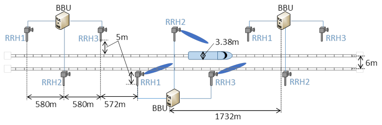
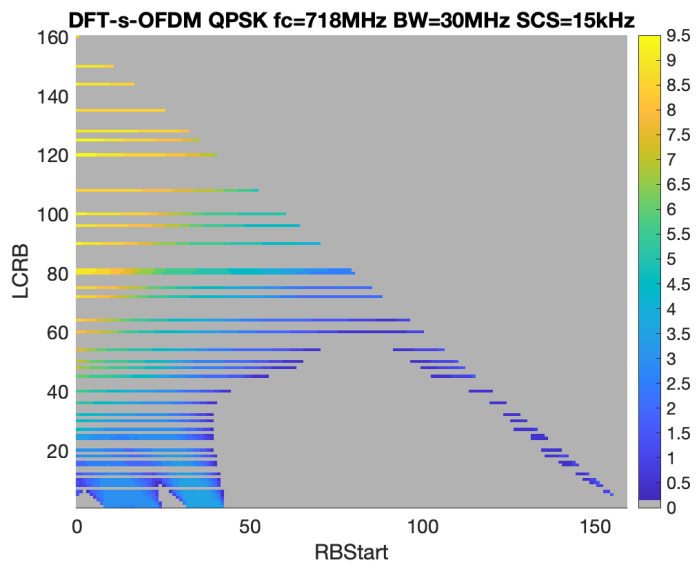
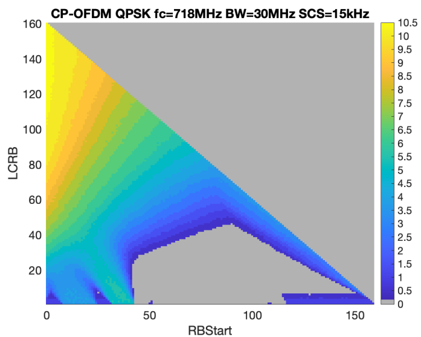
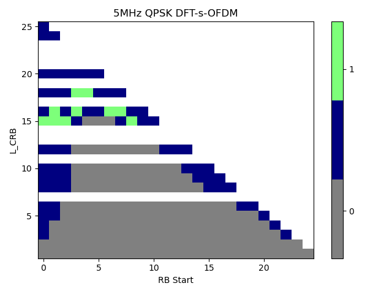
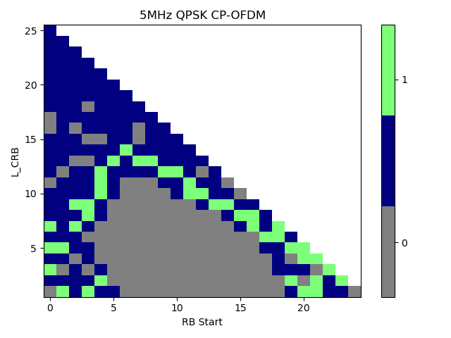
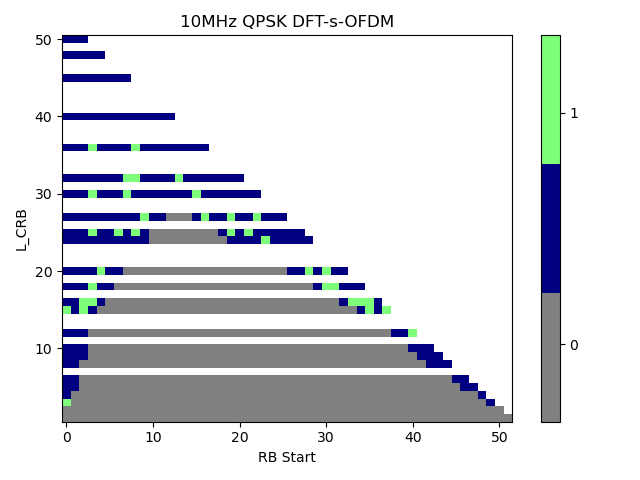
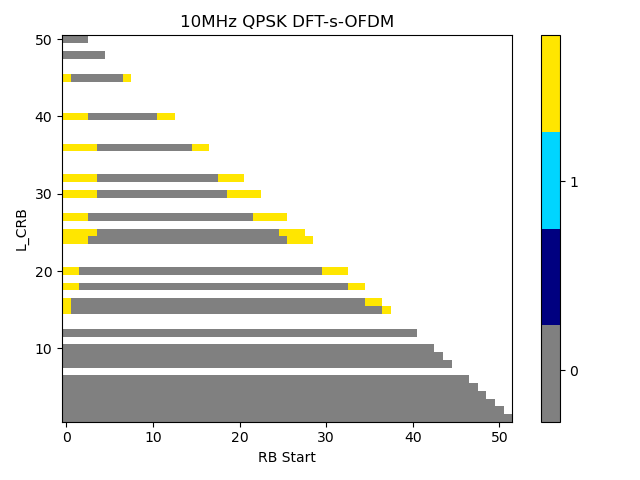
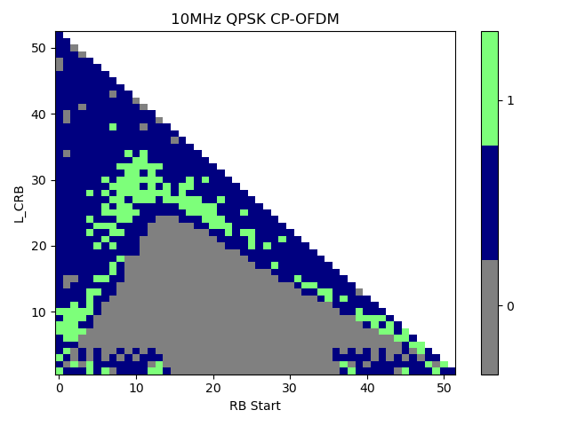
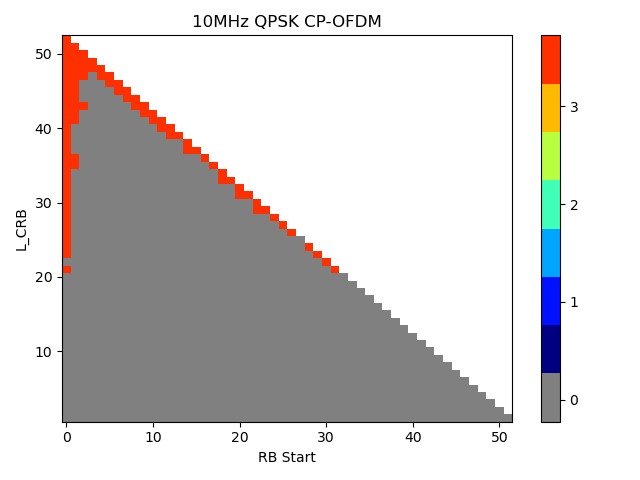
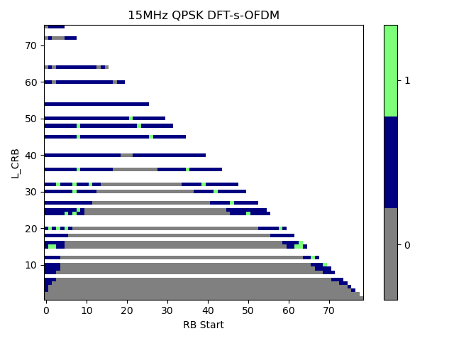

+----------------------------------+----------------------------------+
| 3GPP TS 38.106 V18.9.0 (2025-06) |                                  |
+==================================+==================================+
| Technical Specification          |                                  |
+----------------------------------+----------------------------------+
| 3rd Generation Partnership       |                                  |
| Project;                         |                                  |
|                                  |                                  |
| Technical Specification Group    |                                  |
| Radio Access Network;            |                                  |
|                                  |                                  |
| NR;                              |                                  |
|                                  |                                  |
| NR Repeater Radio Transmission   |                                  |
| and Reception                    |                                  |
|                                  |                                  |
| (Release 18)                     |                                  |
+----------------------------------+----------------------------------+
|                                  |                                  |
+----------------------------------+----------------------------------+
|                                  | {width="1.7743055555555556in" |
|                                  | height="1.0354166666666667in"}   |
+----------------------------------+----------------------------------+
|                                  |                                  |
+----------------------------------+----------------------------------+
| The present document has been    |                                  |
| developed within the 3rd         |                                  |
| Generation Partnership Project   |                                  |
| (3GPP ^TM^) and may be further   |                                  |
| elaborated for the purposes of   |                                  |
| 3GPP.\                           |                                  |
| The present document has not     |                                  |
| been subject to any approval     |                                  |
| process by the 3GPP              |                                  |
| Organizational Partners and      |                                  |
| shall not be implemented.\       |                                  |
| This Specification is provided   |                                  |
| for future development work      |                                  |
| within 3GPP only. The            |                                  |
| Organizational Partners accept   |                                  |
| no liability for any use of this |                                  |
| Specification.\                  |                                  |
| Specifications and Reports for   |                                  |
| implementation of the 3GPP ^TM^  |                                  |
| system should be obtained via    |                                  |
| the 3GPP Organizational          |                                  |
| Partners\' Publications Offices. |                                  |
+----------------------------------+----------------------------------+

+----------------------------------------------------------------------+
|                                                                      |
+======================================================================+
| > ***3GPP***                                                         |
| >                                                                    |
| > Postal address                                                     |
| >                                                                    |
| > 3GPP support office address                                        |
| >                                                                    |
| > 650 Route des Lucioles - Sophia Antipolis                          |
| >                                                                    |
| > Valbonne - FRANCE                                                  |
| >                                                                    |
| > Tel.: +33 4 92 94 42 00 Fax: +33 4 93 65 47 16                     |
| >                                                                    |
| > Internet                                                           |
| >                                                                    |
| > http://www.3gpp.org                                                |
+----------------------------------------------------------------------+
| ***Copyright Notification***                                         |
|                                                                      |
| No part may be reproduced except as authorized by written            |
| permission.\                                                         |
| The copyright and the foregoing restriction extend to reproduction   |
| in all media.                                                        |
|                                                                      |
| © 2025, 3GPP Organizational Partners (ARIB, ATIS, CCSA, ETSI, TSDSI, |
| TTA, TTC).                                                           |
|                                                                      |
| All rights reserved.                                                 |
|                                                                      |
| UMTS™ is a Trade Mark of ETSI registered for the benefit of its      |
| members                                                              |
|                                                                      |
| 3GPP™ is a Trade Mark of ETSI registered for the benefit of its      |
| Members and of the 3GPP Organizational Partners\                     |
| LTE™ is a Trade Mark of ETSI registered for the benefit of its       |
| Members and of the 3GPP Organizational Partners                      |
|                                                                      |
| GSM® and the GSM logo are registered and owned by the GSM            |
| Association                                                          |
+----------------------------------------------------------------------+

 Contents {#contents .TT}
========

Foreword 18

1 Scope 20

2 References 20

3 Definitions of terms, symbols and abbreviations 21

3.1 Terms 21

3.2 Symbols 24

3.3 Abbreviations 25

4 General 26

4.1 Relationship between Minimum Requirements and Test Requirements 26

4.2 Conducted and radiated requirement reference points 27

4.2.1 *RF repeater type 1-C* 27

4.2.1A NCR type 1-C 27

4.2.1B Network controlled Repeater type 1-H 28

4.2.2 *Repeater type 2-O* 29

4.2.2A Network controlled Repeater type 2-O 30

4.3 Repeater classes 31

4.3.1 Repeater class for downlink 31

4.3.2 Repeater class for uplink 32

4.3A Network controlled repeater classes 32

4.3A.1 Network controlled repeater class for downlink 32

4.3A.2 Network controlled repeater class for uplink and MT 32

4.4 Regional requirements 33

4.5 Applicability of requirements 34

4.6 Requirements for contiguous and *non-contiguous spectrum* 36

4.7 Requirements for repeater capable of multi-band operation 36

5 Operating bands 36

5.1 General 36

5.2 Operating bands 37

5.3 Channel arrangement 37

5.3.1 Channel raster 37

5.3.1.1 NR-ARFCN and channel raster 37

5.3.1.2 Channel raster entries for each *operating band* 37

5.3.1.3 Channel raster to resource element mapping 37

5.3.2 Synchronization raster 37

5.3.2.1 Synchronization raster and numbering 37

5.3.2.2 Synchronization raster entries for each operating band 38

5.3.2.3 Synchronization raster to synchronization block resource element
mapping 38

5.3.3 Channel spacing 38

5.3.4 TX--RX frequency separation 38

5.4 NCR-MT channel bandwidth 39

5.4.1 General 39

5.4.2 Transmission bandwidth configuration 40

5.4.3 Minimum guardband and transmission bandwidth configuration 40

5.4.4 RB alignment 40

5.4.5 NCR-MT channel bandwidth per operating band 41

6 Conducted characteristics 41

6.1 General 41

6.2 Repeater output power 42

6.2.1 General 42

6.2.2 Minimum requirement for RF repeater 43

6.2.3 Minimum requirement for NCR 43

6.2.3.1 Minimum requirement for NCR-Fwd 43

6.2.3.1.1 Minimum requirement for NCR-Fwd type 1-C 43

6.2.3.1.2 Minimum requirement for NCR-Fwd type 1-H 43

6.2.3.2 Minimum requirement for NCR-MT 44

6.2.3.2.1 General 44

6.2.3.2.2 Minimum requirement for NCR-MT type 1-C and NCR-MT type 1-H 44

6.3 Frequency stability 45

6.3.1 General 45

6.3.2 Minimum requirement for RF repeater 45

6.3.3 Minimum requirement for NCR 45

6.3.3.1 Minimum requirement for NCR-Fwd 45

6.3.3.1.1 Minimum requirement for NCR-Fwd type 1-C 45

6.3.3.1.2 Minimum requirement for NCR-Fwd type 1-H 45

6.4 Out of band gain 45

6.4.1 General 45

6.4.2 Minimum requirement for RF repeater 45

6.4.3 Minimum requirement for NCR 46

6.4.3.1 Minimum requirement for NCR-Fwd 46

6.4.3.1.1 Minimum requirement for NCR-Fwd type 1-C 46

6.4.3.1.2 Minimum requirement for NCR-Fwd type 1-H 46

6.5 Unwanted emissions 46

6.5.1 General 46

6.5.2 Adjacent Channel Leakage Power Ratio 47

6.5.2.1 General 47

6.5.2.2 Limits and *basic limits* 48

6.5.2.3 Minimum requirement for *RF repeater* 53

6.5.2.4 Minimum requirement for *NCR* 53

6.5.2.4.1 Minimum requirements for NCR-Fwd 53

6.5.2.4.2 Minimum requirement for NCR-MT 54

6.5.3 Operating band unwanted emissions 55

6.5.3.1 General 55

6.5.3.2 Basic limits 57

6.5.3.2.1 basic limits for Wide Area *repeater type 1-C* (Category A) 57

6.5.3.2.2 Basic limit for Wide Area *repeater type 1-C* (Category B) 58

6.5.3.2.3 *Basic limits* for Medium Range *repeater type 1-C* (Category
A and B) for DL 60

6.5.3.2.4 *Basic limits* for Local Area *repeater type 1-C* (Category A
and B) 62

6.5.3.2.5 Additional *basic limits* 63

6.5.3.2.6 Basic limit inside passband with no UL input signal 64

6.5.3.3 Minimum requirement for NCR 65

6.5.3.3.1 Minimum requirement for NCR-Fwd 65

6.5.3.3.2 Minimum requirement for NCR-MT 66

6.5.4 Transmitter spurious emissions 66

6.5.4.1 General 66

6.5.4.2 *Basic limits* 67

6.5.4.2.1 General transmitter spurious emissions *basic limits* 67

6.5.4.2.2 Additional spurious emissions *basic limits* 68

6.5.4.2.3 Co-location with base stations and repeater Nodes 79

6.5.4.3 Minimum requirement for *RF repeater* 86

6.5.4.4 Minimum requirement for *NCR* 86

6.5.4.4.1 Minimum requirement for NCR-Fwd 86

6.5.4.4.2 Minimum requirement for NCR-MT 87

6.5.5 Receiver spurious emissions 87

6.5.5.1 General 87

6.5.5.2 Basic limits 88

6.5.5.3 Minimum requirement for *RF repeater* 88

6.5.5.4 Minimum requirement for *NCR* 88

6.5.5.4.1 Minimum requirement for NCR-Fwd 88

6.6 Repeater Error Vector Magnitude 89

6.6.1 Downlink repeater error vector magnitude 89

6.6.1.1 General 89

6.6.1.2 Minimum requirement for *RF repeater* 90

6.6.1.2A Minimum requirement for *NCR* 90

6.6.1.2A.1 Minimum requirement for NCR-Fwd 90

6.6.1.3 Repeater EVM frame structure for measurement 90

6.6.2 Uplink repeater error vector magnitude 90

6.6.2.1 General 90

6.6.2.2 Minimum requirement for *RF repeater* 91

6.6.2.3 Minimum requirement for *NCR* 91

6.6.2.3.1 Minimum requirement for NCR-Fwd 91

6.7 Input intermodulation 91

6.7.1 General requirement 91

6.7.1.1 General 91

6.7.1.2 Minimum requirement for *RF repeater* 92

6.7.1.3 Minimum requirement for *NCR* 92

6.7.1.3.1 Minimum requirement for NCR-Fwd 92

6.7.2 Co-location with BS/repeater in other systems 93

6.7.2.1 General 93

6.7.2.2 Minimum requirement for *RF repeater* 93

6.7.2.3 Minimum requirement for *NCR* 94

6.7.2.3.1 Minimum requirement for NCR-Fwd 94

6.7.3 Co-existence with other systems 94

6.7.3.1 General 94

6.7.3.2 Minimum requirement for *RF repeater* 94

6.7.3.3 Minimum requirement for *NCR* 95

6.7.3.3.1 Minimum requirement for NCR-Fwd 95

6.8 Output intermodulation 95

6.8.3 Minimum requirements for *NCR* 96

6.8.3.1 Minimum requirements for NCR-Fwd 96

6.8.3.1.1 Minimum requirements for NCR-Fwd type 1-C 96

6.8.3.1.2 Additional requirements for NCR-Fwd type 1-C 97

6.8.3.1.3 Minimum requirements for *NCR-Fwd type 1-H* 97

6.8.3.1.4 Additional requirements for NCR-Fwd type 1-H 97

6.9 Adjacent Channel Rejection Ratio (ACRR) 97

6.9.1 General 97

6.9.2 Minimum Requirements for *RF repeater* 97

6.9.3 Minimum Requirements for *NCR* 99

6.9.3.1 Minimum requirements for NCR-Fwd 99

6.9.3.1.1 Minimum requirements for NCR-Fwd type 1-C 99

6.9.3.1.2 Minimum Requirements for *NCR-Fwd type 1-H* 99

6.10 Transmit ON/OFF power 99

6.10.1 Transmitter OFF power 99

6.10.1.1 General 99

6.10.1.2 Minimum requirement for *RF repeater* 100

6.10.1.3 Minimum requirement for *NCR* 100

6.10.1.3.1 Minimum requirement for NCR Fwd 100

6.10.2 Transmitter transient period 100

6.10.2.1 General 100

6.10.2.2 Minimum requirement for *RF repeater* 101

6.10.2.3 Minimum requirement for *NCR* 101

6.10.2.3.1 Minimum requirement for NCR-Fwd 101

6.11 Output power dynamics for NCR-MT 102

6.11.1 General 102

6.11.2 Transmit OFF power for NCR-MT 102

6.11.3 Transmit ON/OFF time mask for NCR-MT 102

6.11.4 Power control for NCR-MT 102

6.12 Transmit signal quality for NCR-MT 102

6.12.1 General 102

6.12.2 Frequency error requirements for NCR-MT 102

6.12.3 Transmit modulation quality 103

6.13 Transmit intermodulation for NCR-MT 103

6.13.1 General 103

6.13.2 Minimum requirements for NCR-MT 103

6.14 Void 103

6.15 Diversity characteristics for NCR-MT 103

6.16 Reference sensitivity for NCR-MT 104

6.16.1 NCR-MT reference sensitivity level 104

6.16.1.1 General 104

6.16.1.2 Minimum requirements for *NCR-MT type 1-C and 1-H* 104

6.17 Maximum input level for NCR-MT 105

6.18 Adjacent channel selectivity for NCR-MT 105

6.18.1 Adjacent Channel Selectivity (ACS) 105

6.18.1.1 General 105

6.18.1.2 Minimum requirement for *NCR-MT type 1-C* and *1-H* 105

6.18.1.3 Void 105

6.19 Blocking characteristics for NCR-MT 105

6.19.1 General 105

6.19.2 Minimum requirement for NCR-MT type 1-C and 1-H 105

6.19.3 Void 106

6.20 Transmitter spurious response for NCR-MT 106

6.20.1 General 106

6.20.2 Minimum requirements for NCR-MT type 1-C and NCR-MT type 1-H 106

6.21 Receiver intermodulation characteristics for NCR-MT 106

6.21.1 General 106

6.21.2 Minimum requirement for NCR-MT type 1-C and 1-H 106

6.21.3 Void 107

6.22 Receiver spurious emissions for NCR-MT 107

6.22.1 General 107

6.22.2 Minimum requirements for *NCR-MT type 1-C* and *type 1-H* 107

7 Radiated characteristics 108

7.1 General 108

7.2 OTA output power 109

7.2.1 General 109

7.2.2 Minimum requirement for RF repeater 110

7.2.3 Minimum requirement for NCR 111

7.2.3.1 Minimum requirement for NCR-MT 111

7.2.3.1.1 Minimum requirement for NCR-MT type 1-H 111

7.2.3.1.2 Minimum requirement for NCR-MT type 2-O 111

7.2.3.2 Minimum requirement for NCR-Fwd 111

7.2.3.2.1 Minimum requirement for NCR-Fwd type 2-O 111

7.3 OTA frequency stability 111

7.3.1 General 111

7.3.2 Minimum requirement for RF repeater 112

7.3.3 Minimum requirement for NCR 112

7.3.3.1 Minimum requirement for NCR-Fwd 112

7.3.3.1.1 Minimum requirement for NCR-Fwd type 2-O 112

7.4 OTA out of band gain 112

7.4.1 General 112

7.4.2 Minimum requirement for RF repeater 112

7.4.3 Minimum requirement for NCR 113

7.4.3.1 Minimum requirement for NCR-Fwd 113

7.4.3.1.1 Minimum requirement for NCR-Fwd type 2-O 113

7.5 OTA unwanted emissions 113

7.5.1 General 113

7.5.2 OTA Adjacent Channel Leakage Power Ratio (ACLR) 114

7.5.2.1 General 114

7.5.2.2 Minimum requirement for *RF repeater* 114

7.5.2.3 Minimum requirement for NCR 118

7.5.2.3.1 Minimum requirement for NCR-Fwd 118

7.5.2.3.2 Minimum requirement for NCR-MT 118

7.5.3 OTA operating band unwanted emissions 118

7.5.3.1 General 118

7.5.3.2 Minimum requirement for RF repeater 118

7.5.3.2.1 General 118

7.5.3.2.2 OTA operating band unwanted emission limits (Category A) 119

7.5.3.2.3 OTA operating band unwanted emission limits (Category B) 120

7.5.3.2.4 Additional OTA operating band unwanted emission requirements
120

7.5.3.3 Minimum requirement for NCR 121

7.5.3.3.1 Minimum requirement for NCR-Fwd 121

7.5.3.3.2 Minimum requirement for NCR-MT 121

7.5.4 OTA transmitter spurious emissions 121

7.5.4.1 General 121

7.5.4.2 Minimum requirement for *RF repeater* 121

7.5.4.2.1 General 121

7.5.4.2.2 General OTA transmitter spurious emissions requirements 122

7.5.4.2.3 Additional OTA transmitter spurious emissions requirements 123

7.5.4.3 Minimum requirement for *NCR* 123

7.5.4.3.1 Minimum requirement for NCR-Fwd 123

7.5.4.3.2 Minimum requirement for NCR-MT 124

7.5.5 OTA receiver spurious emissions 124

7.5.5.1 General 124

7.5.5.2 Minimum requirement for *RF repeater* 124

7.5.5.3 Minimum requirement for *NCR* 125

7.5.5.3.1 Minimum requirement for NCR-Fwd 125

7.6 OTA Repeater Error Vector Magnitude 125

7.6.1 Downlink repeater error vector magnitude 125

7.6.1.1 General 125

7.6.1.2 Minimum requirement for repeater 126

7.6.1.2A Minimum requirement for NCR 126

7.6.1.2A.1 Minimum requirement for NCR-Fwd 126

7.6.1.3 Repeater EVM frame structure for measurement 126

7.6.2 Uplink repeater error vector magnitude 126

7.6.2.1 General 126

7.6.2.2 Minimum requirement for RF repeater 127

7.6.2.3 Minimum requirement for NCR 128

7.6.2.3.1 Minimum requirement for NCR-Fwd 128

7.7 OTA input intermodulation 128

7.7.1 General 128

7.7.2 Minimum requirement for RF repeater 128

7.7.3 Minimum requirement for NCR 129

7.7.3.1 Minimum requirement for NCR-Fwd 129

7.7.3.1.1 Minimum requirement for NCR-Fwd type 2-O 129

7.8 OTA Adjacent Channel Rejection Ratio (ACRR) 129

7.8.1 General 129

7.8.2 Minimum Requirements for RF repeater 129

7.8.3 Minimum Requirements for NCR 130

7.8.3.1 Minimum Requirements for NCR-Fwd 130

7.8.3.1.1 Minimum Requirements for NCR-Fwd type 2-O 130

7.9 OTA transmit ON/OFF power 131

7.9.1 General 131

7.9.2 OTA transmitter OFF power 131

7.9.2.1 General 131

7.9.2.2 Minimum requirement for RF repeater 131

7.9.2.3 Minimum requirement for NCR 131

7.9.2.3.1 Minimum requirement for NCR-Fwd 131

7.9.2.3.2 Minimum requirement for NCR-MT 131

7.9.3 OTA transient period 132

7.9.3.1 General 132

7.9.3.2 Minimum requirement for RF repeater 132

7.9.3.3 Minimum requirement for NCR 133

7.9.3.3.1 Minimum requirement for NCR-Fwd 133

7.9.3.3.2 Minimum requirement for NCR-MT 133

7.10 OTA output power dynamics for NCR-MT 133

7.10.1 General 133

7.10.2 Minimum requirement for NCR-MT 133

7.11 OTA transmit signal quality for NCR-MT 133

7.11.1 General 133

7.11.2 Frequency error requirements for NCR-MT 134

7.11.2.1 Minimum requirement for NCR-MT type 2-O 134

7.11.3 Transmit modulation quality 134

7.11.3.1 Minimum requirement for NCR-MT type 2-O 134

7.12 Diversity characteristics for NCR-MT 134

7.12.1 General 134

7.12.2 Minimum requirement for NCR-MT 134

7.13 OTA reference sensitivity for NCR-MT 134

7.13.1 General 134

7.13.2 Minimum requirement for NCR-MT type 2-O 134

7.14 OTA maximum input level for NCR-MT 134

7.14.1 General 134

7.14.2 Minimum requirement for NCR-MT type 2-O 135

7.15 OTA adjacent channel selectivity for NCR-MT 135

7.15.1 General 135

7.15.1 Minimum requirement for NCR-MT type 2-O 135

7.16 OTA blocking characteristics for NCR-MT 135

7.16.1 General 135

7.16.2 Minimum requirement for NCR-MT type 2-O 135

7.17 OTA receiver spurious emissions for NCR-MT 136

7.17.1 General 136

7.17.2 Minimum requirement for NCR-MT type 2-O 136

8 Conducted performance requirements 136

8.1 General 136

8.2 Demodulation performance requirements 137

8.2.1 Performance requirements for PDSCH 137

8.2.1.1 2Rx requirements 137

8.2.1.1.1 FDD 137

8.2.1.1.1.1 Minimum requirements 137

8.2.1.1.2 TDD 138

8.2.1.1.2.1 Minimum requirements 138

8.2.1.2 4Rx requirements 139

8.2.1.2.1 FDD 139

8.2.1.2.1.1 Minimum requirements 140

8.2.1.2.2 TDD 140

8.2.1.2.2.1 Minimum requirements 141

8.2.2 Performance requirements for PDCCH 141

8.2.2.1 2Rx requirements 141

8.2.2.1.1 FDD 141

8.2.2.1.1.1 1Tx requirements 141

8.2.2.1.1.2 2Tx requirements 142

8.2.2.1.2 TDD 142

8.2.2.1.2.1 1Tx requirements 142

8.2.2.1.2.2 2Tx requirements 143

8.2.2.2 4Rx requirements 143

8.2.2.2.1 FDD 143

8.2.2.2.1.1 1Tx requirements 143

8.2.2.2.1.2 2Tx requirements 144

8.2.2.2.2 TDD 144

8.2.2.2.2.1 1Tx requirements 144

8.2.2.2.2.2 2Tx requirements 145

8.2.3 Channel Quality Indicator (CQI) reporting requirements 145

8.2.3.1 General 145

8.2.3.2 2Rx requiremnets 145

8.2.3.2.1 FDD 145

8.2.3.2.1.1 Test parameters 145

8.2.3.2.1.2 Minimum requirements 146

8.2.3.2.2 TDD 147

8.2.3.2.2.1 Test parameters 147

8.2.3.2.2.2 Minimum requirements 147

8.2.3.3 4Rx requiremnets 148

8.2.3.3.1 FDD 148

8.2.3.3.1.1 Test parameters 148

8.2.3.3.1.2 Minimum requirements 149

8.2.3.3.2 TDD 150

8.2.3.3.2.1 Test parameters 150

8.2.3.3.2.2 Minimum requirements 150

9 Radiated performance requirements 151

9.1 General 151

9.2 OTA demodulation branches 151

9.3 Demodulation performance requirements 152

9.3.1 Performance requirements for NCR type 2-O 152

9.3.1.1 Performance requirements for PDSCH 152

9.3.1.1.1 General 152

9.3.1.1.2 Minimum requirements 153

9.3.1.2 Performance requirements for PDCCH 153

9.3.1.2.1 General 153

9.3.1.2.2 Minimum requirements 153

9.4 CSI reporting requirements 154

9.4.1 Performance requirements for NCR-MT type 2-O 154

9.4.1.1 General 154

9.4.1.2 Common test parameters 154

9.4.1.3 Reporting of Channel Quality Indicator (CQI) 156

9.4.1.3.1 General 156

9.4.1.3.2 Minimum requirements 157

10 NCR-MT RRC\_CONNECTED state mobility 157

10.1 RRC Connection Mobility Control for NCR-MT 157

10.1.1 SA: RRC Re-establishment 157

10.1.1.1 Introduction 157

10.1.1.2 Requirements 157

10.1.1.2.1 NCR-MT Re-establishment delay requirement 157

10.1.2 Random access 159

10.1.2.1 Introduction 159

10.1.2.2 Requirements for 4-step RA type 159

10.1.2.2.1 Contention based random access 160

10.1.2.2.2 Non-Contention based random access 161

10.2 Timing 162

10.2.1 NCR-MT transmit timing 162

10.2.1.1 Introduction 162

10.2.1.2 Requirements 162

10.2.1.2.1 Gradual timing adjustment 163

10.2.2.1 Introduction 164

10.2.2.2 Requirements 164

10.2.3 NCR-MT timing advance 164

10.2.3.1 Introduction 164

10.2.3.2 Requirements 165

10.2.3.2.1 Timing Advance adjustment delay 165

10.2.3.2.2 Timing Advance adjustment accuracy 165

10.3 Signalling Characteristics for NCR-MT 165

10.3.1 Radio Link Monitoring 165

10.3.1.1 Introduction 165

10.3.1.2 Requirements for SSB based radio link monitoring 166

10.3.1.2.1 Introduction 166

10.3.1.2.2 Minimum requirement 167

10.3.1.2.3 Measurement restrictions for SSB based RLM 168

10.3.1.3 Requirements for CSI-RS based radio link monitoring 169

10.3.1.3.1 Introduction 169

10.3.1.3.2 Minimum requirement 169

10.3.1.3.3 Measurement restrictions for CSI-RS based RLM 171

10.3.1.4 Minimum requirement for NCR-MT turning off the transmitter 172

10.3.1.5 Minimum requirement for L1 indication 172

10.3.1.6 Scheduling availability of NCR-MT during radio link monitoring
172

10.3.1.6.1 Scheduling availability of NCR-MT performing radio link
monitoring with a same subcarrier spacing as PDSCH/PDCCH on FR1 172

10.3.1.6.2 Scheduling availability of NCR-MT performing radio link
monitoring with a different subcarrier spacing than PDSCH/PDCCH on FR1
172

10.3.1.6.3 Scheduling availability of NCR-MT performing radio link
monitoring on FR2-1 172

10.3.2 Link Recovery Procedure 173

10.3.2.1 Introduction 173

10.3.2.2 Requirements for SSB based beam failure detection 174

10.3.2.2.1 Introduction 174

10.3.2.2.2 Minimum requirement 174

10.3.2.2.3 Measurement restriction for SSB based beam failure detection
175

10.3.2.3 Requirements for CSI-RS based beam failure detection 176

10.3.2.3.1 Introduction 176

10.3.2.3.2 Minimum requirement 176

10.3.2.3.3 Measurement restrictions for CSI-RS based beam failure
detection 177

10.3.2.4 Minimum requirement for L1 indication 178

10.3.2.5 Requirements for SSB based candidate beam detection 179

10.3.2.5.1 Introduction 179

10.3.2.5.2 Minimum requirement 179

10.3.2.5.3 Measurement restriction for SSB based candidate beam
detection 180

10.3.2.6 Requirements for CSI-RS based candidate beam detection 180

10.3.2.6.1 Introduction 180

10.3.2.6.2 Minimum requirement 181

10.3.2.6.3 Measurement restriction for CSI-RS based candidate beam
detection 182

10.3.2.7 Scheduling availability of NCR-MT during beam failure detection
182

10.3.2.7.1 Scheduling availability of NCR-MT performing beam failure
detection with a same subcarrier spacing as PDSCH/PDCCH on FR1 182

10.3.2.7.2 Scheduling availability of NCR-MT performing beam failure
detection with a different subcarrier spacing than PDSCH/PDCCH on FR1
183

10.3.2.7.3 Scheduling availability of NCR-MT performing beam failure
detection on FR2-1 183

10.3.2.8 Scheduling availability of NCR-MT during candidate beam
detection 183

10.3.2.8.1 Scheduling availability of NCR-MT performing L1-RSRP
measurement with a same subcarrier spacing as PDSCH/PDCCH on FR1 184

10.3.2.8.2 Scheduling availability of NCR-MT performing L1-RSRP
measurement with a different subcarrier spacing than PDSCH/PDCCH on FR1
184

10.3.2.8.3 Scheduling availability of NCR-MT performing L1-RSRP
measurement on FR2-1 184

Annex A: Void 185

Annex B (normative): NCR-MT Reference measurement channels 186

B.1 NCR-MT Demodulation Performance Fixed Reference Channels 186

B.1.1 Fixed Reference Channels for PDSCH performance requirements 186

B.1.2 Fixed Reference Channels for PDCCH performance requirements 187

B.1.3 Fixed Reference Channels for CSI reporting performance 188

B.2 Fixed Reference Channels for reference sensitivity level, ACS,
in-band blocking, out-of-band blocking and receiver intermodulation
(QPSK, R=1/3) 189

Annex C (normative): Propagation conditions 190

C.1 Static propagation condition 190

C.1.1 NCR-MT receiver with 2RX 190

C.1.2 NCR-MT Receiver with 4Rx 190

C.2 Multi-path fading propagation conditions 191

C.2.1 General 191

C.2.2 Delay profiles 191

C.2.2.1 General 191

C.2.2.2 Delay profiles for FR1 192

C.2.3 Combinations of channel model parameters 194

C.2.4 MIMO channel correlation matrices 194

C.2.4.1 General 194

C.2.4.2 MIMO correlation matrices using Uniform Linear Array 194

C.2.4.2.1 General 194

C.2.4.2.2 Definition of MIMO correlation matrices 194

C.2.4.2.3 MIMO correlation matrices at high, medium and low level 195

C.2.4.3 Multi-antenna channel models using cross polarized antennas 197

C.2.4.3.1 General 197

C.2.4.3.2 Definition of MIMO correlation matrices using cross polarized
antennas 197

C.2.4.3.3 Spatial correlation matrices at NCR-MT and gNB sides 198

C.2.4.3.3.1 Spatial correlation matrices at NCR-MT side 198

C.2.4.3.3.2 Spatial correlation matrices at gNB side 198

C.2.4.3.4 MIMO correlation matrices using cross polarized antennas 198

C.2.4.3.5 Beam steering approach 199

C.3 Physical signals, channels mapping and precoding 200

C.3.1 General 200

Annex D: Void 202

Annex E: Void 202

Annex F: Void 202

Annex G (normative): NCR-MT RRM Testing 202

G.1 NCR-MT RRM test configurations 203

G.1.1 Reference measurement channels 203

G.1.1.1 PDSCH 203

G.1.1.1.1 TDD 203

G.1.1.1.2 FDD 206

G.1.1.2 CORESET for RMSI scheduling 207

G.1.1.2.1 TDD 207

G.1.1.2.2 FDD 210

G.1.1.3 CORESET for RMC scheduling 211

G.1.1.3.1 TDD 211

G.1.1.3.2 FDD 212

G.1.2 OFDMA channel noise generator (OCNG) 213

G.1.2.1 Generic OFDMA Channel Noise Generator (OCNG) 213

G.1.2.1.1 OCNG pattern 1: Generic OCNG pattern for all unused REs 213

G.1.2.1.2 OCNG pattern 2: Generic OCNG pattern for all unused REs for
2AoA setup 213

G.1.2.1.3 OCNG pattern 3: Generic OCNG pattern for unused REs in the
same bandwidth as PDSCH RMC 214

G.1.2.1.4 OCNG pattern 4: Generic OCNG pattern for all unused REs
outside SSB slot(s) 214

G.1.3 Antenna configurations 214

G.1.3.1 Antenna configurations for FR1 214

G.1.3.1.1 Antenna connection for 4 Rx capable NCR-MT 215

G.1.3.1.1.1 Introduction 215

G.1.3.1.1.2 Principle of testing 215

G.1.3.2 Antenna configurations for FR2 216

G.1.4 BWP configurations 216

G.1.4.1 Introduction 216

G.1.4.2 Downlink BWP configurations 216

G.1.4.2.1 Initial BWP 216

G.1.4.2.2 Dedicated BWP 217

G.1.4.3 Uplink BWP configurations 217

G.1.4.3.1 Initial BWP 217

G.1.4.3.2 Dedicated BWP 217

G.1.5 SSB Configurations 218

G.1.5.1 SSB Configurations for FR1 218

G.1.5.1.1 SSB pattern 1 in FR1: SSB allocation for SSB SCS=15 kHz 218

G.1.5.1.2 SSB pattern 2 in FR1: SSB allocation for SSB SCS=30 kHz 218

G.1.5.1.3 SSB pattern 3 in FR1: SSB allocation for SSB SCS=15 kHz 219

G.1.5.1.4 SSB pattern 4 in FR1: SSB allocation for SSB SCS=30 kHz 219

G.1.5.1.5 SSB pattern 5 in FR1: SSB allocation for SSB SCS=15 kHz
starting from odd SFN 220

G.1.5.1.6 SSB pattern 6 in FR1: SSB allocation for SSB SCS=30 kHz
starting from odd SFN 220

G.1.5.2 SSB Configurations for FR2 221

G.1.5.2.1 SSB pattern 1 in FR2: SSB allocation for SSB SCS=120 kHz 221

G.1.5.2.2 SSB pattern 2 in FR2: SSB allocation for SSB SCS=240 kHz 221

G.1.5.2.3 SSB pattern 3 in FR2: SSB allocation for SSB SCS=120 kHz 221

G.1.5.2.4 SSB pattern 4 in FR2: SSB allocation for SSB SCS=240 kHz 222

G.1.5.2.5 SSB pattern 5 in FR2: SSB allocation for SSB SCS=120 kHz 222

G.1.5.2.6 SSB pattern 6 in FR2: SSB allocation for SSB SCS=240 kHz 222

G.1.5.2.7 SSB pattern 7 in FR2: SSB allocation for SSB SCS=120 kHz 223

G.1.5.2.8 SSB pattern 8 in FR2: SSB allocation for SSB SCS=240 kHz 223

G.1.6 SMTC Configurations 223

G.1.6.1 SMTC pattern 1: SMTC period = 20 ms with SMTC duration = 1 ms
223

G.1.6.2 SMTC pattern 2: SMTC period = 20 ms with SMTC duration = 5 ms
224

G.1.6.3 SMTC pattern 3: SMTC period = 160 ms with SMTC duration = 1 ms
224

G.1.6.4 SMTC pattern 4: SMTC period = 20 ms with SMTC duration = 1 ms
224

G.1.6.5 SMTC pattern 5: SMTC period = 20 ms with SMTC duration = 5 ms
224

G.1.7 CSI-RS configurations 225

G.1.7.1 TDD 225

G.1.7.2 FDD 227

G.1.8 Angle of Arrival (AoA) for FR2 RRM test cases 228

G.1.8.1 Setup 1: Single AoA 228

G.1.8.2 Setup 2: 2 AoAs 228

G.1.9 TCI State Configuration 228

G.1.9.1 Introduction 228

G.1.9.2 TCI states 229

G.1.10 Configurations of CSI-RS for tracking 229

G.1.10.1 Configuration of CSI-RS for tracking for FR1 229

G.1.10.1.2 TDD 229

G.1.10.1.3 FDD 230

G.1.10.2 Configuration of CSI-RS for tracking for FR2 231

G.1.10.2.1 TDD 231

G.2 NCR-MT RRM test cases 232

G.2.1 RRC\_CONNECTED state mobility for NCR-MTs 232

G.2.1.1 RRC Connection Mobility Control 232

G.2.1.1.2 RRC Re-establishment for LA NCR-MT 232

G.2.1.1.1.1 Inter-frequency RRC Re-establishment in FR1 for LA NCR-MT
232

G.2.1.1.1.2 Intra-frequency RRC Re-establishment in FR1 without serving
cell timing for LA NCR-MT 235

G.2.1.1.1.3 Inter-frequency RRC Re-establishment in FR2-1 for LA NCR-MT
238

G.2.1.1.1.4 Intra-frequency RRC Re-establishment in FR2-1 without
serving cell timing for LA NCR-MT 241

G.2.2 Timing 244

G.2.2.1 Transmit timing 244

G.2.2.1.1 NR NCR-MT Transmit Timing Test for FR1 244

G.2.2.1.1.1 Test Purpose and environment 244

G.2.2.1.1.2 Test requirements 246

G.2.2.1.2 NR NCR-MT Transmit Timing Test for FR2-1 247

G.2.2.1.2.1 Test Purpose and environment 247

G.2.2.1.2.2 Test requirements 249

G.2.3 Signalling Characteristics for NCR MTs 250

G.2.3.1 Radio link Monitoring 250

G.2.3.1.1 Radio Link Monitoring Out-of-sync Test for FR1 PCell
configured with SSB-based RLM RS in non-DRX mode 250

G.2.3.1.1.1 Test Purpose and Environment 250

G.2.3.1.1.2 Test Requirements 253

G.2.3.1.2 Radio Link Monitoring In-sync Test for FR1 PCell configured
with SSB-based RLM RS in non-DRX mode 254

G.2.3.1.2.1 Test Purpose and Environment 254

G.2.3.1.2.2 Test Requirements 258

G.2.3.1.3 Radio Link Monitoring Out-of-sync Test for FR2-1 PCell
configured with SSB-based RLM RS in non-DRX mode 258

G.2.3.1.3.1 Test Purpose and Environment 258

G.2.3.1.3.2 Test Requirements 261

G.2.3.1.4 Radio Link Monitoring In-sync Test for FR2-1 PCell configured
with SSB-based RLM RS in non-DRX mode 261

G.2.3.1.4.1 Test Purpose and Environment 261

G.2.3.1.4.2 Test Requirements 265

G.2.3.1.5 Radio Link Monitoring Out-of-sync Test for FR1 PCell
configured with CSI-RS-based RLM in non-DRX mode 266

G.2.3.1.5.1 Test Purpose and Environment 266

G.2.3.1.5.2 Test Requirements 268

G.2.3.1.6 Radio Link Monitoring In-sync Test for FR1 PCell configured
with CSI-RS-based RLM in non-DRX mode 269

G.2.3.1.6.1 Test Purpose and Environment 269

G.2.3.1.6.2 Test Requirements 271

G.2.3.1.7 Radio Link Monitoring Out-of-sync Test for FR2-1 PCell
configured with CSI-RS-based RLM in non-DRX mode 272

G.2.3.1.7.1 Test Purpose and Environment 272

G.2.3.1.7.2 Test Requirements 274

G.2.3.1.8 Radio Link Monitoring In-sync Test for FR2-1 PCell configured
with CSI-RS-based RLM in non-DRX mode 275

G.2.3.1.8.1 Test Purpose and Environment 275

G.2.3.1.8.2 Test Requirements 277

G.2.3.2 Beam Failure Detection and Link Recovery Procedure 278

G.2.3.2.1 Beam Failure Detection and Link Recovery Test for FR1 PCell
configured with SSB-based BFD and LR 278

G.2.3.2.1.1 Test Purpose and Environment 278

G.2.3.2.1.2 Test Requirements 282

G.2.3.2.2 Beam Failure Detection and Link Recovery Test for FR2 PCell
configured with SSB-based BFD and LR 282

G.2.3.2.2.1 Test Purpose and Environment 282

G.2.3.2.2.2 Test Requirements 288

G.2.3.2.3 Beam Failure Detection and Link Recovery Test for FR1 PCell
configured with CSI-RS-based BFD and LR 288

G.2.3.2.3.1 Test Purpose and Environment 288

G.2.3.2.3.2 Test Requirements 292

G.2.3.2.4 Beam Failure Detection and Link Recovery Test for FR2 PCell
configured with CSI-RS-based BFD and LR in non-DRX mode 292

G.2.3.2.4.1 Test Purpose and Environment 292

G.2.3.2.4.2 Test Requirements 297

Annex H (informative): Change history 298

Foreword
========

This Technical Specification has been produced by the 3rd Generation
Partnership Project (3GPP).

The contents of the present document are subject to continuing work
within the TSG and may change following formal TSG approval. Should the
TSG modify the contents of the present document, it will be re-released
by the TSG with an identifying change of release date and an increase in
version number as follows:

Version x.y.z

where:

x the first digit:

1 presented to TSG for information;

2 presented to TSG for approval;

3 or greater indicates TSG approved document under change control.

y the second digit is incremented for all changes of substance, i.e.
technical enhancements, corrections, updates, etc.

z the third digit is incremented when editorial only changes have been
incorporated in the document.

In the present document, modal verbs have the following meanings:

**shall** indicates a mandatory requirement to do something

**shall not** indicates an interdiction (prohibition) to do something

The constructions \"shall\" and \"shall not\" are confined to the
context of normative provisions, and do not appear in Technical Reports.

The constructions \"must\" and \"must not\" are not used as substitutes
for \"shall\" and \"shall not\". Their use is avoided insofar as
possible, and they are not used in a normative context except in a
direct citation from an external, referenced, non-3GPP document, or so
as to maintain continuity of style when extending or modifying the
provisions of such a referenced document.

**should** indicates a recommendation to do something

**should not** indicates a recommendation not to do something

**may** indicates permission to do something

**need not** indicates permission not to do something

The construction \"may not\" is ambiguous and is not used in normative
elements. The unambiguous constructions \"might not\" or \"shall not\"
are used instead, depending upon the meaning intended.

**can** indicates that something is possible

**cannot** indicates that something is impossible

The constructions \"can\" and \"cannot\" are not substitutes for \"may\"
and \"need not\".

**will** indicates that something is certain or expected to happen as a
result of action taken by an agency the behaviour of which is outside
the scope of the present document

**will not** indicates that something is certain or expected not to
happen as a result of action taken by an agency the behaviour of which
is outside the scope of the present document

**might** indicates a likelihood that something will happen as a result
of action taken by some agency the behaviour of which is outside the
scope of the present document

**might not** indicates a likelihood that something will not happen as a
result of action taken by some agency the behaviour of which is outside
the scope of the present document

In addition:

**is** (or any other verb in the indicative mood) indicates a statement
of fact

**is not** (or any other negative verb in the indicative mood) indicates
a statement of fact

The constructions \"is\" and \"is not\" do not indicate requirements.

 1 Scope
=======

The present document establishes the minimum RF characteristics of RF
repeater and network controlled repeater. For network controlled
repeater (NCR), requirements for NCR-Fwd and NCR-MT apply. In this
version of the specification mixed type NCR are not considered.

2 References
============

The following documents contain provisions which, through reference in
this text, constitute provisions of the present document.

\- References are either specific (identified by date of publication,
edition number, version number, etc.) or non‑specific.

\- For a specific reference, subsequent revisions do not apply.

\- For a non-specific reference, the latest version applies. In the case
of a reference to a 3GPP document (including a GSM document), a
non-specific reference implicitly refers to the latest version of that
document *in the same Release as the present document*.

\[1\] 3GPP TR 21.905: \"Vocabulary for 3GPP Specifications\".

\[2\] 3GPP TS 38.104: "NR; Base Station (BS) radio transmission and
reception".

\[3\] 3GPP TR 25.942: \"RF system scenarios\".

\[4\] Recommendation ITU-R SM.328: \"Spectra and bandwidth of
emissions\".

\[5\] ITU-R Recommendation SM.329: \"Unwanted emissions in the spurious
domain\".

\[6\] ITU-R Recommendation M.1545: "Measurement uncertainty as it
applies to test limits for the terrestrial component of International
Mobile Telecommunications -- 2000".

> \[7\] 3GPP TS 38.115-1: "NR; Repeater conformance testing - Part 1:
> Conducted conformance testing".
>
> \[8\] 3GPP TS 38.115-2: "NR; Repeater conformance testing - Part 2:
> Radiated conformance testing".

\[9\] ERC Recommendation 74-01, \"Unwanted emissions in the spurious
domain\".

\[10\] \"Title 47 of the Code of Federal Regulations (CFR)\", Federal
Communications Commission.

\[11\] Void

\[12\] Void

\[13\] 3GPP TS 38.101-1: "NR User Equipment (UE) radio transmission and
reception; Part 1: Range 1 Standalone".

\[14\] 3GPP TS 38.101-2: "NR User Equipment (UE) radio transmission and
reception: Part 2: Range 2 Standalone".

\[15\] Void

\[16\] Void

\[17\] Void

\[18\] Void

\[19\] Void

\[20\] 3GPP TS 36.104: "Evolved Universal Terrestrial Radio Access
(E-UTRA); Base Station (BS) radio transmission and reception"

\[21\] Void

\[22\] 3GPP TS 38.174: \"NR; Integrated Access and Backhaul (IAB) radio
transmission and reception\".

\[23\] 3GPP TS 38.331: "NR; Radio Resource Control (RRC); Protocol
specification".

\[24\] 3GPP TS 38.213: "NR; Physical layer procedures for control".

\[25\] 3GPP TS 38.321: "NR; Medium Access Control (MAC) protocol
specification".

\[26\] 3GPP TS 38.211: "NR; Physical channels and modulation".

\[27\] 3GPP TS 38.306: "NR; User Equipment (UE) radio access
capabilities".

\[28\] 3GPP TS 38.214: \"NR; Physical layer procedures for data\".

\[29\] 3GPP TR 38.901: \"Study on channel model for frequencies from 0.5
to 100 GHz\"

\[30\] 3GPP TR 38.101-4: \" NR; User Equipment (UE) radio transmission
and reception; Part 4: Performance requirements\"

\[31\] Commission Implementing Decision (EU) 2020/590 of 24 April 2020
amending Decision (EU) 2019/784 as regards an update of relevant
technical conditions applicable to the 24,25-27,5 GHz frequency band.

3 Definitions of terms, symbols and abbreviations
=================================================

3.1 Terms
---------

For the purposes of the present document, the terms given in 3GPP
TR 21.905 \[1\] and the following apply. A term defined in the present
document takes precedence over the definition of the same term, if any,
in 3GPP TR 21.905 \[1\].

**Antenna connector:** connector at the conducted interface of the
*repeater type 1-C*

**Beam:** beam (of the antenna) is the main lobe of the radiation
pattern of an *antenna array*

**Beam centre direction:** direction equal to the geometric centre of
the half-power contour of the beam

**Beam direction pair:** data set consisting of the *beam centre
direction* and the related *beam peak direction*

**Beam peak direction:** direction where the maximum EIRP is found

**Beamwidth:** beam which has a half-power contour that is essentially
elliptical, the half-power beamwidths in the two pattern cuts that
respectively contain the major and minor axis of the ellipse

**directional requirement: requirement which is applied in a specific
direction within the *OTA coverage range*.**

**Equivalent isotropic radiated power:** equivalent power radiated from
an isotropic directivity device producing the same field intensity at a
point of observation as the field intensity radiated in the direction of
the same point of observation by the discussed device

**Fractional bandwidth: *fractional bandwidth* FBW is defined as**
$\text{FBW} = 200 \bullet \frac{F_{\text{FBWhigh}} - F_{\text{FBWlow}}}{F_{\text{FBWhigh}} + F_{\text{FBWlow}}}\%$

**gap between passbands:** frequency gap between two consecutive
passbands that belong to the same *operating band*, where the RF
requirements in the gap are based on co-existence for un-coordinated
operation

**Inter-passband gap**: The frequency gap between two supported
consecutive *passbands* that belong to different operating bands.

**Maximum passband output power:** mean power level measured per
*passband* at the *antenna connector*, during the *transmitter ON state*
in a specified reference condition

**Maximum passband TRP output power:** mean power level measured per
passband during the *transmitter ON state* in a specified reference
condition and corresponding to the declared *rated passband TRP output*
power (P~rated,p,,TRP~)

**Measurement bandwidth**: RF bandwidth in which an emission level is
specified

**multi-band connector**: *Antenna Connector* for a *Multi-band
repeater*.

**Multi-band repeater:** *Repeater Type 1-C* whose *antenna connector*
is associated with a transmitter and/or receiver that is characterized
by the ability to process two or more *passband(s)* in common active RF
components simultaneously, where at least one *passband* is configured
at a different operating band than the other *passband(s)* and where
this different operating band is not a sub-band or superseding-band of
another supported operating band

**NCR type 1-C:** NCR-MT or NCR-Fwd at FR1 with a *requirement set*
consisting only of conducted requirements defined at individual antenna
connectors.

**NCR type 1-H:** NCR-MT or NCR-Fwd operating at FR1 with a *requirement
set* consisting of conducted requirements defined at individual TAB
connectors and OTA requirements defined at RIB.

**NCR type 2-O:** NCR-MT or NCR-Fwd operating at FR2 with a *requirement
set* consisting only of OTA requirements defined at the RIB.

**Nominal channel bandwidth: Bandwidth calculated as** min(100MHz,
BW~passband~) in FR1 or min(400MHz, BW~passband~) in FR2. If this
bandwidth is not defined for BS channel bandwidth for the operating
band, *nominal channel bandwidth* shall be defined as the widest BS
channel bandwidth for the operating band which is narrower than
BW~passband~.

**Non-contiguous spectrum**: spectrum consisting of two or more
*passbands* separated by *inter-passband gap*(s).

**Operating band:** frequency range in which NR operates (paired or
unpaired), that is defined with a specific set of technical requirements

**OTA coverage range**: a common range of directions within which OTA
requirements that are neither specified in the *OTA peak directions
sets* nor as *TRP requirement* are intended to be met

**OTA peak directions set:** set(s) of *beam peak directions* within
which certain OTA requirements are intended to be met, where all *OTA
peak directions set(s)* are subsets of the *OTA coverage range*

**Passband:** The frequency range in which the repeater operates in with
operational configuration, this frequency range can correspond to one or
several consecutive nominal channels, if they are not consecutive each
subset of channels shall be considered as an individual *passband*, a
repeater can have one or several *passbands*, all channels within the
*passband(s)* shall belong to a single operator or collaborating
operators.

**passband edge***:* Frequency at the edge of the passband

**Radiated interface boundary**: *operating band* specific radiated
requirements reference where the radiated requirements apply

**Rated beam EIRP:** For a declared beam and *beam direction pair*, the
*rated beam EIRP* level is the maximum power that the repeater is
declared to radiate at the associated *beam peak direction* during the
*transmitter ON state*

**Rated passband output power**: mean power level associated with a
*passband* the manufacturer has declared to be available at the *antenna
connector*, during the *transmitter ON state* in a specified reference
condition

**Rated passband TRP output power**: mean power level declared by the
manufacturer per passband, that the manufacturer has declared to be
available at the RIB during the *transmitter ON state*

**Rated total output power**: mean power level associated with a
particular *operating band* the manufacturer has declared to be
available at the *antenna connector*, during the *transmitter ON state*
in a specified reference condition

**Rated total TRP output power**: mean power level associated with a
particular *operating band*, that the manufacturer has declared to be
available at the RIB during the *transmitter ON state* in a specified
reference condition

**Reference beam direction pair:** Beam direction pair in the reference
direction declared by the manufacturer.

**RF repeater type 1-C (RFR type 1-C)**: Repeater operating at FR1 with
a requirement set consisting only of conducted requirements defined at
individual *antenna connectors*.

**RF repeater type 2-O (RFR type 2-O):** Repeater operating at FR2 with
a requirement set consisting only of OTA requirements defined at the RIB

***Requirement set:*** one of the NR requirements set as defined for
*repeater*

**single-band connector:** *Repeater type 1-C* *antenna connector*
supporting operation either in a single *operating band* only, or in
multiple *operating bands* but does not meet the conditions for a
*multi-band connector*.

**Sub-band**: A *sub-band* of an operating band contains a part of the
uplink and downlink frequency range of the operating band.

**sub-block:** one contiguous allocated block of spectrum for
transmission and reception by the repeater.

**Superseding-band**: A *superseding-band* of an operating band includes
the whole of the uplink and downlink frequency range of the operating
band.

**Total radiated power: is the total power radiated by the antenna**

NOTE: The *total radiated power* is the power radiating in all direction
for two orthogonal polarizations. *Total radiated power* is defined in
both the near-field region and the far-field region

**Transmitter OFF state:** Time period during which the repeater
downlink or uplink is not allowed to transmit in the corresponding
direction.

**Transmitter ON state:** Time period during which the repeater **is
transmitting** downlink or uplink signals in the corresponding
direction.

**Transmitter transient period:** Time period during which the repeater
is changing from the OFF state to the ON state or vice versa.

3.2 Symbols
-----------

For the purposes of the present document, the following symbols apply:

BW~Config~ *Transmission bandwidth configuration*, where BW~Config~ =
*N*~RB~ x SCS x 12

BW~Nominal~ Nominal channel *bandwidth*

BW~Passband~ *Passband bandwidth*

∆f Separation between the *passband edge* frequency and the nominal
-3 dB point of the measuring filter closest to the carrier frequency

∆f~max~ f\_offset~max~ minus half of the bandwidth of the measuring
filter

Δf~OBUE~ Maximum offset of the *operating band* unwanted emissions mask
from the *operating band* edge

F~DL,low~ The lowest frequency of the downlink *operating band*

F~DL,high~ The highest frequency of the downlink *operating band*

F~FBWhigh~ Highest supported frequency within supported operating band,
for which *fractional bandwidth* support was declared

F~FBWlow~ Lowest supported frequency within supported operating band,
for which *fractional bandwidth* support was declared

F~filter~ Filter centre frequency

F~offset,high~ Frequency offset from F~C,high~ to the upper *passband
edge*

F~offset,low~ Frequency offset from F~C,low~ to the lower *passband
edge*

f\_offset Separation between the *passband edge* frequency and the
centre of the measuring

f\_offset~max~ The offset to the frequency Δf~OBUE~ outside the
*operating band*

F~step,X~ Frequency steps for the OTA transmitter spurious emissions
(Category B)

F~UL,low~ The lowest frequency of the uplink *operating band*

F~UL,high~ The highest frequency of the uplink *operating band*

P~EM,n50/n75,ind~ Declared emission level for Band n50/n75; ind = a, b

P~EM,n54,ind~ Declared emission level for Band n54; ind = a, b, c, d, e,
f

P~max,c,AC~ *Maximum carrier output power* measured per *antenna
connector*

P~rated,c,AC~ The *rated carrier output power per antenna connector*

P~rated,c,sys~ The sum of P~rated,c,TABC~ for all *TAB connectors* for a
single carrier

P~rated,c,TABC~ The *rated carrier output power per TAB connector*

P~rated,p,AC~ Rated passband output power per antenna connector

P~rated,p,TABC~ The *rated passband output power per TAB connector*

P~rated,t,AC~ Rated total output power declared per antenna connector

P~rated,t,TABC~ The *rated total output power* declared at *TAB
connector*P~rated,p,EIRP~ Rated passband EIRP output power

P~rated,p,TRP~ Rated passband TRP output power declared per RIB

P~rated,t,TRP~ Rated total TRP output power declared per RIB

P~in,p,AC~ Input power intended to produce the maximum rated output
power (P~rated,p,AC~) at the *antenna connector*

P~in,p,TABC~ Input power intended to produce the maximum rated output
power (P~rated,p,TABC~) at the *TAB connector*

P~in,p,EIRP~ Input power intended to produce the maximum rated output
power (P~rated,p,TRP~) at the RIB

P~rated,out,FBWhigh~ The rated output EIRP for the higher supported
frequency range within supported *operating band,* for which *fractional
bandwidth* support was declared

P~rated,out,FBWlow~ The rated output EIRP for the lower supported
frequency range within supported *operating band,* for which *fractional
bandwidth* support was declared

P~max,p,AC~ *Maximum passband output power* measured per *antenna
connector*

P~max,p,TABC~ The *maximum passband output power per TAB connector*

P~max,p,EIRP~ *Maximum passband EIRP output power* when repeater is
configured at the rated passband TRP output power (P~rated,p,TRP~)

P~max,p,TRP~ *Maximum passband TRP output power* measured per RIB

> W~gap~ *Inter passband Bandwidth gap* size

3.3 Abbreviations
-----------------

For the purposes of the present document, the abbreviations given in
3GPP TR 21.905 \[1\] and the following apply. An abbreviation defined in
the present document takes precedence over the definition of the same
abbreviation, if any, in 3GPP TR 21.905 \[1\].

ACLR Adjacent Channel Leakage Ratio

AoA Angle of Arrival

BFD Beam Failure Detection

BW Bandwidth

BWP Bandwidth Part

CACLR Cumulative ACLR

CBD Candidate Beam Detection

CP-OFDM Cyclic Prefix-OFDM

CSI-RS Channel State Information - Reference Signal

DFT-s-OFDM Discrete Fourier Transform-spread-OFDM

DL Downlink

DMRS Demodulation Reference Signal

EIRP Effective Isotropic Radiated Power

EVM Error Vector Magnitude

FBW Fractional Bandwidth

FR Frequency Range

ITU‑R Radiocommunication Sector of the International Telecommunication
Union

LA Local Area

MR Medium Range

NCR Network Controlled Repeater

NCR-MT NCR Mobile Termination

NCR-Fwd NCR Forward

NR New Radio

OBUE Operating Band Unwanted Emissions

OOB Out-of-band

OTA Over-The-Air

QAM Quadrature Amplitude Modulation

QCL Quasi Co-Location

RF Radio Frequency

RFR RF repeater

RIB Radiated Interface Boundary

RLM Radio Link Monitoring

RLM-RS Reference Signal for RLM

RMSI Remaining Minimum System Information

RSRP Reference Signal Received Power

RX Receiver

SA Standalone operation mode

SCS Sub-Carrier Spacing

SMTC SSB-based Measurement Timing configurationSS-RSRP Synchronization
Signal based Reference Signal Received Power

SSB Synchronization Signal Block

SSS Secondary Synchronization Signal

TCI Transmission Configuration Indicator

TRS Tracking Reference Signal

TX Transmitter

TRP Total Radiated Power

UL Uplink

WA Wide Area

4 General
=========

4.1 Relationship between Minimum Requirements and Test Requirements
-------------------------------------------------------------------

Conformance to the present specification is demonstrated by fulfilling
the test requirements specified in the conformance specification TS
38.115-1 \[7\] or TS 38.115-2 \[8\].

The minimum requirements given in this specification make no allowance
for measurement uncertainty. The test specifications TS 38.115-1 \[7\]
and TS 38.115-2 \[8\] define test tolerances. These test tolerances are
individually calculated for each test. The test tolerances are used to
relax the minimum requirements in this specification to create test
requirements. For some requirements, including regulatory requirements,
the test tolerance is set to zero.

The measurement results returned by the test system are compared -
without any modification - against the test requirements as defined by
the shared risk principle.

The shared risk principle is defined in recommendation ITU‑R M.1545
\[6\].

4.2 Conducted and radiated requirement reference points
-------------------------------------------------------

### 4.2.1 *RF repeater type 1-C*

For *RF* *Repeater type 1-C*, the requirements are applied at the
repeater *antenna connector* (BS-side connector or UE-side connector)
for downlink or uplink for the configuration in normal operating
conditions.

Figure 4.2.1-1: *RF repeater type 1-C* downlink and uplink interface

### 4.2.1A NCR type 1-C

For *NCR type 1-C*, the NCR-Fwd RF requirements are applied at the NCR
*antenna connector* (BS-side connector or UE-side connector) for
downlink or uplink for the configuration in normal operating conditions.

For *NCR type 1-C*, the NCR-MT RF requirements are applied at the NCR
*antenna connector* (BS-side connector) for the configuration in normal
operating conditions.

{width="3.7736111111111112in"
height="3.9625in"}

Figure 4.2.1-1A: Network controlled *Repeater type 1-C* downlink and
uplink interface

NOTE 1: the NCR-MT and NCR-Fwd may have the same or separate antenna
connectors.

### 4.2.1B Network controlled Repeater type 1-H

For *NCR type 1-H*, the requirements are defined for two points of
reference, signified by radiated requirements and conducted
requirements.

For *NCR type 1-H*, the NCR-Fwd conducted RF requirements are applied at
the NCR individual or groups of *TAB connectors* at the *transceiver
array boundary* (BS-side TAB connector or UE-side TAB connector) for
downlink or uplink for the configuration in normal operating conditions.

For *NCR type 1-H,* the NCR-MT conducted RF requirements are applied at
the NCR individual or groups of *TAB connectors* at the *transceiver
array boundary* (BS-side TAB connector) for the configuration in normal
operating conditions.

{width="6.695138888888889in"
height="4.6402777777777775in"}

Figure 4.2.1-1B: Network controlled *Repeater type 1-H* downlink and
uplink interface

NOTE 1: the NCR-MT and NCR-Fwd may have the same or separate TAB
connectors.

### 4.2.2 *Repeater type 2-O*

For *RF* *repeater type 2-O*, the radiated characteristics are defined
over the air (OTA), where the operating band specific radiated interface
is referred to as the Radiated Interface Boundary (RIB). Radiated
requirements are also referred to as OTA requirements. The (spatial)
characteristics in which the OTA requirements apply are detailed for
each requirement.

{width="6.267361111111111in" height="2.89375in"}

Figure 4.2.2-1: Radiated reference points for *RF* *repeater type 2-O*

### 4.2.2A Network controlled Repeater type 2-O

For *NCR type 2-O*, the radiated characteristics for NCR-Fwd and NCR-MT
are defined over the air (OTA), where the operating band specific
radiated interface is referred to as the Radiated Interface Boundary
(RIB). Radiated requirements are also referred to as OTA requirements.
The (spatial) characteristics in which the OTA requirements apply are
detailed for each requirement.

For *NCR type 2-O,* the NCR-MT conducted RF requirements are applied at
the BS side RIB for the configuration in normal operating conditions.

{width="6.695138888888889in"
height="4.638194444444444in"}

Figure 4.2.2-1A: Radiated reference points for *network controlled*
*repeater type 2-O*

NOTE 1: the NCR-MT and NCR-Fwd may have the same or separate RIB

4.3 Repeater classes
--------------------

### 4.3.1 Repeater class for downlink

The requirements in this specification apply to downlink Wide Area
repeaters, downlink Medium Range repeaters and downlink Local Area
repeaters unless otherwise stated. The associated deployment scenarios
for each class are exactly the same for repeater with and without
connectors.

For *RF* *repeater type 1-C* and *type 2-O*, repeater downlink classes
are defined as indicated below:

> \- Wide Area repeaters are characterised by requirements derived from
> Macro Cell scenarios with a repeater to UE minimum distance along the
> ground equal to 35 m.
>
> \- Medium Range repeaters are characterised by requirements derived
> from Micro Cell scenarios with a repeater to UE minimum distance along
> the ground equal to 5 m.
>
> \- Local Area repeaters are characterised by requirements derived from
> Pico Cell scenarios with a repeater to UE minimum distance along the
> ground equal to 2 m or from Femto Cell scenarios.

\- Note: The requirements in this specification for LA 1-C repeaters
apply to 1-C repeaters with declared output power less than or equal to
LA rated output power limits as in table 6.2.1-1.

### 4.3.2 Repeater class for uplink

The requirements in this specification apply to uplink Wide Area
repeaters and uplink Local Area repeaters unless otherwise stated. The
associated deployment scenarios for each class are exactly the same for
repeater with and without connectors.

For *RF* *repeater type 1-C* and *type 2-O*, repeater uplink classes are
defined as indicated below:

\- Wide Area repeaters are characterised by requirements derived from
Macro Cell and/or Micro Cell scenarios.

\- Local Area repeaters are characterised by requirements derived from
Pico Cell and/or Micro Cell scenarios.

4.3A Network controlled repeater classes
----------------------------------------

### 4.3A.1 Network controlled repeater class for downlink

The requirements in this specification apply to downlink Wide Area NCR,
downlink Medium Range NCR and downlink Local Area NCR unless otherwise
stated. The associated deployment scenarios for each class are exactly
the same for NCR with and without connectors.

For *NCR type 1-C, type 1-H* and *type 2-O*, NCR downlink classes are
defined as indicated below:

\- Wide Area NCR are characterised by requirements derived from Macro
Cell scenarios with a NCR to UE minimum distance along the ground equal
to 35 m.

\- Medium Range NCR are characterised by requirements derived from Micro
Cell scenarios with a NCR to UE minimum distance along the ground equal
to 5 m.

\- Local Area NCR are characterised by requirements derived from Pico
Cell scenarios with a NCR to UE minimum distance along the ground equal
to 2 m or from Femto Cell scenarios.

\- Note: The requirements in this specification for LA NCR type 1-C
apply to NCR type 1-C with declared output power less than or equal to
LA rated output power limits as in table 6.2.1-1.

### 4.3A.2 Network controlled repeater class for uplink and MT

The requirements in this specification apply to uplink Wide Area NCR and
uplink Local Area NCR unless otherwise stated. The associated deployment
scenarios for each class are exactly the same for NCR with and without
connectors.

For *NCR type 1-C, type 1-H* and *type 2-O*, NCR uplink classes and MT
classes are defined as indicated below:

\- Wide Area NCR are characterised by requirements derived from Macro
Cell and/or Micro Cell scenarios.

\- Local Area NCR are characterised by requirements derived from Pico
Cell and/or Micro Cell scenarios.

4.4 Regional requirements
-------------------------

Some requirements in the present document may only apply in certain
regions either as optional requirements, or as mandatory requirements
set by local and regional regulation. It is normally not stated in the
3GPP specifications under what exact circumstances the regional
requirements apply, since this is defined by local or regional
regulation.

Table 4.4-1 lists all requirements in the present specification that may
be applied differently in different regions.

Table 4.4-1: List of regional requirements

+---------------+-------------------------+-------------------------+
| Clause number | Requirement             | Comments                |
+---------------+-------------------------+-------------------------+
| 5.2           | *Operating bands*       | Some NR *operating      |
|               |                         | bands* may be applied   |
|               |                         | regionally.             |
+---------------+-------------------------+-------------------------+
| 6.2           | Repeater output power   | For Band n41 and n90    |
|               |                         | operation in Japan,     |
|               |                         | additional output power |
|               |                         | limits shall be         |
|               |                         | applied.                |
+---------------+-------------------------+-------------------------+
| 6.2.4,        | Repeater output power,  | These requirements may  |
|               |                         | be applied regionally   |
| 7.3.4         | OTA repeater output     | as additional repeater  |
|               | power:                  | output power            |
|               |                         | requirements.           |
|               | Additional requirements |                         |
+---------------+-------------------------+-------------------------+
| 6.5.2         | Adjacent Channel        | For Band n41 and n90    |
|               | Leakage Power Ratio     | operation in Japan,     |
|               |                         | absolute ACLR limits    |
|               |                         | shall be applied to the |
|               |                         | sum of the absolute     |
|               |                         | ACLR power over all     |
|               |                         | *antenna connectors*    |
|               |                         | for *repeater type      |
|               |                         | 1-C*.                   |
+---------------+-------------------------+-------------------------+
| 6.5.3.2,      | Operating band unwanted | Category A or Category  |
|               | emission,               | B operating band        |
| 7.5.3.2       |                         | unwanted emissions      |
|               | OTA operating band      | limits may be applied   |
|               | unwanted emissions      | regionally.             |
+---------------+-------------------------+-------------------------+
| 6.5.3.2.5.1   | Operating band unwanted | The repeater may have   |
|               | emission                | to comply with the      |
|               |                         | additional              |
|               |                         | requirements, when      |
|               |                         | deployed in regions     |
|               |                         | where those limits are  |
|               |                         | applied, and under the  |
|               |                         | conditions declared by  |
|               |                         | the manufacturer.       |
+---------------+-------------------------+-------------------------+
| 6.5.3.2.5.2   | Operating band unwanted | The repeater operating  |
|               | emission                | in Band n20 may have to |
|               |                         | comply with the         |
|               |                         | additional requirements |
|               |                         | for protection of DTT,  |
|               |                         | when deployed in        |
|               |                         | certain regions.        |
+---------------+-------------------------+-------------------------+
| 6.5.3.2       | Operating band unwanted | For Band n41 and n90    |
|               | emissions               | operation in Japan, the |
|               |                         | operating band unwanted |
|               |                         | emissions limits shall  |
|               |                         | be applied to the sum   |
|               |                         | of the emission power   |
|               |                         | over all *antenna       |
|               |                         | connectors* for         |
|               |                         | *repeater type 1-C.*    |
+---------------+-------------------------+-------------------------+
| 6.5.4.2.1,    | Tx spurious emissions,  | Category A or Category  |
|               |                         | B spurious emission     |
| 7.5.4.2       | OTA Tx spurious         | limits, as defined in   |
|               | emissions               | ITU-R Recommendation    |
|               |                         | SM.329 \[5\], may apply |
|               |                         | regionally.             |
+---------------+-------------------------+-------------------------+
| 6.5.4.2.2,    | Tx spurious emissions:  | These requirements may  |
|               | additional              | be applied for the      |
| 7.5.4.2.3     | requirements,           | protection of system    |
|               |                         | operating in frequency  |
|               | OTA Tx spurious         | ranges other than the   |
|               | emissions: additional   | repeater *operating     |
|               | requirements            | band*.                  |
+---------------+-------------------------+-------------------------+
| 6.5.4.2       | Transmitter spurious    | For Band n41 and n90    |
|               | emissions               | operation in Japan, the |
|               |                         | sum of the spurious     |
|               |                         | emissions over all      |
|               |                         | *antenna connectors*    |
|               |                         | for *repeater type 1-C* |
|               |                         | shall not exceed the    |
|               |                         | *basic limits*.         |
+---------------+-------------------------+-------------------------+
| 6.5.5.1       | Receiver spurious       | For Band n41 and n90    |
|               | emissions               | operation in Japan, the |
|               |                         | sum of receiver         |
|               |                         | spurious emissions      |
|               |                         | requirements over all   |
|               |                         | *antenna connectors*    |
|               |                         | for *repeater type 1-C* |
|               |                         | shall not exceed        |
|               |                         | *minimum requirements*  |
|               |                         | defined in clause       |
|               |                         | 6.5.5.2.                |
+---------------+-------------------------+-------------------------+
| 6.7.2         | Input intermodulation   | Interfering signal      |
|               |                         | positions that are      |
|               |                         | partially or completely |
|               |                         | outside of any downlink |
|               |                         | *operating band* of the |
|               |                         | repeater are not        |
|               |                         | excluded from the       |
|               |                         | requirement in Japan in |
|               |                         | Band n77, n78, n79.     |
+---------------+-------------------------+-------------------------+
| 6.8           | Output intermodulation  | For Band n41 and n90    |
|               |                         | operation in Japan, the |
|               |                         | repeater may have to    |
|               |                         | comply with the         |
|               |                         | additional              |
|               |                         | requirements, when      |
|               |                         | deployed in certain     |
|               |                         | regions.                |
+---------------+-------------------------+-------------------------+

4.5 Applicability of requirements
---------------------------------

In Table 4.5-1, the requirement applicability for each requirement set
is defined. For each requirement, the applicable requirement clause in
the specification is identified. Requirements not included in a
requirement set is marked not applicable (NA).

Table 4.5-1: *Requirement set* applicability

+---------+---------+---------+---------+---------+---------+---------+
| Requ    | Requ    |         |         |         |         |         |
| irement | irement |         |         |         |         |         |
|         | set     |         |         |         |         |         |
+=========+=========+=========+=========+=========+=========+=========+
|         | *RFR*   | *N      | *NCR-MT | *NCR-MT | *-RFR   | *NCR-MT |
|         |         | CR-Fwd* | type    | type    | type    | type    |
|         | *type   |         | 1-C*    | 1-H*    | 2-O,    | 2-O*    |
|         | 1-C,*   | *type   |         |         | NCR-Fwd |         |
|         |         | 1-H*    |         |         | type    |         |
|         | *N      |         |         |         | 2-O*    |         |
|         | CR-Fwd* |         |         |         |         |         |
|         |         |         |         |         |         |         |
|         | *type   |         |         |         |         |         |
|         | 1-C*    |         |         |         |         |         |
+---------+---------+---------+---------+---------+---------+---------+
| R       | 6.2     | 6.2     |         |         |         |         |
| epeater |         |         |         |         |         |         |
| output  |         |         |         |         |         |         |
| power   |         |         |         |         |         |         |
+---------+---------+---------+---------+---------+---------+---------+
| Fr      | 6.3     | 6.3     |         |         |         |         |
| equency |         |         |         |         |         |         |
| st      |         |         |         |         |         |         |
| ability |         |         |         |         |         |         |
+---------+---------+---------+---------+---------+---------+---------+
| Out of  | 6.4     | 6.4     |         |         |         |         |
| band    |         |         |         |         |         |         |
| gain    |         |         |         |         |         |         |
+---------+---------+---------+---------+---------+---------+---------+
| U       | 6.5     | 6.5     |         |         |         |         |
| nwanted |         |         |         |         |         |         |
| em      |         |         |         |         |         |         |
| issions |         |         |         |         |         |         |
+---------+---------+---------+---------+---------+---------+---------+
| R       | 6.6     | 6.6     | NA      | NA      | NA      |         |
| epeater |         |         |         |         |         |         |
| Error   |         |         |         |         |         |         |
| Vector  |         |         |         |         |         |         |
| Ma      |         |         |         |         |         |         |
| gnitude |         |         |         |         |         |         |
+---------+---------+---------+---------+---------+---------+---------+
| Input   | 6.7     | 6.7     |         |         |         |         |
| i       |         |         |         |         |         |         |
| ntermod |         |         |         |         |         |         |
| ulation |         |         |         |         |         |         |
+---------+---------+---------+---------+---------+---------+---------+
| Output  | 6.8     | 6.8     |         |         |         |         |
| i       |         |         |         |         |         |         |
| ntermod |         |         |         |         |         |         |
| ulation |         |         |         |         |         |         |
+---------+---------+---------+---------+---------+---------+---------+
| A       | 6.9     | 6.9     |         |         |         |         |
| djacent |         |         |         |         |         |         |
| Channel |         |         |         |         |         |         |
| Re      |         |         |         |         |         |         |
| jection |         |         |         |         |         |         |
| Ratio   |         |         |         |         |         |         |
| (ACRR)  |         |         |         |         |         |         |
+---------+---------+---------+---------+---------+---------+---------+
| T       | 6.10    | 6.10    |         |         |         |         |
| ransmit |         |         |         |         |         |         |
| ON/OFF  |         |         |         |         |         |         |
| power   |         |         |         |         |         |         |
+---------+---------+---------+---------+---------+---------+---------+
| R       |         |         | 6.2.3.2 | 6.2.3.2 |         |         |
| epeater |         |         |         |         |         |         |
| output  |         |         |         |         |         |         |
| power   |         |         |         |         |         |         |
| for     |         |         |         |         |         |         |
| NCR-MT  |         |         |         |         |         |         |
+---------+---------+---------+---------+---------+---------+---------+
| Output  |         |         | 6.11    | 6.11    |         |         |
| power   |         |         |         |         |         |         |
| d       |         |         |         |         |         |         |
| ynamics |         |         |         |         |         |         |
| for     |         |         |         |         |         |         |
| NCR-MT  |         |         |         |         |         |         |
+---------+---------+---------+---------+---------+---------+---------+
| T       |         |         | 6.12    | 6.12    |         |         |
| ransmit |         |         |         |         |         |         |
| signal  |         |         |         |         |         |         |
| quality |         |         |         |         |         |         |
| for     |         |         |         |         |         |         |
| NCR-MT  |         |         |         |         |         |         |
+---------+---------+---------+---------+---------+---------+---------+
| U       |         |         | 6.5     | 6.5     |         | NA      |
| nwanted |         |         |         |         |         |         |
| em      |         |         |         |         |         |         |
| issions |         |         |         |         |         |         |
| for     |         |         |         |         |         |         |
| NCR-MT  |         |         |         |         |         |         |
+---------+---------+---------+---------+---------+---------+---------+
| T       |         | NA      | 6.13    | 6.13    |         |         |
| ransmit |         |         |         |         |         |         |
| i       |         |         |         |         |         |         |
| ntermod |         |         |         |         |         |         |
| ulation |         |         |         |         |         |         |
| for     |         |         |         |         |         |         |
| NCR-MT  |         |         |         |         |         |         |
+---------+---------+---------+---------+---------+---------+---------+
| Di      |         |         | 6.15    | 6.15    |         |         |
| versity |         |         |         |         |         |         |
| c       |         |         |         |         |         |         |
| haracte |         |         |         |         |         |         |
| ristics |         |         |         |         |         |         |
| for     |         |         |         |         |         |         |
| NCR-MT  |         |         |         |         |         |         |
+---------+---------+---------+---------+---------+---------+---------+
| Re      |         |         | 6.16    | 6.16    |         |         |
| ference |         |         |         |         |         |         |
| sens    |         |         |         |         |         |         |
| itivity |         |         |         |         |         |         |
| for     |         |         |         |         |         |         |
| NCR-MT  |         |         |         |         |         |         |
+---------+---------+---------+---------+---------+---------+---------+
| Maximum |         |         | 6.17    | 6.17    |         |         |
| input   |         |         |         |         |         |         |
| level   |         |         |         |         |         |         |
| for     |         |         |         |         |         |         |
| NCR-MT  |         |         |         |         |         |         |
+---------+---------+---------+---------+---------+---------+---------+
| A       |         |         | 6.18    | 6.18    |         |         |
| djacent |         |         |         |         |         |         |
| channel |         |         |         |         |         |         |
| sele    |         |         |         |         |         |         |
| ctivity |         |         |         |         |         |         |
| for     |         |         |         |         |         |         |
| NCR-MT  |         |         |         |         |         |         |
+---------+---------+---------+---------+---------+---------+---------+
| B       |         |         | 6.19    | 6.19    |         |         |
| locking |         |         |         |         |         |         |
| c       |         |         |         |         |         |         |
| haracte |         |         |         |         |         |         |
| ristics |         |         |         |         |         |         |
| for     |         |         |         |         |         |         |
| NCR-MT  |         |         |         |         |         |         |
+---------+---------+---------+---------+---------+---------+---------+
| S       |         |         | 6.20    | 6.20    |         |         |
| purious |         |         |         |         |         |         |
| r       |         |         |         |         |         |         |
| esponse |         |         |         |         |         |         |
| for     |         |         |         |         |         |         |
| NCR-MT  |         |         |         |         |         |         |
+---------+---------+---------+---------+---------+---------+---------+
| R       |         |         | 6.21    | 6.21    |         |         |
| eceiver |         |         |         |         |         |         |
| i       |         |         |         |         |         |         |
| ntermod |         |         |         |         |         |         |
| ulation |         |         |         |         |         |         |
| c       |         |         |         |         |         |         |
| haracte |         |         |         |         |         |         |
| ristics |         |         |         |         |         |         |
| for     |         |         |         |         |         |         |
| NCR-MT  |         |         |         |         |         |         |
+---------+---------+---------+---------+---------+---------+---------+
| R       |         |         | 6.22    | 6.22    |         |         |
| eceiver |         |         |         |         |         |         |
| s       |         |         |         |         |         |         |
| purious |         |         |         |         |         |         |
| em      |         |         |         |         |         |         |
| issions |         |         |         |         |         |         |
| for     |         |         |         |         |         |         |
| NCR-MT  |         |         |         |         |         |         |
+---------+---------+---------+---------+---------+---------+---------+
| Perf    |         |         | 8       | 8       |         |         |
| ormance |         |         |         |         |         |         |
| requi   |         |         |         |         |         |         |
| rements |         |         |         |         |         |         |
| for     |         |         |         |         |         |         |
| NCR-MT  |         |         |         |         |         |         |
+---------+---------+---------+---------+---------+---------+---------+
| OTA     |         | 7.2     |         |         | 7.2     |         |
| R       |         |         |         |         |         |         |
| epeater |         |         |         |         |         |         |
| output  |         |         |         |         |         |         |
| power   |         |         |         |         |         |         |
+---------+---------+---------+---------+---------+---------+---------+
| OTA     |         |         |         |         | 7.3     |         |
| fr      |         |         |         |         |         |         |
| equency |         |         |         |         |         |         |
| st      |         |         |         |         |         |         |
| ability |         |         |         |         |         |         |
+---------+---------+---------+---------+---------+---------+---------+
| OTA out |         |         |         |         | 7.4     |         |
| of band |         |         |         |         |         |         |
| gain    |         |         |         |         |         |         |
+---------+---------+---------+---------+---------+---------+---------+
| OTA     |         |         |         |         | 7.5     |         |
| u       |         |         |         |         |         |         |
| nwanted |         |         |         |         |         |         |
| em      |         |         |         |         |         |         |
| issions |         |         |         |         |         |         |
+---------+---------+---------+---------+---------+---------+---------+
| OTA     | NA      |         |         | NA      | 7.6     |         |
| R       |         |         |         |         |         |         |
| epeater |         |         |         |         |         |         |
| Error   |         |         |         |         |         |         |
| Vector  |         |         |         |         |         |         |
| Ma      |         |         |         |         |         |         |
| gnitude |         |         |         |         |         |         |
+---------+---------+---------+---------+---------+---------+---------+
| OTA     |         |         |         |         | 7.7     |         |
| input   |         |         |         |         |         |         |
| i       |         |         |         |         |         |         |
| ntermod |         |         |         |         |         |         |
| ulation |         |         |         |         |         |         |
+---------+---------+---------+---------+---------+---------+---------+
| OTA     |         |         |         |         | 7.8     |         |
| A       |         |         |         |         |         |         |
| djacent |         |         |         |         |         |         |
| Channel |         |         |         |         |         |         |
| Re      |         |         |         |         |         |         |
| jection |         |         |         |         |         |         |
| Ratio   |         |         |         |         |         |         |
| (ACRR)  |         |         |         |         |         |         |
+---------+---------+---------+---------+---------+---------+---------+
| OTA     |         |         |         |         | 7.9     |         |
| t       |         |         |         |         |         |         |
| ransmit |         |         |         |         |         |         |
| ON/OFF  |         |         |         |         |         |         |
| power   |         |         |         |         |         |         |
+---------+---------+---------+---------+---------+---------+---------+
| OTA     |         | NA      | NA      | 7.2     |         | 7.2     |
| r       |         |         |         |         |         |         |
| epeater |         |         |         |         |         |         |
| output  |         |         |         |         |         |         |
| power   |         |         |         |         |         |         |
| for     |         |         |         |         |         |         |
| NCR-MT  |         |         |         |         |         |         |
+---------+---------+---------+---------+---------+---------+---------+
| OTA     |         |         |         |         |         | 7.10    |
| output  |         |         |         |         |         |         |
| power   |         |         |         |         |         |         |
| d       |         |         |         |         |         |         |
| ynamics |         |         |         |         |         |         |
| for     |         |         |         |         |         |         |
| NCR-MT  |         |         |         |         |         |         |
+---------+---------+---------+---------+---------+---------+---------+
| OTA     |         |         |         |         |         | 7.11    |
| t       |         |         |         |         |         |         |
| ransmit |         |         |         |         |         |         |
| signal  |         |         |         |         |         |         |
| quality |         |         |         |         |         |         |
| for     |         |         |         |         |         |         |
| NCR-MT  |         |         |         |         |         |         |
+---------+---------+---------+---------+---------+---------+---------+
| OTA     |         |         |         |         |         | 7.5     |
| u       |         |         |         |         |         |         |
| nwanted |         |         |         |         |         |         |
| em      |         |         |         |         |         |         |
| issions |         |         |         |         |         |         |
| for     |         |         |         |         |         |         |
| NCR-MT  |         |         |         |         |         |         |
+---------+---------+---------+---------+---------+---------+---------+
| OTA     |         |         |         |         |         | 7.12    |
| di      |         |         |         |         |         |         |
| versity |         |         |         |         |         |         |
| c       |         |         |         |         |         |         |
| haracte |         |         |         |         |         |         |
| ristics |         |         |         |         |         |         |
| for     |         |         |         |         |         |         |
| NCR-MT  |         |         |         |         |         |         |
+---------+---------+---------+---------+---------+---------+---------+
| OTA     |         |         |         | NA      | NA      | 7.13    |
| re      |         |         |         |         |         |         |
| ference |         |         |         |         |         |         |
| sens    |         |         |         |         |         |         |
| itivity |         |         |         |         |         |         |
| for     |         |         |         |         |         |         |
| NCR-MT  |         |         |         |         |         |         |
+---------+---------+---------+---------+---------+---------+---------+
| OTA     |         |         |         |         |         | 7.14    |
| maximum |         |         |         |         |         |         |
| input   |         |         |         |         |         |         |
| level   |         |         |         |         |         |         |
| for     |         |         |         |         |         |         |
| NCR-MT  |         |         |         |         |         |         |
+---------+---------+---------+---------+---------+---------+---------+
| OTA     |         |         |         |         |         | 7.15    |
| a       |         |         |         |         |         |         |
| djacent |         |         |         |         |         |         |
| channel |         |         |         |         |         |         |
| sele    |         |         |         |         |         |         |
| ctivity |         |         |         |         |         |         |
| for     |         |         |         |         |         |         |
| NCR-MT  |         |         |         |         |         |         |
+---------+---------+---------+---------+---------+---------+---------+
| OTA     |         |         |         |         |         | 7.16    |
| b       |         |         |         |         |         |         |
| locking |         |         |         |         |         |         |
| c       |         |         |         |         |         |         |
| haracte |         |         |         |         |         |         |
| ristics |         |         |         |         |         |         |
| for     |         |         |         |         |         |         |
| NCR-MT  |         |         |         |         |         |         |
+---------+---------+---------+---------+---------+---------+---------+
| OTA     |         |         |         |         |         | 7.17    |
| r       |         |         |         |         |         |         |
| eceiver |         |         |         |         |         |         |
| s       |         |         |         |         |         |         |
| purious |         |         |         |         |         |         |
| em      |         |         |         |         |         |         |
| issions |         |         |         |         |         |         |
| for     |         |         |         |         |         |         |
| NCR-MT  |         |         |         |         |         |         |
+---------+---------+---------+---------+---------+---------+---------+
| R       |         |         |         |         |         | 9       |
| adiated |         |         |         |         |         |         |
| perf    |         |         |         |         |         |         |
| ormance |         |         |         |         |         |         |
| requi   |         |         |         |         |         |         |
| rements |         |         |         |         |         |         |
| for     |         |         |         |         |         |         |
| NCR-MT  |         |         |         |         |         |         |
+---------+---------+---------+---------+---------+---------+---------+

Table 4.5-1a: *Void*

Table 4.5-1b: *Void*

4.6 Requirements for contiguous and *non-contiguous spectrum*
-------------------------------------------------------------

A spectrum allocation where a repeater operates can either be contiguous
or non-contiguous. Unless otherwise stated, the requirements in the
present specification apply for repeater configured for both contiguous
spectrum operation and non-contiguous spectrum operation.

For repeater operation in non-contiguous spectrum, some requirements
apply at the repeater *passband* edges. For each such requirement, it is
stated how the limits apply relative to the repeater *gap between
passbands* and the *Inter-passband gap* respectively.

For NCR operation in non-contiguous spectrum, some requirements apply at
the NCR-Fwd *passband* edges or NCR-MT carrier edges. For each such
requirement, it is stated how the limits apply relative to the NCR *gap
between passbands* and the *Inter-passband gap* respectively.

4.7 Requirements for repeater capable of multi-band operation
-------------------------------------------------------------

For multi-band connector or multi-band RIB, the RF requirements in
clauses 6 and 7 apply separately to each supported operating band unless
otherwise stated. For some requirements, it is explicitly stated that
specific additions or exclusions to the requirement apply at multi-band
connector(s), and multi-band RIB(s) as detailed in the requirement
clause. For repeater or NCR capable of multi-band operation, various
structures in terms of combinations of different downlink and uplink
implementations (multi-band or single band) with mapping to one or more
*antenna connectors* for *repeater type 1-C, NCR type 1-C, type 1-H* in
different ways are possible. For multi-band connector(s) the exclusions
or provisions for multi-band apply. For single-band connector(s), the
following applies:

\- Single-band transmitter spurious emissions, *operating band* unwanted
emissions, ACLR, output intermodulation, ACRR and receiver spurious
emissions requirements apply to this *connector* that is mapped to
single-band.

\- If the repeater or NCR is configured for single-band operation,
single-band requirements shall apply to this *antenna connector*
configured for single-band operation and no exclusions or provisions for
multi-band capable repeater or NCR are applicable. Single-band
requirements are tested separately at the *antenna connector* configured
for single-band operation, with all other *antenna connectors*
terminated.

5 Operating bands
=================

5.1 General
-----------

The channel arrangements presented in this clause are based on the
*operating bands* defined in the present release of specifications.

> NOTE: Other *operating bands* may be considered in future releases.

Requirements throughout the RF specifications are in many cases defined
separately for different frequency ranges (FR). The frequency ranges in
which NR can operate according to the present version of the
specification are identified as described in table 5.1-1.

Table 5.1-1: Definition of frequency ranges

  Frequency range designation   Corresponding frequency range   
  ----------------------------- ------------------------------- ------------------------
  FR1                           410 MHz -- 7125 MHz             
  FR2                           FR2-1                           24250 MHz -- 52600 MHz
                                FR2-2                           52600 MHz -- 71000 MHz

Whenever FR2 is referred, both FR2-1 and FR2-2 frequency sub-ranges
shall be applied, unless otherwise stated.

5.2 Operating bands
-------------------

Repeater is designed to operate in the *operating bands* in FR1 and
FR2-1 defined in TS 38.104 \[2\] except the operating bands n46, n96 and
n102.

5.3 Channel arrangement
-----------------------

### 5.3.1 Channel raster

#### 5.3.1.1 NR-ARFCN and channel raster

For repeater and NCR-Fwd, the NR-ARFCN and channel raster is the same as
specified for BS in TS 38.104 \[2\], subclause 5.4.2.1.

For NCR-MT, the NR-ARFCN and channel raster is the same as specified for
UE in TS 38.101-1 \[13\] for FR1 in subclause 5.4.2.1 and in TS 38.101-2
\[14\] for FR2-1 in subclause 5.4.2.1.

#### 5.3.1.2 Channel raster entries for each *operating band*

For repeater and NCR-Fwd, the channel raster entries for NR bands for
FR1 and FR2-1 defined in TS 38.104 \[2\] are the same as specified for
BS in TS38.104 \[2\], clause 5.4.2.3.

For NCR-MT, the channel raster entries for NR bands for FR1 are the same
as specified for UE in TS 38.101-1 \[13\] in subclause 5.4.2.3 and for
NR bands for FR2-1 are the same as specified for UE in TS 38.101-2
\[14\] in subclause 5.4.2.3.

#### 5.3.1.3 Channel raster to resource element mapping

For NCR-MT, the channel raster to resource element mapping is the same
as specified for UE in TS 38.101-1 \[13\] for FR1 in subclause 5.4.2.2
and in TS 38.101-2 \[14\] for FR2 in subclause 5.4.2.2.

### 5.3.2 Synchronization raster

#### 5.3.2.1 Synchronization raster and numbering

For repeater and NCR-Fwd, the synchronization raster and numbering are
the same as specified for BS in TS38.104 \[2\], clause 5.4.3.1.

For NCR-MT, the synchronization raster and numbering are the same as
specified for UE in subclause 5.4.3.1 in TS 38.101-1 \[13\] for FR1 in
subclause 5.4.3.1 and in subclause 5.4.3.1in TS 38.101-2 \[14\] for
FR2-1 in subclause 5.4.3.1.

#### 5.3.2.2 Synchronization raster entries for each operating band

For repeater and NCR-Fwd, the synchronization raster entries for NR
bands for FR1 and FR2-1 defined in TS38.104 \[2\] are the same as
specified for BS in TS38.104 \[2\], clause 5.4.3.3.

For NCR-MT, the synchronization raster entries for NR bands for FR1 in
Table 5.2-1 are the same as specified for UE in TS 38.101-1 \[13\] in
subclause 5.4.3.3 and for NR bands for FR2-1 are the same as specified
for UE in TS 38.101-2 \[14\] in subclause 5.4.3.3.

#### 5.3.2.3 Synchronization raster to synchronization block resource element mapping

For NCR-MT, the synchronization raster to synchronization block resource
element mapping is the same as specified for UE in TS 38.101-1 \[13\]
for FR1 in subclause 5.4.3.2 and in TS 38.101-2 \[14\] for FR2-1 in
subclause 5.4.3.2.

### 5.3.3 Channel spacing

For NCR-MT, the channel spacing is the same as specified for UE in TS
38.101-1 \[13\] for FR1 in subclause 5.4.1 and in TS 38.101-2 \[14\] for
FR2-1 in subclause 5.4.1.

### 5.3.4 TX--RX frequency separation

The default TX channel (carrier centre frequency) to RX channel (carrier
centre frequency) separation for operating bands is specified in Table
5.3.4-1.

Table 5.3.4-1: NCR-MT TX-RX frequency separation

+--------------------------------------+------------------------------+
| NR Operating Band                    | TX -- RX\                    |
|                                      | carrier centre frequency\    |
|                                      | separation                   |
+======================================+==============================+
| n1                                   | 190 MHz                      |
+--------------------------------------+------------------------------+
| n2                                   | 80 MHz                       |
+--------------------------------------+------------------------------+
| n3                                   | 95 MHz                       |
+--------------------------------------+------------------------------+
| n5                                   | 45 MHz                       |
+--------------------------------------+------------------------------+
| n7                                   | 120 MHz                      |
+--------------------------------------+------------------------------+
| n8                                   | 45 MHz                       |
+--------------------------------------+------------------------------+
| n12                                  | 30 MHz                       |
+--------------------------------------+------------------------------+
| n13                                  | -31 MHz                      |
+--------------------------------------+------------------------------+
| n14                                  | -30 MHz                      |
+--------------------------------------+------------------------------+
| n18                                  | 45 MHz                       |
+--------------------------------------+------------------------------+
| n20                                  | -41 MHz                      |
+--------------------------------------+------------------------------+
| n24                                  | -101.5, -120.5 MHz           |
+--------------------------------------+------------------------------+
| n25                                  | 80 MHz                       |
+--------------------------------------+------------------------------+
| n26                                  | 45 MHz                       |
+--------------------------------------+------------------------------+
| n28                                  | 55 MHz                       |
+--------------------------------------+------------------------------+
| n30                                  | 45 MHz                       |
+--------------------------------------+------------------------------+
| n65                                  | 190 MHz                      |
+--------------------------------------+------------------------------+
| n66                                  | 400 MHz                      |
+--------------------------------------+------------------------------+
| n70                                  | 300 MHz                      |
+--------------------------------------+------------------------------+
| n71                                  | -46 MHz                      |
+--------------------------------------+------------------------------+
| n74                                  | 48 MHz                       |
+--------------------------------------+------------------------------+
| n85                                  | 30 MHz                       |
+--------------------------------------+------------------------------+
| n91                                  | 570 MHz -- 595 MHz           |
|                                      |                              |
|                                      | (NOTE 2)                     |
+--------------------------------------+------------------------------+
| n92                                  | 575 MHz -- 680 MHz (*μ* = 0) |
|                                      |                              |
|                                      | 580 MHz -- 675 MHz (*μ* = 1) |
|                                      |                              |
|                                      | (NOTE 2)                     |
+--------------------------------------+------------------------------+
| n93                                  | 517 MHz -- 547 MHz           |
|                                      |                              |
|                                      | (NOTE 2)                     |
+--------------------------------------+------------------------------+
| n94                                  | 522 MHz -- 632 MHz (*μ* = 0) |
|                                      |                              |
|                                      | 527 MHz -- 627 MHz (*μ* = 1) |
|                                      |                              |
|                                      | (NOTE 2)                     |
+--------------------------------------+------------------------------+
| n100                                 | 45 MHz                       |
+--------------------------------------+------------------------------+
| n105                                 | -51 MHz                      |
+--------------------------------------+------------------------------+
| NOTE 1: Void                         |                              |
|                                      |                              |
| NOTE 2: The range of TX-RX frequency |                              |
| separation given paired UL and DL    |                              |
| channel bandwidths BW~UL~ and BW~DL~ |                              |
| is given by the respective lower and |                              |
| upper limit F~DL\_low~ --            |                              |
| F~UL\_high~ + 0.5(BW~DL~ + BW~UL~)   |                              |
| and F~DL\_high~ -- F~UL\_low~ --     |                              |
| 0.5(BW~DL~ + BW~UL~). The UL and DL  |                              |
| channel bandwidth combinations       |                              |
| specified in Clause 5.4 depend on    |                              |
| the subcarrier spacing configuration |                              |
| *μ* \[21\].                          |                              |
+--------------------------------------+------------------------------+

5.4 NCR-MT channel bandwidth
----------------------------

### 5.4.1 General

The NCR-MT supports a single NR RF carrier per passband in the uplink or
downlink in this release. From a BS perspective, different NCR-MT
channel bandwidths may be supported within the same spectrum for
transmitting to and receiving from NCR-MT connected to the BS.
Transmission of multiple carriers to different NCR-MT within the BS
channel bandwidth can be supported.

From a NCR-MT perspective, the NCR-MT per passband is configured with
one carrier and NCR-MT is configured with one or more BWPs. The NCR-MT
does not need to be aware of the BS channel bandwidth or how the BS
allocates bandwidth to different NCR-MT.

The placement of the NCR-MT channel bandwidth is flexible but can only
be completely within the BS channel bandwidth.

The relationship between the NCR-MT channel bandwidth, the guardband and
the transmission bandwidth configuration is shown in Figure 5.4.1-1.

{width="6.041666666666667in" height="3.0in"}

Figure 5.4.1-1: Definition of channel bandwidth and transmission
bandwidth configuration for one NR channel

### 5.4.2 Transmission bandwidth configuration

For NCR-MT, the transmission bandwidth configuration is the same as
specified for UE in TS 38.101-1 \[13\] for FR1 in subclause 5.3.2 and in
TS 38.101-2 \[14\] for FR2-1 in subclause 5.3.2.

### 5.4.3 Minimum guardband and transmission bandwidth configuration

For NCR-MT, the minimum guardband and transmission bandwidth
configuration is the same as specified for UE in TS38.101-1 \[13\] for
FR1 and in TS 38.101-2 \[14\] for FR2-1 in subclause 5.3.3.

### 5.4.4 RB alignment

For NCR-MT, the RB alignment is the same as specified for UE in
TS38.101-1 \[13\] for FR1 in subclause 5.3.4 and in TS 38.101-2 \[14\]
for FR2-1 in subclause 5.3.4

### 5.4.5 NCR-MT channel bandwidth per operating band

For NCR-MT, the channel bandwidth for NR bands for FR1 in Table 5.2-1 is
the same as specified for UE in TS38.101-1 \[13\] in subclause 5.3.5 and
is the same as specified for UE in TS38.101-2 \[14\] in subclause 5.3.5.

6 Conducted characteristics
===========================

6.1 General
-----------

Clause 6 includes the conducted characteristics for both transmitter and
receiver.

For conducted transmitter characteristics:

Unless otherwise stated, the conducted transmitter characteristics are
specified at:

\- Antenna connector for repeater type 1-C and *NCR type 1-C* (including
Fwd and MT interfaces) configuration,

\- *TAB connector* for *NCR type 1-H* (including Fwd and MT interfaces)
in normal operating conditions.

Requirements apply in both DL and UL unless otherwise stated or
declared.

For the DL the *antenna connector* or the *TAB connector* on the BS side
is the input and the *antenna connector* or the *TAB connector* on the
UE side is the output.

For the UL the *antenna connector* or the *TAB connector* on the UE side
is the input and the *antenna connector* or the *TAB connector* on the
BS side is the output.

All requirements are defined for normal conditions, unless otherwise
stated.

For conducted receiver characteristics:

Conducted receiver characteristics are specified at *antenna connector*
for *NCR type 1-C and TAB connector for NCR type 1-H*, with full
complement of transceivers for the configuration in normal operating
condition.

Unless otherwise stated, the following arrangements apply for conducted
receiver characteristics requirements in clause 6:

\- Requirements apply during the receive period.

\- Requirements shall be met for any transmitter setting.

\- Throughput requirements defined for the conducted receiver
characteristics do not assume HARQ retransmissions.

\- For ACS, blocking and intermodulation characteristics, the negative
offsets of the interfering signal apply relative to the lower *passband*
edge or *inter-passband gap*, and the positive offsets of the
interfering signal apply relative to the upper *passband* edge or
*inter-passband gap*.

NOTE: In normal operating condition the NCR-MT in TDD operation is
configured to TX OFF power during *receive period*.

6.2 Repeater output power
-------------------------

### 6.2.1 General

The repeater conducted output power requirement is at the *antenna
connector*.

The *rated passband output power* of the *RF* *repeater type 1-C and
NCR-Fwd type 1-C* shall be as specified in table 6.2.1-1 and table
6.2.1-2.

Table 6.2.1-1: *RF* *repeater type 1-C* and *NCR-FWD type 1-C* DL
transmission classes rated output power limits for repeater classes

+----------------------------------------------+----------------------+
| Repeater class                               | P~rated,p,AC~        |
+----------------------------------------------+----------------------+
| Wide Area repeater                           | Note 1               |
+----------------------------------------------+----------------------+
| Medium Range repeater                        | ≤ 38 dBm + X, Note 2 |
+----------------------------------------------+----------------------+
| Local Area repeater                          | ≤ 24 dBm + X, Note 2 |
+----------------------------------------------+----------------------+
| NOTE 1: There is no upper limit for the      |                      |
| P~rated,p,AC~ *rated passband output power*  |                      |
| of the Wide Area repeater                    |                      |
|                                              |                      |
| NOTE 2: X = 10\*log (ceil (*passband*        |                      |
| bandwidth/20MHz))                            |                      |
+----------------------------------------------+----------------------+

Table 6.2.1-2: *RF* *repeater type 1-C* and *NCR-Fwd type 1-C* UL
transmission classes rated output power limits for repeater classes

+-----------------------------------------------+---------------------+
| Repeater class                                | P~rated,p,AC~       |
+-----------------------------------------------+---------------------+
| Wide Area repeater                            | Note 1              |
+-----------------------------------------------+---------------------+
| Local Area repeater                           | ≤ 24 dBm+ X, Note 2 |
+-----------------------------------------------+---------------------+
| NOTE 1: There is no upper limit for the       |                     |
| P~rated,p,AC~ *rated passband output power*   |                     |
| of the Wide Area repeater.                    |                     |
|                                               |                     |
| NOTE 2: X = 10\*log (ceil (*passband*         |                     |
| bandwidth/20MHz))                             |                     |
+-----------------------------------------------+---------------------+

The rated passband output power of the *NCR-Fwd 1-H* shall be as
specified in table 6.2.1-3 and table 6.2.1-4.

Table 6.2.1-3: *NCR-Fwd 1-H* DL rated output power limits for NCR
classes

+----------------------+----------------------+----------------------+
| Repeater class       | P~rated,c,sys~       | P~rated,c,TABC~      |
+======================+======================+======================+
| Wide Area NCR        | (Note 1)             | (Note 1)             |
+----------------------+----------------------+----------------------+
| Medium Range NCR     | ≤ 38 dBm             | ≤ 38 dBm+ X (NOTE 2) |
|                      | +10l                 |                      |
|                      | og(*N~TXU,counted~*) |                      |
|                      | + X (NOTE 2)         |                      |
+----------------------+----------------------+----------------------+
| Local Area NCR       | ≤ 24 dBm             | ≤ 24 dBm+ X (NOTE 2) |
|                      | +10l                 |                      |
|                      | og(*N~TXU,counted~*) |                      |
|                      | + X (NOTE 2)         |                      |
+----------------------+----------------------+----------------------+
| NOTE 1: There is no  |                      |                      |
| upper limit for the  |                      |                      |
| P~rated,c,sys~ or    |                      |                      |
| P~rated,c,TABC~ of   |                      |                      |
| the Wide Area        |                      |                      |
| NCR-Fwd.             |                      |                      |
|                      |                      |                      |
| NOTE 2: X = 10\*log  |                      |                      |
| (ceil (*passband*    |                      |                      |
| bandwidth/20MHz))    |                      |                      |
+----------------------+----------------------+----------------------+

Table 6.2.1-4: *NCR-Fwd 1-H* UL rated output power limits for NCR
classes

+----------------------+----------------------+----------------------+
| Repeater class       | P~rated,c,sys~       | P~rated,c,TABC~      |
+======================+======================+======================+
| Wide Area NCR        | (Note 1)             | (Note 1)             |
+----------------------+----------------------+----------------------+
| Local Area NCR       | ≤ 24 dBm             | ≤ 24 dBm+ X (NOTE 2) |
|                      | +10l                 |                      |
|                      | og(*N~TXU,counted~*) |                      |
|                      | + X (NOTE 2, 3)      |                      |
+----------------------+----------------------+----------------------+
| NOTE 1: There is no  |                      |                      |
| upper limit for the  |                      |                      |
| P~rated,c,sys~ or    |                      |                      |
| P~rated,c,TABC~ of   |                      |                      |
| the Wide Area NCR.   |                      |                      |
|                      |                      |                      |
| NOTE 2: X = 10\*log  |                      |                      |
| (ceil (*passband*    |                      |                      |
| bandwidth/20MHz))    |                      |                      |
|                      |                      |                      |
| NOTE 3: For joint    |                      |                      |
| transmission of      |                      |                      |
| NCR-Fwd and NCR-MT,  |                      |                      |
| P~rated,c,sys~ shall |                      |                      |
| apply to the total   |                      |                      |
| power of NCR-Fwd and |                      |                      |
| NCR-MT.              |                      |                      |
+----------------------+----------------------+----------------------+

### 6.2.2 Minimum requirement for RF repeater

The requirements shall apply with NR signals in the *passband* of the
repeater at:

The lowest input power (P~in,p,AC~) that produces the *rated passband
output power* (P~rated,p,AC)~.

Up to:

The lowest input power (P~in,p,AC~) that produces the *rated passband
output power* (P~rated,p,AC~), plus 10dB

In normal conditions, the measured output power, P~max,p,AC~ shall
remain within +2 dB and -2 dB of the *rated passband output power*
P~rated,p,AC~, declared by the manufacturer.

In extreme conditions, the measured output power, P~max,p,AC~ shall
remain within +2.5 dB and -2.5 dB of the *rated passband output power*
P~rated,p,AC~, declared by the manufacturer.

### 6.2.3 Minimum requirement for NCR

#### 6.2.3.1 Minimum requirement for NCR-Fwd

##### 6.2.3.1.1 Minimum requirement for NCR-Fwd type 1-C

The requirements shall apply with NR signals in the *passband* of the
NCR-Fwd at:

The lowest input power (P~in,p,AC~) that produces the *rated passband
output power* (P~rated,p,AC)~.

Up to:

The lowest input power (P~in,p,AC~) that produces the *rated passband
output power* (P~rated,p,AC~), plus 10dB

In normal conditions, the measured output power, P~max,p,AC~ shall
remain within +2 dB and -2 dB of the *rated passband output power*
P~rated,p,AC~, declared by the manufacturer.

In extreme conditions, the measured output power, P~max,p,AC~ shall
remain within +2.5 dB and -2.5 dB of the *rated passband output power*
P~rated,p,AC~, declared by the manufacturer.

##### 6.2.3.1.2 Minimum requirement for NCR-Fwd type 1-H

The requirements shall apply with NR signals in the *passband* of the
NCR-Fwd at:

The lowest input power (P~in,p,TABC~) that produces the *rated passband
output power* (P~rated,p,TABC)~.

Up to:

The lowest input power (P~in,p,TABC~) that produces the *rated passband
output power* (P~rated,p,TABC~), plus 10dB

In normal conditions, the measured output power, P~max,p,TABC~ shall
remain within +2 dB and -2 dB of the *rated passband output power*
P~rated,p,TABC~, declared by the manufacturer.

In extreme conditions, the measured output power, P~max,p,TABC~ shall
remain within +2.5 dB and -2.5 dB of the *rated passband output power*
P~rated,p,TABC~, declared by the manufacturer.

#### 6.2.3.2 Minimum requirement for NCR-MT

##### 6.2.3.2.1 General

The NCR-MT conducted output power requirement is at *antenna connector*
for *NCR-MT type 1-C*, or at *TAB connector* for *NCR-MT* *type 1-H*.

The *rated carrier output power* of the *NCR-MT type 1-C* shall be as
specified in table 6.2.3.2.1-1.

Table 6.2.3.2.1-1: *NCR-MT type 1-C* UL transmission classes rated
output power limits

  Repeater class                                                                                      P~rated,c,AC~
  --------------------------------------------------------------------------------------------------- ---------------
  Wide Area NCR-MT                                                                                    (Note)
  Local Area NCR-MT                                                                                   ≤ 24 dBm
  NOTE: There is no upper limit for the P~rated,c,AC~ *rated output power* of the Wide Area NCR-MT.   

The *rated carrier output power* of the *NCR-MT* *type 1-H* shall be as
specified in table 6.2.3.2.1-2.

Table 6.2.3.2.1-2: *NCR-MT type 1-H* UL transmission classes rated
output power limits

+------------------------+------------------------+-----------------+
| Repeater class         | P~rated,c,sys~         | P~rated,c,TABC~ |
+========================+========================+=================+
| Wide Area NCR-MT       | (Note 1)               | (Note 1)        |
+------------------------+------------------------+-----------------+
| Local Area NCR-MT^2,3^ | ≤ 24 dBm               | ≤ 24 dBm        |
|                        | +1                     |                 |
|                        | 0log(*N~TXU,counted~*) |                 |
+------------------------+------------------------+-----------------+
| NOTE 1: There is no    |                        |                 |
| upper limit for the    |                        |                 |
| P~rated,c,AC~ *rated   |                        |                 |
| output power* of the   |                        |                 |
| Wide Area NCR-MT.      |                        |                 |
|                        |                        |                 |
| NOTE 2: LA MT cannot   |                        |                 |
| exceed highest power   |                        |                 |
| class for that band as |                        |                 |
| specified in TS        |                        |                 |
| 38.101-1.              |                        |                 |
|                        |                        |                 |
| NOTE 3: N~TXU,counted~ |                        |                 |
| = min(N~TXU,active~    |                        |                 |
| ,4)                    |                        |                 |
+------------------------+------------------------+-----------------+

##### 6.2.3.2.2 Minimum requirement for NCR-MT type 1-C and NCR-MT type 1-H

In normal conditions, P~max,c,AC~ shall remain within +2 dB and -2 dB of
the *rated carrier output power* P~rated,c,AC~, declared by the
manufacturer.

In extreme conditions, P~max,c,AC~ shall remain within +2.5 dB and -2.5
dB of the *rated carrier output power* P~rated,c,AC~, declared by the
manufacturer.

6.3 Frequency stability
-----------------------

### 6.3.1 General

Frequency stability is the ability to maintain the same frequency on the
output signal with respect to the input signal.

### 6.3.2 Minimum requirement for RF repeater

The frequency deviation of the output signal with respect to the input
signal shall be no more than ±0,01 PPM.

### 6.3.3 Minimum requirement for NCR

#### 6.3.3.1 Minimum requirement for NCR-Fwd

##### 6.3.3.1.1 Minimum requirement for NCR-Fwd type 1-C

The frequency deviation of the output signal with respect to the input
signal shall be no more than ±0,01 PPM.

##### 6.3.3.1.2 Minimum requirement for NCR-Fwd type 1-H

The frequency deviation of the output signal with respect to the input
signal between corresponding input/output TAB connectors shall be no
more than ±0,01 PPM.

6.4 Out of band gain
--------------------

### 6.4.1 General

Out of band gain refers to the gain of the repeater outside the
*passband*.

The intended use of a repeater in a system is to amplify the in-band
signals and not to amplify signals outside of the *passband*.

In the intended application of the repeater, the out of band gain is
less than lowest expected the coupling loss to the nearest source of
emissions.

### 6.4.2 Minimum requirement for RF repeater

The gain outside the *passband* shall not exceed the maximum level
specified in table 6.4.2-1 or table 6.4.2-2, where:

\- f\_offset\_CW is the offset between the outer channel edge frequency
of the outer channel in the *passband* and a CW signal.

Table 6.4.2-1: Out of band gain limits 1 for bands below 2496 MHz

  --------------------------------- --------------
  Frequency offset, f\_offset\_CW   Maximum gain
  0,2 ≤ f\_offset\_CW \< 1,0 MHz    60 dB
  1,0 ≤ f\_offset\_CW \< 5,0 MHz    45 dB
  5,0 ≤ f\_offset\_CW \< 10,0 MHz   45 dB
  10,0 MHz ≤ f\_offset\_CW          35 dB
  --------------------------------- --------------

Table 6.4.2-2: Out of band gain limits 1 for bands above 2496 MHz

  Frequency offset, f\_offset\_CW       Maximum gain
  ------------------------------------- --------------
  \[0,2\] \< f\_offset\_CW \< 4,0 MHz   60 dB
  4,0 \< f\_offset\_CW \< 15,0 MHz      45 dB
  15,0 MHz \< f\_offset\_CW             35 dB

### 6.4.3 Minimum requirement for NCR

#### 6.4.3.1 Minimum requirement for NCR-Fwd

##### 6.4.3.1.1 Minimum requirement for NCR-Fwd type 1-C

The gain between the input antenna connector and output antenna
connector outside the *passband* shall not exceed the maximum level
specified in table 6.4.2-1 or table 6.4.2-2

##### 6.4.3.1.2 Minimum requirement for NCR-Fwd type 1-H

The gain defined between corresponding input/output TAB connectors
outside the *passband* shall not exceed the maximum level specified in
table 6.4.2-1 or table 6.4.2-2.

6.5 Unwanted emissions
----------------------

### 6.5.1 General

Unwanted emissions consist of out-of-band emissions and spurious
emissions according to ITU definitions \[5\]. In ITU terminology, out of
band emissions are unwanted emissions immediately outside the *channel
bandwidth* resulting from the modulation process and non-linearity in
the transmitter but excluding spurious emissions. Spurious emissions are
emissions which are caused by unwanted transmitter effects such as
harmonics emission, parasitic emission, intermodulation products and
frequency conversion products, but exclude out of band emissions.

The out-of-band emissions requirement for the Repeater transmitter is
specified both in terms of Adjacent Channel Leakage power Ratio (ACLR)
and *operating band* unwanted emissions (OBUE).

The maximum offset of the *operating band* unwanted emissions mask from
the *operating band* edge is Δf~OBUE~. The Operating band unwanted
emissions define all unwanted emissions in each supported downlink
*operating band* of *repeater type 1-C* DL and uplink *operating band*
of *repeater type 1-C* UL, plus the frequency ranges Δf~OBUE~ above and
Δf~OBUE~ below each band. Unwanted emissions outside of this frequency
range are limited by a spurious emissions requirement.

The values of Δf~OBUE~ are defined in tables 6.5.1-1 and 6.5.1-2 for the
NR *operating bands*.

Table 6.5.1-1: Maximum offset of OBUE outside the downlink *operating
band of repeater type 1-C, NCR-Fwd type 1-C and NCR-Fwd type 1-H DL*

  Repeater or NCR type                       *Operating band* characteristics               Δf~OBUE~ (MHz)
  ------------------------------------------ ---------------------------------------------- ----------------
  *NCR-Fwd type 1-H*                         F~DL,high~ -- F~DL,low~ \< 100 MHz             10
                                             100 MHz ≤ F~DL,high~ -- F~DL,low~ ≤ 900 MHz    40
                                                                                            
  *Repeater type 1-C and NCR-Fwd type 1-C*   F~DL,high~ -- F~DL,low~ ≤ 200 MHz              10
                                             200 MHz \< F~DL,high~ -- F~DL,low~ ≤ 900 MHz   40

Table 6.5.1-2: Maximum offset of OBUE outside the uplink *operating band
of repeater 1-C UL*

  Repeater or NCRtype                        *Operating band* characteristics               Δf~OBUE~ (MHz)
  ------------------------------------------ ---------------------------------------------- ----------------
  *NCR-Fwd type 1-H*                         F~DL,high~ -- F~DL,low~ \< 100 MHz             10
                                             100 MHz ≤ F~DL,high~ -- F~DL,low~ ≤ 900 MHz    40
                                                                                            
  *Repeater type 1-C and NCR-Fwd type 1-C*   F~DL,high~ -- F~DL,low~ ≤ 200 MHz              10
                                             200 MHz \< F~DL,high~ -- F~DL,low~ ≤ 900 MHz   40

For *NCR-Fwd type 1-H* the unwanted emission requirements are applied
per the *TAB connector TX min cell groups* for all the configurations
supported by the repeater. The *basic limits* and corresponding
emissions scaling are defined in each relevant clause.

There is no co-location unwanted emission requirement for LA NCR-Fwd
type 1-C and repeaters type 1-C deployed in Femto cell scenario.

### 6.5.2 Adjacent Channel Leakage Power Ratio

#### 6.5.2.1 General

Adjacent Channel Leakage power Ratio (ACLR) is the ratio of the filtered
mean power centred on the assigned channel frequency to the filtered
mean power centred on an adjacent channel frequency.

The requirements shall apply outside the *repeater type 1-C passband*
whatever the type of transmitter considered (single carrier or
multi-carrier) and for all transmission modes foreseen by the
manufacturer's specification.

For a *repeater* operating in *non-contiguous spectrum*, the ACLR
requirement in clause 6.5.2.2 shall apply in *Gaps between passbands*
for the frequency ranges defined in table 6.5.2.2-3, while the CACLR
requirement in clause 6.5.2.2 shall apply in *gaps between passbands*
for the frequency ranges defined in table 6.5.2.2-4.

For a *multi-band connector*, the ACLR requirement in clause 6.5.2.2
shall apply in *inter-passband gaps* for the frequency ranges defined in
table 6.5.2.2-3, while the CACLR requirement in clause 6.5.2.2 shall
apply in *inter-passband gaps* for the frequency ranges defined in table
6.5.2.2-4.

The requirement shall apply during the *transmitter ON state*.

#### 6.5.2.2 Limits and *basic limits*

The ACLR is defined with a square filter of bandwidth equal to the
transmission bandwidth configuration of the transmitted signal
(BW~Config~) centred on the assigned channel frequency and a filter
centred on the adjacent channel frequency according to the tables below.

For DL (all repeater classes), and for UL for WA class, either the ACLR
(CACLR) absolute *basic limits* in table 6.5.2.2-2, 6.5.2.2-5 or else
the relevant the ACLR (CACLR) *limits* in table 6.5.2.2-1, 6.5.2.2-3 or
6.5.2.2-4, whichever is less stringent, shall apply for each *antenna
connector*. For UL for LA class, the ACLR (CACLR) and *basic limits* in
table 6.5.2.2-1a, 6.5.2.2-3 or 6.5.2.2-4a shall apply.

Table 6.5.2.2-1: ACLR limit for DL (all repeater classes) and for UL for
Wide Area class

+-------------+-------------+-------------+-------------+-------------+
| nominal     | *Repeater   | **Assumed   | **Filter on | **ACLR      |
| channel     | type 1-C*   | adjacent    | the         | limit**     |
| bandwidth   | adjacent    | channel     | adjacent    |             |
| BW~Nominal~ | channel     | carrier     | channel     |             |
| (MHz) (NOTE | centre      | (inf        | frequency   |             |
| 5)          | frequency   | ormative)** | and         |             |
|             | offset      |             | co          |             |
|             | below or    |             | rresponding |             |
|             | above the   |             | filter      |             |
|             | passband    |             | bandwidth** |             |
|             | edge        |             |             |             |
+=============+=============+=============+=============+=============+
| 5, 10, 15,  | BW          | NR of same  | Square      | 45 dB       |
| 20, 25, 30, | ~Nominal~/2 | BW (Note 2) | (           |             |
| 35, 40, 45, |             |             | BW~Config~) | 38 dB (Note |
| 50, 60, 70, |             |             |             | 4)          |
| 80, 90, 100 |             |             |             |             |
+-------------+-------------+-------------+-------------+-------------+
|             | 1.5 x       | NR of same  | Square      | 45 dB       |
|             | BW~Nominal~ | BW (Note 2) | (           |             |
|             |             |             | BW~Config~) | 38 dB       |
|             |             |             |             |             |
|             |             |             |             | (Note 4)    |
+-------------+-------------+-------------+-------------+-------------+
|             | 2.5 MHz     | 5 MHz       | Square (4.5 | 45 dB (Note |
|             |             | E-UTRA      | MHz)        | 3)          |
+-------------+-------------+-------------+-------------+-------------+
|             | 7.5 MHz     | 5 MHz       | Square (4.5 | 45 dB (Note |
|             |             | E-UTRA      | MHz)        | 3)          |
+-------------+-------------+-------------+-------------+-------------+
| NOTE 1:     |             |             |             |             |
| BW~No       |             |             |             |             |
| minal~ is t |             |             |             |             |
| he *nominal |             |             |             |             |
| channel     |             |             |             |             |
| bandw       |             |             |             |             |
| idth. *BW~C |             |             |             |             |
| onfig~* *is |             |             |             |             |
| the *t      |             |             |             |             |
| ransmission |             |             |             |             |
| bandwidth   |             |             |             |             |
| con         |             |             |             |             |
| figuration* |             |             |             |             |
| assumed for |             |             |             |             |
| the         |             |             |             |             |
| adjacent    |             |             |             |             |
| channel.    |             |             |             |             |
|             |             |             |             |             |
| NOTE 2:     |             |             |             |             |
| With SCS    |             |             |             |             |
| that        |             |             |             |             |
| provides    |             |             |             |             |
| largest     |             |             |             |             |
| *t          |             |             |             |             |
| ransmission |             |             |             |             |
| bandwidth   |             |             |             |             |
| con         |             |             |             |             |
| figuration* |             |             |             |             |
| (B          |             |             |             |             |
| W~Config~). |             |             |             |             |
|             |             |             |             |             |
| NOTE 3: The |             |             |             |             |
| r           |             |             |             |             |
| equirements |             |             |             |             |
| are         |             |             |             |             |
| applicable  |             |             |             |             |
| when the    |             |             |             |             |
| band is     |             |             |             |             |
| also        |             |             |             |             |
| defined for |             |             |             |             |
| E-UTRA or   |             |             |             |             |
| UTRA.       |             |             |             |             |
|             |             |             |             |             |
| NOTE 4: For |             |             |             |             |
| repeater    |             |             |             |             |
| operating   |             |             |             |             |
| in band     |             |             |             |             |
| n104, ACLR  |             |             |             |             |
| requirement |             |             |             |             |
| 38 dB       |             |             |             |             |
| applies.    |             |             |             |             |
| For         |             |             |             |             |
| repeater    |             |             |             |             |
| operating   |             |             |             |             |
| in other    |             |             |             |             |
| bands, ACLR |             |             |             |             |
| requirement |             |             |             |             |
| 45 dB       |             |             |             |             |
| applies.    |             |             |             |             |
|             |             |             |             |             |
| NOTE 5: For |             |             |             |             |
| s           |             |             |             |             |
| imultaneous |             |             |             |             |
| NCR-Fwd and |             |             |             |             |
| NCR-MT      |             |             |             |             |
| tr          |             |             |             |             |
| ansmission, |             |             |             |             |
| if the      |             |             |             |             |
| NCR-MT      |             |             |             |             |
| carrier is  |             |             |             |             |
| within the  |             |             |             |             |
| passband    |             |             |             |             |
| then the    |             |             |             |             |
| nominal     |             |             |             |             |
| channel     |             |             |             |             |
| bandwidth   |             |             |             |             |
| shall be    |             |             |             |             |
| calculated  |             |             |             |             |
| based on    |             |             |             |             |
| the the     |             |             |             |             |
| bandwidth   |             |             |             |             |
| between the |             |             |             |             |
| lower edge  |             |             |             |             |
| of the      |             |             |             |             |
| passband    |             |             |             |             |
| and the     |             |             |             |             |
| lower edge  |             |             |             |             |
| of the      |             |             |             |             |
| NCR-MT      |             |             |             |             |
| carrier for |             |             |             |             |
| lower side, |             |             |             |             |
| or between  |             |             |             |             |
| the upper   |             |             |             |             |
| edge of the |             |             |             |             |
| passband    |             |             |             |             |
| and the     |             |             |             |             |
| upper edge  |             |             |             |             |
| of the      |             |             |             |             |
| NCR-MT      |             |             |             |             |
| carrier for |             |             |             |             |
| upper side. |             |             |             |             |
| If the      |             |             |             |             |
| NCT-MT      |             |             |             |             |
| carrier is  |             |             |             |             |
| adjacent to |             |             |             |             |
| the         |             |             |             |             |
| passband    |             |             |             |             |
| then ACLR   |             |             |             |             |
| requirement |             |             |             |             |
| for NCR-MT  |             |             |             |             |
| based on    |             |             |             |             |
| NCR-MT      |             |             |             |             |
| channel     |             |             |             |             |
| bandwidth   |             |             |             |             |
| shall be    |             |             |             |             |
| applied for |             |             |             |             |
| the NCR-MT  |             |             |             |             |
| carrier     |             |             |             |             |
| side and    |             |             |             |             |
| the nominal |             |             |             |             |
| channel     |             |             |             |             |
| bandwidth   |             |             |             |             |
| calculated  |             |             |             |             |
| with the    |             |             |             |             |
| passband    |             |             |             |             |
| bandwidth   |             |             |             |             |
| shall be    |             |             |             |             |
| used for    |             |             |             |             |
| the         |             |             |             |             |
| passband    |             |             |             |             |
| side. If    |             |             |             |             |
| the NCR-MT  |             |             |             |             |
| carrier is  |             |             |             |             |
| not         |             |             |             |             |
| adjacent to |             |             |             |             |
| the         |             |             |             |             |
| passband    |             |             |             |             |
| then CACLR  |             |             |             |             |
| shall be    |             |             |             |             |
| applied in  |             |             |             |             |
| the gap     |             |             |             |             |
| between the |             |             |             |             |
| passband    |             |             |             |             |
| and the     |             |             |             |             |
| NCR-MT      |             |             |             |             |
| carrier.    |             |             |             |             |
+-------------+-------------+-------------+-------------+-------------+

Table 6.5.2.2-1a: ACLR limit for UL for Local Area

+-------------+-------------+-------------+-------------+------------+
| nominal     | *Repeater   | Assumed     | Filter on   | ACLR limit |
| channel     | type 1-C*   | adjacent    | the         |            |
| bandwidth   | adjacent    | channel     | adjacent    |            |
| BW~Nominal~ | channel     | carrier     | channel     |            |
| (MHz) (NOTE | centre      | (i          | frequency   |            |
| 4)          | frequency   | nformative) | and         |            |
|             | offset      |             | co          |            |
|             | below or    |             | rresponding |            |
|             | above the   |             | filter      |            |
|             | passband    |             | bandwidth   |            |
|             | edge        |             |             |            |
+=============+=============+=============+=============+============+
| 5, 10, 15,  | BW          | NR of same  | Square      | 31 dB      |
| 20, 25, 30, | ~Nominal~/2 | BW (Note 2) | (           |            |
| 35, 40, 45, |             |             | BW~Config~) |            |
| 50, 60, 70, |             |             |             |            |
| 80, 90, 100 |             |             |             |            |
+-------------+-------------+-------------+-------------+------------+
|             | 1.5 x       | NR of same  | Square      | 31 dB      |
|             | BW~Nominal~ | BW (Note 2) | (           |            |
|             |             |             | BW~Config~) |            |
+-------------+-------------+-------------+-------------+------------+
|             | 2.5 MHz     | 5 MHz       | Square (4.5 | 31 dB      |
|             |             | E-UTRA      | MHz)        |            |
+-------------+-------------+-------------+-------------+------------+
|             | 7.5 MHz     | 5 MHz       | Square (4.5 | 31 dB      |
|             |             | E-UTRA      | MHz)        |            |
+-------------+-------------+-------------+-------------+------------+
| NOTE 1:     |             |             |             |            |
| BW~No       |             |             |             |            |
| minal~ is t |             |             |             |            |
| he *nominal |             |             |             |            |
| channel     |             |             |             |            |
| bandw       |             |             |             |            |
| idth. *BW~C |             |             |             |            |
| onfig~* *is |             |             |             |            |
| the *t      |             |             |             |            |
| ransmission |             |             |             |            |
| bandwidth   |             |             |             |            |
| co          |             |             |             |            |
| nfiguration |             |             |             |            |
| assumed for |             |             |             |            |
| the         |             |             |             |            |
| adjacent    |             |             |             |            |
| channel*.   |             |             |             |            |
|             |             |             |             |            |
| NOTE 2:     |             |             |             |            |
| With SCS    |             |             |             |            |
| that        |             |             |             |            |
| provides    |             |             |             |            |
| the largest |             |             |             |            |
| *t          |             |             |             |            |
| ransmission |             |             |             |            |
| bandwidth   |             |             |             |            |
| con         |             |             |             |            |
| figuration* |             |             |             |            |
| (B          |             |             |             |            |
| W~Config~). |             |             |             |            |
|             |             |             |             |            |
| NOTE 3: The |             |             |             |            |
| r           |             |             |             |            |
| equirements |             |             |             |            |
| are         |             |             |             |            |
| applicable  |             |             |             |            |
| when the    |             |             |             |            |
| band is     |             |             |             |            |
| also        |             |             |             |            |
| defined for |             |             |             |            |
| E-UTRA or   |             |             |             |            |
| UTRA.       |             |             |             |            |
|             |             |             |             |            |
| NOTE 4: For |             |             |             |            |
| s           |             |             |             |            |
| imultaneous |             |             |             |            |
| NCR-Fwd and |             |             |             |            |
| NCR-MT      |             |             |             |            |
| tr          |             |             |             |            |
| ansmission, |             |             |             |            |
| if the      |             |             |             |            |
| NCR-MT      |             |             |             |            |
| carrier is  |             |             |             |            |
| within the  |             |             |             |            |
| passband    |             |             |             |            |
| then the    |             |             |             |            |
| nominal     |             |             |             |            |
| channel     |             |             |             |            |
| bandwidth   |             |             |             |            |
| shall be    |             |             |             |            |
| calculated  |             |             |             |            |
| based on    |             |             |             |            |
| the the     |             |             |             |            |
| bandwidth   |             |             |             |            |
| between the |             |             |             |            |
| lower edge  |             |             |             |            |
| of the      |             |             |             |            |
| passband    |             |             |             |            |
| and the     |             |             |             |            |
| lower edge  |             |             |             |            |
| of the      |             |             |             |            |
| NCR-MT      |             |             |             |            |
| carrier for |             |             |             |            |
| lower side, |             |             |             |            |
| or between  |             |             |             |            |
| the upper   |             |             |             |            |
| edge of the |             |             |             |            |
| passband    |             |             |             |            |
| and the     |             |             |             |            |
| upper edge  |             |             |             |            |
| of the      |             |             |             |            |
| NCR-MT      |             |             |             |            |
| carrier for |             |             |             |            |
| upper side. |             |             |             |            |
| If the      |             |             |             |            |
| NCT-MT      |             |             |             |            |
| carrier is  |             |             |             |            |
| adjacent to |             |             |             |            |
| the         |             |             |             |            |
| passband    |             |             |             |            |
| then ACLR   |             |             |             |            |
| requirement |             |             |             |            |
| for NCR-MT  |             |             |             |            |
| based on    |             |             |             |            |
| NCR-MT      |             |             |             |            |
| channel     |             |             |             |            |
| bandwidth   |             |             |             |            |
| shall be    |             |             |             |            |
| applied for |             |             |             |            |
| the NCR-MT  |             |             |             |            |
| carrier     |             |             |             |            |
| side and    |             |             |             |            |
| the nominal |             |             |             |            |
| channel     |             |             |             |            |
| bandwidth   |             |             |             |            |
| calculated  |             |             |             |            |
| with the    |             |             |             |            |
| passband    |             |             |             |            |
| bandwidth   |             |             |             |            |
| shall be    |             |             |             |            |
| used for    |             |             |             |            |
| the         |             |             |             |            |
| passband    |             |             |             |            |
| side. If    |             |             |             |            |
| the NCR-MT  |             |             |             |            |
| carrier is  |             |             |             |            |
| not         |             |             |             |            |
| adjacent to |             |             |             |            |
| the         |             |             |             |            |
| passband    |             |             |             |            |
| then CACLR  |             |             |             |            |
| shall be    |             |             |             |            |
| applied in  |             |             |             |            |
| the gap     |             |             |             |            |
| between the |             |             |             |            |
| passband    |             |             |             |            |
| and the     |             |             |             |            |
| NCR-MT      |             |             |             |            |
| carrier.    |             |             |             |            |
+-------------+-------------+-------------+-------------+------------+

The ACLR absolute *basic limit* is specified in table 6.5.2.2‑2 and is
applicable for both contiguous spectrum, non-contiguous spectrum and
multiple bands

Table 6.5.2.2-2: ACLR absolute *basic* limits for DL and UL for WA
class, for DL for MR class and for DL for LA class

  Repeater category / class        ACLR absolute basic *limit*
  -------------------------------- -----------------------------
  Category A Wide Area DL and UL   -13 dBm/MHz
  Category B Wide Area DL and UL   -15 dBm/MHz
  Medium Range DL                  -25 dBm/MHz
  Local Area DL                    -32 dBm/MHz

Table 6.5.2.2-3: ACLR limit in non-contiguous spectrum or multiple bands
for DL (all repeater classes) and for UL for Wide Area class

+----------+----------+----------+----------+----------+----------+
| nominal  | *Gap     | *        | *        | **Filter | **ACLR   |
| channel  | between  | Repeater | *Assumed | on the   | limit**  |
| b        | pa       | type     | adjacent | adjacent |          |
| andwidth | ssbands* | 1-C*     | channel  | channel  |          |
| BW~      | or       | adjacent | c        | f        |          |
| Nominal~ | inter-*p | channel  | arrier** | requency |          |
| (MHz)    | assband* | centre   |          | and      |          |
| (NOTE 6) | *gap*    | f        |          | corre    |          |
|          | size     | requency |          | sponding |          |
|          | (W~gap~) | offset   |          | filter   |          |
|          | where    | below or |          | ban      |          |
|          | the      | above    |          | dwidth** |          |
|          | limit    | the      |          |          |          |
|          | applies  | passband |          |          |          |
|          | (MHz)    | edge     |          |          |          |
|          |          | (inside  |          |          |          |
|          |          | the gap) |          |          |          |
+==========+==========+==========+==========+==========+==========+
| 5, 10,   | W~gap~ ≥ | 2.5 MHz  | 5 MHz NR | Square   | 45 dB    |
| 15, 20   | 15 (Note |          | (Note 2) | (BW~     |          |
|          | 3)       |          |          | Config~) | 38 dB    |
|          |          |          |          |          | (Note 5) |
|          | W~gap~ ≥ |          |          |          |          |
|          | 45 (Note |          |          |          |          |
|          | 4)       |          |          |          |          |
+----------+----------+----------+----------+----------+----------+
|          | W~gap~ ≥ | 7.5 MHz  | 5 MHz NR | Square   | 45 dB    |
|          | 20 (Note |          | (Note 2) | (BW~     |          |
|          | 3)       |          |          | Config~) | 38 dB    |
|          |          |          |          |          | (Note 5) |
|          | W~gap~ ≥ |          |          |          |          |
|          | 50 (Note |          |          |          |          |
|          | 4)       |          |          |          |          |
+----------+----------+----------+----------+----------+----------+
| 25, 30,  | W~gap~ ≥ | 10 MHz   | 20 MHz   | Square   | 45 dB    |
| 35, 40,  | 60 (Note |          | NR (Note | (BW~     |          |
| 45, 50,  | 4)       |          | 2)       | Config~) | 38 dB    |
| 60, 70,  |          |          |          |          | (Note 5) |
| 80, 90,  | W~gap~ ≥ |          |          |          |          |
| 100      | 30 (Note |          |          |          |          |
|          | 3)       |          |          |          |          |
+----------+----------+----------+----------+----------+----------+
|          | W~gap~ ≥ | 30 MHz   | 20 MHz   | Square   | 45 dB    |
|          | 80 (Note |          | NR (Note | (BW~     |          |
|          | 4)       |          | 2)       | Config~) | 38 dB    |
|          |          |          |          |          | (Note 5) |
|          | W~gap~ ≥ |          |          |          |          |
|          | 50 (Note |          |          |          |          |
|          | 3)       |          |          |          |          |
+----------+----------+----------+----------+----------+----------+
| NOTE 1:  |          |          |          |          |          |
| BW~      |          |          |          |          |          |
| Nominal~ |          |          |          |          |          |
|  is the  |          |          |          |          |          |
| *nominal |          |          |          |          |          |
| channel  |          |          |          |          |          |
| ban      |          |          |          |          |          |
| dwidth.  |          |          |          |          |          |
| *BW~Conf |          |          |          |          |          |
| ig~* *is |          |          |          |          |          |
| t        |          |          |          |          |          |
| he *tran |          |          |          |          |          |
| smission |          |          |          |          |          |
| b        |          |          |          |          |          |
| andwidth |          |          |          |          |          |
| confi    |          |          |          |          |          |
| guration |          |          |          |          |          |
| assumed  |          |          |          |          |          |
| for the  |          |          |          |          |          |
| adjacent |          |          |          |          |          |
| c        |          |          |          |          |          |
| hannel*. |          |          |          |          |          |
|          |          |          |          |          |          |
| NOTE 2:  |          |          |          |          |          |
| With SCS |          |          |          |          |          |
| that     |          |          |          |          |          |
| provides |          |          |          |          |          |
| the      |          |          |          |          |          |
| largest  |          |          |          |          |          |
| *tran    |          |          |          |          |          |
| smission |          |          |          |          |          |
| b        |          |          |          |          |          |
| andwidth |          |          |          |          |          |
| config   |          |          |          |          |          |
| uration* |          |          |          |          |          |
| (BW~C    |          |          |          |          |          |
| onfig~). |          |          |          |          |          |
|          |          |          |          |          |          |
| NOTE 3:  |          |          |          |          |          |
| Ap       |          |          |          |          |          |
| plicable |          |          |          |          |          |
| in case  |          |          |          |          |          |
| the      |          |          |          |          |          |
| *        |          |          |          |          |          |
| repeater |          |          |          |          |          |
| type 1-C |          |          |          |          |          |
| nominal  |          |          |          |          |          |
| channel  |          |          |          |          |          |
| ba       |          |          |          |          |          |
| ndwidth* |          |          |          |          |          |
| at the   |          |          |          |          |          |
| other    |          |          |          |          |          |
| edge of  |          |          |          |          |          |
| the gap  |          |          |          |          |          |
| is ≤ 20  |          |          |          |          |          |
| MHz.     |          |          |          |          |          |
|          |          |          |          |          |          |
| NOTE 4:  |          |          |          |          |          |
| Ap       |          |          |          |          |          |
| plicable |          |          |          |          |          |
| in case  |          |          |          |          |          |
| the      |          |          |          |          |          |
| *        |          |          |          |          |          |
| repeater |          |          |          |          |          |
| type 1-C |          |          |          |          |          |
| nominal  |          |          |          |          |          |
| channel  |          |          |          |          |          |
| ba       |          |          |          |          |          |
| ndwidth* |          |          |          |          |          |
| at the   |          |          |          |          |          |
| other    |          |          |          |          |          |
| edge of  |          |          |          |          |          |
| the gap  |          |          |          |          |          |
| is \> 20 |          |          |          |          |          |
| MHz.     |          |          |          |          |          |
|          |          |          |          |          |          |
| NOTE 5:  |          |          |          |          |          |
| For      |          |          |          |          |          |
| repeater |          |          |          |          |          |
| o        |          |          |          |          |          |
| perating |          |          |          |          |          |
| in band  |          |          |          |          |          |
| n104,    |          |          |          |          |          |
| ACLR     |          |          |          |          |          |
| req      |          |          |          |          |          |
| uirement |          |          |          |          |          |
| 38 dB    |          |          |          |          |          |
| applies. |          |          |          |          |          |
| For      |          |          |          |          |          |
| repeater |          |          |          |          |          |
| o        |          |          |          |          |          |
| perating |          |          |          |          |          |
| in other |          |          |          |          |          |
| bands,   |          |          |          |          |          |
| ACLR     |          |          |          |          |          |
| req      |          |          |          |          |          |
| uirement |          |          |          |          |          |
| 45 dB    |          |          |          |          |          |
| applies. |          |          |          |          |          |
|          |          |          |          |          |          |
| NOTE 6:  |          |          |          |          |          |
| For      |          |          |          |          |          |
| simu     |          |          |          |          |          |
| ltaneous |          |          |          |          |          |
| NCR-Fwd  |          |          |          |          |          |
| and      |          |          |          |          |          |
| NCR-MT   |          |          |          |          |          |
| trans    |          |          |          |          |          |
| mission, |          |          |          |          |          |
| if the   |          |          |          |          |          |
| NCR-MT   |          |          |          |          |          |
| carrier  |          |          |          |          |          |
| is       |          |          |          |          |          |
| within   |          |          |          |          |          |
| the      |          |          |          |          |          |
| passband |          |          |          |          |          |
| then the |          |          |          |          |          |
| nominal  |          |          |          |          |          |
| channel  |          |          |          |          |          |
| b        |          |          |          |          |          |
| andwidth |          |          |          |          |          |
| shall be |          |          |          |          |          |
| ca       |          |          |          |          |          |
| lculated |          |          |          |          |          |
| based on |          |          |          |          |          |
| the the  |          |          |          |          |          |
| b        |          |          |          |          |          |
| andwidth |          |          |          |          |          |
| between  |          |          |          |          |          |
| the      |          |          |          |          |          |
| lower    |          |          |          |          |          |
| edge of  |          |          |          |          |          |
| the      |          |          |          |          |          |
| passband |          |          |          |          |          |
| and the  |          |          |          |          |          |
| lower    |          |          |          |          |          |
| edge of  |          |          |          |          |          |
| the      |          |          |          |          |          |
| NCR-MT   |          |          |          |          |          |
| carrier  |          |          |          |          |          |
| for      |          |          |          |          |          |
| lower    |          |          |          |          |          |
| side, or |          |          |          |          |          |
| between  |          |          |          |          |          |
| the      |          |          |          |          |          |
| upper    |          |          |          |          |          |
| edge of  |          |          |          |          |          |
| the      |          |          |          |          |          |
| passband |          |          |          |          |          |
| and the  |          |          |          |          |          |
| upper    |          |          |          |          |          |
| edge of  |          |          |          |          |          |
| the      |          |          |          |          |          |
| NCR-MT   |          |          |          |          |          |
| carrier  |          |          |          |          |          |
| for      |          |          |          |          |          |
| upper    |          |          |          |          |          |
| side. If |          |          |          |          |          |
| the      |          |          |          |          |          |
| NCT-MT   |          |          |          |          |          |
| carrier  |          |          |          |          |          |
| is       |          |          |          |          |          |
| adjacent |          |          |          |          |          |
| to the   |          |          |          |          |          |
| passband |          |          |          |          |          |
| then     |          |          |          |          |          |
| ACLR     |          |          |          |          |          |
| req      |          |          |          |          |          |
| uirement |          |          |          |          |          |
| for      |          |          |          |          |          |
| NCR-MT   |          |          |          |          |          |
| based on |          |          |          |          |          |
| NCR-MT   |          |          |          |          |          |
| channel  |          |          |          |          |          |
| b        |          |          |          |          |          |
| andwidth |          |          |          |          |          |
| shall be |          |          |          |          |          |
| applied  |          |          |          |          |          |
| for the  |          |          |          |          |          |
| NCR-MT   |          |          |          |          |          |
| carrier  |          |          |          |          |          |
| side and |          |          |          |          |          |
| the      |          |          |          |          |          |
| nominal  |          |          |          |          |          |
| channel  |          |          |          |          |          |
| b        |          |          |          |          |          |
| andwidth |          |          |          |          |          |
| ca       |          |          |          |          |          |
| lculated |          |          |          |          |          |
| with the |          |          |          |          |          |
| passband |          |          |          |          |          |
| b        |          |          |          |          |          |
| andwidth |          |          |          |          |          |
| shall be |          |          |          |          |          |
| used for |          |          |          |          |          |
| the      |          |          |          |          |          |
| passband |          |          |          |          |          |
| side. If |          |          |          |          |          |
| the      |          |          |          |          |          |
| NCR-MT   |          |          |          |          |          |
| carrier  |          |          |          |          |          |
| is not   |          |          |          |          |          |
| adjacent |          |          |          |          |          |
| to the   |          |          |          |          |          |
| passband |          |          |          |          |          |
| then     |          |          |          |          |          |
| CACLR    |          |          |          |          |          |
| shall be |          |          |          |          |          |
| applied  |          |          |          |          |          |
| in the   |          |          |          |          |          |
| gap      |          |          |          |          |          |
| between  |          |          |          |          |          |
| the      |          |          |          |          |          |
| passband |          |          |          |          |          |
| and the  |          |          |          |          |          |
| NCR-MT   |          |          |          |          |          |
| carrier. |          |          |          |          |          |
+----------+----------+----------+----------+----------+----------+

Table 6.5.2.2-3a: ACLR limit in non-contiguous spectrum or multiple
bands for UL for Local Area class

+----------+----------+----------+----------+----------+----------+
| nominal  | S        | *        | Assumed  | Filter   | ACLR     |
| channel  | ub-block | Repeater | adjacent | on the   | limit    |
| b        | or       | type     | channel  | adjacent |          |
| andwidth | inter-*p | 1-C*     | carrier  | channel  |          |
| BW~      | assband* | adjacent |          | f        |          |
| Nominal~ | *gap*    | channel  |          | requency |          |
| (MHz)    | size     | centre   |          | and      |          |
| (NOTE 5) | (W~gap~) | f        |          | corre    |          |
|          | where    | requency |          | sponding |          |
|          | the      | offset   |          | filter   |          |
|          | limit    | below or |          | b        |          |
|          | applies  | above    |          | andwidth |          |
|          | (MHz)    | the      |          |          |          |
|          |          | passband |          |          |          |
|          |          | edge     |          |          |          |
|          |          | (inside  |          |          |          |
|          |          | the gap) |          |          |          |
+==========+==========+==========+==========+==========+==========+
| 5, 10,   | W~gap~ ≥ | 2.5 MHz  | 5 MHz NR | Square   | 31 dB    |
| 15, 20   | 15 (Note |          | (Note 2) | (BW~     |          |
|          | 3)       |          |          | Config~) |          |
|          |          |          |          |          |          |
|          | W~gap~ ≥ |          |          |          |          |
|          | 45 (Note |          |          |          |          |
|          | 4)       |          |          |          |          |
+----------+----------+----------+----------+----------+----------+
|          | W~gap~ ≥ | 7.5 MHz  | 5 MHz NR | Square   | 31 dB    |
|          | 20 (Note |          | (Note 2) | (BW~     |          |
|          | 3)       |          |          | Config~) |          |
|          |          |          |          |          |          |
|          | W~gap~ ≥ |          |          |          |          |
|          | 50 (Note |          |          |          |          |
|          | 4)       |          |          |          |          |
+----------+----------+----------+----------+----------+----------+
| 25, 30,  | W~gap~ ≥ | 10 MHz   | 20 MHz   | Square   | 31 dB    |
| 35, 40,  | 60 (Note |          | NR (Note | (BW~     |          |
| 45, 50,  | 4)       |          | 2)       | Config~) |          |
| 60, 70,  |          |          |          |          |          |
| 80, 90,  | W~gap~ ≥ |          |          |          |          |
| 100      | 30 (Note |          |          |          |          |
|          | 3)       |          |          |          |          |
+----------+----------+----------+----------+----------+----------+
|          | W~gap~ ≥ | 30 MHz   | 20 MHz   | Square   | 31 dB    |
|          | 80 (Note |          | NR (Note | (BW~     |          |
|          | 4)       |          | 2)       | Config~) |          |
|          |          |          |          |          |          |
|          | W~gap~ ≥ |          |          |          |          |
|          | 50 (Note |          |          |          |          |
|          | 3)       |          |          |          |          |
+----------+----------+----------+----------+----------+----------+
| NOTE 1:  |          |          |          |          |          |
| BW       |          |          |          |          |          |
| ~Config~ |          |          |          |          |          |
| is the   |          |          |          |          |          |
| *tran    |          |          |          |          |          |
| smission |          |          |          |          |          |
| b        |          |          |          |          |          |
| andwidth |          |          |          |          |          |
| confi    |          |          |          |          |          |
| guration |          |          |          |          |          |
| assumed  |          |          |          |          |          |
| for the  |          |          |          |          |          |
| adjacent |          |          |          |          |          |
| c        |          |          |          |          |          |
| hannel*. |          |          |          |          |          |
|          |          |          |          |          |          |
| NOTE 2:  |          |          |          |          |          |
| With SCS |          |          |          |          |          |
| that     |          |          |          |          |          |
| provides |          |          |          |          |          |
| the      |          |          |          |          |          |
| largest  |          |          |          |          |          |
| *tran    |          |          |          |          |          |
| smission |          |          |          |          |          |
| b        |          |          |          |          |          |
| andwidth |          |          |          |          |          |
| config   |          |          |          |          |          |
| uration* |          |          |          |          |          |
| (BW~C    |          |          |          |          |          |
| onfig~). |          |          |          |          |          |
|          |          |          |          |          |          |
| NOTE 3:  |          |          |          |          |          |
| Ap       |          |          |          |          |          |
| plicable |          |          |          |          |          |
| in case  |          |          |          |          |          |
| the      |          |          |          |          |          |
| *        |          |          |          |          |          |
| repeater |          |          |          |          |          |
| type 1-C |          |          |          |          |          |
| nominal  |          |          |          |          |          |
| channel  |          |          |          |          |          |
| ba       |          |          |          |          |          |
| ndwidth* |          |          |          |          |          |
| at the   |          |          |          |          |          |
| other    |          |          |          |          |          |
| edge of  |          |          |          |          |          |
| the gap  |          |          |          |          |          |
| is ≤ 20  |          |          |          |          |          |
| MHz.     |          |          |          |          |          |
|          |          |          |          |          |          |
| NOTE 4:  |          |          |          |          |          |
| Ap       |          |          |          |          |          |
| plicable |          |          |          |          |          |
| in case  |          |          |          |          |          |
| the      |          |          |          |          |          |
| *        |          |          |          |          |          |
| repeater |          |          |          |          |          |
| type 1-C |          |          |          |          |          |
| nominal  |          |          |          |          |          |
| channel  |          |          |          |          |          |
| ba       |          |          |          |          |          |
| ndwidth* |          |          |          |          |          |
| at the   |          |          |          |          |          |
| other    |          |          |          |          |          |
| edge of  |          |          |          |          |          |
| the gap  |          |          |          |          |          |
| is \> 20 |          |          |          |          |          |
| MHz.     |          |          |          |          |          |
|          |          |          |          |          |          |
| NOTE 5:  |          |          |          |          |          |
| For      |          |          |          |          |          |
| simu     |          |          |          |          |          |
| ltaneous |          |          |          |          |          |
| NCR-Fwd  |          |          |          |          |          |
| and      |          |          |          |          |          |
| NCR-MT   |          |          |          |          |          |
| trans    |          |          |          |          |          |
| mission, |          |          |          |          |          |
| if the   |          |          |          |          |          |
| NCR-MT   |          |          |          |          |          |
| carrier  |          |          |          |          |          |
| is       |          |          |          |          |          |
| within   |          |          |          |          |          |
| the      |          |          |          |          |          |
| passband |          |          |          |          |          |
| then the |          |          |          |          |          |
| nominal  |          |          |          |          |          |
| channel  |          |          |          |          |          |
| b        |          |          |          |          |          |
| andwidth |          |          |          |          |          |
| shall be |          |          |          |          |          |
| ca       |          |          |          |          |          |
| lculated |          |          |          |          |          |
| based on |          |          |          |          |          |
| the the  |          |          |          |          |          |
| b        |          |          |          |          |          |
| andwidth |          |          |          |          |          |
| between  |          |          |          |          |          |
| the      |          |          |          |          |          |
| lower    |          |          |          |          |          |
| edge of  |          |          |          |          |          |
| the      |          |          |          |          |          |
| passband |          |          |          |          |          |
| and the  |          |          |          |          |          |
| lower    |          |          |          |          |          |
| edge of  |          |          |          |          |          |
| the      |          |          |          |          |          |
| NCR-MT   |          |          |          |          |          |
| carrier  |          |          |          |          |          |
| for      |          |          |          |          |          |
| lower    |          |          |          |          |          |
| side, or |          |          |          |          |          |
| between  |          |          |          |          |          |
| the      |          |          |          |          |          |
| upper    |          |          |          |          |          |
| edge of  |          |          |          |          |          |
| the      |          |          |          |          |          |
| passband |          |          |          |          |          |
| and the  |          |          |          |          |          |
| upper    |          |          |          |          |          |
| edge of  |          |          |          |          |          |
| the      |          |          |          |          |          |
| NCR-MT   |          |          |          |          |          |
| carrier  |          |          |          |          |          |
| for      |          |          |          |          |          |
| upper    |          |          |          |          |          |
| side. If |          |          |          |          |          |
| the      |          |          |          |          |          |
| NCT-MT   |          |          |          |          |          |
| carrier  |          |          |          |          |          |
| is       |          |          |          |          |          |
| adjacent |          |          |          |          |          |
| to the   |          |          |          |          |          |
| passband |          |          |          |          |          |
| then     |          |          |          |          |          |
| ACLR     |          |          |          |          |          |
| req      |          |          |          |          |          |
| uirement |          |          |          |          |          |
| for      |          |          |          |          |          |
| NCR-MT   |          |          |          |          |          |
| based on |          |          |          |          |          |
| NCR-MT   |          |          |          |          |          |
| channel  |          |          |          |          |          |
| b        |          |          |          |          |          |
| andwidth |          |          |          |          |          |
| shall be |          |          |          |          |          |
| applied  |          |          |          |          |          |
| for the  |          |          |          |          |          |
| NCR-MT   |          |          |          |          |          |
| carrier  |          |          |          |          |          |
| side and |          |          |          |          |          |
| the      |          |          |          |          |          |
| nominal  |          |          |          |          |          |
| channel  |          |          |          |          |          |
| b        |          |          |          |          |          |
| andwidth |          |          |          |          |          |
| ca       |          |          |          |          |          |
| lculated |          |          |          |          |          |
| with the |          |          |          |          |          |
| passband |          |          |          |          |          |
| b        |          |          |          |          |          |
| andwidth |          |          |          |          |          |
| shall be |          |          |          |          |          |
| used for |          |          |          |          |          |
| the      |          |          |          |          |          |
| passband |          |          |          |          |          |
| side. If |          |          |          |          |          |
| the      |          |          |          |          |          |
| NCR-MT   |          |          |          |          |          |
| carrier  |          |          |          |          |          |
| is not   |          |          |          |          |          |
| adjacent |          |          |          |          |          |
| to the   |          |          |          |          |          |
| passband |          |          |          |          |          |
| then     |          |          |          |          |          |
| CACLR    |          |          |          |          |          |
| shall be |          |          |          |          |          |
| applied  |          |          |          |          |          |
| in the   |          |          |          |          |          |
| gap      |          |          |          |          |          |
| between  |          |          |          |          |          |
| the      |          |          |          |          |          |
| passband |          |          |          |          |          |
| and the  |          |          |          |          |          |
| NCR-MT   |          |          |          |          |          |
| carrier. |          |          |          |          |          |
+----------+----------+----------+----------+----------+----------+

The Cumulative Adjacent Channel Leakage power Ratio (CACLR) in a *gap
between passbands* or the *inter-passband gap* is the ratio of:

> a\) the sum of the filtered mean power centred on the assigned channel
> frequencies for the two carriers adjacent to each side of the *gap
> between passbands* or the *inter-passband gap*, and
>
> b\) the filtered mean power centred on a frequency channel adjacent to
> one of the respective *repeater type 1-C passband edges*.

The assumed filter for the adjacent channel frequency is defined in
table 6.5.3.2-4 and the filters on the assigned channels are defined in
table 6.5.2.2-6.

CACLR shall also be applied in case NCR-Fwd and NCR-MT transmit
simultaneously in uplink and the NCR-Fwd passband and NCR-MT carrier are
not contiguous. In this case, the gap between the NCR-Fwd passband and
the NCR-MT carrier shall be considered in the same manner as a *gap
between passbands*.

For operation in *non-contiguous spectrum* or multiple bands, the CACLR
for NR carriers located on either side of the *gap between passbands* or
the *inter-passband gap* shall be higher than the value specified in
table 6.5.2.2-4.

Table 6.5.2.2-4: CACLR limit for DL (all repeater classes) and for UL
for Wide Area class

+----------+----------+----------+----------+----------+----------+
| nominal  | *Gap     | adjacent | *        | **Filter | **CACLR  |
| channel  | between  | channel  | *Assumed | on the   | limit**  |
| b        | pa       | centre   | adjacent | adjacent |          |
| andwidth | ssbands* | f        | channel  | channel  |          |
| BW~      | or       | requency | c        | f        |          |
| Nominal~ | inter-*p | offset   | arrier** | requency |          |
| (MHz)    | assband* | below or |          | and      |          |
|          | *gap*    | above    |          | corre    |          |
|          | size     | the      |          | sponding |          |
|          | (W~gap~) | passband |          | filter   |          |
|          | where    | edge     |          | ban      |          |
|          | the      | (inside  |          | dwidth** |          |
|          | limit    | the gap) |          |          |          |
|          | applies  |          |          |          |          |
|          | (MHz)    |          |          |          |          |
+==========+==========+==========+==========+==========+==========+
| 5, 10,   | 5        | 2.5 MHz  | 5 MHz NR | Square   | 45 dB    |
| 15, 20   | ≤        |          | (Note 2) | (BW~     |          |
|          | W~gap~\< |          |          | Config~) | 38 dB    |
|          | 15 (Note |          |          |          | (Note 5) |
|          | 3)       |          |          |          |          |
|          |          |          |          |          |          |
|          | 5        |          |          |          |          |
|          | ≤        |          |          |          |          |
|          | W~gap~\< |          |          |          |          |
|          | 45 (Note |          |          |          |          |
|          | 4)       |          |          |          |          |
+----------+----------+----------+----------+----------+----------+
|          | 10 \<    | 7.5 MHz  | 5 MHz NR | Square   | 45 dB    |
|          | W~gap~\< |          | (Note 2) | (BW~     |          |
|          | 20 (Note |          |          | Config~) | 38 dB    |
|          | 3)       |          |          |          | (Note 5) |
|          |          |          |          |          |          |
|          | 10       |          |          |          |          |
|          | ≤        |          |          |          |          |
|          | W~gap~\< |          |          |          |          |
|          | 50 (Note |          |          |          |          |
|          | 4)       |          |          |          |          |
+----------+----------+----------+----------+----------+----------+
| 25, 30,  | 20       | 10 MHz   | 20 MHz   | Square   | 45 dB    |
| 35, 40,  | ≤        |          | NR (Note | (BW~     |          |
| 45, 50,  | W~gap~\< |          | 2)       | Config~) | 38 dB    |
| 60, 70,  | 60 (Note |          |          |          | (Note 5) |
| 80, 90,  | 4)       |          |          |          |          |
| 100      |          |          |          |          |          |
|          | 20       |          |          |          |          |
|          | ≤        |          |          |          |          |
|          | W~gap~\< |          |          |          |          |
|          | 30 (Note |          |          |          |          |
|          | 3)       |          |          |          |          |
+----------+----------+----------+----------+----------+----------+
|          | 40 \<    | 30 MHz   | 20 MHz   | Square   | 45 dB    |
|          | W~gap~\< |          | NR (Note | (BW~     |          |
|          | 80 (Note |          | 2)       | Config~) | 38 dB    |
|          | 4)       |          |          |          | (Note 5) |
|          |          |          |          |          |          |
|          | 40       |          |          |          |          |
|          | ≤        |          |          |          |          |
|          | W~gap~\< |          |          |          |          |
|          | 50 (Note |          |          |          |          |
|          | 3)       |          |          |          |          |
+----------+----------+----------+----------+----------+----------+
| NOTE 1:  |          |          |          |          |          |
| BW       |          |          |          |          |          |
| ~Config~ |          |          |          |          |          |
| is the   |          |          |          |          |          |
| *tran    |          |          |          |          |          |
| smission |          |          |          |          |          |
| b        |          |          |          |          |          |
| andwidth |          |          |          |          |          |
| config   |          |          |          |          |          |
| uration* |          |          |          |          |          |
| *assumed |          |          |          |          |          |
| for the  |          |          |          |          |          |
| adjacent |          |          |          |          |          |
| c        |          |          |          |          |          |
| hannel*. |          |          |          |          |          |
|          |          |          |          |          |          |
| NOTE 2:  |          |          |          |          |          |
| With SCS |          |          |          |          |          |
| that     |          |          |          |          |          |
| provides |          |          |          |          |          |
| the      |          |          |          |          |          |
| largest  |          |          |          |          |          |
| *tran    |          |          |          |          |          |
| smission |          |          |          |          |          |
| b        |          |          |          |          |          |
| andwidth |          |          |          |          |          |
| config   |          |          |          |          |          |
| uration* |          |          |          |          |          |
| (BW~C    |          |          |          |          |          |
| onfig~). |          |          |          |          |          |
|          |          |          |          |          |          |
| NOTE 3:  |          |          |          |          |          |
| Ap       |          |          |          |          |          |
| plicable |          |          |          |          |          |
| in case  |          |          |          |          |          |
| the      |          |          |          |          |          |
| *nominal |          |          |          |          |          |
| channel  |          |          |          |          |          |
| ba       |          |          |          |          |          |
| ndwidth* |          |          |          |          |          |
| at the   |          |          |          |          |          |
| other    |          |          |          |          |          |
| edge of  |          |          |          |          |          |
| the gap  |          |          |          |          |          |
| is ≤ 20  |          |          |          |          |          |
| MHz.     |          |          |          |          |          |
|          |          |          |          |          |          |
| NOTE 4:  |          |          |          |          |          |
| Ap       |          |          |          |          |          |
| plicable |          |          |          |          |          |
| in case  |          |          |          |          |          |
| the      |          |          |          |          |          |
| *nominal |          |          |          |          |          |
| channel  |          |          |          |          |          |
| ba       |          |          |          |          |          |
| ndwidth* |          |          |          |          |          |
| at the   |          |          |          |          |          |
| other    |          |          |          |          |          |
| edge of  |          |          |          |          |          |
| the gap  |          |          |          |          |          |
| is \>    |          |          |          |          |          |
| 20MHz.   |          |          |          |          |          |
|          |          |          |          |          |          |
| NOTE 5:  |          |          |          |          |          |
| For      |          |          |          |          |          |
| repeater |          |          |          |          |          |
| o        |          |          |          |          |          |
| perating |          |          |          |          |          |
| in band  |          |          |          |          |          |
| n104,    |          |          |          |          |          |
| ACLR     |          |          |          |          |          |
| req      |          |          |          |          |          |
| uirement |          |          |          |          |          |
| 38 dB    |          |          |          |          |          |
| applies. |          |          |          |          |          |
| For      |          |          |          |          |          |
| repeater |          |          |          |          |          |
| o        |          |          |          |          |          |
| perating |          |          |          |          |          |
| in other |          |          |          |          |          |
| bands,   |          |          |          |          |          |
| ACLR     |          |          |          |          |          |
| req      |          |          |          |          |          |
| uirement |          |          |          |          |          |
| 45 dB    |          |          |          |          |          |
| applies. |          |          |          |          |          |
+----------+----------+----------+----------+----------+----------+

The CACLR shall be higher than the value specified in table 6.5.2.2-4a
for UL Local Area.

Table 6.5.2.2-4a: *C*ACLR limit for UL for Local Area

+----------+----------+----------+----------+----------+----------+
| nominal  | *Gap     | adjacent | *        | **Filter | **CACLR  |
| channel  | between  | channel  | *Assumed | on the   | limit**  |
| b        | pa       | centre   | adjacent | adjacent |          |
| andwidth | ssbands* | f        | channel  | channel  |          |
| BW~      | or       | requency | c        | f        |          |
| Nominal~ | inter-*p | offset   | arrier** | requency |          |
| (MHz)    | assband* | below or |          | and      |          |
|          | *gap*    | above    |          | corre    |          |
|          | size     | the      |          | sponding |          |
|          | (W~gap~) | passband |          | filter   |          |
|          | where    | edge     |          | ban      |          |
|          | the      | (inside  |          | dwidth** |          |
|          | limit    | the gap) |          |          |          |
|          | applies  |          |          |          |          |
|          | (MHz)    |          |          |          |          |
+==========+==========+==========+==========+==========+==========+
| 5, 10,   | 5        | 2.5 MHz  | 5 MHz NR | Square   | 31 dB    |
| 15, 20   | ≤        |          | (Note 2) | (BW~     |          |
|          | W~gap~\< |          |          | Config~) |          |
|          | 15 (Note |          |          |          |          |
|          | 3)       |          |          |          |          |
|          |          |          |          |          |          |
|          | 5        |          |          |          |          |
|          | ≤        |          |          |          |          |
|          | W~gap~\< |          |          |          |          |
|          | 45 (Note |          |          |          |          |
|          | 4)       |          |          |          |          |
+----------+----------+----------+----------+----------+----------+
|          | 10 \<    | 7.5 MHz  | 5 MHz NR | Square   | 31 dB    |
|          | W~gap~\< |          | (Note 2) | (BW~     |          |
|          | 20 (Note |          |          | Config~) |          |
|          | 3)       |          |          |          |          |
|          |          |          |          |          |          |
|          | 10       |          |          |          |          |
|          | ≤        |          |          |          |          |
|          | W~gap~\< |          |          |          |          |
|          | 50 (Note |          |          |          |          |
|          | 4)       |          |          |          |          |
+----------+----------+----------+----------+----------+----------+
| 25, 30,  | 20       | 10 MHz   | 20 MHz   | Square   | 31 dB    |
| 35, 40,  | ≤        |          | NR (Note | (BW~     |          |
| 45, 50,  | W~gap~\< |          | 2)       | Config~) |          |
| 60, 70,  | 60 (Note |          |          |          |          |
| 80, 90,  | 4)       |          |          |          |          |
| 100      |          |          |          |          |          |
|          | 20       |          |          |          |          |
|          | ≤        |          |          |          |          |
|          | W~gap~\< |          |          |          |          |
|          | 30 (Note |          |          |          |          |
|          | 3)       |          |          |          |          |
+----------+----------+----------+----------+----------+----------+
|          | 40 \<    | 30 MHz   | 20 MHz   | Square   | 31 dB    |
|          | W~gap~\< |          | NR (Note | (BW~     |          |
|          | 80 (Note |          | 2)       | Config~) |          |
|          | 4)       |          |          |          |          |
|          |          |          |          |          |          |
|          | 40       |          |          |          |          |
|          | ≤        |          |          |          |          |
|          | W~gap~\< |          |          |          |          |
|          | 50 (Note |          |          |          |          |
|          | 3)       |          |          |          |          |
+----------+----------+----------+----------+----------+----------+
| NOTE 1:  |          |          |          |          |          |
| BW       |          |          |          |          |          |
| ~Config~ |          |          |          |          |          |
| is the   |          |          |          |          |          |
| *tran    |          |          |          |          |          |
| smission |          |          |          |          |          |
| b        |          |          |          |          |          |
| andwidth |          |          |          |          |          |
| config   |          |          |          |          |          |
| uration* |          |          |          |          |          |
| *assumed |          |          |          |          |          |
| for the  |          |          |          |          |          |
| adjacent |          |          |          |          |          |
| c        |          |          |          |          |          |
| hannel*. |          |          |          |          |          |
|          |          |          |          |          |          |
| NOTE 2:  |          |          |          |          |          |
| With SCS |          |          |          |          |          |
| that     |          |          |          |          |          |
| provides |          |          |          |          |          |
| the      |          |          |          |          |          |
| largest  |          |          |          |          |          |
| *tran    |          |          |          |          |          |
| smission |          |          |          |          |          |
| b        |          |          |          |          |          |
| andwidth |          |          |          |          |          |
| config   |          |          |          |          |          |
| uration* |          |          |          |          |          |
| (BW~C    |          |          |          |          |          |
| onfig~). |          |          |          |          |          |
|          |          |          |          |          |          |
| NOTE 3:  |          |          |          |          |          |
| Ap       |          |          |          |          |          |
| plicable |          |          |          |          |          |
| in case  |          |          |          |          |          |
| the      |          |          |          |          |          |
| *nominal |          |          |          |          |          |
| channel  |          |          |          |          |          |
| ba       |          |          |          |          |          |
| ndwidth* |          |          |          |          |          |
| at the   |          |          |          |          |          |
| other    |          |          |          |          |          |
| edge of  |          |          |          |          |          |
| the gap  |          |          |          |          |          |
| is ≤ 20  |          |          |          |          |          |
| MHz.     |          |          |          |          |          |
|          |          |          |          |          |          |
| NOTE 4:  |          |          |          |          |          |
| Ap       |          |          |          |          |          |
| plicable |          |          |          |          |          |
| in case  |          |          |          |          |          |
| the      |          |          |          |          |          |
| *nominal |          |          |          |          |          |
| channel  |          |          |          |          |          |
| ba       |          |          |          |          |          |
| ndwidth* |          |          |          |          |          |
| at the   |          |          |          |          |          |
| other    |          |          |          |          |          |
| edge of  |          |          |          |          |          |
| the gap  |          |          |          |          |          |
| is \> 20 |          |          |          |          |          |
| MHz.     |          |          |          |          |          |
+----------+----------+----------+----------+----------+----------+

The CACLR absolute *minimum requirement* is specified in
table 6.5.2.2‑5.

Table 6.5.2.2-5: CACLR absolute basic *limit* for DL and UL for WA
class, for DL for MR class and for DL for LA class

  *Repeater* category / class      CACLR absolute basic *limit*
  -------------------------------- ------------------------------
  Category A Wide Area DL and UL   -13 dBm/MHz
  Category B Wide Area DL and UL   -15 dBm/MHz
  Medium Range DL                  -25 dBm/MHz
  Local Area DL                    -32 dBm/MHz

Table 6.5.2.2-6: Filter parameters for the assigned channel

  RAT of the carrier adjacent to the *gap between passbands* or *inter-passband gap*   Filter on the assigned channel frequency and corresponding filter bandwidth
  ------------------------------------------------------------------------------------ -------------------------------------------------------------------------------------
  NR                                                                                   NR of same BW with SCS that provides largest *transmission bandwidth configuration*

#### 6.5.2.3 Minimum requirement for *RF repeater*

The ACLR (CACLR) absolute *basic limits* or the ACLR (CACLR) *limits*,
whichever is less stringent, shall apply for each *antenna connector*.

For Band n41 and n90 operation in Japan, absolute ACLR limits shall be
applied to the sum of the absolute ACLR power over all *antenna
connectors* for *repeater type 1-C*.

#### 6.5.2.4 Minimum requirement for *NCR*

##### 6.5.2.4.1 Minimum requirements for NCR-Fwd

##### 6.5.2.4.1.1 Minimum requirements for NCR-Fwd type 1-C {#minimum-requirements-for-ncr-fwd-type-1-c .H6}

The ACLR (CACLR) absolute *basic limits* or the ACLR (CACLR) *limits*,
whichever is less stringent, shall apply for each *antenna connector*.

For Band n41 and n90 operation in Japan, absolute ACLR limits shall be
applied to the sum of the absolute ACLR power over all *antenna
connectors* for NCR-Fwd *type 1-C*.

##### 6.5.2.4.1.2 Minimum requirement for *NCR-Fwd type 1-H* {#minimum-requirement-for-ncr-fwd-type-1-h-3 .H6}

The ACLR (CACLR) absolute *basic limits* + X (where X =
10log~10~(N~TXU,countedpercell~) for DL and for WA UL and X=0 for LA UL)
or the ACLR (CACLR) *limits*, whichever is less stringent, shall apply
for each *TAB connector TX min cell group*. For joint transmission of
NCR-Fwd and NCR-MT in uplink, the limits shall apply to the sum of
emissions from both NCR-Fwd and NCR-MT.

NOTE: Conformance to the *NCR-Fwd type 1-H* ACLR requirement can be
demonstrated by meeting at least one of the following criteria as
determined by the manufacturer:

1\) The ratio of the sum of the filtered mean power measured on each
*TAB connector* in the *TAB connector TX min cell group* at the assigned
channel frequency to the sum of the filtered mean power measured on each
*TAB connector* in the *TAB connector TX min cell group* at the adjacent
channel frequency shall be greater than or equal to the ACLR *basic
limit* of the NCR-Fwd. This shall apply for each *TAB connector TX min
cell group*.

Or

2\) The ratio of the filtered mean power at the *TAB connector* centred
on the assigned channel frequency to the filtered mean power at this
*TAB connector* centred on the adjacent channel frequency shall be
greater than or equal to the ACLR *basic limit* of the NCR-Fwd for every
*TAB connector* in the *TAB connector TX min cell group*, for each *TAB
connector TX min cell group*.

In case the ACLR (CACLR) absolute *basic limit* of *NCR-Fwd type 1-H*
are applied, the conformance can be demonstrated by meeting at least one
of the following criteria as determined by the manufacturer:

1\) The sum of the filtered mean power measured on each *TAB connector*
in the *TAB connector TX min cell group* at the adjacent channel
frequency shall be less than or equal to the ACLR (CACLR) absolute
ba*sic limit* + X of the NCR-Fwd. This shall apply to each *TAB*
connector *TX min cell group.*

Or

2\) The filtered mean power at each *TAB connector* centred on the
adjacent channel frequency shall be less than or equal to the ACLR
(CACLR) absolute *basic limit* + X of the NCR-Fwd scaled by X
-10log~10~(*n*) for every *TAB connector* in the *TAB connector TX min
cell group*, for each *TAB connector TX min cell group*, where *n* is
the number of *TAB connectors* in the *TAB connector TX min cell group.*

##### 6.5.2.4.2 Minimum requirement for NCR-MT

##### 6.5.2.4.2.1 Minimum requirements for NCR-MT type 1-C {#minimum-requirements-for-ncr-mt-type-1-c .H6}

For WA NCR-MT type 1-C, the BS ACLR basic requirements specified in
clause 6.6.3 and 6.6.4 in TS 38.104 apply.

For LA NCR-MT type 1-C, the UE ACLR requirements specified in clause
6.5.2.5 in TS 38.101-1 apply.

For simultaneous transmission the limits apply for sum of NCR-MT
transmission and NCR-Fwd transmission

##### 6.5.2.4.2.2 Minimum requirements for NCR-MT type 1-H {#minimum-requirements-for-ncr-mt-type-1-h .H6}

Limits for NCR-MT type 1-H apply to the sum of emissions across all TAB
connectors.

For WA NCR-MT type 1-H, the repeater relative ACLR requirements
specified in clause 6.6.3 and 6.6.4 in TS 38.104 apply. For Absolute
ACLR requirements, the following scaling factor should be added on on
top of NCR-MT type 1-C basic limit requirements.

10log(*N~TXU,counted~*), where N~TXU,counted~ = min(N~TXU,active~ ,8)

For LA NCR-MT type 1-H, the UE ACLR requirements specified in clause
6.5.2.5 in TS 38.101-1 apply.

For simultaneous transmission the limits apply for sum of NCR-MT
transmission and NCR-Fwd transmission.

### 6.5.3 Operating band unwanted emissions 

#### 6.5.3.1 General

Unless otherwise stated, the operating band unwanted emission (OBUE)
*basic* limits for DL are defined from Δf~OBUE~ below the lowest
frequency of each supported downlink *operating band* up to Δf~OBUE~
above the highest frequency of each supported downlink *operating band*.
The values of Δf~OBUE~ are defined in table 6.5.1‑1 for the NR
*operating bands*.

Unless otherwise stated, the operating band unwanted emission (OBUE)
*basic* limits for UL are defined from Δf~OBUE~ below the lowest
frequency of each supported uplink *operating band* up to Δf~OBUE~ above
the highest frequency of each supported uplink *operating band*. The
values of Δf~OBUE~ are defined in table 6.5.1‑2 for the NR *operating
bands*.

The requirements shall apply whatever the type of transmitter considered
and for all transmission modes foreseen by the manufacturer's
specification. In addition, for *repeater* operating in *non-contiguous
spectrum*, the *basic limits* apply inside any *gap between passbands*.
In addition, for a *repeater* operating in multiple bands, the *basic
limits* apply inside any *inter-passband* *gap*.

*Basic Limits* are specified in the tables below, where:

\- ∆f is the separation between the *passband edge* frequency and the
nominal -3dB point of the measuring filter closest to the carrier
frequency.

\- f\_offset is the separation between the *passband edge* frequency and
the centre of the measuring filter.

\- f\_offset~max~ is the offset to the frequency Δf~OBUE~ outside the
downlink *operating band of repeater type 1-C DL and uplink operating
band of repeater type 1-C UL*, where Δf~OBUE~ is defined in tables
6.5.1-1 and 6.5.1-2.

\- ∆f~max~ is equal to f\_offset~max~ minus half of the bandwidth of the
measuring filter.

For a *multi-band connector of UL*, the operating band unwanted emission
basic limits apply also in a supported uplink *operating band* without
any carrier transmitted, in the case where there are carrier(s)
transmitted in another supported uplink *operating band*. In this case,
no cumulative *basic limit* is applied in the *inter-band gap* between a
supported uplink *operating band* with carrier(s) transmitted and a
supported uplink *operating band* without any carrier transmitted and

\- ∆f is the separation between the *repeater type 1-C passband edge*
frequency and the nominal -3 dB point of the measuring filter closest to
the *repeater type 1-C passband edge*.

\- f\_offset is the separation from the *repeater type 1-C passband
edge* frequency to the centre of the measuring filter.

\- f\_offset~max~ is equal to the *inter-passband gap* minus half of the
bandwidth of the measuring filter.

\- ∆f~max~ is equal to f\_offset~max~ minus half of the bandwidth of the
measuring filter.

For a *multi-band connector of DL*, the operating band unwanted emission
basic limits apply also in a supported downlink *operating band* without
any carrier transmitted, in the case where there are carrier(s)
transmitted in another supported downlink *operating band*. In this
case, no cumulative *basic limit* is applied in the *inter-band gap*
between a supported downlink *operating band* with carrier(s)
transmitted and a supported downlink *operating band* without any
carrier transmitted and

\- In case the *inter-band gap* between a supported downlink *operating
band* with carrier(s) transmitted and a supported downlink *operating
band* without any carrier transmitted is less than 2\*Δf~OBUE~,
f\_offset~max~ shall be the offset to the frequency Δf~OBUE~ MHz outside
the outermost edges of the two supported downlink *operating bands* and
the operating band unwanted emission minimum requirement of the band
where there are carriers transmitted, as defined in the tables of the
present clause, shall apply across both downlink bands.

\- In other cases, the operating band unwanted emission *basic limit* of
the band where there are carriers transmitted, as defined in the tables
of the present clause for the largest frequency offset (∆f~max~), shall
apply from Δf~OBUE~ MHz below the lowest frequency, up to Δf~OBUE~ MHz
above the highest frequency of the supported downlink *operating band*
without any carrier transmitted.

For a *multi-band connector of UL*, the operating band unwanted emission
limits apply also in a supported uplink *operating band* without any
carrier transmitted, in the case where there are carrier(s) transmitted
in another supported uplink *operating band*. In this case, no
cumulative *basic limit* is applied in the *inter-band gap* between a
supported uplink *operating band* with carrier(s) transmitted and a
supported uplink *operating band* without any carrier transmitted and

\- In case the inter-band gap between a supported uplink operating band
with carrier(s) transmitted and a supported uplink operating band
without any carrier transmitted is less than 2\* Δf~OBUE~, f\_offsetmax
shall be the offset to the frequency Δf~OBUE~ MHz outside the outermost
edges of the two supported uplink operating bands and the operating band
unwanted emission *basic limit* of the band where there are carriers
transmitted, as defined in the tables of the present clause, shall apply
across both uplink bands.

\- In other cases, the operating band unwanted emission basic limits of
the band where there are carriers transmitted, as defined in the tables
of the present clause for the largest frequency offset (∆fmax), shall
apply from Δf~OBUE~ MHz below the lowest frequency, up to Δf~OBUE~ MHz
above the highest frequency of the supported uplink operating band
without any carrier transmitted.

In addition, inside any *gap between passbands* for a *single-band
connector* operating in *non-contiguous spectrum*, a combined basic
limit shall be applied which is the cumulative sum of the basic limit
specified for the adjacent *sub-blocks* on each side of the *gap between
passbands*. The basic limit for each *sub-block* is specified in clauses
6.5.3.2.1 to 6.5.3.2.4 below, where in this case:

\- ∆f is the separation between the *sub-block* edge frequency and the
nominal -3 dB point of the measuring filter closest to the *sub-block*
edge.

\- f\_offset is the separation between the *sub-block* edge frequency
and the centre of the measuring filter.

> \- f\_offset~max~ is equal to the *gap between passbands* bandwidth
> minus half of the bandwidth of the measuring filter.
>
> \- ∆f~max~ is equal to f\_offset~max~ minus half of the bandwidth of
> the measuring filter.

For Wide Area *repeater type 1-C*, the basic limits of either clause
6.5.3.2.1 (Category A limits) or clause 6.5.3.2.2 (Category B limits)
shall apply.

For Medium Range *repeater type 1-C*, the basic limits in clause
6.5.3.2.3 shall apply (Category A and B).

For Local Area *repeater type 1-C*, the basic limits of clause 6.5.3.2.4
shall apply (Category A and B).

The application of either Category A or Category B basic limits shall be
the same as for Transmitter spurious emissions in clause 6.5.4.

In addition to, for the part of passband where there is no input signal
at DL input port, the basic limits in Table 6.5.2.2-2 shall apply. In
addition to, for the part of passband where there is no input signal at
UL input port, the basic limits in clause 6.5.3.2.6 shall apply.

#### 6.5.3.2 Basic limits

##### 6.5.3.2.1 basic limits for Wide Area *repeater type 1-C* (Category A)

For repeater operating in Bands n5, n8, n12, n13, n14, n18, n26, n28,
n29, n31, n71, n72, n85, basic limits are specified in table
6.5.3.2.1‑1.

Table 6.5.3.2.1-1: Wide Area operating band unwanted emission basic
limits (NR bands below 1 GHz) for Category A

+----------------+----------------+----------------+----------------+
| Frequency      | Frequency      | *Basic limits* | *Measurement   |
| offset of      | offset of      | (Notes 1, 2)   | bandwidth*     |
| measurement    | measurement    |                |                |
| filter ‑3dB    | filter centre  |                |                |
| point, ∆f      | frequency,     |                |                |
|                | f\_offset      |                |                |
+----------------+----------------+----------------+----------------+
| 0 MHz ≤ ∆f \<  | 0.05 MHz ≤     | { |                |
|                | 5.05 MHz       | width="1.97777 |                |
|                |                | 77777777779in" |                |
|                |                | hei            |                |
|                |                | ght="0.4090277 |                |
|                |                | 7777777777in"} |                |
+----------------+----------------+----------------+----------------+
| 5 MHz ≤ ∆f \<  | 5.05 MHz ≤     | -14 dBm        | 100 kHz        |
|                | f\_offset \<   |                |                |
| min(10 MHz,    |                |                |                |
| ∆f~max~)       | min(10.05 MHz, |                |                |
|                | f              |                |                |
|                | \_offset~max~) |                |                |
+----------------+----------------+----------------+----------------+
| 10 MHz ≤ ∆f ≤  | 10.05 MHz ≤    | -13 dBm (Note  | 100 kHz        |
| ∆f~max~        | f\_offset \<   | 3)             |                |
|                | f\_offset~max~ |                |                |
+----------------+----------------+----------------+----------------+
| NOTE 1: For a  |                |                |                |
| *repeater*     |                |                |                |
| supporting     |                |                |                |
| *              |                |                |                |
| non-contiguous |                |                |                |
| spectrum*      |                |                |                |
| operation      |                |                |                |
| within any     |                |                |                |
| *operating     |                |                |                |
| band*, the     |                |                |                |
| emission basic |                |                |                |
| limits within  |                |                |                |
| *gaps between  |                |                |                |
| passbands* is  |                |                |                |
| calculated as  |                |                |                |
| a cumulative   |                |                |                |
| sum of         |                |                |                |
| contributions  |                |                |                |
| from adjacent  |                |                |                |
| *sub-blocks*   |                |                |                |
| on each side   |                |                |                |
| of the *gap    |                |                |                |
| between        |                |                |                |
| passbands*.    |                |                |                |
| Exception is   |                |                |                |
| ∆f ≥ 10MHz     |                |                |                |
| from both      |                |                |                |
| adjacent       |                |                |                |
| *sub-blocks*   |                |                |                |
| on each side   |                |                |                |
| of the *gap    |                |                |                |
| between        |                |                |                |
| passbands*,    |                |                |                |
| where the      |                |                |                |
| emission       |                |                |                |
| limits within  |                |                |                |
| *gaps between  |                |                |                |
| passbands*     |                |                |                |
| shall be       |                |                |                |
| ‑13 dBm/1 MHz. |                |                |                |
|                |                |                |                |
| NOTE 2: For a  |                |                |                |
| *multi-band    |                |                |                |
| connector*     |                |                |                |
| with           |                |                |                |
| *              |                |                |                |
| inter-passband |                |                |                |
| gap* \<        |                |                |                |
| 2\*Δf~OBUE~    |                |                |                |
| the emission   |                |                |                |
| basic limits   |                |                |                |
| within the     |                |                |                |
| *              |                |                |                |
| inter-passband |                |                |                |
| gaps* is       |                |                |                |
| calculated as  |                |                |                |
| a cumulative   |                |                |                |
| sum of         |                |                |                |
| contributions  |                |                |                |
| from adjacent  |                |                |                |
| *sub-blocks*   |                |                |                |
| or *passband*  |                |                |                |
| on each side   |                |                |                |
| of the         |                |                |                |
| *              |                |                |                |
| inter-passband |                |                |                |
| gap*, where    |                |                |                |
| the            |                |                |                |
| contribution   |                |                |                |
| from the       |                |                |                |
| far-end        |                |                |                |
| *sub-block* or |                |                |                |
| *passband*     |                |                |                |
| shall be       |                |                |                |
| scaled         |                |                |                |
| according to   |                |                |                |
| the            |                |                |                |
| *measurement   |                |                |                |
| bandwidth* of  |                |                |                |
| the near-end   |                |                |                |
| *sub-block* or |                |                |                |
| *passband*.    |                |                |                |
|                |                |                |                |
| NOTE 3: The    |                |                |                |
| basic limit is |                |                |                |
| not applicable |                |                |                |
| when ∆f~max~   |                |                |                |
| \< 10 MHz.     |                |                |                |
+----------------+----------------+----------------+----------------+

For repeater operating in Bands n1, n2, n3, n7, n24, n25, n30, n34, n38,
n39, n40, n41, n48, n50, n54, n65, n66, n70, n74, n75, n77, n78, n79,
n90, n92, n94, n109, basic limits are specified in table 6.5.3.2.1-2.

Table 6.5.3.2.1-2: Wide Area *operating band* unwanted emission basic
limits (NR bands above 1 GHz) for Category A

+----------------+----------------+----------------+----------------+
| Frequency      | Frequency      | *Basic limit*  | *Measurement   |
| offset of      | offset of      | (Notes 1, 2    | bandwidth*     |
| measurement    | measurement    |                |                |
| filter ‑3dB    | filter centre  |                |                |
| point, ∆f      | frequency,     |                |                |
|                | f\_offset      |                |                |
+================+================+================+================+
| 0 MHz ≤ ∆f \<  | 0.05 MHz ≤     | { |                |
|                | 5.05 MHz       | width="1.97777 |                |
|                |                | 77777777779in" |                |
|                |                | he             |                |
|                |                | ight="0.404166 |                |
|                |                | 6666666667in"} |                |
+----------------+----------------+----------------+----------------+
| 5 MHz ≤ ∆f \<  | 5.05 MHz ≤     | -14 dBm        | 100 kHz        |
|                | f\_offset \<   |                |                |
| min(10 MHz,    |                |                |                |
| ∆f~max~)       | min(10.05 MHz, |                |                |
|                | f              |                |                |
|                | \_offset~max~) |                |                |
+----------------+----------------+----------------+----------------+
| 10 MHz ≤ ∆f ≤  | 10.5 MHz ≤     | -13 dBm (Note  | 1MHz           |
| ∆f~max~        | f\_offset \<   | 3)             |                |
|                | f\_offset~max~ |                |                |
+----------------+----------------+----------------+----------------+
| NOTE 1: For a  |                |                |                |
| *repeater*     |                |                |                |
| supporting     |                |                |                |
| *              |                |                |                |
| non-contiguous |                |                |                |
| spectrum*      |                |                |                |
| operation      |                |                |                |
| within any     |                |                |                |
| *operating     |                |                |                |
| band*, the     |                |                |                |
| emission basic |                |                |                |
| limits within  |                |                |                |
| *gaps between  |                |                |                |
| passbands* is  |                |                |                |
| calculated as  |                |                |                |
| a cumulative   |                |                |                |
| sum of         |                |                |                |
| contributions  |                |                |                |
| from adjacent  |                |                |                |
| *sub-blocks*   |                |                |                |
| on each side   |                |                |                |
| of the *gap    |                |                |                |
| between        |                |                |                |
| passbands*,    |                |                |                |
| where the      |                |                |                |
| contribution   |                |                |                |
| from the       |                |                |                |
| far-end        |                |                |                |
| *sub-block*    |                |                |                |
| shall be       |                |                |                |
| scaled         |                |                |                |
| according to   |                |                |                |
| the            |                |                |                |
| *measurement   |                |                |                |
| bandwidth* of  |                |                |                |
| the near-end   |                |                |                |
| *sub-block*.   |                |                |                |
| Exception is   |                |                |                |
| f ≥ 10MHz     |                |                |                |
| from both      |                |                |                |
| adjacent       |                |                |                |
| *sub-blocks*   |                |                |                |
| on each side   |                |                |                |
| of the *gap    |                |                |                |
| between        |                |                |                |
| passbands*,    |                |                |                |
| where the      |                |                |                |
| emission basic |                |                |                |
| limits within  |                |                |                |
| *gaps between  |                |                |                |
| passbands*     |                |                |                |
| shall be       |                |                |                |
| ‑13 dBm/1 MHz. |                |                |                |
|                |                |                |                |
| NOTE 2: For a  |                |                |                |
| *multi-band    |                |                |                |
| connector*     |                |                |                |
| with           |                |                |                |
| *              |                |                |                |
| inter-passband |                |                |                |
| gap* \<        |                |                |                |
| 2\*Δf~OBUE~    |                |                |                |
| the emission   |                |                |                |
| basic limits   |                |                |                |
| within the     |                |                |                |
| *              |                |                |                |
| inter-passband |                |                |                |
| gaps* is       |                |                |                |
| calculated as  |                |                |                |
| a cumulative   |                |                |                |
| sum of         |                |                |                |
| contributions  |                |                |                |
| from adjacent  |                |                |                |
| *sub-blocks*   |                |                |                |
| or *passband*  |                |                |                |
| on each side   |                |                |                |
| of the         |                |                |                |
| *              |                |                |                |
| inter-passband |                |                |                |
| gap*, where    |                |                |                |
| the            |                |                |                |
| contribution   |                |                |                |
| from the       |                |                |                |
| far-end        |                |                |                |
| *sub-block* or |                |                |                |
| *passband*     |                |                |                |
| shall be       |                |                |                |
| scaled         |                |                |                |
| according to   |                |                |                |
| the            |                |                |                |
| *measurement   |                |                |                |
| bandwidth* of  |                |                |                |
| the near-end   |                |                |                |
| *sub-block* or |                |                |                |
| *passband*.    |                |                |                |
|                |                |                |                |
| NOTE 3: The    |                |                |                |
| basic limit is |                |                |                |
| not applicable |                |                |                |
| when ∆f~max~   |                |                |                |
| \< 10 MHz.     |                |                |                |
+----------------+----------------+----------------+----------------+

##### 6.5.3.2.2 Basic limit for Wide Area *repeater type 1-C* (Category B)

For Category B Operating band unwanted emissions, there are two options
for the *basic limits* that may be applied regionally. Either the *basic
limits* in clause 6.5.3.2.2.1 or clause 6.5.3.2.2.2 shall be applied.

##### 6.5.3.2.2.1 Category B basic limits (Option 1) {#category-b-basic-limits-option-1 .H6}

For *repeater type 1-C* operating in Bands n5, n8, n12, n20, n26, n28,
n29, n31, n67, n71, n72, n85, the basic limits are specified in table
6.5.3.2.2.1-1:

Table 6.5.3.2.2.1-1: Wide Area operating band unwanted emission *basic
limits* (NR bands below 1 GHz) for Category B

+----------------+----------------+----------------+----------------+
| Frequency      | Frequency      | *Basic limit*  | *Measurement   |
| offset of      | offset of      | (Notes 1, 2)   | bandwidth*     |
| measurement    | measurement    |                |                |
| filter ‑3dB    | filter centre  |                |                |
| point, ∆f      | frequency,     |                |                |
|                | f\_offset      |                |                |
+----------------+----------------+----------------+----------------+
| 0 MHz ≤ ∆f \<  | 0.05 MHz ≤     | { |                |
|                | 5.05 MHz       | width="1.97777 |                |
|                |                | 77777777779in" |                |
|                |                | hei            |                |
|                |                | ght="0.4090277 |                |
|                |                | 7777777777in"} |                |
+----------------+----------------+----------------+----------------+
| 5 MHz ≤ ∆f \<  | 5.05 MHz ≤     | -14 dBm        | 100 kHz        |
|                | f\_offset \<   |                |                |
| min(10 MHz,    |                |                |                |
| ∆f~max~)       | min(10.05 MHz, |                |                |
|                | f              |                |                |
|                | \_offset~max~) |                |                |
+----------------+----------------+----------------+----------------+
| 10 MHz ≤ ∆f ≤  | 10.05 MHz ≤    | -16 dBm (Note  | 100 kHz        |
| ∆f~max~        | f\_offset \<   | 3)             |                |
|                | f\_offset~max~ |                |                |
+----------------+----------------+----------------+----------------+
| NOTE 1: For a  |                |                |                |
| *repeater*     |                |                |                |
| supporting     |                |                |                |
| *              |                |                |                |
| non-contiguous |                |                |                |
| spectrum*      |                |                |                |
| operation      |                |                |                |
| within any     |                |                |                |
| *operating     |                |                |                |
| band*, the     |                |                |                |
| emission basic |                |                |                |
| limits within  |                |                |                |
| *gaps between  |                |                |                |
| passbands* is  |                |                |                |
| calculated as  |                |                |                |
| a cumulative   |                |                |                |
| sum of         |                |                |                |
| contributions  |                |                |                |
| from adjacent  |                |                |                |
| *sub-blocks*   |                |                |                |
| on each side   |                |                |                |
| of the *gap    |                |                |                |
| between        |                |                |                |
| passbands*.    |                |                |                |
| Exception is   |                |                |                |
| ∆f ≥ 10MHz     |                |                |                |
| from both      |                |                |                |
| adjacent       |                |                |                |
| *sub-blocks*   |                |                |                |
| on each side   |                |                |                |
| of the *gap    |                |                |                |
| between        |                |                |                |
| passbands*,    |                |                |                |
| where the      |                |                |                |
| emission basic |                |                |                |
| limits within  |                |                |                |
| *gaps between  |                |                |                |
| passbands*     |                |                |                |
| shall be       |                |                |                |
| ‑15 dBm/1 MHz. |                |                |                |
|                |                |                |                |
| NOTE 2: For a  |                |                |                |
| *multi-band    |                |                |                |
| connector*     |                |                |                |
| with           |                |                |                |
| *              |                |                |                |
| inter-passband |                |                |                |
| gap* \<        |                |                |                |
| 2\*Δf~OBUE~    |                |                |                |
| the emission   |                |                |                |
| basic limits   |                |                |                |
| within the     |                |                |                |
| *              |                |                |                |
| inter-passband |                |                |                |
| gaps* is       |                |                |                |
| calculated as  |                |                |                |
| a cumulative   |                |                |                |
| sum of         |                |                |                |
| contributions  |                |                |                |
| from adjacent  |                |                |                |
| *sub-blocks*   |                |                |                |
| or *passband*  |                |                |                |
| on each side   |                |                |                |
| of the         |                |                |                |
| *              |                |                |                |
| inter-passband |                |                |                |
| gap*.          |                |                |                |
|                |                |                |                |
| NOTE 3: The    |                |                |                |
| *basic limit*  |                |                |                |
| is not         |                |                |                |
| applicable     |                |                |                |
| when ∆f~max~   |                |                |                |
| \< 10 MHz.     |                |                |                |
+----------------+----------------+----------------+----------------+

For repeater operating in Bands n1, n2, n3, n7, n25, n34, n38, n39, n40,
n41, n48, n50, n65, n66, n70, n75, n77, n78, n79, n90, n92, n94, n109
basic limits are specified in table 6.5.3.2.2.1-2.

Table 6.5.3.2.2.1-2: Wide Area *repeater type 1-C* operating band
unwanted emission basic limits for Category B

+----------------+----------------+----------------+----------------+
| Frequency      | Frequency      | *Basic limits* | *Measurement   |
| offset of      | offset of      | (Notes 1, 2)   | bandwidth*     |
| measurement    | measurement    |                |                |
| filter ‑3dB    | filter centre  |                |                |
| point, ∆f      | frequency,     |                |                |
|                | f\_offset      |                |                |
+================+================+================+================+
| 0 MHz ≤ ∆f \<  | 0.05 MHz ≤     | { |                |
|                | 5.05 MHz       | width="1.97777 |                |
|                |                | 77777777779in" |                |
|                |                | he             |                |
|                |                | ight="0.404166 |                |
|                |                | 6666666667in"} |                |
+----------------+----------------+----------------+----------------+
| 5 MHz ≤ ∆f \<  | 5.05 MHz ≤     | -14 dBm        | 100 kHz        |
|                | f\_offset \<   |                |                |
| min(10 MHz,    |                |                |                |
| ∆f~max~)       | min(10.05 MHz, |                |                |
|                | f              |                |                |
|                | \_offset~max~) |                |                |
+----------------+----------------+----------------+----------------+
| 10 MHz ≤ ∆f ≤  | 10.5 MHz ≤     | -15 dBm (Note  | 1MHz           |
| ∆f~max~        | f\_offset \<   | 3)             |                |
|                | f\_offset~max~ |                |                |
+----------------+----------------+----------------+----------------+
| NOTE 1: For a  |                |                |                |
| *repeater*     |                |                |                |
| supporting     |                |                |                |
| *              |                |                |                |
| non-contiguous |                |                |                |
| spectrum*      |                |                |                |
| operation      |                |                |                |
| within any     |                |                |                |
| *operating     |                |                |                |
| band*, the     |                |                |                |
| emission basic |                |                |                |
| limits within  |                |                |                |
| *gaps between  |                |                |                |
| passbands* is  |                |                |                |
| calculated as  |                |                |                |
| a cumulative   |                |                |                |
| sum of         |                |                |                |
| contributions  |                |                |                |
| from adjacent  |                |                |                |
| *sub-blocks*   |                |                |                |
| on each side   |                |                |                |
| of the *gap    |                |                |                |
| between        |                |                |                |
| passbands*,    |                |                |                |
| where the      |                |                |                |
| contribution   |                |                |                |
| from the       |                |                |                |
| far-end        |                |                |                |
| *sub-block*    |                |                |                |
| shall be       |                |                |                |
| scaled         |                |                |                |
| according to   |                |                |                |
| the            |                |                |                |
| *measurement   |                |                |                |
| bandwidth* of  |                |                |                |
| the near-end   |                |                |                |
| *sub-block*.   |                |                |                |
| Exception is   |                |                |                |
| f ≥ 10MHz     |                |                |                |
| from both      |                |                |                |
| adjacent       |                |                |                |
| *sub-blocks*   |                |                |                |
| on each side   |                |                |                |
| of the *gap    |                |                |                |
| between        |                |                |                |
| passbands*,    |                |                |                |
| where the      |                |                |                |
| emission basic |                |                |                |
| limits within  |                |                |                |
| *gaps between  |                |                |                |
| passbands*     |                |                |                |
| shall be       |                |                |                |
| ‑15 dBm/1 MHz. |                |                |                |
|                |                |                |                |
| NOTE 2: For a  |                |                |                |
| *multi-band    |                |                |                |
| connector*     |                |                |                |
| with           |                |                |                |
| *              |                |                |                |
| inter-passband |                |                |                |
| gap* \<        |                |                |                |
| 2\*Δf~OBUE~    |                |                |                |
| the emission   |                |                |                |
| basic limits   |                |                |                |
| within the     |                |                |                |
| *              |                |                |                |
| inter-passband |                |                |                |
| gaps* is       |                |                |                |
| calculated as  |                |                |                |
| a cumulative   |                |                |                |
| sum of         |                |                |                |
| contributions  |                |                |                |
| from adjacent  |                |                |                |
| *sub-blocks*   |                |                |                |
| or *passband*  |                |                |                |
| on each side   |                |                |                |
| of the         |                |                |                |
| *              |                |                |                |
| inter-passband |                |                |                |
| gap*, where    |                |                |                |
| the            |                |                |                |
| contribution   |                |                |                |
| from the       |                |                |                |
| far-end        |                |                |                |
| *sub-block* or |                |                |                |
| *passband*     |                |                |                |
| shall be       |                |                |                |
| scaled         |                |                |                |
| according to   |                |                |                |
| the            |                |                |                |
| *measurement   |                |                |                |
| bandwidth* of  |                |                |                |
| the near-end   |                |                |                |
| *sub-block* or |                |                |                |
| *passband*.    |                |                |                |
|                |                |                |                |
| NOTE 3: The    |                |                |                |
| *basic limit*  |                |                |                |
| is not         |                |                |                |
| applicable     |                |                |                |
| when ∆f~max~   |                |                |                |
| \< 10 MHz.     |                |                |                |
+----------------+----------------+----------------+----------------+

For *repeater type 1-C* operating in Band n104, the *basic limits* are
specified in tables 6.5.3.2.2.1-2a:

Table 6.5.3.2.2.1-2a: Wide Area operating band unwanted emission basic
limits for band n104 for Category B

+----------------+----------------+----------------+----------------+
| Frequency      | Frequency      | *Basic limits* | *Measurement   |
| offset of      | offset of      |                | bandwidth*     |
| measurement    | measurement    |                |                |
| filter ‑3dB    | filter centre  |                |                |
| point, ∆f      | frequency,     |                |                |
|                | f\_offset      |                |                |
+================+================+================+================+
| 0 MHz ≤ ∆f \<  | 0.05 MHz ≤     | $$- 7dBm - \f  | 100 kHz        |
| 20 MHz         | f\_offset \<   | rac{7}{20}\lef |                |
|                | 20.05 MHz      | t( \frac{f_{\t |                |
|                |                | ext{offset}}}{ |                |
|                |                | \text{MHz}} -  |                |
|                |                | 0.05 \right)$$ |                |
+----------------+----------------+----------------+----------------+
| 20 MHz ≤ ∆f \< | 20.05 MHz ≤    | -14 dBm        | 100 kHz        |
|                | f\_offset \<   |                |                |
| min(40 MHz,    |                |                |                |
| ∆f~max~)       | min(40.05 MHz, |                |                |
|                | f              |                |                |
|                | \_offset~max~) |                |                |
+----------------+----------------+----------------+----------------+
| 40 MHz ≤ ∆f ≤  | 40.5 MHz ≤     | -15 dBm (Note  | 1MHz           |
| ∆f~max~        | f\_offset \<   | 3)             |                |
|                | f\_offset~max~ |                |                |
+----------------+----------------+----------------+----------------+
| NOTE 1: For a  |                |                |                |
| *repeater*     |                |                |                |
| supporting     |                |                |                |
| *              |                |                |                |
| non-contiguous |                |                |                |
| spectrum*      |                |                |                |
| operation      |                |                |                |
| within any     |                |                |                |
| *operating     |                |                |                |
| band*, the     |                |                |                |
| emission basic |                |                |                |
| limits within  |                |                |                |
| *gaps between  |                |                |                |
| passbands* is  |                |                |                |
| calculated as  |                |                |                |
| a cumulative   |                |                |                |
| sum of         |                |                |                |
| contributions  |                |                |                |
| from adjacent  |                |                |                |
| *sub-blocks*   |                |                |                |
| on each side   |                |                |                |
| of the *gap    |                |                |                |
| between        |                |                |                |
| passband*,     |                |                |                |
| where the      |                |                |                |
| contribution   |                |                |                |
| from the       |                |                |                |
| far-end        |                |                |                |
| *sub-block*    |                |                |                |
| shall be       |                |                |                |
| scaled         |                |                |                |
| according to   |                |                |                |
| the            |                |                |                |
| *measurement   |                |                |                |
| bandwidth* of  |                |                |                |
| the near-end   |                |                |                |
| *sub-block*.   |                |                |                |
| Exception is   |                |                |                |
| f ≥ 40MHz     |                |                |                |
| from both      |                |                |                |
| adjacent       |                |                |                |
| *sub-blocks*   |                |                |                |
| on each side   |                |                |                |
| of the *gap    |                |                |                |
| between        |                |                |                |
| passband*,     |                |                |                |
| where the      |                |                |                |
| emission basic |                |                |                |
| limits within  |                |                |                |
| *gaps between  |                |                |                |
| passbands*     |                |                |                |
| shall be       |                |                |                |
| ‑15 dBm/1 MHz. |                |                |                |
|                |                |                |                |
| NOTE 2: For a  |                |                |                |
| *multi-band    |                |                |                |
| connector*     |                |                |                |
| with           |                |                |                |
| *              |                |                |                |
| inter-passband |                |                |                |
| gap* \<        |                |                |                |
| 2\*Δf~OBUE~    |                |                |                |
| the emission   |                |                |                |
| basic limits   |                |                |                |
| within the     |                |                |                |
| *              |                |                |                |
| inter-passband |                |                |                |
| gaps* is       |                |                |                |
| calculated as  |                |                |                |
| a cumulative   |                |                |                |
| sum of         |                |                |                |
| contributions  |                |                |                |
| from adjacent  |                |                |                |
| *sub-blocks*   |                |                |                |
| or *passband*  |                |                |                |
| on each side   |                |                |                |
| of the         |                |                |                |
| *              |                |                |                |
| inter-passband |                |                |                |
| gap*, where    |                |                |                |
| the            |                |                |                |
| contribution   |                |                |                |
| from the       |                |                |                |
| far-end        |                |                |                |
| *sub-block* or |                |                |                |
| *passband*     |                |                |                |
| shall be       |                |                |                |
| scaled         |                |                |                |
| according to   |                |                |                |
| the            |                |                |                |
| *measurement   |                |                |                |
| bandwidth* of  |                |                |                |
| the near-end   |                |                |                |
| *sub-block* or |                |                |                |
| *passband*.    |                |                |                |
|                |                |                |                |
| NOTE 3: The    |                |                |                |
| *basic limit*  |                |                |                |
| is not         |                |                |                |
| applicable     |                |                |                |
| when ∆f~max~   |                |                |                |
| \< 40 MHz.     |                |                |                |
+----------------+----------------+----------------+----------------+

##### 6.5.3.2.2.2 Category B *basic limits* (Option 2) {#category-b-basic-limits-option-2 .H6}

The basic limits in this clause are intended for Europe and may be
applied regionally for *repeater type 1-C* operating in bands n1, n3,
n7, n8, n38, n65.

For a *repeater type 1-C* operating in bands n1, n3, n7, n8, n38 or n65,
*basic limits* are specified in Table 6.5.3.2.2.2-1:

Table 6.5.3.2.2.2-1: For a *repeater type 1-C* operating in bands n1,
n3, n7, n8, n38 or n65, basic limits are specified in
Table 6.5.3.2.2.2-1:

+----------------+----------------+----------------+----------------+
| Frequency      | Frequency      | *Basic limits* | *Measurement   |
| offset of      | offset of      | (Notes 1, 2    | bandwidth*     |
| measurement    | measurement    |                |                |
| filter ‑3dB    | filter centre  |                |                |
| point, ∆f      | frequency,     |                |                |
|                | f\_offset      |                |                |
+----------------+----------------+----------------+----------------+
| 0 MHz ≤ ∆f \<  | 0.015 MHz ≤    | -14 dBm        | 30 kHz         |
| 0.2 MHz        | f\_offset \<   |                |                |
|                | 0.215 MHz      |                |                |
+----------------+----------------+----------------+----------------+
| 0.2 MHz ≤ ∆f   | 0.215 MHz ≤    |                | 30 kHz         |
| \< 1 MHz       | f\_offset \<   |                |                |
|                | 1.015 MHz      |                |                |
+----------------+----------------+----------------+----------------+
| (Note 4)       | 1.015 MHz ≤    | -26 dBm        | 30 kHz         |
|                | f\_offset \<   |                |                |
|                | 1.5 MHz        |                |                |
+----------------+----------------+----------------+----------------+
| 1 MHz ≤ ∆f ≤   | 1.5 MHz ≤      | -13 dBm        | 1 MHz          |
|                | f\_offset \<   |                |                |
| min(10 MHz,    |                |                |                |
| ∆f~max~)       | min(10.5 MHz,  |                |                |
|                | f              |                |                |
|                | \_offset~max~) |                |                |
+----------------+----------------+----------------+----------------+
| 10 MHz ≤ ∆f ≤  | 10.5 MHz ≤     | -15 dBm (Note  | 1 MHz          |
| ∆f~max~        | f\_offset \<   | 3)             |                |
|                | f\_offset~max~ |                |                |
+----------------+----------------+----------------+----------------+
| NOTE 1: For a  |                |                |                |
| *repeater*     |                |                |                |
| supporting     |                |                |                |
| *              |                |                |                |
| non-contiguous |                |                |                |
| spectrum*      |                |                |                |
| operation      |                |                |                |
| within any     |                |                |                |
| *operating     |                |                |                |
| band*, the     |                |                |                |
| emission basic |                |                |                |
| limits within  |                |                |                |
| *gaps between  |                |                |                |
| passbands* is  |                |                |                |
| calculated as  |                |                |                |
| a cumulative   |                |                |                |
| sum of         |                |                |                |
| contributions  |                |                |                |
| from adjacent  |                |                |                |
| *sub-blocks*   |                |                |                |
| on each side   |                |                |                |
| of the *gap    |                |                |                |
| between        |                |                |                |
| passbands*,    |                |                |                |
| where the      |                |                |                |
| contribution   |                |                |                |
| from the       |                |                |                |
| far-end        |                |                |                |
| *sub-block*    |                |                |                |
| shall be       |                |                |                |
| scaled         |                |                |                |
| according to   |                |                |                |
| the            |                |                |                |
| *measurement   |                |                |                |
| bandwidth* of  |                |                |                |
| the near-end   |                |                |                |
| *sub-block*.   |                |                |                |
| Exception is   |                |                |                |
| ∆f ≥ 10MHz     |                |                |                |
| from both      |                |                |                |
| adjacent       |                |                |                |
| *sub-blocks*   |                |                |                |
| on each side   |                |                |                |
| of the *gap    |                |                |                |
| between        |                |                |                |
| passbands*,    |                |                |                |
| where the      |                |                |                |
| emission basic |                |                |                |
| limits within  |                |                |                |
| *gaps between  |                |                |                |
| passbands*     |                |                |                |
| shall be       |                |                |                |
| ‑15 dBm/1 MHz. |                |                |                |
|                |                |                |                |
| NOTE 2: For a  |                |                |                |
| *multi-band    |                |                |                |
| connector*     |                |                |                |
| with           |                |                |                |
| *              |                |                |                |
| inter-passband |                |                |                |
| gap* \<        |                |                |                |
| 2\*Δf~OBUE~    |                |                |                |
| the emission   |                |                |                |
| limits within  |                |                |                |
| the            |                |                |                |
| *              |                |                |                |
| inter-passband |                |                |                |
| gaps* is       |                |                |                |
| calculated as  |                |                |                |
| a cumulative   |                |                |                |
| sum of         |                |                |                |
| contributions  |                |                |                |
| from adjacent  |                |                |                |
| *sub-blocks*   |                |                |                |
| or *passband*  |                |                |                |
| on each side   |                |                |                |
| of the         |                |                |                |
| *              |                |                |                |
| inter-passband |                |                |                |
| gap*, where    |                |                |                |
| the            |                |                |                |
| contribution   |                |                |                |
| from the       |                |                |                |
| far-end        |                |                |                |
| *sub-block* or |                |                |                |
| *passband*     |                |                |                |
| shall be       |                |                |                |
| scaled         |                |                |                |
| according to   |                |                |                |
| the            |                |                |                |
| *measurement   |                |                |                |
| bandwidth* of  |                |                |                |
| the near-end   |                |                |                |
| *sub-block* or |                |                |                |
| *passband*.    |                |                |                |
|                |                |                |                |
| NOTE 3: The    |                |                |                |
| *basic limit*  |                |                |                |
| is not         |                |                |                |
| applicable     |                |                |                |
| when ∆f~max~   |                |                |                |
| \< 10 MHz.     |                |                |                |
|                |                |                |                |
| NOTE 4: This   |                |                |                |
| frequency      |                |                |                |
| range ensures  |                |                |                |
| that the range |                |                |                |
| of values of   |                |                |                |
| f\_offset is   |                |                |                |
| continuous.    |                |                |                |
+----------------+----------------+----------------+----------------+

##### 6.5.3.2.3 *Basic limits* for Medium Range *repeater type 1-C* (Category A and B) for DL

For Medium Range *repeater* for DL, *basic limits* are specified in
table 6.5.3.2.3-1 and table 6.5.3.2.3-2.

For the tables in this clause for *repeater,* P~rated,x~ = P~rated,p,AC~
- 10\*log (ceil (BW~Passband~/20MHz))

Table 6.5.3.2.3-1: Medium Range *repeater operating band* unwanted
emission *basic limits*, 31\< **P~rated,x~** ≤ 38 dBm

+----------------+----------------+----------------+----------------+
| Frequency      | Frequency      | *Basic limits* | *Measurement   |
| offset of      | offset of      | (Notes 1, 2)   | bandwidth*     |
| measurement    | measurement    |                |                |
| filter ‑3dB    | filter centre  |                |                |
| point, ∆f      | frequency,     |                |                |
|                | f\_offset      |                |                |
+================+================+================+================+
| 0 MHz ≤ ∆f \<  | 0.05 MHz ≤     | $$P_           | 100 kHz        |
| 5 MHz          | f\_offset \<   | {rated,x} - 53 |                |
|                | 5.05 MHz       | dB - \frac{7}{ |                |
|                |                | 5}\left( \frac |                |
|                |                | {f\_\text{offs |                |
|                |                | et}}{\text{MHz |                |
|                |                | }} - 0.05 \rig |                |
|                |                | ht)\text{dB}$$ |                |
+----------------+----------------+----------------+----------------+
| 5 MHz ≤ ∆f \<  | 5.05 MHz ≤     | P~rated,x~ -   | 100 kHz        |
| min(10 MHz,    | f\_offset \<   | 60dB           |                |
| Δf~max~)       | min(10.05 MHz, |                |                |
|                | f              |                |                |
|                | \_offset~max~) |                |                |
+----------------+----------------+----------------+----------------+
| 10 MHz ≤ ∆f ≤  | 10.05 MHz ≤    | Min(P~rated,x~ | 100 kHz        |
| ∆f~max~        | f\_offset \<   | - 60dB,        |                |
|                | f\_offset~max~ | -25dBm) (Note  |                |
|                |                | 3)             |                |
+----------------+----------------+----------------+----------------+
| NOTE 1: For a  |                |                |                |
| *repeater* DL  |                |                |                |
| supporting     |                |                |                |
| *              |                |                |                |
| non-contiguous |                |                |                |
| spectrum*      |                |                |                |
| operation      |                |                |                |
| within any     |                |                |                |
| *operating     |                |                |                |
| band* the      |                |                |                |
| emission basic |                |                |                |
| limits within  |                |                |                |
| *gaps between  |                |                |                |
| passbands* is  |                |                |                |
| calculated as  |                |                |                |
| a cumulative   |                |                |                |
| sum of         |                |                |                |
| contributions  |                |                |                |
| from adjacent  |                |                |                |
| *sub-blocks*   |                |                |                |
| on each side   |                |                |                |
| of the *gap    |                |                |                |
| between        |                |                |                |
| passbands*.    |                |                |                |
| Exception is   |                |                |                |
| ∆f ≥ 10MHz     |                |                |                |
| from both      |                |                |                |
| adjacent       |                |                |                |
| *sub-blocks*   |                |                |                |
| on each side   |                |                |                |
| of the *gap    |                |                |                |
| between        |                |                |                |
| passbands*,    |                |                |                |
| where the      |                |                |                |
| emission basic |                |                |                |
| limits within  |                |                |                |
| *gaps between  |                |                |                |
| passbands*     |                |                |                |
| shall be       |                |                |                |
| Min(P~rated,x~ |                |                |                |
| -60dB,         |                |                |                |
| ‑              |                |                |                |
| 25dBm)/100kHz. |                |                |                |
|                |                |                |                |
| NOTE 2: For a  |                |                |                |
| *multi-band    |                |                |                |
| connector*     |                |                |                |
| with           |                |                |                |
| *              |                |                |                |
| inter-passband |                |                |                |
| gap* \<        |                |                |                |
| 2\*Δf~OBUE~    |                |                |                |
| the emission   |                |                |                |
| basic limits   |                |                |                |
| within the     |                |                |                |
| *              |                |                |                |
| inter-passband |                |                |                |
| gaps* is       |                |                |                |
| calculated as  |                |                |                |
| a cumulative   |                |                |                |
| sum of         |                |                |                |
| contributions  |                |                |                |
| from adjacent  |                |                |                |
| *sub-blocks*   |                |                |                |
| or *passband*  |                |                |                |
| on each side   |                |                |                |
| of the         |                |                |                |
| *              |                |                |                |
| inter-passband |                |                |                |
| gap*.          |                |                |                |
|                |                |                |                |
| NOTE 3: The    |                |                |                |
| *basic limit*  |                |                |                |
| is not         |                |                |                |
| applicable     |                |                |                |
| when ∆f~max~   |                |                |                |
| \< 10 MHz.     |                |                |                |
+----------------+----------------+----------------+----------------+

For *repeater* operating in Band n104, the limits are specified in Table
6.5.3.2.3-1a and Table 6.5.3.2.3-2a.

Table 6.5.3.2.3-1a. Medium Range *repeater operating band* unwanted
emission *basic* limits for band n104, 31\< **P~rated,x~** ≤ 38 dBm

+----------------+----------------+----------------+----------------+
| Frequency      | Frequency      | *Basic limits* | *Measurement   |
| offset of      | offset of      | (Notes 1, 2)   | bandwidth*     |
| measurement    | measurement    |                |                |
| filter ‑3dB    | filter centre  |                |                |
| point, ∆f      | frequency,     |                |                |
|                | f\_offset      |                |                |
+================+================+================+================+
| 0 MHz ≤ ∆f \<  | 0.05 MHz ≤     | $              | 100 kHz        |
| 20 MHz         | f\_offset \<   | $Prated,x - 53 |                |
|                | 20.05 MHz      | dB - \frac{7}{ |                |
|                |                | 20}\left( \fra |                |
|                |                | c{f\_ offset}{ |                |
|                |                | \text{MHz}} -  |                |
|                |                | 0.05 \right)$$ |                |
+----------------+----------------+----------------+----------------+
| 20 MHz ≤ ∆f \< | 20.05 MHz ≤    | P~rated,x~ -   | 100 kHz        |
|                | f\_offset \<   | 60dB           |                |
| min(40 MHz,    |                |                |                |
| ∆f~max~)       | min(40.05 MHz, |                |                |
|                | f              |                |                |
|                | \_offset~max~) |                |                |
+----------------+----------------+----------------+----------------+
| 40 MHz ≤ ∆f ≤  | 40.05 MHz ≤    | Min(P~rated,x~ | 100 kHz        |
| ∆f~max~        | f\_offset \<   | - 60dB,        |                |
|                | f\_offset~max~ | -25dBm) (Note  |                |
|                |                | 3)             |                |
+----------------+----------------+----------------+----------------+
| NOTE 1: For a  |                |                |                |
| *repeater* DL  |                |                |                |
| supporting     |                |                |                |
| *              |                |                |                |
| non-contiguous |                |                |                |
| spectrum*      |                |                |                |
| operation      |                |                |                |
| within any     |                |                |                |
| *operating     |                |                |                |
| band* the      |                |                |                |
| emission basic |                |                |                |
| limits within  |                |                |                |
| *gaps between  |                |                |                |
| passbands* is  |                |                |                |
| calculated as  |                |                |                |
| a cumulative   |                |                |                |
| sum of         |                |                |                |
| contributions  |                |                |                |
| from adjacent  |                |                |                |
| *sub-blocks*   |                |                |                |
| on each side   |                |                |                |
| of the *gap    |                |                |                |
| between        |                |                |                |
| passband*.     |                |                |                |
| Exception is   |                |                |                |
| ∆f ≥ 40MHz     |                |                |                |
| from both      |                |                |                |
| adjacent       |                |                |                |
| *sub-blocks*   |                |                |                |
| on each side   |                |                |                |
| of the *gap    |                |                |                |
| between        |                |                |                |
| passband*,     |                |                |                |
| where the      |                |                |                |
| emission basic |                |                |                |
| limits within  |                |                |                |
| *gaps between  |                |                |                |
| passbands*     |                |                |                |
| shall be       |                |                |                |
| Min(P~rated,x~ |                |                |                |
| -60dB,         |                |                |                |
| ‑              |                |                |                |
| 25dBm)/100kHz. |                |                |                |
|                |                |                |                |
| NOTE 2: For a  |                |                |                |
| *multi-band    |                |                |                |
| connector*     |                |                |                |
| with           |                |                |                |
| *              |                |                |                |
| inter-passband |                |                |                |
| gap* \<        |                |                |                |
| 2\*Δf~OBUE~    |                |                |                |
| the emission   |                |                |                |
| basic limits   |                |                |                |
| within the     |                |                |                |
| *              |                |                |                |
| inter-passband |                |                |                |
| gaps* is       |                |                |                |
| calculated as  |                |                |                |
| a cumulative   |                |                |                |
| sum of         |                |                |                |
| contributions  |                |                |                |
| from adjacent  |                |                |                |
| *sub-blocks*   |                |                |                |
| or *passband*  |                |                |                |
| on each side   |                |                |                |
| of the         |                |                |                |
| *              |                |                |                |
| inter-passband |                |                |                |
| gap*.          |                |                |                |
|                |                |                |                |
| NOTE 3: The    |                |                |                |
| *basic limit*  |                |                |                |
| is not         |                |                |                |
| applicable     |                |                |                |
| when ∆f~max~   |                |                |                |
| \< 40 MHz.     |                |                |                |
+----------------+----------------+----------------+----------------+

Table 6.5.3.2.3-2: Medium Range *repeater* operating band unwanted
emission *basic limits*, **P~rated,x~** ≤ 31 dBm

+----------------+----------------+----------------+----------------+
| Frequency      | Frequency      | *Basic limits* | *Measurement   |
| offset of      | offset of      | (Notes 1, 2    | bandwidth*     |
| measurement    | measurement    |                |                |
| filter ‑3dB    | filter centre  |                |                |
| point, ∆f      | frequency,     |                |                |
|                | f\_offset      |                |                |
+================+================+================+================+
| 0 MHz ≤ ∆f \<  | 0.05 MHz ≤     | { |                |
|                | 5.05 MHz       | width="1.88819 |                |
|                |                | 44444444445in" |                |
|                |                | he             |                |
|                |                | ight="0.395833 |                |
|                |                | 3333333333in"} |                |
+----------------+----------------+----------------+----------------+
| 5 MHz ≤ ∆f \<  | 5.05 MHz ≤     | -29 dBm        | 100 kHz        |
| min(10 MHz,    | f\_offset \<   |                |                |
| Δf~max~)       | min(10.05 MHz, |                |                |
|                | f              |                |                |
|                | \_offset~max~) |                |                |
+----------------+----------------+----------------+----------------+
| 10 MHz ≤ ∆f ≤  | 10.05 MHz ≤    | -29 dBm (Note  | 100 kHz        |
| ∆f~max~        | f\_offset \<   | 3)             |                |
|                | f\_offset~max~ |                |                |
+----------------+----------------+----------------+----------------+
| NOTE 1: For a  |                |                |                |
| *repeater* DL  |                |                |                |
| supporting     |                |                |                |
| *              |                |                |                |
| non-contiguous |                |                |                |
| spectrum*      |                |                |                |
| operation      |                |                |                |
| within any     |                |                |                |
| *operating     |                |                |                |
| band* the      |                |                |                |
| emission basic |                |                |                |
| limits within  |                |                |                |
| *gaps between  |                |                |                |
| passbands* is  |                |                |                |
| calculated as  |                |                |                |
| a cumulative   |                |                |                |
| sum of         |                |                |                |
| contributions  |                |                |                |
| from adjacent  |                |                |                |
| *sub-blocks*   |                |                |                |
| on each side   |                |                |                |
| of the *gap    |                |                |                |
| between        |                |                |                |
| passbands*.    |                |                |                |
| Exception is   |                |                |                |
| f ≥ 10MHz     |                |                |                |
| from both      |                |                |                |
| adjacent       |                |                |                |
| *sub-blocks*   |                |                |                |
| on each side   |                |                |                |
| of the *gap    |                |                |                |
| between        |                |                |                |
| passbands*,    |                |                |                |
| where the      |                |                |                |
| emission basic |                |                |                |
| limits within  |                |                |                |
| *gaps between  |                |                |                |
| passbands*     |                |                |                |
| shall be       |                |                |                |
| -29dBm/100kHz. |                |                |                |
|                |                |                |                |
| NOTE 2: For a  |                |                |                |
| *multi-band    |                |                |                |
| connector*     |                |                |                |
| with           |                |                |                |
| *              |                |                |                |
| inter-passband |                |                |                |
| gap* \<        |                |                |                |
| 2\*Δf~OBUE~    |                |                |                |
| the emission   |                |                |                |
| basic limits   |                |                |                |
| within the     |                |                |                |
| *              |                |                |                |
| inter-passband |                |                |                |
| gaps* is       |                |                |                |
| calculated as  |                |                |                |
| a cumulative   |                |                |                |
| sum of         |                |                |                |
| contributions  |                |                |                |
| from adjacent  |                |                |                |
| *sub-blocks*   |                |                |                |
| or *passband*  |                |                |                |
| on each side   |                |                |                |
| of the         |                |                |                |
| *              |                |                |                |
| inter-passband |                |                |                |
| gap*.          |                |                |                |
|                |                |                |                |
| NOTE 3: The    |                |                |                |
| *basic limit*  |                |                |                |
| is not         |                |                |                |
| applicable     |                |                |                |
| when ∆f~max~   |                |                |                |
| \< 10 MHz.     |                |                |                |
+----------------+----------------+----------------+----------------+

Table 6.5.3.2.3-2a. Medium Range *repeater* operating band unwanted
emission *basic* limits for band 104, **P~rated,x~** ≤ 31 dBm

+----------------+----------------+----------------+----------------+
| Frequency      | Frequency      | *basic limits* | *Measurement   |
| offset of      | offset of      | (Notes 1, 2    | bandwidth*     |
| measurement    | measurement    |                |                |
| filter ‑3dB    | filter centre  |                |                |
| point, ∆f      | frequency,     |                |                |
|                | f\_offset      |                |                |
+================+================+================+================+
| 0 MHz ≤ ∆f \<  | 0.05 MHz ≤     | $$- 22d        | 100 kHz        |
| 20 MHz         | f\_offset \<   | Bm - \frac{7}{ |                |
|                | 20.05 MHz      | 20}\left( \fra |                |
|                |                | c{f\_ offset}{ |                |
|                |                | \text{MHz}} -  |                |
|                |                | 0.05 \right)$$ |                |
+----------------+----------------+----------------+----------------+
| 20 MHz ≤ ∆f \< | 20.05 MHz ≤    | -29 dBm        | 100 kHz        |
|                | f\_offset \<   |                |                |
| min(40 MHz,    |                |                |                |
| ∆f~max~)       | min(40.05 MHz, |                |                |
|                | f              |                |                |
|                | \_offset~max~) |                |                |
+----------------+----------------+----------------+----------------+
| 40 MHz ≤ ∆f ≤  | 40.05 MHz ≤    | -29 dBm        | 100 kHz        |
| ∆f~max~        | f\_offset \<   |                |                |
|                | f\_offset~max~ |                |                |
+----------------+----------------+----------------+----------------+
| NOTE 1: For a  |                |                |                |
| *repeater* DL  |                |                |                |
| supporting     |                |                |                |
| *              |                |                |                |
| non-contiguous |                |                |                |
| spectrum*      |                |                |                |
| operation      |                |                |                |
| within any     |                |                |                |
| *operating     |                |                |                |
| band* the      |                |                |                |
| emission basic |                |                |                |
| limits within  |                |                |                |
| *gaps between  |                |                |                |
| passbands* is  |                |                |                |
| calculated as  |                |                |                |
| a cumulative   |                |                |                |
| sum of         |                |                |                |
| contributions  |                |                |                |
| from adjacent  |                |                |                |
| *sub-blocks*   |                |                |                |
| on each side   |                |                |                |
| of the *gap    |                |                |                |
| between        |                |                |                |
| passband*.     |                |                |                |
| Exception is f |                |                |                |
| ≥ 40MHz from   |                |                |                |
| both adjacent  |                |                |                |
| *sub-blocks*   |                |                |                |
| on each side   |                |                |                |
| of the *gap    |                |                |                |
| between        |                |                |                |
| passband*,     |                |                |                |
| where the      |                |                |                |
| emission basic |                |                |                |
| limits within  |                |                |                |
| *gaps between  |                |                |                |
| passbands*     |                |                |                |
| shall be       |                |                |                |
| -29dBm/100kHz. |                |                |                |
|                |                |                |                |
| NOTE 2: For a  |                |                |                |
| *multi-band    |                |                |                |
| connector*     |                |                |                |
| with           |                |                |                |
| *              |                |                |                |
| inter-passband |                |                |                |
| gap* \<        |                |                |                |
| 2\*Δf~OBUE~    |                |                |                |
| the emission   |                |                |                |
| basic limits   |                |                |                |
| within the     |                |                |                |
| *              |                |                |                |
| inter-passband |                |                |                |
| gaps* is       |                |                |                |
| calculated as  |                |                |                |
| a cumulative   |                |                |                |
| sum of         |                |                |                |
| contributions  |                |                |                |
| from adjacent  |                |                |                |
| *sub-blocks*   |                |                |                |
| or *passband*  |                |                |                |
| on each side   |                |                |                |
| of the         |                |                |                |
| *              |                |                |                |
| inter-passband |                |                |                |
| gap*.          |                |                |                |
|                |                |                |                |
| NOTE 3: The    |                |                |                |
| *basic limit*  |                |                |                |
| is not         |                |                |                |
| applicable     |                |                |                |
| when ∆f~max~   |                |                |                |
| \< 40 MHz.     |                |                |                |
+----------------+----------------+----------------+----------------+

##### 6.5.3.2.4 *Basic limits* for Local Area *repeater type 1-C* (Category A and B)

For Local Area, *basic limits* are specified in table 6.5.3.2.4-1.

Table 6.5.3.2.4-1: Local Area *repeater* operating band unwanted
emission basic limits

+----------------+----------------+----------------+----------------+
| Frequency      | Frequency      | *Basic limits* | *Measurement   |
| offset of      | offset of      | (Notes 1, 2)   | bandwidth*     |
| measurement    | measurement    |                |                |
| filter ‑3dB    | filter centre  |                |                |
| point, ∆f      | frequency,     |                |                |
|                | f\_offset      |                |                |
+================+================+================+================+
| 0 MHz ≤ ∆f \<  | 0.05 MHz ≤     | { |                |
|                | 5.05 MHz       | width="2.11180 |                |
|                |                | 55555555557in" |                |
|                |                | he             |                |
|                |                | ight="0.395833 |                |
|                |                | 3333333333in"} |                |
+----------------+----------------+----------------+----------------+
| 5 MHz ≤ ∆f \<  | 5.05 MHz ≤     | -37 dBm        | 100 kHz        |
| min(10 MHz,    | f\_offset \<   |                |                |
| Δf~max~)       | min(10.05 MHz, |                |                |
|                | f              |                |                |
|                | \_offset~max~) |                |                |
+----------------+----------------+----------------+----------------+
| 10 MHz ≤ ∆f ≤  | 10.05 MHz ≤    | -37 dBm (Note  | 100 kHz        |
| ∆f~max~        | f\_offset \<   | 10)            |                |
|                | f\_offset~max~ |                |                |
+----------------+----------------+----------------+----------------+
| NOTE 1: For a  |                |                |                |
| *repeater*     |                |                |                |
| supporting     |                |                |                |
| *              |                |                |                |
| non-contiguous |                |                |                |
| spectrum*      |                |                |                |
| operation      |                |                |                |
| within any     |                |                |                |
| *operating     |                |                |                |
| band* the      |                |                |                |
| emission basic |                |                |                |
| limits within  |                |                |                |
| *gaps between  |                |                |                |
| passbands* is  |                |                |                |
| calculated as  |                |                |                |
| a cumulative   |                |                |                |
| sum of         |                |                |                |
| contributions  |                |                |                |
| from adjacent  |                |                |                |
| *sub-blocks*   |                |                |                |
| on each side   |                |                |                |
| of the *gap    |                |                |                |
| between        |                |                |                |
| passbands*.    |                |                |                |
| Exception is   |                |                |                |
| f ≥ 10MHz     |                |                |                |
| from both      |                |                |                |
| adjacent       |                |                |                |
| *sub-blocks*   |                |                |                |
| on each side   |                |                |                |
| of the *gap    |                |                |                |
| between        |                |                |                |
| passbands*,    |                |                |                |
| where the      |                |                |                |
| emission basic |                |                |                |
| limits within  |                |                |                |
| *gaps between  |                |                |                |
| passbands*     |                |                |                |
| shall be       |                |                |                |
| -37dBm/100kHz. |                |                |                |
|                |                |                |                |
| NOTE 2: For a  |                |                |                |
| *multi-band    |                |                |                |
| connector*     |                |                |                |
| with           |                |                |                |
| *              |                |                |                |
| inter-passband |                |                |                |
| gap* \<        |                |                |                |
| 2\*Δf~OBUE~    |                |                |                |
| the emission   |                |                |                |
| basic limits   |                |                |                |
| within the     |                |                |                |
| *              |                |                |                |
| inter-passband |                |                |                |
| gaps* is       |                |                |                |
| calculated as  |                |                |                |
| a cumulative   |                |                |                |
| sum of         |                |                |                |
| contributions  |                |                |                |
| from adjacent  |                |                |                |
| *sub-blocks*   |                |                |                |
| or *passband*  |                |                |                |
| on each side   |                |                |                |
| of the         |                |                |                |
| *              |                |                |                |
| inter-passband |                |                |                |
| gap*           |                |                |                |
|                |                |                |                |
| NOTE 3: The    |                |                |                |
| basic limit is |                |                |                |
| not applicable |                |                |                |
| when ∆f~max~   |                |                |                |
| \< 10 MHz.     |                |                |                |
+----------------+----------------+----------------+----------------+

For *repeater* operating in Band n104, *basic limits* are specified in
Table 6.5.3.2.4-1a.

Table 6.5.3.2.4-1a. Local Area *repeater* operating band unwanted
emission *basic* limits for band n104

+----------------+----------------+----------------+----------------+
| Frequency      | Frequency      | *Basic limits* | *Measurement   |
| offset of      | offset of      | (Notes 1, 2)   | bandwidth*     |
| measurement    | measurement    |                |                |
| filter ‑3dB    | filter centre  |                |                |
| point, ∆f      | frequency,     |                |                |
|                | f\_offset      |                |                |
+================+================+================+================+
| 0 MHz ≤ ∆f \<  | 0.05 MHz ≤     | $$- 30d        | 100 kHz        |
| 20 MHz         | f\_offset \<   | Bm - \frac{7}{ |                |
|                | 20.05 MHz      | 20}\left( \fra |                |
|                |                | c{f\_ offset}{ |                |
|                |                | \text{MHz}} -  |                |
|                |                | 0.05 \right)$$ |                |
+----------------+----------------+----------------+----------------+
| 20 MHz ≤ ∆f \< | 20.05 MHz ≤    | -37 dBm        | 100 kHz        |
|                | f\_offset \<   |                |                |
| min(40 MHz,    |                |                |                |
| ∆f~max~)       | min(40.05 MHz, |                |                |
|                | f              |                |                |
|                | \_offset~max~) |                |                |
+----------------+----------------+----------------+----------------+
| 40 MHz ≤ ∆f ≤  | 40.05 MHz ≤    | -37 dBm        | 100 kHz        |
| ∆f~max~        | f\_offset \<   |                |                |
|                | f\_offset~max~ |                |                |
+----------------+----------------+----------------+----------------+
| NOTE 1: For a  |                |                |                |
| repeater       |                |                |                |
| supporting     |                |                |                |
| *              |                |                |                |
| non-contiguous |                |                |                |
| spectrum*      |                |                |                |
| operation      |                |                |                |
| within any     |                |                |                |
| *operating     |                |                |                |
| band* the      |                |                |                |
| emission basic |                |                |                |
| limits within  |                |                |                |
| *sub-block     |                |                |                |
| gaps* is       |                |                |                |
| calculated as  |                |                |                |
| a cumulative   |                |                |                |
| sum of         |                |                |                |
| contributions  |                |                |                |
| from adjacent  |                |                |                |
| *sub-blocks*   |                |                |                |
| on each side   |                |                |                |
| of the         |                |                |                |
| *sub-block     |                |                |                |
| gap*.          |                |                |                |
| Exception is   |                |                |                |
| ∆f ≥ 40MHz     |                |                |                |
| from both      |                |                |                |
| adjacent       |                |                |                |
| *sub-blocks*   |                |                |                |
| on each side   |                |                |                |
| of the         |                |                |                |
| *sub-block     |                |                |                |
| gap*, where    |                |                |                |
| the emission   |                |                |                |
| basic limits   |                |                |                |
| within         |                |                |                |
| *sub-block     |                |                |                |
| gaps* shall be |                |                |                |
| -37dBm/100kHz. |                |                |                |
|                |                |                |                |
| NOTE 2: For a  |                |                |                |
| *multi-band    |                |                |                |
| connector*     |                |                |                |
| with *Inter RF |                |                |                |
| Bandwidth gap* |                |                |                |
| \< 2\*Δf~OBUE~ |                |                |                |
| the emission   |                |                |                |
| basic limits   |                |                |                |
| within the     |                |                |                |
| *Inter RF      |                |                |                |
| Bandwidth      |                |                |                |
| gaps* is       |                |                |                |
| calculated as  |                |                |                |
| a cumulative   |                |                |                |
| sum of         |                |                |                |
| contributions  |                |                |                |
| from adjacent  |                |                |                |
| *sub-blocks*   |                |                |                |
| or RF          |                |                |                |
| Bandwidth on   |                |                |                |
| each side of   |                |                |                |
| the *Inter RF  |                |                |                |
| Bandwidth gap* |                |                |                |
|                |                |                |                |
| NOTE 3: The    |                |                |                |
| basic limit is |                |                |                |
| not applicable |                |                |                |
| when ∆f~max~   |                |                |                |
| \< 40 MHz.     |                |                |                |
+----------------+----------------+----------------+----------------+

##### 6.5.3.2.5 Additional *basic limits*

##### 6.5.3.2.5.1 Limits in FCC Title 47 {#limits-in-fcc-title-47 .H6}

In addition to the basic limits in clauses 6.5.3.2.1, 6.5.3.2.2,
6.5.3.2.3 and 6.5.3.2.4, the *repeater type 1-C* may have to comply with
the applicable emission basic limits established by FCC Title 47 \[10\],
when deployed in regions where those limits are applied, and under the
conditions declared by the manufacturer.

##### 6.5.3.2.5.2 Protection of DTT {#protection-of-dtt .H6}

In certain regions the following basic limit may apply for protection of
DTT. For *repeater type 1-C* operating in Band n20, the level of
emissions in the band 470-790 MHz, measured in an 8 MHz filter bandwidth
on centre frequencies F~filter~ according to table 6.5.3.2.5.2-1, a
basic limit P~EM,N~ is declared by the manufacturer. This basic limit
applies in the frequency range 470-790 MHz even though part of the range
falls in the spurious domain.

Table 6.5.3.2.5.2-1: Declared emissions *basic limit* for protection of
DTT

  ------------------------------------------------------------------------------------------------------------------
  **Filter centre frequency, F~filter~**   ***Measurement bandwidth***   **Declared emission *basic limit* (dBm)**
  ---------------------------------------- ----------------------------- -------------------------------------------
  F~filter~ = 8\*N + 306 (MHz);\           8 MHz                         P~EM,N~
  21 ≤ N ≤ 60                                                            

  ------------------------------------------------------------------------------------------------------------------

> Note: The regional requirement is defined in terms of EIRP (effective
> isotropic radiated power), which is dependent on both the repeater
> emissions at the *antenna connector* and the deployment (including
> antenna gain and feeder loss). The requirement defined above provides
> the characteristics of the repeater needed to verify compliance with
> the regional requirement. Compliance with the regional requirement can
> be determined using the method outlined in TS 36.104 \[20\], annex F.

##### 6.5.3.2.6 Basic limit inside passband with no UL input signal

The requirement is defined as a function of frequency offset from the
edge of some part of passband with non-zero input signal. The
requirement is measured as the ratio of the repeater output power in a
zero-input basic unit to the repeater output power in a non-zero input
basic unit. Basic unit equal to 360KHz.

The average of the basic limits over 10 sub-frames shall not exceed the
values specified in Table 6.5.3.2.6-1.

Table 6.5.3.2.6-1: Basic limits inside passband with no UL input signal

+--------------+------+--------------+--------------+--------------+
| Parameter    | Unit | Basic Limit  | Applicable   |              |
| description  |      | (NOTE 1)     | Frequencies  |              |
+==============+======+==============+==============+==============+
| General      | dB   | $${\max\l    | Any          |              |
|              |      | eft\{ - 25 - | zero-input   |              |
|              |      |  10 \cdot \l | basic unit   |              |
|              |      | og_{10}(N_{\ | (NOTE 2)     |              |
|              |      | text{RB}}/L_ |              |              |
|              |      | {\text{CRB}} |              |              |
|              |      | ), \right.\  |              |              |
|              |      | }{20         |              |              |
|              |      |  \cdot \log_ |              |              |
|              |      | {10}E\text{V |              |              |
|              |      | M} - 3 - 5 \ |              |              |
|              |      | cdot (\left| |              |              |
|              |      |  \Delta_{\te |              |              |
|              |      | xt{RB}} \rig |              |              |
|              |      | ht| - 1)/L_{ |              |              |
|              |      | \text{CRB}}, |              |              |
|              |      | }\left. \    |              |              |
|              |      |  - 57dBm + 1 |              |              |
|              |      | 0\log_{10}\l |              |              |
|              |      | eft( SCS/15k |              |              |
|              |      | Hz \right) - |              |              |
|              |      |  \overline{P |              |              |
|              |      | _{\text{RB}} |              |              |
|              |      | } \right\}$$ |              |              |
+--------------+------+--------------+--------------+--------------+
| IQ Image     | dB   | -28          | Image        | Image        |
|              |      |              | frequencies  | frequencies  |
|              |      |              | when output  | (NOTES 2, 3) |
|              |      |              | power \> 10  |              |
|              |      |              | dBm          |              |
+--------------+------+--------------+--------------+--------------+
|              |      | -25          | Image        |              |
|              |      |              | frequencies  |              |
|              |      |              | when output  |              |
|              |      |              | power ≤ 10   |              |
|              |      |              | dBm          |              |
+--------------+------+--------------+--------------+--------------+
| Carrier      | dBc  | -28          | Output power | Carrier      |
| leakage      |      |              | \> 10 dBm    | leakage      |
|              |      |              |              | frequency    |
|              |      |              |              | (NOTES 4, 5) |
+--------------+------+--------------+--------------+--------------+
|              |      | -25          | 0 dBm ≤      |              |
|              |      |              | Output power |              |
|              |      |              | ≤ 10 dBm     |              |
+--------------+------+--------------+--------------+--------------+
|              |      | -20          | -30 dBm ≤    |              |
|              |      |              | Output power |              |
|              |      |              | \< 0 dBm     |              |
+--------------+------+--------------+--------------+--------------+
|              |      | -10          | -40 dBm ≤    |              |
|              |      |              | Output power |              |
|              |      |              | \< -30 dBm   |              |
+--------------+------+--------------+--------------+--------------+
| NOTE 1:      |      |              |              |              |
| requirement  |      |              |              |              |
| is evaluated |      |              |              |              |
| in each      |      |              |              |              |
| zero-input   |      |              |              |              |
| basic unit.  |      |              |              |              |
| For each     |      |              |              |              |
| such basic   |      |              |              |              |
| unit, the    |      |              |              |              |
| minimum      |      |              |              |              |
| requirement  |      |              |              |              |
| is           |      |              |              |              |
| calculated   |      |              |              |              |
| as the       |      |              |              |              |
| higher of    |      |              |              |              |
| $\           |      |              |              |              |
| overline{P_{ |      |              |              |              |
| \text{RB}}}$ |      |              |              |              |
| - 30 dB and  |      |              |              |              |
| the power    |      |              |              |              |
| sum of all   |      |              |              |              |
| limit values |      |              |              |              |
| (General, IQ |      |              |              |              |
| Image or     |      |              |              |              |
| Carrier      |      |              |              |              |
| leakage)     |      |              |              |              |
| that apply.  |      |              |              |              |
| $\           |      |              |              |              |
| overline{P_{ |      |              |              |              |
| \text{RB}}}$ |      |              |              |              |
| is defined   |      |              |              |              |
| in NOTE 10.  |      |              |              |              |
|              |      |              |              |              |
| NOTE 2: The  |      |              |              |              |
| measurement  |      |              |              |              |
| bandwidth is |      |              |              |              |
| one basic    |      |              |              |              |
| unit and the |      |              |              |              |
| limit is     |      |              |              |              |
| expressed as |      |              |              |              |
| a ratio of   |      |              |              |              |
| measured     |      |              |              |              |
| power in one |      |              |              |              |
| zero-input   |      |              |              |              |
| basic unit   |      |              |              |              |
| to the       |      |              |              |              |
| measured     |      |              |              |              |
| average      |      |              |              |              |
| power per    |      |              |              |              |
| non-zero     |      |              |              |              |
| input basic  |      |              |              |              |
| unit, where  |      |              |              |              |
| the          |      |              |              |              |
| averaging is |      |              |              |              |
| done across  |      |              |              |              |
| all non-zero |      |              |              |              |
| input parts  |      |              |              |              |
| of the       |      |              |              |              |
| passband.    |      |              |              |              |
|              |      |              |              |              |
| NOTE 3: The  |      |              |              |              |
| applicable   |      |              |              |              |
| frequencies  |      |              |              |              |
| for this     |      |              |              |              |
| limit are    |      |              |              |              |
| those that   |      |              |              |              |
| are enclosed |      |              |              |              |
| in the       |      |              |              |              |
| reflection   |      |              |              |              |
| of the       |      |              |              |              |
| non-zero     |      |              |              |              |
| input part   |      |              |              |              |
| of passband, |      |              |              |              |
| based on     |      |              |              |              |
| symmetry     |      |              |              |              |
| with respect |      |              |              |              |
| to the       |      |              |              |              |
| carrier      |      |              |              |              |
| leakage      |      |              |              |              |
| frequency,   |      |              |              |              |
| but          |      |              |              |              |
| excluding    |      |              |              |              |
| any non-zero |      |              |              |              |
| input basic  |      |              |              |              |
| units.       |      |              |              |              |
|              |      |              |              |              |
| NOTE 4: The  |      |              |              |              |
| measurement  |      |              |              |              |
| bandwidth is |      |              |              |              |
| 1 basic unit |      |              |              |              |
| and the      |      |              |              |              |
| limit is     |      |              |              |              |
| expressed as |      |              |              |              |
| a ratio of   |      |              |              |              |
| measured     |      |              |              |              |
| power in one |      |              |              |              |
| zero-input   |      |              |              |              |
| basic unit   |      |              |              |              |
| to the       |      |              |              |              |
| measured     |      |              |              |              |
| total power  |      |              |              |              |
| in all       |      |              |              |              |
| non-zero     |      |              |              |              |
| input basic  |      |              |              |              |
| units        |      |              |              |              |
|              |      |              |              |              |
| NOTE 5: The  |      |              |              |              |
| applicable   |      |              |              |              |
| frequencies  |      |              |              |              |
| are those    |      |              |              |              |
| that are     |      |              |              |              |
| enclosed     |      |              |              |              |
| either in    |      |              |              |              |
| the basic    |      |              |              |              |
| unit         |      |              |              |              |
| containing   |      |              |              |              |
| the carrier  |      |              |              |              |
| leakage      |      |              |              |              |
| frequency,   |      |              |              |              |
| or in the    |      |              |              |              |
| two basic    |      |              |              |              |
| units        |      |              |              |              |
| immediately  |      |              |              |              |
| adjacent to  |      |              |              |              |
| the carrier  |      |              |              |              |
| leakage      |      |              |              |              |
| frequency    |      |              |              |              |
| but          |      |              |              |              |
| excluding    |      |              |              |              |
| any non-zero |      |              |              |              |
| input basic  |      |              |              |              |
| units.       |      |              |              |              |
|              |      |              |              |              |
| NOTE 6:      |      |              |              |              |
| *L~CRB\ ~*is |      |              |              |              |
| the          |      |              |              |              |
| $\text{floor |      |              |              |              |
| }\left( \fra |      |              |              |              |
| c{\text{BW}_ |      |              |              |              |
| {\text{passb |      |              |              |              |
| and}}}{\text |      |              |              |              |
| {basic\ unit |      |              |              |              |
| }} \right)$. |      |              |              |              |
|              |      |              |              |              |
| NOTE 7:      |      |              |              |              |
| *N~RB~* is   |      |              |              |              |
| the          |      |              |              |              |
| $            |      |              |              |              |
| \text{floor} |      |              |              |              |
| \left( \frac |      |              |              |              |
| {bandwidth\  |      |              |              |              |
| of\ non - ze |      |              |              |              |
| ro\ input\ s |      |              |              |              |
| ignal}{\text |      |              |              |              |
| {basic\ unit |      |              |              |              |
| }} \right)$. |      |              |              |              |
|              |      |              |              |              |
| NOTE 8:      |      |              |              |              |
| *EVM* is the |      |              |              |              |
| limit        |      |              |              |              |
| specified in |      |              |              |              |
| Table        |      |              |              |              |
| 6.6.2.2-1    |      |              |              |              |
| for the      |      |              |              |              |
| modulation   |      |              |              |              |
| format used  |      |              |              |              |
| in the       |      |              |              |              |
| non-zero     |      |              |              |              |
| input basic  |      |              |              |              |
| units..      |      |              |              |              |
|              |      |              |              |              |
| NOTE 9: is   |      |              |              |              |
| the starting |      |              |              |              |
| frequency    |      |              |              |              |
| offset       |      |              |              |              |
| between the  |      |              |              |              |
| end of       |      |              |              |              |
| nearest      |      |              |              |              |
| non-zero     |      |              |              |              |
| input basic  |      |              |              |              |
| unit and the |      |              |              |              |
| measured     |      |              |              |              |
| zero-input   |      |              |              |              |
| basic unit   |      |              |              |              |
| (e.g.        |      |              |              |              |
| *∆~RB~* = 1  |      |              |              |              |
| or *∆~RB~* = |      |              |              |              |
| -1 for the   |      |              |              |              |
| first        |      |              |              |              |
| zero-input   |      |              |              |              |
| basic unit   |      |              |              |              |
| outside of   |      |              |              |              |
| the non-zero |      |              |              |              |
| input part   |      |              |              |              |
| of passband. |      |              |              |              |
|              |      |              |              |              |
| NOTE 10: is  |      |              |              |              |
| an average   |      |              |              |              |
| of the       |      |              |              |              |
| transmitted  |      |              |              |              |
| power over   |      |              |              |              |
| 10           |      |              |              |              |
| sub-frames   |      |              |              |              |
| normalized   |      |              |              |              |
| by the       |      |              |              |              |
| number of    |      |              |              |              |
| non-zero     |      |              |              |              |
| input basic  |      |              |              |              |
| units,       |      |              |              |              |
| measured in  |      |              |              |              |
| dBm.         |      |              |              |              |
+--------------+------+--------------+--------------+--------------+

#### 6.5.3.3 Minimum requirement for NCR

##### 6.5.3.3.1 Minimum requirement for NCR-Fwd

##### 6.5.3.3.1.1 Minimum requirement for NCR-Fwd type 1-C {#minimum-requirement-for-ncr-fwd-type-1-c-3 .H6}

The operating band unwanted emissions for *NCR-Fwd type 1-C* for each
*antenna connector* shall be below the applicable *basic limits* defined
in clause 6.5.3.2.

For Band n41 and n90 operation in Japan, the operating band unwanted
emissions limits shall be applied to the sum of the emission power over
all *antenna connectors* for *NCR-Fwd type 1-C.*

*For joint transmission of NCR-Fwd and NCR-MT in the uplink, the
operating band unwanted emissions limits shall apply to the total
emissions from both the NCR-Fwd and NCR-MT.*

##### 6.5.3.3.1.2 Minimum requirement for *NCR-Fwd type 1-H* {#minimum-requirement-for-ncr-fwd-type-1-h-4 .H6}

The operating band unwanted emissions requirements for *NCR-Fwd type
1-H* are that for each *TAB connector TX min cell group* and each
applicable *basic limit* in clause 6.5.3.2, the power summation
emissions at the *TAB connectors* of the *TAB connector TX min cell
group* shall not exceed a limit specified as the *basic limit* + X,
where X = 10log~10~(N~TXU,countedpercell~) for DL and for UL WA and X=0
for UL LA.

*For joint transmission of NCR-Fwd and NCR-MT in the uplink, the
operating band unwanted emissions limits shall apply to the total
emissions from both the NCR-Fwd and NCR-MT.*

NOTE: Conformance to the *NCR-Fwd type 1-H* spurious emission
requirement can be demonstrated by meeting at least one of the following
criteria as determined by the manufacturer:

1\) The sum of the emissions power measured on each *TAB connector* in
the *TAB connector TX min cell group* shall be less than or equal to the
limit as defined in this clause for the respective frequency span.

Or

2\) The unwanted emissions power at each *TAB connector* shall be less
than or equal to the *NCR-Fwd type 1-H* limit as defined in this clause
for the respective frequency span, scaled by -10log~10~(n), where n is
the number of *TAB connectors* in the *TAB connector TX min cell group*.

##### 6.5.3.3.2 Minimum requirement for NCR-MT

##### 6.5.3.3.2.1 Minimum requirements for NCR-MT type 1-C {#minimum-requirements-for-ncr-mt-type-1-c-1 .H6}

For LA NCR-MT type 1-C, regardless of simultaneous transmission with
NCR- Fwd is transmiting, the UE spectrum emission mask requirements
specified in clause 6.5.2 in TS 38.101-1 applies .

For WA NCR-MT type 1-C, regardless of simultaneous transmission between
NCR-MT and NCR-Fwd, the BS requirements specified in clause 6.6.4 in TS
38.104 apply.

For simultaneous transmission the limits apply for sum of NCR-MT
transmission and NCR-Fwd transmission.

##### 6.5.3.3.2.2 Minimum requirements for NCR-MT type 1-H {#minimum-requirements-for-ncr-mt-type-1-h-1 .H6}

Limits for NCR-MT type 1-H apply to the sum of emissions across all TAB
connectors.

For LA NCR-MT type 1-H, regardless of simultaneous transmission with
NCR- Fwd is transmiting, the UE spectrum emission mask requirements
specified in clause 6.5.2 in TS 38.101-1 applies without scaling factor
allowed.

For WA NCR-MT type 1-H, the repeater basic requirements specified in
clause 6.6.4 in TS 38.104 relaxed with following scaling factor apply.

10log(*N~TXU,counted~*), where N~TXU,counted~ = min(N~TXU,active~ ,8)

For simultaneous transmission the limits apply for sum of NCR-MT
transmission and NCR-Fwd transmission.

### 6.5.4 Transmitter spurious emissions

#### 6.5.4.1 General

The transmitter spurious emission limits shall apply from 9 kHz to
12.75 GHz, excluding

\- the frequency range from Δf~OBUE~ below the lowest frequency of each
supported downlink *operating band*, up to Δf~OBUE~ above the highest
frequency of each supported downlink *operating band*, where the
Δf~OBUE~ is defined in table 6.5.1-1 for downlink, or

\- the frequency range from Δf~OBUE~ below the lowest frequency of each
supported uplink *operating band*, up to Δf~OBUE~ above the highest
frequency of each supported uplink *operating band*, where the Δf~OBUE~
is defined in table 6.5.1-2 for uplink

For some *operating bands*, the upper limit is higher than 12.75 GHz in
order to comply with the 5^th^ harmonic limit of the downlink *operating
band*, as specified in ITU-R recommendation SM.329 \[5\].

For a *multi-band connector*, for each supported *operating band*
together with Δf~OBUE~ around the band is excluded from the transmitter
spurious emissions requirement.

The requirements shall apply whatever the type of transmitter considered
(single carrier or multi-carrier). It applies for all transmission modes
foreseen by the manufacturer\'s specification.

Unless otherwise stated, all requirements are measured as mean power
(RMS).

For Band n41 and n90 operation in Japan, the sum of the spurious
emissions over all *antenna connectors* for *Repeater type 1-C* shall
not exceed the *minimum requirements* defined in clause 6.5.5.2.

#### 6.5.4.2 *Basic limits*

##### 6.5.4.2.1 General transmitter spurious emissions *basic limits*

The *basic limits* of either table 6.5.4.2.1-1, table 6.5.4.2.1-2
(Category A limits) or table 6.5.4.2.1-3 (Category B limits) shall
apply. The application of either Category A or Category B limits shall
be the same as for operating band unwanted emissions in clause 6.5.3.

**Table 6.5.4.2.1-1: General transmitter spurious emission *basic
limits* for DL in FR1, Category A**

+----------------+---------------+----------------+----------------+
| Spurious       | *Basic limit* | *Measurement   | Notes          |
| frequency      |               | bandwidth*     |                |
| range          |               |                |                |
+================+===============+================+================+
| 9 kHz -- 150   | -13 dBm       | 1 kHz          | Note 1         |
| kHz            |               |                |                |
+----------------+---------------+----------------+----------------+
| 150 kHz -- 30  |               | 10 kHz         | Note 1         |
| MHz            |               |                |                |
+----------------+---------------+----------------+----------------+
| 30 MHz -- 1    |               | 100 kHz        | Note 1         |
| GHz            |               |                |                |
+----------------+---------------+----------------+----------------+
| 1 GHz 12.75    |               | 1 MHz          | Note 1, Note 2 |
| GHz            |               |                |                |
+----------------+---------------+----------------+----------------+
| 12.75 GHz --   |               | 1 MHz          | Note 1, Note   |
| 5^th^ harmonic |               |                | 2, Note 3      |
| of the upper   |               |                |                |
| frequency edge |               |                |                |
| of the DL      |               |                |                |
| *operating     |               |                |                |
| band* in GHz   |               |                |                |
+----------------+---------------+----------------+----------------+
| NOTE 1:        |               |                |                |
| *Measurement   |               |                |                |
| bandwidth*s as |               |                |                |
| in ITU-R       |               |                |                |
| SM.329 \[5\],  |               |                |                |
| s4.1.          |               |                |                |
|                |               |                |                |
| NOTE 2: Upper  |               |                |                |
| frequency as   |               |                |                |
| in ITU-R       |               |                |                |
| SM.329 \[5\],  |               |                |                |
| s2.5 table 1.  |               |                |                |
|                |               |                |                |
| NOTE 3: For    |               |                |                |
| DL, this       |               |                |                |
| spurious       |               |                |                |
| frequency      |               |                |                |
| range applies  |               |                |                |
| only for       |               |                |                |
| *operating     |               |                |                |
| bands* for     |               |                |                |
| which the      |               |                |                |
| 5^th^ harmonic |               |                |                |
| of the upper   |               |                |                |
| frequency edge |               |                |                |
| of the DL      |               |                |                |
| *operating     |               |                |                |
| band* is       |               |                |                |
| reaching       |               |                |                |
| beyond 12.75   |               |                |                |
| GHz.           |               |                |                |
+----------------+---------------+----------------+----------------+

Table 6.5.4.2.1-2: General transmitter spurious emission *basic limits*
for UL in FR1, Category A

+----------------+----------------+----------------+----------------+
| Spurious       | *Basic limits* | *Measurement   | Notes          |
| frequency      |                | bandwidth*     |                |
| range          |                |                |                |
+================+================+================+================+
| 9 kHz -- 150   | -36 dBm        | 1 kHz          | Note 1         |
| kHz            |                |                |                |
+----------------+----------------+----------------+----------------+
| 150 kHz -- 30  |                | 10 kHz         | Note 1         |
| MHz            |                |                |                |
+----------------+----------------+----------------+----------------+
| 30 MHz -- 1    |                | 100 kHz        | Note 1         |
| GHz            |                |                |                |
+----------------+----------------+----------------+----------------+
| 1 GHz -- 12.75 | -30 dBm        | 1 MHz          | Note 1, Note 2 |
| GHz            |                |                |                |
+----------------+----------------+----------------+----------------+
| 12.75 GHz --   |                | 1 MHz          | Note 1, Note   |
| 5^th^ harmonic |                |                | 2, Note 3      |
| of the upper   |                |                |                |
| frequency edge |                |                |                |
| of the UL      |                |                |                |
| *operating     |                |                |                |
| band* in GHz   |                |                |                |
+----------------+----------------+----------------+----------------+
| NOTE 1:        |                |                |                |
| *Measurement   |                |                |                |
| bandwidth*s as |                |                |                |
| in ITU-R       |                |                |                |
| SM.329 \[5\],  |                |                |                |
| s4.1.          |                |                |                |
|                |                |                |                |
| NOTE 2: Upper  |                |                |                |
| frequency as   |                |                |                |
| in ITU-R       |                |                |                |
| SM.329 \[5\],  |                |                |                |
| s2.5 table 1.  |                |                |                |
|                |                |                |                |
| NOTE 3: For    |                |                |                |
| UL, this       |                |                |                |
| spurious       |                |                |                |
| frequency      |                |                |                |
| range applies  |                |                |                |
| only for       |                |                |                |
| *operating     |                |                |                |
| bands* for     |                |                |                |
| which the      |                |                |                |
| 5^th^ harmonic |                |                |                |
| of the upper   |                |                |                |
| frequency edge |                |                |                |
| of the UL      |                |                |                |
| *operating     |                |                |                |
| band* is       |                |                |                |
| reaching       |                |                |                |
| beyond 12.75   |                |                |                |
| GHz.           |                |                |                |
+----------------+----------------+----------------+----------------+

Table 6.5.4.2.1-3: General transmitter spurious emission *basic limits*
in FR1, Category B

+----------------+----------------+----------------+----------------+
| Spurious       | *basic limits* | *Measurement   | Notes          |
| frequency      |                | bandwidth*     |                |
| range          |                |                |                |
+================+================+================+================+
| 9 kHz -- 150   | -36 dBm        | 1 kHz          | Note 1         |
| kHz            |                |                |                |
+----------------+----------------+----------------+----------------+
| 150 kHz -- 30  |                | 10 kHz         | Note 1         |
| MHz            |                |                |                |
+----------------+----------------+----------------+----------------+
| 30 MHz -- 1    |                | 100 kHz        | Note 1         |
| GHz            |                |                |                |
+----------------+----------------+----------------+----------------+
| 1 GHz -- 12.75 | -30 dBm        | 1 MHz          | Note 1, Note 2 |
| GHz            |                |                |                |
+----------------+----------------+----------------+----------------+
| 12.75 GHz --   |                | 1 MHz          | Note 1, Note   |
| 5^th^ harmonic |                |                | 2, Note 3      |
| of the upper   |                |                |                |
| frequency edge |                |                |                |
| of the         |                |                |                |
| *operating     |                |                |                |
| band* in GHz   |                |                |                |
+----------------+----------------+----------------+----------------+
| NOTE 1:        |                |                |                |
| *Measurement   |                |                |                |
| bandwidth*s as |                |                |                |
| in ITU-R       |                |                |                |
| SM.329 \[5\],  |                |                |                |
| s4.1.          |                |                |                |
|                |                |                |                |
| NOTE 2: Upper  |                |                |                |
| frequency as   |                |                |                |
| in ITU-R       |                |                |                |
| SM.329 \[5\],  |                |                |                |
| s2.5 table 1.  |                |                |                |
|                |                |                |                |
| NOTE 3: For    |                |                |                |
| DL, this       |                |                |                |
| spurious       |                |                |                |
| frequency      |                |                |                |
| range applies  |                |                |                |
| only for       |                |                |                |
| *operating     |                |                |                |
| bands* for     |                |                |                |
| which the      |                |                |                |
| 5^th^ harmonic |                |                |                |
| of the upper   |                |                |                |
| frequency edge |                |                |                |
| of the DL      |                |                |                |
| *operating     |                |                |                |
| band* is       |                |                |                |
| reaching       |                |                |                |
| beyond 12.75   |                |                |                |
| GHz.\          |                |                |                |
| For UL, this   |                |                |                |
| spurious       |                |                |                |
| frequency      |                |                |                |
| range applies  |                |                |                |
| only for       |                |                |                |
| *operating     |                |                |                |
| bands* for     |                |                |                |
| which the      |                |                |                |
| 5^th^ harmonic |                |                |                |
| of the upper   |                |                |                |
| frequency edge |                |                |                |
| of the UL      |                |                |                |
| *operating     |                |                |                |
| band* is       |                |                |                |
| reaching       |                |                |                |
| beyond 12.75   |                |                |                |
| GHz.           |                |                |                |
+----------------+----------------+----------------+----------------+

##### 6.5.4.2.2 Additional spurious emissions *basic limits*

These *basic limits* may be applied for the protection of system
operating in other frequency ranges. The limits may apply as an optional
protection of such systems that are deployed in the same geographical
area as the repeater-Node, or they may be set by local or regional
regulation as a mandatory requirement for an NR *operating band*. It is
in some cases not stated in the present document whether a requirement
is mandatory or under what exact circumstances that a limit applies,
since this is set by local or regional regulation. An overview of
regional requirements in the present document is given in clause 4.5.

Some requirements may apply for the protection of specific equipment
(UE, MS and/or BS) or equipment operating in specific systems (GSM,
CDMA, UTRA, E-UTRA, NR, etc.) as listed below.

The spurious emission *basic limits* are provided in table 6.5.4.2.2-1
where requirements for co-existence with the system listed in the first
column apply for *repeater type 1-C*. For a *multi-band connector*, the
exclusions and conditions in the Note column of table 6.5.4.2.2-1 apply
for each supported *operating band*.

Table 6.5.4.2.2-1: *Repeater type 1-C* spurious emissions basic limits
for co-existence with systems operating in other frequency bands

+-------------+-------------+-------------+-------------+-------------+
| System type | Frequency   | *basic      | *           | Note        |
| to co-exist | range for   | limits*     | Measurement |             |
| with        | c           |             | bandwidth*  |             |
|             | o-existence |             |             |             |
|             | requirement |             |             |             |
+=============+=============+=============+=============+=============+
| GSM900      | 921 -- 960  | -57 dBm     | 100 kHz     | This basic  |
|             | MHz         |             |             | limit does  |
|             |             |             |             | not apply   |
|             |             |             |             | to repeater |
|             |             |             |             | operating   |
|             |             |             |             | in band n8  |
+-------------+-------------+-------------+-------------+-------------+
|             | 876 -- 915  | -61 dBm     | 100 kHz     | For the     |
|             | MHz         |             |             | frequency   |
|             |             |             |             | range       |
|             |             |             |             | 880-915     |
|             |             |             |             | MHz, this   |
|             |             |             |             | basic limit |
|             |             |             |             | does not    |
|             |             |             |             | apply to    |
|             |             |             |             | repeater    |
|             |             |             |             | operating   |
|             |             |             |             | in band n8, |
|             |             |             |             | since it is |
|             |             |             |             | already     |
|             |             |             |             | covered by  |
|             |             |             |             | the basic   |
|             |             |             |             | limit in    |
|             |             |             |             | clause      |
|             |             |             |             | 6.5.5.2.2.  |
+-------------+-------------+-------------+-------------+-------------+
| DCS1800     | 1805 --     | -47 dBm     | 100 kHz     | This basic  |
|             | 1880 MHz    |             |             | limit does  |
|             |             |             |             | not apply   |
|             |             |             |             | to repeater |
|             |             |             |             | operating   |
|             |             |             |             | in band n3. |
+-------------+-------------+-------------+-------------+-------------+
|             | 1710 --     | -61 dBm     | 100 kHz     | This basic  |
|             | 1785 MHz    |             |             | limit does  |
|             |             |             |             | not apply   |
|             |             |             |             | to repeater |
|             |             |             |             | operating   |
|             |             |             |             | in band n3, |
|             |             |             |             | since it is |
|             |             |             |             | already     |
|             |             |             |             | covered by  |
|             |             |             |             | the basic   |
|             |             |             |             | limit in    |
|             |             |             |             | clause      |
|             |             |             |             | 6.5.5.2.2.  |
+-------------+-------------+-------------+-------------+-------------+
| PCS1900     | 1930 --     | -47 dBm     | 100 kHz     | This basic  |
|             | 1990 MHz    |             |             | limit does  |
|             |             |             |             | not apply   |
|             |             |             |             | to repeater |
|             |             |             |             | operating   |
|             |             |             |             | in band n2, |
|             |             |             |             | n25 or band |
|             |             |             |             | n70.        |
+-------------+-------------+-------------+-------------+-------------+
|             | 1850 --     | -61 dBm     | 100 kHz     | This basic  |
|             | 1910 MHz    |             |             | limit does  |
|             |             |             |             | not apply   |
|             |             |             |             | to repeater |
|             |             |             |             | operating   |
|             |             |             |             | in band n2  |
|             |             |             |             | or n25      |
|             |             |             |             | since it is |
|             |             |             |             | already     |
|             |             |             |             | covered by  |
|             |             |             |             | the basic   |
|             |             |             |             | limit in    |
|             |             |             |             | clause      |
|             |             |             |             | 6.6.5.2.2.  |
+-------------+-------------+-------------+-------------+-------------+
| GSM850 or   | 869 -- 894  | -57 dBm     | 100 kHz     | This basic  |
|             | MHz         |             |             | limit does  |
|             |             |             |             | not apply   |
|             |             |             |             | to repeater |
|             |             |             |             | operating   |
|             |             |             |             | in band n5  |
|             |             |             |             | or n26.     |
+-------------+-------------+-------------+-------------+-------------+
| CDMA850     | 824 -- 849  | -61 dBm     | 100 kHz     | This basic  |
|             | MHz         |             |             | limit does  |
|             |             |             |             | not apply   |
|             |             |             |             | to repeater |
|             |             |             |             | operating   |
|             |             |             |             | in band n5  |
|             |             |             |             | or n26,     |
|             |             |             |             | since it is |
|             |             |             |             | already     |
|             |             |             |             | covered by  |
|             |             |             |             | the basic   |
|             |             |             |             | limit in    |
|             |             |             |             | clause      |
|             |             |             |             | 6.6.5.2.2.  |
+-------------+-------------+-------------+-------------+-------------+
| UTRA FDD    | 2110 --     | -52 dBm     | 1 MHz       | This basic  |
|             | 2170 MHz    |             |             | limit does  |
|             |             |             |             | not apply   |
|             |             |             |             | to repeater |
|             |             |             |             | operating   |
|             |             |             |             | in band n1  |
|             |             |             |             | or n65      |
+-------------+-------------+-------------+-------------+-------------+
| Band I or   | 1920 --     | -49 dBm     | 1 MHz       | This basic  |
|             | 1980 MHz    |             |             | limit does  |
| E-UTRA Band |             |             |             | not apply   |
| 1 or NR     |             |             |             | to repeater |
| Band n1     |             |             |             | operating   |
|             |             |             |             | in band n1  |
|             |             |             |             | or n65,     |
|             |             |             |             | since it is |
|             |             |             |             | already     |
|             |             |             |             | covered by  |
|             |             |             |             | the basic   |
|             |             |             |             | limit in    |
|             |             |             |             | clause      |
|             |             |             |             | 6.6.5.2.2.  |
+-------------+-------------+-------------+-------------+-------------+
| UTRA FDD    | 1930 --     | -52 dBm     | 1 MHz       | This basic  |
|             | 1990 MHz    |             |             | limit does  |
|             |             |             |             | not apply   |
|             |             |             |             | to repeater |
|             |             |             |             | operating   |
|             |             |             |             | in band n2  |
|             |             |             |             | or n70.     |
+-------------+-------------+-------------+-------------+-------------+
| Band II or  | 1850 --     | -49 dBm     | 1 MHz       | This basic  |
|             | 1910 MHz    |             |             | limit does  |
| E-UTRA Band |             |             |             | not apply   |
| 2 or NR     |             |             |             | to repeater |
| Band n2     |             |             |             | operating   |
|             |             |             |             | in band n2, |
|             |             |             |             | since it is |
|             |             |             |             | already     |
|             |             |             |             | covered by  |
|             |             |             |             | the basic   |
|             |             |             |             | limit in    |
|             |             |             |             | clause      |
|             |             |             |             | 6.6.5.2.2.  |
+-------------+-------------+-------------+-------------+-------------+
| UTRA FDD    | 1805 --     | -52 dBm     | 1 MHz       | This basic  |
|             | 1880 MHz    |             |             | limit does  |
|             |             |             |             | not apply   |
|             |             |             |             | to repeater |
|             |             |             |             | operating   |
|             |             |             |             | in band n3. |
+-------------+-------------+-------------+-------------+-------------+
| Band III or | 1710 --     | -49 dBm     | 1 MHz       | This basic  |
|             | 1785 MHz    |             |             | limit does  |
| E-UTRA Band |             |             |             | not apply   |
| 3 or NR     |             |             |             | to repeater |
| Band n3     |             |             |             | operating   |
|             |             |             |             | in band n3, |
|             |             |             |             | since it is |
|             |             |             |             | already     |
|             |             |             |             | covered by  |
|             |             |             |             | the basic   |
|             |             |             |             | limit in    |
|             |             |             |             | clause      |
|             |             |             |             | 6.6.5.2.2.  |
+-------------+-------------+-------------+-------------+-------------+
| UTRA FDD    | 2110 --     | -52 dBm     | 1 MHz       | This basic  |
| Band IV or  | 2155 MHz    |             |             | limit does  |
|             |             |             |             | not apply   |
| E-UTRA Band |             |             |             | to repeater |
| 4           |             |             |             | operating   |
|             |             |             |             | in band n66 |
+-------------+-------------+-------------+-------------+-------------+
|             | 1710 --     | -49 dBm     | 1 MHz       | This basic  |
|             | 1755 MHz    |             |             | limit does  |
|             |             |             |             | not apply   |
|             |             |             |             | to repeater |
|             |             |             |             | operating   |
|             |             |             |             | in band     |
|             |             |             |             | n66, since  |
|             |             |             |             | it is       |
|             |             |             |             | already     |
|             |             |             |             | covered by  |
|             |             |             |             | the basic   |
|             |             |             |             | limit in    |
|             |             |             |             | clause      |
|             |             |             |             | 6.6.5.2.2.  |
+-------------+-------------+-------------+-------------+-------------+
| UTRA FDD    | 869 -- 894  | -52 dBm     | 1 MHz       | This basic  |
| Band V or   | MHz         |             |             | limit does  |
|             |             |             |             | not apply   |
| E-UTRA Band |             |             |             | to repeater |
| 5 or NR     |             |             |             | operating   |
| Band n5     |             |             |             | in band n5  |
|             |             |             |             | or n26.     |
+-------------+-------------+-------------+-------------+-------------+
|             | 824 -- 849  | -49 dBm     | 1 MHz       | This basic  |
|             | MHz         |             |             | limit does  |
|             |             |             |             | not apply   |
|             |             |             |             | to repeater |
|             |             |             |             | operating   |
|             |             |             |             | in band n5  |
|             |             |             |             | or n26,     |
|             |             |             |             | since it is |
|             |             |             |             | already     |
|             |             |             |             | covered by  |
|             |             |             |             | the basic   |
|             |             |             |             | limit in    |
|             |             |             |             | clause      |
|             |             |             |             | 6.6.5.2.2.  |
+-------------+-------------+-------------+-------------+-------------+
| UTRA FDD    | 860 -- 890  | -52 dBm     | 1 MHz       | This basic  |
|             | MHz         |             |             | limit does  |
|             |             |             |             | not apply   |
|             |             |             |             | to repeater |
|             |             |             |             | operating   |
|             |             |             |             | in band     |
|             |             |             |             | n18.        |
+-------------+-------------+-------------+-------------+-------------+
| Band VI,    | 815 -- 830  | -49 dBm     | 1 MHz       | This basic  |
| XIX or      | MHz         |             |             | limit does  |
|             |             |             |             | not apply   |
|             |             |             |             | to repeater |
|             |             |             |             | operating   |
|             |             |             |             | in band     |
|             |             |             |             | n18, since  |
|             |             |             |             | it is       |
|             |             |             |             | already     |
|             |             |             |             | covered by  |
|             |             |             |             | the basic   |
|             |             |             |             | limit in    |
|             |             |             |             | clause      |
|             |             |             |             | 6.6.5.2.2.  |
+-------------+-------------+-------------+-------------+-------------+
| E-UTRA Band | 830 -- 845  | -49 dBm     | 1 MHz       |             |
| 6, 18, 19   | MHz         |             |             |             |
| or NR Band  |             |             |             |             |
| n18         |             |             |             |             |
+-------------+-------------+-------------+-------------+-------------+
| UTRA FDD    | 2620 --     | -52 dBm     | 1 MHz       | This basic  |
| Band VII or | 2690 MHz    |             |             | limit does  |
|             |             |             |             | not apply   |
| E-UTRA Band |             |             |             | to repeater |
| 7 or NR     |             |             |             | operating   |
| Band n7     |             |             |             | in band n7. |
+-------------+-------------+-------------+-------------+-------------+
|             | 2500 --     | -49 dBm     | 1 MHz       | This basic  |
|             | 2570 MHz    |             |             | limit does  |
|             |             |             |             | not apply   |
|             |             |             |             | to repeater |
|             |             |             |             | operating   |
|             |             |             |             | in band n7, |
|             |             |             |             | since it is |
|             |             |             |             | already     |
|             |             |             |             | covered by  |
|             |             |             |             | the basic   |
|             |             |             |             | limit in    |
|             |             |             |             | clause      |
|             |             |             |             | 6.6.5.2.2.  |
+-------------+-------------+-------------+-------------+-------------+
| UTRA FDD    | 925 -- 960  | -52 dBm     | 1 MHz       | This basic  |
| Band VIII   | MHz         |             |             | limit does  |
| or          |             |             |             | not apply   |
|             |             |             |             | to repeater |
| E-UTRA Band |             |             |             | operating   |
| 8 or NR     |             |             |             | in band n8. |
| Band n8     |             |             |             |             |
+-------------+-------------+-------------+-------------+-------------+
|             | 880 -- 915  | -49 dBm     | 1 MHz       | This basic  |
|             | MHz         |             |             | limit does  |
|             |             |             |             | not apply   |
|             |             |             |             | to repeater |
|             |             |             |             | operating   |
|             |             |             |             | in band n8, |
|             |             |             |             | since it is |
|             |             |             |             | already     |
|             |             |             |             | covered by  |
|             |             |             |             | the basic   |
|             |             |             |             | limit in    |
|             |             |             |             | clause      |
|             |             |             |             | 6.6.5.2.2.  |
+-------------+-------------+-------------+-------------+-------------+
| UTRA FDD    | 1844.9 --   | -52 dBm     | 1 MHz       | This basic  |
| Band IX or  | 1879.9 MHz  |             |             | limit does  |
|             |             |             |             | not apply   |
| E-UTRA Band |             |             |             | to repeater |
| 9           |             |             |             | operating   |
|             |             |             |             | in band n3. |
+-------------+-------------+-------------+-------------+-------------+
|             | 1749.9 --   | -49 dBm     | 1 MHz       | This basic  |
|             | 1784.9 MHz  |             |             | limit does  |
|             |             |             |             | not apply   |
|             |             |             |             | to repeater |
|             |             |             |             | operating   |
|             |             |             |             | in band n3, |
|             |             |             |             | since it is |
|             |             |             |             | already     |
|             |             |             |             | covered by  |
|             |             |             |             | the basic   |
|             |             |             |             | limit in    |
|             |             |             |             | clause      |
|             |             |             |             | 6.6.5.2.2.  |
+-------------+-------------+-------------+-------------+-------------+
| UTRA FDD    | 2110 --     | -52 dBm     | 1 MHz       | This basic  |
| Band X or   | 2170 MHz    |             |             | limit does  |
|             |             |             |             | not apply   |
| E-UTRA Band |             |             |             | to repeater |
| 10          |             |             |             | operating   |
|             |             |             |             | in band n66 |
+-------------+-------------+-------------+-------------+-------------+
|             | 1710 --     | -49 dBm     | 1 MHz       | This basic  |
|             | 1770 MHz    |             |             | limit does  |
|             |             |             |             | not apply   |
|             |             |             |             | to repeater |
|             |             |             |             | operating   |
|             |             |             |             | in band     |
|             |             |             |             | n66, since  |
|             |             |             |             | it is       |
|             |             |             |             | already     |
|             |             |             |             | covered by  |
|             |             |             |             | the basic   |
|             |             |             |             | limit in    |
|             |             |             |             | clause      |
|             |             |             |             | 6.6.5.2.2.  |
+-------------+-------------+-------------+-------------+-------------+
| UTRA FDD    | 1475.9 --   | -52 dBm     | 1 MHz       | This basic  |
| Band XI or  | 1510.9 MHz  |             |             | limit does  |
| XXI or      |             |             |             | not apply   |
|             |             |             |             | to repeater |
| E-UTRA Band |             |             |             | operating   |
| 11 or 21    |             |             |             | in band     |
|             |             |             |             | n50, n74,   |
|             |             |             |             | n75, n92,   |
|             |             |             |             | n94 or      |
|             |             |             |             | n109.       |
+-------------+-------------+-------------+-------------+-------------+
|             | 1427.9 --   | -49 dBm     | 1 MHz       | This basic  |
|             | 1447.9 MHz  |             |             | limit does  |
|             |             |             |             | not apply   |
|             |             |             |             | to repeater |
|             |             |             |             | operating   |
|             |             |             |             | in band     |
|             |             |             |             | n50, n51,   |
|             |             |             |             | n74, n75,   |
|             |             |             |             | n76, n91,   |
|             |             |             |             | n92, n93,   |
|             |             |             |             | n94 or      |
|             |             |             |             | n109.       |
+-------------+-------------+-------------+-------------+-------------+
|             | 1447.9 --   | -49 dBm     | 1 MHz       | This basic  |
|             | 1462.9 MHz  |             |             | limit does  |
|             |             |             |             | not apply   |
|             |             |             |             | to repeater |
|             |             |             |             | operating   |
|             |             |             |             | in band     |
|             |             |             |             | n50, n74,   |
|             |             |             |             | n75, n92,   |
|             |             |             |             | n94 or      |
|             |             |             |             | n109.       |
+-------------+-------------+-------------+-------------+-------------+
| UTRA FDD    | 729 -- 746  | -52 dBm     | 1 MHz       | This basic  |
| Band XII or | MHz         |             |             | limit does  |
|             |             |             |             | not apply   |
| E-UTRA Band |             |             |             | to repeater |
| 12 or NR    |             |             |             | operating   |
| Band n12    |             |             |             | in band n12 |
|             |             |             |             | or n85.     |
+-------------+-------------+-------------+-------------+-------------+
|             | 699 -- 716  | -49 dBm     | 1 MHz       | This basic  |
|             | MHz         |             |             | limit does  |
|             |             |             |             | not apply   |
|             |             |             |             | to repeater |
|             |             |             |             | operating   |
|             |             |             |             | in band n12 |
|             |             |             |             | or n85,     |
|             |             |             |             | since it is |
|             |             |             |             | already     |
|             |             |             |             | covered by  |
|             |             |             |             | the basic   |
|             |             |             |             | limit in    |
|             |             |             |             | clause      |
|             |             |             |             | 6.6.5.2.2.  |
|             |             |             |             |             |
|             |             |             |             | For         |
|             |             |             |             | repeater    |
|             |             |             |             | operating   |
|             |             |             |             | in n29, it  |
|             |             |             |             | applies     |
|             |             |             |             | 1 MHz below |
|             |             |             |             | the Band    |
|             |             |             |             | n29         |
|             |             |             |             | downlink    |
|             |             |             |             | operating   |
|             |             |             |             | band (Note  |
|             |             |             |             | 5).         |
+-------------+-------------+-------------+-------------+-------------+
| UTRA FDD    | 746 -- 756  | -52 dBm     | 1 MHz       | This basic  |
| Band XIII   | MHz         |             |             | limit does  |
| or          |             |             |             | not apply   |
|             |             |             |             | to repeater |
| E-UTRA Band |             |             |             | operating   |
| 13          |             |             |             | in band     |
|             |             |             |             | n13.        |
+-------------+-------------+-------------+-------------+-------------+
|             | 777 -- 787  | -49 dBm     | 1 MHz       | This basic  |
|             | MHz         |             |             | limit does  |
|             |             |             |             | not apply   |
|             |             |             |             | to repeater |
|             |             |             |             | operating   |
|             |             |             |             | in band     |
|             |             |             |             | n13, since  |
|             |             |             |             | it is       |
|             |             |             |             | already     |
|             |             |             |             | covered by  |
|             |             |             |             | the basic   |
|             |             |             |             | limit in    |
|             |             |             |             | clause      |
|             |             |             |             | 6.6.5.2.2.  |
+-------------+-------------+-------------+-------------+-------------+
| UTRA FDD    | 758 -- 768  | -52 dBm     | 1 MHz       | This basic  |
| Band XIV or | MHz         |             |             | limit does  |
|             |             |             |             | not apply   |
| E-UTRA Band |             |             |             | to repeater |
| 14 or NR    |             |             |             | operating   |
| band n14    |             |             |             | in band     |
|             |             |             |             | n14.        |
+-------------+-------------+-------------+-------------+-------------+
|             | 788 -- 798  | -49 dBm     | 1 MHz       | This basic  |
|             | MHz         |             |             | limit does  |
|             |             |             |             | not apply   |
|             |             |             |             | to repeater |
|             |             |             |             | operating   |
|             |             |             |             | in band     |
|             |             |             |             | n14, since  |
|             |             |             |             | it is       |
|             |             |             |             | already     |
|             |             |             |             | covered by  |
|             |             |             |             | the basic   |
|             |             |             |             | limit in    |
|             |             |             |             | clause      |
|             |             |             |             | 6.6.5.2.2.  |
+-------------+-------------+-------------+-------------+-------------+
| E-UTRA Band | 734 -- 746  | -52 dBm     | 1 MHz       |             |
| 17          | MHz         |             |             |             |
+-------------+-------------+-------------+-------------+-------------+
|             | 704 -- 716  | -49 dBm     | 1 MHz       | For         |
|             | MHz         |             |             | repeater    |
|             |             |             |             | operating   |
|             |             |             |             | in n29, it  |
|             |             |             |             | applies     |
|             |             |             |             | 1 MHz below |
|             |             |             |             | the Band    |
|             |             |             |             | n29         |
|             |             |             |             | downlink    |
|             |             |             |             | operating   |
|             |             |             |             | band (Note  |
|             |             |             |             | 5).         |
+-------------+-------------+-------------+-------------+-------------+
| UTRA FDD    | 791 -- 821  | -52 dBm     | 1 MHz       | This basic  |
| Band XX or  | MHz         |             |             | limit does  |
| E-UTRA Band |             |             |             | not apply   |
| 20 or NR    |             |             |             | to repeater |
| Band n20    |             |             |             | operating   |
|             |             |             |             | in band n20 |
|             |             |             |             | or n28.     |
+-------------+-------------+-------------+-------------+-------------+
|             | 832 -- 862  | -49 dBm     | 1 MHz       | This basic  |
|             | MHz         |             |             | limit does  |
|             |             |             |             | not apply   |
|             |             |             |             | to repeater |
|             |             |             |             | operating   |
|             |             |             |             | in band     |
|             |             |             |             | n20, since  |
|             |             |             |             | it is       |
|             |             |             |             | already     |
|             |             |             |             | covered by  |
|             |             |             |             | the basic   |
|             |             |             |             | limit in    |
|             |             |             |             | clause      |
|             |             |             |             | 6.6.5.2.2.  |
+-------------+-------------+-------------+-------------+-------------+
| UTRA FDD    | 3510 --     | -52 dBm     | 1 MHz       | This basic  |
| Band XXII   | 3590 MHz    |             |             | limit does  |
| or E-UTRA   |             |             |             | not apply   |
| Band 22     |             |             |             | to repeater |
|             |             |             |             | operating   |
|             |             |             |             | in band     |
|             |             |             |             | n48, n77 or |
|             |             |             |             | n78.        |
+-------------+-------------+-------------+-------------+-------------+
|             | 3410 --     | -49 dBm     | 1 MHz       | This basic  |
|             | 3490 MHz    |             |             | limit does  |
|             |             |             |             | not apply   |
|             |             |             |             | to repeater |
|             |             |             |             | operating   |
|             |             |             |             | in band n77 |
|             |             |             |             | or n78.     |
+-------------+-------------+-------------+-------------+-------------+
| E-UTRA Band | 1525 --     | -52 dBm     | 1 MHz       | This basic  |
| 24          | 1559 MHz    |             |             | limit does  |
|             |             |             |             | not apply   |
|             |             |             |             | to repeater |
|             |             |             |             | operating   |
|             |             |             |             | in band     |
|             |             |             |             | n24.        |
+-------------+-------------+-------------+-------------+-------------+
|             | 1626.5 --   | -49 dBm     | 1 MHz       | This basic  |
|             | 1660.5 MHz  |             |             | limit does  |
|             |             |             |             | not apply   |
|             |             |             |             | to repeater |
|             |             |             |             | operating   |
|             |             |             |             | in band     |
|             |             |             |             | n24, since  |
|             |             |             |             | it is       |
|             |             |             |             | already     |
|             |             |             |             | covered by  |
|             |             |             |             | the basic   |
|             |             |             |             | limit in    |
|             |             |             |             | clause      |
|             |             |             |             | 6.6.5.2.2.  |
+-------------+-------------+-------------+-------------+-------------+
| UTRA FDD    | 1930 --     | -52 dBm     | 1 MHz       | This basic  |
| Band XXV or | 1995 MHz    |             |             | limit does  |
|             |             |             |             | not apply   |
| E-UTRA Band |             |             |             | to repeater |
| 25 or NR    |             |             |             | operating   |
| band n25    |             |             |             | in band n2, |
|             |             |             |             | n25 or n70. |
+-------------+-------------+-------------+-------------+-------------+
|             | 1850 --     | -49 dBm     | 1 MHz       | This basic  |
|             | 1915 MHz    |             |             | limit does  |
|             |             |             |             | not apply   |
|             |             |             |             | to repeater |
|             |             |             |             | operating   |
|             |             |             |             | in band n25 |
|             |             |             |             | since it is |
|             |             |             |             | already     |
|             |             |             |             | covered by  |
|             |             |             |             | the basic   |
|             |             |             |             | limit in    |
|             |             |             |             | clause      |
|             |             |             |             | 6.6.5.2.2.  |
|             |             |             |             | For         |
|             |             |             |             | repeater    |
|             |             |             |             | operating   |
|             |             |             |             | in Band n2, |
|             |             |             |             | it applies  |
|             |             |             |             | for         |
|             |             |             |             | 1910 MHz to |
|             |             |             |             | 1915 MHz,   |
|             |             |             |             | while the   |
|             |             |             |             | rest is     |
|             |             |             |             | covered in  |
|             |             |             |             | clause      |
|             |             |             |             | 6.6.5.2.2.  |
+-------------+-------------+-------------+-------------+-------------+
| UTRA FDD    | 859 -- 894  | -52 dBm     | 1 MHz       | This basic  |
| Band XXVI   | MHz         |             |             | limit does  |
| or          |             |             |             | not apply   |
|             |             |             |             | to repeater |
| E-UTRA Band |             |             |             | operating   |
| 26 or NR    |             |             |             | in band n5  |
| Band n26    |             |             |             | or n26.     |
+-------------+-------------+-------------+-------------+-------------+
|             | 814 -- 849  | -49 dBm     | 1 MHz       | This basic  |
|             | MHz         |             |             | limit does  |
|             |             |             |             | not apply   |
|             |             |             |             | to repeater |
|             |             |             |             | operating   |
|             |             |             |             | in band n26 |
|             |             |             |             | since it is |
|             |             |             |             | already     |
|             |             |             |             | covered by  |
|             |             |             |             | the basic   |
|             |             |             |             | limit in    |
|             |             |             |             | clause      |
|             |             |             |             | 6.6.5.2.2.  |
|             |             |             |             | For         |
|             |             |             |             | repeater    |
|             |             |             |             | operating   |
|             |             |             |             | in Band n5, |
|             |             |             |             | it applies  |
|             |             |             |             | for 814 MHz |
|             |             |             |             | to 824 MHz, |
|             |             |             |             | while the   |
|             |             |             |             | rest is     |
|             |             |             |             | covered in  |
|             |             |             |             | clause      |
|             |             |             |             | 6.6.5.2.2.  |
+-------------+-------------+-------------+-------------+-------------+
| E-UTRA Band | 852 -- 869  | -52 dBm     | 1 MHz       | This basic  |
| 27          | MHz         |             |             | limit does  |
|             |             |             |             | not apply   |
|             |             |             |             | to repeater |
|             |             |             |             | operating   |
|             |             |             |             | in Band n5. |
+-------------+-------------+-------------+-------------+-------------+
|             | 807 -- 824  | -49 dBm     | 1 MHz       | This basic  |
|             | MHz         |             |             | limit also  |
|             |             |             |             | applies to  |
|             |             |             |             | repeater    |
|             |             |             |             | operating   |
|             |             |             |             | in Band     |
|             |             |             |             | n28,        |
|             |             |             |             | starting    |
|             |             |             |             | 4 MHz above |
|             |             |             |             | the Band    |
|             |             |             |             | n28         |
|             |             |             |             | downlink    |
|             |             |             |             | operating   |
|             |             |             |             | band (Note  |
|             |             |             |             | 4).         |
+-------------+-------------+-------------+-------------+-------------+
| E-UTRA Band | 758 -- 803  | -52 dBm     | 1 MHz       | This basic  |
| 28 or NR    | MHz         |             |             | limit does  |
| Band n28    |             |             |             | not apply   |
|             |             |             |             | to repeater |
|             |             |             |             | operating   |
|             |             |             |             | in band     |
|             |             |             |             | n20, n67 or |
|             |             |             |             | n28.        |
+-------------+-------------+-------------+-------------+-------------+
|             | 703 -- 748  | -49 dBm     | 1 MHz       | This basic  |
|             | MHz         |             |             | limit does  |
|             |             |             |             | not apply   |
|             |             |             |             | to repeater |
|             |             |             |             | operating   |
|             |             |             |             | in band     |
|             |             |             |             | n28, since  |
|             |             |             |             | it is       |
|             |             |             |             | already     |
|             |             |             |             | covered by  |
|             |             |             |             | the basic   |
|             |             |             |             | limit in    |
|             |             |             |             | clause      |
|             |             |             |             | 6.6.5.2.2.  |
|             |             |             |             |             |
|             |             |             |             | For         |
|             |             |             |             | repeater    |
|             |             |             |             | operating   |
|             |             |             |             | in band     |
|             |             |             |             | n67, it     |
|             |             |             |             | applies for |
|             |             |             |             | 703 MHz to  |
|             |             |             |             | 736 MHz.    |
+-------------+-------------+-------------+-------------+-------------+
| E-UTRA Band | 717 -- 728  | -52 dBm     | 1 MHz       | This basic  |
| 29 or NR    | MHz         |             |             | limit does  |
| Band n29    |             |             |             | not apply   |
|             |             |             |             | to repeater |
|             |             |             |             | operating   |
|             |             |             |             | in Band n29 |
|             |             |             |             | or n85      |
+-------------+-------------+-------------+-------------+-------------+
| E-UTRA Band | 2350 --     | -52 dBm     | 1 MHz       | This basic  |
| 30 or NR    | 2360 MHz    |             |             | limit does  |
| Band n30    |             |             |             | not apply   |
|             |             |             |             | to repeater |
|             |             |             |             | operating   |
|             |             |             |             | in band n30 |
+-------------+-------------+-------------+-------------+-------------+
|             | 2305 --     | -49 dBm     | 1 MHz       | This basic  |
|             | 2315 MHz    |             |             | limit does  |
|             |             |             |             | not apply   |
|             |             |             |             | to repeater |
|             |             |             |             | operating   |
|             |             |             |             | in band     |
|             |             |             |             | n30, since  |
|             |             |             |             | it is       |
|             |             |             |             | already     |
|             |             |             |             | covered by  |
|             |             |             |             | the basic   |
|             |             |             |             | limit in    |
|             |             |             |             | clause      |
|             |             |             |             | 6.6.5.2.2.  |
+-------------+-------------+-------------+-------------+-------------+
| E-UTRA Band | 462.5 --    | -52 dBm     | 1 MHz       | This basic  |
| 31 or NR    | 467.5 MHz   |             |             | limit does  |
| Band n31    |             |             |             | not apply   |
|             |             |             |             | to repeater |
|             |             |             |             | operating   |
|             |             |             |             | in band n31 |
|             |             |             |             | or n72.     |
+-------------+-------------+-------------+-------------+-------------+
|             | 452.5 --    | -49 dBm     | 1 MHz       | This basic  |
|             | 457.5 MHz   |             |             | limit does  |
|             |             |             |             | not apply   |
|             |             |             |             | to repeater |
|             |             |             |             | operating   |
|             |             |             |             | in band     |
|             |             |             |             | n31, since  |
|             |             |             |             | it is       |
|             |             |             |             | already     |
|             |             |             |             | covered by  |
|             |             |             |             | the basic   |
|             |             |             |             | limit in    |
|             |             |             |             | clause      |
|             |             |             |             | 6.6.5.2.2.  |
|             |             |             |             | This basic  |
|             |             |             |             | limit does  |
|             |             |             |             | not apply   |
|             |             |             |             | to repeater |
|             |             |             |             | operating   |
|             |             |             |             | in band     |
|             |             |             |             | n72.        |
+-------------+-------------+-------------+-------------+-------------+
| UTRA FDD    | 1452 --     | -52 dBm     | 1 MHz       | This basic  |
| band XXXII  | 1496 MHz    |             |             | limit does  |
| or E-UTRA   |             |             |             | not apply   |
| band 32     |             |             |             | to repeater |
|             |             |             |             | operating   |
|             |             |             |             | in band     |
|             |             |             |             | n50, n74,   |
|             |             |             |             | n75, n92,   |
|             |             |             |             | n94 or      |
|             |             |             |             | n109.       |
+-------------+-------------+-------------+-------------+-------------+
| UTRA TDD    | 1900 --     | -52 dBm     | 1 MHz       |             |
| Band a) or  | 1920 MHz    |             |             |             |
| E-UTRA Band |             |             |             |             |
| 33          |             |             |             |             |
+-------------+-------------+-------------+-------------+-------------+
| UTRA TDD    | 2010 --     | -52 dBm     | 1 MHz       | This basic  |
| Band a) or  | 2025 MHz    |             |             | limit does  |
| E-UTRA Band |             |             |             | not apply   |
| 34 or NR    |             |             |             | to repeater |
| band n34    |             |             |             | operating   |
|             |             |             |             | in Band     |
|             |             |             |             | n34.        |
+-------------+-------------+-------------+-------------+-------------+
| UTRA TDD    | 1850 --     | -52 dBm     | 1 MHz       |             |
| Band b) or  | 1910 MHz    |             |             |             |
| E-UTRA Band |             |             |             |             |
| 35          |             |             |             |             |
+-------------+-------------+-------------+-------------+-------------+
| UTRA TDD    | 1930 --     | -52 dBm     | 1 MHz       | This basic  |
| Band b) or  | 1990 MHz    |             |             | limit does  |
| E-UTRA Band |             |             |             | not apply   |
| 36          |             |             |             | to repeater |
|             |             |             |             | operating   |
|             |             |             |             | in Band n2  |
|             |             |             |             | or n25.     |
+-------------+-------------+-------------+-------------+-------------+
| UTRA TDD    | 1910 --     | -52 dBm     | 1 MHz       |             |
| Band c) or  | 1930 MHz    |             |             |             |
| E-UTRA Band |             |             |             |             |
| 37          |             |             |             |             |
+-------------+-------------+-------------+-------------+-------------+
| UTRA TDD    | 2570 --     | -52 dBm     | 1 MHz       | This basic  |
| Band d) or  | 2620 MHz    |             |             | limit does  |
| E-UTRA Band |             |             |             | not apply   |
| 38 or NR    |             |             |             | to repeater |
| Band n38    |             |             |             | operating   |
|             |             |             |             | in Band     |
|             |             |             |             | n38.        |
+-------------+-------------+-------------+-------------+-------------+
| UTRA TDD    | 1880 --     | -52 dBm     | 1 MHz       | This basic  |
| Band f) or  | 1920MHz     |             |             | limit does  |
| E-UTRA Band |             |             |             | not apply   |
| 39 or NR    |             |             |             | to repeater |
| band n39    |             |             |             | operating   |
|             |             |             |             | in Band     |
|             |             |             |             | n39.        |
+-------------+-------------+-------------+-------------+-------------+
| UTRA TDD    | 2300 --     | -52 dBm     | 1 MHz       | This basic  |
| Band e) or  | 2400MHz     |             |             | limit does  |
| E-UTRA Band |             |             |             | not apply   |
| 40 or NR    |             |             |             | to repeater |
| Band n40    |             |             |             | operating   |
|             |             |             |             | in Band n30 |
|             |             |             |             | or n40.     |
+-------------+-------------+-------------+-------------+-------------+
| E-UTRA Band | 2496 --     | -52 dBm     | 1 MHz       | This is not |
| 41 or NR    | 2690 MHz    |             |             | applicable  |
| Band n41,   |             |             |             | to repeater |
| n90         |             |             |             | operating   |
|             |             |             |             | in Band     |
|             |             |             |             | n41, n53 or |
|             |             |             |             | \[n90\].    |
+-------------+-------------+-------------+-------------+-------------+
| E-UTRA Band | 3400 --     | -52 dBm     | 1 MHz       | This is not |
| 42          | 3600 MHz    |             |             | applicable  |
|             |             |             |             | to repeater |
|             |             |             |             | operating   |
|             |             |             |             | in Band     |
|             |             |             |             | n48, n77 or |
|             |             |             |             | n78.        |
+-------------+-------------+-------------+-------------+-------------+
| E-UTRA Band | 3600 --     | -52 dBm     | 1 MHz       | This is not |
| 43          | 3800 MHz    |             |             | applicable  |
|             |             |             |             | to repeater |
|             |             |             |             | operating   |
|             |             |             |             | in Band     |
|             |             |             |             | n48, n77 or |
|             |             |             |             | n78.        |
+-------------+-------------+-------------+-------------+-------------+
| E-UTRA Band | 703 -- 803  | -52 dBm     | 1 MHz       | This is not |
| 44          | MHz         |             |             | applicable  |
|             |             |             |             | to repeater |
|             |             |             |             | operating   |
|             |             |             |             | in Band     |
|             |             |             |             | n28.        |
+-------------+-------------+-------------+-------------+-------------+
| E-UTRA Band | 1447 --     | -52 dBm     | 1 MHz       |             |
| 45          | 1467 MHz    |             |             |             |
+-------------+-------------+-------------+-------------+-------------+
| E-UTRA Band | 5150 --     | -52 dBm     | 1 MHz       |             |
| 46          | 5925 MHz    |             |             |             |
+-------------+-------------+-------------+-------------+-------------+
| E-UTRA Band | 5855 --     | -52 dBm     | 1 MHz       |             |
| 47          | 5925 MHz    |             |             |             |
+-------------+-------------+-------------+-------------+-------------+
| E-UTRA Band | 3550 --     | -52 dBm     | 1 MHz       | This is not |
| 48 or NR    | 3700 MHz    |             |             | applicable  |
| Band n48    |             |             |             | to repeater |
|             |             |             |             | operating   |
|             |             |             |             | in Band     |
|             |             |             |             | n48, n77 or |
|             |             |             |             | n78.        |
+-------------+-------------+-------------+-------------+-------------+
| E-UTRA Band | 1432 --     | -52 dBm     | 1 MHz       | This basic  |
| 50 or NR    | 1517 MHz    |             |             | limit does  |
| band n50    |             |             |             | not apply   |
|             |             |             |             | to repeater |
|             |             |             |             | operating   |
|             |             |             |             | in Band     |
|             |             |             |             | n50, n51,   |
|             |             |             |             | n74, n75,   |
|             |             |             |             | n76, n91,   |
|             |             |             |             | n92, n93,   |
|             |             |             |             | n94 or      |
|             |             |             |             | n109.       |
+-------------+-------------+-------------+-------------+-------------+
| E-UTRA Band | 1427 --     | -52 dBm     | 1 MHz       | This basic  |
| 51 or NR    | 1432 MHz    |             |             | limit does  |
| Band n51    |             |             |             | not apply   |
|             |             |             |             | to repeater |
|             |             |             |             | operating   |
|             |             |             |             | in Band     |
|             |             |             |             | n50, n51,   |
|             |             |             |             | n75, n76,   |
|             |             |             |             | n91, n92,   |
|             |             |             |             | n93, n94 or |
|             |             |             |             | n109.       |
+-------------+-------------+-------------+-------------+-------------+
| E-UTRA Band | 2483.5 -    | -52 dBm     | 1 MHz       | This basic  |
| 53 or NR    | 2495 MHz    |             |             | limit does  |
| Band n53    |             |             |             | not apply   |
|             |             |             |             | to repeater |
|             |             |             |             | operating   |
|             |             |             |             | in Band     |
|             |             |             |             | n41, n53 or |
|             |             |             |             | n90.        |
+-------------+-------------+-------------+-------------+-------------+
| E-UTRA Band | 1670 --     | -52 dBm     | 1 MHz       | This basic  |
| 54 or NR    | 1675 MHz    |             |             | limit does  |
| Band n54    |             |             |             | not apply   |
|             |             |             |             | to repeater |
|             |             |             |             | operating   |
|             |             |             |             | in Band n54 |
+-------------+-------------+-------------+-------------+-------------+
| E-UTRA Band | 2110 --     | -52 dBm     | 1 MHz       | This basic  |
| 65 or NR    | 2200 MHz    |             |             | limit does  |
| Band n65    |             |             |             | not apply   |
|             |             |             |             | to repeater |
|             |             |             |             | operating   |
|             |             |             |             | in band n1  |
|             |             |             |             | or n65.     |
+-------------+-------------+-------------+-------------+-------------+
|             | 1920 --     | -49 dBm     | 1 MHz       | For         |
|             | 2010 MHz    |             |             | repeater    |
|             |             |             |             | operating   |
|             |             |             |             | in Band n1, |
|             |             |             |             | it applies  |
|             |             |             |             | for 1980    |
|             |             |             |             | MHz to 2010 |
|             |             |             |             | MHz, while  |
|             |             |             |             | the rest is |
|             |             |             |             | covered in  |
|             |             |             |             | clause      |
|             |             |             |             | 6.6.5.2.2.  |
|             |             |             |             |             |
|             |             |             |             | This basic  |
|             |             |             |             | limit does  |
|             |             |             |             | not apply   |
|             |             |             |             | to repeater |
|             |             |             |             | operating   |
|             |             |             |             | in band     |
|             |             |             |             | n65, since  |
|             |             |             |             | it is       |
|             |             |             |             | already     |
|             |             |             |             | covered by  |
|             |             |             |             | the basic   |
|             |             |             |             | limit in    |
|             |             |             |             | clause      |
|             |             |             |             | 6.6.5.2.2.  |
+-------------+-------------+-------------+-------------+-------------+
| E-UTRA Band | 2110 --     | -52 dBm     | 1 MHz       | This basic  |
| 66 or NR    | 2200 MHz    |             |             | limit does  |
| Band n66    |             |             |             | not apply   |
|             |             |             |             | to repeater |
|             |             |             |             | operating   |
|             |             |             |             | in band     |
|             |             |             |             | n66.        |
+-------------+-------------+-------------+-------------+-------------+
|             | 1710 --     | -49 dBm     | 1 MHz       | This basic  |
|             | 1780 MHz    |             |             | limit does  |
|             |             |             |             | not apply   |
|             |             |             |             | to repeater |
|             |             |             |             | operating   |
|             |             |             |             | in band     |
|             |             |             |             | n66, since  |
|             |             |             |             | it is       |
|             |             |             |             | already     |
|             |             |             |             | covered by  |
|             |             |             |             | the basic   |
|             |             |             |             | limit in    |
|             |             |             |             | clause      |
|             |             |             |             | 6.6.5.2.2.  |
+-------------+-------------+-------------+-------------+-------------+
| E-UTRA Band | 738 -- 758  | -52 dBm     | 1 MHz       | This basic  |
| 67          | MHz         |             |             | limit does  |
|             |             |             |             | not apply   |
|             |             |             |             | to repeater |
|             |             |             |             | operating   |
|             |             |             |             | in Band n28 |
|             |             |             |             | or n67.     |
+-------------+-------------+-------------+-------------+-------------+
| E-UTRA Band | 753 -783    | -52 dBm     | 1 MHz       | This basic  |
| 68          | MHz         |             |             | limit does  |
|             |             |             |             | not apply   |
|             |             |             |             | to repeater |
|             |             |             |             | operating   |
|             |             |             |             | in band     |
|             |             |             |             | n28.        |
+-------------+-------------+-------------+-------------+-------------+
|             | 698-728 MHz | -49 dBm     | 1 MHz       | For         |
|             |             |             |             | repeater    |
|             |             |             |             | operating   |
|             |             |             |             | in Band     |
|             |             |             |             | n28, this   |
|             |             |             |             | basic limit |
|             |             |             |             | applies     |
|             |             |             |             | between     |
|             |             |             |             | 698 MHz and |
|             |             |             |             | 703 MHz,    |
|             |             |             |             | while the   |
|             |             |             |             | rest is     |
|             |             |             |             | covered in  |
|             |             |             |             | clause      |
|             |             |             |             | 6.6.5.2.2.  |
+-------------+-------------+-------------+-------------+-------------+
| E-UTRA Band | 2570 --     | -52 dBm     | 1 MHz       | This basic  |
| 69          | 2620 MHz    |             |             | limit does  |
|             |             |             |             | not apply   |
|             |             |             |             | to repeater |
|             |             |             |             | operating   |
|             |             |             |             | in Band     |
|             |             |             |             | n38.        |
+-------------+-------------+-------------+-------------+-------------+
| E-UTRA Band | 1995 --     | -52 dBm     | 1 MHz       | This basic  |
| 70 or NR    | 2020 MHz    |             |             | limit does  |
| Band n70    |             |             |             | not apply   |
|             |             |             |             | to repeater |
|             |             |             |             | operating   |
|             |             |             |             | in band n2, |
|             |             |             |             | n25 or n70  |
+-------------+-------------+-------------+-------------+-------------+
|             | 1695 --     | -49 dBm     | 1 MHz       | This basic  |
|             | 1710 MHz    |             |             | limit does  |
|             |             |             |             | not apply   |
|             |             |             |             | to repeater |
|             |             |             |             | operating   |
|             |             |             |             | in band     |
|             |             |             |             | n70, since  |
|             |             |             |             | it is       |
|             |             |             |             | already     |
|             |             |             |             | covered by  |
|             |             |             |             | the basic   |
|             |             |             |             | limit in    |
|             |             |             |             | clause      |
|             |             |             |             | 6.6.5.2.2.  |
+-------------+-------------+-------------+-------------+-------------+
| E-UTRA Band | 617 -- 652  | -52 dBm     | 1 MHz       | This basic  |
| 71 or NR    | MHz         |             |             | limit does  |
| Band n71    |             |             |             | not apply   |
|             |             |             |             | to repeater |
|             |             |             |             | operating   |
|             |             |             |             | in band n71 |
|             |             |             |             | or n105     |
+-------------+-------------+-------------+-------------+-------------+
|             | 663 -- 698  | -49 dBm     | 1 MHz       | This basic  |
|             | MHz         |             |             | limit does  |
|             |             |             |             | not apply   |
|             |             |             |             | to repeater |
|             |             |             |             | operating   |
|             |             |             |             | in band n71 |
|             |             |             |             | or n105,    |
|             |             |             |             | since it is |
|             |             |             |             | already     |
|             |             |             |             | covered by  |
|             |             |             |             | the basic   |
|             |             |             |             | limit in    |
|             |             |             |             | clause      |
|             |             |             |             | 6.6.5.2.2.  |
+-------------+-------------+-------------+-------------+-------------+
| E-UTRA Band | 461 -- 466  | -52 dBm     | 1 MHz       | This basic  |
| 72 or NR    | MHz         |             |             | limit does  |
| Band n72    |             |             |             | not apply   |
|             |             |             |             | to repeater |
|             |             |             |             | operating   |
|             |             |             |             | in band n31 |
|             |             |             |             | or n72.     |
+-------------+-------------+-------------+-------------+-------------+
|             | 451 -- 456  | -49 dBm     | 1 MHz       | This basic  |
|             | MHz         |             |             | limit does  |
|             |             |             |             | not apply   |
|             |             |             |             | to repeater |
|             |             |             |             | operating   |
|             |             |             |             | in band     |
|             |             |             |             | n72, since  |
|             |             |             |             | it is       |
|             |             |             |             | already     |
|             |             |             |             | covered by  |
|             |             |             |             | the basic   |
|             |             |             |             | limit in    |
|             |             |             |             | clause      |
|             |             |             |             | 6.6.5.2.2.  |
|             |             |             |             | This basic  |
|             |             |             |             | limit does  |
|             |             |             |             | not apply   |
|             |             |             |             | to repeater |
|             |             |             |             | operating   |
|             |             |             |             | in band     |
|             |             |             |             | n31.        |
+-------------+-------------+-------------+-------------+-------------+
| E-UTRA Band | 1475 --     | -52 dBm     | 1 MHz       | This basic  |
| 74 or NR    | 1518 MHz    |             |             | limit does  |
| Band n74    |             |             |             | not apply   |
|             |             |             |             | to repeater |
|             |             |             |             | operating   |
|             |             |             |             | in band     |
|             |             |             |             | n50, n74,   |
|             |             |             |             | n75, n92,   |
|             |             |             |             | n94 or      |
|             |             |             |             | n109.       |
+-------------+-------------+-------------+-------------+-------------+
|             | 1427 --     | -49 dBm     | 1MHz        | This basic  |
|             | 1470 MHz    |             |             | limit does  |
|             |             |             |             | not apply   |
|             |             |             |             | to repeater |
|             |             |             |             | operating   |
|             |             |             |             | in band     |
|             |             |             |             | n50, n51,   |
|             |             |             |             | n74, n75,   |
|             |             |             |             | n76, n91,   |
|             |             |             |             | n92, n93,   |
|             |             |             |             | n94 or      |
|             |             |             |             | n109.       |
+-------------+-------------+-------------+-------------+-------------+
| E-UTRA Band | 1432 --     | -52 dBm     | 1 MHz       | This basic  |
| 75 or NR    | 1517 MHz    |             |             | limit does  |
| Band n75    |             |             |             | not apply   |
|             |             |             |             | to repeater |
|             |             |             |             | operating   |
|             |             |             |             | in Band     |
|             |             |             |             | n50, n51,   |
|             |             |             |             | n74, n75,   |
|             |             |             |             | n76, n91,   |
|             |             |             |             | n92, n93,   |
|             |             |             |             | n94 or      |
|             |             |             |             | n109.       |
+-------------+-------------+-------------+-------------+-------------+
| E-UTRA Band | 1427 --     | -52 dBm     | 1 MHz       | This basic  |
| 76 or NR    | 1432 MHz    |             |             | limit does  |
| Band n76    |             |             |             | not apply   |
|             |             |             |             | to repeater |
|             |             |             |             | operating   |
|             |             |             |             | in Band     |
|             |             |             |             | n50, n51,   |
|             |             |             |             | n75, n76,   |
|             |             |             |             | n91, n92,   |
|             |             |             |             | n93, n94 or |
|             |             |             |             | n109.       |
+-------------+-------------+-------------+-------------+-------------+
| NR Band n77 | 3.3 -- 4.2  | -52 dBm     | 1 MHz       | This basic  |
|             | GHz         |             |             | limit does  |
|             |             |             |             | not apply   |
|             |             |             |             | to repeater |
|             |             |             |             | operating   |
|             |             |             |             | in Band     |
|             |             |             |             | n48, n77 or |
|             |             |             |             | n78         |
+-------------+-------------+-------------+-------------+-------------+
| NR Band n78 | 3.3 -- 3.8  | -52 dBm     | 1 MHz       | This basic  |
|             | GHz         |             |             | limit does  |
|             |             |             |             | not apply   |
|             |             |             |             | to repeater |
|             |             |             |             | operating   |
|             |             |             |             | in Band     |
|             |             |             |             | n48, n77 or |
|             |             |             |             | n78         |
+-------------+-------------+-------------+-------------+-------------+
| NR Band n79 | 4.4 -- 5.0  | -52 dBm     | 1 MHz       | This basic  |
|             | GHz         |             |             | limit does  |
|             |             |             |             | not apply   |
|             |             |             |             | to repeater |
|             |             |             |             | operating   |
|             |             |             |             | in Band n79 |
+-------------+-------------+-------------+-------------+-------------+
| NR Band n80 | 1710 --     | -49 dBm     | 1 MHz       | This basic  |
|             | 1785 MHz    |             |             | limit does  |
|             |             |             |             | not apply   |
|             |             |             |             | to repeater |
|             |             |             |             | operating   |
|             |             |             |             | in band n3, |
|             |             |             |             | since it is |
|             |             |             |             | already     |
|             |             |             |             | covered by  |
|             |             |             |             | the basic   |
|             |             |             |             | limit in    |
|             |             |             |             | clause      |
|             |             |             |             | 6.6.5.2.2.  |
+-------------+-------------+-------------+-------------+-------------+
| NR Band n81 | 880 -- 915  | -49 dBm     | 1 MHz       | This basic  |
|             | MHz         |             |             | limit does  |
|             |             |             |             | not apply   |
|             |             |             |             | to repeater |
|             |             |             |             | operating   |
|             |             |             |             | in band n8, |
|             |             |             |             | since it is |
|             |             |             |             | already     |
|             |             |             |             | covered by  |
|             |             |             |             | the basic   |
|             |             |             |             | limit in    |
|             |             |             |             | clause      |
|             |             |             |             | 6.6.5.2.2.  |
+-------------+-------------+-------------+-------------+-------------+
| NR Band n82 | 832 -- 862  | -49 dBm     | 1 MHz       | This basic  |
|             | MHz         |             |             | limit does  |
|             |             |             |             | not apply   |
|             |             |             |             | to repeater |
|             |             |             |             | operating   |
|             |             |             |             | in band     |
|             |             |             |             | n20, since  |
|             |             |             |             | it is       |
|             |             |             |             | already     |
|             |             |             |             | covered by  |
|             |             |             |             | the basic   |
|             |             |             |             | limit in    |
|             |             |             |             | clause      |
|             |             |             |             | 6.6.5.2.2.  |
+-------------+-------------+-------------+-------------+-------------+
| NR Band n83 | 703 -- 748  | -49 dBm     | 1 MHz       | This basic  |
|             | MHz         |             |             | limit does  |
|             |             |             |             | not apply   |
|             |             |             |             | to repeater |
|             |             |             |             | operating   |
|             |             |             |             | in band     |
|             |             |             |             | n28, since  |
|             |             |             |             | it is       |
|             |             |             |             | already     |
|             |             |             |             | covered by  |
|             |             |             |             | the basic   |
|             |             |             |             | limit in    |
|             |             |             |             | clause      |
|             |             |             |             | 6.6.5.2.2.  |
|             |             |             |             |             |
|             |             |             |             | For         |
|             |             |             |             | repeater    |
|             |             |             |             | operating   |
|             |             |             |             | in Band     |
|             |             |             |             | n67, it     |
|             |             |             |             | applies for |
|             |             |             |             | 703 MHz to  |
|             |             |             |             | 736 MHz.    |
+-------------+-------------+-------------+-------------+-------------+
| NR Band n84 | 1920 --     | -49 dBm     | 1 MHz       | This basic  |
|             | 1980 MHz    |             |             | limit does  |
|             |             |             |             | not apply   |
|             |             |             |             | to repeater |
|             |             |             |             | operating   |
|             |             |             |             | in band n1, |
|             |             |             |             | since it is |
|             |             |             |             | already     |
|             |             |             |             | covered by  |
|             |             |             |             | the basic   |
|             |             |             |             | limit in    |
|             |             |             |             | clause      |
|             |             |             |             | 6.6.5.2.2.  |
+-------------+-------------+-------------+-------------+-------------+
| E-UTRA Band | 728 -- 746  | -52 dBm     | 1 MHz       | This basic  |
| 85 and NR   | MHz         |             |             | limit does  |
| Band n85    |             |             |             | not apply   |
|             |             |             |             | to repeater |
|             |             |             |             | operating   |
|             |             |             |             | in band     |
|             |             |             |             | n12, n29 or |
|             |             |             |             | n85.        |
+-------------+-------------+-------------+-------------+-------------+
|             | 698 -- 716  | -49 dBm     | 1 MHz       | This basic  |
|             | MHz         |             |             | limit does  |
|             |             |             |             | not apply   |
|             |             |             |             | to repeater |
|             |             |             |             | operating   |
|             |             |             |             | in band n12 |
|             |             |             |             | or n85,     |
|             |             |             |             | since it is |
|             |             |             |             | already     |
|             |             |             |             | covered by  |
|             |             |             |             | the basic   |
|             |             |             |             | limit in    |
|             |             |             |             | clause      |
|             |             |             |             | 6.6.5.2.2.  |
|             |             |             |             |             |
|             |             |             |             | For NR      |
|             |             |             |             | repeater    |
|             |             |             |             | operating   |
|             |             |             |             | in n29, it  |
|             |             |             |             | applies 1   |
|             |             |             |             | MHz below   |
|             |             |             |             | the Band    |
|             |             |             |             | n29         |
|             |             |             |             | downlink    |
|             |             |             |             | operating   |
|             |             |             |             | band (Note  |
|             |             |             |             | 5).         |
+-------------+-------------+-------------+-------------+-------------+
| NR Band n86 | 1710 --     | -49 dBm     | 1 MHz       | This basic  |
|             | 1780 MHz    |             |             | limit does  |
|             |             |             |             | not apply   |
|             |             |             |             | to repeater |
|             |             |             |             | operating   |
|             |             |             |             | in band     |
|             |             |             |             | n66, since  |
|             |             |             |             | it is       |
|             |             |             |             | already     |
|             |             |             |             | covered by  |
|             |             |             |             | the basic   |
|             |             |             |             | limit in    |
|             |             |             |             | clause      |
|             |             |             |             | 6.6.5.2.2.  |
+-------------+-------------+-------------+-------------+-------------+
| E-UTRA band | 420 - 425   | -52 dBm     | 1 MHz       |             |
| 87          | MHz         |             |             |             |
+-------------+-------------+-------------+-------------+-------------+
|             | 410 - 415   | -49 dBm     | 1 MHz       |             |
|             | MHz         |             |             |             |
+-------------+-------------+-------------+-------------+-------------+
| E-UTRA band | 422 - 427   | -52 dBm     | 1 MHz       |             |
| 88          | MHz         |             |             |             |
+-------------+-------------+-------------+-------------+-------------+
|             | 412 - 417   | -49 dBm     | 1 MHz       |             |
|             | MHz         |             |             |             |
+-------------+-------------+-------------+-------------+-------------+
| NR Band n89 | 824 -- 849  | -49 dBm     | 1 MHz       | This basic  |
|             | MHz         |             |             | limit does  |
|             |             |             |             | not apply   |
|             |             |             |             | to repeater |
|             |             |             |             | operating   |
|             |             |             |             | in band n5, |
|             |             |             |             | since it is |
|             |             |             |             | already     |
|             |             |             |             | covered by  |
|             |             |             |             | the basic   |
|             |             |             |             | limit in    |
|             |             |             |             | clause      |
|             |             |             |             | 6.6.5.2.2.  |
+-------------+-------------+-------------+-------------+-------------+
| NR Band n91 | 1427 --     | -52 dBm     | 1 MHz       | This basic  |
|             | 1432 MHz    |             |             | limit does  |
|             |             |             |             | not apply   |
|             |             |             |             | to repeater |
|             |             |             |             | operating   |
|             |             |             |             | in Band     |
|             |             |             |             | n50, n51,   |
|             |             |             |             | n75, n76 or |
|             |             |             |             | n109.       |
+-------------+-------------+-------------+-------------+-------------+
|             | 832 -- 862  | -49 dBm     | 1 MHz       | This basic  |
|             | MHz         |             |             | limit does  |
|             |             |             |             | not apply   |
|             |             |             |             | to repeater |
|             |             |             |             | operating   |
|             |             |             |             | in band     |
|             |             |             |             | n20, since  |
|             |             |             |             | it is       |
|             |             |             |             | already     |
|             |             |             |             | covered by  |
|             |             |             |             | the basic   |
|             |             |             |             | limit in    |
|             |             |             |             | clause      |
|             |             |             |             | 6           |
|             |             |             |             | .6.5.5.1.2. |
+-------------+-------------+-------------+-------------+-------------+
| NR Band n92 | 1432 --     | -52 dBm     | 1 MHz       | This basic  |
|             | 1517 MHz    |             |             | limit does  |
|             |             |             |             | not apply   |
|             |             |             |             | to repeater |
|             |             |             |             | operating   |
|             |             |             |             | in Band     |
|             |             |             |             | n50, n51,   |
|             |             |             |             | n74, n75,   |
|             |             |             |             | n76 or      |
|             |             |             |             | n109.       |
+-------------+-------------+-------------+-------------+-------------+
|             | 832 -- 862  | -49 dBm     | 1 MHz       | This basic  |
|             | MHz         |             |             | limit does  |
|             |             |             |             | not apply   |
|             |             |             |             | to repeater |
|             |             |             |             | operating   |
|             |             |             |             | in band     |
|             |             |             |             | n20, since  |
|             |             |             |             | it is       |
|             |             |             |             | already     |
|             |             |             |             | covered by  |
|             |             |             |             | the basic   |
|             |             |             |             | limit in    |
|             |             |             |             | clause      |
|             |             |             |             | 6           |
|             |             |             |             | .6.5.5.1.2. |
+-------------+-------------+-------------+-------------+-------------+
| NR Band n93 | 1427 --     | -52 dBm     | 1 MHz       | This basic  |
|             | 1432 MHz    |             |             | limit does  |
|             |             |             |             | not apply   |
|             |             |             |             | to repeater |
|             |             |             |             | operating   |
|             |             |             |             | in Band     |
|             |             |             |             | n50, n51,   |
|             |             |             |             | n75, n76 or |
|             |             |             |             | n109.       |
+-------------+-------------+-------------+-------------+-------------+
|             | 880 -- 915  | -49 dBm     | 1 MHz       | This basic  |
|             | MHz         |             |             | limit does  |
|             |             |             |             | not apply   |
|             |             |             |             | to repeater |
|             |             |             |             | operating   |
|             |             |             |             | in band n8, |
|             |             |             |             | since it is |
|             |             |             |             | already     |
|             |             |             |             | covered by  |
|             |             |             |             | the basic   |
|             |             |             |             | limit in    |
|             |             |             |             | clause      |
|             |             |             |             | 6           |
|             |             |             |             | .6.5.5.1.2. |
+-------------+-------------+-------------+-------------+-------------+
| NR Band n94 | 1432 --     | -52 dBm     | 1 MHz       | This basic  |
|             | 1517 MHz    |             |             | limit does  |
|             |             |             |             | not apply   |
|             |             |             |             | to repeater |
|             |             |             |             | operating   |
|             |             |             |             | in Band     |
|             |             |             |             | n50, n51,   |
|             |             |             |             | n74, n75,   |
|             |             |             |             | n76 or      |
|             |             |             |             | n109.       |
+-------------+-------------+-------------+-------------+-------------+
|             | 880 -- 915  | -49 dBm     | 1 MHz       | This basic  |
|             | MHz         |             |             | limit does  |
|             |             |             |             | not apply   |
|             |             |             |             | to repeater |
|             |             |             |             | operating   |
|             |             |             |             | in band n8, |
|             |             |             |             | since it is |
|             |             |             |             | already     |
|             |             |             |             | covered by  |
|             |             |             |             | the basic   |
|             |             |             |             | limit in    |
|             |             |             |             | clause      |
|             |             |             |             | 6           |
|             |             |             |             | .6.5.5.1.2. |
+-------------+-------------+-------------+-------------+-------------+
| NR Band n95 | 2010 --     | -52 dBm     | 1 MHz       |             |
|             | 2025 MHz    |             |             |             |
+-------------+-------------+-------------+-------------+-------------+
| NR Band n96 | 5925 --     | -52 dBm     | 1 MHz       |             |
|             | 7125 MHz    |             |             |             |
+-------------+-------------+-------------+-------------+-------------+
| NR Band n97 | 2300 --     | -52 dBm     | 1 MHz       |             |
|             | 2400MHz     |             |             |             |
+-------------+-------------+-------------+-------------+-------------+
| NR Band n98 | 1880 --     | -52 dBm     | 1 MHz       |             |
|             | 1920MHz     |             |             |             |
+-------------+-------------+-------------+-------------+-------------+
| NR Band n99 | 1626.5 --   | -49 dBm     | 1 MHz       | This basic  |
|             | 1660.5 MHz  |             |             | limit does  |
|             |             |             |             | not apply   |
|             |             |             |             | to repeater |
|             |             |             |             | operating   |
|             |             |             |             | in band     |
|             |             |             |             | n24, since  |
|             |             |             |             | it is       |
|             |             |             |             | already     |
|             |             |             |             | covered by  |
|             |             |             |             | the basic   |
|             |             |             |             | limit in    |
|             |             |             |             | clause      |
|             |             |             |             | 6.5.5.2.2.  |
+-------------+-------------+-------------+-------------+-------------+
| NR band     | 1900 --     | -52 dBm     | 1 MHz       | This basic  |
| n101        | 1910 MHz    |             |             | limit does  |
|             |             |             |             | not apply   |
|             |             |             |             | to repeater |
|             |             |             |             | operating   |
|             |             |             |             | in Band     |
|             |             |             |             | n101.       |
+-------------+-------------+-------------+-------------+-------------+
| NR Band     | 5925 --     | -52 dBm     | 1 MHz       |             |
| n102        | 6425 MHz    |             |             |             |
+-------------+-------------+-------------+-------------+-------------+
| E-UTRA Band | 757 -- 758  | -52 dBm     | 1 MHz       |             |
| 103         | MHz         |             |             |             |
+-------------+-------------+-------------+-------------+-------------+
|             | 787 -- 788  | -49 dBm     | 1 MHz       |             |
|             | MHz         |             |             |             |
+-------------+-------------+-------------+-------------+-------------+
| NR Band     | 6425 --     | -52 dBm     | 1 MHz       | This basic  |
| n104        | 7125 MHz    |             |             | limit does  |
|             |             |             |             | not apply   |
|             |             |             |             | to repeater |
|             |             |             |             | operating   |
|             |             |             |             | in Band     |
|             |             |             |             | n104        |
+-------------+-------------+-------------+-------------+-------------+
| NR band     | 612 -- 652  | -52 dBm     | 1 MHz       | This basic  |
| n105        | MHz         |             |             | limit does  |
|             |             |             |             | not apply   |
|             |             |             |             | to repeater |
|             |             |             |             | operating   |
|             |             |             |             | in band n71 |
|             |             |             |             | or n105     |
+-------------+-------------+-------------+-------------+-------------+
|             | 663 -- 703  | -49 dBm     | 1 MHz       | This basic  |
|             | MHz         |             |             | limit does  |
|             |             |             |             | not apply   |
|             |             |             |             | to repeater |
|             |             |             |             | operating   |
|             |             |             |             | in band     |
|             |             |             |             | n105, since |
|             |             |             |             | it is       |
|             |             |             |             | already     |
|             |             |             |             | covered by  |
|             |             |             |             | the basic   |
|             |             |             |             | limit in    |
|             |             |             |             | clause      |
|             |             |             |             | 6.6.5.2.2.  |
+-------------+-------------+-------------+-------------+-------------+
| E-UTRA Band | 935 - 940   | -52 dBm     | 1 MHz       |             |
| 106         | MHz         |             |             |             |
+-------------+-------------+-------------+-------------+-------------+
|             | 896 -- 901  | -49 dBm     | 1 MHz       |             |
|             | MHz         |             |             |             |
+-------------+-------------+-------------+-------------+-------------+
| NR band     | 1432 --     | -52 dBm     | 1 MHz       | This basic  |
| n109        | 1517 MHz    |             |             | limit does  |
|             |             |             |             | not apply   |
|             |             |             |             | to repeater |
|             |             |             |             | operating   |
|             |             |             |             | in Band     |
|             |             |             |             | n50, n51,   |
|             |             |             |             | n74, n75,   |
|             |             |             |             | n76, n91,   |
|             |             |             |             | n92, n93,   |
|             |             |             |             | n94 or n109 |
+-------------+-------------+-------------+-------------+-------------+
|             | 703 -- 733  | -49 dBm     | 1 MHz       | This basic  |
|             | MHz         |             |             | limit does  |
|             |             |             |             | not apply   |
|             |             |             |             | to repeater |
|             |             |             |             | operating   |
|             |             |             |             | in band     |
|             |             |             |             | n109, since |
|             |             |             |             | it is       |
|             |             |             |             | already     |
|             |             |             |             | covered by  |
|             |             |             |             | the basic   |
|             |             |             |             | limit in    |
|             |             |             |             | clause      |
|             |             |             |             | 6           |
|             |             |             |             | .6.6.5.2.4. |
+-------------+-------------+-------------+-------------+-------------+

NOTE 1: As defined in the scope for spurious emissions in this clause,
except for the cases where the noted basic limits apply to a repeater
operating in Band n28, the co-existence requirements in table 6.5.4.2.3
-1 do not apply for the Δf~OBUE~ frequency range immediately outside the
downlink *operating band* (see table 5.2-1). Emission limits for this
excluded frequency range may be covered by local or regional
requirements.

NOTE 2: Table 6.5.5.2.3 -1 assumes that two *operating bands*, where the
frequency ranges in table 5.2-1 would be overlapping, are not deployed
in the same geographical area. For such a case of operation with
overlapping frequency arrangements in the same geographical area,
special co-existence requirements may apply that are not covered by the
3GPP specifications.

NOTE 3: For unsynchronized operation, special co-existence requirements
may apply that are not covered by the 3GPP specifications.

NOTE 4: For NR Band n28 repeater, specific solutions may be required to
fulfil the spurious emissions limits for repeater for co-existence with
E-UTRA Band 27 UL *operating band*.

NOTE 5: For NR Band n29 repeater, specific solutions may be required to
fulfil the spurious emissions limits for repeater for co-existence with
UTRA Band XII, E-UTRA Band 12 or NR Band n12 UL operating band, E-UTRA
Band 17 UL operating band or E-UTRA Band 85 UL or NR Band n85 UL
operating band.

The following requirement may be applied for the protection of PHS. This
requirement is also applicable at specified frequencies falling between
Δf~OBUE~ below the lowest repeater transmitter frequency of the downlink
*operating band* and Δf~OBUE~ above the highest repeater transmitter
frequency of the downlink *operating band*. Δf~OBUE~ is defined in
clause 6.5.1.

The spurious emission *basic limit* for this requirement are:

Table 6.5.4.2.3-2: Repeater spurious emissions basic limit for repeater
for co-existence with PHS for DL

  Frequency range        *basic limit*   *Measurement Bandwidth*   Note
  ---------------------- --------------- ------------------------- --------------------------------------------------------------------------------
  1884.5 -- 1915.7 MHz   -41 dBm         300 kHz                   Applicable when co-existence with PHS system operating in 1884.5 -- 1915.7 MHz

In certain regions, the following requirement may apply to repeater
operating in Band n50 and n75 within the 1432 -- 1452 MHz, and in Band
n51 and Band n76. The *basic limit are* specified in Table 6.5.4.2.3-4.
This requirement is also applicable at the frequency range from Δf~OBUE~
below the lowest frequency of the repeater downlink *operating band* up
to Δf~OBUE~ above the highest frequency of the repeater downlink
*operating band*.

Table 6.5.4.2.3-4: Additional operating band unwanted emission basic
limit for repeater operating in Band n50 and n75 within 1432 --
1452 MHz, and in Band n51 and n76

  Filter centre frequency, F~filter~   *basic limit*   *Measurement Bandwidth*
  ------------------------------------ --------------- -------------------------
  F~filter~ = 1413.5 MHz               -42 dBm         27 MHz

In certain regions, the following requirement may apply to repeater
operating in NR Band n50 and n75 within 1492-1517 MHz and in Band n74
within 1492-1518 MHz. The maximum level of emissions, measured on centre
frequencies F~filter~ with filter bandwidth according to Table
6.5.4.2.3-5, shall be defined according to the *basic limits*
P~EM,n50/n75,a~ nor P~EM,n50/n75,b~ declared by the manufacturer.

Table 6.5.4.2.3-5: *Operating band* n50, n74 and n75 declared emission
above 1518 MHz

  Filter centre frequency, F~filter~    Declared *basic limits* (dBm)   *Measurement bandwidth*
  ------------------------------------- ------------------------------- -------------------------
  1518.5 MHz ≤ F~filter~ ≤ 1519.5 MHz   P~EM,\ n50/n75,a~               1 MHz
  1520.5 MHz ≤ F~filter~ ≤ 1558.5 MHz   P~EM,n50/n75,b~                 1 MHz

In certain regions, the following requirement shall be applied to
repeater operating in Band n13 and n14 to ensure that appropriate
interference protection is provided to 700 MHz public safety operations.
This requirement is also applicable at the frequency range from 10 MHz
below the lowest frequency of the repeater downlink operating band up to
10 MHz above the highest frequency of the repeater downlink operating
band.

The power of any spurious emission shall not exceed:

Table 6.5.4.2.3-6: Repeater spurious emissions basic limits for
protection of 700 MHz public safety operations

  Operating Band   Frequency range   *Basic limit*   *Measurement Bandwidth*
  ---------------- ----------------- --------------- -------------------------
  n13              763 - 775 MHz     -46 dBm         6.25 kHz
  n13              793 - 805 MHz     -46 dBm         6.25 kHz
  n14              769 - 775 MHz     -46 dBm         6.25 kHz
  n14              799 - 805 MHz     -46 dBm         6.25 kHz

In certain regions, the following requirement may apply to repeater
operating in Band n30. This requirement is also applicable at the
frequency range from 10 MHz below the lowest frequency of the repeater
downlink operating band up to 10 MHz above the highest frequency of the
repeater downlink operating band.

The power of any spurious emission shall not exceed:

Table 6.5.4.2.3-7: Additional repeater spurious emissions basic limits
for Band n30

  Frequency range      *basic limits*   *Measurement Bandwidth*   Note
  -------------------- ---------------- ------------------------- ------
  2200 -- 2345 MHz     -45 dBm          1 MHz                     
  2362.5 -- 2365 MHz   -25 dBm          1 MHz                     
  2365 -- 2367.5 MHz   -40 dBm          1 MHz                     
  2367.5 -- 2370 MHz   -42 dBm          1 MHz                     
  2370 -- 2395 MHz     -45 dBm          1 MHz                     

The following requirement may apply to repeater operating in Band n48 in
certain regions. The power of any spurious emission shall not exceed:

Table 6.5.4.2.3-8: Additional repeater spurious emissions basic limits
for Band n48

+----------------+----------------+----------------+----------------+
| Frequency      | *Basic limits* | *Measurement   | Note           |
| range          |                | Bandwidth*     |                |
|                |                | (NOTE)         |                |
+================+================+================+================+
| 3530 MHz --    | -25 dBm        | 1 MHz          | Applicable     |
| 3720 MHz       |                |                | 10 MHz from    |
|                |                |                | the assigned   |
|                |                |                | *passband      |
|                |                |                | edge*          |
+----------------+----------------+----------------+----------------+
| 3100 MHz --    | -40 dBm        | 1 MHz          |                |
| 3530 MHz       |                |                |                |
|                |                |                |                |
| 3720 MHz --    |                |                |                |
| 4200 MHz       |                |                |                |
+----------------+----------------+----------------+----------------+

NOTE: The resolution bandwidth of the measuring equipment should be
equal to the measurement bandwidth. However, to improve measurement
accuracy, sensitivity and efficiency, the resolution bandwidth may be
smaller than the measurement bandwidth. When the resolution bandwidth is
smaller than the measurement bandwidth, the result should be integrated
over the measurement bandwidth in order to obtain the equivalent noise
bandwidth of the measurement bandwidth.

NOTE: The regional requirement, included in \[12\], is defined in terms
of EIRP, which is dependent on both the repeater emissions at the
*antenna connector* and the deployment (including antenna gain and
feeder loss). The requirement defined above provides the characteristics
of the base station needed to verify compliance with the regional
requirement. The assessment of the EIRP level is described in Annex F.

The following requirement shall be applied to repeater operating in Band
n26 to ensure that appropriate interference protection is provided to
800 MHz public safety operations. This requirement is also applicable at
the frequency range from 10 MHz below the lowest frequency of the
repeater downlink operating band up to 10 MHz above the highest
frequency of the repeater downlink operating band.

The power of any spurious emission shall not exceed:

Table 6.5.4.2.3-9: Repeater spurious emissions basic limits for
protection of 800 MHz public safety operations

  Operating Band   Frequency range   *Basic limit*   Measurement Bandwidth   Note
  ---------------- ----------------- --------------- ----------------------- ------------------------------------------------------------
  n26              851 - 859 MHz     -13 dBm         100 kHz                 Applicable for offsets \> 37.5kHz from the *passband* edge

The following requirement may apply to Repeater for Band n41 and n90
operation in Japan. This requirement is also applicable at the frequency
range from Δf~OBUE~ below the lowest frequency of the Repeater downlink
operating band up to Δf~OBUE~ above the highest frequency of the
Repeater downlink operating band.

The power of any spurious emission shall not exceed:

Table 6.5.4.2.3-10: Additional repeater spurious emissions basic limit
for Band n41 and n90

  Frequency range                                                               *Basic limit*   *Measurement Bandwidth*
  ----------------------------------------------------------------------------- --------------- -------------------------
  2505 MHz -- 2535 MHz                                                          -42 dBm         1 MHz
  NOTE: This requirement applies for carriers allocated within 2545-2645 MHz.                   

The following requirement may apply to repeater operating in 3.45-3.55
GHz in Band n77 in certain regions. Basic limits are specified in table
6.5.4.2.3-11.

Table 6.5.4.2.3-11: Additional repeater spurious emissions basic limits
for Band n77

+-------------+-------------+-------------+-------------+-------------+
| Channel     | Frequency   | Filter      | *Basic      | *           |
| bandwidth   | range       | centre      | limit*      | Measurement |
| \[MHz\]     | \[MHz\]     | frequency,  | \[dBm\]     | bandwidth*  |
|             |             | F~filter~   |             | \[MHz\]     |
|             |             | \[MHz\]     |             |             |
+=============+=============+=============+=============+=============+
| All         | 3430 --     | 3430.5 ≤    | -25         | 1           |
|             | 3440        | F~filter~   |             |             |
|             |             | \< 3439.5   |             |             |
|             | 3560 --     |             |             |             |
|             | 3570        | 3560.5 ≤    |             |             |
|             |             | F~filter~   |             |             |
|             |             | \< 3569.5   |             |             |
+-------------+-------------+-------------+-------------+-------------+
| All         | ≤ 3430      | F~filter~   | -40         | 1           |
|             |             | \< 3429.5   |             |             |
|             | \> 3570     |             |             |             |
|             |             | 3570.5 ≤    |             |             |
|             |             | F~filter~   |             |             |
+-------------+-------------+-------------+-------------+-------------+

NOTE: The resolution bandwidth of the measuring equipment should be
equal to the measurement bandwidth. However, to improve measurement
accuracy, sensitivity and efficiency, the resolution bandwidth may be
smaller than the measurement bandwidth. When the resolution bandwidth is
smaller than the measurement bandwidth, the result should be integrated
over the measurement bandwidth in order to obtain the equivalent noise
bandwidth of the measurement bandwidth.

The following requirement may also apply to repeater operating in Band
n54 in certain regions. The level of emissions in the 1541 -- 1650 MHz
band, measured in measurement bandwidth according to Table 6.5.4.2.3-12
shall not exceed the maximum emission levels P~EM,n54,a,~ P~EM,n54,b~,
P~EM,n54,c~, P~EM,n54,d~, P~EM,n54,e~ and P~EM,n54,f~ declared by the
manufacturer.

Table 6.5.4.2.3-12: Declared Band n54 emissions basic limits for
protection of the 1541-1650 MHz band

+-------------+-------------+-------------+-------------+-------------+
| Operating   | Frequency   | Declared    | Declared    | Declared    |
| Band        | range       | emission    | emission    | emission    |
|             |             | level (dBW) | level (dBW) | level (dBW) |
|             |             |             | of discrete | of discrete |
|             |             | (           | emissions   | emissions   |
|             |             | Measurement | of less     | of less     |
|             |             | bandwidth = | than 700 Hz | than 2 kHz  |
|             |             | 1 MHz)      | bandwidth   | bandwidth   |
|             |             |             |             |             |
|             |             |             | (           | (           |
|             |             |             | Measurement | Measurement |
|             |             |             | bandwidth = | bandwidth = |
|             |             |             | 1 kHz)      | 1 kHz)      |
+=============+=============+=============+=============+=============+
| n54         | 1541 - 1559 | P~EM,n54,a~ |             | P~EM,n54,f~ |
|             | MHz         |             |             |             |
+-------------+-------------+-------------+-------------+-------------+
|             | 1559 - 1610 | P~EM,n54,b~ | P~EM,n54,d~ |             |
|             | MHz         |             |             |             |
+-------------+-------------+-------------+-------------+-------------+
|             | 1610 - 1650 | P~EM,n54,c~ | P~EM,n54,e~ |             |
|             | MHz         |             |             |             |
+-------------+-------------+-------------+-------------+-------------+

Note: The regional requirements specified in attachment to the FCC
reference document, 0007135419 are defined in terms of EIRP (effective
isotropic radiated power), which is dependent on both the repeater
emissions at the antenna connector and the deployment (including antenna
gain and feeder loss). The EIRP level is calculated using: P~EIRP~ =
P~E~ + G~ant~ where P~E~ denotes the repeater unwanted emission level at
the antenna connector, G~ant~ equals the repeater antenna gain minus
feeder loss. The requirement defined above provides the characteristics
of the base station needed to verify compliance with the regional
requirement.

##### 6.5.4.2.3 Co-location with base stations and repeater Nodes

These requirements may be applied for the protection of other BS,
IAB-DU, IAB-MT and repeater receivers when GSM900, DCS1800, PCS1900,
GSM850, CDMA850, UTRA FDD, UTRA TDD, E-UTRA, NR BS, IAB-DU, IAB-MT, or
repeater are co-located.

The requirements assume a 30 dB coupling loss between transmitter and
receiver and are based on co-location with same class.

The *basic limits* are in table 6.5.4.2.3-1. Requirements for
co-location with a system listed in the first column apply, depending on
the declared class. For a *multi-band connector*, the exclusions and
conditions in the Note column of table 6.5.4.2.3-1 shall apply for each
supported *operating band*.

Table 6.5.4.2.3-1: Spurious emissions minimum requirements for
co-location with BS, IAB-Node or repeater-Node

+---------+---------+---------+---------+---------+---------+---------+
| Type of | Fr      | *Basic  | Meas    | Note    |         |         |
| co-     | equency | limits* | urement |         |         |         |
| located | range   |         |         |         |         |         |
| BS      | for     |         |         |         |         |         |
+=========+=========+=========+=========+=========+=========+=========+
|         | co-l    | WA      | MR      | LA      | ba      |         |
|         | ocation | r       | r       | r       | ndwidth |         |
|         | requ    | epeater | epeater | epeater |         |         |
|         | irement |         |         |         |         |         |
+---------+---------+---------+---------+---------+---------+---------+
| GSM900  | 876 --  | -98 dBm | -91 dBm | -70 dBm | 100 kHz |         |
|         | 915 MHz |         |         |         |         |         |
+---------+---------+---------+---------+---------+---------+---------+
| DCS1800 | 1710 -- | -98 dBm | -91 dBm | -80 dBm | 100 kHz |         |
|         | 1785    |         |         |         |         |         |
|         | MHz     |         |         |         |         |         |
+---------+---------+---------+---------+---------+---------+---------+
| PCS1900 | 1850 -- | -98 dBm | -91 dBm | -80 dBm | 100 kHz |         |
|         | 1910    |         |         |         |         |         |
|         | MHz     |         |         |         |         |         |
+---------+---------+---------+---------+---------+---------+---------+
| GSM850  | 824 --  | -98 dBm | -91 dBm | -70 dBm | 100 kHz |         |
| or      | 849 MHz |         |         |         |         |         |
| CDMA850 |         |         |         |         |         |         |
+---------+---------+---------+---------+---------+---------+---------+
| UTRA    | 1920 -- | -96 dBm | -91 dBm | -88 dBm | 100 kHz |         |
| FDD     | 1980    |         |         |         |         |         |
| Band I  | MHz     |         |         |         |         |         |
| or      |         |         |         |         |         |         |
| E-UTRA  |         |         |         |         |         |         |
| Band 1  |         |         |         |         |         |         |
| or NR   |         |         |         |         |         |         |
| Band n1 |         |         |         |         |         |         |
+---------+---------+---------+---------+---------+---------+---------+
| UTRA    | 1850 -- | -96 dBm | -91 dBm | -88 dBm | 100 kHz |         |
| FDD     | 1910    |         |         |         |         |         |
| Band II | MHz     |         |         |         |         |         |
| or      |         |         |         |         |         |         |
| E-UTRA  |         |         |         |         |         |         |
| Band 2  |         |         |         |         |         |         |
| or NR   |         |         |         |         |         |         |
| Band n2 |         |         |         |         |         |         |
+---------+---------+---------+---------+---------+---------+---------+
| UTRA    | 1710 -- | -96 dBm | -91 dBm | -88 dBm | 100 kHz |         |
| FDD     | 1785    |         |         |         |         |         |
| Band    | MHz     |         |         |         |         |         |
| III or  |         |         |         |         |         |         |
| E-UTRA  |         |         |         |         |         |         |
| Band 3  |         |         |         |         |         |         |
| or NR   |         |         |         |         |         |         |
| Band n3 |         |         |         |         |         |         |
+---------+---------+---------+---------+---------+---------+---------+
| UTRA    | 1710 -- | -96 dBm | -91 dBm | -88 dBm | 100 kHz |         |
| FDD     | 1755    |         |         |         |         |         |
| Band IV | MHz     |         |         |         |         |         |
| or      |         |         |         |         |         |         |
| E-UTRA  |         |         |         |         |         |         |
| Band 4  |         |         |         |         |         |         |
+---------+---------+---------+---------+---------+---------+---------+
| UTRA    | 824 --  | -96 dBm | -91 dBm | -88 dBm | 100 kHz |         |
| FDD     | 849 MHz |         |         |         |         |         |
| Band V  |         |         |         |         |         |         |
| or      |         |         |         |         |         |         |
| E-UTRA  |         |         |         |         |         |         |
| Band 5  |         |         |         |         |         |         |
| or NR   |         |         |         |         |         |         |
| Band n5 |         |         |         |         |         |         |
+---------+---------+---------+---------+---------+---------+---------+
| UTRA    | 830 --  | -96 dBm | -91 dBm | -88 dBm | 100 kHz |         |
| FDD     | 845 MHz |         |         |         |         |         |
| Band    |         |         |         |         |         |         |
| VI, XIX |         |         |         |         |         |         |
| or      |         |         |         |         |         |         |
| E-UTRA  |         |         |         |         |         |         |
| Band 6, |         |         |         |         |         |         |
| 19      |         |         |         |         |         |         |
+---------+---------+---------+---------+---------+---------+---------+
| UTRA    | 2500 -- | -96 dBm | -91 dBm | -88 dBm | 100 kHz |         |
| FDD     | 2570    |         |         |         |         |         |
| Band    | MHz     |         |         |         |         |         |
| VII or  |         |         |         |         |         |         |
| E-UTRA  |         |         |         |         |         |         |
| Band 7  |         |         |         |         |         |         |
| or NR   |         |         |         |         |         |         |
| Band n7 |         |         |         |         |         |         |
+---------+---------+---------+---------+---------+---------+---------+
| UTRA    | 880 --  | -96 dBm | -91 dBm | -88 dBm | 100 kHz |         |
| FDD     | 915 MHz |         |         |         |         |         |
| Band    |         |         |         |         |         |         |
| VIII or |         |         |         |         |         |         |
| E-UTRA  |         |         |         |         |         |         |
| Band 8  |         |         |         |         |         |         |
| or NR   |         |         |         |         |         |         |
| Band n8 |         |         |         |         |         |         |
+---------+---------+---------+---------+---------+---------+---------+
| UTRA    | 1749.9  | -96 dBm | -91 dBm | -88 dBm | 100 kHz |         |
| FDD     | --      |         |         |         |         |         |
| Band IX | 1784.9  |         |         |         |         |         |
| or      | MHz     |         |         |         |         |         |
| E-UTRA  |         |         |         |         |         |         |
| Band 9  |         |         |         |         |         |         |
+---------+---------+---------+---------+---------+---------+---------+
| UTRA    | 1710 -- | -96 dBm | -91 dBm | -88 dBm | 100 kHz |         |
| FDD     | 1770    |         |         |         |         |         |
| Band X  | MHz     |         |         |         |         |         |
| or      |         |         |         |         |         |         |
| E-UTRA  |         |         |         |         |         |         |
| Band 10 |         |         |         |         |         |         |
+---------+---------+---------+---------+---------+---------+---------+
| UTRA    | 1427.9  | -96 dBm | -91 dBm | -88 dBm | 100 kHz | This is |
| FDD     | -       |         |         |         |         | not     |
| Band XI | -1447.9 |         |         |         |         | app     |
| or      | MHz     |         |         |         |         | licable |
| E-UTRA  |         |         |         |         |         | to      |
| Band 11 |         |         |         |         |         | r       |
|         |         |         |         |         |         | epeater |
|         |         |         |         |         |         | op      |
|         |         |         |         |         |         | erating |
|         |         |         |         |         |         | in Band |
|         |         |         |         |         |         | n50,    |
|         |         |         |         |         |         | n75,    |
|         |         |         |         |         |         | n91,    |
|         |         |         |         |         |         | n92,    |
|         |         |         |         |         |         | n93 or  |
|         |         |         |         |         |         | n94     |
+---------+---------+---------+---------+---------+---------+---------+
| UTRA    | 699 --  | -96 dBm | -91 dBm | -88 dBm | 100 kHz |         |
| FDD     | 716 MHz |         |         |         |         |         |
| Band    |         |         |         |         |         |         |
| XII or  |         |         |         |         |         |         |
|         |         |         |         |         |         |         |
| E-UTRA  |         |         |         |         |         |         |
| Band 12 |         |         |         |         |         |         |
| or NR   |         |         |         |         |         |         |
| Band    |         |         |         |         |         |         |
| n12     |         |         |         |         |         |         |
+---------+---------+---------+---------+---------+---------+---------+
| UTRA    | 777 --  | -96 dBm | -91 dBm | -88 dBm | 100 kHz |         |
| FDD     | 787 MHz |         |         |         |         |         |
| Band    |         |         |         |         |         |         |
| XIII or |         |         |         |         |         |         |
|         |         |         |         |         |         |         |
| E-UTRA  |         |         |         |         |         |         |
| Band 13 |         |         |         |         |         |         |
| or NR   |         |         |         |         |         |         |
| Band    |         |         |         |         |         |         |
| n13     |         |         |         |         |         |         |
+---------+---------+---------+---------+---------+---------+---------+
| UTRA    | 788 --  | -96 dBm | -91 dBm | -88 dBm | 100 kHz |         |
| FDD     | 798 MHz |         |         |         |         |         |
| Band    |         |         |         |         |         |         |
| XIV or  |         |         |         |         |         |         |
|         |         |         |         |         |         |         |
| E-UTRA  |         |         |         |         |         |         |
| Band 14 |         |         |         |         |         |         |
| or NR   |         |         |         |         |         |         |
| Band    |         |         |         |         |         |         |
| n14     |         |         |         |         |         |         |
+---------+---------+---------+---------+---------+---------+---------+
| E-UTRA  | 704 --  | -96 dBm | -91 dBm | -88 dBm | 100 kHz |         |
| Band 17 | 716 MHz |         |         |         |         |         |
+---------+---------+---------+---------+---------+---------+---------+
| E-UTRA  | 815 --  | -96 dBm | -91 dBm | -88 dBm | 100 kHz |         |
| Band 18 | 830 MHz |         |         |         |         |         |
| or NR   |         |         |         |         |         |         |
| Band    |         |         |         |         |         |         |
| n18     |         |         |         |         |         |         |
+---------+---------+---------+---------+---------+---------+---------+
| UTRA    | 832 --  | -96 dBm | -91 dBm | -88 dBm | 100 kHz |         |
| FDD     | 862 MHz |         |         |         |         |         |
| Band XX |         |         |         |         |         |         |
| or      |         |         |         |         |         |         |
| E-UTRA  |         |         |         |         |         |         |
| Band 20 |         |         |         |         |         |         |
| or NR   |         |         |         |         |         |         |
| Band    |         |         |         |         |         |         |
| n20     |         |         |         |         |         |         |
+---------+---------+---------+---------+---------+---------+---------+
| UTRA    | 1447.9  | -96 dBm | -91 dBm | -88 dBm | 100 kHz | This is |
| FDD     | --      |         |         |         |         | not     |
| Band    | 1462.9  |         |         |         |         | app     |
| XXI or  | MHz     |         |         |         |         | licable |
| E-UTRA  |         |         |         |         |         | to      |
| Band 21 |         |         |         |         |         | r       |
|         |         |         |         |         |         | epeater |
|         |         |         |         |         |         | op      |
|         |         |         |         |         |         | erating |
|         |         |         |         |         |         | in Band |
|         |         |         |         |         |         | n50,    |
|         |         |         |         |         |         | n75,    |
|         |         |         |         |         |         | n92 or  |
|         |         |         |         |         |         | n94     |
+---------+---------+---------+---------+---------+---------+---------+
| UTRA    | 3410 -- | -96 dBm | -91 dBm | -88 dBm | 100 kHz | This is |
| FDD     | 3490    |         |         |         |         | not     |
| Band    | MHz     |         |         |         |         | app     |
| XXII or |         |         |         |         |         | licable |
| E-UTRA  |         |         |         |         |         | to      |
| Band 22 |         |         |         |         |         | r       |
|         |         |         |         |         |         | epeater |
|         |         |         |         |         |         | op      |
|         |         |         |         |         |         | erating |
|         |         |         |         |         |         | in Band |
|         |         |         |         |         |         | n48,    |
|         |         |         |         |         |         | n77 or  |
|         |         |         |         |         |         | n78     |
+---------+---------+---------+---------+---------+---------+---------+
| E-UTRA  | 1626.5  | -96 dBm | -91 dBm | -88 dBm | 100 kHz |         |
| Band 24 | --      |         |         |         |         |         |
| or NR   | 1660.5  |         |         |         |         |         |
| Band    | MHz     |         |         |         |         |         |
| n24     |         |         |         |         |         |         |
+---------+---------+---------+---------+---------+---------+---------+
| UTRA    | 1850 -- | -96 dBm | -91 dBm | -88 dBm | 100 kHz |         |
| FDD     | 1915    |         |         |         |         |         |
| Band    | MHz     |         |         |         |         |         |
| XXV or  |         |         |         |         |         |         |
|         |         |         |         |         |         |         |
| E-UTRA  |         |         |         |         |         |         |
| Band 25 |         |         |         |         |         |         |
| or NR   |         |         |         |         |         |         |
| Band    |         |         |         |         |         |         |
| n25     |         |         |         |         |         |         |
+---------+---------+---------+---------+---------+---------+---------+
| UTRA    | 814 --  | -96 dBm | -91 dBm | -88 dBm | 100 kHz |         |
| FDD     | 849 MHz |         |         |         |         |         |
| Band    |         |         |         |         |         |         |
| XXVI or |         |         |         |         |         |         |
|         |         |         |         |         |         |         |
| E-UTRA  |         |         |         |         |         |         |
| Band 26 |         |         |         |         |         |         |
| or NR   |         |         |         |         |         |         |
| Band    |         |         |         |         |         |         |
| n26     |         |         |         |         |         |         |
+---------+---------+---------+---------+---------+---------+---------+
| E-UTRA  | 807 --  | -96 dBm | -91 dBm | -88 dBm | 100 kHz |         |
| Band 27 | 824 MHz |         |         |         |         |         |
+---------+---------+---------+---------+---------+---------+---------+
| E-UTRA  | 703 --  | -96 dBm | -91 dBm | -88 dBm | 100 kHz |         |
| Band 28 | 748 MHz |         |         |         |         |         |
| or NR   |         |         |         |         |         |         |
| Band    |         |         |         |         |         |         |
| n28     |         |         |         |         |         |         |
+---------+---------+---------+---------+---------+---------+---------+
| E-UTRA  | 2305 -- | -96 dBm | -91 dBm | -88 dBm | 100 kHz |         |
| Band 30 | 2315    |         |         |         |         |         |
| or NR   | MHz     |         |         |         |         |         |
| Band    |         |         |         |         |         |         |
| n30     |         |         |         |         |         |         |
+---------+---------+---------+---------+---------+---------+---------+
| E-UTRA  | 452.5   | -96 dBm | -91 dBm | -88 dBm | 100 kHz |         |
| Band 31 | --      |         |         |         |         |         |
| or NR   | 457.5   |         |         |         |         |         |
| Band    | MHz     |         |         |         |         |         |
| n31     |         |         |         |         |         |         |
+---------+---------+---------+---------+---------+---------+---------+
| UTRA    | 1900 -- | -96 dBm | -91 dBm | -88 dBm | 100 kHz |         |
| TDD     | 1920    |         |         |         |         |         |
| Band a) | MHz     |         |         |         |         |         |
| or      |         |         |         |         |         |         |
| E-UTRA  |         |         |         |         |         |         |
| Band 33 |         |         |         |         |         |         |
+---------+---------+---------+---------+---------+---------+---------+
| UTRA    | 2010 -- | -96 dBm | -91 dBm | -88 dBm | 100 kHz | This is |
| TDD     | 2025    |         |         |         |         | not     |
| Band a) | MHz     |         |         |         |         | app     |
| or      |         |         |         |         |         | licable |
| E-UTRA  |         |         |         |         |         | to      |
| Band 34 |         |         |         |         |         | r       |
| or NR   |         |         |         |         |         | epeater |
| band    |         |         |         |         |         | op      |
| n34     |         |         |         |         |         | erating |
|         |         |         |         |         |         | in Band |
|         |         |         |         |         |         | n34     |
+---------+---------+---------+---------+---------+---------+---------+
| UTRA    | 1850 -- | -96 dBm | -91 dBm | -88 dBm | 100 kHz |         |
| TDD     | 1910    |         |         |         |         |         |
| Band b) | MHz     |         |         |         |         |         |
| or      |         |         |         |         |         |         |
| E-UTRA  |         |         |         |         |         |         |
| Band 35 |         |         |         |         |         |         |
+---------+---------+---------+---------+---------+---------+---------+
| UTRA    | 1930 -- | -96 dBm | -91 dBm | -88 dBm | 100 kHz | This is |
| TDD     | 1990    |         |         |         |         | not     |
| Band b) | MHz     |         |         |         |         | app     |
| or      |         |         |         |         |         | licable |
| E-UTRA  |         |         |         |         |         | to      |
| Band 36 |         |         |         |         |         | r       |
|         |         |         |         |         |         | epeater |
|         |         |         |         |         |         | op      |
|         |         |         |         |         |         | erating |
|         |         |         |         |         |         | in Band |
|         |         |         |         |         |         | n2 or   |
|         |         |         |         |         |         | band    |
|         |         |         |         |         |         | n25     |
+---------+---------+---------+---------+---------+---------+---------+
| UTRA    | 1910 -- | -96 dBm | -91 dBm | -88 dBm | 100 kHz |         |
| TDD     | 1930    |         |         |         |         |         |
| Band c) | MHz     |         |         |         |         |         |
| or      |         |         |         |         |         |         |
| E-UTRA  |         |         |         |         |         |         |
| Band 37 |         |         |         |         |         |         |
+---------+---------+---------+---------+---------+---------+---------+
| UTRA    | 2570 -- | -96 dBm | -91 dBm | -88 dBm | 100 kHz | This is |
| TDD     | 2620    |         |         |         |         | not     |
| Band d) | MHz     |         |         |         |         | app     |
| or      |         |         |         |         |         | licable |
| E-UTRA  |         |         |         |         |         | to      |
| Band 38 |         |         |         |         |         | r       |
| or NR   |         |         |         |         |         | epeater |
| Band    |         |         |         |         |         | op      |
| n38     |         |         |         |         |         | erating |
|         |         |         |         |         |         | in Band |
|         |         |         |         |         |         | n38.    |
+---------+---------+---------+---------+---------+---------+---------+
| UTRA    | 1880 -- | -96 dBm | -91 dBm | -88 dBm | 100 kHz | This is |
| TDD     | 1920MHz |         |         |         |         | not     |
| Band f) |         |         |         |         |         | app     |
| or      |         |         |         |         |         | licable |
| E-UTRA  |         |         |         |         |         | to      |
| Band 39 |         |         |         |         |         | r       |
| or NR   |         |         |         |         |         | epeater |
| band    |         |         |         |         |         | op      |
| n39     |         |         |         |         |         | erating |
|         |         |         |         |         |         | in Band |
|         |         |         |         |         |         | n39     |
+---------+---------+---------+---------+---------+---------+---------+
| UTRA    | 2300 -- | -96 dBm | -91 dBm | -88 dBm | 100 kHz | This is |
| TDD     | 2400MHz |         |         |         |         | not     |
| Band e) |         |         |         |         |         | app     |
| or      |         |         |         |         |         | licable |
| E-UTRA  |         |         |         |         |         | to      |
| Band 40 |         |         |         |         |         | r       |
| or NR   |         |         |         |         |         | epeater |
| Band    |         |         |         |         |         | op      |
| n40     |         |         |         |         |         | erating |
|         |         |         |         |         |         | in Band |
|         |         |         |         |         |         | n30 or  |
|         |         |         |         |         |         | n40.    |
+---------+---------+---------+---------+---------+---------+---------+
| E-UTRA  | 2496 -- | -96 dBm | -91 dBm | -88 dBm | 100 kHz | This is |
| Band 41 | 2690    |         |         |         |         | not     |
| or NR   | MHz     |         |         |         |         | app     |
| Band    |         |         |         |         |         | licable |
| n41,    |         |         |         |         |         | to      |
| n90     |         |         |         |         |         | r       |
|         |         |         |         |         |         | epeater |
|         |         |         |         |         |         | op      |
|         |         |         |         |         |         | erating |
|         |         |         |         |         |         | in Band |
|         |         |         |         |         |         | n41,    |
|         |         |         |         |         |         | n53 or  |
|         |         |         |         |         |         | \[n90\] |
+---------+---------+---------+---------+---------+---------+---------+
| E-UTRA  | 3400 -- | -96 dBm | -91 dBm | -88 dBm | 100 kHz | This is |
| Band 42 | 3600    |         |         |         |         | not     |
|         | MHz     |         |         |         |         | app     |
|         |         |         |         |         |         | licable |
|         |         |         |         |         |         | to      |
|         |         |         |         |         |         | r       |
|         |         |         |         |         |         | epeater |
|         |         |         |         |         |         | op      |
|         |         |         |         |         |         | erating |
|         |         |         |         |         |         | in Band |
|         |         |         |         |         |         | n48,    |
|         |         |         |         |         |         | n77 or  |
|         |         |         |         |         |         | n78     |
+---------+---------+---------+---------+---------+---------+---------+
| E-UTRA  | 3600 -- | -96 dBm | -91 dBm | -88 dBm | 100 kHz | This is |
| Band 43 | 3800    |         |         |         |         | not     |
|         | MHz     |         |         |         |         | app     |
|         |         |         |         |         |         | licable |
|         |         |         |         |         |         | to      |
|         |         |         |         |         |         | r       |
|         |         |         |         |         |         | epeater |
|         |         |         |         |         |         | op      |
|         |         |         |         |         |         | erating |
|         |         |         |         |         |         | in Band |
|         |         |         |         |         |         | n48,    |
|         |         |         |         |         |         | n77 or  |
|         |         |         |         |         |         | n78     |
+---------+---------+---------+---------+---------+---------+---------+
| E-UTRA  | 703 --  | -96 dBm | -91 dBm | -88 dBm | 100 kHz | This is |
| Band 44 | 803 MHz |         |         |         |         | not     |
|         |         |         |         |         |         | app     |
|         |         |         |         |         |         | licable |
|         |         |         |         |         |         | to      |
|         |         |         |         |         |         | r       |
|         |         |         |         |         |         | epeater |
|         |         |         |         |         |         | op      |
|         |         |         |         |         |         | erating |
|         |         |         |         |         |         | in Band |
|         |         |         |         |         |         | n28     |
+---------+---------+---------+---------+---------+---------+---------+
| E-UTRA  | 1447 -- | -96 dBm | -91 dBm | -88 dBm | 100 kHz |         |
| Band 45 | 1467    |         |         |         |         |         |
|         | MHz     |         |         |         |         |         |
+---------+---------+---------+---------+---------+---------+---------+
| E-UTRA  | 5150 -- | N/A     | -91 dBm | -88 dBm | 100 kHz |         |
| Band 46 | 5925    |         |         |         |         |         |
| or NR   | MHz     |         |         |         |         |         |
| Band    |         |         |         |         |         |         |
| n46     |         |         |         |         |         |         |
+---------+---------+---------+---------+---------+---------+---------+
| E-UTRA  | 3550 -- | -96 dBm | -91 dBm | -88 dBm | 100 kHz | This is |
| Band 48 | 3700    |         |         |         |         | not     |
| or NR   | MHz     |         |         |         |         | app     |
| Band    |         |         |         |         |         | licable |
| n48     |         |         |         |         |         | to      |
|         |         |         |         |         |         | r       |
|         |         |         |         |         |         | epeater |
|         |         |         |         |         |         | op      |
|         |         |         |         |         |         | erating |
|         |         |         |         |         |         | in Band |
|         |         |         |         |         |         | n48,    |
|         |         |         |         |         |         | n77 or  |
|         |         |         |         |         |         | n78     |
+---------+---------+---------+---------+---------+---------+---------+
| E-UTRA  | 1432 -- | -96 dBm | -91 dBm | -88 dBm | 100 kHz | This is |
| Band 50 | 1517    |         |         |         |         | not     |
| or NR   | MHz     |         |         |         |         | app     |
| Band    |         |         |         |         |         | licable |
| n50     |         |         |         |         |         | to      |
|         |         |         |         |         |         | r       |
|         |         |         |         |         |         | epeater |
|         |         |         |         |         |         | op      |
|         |         |         |         |         |         | erating |
|         |         |         |         |         |         | in Band |
|         |         |         |         |         |         | n51,    |
|         |         |         |         |         |         | n74,    |
|         |         |         |         |         |         | n75,    |
|         |         |         |         |         |         | n91,    |
|         |         |         |         |         |         | n92,    |
|         |         |         |         |         |         | n93 or  |
|         |         |         |         |         |         | n94     |
+---------+---------+---------+---------+---------+---------+---------+
| E-UTRA  | 1427 -- | N/A     | N/A     | -88 dBm | 100 kHz | This is |
| Band 51 | 1432    |         |         |         |         | not     |
| or NR   | MHz     |         |         |         |         | app     |
| Band    |         |         |         |         |         | licable |
| n51     |         |         |         |         |         | to      |
|         |         |         |         |         |         | r       |
|         |         |         |         |         |         | epeater |
|         |         |         |         |         |         | op      |
|         |         |         |         |         |         | erating |
|         |         |         |         |         |         | in Band |
|         |         |         |         |         |         | n50,    |
|         |         |         |         |         |         | n74,    |
|         |         |         |         |         |         | n75,    |
|         |         |         |         |         |         | n76,    |
|         |         |         |         |         |         | n91,    |
|         |         |         |         |         |         | n92,    |
|         |         |         |         |         |         | n93 or  |
|         |         |         |         |         |         | n94     |
+---------+---------+---------+---------+---------+---------+---------+
| E-UTRA  | 2483.5  | N/A     | -91 dBm | -88 dBm | 100 kHz | This is |
| Band 53 | -- 2495 |         |         |         |         | not     |
| or NR   | MHz     |         |         |         |         | app     |
| Band    |         |         |         |         |         | licable |
| n53     |         |         |         |         |         | to      |
|         |         |         |         |         |         | r       |
|         |         |         |         |         |         | epeater |
|         |         |         |         |         |         | op      |
|         |         |         |         |         |         | erating |
|         |         |         |         |         |         | in Band |
|         |         |         |         |         |         | n41,    |
|         |         |         |         |         |         | n53 or  |
|         |         |         |         |         |         | n90     |
+---------+---------+---------+---------+---------+---------+---------+
| E-UTRA  | 1670 -- | -96 dBm | -91 dBm | -88 dBm | 100 kHz | This is |
| Band 54 | 1675    |         |         |         |         | not     |
| or NR   | MHz     |         |         |         |         | app     |
| Band    |         |         |         |         |         | licable |
| n54     |         |         |         |         |         | to      |
|         |         |         |         |         |         | r       |
|         |         |         |         |         |         | epeater |
|         |         |         |         |         |         | op      |
|         |         |         |         |         |         | erating |
|         |         |         |         |         |         | in Band |
|         |         |         |         |         |         | n54     |
+---------+---------+---------+---------+---------+---------+---------+
| E-UTRA  | 1920 -- | -96 dBm | -91 dBm | -88 dBm | 100 kHz |         |
| Band 65 | 2010    |         |         |         |         |         |
| or NR   | MHz     |         |         |         |         |         |
| Band    |         |         |         |         |         |         |
| n65     |         |         |         |         |         |         |
+---------+---------+---------+---------+---------+---------+---------+
| E-UTRA  | 1710 -- | -96 dBm | -91 dBm | -88 dBm | 100 kHz |         |
| Band 66 | 1780    |         |         |         |         |         |
| or NR   | MHz     |         |         |         |         |         |
| Band    |         |         |         |         |         |         |
| n66     |         |         |         |         |         |         |
+---------+---------+---------+---------+---------+---------+---------+
| E-UTRA  | 698 --  | -96 dBm | -91 dBm | -88 dBm | 100 kHz |         |
| Band 68 | 728 MHz |         |         |         |         |         |
+---------+---------+---------+---------+---------+---------+---------+
| E-UTRA  | 1695 -- | -96 dBm | -91 dBm | -88 dBm | 100 kHz |         |
| Band 70 | 1710    |         |         |         |         |         |
| or NR   | MHz     |         |         |         |         |         |
| Band    |         |         |         |         |         |         |
| n70     |         |         |         |         |         |         |
+---------+---------+---------+---------+---------+---------+---------+
| E-UTRA  | 663 --  | -96 dBm | -91 dBm | -88 dBm | 100 kHz |         |
| Band 71 | 698 MHz |         |         |         |         |         |
| or NR   |         |         |         |         |         |         |
| Band    |         |         |         |         |         |         |
| n71     |         |         |         |         |         |         |
+---------+---------+---------+---------+---------+---------+---------+
| E-UTRA  | 451 --  | -96 dBm | -91 dBm | -88 dBm | 100 kHz |         |
| Band 72 | 456 MHz |         |         |         |         |         |
| or NR   |         |         |         |         |         |         |
| Band    |         |         |         |         |         |         |
| n72     |         |         |         |         |         |         |
+---------+---------+---------+---------+---------+---------+---------+
| E-UTRA  | 1427 -- | -96 dBm | -91 dBm | -88 dBm | 100 kHz | This is |
| Band 74 | 1470    |         |         |         |         | not     |
| or NR   | MHz     |         |         |         |         | app     |
| Band    |         |         |         |         |         | licable |
| n74     |         |         |         |         |         | to      |
|         |         |         |         |         |         | r       |
|         |         |         |         |         |         | epeater |
|         |         |         |         |         |         | op      |
|         |         |         |         |         |         | erating |
|         |         |         |         |         |         | in Band |
|         |         |         |         |         |         | n50,    |
|         |         |         |         |         |         | n51,    |
|         |         |         |         |         |         | n91,    |
|         |         |         |         |         |         | n92,    |
|         |         |         |         |         |         | n93 or  |
|         |         |         |         |         |         | n94     |
+---------+---------+---------+---------+---------+---------+---------+
| NR Band | 3.3 --  | -96 dBm | -91 dBm | -88 dBm | 100 kHz | This is |
| n77     | 4.2 GHz |         |         |         |         | not     |
|         |         |         |         |         |         | app     |
|         |         |         |         |         |         | licable |
|         |         |         |         |         |         | to      |
|         |         |         |         |         |         | r       |
|         |         |         |         |         |         | epeater |
|         |         |         |         |         |         | op      |
|         |         |         |         |         |         | erating |
|         |         |         |         |         |         | in Band |
|         |         |         |         |         |         | n48,    |
|         |         |         |         |         |         | n77 or  |
|         |         |         |         |         |         | n78     |
+---------+---------+---------+---------+---------+---------+---------+
| NR Band | 3.3 --  | -96 dBm | -91 dBm | -88 dBm | 100 kHz | This is |
| n78     | 3.8 GHz |         |         |         |         | not     |
|         |         |         |         |         |         | app     |
|         |         |         |         |         |         | licable |
|         |         |         |         |         |         | to      |
|         |         |         |         |         |         | r       |
|         |         |         |         |         |         | epeater |
|         |         |         |         |         |         | op      |
|         |         |         |         |         |         | erating |
|         |         |         |         |         |         | in Band |
|         |         |         |         |         |         | n48,    |
|         |         |         |         |         |         | n77 or  |
|         |         |         |         |         |         | n78     |
+---------+---------+---------+---------+---------+---------+---------+
| NR Band | 4.4 --  | -96 dBm | -91 dBm | -88 dBm | 100 kHz |         |
| n79     | 5.0 GHz |         |         |         |         |         |
+---------+---------+---------+---------+---------+---------+---------+
| NR Band | 1710 -- | -96 dBm | -91 dBm | -88 dBm | 100 kHz |         |
| n80     | 1785    |         |         |         |         |         |
|         | MHz     |         |         |         |         |         |
+---------+---------+---------+---------+---------+---------+---------+
| NR Band | 880 --  | -96 dBm | -91 dBm | -88 dBm | 100 kHz |         |
| n81     | 915 MHz |         |         |         |         |         |
+---------+---------+---------+---------+---------+---------+---------+
| NR Band | 832 --  | -96 dBm | -91 dBm | -88 dBm | 100 kHz |         |
| n82     | 862 MHz |         |         |         |         |         |
+---------+---------+---------+---------+---------+---------+---------+
| NR Band | 703 --  | -96 dBm | -91 dBm | -88 dBm | 100 kHz |         |
| n83     | 748 MHz |         |         |         |         |         |
+---------+---------+---------+---------+---------+---------+---------+
| NR Band | 1920 -- | -96 dBm | -91 dBm | -88 dBm | 100 kHz |         |
| n84     | 1980    |         |         |         |         |         |
|         | MHz     |         |         |         |         |         |
+---------+---------+---------+---------+---------+---------+---------+
| E-UTRA  | 698 --  | -96 dBm | -91 dBm | -88 dBm | 100 kHz |         |
| Band 85 | 716 MHz |         |         |         |         |         |
| or NR   |         |         |         |         |         |         |
| Band    |         |         |         |         |         |         |
| n85     |         |         |         |         |         |         |
+---------+---------+---------+---------+---------+---------+---------+
| NR Band | 1710 -- | -96 dBm | -91 dBm | -88 dBm | 100 kHz |         |
| n86     | 1780    |         |         |         |         |         |
|         | MHz     |         |         |         |         |         |
+---------+---------+---------+---------+---------+---------+---------+
| E-UTRA  | 410 --  | -96 dBm | -91 dBm | -88 dBm | 100 kHz |         |
| Band 87 | 415 MHz |         |         |         |         |         |
+---------+---------+---------+---------+---------+---------+---------+
| E-UTRA  | 412 --  | -96 dBm | -91 dBm | -88 dBm | 100 kHz |         |
| Band 88 | 417 MHz |         |         |         |         |         |
+---------+---------+---------+---------+---------+---------+---------+
| NR Band | 824 --  | -96 dBm | -91 dBm | -88 dBm | 100 kHz |         |
| n89     | 849 MHz |         |         |         |         |         |
+---------+---------+---------+---------+---------+---------+---------+
| NR Band | 832 --  | N/A     | N/A     | -88 dBm | 100 kHz |         |
| n91     | 862 MHz |         |         |         |         |         |
+---------+---------+---------+---------+---------+---------+---------+
| NR Band | 832 --  | -96 dBm | -91 dBm | -88 dBm | 100 kHz |         |
| n92     | 862 MHz |         |         |         |         |         |
+---------+---------+---------+---------+---------+---------+---------+
| NR Band | 880 --  | N/A     | N/A     | -88 dBm | 100 kHz |         |
| n93     | 915 MHz |         |         |         |         |         |
+---------+---------+---------+---------+---------+---------+---------+
| NR Band | 880 --  | -96 dBm | -91 dBm | -88 dBm | 100 kHz |         |
| n94     | 915 MHz |         |         |         |         |         |
+---------+---------+---------+---------+---------+---------+---------+
| NR Band | 2010 -- | -96 dBm | -91 dBm | -88 dBm | 100 kHz |         |
| n95     | 2025    |         |         |         |         |         |
|         | MHz     |         |         |         |         |         |
+---------+---------+---------+---------+---------+---------+---------+
| NR Band | 5925 -- | N/A     | -90 dBm | -87 dBm | 100 kHz |         |
| n96     | 7125    |         |         |         |         |         |
|         | MHz     |         |         |         |         |         |
+---------+---------+---------+---------+---------+---------+---------+
| NR Band | 2300 -- | -96 dBm | -91 dBm | -88 dBm | 100 kHz |         |
| n97     | 2400MHz |         |         |         |         |         |
+---------+---------+---------+---------+---------+---------+---------+
| NR Band | 1880 -- | -96 dBm | -91 dBm | -88 dBm | 100 kHz |         |
| n98     | 1920MHz |         |         |         |         |         |
+---------+---------+---------+---------+---------+---------+---------+
| NR Band | 1626.5  | -96 dBm | -91 dBm | -88 dBm | 100 kHz |         |
| n99     | --      |         |         |         |         |         |
|         | 1660.5  |         |         |         |         |         |
|         | MHz     |         |         |         |         |         |
+---------+---------+---------+---------+---------+---------+---------+
| NR Band | 1900 -- | -96 dBm | NA      | NA      | 100 kHz |         |
| n101    | 1910    |         |         |         |         |         |
|         | MHz     |         |         |         |         |         |
+---------+---------+---------+---------+---------+---------+---------+
| NR Band | 5925 -- | N/A     | -90 dBm | -87 dBm | 100 kHz |         |
| n102    | 6425    |         |         |         |         |         |
|         | MHz     |         |         |         |         |         |
+---------+---------+---------+---------+---------+---------+---------+
| E-UTRA  | 787 --  | -96 dBm | -91 dBm | -88 dBm | 100 kHz |         |
| Band    | 788 MHz |         |         |         |         |         |
| 103     |         |         |         |         |         |         |
+---------+---------+---------+---------+---------+---------+---------+
| NR Band | 6425 -- | -95 dBm | -90 dBm | -87 dBm | 100 kHz | This    |
| n104    | 7125    |         |         |         |         | requ    |
|         | MHz     |         |         |         |         | irement |
|         |         |         |         |         |         | does    |
|         |         |         |         |         |         | not     |
|         |         |         |         |         |         | apply   |
|         |         |         |         |         |         | to      |
|         |         |         |         |         |         | r       |
|         |         |         |         |         |         | epeater |
|         |         |         |         |         |         | op      |
|         |         |         |         |         |         | erating |
|         |         |         |         |         |         | in Band |
|         |         |         |         |         |         | n104.   |
+---------+---------+---------+---------+---------+---------+---------+
| NR Band | 663 --  | -96 dBm | -91 dBm | -88 dBm | 100 kHz |         |
| n105    | 703 MHz |         |         |         |         |         |
+---------+---------+---------+---------+---------+---------+---------+
| E-UTRA  | 896 --  | -96 dBm | -91 dBm | -88 dBm | 100 kHz |         |
| Band    | 901 MHz |         |         |         |         |         |
| 106     |         |         |         |         |         |         |
+---------+---------+---------+---------+---------+---------+---------+
| NR Band | 703 --  | -96 dBm | -91 dBm | -88 dBm | 100 kHz |         |
| n109    | 733 MHz |         |         |         |         |         |
+---------+---------+---------+---------+---------+---------+---------+

NOTE 1: As defined in the scope for spurious emissions in this clause,
the co-location requirements in table 6.5.4.2.4-1 do not apply for the
frequency range extending Δf~OBUE~ immediately outside the transmit
frequency range. The current state-of-the-art technology does not allow
a single generic solution for co-location with other system on adjacent
frequencies for 30dB antenna to antenna minimum coupling loss. However,
there are certain site-engineering solutions that can be used. These
techniques are addressed in TR 25.942 \[3\].

NOTE 2: Table 6.5.4.2.3-1 assumes that two *operating bands*, where the
corresponding transmit and receive frequency ranges in table 5.2-1 would
be overlapping, are not deployed in the same geographical area. For such
a case of operation with overlapping frequency arrangements in the same
geographical area, special co-location requirements may apply that are
not covered by the 3GPP specifications.

#### 6.5.4.3 Minimum requirement for *RF repeater*

The Tx spurious emissions for *repeater type 1-C* for each *antenna
connector* shall not exceed the *basic limits* specified in clause
6.5.4.2.

For Band n41 and n90 operation in Japan, the sum of the spurious
emissions over all *antenna connectors* for *repeater type 1-C* shall
not exceed the *basic limits* defined in clause 6.6.4.2.

#### 6.5.4.4 Minimum requirement for *NCR*

##### 6.5.4.4.1 Minimum requirement for NCR-Fwd

##### 6.5.4.4.1.1 Minimum requirement for NCR-Fwd type 1-C {#minimum-requirement-for-ncr-fwd-type-1-c-4 .H6}

The Tx spurious emissions for *NCR-Fwd type 1-C* for each *antenna
connector* shall not exceed the *basic limits* specified in clause
6.5.4.2.

For Band n41 and n90 operation in Japan, the sum of the spurious
emissions over all *antenna connectors* for *NCR-Fwd type 1-C* shall not
exceed the *basic limits* defined in clause 6.6.5.2.

*For joint transmission of NCR-Fwd and NCR-MT in the uplink, the
spurious emissions limits shall apply to the total emissions from both
the NCR-Fwd and NCR-MT.*

##### 6.5.4.4.1.2 Minimum requirement for NCR-Fwd type 1-H {#minimum-requirement-for-ncr-fwd-type-1-h-5 .H6}

The Tx spurious emissions requirements for *NCR-Fwd type 1-H* are that
for each *TAB connector TX min cell group* and each applicable *basic
limit* in clause 6.5.4.2, the power summation emissions at the *TAB
connectors* of the *TAB connectors* of the *TAB connector TX min cell
group* shall not exceed a limit specified as the *basic limit* + X,
where X = 10log~10~(N~TXU,countedpercell~) for DL and for WA UL and X=0
for LA UL, unless stated differently in regional regulation.

NOTE: Conformance to the *NCR-Fwd type 1-H* spurious emission
requirement can be demonstrated by meeting at least one of the following
criteria as determined by the manufacturer:

1\) The sum of the emissions power measured on each *TAB connector* in
the *TAB connector TX min cell group* shall be less than or equal to the
limit as defined in this clause for the respective frequency span.

Or

2\) The unwanted emissions power at each *TAB connector* shall be less
than or equal to the *NCR-Fwd type 1-H* limit as defined in this clause
for the respective frequency span, scaled by -10log~10~(n), where n is
the number of *TAB connectors* in the *TAB connector TX min cell group*.

*For joint transmission of NCR-Fwd and NCR-MT in the uplink, the
spurious emissions limits shall apply to the total emissions from both
the NCR-Fwd and NCR-MT.*

##### 6.5.4.4.2 Minimum requirement for NCR-MT

##### 6.5.4.4.2.1 Minimum requirements for NCR-MT type 1-C {#minimum-requirements-for-ncr-mt-type-1-c-2 .H6}

When NCR-MT and NCR-Fwd are not transmting simultaneously, the
requirements in clause 6.6.4 of TS 38.104 applies for WA NCR-MT type 1-C
and the requirements in clause 6.5.3 in TS 38.101-1 applies for LA
NCR-MT type 1-C.

When NCR-MT and NCR-Fwd are transmting simultaneously, the requirements
in clause 6.5.3 in TS 38.101-1 applies for LA NCR-MT type 1-C for sum of
NCR-MT transmission and NCR-Fwd transmission.

##### 6.5.4.4.2.2 Minimum requirements for NCR-MT type 1-H {#minimum-requirements-for-ncr-mt-type-1-h-2 .H6}

Limits for NCR-MT type 1-H apply to the sum of emissions across all TAB
connectors.

When WA NCR-MT and NCR-Fwd are not transmting simultaneously, the
requirements in clause 6.6.4 of TS 38.104 relaxed with the following
scaling factor applies for WA NCR-MT type 1-H.

10log(*N~TXU,counted~*), where N~TXU,counted~ = min(N~TXU,active~ ,8)

When WA NCR-MT and NCR-Fwd are transmting simultaneously, the
requirements in clause 6.6.4 of TS 38.104 relaxed with the following
scaling factor applies for the sum of NCR-MT transmission and NCR-Fwd
transmission.

When LA NCR-MT and NCR-Fwd are not transmting simultaneously, the
requirements in clause 6.5.3 in TS 38.101-1 applies for LA NCR-MT type
1-H without scaling factor allowed for the sum of the spurious
emissions.

When NCR-MT and NCR-Fwd are transmting simultaneously, the requirements
in clause 6.5.3 in TS 38.101-1 applies for sum of NCR-MT transmission
and NCR-Fwd transmission.

### 6.5.5 Receiver spurious emissions

#### 6.5.5.1 General

The receiver spurious emissions power is the power of emissions
generated or amplified in a receiver unit that appear at the *antenna
connector*. The requirements only apply to *repeater type 1-C* for TDD
operation.

For each a*ntenna connectors* on BS-side and UE-side supporting both RX
and TX in TDD, the requirements apply during the *transmitter OFF
state*. For *antenna connectors* both BS-side and UE-side in FDD, the RX
spurious emissions requirements are superseded by the TX spurious
emissions requirements, as specified in clause 6.5.4.

For *multi-band* *connectors* that both transmit and receive in
*operating band* supporting TDD, RX spurious emissions requirements are
applicable during the *TX OFF state*, and are subject to exclusion zones
in each supported *operating band*.

For Band n41 and n90 operation in Japan, the sum of receiver spurious
emissions requirements over all *antenna connectors* for *repeater type
1-C* shall not exceed *minimum requirements* defined in clause 6.5.5.2.

#### 6.5.5.2 Basic limits

The receiver spurious emissions requirements*, basic limits* are
provided in table 6.5.5.2-1.

Table 6.5.5.2-1: *Repeater* receiver spurious emissions *basic limits*

+----------------+----------------+----------------+----------------+
| Spurious       | *Basic limits* | *Measurement   | Note           |
| frequency      |                | bandwidth*     |                |
| range          |                |                |                |
+================+================+================+================+
| 30 MHz -- 1    | -57 dBm        | 100 kHz        | Note 1         |
| GHz            |                |                |                |
+----------------+----------------+----------------+----------------+
| 1 GHz -- 12.75 | -47 dBm        | 1 MHz          | Note 1, Note 2 |
| GHz            |                |                |                |
+----------------+----------------+----------------+----------------+
| 12.75 GHz --   | -47 dBm        | 1 MHz          | Note 1, Note   |
| 5^th^ harmonic |                |                | 2, Note 3,     |
| of the upper   |                |                | Note 5         |
| frequency edge |                |                |                |
| of the UL      |                |                |                |
| *operating     |                |                |                |
| band* in GHz   |                |                |                |
+----------------+----------------+----------------+----------------+
| 12.75 GHz ‑ 26 | -47 dBm        | 1 MHz          | Note 1, Note   |
| GHz            |                |                | 2, Note 6      |
+----------------+----------------+----------------+----------------+
| NOTE 1:        |                |                |                |
| *Measurement   |                |                |                |
| bandwidth*s as |                |                |                |
| in ITU-R       |                |                |                |
| SM.329 \[5\],  |                |                |                |
| s4.1.          |                |                |                |
|                |                |                |                |
| NOTE 2: Upper  |                |                |                |
| frequency as   |                |                |                |
| in ITU-R       |                |                |                |
| SM.329 \[5\],  |                |                |                |
| s2.5 table 1.  |                |                |                |
|                |                |                |                |
| NOTE 3: This   |                |                |                |
| spurious       |                |                |                |
| frequency      |                |                |                |
| range applies  |                |                |                |
| only for       |                |                |                |
| *operating     |                |                |                |
| bands* for     |                |                |                |
| which the      |                |                |                |
| 5^th^ harmonic |                |                |                |
| of the upper   |                |                |                |
| frequency edge |                |                |                |
| of the UL      |                |                |                |
| *operating     |                |                |                |
| band* is       |                |                |                |
| reaching       |                |                |                |
| beyond 12.75   |                |                |                |
| GHz.           |                |                |                |
|                |                |                |                |
| NOTE 4: The    |                |                |                |
| frequency      |                |                |                |
| range from     |                |                |                |
| Δf~OBUE~ below |                |                |                |
| the lowest     |                |                |                |
| frequency of   |                |                |                |
| the repeater   |                |                |                |
| transmitter    |                |                |                |
| *operating     |                |                |                |
| band* to       |                |                |                |
| Δf~OBUE~ above |                |                |                |
| the highest    |                |                |                |
| frequency of   |                |                |                |
| the repeater   |                |                |                |
| transmitter    |                |                |                |
| *operating     |                |                |                |
| band* may be   |                |                |                |
| excluded from  |                |                |                |
| the            |                |                |                |
| requirement.   |                |                |                |
| Δf~OBUE~ is    |                |                |                |
| defined in     |                |                |                |
| clause 6.5.1.  |                |                |                |
| For            |                |                |                |
| *multi-band*   |                |                |                |
| *connectors*,  |                |                |                |
| the exclusion  |                |                |                |
| applies for    |                |                |                |
| all supported  |                |                |                |
| *operating     |                |                |                |
| bands*.        |                |                |                |
|                |                |                |                |
| NOTE 5: Does   |                |                |                |
| not apply for  |                |                |                |
| band n104.     |                |                |                |
|                |                |                |                |
| NOTE 6:        |                |                |                |
| Applies only   |                |                |                |
| for band n104. |                |                |                |
+----------------+----------------+----------------+----------------+

#### 6.5.5.3 Minimum requirement for *RF repeater*

The RX spurious emissions requirements for *repeater type 1-C* are that
for each *antenna connector,* the power of emissions shall not exceed
*basic limits* specified in table 6.5.5.2-1.

For Band n41 and n90 operation in Japan, the sum of RX spurious
emissions requirements over all *antenna connectors* for *repeater type
1-C* shall not exceed *basic limits* specified in table 6.5.5.2-1.

#### 6.5.5.4 Minimum requirement for *NCR*

##### 6.5.5.4.1 Minimum requirement for NCR-Fwd

##### 6.5.5.4.1.1 Minimum requirement for NCR-Fwd type 1-C {#minimum-requirement-for-ncr-fwd-type-1-c-5 .H6}

The RX spurious emissions requirements for *NCR-Fwd type 1-C* are that
for each *antenna connector,* the power of emissions shall not exceed
*basic limits* specified in table 6.5.5.2-1.

For Band n41 and n90 operation in Japan, the sum of RX spurious
emissions requirements over all *antenna connectors* for *NCR-Fwd type
1-C* shall not exceed *basic limits* specified in table 6.5.5.2-1.

*For joint reception of NCR-Fwd and NCR-MT in the uplink, the receiver
spurious emissions limits shall apply to the total emissions from both
the NCR-Fwd and NCR-MT.*

##### 6.5.5.4.1.2 Minimum requirement for *NCR-Fwd type 1-H* {#minimum-requirement-for-ncr-fwd-type-1-h-6 .H6}

The RX spurious emissions requirements for *NCR-Fwd type 1-H* are that
for each applicable *basic limit* specified in table 7.6.2-1 for each
*TAB connector RX min cell group,* the power sum of emissions at
respective *TAB connectors* shall not exceed the limits specified as the
*basic limit*s + X, where X = 10log~10~(N~RXU,countedpercell~) for DL
and for WA UL and X=0 for LA UL, unless stated differently in regional
regulation.

The RX spurious emission requirements are applied per the *TAB connector
RX min cell group for all the configurations supported by the repeater.*

NOTE: Conformance to the repeater receiver spurious emissions
requirement can be demonstrated by meeting at least one of the following
criteria as determined by the manufacturer:

1\) The sum of the spurious emissions power measured on each *TAB
connector* in the *TAB connector RX min cell group* shall be less than
or equal to the limit above for the respective frequency span.

Or

2\) The spurious emissions power at each *TAB connector* shall be less
than or equal to the limit as defined above for the respective frequency
span, scaled by -10log~10~(*n*), where *n* is the number of *TAB
connectors* in the *TAB connector RX min cell group*.

*For joint reception of NCR-Fwd and NCR-MT in the uplink, the receiver
spurious emissions limits shall apply to the total emissions from both
the NCR-Fwd and NCR-MT.*

6.6 Repeater Error Vector Magnitude
-----------------------------------

### 6.6.1 Downlink repeater error vector magnitude

#### 6.6.1.1 General

The Repeater Error Vector Magnitude (EVM) is a measure of the difference
between the symbols provided at the input of repeater and the measured
signal symbols at the output of the repeater after the equalization by
the measurement equipment. This difference is called the error vector.
Details about how the repeater EVM is determined are the same as
specified in TS 38.104 \[2\] Annex B for FR1. The repeater EVM result is
defined as the square root of the ratio of the mean error vector power
to the mean reference power expressed in percent.

The repeater EVM requirement is applicable for a repeater operating at
an input power in the range from what is required to reach the maximum
output power to the minimum power level in table 6.6.1.1-1.

Table 6.6.1.1-1: Minimum input power for repeater EVM

  Repeater DL class                                       Minimum input power spectral density (dBm/MHz)   
  ------------------------------------------------------- ------------------------------------------------ -----------
                                                          QPSK, 16 QAM, 64QAM                              256QAM^1^
  WA                                                      -82                                              -75
  MR                                                      -77                                              -70
  LA                                                      -74                                              -67
  Note 1: support of 256QAM is based on the declaration                                                    

#### 6.6.1.2 Minimum requirement for *RF repeater*

The repeater EVM levels for different modulation schemes outlined in
table 6.6.1.2-1 shall be met using the frame structure described in
clause 6.6.1.3.

Table 6.6.1.2-1: Repeater EVM requirements

  **Parameter**                                            **Required repeater EVM**
  -------------------------------------------------------- ---------------------------
  QPSK, 16QAM, 64QAM                                       8 %
  256QAM                                                   3.5 % ^1^
  Note 1: support of 256QAM is based on the declaration.   

#### 6.6.1.2A Minimum requirement for *NCR*

##### 6.6.1.2A.1 Minimum requirement for NCR-Fwd

##### 6.6.1.2A.1.1 Minimum requirement for NCR-Fwd type 1-C {#a.1.1-minimum-requirement-for-ncr-fwd-type-1-c .H6}

The NCR-Fwd EVM levels for different modulation schemes outlined in
table 6.6.1.2-1 shall be met using the frame structure described in
clause 6.6.1.3.

##### 6.6.1.2A.1.2 Minimum requirement for *NCR-Fwd type 1-H* {#a.1.2-minimum-requirement-for-ncr-fwd-type-1-h .H6}

The NCR-Fwd EVM levels for different modulation schemes outlined in
table 6.6.1.2-1 shall be met using the frame structure described in
clause 6.6.1.3 between corresponding input/output TAB connectors.

#### 6.6.1.3 Repeater EVM frame structure for measurement

The input signals for the repeater EVM requirement shall have the same
frame structure as defined for the BS is TS 38.104 \[2\].

### 6.6.2 Uplink repeater error vector magnitude

#### 6.6.2.1 General

The Repeater Error Vector Magnitude is a measure of the difference
between the reference waveform provided at the input of repeater and the
measured waveform at the output of the repeater. This difference is
called the error vector. Details about how the repeater EVM is
determined are the same as specified in TS 38.101-1 \[13\] Annex F for
FR1. Before calculating the repeater EVM the measured waveform is
corrected by the sample timing offset and RF frequency offset. Then the
carrier leakage shall be removed from the measured waveform before
calculating the repeater EVM.

The measured waveform is further equalised using the channel estimates
subjected to the repeater EVM equaliser spectrum flatness requirement
specified in TS 38.101-1 \[13\] clause 6.4.2.4. For DFT-s-OFDM
waveforms, the repeater EVM result is defined after the front-end FFT
and IDFT as the square root of the ratio of the mean error vector power
to the mean reference power expressed as a %. For CP-OFDM waveforms, the
repeater EVM result is defined after the front-end FFT as the square
root of the ratio of the mean error vector power to the mean reference
power expressed as a %.

The basic repeater EVM measurement interval in one slot in the time
domain. The repeater EVM measurement interval is reduced by any symbols
that contains an allowable power transient in the measurement interval,
as defined in TS 38.101-1 \[13\] clause 6.3.3 for EVM for UE.

The repeater EVM requirement is applicable for a repeater operating at
an input power in the range from what is required to reach the maximum
output power to the minimum power level in table 6.6.2.1-1.

Table 6.6.2.1-1: Minimum input power for repeater EVM

  Repeater UL class                                       Minimum input power spectral density (dBm/MHz)   
  ------------------------------------------------------- ------------------------------------------------ -----------
                                                          QPSK, 16 QAM, 64QAM                              256QAM^1^
  WA                                                      -82                                              -75
  LA                                                      -74                                              -67
  Note 1: support of 256QAM is based on the declaration                                                    

#### 6.6.2.2 Minimum requirement for *RF repeater*

The RMS average of the basic repeater EVM measurements over 10 subframes
for the average repeater EVM case for the different modulation schemes
shall not exceed the values specified in Table 6.6.2.2-1.

Table 6.6.2.2-1: Requirements for Repeater Error Vector Magnitude

  ----------------------------------------------------------------------------------------------------
  **\                                                      **Unit**   **Average Repeater EVM Level**
  Parameter**                                                         
  -------------------------------------------------------- ---------- --------------------------------
  QPSK, 16 QAM, 64QAM                                      \%         8

  256 QAM                                                  \%         3.5 ^1^

  Note 1: support of 256QAM is based on the declaration.              
  ----------------------------------------------------------------------------------------------------

#### 6.6.2.3 Minimum requirement for *NCR*

##### 6.6.2.3.1 Minimum requirement for NCR-Fwd

##### 6.6.2.3.1.1 Minimum requirement for NCR-Fwd type 1-C {#minimum-requirement-for-ncr-fwd-type-1-c-6 .H6}

The RMS average of the basic NCR-Fwd EVM measurements over 10 subframes
for the average NCR-Fwd EVM case for the different modulation schemes
shall not exceed the values specified in Table 6.6.2.2-1.

##### 6.6.2.3.1.2 Minimum requirement for *NCR-Fwd type 1-H* {#minimum-requirement-for-ncr-fwd-type-1-h-7 .H6}

The RMS average of the basic NCR-Fwd EVM measurements over 10 subframes
for the average NCR-Fwd EVM case for the different modulation schemes
shall not exceed the values specified in Table 6.6.2.2-1 between
corresponding input/output TAB connectors.

6.7 Input intermodulation
-------------------------

### 6.7.1 General requirement

#### 6.7.1.1 General

The input intermodulation is a measure of the capability of the repeater
to inhibit the generation of interference in the *passband*, in the
presence of interfering signals on frequencies other than the
*passband*.

The following requirement applies for interfering signals depending on
the repeaters *passband*.

This requirement applies to the uplink and downlink of the repeater
during the *transmitter ON state*.

There is no co-location input intermodulation requirement for LA 1-C
repeaters deployed in Femto cell scenario.

#### 6.7.1.2 Minimum requirement for *RF repeater*

For the parameters specified in table 6.7.1.2-1, the power in the
*passband* shall not increase with more than 10 dB at the output of the
repeater as measured with 1 MHz measurement bandwidth, compared to the
level obtained without interfering signals applied.

The core requirement is applicable for all frequency separation
possibilities between the two interfering signals that cause the 3rd
order intermodulation product to fall into the *passband*.

Table 6.7.1.2-1 specifies the parameters for two interfering signals,
where:

\- f~1~ offset is the offset from the channel edge frequency of the
first or last channel in the *passband* of the closer carrier.

Table 6.7.1.2-1: Input intermodulation requirement

  f~1~ offset   Interfering Signal Levels   Type of signals   Measurement bandwidth
  ------------- --------------------------- ----------------- -----------------------
  1 MHz         -40 dBm                     2 CW carriers     1 MHz

#### 6.7.1.3 Minimum requirement for *NCR*

##### 6.7.1.3.1 Minimum requirement for NCR-Fwd

##### 6.7.1.3.1.1 Minimum requirement for NCR-Fwd type 1-C {#minimum-requirement-for-ncr-fwd-type-1-c-7 .H6}

For the parameters specified in table 6.7.1.1-1, the power in the
*passband* shall not increase with more than 10 dB at the output of the
NCR-Fwd as measured with 1 MHz measurement bandwidth, compared to the
level obtained without interfering signals applied.

The core requirement is applicable for all frequency separation
possibilities between the two interfering signals that cause the 3rd
order intermodulation product to fall into the *passband*.

Table 6.7.1.2-1 specifies the parameters for two interfering signals.

##### 6.7.1.3.1.2 Minimum requirement for *NCR-Fwd type 1-H* {#minimum-requirement-for-ncr-fwd-type-1-h-8 .H6}

For the parameters specified in table 6.7.1.1-1, considering
corresponding input/output TAB connectors, the power in the *passband*
shall not increase with more than 10 dB at the output of the NCR-Fwd as
measured with 1 MHz measurement bandwidth, compared to the level
obtained without interfering signals applied.

The core requirement is applicable for all frequency separation
possibilities between the two interfering signals that cause the 3rd
order intermodulation product to fall into the *passband*.

Table 6.7.1.2-1 specifies the parameters for two interfering signals.

### 6.7.2 Co-location with BS/repeater in other systems

#### 6.7.2.1 General

This additional input intermodulation requirement may be applied for the
protection of repeater receivers when GSM, CDMA, UTRA, E-UTRA, NR BS or
repeater operating in a different frequency band are co-located with a
repeater.

The following requirement applies for interfering signals depending on
the repeaters *passband*.

This requirement applies to the uplink and downlink of the repeater. If
the BS side is declared to meet co-location requirements, then it should
meet input intermodulation co-location requirements for the downlink. If
the UE side is declared to meet co-location requirements, then it should
meet input intermodulation co-location requirements for the uplink.

#### 6.7.2.2 Minimum requirement for *RF repeater*

For the parameters specified in table 6.7.2.2-1 for DL and 6.7.2.2-2 for
UL, the power in the *passband* shall not increase with more than 10 dB
at the output of the repeater as measured with 1MHz measurement
bandwidth, compared to the level obtained without interfering signals
applied.

The core requirement is applicable for all frequency separation
possibilities between the two interfering signals that cause the 3rd
order intermodulation product to fall into the *passband*.

Table 6.7.2.2-1: input intermodulation requirement for RF repeater DL
when co-located with BS/repeater in other frequency bands.

+-------------+-------------+-------------+-------------+-------------+
| Frequency   | Interfering | Interfering | Interfering | Type of     |
| range of    | signal mean | signal mean | signal mean | interfering |
| interfering | power for   | power for   | power for   | signals     |
| signal      | repeater    | repeater    | repeater    |             |
|             | with WA UE  | with MR UE  | with LA UE  |             |
|             | side (dBm)  | side(dBm)   | side(dBm)   |             |
+=============+=============+=============+=============+=============+
| Frequency   | +16         | +8          | x (Note 1)  | 2 CW        |
| range of    |             |             |             | carriers    |
| co-located  |             |             |             |             |
| BS's        |             |             |             |             |
| downlink    |             |             |             |             |
| operating   |             |             |             |             |
| band or     |             |             |             |             |
| located     |             |             |             |             |
| repeater's  |             |             |             |             |
| *passband*  |             |             |             |             |
+-------------+-------------+-------------+-------------+-------------+
| NOTE 1: x = |             |             |             |             |
| -7 dBm for  |             |             |             |             |
| RF repeater |             |             |             |             |
| co-located  |             |             |             |             |
| with Pico   |             |             |             |             |
| GSM850 or   |             |             |             |             |
| Pico        |             |             |             |             |
| CDMA850     |             |             |             |             |
|             |             |             |             |             |
| x = -4 dBm  |             |             |             |             |
| for RF      |             |             |             |             |
| repeater    |             |             |             |             |
| co-located  |             |             |             |             |
| with Pico   |             |             |             |             |
| DCS1800 or  |             |             |             |             |
| Pico        |             |             |             |             |
| PCS1900     |             |             |             |             |
|             |             |             |             |             |
| x = -6 dBm  |             |             |             |             |
| for RF      |             |             |             |             |
| repeater    |             |             |             |             |
| co-located  |             |             |             |             |
| with UTRA   |             |             |             |             |
| bands or    |             |             |             |             |
| E-UTRA      |             |             |             |             |
| bands or NR |             |             |             |             |
| bands       |             |             |             |             |
|             |             |             |             |             |
| NOTE 2: The |             |             |             |             |
| requirement |             |             |             |             |
| does not    |             |             |             |             |
| apply when  |             |             |             |             |
| the         |             |             |             |             |
| interfering |             |             |             |             |
| signal      |             |             |             |             |
| falls       |             |             |             |             |
| within the  |             |             |             |             |
| *passband*. |             |             |             |             |
|             |             |             |             |             |
| NOTE 3: For |             |             |             |             |
| uns         |             |             |             |             |
| ynchronized |             |             |             |             |
| base        |             |             |             |             |
| stations    |             |             |             |             |
| (except in  |             |             |             |             |
| band n46,   |             |             |             |             |
| n96, and    |             |             |             |             |
| n102) or    |             |             |             |             |
| repeaters,  |             |             |             |             |
| special     |             |             |             |             |
| co-location |             |             |             |             |
| r           |             |             |             |             |
| equirements |             |             |             |             |
| may apply   |             |             |             |             |
| that are    |             |             |             |             |
| not covered |             |             |             |             |
| by the 3GPP |             |             |             |             |
| spec        |             |             |             |             |
| ifications. |             |             |             |             |
+-------------+-------------+-------------+-------------+-------------+

Table 6.7.2.2-2: input intermodulation requirement for RF Repeater UL
when co-located with BS/repeater in other frequency bands.

+----------------+----------------+----------------+----------------+
| Frequency      | Interfering    | Interfering    | Type of        |
| range of       | signal mean    | signal mean    | interfering    |
| interfering    | power for      | power for      | signals        |
| signal         | repeater with  | repeater with  |                |
|                | WA BS          | LA BS          |                |
|                | side(dBm)      | side(dBm)      |                |
+================+================+================+================+
| Frequency      | +16            | P~rated,p,AC~  | 2 CW carriers  |
| range of       |                | -30            |                |
| co-located     |                |                |                |
| BS's downlink  |                |                |                |
| operating band |                |                |                |
| or located     |                |                |                |
| repeater's     |                |                |                |
| *passband*     |                |                |                |
+----------------+----------------+----------------+----------------+
| NOTE 1: The    |                |                |                |
| requirement    |                |                |                |
| does not apply |                |                |                |
| when the       |                |                |                |
| interfering    |                |                |                |
| signal falls   |                |                |                |
| within the     |                |                |                |
| *passband*.    |                |                |                |
|                |                |                |                |
| NOTE 2: For    |                |                |                |
| unsynchronized |                |                |                |
| base stations  |                |                |                |
| (except in     |                |                |                |
| band n46, n96, |                |                |                |
| and n102) or   |                |                |                |
| repeaters,     |                |                |                |
| special        |                |                |                |
| co-location    |                |                |                |
| requirements   |                |                |                |
| may apply that |                |                |                |
| are not        |                |                |                |
| covered by the |                |                |                |
| 3GPP           |                |                |                |
| s              |                |                |                |
| pecifications. |                |                |                |
+----------------+----------------+----------------+----------------+

#### 6.7.2.3 Minimum requirement for *NCR*

##### 6.7.2.3.1 Minimum requirement for NCR-Fwd

##### 6.7.2.3.1.1 Minimum requirement for NCR-Fwd type 1-C {#minimum-requirement-for-ncr-fwd-type-1-c-8 .H6}

For the parameters specified in table 6.7.2.2-1 for DL and 6.7.2.2-2 for
UL, the power in the *passband* shall not increase with more than 10 dB
at the output of the NCR-Fwd as measured with 1MHz measurement
bandwidth, compared to the level obtained without interfering signals
applied.

The core requirement is applicable for all frequency separation
possibilities between the two interfering signals that cause the 3rd
order intermodulation product to fall into the *passband*.

##### 6.7.2.3.1.2 Minimum requirement for *NCR-Fwd type 1-H* {#minimum-requirement-for-ncr-fwd-type-1-h-9 .H6}

For the parameters specified in table 6.7.2.2-1 for DL and 6.7.2.2-2 for
UL, considering corresponding input/output TAB connectors, the power in
the *passband* shall not increase with more than 10 dB at the output of
the NCR-Fwd as measured with 1MHz measurement bandwidth, compared to the
level obtained without interfering signals applied.

The core requirement is applicable for all frequency separation
possibilities between the two interfering signals that cause the 3rd
order intermodulation product to fall into the *passband*.

### 6.7.3 Co-existence with other systems

#### 6.7.3.1 General

This input intermodulation existence requirement may be applied for the
protection of RF repeater receivers when GSM, CDMA, UTRA, E-UTRA, NR BS
or repeater operating in another frequency band co-exist with a RF
repeater.

#### 6.7.3.2 Minimum requirement for *RF repeater*

For the parameters specified in table 6.7.3.2-1, the power in the
*passband* shall not increase with more than 10 dB at the output of the
repeater as measured with 1MHz measurement bandwidth, compared to the
level obtained without interfering signals applied.

The core requirement is applicable for all frequency separation
possibilities between the two interfering signals that cause the 3rd
order intermodulation product to fall into the *passband*.

Table 6.7.3.2-1: input intermodulation requirement for RF repeater when
co-exist with BS/repeater in other non-overlapping frequency bands

  Frequency range of interfering signal                                                                                                                                                                                                                                    Interfering signal mean power (dBm)   Type of interfering signals   Measurement bandwidth
  ------------------------------------------------------------------------------------------------------------------------------------------------------------------------------------------------------------------------------------------------------------------------ ------------------------------------- ----------------------------- -----------------------
  Frequency range of co-existence system *operating band*                                                                                                                                                                                                                  -15                                   2 CW carriers                 1MHz
  NOTE 1: All the interfering signals should be limited into the frequency ranges that are either X MHz higher than F~UL,high~ or X MHz lower than F~UL,low~, where X equals to 20MHz when F~UL,high~ - F~UL,low~ is not larger than 200MHz, otherwise X equals to 60MHz                                                                       

#### 6.7.3.3 Minimum requirement for *NCR*

##### 6.7.3.3.1 Minimum requirement for NCR-Fwd

##### 6.7.3.3.1.1 Minimum requirement for NCR-Fwd type 1-C {#minimum-requirement-for-ncr-fwd-type-1-c-9 .H6}

For the parameters specified in table 6.7.3.2-1, the power in the
*passband* shall not increase with more than 10 dB at the output of the
NCR-Fwd as measured with 1MHz measurement bandwidth, compared to the
level obtained without interfering signals applied.

The core requirement is applicable for all frequency separation
possibilities between the two interfering signals that cause the 3rd
order intermodulation product to fall into the *passband*.

##### 6.7.3.3.1.2 Minimum requirement for *NCR-Fwd type 1-H* {#minimum-requirement-for-ncr-fwd-type-1-h-10 .H6}

For the parameters specified in table 6.7.3.2-1, considering
corresponding input/output TAB connectors, the power in the *passband*
shall not increase with more than 10 dB at the output of the NCR-Fwd as
measured with 1MHz measurement bandwidth, compared to the level obtained
without interfering signals applied.

The core requirement is applicable for all frequency separation
possibilities between the two interfering signals that cause the 3rd
order intermodulation product to fall into the *passband*.

6.8 Output intermodulation
--------------------------

6.8.1 General

The output intermodulation requirement is a measure of the capability of
the repeater to inhibit the generation of signals in its non-linear
elements caused by presence of the wanted signal and an interfering
signal reaching the repeater via the output port. The requirement shall
apply during the *transmitter ON state* and the *transmitter transient
period*.

The requirement shall apply to the uplink and downlink of the Repeater.

The output intermodulation level is the power of the intermodulation
products when an interfering signal is injected into the *antenna
connector*.

6.8.2 Minimum requirements for *RF repeater*

6.8.2.1 Minimum requirements

The output intermodulation level is the power of the intermodulation
products when an interfering signal is injected into the output port.
The wanted signal *passband* shall be the maximum bandwidth supported by
the repeater.

For *repeater type 1-C*, the wanted signal and interfering signal centre
frequency is specified in table 6.8.2.1‑1, where interfering signal
level is *rated total output power* (P~rated,t,AC~) at *antenna
connector* in the *passband* -- 30 dB.

The unwanted emission with output intermodulation applied shall not
exceed the corresponding uplink and downlink unwanted emission limits in
clause 6.5 in the presence of an interfering signal according to
table 6.8.2.1-1. The measurement may be limited to frequencies on which
third and fifth order intermodulation products appear, considering the
width of these products.

Table 6.8.2.1-1: Interfering and wanted signals for the output
intermodulation requirement

+----------------------------------+----------------------------------+
| Parameter                        | Value                            |
+----------------------------------+----------------------------------+
| Wanted signal type               | NR signal, filling all supported |
|                                  | *passbands* in the operating     |
|                                  | band and with sufficient         |
|                                  | carriers to fill each            |
|                                  | *passband*. Minimum defined SCS  |
|                                  | for the operating band           |
+----------------------------------+----------------------------------+
| Interfering signal type          | NR signal, with the minimum SCS  |
|                                  | and channel bandwidth defined in |
|                                  | the operating band in \[2\]      |
+----------------------------------+----------------------------------+
| Interfering signal level         | *Rated total output power*       |
|                                  | (P~rated,t,AC~) in the           |
|                                  | *passband* -- 30 dB              |
+----------------------------------+----------------------------------+
| Interfering signal centre        | , for n=1, 2 and 3               |
| frequency offset from the        |                                  |
| lower/upper edge of the wanted   |                                  |
| signal or edge of *sub-block*    |                                  |
| inside a *sub-block gap*         |                                  |
+----------------------------------+----------------------------------+
| NOTE 1: Interfering signal       |                                  |
| positions that are partially or  |                                  |
| completely outside of any        |                                  |
| downlink operating band of the   |                                  |
| repeater are excluded from the   |                                  |
| requirement, unless the          |                                  |
| interfering signal positions     |                                  |
| fall within the frequency range  |                                  |
| of adjacent downlink operating   |                                  |
| bands in the same geographical   |                                  |
| area. In case that none of the   |                                  |
| interfering signal positions     |                                  |
| fall completely within the       |                                  |
| frequency range of the downlink  |                                  |
| operating band, TS 38.115-1      |                                  |
| \[7\] provides further guidance  |                                  |
| regarding appropriate test       |                                  |
| requirements.                    |                                  |
|                                  |                                  |
| NOTE 2: In Japan, NOTE 1 is not  |                                  |
| applied in Band n77, n78, n79.   |                                  |
+----------------------------------+----------------------------------+

6.8.2.2 Additional requirements

For repeater supporting Band n41 and n90 operation in Japan, the sum of
output intermodulation level over all *antenna connectors* shall not
exceed the unwanted emission limits in clauses 6.5 in the presence of an
NR interfering signal according to table 6.8.2.2-1.

Table 6.8.2.2-1 Interfering and wanted signals for the additional output
intermodulation requirement for Band n41 and n90

+----------------------------------+----------------------------------+
| Parameter                        | Value                            |
+----------------------------------+----------------------------------+
| Wanted signal                    | NR single (NOTE)                 |
+----------------------------------+----------------------------------+
| Interfering signal type          | NR signal of 10 MHz *passband    |
|                                  | bandwidth*                       |
+----------------------------------+----------------------------------+
| Interfering signal level         | *Rated total output power        |
|                                  | (P~rated,t,AC~) in the passband  |
|                                  | -- 30 dB*                        |
+----------------------------------+----------------------------------+
| Interfering signal centre        | ± 5 MHz                          |
| frequency offset from the        |                                  |
| lower/upper *passband* centre    | ± 15 MHz                         |
| frequency of the wanted signal   |                                  |
|                                  | ± 25 MHz                         |
+----------------------------------+----------------------------------+
| NOTE: This requirement applies   |                                  |
| for *passband* allocated within  |                                  |
| 2545-2645 MHz.                   |                                  |
+----------------------------------+----------------------------------+

### 6.8.3 Minimum requirements for *NCR*

#### 6.8.3.1 Minimum requirements for NCR-Fwd

##### 6.8.3.1.1 Minimum requirements for NCR-Fwd type 1-C

The output intermodulation level is the power of the intermodulation
products when an interfering signal is injected into the output port.
The wanted signal *passband* shall be the maximum bandwidth supported by
the NCR-Fwd.

For *NCR-Fwd type 1-C*, the wanted signal and interfering signal centre
frequency is specified in table 6.8.2.1‑1, where interfering signal
level is *rated total output power* (P~rated,t,AC~) at *antenna
connector* in the *passband* -- 30 dB.

The unwanted emission with output intermodulation applied shall not
exceed the corresponding uplink and downlink unwanted emission limits in
clause 6.5 in the presence of an interfering signal according to
table 6.8.2.1-1. The measurement may be limited to frequencies on which
third and fifth order intermodulation products appear, considering the
width of these products.

##### 6.8.3.1.2 Additional requirements for NCR-Fwd type 1-C

For NCR supporting Band n41 and n90 operation in Japan, the sum of
output intermodulation level over all *antenna connectors* shall not
exceed the unwanted emission limits in clauses 6.5 in the presence of an
NR interfering signal according to table 6.8.2.2-1.

##### 6.8.3.1.3 Minimum requirements for *NCR-Fwd type 1-H*

The output intermodulation level is the power of the intermodulation
products when an interfering signal is injected into the output port.
The wanted signal *passband* shall be the maximum bandwidth supported by
the NCR-Fwd.

For *NCR-Fwd type 1-H*, the wanted signal and interfering signal centre
frequency is specified in table 6.8.2.1‑1, where interfering signal
level is *rated total output power* (P~rated,t,TABC~) at *TAB connector*
in the *passband* -- 30 dB.

The unwanted emission with output intermodulation applied shall not
exceed the corresponding uplink and downlink unwanted emission limits in
clause 6.5 in the presence of an interfering signal according to
table 6.8.2.1-1. The measurement may be limited to frequencies on which
third and fifth order intermodulation products appear, considering the
width of these products.

##### 6.8.3.1.4 Additional requirements for NCR-Fwd type 1-H

For NCR supporting Band n41 and n90 operation in Japan, the sum of
output intermodulation level over all *TAB connectors* shall not exceed
the unwanted emission limits in clauses 6.5 in the presence of an NR
interfering signal according to table 6.8.2.2-1.

6.9 Adjacent Channel Rejection Ratio (ACRR)
-------------------------------------------

### 6.9.1 General

Adjacent Channel Rejection Ratio (ACRR) is the ratio of the average gain
over a carrier of the repeater in the *passband* to the average gain of
the repeater over an adjacent channel outside the repeater *passband*.
The carrier in the *passband* and in the adjacent channel shall be of
the same type (reference carrier) with bandwidths as defined by *nominal
channel bandwidth*.

The requirement shall apply to the uplink and downlink of the Repeater,
where the donor link is maintained via antennas (wireless Repeater).

The requirement is differentiated between uplink and downlink.

The requirement shall apply during the *transmitter ON state*.

### 6.9.2 Minimum Requirements for *RF repeater*

For a repeater operating at *passband* below 2496 MHz, the ACRR
requirements in table 6.9.2-1 shall apply in downlink. ACRR for downlink
shall be higher than the value specified in the Table 6.9.2-1.

Table 6.9.2-1: Repeater Downlink ACRR below 2496MHz

+-----------------+-----------------+-----------------+------------+
| Co-existence    | Repeater Class  | Channel offset  | ACRR limit |
| with other      |                 | from frequency  |            |
| systems         |                 | edge of         |            |
|                 |                 | *passband*      |            |
|                 |                 | (MHz)           |            |
+-----------------+-----------------+-----------------+------------+
| UTRA, E-UTRA,   | Wide Area       | BW~Nominal~/2   | 45         |
| NR              | repeater        |                 |            |
+-----------------+-----------------+-----------------+------------+
|                 | Medium Range    | BW~Nominal~/2   | 45         |
|                 | repeater        |                 |            |
+-----------------+-----------------+-----------------+------------+
|                 | Local Area      | BW~Nominal~/2   | 33         |
|                 | repeater        |                 |            |
|                 |                 |                 | (Note 1)   |
+-----------------+-----------------+-----------------+------------+
| NOTE 1: This    |                 |                 |            |
| requirement     |                 |                 |            |
| does not        |                 |                 |            |
| applicable if   |                 |                 |            |
| the *passband*  |                 |                 |            |
| occupies the    |                 |                 |            |
| entire          |                 |                 |            |
| *operating      |                 |                 |            |
| band*.          |                 |                 |            |
+-----------------+-----------------+-----------------+------------+

For a repeater operating at *passband* above 2496 MHz, the ACRR
requirements in table 6.9.2-1a shall apply in downlink. ACRR for
downlink shall be higher than the value specified in the Table 6.9.2-1a.

Table 6.9.2-1a: Repeater Downlink ACRR above 2496 MHz

+-----------------+-----------------+-----------------+------------+
| Co-existence    | Repeater Class  | Channel offset  | ACRR limit |
| with other      |                 | from frequency  |            |
| systems         |                 | edge of         |            |
|                 |                 | *passband*      |            |
|                 |                 | (MHz)           |            |
+-----------------+-----------------+-----------------+------------+
| UTRA, E-UTRA,   | Wide Area       | BW~Nominal~/2   | 33dB       |
| NR              | repeater        |                 |            |
+-----------------+-----------------+-----------------+------------+
|                 | Medium Range    | BW~Nominal~/2   | 33dB       |
|                 | repeater        |                 |            |
+-----------------+-----------------+-----------------+------------+
|                 | Local Area      | BW~Nominal~/2   | 33dB       |
|                 | repeater        |                 |            |
|                 |                 |                 | (Note 1)   |
+-----------------+-----------------+-----------------+------------+
| NOTE 1: This    |                 |                 |            |
| requirement     |                 |                 |            |
| does not        |                 |                 |            |
| applicable if   |                 |                 |            |
| the *passband*  |                 |                 |            |
| occupies the    |                 |                 |            |
| entire          |                 |                 |            |
| *operating      |                 |                 |            |
| band*.          |                 |                 |            |
+-----------------+-----------------+-----------------+------------+

For a repeater operating at *passband* below 2496 MHz, the ACRR
requirements in table 6.9.2-2 shall apply in uplink. ACRR for uplink
shall be higher than the value specified in the Table 6.9.2-2.

Table 6.9.2-2: Repeater Uplink ACRR below 2496 MHz

+-----------------+-----------------+-----------------+------------+
| Co-existence    | Repeater Class  | Channel offset  | ACRR limit |
| with other      |                 | from frequency  |            |
| systems         |                 | edge of         |            |
|                 |                 | *passband*      |            |
|                 |                 | (MHz)           |            |
+-----------------+-----------------+-----------------+------------+
| UTRA, E-UTRA,   | Wide Area       | BW~Nominal~/2   | 33dB       |
| NR              | repeater        |                 |            |
+-----------------+-----------------+-----------------+------------+
|                 | Local Area      | BW~Nominal~/2   | 33dB       |
|                 | repeater        |                 |            |
|                 |                 |                 | (Note 1)   |
+-----------------+-----------------+-----------------+------------+
| NOTE 1: This    |                 |                 |            |
| requirement     |                 |                 |            |
| does not        |                 |                 |            |
| applicable if   |                 |                 |            |
| the *passband*  |                 |                 |            |
| occupies the    |                 |                 |            |
| entire          |                 |                 |            |
| *operating      |                 |                 |            |
| band*.          |                 |                 |            |
+-----------------+-----------------+-----------------+------------+

For a repeater operating at *passband* above 2496 MHz, the ACRR
requirements in table 6.9.2-2a shall apply in uplink. ACRR for uplink
shall be higher than the value specified in the Table 6.9.2-2a.

Table 6.9.2-2a: Repeater Uplink ACRR above 2496 MHz

+----------------+----------------+----------------+----------------+
| Co-existence   | Repeater Class | Channel offset | ACRR limit     |
| with other     |                | from frequency |                |
| systems        |                | edge of        |                |
|                |                | *passband*     |                |
|                |                | (MHz)          |                |
+----------------+----------------+----------------+----------------+
| UTRA, E-UTRA,  | Wide Area      | BW~Nominal~/2  | 33dB           |
| NR             | repeater       |                |                |
+----------------+----------------+----------------+----------------+
|                | Local Area     | 5MHz           | 20dBc (Note 1, |
|                | repeater       |                | Note 2)        |
+----------------+----------------+----------------+----------------+
|                |                | BW~Nominal~/2  | 33dBc (Note 1) |
+----------------+----------------+----------------+----------------+
| NOTE 1: This   |                |                |                |
| requirement    |                |                |                |
| does not       |                |                |                |
| applicable if  |                |                |                |
| the *passband* |                |                |                |
| occupies the   |                |                |                |
| entire         |                |                |                |
| *operating     |                |                |                |
| band*.         |                |                |                |
|                |                |                |                |
| NOTE 2: In     |                |                |                |
| this case, the |                |                |                |
| channel within |                |                |                |
| the *passband* |                |                |                |
| and the        |                |                |                |
| adjacent       |                |                |                |
| channel are    |                |                |                |
| assumed to     |                |                |                |
| have a         |                |                |                |
| bandwidth of   |                |                |                |
| 10 MHz.        |                |                |                |
+----------------+----------------+----------------+----------------+

### 6.9.3 Minimum Requirements for *NCR*

#### 6.9.3.1 Minimum requirements for NCR-Fwd

##### 6.9.3.1.1 Minimum requirements for NCR-Fwd type 1-C

For a NCR-Fwd operating at *passband* below 2496 MHz, the ACRR
requirements in table 6.9.2-1 shall apply in downlink. In normal
conditions the ACRR for downlink shall be higher than the value
specified in the Table 6.9.2-1.

For a NCR-Fwd operating at *passband* above 2496 MHz, the ACRR
requirements in table 6.9.2-1a shall apply in downlink. In normal
conditions the ACRR for downlink shall be higher than the value
specified in the Table 6.9.2-1a.

For a NCR-Fwd operating at *passband* below 2496 MHz, the ACRR
requirements in table 6.9.2-2 shall apply in uplink. In normal
conditions the ACRR for uplink shall be higher than the value specified
in the Table 6.9.2-2.

For a NCR-Fwd operating at *passband* above 2496 MHz, the ACRR
requirements in table 6.9.2-2a shall apply in uplink. In normal
conditions the ACRR for uplink shall be higher than the value specified
in the Table 6.9.2-2a.

##### 6.9.3.1.2 Minimum Requirements for *NCR-Fwd type 1-H*

For a NCR-Fwd operating at *passband* below 2496 MHz, the ACRR
requirements in table 6.9.2-1 shall apply in downlink. In normal
conditions the ACRR for downlink between corresponding input/output TAB
connectors shall be higher than the value specified in the Table
6.9.2-1.

For a NCR-Fwd operating at *passband* above 2496 MHz, the ACRR
requirements in table 6.9.2-1a shall apply in downlink. In normal
conditions the ACRR for downlink between corresponding input/output TAB
connectors shall be higher than the value specified in the Table
6.9.2-1a.

For a NCR-Fwd operating at *passband* below 2496 MHz, the ACRR
requirements in table 6.9.2-2 shall apply in uplink. In normal
conditions the ACRR for uplink between corresponding input/output TAB
connectors shall be higher than the value specified in the Table
6.9.2-2.

For a NCR-Fwd operating at *passband* above 2496 MHz, the ACRR
requirements in table 6.9.2-2a shall apply in uplink. In normal
conditions the ACRR for uplink between corresponding input/output TAB
connectors shall be higher than the value specified in the Table
6.9.2-2a.

6.10 Transmit ON/OFF power
--------------------------

### 6.10.1 Transmitter OFF power

#### 6.10.1.1 General

Transmit OFF power requirements apply only to TDD operation of the
repeater. The requirement applies to both downlink and uplink of the
repeater.

Transmitter OFF power is defined as the mean power measured over 70/N us
filtered with a square filter of bandwidth equal to the *passband
bandwidth* of the repeater (BW~passband~) centred on the assigned
channel frequency during the *transmitter OFF state*. N = SCS/15, where
SCS is Sub Carrier Spacing in kHz of the input signal.

For *multi-band connectors* and for *single band connectors* supporting
transmission in multiple *operating bands*, the requirement is only
applicable during the *transmitter OFF state* in all supported
*operating bands*.

#### 6.10.1.2 Minimum requirement for *RF repeater*

For *repeater type 1-C downlink*, the requirements for transmitter OFF
power spectral density shall be less than -85 dBm/MHz per *antenna
connector*.

For *repeater type 1-C uplink*, the requirements for transmitter OFF
power spectral density shall be less than -50dBm /
(SCS\*(12\*N~RB~+1)/1000) MHz per *antenna connector,* where SCS is Sub
Carrier Spacing in kHz.

#### 6.10.1.3 Minimum requirement for *NCR*

##### 6.10.1.3.1 Minimum requirement for NCR Fwd

##### 6.10.1.3.1.1 Minimum requirement for NCR-Fwd type 1-C {#minimum-requirement-for-ncr-fwd-type-1-c-10 .H6}

For *NCR-Fwd type 1-C downlink*, the requirements for transmitter OFF
power spectral density shall be less than -85 dBm/MHz per *antenna
connector*.

For *NCR-Fwd type 1-C uplink*, the requirements for transmitter OFF
power spectral density shall be less than -50dBm /
(SCS\*(12\*N~RB~+1)/1000) MHz per *antenna connector,* where SCS is Sub
Carrier Spacing in kHz.

##### 6.10.1.3.1.2 Minimum requirement for *NCR-Fwd type 1-H* {#minimum-requirement-for-ncr-fwd-type-1-h-11 .H6}

For *NCR-Fwd type 1-H downlink*, the requirements for transmitter OFF
power spectral density shall be less than -85 dBm/MHz per *TAB
connector*.

For *NCR-Fwd type 1-H uplink*, the requirements for transmitter OFF
power spectral density shall be less than -50dBm /
(SCS\*(12\*N~RB~+1)/1000) MHz per *TAB connector,* where SCS is Sub
Carrier Spacing in kHz.

### 6.10.2 Transmitter transient period

#### 6.10.2.1 General

*Transmitter transient period* requirements apply only to TDD operation
of the repeater. The requirement applies to both downlink and uplink of
the repeater.

The *transmitter transient period* is the time period during which the
transmitter is changing from the *transmitter OFF state* to the
*transmitter ON state* or vice versa. The *transmitter transient period*
is illustrated in figure 6.10.2.1-1.

Figure 6.10.2.1-1: Example of relations between transmitter ON *state*,
transmitter OFF *state* and *transmitter transient period*

For *repeater type 1-C* this requirement shall be applied at the
*antenna connector* supporting transmission in the *operating band*. The
beginning and end point of downlink and uplink bursts are referenced to
the slot timing at the input.

#### 6.10.2.2 Minimum requirement for *RF repeater*

For *repeater type 1-C*, the *transmitter transient period* shall be
shorter than the values listed in the minimum requirement table
6.10.2.2-1.

Table 6.10.2.2-1: Minimum requirement for the *transmitter transient
period* for *repeater type 1-C*

  Transition   Transient period length (µs)
  ------------ ------------------------------
  OFF to ON    10
  ON to OFF    10

#### 6.10.2.3 Minimum requirement for *NCR*

##### 6.10.2.3.1 Minimum requirement for NCR-Fwd

##### 6.10.2.3.1.1 Minimum requirement for NCR-Fwd type 1-C {#minimum-requirement-for-ncr-fwd-type-1-c-11 .H6}

For *NCR-Fwd type 1-C* this requirement shall be applied at the *antenna
connector* supporting transmission in the *operating band*. The
beginning and end point of downlink and uplink bursts are referenced to
the slot timing at the input.

For *NCR-Fwd type 1-C*, the *transmitter transient period* shall be
shorter than the values listed in the minimum requirement table
6.10.2.2-1.

##### 6.10.2.3.1.2 Minimum requirement for *NCR-Fwd type 1-H* {#minimum-requirement-for-ncr-fwd-type-1-h-12 .H6}

For *NCR-Fwd type 1-H* this requirement shall be applied at the *TAB
connector* supporting transmission in the *operating band*. The
beginning and end point of downlink and uplink bursts are referenced to
the slot timing at the input.

For *NCR-Fwd type 1-H*, the *transmitter transient period* shall be
shorter than the values listed in the minimum requirement table
6.10.2.2-1.

6.11 Output power dynamics for NCR-MT
-------------------------------------

### 6.11.1 General

Output power dynamics is specified in terms of: OFF power, ON/OFF time
mask and power control requirements.

### 6.11.2 Transmit OFF power for NCR-MT

For WA NCR-MT type 1-C and NCR-MT type 1-H, the BS requirements
specified in clause 6.4.1.2 in TS 38.104 \[2\] applies.

For LA NCR-MT type 1-C and NCR-MT type 1-H , the UE requirement
specified in clause 6.3.2 in TS 38.101-1 \[13\] applies.

### 6.11.3 Transmit ON/OFF time mask for NCR-MT

For WA NCR-MT type 1-C and NCR-MT type 1-H, the BS requirements
specified in clause 6.4.2.2 in TS 38.104 \[2\] applies .

For LA NCR-MT type 1-C and NCR-MT type 1-H, the UE requirements
specified in clause 6.3.3 in TS 38.101-1 \[13\] applies.

### 6.11.4 Power control for NCR-MT

For WA NCR-MT, The IAB-MT requirements specified in clause 6.3.2 output
dynamic range requirement, 6.3.3.1 relative power tolerance and 6.3.3.2
aggregated power tolerance requirements in TS 38.174 \[22\] applies.

For LA NCR-MT, The UE requirements specified in clause 6.3.4.3 of
relative power tolerance and clause 6.3.4.4 of aggregate power tolerance
in TS 38.101-1 \[13\] applies.

6.12 Transmit signal quality for NCR-MT
---------------------------------------

### 6.12.1 General

Transmit signal quality is specified in terms of: frequency error and
transmit modulation quality requirements.

### 6.12.2 Frequency error requirements for NCR-MT

The IAB-MT requirements specified in clause 6.5.1.2 in TS 38.174 \[22\]
apply to both NCR-MT type 1-C and NCR-MT type 1-H.

### 6.12.3 Transmit modulation quality

The IAB-MT requirements specified in clause 6.5.2.2 in TS 38.174 \[22\]
apply to both NCR-MT type 1-C and NCR-MT type 1-H.

6.13 Transmit intermodulation for NCR-MT
----------------------------------------

### 6.13.1 General

The transmit intermodulation performance is a measure of the capability
of the transmitter to inhibit the generation of signals in its non
linear elements caused by presence of the wanted signal and an
interfering signal reaching the transmitter via the antenna.

NCR-MT transmit intermodulation is defined by the ratio of the mean
power of the wanted signal to the mean power of the intermodulation
product when an interfering signal is added at a level below the wanted
signal at each transmitter antenna port with the other antenna port(s)
if any terminated.

### 6.13.2 Minimum requirements for NCR-MT

The Tx IMD requirement for IAB-MT specified in clause 6.7 of Rel-16 TS
38.174 \[22\] apply for WA and LA NCR-MT. **The IM interference level is
based on NCR-Fwd link.**

6.14 Void
---------

6.15 Diversity characteristics for NCR-MT
-----------------------------------------

The Local Area NCR-MT is required to be equipped with a minimum of two
Rx antenna ports in all operating bands except for the bands n7, n38,
n41, n48, n77, n78, n79, n104 where the NCR-MT is required to be
equipped with a minimum of four Rx antenna ports. This requirement
applies when the band is used as a standalone band or as part of a band
combination.

For the single carrier REFSENS requirements in Clause 6.16, the Local
Area NCR-MT shall be verified with two Rx antenna ports in all supported
frequency bands, additional requirements for four Rx ports shall be
verified in operating bands where the NCR-MT is equipped with four Rx
antenna ports.

For Rx requirements other than single carrier REFSENS in Clause 6.16,
the NCR-MT shall be verified with four Rx antenna ports and skip two Rx
antenna ports requirements in operating bands where the NCR-MT is
equipped with four Rx antenna ports, otherwise, the NCR-MT shall be
verified with two Rx antenna ports.

6.16 Reference sensitivity for NCR-MT
-------------------------------------

### 6.16.1 NCR-MT reference sensitivity level

#### 6.16.1.1 General

The reference sensitivity power level P~REFSENS~ is the minimum mean
power received at the antenna connector for *NCR-MT type 1-C* or *TAB
connector* for *NCR-MT type 1-H* at which a throughput requirement shall
be met for a specified reference measurement channel.

#### 6.16.1.2 Minimum requirements for *NCR-MT type 1-C and 1-H*

The throughput shall be ≥ 95% of the maximum throughput of the reference
measurement channel as specified in annex B.1.5.

The Wide Area NCR-MT reference sensitivity level is specified is table
6.16.1.2-1.

Table 6.16.1.2-1: Wide Area NCR-MT reference sensitivity levels

+----------------+----------------+----------------+----------------+
| NCR-MT channel | Sub-carrier    | Reference      | Reference      |
| bandwidth      | spacing (kHz)  | measurement    | sensitivity    |
| (MHz)          |                | channel        | power level,   |
|                |                |                | P~REFSENS~     |
|                |                |                |                |
|                |                |                | (dBm)          |
+================+================+================+================+
| 5,10,15        | 15             | G-FR1-A1-27    | -101.5         |
|                |                | (Note 1)       |                |
+----------------+----------------+----------------+----------------+
| 10, 15         | 30             | G-FR1-A1-22    | -102.0         |
|                |                | (Note 1)       |                |
+----------------+----------------+----------------+----------------+
| 10, 15         | 60             | G-FR1-A1-23    | -99.0          |
|                |                | (Note 1)       |                |
+----------------+----------------+----------------+----------------+
| 20, 25, 30,    | 15             | G-FR1-A1-24    | -95.2          |
| 35, 40, 45, 50 |                | (Note 1)       |                |
+----------------+----------------+----------------+----------------+
| 20, 25, 30,    | 30             | G-FR1-A1-25    | -95.4          |
| 40, 50, 60,    |                | (Note 1)       |                |
| 70, 80, 90,    |                |                |                |
| 100            |                |                |                |
+----------------+----------------+----------------+----------------+
| 20, 25, 30,    | 60             | G-FR1-A1-26    | -95.6          |
| 40, 50, 60,    |                | (Note 1)       |                |
| 70, 80, 90,    |                |                |                |
| 100            |                |                |                |
+----------------+----------------+----------------+----------------+
| NOTE 1:        |                |                |                |
| P~REFSENS~ is  |                |                |                |
| the power      |                |                |                |
| level of a     |                |                |                |
| single         |                |                |                |
| instance of    |                |                |                |
| the reference  |                |                |                |
| measurement    |                |                |                |
| channel. This  |                |                |                |
| requirement    |                |                |                |
| shall be met   |                |                |                |
| for each       |                |                |                |
| consecutive    |                |                |                |
| application of |                |                |                |
| a single       |                |                |                |
| instance of    |                |                |                |
| the reference  |                |                |                |
| measurement    |                |                |                |
| channel mapped |                |                |                |
| to disjoint    |                |                |                |
| frequency      |                |                |                |
| ranges with a  |                |                |                |
| width          |                |                |                |
| corresponding  |                |                |                |
| to the number  |                |                |                |
| of resource    |                |                |                |
| blocks of the  |                |                |                |
| reference      |                |                |                |
| measurement    |                |                |                |
| channel each,  |                |                |                |
| except for one |                |                |                |
| instance that  |                |                |                |
| might overlap  |                |                |                |
| one other      |                |                |                |
| instance to    |                |                |                |
| cover the full |                |                |                |
| *NCR-MT        |                |                |                |
| channel        |                |                |                |
| bandwidth*.    |                |                |                |
+----------------+----------------+----------------+----------------+

The Local Area NCR-MT reference sensitivity level is specified the same
as specified in TS 38.101-1 \[13\] clause 7.3.

Referenced requirements applying to NB IoT are not applicable to the
NCR-MT.

6.17 Maximum input level for NCR-MT
-----------------------------------

Maximum input level is defined as the maximum mean power received at the
Local Area NCR-MT antenna port, at which the specified relative
throughput shall meet or exceed the minimum requirements for the
specified reference measurement channel. For Local Area NCR-MT, the
throughput shall be ≥ 95 % of the maximum throughput of the reference
measurement channels as specified in 38.101-1 \[13\] Annex A.3.2 and
Annex A.3.3 (with one sided dynamic OCNG Pattern OP.1 FDD/TDD as
described in Annex A.5.1.1/A.5.2.1) with parameters specified in TS
38.101-1 \[13\] in Table 7.4-1.

6.18 Adjacent channel selectivity for NCR-MT
--------------------------------------------

### 6.18.1 Adjacent Channel Selectivity (ACS)

#### 6.18.1.1 General

Adjacent channel selectivity (ACS) is a measure of the receiver\'s
ability to receive a wanted signal at its assigned channel frequency at
the antenna connector for *NCR-MT type 1-C or TAB connector for NCR-MT
type 1-H* in the presence of an adjacent channel signal with a specified
centre frequency offset of the interfering signal to the band edge of a
victim system.

#### 6.18.1.2 Minimum requirement for *NCR-MT type 1-C* and *1-H*

The throughput shall be ≥ 95% of the maximum throughput of the reference
measurement channel as specified in annex B.1.5. For Wide Area *NCR-MT
type 1-C and type 1-H*, the requirement formulation and interferer
levels for minimum requirement are the same as specified for Wide Area
BS type 1-C and type 1-H in TS 38.104 \[2\], clause 7.4.1.2. The
P~REFSENS~ used for wanted signal mean power in TS 38.104 \[2\] is
specified in table 6.16.1.2-1 of TS 38.106.

For Local Area *NCR-MT type 1-C and type 1-H*, minimum requirement is
the same as specified in TS 38.101-1 \[13\], clause 7.3.2.

#### 6.18.1.3 Void

6.19 Blocking characteristics for NCR-MT
----------------------------------------

### 6.19.1 General

The in-band blocking characteristics is a measure of the receiver\'s
ability to receive a wanted signal at its assigned channel at the *TAB
connector* for *NCR-MT type 1-C* and *NCR-MT type 1-H* in the presence
of an unwanted interferer, which is an NR signal for general blocking or
an NR signal with one resource block for narrowband blocking.

### 6.19.2 Minimum requirement for NCR-MT type 1-C and 1-H

The throughput shall be ≥ 95% of the maximum throughput of the reference
measurement channel as specified in annex B.1.5. For Wide Area *NCR-MT
type 1-C and type 1-H*, the requirement formulation and interferer
levels for minimum requirement are the same as specified for Wide Area
BS type 1-C and type 1-H in TS 38.104 \[2\], clause 7.4.2.2. The
P~REFSENS~ used for wanted signal mean power in TS 38.104 \[2\] is
specified in table 6.16.1.2-1 of TS 38.106.

For Local Area *NCR-MT type 1-C and Type 1-H*, minimum requirement is
the same as specified in TS 38.101-1 \[13\] clause 7.6.2.

### 6.19.3 Void

6.20 Transmitter spurious response for NCR-MT
---------------------------------------------

### 6.20.1 General

Third and higher order mixing of the two interfering RF signals can
produce an interfering signal in the band of the desired channel.
Intermodulation response rejection is a measure of the capability of the
receiver to receive a wanted signal on its assigned channel frequency at
the *antenna connector* for *NCR-MT type 1-C* or *TAB connector* for
*NCR-MT type 1-H* in the presence of two interfering signals which have
a specific frequency relationship to the wanted signal.

### 6.20.2 Minimum requirements for NCR-MT type 1-C and NCR-MT type 1-H

For Local Area *NCR-MT type 1-C* and *NCR-MT type 1-H*, minimum
requirements are the same as specified in TS 38.101-1 \[13\], clause
7.7.

6.21 Receiver intermodulation characteristics for NCR-MT
--------------------------------------------------------

### 6.21.1 General

Third and higher order mixing of the two interfering RF signals can
produce an interfering signal in the band of the desired channel.
Intermodulation response rejection is a measure of the capability of the
receiver to receive a wanted signal on its assigned channel frequency at
the antenna connector for *NCR-MT type 1-C* or TAB connector for *NCR-MT
type 1-H* in the presence of two interfering signals which have a
specific frequency relationship to the wanted signal.

### 6.21.2 Minimum requirement for NCR-MT type 1-C and 1-H

The throughput shall be ≥ 95% of the maximum throughput of the reference
measurement channel as specified in annex B.1.5. For Wide Area *NCR-MT
type 1-C and type 1-H*, the requirement formulation and interferer
levels for minimum requirement are the same as specified for Wide Area
*BS type 1-C* *and type 1-H* in TS 38.104 \[2\], clause 7.7.2. The
P~REFSENS~ used for wanted signal mean power in TS 38.104 \[2\] is
specified in table 6.16.1.2-1 of TS 38.106.

For Local Area *NCR-MT type 1-C and Type 1-H*, minimum requirement at
antenna connector is the same as specified in TS 38.101-1 \[13\], clause
7.8.2.

### 6.21.3 Void

6.22 Receiver spurious emissions for NCR-MT
-------------------------------------------

### 6.22.1 General

The receiver spurious emissions power is the power of emissions
generated or amplified in a receiver unit that appear at the *antenna
connector for NCR-MT type 1-C and at the TAB connector for NCR-MT type
1-H*. The requirements apply to all NCR-MT with separate RX and TX *TAB
connectors*.

For *TAB connectors* supporting both RX and TX in TDD, the requirements
apply during the *transmitter OFF period*.

For RX-only *multi-band* *connectors*, the spurious emissions
requirements are subject to exclusion zones in each supported *operating
band*. For *multi-band* *connectors* that both transmit and receive in
*operating band* supporting TDD, RX spurious emissions requirements are
applicable during the *TX OFF period*, and are subject to exclusion
zones in each supported *operating band*.

For *NCR-MT type 1-H* manufacturer shall declare *TAB connector RX min
cell groups*. Every *TAB connector* of *-NCR-MT type 1-H* supporting
reception in an *operating band* shall map to one *TAB connector RX min
cell group*, where mapping of *TAB connectors* to cells/beams is
implementation dependent.

The number of active receiver units that are considered when calculating
the conducted RX spurious emission limits (N~RXU,counted~) for Wide Area
*NCR-MT type 1-H* is calculated as follows:

N~RXU,counted~ = min(N~RXU,active~ , 8 )

NOTE: N~RXU,active~ is the number of actually active receiver units .

### 6.22.2 Minimum requirements for *NCR-MT type 1-C* and *type 1-H*

The receiver spurious emissions requirements for *NCR-MT type 1-C at the
antenna connector* and *NCR-MT type 1-H* are that for each *TAB
connector,* the power of emissions shall not exceed the value specified
in table 6.22.2-1.

Table 6.22.2-1: *NCR-MT type 1-C* and *type 1-H* receiver spurious
emissions minimum requirements

+----------------+----------------+----------------+----------------+
| Spurious       | *Basic         | *Measurement   | Note           |
| frequency      | requirements*  | bandwidth*     |                |
| range          |                |                |                |
+================+================+================+================+
| 30 MHz -- 1    | -57 dBm        | 100 kHz        | Note 1         |
| GHz            |                |                |                |
+----------------+----------------+----------------+----------------+
| 1 GHz -- 12.75 | -47 dBm        | 1 MHz          | Note 1, Note 2 |
| GHz            |                |                |                |
+----------------+----------------+----------------+----------------+
| 12.75 GHz --   | -47 dBm        | 1 MHz          | Note 1, Note   |
| 5^th^ harmonic |                |                | 2, Note 3,     |
| of the upper   |                |                | Note 5         |
| frequency edge |                |                |                |
| of the UL      |                |                |                |
| *operating     |                |                |                |
| band* in GHz   |                |                |                |
+----------------+----------------+----------------+----------------+
| 12.75 GHz ‑ 26 | -47 dBm        | 1 MHz          | Note 1, Note   |
| GHz            |                |                | 2, Note 6      |
+----------------+----------------+----------------+----------------+
| NOTE 1:        |                |                |                |
| *Measurement   |                |                |                |
| bandwidth*s as |                |                |                |
| in ITU-R       |                |                |                |
| SM.329 \[5\],  |                |                |                |
| s4.1.          |                |                |                |
|                |                |                |                |
| NOTE 2: Upper  |                |                |                |
| frequency as   |                |                |                |
| in ITU-R       |                |                |                |
| SM.329 \[5\],  |                |                |                |
| s2.5 table 1.  |                |                |                |
|                |                |                |                |
| NOTE 3: This   |                |                |                |
| spurious       |                |                |                |
| frequency      |                |                |                |
| range applies  |                |                |                |
| only for       |                |                |                |
| *operating     |                |                |                |
| bands* for     |                |                |                |
| which the      |                |                |                |
| 5^th^ harmonic |                |                |                |
| of the upper   |                |                |                |
| frequency edge |                |                |                |
| of the UL      |                |                |                |
| *operating     |                |                |                |
| band* is       |                |                |                |
| reaching       |                |                |                |
| beyond 12.75   |                |                |                |
| GHz.           |                |                |                |
|                |                |                |                |
| NOTE 4: The    |                |                |                |
| frequency      |                |                |                |
| range from     |                |                |                |
| Δf~OBUE~ below |                |                |                |
| the lowest     |                |                |                |
| frequency of   |                |                |                |
| the repeater   |                |                |                |
| transmitter    |                |                |                |
| *operating     |                |                |                |
| band* to       |                |                |                |
| Δf~OBUE~ above |                |                |                |
| the highest    |                |                |                |
| frequency of   |                |                |                |
| the repeater   |                |                |                |
| transmitter    |                |                |                |
| *operating     |                |                |                |
| band* may be   |                |                |                |
| excluded from  |                |                |                |
| the            |                |                |                |
| requirement.   |                |                |                |
| Δf~OBUE~ is    |                |                |                |
| defined in     |                |                |                |
| clause 6.5.1.  |                |                |                |
| For            |                |                |                |
| *multi-band*   |                |                |                |
| *connectors*,  |                |                |                |
| the exclusion  |                |                |                |
| applies for    |                |                |                |
| all supported  |                |                |                |
| *operating     |                |                |                |
| bands*.        |                |                |                |
|                |                |                |                |
| NOTE 5: Does   |                |                |                |
| not apply for  |                |                |                |
| band n104.     |                |                |                |
|                |                |                |                |
| NOTE 6:        |                |                |                |
| Applies only   |                |                |                |
| for band n104. |                |                |                |
+----------------+----------------+----------------+----------------+

7 Radiated characteristics
==========================

7.1 General
-----------

Clause 7 includes the radiated characteristics for both transmitter and
receiver.

For radiated transmitter characteristics:

Radiated transmitter characteristics are specified at RIB for *repeater
type 2-O, NCR- type 1-H* (including Fwd and MT interfaces)*,* and *NCR
type 2-O* (including Fwd and MT interfaces) including all its functional
components active and for all foreseen modes of operation unless
otherwise stated.

For radiated receiver characteristics:

Radiated receiver characteristics are specified at RIB for *NCR type 1-H
or NCR type 2-O*, with full complement of transceivers for the
configuration in normal operating condition.

Unless otherwise stated, the following arrangements apply for radiated
receiver characteristics requirements in clause 7:

\- Requirements apply during the receive period.

\- Requirements shall be met for any transmitter setting.

\- Throughput requirements defined for the conducted receiver
characteristics do not assume HARQ retransmissions.

\- For ACS, blocking and intermodulation characteristics, the negative
offsets of the interfering signal apply relative to the lower *passband*
edge or *inter-passband gap*, and the positive offsets of the
interfering signal apply relative to the upper *passband* edge or
*inter-passband gap*.

NOTE 1: In normal operating condition the NCR-MT in TDD operation is
configured to TX OFF power during *receive period*.

All requirements are defined for normal conditions, unless otherwise
stated.

7.2 OTA output power
--------------------

### 7.2.1 General

*Repeater type 2-O, NCR-Fwd type 2-O* are declared to support one or
more beams, as per manufacturer\'s declarations specified in TS 38.115-2
\[8\]. Radiated transmit power is defined as the EIRP level for a
declared beam at a specific *beam peak direction*.

For each beam, the requirement is based on declaration of a beam
identity, *reference beam direction pair*, beamwidth, *rated beam EIRP*,
*OTA peak directions set*, the *beam direction pairs* at the maximum
steering directions and their associated *rated beam EIRP* and
beamwidth(s).

For a declared beam and *beam direction pair*, the *rated beam EIRP*
level is the maximum power that the repeater is declared to radiate at
the associated *beam peak direction*.

For each *beam peak direction* associated with a *beam direction pair*
within the *OTA peak directions set*, a specific *rated beam EIRP* level
may be claimed. Any claimed value shall be met within the accuracy
requirement as described below. *Rated beam EIRP* is only required to be
declared for the *beam direction pairs* subject to conformance testing
as detailed in TS 38.115-2 \[8\].

NOTE 1: *OTA peak directions set* is set of *beam peak directions* for
which the EIRP accuracy requirement is intended to be met. The *beam
peak directions* are related to a corresponding contiguous range or
discrete list of *beam centre directions* by the *beam direction pairs*
included in the set.

NOTE 2: A *beam direction pair* is data set consisting of the *beam
centre direction* and the related *beam peak direction.*

NOTE 3: A declared EIRP value is a value provided by the manufacturer
for verification according to the conformance specification declaration
requirements, whereas a claimed EIRP value is provided by the
manufacturer to the equipment user for normal operation of the equipment
and is not subject to formal conformance testing.

For *pass bands* where the supported *fractional bandwidth* (FBW) is
larger than 6%, two rated beam EIRP may be declared by manufacturer:

\- P~rated,out,FBWlow~ for lower supported frequency range, and

\- P~rated,out,FBWhigh~ for higher supported frequency range.

For frequencies in between F~FBWlow~ and F~FBWhigh~ the rated beam EIRP
is:

\- P~rated,out,FBWlow,~ for the output whose frequency is within
frequency range F~FBWlow~ ≤ f \< (F~FBWlow~ +F~FBWhigh~) / 2,

\- P~rated,out,FBWhigh,~ for the output whose frequency is within
frequency range (F~FBWlow~ +F~FBWhigh~) / 2 ≤ f ≤F~FBWhigh~.

*For repeater type 2-O, NCR-Fwd type 2-O,* OTA repeater output power is
also declared as a TRP radiated requirement, with the output power
accuracy requirement defined at the RIB. TRP does not change with
beamforming settings as long as the *beam peak direction* is within the
*OTA peak directions set*. Thus, the TRP accuracy requirement shall be
met for any beamforming setting for which the *beam peak direction* is
within the *OTA peak directions set*.

There is no upper limit for the *rated TRP output power* and the *rated
beam EIRP output power* of *repeater type 2-O* DL transmission.

The *repeater rated TRP output power* and the *rated beam EIRP output
power* for *repeater type 2-O* UL transmission shall be within limits as
specified in table 7.2.1-1.

Table 7.2.1-1: Repeater *rated TRP output power* limits and *rated EIRP
output power* limits for *repeater type 2-O* UL transmission

+----------------------+----------------------+----------------------+
| Repeater class       | P~rated,p,TRP~       | P~rated,p,EIRP~      |
+======================+======================+======================+
| Wide Area            | (note 1)             | (note 1)             |
+----------------------+----------------------+----------------------+
| Local Area           | ≤ + 35 + X dBm (Note | ≤ + 55 + X dBm (Note |
|                      | 2)                   | 2)                   |
+----------------------+----------------------+----------------------+
| NOTE1: There is no   |                      |                      |
| upper limit for the  |                      |                      |
| **P~rated,p,TRP~**   |                      |                      |
| or                   |                      |                      |
| **P~rated,p,EIRP~**  |                      |                      |
| of the *repeater     |                      |                      |
| type 2-O* UL         |                      |                      |
| transmission.        |                      |                      |
|                      |                      |                      |
| NOTE2: X = 10\*log   |                      |                      |
| (ceil (*passband*    |                      |                      |
| bandwidth/100MHz))   |                      |                      |
+----------------------+----------------------+----------------------+

There is no upper limit for the *rated TRP output power* and the *rated
beam EIRP output power* of *NCR-Fwd type 2-O* DL transmission.

The *repeater rated TRP output power* and the *rated beam EIRP output
power* for *NCR-Fwd type 2-O* UL transmission shall be within limits as
specified in table 7.2.1-2.

Table 7.2.1-2: *Rated TRP output power* limits and *rated beam EIRP
output power* limits for *NCR-Fwd type 2-O* UL transmission

+----------------------+----------------------+----------------------+
| NCR-Fwd class        | P~rated,p,TRP~       | P~rated,p,EIRP~      |
+======================+======================+======================+
| Wide Area            | (note 1)             | (note 1)             |
+----------------------+----------------------+----------------------+
| Local Area           | ≤ + 35 + X dBm (Note | ≤ + 55 + X dBm (Note |
|                      | 2)                   | 2)                   |
+----------------------+----------------------+----------------------+
| NOTE1: There is no   |                      |                      |
| upper limit for the  |                      |                      |
| **P~rated,p,TRP~**   |                      |                      |
| or                   |                      |                      |
| **P~rated,p,EIRP~**  |                      |                      |
| of the *NCR type     |                      |                      |
| 2-O* UL              |                      |                      |
| transmission.        |                      |                      |
|                      |                      |                      |
| NOTE2: X = 10\*log   |                      |                      |
| (ceil (*passband*    |                      |                      |
| bandwidth/100MHz))   |                      |                      |
+----------------------+----------------------+----------------------+

### 7.2.2 Minimum requirement for RF repeater

The AoA of the input signal shall be the same as the reference direction
for the *OTA peak directions set* when operating in the opposite DL/UL
direction.

The requirements shall apply with NR signals in the *passband* of the
repeater at:

The lowest input power (P~p,in,EIRP~) that produces the *rated passband
TRP output power* (P~rated,p,TRP~)

Up to:

The lowest input power (P~p,in,EIRP~) that produces the *rated passband
TRP output power* (P~rated,p,TRP~), plus 10dB

In normal conditions, the measured output power, P~max,p,EIRP~ shall
remain within +3.4 dB and -3.4 dB of the *rated beam EIRP output power*
P~rated,p,EIRP~, declared by the manufacturer.

In extreme conditions, the measured output power, P~max,p,,EIRP~ shall
remain within +4.5 dB and -4.5 dB of the *rated beam EIRP output power*
P~rated,p,EIRP~, declared by the manufacturer.

In normal conditions, the *repeater type 2-O* *maximum passband TRP
output power*, P~max,p~,~TRP~ measured at the RIB shall remain within ±3
dB of the *rated passband TRP output power* P~rated,p,TRP~, as declared
by the manufacturer.

### 7.2.3 Minimum requirement for NCR

#### 7.2.3.1 Minimum requirement for NCR-MT

#### 7.2.3.1.1 Minimum requirement for NCR-MT type 1-H

For NCR-MT type 1-H, the IAB requirement specified in clause 9.2.2 in TS
38.174 \[22\] apply.

#### 7.2.3.1.2 Minimum requirement for NCR-MT type 2-O

For NCR-MT type 2-O, the IAB requirement specified in clause 9.2.3 in TS
38.174 \[22\] apply.

#### 7.2.3.2 Minimum requirement for NCR-Fwd

##### 7.2.3.2.1 Minimum requirement for NCR-Fwd type 2-O

The AoA of the input signal shall be within the *Gain REFSENS RoAoA*.

The requirements shall apply with NR signals in the *passband* of the
NCR-Fwd at:

\- The lowest input power (P~p,in,EIRP~) that produces the *rated
passband TRP output power* (P~rated,p,TRP~)

Up to:

\- The lowest input power (P~p,in,EIRP~) that produces the *rated
passband TRP output power* (P~rated,p,TRP~), plus 10dB

In normal conditions, the measured output power, P~max,p,EIRP~ shall
remain within +3.4 dB and -3.4 dB of the *rated beam EIRP output power*
P~rated,p,EIRP~, declared by the manufacturer.

In extreme conditions, the measured output power, P~max,p,,EIRP~ shall
remain within +4.5 dB and -4.5 dB of the *rated beam EIRP output power*
P~rated,p,EIRP~, declared by the manufacturer.

In normal conditions, the *repeater type 2-O* *maximum passband TRP
output power*, P~max,p~,~TRP~ measured at the RIB shall remain within ±3
dB of the *rated passband TRP output power* P~rated,p,TRP~, as declared
by the manufacturer.

7.3 OTA frequency stability
---------------------------

### 7.3.1 General

Frequency stability is the ability to maintain the same frequency on the
output signal with respect to the input signal.

OTA frequency stability requirement is defined as a *directional
requirement* at the RIB and shall be met within the *OTA coverage
range*.

### 7.3.2 Minimum requirement for RF repeater

The frequency deviation of the output signal with respect to the input
signal shall be no more than ±0,01 PPM.

### 7.3.3 Minimum requirement for NCR

#### 7.3.3.1 Minimum requirement for NCR-Fwd

##### 7.3.3.1.1 Minimum requirement for NCR-Fwd type 2-O

The frequency deviation of the output signal with respect to the input
signal shall be no more than ±0,01 PPM.

7.4 OTA out of band gain
------------------------

### 7.4.1 General

Out of band gain refers to the gain of the repeater outside the
*passband*.

The requirement is based on the ratio of TRP output power to directional
input power.

The intended use of a repeater in a system is to amplify the in-band
signals and not to amplify signals outside of the *passband*.

In the intended application of the repeater, the out of band gain is
less than lowest expected the coupling loss to the nearest source of
emissions.

### 7.4.2 Minimum requirement for RF repeater

The gain outside the *passband* shall not exceed the maximum level
specified in table 7.4.2-1, where:

\- f\_offset\_CW is the offset between the outer channel edge frequency
of the outer channel in the *passband* and a CW signal.

Table 7.4.2-1: Out of band gain limits 1

  Frequency offset, f\_offset\_CW                                   Maximum gain
  ----------------------------------------------------------------- --------------
  0.1\*Minimum {400MHz, *passband* BW} ≤ f\_offset\_CW \< 150 MHz   68 dB
  150 MHz ≤ f\_offset\_CW \< 400 MHz                                55 dB
  400 MHz ≤ f\_offset\_CW \< f\_offset\_max                         35 dB

### 7.4.3 Minimum requirement for NCR

#### 7.4.3.1 Minimum requirement for NCR-Fwd

##### 7.4.3.1.1 Minimum requirement for NCR-Fwd type 2-O

The gain outside the *passband* shall not exceed the maximum level
specified in Table 7.4.2-1.

7.5 OTA unwanted emissions
--------------------------

### 7.5.1 General

Unwanted emissions consist of so-called out-of-band emissions and
spurious emissions according to ITU definitions ITU-R SM.329 \[5\]. In
ITU terminology, out of band emissions are unwanted emissions
immediately outside the *passband* resulting from the modulation process
and non-linearity in the transmitter but excluding spurious emissions.
Spurious emissions are emissions which are caused by unwanted
transmitter effects such as harmonics emission, parasitic emission,
intermodulation products and frequency conversion products, but exclude
out of band emissions.

The OTA out-of-band emissions requirement for the *repeater type 2-O*
transmitter is specified both in terms of Adjacent Channel Leakage power
Ratio (ACLR) and operating band unwanted emissions (OBUE). OTA Unwanted
emissions outside of this frequency range are limited by an OTA spurious
emissions requirement.

The maximum offset of the operating band unwanted emissions mask from
the *operating band* edge is Δf~OBUE~. The value of Δf~OBUE~ are defined
in table 7.5.1-1and 7.5.1-2 for *repeater type 2-O* for NR *operating
bands*.

Table 7.5.1-1: Maximum offset Δf~OBUE~ outside the downlink *operating
band for repeater type 2-O and NCR-Fwd type 2-O DL*

+-------------------+------------------------------------+----------------+
| Repeater type     | *Operating band* characteristics   | Δf~OBUE~ (MHz) |
+===================+====================================+================+
| Repeater type 2-O | F~DL,high~ -- F~DL,low~ ≤ 4000 MHz | 1500           |
|                   |                                    |                |
| NCR-Fwd type 2-O  |                                    |                |
+-------------------+------------------------------------+----------------+

Table 7.5.1-2: Maximum offset Δf~OBUE~ outside the downlink *operating
band for repeater type 2-O and NCR-Fwd type 2-O UL*

  Repeater type                         *Operating band* characteristics     Δf~OBUE~ (MHz)
  ------------------------------------- ------------------------------------ ----------------
  Repeater type 2-O, NCR-Fwd type 2-O   F~UL,high~ -- F~UL,low~ ≤ 4000 MHz   1500

The unwanted emission requirements are applied per cell for all the
configurations. Requirements for OTA unwanted emissions are captured
using TRP, *directional requirements* or co-location requirements as
described per requirement.

If the NCR supports simultaneous NCR-MT and NCR-Fwd transmission, then
the unwanted emissions requirements should be defined on the total
emissions from NCR-MT and NCR-Fwd.

### 7.5.2 OTA Adjacent Channel Leakage Power Ratio (ACLR)

#### 7.5.2.1 General

OTA Adjacent Channel Leakage power Ratio (ACLR) is the ratio of the
filtered mean power centred on the assigned channel frequency to the
filtered mean power centred on an adjacent channel frequency. The
measured power is TRP.

The requirement shall be applied per RIB during the *transmitter ON
state*.

#### 7.5.2.2 Minimum requirement for *RF repeater*

The OTA ACLR limit is specified in table 7.5.2.2-1 for DL and UL for
Wide Area class and DL for Local Area class.

The OTA ACLR limit is specified in table 7.5.2.2-1a for UL for Local
Area class.

The OTA ACLR absolute limit is specified in table 7.5.2.2-2.

Either the OTA ACLR (CACLR) absolute limit in table 7.5.2.2-2 or
7.5.2.2-5 or the relevant ACLR (CACLR) limit in table 7.5.2.2-1,
7.5.2.2-1a, 7.5.2.2-3, 7.5.5.2-3a, 7.5.2.2-4 or 7.5.2.2-4a, whichever is
less stringent, shall apply.

For a RIB operating in *non-contiguous spectrum*, the OTA ACLR
requirement in table 7.5.2.2-3 shall apply in *gaps between passbands*
for the frequency ranges defined in the table, while the OTA CACLR
requirement in table 7.5.2.2-4 shall apply in *gaps between passbands*
for the frequency ranges defined in the table.

The CACLR in a *gap between passbands* is the ratio of:

a\) the sum of the filtered mean power centred on the assigned channel
frequencies for the two carriers adjacent to each side of the *gap
between passbands*, and

b\) the filtered mean power centred on a frequency channel adjacent to
one of the respective *passband* edges.

The assumed filter for the adjacent channel frequency is defined in
table 7.5.2.2-4 and the filters on the assigned channels are defined in
table 7.5.2.2-6.

For operation in *non-contiguous spectrum*, the CACLR for NR carriers
located on either side of the *gap between passbands* shall be higher
than the value specified in table 7.5.2.2-4.

Table 7.5.2.2-1: *Repeater type 2-O* ACLR limit for DL and UL for WA
class and DL for LA class

+-------------+-------------+-------------+-------------+-------------+
| Repeater    | Repeater    | **Assumed   | **Filter on | **ACLR      |
| nominal     | adjacent    | adjacent    | the         | limit**     |
| channel     | channel     | channel     | adjacent    |             |
| bandwidth   | centre      | carrier**   | channel     | **(dB)**    |
| BW~Nominal~ | frequency   |             | frequency   |             |
| (MHz)       | offset      |             | and         |             |
|             | below or    |             | co          |             |
|             | above the   |             | rresponding |             |
|             | passband    |             | filter      |             |
|             | edge        |             | bandwidth** |             |
+=============+=============+=============+=============+=============+
| 50, 100,    | BW          | NR of same  | Square      | 28 (Note 3) |
| 200, 400    | ~Nominal~/2 | BW (Note 2) | (           |             |
|             |             |             | BW~Config~) | 26 (Note 4) |
+-------------+-------------+-------------+-------------+-------------+
| NOTE 1:     |             |             |             |             |
| BW~No       |             |             |             |             |
| minal~ is t |             |             |             |             |
| he *nominal |             |             |             |             |
| channel     |             |             |             |             |
| bandw       |             |             |             |             |
| idth. *BW~C |             |             |             |             |
| onfig~* *is |             |             |             |             |
| the *t      |             |             |             |             |
| ransmission |             |             |             |             |
| bandwidth   |             |             |             |             |
| con         |             |             |             |             |
| figuration* |             |             |             |             |
| assumed for |             |             |             |             |
| the         |             |             |             |             |
| adjacent    |             |             |             |             |
| channel.    |             |             |             |             |
|             |             |             |             |             |
| NOTE 2:     |             |             |             |             |
| With SCS    |             |             |             |             |
| that        |             |             |             |             |
| provides    |             |             |             |             |
| the largest |             |             |             |             |
| *t          |             |             |             |             |
| ransmission |             |             |             |             |
| bandwidth   |             |             |             |             |
| con         |             |             |             |             |
| figuration* |             |             |             |             |
| (B          |             |             |             |             |
| W~Config~). |             |             |             |             |
|             |             |             |             |             |
| NOTE 3:     |             |             |             |             |
| Applicable  |             |             |             |             |
| to bands    |             |             |             |             |
| defined     |             |             |             |             |
| within the  |             |             |             |             |
| frequency   |             |             |             |             |
| spectrum    |             |             |             |             |
| range of    |             |             |             |             |
| 24.25 --    |             |             |             |             |
| 33.4 GHz    |             |             |             |             |
|             |             |             |             |             |
| NOTE 4:     |             |             |             |             |
| Applicable  |             |             |             |             |
| to bands    |             |             |             |             |
| defined     |             |             |             |             |
| within the  |             |             |             |             |
| frequency   |             |             |             |             |
| spectrum    |             |             |             |             |
| range of 37 |             |             |             |             |
| -- 52.6 GHz |             |             |             |             |
|             |             |             |             |             |
| NOTE 5: For |             |             |             |             |
| s           |             |             |             |             |
| imultaneous |             |             |             |             |
| NCR-Fwd and |             |             |             |             |
| NCR-MT      |             |             |             |             |
| tr          |             |             |             |             |
| ansmission, |             |             |             |             |
| if the      |             |             |             |             |
| NCR-MT      |             |             |             |             |
| carrier is  |             |             |             |             |
| within the  |             |             |             |             |
| passband    |             |             |             |             |
| then the    |             |             |             |             |
| nominal     |             |             |             |             |
| channel     |             |             |             |             |
| bandwidth   |             |             |             |             |
| shall be    |             |             |             |             |
| calculated  |             |             |             |             |
| based on    |             |             |             |             |
| the the     |             |             |             |             |
| bandwidth   |             |             |             |             |
| between the |             |             |             |             |
| lower edge  |             |             |             |             |
| of the      |             |             |             |             |
| passband    |             |             |             |             |
| and the     |             |             |             |             |
| lower edge  |             |             |             |             |
| of the      |             |             |             |             |
| NCR-MT      |             |             |             |             |
| carrier for |             |             |             |             |
| lower side, |             |             |             |             |
| or between  |             |             |             |             |
| the upper   |             |             |             |             |
| edge of the |             |             |             |             |
| passband    |             |             |             |             |
| and the     |             |             |             |             |
| upper edge  |             |             |             |             |
| of the      |             |             |             |             |
| NCR-MT      |             |             |             |             |
| carrier for |             |             |             |             |
| upper side. |             |             |             |             |
| If the      |             |             |             |             |
| NCT-MT      |             |             |             |             |
| carrier is  |             |             |             |             |
| adjacent to |             |             |             |             |
| the         |             |             |             |             |
| passband    |             |             |             |             |
| then ACLR   |             |             |             |             |
| requirement |             |             |             |             |
| for NCR-MT  |             |             |             |             |
| based on    |             |             |             |             |
| NCR-MT      |             |             |             |             |
| channel     |             |             |             |             |
| bandwidth   |             |             |             |             |
| shall be    |             |             |             |             |
| applied for |             |             |             |             |
| the NCR-MT  |             |             |             |             |
| carrier     |             |             |             |             |
| side and    |             |             |             |             |
| the nominal |             |             |             |             |
| channel     |             |             |             |             |
| bandwidth   |             |             |             |             |
| calculated  |             |             |             |             |
| with the    |             |             |             |             |
| passband    |             |             |             |             |
| bandwidth   |             |             |             |             |
| shall be    |             |             |             |             |
| used for    |             |             |             |             |
| the         |             |             |             |             |
| passband    |             |             |             |             |
| side. If    |             |             |             |             |
| the NCR-MT  |             |             |             |             |
| carrier is  |             |             |             |             |
| not         |             |             |             |             |
| adjacent to |             |             |             |             |
| the         |             |             |             |             |
| passband    |             |             |             |             |
| then CACLR  |             |             |             |             |
| shall be    |             |             |             |             |
| applied in  |             |             |             |             |
| the gap     |             |             |             |             |
| between the |             |             |             |             |
| passband    |             |             |             |             |
| and the     |             |             |             |             |
| NCR-MT      |             |             |             |             |
| carrier.    |             |             |             |             |
+-------------+-------------+-------------+-------------+-------------+

Table 7.5.2.2-1a: *Repeater type 2-O* ACLR limit for UL LA class

+-------------+-------------+-------------+-------------+-------------+
| Repeater    | Repeater    | **Assumed   | **Filter on | **ACLR      |
| nominal     | adjacent    | adjacent    | the         | limit**     |
| channel     | channel     | channel     | adjacent    |             |
| bandwidth   | centre      | carrier**   | channel     | **(dB)**    |
| BW~Nominal~ | frequency   |             | frequency   |             |
| (MHz)       | offset      |             | and         |             |
|             | below or    |             | co          |             |
|             | above the   |             | rresponding |             |
|             | passband    |             | filter      |             |
|             | edge        |             | bandwidth** |             |
+=============+=============+=============+=============+=============+
| 50, 100,    | BW          | NR of same  | Square      | 17 (Note 3) |
| 200, 400    | ~Nominal~/2 | BW (Note 2) | (           |             |
|             |             |             | BW~Config~) | 16 (Note 4) |
+-------------+-------------+-------------+-------------+-------------+
| NOTE 1:     |             |             |             |             |
| BW~No       |             |             |             |             |
| minal~ is t |             |             |             |             |
| he *nominal |             |             |             |             |
| channel     |             |             |             |             |
| bandw       |             |             |             |             |
| idth. *BW~C |             |             |             |             |
| onfig~* *is |             |             |             |             |
| the *t      |             |             |             |             |
| ransmission |             |             |             |             |
| bandwidth   |             |             |             |             |
| con         |             |             |             |             |
| figuration* |             |             |             |             |
| assumed for |             |             |             |             |
| the         |             |             |             |             |
| adjacent    |             |             |             |             |
| channel.    |             |             |             |             |
|             |             |             |             |             |
| NOTE 2:     |             |             |             |             |
| With SCS    |             |             |             |             |
| that        |             |             |             |             |
| provides    |             |             |             |             |
| the largest |             |             |             |             |
| *t          |             |             |             |             |
| ransmission |             |             |             |             |
| bandwidth   |             |             |             |             |
| con         |             |             |             |             |
| figuration* |             |             |             |             |
| (B          |             |             |             |             |
| W~Config~). |             |             |             |             |
|             |             |             |             |             |
| NOTE 3:     |             |             |             |             |
| Applicable  |             |             |             |             |
| to bands    |             |             |             |             |
| defined     |             |             |             |             |
| within the  |             |             |             |             |
| frequency   |             |             |             |             |
| spectrum    |             |             |             |             |
| range of    |             |             |             |             |
| 24.25 --    |             |             |             |             |
| 33.4 GHz    |             |             |             |             |
|             |             |             |             |             |
| NOTE 4:     |             |             |             |             |
| Applicable  |             |             |             |             |
| to bands    |             |             |             |             |
| defined     |             |             |             |             |
| within the  |             |             |             |             |
| frequency   |             |             |             |             |
| spectrum    |             |             |             |             |
| range of 37 |             |             |             |             |
| -- 52.6 GHz |             |             |             |             |
|             |             |             |             |             |
| NOTE 5: For |             |             |             |             |
| s           |             |             |             |             |
| imultaneous |             |             |             |             |
| NCR-Fwd and |             |             |             |             |
| NCR-MT      |             |             |             |             |
| tr          |             |             |             |             |
| ansmission, |             |             |             |             |
| if the      |             |             |             |             |
| NCR-MT      |             |             |             |             |
| carrier is  |             |             |             |             |
| within the  |             |             |             |             |
| passband    |             |             |             |             |
| then the    |             |             |             |             |
| nominal     |             |             |             |             |
| channel     |             |             |             |             |
| bandwidth   |             |             |             |             |
| shall be    |             |             |             |             |
| calculated  |             |             |             |             |
| based on    |             |             |             |             |
| the the     |             |             |             |             |
| bandwidth   |             |             |             |             |
| between the |             |             |             |             |
| lower edge  |             |             |             |             |
| of the      |             |             |             |             |
| passband    |             |             |             |             |
| and the     |             |             |             |             |
| lower edge  |             |             |             |             |
| of the      |             |             |             |             |
| NCR-MT      |             |             |             |             |
| carrier for |             |             |             |             |
| lower side, |             |             |             |             |
| or between  |             |             |             |             |
| the upper   |             |             |             |             |
| edge of the |             |             |             |             |
| passband    |             |             |             |             |
| and the     |             |             |             |             |
| upper edge  |             |             |             |             |
| of the      |             |             |             |             |
| NCR-MT      |             |             |             |             |
| carrier for |             |             |             |             |
| upper side. |             |             |             |             |
| If the      |             |             |             |             |
| NCT-MT      |             |             |             |             |
| carrier is  |             |             |             |             |
| adjacent to |             |             |             |             |
| the         |             |             |             |             |
| passband    |             |             |             |             |
| then ACLR   |             |             |             |             |
| requirement |             |             |             |             |
| for NCR-MT  |             |             |             |             |
| based on    |             |             |             |             |
| NCR-MT      |             |             |             |             |
| channel     |             |             |             |             |
| bandwidth   |             |             |             |             |
| shall be    |             |             |             |             |
| applied for |             |             |             |             |
| the NCR-MT  |             |             |             |             |
| carrier     |             |             |             |             |
| side and    |             |             |             |             |
| the nominal |             |             |             |             |
| channel     |             |             |             |             |
| bandwidth   |             |             |             |             |
| calculated  |             |             |             |             |
| with the    |             |             |             |             |
| passband    |             |             |             |             |
| bandwidth   |             |             |             |             |
| shall be    |             |             |             |             |
| used for    |             |             |             |             |
| the         |             |             |             |             |
| passband    |             |             |             |             |
| side. If    |             |             |             |             |
| the NCR-MT  |             |             |             |             |
| carrier is  |             |             |             |             |
| not         |             |             |             |             |
| adjacent to |             |             |             |             |
| the         |             |             |             |             |
| passband    |             |             |             |             |
| then CACLR  |             |             |             |             |
| shall be    |             |             |             |             |
| applied in  |             |             |             |             |
| the gap     |             |             |             |             |
| between the |             |             |             |             |
| passband    |             |             |             |             |
| and the     |             |             |             |             |
| NCR-MT      |             |             |             |             |
| carrier.    |             |             |             |             |
+-------------+-------------+-------------+-------------+-------------+

**Table 7.5.2.2-2: *Repeater type 2-O* ACLR absolute limit**

  **Repeater class**    **ACLR absolute limit**
  --------------------- -------------------------
  Wide area DL and UL   -13 dBm/MHz
  Medium range DL       -20 dBm/MHz
  Local area DL         -20 dBm/MHz

Table 7.5.2.2-3: *Repeater type 2-O* ACLR limit in non-contiguous
spectrum for DL and UL for WA class and DL for LA class

+----------+----------+----------+----------+----------+----------+
| Repeater | Gap      | Repeater | *        | **Filter | **ACLR   |
| nominal  | between  | adjacent | *Assumed | on the   | limit**  |
| channel  | p        | channel  | adjacent | adjacent |          |
| b        | assbands | centre   | channel  | channel  |          |
| andwidth | size     | f        | c        | f        |          |
| BW~      | (W~gap~) | requency | arrier** | requency |          |
| Nominal~ | where    | offset   |          | and      |          |
| (MHz)    | the      | below or |          | corre    |          |
|          | limit    | above    |          | sponding |          |
|          | applies  | the      |          | filter   |          |
|          | (MHz)    | passband |          | ban      |          |
|          |          | edge     |          | dwidth** |          |
|          |          | (inside  |          |          |          |
|          |          | the gap) |          |          |          |
+==========+==========+==========+==========+==========+==========+
| 50, 100, | W~gap~≥  | 25 MHz   | 50 MHz   | Square   | 28 (Note |
| 200, 400 | 100      |          | NR (Note | (BW~     | 3)       |
|          | (Note 5) |          | 2)       | Config~) |          |
|          |          |          |          |          | 26 (Note |
|          | W~gap~≥  |          |          |          | 4)       |
|          | 250      |          |          |          |          |
|          | (Note 6) |          |          |          |          |
+----------+----------+----------+----------+----------+----------+
| 50, 100, | W~gap~≥  | 100 MHz  | 200 MHz  | Square   | 28 (Note |
| 200, 400 | 400      |          | NR (Note | (BW~     | 3)       |
|          | (Note 6) |          | 2)       | Config~) |          |
|          |          |          |          |          | 26 (Note |
|          | W~gap~≥  |          |          |          | 4)       |
|          | 250      |          |          |          |          |
|          | (Note 5) |          |          |          |          |
+----------+----------+----------+----------+----------+----------+
| NOTE 1:  |          |          |          |          |          |
| BW~      |          |          |          |          |          |
| Nominal~ |          |          |          |          |          |
|  is the  |          |          |          |          |          |
| *nominal |          |          |          |          |          |
| channel  |          |          |          |          |          |
| ban      |          |          |          |          |          |
| dwidth.  |          |          |          |          |          |
| *BW~Conf |          |          |          |          |          |
| ig~* *is |          |          |          |          |          |
| t        |          |          |          |          |          |
| he *tran |          |          |          |          |          |
| smission |          |          |          |          |          |
| b        |          |          |          |          |          |
| andwidth |          |          |          |          |          |
| confi    |          |          |          |          |          |
| guration |          |          |          |          |          |
| assumed  |          |          |          |          |          |
| for the  |          |          |          |          |          |
| adjacent |          |          |          |          |          |
| c        |          |          |          |          |          |
| hannel*. |          |          |          |          |          |
|          |          |          |          |          |          |
| NOTE 2:  |          |          |          |          |          |
| With SCS |          |          |          |          |          |
| that     |          |          |          |          |          |
| provides |          |          |          |          |          |
| the      |          |          |          |          |          |
| largest  |          |          |          |          |          |
| *tran    |          |          |          |          |          |
| smission |          |          |          |          |          |
| b        |          |          |          |          |          |
| andwidth |          |          |          |          |          |
| config   |          |          |          |          |          |
| uration* |          |          |          |          |          |
| (BW~C    |          |          |          |          |          |
| onfig~). |          |          |          |          |          |
|          |          |          |          |          |          |
| NOTE 3:  |          |          |          |          |          |
| Ap       |          |          |          |          |          |
| plicable |          |          |          |          |          |
| to bands |          |          |          |          |          |
| defined  |          |          |          |          |          |
| within   |          |          |          |          |          |
| the      |          |          |          |          |          |
| f        |          |          |          |          |          |
| requency |          |          |          |          |          |
| spectrum |          |          |          |          |          |
| range of |          |          |          |          |          |
| 24.25 -- |          |          |          |          |          |
| 33.4     |          |          |          |          |          |
| GHz.     |          |          |          |          |          |
|          |          |          |          |          |          |
| NOTE 4:  |          |          |          |          |          |
| Ap       |          |          |          |          |          |
| plicable |          |          |          |          |          |
| to bands |          |          |          |          |          |
| defined  |          |          |          |          |          |
| within   |          |          |          |          |          |
| the      |          |          |          |          |          |
| f        |          |          |          |          |          |
| requency |          |          |          |          |          |
| spectrum |          |          |          |          |          |
| range of |          |          |          |          |          |
| 37 --    |          |          |          |          |          |
| 52.6     |          |          |          |          |          |
| GHz.     |          |          |          |          |          |
|          |          |          |          |          |          |
| NOTE 5:  |          |          |          |          |          |
| Ap       |          |          |          |          |          |
| plicable |          |          |          |          |          |
| in case  |          |          |          |          |          |
| the      |          |          |          |          |          |
| *        |          |          |          |          |          |
| repeater |          |          |          |          |          |
| type 2-O |          |          |          |          |          |
| nominal  |          |          |          |          |          |
| channel  |          |          |          |          |          |
| ba       |          |          |          |          |          |
| ndwidth* |          |          |          |          |          |
| at the   |          |          |          |          |          |
| other    |          |          |          |          |          |
| edge of  |          |          |          |          |          |
| the gap  |          |          |          |          |          |
| is ≤ 100 |          |          |          |          |          |
| MHz.     |          |          |          |          |          |
|          |          |          |          |          |          |
| NOTE 6:  |          |          |          |          |          |
| Ap       |          |          |          |          |          |
| plicable |          |          |          |          |          |
| in case  |          |          |          |          |          |
| the      |          |          |          |          |          |
| *        |          |          |          |          |          |
| repeater |          |          |          |          |          |
| type 2-O |          |          |          |          |          |
| nominal  |          |          |          |          |          |
| channel  |          |          |          |          |          |
| ba       |          |          |          |          |          |
| ndwidth* |          |          |          |          |          |
| at the   |          |          |          |          |          |
| other    |          |          |          |          |          |
| edge of  |          |          |          |          |          |
| the gap  |          |          |          |          |          |
| is \>    |          |          |          |          |          |
| 100 MHz. |          |          |          |          |          |
+----------+----------+----------+----------+----------+----------+

Table 7.5.2.2-3a: *Repeater type 2-O* ACLR limit in non-contiguous
spectrum for UL for LA class

+----------+----------+----------+----------+----------+----------+
| Repeater | Gap      | Repeater | Assumed  | Filter   | ACLR     |
| nominal  | between  | adjacent | adjacent | on the   | limit    |
| channel  | p        | channel  | channel  | adjacent |          |
| b        | assbands | centre   | carrier  | channel  |          |
| andwidth | size     | f        |          | f        |          |
| BW~      | (W~gap~) | requency |          | requency |          |
| Nominal~ | where    | offset   |          | and      |          |
| (MHz)    | the      | below or |          | corre    |          |
|          | limit    | above    |          | sponding |          |
|          | applies  | the      |          | filter   |          |
|          | (MHz)    | passband |          | b        |          |
|          |          | edge     |          | andwidth |          |
|          |          | (inside  |          |          |          |
|          |          | the gap) |          |          |          |
+==========+==========+==========+==========+==========+==========+
| 50, 100, | W~gap~≥  | 25 MHz   | 50 MHz   | Square   | 17 (Note |
| 200, 400 | 100      |          | NR (Note | (BW~     | 3)       |
|          | (Note 5) |          | 2)       | Config~) |          |
|          |          |          |          |          | 16 (Note |
|          | W~gap~≥  |          |          |          | 4)       |
|          | 250      |          |          |          |          |
|          | (Note 6) |          |          |          |          |
+----------+----------+----------+----------+----------+----------+
| 50, 100, | W~gap~≥  | 100 MHz  | 200 MHz  | Square   | 17 (Note |
| 200, 400 | 400      |          | NR (Note | (BW~     | 3)       |
|          | (Note 6) |          | 2)       | Config~) |          |
|          |          |          |          |          | 16 (Note |
|          | W~gap~≥  |          |          |          | 4)       |
|          | 250      |          |          |          |          |
|          | (Note 5) |          |          |          |          |
+----------+----------+----------+----------+----------+----------+
| NOTE 1:  |          |          |          |          |          |
| BW       |          |          |          |          |          |
| ~Config~ |          |          |          |          |          |
| is the   |          |          |          |          |          |
| *tran    |          |          |          |          |          |
| smission |          |          |          |          |          |
| b        |          |          |          |          |          |
| andwidth |          |          |          |          |          |
| confi    |          |          |          |          |          |
| guration |          |          |          |          |          |
| assumed  |          |          |          |          |          |
| for the  |          |          |          |          |          |
| adjacent |          |          |          |          |          |
| c        |          |          |          |          |          |
| hannel*. |          |          |          |          |          |
|          |          |          |          |          |          |
| NOTE 2:  |          |          |          |          |          |
| With SCS |          |          |          |          |          |
| that     |          |          |          |          |          |
| provides |          |          |          |          |          |
| the      |          |          |          |          |          |
| largest  |          |          |          |          |          |
| *tran    |          |          |          |          |          |
| smission |          |          |          |          |          |
| b        |          |          |          |          |          |
| andwidth |          |          |          |          |          |
| config   |          |          |          |          |          |
| uration* |          |          |          |          |          |
| (BW~C    |          |          |          |          |          |
| onfig~). |          |          |          |          |          |
|          |          |          |          |          |          |
| NOTE 3:  |          |          |          |          |          |
| Ap       |          |          |          |          |          |
| plicable |          |          |          |          |          |
| to bands |          |          |          |          |          |
| defined  |          |          |          |          |          |
| within   |          |          |          |          |          |
| the      |          |          |          |          |          |
| f        |          |          |          |          |          |
| requency |          |          |          |          |          |
| spectrum |          |          |          |          |          |
| range of |          |          |          |          |          |
| 24.25 -- |          |          |          |          |          |
| 33.4     |          |          |          |          |          |
| GHz.     |          |          |          |          |          |
|          |          |          |          |          |          |
| NOTE 4:  |          |          |          |          |          |
| Ap       |          |          |          |          |          |
| plicable |          |          |          |          |          |
| to bands |          |          |          |          |          |
| defined  |          |          |          |          |          |
| within   |          |          |          |          |          |
| the      |          |          |          |          |          |
| f        |          |          |          |          |          |
| requency |          |          |          |          |          |
| spectrum |          |          |          |          |          |
| range of |          |          |          |          |          |
| 37 --    |          |          |          |          |          |
| 52.6     |          |          |          |          |          |
| GHz.     |          |          |          |          |          |
|          |          |          |          |          |          |
| NOTE 5:  |          |          |          |          |          |
| Ap       |          |          |          |          |          |
| plicable |          |          |          |          |          |
| in case  |          |          |          |          |          |
| the      |          |          |          |          |          |
| *        |          |          |          |          |          |
| repeater |          |          |          |          |          |
| type 2-O |          |          |          |          |          |
| nominal  |          |          |          |          |          |
| channel  |          |          |          |          |          |
| ba       |          |          |          |          |          |
| ndwidth* |          |          |          |          |          |
| at the   |          |          |          |          |          |
| other    |          |          |          |          |          |
| edge of  |          |          |          |          |          |
| the gap  |          |          |          |          |          |
| is ≤ 100 |          |          |          |          |          |
| MHz.     |          |          |          |          |          |
|          |          |          |          |          |          |
| NOTE 6:  |          |          |          |          |          |
| Ap       |          |          |          |          |          |
| plicable |          |          |          |          |          |
| in case  |          |          |          |          |          |
| the      |          |          |          |          |          |
| *r       |          |          |          |          |          |
| epeater* |          |          |          |          |          |
| *type    |          |          |          |          |          |
| 2-O      |          |          |          |          |          |
| nominal  |          |          |          |          |          |
| channel  |          |          |          |          |          |
| ba       |          |          |          |          |          |
| ndwidth* |          |          |          |          |          |
| at the   |          |          |          |          |          |
| other    |          |          |          |          |          |
| edge of  |          |          |          |          |          |
| the gap  |          |          |          |          |          |
| is \>    |          |          |          |          |          |
| 100 MHz. |          |          |          |          |          |
+----------+----------+----------+----------+----------+----------+

Table 7.5.2.2-4: *Repeater type 2-O* CACLR limit in non-contiguous
spectrum for DL and UL for WA class and DL for LA class

+----------+----------+----------+----------+----------+----------+
| Repeater | Gap      | Repeater | *        | **Filter | **CACLR  |
| nominal  | between  | adjacent | *Assumed | on the   | limit**  |
| channel  | p        | channel  | adjacent | adjacent |          |
| b        | assbands | centre   | channel  | channel  |          |
| andwidth | size     | f        | c        | f        |          |
| BW~      | (W~gap~) | requency | arrier** | requency |          |
| Nominal~ | where    | offset   |          | and      |          |
| (MHz)    | the      | below or |          | corre    |          |
|          | limit    | above    |          | sponding |          |
|          | applies  | the      |          | filter   |          |
|          | (MHz)    | passband |          | ban      |          |
|          |          | edge     |          | dwidth** |          |
|          |          | (inside  |          |          |          |
|          |          | the gap) |          |          |          |
+==========+==========+==========+==========+==========+==========+
| 50, 100, | 50       | 25 MHz   | 50 MHz   | Square   | 28 (Note |
| 200, 400 | ≤        |          | NR (Note | (BW~     | 3)       |
|          | W~gap~\< |          | 2)       | Config~) |          |
|          | 100      |          |          |          | 26 (Note |
|          | (Note 5) |          |          |          | 4)       |
|          |          |          |          |          |          |
|          | 50       |          |          |          |          |
|          | ≤        |          |          |          |          |
|          | W~gap~\< |          |          |          |          |
|          | 250      |          |          |          |          |
|          | (Note 6) |          |          |          |          |
+----------+----------+----------+----------+----------+----------+
| 50, 100, | 200      | 100 MHz  | 200 MHz  | Square   | 28 (Note |
| 200, 400 | ≤        |          | NR (Note | (BW~     | 3)       |
|          | W~gap~\< |          | 2)       | Config~) |          |
|          | 400      |          |          |          | 26 (Note |
|          | (Note 6) |          |          |          | 4)       |
|          |          |          |          |          |          |
|          | 200      |          |          |          |          |
|          | ≤        |          |          |          |          |
|          | W~gap~\< |          |          |          |          |
|          | 250      |          |          |          |          |
|          | (Note 5) |          |          |          |          |
+----------+----------+----------+----------+----------+----------+
| NOTE 1:  |          |          |          |          |          |
| BW       |          |          |          |          |          |
| ~Config~ |          |          |          |          |          |
| is the   |          |          |          |          |          |
| *tran    |          |          |          |          |          |
| smission |          |          |          |          |          |
| b        |          |          |          |          |          |
| andwidth |          |          |          |          |          |
| config   |          |          |          |          |          |
| uration* |          |          |          |          |          |
| *assumed |          |          |          |          |          |
| for the  |          |          |          |          |          |
| adjacent |          |          |          |          |          |
| c        |          |          |          |          |          |
| hannel*. |          |          |          |          |          |
|          |          |          |          |          |          |
| NOTE 2:  |          |          |          |          |          |
| With SCS |          |          |          |          |          |
| that     |          |          |          |          |          |
| provides |          |          |          |          |          |
| the      |          |          |          |          |          |
| largest  |          |          |          |          |          |
| *tran    |          |          |          |          |          |
| smission |          |          |          |          |          |
| b        |          |          |          |          |          |
| andwidth |          |          |          |          |          |
| config   |          |          |          |          |          |
| uration* |          |          |          |          |          |
| (BW~C    |          |          |          |          |          |
| onfig~). |          |          |          |          |          |
|          |          |          |          |          |          |
| NOTE 3:  |          |          |          |          |          |
| Ap       |          |          |          |          |          |
| plicable |          |          |          |          |          |
| to bands |          |          |          |          |          |
| defined  |          |          |          |          |          |
| within   |          |          |          |          |          |
| the      |          |          |          |          |          |
| f        |          |          |          |          |          |
| requency |          |          |          |          |          |
| spectrum |          |          |          |          |          |
| range of |          |          |          |          |          |
| 24.25 -- |          |          |          |          |          |
| 33.4     |          |          |          |          |          |
| GHz.     |          |          |          |          |          |
|          |          |          |          |          |          |
| NOTE 4:  |          |          |          |          |          |
| Ap       |          |          |          |          |          |
| plicable |          |          |          |          |          |
| to bands |          |          |          |          |          |
| defined  |          |          |          |          |          |
| within   |          |          |          |          |          |
| the      |          |          |          |          |          |
| f        |          |          |          |          |          |
| requency |          |          |          |          |          |
| spectrum |          |          |          |          |          |
| range of |          |          |          |          |          |
| 37 --    |          |          |          |          |          |
| 52.6     |          |          |          |          |          |
| GHz.     |          |          |          |          |          |
|          |          |          |          |          |          |
| NOTE 5:  |          |          |          |          |          |
| Ap       |          |          |          |          |          |
| plicable |          |          |          |          |          |
| in case  |          |          |          |          |          |
| the      |          |          |          |          |          |
| *        |          |          |          |          |          |
| repeater |          |          |          |          |          |
| type 2-O |          |          |          |          |          |
| nominal  |          |          |          |          |          |
| channel  |          |          |          |          |          |
| ba       |          |          |          |          |          |
| ndwidth* |          |          |          |          |          |
| at the   |          |          |          |          |          |
| other    |          |          |          |          |          |
| edge of  |          |          |          |          |          |
| the gap  |          |          |          |          |          |
| is ≤ 100 |          |          |          |          |          |
| MHz.     |          |          |          |          |          |
|          |          |          |          |          |          |
| NOTE 6:  |          |          |          |          |          |
| Ap       |          |          |          |          |          |
| plicable |          |          |          |          |          |
| in case  |          |          |          |          |          |
| the      |          |          |          |          |          |
| *        |          |          |          |          |          |
| repeater |          |          |          |          |          |
| type 2-O |          |          |          |          |          |
| nominal  |          |          |          |          |          |
| channel  |          |          |          |          |          |
| ba       |          |          |          |          |          |
| ndwidth* |          |          |          |          |          |
| at the   |          |          |          |          |          |
| other    |          |          |          |          |          |
| edge of  |          |          |          |          |          |
| the gap  |          |          |          |          |          |
| is \>    |          |          |          |          |          |
| 100 MHz. |          |          |          |          |          |
+----------+----------+----------+----------+----------+----------+

Table 7.5.2.2-4a: *Repeater type 2-O* CACLR limit in non-contiguous
spectrum for UL for LA class

+----------+----------+----------+----------+----------+----------+
| Repeater | Gap      | Repeater | Assumed  | Filter   | CACLR    |
| nominal  | between  | adjacent | adjacent | on the   | limit    |
| channel  | p        | channel  | channel  | adjacent |          |
| b        | assbands | centre   | carrier  | channel  |          |
| andwidth | size     | f        |          | f        |          |
| BW~      | (W~gap~) | requency |          | requency |          |
| Nominal~ | where    | offset   |          | and      |          |
| (MHz)    | the      | below or |          | corre    |          |
|          | limit    | above    |          | sponding |          |
|          | applies  | the      |          | filter   |          |
|          | (MHz)    | passband |          | b        |          |
|          |          | edge     |          | andwidth |          |
|          |          | (inside  |          |          |          |
|          |          | the gap) |          |          |          |
+==========+==========+==========+==========+==========+==========+
| 50, 100, | 50       | 25 MHz   | 50 MHz   | Square   | 17 (Note |
| 200, 400 | ≤        |          | NR (Note | (BW~     | 3)       |
|          | W~gap~\< |          | 2)       | Config~) |          |
|          | 100      |          |          |          | 16 (Note |
|          | (Note 5) |          |          |          | 4)       |
|          |          |          |          |          |          |
|          | 50       |          |          |          |          |
|          | ≤        |          |          |          |          |
|          | W~gap~\< |          |          |          |          |
|          | 250      |          |          |          |          |
|          | (Note 6) |          |          |          |          |
+----------+----------+----------+----------+----------+----------+
| 50, 100, | 200      | 100 MHz  | 200 MHz  | Square   | 17 (Note |
| 200, 400 | ≤        |          | NR (Note | (BW~     | 3)       |
|          | W~gap~\< |          | 2)       | Config~) |          |
|          | 400      |          |          |          | 16 (Note |
|          | (Note 6) |          |          |          | 4)       |
|          |          |          |          |          |          |
|          | 200      |          |          |          |          |
|          | ≤        |          |          |          |          |
|          | W~gap~\< |          |          |          |          |
|          | 250      |          |          |          |          |
|          | (Note 5) |          |          |          |          |
+----------+----------+----------+----------+----------+----------+
| NOTE 1:  |          |          |          |          |          |
| BW       |          |          |          |          |          |
| ~Config~ |          |          |          |          |          |
| is the   |          |          |          |          |          |
| *tran    |          |          |          |          |          |
| smission |          |          |          |          |          |
| b        |          |          |          |          |          |
| andwidth |          |          |          |          |          |
| confi    |          |          |          |          |          |
| guration |          |          |          |          |          |
| assumed  |          |          |          |          |          |
| for the  |          |          |          |          |          |
| adjacent |          |          |          |          |          |
| c        |          |          |          |          |          |
| hannel*. |          |          |          |          |          |
|          |          |          |          |          |          |
| NOTE 2:  |          |          |          |          |          |
| With SCS |          |          |          |          |          |
| that     |          |          |          |          |          |
| provides |          |          |          |          |          |
| the      |          |          |          |          |          |
| largest  |          |          |          |          |          |
| *tran    |          |          |          |          |          |
| smission |          |          |          |          |          |
| b        |          |          |          |          |          |
| andwidth |          |          |          |          |          |
| config   |          |          |          |          |          |
| uration* |          |          |          |          |          |
| (BW~C    |          |          |          |          |          |
| onfig~). |          |          |          |          |          |
|          |          |          |          |          |          |
| NOTE 3:  |          |          |          |          |          |
| Ap       |          |          |          |          |          |
| plicable |          |          |          |          |          |
| to bands |          |          |          |          |          |
| defined  |          |          |          |          |          |
| within   |          |          |          |          |          |
| the      |          |          |          |          |          |
| f        |          |          |          |          |          |
| requency |          |          |          |          |          |
| spectrum |          |          |          |          |          |
| range of |          |          |          |          |          |
| 24.25 -- |          |          |          |          |          |
| 33.4     |          |          |          |          |          |
| GHz.     |          |          |          |          |          |
|          |          |          |          |          |          |
| NOTE 4:  |          |          |          |          |          |
| Ap       |          |          |          |          |          |
| plicable |          |          |          |          |          |
| to bands |          |          |          |          |          |
| defined  |          |          |          |          |          |
| within   |          |          |          |          |          |
| the      |          |          |          |          |          |
| f        |          |          |          |          |          |
| requency |          |          |          |          |          |
| spectrum |          |          |          |          |          |
| range of |          |          |          |          |          |
| 37 --    |          |          |          |          |          |
| 52.6     |          |          |          |          |          |
| GHz.     |          |          |          |          |          |
|          |          |          |          |          |          |
| NOTE 5:  |          |          |          |          |          |
| Ap       |          |          |          |          |          |
| plicable |          |          |          |          |          |
| in case  |          |          |          |          |          |
| the      |          |          |          |          |          |
| *        |          |          |          |          |          |
| repeater |          |          |          |          |          |
| type 2-O |          |          |          |          |          |
| nominal  |          |          |          |          |          |
| channel  |          |          |          |          |          |
| ba       |          |          |          |          |          |
| ndwidth* |          |          |          |          |          |
| at the   |          |          |          |          |          |
| other    |          |          |          |          |          |
| edge of  |          |          |          |          |          |
| the gap  |          |          |          |          |          |
| is ≤ 100 |          |          |          |          |          |
| MHz.     |          |          |          |          |          |
|          |          |          |          |          |          |
| NOTE 6:  |          |          |          |          |          |
| Ap       |          |          |          |          |          |
| plicable |          |          |          |          |          |
| in case  |          |          |          |          |          |
| the      |          |          |          |          |          |
| *        |          |          |          |          |          |
| repeater |          |          |          |          |          |
| type 2-O |          |          |          |          |          |
| nominal  |          |          |          |          |          |
| channel  |          |          |          |          |          |
| ba       |          |          |          |          |          |
| ndwidth* |          |          |          |          |          |
| at the   |          |          |          |          |          |
| other    |          |          |          |          |          |
| edge of  |          |          |          |          |          |
| the gap  |          |          |          |          |          |
| is \>    |          |          |          |          |          |
| 100 MHz. |          |          |          |          |          |
+----------+----------+----------+----------+----------+----------+

Table 7.5.2.2-5: *Repeater type 2-O* CACLR absolute limit

  **Repeater class**    **CACLR absolute limit**
  --------------------- --------------------------
  Wide area DL and UL   -13 dBm/MHz
  Medium range DL       -20 dBm/MHz
  Local area DL         -20 dBm/MHz

Table 7.5.2.2-6: Filter parameters for the assigned channel

  **RAT of the carrier adjacent to the *gap between passbands***   **Filter on the assigned channel frequency and corresponding filter bandwidth**
  ---------------------------------------------------------------- -------------------------------------------------------------------------------------
  NR                                                               NR of same BW with SCS that provides largest *transmission bandwidth configuration*

#### 7.5.2.3 Minimum requirement for NCR

##### 7.5.2.3.1 Minimum requirement for NCR-Fwd 

##### 7.5.2.3.1.1 Minimum requirement for NCR-Fwd *type 2-O* {#minimum-requirement-for-ncr-fwd-type-2-o-3 .H6}

The requirements in clause 7.5.2.2 apply for NCR-Fwd type 2-O. The
limits apply to the sum of emissions from NCR-MT and NCR-FWD when
transmitting simultaneously.

##### 7.5.2.3.2 Minimum requirement for NCR-MT

##### 7.5.2.3.2.1 Minimum requirement for NCR-MT type 2-O {#minimum-requirement-for-ncr-mt-type-2-o-1 .H6}

For WA NCR-MT type 2-O, the BS ACLR requirements specified in clause
9.7.3.3 in TS 38.104 apply.

For LA NCR-MT type 2-O, the UE ACLR requirements specified in clause
6.5.2.3 in TS 38.101-2 apply.

For simultaneous transmission the limits apply for sum of NCR-MT
transmission and NCR-Fwd transmission

### 7.5.3 OTA operating band unwanted emissions

#### 7.5.3.1 General

The OTA limits for operating band unwanted emissions are specified as
TRP per RIB unless otherwise stated.

In addition to, for the part of passband where there is no input signal,
-13dBm/MHz shall apply for all classes DL and UL.

#### 7.5.3.2 Minimum requirement for RF repeater

##### 7.5.3.2.1 General

The requirements of either clause 7.5.3.2.2 (Category A limits) or
clause 7.5.3.2.3 (Category B limits) shall apply. The application of
either Category A or Category B limits shall be the same as for General
OTA transmitter spurious emissions requirements (*repeater type 2-O*) in
clause 7.5.3.3.2. In addition, the limits in clause 7.5.3.2.4 may also
apply.

Out-of-band emissions in FR2 are limited by OTA operating band unwanted
emission limits.

For *repeater type 2-O*, unless otherwise stated, the OTA operating band
unwanted emission limits in FR2 are defined from Δf~OBUE~ below the
lowest frequency of each supported downlink *operating band* up to
Δf~OBUE~ above the highest frequency of each supported downlink
*operating band*.

The values of Δf~OBUE~ are defined in table 7.5.1-1 and 7.5.1-2 for the
NR *operating bands*.

The requirements shall apply whatever the type of transmitter considered
and for all transmission modes foreseen by the manufacturer\'s
specification. For a *RIB* operating in contiguous CA, the requirements
apply to the frequencies (Δf~OBUE~) starting from the edge of the
*passband.* In addition, for a *RIB* operating in *non-contiguous
spectrum*, the requirements apply inside any *gap between passbands*.

Emissions shall not exceed the maximum levels specified in the tables
below, where:

\- ∆f is the separation between the *passband* edge frequency and the
nominal -3dB point of the measuring filter closest to the *passband*
edge.

\- f\_offset is the separation between the *passband* edge frequency and
the centre of the measuring filter.

\- f\_offset~max~ is the offset to the frequency Δf~OBUE~ outside the
downlink *operating band*, where Δf~OBUE~ is defined in table 7.5.1-1
and 7.5.1-2..

\- ∆f~max~ is equal to f\_offset~max~ minus half of the bandwidth of the
measuring filter.

In addition, inside any *gap between passbands* for a *RIB* operating in
*non-contiguous spectrum*, emissions shall not exceed the cumulative sum
of the *limits* specified for the adjacent *sub-blocks* on each side of
the *gap between passbands*. The *limit* for each *sub-block* is
specified in clauses 7.5.3.2.2 and 7.5.3.2.3 below, where in this case:

\- ∆f is the separation between the *sub-block* edge frequency and the
nominal -3 dB point of the measuring filter closest to the *sub-block*
edge.

\- f\_offset is the separation between the *sub-block* edge frequency
and the centre of the measuring filter.

\- f\_offset~max~ is equal to the *gap between passbands* bandwidth
minus half of the bandwidth of the measuring filter.

\- ∆f~max~ is equal to f\_offset~max~ minus half of the bandwidth of the
measuring filter.

##### 7.5.3.2.2 OTA operating band unwanted emission limits (Category A)

*Repeater type 2-O* unwanted emissions shall not exceed the maximum
levels specified in tables 7.5.3.2.2‑1 and 7.5.3.2.2-2.

Table 7.5.3.2.2-1: OBUE limits applicable in the frequency range 24.25
-- 33.4 GHz

  **Frequency offset of measurement filter -3B point, ∆f**                                                                                                                                                                                             **Frequency offset of measurement filter centre frequency, f\_offset**   **Limit**                                             ***Measurement bandwidth***
  ---------------------------------------------------------------------------------------------------------------------------------------------------------------------------------------------------------------------------------------------------- ------------------------------------------------------------------------ ----------------------------------------------------- -----------------------------
  0 MHz ≤ ∆f \< 0.1\*BW~contiguous~                                                                                                                                                                                                                    0.5 MHz ≤ f\_offset \< 0.1\* BW~contiguous~ +0.5 MHz                     Min(-5 dBm, Max(P~rated,t,TRP~ -- 35 dB, -12 dBm))    1 MHz
  0.1\*BW~contiguous~ ≤ ∆f \< ∆f~max~                                                                                                                                                                                                                  0.1\* BW~contiguous~ +0.5 MHz ≤ f\_offset \< f\_ offset~max~             Min(-13 dBm, Max(P~rated,t,TRP~ -- 43 dB, -20 dBm))   1 MHz
  NOTE 1: For *non-contiguous spectrum* operation within any *operating band* the *limit* within *gaps between passbands* is calculated as a cumulative sum of contributions from adjacent *sub-blocks* on each side of the *gap between passbands*.                                                                                                                                  

Table 7.5.3.2.2-2: OBUE limits applicable in the frequency range 37 --
52.6 GHz

  **Frequency offset of measurement filter -3B point, ∆f**                                                                                                                                                                                             **Frequency offset of measurement filter centre frequency, f\_offset**   **Limit**                                             ***Measurement bandwidth***
  ---------------------------------------------------------------------------------------------------------------------------------------------------------------------------------------------------------------------------------------------------- ------------------------------------------------------------------------ ----------------------------------------------------- -----------------------------
  0 MHz ≤ ∆f \< 0.1\*BW~contiguous~                                                                                                                                                                                                                    0.5 MHz ≤ f\_offset \< 0.1\* BW~contiguous~ +0.5 MHz                     Min(-5 dBm, Max(P~rated,t,TRP~ -- 33 dB, -12 dBm))    1 MHz
  0.1\*BW~contiguous~ ≤ ∆f \< ∆f~max~                                                                                                                                                                                                                  0.1\* BW~contiguous~ +0.5 MHz ≤ f\_offset \< f\_ offset~max~             Min(-13 dBm, Max(P~rated,t,TRP~ -- 41 dB, -20 dBm))   1 MHz
  NOTE 1: For *non-contiguous spectrum* operation within any *operating band* the *limit* within *gaps between passbands* is calculated as a cumulative sum of contributions from adjacent *sub-blocks* on each side of the *gap between passbands*.                                                                                                                                  

##### 7.5.3.2.3 OTA operating band unwanted emission limits (Category B)

*Repeater type 2-O* unwanted emissions shall not exceed the maximum
levels specified in table 7.5.3.2.3‑1 or 7.5.3.2.3-2.

Table 7.5.3.2.3-1: OBUE limits applicable in the frequency range 24.25
-- 33.4 GHz

+----------------+----------------+----------------+----------------+
| **Frequency    | **Frequency    | **Limit**      | ***Measurement |
| offset of      | offset of      |                | bandwidth***   |
| measurement    | measurement    |                |                |
| filter -3 dB   | filter centre  |                |                |
| point, ∆f**    | frequency,     |                |                |
|                | f\_offset**    |                |                |
+================+================+================+================+
| 0 MHz ≤ ∆f \<  | 0.5 MHz ≤      | Min(-5 dBm,    | 1 MHz          |
| 0.1\*          | f\_offset \<   | Max(           |                |
| BW~contiguous~ | 0.1\*          | P~rated,t,TRP~ |                |
|                | BW~contiguous~ | -- 35 dB, -12  |                |
|                | +0.5 MHz       | dBm))          |                |
+----------------+----------------+----------------+----------------+
| 0.1\*          | 0.1\*          | Min(-13 dBm,   | 1 MHz          |
| BW~contiguous~ | BW~contiguous~ | Max(           |                |
| ≤ ∆f \< ∆f~B~  | +0.5 MHz ≤     | P~rated,t,TRP~ |                |
|                | f\_offset \<   | -- 43 dB, -20  |                |
|                | ∆f~B~ +0.5 MHz | dBm))          |                |
+----------------+----------------+----------------+----------------+
| ∆f~B~ ≤ ∆f \<  | ∆f~B~ +5 MHz ≤ | Min(-5 dBm,    | 10 MHz         |
| ∆f~max~        | f\_offset \<   | Max(           |                |
|                | f\_            | P~rated,t,TRP~ |                |
|                | offset~max~    | -- 33 dB, -10  |                |
|                |                | dBm))          |                |
+----------------+----------------+----------------+----------------+
| NOTE 1: For    |                |                |                |
| non-contiguous |                |                |                |
| spectrum       |                |                |                |
| operation      |                |                |                |
| within any     |                |                |                |
| *operating     |                |                |                |
| band* the      |                |                |                |
| *limit* within |                |                |                |
| gaps between   |                |                |                |
| *passbands* is |                |                |                |
| calculated as  |                |                |                |
| a cumulative   |                |                |                |
| sum of         |                |                |                |
| contributions  |                |                |                |
| from adjacent  |                |                |                |
| sub-blocks on  |                |                |                |
| each side of   |                |                |                |
| the gap        |                |                |                |
| between        |                |                |                |
| *passbands*.   |                |                |                |
|                |                |                |                |
| NOTE 2: ∆f~B~  |                |                |                |
| =              |                |                |                |
| 2\*            |                |                |                |
| BW~contiguous~ |                |                |                |
| when           |                |                |                |
| BW~contiguous~ |                |                |                |
| ≤ 500 MHz,     |                |                |                |
| otherwise      |                |                |                |
| ∆f~B~ =        |                |                |                |
| BW~contiguous~ |                |                |                |
| + 500 MHz.     |                |                |                |
+----------------+----------------+----------------+----------------+

Table 7.5.3.2.3-2: OBUE limits applicable in the frequency range 37 --
52.6 GHz

+----------------+----------------+----------------+----------------+
| **Frequency    | **Frequency    | **Limit**      | ***Measurement |
| offset of      | offset of      |                | bandwidth***   |
| measurement    | measurement    |                |                |
| filter -3 dB   | filter centre  |                |                |
| point, ∆f**    | frequency,     |                |                |
|                | f\_offset**    |                |                |
+================+================+================+================+
| 0 MHz ≤ ∆f \<  | 0.5 MHz ≤      | Min(-5 dBm,    | 1 MHz          |
| 0.1\*          | f\_offset \<   | Max(           |                |
| BW~contiguous~ | 0.1\*          | P~rated,t,TRP~ |                |
|                | BW~contiguous~ | -- 33 dB, -12  |                |
|                | +0.5 MHz       | dBm))          |                |
+----------------+----------------+----------------+----------------+
| 0.1\*          | 0.1\*          | Min(-13 dBm,   | 1 MHz          |
| BW~contiguous~ | BW~contiguous~ | Max(           |                |
| ≤ ∆f \< ∆f~B~  | +0.5 MHz ≤     | P~rated,t,TRP~ |                |
|                | f\_offset \<   | -- 41 dB, -20  |                |
|                | ∆f~B~ +0.5 MHz | dBm))          |                |
+----------------+----------------+----------------+----------------+
| ∆f~B~ ≤ ∆f \<  | ∆f~B~ +5 MHz ≤ | Min(-5 dBm,    | 10 MHz         |
| ∆f~max~        | f\_offset \<   | Max(           |                |
|                | f\_            | P~rated,t,TRP~ |                |
|                | offset~max~    | -- 31 dB, -10  |                |
|                |                | dBm))          |                |
+----------------+----------------+----------------+----------------+
| NOTE 1: For    |                |                |                |
| non-contiguous |                |                |                |
| spectrum       |                |                |                |
| operation      |                |                |                |
| within any     |                |                |                |
| *operating     |                |                |                |
| band* the      |                |                |                |
| *limit* within |                |                |                |
| gaps between   |                |                |                |
| *passbands* is |                |                |                |
| calculated as  |                |                |                |
| a cumulative   |                |                |                |
| sum of         |                |                |                |
| contributions  |                |                |                |
| from adjacent  |                |                |                |
| sub-blocks on  |                |                |                |
| each side of   |                |                |                |
| the gap        |                |                |                |
| between        |                |                |                |
| *passbands*.   |                |                |                |
|                |                |                |                |
| NOTE 2: ∆f~B~  |                |                |                |
| =              |                |                |                |
| 2\*            |                |                |                |
| BW~contiguous~ |                |                |                |
| when           |                |                |                |
| BW~contiguous~ |                |                |                |
| ≤ 500 MHz,     |                |                |                |
| otherwise      |                |                |                |
| ∆f~B~ =        |                |                |                |
| BW~contiguous~ |                |                |                |
| + 500 MHz.     |                |                |                |
+----------------+----------------+----------------+----------------+

##### 7.5.3.2.4 Additional OTA operating band unwanted emission requirements

##### 7.5.3.2.4.1 Protection of Earth Exploration Satellite Service {#protection-of-earth-exploration-satellite-service .H6}

For repeater operating in the frequency range 24.25 -- 27.5 GHz, the
power of unwanted emission shall not exceed the limits in table
7.5.3.2.4.1-1 for DL and in table7.5.3.2.4.1-2.

Table 7.5.3.2.4.1-1: OBUE limits for protection of Earth Exploration
Satellite Service for DL

+------------------------+-----------------+------------------------+
| **Frequency range**    | **Limit**       | ***Measurement         |
|                        |                 | Bandwidth***           |
+========================+=================+========================+
| 23.6 -- 24 GHz         | -3 dBm (Note 1) | 200 MHz                |
+------------------------+-----------------+------------------------+
| 23.6 -- 24 GHz         | -9 dBm (Note 2) | 200 MHz                |
+------------------------+-----------------+------------------------+
| NOTE 1: This limit     |                 |                        |
| applies to repeater    |                 |                        |
| brought into use on or |                 |                        |
| before 1 September     |                 |                        |
| 2027 in countries not  |                 |                        |
| adopting EU Decision   |                 |                        |
| 2020/590 \[31\].       |                 |                        |
|                        |                 |                        |
| NOTE 2: This limit     |                 |                        |
| applies to repeater    |                 |                        |
| brought into use after |                 |                        |
| 1 September 2027 or to |                 |                        |
| repeater in countries  |                 |                        |
| adopting EU Decision   |                 |                        |
| 2020/590 \[31\].       |                 |                        |
+------------------------+-----------------+------------------------+

Table 7.5.3.2.4.1-2: OBUE limits for protection of Earth Exploration
Satellite Service for UL

  **Frequency range**   **Limit**   ***Measurement Bandwidth***
  --------------------- ----------- -----------------------------
  23.6 -- 24 GHz        1 dBm       200 MHz

#### 7.5.3.3 Minimum requirement for NCR

##### 7.5.3.3.1 Minimum requirement for NCR-Fwd

##### 7.5.3.3.1.1 Minimum requirement for NCR-Fwd *type 2-O* {#minimum-requirement-for-ncr-fwd-type-2-o-4 .H6}

The requirements in clause 7.5.3.2 apply for NCR-Fwd type 2-O. The
limits apply to the sum of emissions from NCR-MT and NCR-Fwd when
transmitting simultaneously.

#### 7.5.3.3.2 Minimum requirement for NCR-MT

##### 7.5.3.3.2.1 Minimum requirement for NCR-MT type 2-O {#minimum-requirement-for-ncr-mt-type-2-o-2 .H6}

For Wide Area *NCR-MT type 2-O*, the BS OBUE requirements specified in
clause 9.7.4.3 in TS 38.104 \[2\] apply.

For Local Area *NCR-MT type 2-O*, the UE SEM requirements specified in
clause 6.5.2.1 in TS 38.101-2 \[14\] apply.

### 7.5.4 OTA transmitter spurious emissions

#### 7.5.4.1 General

Unless otherwise stated, all requirements are measured as mean power.

The OTA spurious emissions limits are specified as TRP per RIB unless
otherwise stated.

#### 7.5.4.2 Minimum requirement for *RF repeater*

##### 7.5.4.2.1 General

For *repeater type 2-O*, the OTA transmitter spurious emission limits
apply from 30 MHz to 2^nd^ harmonic of the upper frequency edge of the
downlink *operating band*, excluding the frequency range from Δf~OBUE~
below the lowest frequency of the downlink *operating band*, up to
Δf~OBUE~ above the highest frequency of the downlink *operating band*,
where the Δf~OBUE~ is defined in table 7.5.1-1 and 7.5.1-2.

##### 7.5.4.2.2 General OTA transmitter spurious emissions requirements

##### 7.5.4.2.2.1 General {#general-40 .H6}

The requirements of either clause 7.5.4.2.2.2 (Category A limits) or
clause 7.5.4.2.2.3 (Category B limits) shall apply. The application of
either Category A or Category B limits shall be the same as for
Operating band unwanted emissions in clause 7.5.3.

##### 7.5.4.2.2.2 OTA transmitter spurious emissions (Category A) {#ota-transmitter-spurious-emissions-category-a .H6}

The power of any spurious emission shall not exceed the limits in table
7.5.4.2.2.2-1.

Table 7.5.4.2.2.2-1: Repeater radiated Tx spurious emission limits in
FR2

+-----------------+-----------+-----------------+----------------+
| **Frequency     | **Limit** | ***Measurement  | **Note**       |
| range**         |           | Bandwidth***    |                |
+=================+===========+=================+================+
| 30 MHz -- 1 GHz | -13 dBm   | 100 kHz         | Note 1         |
+-----------------+-----------+-----------------+----------------+
| 1 GHz -- 2^nd^  |           | 1 MHz           | Note 1, Note 2 |
| harmonic of the |           |                 |                |
| upper frequency |           |                 |                |
| edge of the     |           |                 |                |
| *operating      |           |                 |                |
| band*           |           |                 |                |
+-----------------+-----------+-----------------+----------------+
| NOTE 1:         |           |                 |                |
| Bandwidth as in |           |                 |                |
| ITU-R SM.329    |           |                 |                |
| \[5\], s4.1     |           |                 |                |
|                 |           |                 |                |
| NOTE 2: Upper   |           |                 |                |
| frequency as in |           |                 |                |
| ITU-R SM.329    |           |                 |                |
| \[5\], s2.5     |           |                 |                |
| table 1.        |           |                 |                |
+-----------------+-----------+-----------------+----------------+

##### 7.5.4.2.2.3 OTA transmitter spurious emissions (Category B) {#ota-transmitter-spurious-emissions-category-b .H6}

The power of any spurious emission shall not exceed the limits in table
7.5.4.2.2.3-1.

Table 7.5.4.2.2.3-1: Repeater radiated Tx spurious emission limits in
FR2 (Category B)

+-----------------+-----------+-----------------+----------------+
| **Frequency     | **Limit** | ***Measurement  | **Note**       |
| range\          |           | Bandwidth***    |                |
| (Note 4)**      |           |                 |                |
+=================+===========+=================+================+
| 30 MHz ↔ 1 GHz  | -36 dBm   | 100 kHz         | Note 1         |
+-----------------+-----------+-----------------+----------------+
| 1 GHz ↔ 18 GHz  | -30 dBm   | 1 MHz           | Note 1         |
+-----------------+-----------+-----------------+----------------+
| 18 GHz ↔        | -20 dBm   | 10 MHz          | Note 2         |
| F~step,1~       |           |                 |                |
+-----------------+-----------+-----------------+----------------+
| F~step,1~ ↔     | -15 dBm   | 10 MHz          | Note 2         |
| F~step,2~       |           |                 |                |
+-----------------+-----------+-----------------+----------------+
| F~step,2~ ↔     | -10 dBm   | 10 MHz          | Note 2         |
| F~step,3~       |           |                 |                |
+-----------------+-----------+-----------------+----------------+
| F~step,4~ ↔     | -10 dBm   | 10 MHz          | Note 2         |
| F~step,5~       |           |                 |                |
+-----------------+-----------+-----------------+----------------+
| F~step,5~ ↔     | -15 dBm   | 10 MHz          | Note 2         |
| F~step,6~       |           |                 |                |
+-----------------+-----------+-----------------+----------------+
| F~step,6~ ↔     | -20 dBm   | 10 MHz          | Note 2, Note 3 |
| 2^nd^ harmonic  |           |                 |                |
| of the upper    |           |                 |                |
| frequency edge  |           |                 |                |
| of the          |           |                 |                |
| *operating      |           |                 |                |
| band*           |           |                 |                |
+-----------------+-----------+-----------------+----------------+
| NOTE 1:         |           |                 |                |
| Bandwidth as in |           |                 |                |
| ITU-R SM.329    |           |                 |                |
| \[5\], s4.1     |           |                 |                |
|                 |           |                 |                |
| NOTE 2: Limit   |           |                 |                |
| and bandwidth   |           |                 |                |
| as in ERC       |           |                 |                |
| Recommendation  |           |                 |                |
| 74-01 \[9\],    |           |                 |                |
| Annex 2.        |           |                 |                |
|                 |           |                 |                |
| NOTE 3: Upper   |           |                 |                |
| frequency as in |           |                 |                |
| ITU-R SM.329    |           |                 |                |
| \[5\], s2.5     |           |                 |                |
| table 1.        |           |                 |                |
|                 |           |                 |                |
| NOTE 4: The     |           |                 |                |
| step            |           |                 |                |
| frequencies     |           |                 |                |
| F~step,X~ are   |           |                 |                |
| defined in      |           |                 |                |
| Table           |           |                 |                |
| 7.5.4.2.2.3-2.  |           |                 |                |
+-----------------+-----------+-----------------+----------------+

Table 7.5.4.2.2.3-2: Step frequencies for defining the Repeater radiated
Tx spurious emission limits in FR2 (Category B)

+---------+---------+---------+---------+---------+---------+---------+
| Op      | F~s     | F~s     | F~s     | F~s     | F~s     | F~s     |
| erating | tep,1~\ | tep,2~\ | tep,3~\ | tep,4~\ | tep,5~\ | tep,6~\ |
| band    | (GHz)   | (GHz)   | (GHz)   | (GHz)   | (GHz)   | (GHz)   |
|         |         |         | (Note   | (Note   |         |         |
|         |         |         | 2)      | 2)      |         |         |
+=========+=========+=========+=========+=========+=========+=========+
| n257    | 18      | 23.5    | 25      | 31      | 32.5    | 41.5    |
+---------+---------+---------+---------+---------+---------+---------+
| n258    | 18      | 21      | 22.75   | 29      | 30.75   | 40.5    |
+---------+---------+---------+---------+---------+---------+---------+
| n259    | 23.5    | 35.5    | 38      | 45      | 47.5    | 59.5    |
+---------+---------+---------+---------+---------+---------+---------+
| n263    | 18      | 43      | 53.5    | 74.5    | 85      | 127     |
+---------+---------+---------+---------+---------+---------+---------+
| NOTE 1: |         |         |         |         |         |         |
| F~      |         |         |         |         |         |         |
| step,X~ |         |         |         |         |         |         |
| are     |         |         |         |         |         |         |
| based   |         |         |         |         |         |         |
| on ERC  |         |         |         |         |         |         |
| Recomme |         |         |         |         |         |         |
| ndation |         |         |         |         |         |         |
| 74-01   |         |         |         |         |         |         |
| \[9\],  |         |         |         |         |         |         |
| Annex   |         |         |         |         |         |         |
| 2.      |         |         |         |         |         |         |
|         |         |         |         |         |         |         |
| NOTE 2: |         |         |         |         |         |         |
| F~      |         |         |         |         |         |         |
| step,3~ |         |         |         |         |         |         |
| and     |         |         |         |         |         |         |
| F~      |         |         |         |         |         |         |
| step,4~ |         |         |         |         |         |         |
| are     |         |         |         |         |         |         |
| aligned |         |         |         |         |         |         |
| with    |         |         |         |         |         |         |
| the     |         |         |         |         |         |         |
| values  |         |         |         |         |         |         |
| for     |         |         |         |         |         |         |
| Δ       |         |         |         |         |         |         |
| f~OBUE~ |         |         |         |         |         |         |
| in      |         |         |         |         |         |         |
| table   |         |         |         |         |         |         |
| 7       |         |         |         |         |         |         |
| .5.1-1. |         |         |         |         |         |         |
+---------+---------+---------+---------+---------+---------+---------+

##### 7.5.4.2.3 Additional OTA transmitter spurious emissions requirements

These requirements may be applied for the protection of systems
operating in frequency ranges other than the repeater-Node. The limits
may apply as an optional protection of such systems that are deployed in
the same geographical area as the repeater-Node, or they may be set by
local or regional regulation as a mandatory requirement for an NR
*operating band*. It is in some cases not stated in the present document
whether a requirement is mandatory or under what exact circumstances
that a limit applies, since this is set by local or regional regulation.
An overview of regional requirements in the present document is given in
clause 4.4.

##### 7.5.4.2.3.1 Limits for protection of Earth Exploration Satellite Service {#limits-for-protection-of-earth-exploration-satellite-service .H6}

For repeater operating in the frequency range 24.25 -- 27.5 GHz, the
power of any spurious emissions shall not exceed the limits in Table
7.5.4.2.3.1-1 and Table 7.5.4.2.3.1-2.

Table 7.5.4.2.3.1-1: Limits for protection of Earth Exploration
Satellite Service for DL

+---------------------+-----------+---------------------+----------+
| **Frequency range** | **Limit** | ***Measurement      | **Note** |
|                     |           | Bandwidth***        |          |
+=====================+===========+=====================+==========+
| 23.6 -- 24 GHz      | -3 dBm    | 200 MHz             | Note 1   |
+---------------------+-----------+---------------------+----------+
| 23.6 -- 24 GHz      | -9 dBm    | 200 MHz             | Note 2   |
+---------------------+-----------+---------------------+----------+
| NOTE 1: This limit  |           |                     |          |
| applies to Repeater |           |                     |          |
| brought into use on |           |                     |          |
| or before 1         |           |                     |          |
| September 2027 in   |           |                     |          |
| countries not       |           |                     |          |
| adopting EU         |           |                     |          |
| Decision 2020/590   |           |                     |          |
| \[31\].             |           |                     |          |
|                     |           |                     |          |
| NOTE 2: This limit  |           |                     |          |
| applies to Repeater |           |                     |          |
| brought into use    |           |                     |          |
| after 1 September   |           |                     |          |
| 2027 or to repeater |           |                     |          |
| in countries        |           |                     |          |
| adopting EU         |           |                     |          |
| Decision 2020/590   |           |                     |          |
| \[31\].             |           |                     |          |
+---------------------+-----------+---------------------+----------+

Table 7.5.4.2.3.1-2: OBUE limits for protection of Earth Exploration
Satellite Service for UL

  **Frequency range**   **Limit**   ***Measurement Bandwidth***
  --------------------- ----------- -----------------------------
  23.6 -- 24 GHz        1 dBm       200 MHz

#### 7.5.4.3 Minimum requirement for *NCR*

##### 7.5.4.3.1 Minimum requirement for NCR-Fwd

##### 7.5.4.3.1.1 Minimum requirement for *NCR-Fwd type 2-O* {#minimum-requirement-for-ncr-fwd-type-2-o-5 .H6}

The requirements in clause 7.5.4.2 apply. The limits apply to the sum of
emissions from NCR-MT and NCR-Fwd when transmitting simultaneously.

##### 7.5.4.3.2 Minimum requirement for NCR-MT

##### 7.5.4.3.2.1 Minimum requirement for NCR-MT Type 2-O {#minimum-requirement-for-ncr-mt-type-2-o-3 .H6}

For Wide Area *NCR-MT type 2-O*, the OTA TX spurious emission
requirements are as defined in clause 7.5.4.2.

For Local Area *NCR-MT type 2-O*, the OTA TX spurious emission
requirements defined for NR UE in clause 6.5.3 in TS 38.101-2 \[14\]
apply.

### 7.5.5 OTA receiver spurious emissions

#### 7.5.5.1 General

The OTA RX spurious emission is the power of the emissions radiated from
the antenna array from a receiver unit.

The metric used to capture OTA receiver spurious emissions is *total
radiated power* (TRP), with the requirement defined at the RIB.

For a RIB operating in FDD, OTA RX spurious emissions requirement do not
apply as they are superseded by the OTA TX spurious emissions
requirement. This is due to the fact that TX and RX spurious emissions
cannot be distinguished in OTA domain.

For a RIB operating in TDD, the OTA RX spurious emissions requirement
shall apply during the *transmitter OFF state* only.

For *multi-band RIB*, the OTA RX spurious emissions requirements are
subject to exclusion zones in each supported *operating band*.

#### 7.5.5.2 Minimum requirement for *RF repeater*

For the *Repeater type 2-O*, the power of any RX spurious emission shall
not exceed the limits in table 7.5.5.2-1.

7.5.5.2-1: OTA receiver spurious emission limits for *Repeater type 2-O*

+------------------+----------+------------------+----------------+
| Spurious\        | Limit\   | Measurement      | Note           |
| frequency range\ | (Note 5) | Bandwidth        |                |
| (Note 4)         |          |                  |                |
+==================+==========+==================+================+
| 30 MHz ↔ 1 GHz   | -36 dBm  | 100 kHz          | Note 1         |
+------------------+----------+------------------+----------------+
| 1 GHz ↔ 18 GHz   | -30 dBm  | 1 MHz            | Note 1         |
+------------------+----------+------------------+----------------+
| 18 GHz ↔         | -20 dBm  | 10 MHz           | Note 2         |
| F~step,1~        |          |                  |                |
+------------------+----------+------------------+----------------+
| F~step,1~ ↔      | -15 dBm  | 10 MHz           | Note 2         |
| F~step,2~        |          |                  |                |
+------------------+----------+------------------+----------------+
| F~step,2~ ↔      | -10 dBm  | 10 MHz           | Note 2         |
| F~step,3~        |          |                  |                |
+------------------+----------+------------------+----------------+
| F~step,4~ ↔      | -10 dBm  | 10 MHz           | Note 2         |
| F~step,5~        |          |                  |                |
+------------------+----------+------------------+----------------+
| F~step,5~ ↔      | -15 dBm  | 10 MHz           | Note 2         |
| F~step,6~        |          |                  |                |
+------------------+----------+------------------+----------------+
| F~step,6~ ↔      | -20 dBm  | 10 MHz           | Note 2, Note 3 |
| 2^nd^ harmonic   |          |                  |                |
| of the upper     |          |                  |                |
| frequency edge   |          |                  |                |
| of the UL        |          |                  |                |
| *operating band* |          |                  |                |
+------------------+----------+------------------+----------------+
| NOTE 1:          |          |                  |                |
| Bandwidth as in  |          |                  |                |
| ITU-R SM.329     |          |                  |                |
| \[5\], s4.1.     |          |                  |                |
|                  |          |                  |                |
| NOTE 2: Limit    |          |                  |                |
| and bandwidth as |          |                  |                |
| in ERC           |          |                  |                |
| Recommendation   |          |                  |                |
| 74-01 \[9\],     |          |                  |                |
| Annex 2.         |          |                  |                |
|                  |          |                  |                |
| NOTE 3: Upper    |          |                  |                |
| frequency as in  |          |                  |                |
| ITU-R SM.329     |          |                  |                |
| \[5\], s2.5      |          |                  |                |
| table 1.         |          |                  |                |
|                  |          |                  |                |
| NOTE 4: The step |          |                  |                |
| frequencies      |          |                  |                |
| F~step,X~ are    |          |                  |                |
| defined in table |          |                  |                |
| 7.5.5.3-2.       |          |                  |                |
|                  |          |                  |                |
| NOTE 5:          |          |                  |                |
| Additional       |          |                  |                |
| limits may apply |          |                  |                |
| regionally.      |          |                  |                |
+------------------+----------+------------------+----------------+

Table 7.5.5.2-2: Step frequencies for defining the OTA receiver spurious
emission limits for *Repeater type 2-O*

  ----------------------------------------------------------------------------------------------
  Operating band   F~step,1~\   F~step,2~\   F~step,3~\   F~step,4~\   F~step,5~\   F~step,6~\
                   (GHz)        (GHz)        (GHz)        (GHz)        (GHz)        (GHz)
  ---------------- ------------ ------------ ------------ ------------ ------------ ------------
  n257             18           23.5         25           31           32.5         41.5

  n258             18           21           22.75        29           30.75        40.5

  n259             23.5         35.5         38           45           47.5         59.5

  n260             25           34           35.5         41.5         43           52

  n261             18           25.5         26.0         29.85        30.35        38.35

  n262             37.2         45.2         45.7         49.7         50.2         58.2

  n263             18           43           53.5         74.5         85           127
  ----------------------------------------------------------------------------------------------

In addition to the requirements in Table 7.5.5.2-1, the requirement for
protection of EESS for *RF repeater* operating in frequency range 24.25
-- 27.5 GHz in clause 7.5.4.2.3.1 may be applied.

#### 7.5.5.3 Minimum requirement for *NCR*

##### 7.5.5.3.1 Minimum requirement for NCR-Fwd

##### 7.5.5.3.1.1 Minimum requirement for *NCR-Fwd type 2-O* {#minimum-requirement-for-ncr-fwd-type-2-o-6 .H6}

The requirements in clause 7.5.5.2 apply.

*The receiver spurious emissions limits shall apply to the total
emissions from both the NCR-Fwd and NCR-MT.*

7.6 OTA Repeater Error Vector Magnitude
---------------------------------------

### 7.6.1 Downlink repeater error vector magnitude

#### 7.6.1.1 General

The Repeater Error Vector Magnitude (EVM) is a measure of the difference
between the symbols provided at the input of the repeater and the
measured signal symbols at the output of the repeater after the
equalization by the measurement equipment. This difference is called the
error vector. Details about how the repeater EVM is determined are same
as specified in TS 38.104 \[2\] Annex C for FR2. The repeater EVM result
is defined as the square root of the ratio of the mean error vector
power to the mean reference power expressed in percent.

For repeater type 2-O, OTA modulation quality requirement is defined as
a *directional requirement* at the RIB and shall be met within the *OTA
coverage range* on the transmit side and the AoA of the incident wave of
the received signal is in the reference direction at the receive side.

For NCR-Fwd type 2-O, OTA modulation quality requirement is defined as a
directional requirement at the RIB and shall be met within the OTA
coverage range on the transmit side and the AoA of the incident wave of
the received signal is within the OTA REFSENS RoAoA at the receive side.

The repeater EVM requirement is applicable when the repeater is
operating with an input power level within the range from what is
required to reach the rated beam EIRP output power (P~rated,p,EIRP~) to
the minimum power levels in table 7.6.1.1-1.

Table 7.6.1.1-1: Minimum input power for repeater EVM for repeater type
2-O and NCR-Fwd type 2-O

+---------+---------+---------+---------+---------+---------+---------+
| R       | Minimum |         |         |         |         |         |
| epeater | input   |         |         |         |         |         |
| class   | power   |         |         |         |         |         |
|         | (d      |         |         |         |         |         |
|         | Bm/MHz) |         |         |         |         |         |
+=========+=========+=========+=========+=========+=========+=========+
|         | 24.25   | 37 --   |         |         |         |         |
|         | -- 33.4 | 52.6    |         |         |         |         |
|         | GHz     | GHz     |         |         |         |         |
+---------+---------+---------+---------+---------+---------+---------+
|         | Up to   | 64QAM   | 256QAM  | Up to   | 64QAM   | 256QAM  |
|         | 16 QAM  | ^1^     | ^2^     | 16 QAM  | ^1^     | ^2^     |
+---------+---------+---------+---------+---------+---------+---------+
| WA, MR, | -77-    | -73-    | -66-    | -75-    | -71-    | -64-    |
| LA      | G~R     | G~R     | G~R     | G~R     | G~R     | G~R     |
|         | X\_ANT~ | X\_ANT~ | X\_ANT~ | X\_ANT~ | X\_ANT~ | X\_ANT~ |
+---------+---------+---------+---------+---------+---------+---------+
| Note 1: |         |         |         |         |         |         |
| support |         |         |         |         |         |         |
| of      |         |         |         |         |         |         |
| 64QAM   |         |         |         |         |         |         |
| is      |         |         |         |         |         |         |
| based   |         |         |         |         |         |         |
| on the  |         |         |         |         |         |         |
| decl    |         |         |         |         |         |         |
| aration |         |         |         |         |         |         |
|         |         |         |         |         |         |         |
| Note 2: |         |         |         |         |         |         |
| support |         |         |         |         |         |         |
| of      |         |         |         |         |         |         |
| 256QAM  |         |         |         |         |         |         |
| is      |         |         |         |         |         |         |
| based   |         |         |         |         |         |         |
| on the  |         |         |         |         |         |         |
| decl    |         |         |         |         |         |         |
| aration |         |         |         |         |         |         |
+---------+---------+---------+---------+---------+---------+---------+

Where G~RX\_ANT~ is the gain of the receive side antennas and is
estimated based on the 3dB gain RoAoA and a formula, G~RX\_ANT~ = 44.1 -
10\*log~10~(BeW~θ,REFSENS\*~BeW~φ,REFSENS~) dB.

#### 7.6.1.2 Minimum requirement for repeater

The repeater EVM levels for different modulation schemes outlined in
table 7.6.1.2-1 shall be met using the frame structure described in
clause 7.6.1.3.

**Table 7.6.1.2-1: Repeater EVM requirements**

+---------------------------------------------+-----------------------+
| Parameter                                   | Required repeater EVM |
+=============================================+=======================+
| Up to 16QAM                                 | 12.5%                 |
+---------------------------------------------+-----------------------+
| 64QAM                                       | 8 % ^1^               |
+---------------------------------------------+-----------------------+
| 256QAM                                      | 3.5 % ^2^             |
+---------------------------------------------+-----------------------+
| Note 1: support of 64QAM is based on the    |                       |
| declaration                                 |                       |
|                                             |                       |
| Note 2: support of 256QAM is based on the   |                       |
| declaration.                                |                       |
+---------------------------------------------+-----------------------+

#### 7.6.1.2A Minimum requirement for NCR

##### 7.6.1.2A.1 Minimum requirement for NCR-Fwd

##### 7.6.1.2A.1.1 Minimum requirement for NCR-Fwd type 2-O {#a.1.1-minimum-requirement-for-ncr-fwd-type-2-o .H6}

The requirements in clause 7.6.1.2 apply for NCR-Fwd type 2-O.

#### 7.6.1.3 Repeater EVM frame structure for measurement

The input signals for the repeater EVM requirement shall have the same
frame structure as defined for the BS is TS 38.104 \[2\].

### 7.6.2 Uplink repeater error vector magnitude

#### 7.6.2.1 General

The Repeater Error Vector Magnitude is a measure of the difference
between the reference waveform provided at the input of repeater and the
measured waveform at the output of the repeater. This difference is
called the error vector. Details about how the repeater EVM is
determined are the same as specified in TS 38.101-2 \[14\] Annex F for
FR2. Before calculating the repeater EVM, the measured waveform is
corrected by the sample timing offset and RF frequency offset. Then the
carrier leakage shall be removed from the measured waveform before
calculating the repeater EVM.

The measured waveform is further equalised using the channel estimates
subjected to the EVM equaliser spectrum flatness requirement specified
in TS 38.101-2 \[14\] clauses 6.4.2.4 and 6.4.2.5. For DFT-s-OFDM
waveforms, the repeater EVM result is defined after the front-end FFT
and IDFT as the square root of the ratio of the mean error vector power
to the mean reference power expressed as a %. For CP-OFDM waveforms, the
repeater EVM result is defined after the front-end FFT as the square
root of the ratio of the mean error vector power to the mean reference
power expressed as a %.

The basic repeater EVM measurement interval is one slot in the time
domain. The repeater EVM measurement interval is reduced by any symbols
that contains an allowable power transient in the measurement interval
as defined in TS 38.101-2 \[14\] clause 6.3.3.

All the parameters defined in clause 7.6.2 are defined using the
measurement methodology specified in TS 38.101-2 \[14\] Annex F.

For *repeater type 2-O*, OTA modulation quality requirement is defined
as a *directional requirement* at the RIB and shall be met within the
*OTA coverage range* on the transmit side and the AoA of the incident
wave of the received signal is in the reference direction at the receive
side.

For *NCR-Fwd type 2-O*, OTA modulation quality requirement is defined as
a directional requirement at the RIB and shall be met within the OTA
coverage range on the transmit side and the AoA of the incident wave of
the received signal is within the OTA REFSENS RoAoA at the receive side.

The repeater EVM requirement is applicable when the repeater is
operating with an input power level within the range from what is
required to reach the rated beam EIRP output power (P~rated,p,EIRP~) to
the minimum input power levels in table 7.6.2.1-1.

Table 7.6.2.1-1: Minimum input power for repeater EVM for repeater type
2-O and NCR-Fwd type 2-O

  Repeater class                                         Minimum input power (dBm/MHz)                                       
  ------------------------------------------------------ ------------------------------- ----------------- ----------------- -----------------
                                                         24.25 -- 33.4 GHz               37 -- 52.6 GHz                      
                                                         Up to 16 QAM                    64QAM ^1^         Up to 16 QAM      64QAM^1^
  WA, LA                                                 -77- G~RX\_ANT~                 -73- G~RX\_ANT~   -75- G~RX\_ANT~   -71- G~RX\_ANT~
  Note 1: support of 64QAM is based on the declaration                                                                       

Where G~RX\_ANT~ is the gain of the receive side antennas and is
estimated based on the 3dB gain RoAoA and a formula, G~RX\_ANT~ = 44.1 -
10\*log~10~(BeW~θ,REFSENS\*~BeW~φ,REFSENS~) dB.

#### 7.6.2.2 Minimum requirement for RF repeater

The RMS average of the basic repeater EVM measurements over 10 subframes
for the average repeater EVM case, for the different modulation schemes
shall not exceed the values specified in Table 7.6.2.2-1.

**Table 7.6.2.2-1: Minimum requirements for repeater error vector
magnitude**

  **Parameter**                                          **Unit**   **Average repeater EVM level**
  ------------------------------------------------------ ---------- --------------------------------
  Up to 16 QAM                                           \%         12.5
  64 QAM                                                 \%         8 ^1^
  Note 1: support of 64QAM is based on the declaration              

#### 7.6.2.3 Minimum requirement for NCR

##### 7.6.2.3.1 Minimum requirement for NCR-Fwd

##### 7.6.2.3.1.1 Minimum requirement for *NCR-Fwd type 2-O* {#minimum-requirement-for-ncr-fwd-type-2-o-7 .H6}

The requirements in clause 7.6.2.2 apply for *NCR-Fwd type 2-O*.

7.7 OTA input intermodulation
-----------------------------

### 7.7.1 General

The input intermodulation is a measure of the capability of the repeater
to inhibit the generation of interference in the *passband*, in the
presence of interfering signals on frequencies other than the
*passband*. The requirement is defined as a directional requirement.

The requirement shall apply at the RIB when the AoA of the incident wave
of a received signal and the interfering signal are from the same
direction:

The interfering signals apply to each supported polarization, under the
assumption of polarization match.

The following requirement applies for interfering signals depending on
the repeaters *passband*.

This requirement applies to the uplink and downlink of the repeater
during the *transmitter ON state*.

When GSM, CDMA, UTRA, E-UTRA, NR BS or repeater operating in a different
frequency band are co-located with a NCR, additional input
intermodulation co-location requirement may be applied for the
protection of RF repeater or NCR receivers. This requirement applies to
the uplink and downlink of the repeater. If the BS side is declared to
meet co-location requirements, then it should meet input intermodulation
co-location requirements for the downlink. If the UE side is declared to
meet co-location requirements, then it should meet input intermodulation
co-location requirements for the uplink.

When GSM, CDMA, UTRA, E-UTRA, NR BS or repeater operating in another
frequency band co-exist with a NCR, additional input intermodulation
co-existence requirement may be applied for the protection of NR
repeater or NCR receivers.

### 7.7.2 Minimum requirement for RF repeater

For the parameters specified in table 7.7.2-1, the power in the
*passband* shall not increase with more than 10 dB at the output of the
repeater as measured with 1 MHz measurement bandwidth, compared to the
level obtained without interfering signals applied.

The core requirement is applicable for all frequency separation
possibilities between the two interfering signals that cause the 3rd
order intermodulation product to fall into the whole *passband*.

Table 7.7.2-1 specifies the parameters for two interfering signals,
where:

\- f~1~ offset is the offset from the channel edge frequency of the
first or last channel in the *passband* of the closer carrier.

\- G~RX\_ANT~ is the gain of the receive side antennas and is calculated
from EIRP and TRP declaration.

Table 7.7.2-1: Input intermodulation requirement

  f~1~ offset   Interfering Signal Levels   Type of signals   Measurement bandwidth
  ------------- --------------------------- ----------------- -----------------------
  1 MHz         -53dBm -- G~\_RX\_ANT~      2 CW carriers     1 MHz

### 7.7.3 Minimum requirement for NCR

#### 7.7.3.1 Minimum requirement for NCR-Fwd

##### 7.7.3.1.1 Minimum requirement for NCR-Fwd type 2-O

The requirements in clause 7.7.2 apply for NCR-Fwd type 2-O.

7.8 OTA Adjacent Channel Rejection Ratio (ACRR)
-----------------------------------------------

### 7.8.1 General

OTA Adjacent Channel Rejection Ratio (ACRR) is the ratio of the average
gain over a carrier of the repeater in the *passband* to the average
gain of the repeater over an adjacent channel outside the repeater
*passband*. The requirement shall apply to the uplink and downlink of
the Repeater. The bandwidth of the channel inside the *passband* and the
adjacent channel shall be of the same type (reference carrier) with
bandwidths as defined by *nominal channel bandwidth*.

The requirement is differentiated between downlink and uplink.

The requirement shall apply during the *transmitter ON state*.

The ACRR is a ratio of gain in the adjacent channel to gain in the
wanted channel. The gain in each case is defined as the ratio of TRP
output power to directional input power.

### 7.8.2 Minimum Requirements for RF repeater

The requirement shall apply at the RIB when the AoA of the incident wave
of a received signal in the *passband* and a received signal on an
adjacent channel outside repeater *passband* is from the same direction
and are the same as the TX reference direction for the opposite DL/UL
setting*.*

For a repeater operating at *passband* operating in FR2, the ACRR
requirements in table 7.8.2-1 shall apply in downlink. ACRR for downlink
shall be higher than the value specified in the Table 7.8.2-1.

**Table 7.8.2-1: Repeater Downlink ACRR**

+----------------+----------------+----------------+----------------+
| Co-existence   | Repeater Class | Channel offset | ACRR limit     |
| with other     |                | from frequency | (dB)           |
| systems        |                | edge of        |                |
|                |                | *passband*     |                |
|                |                | (MHz)          |                |
+----------------+----------------+----------------+----------------+
| NR             | Wide Area      | BW~Nominal~/2  | 28 (Note 2)    |
|                | repeater       |                |                |
|                |                |                | 26 (Note 3)    |
+----------------+----------------+----------------+----------------+
|                | Medium Range   | BW~Nominal~/2  | 28 (Note 2)    |
|                | repeater       |                |                |
|                |                |                | 26 (Note 3)    |
+----------------+----------------+----------------+----------------+
|                | Local Area     | BW~Nominal~/2  | 28 (Notes 1,   |
|                | repeater       |                | 2)             |
|                |                |                |                |
|                |                |                | 26 (Note 1, 3) |
+----------------+----------------+----------------+----------------+
| NOTE 1: This   |                |                |                |
| requirement    |                |                |                |
| does not       |                |                |                |
| applicable if  |                |                |                |
| the *passband* |                |                |                |
| occupies the   |                |                |                |
| entire         |                |                |                |
| *operating     |                |                |                |
| band*.         |                |                |                |
|                |                |                |                |
| NOTE 2:        |                |                |                |
| Applicable to  |                |                |                |
| bands defined  |                |                |                |
| within the     |                |                |                |
| frequency      |                |                |                |
| spectrum range |                |                |                |
| of 24.25 --    |                |                |                |
| 33.4 GHz.      |                |                |                |
|                |                |                |                |
| NOTE 3:        |                |                |                |
| Applicable to  |                |                |                |
| bands defined  |                |                |                |
| within the     |                |                |                |
| frequency      |                |                |                |
| spectrum range |                |                |                |
| of 37 -- 52.6  |                |                |                |
| GHz            |                |                |                |
+----------------+----------------+----------------+----------------+

For a repeater operating at *passband* operating in FR2, the ACRR
requirements in table 7.8.2-2 shall apply in uplink. ACRR for uplink
shall be higher than the value specified in the Table 7.8.2-2.

**Table 7.8.2-2: Repeater Uplink ACRR**

+----------------+----------------+----------------+----------------+
| Co-existence   | Repeater Class | Channel offset | ACRR limit     |
| with other     |                | from frequency | (dB)           |
| systems        |                | edge of        |                |
|                |                | *passband*     |                |
|                |                | (MHz)          |                |
+----------------+----------------+----------------+----------------+
| NR             | Wide Area      | BW~Nominal~/2  | 28 (Note 2)    |
|                | repeater       |                |                |
|                |                |                | 26 (Note 3)    |
+----------------+----------------+----------------+----------------+
|                | Local Area     | BW~Nominal~/2  | 17 (Note 1, 2) |
|                | repeater       |                |                |
|                |                |                | 16 (Note 1, 3) |
+----------------+----------------+----------------+----------------+
| NOTE 1: This   |                |                |                |
| requirement    |                |                |                |
| does not       |                |                |                |
| applicable if  |                |                |                |
| the *passband* |                |                |                |
| occupies the   |                |                |                |
| entire         |                |                |                |
| *operating     |                |                |                |
| band*.         |                |                |                |
|                |                |                |                |
| NOTE 2:        |                |                |                |
| Applicable to  |                |                |                |
| bands defined  |                |                |                |
| within the     |                |                |                |
| frequency      |                |                |                |
| spectrum range |                |                |                |
| of 24.25 --    |                |                |                |
| 33.4 GHz.      |                |                |                |
|                |                |                |                |
| NOTE 3:        |                |                |                |
| Applicable to  |                |                |                |
| bands defined  |                |                |                |
| within the     |                |                |                |
| frequency      |                |                |                |
| spectrum range |                |                |                |
| of 37 -- 52.6  |                |                |                |
| GHz            |                |                |                |
+----------------+----------------+----------------+----------------+

### 7.8.3 Minimum Requirements for NCR

#### 7.8.3.1 Minimum Requirements for NCR-Fwd

##### 7.8.3.1.1 Minimum Requirements for NCR-Fwd type 2-O

The requirement shall apply at the RIB when the AoA of the incident wave
of a received signal in the *passband* and a received signal on an
adjacent channel outside repeater *passband* is from the same direction
and are the same as the TX reference direction for the opposite DL/UL
setting*.*

For *NCR-Fwd type 2-O* operating at *passband* operating in FR2, the
ACRR requirements in table 7.8.3.1.1-1 shall apply in downlink. In
normal conditions the ACRR for downlink shall be higher than the value
specified in the Table 7.8.3.1.1-1.

Table 7.8.3.1.1-1: NCR-Fwd type 2-O Downlink ACRR

+----------------+----------------+----------------+----------------+
| Co-existence   | Repeater Class | Channel offset | ACRR limit     |
| with other     |                | from frequency | (dB)           |
| systems        |                | edge of        |                |
|                |                | *passband*     |                |
|                |                | (MHz)          |                |
+================+================+================+================+
| NR             | Wide Area      | BW~Nominal~/2  | 28 (Note 2)    |
|                | repeater       |                |                |
|                |                |                | 26 (Note 3)    |
+----------------+----------------+----------------+----------------+
|                | Medium Range   | BW~Nominal~/2  | 28 (Note 2)    |
|                | repeater       |                |                |
|                |                |                | 26 (Note 3)    |
+----------------+----------------+----------------+----------------+
|                | Local Area     | BW~Nominal~/2  | 28 (Notes 1,   |
|                | repeater       |                | 2)             |
|                |                |                |                |
|                |                |                | 26 (Note 1, 3) |
+----------------+----------------+----------------+----------------+
| NOTE 1: This   |                |                |                |
| requirement is |                |                |                |
| not applicable |                |                |                |
| if the         |                |                |                |
| *passband*     |                |                |                |
| occupies the   |                |                |                |
| entire         |                |                |                |
| *operating     |                |                |                |
| band*.         |                |                |                |
|                |                |                |                |
| NOTE 2:        |                |                |                |
| Applicable to  |                |                |                |
| bands defined  |                |                |                |
| within the     |                |                |                |
| frequency      |                |                |                |
| spectrum range |                |                |                |
| of 24.25 --    |                |                |                |
| 33.4 GHz.      |                |                |                |
|                |                |                |                |
| NOTE 3:        |                |                |                |
| Applicable to  |                |                |                |
| bands defined  |                |                |                |
| within the     |                |                |                |
| frequency      |                |                |                |
| spectrum range |                |                |                |
| of 37 -- 52.6  |                |                |                |
| GHz            |                |                |                |
+----------------+----------------+----------------+----------------+

For *NCR-Fwd type 2-O* operating at *passband* operating in FR2, the
ACRR requirements in table 7.8.3.1.1-2 shall apply in uplink. In normal
conditions the ACRR for uplink shall be higher than the value specified
in the Table 7.8.3.1.1-2.

Table 7.8.3.1.1-2: NCR-Fwd type 2-O Uplink ACRR

+----------------+----------------+----------------+----------------+
| Co-existence   | Repeater Class | Channel offset | ACRR limit     |
| with other     |                | from frequency | (dB)           |
| systems        |                | edge of        |                |
|                |                | *passband*     |                |
|                |                | (MHz)          |                |
+================+================+================+================+
| NR             | Wide Area      | BW~Nominal~/2  | 28 (Note 2)    |
|                | repeater       |                |                |
|                |                |                | 26 (Note 3)    |
+----------------+----------------+----------------+----------------+
|                | Local Area     | BW~Nominal~/2  | 17 (Note 1, 2) |
|                | repeater       |                |                |
|                |                |                | 16 (Note 1, 3) |
+----------------+----------------+----------------+----------------+
| NOTE 1: This   |                |                |                |
| requirement is |                |                |                |
| not applicable |                |                |                |
| if the         |                |                |                |
| *passband*     |                |                |                |
| occupies the   |                |                |                |
| entire         |                |                |                |
| *operating     |                |                |                |
| band*.         |                |                |                |
|                |                |                |                |
| NOTE 2:        |                |                |                |
| Applicable to  |                |                |                |
| bands defined  |                |                |                |
| within the     |                |                |                |
| frequency      |                |                |                |
| spectrum range |                |                |                |
| of 24.25 --    |                |                |                |
| 33.4 GHz.      |                |                |                |
|                |                |                |                |
| NOTE 3:        |                |                |                |
| Applicable to  |                |                |                |
| bands defined  |                |                |                |
| within the     |                |                |                |
| frequency      |                |                |                |
| spectrum range |                |                |                |
| of 37 -- 52.6  |                |                |                |
| GHz            |                |                |                |
+----------------+----------------+----------------+----------------+

7.9 OTA transmit ON/OFF power
-----------------------------

### 7.9.1 General

OTA transmit ON/OFF power requirements apply only to TDD operation of
repeater. The requirements apply to both downlink and uplink of the
repeater.

### 7.9.2 OTA transmitter OFF power

#### 7.9.2.1 General

OTA transmitter OFF power is defined as the mean power measured over
70/N µs filtered with a square filter of bandwidth equal to the
*passband bandwidth* of the repeater (BW~passband~ ) centred on the
assigned channel frequency during the *transmitter OFF state*. N =
SCS/15, where SCS is Sub Carrier Spacing in kHz of the input signal. For
*repeater type 2-O* and *NCR-Fwd type 2-O*, the OTA transmitter OFF
power is defined as TRP.

#### 7.9.2.2 Minimum requirement for RF repeater

The OTA transmitter OFF TRP spectral density for *repeater type 2-O*
shall be less than ‑36 dBm/MHz.

#### 7.9.2.3 Minimum requirement for NCR

##### 7.9.2.3.1 Minimum requirement for NCR-Fwd

##### 7.9.2.3.1.1 Minimum requirement for NCR-Fwd *type 2-O* {#minimum-requirement-for-ncr-fwd-type-2-o-9 .H6}

The requirements in clause 7.9.2.2 apply for NCR-Fwd type 2-O.

##### 7.9.2.3.2 Minimum requirement for NCR-MT

##### 7.9.2.3.2.1 Minimum requirement for NCR-MT type 2-O {#minimum-requirement-for-ncr-mt-type-2-o-4 .H6}

For Wide Area NCR-MT type 2-O, the OTA transmitter OFF TRP spectral
density for shall be less than ‑36 dBm/MHz.For Local Area *NCR-MT type
2-O,* the transmit OFF power shall not exceed the values specified in
Tables 7.9.2.3.2.1-1 for each operating band supported. The requirement
is verified with the test metric of TRP (Link=TX beam peak direction,
Meas=TRP grid).

Table7.9.2.3.2.1-1: Transmit OFF power for FR2-1

  Operating band                       Channel bandwidth / Transmit OFF power (dBm) / measurement bandwidth                            
  ------------------------------------ ---------------------------------------------------------------------- ----------- ------------ ------------
                                       50 MHz                                                                 100 MHz     200 MHz      400 MHz
  n257, n258, n259, n260, n261, n262   -35                                                                    -35         -35          -35
                                       47.58 MHz                                                              95.16 MHz   190.20 MHz   380.28 MHz

### 7.9.3 OTA transient period

#### 7.9.3.1 General

The OTA *transmitter transient period* is the time period during which
the transmitter is changing from the tra*nsmitter OFF state* to the
*transmitter ON state* or vice versa. The *transmitter transient period*
is illustrated in figure 7.9.3.1-1.

Figure 7.9.3.1-1: Example of relations between transmitter *ON state*,
transmitter *OFF state* and *transmitter transient period*

This requirement shall be applied at each RIB supporting transmission in
the *operating band*. The beginning and end point of downlink and uplink
bursts are referenced to the slot timing at the input.

#### 7.9.3.2 Minimum requirement for RF repeater

For *repeater type 2-O*, the OTA *transmitter transient period* shall be
shorter than the values listed in the minimum requirement table
7.9.3.2-1.

**Table 7.9.3.2-1: Minimum requirement for the OTA *transmitter
transient period* for *repeater type 2-O***

  **Transition**   **Transient period length (µs)**
  ---------------- ----------------------------------
  OFF to ON        3
  ON to OFF        3

#### 7.9.3.3 Minimum requirement for NCR

##### 7.9.3.3.1 Minimum requirement for NCR-Fwd

##### 7.9.3.3.1.1 Minimum requirement for NCR-Fwd type 2-O {#minimum-requirement-for-ncr-fwd-type-2-o-10 .H6}

The requirements in clause 7.9.3.2 apply for NCR-Fwd type 2-O.

##### 7.9.3.3.2 Minimum requirement for NCR-MT

##### 7.9.3.3.2.1 Minimum requirement for NCR-MT type 2-O {#minimum-requirement-for-ncr-mt-type-2-o-5 .H6}

For Wide Area NCR*-MT type 2-O*, the OTA *transmitter transient period*
shall be shorter than the values listed in the minimum requirement table
7.9.3.3.2.1-1.

Table 7.9.3.3.2.1-1: Minimum requirement for the OTA *transmitter
transient period* for Wide Area NCR*-MT type 2-O*

  Transition   Transient period length (µs)
  ------------ ------------------------------
  OFF to ON    3
  ON to OFF    3

For Local Area *NCR-MT type 2-O,* the requirement from TS 38.101-2
section 6.3.3.2 applies.

7.10 OTA output power dynamics for NCR-MT
-----------------------------------------

### 7.10.1 General

### 7.10.2 Minimum requirement for NCR-MT

7.11 OTA transmit signal quality for NCR-MT
-------------------------------------------

### 7.11.1 General

Transmit signal quality is specified in terms of: frequency error and
transmit modulation quality requirements.

### 7.11.2 Frequency error requirements for NCR-MT

#### 7.11.2.1 Minimum requirement for NCR-MT type 2-O

For NCR-MT type 2-O, the requirements specified in clause 9.6.1.2.3 in
TS 38.174 applies.

### 7.11.3 Transmit modulation quality

#### 7.11.3.1 Minimum requirement for NCR-MT type 2-O

For NCR-MT type 2-O, the requirements specified in clause 9.6.2.2.3 in
TS 38.174 applies.

7.12 Diversity characteristics for NCR-MT
-----------------------------------------

### 7.12.1 General

### 7.12.2 Minimum requirement for NCR-MT

The OTA diversity characteristic is specified the same as conducted
diversity characteristic for FR1 NCR type 1-C, 1-H in sub-clause 6.13.

7.13 OTA reference sensitivity for NCR-MT
-----------------------------------------

### 7.13.1 General

The reference sensitivity power level REFSENS is defined as the EIS
level at the centre of the quiet zone in the RX beam peak direction, at
which the throughput shall meet or exceed the requirements for the
specified reference measurement channel.

### 7.13.2 Minimum requirement for NCR-MT type 2-O

The wide area NCR-MT reference sensitivity level is specified the same
as the Wide Area IAB-MT reference sensitivity level requirement in TS
38.174 \[22\], subclause 10.3.3.3.

The local area NCR-MT reference sensitivity level is specified the same
as reference sensitivity power level for power class 3 in TS 38.101-2
\[14\], subclause 7.3.2.3.

7.14 OTA maximum input level for NCR-MT
---------------------------------------

### 7.14.1 General

The maximum input level is defined as the maximum mean power, for which
the throughput shall meet or exceed the minimum requirements for the
specified reference measurement channel.

### 7.14.2 Minimum requirement for NCR-MT type 2-O

The local area NCR-MT maximum input power is specified the same as
maximum input power in TS 38.101-2 \[14\], subclause 7.4.

7.15 OTA adjacent channel selectivity for NCR-MT
------------------------------------------------

### 7.15.1 General

Adjacent Channel Selectivity (ACS) is a measure of a receiver\'s ability
to receive a NR signal at its assigned channel frequency in the presence
of an adjacent channel signal at a given frequency offset from the
centre frequency of the assigned channel. ACS is the ratio of the
receive filter attenuation on the assigned channel frequency to the
receive filter attenuation on the adjacent channel(s).

### 7.15.1 Minimum requirement for NCR-MT type 2-O

The wide area NCR-MT ACS requirement is specified the same as the Wide
Area IAB-MT ACS requirement in TS 38.174 \[22\], subclause 10.5.1.4.

The local area NCR-MT reference sensitivity level is specified the same
as ACS requirement in TS 38.101-2 \[14\], subclause 7.5.

7.16 OTA blocking characteristics for NCR-MT
--------------------------------------------

### 7.16.1 General

The blocking characteristic is a measure of the receiver\'s ability to
receive a wanted signal at its assigned channel frequency in the
presence of an unwanted interferer on frequencies other than those of
the spurious response or the adjacent channels, without this unwanted
input signal causing a degradation of the performance of the receiver
beyond a specified limit. The blocking performance shall apply at all
frequencies except those at which a spurious response occurs.

### 7.16.2 Minimum requirement for NCR-MT type 2-O

The wide area NCR-MT blocking requirement is specified the same as the
Wide Area IAB-MT blocking requirement in TS 38.174 \[22\], subclause
10.5.2.4.

The local area NCR-MT blocking requirement is specified the same as
blocking requirement in TS 38.101-2 \[14\], subclause 7.6.

7.17 OTA receiver spurious emissions for NCR-MT
-----------------------------------------------

### 7.17.1 General

The receiver spurious emissions power is the power of emissions
generated or amplified in a receiver. The receiver spurious emissions
power level is measured as TRP.

### 7.17.2 Minimum requirement for NCR-MT type 2-O

The wide area NCR-MT receiver spurious emission requirement is specified
the same as the Wide Area IAB-MT receiver spurious emission requirement
in TS 38.174 \[22\], subclause 10.7.3.2.

The local area NCR-MT receiver spurious emission requirement is
specified the same as receiver spurious emission requirement in TS
38.101-2 \[14\], subclause 7.9.

8 Conducted performance requirements
====================================

8.1 General
-----------

Conducted performance requirements specify the ability of the *NCR-MT
type 1-C* to correctly demodulate signals in various conditions and
configurations. Conducted performance requirements are specified at the
*TAB connector(s)* (for *NCR-MT type 1-C*).

Conducted performance requirements for the NCR-MT are specified for the
fixed reference channels defined in Annex B and the propagation
conditions in Annex C. The requirements only apply to those FRCs that
are supported by the NCR-MT.

The SNR used in this clause is specified based on a single carrier and
defined as:

SNR = S / N

Where:

S is the total signal energy in the slot on a single *TAB connector*
(for *NCR-MT type 1-C*).

N is the noise energy in a bandwidth corresponding to the transmission
bandwidth over the duration of a slot on a single TAB connector (for
*NCR-MT type 1-C*).

8.2 Demodulation performance requirements
-----------------------------------------

### 8.2.1 Performance requirements for PDSCH

#### 8.2.1.1 2Rx requirements

##### 8.2.1.1.1 FDD

The performance requirements are specified in Table 8.2.1.1.1.1-1 and
Table 8.2.1.1.1.1-2, with the addition of test parameters in Table
8.2.1.1.1-1.

The required throughput is expressed as a fraction of maximum throughput
for the FRCs listed in Annex B.

Table: 8.2.1.1.1-1 Test parameters for testing PDSCH

+----------------------+----------------------+----------------------+
| Parameter            | Value                |                      |
+======================+======================+======================+
| Cyclic prefix        | Normal               |                      |
+----------------------+----------------------+----------------------+
| Duplex mode          | FDD                  |                      |
+----------------------+----------------------+----------------------+
| HARQ                 | Maximum number of    | 4 for Test 1-1 and   |
|                      | HARQ transmissions   | 1-2                  |
|                      |                      |                      |
|                      |                      | 1 for Test 2-1 and   |
|                      |                      | 2-2                  |
+----------------------+----------------------+----------------------+
|                      | RV sequence          | 0, 2, 3, 1           |
+----------------------+----------------------+----------------------+
| DM-RS                | DM-RS configuration  | 1                    |
|                      | type                 |                      |
+----------------------+----------------------+----------------------+
|                      | DM-RS duration       | single-symbol DM-RS  |
+----------------------+----------------------+----------------------+
|                      | DM-RS position       | 2                    |
|                      | (*l~0~*)             |                      |
+----------------------+----------------------+----------------------+
|                      | Additional DM-RS     | pos1                 |
|                      | position             |                      |
+----------------------+----------------------+----------------------+
|                      | Number of DM-RS CDM  | 1                    |
|                      | group(s) without     |                      |
|                      | data                 |                      |
+----------------------+----------------------+----------------------+
|                      | DM-RS port(s)        | {1000}               |
+----------------------+----------------------+----------------------+
|                      | DM-RS sequence       | N~ID~^0^=0           |
|                      | generation           |                      |
+----------------------+----------------------+----------------------+
| Time domain resource | PDSCH mapping type   | A                    |
| assignment           |                      |                      |
+----------------------+----------------------+----------------------+
|                      | Start symbol         | 2                    |
+----------------------+----------------------+----------------------+
|                      | Allocation length    | 12                   |
+----------------------+----------------------+----------------------+
| Frequency domain     | RB assignment        | Full applicable test |
| resource assignment  |                      | bandwidth            |
+----------------------+----------------------+----------------------+
| PT-RS configuration  | Not configured       |                      |
+----------------------+----------------------+----------------------+
| PRB bundling size    | 2                    |                      |
+----------------------+----------------------+----------------------+
| VRB-to-PRB mapping   | Not interleaved      |                      |
| type                 |                      |                      |
+----------------------+----------------------+----------------------+
| PDSCH & PDSCH DMRS   | Single Panel Type I, |                      |
| Precoding            | Random precoder      |                      |
| configuration        | selection updated    |                      |
|                      | per slot, with equal |                      |
|                      | probability of each  |                      |
|                      | applicable i~1~,     |                      |
|                      | i~2~ combination,    |                      |
|                      | and with PRB         |                      |
|                      | bundling granularity |                      |
+----------------------+----------------------+----------------------+

###### 8.2.1.1.1.1 Minimum requirements

Table 8.2.1.1.1.1-1: Minimum requirements for PDSCH Type A with Rank 1

+---------+---------+---------+---------+---------+---------+------+
| Test    | FRC     | Ba      | Prop    | Antenna | F       | SNR  |
| number  | (Annex  | ndwidth | agation | config  | raction |      |
|         | B)      | (MHz) / | con     | uration | of      | (dB) |
|         |         | Sub     | ditions |         | maximum |      |
|         |         | carrier | (Annex  |         | thr     |      |
|         |         | spacing | C)      |         | oughput |      |
|         |         | (kHz)   |         |         | (%)     |      |
+=========+=========+=========+=========+=========+=========+======+
| 1-1     | M       | 10/15   | TD      | 2x2,    | 70      | -0.9 |
|         | -FR1-NC |         | LA30-10 | ULA Low |         |      |
|         | R.1.1-1 |         |         |         |         |      |
+---------+---------+---------+---------+---------+---------+------+
| 1-2     | M       | 10/15   | TD      | 2x2,    | 70      | 6.8  |
|         | -FR1-NC |         | LA30-10 | ULA Low |         |      |
|         | R.1.1-3 |         |         |         |         |      |
+---------+---------+---------+---------+---------+---------+------+

Table 8.2.1.1.1.1-2: Minimum requirements for PDSCH Type A with Rank 1

+---------+---------+---------+---------+---------+---------+------+
| Test    | FRC     | Ba      | Prop    | Antenna | F       | SNR  |
| number  | (Annex  | ndwidth | agation | config  | raction |      |
|         | B)      | (MHz) / | con     | uration | of      | (dB) |
|         |         | Sub     | ditions |         | maximum |      |
|         |         | carrier | (Annex  |         |         |      |
|         |         | spacing | C)      |         | BLER    |      |
|         |         | (kHz)   |         |         | (%)     |      |
+=========+=========+=========+=========+=========+=========+======+
| 2-1     | M       | 10/15   | TD      | 2x2,    | 1       | 5.0  |
|         | -FR1-NC |         | LA30-10 | ULA Low |         |      |
|         | R.1.1-1 |         |         |         |         |      |
+---------+---------+---------+---------+---------+---------+------+
| 2-2     | M       | 10/15   | TD      | 2x2,    | 1       | 13.0 |
|         | -FR1-NC |         | LA30-10 | ULA Low |         |      |
|         | R.1.1-3 |         |         |         |         |      |
+---------+---------+---------+---------+---------+---------+------+

##### 8.2.1.1.2 TDD

The performance requirements are specified in Table 8.2.1.1.2.1-1 and
Table 8.2.1.1.2.1-2, with the addition of test parameters in Table
8.2.1.1.1-1.

The required throughput is expressed as a fraction of maximum throughput
for the FRCs listed in Annex B.

Table: 8.2.1.1.1-1 Test parameters for testing PDSCH

+----------------------+----------------------+----------------------+
| Parameter            | Value                |                      |
+======================+======================+======================+
| Cyclic prefix        | Normal               |                      |
+----------------------+----------------------+----------------------+
| Default TDD UL-DL    | 7D1S2U, S=6D:4G:4U   |                      |
| pattern (Note 1)     |                      |                      |
+----------------------+----------------------+----------------------+
| HARQ                 | Maximum number of    | 4 for Test 1-1 and   |
|                      | HARQ transmissions   | 1-2                  |
|                      |                      |                      |
|                      |                      | 1 for Test 2-1 and   |
|                      |                      | 2-2                  |
+----------------------+----------------------+----------------------+
|                      | RV sequence          | 0, 2, 3, 1           |
+----------------------+----------------------+----------------------+
| DM-RS                | DM-RS configuration  | 1                    |
|                      | type                 |                      |
+----------------------+----------------------+----------------------+
|                      | DM-RS duration       | single-symbol DM-RS  |
+----------------------+----------------------+----------------------+
|                      | DM-RS position       | 2                    |
|                      | (*l~0~*)             |                      |
+----------------------+----------------------+----------------------+
|                      | Additional DM-RS     | pos1                 |
|                      | position             |                      |
+----------------------+----------------------+----------------------+
|                      | Number of DM-RS CDM  | 1                    |
|                      | group(s) without     |                      |
|                      | data                 |                      |
+----------------------+----------------------+----------------------+
|                      | DM-RS port(s)        | {1000}               |
+----------------------+----------------------+----------------------+
|                      | DM-RS sequence       | N~ID~^0^=0           |
|                      | generation           |                      |
+----------------------+----------------------+----------------------+
| Time domain resource | PDSCH mapping type   | A                    |
| assignment           |                      |                      |
+----------------------+----------------------+----------------------+
|                      | Start symbol         | 2                    |
+----------------------+----------------------+----------------------+
|                      | Allocation length    | 12                   |
+----------------------+----------------------+----------------------+
| Frequency domain     | RB assignment        | Full applicable test |
| resource assignment  |                      | bandwidth            |
+----------------------+----------------------+----------------------+
| PT-RS configuration  | Not configured       |                      |
+----------------------+----------------------+----------------------+
| PRB bundling size    | 2                    |                      |
+----------------------+----------------------+----------------------+
| VRB-to-PRB mapping   | Not interleaved      |                      |
| type                 |                      |                      |
+----------------------+----------------------+----------------------+
| PDSCH & PDSCH DMRS   | Single Panel Type I, |                      |
| Precoding            | Random precoder      |                      |
| configuration        | selection updated    |                      |
|                      | per slot, with equal |                      |
|                      | probability of each  |                      |
|                      | applicable i~1~,     |                      |
|                      | i~2~ combination,    |                      |
|                      | and with PRB         |                      |
|                      | bundling granularity |                      |
+----------------------+----------------------+----------------------+
| Note 1: The same     |                      |                      |
| requirements are     |                      |                      |
| applicable to TDD    |                      |                      |
| with different UL-DL |                      |                      |
| patterns.            |                      |                      |
+----------------------+----------------------+----------------------+

###### 8.2.1.1.2.1 Minimum requirements

Table 8.2.1.1.2.1-1: Minimum requirements for PDSCH Type A with Rank 1

+---------+---------+---------+---------+---------+---------+------+
| Test    | FRC     | Ba      | Prop    | Antenna | F       | SNR  |
| number  | (Annex  | ndwidth | agation | config  | raction |      |
|         | B)      | (MHz) / | con     | uration | of      | (dB) |
|         |         | Sub     | ditions |         | maximum |      |
|         |         | carrier | (Annex  |         | thr     |      |
|         |         | spacing | C)      |         | oughput |      |
|         |         | (kHz)   |         |         | (%)     |      |
+=========+=========+=========+=========+=========+=========+======+
| 1-1     | M       | 40/30   | TD      | 2x2,    | 70      | -1.0 |
|         | -FR1-NC |         | LA30-10 | ULA Low |         |      |
|         | R.1.1-2 |         |         |         |         |      |
+---------+---------+---------+---------+---------+---------+------+
| 1-2     | M       | 40/30   | TD      | 2x2,    | 70      | 6.8  |
|         | -FR1-NC |         | LA30-10 | ULA Low |         |      |
|         | R.1.1-4 |         |         |         |         |      |
+---------+---------+---------+---------+---------+---------+------+

Table 8.2.1.1.2.1-2: Minimum requirements for PDSCH Type A with Rank 1

+---------+---------+---------+---------+---------+---------+------+
| Test    | FRC     | Ba      | Prop    | Antenna | F       | SNR  |
| number  | (Annex  | ndwidth | agation | config  | raction |      |
|         | B)      | (MHz) / | con     | uration | of      | (dB) |
|         |         | Sub     | ditions |         | maximum |      |
|         |         | carrier | (Annex  |         |         |      |
|         |         | spacing | C)      |         | BLER    |      |
|         |         | (kHz)   |         |         | (%)     |      |
+=========+=========+=========+=========+=========+=========+======+
| 2-1     | M       | 40/30   | TD      | 2x2,    | 1       | 4.3  |
|         | -FR1-NC |         | LA30-10 | ULA Low |         |      |
|         | R.1.1-2 |         |         |         |         |      |
+---------+---------+---------+---------+---------+---------+------+
| 2-2     | M       | 40/30   | TD      | 2x2,    | 1       | 12   |
|         | -FR1-NC |         | LA30-10 | ULA Low |         |      |
|         | R.1.1-4 |         |         |         |         |      |
+---------+---------+---------+---------+---------+---------+------+

#### 8.2.1.2 4Rx requirements

##### 8.2.1.2.1 FDD

The performance requirements are specified in Table 8.2.1.2.1.1-1 and
Table 8.2.1.2.1.1-2, with the addition of test parameters in Table
8.2.1.2.1-1.

The required throughput is expressed as a fraction of maximum throughput
for the FRCs listed in Annex B.

Table: 8.2.1.2.1-1 Test parameters for testing PDSCH

+----------------------+----------------------+----------------------+
| Parameter            | Value                |                      |
+======================+======================+======================+
| Cyclic prefix        | Normal               |                      |
+----------------------+----------------------+----------------------+
| Duplex mode          | FDD                  |                      |
+----------------------+----------------------+----------------------+
| HARQ                 | Maximum number of    | 4 for Test 1-1 and   |
|                      | HARQ transmissions   | 1-2                  |
|                      |                      |                      |
|                      |                      | 1 for Test 2-1 and   |
|                      |                      | 2-2                  |
+----------------------+----------------------+----------------------+
|                      | RV sequence          | 0, 2, 3, 1           |
+----------------------+----------------------+----------------------+
| DM-RS                | DM-RS configuration  | 1                    |
|                      | type                 |                      |
+----------------------+----------------------+----------------------+
|                      | DM-RS duration       | single-symbol DM-RS  |
+----------------------+----------------------+----------------------+
|                      | DM-RS position       | 2                    |
|                      | (*l~0~*)             |                      |
+----------------------+----------------------+----------------------+
|                      | Additional DM-RS     | pos1                 |
|                      | position             |                      |
+----------------------+----------------------+----------------------+
|                      | Number of DM-RS CDM  | 1                    |
|                      | group(s) without     |                      |
|                      | data                 |                      |
+----------------------+----------------------+----------------------+
|                      | DM-RS port(s)        | {1000}               |
+----------------------+----------------------+----------------------+
|                      | DM-RS sequence       | N~ID~^0^=0           |
|                      | generation           |                      |
+----------------------+----------------------+----------------------+
| Time domain resource | PDSCH mapping type   | A                    |
| assignment           |                      |                      |
+----------------------+----------------------+----------------------+
|                      | Start symbol         | 2                    |
+----------------------+----------------------+----------------------+
|                      | Allocation length    | 12                   |
+----------------------+----------------------+----------------------+
| Frequency domain     | RB assignment        | Full applicable test |
| resource assignment  |                      | bandwidth            |
+----------------------+----------------------+----------------------+
| PT-RS configuration  | Not configured       |                      |
+----------------------+----------------------+----------------------+
| PRB bundling size    | 2                    |                      |
+----------------------+----------------------+----------------------+
| VRB-to-PRB mapping   | Not interleaved      |                      |
| type                 |                      |                      |
+----------------------+----------------------+----------------------+
| PDSCH & PDSCH DMRS   | Single Panel Type I, |                      |
| Precoding            | Random precoder      |                      |
| configuration        | selection updated    |                      |
|                      | per slot, with equal |                      |
|                      | probability of each  |                      |
|                      | applicable i~1~,     |                      |
|                      | i~2~ combination,    |                      |
|                      | and with PRB         |                      |
|                      | bundling granularity |                      |
+----------------------+----------------------+----------------------+

###### 8.2.1.2.1.1 Minimum requirements

Table 8.2.1.2.1.1-1: Minimum requirements for PDSCH Type A with Rank 1

+---------+---------+---------+---------+---------+---------+------+
| Test    | FRC     | Ba      | Prop    | Antenna | F       | SNR  |
| number  | (Annex  | ndwidth | agation | config  | raction |      |
|         | B)      | (MHz) / | con     | uration | of      | (dB) |
|         |         | Sub     | ditions |         | maximum |      |
|         |         | carrier | (Annex  |         | thr     |      |
|         |         | spacing | C)      |         | oughput |      |
|         |         | (kHz)   |         |         | (%)     |      |
+=========+=========+=========+=========+=========+=========+======+
| 1-1     | M       | 10/15   | TD      | 2x4,    | 70      | -3.9 |
|         | -FR1-NC |         | LA30-10 | ULA Low |         |      |
|         | R.1.1-1 |         |         |         |         |      |
+---------+---------+---------+---------+---------+---------+------+
| 1-2     | M       | 10/15   | TD      | 2x4,    | 70      | 3.5  |
|         | -FR1-NC |         | LA30-10 | ULA Low |         |      |
|         | R.1.1-3 |         |         |         |         |      |
+---------+---------+---------+---------+---------+---------+------+

Table 8.2.1.2.1.1-2: Minimum requirements for PDSCH Type A with Rank 1

+---------+---------+---------+---------+---------+---------+------+
| Test    | FRC     | Ba      | Prop    | Antenna | F       | SNR  |
| number  | (Annex  | ndwidth | agation | config  | raction |      |
|         | B)      | (MHz) / | con     | uration | of      | (dB) |
|         |         | Sub     | ditions |         | maximum |      |
|         |         | carrier | (Annex  |         |         |      |
|         |         | spacing | C)      |         | BLER    |      |
|         |         | (kHz)   |         |         | (%)     |      |
+=========+=========+=========+=========+=========+=========+======+
| 2-1     | M       | 10/15   | TD      | 2x4,    | 1       | 0.2  |
|         | -FR1-NC |         | LA30-10 | ULA Low |         |      |
|         | R.1.1-1 |         |         |         |         |      |
+---------+---------+---------+---------+---------+---------+------+
| 2-2     | M       | 10/15   | TD      | 2x4,    | 1       | 7.7  |
|         | -FR1-NC |         | LA30-10 | ULA Low |         |      |
|         | R.1.1-3 |         |         |         |         |      |
+---------+---------+---------+---------+---------+---------+------+

##### 8.2.1.2.2 TDD

The performance requirements are specified in Table 8.2.1.2.2.1-1 and
Table 8.2.1.2.2.1-2, with the addition of test parameters in Table
8.2.1.2.2-1.

The required throughput is expressed as a fraction of maximum throughput
for the FRCs listed in annex B.

Table: 8.2.1.2.2-1 Test parameters for testing PDSCH

+----------------------+----------------------+----------------------+
| Parameter            | Value                |                      |
+======================+======================+======================+
| Cyclic prefix        | Normal               |                      |
+----------------------+----------------------+----------------------+
| Default TDD UL-DL    | 7D1S2U, S=6D:4G:4U   |                      |
| pattern (Note 1)     |                      |                      |
+----------------------+----------------------+----------------------+
| HARQ                 | Maximum number of    | 4 for Test 1-1 and   |
|                      | HARQ transmissions   | 1-2                  |
|                      |                      |                      |
|                      |                      | 1 for Test 2-1 and   |
|                      |                      | 2-2                  |
+----------------------+----------------------+----------------------+
|                      | RV sequence          | 0, 2, 3, 1           |
+----------------------+----------------------+----------------------+
| DM-RS                | DM-RS configuration  | 1                    |
|                      | type                 |                      |
+----------------------+----------------------+----------------------+
|                      | DM-RS duration       | single-symbol DM-RS  |
+----------------------+----------------------+----------------------+
|                      | DM-RS position       | 2                    |
|                      | (*l~0~*)             |                      |
+----------------------+----------------------+----------------------+
|                      | Additional DM-RS     | pos1                 |
|                      | position             |                      |
+----------------------+----------------------+----------------------+
|                      | Number of DM-RS CDM  | 1                    |
|                      | group(s) without     |                      |
|                      | data                 |                      |
+----------------------+----------------------+----------------------+
|                      | DM-RS port(s)        | {1000} for Rank 1    |
|                      |                      | tests                |
+----------------------+----------------------+----------------------+
|                      | DM-RS sequence       | N~ID~^0^=0           |
|                      | generation           |                      |
+----------------------+----------------------+----------------------+
| Time domain resource | PDSCH mapping type   | A                    |
| assignment           |                      |                      |
+----------------------+----------------------+----------------------+
|                      | Start symbol         | 2                    |
+----------------------+----------------------+----------------------+
|                      | Allocation length    | 12                   |
+----------------------+----------------------+----------------------+
| Frequency domain     | RB assignment        | Full applicable test |
| resource assignment  |                      | bandwidth            |
+----------------------+----------------------+----------------------+
| PT-RS configuration  | Not configured       |                      |
+----------------------+----------------------+----------------------+
| PRB bundling size    | 2                    |                      |
+----------------------+----------------------+----------------------+
| VRB-to-PRB mapping   | Not interleaved      |                      |
| type                 |                      |                      |
+----------------------+----------------------+----------------------+
| PDSCH & PDSCH DMRS   | Single Panel Type I, |                      |
| Precoding            | Random precoder      |                      |
| configuration        | selection updated    |                      |
|                      | per slot, with equal |                      |
|                      | probability of each  |                      |
|                      | applicable i~1~,     |                      |
|                      | i~2~ combination,    |                      |
|                      | and with PRB         |                      |
|                      | bundling granularity |                      |
+----------------------+----------------------+----------------------+
| Note 1: The same     |                      |                      |
| requirements are     |                      |                      |
| applicable to TDD    |                      |                      |
| with different UL-DL |                      |                      |
| patterns.            |                      |                      |
+----------------------+----------------------+----------------------+

###### 8.2.1.2.2.1 Minimum requirements

Table 8.2.1.2.2.1-1: Minimum requirements for PDSCH Type A with Rank 1

+---------+---------+---------+---------+---------+---------+------+
| Test    | FRC     | Ba      | Prop    | Antenna | F       | SNR  |
| number  | (Annex  | ndwidth | agation | config  | raction |      |
|         | B)      | (MHz) / | con     | uration | of      | (dB) |
|         |         | Sub     | ditions |         | maximum |      |
|         |         | carrier | (Annex  |         | thr     |      |
|         |         | spacing | C)      |         | oughput |      |
|         |         | (kHz)   |         |         | (%)     |      |
+=========+=========+=========+=========+=========+=========+======+
| 1-1     | M       | 40/30   | TD      | 2x4,    | 70      | -3.9 |
|         | -FR1-NC |         | LA30-10 | ULA Low |         |      |
|         | R.1.1-2 |         |         |         |         |      |
+---------+---------+---------+---------+---------+---------+------+
| 1-2     | M       | 40/30   | TD      | 2x4,    | 70      | 3.6  |
|         | -FR1-NC |         | LA30-10 | ULA Low |         |      |
|         | R.1.1-4 |         |         |         |         |      |
+---------+---------+---------+---------+---------+---------+------+

Table 8.2.1.2.2.1-2: Minimum requirements for PDSCH Type A with Rank 1

+---------+---------+---------+---------+---------+---------+------+
| Test    | FRC     | Ba      | Prop    | Antenna | F       | SNR  |
| number  | (Annex  | ndwidth | agation | config  | raction |      |
|         | B)      | (MHz) / | con     | uration | of      | (dB) |
|         |         | Sub     | ditions |         | maximum |      |
|         |         | carrier | (Annex  |         |         |      |
|         |         | spacing | C)      |         | BLER    |      |
|         |         | (kHz)   |         |         | (%)     |      |
+=========+=========+=========+=========+=========+=========+======+
| 2-1     | M       | 40/30   | TD      | 2x4,    | 1       | -0.5 |
|         | -FR1-NC |         | LA30-10 | ULA Low |         |      |
|         | R.1.1-2 |         |         |         |         |      |
+---------+---------+---------+---------+---------+---------+------+
| 2-2     | M       | 40/30   | TD      | 2x4,    | 1       | 7.1  |
|         | -FR1-NC |         | LA30-10 | ULA Low |         |      |
|         | R.1.1-4 |         |         |         |         |      |
+---------+---------+---------+---------+---------+---------+------+

### 8.2.2 Performance requirements for PDCCH

The receiver characteristics of the PDCCH are determined by the
probability of miss-detection of the Downlink Scheduling Grant (Pm-dsg).

#### 8.2.2.1 2Rx requirements

##### 8.2.2.1.1 FDD

The parameters specified in Table 8.2.2.1.1-1 are valid for all FDD
tests unless otherwise stated.

Table: 8.2.2.1.1-1 Test parameters for testing PDCCH

  Parameter                                                     Value
  ------------------------------------------------------------- --------------------------------------------------------------------------------------------------------------------------------------------------------------------------------------------
  Cyclic prefix                                                 Normal
  DM-RS sequence generation                                     NID=0
  Frequency domain resource allocation for CORESET              Start from RB = 0 with contiguous RB allocation
  CCE to REG mapping type                                       Not-Interleaved
  Interleaver size                                              3
  REG bundle size                                               6 for test with 1Tx and 2Tx
  Shift Index                                                   0
  Slots for PDCCH monitoring                                    Each slot
  Number of PDCCH candidates for the tested aggregation level   1
  PDCCH Precoding configuration                                 Single Panel Type I, Random precoder selection updated per slot, with equal probability of each applicable i1, i2 combination with REG bundling granularity for number of Tx larger than 1

###### 8.2.2.1.1.1 1Tx requirements

For the parameters specified in Table 8.2.2.1.1-1 , the average
probability of a missed downlink scheduling grant (Pm-dsg) shall be
below the specified value in Table 8.2.2.1.1.1-1.

Table 8.2.2.1.1.1-1: Minimum performance for PDCCH with 15 kHz SCS

  Test number   Bandwidth (MHz)   CORESET RB   CORESET duration   Aggregation level   Reference Channel   Propagation Condition   Antenna configuration and correlation Matrix   Reference value   
  ------------- ----------------- ------------ ------------------ ------------------- ------------------- ----------------------- ---------------------------------------------- ----------------- ----------
                                                                                                                                                                                 Pm-dsg (%)        SNR (dB)
  1-1           10                24           2                  2                   M-FR1-NCR.1.2-1     TDLA30-10               1x2 Low                                        1                 8.1
  1-2           10                48           2                  4                   M-FR1-NCR.1.2-2     TDLA30-10               1x2 Low                                        1                 5.5

###### 8.2.2.1.1.2 2Tx requirements

For the parameters specified in Table 8.2.2.1.1-1 , the average
probability of a missed downlink scheduling grant (Pm-dsg) shall be
below the specified value in Table 8.2.2.1.1.2-1.

Table 8.2.2.1.1.2-1: Minimum performance for PDCCH with 15 kHz SCS

  Test number   Bandwidth (MHz)   CORESET RB   CORESET duration   Aggregation level   Reference Channel   Propagation Condition   Antenna configuration and correlation Matrix   Reference value   
  ------------- ----------------- ------------ ------------------ ------------------- ------------------- ----------------------- ---------------------------------------------- ----------------- ----------
                                                                                                                                                                                 Pm-dsg (%)        SNR (dB)
  1-1           10                48           1                  8                   M-FR1-NCR.1.2-3     TDLA30-10               2x2 Low                                        1                 -0.2

##### 8.2.2.1.2 TDD

The parameters specified in Table 8.2.2.1.2-1 are valid for all TDD
tests unless otherwise stated.

Table: 8.2.2.1.2-1 Test parameters for testing PDCCH

  -------------------------------------------------------------------------------------------------------------------------------------------------------------------------------------------------------------------------------------------------------------------------------------
  Parameter                                                                            Value
  ------------------------------------------------------------------------------------ ------------------------------------------------------------------------------------------------------------------------------------------------------------------------------------------------
  Cyclic prefix                                                                        Normal

  Default TDD UL-DL pattern (Note 1)                                                   7D1S2U, S=6D:4G:4U

  DM-RS sequence generation                                                            N~ID~=0

  Frequency domain resource allocation for CORESET                                     Start from RB = 0 with contiguous RB allocation

  CCE to REG mapping type                                                              Interleaved

  Interleaver size                                                                     3

  REG bundle size                                                                      2 for test with 1Tx\
                                                                                       6 for test with 2Tx

  Shift Index                                                                          0

  Slots for PDCCH monitoring                                                           Each slot

  Number of PDCCH candidates for the tested aggregation level                          1

  PDCCH Precoding configuration                                                        Single Panel Type I, Random precoder selection updated per slot, with equal probability of each applicable i~1~, i~2~ combination with REG bundling granularity for number of Tx larger than 1

  Note 1: The same requirements are applicable to TDD with different UL-DL patterns.   
  -------------------------------------------------------------------------------------------------------------------------------------------------------------------------------------------------------------------------------------------------------------------------------------

###### 8.2.2.1.2.1 1Tx requirements

For the parameters specified in Table 8.2.2.1.2-1 , the average
probability of a missed downlink scheduling grant (Pm-dsg) shall be
below the specified value in Table 8.2.2.1.2.1-1.

Table 8.2.2.1.2.1-1: Minimum performance for PDCCH with 30 kHz SCS

  Test number   Bandwidth (MHz)   CORESET RB   CORESET duration   Aggregation level   Reference Channel   Propagation Condition   Antenna configuration and correlation Matrix   Reference value   
  ------------- ----------------- ------------ ------------------ ------------------- ------------------- ----------------------- ---------------------------------------------- ----------------- ----------
                                                                                                                                                                                 Pm-dsg (%)        SNR (dB)
  1-1           40                102          1                  2                   M-FR1-NCR.1.2-4     TDLA30-10               1x2 Low                                        1                 7.0
  1-2           40                102          1                  4                   M-FR1-NCR.1.2-5     TDLA30-10               1x2 Low                                        1                 4.9

###### 8.2.2.1.2.2 2Tx requirements

For the parameters specified in Table 8.2.2.1.2-1 , the average
probability of a missed downlink scheduling grant (Pm-dsg) shall be
below the specified value in Table 8.2.2.1.2.2-1.

Table 8.2.2.1.2.2-1: Minimum performance for PDCCH with 30 kHz SCS

  **Test number**   **Bandwidth (MHz)**   **CORESET RB**   **CORESET duration**   **Aggregation level**   **Reference Channel**   **Propagation Condition**   **Antenna configuration and correlation Matrix**   **Reference value**   
  ----------------- --------------------- ---------------- ---------------------- ----------------------- ----------------------- --------------------------- -------------------------------------------------- --------------------- --------------
                                                                                                                                                                                                                 **Pm-dsg (%)**        **SNR (dB)**
  1-1               40                    90               1                      8                       M-FR1-NCR.1.2-6         TDLA30-10                   2x2 Low                                            1                     -0.7

#### 8.2.2.2 4Rx requirements

##### 8.2.2.2.1 FDD

The parameters specified in Table 8.2.2.2.1-1are valid for all FDD tests
unless otherwise stated.

Table: 8.2.2.2.1-1 Test parameters for testing PDCCH

  Parameter                                                     Value
  ------------------------------------------------------------- --------------------------------------------------------------------------------------------------------------------------------------------------------------------------------------------
  Cyclic prefix                                                 Normal
  DM-RS sequence generation                                     NID=0
  Frequency domain resource allocation for CORESET              Start from RB = 0 with contiguous RB allocation
  CCE to REG mapping type                                       Not-Interleaved
  Interleaver size                                              3
  REG bundle size                                               6 for test with 1Tx and 2Tx
  Shift Index                                                   0
  Slots for PDCCH monitoring                                    Each slot
  Number of PDCCH candidates for the tested aggregation level   1
  PDCCH Precoding configuration                                 Single Panel Type I, Random precoder selection updated per slot, with equal probability of each applicable i1, i2 combination with REG bundling granularity for number of Tx larger than 1

###### 8.2.2.2.1.1 1Tx requirements

For the parameters specified in Table 8.2.2.2.1-1 , the average
probability of a missed downlink scheduling grant (Pm-dsg) shall be
below the specified value in Table 8.2.2.2.1.1-1.

Table 8.2.2.2.1.1-1: Minimum performance for PDCCH with 15 kHz SCS

  **Test number**   **Bandwidth (MHz)**   **CORESET RB**   **CORESET duration**   **Aggregation level**   **Reference Channel**   **Propagation Condition**   **Antenna configuration and correlation Matrix**   **Reference value**   
  ----------------- --------------------- ---------------- ---------------------- ----------------------- ----------------------- --------------------------- -------------------------------------------------- --------------------- --------------
                                                                                                                                                                                                                 **Pm-dsg (%)**        **SNR (dB)**
  1-1               10                    24               2                      2                       M-FR1-NCR.1.2-1         TDLA30-10                   1x4 Low                                            1                     2.2
  1-2               10                    48               2                      4                       M-FR1-NCR.1.2-2         TDLA30-10                   1x4 Low                                            1                     0.2

###### 8.2.2.2.1.2 2Tx requirements

For the parameters specified in Table 8.2.2.2.1-1 , the average
probability of a missed downlink scheduling grant (Pm-dsg) shall be
below the specified value in Table 8.2.2.2.1.2-1.

Table 8.2.2.2.1.2-1: Minimum performance for PDCCH with 15 kHz SCS

  **Test number**   **Bandwidth (MHz)**   **CORESET RB**   **CORESET duration**   **Aggregation level**   **Reference Channel**   **Propagation Condition**   **Antenna configuration and correlation Matrix**   **Reference value**   
  ----------------- --------------------- ---------------- ---------------------- ----------------------- ----------------------- --------------------------- -------------------------------------------------- --------------------- --------------
                                                                                                                                                                                                                 **Pm-dsg (%)**        **SNR (dB)**
  1-1               10                    48               2                      8                       M-FR1-NCR.1.2-3         TDLA30-10                   2x4 Low                                            1                     -2.5

##### 8.2.2.2.2 TDD 

The parameters specified in Table 8.2.2.2.2-1are valid for all TDD tests
unless otherwise stated.

Table: 8.2.2.2.2-1 Test parameters for testing PDCCH

  -------------------------------------------------------------------------------------------------------------------------------------------------------------------------------------------------------------------------------------------------------------------------------------
  Parameter                                                                            Value
  ------------------------------------------------------------------------------------ ------------------------------------------------------------------------------------------------------------------------------------------------------------------------------------------------
  Cyclic prefix                                                                        Normal

  Default TDD UL-DL pattern (Note 1)                                                   7D1S2U, S=6D:4G:4U

  DM-RS sequence generation                                                            N~ID~=0

  Frequency domain resource allocation for CORESET                                     Start from RB = 0 with contiguous RB allocation

  CCE to REG mapping type                                                              Interleaved

  Interleaver size                                                                     3

  REG bundle size                                                                      2 for test with 1Tx\
                                                                                       6 for test with 2Tx

  Shift Index                                                                          0

  Slots for PDCCH monitoring                                                           Each slot

  Number of PDCCH candidates for the tested aggregation level                          1

  PDCCH Precoding configuration                                                        Single Panel Type I, Random precoder selection updated per slot, with equal probability of each applicable i~1~, i~2~ combination with REG bundling granularity for number of Tx larger than 1

  Note 1: The same requirements are applicable to TDD with different UL-DL patterns.   
  -------------------------------------------------------------------------------------------------------------------------------------------------------------------------------------------------------------------------------------------------------------------------------------

###### 8.2.2.2.2.1 1Tx requirements

For the parameters specified in Table 8.2.2.2.2-1 , the average
probability of a missed downlink scheduling grant (Pm-dsg) shall be
below the specified value in Table 8.2.2.2.2.1-1.

Table 8.2.2.2.2.1-1: Minimum performance for PDCCH with 30 kHz SCS

  **Test number**   **Bandwidth (MHz)**   **CORESET RB**   **CORESET duration**   **Aggregation level**   **Reference Channel**   **Propagation Condition**   **Antenna configuration and correlation Matrix**   **Reference value**   
  ----------------- --------------------- ---------------- ---------------------- ----------------------- ----------------------- --------------------------- -------------------------------------------------- --------------------- --------------
                                                                                                                                                                                                                 **Pm-dsg (%)**        **SNR (dB)**
  1-1               40                    102              1                      2                       M-FR1-NCR.1.2-4         TDLA30-10                   1x4 Low                                            1                     2.1
  1-2               40                    102              1                      4                       M-FR1-NCR.1.2-5         TDLA30-10                   1x4 Low                                            1                     0.7

###### 8.2.2.2.2.2 2Tx requirements

For the parameters specified in Table 8.2.2.2.2-1 , the average
probability of a missed downlink scheduling grant (Pm-dsg) shall be
below the specified value in Table 8.2.2.2.2.2-1.

Table 8.2.2.2.2.2-1: Minimum performance for PDCCH with 30 kHz SCS

  **Test number**   **Bandwidth (MHz)**   **CORESET RB**   **CORESET duration**   **Aggregation level**   **Reference Channel**   **Propagation Condition**   **Antenna configuration and correlation Matrix**   **Reference value**   
  ----------------- --------------------- ---------------- ---------------------- ----------------------- ----------------------- --------------------------- -------------------------------------------------- --------------------- --------------
                                                                                                                                                                                                                 **Pm-dsg (%)**        **SNR (dB)**
  1-1               40                    90               1                      8                       M-FR1-NCR.1.2-6         TDLA30-10                   2x4 Low                                            1                     -4.1

### 8.2.3 Channel Quality Indicator (CQI) reporting requirements

#### 8.2.3.1 General

This clause includes conducted requirements for the reporting of channel
quality indicator (CQI) .

The reporting accuracy of the channel quality indicator (CQI) under
frequency non-selective conditions is determined by the reporting
variance and the BLER performance using the transport format indicated
by the reported CQI median. The purpose is to verify that the reported
CQI values are in accordance with the CQI definition given in TS 38.214
\[28\]. To account for sensitivity of the input SNR the reporting
definition is considered to be verified if the reporting accuracy is met
for at least one of two SNR levels separated by an offset of 1 dB.

#### 8.2.3.2 2Rx requiremnets

##### 8.2.3.2.1 FDD 

###### 8.2.3.2.1.1 Test parameters

Parameters specified in Table 8.2.3.2.1.1-1 are applied for all test
cases in clause 8.2.3.2.1 unless otherwise stated.

Table 8.2.3.2.1.1-1: Test parameters for testing CQI reporting

+-------------+-------------+-------------+-------------+----+----+
| Parameter   | Unit        | Test 1      | Test 2      |    |    |
+=============+=============+=============+=============+====+====+
| Bandwidth   | MHz         | 10          |             |    |    |
+-------------+-------------+-------------+-------------+----+----+
| Duplex Mode |             | FDD         |             |    |    |
+-------------+-------------+-------------+-------------+----+----+
| Subcarrier  | kHz         | 15          |             |    |    |
| spacing     |             |             |             |    |    |
+-------------+-------------+-------------+-------------+----+----+
| SNR         | dB          | 8           | 9           | 14 | 15 |
+-------------+-------------+-------------+-------------+----+----+
| Propagation |             | AWGN        |             |    |    |
| channel     |             |             |             |    |    |
+-------------+-------------+-------------+-------------+----+----+
| Antenna     |             | 2×2 with    |             |    |    |
| co          |             | static      |             |    |    |
| nfiguration |             | channel     |             |    |    |
|             |             | specified   |             |    |    |
|             |             | in Annex C  |             |    |    |
+-------------+-------------+-------------+-------------+----+----+
| Beamforming |             | TBD         |             |    |    |
| Model       |             |             |             |    |    |
+-------------+-------------+-------------+-------------+----+----+
| NZP CSI-RS  | CSI-RS      |             | Periodic    |    |    |
| for CSI     | resource    |             |             |    |    |
| acquisition | Type        |             |             |    |    |
+-------------+-------------+-------------+-------------+----+----+
|             | Number of   |             | 2           |    |    |
|             | CSI-RS      |             |             |    |    |
|             | ports (*X*) |             |             |    |    |
+-------------+-------------+-------------+-------------+----+----+
|             | CDM Type    |             | FD-CDM2     |    |    |
+-------------+-------------+-------------+-------------+----+----+
|             | Density (ρ) |             | 1           |    |    |
+-------------+-------------+-------------+-------------+----+----+
|             | First       |             | Row 3,(6)   |    |    |
|             | subcarrier  |             |             |    |    |
|             | index in    |             |             |    |    |
|             | the PRB     |             |             |    |    |
|             | used for    |             |             |    |    |
|             | CSI-RS      |             |             |    |    |
|             | (k~0~)      |             |             |    |    |
+-------------+-------------+-------------+-------------+----+----+
|             | First OFDM  |             | 13          |    |    |
|             | symbol in   |             |             |    |    |
|             | the PRB     |             |             |    |    |
|             | used for    |             |             |    |    |
|             | CSI-RS      |             |             |    |    |
|             | (l~0~)      |             |             |    |    |
+-------------+-------------+-------------+-------------+----+----+
|             | NZP         | slot        | 5/1         |    |    |
|             | CSI-RS      |             |             |    |    |
|             | -timeConfig |             |             |    |    |
|             |             |             |             |    |    |
|             | periodicity |             |             |    |    |
|             | and offset  |             |             |    |    |
+-------------+-------------+-------------+-------------+----+----+
| Repor       |             | Periodic    |             |    |    |
| tConfigType |             |             |             |    |    |
+-------------+-------------+-------------+-------------+----+----+
| CQI-table   |             | Table 2     |             |    |    |
+-------------+-------------+-------------+-------------+----+----+
| rep         |             | cri         |             |    |    |
| ortQuantity |             | -RI-PMI-CQI |             |    |    |
+-------------+-------------+-------------+-------------+----+----+
| time        |             | Not         |             |    |    |
| Restriction |             | configured  |             |    |    |
| ForChannelM |             |             |             |    |    |
| easurements |             |             |             |    |    |
+-------------+-------------+-------------+-------------+----+----+
| timeRestr   |             | Not         |             |    |    |
| ictionForIn |             | configured  |             |    |    |
| terferenceM |             |             |             |    |    |
| easurements |             |             |             |    |    |
+-------------+-------------+-------------+-------------+----+----+
| cqi-Form    |             | Wideband    |             |    |    |
| atIndicator |             |             |             |    |    |
+-------------+-------------+-------------+-------------+----+----+
| pmi-Form    |             | Wideband    |             |    |    |
| atIndicator |             |             |             |    |    |
+-------------+-------------+-------------+-------------+----+----+
| Sub-band    | RB          | 8           |             |    |    |
| Size        |             |             |             |    |    |
+-------------+-------------+-------------+-------------+----+----+
| Csi-Re      |             | 1111111     |             |    |    |
| portingBand |             |             |             |    |    |
+-------------+-------------+-------------+-------------+----+----+
| CSI-Report  | slot        | 5/0         |             |    |    |
| periodicity |             |             |             |    |    |
| and offset  |             |             |             |    |    |
+-------------+-------------+-------------+-------------+----+----+
| ape         |             | Not         |             |    |    |
| riodicTrigg |             | configured  |             |    |    |
| eringOffset |             |             |             |    |    |
+-------------+-------------+-------------+-------------+----+----+
| Codebook    | Codebook    |             | typeI-      |    |    |
| co          | Type        |             | SinglePanel |    |    |
| nfiguration |             |             |             |    |    |
+-------------+-------------+-------------+-------------+----+----+
|             | Codebook    |             | 1           |    |    |
|             | Mode        |             |             |    |    |
+-------------+-------------+-------------+-------------+----+----+
|             | (Cod        |             | Not         |    |    |
|             | ebookConfig |             | configured  |    |    |
|             | -N1,Codeboo |             |             |    |    |
|             | kConfig-N2) |             |             |    |    |
+-------------+-------------+-------------+-------------+----+----+
|             | Cod         |             | 010000      |    |    |
|             | ebookSubset |             |             |    |    |
|             | Restriction |             |             |    |    |
+-------------+-------------+-------------+-------------+----+----+
|             | RI          |             | N/A         |    |    |
|             | Restriction |             |             |    |    |
+-------------+-------------+-------------+-------------+----+----+
| Physical    |             | PUCCH       |             |    |    |
| channel for |             |             |             |    |    |
| CSI report  |             |             |             |    |    |
+-------------+-------------+-------------+-------------+----+----+
| CQI/RI/PMI  | ms          | 8           |             |    |    |
| delay       |             |             |             |    |    |
+-------------+-------------+-------------+-------------+----+----+
| Maximum     |             | 1           |             |    |    |
| number of   |             |             |             |    |    |
| HARQ        |             |             |             |    |    |
| t           |             |             |             |    |    |
| ransmission |             |             |             |    |    |
+-------------+-------------+-------------+-------------+----+----+
| Measurement |             | M-FR        |             |    |    |
| channel     |             | 1-NCR.1.3-1 |             |    |    |
+-------------+-------------+-------------+-------------+----+----+

###### 8.2.3.2.1.2 Minimum requirements

For the parameters specified in Table 8.2.3.2.1.1-1, the minimum
requirements are specified by the following:

a\) The reported CQI value according to the reference channel shall be
in the range of ±1 of the reported median more than 90% of the time.

b\) If the PDSCH BLER using the transport format indicated by median CQI
is less than or equal to 0.1, then the BLER using the transport format
indicated by the (median CQI+1) shall be greater than 0.1. If the PDSCH
BLER using the transport format indicated by the median CQI is greater
than 0.1, then the BLER using transport format indicated by (median
CQI-1) shall be less than or equal to 0.1.

##### 8.2.3.2.2 TDD

###### 8.2.3.2.2.1 Test parameters

Parameters specified in Table 8.2.3.2.2.1-1 are applied for all test
cases in clause 8.2.3.2.2.1 unless otherwise stated.

Table 8.2.3.2.2.1-1: Test parameters for testing CQI reporting

+-------------+-------------+-------------+-------------+----+----+
| **          | **Unit**    | **Test 1**  | **Test 2**  |    |    |
| Parameter** |             |             |             |    |    |
+=============+=============+=============+=============+====+====+
| Bandwidth   | MHz         | 40          |             |    |    |
+-------------+-------------+-------------+-------------+----+----+
| Subcarrier  | kHz         | 30          |             |    |    |
| spacing     |             |             |             |    |    |
+-------------+-------------+-------------+-------------+----+----+
| Duplex Mode |             | TDD         |             |    |    |
+-------------+-------------+-------------+-------------+----+----+
| TDD UL-DL   |             | 7D1S2U,     |             |    |    |
| pattern     |             | S=6D:4G:4U  |             |    |    |
| (Note 1)    |             |             |             |    |    |
+-------------+-------------+-------------+-------------+----+----+
| SNR         | dB          | 8           | 9           | 14 | 15 |
+-------------+-------------+-------------+-------------+----+----+
| Propagation |             | AWGN        |             |    |    |
| channel     |             |             |             |    |    |
+-------------+-------------+-------------+-------------+----+----+
| Antenna     |             | 2×2 with    |             |    |    |
| co          |             | static      |             |    |    |
| nfiguration |             | channel     |             |    |    |
|             |             | specified   |             |    |    |
|             |             | in Annex C  |             |    |    |
+-------------+-------------+-------------+-------------+----+----+
| Beamforming |             | TBD         |             |    |    |
| Model       |             |             |             |    |    |
+-------------+-------------+-------------+-------------+----+----+
| NZP CSI-RS  | CSI-RS      |             | Periodic    |    |    |
| for CSI     | resource    |             |             |    |    |
| acquisition | Type        |             |             |    |    |
+-------------+-------------+-------------+-------------+----+----+
|             | Number of   |             | 2           |    |    |
|             | CSI-RS      |             |             |    |    |
|             | ports (*X*) |             |             |    |    |
+-------------+-------------+-------------+-------------+----+----+
|             | CDM Type    |             | FD-CDM2     |    |    |
+-------------+-------------+-------------+-------------+----+----+
|             | Density (ρ) |             | 1           |    |    |
+-------------+-------------+-------------+-------------+----+----+
|             | First       |             | Row 3,(6,-) |    |    |
|             | subcarrier  |             |             |    |    |
|             | index in    |             |             |    |    |
|             | the PRB     |             |             |    |    |
|             | used for    |             |             |    |    |
|             | CSI-RS      |             |             |    |    |
|             | (k~0~)      |             |             |    |    |
+-------------+-------------+-------------+-------------+----+----+
|             | First OFDM  |             | 13          |    |    |
|             | symbol in   |             |             |    |    |
|             | the PRB     |             |             |    |    |
|             | used for    |             |             |    |    |
|             | CSI-RS      |             |             |    |    |
|             | (l~0~)      |             |             |    |    |
+-------------+-------------+-------------+-------------+----+----+
|             | NZP         | slot        | 10/1        |    |    |
|             | CSI-RS      |             |             |    |    |
|             | -timeConfig |             |             |    |    |
|             |             |             |             |    |    |
|             | periodicity |             |             |    |    |
|             | and offset  |             |             |    |    |
+-------------+-------------+-------------+-------------+----+----+
| Repor       |             | Periodic    |             |    |    |
| tConfigType |             |             |             |    |    |
+-------------+-------------+-------------+-------------+----+----+
| CQI-table   |             | Table 2     |             |    |    |
+-------------+-------------+-------------+-------------+----+----+
| rep         |             | cri         |             |    |    |
| ortQuantity |             | -RI-PMI-CQI |             |    |    |
+-------------+-------------+-------------+-------------+----+----+
| time        |             | Not         |             |    |    |
| Restriction |             | configured  |             |    |    |
| ForChannelM |             |             |             |    |    |
| easurements |             |             |             |    |    |
+-------------+-------------+-------------+-------------+----+----+
| timeRestr   |             | Not         |             |    |    |
| ictionForIn |             | configured  |             |    |    |
| terferenceM |             |             |             |    |    |
| easurements |             |             |             |    |    |
+-------------+-------------+-------------+-------------+----+----+
| cqi-Form    |             | Wideband    |             |    |    |
| atIndicator |             |             |             |    |    |
+-------------+-------------+-------------+-------------+----+----+
| pmi-Form    |             | Wideband    |             |    |    |
| atIndicator |             |             |             |    |    |
+-------------+-------------+-------------+-------------+----+----+
| Sub-band    | RB          | 16          |             |    |    |
| Size        |             |             |             |    |    |
+-------------+-------------+-------------+-------------+----+----+
| Csi-Re      |             | 1111111     |             |    |    |
| portingBand |             |             |             |    |    |
+-------------+-------------+-------------+-------------+----+----+
| CSI-Report  | slot        | 10/9        |             |    |    |
| periodicity |             |             |             |    |    |
| and offset  |             |             |             |    |    |
+-------------+-------------+-------------+-------------+----+----+
| ape         |             | Not         |             |    |    |
| riodicTrigg |             | configured  |             |    |    |
| eringOffset |             |             |             |    |    |
+-------------+-------------+-------------+-------------+----+----+
| Codebook    | Codebook    |             | typeI-      |    |    |
| co          | Type        |             | SinglePanel |    |    |
| nfiguration |             |             |             |    |    |
+-------------+-------------+-------------+-------------+----+----+
|             | Codebook    |             | 1           |    |    |
|             | Mode        |             |             |    |    |
+-------------+-------------+-------------+-------------+----+----+
|             | (Cod        |             | Not         |    |    |
|             | ebookConfig |             | configured  |    |    |
|             | -N1,Codeboo |             |             |    |    |
|             | kConfig-N2) |             |             |    |    |
+-------------+-------------+-------------+-------------+----+----+
|             | Cod         |             | 010000      |    |    |
|             | ebookSubset |             |             |    |    |
|             | Restriction |             |             |    |    |
+-------------+-------------+-------------+-------------+----+----+
|             | RI          |             | N/A         |    |    |
|             | Restriction |             |             |    |    |
+-------------+-------------+-------------+-------------+----+----+
| Physical    |             | PUCCH       |             |    |    |
| channel for |             |             |             |    |    |
| CSI report  |             |             |             |    |    |
+-------------+-------------+-------------+-------------+----+----+
| CQI/RI/PMI  | ms          | 9.5         |             |    |    |
| delay       |             |             |             |    |    |
+-------------+-------------+-------------+-------------+----+----+
| Maximum     |             | 1           |             |    |    |
| number of   |             |             |             |    |    |
| HARQ        |             |             |             |    |    |
| t           |             |             |             |    |    |
| ransmission |             |             |             |    |    |
+-------------+-------------+-------------+-------------+----+----+
| Measurement |             | M-FR        |             |    |    |
| channel     |             | 1-NCR.1.3-2 |             |    |    |
+-------------+-------------+-------------+-------------+----+----+
| Note 1: The |             |             |             |    |    |
| same        |             |             |             |    |    |
| r           |             |             |             |    |    |
| equirements |             |             |             |    |    |
| are         |             |             |             |    |    |
| applicable  |             |             |             |    |    |
| for TDD     |             |             |             |    |    |
| with        |             |             |             |    |    |
| different   |             |             |             |    |    |
| UL-DL       |             |             |             |    |    |
| pattern.    |             |             |             |    |    |
|             |             |             |             |    |    |
| Note 2:     |             |             |             |    |    |
| SSB, TRS,   |             |             |             |    |    |
| CSI-RS,     |             |             |             |    |    |
| and/or      |             |             |             |    |    |
| other       |             |             |             |    |    |
| unspecified |             |             |             |    |    |
| test        |             |             |             |    |    |
| parameters  |             |             |             |    |    |
| with        |             |             |             |    |    |
| respect to  |             |             |             |    |    |
| TS 38.101-4 |             |             |             |    |    |
| \[30\] are  |             |             |             |    |    |
| left up to  |             |             |             |    |    |
| test        |             |             |             |    |    |
| impl        |             |             |             |    |    |
| ementation, |             |             |             |    |    |
| if          |             |             |             |    |    |
| transmitted |             |             |             |    |    |
| or needed.  |             |             |             |    |    |
+-------------+-------------+-------------+-------------+----+----+

###### 8.2.3.2.2.2 Minimum requirements

For the parameters specified in Table 8.2.3.2.2.1-1, the minimum
requirements are specified by the following:

a\) The reported CQI value according to the reference channel shall be
in the range of ±1 of the reported median more than 90% of the time.

b\) If the PDSCH BLER using the transport format indicated by median CQI
is less than or equal to 0.1, then the BLER using the transport format
indicated by the (median CQI+1) shall be greater than 0.1. If the PDSCH
BLER using the transport format indicated by the median CQI is greater
than 0.1, then the BLER using transport format indicated by (median
CQI-1) shall be less than or equal to 0.1.

#### 8.2.3.3 4Rx requiremnets

##### 8.2.3.3.1 FDD 

###### 8.2.3.3.1.1 Test parameters

Parameters specified in Table 8.2.3.3.1.1-1 are applied for all test
cases in clause 8.2.3.3.1.1 unless otherwise stated.

Table 8.2.3.3.1.1-1: Test parameters for testing CQI reporting

+-------------+-------------+-------------+-------------+----+----+
| Parameter   | Unit        | Test 1      | Test 2      |    |    |
+=============+=============+=============+=============+====+====+
| Bandwidth   | MHz         | 10          |             |    |    |
+-------------+-------------+-------------+-------------+----+----+
| Subcarrier  | kHz         | 15          |             |    |    |
| spacing     |             |             |             |    |    |
+-------------+-------------+-------------+-------------+----+----+
| Duplex Mode |             | FDD         |             |    |    |
+-------------+-------------+-------------+-------------+----+----+
| SNR         | dB          | 5           | 6           | 11 | 12 |
+-------------+-------------+-------------+-------------+----+----+
| Propagation |             | AWGN        |             |    |    |
| channel     |             |             |             |    |    |
+-------------+-------------+-------------+-------------+----+----+
| Antenna     |             | 2×4 with    |             |    |    |
| co          |             | static      |             |    |    |
| nfiguration |             | channel     |             |    |    |
|             |             | specified   |             |    |    |
|             |             | in Annex C  |             |    |    |
+-------------+-------------+-------------+-------------+----+----+
| Beamforming |             | TBD         |             |    |    |
| Model       |             |             |             |    |    |
+-------------+-------------+-------------+-------------+----+----+
| NZP CSI-RS  | CSI-RS      |             | Periodic    |    |    |
| for CSI     | resource    |             |             |    |    |
| acquisition | Type        |             |             |    |    |
+-------------+-------------+-------------+-------------+----+----+
|             | Number of   |             | 2           |    |    |
|             | CSI-RS      |             |             |    |    |
|             | ports (*X*) |             |             |    |    |
+-------------+-------------+-------------+-------------+----+----+
|             | CDM Type    |             | FD-CDM2     |    |    |
+-------------+-------------+-------------+-------------+----+----+
|             | Density (ρ) |             | 1           |    |    |
+-------------+-------------+-------------+-------------+----+----+
|             | First       |             | Row 3,(6)   |    |    |
|             | subcarrier  |             |             |    |    |
|             | index in    |             |             |    |    |
|             | the PRB     |             |             |    |    |
|             | used for    |             |             |    |    |
|             | CSI-RS      |             |             |    |    |
|             | (k~0~)      |             |             |    |    |
+-------------+-------------+-------------+-------------+----+----+
|             | First OFDM  |             | 13          |    |    |
|             | symbol in   |             |             |    |    |
|             | the PRB     |             |             |    |    |
|             | used for    |             |             |    |    |
|             | CSI-RS      |             |             |    |    |
|             | (l~0~)      |             |             |    |    |
+-------------+-------------+-------------+-------------+----+----+
|             | NZP         | slot        | 5/1         |    |    |
|             | CSI-RS      |             |             |    |    |
|             | -timeConfig |             |             |    |    |
|             |             |             |             |    |    |
|             | periodicity |             |             |    |    |
|             | and offset  |             |             |    |    |
+-------------+-------------+-------------+-------------+----+----+
| Repor       |             | Periodic    |             |    |    |
| tConfigType |             |             |             |    |    |
+-------------+-------------+-------------+-------------+----+----+
| CQI-table   |             | Table 2     |             |    |    |
+-------------+-------------+-------------+-------------+----+----+
| rep         |             | cri         |             |    |    |
| ortQuantity |             | -RI-PMI-CQI |             |    |    |
+-------------+-------------+-------------+-------------+----+----+
| time        |             | Not         |             |    |    |
| Restriction |             | configured  |             |    |    |
| ForChannelM |             |             |             |    |    |
| easurements |             |             |             |    |    |
+-------------+-------------+-------------+-------------+----+----+
| timeRestr   |             | Not         |             |    |    |
| ictionForIn |             | configured  |             |    |    |
| terferenceM |             |             |             |    |    |
| easurements |             |             |             |    |    |
+-------------+-------------+-------------+-------------+----+----+
| cqi-Form    |             | Wideband    |             |    |    |
| atIndicator |             |             |             |    |    |
+-------------+-------------+-------------+-------------+----+----+
| pmi-Form    |             | Wideband    |             |    |    |
| atIndicator |             |             |             |    |    |
+-------------+-------------+-------------+-------------+----+----+
| Sub-band    | RB          | 8           |             |    |    |
| Size        |             |             |             |    |    |
+-------------+-------------+-------------+-------------+----+----+
| csi-Re      |             | 1111111     |             |    |    |
| portingBand |             |             |             |    |    |
+-------------+-------------+-------------+-------------+----+----+
| CSI-Report  | slot        | 5/0         |             |    |    |
| periodicity |             |             |             |    |    |
| and offset  |             |             |             |    |    |
+-------------+-------------+-------------+-------------+----+----+
| ape         |             | Not         |             |    |    |
| riodicTrigg |             | configured  |             |    |    |
| eringOffset |             |             |             |    |    |
+-------------+-------------+-------------+-------------+----+----+
| Codebook    | Codebook    |             | typeI-      |    |    |
| co          | Type        |             | SinglePanel |    |    |
| nfiguration |             |             |             |    |    |
+-------------+-------------+-------------+-------------+----+----+
|             | Codebook    |             | 1           |    |    |
|             | Mode        |             |             |    |    |
+-------------+-------------+-------------+-------------+----+----+
|             | (Cod        |             | Not         |    |    |
|             | ebookConfig |             | configured  |    |    |
|             | -N1,Codeboo |             |             |    |    |
|             | kConfig-N2) |             |             |    |    |
+-------------+-------------+-------------+-------------+----+----+
|             | Cod         |             | 010000      |    |    |
|             | ebookSubset |             |             |    |    |
|             | Restriction |             |             |    |    |
+-------------+-------------+-------------+-------------+----+----+
|             | RI          |             | N/A         |    |    |
|             | Restriction |             |             |    |    |
+-------------+-------------+-------------+-------------+----+----+
| Physical    |             | PUCCH       |             |    |    |
| channel for |             |             |             |    |    |
| CSI report  |             |             |             |    |    |
+-------------+-------------+-------------+-------------+----+----+
| CQI/RI/PMI  | ms          | 8           |             |    |    |
| delay       |             |             |             |    |    |
+-------------+-------------+-------------+-------------+----+----+
| Maximum     |             | 1           |             |    |    |
| number of   |             |             |             |    |    |
| HARQ        |             |             |             |    |    |
| t           |             |             |             |    |    |
| ransmission |             |             |             |    |    |
+-------------+-------------+-------------+-------------+----+----+
| Measurement |             | M-FR        |             |    |    |
| channel     |             | 1-NCR.1.3-1 |             |    |    |
+-------------+-------------+-------------+-------------+----+----+

###### 8.2.3.3.1.2 Minimum requirements

For the parameters specified in Table 8.2.3.3.1.1-1, the minimum
requirements are specified by the following:

a\) The reported CQI value according to the reference channel shall be
in the range of ±1 of the reported median more than 90 % of the time.

b\) If the PDSCH BLER using the transport format indicated by median CQI
is less than or equal to 0.1, then the BLER using the transport format
indicated by the (median CQI+1) shall be greater than 0.1. If the PDSCH
BLER using the transport format indicated by the median CQI is greater
than 0.1, then the BLER using transport format indicated by (median
CQI-1) shall be less than or equal to 0.1.

##### 8.2.3.3.2 TDD 

###### 8.2.3.3.2.1 Test parameters

Parameters specified in Table 8.2.3.3.2.1 -1 are applied for all test
cases in clause 8.2.3.3.2.1 unless otherwise stated.

Table 8.2.3.3.2.1 -1: Test parameters for testing CQI reporting

+-------------+-------------+-------------+-------------+----+----+
| Parameter   | Unit        | Test 1      | Test 2      |    |    |
+=============+=============+=============+=============+====+====+
| Bandwidth   | MHz         | 40          |             |    |    |
+-------------+-------------+-------------+-------------+----+----+
| Subcarrier  | kHz         | 30          |             |    |    |
| spacing     |             |             |             |    |    |
+-------------+-------------+-------------+-------------+----+----+
| Duplex Mode |             | TDD         |             |    |    |
+-------------+-------------+-------------+-------------+----+----+
| TDD UL-DL   |             | 7D1S2U,     |             |    |    |
| pattern     |             | S=6D:4G:4U  |             |    |    |
| (Note 1)    |             |             |             |    |    |
+-------------+-------------+-------------+-------------+----+----+
| SNR         | dB          | 5           | 6           | 11 | 12 |
+-------------+-------------+-------------+-------------+----+----+
| Propagation |             | AWGN        |             |    |    |
| channel     |             |             |             |    |    |
+-------------+-------------+-------------+-------------+----+----+
| Antenna     |             | 2×4 with    |             |    |    |
| co          |             | static      |             |    |    |
| nfiguration |             | channel     |             |    |    |
|             |             | specified   |             |    |    |
|             |             | in Annex C  |             |    |    |
+-------------+-------------+-------------+-------------+----+----+
| Beamforming |             | TBD         |             |    |    |
| Model       |             |             |             |    |    |
+-------------+-------------+-------------+-------------+----+----+
| NZP CSI-RS  | CSI-RS      |             | Periodic    |    |    |
| for CSI     | resource    |             |             |    |    |
| acquisition | Type        |             |             |    |    |
+-------------+-------------+-------------+-------------+----+----+
|             | Number of   |             | 2           |    |    |
|             | CSI-RS      |             |             |    |    |
|             | ports (*X*) |             |             |    |    |
+-------------+-------------+-------------+-------------+----+----+
|             | CDM Type    |             | FD-CDM2     |    |    |
+-------------+-------------+-------------+-------------+----+----+
|             | Density (ρ) |             | 1           |    |    |
+-------------+-------------+-------------+-------------+----+----+
|             | First       |             | Row 3,(6,-) |    |    |
|             | subcarrier  |             |             |    |    |
|             | index in    |             |             |    |    |
|             | the PRB     |             |             |    |    |
|             | used for    |             |             |    |    |
|             | CSI-RS      |             |             |    |    |
|             | (k~0~)      |             |             |    |    |
+-------------+-------------+-------------+-------------+----+----+
|             | First OFDM  |             | 13          |    |    |
|             | symbol in   |             |             |    |    |
|             | the PRB     |             |             |    |    |
|             | used for    |             |             |    |    |
|             | CSI-RS      |             |             |    |    |
|             | (l~0~)      |             |             |    |    |
+-------------+-------------+-------------+-------------+----+----+
|             | NZP         | slot        | 10/1        |    |    |
|             | CSI-RS      |             |             |    |    |
|             | -timeConfig |             |             |    |    |
|             |             |             |             |    |    |
|             | periodicity |             |             |    |    |
|             | and offset  |             |             |    |    |
+-------------+-------------+-------------+-------------+----+----+
| Repor       |             | Periodic    |             |    |    |
| tConfigType |             |             |             |    |    |
+-------------+-------------+-------------+-------------+----+----+
| CQI-table   |             | Table 2     |             |    |    |
+-------------+-------------+-------------+-------------+----+----+
| rep         |             | cri         |             |    |    |
| ortQuantity |             | -RI-PMI-CQI |             |    |    |
+-------------+-------------+-------------+-------------+----+----+
| time        |             | Not         |             |    |    |
| Restriction |             | configured  |             |    |    |
| ForChannelM |             |             |             |    |    |
| easurements |             |             |             |    |    |
+-------------+-------------+-------------+-------------+----+----+
| timeRestr   |             | Not         |             |    |    |
| ictionForIn |             | configured  |             |    |    |
| terferenceM |             |             |             |    |    |
| easurements |             |             |             |    |    |
+-------------+-------------+-------------+-------------+----+----+
| cqi-Form    |             | Wideband    |             |    |    |
| atIndicator |             |             |             |    |    |
+-------------+-------------+-------------+-------------+----+----+
| pmi-Form    |             | Wideband    |             |    |    |
| atIndicator |             |             |             |    |    |
+-------------+-------------+-------------+-------------+----+----+
| Sub-band    | RB          | 16          |             |    |    |
| Size        |             |             |             |    |    |
+-------------+-------------+-------------+-------------+----+----+
| Csi-Re      |             | 1111111     |             |    |    |
| portingBand |             |             |             |    |    |
+-------------+-------------+-------------+-------------+----+----+
| CSI-Report  | slot        | 10/9        |             |    |    |
| periodicity |             |             |             |    |    |
| and offset  |             |             |             |    |    |
+-------------+-------------+-------------+-------------+----+----+
| ape         |             | Not         |             |    |    |
| riodicTrigg |             | configured  |             |    |    |
| eringOffset |             |             |             |    |    |
+-------------+-------------+-------------+-------------+----+----+
| Codebook    | Codebook    |             | typeI-      |    |    |
| co          | Type        |             | SinglePanel |    |    |
| nfiguration |             |             |             |    |    |
+-------------+-------------+-------------+-------------+----+----+
|             | Codebook    |             | 1           |    |    |
|             | Mode        |             |             |    |    |
+-------------+-------------+-------------+-------------+----+----+
|             | (Cod        |             | Not         |    |    |
|             | ebookConfig |             | configured  |    |    |
|             | -N1,Codeboo |             |             |    |    |
|             | kConfig-N2) |             |             |    |    |
+-------------+-------------+-------------+-------------+----+----+
|             | Cod         |             | 010000      |    |    |
|             | ebookSubset |             |             |    |    |
|             | Restriction |             |             |    |    |
+-------------+-------------+-------------+-------------+----+----+
|             | RI          |             | N/A         |    |    |
|             | Restriction |             |             |    |    |
+-------------+-------------+-------------+-------------+----+----+
| Physical    |             | PUCCH       |             |    |    |
| channel for |             |             |             |    |    |
| CSI report  |             |             |             |    |    |
+-------------+-------------+-------------+-------------+----+----+
| CQI/RI/PMI  | ms          | 9.5         |             |    |    |
| delay       |             |             |             |    |    |
+-------------+-------------+-------------+-------------+----+----+
| Maximum     |             | 1           |             |    |    |
| number of   |             |             |             |    |    |
| HARQ        |             |             |             |    |    |
| t           |             |             |             |    |    |
| ransmission |             |             |             |    |    |
+-------------+-------------+-------------+-------------+----+----+
| Measurement |             | M-FR        |             |    |    |
| channel     |             | 1-NCR.1.3-2 |             |    |    |
+-------------+-------------+-------------+-------------+----+----+
| Note 1: The |             |             |             |    |    |
| same        |             |             |             |    |    |
| r           |             |             |             |    |    |
| equirements |             |             |             |    |    |
| are         |             |             |             |    |    |
| applicable  |             |             |             |    |    |
| for TDD     |             |             |             |    |    |
| with        |             |             |             |    |    |
| different   |             |             |             |    |    |
| UL-DL       |             |             |             |    |    |
| pattern.    |             |             |             |    |    |
|             |             |             |             |    |    |
| Note 2:     |             |             |             |    |    |
| SSB, TRS,   |             |             |             |    |    |
| CSI-RS,     |             |             |             |    |    |
| and/or      |             |             |             |    |    |
| other       |             |             |             |    |    |
| unspecified |             |             |             |    |    |
| test        |             |             |             |    |    |
| parameters  |             |             |             |    |    |
| with        |             |             |             |    |    |
| respect to  |             |             |             |    |    |
| TS 38.101-4 |             |             |             |    |    |
| \[30\] are  |             |             |             |    |    |
| left up to  |             |             |             |    |    |
| test        |             |             |             |    |    |
| impl        |             |             |             |    |    |
| ementation, |             |             |             |    |    |
| if          |             |             |             |    |    |
| transmitted |             |             |             |    |    |
| or needed.  |             |             |             |    |    |
+-------------+-------------+-------------+-------------+----+----+

###### 8.2.3.3.2.2 Minimum requirements

For the parameters specified in Table 8.2.3.3.2.1 -1-1, the minimum
requirements are specified by the following:

a\) The reported CQI value according to the reference channel shall be
in the range of ±1 of the reported median more than 90% of the time.

b\) If the PDSCH BLER using the transport format indicated by median CQI
is less than or equal to 0.1, then the BLER using the transport format
indicated by the (median CQI+1) shall be greater than 0.1. If the PDSCH
BLER using the transport format indicated by the median CQI is greater
than 0.1, then the BLER using transport format indicated by (median
CQI-1) shall be less than or equal to 0.1.

9 Radiated performance requirements
===================================

9.1 General
-----------

Radiated performance requirements specify the ability of the *NCR-MT
type 2-O* to correctly demodulate radiated signals in various conditions
and configurations. Radiated performance requirements are specified at
the RIB.

Radiated performance requirements for the NCR-MT are specified for the
fixed reference channels defined in annex B and the propagation
conditions in annex C.

The radiated performance requirements for the *NCR-MT type 2-O* are
limited to two OTA *demodulation branches* as described in clause 9.2.
Conformance requirements can only be tested for 1 or 2 *demodulation
branches* depending on the number of polarizations supported by the
NCR-MT, with the required SNR applied separately per polarization.

NOTE 1: The NCR-MT can support more than 2 *demodulation branches*,
however OTA conformance testing can only be performed for 1 or 2
*demodulation branches*.

Radiated performance requirements apply for a single carrier only.

Whenever the \"RX antennas\" term is used for the radiated performance
requirements description, it shall refer to the *demodulation branches*
(i.e. not physical antennas of the antenna array).

The SNR used in this clause is specified based on a single carrier and
defined as:

SNR = S / N

Where:

S is the total signal energy in a slot on a RIB.

N is the noise energy in a bandwidth corresponding to the *transmission
bandwidth* over the duration of a slot on a RIB

Radiated performance requirements are only specified for up to 2
*demodulation branches*.

9.2 OTA demodulation branches
-----------------------------

If the *NCR-MT type 2-O* uses polarization diversity and has the ability
to maintain isolation between the signals for each of the *demodulation
branches*, then radiated performance requirements can be tested for up
to two *demodulation branches* (i.e. 1RX or 2RX test setups). When
tested for two *demodulation branches*, each demodulation branch maps to
one polarization.

If the *NCR-MT type 2-O* does not use polarization diversity then
radiated performance requirements can only be tested for a single
*demodulation branch* (i.e. 1RX test setup).

9.3 Demodulation performance requirements
-----------------------------------------

### 9.3.1 Performance requirements for NCR type 2-O

#### 9.3.1.1 Performance requirements for PDSCH

##### 9.3.1.1.1 General

The performance requirement of PDSCH is determined by (i) a minimum
required throughput for a given SNR and (ii) a minimum SNR at which 1%
first transmission BLER is achieved. The required throughput is
expressed as a fraction of maximum throughput for the FRCs listed in
annex B. The throughput requirements assume HARQ retransmissions whereas
the 1% BLER requirements are based on the first transmission only.

Table: 9.3.1.1.1-1 Test parameters for PDSCH testing

+----------------------+----------------------+----------------------+
| Parameter            | Value                |                      |
+======================+======================+======================+
| Cyclic prefix        | Normal               |                      |
+----------------------+----------------------+----------------------+
| Default TDD UL-DL    | 3D1S1U, S=10D:2G:2U  |                      |
| pattern (Note 1)     |                      |                      |
+----------------------+----------------------+----------------------+
| HARQ                 | Maximum number of    | 4                    |
|                      | HARQ transmissions   |                      |
+----------------------+----------------------+----------------------+
|                      | RV sequence          | 0, 2, 3, 1           |
+----------------------+----------------------+----------------------+
| DM-RS                | DM-RS configuration  | 1                    |
|                      | type                 |                      |
+----------------------+----------------------+----------------------+
|                      | DM-RS duration       | single-symbol DM-RS  |
+----------------------+----------------------+----------------------+
|                      | DM-RS position       | 2                    |
|                      | (*l~0~*)             |                      |
+----------------------+----------------------+----------------------+
|                      | Additional DM-RS     | pos1                 |
|                      | position             |                      |
+----------------------+----------------------+----------------------+
|                      | Number of DM-RS CDM  | 1                    |
|                      | group(s) without     |                      |
|                      | data                 |                      |
+----------------------+----------------------+----------------------+
|                      | DM-RS port(s)        | {1000} for Rank 1    |
|                      |                      | tests\               |
|                      |                      | {1000-1001} for Rank |
|                      |                      | 2 tests              |
+----------------------+----------------------+----------------------+
|                      | DM-RS sequence       | N~ID~^0^=0           |
|                      | generation           |                      |
+----------------------+----------------------+----------------------+
| Time domain resource | PDSCH mapping type   | A                    |
| assignment           |                      |                      |
+----------------------+----------------------+----------------------+
|                      | Start symbol         | 1                    |
+----------------------+----------------------+----------------------+
|                      | Allocation length    | 13                   |
+----------------------+----------------------+----------------------+
| Frequency domain     | RB assignment        | Full applicable test |
| resource assignment  |                      | bandwidth            |
+----------------------+----------------------+----------------------+
| PT-RS configuration  | Frequency density    | 2                    |
|                      | (*K~PT-RS~*)         |                      |
+----------------------+----------------------+----------------------+
|                      | Time density         | 1                    |
|                      | (*L~PT-RS~*)         |                      |
+----------------------+----------------------+----------------------+
| PRB bundling size    | 2                    |                      |
+----------------------+----------------------+----------------------+
| VRB-to-PRB mapping   | Not interleaved      |                      |
| type                 |                      |                      |
+----------------------+----------------------+----------------------+
| PDSCH & PDSCH DMRS   | Single Panel Type I, |                      |
| Precoding            | Random precoder      |                      |
| configuration        | selection updated    |                      |
|                      | per slot, with equal |                      |
|                      | probability of each  |                      |
|                      | applicable i~1~,     |                      |
|                      | i~2~ combination,    |                      |
|                      | and with PRB         |                      |
|                      | bundling granularity |                      |
+----------------------+----------------------+----------------------+
| Note 1: The same     |                      |                      |
| requirements are     |                      |                      |
| applicable to TDD    |                      |                      |
| with different UL-DL |                      |                      |
| patterns.            |                      |                      |
|                      |                      |                      |
| Note 2: SSB, TRS,    |                      |                      |
| CSI-RS, and/or other |                      |                      |
| unspecified test     |                      |                      |
| parameters with      |                      |                      |
| respect to TS        |                      |                      |
| 38.101-4 \[30\] are  |                      |                      |
| left up to test      |                      |                      |
| implementation, if   |                      |                      |
| transmitted or       |                      |                      |
| needed.              |                      |                      |
+----------------------+----------------------+----------------------+

##### 9.3.1.1.2 Minimum requirements

The throughput shall be equal to or larger than the fraction of maximum
throughput, and also meet the 1^st^ transmission BLER 1% for the FRCs
stated in table 9.3.1.1.2-1 at the given respective SNR with the test
parameters stated in Tabl9.3.1.1.1-1.

Table 9.3.1.2-1: Minimum requirements for PDSCH with 100 MHz Channel
Bandwidth, 120 kHz SCS

  Case number   Bandwidth (MHz)   FRC             SCS (kHz)   Propagation condition   Antenna configuration   70% throughput (dB)   1% BLER (dB)
  ------------- ----------------- --------------- ----------- ----------------------- ----------------------- --------------------- --------------
  1             100               M-FR2-B.1.1-1   120         TDLA30-75               2x2                     -0.9                  2.8

#### 9.3.1.2 Performance requirements for PDCCH

##### 9.3.1.2.1 General

The receiver characteristics of the PDCCH are determined by the
probability of miss-detection of the Downlink Scheduling Grant (Pm-dsg).

Table: 9.3.1.2.1-1 Test parameters for testing PDCCH

+----------------------------------+----------------------------------+
| Parameter                        | Value                            |
+==================================+==================================+
| Cyclic prefix                    | Normal                           |
+----------------------------------+----------------------------------+
| Default TDD UL-DL pattern (Note  | 3D1S1U, S=10D:2G:2U              |
| 1)                               |                                  |
+----------------------------------+----------------------------------+
| DM-RS sequence generation        | NID=0                            |
+----------------------------------+----------------------------------+
| Frequency domain resource        | Start from RB = 0 with           |
| allocation for CORESET           | contiguous RB allocation         |
+----------------------------------+----------------------------------+
| CCE to REG mapping type          | Interleaved                      |
+----------------------------------+----------------------------------+
| Interleaver size                 | 2 for test with Aggregation      |
|                                  | level 4\                         |
|                                  | 3 for others                     |
+----------------------------------+----------------------------------+
| REG bundle size                  | 6 for test with Aggregation      |
|                                  | level 4\                         |
|                                  | 2 for others                     |
+----------------------------------+----------------------------------+
| Shift Index                      | 0                                |
+----------------------------------+----------------------------------+
| Slots for PDCCH monitoring       | Each slot                        |
+----------------------------------+----------------------------------+
| Number of PDCCH candidates for   | 1                                |
| the tested aggregation level     |                                  |
+----------------------------------+----------------------------------+
| PDCCH Precoding configuration    | Single Panel Type I, Random      |
|                                  | precoder selection updated per   |
|                                  | slot, with equal probability of  |
|                                  | each applicable i1, i2           |
|                                  | combination with REG bundling    |
|                                  | granularity for number of Tx     |
|                                  | larger than 1                    |
+----------------------------------+----------------------------------+
| Note 1: The same requirements    |                                  |
| are applicable to TDD with       |                                  |
| different UL-DL patterns.        |                                  |
|                                  |                                  |
| Note 2: SSB, TRS, CSI-RS, and/or |                                  |
| other unspecified test           |                                  |
| parameters with respect to TS    |                                  |
| 38.101-4 \[30\] are left up to   |                                  |
| test implementation, if          |                                  |
| transmitted or needed            |                                  |
+----------------------------------+----------------------------------+

##### 9.3.1.2.2 Minimum requirements

The Pm-dsg shall be equal to or smaller than 1%, for the cases stated in
Table 9.3.1.2.2-1 at the given SNR with the test parameters stated in
Table 9.3.1.2.1-1.

Table 9.3.1.2.2-1: Minimum requirements for PDCCH, 100 MHz Channel
Bandwidth, 120 kHz SCS

+-------+-------+-------+-------+-------+-------+-------+------+
| An    | CO    | **CO  | A     | FRC   | P     | P     | SNR  |
| tenna | RESET | RESET | ggreg | (     | ropag | m-dsg |      |
| con   | RB    | durat | ation | Annex | ation | (%)   | (dB) |
| figur |       | ion** | level | A)    | condi |       |      |
| ation |       |       |       |       | tions |       |      |
|       |       |       |       |       | and   |       |      |
|       |       |       |       |       | c     |       |      |
|       |       |       |       |       | orrel |       |      |
|       |       |       |       |       | ation |       |      |
|       |       |       |       |       | m     |       |      |
|       |       |       |       |       | atrix |       |      |
|       |       |       |       |       | (     |       |      |
|       |       |       |       |       | Annex |       |      |
|       |       |       |       |       | I)    |       |      |
+=======+=======+=======+=======+=======+=======+=======+======+
| 1x2   | 60    | 1     | 2     | M-FR2 | TDLA3 | 1     | 6.4  |
|       |       |       |       | -NCR. | 0-75, |       |      |
|       |       |       |       | 1.2-1 | ULA   |       |      |
|       |       |       |       |       | Low   |       |      |
+-------+-------+-------+-------+-------+-------+-------+------+
| 1x2   | 60    | 1     | 4     | M-FR2 | TDLA3 | 1     | 2.9  |
|       |       |       |       | -NCR. | 0-75, |       |      |
|       |       |       |       | 1.2-2 | ULA   |       |      |
|       |       |       |       |       | Low   |       |      |
+-------+-------+-------+-------+-------+-------+-------+------+
| 2x2   | 60    | 1     | 8     | M-FR2 | TDLA3 | 1     | 0.1  |
|       |       |       |       | -NCR. | 0-75, |       |      |
|       |       |       |       | 1.2-3 | ULA   |       |      |
|       |       |       |       |       | Low   |       |      |
+-------+-------+-------+-------+-------+-------+-------+------+

9.4 CSI reporting requirements
------------------------------

### 9.4.1 Performance requirements for NCR-MT type 2-O

#### 9.4.1.1 General

This clause includes radiated requirements for the reporting of channel
state information (CSI).

#### 9.4.1.2 Common test parameters

Parameters specified in Table 9.4.1.2-1 are applied for all test cases
in this clause unless otherwise stated.

**Table 9.4.1.2-1: Test parameters for CSI test cases**

+----------------+----------------+----------------+----------------+
| Parameter      | Unit           | Value          |                |
+================+================+================+================+
| PDSCH          |                | Transmission   |                |
| transmission   |                | scheme 1       |                |
| scheme         |                |                |                |
+----------------+----------------+----------------+----------------+
| Duplex Mode    |                | TDD            |                |
+----------------+----------------+----------------+----------------+
| PTRS           |                | 0              |                |
| *epre-Ratio*   |                |                |                |
+----------------+----------------+----------------+----------------+
| Actual carrier | Offset between | RBs            | 0              |
| configuration  | Point A and    |                |                |
|                | the lowest     |                |                |
|                | usable         |                |                |
|                | subcarrier on  |                |                |
|                | this carrier   |                |                |
|                | (Note 3)       |                |                |
+----------------+----------------+----------------+----------------+
|                | Subcarrier     | kHz            | 120            |
|                | spacing        |                |                |
+----------------+----------------+----------------+----------------+
| DL BWP         | Cyclic prefix  |                | Normal         |
| configuration  |                |                |                |
| \#1            |                |                |                |
+----------------+----------------+----------------+----------------+
|                | RB offset      | RBs            | 0              |
+----------------+----------------+----------------+----------------+
|                | Number of      | PRBs           | Maximum        |
|                | contiguous PRB |                | transmission   |
|                |                |                | bandwidth      |
|                |                |                | configuration  |
|                |                |                | as specified   |
|                |                |                | in             |
|                |                |                | clause 5.3.2   |
|                |                |                | of TS 38.101-2 |
|                |                |                | \[4\] for      |
|                |                |                | tested channel |
|                |                |                | bandwidth and  |
|                |                |                | subcarrier     |
|                |                |                | spacing        |
+----------------+----------------+----------------+----------------+
| Active DL BWP  |                | 1              |                |
| index          |                |                |                |
+----------------+----------------+----------------+----------------+
| PDSCH          | Mapping type   |                | Type A         |
| configuration  |                |                |                |
+----------------+----------------+----------------+----------------+
|                | *k0*           |                | 0              |
+----------------+----------------+----------------+----------------+
|                | Starting       |                | 2              |
|                | symbol (S)     |                |                |
+----------------+----------------+----------------+----------------+
|                | Length (L)     |                | 12             |
+----------------+----------------+----------------+----------------+
|                | PDSCH          |                | 1              |
|                | aggregation    |                |                |
|                | factor         |                |                |
+----------------+----------------+----------------+----------------+
|                | PRB bundling   |                | Static         |
|                | type           |                |                |
+----------------+----------------+----------------+----------------+
|                | PRB bundling   |                | 2              |
|                | size           |                |                |
+----------------+----------------+----------------+----------------+
|                | Resource       |                | Type 0         |
|                | allocation     |                |                |
|                | type           |                |                |
+----------------+----------------+----------------+----------------+
|                | RBG size       |                | Config2        |
+----------------+----------------+----------------+----------------+
|                | VRB-to-PRB     |                | N              |
|                | mapping type   |                | on-interleaved |
+----------------+----------------+----------------+----------------+
|                | VRB-to-PRB     |                | N/A            |
|                | mapping        |                |                |
|                | interleaver    |                |                |
|                | bundle size    |                |                |
+----------------+----------------+----------------+----------------+
| PDSCH DMRS     | DMRS Type      |                | Type 1         |
| configuration  |                |                |                |
+----------------+----------------+----------------+----------------+
|                | Number of      |                | 1              |
|                | additional     |                |                |
|                | DMRS           |                |                |
+----------------+----------------+----------------+----------------+
|                | DMRS ports     |                | {1000} for     |
|                | indexes        |                | Rank1          |
|                |                |                |                |
|                |                |                | {1000,1001}    |
|                |                |                | for Rank2      |
+----------------+----------------+----------------+----------------+
|                | Maximum number |                | 1              |
|                | of OFDM        |                |                |
|                | symbols for DL |                |                |
|                | front loaded   |                |                |
|                | DMRS           |                |                |
+----------------+----------------+----------------+----------------+
|                | Number of      |                | 2              |
|                | PDSCH DMRS CDM |                |                |
|                | group(s)       |                |                |
|                | without data   |                |                |
+----------------+----------------+----------------+----------------+
| PTRS           | Frequency      |                | 2              |
| configuration  | density        |                |                |
|                | (*K~PT-RS~*)   |                |                |
+----------------+----------------+----------------+----------------+
|                | Time density   |                | 1              |
|                | (*L~PT-RS~*)   |                |                |
+----------------+----------------+----------------+----------------+
|                | Resource       |                | 2              |
|                | Element Offset |                |                |
+----------------+----------------+----------------+----------------+
| NZP CSI-RS for | Frequency      |                | Start PRB 0    |
| CSI            | Occupation     |                |                |
| acquisition    |                |                | Number of PRB  |
|                |                |                | = BWP size     |
+----------------+----------------+----------------+----------------+
| Redundancy     |                | {0,2,3,1}      |                |
| version coding |                |                |                |
| sequence       |                |                |                |
+----------------+----------------+----------------+----------------+
| Physical       |                | As specified   |                |
| signals,       |                | in Annex C.3.1 |                |
| channels       |                |                |                |
| mapping and    |                |                |                |
| precoding      |                |                |                |
+----------------+----------------+----------------+----------------+
| Note 1: PDSCH  |                |                |                |
| is scheduled   |                |                |                |
| only on full   |                |                |                |
| DL slots       |                |                |                |
| without CSI-RS |                |                |                |
| resource and   |                |                |                |
| TRS allocated. |                |                |                |
|                |                |                |                |
| Note 2: Point  |                |                |                |
| A coincides    |                |                |                |
| with minimum   |                |                |                |
| guard band as  |                |                |                |
| specified in   |                |                |                |
| Table 5.3.3-1  |                |                |                |
| from           |                |                |                |
| TS 38.101-2    |                |                |                |
| \[4\] for      |                |                |                |
| tested channel |                |                |                |
| bandwidth and  |                |                |                |
| subcarrier     |                |                |                |
| spacing.       |                |                |                |
+----------------+----------------+----------------+----------------+

#### 9.4.1.3 Reporting of Channel Quality Indicator (CQI)

##### 9.4.1.3.1 General

The reporting accuracy of the channel quality indicator (CQI) under
frequency non-selective conditions is determined by the reporting
variance and the BLER performance using the transport format indicated
by the reported CQI median. The purpose is to verify that the reported
CQI values are in accordance with the CQI definition given in TS 38.214
\[11\]. To account for sensitivity of the input SNR the reporting
definition is considered to be verified if the reporting accuracy is met
for at least one of two SNR levels separated by an offset of 1 dB.

**Table 9.4.1.3.1-1: Test parameters**

+-------------+-------------+-------------+-------------+----+----+
| Parameter   | Unit        | Test 1      | Test 2      |    |    |
+=============+=============+=============+=============+====+====+
| Bandwidth   | MHz         | 100         |             |    |    |
+-------------+-------------+-------------+-------------+----+----+
| Subcarrier  | kHz         | 120         |             |    |    |
| spacing     |             |             |             |    |    |
+-------------+-------------+-------------+-------------+----+----+
| Duplex Mode |             | TDD         |             |    |    |
+-------------+-------------+-------------+-------------+----+----+
| Default TDD |             | 3D1S1U      |             |    |    |
| UL-DL       |             |             |             |    |    |
| pattern     |             |             |             |    |    |
| (Note 1)    |             |             |             |    |    |
+-------------+-------------+-------------+-------------+----+----+
| Special     |             | 10D+2G+2U   |             |    |    |
| Slot        |             |             |             |    |    |
| Co          |             |             |             |    |    |
| nfiguration |             |             |             |    |    |
+-------------+-------------+-------------+-------------+----+----+
| SNR~BB~     | dB          | 8           | 9           | 14 | 15 |
+-------------+-------------+-------------+-------------+----+----+
| Propagation |             | AWGN        |             |    |    |
| channel     |             |             |             |    |    |
+-------------+-------------+-------------+-------------+----+----+
| Antenna     |             | 2×2 with    |             |    |    |
| co          |             | static      |             |    |    |
| nfiguration |             | channel     |             |    |    |
|             |             | specified   |             |    |    |
|             |             | in Annex    |             |    |    |
|             |             | I.1         |             |    |    |
+-------------+-------------+-------------+-------------+----+----+
| Beamforming |             | As          |             |    |    |
| Model       |             | specified   |             |    |    |
|             |             | in Annex    |             |    |    |
|             |             | I.3.1       |             |    |    |
+-------------+-------------+-------------+-------------+----+----+
| NZP CSI-RS  | CSI-RS      |             | *Periodic*  |    |    |
| for CSI     | resource    |             |             |    |    |
| acquisition | Type        |             |             |    |    |
+-------------+-------------+-------------+-------------+----+----+
|             | Number of   |             | 2           |    |    |
|             | CSI-RS      |             |             |    |    |
|             | ports (*X*) |             |             |    |    |
+-------------+-------------+-------------+-------------+----+----+
|             | CDM Type    |             | *fd-CDM2*   |    |    |
+-------------+-------------+-------------+-------------+----+----+
|             | Density (ρ) |             | 1           |    |    |
+-------------+-------------+-------------+-------------+----+----+
|             | First       |             | 6           |    |    |
|             | subcarrier  |             |             |    |    |
|             | index in    |             |             |    |    |
|             | the PRB     |             |             |    |    |
|             | used for    |             |             |    |    |
|             | CSI-RS      |             |             |    |    |
|             | (k~0~, k~1~ |             |             |    |    |
|             | )           |             |             |    |    |
+-------------+-------------+-------------+-------------+----+----+
|             | First OFDM  |             | 13          |    |    |
|             | symbol in   |             |             |    |    |
|             | the PRB     |             |             |    |    |
|             | used for    |             |             |    |    |
|             | CSI-RS      |             |             |    |    |
|             | (l~0~,      |             |             |    |    |
|             | l~1~)       |             |             |    |    |
+-------------+-------------+-------------+-------------+----+----+
|             | NZP         | slot        | 5/1         |    |    |
|             | CSI-RS      |             |             |    |    |
|             | -timeConfig |             |             |    |    |
|             |             |             |             |    |    |
|             | periodicity |             |             |    |    |
|             | and offset  |             |             |    |    |
+-------------+-------------+-------------+-------------+----+----+
| Repor       |             | *Periodic*  |             |    |    |
| tConfigType |             |             |             |    |    |
+-------------+-------------+-------------+-------------+----+----+
| CQI-table   |             | Table 1     |             |    |    |
+-------------+-------------+-------------+-------------+----+----+
| rep         |             | *cri-       |             |    |    |
| ortQuantity |             | RI-PMI-CQI* |             |    |    |
+-------------+-------------+-------------+-------------+----+----+
| cqi-Form    |             | *Wideband*  |             |    |    |
| atIndicator |             |             |             |    |    |
+-------------+-------------+-------------+-------------+----+----+
| pmi-Form    |             | *Wideband*  |             |    |    |
| atIndicator |             |             |             |    |    |
+-------------+-------------+-------------+-------------+----+----+
| Sub-band    | RB          | 8           |             |    |    |
| Size        |             |             |             |    |    |
+-------------+-------------+-------------+-------------+----+----+
| csi-Re      |             | 111111111   |             |    |    |
| portingBand |             |             |             |    |    |
+-------------+-------------+-------------+-------------+----+----+
| CSI-Report  | slot        | 5/4         |             |    |    |
| periodicity |             |             |             |    |    |
| and offset  |             |             |             |    |    |
+-------------+-------------+-------------+-------------+----+----+
| Codebook    | Codebook    |             | *typeI-S    |    |    |
| co          | Type        |             | inglePanel* |    |    |
| nfiguration |             |             |             |    |    |
+-------------+-------------+-------------+-------------+----+----+
|             | Codebook    |             | 1           |    |    |
|             | Mode        |             |             |    |    |
+-------------+-------------+-------------+-------------+----+----+
|             | (Cod        |             | *Not        |    |    |
|             | ebookConfig |             | configured* |    |    |
|             | -N1,Codeboo |             |             |    |    |
|             | kConfig-N2) |             |             |    |    |
+-------------+-------------+-------------+-------------+----+----+
|             | Cod         |             | 010000      |    |    |
|             | ebookSubset |             |             |    |    |
|             | Restriction |             |             |    |    |
+-------------+-------------+-------------+-------------+----+----+
|             | RI          |             | N/A         |    |    |
|             | Restriction |             |             |    |    |
+-------------+-------------+-------------+-------------+----+----+
| CQI/RI/PMI  | ms          | 1.75        |             |    |    |
| delay       |             |             |             |    |    |
+-------------+-------------+-------------+-------------+----+----+
| Maximum     |             | 1           |             |    |    |
| number of   |             |             |             |    |    |
| HARQ        |             |             |             |    |    |
| t           |             |             |             |    |    |
| ransmission |             |             |             |    |    |
+-------------+-------------+-------------+-------------+----+----+
| Measurement |             | M-FR        |             |    |    |
| channel     |             | 2-NCR.1.3-1 |             |    |    |
+-------------+-------------+-------------+-------------+----+----+
| Note 1: The |             |             |             |    |    |
| same        |             |             |             |    |    |
| r           |             |             |             |    |    |
| equirements |             |             |             |    |    |
| are         |             |             |             |    |    |
| applicable  |             |             |             |    |    |
| to with     |             |             |             |    |    |
| different   |             |             |             |    |    |
| UL-DL       |             |             |             |    |    |
| patterns.   |             |             |             |    |    |
|             |             |             |             |    |    |
| Note 2:     |             |             |             |    |    |
| SSB, TRS,   |             |             |             |    |    |
| CSI-RS,     |             |             |             |    |    |
| and/or      |             |             |             |    |    |
| other       |             |             |             |    |    |
| unspecified |             |             |             |    |    |
| test        |             |             |             |    |    |
| parameters  |             |             |             |    |    |
| with        |             |             |             |    |    |
| respect to  |             |             |             |    |    |
| TS 38.101-4 |             |             |             |    |    |
| \[30\] are  |             |             |             |    |    |
| left up to  |             |             |             |    |    |
| test        |             |             |             |    |    |
| impl        |             |             |             |    |    |
| ementation, |             |             |             |    |    |
| if          |             |             |             |    |    |
| transmitted |             |             |             |    |    |
| or needed.  |             |             |             |    |    |
|             |             |             |             |    |    |
| Note 3: If  |             |             |             |    |    |
| the NCR-MT  |             |             |             |    |    |
| reports in  |             |             |             |    |    |
| an          |             |             |             |    |    |
| available   |             |             |             |    |    |
| uplink      |             |             |             |    |    |
| reporting   |             |             |             |    |    |
| instance at |             |             |             |    |    |
| slot \#n    |             |             |             |    |    |
| based on    |             |             |             |    |    |
| CQI         |             |             |             |    |    |
| estimation  |             |             |             |    |    |
| at a        |             |             |             |    |    |
| downlink    |             |             |             |    |    |
| slot not    |             |             |             |    |    |
| later than  |             |             |             |    |    |
| s           |             |             |             |    |    |
| lot\#(n-4), |             |             |             |    |    |
| this        |             |             |             |    |    |
| reported    |             |             |             |    |    |
| CQI cannot  |             |             |             |    |    |
| be applied  |             |             |             |    |    |
| at the gNB  |             |             |             |    |    |
| downlink    |             |             |             |    |    |
| before      |             |             |             |    |    |
| s           |             |             |             |    |    |
| lot\#(n+4). |             |             |             |    |    |
+-------------+-------------+-------------+-------------+----+----+

##### 9.4.1.3.2 Minimum requirements

For the parameters specified in Table 9.4.1.3.-1, and using the downlink
physical channels specified in Annex B, the minimum requirements are
specified by the following:

a\) The reported CQI value according to the reference channel shall be
in the range of ±1 of the reported median more than 90% of the time.

b\) If the PDSCH BLER using the transport format indicated by median CQI
is less than or equal to 0.1, then the BLER using the transport format
indicated by the (median CQI+1) shall be greater than 0.1. If the PDSCH
BLER using the transport format indicated by the median CQI is greater
than 0.1, then the BLER using transport format indicated by (median
CQI-1) shall be less than or equal to 0.1.

10 NCR-MT RRC\_CONNECTED state mobility
=======================================

10.1 RRC Connection Mobility Control for NCR-MT
-----------------------------------------------

### 10.1.1 SA: RRC Re-establishment

#### 10.1.1.1 Introduction

This clause contains requirements on the NCR-MT regarding RRC connection
re-establishment procedure. The requirements in this clause are
applicable only for local area (LA) NCR-MT.

RRC connection re-establishment is initiated when an NCR-MT in
RRC\_CONNECTED state loses RRC connection due to any of failure cases,
including radio link failure, handover failure, and RRC connection
reconfiguration failure. The RRC connection re-establishment procedure
is specified in clause 5.3.7 of TS 38.331 \[23\].

The requirements in this clause are applicable for RRC connection
re-establishment to NR cell.

#### 10.1.1.2 Requirements

In RRC\_CONNECTED state the NCR-MT shall be capable of sending
*RRCReestablishmentRequest* message within T~re-establish\_delay~
seconds from the moment it detects a loss in RRC connection. The total
RRC connection delay (T~re-establish\_delay~) shall be less than:

$$T_{\text{re} - \text{establish}\_\text{delay}} = T_{\text{NCR} - \text{MT}\_\text{re} - \text{establish}\_\text{delay}} + T_{\text{UL}\_\text{grant}}$$

T~UL\_grant~: It is the time required to acquire and process uplink
grant from the target PCell. The uplink grant is required to transmit
*RRCReestablishmentRequest* message.

The NCR-MT re-establishment delay (T~NCR-MT\_re-establish\_delay~) is
specified in clause 10.1.1.2.1.

##### 10.1.1.2.1 NCR-MT Re-establishment delay requirement

The NCR-MT re-establishment delay (T~NCR-MT\_re-establish\_delay~) is
the time between the moments when any of the conditions requiring RRC
re-establishment as defined in clause 5.3.7 in TS 38.331 \[23\] is
detected by the NCR-MT and when the NCR-MT sends PRACH to the target
PCell. The NCR-MT re-establishment delay
(T~NCR-MT\_re-establish\_delay~) requirement shall be less than:

$$T_{\text{NCR} - \text{MT}\_\text{re} - \text{establish}\_\text{delay}} = 400\ ms + T_{\text{identify}\_\text{intra}\_\text{NR}} + \sum_{i = 1}^{N_{\text{freq}} - 1}T_{\text{identify}\_\text{inter}\_\text{NR},i} + T_{\text{SI} - \text{NR}} + T_{\text{PRACH}}$$

The intra-frequency target NR cell shall be considered detectable if
each relevant SSB can satisfy that:

\- the conditions of SSB\_RP and SSB Ês/Iot according to Annex TBD for
the LA NCR-MT class and NCR type are fulfilled.

The inter-frequency target NR cell shall be considered detectable when
for each relevant SSB:

\- the conditions of SSB\_RP and SSB Ês/Iot according to Annex TBD for
the LA NCR-MT class and NCR type are fulfilled.

T~identify\_intra\_NR~: It is the time to identify the target
intra-frequency NR cell and it depends on whether the target NR cell is
known cell or unknown cell and on the frequency range (FR) of the target
NR cell. If the NCR-MT is not configured with intra-frequency NR carrier
for RRC re-establishment then T~identify\_intra\_NR~=0; otherwise
T~identify\_intra\_NR~ shall not exceed the values defined in Table
10.1.1.2.1-1.

T~identify\_inter\_NR,i~: It is the time to identify the target
inter-frequency NR cell on inter-frequency carrier *i* configured for
RRC re-establishment and it depends on whether the target NR cell is
known cell or unknown cell and on the frequency range (FR) of the target
NR cell. T~identify\_inter\_NR,i~ shall not exceed the values defined in
Table 10.1.1.2.1-2.

T~SMTC~: It is the periodicity of the SMTC occasion configured for the
intra-frequency carrier. If the NCR-MT has been provided with higher
layer signaling of *smtc2 \[23\]* then T~SMTC~ follows *smtc1* or
*smtc2* according to the physical cell ID of the target cell.

T~SMTC,i~: It is the periodicity of the SMTC occasion configured for the
inter-frequency carrier *i*. If the NCR-MT is not provided with SMTC
configuration then the NCR-MT may assume that the target SSB periodicity
is no larger than 20 ms.

T~SI-NR~: It is the time required for receiving all the relevant system
information according to the reception procedure and the RRC procedure
delay of system information blocks defined in TS 38.331 \[23\] for the
target NR cell.

T~PRACH:~ It is the delay uncertainty in acquiring the first available
PRACH occasion in the target NR cell. T~PRACH~ can be up to the
summation of SSB to PRACH occasion association period and 10 ms. SSB to
PRACH occasion associated period is defined in clause 14 of TS 38.213
\[24\].

*N~freq~*: It is the total number of NR frequencies to be monitored for
RRC re-establishment; N~freq~ = 1 if the target intra-frequency NR cell
is known, else N~freq~ = 2 and T~identify\_intra\_NR~ = 0 if the target
inter-frequency NR cell is known.

There is no requirement if the target cell does not contain the NCR-MT
context or if the SSB transmission periodicity is larger than 20 ms.

In the requirement defined in the below tables, the target FR1 cell is
known if it has been meeting the relevant cell identification
requirement during the last 5 seconds otherwise it is unknown.

Table 10.1.1.2.1-1: Time to identify target NR cell for RRC connection
re-establishment to NR intra-frequency cell

  Serving cell SSB Ês/Iot (dB)                                                                                                                              Frequency range (FR) of target NR cell   T~identify\_intra\_NR~ \[ms\]   
  --------------------------------------------------------------------------------------------------------------------------------------------------------- ---------------------------------------- ------------------------------- ------------------------------
                                                                                                                                                                                                     Known NR cell                   Unknown NR cell
  ≥ -8                                                                                                                                                      FR1                                      MAX (1600 ms, 40 x T~SMTC~)     MAX (6400 ms, 80 x T~SMTC~)
  ≥ -8                                                                                                                                                      FR2-1                                    N/A                             MAX (8000 ms, 640 x T~SMTC~)
  \< -8                                                                                                                                                     FR1                                      N/A                             6400^Note1^
  \< -8                                                                                                                                                     FR2-1                                    N/A                             28160^Note1^
  Note 1: The NCR-MT is not required to successfully identify a cell on any NR frequency layer when T~SMTC~ \>20 ms and serving cell SSB Ês/Iot \< -8 dB.                                                                            

Table 10.1.1.2.1-2: Time to identify target NR cell for RRC connection
re-establishment to NR inter-frequency cell

  Serving cell SSB Ês/Iot (dB)                                                                                                                                Frequency range (FR) of target NR cell   T~identify\_inter\_NR,\ i~ \[ms\]   
  ----------------------------------------------------------------------------------------------------------------------------------------------------------- ---------------------------------------- ----------------------------------- ----------------------------------
                                                                                                                                                                                                       Known NR cell                       Unknown NR cell
  ≥ -8                                                                                                                                                        FR1                                      MAX (1600 ms, 48 x T~SMTC,\ i~)     MAX (6400 ms, 104 x T~SMTC,\ i~)
  ≥ -8                                                                                                                                                        FR2-1                                    N/A                                 MAX (8000 ms, 832 x T~SMTC~, i)
  \< -8                                                                                                                                                       FR1                                      N/A                                 6400^Note1^
  \< -8                                                                                                                                                       FR2-1                                    N/A                                 32000^Note1^
  Note 1: The NCR-MT is not required to successfully identify a cell on any NR frequency layer when T~SMTC,i~ \>20 ms and serving cell SSB Ês/Iot \< -8 dB.                                                                                

### 10.1.2 Random access

#### 10.1.2.1 Introduction

This clause contains requirements on the NCR-MT regarding random access
procedure. The random access procedure is initiated to establish uplink
time synchronization for a NCR-MT which either has not acquired or has
lost its uplink synchronization, or to convey NCR-MT's request Other SI,
or for beam failure recovery. The random access is specified in clause 8
of TS 38.213 \[24\] and the control of the RACH transmission is
specified in clause 5.1 of TS 38.321 \[25\].

The requirements in this clause apply for LA NCR-MT.

#### 10.1.2.2 Requirements for 4-step RA type

The NCR-MT shall have capability to calculate PRACH transmission power
according to the PRACH power formula defined in clause 7.4 of TS 38.213
\[24\] and apply this power level at the first preamble or additional
preambles. The absolute power applied to the first preamble shall have
an accuracy as specified in Table TBA for FR1 and in Table TBA for
FR2-1. The relative power applied to additional preambles shall have an
accuracy as specified in Table TBA for FR1 and clause TBA for FR2-1.

The NCR-MT shall indicate a random access problem to upper layers if the
maximum number of preamble transmission counter has been reached for the
random access procedure on PCell as specified in clause 5.1.4 in
TS 38.321 \[25\].

The requirements in this clause apply for NCR-MT in SA operation mode.

##### 10.1.2.2.1 Contention based random access

##### 10.1.2.2.1.1 Correct behaviour when transmitting Random Access Preamble {#correct-behaviour-when-transmitting-random-access-preamble .H6}

With the NCR-MT selected SSB with SS-RSRP above *rsrp-ThresholdSSB*,
NCR-MT shall have the capability to select a Random Access Preamble
randomly with equal probability from the Random Access Preambles
associated with the selected SSB if the association between Random
Access Preambles and SSB is configured, as specified in clause 5.1.2 in
TS 38.321 \[25\].

With the NCR-MT selected SSB with SS-RSRP above *rsrp-ThresholdSSB*,
NCR-MT shall have the capability to transmit Random Access Preamble on
the next available PRACH occasion from the PRACH occasions corresponding
to the selected SSB permitted by the restrictions given by the
*ra-ssb-OccasionMaskIndex* if configured, if the association between
PRACH occasions and SSBs is configured, and PRACH occasion shall be
randomly selected with equal probability amongst the selected SSB
associated PRACH occasions occurring simultaneously but on different
subcarriers, as specified in clause 5.1.2 in TS 38.321 \[25\].

##### 10.1.2.2.1.2 Correct behaviour when receiving Random Access Response {#correct-behaviour-when-receiving-random-access-response .H6}

The NCR-MT may stop monitoring for Random Access Response(s) and shall
transmit the msg3 if the Random Access Response contains a Random Access
Preamble identifier corresponding to the transmitted Random Access
Preamble.

The NCR-MT shall again perform the Random Access Resource selection
procedure defined in clause 5.1.2 in TS 38.321 \[25\], and transmit with
the calculated PRACH transmission power when the backoff time expires if
all received Random Access Responses contain Random Access Preamble
identifiers that do not match the transmitted Random Access Preamble.

##### 10.1.2.2.1.3 Correct behaviour when not receiving Random Access Response {#correct-behaviour-when-not-receiving-random-access-response .H6}

The NCR-MT shall again perform the Random Access Resource selection
procedure defined in clause 5.1.2 in TS 38.321 \[25\], and transmit with
the calculated PRACH transmission power when the backoff time expires if
no Random Access Response is received within the RA Response window
defined in clause 5.1.4 in TS 38.321 \[25\].

##### 10.1.2.2.1.4 Correct behaviour when receiving an UL grant for msg3 retransmission {#correct-behaviour-when-receiving-an-ul-grant-for-msg3-retransmission .H6}

The NCR-MT shall re-transmit the msg3 upon the reception of an UL grant
for msg3 retransmission.

##### 10.1.2.2.1.5 SA: Correct behaviour when receiving a message over Temporary C-RNTI {#sa-correct-behaviour-when-receiving-a-message-over-temporary-c-rnti .H6}

The NCR-MT shall send ACK if the Contention Resolution is successful.

The NCR-MT shall again perform the Random Access Resource selection
procedure defined in clause 5.1.2 in TS 38.321 \[25\], and transmit with
the calculated PRACH transmission power when the backoff time expires
unless the received message includes a NCR-MT Contention Resolution
Identity MAC control element and the NCR-MT Contention Resolution
Identity included in the MAC control element matches the CCCH SDU
transmitted in the uplink message.

##### 10.1.2.2.1.6 Correct behaviour when contention Resolution timer expires {#correct-behaviour-when-contention-resolution-timer-expires .H6}

The NCR-MT shall re-select a preamble and transmit with the calculated
PRACH transmission power when the backoff time expires if the Contention
Resolution Timer expires.

##### 10.1.2.2.2 Non-Contention based random access

##### 10.1.2.2.2.1 Correct behaviour when transmitting Random Access Preamble {#correct-behaviour-when-transmitting-random-access-preamble-1 .H6}

If the contention-free Random Access Resources and the contention-free
PRACH occasions associated with SSBs is configured, with the NCR-MT
selected SSB with SS-RSRP above *rsrp-ThresholdSSB* amongst the
associated SSBs, NCR-MT shall have the capability to select the Random
Access Preamble corresponding to the selected SSB, and to transmit
Random Access Preamble on the next available PRACH occasion from the
PRACH occasions corresponding to the selected SSB permitted by the
restrictions given by the *ra-ssb-OccasionMaskIndex* if configured, and
PRACH occasion shall be randomly selected with equal probability amongst
the selected SSB associated PRACH occasions occurring simultaneously but
on different subcarriers, as specified in clause 5.1.2 in
TS 38.321 \[25\].

If the contention-free Random Access Resources and the contention-free
PRACH occasions associated with CSI-RSs is configured, with the NCR-MT
selected CSI-RS with CSI-RSRP above *rsrp-ThresholdCSI-RS* amongst the
associated CSI-RSs, NCR-MT shall have the capability to select the
Random Access Preamble corresponding to the selected CSI-RS, and to
transmit Random Access Preamble on the next available PRACH occasion
from the PRACH occasions in *ra-OccasionList* corresponding to the
selected CSI-RS, and PRACH occasion shall be randomly selected with
equal probability amongst the selected CSI-RS associated PRACH occasions
occurring simultaneously but on different subcarriers, as specified in
clause 5.1.2 in TS 38.321 \[25\].

If the random access procedure is initialized for beam failure recovery
and if the contention-free Random Access Resources and the
contention-free PRACH occasions for beam failure recovery request
associated with any of the SSBs and/or CSI-RSs is configured, NCR-MT
shall have the capability to select the Random Access Preamble
corresponding to the selected SSB with SS-RSRP above *rsrp-ThresholdSSB*
amongst the associated SSBs or the selected CSI-RS with CSI-RSRP above
*rsrp-ThresholdCSI-RS* amongst the associated CSI-RSs, and to transmit
Random Access Preamble on the next available PRACH occasion from the
PRACH occasions corresponding to the selected SSB permitted by the
restrictions given by the *ra-ssb-OccasionMaskIndex* if configured, or
from the PRACH occasions in *ra-OccasionList* corresponding to the
selected CSI-RS, and PRACH occasion shall be randomly selected with
equal probability amongst the selected SSB associated PRACH occasions or
the selected CSI-RS associated PRACH occasions occurring simultaneously
but on different subcarriers, as specified in clause 5.1.2 in
TS 38.321 \[25\].

##### 10.1.2.2.2.2 Correct behaviour when receiving Random Access Response {#correct-behaviour-when-receiving-random-access-response-1 .H6}

The NCR-MT may stop monitoring for Random Access Response(s), if the
Random Access Response contains a Random Access Preamble identifier
corresponding to the transmitted Random Access Preamble, unless the
random access procedure is initialized for Other SI request from NCR-MT.

The NCR-MT may stop monitoring for Random Access Response(s) and shall
monitor the Other SI transmission if the Random Access Response only
contains a Random Access Preamble identifier which is corresponding to
the transmitted Random Access Preamble and the random access procedure
is initialized for SI request from NCR-MT, as specified in clause 5.1.4
in TS 38.321 \[25\].

The NCR-MT may stop monitoring for Random Access Response(s), if the
contention-free Random Access Preamble for beam failure recovery request
was transmitted and if the PDCCH addressed to NCR-MT's C-RNTI is
received, as specified in clause 5.1.4 in TS 38.321 \[25\].

The NCR-MT shall again perform the Random Access Resource selection
procedure defined in clause 5.1.2 in TS 38.321 \[25\] for the next
available PRACH occasion, and transmit the preamble with the calculated
PRACH transmission power if all received Random Access Responses contain
Random Access Preamble identifiers that do not match the transmitted
Random Access Preamble.

##### 10.1.2.2.2.3 Correct behaviour when not receiving Random Access Response {#correct-behaviour-when-not-receiving-random-access-response-1 .H6}

The NCR-MT shall again perform the Random Access Resource selection
procedure defined in clause 5.1.2 in TS 38.321 \[25\] for the next
available PRACH occasion, and transmit the preamble with the calculated
PRACH transmission power, if no Random Access Response is received
within the RA Response window configured in *RACH-ConfigCommon* or if no
PDCCH addressed to NCR-MT's C-RNTI is received within the RA Response
window configured in *BeamFailureRecoveryConfig*, as defined in clause
5.1.4 in TS 38.321 \[25\].

10.2 Timing
-----------

### 10.2.1 NCR-MT transmit timing

#### 10.2.1.1 Introduction

The NCR-MT shall have capability to follow the frame timing change of
the reference cell in connected state. The uplink frame transmission
takes place before the reception of the first detected path (in time) of
the corresponding downlink frame from the reference cell. NCR-MT shall
use the PCell as the reference cell for deriving the NCR-MT transmit
timing. NCR-MT initial transmit timing accuracy, gradual timing
adjustment requirements are defined in the following requirements.

#### 10.2.1.2 Requirements

The requirements in clause 10.2.1.2 apply for both wide area and local
area NCR-MT as defined in clause 4.3A.2.

The NCR-MT initial transmission timing error shall be less than or equal
to ±T~e~ where the timing error limit value T~e~ is specified in Table
10.2.1.2-1. This requirement applies for PUCCH, PUSCH and SRS or it is
the PRACH transmission.

The NCR-MT shall meet the Te requirement for an initial transmission
provided that at least one SSB is available at the NCR-MT during the
last 160 ms. The reference point for the NCR-MT initial transmit timing
control requirement shall be the downlink timing of the reference cell
minus {width="1.2527777777777778in"
height="0.20555555555555555in"}. The downlink timing is defined as the
time when the first path (in time) of the corresponding downlink frame
used by the NCR-MT to determine downlink timing is received from the
reference cell at the NCR-MT antenna. *N*~TA~ for PRACH is defined as 0.

{width="1.2527777777777778in"
height="0.20555555555555555in"} (in *T~c~* units) for other channels is
the difference between NCR-MT transmission timing and the downlink
timing immediately after when the last timing advance in clause 10.2.2
was applied. *N*~TA~ for other channels is not changed until next timing
advance is received. The value
of{width="0.5472222222222223in"
height="0.20555555555555555in"}depends on the duplex mode of the cell in
which the uplink transmission takes place and the frequency range (FR).
{width="0.5472222222222223in"
height="0.20555555555555555in"}is defined in Table 10.2.1.2-2.

Table 10.2.1.2-1: T~e~ Timing Error Limit

  Frequency Range                                                     SCS of SSB signals ( kHz)   SCS of uplink signals ( kHz)   T~e~
  ------------------------------------------------------------------- --------------------------- ------------------------------ ---------------
  1                                                                   15                          15                             12\*64\*T~c~
                                                                                                  30                             10\*64\*T~c~
                                                                                                  60                             10\*64\*T~c~
                                                                      30                          15                             8\*64\*T~c~
                                                                                                  30                             8\*64\*T~c~
                                                                                                  60                             7\*64\*T~c~
  2-1                                                                 120                         60                             3.5\*64\*T~c~
                                                                                                  120                            3.5\*64\*T~c~
                                                                      240                         60                             3\*64\*T~c~
                                                                                                  120                            3\*64\*T~c~
  Note 1: T~c~ is the basic timing unit defined in TS 38.211 \[26\]                                                              

Table 10.2.1.2-2: The Value of
{width="0.5409722222222222in"
height="0.20555555555555555in"}

  Frequency range and band of cell used for uplink transmission                                                                                                                                                                                                                                                                                                                                                         {width="0.5409722222222222in" height="0.20555555555555555in"}(Unit: T~C~)
  --------------------------------------------------------------------------------------------------------------------------------------------------------------------------------------------------------------------------------------------------------------------------------------------------------------------------------------------------------------------------------------------------------------------- ---------------------------------------------------------------------------------------------------
  FR1 TDD band without LTE-NR coexistence case                                                                                                                                                                                                                                                                                                                                                                          25600 (Note 1)
  FR1 TDD band with LTE-NR coexistence case                                                                                                                                                                                                                                                                                                                                                                             39936 (Note 1)
  FR2-1                                                                                                                                                                                                                                                                                                                                                                                                                 13792
  Note 1: The NCR-MT identifies {width="0.5409722222222222in" height="0.20555555555555555in"} based on the information n-TimingAdvanceOffset as specified in TS 38.331 \[23\]. If NCR-MT is not provided with the information n-TimingAdvanceOffset, the default value of {width="0.5409722222222222in" height="0.20555555555555555in"} is set as 25600 for FR1 band.   

When it is the transmission for PUCCH, PUSCH and SRS transmission, the
NCR-MT shall be capable of changing the transmission timing according to
the received downlink frame of the reference cell except when the timing
advance in clause 10.2.3 is applied.

##### 10.2.1.2.1 Gradual timing adjustment

The requirements in this clause apply for NCR-MT belonging to local area
NCR-MT class as defined in clause 4.3A.2.

When the transmission timing error between the NCR-MT and the reference
timing exceeds ±T~e~ then the NCR-MT is required to adjust its timing to
within ±T~e~. The reference timing shall be
{width="1.2527777777777778in"
height="0.20555555555555555in"} before the downlink timing of the
reference cell. All adjustments made to the NCR-MT uplink timing shall
follow these rules:

1\) The maximum amount of the magnitude of the timing change in one
adjustment shall be T~q~.

2\) The minimum aggregate adjustment rate shall be T~p~ per second.

3\) The maximum aggregate adjustment rate shall be T~q~ per 200 ms.

where the maximum autonomous time adjustment step T~q~ and the aggregate
adjustment rate T~p~ are specified in Table 10.2.1.2.1-1.

Table 10.2.1.2.1-1: T~q~ Maximum Autonomous Time Adjustment Step and
T~p~ Minimum Aggregate Adjustment rate

  Frequency Range                                                    SCS of uplink signals (kHz)   T~q~            T~p~
  ------------------------------------------------------------------ ----------------------------- --------------- ---------------
  1                                                                  15                            5.5\*64\*T~c~   5.5\*64\*T~c~
                                                                     30                            5.5\*64\*T~c~   5.5\*64\*T~c~
                                                                     60                            5.5\*64\*T~c~   5.5\*64\*T~c~
  2-1                                                                60                            2.5\*64\*T~c~   2.5\*64\*T~c~
                                                                     120                           2.5\*64\*T~c~   2.5\*64\*T~c~
  NOTE: T~c~ is the basic timing unit defined in TS 38.211 \[26\].                                                 

10.2.2 NCR-MT timer accuracy

#### 10.2.2.1 Introduction

NCR-MT timers are used in different protocol entities to control the
NCR-MT behaviour.

The requirements in clause 10.2.2 apply for NCR-MT belonging to local
area NCR-MT class as defined in clause 4.3A.2.

#### 10.2.2.2 Requirements

For NCR-MT timers specified in TS 38.331 \[23\], the NCR-MT shall comply
with the timer accuracies according to Table 10.2.2.2-1.

The requirements are only related to the actual timing measurements
internally in the NCR-MT. They do not include the following:

\- Inaccuracy in the start and stop conditions of a timer (e.g. NCR-MT
reaction time to detect that start and stop conditions of a timer is
fulfilled), or

\- Inaccuracies due to restrictions in observability of start and stop
conditions of an NCR-MT timer (e.g. slot alignment when NCR-MT sends
messages at timer expiry).

Table 10.2.2.2-1

  Timer value \[s\]   Accuracy
  ------------------- ----------
  timer value \< 4    ± 0.1s
  timer value ≥ 4     ± 2.5%

### 10.2.3 NCR-MT timing advance

#### 10.2.3.1 Introduction

The timing advance is initiated from gNB to NCR-MT, with MAC message
that implies the adjustment of the timing advance, as defined in
clause 5.2 of TS 38.321 \[25\]. The time advance adjustment requirement
for both wide area and local area NCR-MT as defined in clause 4.3A.2.

#### 10.2.3.2 Requirements

##### 10.2.3.2.1 Timing Advance adjustment delay

NCR-MT shall adjust the timing of its uplink transmission timing at time
slot *n*+ *k+1* for a timing advance command received in time slot *n*,
and the value of *k* is defined in clause 4.2 in TS 38.213 \[24\]. The
same requirement applies also when NCR-MT is not able to transmit a
configured uplink transmission due to the channel assessment procedure.

##### 10.2.3.2.2 Timing Advance adjustment accuracy

The NCR-MT shall adjust the timing of its transmissions with a relative
accuracy better than or equal to the NCR-MT Timing Advance adjustment
accuracy requirement in Table 10.2.3.2.2-1, to the signalled timing
advance value compared to the timing of preceding uplink transmission.
The timing advance command step is defined in TS 38.213 \[24\].

Table 10.2.3.2.2-1: NCR-MT Timing Advance adjustment accuracy

  UL Sub Carrier Spacing(kHz)                                        15          30          60          120
  ------------------------------------------------------------------ ----------- ----------- ----------- ----------
  NCR-MT Timing Advance adjustment accuracy                          ±256 T~c~   ±256 T~c~   ±128 T~c~   ±32 T~c~
  NOTE: T~c~ is the basic timing unit defined in TS 38.211 \[26\].                                       

10.3 Signalling Characteristics for NCR-MT
------------------------------------------

### 10.3.1 Radio Link Monitoring

#### 10.3.1.1 Introduction

The requirements in clause 10.3.1 apply for radio link monitoring of
local area NCR-MT class as defined in clause 4.3A.2 on:

\- PCell in SA NR,

The NCR-MT shall monitor the downlink radio link quality based on the
reference signal configured as RLM-RS resource(s) in order to detect the
downlink radio link quality of the PCell as specified in
TS 38.213 \[24\]. The configured RLM-RS resources can be all SSBs, or
all CSI-RSs, or a mix of SSBs and CSI-RSs. NCR-MT is not required to
perform RLM outside the active DL BWP.

On each RLM-RS resource, the NCR-MT shall estimate the downlink radio
link quality and compare it to the thresholds Q~out~ and Q~in~ for the
purpose of monitoring downlink radio link quality of the cell.

The threshold Q~out~ is defined as the level at which the downlink radio
link cannot be reliably received and shall correspond to the out-of-sync
block error rate (BLER~out~) as defined in Table 10.3.1-1. For SSB based
radio link monitoring, Q~out\_SSB~ is derived based on the hypothetical
PDCCH transmission parameters listed in Table 10.3.1.2.1-1. For CSI-RS
based radio link monitoring, Q~out\_CSI-RS~ is derived based on the
hypothetical PDCCH transmission parameters listed in Table 10.3.1.3.1-1.

The threshold Q~in~ is defined as the level at which the downlink radio
link quality can be received with significantly higher reliability than
at Q~out~ and shall correspond to the in-sync block error rate
(BLER~in~) as defined in Table 10.3.1-1. For SSB based radio link
monitoring, Q~in\_SSB~ is derived based on the hypothetical PDCCH
transmission parameters listed in Table 10.3.1.2.1-2. For CSI-RS based
radio link monitoring, Q~in\_CSI-RS~ is derived based on the
hypothetical PDCCH transmission parameters listed in Table 10.3.1.3.1-2.

The out-of-sync block error rate (BLER~out~) and in-sync block error
rate (BLER~in~) are determined from the network configuration via
parameter *rlmInSyncOutOfSyncThreshold* signalled by higher layers. When
NCR-MT is not configured with *rlmInSyncOutOfSyncThreshold* from the
network, NCR-MT determines out-of-sync and in-sync block error rates
from Configuration \#0 in Table 10.3.1-1 by default. All requirements in
clause 10.3.1 are applicable for BLER Configuration \#0 in Table
10.3.1-1.

Table 10.3.1-1: Out-of-sync and in-sync block error rates

  Configuration   BLER~out~   BLER~in~
  --------------- ----------- ----------
  0               10%         2%

NCR-MT shall be able to monitor up to N~RLM~ RLM-RS resources of the
same or different types in each corresponding carrier frequency range,
depending on a maximum number of SSBs per half frame according to TS
38.213 \[24\], where N~RLM~ is specified in Table 10.3.1-2 according TS
38.213 \[24\], and meet the requirements as specified in clause 10.3.1.
NCR-MT is not required to meet the requirements in clause 10.3.1 if
RLM-RS is not configured and no TCI state for PDCCH is activated.

Table 10.3.1-2: Maximum number of RLM-RS resources N~RLM~

  Carrier frequency range of PCell        Maximum number of RLM-RS resources, N~RLM~
  ---------------------------------- ---- --------------------------------------------
  FR1, ≤ 3 GHz^Note^                 4    2
  FR1, \> 3 GHz^Note^                8    4
  FR2-1                              64   8

#### 10.3.1.2 Requirements for SSB based radio link monitoring

##### 10.3.1.2.1 Introduction

The requirements in this clause apply for each SSB based RLM-RS resource
configured for PCell, provided that the SSB configured for RLM is
actually transmitted within NCR-MT active DL BWP during the entire
evaluation period specified in clause 10.3.1.2.2.

Table 10.3.1.2.1-1: PDCCH transmission parameters for out-of-sync
evaluation

  Attribute                                                          Value for BLER Configuration \#0
  ------------------------------------------------------------------ ----------------------------------
  DCI format                                                         1-0
  Number of control OFDM symbols                                     2
  Aggregation level (CCE)                                            8
  Ratio of hypothetical PDCCH RE energy to average SSS RE energy     4dB
  Ratio of hypothetical PDCCH DMRS energy to average SSS RE energy   4dB
  Bandwidth (PRBs)                                                   24
  Sub-carrier spacing (kHz)                                          SCS of the active DL BWP
  DMRS precoder granularity                                          REG bundle size
  REG bundle size                                                    6
  CP length                                                          Normal
  Mapping from REG to CCE                                            Distributed

Table 10.3.1.2.1-2: PDCCH transmission parameters for in-sync evaluation

  Attribute                                                          Value for BLER Configuration \#0
  ------------------------------------------------------------------ ----------------------------------
  DCI payload size                                                   1-0
  Number of control OFDM symbols                                     2
  Aggregation level (CCE)                                            4
  Ratio of hypothetical PDCCH RE energy to average SSS RE energy     0dB
  Ratio of hypothetical PDCCH DMRS energy to average SSS RE energy   0dB
  Bandwidth (PRBs)                                                   24
  Sub-carrier spacing (kHz)                                          SCS of the active DL BWP
  DMRS precoder granularity                                          REG bundle size
  REG bundle size                                                    6
  CP length                                                          Normal
  Mapping from REG to CCE                                            Distributed

##### 10.3.1.2.2 Minimum requirement

NCR-MT shall be able to evaluate whether the downlink radio link quality
on the configured RLM-RS resource estimated over the last
T~Evaluate\_out\_SSB~ \[ms\] period becomes worse than the threshold
Q~out\_SSB~ within T~Evaluate\_out\_SSB~ \[ms\] evaluation period.

NCR-MT shall be able to evaluate whether the downlink radio link quality
on the configured RLM-RS resource estimated over the last
T~Evaluate\_in\_SSB~ \[ms\] period becomes better than the threshold
Q~in\_SSB~ within T~Evaluate\_in\_SSB~ \[ms\] evaluation period.

T~Evaluate\_out\_SSB~ and T~Evaluate\_in\_SSB~ are defined in Table
10.3.1.2.2-1 for FR1 with scaling factor K~1~ = 5.

T~Evaluate\_out\_SSB~ and T~Evaluate\_in\_SSB~ are defined in Table
10.3.1.2.2-2 for FR2-1 with scaling factor N=8 and K~2~ = 3.

For FR1,

\- P = 1

For FR2-1,

> \- P=1, when the RLM-RS resource is not overlapped with SMTC occasion.

\- $P = \frac{1}{1 - \frac{T_{\text{SSB}}}{T_{\text{SMTCperiod}}}}$,
when the RLM-RS resource is partially overlapped with SMTC occasion
(T~SSB~ \< T~SMTCperiod~).

\- P = 3, when RLM-RS resource is fully overlapped with SMTC period
(T~SSB~ = T~SMTCperiod~).

If the high layer in TS 38.331 \[23\] signaling of smtc~2~ is present,
T~SMTCperiod~ follows smtc~2~; Otherwise T~SMTCperiod~ follow smtc~1~.

Longer evaluation period would be expected if the combination of RLM-RS
resource and SMTC occasion configurations does not meet previous
conditions.

Table 10.3.1.2.2-1: Evaluation period T~Evaluate\_out\_SSB~ and
T~Evaluate\_in\_SSB~ for FR1

  Configuration                                                    T~Evaluate\_out\_SSB~ (ms)                      T~Evaluate\_in\_SSB~ (ms)
  ---------------------------------------------------------------- ----------------------------------------------- ----------------------------------------------
  no DRX                                                           Max(200 × K~1~, Ceil(10 × P × K~1~) × T~SSB~)   Max(100 × K~1~, Ceil(5 × P × K~1~) × T~SSB~)
  NOTE: T~SSB~ is the periodicity of the SSB configured for RLM.                                                   

Table 10.3.1.2.2-2: Evaluation period T~Evaluate\_out\_SSB~ and
T~Evaluate\_in\_SSB~ for FR2-1

  Configuration                                                    T~Evaluate\_out\_SSB~ (ms)                          T~Evaluate\_in\_SSB~ (ms)
  ---------------------------------------------------------------- --------------------------------------------------- --------------------------------------------------
  no DRX                                                           Max(200 × K~2~, Ceil(10 × P × N × K~2~) × T~SSB~)   Max(100 × K~2~, Ceil(5 × P × N × K~2~) × T~SSB~)
  NOTE: T~SSB~ is the periodicity of the SSB configured for RLM.                                                       

##### 10.3.1.2.3 Measurement restrictions for SSB based RLM

The NCR-MT is required to be capable of measuring SSB for RLM without
measurement gaps. The NCR-MT is required to perform the SSB measurements
with measurement restrictions as described in the following scenarios.

For FR1, when the SSB for RLM is in the same OFDM symbol as CSI-RS for
RLM, BFD, CBD or L1-RSRP measurement,

\- If SSB and CSI-RS have same SCS, NCR-MT shall be able to measure the
SSB for RLM without any restriction;

\- If SSB and CSI-RS have different SCS,

\- If NCR-MT supports *simultaneousRxDataSSB-DiffNumerology*, NCR-MT
shall be able to measure the SSB for RLM without any restriction;

\- If NCR-MT does not support *simultaneousRxDataSSB-DiffNumerology*,
NCR-MT is required to measure one of but not both SSB for RLM and
CSI-RS. Longer measurement period for SSB based RLM is expected, and no
requirements are defined.

For FR2-1, when the SSB for RLM measurement on one CC is in the same
OFDM symbol as CSI-RS for RLM, BFD, CBD or L1-RSRP measurement on the
same CC or different CCs in the same band, NCR-MT is required to measure
one of but not both SSB for RLM and CSI-RS. Longer measurement period
for SSB based RLM is expected, and no requirements are defined.

#### 10.3.1.3 Requirements for CSI-RS based radio link monitoring

##### 10.3.1.3.1 Introduction

The requirements in this clause apply for each CSI-RS based RLM-RS
resource configured for PCell, provided that the CSI-RS configured for
RLM is actually transmitted within NCR-MT active DL BWP during the
entire evaluation period specified in clause 10.3.1.3.2. NCR-MT is not
expected to perform radio link monitoring measurements on the CSI-RS
configured as RLM-RS if the CSI-RS is not in the active TCI state of any
CORESET configured in the NCR-MT active BWP.

Table 10.3.1.3.1-1: PDCCH transmission parameters for out-of-sync
evaluation

  Attribute                                                             Value for BLER Configuration \#0
  --------------------------------------------------------------------- ----------------------------------
  DCI format                                                            1-0
  Number of control OFDM symbols                                        2
  Aggregation level (CCE)                                               8
  Ratio of hypothetical PDCCH RE energy to average CSI-RS RE energy     4dB
  Ratio of hypothetical PDCCH DMRS energy to average CSI-RS RE energy   4dB
  Bandwidth (PRBs)                                                      48
  Sub-carrier spacing (kHz)                                             SCS of the active DL BWP
  DMRS precoder granularity                                             REG bundle size
  REG bundle size                                                       6
  CP length                                                             Normal
  Mapping from REG to CCE                                               Distributed

Table 10.3.1.3.1-2: PDCCH transmission parameters for in-sync evaluation

  Attribute                                                             Value for BLER Configuration \#0
  --------------------------------------------------------------------- ----------------------------------
  DCI payload size                                                      1-0
  Number of control OFDM symbols                                        2
  Aggregation level (CCE)                                               4
  Ratio of hypothetical PDCCH RE energy to average CSI-RS RE energy     0dB
  Ratio of hypothetical PDCCH DMRS energy to average CSI-RS RE energy   0dB
  Bandwidth (PRBs)                                                      48
  Sub-carrier spacing (kHz)                                             SCS of the active DL BWP
  DMRS precoder granularity                                             REG bundle size
  REG bundle size                                                       6
  CP length                                                             Normal
  Mapping from REG to CCE                                               Distributed

##### 10.3.1.3.2 Minimum requirement

NCR-MT shall be able to evaluate whether the downlink radio link quality
on the configured RLM-RS resource estimated over the last
T~Evaluate\_out\_CSI-RS~ \[ms\] period becomes worse than the threshold
Q~out\_CSI-RS~ within T~Evaluate\_out\_CSI-RS~ \[ms\] evaluation period.

NCR-MT shall be able to evaluate whether the downlink radio link quality
on the configured RLM-RS resource estimated over the last
T~Evaluate\_in\_CSI-RS~ \[ms\] period becomes better than the threshold
Q~in\_CSI-RS~ within T~Evaluate\_in\_CSI-RS~ \[ms\] evaluation period.

\- T~Evaluate\_out\_CSI-RS~ and T~Evaluate\_in\_CSI-RS~ are defined in
Table 10.3.1.3.2-1 for FR1 with scaling factor K~1~ = 5.

\- T~Evaluate\_out\_CSI-RS~ and T~Evaluate\_in\_CSI-RS~ are defined in
Table 10.3.1.3.2-2 for FR2-1 with scaling factor K~2~ = 3.

The requirements of T~Evaluate\_out\_CSI-RS~ and T~Evaluate\_in\_CSI-RS~
apply provided that the CSI-RS for RLM is not in a resource set
configured with repetition ON. The requirements do not apply when the
CSI-RS resource in the active TCI state of CORESET is the same CSI-RS
resource for RLM and the TCI state information of the CSI-RS resource is
not given, wherein the TCI state information means QCL Type-D to SSB for
L1-RSRP or CSI-RS with repetition ON.

For FR1,

\- P=1 .

For FR2-1,

> \- P=1, when the RLM-RS resource is not overlapped with SMTC occasion.
>
> \- $P = \frac{1}{1 - \frac{T_{CSI - RS}}{T_{\text{SMTCperiod}}}}$,
> when the RLM-RS resource is partially overlapped with SMTC occasion
> (T~CSI-RS~ \< T~SMTCperiod~).
>
> \- P = 3, when the RLM-RS resource is fully overlapped with SMTC
> occasion (T~CSI-RS~ = T~SMTCperiod~).

If the high layer in TS 38.331 \[23\] signaling of smtc~2~ is present,
T~SMTCperiod~ follows smtc~2~; Otherwise T~SMTCperiod~ follow smtc~1~.

NOTE: The overlap between CSI-RS for RLM and SMTC means that CSI-RS
based RLM is within the SMTC window duration.

Longer evaluation period would be expected if the combination of RLM-RS
resource and SMTC occasion configurations does not meet previous
conditions.

The values of M~out~ and M~in~ used in Table 10.3.1.3.2-1 and Table
10.3.1.3.2-2 are defined as:

\- M~out~ = 20 and M~in~ = 10, if the CSI-RS resource configured for RLM
is transmitted with higher layer CSI-RS parameter *density* \[8, clause
7.4.1\] set to 3 and over the bandwidth ≥ 24 PRBs.

Table 10.3.1.3.2-1: Evaluation period T~Evaluate\_out\_CSI-RS~ and
T~Evaluate\_in\_CSI-RS~ for FR1

  Configuration                                                                                                                                                           T~Evaluate\_out\_CSI-RS~ (ms)                      T~Evaluate\_in\_CSI-RS~ (ms)
  ----------------------------------------------------------------------------------------------------------------------------------------------------------------------- -------------------------------------------------- ---------------------------------------------------
  no DRX                                                                                                                                                                  Max(200 × K~1~, Ceil(M~out~×P × K~1~)×T~CSI-RS~)   Max(100 × K~1~, Ceil(M~in~×P × K~1~) × T~CSI-RS~)
  NOTE: T~CSI-RS~ is the periodicity of the CSI-RS resource configured for RLM. The requirements in this table apply for T~CSI-RS~ equal to 5 ms, 10ms, 20 ms or 40 ms.                                                      

Table 10.3.1.3.2-2: Evaluation period T~Evaluate\_out\_CSI-RS~ and
T~Evaluate\_in\_CSI-RS~ for FR2-1

  Configuration                                                                                                                                                            T~Evaluate\_out\_CSI-RS~ (ms)                      T~Evaluate\_in\_CSI-RS~ (ms)
  ------------------------------------------------------------------------------------------------------------------------------------------------------------------------ -------------------------------------------------- ---------------------------------------------------
  no DRX                                                                                                                                                                   Max(200 × K~2~, Ceil(M~out~×P × K~2~)×T~CSI-RS~)   Max(100 × K~2~, Ceil(M~in~×P × K~2~) × T~CSI-RS~)
  NOTE: T~CSI-RS~ is the periodicity of the CSI-RS resource configured for RLM. The requirements in this table apply for T~CSI-RS~ equal to 5 ms, 10 ms, 20 ms or 40 ms.                                                      

##### 10.3.1.3.3 Measurement restrictions for CSI-RS based RLM

The NCR-MT is required to be capable of measuring CSI-RS for RLM without
measurement gaps. The NCR-MT is required to perform the CSI-RS
measurements with measurement restrictions as described in the following
clauses.

For both FR1 and FR2-1, when the CSI-RS for RLM is in the same OFDM
symbol as SSB for RLM, BFD, CBD or L1-RSRP measurement, NCR-MT is not
required to receive CSI-RS for RLM in the PRBs that overlap with an SSB.

For FR1, when the SSB for RLM, BFD, CBD, or L1-RSRP measurement is
within the active BWP and has same SCS than CSI-RS for RLM, the NCR-MT
shall be able to perform CSI-RS measurement without restrictions.

For FR1, when the SSB for RLM, BFD, CBD or L1-RSRP measurement is within
the active BWP and has different SCS than CSI-RS for RLM, the NCR-MT
shall be able to perform CSI-RS measurement with restrictions according
to its capabilities:

\- If the NCR-MT supports *simultaneousRxDataSSB-DiffNumerology* the
NCR-MT shall be able to perform CSI-RS for RLM measurement without
restrictions.

\- If the NCR-MT does not support
*simultaneousRxDataSSB-DiffNumerology*, NCR-MT is required to measure
one of but not both CSI-RS for RLM and SSB. Longer measurement period
for CSI-RS based RLM is expected, and no requirements are defined.

For FR1, when the CSI-RS for RLM is in the same OFDM symbol as another
CSI-RS for RLM, BFD, CBD or L1-RSRP measurement, NCR-MT shall be able to
measure the CSI-RS for RLM without any restriction.

For FR2-1, when the CSI-RS for RLM measurement on one CC is in the same
OFDM symbol as SSB for RLM, BFD, or L1-RSRP measurement on the same CC
or different CCs in the same band, or in the same symbol as SSB for CBD
measurement on the same CC or different CCs in the same band when beam
failure is detected, NCR-MT is required to measure one of but not both
CSI-RS for RLM and SSB. Longer measurement period for CSI-RS based RLM
is expected, and no requirements are defined.

For FR2-1, when the CSI-RS for RLM measurement on one CC is in the same
OFDM symbol as another CSI-RS for RLM, BFD, CBD or L1-RSRP measurement
on the same CC or different CCs in the same band,

\- In the following cases, NCR-MT is required to measure one of but not
both CSI-RS for RLM and the other CSI-RS. Longer measurement period for
CSI-RS based RLM is expected, and no requirements are defined.

\- The CSI-RS for RLM or the other CSI-RS in a resource set configured
with repetition ON, or

\- The other CSI-RS is configured in q1 and beam failure is detected, or

\- The two CSI-RS-es are not QCL-ed w.r.t. QCL-TypeD, or the QCL
information is not known to NCR-MT,

\- Otherwise, NCR-MT shall be able to measure the CSI-RS for RLM without
any restriction.

#### 10.3.1.4 Minimum requirement for NCR-MT turning off the transmitter

The transmitter power of the NCR-MT in the monitored cell shall be
turned off within 40ms after expiry of T310 timer as specified in TS
38.331 \[23\].

#### 10.3.1.5 Minimum requirement for L1 indication

When the downlink radio link quality on all the configured RLM-RS
resources is worse than Q~out,\ layer\ 1~ of the NCR-MT shall send an
out-of-sync indication for the cell to the higher layers. A layer 3
filter shall be applied to the out-of-sync indications as specified in
TS 38.331 \[23\].

When the downlink radio link quality on at least one of the configured
RLM-RS resources is better than Q~in,\ layer\ 1~ of the NCR-MT shall
send an in-sync indication for the cell to the higher layers. A layer 3
filter shall be applied to the in-sync indications as specified in
TS 38.331 \[23\].

The out-of-sync and in-sync evaluations for the configured RLM-RS
resources shall be performed as specified in clause 5 \[25\]. Two
successive indications from layer 1 shall be separated by at least
T~Indication\_interval~.

T~Indication\_interval~ is max(10ms, T~RLM-RS,M~), where T~RLM,M~ is the
shortest periodicity of all configured RLM-RS resources for the
monitored cell, which corresponds to T~SSB~ specified in clause 10.3.1.2
if the RLM-RS resource is SSB, or T~CSI-RS~ specified in clause 10.3.1.3
if the RLM-RS resource is CSI-RS.

#### 10.3.1.6 Scheduling availability of NCR-MT during radio link monitoring

When the reference signal to be measured for RLM has different
subcarrier spacing than PDSCH/PDCCH or is on frequency range 2, there
are restrictions on the scheduling availability as described in the
following clauses.

##### 10.3.1.6.1 Scheduling availability of NCR-MT performing radio link monitoring with a same subcarrier spacing as PDSCH/PDCCH on FR1

There are no scheduling restrictions due to radio link monitoring
performed with a same subcarrier spacing as PDSCH/PDCCH on FR1.

##### 10.3.1.6.2 Scheduling availability of NCR-MT performing radio link monitoring with a different subcarrier spacing than PDSCH/PDCCH on FR1

For NCR-MTs which support *simultaneousRxDataSSB-DiffNumerology* \[27\]
there are no restrictions on scheduling availability due to radio link
monitoring based on SSB as RLM-RS. For NCR-MTs which do not support
*simultaneousRxDataSSB-DiffNumerology* \[27\] the following restrictions
apply due to radio link monitoring based on SSB as RLM -RS.

> \- The NCR-MT is not expected to transmit PUCCH, PUSCH or SRS or
> receive PDCCH, PDSCH or CSI-RS for tracking or CSI-RS for CQI on SSB
> symbols to be measured for radio link monitoring.

##### 10.3.1.6.3 Scheduling availability of NCR-MT performing radio link monitoring on FR2-1

The following scheduling restriction applies due to radio link
monitoring on an FR2-1 serving PCell .

> \- If the RLM-RS is CSI-RS which is type-D QCLed with active TCI state
> for PDCCH or PDSCH, and the CSI-RS is not in a CSI-RS resource set
> with repetition ON,
>
> \- There are no scheduling restrictions due to radio link monitoring
> based on the CSI-RS.
>
> \- Otherwise
>
> \- The NCR-MT is not expected to transmit PUCCH, PUSCH or SRS or
> receive PDCCH, PDSCH or CSI-RS for tracking or CSI-RS for CQI on
> RLM-RS symbols to be measured for radio link monitoring.

For FR2-1, if following conditions are met,

\- NCR-MT has been notified about system information update through
paging,

\- The gap between NCR-MT's reception of PDCCH that NCR-MT monitors in
the Type2-PDCCH CSS set and that notifies system information update, and
the PDCCH that NCR-MT monitors in the Type0-PDCCH CSS set, is greater
than 2 slots,

For the SSB for RLM and CORESET for RMSI scheduling multiplexing
patterns 3, NCR-MT is expected to receive the PDCCH that NCR-MT monitors
in the Type0-PDCCH CSS set, and the corresponding PDSCH, on SSB symbols
to be measured for RLM; and

For the SSB for RLM and CORESET for RMSI scheduling multiplexing
patterns 2, NCR-MT is expected to receive PDSCH that corresponds to the
PDCCH that NCR-MT monitors in the Type0-PDCCH CSS set, on SSB symbols to
be measured for RLM.

### 10.3.2 Link Recovery Procedure

#### 10.3.2.1 Introduction

The local area NCR-MT as defined in clause 4.3A.2 shall assess the
downlink radio link quality of a serving cell based on the reference
signal in the set as specified in TS 38.213 \[24\] in order to detect
beam failure on:

\- PCell in SA NR,

The RS resource configurations in the set *on PCell* can be periodic
CSI-RS resources and/or SSBs. RS resource configuration in the set on
SCell shall be periodic CSI-RS. NCR-MT is not required to perform beam
failure detection outside the active DL BWP. NCR-MT is not required to
meet the requirements in clause 10.3.2.2 and 10.3.2.3 if NCR-MT does not
have set .

On each RS resource configuration in the set , the NCR-MT shall estimate
the radio link quality and compare it to the threshold Q~out\_LR~ for
the purpose of accessing downlink radio link quality of the serving cell
beams.

The threshold Q~out\_LR~ is defined as the level at which the downlink
radio level link of a given resource configuration on set cannot be
reliably received and shall correspond to the BLER~out~ = 10% block
error rate of a hypothetical PDCCH transmission. For SSB based beam
failure detection, Q~out\_LR\_SSB~ is derived based on the hypothetical
PDCCH transmission parameters listed in Table 10.3.2.2.1. For CSI-RS
based beam failure detection, Q~out\_LR\_CSI-RS~ is derived based on the
hypothetical PDCCH transmission parameters listed in Table 10.3.2.3.1-1.

Upon request the NCR-MT shall deliver configuration indexes from the set
*as specified in TS 38.213 \[24\] , to higher layers,* and the
corresponding L1-RSRP measurement provided that the measured L1-RSRP is
equal to or better than the threshold Q~in\_LR~, which is indicated by
higher layer parameter *rsrp-ThresholdSSB*. The NCR-MT applies the
Q~in\_LR~ threshold to the L1-RSRP measurement obtained from an SSB. The
NCR-MT applies the Q~in\_LR~ threshold to the L1-RSRP measurement
obtained for a CSI-RS resource after scaling a respective CSI-RS
reception power with a value provided by higher layer parameter
*powerControlOffsetSS*. The RS resource configurations in the set can be
periodic CSI-RS resources or SSBs or both SSB and CSI-RS resources.
NCR-MT is not required to perform candidate beam detection outside the
active DL BWP.

#### 10.3.2.2 Requirements for SSB based beam failure detection

##### 10.3.2.2.1 Introduction

The requirements in this clause apply for each SSB resource in the set
configured for a serving cell, provided that the SSB configured for beam
failure detection is actually transmitted within the NCR-MT active DL
BWP during the entire evaluation period specified in clause 10.3.2.2.2.
The requirements in this clause could not be applicable if NCR-MT is
required to perform beam failure detection on more than 1 serving cell
per band.

Table 10.3.2.2.1-1: PDCCH transmission parameters for beam failure
instance

  Attribute                                                          Value for BLER
  ------------------------------------------------------------------ ---------------------------------
  DCI format                                                         1-0
  Number of control OFDM symbols                                     2
  Aggregation level (CCE)                                            8
  Ratio of hypothetical PDCCH RE energy to average SSS RE energy     0dB
  Ratio of hypothetical PDCCH DMRS energy to average SSS RE energy   0dB
  Bandwidth (PRBs)                                                   24
  Sub-carrier spacing (kHz)                                          Same as the SCS of RMSI CORESET
  DMRS precoder granularity                                          REG bundle size
  REG bundle size                                                    6
  CP length                                                          Normal
  Mapping from REG to CCE                                            Distributed

##### 10.3.2.2.2 Minimum requirement

NCR-MT shall be able to evaluate whether the downlink radio link quality
on the configured SSB resource in set estimated over the last
T~Evaluate\_BFD\_SSB~ ms period becomes worse than the threshold
Q~out\_LR\_SSB~ within T~Evaluate\_BFD\_SSB~ ms period.

The value of T~Evaluate\_BFD\_SSB~ is defined in Table 10.3.2.2.2-1 for
FR1.

The value of T~Evaluate\_BFD\_SSB~ is defined in Table 10.3.2.2.2-2 for
FR2-1 with scaling factor N= 8.

For FR1,

\- P=1.

For FR2-1,

> \- P=1, when the BFD-RS resource is not overlapped with SMTC occasion.

\- $P = \frac{1}{1 - \frac{T_{\text{SSB}}}{T_{\text{SMTCperiod}}}}$,
when the BFD-RS resource is partially overlapped with SMTC occasion
(T~SSB~ \< T~SMTCperiod~).

\- P = 3, when the BFD-RS resource is fully overlapped with SMTC period
(T~SSB~ = T~SMTCperiod~).

If the high layer in TS 38.331 \[23\] signaling of smtc~2~ is present,
T~SMTCperiod~ follows smtc~2~; Otherwise T~SMTCperiod~ follow smtc~1~.

Longer evaluation period would be expected if the combination of BFD-RS
resource and SMTC occasion does not meet pervious conditions.

Table 10.3.2.2.2-1: Evaluation period T~Evaluate\_BFD\_SSB~ for FR1

  Configuration                                                                                                                               T~Evaluate\_BFD\_SSB~ (ms)
  ------------------------------------------------------------------------------------------------------------------------------------------- -------------------------------
  no DRX                                                                                                                                      Max(50, Ceil(5 × P) × T~SSB~)
  Note: T~SSB~ is the periodicity of SSB in the set {width="0.16666666666666666in" height="0.21666666666666667in"}.   

Table 10.3.2.2.2-2: Evaluation period T~Evaluate\_BFD\_SSB~ for FR2-1

  Configuration                                                                                                                               T~Evaluate\_BFD\_SSB~ (ms)
  ------------------------------------------------------------------------------------------------------------------------------------------- -----------------------------------
  no DRX                                                                                                                                      Max(50, Ceil(5 × P × N) × T~SSB~)
  Note: T~SSB~ is the periodicity of SSB in the set {width="0.16666666666666666in" height="0.21666666666666667in"}.   

##### 10.3.2.2.3 Measurement restriction for SSB based beam failure detection

The NCR-MT is required to be capable of measuring SSB for BFD without
measurement gaps. The NCR-MT is required to perform the SSB measurements
with measurement restrictions as described in the following scenarios.

For FR1, when the SSB for BFD measurement is in the same OFDM symbol as
CSI-RS for RLM, BFD, CBD or L1-RSRP measurement,

\- If SSB and CSI-RS have same SCS, NCR-MT shall be able to measure the
SSB for BFD measurement without any restriction;

\- If SSB and CSI-RS have different SCS,

\- If NCR-MT supports *simultaneousRxDataSSB-DiffNumerology*, NCR-MT
shall be able to measure the SSB for BFD measurement without any
restriction;

\- If NCR-MT does not support *simultaneousRxDataSSB-DiffNumerology*,
NCR-MT is required to measure one of but not both SSB for BFD
measurement and CSI-RS. Longer measurement period for SSB based BFD
measurement is expected, and no requirements are defined.

For FR2-1, when the SSB for BFD measurement on one CC is in the same
OFDM symbol as CSI-RS for RLM, BFD, CBD or L1-RSRP measurement on the
same CC in the same band, NCR-MT is required to measure one of but not
both SSB for BFD measurement and CSI-RS. Longer measurement period for
SSB based BFD measurement is expected, and no requirements are defined.

#### 10.3.2.3 Requirements for CSI-RS based beam failure detection

##### 10.3.2.3.1 Introduction

The requirements in this clause apply for each CSI-RS resource in the
set {width="0.16666666666666666in"
height="0.21666666666666667in"} of resource configurations for a serving
cell, provided that the CSI-RS resource(s) in set
{width="0.16666666666666666in"
height="0.21666666666666667in"}for beam failure detection are actually
transmitted within the NCR-MT active DL BWP during the entire evaluation
period specified in clause 10.3.2.3.2. NCR-MT is not expected to perform
beam failure detection measurements on the CSI-RS configured for BFD if
the CSI-RS is not QCL-ed, with QCL-TypeD when applicable, with the RS in
the active TCI state of any CORESET configured in the NCR-MT active BWP.
The requirements in this clause apply when NCR-MT is required to perform
beam failure detection on no more than 1 serving cell per band.

Table 10.3.2.3.1-1: PDCCH transmission parameters for beam failure
instance

  Attribute                                                             Value for BLER
  --------------------------------------------------------------------- --------------------------
  DCI format                                                            1-0
  Number of control OFDM symbols                                        2
  Aggregation level (CCE)                                               8
  Ratio of hypothetical PDCCH RE energy to average CSI-RS RE energy     0dB
  Ratio of hypothetical PDCCH DMRS energy to average CSI-RS RE energy   0dB
  Bandwidth (PRBs)                                                      48
  Sub-carrier spacing (kHz)                                             SCS of the active DL BWP
  DMRS precoder granularity                                             REG bundle size
  REG bundle size                                                       6
  CP length                                                             Normal
  Mapping from REG to CCE                                               Distributed

##### 10.3.2.3.2 Minimum requirement

NCR-MT shall be able to evaluate whether the downlink radio link quality
on the CSI-RS resource in set estimated over the last
T~Evaluate\_BFD\_CSI-RS~ ms period becomes worse than the threshold
Q~out\_LR\_CSI-RS~ within T~Evaluate\_BFD\_CSI-RS~ ms period.

The value of T~Evaluate\_BFD\_CSI-RS~ is defined in Table 10.3.2.3.2-1
for FR1.

The value of T~Evaluate\_BFD\_CSI-RS~ is defined in Table 10.3.2.3.2-2
for FR2-1 with N=1.

The requirements of T~Evaluate\_BFD\_CSI-RS~ apply provided that the
CSI-RS for BFD is not in a resource set configured with repetition ON.
The requirements shall not apply when the CSI-RS resource in the active
TCI state of CORESET is the same CSI-RS resource for BFD and the TCI
state information of the CSI-RS resource is not given, wherein the TCI
state information means QCL Type-D to SSB for L1-RSRP or CSI-RS with
repetition ON.

For FR1,

\- P = 1.

For FR2-1,

\- P = 1, when the BFD-RS resource is not overlapped with SMTC occasion.

\- $P = \frac{1}{1 - \frac{T_{CSI - RS}}{T_{\text{SMTCperiod}}}}$, when
the BFD-RS resource is partially overlapped with SMTC occasion
(T~CSI-RS~ \< T~SMTCperiod~).

\- P = P~sharing\ factor~, when BFD-RS resource is fully overlapped with
SMTC occasion (T~CSI-RS~ = T~SMTCperiod~).

\- P~sharing\ factor~ = 3**.**

If the high layer in TS 38.331 \[23\] signaling of smtc~2~ is present,
T~SMTCperiod~ follows smtc~2~; Otherwise T~SMTCperiod~ follow smtc~1~.

NOTE: The overlap between CSI-RS for BFD and SMTC means that CSI-RS for
BFD is within the SMTC window duration.

Longer evaluation period would be expected if the combination of the
BFD-RS resource and SMTC occasion configurations does not meet pervious
conditions.

The values of M~BFD~ used in Table 10.3.2.3.2-1 and Table 10.3.2.3.2-2
are defined as

\- M~BFD~ = 10, if the CSI-RS resource(s) in set
{width="0.16666666666666666in"
height="0.21666666666666667in"} used for BFD is transmitted with Density
= 3.

Table 10.3.2.3.2-1: Evaluation period T~Evaluate\_BFD\_CSI-RS~ for FR1

  Configuration                                                                                                                                              T~Evaluate\_BFD\_CSI-RS~ (ms)
  ---------------------------------------------------------------------------------------------------------------------------------------------------------- -------------------------------------
  no DRX                                                                                                                                                     Max(50, \[M~BFD~ × P\] × T~CSI-RS~)
  Note: T~CSI-RS~ is the periodicity of CSI-RS resource in the set {width="0.16666666666666666in" height="0.21666666666666667in"}.   

Table 10.3.2.3.2-2: Evaluation period T~Evaluate\_BFD\_CSI-RS~ for FR2-1

  Configuration                                                                                                                                              T~Evaluate\_BFD\_CSI-RS~ (ms)
  ---------------------------------------------------------------------------------------------------------------------------------------------------------- -----------------------------------------
  no DRX                                                                                                                                                     Max(50, \[M~BFD~ × P × N\] × T~CSI-RS~)
  Note: T~CSI-RS~ is the periodicity of CSI-RS resource in the set {width="0.16666666666666666in" height="0.21666666666666667in"}.   

##### 10.3.2.3.3 Measurement restrictions for CSI-RS based beam failure detection

The NCR-MT is required to be capable of measuring CSI-RS for BFD without
measurement gaps. The NCR-MT is required to perform the CSI-RS
measurements with measurement restrictions as described in the following
scenarios.

For both FR1 and FR2-1, when the CSI-RS for BFD measurement is in the
same OFDM symbol as SSB for RLM, BFD, CBD or L1-RSRP measurement, NCR-MT
is not required to receive CSI-RS for BFD measurement in the PRBs that
overlap with an SSB.

For FR1, when the SSB for RLM, BFD, CBD or L1-RSRP measurement is within
the active BWP and has same SCS than CSI-RS for BFD measurement, the
NCR-MT shall be able to perform CSI-RS measurement without restrictions.

For FR1, when the SSB for RLM, BFD, CBD or L1-RSRP measurement is within
the active BWP and has different SCS than CSI-RS for BFD measurement,
the NCR-MT shall be able to perform CSI-RS measurement with restrictions
according to its capabilities:

\- If the NCR-MT supports *simultaneousRxDataSSB-DiffNumerology* the
NCR-MT shall be able to perform CSI-RS measurement without restrictions.

\- If the NCR-MT does not support
*simultaneousRxDataSSB-DiffNumerology*, NCR-MT is required to measure
one of but not both CSI-RS for BFD measurement and SSB. Longer
measurement period for CSI-RS based BFD measurement is expected, and no
requirements are defined.

For FR1, when the CSI-RS for BFD measurement is in the same OFDM symbol
as another CSI-RS for RLM, BFD, CBD or L1-RSRP measurement, NCR-MT shall
be able to measure the CSI-RS for BFD measurement without any
restriction.

For FR2-1, when the CSI-RS for BFD measurement on one CC is in the same
OFDM symbol as SSB for RLM, BFD or L1-RSRP measurement on the same CC in
the same band, or in the same symbol as SSB for CBD measurement on the
same CC in the same band when beam failure is detected, NCR-MT is
required to measure one of but not both CSI-RS for BFD measurement and
SSB. Longer measurement period for CSI-RS based BFD measurement is
expected, and no requirements are defined.

For FR2-1, when the CSI-RS for BFD measurement on one CC is in the same
OFDM symbol as another CSI-RS for RLM, BFD, CBD or L1-RSRP measurement
on the same CC in the same band,

\- In the following cases, NCR-MT is required to measure one of but not
both CSI-RS for BFD measurement and the other CSI-RS. Longer measurement
period for CSI-RS based BFD measurement is expected, and no requirements
are defined.

\- The CSI-RS for BFD measurement or the other CSI-RS in a resource set
configured with repetition ON, or

\- The other CSI-RS is configured in set
{width="0.14583333333333334in"
height="0.21875in"} and beam failure is detected, or

\- The two CSI-RS-es are not QCL-ed w.r.t. QCL-TypeD, or the QCL
information is not known to NCR-MT,

\- Otherwise, NCR-MT shall be able to measure the CSI-RS for BFD
measurement without any restriction.

#### 10.3.2.4 Minimum requirement for L1 indication

When the radio link quality on all the RS resources in set is worse than
Q~out\_LR,\ layer\ 1~ of the NCR-MT shall send a beam failure instance
indication to the higher layers. A layer 3 filter may be applied to the
beam failure instance indications as specified in TS 38.331 \[23\].

The beam failure instance evaluation for the RS resources in set shall
be performed as specified in clause 6 in TS 38.213 \[24\]. Two
successive indications from layer 1 shall be separated by at least
T~Indication\_interval\_BFD~.

T~Indication\_interval\_BFD~ is max(2ms, T~SSB-RS,M~) ) or max(2ms,
T~CSI-RS,M~), where T~SSB-RS,M~ and T~CSI-RS,M~ is the shortest
periodicity of all RS resources in set for the accessed cell,
corresponding to either the shortest periodicity of the SSB in the set
or CSI-RS resource in the set .

#### 10.3.2.5 Requirements for SSB based candidate beam detection

##### 10.3.2.5.1 Introduction

The requirements in this clause apply for each SSB resource in the set
{width="0.14583333333333334in"
height="0.21875in"} configured for a serving cell, provided that the
SSBs configured for candidate beam detection are actually transmitted
within NCR-MT active DL BWP during the entire evaluation period
specified in clause 10.3.2.5.2.

##### 10.3.2.5.2 Minimum requirement

Upon request the NCR-MT shall be able to evaluate whether the L1-RSRP
measured on the configured SSB resource in set
{width="0.14583333333333334in"
height="0.21875in"} estimated over the last T~Evaluate\_CBD\_SSB~ ms
period becomes better than the threshold Q~in\_LR~ provided SSB\_RP and
SSB Ês/Iot are according to Annex Table in B.2.4.1 \[23\] for a
corresponding band.

The NCR-MT shall monitor the configured SSB resources using the
evaluation period in table 10.3.2.5.2-1 and 10.3.2.5.2-2 which is
applicable to the non-DRX mode only.

The value of T~Evaluate\_CBD\_SSB~ is defined in Table 10.3.2.5.2-1 for
FR1.

The value of T~Evaluate\_CBD\_SSB~ is defined in Table 10.3.2.5.2-2 for
FR2-1 with scaling factor N=8.

Where,

For FR1,

\- P = 1.

For FR2-1,

> \- P=1, when the candidate beam detection RS resource is not
> overlapped with SMTC occasion.

\- $P = \frac{1}{1 - \frac{T_{\text{SSB}}}{T_{\text{SMTCperiod}}}}$,
when candidate beam detection RS is partially overlapped with SMTC
occasion (T~SSB~ \< T~SMTCperiod~).

\- P = 3, when candidate beam detection RS is fully overlapped with SMTC
period (T~SSB~ = T~SMTCperiod~).

If the high layer in TS 38.331 \[23\] signaling of smtc~2~ is present,
T~SMTCperiod~ follows smtc~2~; Otherwise T~SMTCperiod~ follow smtc~1~.

Longer evaluation period would be expected if the combination of CBD-RS
resource and SMTC occasion configurations does not meet pervious
conditions.

Table 10.3.2.5.2-1: Evaluation period T~Evaluate\_CBD\_SSB~ for FR1

  Configuration                                                                                                                   T~Evaluate\_CBD\_SSB~ (ms)
  ------------------------------------------------------------------------------------------------------------------------------- ----------------------------
  non-DRX                                                                                                                         Ceil(3 × P) × T~SSB~
  Note: T~SSB~ is the periodicity of SSB in the set {width="0.14583333333333334in" height="0.21875in"}.   

Table 10.3.2.5.2-2: Evaluation period T~Evaluate\_CBD\_SSB~ for FR2-1

  Configuration                                                                                                                   T~Evaluate\_CBD\_SSB~ (ms)
  ------------------------------------------------------------------------------------------------------------------------------- ----------------------------
  non-DRX                                                                                                                         Ceil(3 × P × N) × T~SSB~
  Note: T~SSB~ is the periodicity of SSB in the set {width="0.14583333333333334in" height="0.21875in"}.   

##### 10.3.2.5.3 Measurement restriction for SSB based candidate beam detection

For FR1, when the SSB for CBD measurement is in the same OFDM symbol as
CSI-RS for RLM, BFD, CBD or L1-RSRP measurement,

\- If SSB and CSI-RS have same SCS, NCR-MT shall be able to measure the
SSB for CBD measurement without any restrictions;

\- If SSB and CSI-RS have different SCS-es,

\- If NCR-MT supports *simultaneousRxDataSSB-DiffNumerology*, NCR-MT
shall be able to measure the SSB for CBD measurement without any
restriction;

\- If NCR-MT does not support *simultaneousRxDataSSB-DiffNumerology*,
NCR-MT is required to measure one of but not both SSB for CBD
measurement and CSI-RS. Longer measurement period for SSB based CBD
measurement is expected, and no requirements are defined.

For FR2-1, when the SSB for CBD measurement on one CC is in the same
OFDM symbol as CSI-RS for RLM, BFD, CBD or L1-RSRP measurement on the
same CC in the same band, NCR-MT is required to measure one of but not
both SSB for CBD measurement and CSI-RS. Longer measurement period for
SSB based CBD measurement is expected, and no requirements are defined.

#### 10.3.2.6 Requirements for CSI-RS based candidate beam detection

##### 10.3.2.6.1 Introduction

The requirements in this clause apply for each CSI-RS resource in the
set {width="0.14583333333333334in"
height="0.21875in"} configured for a serving cell, provided that the
CSI-RS resources configured for candidate beam detection are actually
transmitted within NCR-MT active DL BWP during the entire evaluation
period specified in clause 10.3.2.6.2.

##### 10.3.2.6.2 Minimum requirement

Upon request the NCR-MT shall be able to evaluate whether the L1-RSRP
measured on the configured CSI-RS resource in set
{width="0.14583333333333334in"
height="0.21875in"} estimated over the last T~Evaluate\_CBD\_CSI-RS~
\[ms\] period becomes better than the threshold Q~in\_LR~ within
T~Evaluate\_CBD\_CSI-RS~ \[ms\] period provided CSI-RS Ês/Iot is
according to Annex Table in B.2.4.2 \[23\] for a corresponding band.

The NCR-MT shall monitor the configured CSI-RS resources using the
evaluation period in table 10.3.2.6.2-1 and 10.3.2.6.2-2 which is
applicable to the non-DRX mode only.

The value of T~Evaluate\_CBD\_CSI-RS~ is defined in Table 10.3.2.6.2-1
for FR1.

The value of T~Evaluate\_CBD\_CSI-RS~ is defined in Table 10.3.2.6.2-2
for FR2-1 with scaling factor N=8.

For FR1,

\- P = 1.

For FR2-1,

\- P = 1, when candidate beam detection RS is not overlapped with SMTC
occasion.

\- $P = \frac{1}{1 - \frac{T_{CSI - RS}}{T_{\text{SMTCperiod}}}}$, when
candidate beam detection RS is partially overlapped with SMTC occasion
(T~CSI-RS~ \< T~SMTCperiod~).

\- P = 3, when candidate beam detection RS is fully overlapped with SMTC
occasion (T~CSI-RS~ = T~SMTCperiod~).

If the high layer in TS 38.331 \[23\] signaling of smtc~2~ is present,
T~SMTCperiod~ follows smtc~2~; Otherwise T~SMTCperiod~ follow smtc~1~.

Longer evaluation period would be expected if the CSI-RS is on the same
OFDM symbols with RLM, BFD, BM-RS, or other CBD-RS, according to the
measurement restrictions defined in clause 10.3.2.6.3.

The values of M~CBD~ used in Table 10.3.2.6.2-1 and Table 10.3.2.6.2-2
are defined as

\- M~CBD~ = 3, if the CSI-RS resource configured in the set
{width="0.14583333333333334in"
height="0.21875in"} is transmitted with Density = 3.

Table 10.3.2.6.2-1: Evaluation period T~Evaluate\_CBD\_CSI-RS~ for FR1

  Configuration                                                                                                                                  T~EvaluateC\_CBD\_CSI-RS~ (ms)
  ---------------------------------------------------------------------------------------------------------------------------------------------- ---------------------------------------
  non-DRX                                                                                                                                        Max(25, Ceil(M~CBD~ × P) × T~CSI-RS~)
  Note: T~CSI-RS~ is the periodicity of CSI-RS resource in the set {width="0.14583333333333334in" height="0.21875in"}.   

Table 10.3.2.6.2-2: Evaluation period T~Evaluate\_CBD\_CSI-RS~ for FR2-1

  Configuration                                                                                                                                  T~Evaluate\_CBD\_CSI-RS~ (ms)
  ---------------------------------------------------------------------------------------------------------------------------------------------- -------------------------------------------
  non-DRX                                                                                                                                        Max(25, Ceil(M~CBD~ × P × N) × T~CSI-RS~)
  Note: T~CSI-RS~ is the periodicity of CSI-RS resource in the set {width="0.14583333333333334in" height="0.21875in"}.   

##### 10.3.2.6.3 Measurement restriction for CSI-RS based candidate beam detection

For both FR1 and FR2-1, when the CSI-RS for CBD measurement is in the
same OFDM symbol as SSB for RLM, BFD, CBD or L1-RSRP measurement, NCR-MT
is not required to receive CSI-RS for CBD measurement in the PRBs that
overlap with an SSB.

For FR1, when the SSB for RLM, BFD, CBD or L1-RSRP measurement is within
the active BWP and has same SCS than CSI-RS for CBD measurement, the
NCR-MT shall be able to perform CSI-RS based CBD measurement without
restrictions.

For FR1, when the SSB for RLM, BFD, CBD or L1-RSRP measurement is within
the active BWP and has different SCS than CSI-RS for CBD measurement,
the NCR-MT shall be able to perform CSI-RS based CBD measurement with
restrictions according to its capabilities:

\- If the NCR-MT supports *simultaneousRxDataSSB-DiffNumerology* the
NCR-MT shall be able to perform CSI-RS based CBD measurement for without
restrictions.

\- If the NCR-MT does not support
*simultaneousRxDataSSB-DiffNumerology*, NCR-MT is required to measure
one of but not both CSI-RS for CBD measurement and SSB. Longer
measurement period for CSI-RS based CBD measurement is expected, and no
requirements are defined.

For FR1, when the CSI-RS for CBD measurement is in the same OFDM symbol
as another CSI-RS for RLM, BFD, CBD or L1-RSRP measurement, NCR-MT shall
be able to measure the CSI-RS for CBD measurement without any
restriction.

For FR2-1, when the CSI-RS for CBD measurement on one CC is in the same
OFDM symbol as SSB for RLM, BFD, CBD or L1-RSRP measurement on the same
CC in the same band, NCR-MT is required to measure one of but not both
CSI-RS for CBD measurement and SSB. Longer evaluation period for CSI-RS
based CBD measurement is expected, and no requirements are defined.

For FR2-1, when the CSI-RS for CBD measurement on one CC is in the same
OFDM symbol as another CSI-RS for RLM, BFD, CBD or L1-RSRP measurement
on the same CC in the same band, NCR-MT is required to measure one of
but not both CSI-RS for CBD measurement and the other CSI-RS. Longer
evaluation period for CSI-RS based CBD measurement is expected, and no
requirements are defined.

#### 10.3.2.7 Scheduling availability of NCR-MT during beam failure detection

Scheduling availability restrictions when the NCR-MT is performing beam
failure detection are described in the following clauses.

##### 10.3.2.7.1 Scheduling availability of NCR-MT performing beam failure detection with a same subcarrier spacing as PDSCH/PDCCH on FR1

There are no scheduling restrictions due to beam failure detection
performed on SSB and CSI-RS configured for BFD with the same SCS as
PDSCH or PDCCH in FR1.

##### 10.3.2.7.2 Scheduling availability of NCR-MT performing beam failure detection with a different subcarrier spacing than PDSCH/PDCCH on FR1

For NCR-MTs which support *simultaneousRxDataSSB-DiffNumerology* \[27\]
there are no restrictions on scheduling availability due to beam failure
detection when SSB is configured as BFD. For NCR-MTs which do not
support *simultaneousRxDataSSB-DiffNumerology* \[27\] the following
restrictions apply due to beam failure detection when SSB is configured
as BFD.

> \- The NCR-MT is not expected to transmit PUCCH, PUSCH or SRS or
> receive PDCCH, PDSCH or CSI-RS for tracking or CSI-RS for CQI on SSB
> symbols to be measured for beam failure detection.

##### 10.3.2.7.3 Scheduling availability of NCR-MT performing beam failure detection on FR2-1

The following scheduling restriction applies due to beam failure
detection.

\- For the case where no RSs are provided for BFD, or when CSI-RS is
configured for BFD is explicitly configured and is type-D QCLed with
active TCI state for PDCCH or PDSCH, and the CSI-RS is not in a CSI-RS
resource set with repetition ON.

\- There are no scheduling restrictions due to beam failure detection
performed based on the CSI-RS.

\- Otherwise

\- The NCR-MT is not expected to transmit PUCCH, PUSCH or SRS or receive
PDCCH, PDSCH or CSI-RS for tracking or CSI-RS for CQI on BFD-RS resource
symbols to be measured for beam failure detection.

For FR2-1, if following conditions are met,

\- NCR-MT has been notified about system information update through
paging,

\- The gap between NCR-MT's reception of PDCCH that NCR-MT monitors in
the Type2-PDCCH CSS set and that notifies system information update, and
the PDCCH that NCR-MT monitors in the Type0-PDCCH CSS set, is greater
than 2 slots,

For the SSB and CORESET for RMSI scheduling multiplexing patterns 3,
NCR-MT is expected to receive the PDCCH that NCR-MT monitors in the
Type0-PDCCH CSS set, and the corresponding PDSCH, on SSB symbols to be
measured for BFD measurement; and

For the SSB and CORESET for RMSI scheduling multiplexing patterns 2,
NCR-MT is expected to receive PDSCH that corresponds to the PDCCH that
NCR-MT monitors in the Type0-PDCCH CSS set, on SSB symbols to be
measured for BFD measurement.

#### 10.3.2.8 Scheduling availability of NCR-MT during candidate beam detection

Scheduling availability restrictions when the NCR-MT is performing
L1-RSRP measurement for candidate beam detection are described in the
following clauses.

##### 10.3.2.8.1 Scheduling availability of NCR-MT performing L1-RSRP measurement with a same subcarrier spacing as PDSCH/PDCCH on FR1

There are no scheduling restrictions due to L1-RSRP measurement
performed on SSB and CSI-RS configured as link recovery detection
resource with the same SCS as PDSCH or PDCCH in FR1.

##### 10.3.2.8.2 Scheduling availability of NCR-MT performing L1-RSRP measurement with a different subcarrier spacing than PDSCH/PDCCH on FR1

For NCR-MTs which support *simultaneousRxDataSSB-DiffNumerology* \[27\]
there are no restrictions on scheduling availability due to L1-RSRP
measurement based on SSB as link recovery detection resource. For
NCR-MTs which do not support *simultaneousRxDataSSB-DiffNumerology*
\[27\] the following restrictions apply due to L1-RSRP measurement based
on SSB configured as link recovery detection resource.

\- The NCR-MT is not expected to transmit PUCCH, PUSCH or SRS or receive
PDCCH, PDSCH, TRS, CSI-RS for tracking or CSI-RS for CQI on SSB symbols
to be measured for L1-RSRP.

##### 10.3.2.8.3 Scheduling availability of NCR-MT performing L1-RSRP measurement on FR2-1

The following scheduling restriction applies due to candidate beam
detection

\- The NCR-MT is not expected to transmit PUCCH, PUSCH or SRS or receive
PDCCH, PDSCH, CSI-RS for tracking or CSI-RS for CQI on reference symbols
to be measured for candidate beam detection.

For FR2-1, if following conditions are met,

\- NCR-MT has been notified about system information update through
paging,

\- The gap between NCR-MT's reception of PDCCH that NCR-MT monitors in
the Type2-PDCCH CSS set and that notifies system information update, and
the PDCCH that NCR-MT monitors in the Type0-PDCCH CSS set, is greater
than 2 slots,

For the SSB and CORESET for RMSI scheduling multiplexing patterns 3,
NCR-MT is expected to receive the PDCCH that NCR-MT monitors in the
Type0-PDCCH CSS set, and the corresponding PDSCH, on SSB symbols to be
measured for CBD measurement; and

For the SSB and CORESET for RMSI scheduling multiplexing patterns 2,
NCR-MT is expected to receive PDSCH that corresponds to the PDCCH that
NCR-MT monitors in the Type0-PDCCH CSS set, on SSB symbols to be
measured for CBD measurement.

########  Annex A: Void

######## Annex B (normative): NCR-MT Reference measurement channels

B.1 NCR-MT Demodulation Performance Fixed Reference Channels
============================================================

B.1.1 Fixed Reference Channels for PDSCH performance requirements
-----------------------------------------------------------------

The parameters for the reference measurement channels are specified in
table B.1.1-1 for FR1 PDSCH performance requirements.

The parameters for the reference measurement channels are specified in
table B.1.1-2 for FR2-1 PDSCH performance requirements.

Table B.1.1-1: FRC parameters for FR1 PDSCH performance requirements, 1
transmission layer

  Parameter                             Unit   Value                                                 
  ------------------------------------- ------ ----------------- ----------------- ----------------- -----------------
  Reference channel                            M-FR1-NCR.1.1-1   M-FR1-NCR.1.1-2   M-FR1-NCR.1.1-3   M-FR1-NCR.1.1-4
  Channel bandwidth                     MHz    10                40                10                40
  Subcarrier spacing                    kHz    15                30                15                30
  Allocated resource blocks             PRBs   52                106               52                106
  Number of consecutive PDSCH symbols          12                12                12                12
  MCS table                                    64QAM             64QAM             64QAM             64QAM
  MCS index                                    4                 4                 13                13
  Modulation                                   QPSK              QPSK              16QAM             16QAM
  Target Coding Rate                           0.30              0.30              0.48              0.48
  Number of MIMO layers                        1                 1                 1                 1
  Number of DMRS REs                           12                12                12                12
  Overhead for TBS determination               0                 0                 0                 0
  Information Bit Payload per Slot             4096              8456              13064             26632
  Transport block CRC per Slot                 24                24                24                24
  Number of Code Blocks per Slot               1                 2                 2                 4
  Binary Channel Bits Per Slot                 13728             27984             27456             55968

Table B.1.1-2: FRC parameters for FR2-1 PDSCH performance requirements,
1 transmission layer

  Parameter                             Unit   Value
  ------------------------------------- ------ -----------------
  Reference channel                            M-FR2-NCR.1.1-1
  Channel bandwidth                     MHz    100
  Subcarrier spacing                    kHz    120
  Allocated resource blocks             PRBs   66
  Number of consecutive PDSCH symbols          13
  MCS table                                    64QAM
  MCS index                                    4
  Modulation                                   QPSK
  Target Coding Rate                           0.30
  Number of MIMO layers                        1
  Number of DMRS REs                           12
  Overhead for TBS determination               6
  Information Bit Payload per Slot             5504
  Transport block CRC per Slot                 24
  Number of Code Blocks per Slot               1
  Binary Channel Bits Per Slot                 18282

B.1.2 Fixed Reference Channels for PDCCH performance requirements
-----------------------------------------------------------------

The parameters for the reference measurement channels are specified in
table B.1.2-1 for FR1 PDCCH performance requirements.

The parameters for the reference measurement channels are specified in
table B.1.2-2 for FR2-1 PDCCH performance requirements.

Table B.1.2-1: FR1 PDCCH Reference Channels

  **Parameter**                         **Unit**   **Value**                                                                                 
  ------------------------------------- ---------- ----------------- ----------------- ----------------- ----------------- ----------------- -----------------
  Reference channel                                M-FR1-NCR.1.2-1   M-FR1-NCR.1.2-2   M-FR1-NCR.1.2-3   M-FR1-NCR.1.2-4   M-FR1-NCR.1.2-5   M-FR1-NCR.1.2-6
  Subcarrier spacing                    kHz        15                15                15                30                30                30
  CORESET frequency domain allocation              24                48                48                102               102               90
  CORESET time domain allocation                   2                 2                 1                 1                 1                 1
  Aggregation level                                2                 4                 8                 2                 4                 8
  DCI Format                                       1\_0              1\_1              1\_1              1\_0              1\_1              1\_1
  Payload (without CRC)                 Bits       39                52                52                41                53                53

**Table B.1.2-2: FR2-1 PDCCH Reference Channels**

  **Parameter**                         **Unit**   **Value**                           
  ------------------------------------- ---------- ----------------- ----------------- -----------------
  Reference channel                                M-FR2-NCR.1.2-1   M-FR2-NCR.1.2-2   M-FR2-NCR.1.2-3
  Subcarrier spacing                    kHz        120               120               120
  CORESET frequency domain allocation              60                60                60
  CORESET time domain allocation                   1                 1                 1
  Aggregation level                                2                 4                 8
  DCI Format                                       1\_0              1\_1              1\_1
  Payload (without CRC)                 Bits       40                56                56

B.1.3 Fixed Reference Channels for CSI reporting performance
------------------------------------------------------------

This clause defines the DL signal applicable to the reporting of channel
status information.

Tables in this clause specifies the mapping of CQI index to Information
Bit payload, which complies with the CQI definition specified in clause
5.2.2.1 of TS 38.214 \[11\] and with MCS definition specified in clause
5.1.3 of TS 38.214 \[11\].

Table B.1.3-1: Fixed Reference Channels for FR1 CSI reporting with CQI
table 2 and MCS table 2

+----------+----------+----------+----------+----------+-------+
| R        | M-FR1-N  | M-FR1-N  |          |          |       |
| eference | CR.1.3-1 | CR.1.3-2 |          |          |       |
| channel  |          |          |          |          |       |
+==========+==========+==========+==========+==========+=======+
| Number   | 52       | 106      |          |          |       |
| of       |          |          |          |          |       |
| a        |          |          |          |          |       |
| llocated |          |          |          |          |       |
| PDSCH    |          |          |          |          |       |
| resource |          |          |          |          |       |
| blocks   |          |          |          |          |       |
+----------+----------+----------+----------+----------+-------+
| Number   | 12       | 12       |          |          |       |
| of       |          |          |          |          |       |
| con      |          |          |          |          |       |
| secutive |          |          |          |          |       |
| PDSCH    |          |          |          |          |       |
| symbols  |          |          |          |          |       |
+----------+----------+----------+----------+----------+-------+
| Number   | 1        | 2        |          |          |       |
| of PDSCH |          |          |          |          |       |
| MIMO     |          |          |          |          |       |
| layers   |          |          |          |          |       |
+----------+----------+----------+----------+----------+-------+
| Number   | 24       | 24       |          |          |       |
| of DMRS  |          |          |          |          |       |
| REs      |          |          |          |          |       |
| (Note 1) |          |          |          |          |       |
+----------+----------+----------+----------+----------+-------+
| Overhead | 0        | 0        |          |          |       |
| for TBS  |          |          |          |          |       |
| deter    |          |          |          |          |       |
| mination |          |          |          |          |       |
+----------+----------+----------+----------+----------+-------+
| A        | 6240     | 12720    |          |          |       |
| vailable |          |          |          |          |       |
| RE-s for |          |          |          |          |       |
| PDSCH    |          |          |          |          |       |
+----------+----------+----------+----------+----------+-------+
| CQI      | Spectral | MCS      | Mo       | Inf      |       |
| index    | ef       | index    | dulation | ormation |       |
|          | ficiency |          |          | Bit      |       |
|          |          |          |          | Payload  |       |
|          |          |          |          | per Slot |       |
+----------+----------+----------+----------+----------+-------+
| 0        | OOR      | OOR      | OOR      | N/A      | N/A   |
+----------+----------+----------+----------+----------+-------+
| 1        | 0.1523   | 0        | QPSK     | 1480     | 2976  |
+----------+----------+----------+----------+----------+-------+
| 2        | 0.3770   | 1        |          | 2408     | 4744  |
+----------+----------+----------+----------+----------+-------+
| 3        | 0.8770   | 3        |          | 5504     | 11016 |
+----------+----------+----------+----------+----------+-------+
| 4        | 1.4766   | 5        | 16QAM    | 9224     | 18960 |
+----------+----------+----------+----------+----------+-------+
| 5        | 1.9141   | 7        |          | 12040    | 24576 |
+----------+----------+----------+----------+----------+-------+
| 6        | 2.4063   | 9        |          | 15112    | 30728 |
+----------+----------+----------+----------+----------+-------+
| 7        | 2.7305   | 11       | 64QAM    | 16896    | 34816 |
+----------+----------+----------+----------+----------+-------+
| 8        | 3.3223   | 13       |          | 20496    | 42016 |
+----------+----------+----------+----------+----------+-------+
| 9        | 3.9023   | 15       |          | 24576    | 49176 |
+----------+----------+----------+----------+----------+-------+
| 10       | 4.5234   | 17       |          | 28168    | 57376 |
+----------+----------+----------+----------+----------+-------+
| 11       | 5.1152   | 19       |          | 31752    | 65576 |
+----------+----------+----------+----------+----------+-------+
| 12       | 5.5547   | 21       | 256QAM   | 34816    | 69672 |
+----------+----------+----------+----------+----------+-------+
| 13       | 6.2266   | 23       |          | 38936    | 79896 |
+----------+----------+----------+----------+----------+-------+
| 14       | 6.9141   | 25       |          | 43032    | 88064 |
+----------+----------+----------+----------+----------+-------+
| 15       | 7.4063   | 27       |          | 46104    | 94248 |
+----------+----------+----------+----------+----------+-------+
| NOTE 1:  |          |          |          |          |       |
| Number   |          |          |          |          |       |
| of DMRS  |          |          |          |          |       |
| REs      |          |          |          |          |       |
| includes |          |          |          |          |       |
| the      |          |          |          |          |       |
| overhead |          |          |          |          |       |
| of the   |          |          |          |          |       |
| DM-RS    |          |          |          |          |       |
| CDM      |          |          |          |          |       |
| groups   |          |          |          |          |       |
| without  |          |          |          |          |       |
| data     |          |          |          |          |       |
|          |          |          |          |          |       |
| NOTE 2:  |          |          |          |          |       |
| PDSCH is |          |          |          |          |       |
| only     |          |          |          |          |       |
| s        |          |          |          |          |       |
| cheduled |          |          |          |          |       |
| on slots |          |          |          |          |       |
| which    |          |          |          |          |       |
| are full |          |          |          |          |       |
| DL       |          |          |          |          |       |
+----------+----------+----------+----------+----------+-------+

Table B.1.3-2: Fixed Reference Channels for FR2-1 CSI reporting with CQI
table 1 and MCS table 1

+--------------+--------------+-----------+------------+--------------+
| Reference    | M-F          |           |            |              |
| channel      | R2-NCR.1.3-1 |           |            |              |
+==============+==============+===========+============+==============+
| Number of    | 66           |           |            |              |
| allocated    |              |           |            |              |
| PDSCH        |              |           |            |              |
| resource     |              |           |            |              |
| blocks       |              |           |            |              |
+--------------+--------------+-----------+------------+--------------+
| Number of    | 12           |           |            |              |
| consecutive  |              |           |            |              |
| PDSCH        |              |           |            |              |
| symbols      |              |           |            |              |
+--------------+--------------+-----------+------------+--------------+
| Number of    | 1            |           |            |              |
| PDSCH MIMO   |              |           |            |              |
| layers       |              |           |            |              |
+--------------+--------------+-----------+------------+--------------+
| Number of    | 24           |           |            |              |
| DMRS REs     |              |           |            |              |
| (Note 1)     |              |           |            |              |
+--------------+--------------+-----------+------------+--------------+
| Overhead for | 6            |           |            |              |
| TBS          |              |           |            |              |
| d            |              |           |            |              |
| etermination |              |           |            |              |
+--------------+--------------+-----------+------------+--------------+
| Available    | 7590         |           |            |              |
| RE-s for     |              |           |            |              |
| PDSCH        |              |           |            |              |
+--------------+--------------+-----------+------------+--------------+
| CQI index    | Spectral     | MCS index | Modulation | Information  |
|              | efficiency   |           |            | Bit Payload  |
|              |              |           |            | per Slot     |
+--------------+--------------+-----------+------------+--------------+
| 0            | OOR          | OOR       | OOR        | N/A          |
+--------------+--------------+-----------+------------+--------------+
| 1            | 0.1523       | 0         | QPSK       | 1800         |
+--------------+--------------+-----------+------------+--------------+
| 2            | 0.2344       | 0         |            | 1800         |
+--------------+--------------+-----------+------------+--------------+
| 3            | 0.3770       | 2         |            | 2856         |
+--------------+--------------+-----------+------------+--------------+
| 4            | 0.6016       | 4         |            | 4480         |
+--------------+--------------+-----------+------------+--------------+
| 5            | 0.8770       | 6         |            | 6528         |
+--------------+--------------+-----------+------------+--------------+
| 6            | 1.1758       | 8         |            | 8712         |
+--------------+--------------+-----------+------------+--------------+
| 7            | 1.4766       | 11        | 16QAM      | 11016        |
+--------------+--------------+-----------+------------+--------------+
| 8            | 1.9141       | 13        |            | 14343        |
+--------------+--------------+-----------+------------+--------------+
| 9            | 2.4063       | 15        |            | 17928        |
+--------------+--------------+-----------+------------+--------------+
| 10           | 2.7305       | 18        | 64QAM      | 20496        |
+--------------+--------------+-----------+------------+--------------+
| 11           | 3.3223       | 20        |            | 25104        |
+--------------+--------------+-----------+------------+--------------+
| 12           | 3.9023       | 22        |            | 29192        |
+--------------+--------------+-----------+------------+--------------+
| 13           | 4.5234       | 24        |            | 33816        |
+--------------+--------------+-----------+------------+--------------+
| 14           | 5.1152       | 26        |            | 38936        |
+--------------+--------------+-----------+------------+--------------+
| 15           | 5.5547       | 28        |            | 42016        |
+--------------+--------------+-----------+------------+--------------+
| NOTE 1:      |              |           |            |              |
| Number of    |              |           |            |              |
| DMRS REs     |              |           |            |              |
| includes the |              |           |            |              |
| overhead of  |              |           |            |              |
| the DM-RS    |              |           |            |              |
| CDM groups   |              |           |            |              |
| without data |              |           |            |              |
|              |              |           |            |              |
| NOTE 2:      |              |           |            |              |
| PDSCH is     |              |           |            |              |
| only         |              |           |            |              |
| scheduled on |              |           |            |              |
| slots which  |              |           |            |              |
| are full DL  |              |           |            |              |
+--------------+--------------+-----------+------------+--------------+

B.2 Fixed Reference Channels for reference sensitivity level, ACS, in-band blocking, out-of-band blocking and receiver intermodulation (QPSK, R=1/3)
====================================================================================================================================================

The parameters for the FR1 WA NCR-MT reference measurement channels are
specified in tables B.2-1 for FR1 reference sensitivity level, ACS,
in-band blocking, out-of-band blocking, receiver intermodulation.

Table B.2-1: FRC parameters for FR1 reference sensitivity level for FR1
WA NCR-MT

+---------+---------+---------+---------+---------+---------+---------+
| Re      | G-FR    | G-FR    | G-FR    | G-FR    | G-FR    | G-FR    |
| ference | 1-A1-22 | 1-A1-23 | 1-A1-24 | 1-A1-25 | 1-A1-26 | 1-A1-27 |
| channel |         |         |         |         |         |         |
+=========+=========+=========+=========+=========+=========+=========+
| Sub     | 30      | 60      | 15      | 30      | 60      | 15      |
| carrier |         |         |         |         |         |         |
| spacing |         |         |         |         |         |         |
| (kHz)   |         |         |         |         |         |         |
+---------+---------+---------+---------+---------+---------+---------+
| Al      | 11      | 11      | 106     | 51      | 24      | 25      |
| located |         |         |         |         |         |         |
| r       |         |         |         |         |         |         |
| esource |         |         |         |         |         |         |
| blocks  |         |         |         |         |         |         |
+---------+---------+---------+---------+---------+---------+---------+
| CP-OFDM | 9       | 9       | 9       | 9       | 9       | 9       |
| Symbols |         |         |         |         |         |         |
| per     |         |         |         |         |         |         |
| slot    |         |         |         |         |         |         |
| (Note   |         |         |         |         |         |         |
| 1)      |         |         |         |         |         |         |
+---------+---------+---------+---------+---------+---------+---------+
| Mod     | QPSK    | QPSK    | QPSK    | QPSK    | QPSK    | QPSK    |
| ulation |         |         |         |         |         |         |
+---------+---------+---------+---------+---------+---------+---------+
| Code    | 1/3     | 1/3     | 1/3     | 1/3     | 1/3     | 1/3     |
| rate    |         |         |         |         |         |         |
| (Note   |         |         |         |         |         |         |
| 2)      |         |         |         |         |         |         |
+---------+---------+---------+---------+---------+---------+---------+
| NOTE 1: |         |         |         |         |         |         |
| *DL-DMR |         |         |         |         |         |         |
| S-confi |         |         |         |         |         |         |
| g-type* |         |         |         |         |         |         |
| = 1     |         |         |         |         |         |         |
| with    |         |         |         |         |         |         |
| *DL     |         |         |         |         |         |         |
| -DMRS-m |         |         |         |         |         |         |
| ax-len* |         |         |         |         |         |         |
| = 1,    |         |         |         |         |         |         |
| *DL     |         |         |         |         |         |         |
| -DMRS-a |         |         |         |         |         |         |
| dd-pos* |         |         |         |         |         |         |
| = pos2  |         |         |         |         |         |         |
| with    |         |         |         |         |         |         |
| *l      |         |         |         |         |         |         |
| ~0\ ~*= |         |         |         |         |         |         |
| 2, *l*  |         |         |         |         |         |         |
| = 6 and |         |         |         |         |         |         |
| 9 as    |         |         |         |         |         |         |
| per     |         |         |         |         |         |         |
| Table   |         |         |         |         |         |         |
| 7.4.    |         |         |         |         |         |         |
| 1.1.2-3 |         |         |         |         |         |         |
| of TS   |         |         |         |         |         |         |
| 38.211  |         |         |         |         |         |         |
| \[3\].  |         |         |         |         |         |         |
|         |         |         |         |         |         |         |
| NOTE 2: |         |         |         |         |         |         |
| MCS     |         |         |         |         |         |         |
| index 4 |         |         |         |         |         |         |
| and     |         |         |         |         |         |         |
| target  |         |         |         |         |         |         |
| coding  |         |         |         |         |         |         |
| rate =  |         |         |         |         |         |         |
| 3       |         |         |         |         |         |         |
| 08/1024 |         |         |         |         |         |         |
| are     |         |         |         |         |         |         |
| adopted |         |         |         |         |         |         |
| to      |         |         |         |         |         |         |
| ca      |         |         |         |         |         |         |
| lculate |         |         |         |         |         |         |
| payload |         |         |         |         |         |         |
| size    |         |         |         |         |         |         |
| for     |         |         |         |         |         |         |
| r       |         |         |         |         |         |         |
| eceiver |         |         |         |         |         |         |
| sens    |         |         |         |         |         |         |
| itivity |         |         |         |         |         |         |
+---------+---------+---------+---------+---------+---------+---------+

######## Annex C (normative): Propagation conditions

C.1 Static propagation condition
================================

The propagation for the static performance measurement is an Additive
White Gaussian Noise (AWGN) environment. No fading or multi-paths exist
for this propagation model.

C.1.1 NCR-MT receiver with 2RX
------------------------------

For 1 port transmission the channel matrix is defined in the frequency
domain by:

{width="0.5118055555555555in"
height="0.4479166666666667in"}.

For 2 port transmission the channel matrix is defined in the frequency
domain by:

{width="0.8243055555555555in"
height="0.4479166666666667in"}.

C.1.2 NCR-MT Receiver with 4Rx
------------------------------

For 1 port transmission the channel matrix is defined in the frequency
domain by

.

For 2 port transmission the channel matrix is defined in the frequency
domain by

.

C.2 Multi-path fading propagation conditions
============================================

C.2.1 General
-------------

The multipath propagation conditions consist of several parts:

\- A delay profile in the form of a \"tapped delay-line\", characterized
by a number of taps at fixed positions on a sampling grid. The profile
can be further characterized by the r.m.s. delay spread and the maximum
delay spanned by the taps.

\- A combination of channel model parameters that include the Delay
profile and the Doppler spectrum that is characterized by a classical
spectrum shape and a maximum Doppler frequency.

\- Different models are used for FR1 (410 MHz - 7.125 GHz) and FR2
(24.25 GHz -- 52.6 GHz).

C.2.2 Delay profiles
--------------------

### C.2.2.1 General

The delay profiles are simplified from the TR 38.901 \[29\] TDL models.
The simplification steps are shown below for information. These steps
are only used when new delay profiles are created. Otherwise, the delay
profiles specified in C.2.2.1 can be used as such.

\- Step 1: Use the original TDL model from TR 38.901 \[29\].

\- Step 2: Re-order the taps in ascending delays.

\- Step 3: Perform delay scaling according to the procedure described in
clause 7.7.3 in TR 38.901 \[29\].

\- Step 4: Apply the quantization to the delay resolution 5 ns. This is
done simply by rounding the tap delays to the nearest multiple of the
delay resolution.

\- Step 5: If multiple taps are rounded to the same delay bin, merge
them by calculating their linear power sum.

\- Step 6: If there are more than 12 taps in the quantized model, merge
the taps as follows:

\- Find the weakest tap from all taps (both merged and unmerged taps are
considered):

\- If there are two or more taps having the same value and are the
weakest, select the tap with the smallest delay as the weakest tap.

\- When the weakest tap is the first delay tap, merge taps as follows:

\- Update the power of the first delay tap as the linear power sum of
the weakest tap and the second delay tap.

\- Remove the second delay tap.

\- When the weakest tap is the last delay tap, merge taps as follows:

\- Update the power of the last delay tap as the linear power sum of the
second-to-last tap and the last tap.

\- Remove the second-to-last tap.

\- Otherwise:

\- For each side of the weakest tap, identify the neighbour tap that has
the smaller delay difference to the weakest tap.

\- When the delay difference between the weakest tap and the identified
neighbour tap on one side equals the delay difference between the
weakest tap and the identified neighbour tap on the other side.

\- Select the neighbour tap that is weaker in power for merging.

\- Otherwise, select the neighbour tap that has smaller delay difference
for merging.

\- To merge, the power of the merged tap is the linear sum of the power
of the weakest tap and the selected tap.

\- When the selected tap is the first tap, the location of the merged
tap is the location of the first tap. The weakest tap is removed.

\- When the selected tap is the last tap, the location of the merged tap
is the location of the last tap. The weakest tap is removed.

\- Otherwise, the location of the merged tap is based on the average
delay of the weakest tap and selected tap. If the average delay is on
the sampling grid, the location of the merged tap is the average delay.
Otherwise, the location of the merged tap is rounded towards the
direction of the selected tap (e.g. 10 ns & 20 ns 15 ns, 10 ns & 25 ns
20 ns, if 25 ns had higher or equal power; 15 ns, if 10 ns had higher
power). The weakest tap and the selected tap are removed.

\- Repeat step 6 until the final number of taps is 12.

\- Step 7: Round the amplitudes of taps to one decimal (e.g. -8.78 dB
-8.8 dB)

\- Step 8: If the delay spread has slightly changed due to the tap
merge, adjust the final delay spread by increasing or decreasing the
power of the last tap so that the delay spread is corrected.

\- Step 9: Re-normalize the highest tap to 0 dB.

Note 1: Some values of the delay profile created by the simplification
steps may differ from the values in tables C.2.2.2-2, C.2.2.2-3, and
C.2.1.1-4 for the corresponding model.

Note 2: For Step 5 and Step 6, the power values are expressed in the
linear domain using 6 digits of precision. The operations are in the
linear domain.

### C.2.2.2 Delay profiles for FR1

The delay profiles for FR1 are selected to be representative of low,
medium and high delay spread environment. The resulting model parameters
are specified in C.2.2.2-1 and the tapped delay line models are
specified in tables C.2.2.2-2 \~ table C.2.2.2-4.

Table C.2.2.2-1: Delay profiles for NR channel models

+---------+--------------+--------------+--------------+--------------+
| Model   | Number of\   | Delay spread | Maximum      | Delay        |
|         | channel taps |              | excess tap   | resolution   |
|         |              | (r.m.s.)     | delay (span) |              |
+=========+==============+==============+==============+==============+
| TDLA30  | 12           | 30 ns        | 290 ns       | 5 ns         |
+---------+--------------+--------------+--------------+--------------+
| TDLB100 | 12           | 100 ns       | 480 ns       | 5 ns         |
+---------+--------------+--------------+--------------+--------------+
| TDLC300 | 12           | 300 ns       | 2595 ns      | 5 ns         |
+---------+--------------+--------------+--------------+--------------+

Table C.2.2.2-2: TDLA30 (DS = 30 ns)

  Tap \#   Delay (ns)   Power (dB)   Fading distribution
  -------- ------------ ------------ ---------------------
  1        0            -15.5        
  2        10           0            
  3        15           -5.1         
  4        20           -5.1         
  5        25           -9.6         
  6        50           -8.2         Rayleigh
  7        65           -13.1        
  8        75           -11.5        
  9        105          -11.0        
  10       135          -16.2        
  11       150          -16.6        
  12       290          -26.2        

Table C.2.2.2-3: TDLB100 (DS = 100ns)

  Tap \#   Delay (ns)   Power (dB)   Fading distribution
  -------- ------------ ------------ ---------------------
  1        0            0            
  2        10           -2.2         
  3        20           -0.6         
  4        30           -0.6         
  5        35           -0.3         
  6        45           -1.2         Rayleigh
  7        55           -5.9         
  8        120          -2.2         
  9        170          -0.8         
  10       245          -6.3         
  11       330          -7.5         
  12       480          -7.1         

Table C.2.2.2-4: TDLC300 (DS = 300 ns)

  Tap \#   Delay (ns)   Power (dB)   Fading distribution
  -------- ------------ ------------ ---------------------
  1        0            -6.9         
  2        65           0            
  3        70           -7.7         
  4        190          -2.5         
  5        195          -2.4         
  6        200          -9.9         Rayleigh
  7        240          -8.0         
  8        325          -6.6         
  9        520          -7.1         
  10       1045         -13.0        
  11       1510         -14.2        
  12       2595         -16.0        

C.2.3 Combinations of channel model parameters
----------------------------------------------

The propagation conditions used for the performance measurements in
multi-path fading environment are indicated as a combination of a
channel model name and a maximum Doppler frequency, i.e.,
TDLA\<DS\>-\<Doppler\>, TDLB\<DS\>-\<Doppler\> or TDLC\<DS\>-\<Doppler\>
where \'\<DS\>\' indicates the desired delay spread and \'\<Doppler\>\'
indicates the maximum Doppler frequency (Hz).

Table C.2.3-1 show the propagation conditions that are used for the
performance measurements in multi-path fading environment for low,
medium and high Doppler frequencies for FR1.

Table C.2.3-1: Channel model parameters for FR1

  Combination name   Model     Maximum Doppler frequency
  ------------------ --------- ---------------------------
  TDLA30-5           TDLA30    5 Hz
  TDLA30-10          TDLA30    10 Hz
  TDLB100-400        TDLB100   400 Hz
  TDLC300-100        TDLC300   100 Hz

C.2.4 MIMO channel correlation matrices
---------------------------------------

### C.2.4.1 General

The MIMO channel correlation matrices defined in annex C.2.4 apply for
the antenna configuration using uniform linear arrays at both gNB and
NCR-MT and for the antenna configuration using cross polarized antennas.

### C.2.4.2 MIMO correlation matrices using Uniform Linear Array

#### C.2.4.2.1 General

The MIMO channel correlation matrices defined in annex C.2.4.2 apply for
the antenna configuration using uniform linear array (ULA) at both gNB
and NCR-MT.

#### C.2.4.2.2 Definition of MIMO correlation matrices

Table C.2.4.2.2-1 defines the correlation matrix for the gNB.

Table C.2.4.2.2-1: gNB correlation matrix

                                                                 gNB correlation
  -------------------------------------------------------------- --------------------------------------------------------------------------------------
  One antenna                                                    {width="0.6145833333333334in" height="0.28125in"}
  Two antennas                                                   {width="1.1979166666666667in" height="0.5104166666666666in"}
  Note: The matrix applies to the gNB for NCR-MT requirements.   

Table C.2.4.2.2-2 defines the correlation matrix for the NCR-MT:

Table C.2.4.2.2-2: NCR-MT correlation matrix

                                                                                            NCR-MT correlation
  ----------------------------------------------------------------------------------------- --------------------------------------------------------------------------------------
  Two antennas                                                                              {width="1.0694444444444444in" height="0.5069444444444444in"}
  Four antennas                                                                             
  Note: The correlation matrix $R_{\text{UE}}\ $applies to NCR-MT for NCR-MT requirements   

Table C.2.4.2.2-3 defines the channel spatial correlation
matrix{width="0.28125in" height="0.28125in"}.
The parameters, *α* and *β* in table C.2.4.2.2-3 defines the spatial
correlation between the antennas at the gNB and NCR-MT respectively.

Table C.2.4.2.2-3: {width="0.28125in"
height="0.28125in"}correlation matrices

+-----------------------------------------------------------------+---+
| 1x2 case                                                        |   |
+=================================================================+===+
| 1x4 case                                                        |   |
+-----------------------------------------------------------------+---+
| 2x2 case                                                        |   |
+-----------------------------------------------------------------+---+
| 2x4 case                                                        |   |
+-----------------------------------------------------------------+---+
| NOTE 1: R~gNB~ refers to the correlation matrix of gNB for      |   |
| NCR-MT requirements.                                            |   |
|                                                                 |   |
| NOTE 2: R~UE~ refers to the correlation matrix of NCR-MT for    |   |
| NCR-MT requirements                                             |   |
+-----------------------------------------------------------------+---+

For cases with more antennas at either gNB or NCR-MT or both, the
channel spatial correlation matrix can still be expressed as the
Kronecker product of $R_{\text{gNB}}$ and $R_{\text{UE}}\ $according to
$R_{\text{spat}} = R_{\text{gNB}} \otimes R_{\text{UE}}$.

#### C.2.4.2.3 MIMO correlation matrices at high, medium and low level

The α and β for different correlation types are given in table
C.2.4.2.3-1.

Table C.2.4.2.3-1: Correlation for high, medium and low level

  **Low correlation**   **Medium correlation**   **High correlation**               
  --------------------- ------------------------ ---------------------- ----- ----- -----
  α                     β                        α                      β     α     β
  0                     0                        0.3                    0.9   0.9   0.9

The correlation matrices for high, medium and low correlation are
defined in table C.2.4.2.3-2, C.2.4.2.3-3 and C.2.4.2.3-4 as below.

The values in table C.2.4.2.3-2 have been adjusted for the 2x4 high
correlation case to ensure the correlation matrix is positive
semi-definite after round-off to 4 digit precision. This is done using
the equation:

{width="2.0in" height="0.28125in"}

Where the value \"a\" is a scaling factor such that the smallest value
is used to obtain a positive semi-definite result. For the 2x4 high
correlation case, a = 0.00010.

Table C.2.4.2.3-2: MIMO correlation matrices for high correlation

  1x2 case   {width="1.0in" height="0.4270833333333333in"}
  ---------- ---------------------------------------------------------------------------
  2x2 case   {width="1.4270833333333333in" height="0.78125in"}
  2x4 case   {width="3.9270833333333335in" height="1.0in"}

Table C.2.4.2.3-3: MIMO correlation matrices for medium correlation

  1x2 case   \[N/A\]
  ---------- --------------------------------------------------------------------------------------
  2x2 case   {width="2.0729166666666665in" height="0.5104166666666666in"}
  2x4 case   {width="4.21875in" height="1.0729166666666667in"}

Table C.2.4.2.3-4: MIMO correlation matrices for low correlation

  1x2 case   
  ---------- --
  1x4 case   
  2x2 case   
  2x4 case   

In table C.2.4.2.3-4, {width="0.21875in"
height="0.21875in"} is a
{width="0.4270833333333333in"
height="0.21875in"} identity matrix.

NOTE: For completeness, the correlation matrices were defined for high,
medium and low correlation but performance requirements exist only for
low correlation.

### C.2.4.3 Multi-antenna channel models using cross polarized antennas

#### C.2.4.3.1 General

The MIMO channel correlation matrices defined in annex C.2.4.3 apply to
two cases as presented below:

\- One TX antenna and multiple RX antennas case, with cross polarized
antennas used at gNB

\- Multiple TX antennas and multiple RX antennas case, with cross
polarized antennas used at both NCR-MT and gNB

The cross-polarized antenna elements with +/-45 degrees polarization
slant angles are deployed at gNB. For one TX antenna case, antenna
element with +90 degree polarization slant angle is deployed at NCR-MT.
For multiple TX antennas case, cross-polarized antenna elements with
+90/0 degrees polarization slant angles are deployed at NCR-MT.

For the cross-polarized antennas, the N antennas are labelled such that
antennas for one polarization are listed from 1 to N/2 and antennas for
the other polarization are listed from N/2+1 to N, where N is the number
of TX or RX antennas.

#### C.2.4.3.2 Definition of MIMO correlation matrices using cross polarized antennas

For the channel spatial correlation matrix, the following is used:

{width="1.9270833333333333in"
height="0.21875in"}

Where

\- {width="0.3020833333333333in"
height="0.19791666666666666in"} is the spatial correlation matrix at the
NCR-MT (NCR-MT requirements) with same polarization,

\- {width="0.4270833333333333in"
height="0.28125in"} is the spatial correlation matrix at the gNB (NCR-MT
requirements) with same polarization,

\- {width="0.28125in" height="0.21875in"} is a
polarization correlation matrix,

\- {width="0.21875in" height="0.21875in"} is a
permutation matrix, and

\- {width="0.3020833333333333in"
height="0.3020833333333333in"}denotes transpose.

Table C.2.4.3.2-1 defines the polarization correlation matrix.

Table C.2.4.3.2-1: Polarization correlation matrix

                                    One TX antenna                                                          Multiple TX antennas
  --------------------------------- ----------------------------------------------------------------------- --------------------------------------------------------------------------------------
  Polarization correlation matrix   {width="1.0in" height="0.5104166666666666in"}   {width="1.5104166666666667in" height="0.9270833333333334in"}

The matrix{width="0.21875in"
height="0.21875in"}is defined as

{width="5.927083333333333in" height="0.71875in"}

where {width="0.21875in" height="0.21875in"} and
{width="0.21875in" height="0.21875in"} is the
number of TX and RX antennas respectively, and
{width="0.21875in" height="0.21875in"} is the
ceiling operator.

The matrix {width="0.21875in"
height="0.21875in"} is used to map the spatial correlation coefficients
in accordance with the antenna element labelling system described in
C.2.4.3.

#### C.2.4.3.3 Spatial correlation matrices at NCR-MT and gNB sides

##### C.2.4.3.3.1 Spatial correlation matrices at NCR-MT side

In this subclause, R~UE~ refers to an NCR-MT for NCR-MT requirements.

For 2-antenna receiver using one pair of cross-polarized antenna
elements, {width="0.5104166666666666in"
height="0.21875in"}.

For 4-antenna receiver using two pairs of cross-polarized antenna
elements, {width="1.0763888888888888in"
height="0.5069444444444444in"}.

##### C.2.4.3.3.2 Spatial correlation matrices at gNB side

In this subclause, R~gNB~ refers to a gNB for NCR-MT requirements.

For 1-antenna transmitter,
{width="0.5729166666666666in"
height="0.28125in"}.

For 2-antenna transmitter using one pair of cross-polarized antenna
elements, {width="0.5729166666666666in"
height="0.28125in"}.

#### C.2.4.3.4 MIMO correlation matrices using cross polarized antennas

The values for parameters *α*, *β* and *γ* for low spatial correlation
are given in table C.2.4.3.4-1.

Table C.2.4.3.4-1: Values for parameters α, β and γ

+------------------------------------------------------------+---+---+
| Low spatial correlation                                    |   |   |
+============================================================+===+===+
| α                                                          | β | γ |
+------------------------------------------------------------+---+---+
| 0                                                          | 0 | 0 |
+------------------------------------------------------------+---+---+
| Note 1: Value of *α* applies when more than one pair of    |   |   |
| cross-polarized antenna elements at gNB side.              |   |   |
|                                                            |   |   |
| Note 2: Value of *β* applies when more than one pair of    |   |   |
| cross-polarized antenna elements at NCR-MT side.           |   |   |
+------------------------------------------------------------+---+---+

#### C.2.4.3.5 Beam steering approach

For the 2D cross-polarized antenna array at gNB, given the channel
spatial correlation matrix in C.2.4.3.2, C.2.4.3.3 and C.2.4.3.4, the
corresponding random channel matrix *H* can be calculated. The signal
model for the *k*-th slot is denoted as

And the steering matrix is further expressed as following:

where

\- *H* is the *N­r*×*Nt* channel matrix per subcarrier.

\- is the steering matrix,

\- is the steering matrix in first dimension with same polarization,

\- is the steering matrix in second dimension with same polarization,

\- is the number of antenna elements in first dimension with same
polarization,

\- is the number of antenna elements in second dimension with same
polarization,

\- For antenna array with only one direction, number of antenna element
in second direction equals 1.

For 1 antenna element with the same polarization in one direction,

.

For 2 antenna elements with the same polarization in one direction,

.

where the index stands for first dimension and second dimension
respectively.

\- controls the phase variation in first dimension and second dimension
respectively, and the phase for k-th subframe is denoted by, where is
the random start value with the uniform distribution, i.e., , is the
step of phase variation, which is defined in Table C.2.4.3.5-1, and k is
the linear increment of 2^-μ^ for every slot throughout the simulation,
the index stands for first dimension and second dimension respectively.

\- is the precoding matrix for Nt transmission antennas,

\- *y* is the received signal, *x* is the transmitted signal, and *n* is
AWGN.

\- corresponds to subcarrier spacing configuration,

For the 1D cross-polarized antenna array at gNB, the corresponding
random channel matrix *H* can be calculated by letting *N*~2~=1, i.e.,

Table C.2.4.3.5-1: The step of phase variation

  Variation Step   Value (rad/ms)
  ---------------- ----------------
                   1.2566×10^-3^

C.3 Physical signals, channels mapping and precoding
====================================================

C.3.1 General
-------------

Unless otherwise stated, the transmission on antenna port(s)
$p = p_{0},\ p_{0} + 1,...,\ p_{0} + N_{p} - 1$ is defined by using a
precoder matrix of size $N_{\text{ANT}} \times N_{p}$, where
$N_{\text{ANT}}\ $is the number of physical transmit antenna elements
configured per test , $N_{p}$ is the number of ports for a reference
signal or physical channel configured per test, and $p_{0}$ is the first
port for that reference signal or physical channel as defined in clauses
7.3 and 7.4 in TS 38.211 \[21\]. This precoder takes as an input a block
of signals for antenna port(s)
$p = p_{0},p_{0} + 1,...,p_{0} + N_{p} - 1$,
$y^{\left( p \right)}\left( i \right) = \left\lbrack y^{\left( p_{0} \right)}\left( i \right)\text{\ \ }y^{\left( p_{0} + 1 \right)}\left( i \right)\ \ldots\ \ \ y^{\left( p_{0} + N_{p} - 1 \right)}\left( i \right) \right\rbrack^{T}$,
, with being the number of modulation symbols per antenna port including
the reference signal symbols, and generates a block of signals
$y_{\text{bf}}^{\left( q \right)}\left( i \right) = \left\lbrack y_{\text{bf}}^{\left( 0 \right)}\left( i \right)\text{\ \ }y_{\text{bf}}^{\left( 1 \right)}\left( i \right)\ \ldots\ \ \ y_{\text{bf}}^{\left( N_{\text{ANT}} - 1 \right)}\left( i \right) \right\rbrack^{T}$
the elements of which are to be mapped onto the frequency-time index
pair as per the test configuration but transmitted on different physical
antenna elements:

$$y_{\text{bf}}^{\left( q \right)}\left( i \right) = W\left( i \right)y^{\left( p \right)}(i)$$

For Clause 8.2.3 and 9.4.1, the transmission of PDCCH and PDCCH DMRS on
antenna port $p = p_{0}$ is defined by using a precoder matrix of size
2x1. This precoder takes as an input a block of signals for antenna
port(s) $p = p_{0}$,
$y^{\left( p \right)}\left( i \right) = y^{\left( p_{0} \right)}\left( i \right)$
and generates a block of signals
$y_{\text{bf}}^{\left( q \right)}\left( i \right) = \left\lbrack y_{\text{bf}}^{\left( 0 \right)}\left( i \right)\text{\ \ }y_{\text{bf}}^{\left( \frac{N_{\text{ANT}}}{2} \right)}\left( i \right) \right\rbrack^{T}$
the elements of which are to be mapped onto the frequency-time index
pair as per the test configuration but transmitted on different physical
antenna elements:

$$y_{\text{bf}}^{\left( q \right)}\left( i \right) = W\left( i \right)y^{\left( p \right)}(i)$$

The precoder matrix is specific to the test case configuration. is
defined in Clause 5.2.2.2 of TS 38.214 \[28\].

The transimison on PT-RS antenna port is associated (using same
precoder) with the lowest indexed DM-RS antenna port among the DM-RS
antenna ports assigned for the PDSCH.

The physical antenna elements are identified by indices, where is the
number of physical antenna elements configured per test.

Modulation symbols $y^{\left( p \right)}(i)$ with
$p \in \left\{ 4000 \right\}$ (i.e. PSS, SSS, PBCH and DM-RS for PBCH)
are directly mapped to first physical antenna element.

*Modulation symbols for CSI-RS resources which configured for tracking
with one port* are directly mapped to first physical antenna element.

*Modulation symbols for CSI-RS resources which configured for beam
refinement with one port* are directly mapped to first physical antenna
element.

*Modulation symbols for NZP CSI-RS which configured for CSI acquisition
with* are *mapped to the physical antenna index* where is the number of
NZP CSI-RS ports configured per test.

######## Annex D: Void

######## Annex E: Void

######## Annex F: Void

######## Annex G (normative): NCR-MT RRM Testing

The test cases defined in this Annex are to verify the minimum
requirements defined in clause 12. The conducted tests are performed for
NCR type 1-H, and the over the air (OTA) tests are performed for NCR
type 2-O, where the conducted and radiated reference points and the NCR
type are defined in clause 4.3. For the test cases for NCR-MT, the DU
part is disabled during the testing. The test cases apply for Local-area
NCR-MT classes, where the NCR-MT classes are defined in clause 4.4.

The test configurations and procedures are defined in following clauses
and in each test cases. The test requirements are derived using the
corresponding configuration parameters as example. The actual NCR-MT RRM
test can be conducted by any set of configuration parameters which are
left to implementations and manufacturer declarations and the
corresponding test requirements shall be based on the actual
configuration parameters used in the test. For example, TDD pattern and
related configurations shall be configurable and left for implementation
and declaration including:

\- DL/UL scheduling related configuration

\- PRACH configuration

\- SRS configuration

\- SSB configuration

\- CSI-RS configuration

\- BWP configuration

\- SMTC configuration

\- TCI state configuration

\- Antenna configuration

\- AoA configuration

G.1 NCR-MT RRM test configurations
==================================

G.1.1 Reference measurement channels
------------------------------------

### G.1.1.1 PDSCH

#### G.1.1.1.1 TDD

Table G.1.1.1.1-1: PDSCH Reference Measurement Channels for SCS=15kHz

+---------------+-------+------------+---+---+---+---+---+---+
| Parameter     | Unit  | Value      |   |   |   |   |   |   |
+===============+=======+============+===+===+===+===+===+===+
| Reference     |       | SR.1.1 TDD |   |   |   |   |   |   |
| channel       |       |            |   |   |   |   |   |   |
+---------------+-------+------------+---+---+---+---+---+---+
| Channel       | MHz   | 10         |   |   |   |   |   |   |
| bandwidth     |       |            |   |   |   |   |   |   |
+---------------+-------+------------+---+---+---+---+---+---+
| Number of     |       | 1          |   |   |   |   |   |   |
| transmitter   |       |            |   |   |   |   |   |   |
| antennas      |       |            |   |   |   |   |   |   |
+---------------+-------+------------+---+---+---+---+---+---+
| Allocated     |       | 24         |   |   |   |   |   |   |
| resource      |       |            |   |   |   |   |   |   |
| blocks for    |       |            |   |   |   |   |   |   |
| PDSCH         |       |            |   |   |   |   |   |   |
| ^Note\ 1^     |       |            |   |   |   |   |   |   |
+---------------+-------+------------+---+---+---+---+---+---+
| Allocated     |       |            |   |   |   |   |   |   |
| slots per     |       |            |   |   |   |   |   |   |
| Radio Frame   |       |            |   |   |   |   |   |   |
+---------------+-------+------------+---+---+---+---+---+---+
| Radio frame   | slots | Note 5     |   |   |   |   |   |   |
| containing    |       |            |   |   |   |   |   |   |
| SSB           |       |            |   |   |   |   |   |   |
+---------------+-------+------------+---+---+---+---+---+---+
| Radio frame   | slots | 4          |   |   |   |   |   |   |
| not           |       |            |   |   |   |   |   |   |
| containing    |       |            |   |   |   |   |   |   |
| SSB           |       |            |   |   |   |   |   |   |
+---------------+-------+------------+---+---+---+---+---+---+
| MCS table     |       | 64QAM      |   |   |   |   |   |   |
+---------------+-------+------------+---+---+---+---+---+---+
| MCS index     |       | 4          |   |   |   |   |   |   |
+---------------+-------+------------+---+---+---+---+---+---+
| Modulation    |       | QPSK       |   |   |   |   |   |   |
+---------------+-------+------------+---+---+---+---+---+---+
| Target Coding |       | 1/3        |   |   |   |   |   |   |
| Rate          |       |            |   |   |   |   |   |   |
+---------------+-------+------------+---+---+---+---+---+---+
| Number of     |       | 2          |   |   |   |   |   |   |
| control       |       |            |   |   |   |   |   |   |
| symbols       |       |            |   |   |   |   |   |   |
+---------------+-------+------------+---+---+---+---+---+---+
| PDSCH mapping |       | Type A     |   |   |   |   |   |   |
| type          |       |            |   |   |   |   |   |   |
+---------------+-------+------------+---+---+---+---+---+---+
| Information   |       |            |   |   |   |   |   |   |
| Bit Payload   |       |            |   |   |   |   |   |   |
+---------------+-------+------------+---+---+---+---+---+---+
| For slots     | bits  | 1608       |   |   |   |   |   |   |
| with RMSI     |       |            |   |   |   |   |   |   |
| ^Note\ 2^     |       |            |   |   |   |   |   |   |
+---------------+-------+------------+---+---+---+---+---+---+
| For slots     | bits  | 1864       |   |   |   |   |   |   |
| without RMSI  |       |            |   |   |   |   |   |   |
+---------------+-------+------------+---+---+---+---+---+---+
| Number of     |       | 1          |   |   |   |   |   |   |
| Code Blocks   |       |            |   |   |   |   |   |   |
| per slot      |       |            |   |   |   |   |   |   |
+---------------+-------+------------+---+---+---+---+---+---+
| Binary        |       |            |   |   |   |   |   |   |
| Channel Bits  |       |            |   |   |   |   |   |   |
| Per slot      |       |            |   |   |   |   |   |   |
+---------------+-------+------------+---+---+---+---+---+---+
| For slots     | bits  | 5184       |   |   |   |   |   |   |
| with RMSI     |       |            |   |   |   |   |   |   |
| ^Note\        |       |            |   |   |   |   |   |   |
|  2,\ Note\ 4^ |       |            |   |   |   |   |   |   |
+---------------+-------+------------+---+---+---+---+---+---+
| For slots     | bits  | 6048       |   |   |   |   |   |   |
| without RMSI  |       |            |   |   |   |   |   |   |
| ^Note\ 6^     |       |            |   |   |   |   |   |   |
+---------------+-------+------------+---+---+---+---+---+---+
| Note 1:       |       |            |   |   |   |   |   |   |
| Allocated     |       |            |   |   |   |   |   |   |
| outside the   |       |            |   |   |   |   |   |   |
| SMTC duration |       |            |   |   |   |   |   |   |
| in time and   |       |            |   |   |   |   |   |   |
| in resource   |       |            |   |   |   |   |   |   |
| blocks which  |       |            |   |   |   |   |   |   |
| do not        |       |            |   |   |   |   |   |   |
| overlap with  |       |            |   |   |   |   |   |   |
| the resource  |       |            |   |   |   |   |   |   |
| blocks        |       |            |   |   |   |   |   |   |
| allocated for |       |            |   |   |   |   |   |   |
| SS/PBCH       |       |            |   |   |   |   |   |   |
| block.        |       |            |   |   |   |   |   |   |
|               |       |            |   |   |   |   |   |   |
| Note 2: PDSCH |       |            |   |   |   |   |   |   |
| is scheduled  |       |            |   |   |   |   |   |   |
| on the slots  |       |            |   |   |   |   |   |   |
| with RMSI.    |       |            |   |   |   |   |   |   |
|               |       |            |   |   |   |   |   |   |
| Note 3: If    |       |            |   |   |   |   |   |   |
| necessary the |       |            |   |   |   |   |   |   |
| information   |       |            |   |   |   |   |   |   |
| bit payload   |       |            |   |   |   |   |   |   |
| size can be   |       |            |   |   |   |   |   |   |
| adjusted to   |       |            |   |   |   |   |   |   |
| facilitate    |       |            |   |   |   |   |   |   |
| the test      |       |            |   |   |   |   |   |   |
| im            |       |            |   |   |   |   |   |   |
| plementation. |       |            |   |   |   |   |   |   |
| The payload   |       |            |   |   |   |   |   |   |
| sizes are     |       |            |   |   |   |   |   |   |
| defined in TS |       |            |   |   |   |   |   |   |
| 38.213 \[3\]. |       |            |   |   |   |   |   |   |
|               |       |            |   |   |   |   |   |   |
| Note 4:       |       |            |   |   |   |   |   |   |
| Derived based |       |            |   |   |   |   |   |   |
| on the PDSCH  |       |            |   |   |   |   |   |   |
| DMRS          |       |            |   |   |   |   |   |   |
| assumption:   |       |            |   |   |   |   |   |   |
| dmrs-Type     |       |            |   |   |   |   |   |   |
| A-Position=2, |       |            |   |   |   |   |   |   |
| dmrs-Type=1,  |       |            |   |   |   |   |   |   |
| dmrs-Additona |       |            |   |   |   |   |   |   |
| lPositions=2, |       |            |   |   |   |   |   |   |
| maxLength=1,  |       |            |   |   |   |   |   |   |
| Antenna port  |       |            |   |   |   |   |   |   |
| index: 1000,  |       |            |   |   |   |   |   |   |
| and Number of |       |            |   |   |   |   |   |   |
| PDSCH DMRS    |       |            |   |   |   |   |   |   |
| CDM group(s)  |       |            |   |   |   |   |   |   |
| without data: |       |            |   |   |   |   |   |   |
| 2.            |       |            |   |   |   |   |   |   |
|               |       |            |   |   |   |   |   |   |
| Note 5: PDSCH |       |            |   |   |   |   |   |   |
| is not        |       |            |   |   |   |   |   |   |
| scheduled in  |       |            |   |   |   |   |   |   |
| slots         |       |            |   |   |   |   |   |   |
| containing    |       |            |   |   |   |   |   |   |
| SSB according |       |            |   |   |   |   |   |   |
| to the SSB    |       |            |   |   |   |   |   |   |
| configuration |       |            |   |   |   |   |   |   |
| used in the   |       |            |   |   |   |   |   |   |
| test. SSB     |       |            |   |   |   |   |   |   |
| c             |       |            |   |   |   |   |   |   |
| onfigurations |       |            |   |   |   |   |   |   |
| are defined   |       |            |   |   |   |   |   |   |
| in clause     |       |            |   |   |   |   |   |   |
| G.1.5.        |       |            |   |   |   |   |   |   |
|               |       |            |   |   |   |   |   |   |
| Note 6:       |       |            |   |   |   |   |   |   |
| Derived based |       |            |   |   |   |   |   |   |
| on the PDSCH  |       |            |   |   |   |   |   |   |
| DMRS          |       |            |   |   |   |   |   |   |
| assumption:   |       |            |   |   |   |   |   |   |
| dmrs-Type     |       |            |   |   |   |   |   |   |
| A-Position=2, |       |            |   |   |   |   |   |   |
| dmrs-Type=1,  |       |            |   |   |   |   |   |   |
| dmrs-Additona |       |            |   |   |   |   |   |   |
| lPositions=2, |       |            |   |   |   |   |   |   |
| maxLength=1,  |       |            |   |   |   |   |   |   |
| Antenna port  |       |            |   |   |   |   |   |   |
| index: 1000,  |       |            |   |   |   |   |   |   |
| and Number of |       |            |   |   |   |   |   |   |
| PDSCH DMRS    |       |            |   |   |   |   |   |   |
| CDM group(s)  |       |            |   |   |   |   |   |   |
| without data: |       |            |   |   |   |   |   |   |
| 1.            |       |            |   |   |   |   |   |   |
+---------------+-------+------------+---+---+---+---+---+---+

Table G.1.1.1.1-2: PDSCH Reference Measurement Channels for SCS=30kHz

+---------------+-------+------------+---+---+---+---+---+---+
| Parameter     | Unit  | Value      |   |   |   |   |   |   |
+===============+=======+============+===+===+===+===+===+===+
| Reference     |       | SR.2.1 TDD |   |   |   |   |   |   |
| channel       |       |            |   |   |   |   |   |   |
+---------------+-------+------------+---+---+---+---+---+---+
| Channel       | MHz   | 40         |   |   |   |   |   |   |
| bandwidth     |       |            |   |   |   |   |   |   |
+---------------+-------+------------+---+---+---+---+---+---+
| Number of     |       | 1          |   |   |   |   |   |   |
| transmitter   |       |            |   |   |   |   |   |   |
| antennas      |       |            |   |   |   |   |   |   |
+---------------+-------+------------+---+---+---+---+---+---+
| Allocated     |       | 24         |   |   |   |   |   |   |
| resource      |       |            |   |   |   |   |   |   |
| blocks for    |       |            |   |   |   |   |   |   |
| PDSCH         |       |            |   |   |   |   |   |   |
| ^Note\ 1^     |       |            |   |   |   |   |   |   |
+---------------+-------+------------+---+---+---+---+---+---+
| Allocated     |       |            |   |   |   |   |   |   |
| slots per     |       |            |   |   |   |   |   |   |
| Radio Frame   |       |            |   |   |   |   |   |   |
+---------------+-------+------------+---+---+---+---+---+---+
| Radio frame   | slots | Note 5     |   |   |   |   |   |   |
| containing    |       |            |   |   |   |   |   |   |
| SSB           |       |            |   |   |   |   |   |   |
+---------------+-------+------------+---+---+---+---+---+---+
| Radio frame   | slots | 10         |   |   |   |   |   |   |
| not           |       |            |   |   |   |   |   |   |
| containing    |       |            |   |   |   |   |   |   |
| SSB           |       |            |   |   |   |   |   |   |
+---------------+-------+------------+---+---+---+---+---+---+
| MCS table     |       | 64QAM      |   |   |   |   |   |   |
+---------------+-------+------------+---+---+---+---+---+---+
| MCS index     |       | 4          |   |   |   |   |   |   |
+---------------+-------+------------+---+---+---+---+---+---+
| Modulation    |       | QPSK       |   |   |   |   |   |   |
+---------------+-------+------------+---+---+---+---+---+---+
| Target Coding |       | 1/3        |   |   |   |   |   |   |
| Rate          |       |            |   |   |   |   |   |   |
+---------------+-------+------------+---+---+---+---+---+---+
| Number of     |       | 2          |   |   |   |   |   |   |
| control       |       |            |   |   |   |   |   |   |
| symbols       |       |            |   |   |   |   |   |   |
+---------------+-------+------------+---+---+---+---+---+---+
| PDSCH mapping |       | Type A     |   |   |   |   |   |   |
| type          |       |            |   |   |   |   |   |   |
+---------------+-------+------------+---+---+---+---+---+---+
| Information   |       |            |   |   |   |   |   |   |
| Bit Payload   |       |            |   |   |   |   |   |   |
+---------------+-------+------------+---+---+---+---+---+---+
| For slots     | bits  | 1608       |   |   |   |   |   |   |
| with RMSI     |       |            |   |   |   |   |   |   |
| ^Note\ 2^     |       |            |   |   |   |   |   |   |
+---------------+-------+------------+---+---+---+---+---+---+
| For slots     | bits  | 1864       |   |   |   |   |   |   |
| without RMSI  |       |            |   |   |   |   |   |   |
+---------------+-------+------------+---+---+---+---+---+---+
| Number of     |       | 1          |   |   |   |   |   |   |
| Code Blocks   |       |            |   |   |   |   |   |   |
| per slot      |       |            |   |   |   |   |   |   |
+---------------+-------+------------+---+---+---+---+---+---+
| Binary        |       |            |   |   |   |   |   |   |
| Channel Bits  |       |            |   |   |   |   |   |   |
| Per slot      |       |            |   |   |   |   |   |   |
+---------------+-------+------------+---+---+---+---+---+---+
| For slots     | bits  | 5184       |   |   |   |   |   |   |
| with RMSI     |       |            |   |   |   |   |   |   |
| ^Note\        |       |            |   |   |   |   |   |   |
|  2,\ Note\ 4^ |       |            |   |   |   |   |   |   |
+---------------+-------+------------+---+---+---+---+---+---+
| For slots     | bits  | 6048       |   |   |   |   |   |   |
| without RMSI  |       |            |   |   |   |   |   |   |
| ^Note\ 6^     |       |            |   |   |   |   |   |   |
+---------------+-------+------------+---+---+---+---+---+---+
| Note 1:       |       |            |   |   |   |   |   |   |
| Allocated     |       |            |   |   |   |   |   |   |
| outside the   |       |            |   |   |   |   |   |   |
| SMTC duration |       |            |   |   |   |   |   |   |
| in time and   |       |            |   |   |   |   |   |   |
| in resource   |       |            |   |   |   |   |   |   |
| blocks which  |       |            |   |   |   |   |   |   |
| do not        |       |            |   |   |   |   |   |   |
| overlap with  |       |            |   |   |   |   |   |   |
| the resource  |       |            |   |   |   |   |   |   |
| blocks        |       |            |   |   |   |   |   |   |
| allocated for |       |            |   |   |   |   |   |   |
| SS/PBCH       |       |            |   |   |   |   |   |   |
| block.        |       |            |   |   |   |   |   |   |
|               |       |            |   |   |   |   |   |   |
| Note 2: PDSCH |       |            |   |   |   |   |   |   |
| is scheduled  |       |            |   |   |   |   |   |   |
| on the slots  |       |            |   |   |   |   |   |   |
| with RMSI.    |       |            |   |   |   |   |   |   |
|               |       |            |   |   |   |   |   |   |
| Note 3: If    |       |            |   |   |   |   |   |   |
| necessary the |       |            |   |   |   |   |   |   |
| information   |       |            |   |   |   |   |   |   |
| bit payload   |       |            |   |   |   |   |   |   |
| size can be   |       |            |   |   |   |   |   |   |
| adjusted to   |       |            |   |   |   |   |   |   |
| facilitate    |       |            |   |   |   |   |   |   |
| the test      |       |            |   |   |   |   |   |   |
| im            |       |            |   |   |   |   |   |   |
| plementation. |       |            |   |   |   |   |   |   |
| The payload   |       |            |   |   |   |   |   |   |
| sizes are     |       |            |   |   |   |   |   |   |
| defined in TS |       |            |   |   |   |   |   |   |
| 38.213 \[3\]. |       |            |   |   |   |   |   |   |
|               |       |            |   |   |   |   |   |   |
| Note 4:       |       |            |   |   |   |   |   |   |
| Derived based |       |            |   |   |   |   |   |   |
| on the PDSCH  |       |            |   |   |   |   |   |   |
| DMRS          |       |            |   |   |   |   |   |   |
| assumption:   |       |            |   |   |   |   |   |   |
| dmrs-Type     |       |            |   |   |   |   |   |   |
| A-Position=2, |       |            |   |   |   |   |   |   |
| dmrs-Type=1,  |       |            |   |   |   |   |   |   |
| dmrs-Additona |       |            |   |   |   |   |   |   |
| lPositions=2, |       |            |   |   |   |   |   |   |
| maxLength=1,  |       |            |   |   |   |   |   |   |
| Antenna port  |       |            |   |   |   |   |   |   |
| index: 1000,  |       |            |   |   |   |   |   |   |
| and Number of |       |            |   |   |   |   |   |   |
| PDSCH DMRS    |       |            |   |   |   |   |   |   |
| CDM group(s)  |       |            |   |   |   |   |   |   |
| without data: |       |            |   |   |   |   |   |   |
| 2.            |       |            |   |   |   |   |   |   |
|               |       |            |   |   |   |   |   |   |
| Note 5: PDSCH |       |            |   |   |   |   |   |   |
| is not        |       |            |   |   |   |   |   |   |
| scheduled in  |       |            |   |   |   |   |   |   |
| slots         |       |            |   |   |   |   |   |   |
| containing    |       |            |   |   |   |   |   |   |
| SSB according |       |            |   |   |   |   |   |   |
| to the SSB    |       |            |   |   |   |   |   |   |
| configuration |       |            |   |   |   |   |   |   |
| used in the   |       |            |   |   |   |   |   |   |
| test. SSB     |       |            |   |   |   |   |   |   |
| c             |       |            |   |   |   |   |   |   |
| onfigurations |       |            |   |   |   |   |   |   |
| are defined   |       |            |   |   |   |   |   |   |
| in clause     |       |            |   |   |   |   |   |   |
| G.1.5.        |       |            |   |   |   |   |   |   |
|               |       |            |   |   |   |   |   |   |
| Note 6:       |       |            |   |   |   |   |   |   |
| Derived based |       |            |   |   |   |   |   |   |
| on the PDSCH  |       |            |   |   |   |   |   |   |
| DMRS          |       |            |   |   |   |   |   |   |
| assumption:   |       |            |   |   |   |   |   |   |
| dmrs-Type     |       |            |   |   |   |   |   |   |
| A-Position=2, |       |            |   |   |   |   |   |   |
| dmrs-Type=1,  |       |            |   |   |   |   |   |   |
| dmrs-Additona |       |            |   |   |   |   |   |   |
| lPositions=2, |       |            |   |   |   |   |   |   |
| maxLength=1,  |       |            |   |   |   |   |   |   |
| Antenna port  |       |            |   |   |   |   |   |   |
| index: 1000,  |       |            |   |   |   |   |   |   |
| and Number of |       |            |   |   |   |   |   |   |
| PDSCH DMRS    |       |            |   |   |   |   |   |   |
| CDM group(s)  |       |            |   |   |   |   |   |   |
| without data: |       |            |   |   |   |   |   |   |
| 1.            |       |            |   |   |   |   |   |   |
+---------------+-------+------------+---+---+---+---+---+---+

Table G.1.1.1.1-3: PDSCH Reference Measurement Channels for SCS=120kHz

+---------------+-------+------------+---+---+---+---+---+---+
| Parameter     | Unit  | Value      |   |   |   |   |   |   |
+===============+=======+============+===+===+===+===+===+===+
| Reference     |       | SR.3.1 TDD |   |   |   |   |   |   |
| channel       |       |            |   |   |   |   |   |   |
+---------------+-------+------------+---+---+---+---+---+---+
| Channel       | MHz   | 100        |   |   |   |   |   |   |
| bandwidth     |       |            |   |   |   |   |   |   |
+---------------+-------+------------+---+---+---+---+---+---+
| Number of     |       | 1          |   |   |   |   |   |   |
| transmitter   |       |            |   |   |   |   |   |   |
| antennas      |       |            |   |   |   |   |   |   |
+---------------+-------+------------+---+---+---+---+---+---+
| Allocated     |       | 24         |   |   |   |   |   |   |
| resource      |       |            |   |   |   |   |   |   |
| blocks for    |       |            |   |   |   |   |   |   |
| PDSCH         |       |            |   |   |   |   |   |   |
| ^Note\ 1^     |       |            |   |   |   |   |   |   |
+---------------+-------+------------+---+---+---+---+---+---+
| Allocated     |       |            |   |   |   |   |   |   |
| slots per     |       |            |   |   |   |   |   |   |
| Radio Frame   |       |            |   |   |   |   |   |   |
+---------------+-------+------------+---+---+---+---+---+---+
| Radio frame   | slots | Note 5     |   |   |   |   |   |   |
| containing    |       |            |   |   |   |   |   |   |
| SSB           |       |            |   |   |   |   |   |   |
+---------------+-------+------------+---+---+---+---+---+---+
| Radio frame   | slots | 48         |   |   |   |   |   |   |
| not           |       |            |   |   |   |   |   |   |
| containing    |       |            |   |   |   |   |   |   |
| SSB           |       |            |   |   |   |   |   |   |
+---------------+-------+------------+---+---+---+---+---+---+
| MCS table     |       | 64QAM      |   |   |   |   |   |   |
+---------------+-------+------------+---+---+---+---+---+---+
| MCS index     |       | 4          |   |   |   |   |   |   |
+---------------+-------+------------+---+---+---+---+---+---+
| Modulation    |       | QPSK       |   |   |   |   |   |   |
+---------------+-------+------------+---+---+---+---+---+---+
| Target Coding |       | 1/3        |   |   |   |   |   |   |
| Rate          |       |            |   |   |   |   |   |   |
+---------------+-------+------------+---+---+---+---+---+---+
| Number of     |       | 2          |   |   |   |   |   |   |
| control       |       |            |   |   |   |   |   |   |
| symbols       |       |            |   |   |   |   |   |   |
+---------------+-------+------------+---+---+---+---+---+---+
| PDSCH mapping |       | Type A     |   |   |   |   |   |   |
| type          |       |            |   |   |   |   |   |   |
+---------------+-------+------------+---+---+---+---+---+---+
| Information   |       |            |   |   |   |   |   |   |
| Bit Payload   |       |            |   |   |   |   |   |   |
+---------------+-------+------------+---+---+---+---+---+---+
| For slots     | bits  | 1608       |   |   |   |   |   |   |
| with RMSI     |       |            |   |   |   |   |   |   |
| ^Note\ 2^     |       |            |   |   |   |   |   |   |
+---------------+-------+------------+---+---+---+---+---+---+
| For slots     | bits  | 1864       |   |   |   |   |   |   |
| without RMSI  |       |            |   |   |   |   |   |   |
+---------------+-------+------------+---+---+---+---+---+---+
| Number of     |       | 1          |   |   |   |   |   |   |
| Code Blocks   |       |            |   |   |   |   |   |   |
| per slot      |       |            |   |   |   |   |   |   |
+---------------+-------+------------+---+---+---+---+---+---+
| Binary        |       |            |   |   |   |   |   |   |
| Channel Bits  |       |            |   |   |   |   |   |   |
| Per slot      |       |            |   |   |   |   |   |   |
+---------------+-------+------------+---+---+---+---+---+---+
| For slots     | bits  | 5184       |   |   |   |   |   |   |
| with RMSI     |       |            |   |   |   |   |   |   |
| ^Note\        |       |            |   |   |   |   |   |   |
|  2,\ Note\ 4^ |       |            |   |   |   |   |   |   |
+---------------+-------+------------+---+---+---+---+---+---+
| For slots     | bits  | 6048       |   |   |   |   |   |   |
| without RMSI  |       |            |   |   |   |   |   |   |
| ^Note\ 6^     |       |            |   |   |   |   |   |   |
+---------------+-------+------------+---+---+---+---+---+---+
| Note 1:       |       |            |   |   |   |   |   |   |
| Allocated     |       |            |   |   |   |   |   |   |
| outside the   |       |            |   |   |   |   |   |   |
| SMTC duration |       |            |   |   |   |   |   |   |
| in time and   |       |            |   |   |   |   |   |   |
| in resource   |       |            |   |   |   |   |   |   |
| blocks which  |       |            |   |   |   |   |   |   |
| do not        |       |            |   |   |   |   |   |   |
| overlap with  |       |            |   |   |   |   |   |   |
| the resource  |       |            |   |   |   |   |   |   |
| blocks        |       |            |   |   |   |   |   |   |
| allocated for |       |            |   |   |   |   |   |   |
| SS/PBCH block |       |            |   |   |   |   |   |   |
|               |       |            |   |   |   |   |   |   |
| Note 2: PDSCH |       |            |   |   |   |   |   |   |
| is scheduled  |       |            |   |   |   |   |   |   |
| on the slots  |       |            |   |   |   |   |   |   |
| with RMSI.    |       |            |   |   |   |   |   |   |
|               |       |            |   |   |   |   |   |   |
| Note 3: If    |       |            |   |   |   |   |   |   |
| necessary the |       |            |   |   |   |   |   |   |
| information   |       |            |   |   |   |   |   |   |
| bit payload   |       |            |   |   |   |   |   |   |
| size can be   |       |            |   |   |   |   |   |   |
| adjusted to   |       |            |   |   |   |   |   |   |
| facilitate    |       |            |   |   |   |   |   |   |
| the test      |       |            |   |   |   |   |   |   |
| im            |       |            |   |   |   |   |   |   |
| plementation. |       |            |   |   |   |   |   |   |
| The payload   |       |            |   |   |   |   |   |   |
| sizes are     |       |            |   |   |   |   |   |   |
| defined in TS |       |            |   |   |   |   |   |   |
| 38.213 \[3\]. |       |            |   |   |   |   |   |   |
|               |       |            |   |   |   |   |   |   |
| Note 4:       |       |            |   |   |   |   |   |   |
| Derived based |       |            |   |   |   |   |   |   |
| on the PDSCH  |       |            |   |   |   |   |   |   |
| DMRS          |       |            |   |   |   |   |   |   |
| assumption:   |       |            |   |   |   |   |   |   |
| dmrs-Type     |       |            |   |   |   |   |   |   |
| A-Position=2, |       |            |   |   |   |   |   |   |
| dmrs-Type=1,  |       |            |   |   |   |   |   |   |
| dmrs-Additona |       |            |   |   |   |   |   |   |
| lPositions=2, |       |            |   |   |   |   |   |   |
| maxLength=1,  |       |            |   |   |   |   |   |   |
| Antenna port  |       |            |   |   |   |   |   |   |
| index: 1000,  |       |            |   |   |   |   |   |   |
| and Number of |       |            |   |   |   |   |   |   |
| PDSCH DMRS    |       |            |   |   |   |   |   |   |
| CDM group(s)  |       |            |   |   |   |   |   |   |
| without data: |       |            |   |   |   |   |   |   |
| 2.            |       |            |   |   |   |   |   |   |
|               |       |            |   |   |   |   |   |   |
| Note 5: PDSCH |       |            |   |   |   |   |   |   |
| is not        |       |            |   |   |   |   |   |   |
| scheduled in  |       |            |   |   |   |   |   |   |
| slots         |       |            |   |   |   |   |   |   |
| containing    |       |            |   |   |   |   |   |   |
| SSB according |       |            |   |   |   |   |   |   |
| to the SSB    |       |            |   |   |   |   |   |   |
| configuration |       |            |   |   |   |   |   |   |
| used in the   |       |            |   |   |   |   |   |   |
| test. SSB     |       |            |   |   |   |   |   |   |
| c             |       |            |   |   |   |   |   |   |
| onfigurations |       |            |   |   |   |   |   |   |
| are defined   |       |            |   |   |   |   |   |   |
| in clause     |       |            |   |   |   |   |   |   |
| G.1.5.        |       |            |   |   |   |   |   |   |
|               |       |            |   |   |   |   |   |   |
| Note 6:       |       |            |   |   |   |   |   |   |
| Derived based |       |            |   |   |   |   |   |   |
| on the PDSCH  |       |            |   |   |   |   |   |   |
| DMRS          |       |            |   |   |   |   |   |   |
| assumption:   |       |            |   |   |   |   |   |   |
| dmrs-Type     |       |            |   |   |   |   |   |   |
| A-Position=2, |       |            |   |   |   |   |   |   |
| dmrs-Type=1,  |       |            |   |   |   |   |   |   |
| dmrs-Additona |       |            |   |   |   |   |   |   |
| lPositions=2, |       |            |   |   |   |   |   |   |
| maxLength=1,  |       |            |   |   |   |   |   |   |
| Antenna port  |       |            |   |   |   |   |   |   |
| index: 1000,  |       |            |   |   |   |   |   |   |
| and Number of |       |            |   |   |   |   |   |   |
| PDSCH DMRS    |       |            |   |   |   |   |   |   |
| CDM group(s)  |       |            |   |   |   |   |   |   |
| without data: |       |            |   |   |   |   |   |   |
| 1.            |       |            |   |   |   |   |   |   |
+---------------+-------+------------+---+---+---+---+---+---+

#### G.1.1.1.2 FDD

Table G.1.1.1.2-1: PDSCH Reference Measurement Channels for SCS=15kHz

+---------------+-------+------------+---+---+---+---+---+---+
| Parameter     | Unit  | Value      |   |   |   |   |   |   |
+===============+=======+============+===+===+===+===+===+===+
| Reference     |       | SR.1.1 FDD |   |   |   |   |   |   |
| channel       |       |            |   |   |   |   |   |   |
+---------------+-------+------------+---+---+---+---+---+---+
| Channel       | MHz   | 10         |   |   |   |   |   |   |
| bandwidth     |       |            |   |   |   |   |   |   |
+---------------+-------+------------+---+---+---+---+---+---+
| Number of     |       | 1          |   |   |   |   |   |   |
| transmitter   |       |            |   |   |   |   |   |   |
| antennas      |       |            |   |   |   |   |   |   |
+---------------+-------+------------+---+---+---+---+---+---+
| Allocated     |       | 24         |   |   |   |   |   |   |
| resource      |       |            |   |   |   |   |   |   |
| blocks for    |       |            |   |   |   |   |   |   |
| PDSCH         |       |            |   |   |   |   |   |   |
| ^Note\ 1^     |       |            |   |   |   |   |   |   |
+---------------+-------+------------+---+---+---+---+---+---+
| Allocated     |       | 10         |   |   |   |   |   |   |
| slots per     |       |            |   |   |   |   |   |   |
| Radio Frame   |       |            |   |   |   |   |   |   |
+---------------+-------+------------+---+---+---+---+---+---+
| Radio frame   | slots | Note 5     |   |   |   |   |   |   |
| containing    |       |            |   |   |   |   |   |   |
| SSB           |       |            |   |   |   |   |   |   |
+---------------+-------+------------+---+---+---+---+---+---+
| Radio frame   | slots | 10         |   |   |   |   |   |   |
| not           |       |            |   |   |   |   |   |   |
| containing    |       |            |   |   |   |   |   |   |
| SSB           |       |            |   |   |   |   |   |   |
+---------------+-------+------------+---+---+---+---+---+---+
| MCS index     |       | 4          |   |   |   |   |   |   |
+---------------+-------+------------+---+---+---+---+---+---+
| Modulation    |       | QPSK       |   |   |   |   |   |   |
+---------------+-------+------------+---+---+---+---+---+---+
| Target Coding |       | 1/3        |   |   |   |   |   |   |
| Rate          |       |            |   |   |   |   |   |   |
+---------------+-------+------------+---+---+---+---+---+---+
| Number of     |       | 2          |   |   |   |   |   |   |
| control       |       |            |   |   |   |   |   |   |
| symbols       |       |            |   |   |   |   |   |   |
+---------------+-------+------------+---+---+---+---+---+---+
| PDSCH mapping |       | Type A     |   |   |   |   |   |   |
| type          |       |            |   |   |   |   |   |   |
+---------------+-------+------------+---+---+---+---+---+---+
| Information   |       |            |   |   |   |   |   |   |
| Bit Payload   |       |            |   |   |   |   |   |   |
+---------------+-------+------------+---+---+---+---+---+---+
| For slots     | bits  | 1864       |   |   |   |   |   |   |
| with RMSI     |       |            |   |   |   |   |   |   |
| ^Note\ 2^     |       |            |   |   |   |   |   |   |
+---------------+-------+------------+---+---+---+---+---+---+
| Number of     |       | 1          |   |   |   |   |   |   |
| Code Blocks   |       |            |   |   |   |   |   |   |
| per slot      |       |            |   |   |   |   |   |   |
+---------------+-------+------------+---+---+---+---+---+---+
| Binary        |       |            |   |   |   |   |   |   |
| Channel Bits  |       |            |   |   |   |   |   |   |
| Per slot      |       |            |   |   |   |   |   |   |
+---------------+-------+------------+---+---+---+---+---+---+
| For slots     | bits  | 6048       |   |   |   |   |   |   |
| with RMSI     |       |            |   |   |   |   |   |   |
| ^Note\        |       |            |   |   |   |   |   |   |
|  2,\ Note\ 4^ |       |            |   |   |   |   |   |   |
+---------------+-------+------------+---+---+---+---+---+---+
| Note 1:       |       |            |   |   |   |   |   |   |
| Allocated     |       |            |   |   |   |   |   |   |
| outside the   |       |            |   |   |   |   |   |   |
| SMTC duration |       |            |   |   |   |   |   |   |
| in time and   |       |            |   |   |   |   |   |   |
| in resource   |       |            |   |   |   |   |   |   |
| blocks which  |       |            |   |   |   |   |   |   |
| do not        |       |            |   |   |   |   |   |   |
| overlap with  |       |            |   |   |   |   |   |   |
| the resource  |       |            |   |   |   |   |   |   |
| blocks        |       |            |   |   |   |   |   |   |
| allocated for |       |            |   |   |   |   |   |   |
| SS/PBCH       |       |            |   |   |   |   |   |   |
| block.        |       |            |   |   |   |   |   |   |
|               |       |            |   |   |   |   |   |   |
| Note 2: PDSCH |       |            |   |   |   |   |   |   |
| is scheduled  |       |            |   |   |   |   |   |   |
| on the slots  |       |            |   |   |   |   |   |   |
| with RMSI.    |       |            |   |   |   |   |   |   |
|               |       |            |   |   |   |   |   |   |
| Note 3: If    |       |            |   |   |   |   |   |   |
| necessary the |       |            |   |   |   |   |   |   |
| information   |       |            |   |   |   |   |   |   |
| bit payload   |       |            |   |   |   |   |   |   |
| size can be   |       |            |   |   |   |   |   |   |
| adjusted to   |       |            |   |   |   |   |   |   |
| facilitate    |       |            |   |   |   |   |   |   |
| the test      |       |            |   |   |   |   |   |   |
| im            |       |            |   |   |   |   |   |   |
| plementation. |       |            |   |   |   |   |   |   |
| The payload   |       |            |   |   |   |   |   |   |
| sizes are     |       |            |   |   |   |   |   |   |
| defined in TS |       |            |   |   |   |   |   |   |
| 38.213 \[3\]. |       |            |   |   |   |   |   |   |
|               |       |            |   |   |   |   |   |   |
| Note 4:       |       |            |   |   |   |   |   |   |
| Derived based |       |            |   |   |   |   |   |   |
| on the PDSCH  |       |            |   |   |   |   |   |   |
| DMRS          |       |            |   |   |   |   |   |   |
| assumption:   |       |            |   |   |   |   |   |   |
| dmrs-Type     |       |            |   |   |   |   |   |   |
| A-Position=2, |       |            |   |   |   |   |   |   |
| dmrs-Type=1,  |       |            |   |   |   |   |   |   |
| dmrs-Additona |       |            |   |   |   |   |   |   |
| lPositions=2, |       |            |   |   |   |   |   |   |
| maxLength=1,  |       |            |   |   |   |   |   |   |
| Antenna port  |       |            |   |   |   |   |   |   |
| index: 1000,  |       |            |   |   |   |   |   |   |
| and Number of |       |            |   |   |   |   |   |   |
| PDSCH DMRS    |       |            |   |   |   |   |   |   |
| CDM group(s)  |       |            |   |   |   |   |   |   |
| without data: |       |            |   |   |   |   |   |   |
| 1.            |       |            |   |   |   |   |   |   |
|               |       |            |   |   |   |   |   |   |
| Note 5: PDSCH |       |            |   |   |   |   |   |   |
| is not        |       |            |   |   |   |   |   |   |
| scheduled in  |       |            |   |   |   |   |   |   |
| slots         |       |            |   |   |   |   |   |   |
| containing    |       |            |   |   |   |   |   |   |
| SSB according |       |            |   |   |   |   |   |   |
| to the SSB    |       |            |   |   |   |   |   |   |
| configuration |       |            |   |   |   |   |   |   |
| used in the   |       |            |   |   |   |   |   |   |
| test. SSB     |       |            |   |   |   |   |   |   |
| c             |       |            |   |   |   |   |   |   |
| onfigurations |       |            |   |   |   |   |   |   |
| are defined   |       |            |   |   |   |   |   |   |
| in clause     |       |            |   |   |   |   |   |   |
| A.3.10.       |       |            |   |   |   |   |   |   |
+---------------+-------+------------+---+---+---+---+---+---+

### G.1.1.2 CORESET for RMSI scheduling

#### G.1.1.2.1 TDD

Table G.1.1.2.1-1: RMSI CORESET Reference Channel for TDD with SCS=15KHz

+---------------+---------+-------------+---+---+---+---+---+---+
| Parameter     | Unit    | Value       |   |   |   |   |   |   |
+===============+=========+=============+===+===+===+===+===+===+
| Reference     |         | CR.1.1 TDD  |   |   |   |   |   |   |
| channel       |         |             |   |   |   |   |   |   |
+---------------+---------+-------------+---+---+---+---+---+---+
| Channel       | MHz     | 10          |   |   |   |   |   |   |
| bandwidth     |         |             |   |   |   |   |   |   |
+---------------+---------+-------------+---+---+---+---+---+---+
| Subcarrier    | kHz     | 15          |   |   |   |   |   |   |
| spacing       |         |             |   |   |   |   |   |   |
+---------------+---------+-------------+---+---+---+---+---+---+
| Allocated     |         | 24          |   |   |   |   |   |   |
| resource      |         |             |   |   |   |   |   |   |
| blocks for    |         |             |   |   |   |   |   |   |
| RMSI CORESET  |         |             |   |   |   |   |   |   |
| ^Note\ 7^     |         |             |   |   |   |   |   |   |
+---------------+---------+-------------+---+---+---+---+---+---+
|               |         |             |   |   |   |   |   |   |
+---------------+---------+-------------+---+---+---+---+---+---+
| SSB and RMSI  |         | Pattern 1   |   |   |   |   |   |   |
| CORESET       |         |             |   |   |   |   |   |   |
| multiplexing  |         |             |   |   |   |   |   |   |
| configuration |         |             |   |   |   |   |   |   |
| ^Note\ 7^     |         |             |   |   |   |   |   |   |
+---------------+---------+-------------+---+---+---+---+---+---+
| Offset        | RB      | 0 (Note 8)  |   |   |   |   |   |   |
| between SSB   |         |             |   |   |   |   |   |   |
| and RMSI      |         |             |   |   |   |   |   |   |
| CORESET       |         |             |   |   |   |   |   |   |
| ^Note\ 3,\ 7^ |         |             |   |   |   |   |   |   |
+---------------+---------+-------------+---+---+---+---+---+---+
| Configuration |         | Index 4     |   |   |   |   |   |   |
| of PDCCH      |         |             |   |   |   |   |   |   |
| monitoring    |         |             |   |   |   |   |   |   |
| occasions for |         |             |   |   |   |   |   |   |
| RMSI CORESET  |         |             |   |   |   |   |   |   |
| ^Note\ 4^     |         |             |   |   |   |   |   |   |
+---------------+---------+-------------+---+---+---+---+---+---+
| Number of     |         | 1           |   |   |   |   |   |   |
| transmitter   |         |             |   |   |   |   |   |   |
| antennas      |         |             |   |   |   |   |   |   |
+---------------+---------+-------------+---+---+---+---+---+---+
| Duration of   | symbols | 2           |   |   |   |   |   |   |
| RMSI CORESET  |         |             |   |   |   |   |   |   |
| ^Note\ 7^     |         |             |   |   |   |   |   |   |
+---------------+---------+-------------+---+---+---+---+---+---+
| DCI Format    |         | Note 2      |   |   |   |   |   |   |
| ^Note\ 1^     |         |             |   |   |   |   |   |   |
+---------------+---------+-------------+---+---+---+---+---+---+
| Aggregation   | CCE     | 8           |   |   |   |   |   |   |
| level         |         |             |   |   |   |   |   |   |
+---------------+---------+-------------+---+---+---+---+---+---+
| DMRS precoder |         | 6           |   |   |   |   |   |   |
| granularity   |         |             |   |   |   |   |   |   |
+---------------+---------+-------------+---+---+---+---+---+---+
| REG bundle    |         | 6           |   |   |   |   |   |   |
| size          |         |             |   |   |   |   |   |   |
+---------------+---------+-------------+---+---+---+---+---+---+
| Mapping from  |         | Distributed |   |   |   |   |   |   |
| REG to CCE    |         |             |   |   |   |   |   |   |
+---------------+---------+-------------+---+---+---+---+---+---+
| Cell ID       |         | Note 5      |   |   |   |   |   |   |
+---------------+---------+-------------+---+---+---+---+---+---+
| Payload       | bits    | Note 6      |   |   |   |   |   |   |
| (without CRC) |         |             |   |   |   |   |   |   |
+---------------+---------+-------------+---+---+---+---+---+---+
| Note 1: DCI   |         |             |   |   |   |   |   |   |
| formats are   |         |             |   |   |   |   |   |   |
| defined in    |         |             |   |   |   |   |   |   |
| TS 38.212.    |         |             |   |   |   |   |   |   |
|               |         |             |   |   |   |   |   |   |
| Note 2: DCI   |         |             |   |   |   |   |   |   |
| format shall  |         |             |   |   |   |   |   |   |
| depend upon   |         |             |   |   |   |   |   |   |
| the test      |         |             |   |   |   |   |   |   |
| c             |         |             |   |   |   |   |   |   |
| onfiguration. |         |             |   |   |   |   |   |   |
|               |         |             |   |   |   |   |   |   |
| Note 3: The   |         |             |   |   |   |   |   |   |
| offset is     |         |             |   |   |   |   |   |   |
| defined with  |         |             |   |   |   |   |   |   |
| respect to    |         |             |   |   |   |   |   |   |
| the           |         |             |   |   |   |   |   |   |
| subcarrier    |         |             |   |   |   |   |   |   |
| spacing of    |         |             |   |   |   |   |   |   |
| the CORESET   |         |             |   |   |   |   |   |   |
| from the      |         |             |   |   |   |   |   |   |
| smallest RB   |         |             |   |   |   |   |   |   |
| index of RMSI |         |             |   |   |   |   |   |   |
| CORESET to    |         |             |   |   |   |   |   |   |
| the smallest  |         |             |   |   |   |   |   |   |
| RB index of   |         |             |   |   |   |   |   |   |
| the common RB |         |             |   |   |   |   |   |   |
| overlapping   |         |             |   |   |   |   |   |   |
| with the      |         |             |   |   |   |   |   |   |
| first RB of   |         |             |   |   |   |   |   |   |
| the SS/PBCH   |         |             |   |   |   |   |   |   |
| block.        |         |             |   |   |   |   |   |   |
|               |         |             |   |   |   |   |   |   |
| Note 4: The   |         |             |   |   |   |   |   |   |
| configuration |         |             |   |   |   |   |   |   |
| of PDCCH      |         |             |   |   |   |   |   |   |
| monitoring    |         |             |   |   |   |   |   |   |
| occasions for |         |             |   |   |   |   |   |   |
| RMSI CORESET  |         |             |   |   |   |   |   |   |
| is defined in |         |             |   |   |   |   |   |   |
| Table 13-11   |         |             |   |   |   |   |   |   |
| in TS 38.213  |         |             |   |   |   |   |   |   |
| \[3\].        |         |             |   |   |   |   |   |   |
|               |         |             |   |   |   |   |   |   |
| Note 5: Cell  |         |             |   |   |   |   |   |   |
| ID shall      |         |             |   |   |   |   |   |   |
| depend upon   |         |             |   |   |   |   |   |   |
| the test      |         |             |   |   |   |   |   |   |
| c             |         |             |   |   |   |   |   |   |
| onfiguration. |         |             |   |   |   |   |   |   |
|               |         |             |   |   |   |   |   |   |
| Note 6:       |         |             |   |   |   |   |   |   |
| Payload size  |         |             |   |   |   |   |   |   |
| shall depend  |         |             |   |   |   |   |   |   |
| upon the test |         |             |   |   |   |   |   |   |
| c             |         |             |   |   |   |   |   |   |
| onfiguration. |         |             |   |   |   |   |   |   |
|               |         |             |   |   |   |   |   |   |
| Note 7: The   |         |             |   |   |   |   |   |   |
| configuration |         |             |   |   |   |   |   |   |
| of set of     |         |             |   |   |   |   |   |   |
| resource      |         |             |   |   |   |   |   |   |
| blocks and    |         |             |   |   |   |   |   |   |
| slot symbols  |         |             |   |   |   |   |   |   |
| of control    |         |             |   |   |   |   |   |   |
| resource set  |         |             |   |   |   |   |   |   |
| for           |         |             |   |   |   |   |   |   |
| Type0-PDCCH   |         |             |   |   |   |   |   |   |
| search space  |         |             |   |   |   |   |   |   |
| corresponds   |         |             |   |   |   |   |   |   |
| to index 0 in |         |             |   |   |   |   |   |   |
| Table 13-1 in |         |             |   |   |   |   |   |   |
| TS 38.213     |         |             |   |   |   |   |   |   |
| \[3\].        |         |             |   |   |   |   |   |   |
|               |         |             |   |   |   |   |   |   |
| Note 8: Other |         |             |   |   |   |   |   |   |
| values can be |         |             |   |   |   |   |   |   |
| used to align |         |             |   |   |   |   |   |   |
| with GSCN     |         |             |   |   |   |   |   |   |
| \[13\] as     |         |             |   |   |   |   |   |   |
| long as SSB   |         |             |   |   |   |   |   |   |
| does not      |         |             |   |   |   |   |   |   |
| overlap the   |         |             |   |   |   |   |   |   |
| RMC.          |         |             |   |   |   |   |   |   |
+---------------+---------+-------------+---+---+---+---+---+---+

Table G.1.1.2.1-2: RMSI CORESET Reference Channel for TDD with SCS=30KHz

+---------------+---------+-------------+---+---+---+---+---+---+
| Parameter     | Unit    | Value       |   |   |   |   |   |   |
+===============+=========+=============+===+===+===+===+===+===+
| Reference     |         | CR.2.1 TDD  |   |   |   |   |   |   |
| channel       |         |             |   |   |   |   |   |   |
+---------------+---------+-------------+---+---+---+---+---+---+
| Channel       | MHz     | 40          |   |   |   |   |   |   |
| bandwidth     |         |             |   |   |   |   |   |   |
+---------------+---------+-------------+---+---+---+---+---+---+
| Subcarrier    | kHz     | 30          |   |   |   |   |   |   |
| spacing       |         |             |   |   |   |   |   |   |
+---------------+---------+-------------+---+---+---+---+---+---+
| Allocated     |         | 24          |   |   |   |   |   |   |
| resource      |         |             |   |   |   |   |   |   |
| blocks for    |         |             |   |   |   |   |   |   |
| RMSI CORESET  |         |             |   |   |   |   |   |   |
| ^Note\ 7^     |         |             |   |   |   |   |   |   |
+---------------+---------+-------------+---+---+---+---+---+---+
|               |         |             |   |   |   |   |   |   |
+---------------+---------+-------------+---+---+---+---+---+---+
| SSB and RMSI  |         | Pattern 1   |   |   |   |   |   |   |
| CORESET       |         |             |   |   |   |   |   |   |
| multiplexing  |         |             |   |   |   |   |   |   |
| configuration |         |             |   |   |   |   |   |   |
| ^Note\ 7^     |         |             |   |   |   |   |   |   |
+---------------+---------+-------------+---+---+---+---+---+---+
| Offset        | RB      | 0 (Note 8)  |   |   |   |   |   |   |
| between SSB   |         |             |   |   |   |   |   |   |
| and RMSI      |         |             |   |   |   |   |   |   |
| CORESET       |         |             |   |   |   |   |   |   |
| ^Note\ 3,\ 7^ |         |             |   |   |   |   |   |   |
+---------------+---------+-------------+---+---+---+---+---+---+
| Configuration |         | Index 4     |   |   |   |   |   |   |
| of PDCCH      |         |             |   |   |   |   |   |   |
| monitoring    |         |             |   |   |   |   |   |   |
| occasions for |         |             |   |   |   |   |   |   |
| RMSI CORESET  |         |             |   |   |   |   |   |   |
| ^Note\ 4^     |         |             |   |   |   |   |   |   |
+---------------+---------+-------------+---+---+---+---+---+---+
| Number of     |         | 1           |   |   |   |   |   |   |
| transmitter   |         |             |   |   |   |   |   |   |
| antennas      |         |             |   |   |   |   |   |   |
+---------------+---------+-------------+---+---+---+---+---+---+
| Duration of   | symbols | 2           |   |   |   |   |   |   |
| RMSI CORESET  |         |             |   |   |   |   |   |   |
| ^Note\ 7^     |         |             |   |   |   |   |   |   |
+---------------+---------+-------------+---+---+---+---+---+---+
| DCI Format    |         | Note 2      |   |   |   |   |   |   |
| ^Note\ 1^     |         |             |   |   |   |   |   |   |
+---------------+---------+-------------+---+---+---+---+---+---+
| Aggregation   | CCE     | 8           |   |   |   |   |   |   |
| level         |         |             |   |   |   |   |   |   |
+---------------+---------+-------------+---+---+---+---+---+---+
| DMRS precoder |         | 6           |   |   |   |   |   |   |
| granularity   |         |             |   |   |   |   |   |   |
+---------------+---------+-------------+---+---+---+---+---+---+
| REG bundle    |         | 6           |   |   |   |   |   |   |
| size          |         |             |   |   |   |   |   |   |
+---------------+---------+-------------+---+---+---+---+---+---+
| Mapping from  |         | Distributed |   |   |   |   |   |   |
| REG to CCE    |         |             |   |   |   |   |   |   |
+---------------+---------+-------------+---+---+---+---+---+---+
| Cell ID       |         | Note 5      |   |   |   |   |   |   |
+---------------+---------+-------------+---+---+---+---+---+---+
| Payload       | bits    | Note 6      |   |   |   |   |   |   |
| (without CRC) |         |             |   |   |   |   |   |   |
+---------------+---------+-------------+---+---+---+---+---+---+
| Note 1: DCI   |         |             |   |   |   |   |   |   |
| formats are   |         |             |   |   |   |   |   |   |
| defined in    |         |             |   |   |   |   |   |   |
| TS 38.212.    |         |             |   |   |   |   |   |   |
|               |         |             |   |   |   |   |   |   |
| Note 2: DCI   |         |             |   |   |   |   |   |   |
| format shall  |         |             |   |   |   |   |   |   |
| depend upon   |         |             |   |   |   |   |   |   |
| the test      |         |             |   |   |   |   |   |   |
| c             |         |             |   |   |   |   |   |   |
| onfiguration. |         |             |   |   |   |   |   |   |
|               |         |             |   |   |   |   |   |   |
| Note 3: The   |         |             |   |   |   |   |   |   |
| offset is     |         |             |   |   |   |   |   |   |
| defined with  |         |             |   |   |   |   |   |   |
| respect to    |         |             |   |   |   |   |   |   |
| the           |         |             |   |   |   |   |   |   |
| subcarrier    |         |             |   |   |   |   |   |   |
| spacing of    |         |             |   |   |   |   |   |   |
| the CORESET   |         |             |   |   |   |   |   |   |
| from the      |         |             |   |   |   |   |   |   |
| smallest RB   |         |             |   |   |   |   |   |   |
| index of RMSI |         |             |   |   |   |   |   |   |
| CORESET to    |         |             |   |   |   |   |   |   |
| the smallest  |         |             |   |   |   |   |   |   |
| RB index of   |         |             |   |   |   |   |   |   |
| the common RB |         |             |   |   |   |   |   |   |
| overlapping   |         |             |   |   |   |   |   |   |
| with the      |         |             |   |   |   |   |   |   |
| first RB of   |         |             |   |   |   |   |   |   |
| the SS/PBCH   |         |             |   |   |   |   |   |   |
| block.        |         |             |   |   |   |   |   |   |
|               |         |             |   |   |   |   |   |   |
| Note 4: The   |         |             |   |   |   |   |   |   |
| configuration |         |             |   |   |   |   |   |   |
| of PDCCH      |         |             |   |   |   |   |   |   |
| monitoring    |         |             |   |   |   |   |   |   |
| occasions for |         |             |   |   |   |   |   |   |
| RMSI CORESET  |         |             |   |   |   |   |   |   |
| is defined in |         |             |   |   |   |   |   |   |
| Table 13-11   |         |             |   |   |   |   |   |   |
| in TS 38.213  |         |             |   |   |   |   |   |   |
| \[3\].        |         |             |   |   |   |   |   |   |
|               |         |             |   |   |   |   |   |   |
| Note 5: Cell  |         |             |   |   |   |   |   |   |
| ID shall      |         |             |   |   |   |   |   |   |
| depend upon   |         |             |   |   |   |   |   |   |
| the test      |         |             |   |   |   |   |   |   |
| c             |         |             |   |   |   |   |   |   |
| onfiguration. |         |             |   |   |   |   |   |   |
|               |         |             |   |   |   |   |   |   |
| Note 6:       |         |             |   |   |   |   |   |   |
| Payload size  |         |             |   |   |   |   |   |   |
| shall depend  |         |             |   |   |   |   |   |   |
| upon the test |         |             |   |   |   |   |   |   |
| c             |         |             |   |   |   |   |   |   |
| onfiguration. |         |             |   |   |   |   |   |   |
|               |         |             |   |   |   |   |   |   |
| Note 7: The   |         |             |   |   |   |   |   |   |
| configuration |         |             |   |   |   |   |   |   |
| of set of     |         |             |   |   |   |   |   |   |
| resource      |         |             |   |   |   |   |   |   |
| blocks and    |         |             |   |   |   |   |   |   |
| slot symbols  |         |             |   |   |   |   |   |   |
| of control    |         |             |   |   |   |   |   |   |
| resource set  |         |             |   |   |   |   |   |   |
| for           |         |             |   |   |   |   |   |   |
| Type0-PDCCH   |         |             |   |   |   |   |   |   |
| search space  |         |             |   |   |   |   |   |   |
| corresponds   |         |             |   |   |   |   |   |   |
| to index 0 in |         |             |   |   |   |   |   |   |
| Table 13-6 in |         |             |   |   |   |   |   |   |
| TS 38.213     |         |             |   |   |   |   |   |   |
| \[3\].        |         |             |   |   |   |   |   |   |
|               |         |             |   |   |   |   |   |   |
| Note 8: Other |         |             |   |   |   |   |   |   |
| values can be |         |             |   |   |   |   |   |   |
| used to align |         |             |   |   |   |   |   |   |
| with GSCN     |         |             |   |   |   |   |   |   |
| \[13\] as     |         |             |   |   |   |   |   |   |
| long as SSB   |         |             |   |   |   |   |   |   |
| does not      |         |             |   |   |   |   |   |   |
| overlap the   |         |             |   |   |   |   |   |   |
| RMC.          |         |             |   |   |   |   |   |   |
+---------------+---------+-------------+---+---+---+---+---+---+

Table G.1.1.2.1-3: RMSI CORESET Reference Channel for TDD with
SCS=120KHz

+---------------+---------+-------------+---+---+---+---+---+---+
| Parameter     | Unit    | Value       |   |   |   |   |   |   |
+===============+=========+=============+===+===+===+===+===+===+
| Reference     |         | CR.3.1 TDD  |   |   |   |   |   |   |
| channel       |         |             |   |   |   |   |   |   |
+---------------+---------+-------------+---+---+---+---+---+---+
| Channel       | MHz     | 100         |   |   |   |   |   |   |
| bandwidth     |         |             |   |   |   |   |   |   |
+---------------+---------+-------------+---+---+---+---+---+---+
| Subcarrier    | kHz     | 120         |   |   |   |   |   |   |
| spacing       |         |             |   |   |   |   |   |   |
+---------------+---------+-------------+---+---+---+---+---+---+
| Allocated     |         | 24          |   |   |   |   |   |   |
| resource      |         |             |   |   |   |   |   |   |
| blocks for    |         |             |   |   |   |   |   |   |
| RMSI CORESET  |         |             |   |   |   |   |   |   |
| ^Note\ 7^     |         |             |   |   |   |   |   |   |
+---------------+---------+-------------+---+---+---+---+---+---+
|               |         |             |   |   |   |   |   |   |
+---------------+---------+-------------+---+---+---+---+---+---+
| SSB and RMSI  |         | Pattern 1   |   |   |   |   |   |   |
| CORESET       |         |             |   |   |   |   |   |   |
| multiplexing  |         |             |   |   |   |   |   |   |
| configuration |         |             |   |   |   |   |   |   |
| ^Note\ 7^     |         |             |   |   |   |   |   |   |
+---------------+---------+-------------+---+---+---+---+---+---+
| Offset        | RB      | 0 (Note 8)  |   |   |   |   |   |   |
| between SSB   |         |             |   |   |   |   |   |   |
| and RMSI      |         |             |   |   |   |   |   |   |
| CORESET       |         |             |   |   |   |   |   |   |
| ^Note\ 3,\ 7^ |         |             |   |   |   |   |   |   |
+---------------+---------+-------------+---+---+---+---+---+---+
| Configuration |         | Index 4     |   |   |   |   |   |   |
| of PDCCH      |         |             |   |   |   |   |   |   |
| monitoring    |         |             |   |   |   |   |   |   |
| occasions for |         |             |   |   |   |   |   |   |
| RMSI CORESET  |         |             |   |   |   |   |   |   |
| ^Note\ 4^     |         |             |   |   |   |   |   |   |
+---------------+---------+-------------+---+---+---+---+---+---+
| Number of     |         | 1           |   |   |   |   |   |   |
| transmitter   |         |             |   |   |   |   |   |   |
| antennas      |         |             |   |   |   |   |   |   |
+---------------+---------+-------------+---+---+---+---+---+---+
| Duration of   | symbols | 2           |   |   |   |   |   |   |
| RMSI CORESET  |         |             |   |   |   |   |   |   |
| ^Note\ 7^     |         |             |   |   |   |   |   |   |
+---------------+---------+-------------+---+---+---+---+---+---+
| DCI Format    |         | Note 2      |   |   |   |   |   |   |
| ^Note\ 1^     |         |             |   |   |   |   |   |   |
+---------------+---------+-------------+---+---+---+---+---+---+
| Aggregation   | CCE     | 8           |   |   |   |   |   |   |
| level         |         |             |   |   |   |   |   |   |
+---------------+---------+-------------+---+---+---+---+---+---+
| DMRS precoder |         | 6           |   |   |   |   |   |   |
| granularity   |         |             |   |   |   |   |   |   |
+---------------+---------+-------------+---+---+---+---+---+---+
| REG bundle    |         | 6           |   |   |   |   |   |   |
| size          |         |             |   |   |   |   |   |   |
+---------------+---------+-------------+---+---+---+---+---+---+
| Mapping from  |         | Distributed |   |   |   |   |   |   |
| REG to CCE    |         |             |   |   |   |   |   |   |
+---------------+---------+-------------+---+---+---+---+---+---+
| Cell ID       |         | Note 5      |   |   |   |   |   |   |
+---------------+---------+-------------+---+---+---+---+---+---+
| Payload       | bits    | Note 6      |   |   |   |   |   |   |
| (without CRC) |         |             |   |   |   |   |   |   |
+---------------+---------+-------------+---+---+---+---+---+---+
| Note 1: DCI   |         |             |   |   |   |   |   |   |
| formats are   |         |             |   |   |   |   |   |   |
| defined in    |         |             |   |   |   |   |   |   |
| TS 38.212.    |         |             |   |   |   |   |   |   |
|               |         |             |   |   |   |   |   |   |
| Note 2: DCI   |         |             |   |   |   |   |   |   |
| format shall  |         |             |   |   |   |   |   |   |
| depend upon   |         |             |   |   |   |   |   |   |
| the test      |         |             |   |   |   |   |   |   |
| c             |         |             |   |   |   |   |   |   |
| onfiguration. |         |             |   |   |   |   |   |   |
|               |         |             |   |   |   |   |   |   |
| Note 3: The   |         |             |   |   |   |   |   |   |
| offset is     |         |             |   |   |   |   |   |   |
| defined with  |         |             |   |   |   |   |   |   |
| respect to    |         |             |   |   |   |   |   |   |
| the           |         |             |   |   |   |   |   |   |
| subcarrier    |         |             |   |   |   |   |   |   |
| spacing of    |         |             |   |   |   |   |   |   |
| the CORESET   |         |             |   |   |   |   |   |   |
| from the      |         |             |   |   |   |   |   |   |
| smallest RB   |         |             |   |   |   |   |   |   |
| index of RMSI |         |             |   |   |   |   |   |   |
| CORESET to    |         |             |   |   |   |   |   |   |
| the smallest  |         |             |   |   |   |   |   |   |
| RB index of   |         |             |   |   |   |   |   |   |
| the common RB |         |             |   |   |   |   |   |   |
| overlapping   |         |             |   |   |   |   |   |   |
| with the      |         |             |   |   |   |   |   |   |
| first RB of   |         |             |   |   |   |   |   |   |
| the SS/PBCH   |         |             |   |   |   |   |   |   |
| block.        |         |             |   |   |   |   |   |   |
|               |         |             |   |   |   |   |   |   |
| Note 4: The   |         |             |   |   |   |   |   |   |
| configuration |         |             |   |   |   |   |   |   |
| of PDCCH      |         |             |   |   |   |   |   |   |
| monitoring    |         |             |   |   |   |   |   |   |
| occasions for |         |             |   |   |   |   |   |   |
| RMSI CORESET  |         |             |   |   |   |   |   |   |
| is defined in |         |             |   |   |   |   |   |   |
| Table 13-12   |         |             |   |   |   |   |   |   |
| in TS 38.213  |         |             |   |   |   |   |   |   |
| \[3\].        |         |             |   |   |   |   |   |   |
|               |         |             |   |   |   |   |   |   |
| Note 5: Cell  |         |             |   |   |   |   |   |   |
| ID shall      |         |             |   |   |   |   |   |   |
| depend upon   |         |             |   |   |   |   |   |   |
| the test      |         |             |   |   |   |   |   |   |
| c             |         |             |   |   |   |   |   |   |
| onfiguration. |         |             |   |   |   |   |   |   |
|               |         |             |   |   |   |   |   |   |
| Note 6:       |         |             |   |   |   |   |   |   |
| Payload size  |         |             |   |   |   |   |   |   |
| shall depend  |         |             |   |   |   |   |   |   |
| upon the test |         |             |   |   |   |   |   |   |
| c             |         |             |   |   |   |   |   |   |
| onfiguration. |         |             |   |   |   |   |   |   |
|               |         |             |   |   |   |   |   |   |
| Note 7: The   |         |             |   |   |   |   |   |   |
| configuration |         |             |   |   |   |   |   |   |
| of set of     |         |             |   |   |   |   |   |   |
| resource      |         |             |   |   |   |   |   |   |
| blocks and    |         |             |   |   |   |   |   |   |
| slot symbols  |         |             |   |   |   |   |   |   |
| of control    |         |             |   |   |   |   |   |   |
| resource set  |         |             |   |   |   |   |   |   |
| for           |         |             |   |   |   |   |   |   |
| Type0-PDCCH   |         |             |   |   |   |   |   |   |
| search space  |         |             |   |   |   |   |   |   |
| corresponds   |         |             |   |   |   |   |   |   |
| to index 0 in |         |             |   |   |   |   |   |   |
| Table 13-8 in |         |             |   |   |   |   |   |   |
| TS 38.213     |         |             |   |   |   |   |   |   |
| \[3\].        |         |             |   |   |   |   |   |   |
|               |         |             |   |   |   |   |   |   |
| Note 8: Other |         |             |   |   |   |   |   |   |
| values can be |         |             |   |   |   |   |   |   |
| used to align |         |             |   |   |   |   |   |   |
| with GSCN     |         |             |   |   |   |   |   |   |
| \[13\] as     |         |             |   |   |   |   |   |   |
| long as SSB   |         |             |   |   |   |   |   |   |
| does not      |         |             |   |   |   |   |   |   |
| overlap the   |         |             |   |   |   |   |   |   |
| RMC.          |         |             |   |   |   |   |   |   |
+---------------+---------+-------------+---+---+---+---+---+---+

#### G.1.1.2.2 FDD

Table G.1.1.2.2-1: RMSI CORESET Reference Channel for FDD with SCS=15KHz

+---------------+---------+-------------+---+---+---+---+---+---+
| Parameter     | Unit    | Value       |   |   |   |   |   |   |
+===============+=========+=============+===+===+===+===+===+===+
| Reference     |         | CR.1.1 FDD  |   |   |   |   |   |   |
| channel       |         |             |   |   |   |   |   |   |
+---------------+---------+-------------+---+---+---+---+---+---+
| Channel       | MHz     | 10          |   |   |   |   |   |   |
| bandwidth     |         |             |   |   |   |   |   |   |
+---------------+---------+-------------+---+---+---+---+---+---+
| Subcarrier    | kHz     | 15          |   |   |   |   |   |   |
| spacing for   |         |             |   |   |   |   |   |   |
| RMSI CORESET  |         |             |   |   |   |   |   |   |
+---------------+---------+-------------+---+---+---+---+---+---+
| Allocated     |         | 24          |   |   |   |   |   |   |
| resource      |         |             |   |   |   |   |   |   |
| blocks for    |         |             |   |   |   |   |   |   |
| RMSI CORESET  |         |             |   |   |   |   |   |   |
| ^Note\ 7^     |         |             |   |   |   |   |   |   |
+---------------+---------+-------------+---+---+---+---+---+---+
| Subcarrier    | kHz     | 15          |   |   |   |   |   |   |
| spacing for   |         |             |   |   |   |   |   |   |
| SSB           |         |             |   |   |   |   |   |   |
+---------------+---------+-------------+---+---+---+---+---+---+
| SSB and RMSI  |         | Pattern 1   |   |   |   |   |   |   |
| CORESET       |         |             |   |   |   |   |   |   |
| multiplexing  |         |             |   |   |   |   |   |   |
| configuration |         |             |   |   |   |   |   |   |
| ^Note\ 7^     |         |             |   |   |   |   |   |   |
+---------------+---------+-------------+---+---+---+---+---+---+
| Offset        | RB      | 0 (Note8)   |   |   |   |   |   |   |
| between SSB   |         |             |   |   |   |   |   |   |
| and RMSI      |         |             |   |   |   |   |   |   |
| CORESET       |         |             |   |   |   |   |   |   |
| ^Note\ 3,\ 7^ |         |             |   |   |   |   |   |   |
+---------------+---------+-------------+---+---+---+---+---+---+
| Configuration |         | Index 4     |   |   |   |   |   |   |
| of PDCCH      |         |             |   |   |   |   |   |   |
| monitoring    |         |             |   |   |   |   |   |   |
| occasions for |         |             |   |   |   |   |   |   |
| RMSI CORESET  |         |             |   |   |   |   |   |   |
| ^Note\ 4^     |         |             |   |   |   |   |   |   |
+---------------+---------+-------------+---+---+---+---+---+---+
| Number of     |         | 1           |   |   |   |   |   |   |
| transmitter   |         |             |   |   |   |   |   |   |
| antennas      |         |             |   |   |   |   |   |   |
+---------------+---------+-------------+---+---+---+---+---+---+
| Duration of   | symbols | 2           |   |   |   |   |   |   |
| RMSI CORESET  |         |             |   |   |   |   |   |   |
| ^Note\ 7^     |         |             |   |   |   |   |   |   |
+---------------+---------+-------------+---+---+---+---+---+---+
| DCI Format    |         | Note 2      |   |   |   |   |   |   |
| ^Note\ 1^     |         |             |   |   |   |   |   |   |
+---------------+---------+-------------+---+---+---+---+---+---+
| Aggregation   | CCE     | 8           |   |   |   |   |   |   |
| level         |         |             |   |   |   |   |   |   |
+---------------+---------+-------------+---+---+---+---+---+---+
| DMRS precoder |         | 6           |   |   |   |   |   |   |
| granularity   |         |             |   |   |   |   |   |   |
+---------------+---------+-------------+---+---+---+---+---+---+
| REG bundle    |         | 6           |   |   |   |   |   |   |
| size          |         |             |   |   |   |   |   |   |
+---------------+---------+-------------+---+---+---+---+---+---+
| Mapping from  |         | Distributed |   |   |   |   |   |   |
| REG to CCE    |         |             |   |   |   |   |   |   |
+---------------+---------+-------------+---+---+---+---+---+---+
| Cell ID       |         | Note 5      |   |   |   |   |   |   |
+---------------+---------+-------------+---+---+---+---+---+---+
| Payload       | bits    | Note 6      |   |   |   |   |   |   |
| (without CRC) |         |             |   |   |   |   |   |   |
+---------------+---------+-------------+---+---+---+---+---+---+
| Note 1: DCI   |         |             |   |   |   |   |   |   |
| formats are   |         |             |   |   |   |   |   |   |
| defined in    |         |             |   |   |   |   |   |   |
| TS 38.212.    |         |             |   |   |   |   |   |   |
|               |         |             |   |   |   |   |   |   |
| Note 2: DCI   |         |             |   |   |   |   |   |   |
| format shall  |         |             |   |   |   |   |   |   |
| depend upon   |         |             |   |   |   |   |   |   |
| the test      |         |             |   |   |   |   |   |   |
| c             |         |             |   |   |   |   |   |   |
| onfiguration. |         |             |   |   |   |   |   |   |
|               |         |             |   |   |   |   |   |   |
| Note 3: The   |         |             |   |   |   |   |   |   |
| offset is     |         |             |   |   |   |   |   |   |
| defined with  |         |             |   |   |   |   |   |   |
| respect to    |         |             |   |   |   |   |   |   |
| the           |         |             |   |   |   |   |   |   |
| subcarrier    |         |             |   |   |   |   |   |   |
| spacing of    |         |             |   |   |   |   |   |   |
| the CORESET   |         |             |   |   |   |   |   |   |
| from the      |         |             |   |   |   |   |   |   |
| smallest RB   |         |             |   |   |   |   |   |   |
| index of RMSI |         |             |   |   |   |   |   |   |
| CORESET to    |         |             |   |   |   |   |   |   |
| the smallest  |         |             |   |   |   |   |   |   |
| RB index of   |         |             |   |   |   |   |   |   |
| the common RB |         |             |   |   |   |   |   |   |
| overlapping   |         |             |   |   |   |   |   |   |
| with the      |         |             |   |   |   |   |   |   |
| first RB of   |         |             |   |   |   |   |   |   |
| the SS/PBCH   |         |             |   |   |   |   |   |   |
| block.        |         |             |   |   |   |   |   |   |
|               |         |             |   |   |   |   |   |   |
| Note 4: The   |         |             |   |   |   |   |   |   |
| configuration |         |             |   |   |   |   |   |   |
| of PDCCH      |         |             |   |   |   |   |   |   |
| monitoring    |         |             |   |   |   |   |   |   |
| occasions for |         |             |   |   |   |   |   |   |
| RMSI CORESET  |         |             |   |   |   |   |   |   |
| is defined in |         |             |   |   |   |   |   |   |
| Table 13-11   |         |             |   |   |   |   |   |   |
| in TS 38.213  |         |             |   |   |   |   |   |   |
| \[3\].        |         |             |   |   |   |   |   |   |
|               |         |             |   |   |   |   |   |   |
| Note 5: Cell  |         |             |   |   |   |   |   |   |
| ID shall      |         |             |   |   |   |   |   |   |
| depend upon   |         |             |   |   |   |   |   |   |
| the test      |         |             |   |   |   |   |   |   |
| c             |         |             |   |   |   |   |   |   |
| onfiguration. |         |             |   |   |   |   |   |   |
|               |         |             |   |   |   |   |   |   |
| Note 6:       |         |             |   |   |   |   |   |   |
| Payload size  |         |             |   |   |   |   |   |   |
| shall depend  |         |             |   |   |   |   |   |   |
| upon the test |         |             |   |   |   |   |   |   |
| c             |         |             |   |   |   |   |   |   |
| onfiguration. |         |             |   |   |   |   |   |   |
|               |         |             |   |   |   |   |   |   |
| Note 7: The   |         |             |   |   |   |   |   |   |
| configuration |         |             |   |   |   |   |   |   |
| of set of     |         |             |   |   |   |   |   |   |
| resource      |         |             |   |   |   |   |   |   |
| blocks and    |         |             |   |   |   |   |   |   |
| slot symbols  |         |             |   |   |   |   |   |   |
| of control    |         |             |   |   |   |   |   |   |
| resource set  |         |             |   |   |   |   |   |   |
| for           |         |             |   |   |   |   |   |   |
| Type0-PDCCH   |         |             |   |   |   |   |   |   |
| search space  |         |             |   |   |   |   |   |   |
| corresponds   |         |             |   |   |   |   |   |   |
| to index 0 in |         |             |   |   |   |   |   |   |
| Table 13-1 in |         |             |   |   |   |   |   |   |
| TS            |         |             |   |   |   |   |   |   |
| 38.213 \[3\]  |         |             |   |   |   |   |   |   |
|               |         |             |   |   |   |   |   |   |
| Note 8: Other |         |             |   |   |   |   |   |   |
| values can be |         |             |   |   |   |   |   |   |
| used to align |         |             |   |   |   |   |   |   |
| with GSCN     |         |             |   |   |   |   |   |   |
| \[13\] as     |         |             |   |   |   |   |   |   |
| long as SSB   |         |             |   |   |   |   |   |   |
| does not      |         |             |   |   |   |   |   |   |
| overlap the   |         |             |   |   |   |   |   |   |
| RMC.          |         |             |   |   |   |   |   |   |
+---------------+---------+-------------+---+---+---+---+---+---+

### G.1.1.3 CORESET for RMC scheduling

#### G.1.1.3.1 TDD

Table G.1.1.3.1-1: Control Channel RMC for TDD with SCS=15KHz

+------------+---------+------------+------------+---+---+---+---+---+
| Parameter  | Unit    | Value      |            |   |   |   |   |   |
+============+=========+============+============+===+===+===+===+===+
| Reference  |         | CCR.1.1    | CCR.1.2    |   |   |   |   |   |
| channel    |         | TDD        | TDD        |   |   |   |   |   |
+------------+---------+------------+------------+---+---+---+---+---+
| Subcarrier | kHz     | 15         | 15         |   |   |   |   |   |
| spacing    |         |            |            |   |   |   |   |   |
+------------+---------+------------+------------+---+---+---+---+---+
| Allocated  |         | 24         | 18         |   |   |   |   |   |
| resource   |         |            |            |   |   |   |   |   |
| blocks for |         |            |            |   |   |   |   |   |
| CORESET    |         |            |            |   |   |   |   |   |
| ^Note\ 3^  |         |            |            |   |   |   |   |   |
+------------+---------+------------+------------+---+---+---+---+---+
| Number of  |         | 1          | 1          |   |   |   |   |   |
| t          |         |            |            |   |   |   |   |   |
| ransmitter |         |            |            |   |   |   |   |   |
| antennas   |         |            |            |   |   |   |   |   |
+------------+---------+------------+------------+---+---+---+---+---+
| Duration   | symbols | 2          | 2          |   |   |   |   |   |
| of CORESET |         |            |            |   |   |   |   |   |
+------------+---------+------------+------------+---+---+---+---+---+
| REG bundle |         | 6          | 6          |   |   |   |   |   |
| size       |         |            |            |   |   |   |   |   |
+------------+---------+------------+------------+---+---+---+---+---+
| DMRS       |         | Same as    | Same as    |   |   |   |   |   |
| precoder   |         | REG bundle | REG bundle |   |   |   |   |   |
| g          |         | size       | size       |   |   |   |   |   |
| ranularity |         |            |            |   |   |   |   |   |
+------------+---------+------------+------------+---+---+---+---+---+
| CCE to REG |         | I          | I          |   |   |   |   |   |
| mapping    |         | nterleaved | nterleaved |   |   |   |   |   |
+------------+---------+------------+------------+---+---+---+---+---+
| Interleave |         | 0          | 0          |   |   |   |   |   |
| n\_shift   |         |            |            |   |   |   |   |   |
+------------+---------+------------+------------+---+---+---+---+---+
| Interleave |         | 2          | 2          |   |   |   |   |   |
| size       |         |            |            |   |   |   |   |   |
+------------+---------+------------+------------+---+---+---+---+---+
| B          |         | N/A        | N/A        |   |   |   |   |   |
| eamforming |         |            |            |   |   |   |   |   |
| Pre-Coder  |         |            |            |   |   |   |   |   |
+------------+---------+------------+------------+---+---+---+---+---+
| A          | CCE     | 8          | 4          |   |   |   |   |   |
| ggregation |         |            |            |   |   |   |   |   |
| level      |         |            |            |   |   |   |   |   |
+------------+---------+------------+------------+---+---+---+---+---+
| DCI        |         | Note 1     | Note 1     |   |   |   |   |   |
| formats    |         |            |            |   |   |   |   |   |
+------------+---------+------------+------------+---+---+---+---+---+
| Payload    | bits    | Note 2     | Note 2     |   |   |   |   |   |
| size       |         |            |            |   |   |   |   |   |
| (without   |         |            |            |   |   |   |   |   |
| CRC)       |         |            |            |   |   |   |   |   |
+------------+---------+------------+------------+---+---+---+---+---+
| Note 1:    |         |            |            |   |   |   |   |   |
| DCI format |         |            |            |   |   |   |   |   |
| shall      |         |            |            |   |   |   |   |   |
| depend     |         |            |            |   |   |   |   |   |
| upon the   |         |            |            |   |   |   |   |   |
| test       |         |            |            |   |   |   |   |   |
| conf       |         |            |            |   |   |   |   |   |
| iguration. |         |            |            |   |   |   |   |   |
|            |         |            |            |   |   |   |   |   |
| Note 2:    |         |            |            |   |   |   |   |   |
| Payload    |         |            |            |   |   |   |   |   |
| size shall |         |            |            |   |   |   |   |   |
| depend     |         |            |            |   |   |   |   |   |
| upon the   |         |            |            |   |   |   |   |   |
| test       |         |            |            |   |   |   |   |   |
| con        |         |            |            |   |   |   |   |   |
| figuration |         |            |            |   |   |   |   |   |
|            |         |            |            |   |   |   |   |   |
| Note 3:    |         |            |            |   |   |   |   |   |
| Allocated  |         |            |            |   |   |   |   |   |
| in the     |         |            |            |   |   |   |   |   |
| resource   |         |            |            |   |   |   |   |   |
| blocks     |         |            |            |   |   |   |   |   |
| where the  |         |            |            |   |   |   |   |   |
| associated |         |            |            |   |   |   |   |   |
| RMC is     |         |            |            |   |   |   |   |   |
| scheduled. |         |            |            |   |   |   |   |   |
+------------+---------+------------+------------+---+---+---+---+---+

Table G.1.1.3.1-2: Control Channel RMC for TDD with SCS=30KHz

+---------------+---------+---------------+---+---+---+---+---+---+
| Parameter     | Unit    | Value         |   |   |   |   |   |   |
+===============+=========+===============+===+===+===+===+===+===+
| Reference     |         | CCR.2.1 TDD   |   |   |   |   |   |   |
| channel       |         |               |   |   |   |   |   |   |
+---------------+---------+---------------+---+---+---+---+---+---+
| Subcarrier    | kHz     | 30            |   |   |   |   |   |   |
| spacing       |         |               |   |   |   |   |   |   |
+---------------+---------+---------------+---+---+---+---+---+---+
| Allocated     |         | 24            |   |   |   |   |   |   |
| resource      |         |               |   |   |   |   |   |   |
| blocks for    |         |               |   |   |   |   |   |   |
| CORESET       |         |               |   |   |   |   |   |   |
| ^Note\ 3^     |         |               |   |   |   |   |   |   |
+---------------+---------+---------------+---+---+---+---+---+---+
| Number of     |         | 1             |   |   |   |   |   |   |
| transmitter   |         |               |   |   |   |   |   |   |
| antennas      |         |               |   |   |   |   |   |   |
+---------------+---------+---------------+---+---+---+---+---+---+
| Duration of   | symbols | 2             |   |   |   |   |   |   |
| CORESET       |         |               |   |   |   |   |   |   |
+---------------+---------+---------------+---+---+---+---+---+---+
| REG bundle    |         | 6             |   |   |   |   |   |   |
| size          |         |               |   |   |   |   |   |   |
+---------------+---------+---------------+---+---+---+---+---+---+
| DMRS precoder |         | Same as REG   |   |   |   |   |   |   |
| granularity   |         | bundle size   |   |   |   |   |   |   |
+---------------+---------+---------------+---+---+---+---+---+---+
| CCE to REG    |         | Interleaved   |   |   |   |   |   |   |
| mapping       |         |               |   |   |   |   |   |   |
+---------------+---------+---------------+---+---+---+---+---+---+
| Interleave    |         | 0             |   |   |   |   |   |   |
| n\_shift      |         |               |   |   |   |   |   |   |
+---------------+---------+---------------+---+---+---+---+---+---+
| Interleave    |         | 2             |   |   |   |   |   |   |
| size          |         |               |   |   |   |   |   |   |
+---------------+---------+---------------+---+---+---+---+---+---+
| Beamforming   |         | N/A           |   |   |   |   |   |   |
| Pre-Coder     |         |               |   |   |   |   |   |   |
+---------------+---------+---------------+---+---+---+---+---+---+
| Aggregation   | CCE     | 8             |   |   |   |   |   |   |
| level         |         |               |   |   |   |   |   |   |
+---------------+---------+---------------+---+---+---+---+---+---+
| DCI formats   |         | Note 1        |   |   |   |   |   |   |
+---------------+---------+---------------+---+---+---+---+---+---+
| Payload size  | bits    | Note 2        |   |   |   |   |   |   |
| (without CRC) |         |               |   |   |   |   |   |   |
+---------------+---------+---------------+---+---+---+---+---+---+
| Note 1: DCI   |         |               |   |   |   |   |   |   |
| format shall  |         |               |   |   |   |   |   |   |
| depend upon   |         |               |   |   |   |   |   |   |
| the test      |         |               |   |   |   |   |   |   |
| c             |         |               |   |   |   |   |   |   |
| onfiguration. |         |               |   |   |   |   |   |   |
|               |         |               |   |   |   |   |   |   |
| Note 2:       |         |               |   |   |   |   |   |   |
| Payload size  |         |               |   |   |   |   |   |   |
| shall depend  |         |               |   |   |   |   |   |   |
| upon the test |         |               |   |   |   |   |   |   |
| c             |         |               |   |   |   |   |   |   |
| onfiguration. |         |               |   |   |   |   |   |   |
|               |         |               |   |   |   |   |   |   |
| Note 3:       |         |               |   |   |   |   |   |   |
| Allocated in  |         |               |   |   |   |   |   |   |
| the same      |         |               |   |   |   |   |   |   |
| resource      |         |               |   |   |   |   |   |   |
| blocks where  |         |               |   |   |   |   |   |   |
| the           |         |               |   |   |   |   |   |   |
| associated    |         |               |   |   |   |   |   |   |
| RMC is        |         |               |   |   |   |   |   |   |
| scheduled.    |         |               |   |   |   |   |   |   |
+---------------+---------+---------------+---+---+---+---+---+---+

Table G.1.1.3.1-3: Control Channel RMC for TDD with SCS=120KHz

+-----------+------+-----------+-----------+-----------+---+---+---+---+
| Parameter | Unit | Value     |           |           |   |   |   |   |
+===========+======+===========+===========+===========+===+===+===+===+
| Reference |      | CCR.3.1   | CCR.3.2   | CCR.3.3   |   |   |   |   |
| channel   |      | TDD       | TDD       | TDD       |   |   |   |   |
+-----------+------+-----------+-----------+-----------+---+---+---+---+
| S         | kHz  | 120       | 120       | 120       |   |   |   |   |
| ubcarrier |      |           |           |           |   |   |   |   |
| spacing   |      |           |           |           |   |   |   |   |
+-----------+------+-----------+-----------+-----------+---+---+---+---+
| Allocated |      | 24        | 24        | 24        |   |   |   |   |
| resource  |      |           |           |           |   |   |   |   |
| blocks    |      |           |           |           |   |   |   |   |
| for       |      |           |           |           |   |   |   |   |
| CORESET   |      |           |           |           |   |   |   |   |
| ^Note\ 3^ |      |           |           |           |   |   |   |   |
+-----------+------+-----------+-----------+-----------+---+---+---+---+
| Number of |      | 1         | 1         | 1         |   |   |   |   |
| tr        |      |           |           |           |   |   |   |   |
| ansmitter |      |           |           |           |   |   |   |   |
| antennas  |      |           |           |           |   |   |   |   |
+-----------+------+-----------+-----------+-----------+---+---+---+---+
| monitor   |      | sl160     | sl160     | sl160     |   |   |   |   |
| ingSlotPe |      |           |           |           |   |   |   |   |
| riodicity |      | 0         | 0         | 80        |   |   |   |   |
| AndOffset |      |           |           |           |   |   |   |   |
+-----------+------+-----------+-----------+-----------+---+---+---+---+
| monitorin |      | 1100000   | 0011000   | 1100000   |   |   |   |   |
| gSymbolsW |      |           |           |           |   |   |   |   |
| ithinSlot |      | 0000000   | 0000000   | 0000000   |   |   |   |   |
+-----------+------+-----------+-----------+-----------+---+---+---+---+
| Duration  | slot | 1         | 1         | 1         |   |   |   |   |
| of        |      |           |           |           |   |   |   |   |
| CORESET   |      |           |           |           |   |   |   |   |
+-----------+------+-----------+-----------+-----------+---+---+---+---+
| REG       |      | 6         | 6         | 6         |   |   |   |   |
| bundle    |      |           |           |           |   |   |   |   |
| size      |      |           |           |           |   |   |   |   |
+-----------+------+-----------+-----------+-----------+---+---+---+---+
| DMRS      |      | Same as   | Same as   | Same as   |   |   |   |   |
| precoder  |      | REG       | REG       | REG       |   |   |   |   |
| gr        |      | bundle    | bundle    | bundle    |   |   |   |   |
| anularity |      | size      | size      | size      |   |   |   |   |
+-----------+------+-----------+-----------+-----------+---+---+---+---+
| CCE to    |      | In        | In        | In        |   |   |   |   |
| REG       |      | terleaved | terleaved | terleaved |   |   |   |   |
| mapping   |      |           |           |           |   |   |   |   |
+-----------+------+-----------+-----------+-----------+---+---+---+---+
| I         |      | 0         | 0         | 0         |   |   |   |   |
| nterleave |      |           |           |           |   |   |   |   |
| n\_shift  |      |           |           |           |   |   |   |   |
+-----------+------+-----------+-----------+-----------+---+---+---+---+
| I         |      | 2         | 2         | 2         |   |   |   |   |
| nterleave |      |           |           |           |   |   |   |   |
| size      |      |           |           |           |   |   |   |   |
+-----------+------+-----------+-----------+-----------+---+---+---+---+
| Be        |      | N/A       | N/A       | N/A       |   |   |   |   |
| amforming |      |           |           |           |   |   |   |   |
| Pre-Coder |      |           |           |           |   |   |   |   |
+-----------+------+-----------+-----------+-----------+---+---+---+---+
| Ag        | CCE  | 8         | 8         | 8         |   |   |   |   |
| gregation |      |           |           |           |   |   |   |   |
| level     |      |           |           |           |   |   |   |   |
+-----------+------+-----------+-----------+-----------+---+---+---+---+
| DCI       |      | Note 1    | Note 1    | Note 1    |   |   |   |   |
| formats   |      |           |           |           |   |   |   |   |
+-----------+------+-----------+-----------+-----------+---+---+---+---+
| Payload   | bits | Note 2    | Note 2    | Note 2    |   |   |   |   |
| size      |      |           |           |           |   |   |   |   |
| (without  |      |           |           |           |   |   |   |   |
| CRC)      |      |           |           |           |   |   |   |   |
+-----------+------+-----------+-----------+-----------+---+---+---+---+
| Note 1:   |      |           |           |           |   |   |   |   |
| DCI       |      |           |           |           |   |   |   |   |
| format    |      |           |           |           |   |   |   |   |
| shall     |      |           |           |           |   |   |   |   |
| depend    |      |           |           |           |   |   |   |   |
| upon the  |      |           |           |           |   |   |   |   |
| test      |      |           |           |           |   |   |   |   |
| confi     |      |           |           |           |   |   |   |   |
| guration. |      |           |           |           |   |   |   |   |
|           |      |           |           |           |   |   |   |   |
| Note 2:   |      |           |           |           |   |   |   |   |
| Payload   |      |           |           |           |   |   |   |   |
| size      |      |           |           |           |   |   |   |   |
| shall     |      |           |           |           |   |   |   |   |
| depend    |      |           |           |           |   |   |   |   |
| upon the  |      |           |           |           |   |   |   |   |
| test      |      |           |           |           |   |   |   |   |
| confi     |      |           |           |           |   |   |   |   |
| guration. |      |           |           |           |   |   |   |   |
|           |      |           |           |           |   |   |   |   |
| Note 3:   |      |           |           |           |   |   |   |   |
| Allocated |      |           |           |           |   |   |   |   |
| in the    |      |           |           |           |   |   |   |   |
| same      |      |           |           |           |   |   |   |   |
| resource  |      |           |           |           |   |   |   |   |
| blocks    |      |           |           |           |   |   |   |   |
| where the |      |           |           |           |   |   |   |   |
| a         |      |           |           |           |   |   |   |   |
| ssociated |      |           |           |           |   |   |   |   |
| PDSCH RMC |      |           |           |           |   |   |   |   |
| is        |      |           |           |           |   |   |   |   |
| s         |      |           |           |           |   |   |   |   |
| cheduled. |      |           |           |           |   |   |   |   |
+-----------+------+-----------+-----------+-----------+---+---+---+---+

#### G.1.1.3.2 FDD

Table G.1.1.3.2-1: Control Channel RMC for FDD with SCS=15KHz

+------------+---------+------------+------------+---+---+---+---+---+
| Parameter  | Unit    | Value      |            |   |   |   |   |   |
+============+=========+============+============+===+===+===+===+===+
| Reference  |         | CCR.1.1    | CCR.1.2    |   |   |   |   |   |
| channel    |         | FDD        | FDD        |   |   |   |   |   |
+------------+---------+------------+------------+---+---+---+---+---+
| Channel    | MHz     | 10         | 10         |   |   |   |   |   |
| bandwidth  |         |            |            |   |   |   |   |   |
+------------+---------+------------+------------+---+---+---+---+---+
| Subcarrier | kHz     | 15         | 15         |   |   |   |   |   |
| spacing    |         |            |            |   |   |   |   |   |
+------------+---------+------------+------------+---+---+---+---+---+
| Allocated  |         | 24         | 18         |   |   |   |   |   |
| resource   |         |            |            |   |   |   |   |   |
| blocks for |         |            |            |   |   |   |   |   |
| CORESET    |         |            |            |   |   |   |   |   |
| ^Note\ 3^  |         |            |            |   |   |   |   |   |
+------------+---------+------------+------------+---+---+---+---+---+
| Number of  |         | 1          | 1          |   |   |   |   |   |
| t          |         |            |            |   |   |   |   |   |
| ransmitter |         |            |            |   |   |   |   |   |
| antennas   |         |            |            |   |   |   |   |   |
+------------+---------+------------+------------+---+---+---+---+---+
| Duration   | symbols | 2          | 2          |   |   |   |   |   |
| of CORESET |         |            |            |   |   |   |   |   |
+------------+---------+------------+------------+---+---+---+---+---+
| REG bundle |         | 6          | 6          |   |   |   |   |   |
| size       |         |            |            |   |   |   |   |   |
+------------+---------+------------+------------+---+---+---+---+---+
| DMRS       |         | Same as    | Same as    |   |   |   |   |   |
| precoder   |         | REG bundle | REG bundle |   |   |   |   |   |
| g          |         | size       | size       |   |   |   |   |   |
| ranularity |         |            |            |   |   |   |   |   |
+------------+---------+------------+------------+---+---+---+---+---+
| CCE to REG |         | I          | I          |   |   |   |   |   |
| mapping    |         | nterleaved | nterleaved |   |   |   |   |   |
+------------+---------+------------+------------+---+---+---+---+---+
| Interleave |         | 0          | 0          |   |   |   |   |   |
| n\_shift   |         |            |            |   |   |   |   |   |
+------------+---------+------------+------------+---+---+---+---+---+
| Interleave |         | 2          | 2          |   |   |   |   |   |
| size       |         |            |            |   |   |   |   |   |
+------------+---------+------------+------------+---+---+---+---+---+
| B          |         | N/A        | N/A        |   |   |   |   |   |
| eamforming |         |            |            |   |   |   |   |   |
| Pre-Coder  |         |            |            |   |   |   |   |   |
+------------+---------+------------+------------+---+---+---+---+---+
| A          | CCE     | 4          | 2          |   |   |   |   |   |
| ggregation |         |            |            |   |   |   |   |   |
| level      |         |            |            |   |   |   |   |   |
+------------+---------+------------+------------+---+---+---+---+---+
| DCI        |         | Note 1     | Note 1     |   |   |   |   |   |
| formats    |         |            |            |   |   |   |   |   |
+------------+---------+------------+------------+---+---+---+---+---+
| Payload    | bits    | Note 2     | Note 2     |   |   |   |   |   |
| size       |         |            |            |   |   |   |   |   |
| (without   |         |            |            |   |   |   |   |   |
| CRC)       |         |            |            |   |   |   |   |   |
+------------+---------+------------+------------+---+---+---+---+---+
| Note 1:    |         |            |            |   |   |   |   |   |
| DCI format |         |            |            |   |   |   |   |   |
| shall      |         |            |            |   |   |   |   |   |
| depend     |         |            |            |   |   |   |   |   |
| upon the   |         |            |            |   |   |   |   |   |
| test       |         |            |            |   |   |   |   |   |
| conf       |         |            |            |   |   |   |   |   |
| iguration. |         |            |            |   |   |   |   |   |
|            |         |            |            |   |   |   |   |   |
| Note 2:    |         |            |            |   |   |   |   |   |
| Payload    |         |            |            |   |   |   |   |   |
| size shall |         |            |            |   |   |   |   |   |
| depend     |         |            |            |   |   |   |   |   |
| upon the   |         |            |            |   |   |   |   |   |
| test       |         |            |            |   |   |   |   |   |
| con        |         |            |            |   |   |   |   |   |
| figuration |         |            |            |   |   |   |   |   |
|            |         |            |            |   |   |   |   |   |
| Note 3:    |         |            |            |   |   |   |   |   |
| Allocated  |         |            |            |   |   |   |   |   |
| in the     |         |            |            |   |   |   |   |   |
| resource   |         |            |            |   |   |   |   |   |
| blocks     |         |            |            |   |   |   |   |   |
| where the  |         |            |            |   |   |   |   |   |
| associated |         |            |            |   |   |   |   |   |
| RMC is     |         |            |            |   |   |   |   |   |
| scheduled. |         |            |            |   |   |   |   |   |
+------------+---------+------------+------------+---+---+---+---+---+

G.1.2 OFDMA channel noise generator (OCNG)
------------------------------------------

### G.1.2.1 Generic OFDMA Channel Noise Generator (OCNG)

The OCNG pattern is used in a test for modelling allocations of unused
resources in the channel bandwidth to virtual NCR-MTs (which are not
under test). The OCNG pattern comprises PDCCH and PDSCH transmissions to
the virtual NCR-MTs.

#### G.1.2.1.1 OCNG pattern 1: Generic OCNG pattern for all unused REs

Table G.1.2.1.1-1: OP.1: Generic OCNG pattern for all unused REs

+----------------------+----------------------+----------------------+
| OCNG Parameters      | Control Region       | Data Region          |
+======================+======================+======================+
| Resource allocation  | Unused REs (Note 1)  | Unused REs (Note 2)  |
+----------------------+----------------------+----------------------+
| Channel              | PDCCH                | PDSCH                |
+----------------------+----------------------+----------------------+
| Contents             | Virtual NCR-MT IDs   | Uncorrelated pseudo  |
|                      |                      | random QPSK          |
|                      |                      | modulated data       |
+----------------------+----------------------+----------------------+
| Antenna transmission | Same as used in      | Same as used in      |
| scheme               | PDCCH RMC            | PDSCH RMC            |
+----------------------+----------------------+----------------------+
| Subcarrier spacing   | Same as used in      | Same as used in      |
|                      | PDCCH RMC            | PDSCH RMC            |
+----------------------+----------------------+----------------------+
| Aggregation level    | Same as used in      | N/A                  |
|                      | PDCCH RMC            |                      |
+----------------------+----------------------+----------------------+
| Code rate            | Same as used in      | Same as used in      |
|                      | PDCCH RMC            | PDSCH RMC            |
+----------------------+----------------------+----------------------+
| Transmit Power       | Same as used in      | Same as used in      |
|                      | PDCCH RMC            | PDSCH RMC            |
+----------------------+----------------------+----------------------+
| CP length            | Same as used in      | Same as used in      |
|                      | PDCCH RMC            | PDSCH RMC            |
+----------------------+----------------------+----------------------+
| Note 1: REs not used |                      |                      |
| in the active        |                      |                      |
| CORESETs where PDCCH |                      |                      |
| is scheduled for the |                      |                      |
| NCR-MT under test.   |                      |                      |
|                      |                      |                      |
| Note 2: REs not      |                      |                      |
| allocated to any     |                      |                      |
| physical channels,   |                      |                      |
| CORESET, SSB or any  |                      |                      |
| other reference      |                      |                      |
| signal within the    |                      |                      |
| channel bandwidth of |                      |                      |
| the cell.            |                      |                      |
+----------------------+----------------------+----------------------+

#### G.1.2.1.2 OCNG pattern 2: Generic OCNG pattern for all unused REs for 2AoA setup

Table G.1.2.1.2-1: OP.2: Generic OCNG pattern for all unused REs for
2AoA setup

+----------------------+----------------------+----------------------+
| OCNG Parameters      | Control Region       | Data Region          |
+======================+======================+======================+
| Probe                | Transmitting the     |                      |
|                      | serving beam         |                      |
+----------------------+----------------------+----------------------+
| Resource allocation  | Unused REs (Note 1)  | Unused REs (Note 2)  |
|                      | in the symbols where | in the symbols where |
|                      | SSB/CSI-RS are not   | SSB/CSI-RS are not   |
|                      | transmitted from     | transmitted from     |
|                      | both the serving     | both the serving     |
|                      | beam probe and       | beam probe and       |
|                      | non-serving beam     | non-serving beam     |
|                      | probe.               | probe.               |
+----------------------+----------------------+----------------------+
| Channel              | PDCCH                | PDSCH                |
+----------------------+----------------------+----------------------+
| Contents             | Virtual NCR-MT IDs   | Uncorrelated pseudo  |
|                      |                      | random QPSK          |
|                      |                      | modulated data       |
+----------------------+----------------------+----------------------+
| Antenna transmission | Same as used in      | Same as used in      |
| scheme               | PDCCH RMC            | PDSCH RMC            |
+----------------------+----------------------+----------------------+
| Subcarrier spacing   | Same as used in      | Same as used in      |
|                      | PDCCH RMC            | PDSCH RMC            |
+----------------------+----------------------+----------------------+
| Aggregation level    | Same as used in      | N/A                  |
|                      | PDCCH RMC            |                      |
+----------------------+----------------------+----------------------+
| Code rate            | Same as used in      | Same as used in      |
|                      | PDCCH RMC            | PDSCH RMC            |
+----------------------+----------------------+----------------------+
| Transmit Power       | Same as used in      | Same as used in      |
|                      | PDCCH RMC            | PDSCH RMC            |
+----------------------+----------------------+----------------------+
| CP length            | Same as used in      | Same as used in      |
|                      | PDCCH RMC            | PDSCH RMC            |
+----------------------+----------------------+----------------------+
| Note 1: REs not used |                      |                      |
| in the active        |                      |                      |
| CORESETs where PDCCH |                      |                      |
| is scheduled for the |                      |                      |
| NCR-MT under test.   |                      |                      |
|                      |                      |                      |
| Note 2: REs not      |                      |                      |
| allocated to any     |                      |                      |
| physical channels,   |                      |                      |
| CORESET, SSB or any  |                      |                      |
| other reference      |                      |                      |
| signal within the    |                      |                      |
| channel bandwidth of |                      |                      |
| the cell.            |                      |                      |
|                      |                      |                      |
| Note 3: No OCNG is   |                      |                      |
| transmitted from the |                      |                      |
| probe transmitting   |                      |                      |
| non-serving beam.    |                      |                      |
+----------------------+----------------------+----------------------+

#### G.1.2.1.3 OCNG pattern 3: Generic OCNG pattern for unused REs in the same bandwidth as PDSCH RMC

Table G.1.2.1.3-1: OP.3: Generic OCNG pattern for unused REs in the same
BW as RMC

+----------------------+----------------------+----------------------+
| OCNG Parameters      | Control Region       | Data Region          |
+======================+======================+======================+
| Resource allocation  | Unused REs (Note 1)  | Unused REs (Note 2)  |
+----------------------+----------------------+----------------------+
| Channel              | PDCCH                | PDSCH                |
+----------------------+----------------------+----------------------+
| Contents             | Virtual NCR-MT IDs   | Uncorrelated pseudo  |
|                      |                      | random QPSK          |
|                      |                      | modulated data       |
+----------------------+----------------------+----------------------+
| Antenna transmission | Same as used in      | Same as used in      |
| scheme               | PDCCH RMC            | PDSCH RMC            |
+----------------------+----------------------+----------------------+
| Subcarrier spacing   | Same as used in      | Same as used in      |
|                      | PDCCH RMC            | PDSCH RMC            |
+----------------------+----------------------+----------------------+
| Aggregation level    | Same as used in      | N/A                  |
|                      | PDCCH RMC            |                      |
+----------------------+----------------------+----------------------+
| Code rate            | Same as used in      | Same as used in      |
|                      | PDCCH RMC            | PDSCH RMC            |
+----------------------+----------------------+----------------------+
| Transmit Power       | Same as used in      | Same as used in      |
|                      | PDCCH RMC            | PDSCH RMC            |
+----------------------+----------------------+----------------------+
| CP length            | Same as used in      | Same as used in      |
|                      | PDCCH RMC            | PDSCH RMC            |
+----------------------+----------------------+----------------------+
| Note 1: REs not used |                      |                      |
| in the active        |                      |                      |
| CORESETs where PDCCH |                      |                      |
| is scheduled for the |                      |                      |
| NCR-MT under test.   |                      |                      |
| REs for OCNG shall   |                      |                      |
| not be allocated     |                      |                      |
| outside the          |                      |                      |
| allocated bandwidth  |                      |                      |
| of the PDSCH RMC of  |                      |                      |
| the serving cell.    |                      |                      |
|                      |                      |                      |
| Note 2: REs not      |                      |                      |
| allocated to any     |                      |                      |
| physical channels,   |                      |                      |
| CORESET, SSB or any  |                      |                      |
| other reference      |                      |                      |
| signal within the    |                      |                      |
| allocated bandwidth  |                      |                      |
| of the PDSCH RMC of  |                      |                      |
| the serving cell.    |                      |                      |
| REs for OCNG shall   |                      |                      |
| not be allocated     |                      |                      |
| outside the          |                      |                      |
| allocated bandwidth  |                      |                      |
| of the PDSCH RMC of  |                      |                      |
| the serving cell.    |                      |                      |
+----------------------+----------------------+----------------------+

#### G.1.2.1.4 OCNG pattern 4: Generic OCNG pattern for all unused REs outside SSB slot(s)

Table G.1.2.1.4-1: OP.4: Generic OCNG pattern for all unused REs outside
SSB slot(s)

+----------------------+----------------------+----------------------+
| OCNG Parameters      | Control Region       | Data Region          |
+======================+======================+======================+
| Resource allocation  | Unused REs (Note 1)  | Unused REs (Note 2)  |
+----------------------+----------------------+----------------------+
| Channel              | PDCCH                | PDSCH                |
+----------------------+----------------------+----------------------+
| Contents             | Virtual NCR-MT IDs   | Uncorrelated pseudo  |
|                      |                      | random QPSK          |
|                      |                      | modulated data       |
+----------------------+----------------------+----------------------+
| Antenna transmission | Same as used in      | Same as used in      |
| scheme               | PDCCH RMC            | PDSCH RMC            |
+----------------------+----------------------+----------------------+
| Subcarrier spacing   | Same as used in      | Same as used in      |
|                      | PDCCH RMC            | PDSCH RMC            |
+----------------------+----------------------+----------------------+
| Aggregation level    | Same as used in      | N/A                  |
|                      | PDCCH RMC            |                      |
+----------------------+----------------------+----------------------+
| Code rate            | Same as used in      | Same as used in      |
|                      | PDCCH RMC            | PDSCH RMC            |
+----------------------+----------------------+----------------------+
| Transmit Power       | Same as used in      | Same as used in      |
|                      | PDCCH RMC            | PDSCH RMC            |
+----------------------+----------------------+----------------------+
| CP length            | Same as used in      | Same as used in      |
|                      | PDCCH RMC            | PDSCH RMC            |
+----------------------+----------------------+----------------------+
| Note 1: REs not used |                      |                      |
| in the active        |                      |                      |
| CORESETs where PDCCH |                      |                      |
| is scheduled for the |                      |                      |
| NCR-MT under test.   |                      |                      |
| REs for OCNG shall   |                      |                      |
| not be allocated in  |                      |                      |
| the slot(s)          |                      |                      |
| containing SSB of    |                      |                      |
| the respective cell. |                      |                      |
|                      |                      |                      |
| Note 2: REs not      |                      |                      |
| allocated to any     |                      |                      |
| physical channels,   |                      |                      |
| CORESET, SSB or any  |                      |                      |
| other reference      |                      |                      |
| signal within the    |                      |                      |
| channel bandwidth of |                      |                      |
| the cell. REs for    |                      |                      |
| OCNG shall not be    |                      |                      |
| allocated in the     |                      |                      |
| slot(s) containing   |                      |                      |
| SSB of the           |                      |                      |
| respective cell.     |                      |                      |
+----------------------+----------------------+----------------------+

G.1.3 Antenna configurations
----------------------------

### G.1.3.1 Antenna configurations for FR1

Unless otherwise specified, NR TDD cells in all RRM Test cases in AWGN
propagation condition are configured with **Antenna Configuration
\[1x2\]**.

#### G.1.3.1.1 Antenna connection for 4 Rx capable NCR-MT

##### G.1.3.1.1.1 Introduction

All tests for FR1 are specified for NCR-MTs supporting 2RX. In this
clause, the antenna connection method for applying 2RX tests to NCR-MTs
supporting 4RX antenna ports is specified. No tests are currently
specified for FR1 which are applicable only to 4RX antenna ports, so 4RX
capable NCR-MTs are always tested by reusing tests which were originally
specified for 2RX NCR-MTs.

##### G.1.3.1.1.2 Principle of testing

##### G.1.3.1.1.2.1 Single carrier tests {#g.1.3.1.1.2.1-single-carrier-tests .H6}

For 4RX capable NCR-MTs supporting at least one 2RX band, the, all
single carrier tests specified for FR1 except those in G.2.3 shall be
tested on any band where 2RX is supported with the antenna connection
specified in clause G.1.3.1.1.2.2.

For 4RX capable NCR-MT which do not support any 2RX band, all tests
specified for FR1 shall be tested using the antenna connection specified
in clause G.1.3.1.1.2.3. For radio link monitoring tests, the SNR levels
are modified according to table G.1.3.1.1.2.1-1 and table
G.1.3.1.1.2.1-2. For beam failure detection and link recovery tests, the
SNR levels are modified according to table G.1.3.1.1.2.1-3.

Table G.1.3.1.1.2.1-1: Modified parameters for RLM out of sync testing
with 4 RX antenna connection

  Test case   SNR during T3 (dB)                     
  ----------- -------------------- -------- -------- --------
              Test 1               Test 2   Test 3   Test 4
  G.2.3.1.1   -18                  N/A      N/A      N/A
  G.2.3.1.3   -18                  N/A      N/A      N/A
  G.2.3.1.5   -18                  N/A      N/A      N/A
  G.2.3.1.7   -18                  N/A      N/A      N/A

Table G.1.3.1.1.2.1-2: Modified parameters for RLM in sync single
carrier testing with 4 RX antenna connection

  Test case   SNR during T3 (dB)   SNR during T4 (dB)            
  ----------- -------------------- -------------------- -------- --------
              Test 1               Test 2               Test 1   Test 2
  G.2.3.1.2   -18                  N/A                  -8       N/A
  G.2.3.1.4   -18                  N/A                  -8       N/A
  G.2.3.1.6   -18                  N/A                  -8       N/A
  G.2.3.1.8   -18                  N/A                  -8       N/A

Table G.1.3.1.1.2.1-3: Modified parameters for Beam Failure Detection
and Link Recovery testing with 4 RX antenna connection

  Test case   SNR for RS in set q~0~ during T3, T4 and T5 (dB)
  ----------- --------------------------------------------------
              Test 1
  G.2.3.2.1   -15
  G.2.3.2.2   -15
  G.2.3.2.3   -15
  G.2.3.2.4   -15

##### G.1.3.1.1.2.2 Antenna connection for bands where 2RX is supported {#g.1.3.1.1.2.2-antenna-connection-for-bands-where-2rx-is-supported .H6}

For bands where 2RX is supported, it is left to declaration and AP
configuration to decide which 2 of the 4 Rx ports are connected with
data source from tester. The remaining 2 Rx ports shall be connected
with zero input**.** No test parameters or requirements are modified.

##### G.1.3.1.1.2.3 Antenna connection for bands where 4RX is supported {#g.1.3.1.1.2.3-antenna-connection-for-bands-where-4rx-is-supported .H6}

For bands where 4RX is supported, all 4 RX antennas are connected with
data source from tester**.** The Tester provide independent noise and
fading (low correlation) for each antenna port. Except for the
modifications to radio link monitoring thresholds described in clauses
G.1.3.1.1.2.1 and G.1.3.1.1.2.2, no test parameters or requirements are
modified.

### G.1.3.2 Antenna configurations for FR2

Unless otherwise specified, the default Downlink **Antenna Configuration
for NR FR2 cells is 1x2.**

In case of Downlink **Antenna Configuration 2x2 for NR FR2 cells, unless
otherwise specified,** the downlink signal is transmitted over the two
polarizations (V and H) of the dual polarized antenna of the test
equipment.

G.1.4 BWP configurations
------------------------

### G.1.4.1 Introduction

This clause provides the typical BWP configurations used for RRM test
cases defined in Annex G. For downlink BWP, both initial BWP and
dedicated BWP configurations are specified in clause G.1.4.2 and for
uplink BWP, both initial BWP and dedicated BWP configurations are
specified in clause G.1.4.3.

### G.1.4.2 Downlink BWP configurations

#### G.1.4.2.1 Initial BWP

Table G.1.4.2.1-1: Downlink BWP patterns for initial BWP configuration

  BWP Parameters                                                                                                                                         Unit   Values                                                                                              
  ------------------------------------------------------------------------------------------------------------------------------------------------------ ------ ----------------------------------------- --------------------------------------------------------- --
  Reference BWP                                                                                                                                                 DLBWP.0.1                                 DLBWP.0.2                                                 
  Starting PRB index                                                                                                                                            0                                         RB~a~ ^Note\ 1^                                           
  Bandwidth                                                                                                                                              RB     Same as RF channel defined in each test   same as RMSI CORESET (CORESET \#0) defined in each test   
  Note 1: RB~a~ is the lowest PRB index to guarantee the BWP including SSB PRB index (RB~J~, RB~J+1~,...., RB~J+19~) which is defined in Clause G.1.5.                                                                                                              

#### G.1.4.2.2 Dedicated BWP

Table G.1.4.2.2-1: Downlink BWP patterns for dedicated BWP configuration

+--------------+------+--------------+--------------+--------------+
| BWP          | Unit | Values       |              |              |
| Parameters   |      |              |              |              |
+==============+======+==============+==============+==============+
| Reference    |      | DLBWP.1.1    | DLBWP.1.2    | DLBWP.1.3    |
| BWP          |      |              |              |              |
+--------------+------+--------------+--------------+--------------+
| Starting PRB |      | 0            | RB~b~        | RB~a~        |
| index        |      |              | ^Note\ 1^    | ^Note\ 2^    |
+--------------+------+--------------+--------------+--------------+
| Bandwidth    | RB   | Same as RF   | 25 for SCS = | 25 for SCS = |
|              |      | channel      | 15KHz,       | 15KHz,       |
|              |      | defined in   |              |              |
|              |      | each test    | 51 for SCS = | 51 for SCS = |
|              |      |              | 30KHz,       | 30KHz,       |
|              |      |              |              |              |
|              |      |              | 32 for SCS = | 32 for SCS = |
|              |      |              | 120KHz       | 120KHz       |
+--------------+------+--------------+--------------+--------------+
| Note 1:      |      |              |              |              |
| RB~b~ is the |      |              |              |              |
| lowest PRB   |      |              |              |              |
| index to     |      |              |              |              |
| guarantee    |      |              |              |              |
| the BWP not  |      |              |              |              |
| fully        |      |              |              |              |
| overlapped   |      |              |              |              |
| with SSB PRB |      |              |              |              |
| index        |      |              |              |              |
| (RB~J~,      |      |              |              |              |
| R            |      |              |              |              |
| B~J+1~,...., |      |              |              |              |
| RB~J+19~)    |      |              |              |              |
| which is     |      |              |              |              |
| defined in   |      |              |              |              |
| Clause       |      |              |              |              |
| G.1.5.       |      |              |              |              |
|              |      |              |              |              |
| Note 2:      |      |              |              |              |
| RB~a~ is the |      |              |              |              |
| lowest PRB   |      |              |              |              |
| index to     |      |              |              |              |
| guarantee    |      |              |              |              |
| the BWP      |      |              |              |              |
| including    |      |              |              |              |
| SSB PRB      |      |              |              |              |
| index        |      |              |              |              |
| (RB~J~,      |      |              |              |              |
| R            |      |              |              |              |
| B~J+1~,...., |      |              |              |              |
| RB~J+19~)    |      |              |              |              |
| which is     |      |              |              |              |
| defined in   |      |              |              |              |
| Clause       |      |              |              |              |
| G.1.5.       |      |              |              |              |
+--------------+------+--------------+--------------+--------------+

### G.1.4.3 Uplink BWP configurations

#### G.1.4.3.1 Initial BWP

Table G.1.4.3.1-1: Uplink BWP patterns for initial BWP configuration

  BWP Parameters                                                                  Unit   Values                                                                                              
  ------------------------------------------------------------------------------- ------ ----------------------------------------- --------------------------------------------------------- --
  Reference BWP                                                                          ULBWP.0.1                                 ULBWP.0.2                                                 
  Starting PRB index                                                                     0                                         RB~a~ ^Note\ 1^                                           
  Bandwidth                                                                       RB     Same as RF channel defined in each test   same as RMSI CORESET (CORESET \#0) defined in each test   
  Note 1: RB~a~ is same as RB~a~ for DLBWP.0.2 as defined in Table G.1.4.2.1-1.                                                                                                              

#### G.1.4.3.2 Dedicated BWP

Table G.1.4.3.2-1: Uplink BWP patterns for dedicated BWP configuration

+--------------+------+--------------+--------------+--------------+
| BWP          | Unit | Values       |              |              |
| Parameters   |      |              |              |              |
+==============+======+==============+==============+==============+
| Reference    |      | ULBWP.1.1    | ULBWP.1.2    | ULBWP.1.3    |
| BWP          |      |              |              |              |
+--------------+------+--------------+--------------+--------------+
| Starting PRB |      | 0            | RB~b~        | RB~a~        |
| index        |      |              | ^Note\ 1^    | ^Note\ 2^    |
+--------------+------+--------------+--------------+--------------+
| Bandwidth    | RB   | Same as RF   | 25 for SCS = | 25 for SCS = |
|              |      | channel      | 15KHz,       | 15KHz,       |
|              |      | defined in   |              |              |
|              |      | each test    | 51 for SCS = | 51 for SCS = |
|              |      |              | 30KHz,       | 30KHz,       |
|              |      |              |              |              |
|              |      |              | 32 for SCS = | 32 for SCS = |
|              |      |              | 120KHz       | 120KHz       |
+--------------+------+--------------+--------------+--------------+
| Note 1:      |      |              |              |              |
| RB~b~ is     |      |              |              |              |
| same as      |      |              |              |              |
| RB~b~ for    |      |              |              |              |
| DLBWP.1.2 as |      |              |              |              |
| defined in   |      |              |              |              |
| Table        |      |              |              |              |
| G.1.4.2.2-1. |      |              |              |              |
|              |      |              |              |              |
| Note 2:      |      |              |              |              |
| RB~a~ is     |      |              |              |              |
| same as      |      |              |              |              |
| RB~a~ for    |      |              |              |              |
| DLBWP.1.3 as |      |              |              |              |
| defined in   |      |              |              |              |
| Table        |      |              |              |              |
| G.1.4.2.2-1. |      |              |              |              |
+--------------+------+--------------+--------------+--------------+

G.1.5 SSB Configurations
------------------------

### G.1.5.1 SSB Configurations for FR1

#### G.1.5.1.1 SSB pattern 1 in FR1: SSB allocation for SSB SCS=15 kHz

**Table G.1.5.1.1-1: SSB.1 FR1: SSB Pattern 1 for SSB SCS=15 kHz in 10
MHz channel**

+----------------------------------+----------------------------------+
| SSB Parameters                   | Values                           |
+==================================+==================================+
| SSB SCS                          | 15 kHz                           |
+----------------------------------+----------------------------------+
| SSB periodicity (T~SSB~)         | 20 ms                            |
+----------------------------------+----------------------------------+
| Number of SSBs per SS-burst      | 1                                |
+----------------------------------+----------------------------------+
| SS/PBCH block index              | 0                                |
+----------------------------------+----------------------------------+
| Symbol numbers containing SSB    | 2-5                              |
| ^Note\ 2^                        |                                  |
+----------------------------------+----------------------------------+
| Slot numbers containing SSB      | 0                                |
| ^Note\ 2^                        |                                  |
+----------------------------------+----------------------------------+
| SFN containing SSB               | SFN mod (max(T~SSB~,10ms)/10ms)  |
|                                  | = 0                              |
+----------------------------------+----------------------------------+
| RB numbers containing SSB within | (RB~J~, RB~J+1~,....,            |
| channel BW                       | RB~J+19~)^Note\ 1^               |
+----------------------------------+----------------------------------+
| Note 1: RBs containing SSB can   |                                  |
| be configured in any frequency   |                                  |
| location within the cell         |                                  |
| bandwidth according to the       |                                  |
| allowed synchronization raster   |                                  |
| defined in clause 5.4.3          |                                  |
|                                  |                                  |
| Note 2: These values have been   |                                  |
| derived from other parameters    |                                  |
| for information purposes (as per |                                  |
| TS 38.213 \[3\]). They are not   |                                  |
| settable parameters themselves.  |                                  |
+----------------------------------+----------------------------------+

#### G.1.5.1.2 SSB pattern 2 in FR1: SSB allocation for SSB SCS=30 kHz

Table G.1.5.1.2-1: SSB.2 FR1: SSB Pattern 2 for SSB SCS=30 kHz

+----------------------------------+----------------------------------+
| SSB Parameters                   | Values                           |
+==================================+==================================+
| SSB SCS                          | 30 kHz                           |
+----------------------------------+----------------------------------+
| SSB periodicity (T~SSB~)         | 20 ms                            |
+----------------------------------+----------------------------------+
| Number of SSBs per SS-burst      | 1                                |
+----------------------------------+----------------------------------+
| SS/PBCH block index              | 0                                |
+----------------------------------+----------------------------------+
| Symbol numbers containing SSB    | 4-7 or 2-5 ^Note\ 2^             |
| ^Note\ 3^                        |                                  |
+----------------------------------+----------------------------------+
| Slot numbers containing SSB      | 0                                |
| ^Note\ 3^                        |                                  |
+----------------------------------+----------------------------------+
| SFN containing SSB               | SFN mod (max(T~SSB~,10ms)/10ms)  |
|                                  | = 0                              |
+----------------------------------+----------------------------------+
| RB numbers containing SSB within | (RB~J~, RB~J+1~,....,            |
| channel BW                       | RB~J+19~)^Note\ 1^               |
+----------------------------------+----------------------------------+
| Note 1: RBs containing SSB can   |                                  |
| be configured in any frequency   |                                  |
| location within the cell         |                                  |
| bandwidth according to the       |                                  |
| allowed synchronization raster   |                                  |
| defined in clause 5.4.3          |                                  |
|                                  |                                  |
| Note 2: Symbols 4-7 is chosen,   |                                  |
| if the SSB pattern Case B should |                                  |
| be used for the current band as  |                                  |
| define in clause 5.4.3\];        |                                  |
| Otherwise, symbol 2-5 is chosen. |                                  |
|                                  |                                  |
| Note 3: These values have been   |                                  |
| derived from other parameters    |                                  |
| for information purposes (as per |                                  |
| TS 38.213 \[3\]). They are not   |                                  |
| settable parameters themselves   |                                  |
+----------------------------------+----------------------------------+

#### G.1.5.1.3 SSB pattern 3 in FR1: SSB allocation for SSB SCS=15 kHz

Table G.1.5.1.3-1: SSB.3 FR1: SSB Pattern 3 for SSB SCS=15 kHz

+------------------------------+------------------------------+------+
| SSB Parameters               | Values                       |      |
+==============================+==============================+======+
| SSB SCS                      | 15 kHz                       |      |
+------------------------------+------------------------------+------+
| SSB periodicity (T~SSB~)     | 20 ms                        |      |
+------------------------------+------------------------------+------+
| Number of SSBs per SS-burst  | 2                            |      |
+------------------------------+------------------------------+------+
| SS/PBCH block index          | 0                            | 1    |
+------------------------------+------------------------------+------+
| Symbol numbers containing    | 2-5                          | 8-11 |
| SSB ^Note\ 2^                |                              |      |
+------------------------------+------------------------------+------+
| Slot numbers containing SSB  | 0                            | 0    |
| ^Note\ 2^                    |                              |      |
+------------------------------+------------------------------+------+
| SFN containing SSB           | SFN mod                      |      |
|                              | (max(T~SSB~,10ms)/10ms) = 0  |      |
+------------------------------+------------------------------+------+
| RB numbers containing SSB    | (RB~J~, RB~J+1~,....,        |      |
| within channel BW            | RB~J+19~)^Note\ 1^           |      |
+------------------------------+------------------------------+------+
| Note 1: RBs containing SSB   |                              |      |
| can be configured in any     |                              |      |
| frequency location within    |                              |      |
| the cell bandwidth according |                              |      |
| to the allowed               |                              |      |
| synchronization raster       |                              |      |
| defined in clause 5.4.3      |                              |      |
|                              |                              |      |
| Note 2: These values have    |                              |      |
| been derived from other      |                              |      |
| parameters for information   |                              |      |
| purposes (as per TS 38.213   |                              |      |
| \[3\]). They are not         |                              |      |
| settable parameters          |                              |      |
| themselves.                  |                              |      |
+------------------------------+------------------------------+------+

#### G.1.5.1.4 SSB pattern 4 in FR1: SSB allocation for SSB SCS=30 kHz

Table G.1.5.1.4-1: SSB.4 FR1: SSB Pattern 4 for SSB SCS=30 kHz

+------------------------------+------------------------------+------+
| SSB Parameters               | Values                       |      |
+==============================+==============================+======+
| SSB SCS                      | 30 kHz                       |      |
+------------------------------+------------------------------+------+
| SSB periodicity (T~SSB~)     | 20 ms                        |      |
+------------------------------+------------------------------+------+
| Number of SSBs per SS-burst  | 2                            |      |
+------------------------------+------------------------------+------+
| SS/PBCH block index          | 0                            | 1    |
+------------------------------+------------------------------+------+
| Symbol numbers containing    | 4-7 or 2-5 ^Note\ 2^         | 8-11 |
| SSB ^Note\ 3^                |                              |      |
+------------------------------+------------------------------+------+
| Slot numbers containing SSB  | 0                            | 0    |
| ^Note\ 3^                    |                              |      |
+------------------------------+------------------------------+------+
| SFN containing SSB           | SFN mod                      |      |
|                              | (max(T~SSB~,10ms)/10ms) = 0  |      |
+------------------------------+------------------------------+------+
| RB numbers containing SSB    | (RB~J~, RB~J+1~,....,        |      |
| within channel BW            | RB~J+19~)^Note\ 1^           |      |
+------------------------------+------------------------------+------+
| Note 1: RBs containing SSB   |                              |      |
| can be configured in any     |                              |      |
| frequency location within    |                              |      |
| the cell bandwidth according |                              |      |
| to the allowed               |                              |      |
| synchronization raster       |                              |      |
| defined in clause 5.4.3.     |                              |      |
|                              |                              |      |
| Note 2: Symbols 4-7 is       |                              |      |
| chosen, if the SSB pattern   |                              |      |
| Case B should be used for    |                              |      |
| the current band as defined  |                              |      |
| in clause 5.4.3; Otherwise,  |                              |      |
| symbol 2-5 is chosen.        |                              |      |
|                              |                              |      |
| Note 3: These values have    |                              |      |
| been derived from other      |                              |      |
| parameters for information   |                              |      |
| purposes (as per TS 38.213   |                              |      |
| \[3\]). They are not         |                              |      |
| settable parameters          |                              |      |
| themselves.                  |                              |      |
+------------------------------+------------------------------+------+

#### G.1.5.1.5 SSB pattern 5 in FR1: SSB allocation for SSB SCS=15 kHz starting from odd SFN

Table G.1.5.1.5-1: SSB.5 FR1: SSB Pattern 5 for SSB SCS=15 kHz

+----------------------------------+----------------------------------+
| SSB Parameters                   | Values                           |
+==================================+==================================+
| SSB SCS                          | 15 kHz                           |
+----------------------------------+----------------------------------+
| SSB periodicity (T~SSB~)         | 20 ms                            |
+----------------------------------+----------------------------------+
| Number of SSBs per SS-burst      | 1                                |
+----------------------------------+----------------------------------+
| SS/PBCH block index              | 0                                |
+----------------------------------+----------------------------------+
| Symbol numbers containing SSB    | 2-5                              |
| ^Note\ 2^                        |                                  |
+----------------------------------+----------------------------------+
| Slot numbers containing SSB      | 0                                |
| ^Note\ 2^                        |                                  |
+----------------------------------+----------------------------------+
| SFN containing SSB               | SFN mod (max(T~SSB~,10ms)/10ms)  |
|                                  | = 1                              |
+----------------------------------+----------------------------------+
| RB numbers containing SSB within | (RB~J~, RB~J+1~,....,            |
| channel BW                       | RB~J+19~)^Note\ 1^               |
+----------------------------------+----------------------------------+
| Note 1: RBs containing SSB can   |                                  |
| be configured in any frequency   |                                  |
| location within the cell         |                                  |
| bandwidth according to the       |                                  |
| allowed synchronization raster   |                                  |
| defined in clause 5.4.3.         |                                  |
|                                  |                                  |
| Note 2: These values have been   |                                  |
| derived from other parameters    |                                  |
| for information purposes (as per |                                  |
| TS 38.213 \[3\]). They are not   |                                  |
| settable parameters themselves.  |                                  |
+----------------------------------+----------------------------------+

#### G.1.5.1.6 SSB pattern 6 in FR1: SSB allocation for SSB SCS=30 kHz starting from odd SFN

Table G.1.5.1.6-1: SSB.6 FR1: SSB Pattern 6 for SSB SCS=30 kHz

+----------------------------------+----------------------------------+
| SSB Parameters                   | Values                           |
+==================================+==================================+
| SSB SCS                          | 30 kHz                           |
+----------------------------------+----------------------------------+
| SSB periodicity (T~SSB~)         | 20 ms                            |
+----------------------------------+----------------------------------+
| Number of SSBs per SS-burst      | 1                                |
+----------------------------------+----------------------------------+
| SS/PBCH block index              | 0                                |
+----------------------------------+----------------------------------+
| Symbol numbers containing SSB    | 4-7 or 2-5 ^Note\ 2^             |
| ^Note\ 3^                        |                                  |
+----------------------------------+----------------------------------+
| Slot numbers containing SSB      | 0                                |
| ^Note\ 3^                        |                                  |
+----------------------------------+----------------------------------+
| SFN containing SSB               | SFN mod (max(T~SSB~,10ms)/10ms)  |
|                                  | = 1                              |
+----------------------------------+----------------------------------+
| RB numbers containing SSB within | (RB~J~, RB~J+1~,....,            |
| channel BW                       | RB~J+19~)^Note\ 1^               |
+----------------------------------+----------------------------------+
| Note 1: RBs containing SSB can   |                                  |
| be configured in any frequency   |                                  |
| location within the cell         |                                  |
| bandwidth according to the       |                                  |
| allowed synchronization raster   |                                  |
| defined in clause 5.4.3          |                                  |
|                                  |                                  |
| Note 2: Symbols 4-7 is chosen,   |                                  |
| if the SSB pattern Case B should |                                  |
| be used for the current band as  |                                  |
| defined in clause 5.4.3;         |                                  |
| Otherwise, symbol 2-5 is chosen. |                                  |
|                                  |                                  |
| Note 3: These values have been   |                                  |
| derived from other parameters    |                                  |
| for information purposes (as per |                                  |
| TS 38.213 \[3\]). They are not   |                                  |
| settable parameters themselves.  |                                  |
+----------------------------------+----------------------------------+

### G.1.5.2 SSB Configurations for FR2

#### G.1.5.2.1 SSB pattern 1 in FR2: SSB allocation for SSB SCS=120 kHz

Table G.1.5.2.1-1: SSB.1 FR2: SSB Pattern 1 for SSB SCS = 120 kHz with 2
SSBs per SS-burst

+------------------------------+------------------------------+------+
| SSB Parameters               | Values                       |      |
+==============================+==============================+======+
| SSB SCS                      | 120 kHz                      |      |
+------------------------------+------------------------------+------+
| SSB periodicity (T~SSB~)     | 20 ms                        |      |
+------------------------------+------------------------------+------+
| Number of SSBs per SS-burst  | 2                            |      |
+------------------------------+------------------------------+------+
| SS/PBCH block index          | 0                            | 1    |
+------------------------------+------------------------------+------+
| Symbol numbers containing    | 4-7                          | 8-11 |
| SSBs ^Note\ 2^               |                              |      |
+------------------------------+------------------------------+------+
| Slot numbers containing SSB  | 0                            | 0    |
| ^Note\ 2^                    |                              |      |
+------------------------------+------------------------------+------+
| SFN containing SSB           | SFN mod                      |      |
|                              | (max(T~SSB~,10ms)/10ms) = 0  |      |
+------------------------------+------------------------------+------+
| RB numbers containing SSBs   | (RB~J~, RB~J+1~,....,        |      |
| within channel BW            | RB~J+19~)^Note\ 1^           |      |
+------------------------------+------------------------------+------+
| Note 1: RBs containing SSB   |                              |      |
| can be configured in any     |                              |      |
| frequency location within    |                              |      |
| the cell bandwidth according |                              |      |
| to the allowed               |                              |      |
| synchronization raster       |                              |      |
| defined in clause 5.4.3.     |                              |      |
|                              |                              |      |
| Note 2: These values have    |                              |      |
| been derived from other      |                              |      |
| parameters for information   |                              |      |
| purposes (as per TS 38.213   |                              |      |
| \[3\]). They are not         |                              |      |
| settable parameters          |                              |      |
| themselves.                  |                              |      |
+------------------------------+------------------------------+------+

#### G.1.5.2.2 SSB pattern 2 in FR2: SSB allocation for SSB SCS=240 kHz

Table G.1.5.2.2-1: SSB.2 FR2: SSB Pattern 2 for SSB SCS = 240 kHz with 2
SSBs per SS-burst

+---------------------------+---------------------------+------------+
| SSB Parameters            | Values                    |            |
+===========================+===========================+============+
| SSB SCS                   | 240 kHz                   |            |
+---------------------------+---------------------------+------------+
| SSB periodicity (T~SSB~)  | 20 ms                     |            |
+---------------------------+---------------------------+------------+
| Number of SSBs per        | 2                         |            |
| SS-burst                  |                           |            |
+---------------------------+---------------------------+------------+
| SS/PBCH block index       | 0                         | 1          |
+---------------------------+---------------------------+------------+
| Symbol numbers containing | 8-11                      | 12-13, 0-1 |
| SSBs ^Note\ 2^            |                           |            |
+---------------------------+---------------------------+------------+
| Slot numbers containing   | 0                         | 0, 1       |
| SSB ^Note\ 2^             |                           |            |
+---------------------------+---------------------------+------------+
| SFN containing SSB        | SFN mod                   |            |
|                           | (max(T~SSB~,10ms)/10ms) = |            |
|                           | 0                         |            |
+---------------------------+---------------------------+------------+
| RB numbers containing     | (RB~J~, RB~J+1~,....,     |            |
| SSBs within channel BW    | RB~J+39~)^Note\ 1^        |            |
+---------------------------+---------------------------+------------+
| Note 1: RBs containing    |                           |            |
| SSB can be configured in  |                           |            |
| any frequency location    |                           |            |
| within the cell bandwidth |                           |            |
| according to the allowed  |                           |            |
| synchronization raster    |                           |            |
| defined in clause 5.4.3.  |                           |            |
|                           |                           |            |
| Note 2: These values have |                           |            |
| been derived from other   |                           |            |
| parameters for            |                           |            |
| information purposes (as  |                           |            |
| per TS 38.213 \[3\]).     |                           |            |
| They are not settable     |                           |            |
| parameters themselves.    |                           |            |
+---------------------------+---------------------------+------------+

#### G.1.5.2.3 SSB pattern 3 in FR2: SSB allocation for SSB SCS=120 kHz

Table G.1.5.2.3-1: SSB.3 FR2: SSB Pattern 3 for SSB SCS = 120 kHz with 1
SSB per SS-burst

+----------------------------------+----------------------------------+
| SSB Parameters                   | Values                           |
+==================================+==================================+
| SSB SCS                          | 120 kHz                          |
+----------------------------------+----------------------------------+
| SSB periodicity (T~SSB~)         | 20 ms                            |
+----------------------------------+----------------------------------+
| Number of SSBs per SS-burst      | 1                                |
+----------------------------------+----------------------------------+
| SS/PBCH block index              | 0                                |
+----------------------------------+----------------------------------+
| Symbol numbers containing SSBs   | 4-7                              |
| ^Note\ 2^                        |                                  |
+----------------------------------+----------------------------------+
| Slot numbers containing SSB      | 0                                |
| ^Note\ 2^                        |                                  |
+----------------------------------+----------------------------------+
| SFN containing SSB               | SFN mod (max(T~SSB~,10ms)/10ms)  |
|                                  | = 0                              |
+----------------------------------+----------------------------------+
| RB numbers containing SSBs       | (RB~J~, RB~J+1~,....,            |
| within channel BW                | RB~J+19~)^Note\ 1^               |
+----------------------------------+----------------------------------+
| Note 1: RBs containing SSB can   |                                  |
| be configured in any frequency   |                                  |
| location within the cell         |                                  |
| bandwidth according to the       |                                  |
| allowed synchronization raster   |                                  |
| defined in clause 5.4.3.         |                                  |
|                                  |                                  |
| Note 2: These values have been   |                                  |
| derived from other parameters    |                                  |
| for information purposes (as per |                                  |
| TS 38.213 \[3\]). They are not   |                                  |
| settable parameters themselves.  |                                  |
+----------------------------------+----------------------------------+

#### G.1.5.2.4 SSB pattern 4 in FR2: SSB allocation for SSB SCS=240 kHz

Table G.1.5.2.4-1: SSB.4 FR2: SSB Pattern 4 for SSB SCS = 240 kHz with 1
SSB per SS-burst

+----------------------------------+----------------------------------+
| SSB Parameters                   | Values                           |
+==================================+==================================+
| SSB SCS                          | 240 kHz                          |
+----------------------------------+----------------------------------+
| SSB periodicity (T~SSB~)         | 20 ms                            |
+----------------------------------+----------------------------------+
| Number of SSBs per SS-burst      | 1                                |
+----------------------------------+----------------------------------+
| SS/PBCH block index              | 0                                |
+----------------------------------+----------------------------------+
| Symbol numbers containing SSBs   | 8-11                             |
| ^Note\ 2^                        |                                  |
+----------------------------------+----------------------------------+
| Slot numbers containing SSB      | 0                                |
| ^Note\ 2^                        |                                  |
+----------------------------------+----------------------------------+
| SFN containing SSB               | SFN mod (max(T~SSB~,10ms)/10ms)  |
|                                  | = 0                              |
+----------------------------------+----------------------------------+
| RB numbers containing SSBs       | (RB~J~, RB~J+1~,....,            |
| within channel BW                | RB~J+39~)^Note\ 1^               |
+----------------------------------+----------------------------------+
| Note 1: RBs containing SSB can   |                                  |
| be configured in any frequency   |                                  |
| location within the cell         |                                  |
| bandwidth according to the       |                                  |
| allowed synchronization raster   |                                  |
| defined in clause 5.4.3.         |                                  |
|                                  |                                  |
| Note 2: These values have been   |                                  |
| derived from other parameters    |                                  |
| for information purposes (as per |                                  |
| TS 38.213 \[3\]). They are not   |                                  |
| settable parameters themselves.  |                                  |
+----------------------------------+----------------------------------+

#### G.1.5.2.5 SSB pattern 5 in FR2: SSB allocation for SSB SCS=120 kHz

Table G.1.5.2.5-1: SSB.5 FR2: SSB Pattern 5 for SSB SCS = 120 kHz with 2
SSBs per SS-burst

+------------------------------+------------------------------+-----+
| SSB Parameters               | Values                       |     |
+==============================+==============================+=====+
| SSB SCS                      | 120 kHz                      |     |
+------------------------------+------------------------------+-----+
| SSB periodicity (T~SSB~)     | 20 ms                        |     |
+------------------------------+------------------------------+-----+
| Number of SSBs per SS-burst  | 2                            |     |
+------------------------------+------------------------------+-----+
| SS/PBCH block index          | 2                            | 3   |
+------------------------------+------------------------------+-----+
| Symbol numbers containing    | 2-5                          | 6-9 |
| SSBs ^Note\ 2^               |                              |     |
+------------------------------+------------------------------+-----+
| Slot numbers containing SSB  | 1                            | 1   |
| ^Note\ 2^                    |                              |     |
+------------------------------+------------------------------+-----+
| SFN containing SSB           | SFN mod                      |     |
|                              | (max(T~SSB~,10ms)/10ms) = 0  |     |
+------------------------------+------------------------------+-----+
| RB numbers containing SSBs   | (RB~J~, RB~J+1~,....,        |     |
| within channel BW            | RB~J+19~)^Note\ 1^           |     |
+------------------------------+------------------------------+-----+
| Note 1: RBs containing SSB   |                              |     |
| can be configured in any     |                              |     |
| frequency location within    |                              |     |
| the cell bandwidth according |                              |     |
| to the allowed               |                              |     |
| synchronization raster       |                              |     |
| defined in clause 5.4.3.     |                              |     |
|                              |                              |     |
| Note 2: These values have    |                              |     |
| been derived from other      |                              |     |
| parameters for information   |                              |     |
| purposes (as per TS 38.213   |                              |     |
| \[3\]). They are not         |                              |     |
| settable parameters          |                              |     |
| themselves.                  |                              |     |
+------------------------------+------------------------------+-----+

#### G.1.5.2.6 SSB pattern 6 in FR2: SSB allocation for SSB SCS=240 kHz

Table G.1.5.2.6-1: SSB.6 FR2: SSB Pattern 6 for SSB SCS = 240 kHz with 2
SSBs per SS-burst

+------------------------------+------------------------------+-----+
| SSB Parameters               | Values                       |     |
+==============================+==============================+=====+
| SSB SCS                      | 240 kHz                      |     |
+------------------------------+------------------------------+-----+
| SSB periodicity (T~SSB~)     | 20 ms                        |     |
+------------------------------+------------------------------+-----+
| Number of SSBs per SS-burst  | 2                            |     |
+------------------------------+------------------------------+-----+
| SS/PBCH block index          | 2                            | 3   |
+------------------------------+------------------------------+-----+
| Symbol numbers containing    | 2-5                          | 6-9 |
| SSBs ^Note\ 2^               |                              |     |
+------------------------------+------------------------------+-----+
| Slot numbers containing SSB  | 1                            | 1   |
| ^Note\ 2^                    |                              |     |
+------------------------------+------------------------------+-----+
| SFN containing SSB           | SFN mod                      |     |
|                              | (max(T~SSB~,10ms)/10ms) = 0  |     |
+------------------------------+------------------------------+-----+
| RB numbers containing SSBs   | (RB~J~, RB~J+1~,....,        |     |
| within channel BW            | RB~J+39~)^Note\ 1^           |     |
+------------------------------+------------------------------+-----+
| Note 1: RBs containing SSB   |                              |     |
| can be configured in any     |                              |     |
| frequency location within    |                              |     |
| the cell bandwidth according |                              |     |
| to the allowed               |                              |     |
| synchronization raster       |                              |     |
| defined in clause 5.4.3.     |                              |     |
|                              |                              |     |
| Note 2: These values have    |                              |     |
| been derived from other      |                              |     |
| parameters for information   |                              |     |
| purposes (as per TS 38.213   |                              |     |
| \[3\]). They are not         |                              |     |
| settable parameters          |                              |     |
| themselves.                  |                              |     |
+------------------------------+------------------------------+-----+

#### G.1.5.2.7 SSB pattern 7 in FR2: SSB allocation for SSB SCS=120 kHz

Table G.1.5.2.7-1: SSB.7 FR2: SSB Pattern 7 for SSB SCS = 120 kHz with 1
SSB per SS-burst

+----------------------------------+----------------------------------+
| SSB Parameters                   | Values                           |
+==================================+==================================+
| SSB SCS                          | 120 kHz                          |
+----------------------------------+----------------------------------+
| SSB periodicity (T~SSB~)         | 20 ms                            |
+----------------------------------+----------------------------------+
| Number of SSBs per SS-burst      | 1                                |
+----------------------------------+----------------------------------+
| SS/PBCH block index              | 1                                |
+----------------------------------+----------------------------------+
| Symbol numbers containing SSBs   | 8-11                             |
| ^Note\ 2^                        |                                  |
+----------------------------------+----------------------------------+
| Slot numbers containing SSB      | 0                                |
| ^Note\ 2^                        |                                  |
+----------------------------------+----------------------------------+
| SFN containing SSB               | SFN mod (max(T~SSB~,10ms)/10ms)  |
|                                  | = 0                              |
+----------------------------------+----------------------------------+
| RB numbers containing SSBs       | (RB~J~, RB~J+1~,....,            |
| within channel BW                | RB~J+19~)^Note\ 1^               |
+----------------------------------+----------------------------------+
| Note 1: RBs containing SSB can   |                                  |
| be configured in any frequency   |                                  |
| location within the cell         |                                  |
| bandwidth according to the       |                                  |
| allowed synchronization raster   |                                  |
| defined in clause 5.4.3.         |                                  |
|                                  |                                  |
| Note 2: These values have been   |                                  |
| derived from other parameters    |                                  |
| for information purposes (as per |                                  |
| TS 38.213 \[3\]). They are not   |                                  |
| settable parameters themselves.  |                                  |
+----------------------------------+----------------------------------+

#### G.1.5.2.8 SSB pattern 8 in FR2: SSB allocation for SSB SCS=240 kHz

Table G.1.5.2.8-1: SSB.8 FR2: SSB Pattern 8 for SSB SCS = 240 kHz with 1
SSB per SS-burst

+------------------------------+------------------------------+-----+
| SSB Parameters               | Values                       |     |
+==============================+==============================+=====+
| SSB SCS                      | 240 kHz                      |     |
+------------------------------+------------------------------+-----+
| SSB periodicity (T~SSB~)     | 20 ms                        |     |
+------------------------------+------------------------------+-----+
| Number of SSBs per SS-burst  | 1                            |     |
+------------------------------+------------------------------+-----+
| SS/PBCH block index          | 1                            |     |
+------------------------------+------------------------------+-----+
| Symbol numbers containing    | 12-13                        | 0-1 |
| SSBs ^Note\ 2^               |                              |     |
+------------------------------+------------------------------+-----+
| Slot numbers containing SSB  | 0                            | 1   |
| ^Note\ 2^                    |                              |     |
+------------------------------+------------------------------+-----+
| SFN containing SSB           | SFN mod                      |     |
|                              | (max(T~SSB~,10ms)/10ms) = 0  |     |
+------------------------------+------------------------------+-----+
| RB numbers containing SSBs   | (RB~J~, RB~J+1~,....,        |     |
| within channel BW            | RB~J+39~)^Note\ 1^           |     |
+------------------------------+------------------------------+-----+
| Note 1: RBs containing SSB   |                              |     |
| can be configured in any     |                              |     |
| frequency location within    |                              |     |
| the cell bandwidth according |                              |     |
| to the allowed               |                              |     |
| synchronization raster       |                              |     |
| defined in clause 5.4.3.     |                              |     |
|                              |                              |     |
| Note 2: These values have    |                              |     |
| been derived from other      |                              |     |
| parameters for information   |                              |     |
| purposes (as per TS 38.213   |                              |     |
| \[3\]). They are not         |                              |     |
| settable parameters          |                              |     |
| themselves.                  |                              |     |
+------------------------------+------------------------------+-----+

G.1.6 SMTC Configurations
-------------------------

### G.1.6.1 SMTC pattern 1: SMTC period = 20 ms with SMTC duration = 1 ms

Table G.1.6.1-1: SMTC.1: SMTC Pattern 1 for SMTC period = 20 ms and
duration = 1 ms

  SMTC Parameters    Values
  ------------------ --------
  SMTC periodicity   20 ms
  SMTC offset        0 ms
  SMTC duration      1 ms

### G.1.6.2 SMTC pattern 2: SMTC period = 20 ms with SMTC duration = 5 ms

Table G.1.6.2-1: SMTC.2: SMTC Pattern 2 for SMTC period = 20 ms and
duration = 5 ms

  SMTC Parameters    Values
  ------------------ --------
  SMTC periodicity   20 ms
  SMTC offset        0 ms
  SMTC duration      5 ms

### G.1.6.3 SMTC pattern 3: SMTC period = 160 ms with SMTC duration = 1 ms

Table G.1.6.3-1: SMTC.3: SMTC Pattern 3 for SMTC period = 20 ms and
duration = 5 ms

  SMTC Parameters    Values
  ------------------ --------
  SMTC periodicity   160 ms
  SMTC offset        0 ms
  SMTC duration      1 ms

### G.1.6.4 SMTC pattern 4: SMTC period = 20 ms with SMTC duration = 1 ms

Table G.1.6.4-1: SMTC.4: SMTC Pattern 4 for SMTC period = 20 ms and
duration = 1 ms

  SMTC Parameters    Values
  ------------------ --------
  SMTC periodicity   20 ms
  SMTC offset        10 ms
  SMTC duration      1 ms

### G.1.6.5 SMTC pattern 5: SMTC period = 20 ms with SMTC duration = 5 ms

Table G.1.6.4-1: SMTC.5: SMTC Pattern 5 for SMTC period = 20 ms and
duration = 5 ms

  SMTC Parameters    Values
  ------------------ --------
  SMTC periodicity   20 ms
  SMTC offset        10 ms
  SMTC duration      5 ms

G.1.7 CSI-RS configurations
---------------------------

### G.1.7.1 TDD

Table G.1.7.1-1: CSI-RS Reference Measurement Channels for SCS=15kHz

                                                                                                                                                                                                   CSI-RS.1.1 TDD       CSI-RS.1.2 TDD        CSI-RS.1.3 TDD        CSI-RS.1.4 TDD
  ------------------------------------------------------------------------------------------------------------------------------------------------------------------------------------------------ -------------------- --------------------- --------------------- --------------------
  Resource Type                                                                                                                                                                                    periodic             periodic              aperiodic             aperiodic
  **Resource Set Config**                                                                                                                                                                                                                                           
  nzp-CSI-ResourceSetId                                                                                                                                                                            0                    0                     0                     0
  repetition                                                                                                                                                                                       n.a.                 off                   off                   on
  aperiodicTriggeringOffset                                                                                                                                                                        n.a.                 n.a.                  0                     0
  trs-Info                                                                                                                                                                                         n.a.                 n.a.                  n.a.                  n.a.
  **Resource Config**                                                                                                                                                                                                                                               
                                                                                                                                                                                                                        10 for resource \#0   20 for resource \#0   0 for resource \#0
                                                                                                                                                                                                                                                                    1 for resource \#1
                                                                                                                                                                                                                                                                    2 for resource \#2
                                                                                                                                                                                                                                                                    3 for resource \#3
  nzp-CSI-RS-ResourceId                                                                                                                                                                            0 for resource \#0   11 for resource \#1   21 for resource \#1   4 for resource \#4
                                                                                                                                                                                                                                                                    5 for resource \#5
                                                                                                                                                                                                                                                                    6 for resource \#6
                                                                                                                                                                                                                                                                    7 for resource \#7
  powerControlOffset                                                                                                                                                                               0                    0                     0                     0
  powerControlOffsetSS                                                                                                                                                                             db0                  db0                   db0                   db0
  scramblingID                                                                                                                                                                                     0                    0                     0                     0
  Period (slots)                                                                                                                                                                                   slot5                slot10                n.a.                  n.a.
  qcl-InfoPeriodicCSI-RS                                                                                                                                                                           TCI.State.0          TCI.State.0           n.a.                  n.a.
                                                                                                                                                                                                                        TCI.State.1                                 
  frequencyDomainAllocation                                                                                                                                                                        000001               000001                000001                000001
  nrofPorts                                                                                                                                                                                        2                    1                     1                     1
                                                                                                                                                                                                                        6 for resource \#0    6 for resource \#0    0 for resource \#0
                                                                                                                                                                                                                                                                    1 for resource \#1
                                                                                                                                                                                                                                                                    2 for resource \#2
                                                                                                                                                                                                                                                                    3 for resource \#3
  firstOFDMSymbolInTimeDomain                                                                                                                                                                      4 for resource \#0   10 for resource \#1   10 for resource \#1   4 for resource \#4
                                                                                                                                                                                                                                                                    5 for resource \#5
                                                                                                                                                                                                                                                                    6 for resource \#6
                                                                                                                                                                                                                                                                    7 for resource \#7
  cdm-Type                                                                                                                                                                                         FD-CDM2              noCDM                 noCDM                 noCDM
  density                                                                                                                                                                                          1                    3                     3                     3
  startingRB                                                                                                                                                                                       0                    0                     0                     0
  nrofRBs                                                                                                                                                                                          276 (Note 1)         276 (Note 1)          276 (Note 1)          276 (Note 1)
  Note 1: If the configured value of PRBs is larger than the width of the corresponding BWP relevant for the test case, the Test Equipment shall implement CSI-RS only in the width of that BWP.                                                                    

Table G.1.7.1-2: CSI-RS Reference Measurement Channels for SCS=30kHz

                                                                                                                                                                                                   CSI-RS.2.1 TDD       CSI-RS.2.2 TDD        CSI-RS.2.3 TDD        CSI-RS.2.4 TDD
  ------------------------------------------------------------------------------------------------------------------------------------------------------------------------------------------------ -------------------- --------------------- --------------------- --------------------
  Resource Type                                                                                                                                                                                    periodic             periodic              aperiodic             aperiodic
  **Resource Set Config**                                                                                                                                                                                                                                           
  nzp-CSI-ResourceSetId                                                                                                                                                                            0                    0                     0                     0
  repetition                                                                                                                                                                                       n.a.                 off                   off                   on
  aperiodicTriggeringOffset                                                                                                                                                                        n.a.                 n.a.                  0                     0
  trs-Info                                                                                                                                                                                         n.a.                 n.a.                  n.a.                  n.a.
  **Resource Config**                                                                                                                                                                                                                                               
                                                                                                                                                                                                                        10 for resource \#0   20 for resource \#0   0 for resource \#0
                                                                                                                                                                                                                                                                    1 for resource \#1
                                                                                                                                                                                                                                                                    2 for resource \#2
                                                                                                                                                                                                                                                                    3 for resource \#3
  nzp-CSI-RS-ResourceId                                                                                                                                                                            0 for resource \#0   11 for resource \#1   21 for resource \#1   4 for resource \#4
                                                                                                                                                                                                                                                                    5 for resource \#5
                                                                                                                                                                                                                                                                    6 for resource \#6
                                                                                                                                                                                                                                                                    7 for resource \#7
  powerControlOffset                                                                                                                                                                               0                    0                     0                     0
  powerControlOffsetSS                                                                                                                                                                             db0                  db0                   db0                   db0
  scramblingID                                                                                                                                                                                     0                    0                     0                     0
  Period (slots)                                                                                                                                                                                   slot10               slot20                n.a.                  n.a.
  qcl-InfoPeriodicCSI-RS                                                                                                                                                                           TCI.State.0          TCI.State.0           n.a.                  n.a.
                                                                                                                                                                                                                        TCI.State.1                                 
  frequencyDomainAllocation                                                                                                                                                                        000001               000001                000001                000001
  nrofPorts                                                                                                                                                                                        2                    1                     1                     1
                                                                                                                                                                                                                        6 for resource \#0    6 for resource \#0    0 for resource \#0
                                                                                                                                                                                                                                                                    1 for resource \#1
                                                                                                                                                                                                                                                                    2 for resource \#2
                                                                                                                                                                                                                                                                    3 for resource \#3
  firstOFDMSymbolInTimeDomain                                                                                                                                                                      4 for resource \#0   10 for resource \#1   10 for resource \#1   4 for resource \#4
                                                                                                                                                                                                                                                                    5 for resource \#5
                                                                                                                                                                                                                                                                    6 for resource \#6
                                                                                                                                                                                                                                                                    7 for resource \#7
  cdm-Type                                                                                                                                                                                         FD-CDM2              noCDM                 noCDM                 noCDM
  density                                                                                                                                                                                          1                    3                     3                     3
  startingRB                                                                                                                                                                                       0                    0                     0                     0
  nrofRBs                                                                                                                                                                                          276 (Note 1)         276 (Note 1)          276 (Note 1)          276 (Note 1)
  Note 1: If the configured value of PRBs is larger than the width of the corresponding BWP relevant for the test case, the Test Equipment shall implement CSI-RS only in the width of that BWP.                                                                    

Table G.1.7.1-3: CSI-RS Reference Measurement Channels for SCS=120kHz

                                                                                                                                                                                                   CSI-RS.3.1 TDD       CSI-RS.3.2 TDD        CSI-RS.3.3 TDD        CSI-RS.3.4 TDD
  ------------------------------------------------------------------------------------------------------------------------------------------------------------------------------------------------ -------------------- --------------------- --------------------- --------------------
  Resource Type                                                                                                                                                                                    periodic             periodic              aperiodic             aperiodic
  **Resource Set Config**                                                                                                                                                                                                                                           
  nzp-CSI-ResourceSetId                                                                                                                                                                            0                    0                     0                     0
  repetition                                                                                                                                                                                       n.a.                 off                   off                   on
  aperiodicTriggeringOffset                                                                                                                                                                        n.a.                 n.a.                  4                     4
  trs-Info                                                                                                                                                                                         n.a.                 n.a.                  n.a.                  n.a.
  **Resource Config**                                                                                                                                                                                                                                               
                                                                                                                                                                                                                        10 for resource \#0   20 for resource \#0   0 for resource \#0
                                                                                                                                                                                                                                                                    1 for resource \#1
                                                                                                                                                                                                                                                                    2 for resource \#2
                                                                                                                                                                                                                                                                    3 for resource \#3
  nzp-CSI-RS-ResourceId                                                                                                                                                                            0 for resource \#0   11 for resource \#1   21 for resource \#1   4 for resource \#4
                                                                                                                                                                                                                                                                    5 for resource \#5
                                                                                                                                                                                                                                                                    6 for resource \#6
                                                                                                                                                                                                                                                                    7 for resource \#7
  powerControlOffset                                                                                                                                                                               0                    0                     0                     0
  powerControlOffsetSS                                                                                                                                                                             db0                  db0                   db0                   db0
  scramblingID                                                                                                                                                                                     0                    0                     0                     0
  Period (slots)                                                                                                                                                                                   slot40               slot80                n.a.                  n.a.
  qcl-InfoPeriodicCSI-RS                                                                                                                                                                           TCI.State.0          TCI.State.0           n.a.                  n.a.
                                                                                                                                                                                                                        TCI.State.1                                 
  frequencyDomainAllocation                                                                                                                                                                        000001               000001                000001                000001
  nrofPorts                                                                                                                                                                                        1                    1                     1                     1
                                                                                                                                                                                                                        6 for resource \#0    6 for resource \#0    0 for resource \#0
                                                                                                                                                                                                                                                                    1 for resource \#1
                                                                                                                                                                                                                                                                    2 for resource \#2
                                                                                                                                                                                                                                                                    3 for resource \#3
  firstOFDMSymbolInTimeDomain                                                                                                                                                                      4 for resource \#0   10 for resource \#1   10 for resource \#1   4 for resource \#4
                                                                                                                                                                                                                                                                    5 for resource \#5
                                                                                                                                                                                                                                                                    6 for resource \#6
                                                                                                                                                                                                                                                                    7 for resource \#7
  cdm-Type                                                                                                                                                                                         FD-CDM2              noCDM                 noCDM                 noCDM
  density                                                                                                                                                                                          1                    3                     3                     3
  startingRB                                                                                                                                                                                       0                    0                     0                     0
  nrofRBs                                                                                                                                                                                          276 (Note 1)         276 (Note 1)          276 (Note 1)          276 (Note 1)
  Note 1: If the configured value of PRBs is larger than the width of the corresponding BWP relevant for the test case, the Test Equipment shall implement CSI-RS only in the width of that BWP.                                                                    

### G.1.7.2 FDD

Table G.1.7.2-1: CSI-RS Reference Measurement Channels for SCS=15kHz

                                CSI-RS.1.1 FDD       CSI-RS.1.2 FDD        CSI-RS.1.3 FDD        CSI-RS.1.4 FDD
  ----------------------------- -------------------- --------------------- --------------------- ---------------------
  Resource Type                 periodic             periodic              aperiodic             aperiodic
  Resource Set Config                                                                            
  nzp-CSI-ResourceSetId         0                    0                     0                     0
  repetition                    n.a.                 off                   off                   on
  aperiodicTriggeringOffset     n.a.                 n.a.                  6                     6
  trs-Info                      n.a.                 n.a.                  n.a.                  n.a.
  **Resource Config**                                                                            
  nzp-CSI-RS-ResourceId         0 for resource \#0   10 for resource \#0   20 for resource \#0   30 for resource \#0
                                                                                                 31 for resource \#1
                                                                                                 32 for resource \#2
                                                                                                 33 for resource \#3
                                                     11 for resource \#1   21 for resource \#1   34 for resource \#4
                                                                                                 35 for resource \#5
                                                                                                 36 for resource \#6
                                                                                                 37 for resource \#7
  powerControlOffset            0                    0                     0                     0
  powerControlOffsetSS          db0                  db0                   db0                   db0
  scramblingID                  0                    0                     0                     0
  Period (slots)                slot5                slot10                n.a.                  n.a.
  Offset                        1                    1                     n.a.                  n.a.
  qcl-InfoPeriodicCSI-RS        TCI.State.0          TCI.State.0           n.a.                  n.a.
                                                     TCI.State.1                                 
  frequencyDomainAllocation     000001               000001                000001                000001
  nrofPorts                     2                    1                     1                     1
  firstOFDMSymbolInTimeDomain   5 for resource \#0   6 for resource \#0    6 for resource \#0    0 for resource \#0
                                                                                                 1 for resource \#1
                                                                                                 2 for resource \#2
                                                                                                 3 for resource \#3
                                                     10 for resource \#1   10 for resource \#1   4 for resource \#4
                                                                                                 5 for resource \#5
                                                                                                 6 for resource \#6
                                                                                                 7 for resource \#7
  cdm-Type                      FD-CDM2              noCDM                 noCDM                 noCDM
  density                       1                    3                     3                     3
  startingRB                    0                    0                     0                     0
  nrofRBs                       276                  276                   276                   276

G.1.8 Angle of Arrival (AoA) for FR2 RRM test cases
---------------------------------------------------

This clause specifies the AoA setups for FR2 RRM test cases. The
applicable AoA setup is defined in each test case.

### G.1.8.1 Setup 1: Single AoA

There is only one active probe in the test. The DL signals, and noise if
applicable, transmitted from the probe, are aligned to AoA based upon
the declaration.

### G.1.8.2 Setup 2: 2 AoAs

There are 2 active probes in the test. The DL signals, and noise if
applicable, transmitted from the two active probes, align to AoAs based
upon the declaration.

G.1.9 TCI State Configuration
-----------------------------

### G.1.9.1 Introduction

This clause provides the configurations for TCI states towards either
SSB or CSI-RS. The TCI states defined in this clause are configured in
each test when applicable to indicate that certain DL signals are QCL'ed
with the referenceSignal configured in the TCI states.

### G.1.9.2 TCI states

Table G.1.9.2-1: TCI States

+-------------+-------------+-------------+-------------+-------------+
| Parameter   | TCI.State.0 | TCI.State.1 | TCI.State.2 | TCI.State.3 |
+=============+=============+=============+=============+=============+
| tci-StateId | Id0         | Id1         | Id2         | Id3         |
+-------------+-------------+-------------+-------------+-------------+
| qcl-Type1   | typeC       | typeC       | typeA       | typeA       |
+-------------+-------------+-------------+-------------+-------------+
| qcl-T       | typeD       | typeD       | typeD       | typeD       |
| ype2^Note1^ |             |             |             |             |
+-------------+-------------+-------------+-------------+-------------+
| refe        | SSB0        | SSB1        | Resource    | Resource    |
| renceSignal |             |             | \#4 in TRS  | \#4 in TRS  |
|             |             |             | resource    | resource    |
|             |             |             | set 1       | set 2       |
|             |             |             | ^Note3^     | ^Note3^     |
+-------------+-------------+-------------+-------------+-------------+
| Note 1:     |             |             |             |             |
| qcl-Type2   |             |             |             |             |
| of typeD    |             |             |             |             |
| only where  |             |             |             |             |
| applicable. |             |             |             |             |
| For RRM     |             |             |             |             |
| test cases, |             |             |             |             |
| this will   |             |             |             |             |
| be only in  |             |             |             |             |
| FR2         |             |             |             |             |
|             |             |             |             |             |
| Note 2:     |             |             |             |             |
| refe        |             |             |             |             |
| renceSignal |             |             |             |             |
| con         |             |             |             |             |
| figurations |             |             |             |             |
| towards     |             |             |             |             |
| which the   |             |             |             |             |
| TCI states  |             |             |             |             |
| are         |             |             |             |             |
| configured  |             |             |             |             |
| are defined |             |             |             |             |
| in a        |             |             |             |             |
| te          |             |             |             |             |
| st-specific |             |             |             |             |
| manner.     |             |             |             |             |
|             |             |             |             |             |
| Note 3:     |             |             |             |             |
| Reference   |             |             |             |             |
| TRS         |             |             |             |             |
| resource    |             |             |             |             |
| sets are    |             |             |             |             |
| defined in  |             |             |             |             |
| G.1.10, and |             |             |             |             |
| the         |             |             |             |             |
| applicable  |             |             |             |             |
| TRS         |             |             |             |             |
| resource    |             |             |             |             |
| set(s) are  |             |             |             |             |
| specified   |             |             |             |             |
| in each     |             |             |             |             |
| test case.  |             |             |             |             |
| When a      |             |             |             |             |
| single TRS  |             |             |             |             |
| resource    |             |             |             |             |
| set is      |             |             |             |             |
| configured  |             |             |             |             |
| in a test   |             |             |             |             |
| case, it is |             |             |             |             |
| considered  |             |             |             |             |
| as resource |             |             |             |             |
| set 1.      |             |             |             |             |
+-------------+-------------+-------------+-------------+-------------+

G.1.10 Configurations of CSI-RS for tracking
--------------------------------------------

### G.1.10.1 Configuration of CSI-RS for tracking for FR1

#### G.1.10.1.2 TDD

Table G.1.10.1.2-1: CSI-RS for tracking for SCS=15kHz

+-----------------------------+-------+-----------------------------+
| Parameter                   | Unit  | Value                       |
+=============================+=======+=============================+
| Reference channel           |       | TRS.1.1 TDD                 |
+-----------------------------+-------+-----------------------------+
| Bandwidth                   |       | BW of Active BWP^Note\ 1^   |
+-----------------------------+-------+-----------------------------+
| SCS                         | kHz   | 15                          |
+-----------------------------+-------+-----------------------------+
| First subcarrier index in   |       | k~0~=0 for CSI-RS resource  |
| the PRB used for CSI-RS     |       | 1,2,3,4                     |
+-----------------------------+-------+-----------------------------+
| First OFDM symbol in the    |       | l~0~ = 5 for CSI-RS         |
| slot used for CSI-RS        |       | resource 1 and 3            |
|                             |       |                             |
|                             |       | l~0~ = 9 for CSI-RS         |
|                             |       | resource 2 and 4            |
+-----------------------------+-------+-----------------------------+
| Number of CSI-RS ports (X)  |       | 1 for CSI-RS resource       |
|                             |       | 1,2,3,4                     |
+-----------------------------+-------+-----------------------------+
| CDM Type                    |       | 'No CDM' for CSI-RS         |
|                             |       | resource 1,2,3,4            |
+-----------------------------+-------+-----------------------------+
| Density (ρ)                 |       | 3 for CSI-RS resource       |
|                             |       | 1,2,3,4                     |
+-----------------------------+-------+-----------------------------+
| CSI-RS periodicity          | slots | 20 for CSI-RS resource      |
|                             |       | 1,2,3,4                     |
+-----------------------------+-------+-----------------------------+
| EPRE ratio to SSS           | dB    | -3^Note\ 2^                 |
+-----------------------------+-------+-----------------------------+
| TCI state                   |       | TCI.State.0                 |
+-----------------------------+-------+-----------------------------+
| Note: BW of TRS is          |       |                             |
| configured same as the BW   |       |                             |
| size of NCR-MT active BWP   |       |                             |
| in the RRM test cases       |       |                             |
+-----------------------------+-------+-----------------------------+

Table G.1.10.1.2-2: CSI-RS for tracking for SCS=30kHz

+-----------------------------+-------+-----------------------------+
| Parameter                   | Unit  | Value                       |
+=============================+=======+=============================+
| Reference channel           |       | TRS.1.2 TDD                 |
+-----------------------------+-------+-----------------------------+
| Bandwidth                   |       | BW of Active BWP^Note\ 1^   |
+-----------------------------+-------+-----------------------------+
| SCS                         | kHz   | 30                          |
+-----------------------------+-------+-----------------------------+
| First subcarrier index in   |       | k~0~=0 for CSI-RS resource  |
| the PRB used for CSI-RS     |       | 1,2,3,4                     |
+-----------------------------+-------+-----------------------------+
| First OFDM symbol in the    |       | l~0~ = 5 for CSI-RS         |
| slot used for CSI-RS        |       | resource 1 and 3            |
|                             |       |                             |
|                             |       | l~0~ = 9 for CSI-RS         |
|                             |       | resource 2 and 4            |
+-----------------------------+-------+-----------------------------+
| Number of CSI-RS ports (X)  |       | 1 for CSI-RS resource       |
|                             |       | 1,2,3,4                     |
+-----------------------------+-------+-----------------------------+
| CDM Type                    |       | 'No CDM' for CSI-RS         |
|                             |       | resource 1,2,3,4            |
+-----------------------------+-------+-----------------------------+
| Density (ρ)                 |       | 3 for CSI-RS resource       |
|                             |       | 1,2,3,4                     |
+-----------------------------+-------+-----------------------------+
| CSI-RS periodicity          | slots | 40 for CSI-RS resource      |
|                             |       | 1,2,3,4                     |
+-----------------------------+-------+-----------------------------+
| EPRE ratio to SSS           | dB    | -3^Note\ 2^                 |
+-----------------------------+-------+-----------------------------+
| TCI state                   |       | TCI.State.0                 |
+-----------------------------+-------+-----------------------------+
| Note 1: BW of TRS is        |       |                             |
| configured same as the BW   |       |                             |
| size of NCR-MT active BWP   |       |                             |
| in the RRM test cases       |       |                             |
|                             |       |                             |
| Note 2: Unless otherwise    |       |                             |
| specified in the test case  |       |                             |
+-----------------------------+-------+-----------------------------+

#### G.1.10.1.3 FDD

Table G.1.10.1.3-1: CSI-RS for tracking for SCS=15kHz

+----------------------------+----------+----------------------------+
| **Parameter**              | **Unit** | **Value**                  |
+============================+==========+============================+
| **Reference channel**      |          | TRS.1.1 FDD                |
+----------------------------+----------+----------------------------+
| Bandwidth                  |          | BW of Active BWP^Note\ 1^  |
+----------------------------+----------+----------------------------+
| SCS                        | kHz      | 15                         |
+----------------------------+----------+----------------------------+
| First subcarrier index in  |          | k~0~=0 for CSI-RS resource |
| the PRB used for CSI-RS    |          | 1,2,3,4                    |
+----------------------------+----------+----------------------------+
| First OFDM symbol in the   |          | l~0~ = 5 for CSI-RS        |
| slot used for CSI-RS       |          | resource 1 and 3           |
|                            |          |                            |
|                            |          | l~0~ = 9 for CSI-RS        |
|                            |          | resource 2 and 4           |
+----------------------------+----------+----------------------------+
| Number of CSI-RS ports (X) |          | 1 for CSI-RS resource      |
|                            |          | 1,2,3,4                    |
+----------------------------+----------+----------------------------+
| CDM Type                   |          | 'No CDM' for CSI-RS        |
|                            |          | resource 1,2,3,4           |
+----------------------------+----------+----------------------------+
| Density (ρ)                |          | 3 for CSI-RS resource      |
|                            |          | 1,2,3,4                    |
+----------------------------+----------+----------------------------+
| CSI-RS periodicity         | slots    | 20 for CSI-RS resource     |
|                            |          | 1,2,3,4                    |
+----------------------------+----------+----------------------------+
| CSI-RS offset              | slots    | 10 for CSI-RS resource 1   |
|                            |          | and 2                      |
|                            |          |                            |
|                            |          | 11 for CSI-RS resource 3   |
|                            |          | and 4                      |
+----------------------------+----------+----------------------------+
| EPRE ratio to SSS          | dB       | -3^Note\ 2^                |
+----------------------------+----------+----------------------------+
| TCI state                  |          | TCI.State.0                |
+----------------------------+----------+----------------------------+
| Note 1: BW of TRS is       |          |                            |
| configured same as the BW  |          |                            |
| size of UE active BWP in   |          |                            |
| the RRM test cases         |          |                            |
|                            |          |                            |
| Note 2: Unless otherwise   |          |                            |
| specified in the test case |          |                            |
+----------------------------+----------+----------------------------+

**Table G.1.10.1.3-2: CSI-RS for tracking for SCS=30kHz**

+----------------------------+----------+----------------------------+
| **Parameter**              | **Unit** | **Value**                  |
+============================+==========+============================+
| **Reference channel**      |          | TRS.1.2 FDD                |
+----------------------------+----------+----------------------------+
| Bandwidth                  |          | BW of Active BWP^Note\ 1^  |
+----------------------------+----------+----------------------------+
| SCS                        | kHz      | 30                         |
+----------------------------+----------+----------------------------+
| First subcarrier index in  |          | k~0~=0 for CSI-RS resource |
| the PRB used for CSI-RS    |          | 1,2,3,4                    |
+----------------------------+----------+----------------------------+
| First OFDM symbol in the   |          | l~0~ = 5 for CSI-RS        |
| slot used for CSI-RS       |          | resource 1 and 3           |
|                            |          |                            |
|                            |          | l~0~ = 9 for CSI-RS        |
|                            |          | resource 2 and 4           |
+----------------------------+----------+----------------------------+
| Number of CSI-RS ports (X) |          | 1 for CSI-RS resource      |
|                            |          | 1,2,3,4                    |
+----------------------------+----------+----------------------------+
| CDM Type                   |          | 'No CDM' for CSI-RS        |
|                            |          | resource 1,2,3,4           |
+----------------------------+----------+----------------------------+
| Density (ρ)                |          | 3 for CSI-RS resource      |
|                            |          | 1,2,3,4                    |
+----------------------------+----------+----------------------------+
| CSI-RS periodicity         | slots    | 40 for CSI-RS resource     |
|                            |          | 1,2,3,4                    |
+----------------------------+----------+----------------------------+
| CSI-RS offset              | slots    | 20 for CSI-RS resource 1   |
|                            |          | and 2                      |
|                            |          |                            |
|                            |          | 21 for CSI-RS resource 3   |
|                            |          | and 4                      |
+----------------------------+----------+----------------------------+
| EPRE ratio to SSS          | dB       | -3^Note\ 2^                |
+----------------------------+----------+----------------------------+
| TCI state                  |          | TCI.State.0                |
+----------------------------+----------+----------------------------+
| Note 1: BW of TRS is       |          |                            |
| configured same as the BW  |          |                            |
| size of UE active BWP in   |          |                            |
| the RRM test cases         |          |                            |
|                            |          |                            |
| Note 2: Unless otherwise   |          |                            |
| specified in the test case |          |                            |
+----------------------------+----------+----------------------------+

### G.1.10.2 Configuration of CSI-RS for tracking for FR2

#### G.1.10.2.1 TDD

Table G.1.10.2.1-1: CSI-RS for tracking for SCS=120kHz Set 1

+-----------------------------+-------+-----------------------------+
| Parameter                   | Unit  | Value                       |
+=============================+=======+=============================+
| Reference channel           |       | TRS.2.1 TDD                 |
+-----------------------------+-------+-----------------------------+
| Bandwidth                   |       | BW of Active BWP^Note\ 1,3^ |
+-----------------------------+-------+-----------------------------+
| SCS                         | kHz   | 120                         |
+-----------------------------+-------+-----------------------------+
| First subcarrier index in   |       | k~0~=0 for CSI-RS resource  |
| the PRB used for CSI-RS     |       | 1,2,3,4                     |
+-----------------------------+-------+-----------------------------+
| First OFDM symbol in the    |       | l~0~ = 1 for CSI-RS         |
| slot used for CSI-RS        |       | resource 1 and 3            |
|                             |       |                             |
|                             |       | l~0~ = 5 for CSI-RS         |
|                             |       | resource 2 and 4            |
+-----------------------------+-------+-----------------------------+
| Number of CSI-RS ports (X)  |       | 1 for CSI-RS resource       |
|                             |       | 1,2,3,4                     |
+-----------------------------+-------+-----------------------------+
| CDM Type                    |       | 'No CDM' for CSI-RS         |
|                             |       | resource 1,2,3,4            |
+-----------------------------+-------+-----------------------------+
| Density (ρ)                 |       | 3 for CSI-RS resource       |
|                             |       | 1,2,3,4                     |
+-----------------------------+-------+-----------------------------+
| CSI-RS periodicity          | slots | 80 for CSI-RS resource      |
|                             |       | 1,2,3,4                     |
+-----------------------------+-------+-----------------------------+
| EPRE ratio to SSS           | dB    | -3^Note\ 2^                 |
+-----------------------------+-------+-----------------------------+
| TCI state                   |       | TCI.State.0                 |
+-----------------------------+-------+-----------------------------+
| Note 1: BW of TRS is        |       |                             |
| configured same as the BW   |       |                             |
| size of NCR-MT active BWP   |       |                             |
| in the RRM test cases       |       |                             |
|                             |       |                             |
| Note 2: Unless otherwise    |       |                             |
| specified in the test case  |       |                             |
|                             |       |                             |
| Note 3: If active BWP is    |       |                             |
| larger than 52RBs, BW of    |       |                             |
| TRS is configured as 52RBs. |       |                             |
| Otherwise, same as active   |       |                             |
| BWP size.                   |       |                             |
+-----------------------------+-------+-----------------------------+

Table G.1.10.2.1-2: CSI-RS for tracking for SCS=120kHz Set 2

+-----------------------------+-------+-----------------------------+
| Parameter                   | Unit  | Value                       |
+=============================+=======+=============================+
| Reference channel           |       | TRS.2.2 TDD                 |
+-----------------------------+-------+-----------------------------+
| Bandwidth                   |       | BW of Active BWP^Note\ 1,3^ |
+-----------------------------+-------+-----------------------------+
| SCS                         | kHz   | 120                         |
+-----------------------------+-------+-----------------------------+
| First subcarrier index in   |       | k~0~=0 for CSI-RS resource  |
| the PRB used for CSI-RS     |       | 1,2,3,4                     |
+-----------------------------+-------+-----------------------------+
| First OFDM symbol in the    |       | l~0~ = 2 for CSI-RS         |
| slot used for CSI-RS        |       | resource 1 and 3            |
|                             |       |                             |
|                             |       | l~0~ = 6 for CSI-RS         |
|                             |       | resource 2 and 4            |
+-----------------------------+-------+-----------------------------+
| Number of CSI-RS ports (X)  |       | 1 for CSI-RS resource       |
|                             |       | 1,2,3,4                     |
+-----------------------------+-------+-----------------------------+
| CDM Type                    |       | 'No CDM' for CSI-RS         |
|                             |       | resource 1,2,3,4            |
+-----------------------------+-------+-----------------------------+
| Density (ρ)                 |       | 3 for CSI-RS resource       |
|                             |       | 1,2,3,4                     |
+-----------------------------+-------+-----------------------------+
| CSI-RS periodicity          | slots | 80 for CSI-RS resource      |
|                             |       | 1,2,3,4                     |
+-----------------------------+-------+-----------------------------+
| EPRE ratio to SSS           | dB    | -3^Note\ 2^                 |
+-----------------------------+-------+-----------------------------+
| TCI state                   |       | TCI.State.1                 |
+-----------------------------+-------+-----------------------------+
| Note 1: BW of TRS is        |       |                             |
| configured same as the BW   |       |                             |
| size of NCR-MT active BWP   |       |                             |
| in the RRM test cases       |       |                             |
|                             |       |                             |
| Note 2: Unless otherwise    |       |                             |
| specified in the test case  |       |                             |
|                             |       |                             |
| Note 3: If active BWP is    |       |                             |
| larger than 52RBs, BW of    |       |                             |
| TRS is configured as 52RBs. |       |                             |
| Otherwise, same as active   |       |                             |
| BWP size.                   |       |                             |
+-----------------------------+-------+-----------------------------+

G.2 NCR-MT RRM test cases
=========================

G.2.1 RRC\_CONNECTED state mobility for NCR-MTs
-----------------------------------------------

### G.2.1.1 RRC Connection Mobility Control

#### G.2.1.1.2 RRC Re-establishment for LA NCR-MT

##### G.2.1.1.1.1 Inter-frequency RRC Re-establishment in FR1 for LA NCR-MT

##### G.2.1.1.1.1.1 Test Purpose and Environment {#g.2.1.1.1.1.1-test-purpose-and-environment .H6}

The purpose is to verify that the NR inter-frequency RRC
re-establishment delay in FR1 to an unknown target cell is within the
specified limits. These tests will verify the requirements in
clause 10.1.1. This test case is applicable only for local area NCR-MT
and for NCR type 1-H.

The test parameters are given in table G.2.1.1.1.1.1-1, table
G.2.1.1.1.1.1-2 and table G.2.1.1.1.1.1-3 below. The test consists of 3
successive time periods, with time duration of T1, T2 and T3
respectively. At the start of time period T2, cell 1, which is the
active cell, becomes inactive. The time period T3 starts after the
occurrence of the radio link failure. During T1, the NCR-MT shall be
configured with the carrier frequency of cell 2 (with RF Channel Number
\#2) to ensure that the NCR-MT has the context of the carrier frequency
of cell 2 by the end of T1.

Table G.2.1.1.1.1.1-1: Supported test configurations

  Configuration                                                                                 Description of serving cell                         Description of target cell
  --------------------------------------------------------------------------------------------- --------------------------------------------------- ---------------------------------------------------
  1                                                                                             15 kHz SSB SCS, 10 MHz bandwidth, TDD duplex mode   15 kHz SSB SCS, 10 MHz bandwidth, TDD duplex mode
  2                                                                                             30 kHz SSB SCS, 40 MHz bandwidth, TDD duplex mode   30 kHz SSB SCS, 40 MHz bandwidth, TDD duplex mode
  3                                                                                             15 kHz SSB SCS, 10 MHz bandwidth, FDD duplex mode   15 kHz SSB SCS, 10 MHz bandwidth, FDD duplex mode
  Note: The NCR-MT is only required to be tested in one of the supported test configurations.                                                       

Table G.2.1.1.1.1.1-2: General test parameters for NR inter-frequency
RRC Re-establishment test case in FR1

  Parameter                    Unit              Test configuration   Value                       Comment                                                         
  ---------------------------- ----------------- -------------------- --------------------------- --------------------------------------------------------------- --
  Initial condition            Active cell                            1, 2                        Cell1                                                           
                               Neighbour cells                        1, 2                        Cell2                                                           
  Final condition              Active cell                            1, 2                        Cell2                                                           
  **RF Channel Number**                          1, 2                 **1, 2**                                                                                    
  Time offset between cells                      1, 2                 3 μs                        Synchronous cells                                               
  N310                         \-                1, 2                 1                           Maximum consecutive out-of-sync indications from lower layers   
  N311                         \-                1, 2                 1                           Minimum consecutive in-sync indications from lower layers       
  T310                         ms                1, 2                 0                           Radio link failure timer; T310 is disabled                      
  T311                         ms                1, 2                 30000                       RRC re-establishment timer                                      
  Access Barring Information   \-                1, 2                 Not Sent                    No additional delays in random access procedure.                
  SSB configuration                              1                    **SSB.1 FR1**                                                                               
                                                 2                    **SSB.2 FR1**                                                                               
  SMTC configuration                             **1**                **SMTC pattern 1**                                                                          
                                                 **2**                **SMTC pattern 1**                                                                          
  DRX cycle length             s                 1, 2                 OFF                                                                                         
  PRACH configuration                            1, 2                 FR1 PRACH configuration 1   TBD                                                             
  T1                           s                 1, 2                 20                                                                                          
  T2                           ms                1, 2                 1000                        Time for the NCR-MT to detect RLF                               
  T3                           s                 1, 2                 20                                                                                          

Table G.2.1.1.1.1.1-3: Cell specific test parameters for NR
inter-frequency RRC Re-establishment test case in FR1

+-------+-------+-------+-------+-------+-------+-------+-------+-------+
| Para  | Unit  | Test  | Cell  | Cell  |       |       |       |       |
| meter |       | con   | 1     | 2     |       |       |       |       |
|       |       | figur |       |       |       |       |       |       |
|       |       | ation |       |       |       |       |       |       |
+=======+=======+=======+=======+=======+=======+=======+=======+=======+
|       |       |       | T1    | T2    | T3    | T1    | T2    | T3    |
+-------+-------+-------+-------+-------+-------+-------+-------+-------+
| RF    |       | 1, 2  | 1     | 2     |       |       |       |       |
| Ch    |       |       |       |       |       |       |       |       |
| annel |       |       |       |       |       |       |       |       |
| N     |       |       |       |       |       |       |       |       |
| umber |       |       |       |       |       |       |       |       |
+-------+-------+-------+-------+-------+-------+-------+-------+-------+
| TDD   |       | 1     | T     | T     |       |       |       |       |
| con   |       |       | DDCon | DDCon |       |       |       |       |
| figur |       |       | f.1.1 | f.1.1 |       |       |       |       |
| ation |       |       |       |       |       |       |       |       |
+-------+-------+-------+-------+-------+-------+-------+-------+-------+
|       |       | 2     | T     | T     |       |       |       |       |
|       |       |       | DDCon | DDCon |       |       |       |       |
|       |       |       | f.2.1 | f.2.1 |       |       |       |       |
+-------+-------+-------+-------+-------+-------+-------+-------+-------+
| PDSCH |       | 1     | S     | N/A   |       |       |       |       |
| RMC   |       |       | R.1.1 |       |       |       |       |       |
| con   |       |       | FDD   |       |       |       |       |       |
| figur |       |       |       |       |       |       |       |       |
| ation |       |       |       |       |       |       |       |       |
+-------+-------+-------+-------+-------+-------+-------+-------+-------+
|       |       | 2     | S     |       |       |       |       |       |
|       |       |       | R.1.1 |       |       |       |       |       |
|       |       |       | TDD   |       |       |       |       |       |
+-------+-------+-------+-------+-------+-------+-------+-------+-------+
|       |       | 3     | S     |       |       |       |       |       |
|       |       |       | R.1.1 |       |       |       |       |       |
|       |       |       | FDD   |       |       |       |       |       |
+-------+-------+-------+-------+-------+-------+-------+-------+-------+
| RMSI  |       | 1     | C     | C     |       |       |       |       |
| CO    |       |       | R.1.1 | R.1.1 |       |       |       |       |
| RESET |       |       | TDD   | TDD   |       |       |       |       |
| RMC   |       |       |       |       |       |       |       |       |
| con   |       |       |       |       |       |       |       |       |
| figur |       |       |       |       |       |       |       |       |
| ation |       |       |       |       |       |       |       |       |
+-------+-------+-------+-------+-------+-------+-------+-------+-------+
|       |       | 2     | C     | C     |       |       |       |       |
|       |       |       | R.2.1 | R.2.1 |       |       |       |       |
|       |       |       | TDD   | TDD   |       |       |       |       |
+-------+-------+-------+-------+-------+-------+-------+-------+-------+
|       |       | 3     | C     | C     |       |       |       |       |
|       |       |       | R.1.1 | R.1.1 |       |       |       |       |
|       |       |       | FDD   | FDD   |       |       |       |       |
+-------+-------+-------+-------+-------+-------+-------+-------+-------+
| Dedi  |       | 1     | CC    | CC    |       |       |       |       |
| cated |       |       | R.1.1 | R.1.1 |       |       |       |       |
| CO    |       |       | TDD   | TDD   |       |       |       |       |
| RESET |       |       |       |       |       |       |       |       |
| RMC   |       |       |       |       |       |       |       |       |
| con   |       |       |       |       |       |       |       |       |
| figur |       |       |       |       |       |       |       |       |
| ation |       |       |       |       |       |       |       |       |
+-------+-------+-------+-------+-------+-------+-------+-------+-------+
|       |       | 2     | CC    | CC    |       |       |       |       |
|       |       |       | R.2.1 | R.2.1 |       |       |       |       |
|       |       |       | TDD   | TDD   |       |       |       |       |
+-------+-------+-------+-------+-------+-------+-------+-------+-------+
|       |       | 3     | CC    | CC    |       |       |       |       |
|       |       |       | R.1.1 | R.1.1 |       |       |       |       |
|       |       |       | FDD   | FDD   |       |       |       |       |
+-------+-------+-------+-------+-------+-------+-------+-------+-------+
| OCNG  |       | 1, 2  | OP.1  | OP.1  |       |       |       |       |
| Pa    |       |       | de    | de    |       |       |       |       |
| ttern |       |       | fined | fined |       |       |       |       |
|       |       |       | in    | in    |       |       |       |       |
|       |       |       | TBD   | TBD   |       |       |       |       |
+-------+-------+-------+-------+-------+-------+-------+-------+-------+
| TRS   |       | 1     | TR    | N/A   |       |       |       |       |
| con   |       |       | S.1.1 |       |       |       |       |       |
| figur |       |       | TDD   |       |       |       |       |       |
| ation |       |       |       |       |       |       |       |       |
+-------+-------+-------+-------+-------+-------+-------+-------+-------+
|       |       | 2     | TR    |       |       |       |       |       |
|       |       |       | S.1.2 |       |       |       |       |       |
|       |       |       | TDD   |       |       |       |       |       |
+-------+-------+-------+-------+-------+-------+-------+-------+-------+
|       |       | 3     | TR    |       |       |       |       |       |
|       |       |       | S.1.1 |       |       |       |       |       |
|       |       |       | FDD   |       |       |       |       |       |
+-------+-------+-------+-------+-------+-------+-------+-------+-------+
| In    |       | 1, 2  | DL    | DL    |       |       |       |       |
| itial |       |       | BWP.0 | BWP.0 |       |       |       |       |
| DL    |       |       |       |       |       |       |       |       |
| BWP   |       |       |       |       |       |       |       |       |
| con   |       |       |       |       |       |       |       |       |
| figur |       |       |       |       |       |       |       |       |
| ation |       |       |       |       |       |       |       |       |
+-------+-------+-------+-------+-------+-------+-------+-------+-------+
| In    |       | 1, 2  | UL    | UL    |       |       |       |       |
| itial |       |       | BWP.0 | BWP.0 |       |       |       |       |
| UL    |       |       |       |       |       |       |       |       |
| BWP   |       |       |       |       |       |       |       |       |
| con   |       |       |       |       |       |       |       |       |
| figur |       |       |       |       |       |       |       |       |
| ation |       |       |       |       |       |       |       |       |
+-------+-------+-------+-------+-------+-------+-------+-------+-------+
| A     |       | 1, 2  | DLBW  | N/A   | N/A   | N/A   | N/A   | DLBW  |
| ctive |       |       | P.1.1 |       |       |       |       | P.1.1 |
| DL    |       |       |       |       |       |       |       |       |
| BWP   |       |       |       |       |       |       |       |       |
| con   |       |       |       |       |       |       |       |       |
| fgiur |       |       |       |       |       |       |       |       |
| ation |       |       |       |       |       |       |       |       |
+-------+-------+-------+-------+-------+-------+-------+-------+-------+
| A     |       | 1, 2  | ULBW  | N/A   | N/A   | N/A   | N/A   | ULBW  |
| ctive |       |       | P.1.1 |       |       |       |       | P.1.1 |
| UL    |       |       |       |       |       |       |       |       |
| BWP   |       |       |       |       |       |       |       |       |
| con   |       |       |       |       |       |       |       |       |
| figur |       |       |       |       |       |       |       |       |
| ation |       |       |       |       |       |       |       |       |
+-------+-------+-------+-------+-------+-------+-------+-------+-------+
| R     |       | 1, 2  | SSB   | SSB   |       |       |       |       |
| LM-RS |       |       |       |       |       |       |       |       |
+-------+-------+-------+-------+-------+-------+-------+-------+-------+
|       | dB    | 1, 2  | 4     | -inf  | -inf  | -inf  | -inf  | 7     |
|       |       |       |       | inity | inity | inity | inity |       |
+-------+-------+-------+-------+-------+-------+-------+-------+-------+
| ^N    | dB    | 1     | -98   |       |       |       |       |       |
| ote2^ | m/SCS |       |       |       |       |       |       |       |
+-------+-------+-------+-------+-------+-------+-------+-------+-------+
|       |       | 2     | -95   |       |       |       |       |       |
+-------+-------+-------+-------+-------+-------+-------+-------+-------+
| ^N    | d     | 1, 2  | -98   |       |       |       |       |       |
| ote2^ | Bm/15 |       |       |       |       |       |       |       |
|       | kHz   |       |       |       |       |       |       |       |
+-------+-------+-------+-------+-------+-------+-------+-------+-------+
|       | dB    | 1, 2  | 4     | -inf  | -inf  | -inf  | -inf  | 7     |
|       |       |       |       | inity | inity | inity | inity |       |
+-------+-------+-------+-------+-------+-------+-------+-------+-------+
| SS    | dB    | 1     | -94   | -inf  | -inf  | -inf  | -inf  | -91   |
| -RSRP | m/SCS |       |       | inity | inity | inity | inity |       |
| ^N    |       |       |       |       |       |       |       |       |
| ote3^ |       |       |       |       |       |       |       |       |
+-------+-------+-------+-------+-------+-------+-------+-------+-------+
|       |       | 2     | -91   | -inf  | -inf  | -inf  | -inf  | -88   |
|       |       |       |       | inity | inity | inity | inity |       |
+-------+-------+-------+-------+-------+-------+-------+-------+-------+
| Io    | dBm   | 1     | -     | -70.  | -70.  | -70.  | -70.  | -     |
|       | /9.36 |       | 64.59 | 05    | 05    | 05    | 05    | 62.26 |
|       | MHz   |       |       |       |       |       |       |       |
+-------+-------+-------+-------+-------+-------+-------+-------+-------+
|       | dBm/  | 2     | -     | -     | -     | -     | -     | -     |
|       | 38.16 |       | 58.50 | 63.94 | 63.94 | 63.94 | 63.94 | 56.15 |
|       | MHz   |       |       |       |       |       |       |       |
+-------+-------+-------+-------+-------+-------+-------+-------+-------+
| P     |       | 1, 2  | AWGN  |       |       |       |       |       |
| ropag |       |       |       |       |       |       |       |       |
| ation |       |       |       |       |       |       |       |       |
| Cond  |       |       |       |       |       |       |       |       |
| ition |       |       |       |       |       |       |       |       |
+-------+-------+-------+-------+-------+-------+-------+-------+-------+
| Note  |       |       |       |       |       |       |       |       |
| 1:    |       |       |       |       |       |       |       |       |
| OCNG  |       |       |       |       |       |       |       |       |
| shall |       |       |       |       |       |       |       |       |
| be    |       |       |       |       |       |       |       |       |
| used  |       |       |       |       |       |       |       |       |
| such  |       |       |       |       |       |       |       |       |
| that  |       |       |       |       |       |       |       |       |
| both  |       |       |       |       |       |       |       |       |
| cells |       |       |       |       |       |       |       |       |
| are   |       |       |       |       |       |       |       |       |
| fully |       |       |       |       |       |       |       |       |
| allo  |       |       |       |       |       |       |       |       |
| cated |       |       |       |       |       |       |       |       |
| and a |       |       |       |       |       |       |       |       |
| con   |       |       |       |       |       |       |       |       |
| stant |       |       |       |       |       |       |       |       |
| total |       |       |       |       |       |       |       |       |
| t     |       |       |       |       |       |       |       |       |
| ransm |       |       |       |       |       |       |       |       |
| itted |       |       |       |       |       |       |       |       |
| power |       |       |       |       |       |       |       |       |
| spe   |       |       |       |       |       |       |       |       |
| ctral |       |       |       |       |       |       |       |       |
| de    |       |       |       |       |       |       |       |       |
| nsity |       |       |       |       |       |       |       |       |
| is    |       |       |       |       |       |       |       |       |
| ach   |       |       |       |       |       |       |       |       |
| ieved |       |       |       |       |       |       |       |       |
| for   |       |       |       |       |       |       |       |       |
| all   |       |       |       |       |       |       |       |       |
| OFDM  |       |       |       |       |       |       |       |       |
| sym   |       |       |       |       |       |       |       |       |
| bols. |       |       |       |       |       |       |       |       |
|       |       |       |       |       |       |       |       |       |
| Note  |       |       |       |       |       |       |       |       |
| 2:    |       |       |       |       |       |       |       |       |
| In    |       |       |       |       |       |       |       |       |
| terfe |       |       |       |       |       |       |       |       |
| rence |       |       |       |       |       |       |       |       |
| from  |       |       |       |       |       |       |       |       |
| other |       |       |       |       |       |       |       |       |
| cells |       |       |       |       |       |       |       |       |
| and   |       |       |       |       |       |       |       |       |
| noise |       |       |       |       |       |       |       |       |
| so    |       |       |       |       |       |       |       |       |
| urces |       |       |       |       |       |       |       |       |
| not   |       |       |       |       |       |       |       |       |
| spec  |       |       |       |       |       |       |       |       |
| ified |       |       |       |       |       |       |       |       |
| in    |       |       |       |       |       |       |       |       |
| the   |       |       |       |       |       |       |       |       |
| test  |       |       |       |       |       |       |       |       |
| is    |       |       |       |       |       |       |       |       |
| as    |       |       |       |       |       |       |       |       |
| sumed |       |       |       |       |       |       |       |       |
| to be |       |       |       |       |       |       |       |       |
| con   |       |       |       |       |       |       |       |       |
| stant |       |       |       |       |       |       |       |       |
| over  |       |       |       |       |       |       |       |       |
| s     |       |       |       |       |       |       |       |       |
| ubcar |       |       |       |       |       |       |       |       |
| riers |       |       |       |       |       |       |       |       |
| and   |       |       |       |       |       |       |       |       |
| time  |       |       |       |       |       |       |       |       |
| and   |       |       |       |       |       |       |       |       |
| shall |       |       |       |       |       |       |       |       |
| be    |       |       |       |       |       |       |       |       |
| mod   |       |       |       |       |       |       |       |       |
| elled |       |       |       |       |       |       |       |       |
| as    |       |       |       |       |       |       |       |       |
| AWGN  |       |       |       |       |       |       |       |       |
| of    |       |       |       |       |       |       |       |       |
| a     |       |       |       |       |       |       |       |       |
| pprop |       |       |       |       |       |       |       |       |
| riate |       |       |       |       |       |       |       |       |
| power |       |       |       |       |       |       |       |       |
| for   |       |       |       |       |       |       |       |       |
| to be |       |       |       |       |       |       |       |       |
| fulfi |       |       |       |       |       |       |       |       |
| lled. |       |       |       |       |       |       |       |       |
|       |       |       |       |       |       |       |       |       |
| Note  |       |       |       |       |       |       |       |       |
| 3:    |       |       |       |       |       |       |       |       |
| SS    |       |       |       |       |       |       |       |       |
| -RSRP |       |       |       |       |       |       |       |       |
| l     |       |       |       |       |       |       |       |       |
| evels |       |       |       |       |       |       |       |       |
| have  |       |       |       |       |       |       |       |       |
| been  |       |       |       |       |       |       |       |       |
| de    |       |       |       |       |       |       |       |       |
| rived |       |       |       |       |       |       |       |       |
| from  |       |       |       |       |       |       |       |       |
| other |       |       |       |       |       |       |       |       |
| param |       |       |       |       |       |       |       |       |
| eters |       |       |       |       |       |       |       |       |
| for   |       |       |       |       |       |       |       |       |
| i     |       |       |       |       |       |       |       |       |
| nform |       |       |       |       |       |       |       |       |
| ation |       |       |       |       |       |       |       |       |
| purp  |       |       |       |       |       |       |       |       |
| oses. |       |       |       |       |       |       |       |       |
| They  |       |       |       |       |       |       |       |       |
| are   |       |       |       |       |       |       |       |       |
| not   |       |       |       |       |       |       |       |       |
| set   |       |       |       |       |       |       |       |       |
| table |       |       |       |       |       |       |       |       |
| param |       |       |       |       |       |       |       |       |
| eters |       |       |       |       |       |       |       |       |
| t     |       |       |       |       |       |       |       |       |
| hemse |       |       |       |       |       |       |       |       |
| lves. |       |       |       |       |       |       |       |       |
+-------+-------+-------+-------+-------+-------+-------+-------+-------+

##### G.2.1.1.1.1.2 Test Requirements {#g.2.1.1.1.1.2-test-requirements .H6}

The RRC re-establishment delay is defined as the time from the start of
time period T3, to the moment when the NCR-MT starts to send PRACH
preambles to cell 2 for sending the *RRCReestablishmentRequest* message
to cell 2.

The RRC re-establishment delay to an unknown NR inter frequency cell
shall be less than 14.5 s.

The rate of correct RRC re-establishments observed during repeated tests
shall be at least 90%.

NOTE: The RRC re-establishment delay in the test is derived from the
following expression:

$$T_{\text{re} - \text{establish}\_\text{delay}} = T_{\text{NCR} - \text{MT}\_\text{re} - \text{establish}\_\text{delay}} + T_{\text{UL}\_\text{grant}}$$

> Where:
>
> T~UL\_grant~ = It is the time required to acquire and process uplink
> grant from the target cell. The PRACH reception is used as a trigger
> for the completion of the test; hence T~UL\_grant~ is not used.

$$T_{\text{NCR} - \text{MT}\_\text{re} - \text{establish}\_\text{delay}} = 400\ ms + T_{\text{identify}\_\text{intra}\_\text{NR}} + \sum_{i = 1}^{N_{\text{freq}} - 1}T_{\text{identify}\_\text{inter}\_\text{NR},i} + T_{\text{SI} - \text{NR}} + T_{\text{PRACH}}$$

> N~freq~ = 2
>
> *T~identify\_intra\_NR~* = 6400 ms
>
> *T~identify\_inter\_NR~* = 6400 ms
>
> $T_{\text{SI} - \text{NR}}$ *= 1280 ms; it is the* time required for
> receiving all the relevant system information as defined in TS 38.331
> for the target inter-frequency NR cell.
>
> T~PRACH~ = 15 ms; it is the additional delay caused by the random
> access procedure.
>
> This gives a total of 14495 ms, allow 14.5 s in the test case.

##### G.2.1.1.1.2 Intra-frequency RRC Re-establishment in FR1 without serving cell timing for LA NCR-MT

##### G.2.1.1.1.2.1 Test Purpose and Environment {#g.2.1.1.1.2.1-test-purpose-and-environment .H6}

The purpose is to verify that the NR intra-frequency RRC
re-establishment delay in FR1 without serving cell timing is within the
specified limits. These tests will verify the requirements in clause
10.1.1. This test case is applicable only for local area NCR-MT and for
NCR type 1-H.

The test parameters are given in table G.2.1.1.1.2.1-1, table
G.2.1.1.1.2.1-2 and table G.2.1.1.1.2.1-3 below. The test consists of 3
successive time periods, with time duration of T1, T2 and T3
respectively. At the start of time period T2, cell 1, which is the
active cell, is deactivated. The time period T3 starts after the
occurrence of the radio link failure.

Table G.2.1.1.1.2.1-1: Supported test configurations

  Configuration                                                                                 Description
  --------------------------------------------------------------------------------------------- ---------------------------------------------------
  1                                                                                             15 kHz SSB SCS, 10 MHz bandwidth, TDD duplex mode
  2                                                                                             30 kHz SSB SCS, 40 MHz bandwidth, TDD duplex mode
  3                                                                                             15 kHz SSB SCS, 10 MHz bandwidth, FDD duplex mode
  Note: The NCR-MT is only required to be tested in one of the supported test configurations.   

Table G.2.1.1.1.2.1-2: General test parameters for NR intra-frequency
RRC Re-establishment test case in FR1

  Parameter                    Unit              Test configuration   Value                       Comment                                                           
  ---------------------------- ----------------- -------------------- --------------------------- ----------------------------------------------------------------- --
  Initial condition            Active cell                            1, 2                        Cell1                                                             
                               Neighbour cells                        1, 2                        Cell2                                                             
  Final condition              Active cell                            1, 2                        Cell2                                                             
  **RF Channel Number**                          1, 2                 1, 2                                                                                          
  Time offset between cells                      1, 2                 3 μs                        Synchronous cells                                                 
  N310                         \-                1, 2                 1                           Maximum consecutive out-of-sync indications from lower layers     
  N311                         \-                1, 2                 1                           Minimum consecutive in-sync indications from lower layers         
  T310                         ms                1, 2                 6000                        Radio link failure timer configured by *RLF-TimersAndConstants*   
  T311                         ms                1, 2                 15000                       RRC re-establishment timer                                        
  Access Barring Information   \-                1, 2                 Not Sent                    No additional delays in random access procedure.                  
  SSB configuration                              1                    **SSB.1 FR1**                                                                                 
                                                 2                    **SSB.2 FR1**                                                                                 
  SMTC configuration                             **1**                **SMTC pattern 1**                                                                            
                                                 **2**                **SMTC pattern 1**                                                                            
  DRX cycle length             s                 1, 2                 OFF                                                                                           
  PRACH configuration                            1, 2                 FR1 PRACH configuration 1   TBD                                                               
  T1                           s                 1, 2                 10                                                                                            
  T2                           s                 1, 2                 7                           Time for the NCR-MT to detect RLF                                 
  T3                           s                 1, 2                 10                                                                                            

Table G.2.1.1.1.2.1-3: Cell specific test parameters for NR
intra-frequency RRC Re-establishment test case in FR1

+-------+-------+-------+-------+-------+-------+-------+-------+-------+
| Para  | Unit  | Test  | Cell  | Cell  |       |       |       |       |
| meter |       | con   | 1     | 2     |       |       |       |       |
|       |       | figur |       |       |       |       |       |       |
|       |       | ation |       |       |       |       |       |       |
+=======+=======+=======+=======+=======+=======+=======+=======+=======+
|       |       |       | T1    | T2    | T3    | T1    | T2    | T3    |
+-------+-------+-------+-------+-------+-------+-------+-------+-------+
| TDD   |       | 1     | T     | T     |       |       |       |       |
| con   |       |       | DDCon | DDCon |       |       |       |       |
| figur |       |       | f.1.1 | f.1.1 |       |       |       |       |
| ation |       |       |       |       |       |       |       |       |
+-------+-------+-------+-------+-------+-------+-------+-------+-------+
|       |       | 2     | T     | T     |       |       |       |       |
|       |       |       | DDCon | DDCon |       |       |       |       |
|       |       |       | f.2.1 | f.2.1 |       |       |       |       |
+-------+-------+-------+-------+-------+-------+-------+-------+-------+
| PDSCH |       | 1     | S     | N/A   |       |       |       |       |
| RMC   |       |       | R.1.1 |       |       |       |       |       |
| con   |       |       | TDD   |       |       |       |       |       |
| figur |       |       |       |       |       |       |       |       |
| ation |       |       |       |       |       |       |       |       |
+-------+-------+-------+-------+-------+-------+-------+-------+-------+
|       |       | 2     | S     |       |       |       |       |       |
|       |       |       | R.2.1 |       |       |       |       |       |
|       |       |       | TDD   |       |       |       |       |       |
+-------+-------+-------+-------+-------+-------+-------+-------+-------+
|       |       | 3     | S     |       |       |       |       |       |
|       |       |       | R.1.1 |       |       |       |       |       |
|       |       |       | FDD   |       |       |       |       |       |
+-------+-------+-------+-------+-------+-------+-------+-------+-------+
| RMSI  |       | 1     | C     | C     |       |       |       |       |
| CO    |       |       | R.1.1 | R.1.1 |       |       |       |       |
| RESET |       |       | TDD   | TDD   |       |       |       |       |
| RMC   |       |       |       |       |       |       |       |       |
| con   |       |       |       |       |       |       |       |       |
| figur |       |       |       |       |       |       |       |       |
| ation |       |       |       |       |       |       |       |       |
+-------+-------+-------+-------+-------+-------+-------+-------+-------+
|       |       | 2     | C     | C     |       |       |       |       |
|       |       |       | R.2.1 | R.2.1 |       |       |       |       |
|       |       |       | TDD   | TDD   |       |       |       |       |
+-------+-------+-------+-------+-------+-------+-------+-------+-------+
|       |       | 3     | C     | C     |       |       |       |       |
|       |       |       | R.1.1 | R.1.1 |       |       |       |       |
|       |       |       | FDD   | FDD   |       |       |       |       |
+-------+-------+-------+-------+-------+-------+-------+-------+-------+
| Dedi  |       | 1     | CC    | CC    |       |       |       |       |
| cated |       |       | R.1.1 | R.1.1 |       |       |       |       |
| CO    |       |       | TDD   | TDD   |       |       |       |       |
| RESET |       |       |       |       |       |       |       |       |
| RMC   |       |       |       |       |       |       |       |       |
| con   |       |       |       |       |       |       |       |       |
| figur |       |       |       |       |       |       |       |       |
| ation |       |       |       |       |       |       |       |       |
+-------+-------+-------+-------+-------+-------+-------+-------+-------+
|       |       | 2     | CC    | CC    |       |       |       |       |
|       |       |       | R.2.1 | R.2.1 |       |       |       |       |
|       |       |       | TDD   | TDD   |       |       |       |       |
+-------+-------+-------+-------+-------+-------+-------+-------+-------+
|       |       | 3     | CC    | CC    |       |       |       |       |
|       |       |       | R.1.1 | R.1.1 |       |       |       |       |
|       |       |       | FDD   | FDD   |       |       |       |       |
+-------+-------+-------+-------+-------+-------+-------+-------+-------+
| OCNG  |       | 1, 2  | OP.1  | OP.1  |       |       |       |       |
| Pa    |       |       | de    | de    |       |       |       |       |
| ttern |       |       | fined | fined |       |       |       |       |
|       |       |       | in    | in    |       |       |       |       |
|       |       |       | TBD   | TBD   |       |       |       |       |
+-------+-------+-------+-------+-------+-------+-------+-------+-------+
| In    |       | 1, 2  | DLBW  | DLBW  |       |       |       |       |
| itial |       |       | P.0.1 | P.0.1 |       |       |       |       |
| DL    |       |       |       |       |       |       |       |       |
| BWP   |       |       |       |       |       |       |       |       |
| con   |       |       |       |       |       |       |       |       |
| figur |       |       |       |       |       |       |       |       |
| ation |       |       |       |       |       |       |       |       |
+-------+-------+-------+-------+-------+-------+-------+-------+-------+
| In    |       | 1, 2  | ULBW  | ULBW  |       |       |       |       |
| itial |       |       | P.0.1 | P.0.1 |       |       |       |       |
| UL    |       |       |       |       |       |       |       |       |
| BWP   |       |       |       |       |       |       |       |       |
| con   |       |       |       |       |       |       |       |       |
| figur |       |       |       |       |       |       |       |       |
| ation |       |       |       |       |       |       |       |       |
+-------+-------+-------+-------+-------+-------+-------+-------+-------+
| R     |       | 1, 2  | SSB   | SSB   |       |       |       |       |
| LM-RS |       |       |       |       |       |       |       |       |
+-------+-------+-------+-------+-------+-------+-------+-------+-------+
|       | dB    | 1, 2  | 4     | -inf  | -inf  | -inf  | -inf  | 4     |
|       |       |       |       | inity | inity | inity | inity |       |
+-------+-------+-------+-------+-------+-------+-------+-------+-------+
| ^N    | dB    | 1     | -98   |       |       |       |       |       |
| ote2^ | m/SCS |       |       |       |       |       |       |       |
+-------+-------+-------+-------+-------+-------+-------+-------+-------+
|       |       | 2     | -95   |       |       |       |       |       |
+-------+-------+-------+-------+-------+-------+-------+-------+-------+
| ^N    | d     | 1, 2  | -98   |       |       |       |       |       |
| ote2^ | Bm/15 |       |       |       |       |       |       |       |
|       | kHz   |       |       |       |       |       |       |       |
+-------+-------+-------+-------+-------+-------+-------+-------+-------+
|       | dB    | 1, 2  | 4     | -inf  | -inf  | -inf  | -inf  | 4     |
|       |       |       |       | inity | inity | inity | inity |       |
+-------+-------+-------+-------+-------+-------+-------+-------+-------+
| SS    | dB    | 1     | -94   | -inf  | -inf  | -inf  | -inf  | -94   |
| -RSRP | m/SCS |       |       | inity | inity | inity | inity |       |
| ^N    |       |       |       |       |       |       |       |       |
| ote3^ |       |       |       |       |       |       |       |       |
+-------+-------+-------+-------+-------+-------+-------+-------+-------+
|       |       | 2     | -91   | -inf  | -inf  | -inf  | -inf  | -91   |
|       |       |       |       | inity | inity | inity | inity |       |
+-------+-------+-------+-------+-------+-------+-------+-------+-------+
| Io    | dBm   | 1     | -     | -inf  | -inf  | -inf  | -inf  | -     |
|       | /9.36 |       | 64.59 | inity | inity | inity | inity | 64.59 |
|       | MHz   |       |       |       |       |       |       |       |
+-------+-------+-------+-------+-------+-------+-------+-------+-------+
|       | dBm   | 2     | -     | -inf  | -inf  | -inf  | -inf  | -     |
|       | /9.36 |       | 58.50 | inity | inity | inity | inity | 58.50 |
|       | MHz   |       |       |       |       |       |       |       |
+-------+-------+-------+-------+-------+-------+-------+-------+-------+
| P     |       | 1, 2  | AWGN  |       |       |       |       |       |
| ropag |       |       |       |       |       |       |       |       |
| ation |       |       |       |       |       |       |       |       |
| Cond  |       |       |       |       |       |       |       |       |
| ition |       |       |       |       |       |       |       |       |
+-------+-------+-------+-------+-------+-------+-------+-------+-------+
| Note  |       |       |       |       |       |       |       |       |
| 1:    |       |       |       |       |       |       |       |       |
| OCNG  |       |       |       |       |       |       |       |       |
| shall |       |       |       |       |       |       |       |       |
| be    |       |       |       |       |       |       |       |       |
| used  |       |       |       |       |       |       |       |       |
| such  |       |       |       |       |       |       |       |       |
| that  |       |       |       |       |       |       |       |       |
| both  |       |       |       |       |       |       |       |       |
| cells |       |       |       |       |       |       |       |       |
| are   |       |       |       |       |       |       |       |       |
| fully |       |       |       |       |       |       |       |       |
| allo  |       |       |       |       |       |       |       |       |
| cated |       |       |       |       |       |       |       |       |
| and a |       |       |       |       |       |       |       |       |
| con   |       |       |       |       |       |       |       |       |
| stant |       |       |       |       |       |       |       |       |
| total |       |       |       |       |       |       |       |       |
| t     |       |       |       |       |       |       |       |       |
| ransm |       |       |       |       |       |       |       |       |
| itted |       |       |       |       |       |       |       |       |
| power |       |       |       |       |       |       |       |       |
| spe   |       |       |       |       |       |       |       |       |
| ctral |       |       |       |       |       |       |       |       |
| de    |       |       |       |       |       |       |       |       |
| nsity |       |       |       |       |       |       |       |       |
| is    |       |       |       |       |       |       |       |       |
| ach   |       |       |       |       |       |       |       |       |
| ieved |       |       |       |       |       |       |       |       |
| for   |       |       |       |       |       |       |       |       |
| all   |       |       |       |       |       |       |       |       |
| OFDM  |       |       |       |       |       |       |       |       |
| sym   |       |       |       |       |       |       |       |       |
| bols. |       |       |       |       |       |       |       |       |
|       |       |       |       |       |       |       |       |       |
| Note  |       |       |       |       |       |       |       |       |
| 2:    |       |       |       |       |       |       |       |       |
| In    |       |       |       |       |       |       |       |       |
| terfe |       |       |       |       |       |       |       |       |
| rence |       |       |       |       |       |       |       |       |
| from  |       |       |       |       |       |       |       |       |
| other |       |       |       |       |       |       |       |       |
| cells |       |       |       |       |       |       |       |       |
| and   |       |       |       |       |       |       |       |       |
| noise |       |       |       |       |       |       |       |       |
| so    |       |       |       |       |       |       |       |       |
| urces |       |       |       |       |       |       |       |       |
| not   |       |       |       |       |       |       |       |       |
| spec  |       |       |       |       |       |       |       |       |
| ified |       |       |       |       |       |       |       |       |
| in    |       |       |       |       |       |       |       |       |
| the   |       |       |       |       |       |       |       |       |
| test  |       |       |       |       |       |       |       |       |
| is    |       |       |       |       |       |       |       |       |
| as    |       |       |       |       |       |       |       |       |
| sumed |       |       |       |       |       |       |       |       |
| to be |       |       |       |       |       |       |       |       |
| con   |       |       |       |       |       |       |       |       |
| stant |       |       |       |       |       |       |       |       |
| over  |       |       |       |       |       |       |       |       |
| s     |       |       |       |       |       |       |       |       |
| ubcar |       |       |       |       |       |       |       |       |
| riers |       |       |       |       |       |       |       |       |
| and   |       |       |       |       |       |       |       |       |
| time  |       |       |       |       |       |       |       |       |
| and   |       |       |       |       |       |       |       |       |
| shall |       |       |       |       |       |       |       |       |
| be    |       |       |       |       |       |       |       |       |
| mod   |       |       |       |       |       |       |       |       |
| elled |       |       |       |       |       |       |       |       |
| as    |       |       |       |       |       |       |       |       |
| AWGN  |       |       |       |       |       |       |       |       |
| of    |       |       |       |       |       |       |       |       |
| a     |       |       |       |       |       |       |       |       |
| pprop |       |       |       |       |       |       |       |       |
| riate |       |       |       |       |       |       |       |       |
| power |       |       |       |       |       |       |       |       |
| for   |       |       |       |       |       |       |       |       |
| to be |       |       |       |       |       |       |       |       |
| fulfi |       |       |       |       |       |       |       |       |
| lled. |       |       |       |       |       |       |       |       |
|       |       |       |       |       |       |       |       |       |
| Note  |       |       |       |       |       |       |       |       |
| 3:    |       |       |       |       |       |       |       |       |
| SS    |       |       |       |       |       |       |       |       |
| -RSRP |       |       |       |       |       |       |       |       |
| l     |       |       |       |       |       |       |       |       |
| evels |       |       |       |       |       |       |       |       |
| have  |       |       |       |       |       |       |       |       |
| been  |       |       |       |       |       |       |       |       |
| de    |       |       |       |       |       |       |       |       |
| rived |       |       |       |       |       |       |       |       |
| from  |       |       |       |       |       |       |       |       |
| other |       |       |       |       |       |       |       |       |
| param |       |       |       |       |       |       |       |       |
| eters |       |       |       |       |       |       |       |       |
| for   |       |       |       |       |       |       |       |       |
| i     |       |       |       |       |       |       |       |       |
| nform |       |       |       |       |       |       |       |       |
| ation |       |       |       |       |       |       |       |       |
| purp  |       |       |       |       |       |       |       |       |
| oses. |       |       |       |       |       |       |       |       |
| They  |       |       |       |       |       |       |       |       |
| are   |       |       |       |       |       |       |       |       |
| not   |       |       |       |       |       |       |       |       |
| set   |       |       |       |       |       |       |       |       |
| table |       |       |       |       |       |       |       |       |
| param |       |       |       |       |       |       |       |       |
| eters |       |       |       |       |       |       |       |       |
| t     |       |       |       |       |       |       |       |       |
| hemse |       |       |       |       |       |       |       |       |
| lves. |       |       |       |       |       |       |       |       |
+-------+-------+-------+-------+-------+-------+-------+-------+-------+

##### G.2.1.1.1.2.2 Test Requirements {#g.2.1.1.1.2.2-test-requirements .H6}

The RRC re-establishment delay is defined as the time from the start of
time period T3, to the moment when the NCR-MT starts to send PRACH
preambles to cell 2 for sending the *RRCReestablishmentRequest* message
to cell 2.

The RRC re-establishment delay to an unknown NR intra frequency cell
without serving cell timing shall be less than 8.1 s.

> The rate of correct RRC re-establishments observed during repeated
> tests shall be at least 90%.

NOTE: The RRC re-establishment delay in the test is derived from the
following expression:

$$T_{\text{re} - \text{establish}\_\text{delay}} = T_{\text{NCR} - \text{MT}\_\text{re} - \text{establish}\_\text{delay}} + T_{\text{UL}\_\text{grant}}$$

> Where:
>
> T~UL\_grant~ = It is the time required to acquire and process uplink
> grant from the target cell. The PRACH reception is used as a trigger
> for the completion of the test; hence T~UL\_grant~ is not used.

$$T_{\text{NCR} - \text{MT}\_\text{re} - \text{establish}\_\text{delay}} = 400\ ms + T_{\text{identify}\_\text{intra}\_\text{NR}} + \sum_{i = 1}^{N_{\text{freq}} - 1}T_{\text{identify}\_\text{inter}\_\text{NR},i} + T_{\text{SI} - \text{NR}} + T_{\text{PRACH}}$$

> N~freq~ = 1
>
> *T~identify\_intra\_NR~* = 6400 ms
>
> $T_{\text{SI} - \text{NR}}$ *= 1280 ms; it is the* time required for
> receiving all the relevant system information as defined in
> TS 38.331 \[2\] for the target intra-frequency NR cell.
>
> T~PRACH~ = 15 ms; it is the additional delay caused by the random
> access procedure.
>
> This gives a total of 8095 ms, allow 8.1 s in the test case.

##### G.2.1.1.1.3 Inter-frequency RRC Re-establishment in FR2-1 for LA NCR-MT

##### G.2.1.1.1.3.1 Test Purpose and Environment {#g.2.1.1.1.3.1-test-purpose-and-environment .H6}

The purpose is to verify that the NR inter-frequency RRC
re-establishment delay in FR2-1 without known target cell is within the
specified limits. These tests will verify the requirements in
clause 10.1.1. This test case is applicable only for local area NCR-MT
and for NCR type 2-O.

The test parameters are given in table G.2.1.1.1.3.1-1, table
G.2.1.1.1.3.1-2 and table G.2.1.1.1.3.1-3 below. The test consists of 3
successive time periods, with time duration of T1, T2 and T3
respectively. At the start of time period T2, cell 1, which is the
active cell, becomes inactive. The time period T3 starts after the
occurrence of the radio link failure. During T1, the NCR-MT shall be
configured with the carrier frequency of cell 2 (with RF Channel Number
\#2) to ensure that the NCR-MT has the context of the carrier frequency
of cell 2 by the end of T1.

Table G.2.1.1.1.3.1-1: Supported test configurations

  Configuration   Description
  --------------- --------------------------------------------------------
  1               NR 120 kHz SSB SCS, 100 MHz bandwidth, TDD duplex mode

Table G.2.1.1.1.3.1-2: General test parameters for NR inter-frequency
RRC Re-establishment test case in FR2-1

  Parameter                    Unit              Test configuration   Value                         Comment                                                         
  ---------------------------- ----------------- -------------------- ----------------------------- --------------------------------------------------------------- --
  Initial condition            Active cell                            1                             Cell1                                                           
                               Neighbour cells                        1                             Cell2                                                           
  Final condition              Active cell                            1                             Cell2                                                           
  **RF Channel Number**                          1                    **1, 2**                                                                                      
  Time offset between cells                      1                    3 μs                          Synchronous cells                                               
  N310                         \-                1                    1                             Maximum consecutive out-of-sync indications from lower layers   
  N311                         \-                1                    1                             Minimum consecutive in-sync indications from lower layers       
  T310                         ms                1                    0                             Radio link failure timer; T310 is disabled                      
  T311                         ms                1                    30000                         RRC re-establishment timer                                      
  Access Barring Information   \-                1                    Not Sent                      No additional delays in random access procedure.                
  SSB configuration                              1                    **SSB.1 FR2-1**                                                                               
                                                 **1**                **SMTC pattern 1**                                                                            
  DRX cycle length             s                 1                    OFF                                                                                           
  PRACH configuration                            1                    FR2-1 PRACH configuration 1   Table TBD                                                       
  T1                           s                 1                    10                                                                                            
  T2                           ms                1                    4800                          Time for the NCR-MT to detect RLF                               
  T3                           s                 1                    20                                                                                            

Table G.2.1.1.1.3.1-3: Cell specific test parameters for NR
inter-frequency RRC Re-establishment test case in FR2-1

+-------+-------+-------+-------+-------+-------+-------+-------+-------+
| Para  | Unit  | Test  | Cell  | Cell  |       |       |       |       |
| meter |       | con   | 1     | 2     |       |       |       |       |
|       |       | figur |       |       |       |       |       |       |
|       |       | ation |       |       |       |       |       |       |
+=======+=======+=======+=======+=======+=======+=======+=======+=======+
|       |       |       | T1    | T2    | T3    | T1    | T2    | T3    |
+-------+-------+-------+-------+-------+-------+-------+-------+-------+
| AoA   |       | 1     | Setup |       |       |       |       |       |
| setup |       |       | 2 as  |       |       |       |       |       |
|       |       |       | spec  |       |       |       |       |       |
|       |       |       | ified |       |       |       |       |       |
|       |       |       | in    |       |       |       |       |       |
|       |       |       | c     |       |       |       |       |       |
|       |       |       | lause |       |       |       |       |       |
|       |       |       | G.    |       |       |       |       |       |
|       |       |       | 1.8.2 |       |       |       |       |       |
+-------+-------+-------+-------+-------+-------+-------+-------+-------+
| TDD   |       | 1     | T     | T     |       |       |       |       |
| con   |       |       | DDCon | DDCon |       |       |       |       |
| figur |       |       | f.3.1 | f.3.1 |       |       |       |       |
| ation |       |       |       |       |       |       |       |       |
+-------+-------+-------+-------+-------+-------+-------+-------+-------+
| PDSCH |       | 1     | S     | N/A   |       |       |       |       |
| RMC   |       |       | R.3.1 |       |       |       |       |       |
| con   |       |       | TDD   |       |       |       |       |       |
| figur |       |       |       |       |       |       |       |       |
| ation |       |       |       |       |       |       |       |       |
+-------+-------+-------+-------+-------+-------+-------+-------+-------+
| RMSI  |       | 1     | C     | C     |       |       |       |       |
| CO    |       |       | R.3.1 | R.3.1 |       |       |       |       |
| RESET |       |       | TDD   | TDD   |       |       |       |       |
| RMC   |       |       |       |       |       |       |       |       |
| con   |       |       |       |       |       |       |       |       |
| figur |       |       |       |       |       |       |       |       |
| ation |       |       |       |       |       |       |       |       |
+-------+-------+-------+-------+-------+-------+-------+-------+-------+
| Dedi  |       | 1     | CC    | CC    |       |       |       |       |
| cated |       |       | R.3.1 | R.3.1 |       |       |       |       |
| CO    |       |       | TDD   | TDD   |       |       |       |       |
| RESET |       |       |       |       |       |       |       |       |
| RMC   |       |       |       |       |       |       |       |       |
| con   |       |       |       |       |       |       |       |       |
| figur |       |       |       |       |       |       |       |       |
| ation |       |       |       |       |       |       |       |       |
+-------+-------+-------+-------+-------+-------+-------+-------+-------+
| TRS   |       | 1     | TR    | N/A   |       |       |       |       |
| con   |       |       | S.2.1 |       |       |       |       |       |
| figur |       |       | TDD   |       |       |       |       |       |
| ation |       |       |       |       |       |       |       |       |
+-------+-------+-------+-------+-------+-------+-------+-------+-------+
| P     |       | 1     | T     | N/A   |       |       |       |       |
| DSCH/ |       |       | CI.St |       |       |       |       |       |
| PDCCH |       |       | ate.2 |       |       |       |       |       |
| TCI   |       |       |       |       |       |       |       |       |
| state |       |       |       |       |       |       |       |       |
+-------+-------+-------+-------+-------+-------+-------+-------+-------+
| OCNG  |       | 1     | OP.1  | OP.1  |       |       |       |       |
| Pa    |       |       | de    | de    |       |       |       |       |
| ttern |       |       | fined | fined |       |       |       |       |
|       |       |       | in    | in    |       |       |       |       |
|       |       |       | TBD   | TBD   |       |       |       |       |
+-------+-------+-------+-------+-------+-------+-------+-------+-------+
| In    |       | 1     | DLBW  | DLBW  |       |       |       |       |
| itial |       |       | P.0.1 | P.0.1 |       |       |       |       |
| DL    |       |       |       |       |       |       |       |       |
| BWP   |       |       |       |       |       |       |       |       |
| con   |       |       |       |       |       |       |       |       |
| figur |       |       |       |       |       |       |       |       |
| ation |       |       |       |       |       |       |       |       |
+-------+-------+-------+-------+-------+-------+-------+-------+-------+
| In    |       | 1     | ULBW  | ULBW  |       |       |       |       |
| itial |       |       | P.0.1 | P.0.1 |       |       |       |       |
| UL    |       |       |       |       |       |       |       |       |
| BWP   |       |       |       |       |       |       |       |       |
| con   |       |       |       |       |       |       |       |       |
| figur |       |       |       |       |       |       |       |       |
| ation |       |       |       |       |       |       |       |       |
+-------+-------+-------+-------+-------+-------+-------+-------+-------+
| R     |       | 1     | SSB   | SSB   |       |       |       |       |
| LM-RS |       |       |       |       |       |       |       |       |
+-------+-------+-------+-------+-------+-------+-------+-------+-------+
|       | dB    | 1     | 5     | -inf  | -inf  | -inf  | -inf  | 8     |
|       |       |       |       | inity | inity | inity | inity |       |
+-------+-------+-------+-------+-------+-------+-------+-------+-------+
| ^N    | d     | 1     | -98   |       |       |       |       |       |
| ote2^ | Bm/15 |       |       |       |       |       |       |       |
|       | kHz   |       |       |       |       |       |       |       |
+-------+-------+-------+-------+-------+-------+-------+-------+-------+
| ^N    | dB    | 1     | -89   |       |       |       |       |       |
| ote2^ | m/SCS |       |       |       |       |       |       |       |
+-------+-------+-------+-------+-------+-------+-------+-------+-------+
|       | dB    | 1     | 5     | -inf  | -inf  | -inf  | -inf  | 8     |
|       |       |       |       | inity | inity | inity | inity |       |
+-------+-------+-------+-------+-------+-------+-------+-------+-------+
| SS    | dB    | 1     | -84   | -inf  | -inf  | -inf  | -inf  | -81   |
| -RSRP | m/SCS |       |       | inity | inity | inity | inity |       |
| ^N    |       |       |       |       |       |       |       |       |
| ote3^ |       |       |       |       |       |       |       |       |
+-------+-------+-------+-------+-------+-------+-------+-------+-------+
| Io    | dBm/  | 1     | -     | -inf  | -inf  | -inf  | -inf  | -     |
|       | 95.04 |       | 53.82 | inity | inity | inity | inity | 51.37 |
|       | MHz   |       |       |       |       |       |       |       |
+-------+-------+-------+-------+-------+-------+-------+-------+-------+
| P     |       | 1     | AWGN  |       |       |       |       |       |
| ropag |       |       |       |       |       |       |       |       |
| ation |       |       |       |       |       |       |       |       |
| Cond  |       |       |       |       |       |       |       |       |
| ition |       |       |       |       |       |       |       |       |
+-------+-------+-------+-------+-------+-------+-------+-------+-------+
| Note  |       |       |       |       |       |       |       |       |
| 1:    |       |       |       |       |       |       |       |       |
| OCNG  |       |       |       |       |       |       |       |       |
| shall |       |       |       |       |       |       |       |       |
| be    |       |       |       |       |       |       |       |       |
| used  |       |       |       |       |       |       |       |       |
| such  |       |       |       |       |       |       |       |       |
| that  |       |       |       |       |       |       |       |       |
| both  |       |       |       |       |       |       |       |       |
| cells |       |       |       |       |       |       |       |       |
| are   |       |       |       |       |       |       |       |       |
| fully |       |       |       |       |       |       |       |       |
| allo  |       |       |       |       |       |       |       |       |
| cated |       |       |       |       |       |       |       |       |
| and a |       |       |       |       |       |       |       |       |
| con   |       |       |       |       |       |       |       |       |
| stant |       |       |       |       |       |       |       |       |
| total |       |       |       |       |       |       |       |       |
| t     |       |       |       |       |       |       |       |       |
| ransm |       |       |       |       |       |       |       |       |
| itted |       |       |       |       |       |       |       |       |
| power |       |       |       |       |       |       |       |       |
| spe   |       |       |       |       |       |       |       |       |
| ctral |       |       |       |       |       |       |       |       |
| de    |       |       |       |       |       |       |       |       |
| nsity |       |       |       |       |       |       |       |       |
| is    |       |       |       |       |       |       |       |       |
| ach   |       |       |       |       |       |       |       |       |
| ieved |       |       |       |       |       |       |       |       |
| for   |       |       |       |       |       |       |       |       |
| all   |       |       |       |       |       |       |       |       |
| OFDM  |       |       |       |       |       |       |       |       |
| sym   |       |       |       |       |       |       |       |       |
| bols. |       |       |       |       |       |       |       |       |
|       |       |       |       |       |       |       |       |       |
| Note  |       |       |       |       |       |       |       |       |
| 2:    |       |       |       |       |       |       |       |       |
| In    |       |       |       |       |       |       |       |       |
| terfe |       |       |       |       |       |       |       |       |
| rence |       |       |       |       |       |       |       |       |
| from  |       |       |       |       |       |       |       |       |
| other |       |       |       |       |       |       |       |       |
| cells |       |       |       |       |       |       |       |       |
| and   |       |       |       |       |       |       |       |       |
| noise |       |       |       |       |       |       |       |       |
| so    |       |       |       |       |       |       |       |       |
| urces |       |       |       |       |       |       |       |       |
| not   |       |       |       |       |       |       |       |       |
| spec  |       |       |       |       |       |       |       |       |
| ified |       |       |       |       |       |       |       |       |
| in    |       |       |       |       |       |       |       |       |
| the   |       |       |       |       |       |       |       |       |
| test  |       |       |       |       |       |       |       |       |
| is    |       |       |       |       |       |       |       |       |
| as    |       |       |       |       |       |       |       |       |
| sumed |       |       |       |       |       |       |       |       |
| to be |       |       |       |       |       |       |       |       |
| con   |       |       |       |       |       |       |       |       |
| stant |       |       |       |       |       |       |       |       |
| over  |       |       |       |       |       |       |       |       |
| s     |       |       |       |       |       |       |       |       |
| ubcar |       |       |       |       |       |       |       |       |
| riers |       |       |       |       |       |       |       |       |
| and   |       |       |       |       |       |       |       |       |
| time  |       |       |       |       |       |       |       |       |
| and   |       |       |       |       |       |       |       |       |
| shall |       |       |       |       |       |       |       |       |
| be    |       |       |       |       |       |       |       |       |
| mod   |       |       |       |       |       |       |       |       |
| elled |       |       |       |       |       |       |       |       |
| as    |       |       |       |       |       |       |       |       |
| AWGN  |       |       |       |       |       |       |       |       |
| of    |       |       |       |       |       |       |       |       |
| a     |       |       |       |       |       |       |       |       |
| pprop |       |       |       |       |       |       |       |       |
| riate |       |       |       |       |       |       |       |       |
| power |       |       |       |       |       |       |       |       |
| for   |       |       |       |       |       |       |       |       |
| to be |       |       |       |       |       |       |       |       |
| fulfi |       |       |       |       |       |       |       |       |
| lled. |       |       |       |       |       |       |       |       |
|       |       |       |       |       |       |       |       |       |
| Note  |       |       |       |       |       |       |       |       |
| 3:    |       |       |       |       |       |       |       |       |
| SS    |       |       |       |       |       |       |       |       |
| -RSRP |       |       |       |       |       |       |       |       |
| l     |       |       |       |       |       |       |       |       |
| evels |       |       |       |       |       |       |       |       |
| have  |       |       |       |       |       |       |       |       |
| been  |       |       |       |       |       |       |       |       |
| de    |       |       |       |       |       |       |       |       |
| rived |       |       |       |       |       |       |       |       |
| from  |       |       |       |       |       |       |       |       |
| other |       |       |       |       |       |       |       |       |
| param |       |       |       |       |       |       |       |       |
| eters |       |       |       |       |       |       |       |       |
| for   |       |       |       |       |       |       |       |       |
| i     |       |       |       |       |       |       |       |       |
| nform |       |       |       |       |       |       |       |       |
| ation |       |       |       |       |       |       |       |       |
| purp  |       |       |       |       |       |       |       |       |
| oses. |       |       |       |       |       |       |       |       |
| They  |       |       |       |       |       |       |       |       |
| are   |       |       |       |       |       |       |       |       |
| not   |       |       |       |       |       |       |       |       |
| set   |       |       |       |       |       |       |       |       |
| table |       |       |       |       |       |       |       |       |
| param |       |       |       |       |       |       |       |       |
| eters |       |       |       |       |       |       |       |       |
| t     |       |       |       |       |       |       |       |       |
| hemse |       |       |       |       |       |       |       |       |
| lves. |       |       |       |       |       |       |       |       |
|       |       |       |       |       |       |       |       |       |
| Note  |       |       |       |       |       |       |       |       |
| 4:    |       |       |       |       |       |       |       |       |
| Void  |       |       |       |       |       |       |       |       |
+-------+-------+-------+-------+-------+-------+-------+-------+-------+

##### G.2.1.1.1.3.2 Test Requirements {#g.2.1.1.1.3.2-test-requirements .H6}

The RRC re-establishment delay is defined as the time from the start of
time period T3, to the moment when the NCR-MT starts to send PRACH
preambles to cell 2 for sending the *RRCReestablishmentRequest* message
to cell 2.

The RRC re-establishment delay to an unknown NR inter frequency cell
shall be less than 18 s.

The rate of correct RRC re-establishments observed during repeated tests
shall be at least 90%.

NOTE: The RRC re-establishment delay in the test is derived from the
following expression:

$$T_{\text{re} - \text{establish}\_\text{delay}} = T_{\text{NCR} - \text{MT}\_\text{re} - \text{establish}\_\text{delay}} + T_{\text{UL}\_\text{grant}}$$

> Where:
>
> T~UL\_grant~ = It is the time required to acquire and process uplink
> grant from the target cell. The PRACH reception is used as a trigger
> for the completion of the test; hence T~UL\_grant~ is not used.

$$T_{\text{NCR} - \text{MT}\_\text{re} - \text{establish}\_\text{delay}} = 400\ ms + T_{\text{identify}\_\text{intra}\_\text{NR}} + \sum_{i = 1}^{N_{\text{freq}} - 1}T_{\text{identify}\_\text{inter}\_\text{NR},i} + T_{\text{SI} - \text{NR}} + T_{\text{PRACH}}$$

> N~freq~ = 2
>
> *T~identify\_intra\_NR~* = 8000 ms
>
> *T~identify\_inter\_NR~* = 8000 ms
>
> $T_{\text{SI} - \text{NR}}$ *= 1280 ms; it is the* time required for
> receiving all the relevant system information as defined in TS 38.331
> for the target inter-frequency NR cell.
>
> T~PRACH~ = 15 ms; it is the additional delay caused by the random
> access procedure.
>
> This gives a total of 17695 ms, allow 18 s in the test case.

##### G.2.1.1.1.4 Intra-frequency RRC Re-establishment in FR2-1 without serving cell timing for LA NCR-MT

##### G.2.1.1.1.4.1 Test Purpose and Environment {#g.2.1.1.1.4.1-test-purpose-and-environment .H6}

The purpose is to verify that the NR intra-frequency RRC
re-establishment delay in FR2-1 without serving cell timing is within
the specified limits. These tests will verify the requirements in
clause 10.1.1. This test case is applicable only for local area NCR-MT
and for NCR type 2-O.

The test parameters are given in table G.2.1.1.1.4.1-1, table
G.2.1.1.1.4.1-2 and table G.2.1.1.1.4.1-3 below. The test consists of 3
successive time periods, with time duration of T1, T2 and T3
respectively. At the start of time period T2, cell 1, which is the
active cell, is deactivated. The time period T3 starts after the
occurrence of the radio link failure.

Table G.2.1.1.1.4.1-1: Supported test configurations

  Configuration   Description
  --------------- -----------------------------------------------------
  1               120 kHz SSB SCS, 100 MHz bandwidth, TDD duplex mode

Table G.2.1.1.1.4.1-2: General test parameters for NR intra-frequency
RRC Re-establishment test case in FR2-1

  Parameter                    Unit              Test configuration   Value                         Comment                                                           
  ---------------------------- ----------------- -------------------- ----------------------------- ----------------------------------------------------------------- --
  Initial condition            Active cell                            1                             Cell1                                                             
                               Neighbour cells                        1                             Cell2                                                             
  Final condition              Active cell                            1                             Cell2                                                             
  **RF Channel Number**                          1                    **1**                                                                                           
  Time offset between cells                      1                    3 μs                          Synchronous cells                                                 
  N310                         \-                1                    1                             Maximum consecutive out-of-sync indications from lower layers     
  N311                         \-                1                    1                             Minimum consecutive in-sync indications from lower layers         
  T310                         ms                1                    6000                          Radio link failure timer configured by *RLF-TimersAndConstants*   
  T311                         ms                1                    30000                         RRC re-establishment timer                                        
  Access Barring Information   \-                1                    Not Sent                      No additional delays in random access procedure.                  
  SSB configuration                              1                    **SSB.1 FR2-1**                                                                                 
  SMTC configuration                             **1**                **SMTC pattern 1**                                                                              
  DRX cycle length             s                 1                    OFF                                                                                             
  PRACH configuration                            1                    FR2-1 PRACH configuration 1   Table TBD                                                         
  T1                           s                 1                    10                                                                                              
  T2                           s                 1                    10800                         Time for the NCR-MT to detect RLF                                 
  T3                           s                 1                    30                                                                                              

Table G.2.1.1.1.4.1-3: Cell specific test parameters for NR
intra-frequency RRC Re-establishment test case in FR2-1

+-------+-------+-------+-------+-------+-------+-------+-------+-------+
| Para  | Unit  | Test  | Cell  | Cell  |       |       |       |       |
| meter |       | con   | 1     | 2     |       |       |       |       |
|       |       | figur |       |       |       |       |       |       |
|       |       | ation |       |       |       |       |       |       |
+=======+=======+=======+=======+=======+=======+=======+=======+=======+
|       |       |       | T1    | T2    | T3    | T1    | T2    | T3    |
+-------+-------+-------+-------+-------+-------+-------+-------+-------+
| AoA   |       | 1     | Setup |       |       |       |       |       |
| setup |       |       | 2 as  |       |       |       |       |       |
|       |       |       | spec  |       |       |       |       |       |
|       |       |       | ified |       |       |       |       |       |
|       |       |       | in    |       |       |       |       |       |
|       |       |       | c     |       |       |       |       |       |
|       |       |       | lause |       |       |       |       |       |
|       |       |       | G.    |       |       |       |       |       |
|       |       |       | 1.8.2 |       |       |       |       |       |
+-------+-------+-------+-------+-------+-------+-------+-------+-------+
| TDD   |       | 1     | T     | T     |       |       |       |       |
| con   |       |       | DDCon | DDCon |       |       |       |       |
| figur |       |       | f.3.1 | f.3.1 |       |       |       |       |
| ation |       |       |       |       |       |       |       |       |
+-------+-------+-------+-------+-------+-------+-------+-------+-------+
|       |       | 1     | S     | N/A   |       |       |       |       |
|       |       |       | R.3.1 |       |       |       |       |       |
|       |       |       | TDD   |       |       |       |       |       |
+-------+-------+-------+-------+-------+-------+-------+-------+-------+
| RMSI  |       | 1     | C     | C     |       |       |       |       |
| CO    |       |       | R.3.1 | R.3.1 |       |       |       |       |
| RESET |       |       | FDD   | FDD   |       |       |       |       |
| RMC   |       |       |       |       |       |       |       |       |
| con   |       |       |       |       |       |       |       |       |
| figur |       |       |       |       |       |       |       |       |
| ation |       |       |       |       |       |       |       |       |
+-------+-------+-------+-------+-------+-------+-------+-------+-------+
| Dedi  |       | 1     | CC    | CC    |       |       |       |       |
| cated |       |       | R.3.1 | R.3.1 |       |       |       |       |
| CO    |       |       | FDD   | FDD   |       |       |       |       |
| RESET |       |       |       |       |       |       |       |       |
| RMC   |       |       |       |       |       |       |       |       |
| con   |       |       |       |       |       |       |       |       |
| figur |       |       |       |       |       |       |       |       |
| ation |       |       |       |       |       |       |       |       |
+-------+-------+-------+-------+-------+-------+-------+-------+-------+
| TRS   |       | 1     | TR    | N/A   |       |       |       |       |
| con   |       |       | S.2.1 |       |       |       |       |       |
| figur |       |       | TDD   |       |       |       |       |       |
| ation |       |       |       |       |       |       |       |       |
+-------+-------+-------+-------+-------+-------+-------+-------+-------+
| TCI   |       | 1     | CSI-R | N/A   |       |       |       |       |
| state |       |       | S.Con |       |       |       |       |       |
|       |       |       | fig.0 |       |       |       |       |       |
+-------+-------+-------+-------+-------+-------+-------+-------+-------+
| OCNG  |       | 1     | OP.1  | OP.1  |       |       |       |       |
| Pa    |       |       | de    | de    |       |       |       |       |
| ttern |       |       | fined | fined |       |       |       |       |
|       |       |       | in    | in    |       |       |       |       |
|       |       |       | TBD   | TBD   |       |       |       |       |
+-------+-------+-------+-------+-------+-------+-------+-------+-------+
| In    |       | 1     | DLBW  | DLBW  |       |       |       |       |
| itial |       |       | P.0.1 | P.0.1 |       |       |       |       |
| DL    |       |       |       |       |       |       |       |       |
| BWP   |       |       |       |       |       |       |       |       |
| con   |       |       |       |       |       |       |       |       |
| figur |       |       |       |       |       |       |       |       |
| ation |       |       |       |       |       |       |       |       |
+-------+-------+-------+-------+-------+-------+-------+-------+-------+
| In    |       | 1     | ULBW  | ULBW  |       |       |       |       |
| itial |       |       | P.0.1 | P.0.1 |       |       |       |       |
| UL    |       |       |       |       |       |       |       |       |
| BWP   |       |       |       |       |       |       |       |       |
| con   |       |       |       |       |       |       |       |       |
| figur |       |       |       |       |       |       |       |       |
| ation |       |       |       |       |       |       |       |       |
+-------+-------+-------+-------+-------+-------+-------+-------+-------+
| R     |       | 1     | SSB   | SSB   |       |       |       |       |
| LM-RS |       |       |       |       |       |       |       |       |
+-------+-------+-------+-------+-------+-------+-------+-------+-------+
| AoA   |       | 1     | Setup | Setup |       |       |       |       |
| setup |       |       | 1     | 1     |       |       |       |       |
|       |       |       | de    | de    |       |       |       |       |
|       |       |       | fined | fined |       |       |       |       |
|       |       |       | in    | in    |       |       |       |       |
|       |       |       | TBD   | TBD   |       |       |       |       |
+-------+-------+-------+-------+-------+-------+-------+-------+-------+
|       | dB    | 1     | 5     | -inf  | -inf  | -inf  | -inf  | 5     |
|       |       |       |       | inity | inity | inity | inity |       |
+-------+-------+-------+-------+-------+-------+-------+-------+-------+
| ^N    | dB    | 1     | -98   |       |       |       |       |       |
| ote2^ | m/SCS |       |       |       |       |       |       |       |
+-------+-------+-------+-------+-------+-------+-------+-------+-------+
| ^N    | d     | 1     | -89   |       |       |       |       |       |
| ote2^ | Bm/15 |       |       |       |       |       |       |       |
|       | kHz   |       |       |       |       |       |       |       |
+-------+-------+-------+-------+-------+-------+-------+-------+-------+
|       | dB    | 1     | 5     | -inf  | -inf  | -inf  | -inf  | 5     |
|       |       |       |       | inity | inity | inity | inity |       |
+-------+-------+-------+-------+-------+-------+-------+-------+-------+
| SS    | dB    | 1     | -93   | -inf  | -inf  | -inf  | -inf  | -93   |
| -RSRP | m/SCS |       |       | inity | inity | inity | inity |       |
| ^N    |       |       |       |       |       |       |       |       |
| ote3^ |       |       |       |       |       |       |       |       |
+-------+-------+-------+-------+-------+-------+-------+-------+-------+
| Io    | dBm/  | 1     | -     | -inf  | -inf  | -inf  | -inf  | -     |
|       | 95.04 |       | 62.82 | inity | inity | inity | inity | 62.82 |
|       | MHz   |       |       |       |       |       |       |       |
+-------+-------+-------+-------+-------+-------+-------+-------+-------+
| P     |       | 1     | AWGN  |       |       |       |       |       |
| ropag |       |       |       |       |       |       |       |       |
| ation |       |       |       |       |       |       |       |       |
| Cond  |       |       |       |       |       |       |       |       |
| ition |       |       |       |       |       |       |       |       |
+-------+-------+-------+-------+-------+-------+-------+-------+-------+
| Note  |       |       |       |       |       |       |       |       |
| 1:    |       |       |       |       |       |       |       |       |
| OCNG  |       |       |       |       |       |       |       |       |
| shall |       |       |       |       |       |       |       |       |
| be    |       |       |       |       |       |       |       |       |
| used  |       |       |       |       |       |       |       |       |
| such  |       |       |       |       |       |       |       |       |
| that  |       |       |       |       |       |       |       |       |
| both  |       |       |       |       |       |       |       |       |
| cells |       |       |       |       |       |       |       |       |
| are   |       |       |       |       |       |       |       |       |
| fully |       |       |       |       |       |       |       |       |
| allo  |       |       |       |       |       |       |       |       |
| cated |       |       |       |       |       |       |       |       |
| and a |       |       |       |       |       |       |       |       |
| con   |       |       |       |       |       |       |       |       |
| stant |       |       |       |       |       |       |       |       |
| total |       |       |       |       |       |       |       |       |
| t     |       |       |       |       |       |       |       |       |
| ransm |       |       |       |       |       |       |       |       |
| itted |       |       |       |       |       |       |       |       |
| power |       |       |       |       |       |       |       |       |
| spe   |       |       |       |       |       |       |       |       |
| ctral |       |       |       |       |       |       |       |       |
| de    |       |       |       |       |       |       |       |       |
| nsity |       |       |       |       |       |       |       |       |
| is    |       |       |       |       |       |       |       |       |
| ach   |       |       |       |       |       |       |       |       |
| ieved |       |       |       |       |       |       |       |       |
| for   |       |       |       |       |       |       |       |       |
| all   |       |       |       |       |       |       |       |       |
| OFDM  |       |       |       |       |       |       |       |       |
| sym   |       |       |       |       |       |       |       |       |
| bols. |       |       |       |       |       |       |       |       |
|       |       |       |       |       |       |       |       |       |
| Note  |       |       |       |       |       |       |       |       |
| 2:    |       |       |       |       |       |       |       |       |
| In    |       |       |       |       |       |       |       |       |
| terfe |       |       |       |       |       |       |       |       |
| rence |       |       |       |       |       |       |       |       |
| from  |       |       |       |       |       |       |       |       |
| other |       |       |       |       |       |       |       |       |
| cells |       |       |       |       |       |       |       |       |
| and   |       |       |       |       |       |       |       |       |
| noise |       |       |       |       |       |       |       |       |
| so    |       |       |       |       |       |       |       |       |
| urces |       |       |       |       |       |       |       |       |
| not   |       |       |       |       |       |       |       |       |
| spec  |       |       |       |       |       |       |       |       |
| ified |       |       |       |       |       |       |       |       |
| in    |       |       |       |       |       |       |       |       |
| the   |       |       |       |       |       |       |       |       |
| test  |       |       |       |       |       |       |       |       |
| is    |       |       |       |       |       |       |       |       |
| as    |       |       |       |       |       |       |       |       |
| sumed |       |       |       |       |       |       |       |       |
| to be |       |       |       |       |       |       |       |       |
| con   |       |       |       |       |       |       |       |       |
| stant |       |       |       |       |       |       |       |       |
| over  |       |       |       |       |       |       |       |       |
| s     |       |       |       |       |       |       |       |       |
| ubcar |       |       |       |       |       |       |       |       |
| riers |       |       |       |       |       |       |       |       |
| and   |       |       |       |       |       |       |       |       |
| time  |       |       |       |       |       |       |       |       |
| and   |       |       |       |       |       |       |       |       |
| shall |       |       |       |       |       |       |       |       |
| be    |       |       |       |       |       |       |       |       |
| mod   |       |       |       |       |       |       |       |       |
| elled |       |       |       |       |       |       |       |       |
| as    |       |       |       |       |       |       |       |       |
| AWGN  |       |       |       |       |       |       |       |       |
| of    |       |       |       |       |       |       |       |       |
| a     |       |       |       |       |       |       |       |       |
| pprop |       |       |       |       |       |       |       |       |
| riate |       |       |       |       |       |       |       |       |
| power |       |       |       |       |       |       |       |       |
| for   |       |       |       |       |       |       |       |       |
| to be |       |       |       |       |       |       |       |       |
| fulfi |       |       |       |       |       |       |       |       |
| lled. |       |       |       |       |       |       |       |       |
|       |       |       |       |       |       |       |       |       |
| Note  |       |       |       |       |       |       |       |       |
| 3:    |       |       |       |       |       |       |       |       |
| SS    |       |       |       |       |       |       |       |       |
| -RSRP |       |       |       |       |       |       |       |       |
| l     |       |       |       |       |       |       |       |       |
| evels |       |       |       |       |       |       |       |       |
| have  |       |       |       |       |       |       |       |       |
| been  |       |       |       |       |       |       |       |       |
| de    |       |       |       |       |       |       |       |       |
| rived |       |       |       |       |       |       |       |       |
| from  |       |       |       |       |       |       |       |       |
| other |       |       |       |       |       |       |       |       |
| param |       |       |       |       |       |       |       |       |
| eters |       |       |       |       |       |       |       |       |
| for   |       |       |       |       |       |       |       |       |
| i     |       |       |       |       |       |       |       |       |
| nform |       |       |       |       |       |       |       |       |
| ation |       |       |       |       |       |       |       |       |
| purp  |       |       |       |       |       |       |       |       |
| oses. |       |       |       |       |       |       |       |       |
| They  |       |       |       |       |       |       |       |       |
| are   |       |       |       |       |       |       |       |       |
| not   |       |       |       |       |       |       |       |       |
| set   |       |       |       |       |       |       |       |       |
| table |       |       |       |       |       |       |       |       |
| param |       |       |       |       |       |       |       |       |
| eters |       |       |       |       |       |       |       |       |
| t     |       |       |       |       |       |       |       |       |
| hemse |       |       |       |       |       |       |       |       |
| lves. |       |       |       |       |       |       |       |       |
|       |       |       |       |       |       |       |       |       |
| Note  |       |       |       |       |       |       |       |       |
| 4:    |       |       |       |       |       |       |       |       |
| Void  |       |       |       |       |       |       |       |       |
+-------+-------+-------+-------+-------+-------+-------+-------+-------+

##### G.2.1.1.1.4.2 Test Requirements {#g.2.1.1.1.4.2-test-requirements .H6}

The RRC re-establishment delay is defined as the time from the start of
time period T3, to the moment when the NCR-MT starts to send PRACH
preambles to cell 2 for sending the *RRCReestablishmentRequest* message
to cell 2.

The RRC re-establishment delay to an unknown NR intra frequency cell
without serving cell timing shall be less than 30 s.

The rate of correct RRC re-establishments observed during repeated tests
shall be at least 90%.

NOTE: The RRC re-establishment delay in the test is derived from the
following expression:

$$T_{\text{re} - \text{establish}\_\text{delay}} = T_{\text{NCR} - \text{MT}\_\text{re} - \text{establish}\_\text{delay}} + T_{\text{UL}\_\text{grant}}$$

> Where:
>
> T~UL\_grant~ = It is the time required to acquire and process uplink
> grant from the target cell. The PRACH reception is used as a trigger
> for the completion of the test; hence T~UL\_grant~ is not used.

$$T_{\text{NCR} - \text{MT}\_\text{re} - \text{establish}\_\text{delay}} = 400\ ms + T_{\text{identify}\_\text{intra}\_\text{NR}} + \sum_{i = 1}^{N_{\text{freq}} - 1}T_{\text{identify}\_\text{inter}\_\text{NR},i} + T_{\text{SI} - \text{NR}} + T_{\text{PRACH}}$$

> N~freq~ = 1
>
> *T~identify\_intra\_NR~* = 28160 ms
>
> $T_{\text{SI} - \text{NR}}$ *= 1280 ms; it is the* time required for
> receiving all the relevant system information as defined in
> TS 38.331 \[2\] for the target intra-frequency NR cell.
>
> T~PRACH~ = 15 ms; it is the additional delay caused by the random
> access procedure.

This gives a total of 29855 ms, allow 30 s in the test case.

G.2.2 Timing
------------

### G.2.2.1 Transmit timing

#### G.2.2.1.1 NR NCR-MT Transmit Timing Test for FR1

##### G.2.2.1.1.1 Test Purpose and environment

The purpose of this test is to verify that the NCR-MT can follow frame
timing change of the connected gNodeb and that the NCR-MT initial
transmit timing accuracy, maximum amount of timing change in one
adjustment, minimum and maximum adjustment rate are within the specified
limits. This test will verify the requirements in clause 10.2.1.2. Local
area NCR-MT type 1-C and type 1-H shall be tested with this test.

Supported test configurations are shown in Table G.2.2.1.1.1-1.

Table G.2.2.1.1.1-1: Supported test configurations for FR1 PCell

  Configuration                                                                                Description
  -------------------------------------------------------------------------------------------- ----------------------------------------------------
  1                                                                                            NR TDD, SSB SCS 15 kHz, data SCS 15 kHz, BW 10 MHz
  2                                                                                            NR TDD, SSB SCS 30 kHz, data SCS 30 kHz, BW 40 MHz
  Note: The NCR-MT is only required to be tested in one of the supported test configurations   

For this test a single NR cell (Cell 1) is used. Table G.2.2.1.1.1-2
defines the parameters to be configured and strength of the transmitted
signals. The transmit timing is verified by the NCR-MT transmitting SRS
using the configuration defined in Table G.2.2.1.1.1-3.

Table G.2.2.1.1.1-2: Cell Specific Test Parameters for UL Transmit
Timing test

+---------------------+-------------+--------+-------------------+
| Parameter           | Unit        | Config | Test1             |
+=====================+=============+========+===================+
| SSB ARFCN           |             | 1,2,3  | 1                 |
+---------------------+-------------+--------+-------------------+
| TDD configuration   |             | 1      | TDDConf.1.1       |
+---------------------+-------------+--------+-------------------+
|                     |             | 2      | TDDConf.1.2       |
+---------------------+-------------+--------+-------------------+
| BW~channel~         | MHz         | 1      | 10: N~RB,c~ = 52  |
+---------------------+-------------+--------+-------------------+
|                     |             | 2      | 10: N~RB,c~ = 52  |
+---------------------+-------------+--------+-------------------+
|                     |             | 3      | 40: N~RB,c~ = 106 |
+---------------------+-------------+--------+-------------------+
| Initial BWP         |             | 1,2,3  | DLBWP.0.1         |
| Configuration       |             |        |                   |
|                     |             |        | ULBWP.0.1         |
+---------------------+-------------+--------+-------------------+
| Dedicated BWP       |             | 1,2,3  | DLBWP.1.1         |
| Configuration       |             |        |                   |
|                     |             |        | ULBWP.1.1         |
+---------------------+-------------+--------+-------------------+
| DRX Cycle           | ms          |        | N/A               |
+---------------------+-------------+--------+-------------------+
| PDSCH Reference     |             | 1      | SR.1.1 TDD        |
| measurement channel |             |        |                   |
+---------------------+-------------+--------+-------------------+
|                     |             | 2      | SR.2.1 TDD        |
+---------------------+-------------+--------+-------------------+
| RMSI CORESET        |             | 1      | CR.1.1 TDD        |
| Reference Channel   |             |        |                   |
+---------------------+-------------+--------+-------------------+
|                     |             | 2      | CR.2.1 TDD        |
+---------------------+-------------+--------+-------------------+
| Dedicated CORESET   |             | 1      | CCR.1.1 TDD       |
| Reference Channel   |             |        |                   |
+---------------------+-------------+--------+-------------------+
|                     |             | 2      | CCR.2.1 TDD       |
+---------------------+-------------+--------+-------------------+
| OCNG Patterns       |             | 1,2,3  | OP.1              |
+---------------------+-------------+--------+-------------------+
| SSB configuration   |             | 1,2    | SSB.1 FR1         |
+---------------------+-------------+--------+-------------------+
|                     |             | 3      | SSB.2 FR1         |
+---------------------+-------------+--------+-------------------+
| SMTC Configuration  |             | 1,2    | SMTC.1            |
+---------------------+-------------+--------+-------------------+
|                     |             | 3      | SMTC.2            |
+---------------------+-------------+--------+-------------------+
| TRS configuration   |             | 1      | TRS.1.1 TDD       |
+---------------------+-------------+--------+-------------------+
|                     |             | 2      | TRS.1.2 TDD       |
+---------------------+-------------+--------+-------------------+
| EPRE ratio of PSS   | dB          | 1,2,3  | 0                 |
| to SSS              |             |        |                   |
+---------------------+-------------+--------+-------------------+
| EPRE ratio of PBCH  |             |        |                   |
| DMRS to SSS         |             |        |                   |
+---------------------+-------------+--------+-------------------+
| EPRE ratio of PBCH  |             |        |                   |
| to PBCH DMRS        |             |        |                   |
+---------------------+-------------+--------+-------------------+
| EPRE ratio of PDCCH |             |        |                   |
| DMRS to SSS         |             |        |                   |
+---------------------+-------------+--------+-------------------+
| EPRE ratio of PDCCH |             |        |                   |
| to PDCCH DMRS       |             |        |                   |
+---------------------+-------------+--------+-------------------+
| EPRE ratio of PDSCH |             |        |                   |
| DMRS to SSS         |             |        |                   |
+---------------------+-------------+--------+-------------------+
| EPRE ratio of PDSCH |             |        |                   |
| to PDSCH            |             |        |                   |
+---------------------+-------------+--------+-------------------+
| EPRE ratio of OCNG  |             |        |                   |
| DMRS to SSS(Note 1) |             |        |                   |
+---------------------+-------------+--------+-------------------+
| EPRE ratio of OCNG  |             |        |                   |
| to OCNG DMRS (Note  |             |        |                   |
| 1)                  |             |        |                   |
+---------------------+-------------+--------+-------------------+
| ^Note2^             | dBm/15 kHz  | 1,2,3  | -98               |
+---------------------+-------------+--------+-------------------+
| ^Note2^             | dBm/SCS     | 1,2    | -98               |
+---------------------+-------------+--------+-------------------+
|                     |             | 3      | -95               |
+---------------------+-------------+--------+-------------------+
|                     |             | 1,2,3  | 3                 |
+---------------------+-------------+--------+-------------------+
|                     |             | 1,2,3  | 3                 |
+---------------------+-------------+--------+-------------------+
| SS-RSRP^Note3^      | dBm/SCS     | 1,2    | -95               |
+---------------------+-------------+--------+-------------------+
|                     |             | 3      | -92               |
+---------------------+-------------+--------+-------------------+
| Io^Note3^           | dBm/9.36MHz | 1,2    | -65.2             |
+---------------------+-------------+--------+-------------------+
|                     | dBm/38.1MHz | 3      | -59.2             |
+---------------------+-------------+--------+-------------------+
| Propagation         |             | 1,2,3  | AWGN              |
| condition           |             |        |                   |
+---------------------+-------------+--------+-------------------+
| SRS Config          |             | 1,2    | SRSConf.1^Note5^  |
+---------------------+-------------+--------+-------------------+
|                     |             | 3      | SRSConf.1^Note5^  |
+---------------------+-------------+--------+-------------------+
| Note 1: OCNG shall  |             |        |                   |
| be used such that   |             |        |                   |
| the resources in    |             |        |                   |
| Cell 1 are fully    |             |        |                   |
| allocated and a     |             |        |                   |
| constant total      |             |        |                   |
| transmitted power   |             |        |                   |
| spectral density is |             |        |                   |
| achieved for all    |             |        |                   |
| OFDM symbols.       |             |        |                   |
|                     |             |        |                   |
| Note 2:             |             |        |                   |
| Interference from   |             |        |                   |
| other cells and     |             |        |                   |
| noise sources not   |             |        |                   |
| specified in the    |             |        |                   |
| test is assumed to  |             |        |                   |
| be constant over    |             |        |                   |
| subcarriers and     |             |        |                   |
| time and shall be   |             |        |                   |
| modelled as AWGN of |             |        |                   |
| appropriate power   |             |        |                   |
| for to be           |             |        |                   |
| fulfilled.          |             |        |                   |
|                     |             |        |                   |
| Note 3: SS-RSRP and |             |        |                   |
| Io levels have been |             |        |                   |
| derived from other  |             |        |                   |
| parameters for      |             |        |                   |
| information         |             |        |                   |
| purposes. They are  |             |        |                   |
| not settable        |             |        |                   |
| parameters          |             |        |                   |
| themselves.         |             |        |                   |
|                     |             |        |                   |
| Note 4: SS-RSRP     |             |        |                   |
| minimum             |             |        |                   |
| requirements are    |             |        |                   |
| specified assuming  |             |        |                   |
| independent         |             |        |                   |
| interference and    |             |        |                   |
| noise at each       |             |        |                   |
| receiver antenna    |             |        |                   |
| port.               |             |        |                   |
|                     |             |        |                   |
| Note 5: SRS configs |             |        |                   |
| are given in Table  |             |        |                   |
| G.2.2.1.1.1-3       |             |        |                   |
+---------------------+-------------+--------+-------------------+

Table G.2.2.1.1.1-3: SRS Configuration for Timing Accuracy Test

+----------------+----------------+----------------+----------------+
|                | Field          | SRSConf.1      | Comments       |
+================+================+================+================+
| S              | srs            | 0              |                |
| RS-ResourceSet | -ResourceSetId |                |                |
+----------------+----------------+----------------+----------------+
|                | srs-           | 0              |                |
|                | ResourceIdList |                |                |
+----------------+----------------+----------------+----------------+
|                | resourceType   | Periodic       |                |
+----------------+----------------+----------------+----------------+
|                | Usage          | Codebook       |                |
+----------------+----------------+----------------+----------------+
| SRS-Resource   | SRS-ResourceId | 0              |                |
+----------------+----------------+----------------+----------------+
|                | nrofSRS-Ports  | Port1          |                |
+----------------+----------------+----------------+----------------+
|                | tr             | n2             |                |
|                | ansmissionComb |                |                |
+----------------+----------------+----------------+----------------+
|                | combOffset-n2  | 0              |                |
+----------------+----------------+----------------+----------------+
|                | cyclicShift-n2 | 0              |                |
+----------------+----------------+----------------+----------------+
|                | r              | 0              |                |
|                | esourceMapping |                |                |
|                |                |                |                |
|                | startPosition  |                |                |
+----------------+----------------+----------------+----------------+
|                | r              | n1             |                |
|                | esourceMapping |                |                |
|                |                |                |                |
|                | nrofSymbols    |                |                |
+----------------+----------------+----------------+----------------+
|                | r              | n1             |                |
|                | esourceMapping |                |                |
|                |                |                |                |
|                | re             |                |                |
|                | petitionFactor |                |                |
+----------------+----------------+----------------+----------------+
|                | freq           | 0              |                |
|                | DomainPosition |                |                |
+----------------+----------------+----------------+----------------+
|                | f              | 0              |                |
|                | reqDomainShift |                |                |
+----------------+----------------+----------------+----------------+
|                | freqHopping    | 14 for test    | Matches        |
|                |                | configuration  | N~RB,c~        |
|                | c-SRS          | 1,2            |                |
|                |                |                |                |
|                |                | 25 for test    |                |
|                |                | configuration  |                |
|                |                | 3              |                |
+----------------+----------------+----------------+----------------+
|                | freqHopping    | 0              |                |
|                |                |                |                |
|                | b-SRS          |                |                |
+----------------+----------------+----------------+----------------+
|                | freqHopping    | 0              |                |
|                |                |                |                |
|                | b-hop          |                |                |
+----------------+----------------+----------------+----------------+
|                | groupOrS       | Neither        |                |
|                | equenceHopping |                |                |
+----------------+----------------+----------------+----------------+
|                | resourceType   | Periodic       |                |
+----------------+----------------+----------------+----------------+
|                | periodic       | sl1, 0         |                |
|                | ityAndOffset-p |                |                |
+----------------+----------------+----------------+----------------+
|                | sequenceId     | 0              | Any 10 bit     |
|                |                |                | number         |
+----------------+----------------+----------------+----------------+

##### G.2.2.1.1.2 Test requirements

The test sequence shall be carried out in RRC\_CONNECTED for every test
case.

Following will be the test sequence for this test

1\) Setup NR PCell according to parameters given in Table G.2.2.1.1.1-1.

2\) After connection set up with the cell, the test equipment will
verify that the timing of the NR cell is within (N~TA~ + N~TA\_offset~)
×T~c~ ± T~e~ of the first path (in time) of DL SSB used by the NCR-MT to
determine downlink timing is received from the reference cell at the
NCR-MT antenna.

a\. The N~TA~ offset value (in T~c~ units) is 25600

b\. The T~e~ values depend on the DL and UL SCS for which the test is
being run and are given in Table 10.2.1.2-1

3\) The test system shall adjust the timing of the DL path by values
given in Table G.2.2.1.1.2-1

Table G.2.2.1.1.2-1: Adjustment Value for DL Timing

  SCS of SSB signals (KHz)   Adjustment Value
  -------------------------- ------------------
                             Test1
  15                         +64\*64T~c~
  30                         +32\*64T~c~

4\) The test system shall verify that the adjustment step size and the
adjustment rate shall be according to requirements specified in clause
10.2.1.2 Table 10.2.1.2.1-1 until the NCR-MT transmit timing offset is
within (N~TA~ + N~TA\_offset~) ×T~c~ ± T~e~ respective to the first path
(in time) of DL SSB used by the NCR-MT to determine downlink timing is
received from the reference cell at the NCR-MT antenna.

5\) The test system shall verify that the NCR-MT transmit timing offset
stays within (N~TA~ + N~TA\_offset~) ×T~c~ ± T~e~ of the first path (in
time) of DL SSB used by the NCR-MT to determine downlink timing is
received from the reference cell at the NCR-MT antenna.

#### G.2.2.1.2 NR NCR-MT Transmit Timing Test for FR2-1

##### G.2.2.1.2.1 Test Purpose and environment

The purpose of this test is to verify that the NCR-MT can follow frame
timing change of the connected gNodeb and that the NCR-MT initial
transmit timing accuracy, maximum amount of timing change in one
adjustment, minimum and maximum adjustment rate are within the specified
limits. This test will verify the requirements in clause 10.2.1.2. Local
area NCR-MT type 2-O shall be tested with this test.

Supported test configurations are shown in Table G.2.2.1.2.1-1.

Table G.2.2.1.2.1-1: Supported test configurations for FR2-1 PCell

  Configuration   Description
  --------------- -------------------------------------------------------
  1               NR TDD, SSB SCS 240 kHz, data SCS 120 kHz, BW 100 MHz

For this test a single NR cell is used. Tables G.2.2.1.2.1-2 and Tables
G.2.2.1.2.1-2A define the parameters to be configured and strength of
the transmitted signals. The transmit timing is verified by the NCR-MT
transmitting SRS using the configuration defined in Table G.2.2.1.2.1-3.

Table G.2.2.1.2.1-2: Cell Specific Test Parameters for UL Transmit
Timing test

+-----------------+------+--------+-----------------+-----------------+
| Parameter       | Unit | Config | Test1           | Test2           |
+=================+======+========+=================+=================+
| SSB ARFCN       |      | 1      | Freq1           | Freq1           |
+-----------------+------+--------+-----------------+-----------------+
| BW~channel~     | MHz  | 1      | 100: N~RB,c~ =  |                 |
|                 |      |        | 66              |                 |
+-----------------+------+--------+-----------------+-----------------+
| Initial BWP     |      | 1      | DLBWP.0.1       |                 |
| Configuration   |      |        |                 |                 |
|                 |      |        | ULBWP.0.1       |                 |
+-----------------+------+--------+-----------------+-----------------+
| Dedicated BWP   |      | 1      | DLBWP.1.1       |                 |
| Configuration   |      |        |                 |                 |
|                 |      |        | ULBWP.1.1       |                 |
+-----------------+------+--------+-----------------+-----------------+
| TRS             |      | 1      | TRS.2.1 TDD     |                 |
| Configuration   |      |        |                 |                 |
+-----------------+------+--------+-----------------+-----------------+
| TCI State       |      | 1      | CSI-RS.Config.0 |                 |
+-----------------+------+--------+-----------------+-----------------+
| DRx Cycle       | ms   |        | N/A             |                 |
+-----------------+------+--------+-----------------+-----------------+
| PDSCH Reference |      | 1      | SR.3.1 TDD      |                 |
| measurement     |      |        |                 |                 |
| channel         |      |        |                 |                 |
+-----------------+------+--------+-----------------+-----------------+
| RMSI CORESET    |      | 1      | CR.3.1 TDD      |                 |
| Reference       |      |        |                 |                 |
| Channel         |      |        |                 |                 |
+-----------------+------+--------+-----------------+-----------------+
| Dedicated       |      | 1      | CCR.3.1 TDD     |                 |
| CORESET         |      |        |                 |                 |
| Reference       |      |        |                 |                 |
| Channel         |      |        |                 |                 |
+-----------------+------+--------+-----------------+-----------------+
| OCNG Patterns   |      | 1      | OP.1            |                 |
+-----------------+------+--------+-----------------+-----------------+
| SSB             |      | 1      | SSB.4 FR2-1     |                 |
| Configuration   |      |        |                 |                 |
+-----------------+------+--------+-----------------+-----------------+
| SMTC            |      | 1      | SMTC.1          |                 |
| Configuration   |      |        |                 |                 |
+-----------------+------+--------+-----------------+-----------------+
| EPRE ratio of   | dB   | 1      | 0               | 0               |
| PSS to SSS      |      |        |                 |                 |
+-----------------+------+--------+-----------------+-----------------+
| EPRE ratio of   |      |        |                 |                 |
| PBCH DMRS to    |      |        |                 |                 |
| SSS             |      |        |                 |                 |
+-----------------+------+--------+-----------------+-----------------+
| EPRE ratio of   |      |        |                 |                 |
| PBCH to PBCH    |      |        |                 |                 |
| DMRS            |      |        |                 |                 |
+-----------------+------+--------+-----------------+-----------------+
| EPRE ratio of   |      |        |                 |                 |
| PDCCH DMRS to   |      |        |                 |                 |
| SSS             |      |        |                 |                 |
+-----------------+------+--------+-----------------+-----------------+
| EPRE ratio of   |      |        |                 |                 |
| PDCCH to PDCCH  |      |        |                 |                 |
| DMRS            |      |        |                 |                 |
+-----------------+------+--------+-----------------+-----------------+
| EPRE ratio of   |      |        |                 |                 |
| PDSCH DMRS to   |      |        |                 |                 |
| SSS             |      |        |                 |                 |
+-----------------+------+--------+-----------------+-----------------+
| EPRE ratio of   |      |        |                 |                 |
| PDSCH to PDSCH  |      |        |                 |                 |
+-----------------+------+--------+-----------------+-----------------+
| EPRE ratio of   |      |        |                 |                 |
| OCNG DMRS to    |      |        |                 |                 |
| SSS(Note 1)     |      |        |                 |                 |
+-----------------+------+--------+-----------------+-----------------+
| EPRE ratio of   |      |        |                 |                 |
| OCNG to OCNG    |      |        |                 |                 |
| DMRS (Note 1)   |      |        |                 |                 |
+-----------------+------+--------+-----------------+-----------------+
| Propagation     |      | 1      | AWGN            |                 |
| condition       |      |        |                 |                 |
+-----------------+------+--------+-----------------+-----------------+
| SRS Config      |      | 1      | S               | S               |
|                 |      |        | RSConf.1^Note5^ | RSConf.2^Note5^ |
+-----------------+------+--------+-----------------+-----------------+
| Note 1: OCNG    |      |        |                 |                 |
| shall be used   |      |        |                 |                 |
| such that both  |      |        |                 |                 |
| cells are fully |      |        |                 |                 |
| allocated and a |      |        |                 |                 |
| constant total  |      |        |                 |                 |
| transmitted     |      |        |                 |                 |
| power spectral  |      |        |                 |                 |
| density is      |      |        |                 |                 |
| achieved for    |      |        |                 |                 |
| all OFDM        |      |        |                 |                 |
| symbols.        |      |        |                 |                 |
|                 |      |        |                 |                 |
| Note 2:         |      |        |                 |                 |
| Interference    |      |        |                 |                 |
| from other      |      |        |                 |                 |
| cells and noise |      |        |                 |                 |
| sources not     |      |        |                 |                 |
| specified in    |      |        |                 |                 |
| the test is     |      |        |                 |                 |
| assumed to be   |      |        |                 |                 |
| constant over   |      |        |                 |                 |
| subcarriers and |      |        |                 |                 |
| time and shall  |      |        |                 |                 |
| be modelled as  |      |        |                 |                 |
| AWGN of         |      |        |                 |                 |
| appropriate     |      |        |                 |                 |
| power for to be |      |        |                 |                 |
| fulfilled.      |      |        |                 |                 |
|                 |      |        |                 |                 |
| Note 3: SS-RSRP |      |        |                 |                 |
| and Io levels   |      |        |                 |                 |
| have been       |      |        |                 |                 |
| derived from    |      |        |                 |                 |
| other           |      |        |                 |                 |
| parameters for  |      |        |                 |                 |
| information     |      |        |                 |                 |
| purposes. They  |      |        |                 |                 |
| are not         |      |        |                 |                 |
| settable        |      |        |                 |                 |
| parameters      |      |        |                 |                 |
| themselves.     |      |        |                 |                 |
|                 |      |        |                 |                 |
| Note 4: SS-RSRP |      |        |                 |                 |
| minimum         |      |        |                 |                 |
| requirements    |      |        |                 |                 |
| are specified   |      |        |                 |                 |
| assuming        |      |        |                 |                 |
| independent     |      |        |                 |                 |
| interference    |      |        |                 |                 |
| and noise at    |      |        |                 |                 |
| each receiver   |      |        |                 |                 |
| antenna port.   |      |        |                 |                 |
|                 |      |        |                 |                 |
| Note 5: SRS     |      |        |                 |                 |
| configs are     |      |        |                 |                 |
| given in Table  |      |        |                 |                 |
| G.2.2.1.2.1-3   |      |        |                 |                 |
+-----------------+------+--------+-----------------+-----------------+

Table G.2.2.1.2.1-2A: OTA related test parameters

+------------------+------------------+------------------+--------+
| Parameter        | Unit             | Test 1           | Test 2 |
+==================+==================+==================+========+
| Angle of arrival |                  | Setup 1          |        |
| configuration    |                  | according to     |        |
|                  |                  | clause G.1.8     |        |
+------------------+------------------+------------------+--------+
| ^Note1^          | dBm/15kHz^Note4^ | -112             |        |
+------------------+------------------+------------------+--------+
| ^Note1^          | dBm/SCS^Note3^   | -103             |        |
+------------------+------------------+------------------+--------+
|                  | dB               | 4                |        |
+------------------+------------------+------------------+--------+
| SS-RSRP^Note2^   | dBm/SCS ^Note4^  | -99              |        |
+------------------+------------------+------------------+--------+
|                  | dB               | 4                |        |
+------------------+------------------+------------------+--------+
| Io^Note2^        | dBm/95.04 MHz    | -68.5            |        |
|                  | ^Note4^          |                  |        |
+------------------+------------------+------------------+--------+
| Note 1:          |                  |                  |        |
| Interference     |                  |                  |        |
| from other cells |                  |                  |        |
| and noise        |                  |                  |        |
| sources not      |                  |                  |        |
| specified in the |                  |                  |        |
| test is assumed  |                  |                  |        |
| to be constant   |                  |                  |        |
| over subcarriers |                  |                  |        |
| and time and     |                  |                  |        |
| shall be         |                  |                  |        |
| modelled as AWGN |                  |                  |        |
| of appropriate   |                  |                  |        |
| power for to be  |                  |                  |        |
| fulfilled.       |                  |                  |        |
|                  |                  |                  |        |
| Note 2: SS-RSRP  |                  |                  |        |
| and Io levels    |                  |                  |        |
| have been        |                  |                  |        |
| derived from     |                  |                  |        |
| other parameters |                  |                  |        |
| for information  |                  |                  |        |
| purposes. They   |                  |                  |        |
| are not settable |                  |                  |        |
| parameters       |                  |                  |        |
| themselves.      |                  |                  |        |
|                  |                  |                  |        |
| Note 3: SS-RSRP  |                  |                  |        |
| minimum          |                  |                  |        |
| requirements are |                  |                  |        |
| specified        |                  |                  |        |
| assuming         |                  |                  |        |
| independent      |                  |                  |        |
| interference and |                  |                  |        |
| noise at each    |                  |                  |        |
| receiver antenna |                  |                  |        |
| port.            |                  |                  |        |
|                  |                  |                  |        |
| Note 4:          |                  |                  |        |
| Equivalent power |                  |                  |        |
| received by an   |                  |                  |        |
| antenna with     |                  |                  |        |
| 0dBi gain at the |                  |                  |        |
| centre of the    |                  |                  |        |
| quiet zone       |                  |                  |        |
|                  |                  |                  |        |
| Note 5: As       |                  |                  |        |
| observed with    |                  |                  |        |
| 0dBi gain        |                  |                  |        |
| antenna at the   |                  |                  |        |
| centre of the    |                  |                  |        |
| quiet zone       |                  |                  |        |
+------------------+------------------+------------------+--------+

Table G.2.2.1.2.1-3: SRS Configuration for Timing Accuracy Test

+-----------------+------------------------+-----------+-----------+-------------------+
|                 | Field                  | SRSConf.1 | SRSConf.2 | Comments          |
+=================+========================+===========+===========+===================+
| SRS-ResourceSet | srs-ResourceSetId      | 0         | 0         |                   |
+-----------------+------------------------+-----------+-----------+-------------------+
|                 | srs-ResourceIdList     | 0         | 0         |                   |
+-----------------+------------------------+-----------+-----------+-------------------+
|                 | resourceType           | Periodic  | Periodic  |                   |
+-----------------+------------------------+-----------+-----------+-------------------+
|                 | Usage                  | Codebook  | Codebook  |                   |
+-----------------+------------------------+-----------+-----------+-------------------+
| SRS-Resource    | SRS-ResourceId         | 0         | 0         |                   |
+-----------------+------------------------+-----------+-----------+-------------------+
|                 | nrofSRS-Ports          | Port1     | Port1     |                   |
+-----------------+------------------------+-----------+-----------+-------------------+
|                 | transmissionComb       | n2        | n2        |                   |
+-----------------+------------------------+-----------+-----------+-------------------+
|                 | combOffset-n2          | 0         | 0         |                   |
+-----------------+------------------------+-----------+-----------+-------------------+
|                 | cyclicShift-n2         | 0         | 0         |                   |
+-----------------+------------------------+-----------+-----------+-------------------+
|                 | resourceMapping        | 0         | 0         |                   |
|                 |                        |           |           |                   |
|                 | startPosition          |           |           |                   |
+-----------------+------------------------+-----------+-----------+-------------------+
|                 | resourceMapping        | n1        | n1        |                   |
|                 |                        |           |           |                   |
|                 | nrofSymbols            |           |           |                   |
+-----------------+------------------------+-----------+-----------+-------------------+
|                 | resourceMapping        | n1        | n1        |                   |
|                 |                        |           |           |                   |
|                 | repetitionFactor       |           |           |                   |
+-----------------+------------------------+-----------+-----------+-------------------+
|                 | freqDomainPosition     | 0         | 0         |                   |
+-----------------+------------------------+-----------+-----------+-------------------+
|                 | freqDomainShift        | 0         | 0         |                   |
+-----------------+------------------------+-----------+-----------+-------------------+
|                 | freqHopping            | 17        | 17        | Matches N~RB,c~   |
|                 |                        |           |           |                   |
|                 | c-SRS                  |           |           |                   |
+-----------------+------------------------+-----------+-----------+-------------------+
|                 | freqHopping            | 0         | 0         |                   |
|                 |                        |           |           |                   |
|                 | b-SRS                  |           |           |                   |
+-----------------+------------------------+-----------+-----------+-------------------+
|                 | freqHopping            | 0         | 0         |                   |
|                 |                        |           |           |                   |
|                 | b-hop                  |           |           |                   |
+-----------------+------------------------+-----------+-----------+-------------------+
|                 | groupOrSequenceHopping | Neither   | Neither   |                   |
+-----------------+------------------------+-----------+-----------+-------------------+
|                 | resourceType           | Periodic  | Periodic  |                   |
+-----------------+------------------------+-----------+-----------+-------------------+
|                 | periodicityAndOffset-p | sl1, 0    | sl2560, 4 |                   |
+-----------------+------------------------+-----------+-----------+-------------------+
|                 | sequenceId             | 0         | 0         | Any 10 bit number |
+-----------------+------------------------+-----------+-----------+-------------------+

##### G.2.2.1.2.2 Test requirements

The test sequence shall be carried out in RRC\_CONNECTED for every test
case.

Following will be the test sequence for this test:

1\) Setup NR PCell according to parameters given in Table G.2.2.1.2.1-1.

2\) After connection set up with the cell, the test equipment will
verify that the timing of the NR cell is within (N~TA~ + N~TA\_offset~)
×T~c~ ± T~e~ of the first path (in time) of DL SSB used by the NCR-MT to
determine downlink timing is received from the reference cell at the
NCR-MT antenna.

a\. The N~TA~ offset value (in T~c~ units) is 13792

b\. The T~e~ values depend on the DL and UL SCS for which the test is
being run and are given in Table 10.2.1.2-1

3\) The test system shall adjust the timing of the DL path by values
given in Table G.2.2.1.2.2-1

Table G.2.2.1.2.2-1: Adjustment Value for DL Timing

  SCS of SSB signals (kHz)   Adjustment Value   
  -------------------------- ------------------ ------------
                             Test1              Test2
  240                        +8\*64T~c~         +4\*64T~c~

4\) The test system shall verify that the adjustment step size and the
adjustment rate shall be according to requirements specified in clause
10.2.1.2 Table 10.2.1.2.1-1 until the NCR-MT transmit timing offset is
within (N~TA~ + N~TA\_offset~) ×T~c~ ± T~e~ respective to the first path
(in time) of DL SSB used by the NCR-MT to determine downlink timing is
received from the reference cell at the NCR-MT antenna.

5\) The test system shall verify that the NCR-MT transmit timing offset
stays within (N~TA~ + N~TA\_offset~) ×T~c~ ± T~e~ of the first path (in
time) of DL SSB used by the NCR-MT to determine downlink timing is
received from the reference cell at the NCR-MT antenna.

G.2.3 Signalling Characteristics for NCR MTs
--------------------------------------------

### G.2.3.1 Radio link Monitoring

#### G.2.3.1.1 Radio Link Monitoring Out-of-sync Test for FR1 PCell configured with SSB-based RLM RS in non-DRX mode

##### G.2.3.1.1.1 Test Purpose and Environment

The purpose of this test is to verify that the NCR-MT properly detects
the out of sync and in sync for the purpose of monitoring downlink radio
link quality of the PCell. This test will partly verify the FR1 radio
link monitoring requirements in clause 12.3.1.

In the test, NCR-MT is configured to perform RLM on SSB, with
*detectionResource* included in *RadioLinkMonitoringRS* set to SSB\#0
and SSB\#1, and *purpose* set to '*rlf*'. Supported test configurations
are shown in table G.2.3.1.1.1-1. The test parameters are given in
Tables G.2.3.1.1-2 and G.2.3.1.1.1-3 below. There is one cell (Cell 1),
which is the active NR cell, in the test. The test consists of three
successive time periods, with time duration of T1, T2 and T3
respectively. Figure G.2.3.1.1.1-1 shows the variation of the downlink
SNR in the active cell to emulate out-of-sync and in-sync states. Prior
to the start of the time duration T1, the NCR-MT shall be fully
synchronized to Cell 1. The NCR-MT shall be configured for periodic CSI
reporting with a reporting periodicity of 5 ms.

Table G.2.3.1.1.1-1: Supported test configurations for FR1 PCell

  Configuration                                                                                  Description
  ---------------------------------------------------------------------------------------------- -------------------------------------------------
  1                                                                                              TDD, SSB SCS 15 kHz, data SCS 15 kHz, BW 10 MHz
  2                                                                                              TDD, SSB SCS 30 kHz, data SCS 30 kHz, BW 40 MHz
  Note: The NCR-MT is only required to pass in one of the supported test configurations in FR1   

Table G.2.3.1.1.1-2: General test parameters for FR1 out-of-sync testing
in non-DRX mode

+-----------------+-----------------+-----------+-----------------+
| Parameter       | Unit            | Value     |                 |
+=================+=================+===========+=================+
|                 |                 | Test 1    |                 |
+-----------------+-----------------+-----------+-----------------+
| Active PCell    |                 | Cell 1    |                 |
+-----------------+-----------------+-----------+-----------------+
| RF Channel      |                 | 1         |                 |
| Number          |                 |           |                 |
+-----------------+-----------------+-----------+-----------------+
| Duplex mode     | Config 1,2      |           | TDD             |
+-----------------+-----------------+-----------+-----------------+
| BW~channel~     | Config 1        | MHz       | 10: N~RB,c~ =   |
|                 |                 |           | 52              |
+-----------------+-----------------+-----------+-----------------+
|                 | Config 2        |           | 40: N~RB,c~ =   |
|                 |                 |           | 106             |
+-----------------+-----------------+-----------+-----------------+
| **DL initial    | Config 1, 2     |           | DLBWP.0.1       |
| BWP             |                 |           |                 |
| configuration** |                 |           |                 |
+-----------------+-----------------+-----------+-----------------+
| **DL dedicated  | Config 1, 2     |           | DLBWP.1.1       |
| BWP             |                 |           |                 |
| configuration** |                 |           |                 |
+-----------------+-----------------+-----------+-----------------+
| **UL initial    | Config 1, 2     |           | ULBWP.0.1       |
| BWP             |                 |           |                 |
| configuration** |                 |           |                 |
+-----------------+-----------------+-----------+-----------------+
| **UL dedicated  | Config 1, 2     |           | ULBWP.1.1       |
| BWP             |                 |           |                 |
| configuration** |                 |           |                 |
+-----------------+-----------------+-----------+-----------------+
| TDD             | Config 1        |           | TDDConf.1.1     |
| Configuration   |                 |           |                 |
+-----------------+-----------------+-----------+-----------------+
|                 | Config 2        |           | TDDConf.2.1     |
+-----------------+-----------------+-----------+-----------------+
| CORESET         | Config 1        |           | CR.1.1 TDD      |
| Reference       |                 |           |                 |
| Channel         |                 |           |                 |
+-----------------+-----------------+-----------+-----------------+
|                 | Config 2        |           | CR.2.1 TDD      |
+-----------------+-----------------+-----------+-----------------+
| SSB             | Config 1        |           | SSB.1 FR1       |
| Configuration   |                 |           |                 |
+-----------------+-----------------+-----------+-----------------+
|                 | Config 2        |           | SSB.2 FR1       |
+-----------------+-----------------+-----------+-----------------+
| SMTC            | Config 1        |           | SMTC.1          |
| Configuration   |                 |           |                 |
+-----------------+-----------------+-----------+-----------------+
|                 | Config 2        |           | SMTC.1          |
+-----------------+-----------------+-----------+-----------------+
| PDSCH/PDCCH     | Config 1        |           | 15 kHz          |
| subcarrier      |                 |           |                 |
| spacing         |                 |           |                 |
+-----------------+-----------------+-----------+-----------------+
|                 | Config 2        |           | 30 kHz          |
+-----------------+-----------------+-----------+-----------------+
| PRACH           | Config 1        |           | TBD             |
| Configuration   |                 |           |                 |
+-----------------+-----------------+-----------+-----------------+
|                 | Config 2        |           | TBD             |
+-----------------+-----------------+-----------+-----------------+
| SSB index       |                 | 0         |                 |
| assigned as RLM |                 |           |                 |
| RS              |                 |           |                 |
+-----------------+-----------------+-----------+-----------------+
| OCNG parameters |                 | OP.1      |                 |
+-----------------+-----------------+-----------+-----------------+
| CP length       |                 | Normal    |                 |
+-----------------+-----------------+-----------+-----------------+
| Correlation     |                 | 2x2 Low   |                 |
| Matrix and      |                 |           |                 |
| Antenna         |                 |           |                 |
| Configuration   |                 |           |                 |
+-----------------+-----------------+-----------+-----------------+
| Out of sync     | DCI format      |           | 1-0             |
| transmission    |                 |           |                 |
| parameters      |                 |           |                 |
+-----------------+-----------------+-----------+-----------------+
|                 | Number of       |           | 2               |
|                 | Control OFDM    |           |                 |
|                 | symbols         |           |                 |
+-----------------+-----------------+-----------+-----------------+
|                 | Aggregation     | CCE       | 8               |
|                 | level           |           |                 |
+-----------------+-----------------+-----------+-----------------+
|                 | Ratio of        | dB        | 4               |
|                 | hypothetical    |           |                 |
|                 | PDCCH RE energy |           |                 |
|                 | to average SSS  |           |                 |
|                 | RE energy       |           |                 |
+-----------------+-----------------+-----------+-----------------+
|                 | Ratio of        | dB        | 4               |
|                 | hypothetical    |           |                 |
|                 | PDCCH DMRS      |           |                 |
|                 | energy to       |           |                 |
|                 | average SSS RE  |           |                 |
|                 | energy          |           |                 |
+-----------------+-----------------+-----------+-----------------+
|                 | DMRS precoder   |           | REG bundle size |
|                 | granularity     |           |                 |
+-----------------+-----------------+-----------+-----------------+
|                 | REG bundle size |           | 6               |
+-----------------+-----------------+-----------+-----------------+
| DRX             |                 | OFF       |                 |
+-----------------+-----------------+-----------+-----------------+
| Layer 3         |                 | *Enabled* |                 |
| filtering       |                 |           |                 |
+-----------------+-----------------+-----------+-----------------+
| T310 timer      | *ms*            | *0*       |                 |
+-----------------+-----------------+-----------+-----------------+
| T311 timer      | ms              | 1000      |                 |
+-----------------+-----------------+-----------+-----------------+
| N310            |                 | 1         |                 |
+-----------------+-----------------+-----------+-----------------+
| N311            |                 | 1         |                 |
+-----------------+-----------------+-----------+-----------------+
| CSI-RS          | Config 1        |           | CSI-RS.1.1 TDD  |
| configuration   |                 |           |                 |
| for CSI         |                 |           |                 |
| reporting       |                 |           |                 |
+-----------------+-----------------+-----------+-----------------+
|                 | Config 2        |           | CSI-RS.2.1 TDD  |
+-----------------+-----------------+-----------+-----------------+
| CSI-RS for      | Config 1        |           | TRS.1.1 TDD     |
| tracking        |                 |           |                 |
+-----------------+-----------------+-----------+-----------------+
|                 | Config 2        |           | TRS.1.2 TDD     |
+-----------------+-----------------+-----------+-----------------+
| T1              | s               | 0.2       |                 |
+-----------------+-----------------+-----------+-----------------+
| T2              | s               | 1.08      |                 |
+-----------------+-----------------+-----------+-----------------+
| T3              | s               | 1.08      |                 |
+-----------------+-----------------+-----------+-----------------+
| D1              | s               | 1.04      |                 |
+-----------------+-----------------+-----------+-----------------+
| Note 1: All     |                 |           |                 |
| configurations  |                 |           |                 |
| are assigned to |                 |           |                 |
| the NCR-MT      |                 |           |                 |
| prior to the    |                 |           |                 |
| start of time   |                 |           |                 |
| period T1.      |                 |           |                 |
|                 |                 |           |                 |
| Note 2:         |                 |           |                 |
| NCR-MT-specific |                 |           |                 |
| PDCCH is not    |                 |           |                 |
| transmitted     |                 |           |                 |
| after T1        |                 |           |                 |
| starts.         |                 |           |                 |
+-----------------+-----------------+-----------+-----------------+

Table G.2.3.1.1.1-3: Cell specific test parameters for FR1 (Cell 1) for
out-of-sync radio link monitoring tests in non-DRX mode

+---------------+---------------+---------------+-----+----+-----+
| Parameter     | Unit          | Test 1        |     |    |     |
+===============+===============+===============+=====+====+=====+
|               |               | T1            | T2  | T3 |     |
+---------------+---------------+---------------+-----+----+-----+
| EPRE ratio of | dB            | 4             |     |    |     |
| PDCCH DMRS to |               |               |     |    |     |
| SSS           |               |               |     |    |     |
+---------------+---------------+---------------+-----+----+-----+
| EPRE ratio of | dB            | 0             |     |    |     |
| PDCCH to      |               |               |     |    |     |
| PDCCH DMRS    |               |               |     |    |     |
+---------------+---------------+---------------+-----+----+-----+
| EPRE ratio of | dB            | 0             |     |    |     |
| PBCH DMRS to  |               |               |     |    |     |
| SSS           |               |               |     |    |     |
+---------------+---------------+---------------+-----+----+-----+
| EPRE ratio of | dB            |               |     |    |     |
| PBCH to PBCH  |               |               |     |    |     |
| DMRS          |               |               |     |    |     |
+---------------+---------------+---------------+-----+----+-----+
| EPRE ratio of | dB            |               |     |    |     |
| PSS to SSS    |               |               |     |    |     |
+---------------+---------------+---------------+-----+----+-----+
| EPRE ratio of | dB            |               |     |    |     |
| PDSCH DMRS to |               |               |     |    |     |
| SSS           |               |               |     |    |     |
+---------------+---------------+---------------+-----+----+-----+
| EPRE ratio of | dB            |               |     |    |     |
| PDSCH to      |               |               |     |    |     |
| PDSCH DMRS    |               |               |     |    |     |
+---------------+---------------+---------------+-----+----+-----+
| EPRE ratio of | dB            |               |     |    |     |
| OCNG DMRS to  |               |               |     |    |     |
| SSS           |               |               |     |    |     |
+---------------+---------------+---------------+-----+----+-----+
| EPRE ratio of | dB            |               |     |    |     |
| OCNG to OCNG  |               |               |     |    |     |
| DMRS          |               |               |     |    |     |
+---------------+---------------+---------------+-----+----+-----+
| SNR on RLM-RS | Config 1      | dB            | 1   | -7 | -15 |
+---------------+---------------+---------------+-----+----+-----+
|               | Config 2      |               | 1   | -7 | -15 |
+---------------+---------------+---------------+-----+----+-----+
|               | Config 3      |               | 1   | -7 | -15 |
+---------------+---------------+---------------+-----+----+-----+
| SNR on other  | Config 1, 2,  | dB            | 1   |    |     |
| channels and  | 3             |               |     |    |     |
| signals       |               |               |     |    |     |
+---------------+---------------+---------------+-----+----+-----+
|               | Config 1      | dBm/SCS       | -98 |    |     |
+---------------+---------------+---------------+-----+----+-----+
|               | Config 2      |               | -95 |    |     |
+---------------+---------------+---------------+-----+----+-----+
| Propagation   |               | TDL-C 300ns   |     |    |     |
| condition     |               | 100Hz         |     |    |     |
+---------------+---------------+---------------+-----+----+-----+
| Note 1: OCNG  |               |               |     |    |     |
| shall be used |               |               |     |    |     |
| such that the |               |               |     |    |     |
| resources in  |               |               |     |    |     |
| Cell 1 are    |               |               |     |    |     |
| fully         |               |               |     |    |     |
| allocated and |               |               |     |    |     |
| a constant    |               |               |     |    |     |
| total         |               |               |     |    |     |
| transmitted   |               |               |     |    |     |
| power         |               |               |     |    |     |
| spectral      |               |               |     |    |     |
| density is    |               |               |     |    |     |
| achieved for  |               |               |     |    |     |
| all OFDM      |               |               |     |    |     |
| symbols.      |               |               |     |    |     |
|               |               |               |     |    |     |
| Note 2: The   |               |               |     |    |     |
| signal        |               |               |     |    |     |
| contains      |               |               |     |    |     |
| PDCCH for     |               |               |     |    |     |
| NCR-MTs other |               |               |     |    |     |
| than the      |               |               |     |    |     |
| device under  |               |               |     |    |     |
| test as part  |               |               |     |    |     |
| of OCNG.      |               |               |     |    |     |
|               |               |               |     |    |     |
| Note 3: SNR   |               |               |     |    |     |
| levels        |               |               |     |    |     |
| correspond to |               |               |     |    |     |
| the signal to |               |               |     |    |     |
| noise ratio   |               |               |     |    |     |
| over the SSS  |               |               |     |    |     |
| REs.          |               |               |     |    |     |
|               |               |               |     |    |     |
| Note 4: The   |               |               |     |    |     |
| SNR in time   |               |               |     |    |     |
| periods T1,   |               |               |     |    |     |
| T2 and T3 is  |               |               |     |    |     |
| denoted as    |               |               |     |    |     |
| SNR1, SNR2    |               |               |     |    |     |
| and SNR3      |               |               |     |    |     |
| respectively  |               |               |     |    |     |
| in Figure     |               |               |     |    |     |
| G             |               |               |     |    |     |
| .2.3.1.1.1-1. |               |               |     |    |     |
|               |               |               |     |    |     |
| Note 5: The   |               |               |     |    |     |
| SNR values    |               |               |     |    |     |
| are specified |               |               |     |    |     |
| for testing   |               |               |     |    |     |
| an NCR-MT     |               |               |     |    |     |
| which         |               |               |     |    |     |
| supports 2RX  |               |               |     |    |     |
| on at least   |               |               |     |    |     |
| one band. For |               |               |     |    |     |
| testing of an |               |               |     |    |     |
| NCR-MT which  |               |               |     |    |     |
| supports 4RX  |               |               |     |    |     |
| on all bands, |               |               |     |    |     |
| the SNR       |               |               |     |    |     |
| during T3 is  |               |               |     |    |     |
| defined in    |               |               |     |    |     |
| clause G.1.3  |               |               |     |    |     |
+---------------+---------------+---------------+-----+----+-----+

{width="4.284722222222222in"
height="2.59375in"}

Figure G.2.3.1.1.1-1: SNR variation for out-of-sync testing

##### G.2.3.1.1.2 Test Requirements

The NCR-MT behaviour in each test during time durations T1, T2 and T3
shall be as follows:

During the period from time point A to time point B the NCR-MT shall
transmit uplink signal at least in all uplink slots configured for CSI
transmission according to the configured periodic CSI reporting.

The NCR-MT shall stop transmitting uplink signal no later than time
point C (D1 second after the start of the time duration T3).

The rate of correct events observed during repeated tests shall be at
least 90%.

#### G.2.3.1.2 Radio Link Monitoring In-sync Test for FR1 PCell configured with SSB-based RLM RS in non-DRX mode

##### G.2.3.1.2.1 Test Purpose and Environment

The purpose of this test is to verify that the NCR-MT properly detects
the out of sync and in sync for the purpose of monitoring downlink radio
link quality of the PCell. This test will partly verify the FR1 radio
link monitoring requirements in clause 12.3.1.

In the test, NCR-MT is configured to perform RLM on SSB, with
*detectionResource* included in *RadioLinkMonitoringRS* set to SSB\#0
and SSB\#1, and *purpose* set to '*rlf*'. Supported test configurations
are shown in table G.2.3.1.2.1-1. The test parameters are given in
Tables G.2.3.1.2.1-2, and G.2.3.1.2.1-3 below. There is one cell (Cell
1), which is the active cell, in the test. The test consists of five
successive time periods, with time duration of T1, T2, T3, T4 and T5
respectively. Figure G.2.3.1.2.1-1 shows the variation of the downlink
SNR in the active cell to emulate out-of-sync and in-sync states. Prior
to the start of the time duration T1, the NCR-MT shall be fully
synchronized to Cell 1. Prior to the start of the time duration T1, the
NCR-MT shall be fully synchronized to Cell 1. The NCR-MT shall be
configured for periodic CSI reporting with a reporting periodicity of 5
ms.

Table G.2.3.1.2.1-1: Supported test configurations for FR1 PCell

  Configuration                                                                                  Description
  ---------------------------------------------------------------------------------------------- -------------------------------------------------
  1                                                                                              TDD, SSB SCS 15 kHz, data SCS 15 kHz, BW 10 MHz
  2                                                                                              TDD, SSB SCS 30 kHz, data SCS 30 kHz, BW 40 MHz
  Note: The NCR-MT is only required to pass in one of the supported test configurations in FR1   

Table G.2.3.1.2.1-2: General test parameters for FR1 in-sync testing in
non-DRX mode

+-----------------+-----------------+-----------+-----------------+
| Parameter       | Unit            | Value     |                 |
+=================+=================+===========+=================+
|                 |                 | Test 1    |                 |
+-----------------+-----------------+-----------+-----------------+
| Active PCell    |                 | Cell 1    |                 |
+-----------------+-----------------+-----------+-----------------+
| RF Channel      |                 | 1         |                 |
| Number          |                 |           |                 |
+-----------------+-----------------+-----------+-----------------+
| Duplex mode     | Config 1, 2     |           | TDD             |
+-----------------+-----------------+-----------+-----------------+
| BW~channel~     | Config 1        | MHz       | 10: N~RB,c~ =   |
|                 |                 |           | 52              |
+-----------------+-----------------+-----------+-----------------+
|                 | Config 2        |           | 40: N~RB,c~ =   |
|                 |                 |           | 106             |
+-----------------+-----------------+-----------+-----------------+
| **DL initial    | Config 1, 2     |           | DLBWP.0.1       |
| BWP             |                 |           |                 |
| configuration** |                 |           |                 |
+-----------------+-----------------+-----------+-----------------+
| **DL dedicated  | Config 1, 2     |           | DLBWP.1.1       |
| BWP             |                 |           |                 |
| configuration** |                 |           |                 |
+-----------------+-----------------+-----------+-----------------+
| **UL initial    | Config 1, 2     |           | ULBWP.0.1       |
| BWP             |                 |           |                 |
| configuration** |                 |           |                 |
+-----------------+-----------------+-----------+-----------------+
| **UL dedicated  | Config 1, 2     |           | ULBWP.1.1       |
| BWP             |                 |           |                 |
| configuration** |                 |           |                 |
+-----------------+-----------------+-----------+-----------------+
| TDD             | Config 1        |           | TDDConf.1.1     |
| Configuration   |                 |           |                 |
+-----------------+-----------------+-----------+-----------------+
|                 | Config 2        |           | TDDConf.2.1     |
+-----------------+-----------------+-----------+-----------------+
| CORESET         | Config 1        |           | CR.1.1 TDD      |
| Reference       |                 |           |                 |
| Channel         |                 |           |                 |
+-----------------+-----------------+-----------+-----------------+
|                 | Config 2        |           | CR.2.1 TDD      |
+-----------------+-----------------+-----------+-----------------+
| SSB             | Config 1        |           | SSB.1 FR1       |
| Configuration   |                 |           |                 |
+-----------------+-----------------+-----------+-----------------+
|                 | Config 2        |           | SSB.2 FR1       |
+-----------------+-----------------+-----------+-----------------+
| SMTC            | Config 1,2      |           | SMTC.1          |
| Configuration   |                 |           |                 |
+-----------------+-----------------+-----------+-----------------+
| PDSCH/PDCCH     | Config 1        |           | 15 kHz          |
| subcarrier      |                 |           |                 |
| spacing         |                 |           |                 |
+-----------------+-----------------+-----------+-----------------+
|                 | Config 2        |           | 30 kHz          |
+-----------------+-----------------+-----------+-----------------+
| PRACH           | Config 1        |           | TBD             |
| Configuration   |                 |           |                 |
+-----------------+-----------------+-----------+-----------------+
|                 | Config 2        |           | TBD             |
+-----------------+-----------------+-----------+-----------------+
| SSB index       |                 | 0         |                 |
| assigned as RLM |                 |           |                 |
| RS              |                 |           |                 |
+-----------------+-----------------+-----------+-----------------+
| OCNG parameters |                 | OP.1      |                 |
+-----------------+-----------------+-----------+-----------------+
| CP length       |                 | Normal    |                 |
+-----------------+-----------------+-----------+-----------------+
| Correlation     |                 | 2x2 Low   |                 |
| Matrix and      |                 |           |                 |
| Antenna         |                 |           |                 |
| Configuration   |                 |           |                 |
+-----------------+-----------------+-----------+-----------------+
| In sync         | DCI format      |           | 1-0             |
| transmission    |                 |           |                 |
| parameters      |                 |           |                 |
+-----------------+-----------------+-----------+-----------------+
|                 | Number of       |           | 2               |
|                 | Control OFDM    |           |                 |
|                 | symbols         |           |                 |
+-----------------+-----------------+-----------+-----------------+
|                 | Aggregation     | CCE       | 4               |
|                 | level           |           |                 |
+-----------------+-----------------+-----------+-----------------+
|                 | Ratio of        | dB        | 0               |
|                 | hypothetical    |           |                 |
|                 | PDCCH RE energy |           |                 |
|                 | to average SSS  |           |                 |
|                 | RE energy       |           |                 |
+-----------------+-----------------+-----------+-----------------+
|                 | Ratio of        | dB        | 0               |
|                 | hypothetical    |           |                 |
|                 | PDCCH DMRS      |           |                 |
|                 | energy to       |           |                 |
|                 | average SSS RE  |           |                 |
|                 | energy          |           |                 |
+-----------------+-----------------+-----------+-----------------+
|                 | DMRS precoder   |           | REG bundle size |
|                 | granularity     |           |                 |
+-----------------+-----------------+-----------+-----------------+
|                 | REG bundle size |           | 6               |
+-----------------+-----------------+-----------+-----------------+
| Out of sync     | DCI format      |           | 1-0             |
| transmission    |                 |           |                 |
| parameters      |                 |           |                 |
+-----------------+-----------------+-----------+-----------------+
|                 | Number of       |           | 2               |
|                 | Control OFDM    |           |                 |
|                 | symbols         |           |                 |
+-----------------+-----------------+-----------+-----------------+
|                 | Aggregation     | CCE       | 8               |
|                 | level           |           |                 |
+-----------------+-----------------+-----------+-----------------+
|                 | Ratio of        | dB        | 4               |
|                 | hypothetical    |           |                 |
|                 | PDCCH RE energy |           |                 |
|                 | to average SSS  |           |                 |
|                 | RE energy       |           |                 |
+-----------------+-----------------+-----------+-----------------+
|                 | Ratio of        | dB        | 4               |
|                 | hypothetical    |           |                 |
|                 | PDCCH DMRS      |           |                 |
|                 | energy to       |           |                 |
|                 | average SSS RE  |           |                 |
|                 | energy          |           |                 |
+-----------------+-----------------+-----------+-----------------+
|                 | DMRS precoder   |           | REG bundle size |
|                 | granularity     |           |                 |
+-----------------+-----------------+-----------+-----------------+
|                 | REG bundle size |           | 6               |
+-----------------+-----------------+-----------+-----------------+
| DRX             |                 | OFF       |                 |
+-----------------+-----------------+-----------+-----------------+
| Layer 3         |                 | *Enabled* |                 |
| filtering       |                 |           |                 |
+-----------------+-----------------+-----------+-----------------+
| T310 timer      | *ms*            | *1000*    |                 |
+-----------------+-----------------+-----------+-----------------+
| T311 timer      | ms              | 1000      |                 |
+-----------------+-----------------+-----------+-----------------+
| N310            |                 | 1         |                 |
+-----------------+-----------------+-----------+-----------------+
| N311            |                 | 1         |                 |
+-----------------+-----------------+-----------+-----------------+
| CSI-RS          | Config 1        |           | CSI-RS.1.1 TDD  |
| configuration   |                 |           |                 |
| for CSI         |                 |           |                 |
| reporting       |                 |           |                 |
+-----------------+-----------------+-----------+-----------------+
|                 | Config 2        |           | CSI-RS.2.1 TDD  |
+-----------------+-----------------+-----------+-----------------+
| CSI-RS for      | Config 1        |           | TRS.1.1 TDD     |
| tracking        |                 |           |                 |
+-----------------+-----------------+-----------+-----------------+
|                 | Config 2        |           | TRS.1.2 TDD     |
+-----------------+-----------------+-----------+-----------------+
| T1              | s               | 0.2       |                 |
+-----------------+-----------------+-----------+-----------------+
| T2              | s               | 0.2       |                 |
+-----------------+-----------------+-----------+-----------------+
| T3              | s               | 1.04      |                 |
+-----------------+-----------------+-----------+-----------------+
| T4              | s               | 0.2       |                 |
+-----------------+-----------------+-----------+-----------------+
| T5              | s               | 2.02      |                 |
+-----------------+-----------------+-----------+-----------------+
| D1              | s               | 1.98      |                 |
+-----------------+-----------------+-----------+-----------------+
| Note 1: All     |                 |           |                 |
| configurations  |                 |           |                 |
| are assigned to |                 |           |                 |
| the NCR-MT      |                 |           |                 |
| prior to the    |                 |           |                 |
| start of time   |                 |           |                 |
| period T1.      |                 |           |                 |
|                 |                 |           |                 |
| Note 2:         |                 |           |                 |
| NCR-MT-specific |                 |           |                 |
| PDCCH is not    |                 |           |                 |
| transmitted     |                 |           |                 |
| after T1        |                 |           |                 |
| starts.         |                 |           |                 |
+-----------------+-----------------+-----------+-----------------+

Table G.2.3.1.2.1-3: Cell specific test parameters for FR1 (Cell 1) for
in-sync radio link monitoring tests in non-DRX mode

+-----------+-----------+-----------+-----+----+-----+------+---+
| Parameter | Unit      | Test 1    |     |    |     |      |   |
+===========+===========+===========+=====+====+=====+======+===+
|           |           | T1        | T2  | T3 | T4  | T5   |   |
+-----------+-----------+-----------+-----+----+-----+------+---+
| EPRE      | dB        | 4         |     |    |     |      |   |
| ratio of  |           |           |     |    |     |      |   |
| PDCCH     |           |           |     |    |     |      |   |
| DMRS to   |           |           |     |    |     |      |   |
| SSS       |           |           |     |    |     |      |   |
+-----------+-----------+-----------+-----+----+-----+------+---+
| EPRE      | dB        | 0         |     |    |     |      |   |
| ratio of  |           |           |     |    |     |      |   |
| PDCCH to  |           |           |     |    |     |      |   |
| PDCCH     |           |           |     |    |     |      |   |
| DMRS      |           |           |     |    |     |      |   |
+-----------+-----------+-----------+-----+----+-----+------+---+
| EPRE      | dB        | 0         |     |    |     |      |   |
| ratio of  |           |           |     |    |     |      |   |
| PBCH DMRS |           |           |     |    |     |      |   |
| to SSS    |           |           |     |    |     |      |   |
+-----------+-----------+-----------+-----+----+-----+------+---+
| EPRE      | dB        |           |     |    |     |      |   |
| ratio of  |           |           |     |    |     |      |   |
| PBCH to   |           |           |     |    |     |      |   |
| PBCH DMRS |           |           |     |    |     |      |   |
+-----------+-----------+-----------+-----+----+-----+------+---+
| EPRE      | dB        |           |     |    |     |      |   |
| ratio of  |           |           |     |    |     |      |   |
| PSS to    |           |           |     |    |     |      |   |
| SSS       |           |           |     |    |     |      |   |
+-----------+-----------+-----------+-----+----+-----+------+---+
| EPRE      | dB        |           |     |    |     |      |   |
| ratio of  |           |           |     |    |     |      |   |
| PDSCH     |           |           |     |    |     |      |   |
| DMRS to   |           |           |     |    |     |      |   |
| SSS       |           |           |     |    |     |      |   |
+-----------+-----------+-----------+-----+----+-----+------+---+
| EPRE      | dB        |           |     |    |     |      |   |
| ratio of  |           |           |     |    |     |      |   |
| PDSCH to  |           |           |     |    |     |      |   |
| PDSCH     |           |           |     |    |     |      |   |
| DMRS      |           |           |     |    |     |      |   |
+-----------+-----------+-----------+-----+----+-----+------+---+
| EPRE      | dB        |           |     |    |     |      |   |
| ratio of  |           |           |     |    |     |      |   |
| OCNG DMRS |           |           |     |    |     |      |   |
| to SSS    |           |           |     |    |     |      |   |
+-----------+-----------+-----------+-----+----+-----+------+---+
| EPRE      | dB        |           |     |    |     |      |   |
| ratio of  |           |           |     |    |     |      |   |
| OCNG to   |           |           |     |    |     |      |   |
| OCNG DMRS |           |           |     |    |     |      |   |
+-----------+-----------+-----------+-----+----+-----+------+---+
| SNR on    | Config 1  | dB        | 1   | -7 | -15 | -4.5 | 1 |
| RLM-RS    |           |           |     |    |     |      |   |
+-----------+-----------+-----------+-----+----+-----+------+---+
|           | Config 2  |           | 1   | -7 | -15 | -4.5 | 1 |
+-----------+-----------+-----------+-----+----+-----+------+---+
|           | Config 3  |           | 1   | -7 | -15 | -4.5 | 1 |
+-----------+-----------+-----------+-----+----+-----+------+---+
| SNR on    | Config 1, | dB        | 1   |    |     |      |   |
| other     | 2, 3      |           |     |    |     |      |   |
| channels  |           |           |     |    |     |      |   |
| and       |           |           |     |    |     |      |   |
| signals   |           |           |     |    |     |      |   |
+-----------+-----------+-----------+-----+----+-----+------+---+
|           | Config 1  | dBm/SCS   | -98 |    |     |      |   |
+-----------+-----------+-----------+-----+----+-----+------+---+
|           | Config 2  |           | -95 |    |     |      |   |
+-----------+-----------+-----------+-----+----+-----+------+---+
| Pr        |           | TDL-C     |     |    |     |      |   |
| opagation |           | 300ns     |     |    |     |      |   |
| condition |           | 100Hz     |     |    |     |      |   |
+-----------+-----------+-----------+-----+----+-----+------+---+
| Note 1:   |           |           |     |    |     |      |   |
| OCNG      |           |           |     |    |     |      |   |
| shall be  |           |           |     |    |     |      |   |
| used such |           |           |     |    |     |      |   |
| that the  |           |           |     |    |     |      |   |
| resources |           |           |     |    |     |      |   |
| in Cell 1 |           |           |     |    |     |      |   |
| are fully |           |           |     |    |     |      |   |
| allocated |           |           |     |    |     |      |   |
| and a     |           |           |     |    |     |      |   |
| constant  |           |           |     |    |     |      |   |
| total     |           |           |     |    |     |      |   |
| tr        |           |           |     |    |     |      |   |
| ansmitted |           |           |     |    |     |      |   |
| power     |           |           |     |    |     |      |   |
| spectral  |           |           |     |    |     |      |   |
| density   |           |           |     |    |     |      |   |
| is        |           |           |     |    |     |      |   |
| achieved  |           |           |     |    |     |      |   |
| for all   |           |           |     |    |     |      |   |
| OFDM      |           |           |     |    |     |      |   |
| symbols.  |           |           |     |    |     |      |   |
|           |           |           |     |    |     |      |   |
| Note 2:   |           |           |     |    |     |      |   |
| The       |           |           |     |    |     |      |   |
| signal    |           |           |     |    |     |      |   |
| contains  |           |           |     |    |     |      |   |
| PDCCH for |           |           |     |    |     |      |   |
| NCR-MTs   |           |           |     |    |     |      |   |
| other     |           |           |     |    |     |      |   |
| than the  |           |           |     |    |     |      |   |
| device    |           |           |     |    |     |      |   |
| under     |           |           |     |    |     |      |   |
| test as   |           |           |     |    |     |      |   |
| part of   |           |           |     |    |     |      |   |
| OCNG.     |           |           |     |    |     |      |   |
|           |           |           |     |    |     |      |   |
| Note 3:   |           |           |     |    |     |      |   |
| SNR       |           |           |     |    |     |      |   |
| levels    |           |           |     |    |     |      |   |
| c         |           |           |     |    |     |      |   |
| orrespond |           |           |     |    |     |      |   |
| to the    |           |           |     |    |     |      |   |
| signal to |           |           |     |    |     |      |   |
| noise     |           |           |     |    |     |      |   |
| ratio     |           |           |     |    |     |      |   |
| over the  |           |           |     |    |     |      |   |
| SSS REs.  |           |           |     |    |     |      |   |
|           |           |           |     |    |     |      |   |
| Note 4:   |           |           |     |    |     |      |   |
| The SNR   |           |           |     |    |     |      |   |
| in time   |           |           |     |    |     |      |   |
| periods   |           |           |     |    |     |      |   |
| T1, T2,   |           |           |     |    |     |      |   |
| T3, T4    |           |           |     |    |     |      |   |
| and T5 is |           |           |     |    |     |      |   |
| denoted   |           |           |     |    |     |      |   |
| as SNR1,  |           |           |     |    |     |      |   |
| SNR2,     |           |           |     |    |     |      |   |
| SNR3,     |           |           |     |    |     |      |   |
| SNR4 and  |           |           |     |    |     |      |   |
| SNR5      |           |           |     |    |     |      |   |
| res       |           |           |     |    |     |      |   |
| pectively |           |           |     |    |     |      |   |
| in Figure |           |           |     |    |     |      |   |
| G.2.3     |           |           |     |    |     |      |   |
| .1.2.1-1. |           |           |     |    |     |      |   |
|           |           |           |     |    |     |      |   |
| Note 5:   |           |           |     |    |     |      |   |
| The SNR   |           |           |     |    |     |      |   |
| values    |           |           |     |    |     |      |   |
| are       |           |           |     |    |     |      |   |
| specified |           |           |     |    |     |      |   |
| for       |           |           |     |    |     |      |   |
| testing   |           |           |     |    |     |      |   |
| an NCR-MT |           |           |     |    |     |      |   |
| which     |           |           |     |    |     |      |   |
| supports  |           |           |     |    |     |      |   |
| 2RX on at |           |           |     |    |     |      |   |
| least one |           |           |     |    |     |      |   |
| band. For |           |           |     |    |     |      |   |
| testing   |           |           |     |    |     |      |   |
| of an     |           |           |     |    |     |      |   |
| NCR-MT    |           |           |     |    |     |      |   |
| which     |           |           |     |    |     |      |   |
| supports  |           |           |     |    |     |      |   |
| 4RX on    |           |           |     |    |     |      |   |
| all       |           |           |     |    |     |      |   |
| bands,    |           |           |     |    |     |      |   |
| the SNR   |           |           |     |    |     |      |   |
| during T3 |           |           |     |    |     |      |   |
| and T4 is |           |           |     |    |     |      |   |
| modified  |           |           |     |    |     |      |   |
| as        |           |           |     |    |     |      |   |
| specified |           |           |     |    |     |      |   |
| in clause |           |           |     |    |     |      |   |
| G.1.3.    |           |           |     |    |     |      |   |
+-----------+-----------+-----------+-----+----+-----+------+---+

{width="6.182638888888889in"
height="3.1493055555555554in"}

Figure G.2.3.1.2.1-1: SNR variation for in-sync testing

##### G.2.3.1.2.2 Test Requirements

The NCR-MT behaviour in each test during time durations T1, T2, T3, T4
and T5 shall be as follows:

During the period from time point A to time point F (D1 second after the
start of time duration T5) the NCR-MT shall transmit uplink signal at
least in all uplink slots configured for CSI transmission according to
the configured periodic CSI reporting.

The rate of correct events observed during repeated tests shall be at
least 90%.

#### G.2.3.1.3 Radio Link Monitoring Out-of-sync Test for FR2-1 PCell configured with SSB-based RLM RS in non-DRX mode

##### G.2.3.1.3.1 Test Purpose and Environment

The purpose of this test is to verify that the NCR-MT properly detects
the out of sync and in sync for the purpose of monitoring downlink radio
link quality of the PCell. This test will partly verify the FR2-1 radio
link monitoring requirements in clause 12.3.1.

In the test, NCR-MT is configured to perform RLM on SSB, with
*detectionResource* included in *RadioLinkMonitoringRS* set to SSB\#0
and SSB\#1, and *purpose* set to '*rlf*'. Supported test configurations
are shown in table G.2.3.1.3.1-1. The test parameters are given in
Tables G.2.3.1.3.1-2 and G.2.3.1.3.1-3 below. There is one cell (Cell
1), which is the active NR cell, in the test. The test consists of three
successive time periods, with time duration of T1, T2 and T3
respectively. Figure G.2.3.1.3.1-1 shows the variation of the downlink
SNR in the active cell to emulate out-of-sync and in-sync states, and
Figure G.2.3.1.3.1-2 shows the Time multiplexed downlink transmissions
from each Angle of Arrival. Prior to the start of the time duration T1,
the NCR-MT shall be fully synchronized to Cell 1. The NCR-MT shall be
configured for periodic CSI reporting with a reporting periodicity of 5
ms.

Table G.2.3.1.3.1-1: Supported test configurations for FR2-1 PCell

  Configuration   Description
  --------------- ---------------------------------------------------
  1               TDD, SSB SCS 120 KHz, data SCS 120KHz, BW 100 MHz

Table G.2.3.1.3.1-2: General test parameters for FR2-1 out-of-sync
testing in non-DRX mode

+-----------------+-----------------+-------------+-----------------+
| Parameter       | Unit            | Value       |                 |
+=================+=================+=============+=================+
|                 |                 | Test 1      |                 |
+-----------------+-----------------+-------------+-----------------+
| Active PCell    |                 | Cell 1      |                 |
+-----------------+-----------------+-------------+-----------------+
| RF Channel      |                 | 1           |                 |
| Number          |                 |             |                 |
+-----------------+-----------------+-------------+-----------------+
| Duplex mode     | Config 1        |             | TDD             |
+-----------------+-----------------+-------------+-----------------+
| BW~channel~     | Config 1        |             | 100: N~RB,c~ =  |
|                 |                 |             | 66              |
+-----------------+-----------------+-------------+-----------------+
| **DL initial    | Config 1        |             | DLBWP.0.1       |
| BWP             |                 |             |                 |
| configuration** |                 |             |                 |
+-----------------+-----------------+-------------+-----------------+
| **DL dedicated  | Config 1        |             | DLBWP.1.1       |
| BWP             |                 |             |                 |
| configuration** |                 |             |                 |
+-----------------+-----------------+-------------+-----------------+
| **UL initial    | Config 1        |             | ULBWP.0.1       |
| BWP             |                 |             |                 |
| configuration** |                 |             |                 |
+-----------------+-----------------+-------------+-----------------+
| **UL dedicated  | Config 1        |             | ULBWP.1.1       |
| BWP             |                 |             |                 |
| configuration** |                 |             |                 |
+-----------------+-----------------+-------------+-----------------+
| TDD             | Config 1        |             | TDDConf.3.1     |
| Configuration   |                 |             |                 |
+-----------------+-----------------+-------------+-----------------+
| CORESET         | Config 1        |             | CR.3.1 TDD      |
| Reference       |                 |             |                 |
| Channel         |                 |             |                 |
+-----------------+-----------------+-------------+-----------------+
| SSB             | Config 1        |             | SSB.1 FR2       |
| Configuration   |                 |             |                 |
+-----------------+-----------------+-------------+-----------------+
| SMTC            | Config 1        |             | SMTC.1          |
| Configuration   |                 |             |                 |
+-----------------+-----------------+-------------+-----------------+
| PDSCH/PDCCH     | Config 1        |             | 120 KHz         |
| subcarrier      |                 |             |                 |
| spacing         |                 |             |                 |
+-----------------+-----------------+-------------+-----------------+
| PRACH           | Config 1        |             | TBD             |
| Configuration   |                 |             |                 |
+-----------------+-----------------+-------------+-----------------+
| SSB index       | Config 1        |             | 0,1             |
| assigned as RLM |                 |             |                 |
| RS              |                 |             |                 |
+-----------------+-----------------+-------------+-----------------+
| OCNG parameters |                 | OP.2        |                 |
+-----------------+-----------------+-------------+-----------------+
| CP length       |                 | Normal      |                 |
+-----------------+-----------------+-------------+-----------------+
| Out of sync     | DCI format      |             | 1-0             |
| transmission    |                 |             |                 |
| parameters      |                 |             |                 |
+-----------------+-----------------+-------------+-----------------+
|                 | Number of       |             | 2               |
|                 | Control OFDM    |             |                 |
|                 | symbols         |             |                 |
+-----------------+-----------------+-------------+-----------------+
|                 | Aggregation     | CCE         | 8               |
|                 | level           |             |                 |
+-----------------+-----------------+-------------+-----------------+
|                 | Ratio of        | dB          | 4               |
|                 | hypothetical    |             |                 |
|                 | PDCCH RE energy |             |                 |
|                 | to average SSS  |             |                 |
|                 | RE energy       |             |                 |
+-----------------+-----------------+-------------+-----------------+
|                 | Ratio of        | dB          | 4               |
|                 | hypothetical    |             |                 |
|                 | PDCCH DMRS      |             |                 |
|                 | energy to       |             |                 |
|                 | average SSS RE  |             |                 |
|                 | energy          |             |                 |
+-----------------+-----------------+-------------+-----------------+
|                 | DMRS precoder   |             | REG bundle size |
|                 | granularity     |             |                 |
+-----------------+-----------------+-------------+-----------------+
|                 | REG bundle size |             | 6               |
+-----------------+-----------------+-------------+-----------------+
| DRX             |                 | OFF         |                 |
+-----------------+-----------------+-------------+-----------------+
| Layer 3         |                 | *Enabled*   |                 |
| filtering       |                 |             |                 |
+-----------------+-----------------+-------------+-----------------+
| T310 timer      | *ms*            | *0*         |                 |
+-----------------+-----------------+-------------+-----------------+
| T311 timer      | ms              | 1000        |                 |
+-----------------+-----------------+-------------+-----------------+
| N310            |                 | 1           |                 |
+-----------------+-----------------+-------------+-----------------+
| N311            |                 | 1           |                 |
+-----------------+-----------------+-------------+-----------------+
| CSI-RS for CSI  | Config 1        |             | CSI-RS.3.1 TDD  |
| reporting       |                 |             |                 |
+-----------------+-----------------+-------------+-----------------+
| TCI states for  |                 | TCI.State.2 |                 |
| PDCCH/PDSCH     |                 |             |                 |
+-----------------+-----------------+-------------+-----------------+
| CSI-RS for      | Config 1        |             | TRS.2.1 TDD     |
| tracking        |                 |             |                 |
+-----------------+-----------------+-------------+-----------------+
| T1              | s               | 0.2         |                 |
+-----------------+-----------------+-------------+-----------------+
| T2              | s               | 4.88        |                 |
+-----------------+-----------------+-------------+-----------------+
| T3              | s               | 4.88        |                 |
+-----------------+-----------------+-------------+-----------------+
| D1              | s               | 4.84        |                 |
+-----------------+-----------------+-------------+-----------------+
| Note 1: All     |                 |             |                 |
| configurations  |                 |             |                 |
| are assigned to |                 |             |                 |
| the NCR-MT      |                 |             |                 |
| prior to the    |                 |             |                 |
| start of time   |                 |             |                 |
| period T1.      |                 |             |                 |
|                 |                 |             |                 |
| Note 2:         |                 |             |                 |
| NCR-MT-specific |                 |             |                 |
| PDCCH is not    |                 |             |                 |
| transmitted     |                 |             |                 |
| after T1        |                 |             |                 |
| starts.         |                 |             |                 |
+-----------------+-----------------+-------------+-----------------+

Table G.2.3.1.3.1-3: OTA related cell specific test parameters for FR2-1
(Cell 1) for out-of-sync radio link monitoring tests in non-DRX mode

+--------+--------+--------+--------+--------+-----+-----+----+
| Par    | Unit   | Test 1 |        |        |     |     |    |
| ameter |        |        |        |        |     |     |    |
+========+========+========+========+========+=====+=====+====+
|        |        | T1     | T2     | T3     | T1  | T2  | T3 |
+--------+--------+--------+--------+--------+-----+-----+----+
| AoA    |        | Setup  |        |        |     |     |    |
| setup  |        | 2 as   |        |        |     |     |    |
|        |        | spe    |        |        |     |     |    |
|        |        | cified |        |        |     |     |    |
|        |        | in     |        |        |     |     |    |
|        |        | clause |        |        |     |     |    |
|        |        | G      |        |        |     |     |    |
|        |        | .1.8.2 |        |        |     |     |    |
+--------+--------+--------+--------+--------+-----+-----+----+
|        |        | **     | **     |        |     |     |    |
|        |        | AoA1** | AoA2** |        |     |     |    |
+--------+--------+--------+--------+--------+-----+-----+----+
| EPRE   | dB     | 4      | Not    |        |     |     |    |
| ratio  |        |        | sent   |        |     |     |    |
| of     |        |        |        |        |     |     |    |
| PDCCH  |        |        |        |        |     |     |    |
| DMRS   |        |        |        |        |     |     |    |
| to SSS |        |        |        |        |     |     |    |
+--------+--------+--------+--------+--------+-----+-----+----+
| EPRE   | dB     | 0      |        |        |     |     |    |
| ratio  |        |        |        |        |     |     |    |
| of     |        |        |        |        |     |     |    |
| PDCCH  |        |        |        |        |     |     |    |
| to     |        |        |        |        |     |     |    |
| PDCCH  |        |        |        |        |     |     |    |
| DMRS   |        |        |        |        |     |     |    |
+--------+--------+--------+--------+--------+-----+-----+----+
| EPRE   | dB     |        |        |        |     |     |    |
| ratio  |        |        |        |        |     |     |    |
| of     |        |        |        |        |     |     |    |
| PBCH   |        |        |        |        |     |     |    |
| DMRS   |        |        |        |        |     |     |    |
| to SSS |        |        |        |        |     |     |    |
+--------+--------+--------+--------+--------+-----+-----+----+
| EPRE   | dB     |        |        |        |     |     |    |
| ratio  |        |        |        |        |     |     |    |
| of     |        |        |        |        |     |     |    |
| PBCH   |        |        |        |        |     |     |    |
| to     |        |        |        |        |     |     |    |
| PBCH   |        |        |        |        |     |     |    |
| DMRS   |        |        |        |        |     |     |    |
+--------+--------+--------+--------+--------+-----+-----+----+
| EPRE   | dB     |        |        |        |     |     |    |
| ratio  |        |        |        |        |     |     |    |
| of PSS |        |        |        |        |     |     |    |
| to SSS |        |        |        |        |     |     |    |
+--------+--------+--------+--------+--------+-----+-----+----+
| EPRE   | dB     |        |        |        |     |     |    |
| ratio  |        |        |        |        |     |     |    |
| of     |        |        |        |        |     |     |    |
| PDSCH  |        |        |        |        |     |     |    |
| DMRS   |        |        |        |        |     |     |    |
| to SSS |        |        |        |        |     |     |    |
+--------+--------+--------+--------+--------+-----+-----+----+
| EPRE   | dB     |        |        |        |     |     |    |
| ratio  |        |        |        |        |     |     |    |
| of     |        |        |        |        |     |     |    |
| PDSCH  |        |        |        |        |     |     |    |
| to     |        |        |        |        |     |     |    |
| PDSCH  |        |        |        |        |     |     |    |
| DMRS   |        |        |        |        |     |     |    |
+--------+--------+--------+--------+--------+-----+-----+----+
| EPRE   | dB     |        |        |        |     |     |    |
| ratio  |        |        |        |        |     |     |    |
| of     |        |        |        |        |     |     |    |
| OCNG   |        |        |        |        |     |     |    |
| DMRS   |        |        |        |        |     |     |    |
| to SSS |        |        |        |        |     |     |    |
+--------+--------+--------+--------+--------+-----+-----+----+
| EPRE   | dB     |        |        |        |     |     |    |
| ratio  |        |        |        |        |     |     |    |
| of     |        |        |        |        |     |     |    |
| OCNG   |        |        |        |        |     |     |    |
| to     |        |        |        |        |     |     |    |
| OCNG   |        |        |        |        |     |     |    |
| DMRS   |        |        |        |        |     |     |    |
+--------+--------+--------+--------+--------+-----+-----+----+
| ssb    | Config | dB     | 2^No   | -6^No  | -15 |     |    |
| -Index | 1      |        | te\ 6^ | te\ 6^ |     |     |    |
| 0 SNR  |        |        |        |        |     |     |    |
+--------+--------+--------+--------+--------+-----+-----+----+
| ssb    | Config |        | Not    | 2^No   | -15 | -15 |    |
| -Index | 1      |        | sent   | te\ 6^ |     |     |    |
| 1 SNR  |        |        |        |        |     |     |    |
+--------+--------+--------+--------+--------+-----+-----+----+
| SNR on | Config | dB     | 2^No   | N/A    |     |     |    |
| other  | 1      |        | te\ 6^ |        |     |     |    |
| ch     |        |        |        |        |     |     |    |
| annels |        |        |        |        |     |     |    |
| and    |        |        |        |        |     |     |    |
| s      |        |        |        |        |     |     |    |
| ignals |        |        |        |        |     |     |    |
+--------+--------+--------+--------+--------+-----+-----+----+
|        | Config | dBm/\  | -92.1  | -92.1  |     |     |    |
|        | 1      | 15kHz  |        |        |     |     |    |
+--------+--------+--------+--------+--------+-----+-----+----+
| Time   |        | D      |        |        |     |     |    |
| multip |        | efined |        |        |     |     |    |
| lexing |        | in     |        |        |     |     |    |
| of the |        | Figure |        |        |     |     |    |
| do     |        | G      |        |        |     |     |    |
| wnlink |        | .2.3.1 |        |        |     |     |    |
| t      |        | .3.1-2 |        |        |     |     |    |
| ransmi |        |        |        |        |     |     |    |
| ssions |        |        |        |        |     |     |    |
| from   |        |        |        |        |     |     |    |
| each   |        |        |        |        |     |     |    |
| AoA    |        |        |        |        |     |     |    |
+--------+--------+--------+--------+--------+-----+-----+----+
| Propa  |        | TDL-A  | TDL-A  |        |     |     |    |
| gation |        | 30ns   | 30ns   |        |     |     |    |
| con    |        | 75Hz   | 75Hz   |        |     |     |    |
| dition |        |        |        |        |     |     |    |
+--------+--------+--------+--------+--------+-----+-----+----+
| Note   |        |        |        |        |     |     |    |
| 1:     |        |        |        |        |     |     |    |
| OCNG   |        |        |        |        |     |     |    |
| shall  |        |        |        |        |     |     |    |
| be     |        |        |        |        |     |     |    |
| used   |        |        |        |        |     |     |    |
| such   |        |        |        |        |     |     |    |
| that   |        |        |        |        |     |     |    |
| the    |        |        |        |        |     |     |    |
| res    |        |        |        |        |     |     |    |
| ources |        |        |        |        |     |     |    |
| in     |        |        |        |        |     |     |    |
| Cell 1 |        |        |        |        |     |     |    |
| are    |        |        |        |        |     |     |    |
| fully  |        |        |        |        |     |     |    |
| all    |        |        |        |        |     |     |    |
| ocated |        |        |        |        |     |     |    |
| and a  |        |        |        |        |     |     |    |
| co     |        |        |        |        |     |     |    |
| nstant |        |        |        |        |     |     |    |
| total  |        |        |        |        |     |     |    |
| trans  |        |        |        |        |     |     |    |
| mitted |        |        |        |        |     |     |    |
| power  |        |        |        |        |     |     |    |
| sp     |        |        |        |        |     |     |    |
| ectral |        |        |        |        |     |     |    |
| d      |        |        |        |        |     |     |    |
| ensity |        |        |        |        |     |     |    |
| is     |        |        |        |        |     |     |    |
| ac     |        |        |        |        |     |     |    |
| hieved |        |        |        |        |     |     |    |
| for    |        |        |        |        |     |     |    |
| all    |        |        |        |        |     |     |    |
| OFDM   |        |        |        |        |     |     |    |
| sy     |        |        |        |        |     |     |    |
| mbols. |        |        |        |        |     |     |    |
|        |        |        |        |        |     |     |    |
| Note   |        |        |        |        |     |     |    |
| 2: The |        |        |        |        |     |     |    |
| signal |        |        |        |        |     |     |    |
| co     |        |        |        |        |     |     |    |
| ntains |        |        |        |        |     |     |    |
| PDCCH  |        |        |        |        |     |     |    |
| for    |        |        |        |        |     |     |    |
| N      |        |        |        |        |     |     |    |
| CR-MTs |        |        |        |        |     |     |    |
| other  |        |        |        |        |     |     |    |
| than   |        |        |        |        |     |     |    |
| the    |        |        |        |        |     |     |    |
| device |        |        |        |        |     |     |    |
| under  |        |        |        |        |     |     |    |
| test   |        |        |        |        |     |     |    |
| as     |        |        |        |        |     |     |    |
| part   |        |        |        |        |     |     |    |
| of     |        |        |        |        |     |     |    |
| OCNG.  |        |        |        |        |     |     |    |
|        |        |        |        |        |     |     |    |
| Note   |        |        |        |        |     |     |    |
| 3: SNR |        |        |        |        |     |     |    |
| levels |        |        |        |        |     |     |    |
| corr   |        |        |        |        |     |     |    |
| espond |        |        |        |        |     |     |    |
| to the |        |        |        |        |     |     |    |
| signal |        |        |        |        |     |     |    |
| to     |        |        |        |        |     |     |    |
| noise  |        |        |        |        |     |     |    |
| ratio  |        |        |        |        |     |     |    |
| over   |        |        |        |        |     |     |    |
| the    |        |        |        |        |     |     |    |
| SSS    |        |        |        |        |     |     |    |
| REs.   |        |        |        |        |     |     |    |
|        |        |        |        |        |     |     |    |
| Note   |        |        |        |        |     |     |    |
| 4: The |        |        |        |        |     |     |    |
| SNR    |        |        |        |        |     |     |    |
| values |        |        |        |        |     |     |    |
| are    |        |        |        |        |     |     |    |
| spe    |        |        |        |        |     |     |    |
| cified |        |        |        |        |     |     |    |
| for    |        |        |        |        |     |     |    |
| t      |        |        |        |        |     |     |    |
| esting |        |        |        |        |     |     |    |
| an     |        |        |        |        |     |     |    |
| NCR-MT |        |        |        |        |     |     |    |
| which  |        |        |        |        |     |     |    |
| su     |        |        |        |        |     |     |    |
| pports |        |        |        |        |     |     |    |
| 2RX on |        |        |        |        |     |     |    |
| at     |        |        |        |        |     |     |    |
| least  |        |        |        |        |     |     |    |
| one    |        |        |        |        |     |     |    |
| band.  |        |        |        |        |     |     |    |
| For    |        |        |        |        |     |     |    |
| t      |        |        |        |        |     |     |    |
| esting |        |        |        |        |     |     |    |
| of an  |        |        |        |        |     |     |    |
| NCR-MT |        |        |        |        |     |     |    |
| which  |        |        |        |        |     |     |    |
| su     |        |        |        |        |     |     |    |
| pports |        |        |        |        |     |     |    |
| 4RX on |        |        |        |        |     |     |    |
| all    |        |        |        |        |     |     |    |
| bands, |        |        |        |        |     |     |    |
| the    |        |        |        |        |     |     |    |
| SNR    |        |        |        |        |     |     |    |
| during |        |        |        |        |     |     |    |
| T3 is  |        |        |        |        |     |     |    |
| d      |        |        |        |        |     |     |    |
| efined |        |        |        |        |     |     |    |
| in     |        |        |        |        |     |     |    |
| clause |        |        |        |        |     |     |    |
| G.1.3. |        |        |        |        |     |     |    |
|        |        |        |        |        |     |     |    |
| Note   |        |        |        |        |     |     |    |
| 5:     |        |        |        |        |     |     |    |
| Void   |        |        |        |        |     |     |    |
|        |        |        |        |        |     |     |    |
| Note   |        |        |        |        |     |     |    |
| 6:     |        |        |        |        |     |     |    |
| This   |        |        |        |        |     |     |    |
| value  |        |        |        |        |     |     |    |
| allows |        |        |        |        |     |     |    |
| up to  |        |        |        |        |     |     |    |
| 1dB    |        |        |        |        |     |     |    |
| degra  |        |        |        |        |     |     |    |
| dation |        |        |        |        |     |     |    |
| from   |        |        |        |        |     |     |    |
| a      |        |        |        |        |     |     |    |
| pplied |        |        |        |        |     |     |    |
| SNR to |        |        |        |        |     |     |    |
| NCR-MT |        |        |        |        |     |     |    |
| bas    |        |        |        |        |     |     |    |
| eband. |        |        |        |        |     |     |    |
+--------+--------+--------+--------+--------+-----+-----+----+

{width="5.041666666666667in"
height="2.8618055555555557in"}

Figure G.2.3.1.3.1-1: SNR variation for out-of-sync testing

Figure G.2.3.1.3.1-2: Time multiplexed downlink transmissions

##### G.2.3.1.3.2 Test Requirements

The NCR-MT behavior in each test during time durations T1, T2 and T3
shall be as follows:

During the period from time point A to time point B the NCR-MT shall
transmit uplink signal at least in all uplink slots configured for CSI
transmission according to the configured periodic CSI reporting.

The NCR-MT shall stop transmitting uplink signal no later than time
point C (D1 second after the start of the time duration T3).

The rate of correct events observed during repeated tests shall be at
least 90%.

#### G.2.3.1.4 Radio Link Monitoring In-sync Test for FR2-1 PCell configured with SSB-based RLM RS in non-DRX mode

##### G.2.3.1.4.1 Test Purpose and Environment

The purpose of this test is to verify that the NCR-MT properly detects
the out of sync and in sync for the purpose of monitoring downlink radio
link quality of the PCell. This test will partly verify the FR2-1 radio
link monitoring requirements in clause 12.3.1.

In the test, NCR-MT is configured to perform RLM on SSB, with
*detectionResource* included in *RadioLinkMonitoringRS* set to SSB\#0
and SSB\#1, and *purpose* set to '*rlf*'. Supported test configurations
are shown in table G.2.3.1.4.1-1. The test parameters are given in
Tables G.2.3.1.4.1-2, and G.2.3.1.4.1-3 below. There is one cell (Cell
1), which is the active cell, in the test. The test consists of five
successive time periods, with time duration of T1, T2, T3, T4 and T5
respectively. Figure G.2.3.1.4.1-1 shows the variation of the downlink
SNR in the active cell to emulate out-of-sync and in-sync states, and
Figure G.2.3.1.4.1-2 shows the Time multiplexed downlink transmissions
from each Angle of Arrival. Prior to the start of the time duration T1,
the NCR-MT shall be fully synchronized to Cell 1. Prior to the start of
the time duration T1, the NCR-MT shall be fully synchronized to Cell 1.
The NCR-MT shall be configured for periodic CSI reporting with a
reporting periodicity of 5 ms.

Table G.2.3.1.4.1-1: Supported test configurations for FR2-1 PCell

  Configuration   Description
  --------------- ---------------------------------------------------
  1               TDD, SSB SCS 120 KHz, data SCS 120KHz, BW 100 MHz

Table G.2.3.1.4.1-2: General test parameters for FR2-1 in-sync testing
in non-DRX mode

+-----------------+-----------------+-------------+-----------------+
| Parameter       | Unit            | Value       |                 |
+=================+=================+=============+=================+
|                 |                 | Test 1      |                 |
+-----------------+-----------------+-------------+-----------------+
| Active PCell    |                 | Cell 1      |                 |
+-----------------+-----------------+-------------+-----------------+
| RF Channel      |                 | 1           |                 |
| Number          |                 |             |                 |
+-----------------+-----------------+-------------+-----------------+
| Duplex mode     | Config 1        |             | TDD             |
+-----------------+-----------------+-------------+-----------------+
| BW~channel~     | Config 1        |             | 100: N~RB,c~ =  |
|                 |                 |             | 66              |
+-----------------+-----------------+-------------+-----------------+
| **DL initial    | Config 1        |             | DLBWP.0.1       |
| BWP             |                 |             |                 |
| configuration** |                 |             |                 |
+-----------------+-----------------+-------------+-----------------+
| **DL dedicated  | Config 1        |             | DLBWP.1.1       |
| BWP             |                 |             |                 |
| configuration** |                 |             |                 |
+-----------------+-----------------+-------------+-----------------+
| **UL initial    | Config 1        |             | ULBWP.0.1       |
| BWP             |                 |             |                 |
| configuration** |                 |             |                 |
+-----------------+-----------------+-------------+-----------------+
| **UL dedicated  | Config 1        |             | ULBWP.1.1       |
| BWP             |                 |             |                 |
| configuration** |                 |             |                 |
+-----------------+-----------------+-------------+-----------------+
| TDD             | Config 1        |             | TDDConf.3.1     |
| Configuration   |                 |             |                 |
+-----------------+-----------------+-------------+-----------------+
| CORESET         | Config 1        |             | CR.3.1 TDD      |
| Reference       |                 |             |                 |
| Channel         |                 |             |                 |
+-----------------+-----------------+-------------+-----------------+
| SSB             | Config 1        |             | SSB.1 FR2-1     |
| Configuration   |                 |             |                 |
+-----------------+-----------------+-------------+-----------------+
| SMTC            | Config 1        |             | SMTC.3          |
| Configuration   |                 |             |                 |
+-----------------+-----------------+-------------+-----------------+
| PDSCH/PDCCH     | Config 1        |             | 120 KHz         |
| subcarrier      |                 |             |                 |
| spacing         |                 |             |                 |
+-----------------+-----------------+-------------+-----------------+
| PRACH           | Config 1        |             | TBD             |
| Configuration   |                 |             |                 |
+-----------------+-----------------+-------------+-----------------+
| SSB index       | Config 1        |             | 0,1             |
| assigned as RLM |                 |             |                 |
| RS              |                 |             |                 |
+-----------------+-----------------+-------------+-----------------+
| OCNG parameters |                 | OP.2        |                 |
+-----------------+-----------------+-------------+-----------------+
| CP length       |                 | Normal      |                 |
+-----------------+-----------------+-------------+-----------------+
| In sync         | DCI format      |             | 1-0             |
| transmission    |                 |             |                 |
| parameters      |                 |             |                 |
+-----------------+-----------------+-------------+-----------------+
|                 | Number of       |             | 2               |
|                 | Control OFDM    |             |                 |
|                 | symbols         |             |                 |
+-----------------+-----------------+-------------+-----------------+
|                 | Aggregation     | CCE         | 4               |
|                 | level           |             |                 |
+-----------------+-----------------+-------------+-----------------+
|                 | Ratio of        | dB          | 0               |
|                 | hypothetical    |             |                 |
|                 | PDCCH RE energy |             |                 |
|                 | to average SSS  |             |                 |
|                 | RE energy       |             |                 |
+-----------------+-----------------+-------------+-----------------+
|                 | Ratio of        | dB          | 0               |
|                 | hypothetical    |             |                 |
|                 | PDCCH DMRS      |             |                 |
|                 | energy to       |             |                 |
|                 | average SSS RE  |             |                 |
|                 | energy          |             |                 |
+-----------------+-----------------+-------------+-----------------+
|                 | DMRS precoder   |             | REG bundle size |
|                 | granularity     |             |                 |
+-----------------+-----------------+-------------+-----------------+
|                 | REG bundle size |             | 6               |
+-----------------+-----------------+-------------+-----------------+
| Out of sync     | DCI format      |             | 1-0             |
| transmission    |                 |             |                 |
| parameters      |                 |             |                 |
+-----------------+-----------------+-------------+-----------------+
|                 | Number of       |             | 2               |
|                 | Control OFDM    |             |                 |
|                 | symbols         |             |                 |
+-----------------+-----------------+-------------+-----------------+
|                 | Aggregation     | CCE         | 8               |
|                 | level           |             |                 |
+-----------------+-----------------+-------------+-----------------+
|                 | Ratio of        | dB          | 4               |
|                 | hypothetical    |             |                 |
|                 | PDCCH RE energy |             |                 |
|                 | to average SSS  |             |                 |
|                 | RE energy       |             |                 |
+-----------------+-----------------+-------------+-----------------+
|                 | Ratio of        | dB          | 4               |
|                 | hypothetical    |             |                 |
|                 | PDCCH DMRS      |             |                 |
|                 | energy to       |             |                 |
|                 | average SSS RE  |             |                 |
|                 | energy          |             |                 |
+-----------------+-----------------+-------------+-----------------+
|                 | DMRS precoder   |             | REG bundle size |
|                 | granularity     |             |                 |
+-----------------+-----------------+-------------+-----------------+
|                 | REG bundle size |             | 6               |
+-----------------+-----------------+-------------+-----------------+
| DRX             |                 | OFF         |                 |
+-----------------+-----------------+-------------+-----------------+
| Layer 3         |                 | *Enabled*   |                 |
| filtering       |                 |             |                 |
+-----------------+-----------------+-------------+-----------------+
| T310 timer      | *ms*            | *4000*      |                 |
+-----------------+-----------------+-------------+-----------------+
| T311 timer      | ms              | 1000        |                 |
+-----------------+-----------------+-------------+-----------------+
| N310            |                 | 1           |                 |
+-----------------+-----------------+-------------+-----------------+
| N311            |                 | 1           |                 |
+-----------------+-----------------+-------------+-----------------+
| CSI-RS for CSI  | Config 1        |             | CSI-RS.3.1 TDD  |
| reporting       |                 |             |                 |
+-----------------+-----------------+-------------+-----------------+
| TCI states for  |                 | TCI.State.2 |                 |
| PDCCH/PDSCH     |                 |             |                 |
+-----------------+-----------------+-------------+-----------------+
| CSI-RS for      | Config 1        |             | TRS.2.1 TDD     |
| tracking        |                 |             |                 |
+-----------------+-----------------+-------------+-----------------+
| T1              | s               | 0.2         |                 |
+-----------------+-----------------+-------------+-----------------+
| T2              | s               | 0.2         |                 |
+-----------------+-----------------+-------------+-----------------+
| T3              | s               | 4.84        |                 |
+-----------------+-----------------+-------------+-----------------+
| T4              | s               | 0.2         |                 |
+-----------------+-----------------+-------------+-----------------+
| T5              | s               | 7.84        |                 |
+-----------------+-----------------+-------------+-----------------+
| D1              | s               | 7.8         |                 |
+-----------------+-----------------+-------------+-----------------+
| Note 1: All     |                 |             |                 |
| configurations  |                 |             |                 |
| are assigned to |                 |             |                 |
| the NCR-MT      |                 |             |                 |
| prior to the    |                 |             |                 |
| start of time   |                 |             |                 |
| period T1.      |                 |             |                 |
|                 |                 |             |                 |
| Note 2:         |                 |             |                 |
| NCR-MT-specific |                 |             |                 |
| PDCCH is not    |                 |             |                 |
| transmitted     |                 |             |                 |
| after T1        |                 |             |                 |
| starts.         |                 |             |                 |
+-----------------+-----------------+-------------+-----------------+

Table G.2.3.1.4.1-3: OTA related cell specific test parameters for FR2-1
(Cell 1) for in-sync radio link monitoring tests in non-DRX mode

<table>
<thead>
<tr class="header">
<th>Parameter</th>
<th>Unit</th>
<th>Test 1</th>
<th></th>
<th></th>
<th></th>
<th></th>
<th></th>
<th></th>
<th></th>
<th></th>
<th></th>
</tr>
</thead>
<tbody>
<tr class="odd">
<td></td>
<td></td>
<td>T1</td>
<td>T2</td>
<td>T3</td>
<td>T4</td>
<td>T5</td>
<td>T1</td>
<td>T2</td>
<td>T3</td>
<td>T4</td>
<td>T5</td>
</tr>
<tr class="even">
<td>AoA setup</td>
<td></td>
<td>Setup 2 as specified in clause G.1.8.2</td>
<td></td>
<td></td>
<td></td>
<td></td>
<td></td>
<td></td>
<td></td>
<td></td>
<td></td>
</tr>
<tr class="odd">
<td></td>
<td></td>
<td><strong>AoA1</strong></td>
<td><strong>AoA2</strong></td>
<td></td>
<td></td>
<td></td>
<td></td>
<td></td>
<td></td>
<td></td>
<td></td>
</tr>
<tr class="even">
<td>EPRE ratio of PDCCH DMRS to SSS</td>
<td>dB</td>
<td>4</td>
<td>Not sent</td>
<td></td>
<td></td>
<td></td>
<td></td>
<td></td>
<td></td>
<td></td>
<td></td>
</tr>
<tr class="odd">
<td>EPRE ratio of PDCCH to PDCCH DMRS</td>
<td>dB</td>
<td>0</td>
<td></td>
<td></td>
<td></td>
<td></td>
<td></td>
<td></td>
<td></td>
<td></td>
<td></td>
</tr>
<tr class="even">
<td>EPRE ratio of PBCH DMRS to SSS</td>
<td>dB</td>
<td></td>
<td></td>
<td></td>
<td></td>
<td></td>
<td></td>
<td></td>
<td></td>
<td></td>
<td></td>
</tr>
<tr class="odd">
<td>EPRE ratio of PBCH to PBCH DMRS</td>
<td>dB</td>
<td></td>
<td></td>
<td></td>
<td></td>
<td></td>
<td></td>
<td></td>
<td></td>
<td></td>
<td></td>
</tr>
<tr class="even">
<td>EPRE ratio of PSS to SSS</td>
<td>dB</td>
<td></td>
<td></td>
<td></td>
<td></td>
<td></td>
<td></td>
<td></td>
<td></td>
<td></td>
<td></td>
</tr>
<tr class="odd">
<td>EPRE ratio of PDSCH DMRS to SSS</td>
<td>dB</td>
<td></td>
<td></td>
<td></td>
<td></td>
<td></td>
<td></td>
<td></td>
<td></td>
<td></td>
<td></td>
</tr>
<tr class="even">
<td>EPRE ratio of PDSCH to PDSCH DMRS</td>
<td>dB</td>
<td></td>
<td></td>
<td></td>
<td></td>
<td></td>
<td></td>
<td></td>
<td></td>
<td></td>
<td></td>
</tr>
<tr class="odd">
<td>EPRE ratio of OCNG DMRS to SSS</td>
<td>dB</td>
<td></td>
<td></td>
<td></td>
<td></td>
<td></td>
<td></td>
<td></td>
<td></td>
<td></td>
<td></td>
</tr>
<tr class="even">
<td>EPRE ratio of OCNG to OCNG DMRS</td>
<td>dB</td>
<td></td>
<td></td>
<td></td>
<td></td>
<td></td>
<td></td>
<td></td>
<td></td>
<td></td>
<td></td>
</tr>
<tr class="odd">
<td>ssb-Index 0 SNR</td>
<td>Config 1</td>
<td>dB</td>
<td>2Note 6</td>
<td>-6Note 6</td>
<td>-15</td>
<td>-4.5</td>
<td>2Note 6</td>
<td></td>
<td></td>
<td></td>
<td></td>
</tr>
<tr class="even">
<td>ssb-Index 1 SNR</td>
<td>Config 1</td>
<td></td>
<td>Not sent</td>
<td>2Note 6</td>
<td>-15</td>
<td>-15</td>
<td>-15</td>
<td>-15</td>
<td></td>
<td></td>
<td></td>
</tr>
<tr class="odd">
<td>SNR on other channels and signals</td>
<td>Config 1</td>
<td>dB</td>
<td>2Note 6</td>
<td>N/A</td>
<td></td>
<td></td>
<td></td>
<td></td>
<td></td>
<td></td>
<td></td>
</tr>
<tr class="even">
<td></td>
<td>Config 1</td>
<td>dBm/ 
15kHz</td>
<td>-92.1</td>
<td>-92.1</td>
<td></td>
<td></td>
<td></td>
<td></td>
<td></td>
<td></td>
<td></td>
</tr>
<tr class="odd">
<td>Time multiplexing of the downlink transmissions from each AoA</td>
<td></td>
<td>Defined in Figure G.2.3.1.4.1-2</td>
<td></td>
<td></td>
<td></td>
<td></td>
<td></td>
<td></td>
<td></td>
<td></td>
<td></td>
</tr>
<tr class="even">
<td>Propagation condition</td>
<td></td>
<td>TDL-A 30ns 75Hz</td>
<td>TDL-A 30ns 75Hz</td>
<td></td>
<td></td>
<td></td>
<td></td>
<td></td>
<td></td>
<td></td>
<td></td>
</tr>
<tr class="odd">
<td>
Note 1: OCNG shall be used such that the resources in Cell 1 are fully allocated and a constant total transmitted power spectral density is achieved for all OFDM symbols.

Note 2: The signal contains PDCCH for NCR-MTs other than the device under test as part of OCNG.

Note 3: SNR levels correspond to the signal to noise ratio over the SSS REs.

Note 4: The SNR values are specified for testing an NCR-MT which supports 2RX on at least one band. For testing of an NCR-MT which supports 4RX on all bands, the SNR during T3 is defined in clause G.1.3.

Note 5: Void.

Note 6: This value allows up to 1dB degradation from applied SNR to NCR-MT baseband
</td>
<td></td>
<td></td>
<td></td>
<td></td>
<td></td>
<td></td>
<td></td>
<td></td>
<td></td>
<td></td>
<td></td>
</tr>
</tbody>
</table>

{width="5.641666666666667in"
height="3.0194444444444444in"}

Figure G.2.3.1.4.1-1: SNR variation for in-sync testing

Figure G.2.3.1.4.1-2: Time multiplexed downlink transmissions

##### G.2.3.1.4.2 Test Requirements

The NCR-MT behaviour in each test during time durations T1, T2, T3, T4
and T5 shall be as follows:

During the period from time point A to time point F (D1 second after the
start of time duration T5) the NCR-MT shall transmit uplink signal at
least in all uplink slots configured for CSI transmission according to
the configured periodic CSI reporting.

The rate of correct events observed during repeated tests shall be at
least 90%.

#### G.2.3.1.5 Radio Link Monitoring Out-of-sync Test for FR1 PCell configured with CSI-RS-based RLM in non-DRX mode

##### G.2.3.1.5.1 Test Purpose and Environment

The purpose of this test is to verify that the NCR-MT properly detects
the out of sync for the purpose of monitoring downlink CSI-RS based
radio link quality of the PCell. This test will partly verify the FR1
PCell CSI-RS Out-of-sync radio link monitoring requirements in
clause 12.3.1.3. This test case is applicable only for local area NCR-MT
and for NCR type 1-H.

The test parameters are given in Tables G.2.3.1.5.1-1, G.2.3.1.5.1-2 and
G.2.3.1.5.1-3 below. There is one cell, cell 1 which is the PCell, in
the test. The test consists of three successive time periods, with time
duration of T1, T2 and T3 respectively. Figure G.2.3.1.5.1-1 shows the
variation of the downlink SNR in the PCell to emulate out-of-sync and
in-sync states. Prior to the start of the time duration T1, the NCR-MT
shall be fully synchronized to cell 1. The NCR-MT shall be configured
for periodic CSI reporting with a reporting periodicity defined in
CSI-RS configuration. In the test, SSB0 is configured as the BFD-RS.

Table G.2.3.1.5.1-1: Supported test configurations for FR1 PCell

  Configuration                                                                                  Description
  ---------------------------------------------------------------------------------------------- ---------------------------------------------------
  1                                                                                              TDD duplex mode, 15 kHz SSB SCS, 10 MHz bandwidth
  2                                                                                              TDD duplex mode, 30 kHz SSB SCS, 40 MHz bandwidth
  Note: The NCR-MT is only required to pass in one of the supported test configurations in FR1   

Table G.2.3.1.5.1-2: General test parameters for FR1 PCell for CSI-RS
out-of-sync testing in non-DRX

  Parameter                                                           Unit                                                                  NCR-MT        
  ------------------------------------------------------------------- --------------------------------------------------------------------- ------------- -----------------------------
                                                                                                                                            Test 1        
  Active PCell                                                                                                                              Cell 1        
  RF Channel Number                                                                                                                         1             
  Duplex mode                                                         Config 1, 2                                                                         TDD
  TDD Configuration                                                   Config 1                                                                            TDDConf.1.1
                                                                      Config 2                                                                            TDDConf.2.1
  DL initial BWP configuration                                        Config 1, 2                                                                         DLBWP.0.1
  DL dedicated BWP configuration                                      Config 1, 2                                                                         DLBWP.1.1
  UL initial BWP configuration                                        Config 1, 2                                                                         ULBWP.0.1
  UL dedicated BWP configuration                                      Config 1, 2                                                                         ULBWP.1.1
  CORESET Reference Channel                                           Config 1                                                                            CR.1.1 TDD
                                                                      Config 2                                                                            CR.2.1 TDD
  SSB Configuration                                                   Config 1                                                                            SSB.1 FR1
                                                                      Config 2                                                                            SSB.2 FR1
  SMTC Configuration                                                  Config 1                                                                            SMTC.1
                                                                      Config 2                                                                            SMTC.1
  PDSCH/PDCCH subcarrier spacing                                      Config 1                                                                            15 kHz
                                                                      Config 2                                                                            30 kHz
  TRS configuration                                                   Config 1                                                                            TRS.1.1 TDD
                                                                      Config 2                                                                            TRS.1.2 TDD
  CSI-RS for RLM                                                      Config 1                                                                            Resource \#4 in TRS.1.1 TDD
                                                                      Config 2                                                                            Resource \#4 in TRS.1.2 TDD
  TCI configuration for PDCCH/PDSCH                                                                                                         TCI.State.2   
  OCNG parameters                                                                                                                           OP.1          
  CP length                                                                                                                                 Normal        
  Correlation Matrix and Antenna Configuration                                                                                              2x2 Low       
  Out of sync transmission parameters                                 DCI format                                                                          1-0
                                                                      Number of Control OFDM symbols                                                      2
                                                                      Aggregation level                                                     CCE           8
                                                                      Ratio of hypothetical PDCCH RE energy to average CSI-RS RE energy     dB            4
                                                                      Ratio of hypothetical PDCCH DMRS energy to average CSI-RS RE energy   dB            4
                                                                      DMRS precoder granularity                                                           REG bundle size
                                                                      REG bundle size                                                                     6
  Layer 3 filtering                                                                                                                         *Enabled*     
  T310 timer                                                          *ms*                                                                  *0*           
  T311 timer                                                          ms                                                                    1000          
  N310                                                                                                                                      1             
  N311                                                                                                                                      1             
  CSI-RS configuration for CSI reporting                              Config 1                                                                            CSI-RS.1.1 TDD
                                                                      Config 2                                                                            CSI-RS.2.1 TDD
  T1                                                                  s                                                                     0.2           
  T2                                                                  s                                                                     48            
  T3                                                                  s                                                                     0.48          
  D1                                                                  s                                                                     0.44          
  Note 1: NCR-MT-specific PDCCH is not transmitted after T1 starts.                                                                                       

Table G.2.3.1.5.1-3: Cell specific test parameters for FR1 for CSI-RS
out-of-sync radio link monitoring in non-DRX

+---------------+-------------+---------------+-----+----+-----+
| Parameter     | Unit        | Test 1        |     |    |     |
+===============+=============+===============+=====+====+=====+
|               |             | T1            | T2  | T3 |     |
+---------------+-------------+---------------+-----+----+-----+
| PDCCH\_beta   | dB          | 4             |     |    |     |
+---------------+-------------+---------------+-----+----+-----+
| PDCC          | dB          | 4             |     |    |     |
| H\_DMRS\_beta |             |               |     |    |     |
+---------------+-------------+---------------+-----+----+-----+
| PBCH\_beta    | dB          | 0             |     |    |     |
+---------------+-------------+---------------+-----+----+-----+
| PSS\_beta     | dB          |               |     |    |     |
+---------------+-------------+---------------+-----+----+-----+
| SSS\_beta     | dB          |               |     |    |     |
+---------------+-------------+---------------+-----+----+-----+
| PDSCH\_beta   | dB          |               |     |    |     |
+---------------+-------------+---------------+-----+----+-----+
| OCNG\_beta    | dB          |               |     |    |     |
+---------------+-------------+---------------+-----+----+-----+
| SNR on RLM-RS | Config 1, 2 | dB            | 1   | -7 | -15 |
+---------------+-------------+---------------+-----+----+-----+
| SNR on other  | Config 1, 2 | dB            | 1   |    |     |
| channels and  |             |               |     |    |     |
| signals       |             |               |     |    |     |
+---------------+-------------+---------------+-----+----+-----+
|               | Config 1, 2 | dBm/15kHz     | -98 |    |     |
+---------------+-------------+---------------+-----+----+-----+
| Propagation   |             | TDL-C 300ns   |     |    |     |
| condition     |             | 100Hz         |     |    |     |
+---------------+-------------+---------------+-----+----+-----+
| Note 1: OCNG  |             |               |     |    |     |
| shall be used |             |               |     |    |     |
| such that the |             |               |     |    |     |
| resources in  |             |               |     |    |     |
| Cell 1 are    |             |               |     |    |     |
| fully         |             |               |     |    |     |
| allocated and |             |               |     |    |     |
| a constant    |             |               |     |    |     |
| total         |             |               |     |    |     |
| transmitted   |             |               |     |    |     |
| power         |             |               |     |    |     |
| spectral      |             |               |     |    |     |
| density is    |             |               |     |    |     |
| achieved for  |             |               |     |    |     |
| all OFDM      |             |               |     |    |     |
| symbols.      |             |               |     |    |     |
|               |             |               |     |    |     |
| Note 2: The   |             |               |     |    |     |
| uplink        |             |               |     |    |     |
| resources for |             |               |     |    |     |
| CSI reporting |             |               |     |    |     |
| are assigned  |             |               |     |    |     |
| to the NCR-MT |             |               |     |    |     |
| prior to the  |             |               |     |    |     |
| start of time |             |               |     |    |     |
| period T1.    |             |               |     |    |     |
|               |             |               |     |    |     |
| Note 3: NZP   |             |               |     |    |     |
| CSI-RS        |             |               |     |    |     |
| resource set  |             |               |     |    |     |
| configuration |             |               |     |    |     |
| for CSI       |             |               |     |    |     |
| reporting are |             |               |     |    |     |
| assigned to   |             |               |     |    |     |
| the NCR-MT    |             |               |     |    |     |
| prior to the  |             |               |     |    |     |
| start of time |             |               |     |    |     |
| period T1.    |             |               |     |    |     |
|               |             |               |     |    |     |
| Note 4: The   |             |               |     |    |     |
| timers and    |             |               |     |    |     |
| layer 3       |             |               |     |    |     |
| filtering     |             |               |     |    |     |
| related       |             |               |     |    |     |
| parameters    |             |               |     |    |     |
| are           |             |               |     |    |     |
| configured    |             |               |     |    |     |
| prior to the  |             |               |     |    |     |
| start of time |             |               |     |    |     |
| period T1.    |             |               |     |    |     |
|               |             |               |     |    |     |
| Note 5: The   |             |               |     |    |     |
| signal        |             |               |     |    |     |
| contains      |             |               |     |    |     |
| PDCCH for     |             |               |     |    |     |
| NCR-MTs other |             |               |     |    |     |
| than the      |             |               |     |    |     |
| device under  |             |               |     |    |     |
| test as part  |             |               |     |    |     |
| of OCNG.      |             |               |     |    |     |
|               |             |               |     |    |     |
| Note 6: SNR   |             |               |     |    |     |
| levels        |             |               |     |    |     |
| correspond to |             |               |     |    |     |
| the signal to |             |               |     |    |     |
| noise ratio   |             |               |     |    |     |
| over the SSS  |             |               |     |    |     |
| REs.          |             |               |     |    |     |
|               |             |               |     |    |     |
| Note 7: The   |             |               |     |    |     |
| SNR in time   |             |               |     |    |     |
| periods T1,   |             |               |     |    |     |
| T2 and T3 is  |             |               |     |    |     |
| denoted as    |             |               |     |    |     |
| SNR1, SNR2    |             |               |     |    |     |
| and SNR3      |             |               |     |    |     |
| respectively  |             |               |     |    |     |
| in figure     |             |               |     |    |     |
| G             |             |               |     |    |     |
| .2.3.1.5.1-1. |             |               |     |    |     |
|               |             |               |     |    |     |
| Note 8: The   |             |               |     |    |     |
| SNR NCR-MTs   |             |               |     |    |     |
| are specified |             |               |     |    |     |
| for testing a |             |               |     |    |     |
| NCR-MT which  |             |               |     |    |     |
| supports 2RX  |             |               |     |    |     |
| on at least   |             |               |     |    |     |
| one band. For |             |               |     |    |     |
| testing of    |             |               |     |    |     |
| NCR-MT which  |             |               |     |    |     |
| supports 4RX  |             |               |     |    |     |
| on all bands, |             |               |     |    |     |
| the SNR       |             |               |     |    |     |
| during T3 is  |             |               |     |    |     |
| specified in  |             |               |     |    |     |
| clause        |             |               |     |    |     |
| G.1.3.1.1.    |             |               |     |    |     |
+---------------+-------------+---------------+-----+----+-----+

Figure G.2.3.1.5.1-1: SNR variation for CSI-RS out-of-sync testing

##### G.2.3.1.5.2 Test Requirements

The NCR-MT behaviour during time durations T1, T2, and T3 shall be as
follows:

During time durations T1, T2 and T3, the NCR-MT shall transmit uplink
signal at least in all subframes configured for CSI transmission on Cell
1.

During the period from time point A to time point B the NCR-MT shall
transmit uplink signal in Cell 1 at least in all uplink slots configured
for CSI transmission according to the configured periodic CSI reporting
for Cell 1.

The NCR-MT shall stop transmitting uplink signal in Cell 1 no later than
time point C (D~1~ ms after the start of the time duration T3) on the
PCell.

The rate of correct events observed during repeated tests shall be at
least 90%.

#### G.2.3.1.6 Radio Link Monitoring In-sync Test for FR1 PCell configured with CSI-RS-based RLM in non-DRX mode

##### G.2.3.1.6.1 Test Purpose and Environment

The purpose of this test is to verify that the NCR-MT properly detects
the in sync for the purpose of monitoring downlink CSI-RS based radio
link quality of the PCell. This test will partly verify the FR1 PCell
CSI-RS In-sync radio link monitoring requirements in clause 12.3.1.3.
This test case is applicable only for local area NCR-MT and for NCR type
1-H.

The test parameters are given in Tables G.2.3.1.6.1-1, G.2.3.1.6.1-2,
and G.2.3.1.6.1-3 below. There is one cells, cell 1which is the PCell,
in the test. The test consists of five successive time periods, with
time duration of T1, T2, T3, T4 and T5 respectively. Figure
G.2.3.1.6.1-1 shows the variation of the downlink SNR in the PCell to
emulate out-of-sync and in-sync states. Prior to the start of the time
duration T1, the NCR-MT shall be fully synchronized to cell 1. The
NCR-MT shall be configured for periodic CSI reporting with a reporting
periodicity defined in CSI-RS configuration. In the test, SSB0 is
configured as the BFD-RS.

Table G.2.3.1.6.1-1: Supported test configurations for FR1 PCell

  Configuration                                                                                  Description
  ---------------------------------------------------------------------------------------------- ---------------------------------------------------
  1                                                                                              TDD duplex mode, 15 kHz SSB SCS, 10 MHz bandwidth
  2                                                                                              TDD duplex mode, 30kHz SSB SCS, 40 MHz bandwidth
  Note: The NCR-MT is only required to pass in one of the supported test configurations in FR1   

Table G.2.3.1.6.1-2: General test parameters for FR1 PCell for CSI-RS
in-sync testing in non-DRX

  Parameter                                                           Unit                                                                  NCR-MT        
  ------------------------------------------------------------------- --------------------------------------------------------------------- ------------- -----------------------------
                                                                                                                                            Test 1        
  Active PCell                                                                                                                              Cell 1        
  RF Channel Number                                                                                                                         1             
  Duplex mode                                                         Config 1, 2                                                                         TDD
  TDD Configuration                                                   Config 1                                                                            TDDConf.1.1
                                                                      Config 2                                                                            TDDConf.2.1
  DL initial BWP configuration                                        Config 1, 2                                                                         DLBWP.0.1
  DL dedicated BWP configuration                                      Config 1, 2                                                                         DLBWP.1.1
  UL initial BWP configuration                                        Config 1, 2                                                                         ULBWP.0.1
  UL dedicated BWP configuration                                      Config 1, 2                                                                         ULBWP.1.1
  CORESET Reference Channel                                           Config 1                                                                            CR.1.1 TDD
                                                                      Config 2                                                                            CR.2.1 TDD
  SSB Configuration                                                   Config 1                                                                            SSB.1 FR1
                                                                      Config 2                                                                            SSB.2 FR1
  SMTC Configuration                                                  Config 1, 2                                                                         SMTC.1
  PDSCH/PDCCH subcarrier spacing                                      Config 1                                                                            15 kHz
                                                                      Config 2                                                                            30 kHz
  TRS configuration                                                   Config 1                                                                            TRS.1.1 TDD
                                                                      Config 2                                                                            TRS.1.2 TDD
  CSI-RS for RLM                                                      Config 1                                                                            Resource \#4 in TRS.1.1 TDD
                                                                      Config 2                                                                            Resource \#4 in TRS.1.2 TDD
  TCI configuration for PDCCH/PDSCH                                                                                                         TCI.State.2   
  OCNG parameters                                                                                                                           OP.1          
  CP length                                                                                                                                 Normal        
  Correlation Matrix and Antenna Configuration                                                                                              2x2 Low       
  Out of sync transmission parameters                                 DCI format                                                                          1-0
                                                                      Number of Control OFDM symbols                                                      2
                                                                      Aggregation level                                                     CCE           8
                                                                      Ratio of hypothetical PDCCH RE energy to average CSI-RS RE energy     dB            4
                                                                      Ratio of hypothetical PDCCH DMRS energy to average CSI-RS RE energy   dB            4
                                                                      DMRS precoder granularity                                                           REG bundle size
                                                                      REG bundle size                                                                     6
  In sync transmission parameters                                     DCI format                                                                          1-0
                                                                      Number of Control OFDM symbols                                                      2
                                                                      Aggregation level                                                     CCE           4
                                                                      Ratio of hypothetical PDCCH RE energy to average CSI-RS RE energy     dB            0
                                                                      Ratio of hypothetical PDCCH DMRS energy to average CSI-RS RE energy   dB            0
                                                                      DMRS precoder granularity                                                           REG bundle size
                                                                      REG bundle size                                                                     6
  Layer 3 filtering                                                                                                                         *Enabled*     
  T310 timer                                                          *ms*                                                                  *1000*        
  T311 timer                                                          ms                                                                    1000          
  N310                                                                                                                                      1             
  N311                                                                                                                                      1             
  CSI-RS configuration for CSI reporting                              Config 1                                                                            CSI-RS.1.1 TDD
                                                                      Config 2                                                                            CSI-RS.2.1 TDD
  T1                                                                  s                                                                     0.2           
  T2                                                                  s                                                                     0.2           
  T3                                                                  s                                                                     0.44          
  T4                                                                  s                                                                     0.2           
  T5                                                                  s                                                                     0.88          
  T6                                                                  s                                                                     0.84          
  Note 1: NCR-MT-specific PDCCH is not transmitted after T1 starts.                                                                                       

Table G.2.3.1.6.1-3: Cell specific test parameters for FR1 for CSI-RS
in-sync radio link monitoring in non-DRX

+-----------+-----------+-----------+-----+----+-----+------+---+
| Parameter | Unit      | Test 1    |     |    |     |      |   |
+===========+===========+===========+=====+====+=====+======+===+
|           |           | T1        | T2  | T3 | T4  | T5   |   |
+-----------+-----------+-----------+-----+----+-----+------+---+
| PD        | dB        | 4         |     |    |     |      |   |
| CCH\_beta |           |           |     |    |     |      |   |
+-----------+-----------+-----------+-----+----+-----+------+---+
| PDCCH\_D  | dB        | 4         |     |    |     |      |   |
| MRS\_beta |           |           |     |    |     |      |   |
+-----------+-----------+-----------+-----+----+-----+------+---+
| P         | dB        | 0         |     |    |     |      |   |
| BCH\_beta |           |           |     |    |     |      |   |
+-----------+-----------+-----------+-----+----+-----+------+---+
| PSS\_beta | dB        |           |     |    |     |      |   |
+-----------+-----------+-----------+-----+----+-----+------+---+
| SSS\_beta | dB        |           |     |    |     |      |   |
+-----------+-----------+-----------+-----+----+-----+------+---+
| PD        | dB        |           |     |    |     |      |   |
| SCH\_beta |           |           |     |    |     |      |   |
+-----------+-----------+-----------+-----+----+-----+------+---+
| O         | dB        |           |     |    |     |      |   |
| CNG\_beta |           |           |     |    |     |      |   |
+-----------+-----------+-----------+-----+----+-----+------+---+
| SNR on    | Config 1, | dB        | 1   | -7 | -15 | -4.5 | 1 |
| RLM-RS    | 2         |           |     |    |     |      |   |
+-----------+-----------+-----------+-----+----+-----+------+---+
| SNR on    | Config 1, | dB        | 1   |    |     |      |   |
| other     | 2         |           |     |    |     |      |   |
| channels  |           |           |     |    |     |      |   |
| and       |           |           |     |    |     |      |   |
| signals   |           |           |     |    |     |      |   |
+-----------+-----------+-----------+-----+----+-----+------+---+
|           | Config 1, | dBm/15kHz | -98 |    |     |      |   |
|           | 2         |           |     |    |     |      |   |
+-----------+-----------+-----------+-----+----+-----+------+---+
| Pr        |           | TDL-C     |     |    |     |      |   |
| opagation |           | 300ns     |     |    |     |      |   |
| condition |           | 100Hz     |     |    |     |      |   |
+-----------+-----------+-----------+-----+----+-----+------+---+
| Note 1:   |           |           |     |    |     |      |   |
| OCNG      |           |           |     |    |     |      |   |
| shall be  |           |           |     |    |     |      |   |
| used such |           |           |     |    |     |      |   |
| that the  |           |           |     |    |     |      |   |
| resources |           |           |     |    |     |      |   |
| in Cell 1 |           |           |     |    |     |      |   |
| are fully |           |           |     |    |     |      |   |
| allocated |           |           |     |    |     |      |   |
| and a     |           |           |     |    |     |      |   |
| constant  |           |           |     |    |     |      |   |
| total     |           |           |     |    |     |      |   |
| tr        |           |           |     |    |     |      |   |
| ansmitted |           |           |     |    |     |      |   |
| power     |           |           |     |    |     |      |   |
| spectral  |           |           |     |    |     |      |   |
| density   |           |           |     |    |     |      |   |
| is        |           |           |     |    |     |      |   |
| achieved  |           |           |     |    |     |      |   |
| for all   |           |           |     |    |     |      |   |
| OFDM      |           |           |     |    |     |      |   |
| symbols.  |           |           |     |    |     |      |   |
|           |           |           |     |    |     |      |   |
| Note 2:   |           |           |     |    |     |      |   |
| The       |           |           |     |    |     |      |   |
| uplink    |           |           |     |    |     |      |   |
| resources |           |           |     |    |     |      |   |
| for CSI   |           |           |     |    |     |      |   |
| reporting |           |           |     |    |     |      |   |
| are       |           |           |     |    |     |      |   |
| assigned  |           |           |     |    |     |      |   |
| to the    |           |           |     |    |     |      |   |
| NCR-MT    |           |           |     |    |     |      |   |
| prior to  |           |           |     |    |     |      |   |
| the start |           |           |     |    |     |      |   |
| of time   |           |           |     |    |     |      |   |
| period    |           |           |     |    |     |      |   |
| T1.       |           |           |     |    |     |      |   |
|           |           |           |     |    |     |      |   |
| Note 3:   |           |           |     |    |     |      |   |
| NZP       |           |           |     |    |     |      |   |
| CSI-RS    |           |           |     |    |     |      |   |
| resource  |           |           |     |    |     |      |   |
| set       |           |           |     |    |     |      |   |
| conf      |           |           |     |    |     |      |   |
| iguration |           |           |     |    |     |      |   |
| for CSI   |           |           |     |    |     |      |   |
| reporting |           |           |     |    |     |      |   |
| are       |           |           |     |    |     |      |   |
| assigned  |           |           |     |    |     |      |   |
| to the    |           |           |     |    |     |      |   |
| NCR-MT    |           |           |     |    |     |      |   |
| prior to  |           |           |     |    |     |      |   |
| the start |           |           |     |    |     |      |   |
| of time   |           |           |     |    |     |      |   |
| period    |           |           |     |    |     |      |   |
| T1.       |           |           |     |    |     |      |   |
|           |           |           |     |    |     |      |   |
| Note 4:   |           |           |     |    |     |      |   |
| The       |           |           |     |    |     |      |   |
| timers    |           |           |     |    |     |      |   |
| and layer |           |           |     |    |     |      |   |
| 3         |           |           |     |    |     |      |   |
| filtering |           |           |     |    |     |      |   |
| related   |           |           |     |    |     |      |   |
| p         |           |           |     |    |     |      |   |
| arameters |           |           |     |    |     |      |   |
| are       |           |           |     |    |     |      |   |
| c         |           |           |     |    |     |      |   |
| onfigured |           |           |     |    |     |      |   |
| prior to  |           |           |     |    |     |      |   |
| the start |           |           |     |    |     |      |   |
| of time   |           |           |     |    |     |      |   |
| period    |           |           |     |    |     |      |   |
| T1.       |           |           |     |    |     |      |   |
|           |           |           |     |    |     |      |   |
| Note 5:   |           |           |     |    |     |      |   |
| The       |           |           |     |    |     |      |   |
| signal    |           |           |     |    |     |      |   |
| contains  |           |           |     |    |     |      |   |
| PDCCH for |           |           |     |    |     |      |   |
| NCR-MTs   |           |           |     |    |     |      |   |
| other     |           |           |     |    |     |      |   |
| than the  |           |           |     |    |     |      |   |
| device    |           |           |     |    |     |      |   |
| under     |           |           |     |    |     |      |   |
| test as   |           |           |     |    |     |      |   |
| part of   |           |           |     |    |     |      |   |
| OCNG.     |           |           |     |    |     |      |   |
|           |           |           |     |    |     |      |   |
| Note 6:   |           |           |     |    |     |      |   |
| SNR       |           |           |     |    |     |      |   |
| levels    |           |           |     |    |     |      |   |
| c         |           |           |     |    |     |      |   |
| orrespond |           |           |     |    |     |      |   |
| to the    |           |           |     |    |     |      |   |
| signal to |           |           |     |    |     |      |   |
| noise     |           |           |     |    |     |      |   |
| ratio     |           |           |     |    |     |      |   |
| over the  |           |           |     |    |     |      |   |
| SSS REs.  |           |           |     |    |     |      |   |
|           |           |           |     |    |     |      |   |
| Note 7:   |           |           |     |    |     |      |   |
| The SNR   |           |           |     |    |     |      |   |
| in time   |           |           |     |    |     |      |   |
| periods   |           |           |     |    |     |      |   |
| T1, T2,   |           |           |     |    |     |      |   |
| T3, T4    |           |           |     |    |     |      |   |
| and T5 is |           |           |     |    |     |      |   |
| denoted   |           |           |     |    |     |      |   |
| as SNR1,  |           |           |     |    |     |      |   |
| SNR2,     |           |           |     |    |     |      |   |
| SNR3,     |           |           |     |    |     |      |   |
| SNR4 and  |           |           |     |    |     |      |   |
| SNR5      |           |           |     |    |     |      |   |
| res       |           |           |     |    |     |      |   |
| pectively |           |           |     |    |     |      |   |
| in figure |           |           |     |    |     |      |   |
| G.2.3     |           |           |     |    |     |      |   |
| .1.6.1-1. |           |           |     |    |     |      |   |
|           |           |           |     |    |     |      |   |
| Note 8:   |           |           |     |    |     |      |   |
| The SNR   |           |           |     |    |     |      |   |
| NCR-MTs   |           |           |     |    |     |      |   |
| are       |           |           |     |    |     |      |   |
| specified |           |           |     |    |     |      |   |
| for       |           |           |     |    |     |      |   |
| testing a |           |           |     |    |     |      |   |
| NCR-MT    |           |           |     |    |     |      |   |
| which     |           |           |     |    |     |      |   |
| supports  |           |           |     |    |     |      |   |
| 2RX on at |           |           |     |    |     |      |   |
| least one |           |           |     |    |     |      |   |
| band. For |           |           |     |    |     |      |   |
| testing   |           |           |     |    |     |      |   |
| of NCR-MT |           |           |     |    |     |      |   |
| which     |           |           |     |    |     |      |   |
| supports  |           |           |     |    |     |      |   |
| 4RX on    |           |           |     |    |     |      |   |
| all       |           |           |     |    |     |      |   |
| bands,    |           |           |     |    |     |      |   |
| the SNR   |           |           |     |    |     |      |   |
| during T3 |           |           |     |    |     |      |   |
| is        |           |           |     |    |     |      |   |
| specified |           |           |     |    |     |      |   |
| in clause |           |           |     |    |     |      |   |
| G         |           |           |     |    |     |      |   |
| .1.3.1.1. |           |           |     |    |     |      |   |
+-----------+-----------+-----------+-----+----+-----+------+---+

{width="6.0in" height="2.8541666666666665in"}

Figure G.2.3.1.6.1-1: SNR variation for CSI-RS in-sync testing

##### G.2.3.1.6.2 Test Requirements

The NCR-MT behaviour in each test during time durations T1, T2, T3, T4
and T5 shall be as follows:

During the period from time point A to time point F (T6 second after the
start of time duration T5) the NCR-MT shall transmit uplink signal at
least in all uplink slots configured for CSI transmission according to
the configured periodic CSI reporting on the PCell.

The rate of correct events observed during repeated tests shall be at
least 90%.

#### G.2.3.1.7 Radio Link Monitoring Out-of-sync Test for FR2-1 PCell configured with CSI-RS-based RLM in non-DRX mode

##### G.2.3.1.7.1 Test Purpose and Environment

The purpose of this test is to verify that the NCR-MT properly detects
the out of sync for the purpose of monitoring downlink CSI-RS based
radio link quality of the PCell. This test will partly verify the FR2-1
PCell CSI-RS Out-of-sync radio link monitoring requirements in
clause 12.3.1.3. This test case is applicable only for local area NCR-MT
and for NCR type 2-0.

The test parameters are given in Tables G.2.3.1.7.1-1, G.2.3.1.7.1-2 and
G.2.3.1.7.1-3 below. There is one cell, cell 1 which is the PCell, in
the test. The test consists of three successive time periods, with time
duration of T1, T2 and T3 respectively. Figure G.2.3.1.7.1-1 shows the
variation of the downlink SNR in the PCell to emulate out-of-sync and
in-sync states. Prior to the start of the time duration T1, the NCR-MT
shall be fully synchronized to cell 1. The NCR-MT shall be configured
for periodic CSI reporting with a reporting periodicity of 10 ms. In the
test, SSB0 and SSB1 are configured as BFD-RS.

Table G.2.3.1.7.1-1: Supported test configurations for FR2-1 PCell

  Configuration   Description
  --------------- -----------------------------------------------------
  1               TDD duplex mode, 120 kHz SSB SCS, 100 MHz bandwidth

Table G.2.3.1.7.1-2: General test parameters for FR2-1 PCell for CSI-RS
out-of-sync testing in non-DRX

+-----------------+-----------------+-------------+-----------------+
| Parameter       | Unit            | NCR-MT      |                 |
+=================+=================+=============+=================+
|                 |                 | Test 1      |                 |
+-----------------+-----------------+-------------+-----------------+
| Active PCell    |                 | Cell 1      |                 |
+-----------------+-----------------+-------------+-----------------+
| RF Channel      |                 | 1           |                 |
| Number          |                 |             |                 |
+-----------------+-----------------+-------------+-----------------+
| Duplex mode     | Config 1        |             | TDD             |
+-----------------+-----------------+-------------+-----------------+
| TDD             | Config 1        |             | TDDConf.3.1     |
| Configuration   |                 |             |                 |
+-----------------+-----------------+-------------+-----------------+
| DL initial BWP  | Config 1        |             | DLBWP.0.1       |
| configuration   |                 |             |                 |
+-----------------+-----------------+-------------+-----------------+
| DL dedicated    | Config 1        |             | DLBWP.1.1       |
| BWP             |                 |             |                 |
| configuration   |                 |             |                 |
+-----------------+-----------------+-------------+-----------------+
| UL initial BWP  | Config 1        |             | ULBWP.0.1       |
| configuration   |                 |             |                 |
+-----------------+-----------------+-------------+-----------------+
| UL dedicated    | Config 1        |             | ULBWP.1.1       |
| BWP             |                 |             |                 |
| configuration   |                 |             |                 |
+-----------------+-----------------+-------------+-----------------+
| CORESET         | Config 1        |             | CCR.3.1 TDD     |
| Reference       |                 |             |                 |
| Channel         |                 |             | CCR.3.3 TDD     |
+-----------------+-----------------+-------------+-----------------+
| SSB             | Config 1        |             | SSB.1 FR2-1     |
| Configuration   |                 |             |                 |
+-----------------+-----------------+-------------+-----------------+
| SMTC            | Config 1        |             | SMTC.1          |
| Configuration   |                 |             |                 |
+-----------------+-----------------+-------------+-----------------+
| PDSCH/PDCCH     | Config 1        |             | 120 KHz         |
| subcarrier      |                 |             |                 |
| spacing         |                 |             |                 |
+-----------------+-----------------+-------------+-----------------+
| CSI-RS for RLM  | Config 1        |             | Resource \#4 in |
|                 |                 |             | TRS.2.1 TDD     |
|                 |                 |             |                 |
|                 |                 |             | Resource \#4 in |
|                 |                 |             | TRS.2.2 TDD     |
+-----------------+-----------------+-------------+-----------------+
| TRS             |                 | TRS.2.1 TDD |                 |
| configuration   |                 |             |                 |
|                 |                 | TRS.2.2 TDD |                 |
+-----------------+-----------------+-------------+-----------------+
| TCI             |                 | TCI.State.2 |                 |
| configuration   |                 |             |                 |
| for             |                 |             |                 |
| PDCCH\#1/PDSCH  |                 |             |                 |
+-----------------+-----------------+-------------+-----------------+
| TCI             |                 | TCI.State.3 |                 |
| configuration   |                 |             |                 |
| for PDCCH\#2    |                 |             |                 |
+-----------------+-----------------+-------------+-----------------+
| OCNG parameters |                 | OP.1        |                 |
+-----------------+-----------------+-------------+-----------------+
| CP length       |                 | Normal      |                 |
+-----------------+-----------------+-------------+-----------------+
| Out of sync     | DCI format      |             | 1-0             |
| transmission    |                 |             |                 |
| parameters      |                 |             |                 |
+-----------------+-----------------+-------------+-----------------+
|                 | Number of       |             | 2               |
|                 | Control OFDM    |             |                 |
|                 | symbols         |             |                 |
+-----------------+-----------------+-------------+-----------------+
|                 | Aggregation     | CCE         | 8               |
|                 | level           |             |                 |
+-----------------+-----------------+-------------+-----------------+
|                 | Ratio of        | dB          | 4               |
|                 | hypothetical    |             |                 |
|                 | PDCCH RE energy |             |                 |
|                 | to average      |             |                 |
|                 | CSI-RS RE       |             |                 |
|                 | energy          |             |                 |
+-----------------+-----------------+-------------+-----------------+
|                 | Ratio of        | dB          | 4               |
|                 | hypothetical    |             |                 |
|                 | PDCCH DMRS      |             |                 |
|                 | energy to       |             |                 |
|                 | average CSI-RS  |             |                 |
|                 | RE energy       |             |                 |
+-----------------+-----------------+-------------+-----------------+
|                 | DMRS precoder   |             | REG bundle size |
|                 | granularity     |             |                 |
+-----------------+-----------------+-------------+-----------------+
|                 | REG bundle size |             | 6               |
+-----------------+-----------------+-------------+-----------------+
| Layer 3         |                 | *Enabled*   |                 |
| filtering       |                 |             |                 |
+-----------------+-----------------+-------------+-----------------+
| T310 timer      | *ms*            | *0*         |                 |
+-----------------+-----------------+-------------+-----------------+
| T311 timer      | ms              | 1000        |                 |
+-----------------+-----------------+-------------+-----------------+
| N310            |                 | 1           |                 |
+-----------------+-----------------+-------------+-----------------+
| N311            |                 | 1           |                 |
+-----------------+-----------------+-------------+-----------------+
| CSI-RS for CSI  | Config 1        |             | CSI-RS.3.1 TDD  |
| reporting       |                 |             |                 |
+-----------------+-----------------+-------------+-----------------+
| T1              | s               | 0.2         |                 |
+-----------------+-----------------+-------------+-----------------+
| T2              | s               | 0.35        |                 |
+-----------------+-----------------+-------------+-----------------+
| T3              | s               | 0.35        |                 |
+-----------------+-----------------+-------------+-----------------+
| D1              | s               | 0.31        |                 |
+-----------------+-----------------+-------------+-----------------+
| Note 1:         |                 |             |                 |
| NCR-MT-specific |                 |             |                 |
| PDCCH is not    |                 |             |                 |
| transmitted     |                 |             |                 |
| after T1        |                 |             |                 |
| starts.         |                 |             |                 |
+-----------------+-----------------+-------------+-----------------+

Table G.2.3.1.7.1-3: Cell specific test parameters for FR2-1 for CSI-RS
out-of-sync radio link monitoring in non-DRX

+--------+--------+--------+--------+--------+-----+-----+----+
| Par    | Unit   | Test 1 |        |        |     |     |    |
| ameter |        |        |        |        |     |     |    |
+========+========+========+========+========+=====+=====+====+
|        |        | T1     | T2     | T3     | T1  | T2  | T3 |
+--------+--------+--------+--------+--------+-----+-----+----+
| AoA    |        | AoA    |        |        |     |     |    |
| setup  |        | setup  |        |        |     |     |    |
|        |        | as     |        |        |     |     |    |
|        |        | d      |        |        |     |     |    |
|        |        | efined |        |        |     |     |    |
|        |        | in     |        |        |     |     |    |
|        |        | clause |        |        |     |     |    |
|        |        | G.1.8  |        |        |     |     |    |
+--------+--------+--------+--------+--------+-----+-----+----+
|        |        | **     | **     |        |     |     |    |
|        |        | AoA1** | AoA2** |        |     |     |    |
+--------+--------+--------+--------+--------+-----+-----+----+
| Assu   |        | Rough  | Rough  |        |     |     |    |
| mption |        |        |        |        |     |     |    |
| for    |        |        |        |        |     |     |    |
| NCR-MT |        |        |        |        |     |     |    |
| be     |        |        |        |        |     |     |    |
| ams^No |        |        |        |        |     |     |    |
| te\ 8^ |        |        |        |        |     |     |    |
+--------+--------+--------+--------+--------+-----+-----+----+
| PDCCH  | dB     | 4      | Not    |        |     |     |    |
| \_beta |        |        | sent   |        |     |     |    |
+--------+--------+--------+--------+--------+-----+-----+----+
| PDCCH  | dB     | 4      |        |        |     |     |    |
| \_DMRS |        |        |        |        |     |     |    |
| \_beta |        |        |        |        |     |     |    |
+--------+--------+--------+--------+--------+-----+-----+----+
| PBCH   | dB     | 0      |        |        |     |     |    |
| \_beta |        |        |        |        |     |     |    |
+--------+--------+--------+--------+--------+-----+-----+----+
| PSS    | dB     |        |        |        |     |     |    |
| \_beta |        |        |        |        |     |     |    |
+--------+--------+--------+--------+--------+-----+-----+----+
| SSS    | dB     |        |        |        |     |     |    |
| \_beta |        |        |        |        |     |     |    |
+--------+--------+--------+--------+--------+-----+-----+----+
| PDSCH  | dB     |        |        |        |     |     |    |
| \_beta |        |        |        |        |     |     |    |
+--------+--------+--------+--------+--------+-----+-----+----+
| OCNG   | dB     |        |        |        |     |     |    |
| \_beta |        |        |        |        |     |     |    |
+--------+--------+--------+--------+--------+-----+-----+----+
| SNR on | Config | dB     | 2^No   | -6^No  | -15 |     |    |
| R      | 1      |        | te\ 9^ | te\ 9^ |     |     |    |
| LM-RS1 |        |        |        |        |     |     |    |
+--------+--------+--------+--------+--------+-----+-----+----+
| SNR on | Config |        | Not    | 2^No   | -14 | -15 |    |
| R      | 1      |        | sent   | te\ 9^ |     |     |    |
| LM-RS2 |        |        |        |        |     |     |    |
+--------+--------+--------+--------+--------+-----+-----+----+
| SNR on | Config | dB     | 2^No   | N/A    |     |     |    |
| other  | 1      |        | te\ 9^ |        |     |     |    |
| ch     |        |        |        |        |     |     |    |
| annels |        |        |        |        |     |     |    |
| and    |        |        |        |        |     |     |    |
| s      |        |        |        |        |     |     |    |
| ignals |        |        |        |        |     |     |    |
+--------+--------+--------+--------+--------+-----+-----+----+
|        | Config | dBm/\  | -92.1  | -92.1  |     |     |    |
|        | 1      | 15kHz  |        |        |     |     |    |
+--------+--------+--------+--------+--------+-----+-----+----+
| Propa  |        | TDL-C  | TDL-C  |        |     |     |    |
| gation |        | 300ns  | 300ns  |        |     |     |    |
| con    |        | 100Hz  | 100Hz  |        |     |     |    |
| dition |        |        |        |        |     |     |    |
+--------+--------+--------+--------+--------+-----+-----+----+
| Note   |        |        |        |        |     |     |    |
| 1:     |        |        |        |        |     |     |    |
| OCNG   |        |        |        |        |     |     |    |
| shall  |        |        |        |        |     |     |    |
| be     |        |        |        |        |     |     |    |
| used   |        |        |        |        |     |     |    |
| such   |        |        |        |        |     |     |    |
| that   |        |        |        |        |     |     |    |
| the    |        |        |        |        |     |     |    |
| res    |        |        |        |        |     |     |    |
| ources |        |        |        |        |     |     |    |
| in     |        |        |        |        |     |     |    |
| Cell 1 |        |        |        |        |     |     |    |
| are    |        |        |        |        |     |     |    |
| fully  |        |        |        |        |     |     |    |
| all    |        |        |        |        |     |     |    |
| ocated |        |        |        |        |     |     |    |
| and a  |        |        |        |        |     |     |    |
| co     |        |        |        |        |     |     |    |
| nstant |        |        |        |        |     |     |    |
| total  |        |        |        |        |     |     |    |
| trans  |        |        |        |        |     |     |    |
| mitted |        |        |        |        |     |     |    |
| power  |        |        |        |        |     |     |    |
| sp     |        |        |        |        |     |     |    |
| ectral |        |        |        |        |     |     |    |
| d      |        |        |        |        |     |     |    |
| ensity |        |        |        |        |     |     |    |
| is     |        |        |        |        |     |     |    |
| ac     |        |        |        |        |     |     |    |
| hieved |        |        |        |        |     |     |    |
| for    |        |        |        |        |     |     |    |
| all    |        |        |        |        |     |     |    |
| OFDM   |        |        |        |        |     |     |    |
| sy     |        |        |        |        |     |     |    |
| mbols. |        |        |        |        |     |     |    |
|        |        |        |        |        |     |     |    |
| Note   |        |        |        |        |     |     |    |
| 2: The |        |        |        |        |     |     |    |
| uplink |        |        |        |        |     |     |    |
| res    |        |        |        |        |     |     |    |
| ources |        |        |        |        |     |     |    |
| for    |        |        |        |        |     |     |    |
| CSI    |        |        |        |        |     |     |    |
| rep    |        |        |        |        |     |     |    |
| orting |        |        |        |        |     |     |    |
| are    |        |        |        |        |     |     |    |
| as     |        |        |        |        |     |     |    |
| signed |        |        |        |        |     |     |    |
| to the |        |        |        |        |     |     |    |
| NCR-MT |        |        |        |        |     |     |    |
| prior  |        |        |        |        |     |     |    |
| to the |        |        |        |        |     |     |    |
| start  |        |        |        |        |     |     |    |
| of     |        |        |        |        |     |     |    |
| time   |        |        |        |        |     |     |    |
| period |        |        |        |        |     |     |    |
| T1.    |        |        |        |        |     |     |    |
|        |        |        |        |        |     |     |    |
| Note   |        |        |        |        |     |     |    |
| 3: NZP |        |        |        |        |     |     |    |
| CSI-RS |        |        |        |        |     |     |    |
| re     |        |        |        |        |     |     |    |
| source |        |        |        |        |     |     |    |
| set    |        |        |        |        |     |     |    |
| c      |        |        |        |        |     |     |    |
| onfigu |        |        |        |        |     |     |    |
| ration |        |        |        |        |     |     |    |
| for    |        |        |        |        |     |     |    |
| CSI    |        |        |        |        |     |     |    |
| rep    |        |        |        |        |     |     |    |
| orting |        |        |        |        |     |     |    |
| are    |        |        |        |        |     |     |    |
| as     |        |        |        |        |     |     |    |
| signed |        |        |        |        |     |     |    |
| to the |        |        |        |        |     |     |    |
| NCR-MT |        |        |        |        |     |     |    |
| prior  |        |        |        |        |     |     |    |
| to the |        |        |        |        |     |     |    |
| start  |        |        |        |        |     |     |    |
| of     |        |        |        |        |     |     |    |
| time   |        |        |        |        |     |     |    |
| period |        |        |        |        |     |     |    |
| T1.    |        |        |        |        |     |     |    |
|        |        |        |        |        |     |     |    |
| Note   |        |        |        |        |     |     |    |
| 4: The |        |        |        |        |     |     |    |
| timers |        |        |        |        |     |     |    |
| and    |        |        |        |        |     |     |    |
| layer  |        |        |        |        |     |     |    |
| 3      |        |        |        |        |     |     |    |
| fil    |        |        |        |        |     |     |    |
| tering |        |        |        |        |     |     |    |
| r      |        |        |        |        |     |     |    |
| elated |        |        |        |        |     |     |    |
| para   |        |        |        |        |     |     |    |
| meters |        |        |        |        |     |     |    |
| are    |        |        |        |        |     |     |    |
| conf   |        |        |        |        |     |     |    |
| igured |        |        |        |        |     |     |    |
| prior  |        |        |        |        |     |     |    |
| to the |        |        |        |        |     |     |    |
| start  |        |        |        |        |     |     |    |
| of     |        |        |        |        |     |     |    |
| time   |        |        |        |        |     |     |    |
| period |        |        |        |        |     |     |    |
| T1.    |        |        |        |        |     |     |    |
|        |        |        |        |        |     |     |    |
| Note   |        |        |        |        |     |     |    |
| 5: The |        |        |        |        |     |     |    |
| signal |        |        |        |        |     |     |    |
| co     |        |        |        |        |     |     |    |
| ntains |        |        |        |        |     |     |    |
| PDCCH  |        |        |        |        |     |     |    |
| for    |        |        |        |        |     |     |    |
| N      |        |        |        |        |     |     |    |
| CR-MTs |        |        |        |        |     |     |    |
| other  |        |        |        |        |     |     |    |
| than   |        |        |        |        |     |     |    |
| the    |        |        |        |        |     |     |    |
| device |        |        |        |        |     |     |    |
| under  |        |        |        |        |     |     |    |
| test   |        |        |        |        |     |     |    |
| as     |        |        |        |        |     |     |    |
| part   |        |        |        |        |     |     |    |
| of     |        |        |        |        |     |     |    |
| OCNG.  |        |        |        |        |     |     |    |
|        |        |        |        |        |     |     |    |
| Note   |        |        |        |        |     |     |    |
| 6: SNR |        |        |        |        |     |     |    |
| levels |        |        |        |        |     |     |    |
| corr   |        |        |        |        |     |     |    |
| espond |        |        |        |        |     |     |    |
| to the |        |        |        |        |     |     |    |
| signal |        |        |        |        |     |     |    |
| to     |        |        |        |        |     |     |    |
| noise  |        |        |        |        |     |     |    |
| ratio  |        |        |        |        |     |     |    |
| over   |        |        |        |        |     |     |    |
| the    |        |        |        |        |     |     |    |
| SSS    |        |        |        |        |     |     |    |
| REs.   |        |        |        |        |     |     |    |
|        |        |        |        |        |     |     |    |
| Note   |        |        |        |        |     |     |    |
| 7: The |        |        |        |        |     |     |    |
| SNR in |        |        |        |        |     |     |    |
| time   |        |        |        |        |     |     |    |
| p      |        |        |        |        |     |     |    |
| eriods |        |        |        |        |     |     |    |
| T1, T2 |        |        |        |        |     |     |    |
| and T3 |        |        |        |        |     |     |    |
| is     |        |        |        |        |     |     |    |
| d      |        |        |        |        |     |     |    |
| enoted |        |        |        |        |     |     |    |
| as     |        |        |        |        |     |     |    |
| SNR1,  |        |        |        |        |     |     |    |
| SNR2   |        |        |        |        |     |     |    |
| and    |        |        |        |        |     |     |    |
| SNR3   |        |        |        |        |     |     |    |
| respec |        |        |        |        |     |     |    |
| tively |        |        |        |        |     |     |    |
| in     |        |        |        |        |     |     |    |
| figure |        |        |        |        |     |     |    |
| G.     |        |        |        |        |     |     |    |
| 2.3.1. |        |        |        |        |     |     |    |
| 7.1-1. |        |        |        |        |     |     |    |
|        |        |        |        |        |     |     |    |
| Note   |        |        |        |        |     |     |    |
| 8:     |        |        |        |        |     |     |    |
| Infor  |        |        |        |        |     |     |    |
| mation |        |        |        |        |     |     |    |
| about  |        |        |        |        |     |     |    |
| types  |        |        |        |        |     |     |    |
| of     |        |        |        |        |     |     |    |
| NCR-MT |        |        |        |        |     |     |    |
| beam   |        |        |        |        |     |     |    |
| does   |        |        |        |        |     |     |    |
| not    |        |        |        |        |     |     |    |
| limit  |        |        |        |        |     |     |    |
| NCR-MT |        |        |        |        |     |     |    |
| im     |        |        |        |        |     |     |    |
| plemen |        |        |        |        |     |     |    |
| tation |        |        |        |        |     |     |    |
| or     |        |        |        |        |     |     |    |
| test   |        |        |        |        |     |     |    |
| system |        |        |        |        |     |     |    |
| imp    |        |        |        |        |     |     |    |
| lement |        |        |        |        |     |     |    |
| ation. |        |        |        |        |     |     |    |
|        |        |        |        |        |     |     |    |
| Note   |        |        |        |        |     |     |    |
| 9:     |        |        |        |        |     |     |    |
| This   |        |        |        |        |     |     |    |
| NCR-MT |        |        |        |        |     |     |    |
| allows |        |        |        |        |     |     |    |
| up to  |        |        |        |        |     |     |    |
| 1dB    |        |        |        |        |     |     |    |
| degra  |        |        |        |        |     |     |    |
| dation |        |        |        |        |     |     |    |
| from   |        |        |        |        |     |     |    |
| a      |        |        |        |        |     |     |    |
| pplied |        |        |        |        |     |     |    |
| SNR to |        |        |        |        |     |     |    |
| NCR-MT |        |        |        |        |     |     |    |
| ba     |        |        |        |        |     |     |    |
| seband |        |        |        |        |     |     |    |
+--------+--------+--------+--------+--------+-----+-----+----+

{width="4.029166666666667in"
height="2.477777777777778in"}

Figure G.2.3.1.7.1-1: SNR variation for CSI-RS out-of-sync testing

##### G.2.3.1.7.2 Test Requirements

The NCR-MT behaviour during time durations T1, T2, and T3 shall be as
follows:

During time durations T1, T2 and T3, the NCR-MT shall transmit uplink
signal at least in all subframes configured for CSI transmission on Cell
1.

During the period from time point A to time point B the NCR-MT shall
transmit uplink signal in Cell 1 at least in all uplink slots configured
for CSI transmission according to the configured periodic CSI reporting
for Cell 1.

The NCR-MT shall stop transmitting uplink signal in Cell 1 no later than
time point C (D~1~ second after the start of the time duration T3) on
the PCell.

The rate of correct events observed during repeated tests shall be at
least 90%.

#### G.2.3.1.8 Radio Link Monitoring In-sync Test for FR2-1 PCell configured with CSI-RS-based RLM in non-DRX mode

##### G.2.3.1.8.1 Test Purpose and Environment

The purpose of this test is to verify that the NCR-MT properly detects
the in sync for the purpose of monitoring downlink CSI-RS based radio
link quality of the PCell. This test will partly verify the FR2 PCell
CSI-RS In-sync radio link monitoring requirements in clause 12.3.1.3.
This test case is applicable only for local area NCR-MT and for NCR type
2-O.

The test parameters are given in Tables G.2.3.1.8.1-1, G.2.3.1.8.1-2 and
G.2.3.1.8.1-3 below. There is one cells, cell 1which is the PCell, in
the test. The test consists of five successive time periods, with time
duration of T1, T2, T3, T4 and T5 respectively. Figure G.2.3.1.8.1-1
shows the variation of the downlink SNR in the PCell to emulate
out-of-sync and in-sync states. Prior to the start of the time duration
T1, the NCR-MT shall be fully synchronized to cell 1. The NCR-MT shall
be configured for periodic CSI reporting with a reporting periodicity of
10 ms. In the test, SSB0 and SSB1 are configured as BFD-RS.

Table G.2.3.1.8.1-1: Supported test configurations for FR2-1 PCell

  Configuration   Description
  --------------- -----------------------------------------------------
  1               TDD duplex mode, 120 kHz SSB SCS, 100 MHz bandwidth

Table G.2.3.1.8.1-2: General test parameters for FR2-1 PCell for CSI-RS
in-sync testing in non-DRX

+-----------------+-----------------+-------------+-----------------+
| Parameter       | Unit            | NCR-MT      |                 |
+=================+=================+=============+=================+
|                 |                 | Test 1      |                 |
+-----------------+-----------------+-------------+-----------------+
| Active PCell    |                 | Cell 1      |                 |
+-----------------+-----------------+-------------+-----------------+
| RF Channel      |                 | 1           |                 |
| Number          |                 |             |                 |
+-----------------+-----------------+-------------+-----------------+
| Duplex mode     | Config 1        |             | TDD             |
+-----------------+-----------------+-------------+-----------------+
| TDD             | Config 1        |             | TDDConf.3.1     |
| Configuration   |                 |             |                 |
+-----------------+-----------------+-------------+-----------------+
| DL initial BWP  | Config 1        |             | DLBWP.0.1       |
| configuration   |                 |             |                 |
+-----------------+-----------------+-------------+-----------------+
| DL dedicated    | Config 1        |             | DLBWP.1.1       |
| BWP             |                 |             |                 |
| configuration   |                 |             |                 |
+-----------------+-----------------+-------------+-----------------+
| UL initial BWP  | Config 1        |             | ULBWP.0.1       |
| configuration   |                 |             |                 |
+-----------------+-----------------+-------------+-----------------+
| UL dedicated    | Config 1        |             | ULBWP.1.1       |
| BWP             |                 |             |                 |
| configuration   |                 |             |                 |
+-----------------+-----------------+-------------+-----------------+
| CORESET         | Config 1        |             | CCR.3.1 TDD     |
| Reference       |                 |             |                 |
| Channel         |                 |             | CCR.3.3 TDD     |
+-----------------+-----------------+-------------+-----------------+
| SSB             | Config 1        |             | SSB.1 FR2-1     |
| Configuration   |                 |             |                 |
+-----------------+-----------------+-------------+-----------------+
| SMTC            | Config 1        |             | SMTC.1          |
| Configuration   |                 |             |                 |
+-----------------+-----------------+-------------+-----------------+
| PDSCH/PDCCH     | Config 1        |             | 120 KHz         |
| subcarrier      |                 |             |                 |
| spacing         |                 |             |                 |
+-----------------+-----------------+-------------+-----------------+
| CSI-RS for RLM  | Config 1        |             | Resource \#4 in |
|                 |                 |             | TRS.2.1 TDD     |
|                 |                 |             |                 |
|                 |                 |             | Resource \#4 in |
|                 |                 |             | TRS.2.2 TDD     |
+-----------------+-----------------+-------------+-----------------+
| TRS             |                 | TRS.2.1 TDD |                 |
| configuration   |                 |             |                 |
|                 |                 | TRS.2.2 TDD |                 |
+-----------------+-----------------+-------------+-----------------+
| TCI             |                 | TCI.State.2 |                 |
| configuration   |                 |             |                 |
| for             |                 |             |                 |
| PDCCH\#1/PDSCH  |                 |             |                 |
+-----------------+-----------------+-------------+-----------------+
| TCI             |                 | TCI.State.3 |                 |
| configuration   |                 |             |                 |
| for PDCCH\#2    |                 |             |                 |
+-----------------+-----------------+-------------+-----------------+
| OCNG parameters |                 | OP.1        |                 |
+-----------------+-----------------+-------------+-----------------+
| CP length       |                 | Normal      |                 |
+-----------------+-----------------+-------------+-----------------+
| Out of sync     | DCI format      |             | 1-0             |
| transmission    |                 |             |                 |
| parameters      |                 |             |                 |
+-----------------+-----------------+-------------+-----------------+
|                 | Number of       |             | 2               |
|                 | Control OFDM    |             |                 |
|                 | symbols         |             |                 |
+-----------------+-----------------+-------------+-----------------+
|                 | Aggregation     | CCE         | 8               |
|                 | level           |             |                 |
+-----------------+-----------------+-------------+-----------------+
|                 | Ratio of        | dB          | 4               |
|                 | hypothetical    |             |                 |
|                 | PDCCH RE energy |             |                 |
|                 | to average      |             |                 |
|                 | CSI-RS RE       |             |                 |
|                 | energy          |             |                 |
+-----------------+-----------------+-------------+-----------------+
|                 | Ratio of        | dB          | 4               |
|                 | hypothetical    |             |                 |
|                 | PDCCH DMRS      |             |                 |
|                 | energy to       |             |                 |
|                 | average CSI-RS  |             |                 |
|                 | RE energy       |             |                 |
+-----------------+-----------------+-------------+-----------------+
|                 | DMRS precoder   |             | REG bundle size |
|                 | granularity     |             |                 |
+-----------------+-----------------+-------------+-----------------+
|                 | REG bundle size |             | 6               |
+-----------------+-----------------+-------------+-----------------+
| In sync         | DCI format      |             | 1-0             |
| transmission    |                 |             |                 |
| parameters      |                 |             |                 |
+-----------------+-----------------+-------------+-----------------+
|                 | Number of       |             | 2               |
|                 | Control OFDM    |             |                 |
|                 | symbols         |             |                 |
+-----------------+-----------------+-------------+-----------------+
|                 | Aggregation     | CCE         | 4               |
|                 | level           |             |                 |
+-----------------+-----------------+-------------+-----------------+
|                 | Ratio of        | dB          | 0               |
|                 | hypothetical    |             |                 |
|                 | PDCCH RE energy |             |                 |
|                 | to average      |             |                 |
|                 | CSI-RS RE       |             |                 |
|                 | energy          |             |                 |
+-----------------+-----------------+-------------+-----------------+
|                 | Ratio of        | dB          | 0               |
|                 | hypothetical    |             |                 |
|                 | PDCCH DMRS      |             |                 |
|                 | energy to       |             |                 |
|                 | average CSI-RS  |             |                 |
|                 | RE energy       |             |                 |
+-----------------+-----------------+-------------+-----------------+
|                 | DMRS precoder   |             | REG bundle size |
|                 | granularity     |             |                 |
+-----------------+-----------------+-------------+-----------------+
|                 | REG bundle size |             | 6               |
+-----------------+-----------------+-------------+-----------------+
| Layer 3         |                 | *Enabled*   |                 |
| filtering       |                 |             |                 |
+-----------------+-----------------+-------------+-----------------+
| T310 timer      | *ms*            | *1000*      |                 |
+-----------------+-----------------+-------------+-----------------+
| T311 timer      | ms              | 1000        |                 |
+-----------------+-----------------+-------------+-----------------+
| N310            |                 | 1           |                 |
+-----------------+-----------------+-------------+-----------------+
| N311            |                 | 1           |                 |
+-----------------+-----------------+-------------+-----------------+
| CSI-RS for CSI  | Config 1        |             | CSI-RS.3.1 TDD  |
| reporting       |                 |             |                 |
+-----------------+-----------------+-------------+-----------------+
| T1              | s               | 0.2         |                 |
+-----------------+-----------------+-------------+-----------------+
| T2              | s               | 0.2         |                 |
+-----------------+-----------------+-------------+-----------------+
| T3              | s               | 0.24        |                 |
+-----------------+-----------------+-------------+-----------------+
| T4              | s               | 0.2         |                 |
+-----------------+-----------------+-------------+-----------------+
| T5              | s               | 0.88        |                 |
+-----------------+-----------------+-------------+-----------------+
| D1              | s               | 0.84        |                 |
+-----------------+-----------------+-------------+-----------------+
| Note 1:         |                 |             |                 |
| NCR-MT-specific |                 |             |                 |
| PDCCH is not    |                 |             |                 |
| transmitted     |                 |             |                 |
| after T1        |                 |             |                 |
| starts.         |                 |             |                 |
+-----------------+-----------------+-------------+-----------------+

Table G.2.3.1.8.1-3: Cell specific test parameters for FR2-1 for CSI-RS
in-sync radio link monitoring in non-DRX

<table>
<thead>
<tr class="header">
<th>Parameter</th>
<th>Unit</th>
<th>Test 1</th>
<th></th>
<th></th>
<th></th>
<th></th>
<th></th>
<th></th>
<th></th>
<th></th>
<th></th>
</tr>
</thead>
<tbody>
<tr class="odd">
<td></td>
<td></td>
<td>T1</td>
<td>T2</td>
<td>T3</td>
<td>T4</td>
<td>T5</td>
<td>T1</td>
<td>T2</td>
<td>T3</td>
<td>T4</td>
<td>T5</td>
</tr>
<tr class="even">
<td>AoA setup</td>
<td></td>
<td>AoA setup as defined in clause G.1.8</td>
<td></td>
<td></td>
<td></td>
<td></td>
<td></td>
<td></td>
<td></td>
<td></td>
<td></td>
</tr>
<tr class="odd">
<td></td>
<td></td>
<td><strong>AoA1</strong></td>
<td><strong>AoA2</strong></td>
<td></td>
<td></td>
<td></td>
<td></td>
<td></td>
<td></td>
<td></td>
<td></td>
</tr>
<tr class="even">
<td>Assumption for NCR-MT beamsNote 8</td>
<td></td>
<td>Rough</td>
<td>Rough</td>
<td></td>
<td></td>
<td></td>
<td></td>
<td></td>
<td></td>
<td></td>
<td></td>
</tr>
<tr class="odd">
<td>PDCCH_beta</td>
<td>dB</td>
<td>4</td>
<td>Not sent</td>
<td></td>
<td></td>
<td></td>
<td></td>
<td></td>
<td></td>
<td></td>
<td></td>
</tr>
<tr class="even">
<td>PDCCH_DMRS_beta</td>
<td>dB</td>
<td>4</td>
<td></td>
<td></td>
<td></td>
<td></td>
<td></td>
<td></td>
<td></td>
<td></td>
<td></td>
</tr>
<tr class="odd">
<td>PBCH_beta</td>
<td>dB</td>
<td>0</td>
<td></td>
<td></td>
<td></td>
<td></td>
<td></td>
<td></td>
<td></td>
<td></td>
<td></td>
</tr>
<tr class="even">
<td>PSS_beta</td>
<td>dB</td>
<td></td>
<td></td>
<td></td>
<td></td>
<td></td>
<td></td>
<td></td>
<td></td>
<td></td>
<td></td>
</tr>
<tr class="odd">
<td>SSS_beta</td>
<td>dB</td>
<td></td>
<td></td>
<td></td>
<td></td>
<td></td>
<td></td>
<td></td>
<td></td>
<td></td>
<td></td>
</tr>
<tr class="even">
<td>PDSCH_beta</td>
<td>dB</td>
<td></td>
<td></td>
<td></td>
<td></td>
<td></td>
<td></td>
<td></td>
<td></td>
<td></td>
<td></td>
</tr>
<tr class="odd">
<td>OCNG_beta</td>
<td>dB</td>
<td></td>
<td></td>
<td></td>
<td></td>
<td></td>
<td></td>
<td></td>
<td></td>
<td></td>
<td></td>
</tr>
<tr class="even">
<td>SNR on RLM-RS1</td>
<td>Config 1</td>
<td>dB</td>
<td>2Note 9</td>
<td>-6Note 9</td>
<td>-15</td>
<td>-4.5</td>
<td>2Note 9</td>
<td></td>
<td></td>
<td></td>
<td></td>
</tr>
<tr class="odd">
<td>SNR on RLM-RS2</td>
<td>Config 1</td>
<td></td>
<td>Not sent</td>
<td>2Note 9</td>
<td>-14</td>
<td>-15</td>
<td>-15</td>
<td>-14</td>
<td></td>
<td></td>
<td></td>
</tr>
<tr class="even">
<td>SNR on other channels and signals</td>
<td>Config 1</td>
<td>dB</td>
<td>2Note 10</td>
<td>N/A</td>
<td></td>
<td></td>
<td></td>
<td></td>
<td></td>
<td></td>
<td></td>
</tr>
<tr class="odd">
<td></td>
<td>Config 1</td>
<td>dBm/ 
15KHz</td>
<td>-92.1</td>
<td>-92.1</td>
<td></td>
<td></td>
<td></td>
<td></td>
<td></td>
<td></td>
<td></td>
</tr>
<tr class="even">
<td>Propagation condition</td>
<td></td>
<td>TDL-C 300ns 100Hz</td>
<td>TDL-C 300ns 100Hz</td>
<td></td>
<td></td>
<td></td>
<td></td>
<td></td>
<td></td>
<td></td>
<td></td>
</tr>
<tr class="odd">
<td>
Note 1: OCNG shall be used such that the resources in Cell 1 are fully allocated and a constant total transmitted power spectral density is achieved for all OFDM symbols.

Note 2: The uplink resources for CSI reporting are assigned to the NCR-MT prior to the start of time period T1.

Note 3: NZP CSI-RS resource set configuration for CSI reporting are assigned to the NCR-MT prior to the start of time period T1.

Note 4: The timers and layer 3 filtering related parameters are configured prior to the start of time period T1.

Note 5: The signal contains PDCCH for NCR-MTs other than the device under test as part of OCNG.

Note 6: SNR levels correspond to the signal to noise ratio over the SSS REs.

Note 7: The SNR in time periods T1, T2, T3, T4 and T5 is denoted as SNR1, SNR2, SNR3, SNR4 and SNR5 respectively in figure G.2.3.1.8.1-1.

Note 8: Information about types of NCR-MT beam does not limit NCR-MT implementation or test system implementation.

Note 9: This NCR-MT allows up to 1dB degradation from applied SNR to NCR-MT baseband.
</td>
<td></td>
<td></td>
<td></td>
<td></td>
<td></td>
<td></td>
<td></td>
<td></td>
<td></td>
<td></td>
<td></td>
</tr>
</tbody>
</table>

{width="4.910416666666666in"
height="2.529861111111111in"}

Figure G.2.3.1.8.1-1: SNR variation for CSI-RS in-sync testing

##### G.2.3.1.8.2 Test Requirements

The NCR-MT behaviour in each test during time durations T1, T2, T3, T4
and T5 shall be as follows:

During the period from time point A to time point F (D1 second after the
start of time duration T5) the NCR-MT shall transmit uplink signal at
least in all uplink slots configured for CSI transmission according to
the configured periodic CSI reporting on the PCell.

The rate of correct events observed during repeated tests shall be at
least 90%.

### G.2.3.2 Beam Failure Detection and Link Recovery Procedure

#### G.2.3.2.1 Beam Failure Detection and Link Recovery Test for FR1 PCell configured with SSB-based BFD and LR

##### G.2.3.2.1.1 Test Purpose and Environment

The purpose of this test is to verify that the NCR-MT properly detects
SSB-based beam failure in the set q~0~ configured for a serving cell and
that the NCR-MT performs correct SSB-based link recovery based on beam
candidate set q~1~. The purpose is to test the downlink monitoring for
beam failure detection within the NCR-MTs active DL BWP, during the
evaluation period, and link recovery. This test will partly verify the
SSB based beam failure detection and link recovery for an FR1 serving
cell requirements in clause 12.3.2.

The test parameters are given in Tables G.2.3.2.1.1-1, G.2.3.2.1.1-2 and
G.2.3.2.1.1-3 below. There is one cell, cell 1 which is the active cell,
in the test. The test consists of five successive time periods, with
time duration of T1, T2, T3, T4 and T5 respectively. Figure
G.2.3.2.1.1-1 shows the variation of the downlink SNR of the SSB in set
q~0~ in the active cell to emulate SSB based beam failure. Figure
G.2.3.2.1.1-1 additionally shows the variation of the downlink L1-RSRP
of the SSB in set q~1~ of the candidate beam used for link recovery.
Prior to the start of the time duration T1, the NCR-MT shall be fully
synchronized to cell 1. The NCR-MT shall be configured for periodic CSI
reporting with a reporting periodicity of 2 ms. The NCR-MT is configured
to perform inter-frequency measurements using GP ID \#0 (40ms) in test
1.

Table G.2.3.2.1.1-1: Supported test configurations for FR1 PCell

  Configuration                                                                                  Description
  ---------------------------------------------------------------------------------------------- ---------------------------------------------------
  1                                                                                              TDD duplex mode, 15 kHz SSB SCS, 10 MHz bandwidth
  2                                                                                              TDD duplex mode, 30 kHz SSB SCS, 40 MHz bandwidth
  3                                                                                              FDD duplex mode, 15 kHz SSB SCS, 10 MHz bandwidth
  Note: The NCR-MT is only required to pass in one of the supported test configurations in FR1   

Table G.2.3.2.1.1-2: General test parameters for FR1 PCell for SSB-based
beam failure detection and link recovery testing

+-------------+-------------+-------------+-------------+-------------+
| Parameter   | Unit        | Value       | Comment     |             |
+=============+=============+=============+=============+=============+
|             |             | Test 1      |             |             |
+-------------+-------------+-------------+-------------+-------------+
| Active      |             | Cell 1      |             |             |
| PSCell      |             |             |             |             |
+-------------+-------------+-------------+-------------+-------------+
| RF Channel  |             | 1           |             |             |
| Number      |             |             |             |             |
+-------------+-------------+-------------+-------------+-------------+
| Duplex mode | Config 1, 2 |             | TDD         |             |
+-------------+-------------+-------------+-------------+-------------+
|             | Config 3    |             | FDD         |             |
+-------------+-------------+-------------+-------------+-------------+
| BWchannel   | Config 1    | MHz         | 10: NRB,c = |             |
|             |             |             | 52          |             |
+-------------+-------------+-------------+-------------+-------------+
|             | Config 2    |             | 40: NRB,c = |             |
|             |             |             | 106         |             |
+-------------+-------------+-------------+-------------+-------------+
| DL initial  | Config 1, 2 |             | DLBWP.0.1   |             |
| BWP         |             |             |             |             |
| co          |             |             |             |             |
| nfiguration |             |             |             |             |
+-------------+-------------+-------------+-------------+-------------+
| DL          | Config 1, 2 |             | DLBWP.1.1   |             |
| dedicated   |             |             |             |             |
| BWP         |             |             |             |             |
| co          |             |             |             |             |
| nfiguration |             |             |             |             |
+-------------+-------------+-------------+-------------+-------------+
| UL initial  | Config 1, 2 |             | ULBWP.0.1   |             |
| BWP         |             |             |             |             |
| co          |             |             |             |             |
| nfiguration |             |             |             |             |
+-------------+-------------+-------------+-------------+-------------+
| UL          | Config 1, 2 |             | ULBWP.1.1   |             |
| dedicated   |             |             |             |             |
| BWP         |             |             |             |             |
| co          |             |             |             |             |
| nfiguration |             |             |             |             |
+-------------+-------------+-------------+-------------+-------------+
| CORESET     | Config 1    |             | CR.1.1 TDD  |             |
| Reference   |             |             |             |             |
| Channel     |             |             |             |             |
+-------------+-------------+-------------+-------------+-------------+
|             | Config 2    |             | CR.2.1 TDD  |             |
+-------------+-------------+-------------+-------------+-------------+
|             | Config 3    |             | CR.1.1 FDD  |             |
+-------------+-------------+-------------+-------------+-------------+
| SSB         | Config 1    |             | SSB.3 FR1   |             |
| Co          |             |             |             |             |
| nfiguration |             |             |             |             |
+-------------+-------------+-------------+-------------+-------------+
|             | Config 2    |             | SSB.4 FR1   |             |
+-------------+-------------+-------------+-------------+-------------+
| SMTC        | Config 1    |             | SMTC.1      |             |
| Co          |             |             |             |             |
| nfiguration |             |             |             |             |
+-------------+-------------+-------------+-------------+-------------+
|             | Config 2    |             | SMTC.1      |             |
+-------------+-------------+-------------+-------------+-------------+
| PDSCH/PDCCH | Config 1    |             | 15 KHz      |             |
| subcarrier  |             |             |             |             |
| spacing     |             |             |             |             |
+-------------+-------------+-------------+-------------+-------------+
|             | Config 2    |             | 30 KHz      |             |
+-------------+-------------+-------------+-------------+-------------+
| PRACH       | Config 1    |             | Table G.X   |             |
| Co          |             |             |             |             |
| nfiguration |             |             |             |             |
+-------------+-------------+-------------+-------------+-------------+
|             | Config 2    |             | Table G.X   |             |
+-------------+-------------+-------------+-------------+-------------+
| SSB Index   |             | 0           |             |             |
| assigned as |             |             |             |             |
| BFD RS      |             |             |             |             |
| (q~0~)      |             |             |             |             |
+-------------+-------------+-------------+-------------+-------------+
| SSB Index   |             | 1           |             |             |
| assigned as |             |             |             |             |
| CBD RS      |             |             |             |             |
| (q~1~)      |             |             |             |             |
+-------------+-------------+-------------+-------------+-------------+
| OCNG        |             | OP.1        |             |             |
| parameters  |             |             |             |             |
+-------------+-------------+-------------+-------------+-------------+
| CP length   |             | Normal      |             |             |
+-------------+-------------+-------------+-------------+-------------+
| Correlation |             | 2x2 Low     |             |             |
| Matrix and  |             |             |             |             |
| Antenna     |             |             |             |             |
| Co          |             |             |             |             |
| nfiguration |             |             |             |             |
+-------------+-------------+-------------+-------------+-------------+
| Beam        | DCI format  |             | 1-0         |             |
| failure     |             |             |             |             |
| detection   |             |             |             |             |
| t           |             |             |             |             |
| ransmission |             |             |             |             |
| parameters  |             |             |             |             |
+-------------+-------------+-------------+-------------+-------------+
|             | Number of   |             | 2           |             |
|             | Control     |             |             |             |
|             | OFDM        |             |             |             |
|             | symbols     |             |             |             |
+-------------+-------------+-------------+-------------+-------------+
|             | Aggregation | CCE         | 8           |             |
|             | level       |             |             |             |
+-------------+-------------+-------------+-------------+-------------+
|             | Ratio of    | dB          | 0           |             |
|             | h           |             |             |             |
|             | ypothetical |             |             |             |
|             | PDCCH RE    |             |             |             |
|             | energy to   |             |             |             |
|             | average     |             |             |             |
|             | CSI-RS RE   |             |             |             |
|             | energy      |             |             |             |
+-------------+-------------+-------------+-------------+-------------+
|             | Ratio of    | dB          | 0           |             |
|             | h           |             |             |             |
|             | ypothetical |             |             |             |
|             | PDCCH DMRS  |             |             |             |
|             | energy to   |             |             |             |
|             | average     |             |             |             |
|             | CSI-RS RE   |             |             |             |
|             | energy      |             |             |             |
+-------------+-------------+-------------+-------------+-------------+
|             | DMRS        |             | REG bundle  |             |
|             | precoder    |             | size        |             |
|             | granularity |             |             |             |
+-------------+-------------+-------------+-------------+-------------+
|             | REG bundle  |             | 6           |             |
|             | size        |             |             |             |
+-------------+-------------+-------------+-------------+-------------+
| rlmIn       |             | *absent*    | *When the   |             |
| SyncOutOfSy |             |             | field is    |             |
| ncThreshold |             |             | absent, the |             |
|             |             |             | NCR-MT      |             |
|             |             |             | applies the |             |
|             |             |             | value 0.    |             |
|             |             |             | (Table      |             |
|             |             |             | 8.1.1-1 of  |             |
|             |             |             | TS          |             |
|             |             |             | 38.133).*   |             |
+-------------+-------------+-------------+-------------+-------------+
| rsrp-T      | Config 1    | dBm/SCS kHz | *-98*       | Threshold   |
| hresholdSSB |             |             |             | used for    |
|             |             |             |             | Q~i         |
|             |             |             |             | n\_LR\_SSB~ |
+-------------+-------------+-------------+-------------+-------------+
|             | Config 2    |             | *-95*       |             |
+-------------+-------------+-------------+-------------+-------------+
| powerCont   |             | *db0*       | Used for    |             |
| rolOffsetSS |             |             | deriving    |             |
|             |             |             | rsrp-Thre   |             |
|             |             |             | sholdCSI-RS |             |
+-------------+-------------+-------------+-------------+-------------+
| beamF       |             | *n1*        | *see        |             |
| ailureInsta |             |             | clause 5.17 |             |
| nceMaxCount |             |             | of          |             |
|             |             |             | TS 38.      |             |
|             |             |             | 321 \[14\]* |             |
+-------------+-------------+-------------+-------------+-------------+
| bea         |             | pbfd4       | *see        |             |
| mFailureDet |             |             | clause 5.17 |             |
| ectionTimer |             |             | of          |             |
|             |             |             | TS 38.      |             |
|             |             |             | 321 \[14\]* |             |
+-------------+-------------+-------------+-------------+-------------+
| CSI-RS      | Config 1    |             | CSI-RS.1.1  |             |
| co          |             |             | TDD         |             |
| nfiguration |             |             |             |             |
| for CSI     |             |             |             |             |
| reporting   |             |             |             |             |
+-------------+-------------+-------------+-------------+-------------+
|             | Config 2    |             | CSI-RS.2.1  |             |
|             |             |             | TDD         |             |
+-------------+-------------+-------------+-------------+-------------+
|             | Config 3    |             | CSI-RS.1.1  |             |
|             |             |             | FDD         |             |
+-------------+-------------+-------------+-------------+-------------+
| CSI-RS for  | Config 1    |             | TRS.1.1 TDD |             |
| tracking    |             |             |             |             |
+-------------+-------------+-------------+-------------+-------------+
|             | Config 2    |             | TRS.1.2 TDD |             |
+-------------+-------------+-------------+-------------+-------------+
|             | Config 3    |             | TRS.1.1 FDD |             |
+-------------+-------------+-------------+-------------+-------------+
| SSB Index   |             | 0, 1        |             |             |
| assigned as |             |             |             |             |
| RLM RS      |             |             |             |             |
+-------------+-------------+-------------+-------------+-------------+
| T310 Timer  | ms          | 1000        |             |             |
+-------------+-------------+-------------+-------------+-------------+
| N310        |             | 2           |             |             |
+-------------+-------------+-------------+-------------+-------------+
| T1          | s           | 0.2         | During this |             |
|             |             |             | time the    |             |
|             |             |             | the NCR-MT  |             |
|             |             |             | shall be    |             |
|             |             |             | fully       |             |
|             |             |             | s           |             |
|             |             |             | ynchronized |             |
|             |             |             | to cell 1   |             |
+-------------+-------------+-------------+-------------+-------------+
| T2          | s           | 0.37        |             |             |
+-------------+-------------+-------------+-------------+-------------+
| T3          | s           | 0.24        |             |             |
+-------------+-------------+-------------+-------------+-------------+
| T4          | s           | 0           |             |             |
+-------------+-------------+-------------+-------------+-------------+
| T5          | s           | 0.17        |             |             |
+-------------+-------------+-------------+-------------+-------------+
| D1          | s           | 0.13        |             |             |
+-------------+-------------+-------------+-------------+-------------+
| Note 1: All |             |             |             |             |
| con         |             |             |             |             |
| figurations |             |             |             |             |
| are         |             |             |             |             |
| assigned to |             |             |             |             |
| the NCR-MT  |             |             |             |             |
| prior to    |             |             |             |             |
| the start   |             |             |             |             |
| of time     |             |             |             |             |
| period T1.  |             |             |             |             |
|             |             |             |             |             |
| Note 2:     |             |             |             |             |
| NCR-        |             |             |             |             |
| MT-specific |             |             |             |             |
| PDCCH is    |             |             |             |             |
| not         |             |             |             |             |
| transmitted |             |             |             |             |
| after T1    |             |             |             |             |
| starts.     |             |             |             |             |
+-------------+-------------+-------------+-------------+-------------+

Table G.2.3.2.1.1-3: Cell specific test parameters for FR1 PCell for
SSB-based beam failure detection and link recovery testing

+---------+---------+---------+------+------+-----+-----+-----+
| Pa      | Unit    | Test 1  |      |      |     |     |     |
| rameter |         |         |      |      |     |     |     |
+=========+=========+=========+======+======+=====+=====+=====+
|         |         | T1      | T2   | T3   | T4  | T5  |     |
+---------+---------+---------+------+------+-----+-----+-----+
| EPRE    | dB      | 0       |      |      |     |     |     |
| ratio   |         |         |      |      |     |     |     |
| of      |         |         |      |      |     |     |     |
| PDCCH   |         |         |      |      |     |     |     |
| DMRS to |         |         |      |      |     |     |     |
| SSS     |         |         |      |      |     |     |     |
+---------+---------+---------+------+------+-----+-----+-----+
| EPRE    | dB      |         |      |      |     |     |     |
| ratio   |         |         |      |      |     |     |     |
| of      |         |         |      |      |     |     |     |
| PDCCH   |         |         |      |      |     |     |     |
| to      |         |         |      |      |     |     |     |
| PDCCH   |         |         |      |      |     |     |     |
| DMRS    |         |         |      |      |     |     |     |
+---------+---------+---------+------+------+-----+-----+-----+
| EPRE    | dB      |         |      |      |     |     |     |
| ratio   |         |         |      |      |     |     |     |
| of PBCH |         |         |      |      |     |     |     |
| DMRS to |         |         |      |      |     |     |     |
| SSS     |         |         |      |      |     |     |     |
+---------+---------+---------+------+------+-----+-----+-----+
| EPRE    | dB      |         |      |      |     |     |     |
| ratio   |         |         |      |      |     |     |     |
| of PBCH |         |         |      |      |     |     |     |
| to PBCH |         |         |      |      |     |     |     |
| DMRS    |         |         |      |      |     |     |     |
+---------+---------+---------+------+------+-----+-----+-----+
| EPRE    | dB      |         |      |      |     |     |     |
| ratio   |         |         |      |      |     |     |     |
| of PSS  |         |         |      |      |     |     |     |
| to SSS  |         |         |      |      |     |     |     |
+---------+---------+---------+------+------+-----+-----+-----+
| EPRE    | dB      |         |      |      |     |     |     |
| ratio   |         |         |      |      |     |     |     |
| of      |         |         |      |      |     |     |     |
| PDSCH   |         |         |      |      |     |     |     |
| DMRS to |         |         |      |      |     |     |     |
| SSS     |         |         |      |      |     |     |     |
+---------+---------+---------+------+------+-----+-----+-----+
| EPRE    | dB      |         |      |      |     |     |     |
| ratio   |         |         |      |      |     |     |     |
| of      |         |         |      |      |     |     |     |
| PDSCH   |         |         |      |      |     |     |     |
| to      |         |         |      |      |     |     |     |
| PDSCH   |         |         |      |      |     |     |     |
| DMRS    |         |         |      |      |     |     |     |
+---------+---------+---------+------+------+-----+-----+-----+
| EPRE    | dB      |         |      |      |     |     |     |
| ratio   |         |         |      |      |     |     |     |
| of OCNG |         |         |      |      |     |     |     |
| DMRS to |         |         |      |      |     |     |     |
| SSS     |         |         |      |      |     |     |     |
+---------+---------+---------+------+------+-----+-----+-----+
| EPRE    | dB      |         |      |      |     |     |     |
| ratio   |         |         |      |      |     |     |     |
| of OCNG |         |         |      |      |     |     |     |
| to OCNG |         |         |      |      |     |     |     |
| DMRS    |         |         |      |      |     |     |     |
+---------+---------+---------+------+------+-----+-----+-----+
| S       | Config  | dB      | 5    | -3   | -12 | -12 | -12 |
| NR\_SSB | 1       |         |      |      |     |     |     |
| of set  |         |         |      |      |     |     |     |
| q~0~    |         |         |      |      |     |     |     |
+---------+---------+---------+------+------+-----+-----+-----+
|         | Config  |         | 5    | -3   | -12 | -12 | -12 |
|         | 2       |         |      |      |     |     |     |
+---------+---------+---------+------+------+-----+-----+-----+
| S       | Config  | dB      | -10  | -10  | 10  | 10  | 10  |
| NR\_SSB | 1       |         |      |      |     |     |     |
| of set  |         |         |      |      |     |     |     |
| q~1~    |         |         |      |      |     |     |     |
+---------+---------+---------+------+------+-----+-----+-----+
|         | Config  |         | -10  | -10  | 10  | 10  | 10  |
|         | 2       |         |      |      |     |     |     |
+---------+---------+---------+------+------+-----+-----+-----+
| SSB\_RP | Config  | dBm/SCS | -108 | -108 | -88 | -88 | -88 |
| of set  | 1       | kHz     |      |      |     |     |     |
| q~1~    |         |         |      |      |     |     |     |
+---------+---------+---------+------+------+-----+-----+-----+
|         | Config  |         | -105 | -105 | -85 | -85 | -85 |
|         | 2       |         |      |      |     |     |     |
+---------+---------+---------+------+------+-----+-----+-----+
|         | Config  | dBm/15  | -98  |      |     |     |     |
|         | 1       | KHz     |      |      |     |     |     |
+---------+---------+---------+------+------+-----+-----+-----+
|         | Config  |         | -98  |      |     |     |     |
|         | 2       |         |      |      |     |     |     |
+---------+---------+---------+------+------+-----+-----+-----+
| Prop    |         | TDL-C   |      |      |     |     |     |
| agation |         | 300ns   |      |      |     |     |     |
| co      |         | 100Hz   |      |      |     |     |     |
| ndition |         |         |      |      |     |     |     |
+---------+---------+---------+------+------+-----+-----+-----+
| Note 1: |         |         |      |      |     |     |     |
| OCNG    |         |         |      |      |     |     |     |
| shall   |         |         |      |      |     |     |     |
| be used |         |         |      |      |     |     |     |
| such    |         |         |      |      |     |     |     |
| that    |         |         |      |      |     |     |     |
| the     |         |         |      |      |     |     |     |
| re      |         |         |      |      |     |     |     |
| sources |         |         |      |      |     |     |     |
| in Cell |         |         |      |      |     |     |     |
| 1 are   |         |         |      |      |     |     |     |
| fully   |         |         |      |      |     |     |     |
| al      |         |         |      |      |     |     |     |
| located |         |         |      |      |     |     |     |
| and a   |         |         |      |      |     |     |     |
| c       |         |         |      |      |     |     |     |
| onstant |         |         |      |      |     |     |     |
| total   |         |         |      |      |     |     |     |
| tran    |         |         |      |      |     |     |     |
| smitted |         |         |      |      |     |     |     |
| power   |         |         |      |      |     |     |     |
| s       |         |         |      |      |     |     |     |
| pectral |         |         |      |      |     |     |     |
| density |         |         |      |      |     |     |     |
| is      |         |         |      |      |     |     |     |
| a       |         |         |      |      |     |     |     |
| chieved |         |         |      |      |     |     |     |
| for all |         |         |      |      |     |     |     |
| OFDM    |         |         |      |      |     |     |     |
| s       |         |         |      |      |     |     |     |
| ymbols. |         |         |      |      |     |     |     |
|         |         |         |      |      |     |     |     |
| Note 2: |         |         |      |      |     |     |     |
| The     |         |         |      |      |     |     |     |
| uplink  |         |         |      |      |     |     |     |
| re      |         |         |      |      |     |     |     |
| sources |         |         |      |      |     |     |     |
| for CSI |         |         |      |      |     |     |     |
| re      |         |         |      |      |     |     |     |
| porting |         |         |      |      |     |     |     |
| are     |         |         |      |      |     |     |     |
| a       |         |         |      |      |     |     |     |
| ssigned |         |         |      |      |     |     |     |
| to the  |         |         |      |      |     |     |     |
| NCR-MT  |         |         |      |      |     |     |     |
| prior   |         |         |      |      |     |     |     |
| to the  |         |         |      |      |     |     |     |
| start   |         |         |      |      |     |     |     |
| of time |         |         |      |      |     |     |     |
| period  |         |         |      |      |     |     |     |
| T1.     |         |         |      |      |     |     |     |
|         |         |         |      |      |     |     |     |
| Note 3: |         |         |      |      |     |     |     |
| NZP     |         |         |      |      |     |     |     |
| CSI-RS  |         |         |      |      |     |     |     |
| r       |         |         |      |      |     |     |     |
| esource |         |         |      |      |     |     |     |
| set     |         |         |      |      |     |     |     |
| config  |         |         |      |      |     |     |     |
| uration |         |         |      |      |     |     |     |
| for CSI |         |         |      |      |     |     |     |
| re      |         |         |      |      |     |     |     |
| porting |         |         |      |      |     |     |     |
| are     |         |         |      |      |     |     |     |
| a       |         |         |      |      |     |     |     |
| ssigned |         |         |      |      |     |     |     |
| to the  |         |         |      |      |     |     |     |
| NCR-MT  |         |         |      |      |     |     |     |
| prior   |         |         |      |      |     |     |     |
| to the  |         |         |      |      |     |     |     |
| start   |         |         |      |      |     |     |     |
| of time |         |         |      |      |     |     |     |
| period  |         |         |      |      |     |     |     |
| T1.     |         |         |      |      |     |     |     |
|         |         |         |      |      |     |     |     |
| Note 4: |         |         |      |      |     |     |     |
| Void.   |         |         |      |      |     |     |     |
|         |         |         |      |      |     |     |     |
| Note 5: |         |         |      |      |     |     |     |
| The     |         |         |      |      |     |     |     |
| timers  |         |         |      |      |     |     |     |
| and     |         |         |      |      |     |     |     |
| layer 3 |         |         |      |      |     |     |     |
| fi      |         |         |      |      |     |     |     |
| ltering |         |         |      |      |     |     |     |
| related |         |         |      |      |     |     |     |
| par     |         |         |      |      |     |     |     |
| ameters |         |         |      |      |     |     |     |
| are     |         |         |      |      |     |     |     |
| con     |         |         |      |      |     |     |     |
| figured |         |         |      |      |     |     |     |
| prior   |         |         |      |      |     |     |     |
| to the  |         |         |      |      |     |     |     |
| start   |         |         |      |      |     |     |     |
| of time |         |         |      |      |     |     |     |
| period  |         |         |      |      |     |     |     |
| T1.     |         |         |      |      |     |     |     |
|         |         |         |      |      |     |     |     |
| Note 6: |         |         |      |      |     |     |     |
| The     |         |         |      |      |     |     |     |
| signal  |         |         |      |      |     |     |     |
| c       |         |         |      |      |     |     |     |
| ontains |         |         |      |      |     |     |     |
| PDCCH   |         |         |      |      |     |     |     |
| for     |         |         |      |      |     |     |     |
| NCR-MTs |         |         |      |      |     |     |     |
| other   |         |         |      |      |     |     |     |
| than    |         |         |      |      |     |     |     |
| the     |         |         |      |      |     |     |     |
| device  |         |         |      |      |     |     |     |
| under   |         |         |      |      |     |     |     |
| test as |         |         |      |      |     |     |     |
| part of |         |         |      |      |     |     |     |
| OCNG.   |         |         |      |      |     |     |     |
|         |         |         |      |      |     |     |     |
| Note 7: |         |         |      |      |     |     |     |
| SNR     |         |         |      |      |     |     |     |
| levels  |         |         |      |      |     |     |     |
| cor     |         |         |      |      |     |     |     |
| respond |         |         |      |      |     |     |     |
| to the  |         |         |      |      |     |     |     |
| signal  |         |         |      |      |     |     |     |
| to      |         |         |      |      |     |     |     |
| noise   |         |         |      |      |     |     |     |
| ratio   |         |         |      |      |     |     |     |
| over    |         |         |      |      |     |     |     |
| the SSS |         |         |      |      |     |     |     |
| REs.    |         |         |      |      |     |     |     |
|         |         |         |      |      |     |     |     |
| Note 8: |         |         |      |      |     |     |     |
| The SNR |         |         |      |      |     |     |     |
| in time |         |         |      |      |     |     |     |
| periods |         |         |      |      |     |     |     |
| T1, T2, |         |         |      |      |     |     |     |
| T3, T4  |         |         |      |      |     |     |     |
| and T5  |         |         |      |      |     |     |     |
| is      |         |         |      |      |     |     |     |
| denoted |         |         |      |      |     |     |     |
| as      |         |         |      |      |     |     |     |
| SNR1,   |         |         |      |      |     |     |     |
| SNR2    |         |         |      |      |     |     |     |
| and     |         |         |      |      |     |     |     |
| SNR3    |         |         |      |      |     |     |     |
| respe   |         |         |      |      |     |     |     |
| ctively |         |         |      |      |     |     |     |
| in      |         |         |      |      |     |     |     |
| figure  |         |         |      |      |     |     |     |
| **G.    |         |         |      |      |     |     |     |
| 2.3.2.1 |         |         |      |      |     |     |     |
| .1-1**. |         |         |      |      |     |     |     |
|         |         |         |      |      |     |     |     |
| Note 9: |         |         |      |      |     |     |     |
| The SNR |         |         |      |      |     |     |     |
| values  |         |         |      |      |     |     |     |
| are     |         |         |      |      |     |     |     |
| sp      |         |         |      |      |     |     |     |
| ecified |         |         |      |      |     |     |     |
| for     |         |         |      |      |     |     |     |
| testing |         |         |      |      |     |     |     |
| a       |         |         |      |      |     |     |     |
| NCR-MT  |         |         |      |      |     |     |     |
| which   |         |         |      |      |     |     |     |
| s       |         |         |      |      |     |     |     |
| upports |         |         |      |      |     |     |     |
| 2RX on  |         |         |      |      |     |     |     |
| at      |         |         |      |      |     |     |     |
| least   |         |         |      |      |     |     |     |
| one     |         |         |      |      |     |     |     |
| band.   |         |         |      |      |     |     |     |
| For     |         |         |      |      |     |     |     |
| testing |         |         |      |      |     |     |     |
| of a    |         |         |      |      |     |     |     |
| NCR-MT  |         |         |      |      |     |     |     |
| which   |         |         |      |      |     |     |     |
| s       |         |         |      |      |     |     |     |
| upports |         |         |      |      |     |     |     |
| 4RX on  |         |         |      |      |     |     |     |
| all     |         |         |      |      |     |     |     |
| bands,  |         |         |      |      |     |     |     |
| the SNR |         |         |      |      |     |     |     |
| during  |         |         |      |      |     |     |     |
| T3 is   |         |         |      |      |     |     |     |
| m       |         |         |      |      |     |     |     |
| odified |         |         |      |      |     |     |     |
| as      |         |         |      |      |     |     |     |
| sp      |         |         |      |      |     |     |     |
| ecified |         |         |      |      |     |     |     |
| in      |         |         |      |      |     |     |     |
| clause  |         |         |      |      |     |     |     |
| G.1.3.  |         |         |      |      |     |     |     |
+---------+---------+---------+------+------+-----+-----+-----+

{width="5.004861111111111in"
height="2.354861111111111in"}

Figure G.2.3.2.1.1-1: SNR and L1-RSRP variation SSB for SSB-based beam
failure detection and link recovery testing

##### G.2.3.2.1.2 Test Requirements

The NCR-MT behaviour during time durations T1, T2, T3, T4 and T5 shall
be as follows:

During the time duration T1 and T2, the NCR-MT shall transmit uplink
signal at least in all subframes configured for CSI transmission on Cell
1.

During the period from time point A to time point B the NCR-MT shall
transmit uplink signal in Cell 1 in all uplink slots configured for CSI
transmission according to the configured periodic CSI reporting for Cell
1.

During T3 the NCR-MT shall detect beam failure and initiate link
recovery. During T4 and T5 the NCR-MT measures and evaluate beam
candidate from beam candidate set q~1~.

No later than time point F occurring no later than D1 = 120+10 ms after
the start of T5, the NCR-MT shall transmit preamble on a beam associated
with the candidate beam set q~1~. The NCR-MT shall not transmit preamble
on a beam associated with the candidate beam set q~1~ earlier than time
point B.

Test is concluded once the test equipment has received the initial
preamble transmission from the NCR-MT. The rate of correct events
observed during repeated tests shall be at least 90%.

#### G.2.3.2.2 Beam Failure Detection and Link Recovery Test for FR2 PCell configured with SSB-based BFD and LR

##### G.2.3.2.2.1 Test Purpose and Environment

The purpose of this test is to verify that the NCR-MT properly detects
SSB-based beam failure in the set q~0~ configured for a serving cell and
that the NCR-MT performs correct SSB-based link recovery based on beam
candidate set q~1~. The purpose is to test the downlink monitoring for
beam failure detection within the NCR-MT active DL BWP, during the
evaluation period, and link recovery, when no DRX is used. This test
will partly verify the SSB based beam failure detection and link
recovery for an FR2 serving cell requirements in clause 12.3.2.2.

The test parameters are given in Tables G.2.3.2.2.1-1, G.2.3.2.2.1-2 and
G.2.3.2.2.1-3 below. There is one cell, cell 1 which is the active cell,
in the test. The test consists of five successive time periods, with
time duration of T1, T2, T3, T4 and T5 respectively. Figure
G.2.3.2.2.1-1 shows the variation of the downlink SNR of the SSB in set
q~0~ in the active cell to emulate SSB based beam failure. Figure
G.2.3.2.2.1-1 additionally shows the variation of the downlink L1-RSRP
of the SSB in set q~1~ of the candidate beam used for link recovery.
Prior to the start of the time duration T1, the NCR-MT shall be fully
synchronized to cell 1. The NCR-MT shall be configured for periodic CSI
reporting with a reporting periodicity of 2 ms. In the test, DRX
configuration is not enabled.

Table G.2.3.2.2.1-1: Supported test configurations for FR2 PCell

  Configuration                                                                                  Description
  ---------------------------------------------------------------------------------------------- -----------------------------------------------------
  1                                                                                              TDD duplex mode, 120 kHz SSB SCS, 100 MHz bandwidth
  2                                                                                              TDD duplex mode, 240 kHz SSB SCS, 100 MHz bandwidth
  Note: The NCR-MT is only required to pass in one of the supported test configurations in FR2   

Table G.2.3.2.2.1-2: General test parameters for FR2 PCell for SSB-based
beam failure detection and link recovery testing

+-------------+-------------+-------------+-------------+-------------+
| Parameter   | Unit        | Value       | Comment     |             |
+=============+=============+=============+=============+=============+
|             |             | Test 1      |             |             |
+-------------+-------------+-------------+-------------+-------------+
| Active      |             | Cell 1      |             |             |
| PCell       |             |             |             |             |
+-------------+-------------+-------------+-------------+-------------+
| RF Channel  |             | 1           |             |             |
| Number      |             |             |             |             |
+-------------+-------------+-------------+-------------+-------------+
| Duplex mode | Config 1, 2 |             | TDD         |             |
+-------------+-------------+-------------+-------------+-------------+
| BW~channel~ | Config 1, 2 |             | 100:        |             |
|             |             |             | N~RB,c~ =   |             |
|             |             |             | 66          |             |
+-------------+-------------+-------------+-------------+-------------+
| **DL        | Config 1, 2 |             | DLBWP.0.1   |             |
| initial BWP |             |             |             |             |
| conf        |             |             |             |             |
| iguration** |             |             |             |             |
+-------------+-------------+-------------+-------------+-------------+
| **DL        | Config 1, 2 |             | DLBWP.1.1   |             |
| dedicated   |             |             |             |             |
| BWP         |             |             |             |             |
| conf        |             |             |             |             |
| iguration** |             |             |             |             |
+-------------+-------------+-------------+-------------+-------------+
| **UL        | Config 1, 2 |             | ULBWP.0.1   |             |
| initial BWP |             |             |             |             |
| conf        |             |             |             |             |
| iguration** |             |             |             |             |
+-------------+-------------+-------------+-------------+-------------+
| **UL        | Config 1, 2 |             | ULBWP.1.1   |             |
| dedicated   |             |             |             |             |
| BWP         |             |             |             |             |
| conf        |             |             |             |             |
| iguration** |             |             |             |             |
+-------------+-------------+-------------+-------------+-------------+
| CORESET     | Config 1, 2 |             | CR. 3.1 TDD |             |
| Reference   |             |             |             |             |
| Channel     |             |             |             |             |
+-------------+-------------+-------------+-------------+-------------+
| SSB         | Config 1    |             | SSB.1 FR2   |             |
| Co          |             |             |             |             |
| nfiguration |             |             |             |             |
+-------------+-------------+-------------+-------------+-------------+
|             | Config 2    |             | SSB.2 FR2   |             |
+-------------+-------------+-------------+-------------+-------------+
| SMTC        | Config 1, 2 |             | SMTC.3      |             |
| Co          |             |             |             |             |
| nfiguration |             |             |             |             |
+-------------+-------------+-------------+-------------+-------------+
| PDSCH/PDCCH | Config 1, 2 |             | 120 KHz     |             |
| subcarrier  |             |             |             |             |
| spacing     |             |             |             |             |
+-------------+-------------+-------------+-------------+-------------+
| SSB index   |             | 0           |             |             |
| assigned as |             |             |             |             |
| BFD RS      |             |             |             |             |
| (q~0~)      |             |             |             |             |
+-------------+-------------+-------------+-------------+-------------+
| SSB index   |             | 1           |             |             |
| assigned as |             |             |             |             |
| CBD RS      |             |             |             |             |
| (q~1~)      |             |             |             |             |
+-------------+-------------+-------------+-------------+-------------+
| OCNG        |             | OP.1        |             |             |
| parameters  |             |             |             |             |
+-------------+-------------+-------------+-------------+-------------+
| CP length   |             | Normal      |             |             |
+-------------+-------------+-------------+-------------+-------------+
| Beam        | DCI format  |             | 1-0         |             |
| failure     |             |             |             |             |
| detection   |             |             |             |             |
| t           |             |             |             |             |
| ransmission |             |             |             |             |
| parameters  |             |             |             |             |
+-------------+-------------+-------------+-------------+-------------+
|             | Number of   |             | 2           |             |
|             | Control     |             |             |             |
|             | OFDM        |             |             |             |
|             | symbols     |             |             |             |
+-------------+-------------+-------------+-------------+-------------+
|             | Aggregation | CCE         | 8           |             |
|             | level       |             |             |             |
+-------------+-------------+-------------+-------------+-------------+
|             | Ratio of    | dB          | 0           |             |
|             | h           |             |             |             |
|             | ypothetical |             |             |             |
|             | PDCCH RE    |             |             |             |
|             | energy to   |             |             |             |
|             | average     |             |             |             |
|             | CSI-RS RE   |             |             |             |
|             | energy      |             |             |             |
+-------------+-------------+-------------+-------------+-------------+
|             | Ratio of    | dB          | 0           |             |
|             | h           |             |             |             |
|             | ypothetical |             |             |             |
|             | PDCCH DMRS  |             |             |             |
|             | energy to   |             |             |             |
|             | average     |             |             |             |
|             | CSI-RS RE   |             |             |             |
|             | energy      |             |             |             |
+-------------+-------------+-------------+-------------+-------------+
|             | DMRS        |             | REG bundle  |             |
|             | precoder    |             | size        |             |
|             | granularity |             |             |             |
+-------------+-------------+-------------+-------------+-------------+
|             | REG bundle  |             | 6           |             |
|             | size        |             |             |             |
+-------------+-------------+-------------+-------------+-------------+
| DRX         |             | *OFF*       |             |             |
+-------------+-------------+-------------+-------------+-------------+
| rlmIn       |             | *absent*    | *When the   |             |
| SyncOutOfSy |             |             | field is    |             |
| ncThreshold |             |             | absent, the |             |
|             |             |             | NCR-MT      |             |
|             |             |             | applies the |             |
|             |             |             | value 0.    |             |
|             |             |             | (Table      |             |
|             |             |             | 8.1.1-1 in  |             |
|             |             |             | TS 38.133   |             |
|             |             |             | \[6\]).*    |             |
+-------------+-------------+-------------+-------------+-------------+
| rsrp-       | Config 1    | dBm/SSB     | *-94.5*     | Threshold   |
|             |             |             |             | used        |
+-------------+-------------+-------------+-------------+-------------+
| T           | Config 2    | SCS         | *-91.5*     | for         |
| hresholdSSB |             |             |             | Q~i         |
|             |             |             |             | n\_LR\_SSB~ |
+-------------+-------------+-------------+-------------+-------------+
| powerCont   |             | *db0*       | Used for    |             |
| rolOffsetSS |             |             | deriving    |             |
|             |             |             | rsrp-Thre   |             |
|             |             |             | sholdCSI-RS |             |
+-------------+-------------+-------------+-------------+-------------+
| beamF       |             | *n1*        | *see        |             |
| ailureInsta |             |             | clause 5.17 |             |
| nceMaxCount |             |             | of TS       |             |
|             |             |             | 38.321      |             |
|             |             |             | \[7\]*      |             |
+-------------+-------------+-------------+-------------+-------------+
| bea         |             | pbfd4       | *see        |             |
| mFailureDet |             |             | clause 5.17 |             |
| ectionTimer |             |             | of          |             |
|             |             |             | TS 38       |             |
|             |             |             | .321 \[7\]* |             |
+-------------+-------------+-------------+-------------+-------------+
| CSI-RS      | Config 1, 2 |             | CSI-RS.3.1  |             |
| co          |             |             | TDD         |             |
| nfiguration |             |             |             |             |
| for CSI     |             |             |             |             |
| reporting   |             |             |             |             |
+-------------+-------------+-------------+-------------+-------------+
| TCI states  |             | TCI.State.0 |             |             |
+-------------+-------------+-------------+-------------+-------------+
| CSI-RS for  | Config 1, 2 |             | TRS.2.1 TDD |             |
| tracking    |             |             |             |             |
+-------------+-------------+-------------+-------------+-------------+
| SSB index   |             | 0, 1        |             |             |
| assigned as |             |             |             |             |
| RLM RS      |             |             |             |             |
+-------------+-------------+-------------+-------------+-------------+
| T310 Timer  | ms          | 1000        |             |             |
+-------------+-------------+-------------+-------------+-------------+
| N310        |             | 2           |             |             |
+-------------+-------------+-------------+-------------+-------------+
| T1          | s           | 1           | During this |             |
|             |             |             | time the    |             |
|             |             |             | the NCR-MT  |             |
|             |             |             | shall be    |             |
|             |             |             | fully       |             |
|             |             |             | s           |             |
|             |             |             | ynchronized |             |
|             |             |             | to cell 1   |             |
+-------------+-------------+-------------+-------------+-------------+
| T2          | s           | 2.61        |             |             |
+-------------+-------------+-------------+-------------+-------------+
| T3          | s           | 1.64        |             |             |
+-------------+-------------+-------------+-------------+-------------+
| T4          | s           | 0           |             |             |
+-------------+-------------+-------------+-------------+-------------+
| T5          | s           | 1.01        |             |             |
+-------------+-------------+-------------+-------------+-------------+
| D1          | s           | 0.97        |             |             |
+-------------+-------------+-------------+-------------+-------------+
| Note 1: All |             |             |             |             |
| con         |             |             |             |             |
| figurations |             |             |             |             |
| are         |             |             |             |             |
| assigned to |             |             |             |             |
| the NCR-MT  |             |             |             |             |
| prior to    |             |             |             |             |
| the start   |             |             |             |             |
| of time     |             |             |             |             |
| period T1.  |             |             |             |             |
|             |             |             |             |             |
| Note 2:     |             |             |             |             |
| NCR-        |             |             |             |             |
| MT-specific |             |             |             |             |
| PDCCH is    |             |             |             |             |
| not         |             |             |             |             |
| transmitted |             |             |             |             |
| after T1    |             |             |             |             |
| starts.     |             |             |             |             |
+-------------+-------------+-------------+-------------+-------------+

*Editor's note: An additional RS for RLM, different from BFD-RS at
constant high SNR shall be configured as part of the test
configuration.*

Table G.2.3.2.2.1-3: Cell specific test parameters for FR2 PCell for
SSB-based beam failure detection and link recovery testing

+-------+-------+-------+-------+-------+-------+-------+-------+
| Para  | Unit  | Test  |       |       |       |       |       |
| meter |       | 1     |       |       |       |       |       |
+=======+=======+=======+=======+=======+=======+=======+=======+
|       |       | T1    | T2    | T3    | T4    | T5    |       |
+-------+-------+-------+-------+-------+-------+-------+-------+
| AoA   |       | Setup |       |       |       |       |       |
| setup |       | 1     |       |       |       |       |       |
|       |       | de    |       |       |       |       |       |
|       |       | fined |       |       |       |       |       |
|       |       | in    |       |       |       |       |       |
|       |       | G     |       |       |       |       |       |
|       |       | .1.18 |       |       |       |       |       |
+-------+-------+-------+-------+-------+-------+-------+-------+
| EPRE  | dB    | 0     |       |       |       |       |       |
| ratio |       |       |       |       |       |       |       |
| of    |       |       |       |       |       |       |       |
| PDCCH |       |       |       |       |       |       |       |
| DMRS  |       |       |       |       |       |       |       |
| to    |       |       |       |       |       |       |       |
| SSS   |       |       |       |       |       |       |       |
+-------+-------+-------+-------+-------+-------+-------+-------+
| EPRE  | dB    |       |       |       |       |       |       |
| ratio |       |       |       |       |       |       |       |
| of    |       |       |       |       |       |       |       |
| PDCCH |       |       |       |       |       |       |       |
| to    |       |       |       |       |       |       |       |
| PDCCH |       |       |       |       |       |       |       |
| DMRS  |       |       |       |       |       |       |       |
+-------+-------+-------+-------+-------+-------+-------+-------+
| EPRE  | dB    |       |       |       |       |       |       |
| ratio |       |       |       |       |       |       |       |
| of    |       |       |       |       |       |       |       |
| PBCH  |       |       |       |       |       |       |       |
| DMRS  |       |       |       |       |       |       |       |
| to    |       |       |       |       |       |       |       |
| SSS   |       |       |       |       |       |       |       |
+-------+-------+-------+-------+-------+-------+-------+-------+
| EPRE  | dB    |       |       |       |       |       |       |
| ratio |       |       |       |       |       |       |       |
| of    |       |       |       |       |       |       |       |
| PBCH  |       |       |       |       |       |       |       |
| to    |       |       |       |       |       |       |       |
| PBCH  |       |       |       |       |       |       |       |
| DMRS  |       |       |       |       |       |       |       |
+-------+-------+-------+-------+-------+-------+-------+-------+
| EPRE  | dB    |       |       |       |       |       |       |
| ratio |       |       |       |       |       |       |       |
| of    |       |       |       |       |       |       |       |
| PSS   |       |       |       |       |       |       |       |
| to    |       |       |       |       |       |       |       |
| SSS   |       |       |       |       |       |       |       |
+-------+-------+-------+-------+-------+-------+-------+-------+
| EPRE  | dB    |       |       |       |       |       |       |
| ratio |       |       |       |       |       |       |       |
| of    |       |       |       |       |       |       |       |
| PDSCH |       |       |       |       |       |       |       |
| DMRS  |       |       |       |       |       |       |       |
| to    |       |       |       |       |       |       |       |
| SSS   |       |       |       |       |       |       |       |
+-------+-------+-------+-------+-------+-------+-------+-------+
| EPRE  | dB    |       |       |       |       |       |       |
| ratio |       |       |       |       |       |       |       |
| of    |       |       |       |       |       |       |       |
| PDSCH |       |       |       |       |       |       |       |
| to    |       |       |       |       |       |       |       |
| PDSCH |       |       |       |       |       |       |       |
| DMRS  |       |       |       |       |       |       |       |
+-------+-------+-------+-------+-------+-------+-------+-------+
| EPRE  | dB    |       |       |       |       |       |       |
| ratio |       |       |       |       |       |       |       |
| of    |       |       |       |       |       |       |       |
| OCNG  |       |       |       |       |       |       |       |
| DMRS  |       |       |       |       |       |       |       |
| to    |       |       |       |       |       |       |       |
| SSS   |       |       |       |       |       |       |       |
+-------+-------+-------+-------+-------+-------+-------+-------+
| EPRE  | dB    |       |       |       |       |       |       |
| ratio |       |       |       |       |       |       |       |
| of    |       |       |       |       |       |       |       |
| OCNG  |       |       |       |       |       |       |       |
| to    |       |       |       |       |       |       |       |
| OCNG  |       |       |       |       |       |       |       |
| DMRS  |       |       |       |       |       |       |       |
+-------+-------+-------+-------+-------+-------+-------+-------+
| SNR   | C     | dB    | 5     | -3    | -12   | -12   | -12   |
| \_SSB | onfig |       |       |       |       |       |       |
| of    | 1     |       |       |       |       |       |       |
| set   |       |       |       |       |       |       |       |
| q~0~  |       |       |       |       |       |       |       |
+-------+-------+-------+-------+-------+-------+-------+-------+
|       | C     |       | 5     | -3    | -12   | -12   | -12   |
|       | onfig |       |       |       |       |       |       |
|       | 2     |       |       |       |       |       |       |
+-------+-------+-------+-------+-------+-------+-------+-------+
| SNR   | C     | dB    | 0.2   | 0.2   | 20.2  | 20.2  | 20.2  |
| \_SSB | onfig |       |       |       |       |       |       |
| of    | 1     |       |       |       |       |       |       |
| set   |       |       |       |       |       |       |       |
| q~1~  |       |       |       |       |       |       |       |
+-------+-------+-------+-------+-------+-------+-------+-------+
|       | C     |       | 0.2   | 0.2   | 20.2  | 20.2  | 20.2  |
|       | onfig |       |       |       |       |       |       |
|       | 2     |       |       |       |       |       |       |
+-------+-------+-------+-------+-------+-------+-------+-------+
| SS    | C     | dB    | -     | -     | -84.5 | -84.5 | -84.5 |
| B\_RP | onfig | m/SSB | 104.5 | 104.5 |       |       |       |
| of    | 1     |       |       |       |       |       |       |
| set   |       |       |       |       |       |       |       |
| q~1~  |       |       |       |       |       |       |       |
+-------+-------+-------+-------+-------+-------+-------+-------+
|       | C     | SCS   | -     | -     | -81.5 | -81.5 | -81.5 |
|       | onfig |       | 101.5 | 101.5 |       |       |       |
|       | 2     |       |       |       |       |       |       |
+-------+-------+-------+-------+-------+-------+-------+-------+
|       | C     | dB    | -     |       |       |       |       |
|       | onfig | m/120 | 104.7 |       |       |       |       |
|       | 1     | KHz   |       |       |       |       |       |
+-------+-------+-------+-------+-------+-------+-------+-------+
|       | C     |       | -     |       |       |       |       |
|       | onfig |       | 104.7 |       |       |       |       |
|       | 2     |       |       |       |       |       |       |
+-------+-------+-------+-------+-------+-------+-------+-------+
| P     |       | TDL-A |       |       |       |       |       |
| ropag |       | 30ns  |       |       |       |       |       |
| ation |       | 75Hz  |       |       |       |       |       |
| cond  |       |       |       |       |       |       |       |
| ition |       |       |       |       |       |       |       |
+-------+-------+-------+-------+-------+-------+-------+-------+
| Note  |       |       |       |       |       |       |       |
| 1:    |       |       |       |       |       |       |       |
| OCNG  |       |       |       |       |       |       |       |
| shall |       |       |       |       |       |       |       |
| be    |       |       |       |       |       |       |       |
| used  |       |       |       |       |       |       |       |
| such  |       |       |       |       |       |       |       |
| that  |       |       |       |       |       |       |       |
| the   |       |       |       |       |       |       |       |
| reso  |       |       |       |       |       |       |       |
| urces |       |       |       |       |       |       |       |
| in    |       |       |       |       |       |       |       |
| Cell  |       |       |       |       |       |       |       |
| 1 are |       |       |       |       |       |       |       |
| fully |       |       |       |       |       |       |       |
| allo  |       |       |       |       |       |       |       |
| cated |       |       |       |       |       |       |       |
| and a |       |       |       |       |       |       |       |
| con   |       |       |       |       |       |       |       |
| stant |       |       |       |       |       |       |       |
| total |       |       |       |       |       |       |       |
| t     |       |       |       |       |       |       |       |
| ransm |       |       |       |       |       |       |       |
| itted |       |       |       |       |       |       |       |
| power |       |       |       |       |       |       |       |
| spe   |       |       |       |       |       |       |       |
| ctral |       |       |       |       |       |       |       |
| de    |       |       |       |       |       |       |       |
| nsity |       |       |       |       |       |       |       |
| is    |       |       |       |       |       |       |       |
| ach   |       |       |       |       |       |       |       |
| ieved |       |       |       |       |       |       |       |
| for   |       |       |       |       |       |       |       |
| all   |       |       |       |       |       |       |       |
| OFDM  |       |       |       |       |       |       |       |
| sym   |       |       |       |       |       |       |       |
| bols. |       |       |       |       |       |       |       |
|       |       |       |       |       |       |       |       |
| Note  |       |       |       |       |       |       |       |
| 2:    |       |       |       |       |       |       |       |
| The   |       |       |       |       |       |       |       |
| u     |       |       |       |       |       |       |       |
| plink |       |       |       |       |       |       |       |
| reso  |       |       |       |       |       |       |       |
| urces |       |       |       |       |       |       |       |
| for   |       |       |       |       |       |       |       |
| CSI   |       |       |       |       |       |       |       |
| repo  |       |       |       |       |       |       |       |
| rting |       |       |       |       |       |       |       |
| are   |       |       |       |       |       |       |       |
| ass   |       |       |       |       |       |       |       |
| igned |       |       |       |       |       |       |       |
| to    |       |       |       |       |       |       |       |
| the   |       |       |       |       |       |       |       |
| N     |       |       |       |       |       |       |       |
| CR-MT |       |       |       |       |       |       |       |
| prior |       |       |       |       |       |       |       |
| to    |       |       |       |       |       |       |       |
| the   |       |       |       |       |       |       |       |
| start |       |       |       |       |       |       |       |
| of    |       |       |       |       |       |       |       |
| time  |       |       |       |       |       |       |       |
| p     |       |       |       |       |       |       |       |
| eriod |       |       |       |       |       |       |       |
| T1.   |       |       |       |       |       |       |       |
|       |       |       |       |       |       |       |       |
| Note  |       |       |       |       |       |       |       |
| 3:    |       |       |       |       |       |       |       |
| NZP   |       |       |       |       |       |       |       |
| C     |       |       |       |       |       |       |       |
| SI-RS |       |       |       |       |       |       |       |
| res   |       |       |       |       |       |       |       |
| ource |       |       |       |       |       |       |       |
| set   |       |       |       |       |       |       |       |
| con   |       |       |       |       |       |       |       |
| figur |       |       |       |       |       |       |       |
| ation |       |       |       |       |       |       |       |
| for   |       |       |       |       |       |       |       |
| CSI   |       |       |       |       |       |       |       |
| repo  |       |       |       |       |       |       |       |
| rting |       |       |       |       |       |       |       |
| are   |       |       |       |       |       |       |       |
| ass   |       |       |       |       |       |       |       |
| igned |       |       |       |       |       |       |       |
| to    |       |       |       |       |       |       |       |
| the   |       |       |       |       |       |       |       |
| N     |       |       |       |       |       |       |       |
| CR-MT |       |       |       |       |       |       |       |
| prior |       |       |       |       |       |       |       |
| to    |       |       |       |       |       |       |       |
| the   |       |       |       |       |       |       |       |
| start |       |       |       |       |       |       |       |
| of    |       |       |       |       |       |       |       |
| time  |       |       |       |       |       |       |       |
| p     |       |       |       |       |       |       |       |
| eriod |       |       |       |       |       |       |       |
| T1.   |       |       |       |       |       |       |       |
|       |       |       |       |       |       |       |       |
| Note  |       |       |       |       |       |       |       |
| 4:    |       |       |       |       |       |       |       |
| Void  |       |       |       |       |       |       |       |
|       |       |       |       |       |       |       |       |
| Note  |       |       |       |       |       |       |       |
| 5:    |       |       |       |       |       |       |       |
| The   |       |       |       |       |       |       |       |
| t     |       |       |       |       |       |       |       |
| imers |       |       |       |       |       |       |       |
| and   |       |       |       |       |       |       |       |
| layer |       |       |       |       |       |       |       |
| 3     |       |       |       |       |       |       |       |
| filt  |       |       |       |       |       |       |       |
| ering |       |       |       |       |       |       |       |
| re    |       |       |       |       |       |       |       |
| lated |       |       |       |       |       |       |       |
| param |       |       |       |       |       |       |       |
| eters |       |       |       |       |       |       |       |
| are   |       |       |       |       |       |       |       |
| confi |       |       |       |       |       |       |       |
| gured |       |       |       |       |       |       |       |
| prior |       |       |       |       |       |       |       |
| to    |       |       |       |       |       |       |       |
| the   |       |       |       |       |       |       |       |
| start |       |       |       |       |       |       |       |
| of    |       |       |       |       |       |       |       |
| time  |       |       |       |       |       |       |       |
| p     |       |       |       |       |       |       |       |
| eriod |       |       |       |       |       |       |       |
| T1.   |       |       |       |       |       |       |       |
|       |       |       |       |       |       |       |       |
| Note  |       |       |       |       |       |       |       |
| 6:    |       |       |       |       |       |       |       |
| The   |       |       |       |       |       |       |       |
| s     |       |       |       |       |       |       |       |
| ignal |       |       |       |       |       |       |       |
| con   |       |       |       |       |       |       |       |
| tains |       |       |       |       |       |       |       |
| PDCCH |       |       |       |       |       |       |       |
| for   |       |       |       |       |       |       |       |
| NC    |       |       |       |       |       |       |       |
| R-MTs |       |       |       |       |       |       |       |
| other |       |       |       |       |       |       |       |
| than  |       |       |       |       |       |       |       |
| the   |       |       |       |       |       |       |       |
| d     |       |       |       |       |       |       |       |
| evice |       |       |       |       |       |       |       |
| under |       |       |       |       |       |       |       |
| test  |       |       |       |       |       |       |       |
| as    |       |       |       |       |       |       |       |
| part  |       |       |       |       |       |       |       |
| of    |       |       |       |       |       |       |       |
| OCNG. |       |       |       |       |       |       |       |
|       |       |       |       |       |       |       |       |
| Note  |       |       |       |       |       |       |       |
| 7:    |       |       |       |       |       |       |       |
| SNR   |       |       |       |       |       |       |       |
| l     |       |       |       |       |       |       |       |
| evels |       |       |       |       |       |       |       |
| corre |       |       |       |       |       |       |       |
| spond |       |       |       |       |       |       |       |
| to    |       |       |       |       |       |       |       |
| the   |       |       |       |       |       |       |       |
| s     |       |       |       |       |       |       |       |
| ignal |       |       |       |       |       |       |       |
| to    |       |       |       |       |       |       |       |
| noise |       |       |       |       |       |       |       |
| ratio |       |       |       |       |       |       |       |
| over  |       |       |       |       |       |       |       |
| the   |       |       |       |       |       |       |       |
| SSS   |       |       |       |       |       |       |       |
| REs.  |       |       |       |       |       |       |       |
|       |       |       |       |       |       |       |       |
| Note  |       |       |       |       |       |       |       |
| 8:    |       |       |       |       |       |       |       |
| The   |       |       |       |       |       |       |       |
| SNR   |       |       |       |       |       |       |       |
| in    |       |       |       |       |       |       |       |
| time  |       |       |       |       |       |       |       |
| pe    |       |       |       |       |       |       |       |
| riods |       |       |       |       |       |       |       |
| T1,   |       |       |       |       |       |       |       |
| T2,   |       |       |       |       |       |       |       |
| T3,   |       |       |       |       |       |       |       |
| T4    |       |       |       |       |       |       |       |
| and   |       |       |       |       |       |       |       |
| T5 is |       |       |       |       |       |       |       |
| de    |       |       |       |       |       |       |       |
| noted |       |       |       |       |       |       |       |
| as    |       |       |       |       |       |       |       |
| SNR1, |       |       |       |       |       |       |       |
| SNR2  |       |       |       |       |       |       |       |
| and   |       |       |       |       |       |       |       |
| SNR3  |       |       |       |       |       |       |       |
| re    |       |       |       |       |       |       |       |
| spect |       |       |       |       |       |       |       |
| ively |       |       |       |       |       |       |       |
| in    |       |       |       |       |       |       |       |
| f     |       |       |       |       |       |       |       |
| igure |       |       |       |       |       |       |       |
| G.2.  |       |       |       |       |       |       |       |
| 3.2.X |       |       |       |       |       |       |       |
| .1-1. |       |       |       |       |       |       |       |
|       |       |       |       |       |       |       |       |
| Note  |       |       |       |       |       |       |       |
| 9:    |       |       |       |       |       |       |       |
| The   |       |       |       |       |       |       |       |
| SNR   |       |       |       |       |       |       |       |
| v     |       |       |       |       |       |       |       |
| alues |       |       |       |       |       |       |       |
| are   |       |       |       |       |       |       |       |
| spec  |       |       |       |       |       |       |       |
| ified |       |       |       |       |       |       |       |
| for   |       |       |       |       |       |       |       |
| te    |       |       |       |       |       |       |       |
| sting |       |       |       |       |       |       |       |
| an    |       |       |       |       |       |       |       |
| N     |       |       |       |       |       |       |       |
| CR-MT |       |       |       |       |       |       |       |
| which |       |       |       |       |       |       |       |
| sup   |       |       |       |       |       |       |       |
| ports |       |       |       |       |       |       |       |
| 2RX   |       |       |       |       |       |       |       |
| on at |       |       |       |       |       |       |       |
| least |       |       |       |       |       |       |       |
| one   |       |       |       |       |       |       |       |
| band. |       |       |       |       |       |       |       |
+-------+-------+-------+-------+-------+-------+-------+-------+

{width="5.2972222222222225in"
height="2.490972222222222in"}

Figure G.2.3.2.2.1-1: SNR and L1-RSRP variation SSB for SSB-based beam
failure detection and link recovery testing in non-DRX mode

##### G.2.3.2.2.2 Test Requirements

The NCR-MT behaviour during time durations T1, T2, T3, T4 and T5 shall
be as follows:

During the time duration T1 and T2, the NCR-MT shall transmit uplink
signal at least in all subframes configured for CSI transmission on Cell
1.

During the period from time point A to time point B the NCR-MT shall
transmit uplink signal in Cell 1 in all uplink slots configured for CSI
transmission according to the configured periodic CSI reporting for Cell
1.

During T3 the NCR-MT shall detect beam failure and initiate link
recovery. During T4 and T5 the NCR-MT measures and evaluate beam
candidate from beam candidate set q~1~.

No later than time point F occurring no later than D1 = 560+650 ms after
the start of T5, the NCR-MT shall transmit preamble on a beam associated
with the candidate beam set q~1~. The NCR-MT shall not transmit preamble
on a beam associated with the candidate beam set q~1~ earlier than time
point B.

Test is concluded once the test equipment has received the initial
preamble transmission from the NCR-MT. The rate of correct events
observed during repeated tests shall be at least 90%.

#### G.2.3.2.3 Beam Failure Detection and Link Recovery Test for FR1 PCell configured with CSI-RS-based BFD and LR

##### G.2.3.2.3.1 Test Purpose and Environment

The purpose of this test is to verify that the NCR-MT properly detects
CSI-RS-based beam failure in the set q~0~ configured for a serving cell
and that the NCR-MT performs correct CSI-RS-based link recovery based on
beam candidate set q~1~. The purpose is to test the downlink monitoring
for beam failure detection within the NCR-MTs active DL BWP, during the
evaluation period, and link recovery. This test will partly verify the
CSI-RS based beam failure detection and link recovery for an FR1 serving
cell requirements in clause 12.3.2.

The test parameters are given in Tables G.2.3.2.3.1-1, G.2.3.2.3.1-2 and
G.2.3.2.3.1-3 below. There is one cell, cell 1 which is the active cell,
in the test. The test consists of five successive time periods, with
time duration of T1, T2, T3, T4 and T5 respectively. Figure
G.2.3.2.3.1-1 shows the variation of the downlink SNR of the CSI-RS in
set q~0~ in the active cell to emulate CSI-RS based beam failure. Figure
G.2.3.2.3.1-1 additionally shows the variation of the downlink L1-RSRP
of the CSI-RS in set q~1~ of the candidate beam used for link recovery.
Prior to the start of the time duration T1, the NCR-MT shall be fully
synchronized to cell 1. The NCR-MT shall be configured for periodic CSI
reporting with a reporting periodicity of 2 ms.

**Table G.2.3.2.3.1-1: Supported test configurations for FR1 PCell**

  Configuration                                                                                  Description
  ---------------------------------------------------------------------------------------------- ---------------------------------------------------
  1                                                                                              TDD duplex mode, 15 kHz SSB SCS, 10 MHz bandwidth
  2                                                                                              TDD duplex mode, 30 kHz SSB SCS, 40 MHz bandwidth
  3                                                                                              FDD duplex mode, 15 kHz SSB SCS, 10 MHz bandwidth
  Note: The NCR-MT is only required to pass in one of the supported test configurations in FR1   

Table G.2.3.2.3.1-2: General test parameters for FR1 PCell for
CSI-RS-based beam failure detection and link recovery testing

  Parameter                                                           Unit                                                                  Value         Comment                                                                                    
  ------------------------------------------------------------------- --------------------------------------------------------------------- ------------- ------------------------------------------------------------------------------------------ -----------------------------------
                                                                                                                                            Test 1                                                                                                   
  Active PCell                                                                                                                              Cell 1                                                                                                   
  RF Channel Number                                                                                                                         1                                                                                                        
  Duplex mode                                                         Config 1, 2                                                                         TDD                                                                                        
                                                                      Config 3                                                                            FDD                                                                                        
  CORESET Reference Channel                                           Config 1                                                                            CR.1.1 TDD                                                                                 
                                                                      Config 2                                                                            CR.2.1 TDD                                                                                 
                                                                      Config 3                                                                            CR.1.1 FDD                                                                                 
  SSB Configuration                                                   Config 1                                                                            **SSB.1 FR1**                                                                              
                                                                      Config 2                                                                            **SSB.2 FR1**                                                                              
  SMTC Configuration                                                  Config 1                                                                            SMTC.1                                                                                     G.1.6
                                                                      Config 2                                                                            SMTC.1                                                                                     
  PDSCH/PDCCH subcarrier spacing                                      Config 1                                                                            15 KHz                                                                                     
                                                                      Config 2                                                                            30 KHz                                                                                     
  csi-RS-Index assigned as beam failure detection RS in set q~0~                                                                            0                                                                                                        
  OCNG parameters                                                                                                                           OP.1          G.1.2.1                                                                                    
  CP length                                                                                                                                 Normal                                                                                                   
  Correlation Matrix and Antenna Configuration                                                                                              2x2 Low                                                                                                  
  Beam failure detection transmission parameters                      DCI format                                                                          1-0                                                                                        
                                                                      Number of Control OFDM symbols                                                      2                                                                                          
                                                                      Aggregation level                                                     CCE           8                                                                                          
                                                                      Ratio of hypothetical PDCCH RE energy to average CSI-RS RE energy     dB            0                                                                                          
                                                                      Ratio of hypothetical PDCCH DMRS energy to average CSI-RS RE energy   dB            0                                                                                          
                                                                      DMRS precoder granularity                                                           REG bundle size                                                                            
                                                                      REG bundle size                                                                     6                                                                                          
  csi-RS-Index assigned as candidate beam detection RS in set q~1~                                                                          *1*                                                                                                      
  rlmInSyncOutOfSyncThreshold                                                                                                               *absent*      *When the field is absent, the NCR-MT applies the value 0. (Table 8.1.1-1of TS 38.133).*   
  rsrp-ThresholdSSB                                                   Config 1                                                              dBm/SCS kHz   *-98*                                                                                      Threshold used for Q~in\_LR\_SSB~
                                                                      Config 2                                                                            *-95*                                                                                      
  powerControlOffsetSS                                                                                                                      db0           Used for deriving rsrp-ThresholdCSI-RS                                                     
  beamFailureInstanceMaxCount                                                                                                               *n1*          *see clause 5.17 of TS 38.321 \[14\]*                                                      
  beamFailureDetectionTimer                                                                                                                 pbfd4         *see clause 5.17 of TS 38.321 \[14\]*                                                      
  CSI-RS configuration for q~0~ and q~1~                              Config 1                                                                            CSI-RS.1.2 TDD                                                                             
                                                                      Config 2                                                                            CSI-RS.2.2 TDD                                                                             
                                                                      Config 3                                                                            CSI-RS.1.2 FDD                                                                             
  CSI-RS configuration for CSI reporting                              Config 1                                                                            CSI-RS.1.1 TDD                                                                             
                                                                      Config 2                                                                            CSI-RS.2.1 TDD                                                                             
                                                                      Config 3                                                                            CSI-RS.1.1 FDD                                                                             
  TRS configuration                                                   Config 1                                                                            TRS.1.1 TDD                                                                                
                                                                      Config 2                                                                            TRS.1.2 TDD                                                                                
                                                                      Config 2                                                                            TRS.1.1 FDD                                                                                
  CSI-RS-Index assigned as RLM RS                                     Config 1                                                                            CSI-RS.1.2 TDD                                                                             
                                                                      Config 2                                                                            CSI-RS.2.2 TDD                                                                             
                                                                      Config 13                                                                           CSI-RS.1.2 FDD                                                                             
  T310 Timer                                                          ms                                                                    1000                                                                                                     
  N310                                                                                                                                      2                                                                                                        
  T1                                                                  s                                                                     0.2           During this time the the NCR-MT shall be fully synchronized to cell 1                      
  T2                                                                  s                                                                     0.18                                                                                                     
  T3                                                                  s                                                                     0.14                                                                                                     
  T4                                                                  s                                                                     0                                                                                                        
  T5                                                                  s                                                                     0.08                                                                                                     
  D1                                                                  s                                                                     0.04                                                                                                     
  Note 1: NCR-MT-specific PDCCH is not transmitted after T1 starts.                                                                                                                                                                                  

**Table G.2.3.2.3.1-3: Cell specific test parameters for FR1 PCell for
CSI-RS-based beam failure detection and link recovery testing**

+---------+---------+---------+------+------+-----+-----+-----+
| Pa      | Unit    | Test 1  |      |      |     |     |     |
| rameter |         |         |      |      |     |     |     |
+=========+=========+=========+======+======+=====+=====+=====+
|         |         | T1      | T2   | T3   | T4  | T5  |     |
+---------+---------+---------+------+------+-----+-----+-----+
| EPRE    | dB      | 0       |      |      |     |     |     |
| ratio   |         |         |      |      |     |     |     |
| of      |         |         |      |      |     |     |     |
| PDCCH   |         |         |      |      |     |     |     |
| DMRS to |         |         |      |      |     |     |     |
| SSS     |         |         |      |      |     |     |     |
+---------+---------+---------+------+------+-----+-----+-----+
| EPRE    | dB      |         |      |      |     |     |     |
| ratio   |         |         |      |      |     |     |     |
| of      |         |         |      |      |     |     |     |
| PDCCH   |         |         |      |      |     |     |     |
| to      |         |         |      |      |     |     |     |
| PDCCH   |         |         |      |      |     |     |     |
| DMRS    |         |         |      |      |     |     |     |
+---------+---------+---------+------+------+-----+-----+-----+
| EPRE    | dB      |         |      |      |     |     |     |
| ratio   |         |         |      |      |     |     |     |
| of PBCH |         |         |      |      |     |     |     |
| DMRS to |         |         |      |      |     |     |     |
| SSS     |         |         |      |      |     |     |     |
+---------+---------+---------+------+------+-----+-----+-----+
| EPRE    | dB      |         |      |      |     |     |     |
| ratio   |         |         |      |      |     |     |     |
| of PBCH |         |         |      |      |     |     |     |
| to PBCH |         |         |      |      |     |     |     |
| DMRS    |         |         |      |      |     |     |     |
+---------+---------+---------+------+------+-----+-----+-----+
| EPRE    | dB      |         |      |      |     |     |     |
| ratio   |         |         |      |      |     |     |     |
| of PSS  |         |         |      |      |     |     |     |
| to SSS  |         |         |      |      |     |     |     |
+---------+---------+---------+------+------+-----+-----+-----+
| EPRE    | dB      |         |      |      |     |     |     |
| ratio   |         |         |      |      |     |     |     |
| of      |         |         |      |      |     |     |     |
| PDSCH   |         |         |      |      |     |     |     |
| DMRS to |         |         |      |      |     |     |     |
| SSS     |         |         |      |      |     |     |     |
+---------+---------+---------+------+------+-----+-----+-----+
| EPRE    | dB      |         |      |      |     |     |     |
| ratio   |         |         |      |      |     |     |     |
| of      |         |         |      |      |     |     |     |
| PDSCH   |         |         |      |      |     |     |     |
| to      |         |         |      |      |     |     |     |
| PDSCH   |         |         |      |      |     |     |     |
| DMRS    |         |         |      |      |     |     |     |
+---------+---------+---------+------+------+-----+-----+-----+
| EPRE    | dB      |         |      |      |     |     |     |
| ratio   |         |         |      |      |     |     |     |
| of OCNG |         |         |      |      |     |     |     |
| DMRS to |         |         |      |      |     |     |     |
| SSS     |         |         |      |      |     |     |     |
+---------+---------+---------+------+------+-----+-----+-----+
| EPRE    | dB      |         |      |      |     |     |     |
| ratio   |         |         |      |      |     |     |     |
| of OCNG |         |         |      |      |     |     |     |
| to OCNG |         |         |      |      |     |     |     |
| DMRS    |         |         |      |      |     |     |     |
+---------+---------+---------+------+------+-----+-----+-----+
| SNR\    | Config  | dB      | 5    | -3   | -12 | -12 | -12 |
| _CSI-RS | 1       |         |      |      |     |     |     |
| of set  |         |         |      |      |     |     |     |
| q~0~    |         |         |      |      |     |     |     |
+---------+---------+---------+------+------+-----+-----+-----+
|         | Config  |         | 5    | -3   | -12 | -12 | -12 |
|         | 2       |         |      |      |     |     |     |
+---------+---------+---------+------+------+-----+-----+-----+
| SNR\    | Config  | dB      | -10  | -10  | 10  | 10  | 10  |
| _CSI-RS | 1       |         |      |      |     |     |     |
| of set  |         |         |      |      |     |     |     |
| q~1~    |         |         |      |      |     |     |     |
+---------+---------+---------+------+------+-----+-----+-----+
|         | Config  |         | -10  | -10  | 10  | 10  | 10  |
|         | 2       |         |      |      |     |     |     |
+---------+---------+---------+------+------+-----+-----+-----+
| CSI     | Config  | dBm/SCS | -108 | -108 | -88 | -88 | -88 |
| -RS\_RP | 1       | kHz     |      |      |     |     |     |
| of set  |         |         |      |      |     |     |     |
| q~1~    |         |         |      |      |     |     |     |
+---------+---------+---------+------+------+-----+-----+-----+
|         | Config  |         | -105 | -105 | -85 | -85 | -85 |
|         | 2       |         |      |      |     |     |     |
+---------+---------+---------+------+------+-----+-----+-----+
|         | Config  | dBm/15  | -98  |      |     |     |     |
|         | 1       | KHz     |      |      |     |     |     |
+---------+---------+---------+------+------+-----+-----+-----+
|         | Config  |         | -98  |      |     |     |     |
|         | 2       |         |      |      |     |     |     |
+---------+---------+---------+------+------+-----+-----+-----+
| Prop    |         | TDL-C   |      |      |     |     |     |
| agation |         | 300ns   |      |      |     |     |     |
| co      |         | 100Hz   |      |      |     |     |     |
| ndition |         |         |      |      |     |     |     |
+---------+---------+---------+------+------+-----+-----+-----+
| Note 1: |         |         |      |      |     |     |     |
| OCNG    |         |         |      |      |     |     |     |
| shall   |         |         |      |      |     |     |     |
| be used |         |         |      |      |     |     |     |
| such    |         |         |      |      |     |     |     |
| that    |         |         |      |      |     |     |     |
| the     |         |         |      |      |     |     |     |
| re      |         |         |      |      |     |     |     |
| sources |         |         |      |      |     |     |     |
| in Cell |         |         |      |      |     |     |     |
| 1 are   |         |         |      |      |     |     |     |
| fully   |         |         |      |      |     |     |     |
| al      |         |         |      |      |     |     |     |
| located |         |         |      |      |     |     |     |
| and a   |         |         |      |      |     |     |     |
| c       |         |         |      |      |     |     |     |
| onstant |         |         |      |      |     |     |     |
| total   |         |         |      |      |     |     |     |
| tran    |         |         |      |      |     |     |     |
| smitted |         |         |      |      |     |     |     |
| power   |         |         |      |      |     |     |     |
| s       |         |         |      |      |     |     |     |
| pectral |         |         |      |      |     |     |     |
| density |         |         |      |      |     |     |     |
| is      |         |         |      |      |     |     |     |
| a       |         |         |      |      |     |     |     |
| chieved |         |         |      |      |     |     |     |
| for all |         |         |      |      |     |     |     |
| OFDM    |         |         |      |      |     |     |     |
| s       |         |         |      |      |     |     |     |
| ymbols. |         |         |      |      |     |     |     |
|         |         |         |      |      |     |     |     |
| Note 2: |         |         |      |      |     |     |     |
| The     |         |         |      |      |     |     |     |
| uplink  |         |         |      |      |     |     |     |
| re      |         |         |      |      |     |     |     |
| sources |         |         |      |      |     |     |     |
| for CSI |         |         |      |      |     |     |     |
| re      |         |         |      |      |     |     |     |
| porting |         |         |      |      |     |     |     |
| are     |         |         |      |      |     |     |     |
| a       |         |         |      |      |     |     |     |
| ssigned |         |         |      |      |     |     |     |
| to the  |         |         |      |      |     |     |     |
| NCR-MT  |         |         |      |      |     |     |     |
| prior   |         |         |      |      |     |     |     |
| to the  |         |         |      |      |     |     |     |
| start   |         |         |      |      |     |     |     |
| of time |         |         |      |      |     |     |     |
| period  |         |         |      |      |     |     |     |
| T1.     |         |         |      |      |     |     |     |
|         |         |         |      |      |     |     |     |
| Note 3: |         |         |      |      |     |     |     |
| NZP     |         |         |      |      |     |     |     |
| CSI-RS  |         |         |      |      |     |     |     |
| r       |         |         |      |      |     |     |     |
| esource |         |         |      |      |     |     |     |
| set     |         |         |      |      |     |     |     |
| config  |         |         |      |      |     |     |     |
| uration |         |         |      |      |     |     |     |
| for CSI |         |         |      |      |     |     |     |
| re      |         |         |      |      |     |     |     |
| porting |         |         |      |      |     |     |     |
| are     |         |         |      |      |     |     |     |
| a       |         |         |      |      |     |     |     |
| ssigned |         |         |      |      |     |     |     |
| to the  |         |         |      |      |     |     |     |
| NCR-MT  |         |         |      |      |     |     |     |
| prior   |         |         |      |      |     |     |     |
| to the  |         |         |      |      |     |     |     |
| start   |         |         |      |      |     |     |     |
| of time |         |         |      |      |     |     |     |
| period  |         |         |      |      |     |     |     |
| T1.     |         |         |      |      |     |     |     |
|         |         |         |      |      |     |     |     |
| Note 4: |         |         |      |      |     |     |     |
| Void    |         |         |      |      |     |     |     |
|         |         |         |      |      |     |     |     |
| Note 5: |         |         |      |      |     |     |     |
| The     |         |         |      |      |     |     |     |
| timers  |         |         |      |      |     |     |     |
| and     |         |         |      |      |     |     |     |
| layer 3 |         |         |      |      |     |     |     |
| fi      |         |         |      |      |     |     |     |
| ltering |         |         |      |      |     |     |     |
| related |         |         |      |      |     |     |     |
| par     |         |         |      |      |     |     |     |
| ameters |         |         |      |      |     |     |     |
| are     |         |         |      |      |     |     |     |
| con     |         |         |      |      |     |     |     |
| figured |         |         |      |      |     |     |     |
| prior   |         |         |      |      |     |     |     |
| to the  |         |         |      |      |     |     |     |
| start   |         |         |      |      |     |     |     |
| of time |         |         |      |      |     |     |     |
| period  |         |         |      |      |     |     |     |
| T1.     |         |         |      |      |     |     |     |
|         |         |         |      |      |     |     |     |
| Note 6: |         |         |      |      |     |     |     |
| The     |         |         |      |      |     |     |     |
| signal  |         |         |      |      |     |     |     |
| c       |         |         |      |      |     |     |     |
| ontains |         |         |      |      |     |     |     |
| PDCCH   |         |         |      |      |     |     |     |
| for     |         |         |      |      |     |     |     |
| NCR-MTs |         |         |      |      |     |     |     |
| other   |         |         |      |      |     |     |     |
| than    |         |         |      |      |     |     |     |
| the     |         |         |      |      |     |     |     |
| device  |         |         |      |      |     |     |     |
| under   |         |         |      |      |     |     |     |
| test as |         |         |      |      |     |     |     |
| part of |         |         |      |      |     |     |     |
| OCNG.   |         |         |      |      |     |     |     |
|         |         |         |      |      |     |     |     |
| Note 7: |         |         |      |      |     |     |     |
| SNR     |         |         |      |      |     |     |     |
| levels  |         |         |      |      |     |     |     |
| cor     |         |         |      |      |     |     |     |
| respond |         |         |      |      |     |     |     |
| to the  |         |         |      |      |     |     |     |
| signal  |         |         |      |      |     |     |     |
| to      |         |         |      |      |     |     |     |
| noise   |         |         |      |      |     |     |     |
| ratio   |         |         |      |      |     |     |     |
| over    |         |         |      |      |     |     |     |
| the REs |         |         |      |      |     |     |     |
| c       |         |         |      |      |     |     |     |
| arrying |         |         |      |      |     |     |     |
| CSI-RS. |         |         |      |      |     |     |     |
|         |         |         |      |      |     |     |     |
| Note 8: |         |         |      |      |     |     |     |
| The SNR |         |         |      |      |     |     |     |
| in time |         |         |      |      |     |     |     |
| periods |         |         |      |      |     |     |     |
| T1, T2, |         |         |      |      |     |     |     |
| T3, T4  |         |         |      |      |     |     |     |
| and T5  |         |         |      |      |     |     |     |
| is      |         |         |      |      |     |     |     |
| denoted |         |         |      |      |     |     |     |
| as      |         |         |      |      |     |     |     |
| SNR1,   |         |         |      |      |     |     |     |
| SNR2    |         |         |      |      |     |     |     |
| and     |         |         |      |      |     |     |     |
| SNR3    |         |         |      |      |     |     |     |
| respe   |         |         |      |      |     |     |     |
| ctively |         |         |      |      |     |     |     |
| in      |         |         |      |      |     |     |     |
| figure  |         |         |      |      |     |     |     |
| **G.    |         |         |      |      |     |     |     |
| 2.3.2.2 |         |         |      |      |     |     |     |
| .1-1**. |         |         |      |      |     |     |     |
|         |         |         |      |      |     |     |     |
| Note 9: |         |         |      |      |     |     |     |
| The SNR |         |         |      |      |     |     |     |
| values  |         |         |      |      |     |     |     |
| are     |         |         |      |      |     |     |     |
| sp      |         |         |      |      |     |     |     |
| ecified |         |         |      |      |     |     |     |
| for     |         |         |      |      |     |     |     |
| testing |         |         |      |      |     |     |     |
| a       |         |         |      |      |     |     |     |
| NCR-MT  |         |         |      |      |     |     |     |
| which   |         |         |      |      |     |     |     |
| s       |         |         |      |      |     |     |     |
| upports |         |         |      |      |     |     |     |
| 2RX on  |         |         |      |      |     |     |     |
| at      |         |         |      |      |     |     |     |
| least   |         |         |      |      |     |     |     |
| one     |         |         |      |      |     |     |     |
| band.   |         |         |      |      |     |     |     |
| For     |         |         |      |      |     |     |     |
| testing |         |         |      |      |     |     |     |
| of a    |         |         |      |      |     |     |     |
| NCR-MT  |         |         |      |      |     |     |     |
| which   |         |         |      |      |     |     |     |
| s       |         |         |      |      |     |     |     |
| upports |         |         |      |      |     |     |     |
| 4RX on  |         |         |      |      |     |     |     |
| all     |         |         |      |      |     |     |     |
| bands,  |         |         |      |      |     |     |     |
| the SNR |         |         |      |      |     |     |     |
| during  |         |         |      |      |     |     |     |
| T3 is   |         |         |      |      |     |     |     |
| m       |         |         |      |      |     |     |     |
| odified |         |         |      |      |     |     |     |
| as      |         |         |      |      |     |     |     |
| sp      |         |         |      |      |     |     |     |
| ecified |         |         |      |      |     |     |     |
| in      |         |         |      |      |     |     |     |
| clause  |         |         |      |      |     |     |     |
| G.1.3.  |         |         |      |      |     |     |     |
+---------+---------+---------+------+------+-----+-----+-----+

{width="4.998611111111111in"
height="2.2944444444444443in"}

Figure G.2.3.2.3.1-1: SNR and L1-RSRP variation for CSI-RS-based beam
failure detection and link recovery testing

##### G.2.3.2.3.2 Test Requirements

The NCR-MT behaviour during time durations T1, T2, T3, T4 and T5 shall
be as follows:

During the time duration T1 and T2, the NCR-MT shall transmit uplink
signal at least in all subframes configured for CSI transmission on Cell
1.

During the period from time point A to time point B the NCR-MT shall
transmit uplink signal in Cell 1 in all uplink slots configured for CSI
transmission according to the configured periodic CSI reporting for Cell
1.

During T3 the shall detect beam failure and initial link recovery.
During T4 and T5 the NCR-MT measures and evaluate beam candidate from
beam candidate set q~1~.

No later than time point F occurring no later than D1 = 30+10 ms after
the start of T5, the NCR-MT shall transmit preamble on a beam associated
with the candidate beam set q~1~. The NCR-MT shall not transmit preamble
on a beam associated with the candidate beam set q~1~ earlier than time
point B.

Test is concluded once the test equipment has received the initial
preamble transmission from the NCR-MT. The rate of correct events
observed during repeated tests shall be at least 90%.

#### G.2.3.2.4 Beam Failure Detection and Link Recovery Test for FR2 PCell configured with CSI-RS-based BFD and LR in non-DRX mode

##### G.2.3.2.4.1 Test Purpose and Environment

The purpose of this test is to verify that the NCR-MT properly detects
CSI-RS-based beam failure in the set q~0~ configured for a serving cell
and that the NCR-MT performs correct CSI-RS-based link recovery based on
beam candidate set q~1~. The purpose is to test the downlink monitoring
for beam failure detection within the NCR-MT's active DL BWP, during the
evaluation period, and link recovery, when no DRX is used. This test
will partly verify the CSI-RS based beam failure detection and link
recovery for an FR2 serving cell requirements in clause 12.3.2.

The test parameters are given in Tables G.2.3.2.4.1-1, G.2.3.2.4.1-2,
and G.2.3.2.4.1-3 below. There is one cell, cell 1 which is the active
cell, in the test. The test consists of five successive time periods,
with time duration of T1, T2, T3, T4 and T5 respectively. Figure
G.2.3.2.4.1-1 shows the variation of the downlink SNR of the CSI-RS in
set q~0~ in the active cell to emulate CSI-RS based beam failure. Figure
G.2.3.2.4.1-1 additionally shows the variation of the downlink L1-RSRP
of the CSI-RS in set q~1~ of the candidate beam used for link recovery.
Prior to the start of the time duration T1, the NCR-MT shall be fully
synchronized to cell 1. The NCR-MT shall be configured for periodic CSI
reporting with a reporting periodicity of 2 ms. In the test, DRX
configuration is not enabled.

Table G.2.3.2.4.1-1: Supported test configurations for FR2 PCell

  Configuration   Description
  --------------- -----------------------------------------------------
  1               TDD duplex mode, 120 kHz SSB SCS, 100 MHz bandwidth

Table G.2.3.2.4.1-2: General test parameters for FR2 PCell for CSI-RS
based beam failure detection and link recovery testing in non-DRX mode

  Parameter                                                           Unit                                                                  Value         Comment                                                                                             
  ------------------------------------------------------------------- --------------------------------------------------------------------- ------------- --------------------------------------------------------------------------------------------------- ---------
                                                                                                                                            Test 1                                                                                                            
  Active PCell                                                                                                                              Cell 1                                                                                                            
  RF Channel Number                                                                                                                         1                                                                                                                 
  Duplex mode                                                         Config 1                                                                            TDD                                                                                                 
  TDD Configuration                                                   Config 1                                                                            TBD                                                                                                 
  CORESET Reference Channel                                           Config 1                                                                            CR.3.1 TDD                                                                                          G.1.1.2
  SSB Configuration                                                   Config 1                                                                            **SSB.3 FR2**                                                                                       G.1.5
  SMTC Configuration                                                  Config 1                                                                            **SMTC.3**                                                                                          G.1.6
  PDSCH/PDCCH subcarrier spacing                                      Config 1                                                                            **120KHz**                                                                                          
  csi-RS-Index assigned as beam failure detection RS in set q~0~                                                                            0                                                                                                                 
  TRS configuration                                                                                                                         TRS.2.1 TDD   G.1.10.2                                                                                            
  TCI configuration                                                                                                                         TBD                                                                                                               
  OCNG parameters                                                                                                                           OP.1          G.1.2.1                                                                                             
  CP length                                                                                                                                 Normal                                                                                                            
  Beam failure detection transmission parameters                      DCI format                                                                          1-0                                                                                                 
                                                                      Number of Control OFDM symbols                                                      2                                                                                                   
                                                                      Aggregation level                                                     CCE           8                                                                                                   
                                                                      Ratio of hypothetical PDCCH RE energy to average CSI-RS RE energy     dB            0                                                                                                   
                                                                      Ratio of hypothetical PDCCH DMRS energy to average CSI-RS RE energy   dB            0                                                                                                   
                                                                      DMRS precoder granularity                                                           REG bundle size                                                                                     
                                                                      REG bundle size                                                                     6                                                                                                   
  DRX                                                                                                                                       *OFF*                                                                                                             
  csi-RS-Index assigned as candidate beam detection RS in set q~1~                                                                          *1*                                                                                                               
  rlmInSyncOutOfSyncThreshold                                                                                                               *absent*      *When the field is absent, the NCR-MT applies the value 0. (Table 8.1.1-1* *in TS 38.133 \[6\]).*   
  rsrp-ThresholdSSB                                                   dBm/SCS kHz                                                           *-94.5*       Threshold used for Q~in\_LR\_SSB~                                                                   
  powerControlOffsetSS                                                                                                                      *db0*         Used for deriving rsrp-ThresholdCSI-RS                                                              
  beamFailureInstanceMaxCount                                                                                                               *n1*          *see clause 5.17 of TS 38.321 \[14\]*                                                               
  beamFailureDetectionTimer                                                                                                                 pbfd4         *see clause 5.17 of TS 38.321 \[14\]*                                                               
  CSI-RS configuration for q~0~ and q~1~                              Config 1                                                                            CSI-RS.3.2 TDD                                                                                      G.1.7.1
  CSI-RS configuration for CSI reporting                              Config 1                                                                            CSI-RS.3.1 TDD                                                                                      G.1.7.1
  csi-RS-Index assigned as RLM RS                                                                                                           0, 1          G.1.7.1                                                                                             
  T310 Timer                                                          ms                                                                    1000                                                                                                              
  N310                                                                                                                                      2                                                                                                                 
  T1                                                                  s                                                                     0.2           During this time the the NCR-MT shall be fully synchronized to cell 1                               
  T2                                                                  s                                                                     0.18                                                                                                              
  T3                                                                  s                                                                     0.14                                                                                                              
  T4                                                                  s                                                                     0                                                                                                                 
  T5                                                                  s                                                                     0.08                                                                                                              
  D1                                                                  s                                                                     0.04                                                                                                              
  Note 1: NCR-MT-specific PDCCH is not transmitted after T1 starts.                                                                                                                                                                                           

Table G.2.3.2.4.1-3: Cell specific test parameters for FR2 PCell for
CSI-RS based beam failure detection and link recovery testing in non-DRX
mode

+-------+-------+-------+-------+-------+-------+-------+-------+
| Para  | Unit  | Test  |       |       |       |       |       |
| meter |       | 1     |       |       |       |       |       |
+=======+=======+=======+=======+=======+=======+=======+=======+
|       |       | T1    | T2    | T3    | T4    | T5    |       |
+-------+-------+-------+-------+-------+-------+-------+-------+
| AoA   |       | Setup |       |       |       |       |       |
| setup |       | 1     |       |       |       |       |       |
|       |       | de    |       |       |       |       |       |
|       |       | fined |       |       |       |       |       |
|       |       | in    |       |       |       |       |       |
|       |       | G.1.8 |       |       |       |       |       |
+-------+-------+-------+-------+-------+-------+-------+-------+
| EPRE  | dB    | 0     |       |       |       |       |       |
| ratio |       |       |       |       |       |       |       |
| of    |       |       |       |       |       |       |       |
| PDCCH |       |       |       |       |       |       |       |
| DMRS  |       |       |       |       |       |       |       |
| to    |       |       |       |       |       |       |       |
| SSS   |       |       |       |       |       |       |       |
+-------+-------+-------+-------+-------+-------+-------+-------+
| EPRE  | dB    |       |       |       |       |       |       |
| ratio |       |       |       |       |       |       |       |
| of    |       |       |       |       |       |       |       |
| PDCCH |       |       |       |       |       |       |       |
| to    |       |       |       |       |       |       |       |
| PDCCH |       |       |       |       |       |       |       |
| DMRS  |       |       |       |       |       |       |       |
+-------+-------+-------+-------+-------+-------+-------+-------+
| EPRE  | dB    |       |       |       |       |       |       |
| ratio |       |       |       |       |       |       |       |
| of    |       |       |       |       |       |       |       |
| PBCH  |       |       |       |       |       |       |       |
| DMRS  |       |       |       |       |       |       |       |
| to    |       |       |       |       |       |       |       |
| SSS   |       |       |       |       |       |       |       |
+-------+-------+-------+-------+-------+-------+-------+-------+
| EPRE  | dB    |       |       |       |       |       |       |
| ratio |       |       |       |       |       |       |       |
| of    |       |       |       |       |       |       |       |
| PBCH  |       |       |       |       |       |       |       |
| to    |       |       |       |       |       |       |       |
| PBCH  |       |       |       |       |       |       |       |
| DMRS  |       |       |       |       |       |       |       |
+-------+-------+-------+-------+-------+-------+-------+-------+
| EPRE  | dB    |       |       |       |       |       |       |
| ratio |       |       |       |       |       |       |       |
| of    |       |       |       |       |       |       |       |
| PSS   |       |       |       |       |       |       |       |
| to    |       |       |       |       |       |       |       |
| SSS   |       |       |       |       |       |       |       |
+-------+-------+-------+-------+-------+-------+-------+-------+
| EPRE  | dB    |       |       |       |       |       |       |
| ratio |       |       |       |       |       |       |       |
| of    |       |       |       |       |       |       |       |
| PDSCH |       |       |       |       |       |       |       |
| DMRS  |       |       |       |       |       |       |       |
| to    |       |       |       |       |       |       |       |
| SSS   |       |       |       |       |       |       |       |
+-------+-------+-------+-------+-------+-------+-------+-------+
| EPRE  | dB    |       |       |       |       |       |       |
| ratio |       |       |       |       |       |       |       |
| of    |       |       |       |       |       |       |       |
| PDSCH |       |       |       |       |       |       |       |
| to    |       |       |       |       |       |       |       |
| PDSCH |       |       |       |       |       |       |       |
| DMRS  |       |       |       |       |       |       |       |
+-------+-------+-------+-------+-------+-------+-------+-------+
| EPRE  | dB    |       |       |       |       |       |       |
| ratio |       |       |       |       |       |       |       |
| of    |       |       |       |       |       |       |       |
| OCNG  |       |       |       |       |       |       |       |
| DMRS  |       |       |       |       |       |       |       |
| to    |       |       |       |       |       |       |       |
| SSS   |       |       |       |       |       |       |       |
+-------+-------+-------+-------+-------+-------+-------+-------+
| EPRE  | dB    |       |       |       |       |       |       |
| ratio |       |       |       |       |       |       |       |
| of    |       |       |       |       |       |       |       |
| OCNG  |       |       |       |       |       |       |       |
| to    |       |       |       |       |       |       |       |
| OCNG  |       |       |       |       |       |       |       |
| DMRS  |       |       |       |       |       |       |       |
+-------+-------+-------+-------+-------+-------+-------+-------+
| S     | C     | dB    | 5     | -3    | -12   | -12   | -12   |
| NR\_C | onfig |       |       |       |       |       |       |
| SI-RS | 1     |       |       |       |       |       |       |
| of    |       |       |       |       |       |       |       |
| set   |       |       |       |       |       |       |       |
| q~0~  |       |       |       |       |       |       |       |
+-------+-------+-------+-------+-------+-------+-------+-------+
| S     | C     | dB    | 0.2   | 0.2   | 20.2  | 20.2  | 20.2  |
| NR\_C | onfig |       |       |       |       |       |       |
| SI-RS | 1     |       |       |       |       |       |       |
| of    |       |       |       |       |       |       |       |
| set   |       |       |       |       |       |       |       |
| q~1~  |       |       |       |       |       |       |       |
+-------+-------+-------+-------+-------+-------+-------+-------+
| CSI-R | C     | dB    | -     | -     | -84.5 | -84.5 | -84.5 |
| S\_RP | onfig | m/SCS | 104.5 | 104.5 |       |       |       |
| of    | 1     | kHz   |       |       |       |       |       |
| set   |       |       |       |       |       |       |       |
| q~1~  |       |       |       |       |       |       |       |
+-------+-------+-------+-------+-------+-------+-------+-------+
|       | C     | d     | -     |       |       |       |       |
|       | onfig | Bm/15 | 104.7 |       |       |       |       |
|       | 1     | KHz   |       |       |       |       |       |
+-------+-------+-------+-------+-------+-------+-------+-------+
| P     |       | TDL-A |       |       |       |       |       |
| ropag |       | 30ns  |       |       |       |       |       |
| ation |       | 75Hz  |       |       |       |       |       |
| cond  |       |       |       |       |       |       |       |
| ition |       |       |       |       |       |       |       |
+-------+-------+-------+-------+-------+-------+-------+-------+
| Note  |       |       |       |       |       |       |       |
| 1:    |       |       |       |       |       |       |       |
| OCNG  |       |       |       |       |       |       |       |
| shall |       |       |       |       |       |       |       |
| be    |       |       |       |       |       |       |       |
| used  |       |       |       |       |       |       |       |
| such  |       |       |       |       |       |       |       |
| that  |       |       |       |       |       |       |       |
| the   |       |       |       |       |       |       |       |
| reso  |       |       |       |       |       |       |       |
| urces |       |       |       |       |       |       |       |
| in    |       |       |       |       |       |       |       |
| Cell  |       |       |       |       |       |       |       |
| 1 are |       |       |       |       |       |       |       |
| fully |       |       |       |       |       |       |       |
| allo  |       |       |       |       |       |       |       |
| cated |       |       |       |       |       |       |       |
| and a |       |       |       |       |       |       |       |
| con   |       |       |       |       |       |       |       |
| stant |       |       |       |       |       |       |       |
| total |       |       |       |       |       |       |       |
| t     |       |       |       |       |       |       |       |
| ransm |       |       |       |       |       |       |       |
| itted |       |       |       |       |       |       |       |
| power |       |       |       |       |       |       |       |
| spe   |       |       |       |       |       |       |       |
| ctral |       |       |       |       |       |       |       |
| de    |       |       |       |       |       |       |       |
| nsity |       |       |       |       |       |       |       |
| is    |       |       |       |       |       |       |       |
| ach   |       |       |       |       |       |       |       |
| ieved |       |       |       |       |       |       |       |
| for   |       |       |       |       |       |       |       |
| all   |       |       |       |       |       |       |       |
| OFDM  |       |       |       |       |       |       |       |
| sym   |       |       |       |       |       |       |       |
| bols. |       |       |       |       |       |       |       |
|       |       |       |       |       |       |       |       |
| Note  |       |       |       |       |       |       |       |
| 2:    |       |       |       |       |       |       |       |
| The   |       |       |       |       |       |       |       |
| u     |       |       |       |       |       |       |       |
| plink |       |       |       |       |       |       |       |
| reso  |       |       |       |       |       |       |       |
| urces |       |       |       |       |       |       |       |
| for   |       |       |       |       |       |       |       |
| CSI   |       |       |       |       |       |       |       |
| repo  |       |       |       |       |       |       |       |
| rting |       |       |       |       |       |       |       |
| are   |       |       |       |       |       |       |       |
| ass   |       |       |       |       |       |       |       |
| igned |       |       |       |       |       |       |       |
| to    |       |       |       |       |       |       |       |
| the   |       |       |       |       |       |       |       |
| N     |       |       |       |       |       |       |       |
| CR-MT |       |       |       |       |       |       |       |
| prior |       |       |       |       |       |       |       |
| to    |       |       |       |       |       |       |       |
| the   |       |       |       |       |       |       |       |
| start |       |       |       |       |       |       |       |
| of    |       |       |       |       |       |       |       |
| time  |       |       |       |       |       |       |       |
| p     |       |       |       |       |       |       |       |
| eriod |       |       |       |       |       |       |       |
| T1.   |       |       |       |       |       |       |       |
|       |       |       |       |       |       |       |       |
| Note  |       |       |       |       |       |       |       |
| 3:    |       |       |       |       |       |       |       |
| NZP   |       |       |       |       |       |       |       |
| C     |       |       |       |       |       |       |       |
| SI-RS |       |       |       |       |       |       |       |
| res   |       |       |       |       |       |       |       |
| ource |       |       |       |       |       |       |       |
| set   |       |       |       |       |       |       |       |
| con   |       |       |       |       |       |       |       |
| figur |       |       |       |       |       |       |       |
| ation |       |       |       |       |       |       |       |
| for   |       |       |       |       |       |       |       |
| CSI   |       |       |       |       |       |       |       |
| repo  |       |       |       |       |       |       |       |
| rting |       |       |       |       |       |       |       |
| are   |       |       |       |       |       |       |       |
| ass   |       |       |       |       |       |       |       |
| igned |       |       |       |       |       |       |       |
| to    |       |       |       |       |       |       |       |
| the   |       |       |       |       |       |       |       |
| N     |       |       |       |       |       |       |       |
| CR-MT |       |       |       |       |       |       |       |
| prior |       |       |       |       |       |       |       |
| to    |       |       |       |       |       |       |       |
| the   |       |       |       |       |       |       |       |
| start |       |       |       |       |       |       |       |
| of    |       |       |       |       |       |       |       |
| time  |       |       |       |       |       |       |       |
| p     |       |       |       |       |       |       |       |
| eriod |       |       |       |       |       |       |       |
| T1.   |       |       |       |       |       |       |       |
|       |       |       |       |       |       |       |       |
| Note  |       |       |       |       |       |       |       |
| 4:    |       |       |       |       |       |       |       |
| Void  |       |       |       |       |       |       |       |
|       |       |       |       |       |       |       |       |
| Note  |       |       |       |       |       |       |       |
| 5:    |       |       |       |       |       |       |       |
| The   |       |       |       |       |       |       |       |
| t     |       |       |       |       |       |       |       |
| imers |       |       |       |       |       |       |       |
| and   |       |       |       |       |       |       |       |
| layer |       |       |       |       |       |       |       |
| 3     |       |       |       |       |       |       |       |
| filt  |       |       |       |       |       |       |       |
| ering |       |       |       |       |       |       |       |
| re    |       |       |       |       |       |       |       |
| lated |       |       |       |       |       |       |       |
| param |       |       |       |       |       |       |       |
| eters |       |       |       |       |       |       |       |
| are   |       |       |       |       |       |       |       |
| confi |       |       |       |       |       |       |       |
| gured |       |       |       |       |       |       |       |
| prior |       |       |       |       |       |       |       |
| to    |       |       |       |       |       |       |       |
| the   |       |       |       |       |       |       |       |
| start |       |       |       |       |       |       |       |
| of    |       |       |       |       |       |       |       |
| time  |       |       |       |       |       |       |       |
| p     |       |       |       |       |       |       |       |
| eriod |       |       |       |       |       |       |       |
| T1.   |       |       |       |       |       |       |       |
|       |       |       |       |       |       |       |       |
| Note  |       |       |       |       |       |       |       |
| 6:    |       |       |       |       |       |       |       |
| The   |       |       |       |       |       |       |       |
| s     |       |       |       |       |       |       |       |
| ignal |       |       |       |       |       |       |       |
| con   |       |       |       |       |       |       |       |
| tains |       |       |       |       |       |       |       |
| PDCCH |       |       |       |       |       |       |       |
| for   |       |       |       |       |       |       |       |
| UEs   |       |       |       |       |       |       |       |
| other |       |       |       |       |       |       |       |
| than  |       |       |       |       |       |       |       |
| the   |       |       |       |       |       |       |       |
| d     |       |       |       |       |       |       |       |
| evice |       |       |       |       |       |       |       |
| under |       |       |       |       |       |       |       |
| test  |       |       |       |       |       |       |       |
| as    |       |       |       |       |       |       |       |
| part  |       |       |       |       |       |       |       |
| of    |       |       |       |       |       |       |       |
| OCNG. |       |       |       |       |       |       |       |
|       |       |       |       |       |       |       |       |
| Note  |       |       |       |       |       |       |       |
| 7:    |       |       |       |       |       |       |       |
| SNR   |       |       |       |       |       |       |       |
| l     |       |       |       |       |       |       |       |
| evels |       |       |       |       |       |       |       |
| corre |       |       |       |       |       |       |       |
| spond |       |       |       |       |       |       |       |
| to    |       |       |       |       |       |       |       |
| the   |       |       |       |       |       |       |       |
| s     |       |       |       |       |       |       |       |
| ignal |       |       |       |       |       |       |       |
| to    |       |       |       |       |       |       |       |
| noise |       |       |       |       |       |       |       |
| ratio |       |       |       |       |       |       |       |
| over  |       |       |       |       |       |       |       |
| the   |       |       |       |       |       |       |       |
| REs   |       |       |       |       |       |       |       |
| car   |       |       |       |       |       |       |       |
| rying |       |       |       |       |       |       |       |
| CS    |       |       |       |       |       |       |       |
| I-RS. |       |       |       |       |       |       |       |
|       |       |       |       |       |       |       |       |
| Note  |       |       |       |       |       |       |       |
| 8:    |       |       |       |       |       |       |       |
| The   |       |       |       |       |       |       |       |
| SNR   |       |       |       |       |       |       |       |
| in    |       |       |       |       |       |       |       |
| time  |       |       |       |       |       |       |       |
| pe    |       |       |       |       |       |       |       |
| riods |       |       |       |       |       |       |       |
| T1,   |       |       |       |       |       |       |       |
| T2,   |       |       |       |       |       |       |       |
| T3,   |       |       |       |       |       |       |       |
| T4    |       |       |       |       |       |       |       |
| and   |       |       |       |       |       |       |       |
| T5 is |       |       |       |       |       |       |       |
| de    |       |       |       |       |       |       |       |
| noted |       |       |       |       |       |       |       |
| as    |       |       |       |       |       |       |       |
| SNR1, |       |       |       |       |       |       |       |
| SNR2  |       |       |       |       |       |       |       |
| and   |       |       |       |       |       |       |       |
| SNR3  |       |       |       |       |       |       |       |
| re    |       |       |       |       |       |       |       |
| spect |       |       |       |       |       |       |       |
| ively |       |       |       |       |       |       |       |
| in    |       |       |       |       |       |       |       |
| f     |       |       |       |       |       |       |       |
| igure |       |       |       |       |       |       |       |
| G.2.  |       |       |       |       |       |       |       |
| 3.2.x |       |       |       |       |       |       |       |
| .1-1. |       |       |       |       |       |       |       |
|       |       |       |       |       |       |       |       |
| Note  |       |       |       |       |       |       |       |
| 9:    |       |       |       |       |       |       |       |
| The   |       |       |       |       |       |       |       |
| SNR   |       |       |       |       |       |       |       |
| v     |       |       |       |       |       |       |       |
| alues |       |       |       |       |       |       |       |
| are   |       |       |       |       |       |       |       |
| spec  |       |       |       |       |       |       |       |
| ified |       |       |       |       |       |       |       |
| for   |       |       |       |       |       |       |       |
| te    |       |       |       |       |       |       |       |
| sting |       |       |       |       |       |       |       |
| an    |       |       |       |       |       |       |       |
| N     |       |       |       |       |       |       |       |
| CR-MT |       |       |       |       |       |       |       |
| which |       |       |       |       |       |       |       |
| sup   |       |       |       |       |       |       |       |
| ports |       |       |       |       |       |       |       |
| 2RX   |       |       |       |       |       |       |       |
| on at |       |       |       |       |       |       |       |
| least |       |       |       |       |       |       |       |
| one   |       |       |       |       |       |       |       |
| band. |       |       |       |       |       |       |       |
| For   |       |       |       |       |       |       |       |
| te    |       |       |       |       |       |       |       |
| sting |       |       |       |       |       |       |       |
| of an |       |       |       |       |       |       |       |
| N     |       |       |       |       |       |       |       |
| CR-MT |       |       |       |       |       |       |       |
| which |       |       |       |       |       |       |       |
| sup   |       |       |       |       |       |       |       |
| ports |       |       |       |       |       |       |       |
| 4RX   |       |       |       |       |       |       |       |
| on    |       |       |       |       |       |       |       |
| all   |       |       |       |       |       |       |       |
| b     |       |       |       |       |       |       |       |
| ands, |       |       |       |       |       |       |       |
| the   |       |       |       |       |       |       |       |
| SNR   |       |       |       |       |       |       |       |
| d     |       |       |       |       |       |       |       |
| uring |       |       |       |       |       |       |       |
| T3 is |       |       |       |       |       |       |       |
| mod   |       |       |       |       |       |       |       |
| ified |       |       |       |       |       |       |       |
| as    |       |       |       |       |       |       |       |
| spec  |       |       |       |       |       |       |       |
| ified |       |       |       |       |       |       |       |
| in    |       |       |       |       |       |       |       |
| c     |       |       |       |       |       |       |       |
| lause |       |       |       |       |       |       |       |
| G.1   |       |       |       |       |       |       |       |
| .3.2. |       |       |       |       |       |       |       |
+-------+-------+-------+-------+-------+-------+-------+-------+

{width="5.60625in"
height="2.5743055555555556in"}

Figure G.2.3.2.4.1-1: SNR and L1-RSRP variation for CSI-RS based beam
failure detection and link recovery testing in non-DRX mode

##### G.2.3.2.4.2 Test Requirements

The NCR-MT behaviour during time durations T1, T2, T3, T4 and T5 shall
be as follows:

During the time duration T1 and T2, the NCR-MT shall transmit uplink
signal at least in all subframes configured for CSI transmission on Cell
1.

During the period from time point A to time point B the NCR-MT shall
transmit uplink signal in Cell 1 in all uplink slots configured for CSI
transmission according to the configured periodic CSI reporting for Cell
1.

During T3 the shall detect beam failure and initial link recovery.
During T4 and T5 the NCR-MT measures and evaluate beam candidate from
beam candidate set q~1~.

No later than time point F occurring no later than D1 = \[560+650 ms\]
after the start of T5, the NCR-MT shall transmit preamble on a beam
associated with the candidate beam set q~1~. The NCR-MT shall not
transmit preamble on a beam associated with the candidate beam set q~1~
earlier than time point B.

Test is concluded once the test equipment has received the initial
preamble transmission from the NCR-MT. The rate of correct events
observed during repeated tests shall be at least 90%.

######## Annex H (informative): Change history

  -------------------- ------------ -------------- -------- --------- ---------------------------------------------- --------- ---------
  **Change history**                                                                                                           
  **Date**             **TSG \#**   **TSG Doc.**   **CR**   **Rev**   **Subject/Comment**                            **Old**   **New**
  2022-03              RAN\#95e     RP-220790                         NR Repeater Radio Transmission and Reception             1.0.0
  -------------------- ------------ -------------- -------- --------- ---------------------------------------------- --------- ---------

  **Change history**                                                                                                                                           
  -------------------- ------------- ----------- -------- --------- --------- -------------------------------------------------------------------------------- -----------------
  **Date**             **Meeting**   **TDoc**    **CR**   **Rev**   **Cat**   **Subject/Comment**                                                              **New version**
  2022-03              RAN\#95                                                Approved by plenary -- Rel-17 spec under change control                          17.0.0
  2022-06              RAN\#96       RP-221681   0002     1         F         CR to 38.106: TDD off power radiated requirement correction                      17.1.0
  2022-06              RAN\#96       RP-221681   0003     1         F         CR to 38.106: Corections to definitons, symbols and abbreviations                17.1.0
  2022-06              RAN\#96       RP-221681   0004     1         F         CR to 38.106: Output power definitions for NR repeaters                          17.1.0
  2022-06              RAN\#96       RP-221681   0006     1         F         CR for TS 38.106 R17: clean up of clause 4                                       17.1.0
  2022-06              RAN\#96       RP-221681   0007     1         F         CR for TS 38.106 R17: clean up of clause 6                                       17.1.0
  2022-06              RAN\#96       RP-221681   0008     1         F         CR for TS 38.106 R17: clean up of clause 7                                       17.1.0
  2022-06              RAN\#96       RP-221681   0009     1         F         CR to TS38.106: clarification on the supported operating bands for NR repeater   17.1.0
  2022-06              RAN\#96       RP-221681   0011     1         F         CR to TS 38.106 with corrections to repeater core specification                  17.1.0
  2022-06              RAN\#96       RP-221681   0012               F         BIG CR to 38.106 maintenance                                                     17.1.0
  2022-09              RAN\#97       RP-222034   0013               F         CR to 38.106: NR repeater ACLR requirements                                      17.2.0
  2022-09              RAN\#97       RP-222034   0015     1         F         CR to 38.106: NR repeater receiver spurious emissions requirements               17.2.0
  2022-09              RAN\#97       RP-222034   0016               F         CR to 38.106: Removal of unlicensed bands for NR repeaters                       17.2.0
  2022-09              RAN\#97       RP-222034   0017     1         F         CR to 38.106: Correction of LA ACLR requirements                                 17.2.0
  2022-09              RAN\#97       RP-222034   0018               F         CR to 38.106: Correction of LA ACLR requirements                                 17.2.0
  2022-09              RAN\#97       RP-222034   0019     1         F         CR to TS 38.106 with updates and corrections for conductive part                 17.2.0
  2022-09              RAN\#97       RP-222034   0020               F         CR to TS 38.106 with updates and corrections for radiated part                   17.2.0
  2022-09              RAN\#97       RP-222034   0021               F         Big CR for TS 38.106 Maintenance (Rel-17, CAT F)                                 17.2.0
  2022-12              RAN\#98-e     RP-223310   0026     1         F         CR to 38.106: ACLR requirements                                                  17.3.0
  2022-12              RAN\#98-e     RP-223310   0027     1         F         CR to 38.106: EVM requirements                                                   17.3.0
  2022-12              RAN\#98-e     RP-223310   0028     1         F         CR to 38.106: ACRR requirements                                                  17.3.0
  2023-03              RAN\#99       RP-230518   0029     1         F         CR for TS 38.106: Correction of some errors in 3.2                               17.4.0

  **Change history**                                                                                                                                                                         
  -------------------- ------------- ----------- -------- --------- --------- -------------------------------------------------------------------------------------------------------------- -----------------
  **Date**             **Meeting**   **TDoc**    **CR**   **Rev**   **Cat**   **Subject/Comment**                                                                                            **New version**
  2023-03              RAN\#99       RP-230535   0030     1         B         CR to 38.106 on introduction of Band n54                                                                       18.0.0
  2023-03              RAN\#99       RP-230533   0032               B         CR to TS38.106 the introduction of APT600MHz                                                                   18.0.0
  2023-06              RAN\#100      RP-231339   0036               A         CR to 38.106: Corrections on repeater OTA output power requirements (Rel-18)                                   18.1.0
  2023-09              RAN\#101      RP-232496   0037               D         CR to 38.106: Editorial correction in transmitter transient period for NR repeaters                            18.2.0
  2023-09              RAN\#101      RP-232496   0039               A         \[NR\_repeaters\] CR to 38.106: Input intermodulation                                                          18.2.0
  2023-12              RAN\#102      RP-233366   0041               B         CR to TS38.106: introduction of NR bands n31 and n72                                                           18.3.0
  2023-12              RAN\#102      RP-233366   0042               B         CR to TS 38.106 - Introduction of band n109                                                                    18.3.0
  2023-12              RAN\#102      RP-233350   0044               A         CR to 38.106: Correction of terminologies for NR repeaters (Rel-18)                                            18.3.0
  2023-12              RAN\#102      RP-233350   0047     1         F         CR to TS 38.106 with correction of co-existence and co-location requirements                                   18.3.0
  2023-12              RAN\#102      RP-233361   0049     1         B         Big CR to TS 38.106 on RRM core requirements for NR network-controlled repeaters                               18.3.0
  2023-12              RAN\#102      RP-233361   0050               B         Big CR to TS 38.106 Introduction of NCR                                                                        18.3.0
  2024-03              RAN\#103      RP-240588   0055     1         F         CR to TS 38.106 on correction of requirement set applicability for NCR-MT                                      18.4.0
  2024-03              RAN\#103      RP-240588   0057     1         F         CR for TS 38.106 updating reference measurement channels                                                       18.4.0
  2024-03              RAN\#103      RP-240588   0058     1         F         (NR\_netcon\_repeater-Core) CR to TS 38.106 with corrections to NCR part                                       18.4.0
  2024-03              RAN\#103      RP-240588   0061               F         CR to 38.106: NCR-MT channel bandwidth                                                                         18.4.0
  2024-03              RAN\#103      RP-240574   0064     1         F         CR to 38.106: NR repeater transmitter spurious emissions requirements (rel-18)                                 18.4.0
  2024-03              RAN\#103      RP-240588   0065               B         Draft CR for TS38.106 on conducted performance requirements for NCR-MT                                         18.4.0
  2024-03              RAN\#103      RP-240588   0066               F         Big CR on Core maintenance for NR Network-controlled Repeaters                                                 18.4.0
  2024-06              RAN\#104      RP-241468   0067               F         CR for TS 38.106, Correction on ACLR requirement for NCR                                                       18.5.0
  2024-06              RAN\#104      RP-241468   0068               F         CR for TS 38.106, Correction on ACRR requirement for NCR                                                       18.5.0
  2024-06              RAN\#104      RP-241468   0069     1         F         CR for TS 38.106, Correction on conducted receiver general requirement                                         18.5.0
  2024-06              RAN\#104      RP-241468   0070     1         F         CR to 38.106: Correction of requirement set applicability table                                                18.5.0
  2024-06              RAN\#104      RP-241468   0073     2         F         CR to 38.106: Correction on clause titles for NCR-MT requirements                                              18.5.0
  2024-06              RAN\#104      RP-241468   0075               F         CR to TS 38.106: maintenance corrections                                                                       18.5.0
  2024-06              RAN\#104      RP-241468   0076               D         CR to TS 38.106: NCR-Fwd editorials maintenance                                                                18.5.0
  2024-06              RAN\#104      RP-241422   0077               F         CR on FRCs of NCR MT Demodulation Performance in 38.106                                                        18.5.0
  2024-06              RAN\#104      RP-241422   0078               F         CR on Propagation Condition of NCR-MT for 38.106                                                               18.5.0
  2024-06              RAN\#104      RP-241468   0080               A         CR to TS 38.106: removal of environmental annex                                                                18.5.0
  2024-06              RAN\#104      RP-241422   0081     1         B         Big CR to TS 38.106: the introduction of NCR RRM test case                                                     18.5.0
  2024-09              RAN\#105      RP-242172   0082     1         F         CR for TS 38.106, Correction on spurious emission requirements for NCR                                         18.6.0
  2024-09              RAN\#105      RP-242172   0083     1         F         CR for TS 38.106, Correction on general requirements for NCR                                                   18.6.0
  2024-09              RAN\#105      RP-242172   0084     1         F         CR for TS 38.106, Correction on antenna connector and TAB connector related symbols for NCR                    18.6.0
  2024-09              RAN\#105      RP-242172   0085     1         F         (NR\_netcon\_repeater-Core)CR for TS 38.106, Correction on network controlled repeater classes for NCR         18.6.0
  2024-09              RAN\#105      RP-242172   0086     1         F         (NR\_netcon\_repeater-Core)CR for TS 38.106, Correction on requirement for 5MHz channel bandwidth for NCR MT   18.6.0
  2024-09              RAN\#105      RP-242172   0089     1         F         CR to 38.106: Requirement set applicability                                                                    18.6.0
  2024-09              RAN\#105      RP-242172   0090     1         F         CR on 38.106 for NCR requirements                                                                              18.6.0
  2024-09              RAN\#105      RP-242186   0093     1         F         Clarification on extreme conditions                                                                            18.6.0
  2024-12              RAN\#106      RP-243030   0096               A         (LTE410\_Europe\_PPDR-Core) CR to Rel-18 38.106: Add missing LTE band 87 and band 88                           18.7.0
  2024-12              RAN\#106      RP-243053   0097     1         F         CR on Correlation Matrix of NCR Demodulation in 38.106                                                         18.7.0
  2024-12              RAN\#106      RP-243053   0098     1         F         CR to 38.106: ACLR requirements for NCR                                                                        18.7.0
  2024-12              RAN\#106      RP-243053   0100     1         F         CR to TS 38.106 with terminology alignment for Rel-18                                                          18.7.0
  2024-12              RAN\#106      RP-243063   0101               A         (NR\_repeaters-Core) CR on TS38.106 on mmWave EESS protection for NCR for R18                                  18.7.0
  2025-03              RAN\#107      RP-250611   0106               F         (TEI18) CR to 38.106 on corrections to co-existence table \[bands\_coex\_req\]                                 18.8.0
  2025-03              RAN\#107      RP-250592   0108               F         CR on NCR-MT Correlation Matrix in 38.106                                                                      18.8.0
  2025-06              RAN\#108      RP-250923   0110               F         (LTE410\_Europe\_PPDR-Core)CR to Rel-18 TS38.106 to correct NR bands n87 and n88                               18.9.0
  2025-06              RAN\#108      RP-250929   0113               F         CR on NCR Mimo Correlation Matrices in 38.106                                                                  18.9.0
