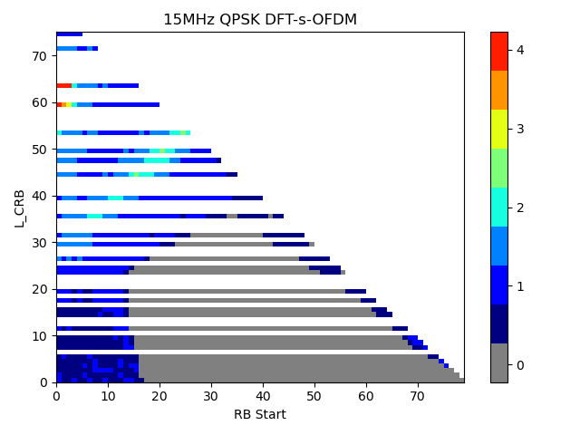
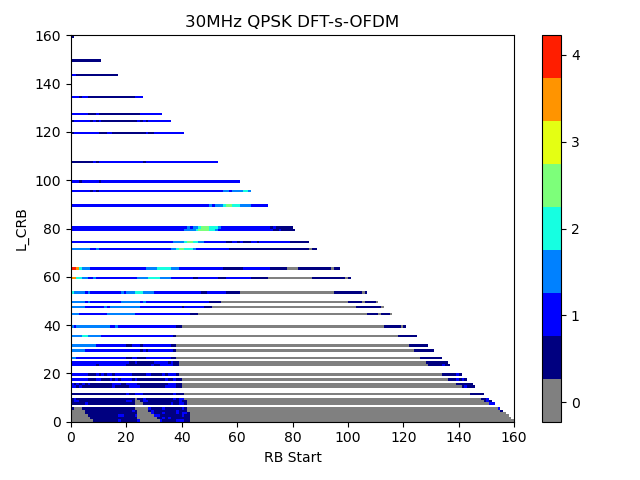
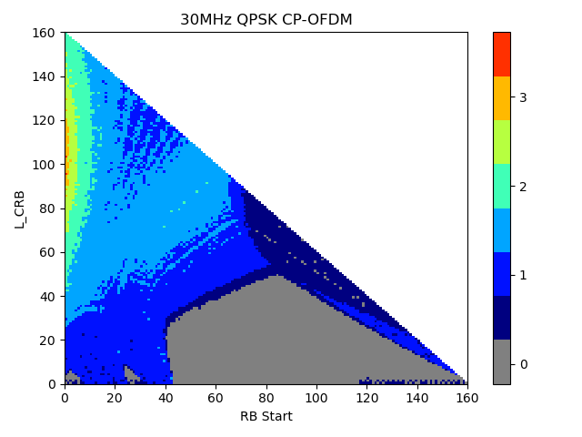
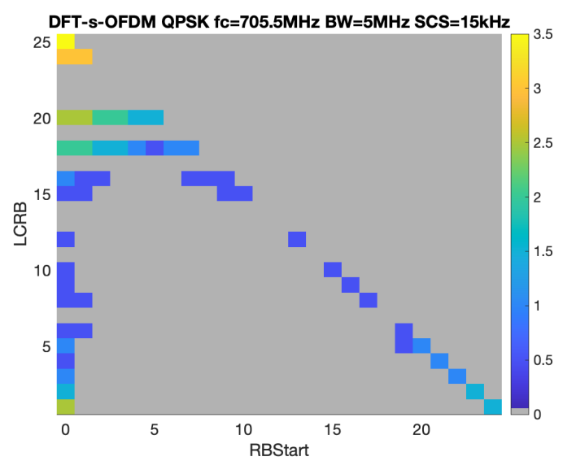
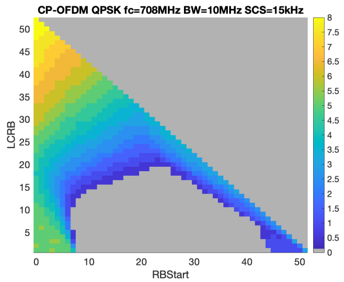
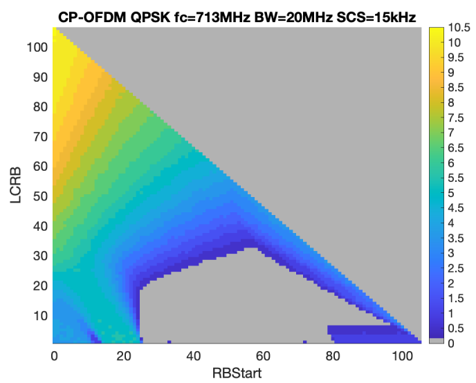

+----------------------------------+----------------------------------+
| 3GPP TS 38.115-1 V18.9.0         |                                  |
| (2025-06)                        |                                  |
+==================================+==================================+
| Technical Specification          |                                  |
+----------------------------------+----------------------------------+
| 3rd Generation Partnership       |                                  |
| Project;                         |                                  |
|                                  |                                  |
| Technical Specification Group    |                                  |
| Radio Access Network;            |                                  |
|                                  |                                  |
| NR;                              |                                  |
|                                  |                                  |
| Repeater conformance testing -   |                                  |
| Part 1: Conducted conformance    |                                  |
| testing;                         |                                  |
|                                  |                                  |
| (Release 18)                     |                                  |
+----------------------------------+----------------------------------+
|                                  |                                  |
+----------------------------------+----------------------------------+
|                                  | {width="1.7784722222222222in" |
|                                  | height="1.0333333333333334in"}   |
+----------------------------------+----------------------------------+
|                                  |                                  |
+----------------------------------+----------------------------------+
| The present document has been    |                                  |
| developed within the 3rd         |                                  |
| Generation Partnership Project   |                                  |
| (3GPP ^TM^) and may be further   |                                  |
| elaborated for the purposes of   |                                  |
| 3GPP.\                           |                                  |
| The present document has not     |                                  |
| been subject to any approval     |                                  |
| process by the 3GPP              |                                  |
| Organizational Partners and      |                                  |
| shall not be implemented.\       |                                  |
| This Specification is provided   |                                  |
| for future development work      |                                  |
| within 3GPP only. The            |                                  |
| Organizational Partners accept   |                                  |
| no liability for any use of this |                                  |
| Specification.\                  |                                  |
| Specifications and Reports for   |                                  |
| implementation of the 3GPP ^TM^  |                                  |
| system should be obtained via    |                                  |
| the 3GPP Organizational          |                                  |
| Partners\' Publications Offices. |                                  |
+----------------------------------+----------------------------------+

+----------------------------------------------------------------------+
|                                                                      |
+======================================================================+
| > ***3GPP***                                                         |
| >                                                                    |
| > Postal address                                                     |
| >                                                                    |
| > 3GPP support office address                                        |
| >                                                                    |
| > 650 Route des Lucioles - Sophia Antipolis                          |
| >                                                                    |
| > Valbonne - FRANCE                                                  |
| >                                                                    |
| > Tel.: +33 4 92 94 42 00 Fax: +33 4 93 65 47 16                     |
| >                                                                    |
| > Internet                                                           |
| >                                                                    |
| > http://www.3gpp.org                                                |
+----------------------------------------------------------------------+
| ***Copyright Notification***                                         |
|                                                                      |
| No part may be reproduced except as authorized by written            |
| permission.\                                                         |
| The copyright and the foregoing restriction extend to reproduction   |
| in all media.                                                        |
|                                                                      |
| © 2025, 3GPP Organizational Partners (ARIB, ATIS, CCSA, ETSI, TSDSI, |
| TTA, TTC).                                                           |
|                                                                      |
| All rights reserved.                                                 |
|                                                                      |
| UMTS™ is a Trade Mark of ETSI registered for the benefit of its      |
| members                                                              |
|                                                                      |
| 3GPP™ is a Trade Mark of ETSI registered for the benefit of its      |
| Members and of the 3GPP Organizational Partners\                     |
| LTE™ is a Trade Mark of ETSI registered for the benefit of its       |
| Members and of the 3GPP Organizational Partners                      |
|                                                                      |
| GSM® and the GSM logo are registered and owned by the GSM            |
| Association                                                          |
+----------------------------------------------------------------------+

 Contents {#contents .TT}
========

Foreword 18

1 Scope 20

2 References 20

3 Definitions of terms, symbols and abbreviations 21

3.1 Terms 21

3.2 Symbols 22

3.3 Abbreviations 23

4 General conducted test conditions and declarations 23

4.1 Measurement uncertainties and test requirements 23

4.1.1 General 23

4.1.2 Acceptable uncertainty of Test System 24

4.1.2.1 General 24

4.1.2.2 Conducted characteristics measurements 25

4.1.3 Interpretation of measurement results 26

4.2 Conducted requirement reference points 27

4.2.1 RF Repeater 27

4.2.2 NCR type 1-C 27

4.2.3 NCR type 1-H 28

4.3 Repeater classes 28

4.3.1 Repeater class for downlink 28

4.3.2 Repeater class for uplink 29

4.3A NCR classes 29

4.3A.1 NCR class for downlink 29

4.3A.2 NCR class for uplink and MT 29

4.4 Regional requirements 29

4.5 Repeater configurations 29

4.5.1 General configurations 29

4.5.2 Transmission with multiple BS-side antenna connectors for RF
repeater and NCR type 1-C 30

4.5.2A Transmission with multiple BS-side antenna connectors for NCR
type 1-H 30

4.5.3 Transmission with multiple UE-side antenna connectors for RF
repeater and NCR type 1-C 30

4.5.3A Transmission with multiple UE-side antenna connectors for NCR
type 1-H 30

4.5.4 Duplexers 30

4.5.5 Power supply options 31

4.5.6 Ancillary RF amplifiers 31

4.5.7 Combining of repeaters 31

4.6 Manufacturer declarations 32

4.7 Test configurations 36

4.7.1 General 36

4.7.2 Test signal used to build Test Configurations 37

4.7.3 RTC1: Contiguous spectrum operation for RF repeater 37

4.7.3.1 RTC1 generation 37

4.7.3.2 RTC1 power allocation 37

4.7.5 RTC2: Non-contiguous spectrum operation for RF repeater 37

4.7.5.1 RTC2 generation 37

4.7.5.2 RTC2 power allocation 38

4.7.6 RTC3: Multi-band test configuration for full carrier allocation
for RF repeater 38

4.7.6.1 RTC3 generation 38

4.7.6.2 RTC3 power allocation 38

4.7.7 RTC4: Multi-band test configuration with high PSD per carrier for
RF repeater 38

4.7.7.1 RTC4 generation 38

4.7.7.2 RTC4 power allocation 39

4.7.8 NCRTC1: Contiguous spectrum operation for NCR 39

4.7.8.1 NCRTC1 generation 39

4.7.8.2 NCRTC1 power allocation 39

4.7.9 NCRTC2: Non-contiguous spectrum operation for NCR 39

4.7.9.1 NCRTC2 generation 39

4.7.9.2 NCRTC2 power allocation 40

4.7.10 NCRTC3: Multi-band test configuration for full carrier allocation
for NCR 40

4.7.10.1 NCRTC3 generation 40

4.7.10.2 NCRTC3 power allocation 40

4.7.11 NCRTC4: Multi-band test configuration with high PSD per carrier
for NCR 40

4.7.11.1 NCRTC4 generation 40

4.7.11.2 NCRTC4 power allocation 41

4.8 Applicability of requirements 41

4.8.1 General 41

4.8.2 Applicability of test configurations for single-band operation 41

4.8.4 Applicability of test configurations for *multi-band* operation 42

4.9 RF channels and test models 44

4.9.1 RF channels 44

4.9.2 Test models 45

4.9.2.1 General 45

4.9.2.2 FR1 test models for repeater type 1-C for DL 45

4.9.2.3 FR1 test models for repeater type 1-C for UL 45

4.9.2.3.1 General 45

4.9.2.3.2 FR1 test model 1.1 (RUL-FR1-TM1.1) 46

4.9.2.3.3 FR1 test model 2 (RUL-FR1-TM2) 47

4.9.2.3.3a FR1 test model 2a (RUL-FR1-TM2a) 47

4.9.2.3.4 FR1 test model 3.1 (RUL-FR1-TM3.1) 47

4.9.2.3.5 FR1 test model 3.1a (RUL-FR1-TM3.1a) 47

4.9.2.4 Data content of Physical channels and Signals for RUL-FR1-TM 48

4.9.2.4.1 General 48

4.9.2.4.2 PUSCH 48

4.9A RF channels and test models for NCR 48

4.9A.1 RF channels 48

4.9A.2 Test models 49

4.9A.2.1 General 49

4.9A.2.2 FR1 test models for NCR for DL 49

4.9A.2.3 FR1 test models for NCR for UL 49

4.9A.2.3.1 General 49

4.9A.2.3.2 FR1 test model 1.1 (NCRUL-FR1-TM1.1) 50

4.9A.2.3.3 FR1 test model 2 (NCRUL-FR1-TM2) 51

4.9A.2.3.3a FR1 test model 2a (NCRUL-FR1-TM2a) 51

4.9A.2.3.4 FR1 test model 3.1 (NCRUL-FR1-TM3.1) 51

4.9A.2.3.5 FR1 test model 3.1a (NCRUL-FR1-TM3.1a) 52

4.9A.2.4 Data content of Physical channels and Signals for NCRUL-FR1-TM
52

4.9A.2.4.1 General 52

4.9A.2.4.2 PUSCH 52

4.10 Requirements for contiguous and non-contiguous spectrum 53

4.11 Requirements for repeater capable of multi-band operation 53

4.12 Format and interpretation of tests 53

5 Operating bands and channel arrangement 54

6 Conducted characteristics 54

6.1 General 54

6.2 Repeater output power 55

6.2.1 Definition and applicability 55

6.2.2 Minimum requirement 56

6.2.3 Test purpose 56

6.2.4 Method of test 57

*6.2.4.1* *Initial conditions* 57

*6.2.4.2* *Procedure* 57

6.2.5 Test requirement 58

6.3 Frequency stability 58

6.3.1 Definition and applicability 58

6.3.2 Minimum Requirement 58

6.3.3 Test purpose 58

6.3.4 Method of test 58

6.3.5 Test Requirements 58

6.4 Out of band gain 58

6.4.1 Definition and applicability 58

6.4.2 Minimum Requirement 58

6.4.3 Test purpose 59

6.4.4 Method of test 59

6.4.4.1 Initial conditions 59

6.4.4.2 Procedure 59

6.4.5 Test Requirements 59

6.5 Unwanted emissions 60

6.5.1 General 60

6.5.2 Adjacent Channel Leakage Power Ratio (ACLR) 60

6.5.2.1 Definition and applicability 60

6.5.2.2 Minimum requirement 61

6.5.2.3 Test purpose 61

6.5.2.4 Method of test 61

6.5.2.4.1 Initial conditions 61

6.5.2.4.2 Procedure 61

6.5.2.5 Test requirements for RF repeater 62

6.5.2.6 Test requirement for *NCR* 66

6.5.2.6.1 Test requirements for NCR-Fwd 66

6.5.2.6.2 Test requirement for NCR-MT 67

6.5.3 Operating band unwanted emissions 68

6.5.3.1 Definition and applicability 68

6.5.3.2 Minimum requirement 69

6.5.3.3 Test purpose 69

6.5.3.4 Method of test 69

6.5.3.4.1 Initial conditions 69

6.5.3.4.2 Procedure for RF repeater 69

6.5.3.4a Test requirements for RF repeater 70

6.5.3.4a.1 Operating band unwanted emission limits for Wide Area
*repeater type 1-C* (Category A) 70

6.5.3.4a.2 Operating band unwanted emission limits for Wide Area
*repeater type 1-C* (Category B) 71

6.5.3.4a.2.1 Category B requirements (Option 1) 72

6.5.3.4a.2.2 Category B requirements (Option 2) 73

6.5.3.4a.3 Operating band unwanted emission limits for Medium Range
*repeater type 1-C* (Category A and B) for DL 73

6.5.3.4a.4 Operating band unwanted emission limits for Local Area
*repeater type 1-C* (Category A and B) 75

6.5.3.4a.5 Additional operating band unwanted emission requirements 76

6.5.3.5 Void 77

6.5.3.6 Test requirement for NCR 77

6.5.3.6.1 Test requirement for NCR-Fwd 77

6.5.3.6.2 Test requirement for NCR-MT 77

6.5.4 Transmitter spurious emissions 78

6.5.4.1 Definition and applicability 78

6.5.4.2 Minimum requirement 79

6.5.4.3 Test purpose 79

6.5.4.4 Method of test 79

6.5.4.4.1 Initial conditions 79

6.5.4.4.2 Procedure for RF repeater 79

6.5.4.5 Test requirements for RF repeater 80

6.5.4.5.1 General transmitter spurious emissions requirements 80

6.5.4.5.2 Additional spurious emissions requirements 81

6.5.4.5.3 Co-location with base stations and *repeater* 91

6.5.4.6 Test requirements for *NCR* 96

6.5.4.6.1 Test requirement for NCR-Fwd 96

6.5.4.6.2 Test requirement for NCR-MT 97

6.5.5 Receiver spurious emissions 97

6.5.5.1 Definition and applicability 97

6.5.5.2 Minimum requirement 97

6.5.5.3 Test purpose 97

6.5.5.4 Method of test 97

6.5.5.4.1 Initial conditions 97

6.5.5.4.2 Procedure 98

6.5.5.5 Test requirements 98

6.5.5.6 Test requirements for *NCR* 98

6.5.5.6.1 Test requirement for NCR-Fwd 98

6.6 Repeater Error Vector Magnitude 99

6.6.1 Downlink repeater error vector magnitude 99

6.6.1.1 General 99

6.6.1.2 Minimum requirements 99

6.6.1.3 Test purpose 99

6.6.1.4 Method of test 100

6.6.1.4.1 Initial conditions 100

6.6.1.4.2 Procedure 100

6.6.1.5 Test requirement 101

6.6.2 Uplink repeater error vector magnitude 101

6.6.2.1 General 101

6.6.2.2 Minimum requirement 102

6.6.2.3 Test purpose 102

6.6.2.3 Method of test 102

6.6.2.3.1 Initial conditions 102

6.6.2.3.2 Procedure 102

6.6.2.4 Test requirement 103

6.7 Input intermodulation 103

6.7.1 Definition and applicability 103

6.7.1.1 General 103

6.7.1.2 Minimum requirements 104

6.7.1.3 Test purpose 104

6.7.1.4 Method of test 104

6.7.1.4.1 Initial conditions 104

6.7.1.4.2 Procedure 104

6.7.1.5 Test requirements 104

6.7.1.5.1 General requirement 104

6.7.1.5.2 Co-location with BS/Repeater in other systems 104

6.7.1.5.3 Co-existence with other systems 105

6.8 Output intermodulation 106

6.8.1 Definition and applicability 106

6.8.1.1 General 106

6.8.1.2 Minimum requirements 106

6.8.1.3 Test purpose 106

6.8.1.4 Method of test 106

6.8.1.4.1 Initial conditions 106

6.8.1.4.2 Procedure 107

6.8.1.5 Test requirements 107

6.8.1.5.1 General requirements 107

6.8.1.5.2 Additional requirements 108

6.9 Adjacent Channel Rejection Ratio (ACRR) 108

6.9.1 Definitions and applicability 108

6.9.2 Co-existence with UTRA, E-UTRA and NR 108

6.9.2.1 Minimum requirements 108

6.9.2.2 Test purpose 108

6.9.2.3 Method of test 108

6.9.2.3.1 Initial conditions 108

6.9.2.3.2 Procedure 109

6.9.2.3.3 Test Requirements 109

6.10 Transmit ON/OFF power 111

6.10.1 Transmitter OFF power 111

6.10.1.1 Definition and applicability 111

6.10.1.2 Minimum requirement 111

6.10.1.3 Test purpose 111

6.10.1.4 Method of test 111

6.10.1.5 Test requirements 111

6.10.2 Transmitter transient period 111

6.10.2.1 Definition and applicability 111

6.10.2.2 Minimum requirement 112

6.10.2.3 Test purpose 112

6.10.2.4 Method of test 112

6.10.2.4.1 Initial conditions 112

6.10.2.4.2 Procedure 112

6.11 Output power dynamics for NCR-MT 114

6.11.1 Definition and applicability 114

6.11.2 Minimum requirement 114

6.11.2.1 Minimum requirement for transmit OFF power for NCR-MT 114

6.11.2.2 Minimum requirement for transmit ON/OFF time mask for NCR-MT
114

6.11.2.3 Minimum requirement for power control for NCR-MT 114

6.11.3 Test purpose 114

6.12 Transmit signal quality for NCR-MT 114

6.12.1 Definition and applicability 114

6.12.2 Minimum requirement 114

6.12.2.1 Minimum requirement for frequency error requirements for NCR-MT
114

6.12.2.2 Minimum requirement for transmit modulation quality 114

6.12.3 Test purpose 114

6.12.4 Method of test 115

6.12.4.1 Initial conditions 115

6.12.4.2 Procedure 115

6.12.5 Test requirements 115

6.13 Transmit intermodulation for NCR-MT 117

6.13.1 Definition and applicability 117

6.13.2 Minimum requirement for NCR-MT 117

6.13.3 Test purpose 117

6.13.4 Method of test 117

6.13.4.1 Initial conditions 117

6.13.4.2 Procedure 118

6.13.5 Test requirements 119

6.13.5.1 Co-location minimum requirements 119

6.13.5.2 Intra-system minimum requirements 119

6.13.5.3 Additional requirements 120

6.14 Reference sensitivity for NCR-MT 120

6.14.1 Definition and applicability 120

6.14.2 Minimum requirements for NCR-MT type 1-C and 1-H 120

6.14.3 Test purpose 120

6.14.4 Method of test 120

6.14.4.1 Initial conditions 120

6.14.4.2 Procedure 120

6.14.5 Test requirements for NCR-MT 121

6.15 Maximum input level for NCR-MT 121

6.15.1 Definition and applicability 121

6.15.2 Minimum requirement 122

6.15.3 Test purpose 122

6.15.4 Method of test 122

6.15.4.1 Initial conditions 122

6.15.4.2 Procedure 122

6.15.5 Test requirements 122

6.16 Adjacent channel selectivity for NCR-MT 123

6.16.1 Definition and applicability 123

6.16.2 Minimum requirement 123

6.16.3 Test purpose 123

6.16.4 Method of test 123

6.16.4.1 Initial conditions 123

6.16.4.2 Procedure 123

6.16.5 Test requirements for NCR-MT 124

6.16.6 Void 124

6.17 Blocking characteristics for NCR-MT 124

6.17.1 Definition and applicability 124

6.17.2 Minimum requirement 124

6.17.3 Test purpose 124

6.17.4 Method of test 124

6.17.4.1 Initial conditions 124

6.17.4.2 Procedure for general blocking 124

6.17.4.3 Procedure for narrowband blocking 125

6.17.4.4 Procedure for out of band blocking 125

6.17.5 Test requirements for NCR-MT 126

6.18 Transmitter spurious response for NCR-MT 126

6.18.1 Definition and applicability 126

6.18.2 Minimum requirement 126

6.18.3 Test purpose 126

6.18.4 Method of test 126

6.18.4.1 Initial conditions 126

6.18.4.2 Procedure 126

6.18.5 Test requirements 127

6.19 Receiver intermodulation characteristics for NCR-MT 127

6.19.1 Definition and applicability 127

6.19.2 Minimum requirement 127

6.19.3 Test purpose 127

6.19.4 Method of test 127

6.19.4.1 Initial conditions 127

6.19.4.2 Procedure 127

6.19.5 Test requirements for NCR-MT 128

6.20 Reciver spurious emissions for NCR-MT 128

6.20.1 Definition and applicability 128

6.20.2 Minimum requirement 128

6.20.3 Test purpose 128

6.20.4 Method of test 128

6.20.4.1 Initial conditions 128

6.20.4.2 Procedure 129

6.20.5 Test requirements 129

60.20.5.1 Basic limits for NCR-MT 129

6.20.5.2 Test requirement for NCR-MT 129

7.1.3 CSI reporting requirements 135

7.1.3.1 General 135

7.1.3.1.1 Applicability rule for NCR-MT 135

7.1.3.1.2 Common test parameters 136

7.1.3.2 Reporting Channel Quality Indicator (CQI) 136

7.1.3.2.1 Definition and applicability 136

7.1.3.2.2 Minimum requirement 137

7.1.3.2.3 Test purpose 137

7.1.3.2.4 Method of test 137

7.1.3.2.5 Test requirement 141

Annex A (normative): Repeater stimulus signals 142

A.1 Repeater stimulus signal 1 142

A.2 Repeater stimulus signal 2 142

A.3 Repeater stimulus signal spectral purity requirements 142

Annex B (normative): Environmental requirements for the repeater 143

B.1 General 143

B.2 Normal test environment 143

B.3 Extreme test environment 144

B.3.1 Extreme temperature 144

B.4 Vibration 144

B.5 Power supply 144

B.6 Measurement of test environments 145

Annex C (informative): Test tolerances and derivation of test
requirements 145

C.1 Measurement of conducted characteristics 146

Annex D (informative): Measurement system set-up 147

D.1 Repeater output power and transmit ON/OFF power 147

D.2 Out of band gain 147

D.3 Unwanted emission: Operating band unwanted emission, transmitter
spurious emission, and ACLR 148

D.4 Modulation Accuracy: Repeater Error Vector Magnitude and Frequency
Stability 148

D.5 Input intermodulation 149

D.6 Output Intermodulation 149

D.7 Adjacent Channel Rejection Ratio 150

D.8 Rx spurious emission requirement 150

D.9 NCR-MT type 1-C PDCCH and PDSCH demodulation testing 150

D.10 NCR-MT type 1-C CQI testing 151

D.11 NCR-MT type 1-H PDCCH and PDSCH demodulation testing 152

D.12 NCR-MT type 1-H CQI testing 153

Annex E (normative): In-channel TX tests 154

E.1 General 154

E.2 Basic principles 155

E.2.1 Output signal of the repeater under test 155

E.2.2 Ideal signal 155

E.2.3 Measurement results 155

E.2.4 Measurement points 156

E.3 Pre-FFT minimization process 156

E.4 Timing of the FFT window 157

E.5 Resource element TX power 158

E.6 Post-FFT equalisation 158

E.7 EVM 159

E.7.0 General 159

E.7.1 Averaged EVM (FDD) 160

E.7.2 Averaged EVM (TDD) 160

Annex F (normative): NCR-MT Reference measurement channels 161

F.1 NCR-MT Demodulation Performance Fixed Reference Channels 161

F.1.1 Fixed Reference Channels for PDSCH performance requirements 161

F.1.2 Fixed Reference Channels for PDCCH performance requirements 162

F.1.3 Fixed Reference Channels for CSI reporting performance 162

F.2 Fixed Reference Channels for reference sensitivity level, ACS,
in-band blocking, out-of-band blocking and receiver intermodulation
(QPSK, R=1/3) 163

Annex G (normative): Propagation conditions 163

G.1 Static propagation condition 163

G1.1 NCR-MT receiver with 2RX 163

G.1.2 NCR-MT Receiver with 4Rx 163

G.2 Multi-path fading propagation conditions 164

G.2.1 General 164

G.2.2 Delay profiles 164

G.2.2.1 General 164

G.2.2.2 Delay profiles for FR1 165

G.2.3 Combinations of channel model parameters 166

G.2.4 MIMO channel correlation matrices 167

G.2.4.1 General 167

G.2.4.2 MIMO correlation matrices using Uniform Linear Array 167

G.2.4.2.1 General 167

G.2.4.2.2 Definition of MIMO correlation matrices 167

G.2.4.2.3 MIMO correlation matrices at high, medium and low level 168

G.2.4.3 Multi-antenna channel models using cross polarized antennas 169

G.2.4.3.1 General 169

G.2.4.3.2 Definition of MIMO correlation matrices using cross polarized
antennas 170

G.2.4.3.3 Spatial correlation matrices at NCR-MT and gNB sides 170

G.2.4.3.3.1 Spatial correlation matrices at NCR-MT side 170

G.2.4.3.3.2 Spatial correlation matrices at gNB side 171

G.2.4.3.4 MIMO correlation matrices using cross polarized antennas 171

G.2.4.3.5 Beam steering approach 171

Annex H (informative): Change history 173

Foreword
========

This Technical Specification has been produced by the 3rd Generation
Partnership Project (3GPP).

The contents of the present document are subject to continuing work
within the TSG and may change following formal TSG approval. Should the
TSG modify the contents of the present document, it will be re-released
by the TSG with an identifying change of release date and an increase in
version number as follows:

Version x.y.z

where:

x the first digit:

1 presented to TSG for information;

2 presented to TSG for approval;

3 or greater indicates TSG approved document under change control.

y the second digit is incremented for all changes of substance, i.e.
technical enhancements, corrections, updates, etc.

z the third digit is incremented when editorial only changes have been
incorporated in the document.

In the present document, modal verbs have the following meanings:

**shall** indicates a mandatory requirement to do something

**shall not** indicates an interdiction (prohibition) to do something

The constructions \"shall\" and \"shall not\" are confined to the
context of normative provisions, and do not appear in Technical Reports.

The constructions \"must\" and \"must not\" are not used as substitutes
for \"shall\" and \"shall not\". Their use is avoided insofar as
possible, and they are not used in a normative context except in a
direct citation from an external, referenced, non-3GPP document, or so
as to maintain continuity of style when extending or modifying the
provisions of such a referenced document.

**should** indicates a recommendation to do something

**should not** indicates a recommendation not to do something

**may** indicates permission to do something

**need not** indicates permission not to do something

The construction \"may not\" is ambiguous and is not used in normative
elements. The unambiguous constructions \"might not\" or \"shall not\"
are used instead, depending upon the meaning intended.

**can** indicates that something is possible

**cannot** indicates that something is impossible

The constructions \"can\" and \"cannot\" are not substitutes for \"may\"
and \"need not\".

**will** indicates that something is certain or expected to happen as a
result of action taken by an agency the behaviour of which is outside
the scope of the present document

**will not** indicates that something is certain or expected not to
happen as a result of action taken by an agency the behaviour of which
is outside the scope of the present document

**might** indicates a likelihood that something will happen as a result
of action taken by some agency the behaviour of which is outside the
scope of the present document

**might not** indicates a likelihood that something will not happen as a
result of action taken by some agency the behaviour of which is outside
the scope of the present document

In addition:

**is** (or any other verb in the indicative mood) indicates a statement
of fact

**is not** (or any other negative verb in the indicative mood) indicates
a statement of fact

The constructions \"is\" and \"is not\" do not indicate requirements.

 1 Scope
=======

The present document specifies the Radio Frequency (RF) test methods and
conformance requirements for RF repeater *type 1-C, network controlled
repeater type (NCR) 1-C and 1-H*. These have been derived from, and are
consistent with the conducted requirements for *repeater type 1-C,
network controlled repeater type 1-C and 1-H* in NR repeater
specification defined in TS 38.106 \[2\].

RF *repeater type 1-C and NCR type 1-C* only have conducted requirements
so they require compliance to this specification only.

*NCR type 1-H* has both conducted and radiated requirements so it
requires compliance to this specification and TS 38.115-2 \[3\].

*RF repeater type 2-O* and*NCR type 2-O* have only radiated requirements
so they require compliance to TS 38.115-2 \[3\] only.

2 References
============

The following documents contain provisions which, through reference in
this text, constitute provisions of the present document.

\- References are either specific (identified by date of publication,
edition number, version number, etc.) or non‑specific.

\- For a specific reference, subsequent revisions do not apply.

\- For a non-specific reference, the latest version applies. In the case
of a reference to a 3GPP document (including a GSM document), a
non-specific reference implicitly refers to the latest version of that
document *in the same Release as the present document*.

\[1\] 3GPP TR 21.905: \"Vocabulary for 3GPP Specifications\".

\[2\] 3GPP TS 38.106: \"NR; Repeater Radio Transmission and Reception\"

\[3\] 3GPP TS 38.115-2: \"NR; Repeater conformance testing, Part 2:
Radiated conformance testing\"

\[4\] ITU-R Recommendation SM.329: \"Unwanted emissions in the spurious
domain\"

\[5\] 3GPP TS 38.104: \"NR; Base Station (BS) radio transmission and
reception\"

\[6\] 3GPP TS 36.104: \"Evolved Universal Terrestrial Radio Access
(E-UTRA); Base Station (BS) radio transmission and reception\"

\[7\] 3GPP TS 38.141-1: \"NR; Base Station (BS) conformance testing,
Part 1: Conducted conformance testing\"

\[8\] 3GPP TS 38.211: \"NR; Physical channels and modulation\"

\[9\] 3GPP TS 38.101-1: \"NR; User Equipment (UE) radio transmission and
reception; Part 1: Range 1 Standalone\"

\[10\] 3GPP TS 38.331: \"NR; Radio Resource Control (RRC) protocol
specification\"

\[11\] ITU-R Recommendation M.1545: "Measurement uncertainty as it
applies to test limits for the terrestrial component of International
Mobile Telecommunications -- 2000"

\[12\] ITU-T Recommendation O.150, \"Equipment for the measurement of
digital and analogue/digital parameters\"

\[13\] Federal Communications Commission: \"Title 47 of the Code of
Federal Regulations (CFR) \"

\[14\] ECC/DEC/(17)06: \"The harmonised use of the frequency bands
1427-1452 MHz and 1492-1518 MHz for Mobile/Fixed Communications Networks
Supplemental Downlink (MFCN SDL)\"

\[15\] 3GPP TR 25.942: \"RF system scenarios\"

\[16\] IEC 60 721-3-3: \"Classification of environmental conditions -
Part 3-3: Classification of groups of environmental parameters and their
severities - Stationary use at weather protected locations\"

\[17\] IEC 60 721-3-4: \"Classification of environmental conditions -
Part 3: Classification of groups of environmental parameters and their
severities - Clause 4: Stationary use at non-weather protected
locations\"

\[18\] IEC 60 721: \"Classification of environmental conditions\"

\[19\] IEC 60 068-2-1 (2007): \"Environmental testing - Part 2: Tests.
Tests A: Cold\"

\[20\] IEC 60 068-2-2: (2007): \"Environmental testing - Part 2: Tests.
Tests B: Dry heat\"

> \[21\] IEC 60 068-2-6: (2007): \"Environmental testing - Part 2: Tests
> - Test Fc: Vibration (sinusoidal)\" \[22\] Void
>
> \[23\] 3GPP TS 38.214: \"NR; Physical layer procedures for data\"
>
> \[24\] 3GPP TR 38.901: \"Study on channel model for frequencies from
> 0.5 to 100 GHz\"
>
> \[25\] 3GPP TS 38.521-1: \"User Equipment (UE) conformance
> specification; Radio transmission and reception; Part 1: Range 1
> Standalone\"\[26\] 3GPP TR 38.174: \"NR; Integrated Access and
> Backhaul (IAB) radio transmission and reception\"

3 Definitions of terms, symbols and abbreviations
=================================================

3.1 Terms
---------

For the purposes of the present document, the terms given in 3GPP
TR 21.905 \[1\] and the following apply. A term defined in the present
document takes precedence over the definition of the same term, if any,
in 3GPP TR 21.905 \[1\].

**Antenna connector:** connector at the conducted interface of the
*repeater type 1-C***gap between passbands:** frequency gap between two
consecutive passbands that belong to the same *operating band*, where
the RF requirements in the gap are based on co-existence for
un-coordinated operation

**Inter-passband gap**: The frequency gap between two supported
consecutive *passbands* that belong to different operating bands.

**Maximum passband output power:** mean power level measured per
*passband* at the *antenna connector*, during the *transmitter ON state*
in a specified reference condition.

**multi-band connector**: *Antenna Connector* for a *Multi-band
repeater*.

**Multi-band repeater:** *Repeater Type 1-C* whose *antenna connector*
is associated with a transmitter and/or receiver that is characterized
by the ability to process two or more *passband(s)* in common active RF
components simultaneously, where at least one *passband* is configured
at a different operating band than the other *passband(s)* and where
this different operating band is not a sub-band or superseding-band of
another supported operating band

**NCR type 1-C**: NCR-MT or NCR-Fwd at FR1 with a *requirement set*
consisting only of conducted requirements defined at individual antenna
connectors.

**NCR type 1-H**: NCR-MT or NCR-Fwd operating at FR1 with a *requirement
set* consisting of conducted requirements defined at individual TAB
connectors and OTA requirements defined at RIB.**Nominal channel
bandwidth: Bandwidth calculated as** min(100MHz, BW~passband~) in FR1 or
min(400MHz, BW~passband~) in FR2. If this bandwidth is not defined for
BS channel bandwidth for the operating band, *nominal channel bandwidth*
shall be defined as the widest BS channel bandwidth for the operating
band which is narrower than BW~passband~.

**Non-contiguous spectrum**: spectrum consisting of two or more
*passbands* separated by *inter-passband gap*(s).

**Operating band:** frequency range in which NR operates (paired or
unpaired), that is defined with a specific set of technical requirements

**Passband:** The frequency range in which the repeater operates in with
operational configuration, this frequency range can correspond to one or
several consecutive nominal channels, if they are not consecutive each
subset of channels shall be considered as an individual *passband*, a
repeater can have one or several *passbands*, all channels within the
*passband(s)* shall belong to a single operator or collaborating
operators.

**passband edge***:* Frequency at the edge of the passband

**Repeater type 1-C**: Repeater operating at FR1 with a requirement set
consisting only of conducted requirements defined at individual *antenna
connectors*.

***Requirement set:*** one of the NR requirements set as defined for *NR
repeater*

**single-band connector:** *Repeater type 1-C* *antenna connector*
supporting operation either in a single *operating band* only, or in
multiple *operating bands* but does not meet the conditions for a
*multi-band connector*.

**Sub-band**: A *sub-band* of an operating band contains a part of the
uplink and downlink frequency range of the operating band.

**sub-block:** one contiguous allocated block of spectrum for
transmission and reception by the repeater.

**Superseding-band**: A *superseding-band* of an operating band includes
the whole of the uplink and downlink frequency range of the operating
band.

**TAB connector:** *transceiver array boundary* connector

**transceiver array boundary:** conducted interface between the
transceiver unit array and the composite antenna

**Transmitter OFF state:** Time period during which the repeater
downlink or uplink is not allowed to transmit in the corresponding
direction.

**Transmitter ON state:** Time period during which the repeater **is
transmitting** downlink or uplink signals in the corresponding
direction.

**Transmitter transient period:** Time period during which the repeater
is changing from the OFF state to the ON state or vice versa.

3.2 Symbols
-----------

For the purposes of the present document, the following symbols apply:

BW~Config~ Transmission bandwidth configuration, where BW~Config~ =
*N*~RB~ x SCS x 12

BW~Nominal~ Nominal channel *bandwidth*

BW~Passband~ *Passband bandwidth*

∆f Separation between the *passband edge* frequency and the nominal
-3 dB point of the measuring filter closest to the carrier frequency

∆f~max~ f\_offset~max~ minus half of the bandwidth of the measuring
filter

Δf~OBUE~ Maximum offset of the *operating band* unwanted emissions mask
from the *operating band* edge

F~DL,low~ The lowest frequency of the downlink *operating band*

F~DL,high~ The highest frequency of the downlink *operating band*

F~filter~ Filter centre frequency

F~offset,high~ Frequency offset from F~C,high~ to the upper *passband
edge*

F~offset,low~ Frequency offset from F~C,low~ to the lower *passband
edge*

f\_offset Separation between the *passband edge* frequency and the
centre of the measuring

f\_offset~max~ The offset to the frequency Δf~OBUE~ outside the
*operating band*

F~UL,low~ The lowest frequency of the uplink *operating band*

F~UL,high~ The highest frequency of the uplink *operating band*

P~EM,n50/n75,ind~ Declared emission level for Band n50/n75; ind = a, b

P~EM,n54,ind~ Declared emission level for Band n54 in the band 1518-1559
MHz; ind = a, b, c, d, e, f

P~max,p,AC~ *Maximum passband output power* measured per *antenna
connector*

P~max,c,TABC~ The *maximum carrier output power per TAB connector*

P~rated,c,AC~ The *rated carrier output power per antenna connector*

P~rated,c,sys~ The sum of P~rated,c,TABC~ for all *TAB connectors* for a
single carrier

P~rated,c,TABC~ The *rated carrier output power per TAB connector*

P~rated,in~ Rated pass band input power to the repeater for the test per
antenna connector

P~rated,p,AC~ Rated passband output power per antenna connector

P~rated,p,sys~ The sum of P~rated,c,TABC~ for all *TAB connectors* for
*passband*

P~rated,p,TABC~ The *rated passband output power per TAB connector*

P~rated,t,AC~ Rated total output power declared per antenna connector

P~rated,t,TABC~ The *rated total output power* declared at *TAB
connector*

P~in,p,AC~ Input power intended to produce the maximum rated output
power (P~rated,p,AC~) at the *antenna connector*

P~in,p,TABC~ Input power intended to produce the maximum rated output
power (P~rated,p,AC~) at the *antenna connector*

P~max,p,AC~ *Maximum passband output power* measured per *antenna
connector*

P~max,p,TABC~ The *maximum passband output power per TAB connector*

W~gap~ *Inter passband Bandwidth gap* size

3.3 Abbreviations
-----------------

For the purposes of the present document, the abbreviations given in
3GPP TR 21.905 \[1\] and the following apply. An abbreviation defined in
the present document takes precedence over the definition of the same
abbreviation, if any, in 3GPP TR 21.905 \[1\].

ACLR Adjacent Channel Leakage Ratio

ACS Adjacent Channel Selectivity

BW Bandwidth

CACLR Cumulative ACLR

CP-OFDM Cyclic Prefix-OFDM

CW Continuous Wave

DFT-s-OFDM Discrete Fourier Transform-spread-OFDM

DL Downlink

EVM Error Vector MagnitudeFR Frequency Range

ITU‑R Radiocommunication Sector of the International Telecommunication
Union

LA Local Area

MR Medium Range

NCR Network Controlled Repeater

NCR-MT NCR Mobile Termination

NCR-Fwd NCR Forward

NR New Radio

OBUE Operating Band Unwanted Emissions

OOB Out-of-band

QAM Quadrature Amplitude Modulation

RF Radio Frequency

RX Receiver

SCS Sub-Carrier Spacing

TAB Transceiver Array Boundary

TX Transmitter

UL Uplink

WA Wide Area

4 General conducted test conditions and declarations
====================================================

4.1 Measurement uncertainties and test requirements
---------------------------------------------------

### 4.1.1 General

The requirements of this clause apply to all applicable tests in part 1
of this specification, i.e. to all conducted tests defined for FR1. The
frequency ranges FR1 and FR2 are defined in clause 5.1 of
TS 38.106 \[2\].

The minimum requirements are given in TS 38.106 \[2\]. Test Tolerances
for the conducted test requirements explicitly stated in the present
document are given in annex C of the present document.

Test Tolerances are individually calculated for each test. The Test
Tolerances are used to relax the minimum requirements to create test
requirements.

When a test requirement differs from the corresponding minimum
requirement, then the Test Tolerance applied for the test is non-zero.
The Test Tolerance for the test and the explanation of how the minimum
requirement has been relaxed by the Test Tolerance are given in annex C.

### 4.1.2 Acceptable uncertainty of Test System

#### 4.1.2.1 General

The maximum acceptable uncertainty of the Test System is specified below
for each test defined explicitly in the present specification, where
appropriate. The maximum acceptable uncertainty of the Test System for
test requirements included by reference is defined in the respective
referred test specification.

The Test System shall enable the stimulus signals in the test case to be
adjusted to within the specified tolerance and the equipment under test
to be measured with an uncertainty not exceeding the specified values.
All tolerances and uncertainties are absolute values, and are valid for
a confidence level of 95 %, unless otherwise stated.

A confidence level of 95 % is the measurement uncertainty tolerance
interval for a specific measurement that contains 95 % of the
performance of a population of test equipment.

For RF tests, it should be noted that the uncertainties in clause 4.1.2
apply to the Test System operating into a nominal 50 ohm load and do not
include system effects due to mismatch between the DUT and the Test
System.

#### 4.1.2.2 Conducted characteristics measurements

Table 4.1.2.2-1: Maximum Test System uncertainty for conducted
characteristics tests

+----------------------+----------------------+----------------------+
| Clause               | Maximum Test System  | Derivation of Test   |
|                      | Uncertainty          | System Uncertainty   |
+======================+======================+======================+
| 6.2 Repeater output  | ±0.7 dB, f ≤ 3 GHz   |                      |
| power                |                      |                      |
|                      | ±1.0 dB, 3 GHz \< f  |                      |
|                      | ≤ 7.125 GHz          |                      |
+----------------------+----------------------+----------------------+
| 6.3 Frequency        | ±12 Hz               |                      |
| stability            |                      |                      |
|                      | Measurement results  |                      |
|                      | of ± 500 Hz          |                      |
+----------------------+----------------------+----------------------+
| 6.4 Out of band gain | ±0,5 dB, f ≤ 3.0 GHz |                      |
|                      |                      |                      |
|                      | ±0,8 dB, 3.0 GHz \<  |                      |
|                      | f ≤ 4.2 GHz          |                      |
|                      |                      |                      |
|                      | Calibration of test  |                      |
|                      | set-up shall be made |                      |
|                      | without DUT in order |                      |
|                      | to achieve the       |                      |
|                      | accuracy             |                      |
+----------------------+----------------------+----------------------+
| 6.5.2 ACLR/ CACLR    | BW ≤ 20MHz: ±0.8 dB  |                      |
|                      |                      |                      |
|                      | BW \> 20MHz: ±1.2 dB |                      |
|                      |                      |                      |
|                      | Absolute power ±2.0  |                      |
|                      | dB, f ≤ 3 GHz        |                      |
|                      |                      |                      |
|                      | Absolute power ±2.5  |                      |
|                      | dB, 3 GHz \< f ≤     |                      |
|                      | 7.125 GHz            |                      |
+----------------------+----------------------+----------------------+
| 6.5.3 Operating band | ±1,5 dB, f ≤ 3.0 GHz |                      |
| unwanted emission    |                      |                      |
|                      | ±1,8 dB, 3.0 GHz \<  |                      |
|                      | f ≤ 4.2 GHz          |                      |
|                      |                      |                      |
|                      | The interference     |                      |
|                      | from the signal      |                      |
|                      | generator ACLR shall |                      |
|                      | be minimum 10 dB     |                      |
|                      | below that of a NR   |                      |
|                      | repeater according   |                      |
|                      | to clause 6.5.2.     |                      |
+----------------------+----------------------+----------------------+
| 6.5.4 Spurious       | In NR and            |                      |
| emissions            | coexistence receive  |                      |
|                      | bands:\              |                      |
|                      | for results \> -60   |                      |
|                      | dBm ±2,0 dB\         |                      |
|                      | for results \< -60   |                      |
|                      | dBm ±3,0 dB          |                      |
|                      |                      |                      |
|                      | Outside above range: |                      |
|                      |                      |                      |
|                      | emission power;\     |                      |
|                      | 9 kHz \< f ≤ 4 GHz   |                      |
|                      | ±2,0 dB              |                      |
|                      |                      |                      |
|                      | 4 GHz \< f ≤ 19 GHz  |                      |
|                      | ±4,0 dB.             |                      |
|                      |                      |                      |
|                      | The interference     |                      |
|                      | from the signal      |                      |
|                      | generator ACLR shall |                      |
|                      | be minimum 10 dB     |                      |
|                      | below that of a NR   |                      |
|                      | repeater according   |                      |
|                      | to clause 6.5.2.     |                      |
+----------------------+----------------------+----------------------+
| 6.6 EVM              | 1% signal analyser   |                      |
|                      |                      |                      |
|                      | 2% stimulus signal   |                      |
+----------------------+----------------------+----------------------+
| 6.7 Input            | ±1,2 dB              | Formula:             |
| intermodulation      |                      |                      |
|                      |                      | RSS CW1 level error, |
|                      |                      | 2 x CW2 level error, |
|                      |                      | and measurement      |
|                      |                      | error (using all     |
|                      |                      | errors = ±0,5 dB)    |
+----------------------+----------------------+----------------------+
| 6.8 Output           | For operating band   | Formula:             |
| intermodulation      | unwanted emission:   |                      |
|                      |                      | RSS 2x Interference  |
|                      | ±2,1 dB              | signal level error   |
|                      |                      | and operating band   |
|                      | The interference     | unwanted emission    |
|                      | from the signal      | measurement level    |
|                      | generator ACLR shall | error.\              |
|                      | be minimum 10 dB     | (1 dB interference   |
|                      | below that of a NR   | signal level error   |
|                      | repeater according   | is assumed).         |
|                      | to clause 6.5.2.     |                      |
|                      |                      |                      |
|                      | For spurious         |                      |
|                      | emission:            |                      |
|                      |                      |                      |
|                      | In NR and            |                      |
|                      | coexistence receive  |                      |
|                      | bands:\              |                      |
|                      | for results \> -60   |                      |
|                      | dBm ±2,0 dB\         |                      |
|                      | for results \< -60   |                      |
|                      | dBm ±3,0 dB          |                      |
|                      |                      |                      |
|                      | Outside above        |                      |
|                      | range:\              |                      |
|                      | emission power;\     |                      |
|                      | 9 kHz \< f ≤ 4 GHz   |                      |
|                      | ±2,0 dB;\            |                      |
|                      | 4GHz \< f ≤ 19 GHz   |                      |
|                      | ±4,0 dB.             |                      |
|                      |                      |                      |
|                      | The interference     |                      |
|                      | signal must have a   |                      |
|                      | spurious emission    |                      |
|                      | level at least 10 dB |                      |
|                      | below the spurious   |                      |
|                      | levels required in   |                      |
|                      | 6.5.4 and 6.5.5.     |                      |
+----------------------+----------------------+----------------------+
| 6.9 ACRR             | ±0,7 dB              |                      |
+----------------------+----------------------+----------------------+
| 6.10.1 Transmit      | ±2.0 dB , f ≤ 3 GHz  |                      |
| ON/OFF power         |                      |                      |
|                      | ±2.5 dB, 3 GHz \< f  |                      |
|                      | ≤ 7.125 GHz          |                      |
+----------------------+----------------------+----------------------+
| 6.10.1 Transmit OFF  | N/A                  |                      |
| power                |                      |                      |
+----------------------+----------------------+----------------------+
| 6.11 Output power    | ±0.4 dB              |                      |
| dynamics for NCR-MT  |                      |                      |
+----------------------+----------------------+----------------------+
| 6.12.1 Frequency     | ±12 Hz               |                      |
| Error Requirements   |                      |                      |
| for NCR-MT           |                      |                      |
+----------------------+----------------------+----------------------+
| 6.12.2 Transmit      | ± 1%                 |                      |
| Modulation Quality   |                      |                      |
| for NCR-MT           |                      |                      |
+----------------------+----------------------+----------------------+
| 6.13 Transmitter     | The value below      | The uncertainty of   |
| intermodulation for  | applies only to the  | interferer has       |
| NCR-MT               | interfering signal   | double the effect on |
|                      | and is unrelated to  | the result due to    |
|                      | the measurement      | the frequency offset |
|                      | uncertainty of the   |                      |
|                      | tests in 6.6.3       |                      |
|                      | (ACLR), 6.6.4 (OBUE) |                      |
|                      | and 6.6.5 (spurious  |                      |
|                      | emissions) which     |                      |
|                      | have to be carried   |                      |
|                      | out in the presence  |                      |
|                      | of the interferer.   |                      |
|                      |                      |                      |
|                      | ±1.0 dB              |                      |
+----------------------+----------------------+----------------------+
| 6.14 Reference       | ±0.7 dB, f ≤ 3 GHz   |                      |
| Sensitivity for      |                      |                      |
| NCR-MT               | ±1.0 dB, 3 GHz \< f  |                      |
|                      | ≤ 4.2 GHz            |                      |
|                      |                      |                      |
|                      | ±1.2 dB, 4.2 GHz \<  |                      |
|                      | f ≤ 6 GHz            |                      |
+----------------------+----------------------+----------------------+
| 6.15 Maximum Input   | ±0.3 dB              |                      |
| Level for NCR-MT     |                      |                      |
+----------------------+----------------------+----------------------+
| 6.16 Adjacent        | ±1.4 dB, f ≤ 3 GHz   |                      |
| channel selectivity  |                      |                      |
| for NCR-MT           | ±1.8 dB, 3 GHz \< f  |                      |
|                      | ≤ 4.2 GHz            |                      |
|                      |                      |                      |
|                      | ±2.1 dB, 4.2 GHz \<  |                      |
|                      | f ≤ 6 GHz (NOTE 2)   |                      |
+----------------------+----------------------+----------------------+
| 6.17 Blocking        | General blocking:    |                      |
| Characterisitcs for  |                      |                      |
| NCR-MT               | ±1.6 dB, f ≤ 3 GHz   |                      |
|                      |                      |                      |
|                      | ±2.0 dB, 3 GHz \< f  |                      |
|                      | ≤ 4.2 GHz            |                      |
|                      |                      |                      |
|                      | ±2.2 dB, 4.2 GHz \<  |                      |
|                      | f ≤ 6 GHz (NOTE 2)   |                      |
|                      |                      |                      |
|                      | Narrowband blocking: |                      |
|                      |                      |                      |
|                      | ±1.4 dB, f ≤ 3 GHz   |                      |
|                      |                      |                      |
|                      | ±1.8 dB, 3 GHz \< f  |                      |
|                      | ≤ 4.2 GHz            |                      |
|                      |                      |                      |
|                      | ±2.1 dB, 4.2 GHz \<  |                      |
|                      | f ≤ 6 GHz (NOTE 2)   |                      |
+----------------------+----------------------+----------------------+
| 6.18 Spurious        | N/A                  |                      |
| response for NCR-MT  |                      |                      |
+----------------------+----------------------+----------------------+
| 6.19 Receiver        | ±1.8 dB, f ≤ 3.0 GHz |                      |
| intermodulation      |                      |                      |
| characteristics for  | ±2.4 dB, 3.0 GHz \<  |                      |
| NCR-MT               | f ≤ 4.2 GHz          |                      |
|                      |                      |                      |
|                      | ±3.0 dB, 4.2 GHz \<  |                      |
|                      | f ≤ 6.0 GHz (NOTE 2) |                      |
+----------------------+----------------------+----------------------+
| 6.20 Receiver        | 30 MHz ≤ f ≤ 4 GHz:  |                      |
| spurious emissions   | ±2.0 dB              |                      |
| for NCR-MT           |                      |                      |
|                      | 4 GHz \< f ≤ 19 GHz: |                      |
|                      | ±4.0 dB              |                      |
|                      |                      |                      |
|                      | 19 GHz \< f ≤ 26     |                      |
|                      | GHz: ±4.5 dB         |                      |
+----------------------+----------------------+----------------------+
| NOTE 1: Unless       |                      |                      |
| otherwise noted,     |                      |                      |
| only the Test System |                      |                      |
| stimulus error is    |                      |                      |
| considered here. The |                      |                      |
| effect of errors in  |                      |                      |
| the throughput       |                      |                      |
| measurements due to  |                      |                      |
| finite test duration |                      |                      |
| is not considered.   |                      |                      |
|                      |                      |                      |
| NOTE 2: Test system  |                      |                      |
| uncertainty values   |                      |                      |
| for 4.2 GHz \< f ≤ 6 |                      |                      |
| GHz apply for NCR    |                      |                      |
| operates in licensed |                      |                      |
| spectrum only.       |                      |                      |
+----------------------+----------------------+----------------------+

### 4.1.3 Interpretation of measurement results

The measurement results returned by the Test System are compared -
without any modification - against the test requirements as defined by
the Shared Risk principle.

The Shared Risk principle is defined in Recommendation ITU-R M.1545
\[11\].

The actual measurement uncertainty of the Test System for the
measurement of each parameter shall be included in the test report.

The recorded value for the Test System uncertainty shall be, for each
measurement, equal to or lower than the appropriate figure in
clause 4.1.2 of the present document.

If the Test System for a test is known to have a measurement uncertainty
greater than that specified in clause 4.1.2, it is still permitted to
use this apparatus provided that an adjustment is made as follows.

Any additional uncertainty in the Test System over and above that
specified in clause 4.1.2 shall be used to tighten the test requirement,
making the test harder to pass. For some tests e.g. receiver tests, this
may require modification of stimulus signals. This procedure will ensure
that a Test System not compliant with clause 4.1.2 does not increase the
chance of passing a device under test where that device would otherwise
have failed the test if a Test System compliant with clause 4.1.2 had
been used.

4.2 Conducted requirement reference points
------------------------------------------

### 4.2.1 RF Repeater

For *repeater type 1-C*, the requirements are applied at the repeater
*antenna connector* (BS-side connector or UE-side connector) for
downlink or uplink for the configuration in normal operating conditions.

{width="3.361111111111111in"
height="2.1256944444444446in"}

Figure 4.2.1-1: *Repeater type 1-C* downlink and uplink interface

### 4.2.2 NCR type 1-C

For *NCR type 1-C*, the NCR-Fwd RF requirements are applied at the NCR
*antenna connector* (BS-side connector or UE-side connector) for
downlink or uplink for the configuration in normal operating conditions.

For *NCR type 1-C*, the NCR-MT RF requirements are applied at the NCR
*antenna connector* (BS-side connector) for the configuration in normal
operating conditions.

{width="3.7715277777777776in"
height="3.966666666666667in"}

Figure 4.2.2-1: Network controlled *repeater type 1-C* downlink and
uplink interface

NOTE 1: the NCR-MT and NCR-Fwd may have the same or separate antenna
connectors.

### 4.2.3 NCR type 1-H

For *NCR type 1-H*, the requirements are defined for two points of
reference, signified by radiated requirements and conducted
requirements.

For *NCR type 1-H*, the NCR-Fwd conducted RF requirements are applied at
the NCR individual or groups of *TAB connectors* at the *transceiver
array boundary* (BS-side TAB connector or UE-side TAB connector) for
downlink or uplink for the configuration in normal operating conditions.

For *NCR type 1-H,* the NCR-MT conducted RF requirements are applied at
the NCR individual or groups of *TAB connectors* at the *transceiver
array boundary* (BS-side TAB connector) for the configuration in normal
operating conditions.

{width="6.685416666666667in"
height="4.629166666666666in"}

Figure 4.2.3-1: Network controlled *repeater type 1-H* downlink and
uplink interface

NOTE 1: the NCR-MT and NCR-Fwd may have the same or separate TAB
connectors.

4.3 Repeater classes
--------------------

### 4.3.1 Repeater class for downlink

The requirements in this specification apply to downlink Wide Area
repeaters, downlink Medium Range repeaters and downlink Local Area
repeaters unless otherwise stated. The associated deployment scenarios
for each class are exactly the same for repeater with and without
connectors.

For *repeater type 1-C*, repeater downlink classes are defined as
indicated below:

\- Wide Area repeaters are characterised by requirements derived from
Macro Cell scenarios with a repeater to UE minimum distance along the
ground equal to 35 m.

\- Medium Range repeaters are characterised by requirements derived from
Micro Cell scenarios with a repeater to UE minimum distance along the
ground equal to 5 m.

\- Local Area repeaters are characterised by requirements derived from
Pico Cell scenarios with a repeater to UE minimum distance along the
ground equal to 2 m.

### 4.3.2 Repeater class for uplink

The requirements in this specification apply to uplink Wide Area
repeaters and uplink Local Area repeaters unless otherwise stated. The
associated deployment scenarios for each class are exactly the same for
repeater with and without connectors.

For *repeater type 1-C*, repeater uplink classes are defined as
indicated below:

\- Wide Area repeaters are characterised by requirements derived from
Macro Cell and/or Micro Cell scenarios.

\- Local Area repeaters are characterised by requirements derived from
Pico Cell and/or Micro Cell scenarios.

4.3A NCR classes
----------------

### 4.3A.1 NCR class for downlink

The requirements in this specification apply to downlink Wide Area NCR,
downlink Medium Range NCR and downlink Local Area NCR unless otherwise
stated. The associated deployment scenarios for each class are exactly
the same for NCR with and without connectors.

For *NCR type 1-C and type 1-H*, NCR downlink classes are defined as
indicated below:

\- Wide Area NCR are characterised by requirements derived from Macro
Cell scenarios with a NCR to UE minimum distance along the ground equal
to 35 m.

\- Medium Range NCR are characterised by requirements derived from Micro
Cell scenarios with a NCR to UE minimum distance along the ground equal
to 5 m.

\- Local Area NCR are characterised by requirements derived from Pico
Cell scenarios with a NCR to UE minimum distance along the ground equal
to 2 m or from Femto Cell scenarios.

### 4.3A.2 NCR class for uplink and MT

The requirements in this specification apply to uplink Wide Area NCR and
uplink Local Area NCR unless otherwise stated. The associated deployment
scenarios for each class are exactly the same for NCR with and without
connectors.

For *NCR type 1-C and type 1-H*, NCR uplink classes and MT classes are
defined as indicated below:

\- Wide Area NCR are characterised by requirements derived from Macro
Cell and/or Micro Cell scenarios.

\- Local Area NCR are characterised by requirements derived from Pico
Cell and/or Micro Cell scenarios.

4.4 Regional requirements
-------------------------

Some requirements in the present document may only apply in certain
regions either as optional requirements, or as mandatory requirements
set by local and regional regulation. It is normally not stated in the
3GPP specifications under what exact circumstances the regional
requirements apply, since this is defined by local or regional
regulation.

Table 4.4-1 lists all requirements in the present specification that may
be applied differently in different regions.

4.5 Repeater configurations
---------------------------

### 4.5.1 General configurations

For *repeater type 1-C* and *NCR type 1-C*, the requirements are applied
at the repeater *antenna connector* (BS-side connector or UE-side
connector) for downlink or uplink for the configuration in normal
operating conditions.

For NCR type 1-H, the requirements are applied at the repeater *TAB
connectors* (BS-side connector or UE-side connectors) for downlink or
uplink for the configuration in normal operating conditions.

### 4.5.2 Transmission with multiple BS-side antenna connectors for RF repeater and NCR type 1-C

Unless otherwise stated, for the tests in clause 6 of the present
document, the requirement applies for each BS-side *antenna connector*
in the case of transmission with multiple BS-side *antenna connectors*.

Requirements are tested at the *antenna connector*, with the remaining
*antenna connector(s)* being terminated. If the manufacturer has
declared the antenna connectors to be equivalent (D.13), it is
sufficient to measure the signal at any one of the BS-side *antenna
connectors*.

### 4.5.2A Transmission with multiple BS-side antenna connectors for NCR type 1-H

The manufacturer shall declare a set of the input/output pairs and/or
groups to indicate the mapping between input-side and output-side TAB
connectors. The set of declared input/output pairs and/or groups should
include all TAB connectors.

Unless otherwise stated, for the tests in clause 6 of the present
document, the requirement applies for each BS-side *TAB connector* group
in the case of transmission with multiple BS-side *TAB connectors*
groups.

Requirements are tested at the *TAB connectors* in each group, with the
remaining *TAB connector(s)* being terminated. If the manufacturer has
declared the TAB connector groups to be equivalent (D.13), it is
sufficient to measure the signal at any one of the BS-side *TAB
connectors* groups.

### 4.5.3 Transmission with multiple UE-side antenna connectors for RF repeater and NCR type 1-C

Unless otherwise stated, for the tests in clause 6 of the present
document, the requirement applies for each UE-side *antenna connector*
in the case of transmission with multiple UE-side *antenna connectors*.

Requirements are tested at the *antenna connector*, with the remaining
*antenna connector(s)* being terminated. If the manufacturer has
declared the antenna connectors to be equivalent (D.13), it is
sufficient to measure the signal at any one of the UE-side *antenna
connectors*.

### 4.5.3A Transmission with multiple UE-side antenna connectors for NCR type 1-H

The manufacturer shall declare a set of the input/output pairs and/or
groups to indicate the mapping between input-side and output-side TAB
connectors. The set of declared input/output pairs and/or groups should
include all TAB connectors.

Unless otherwise stated, for the tests in clause 6 of the present
document, the requirement applies for each UE-side *TAB connector* group
in the case of transmission with multiple UE-side *TAB connectors*
groups.

Requirements are tested at the *TAB connectors* in each group, with the
remaining *TAB connector(s)* being terminated. If the manufacturer has
declared the TAB connector groups to be equivalent (D.13), it is
sufficient to measure the signal at any one of the UE-side *TAB
connectors* groups.

### 4.5.4 Duplexers

The requirements of the present document shall be met with a duplexer
fitted, if a duplexer is supplied as part of the repeater. If the
duplexer is supplied as an option by the manufacturer, sufficient tests
should be repeated with and without the duplexer fitted to verify that
the repeater meets the requirements of the present document in both
cases.

The following tests shall be performed with the duplexer fitted, and
without it fitted if this is an option:

1\) clause 6.2, repeater output power, for the highest static power step
only, if this is measured at the antenna connector;

2\) clause 6.4, out of band gain; outside the repeater downlink or
uplink band;

3\) clause 6.5, unwanted emissions; outside the repeater downlink or
uplink band;

4\) clause 6.8, output intermodulation; for the testing of conformance,
the carrier frequencies should be selected to minimize intermodulation
products from the transmitters falling in receive channels.

5\) clause 6.9, Adjacent Channel Rejection Ratio; outside the repeater
downlink or uplink band.

The remaining tests may be performed with or without the duplexer
fitted.

NOTE 1: When performing receiver tests with a duplexer fitted, it is
important to ensure that the output from the transmitters does not
affect the test apparatus. This can be achieved using a combination of
attenuators, isolators and filters.

NOTE 2: When duplexers are used, intermodulation products will be
generated, not only in the duplexer but also in the antenna system. The
intermodulation products generated in the antenna system are not
controlled by 3GPP specifications, and may degrade during operation
(e.g. due to moisture ingress). Therefore, to ensure continued
satisfactory operation of a repeater, an operator will normally select
NR-ARFCNs to minimize intermodulation products falling on receive
channels. For testing of complete conformance, an operator may specify
the NR-ARFCNs to be used.

### 4.5.5 Power supply options

If the repeater is supplied with a number of different power supply
configurations, it may not be necessary to test RF parameters for each
of the power supply options, provided that it can be demonstrated that
the range of conditions over which the equipment is tested is at least
as great as the range of conditions due to any of the power supply
configurations.

### 4.5.6 Ancillary RF amplifiers

The *repeater type 1-C* or *NCR type 1-C* requirements of the present
document shall be met with the ancillary RF amplifier fitted. At tests,
the ancillary amplifier is connected to the repeater by a connecting
network (including any cable(s), attenuator(s), etc.) with applicable
loss to make sure the appropriate operating conditions of the ancillary
amplifier and the repeater. The applicable connecting network loss range
is declared by the manufacturer (D.14). Other characteristics and the
temperature dependence of the attenuation of the connecting network are
neglected. The actual attenuation value of the connecting network is
chosen for each test as one of the applicable extreme values. The lowest
value is used unless otherwise stated.

Sufficient tests should be repeated with the ancillary amplifier fitted
and, if it is optional, without the ancillary RF amplifier to verify
that the repeater meets the requirements of the present document in both
cases.

When testing, the following tests shall be repeated with the optional
ancillary amplifier fitted according to the table below, where \"x\"
denotes that the test is applicable:

Table 4.5.6-1: Tests applicable to ancillary RF amplifiers

  Clause   Ancillary RF amplifier needed
  -------- -------------------------------
  6.2      x
  6.4      x
  6.5      x
  6.7      x
  6.8      x
  6.9      x

In repeater output power test (clause 6.2) highest applicable
attenuation value is applied.

### 4.5.7 Combining of repeaters

If the *repeater type 1-C* or *NCR type 1-C* is intended for combination
with additional apparatus connected to a repeater port and this
combination is supplied as a system, the combination of repeater
together with the additional apparatus shall also fulfil the repeater
requirements. E.g. if the repeater is intended for combination such that
multiple repeaters amplify the same signals into the same ports the
combination shall also fulfil the repeater requirements.

An example of such a configuration is shown in figure 4.5.7-1.

Figure 4.5.7-1: Example of repeater configuration

4.6 Manufacturer declarations
-----------------------------

The following repeater declarations listed in table 4.6-1, when
applicable to the repeater under test, are required to be provided by
the manufacturer for the conducted requirements testing of the *repeater
type 1-C*. Declarations can be made independently for UL and DL.

Table 4.6-1: Manufacturer declarations for *repeater type 1-C* conducted
test requirements

+----------------------+----------------------+----------------------+
| Declaration          | Declaration          | Description          |
| identifier           |                      |                      |
+======================+======================+======================+
| D.1                  | Repeater class       | Repeater class of    |
|                      |                      | the repeater,        |
|                      |                      | declared as Wide     |
|                      |                      | Area repeater,       |
|                      |                      | Medium Range         |
|                      |                      | repeater, or Local   |
|                      |                      | Area repeater.       |
+----------------------+----------------------+----------------------+
| D.2                  | *Operating bands*    | List of NR           |
|                      | and passband         | *operating band(s)*  |
|                      | frequency ranges     | supported by         |
|                      |                      | *single-band         |
|                      |                      | connector(s)* and/or |
|                      |                      | *multi-band          |
|                      |                      | connector(s)* of the |
|                      |                      | repeater and         |
|                      |                      | passband frequency   |
|                      |                      | range(s) within the  |
|                      |                      | *operating band(s)*  |
|                      |                      | that the repeater    |
|                      |                      | can operate in.      |
|                      |                      |                      |
|                      |                      | Declarations shall   |
|                      |                      | be made per *antenna |
|                      |                      | connector*.          |
+----------------------+----------------------+----------------------+
| D.3                  | Spurious emission    | Declare the repeater |
|                      | category             | spurious emission    |
|                      |                      | category as either   |
|                      |                      | category A or B with |
|                      |                      | respect to the       |
|                      |                      | limits for spurious  |
|                      |                      | emissions, as        |
|                      |                      | defined in           |
|                      |                      | Recommendation ITU-R |
|                      |                      | SM.329 \[4\].        |
+----------------------+----------------------+----------------------+
| D.4                  | Additional operating | The manufacturer     |
|                      | band unwanted        | shall declare        |
|                      | emissions            | whether the repeater |
|                      |                      | under test is        |
|                      |                      | intended to operate  |
|                      |                      | in geographic areas  |
|                      |                      | where the additional |
|                      |                      | operating band       |
|                      |                      | unwanted emission    |
|                      |                      | limits defined in    |
|                      |                      | clause 6.6.4.5.6     |
|                      |                      | apply. (Note 2, Note |
|                      |                      | 3).                  |
+----------------------+----------------------+----------------------+
| D.5                  | Co-existence with    | The manufacturer     |
|                      | other systems        | shall declare        |
|                      |                      | whether the repeater |
|                      |                      | under test is        |
|                      |                      | intended to operate  |
|                      |                      | in geographic areas  |
|                      |                      | where one or more of |
|                      |                      | the systems GSM850,  |
|                      |                      | GSM900, DCS1800,     |
|                      |                      | PCS1900, UTRA FDD,   |
|                      |                      | UTRA TDD, E-UTRA,    |
|                      |                      | PHS and/or NR        |
|                      |                      | operating in another |
|                      |                      | band are deployed.   |
+----------------------+----------------------+----------------------+
| D.6                  | Co-location with     | The manufacturer     |
|                      | other base stations, | shall declare        |
|                      | repeaters and IABs   | whether the repeater |
|                      |                      | under test is        |
|                      |                      | intended to operate  |
|                      |                      | co-located with Base |
|                      |                      | Stations, repeaters  |
|                      |                      | and IABs of one or   |
|                      |                      | more of the systems  |
|                      |                      | GSM850, GSM900,      |
|                      |                      | DCS1800, PCS1900,    |
|                      |                      | UTRA FDD, UTRA TDD,  |
|                      |                      | E-UTRA and/or NR     |
|                      |                      | operating in another |
|                      |                      | band.                |
+----------------------+----------------------+----------------------+
| D.7                  | *Single band         | Declaration of the   |
|                      | connector* or        | single band or       |
|                      | *multi-band          | multi-band           |
|                      | connector*           | capability of        |
|                      |                      | *single band         |
|                      |                      | connector(s)* or     |
|                      |                      | *multi-band          |
|                      |                      | connector(s),*       |
|                      |                      | declared for every   |
|                      |                      | connector.           |
+----------------------+----------------------+----------------------+
| D.8                  | Other band           | Declare any other    |
|                      | combination          | limitations under    |
|                      | multi-band           | simultaneous         |
|                      | restrictions         | operation in the     |
|                      |                      | declared band        |
|                      |                      | combinations (D.12)  |
|                      |                      | for each *multi-band |
|                      |                      | connector* which     |
|                      |                      | have any impact on   |
|                      |                      | the test             |
|                      |                      | configuration        |
|                      |                      | generation.          |
|                      |                      |                      |
|                      |                      | Declared for every   |
|                      |                      | *multi-band          |
|                      |                      | connector*.          |
+----------------------+----------------------+----------------------+
| D.9                  | Rated output power   | Conducted rated      |
|                      | *per passband*       | output power per     |
|                      | (P~rated,p,AC~)      | passband, per        |
|                      |                      | *single band         |
|                      |                      | connector* or        |
|                      |                      | *multi-band          |
|                      |                      | connector.*          |
|                      |                      |                      |
|                      |                      | Declared per         |
|                      |                      | supported            |
|                      |                      | *passband*, per      |
|                      |                      | *antenna connector.* |
|                      |                      | (Note 1)             |
+----------------------+----------------------+----------------------+
| D.10                 | R*ated total output  | Conducted total      |
|                      | power*               | rated output         |
|                      | (P~rated,t,AC~)      | power*.*             |
|                      |                      |                      |
|                      |                      | Declared per         |
|                      |                      | supported *operating |
|                      |                      | band*, per *antenna  |
|                      |                      | connector.*          |
|                      |                      |                      |
|                      |                      | For *multi-band      |
|                      |                      | connectors* declared |
|                      |                      | for each supported   |
|                      |                      | *operating band* in  |
|                      |                      | each supported band  |
|                      |                      | combination. (Note   |
|                      |                      | 1)                   |
+----------------------+----------------------+----------------------+
| D.11                 | Rated multi-band     | Conducted multi-band |
|                      | total output power,  | rated total output   |
|                      | P~rated,MB,TABC~     | power*.*             |
|                      |                      |                      |
|                      |                      | Declared per         |
|                      |                      | supported operating  |
|                      |                      | band combinations,   |
|                      |                      | per *multi-band      |
|                      |                      | connector*. (Note 1) |
+----------------------+----------------------+----------------------+
| D.12                 | Operating band       | List of operating    |
|                      | combination support  | bands combinations   |
|                      |                      | supported by         |
|                      |                      | *single-band         |
|                      |                      | connector(s)* and/or |
|                      |                      | *multi-band          |
|                      |                      | connector(s)* of the |
|                      |                      | repeater. Declared   |
|                      |                      | per *antenna         |
|                      |                      | connector.*          |
+----------------------+----------------------+----------------------+
| D.13                 | Equivalent           | List of *antenna     |
|                      | connectors           | connectors* which    |
|                      |                      | have been declared   |
|                      |                      | equivalent.          |
|                      |                      |                      |
|                      |                      | Equivalent           |
|                      |                      | connectors imply     |
|                      |                      | that the *antenna    |
|                      |                      | connector* are       |
|                      |                      | expected to behave   |
|                      |                      | in the same way when |
|                      |                      | presented with       |
|                      |                      | identical signals    |
|                      |                      | under the same       |
|                      |                      | operating            |
|                      |                      | conditions. All      |
|                      |                      | declarations made    |
|                      |                      | for the *antenna     |
|                      |                      | connector* are       |
|                      |                      | identical and the    |
|                      |                      | transmitter unit     |
|                      |                      | and/or receiver unit |
|                      |                      | driving the *antenna |
|                      |                      | connector* are of    |
|                      |                      | identical design.    |
+----------------------+----------------------+----------------------+
| D.14                 | Connecting network   | Declaration of the   |
|                      | loss range for       | range of connecting  |
|                      | repeater testing     | network losses (in   |
|                      | with ancillary RF    | dB) for *repeater    |
|                      | amplifiers           | type 1-C* testing    |
|                      |                      | with ancillary Tx RF |
|                      |                      | amplifier only, or   |
|                      |                      | with Rx RF amplifier |
|                      |                      | only, or with        |
|                      |                      | combined Tx/Rx RF    |
|                      |                      | amplifiers. (Note 4) |
+----------------------+----------------------+----------------------+
| D.15                 | Long delay repeater  | Declared only if the |
|                      |                      | repeater internal    |
|                      |                      | delay between the    |
|                      |                      | input and output for |
|                      |                      | this repeater does   |
|                      |                      | not fit within the   |
|                      |                      | TDD transient time.  |
|                      |                      | The repeater is      |
|                      |                      | intended for         |
|                      |                      | situations in which  |
|                      |                      | it will not cause    |
|                      |                      | interference to      |
|                      |                      | other nodes. This is |
|                      |                      | achieved by RF       |
|                      |                      | isolation or by      |
|                      |                      | reservation of       |
|                      |                      | longer guard         |
|                      |                      | periods, which       |
|                      |                      | degrades frame       |
|                      |                      | utilization. The     |
|                      |                      | length of repeaters  |
|                      |                      | internal delay is    |
|                      |                      | declared using this  |
|                      |                      | declaration.         |
+----------------------+----------------------+----------------------+
| D.16                 | Input signal power   | Declaration of input |
|                      | level for maximum    | signal power level   |
|                      | output power         | required to reach    |
|                      |                      | maximum output       |
|                      |                      | power. Declared per  |
|                      |                      | passband.            |
+----------------------+----------------------+----------------------+
| D.17                 | Repeater radiating   | Declaration on       |
|                      | direction            | whether the repeater |
|                      |                      | is intended to       |
|                      |                      | radiate in DL, UL or |
|                      |                      | both. Testing shall  |
|                      |                      | be performed only    |
|                      |                      | for the direction(s) |
|                      |                      | in which the         |
|                      |                      | repeater radiates.   |
+----------------------+----------------------+----------------------+
| NOTE 1: If a         |                      |                      |
| repeater is capable  |                      |                      |
| of 256QAM operation  |                      |                      |
| then up to two rated |                      |                      |
| output power         |                      |                      |
| declarations may be  |                      |                      |
| made. One            |                      |                      |
| declaration is       |                      |                      |
| applicable when      |                      |                      |
| configured for       |                      |                      |
| 256QAM operation,    |                      |                      |
| and the other        |                      |                      |
| declaration is       |                      |                      |
| applicable when not  |                      |                      |
| configured for       |                      |                      |
| 256QAM operation. If |                      |                      |
| a repeater is not    |                      |                      |
| capable of 256QAM    |                      |                      |
| operation, only one  |                      |                      |
| declaration can be   |                      |                      |
| made.                |                      |                      |
|                      |                      |                      |
| NOTE 2: If repeater  |                      |                      |
| is declared to       |                      |                      |
| support Band n20     |                      |                      |
| (D.2), the           |                      |                      |
| manufacturer shall   |                      |                      |
| declare if the       |                      |                      |
| repeater may operate |                      |                      |
| in geographical      |                      |                      |
| areas allocated to   |                      |                      |
| broadcasting (DTT).  |                      |                      |
| Additionally,        |                      |                      |
| related declarations |                      |                      |
| of the emission      |                      |                      |
| levels and maximum   |                      |                      |
| output power shall   |                      |                      |
| be declared.         |                      |                      |
|                      |                      |                      |
| NOTE 3: If repeater  |                      |                      |
| is declared to       |                      |                      |
| support Band n24     |                      |                      |
| (D.2), the           |                      |                      |
| manufacturer shall   |                      |                      |
| declare if the       |                      |                      |
| repeater may operate |                      |                      |
| in geographical      |                      |                      |
| areas where FCC      |                      |                      |
| regulations apply.   |                      |                      |
| Additionally,        |                      |                      |
| related declarations |                      |                      |
| of the emission      |                      |                      |
| levels and maximum   |                      |                      |
| output power shall   |                      |                      |
| be declared.         |                      |                      |
|                      |                      |                      |
| NOTE 4: This         |                      |                      |
| manufacturer         |                      |                      |
| declaration is       |                      |                      |
| optional.            |                      |                      |
+----------------------+----------------------+----------------------+

The following NCR declarations listed in table 4.6-2, when applicable to
the repeater under test, are required to be provided by the manufacturer
for the conducted requirements testing of the *NCR type 1-C or NCR type
1-H*. Declarations can be made independently for UL and DL.

Table 4.6-2: Manufacturer declarations for *NCR type 1-C and NCR type
1-H* conducted test requirements

+-------------+-------------+-------------+-------------+------------+
| **          | **De        | **De        | **Appl      |            |
| Declaration | claration** | scription** | icability** |            |
| i           |             |             |             |            |
| dentifier** |             |             |             |            |
+=============+=============+=============+=============+============+
|             |             |             | **NCR-Fwd** | **NCR-MT** |
+-------------+-------------+-------------+-------------+------------+
| D.1         | NCR class   | NCR class   | x           | x          |
|             |             | of the NCR, |             |            |
|             |             | declared as |             |            |
|             |             | Wide Area   |             |            |
|             |             | NCR, Medium |             |            |
|             |             | Range NCR,  |             |            |
|             |             | or Local    |             |            |
|             |             | Area NCR.   |             |            |
+-------------+-------------+-------------+-------------+------------+
| D.2         | *Operating  | List of NR  | x           | x          |
|             | bands* and  | *operating  |             |            |
|             | passband    | band(s)*    |             |            |
|             | frequency   | supported   |             |            |
|             | ranges      | by          |             |            |
|             |             | *           |             |            |
|             |             | single-band |             |            |
|             |             | co          |             |            |
|             |             | nnector(s)* |             |            |
|             |             | and/or      |             |            |
|             |             | *multi-band |             |            |
|             |             | co          |             |            |
|             |             | nnector(s)* |             |            |
|             |             | of the NCR  |             |            |
|             |             | and         |             |            |
|             |             | passband    |             |            |
|             |             | frequency   |             |            |
|             |             | range(s)    |             |            |
|             |             | within the  |             |            |
|             |             | *operating  |             |            |
|             |             | band(s)*    |             |            |
|             |             | that the    |             |            |
|             |             | NCR can     |             |            |
|             |             | operate in. |             |            |
|             |             |             |             |            |
|             |             | D           |             |            |
|             |             | eclarations |             |            |
|             |             | shall be    |             |            |
|             |             | made per    |             |            |
|             |             | *antenna    |             |            |
|             |             | connector*. |             |            |
+-------------+-------------+-------------+-------------+------------+
| D.3         | Spurious    | Declare the | x           | x          |
|             | emission    | NCR         |             |            |
|             | category    | spurious    |             |            |
|             |             | emission    |             |            |
|             |             | category as |             |            |
|             |             | either      |             |            |
|             |             | category A  |             |            |
|             |             | or B with   |             |            |
|             |             | respect to  |             |            |
|             |             | the limits  |             |            |
|             |             | for         |             |            |
|             |             | spurious    |             |            |
|             |             | emissions,  |             |            |
|             |             | as defined  |             |            |
|             |             | in          |             |            |
|             |             | Rec         |             |            |
|             |             | ommendation |             |            |
|             |             | ITU-R       |             |            |
|             |             | SM.329      |             |            |
|             |             | \[4\].      |             |            |
+-------------+-------------+-------------+-------------+------------+
| .4          | Additional  | The         | x           | x          |
|             | operating   | m           |             |            |
|             | band        | anufacturer |             |            |
|             | unwanted    | shall       |             |            |
|             | emissions   | declare     |             |            |
|             |             | whether the |             |            |
|             |             | NCR under   |             |            |
|             |             | test is     |             |            |
|             |             | intended to |             |            |
|             |             | operate in  |             |            |
|             |             | geographic  |             |            |
|             |             | areas where |             |            |
|             |             | the         |             |            |
|             |             | additional  |             |            |
|             |             | operating   |             |            |
|             |             | band        |             |            |
|             |             | unwanted    |             |            |
|             |             | emission    |             |            |
|             |             | limits      |             |            |
|             |             | defined in  |             |            |
|             |             | claus       |             |            |
|             |             | e 6.6.4.5.6 |             |            |
|             |             | apply.      |             |            |
|             |             | (Note 2,    |             |            |
|             |             | Note 3).    |             |            |
+-------------+-------------+-------------+-------------+------------+
| D.5         | C           | The         | x           | x          |
|             | o-existence | m           |             |            |
|             | with other  | anufacturer |             |            |
|             | systems     | shall       |             |            |
|             |             | declare     |             |            |
|             |             | whether the |             |            |
|             |             | NCR under   |             |            |
|             |             | test is     |             |            |
|             |             | intended to |             |            |
|             |             | operate in  |             |            |
|             |             | geographic  |             |            |
|             |             | areas where |             |            |
|             |             | one or more |             |            |
|             |             | of the      |             |            |
|             |             | systems     |             |            |
|             |             | GSM850,     |             |            |
|             |             | GSM900,     |             |            |
|             |             | DCS1800,    |             |            |
|             |             | PCS1900,    |             |            |
|             |             | UTRA FDD,   |             |            |
|             |             | UTRA TDD,   |             |            |
|             |             | E-UTRA, PHS |             |            |
|             |             | and/or NR   |             |            |
|             |             | operating   |             |            |
|             |             | in another  |             |            |
|             |             | band are    |             |            |
|             |             | deployed.   |             |            |
+-------------+-------------+-------------+-------------+------------+
| D.6         | Co-location | The         | x           | x          |
|             | with other  | m           |             |            |
|             | base        | anufacturer |             |            |
|             | stations,   | shall       |             |            |
|             | NCRs and    | declare     |             |            |
|             | IABs        | whether the |             |            |
|             |             | NCR under   |             |            |
|             |             | test is     |             |            |
|             |             | intended to |             |            |
|             |             | operate     |             |            |
|             |             | co-located  |             |            |
|             |             | with Base   |             |            |
|             |             | Stations,   |             |            |
|             |             | NCRs and    |             |            |
|             |             | IABs of one |             |            |
|             |             | or more of  |             |            |
|             |             | the systems |             |            |
|             |             | GSM850,     |             |            |
|             |             | GSM900,     |             |            |
|             |             | DCS1800,    |             |            |
|             |             | PCS1900,    |             |            |
|             |             | UTRA FDD,   |             |            |
|             |             | UTRA TDD,   |             |            |
|             |             | E-UTRA      |             |            |
|             |             | and/or NR   |             |            |
|             |             | operating   |             |            |
|             |             | in another  |             |            |
|             |             | band.       |             |            |
+-------------+-------------+-------------+-------------+------------+
| D.7         | *Single     | Declaration | x           | x          |
|             | band        | of the      |             |            |
|             | connector*  | single band |             |            |
|             | or          | or          |             |            |
|             | *multi-band | multi-band  |             |            |
|             | connector*  | capability  |             |            |
|             |             | of *single  |             |            |
|             |             | band        |             |            |
|             |             | co          |             |            |
|             |             | nnector(s)* |             |            |
|             |             | or          |             |            |
|             |             | *multi-band |             |            |
|             |             | con         |             |            |
|             |             | nector(s),* |             |            |
|             |             | declared    |             |            |
|             |             | for every   |             |            |
|             |             | connector.  |             |            |
+-------------+-------------+-------------+-------------+------------+
| D.8         | Other band  | Declare any | x           | x          |
|             | combination | other       |             |            |
|             | multi-band  | limitations |             |            |
|             | r           | under       |             |            |
|             | estrictions | s           |             |            |
|             |             | imultaneous |             |            |
|             |             | operation   |             |            |
|             |             | in the      |             |            |
|             |             | declared    |             |            |
|             |             | band        |             |            |
|             |             | c           |             |            |
|             |             | ombinations |             |            |
|             |             | (D.12) for  |             |            |
|             |             | each        |             |            |
|             |             | *multi-band |             |            |
|             |             | connector*  |             |            |
|             |             | which have  |             |            |
|             |             | any impact  |             |            |
|             |             | on the test |             |            |
|             |             | co          |             |            |
|             |             | nfiguration |             |            |
|             |             | generation. |             |            |
|             |             |             |             |            |
|             |             | Declared    |             |            |
|             |             | for every   |             |            |
|             |             | *multi-band |             |            |
|             |             | connector*. |             |            |
+-------------+-------------+-------------+-------------+------------+
| D.9         | Rated       | Conducted   | x           | x          |
|             | output      | rated       |             |            |
|             | power *per  | output      |             |            |
|             | passband*   | power per   |             |            |
|             | (P~r        | passband,   |             |            |
|             | ated,p,AC~) | per *single |             |            |
|             |             | band        |             |            |
|             |             | connector*  |             |            |
|             |             | or          |             |            |
|             |             | *multi-band |             |            |
|             |             | connector.* |             |            |
|             |             |             |             |            |
|             |             | Declared    |             |            |
|             |             | per         |             |            |
|             |             | supported   |             |            |
|             |             | *passband*, |             |            |
|             |             | per         |             |            |
|             |             | *antenna    |             |            |
|             |             | connector.* |             |            |
|             |             | (Note 1)    |             |            |
+-------------+-------------+-------------+-------------+------------+
| D.10        | R*ated      | Conducted   | x           | x          |
|             | total       | total rated |             |            |
|             | output      | output      |             |            |
|             | power*      | power*.*    |             |            |
|             | (P~r        |             |             |            |
|             | ated,t,AC~) | Declared    |             |            |
|             |             | per         |             |            |
|             |             | supported   |             |            |
|             |             | *operating  |             |            |
|             |             | band*, per  |             |            |
|             |             | *antenna    |             |            |
|             |             | connector.* |             |            |
|             |             |             |             |            |
|             |             | For         |             |            |
|             |             | *multi-band |             |            |
|             |             | connectors* |             |            |
|             |             | declared    |             |            |
|             |             | for each    |             |            |
|             |             | supported   |             |            |
|             |             | *operating  |             |            |
|             |             | band* in    |             |            |
|             |             | each        |             |            |
|             |             | supported   |             |            |
|             |             | band        |             |            |
|             |             | c           |             |            |
|             |             | ombination. |             |            |
|             |             | (Note 1)    |             |            |
+-------------+-------------+-------------+-------------+------------+
| D.11        | Rated       | Conducted   | x           | x          |
|             | multi-band  | multi-band  |             |            |
|             | total       | rated total |             |            |
|             | output      | output      |             |            |
|             | power,      | power*.*    |             |            |
|             | P~rat       |             |             |            |
|             | ed,MB,TABC~ | Declared    |             |            |
|             |             | per         |             |            |
|             |             | supported   |             |            |
|             |             | operating   |             |            |
|             |             | band        |             |            |
|             |             | co          |             |            |
|             |             | mbinations, |             |            |
|             |             | per         |             |            |
|             |             | *multi-band |             |            |
|             |             | connector*. |             |            |
|             |             | (Note 1)    |             |            |
+-------------+-------------+-------------+-------------+------------+
| D.12        | Operating   | List of     | x           | x          |
|             | band        | operating   |             |            |
|             | combination | bands       |             |            |
|             | support     | c           |             |            |
|             |             | ombinations |             |            |
|             |             | supported   |             |            |
|             |             | by          |             |            |
|             |             | *           |             |            |
|             |             | single-band |             |            |
|             |             | co          |             |            |
|             |             | nnector(s)* |             |            |
|             |             | and/or      |             |            |
|             |             | *multi-band |             |            |
|             |             | co          |             |            |
|             |             | nnector(s)* |             |            |
|             |             | of the NCR. |             |            |
|             |             | Declared    |             |            |
|             |             | per         |             |            |
|             |             | *antenna    |             |            |
|             |             | connector.* |             |            |
+-------------+-------------+-------------+-------------+------------+
| D.13        | Equivalent  | List of     | x           | x          |
|             | connectors  | *antenna    |             |            |
|             |             | connectors* |             |            |
|             |             | which have  |             |            |
|             |             | been        |             |            |
|             |             | declared    |             |            |
|             |             | equivalent. |             |            |
|             |             |             |             |            |
|             |             | Equivalent  |             |            |
|             |             | connectors  |             |            |
|             |             | imply that  |             |            |
|             |             | the         |             |            |
|             |             | *antenna    |             |            |
|             |             | connector*  |             |            |
|             |             | are         |             |            |
|             |             | expected to |             |            |
|             |             | behave in   |             |            |
|             |             | the same    |             |            |
|             |             | way when    |             |            |
|             |             | presented   |             |            |
|             |             | with        |             |            |
|             |             | identical   |             |            |
|             |             | signals     |             |            |
|             |             | under the   |             |            |
|             |             | same        |             |            |
|             |             | operating   |             |            |
|             |             | conditions. |             |            |
|             |             | All         |             |            |
|             |             | d           |             |            |
|             |             | eclarations |             |            |
|             |             | made for    |             |            |
|             |             | the         |             |            |
|             |             | *antenna    |             |            |
|             |             | connector*  |             |            |
|             |             | are         |             |            |
|             |             | identical   |             |            |
|             |             | and the     |             |            |
|             |             | transmitter |             |            |
|             |             | unit and/or |             |            |
|             |             | receiver    |             |            |
|             |             | unit        |             |            |
|             |             | driving the |             |            |
|             |             | *antenna    |             |            |
|             |             | connector*  |             |            |
|             |             | are of      |             |            |
|             |             | identical   |             |            |
|             |             | design.     |             |            |
+-------------+-------------+-------------+-------------+------------+
| D.14        | Connecting  | Declaration | x           | x          |
|             | network     | of the      |             |            |
|             | loss range  | range of    |             |            |
|             | for NCR     | connecting  |             |            |
|             | testing     | network     |             |            |
|             | with        | losses (in  |             |            |
|             | ancillary   | dB) for     |             |            |
|             | RF          | *NCR type   |             |            |
|             | amplifiers  | 1-C*        |             |            |
|             |             | testing     |             |            |
|             |             | with        |             |            |
|             |             | ancillary   |             |            |
|             |             | Tx RF       |             |            |
|             |             | amplifier   |             |            |
|             |             | only, or    |             |            |
|             |             | with Rx RF  |             |            |
|             |             | amplifier   |             |            |
|             |             | only, or    |             |            |
|             |             | with        |             |            |
|             |             | combined    |             |            |
|             |             | Tx/Rx RF    |             |            |
|             |             | amplifiers. |             |            |
|             |             | (Note 4)    |             |            |
+-------------+-------------+-------------+-------------+------------+
| D.15        | Long delay  | Declared    | x           | x          |
|             | NCR         | only if the |             |            |
|             |             | NCR         |             |            |
|             |             | internal    |             |            |
|             |             | delay       |             |            |
|             |             | between the |             |            |
|             |             | input and   |             |            |
|             |             | output for  |             |            |
|             |             | this NCR    |             |            |
|             |             | does not    |             |            |
|             |             | fit within  |             |            |
|             |             | the TDD     |             |            |
|             |             | transient   |             |            |
|             |             | time. The   |             |            |
|             |             | NCR is      |             |            |
|             |             | intended    |             |            |
|             |             | for         |             |            |
|             |             | situations  |             |            |
|             |             | in which it |             |            |
|             |             | will not    |             |            |
|             |             | cause       |             |            |
|             |             | i           |             |            |
|             |             | nterference |             |            |
|             |             | to other    |             |            |
|             |             | nodes. This |             |            |
|             |             | is achieved |             |            |
|             |             | by RF       |             |            |
|             |             | isolation   |             |            |
|             |             | or by       |             |            |
|             |             | reservation |             |            |
|             |             | of longer   |             |            |
|             |             | guard       |             |            |
|             |             | periods,    |             |            |
|             |             | which       |             |            |
|             |             | degrades    |             |            |
|             |             | frame       |             |            |
|             |             | u           |             |            |
|             |             | tilization. |             |            |
|             |             | The length  |             |            |
|             |             | of NCRs     |             |            |
|             |             | internal    |             |            |
|             |             | delay is    |             |            |
|             |             | declared    |             |            |
|             |             | using this  |             |            |
|             |             | d           |             |            |
|             |             | eclaration. |             |            |
+-------------+-------------+-------------+-------------+------------+
| D.16        | Input       | Declaration | x           | x          |
|             | signal      | of input    |             |            |
|             | power level | signal      |             |            |
|             | for maximum | power level |             |            |
|             | output      | required to |             |            |
|             | power       | reach       |             |            |
|             |             | maximum     |             |            |
|             |             | output      |             |            |
|             |             | power.      |             |            |
|             |             | Declared    |             |            |
|             |             | per         |             |            |
|             |             | passband.   |             |            |
+-------------+-------------+-------------+-------------+------------+
| D.17        | NCR         | Declaration | x           | x          |
|             | radiating   | on whether  |             |            |
|             | direction   | the NCR is  |             |            |
|             |             | intended to |             |            |
|             |             | radiate in  |             |            |
|             |             | DL, UL or   |             |            |
|             |             | both.       |             |            |
|             |             | Testing     |             |            |
|             |             | shall be    |             |            |
|             |             | performed   |             |            |
|             |             | only for    |             |            |
|             |             | the         |             |            |
|             |             | d           |             |            |
|             |             | irection(s) |             |            |
|             |             | in which    |             |            |
|             |             | the NCR     |             |            |
|             |             | radiates.   |             |            |
+-------------+-------------+-------------+-------------+------------+
| D.18        | Support of  | Declaration | x           | x          |
|             | s           | on whether  |             |            |
|             | imultaneous | the NCR     |             |            |
|             | Tx of       | support the |             |            |
|             | NCR-Fwd and | s           |             |            |
|             | NCR-MT      | imultaneous |             |            |
|             |             | Tx of       |             |            |
|             |             | NCR-Fwd and |             |            |
|             |             | NCR-MT      |             |            |
+-------------+-------------+-------------+-------------+------------+
| D.19        | R           | To declare  | x           |            |
|             | elationship | a set of    |             |            |
|             | mapping     | the         |             |            |
|             | between     | i           |             |            |
|             | input       | nput/output |             |            |
|             | connectors  | pairs       |             |            |
|             | and output  | and/or      |             |            |
|             | connectors  | groups to   |             |            |
|             | for Type    | indicate    |             |            |
|             | 1-H NCR-Fwd | the mapping |             |            |
|             |             | between     |             |            |
|             |             | input-side  |             |            |
|             |             | and         |             |            |
|             |             | output-side |             |            |
|             |             | TAB         |             |            |
|             |             | connectors. |             |            |
|             |             | The set of  |             |            |
|             |             | declared    |             |            |
|             |             | i           |             |            |
|             |             | nput/output |             |            |
|             |             | pairs       |             |            |
|             |             | and/or      |             |            |
|             |             | groups      |             |            |
|             |             | should      |             |            |
|             |             | include all |             |            |
|             |             | TAB         |             |            |
|             |             | connectors. |             |            |
+-------------+-------------+-------------+-------------+------------+
| D.20        | *TAB        | Declared as | x           | x          |
|             | connector   | a group of  |             |            |
|             | RX min cell | *TAB        |             |            |
|             | group*      | connectors* |             |            |
|             |             | to which RX |             |            |
|             |             | r           |             |            |
|             |             | equirements |             |            |
|             |             | are         |             |            |
|             |             | applied.    |             |            |
|             |             | This        |             |            |
|             |             | declaration |             |            |
|             |             | corresponds |             |            |
|             |             | to group of |             |            |
|             |             | *TAB        |             |            |
|             |             | connectors* |             |            |
|             |             | which are   |             |            |
|             |             | responsible |             |            |
|             |             | for         |             |            |
|             |             | receiving a |             |            |
|             |             | cell when   |             |            |
|             |             | the *NCR    |             |            |
|             |             | type 1-H*   |             |            |
|             |             | setting     |             |            |
|             |             | co          |             |            |
|             |             | rresponding |             |            |
|             |             | to the      |             |            |
|             |             | declared    |             |            |
|             |             | minimum     |             |            |
|             |             | number of   |             |            |
|             |             | cells       |             |            |
|             |             | (N~cells~)  |             |            |
|             |             | with        |             |            |
|             |             | t           |             |            |
|             |             | ransmission |             |            |
|             |             | on all *TAB |             |            |
|             |             | connectors* |             |            |
|             |             | supporting  |             |            |
|             |             | an          |             |            |
|             |             | *operating  |             |            |
|             |             | band*.      |             |            |
+-------------+-------------+-------------+-------------+------------+
| D.21        | *TAB        | Declared    |             | x          |
|             | connector   | group of    |             |            |
|             | TX min cell | *TAB        |             |            |
|             | group*      | connectors* |             |            |
|             |             | to which TX |             |            |
|             |             | r           |             |            |
|             |             | equirements |             |            |
|             |             | are         |             |            |
|             |             | applied.    |             |            |
|             |             | This        |             |            |
|             |             | declaration |             |            |
|             |             | corresponds |             |            |
|             |             | to group of |             |            |
|             |             | *TAB        |             |            |
|             |             | connectors* |             |            |
|             |             | which are   |             |            |
|             |             | responsible |             |            |
|             |             | for         |             |            |
|             |             | t           |             |            |
|             |             | ransmitting |             |            |
|             |             | a cell when |             |            |
|             |             | the *NCR    |             |            |
|             |             | type 1-H*   |             |            |
|             |             | setting     |             |            |
|             |             | co          |             |            |
|             |             | rresponding |             |            |
|             |             | to the      |             |            |
|             |             | declared    |             |            |
|             |             | minimum     |             |            |
|             |             | number of   |             |            |
|             |             | cells       |             |            |
|             |             | (N~cells~)  |             |            |
|             |             | with        |             |            |
|             |             | t           |             |            |
|             |             | ransmission |             |            |
|             |             | on all *TAB |             |            |
|             |             | connectors* |             |            |
|             |             | supporting  |             |            |
|             |             | an          |             |            |
|             |             | *operating  |             |            |
|             |             | band*.      |             |            |
+-------------+-------------+-------------+-------------+------------+
| D.22        | Single or   | Capable of  | x           | x          |
|             | multiple    | operating   |             |            |
|             | carrier     | with a      |             |            |
|             |             | single      |             |            |
|             |             | carrier     |             |            |
|             |             | (only) or   |             |            |
|             |             | multiple    |             |            |
|             |             | carriers.   |             |            |
|             |             | Declared    |             |            |
|             |             | per         |             |            |
|             |             | supported   |             |            |
|             |             | *operating  |             |            |
|             |             | band*, per  |             |            |
|             |             | *antenna    |             |            |
|             |             | connector*  |             |            |
|             |             | for *NCR    |             |            |
|             |             | type 1-C*,  |             |            |
|             |             | or *TAB     |             |            |
|             |             | connector*  |             |            |
|             |             | for *NCR    |             |            |
|             |             | type 1-H.*  |             |            |
+-------------+-------------+-------------+-------------+------------+
| NOTE 1: If  |             |             |             |            |
| a NCR is    |             |             |             |            |
| capable of  |             |             |             |            |
| 256QAM      |             |             |             |            |
| operation   |             |             |             |            |
| then up to  |             |             |             |            |
| two rated   |             |             |             |            |
| output      |             |             |             |            |
| power       |             |             |             |            |
| d           |             |             |             |            |
| eclarations |             |             |             |            |
| may be      |             |             |             |            |
| made. One   |             |             |             |            |
| declaration |             |             |             |            |
| is          |             |             |             |            |
| applicable  |             |             |             |            |
| when        |             |             |             |            |
| configured  |             |             |             |            |
| for 256QAM  |             |             |             |            |
| operation,  |             |             |             |            |
| and the     |             |             |             |            |
| other       |             |             |             |            |
| declaration |             |             |             |            |
| is          |             |             |             |            |
| applicable  |             |             |             |            |
| when not    |             |             |             |            |
| configured  |             |             |             |            |
| for 256QAM  |             |             |             |            |
| operation.  |             |             |             |            |
| If a NCR is |             |             |             |            |
| not capable |             |             |             |            |
| of 256QAM   |             |             |             |            |
| operation,  |             |             |             |            |
| only one    |             |             |             |            |
| declaration |             |             |             |            |
| can be      |             |             |             |            |
| made.       |             |             |             |            |
|             |             |             |             |            |
| NOTE 2: If  |             |             |             |            |
| NCR is      |             |             |             |            |
| declared to |             |             |             |            |
| support     |             |             |             |            |
| Band n20    |             |             |             |            |
| (D.2), the  |             |             |             |            |
| m           |             |             |             |            |
| anufacturer |             |             |             |            |
| shall       |             |             |             |            |
| declare if  |             |             |             |            |
| the NCR may |             |             |             |            |
| operate in  |             |             |             |            |
| g           |             |             |             |            |
| eographical |             |             |             |            |
| areas       |             |             |             |            |
| allocated   |             |             |             |            |
| to          |             |             |             |            |
| b           |             |             |             |            |
| roadcasting |             |             |             |            |
| (DTT).      |             |             |             |            |
| Ad          |             |             |             |            |
| ditionally, |             |             |             |            |
| related     |             |             |             |            |
| d           |             |             |             |            |
| eclarations |             |             |             |            |
| of the      |             |             |             |            |
| emission    |             |             |             |            |
| levels and  |             |             |             |            |
| maximum     |             |             |             |            |
| output      |             |             |             |            |
| power shall |             |             |             |            |
| be          |             |             |             |            |
| declared.   |             |             |             |            |
|             |             |             |             |            |
| NOTE 3: If  |             |             |             |            |
| NCR is      |             |             |             |            |
| declared to |             |             |             |            |
| support     |             |             |             |            |
| Band n24    |             |             |             |            |
| (D.2), the  |             |             |             |            |
| m           |             |             |             |            |
| anufacturer |             |             |             |            |
| shall       |             |             |             |            |
| declare if  |             |             |             |            |
| the NCR may |             |             |             |            |
| operate in  |             |             |             |            |
| g           |             |             |             |            |
| eographical |             |             |             |            |
| areas where |             |             |             |            |
| FCC         |             |             |             |            |
| regulations |             |             |             |            |
| apply.      |             |             |             |            |
| Ad          |             |             |             |            |
| ditionally, |             |             |             |            |
| related     |             |             |             |            |
| d           |             |             |             |            |
| eclarations |             |             |             |            |
| of the      |             |             |             |            |
| emission    |             |             |             |            |
| levels and  |             |             |             |            |
| maximum     |             |             |             |            |
| output      |             |             |             |            |
| power shall |             |             |             |            |
| be          |             |             |             |            |
| declared.   |             |             |             |            |
|             |             |             |             |            |
| NOTE 4:     |             |             |             |            |
| This        |             |             |             |            |
| m           |             |             |             |            |
| anufacturer |             |             |             |            |
| declaration |             |             |             |            |
| is          |             |             |             |            |
| optional.   |             |             |             |            |
+-------------+-------------+-------------+-------------+------------+

4.7 Test configurations
-----------------------

### 4.7.1 General

Test configurations in this specification refer to the configuration of
test signals from test equipment that are provided to the repeater
input.

The test configurations shall be constructed using the methods defined
below, subject to the parameters declared by the manufacturer for the
supported RF configurations as listed in clause 4.6. The test
configurations to use for conformance testing are defined for each
supported RF configuration in clauses 4.8.3 and 4.8.4.

The applicable test models for generation of the carrier transmit test
signal are defined in clause 4.9.

NOTE: If required, carriers are shifted to align with the channel
raster.

### 4.7.2 Test signal used to build Test Configurations

The signal\'s channel bandwidth and subcarrier spacing used to build NR
Test Configurations shall be selected according to table 4.7.2-1.

Table 4.7.2-1: Signal to be used to build NR repeater TCs

+----------------+----------------+----------------+----------------+
| Operating Band | F~DL\_high~ -- | F~DL\_high~ -- |                |
| c              | F~DL\_low~ or  | F~DL\_low~ or  |                |
| haracteristics | F~UL\_high~ -- | F~UL\_high~ -- |                |
|                | F~UL\_low~     | F~UL\_low~ ≥   |                |
|                | \<100 MHz      | 100 MHz (Note  |                |
|                | (Note 2)       | 2)             |                |
+================+================+================+================+
| TC signal      | BW~channel~    | 5 MHz (Note 1) | 20 MHz (Note   |
|                |                |                | 1)             |
+----------------+----------------+----------------+----------------+
| c              | Subcarrier     | Smallest       |                |
| haracteristics | spacing        | supported      |                |
|                |                | subcarrier     |                |
|                |                | spacing of the |                |
|                |                | operating band |                |
+----------------+----------------+----------------+----------------+
| NOTE 1: If     |                |                |                |
| this channel   |                |                |                |
| bandwidth is   |                |                |                |
| not supported  |                |                |                |
| for the        |                |                |                |
| operating      |                |                |                |
| band, the      |                |                |                |
| narrowest      |                |                |                |
| supported      |                |                |                |
| channel        |                |                |                |
| bandwidth      |                |                |                |
| shall be used. |                |                |                |
|                |                |                |                |
| NOTE 2: Either |                |                |                |
| the DL         |                |                |                |
| operating band |                |                |                |
| c              |                |                |                |
| haracteristics |                |                |                |
| or the UL      |                |                |                |
| operating band |                |                |                |
| c              |                |                |                |
| haracteristics |                |                |                |
| should be      |                |                |                |
| considered (if |                |                |                |
| different)     |                |                |                |
| depending on   |                |                |                |
| the tested     |                |                |                |
| transmission   |                |                |                |
| direction.     |                |                |                |
+----------------+----------------+----------------+----------------+

### 4.7.3 RTC1: Contiguous spectrum operation for RF repeater

The purpose of test configuration RTC1 is to test all repeater
requirements that need an input signal in the *passband* when there is
only one *passband* per *operating band*.

#### 4.7.3.1 RTC1 generation

RTC1 shall be constructed on a per band basis using the following
method:

\- Declared maximum *passband* Bandwidth supported shall be used;

\- Select the carrier to be tested according to 4.7.2 and place it
adjacent to the lower *passband* edge. If the width of the *passband* is
at least twice the bandwidth of the signal to be tested then place a
second signal adjacent to the upper *passband* edge. Otherwise
reposition the carrier to be tested according to the single carrier test
frequencies described in section 4.9.1.

The test configuration should be constructed sequentially on a per band
basis using the same *antenna connector*. All configured component
carriers are transmitted simultaneously in the tests where the repeater
should be ON.

#### 4.7.3.2 RTC1 power allocation

Set the power spectral density of each carrier to the same level so that
the sum of the carrier powers equals the expected input power to the
repeater for the test (i.e., either P~rated,in~ or P~rated,in~ + 10dB)
according to the manufacturer\'s declaration in clause 4.6.

### 4.7.5 RTC2: Non-contiguous spectrum operation for RF repeater

The purpose of RTC2 is to test all repeater requirements that need an
input signal in the *passband* when there is more than one *passband*
per *operating band*.

#### 4.7.5.1 RTC2 generation

RTC2 is constructed on a per band basis using the following method:

\- The repeater *passband* bandwidths shall be the maximum *passband*
Bandwidth supported for multiple passbands (D.11). The repeater RF
Bandwidth consists of one sub-block gap and the two highest and lowest
declared *passbands*.

\- For each *passband*, select the carrier to be tested according to
4.7.2. If the the width of the *passband* is at least twice that of the
carrier to be tested then place a carrier adjacent to the upper
*passband* edge and another carrier (as described in 4.7.2) adjacent to
the lower *passband* edge. Otherwise, tests shall be applied with one
carrier adjacent to the lower sub-block edge and one carrier adjacent to
the upper sub-block edge for each sub-block gap.

\- The sub-block edges adjacent to the sub-block gap shall be determined
using the specified F~offset\_high~ and F~offset\_low~ for the carriers
adjacent to the sub-block gap.

#### 4.7.5.2 RTC2 power allocation

Set the power of each carrier to the same level so that the sum of the
carrier powers equals the expected input power to the repeater for the
test (i.e., either P~rated,in~ or P~rated,in~ + 10dB) according to the
manufacturer\'s declaration in clause 4.6.

### 4.7.6 RTC3: Multi-band test configuration for full carrier allocation for RF repeater

The purpose of RTC3 is to test multi-band operation aspects.

#### 4.7.6.1 RTC3 generation

RTC3 is based on re-using the previously specified test configurations
applicable per band involved in multi-band operation. It is constructed
using the following method:

\- The repeater RF Bandwidth of each supported operating band shall be
the declared maximum repeater RF Bandwidth in multi-band operation
(D.12).

\- The number of carriers of each supported *operating band* shall be
sufficient to fill all of the *passbands* with one or two carriers
(depending on the passband bandwidth). Carriers shall be selected
according to 4.7.2 and shall first be placed at the outermost edges of
the declared repeater Radio Bandwidth. Additional carriers shall next be
placed at the repeater RF Bandwidths edges, if possible.

\- Each concerned band shall be considered as an independent band and
the carrier placement in each band shall be according to RTC1, where the
declared parameters for multi-band operation shall apply. The mirror
image of the single-band test configuration shall be used in each
alternate band(s) and in the highest band.

\- If the bandwidth of any *passband* is insufficient to accommodate two
carriers then tests shall be repeated with the test carriers positioned
such that there is a carrier adjacent to the lower edge of a sub-block
gap or inter-band gap and a carrier adjacent to the upper edge of the
sub-block gap or inter-band gap, for each sub-block gap or inter-block
gap.

#### 4.7.6.2 RTC3 power allocation

Unless otherwise stated, set the power of each carrier in all supported
*operating bands* to the same level so that the sum of the carrier
powers equals the expected input power to the repeater for the test
(i.e., either P~rated,in~ or P~rated,in~ + 10dB) according to the
manufacturer\'s declaration in clause 4.6.

### 4.7.7 RTC4: Multi-band test configuration with high PSD per carrier for RF repeater

The purpose of RTC4 is to test multi-band operation aspects considering
higher PSD cases with reduced number of carriers and non-contiguous
operation (if supported) in multi-band mode.

#### 4.7.7.1 RTC4 generation

RTC4 is based on re-using the existing test configuration applicable per
band involved in multi-band operation. It is constructed using the
following method:

\- The repeater RF Bandwidth of each supported *operating band* shall be
the declared maximum repeater RF Bandwidth in multi-band operation
(D.12).

\- The allocated repeater RF Bandwidth of the outermost bands shall be
located at the outermost edges of the declared Maximum Radio Bandwidth.

\- The maximum number of carriers is limited to two per band. Carriers
shall be selected according to 4.7.2 and shall first be placed at the
outermost edges of the declared Maximum Radio Bandwidth for outermost
bands and at the Repeater RF Bandwidths edges for middle band(s) if any.
Additional carriers shall next be placed at the Repeater RF Bandwidths
edges, if possible.

\- Each concerned band shall be considered as an independent band and
the carrier placement in each band shall be according to RTC3, where the
declared parameters for multi-band operation shall apply. Narrowest
supported NR channel bandwidth and smallest subcarrier spacing shall be
used in the test configuration.

\- If only one carrier can be placed for the concerned band(s), the
carrier(s) shall be placed at the outermost edges of the declared
maximum radio bandwidth for outermost band(s) and at one of the
outermost edges of the supported frequency range within the Base Station
RF Bandwidths for middle band(s) if any.

#### 4.7.7.2 RTC4 power allocation

Unless otherwise stated, set the power of each carrier in all supported
operating bands to the same level so that the sum of the carrier powers
equals the expected input power to the repeater for the test (i.e.,
either P~rated,in~ or P~rated,in~ + 10dB) according to the
manufacturer\'s declaration in clause 4.6.

### 4.7.8 NCRTC1: Contiguous spectrum operation for NCR

The purpose of test configuration NCRTC1 is to test all NCR requirements
that need an input signal in the *passband* when there is only one
*passband* per *operating band*.

#### 4.7.8.1 NCRTC1 generation

NCRTC1 shall be constructed on a per band basis using the following
method:

\- Declared maximum *passband* Bandwidth supported shall be used;

\- Place an NCR-MT carrier at the lower end of the passband. Generate an
NR carrier using test equipment at the upper edge of the passband, and a
second NR carrier adjacent to the NCR-MT carrier within the passband. If
there is insufficient space for the NR carriers then remove firstly the
NR carrier adjacent to the NCR-MT carrier and then if needed the NR
carrier at the upper end of the passband.

\- Place an NCR-MT carrier at the upper end of the passband. Generate an
NR carrier using test equipment at the lower edge of the passband, and a
second NR carrier adjacent to the NCR-MT carrier within the passband. If
there is insufficient space for the NR carriers then remove firstly the
NR carrier adjacent to the NCR-MT carrier and then if needed the NR
carrier at the lower end of the passband.

The test configuration should be constructed sequentially on a per band
basis using the same *antenna connector or TAB connector group*. All
configured component carriers are transmitted simultaneously in the
tests where the repeater should be ON.

#### 4.7.8.2 NCRTC1 power allocation

For the NCR-Fwd, set the power spectral density of each carrier to the
same level so that the sum of the carrier powers equals the expected
input power to the repeater for the test (i.e., either P~rated,in~ or
P~rated,in~ + 10dB) according to the manufacturer\'s declaration in
clause 4.6. For the NCR-MT, set the output power according to the
manufacturer\'s declaration in clause 4.6

### 4.7.9 NCRTC2: Non-contiguous spectrum operation for NCR 

The purpose of NCRTC2 is to test all repeater requirements that need an
input signal in the *passband* when there is more than one *passband*
per *operating band*.

#### 4.7.9.1 NCRTC2 generation

NCRTC2 is constructed on a per band basis using the following method:

\- The repeater *passband* bandwidths shall be the maximum *passband*
Bandwidth supported for multiple passbands (D.11). The repeater RF
Bandwidth consists of one sub-block gap and the two highest and lowest
declared *passbands*.

\- Place an NCR-MT carrier at the lower end of each passband. Generate
an NR carrier using test equipment at the upper edge of each passband,
and a second NR carrier adjacent to the NCR-MT carrier within each
passband. For each passband, if there is insufficient space for the NR
carriers then remove firstly the NR carrier adjacent to the NCR-MT
carrier and then if needed the NR carrier at the upper end of the
passband.

\- Place an NCR-MT carrier at the upper end of each passband. Generate
an NR carrier using test equipment at the lower edge of each passband,
and a second NR carrier adjacent to the NCR-MT carrier within each
passband. For each passband, if there is insufficient space for the NR
carriers then remove firstly the NR carrier adjacent to the NCR-MT
carrier and then if needed the NR carrier at the lower end of the
passband.

\- Place an NCR-MT carrier at the lower end of the lower passband and
place an NCR-MT carrier at the upper end of the upper passband. Generate
an NR carrier using test equipment at the opposite edge of each
passband, and a second NR carrier adjacent to the NCR-MT carrier within
each passband. For each passband, if there is insufficient space for the
NR carriers then remove firstly the NR carrier adjacent to the NCR-MT
carrier and then if needed the NR carrier at the opposite end of the
passband.

\- Place an NCR-MT carrier at the upper end of the lower passband and
place an NCR-MT carrier at the lower end of the upper passband. Generate
an NR carrier using test equipment at the opposite edge of each
passband, and a second NR carrier adjacent to the NCR-MT carrier within
each passband. For each passband, if there is insufficient space for the
NR carriers then remove firstly the NR carrier adjacent to the NCR-MT
carrier and then if needed the NR carrier at the opposite end of the
passband.

\- The sub-block edges adjacent to the sub-block gap shall be determined
using the specified F~offset\_high~ and F~offset\_low~ for the carriers
adjacent to the sub-block gap.

#### 4.7.9.2 NCRTC2 power allocation

For NCR-Fwd, set the power of each carrier to the same level so that the
sum of the carrier powers equals the expected input power to the
repeater for the test (i.e., either P~rated,in~ or P~rated,in~ + 10dB)
according to the manufacturer\'s declaration in clause 4.6. For the
NCR-MT, set the output power according to the manufacturer\'s
declaration in clause 4.6.

### 4.7.10 NCRTC3: Multi-band test configuration for full carrier allocation for NCR 

The purpose of NCRTC3 is to test multi-band operation aspects.

#### 4.7.10.1 NCRTC3 generation

NCRTC3 is based on re-using the previously specified test configurations
applicable per band involved in multi-band operation. It is constructed
using the following method:

\- The NCR RF Bandwidth of each supported operating band shall be the
declared maximum NCR RF Bandwidth in multi-band operation (D.12).

\- Each concerned band shall be considered as an independent band and
the carrier placement in each band shall be according to NCRTC1, where
the declared parameters for multi-band operation shall apply. The mirror
image of the single-band test configuration shall be used in each
alternate band(s) and in the highest band.

#### 4.7.10.2 NCRTC3 power allocation

For NCR-Fwd, unless otherwise stated, set the power of each carrier in
all supported *operating bands* to the same level so that the sum of the
carrier powers equals the expected input power to the NCR for the test
(i.e., either P~rated,in~ or P~rated,in~ + 10dB) according to the
manufacturer\'s declaration in clause 4.6. For the NCR-MT, set the
output power according to the manufacturer\'s declaration in clause 4.6.

### 4.7.11 NCRTC4: Multi-band test configuration with high PSD per carrier for NCR

The purpose of NCRTC4 is to test multi-band operation aspects
considering higher PSD cases with reduced number of carriers and
non-contiguous operation (if supported) in multi-band mode.

#### 4.7.11.1 NCRTC4 generation

NCRTC4 is based on re-using the existing test configuration applicable
per band involved in multi-band operation. It is constructed using the
following method:

\- The NCR RF Bandwidth of each supported *operating band* shall be the
declared maximum NCR RF Bandwidth in multi-band operation (D.12).

\- The allocated NCR RF Bandwidth of the outermost bands shall be
located at the outermost edges of the declared Maximum Radio Bandwidth.

\- Each concerned band shall be considered as an independent band and
the carrier placement in each band shall be according to NCRTC3, where
the declared parameters for multi-band operation shall apply. Narrowest
supported NR channel bandwidth and smallest subcarrier spacing shall be
used in the test configuration.

\- If only one carrier can be placed for the concerned band(s), the
carrier(s) shall be placed at the outermost edges of the declared
maximum radio bandwidth for outermost band(s) and at one of the
outermost edges of the supported frequency range within the Base Station
RF Bandwidths for middle band(s) if any.

#### 4.7.11.2 NCRTC4 power allocation

For the NCR-Fwd, unless otherwise stated, set the power of each carrier
in all supported operating bands to the same level so that the sum of
the carrier powers equals the expected input power to the NCR for the
test (i.e., either P~rated,in~ or P~rated,in~ + 10dB) according to the
manufacturer\'s declaration in clause 4.6. For the NCR-MT, set the
output power according to the manufacturer\'s declaration in clause 4.6.

4.8 Applicability of requirements
---------------------------------

### 4.8.1 General

### 4.8.2 Applicability of test configurations for single-band operation

The applicable test configurations are specified in the tables below for
each the supported RF configuration, which shall be declared according
to clause 4.6. The generation and power allocation for each test
configuration is defined in clause 4.7. This clause contains the test
configurations for RF repeater or NCR-Fwd capable of single passband,
and/or multi-passband operation in both contiguous and non-contiguous
spectrum in single band. . This clause also contains the test
configurations for a NCR-MT capable of single carrier operation in both
contiguous and non-contiguous spectrum in single band.

For a RF repeater or NCR declared to support a single *passband* within
a single band (D.2), the test configurations in the second column of
table 4.8.2-1 (for RF repeater) or table 4.8.2-2 (for NCR) shall be used
for testing.

For a RF repeater or NCR declared to support more than one *passband*
within a single band (D.2) and where the parameters in the
manufacture\'s declaration according to clause 4.6 are identical for all
passbands, the test configurations in the third column of table 4.8.2-1
(for RF repeater) or table 4.8.2-2 (for NCR) shall be used for testing.

For a RF repeater or NCR declared to support more than one *passband*
within a single band (D.2) and where the parameters in the
manufacture\'s declaration according to clause 4.6 are not identical for
all passbands, the test configurations in the fourth column of table
4.8.2-1 (for RF repeater) or table 4.8.2-2 (for NCR) shall be used for
testing.

Table 4.8.2-1: Test configurations for a repeater capable of single or
multiple *passbands* in a single band

  Test case                                                  Single passband repeater             Multiple passband capable repeater with identical parameters per passband   Multiple passband capable repeater with different parameters per passband
  ---------------------------------------------------------- ------------------------------------ --------------------------------------------------------------------------- ---------------------------------------------------------------------------
  Repeater output power                                      RTC1                                 RTC1                                                                        RTC1, RTC2
  Frequency stability                                        Tested with Error Vector Magnitude   Tested with Error Vector Magnitude                                          Tested with Error Vector Magnitude
  Out of band gain                                           N/A                                  N/A                                                                         N/A
  Transmit ON/OFF power (only applied for NR TDD repeater)   RTC1                                 RTC1                                                                        RTC1, RTC2
  Error Vector Magnitude                                     RTC1                                 RTC1                                                                        RTC1, RTC2
  Adjacent Channel Leakage power Ratio (ACLR)                RTC1                                 RTC1, RTC2                                                                  RTC1, RTC2
  Cumulative ACLR requirement in non-contiguous spectrum     \-                                   RTC2                                                                        RTC2
  Operating band unwanted emissions                          RTC1                                 RTC1, RTC2                                                                  RTC1, RTC2
  Transmitter spurious emissions                             RTC1                                 RTC1, RTC2                                                                  RTC1, RTC2
  Output intermodulation                                     RTC1                                 RTC1, RTC2                                                                  RTC1, RTC2
  Input intermodulation                                      N/A                                  N/A                                                                         N/A
  Adjacent Channel Rejection Ratio (ACRR)                    RTC1                                 RTC2                                                                        RTC1, RTC2
  Receiver spurious emissions                                RTC1                                 RTC1, RTC2                                                                  RTC1, RTC2

Table 4.8.2-2: Test configurations for a NCR capable of single or
multiple *passbands* in a single band

  **Test case**                                            **Single passband NCR**              **Multiple passband capable NCR with identical parameters per passband**   **Multiple passband capable NCR with different parameters per passband**
  -------------------------------------------------------- ------------------------------------ -------------------------------------------------------------------------- --------------------------------------------------------------------------
  NCR output power                                         NCRTC1                               NCRTC1                                                                     NCRTC1, NCRTC2
  Frequency stability                                      Tested with Error Vector Magnitude   Tested with Error Vector Magnitude                                         Tested with Error Vector Magnitude
  Out of band gain                                         N/A                                  N/A                                                                        N/A
  Transmit ON/OFF power (Note 1)                           NCRTC1                               NCRTC1                                                                     NCRTC1, NCRTC2
  Error Vector Magnitude                                   NCRTC1                               NCRTC1                                                                     NCRTC1, NCRTC2
  Adjacent Channel Leakage power Ratio (ACLR)              NCRTC1                               NCRTC1, NCRTC2                                                             NCRTC1, NCRTC2
  Cumulative ACLR requirement in non-contiguous spectrum   \-                                   NCRTC2                                                                     NCRTC2
  Operating band unwanted emissions                        NCRTC1                               NCRTC1, NCRTC2                                                             NCRTC1, NCRTC2
  Transmitter spurious emissions                           NCRTC1                               NCRTC1, NCRTC2                                                             NCRTC1, NCRTC2
  Output intermodulation                                   NCRTC1                               NCRTC1, NCRTC2                                                             NCRTC1, NCRTC2
  Input intermodulation                                    N/A                                  N/A                                                                        N/A
  Adjacent Channel Rejection Ratio                         NCRTC1                               NCRTC2                                                                     NCRTC1, NCRTC2
  Output power dynamics                                    SC                                   SC                                                                         SC
  Transmitter signal quality                               Tested with Error Vector Magnitude   Tested with Error Vector Magnitude                                         Tested with Error Vector Magnitude
  Transmit intermodulation                                 NCRTC1                               NCRTC1, NCRTC2                                                             NCRTC1, NCRTC2
  Reference sensitivity                                    SC                                   SC                                                                         SC
  Adjacent channel selectivity                             NCRTC1                               NCRTC2                                                                     NCRTC1, NCRTC2
  Reveiver Blocking characteristics                        NCRTC1                               NCRTC2                                                                     NCRTC1, NCRTC2
  Reveiver Intermodulation                                 NCRTC1                               NCRTC2                                                                     NCRTC1, NCRTC2
  Receiver spurious emissions                              NCRTC1                               NCRTC1, NCRTC2                                                             NCRTC1, NCRTC2

### 4.8.4 Applicability of test configurations for *multi-band* operation

For a repeater declared to be capable of multi-band operation, the test
configuration in table 4.8.4-1 and/or table 4.8.2-1 shall be used for
testing. In the case where multiple bands are mapped on common
*multi-band connector*, the test configuration in the second column of
table 4.8.4-1 shall be used. In the case where multiple bands are mapped
on common *single-band connector*, the test configuration in table
4.8.2-1 shall be used. In the case where multiple bands are mapped on
separate *single-band connector* or *multi-band connector*, the test
configuration in the third column of table 4.8.4-1 shall be used.

For a NCR declared to be capable of multi-band operation, the test
configuration in table 4.8.4-2 and/or table 4.8.2-2 shall be used for
testing. In the case where multiple bands are mapped on common
*multi-band connector*, the test configuration in the second column of
table 4.8.4-2 shall be used. In the case where multiple bands are mapped
on common *single-band connector*, the test configuration in table
4.8.2-2 shall be used. In the case where multiple bands are mapped on
separate *single-band connector* or *multi-band connector*, the test
configuration in the third column of table 4.8.4-2 shall be used.

Table 4.8.4-1: Test configuration for a repeater capable of multi-band
operation

+----------------------+----------------------+----------------------+
| Repeater test case   | Test configuration   |                      |
+======================+======================+======================+
|                      | Common connector     | Separate connectors  |
+----------------------+----------------------+----------------------+
| Repeater output      | RTC1/2 (Note 1),     | RTC1/2 (Note 1),     |
| power                | RTC3                 | RTC3                 |
+----------------------+----------------------+----------------------+
| Frequency stability  | Tested with Error    | Tested with Error    |
|                      | Vector Magnitude     | Vector Magnitude     |
+----------------------+----------------------+----------------------+
| Out of band gain     | N/A                  | N/A                  |
+----------------------+----------------------+----------------------+
| Transmit ON/OFF      | RTC3                 | RTC3                 |
| power (only applied  |                      |                      |
| for NR TDD           |                      |                      |
| **repeater**)        |                      |                      |
+----------------------+----------------------+----------------------+
| Frequency error      | Tested with Error    | Tested with Error    |
|                      | Vector Magnitude     | Vector Magnitude     |
+----------------------+----------------------+----------------------+
| Error Vector         | RTC1/2 (Note 1),     | RTC1/2 (Note 1),     |
| Magnitude            | RTC3                 | RTC3                 |
+----------------------+----------------------+----------------------+
| Adjacent Channel     | RTC1/2 (Note 1),     | RTC1/2 (Note 1, 3),  |
| Leakage power Ratio  | RTC4 (Note 2)        | RTC4 (Note 2, 3)     |
| (ACLR)               |                      |                      |
+----------------------+----------------------+----------------------+
| Cumulative ACLR      | RTC2 (Note 1), RTC4  | RTC2 (Note 1, 3)     |
| requirement in       | (Note 2)             |                      |
| non-contiguous       |                      |                      |
| spectrum             |                      |                      |
+----------------------+----------------------+----------------------+
| Operating band       | RTC1/2 (Note 1),     | RTC1/2 (Note 1, 3),  |
| unwanted emissions   | RTC4                 | RTC4 (Note 3)        |
+----------------------+----------------------+----------------------+
| Transmitter spurious | RTC1/2 (Note 1),     | RTC1/2 (Note 1, 3),  |
| emissions            | RTC4                 | RTC4 (Note 3)        |
+----------------------+----------------------+----------------------+
| Output               | RTC1/2 (Note 1)      | RTC1/2 (Note 1, 3)   |
| intermodulation      |                      |                      |
+----------------------+----------------------+----------------------+
| Input                | N/A                  | N/A                  |
| Intermodulation      |                      |                      |
+----------------------+----------------------+----------------------+
| Adjacent Channel     | RTC1/2 (Note 1),     | RTC1/2 (Note 1, 3),  |
| Rejection Ratio      | RTC4 (Note 2)        | RTC4 (Note 2, 3)     |
+----------------------+----------------------+----------------------+
| Receiver spurious    | RTC1/2 (Note 1),     | RTC1/2 (Note 1, 3),  |
| emissions            | RTC4                 | RTC4 (Note 3)        |
+----------------------+----------------------+----------------------+
| Note 1: RTC1 and/or  |                      |                      |
| RTC2 shall be        |                      |                      |
| applied in each      |                      |                      |
| supported operating  |                      |                      |
| band.                |                      |                      |
|                      |                      |                      |
| Note 2: RTC4 may be  |                      |                      |
| applied for Inter RF |                      |                      |
| Bandwidth gap only.  |                      |                      |
|                      |                      |                      |
| Note 3: For          |                      |                      |
| single-band          |                      |                      |
| operation test,      |                      |                      |
| other antenna        |                      |                      |
| connector(s) is      |                      |                      |
| (are) terminated.    |                      |                      |
+----------------------+----------------------+----------------------+

Table 4.8.4-2: Test configuration for a NCR capable of multi-band
operation

+----------------------+----------------------+----------------------+
| **NCR test case**    | **Test               |                      |
|                      | configuration**      |                      |
+======================+======================+======================+
|                      | **Common connector** | **Separate           |
|                      |                      | connectors**         |
+----------------------+----------------------+----------------------+
| NCR output power     | NCRTC1/2 (Note 1),   | NCRTC1/2 (Note 1),   |
|                      | NCRTC3               | NCRTC3               |
+----------------------+----------------------+----------------------+
| Frequency stability  | Tested with Error    | Tested with Error    |
|                      | Vector Magnitude     | Vector Magnitude     |
+----------------------+----------------------+----------------------+
| Out of band gain     | N/A                  | N/A                  |
+----------------------+----------------------+----------------------+
| Transmit ON/OFF      | NCRTC3               | NCRTC3               |
| power                |                      |                      |
+----------------------+----------------------+----------------------+
| Frequency error      | Tested with Error    | Tested with Error    |
|                      | Vector Magnitude     | Vector Magnitude     |
+----------------------+----------------------+----------------------+
| Error Vector         | NCRTC1/2 (Note 1),   | NCRTC1/2 (Note 1),   |
| Magnitude            | NCRTC3               | NCRTC3               |
+----------------------+----------------------+----------------------+
| Adjacent Channel     | NCRTC1/2 (Note 1),   | NCRTC1/2 (Note 1,    |
| Leakage power Ratio  | NCRTC4 (Note 2)      | 3), NCRTC4 (Note 2,  |
| (ACLR)               |                      | 3)                   |
+----------------------+----------------------+----------------------+
| Cumulative ACLR      | NCRTC2 (Note 1),     | NCRTC2 (Note 1, 3)   |
| requirement in       | NCRTC4 (Note 2)      |                      |
| non-contiguous       |                      |                      |
| spectrum             |                      |                      |
+----------------------+----------------------+----------------------+
| Operating band       | NCRTC1/2 (Note 1),   | NCRTC1/2 (Note 1,    |
| unwanted emissions   | NCRTC4               | 3), NCRTC4 (Note 3)  |
+----------------------+----------------------+----------------------+
| Transmitter spurious | NCRTC1/2 (Note 1),   | NCRTC1/2 (Note 1,    |
| emissions            | NCRTC4               | 3), NCRTC4 (Note 3)  |
+----------------------+----------------------+----------------------+
| Output               | NCRTC1/2 (Note 1)    | NCRTC1/2 (Note 1, 3) |
| intermodulation      |                      |                      |
+----------------------+----------------------+----------------------+
| Input                | N/A                  | N/A                  |
| Intermodulation      |                      |                      |
+----------------------+----------------------+----------------------+
| Adjacent Channel     | NCRTC1/2 (Note 1),   | NCRTC1/2 (Note 1,    |
| Rejection Ratio      | NCRTC4 (Note 2)      | 3), NCRTC4 (Note 2,  |
|                      |                      | 3)                   |
+----------------------+----------------------+----------------------+
| Receiver spurious    | NCRTC1/2 (Note 1),   | NCRTC1/2 (Note 1,    |
| emissions            | NCRTC4               | 3), NCRTC4 (Note 3)  |
+----------------------+----------------------+----------------------+
| Output power         | SC                   | SC                   |
| dynamics             |                      |                      |
+----------------------+----------------------+----------------------+
| Transmitter signal   | Tested with Error    | Tested with Error    |
| quality              | Vector Magnitude     | Vector Magnitude     |
+----------------------+----------------------+----------------------+
| Transmit             | NCRTC1               | NCRTC1, NCRTC2       |
| intermodulation      |                      |                      |
+----------------------+----------------------+----------------------+
| Reference            | SC                   | SC                   |
| sensitivity          |                      |                      |
+----------------------+----------------------+----------------------+
| Adjacent channel     | NCRTC1               | NCRTC2               |
| selectivity          |                      |                      |
+----------------------+----------------------+----------------------+
| Reveiver Blocking    | NCRTC1               | NCRTC2               |
| characteristics      |                      |                      |
+----------------------+----------------------+----------------------+
| Reveiver             | NCRTC1               | NCRTC2               |
| Intermodulation      |                      |                      |
+----------------------+----------------------+----------------------+
| Receiver spurious    | NCRTC1               | NCRTC1, NCRTC2       |
| emissions            |                      |                      |
+----------------------+----------------------+----------------------+
| Note 1: NCRTC1       |                      |                      |
| and/or NCRTC2 shall  |                      |                      |
| be applied in each   |                      |                      |
| supported operating  |                      |                      |
| band.                |                      |                      |
|                      |                      |                      |
| Note 2: NCRTC4 may   |                      |                      |
| be applied for Inter |                      |                      |
| RF Bandwidth gap     |                      |                      |
| only.                |                      |                      |
|                      |                      |                      |
| Note 3: For          |                      |                      |
| single-band          |                      |                      |
| operation test,      |                      |                      |
| other antenna        |                      |                      |
| connector(s) is      |                      |                      |
| (are) terminated.    |                      |                      |
+----------------------+----------------------+----------------------+

4.9 RF channels and test models
-------------------------------

### 4.9.1 RF channels

For the single passband testing many tests in this TS are performed with
appropriate frequencies in the bottom, middle and top channels of the
supported frequency range of the repeater. These are denoted as RF
channels B (bottom), M (middle) and T (top).

Unless otherwise stated, the test shall be performed with a single
passband at each of the RF channels B, M and T.

Many tests in this TS are performed with the maximum repeater RF
Bandwidth located at the bottom, middle and top of the supported
frequency range in the operating band. These are denoted as B~RFBW~
(bottom), M~RFBW~ (middle) and T~RFBW~ (top).

Unless otherwise stated, the test shall be performed at B~RFBW~, M~RFBW~
and T~RFBW~ defined as following:

\- B~RFBW~: maximum repeater RF Bandwidth located at the bottom of the
supported frequency range in the operating band.

\- M~RFBW~: maximum repeater RF Bandwidth located in the middle of the
supported frequency range in the operating band.

\- T~RFBW~: maximum repeater RF Bandwidth located at the top of the
supported frequency range in the operating band.

For repeater capable of multi-band operation, unless otherwise stated,
the test shall be performed at B~RFBW~\_T\'~RFBW~ and B\'~RFBW~\_T~RFBW~
defined as following:

\- B~RFBW~\_T\'~RFBW~: the *repeater RF Bandwidths* located at the
bottom of the supported frequency range in the lowest operating band and
at the highest possible simultaneous frequency position, within the
Maximum Radio Bandwidth, in the highest operating band.

\- B\'~RFBW~\_T~RFBW:~ the *repeater RF Bandwidths* located at the top
of the supported frequency range in the highest operating band and at
the lowest possible simultaneous frequency position, within the Maximum
Radio Bandwidth, in the lowest operating band.

NOTE: B~RFBW~\_T\'~RFBW~ = B\'~RFBW~\_T~RFBW~ = B~RFBW~\_T~RFBW~ when
the declared Maximum Radio Bandwidth spans all operating bands.
B~RFBW~\_T~RFBW~ means the *repeater RF Bandwidths* are located at the
bottom of the supported frequency range in the lower operating band and
at the top of the supported frequency range in the upper operating band.

When a test is performed by a test laboratory, the position of B, M and
T for single passband, B~RFBW~, M~RFBW~ and T~RFBW~ for single band
operation, the position of B~RFBW~\_T\'~RFBW~ and B\'~RFBW~\_T~RFBW~ in
the supported operating band combinations shall be specified by the
laboratory. The laboratory may consult with operators, the manufacturer
or other bodies.

### 4.9.2 Test models

#### 4.9.2.1 General

The following clauses will describe the FR1 test models needed for
*repeater type 1-C*.

#### 4.9.2.2 FR1 test models for repeater type 1-C for DL

FR1 test model in clause 4.9.2.2 in TS 38.141-1\[7\] applies to
*repeater type 1-C* as below:

\- NR-FR1-TM1.1 applies to RDL-FR1-TM1.1

\- NR-FR1-TM1.2 applies to RDL-FR1-TM1.2

\- NR-FR1-TM2 applies to RDL-FR1-TM2

\- NR-FR1-TM2a applies to RDL-FR1-TM2a

\- NR-FR1-TM3.1 applies to RDL-FR1-TM3.1

\- NR-FR1-TM3.1a applies to RDL-FR1-TM3.1a

\- NR-FR1-TM3.2 applies to RDL-FR1-TM3.2

\- NR-FR1-TM3.3 applies to RDL-FR1-TM3.3

Testing models applying to NB-IoT operation in clause 4.9.2.2 in TS
38.141-1\[7\] are not applicable to repeaters.

#### 4.9.2.3 FR1 test models for repeater type 1-C for UL

##### 4.9.2.3.1 General

The set-up of physical channels for transmitter tests shall be according
to one of the FR1 test models (R‑TMs) below. A reference to the
applicable test model is made within each test.

The following general parameters are used by all repeater test models:

\- Duration is 2 radio frames for TDD (20 ms)

\- The slots are numbered 0 to 10×2^µ^ -- 1 where µ is the numerology
corresponding to the subcarrier spacing

\- N~RB~ is the maximum transmission bandwidth configuration seen in
clause 5.3.2 in TS 38.106 \[2\].

\- Normal CP

\- Virtual resource blocks of localized type

Repeater test models are derived based on the uplink/downlink
configuration as shown in the table 4.9.2.2.1-1 using information
element *TDD-UL-DL-ConfigCommon* as defined in TS 38.331 \[10\].

Table 4.9.2.3.1-1: Configurations of TDD for *repeater type 1-C* test
models

  ---------------------------------------------------- ------- ---- ----
  Field name                                           Value        
  referenceSubcarrierSpacing (kHz)                     15      30   60
  Periodicity (ms) for dl-UL-TransmissionPeriodicity   5       5    5
  nrofDownlinkSlots                                    3       7    14
  nrofDownlinkSymbols                                  10      6    12
  nrofUplinkSlots                                      1       2    4
  nrofUplinkSymbols                                    2       4    8
  ---------------------------------------------------- ------- ---- ----

Common physical channel parameters for all repeater FR1 test models are
specified in table 4.9.2.3.1-2 and table 4.9.2.3.1-3 for PUSCH. Specific
physical channel parameters for repeater FR1 test models are described
in clauses 4.9.2.3.2 to 4.9.2.3.5.

Table 4.9.2.3.1-2: Common physical channel parameters for PUSCH for
*repeater type 1-C* test models

  Parameter                                                  Value
  ---------------------------------------------------------- ----------------------
  Mapping type                                               PUSCH mapping type A
  *dmrs-TypeA-Position* for the first DM-RS symbol           pos2
  *dmrs-AdditionalPosition* for additional DM-RS symbol(s)   Pos1
  *dmrs-Type* for comb pattern                               Configuration type 1
  *maxLength*                                                1
  Ratio of PUSCH EPRE to DM-RS EPRE                          0 dB

Table 4.9.2.3.1-3: Common physical channel parameters for PUSCH by RNTI
for *repeater type 1-C* test models

  Parameter                                                                                                                                                                        Value
  -------------------------------------------------------------------------------------------------------------------------------------------------------------------------------- -------
  PUSCH {width="0.48680555555555555in" height="0.1326388888888889in"}{width="0.48680555555555555in" height="0.1326388888888889in"}   

##### 4.9.2.3.2 FR1 test model 1.1 (RUL-FR1-TM1.1)

This model shall be used for tests on:

\- Repeater output power

\- Out of band gain

\- Unwanted emissions

\- ACLR

\- Operating band unwanted emissions

\- Transmitter spurious emissions

\- Receiver spurious emissions

\- Transmitter intermodulation

\- Input intermodulation

\- Output intermodulation

\- ACRR

\- Transmitter ON/OFF power

Common physical channel parameters are defined in clause 4.9.2.3.1.
Specific physical channel parameters for RUL-FR1-TM1.1 are defined in
table 4.9.2.3.2-1.

Table 4.9.2.2.2-1: Specific physical channel parameters of RUL-FR1-TM1.1

  Parameter          Value
  ------------------ -------
  \# of PRBs PUSCH   N~RB~
  Modulation PUSCH   QPSK

##### 4.9.2.3.3 FR1 test model 2 (RUL-FR1-TM2)

This model shall be used for tests on:

\- Transmitted signal quality

\- Uplink repeater EVM of single 64QAM PRB allocation (at lower PSD TX
power limit at min power)- Frequency stability (at min power)

Common physical channel parameters are defined in clause 4.9.2.3.1.
Specific physical channel parameters for RUL-FR1-TM2 are defined in
table 4.9.2.3.3-1.

Table 4.9.2.3.3-1: Specific physical channel parameters of RUL-FR1-TM2

+----------------------------------+----------------------------------+
| Parameter                        | Value                            |
+==================================+==================================+
| \# of 64QAM PUSCH PRBs           | 1                                |
+----------------------------------+----------------------------------+
| Level of boosting (dB)           | 0                                |
+----------------------------------+----------------------------------+
| Location of 64QAM PRB            |   Sl                             |
|                                  | ot     RB                        |
|                                  |                                  |
|                                  |                                n |
|                                  |   -------- ---------------       |
|                                  | -------------------------------- |
|                                  | -------------------------------- |
|                                  | -------- ----------------------- |
|                                  | -------------------------------- |
|                                  | -------------------------------- |
|                                  |   3*n*     0                     |
|                                  |                                  |
|                                  |                                  |
|                                  |             {width="1.2416666666666667in" |
|                                  |  height="0.27847222222222223in"} |
|                                  |   3*n*+1   {width="0.304861111111 |
|                                  | 11114in" height="0.2784722222222 |
|                                  | 2223in"}   {width="1.4666666666666666in" |
|                                  |  height="0.27847222222222223in"} |
|                                  |   3*n*+2   {width="0.41736111111 |
|                                  | 11111in" height="0.1326388888888 |
|                                  | 889in"}    {width="1.4666666666666666in" |
|                                  |  height="0.27847222222222223in"} |
+----------------------------------+----------------------------------+
| \# of PUSCH PRBs which are not   | {width="0.4173611111111111in" |
|                                  | height="0.1326388888888889in"}   |
+----------------------------------+----------------------------------+

##### 4.9.2.3.3a FR1 test model 2a (RUL-FR1-TM2a)

This model shall be used for tests on:

\- Uplink repeater EVM of single 256QAM PRB allocation (at min power)

\- Frequency stability (at min power)

Common physical channel parameters are defined in clause 4.9.2.3.3.
Physical channel parameters and numbers of the allocated PRB are defined
in table 4.9.2.3.3-1 with all 64QAM PUSCH PRBs replaced by 256QAM PUSCH
PRBs.

##### 4.9.2.3.4 FR1 test model 3.1 (RUL-FR1-TM3.1)

This model shall be used for tests on:

\- Transmitted signal quality

\- Frequency stability (at max power)

\- Uplink repeater EVM for modulation (at max power)

Common physical channel parameters are defined in clause 4.9.2.3.1.
Physical channel parameters are defined in table 4.9.2.3.2-1 with all
QPSK PUSCH PRBs replaced with selected modulation order PUSCH PRBs
according to the corresponding test procedure.

##### 4.9.2.3.5 FR1 test model 3.1a (RUL-FR1-TM3.1a)

This model shall be used for tests on:

\- Transmitted signal quality

\- Frequency stability (at max power)

\- Uplink repeater EVM for 256QAM modulation (at max power)

Common physical channel parameters are defined in clause 4.9.2.3.1.
Physical channel parameters are defined in table 4.9.2.3.2-1 with all
QPSK PUSCH PRBs replaced by 256QAM PUSCH PRBs.

#### 4.9.2.4 Data content of Physical channels and Signals for RUL-FR1-TM

##### 4.9.2.4.1 General

Randomisation of the data content is obtained by utilizing a PN sequence
generator and the length-31 Gold sequence scrambling of TS 38.211 \[8\],
clause 5.2.1 which is invoked by all physical channels prior to
modulation and mapping to the RE grid.

Initialization of the scrambler and RE-mappers as defined in
TS 38.211 \[8\] use the following additional parameters:

\- , Physical layer cell identity = 1 is used as the default physical
layer cell identity

\- *q* = 0 (single code word)

\- Rank 1, single layer

##### 4.9.2.4.2 PUSCH

\- Generate the required amount of bits from the output of the PN23
sequence generator \[12\]. The PN sequence generator is initialized with
a starting seed of \"all ones\" in the first allocated slot of each
frame. The PN sequence is continuous over the slot boundaries.

\- Perform user specific scrambling according to TS 38.211 \[8\],
clause 6.3.1.1.

\- Perform modulation of the scrambled bits with the modulation scheme
defined for each user according to TS 38.211 \[8\], clause 6.3.1.2

\- {width="0.6256944444444444in"
height="0.18194444444444444in"}{width="0.6256944444444444in"
height="0.18194444444444444in"}

\- Perform mapping of the complex-valued symbols to layer according to
TS 38.211 \[8\], clause 6.3.1.3.

\- Perform PUSCH mapping according to TS 38.211 \[8\] using parameters
listed in table 4.9.2.3-2.

\- DM-RS sequence generation according to TS 38.211 \[8\],
clause 6.4.1.1.1 where *l* is the OFDM symbol number within the slot
with the symbols indicated by table 4.9.2.2-3.

\- {width="0.7916666666666666in"
height="0.17222222222222222in"}{width="0.7916666666666666in"
height="0.17222222222222222in"}

\- {width="0.5430555555555555in"
height="0.16527777777777777in"}{width="0.5430555555555555in"
height="0.16527777777777777in"}

\- DM-RS mapping according to TS 38.211 \[8\], clause 6.4.1.1.3 using
parameters listed in table 4.9.2.2-3.

4.9A RF channels and test models for NCR
----------------------------------------

### 4.9A.1 RF channels

For the single passband or carrier testing many tests in this
specification are performed with appropriate frequencies in the bottom,
middle and top channels of the supported frequency range of the NCR.
These are denoted as RF channels B (bottom), M (middle) and T (top).

Unless otherwise stated, the test shall be performed with a single
passband or carrier at each of the RF channels B, M and T.

Many tests in this TS are performed with the maximum NCR RF Bandwidth
located at the bottom, middle and top of the supported frequency range
in the operating band. These are denoted as B~RFBW~ (bottom), M~RFBW~
(middle) and T~RFBW~ (top).

Unless otherwise stated, the test shall be performed at B~RFBW~, M~RFBW~
and T~RFBW~ defined as following:

\- B~RFBW~: maximum NCR RF Bandwidth located at the bottom of the
supported frequency range in the operating band.

\- M~RFBW~: maximum NCR RF Bandwidth located in the middle of the
supported frequency range in the operating band.

\- T~RFBW~: maximum NCR RF Bandwidth located at the top of the supported
frequency range in the operating band.

For NCR capable of multi-band operation, unless otherwise stated, the
test shall be performed at B~RFBW~\_T\'~RFBW~ and B\'~RFBW~\_T~RFBW~
defined as following:

\- B~RFBW~\_T\'~RFBW~: the *NCR RF Bandwidths* located at the bottom of
the supported frequency range in the lowest operating band and at the
highest possible simultaneous frequency position, within the Maximum
Radio Bandwidth, in the highest operating band.

\- B\'~RFBW~\_T~RFBW:~ the *NCR RF Bandwidths* located at the top of the
supported frequency range in the highest operating band and at the
lowest possible simultaneous frequency position, within the Maximum
Radio Bandwidth, in the lowest operating band.

NOTE: B~RFBW~\_T\'~RFBW~ = B\'~RFBW~\_T~RFBW~ = B~RFBW~\_T~RFBW~ when
the declared Maximum Radio Bandwidth spans all operating bands.
B~RFBW~\_T~RFBW~ means the *NCR RF Bandwidths* are located at the bottom
of the supported frequency range in the lower operating band and at the
top of the supported frequency range in the upper operating band.

When a test is performed by a test laboratory, the position of B, M and
T for single passband or carrier, B~RFBW~, M~RFBW~ and T~RFBW~ for
single band operation, the position of B~RFBW~\_T\'~RFBW~ and
B\'~RFBW~\_T~RFBW~ in the supported operating band combinations shall be
specified by the laboratory. The laboratory may consult with operators,
the manufacturer or other bodies.

### 4.9A.2 Test models

#### 4.9A.2.1 General

The following clauses will describe the FR1 test models needed for *NCR
type 1-C* and *NCR type 1-H*.

#### 4.9A.2.2 FR1 test models for NCR for DL

FR1 test model in clause 4.9.2.2 in TS 38.141-1\[7\] applies to *NCR
type 1-C and NCR type 1-H* as below:

\- NR-FR1-TM1.1 applies to NCRDL-FR1-TM1.1

\- NR-FR1-TM1.2 applies to NCRDL-FR1-TM1.2

\- NR-FR1-TM2 applies to NCRDL-FR1-TM2

\- NR-FR1-TM2a applies to NCRDL-FR1-TM2a

\- NR-FR1-TM3.1 applies to NCRDL-FR1-TM3.1

\- NR-FR1-TM3.1a applies to NCRDL-FR1-TM3.1a

\- NR-FR1-TM3.2 applies to NCRDL-FR1-TM3.2

\- NR-FR1-TM3.3 applies to NCRDL-FR1-TM3.3

Testing models applying to NB-IoT operation in clause 4.9.2.2 in TS
38.141-1\[7\] are not applicable to NCR.

#### 4.9A.2.3 FR1 test models for NCR for UL

##### 4.9A.2.3.1 General

The set-up of physical channels for transmitter tests shall be according
to one of the FR1 test models (NCRUL- FR1‑TM) below. A reference to the
applicable test model is made within each test.

The following general parameters are used by all NCR test models:

\- Duration is 2 radio frames for TDD (20 ms)

\- The slots are numbered 0 to 10×2^µ^ -- 1 where µ is the numerology
corresponding to the subcarrier spacing

\- N~RB~ is the maximum transmission bandwidth configuration seen in
clause 5.3.2 in TS 38.106\[2\].

\- Normal CP

\- Virtual resource blocks of localized type

NCR test models are derived based on the uplink/downlink configuration
as shown in the table 4.9A.2.3.1-1 using information element
*TDD-UL-DL-ConfigCommon* as defined in TS 38.331 \[10\].

Table 4.9A.2.3.1-1: Configurations of TDD for *NCR type 1-C* and *NCR
type 1-H* test models

  **Field name**                                       **Value**        
  ---------------------------------------------------- ----------- ---- ----
  referenceSubcarrierSpacing (kHz)                     15          30   60
  Periodicity (ms) for dl-UL-TransmissionPeriodicity   5           5    5
  nrofDownlinkSlots                                    3           7    14
  nrofDownlinkSymbols                                  10          6    12
  nrofUplinkSlots                                      1           2    4
  nrofUplinkSymbols                                    2           4    8

Common physical channel parameters for all NCR FR1 test models are
specified in table 4.9A.2.3.1-2 and table 4.9A.2.3.1-3 for PUSCH.
Specific physical channel parameters for NCR FR1 test models are
described in clauses 4.9A.2.3.2 to 4.9A.2.3.5.

Table 4.9A.2.3.1-2: Common physical channel parameters for PUSCH for
*NCR type 1-C* and *type 1-H* test models

  **Parameter**                                              **Value**
  ---------------------------------------------------------- ----------------------
  Mapping type                                               PUSCH mapping type A
  *dmrs-TypeA-Position* for the first DM-RS symbol           pos2
  *dmrs-AdditionalPosition* for additional DM-RS symbol(s)   Pos1
  *dmrs-Type* for comb pattern                               Configuration type 1
  *maxLength*                                                1
  Ratio of PUSCH EPRE to DM-RS EPRE                          0 dB

Table 4.9A.2.3.1-3: Common physical channel parameters for PUSCH by RNTI
for *NCR type 1-C* and *type 1-H* test models

  **Parameter**                    **Value**
  -------------------------------- -----------
  PUSCH    

##### 4.9A.2.3.2 FR1 test model 1.1 (NCRUL-FR1-TM1.1)

This model shall be used for tests on:

\- NCR output power

\- Out of band gain

\- Transmit ON/OFF power

\- Unwanted emissions

\- ACLR

\- Operating band unwanted emissions

\- Transmitter spurious emissions

\- Receiver spurious emissions

\- Transmitter intermodulation

\- Input intermodulation

\- ACRR

Common physical channel parameters are defined in clause 4.9A.2.3.1.
Specific physical channel parameters for NCRUL-FR1-TM1.1 are defined in
table 4.9A.2.3.2-1.

Table 4.9A.2.3.2-1: Specific physical channel parameters of
NCRUL-FR1-TM1.1

  **Parameter**      **Value**
  ------------------ -----------
  \# of PRBs PUSCH   N~RB~
  Modulation PUSCH   QPSK

##### 4.9A.2.3.3 FR1 test model 2 (NCRUL-FR1-TM2)

This model shall be used for tests on:

\- Transmitted signal quality

\- EVM of single 64QAM PRB allocation (at lower PSD TX power limit at
min power)

\- Frequency stability (at min power)

\- Frequency error (at min power)

Common physical channel parameters are defined in clause 4.9A.2.3.1.
Specific physical channel parameters for NCRUL-FR1-TM2 are defined in
table 4.9A.2.3.3-1.

Table 4.9A.2.3.3-1: Specific physical channel parameters of
NCRUL-FR1-TM2

+----------------------------------+----------------------------------+
| **Parameter**                    | **Value**                        |
+==================================+==================================+
| \# of 64QAM PUSCH PRBs           | 1                                |
+----------------------------------+----------------------------------+
| Level of boosting (dB)           | 0                                |
+----------------------------------+----------------------------------+
| Location of 64QAM PRB            |   Slot                           |
|                                  |     RB                         n |
|                                  |   -------- --------------------- |
|                                  | ----- -------------------------- |
|                                  |   3*n*     0                     |
|                                  |          |
|                                  |   3*n*+1       |
|                                  |   3*n*+2       |
+----------------------------------+----------------------------------+
| \# of PUSCH PRBs which are not   |          |
| allocated                        |                                  |
+----------------------------------+----------------------------------+

##### 4.9A.2.3.3a FR1 test model 2a (NCRUL-FR1-TM2a)

This model shall be used for tests on:

\- EVM of single 256QAM PRB allocation (at min power)

\- Frequency stability (at min power)

\- Frequency error (at min power)

Common physical channel parameters are defined in clause 4.9A.2.3.3.
Physical channel parameters and numbers of the allocated PRB are defined
in table 4.9A.2.3.3-1 with all 64QAM PUSCH PRBs replaced by 256QAM PUSCH
PRBs.

##### 4.9A.2.3.4 FR1 test model 3.1 (NCRUL-FR1-TM3.1)

This model shall be used for tests on:

> \- Output power dynamics
>
> \- Total power dynamic range (upper TX PSD power limit at max power
> with all 64QAM PRBs allocated)
>
> \- Transmitted signal quality
>
> \- Frequency error (at max power)
>
> \- Frequency stability (at min power)
>
> \- EVM for modulation (at max power)

Common physical channel parameters are defined in clause 4.9A.2.3.1.
Physical channel parameters are defined in table 4.9A.2.3.2-1 with all
QPSK PUSCH PRBs replaced with selected modulation order PUSCH PRBs
according to the corresponding test procedure.

##### 4.9A.2.3.5 FR1 test model 3.1a (NCRUL-FR1-TM3.1a)

This model shall be used for tests on:

\- Output power dynamics

\- Total power dynamic range (upper TX PSD power limit at max power with
all 256QAM PRBs allocated)

\- Transmitted signal quality

\- Frequency stability (at max power)

\- Frequency error (at max power)

\- EVM for 256QAM modulation (at max power)

Common physical channel parameters are defined in clause 4.9A.2.3.1.
Physical channel parameters are defined in table 4.9A.2.3.2-1 with all
QPSK PUSCH PRBs replaced by 256QAM PUSCH PRBs.

#### 4.9A.2.4 Data content of Physical channels and Signals for NCRUL-FR1-TM

##### 4.9A.2.4.1 General

Randomisation of the data content is obtained by utilizing a PN sequence
generator and the length-31 Gold sequence scrambling of TS 38.211 \[8\],
clause 5.2.1 which is invoked by all physical channels prior to
modulation and mapping to the RE grid.

Initialization of the scrambler and RE-mappers as defined in
TS 38.211 \[8\] use the following additional parameters:

\- {width="0.3111111111111111in"
height="0.22152777777777777in"}, Physical layer cell identity = 1 is
used as the default physical layer cell identity

\- *q* = 0 (single code word)

\- Rank 1, single layer

##### 4.9A.2.4.2 PUSCH

\- Generate the required amount of bits from the output of the PN23
sequence generator \[15\]. The PN sequence generator is initialized with
a starting seed of \"all ones\" in the first allocated slot of each
frame. The PN sequence is continuous over the slot boundaries.

\- Perform user specific scrambling according to TS 38.211 \[8\],
clause 6.3.1.1.

\- Perform modulation of the scrambled bits with the modulation scheme
defined for each user according to TS 38.211 \[8\], clause 6.3.1.2

\- 

\- Perform mapping of the complex-valued symbols to layer according to
TS 38.211 \[8\], clause 6.3.1.3.

\- Perform PUSCH mapping according to TS 38.211 \[8\] using parameters
listed in table 4.9.2.3-2.

\- DM-RS sequence generation according to TS 38.211 \[8\],
clause 6.4.1.1.1 where *l* is the OFDM symbol number within the slot
with the symbols indicated by table 4.9.2.2-3.

\- 

\- 

\- DM-RS mapping according to TS 38.211 \[8\], clause 6.4.1.1.3 using
parameters listed in table 4.9.2.2-3.

4.10 Requirements for contiguous and non-contiguous spectrum
------------------------------------------------------------

A spectrum allocation where a repeater or NCR operates can either be
contiguous or non-contiguous. Unless otherwise stated, the requirements
in the present specification apply for repeater or NCR configured for
both contiguous spectrum operation and non-contiguous spectrum
operation.

For repeater or NCR operation in non-contiguous spectrum, some
requirements apply both at the repeater or NCR *passband* edges and
inside the sub-block gaps. For each such requirement, it is stated how
the limits apply relative to the repeater or NCR *passband* edges and
the sub-block edges respectively.

4.11 Requirements for repeater capable of multi-band operation
--------------------------------------------------------------

For *multi-band connector* the conducted test requirements in clause 6
apply separately to each supported *operating band* unless otherwise
stated. For some conducted test requirements, it is explicitly stated
that specific additions or exclusions to the requirement apply at
*multi-band connector(s)* as detailed in the requirement clause. For
repeater or NCR capable of multi-band operation, various structures in
terms of combinations of different transceivers in downlink and
transceivers in uplink implementations (multi-band or single band) with
mapping of transceivers to one or more *antenna* *connectors* for
*repeater* or *NCR type 1-C* or one or more TAB connectors for NCR type
1-H in different ways are possible. For *multi-band connector(s)* the
exclusions or provisions for multi-band apply. For *single-band
connector(s)*, the following applies:

\- Single-band transmitter spurious emissions, *operating band* unwanted
emissions, ACLR, output intermodulation, ACRR and receiver spurious
emissions requirements apply to this *connector* that is mapped to
single-band.

\- If the repeater or NCR is configured for single-band operation,
*single-band requirements* shall apply to this connector configured for
single-band operation and no exclusions or provisions for multi-band
capable repeater or NCR are applicable. *Single-band requirements* are
tested separately at the connector configured for single-band operation,
with all other connectors terminated.

For *multi-band connectors* supporting the bands for TDD, the RF
requirements in the present specification assume no simultaneous uplink
and downlink occur between the bands.

NOTE 1: The conducted test requirements for multi-band connectors
supporting bands for both FDD and TDD are not covered by the present
release of this specification.

4.12 Format and interpretation of tests
---------------------------------------

Each test has a standard format:

**X Title**

All tests are applicable to all equipment within the scope of the
present document, unless otherwise stated.

**X.1 Definition and applicability**

This clause gives the general definition of the parameter under
consideration and specifies whether the test is applicable to all
equipment or only to a certain subset. Required manufacturer
declarations may be included here.

**X.2 Minimum requirement**

This clause contains the reference to the clause to the 3GPP reference
(or core) specification which defines the minimum requirement.

**X.3 Test purpose**

This clause defines the purpose of the test.

**X.4 Method of test**

**X.4.1 General**

In some cases there are alternative test procedures or initial
conditions. In such cases, guidance for which initial conditions and
test procedures can be applied are stated here. In the case only one
test procedure is applicable, that is stated here.

**X.4.2y First test method**

**X.4.2y.1 Initial conditions**

This clause defines the initial conditions for each test, including the
test environment, the RF channels to be tested and the basic measurement
set-up.

**X.4.2y.2 Procedure**

This clause describes the steps necessary to perform the test and
provides further details of the test definition like domain (e.g.
frequency-span), range, weighting (e.g. bandwidth), and algorithms
(e.g. averaging). The procedure may comprise data processing of the
measurement result before comparison with the test requirement (e.g.
average result from several measurement positions).

**X.4.3y Alternative test method (if any)**

If there are alternative test methods, each is described with its
initial conditions and procedures.

**X.5 Test requirement**

This clause defines the pass/fail criteria for the equipment under test,
see clause 4.1.3 (Interpretation of measurement results). Test
requirements for every minimum requirement referred in clause X.2 are
listed here. Cases where minimum requirements do not apply need not be
mentioned.

5 Operating bands and channel arrangement
=========================================

For the NR repeater operation in NR operating bands specification, their
channel bandwidth configurations, channel spacing and raster, as well as
synchronization raster specification, refer to TS 38.106 \[2\], clause 5
and its relevant clauses.

For the conducted testing purposes in this specification, only FR1
operating bands are considered.

6 Conducted characteristics
===========================

6.1 General
-----------

Unless otherwise stated, the conducted characteristics are specified at
the *antenna connector* for *repeater type 1-C* *and NCR type 1-C
configuration and at* the individual or groups of *TAB connectors* at
the *transceiver array boundary for NCR type 1-H* configuration in
normal operating conditions.

Requirements apply in both DL and UL.

For repeater type 1-C, NCR type 1-C, NCR type 1-H, the DL the *antenna
connectors* / *TAB connectors* on the BS side is the input and the
*antenna connector* on the UE side is the output.

For repeater type 1-C, NCR type 1-C, NCR type 1-H, the UL the *antenna
connectors* / *TAB connectors* on the UE side is the input and the
*antenna connector* on the BS side is the output.

General test conditions for conducted tests of the *repeater type 1-C,
NCR type 1-C or NCR type 1-H* are given in clause 4, including
interpretation of measurement results and configurations for testing.
Repeater configurations for the tests are defined in clause 4.5.

If a number of *single-band connectors, or multi-band connectors* have
been declared equivalent (D.13), only a representative one is necessary
to be tested to demonstrate conformance.

For *NCR type 1-H* if a number of *TAB connectors* have been declared
equivalent (D.13), only a representative one is necessary to demonstrate
conformance.

6.2 Repeater output power
-------------------------

### 6.2.1 Definition and applicability

The repeater conducted output power requirements are specified at
*single-band connector*, or at *multi-band connector*.

The *rated passband output power* P~rated,p,AC~ of the *repeater type
1-C and NCR type 1-C* shall be as specified in table 6.2.1-1 and table
6.2.1-2.

Table 6.2.1-1: *Repeater type 1-C* and *NCR-Fwd type 1-C* DL
transmission classes rated output power limits for repeater classes

+----------------------------------------------+----------------------+
| Repeater class                               | P~rated,p,AC~        |
+----------------------------------------------+----------------------+
| Wide Area repeater                           | Note 1               |
+----------------------------------------------+----------------------+
| Medium Range repeater                        | ≤ 38 dBm + X, Note 2 |
+----------------------------------------------+----------------------+
| Local Area repeater                          | ≤ 24 dBm + X, Note 2 |
+----------------------------------------------+----------------------+
| NOTE 1: There is no upper limit for the      |                      |
| P~rated,p,AC~ *rated passband output power*  |                      |
| of the Wide Area repeater.                   |                      |
|                                              |                      |
| NOTE 2: X = 10\*log (ceil (*passband*        |                      |
| bandwidth/20MHz))                            |                      |
+----------------------------------------------+----------------------+

Table 6.2.1-2: *Repeater type 1-C* and *NCR-Fwd type 1-C* UL
transmission classes rated output power limits for repeater classes

+-----------------------------------------------+---------------------+
| Repeater class                                | P~rated,p,AC~       |
+-----------------------------------------------+---------------------+
| Wide Area repeater                            | Note 1              |
+-----------------------------------------------+---------------------+
| Local Area repeater                           | ≤ 24 dBm+ X, Note 2 |
+-----------------------------------------------+---------------------+
| NOTE 1: There is no upper limit for the       |                     |
| P~rated,p,AC~ *rated passband output power*   |                     |
| of the Wide Area repeater.                    |                     |
|                                               |                     |
| NOTE 2: X = 10\*log (ceil (*passband*         |                     |
| bandwidth/20MHz))                             |                     |
|                                               |                     |
| NOTE 3: For joint transmission of NCR-FWD and |                     |
| NCR-MT, P~rated,c,sys~ shall apply to the     |                     |
| total power of NCR-Fwd and NCR-MT.            |                     |
+-----------------------------------------------+---------------------+

The rated passband output power of the *NCR-Fwd 1-H* shall be as
specified in table 6.2.1-3 and table 6.2.1-4.

Table 6.2.1-3: *NCR-Fwd 1-H* DL rated output power limits for NCR
classes

+----------------------+----------------------+----------------------+
| **Repeater class**   | **P~rated,c,sys~**   | **P~rated,c,TABC~**  |
+======================+======================+======================+
| Wide Area NCR        | (Note 1)             | (Note 1)             |
+----------------------+----------------------+----------------------+
| Medium Range NCR     | ≤ 38 dBm             | ≤ 38 dBm+ X (NOTE 2) |
|                      | +10l                 |                      |
|                      | og(*N~TXU,counted~*) |                      |
|                      | + X (NOTE 2)         |                      |
+----------------------+----------------------+----------------------+
| Local Area NCR       | ≤ 24 dBm             | ≤ 24 dBm+ X (NOTE 2) |
|                      | +10l                 |                      |
|                      | og(*N~TXU,counted~*) |                      |
|                      | + X (NOTE 2)         |                      |
+----------------------+----------------------+----------------------+
| NOTE 1: There is no  |                      |                      |
| upper limit for the  |                      |                      |
| P~rated,c,sys~ or    |                      |                      |
| P~rated,c,TABC~ of   |                      |                      |
| the Wide Area        |                      |                      |
| NCR-Fwd.             |                      |                      |
|                      |                      |                      |
| NOTE 2: X = 10\*log  |                      |                      |
| (ceil (*passband*    |                      |                      |
| bandwidth/20MHz))    |                      |                      |
+----------------------+----------------------+----------------------+

Table 6.2.1-4: *NCR-Fwd 1-H* UL rated output power limits for NCR
classes

+----------------------+----------------------+----------------------+
| **Repeater class**   | **P~rated,c,sys~**   | **P~rated,c,TABC~**  |
+======================+======================+======================+
| Wide Area NCR        | (Note 1)             | (Note 1)             |
+----------------------+----------------------+----------------------+
| Local Area NCR       | ≤ 24 dBm             | ≤ 24 dBm+ X (NOTE 2) |
|                      | +10l                 |                      |
|                      | og(*N~TXU,counted~*) |                      |
|                      | + X (NOTE 2, 3)      |                      |
+----------------------+----------------------+----------------------+
| NOTE 1: There is no  |                      |                      |
| upper limit for the  |                      |                      |
| P~rated,c,sys~ or    |                      |                      |
| P~rated,c,TABC~ of   |                      |                      |
| the Wide Area NCR.   |                      |                      |
|                      |                      |                      |
| NOTE 2: X = 10\*log  |                      |                      |
| (ceil (*passband*    |                      |                      |
| bandwidth/20MHz))    |                      |                      |
|                      |                      |                      |
| NOTE 3: For joint    |                      |                      |
| transmission of      |                      |                      |
| NCR-FWD and NCR-MT,  |                      |                      |
| P~rated,c,sys~ shall |                      |                      |
| apply to the total   |                      |                      |
| power of NCR-Fwd and |                      |                      |
| NCR-MT.              |                      |                      |
+----------------------+----------------------+----------------------+

The rated carrier output power of the *NCR-MT type 1-C* shall be as
specified in table 6.2.1-5.

Table 6.2.1-5: *NCR-MT type 1-C* UL transmission classes rated output
power limits

+-------------------------------------------------+-------------------+
| **Repeater class**                              | **P~rated,c,AC~** |
+=================================================+===================+
| Wide Area NCR-MT                                | (Note)            |
+-------------------------------------------------+-------------------+
| Local Area NCR-MT                               | ≤ 24 dBm          |
+-------------------------------------------------+-------------------+
| NOTE 1: There is no upper limit for the         |                   |
| P~rated,c,AC~ *rated output power* of the Wide  |                   |
| Area NCR-MT.                                    |                   |
|                                                 |                   |
| NOTE 2: For joint transmission of NCR-Fwd and   |                   |
| NCR-MT, P~rated,c,sys~ shall apply to the total |                   |
| power of NCR-Fwd and NCR-MT                     |                   |
+-------------------------------------------------+-------------------+

The *rated carrier output power* of the *NCR-MT* *type 1-H* shall be as
specified in table 6.2.1-6.

Table 6.2.1-6: *NCR-MT type 1-H* UL transmission classes rated output
power limits

+----------------------+----------------------+---------------------+
| **Repeater class**   | **P~rated,c,sys~**   | **P~rated,c,TABC~** |
+======================+======================+=====================+
| Wide Area NCR-MT     | (Note 1)             | (Note 1)            |
+----------------------+----------------------+---------------------+
| Local Area           | ≤ 24 dBm             | ≤ 24 dBm            |
| NCR-MT^2,3^          | +10l                 |                     |
|                      | og(*N~TXU,counted~*) |                     |
+----------------------+----------------------+---------------------+
| NOTE 1: There is no  |                      |                     |
| upper limit for the  |                      |                     |
| P~rated,c,AC~ *rated |                      |                     |
| output power* of the |                      |                     |
| Wide Area NCR-MT.    |                      |                     |
|                      |                      |                     |
| NOTE 2: LA MT cannot |                      |                     |
| exceed highest power |                      |                     |
| class for that band  |                      |                     |
| as specified in TS   |                      |                     |
| 38.101-1 \[9\].      |                      |                     |
|                      |                      |                     |
| NOTE 3:              |                      |                     |
| N~TXU,counted~ =     |                      |                     |
| min(N~TXU,active~    |                      |                     |
| ,4)                  |                      |                     |
|                      |                      |                     |
| NOTE 4: For joint    |                      |                     |
| transmission of      |                      |                     |
| NCR-Fwd and NCR-MT,  |                      |                     |
| P~rated,c,sys~ shall |                      |                     |
| apply to the total   |                      |                     |
| power of NCR-Fwd and |                      |                     |
| NCR-MT               |                      |                     |
+----------------------+----------------------+---------------------+

The output power limit for the respective repeater classes in tables
6.2.1-1, 6.2.1-2, 6.2.1-3 and 6.2.1-4 shall be compared to the rated
output power and the declared repeater class. It is not subject to
testing.

### 6.2.2 Minimum requirement

The minimum requirement applies per *single-band connector*, or per
*multi-band connector* supporting transmission in the *passband*.

The minimum requirement for *repeater type 1-C* is defined for normal
and extreme conditions in TS 38.106 \[2\], clause 6.2.2.

The minimum requirement for *NCR-Fwd* is defined for normal and extreme
conditions in TS 38.106 \[2\], clause 6.2.3.1.

The minimum requirement for *NCR-MT* is defined for normal and extreme
conditions in TS 38.106 \[2\], clause 6.2.3.2.

### 6.2.3 Test purpose

The test purpose is to verify that the repeater output power accuracy of
the *rated passband output power* across the frequency range and under
normal and extreme conditions is within the limit specified by the
minimum requirement in 6.2.2.

### 6.2.4 Method of test

#### *6.2.4.1 Initial conditions*

Test environment:

\- Normal, see annex B.2,

\- Extreme, see annexes B.3 and B.5.

A measurement system set-up is shown in annex x.

RF channels to be tested for single carrier: B, M and T; see
clause 4.9.1.

RF channels positions to be tested for multi-carrier:

\- B~RFBW~, M~RFBW~ and T~RFBW~ for *single-band connector(s)*, see
clause 4.9.1.

\- B~RFBW~\_T\'~RFBW~ and B\'~RFBW~\_T~RFBW~ for *multi-band
connector(s)*, see clause 4.9.1.

Under extreme test environment, it is sufficient to test on one NR-ARFCN
or one RF bandwidth position, and with one applicable test configuration
defined in clauses 4.7 and 4.8. Testing shall be performed under extreme
power supply conditions, as defined in annex B.5.

NOTE: Tests under extreme power supply conditions also test extreme
temperatures.

Power levels for repeater type 1-C and NCR type 1-C to be tested:

\- The lowest input power (P~in,p,AC~) that produces the *rated passband
output power* (P~rated,p,AC~).

\- The lowest input power (P~in,p,AC~) that produces the *rated passband
output power* (P~rated,p,AC~), plus 10 dB.

Power levels for NCR type 1-H to be tested:

\- The lowest input power (P~in,p,TABC~) that produces the *rated
passband output power* (P~rated,p,TABC~).

\- The lowest input power (P~in,p,TABC~) that produces the *rated
passband output power* (P~rated,p,TABC~), plus 10 dB.

#### *6.2.4.2 Procedure*

1\) Connect the power measuring equipment to the output *single-band
connector(s)* or to *multi-band connector(s)* and the signal generator
equipment to the input *single-band connector(s)* or to *multi-band
connector(s)* under test as shown in annex D.1.1. All connectors not
under test shall be terminated.

2\) For single carrier set the signal generator to transmit according to
the applicable test configuration in clause 4.8 using the corresponding
test models or set of physical channels in clause 4.9.2 at power levels
to be tested, as in clause 6.2.4.1.

For a connector under test declared to be capable of
multi-carrieroperation set the connector under test to transmit on all
carriers configured using the applicable test configuration and
corresponding power setting specified in clauses 4.7 and 4.8 using the
corresponding test models or set of physical channels in clause 4.9.2.

3\) For RF repeater, measure the *maximum passband output power measured
per antenna connector* (P~max,p,AC~) for each carrier at each connector
under test.

For NCR-Fwd, measure the *maximum passband output power measured per
antenna connector* (P~max,p,AC~) for NCR type 1-C and per TAB connector
(P~max,p,TABC~) for NCR type 1-H for each carrier under test. For
NCR-MT, measure the output power per antenna connector (P~max,p,AC~) for
NCR type 1-C and per TAB connector (P~max,p,TABC~) for NCR-type 1-H for
each carrier under test.

In addition, for *multi-band connectors*, the following steps shall
apply:

4\) For a *multi-band connectors* and single band tests, repeat the
steps above per involved *operating band* where single band test
configurations and test models shall apply with no carrier activated in
the other *operating band*.

### 6.2.5 Test requirement

For RF repeater, for each *single-band connector* or *multi-band
connector* under test, the power measured in clause 6.2.4.2 in step 3
(P~max,p,AC~) shall remain within the values provided in table 6.2.5-1
for normal and extreme test environments, relative to the
manufacturer\'s declared P~rated,p,AC~ for *repeater type 1-C* (D.9):

Table 6.2.5-1: Test requirements for conducted repeater output power
accuracy

  Normal test environment              Extreme test environment
  ------------------------------------ ------------------------------------
  f ≤ 3.0 GHz: ± 2.7 dB                f ≤ 3.0 GHz: ± 3.2 dB
  3.0 GHz \< f ≤ 7.125 GHz: ± 3.0 dB   3.0 GHz \< f ≤ 7.125 GHz: ± 3.5 dB

For NCR, for each *single-band connector* or *multi-band connector*
under test, the power measured in clause 6.2.4.2 in step 3
(P~max,p,AC\ or~ P~max,p,TABC~ for both NCR-Fwd and NCR-MT) shall remain
within the values provided in table 6.2.5-2 for normal and extreme test
environments, relative to the manufacturer\'s declared P~rated,p,AC~ for
NCR type *1-C and* P~rated,p,TABC~ for *NCR type 1-H* (D.9):

Table 6.2.5-2: Test requirements for conducted NCR output power accuracy

  **Normal test environment**          **Extreme test environment**
  ------------------------------------ ------------------------------------
  f ≤ 3.0 GHz: ± 2.7 dB                f ≤ 3.0 GHz: ± 3.2 dB
  3.0 GHz \< f ≤ 7.125 GHz: ± 3.0 dB   3.0 GHz \< f ≤ 7.125 GHz: ± 3.5 dB

6.3 Frequency stability
-----------------------

### 6.3.1 Definition and applicability

Frequency stability is the ability to maintain the same frequency on the
output signal with respect to the input signal.

### 6.3.2 Minimum Requirement

The minimum requirement for RF repeater is in TS 38.106 \[2\],
clause 6.3.2.

The minimum requirement for NCR-Fwd is in TS 38.106 \[2\], clause 6.3.3.

### 6.3.3 Test purpose

The test purpose is to verify that frequency stability is within the
limit specified by the minimum requirement.

### 6.3.4 Method of test

Requirement is tested together with modulation quality test, as
described in clause 6.6.

### 6.3.5 Test Requirements

The frequency deviation of the output signal with respect to the input
signal shall be accurate to within ±(0.01 ppm + 12 Hz) observed over 1
ms.

6.4 Out of band gain
--------------------

### 6.4.1 Definition and applicability

Out of band gain refers to the gain of the repeater outside the
*passband*.

### 6.4.2 Minimum Requirement

The minimum requirement for RF repeater is in TS 38.106 \[2\],
clause 6.4.2.

The minimum requirement for NCR-Fwd is in TS 38.106 \[2\], clause 6.4.3.

### 6.4.3 Test purpose

The test purpose is to verify that out of band gain is within the limit
specified by the minimum requirement.

### 6.4.4 Method of test

#### 6.4.4.1 Initial conditions

Test environment:

\- Normal, see annex B.2,

#### 6.4.4.2 Procedure

1\) Connect the CW generator to the input and power measuring equipment
to the output *single-band connector(s)* or to *multi-band connector(s)*
under test as shown in annex D.1.1. All connectors not under test shall
be terminated.

2\) Set the CW generator to generate a test signal with an input power
equivalent to P~in,p,AC.~ for RF repeater type 1-C or NCR type 1-C and
P~in,p,TABC~ for NCR type 1-H.

3\) Measure the output for each carrier at each connector under test.
The out of band gain at the frequency under test is given by the
difference in dB between the measured output power and the power of the
input signal.

4\) Repeat steps 2-3, shifting the offset frequency of the CW from the
edge of the *passband* from 200kHz to 10MHz for bands below 2496MHz and
15MHz for other FR1 bands in steps of 200kHz for each *passband* and,
for the case of multi-band connectors each operating band.

### 6.4.5 Test Requirements

The gain outside the *passband* shall not exceed the maximum level
specified in table 6.4.5-1 or table 6.4.5-2 or table 6.4.5-3, where:

\- f\_offset\_CW is the offset between the outer channel edge frequency
of the outer channel in the *passband* and a CW signal.

Table 6.4.5-1: Out of band gain limits 1 for bands below 2496 MHz

  Frequency offset, f\_offset\_CW   Maximum gain
  --------------------------------- --------------
  0,2 ≤ f\_offset\_CW \< 1,0 MHz    60.5 dB
  1,0 ≤ f\_offset\_CW \< 5,0 MHz    45.5 dB
  5,0 ≤ f\_offset\_CW \< 10,0 MHz   45.5 dB
  10,0 MHz ≤ f\_offset\_CW          35.5 dB

Table 6.4.5-2: Out of band gain limits 1 for bands above 2496 MHz and
below 3000 MHz

  Frequency offset, f\_offset\_CW       Maximum gain
  ------------------------------------- --------------
  \[0,2\] \< f\_offset\_CW \< 4,0 MHz   60.5 dB
  4,0 \< f\_offset\_CW \< 15,0 MHz      45.5 dB
  15,0 MHz \< f\_offset\_CW             35.5 dB

Table 6.4.5-3: Out of band gain limits 1 for bands above above 3000 MHz

  Frequency offset, f\_offset\_CW       Maximum gain
  ------------------------------------- --------------
  \[0,2\] \< f\_offset\_CW \< 4,0 MHz   60.8 dB
  4,0 \< f\_offset\_CW \< 15,0 MHz      45.8 dB
  15,0 MHz \< f\_offset\_CW             35.8 dB

6.5 Unwanted emissions
----------------------

### 6.5.1 General

Unwanted emissions consist of out-of-band emissions and spurious
emissions according to ITU definitions \[4\]. In ITU terminology, out of
band emissions are unwanted emissions immediately outside the *channel
bandwidth* resulting from the modulation process and non-linearity in
the transmitter but excluding spurious emissions. Spurious emissions are
emissions which are caused by unwanted transmitter effects such as
harmonics emission, parasitic emission, intermodulation products and
frequency conversion products, but exclude out of band emissions.

The out-of-band emissions requirement for the Repeater transmitter is
specified both in terms of Adjacent Channel Leakage power Ratio (ACLR)
and *operating band* unwanted emissions (OBUE).

The maximum offset of the *operating band* unwanted emissions mask from
the *operating band* edge is Δf~OBUE~. The Operating band unwanted
emissions define all unwanted emissions in each supported downlink
*operating band* of *repeater type 1-C, NCR type 1-C* and *NCR type 1-H*
DL and uplink *operating band* of *repeater type 1-C, NCR type 1-C* and
*NCR type 1-H* UL, plus the frequency ranges Δf~OBUE~ above and Δf~OBUE~
below each band. Unwanted emissions outside of this frequency range are
limited by a spurious emissions requirement.

The values of Δf~OBUE~ are defined in tables 6.5.1-1 and 6.5.1-2 for the
NR *operating bands*.

Table 6.5.1-1: Maximum offset of OBUE outside the downlink *operating
band of repeater type 1-C, NCR-Fwd type 1-C and NCR-Fwd type 1-H DL*

  **Repeater type or NCR**   ***Operating band* characteristics**          **Δf~OBUE~ (MHz)**
  -------------------------- --------------------------------------------- --------------------
  *NCR-Fwd type 1-H*         F~DL,high~ -- F~DL,low~ \< 100 MHz            10
                             100 MHz ≤ F~DL,high~ -- F~DL,low~ ≤ 900 MHz   40
  Repeater type 1-C          F~DL,high~ -- F~DL,low~ \< 200 MHz            10
  *and NCR-Fwd type 1-C*     200 MHz ≤ F~DL,high~ -- F~DL,low~ ≤ 900 MHz   40

Table 6.5.1-2: Maximum offset of OBUE outside the uplink *operating band
of repeater 1-C, NCR-Fwd type 1-C and NCR-Fwd type 1-H UL*

  **Repeater type or NCR**   ***Operating band* characteristics**          **Δf~OBUE~ (MHz)**
  -------------------------- --------------------------------------------- --------------------
  *NCR-Fwd type 1-H*         F~DL,high~ -- F~DL,low~ \< 100 MHz            10
                             100 MHz ≤ F~DL,high~ -- F~DL,low~ ≤ 900 MHz   40
  Repeater type 1-C          F~UL,high~ -- F~UL,low~ \< 200 MHz            10
  *and NCR-Fwd type 1-C*     200 MHz ≤ F~UL,high~ -- F~UL,low~ ≤ 900 MHz   40

For *NCR-Fwd type 1-H* the unwanted emission requirements are applied
per the *TAB connector TX min cell groups* for all the configurations
supported by the NCR. The *basic limits* and corresponding emissions
scaling are defined in each relevant clause.

There is no co-location unwanted emission requirement for LA NCR-Fwd
type 1-C and repeaters type 1-C deployed in Femto cell scenario.

### 6.5.2 Adjacent Channel Leakage Power Ratio (ACLR)

#### 6.5.2.1 Definition and applicability

Adjacent Channel Leakage power Ratio (ACLR) is the ratio of the filtered
mean power centred on the assigned channel frequency to the filtered
mean power centred on an adjacent channel frequency.

The requirements shall apply outside the *repeater type 1-C passband*
whatever the type of transmitter considered (single carrier or
multi-carrier) and for all transmission modes foreseen by the
manufacturer's specification.

For a *repeater* operating in *non-contiguous spectrum*, the ACLR
requirement in clause 6.5.2.5 shall apply in *gaps between passbands*
for the frequency ranges defined in table 6.5.2.5-3 or 6.5.2.5-3a, while
the CACLR requirement in clause 6.5.2.5 shall apply in *gaps between
passbands* for the frequency ranges defined in table 6.5.2.5-4 or
6.5.2.5-4a.

For a *multi-band connector*, the ACLR requirement in clause 6.5.2.5
shall apply in *inter-passband gaps* for the frequency ranges defined in
table 6.5.2.5-3 or 6.5.2.5-3a, while the CACLR requirement in clause
6.5.2.5 shall apply in *inter-passband gaps* for the frequency ranges
defined in table 6.5.2.5-4 or 6.5.2.5-4a.

The requirement shall apply during the *transmitter ON state*.

#### 6.5.2.2 Minimum requirement

The minimum requirement applies per *single-band connector*, or per
*multi-band connector* supporting transmission in the *operating band*.

The minimum requirement for RF repeater is in TS 38.106 \[2\],
clause 6.5.2.2.

The minimum requirement for NCR is in TS 38.106 \[2\], clause 6.5.2.4.

#### 6.5.2.3 Test purpose

To verify that the adjacent channel leakage power ratio requirement
shall be met as specified by the minimum requirement.

#### 6.5.2.4 Method of test

##### 6.5.2.4.1 Initial conditions

Test environment: Normal; see annex B.2.

RF channels to be tested for single carrier: B, M and T; see
clause 4.9.1.

##### 6.5.2.4.2 Procedure

1\) Connect the *single-band connector* or *multi-band connector* under
test to measurement equipment as shown in annex D.3. All connectors not
under test shall be terminated.

The measurement device characteristics shall be:

> \- Measurement filter bandwidth: defined in clause 6.5.2.5.

\- Detection mode: true RMS voltage or true average power.

2\) For RF repeater or NCR-Fwd, set the input signal to the
representative connectors under test according to the applicable test
configuration in clause 4.7 using the corresponding test models
RDL-FR1-TM1.1 and RUL-FR1-TM1.1 in clause 4.9.2 at the input power
intended to produce the maximum rated output power for RF repeater and
using the corresponding test models NCRDL-FR1-TM1.1 and NCRUL-FR1-TM1.1
in clause 4.9A.2 at the input power intended to produce the maximum
rated output power for NCR :

\- P~in,p,AC~ + 10dB for RF repeater,

\- P~in,p,AC~ + 10dB for NCR type 1-C,

\- P~in,p,TABC~+10dB for NCR type 1-H.

For NCR-MT, set the NCR-MT transmitting with declared maximum output
power according to the applicable test configuration in clause 4.7 using
the corresponding test models NCRUL-FR1-TM1.1 in clause 4.9.2.

NOTE: Step 2 applies to NCR if NCR-Fwd and NCR-MT are not transmitting
simultaneously. Otherwise, Step 2a applies:

2a) If NCR-Fwd and NCR-MT is transmitting simultaneously, set the input
signal to the representative connectors under test according to the
applicable test configuration in clause 4.7 using the corresponding test
models NCRUL-FR1-TM1.1for NCR-Fwd in clause 4.9.2 at the input power
intended to produce the maximum rated output power, P~in,p,AC~ + 10dB
for NCR type 1-C and P~in,p,TABC~+10dB for NCR type 1-H and
NCRUL-FR1-TM1.1 for NCR-MT with declared maximum output power.

3\) Measure ACLR for the frequency offsets both side of the passband
edge or carrier edge as specified in clause 6.5.2.5. In multiple carrier
case only offset frequencies below the lowest and above the highest
carrier frequency used shall be measured.

4\) For the ACLR requirement applied inside *gap between passbands*, or
inside *Inter passband gap* for multi-band operation:

a\) Measure ACLR inside *gap between passbands* or *Inter passband gap*
as specified in clause 6.5.2.5, if applicable.

b\) Measure CACLR inside *gap between passbands* or *Inter passband gap*
as specified in clause 6.5.2.5, if applicable.

5\) Repeat the test with the channel set-up according to RDL-FR1-TM1.2
for DL and RUL-FR1-TM1.2 for UL in clause 4.9.2.

In addition, for *multi-band connectors*, the following step shall
apply:

6\) For a *multi-band connectors* and single band tests, repeat the
steps above per involved *operating band* where single band test
configurations and test models shall apply with no carrier activated in
the other *operating band*.

#### 6.5.2.5 Test requirements for RF repeater

The ACLR is defined with a square filter of bandwidth equal to the
transmission bandwidth configuration of the transmitted signal
(BW~Config~) centred on the assigned channel frequency and a filter
centred on the adjacent channel frequency according to the tables below.

The ACLR shall be higher than the value specified in table 6.5.2.5‑1 for
*repeater type 1-C* for DL and UL for Wide Area class.

For *repeater type 1-C* for DL and for UL for WA class, the ACLR (CACLR)
absolute limits in table 6.5.2.5-2, 6.5.2.5-5 or the ACLR (CACLR)
*limits* in table 6.5.2.5-1, 6.5.2.5-3 or 6.5.2.5-4, whichever is less
stringent, shall apply for each *antenna connector*.

For Band n41 and n90 operation in Japan, absolute ACLR limits shall be
applied to the sum of the absolute ACLR power over all *antenna
connectors* for *repeater type 1-C*.

Table 6.5.2.5-1: *Repeater type 1-C* ACLR limit for DL and for UL for
Wide Area class

+-------------+-------------+-------------+-------------+-------------+
| *Repeater   | *Repeater   | Assumed     | Filter on   | ACLR limit  |
| type 1-C*   | type 1-C*   | adjacent    | the         |             |
| nominal     | adjacent    | channel     | adjacent    |             |
| channel     | channel     | carrier     | channel     |             |
| bandwidth   | centre      | (i          | frequency   |             |
| BW~Nominal~ | frequency   | nformative) | and         |             |
| (MHz)       | offset      |             | co          |             |
|             | below t or  |             | rresponding |             |
|             | above the   |             | filter      |             |
|             | passband    |             | bandwidth   |             |
|             | edge        |             |             |             |
+=============+=============+=============+=============+=============+
| 5, 10, 15,  | BW          | NR of same  | Square      | 44.2 dB     |
| 20          | ~Nominal~/2 | BW (Note 2) | (           | (Note 4)    |
|             |             |             | BW~Config~) |             |
|             |             |             |             | 37.2 dB     |
|             |             |             |             | (Note 5)    |
+-------------+-------------+-------------+-------------+-------------+
|             | 1.5 x       | NR of same  | Square      | 44.2 dB     |
|             | BW~Nominal~ | BW (Note 2) | (           | (Note 4)    |
|             |             |             | BW~Config~) |             |
|             |             |             |             | 37.2 dB     |
|             |             |             |             | (Note 5)    |
+-------------+-------------+-------------+-------------+-------------+
|             | 2.5 MHz     | 5 MHz       | Square (4.5 | 44.2 dB     |
|             |             | E-UTRA      | MHz)        | (Note 3)    |
+-------------+-------------+-------------+-------------+-------------+
|             | 7.5 MHz     | 5 MHz       | Square (4.5 | 44.2 dB     |
|             |             | E-UTRA      | MHz)        | (Note 3)    |
+-------------+-------------+-------------+-------------+-------------+
| 25, 30, 35, | BW          | NR of same  | Square      | 43.8 dB     |
| 40, 45, 50, | ~Nominal~/2 | BW (Note 2) | (           | (Note 4)    |
| 60, 70, 80, |             |             | BW~Config~) |             |
| 90, 100     |             |             |             | 36.8 dB     |
|             |             |             |             | (Note 5)    |
+-------------+-------------+-------------+-------------+-------------+
|             | 1.5 x       | NR of same  | Square      | 43.8 dB     |
|             | BW~Nominal~ | BW (Note 2) | (           | (Note 4)    |
|             |             |             | BW~Config~) |             |
|             |             |             |             | 36.8 dB     |
|             |             |             |             | (Note 5)    |
+-------------+-------------+-------------+-------------+-------------+
|             | 2.5 MHz     | 5 MHz       | Square (4.5 | 43.8 dB     |
|             |             | E-UTRA      | MHz)        | (Note 3)    |
+-------------+-------------+-------------+-------------+-------------+
|             | 7.5 MHz     | 5 MHz       | Square (4.5 | 43.8 dB     |
|             |             | E-UTRA      | MHz)        | (Note 3)    |
+-------------+-------------+-------------+-------------+-------------+
| NOTE 1:     |             |             |             |             |
| BW~No       |             |             |             |             |
| minal~ is t |             |             |             |             |
| he *nominal |             |             |             |             |
| channel     |             |             |             |             |
| bandw       |             |             |             |             |
| idth. *BW~C |             |             |             |             |
| onfig~* *is |             |             |             |             |
| the *t      |             |             |             |             |
| ransmission |             |             |             |             |
| bandwidth   |             |             |             |             |
| con         |             |             |             |             |
| figuration* |             |             |             |             |
| assumed for |             |             |             |             |
| the         |             |             |             |             |
| adjacent    |             |             |             |             |
| channel.    |             |             |             |             |
|             |             |             |             |             |
| NOTE 2:     |             |             |             |             |
| With SCS    |             |             |             |             |
| that        |             |             |             |             |
| provides    |             |             |             |             |
| largest     |             |             |             |             |
| t           |             |             |             |             |
| ransmission |             |             |             |             |
| bandwidth   |             |             |             |             |
| co          |             |             |             |             |
| nfiguration |             |             |             |             |
| (B          |             |             |             |             |
| W~Config~). |             |             |             |             |
|             |             |             |             |             |
| NOTE 3: The |             |             |             |             |
| r           |             |             |             |             |
| equirements |             |             |             |             |
| are         |             |             |             |             |
| applicable  |             |             |             |             |
| when the    |             |             |             |             |
| band is     |             |             |             |             |
| also        |             |             |             |             |
| defined for |             |             |             |             |
| E-UTRA or   |             |             |             |             |
| UTRA.       |             |             |             |             |
|             |             |             |             |             |
| NOTE 4:     |             |             |             |             |
| Applicable  |             |             |             |             |
| to bands    |             |             |             |             |
| other than  |             |             |             |             |
| n104.       |             |             |             |             |
|             |             |             |             |             |
| NOTE 5:     |             |             |             |             |
| Applicable  |             |             |             |             |
| to band     |             |             |             |             |
| n104.       |             |             |             |             |
+-------------+-------------+-------------+-------------+-------------+

The ACLR absolute limit is specified in table 6.5.2.5‑2.

The ACLR shall be higher than the value specified in table 6.5.2.5‑1a
for *repeater type 1-C* for UL Local Area.

Table 6.5.2.5-1a: *Repeater type 1-C* ACLR limit for UL for Local Area

+-------------+-------------+-------------+-------------+------------+
| *Repeater   | *Repeater   | Assumed     | Filter on   | ACLR limit |
| type 1-C*   | type 1-C*   | adjacent    | the         |            |
| nominal     | adjacent    | channel     | adjacent    |            |
| channel     | channel     | carrier     | channel     |            |
| bandwidth   | centre      | (i          | frequency   |            |
| **BW        | frequency   | nformative) | and         |            |
| ~Nominal~** | offset      |             | co          |            |
| (MHz)       | below above |             | rresponding |            |
|             | the         |             | filter      |            |
|             | passband    |             | bandwidth   |            |
|             | edge        |             |             |            |
+=============+=============+=============+=============+============+
| 5, 10, 15,  | BW          | NR of same  | Square      | 30.2 dB    |
| 20          | ~Nominal~/2 | BW (Note 2) | (           |            |
|             |             |             | BW~Config~) |            |
+-------------+-------------+-------------+-------------+------------+
|             | 1.5 x       | NR of same  | Square      | 30.2 dB    |
|             | BW~Nominal~ | BW (Note 2) | (           |            |
|             |             |             | BW~Config~) |            |
+-------------+-------------+-------------+-------------+------------+
|             | 2.5 MHz     | 5 MHz       | Square (4.5 | 30.2 dB    |
|             |             | E-UTRA      | MHz)        |            |
+-------------+-------------+-------------+-------------+------------+
|             | 7.5 MHz     | 5 MHz       | Square (4.5 | 30.2 dB    |
|             |             | E-UTRA      | MHz)        |            |
+-------------+-------------+-------------+-------------+------------+
| 25, 30, 35, | BW          | NR of same  | Square      | 29.8 dB    |
| 40, 45, 50, | ~Nominal~/2 | BW (Note 2) | (           |            |
| 60, 70, 80, |             |             | BW~Config~) |            |
| 90, 100     |             |             |             |            |
+-------------+-------------+-------------+-------------+------------+
|             | 1.5 x       | NR of same  | Square      | 29.8 dB    |
|             | BW~Nominal~ | BW (Note 2) | (           |            |
|             |             |             | BW~Config~) |            |
+-------------+-------------+-------------+-------------+------------+
|             | 2.5 MHz     | 5 MHz       | Square (4.5 | 29.8 dB    |
|             |             | E-UTRA      | MHz)        |            |
+-------------+-------------+-------------+-------------+------------+
|             | 7.5 MHz     | 5 MHz       | Square (4.5 | 29.8 dB    |
|             |             | E-UTRA      | MHz)        |            |
+-------------+-------------+-------------+-------------+------------+
| NOTE 1:     |             |             |             |            |
| BW~No       |             |             |             |            |
| minal~ is t |             |             |             |            |
| he *nominal |             |             |             |            |
| channel     |             |             |             |            |
| bandw       |             |             |             |            |
| idth. *BW~C |             |             |             |            |
| onfig~* *is |             |             |             |            |
| the *t      |             |             |             |            |
| ransmission |             |             |             |            |
| bandwidth   |             |             |             |            |
| con         |             |             |             |            |
| figuration* |             |             |             |            |
| assumed for |             |             |             |            |
| the         |             |             |             |            |
| adjacent    |             |             |             |            |
| channel.    |             |             |             |            |
|             |             |             |             |            |
| NOTE 2:     |             |             |             |            |
| With SCS    |             |             |             |            |
| that        |             |             |             |            |
| provides    |             |             |             |            |
| the largest |             |             |             |            |
| *t          |             |             |             |            |
| ransmission |             |             |             |            |
| bandwidth   |             |             |             |            |
| con         |             |             |             |            |
| figuration* |             |             |             |            |
| (B          |             |             |             |            |
| W~Config~). |             |             |             |            |
|             |             |             |             |            |
| NOTE 3: The |             |             |             |            |
| r           |             |             |             |            |
| equirements |             |             |             |            |
| are         |             |             |             |            |
| applicable  |             |             |             |            |
| when the    |             |             |             |            |
| band is     |             |             |             |            |
| also        |             |             |             |            |
| defined for |             |             |             |            |
| E-UTRA or   |             |             |             |            |
| UTRA.       |             |             |             |            |
+-------------+-------------+-------------+-------------+------------+

Table 6.5.2.5-2: *Repeater type 1-C* ACLR absolute limit for DL and UL
for WA class, for DL for MR class and for DL for LA class

  Repeater category / class        ACLR absolute *limit*
  -------------------------------- -----------------------
  Category A Wide Area DL and UL   -13 dBm/MHz
  Category B Wide Area DL and UL   -15 dBm/MHz
  Medium Range DL                  -25 dBm/MHz
  Local Area DL                    -32 dBm/MHz

For operation in non-contiguous spectrum or multiple bands, the ACLR
shall be higher than the value specified in Table 6.5.2.5‑3 or Table
6.5.2.5-3a.

Table 6.5.2.5-3: *Repeater type 1-C* ACLR limit in non-contiguous
spectrum or multiple bands for DL (all repeater classes) and for UL for
Wide Area class

+----------+----------+----------+----------+----------+----------+
| *        | *Gap     | *        | Assumed  | Filter   | ACLR     |
| Repeater | between  | Repeater | adjacent | on the   | limit    |
| type     | pa       | type     | channel  | adjacent |          |
| 1-C*     | ssbands* | 1-C*     | carrier  | channel  |          |
| nominal  | or       | adjacent |          | f        |          |
| channel  | inter-*p | channel  |          | requency |          |
| b        | assband* | centre   |          | and      |          |
| andwidth | *gap*    | f        |          | corre    |          |
| **BW~No  | size     | requency |          | sponding |          |
| minal~** | (W~gap~) | offset   |          | filter   |          |
| (MHz)    | where    | below or |          | b        |          |
|          | the      | above    |          | andwidth |          |
|          | limit    | the      |          |          |          |
|          | applies  | *p       |          |          |          |
|          | (MHz)    | assband* |          |          |          |
|          |          | edge     |          |          |          |
|          |          | (inside  |          |          |          |
|          |          | the gap) |          |          |          |
+==========+==========+==========+==========+==========+==========+
| 5, 10,   | W~gap~ ≥ | 2.5 MHz  | 5 MHz NR | Square   | 44.2 dB  |
| 15, 20   | 15 (Note |          | (Note 2) | (BW~     | (Note 5) |
|          | 3)       |          |          | Config~) |          |
|          |          |          |          |          | 37.2 dB  |
|          | W~gap~ ≥ |          |          |          | (Note 6) |
|          | 45 (Note |          |          |          |          |
|          | 4)       |          |          |          |          |
+----------+----------+----------+----------+----------+----------+
|          | W~gap~ ≥ | 7.5 MHz  | 5 MHz NR | Square   | 44.2 dB  |
|          | 20 (Note |          | (Note 2) | (BW~     | (Note 5) |
|          | 3)       |          |          | Config~) |          |
|          |          |          |          |          | 37.2 dB  |
|          | W~gap~ ≥ |          |          |          | (Note 6) |
|          | 50 (Note |          |          |          |          |
|          | 4)       |          |          |          |          |
+----------+----------+----------+----------+----------+----------+
| 25, 30,  | W~gap~ ≥ | 10 MHz   | 20 MHz   | Square   | 43.8 dB  |
| 35, 40,  | 60 (Note |          | NR (Note | (BW~     | (Note 5) |
| 45, 50,  | 4)       |          | 2)       | Config~) |          |
| 60, 70,  |          |          |          |          | 36.8 dB  |
| 80, 90,  | W~gap~ ≥ |          |          |          | (Note 6) |
| 100      | 30 (Note |          |          |          |          |
|          | 3)       |          |          |          |          |
+----------+----------+----------+----------+----------+----------+
|          | W~gap~ ≥ | 30 MHz   | 20 MHz   | Square   | 43.8 dB  |
|          | 80 (Note |          | NR (Note | (BW~     | (Note 5) |
|          | 4)       |          | 2)       | Config~) |          |
|          |          |          |          |          | 36.8 dB  |
|          | W~gap~ ≥ |          |          |          | (Note 6) |
|          | 50 (Note |          |          |          |          |
|          | 3)       |          |          |          |          |
+----------+----------+----------+----------+----------+----------+
| NOTE 1:  |          |          |          |          |          |
| BW~      |          |          |          |          |          |
| Nominal~ |          |          |          |          |          |
|  is the  |          |          |          |          |          |
| *nominal |          |          |          |          |          |
| channel  |          |          |          |          |          |
| ban      |          |          |          |          |          |
| dwidth.  |          |          |          |          |          |
| *BW~Conf |          |          |          |          |          |
| ig~* *is |          |          |          |          |          |
| t        |          |          |          |          |          |
| he *tran |          |          |          |          |          |
| smission |          |          |          |          |          |
| b        |          |          |          |          |          |
| andwidth |          |          |          |          |          |
| config   |          |          |          |          |          |
| uration* |          |          |          |          |          |
| assumed  |          |          |          |          |          |
| for the  |          |          |          |          |          |
| adjacent |          |          |          |          |          |
| channel. |          |          |          |          |          |
|          |          |          |          |          |          |
| NOTE 2:  |          |          |          |          |          |
| With SCS |          |          |          |          |          |
| that     |          |          |          |          |          |
| provides |          |          |          |          |          |
| the      |          |          |          |          |          |
| largest  |          |          |          |          |          |
| *tran    |          |          |          |          |          |
| smission |          |          |          |          |          |
| b        |          |          |          |          |          |
| andwidth |          |          |          |          |          |
| config   |          |          |          |          |          |
| uration* |          |          |          |          |          |
| (BW~C    |          |          |          |          |          |
| onfig~). |          |          |          |          |          |
|          |          |          |          |          |          |
| NOTE 3:  |          |          |          |          |          |
| Ap       |          |          |          |          |          |
| plicable |          |          |          |          |          |
| in case  |          |          |          |          |          |
| the      |          |          |          |          |          |
| *        |          |          |          |          |          |
| repeater |          |          |          |          |          |
| type 1-C |          |          |          |          |          |
| nominal  |          |          |          |          |          |
| channel  |          |          |          |          |          |
| ba       |          |          |          |          |          |
| ndwidth* |          |          |          |          |          |
| at the   |          |          |          |          |          |
| other    |          |          |          |          |          |
| edge of  |          |          |          |          |          |
| the gap  |          |          |          |          |          |
| is ≤ 20  |          |          |          |          |          |
| MHz.     |          |          |          |          |          |
|          |          |          |          |          |          |
| NOTE 4:  |          |          |          |          |          |
| Ap       |          |          |          |          |          |
| plicable |          |          |          |          |          |
| in case  |          |          |          |          |          |
| the      |          |          |          |          |          |
| *        |          |          |          |          |          |
| repeater |          |          |          |          |          |
| type 1-C |          |          |          |          |          |
| nominal  |          |          |          |          |          |
| channel  |          |          |          |          |          |
| ba       |          |          |          |          |          |
| ndwidth* |          |          |          |          |          |
| at the   |          |          |          |          |          |
| other    |          |          |          |          |          |
| edge of  |          |          |          |          |          |
| the gap  |          |          |          |          |          |
| is \> 20 |          |          |          |          |          |
| MHz.     |          |          |          |          |          |
|          |          |          |          |          |          |
| NOTE 5:  |          |          |          |          |          |
| Ap       |          |          |          |          |          |
| plicable |          |          |          |          |          |
| to bands |          |          |          |          |          |
| other    |          |          |          |          |          |
| than     |          |          |          |          |          |
| n104.    |          |          |          |          |          |
|          |          |          |          |          |          |
| NOTE 6:  |          |          |          |          |          |
| Ap       |          |          |          |          |          |
| plicable |          |          |          |          |          |
| to band  |          |          |          |          |          |
| n104.    |          |          |          |          |          |
+----------+----------+----------+----------+----------+----------+

Table 6.5.2.5-3a: *Repeater type 1-C* ACLR limit in non-contiguous
spectrum or multiple bands for UL for Local Area class

+----------+----------+----------+----------+----------+----------+
| *        | *Gap     | *        | Assumed  | Filter   | ACLR     |
| Repeater | between  | Repeater | adjacent | on the   | limit    |
| type     | pa       | type     | channel  | adjacent |          |
| 1-C*     | ssbands* | 1-C*     | carrier  | channel  |          |
| nominal  | or       | adjacent |          | f        |          |
| channel  | inter-*p | channel  |          | requency |          |
| b        | assband* | centre   |          | and      |          |
| andwidth | *gap*    | f        |          | corre    |          |
| **BW~N   | size     | requency |          | sponding |          |
| ominal\  | (W~gap~) | offset   |          | filter   |          |
| ~**(MHz) | where    | below or |          | b        |          |
|          | the      | above    |          | andwidth |          |
|          | limit    | the      |          |          |          |
|          | applies  | passband |          |          |          |
|          | (MHz)    | edge     |          |          |          |
|          |          | (inside  |          |          |          |
|          |          | the gap) |          |          |          |
+==========+==========+==========+==========+==========+==========+
| 5, 10,   | W~gap~ ≥ | 2.5 MHz  | 5 MHz NR | Square   | 30.2 dB  |
| 15, 20   | 15 (Note |          | (Note 2) | (BW~     |          |
|          | 3)       |          |          | Config~) |          |
|          |          |          |          |          |          |
|          | W~gap~ ≥ |          |          |          |          |
|          | 45 (Note |          |          |          |          |
|          | 4)       |          |          |          |          |
+----------+----------+----------+----------+----------+----------+
|          | W~gap~ ≥ | 7.5 MHz  | 5 MHz NR | Square   | 30.2 dB  |
|          | 20 (Note |          | (Note 2) | (BW~     |          |
|          | 3)       |          |          | Config~) |          |
|          |          |          |          |          |          |
|          | W~gap~ ≥ |          |          |          |          |
|          | 50 (Note |          |          |          |          |
|          | 4)       |          |          |          |          |
+----------+----------+----------+----------+----------+----------+
| 25, 30,  | W~gap~ ≥ | 10 MHz   | 20 MHz   | Square   | 29.8 dB  |
| 35, 40,  | 60 (Note |          | NR (Note | (BW~     |          |
| 45, 50,  | 4)       |          | 2)       | Config~) |          |
| 60, 70,  |          |          |          |          |          |
| 80, 90,  | W~gap~ ≥ |          |          |          |          |
| 100      | 30 (Note |          |          |          |          |
|          | 3)       |          |          |          |          |
+----------+----------+----------+----------+----------+----------+
|          | W~gap~ ≥ | 30 MHz   | 20 MHz   | Square   | 29.8 dB  |
|          | 80 (Note |          | NR (Note | (BW~     |          |
|          | 4)       |          | 2)       | Config~) |          |
|          |          |          |          |          |          |
|          | W~gap~ ≥ |          |          |          |          |
|          | 50 (Note |          |          |          |          |
|          | 3)       |          |          |          |          |
+----------+----------+----------+----------+----------+----------+
| NOTE 1:  |          |          |          |          |          |
| BW~      |          |          |          |          |          |
| Nominal~ |          |          |          |          |          |
| is the   |          |          |          |          |          |
| *nominal |          |          |          |          |          |
| channel  |          |          |          |          |          |
| ban      |          |          |          |          |          |
| dwidth*. |          |          |          |          |          |
| BW       |          |          |          |          |          |
| ~Config~ |          |          |          |          |          |
| is the   |          |          |          |          |          |
| *tran    |          |          |          |          |          |
| smission |          |          |          |          |          |
| b        |          |          |          |          |          |
| andwidth |          |          |          |          |          |
| config   |          |          |          |          |          |
| uration* |          |          |          |          |          |
| assumed  |          |          |          |          |          |
| for the  |          |          |          |          |          |
| adjacent |          |          |          |          |          |
| channel. |          |          |          |          |          |
|          |          |          |          |          |          |
| NOTE 2:  |          |          |          |          |          |
| With SCS |          |          |          |          |          |
| that     |          |          |          |          |          |
| provides |          |          |          |          |          |
| the      |          |          |          |          |          |
| largest  |          |          |          |          |          |
| *tran    |          |          |          |          |          |
| smission |          |          |          |          |          |
| b        |          |          |          |          |          |
| andwidth |          |          |          |          |          |
| config   |          |          |          |          |          |
| uration* |          |          |          |          |          |
| (BW~C    |          |          |          |          |          |
| onfig~). |          |          |          |          |          |
|          |          |          |          |          |          |
| NOTE 3:  |          |          |          |          |          |
| Ap       |          |          |          |          |          |
| plicable |          |          |          |          |          |
| in case  |          |          |          |          |          |
| the      |          |          |          |          |          |
| *        |          |          |          |          |          |
| repeater |          |          |          |          |          |
| type 1-C |          |          |          |          |          |
| nominal  |          |          |          |          |          |
| channel  |          |          |          |          |          |
| ba       |          |          |          |          |          |
| ndwidth* |          |          |          |          |          |
| at the   |          |          |          |          |          |
| other    |          |          |          |          |          |
| edge of  |          |          |          |          |          |
| the gap  |          |          |          |          |          |
| is ≤ 20  |          |          |          |          |          |
| MHz.     |          |          |          |          |          |
|          |          |          |          |          |          |
| NOTE 4:  |          |          |          |          |          |
| Ap       |          |          |          |          |          |
| plicable |          |          |          |          |          |
| in case  |          |          |          |          |          |
| the      |          |          |          |          |          |
| *        |          |          |          |          |          |
| repeater |          |          |          |          |          |
| type 1-C |          |          |          |          |          |
| nominal  |          |          |          |          |          |
| channel  |          |          |          |          |          |
| ba       |          |          |          |          |          |
| ndwidth* |          |          |          |          |          |
| at the   |          |          |          |          |          |
| other    |          |          |          |          |          |
| edge of  |          |          |          |          |          |
| the gap  |          |          |          |          |          |
| is \> 20 |          |          |          |          |          |
| MHz.     |          |          |          |          |          |
+----------+----------+----------+----------+----------+----------+

The Cumulative Adjacent Channel Leakage power Ratio (CACLR) in a *gap
between passband* or the *inter-passband gap* is the ratio of:

a\) the sum of the filtered mean power centred on the assigned channel
frequencies for the two carriers adjacent to each side of the *gap
between passband* or the *inter-passband gap*, and

b\) the filtered mean power centred on a frequency channel adjacent to
one of the respective *repeater type 1-C passband edges*.

The assumed filter for the adjacent channel frequency is defined in
table6.5.2.5-4 and 6.5.2.5-4a and the filters on the assigned channels
are defined in table 6.5.2.5-6.

For operation in *non-contiguous spectrum* or multiple bands, the CACLR
for *repeater type 1-C* for DL and for UL for WA class for NR carriers
located on either side of the *gap between passband* or the
*inter-passband gap* shall be higher than the value specified in table
6.5.2.5-4.

Table 6.5.2.5-4: *Repeater type 1-C* CACLR limit for DL and for UL for
Wide Area class

+----------+----------+----------+----------+----------+----------+
| *        | *Gap     | *        | Assumed  | Filter   | CACLR    |
| Repeater | between  | Repeater | adjacent | on the   | limit    |
| type     | pa       | type     | channel  | adjacent |          |
| 1-C*     | ssbands* | 1-C*     | carrier  | channel  |          |
| nominal  | or       | adjacent |          | f        |          |
| channel  | inter-*p | channel  |          | requency |          |
| b        | assband* | centre   |          | and      |          |
| andwidth | *gap*    | f        |          | corre    |          |
| BW~      | size     | requency |          | sponding |          |
| Nominal~ | (W~gap~) | offset   |          | filter   |          |
|          | where    | below or |          | b        |          |
| (MHz)    | the      | above    |          | andwidth |          |
|          | limit    | the      |          |          |          |
|          | applies  | *p       |          |          |          |
|          | (MHz)    | assband* |          |          |          |
|          |          | edge     |          |          |          |
|          |          | (inside  |          |          |          |
|          |          | the gap) |          |          |          |
+==========+==========+==========+==========+==========+==========+
| 5, 10,   | 5        | 2.5 MHz  | 5 MHz NR | Square   | 44.2 dB  |
| 15, 20   | ≤        |          | (Note 2) | (BW~     |          |
|          | W~gap~\< |          |          | Config~) |          |
|          | 15 (Note |          |          |          |          |
|          | 3)       |          |          |          |          |
|          |          |          |          |          |          |
|          | 5        |          |          |          |          |
|          | ≤        |          |          |          |          |
|          | W~gap~\< |          |          |          |          |
|          | 45 (Note |          |          |          |          |
|          | 4)       |          |          |          |          |
+----------+----------+----------+----------+----------+----------+
|          | 10 \<    | 7.5 MHz  | 5 MHz NR | Square   | 44.2 dB  |
|          | W~gap~\< |          | (Note 2) | (BW~     |          |
|          | 20 (Note |          |          | Config~) |          |
|          | 3)       |          |          |          |          |
|          |          |          |          |          |          |
|          | 10       |          |          |          |          |
|          | ≤        |          |          |          |          |
|          | W~gap~\< |          |          |          |          |
|          | 50 (Note |          |          |          |          |
|          | 4)       |          |          |          |          |
+----------+----------+----------+----------+----------+----------+
| 25, 30,  | 20       | 10 MHz   | 20 MHz   | Square   | 43.8 dB  |
| 35, 40,  | ≤        |          | NR (Note | (BW~     |          |
| 45, 50,  | W~gap~\< |          | 2)       | Config~) |          |
| 60, 70,  | 60 (Note |          |          |          |          |
| 80, 90,  | 4)       |          |          |          |          |
| 100      |          |          |          |          |          |
|          | 20       |          |          |          |          |
|          | ≤        |          |          |          |          |
|          | W~gap~\< |          |          |          |          |
|          | 30 (Note |          |          |          |          |
|          | 3)       |          |          |          |          |
+----------+----------+----------+----------+----------+----------+
|          | 40 \<    | 30 MHz   | 20 MHz   | Square   | 43.8 dB  |
|          | W~gap~\< |          | NR (Note | (BW~     |          |
|          | 80 (Note |          | 2)       | Config~) |          |
|          | 4)       |          |          |          |          |
|          |          |          |          |          |          |
|          | 40       |          |          |          |          |
|          | ≤        |          |          |          |          |
|          | W~gap~\< |          |          |          |          |
|          | 50 (Note |          |          |          |          |
|          | 3)       |          |          |          |          |
+----------+----------+----------+----------+----------+----------+
| NOTE 1:  |          |          |          |          |          |
| BW~      |          |          |          |          |          |
| Nominal~ |          |          |          |          |          |
|  is the  |          |          |          |          |          |
| *nominal |          |          |          |          |          |
| channel  |          |          |          |          |          |
| ban      |          |          |          |          |          |
| dwidth.  |          |          |          |          |          |
| *BW~Conf |          |          |          |          |          |
| ig~* *is |          |          |          |          |          |
| t        |          |          |          |          |          |
| he *tran |          |          |          |          |          |
| smission |          |          |          |          |          |
| b        |          |          |          |          |          |
| andwidth |          |          |          |          |          |
| config   |          |          |          |          |          |
| uration* |          |          |          |          |          |
| assumed  |          |          |          |          |          |
| for the  |          |          |          |          |          |
| adjacent |          |          |          |          |          |
| channel. |          |          |          |          |          |
|          |          |          |          |          |          |
| NOTE 2:  |          |          |          |          |          |
| With SCS |          |          |          |          |          |
| that     |          |          |          |          |          |
| provides |          |          |          |          |          |
| the      |          |          |          |          |          |
| largest  |          |          |          |          |          |
| *tran    |          |          |          |          |          |
| smission |          |          |          |          |          |
| b        |          |          |          |          |          |
| andwidth |          |          |          |          |          |
| config   |          |          |          |          |          |
| uration* |          |          |          |          |          |
| (BW~C    |          |          |          |          |          |
| onfig~). |          |          |          |          |          |
|          |          |          |          |          |          |
| NOTE 3:  |          |          |          |          |          |
| Ap       |          |          |          |          |          |
| plicable |          |          |          |          |          |
| in case  |          |          |          |          |          |
| the      |          |          |          |          |          |
| *        |          |          |          |          |          |
| repeater |          |          |          |          |          |
| type     |          |          |          |          |          |
| 1-C*     |          |          |          |          |          |
| *nominal |          |          |          |          |          |
| channel  |          |          |          |          |          |
| ba       |          |          |          |          |          |
| ndwidth* |          |          |          |          |          |
| at the   |          |          |          |          |          |
| other    |          |          |          |          |          |
| edge of  |          |          |          |          |          |
| the gap  |          |          |          |          |          |
| is ≤ 20  |          |          |          |          |          |
| MHz.     |          |          |          |          |          |
|          |          |          |          |          |          |
| NOTE 4:  |          |          |          |          |          |
| Ap       |          |          |          |          |          |
| plicable |          |          |          |          |          |
| in case  |          |          |          |          |          |
| the      |          |          |          |          |          |
| *        |          |          |          |          |          |
| repeater |          |          |          |          |          |
| type 1-C |          |          |          |          |          |
| nominal  |          |          |          |          |          |
| channel  |          |          |          |          |          |
| ba       |          |          |          |          |          |
| ndwidth* |          |          |          |          |          |
| at the   |          |          |          |          |          |
| other    |          |          |          |          |          |
| edge of  |          |          |          |          |          |
| the gap  |          |          |          |          |          |
| is \>    |          |          |          |          |          |
| 20MHz.   |          |          |          |          |          |
+----------+----------+----------+----------+----------+----------+

The CACLR shall be higher than the value specified in table 6.5.2.5-4a
for *repeater type 1-C* for UL Local Area.

Table 6.5.2.5-4a: *Repeater type 1-C C*ACLR limit for UL for Local Area

+----------+----------+----------+----------+----------+----------+
| *        | *Gap     | *        | Assumed  | Filter   | CACLR    |
| Repeater | between  | Repeater | adjacent | on the   | limit    |
| type     | pa       | type     | channel  | adjacent |          |
| 1-C*     | ssbands* | 1-C*     | carrier  | channel  |          |
| nominal  | or       | adjacent |          | f        |          |
| channel  | *inter-p | channel  |          | requency |          |
| b        | assband* | centre   |          | and      |          |
| andwidth | *gap*    | f        |          | corre    |          |
| **BW~No  | size     | requency |          | sponding |          |
| minal~** | (W~gap~) | offset   |          | filter   |          |
| (MHz)    | where    | below or |          | b        |          |
|          | the      | above    |          | andwidth |          |
|          | limit    | the      |          |          |          |
|          | applies  | *p       |          |          |          |
|          | (MHz)    | assband* |          |          |          |
|          |          | edge     |          |          |          |
|          |          | (inside  |          |          |          |
|          |          | the gap) |          |          |          |
+==========+==========+==========+==========+==========+==========+
| 5, 10,   | 5        | 2.5 MHz  | 5 MHz NR | Square   | 30.2 dB  |
| 15, 20   | ≤        |          | (Note 2) | (BW~     |          |
|          | W~gap~\< |          |          | Config~) |          |
|          | 15 (Note |          |          |          |          |
|          | 3)       |          |          |          |          |
|          |          |          |          |          |          |
|          | 5        |          |          |          |          |
|          | ≤        |          |          |          |          |
|          | W~gap~\< |          |          |          |          |
|          | 45 (Note |          |          |          |          |
|          | 4)       |          |          |          |          |
+----------+----------+----------+----------+----------+----------+
|          | 10 \<    | 7.5 MHz  | 5 MHz NR | Square   | 30.2 dB  |
|          | W~gap~\< |          | (Note 2) | (BW~     |          |
|          | 20 (Note |          |          | Config~) |          |
|          | 3)       |          |          |          |          |
|          |          |          |          |          |          |
|          | 10       |          |          |          |          |
|          | ≤        |          |          |          |          |
|          | W~gap~\< |          |          |          |          |
|          | 50 (Note |          |          |          |          |
|          | 4)       |          |          |          |          |
+----------+----------+----------+----------+----------+----------+
| 25, 30,  | 20       | 10 MHz   | 20 MHz   | Square   | 29.8 dB  |
| 35, 40,  | ≤        |          | NR (Note | (BW~     |          |
| 45, 50,  | W~gap~\< |          | 2)       | Config~) |          |
| 60, 70,  | 60 (Note |          |          |          |          |
| 80, 90,  | 4)       |          |          |          |          |
| 100      |          |          |          |          |          |
|          | 20       |          |          |          |          |
|          | ≤        |          |          |          |          |
|          | W~gap~\< |          |          |          |          |
|          | 30 (Note |          |          |          |          |
|          | 3)       |          |          |          |          |
+----------+----------+----------+----------+----------+----------+
|          | 40 \<    | 30 MHz   | 20 MHz   | Square   | 29.8 dB  |
|          | W~gap~\< |          | NR (Note | (BW~     |          |
|          | 80 (Note |          | 2)       | Config~) |          |
|          | 4)       |          |          |          |          |
|          |          |          |          |          |          |
|          | 40       |          |          |          |          |
|          | ≤        |          |          |          |          |
|          | W~gap~\< |          |          |          |          |
|          | 50 (Note |          |          |          |          |
|          | 3)       |          |          |          |          |
+----------+----------+----------+----------+----------+----------+
| NOTE 1:  |          |          |          |          |          |
| BW~      |          |          |          |          |          |
| Nominal~ |          |          |          |          |          |
|  is the  |          |          |          |          |          |
| *nominal |          |          |          |          |          |
| channel  |          |          |          |          |          |
| ban      |          |          |          |          |          |
| dwidth.  |          |          |          |          |          |
| *BW~Conf |          |          |          |          |          |
| ig~* *is |          |          |          |          |          |
| t        |          |          |          |          |          |
| he *tran |          |          |          |          |          |
| smission |          |          |          |          |          |
| b        |          |          |          |          |          |
| andwidth |          |          |          |          |          |
| config   |          |          |          |          |          |
| uration* |          |          |          |          |          |
| assumed  |          |          |          |          |          |
| for the  |          |          |          |          |          |
| adjacent |          |          |          |          |          |
| channel. |          |          |          |          |          |
|          |          |          |          |          |          |
| NOTE 2:  |          |          |          |          |          |
| With SCS |          |          |          |          |          |
| that     |          |          |          |          |          |
| provides |          |          |          |          |          |
| the      |          |          |          |          |          |
| largest  |          |          |          |          |          |
| *tran    |          |          |          |          |          |
| smission |          |          |          |          |          |
| b        |          |          |          |          |          |
| andwidth |          |          |          |          |          |
| config   |          |          |          |          |          |
| uration* |          |          |          |          |          |
| (BW~C    |          |          |          |          |          |
| onfig~). |          |          |          |          |          |
|          |          |          |          |          |          |
| NOTE 3:  |          |          |          |          |          |
| Ap       |          |          |          |          |          |
| plicable |          |          |          |          |          |
| in case  |          |          |          |          |          |
| the      |          |          |          |          |          |
| *        |          |          |          |          |          |
| repeater |          |          |          |          |          |
| type     |          |          |          |          |          |
| 1-C*     |          |          |          |          |          |
| *nominal |          |          |          |          |          |
| channel  |          |          |          |          |          |
| ba       |          |          |          |          |          |
| ndwidth* |          |          |          |          |          |
| at the   |          |          |          |          |          |
| other    |          |          |          |          |          |
| edge of  |          |          |          |          |          |
| the gap  |          |          |          |          |          |
| is ≤ 20  |          |          |          |          |          |
| MHz.     |          |          |          |          |          |
|          |          |          |          |          |          |
| NOTE 4:  |          |          |          |          |          |
| Ap       |          |          |          |          |          |
| plicable |          |          |          |          |          |
| in case  |          |          |          |          |          |
| the      |          |          |          |          |          |
| *        |          |          |          |          |          |
| repeater |          |          |          |          |          |
| type 1-C |          |          |          |          |          |
| nominal  |          |          |          |          |          |
| channel  |          |          |          |          |          |
| ba       |          |          |          |          |          |
| ndwidth* |          |          |          |          |          |
| at the   |          |          |          |          |          |
| other    |          |          |          |          |          |
| edge of  |          |          |          |          |          |
| the gap  |          |          |          |          |          |
| is \> 20 |          |          |          |          |          |
| MHz.     |          |          |          |          |          |
+----------+----------+----------+----------+----------+----------+

The CACLR absolute limit is specified in table 6.5.2.5‑5.

Table 6.5.2.5-5: *Repeater type 1-C* CACLR absolute *limit* for DL and
UL for WA class, for DL for MR class and for DL for LA class

  *Repeater type 1-C* category / class   CACLR absolute *limit*
  -------------------------------------- ------------------------
  Category A Wide Area DL and UL         -13 dBm/MHz
  Category B Wide Area DL and UL         -15 dBm/MHz
  Medium Range DL                        -25 dBm/MHz
  Local Area DL                          -32 dBm/MHz

Table 6.5.2.5-6: Filter parameters for the assigned channel

  RAT of the carrier adjacent to the gap between passbands or inter-passband gap   Filter on the assigned channel frequency and corresponding filter bandwidth
  -------------------------------------------------------------------------------- -------------------------------------------------------------------------------------
  NR                                                                               NR of same BW with SCS that provides largest *transmission bandwidth configuration*

#### 6.5.2.6 Test requirement for *NCR*

##### 6.5.2.6.1 Test requirements for NCR-Fwd

##### 6.5.2.6.1.1 Test requirements for NCR-Fwd type 1-C {#test-requirements-for-ncr-fwd-type-1-c .H6}

The ACLR (CACLR) absolute *basic limits* or the ACLR (CACLR) *limits as
specified in clause 6.5.2.5*, whichever is less stringent, shall apply
for each *antenna connector*.

For simultaneous NCR-Fwd and NCR-MT transmission, if the NCR-MT carrier
is within the passband then the nominal channel bandwidth shall be
calculated based on the the bandwidth between the lower edge of the
passband and the lower edge of the NCR-MT carrier for lower side, or
between the upper edge of the passband and the upper edge of the NCR-MT
carrier for upper side. If the NCT-MT carrier is adjacent to the
passband then ACLR requirement for NCR-MT based on NCR-MT channel
bandwidth shall be applied for the NCR-MT carrier side and the nominal
channel bandwidth calculated with the passband bandwidth shall be used
for the passband side. If the NCR-MT carrier is not adjacent to the
passband then CACLR shall be applied in the gap between the passband and
the NCR-MT carrier.

##### 6.5.2.6.1.2 Test requirement for *NCR-Fwd type 1-H* {#test-requirement-for-ncr-fwd-type-1-h .H6}

The ACLR (CACLR) absolute *basic limits* + X (where X =
10log~10~(N~TXU,countedpercell~) for DL and for WA UL and X=0 for LA UL)
or the ACLR (CACLR) *limits as specified in clause 6.5.2.5*, whichever
is less stringent, shall apply for each *TAB connector TX min cell
group*. For joint transmission of NCR-Fwd and NCR-MT in uplink, the
limits shall apply to the sum of emissions from both NCR-Fwd and NCR-MT.

For simultaneous NCR-Fwd and NCR-MT transmission, if the NCR-MT carrier
is within the passband then the nominal channel bandwidth shall be
calculated based on the the bandwidth between the lower edge of the
passband and the lower edge of the NCR-MT carrier for lower side, or
between the upper edge of the passband and the upper edge of the NCR-MT
carrier for upper side. If the NCT-MT carrier is adjacent to the
passband then ACLR requirement for NCR-MT based on NCR-MT channel
bandwidth shall be applied for the NCR-MT carrier side and the nominal
channel bandwidth calculated with the passband bandwidth shall be used
for the passband side. If the NCR-MT carrier is not adjacent to the
passband then CACLR shall be applied in the gap between the passband and
the NCR-MT carrier.

NOTE: Conformance to the *NCR-Fwd type 1-H* ACLR requirement can be
demonstrated by meeting at least one of the following criteria as
determined by the manufacturer:

1\) The ratio of the sum of the filtered mean power measured on each
*TAB connector* in the *TAB connector TX min cell group* at the assigned
channel frequency to the sum of the filtered mean power measured on each
*TAB connector* in the *TAB connector TX min cell group* at the adjacent
channel frequency shall be greater than or equal to the ACLR *basic
limit* of the repeater. This shall apply for each *TAB connector TX min
cell group*.

Or

2\) The ratio of the filtered mean power at the *TAB connector* centred
on the assigned channel frequency to the filtered mean power at this
*TAB connector* centred on the adjacent channel frequency shall be
greater than or equal to the ACLR *basic limit* of the repeater for
every *TAB connector* in the *TAB connector TX min cell group*, for each
*TAB connector TX min cell group*.

In case the ACLR (CACLR) absolute *basic limit* of *repeater type 1-H*
are applied, the conformance can be demonstrated by meeting at least one
of the following criteria as determined by the manufacturer:

1\) The sum of the filtered mean power measured on each *TAB connector*
in the *TAB connector TX min cell group* at the adjacent channel
frequency shall be less than or equal to the ACLR (CACLR) absolute
ba*sic limit* + X of the repeater. This shall apply to each *TAB*
connector *TX min cell group.*

Or

2\) The filtered mean power at each *TAB connector* centred on the
adjacent channel frequency shall be less than or equal to the ACLR
(CACLR) absolute *basic limit* + X of the repeater scaled by X
-10log~10~(*n*) for every *TAB connector* in the *TAB connector TX min
cell group*, for each *TAB connector TX min cell group*, where *n* is
the number of *TAB connectors* in the *TAB connector TX min cell group.*

##### 6.5.2.6.2 Test requirement for NCR-MT

##### 6.5.2.6.2.1 Test requirements for NCR-MT type 1-C {#test-requirements-for-ncr-mt-type-1-c .H6}

For WA NCR-MT type 1-C, the WA BS ACLR test requirements specified in
clause 6.5.2.5 apply.

For LA NCR-MT type 1-C, if the measured adjacent channel power is
greater than --50 dBm then the NR~ACLR~ shall be higher than the value
specified in Table 6.5.2.6.2.1-2.

Table 6.5.2.6.2.1-1: NR ACLR measurement bandwidth

  **Channel bandwidth**                                                                                       (MHz)   5,10,15,20,25,30,35,40,45,50       60,70,80,90,100
  ----------------------------------------------------------------------------------------------------------- ------- ---------------------------------- -----------------
  **REF\_SCS**                                                                                                (kHz)   15                                 30
  **NR ACLR measurement bandwidth**                                                                           (MHz)   MBW=REF\_SCS\*(12\*N~RB~+1)/1000   
  NOTE : "N~RB~" in the formula is the maximum transmission bandwidth configuration as defined in Clause 5.                                              

Table 6.5.2.6.2.1-2: NR ACLR requirement

+-------------+-------------+-------------+-------------+-------------+
|             | Power class | Power class | Power class | Power class |
|             | 1           | 1.5         | 2           | 3           |
+=============+=============+=============+=============+=============+
| **NR ACLR** | N/A         | N/A         | 31.2 dB for | N/A         |
|             |             |             | 5,10,15, 20 |             |
|             |             |             |             |             |
|             |             |             | 30.8 dB for |             |
|             |             |             | other       |             |
|             |             |             | bandwidth   |             |
+-------------+-------------+-------------+-------------+-------------+
| NOTE 1:     |             |             |             |             |
| Void        |             |             |             |             |
+-------------+-------------+-------------+-------------+-------------+

For simultaneous transmission the limits apply for sum of NCR-MT
transmission and NCR-Fwd transmission.

##### 6.5.2.6.2.2 Test requirements for NCR-MT type 1-H {#test-requirements-for-ncr-mt-type-1-h .H6}

Limits for NCR-MT type 1-H apply to the sum of emissions across all TAB
connectors.

For WA NCR-MT type 1-H, the repeater relative ACLR requirements
specified in clause 6.5.2.5 apply. For Absolute ACLR requirements, the
following scaling factor should be added on on top of NCR-MT type 1-C
basic limit requirements.

10log(*N~TXU,counted~*), where N~TXU,counted~ = min(N~TXU,active~ ,8)

For LA NCR-MT type 1-H, the NCR-MT ACLR requirements specified in clause
6.5.2.6.2.1 apply.

For simultaneous transmission the limits apply for sum of NCR-MT
transmission and NCR-Fwd transmission.

### 6.5.3 Operating band unwanted emissions

#### 6.5.3.1 Definition and applicability

Unless otherwise stated, the operating band unwanted emission (OBUE)
limits for *repeater type 1-C* DL are defined from Δf~OBUE~ below the
lowest frequency of each supported downlink *operating band* up to
Δf~OBUE~ above the highest frequency of each supported downlink
*operating band*. The values of Δf~OBUE~ are defined in table 6.5.1‑1
for the NR *operating bands*.

Unless otherwise stated, the operating band unwanted emission (OBUE)
limits for *repeater type 1-C* UL are defined from Δf~OBUE~ below the
lowest frequency of each supported uplink *operating band* up to
Δf~OBUE~ above the highest frequency of each supported uplink *operating
band*. The values of Δf~OBUE~ are defined in table 6.5.1‑2 for the NR
*operating bands*.

The requirements shall apply whatever the type of transmitter considered
and for all transmission modes foreseen by the manufacturer's
specification. In addition, for *repeater type 1-C* operating in
*non-contiguous spectrum*, the requirements apply inside any *gap
between passband*. In addition, for a *repeater type 1-C* operating in
multiple bands, the requirements apply inside any *inter-passband*
*gap*.

*Limits* are specified in the tables below, where:

\- ∆f is the separation between the *passband edge* frequency and the
nominal -3dB point of the measuring filter closest to the carrier
frequency.

\- f\_offset is the separation between the *passband edge* frequency and
the centre of the measuring filter.

\- f\_offset~max~ is the offset to the frequency Δf~OBUE~ outside the
downlink *operating band of repeater type 1-C DL and uplink operating
band of repeater type 1-C UL*, where Δf~OBUE~ is defined in tables
6.5.1-1 and 6.5.1-2.

\- ∆f~max~ is equal to f\_offset~max~ minus half of the bandwidth of the
measuring filter.

For a *multi-band connector* inside any ***inter-passband** gaps* with
W~gap~ \< 2\*Δf~OBUE~, a combined minimum requirement shall be applied
which is the cumulative sum of the minimum requirement specified at the
*repeater type 1-C passband edges* on each side of the
***inter-passband** gap*.

\- ∆f is the separation between the *repeater type 1-C passband edge*
frequency and the nominal -3 dB point of the measuring filter closest to
the *repeater type 1-C passband edge*.

\- f\_offset is the separation from the *repeater type 1-C passband
edge* frequency to the centre of the measuring filter.

\- f\_offset~max~ is equal to the *inter-passband gap* minus half of the
bandwidth of the measuring filter.

\- ∆f~max~ is equal to f\_offset~max~ minus half of the bandwidth of the
measuring filter.

For a *multi-band connector of repeater type 1-C DL*, the operating band
unwanted emission limits apply also in a supported downlink *operating
band* without any carrier transmitted, in the case where there are
carrier(s) transmitted in another supported downlink *operating band*.
In this case, no cumulative minimum requirement is applied in the
*inter-band gap* between a supported downlink *operating band* with
carrier(s) transmitted and a supported downlink *operating band* without
any carrier transmitted and

\- In case the *inter-band gap* between a supported downlink *operating
band* with carrier(s) transmitted and a supported downlink *operating
band* without any carrier transmitted is less than 2\*Δf~OBUE~,
f\_offset~max~ shall be the offset to the frequency Δf~OBUE~ MHz outside
the outermost edges of the two supported downlink *operating bands* and
the operating band unwanted emission minimum requirement of the band
where there are carriers transmitted, as defined in the tables of the
present clause, shall apply across both downlink bands.

\- In other cases, the operating band unwanted emission minimum
requirement of the band where there are carriers transmitted, as defined
in the tables of the present clause for the largest frequency offset
(∆f~max~), shall apply from Δf~OBUE~ MHz below the lowest frequency, up
to Δf~OBUE~ MHz above the highest frequency of the supported downlink
*operating band* without any carrier transmitted.

For a *multi-band connector of repeater type 1-C UL*, the operating band
unwanted emission limits apply also in a supported uplink *operating
band* without any carrier transmitted, in the case where there are
carrier(s) transmitted in another supported uplink *operating band*. In
this case, no cumulative minimum requirement is applied in the
*inter-band gap* between a supported uplink *operating band* with
carrier(s) transmitted and a supported uplink *operating band* without
any carrier transmitted and

\- In case the inter-band gap between a supported uplink operating band
with carrier(s) transmitted and a supported uplink operating band
without any carrier transmitted is less than 2\* Δf~OBUE~, f\_offsetmax
shall be the offset to the frequency Δf~OBUE~ MHz outside the outermost
edges of the two supported uplink operating bands and the operating band
unwanted emission minimum requirement of the band where there are
carriers transmitted, as defined in the tables of the present clause,
shall apply across both uplink bands.

\- In other cases, the operating band unwanted emission minimum
requirements of the band where there are carriers transmitted, as
defined in the tables of the present clause for the largest frequency
offset (∆fmax), shall apply from Δf~OBUE~ MHz below the lowest
frequency, up to Δf~OBUE~ MHz above the highest frequency of the
supported uplink operating band without any carrier transmitted.

In addition, inside any *gap between passband* for a *single-band
connector* operating in *non-contiguous spectrum*, a combined minimum
requirement shall be applied which is the cumulative sum of the minimum
requirement specified for the adjacent *sub-blocks* on each side of the
*gap between passband*.

\- ∆f is the separation between the *sub-block* edge frequency and the
nominal -3 dB point of the measuring filter closest to the *sub-block*
edge.

\- f\_offset is the separation between the *sub-block* edge frequency
and the centre of the measuring filter.

\- f\_offset~max~ is equal to the *gap between passband* bandwidth minus
half of the bandwidth of the measuring filter.

\- ∆f~max~ is equal to f\_offset~max~ minus half of the bandwidth of the
measuring filter.

#### 6.5.3.2 Minimum requirement

The minimum requirement applies per *single-band connector*, or per
*multi-band connector* supporting transmission in the *operating band*.

The minimum requirement for RF repeater is defined in TS 38.106 \[2\],
clause 6.5.3.2:

The minimum requirement for NCR is defined in TS 38.106 \[2\],
clause 6.5.3.3.

#### 6.5.3.3 Test purpose

This test measures the emissions close to the assigned channel bandwidth
of the wanted signal, while the transmitter is in operation.

#### 6.5.3.4 Method of test

##### 6.5.3.4.1 Initial conditions

Test environment: Normal; see annex B.2.

RF channels to be tested for single carrier: B, M and T; see
clause 4.9.1.

##### 6.5.3.4.2 Procedure for RF repeater

1\) Connect the *single-band connector* or *multi-band connector* under
test to measurement equipment as shown in annex D.1.1. All connectors
not under test shall be terminated.

As a general rule, the resolution bandwidth of the measuring equipment
should be equal to the measurement bandwidth. However, to improve
measurement accuracy, sensitivity, efficiency and avoiding e.g. carrier
leakage, the resolution bandwidth may be smaller than the measurement
bandwidth. When the resolution bandwidth is smaller than the measurement
bandwidth, the result should be integrated over the measurement
bandwidth in order to obtain the equivalent noise bandwidth of the
measurement bandwidth.

The measurement device characteristics shall be:

Detection mode: True RMS.

For RF repeater and NCR, set the input signal to the representative
connectors under test according to the applicable test configuration in
clause 4.8 using the corresponding test models RDL-FR1-TM1.1 and
RUL-FR1-TM1.1 in clause 4.9.2 at the input power intended to produce the
maximum rated output power for RF repeater and using the corresponding
test models NCRDL-FR1-TM1.1 and NCRUL-FR1-TM1.1 in clause 4.9A.2 at the
input power intended to produce the maximum rated output power for NCR.

\- P~in,p,AC~ + 10dB for RF repeater type 1-C;

\- P~in,p,AC~ + 10dB for NCR type 1-C,

\- P~in,p,TABC~+10dB for NCR type 1-H.

For NCR-MT, set the NCR-MT transmitting with declared maximum output
power according to the applicable test configuration in clause 4.7 using
the corresponding test models NCRUL-FR1-TM1.1 in clause 4.9.2.

NOTE: Step 2 applies to NCR if NCR-Fwd and NCR-MT are not transmitting
simultaneously. Otherwise, Step 2a applies:

2a) If NCR-Fwd and NCR-MT is transmitting simultaneously, set the input
signal to the representative connectors under test according to the
applicable test configuration in clause 4.7 using the corresponding test
models NCRUL-FR1-TM1.1for NCR-Fwd in clause 4.9.2 at the input power
intended to produce the maximum rated output power, P~in,p,AC~ + 10dB
for NCR type 1-C and P~in,p,TABC~+10dB for NCR type 1-H and
NCRUL-FR1-TM1.1 for NCR-MT with declared maximum output power.

3\) Step the centre frequency of the measurement filter in contiguous
steps and measure the emission within the specified frequency ranges
with the specified measurement bandwidth. For connector under test
declared to operate in multiple bands or non-contiguous spectrum, the
emission within the *Inter passband Bandwidth* or *sub-block gap* shall
be measured using the specified measurement bandwidth from the closest
RF Bandwidth or sub block edge.

4\) Repeat the test for the remaining test cases, with the channel
set-up according to NR-FR1-TM 1.2.

In addition, for *multi-band connectors*, the following step shall
apply:

5\) For a *multi-band connectors* and single band tests, repeat the
steps above per involved *operating band* where single band test
configurations and test models shall apply with no carrier activated in
the other *operating band*.

#### 6.5.3.4a Test requirements for RF repeater

##### 6.5.3.4a.1 Operating band unwanted emission limits for Wide Area *repeater type 1-C* (Category A)

For repeater operating in Bands n5, n8, n12, n13, n14, n18, n26, n28,
n29, n31, n71, n72, n85, n106, operating band unwanted emission limits
are specified in table 6.5.3.4a.1‑1.

Table 6.5.3.4a.1-1: Wide Area *repeater type 1-C* operating band
unwanted emission limits (NR bands below 1 GHz) for Category A

+----------------+----------------+----------------+----------------+
| Frequency      | Frequency      | Limits (Note   | *Measurement   |
| offset of      | offset of      | 1, 2)          | bandwidth*     |
| measurement    | measurement    |                |                |
| filter ‑3dB    | filter centre  |                |                |
| point, ∆f      | frequency,     |                |                |
|                | f\_offset      |                |                |
+================+================+================+================+
| 0 MHz ≤ ∆f \<  | 0.05 MHz ≤     |                | 100 kHz        |
| 5 MHz          | f\_offset \<   |                |                |
|                | 5.05 MHz       |                |                |
+----------------+----------------+----------------+----------------+
| 5 MHz ≤ ∆f \<  | 5.05 MHz ≤     | -12.5 dBm      | 100 kHz        |
|                | f\_offset \<   |                |                |
| min(10 MHz,    |                |                |                |
| ∆f~max~)       | min(10.05 MHz, |                |                |
|                | f              |                |                |
|                | \_offset~max~) |                |                |
+----------------+----------------+----------------+----------------+
| 10 MHz ≤ ∆f ≤  | 10.05 MHz ≤    | -13 dBm (Note  | 100 kHz        |
| ∆f~max~        | f\_offset \<   | 3)             |                |
|                | f\_offset~max~ |                |                |
+----------------+----------------+----------------+----------------+
| NOTE 1: For a  |                |                |                |
| *repeater type |                |                |                |
| 1-C*           |                |                |                |
| supporting     |                |                |                |
| *              |                |                |                |
| non-contiguous |                |                |                |
| spectrum*      |                |                |                |
| operation      |                |                |                |
| within any     |                |                |                |
| *operating     |                |                |                |
| band*, the     |                |                |                |
| emission       |                |                |                |
| limits within  |                |                |                |
| *gaps between  |                |                |                |
| passbands* is  |                |                |                |
| calculated as  |                |                |                |
| a cumulative   |                |                |                |
| sum of         |                |                |                |
| contributions  |                |                |                |
| from adjacent  |                |                |                |
| *sub-blocks*   |                |                |                |
| on each side   |                |                |                |
| of the *gap    |                |                |                |
| between        |                |                |                |
| passband*.     |                |                |                |
| Exception is   |                |                |                |
| ∆f ≥ 10MHz     |                |                |                |
| from both      |                |                |                |
| adjacent       |                |                |                |
| *sub-blocks*   |                |                |                |
| on each side   |                |                |                |
| of the *gap    |                |                |                |
| between        |                |                |                |
| passband*,     |                |                |                |
| where the      |                |                |                |
| emission       |                |                |                |
| limits within  |                |                |                |
| *gaps between  |                |                |                |
| passbands*     |                |                |                |
| shall be       |                |                |                |
| ‑13 dBm/1 MHz. |                |                |                |
|                |                |                |                |
| NOTE 2: For a  |                |                |                |
| *multi-band    |                |                |                |
| connector*     |                |                |                |
| with           |                |                |                |
| *              |                |                |                |
| inter-passband |                |                |                |
| gap* \<        |                |                |                |
| 2\*Δf~OBUE~    |                |                |                |
| the emission   |                |                |                |
| limits within  |                |                |                |
| the            |                |                |                |
| *              |                |                |                |
| inter-passband |                |                |                |
| gaps* is       |                |                |                |
| calculated as  |                |                |                |
| a cumulative   |                |                |                |
| sum of         |                |                |                |
| contributions  |                |                |                |
| from adjacent  |                |                |                |
| *sub-blocks*   |                |                |                |
| or *passband*  |                |                |                |
| on each side   |                |                |                |
| of the         |                |                |                |
| *              |                |                |                |
| inter-passband |                |                |                |
| gap*, where    |                |                |                |
| the            |                |                |                |
| contribution   |                |                |                |
| from the       |                |                |                |
| far-end        |                |                |                |
| *sub-block* or |                |                |                |
| *passband*     |                |                |                |
| shall be       |                |                |                |
| scaled         |                |                |                |
| according to   |                |                |                |
| the            |                |                |                |
| *measurement   |                |                |                |
| bandwidth* of  |                |                |                |
| the near-end   |                |                |                |
| *sub-block* or |                |                |                |
| *passband*.    |                |                |                |
|                |                |                |                |
| NOTE 3: The    |                |                |                |
| requirement is |                |                |                |
| not applicable |                |                |                |
| when ∆f~max~   |                |                |                |
| \< 10 MHz.     |                |                |                |
+----------------+----------------+----------------+----------------+

For *repeater type 1-C* operating in Bands n1, n2, n3, n7, n24, n25,
n30, n34, n38, n39, n40, n41, n50, n54, n65, n66, n70, n74, n75, n92,
n94, n109 operating band unwanted emission limits are specified in table
6.5.3.4a.1-2:

Table 6.5.3.4a.1-2: Wide Area *repeater type 1-C* *operating band*
unwanted emission limits (1GHz \< NR bands ≤ 3GHz) for Category A

+----------------+----------------+----------------+----------------+
| Frequency      | Frequency      | Limits (Note   | Measurement    |
| offset of      | offset of      | 1, 2)          | bandwidth      |
| measurement    | measurement    |                |                |
| filter ‑3dB    | filter centre  |                |                |
| point, ∆f      | frequency,     |                |                |
|                | f\_offset      |                |                |
+================+================+================+================+
| 0 MHz ≤ ∆f \<  | 0.05 MHz ≤     |                | 100 kHz        |
| 5 MHz          | f\_offset \<   |                |                |
|                | 5.05 MHz       |                |                |
+----------------+----------------+----------------+----------------+
| 5 MHz ≤ ∆f \<  | 5.05 MHz ≤     | -12.5 dBm      | 100 kHz        |
|                | f\_offset \<   |                |                |
| min(10 MHz,    |                |                |                |
| ∆f~max~)       | min(10.05 MHz, |                |                |
|                | f              |                |                |
|                | \_offset~max~) |                |                |
+----------------+----------------+----------------+----------------+
| 10 MHz ≤ ∆f ≤  | 10.5 MHz ≤     | -13 dBm (Note  | 1MHz           |
| ∆f~max~        | f\_offset \<   | 3)             |                |
|                | f\_offset~max~ |                |                |
+----------------+----------------+----------------+----------------+
| NOTE 1: For a  |                |                |                |
| repeater       |                |                |                |
| supporting     |                |                |                |
| non-contiguous |                |                |                |
| spectrum       |                |                |                |
| operation      |                |                |                |
| within any     |                |                |                |
| *operating     |                |                |                |
| band*, the     |                |                |                |
| emission       |                |                |                |
| limits within  |                |                |                |
| sub-block gaps |                |                |                |
| is calculated  |                |                |                |
| as a           |                |                |                |
| cumulative sum |                |                |                |
| of             |                |                |                |
| contributions  |                |                |                |
| from adjacent  |                |                |                |
| sub blocks on  |                |                |                |
| each side of   |                |                |                |
| the sub block  |                |                |                |
| gap, where the |                |                |                |
| contribution   |                |                |                |
| from the       |                |                |                |
| far-end        |                |                |                |
| sub-block      |                |                |                |
| shall be       |                |                |                |
| scaled         |                |                |                |
| according to   |                |                |                |
| the            |                |                |                |
| measurement    |                |                |                |
| bandwidth of   |                |                |                |
| the near-end   |                |                |                |
| sub-block.     |                |                |                |
| Exception is   |                |                |                |
| ∆f ≥ 10MHz     |                |                |                |
| from both      |                |                |                |
| adjacent sub   |                |                |                |
| blocks on each |                |                |                |
| side of the    |                |                |                |
| sub-block gap, |                |                |                |
| where the      |                |                |                |
| emission       |                |                |                |
| limits within  |                |                |                |
| sub-block gaps |                |                |                |
| shall be       |                |                |                |
| ‑13 dBm/1 MHz. |                |                |                |
|                |                |                |                |
| NOTE 2: For a  |                |                |                |
| *multi-band    |                |                |                |
| connector*     |                |                |                |
| with Inter RF  |                |                |                |
| Bandwidth gap  |                |                |                |
| \< 2\*Δf~OBUE~ |                |                |                |
| the emission   |                |                |                |
| limits within  |                |                |                |
| the Inter RF   |                |                |                |
| Bandwidth gaps |                |                |                |
| is calculated  |                |                |                |
| as a           |                |                |                |
| cumulative sum |                |                |                |
| of             |                |                |                |
| contributions  |                |                |                |
| from adjacent  |                |                |                |
| sub-blocks or  |                |                |                |
| RF Bandwidth   |                |                |                |
| on each side   |                |                |                |
| of the Inter   |                |                |                |
| RF Bandwidth   |                |                |                |
| gap, where the |                |                |                |
| contribution   |                |                |                |
| from the       |                |                |                |
| far-end        |                |                |                |
| sub-block or   |                |                |                |
| RF Bandwidth   |                |                |                |
| shall be       |                |                |                |
| scaled         |                |                |                |
| according to   |                |                |                |
| the            |                |                |                |
| measurement    |                |                |                |
| bandwidth of   |                |                |                |
| the near-end   |                |                |                |
| sub-block or   |                |                |                |
| RF Bandwidth.  |                |                |                |
|                |                |                |                |
| NOTE 3: The    |                |                |                |
| requirement is |                |                |                |
| not applicable |                |                |                |
| when ∆f~max~   |                |                |                |
| \< 10 MHz.     |                |                |                |
+----------------+----------------+----------------+----------------+

For *repeater type 1-C* operating in Bands n48, n77, n78, n79, operating
band unwanted emission limits are specified in table 6.5.3.4a.1‑3:

Table 6.5.3.4a.1-3: Wide Area *repeater type 1-C operating band*
unwanted emission limits\
(NR bands \>3GHz) for Category A

+----------------+----------------+----------------+----------------+
| Frequency      | Frequency      | *Limits* (Note | Measurement    |
| offset of      | offset of      | 1, 2)          | bandwidth      |
| measurement    | measurement    |                |                |
| filter ‑3dB    | filter centre  |                |                |
| point, ∆f      | frequency,     |                |                |
|                | f\_offset      |                |                |
+================+================+================+================+
| 0 MHz ≤ ∆f \<  | 0.05 MHz ≤     |                | 100 kHz        |
| 5 MHz          | f\_offset \<   |                |                |
|                | 5.05 MHz       |                |                |
+----------------+----------------+----------------+----------------+
| 5 MHz ≤ ∆f \<  | 5.05 MHz ≤     | -12.2 dBm      | 100 kHz        |
|                | f\_offset \<   |                |                |
| min(10 MHz,    |                |                |                |
| ∆f~max~)       | min(10.05 MHz, |                |                |
|                | f              |                |                |
|                | \_offset~max~) |                |                |
+----------------+----------------+----------------+----------------+
| 10 MHz ≤ ∆f ≤  | 10.5 MHz ≤     | -13 dBm (Note  | 1MHz           |
| ∆f~max~        | f\_offset \<   | 3)             |                |
|                | f\_offset~max~ |                |                |
+----------------+----------------+----------------+----------------+
| NOTE 1: For a  |                |                |                |
| repeater       |                |                |                |
| supporting     |                |                |                |
| non-contiguous |                |                |                |
| spectrum       |                |                |                |
| operation      |                |                |                |
| within any     |                |                |                |
| *operating     |                |                |                |
| band*, the     |                |                |                |
| emission       |                |                |                |
| limits within  |                |                |                |
| sub-block gaps |                |                |                |
| is calculated  |                |                |                |
| as a           |                |                |                |
| cumulative sum |                |                |                |
| of             |                |                |                |
| contributions  |                |                |                |
| from adjacent  |                |                |                |
| sub blocks on  |                |                |                |
| each side of   |                |                |                |
| the sub block  |                |                |                |
| gap, where the |                |                |                |
| contribution   |                |                |                |
| from the       |                |                |                |
| far-end        |                |                |                |
| sub-block      |                |                |                |
| shall be       |                |                |                |
| scaled         |                |                |                |
| according to   |                |                |                |
| the            |                |                |                |
| measurement    |                |                |                |
| bandwidth of   |                |                |                |
| the near-end   |                |                |                |
| sub-block.     |                |                |                |
| Exception is   |                |                |                |
| ∆f ≥ 10MHz     |                |                |                |
| from both      |                |                |                |
| adjacent sub   |                |                |                |
| blocks on each |                |                |                |
| side of the    |                |                |                |
| sub-block gap, |                |                |                |
| where the      |                |                |                |
| emission       |                |                |                |
| limits within  |                |                |                |
| sub-block gaps |                |                |                |
| shall be       |                |                |                |
| ‑13 dBm/1 MHz. |                |                |                |
|                |                |                |                |
| NOTE 2: For a  |                |                |                |
| *multi-band    |                |                |                |
| connector*     |                |                |                |
| with Inter RF  |                |                |                |
| Bandwidth gap  |                |                |                |
| \< 2\*Δf~OBUE~ |                |                |                |
| the emission   |                |                |                |
| limits within  |                |                |                |
| the Inter RF   |                |                |                |
| Bandwidth gaps |                |                |                |
| is calculated  |                |                |                |
| as a           |                |                |                |
| cumulative sum |                |                |                |
| of             |                |                |                |
| contributions  |                |                |                |
| from adjacent  |                |                |                |
| sub-blocks or  |                |                |                |
| RF Bandwidth   |                |                |                |
| on each side   |                |                |                |
| of the Inter   |                |                |                |
| RF Bandwidth   |                |                |                |
| gap, where the |                |                |                |
| contribution   |                |                |                |
| from the       |                |                |                |
| far-end        |                |                |                |
| sub-block or   |                |                |                |
| RF Bandwidth   |                |                |                |
| shall be       |                |                |                |
| scaled         |                |                |                |
| according to   |                |                |                |
| the            |                |                |                |
| measurement    |                |                |                |
| bandwidth of   |                |                |                |
| the near-end   |                |                |                |
| sub-block or   |                |                |                |
| RF Bandwidth.  |                |                |                |
|                |                |                |                |
| NOTE 3: The    |                |                |                |
| requirement is |                |                |                |
| not applicable |                |                |                |
| when ∆f~max~   |                |                |                |
| \< 10 MHz.     |                |                |                |
+----------------+----------------+----------------+----------------+

##### 6.5.3.4a.2 Operating band unwanted emission limits for Wide Area *repeater type 1-C* (Category B)

For Category B Operating band unwanted emissions, there are two options
for the limits that may be applied regionally. Either the limits in
clause 6.5.3.4a.2.1 or clause 6.5.3.4a.2.2 shall be applied.

##### 6.5.3.4a.2.1 Category B requirements (Option 1)

For *repeater type 1-C* operating in Bands n5, n8, n12, n20, n26, n28,
n29, n31, n67, n71, n72, n85, the operating band unwanted emission
limits are specified in table 6.5.3.4a.2.1-1:

Table 6.5.3.4a.2.1-1: Wide Area *repeater type 1-C* operating band
unwanted emission limits (NR bands below 1 GHz) for Category B

+----------------+----------------+----------------+----------------+
| Frequency      | Frequency      | Limits (Note   | *Measurement   |
| offset of      | offset of      | 1, 2)          | bandwidth*     |
| measurement    | measurement    |                |                |
| filter ‑3dB    | filter centre  |                |                |
| point, ∆f      | frequency,     |                |                |
|                | f\_offset      |                |                |
+================+================+================+================+
| 0 MHz ≤ ∆f \<  | 0.05 MHz ≤     |                | 100 kHz        |
| 5 MHz          | f\_offset \<   |                |                |
|                | 5.05 MHz       |                |                |
+----------------+----------------+----------------+----------------+
| 5 MHz ≤ ∆f \<  | 5.05 MHz ≤     | -12.5 dBm      | 100 kHz        |
|                | f\_offset \<   |                |                |
| min(10 MHz,    |                |                |                |
| ∆f~max~)       | min(10.05 MHz, |                |                |
|                | f              |                |                |
|                | \_offset~max~) |                |                |
+----------------+----------------+----------------+----------------+
| 10 MHz ≤ ∆f ≤  | 10.05 MHz ≤    | -16 dBm (Note  | 100 kHz        |
| ∆f~max~        | f\_offset \<   | 3)             |                |
|                | f\_offset~max~ |                |                |
+----------------+----------------+----------------+----------------+
| NOTE 1: For a  |                |                |                |
| *repeater type |                |                |                |
| 1-C*           |                |                |                |
| supporting     |                |                |                |
| *              |                |                |                |
| non-contiguous |                |                |                |
| spectrum*      |                |                |                |
| operation      |                |                |                |
| within any     |                |                |                |
| *operating     |                |                |                |
| band*, the     |                |                |                |
| emission       |                |                |                |
| limits within  |                |                |                |
| *gaps between  |                |                |                |
| passbands* is  |                |                |                |
| calculated as  |                |                |                |
| a cumulative   |                |                |                |
| sum of         |                |                |                |
| contributions  |                |                |                |
| from adjacent  |                |                |                |
| *sub-blocks*   |                |                |                |
| on each side   |                |                |                |
| of the *gap    |                |                |                |
| between        |                |                |                |
| passband*.     |                |                |                |
| Exception is   |                |                |                |
| ∆f ≥ 10MHz     |                |                |                |
| from both      |                |                |                |
| adjacent       |                |                |                |
| *sub-blocks*   |                |                |                |
| on each side   |                |                |                |
| of the *gap    |                |                |                |
| between        |                |                |                |
| passband*,     |                |                |                |
| where the      |                |                |                |
| emission       |                |                |                |
| limits within  |                |                |                |
| *gaps between  |                |                |                |
| passbands*     |                |                |                |
| shall be       |                |                |                |
| ‑15 dBm/1 MHz. |                |                |                |
|                |                |                |                |
| NOTE 2: For a  |                |                |                |
| *multi-band    |                |                |                |
| connector*     |                |                |                |
| with           |                |                |                |
| *              |                |                |                |
| inter-passband |                |                |                |
| gap* \<        |                |                |                |
| 2\*Δf~OBUE~    |                |                |                |
| the emission   |                |                |                |
| limits within  |                |                |                |
| the            |                |                |                |
| *              |                |                |                |
| inter-passband |                |                |                |
| gaps* is       |                |                |                |
| calculated as  |                |                |                |
| a cumulative   |                |                |                |
| sum of         |                |                |                |
| contributions  |                |                |                |
| from adjacent  |                |                |                |
| *sub-blocks*   |                |                |                |
| or *passband*  |                |                |                |
| on each side   |                |                |                |
| of the         |                |                |                |
| *              |                |                |                |
| inter-passband |                |                |                |
| gap*.          |                |                |                |
|                |                |                |                |
| NOTE 3: The    |                |                |                |
| requirement is |                |                |                |
| not applicable |                |                |                |
| when ∆f~max~   |                |                |                |
| \< 10 MHz.     |                |                |                |
+----------------+----------------+----------------+----------------+

For *repeater type 1-C* operating in Bands n1, n2, n3, n7, n25, n34,
n38, n39, n40, n41, n48, n50, n65, n66, n70, n75, n92, n94, n109,
operating band unwanted emission limits are specified in table
6.5.3.4a.2.1-2:

Table 6.5.3.4a.2.1-2: Wide Area *repeater type 1-C* operating band
unwanted emission limits\
(1GHz \< NR bands ≤ 3GHz) for Category B

+----------------+----------------+----------------+----------------+
| Frequency      | Frequency      | *Limits* (Note | *Measurement   |
| offset of      | offset of      | 1, 2)          | bandwidth*     |
| measurement    | measurement    |                |                |
| filter ‑3dB    | filter centre  |                |                |
| point, ∆f      | frequency,     |                |                |
|                | f\_offset      |                |                |
+================+================+================+================+
| 0 MHz ≤ ∆f \<  | 0.05 MHz ≤     |                | 100 kHz        |
| 5 MHz          | f\_offset \<   |                |                |
|                | 5.05 MHz       |                |                |
+----------------+----------------+----------------+----------------+
| 5 MHz ≤ ∆f \<  | 5.05 MHz ≤     | -12.5 dBm      | 100 kHz        |
|                | f\_offset \<   |                |                |
| min(10 MHz,    |                |                |                |
| ∆f~max~)       | min(10.05 MHz, |                |                |
|                | f              |                |                |
|                | \_offset~max~) |                |                |
+----------------+----------------+----------------+----------------+
| 10 MHz ≤ ∆f ≤  | 10.5 MHz ≤     | -15 dBm (Note  | 1MHz           |
| ∆f~max~        | f\_offset \<   | 3)             |                |
|                | f\_offset~max~ |                |                |
+----------------+----------------+----------------+----------------+
| NOTE 1: For a  |                |                |                |
| *repeater type |                |                |                |
| 1-C*           |                |                |                |
| supporting     |                |                |                |
| *              |                |                |                |
| non-contiguous |                |                |                |
| spectrum*      |                |                |                |
| operation      |                |                |                |
| within any     |                |                |                |
| *operating     |                |                |                |
| band*, the     |                |                |                |
| emission       |                |                |                |
| limits within  |                |                |                |
| *gaps between  |                |                |                |
| passbands* is  |                |                |                |
| calculated as  |                |                |                |
| a cumulative   |                |                |                |
| sum of         |                |                |                |
| contributions  |                |                |                |
| from adjacent  |                |                |                |
| *sub-blocks*   |                |                |                |
| on each side   |                |                |                |
| of the *gap    |                |                |                |
| between        |                |                |                |
| passband*,     |                |                |                |
| where the      |                |                |                |
| contribution   |                |                |                |
| from the       |                |                |                |
| far-end        |                |                |                |
| *sub-block*    |                |                |                |
| shall be       |                |                |                |
| scaled         |                |                |                |
| according to   |                |                |                |
| the            |                |                |                |
| *measurement   |                |                |                |
| bandwidth* of  |                |                |                |
| the near-end   |                |                |                |
| *sub-block*.   |                |                |                |
| Exception is f |                |                |                |
| ≥ 10MHz from   |                |                |                |
| both adjacent  |                |                |                |
| *sub-blocks*   |                |                |                |
| on each side   |                |                |                |
| of the *gap    |                |                |                |
| between        |                |                |                |
| passband*,     |                |                |                |
| where the      |                |                |                |
| emission       |                |                |                |
| limits within  |                |                |                |
| *gaps between  |                |                |                |
| passbands*     |                |                |                |
| shall be       |                |                |                |
| ‑15 dBm/1 MHz. |                |                |                |
|                |                |                |                |
| NOTE 2: For a  |                |                |                |
| *multi-band    |                |                |                |
| connector*     |                |                |                |
| with           |                |                |                |
| *              |                |                |                |
| inter-passband |                |                |                |
| gap* \<        |                |                |                |
| 2\*Δf~OBUE~    |                |                |                |
| the emission   |                |                |                |
| limits within  |                |                |                |
| the            |                |                |                |
| *              |                |                |                |
| inter-passband |                |                |                |
| gaps* is       |                |                |                |
| calculated as  |                |                |                |
| a cumulative   |                |                |                |
| sum of         |                |                |                |
| contributions  |                |                |                |
| from adjacent  |                |                |                |
| *sub-blocks*   |                |                |                |
| or *passband*  |                |                |                |
| on each side   |                |                |                |
| of the         |                |                |                |
| *              |                |                |                |
| inter-passband |                |                |                |
| gap*, where    |                |                |                |
| the            |                |                |                |
| contribution   |                |                |                |
| from the       |                |                |                |
| far-end        |                |                |                |
| *sub-block* or |                |                |                |
| *passband*     |                |                |                |
| shall be       |                |                |                |
| scaled         |                |                |                |
| according to   |                |                |                |
| the            |                |                |                |
| *measurement   |                |                |                |
| bandwidth* of  |                |                |                |
| the near-end   |                |                |                |
| *sub-block* or |                |                |                |
| *passband*.    |                |                |                |
|                |                |                |                |
| NOTE 3: The    |                |                |                |
| requirement is |                |                |                |
| not applicable |                |                |                |
| when ∆f~max~   |                |                |                |
| \< 10 MHz.     |                |                |                |
+----------------+----------------+----------------+----------------+

For *repeater type 1-C* operating in Bands n48, n77, n78, n79, operating
band unwanted emission limits are specified in tables 6.5.3.4a.2.1-3:

Table 6.5.3.4a.2.1-3: Wide Area repeater operating band unwanted
emission limits\
(NR bands \>3GHz) for Category B

+----------------+----------------+----------------+----------------+
| Frequency      | Frequency      | Limits (Note   | Measurement    |
| offset of      | offset of      | 1, 2)          | bandwidth      |
| measurement    | measurement    |                |                |
| filter ‑3dB    | filter centre  |                |                |
| point, ∆f      | frequency,     |                |                |
|                | f\_offset      |                |                |
+================+================+================+================+
| 0 MHz ≤ ∆f \<  | 0.05 MHz ≤     |                | 100 kHz        |
| 5 MHz          | f\_offset \<   |                |                |
|                | 5.05 MHz       |                |                |
+----------------+----------------+----------------+----------------+
| 5 MHz ≤ ∆f \<  | 5.05 MHz ≤     | -12.2 dBm      | 100 kHz        |
|                | f\_offset \<   |                |                |
| min(10 MHz,    |                |                |                |
| ∆f~max~)       | min(10.05 MHz, |                |                |
|                | f              |                |                |
|                | \_offset~max~) |                |                |
+----------------+----------------+----------------+----------------+
| 10 MHz ≤ ∆f ≤  | 10.5 MHz ≤     | -15 dBm (Note  | 1MHz           |
| ∆f~max~        | f\_offset \<   | 3)             |                |
|                | f\_offset~max~ |                |                |
+----------------+----------------+----------------+----------------+
| NOTE 1: For a  |                |                |                |
| repeater       |                |                |                |
| supporting     |                |                |                |
| non-contiguous |                |                |                |
| spectrum       |                |                |                |
| operation      |                |                |                |
| within any     |                |                |                |
| *operating     |                |                |                |
| band*, the     |                |                |                |
| emission       |                |                |                |
| limits within  |                |                |                |
| sub-block gaps |                |                |                |
| is calculated  |                |                |                |
| as a           |                |                |                |
| cumulative sum |                |                |                |
| of             |                |                |                |
| contributions  |                |                |                |
| from adjacent  |                |                |                |
| sub blocks on  |                |                |                |
| each side of   |                |                |                |
| the sub block  |                |                |                |
| gap, where the |                |                |                |
| contribution   |                |                |                |
| from the       |                |                |                |
| far-end        |                |                |                |
| sub-block      |                |                |                |
| shall be       |                |                |                |
| scaled         |                |                |                |
| according to   |                |                |                |
| the            |                |                |                |
| measurement    |                |                |                |
| bandwidth of   |                |                |                |
| the near-end   |                |                |                |
| sub-block.     |                |                |                |
| Exception is   |                |                |                |
| ∆f ≥ 10MHz     |                |                |                |
| from both      |                |                |                |
| adjacent sub   |                |                |                |
| blocks on each |                |                |                |
| side of the    |                |                |                |
| sub-block gap, |                |                |                |
| where the      |                |                |                |
| emission       |                |                |                |
| limits within  |                |                |                |
| sub-block gaps |                |                |                |
| shall be       |                |                |                |
| ‑15 dBm/1 MHz. |                |                |                |
|                |                |                |                |
| NOTE 2: For a  |                |                |                |
| *multi-band    |                |                |                |
| connector*     |                |                |                |
| with Inter RF  |                |                |                |
| Bandwidth gap  |                |                |                |
| \< 2\*Δf~OBUE~ |                |                |                |
| the emission   |                |                |                |
| limits within  |                |                |                |
| the Inter RF   |                |                |                |
| Bandwidth gaps |                |                |                |
| is calculated  |                |                |                |
| as a           |                |                |                |
| cumulative sum |                |                |                |
| of             |                |                |                |
| contributions  |                |                |                |
| from adjacent  |                |                |                |
| sub-blocks or  |                |                |                |
| RF Bandwidth   |                |                |                |
| on each side   |                |                |                |
| of the Inter   |                |                |                |
| RF Bandwidth   |                |                |                |
| gap, where the |                |                |                |
| contribution   |                |                |                |
| from the       |                |                |                |
| far-end        |                |                |                |
| sub-block or   |                |                |                |
| RF Bandwidth   |                |                |                |
| shall be       |                |                |                |
| scaled         |                |                |                |
| according to   |                |                |                |
| the            |                |                |                |
| measurement    |                |                |                |
| bandwidth of   |                |                |                |
| the near-end   |                |                |                |
| sub-block or   |                |                |                |
| RF Bandwidth.  |                |                |                |
|                |                |                |                |
| NOTE 3: The    |                |                |                |
| requirement is |                |                |                |
| not applicable |                |                |                |
| when ∆f~max~   |                |                |                |
| \< 10 MHz.     |                |                |                |
+----------------+----------------+----------------+----------------+

##### 6.5.3.4a.2.2 Category B requirements (Option 2)

The limits in this clause are intended for Europe and may be applied
regionally for *repeater type 1-C* operating in bands n1, n3, n7, n8,
n38, n65.

For a *repeater type 1-C* operating in bands n1, n3, n7, n8, n38 or n65,
operating band unwanted emission limits are specified in
Table 6.5.3.4a.2.2-1:

Table 6.5.3.4a.2.2-1: Regional Wide Area *repeater type 1-C* operating
band unwanted emission limits for Category B

+----------------+----------------+----------------+----------------+
| Frequency      | Frequency      | Limits (Note   | *Measurement   |
| offset of      | offset of      | 1, 2)          | bandwidth*     |
| measurement    | measurement    |                |                |
| filter ‑3dB    | filter centre  |                |                |
| point, ∆f      | frequency,     |                |                |
|                | f\_offset      |                |                |
+================+================+================+================+
| 0 MHz ≤ ∆f \<  | 0.015 MHz ≤    | -12.5 dBm      | 30 kHz         |
| 0.2 MHz        | f\_offset \<   |                |                |
|                | 0.215 MHz      |                |                |
+----------------+----------------+----------------+----------------+
| 0.2 MHz ≤ ∆f   | 0.215 MHz ≤    |                | 30 kHz         |
| \< 1 MHz       | f\_offset \<   |                |                |
|                | 1.015 MHz      |                |                |
+----------------+----------------+----------------+----------------+
| (Note 4)       | 1.015 MHz ≤    | -24.5 dBm      | 30 kHz         |
|                | f\_offset \<   |                |                |
|                | 1.5 MHz        |                |                |
+----------------+----------------+----------------+----------------+
| 1 MHz ≤ ∆f ≤   | 1.5 MHz ≤      | -11.5 dBm      | 1 MHz          |
|                | f\_offset \<   |                |                |
| min(10 MHz,    |                |                |                |
| ∆f~max~)       | min(10.5 MHz,  |                |                |
|                | f              |                |                |
|                | \_offset~max~) |                |                |
+----------------+----------------+----------------+----------------+
| 10 MHz ≤ ∆f ≤  | 10.5 MHz ≤     | -15 dBm (Note  | 1 MHz          |
| ∆f~max~        | f\_offset \<   | 3)             |                |
|                | f\_offset~max~ |                |                |
+----------------+----------------+----------------+----------------+
| NOTE 1: For a  |                |                |                |
| *repeater type |                |                |                |
| 1-C*           |                |                |                |
| supporting     |                |                |                |
| *              |                |                |                |
| non-contiguous |                |                |                |
| spectrum*      |                |                |                |
| operation      |                |                |                |
| within any     |                |                |                |
| *operating     |                |                |                |
| band*, the     |                |                |                |
| emission       |                |                |                |
| limits within  |                |                |                |
| *gaps between  |                |                |                |
| passbands* is  |                |                |                |
| calculated as  |                |                |                |
| a cumulative   |                |                |                |
| sum of         |                |                |                |
| contributions  |                |                |                |
| from adjacent  |                |                |                |
| *sub-blocks*   |                |                |                |
| on each side   |                |                |                |
| of the *gap    |                |                |                |
| between        |                |                |                |
| passband*,     |                |                |                |
| where the      |                |                |                |
| contribution   |                |                |                |
| from the       |                |                |                |
| far-end        |                |                |                |
| *sub-block*    |                |                |                |
| shall be       |                |                |                |
| scaled         |                |                |                |
| according to   |                |                |                |
| the            |                |                |                |
| *measurement   |                |                |                |
| bandwidth* of  |                |                |                |
| the near-end   |                |                |                |
| *sub-block*.   |                |                |                |
| Exception is   |                |                |                |
| ∆f ≥ 10MHz     |                |                |                |
| from both      |                |                |                |
| adjacent       |                |                |                |
| *sub-blocks*   |                |                |                |
| on each side   |                |                |                |
| of the *gap    |                |                |                |
| between        |                |                |                |
| passband*,     |                |                |                |
| where the      |                |                |                |
| emission       |                |                |                |
| limits within  |                |                |                |
| *gaps between  |                |                |                |
| passbands*     |                |                |                |
| shall be       |                |                |                |
| ‑15 dBm/1 MHz. |                |                |                |
|                |                |                |                |
| NOTE 2: For a  |                |                |                |
| *multi-band    |                |                |                |
| connector*     |                |                |                |
| with           |                |                |                |
| *              |                |                |                |
| inter-passband |                |                |                |
| gap* \<        |                |                |                |
| 2\*Δf~OBUE~    |                |                |                |
| the emission   |                |                |                |
| limits within  |                |                |                |
| the            |                |                |                |
| *              |                |                |                |
| inter-passband |                |                |                |
| gaps* is       |                |                |                |
| calculated as  |                |                |                |
| a cumulative   |                |                |                |
| sum of         |                |                |                |
| contributions  |                |                |                |
| from adjacent  |                |                |                |
| *sub-blocks*   |                |                |                |
| or *passband*  |                |                |                |
| on each side   |                |                |                |
| of the         |                |                |                |
| *              |                |                |                |
| inter-passband |                |                |                |
| gap*, where    |                |                |                |
| the            |                |                |                |
| contribution   |                |                |                |
| from the       |                |                |                |
| far-end        |                |                |                |
| *sub-block* or |                |                |                |
| *passband*     |                |                |                |
| shall be       |                |                |                |
| scaled         |                |                |                |
| according to   |                |                |                |
| the            |                |                |                |
| *measurement   |                |                |                |
| bandwidth* of  |                |                |                |
| the near-end   |                |                |                |
| *sub-block* or |                |                |                |
| *passband*.    |                |                |                |
|                |                |                |                |
| NOTE 3: The    |                |                |                |
| requirement is |                |                |                |
| not applicable |                |                |                |
| when ∆f~max~   |                |                |                |
| \< 10 MHz.     |                |                |                |
|                |                |                |                |
| NOTE 4: This   |                |                |                |
| frequency      |                |                |                |
| range ensures  |                |                |                |
| that the range |                |                |                |
| of values of   |                |                |                |
| f\_offset is   |                |                |                |
| continuous.    |                |                |                |
+----------------+----------------+----------------+----------------+

##### 6.5.3.4a.3 Operating band unwanted emission limits for Medium Range *repeater type 1-C* (Category A and B) for DL

For Medium Range *repeater type 1-C* for DL, operating band unwanted
emission limits are specified in table 6.5.3.4a.3-1 to table
6.5.3.4a.3-4.

For the tables in this clause for *repeater type 1-C,* P~rated,x~ =
P~rated,p,AC~ - 10\*log (ceil (BW~Passband~/20MHz))

Table 6.5.3.4a.3-1: Medium Range *repeater type 1-C* *operating band*
unwanted emissionlimits, 31\< **P~rated,x~** ≤ 38 dBm (NR bands ≤ 3 GHz)

+----------------+----------------+----------------+----------------+
| Frequency      | Frequency      | *Limits* (Note | *Measurement   |
| offset of      | offset of      | 1, 2)          | bandwidth*     |
| measurement    | measurement    |                |                |
| filter ‑3dB    | filter centre  |                |                |
| point, ∆f      | frequency,     |                |                |
|                | f\_offset      |                |                |
+================+================+================+================+
| 0 MHz ≤ ∆f \<  | 0.05 MHz ≤     |  |                |
|                | 5.05 MHz       |                |                |
+----------------+----------------+----------------+----------------+
| 5 MHz ≤ ∆f \<  | 5.05 MHz ≤     | P~rated,x~ -   | 100 kHz        |
| min(10 MHz,    | f\_offset \<   | 58.5dB         |                |
| Δf~max~)       | min(10.05 MHz, |                |                |
|                | f              |                |                |
|                | \_offset~max~) |                |                |
+----------------+----------------+----------------+----------------+
| 10 MHz ≤ ∆f ≤  | 10.05 MHz ≤    | Min(P~rated,x~ | 100 kHz        |
| ∆f~max~        | f\_offset \<   | - 60dB,        |                |
|                | f\_offset~max~ | -25dBm) (Note  |                |
|                |                | 3)             |                |
+----------------+----------------+----------------+----------------+
| NOTE 1: For a  |                |                |                |
| *repeater type |                |                |                |
| 1-C* DL        |                |                |                |
| supporting     |                |                |                |
| *              |                |                |                |
| non-contiguous |                |                |                |
| spectrum*      |                |                |                |
| operation      |                |                |                |
| within any     |                |                |                |
| *operating     |                |                |                |
| band* the      |                |                |                |
| emission       |                |                |                |
| limits within  |                |                |                |
| *gaps between  |                |                |                |
| passbands* is  |                |                |                |
| calculated as  |                |                |                |
| a cumulative   |                |                |                |
| sum of         |                |                |                |
| contributions  |                |                |                |
| from adjacent  |                |                |                |
| *sub-blocks*   |                |                |                |
| on each side   |                |                |                |
| of the *gap    |                |                |                |
| between        |                |                |                |
| passband*.     |                |                |                |
| Exception is   |                |                |                |
| ∆f ≥ 10MHz     |                |                |                |
| from both      |                |                |                |
| adjacent       |                |                |                |
| *sub-blocks*   |                |                |                |
| on each side   |                |                |                |
| of the *gap    |                |                |                |
| between        |                |                |                |
| passband*,     |                |                |                |
| where the      |                |                |                |
| emission       |                |                |                |
| limits within  |                |                |                |
| *gaps between  |                |                |                |
| passbands*     |                |                |                |
| shall be       |                |                |                |
| Min(P~rated,x~ |                |                |                |
| -60dB,         |                |                |                |
| ‑              |                |                |                |
| 25dBm)/100kHz. |                |                |                |
|                |                |                |                |
| NOTE 2: For a  |                |                |                |
| *multi-band    |                |                |                |
| connector*     |                |                |                |
| with           |                |                |                |
| *              |                |                |                |
| inter-passband |                |                |                |
| gap* \<        |                |                |                |
| 2\*Δf~OBUE~    |                |                |                |
| the emission   |                |                |                |
| limits within  |                |                |                |
| the            |                |                |                |
| *              |                |                |                |
| inter-passband |                |                |                |
| gaps* is       |                |                |                |
| calculated as  |                |                |                |
| a cumulative   |                |                |                |
| sum of         |                |                |                |
| contributions  |                |                |                |
| from adjacent  |                |                |                |
| *sub-blocks*   |                |                |                |
| or *passband*  |                |                |                |
| on each side   |                |                |                |
| of the         |                |                |                |
| *              |                |                |                |
| inter-passband |                |                |                |
| gap*.          |                |                |                |
|                |                |                |                |
| NOTE 3: The    |                |                |                |
| requirement is |                |                |                |
| not applicable |                |                |                |
| when ∆f~max~   |                |                |                |
| \< 10 MHz.     |                |                |                |
+----------------+----------------+----------------+----------------+

Table 6.5.3.4a.3-2: Medium Range *repeater type 1-C* operating band
unwanted emissionlimits, **P~rated,x~** ≤ 31 dBm (NR bands ≤ 3 GHz)

+----------------+----------------+----------------+----------------+
| Frequency      | Frequency      | Limits (Note   | *Measurement   |
| offset of      | offset of      | 1, 2)          | bandwidth*     |
| measurement    | measurement    |                |                |
| filter ‑3dB    | filter centre  |                |                |
| point, ∆f      | frequency,     |                |                |
|                | f\_offset      |                |                |
+================+================+================+================+
| 0 MHz ≤ ∆f \<  | 0.05 MHz ≤     |                | 100 kHz        |
| 5 MHz          | f\_offset \<   |                |                |
|                | 5.05 MHz       |                |                |
+----------------+----------------+----------------+----------------+
| 5 MHz ≤ ∆f \<  | 5.05 MHz ≤     | -27.5 dBm      | 100 kHz        |
| min(10 MHz,    | f\_offset \<   |                |                |
| Δf~max~)       | min(10.05 MHz, |                |                |
|                | f              |                |                |
|                | \_offset~max~) |                |                |
+----------------+----------------+----------------+----------------+
| 10 MHz ≤ ∆f ≤  | 10.05 MHz ≤    | -29 dBm (Note  | 100 kHz        |
| ∆f~max~        | f\_offset \<   | 3)             |                |
|                | f\_offset~max~ |                |                |
+----------------+----------------+----------------+----------------+
| NOTE 1: For a  |                |                |                |
| *repeater type |                |                |                |
| 1-C* DL        |                |                |                |
| supporting     |                |                |                |
| *              |                |                |                |
| non-contiguous |                |                |                |
| spectrum*      |                |                |                |
| operation      |                |                |                |
| within any     |                |                |                |
| *operating     |                |                |                |
| band* the      |                |                |                |
| emission       |                |                |                |
| limits within  |                |                |                |
| *gaps between  |                |                |                |
| passbands* is  |                |                |                |
| calculated as  |                |                |                |
| a cumulative   |                |                |                |
| sum of         |                |                |                |
| contributions  |                |                |                |
| from adjacent  |                |                |                |
| *sub-blocks*   |                |                |                |
| on each side   |                |                |                |
| of the *gap    |                |                |                |
| between        |                |                |                |
| passband*.     |                |                |                |
| Exception is f |                |                |                |
| ≥ 10MHz from   |                |                |                |
| both adjacent  |                |                |                |
| *sub-blocks*   |                |                |                |
| on each side   |                |                |                |
| of the *gap    |                |                |                |
| between        |                |                |                |
| passband*,     |                |                |                |
| where the      |                |                |                |
| emission       |                |                |                |
| limits within  |                |                |                |
| *gaps between  |                |                |                |
| passbands*     |                |                |                |
| shall be       |                |                |                |
| -29dBm/100kHz. |                |                |                |
|                |                |                |                |
| NOTE 2: For a  |                |                |                |
| *multi-band    |                |                |                |
| connector*     |                |                |                |
| with           |                |                |                |
| *              |                |                |                |
| inter-passband |                |                |                |
| gap* \<        |                |                |                |
| 2\*Δf~OBUE~    |                |                |                |
| the emission   |                |                |                |
| limits within  |                |                |                |
| the            |                |                |                |
| *              |                |                |                |
| inter-passband |                |                |                |
| gaps* is       |                |                |                |
| calculated as  |                |                |                |
| a cumulative   |                |                |                |
| sum of         |                |                |                |
| contributions  |                |                |                |
| from adjacent  |                |                |                |
| *sub-blocks*   |                |                |                |
| or *passband*  |                |                |                |
| on each side   |                |                |                |
| of the         |                |                |                |
| *              |                |                |                |
| inter-passband |                |                |                |
| gap*.          |                |                |                |
|                |                |                |                |
| NOTE 3: The    |                |                |                |
| requirement is |                |                |                |
| not applicable |                |                |                |
| when ∆f~max~   |                |                |                |
| \< 10 MHz.     |                |                |                |
+----------------+----------------+----------------+----------------+

Table 6.5.3.4a.3-3: Medium Range repeater *operating band* unwanted
emission limits, 31\< **P~rated,x~** ≤ 38 dBm (NR bands \>3GHz)

+----------------+----------------+----------------+----------------+
| Frequency      | Frequency      | Limits (Note   | Measurement    |
| offset of      | offset of      | 1, 2)          | bandwidth      |
| measurement    | measurement    |                |                |
| filter ‑3dB    | filter centre  |                |                |
| point, ∆f      | frequency,     |                |                |
|                | f\_offset      |                |                |
+================+================+================+================+
| 0 MHz ≤ ∆f \<  | 0.05 MHz ≤     |  |                |
|                | 5.05 MHz       |                |                |
+----------------+----------------+----------------+----------------+
| 5 MHz ≤ ∆f \<  | 5.05 MHz ≤     | P~rated,x~ -   | 100 kHz        |
| min(10 MHz,    | f\_offset \<   | 58.2dB         |                |
| Δf~max~)       | min(10.05 MHz, |                |                |
|                | f              |                |                |
|                | \_offset~max~) |                |                |
+----------------+----------------+----------------+----------------+
| 10 MHz ≤ ∆f ≤  | 10.05 MHz ≤    | Min(P~rated,x~ | 100 kHz        |
| ∆f~max~        | f\_offset \<   | - 60dB,        |                |
|                | f\_offset~max~ | -25dBm) (Note  |                |
|                |                | 3)             |                |
+----------------+----------------+----------------+----------------+
| NOTE 1: For a  |                |                |                |
| repeater       |                |                |                |
| supporting     |                |                |                |
| non-contiguous |                |                |                |
| spectrum       |                |                |                |
| operation      |                |                |                |
| within any     |                |                |                |
| *operating     |                |                |                |
| band* the      |                |                |                |
| emission       |                |                |                |
| limits within  |                |                |                |
| sub-block gaps |                |                |                |
| is calculated  |                |                |                |
| as a           |                |                |                |
| cumulative sum |                |                |                |
| of             |                |                |                |
| contributions  |                |                |                |
| from adjacent  |                |                |                |
| sub blocks on  |                |                |                |
| each side of   |                |                |                |
| the sub block  |                |                |                |
| gap. Exception |                |                |                |
| is ∆f ≥ 10MHz  |                |                |                |
| from both      |                |                |                |
| adjacent sub   |                |                |                |
| blocks on each |                |                |                |
| side of the    |                |                |                |
| sub-block gap, |                |                |                |
| where the      |                |                |                |
| emission       |                |                |                |
| limits within  |                |                |                |
| sub-block gaps |                |                |                |
| shall be       |                |                |                |
| Min(P~rated,x~ |                |                |                |
| -60dB,         |                |                |                |
| ‑              |                |                |                |
| 25dBm)/100kHz. |                |                |                |
|                |                |                |                |
| NOTE 2: For a  |                |                |                |
| *multi-band    |                |                |                |
| connector*     |                |                |                |
| with Inter RF  |                |                |                |
| Bandwidth gap  |                |                |                |
| \< 2\*Δf~OBUE~ |                |                |                |
| the emission   |                |                |                |
| limits within  |                |                |                |
| the Inter RF   |                |                |                |
| Bandwidth gaps |                |                |                |
| is calculated  |                |                |                |
| as a           |                |                |                |
| cumulative sum |                |                |                |
| of             |                |                |                |
| contributions  |                |                |                |
| from adjacent  |                |                |                |
| sub-blocks or  |                |                |                |
| RF Bandwidth   |                |                |                |
| on each side   |                |                |                |
| of the Inter   |                |                |                |
| RF Bandwidth   |                |                |                |
| gap.           |                |                |                |
|                |                |                |                |
| NOTE 3: The    |                |                |                |
| requirement is |                |                |                |
| not applicable |                |                |                |
| when ∆f~max~   |                |                |                |
| \< 10 MHz.     |                |                |                |
+----------------+----------------+----------------+----------------+

Table 6.5.3.4a.3-4: Medium Range repeater operating band unwanted
emission limits, **P~rated,x~** ≤ 31 dBm (NR bands \>3GHz)

+----------------+----------------+----------------+----------------+
| Frequency      | Frequency      | Limits (Note   | Measurement    |
| offset of      | offset of      | 1, 2)          | bandwidth      |
| measurement    | measurement    |                |                |
| filter ‑3dB    | filter centre  |                |                |
| point, ∆f      | frequency,     |                |                |
|                | f\_offset      |                |                |
+================+================+================+================+
| 0 MHz ≤ ∆f \<  | 0.05 MHz ≤     |                | 100 kHz        |
| 5 MHz          | f\_offset \<   |                |                |
|                | 5.05 MHz       |                |                |
+----------------+----------------+----------------+----------------+
| 5 MHz ≤ ∆f \<  | 5.05 MHz ≤     | -27.2 dBm      | 100 kHz        |
| min(10 MHz,    | f\_offset \<   |                |                |
| Δf~max~)       | min(10.05 MHz, |                |                |
|                | f              |                |                |
|                | \_offset~max~) |                |                |
+----------------+----------------+----------------+----------------+
| 10 MHz ≤ ∆f ≤  | 10.05 MHz ≤    | -29 dBm (Note  | 100 kHz        |
| ∆f~max~        | f\_offset \<   | 3)             |                |
|                | f\_offset~max~ |                |                |
+----------------+----------------+----------------+----------------+
| NOTE 1: For a  |                |                |                |
| repeater       |                |                |                |
| supporting     |                |                |                |
| non-contiguous |                |                |                |
| spectrum       |                |                |                |
| operation      |                |                |                |
| within any     |                |                |                |
| *operating     |                |                |                |
| band* the      |                |                |                |
| emission       |                |                |                |
| limits within  |                |                |                |
| sub-block gaps |                |                |                |
| is calculated  |                |                |                |
| as a           |                |                |                |
| cumulative sum |                |                |                |
| of             |                |                |                |
| contributions  |                |                |                |
| from adjacent  |                |                |                |
| sub blocks on  |                |                |                |
| each side of   |                |                |                |
| the sub block  |                |                |                |
| gap. Exception |                |                |                |
| is ∆f ≥ 10MHz  |                |                |                |
| from both      |                |                |                |
| adjacent sub   |                |                |                |
| blocks on each |                |                |                |
| side of the    |                |                |                |
| sub-block gap, |                |                |                |
| where the      |                |                |                |
| emission       |                |                |                |
| limits within  |                |                |                |
| sub-block gaps |                |                |                |
| shall be       |                |                |                |
| -29dBm/100kHz. |                |                |                |
|                |                |                |                |
| NOTE 2: For a  |                |                |                |
| *multi-band    |                |                |                |
| connector*     |                |                |                |
| with Inter RF  |                |                |                |
| Bandwidth gap  |                |                |                |
| \< 2\*Δf~OBUE~ |                |                |                |
| the emission   |                |                |                |
| limits within  |                |                |                |
| the Inter RF   |                |                |                |
| Bandwidth gaps |                |                |                |
| is calculated  |                |                |                |
| as a           |                |                |                |
| cumulative sum |                |                |                |
| of             |                |                |                |
| contributions  |                |                |                |
| from adjacent  |                |                |                |
| sub-blocks or  |                |                |                |
| RF Bandwidth   |                |                |                |
| on each side   |                |                |                |
| of the Inter   |                |                |                |
| RF Bandwidth   |                |                |                |
| gap.           |                |                |                |
|                |                |                |                |
| NOTE 3: The    |                |                |                |
| requirement is |                |                |                |
| not applicable |                |                |                |
| when ∆f~max~   |                |                |                |
| \< 10 MHz.     |                |                |                |
+----------------+----------------+----------------+----------------+

##### 6.5.3.4a.4 Operating band unwanted emission limits for Local Area *repeater type 1-C* (Category A and B)

For Local Area *repeater type 1-C* in NR bands ≤ 3 GHz, operating band
unwanted emission limits are specified in table 6.5.3.4a.4-1.

For Local Area *repeater type 1-C* in NR bands \> 3 GHz, operating band
unwanted emission limits are specified in table 6.5.3.4a.4-2.

Table 6.5.3.4a.4-1: Local Area *repeater type 1-C* operating band
unwanted emission limits (NR bands ≤3GHz)

+----------------+----------------+----------------+----------------+
| Frequency      | Frequency      | Limits (Note   | *Measurement   |
| offset of      | offset of      | 1, 2)          | bandwidth*     |
| measurement    | measurement    |                |                |
| filter ‑3dB    | filter centre  |                |                |
| point, ∆f      | frequency,     |                |                |
|                | f\_offset      |                |                |
+================+================+================+================+
| 0 MHz ≤ ∆f \<  | 0.05 MHz ≤     |                | 100 kHz        |
| 5 MHz          | f\_offset \<   |                |                |
|                | 5.05 MHz       |                |                |
+----------------+----------------+----------------+----------------+
| 5 MHz ≤ ∆f \<  | 5.05 MHz ≤     | -35.5 dBm      | 100 kHz        |
| min(10 MHz,    | f\_offset \<   |                |                |
| Δf~max~)       | min(10.05 MHz, |                |                |
|                | f              |                |                |
|                | \_offset~max~) |                |                |
+----------------+----------------+----------------+----------------+
| 10 MHz ≤ ∆f ≤  | 10.05 MHz ≤    | -37 dBm (Note  | 100 kHz        |
| ∆f~max~        | f\_offset \<   | 10)            |                |
|                | f\_offset~max~ |                |                |
+----------------+----------------+----------------+----------------+
| NOTE 1: For a  |                |                |                |
| *repeater type |                |                |                |
| 1-C*           |                |                |                |
| supporting     |                |                |                |
| *              |                |                |                |
| non-contiguous |                |                |                |
| spectrum*      |                |                |                |
| operation      |                |                |                |
| within any     |                |                |                |
| *operating     |                |                |                |
| band* the      |                |                |                |
| emission       |                |                |                |
| limits within  |                |                |                |
| *gaps between  |                |                |                |
| passbands* is  |                |                |                |
| calculated as  |                |                |                |
| a cumulative   |                |                |                |
| sum of         |                |                |                |
| contributions  |                |                |                |
| from adjacent  |                |                |                |
| *sub-blocks*   |                |                |                |
| on each side   |                |                |                |
| of the *gap    |                |                |                |
| between        |                |                |                |
| passband*.     |                |                |                |
| Exception is f |                |                |                |
| ≥ 10MHz from   |                |                |                |
| both adjacent  |                |                |                |
| *sub-blocks*   |                |                |                |
| on each side   |                |                |                |
| of the *gap    |                |                |                |
| between        |                |                |                |
| passband*,     |                |                |                |
| where the      |                |                |                |
| emission       |                |                |                |
| limits within  |                |                |                |
| *gaps between  |                |                |                |
| passbands*     |                |                |                |
| shall be       |                |                |                |
| -37dBm/100kHz. |                |                |                |
|                |                |                |                |
| NOTE 2: For a  |                |                |                |
| *multi-band    |                |                |                |
| connector*     |                |                |                |
| with           |                |                |                |
| *              |                |                |                |
| inter-passband |                |                |                |
| gap* \<        |                |                |                |
| 2\*Δf~OBUE~    |                |                |                |
| the emission   |                |                |                |
| limits within  |                |                |                |
| the            |                |                |                |
| *              |                |                |                |
| inter-passband |                |                |                |
| gaps* is       |                |                |                |
| calculated as  |                |                |                |
| a cumulative   |                |                |                |
| sum of         |                |                |                |
| contributions  |                |                |                |
| from adjacent  |                |                |                |
| *sub-blocks*   |                |                |                |
| or *passband*  |                |                |                |
| on each side   |                |                |                |
| of the         |                |                |                |
| *              |                |                |                |
| inter-passband |                |                |                |
| gap*           |                |                |                |
|                |                |                |                |
| NOTE 3: The    |                |                |                |
| requirement is |                |                |                |
| not applicable |                |                |                |
| when ∆f~max~   |                |                |                |
| \< 10 MHz.     |                |                |                |
+----------------+----------------+----------------+----------------+

Table 6.5.3.4a.4-2: Local Area repeater operating band unwanted emission
limits (NR bands \>3GHz)

+----------------+----------------+----------------+----------------+
| Frequency      | Frequency      | Limits (Note   | Measurement    |
| offset of      | offset of      | 1, 2)          | bandwidth      |
| measurement    | measurement    |                |                |
| filter ‑3dB    | filter centre  |                |                |
| point, ∆f      | frequency,     |                |                |
|                | f\_offset      |                |                |
+================+================+================+================+
| 0 MHz ≤ ∆f \<  | 0.05 MHz ≤     |                |                |
| 5 MHz          | f\_offset \<   |                |                |
|                | 5.05 MHz       |                |                |
+----------------+----------------+----------------+----------------+
| 5 MHz ≤ ∆f \<  | 5.05 MHz ≤     | -35.2 dBm      | 100 kHz        |
| min(10 MHz,    | f\_offset \<   |                |                |
| Δf~max~)       | min(10.05 MHz, |                |                |
|                | f              |                |                |
|                | \_offset~max~) |                |                |
+----------------+----------------+----------------+----------------+
| 10 MHz ≤ ∆f ≤  | 10.05 MHz ≤    | -37 dBm (Note  |                |
| ∆f~max~        | f\_offset \<   | 3)             |                |
|                | f\_offset~max~ |                |                |
+----------------+----------------+----------------+----------------+
| NOTE 1: For a  |                |                |                |
| repeater       |                |                |                |
| supporting     |                |                |                |
| non-contiguous |                |                |                |
| spectrum       |                |                |                |
| operation      |                |                |                |
| within any     |                |                |                |
| *operating     |                |                |                |
| band* the      |                |                |                |
| emission       |                |                |                |
| limits within  |                |                |                |
| sub-block gaps |                |                |                |
| is calculated  |                |                |                |
| as a           |                |                |                |
| cumulative sum |                |                |                |
| of             |                |                |                |
| contributions  |                |                |                |
| from adjacent  |                |                |                |
| sub blocks on  |                |                |                |
| each side of   |                |                |                |
| the sub block  |                |                |                |
| gap. Exception |                |                |                |
| is ∆f ≥ 10MHz  |                |                |                |
| from both      |                |                |                |
| adjacent sub   |                |                |                |
| blocks on each |                |                |                |
| side of the    |                |                |                |
| sub-block gap, |                |                |                |
| where the      |                |                |                |
| emission       |                |                |                |
| limits within  |                |                |                |
| sub-block gaps |                |                |                |
| shall be       |                |                |                |
| -37dBm/100kHz. |                |                |                |
|                |                |                |                |
| NOTE 2: For a  |                |                |                |
| *multi-band    |                |                |                |
| connector*     |                |                |                |
| with Inter RF  |                |                |                |
| Bandwidth gap  |                |                |                |
| \< 2\*Δf~OBUE~ |                |                |                |
| the emission   |                |                |                |
| limits within  |                |                |                |
| the Inter RF   |                |                |                |
| Bandwidth gaps |                |                |                |
| is calculated  |                |                |                |
| as a           |                |                |                |
| cumulative sum |                |                |                |
| of             |                |                |                |
| contributions  |                |                |                |
| from adjacent  |                |                |                |
| sub-blocks or  |                |                |                |
| RF Bandwidth   |                |                |                |
| on each side   |                |                |                |
| of the Inter   |                |                |                |
| RF Bandwidth   |                |                |                |
| gap            |                |                |                |
|                |                |                |                |
| NOTE 3: The    |                |                |                |
| requirement is |                |                |                |
| not applicable |                |                |                |
| when ∆f~max~   |                |                |                |
| \< 10 MHz.     |                |                |                |
+----------------+----------------+----------------+----------------+

##### 6.5.3.4a.5 Additional operating band unwanted emission requirements

##### 6.5.3.4a.5.1 Limits in FCC Title 47 {#a.5.1-limits-in-fcc-title-47 .H6}

In addition to the requirements in clauses 6.5.3.4a.1, 6.5.3.4a.2,
6.5.3.4a.3 and 6.5.3.4a.4, the *repeater type 1-C* may have to comply
with the applicable emission limits established by FCC Title 47 \[13\],
when deployed in regions where those limits are applied, and under the
conditions declared by the manufacturer.

##### 6.5.3.4a.5.2 Protection of DTT {#a.5.2-protection-of-dtt .H6}

In certain regions the following requirement may apply for protection of
DTT. For *repeater type 1-C* operating in Band n20, the level of
emissions in the band 470-790 MHz, measured in an 8 MHz filter bandwidth
on centre frequencies F~filter~ according to table 6.5.3.4a.5.2-1, a
*limit* P~EM,N~ is declared by the manufacturer. This requirement
applies in the frequency range 470-790 MHz even though part of the range
falls in the spurious domain.

Table 6.5.3.4a.5.2-1: Declared emissions limit for protection of DTT

  ----------------------------------------------------------------------------------------------
  Filter centre frequency, F~filter~   *Measurement bandwidth*   Declared emission limit (dBm)
  ------------------------------------ ------------------------- -------------------------------
  F~filter~ = 8\*N + 306 (MHz);\       8 MHz                     P~EM,N~
  21 ≤ N ≤ 60                                                    

  ----------------------------------------------------------------------------------------------

Note: The regional requirement is defined in terms of EIRP (effective
isotropic radiated power), which is dependent on both the repeater
emissions at the *antenna connector* and the deployment (including
antenna gain and feeder loss). The requirement defined above provides
the characteristics of the repeater needed to verify compliance with the
regional requirement. Compliance with the regional requirement can be
determined using the method outlined in TS 36.104 \[6\], annex E.

#### 6.5.3.5 Void

#### 6.5.3.6 Test requirement for NCR

##### 6.5.3.6.1 Test requirement for NCR-Fwd

##### 6.5.3.6.1.1 Test requirement for NCR-Fwd type 1-C {#test-requirement-for-ncr-fwd-type-1-c .H6}

The operating band unwanted emissions for *NCR-Fwd type 1-C* for each
*antenna connector* shall be below the applicable limits defined in
clause 6.5.3.5.

The operating band unwanted emissions for *NCR-Fwd type 1-C* for each
*antenna connector* shall be below the applicable test requirements
defined in clause 6.5.3.5.

For Band n41 and n90 operation in Japan, the operating band unwanted
emissions limits shall be applied to the sum of the emission power over
all *antenna connectors* for *NCR-Fwd type 1-C.*

*For joint transmission of NCR-Fwd and NCR-MT in the uplink, the
operating band unwanted emissions limits shall apply to the total
emissions from both the NCR-Fwd and NCR-MT.*

##### 6.5.3.6.1.2 Test requirement for *NCR-Fwd type 1-H* {#test-requirement-for-ncr-fwd-type-1-h-1 .H6}

The operating band unwanted emissions requirements for *NCR-Fwd type
1-H* are that for each *TAB connector TX min cell group* and each
applicable *test requirements* in clause 6.5.3.5, the power summation
emissions at the *TAB connectors* of the *TAB connector TX min cell
group* shall not exceed a limit specified as the *basic limit* + X,
where X = 10log~10~(N~TXU,countedpercell~) for DL and for UL WA and X=0
for UL LA.

*For joint transmission of NCR-Fwd and NCR-MT in the uplink, the
operating band unwanted emissions limits shall apply to the total
emissions from both the NCR-Fwd and NCR-MT.*

NOTE: Conformance to the *repeater type 1-H* spurious emission
requirement can be demonstrated by meeting at least one of the following
criteria as determined by the manufacturer:

1\) The sum of the emissions power measured on each *TAB connector* in
the *TAB connector TX min cell group* shall be less than or equal to the
limit as defined in this clause for the respective frequency span.

Or

2\) The unwanted emissions power at each *TAB connector* shall be less
than or equal to the *repeater type 1-H* limit as defined in this clause
for the respective frequency span, scaled by -10log~10~(n), where n is
the number of *TAB connectors* in the *TAB connector TX min cell group*.

##### 6.5.3.6.2 Test requirement for NCR-MT

##### 6.5.3.6.2.1 Test requirements for NCR-MT type 1-C {#test-requirements-for-ncr-mt-type-1-c-1 .H6}

For LA NCR-MT type 1-C, regardless of simultaneous transmission with
NCR- Fwd is transmitting, the UE spectrum emission mask requirements
specified in table 6.5.3.6.2.1-1 applies.

Table 6.5.3.6.2.1-1: General NR spectrum emission mask

+-------------+-------------+-------------+-------------+-------------+
| **Δf~OOB~ \ | **Channel   | **          |             |             |
| (MHz)**     | bandwidth   | Measurement |             |             |
|             | (MHz) /     | bandwidth** |             |             |
|             | Spectrum    |             |             |             |
|             | emission    |             |             |             |
|             | limit       |             |             |             |
|             | (dBm)**     |             |             |             |
+=============+=============+=============+=============+=============+
|             | **5**       | **10, 15,   | **50, 60,   |             |
|             |             | 20, 25, 30, | 70, 80, 90, |             |
|             |             | 35, 40,     | 100**       |             |
|             |             | 45**        |             |             |
+-------------+-------------+-------------+-------------+-------------+
| ± 0-1       | -13 + TT    | -13 + TT    |             | 1 % of      |
|             |             |             |             | channel BW  |
+-------------+-------------+-------------+-------------+-------------+
| ± 0-1       |             |             | -24 + TT    | 30 kHz      |
+-------------+-------------+-------------+-------------+-------------+
| ± 1-5       | -10 + TT    | -10 + TT    | 1 MHz       |             |
+-------------+-------------+-------------+-------------+-------------+
| ± 5-6       | -13 + TT    |             |             |             |
+-------------+-------------+-------------+-------------+-------------+
| ± 6-10      | -25 + TT    |             |             |             |
+-------------+-------------+-------------+-------------+-------------+
| ±           |             | -13 + TT    |             |             |
| 5-          |             |             |             |             |
| BW~Channel~ |             |             |             |             |
+-------------+-------------+-------------+-------------+-------------+
| ±           |             | -25 + TT    |             |             |
| BW~Ch       |             |             |             |             |
| annel~-(BW~ |             |             |             |             |
| Channel~+5) |             |             |             |             |
+-------------+-------------+-------------+-------------+-------------+
| Note 1: The |             |             |             |             |
| first and   |             |             |             |             |
| last        |             |             |             |             |
| measurement |             |             |             |             |
| position    |             |             |             |             |
| with a 30   |             |             |             |             |
| kHz filter  |             |             |             |             |
| is at       |             |             |             |             |
| Δf~OOB~     |             |             |             |             |
| equals to   |             |             |             |             |
| 0.015 MHz   |             |             |             |             |
| and 0.985   |             |             |             |             |
| MHz.        |             |             |             |             |
|             |             |             |             |             |
| Note 2: At  |             |             |             |             |
| the         |             |             |             |             |
| boundary of |             |             |             |             |
| spectrum    |             |             |             |             |
| emission    |             |             |             |             |
| limit, the  |             |             |             |             |
| first and   |             |             |             |             |
| last        |             |             |             |             |
| measurement |             |             |             |             |
| position    |             |             |             |             |
| with a 1    |             |             |             |             |
| MHz filter  |             |             |             |             |
| is the      |             |             |             |             |
| inside of   |             |             |             |             |
| +0.5MHz and |             |             |             |             |
| -0.5MHz,    |             |             |             |             |
| re          |             |             |             |             |
| spectively. |             |             |             |             |
|             |             |             |             |             |
| Note 3: The |             |             |             |             |
| m           |             |             |             |             |
| easurements |             |             |             |             |
| are to be   |             |             |             |             |
| performed   |             |             |             |             |
| above the   |             |             |             |             |
| upper edge  |             |             |             |             |
| of the      |             |             |             |             |
| channel and |             |             |             |             |
| below the   |             |             |             |             |
| lower edge  |             |             |             |             |
| of the      |             |             |             |             |
| channel.    |             |             |             |             |
|             |             |             |             |             |
| Note 4: TT  |             |             |             |             |
| for each    |             |             |             |             |
| frequency   |             |             |             |             |
| and channel |             |             |             |             |
| bandwidth   |             |             |             |             |
| is          |             |             |             |             |
| specified   |             |             |             |             |
| in Table    |             |             |             |             |
| 6           |             |             |             |             |
| .5.2.2.5-2. |             |             |             |             |
+-------------+-------------+-------------+-------------+-------------+

Table 6.5.3.6.2.1-2: Test Tolerance (Spectrum Emission Mask)

                **f ≤ 3.0GHz**   **3.0GHz \< f ≤ 4.2GHz**   **4.2GHz \< f ≤ 6.0GHz**
  ------------- ---------------- -------------------------- --------------------------
  BW ≤ 100MHz   1.5 dB           1.8 dB                     1.8 dB

For WA NCR-MT type 1-C, regardless of simultaneous transmission between
NCR-MT and NCR-Fwd, the BS requirements specified in clause 6.6.3.5 in
TS 38.141-1 \[7\] apply.

For simultaneous transmission the limits apply for sum of NCR-MT
transmission and NCR-Fwd transmission.

##### 6.5.3.6.2.2 Test requirements for NCR-MT type 1-H {#test-requirements-for-ncr-mt-type-1-h-1 .H6}

Limits for NCR-MT type 1-H apply to the sum of emissions across all TAB
connectors.

For LA NCR-MT type 1-H, regardless of simultaneous transmission with
NCR- Fwd is transmiting, the UE spectrum emission mask requirements
specified in clause 6.5.3.6.2.1 applies without scaling factor allowed.

For WA NCR-MT type 1-H, the repeater basic requirements specified in
clause 6.5.3.5 relaxed with following scaling factor apply.

10log(*N~TXU,counted~*), where N~TXU,counted~ = min(N~TXU,active~ ,8)

For simultaneous transmission the limits apply for sum of NCR-MT
transmission and NCR-Fwd transmission.

### 6.5.4 Transmitter spurious emissions

#### 6.5.4.1 Definition and applicability

The transmitter spurious emission limits shall apply from 9 kHz to
12.75 GHz, excluding

> \- the frequency range from Δf~OBUE~ below the lowest frequency of
> each supported downlink *operating band*, up to Δf~OBUE~ above the
> highest frequency of each supported downlink *operating band*, where
> the Δf~OBUE~ is defined in table 6.5.1-1 for downlink, or
>
> \- the frequency range from ΔfOBUE below the lowest frequency of each
> supported uplink operating band, up to ΔfOBUE above the highest
> frequency of each supported uplink operating band, where the ΔfOBUE is
> defined in table 6.5.1-2 for uplink.

For some *operating bands*, the upper limit is higher than 12.75 GHz in
order to comply with the 5^th^ harmonic limit of the downlink *operating
band*, as specified in ITU-R recommendation SM.329 \[4\].

For a *multi-band connector*, for each supported *operating band*
together with Δf~OBUE~ around the band is excluded from the transmitter
spurious emissions requirement.

The requirements shall apply whatever the type of transmitter considered
(single carrier or multi-carrier). It applies for all transmission modes
foreseen by the manufacturer\'s specification.

Unless otherwise stated, all requirements are measured as mean power
(RMS).

For Band n41 and n90 operation in Japan, the sum of the spurious
emissions over all *antenna connectors* for *Repeater type 1-C* *and NCR
type 1-C or* over all *TAB connectors* for *NCR type 1-C* shall not
exceed the *minimum requirements* defined in clause 6.5.4.5.

#### 6.5.4.2 Minimum requirement

The minimum requirement applies per *single-band connector*, or per
*multi-band connector* supporting transmission in the *operating band*.

The minimum requirement for RF repeater is defined in TS 38.106 \[2\],
clause 6.5.4.2.

The minimum requirement for NCR is defined in TS 38.106 \[2\],
clause 6.5.4.4.

#### 6.5.4.3 Test purpose

This test measures conducted spurious emissions while the transmitter is
in operation.

#### 6.5.4.4 Method of test

##### 6.5.4.4.1 Initial conditions

Test environment: Normal; see annex B.2.

RF channels to be tested for single carrier:

\- B when testing the spurious emissions below F~DL\_low~ - Δf~OBUE,~

\- T when testing the spurious emissions above F~DL\_high~ + Δf~OBUE~;
see clause 4.9.1.

##### 6.5.4.4.2 Procedure for RF repeater

1\) Connect the *single-band connector* or *multi-band connector* under
test to measurement equipment as shown in annex D.1.1. All connectors
not under test shall be terminated.

2\) Measurements shall use a measurement bandwidth in accordance to the
conditions in clause 6.5.4.5.

The measurement device characteristics shall be:

\- Detection mode: True RMS.

3\) For RF repeater and NCR, set the input signal to the representative
connectors under test according to the applicable test configuration in
clause 4.8 using the corresponding test models RDL-FR1-TM1.1 and
RUL-FR1-TM1.1 in clause 4.9.2 at the input power intended to produce the
maximum rated output power, P~in,p,AC~ + 10dB for for RF repeater and
using the corresponding test models NCRDL-FR1-TM1.1 and NCRUL-FR1-TM1.1
in clause 4.9A.2 at the input power intended to produce the maximum
rated output power for NCR.

\- P~in,p,AC~ + 10dB for RF repeater type 1-C;

\- P~in,p,AC~ + 10dB for NCR type 1-C,

\- P~in,p,TABC~+10dB for NCR type 1-H.

For NCR-MT, set the NCR-MT transmitting with declared maximum output
power according to the applicable test configuration in clause 4.7 using
the corresponding test models NCRUL-FR1-TM1.1 in clause 4.9.2.

NOTE: Step 2 applies to NCR if NCR-Fwd and NCR-MT are not transmitting
simultaneously. Otherwise, Step 4a applies:

3a) If NCR-Fwd and NCR-MT is transmitting simultaneously, set the input
signal to the representative connectors under test according to the
applicable test configuration in clause 4.7 using the corresponding test
models NCRUL-FR1-TM1.1for NCR-Fwd in clause 4.9.2 at the input power
intended to produce the maximum rated output power, Pin,p,AC + 10dB for
NCR type 1-C and Pin,p,TABC+10dB for NCR type 1-H and NCRUL-FR1-TM1.1
for NCR-MT with declared maximum output power.

4\) Measure the emission at the specified frequencies with specified
measurement bandwidth.

In addition, for *multi-band connectors*, the following steps shall
apply:

5\) For a *multi-band connectors* and single band tests, repeat the
steps above per involved *operating band* where single band test
configurations and test models shall apply with no carrier activated in
the other *operating band*.

#### 6.5.4.5 Test requirements for RF repeater

##### 6.5.4.5.1 General transmitter spurious emissions requirements

The *minimum requirements* of either table 6.5.4.5.1-1, table
6.5.4.5.1-2 (Category A limits) or table 6.5.4.5.1-3 (Category B limits)
shall apply. The application of either Category A or Category B limits
shall be the same as for operating band unwanted emissions in clause
6.5.3.

Table 6.5.4.5.1-1: General *repeater type 1-C, NCR type 1-C and NCR type
1-H* transmitter spurious emission minimum requirements for DL in FR1,
Category A

+----------------+----------------+----------------+----------------+
| Spurious       | Minimum        | *Measurement   | Notes          |
| frequency      | requirements   | bandwidth*     |                |
| range          |                |                |                |
+================+================+================+================+
| 9 kHz -- 150   | -13 dBm        | 1 kHz          | Note 1         |
| kHz            |                |                |                |
+----------------+----------------+----------------+----------------+
| 150 kHz -- 30  |                | 10 kHz         | Note 1         |
| MHz            |                |                |                |
+----------------+----------------+----------------+----------------+
| 30 MHz -- 1    |                | 100 kHz        | Note 1         |
| GHz            |                |                |                |
+----------------+----------------+----------------+----------------+
| 1 GHz -- 12.75 |                | 1 MHz          | Note 1, Note 2 |
| GHz            |                |                |                |
+----------------+----------------+----------------+----------------+
| 12.75 GHz --   |                | 1 MHz          | Note 1, Note   |
| 5^th^ harmonic |                |                | 2, Note 3      |
| of the upper   |                |                |                |
| frequency edge |                |                |                |
| of the DL      |                |                |                |
| *operating     |                |                |                |
| band* in GHz   |                |                |                |
+----------------+----------------+----------------+----------------+
| NOTE 1:        |                |                |                |
| *Measurement   |                |                |                |
| bandwidth*s as |                |                |                |
| in ITU-R       |                |                |                |
| SM.329 \[4\],  |                |                |                |
| s4.1.          |                |                |                |
|                |                |                |                |
| NOTE 2: Upper  |                |                |                |
| frequency as   |                |                |                |
| in ITU-R       |                |                |                |
| SM.329 \[4\],  |                |                |                |
| s2.5 table 1.  |                |                |                |
|                |                |                |                |
| NOTE 3: For    |                |                |                |
| *repeater type |                |                |                |
| 1-C,* *NCR     |                |                |                |
| type 1-C and   |                |                |                |
| NCR type 1-H*  |                |                |                |
| in DL, this    |                |                |                |
| spurious       |                |                |                |
| frequency      |                |                |                |
| range applies  |                |                |                |
| only for       |                |                |                |
| *operating     |                |                |                |
| bands* for     |                |                |                |
| which the      |                |                |                |
| 5^th^ harmonic |                |                |                |
| of the upper   |                |                |                |
| frequency edge |                |                |                |
| of the DL      |                |                |                |
| *operating     |                |                |                |
| band* is       |                |                |                |
| reaching       |                |                |                |
| beyond 12.75   |                |                |                |
| GHz.           |                |                |                |
+----------------+----------------+----------------+----------------+

Table 6.5.4.5.1-2: General *repeater type 1-C, NCR type 1-C and NCR type
1-H* transmitter spurious emission minimum requirements for UL in FR1,
Category A

+----------------+----------------+----------------+----------------+
| Spurious       | *Minimum       | *Measurement   | Notes          |
| frequency      | requirements*  | bandwidth*     |                |
| range          |                |                |                |
+================+================+================+================+
| 9 kHz -- 150   | -36 dBm        | 1 kHz          | Note 1         |
| kHz            |                |                |                |
+----------------+----------------+----------------+----------------+
| 150 kHz -- 30  |                | 10 kHz         | Note 1         |
| MHz            |                |                |                |
+----------------+----------------+----------------+----------------+
| 30 MHz -- 1    |                | 100 kHz        | Note 1         |
| GHz            |                |                |                |
+----------------+----------------+----------------+----------------+
| 1 GHz -- 12.75 | -30 dBm        | 1 MHz          | Note 1, Note 2 |
| GHz            |                |                |                |
+----------------+----------------+----------------+----------------+
| 12.75 GHz --   |                | 1 MHz          | Note 1, Note   |
| 5^th^ harmonic |                |                | 2, Note 3      |
| of the upper   |                |                |                |
| frequency edge |                |                |                |
| of the UL      |                |                |                |
| *operating     |                |                |                |
| band* in GHz   |                |                |                |
+----------------+----------------+----------------+----------------+
| NOTE 1:        |                |                |                |
| *Measurement   |                |                |                |
| bandwidth*s as |                |                |                |
| in ITU-R       |                |                |                |
| SM.329 \[4\],  |                |                |                |
| s4.1.          |                |                |                |
|                |                |                |                |
| NOTE 2: Upper  |                |                |                |
| frequency as   |                |                |                |
| in ITU-R       |                |                |                |
| SM.329 \[4\],  |                |                |                |
| s2.5 table 1.  |                |                |                |
|                |                |                |                |
| NOTE 3: For    |                |                |                |
| *repeater type |                |                |                |
| 1-C NCR type   |                |                |                |
| 1-C and NCR    |                |                |                |
| type 1-H in*   |                |                |                |
| UL, this       |                |                |                |
| spurious       |                |                |                |
| frequency      |                |                |                |
| range applies  |                |                |                |
| only for       |                |                |                |
| *operating     |                |                |                |
| bands* for     |                |                |                |
| which the      |                |                |                |
| 5^th^ harmonic |                |                |                |
| of the upper   |                |                |                |
| frequency edge |                |                |                |
| of the UL      |                |                |                |
| *operating     |                |                |                |
| band* is       |                |                |                |
| reaching       |                |                |                |
| beyond 12.75   |                |                |                |
| GHz.           |                |                |                |
+----------------+----------------+----------------+----------------+

**Table 6.5.4.5.1-3: General *repeater type 1-C, NCR type 1-C and NCR
type 1-H* transmitter spurious emission minimum requirements in FR1,
Category B**

+----------------+----------------+----------------+----------------+
| Spurious       | *minimum       | *Measurement   | Notes          |
| frequency      | requirements*  | bandwidth*     |                |
| range          |                |                |                |
+================+================+================+================+
| 9 kHz -- 150   | -36 dBm        | 1 kHz          | Note 1         |
| kHz            |                |                |                |
+----------------+----------------+----------------+----------------+
| 150 kHz -- 30  |                | 10 kHz         | Note 1         |
| MHz            |                |                |                |
+----------------+----------------+----------------+----------------+
| 30 MHz -- 1    |                | 100 kHz        | Note 1         |
| GHz            |                |                |                |
+----------------+----------------+----------------+----------------+
| 1 GHz -- 12.75 | -30 dBm        | 1 MHz          | Note 1, Note 2 |
| GHz            |                |                |                |
+----------------+----------------+----------------+----------------+
| 12.75 GHz --   |                | 1 MHz          | Note 1, Note   |
| 5^th^ harmonic |                |                | 2, Note 3      |
| of the upper   |                |                |                |
| frequency edge |                |                |                |
| of the         |                |                |                |
| *operating     |                |                |                |
| band* in GHz   |                |                |                |
+----------------+----------------+----------------+----------------+
| NOTE 1:        |                |                |                |
| *Measurement   |                |                |                |
| bandwidth*s as |                |                |                |
| in ITU-R       |                |                |                |
| SM.329 \[4\],  |                |                |                |
| s4.1.          |                |                |                |
|                |                |                |                |
| NOTE 2: Upper  |                |                |                |
| frequency as   |                |                |                |
| in ITU-R       |                |                |                |
| SM.329 \[4\],  |                |                |                |
| s2.5 table 1.  |                |                |                |
|                |                |                |                |
| NOTE 3: For    |                |                |                |
| *repeater type |                |                |                |
| 1-C, NCR type  |                |                |                |
| 1-C and NCR    |                |                |                |
| type 1-H* DL,  |                |                |                |
| this spurious  |                |                |                |
| frequency      |                |                |                |
| range applies  |                |                |                |
| only for       |                |                |                |
| *operating     |                |                |                |
| bands* for     |                |                |                |
| which the      |                |                |                |
| 5^th^ harmonic |                |                |                |
| of the upper   |                |                |                |
| frequency edge |                |                |                |
| of the DL      |                |                |                |
| *operating     |                |                |                |
| band* is       |                |                |                |
| reaching       |                |                |                |
| beyond 12.75   |                |                |                |
| GHz.\          |                |                |                |
| For *repeater  |                |                |                |
| type 1-C, NCR  |                |                |                |
| type 1-C and   |                |                |                |
| NCR type 1-H*  |                |                |                |
| UL, this       |                |                |                |
| spurious       |                |                |                |
| frequency      |                |                |                |
| range applies  |                |                |                |
| only for       |                |                |                |
| *operating     |                |                |                |
| bands* for     |                |                |                |
| which the      |                |                |                |
| 5^th^ harmonic |                |                |                |
| of the upper   |                |                |                |
| frequency edge |                |                |                |
| of the UL      |                |                |                |
| *operating     |                |                |                |
| band* is       |                |                |                |
| reaching       |                |                |                |
| beyond 12.75   |                |                |                |
| GHz.           |                |                |                |
+----------------+----------------+----------------+----------------+

##### 6.5.4.5.2 Additional spurious emissions requirements

These requirements may be applied for the protection of system operating
in other frequency ranges. The limits may apply as an optional
protection of such systems that are deployed in the same geographical
area as the repeater-Node, or they may be set by local or regional
regulation as a mandatory requirement for an NR *operating band*. It is
in some cases not stated in the present document whether a requirement
is mandatory or under what exact circumstances that a limit applies,
since this is set by local or regional regulation.

Some requirements may apply for the protection of specific equipment
(UE, MS and/or BS) or equipment operating in specific systems (GSM,
CDMA, UTRA, E-UTRA, NR, etc.) as listed below.

The spurious emission *minimum requirements* are provided in table
6.5.4.5.2-1 where requirements for co-existence with the system listed
in the first column apply for *repeater type 1-C, NCR type 1-C and NCR
type 1-H*. For a *multi-band connector*, the exclusions and conditions
in the Note column of table 6.5.4.5.2-1 apply for each supported
*operating band*.

Table 6.5.4.5.2-1: *Repeater type 1-C, NCR type 1-C and NCR type 1-H*
spurious emissions minimum requirements for co-existence with systems
operating in other frequency bands

+-------------+-------------+-------------+-------------+-------------+
| System type | Frequency   | *Minimum    | *           | Note        |
| to co-exist | range for   | re          | Measurement |             |
| with        | c           | quirements* | bandwidth*  |             |
|             | o-existence |             |             |             |
|             | requirement |             |             |             |
+=============+=============+=============+=============+=============+
| GSM900      | 921 -- 960  | -57 dBm     | 100 kHz     | This        |
|             | MHz         |             |             | requirement |
|             |             |             |             | does not    |
|             |             |             |             | apply to    |
|             |             |             |             | repeater    |
|             |             |             |             | operating   |
|             |             |             |             | in band n8  |
+-------------+-------------+-------------+-------------+-------------+
|             | 876 -- 915  | -61 dBm     | 100 kHz     | For the     |
|             | MHz         |             |             | frequency   |
|             |             |             |             | range       |
|             |             |             |             | 880-915     |
|             |             |             |             | MHz, this   |
|             |             |             |             | requirement |
|             |             |             |             | does not    |
|             |             |             |             | apply to    |
|             |             |             |             | repeater    |
|             |             |             |             | operating   |
|             |             |             |             | in band n8. |
+-------------+-------------+-------------+-------------+-------------+
| DCS1800     | 1805 --     | -47 dBm     | 100 kHz     | This        |
|             | 1880 MHz    |             |             | requirement |
|             |             |             |             | does not    |
|             |             |             |             | apply to    |
|             |             |             |             | repeater    |
|             |             |             |             | operating   |
|             |             |             |             | in band n3. |
+-------------+-------------+-------------+-------------+-------------+
|             | 1710 --     | -61 dBm     | 100 kHz     | This        |
|             | 1785 MHz    |             |             | requirement |
|             |             |             |             | does not    |
|             |             |             |             | apply to    |
|             |             |             |             | repeater    |
|             |             |             |             | operating   |
|             |             |             |             | in band n3. |
+-------------+-------------+-------------+-------------+-------------+
| PCS1900     | 1930 --     | -47 dBm     | 100 kHz     | This        |
|             | 1990 MHz    |             |             | requirement |
|             |             |             |             | does not    |
|             |             |             |             | apply to    |
|             |             |             |             | repeater    |
|             |             |             |             | operating   |
|             |             |             |             | in band n2, |
|             |             |             |             | n25 or band |
|             |             |             |             | n70.        |
+-------------+-------------+-------------+-------------+-------------+
|             | 1850 --     | -61 dBm     | 100 kHz     | This        |
|             | 1910 MHz    |             |             | requirement |
|             |             |             |             | does not    |
|             |             |             |             | apply to    |
|             |             |             |             | repeater    |
|             |             |             |             | operating   |
|             |             |             |             | in band n2  |
|             |             |             |             | or n25.     |
+-------------+-------------+-------------+-------------+-------------+
| GSM850 or   | 869 -- 894  | -57 dBm     | 100 kHz     | This        |
|             | MHz         |             |             | requirement |
|             |             |             |             | does not    |
|             |             |             |             | apply to    |
|             |             |             |             | repeater    |
|             |             |             |             | operating   |
|             |             |             |             | in band n5  |
|             |             |             |             | or n26.     |
+-------------+-------------+-------------+-------------+-------------+
| CDMA850     | 824 -- 849  | -61 dBm     | 100 kHz     | This        |
|             | MHz         |             |             | requirement |
|             |             |             |             | does not    |
|             |             |             |             | apply to    |
|             |             |             |             | repeater    |
|             |             |             |             | operating   |
|             |             |             |             | in band n5  |
|             |             |             |             | or n26.     |
+-------------+-------------+-------------+-------------+-------------+
| UTRA FDD    | 2110 --     | -52 dBm     | 1 MHz       | This        |
|             | 2170 MHz    |             |             | requirement |
|             |             |             |             | does not    |
|             |             |             |             | apply to    |
|             |             |             |             | repeater    |
|             |             |             |             | operating   |
|             |             |             |             | in band n1  |
|             |             |             |             | or n65      |
+-------------+-------------+-------------+-------------+-------------+
| Band I or   | 1920 --     | -49 dBm     | 1 MHz       | This        |
|             | 1980 MHz    |             |             | requirement |
| E-UTRA Band |             |             |             | does not    |
| 1 or NR     |             |             |             | apply to    |
| Band n1     |             |             |             | repeater    |
|             |             |             |             | operating   |
|             |             |             |             | in band n1  |
|             |             |             |             | or n65.     |
+-------------+-------------+-------------+-------------+-------------+
| UTRA FDD    | 1930 --     | -52 dBm     | 1 MHz       | This        |
|             | 1990 MHz    |             |             | requirement |
|             |             |             |             | does not    |
|             |             |             |             | apply to    |
|             |             |             |             | repeater    |
|             |             |             |             | operating   |
|             |             |             |             | in band n2  |
|             |             |             |             | or n70.     |
+-------------+-------------+-------------+-------------+-------------+
| Band II or  | 1850 --     | -49 dBm     | 1 MHz       | This        |
|             | 1910 MHz    |             |             | requirement |
| E-UTRA Band |             |             |             | does not    |
| 2 or NR     |             |             |             | apply to    |
| Band n2     |             |             |             | repeater    |
|             |             |             |             | operating   |
|             |             |             |             | in band n2. |
+-------------+-------------+-------------+-------------+-------------+
| UTRA FDD    | 1805 --     | -52 dBm     | 1 MHz       | This        |
|             | 1880 MHz    |             |             | requirement |
|             |             |             |             | does not    |
|             |             |             |             | apply to    |
|             |             |             |             | repeater    |
|             |             |             |             | operating   |
|             |             |             |             | in band n3. |
+-------------+-------------+-------------+-------------+-------------+
| Band III or | 1710 --     | -49 dBm     | 1 MHz       | This        |
|             | 1785 MHz    |             |             | requirement |
| E-UTRA Band |             |             |             | does not    |
| 3 or NR     |             |             |             | apply to    |
| Band n3     |             |             |             | repeater    |
|             |             |             |             | operating   |
|             |             |             |             | in band n3. |
+-------------+-------------+-------------+-------------+-------------+
| UTRA FDD    | 2110 --     | -52 dBm     | 1 MHz       | This        |
| Band IV or  | 2155 MHz    |             |             | requirement |
|             |             |             |             | does not    |
| E-UTRA Band |             |             |             | apply to    |
| 4           |             |             |             | repeater    |
|             |             |             |             | operating   |
|             |             |             |             | in band n66 |
+-------------+-------------+-------------+-------------+-------------+
|             | 1710 --     | -49 dBm     | 1 MHz       | This        |
|             | 1755 MHz    |             |             | requirement |
|             |             |             |             | does not    |
|             |             |             |             | apply to    |
|             |             |             |             | repeater    |
|             |             |             |             | operating   |
|             |             |             |             | in band     |
|             |             |             |             | n66.        |
+-------------+-------------+-------------+-------------+-------------+
| UTRA FDD    | 869 -- 894  | -52 dBm     | 1 MHz       | This        |
| Band V or   | MHz         |             |             | requirement |
|             |             |             |             | does not    |
| E-UTRA Band |             |             |             | apply to    |
| 5 or NR     |             |             |             | repeater    |
| Band n5     |             |             |             | operating   |
|             |             |             |             | in band n5  |
|             |             |             |             | or n26.     |
+-------------+-------------+-------------+-------------+-------------+
|             | 824 -- 849  | -49 dBm     | 1 MHz       | This        |
|             | MHz         |             |             | requirement |
|             |             |             |             | does not    |
|             |             |             |             | apply to    |
|             |             |             |             | repeater    |
|             |             |             |             | operating   |
|             |             |             |             | in band n5  |
|             |             |             |             | or n26.     |
+-------------+-------------+-------------+-------------+-------------+
| UTRA FDD    | 860 -- 890  | -52 dBm     | 1 MHz       | This        |
|             | MHz         |             |             | requirement |
|             |             |             |             | does not    |
|             |             |             |             | apply to    |
|             |             |             |             | repeater    |
|             |             |             |             | operating   |
|             |             |             |             | in band     |
|             |             |             |             | n18.        |
+-------------+-------------+-------------+-------------+-------------+
| Band VI,    | 815 -- 830  | -49 dBm     | 1 MHz       | This        |
| XIX or      | MHz         |             |             | requirement |
|             |             |             |             | does not    |
|             |             |             |             | apply to    |
|             |             |             |             | repeater    |
|             |             |             |             | operating   |
|             |             |             |             | in band     |
|             |             |             |             | n18.        |
+-------------+-------------+-------------+-------------+-------------+
| E-UTRA Band | 830 -- 845  | -49 dBm     | 1 MHz       |             |
| 6, 18, 19   | MHz         |             |             |             |
| or NR Band  |             |             |             |             |
| n18         |             |             |             |             |
+-------------+-------------+-------------+-------------+-------------+
| UTRA FDD    | 2620 --     | -52 dBm     | 1 MHz       | This        |
| Band VII or | 2690 MHz    |             |             | requirement |
|             |             |             |             | does not    |
| E-UTRA Band |             |             |             | apply to    |
| 7 or NR     |             |             |             | repeater    |
| Band n7     |             |             |             | operating   |
|             |             |             |             | in band n7. |
+-------------+-------------+-------------+-------------+-------------+
|             | 2500 --     | -49 dBm     | 1 MHz       | This        |
|             | 2570 MHz    |             |             | requirement |
|             |             |             |             | does not    |
|             |             |             |             | apply to    |
|             |             |             |             | repeater    |
|             |             |             |             | operating   |
|             |             |             |             | in band n7. |
+-------------+-------------+-------------+-------------+-------------+
| UTRA FDD    | 925 -- 960  | -52 dBm     | 1 MHz       | This        |
| Band VIII   | MHz         |             |             | requirement |
| or          |             |             |             | does not    |
|             |             |             |             | apply to    |
| E-UTRA Band |             |             |             | repeater    |
| 8 or NR     |             |             |             | operating   |
| Band n8     |             |             |             | in band n8. |
+-------------+-------------+-------------+-------------+-------------+
|             | 880 -- 915  | -49 dBm     | 1 MHz       | This        |
|             | MHz         |             |             | requirement |
|             |             |             |             | does not    |
|             |             |             |             | apply to    |
|             |             |             |             | repeater    |
|             |             |             |             | operating   |
|             |             |             |             | in band n8. |
+-------------+-------------+-------------+-------------+-------------+
| UTRA FDD    | 1844.9 --   | -52 dBm     | 1 MHz       | This        |
| Band IX or  | 1879.9 MHz  |             |             | requirement |
|             |             |             |             | does not    |
| E-UTRA Band |             |             |             | apply to    |
| 9           |             |             |             | repeater    |
|             |             |             |             | operating   |
|             |             |             |             | in band n3. |
+-------------+-------------+-------------+-------------+-------------+
|             | 1749.9 --   | -49 dBm     | 1 MHz       | This        |
|             | 1784.9 MHz  |             |             | requirement |
|             |             |             |             | does not    |
|             |             |             |             | apply to    |
|             |             |             |             | repeater    |
|             |             |             |             | operating   |
|             |             |             |             | in band n3. |
+-------------+-------------+-------------+-------------+-------------+
| UTRA FDD    | 2110 --     | -52 dBm     | 1 MHz       | This        |
| Band X or   | 2170 MHz    |             |             | requirement |
|             |             |             |             | does not    |
| E-UTRA Band |             |             |             | apply to    |
| 10          |             |             |             | repeater    |
|             |             |             |             | operating   |
|             |             |             |             | in band n66 |
+-------------+-------------+-------------+-------------+-------------+
|             | 1710 --     | -49 dBm     | 1 MHz       | This        |
|             | 1770 MHz    |             |             | requirement |
|             |             |             |             | does not    |
|             |             |             |             | apply to    |
|             |             |             |             | repeater    |
|             |             |             |             | operating   |
|             |             |             |             | in band     |
|             |             |             |             | n66.        |
+-------------+-------------+-------------+-------------+-------------+
| UTRA FDD    | 1475.9 --   | -52 dBm     | 1 MHz       | This        |
| Band XI or  | 1510.9 MHz  |             |             | requirement |
| XXI or      |             |             |             | does not    |
|             |             |             |             | apply to    |
| E-UTRA Band |             |             |             | repeater    |
| 11 or 21    |             |             |             | operating   |
|             |             |             |             | in band     |
|             |             |             |             | n50, n74,   |
|             |             |             |             | n75, n92 or |
|             |             |             |             | n94.        |
+-------------+-------------+-------------+-------------+-------------+
|             | 1427.9 --   | -49 dBm     | 1 MHz       | This        |
|             | 1447.9 MHz  |             |             | requirement |
|             |             |             |             | does not    |
|             |             |             |             | apply to    |
|             |             |             |             | repeater    |
|             |             |             |             | operating   |
|             |             |             |             | in band     |
|             |             |             |             | n50, n51,   |
|             |             |             |             | n74, n75,   |
|             |             |             |             | n76, n91,   |
|             |             |             |             | n92, n93 or |
|             |             |             |             | n94.        |
+-------------+-------------+-------------+-------------+-------------+
|             | 1447.9 --   | -49 dBm     | 1 MHz       | This        |
|             | 1462.9 MHz  |             |             | requirement |
|             |             |             |             | does not    |
|             |             |             |             | apply to    |
|             |             |             |             | repeater    |
|             |             |             |             | operating   |
|             |             |             |             | in band     |
|             |             |             |             | n50, n74,   |
|             |             |             |             | n75, n92 or |
|             |             |             |             | n94.        |
+-------------+-------------+-------------+-------------+-------------+
| UTRA FDD    | 729 -- 746  | -52 dBm     | 1 MHz       | This        |
| Band XII or | MHz         |             |             | requirement |
|             |             |             |             | does not    |
| E-UTRA Band |             |             |             | apply to    |
| 12 or NR    |             |             |             | repeater    |
| Band n12    |             |             |             | operating   |
|             |             |             |             | in band n12 |
|             |             |             |             | or n85.     |
+-------------+-------------+-------------+-------------+-------------+
|             | 699 -- 716  | -49 dBm     | 1 MHz       | This        |
|             | MHz         |             |             | requirement |
|             |             |             |             | does not    |
|             |             |             |             | apply to    |
|             |             |             |             | repeater    |
|             |             |             |             | operating   |
|             |             |             |             | in band n12 |
|             |             |             |             | or n85.     |
|             |             |             |             |             |
|             |             |             |             | For NR      |
|             |             |             |             | repeater    |
|             |             |             |             | operating   |
|             |             |             |             | in n29, it  |
|             |             |             |             | applies     |
|             |             |             |             | 1 MHz below |
|             |             |             |             | the Band    |
|             |             |             |             | n29         |
|             |             |             |             | downlink    |
|             |             |             |             | operating   |
|             |             |             |             | band (Note  |
|             |             |             |             | 5).         |
+-------------+-------------+-------------+-------------+-------------+
| UTRA FDD    | 746 -- 756  | -52 dBm     | 1 MHz       | This        |
| Band XIII   | MHz         |             |             | requirement |
| or          |             |             |             | does not    |
|             |             |             |             | apply to    |
| E-UTRA Band |             |             |             | repeater    |
| 13          |             |             |             | operating   |
|             |             |             |             | in band     |
|             |             |             |             | n13.        |
+-------------+-------------+-------------+-------------+-------------+
|             | 777 -- 787  | -49 dBm     | 1 MHz       | This        |
|             | MHz         |             |             | requirement |
|             |             |             |             | does not    |
|             |             |             |             | apply to    |
|             |             |             |             | repeater    |
|             |             |             |             | operating   |
|             |             |             |             | in band     |
|             |             |             |             | n13.        |
+-------------+-------------+-------------+-------------+-------------+
| UTRA FDD    | 758 -- 768  | -52 dBm     | 1 MHz       | This        |
| Band XIV or | MHz         |             |             | requirement |
|             |             |             |             | does not    |
| E-UTRA Band |             |             |             | apply to    |
| 14 or NR    |             |             |             | repeater    |
| band n14    |             |             |             | operating   |
|             |             |             |             | in band     |
|             |             |             |             | n14.        |
+-------------+-------------+-------------+-------------+-------------+
|             | 788 -- 798  | -49 dBm     | 1 MHz       | This        |
|             | MHz         |             |             | requirement |
|             |             |             |             | does not    |
|             |             |             |             | apply to    |
|             |             |             |             | repeater    |
|             |             |             |             | operating   |
|             |             |             |             | in band     |
|             |             |             |             | n14.        |
+-------------+-------------+-------------+-------------+-------------+
| E-UTRA Band | 734 -- 746  | -52 dBm     | 1 MHz       |             |
| 17          | MHz         |             |             |             |
+-------------+-------------+-------------+-------------+-------------+
|             | 704 -- 716  | -49 dBm     | 1 MHz       | For NR      |
|             | MHz         |             |             | repeater    |
|             |             |             |             | operating   |
|             |             |             |             | in n29, it  |
|             |             |             |             | applies     |
|             |             |             |             | 1 MHz below |
|             |             |             |             | the Band    |
|             |             |             |             | n29         |
|             |             |             |             | downlink    |
|             |             |             |             | operating   |
|             |             |             |             | band (Note  |
|             |             |             |             | 5).         |
+-------------+-------------+-------------+-------------+-------------+
| UTRA FDD    | 791 -- 821  | -52 dBm     | 1 MHz       | This        |
| Band XX or  | MHz         |             |             | requirement |
| E-UTRA Band |             |             |             | does not    |
| 20 or NR    |             |             |             | apply to    |
| Band n20    |             |             |             | repeater    |
|             |             |             |             | operating   |
|             |             |             |             | in band n20 |
|             |             |             |             | or n28.     |
+-------------+-------------+-------------+-------------+-------------+
|             | 832 -- 862  | -49 dBm     | 1 MHz       | This        |
|             | MHz         |             |             | requirement |
|             |             |             |             | does not    |
|             |             |             |             | apply to    |
|             |             |             |             | repeater    |
|             |             |             |             | operating   |
|             |             |             |             | in band     |
|             |             |             |             | n20.        |
+-------------+-------------+-------------+-------------+-------------+
| UTRA FDD    | 3510 --     | -52 dBm     | 1 MHz       | This        |
| Band XXII   | 3590 MHz    |             |             | requirement |
| or E-UTRA   |             |             |             | does not    |
| Band 22     |             |             |             | apply to    |
|             |             |             |             | repeater    |
|             |             |             |             | operating   |
|             |             |             |             | in band     |
|             |             |             |             | n48, n77 or |
|             |             |             |             | n78.        |
+-------------+-------------+-------------+-------------+-------------+
|             | 3410 --     | -49 dBm     | 1 MHz       | This        |
|             | 3490 MHz    |             |             | requirement |
|             |             |             |             | does not    |
|             |             |             |             | apply to    |
|             |             |             |             | repeater    |
|             |             |             |             | operating   |
|             |             |             |             | in band n77 |
|             |             |             |             | or n78.     |
+-------------+-------------+-------------+-------------+-------------+
| E-UTRA Band | 1525 --     | -52 dBm     | 1 MHz       | This        |
| 24          | 1559 MHz    |             |             | requirement |
|             |             |             |             | does not    |
|             |             |             |             | apply to    |
|             |             |             |             | repeater    |
|             |             |             |             | operating   |
|             |             |             |             | in band     |
|             |             |             |             | n24.        |
+-------------+-------------+-------------+-------------+-------------+
|             | 1626.5 --   | -49 dBm     | 1 MHz       | This        |
|             | 1660.5 MHz  |             |             | requirement |
|             |             |             |             | does not    |
|             |             |             |             | apply to    |
|             |             |             |             | repeater    |
|             |             |             |             | operating   |
|             |             |             |             | in band     |
|             |             |             |             | n24.        |
+-------------+-------------+-------------+-------------+-------------+
| UTRA FDD    | 1930 --     | -52 dBm     | 1 MHz       | This        |
| Band XXV or | 1995 MHz    |             |             | requirement |
|             |             |             |             | does not    |
| E-UTRA Band |             |             |             | apply to    |
| 25 or NR    |             |             |             | repeater    |
| band n25    |             |             |             | operating   |
|             |             |             |             | in band n2, |
|             |             |             |             | n25 or n70. |
+-------------+-------------+-------------+-------------+-------------+
|             | 1850 --     | -49 dBm     | 1 MHz       | This        |
|             | 1915 MHz    |             |             | requirement |
|             |             |             |             | does not    |
|             |             |             |             | apply to    |
|             |             |             |             | repeater    |
|             |             |             |             | operating   |
|             |             |             |             | in band n25 |
|             |             |             |             | since it is |
|             |             |             |             | already     |
|             |             |             |             | covered by  |
|             |             |             |             | the         |
|             |             |             |             | requirement |
|             |             |             |             | in clause   |
|             |             |             |             | 6.5.4.5.2.  |
|             |             |             |             | For         |
|             |             |             |             | repeater    |
|             |             |             |             | operating   |
|             |             |             |             | in Band n2, |
|             |             |             |             | it applies  |
|             |             |             |             | for         |
|             |             |             |             | 1910 MHz to |
|             |             |             |             | 1915 MHz,   |
|             |             |             |             | while the   |
|             |             |             |             | rest is     |
|             |             |             |             | covered in  |
|             |             |             |             | clause      |
|             |             |             |             | 6.5.4.5.2.  |
+-------------+-------------+-------------+-------------+-------------+
| UTRA FDD    | 859 -- 894  | -52 dBm     | 1 MHz       | This        |
| Band XXVI   | MHz         |             |             | requirement |
| or          |             |             |             | does not    |
|             |             |             |             | apply to    |
| E-UTRA Band |             |             |             | repeater    |
| 26 or NR    |             |             |             | operating   |
| Band n26    |             |             |             | in band n5  |
|             |             |             |             | or n26.     |
+-------------+-------------+-------------+-------------+-------------+
|             | 814 -- 849  | -49 dBm     | 1 MHz       | This        |
|             | MHz         |             |             | requirement |
|             |             |             |             | does not    |
|             |             |             |             | apply to    |
|             |             |             |             | repeater    |
|             |             |             |             | operating   |
|             |             |             |             | in band n26 |
|             |             |             |             | since it is |
|             |             |             |             | already     |
|             |             |             |             | covered by  |
|             |             |             |             | the         |
|             |             |             |             | requirement |
|             |             |             |             | in clause   |
|             |             |             |             | 6.5.4.5.2.  |
|             |             |             |             | For         |
|             |             |             |             | repeater    |
|             |             |             |             | operating   |
|             |             |             |             | in Band n5, |
|             |             |             |             | it applies  |
|             |             |             |             | for 814 MHz |
|             |             |             |             | to 824 MHz, |
|             |             |             |             | while the   |
|             |             |             |             | rest is     |
|             |             |             |             | covered in  |
|             |             |             |             | clause      |
|             |             |             |             | 6.5.4.5.2.  |
+-------------+-------------+-------------+-------------+-------------+
| E-UTRA Band | 852 -- 869  | -52 dBm     | 1 MHz       | This        |
| 27          | MHz         |             |             | requirement |
|             |             |             |             | does not    |
|             |             |             |             | apply to    |
|             |             |             |             | repeater    |
|             |             |             |             | operating   |
|             |             |             |             | in Band n5. |
+-------------+-------------+-------------+-------------+-------------+
|             | 807 -- 824  | -49 dBm     | 1 MHz       | This        |
|             | MHz         |             |             | requirement |
|             |             |             |             | also        |
|             |             |             |             | applies to  |
|             |             |             |             | repeater    |
|             |             |             |             | operating   |
|             |             |             |             | in Band     |
|             |             |             |             | n28,        |
|             |             |             |             | starting    |
|             |             |             |             | 4 MHz above |
|             |             |             |             | the Band    |
|             |             |             |             | n28         |
|             |             |             |             | downlink    |
|             |             |             |             | operating   |
|             |             |             |             | band (Note  |
|             |             |             |             | 4).         |
+-------------+-------------+-------------+-------------+-------------+
| E-UTRA Band | 758 -- 803  | -52 dBm     | 1 MHz       | This        |
| 28 or NR    | MHz         |             |             | requirement |
| Band n28    |             |             |             | does not    |
|             |             |             |             | apply to    |
|             |             |             |             | repeater    |
|             |             |             |             | operating   |
|             |             |             |             | in band     |
|             |             |             |             | n20, n67 or |
|             |             |             |             | n28.        |
+-------------+-------------+-------------+-------------+-------------+
|             | 703 -- 748  | -49 dBm     | 1 MHz       | This        |
|             | MHz         |             |             | requirement |
|             |             |             |             | does not    |
|             |             |             |             | apply to    |
|             |             |             |             | repeater    |
|             |             |             |             | operating   |
|             |             |             |             | in band     |
|             |             |             |             | n28.        |
|             |             |             |             |             |
|             |             |             |             | For         |
|             |             |             |             | repeater    |
|             |             |             |             | operating   |
|             |             |             |             | in band     |
|             |             |             |             | n67, it     |
|             |             |             |             | applies for |
|             |             |             |             | 703 MHz to  |
|             |             |             |             | 736 MHz.    |
+-------------+-------------+-------------+-------------+-------------+
| E-UTRA Band | 717 -- 728  | -52 dBm     | 1 MHz       | This        |
| 29 or NR    | MHz         |             |             | requirement |
| Band n29    |             |             |             | does not    |
|             |             |             |             | apply to    |
|             |             |             |             | repeater    |
|             |             |             |             | operating   |
|             |             |             |             | in Band n29 |
|             |             |             |             | or n85      |
+-------------+-------------+-------------+-------------+-------------+
| E-UTRA Band | 2350 --     | -52 dBm     | 1 MHz       | This        |
| 30 or NR    | 2360 MHz    |             |             | requirement |
| Band n30    |             |             |             | does not    |
|             |             |             |             | apply to    |
|             |             |             |             | repeater    |
|             |             |             |             | operating   |
|             |             |             |             | in band n30 |
+-------------+-------------+-------------+-------------+-------------+
|             | 2305 --     | -49 dBm     | 1 MHz       | This        |
|             | 2315 MHz    |             |             | requirement |
|             |             |             |             | does not    |
|             |             |             |             | apply to    |
|             |             |             |             | repeater    |
|             |             |             |             | operating   |
|             |             |             |             | in band     |
|             |             |             |             | n30.        |
+-------------+-------------+-------------+-------------+-------------+
| E-UTRA Band | 462.5 --    | -52 dBm     | 1 MHz       | This        |
| 31 or NR    | 467.5 MHz   |             |             | requirement |
| Band n31    |             |             |             | does not    |
|             |             |             |             | apply to    |
|             |             |             |             | repeater    |
|             |             |             |             | operating   |
|             |             |             |             | in band n31 |
|             |             |             |             | or n72.     |
+-------------+-------------+-------------+-------------+-------------+
|             | 452.5 --    | -49 dBm     | 1 MHz       | This        |
|             | 457.5 MHz   |             |             | requirement |
|             |             |             |             | does not    |
|             |             |             |             | apply to    |
|             |             |             |             | repeater    |
|             |             |             |             | operating   |
|             |             |             |             | in band     |
|             |             |             |             | n31, since  |
|             |             |             |             | it is       |
|             |             |             |             | already     |
|             |             |             |             | covered by  |
|             |             |             |             | the         |
|             |             |             |             | requirement |
|             |             |             |             | in clause   |
|             |             |             |             | 6.5.4.5.2.  |
|             |             |             |             | This        |
|             |             |             |             | requirement |
|             |             |             |             | does not    |
|             |             |             |             | apply to    |
|             |             |             |             | repeater    |
|             |             |             |             | operating   |
|             |             |             |             | in band     |
|             |             |             |             | n72.        |
+-------------+-------------+-------------+-------------+-------------+
| UTRA FDD    | 1452 --     | -52 dBm     | 1 MHz       | This        |
| band XXXII  | 1496 MHz    |             |             | requirement |
| or E-UTRA   |             |             |             | does not    |
| band 32     |             |             |             | apply to    |
|             |             |             |             | repeater    |
|             |             |             |             | operating   |
|             |             |             |             | in band     |
|             |             |             |             | n50, n74,   |
|             |             |             |             | n75, n92 or |
|             |             |             |             | n94.        |
+-------------+-------------+-------------+-------------+-------------+
| UTRA TDD    | 1900 --     | -52 dBm     | 1 MHz       |             |
| Band a) or  | 1920 MHz    |             |             |             |
| E-UTRA Band |             |             |             |             |
| 33          |             |             |             |             |
+-------------+-------------+-------------+-------------+-------------+
| UTRA TDD    | 2010 --     | -52 dBm     | 1 MHz       | This        |
| Band a) or  | 2025 MHz    |             |             | requirement |
| E-UTRA Band |             |             |             | does not    |
| 34 or NR    |             |             |             | apply to    |
| band n34    |             |             |             | repeater    |
|             |             |             |             | operating   |
|             |             |             |             | in Band     |
|             |             |             |             | n34.        |
+-------------+-------------+-------------+-------------+-------------+
| UTRA TDD    | 1850 --     | -52 dBm     | 1 MHz       |             |
| Band b) or  | 1910 MHz    |             |             |             |
| E-UTRA Band |             |             |             |             |
| 35          |             |             |             |             |
+-------------+-------------+-------------+-------------+-------------+
| UTRA TDD    | 1930 --     | -52 dBm     | 1 MHz       | This        |
| Band b) or  | 1990 MHz    |             |             | requirement |
| E-UTRA Band |             |             |             | does not    |
| 36          |             |             |             | apply to    |
|             |             |             |             | repeater    |
|             |             |             |             | operating   |
|             |             |             |             | in Band n2  |
|             |             |             |             | or n25.     |
+-------------+-------------+-------------+-------------+-------------+
| UTRA TDD    | 1910 --     | -52 dBm     | 1 MHz       |             |
| Band c) or  | 1930 MHz    |             |             |             |
| E-UTRA Band |             |             |             |             |
| 37          |             |             |             |             |
+-------------+-------------+-------------+-------------+-------------+
| UTRA TDD    | 2570 --     | -52 dBm     | 1 MHz       | This        |
| Band d) or  | 2620 MHz    |             |             | requirement |
| E-UTRA Band |             |             |             | does not    |
| 38 or NR    |             |             |             | apply to    |
| Band n38    |             |             |             | repeater    |
|             |             |             |             | operating   |
|             |             |             |             | in Band     |
|             |             |             |             | n38.        |
+-------------+-------------+-------------+-------------+-------------+
| UTRA TDD    | 1880 --     | -52 dBm     | 1 MHz       | This        |
| Band f) or  | 1920MHz     |             |             | requirement |
| E-UTRA Band |             |             |             | does not    |
| 39 or NR    |             |             |             | apply to    |
| band n39    |             |             |             | repeater    |
|             |             |             |             | operating   |
|             |             |             |             | in Band     |
|             |             |             |             | n39.        |
+-------------+-------------+-------------+-------------+-------------+
| UTRA TDD    | 2300 --     | -52 dBm     | 1 MHz       | This        |
| Band e) or  | 2400MHz     |             |             | requirement |
| E-UTRA Band |             |             |             | does not    |
| 40 or NR    |             |             |             | apply to    |
| Band n40    |             |             |             | repeater    |
|             |             |             |             | operating   |
|             |             |             |             | in Band n30 |
|             |             |             |             | or n40.     |
+-------------+-------------+-------------+-------------+-------------+
| E-UTRA Band | 2496 --     | -52 dBm     | 1 MHz       | This is not |
| 41 or NR    | 2690 MHz    |             |             | applicable  |
| Band n41,   |             |             |             | to repeater |
| n90         |             |             |             | operating   |
|             |             |             |             | in Band     |
|             |             |             |             | n41, n53 or |
|             |             |             |             | \[n90\].    |
+-------------+-------------+-------------+-------------+-------------+
| E-UTRA Band | 3400 --     | -52 dBm     | 1 MHz       | This is not |
| 42          | 3600 MHz    |             |             | applicable  |
|             |             |             |             | to repeater |
|             |             |             |             | operating   |
|             |             |             |             | in Band     |
|             |             |             |             | n48, n77 or |
|             |             |             |             | n78.        |
+-------------+-------------+-------------+-------------+-------------+
| E-UTRA Band | 3600 --     | -52 dBm     | 1 MHz       | This is not |
| 43          | 3800 MHz    |             |             | applicable  |
|             |             |             |             | to repeater |
|             |             |             |             | operating   |
|             |             |             |             | in Band     |
|             |             |             |             | n48, n77 or |
|             |             |             |             | n78.        |
+-------------+-------------+-------------+-------------+-------------+
| E-UTRA Band | 703 -- 803  | -52 dBm     | 1 MHz       | This is not |
| 44          | MHz         |             |             | applicable  |
|             |             |             |             | to repeater |
|             |             |             |             | operating   |
|             |             |             |             | in Band     |
|             |             |             |             | n28.        |
+-------------+-------------+-------------+-------------+-------------+
| E-UTRA Band | 1447 --     | -52 dBm     | 1 MHz       |             |
| 45          | 1467 MHz    |             |             |             |
+-------------+-------------+-------------+-------------+-------------+
| E-UTRA Band | 5150 --     | -52 dBm     | 1 MHz       |             |
| 46          | 5925 MHz    |             |             |             |
+-------------+-------------+-------------+-------------+-------------+
| E-UTRA Band | 5855 --     | -52 dBm     | 1 MHz       |             |
| 47          | 5925 MHz    |             |             |             |
+-------------+-------------+-------------+-------------+-------------+
| E-UTRA Band | 3550 --     | -52 dBm     | 1 MHz       | This is not |
| 48 or NR    | 3700 MHz    |             |             | applicable  |
| Band n48    |             |             |             | to repeater |
|             |             |             |             | operating   |
|             |             |             |             | in Band     |
|             |             |             |             | n48, n77 or |
|             |             |             |             | n78.        |
+-------------+-------------+-------------+-------------+-------------+
| E-UTRA Band | 1432 --     | -52 dBm     | 1 MHz       | This        |
| 50 or NR    | 1517 MHz    |             |             | requirement |
| band n50    |             |             |             | does not    |
|             |             |             |             | apply to    |
|             |             |             |             | repeater    |
|             |             |             |             | operating   |
|             |             |             |             | in Band     |
|             |             |             |             | n50, n51,   |
|             |             |             |             | n74, n75,   |
|             |             |             |             | n76, n91,   |
|             |             |             |             | n92, n93,   |
|             |             |             |             | n94 or      |
|             |             |             |             | n109.       |
+-------------+-------------+-------------+-------------+-------------+
| E-UTRA Band | 1427 --     | -52 dBm     | 1 MHz       | This        |
| 51 or NR    | 1432 MHz    |             |             | requirement |
| Band n51    |             |             |             | does not    |
|             |             |             |             | apply to    |
|             |             |             |             | repeater    |
|             |             |             |             | operating   |
|             |             |             |             | in Band     |
|             |             |             |             | n50, n51,   |
|             |             |             |             | n75, n76,   |
|             |             |             |             | n91, n92,   |
|             |             |             |             | n93, n94 or |
|             |             |             |             | n109.       |
+-------------+-------------+-------------+-------------+-------------+
| E-UTRA Band | 2483.5 -    | -52 dBm     | 1 MHz       | This        |
| 53 or NR    | 2495 MHz    |             |             | requirement |
| Band n53    |             |             |             | does not    |
|             |             |             |             | apply to    |
|             |             |             |             | repeater    |
|             |             |             |             | operating   |
|             |             |             |             | in Band     |
|             |             |             |             | n41, n53 or |
|             |             |             |             | n90.        |
+-------------+-------------+-------------+-------------+-------------+
| E-UTRA Band | 1670 --     | -52 dBm     | 1 MHz       | This        |
| 54 or NR    | 1675 MHz    |             |             | requirement |
| Band n54    |             |             |             | does not    |
|             |             |             |             | apply to    |
|             |             |             |             | repeater    |
|             |             |             |             | operating   |
|             |             |             |             | in Band n54 |
+-------------+-------------+-------------+-------------+-------------+
| E-UTRA Band | 2110 --     | -52 dBm     | 1 MHz       | This        |
| 65 or NR    | 2200 MHz    |             |             | requirement |
| Band n65    |             |             |             | does not    |
|             |             |             |             | apply to    |
|             |             |             |             | repeater    |
|             |             |             |             | operating   |
|             |             |             |             | in band n1  |
|             |             |             |             | or n65.     |
+-------------+-------------+-------------+-------------+-------------+
|             | 1920 --     | -49 dBm     | 1 MHz       | For         |
|             | 2010 MHz    |             |             | repeater    |
|             |             |             |             | operating   |
|             |             |             |             | in Band n1, |
|             |             |             |             | it applies  |
|             |             |             |             | for 1980    |
|             |             |             |             | MHz to 2010 |
|             |             |             |             | MHz, while  |
|             |             |             |             | the rest is |
|             |             |             |             | covered in  |
|             |             |             |             | clause      |
|             |             |             |             | 6.5.4.5.2.  |
|             |             |             |             |             |
|             |             |             |             | This        |
|             |             |             |             | requirement |
|             |             |             |             | does not    |
|             |             |             |             | apply to    |
|             |             |             |             | repeater    |
|             |             |             |             | operating   |
|             |             |             |             | in band     |
|             |             |             |             | n65.        |
+-------------+-------------+-------------+-------------+-------------+
| E-UTRA Band | 2110 --     | -52 dBm     | 1 MHz       | This        |
| 66 or NR    | 2200 MHz    |             |             | requirement |
| Band n66    |             |             |             | does not    |
|             |             |             |             | apply to    |
|             |             |             |             | repeater    |
|             |             |             |             | operating   |
|             |             |             |             | in band     |
|             |             |             |             | n66.        |
+-------------+-------------+-------------+-------------+-------------+
|             | 1710 --     | -49 dBm     | 1 MHz       | This        |
|             | 1780 MHz    |             |             | requirement |
|             |             |             |             | does not    |
|             |             |             |             | apply to    |
|             |             |             |             | repeater    |
|             |             |             |             | operating   |
|             |             |             |             | in band     |
|             |             |             |             | n66.        |
+-------------+-------------+-------------+-------------+-------------+
| E-UTRA Band | 738 -- 758  | -52 dBm     | 1 MHz       | This        |
| 67 or NR    | MHz         |             |             | requirement |
| Band n67    |             |             |             | does not    |
|             |             |             |             | apply to    |
|             |             |             |             | repeater    |
|             |             |             |             | operating   |
|             |             |             |             | in Band n28 |
|             |             |             |             | or n67.     |
+-------------+-------------+-------------+-------------+-------------+
| E-UTRA Band | 753 -783    | -52 dBm     | 1 MHz       | This        |
| 68          | MHz         |             |             | requirement |
|             |             |             |             | does not    |
|             |             |             |             | apply to    |
|             |             |             |             | repeater    |
|             |             |             |             | operating   |
|             |             |             |             | in band     |
|             |             |             |             | n28.        |
+-------------+-------------+-------------+-------------+-------------+
|             | 698-728 MHz | -49 dBm     | 1 MHz       | For         |
|             |             |             |             | repeater    |
|             |             |             |             | operating   |
|             |             |             |             | in Band     |
|             |             |             |             | n28, this   |
|             |             |             |             | requirement |
|             |             |             |             | applies     |
|             |             |             |             | between     |
|             |             |             |             | 698 MHz and |
|             |             |             |             | 703 MHz,    |
|             |             |             |             | while the   |
|             |             |             |             | rest is     |
|             |             |             |             | covered in  |
|             |             |             |             | clause      |
|             |             |             |             | 6.5.4.5.2.  |
+-------------+-------------+-------------+-------------+-------------+
| E-UTRA Band | 2570 --     | -52 dBm     | 1 MHz       | This        |
| 69          | 2620 MHz    |             |             | requirement |
|             |             |             |             | does not    |
|             |             |             |             | apply to    |
|             |             |             |             | repeater    |
|             |             |             |             | operating   |
|             |             |             |             | in Band     |
|             |             |             |             | n38.        |
+-------------+-------------+-------------+-------------+-------------+
| E-UTRA Band | 1995 --     | -52 dBm     | 1 MHz       | This        |
| 70 or NR    | 2020 MHz    |             |             | requirement |
| Band n70    |             |             |             | does not    |
|             |             |             |             | apply to    |
|             |             |             |             | repeater    |
|             |             |             |             | operating   |
|             |             |             |             | in band n2, |
|             |             |             |             | n25 or n70  |
+-------------+-------------+-------------+-------------+-------------+
|             | 1695 --     | -49 dBm     | 1 MHz       | This        |
|             | 1710 MHz    |             |             | requirement |
|             |             |             |             | does not    |
|             |             |             |             | apply to    |
|             |             |             |             | repeater    |
|             |             |             |             | operating   |
|             |             |             |             | in band     |
|             |             |             |             | n70..       |
+-------------+-------------+-------------+-------------+-------------+
| E-UTRA Band | 617 -- 652  | -52 dBm     | 1 MHz       | This        |
| 71 or NR    | MHz         |             |             | requirement |
| Band n71    |             |             |             | does not    |
|             |             |             |             | apply to    |
|             |             |             |             | repeater    |
|             |             |             |             | operating   |
|             |             |             |             | in band n71 |
|             |             |             |             | or n105.    |
+-------------+-------------+-------------+-------------+-------------+
|             | 663 -- 698  | -49 dBm     | 1 MHz       | This        |
|             | MHz         |             |             | requirement |
|             |             |             |             | does not    |
|             |             |             |             | apply to    |
|             |             |             |             | repeater    |
|             |             |             |             | operating   |
|             |             |             |             | in band n71 |
|             |             |             |             | or n105.    |
+-------------+-------------+-------------+-------------+-------------+
| E-UTRA Band | 461 -- 466  | -52 dBm     | 1 MHz       | This        |
| 72 or NR    | MHz         |             |             | requirement |
| Band n72    |             |             |             | does not    |
|             |             |             |             | apply to    |
|             |             |             |             | repeater    |
|             |             |             |             | operating   |
|             |             |             |             | in band n31 |
|             |             |             |             | or n72.     |
+-------------+-------------+-------------+-------------+-------------+
|             | 451 -- 456  | -49 dBm     | 1 MHz       | This        |
|             | MHz         |             |             | requirement |
|             |             |             |             | does not    |
|             |             |             |             | apply to    |
|             |             |             |             | repeater    |
|             |             |             |             | operating   |
|             |             |             |             | in band     |
|             |             |             |             | n72, since  |
|             |             |             |             | it is       |
|             |             |             |             | already     |
|             |             |             |             | covered by  |
|             |             |             |             | the         |
|             |             |             |             | requirement |
|             |             |             |             | in clause   |
|             |             |             |             | 6.5.4.5.2.  |
|             |             |             |             | This        |
|             |             |             |             | requirement |
|             |             |             |             | does not    |
|             |             |             |             | apply to    |
|             |             |             |             | repeater    |
|             |             |             |             | operating   |
|             |             |             |             | in band     |
|             |             |             |             | n31.        |
+-------------+-------------+-------------+-------------+-------------+
| E-UTRA Band | 1475 --     | -52 dBm     | 1 MHz       | This        |
| 74 or NR    | 1518 MHz    |             |             | requirement |
| Band n74    |             |             |             | does not    |
|             |             |             |             | apply to    |
|             |             |             |             | repeater    |
|             |             |             |             | operating   |
|             |             |             |             | in band     |
|             |             |             |             | n50, n74,   |
|             |             |             |             | n75, n92,   |
|             |             |             |             | n94 or      |
|             |             |             |             | n109.       |
+-------------+-------------+-------------+-------------+-------------+
|             | 1427 --     | -49 dBm     | 1MHz        | This        |
|             | 1470 MHz    |             |             | requirement |
|             |             |             |             | does not    |
|             |             |             |             | apply to    |
|             |             |             |             | repeater    |
|             |             |             |             | operating   |
|             |             |             |             | in band     |
|             |             |             |             | n50, n51,   |
|             |             |             |             | n74, n75,   |
|             |             |             |             | n76, n91,   |
|             |             |             |             | n92, n93,   |
|             |             |             |             | n94 or      |
|             |             |             |             | n109.       |
+-------------+-------------+-------------+-------------+-------------+
| E-UTRA Band | 1432 --     | -52 dBm     | 1 MHz       | This        |
| 75 or NR    | 1517 MHz    |             |             | requirement |
| Band n75    |             |             |             | does not    |
|             |             |             |             | apply to    |
|             |             |             |             | repeater    |
|             |             |             |             | operating   |
|             |             |             |             | in Band     |
|             |             |             |             | n50, n51,   |
|             |             |             |             | n74, n75,   |
|             |             |             |             | n76, n91,   |
|             |             |             |             | n92, n93,   |
|             |             |             |             | n94 or      |
|             |             |             |             | n109.       |
+-------------+-------------+-------------+-------------+-------------+
| E-UTRA Band | 1427 --     | -52 dBm     | 1 MHz       | This        |
| 76 or NR    | 1432 MHz    |             |             | requirement |
| Band n76    |             |             |             | does not    |
|             |             |             |             | apply to    |
|             |             |             |             | repeater    |
|             |             |             |             | operating   |
|             |             |             |             | in Band     |
|             |             |             |             | n50, n51,   |
|             |             |             |             | n75, n76,   |
|             |             |             |             | n91, n92,   |
|             |             |             |             | n93, n94 or |
|             |             |             |             | n109.       |
+-------------+-------------+-------------+-------------+-------------+
| NR Band n77 | 3.3 -- 4.2  | -52 dBm     | 1 MHz       | This        |
|             | GHz         |             |             | requirement |
|             |             |             |             | does not    |
|             |             |             |             | apply to    |
|             |             |             |             | repeater    |
|             |             |             |             | operating   |
|             |             |             |             | in Band     |
|             |             |             |             | n48, n77 or |
|             |             |             |             | n78         |
+-------------+-------------+-------------+-------------+-------------+
| NR Band n78 | 3.3 -- 3.8  | -52 dBm     | 1 MHz       | This        |
|             | GHz         |             |             | requirement |
|             |             |             |             | does not    |
|             |             |             |             | apply to    |
|             |             |             |             | repeater    |
|             |             |             |             | operating   |
|             |             |             |             | in Band     |
|             |             |             |             | n48, n77 or |
|             |             |             |             | n78         |
+-------------+-------------+-------------+-------------+-------------+
| NR Band n79 | 4.4 -- 5.0  | -52 dBm     | 1 MHz       | This        |
|             | GHz         |             |             | requirement |
|             |             |             |             | does not    |
|             |             |             |             | apply to    |
|             |             |             |             | repeater    |
|             |             |             |             | operating   |
|             |             |             |             | in Band n79 |
+-------------+-------------+-------------+-------------+-------------+
| NR Band n80 | 1710 --     | -49 dBm     | 1 MHz       | This        |
|             | 1785 MHz    |             |             | requirement |
|             |             |             |             | does not    |
|             |             |             |             | apply to    |
|             |             |             |             | repeater    |
|             |             |             |             | operating   |
|             |             |             |             | in band n3. |
+-------------+-------------+-------------+-------------+-------------+
| NR Band n81 | 880 -- 915  | -49 dBm     | 1 MHz       | This        |
|             | MHz         |             |             | requirement |
|             |             |             |             | does not    |
|             |             |             |             | apply to    |
|             |             |             |             | repeater    |
|             |             |             |             | operating   |
|             |             |             |             | in band n8. |
+-------------+-------------+-------------+-------------+-------------+
| NR Band n82 | 832 -- 862  | -49 dBm     | 1 MHz       | This        |
|             | MHz         |             |             | requirement |
|             |             |             |             | does not    |
|             |             |             |             | apply to    |
|             |             |             |             | repeater    |
|             |             |             |             | operating   |
|             |             |             |             | in band     |
|             |             |             |             | n20.        |
+-------------+-------------+-------------+-------------+-------------+
| NR Band n83 | 703 -- 748  | -49 dBm     | 1 MHz       | This        |
|             | MHz         |             |             | requirement |
|             |             |             |             | does not    |
|             |             |             |             | apply to    |
|             |             |             |             | repeater    |
|             |             |             |             | operating   |
|             |             |             |             | in band     |
|             |             |             |             | n28.        |
|             |             |             |             |             |
|             |             |             |             | For         |
|             |             |             |             | repeater    |
|             |             |             |             | operating   |
|             |             |             |             | in Band     |
|             |             |             |             | n67, it     |
|             |             |             |             | applies for |
|             |             |             |             | 703 MHz to  |
|             |             |             |             | 736 MHz.    |
+-------------+-------------+-------------+-------------+-------------+
| NR Band n84 | 1920 --     | -49 dBm     | 1 MHz       | This        |
|             | 1980 MHz    |             |             | requirement |
|             |             |             |             | does not    |
|             |             |             |             | apply to    |
|             |             |             |             | repeater    |
|             |             |             |             | operating   |
|             |             |             |             | in band n1. |
+-------------+-------------+-------------+-------------+-------------+
| E-UTRA Band | 728 -- 746  | -52 dBm     | 1 MHz       | This        |
| 85 or NR    | MHz         |             |             | requirement |
| Band n85    |             |             |             | does not    |
|             |             |             |             | apply to    |
|             |             |             |             | repeater    |
|             |             |             |             | operating   |
|             |             |             |             | in band     |
|             |             |             |             | n12, n29 or |
|             |             |             |             | n85.        |
+-------------+-------------+-------------+-------------+-------------+
|             | 698 -- 716  | -49 dBm     | 1 MHz       | This        |
|             | MHz         |             |             | requirement |
|             |             |             |             | does not    |
|             |             |             |             | apply to    |
|             |             |             |             | repeater    |
|             |             |             |             | operating   |
|             |             |             |             | in band n12 |
|             |             |             |             | or n85.     |
|             |             |             |             |             |
|             |             |             |             | For NR      |
|             |             |             |             | repeater    |
|             |             |             |             | operating   |
|             |             |             |             | in n29, it  |
|             |             |             |             | applies 1   |
|             |             |             |             | MHz below   |
|             |             |             |             | the Band    |
|             |             |             |             | n29         |
|             |             |             |             | downlink    |
|             |             |             |             | operating   |
|             |             |             |             | band (Note  |
|             |             |             |             | 5).         |
+-------------+-------------+-------------+-------------+-------------+
| NR Band n86 | 1710 --     | -49 dBm     | 1 MHz       | This        |
|             | 1780 MHz    |             |             | requirement |
|             |             |             |             | does not    |
|             |             |             |             | apply to    |
|             |             |             |             | repeater    |
|             |             |             |             | operating   |
|             |             |             |             | in band     |
|             |             |             |             | n66.        |
+-------------+-------------+-------------+-------------+-------------+
| E-UTRA Band | 420 - 425   | -52 dBm     | 1 MHz       |             |
| 87          | MHz         |             |             |             |
+-------------+-------------+-------------+-------------+-------------+
|             | 410 - 415   | -49 dBm     | 1 MHz       |             |
|             | MHz         |             |             |             |
+-------------+-------------+-------------+-------------+-------------+
| E-UTRA Band | 422 - 427   | -52 dBm     | 1 MHz       |             |
| 88          | MHz         |             |             |             |
+-------------+-------------+-------------+-------------+-------------+
|             | 412 - 417   | -49 dBm     | 1 MHz       |             |
|             | MHz         |             |             |             |
+-------------+-------------+-------------+-------------+-------------+
| NR Band n89 | 824 -- 849  | -49 dBm     | 1 MHz       | This        |
|             | MHz         |             |             | requirement |
|             |             |             |             | does not    |
|             |             |             |             | apply to    |
|             |             |             |             | repeater    |
|             |             |             |             | operating   |
|             |             |             |             | in band n5. |
+-------------+-------------+-------------+-------------+-------------+
| NR Band n91 | 1427 --     | -52 dBm     | 1 MHz       | This        |
|             | 1432 MHz    |             |             | requirement |
|             |             |             |             | does not    |
|             |             |             |             | apply to    |
|             |             |             |             | repeater    |
|             |             |             |             | operating   |
|             |             |             |             | in Band     |
|             |             |             |             | n50, n51,   |
|             |             |             |             | n75, n76 or |
|             |             |             |             | n109.       |
+-------------+-------------+-------------+-------------+-------------+
|             | 832 -- 862  | -49 dBm     | 1 MHz       | This        |
|             | MHz         |             |             | requirement |
|             |             |             |             | does not    |
|             |             |             |             | apply to    |
|             |             |             |             | repeater    |
|             |             |             |             | operating   |
|             |             |             |             | in band     |
|             |             |             |             | n20, since  |
|             |             |             |             | it is       |
|             |             |             |             | already     |
|             |             |             |             | covered by  |
|             |             |             |             | the         |
|             |             |             |             | requirement |
|             |             |             |             | in clause   |
|             |             |             |             | 6.5.4.5.2.  |
+-------------+-------------+-------------+-------------+-------------+
| NR Band n92 | 1432 --     | -52 dBm     | 1 MHz       | This        |
|             | 1517 MHz    |             |             | requirement |
|             |             |             |             | does not    |
|             |             |             |             | apply to    |
|             |             |             |             | repeater    |
|             |             |             |             | operating   |
|             |             |             |             | in Band     |
|             |             |             |             | n50, n51,   |
|             |             |             |             | n74, n75,   |
|             |             |             |             | n76 or      |
|             |             |             |             | n109.       |
+-------------+-------------+-------------+-------------+-------------+
|             | 832 -- 862  | -49 dBm     | 1 MHz       | This        |
|             | MHz         |             |             | requirement |
|             |             |             |             | does not    |
|             |             |             |             | apply to    |
|             |             |             |             | repeater    |
|             |             |             |             | operating   |
|             |             |             |             | in band     |
|             |             |             |             | n20, since  |
|             |             |             |             | it is       |
|             |             |             |             | already     |
|             |             |             |             | covered by  |
|             |             |             |             | the         |
|             |             |             |             | requirement |
|             |             |             |             | in clause   |
|             |             |             |             | 6.5.4.5.2.  |
+-------------+-------------+-------------+-------------+-------------+
| NR Band n93 | 1427 --     | -52 dBm     | 1 MHz       | This        |
|             | 1432 MHz    |             |             | requirement |
|             |             |             |             | does not    |
|             |             |             |             | apply to    |
|             |             |             |             | repeater    |
|             |             |             |             | operating   |
|             |             |             |             | in Band     |
|             |             |             |             | n50, n51,   |
|             |             |             |             | n75, n76 or |
|             |             |             |             | n109.       |
+-------------+-------------+-------------+-------------+-------------+
|             | 880 -- 915  | -49 dBm     | 1 MHz       | This        |
|             | MHz         |             |             | requirement |
|             |             |             |             | does not    |
|             |             |             |             | apply to    |
|             |             |             |             | repeater    |
|             |             |             |             | operating   |
|             |             |             |             | in band n8, |
|             |             |             |             | since it is |
|             |             |             |             | already     |
|             |             |             |             | covered by  |
|             |             |             |             | the         |
|             |             |             |             | requirement |
|             |             |             |             | in clause   |
|             |             |             |             | 6.5.4.5.2.  |
+-------------+-------------+-------------+-------------+-------------+
| NR Band n94 | 1432 --     | -52 dBm     | 1 MHz       | This        |
|             | 1517 MHz    |             |             | requirement |
|             |             |             |             | does not    |
|             |             |             |             | apply to    |
|             |             |             |             | repeater    |
|             |             |             |             | operating   |
|             |             |             |             | in Band     |
|             |             |             |             | n50, n51,   |
|             |             |             |             | n74, n75,   |
|             |             |             |             | n76 or      |
|             |             |             |             | n109.       |
+-------------+-------------+-------------+-------------+-------------+
|             | 880 -- 915  | -49 dBm     | 1 MHz       | This        |
|             | MHz         |             |             | requirement |
|             |             |             |             | does not    |
|             |             |             |             | apply to    |
|             |             |             |             | repeater    |
|             |             |             |             | operating   |
|             |             |             |             | in band n8, |
|             |             |             |             | since it is |
|             |             |             |             | already     |
|             |             |             |             | covered by  |
|             |             |             |             | the         |
|             |             |             |             | requirement |
|             |             |             |             | in clause   |
|             |             |             |             | 6.5.4.5.2.  |
+-------------+-------------+-------------+-------------+-------------+
| NR Band n95 | 2010 --     | -52 dBm     | 1 MHz       |             |
|             | 2025 MHz    |             |             |             |
+-------------+-------------+-------------+-------------+-------------+
| NR Band n96 | 5925 --     | -52 dBm     | 1 MHz       |             |
|             | 7125 MHz    |             |             |             |
+-------------+-------------+-------------+-------------+-------------+
| NR Band n97 | 2300 --     | -52 dBm     | 1 MHz       |             |
|             | 2400MHz     |             |             |             |
+-------------+-------------+-------------+-------------+-------------+
| NR Band n98 | 1880 --     | -52 dBm     | 1 MHz       |             |
|             | 1920MHz     |             |             |             |
+-------------+-------------+-------------+-------------+-------------+
| NR Band n99 | 1626.5 --   | -49 dBm     | 1 MHz       | This        |
|             | 1660.5 MHz  |             |             | requirement |
|             |             |             |             | does not    |
|             |             |             |             | apply to    |
|             |             |             |             | repeater    |
|             |             |             |             | operating   |
|             |             |             |             | in band     |
|             |             |             |             | n24.        |
+-------------+-------------+-------------+-------------+-------------+
| NR Band     | 919.4 --    | -52 dBm     | 1 MHz       | This        |
| n100        | 925 MHz     |             |             | requirement |
|             |             |             |             | does not    |
|             |             |             |             | apply to    |
|             |             |             |             | repeater    |
|             |             |             |             | operating   |
|             |             |             |             | in Band n8  |
|             |             |             |             | or n100.    |
+-------------+-------------+-------------+-------------+-------------+
|             | 874.4 --    | -49 dBm     | 1 MHz       | This        |
|             | 880 MHz     |             |             | requirement |
|             |             |             |             | does not    |
|             |             |             |             | apply to    |
|             |             |             |             | repeater    |
|             |             |             |             | operating   |
|             |             |             |             | in band     |
|             |             |             |             | n100.       |
+-------------+-------------+-------------+-------------+-------------+
| NR band     | 1900 --     | -52 dBm     | 1 MHz       | This        |
| n101        | 1910 MHz    |             |             | requirement |
|             |             |             |             | does not    |
|             |             |             |             | apply to    |
|             |             |             |             | repeater    |
|             |             |             |             | operating   |
|             |             |             |             | in Band     |
|             |             |             |             | n101.       |
+-------------+-------------+-------------+-------------+-------------+
| NR Band     | 5925 --     | -52 dBm     | 1 MHz       |             |
| n102        | 6425 MHz    |             |             |             |
+-------------+-------------+-------------+-------------+-------------+
| E-UTRA Band | 757 -- 758  | -52 dBm     | 1 MHz       |             |
| 103         | MHz         |             |             |             |
+-------------+-------------+-------------+-------------+-------------+
|             | 787 -- 788  | -49 dBm     | 1 MHz       |             |
|             | MHz         |             |             |             |
+-------------+-------------+-------------+-------------+-------------+
| NR Band     | 6425 --     | -52 dBm     | 1 MHz       | This        |
| n104        | 7125 MHz    |             |             | requirement |
|             |             |             |             | does not    |
|             |             |             |             | apply to    |
|             |             |             |             | repeater    |
|             |             |             |             | operating   |
|             |             |             |             | in Band     |
|             |             |             |             | n104        |
+-------------+-------------+-------------+-------------+-------------+
| NR band     | 612 -- 652  | -52 dBm     | 1 MHz       | This        |
| n105        | MHz         |             |             | requirement |
|             |             |             |             | does not    |
|             |             |             |             | apply to    |
|             |             |             |             | repeater    |
|             |             |             |             | operating   |
|             |             |             |             | in band n71 |
|             |             |             |             | or n105.    |
+-------------+-------------+-------------+-------------+-------------+
|             | 663 -- 703  | -49 dBm     | 1 MHz       | This        |
|             | MHz         |             |             | requirement |
|             |             |             |             | does not    |
|             |             |             |             | apply to    |
|             |             |             |             | repeater    |
|             |             |             |             | operating   |
|             |             |             |             | in band     |
|             |             |             |             | n105, since |
|             |             |             |             | it is       |
|             |             |             |             | already     |
|             |             |             |             | covered by  |
|             |             |             |             | the         |
|             |             |             |             | requirement |
|             |             |             |             | in clause   |
|             |             |             |             | 6.6.5.2.2.  |
+-------------+-------------+-------------+-------------+-------------+
| E-UTRA Band | 935 - 940   | -52 dBm     | 1 MHz       | This        |
| 106 or NR   | MHz         |             |             | requirement |
| band n106   |             |             |             | does not    |
|             |             |             |             | apply to    |
|             |             |             |             | repeater    |
|             |             |             |             | operating   |
|             |             |             |             | in band     |
|             |             |             |             | n106.       |
+-------------+-------------+-------------+-------------+-------------+
|             | 896 -- 901  | -49 dBm     | 1 MHz       | This        |
|             | MHz         |             |             | requirement |
|             |             |             |             | does not    |
|             |             |             |             | apply to    |
|             |             |             |             | repeater    |
|             |             |             |             | operating   |
|             |             |             |             | in band     |
|             |             |             |             | n106, since |
|             |             |             |             | it is       |
|             |             |             |             | already     |
|             |             |             |             | covered by  |
|             |             |             |             | the         |
|             |             |             |             | requirement |
|             |             |             |             | in clause   |
|             |             |             |             | 6.6.5.2.2.  |
|             |             |             |             |             |
|             |             |             |             | This        |
|             |             |             |             | requirement |
|             |             |             |             | does not    |
|             |             |             |             | apply to    |
|             |             |             |             | repeater    |
|             |             |             |             | operating   |
|             |             |             |             | in band n5  |
|             |             |             |             | or n26.     |
+-------------+-------------+-------------+-------------+-------------+
| NR band     | 1432 --     | -52 dBm     | 1 MHz       | This        |
| n109        | 1517 MHz    |             |             | requirement |
|             |             |             |             | does not    |
|             |             |             |             | apply to    |
|             |             |             |             | repeater    |
|             |             |             |             | operating   |
|             |             |             |             | in Band     |
|             |             |             |             | n50, n51,   |
|             |             |             |             | n74, n75,   |
|             |             |             |             | n76, n91,   |
|             |             |             |             | n92, n93,   |
|             |             |             |             | n94 or n109 |
+-------------+-------------+-------------+-------------+-------------+
|             | 703 -- 733  | -49 dBm     | 1 MHz       | This        |
|             | MHz         |             |             | requirement |
|             |             |             |             | does not    |
|             |             |             |             | apply to    |
|             |             |             |             | repeater    |
|             |             |             |             | operating   |
|             |             |             |             | in band     |
|             |             |             |             | n109, since |
|             |             |             |             | it is       |
|             |             |             |             | already     |
|             |             |             |             | covered by  |
|             |             |             |             | the         |
|             |             |             |             | requirement |
|             |             |             |             | in clause   |
|             |             |             |             | 6           |
|             |             |             |             | .6.6.5.2.4. |
+-------------+-------------+-------------+-------------+-------------+

> NOTE 1: As defined in the scope for spurious emissions in this clause,
> except for the cases where the noted requirements apply to a repeater
> operating in Band n28, the co-existence requirements in
> table 6.5.4.5.2 -1 do not apply for the Δf~OBUE~ frequency range
> immediately outside the downlink *operating band*. Emission limits for
> this excluded frequency range may be covered by local or regional
> requirements.
>
> NOTE 2: Table 6.5.4.5.2 -1 assumes that two *operating bands*, where
> the frequency ranges would be overlapping, are not deployed in the
> same geographical area. For such a case of operation with overlapping
> frequency arrangements in the same geographical area, special
> co-existence requirements may apply that are not covered by the 3GPP
> specifications.
>
> NOTE 3: For unsynchronized operation, special co-existence
> requirements may apply that are not covered by the 3GPP
> specifications.
>
> NOTE 4: For NR Band n28 repeater, specific solutions may be required
> to fulfil the spurious emissions limits for repeater for co-existence
> with E-UTRA Band 27 UL *operating band*.
>
> NOTE 5: For NR Band n29 repeater, specific solutions may be required
> to fulfil the spurious emissions limits for NR repeater for
> co-existence with UTRA Band XII, E-UTRA Band 12 or NR Band n12 UL
> operating band, E-UTRA Band 17 UL operating band or E-UTRA Band 85 UL
> or NR Band n85 UL operating band.

The following requirement may be applied for the protection of PHS. This
requirement is also applicable at specified frequencies falling between
Δf~OBUE~ below the lowest repeater transmitter frequency of the downlink
*operating band* and Δf~OBUE~ above the highest repeater transmitter
frequency of the downlink *operating band*. Δf~OBUE~ is defined in
clause 6.5.1.

The spurious emission *minimum requirements* for this requirement are:

**Table 6.5.4.5.2-2: Repeater spurious emissions minimum requirements
for repeater for co-existence with PHS for DL**

  Frequency range        *minimum requirements*   *Measurement Bandwidth*   Note
  ---------------------- ------------------------ ------------------------- --------------------------------------------------------------------------------
  1884.5 -- 1915.7 MHz   -41 dBm                  300 kHz                   Applicable when co-existence with PHS system operating in 1884.5 -- 1915.7 MHz

In certain regions, the following requirement may apply to NR repeater
or NCR operating in Band n50 and n75 within the 1432 -- 1452 MHz, and in
Band n51 and Band n76. The *minimum requirements are* specified in Table
6.5.4.5.2-3. This requirement is also applicable at the frequency range
from Δf~OBUE~ below the lowest frequency of the repeater downlink
*operating band* up to Δf~OBUE~ above the highest frequency of the
repeater downlink *operating band*.

**Table 6.5.4.5.2-3: Additional operating band unwanted emission minimum
requirement for NR repeater operating in Band n50 and n75 within 1432 --
1452 MHz, and in Band n51 and n76**

  Filter centre frequency, F~filter~   *Minimum requirements*   *Measurement Bandwidth*
  ------------------------------------ ------------------------ -------------------------
  F~filter~ = 1413.5 MHz               -42 dBm                  27 MHz

In certain regions, the following requirement may apply to repeater
operating in NR Band n50 and n75 within 1492-1517 MHz and in Band n74
within 1492-1518 MHz. The maximum level of emissions, measured on centre
frequencies F~filter~ with filter bandwidth according to Table
6.5.4.5.2-4, shall be defined according to the *minimum requirements*
P~EM,n50/n75,a~ nor P~EM,n50/n75,b~ declared by the manufacturer.

**Table 6.5.4.5.2-4: *Operating band* n50, n74 and n75 declared emission
above 1518 MHz**

  Filter centre frequency, F~filter~    Declared *minimum requirements* (dBm)   *Measurement bandwidth*
  ------------------------------------- --------------------------------------- -------------------------
  1518.5 MHz ≤ F~filter~ ≤ 1519.5 MHz   P~EM,\ n50/n75,a~                       1 MHz
  1520.5 MHz ≤ F~filter~ ≤ 1558.5 MHz   P~EM,n50/n75,b~                         1 MHz

In certain regions, the following requirement shall be applied to
repeater operating in Band n13 and n14 to ensure that appropriate
interference protection is provided to 700 MHz public safety operations.
This requirement is also applicable at the frequency range from 10 MHz
below the lowest frequency of the repeater downlink operating band up to
10 MHz above the highest frequency of the repeater downlink operating
band.

The power of any spurious emission shall not exceed:

**Table 6.5.4.5.2-5: Repeater spurious emissions limits for protection
of 700 MHz public safety operations**

  Operating Band   Frequency range   Maximum Level   *Measurement Bandwidth*
  ---------------- ----------------- --------------- -------------------------
  n13              763 - 775 MHz     -46 dBm         6.25 kHz
  n13              793 - 805 MHz     -46 dBm         6.25 kHz
  n14              769 - 775 MHz     -46 dBm         6.25 kHz
  n14              799 - 805 MHz     -46 dBm         6.25 kHz

In certain regions, the following requirement may apply to NR repeater
operating in Band n30. This requirement is also applicable at the
frequency range from 10 MHz below the lowest frequency of the repeater
downlink operating band up to 10 MHz above the highest frequency of the
repeater downlink operating band.

The power of any spurious emission shall not exceed:

**Table 6.5.4.5.2-6: Additional NR repeater spurious emissions minimum
requirements for Band n30**

  Frequency range      *Minimum requirements*   *Measurement Bandwidth*   Note
  -------------------- ------------------------ ------------------------- ------
  2200 -- 2345 MHz     -45 dBm                  1 MHz                     
  2362.5 -- 2365 MHz   -25 dBm                  1 MHz                     
  2365 -- 2367.5 MHz   -40 dBm                  1 MHz                     
  2367.5 -- 2370 MHz   -42 dBm                  1 MHz                     
  2370 -- 2395 MHz     -45 dBm                  1 MHz                     

The following requirement may apply to repeater operating in Band n48 in
certain regions. The power of any spurious emission shall not exceed:

**Table 6.5.4.5.2-7: Additional repeater spurious emissions limits for
Band n48**

+----------------+---------------+----------------+----------------+
| Frequency      | Maximum Level | *Measurement   | Note           |
| range          |               | Bandwidth*     |                |
|                |               | (NOTE)         |                |
+================+===============+================+================+
| 3530 MHz --    | -25 dBm       | 1 MHz          | Applicable     |
| 3720 MHz       |               |                | 10 MHz from    |
|                |               |                | the assigned   |
|                |               |                | *passband      |
|                |               |                | edge*          |
+----------------+---------------+----------------+----------------+
| 3100 MHz --    | -40 dBm       | 1 MHz          |                |
| 3530 MHz       |               |                |                |
|                |               |                |                |
| 3720 MHz --    |               |                |                |
| 4200 MHz       |               |                |                |
+----------------+---------------+----------------+----------------+

NOTE: The resolution bandwidth of the measuring equipment should be
equal to the measurement bandwidth. However, to improve measurement
accuracy, sensitivity and efficiency, the resolution bandwidth may be
smaller than the measurement bandwidth. When the resolution bandwidth is
smaller than the measurement bandwidth, the result should be integrated
over the measurement bandwidth in order to obtain the equivalent noise
bandwidth of the measurement bandwidth.

NOTE: The regional requirement, included in \[14\], is defined in terms
of EIRP, which is dependent on both the repeater emissions at the
*antenna connector* and the deployment (including antenna gain and
feeder loss). The requirement defined above provides the characteristics
of the base station needed to verify compliance with the regional
requirement. The assessment of the EIRP level is described in Annex F.

The following requirement shall be applied to repeater operating in Band
n26 to ensure that appropriate interference protection is provided to
800 MHz public safety operations. This requirement is also applicable at
the frequency range from 10 MHz below the lowest frequency of the
repeater downlink operating band up to 10 MHz above the highest
frequency of the repeater downlink operating band.

The power of any spurious emission shall not exceed:

Table 6.5.4.5.2-8: Repeater spurious emissions limits for protection of
800 MHz public safety operations

  Operating Band   Frequency range   Maximum Level   Measurement Bandwidth   Note
  ---------------- ----------------- --------------- ----------------------- ------------------------------------------------------------
  n26              851 - 859 MHz     -13 dBm         100 kHz                 Applicable for offsets \> 37.5kHz from the *passband* edge

The following requirement may apply to Repeater for Band n41 and n90
operation in Japan. This requirement is also applicable at the frequency
range from Δf~OBUE~ below the lowest frequency of the Repeater downlink
operating band up to Δf~OBUE~ above the highest frequency of the
Repeater downlink operating band.

The power of any spurious emission shall not exceed:

Table 6.5.4.5.2-9: Additional repeater spurious emissions minimum
requirements for Band n41 and n90

  Frequency range                                                               *Minimum requirement*   *Measurement Bandwidth*
  ----------------------------------------------------------------------------- ----------------------- -------------------------
  2505 MHz -- 2535 MHz                                                          -42 dBm                 1 MHz
  NOTE: This requirement applies for carriers allocated within 2545-2645 MHz.                           

The following requirement may apply to repeater operating in 3.45-3.55
GHz in Band n77 in certain regions. Emissions shall not exceed the
maximum levels specified in table 6.5.4.2.3-11.

Table 6.5.4.5.2-10: Additional repeater spurious emissions limits for
Band n77

+-------------+-------------+-------------+-------------+-------------+
| Channel     | Frequency   | Filter      | Minimum     | *           |
| bandwidth   | range       | centre      | requirement | Measurement |
| \[MHz\]     | \[MHz\]     | frequency,  | \[dBm\]     | bandwidth*  |
|             |             | F~filter~   |             | \[MHz\]     |
|             |             | \[MHz\]     |             |             |
+=============+=============+=============+=============+=============+
| All         | 3430 --     | 3430.5 ≤    | -25         | 1           |
|             | 3440        | F~filter~   |             |             |
|             |             | \< 3439.5   |             |             |
|             | 3560 --     |             |             |             |
|             | 3570        | 3560.5 ≤    |             |             |
|             |             | F~filter~   |             |             |
|             |             | \< 3569.5   |             |             |
+-------------+-------------+-------------+-------------+-------------+
| All         | ≤ 3430      | F~filter~   | -40         | 1           |
|             |             | \< 3429.5   |             |             |
|             | \> 3570     |             |             |             |
|             |             | 3570.5 ≤    |             |             |
|             |             | F~filter~   |             |             |
+-------------+-------------+-------------+-------------+-------------+

NOTE: The resolution bandwidth of the measuring equipment should be
equal to the measurement bandwidth. However, to improve measurement
accuracy, sensitivity and efficiency, the resolution bandwidth may be
smaller than the measurement bandwidth. When the resolution bandwidth is
smaller than the measurement bandwidth, the result should be integrated
over the measurement bandwidth in order to obtain the equivalent noise
bandwidth of the measurement bandwidth.

The following requirement may also apply to repeater operating in Band
n54 in certain regions. The level of emissions in the 1541 -- 1650 MHz
band, measured in measurement bandwidth according to Table 6.5.4.5.2-11
shall not exceed the maximum emission levels P~EM,n54,a,~ P~EM,n54,b~,
P~EM,n54,c~, P~EM,n54,d~, P~EM,n54,e~ and P~EM,n54,f~ declared by the
manufacturer.

Table 6.5.4.5.2-11: Declared Band n54 emissions levels for protection of
the 1541-1650 MHz band

+-------------+-------------+-------------+-------------+-------------+
| Operating   | Frequency   | Declared    | Declared    | Declared    |
| Band        | range       | emission    | emission    | emission    |
|             |             | level (dBW) | level (dBW) | level (dBW) |
|             |             |             | of discrete | of discrete |
|             |             | (           | emissions   | emissions   |
|             |             | Measurement | of less     | of less     |
|             |             | bandwidth = | than 700 Hz | than 2 kHz  |
|             |             | 1 MHz)      | bandwidth   | bandwidth   |
|             |             |             |             |             |
|             |             |             | (           | (           |
|             |             |             | Measurement | Measurement |
|             |             |             | bandwidth = | bandwidth = |
|             |             |             | 1 kHz)      | 1 kHz)      |
+=============+=============+=============+=============+=============+
| n54         | 1541 - 1559 | P~EM,n54,a~ |             | P~EM,n54,f~ |
|             | MHz         |             |             |             |
+-------------+-------------+-------------+-------------+-------------+
|             | 1559 - 1610 | P~EM,n54,b~ | P~EM,n54,d~ |             |
|             | MHz         |             |             |             |
+-------------+-------------+-------------+-------------+-------------+
|             | 1610 - 1650 | P~EM,n54,c~ | P~EM,n54,e~ |             |
|             | MHz         |             |             |             |
+-------------+-------------+-------------+-------------+-------------+

Note: The regional requirements specified in attachment to the FCC
reference document, 0007135419 are defined in terms of EIRP (effective
isotropic radiated power), which is dependent on both the repeater
emissions at the antenna connector and the deployment (including antenna
gain and feeder loss). The EIRP level is calculated using: P~EIRP~ =
P~E~ + G~ant~ where P~E~ denotes the repeater unwanted emission level at
the antenna connector, G~ant~ equals the repeater antenna gain minus
feeder loss. The requirement defined above provides the characteristics
of the base station needed to verify compliance with the regional
requirement.

##### 6.5.4.5.3 Co-location with base stations and *repeater* 

These requirements may be applied for the protection of other BS,
IAB-DU, IAB-MT and *repeater* receivers when GSM900, DCS1800, PCS1900,
GSM850, CDMA850, UTRA FDD, UTRA TDD, E-UTRA, NR BS, IAB-DU, IAB-MT, or
*repeater* are co-located with *repeater*.

The requirements assume a 30 dB coupling loss between transmitter and
receiver and are based on co-location with same class.

The *minimum requirements* are in table 6.5.4.5.3-1 for a *repeater*.
Requirements for co-location with a system listed in the first column
apply, depending on the declared *repeater* class. For a *multi-band
connector*, the exclusions and conditions in the Note column of table
6.5.4.5.3-1 shall apply for each supported *operating band*.

Table 6.5.4.5.3-1: *Repeater type 1-C* spurious emissions minimum
requirements for co-location with BS, IAB-Node or repeater-Node

+---------+---------+---------+---------+---------+---------+---------+
| Type of | Fr      | *       | Meas    | Note    |         |         |
| co-     | equency | Minimum | urement |         |         |         |
| located | range   | requir  |         |         |         |         |
| BS      | for     | ements* |         |         |         |         |
+=========+=========+=========+=========+=========+=========+=========+
|         | co-l    | WA      | MR      | LA      | ba      |         |
|         | ocation | r       | r       | r       | ndwidth |         |
|         | requ    | epeater | epeater | epeater |         |         |
|         | irement |         |         |         |         |         |
+---------+---------+---------+---------+---------+---------+---------+
| GSM900  | 876 --  | -98 dBm | -91 dBm | -70 dBm | 100 kHz |         |
|         | 915 MHz |         |         |         |         |         |
+---------+---------+---------+---------+---------+---------+---------+
| DCS1800 | 1710 -- | -98 dBm | -91 dBm | -80 dBm | 100 kHz |         |
|         | 1785    |         |         |         |         |         |
|         | MHz     |         |         |         |         |         |
+---------+---------+---------+---------+---------+---------+---------+
| PCS1900 | 1850 -- | -98 dBm | -91 dBm | -80 dBm | 100 kHz |         |
|         | 1910    |         |         |         |         |         |
|         | MHz     |         |         |         |         |         |
+---------+---------+---------+---------+---------+---------+---------+
| GSM850  | 824 --  | -98 dBm | -91 dBm | -70 dBm | 100 kHz |         |
| or      | 849 MHz |         |         |         |         |         |
| CDMA850 |         |         |         |         |         |         |
+---------+---------+---------+---------+---------+---------+---------+
| UTRA    | 1920 -- | -96 dBm | -91 dBm | -88 dBm | 100 kHz |         |
| FDD     | 1980    |         |         |         |         |         |
| Band I  | MHz     |         |         |         |         |         |
| or      |         |         |         |         |         |         |
| E-UTRA  |         |         |         |         |         |         |
| Band 1  |         |         |         |         |         |         |
| or NR   |         |         |         |         |         |         |
| Band n1 |         |         |         |         |         |         |
+---------+---------+---------+---------+---------+---------+---------+
| UTRA    | 1850 -- | -96 dBm | -91 dBm | -88 dBm | 100 kHz |         |
| FDD     | 1910    |         |         |         |         |         |
| Band II | MHz     |         |         |         |         |         |
| or      |         |         |         |         |         |         |
| E-UTRA  |         |         |         |         |         |         |
| Band 2  |         |         |         |         |         |         |
| or NR   |         |         |         |         |         |         |
| Band n2 |         |         |         |         |         |         |
+---------+---------+---------+---------+---------+---------+---------+
| UTRA    | 1710 -- | -96 dBm | -91 dBm | -88 dBm | 100 kHz |         |
| FDD     | 1785    |         |         |         |         |         |
| Band    | MHz     |         |         |         |         |         |
| III or  |         |         |         |         |         |         |
| E-UTRA  |         |         |         |         |         |         |
| Band 3  |         |         |         |         |         |         |
| or NR   |         |         |         |         |         |         |
| Band n3 |         |         |         |         |         |         |
+---------+---------+---------+---------+---------+---------+---------+
| UTRA    | 1710 -- | -96 dBm | -91 dBm | -88 dBm | 100 kHz |         |
| FDD     | 1755    |         |         |         |         |         |
| Band IV | MHz     |         |         |         |         |         |
| or      |         |         |         |         |         |         |
| E-UTRA  |         |         |         |         |         |         |
| Band 4  |         |         |         |         |         |         |
+---------+---------+---------+---------+---------+---------+---------+
| UTRA    | 824 --  | -96 dBm | -91 dBm | -88 dBm | 100 kHz |         |
| FDD     | 849 MHz |         |         |         |         |         |
| Band V  |         |         |         |         |         |         |
| or      |         |         |         |         |         |         |
| E-UTRA  |         |         |         |         |         |         |
| Band 5  |         |         |         |         |         |         |
| or NR   |         |         |         |         |         |         |
| Band n5 |         |         |         |         |         |         |
+---------+---------+---------+---------+---------+---------+---------+
| UTRA    | 830 --  | -96 dBm | -91 dBm | -88 dBm | 100 kHz |         |
| FDD     | 845 MHz |         |         |         |         |         |
| Band    |         |         |         |         |         |         |
| VI, XIX |         |         |         |         |         |         |
| or      |         |         |         |         |         |         |
| E-UTRA  |         |         |         |         |         |         |
| Band 6, |         |         |         |         |         |         |
| 19      |         |         |         |         |         |         |
+---------+---------+---------+---------+---------+---------+---------+
| UTRA    | 2500 -- | -96 dBm | -91 dBm | -88 dBm | 100 kHz |         |
| FDD     | 2570    |         |         |         |         |         |
| Band    | MHz     |         |         |         |         |         |
| VII or  |         |         |         |         |         |         |
| E-UTRA  |         |         |         |         |         |         |
| Band 7  |         |         |         |         |         |         |
| or NR   |         |         |         |         |         |         |
| Band n7 |         |         |         |         |         |         |
+---------+---------+---------+---------+---------+---------+---------+
| UTRA    | 880 --  | -96 dBm | -91 dBm | -88 dBm | 100 kHz |         |
| FDD     | 915 MHz |         |         |         |         |         |
| Band    |         |         |         |         |         |         |
| VIII or |         |         |         |         |         |         |
| E-UTRA  |         |         |         |         |         |         |
| Band 8  |         |         |         |         |         |         |
| or NR   |         |         |         |         |         |         |
| Band n8 |         |         |         |         |         |         |
+---------+---------+---------+---------+---------+---------+---------+
| UTRA    | 1749.9  | -96 dBm | -91 dBm | -88 dBm | 100 kHz |         |
| FDD     | --      |         |         |         |         |         |
| Band IX | 1784.9  |         |         |         |         |         |
| or      | MHz     |         |         |         |         |         |
| E-UTRA  |         |         |         |         |         |         |
| Band 9  |         |         |         |         |         |         |
+---------+---------+---------+---------+---------+---------+---------+
| UTRA    | 1710 -- | -96 dBm | -91 dBm | -88 dBm | 100 kHz |         |
| FDD     | 1770    |         |         |         |         |         |
| Band X  | MHz     |         |         |         |         |         |
| or      |         |         |         |         |         |         |
| E-UTRA  |         |         |         |         |         |         |
| Band 10 |         |         |         |         |         |         |
+---------+---------+---------+---------+---------+---------+---------+
| UTRA    | 1427.9  | -96 dBm | -91 dBm | -88 dBm | 100 kHz | This is |
| FDD     | -       |         |         |         |         | not     |
| Band XI | -1447.9 |         |         |         |         | app     |
| or      | MHz     |         |         |         |         | licable |
| E-UTRA  |         |         |         |         |         | to      |
| Band 11 |         |         |         |         |         | r       |
|         |         |         |         |         |         | epeater |
|         |         |         |         |         |         | op      |
|         |         |         |         |         |         | erating |
|         |         |         |         |         |         | in Band |
|         |         |         |         |         |         | n50,    |
|         |         |         |         |         |         | n75,    |
|         |         |         |         |         |         | n91,    |
|         |         |         |         |         |         | n92,    |
|         |         |         |         |         |         | n93 or  |
|         |         |         |         |         |         | n94     |
+---------+---------+---------+---------+---------+---------+---------+
| UTRA    | 699 --  | -96 dBm | -91 dBm | -88 dBm | 100 kHz |         |
| FDD     | 716 MHz |         |         |         |         |         |
| Band    |         |         |         |         |         |         |
| XII or  |         |         |         |         |         |         |
|         |         |         |         |         |         |         |
| E-UTRA  |         |         |         |         |         |         |
| Band 12 |         |         |         |         |         |         |
| or NR   |         |         |         |         |         |         |
| Band    |         |         |         |         |         |         |
| n12     |         |         |         |         |         |         |
+---------+---------+---------+---------+---------+---------+---------+
| UTRA    | 777 --  | -96 dBm | -91 dBm | -88 dBm | 100 kHz |         |
| FDD     | 787 MHz |         |         |         |         |         |
| Band    |         |         |         |         |         |         |
| XIII or |         |         |         |         |         |         |
|         |         |         |         |         |         |         |
| E-UTRA  |         |         |         |         |         |         |
| Band 13 |         |         |         |         |         |         |
| or NR   |         |         |         |         |         |         |
| Band    |         |         |         |         |         |         |
| n13     |         |         |         |         |         |         |
+---------+---------+---------+---------+---------+---------+---------+
| UTRA    | 788 --  | -96 dBm | -91 dBm | -88 dBm | 100 kHz |         |
| FDD     | 798 MHz |         |         |         |         |         |
| Band    |         |         |         |         |         |         |
| XIV or  |         |         |         |         |         |         |
|         |         |         |         |         |         |         |
| E-UTRA  |         |         |         |         |         |         |
| Band 14 |         |         |         |         |         |         |
| or NR   |         |         |         |         |         |         |
| Band    |         |         |         |         |         |         |
| n14     |         |         |         |         |         |         |
+---------+---------+---------+---------+---------+---------+---------+
| E-UTRA  | 704 --  | -96 dBm | -91 dBm | -88 dBm | 100 kHz |         |
| Band 17 | 716 MHz |         |         |         |         |         |
+---------+---------+---------+---------+---------+---------+---------+
| E-UTRA  | 815 --  | -96 dBm | -91 dBm | -88 dBm | 100 kHz |         |
| Band 18 | 830 MHz |         |         |         |         |         |
| or NR   |         |         |         |         |         |         |
| Band    |         |         |         |         |         |         |
| n18     |         |         |         |         |         |         |
+---------+---------+---------+---------+---------+---------+---------+
| UTRA    | 832 --  | -96 dBm | -91 dBm | -88 dBm | 100 kHz |         |
| FDD     | 862 MHz |         |         |         |         |         |
| Band XX |         |         |         |         |         |         |
| or      |         |         |         |         |         |         |
| E-UTRA  |         |         |         |         |         |         |
| Band 20 |         |         |         |         |         |         |
| or NR   |         |         |         |         |         |         |
| Band    |         |         |         |         |         |         |
| n20     |         |         |         |         |         |         |
+---------+---------+---------+---------+---------+---------+---------+
| UTRA    | 1447.9  | -96 dBm | -91 dBm | -88 dBm | 100 kHz | This is |
| FDD     | --      |         |         |         |         | not     |
| Band    | 1462.9  |         |         |         |         | app     |
| XXI or  | MHz     |         |         |         |         | licable |
| E-UTRA  |         |         |         |         |         | to      |
| Band 21 |         |         |         |         |         | r       |
|         |         |         |         |         |         | epeater |
|         |         |         |         |         |         | op      |
|         |         |         |         |         |         | erating |
|         |         |         |         |         |         | in Band |
|         |         |         |         |         |         | n50,    |
|         |         |         |         |         |         | n75,    |
|         |         |         |         |         |         | n92 or  |
|         |         |         |         |         |         | n94     |
+---------+---------+---------+---------+---------+---------+---------+
| UTRA    | 3410 -- | -96 dBm | -91 dBm | -88 dBm | 100 kHz | This is |
| FDD     | 3490    |         |         |         |         | not     |
| Band    | MHz     |         |         |         |         | app     |
| XXII or |         |         |         |         |         | licable |
| E-UTRA  |         |         |         |         |         | to      |
| Band 22 |         |         |         |         |         | r       |
|         |         |         |         |         |         | epeater |
|         |         |         |         |         |         | op      |
|         |         |         |         |         |         | erating |
|         |         |         |         |         |         | in Band |
|         |         |         |         |         |         | n48,    |
|         |         |         |         |         |         | n77 or  |
|         |         |         |         |         |         | n78     |
+---------+---------+---------+---------+---------+---------+---------+
| E-UTRA  | 1626.5  | -96 dBm | -91 dBm | -88 dBm | 100 kHz |         |
| Band 24 | --      |         |         |         |         |         |
| or NR   | 1660.5  |         |         |         |         |         |
| Band    | MHz     |         |         |         |         |         |
| n24     |         |         |         |         |         |         |
+---------+---------+---------+---------+---------+---------+---------+
| UTRA    | 1850 -- | -96 dBm | -91 dBm | -88 dBm | 100 kHz |         |
| FDD     | 1915    |         |         |         |         |         |
| Band    | MHz     |         |         |         |         |         |
| XXV or  |         |         |         |         |         |         |
|         |         |         |         |         |         |         |
| E-UTRA  |         |         |         |         |         |         |
| Band 25 |         |         |         |         |         |         |
| or NR   |         |         |         |         |         |         |
| Band    |         |         |         |         |         |         |
| n25     |         |         |         |         |         |         |
+---------+---------+---------+---------+---------+---------+---------+
| UTRA    | 814 --  | -96 dBm | -91 dBm | -88 dBm | 100 kHz |         |
| FDD     | 849 MHz |         |         |         |         |         |
| Band    |         |         |         |         |         |         |
| XXVI or |         |         |         |         |         |         |
|         |         |         |         |         |         |         |
| E-UTRA  |         |         |         |         |         |         |
| Band 26 |         |         |         |         |         |         |
| or NR   |         |         |         |         |         |         |
| Band    |         |         |         |         |         |         |
| n26     |         |         |         |         |         |         |
+---------+---------+---------+---------+---------+---------+---------+
| E-UTRA  | 807 --  | -96 dBm | -91 dBm | -88 dBm | 100 kHz |         |
| Band 27 | 824 MHz |         |         |         |         |         |
+---------+---------+---------+---------+---------+---------+---------+
| E-UTRA  | 703 --  | -96 dBm | -91 dBm | -88 dBm | 100 kHz |         |
| Band 28 | 748 MHz |         |         |         |         |         |
| or NR   |         |         |         |         |         |         |
| Band    |         |         |         |         |         |         |
| n28     |         |         |         |         |         |         |
+---------+---------+---------+---------+---------+---------+---------+
| E-UTRA  | 2305 -- | -96 dBm | -91 dBm | -88 dBm | 100 kHz |         |
| Band 30 | 2315    |         |         |         |         |         |
| or NR   | MHz     |         |         |         |         |         |
| Band    |         |         |         |         |         |         |
| n30     |         |         |         |         |         |         |
+---------+---------+---------+---------+---------+---------+---------+
| E-UTRA  | 452.5   | -96 dBm | -91 dBm | -88 dBm | 100 kHz |         |
| Band 31 | --      |         |         |         |         |         |
| or NR   | 457.5   |         |         |         |         |         |
| Band    | MHz     |         |         |         |         |         |
| n31     |         |         |         |         |         |         |
+---------+---------+---------+---------+---------+---------+---------+
| UTRA    | 1900 -- | -96 dBm | -91 dBm | -88 dBm | 100 kHz |         |
| TDD     | 1920    |         |         |         |         |         |
| Band a) | MHz     |         |         |         |         |         |
| or      |         |         |         |         |         |         |
| E-UTRA  |         |         |         |         |         |         |
| Band 33 |         |         |         |         |         |         |
+---------+---------+---------+---------+---------+---------+---------+
| UTRA    | 2010 -- | -96 dBm | -91 dBm | -88 dBm | 100 kHz | This is |
| TDD     | 2025    |         |         |         |         | not     |
| Band a) | MHz     |         |         |         |         | app     |
| or      |         |         |         |         |         | licable |
| E-UTRA  |         |         |         |         |         | to      |
| Band 34 |         |         |         |         |         | r       |
| or NR   |         |         |         |         |         | epeater |
| band    |         |         |         |         |         | op      |
| n34     |         |         |         |         |         | erating |
|         |         |         |         |         |         | in Band |
|         |         |         |         |         |         | n34     |
+---------+---------+---------+---------+---------+---------+---------+
| UTRA    | 1850 -- | -96 dBm | -91 dBm | -88 dBm | 100 kHz |         |
| TDD     | 1910    |         |         |         |         |         |
| Band b) | MHz     |         |         |         |         |         |
| or      |         |         |         |         |         |         |
| E-UTRA  |         |         |         |         |         |         |
| Band 35 |         |         |         |         |         |         |
+---------+---------+---------+---------+---------+---------+---------+
| UTRA    | 1930 -- | -96 dBm | -91 dBm | -88 dBm | 100 kHz | This is |
| TDD     | 1990    |         |         |         |         | not     |
| Band b) | MHz     |         |         |         |         | app     |
| or      |         |         |         |         |         | licable |
| E-UTRA  |         |         |         |         |         | to      |
| Band 36 |         |         |         |         |         | r       |
|         |         |         |         |         |         | epeater |
|         |         |         |         |         |         | op      |
|         |         |         |         |         |         | erating |
|         |         |         |         |         |         | in Band |
|         |         |         |         |         |         | n2 or   |
|         |         |         |         |         |         | band    |
|         |         |         |         |         |         | n25     |
+---------+---------+---------+---------+---------+---------+---------+
| UTRA    | 1910 -- | -96 dBm | -91 dBm | -88 dBm | 100 kHz |         |
| TDD     | 1930    |         |         |         |         |         |
| Band c) | MHz     |         |         |         |         |         |
| or      |         |         |         |         |         |         |
| E-UTRA  |         |         |         |         |         |         |
| Band 37 |         |         |         |         |         |         |
+---------+---------+---------+---------+---------+---------+---------+
| UTRA    | 2570 -- | -96 dBm | -91 dBm | -88 dBm | 100 kHz | This is |
| TDD     | 2620    |         |         |         |         | not     |
| Band d) | MHz     |         |         |         |         | app     |
| or      |         |         |         |         |         | licable |
| E-UTRA  |         |         |         |         |         | to      |
| Band 38 |         |         |         |         |         | r       |
| or NR   |         |         |         |         |         | epeater |
| Band    |         |         |         |         |         | op      |
| n38     |         |         |         |         |         | erating |
|         |         |         |         |         |         | in Band |
|         |         |         |         |         |         | n38.    |
+---------+---------+---------+---------+---------+---------+---------+
| UTRA    | 1880 -- | -96 dBm | -91 dBm | -88 dBm | 100 kHz | This is |
| TDD     | 1920MHz |         |         |         |         | not     |
| Band f) |         |         |         |         |         | app     |
| or      |         |         |         |         |         | licable |
| E-UTRA  |         |         |         |         |         | to      |
| Band 39 |         |         |         |         |         | r       |
| or NR   |         |         |         |         |         | epeater |
| band    |         |         |         |         |         | op      |
| n39     |         |         |         |         |         | erating |
|         |         |         |         |         |         | in Band |
|         |         |         |         |         |         | n39     |
+---------+---------+---------+---------+---------+---------+---------+
| UTRA    | 2300 -- | -96 dBm | -91 dBm | -88 dBm | 100 kHz | This is |
| TDD     | 2400MHz |         |         |         |         | not     |
| Band e) |         |         |         |         |         | app     |
| or      |         |         |         |         |         | licable |
| E-UTRA  |         |         |         |         |         | to      |
| Band 40 |         |         |         |         |         | r       |
| or NR   |         |         |         |         |         | epeater |
| Band    |         |         |         |         |         | op      |
| n40     |         |         |         |         |         | erating |
|         |         |         |         |         |         | in Band |
|         |         |         |         |         |         | n30 or  |
|         |         |         |         |         |         | n40.    |
+---------+---------+---------+---------+---------+---------+---------+
| E-UTRA  | 2496 -- | -96 dBm | -91 dBm | -88 dBm | 100 kHz | This is |
| Band 41 | 2690    |         |         |         |         | not     |
| or NR   | MHz     |         |         |         |         | app     |
| Band    |         |         |         |         |         | licable |
| n41,    |         |         |         |         |         | to      |
| n90     |         |         |         |         |         | r       |
|         |         |         |         |         |         | epeater |
|         |         |         |         |         |         | op      |
|         |         |         |         |         |         | erating |
|         |         |         |         |         |         | in Band |
|         |         |         |         |         |         | n41,    |
|         |         |         |         |         |         | n53 or  |
|         |         |         |         |         |         | \[n90\] |
+---------+---------+---------+---------+---------+---------+---------+
| E-UTRA  | 3400 -- | -96 dBm | -91 dBm | -88 dBm | 100 kHz | This is |
| Band 42 | 3600    |         |         |         |         | not     |
|         | MHz     |         |         |         |         | app     |
|         |         |         |         |         |         | licable |
|         |         |         |         |         |         | to      |
|         |         |         |         |         |         | r       |
|         |         |         |         |         |         | epeater |
|         |         |         |         |         |         | op      |
|         |         |         |         |         |         | erating |
|         |         |         |         |         |         | in Band |
|         |         |         |         |         |         | n48,    |
|         |         |         |         |         |         | n77 or  |
|         |         |         |         |         |         | n78     |
+---------+---------+---------+---------+---------+---------+---------+
| E-UTRA  | 3600 -- | -96 dBm | -91 dBm | -88 dBm | 100 kHz | This is |
| Band 43 | 3800    |         |         |         |         | not     |
|         | MHz     |         |         |         |         | app     |
|         |         |         |         |         |         | licable |
|         |         |         |         |         |         | to      |
|         |         |         |         |         |         | r       |
|         |         |         |         |         |         | epeater |
|         |         |         |         |         |         | op      |
|         |         |         |         |         |         | erating |
|         |         |         |         |         |         | in Band |
|         |         |         |         |         |         | n48,    |
|         |         |         |         |         |         | n77 or  |
|         |         |         |         |         |         | n78     |
+---------+---------+---------+---------+---------+---------+---------+
| E-UTRA  | 703 --  | -96 dBm | -91 dBm | -88 dBm | 100 kHz | This is |
| Band 44 | 803 MHz |         |         |         |         | not     |
|         |         |         |         |         |         | app     |
|         |         |         |         |         |         | licable |
|         |         |         |         |         |         | to      |
|         |         |         |         |         |         | r       |
|         |         |         |         |         |         | epeater |
|         |         |         |         |         |         | op      |
|         |         |         |         |         |         | erating |
|         |         |         |         |         |         | in Band |
|         |         |         |         |         |         | n28     |
+---------+---------+---------+---------+---------+---------+---------+
| E-UTRA  | 1447 -- | -96 dBm | -91 dBm | -88 dBm | 100 kHz |         |
| Band 45 | 1467    |         |         |         |         |         |
|         | MHz     |         |         |         |         |         |
+---------+---------+---------+---------+---------+---------+---------+
| E-UTRA  | 5150 -- | N/A     | -91 dBm | -88 dBm | 100 kHz | This is |
| Band 46 | 5925    |         |         |         |         | not     |
| or NR   | MHz     |         |         |         |         | app     |
| Band    |         |         |         |         |         | licable |
| n46     |         |         |         |         |         | to      |
|         |         |         |         |         |         | r       |
|         |         |         |         |         |         | epeater |
|         |         |         |         |         |         | op      |
|         |         |         |         |         |         | erating |
|         |         |         |         |         |         | in Band |
|         |         |         |         |         |         | n46 or  |
|         |         |         |         |         |         | n96     |
+---------+---------+---------+---------+---------+---------+---------+
| E-UTRA  | 3550 -- | -96 dBm | -91 dBm | -88 dBm | 100 kHz | This is |
| Band 48 | 3700    |         |         |         |         | not     |
| or NR   | MHz     |         |         |         |         | app     |
| Band    |         |         |         |         |         | licable |
| n48     |         |         |         |         |         | to      |
|         |         |         |         |         |         | r       |
|         |         |         |         |         |         | epeater |
|         |         |         |         |         |         | op      |
|         |         |         |         |         |         | erating |
|         |         |         |         |         |         | in Band |
|         |         |         |         |         |         | n48,    |
|         |         |         |         |         |         | n77 or  |
|         |         |         |         |         |         | n78     |
+---------+---------+---------+---------+---------+---------+---------+
| E-UTRA  | 1432 -- | -96 dBm | -91 dBm | -88 dBm | 100 kHz | This is |
| Band 50 | 1517    |         |         |         |         | not     |
| or NR   | MHz     |         |         |         |         | app     |
| Band    |         |         |         |         |         | licable |
| n50     |         |         |         |         |         | to      |
|         |         |         |         |         |         | r       |
|         |         |         |         |         |         | epeater |
|         |         |         |         |         |         | op      |
|         |         |         |         |         |         | erating |
|         |         |         |         |         |         | in Band |
|         |         |         |         |         |         | n51,    |
|         |         |         |         |         |         | n74,    |
|         |         |         |         |         |         | n75,    |
|         |         |         |         |         |         | n91,    |
|         |         |         |         |         |         | n92,    |
|         |         |         |         |         |         | n93 or  |
|         |         |         |         |         |         | n94     |
+---------+---------+---------+---------+---------+---------+---------+
| E-UTRA  | 1427 -- | N/A     | N/A     | -88 dBm | 100 kHz | This is |
| Band 51 | 1432    |         |         |         |         | not     |
| or NR   | MHz     |         |         |         |         | app     |
| Band    |         |         |         |         |         | licable |
| n51     |         |         |         |         |         | to      |
|         |         |         |         |         |         | r       |
|         |         |         |         |         |         | epeater |
|         |         |         |         |         |         | op      |
|         |         |         |         |         |         | erating |
|         |         |         |         |         |         | in Band |
|         |         |         |         |         |         | n50,    |
|         |         |         |         |         |         | n74,    |
|         |         |         |         |         |         | n75,    |
|         |         |         |         |         |         | n76,    |
|         |         |         |         |         |         | n91,    |
|         |         |         |         |         |         | n92,    |
|         |         |         |         |         |         | n93 or  |
|         |         |         |         |         |         | n94     |
+---------+---------+---------+---------+---------+---------+---------+
| E-UTRA  | 2483.5  | N/A     | -91 dBm | -88 dBm | 100 kHz | This is |
| Band 53 | -- 2495 |         |         |         |         | not     |
| or NR   | MHz     |         |         |         |         | app     |
| Band    |         |         |         |         |         | licable |
| n53     |         |         |         |         |         | to      |
|         |         |         |         |         |         | r       |
|         |         |         |         |         |         | epeater |
|         |         |         |         |         |         | op      |
|         |         |         |         |         |         | erating |
|         |         |         |         |         |         | in Band |
|         |         |         |         |         |         | n41,    |
|         |         |         |         |         |         | n53 or  |
|         |         |         |         |         |         | n90     |
+---------+---------+---------+---------+---------+---------+---------+
| E-UTRA  | 1670 -- | -96 dBm | -91 dBm | -88 dBm | 100 kHz | This is |
| Band 54 | 1675    |         |         |         |         | not     |
| or NR   | MHz     |         |         |         |         | app     |
| Band    |         |         |         |         |         | licable |
| n54     |         |         |         |         |         | to      |
|         |         |         |         |         |         | r       |
|         |         |         |         |         |         | epeater |
|         |         |         |         |         |         | op      |
|         |         |         |         |         |         | erating |
|         |         |         |         |         |         | in Band |
|         |         |         |         |         |         | n54     |
+---------+---------+---------+---------+---------+---------+---------+
| E-UTRA  | 1920 -- | -96 dBm | -91 dBm | -88 dBm | 100 kHz |         |
| Band 65 | 2010    |         |         |         |         |         |
| or NR   | MHz     |         |         |         |         |         |
| Band    |         |         |         |         |         |         |
| n65     |         |         |         |         |         |         |
+---------+---------+---------+---------+---------+---------+---------+
| E-UTRA  | 1710 -- | -96 dBm | -91 dBm | -88 dBm | 100 kHz |         |
| Band 66 | 1780    |         |         |         |         |         |
| or NR   | MHz     |         |         |         |         |         |
| Band    |         |         |         |         |         |         |
| n66     |         |         |         |         |         |         |
+---------+---------+---------+---------+---------+---------+---------+
| E-UTRA  | 698 --  | -96 dBm | -91 dBm | -88 dBm | 100 kHz |         |
| Band 68 | 728 MHz |         |         |         |         |         |
+---------+---------+---------+---------+---------+---------+---------+
| E-UTRA  | 1695 -- | -96 dBm | -91 dBm | -88 dBm | 100 kHz |         |
| Band 70 | 1710    |         |         |         |         |         |
| or NR   | MHz     |         |         |         |         |         |
| Band    |         |         |         |         |         |         |
| n70     |         |         |         |         |         |         |
+---------+---------+---------+---------+---------+---------+---------+
| E-UTRA  | 663 --  | -96 dBm | -91 dBm | -88 dBm | 100 kHz |         |
| Band 71 | 698 MHz |         |         |         |         |         |
| or NR   |         |         |         |         |         |         |
| Band    |         |         |         |         |         |         |
| n71     |         |         |         |         |         |         |
+---------+---------+---------+---------+---------+---------+---------+
| E-UTRA  | 451 --  | -96 dBm | -91 dBm | -88 dBm | 100 kHz |         |
| Band 72 | 456 MHz |         |         |         |         |         |
| or NR   |         |         |         |         |         |         |
| Band    |         |         |         |         |         |         |
| n72     |         |         |         |         |         |         |
+---------+---------+---------+---------+---------+---------+---------+
| E-UTRA  | 1427 -- | -96 dBm | -91 dBm | -88 dBm | 100 kHz | This is |
| Band 74 | 1470    |         |         |         |         | not     |
| or NR   | MHz     |         |         |         |         | app     |
| Band    |         |         |         |         |         | licable |
| n74     |         |         |         |         |         | to      |
|         |         |         |         |         |         | r       |
|         |         |         |         |         |         | epeater |
|         |         |         |         |         |         | op      |
|         |         |         |         |         |         | erating |
|         |         |         |         |         |         | in Band |
|         |         |         |         |         |         | n50,    |
|         |         |         |         |         |         | n51,    |
|         |         |         |         |         |         | n91,    |
|         |         |         |         |         |         | n92,    |
|         |         |         |         |         |         | n93 or  |
|         |         |         |         |         |         | n94     |
+---------+---------+---------+---------+---------+---------+---------+
| NR Band | 3.3 --  | -96 dBm | -91 dBm | -88 dBm | 100 kHz | This is |
| n77     | 4.2 GHz |         |         |         |         | not     |
|         |         |         |         |         |         | app     |
|         |         |         |         |         |         | licable |
|         |         |         |         |         |         | to      |
|         |         |         |         |         |         | r       |
|         |         |         |         |         |         | epeater |
|         |         |         |         |         |         | op      |
|         |         |         |         |         |         | erating |
|         |         |         |         |         |         | in Band |
|         |         |         |         |         |         | n48,    |
|         |         |         |         |         |         | n77 or  |
|         |         |         |         |         |         | n78     |
+---------+---------+---------+---------+---------+---------+---------+
| NR Band | 3.3 --  | -96 dBm | -91 dBm | -88 dBm | 100 kHz | This is |
| n78     | 3.8 GHz |         |         |         |         | not     |
|         |         |         |         |         |         | app     |
|         |         |         |         |         |         | licable |
|         |         |         |         |         |         | to      |
|         |         |         |         |         |         | r       |
|         |         |         |         |         |         | epeater |
|         |         |         |         |         |         | op      |
|         |         |         |         |         |         | erating |
|         |         |         |         |         |         | in Band |
|         |         |         |         |         |         | n48,    |
|         |         |         |         |         |         | n77 or  |
|         |         |         |         |         |         | n78     |
+---------+---------+---------+---------+---------+---------+---------+
| NR Band | 4.4 --  | -96 dBm | -91 dBm | -88 dBm | 100 kHz |         |
| n79     | 5.0 GHz |         |         |         |         |         |
+---------+---------+---------+---------+---------+---------+---------+
| NR Band | 1710 -- | -96 dBm | -91 dBm | -88 dBm | 100 kHz |         |
| n80     | 1785    |         |         |         |         |         |
|         | MHz     |         |         |         |         |         |
+---------+---------+---------+---------+---------+---------+---------+
| NR Band | 880 --  | -96 dBm | -91 dBm | -88 dBm | 100 kHz |         |
| n81     | 915 MHz |         |         |         |         |         |
+---------+---------+---------+---------+---------+---------+---------+
| NR Band | 832 --  | -96 dBm | -91 dBm | -88 dBm | 100 kHz |         |
| n82     | 862 MHz |         |         |         |         |         |
+---------+---------+---------+---------+---------+---------+---------+
| NR Band | 703 --  | -96 dBm | -91 dBm | -88 dBm | 100 kHz |         |
| n83     | 748 MHz |         |         |         |         |         |
+---------+---------+---------+---------+---------+---------+---------+
| NR Band | 1920 -- | -96 dBm | -91 dBm | -88 dBm | 100 kHz |         |
| n84     | 1980    |         |         |         |         |         |
|         | MHz     |         |         |         |         |         |
+---------+---------+---------+---------+---------+---------+---------+
| E-UTRA  | 698 --  | -96 dBm | -91 dBm | -88 dBm | 100 kHz |         |
| Band 85 | 716 MHz |         |         |         |         |         |
| or NR   |         |         |         |         |         |         |
| Band    |         |         |         |         |         |         |
| n85     |         |         |         |         |         |         |
+---------+---------+---------+---------+---------+---------+---------+
| NR Band | 1710 -- | -96 dBm | -91 dBm | -88 dBm | 100 kHz |         |
| n86     | 1780    |         |         |         |         |         |
|         | MHz     |         |         |         |         |         |
+---------+---------+---------+---------+---------+---------+---------+
| E-UTRA  | 410 --  | -96 dBm | -91 dBm | -88 dBm | 100 kHz |         |
| Band 87 | 415 MHz |         |         |         |         |         |
+---------+---------+---------+---------+---------+---------+---------+
| E-UTRA  | 412 --  | -96 dBm | -91 dBm | -88 dBm | 100 kHz |         |
| Band 88 | 417 MHz |         |         |         |         |         |
+---------+---------+---------+---------+---------+---------+---------+
| NR Band | 824 --  | -96 dBm | -91 dBm | -88 dBm | 100 kHz |         |
| n89     | 849 MHz |         |         |         |         |         |
+---------+---------+---------+---------+---------+---------+---------+
| NR Band | 832 --  | N/A     | N/A     | -88 dBm | 100 kHz |         |
| n91     | 862 MHz |         |         |         |         |         |
+---------+---------+---------+---------+---------+---------+---------+
| NR Band | 832 --  | -96 dBm | -91 dBm | -88 dBm | 100 kHz |         |
| n92     | 862 MHz |         |         |         |         |         |
+---------+---------+---------+---------+---------+---------+---------+
| NR Band | 880 --  | N/A     | N/A     | -88 dBm | 100 kHz |         |
| n93     | 915 MHz |         |         |         |         |         |
+---------+---------+---------+---------+---------+---------+---------+
| NR Band | 880 --  | -96 dBm | -91 dBm | -88 dBm | 100 kHz |         |
| n94     | 915 MHz |         |         |         |         |         |
+---------+---------+---------+---------+---------+---------+---------+
| NR Band | 2010 -- | -96 dBm | -91 dBm | -88 dBm | 100 kHz |         |
| n95     | 2025    |         |         |         |         |         |
|         | MHz     |         |         |         |         |         |
+---------+---------+---------+---------+---------+---------+---------+
| NR Band | 5925 -- | N/A     | -90 dBm | -87 dBm | 100 kHz |         |
| n96     | 7125    |         |         |         |         |         |
|         | MHz     |         |         |         |         |         |
+---------+---------+---------+---------+---------+---------+---------+
| NR Band | 2300 -- | -96 dBm | -91 dBm | -88 dBm | 100 kHz |         |
| n97     | 2400MHz |         |         |         |         |         |
+---------+---------+---------+---------+---------+---------+---------+
| NR Band | 1880 -- | -96 dBm | -91 dBm | -88 dBm | 100 kHz |         |
| n98     | 1920MHz |         |         |         |         |         |
+---------+---------+---------+---------+---------+---------+---------+
| NR Band | 1626.5  | -96 dBm | -91 dBm | -88 dBm | 100 kHz |         |
| n99     | --      |         |         |         |         |         |
|         | 1660.5  |         |         |         |         |         |
|         | MHz     |         |         |         |         |         |
+---------+---------+---------+---------+---------+---------+---------+
| NR Band | 5925 -- | N/A     | -90 dBm | -87 dBm | 100 kHz |         |
| n102    | 6425    |         |         |         |         |         |
|         | MHz     |         |         |         |         |         |
+---------+---------+---------+---------+---------+---------+---------+
| E-UTRA  | 787 --  | -96 dBm | -91 dBm | -88 dBm | 100 kHz |         |
| Band    | 788 MHz |         |         |         |         |         |
| 103     |         |         |         |         |         |         |
+---------+---------+---------+---------+---------+---------+---------+
| NR Band | 6425 -- | -95 dBm | -90 dBm | -87 dBm | 100 kHz | This    |
| n104    | 7125    |         |         |         |         | requ    |
|         | MHz     |         |         |         |         | irement |
|         |         |         |         |         |         | does    |
|         |         |         |         |         |         | not     |
|         |         |         |         |         |         | apply   |
|         |         |         |         |         |         | to      |
|         |         |         |         |         |         | r       |
|         |         |         |         |         |         | epeater |
|         |         |         |         |         |         | op      |
|         |         |         |         |         |         | erating |
|         |         |         |         |         |         | in Band |
|         |         |         |         |         |         | n104.   |
+---------+---------+---------+---------+---------+---------+---------+
| NR Band | 663 --  | -96 dBm | -91 dBm | -88 dBm | 100 kHz |         |
| n105    | 703 MHz |         |         |         |         |         |
+---------+---------+---------+---------+---------+---------+---------+
| E-UTRA  | 896 --  | -96 dBm | -91 dBm | -88 dBm | 100 kHz |         |
| Band    | 901 MHz |         |         |         |         |         |
| 106 or  |         |         |         |         |         |         |
| NR Band |         |         |         |         |         |         |
| n106    |         |         |         |         |         |         |
+---------+---------+---------+---------+---------+---------+---------+
| NR Band | 703 --  | -96 dBm | -91 dBm | -88 dBm | 100 kHz |         |
| n109    | 733 MHz |         |         |         |         |         |
+---------+---------+---------+---------+---------+---------+---------+

NOTE 1: As defined in the scope for spurious emissions in this clause,
the co-location requirements in table 6.5.4.5.3-1 do not apply for the
frequency range extending Δf~OBUE~ immediately outside the transmit
frequency range of a *repeater type 1-C*. The current state-of-the-art
technology does not allow a single generic solution for co-location with
other system on adjacent frequencies for 30dB antenna to antenna minimum
coupling loss. However, there are certain site-engineering solutions
that can be used. These techniques are addressed in TR 25.942 \[15\].

NOTE 2: Table 6.5.4.5.3-1 assumes that two *operating bands*, where the
corresponding transmit and receive frequency ranges would be
overlapping, are not deployed in the same geographical area. For such a
case of operation with overlapping frequency arrangements in the same
geographical area, special co-location requirements may apply that are
not covered by the 3GPP specifications.

#### 6.5.4.6 Test requirements for *NCR*

##### 6.5.4.6.1 Test requirement for NCR-Fwd

##### 6.5.4.6.1.1 Test requirement for NCR-Fwd type 1-C {#test-requirement-for-ncr-fwd-type-1-c-1 .H6}

The Tx spurious emissions for *NCR-Fwd type 1-C* for each *antenna
connector* shall not exceed the *basic limits* specified in clause
6.5.4.5.

For Band n41 and n90 operation in Japan, the sum of the spurious
emissions over all *antenna connectors* for *NCR-Fwd type 1-C* shall not
exceed the *basic limits* defined in clause 6.5.4.5.

*For joint transmission of NCR-Fwd and NCR-MT in the uplink, the
spurious emissions limits shall apply to the total emissions from both
the NCR-Fwd and NCR-MT.*

##### 6.5.4.6.1.2 Test requirement for NCR-Fwd type 1-H {#test-requirement-for-ncr-fwd-type-1-h-2 .H6}

The Tx spurious emissions requirements for *NCR-Fwd type 1-H* are that
for each *TAB connector TX min cell group* and each applicable *basic
limit* in clause 6.5.4.5, the power summation emissions at the *TAB
connectors* of the *TAB connectors* of the *TAB connector TX min cell
group* shall not exceed a limit specified as the *basic limit* + X,
where X = 10log~10~(N~TXU,countedpercell~) for DL and for WA UL and X=0
for LA UL, unless stated differently in regional regulation.

NOTE: Conformance to the *NCR-Fwd type 1-H* spurious emission
requirement can be demonstrated by meeting at least one of the following
criteria as determined by the manufacturer:

1\) The sum of the emissions power measured on each *TAB connector* in
the *TAB connector TX min cell group* shall be less than or equal to the
limit as defined in this clause for the respective frequency span.

Or

2\) The unwanted emissions power at each *TAB connector* shall be less
than or equal to the *NCR-Fwd type 1-H* limit as defined in this clause
for the respective frequency span, scaled by -10log~10~(n), where n is
the number of *TAB connectors* in the *TAB connector TX min cell group*.

*For joint transmission of NCR-Fwd and NCR-MT in the uplink, the
spurious emissions limits shall apply to the total emissions from both
the NCR-Fwd and NCR-MT.*

##### 6.5.4.6.2 Test requirement for NCR-MT

##### 6.5.4.6.2.1 Test requirements for NCR-MT type 1-C {#test-requirements-for-ncr-mt-type-1-c-2 .H6}

When NCR-MT and NCR-Fwd are not transmitting simultaneously, the
requirements in clause 6.5.4.5 applies for WA NCR-MT type 1-C and the
requirements in clause 6.5.3 in TS 38.101-1 \[9\] applies for LA NCR-MT
type 1-C.

When NCR-MT and NCR-Fwd are transmting simultaneously, the requirements
in clause 6.5.3 in TS 38.101-1 \[9\] applies for LA NCR-MT type 1-C for
sum of NCR-MT transmission and NCR-Fwd transmission.

##### 6.5.4.6.2.2 Test requirements for NCR-MT type 1-H {#test-requirements-for-ncr-mt-type-1-h-2 .H6}

Limits for NCR-MT type 1-H apply to the sum of emissions across all TAB
connectors.

When WA NCR-MT and NCR-Fwd are not transmting simultaneously, the
requirements in clause 6.5.4.5 relaxed with the following scaling factor
applies for WA NCR-MT type 1-H.

10log(*N~TXU,counted~*), where N~TXU,counted~ = min(N~TXU,active~ ,8)

When WA NCR-MT and NCR-Fwd are transmting simultaneously, the
requirements in clause 6.5.4.5 relaxed with the following scaling factor
applies for the sum of NCR-MT transmission and NCR-Fwd transmission.

When LA NCR-MT and NCR-Fwd are not transmting simultaneously, the
requirements in clause 6.5.3 in TS 38.101-1 \[9\] applies for LA NCR-MT
type 1-H without scaling factor allowed for the sum of the spurious
emissions.

When NCR-MT and NCR-Fwd are transmting simultaneously, the requirements
in clause 6.5.3 in TS 38.101-1 \[9\] applies for sum of NCR-MT
transmission and NCR-Fwd transmission.

### 6.5.5 Receiver spurious emissions

#### 6.5.5.1 Definition and applicability

The receiver spurious emissions power is the power of emissions
generated or amplified in a receiver unit that appear at the *antenna
connector*. The requirements only apply to *repeater type 1-C, NCR type
1-C* and *NCR type 1-H* for TDD operation.

For each a*ntenna connectors or TAB connectors* on BS-side and UE-side
supporting both RX and TX in TDD, the requirements apply during the
*transmitter OFF state*. For *antenna connectors or TAB connectors* on
both BS-side and UE-side in FDD, the RX spurious emissions requirements
are superseded by the TX spurious emissions requirements, as specified
in clause 6.5.4.5.

For *multi-band* *connectors* that both transmit and receive in
*operating band* supporting TDD, RX spurious emissions requirements are
applicable during the *TX OFF state*, and are subject to exclusion zones
in each supported *operating band*.

For Band n41 and n90 operation in Japan, the sum of receiver spurious
emissions requirements over all *antenna connectors* for *repeater type
1-C, NCR type 1-C* and *NCR type 1-H* shall not exceed *minimum
requirements* defined in clause 6.5.5.5.

#### 6.5.5.2 Minimum requirement

The minimum requirements for RF repeater are in TS 38.106 \[2\],
clause 6.5.5.2.

The minimum requirements for NCR are in TS 38.106 \[2\], clause 6.5.5.4.

#### 6.5.5.3 Test purpose

The test purpose is to verify the ability of the repeater or NCR to
limit the interference caused by receiver spurious emissions to other
systems.

#### 6.5.5.4 Method of test

##### 6.5.5.4.1 Initial conditions

Test environment: Normal; see annex B.2.

RF channels to be tested for single carrier: M; see clause 4.9.1.

##### 6.5.5.4.2 Procedure

The minimum requirement is applied to all connectors under test,

1\) Connect the connector under test to measurement equipment as shown
in annex D.9.

2\) Ensure the transmitter is OFF.

3\) Set the measurement equipment parameters as specified in table
6.5.5.5-1.

4\) Measure the spurious emissions over each frequency range described
in table 6.5.5.5-1.

In addition, for a *multi-band* *connector*, the following steps shall
apply:

5\) For *multi-band* *connector* and single band tests, repeat the steps
above per involved band where single band test configurations and test
models shall apply with no carrier activated in the other band.

#### 6.5.5.5 Test requirements

The receiver spurious emissions requirements for *repeater type 1-C* are
that for each *antenna connector,* the power of emissions shall not
exceed the value specified in table 6.5.5.5-1.

**Table 6.5.5.5-1: *Repeater type 1-C* receiver spurious emissions
limits**

+----------------+----------------+----------------+----------------+
| Spurious       | *Basic limits* | *Measurement   | Note           |
| frequency      |                | bandwidth*     |                |
| range          |                |                |                |
+================+================+================+================+
| 30 MHz -- 1    | -57 dBm        | 100 kHz        | Note 1         |
| GHz            |                |                |                |
+----------------+----------------+----------------+----------------+
| 1 GHz -- 12.75 | -47 dBm        | 1 MHz          | Note 1, Note 2 |
| GHz            |                |                |                |
+----------------+----------------+----------------+----------------+
| 12.75 GHz --   | -47 dBm        | 1 MHz          | Note 1, Note   |
| 5^th^ harmonic |                |                | 2, Note 3      |
| of the upper   |                |                |                |
| frequency edge |                |                |                |
| of the UL      |                |                |                |
| *operating     |                |                |                |
| band* in GHz   |                |                |                |
+----------------+----------------+----------------+----------------+
| 12.75 GHz ‑ 26 | -47 dBm        | 1 MHz          | Note 1, Note 2 |
| GHz            |                |                |                |
+----------------+----------------+----------------+----------------+
| NOTE 1:        |                |                |                |
| *Measurement   |                |                |                |
| bandwidth*s as |                |                |                |
| in ITU-R       |                |                |                |
| SM.329 \[4\],  |                |                |                |
| s4.1.          |                |                |                |
|                |                |                |                |
| NOTE 2: Upper  |                |                |                |
| frequency as   |                |                |                |
| in ITU-R       |                |                |                |
| SM.329 \[4\],  |                |                |                |
| s2.5 table 1.  |                |                |                |
|                |                |                |                |
| NOTE 3: This   |                |                |                |
| spurious       |                |                |                |
| frequency      |                |                |                |
| range applies  |                |                |                |
| only for       |                |                |                |
| *operating     |                |                |                |
| bands* for     |                |                |                |
| which the      |                |                |                |
| 5^th^ harmonic |                |                |                |
| of the upper   |                |                |                |
| frequency edge |                |                |                |
| of the UL      |                |                |                |
| *operating     |                |                |                |
| band* is       |                |                |                |
| reaching       |                |                |                |
| beyond 12.75   |                |                |                |
| GHz.           |                |                |                |
|                |                |                |                |
| NOTE 4: The    |                |                |                |
| frequency      |                |                |                |
| range from     |                |                |                |
| Δf~OBUE~ below |                |                |                |
| the lowest     |                |                |                |
| frequency of   |                |                |                |
| the repeater   |                |                |                |
| transmitter    |                |                |                |
| *operating     |                |                |                |
| band* to       |                |                |                |
| Δf~OBUE~ above |                |                |                |
| the highest    |                |                |                |
| frequency of   |                |                |                |
| the repeater   |                |                |                |
| transmitter    |                |                |                |
| *operating     |                |                |                |
| band* may be   |                |                |                |
| excluded from  |                |                |                |
| the            |                |                |                |
| requirement.   |                |                |                |
| Δf~OBUE~ is    |                |                |                |
| defined in     |                |                |                |
| clause 6.5.1.  |                |                |                |
| For            |                |                |                |
| *multi-band*   |                |                |                |
| *connectors*,  |                |                |                |
| the exclusion  |                |                |                |
| applies for    |                |                |                |
| all supported  |                |                |                |
| *operating     |                |                |                |
| bands*.        |                |                |                |
+----------------+----------------+----------------+----------------+

#### 6.5.5.6 Test requirements for *NCR*

##### 6.5.5.6.1 Test requirement for NCR-Fwd

##### 6.5.5.6.1.1 Test requirement for NCR-Fwd type 1-C {#test-requirement-for-ncr-fwd-type-1-c-2 .H6}

The RX spurious emissions requirements for *NCR-Fwd type 1-C* are that
for each *antenna connector,* the power of emissions shall not exceed
*basic limits* specified in table 6.5.5.5-1.

For Band n41 and n90 operation in Japan, the sum of RX spurious
emissions requirements over all *antenna connectors* for *NCR-Fwd type
1-C* shall not exceed *basic limits* specified in table 6.5.5.5-1.

*For joint reception of NCR-Fwd and NCR-MT in the uplink, the receiver
spurious emissions limits shall apply to the total emissions from both
the NCR-Fwd and NCR-MT.*

##### 6.5.5.6.1.2 Test requirement for *NCR-Fwd type 1-H* {#test-requirement-for-ncr-fwd-type-1-h-3 .H6}

The RX spurious emissions requirements for *NCR-Fwd type 1-H* are that
for each applicable *basic limit* specified in table 6.5.5.5-1 for each
*TAB connector RX min cell group,* the power sum of emissions at
respective *TAB connectors* shall not exceed the limits specified as the
*basic limit*s + X, where X = 10log~10~(N~RXU,countedpercell~) for DL
and for WA UL and X=0 for LA UL, unless stated differently in regional
regulation.

The RX spurious emission requirements are applied per the *TAB connector
RX min cell group for all the configurations supported by the repeater.*

NOTE: Conformance to the repeater receiver spurious emissions
requirement can be demonstrated by meeting at least one of the following
criteria as determined by the manufacturer:

1\) The sum of the spurious emissions power measured on each *TAB
connector* in the *TAB connector RX min cell group* shall be less than
or equal to the limit above for the respective frequency span.

Or

2\) The spurious emissions power at each *TAB connector* shall be less
than or equal to the limit as defined above for the respective frequency
span, scaled by -10log~10~(*n*), where *n* is the number of *TAB
connectors* in the *TAB connector RX min cell group*.

*For joint reception of NCR-Fwd and NCR-MT in the uplink, the receiver
spurious emissions limits shall apply to the total emissions from both
the NCR-Fwd and NCR-MT.*

6.6 Repeater Error Vector Magnitude
-----------------------------------

### 6.6.1 Downlink repeater error vector magnitude

#### 6.6.1.1 General

The Repeater Error Vector Magnitude (EVM) is a measure of the difference
between the symbols provided at the input of repeater and the measured
signal symbols at the output of the repeater after the equalization by
the measurement equipment. This difference is called the error vector.
Details about how the repeater EVM is determined are the same as
specified in TS 38.104 \[5\] Annex B for FR1. The repeater EVM result is
defined as the square root of the ratio of the mean error vector power
to the mean reference power expressed in percent. The accuracy of the
input symbols is counted in the measurement uncertainty.

The repeater EVM requirement is applicable for a repeater operating at
an input power in the range from what is required to reach the maximum
output power to the minimum power level in table 6.6.1.1-1.

Table 6.6.1.1-1: Minimum input power for repeater EVM

  Repeater DL class                                       Minimum input power spectral density (dBm/MHz)   
  ------------------------------------------------------- ------------------------------------------------ -----------
                                                          QPSK, 16 QAM, 64QAM                              256QAM^1^
  WA                                                      -82                                              -75
  MR                                                      -77                                              -70
  LA                                                      -74                                              -67
  Note 1: support of 256QAM is based on the declaration                                                    

For *repeater type 1-C* and *NCR-Fwd type 1-C,* this requirement shall
be applied at the *antenna connector* supporting transmission in the
*operating band*.

For *NCR-Fwd type 1-H* this requirement shall be applied at each *TAB
connector* supporting transmission in the *operating band.*

#### 6.6.1.2 Minimum requirements

The minimum requirement for *repeater type 1-C* is defined in TS 38.106
\[2\] clause 6.6.1.2.

The minimum requirement for *NCR-Fwd type 1-C* is defined in TS 38.106
\[2\], clause 6.6.1.2A.1.1.

The minimum requirement for *NCR-Fwd type 1-H* is defined in TS 38.106
\[2\], clause 6.6.1.2A.1.2.

#### 6.6.1.3 Test purpose

To verify that the downlink repeater EVM deterioration is within the
limit specified by the minimum requirements after the signal passed
through the Repeater.

#### 6.6.1.4 Method of test

##### 6.6.1.4.1 Initial conditions

Test environment: Normal; see annex B.2.

RF channels to be tested for single carrier: B, M and T; see
clause 4.9.1.

RF bandwidth positions to be tested for multi-carrier:

\- B~RFBW~, M~RFBW~ and T~RFBW~ in single-band operation, see
clause 4.9.1;

\- B~RFBW~\_T\'~RFBW~ and B\'~RFBW~\_T~RFBW~ in multi-band operation,
see clause 4.9.1.

##### 6.6.1.4.2 Procedure

The minimum requirement is applied to all *antenna connectors or TAB
connectors*, they may be tested one at a time or multiple *antenna
connectors* *or TAB connectors* may be tested in parallel as shown in
annex D.4. Whichever method is used the procedure is repeated until all
*antenna connectors* *or TAB connectors* necessary to demonstrate
conformance have been tested.

1\) For an *antenna connector* *or TAB connector* declared to be capable
of single carrier operation only (D.22), set the *antenna connector or
TAB connector* under test to transmit a signal according to the
applicable test configuration in clause 4.8 using the corresponding test
models:

For RF repeater:

\- RDL-FR1-TM3.1a if 256QAM is supported by repeater without power back
off, or

\- RDL-FR1-TM3.1a at manufacturer\'s declared rated output power if
256QAM is supported by repeater with power back off, and RDL-FR1-TM3.1
at maximum power, or

\- RDL-FR1-TM3.1 if highest modulation order supported by repeater is
64QAM, or

\- RDL-FR1-TM3.2 if highest modulation order supported by repeater is
16QAM, or

\- RDL-FR1-TM3.3 if highest modulation order supported by repeater is
QPSK.

For NCR:

\- NCRDL-FR1-TM3.1a if 256QAM is supported by repeater without power
back off, or

\- NCRDL-FR1-TM3.1a at manufacturer\'s declared rated output power if
256QAM is supported by repeater with power back off, and NCRDL-FR1-TM3.1
at maximum power, or

\- NCRDL-FR1-TM3.1 if highest modulation order supported by repeater is
64QAM, or

\- NCRDL-FR1-TM3.2 if highest modulation order supported by repeater is
16QAM, or

\- NCRDL-FR1-TM3.3 if highest modulation order supported by repeater is
QPSK.

For an *antenna connector or TAB connector* declared to be capable of
multi-carrier operation (D.22), set the *antenna connector or TAB
connector* under test to transmit according to the applicable test
configuration and corresponding power setting specified in clauses 4.7
and 4.8 using the corresponding test models on all carriers configured:

> For RF repeater:

\- RDL-FR1-TM3.1a if 256QAM is supported by repeater without power back
off, or

\- RDL-FR1-TM3.1a at manufacturer\'s declared rated output power if
256QAM is supported by repeater with power back off, and RDL-FR1-TM3.1
at maximum power, or

\- RDL-FR1-TM3.1 if highest modulation order supported by repeater is
64QAM, or

\- RDL-FR1-TM3.2 if highest modulation order supported by repeater is
16QAM, or

\- RDL-FR1-TM3.3 if highest modulation order supported by repeater is
QPSK.

For NCR:

\-- NCRDL-FR1-TM3.1a if 256QAM is supported by repeater without power
back off, or

\- NCRDL-FR1-TM3.1a at manufacturer\'s declared rated output power if
256QAM is supported by repeater with power back off, and NCRDL-FR1-TM3.1
at maximum power, or

\- NCRDL-FR1-TM3.1 if highest modulation order supported by repeater is
64QAM, or

\- NCRDL-FR1-TM3.2 if highest modulation order supported by repeater is
16QAM, or

\- NCRDL-FR1-TM3.3 if highest modulation order supported by repeater is
QPSK.

For RDL-FR1-TM3.1a for RF repeater or NCRDL-FR1-TM3.1a for NCR, power
back-off shall be applied if it is declared.

2\) Measure the repeater EVM and frequency error as defined in annex H.

3\) For RF repeater, repeat steps 1 and 2 for RDL-FR1-TM2 if 256QAM is
not supported by repeater or for RDL-FR1-TM2a if 256QAM is supported by
repeater.

For NCR, repeat steps 1 and 2 for NCRDL-FR1-TM2 if 256QAM is not
supported by repeater or for NCRDL-FR1-TM2a if 256QAM is supported by
repeater.

In addition, for *multi-band connector(s)*, the following steps shall
apply:

4\) For *multi-band connectors* and single band tests, repeat the steps
above per involved band where single band test configurations and test
models shall apply with no carrier activated in the other band.

#### 6.6.1.5 Test requirement

The downlink of the Repeater EVM levels for different modulation schemes
shall not exceed values in table 6.6.1.5-1.

Table 6.6.1.5-1: Repeater EVM test requirements

  Parameter                                                Required test repeater EVM
  -------------------------------------------------------- ----------------------------
  QPSK, 16QAM, 64QAM                                       9.25 %
  256QAM                                                   4.75 % ^1^
  Note 1: support of 256QAM is based on the declaration.   

### 6.6.2 Uplink repeater error vector magnitude

#### 6.6.2.1 General

The Repeater Error Vector Magnitude is a measure of the difference
between the reference waveform provided at the input of the repeater and
the measured waveform at the output of the repeater. This difference is
called the error vector. Details about how the repeater EVM is
determined are the same as specified in TS 38.101-1\[9\] Annex F. Before
calculating the repeater EVM the measured waveform is corrected by the
sample timing offset and RF frequency offset. Then the carrier leakage
shall be removed from the measured waveform before calculating the
repeater EVM.

The measured waveform is further equalised using the channel estimates
subjected to the repeater EVM equaliser spectrum flatness requirement
specified in TS 38.101-1\[9\] clause 6.4.2.4. For DFT-s-OFDM waveforms,
the repeater EVM result is defined after the front-end FFT and IDFT as
the square root of the ratio of the mean error vector power to the mean
reference power expressed as a %. For CP-OFDM waveforms, the repeater
EVM result is defined after the front-end FFT as the square root of the
ratio of the mean error vector power to the mean reference power
expressed as a %. The accuracy of the input waveform is counted in the
measurement uncertainty.

The basic repeater EVM measurement interval in one slot in the time
domain. The repeater EVM measurement interval is reduced by any symbols
that contains an allowable power transient in the measurement interval,
as defined in TS 38.101-1 \[9\] clause 6.3.3 for EVM for UE.

The repeater EVM requirement is applicable for a repeater operating at
an input power in the range from what is required to reach the maximum
output power to the minimum power level in table 6.6.2.1-1.

Table 6.6.2.1-1: Minimum input power for repeater EVM

  Repeater UL class                                       Minimum input power spectral density (dBm/MHz)   
  ------------------------------------------------------- ------------------------------------------------ -----------
                                                          QPSK, 16 QAM, 64QAM                              256QAM^1^
  WA                                                      -82                                              -75
  LA                                                      -74                                              -67
  Note 1: support of 256QAM is based on the declaration                                                    

#### 6.6.2.2 Minimum requirement

The minimum requirement for *repeater type 1-C* is defined in TS 38.106
\[2\] clause 6.6.2.2.

The minimum requirement for *NCR-Fwd type 1-C* is defined in TS 38.106
\[2\], clause 6.6.2.3.1.1.

The minimum requirement for *NCR-Fwd type 1-H* is defined in TS 38.106
\[2\], clause 6.6.2.3.1.2.

#### 6.6.2.3 Test purpose

To verify that the uplink repeater EVM deterioration is within the limit
specified by the minimum requirements after the signal passed through
the Repeater.

#### 6.6.2.3 Method of test

##### 6.6.2.3.1 Initial conditions

Test environment: Normal; see annex B.2.

RF channels to be tested for single carrier: B, M and T; see
clause 4.9.1.

RF bandwidth positions to be tested for multi-carrier

\- B~RFBW~, M~RFBW~ and T~RFBW~ in single-band operation, see
clause 4.9.1;

\- B~RFBW~\_T\'~RFBW~ and B\'~RFBW~\_T~RFBW~ in multi-band operation,
see clause 4.9.1.

##### 6.6.2.3.2 Procedure

For repeater, the minimum requirement is applied to all *antenna*
*connectors*, they may be tested one at a time or multiple *antenna
connectors* may be tested in parallel as shown in annex D.1.1 for
*repeater type 1-C*. Whichever method is used the procedure is repeated
until all *antenna connectors* necessary to demonstrate conformance have
been tested.

1\) For an *antenna connector* *or TAB connector* declared to be capable
of single carrier operation only (D..22), set the *antenna connector*
*or TAB connector* under test to transmit a signal according to the
applicable test configuration in clause 4.8 using the corresponding test
models:

For RF repeater,

\- RUL-TM3.1a if 256QAM is supported by repeater without power back off,
or

\- RUL-FR1-TM3.1a at manufacturer\'s declared rated output power if
256QAM is supported by repeater with power back off, and RUL-FR1-TM3.1
at maximum power, or

\- RUL-FR1-TM3.1 with highest modulation order supported by repeater.

For NCR,

\- NCRUL-TM3.1a if 256QAM is supported by repeater without power back
off, or

\- NCRUL-FR1-TM3.1a at manufacturer\'s declared rated output power if
256QAM is supported by repeater with power back off, and RUL-FR1-TM3.1
at maximum power, or

\- NCRUL-FR1-TM3.1 with highest modulation order supported by NCR.

For an *antenna connector* *or TAB connector* declared to be capable of
multi-carrier operation (D.22), set the *antenna connector* *or TAB
connector* under test to transmit according to the applicable test
configuration and corresponding power setting specified in clauses 4.7
and 4.8 using the corresponding test models on all carriers configured:

For RF repeater

\- RUL-FR1-TM3.1a if 256QAM is supported by repeater without power back
off, or

\- RUL-FR1-TM3.1a at manufacturer\'s declared rated output power if
256QAM is supported by repeater with power back off, and RUL-FR1-TM3.1
at maximum power, or

\- RUL-FR1-TM3.1 with highest modulation order supported by repeater.

For NCR

\- NCRUL-FR1-TM3.1a if 256QAM is supported by repeater without power
back off, or

\- NCRUL-FR1-TM3.1a at manufacturer\'s declared rated output power if
256QAM is supported by NCR with power back off, and NCRUL-FR1-TM3.1 at
maximum power, or

\- NCRUL-FR1-TM3.1 with highest modulation order supported by NCR.

For RUL-FR1-TM3.1a for RF repeater or NCRUL-FR1-TM3.1a for NCR, power
back-off shall be applied if it is declared.

2\) Measure the repeater EVM and frequency error as defined in annex H.

3\) For RF repeater, repeat steps 1 and 2 for RUL-FR1-TM2 if 256QAM is
not supported by repeater or for RUL-FR1-TM2a if 256QAM is supported by
repeater.

For NCR, repeat steps 1 and 2 for NCRUL-FR1-TM2 if 256QAM is not
supported by repeater or for NCRUL-FR1-TM2a if 256QAM is supported by
repeater.

In addition, for *multi-band connector(s)*, the following steps shall
apply:

4\) For *multi-band connectors* and single band tests, repeat the steps
above per involved band where single band test configurations and test
models shall apply with no carrier activated in the other band.

#### 6.6.2.4 Test requirement

The uplink of the Repeater EVM levels for different modulation schemes
shall not exceed values in table 6.6.2.4-1.

Table 6.6.2.4-1: Repeater EVM test requirements

  Parameter                                                Required test repeater EVM
  -------------------------------------------------------- ----------------------------
  QPSK, 16QAM, 64QAM                                       \[9.25 %\]
  256QAM                                                   \[4.75 %\] ^1^
  Note 1: support of 256QAM is based on the declaration.   

6.7 Input intermodulation
-------------------------

### 6.7.1 Definition and applicability

#### 6.7.1.1 General

The input intermodulation is a measure of the capability of the Repeater
to inhibit the generation of interference in the passband, in the
presence of interfering signals on frequencies other than the passband.

Third and higher order mixing of the two interfering RF signals can
produce an interfering signal in the band of the desired channel.
Intermodulation response rejection is a measure of the capability of the
Repeater to maintain the wanted frequency free of internally created
interference.

The measurements shall apply to both uplink and downlink paths of the
Repeater, during the *transmitter ON state* at maximum gain.

#### 6.7.1.2 Minimum requirements

The minimum requirement for *repeater type 1-C* is in TS 38.106 \[2\],
clauses 6.7.1.2, 6.7.2.2 and 6.7.3.2.

The minimum requirement for *NCR-Fwd type 1-C* is defined in TS 38.106
\[2\], clauses 6.7.1.3.1.1, 6.7.2.3.1.1, and 6.7.3.3.1.1.

The minimum requirement for *NCR-Fwd type 1-H* is defined in TS 38.106
\[2\], clauses 6.7.1.3.1.2, 6.7.2.3.1.2, and 6.7.3.3.1.2.

#### 6.7.1.3 Test purpose

The purpose of this test is to verify that the Repeater meets the
intermodulation characteristics requirements as specified by the minimum
requirements.

#### 6.7.1.4 Method of test

##### 6.7.1.4.1 Initial conditions

Test environment: normal; see Annex A.2

A measurement system set-up is shown in Annex D.

1\) Set the RF repeater or NCR to maximum gain.

2\) Connect two signal generators with a combining circuit or one signal
generator with the ability to generate several CW carriers to the input.

3\) Connect a spectrum analyser to the output of the RF repeater or NCR.

##### 6.7.1.4.2 Procedure

1\) Adjust the frequency of the input signals, either below or above the
passband, so that one carrier, f~1~, is 1 MHz outside the channel edge
frequency of the first or last channel in the passband, and the lowest
order intermodulation product from the two carriers is positioned in the
centre of the passband.

2\) Measure the increase in output power in the passband when the
interferer is applied.

3\) Repeat the measurement for the opposite path of the RF repeater or
NCR.

#### 6.7.1.5 Test requirements

##### 6.7.1.5.1 General requirement

The intermodulation performance should be met when the following signals
are applied to the RF repeater or NCR:

Table 6.7.1.5.1-1: Input intermodulation requirement

  f~1~ offset   Interfering Signal Levels   Type of signals   Measurement bandwidth
  ------------- --------------------------- ----------------- -----------------------
  1,0 MHz       -40 dBm                     2 CW carriers     1 MHz

f~1~ offset is the offset from the channel edge frequency of the first
or last channel in the passband of the closer carrier.

For the parameters specified in Table 6.7.1.5.1-1, the power in the pass
band shall not increase by more than \[10+TT\] dB at the output of the
Repeater as measured in the centre of the pass band, compared to the
level obtained without interfering signals applied.

##### 6.7.1.5.2 Co-location with BS/Repeater in other systems 

This additional input intermodulation requirement may be applied for the
protection of repeater receivers when GSM, CDMA, UTRA, E-UTRA, NR BS or
repeater operating in a different frequency band are co-located with a
repeater.

The following requirement applies for interfering signals depending on
the repeaters *passband*.

This requirement applies to the uplink and downlink of the repeater. If
the BS side is declared to meet co-location requirements, then it should
meet input intermodulation co-location requirements for the downlink. If
the UE side is declared to meet co-location requirements, then it should
meet input intermodulation co-location requirements for the uplink.

Table 6.7.1.5.2-1: input intermodulation requirement for repeater DL
when co-located with BS/repeater in other frequency bands.

+-------------+-------------+-------------+-------------+-------------+
| Frequency   | Interfering | Interfering | Interfering | Type of     |
| range of    | signal mean | signal mean | signal mean | interfering |
| interfering | power for   | power for   | power for   | signals     |
| signal      | repeater    | repeater    | repeater    |             |
|             | with WA UE  | with MR UE  | with LA UE  |             |
|             | side (dBm)  | side(dBm)   | side(dBm)   |             |
+=============+=============+=============+=============+=============+
| Frequency   | +16         | +8          | x (Note 1)  | 2 CW        |
| range of    |             |             |             | carriers    |
| co-located  |             |             |             |             |
| BS's        |             |             |             |             |
| downlink    |             |             |             |             |
| operating   |             |             |             |             |
| band or     |             |             |             |             |
| located     |             |             |             |             |
| repeater's  |             |             |             |             |
| *passband*  |             |             |             |             |
+-------------+-------------+-------------+-------------+-------------+
| NOTE 1: x = |             |             |             |             |
| -7 dBm for  |             |             |             |             |
| repeater    |             |             |             |             |
| co-located  |             |             |             |             |
| with Pico   |             |             |             |             |
| GSM850 or   |             |             |             |             |
| Pico        |             |             |             |             |
| CDMA850     |             |             |             |             |
|             |             |             |             |             |
| x = -4 dBm  |             |             |             |             |
| for         |             |             |             |             |
| repeater    |             |             |             |             |
| co-located  |             |             |             |             |
| with Pico   |             |             |             |             |
| DCS1800 or  |             |             |             |             |
| Pico        |             |             |             |             |
| PCS1900     |             |             |             |             |
|             |             |             |             |             |
| x = -6 dBm  |             |             |             |             |
| for         |             |             |             |             |
| repeater    |             |             |             |             |
| co-located  |             |             |             |             |
| with UTRA   |             |             |             |             |
| bands or    |             |             |             |             |
| E-UTRA      |             |             |             |             |
| bands or NR |             |             |             |             |
| bands       |             |             |             |             |
|             |             |             |             |             |
| NOTE 2: The |             |             |             |             |
| requirement |             |             |             |             |
| does not    |             |             |             |             |
| apply when  |             |             |             |             |
| the         |             |             |             |             |
| interfering |             |             |             |             |
| signal      |             |             |             |             |
| falls       |             |             |             |             |
| within the  |             |             |             |             |
| *passband*. |             |             |             |             |
|             |             |             |             |             |
| NOTE 3: For |             |             |             |             |
| uns         |             |             |             |             |
| ynchronized |             |             |             |             |
| base        |             |             |             |             |
| stations or |             |             |             |             |
| repeaters   |             |             |             |             |
| (except in  |             |             |             |             |
| band n46    |             |             |             |             |
| and n96),   |             |             |             |             |
| special     |             |             |             |             |
| co-location |             |             |             |             |
| r           |             |             |             |             |
| equirements |             |             |             |             |
| may apply   |             |             |             |             |
| that are    |             |             |             |             |
| not covered |             |             |             |             |
| by the 3GPP |             |             |             |             |
| spec        |             |             |             |             |
| ifications. |             |             |             |             |
+-------------+-------------+-------------+-------------+-------------+

Table 6.7.1.5.2-2: input intermodulation requirement for repeater UL
when co-located with BS/repeater in other frequency bands.

+----------------+----------------+----------------+----------------+
| Frequency      | Interfering    | Interfering    | Type of        |
| range of       | signal mean    | signal mean    | interfering    |
| interfering    | power for      | power for      | signals        |
| signal         | repeater with  | repeater with  |                |
|                | WA BS          | LA BS          |                |
|                | side(dBm)      | side(dBm)      |                |
+================+================+================+================+
| Frequency      | +16            | P~rated,p,AC~  | 2 CW carriers  |
| range of       |                | -30            |                |
| co-located     |                |                |                |
| BS's downlink  |                |                |                |
| operating band |                |                |                |
| or located     |                |                |                |
| repeater's     |                |                |                |
| *passband*     |                |                |                |
+----------------+----------------+----------------+----------------+
| NOTE 1: The    |                |                |                |
| requirement    |                |                |                |
| does not apply |                |                |                |
| when the       |                |                |                |
| interfering    |                |                |                |
| signal falls   |                |                |                |
| within the     |                |                |                |
| *passband*.    |                |                |                |
|                |                |                |                |
| NOTE 2: For    |                |                |                |
| unsynchronized |                |                |                |
| base stations  |                |                |                |
| or repeaters   |                |                |                |
| (except in     |                |                |                |
| band n46 and   |                |                |                |
| n96), special  |                |                |                |
| co-location    |                |                |                |
| requirements   |                |                |                |
| may apply that |                |                |                |
| are not        |                |                |                |
| covered by the |                |                |                |
| 3GPP           |                |                |                |
| s              |                |                |                |
| pecifications. |                |                |                |
+----------------+----------------+----------------+----------------+

NOTE 1: The co-location requirements in Table 6.7.1.5.2-1 and
6.7.1.5.2-2 do not apply when the Repeaters passband frequency range is
adjacent to the frequency range of the co-location requirement in the
Table 6.7.1.5.2-1 or Table 6.7.1.5.2-2. The current state-of-the-art
technology does not allow a single generic solution for co-location with
other system on adjacent frequencies for 30dB Repeater-BS minimum
coupling loss. However, there are certain site-engineering solutions
that can be used. These techniques are addressed in TR 25.942 \[15\].

NOTE 2: The Table 6.7.1.5.2-1 and Table 6.7.1.5.2-2 assumes that two
operating bands, where the corresponding BS or Repeater transmit and
receive frequency ranges would be overlapping, are not deployed in the
same geographical area. For such a case of operation with overlapping
frequency arrangements in the same geographical area, special
co-location requirements may apply that are not covered by the 3GPP
specifications.

For the parameters specified in table Table 6.7.1.5.2-1 and 6.7.1.5.2-2,
the power in the passband shall not increase with more than \[10 + TT\]
dB at the output of the repeater as measured in the centre of the
passband, compared to the level obtained without interfering signals
applied.

##### 6.7.1.5.3 Co-existence with other systems

This input intermodulation existence requirement may be applied for the
protection of repeater receivers when GSM, CDMA, UTRA, E-UTRA, NR BS or
repeater operating in another frequency band co-exist with a repeater.

The intermodulation performance should be met when the signals in Table
6.7.1.5.3-1 are applied to the Repeater:

Table 6.7.1.5.3-1: input intermodulation requirement for repeater when
co-exist with BS/repeater in other non-overlapping frequency bands

  Frequency range of interfering signal                                                                                                                                                                                                                                    Interfering signal mean power (dBm)   Type of interfering signals   Measurement bandwidth
  ------------------------------------------------------------------------------------------------------------------------------------------------------------------------------------------------------------------------------------------------------------------------ ------------------------------------- ----------------------------- -----------------------
  Frequency range of co-existence system *operating band*                                                                                                                                                                                                                  -15                                   2 CW carriers                 1MHz
  NOTE 1: All the interfering signals should be limited into the frequency ranges that are either X MHz higher than F~UL,high~ or X MHz lower than F~UL,low~, where X equals to 20MHz when F~UL,high~ - F~UL,low~ is not larger than 200MHz, otherwise X equals to 60MHz                                                                       

NOTE 1: The co-existence requirements in Table 6.7.1.5.3-1 do not apply
when the repeaters passband frequency range is adjacent to the frequency
range of the co-existence requirement in the Table 6.7.1.5.3-1. The
current state-of-the-art technology does not allow a single generic
solution for co-existence.

NOTE 2: The Table 6.7.1.5.3-1 assumes that two operating bands, where
the frequency ranges would be overlapping, are not deployed in the same
geographical area. For such a case of operation with overlapping
frequency arrangements in the same geographical area, special
co-existence requirements may apply that are not covered by the 3GPP
specifications.

For the parameters specified in Table 6.7.1.5.3-1, the power in the pass
band shall not increase with more than \[10 + TT\] dB at the output of
the repeater as measured in the centre of the pass band, compared to the
level obtained without interfering signals applied.

6.8 Output intermodulation
--------------------------

### 6.8.1 Definition and applicability

#### 6.8.1.1 General

The output intermodulation requirement is a measure of the capability of
the repeater to inhibit the generation of signals in its non-linear
elements caused by presence of the wanted signal and an interfering
signal reaching the repeater via the output port. The requirement shall
apply during the *transmitter ON state* and the *transmitter transient
period*.

The requirement shall apply to the uplink and downlink of the Repeater.

The output intermodulation level is the power of the intermodulation
products when an interfering signal is injected into the *antenna
connector* *or TAB connector*.

#### 6.8.1.2 Minimum requirements

The minimum requirement for *repeater type 1-C* is defined in TS 38.106
\[2\] clause 6.8.2.

The minimum requirement for *NCR-Fwd type 1-C* is defined in TS 38.106
\[2\], clause 6.8.3.1.1.

The minimum requirement for *NCR-Fwd type 1-H* is defined in TS 38.106
\[2\], clause 6.8.3.1.3.

#### 6.8.1.3 Test purpose

The test purpose is to verify the ability of the repeater to restrict
the generation of intermodulation products in the presence of a subject
signal on the repeater input and output ports, and an interfering signal
applied at the repeater output port.

#### 6.8.1.4 Method of test

##### 6.8.1.4.1 Initial conditions

Test environment: normal; see Annex A.2

A measurement system set-up is shown in Annex D.

1\) Connect a signal generator to the input port of the Repeater (wanted
signal). Connect a signal generator to the output port (interfering
signal) and make sure the signal generator power is directed to the
repeater output port.

> 2\) Detection mode: True RMS.

##### 6.8.1.4.2 Procedure

1\) Set the RF repeater or NCR to maximum gain.

2\) Set the signal generator at the repeater input port (wanted signal)
to generate a signal in accordance to test model R-FR1-TM1.1 for RF
repeater and NCR-FR1-TM1.1 for NCR, with a bandwidth as defined in Table
6.8.1.5.1-1, at the level which produce the manufacturer specified
maximum output power at maximum gain.

3\) Set the signal generator at the repeater output port (interference
signal) to generate a signal in accordance to test model R-FR1-TM1.1 for
RF repeater and NCR-FR1-TM1.1 for NCR, with a bandwidth, level and
frequency offset as defined in Table 6.8.1.5.1-1.

4\) Measure the emission at the specified frequencies with specified
measurement bandwidth as described in the test requirements and note
that the measured value does not exceed the specified value.
Measurements in the band of the interfering signal shall be excluded.
The measurements can be limited to the power of all third and fifth
order intermodulation products.

5\) Repeat the test from step 3 on until all interfering signal centre
frequency offsets in Table 6.8.1.5.1-1 has been tested, but exclude
interfering signal frequencies that are outside of the allocated
frequency band for NR downlink.

6\) For repeater supporting Band n41 and n90 operation in Japan, repeat
the test using wanted and interfering signal parameters as defined in
Table 6.8.1.5.2-1.

NOTE: As a general rule the resolution bandwidth of the measuring
equipment should be equal to the measurement bandwidth. However, to
improve measurement accuracy, sensitivity and efficiency, the resolution
bandwidth can be smaller than the measurement bandwidth. When the
resolution bandwidth is smaller than the measurement bandwidth, the
result should be integrated over the measurement bandwidth in order to
obtain the equivalent noise bandwidth of the measurement bandwidth.

#### 6.8.1.5 Test requirements

##### 6.8.1.5.1 General requirements

For *repeater type 1-C, NCR-Fwd type 1-C, or NCR-Fwd type 1-H*, the
wanted signal and interfering signal centre frequency is specified in
table 6.8.5.1-1, where interfering signal level is *rated total output
power* at *antenna connector* (P~rated,t,AC~) or at TAB connector
(P~rated,t,TABC~) in the *passband* -- 30 dB.

Table 6.8.1.5.1-1: Interfering and wanted signals for the output
intermodulation requirement

+----------------------------------+----------------------------------+
| Parameter                        | Value                            |
+==================================+==================================+
| Wanted signal type               | NR signal, filling all supported |
|                                  | *passbands* in the operating     |
|                                  | band and with sufficient         |
|                                  | carriers to fill each            |
|                                  | *passband*. Minimum defined SCS  |
|                                  | for the operating band           |
+----------------------------------+----------------------------------+
| Interfering signal type          | NR signal, with the minimum SCS  |
|                                  | and channel bandwidth defined in |
|                                  | the operating band in \[2\]      |
+----------------------------------+----------------------------------+
| Interfering signal level         | *Rated total output power*       |
|                                  | (P~rated,t,AC~ or                |
|                                  | P~rated,t,TABC~) in the          |
|                                  | *passband* -- 30 dB              |
+----------------------------------+----------------------------------+
| Interfering signal centre        | , for n=1, 2 and 3               |
| frequency offset from the        |                                  |
| lower/upper edge of the wanted   |                                  |
| signal or edge of *sub-block*    |                                  |
| inside a *sub-block gap*         |                                  |
+----------------------------------+----------------------------------+
| NOTE 1: Interfering signal       |                                  |
| positions that are partially or  |                                  |
| completely outside of any        |                                  |
| downlink operating band of the   |                                  |
| repeater are excluded from the   |                                  |
| requirement, unless the          |                                  |
| interfering signal positions     |                                  |
| fall within the frequency range  |                                  |
| of adjacent downlink operating   |                                  |
| bands in the same geographical   |                                  |
| area.                            |                                  |
|                                  |                                  |
| NOTE 2: In Japan, NOTE 1 is not  |                                  |
| applied in Band n77, n78, n79.   |                                  |
+----------------------------------+----------------------------------+

For *repeater type 1-C, NCR-Fwd type 1-C,or NCR-Fwd type 1-H,* the
output intermodulation level shall not exceed the unwanted emission
limits in clauses 6.5.2, 6.5.3, and 6.5.4 in the presence of an NR
interfering signal according to table 6.7.5.1.1-1.

##### 6.8.1.5.2 Additional requirements

For *repeater type 1-C, NCR-Fwd type 1-C, or NCR-Fwd type 1-H*,
supporting Band n41 and n90 operation in Japan, the sum of output
intermodulation level over all *antenna connectors* or *TAB conncetors*
shall not exceed the unwanted emission limits in clauses 6.5.2, 6.5.3,
and 6.5.4 in the presence of an NR interfering signal according to table
6.8.1.5.2-1.

Table 6.8.1.5.2-1: Interfering and wanted signals for the additional
output intermodulation requirement for Band n41 and n90

+----------------------------------+----------------------------------+
| Parameter                        | Value                            |
+==================================+==================================+
| Wanted signal                    | NR signal (NOTE)                 |
+----------------------------------+----------------------------------+
| Interfering signal type          | NR signal of 10 MHz *passband    |
|                                  | bandwidth*                       |
+----------------------------------+----------------------------------+
| Interfering signal level         | *Rated total output power        |
|                                  | (P~rated,t,AC~* or               |
|                                  | P~rated,t,TABC~*) in the         |
|                                  | passband -- 30 dB*               |
+----------------------------------+----------------------------------+
| Interfering signal centre        | ± 5 MHz                          |
| frequency offset from the        |                                  |
| lower/upper *passband* centre    | ± 15 MHz                         |
| frequency of the wanted signal   |                                  |
|                                  | ± 25 MHz                         |
+----------------------------------+----------------------------------+
| NOTE: This requirement applies   |                                  |
| for *passband* allocated within  |                                  |
| 2545-2645 MHz.                   |                                  |
+----------------------------------+----------------------------------+

6.9 Adjacent Channel Rejection Ratio (ACRR)
-------------------------------------------

### 6.9.1 Definitions and applicability

Adjacent Channel Rejection Ratio (ACRR) is the ratio of the average gain
over a carrier of the repeater in the *passband* to the average gain of
the repeater over an adjacent channel outside the repeater *passband*.
The carrier in the *passband* and in the adjacent channel shall be of
the same type (reference carrier) with bandwidths as defined by *nominal
channel bandwidth*. In case of Local Area repeater above 2496 MHz, the
channel within the *passband* and the adjacent channel are assumed to
have a bandwidth of 10 MHz

The requirement is differentiated between uplink and downlink.

The requirement shall apply during the *transmitter ON state*.

### 6.9.2 Co-existence with UTRA, E-UTRA and NR

This requirement shall be applied for the protection of UTRA, E-UTRA and
NR signals in geographic areas in which NR Repeater, NR BS, E-UTRA BS
and UTRA BS are deployed so that they serve adjacent channels. The
reference carrier is a NR carrier.

#### 6.9.2.1 Minimum requirements

The minimum requirement for *repeater type 1-C* is defined in TS 38.106
\[2\] sub-clause 6.9.2.

The minimum requirement for *NCR-Fwd type 1-C* is defined in TS 38.106
\[2\], clause 6.9.3.1.1.

The minimum requirement for *NCR-Fwd type 1-H* is defined in TS 38.106
\[2\], clause 6.9.3.1.3.

#### 6.9.2.2 Test purpose

To verify that the Repeater ACRR requirement is met as specified in
sub-clause 6.9.2.1.

#### 6.9.2.3 Method of test

##### 6.9.2.3.1 Initial conditions

Test environment: normal; see Annex A2. \[RF channels to be updated\]

RF channels to be tested for single carrier: B, T; see clause 4.9.1.

*Repeater RF Bandwidth* positions to be tested for multi-carrier:

\- B~RFBW~ and T~RFBW~ in single-band operation, see clause 4.9.1;

\- B~RFBW~\_T\'~RFBW~ and B\'~RFBW~\_T~RFBW~ in multi-band operation,
see clause 4.9.1.

##### 6.9.2.3.2 Procedure

1\) Set the signal generator to transmit a signal modulated with test
model XX for downlink and test model XX for uplink as defined in section
4.9 at the first or last channel with channel offset from frequency
range of passband defined in section 6.9.2.3.3 within the pass band.

2\) Adjust the input power to the Repeater to create the maximum nominal
Repeater output power at maximum gain

3\) Measure the RRC filtered mean power at the RF output port over a
certain slot.

4\) Set the signal generator to transmit the same signal and the same
input power at one of the channel offsets outside the repeater pass band
according to Tables in section 6.9.2.3.3.

5\) Measure the filtered mean power at the RF output port over a certain
slot.

6\) Calculate the ratio of the measured power in the pass band to the
measured power at the channel offset.

7\) Repeat step 4) to 6) until all channel offsets in Tables in section
6.9.2.3.3 are measured.

##### 6.9.2.3.3 Test Requirements

For a *repeater type 1-C* operating at *passband* below 2496 MHz, the
ACRR requirements in table 6.9.2.3.3-1 shall apply in downlink. In
normal conditions the ACRR for downlink shall be higher than the value
specified in the Table 6.9.2.3.3-1.

For a *NCR-Fwd type 1-H* operating at *passband* below 2496 MHz, the
ACRR requirements in table 6.9.2.3.3-1 shall apply in downlink. In
normal conditions the ACRR for downlink between corresponding
input/output TAB connectors shall be higher than the value specified in
the Table 6.9.2.3.3-1.

Table 6.9.2.3.3-1: Repeater Downlink ACRR below 2496MHz

+-------------+-------------+-------------+-------------+------------+
| C           | Repeater    | Channel     | Filter on   | ACRR limit |
| o-existence | Class       | offset from | the         |            |
| with other  |             | frequency   | adjacent    |            |
| systems     |             | edge of     | channel     |            |
|             |             | *passband*  | frequency   |            |
|             |             | (MHz)       | and         |            |
|             |             |             | co          |            |
|             |             |             | rresponding |            |
|             |             |             | filter      |            |
|             |             |             | bandwidth   |            |
+=============+=============+=============+=============+============+
| UTRA,       | Wide Area   | BW          | Square      | 44.3dB     |
| E-UTRA, NR  | repeater    | ~Nominal~/2 | (           |            |
|             |             |             | BW~Config~) |            |
+-------------+-------------+-------------+-------------+------------+
|             | Medium      | BW          | Square      | 44.3dB     |
|             | Range       | ~Nominal~/2 | (           |            |
|             | repeater    |             | BW~Config~) |            |
+-------------+-------------+-------------+-------------+------------+
|             | Local Area  | BW          | Square      | 32.3dB     |
|             | repeater    | ~Nominal~/2 | (           |            |
|             |             |             | BW~Config~) | (Note 1)   |
+-------------+-------------+-------------+-------------+------------+
| NOTE 1:     |             |             |             |            |
| This        |             |             |             |            |
| requirement |             |             |             |            |
| does not    |             |             |             |            |
| applicable  |             |             |             |            |
| if the      |             |             |             |            |
| *passband*  |             |             |             |            |
| occupies    |             |             |             |            |
| the entire  |             |             |             |            |
| *operating  |             |             |             |            |
| band*.      |             |             |             |            |
|             |             |             |             |            |
| NOTE 2:     |             |             |             |            |
| BW~No       |             |             |             |            |
| minal~ is t |             |             |             |            |
| he *nominal |             |             |             |            |
| channel     |             |             |             |            |
| bandw       |             |             |             |            |
| idth. *BW~C |             |             |             |            |
| onfig~* *is |             |             |             |            |
| the *t      |             |             |             |            |
| ransmission |             |             |             |            |
| bandwidth   |             |             |             |            |
| co          |             |             |             |            |
| nfiguration |             |             |             |            |
| assumed for |             |             |             |            |
| the         |             |             |             |            |
| adjacent    |             |             |             |            |
| channel*.   |             |             |             |            |
|             |             |             |             |            |
| NOTE 3:     |             |             |             |            |
| With SCS    |             |             |             |            |
| that        |             |             |             |            |
| provides    |             |             |             |            |
| largest     |             |             |             |            |
| *t          |             |             |             |            |
| ransmission |             |             |             |            |
| bandwidth   |             |             |             |            |
| con         |             |             |             |            |
| figuration* |             |             |             |            |
| (B          |             |             |             |            |
| W~Config~). |             |             |             |            |
+-------------+-------------+-------------+-------------+------------+

For a *repeater type 1-C* operating at passband above 2496 MHz, the ACRR
requirements in table 6.9.2.3.3-1a shall apply in downlink. In normal
conditions the ACRR for downlink shall be higher than the value
specified in the Table 6.9.2.3.3-1a.

For a *NCR-Fwd type 1-H* operating at *passband* above 2496 MHz, the
ACRR requirements in table 6.9.2.3.3-1a shall apply in downlink. In
normal conditions the ACRR for downlink between corresponding
input/output TAB connectors shall be higher than the value specified in
the Table 6.9.2.3.3-1a.

Table 6.9.2.3.3-1a: Repeater Downlink ACRR above 2496 MHz

+-------------+-------------+-------------+-------------+------------+
| C           | Repeater    | Channel     | Filter on   | ACRR limit |
| o-existence | Class       | offset from | the         |            |
| with other  |             | frequency   | adjacent    |            |
| systems     |             | edge of     | channel     |            |
|             |             | *passband*  | frequency   |            |
|             |             | (MHz)       | and         |            |
|             |             |             | co          |            |
|             |             |             | rresponding |            |
|             |             |             | filter      |            |
|             |             |             | bandwidth   |            |
+=============+=============+=============+=============+============+
| UTRA,       | Wide Area   | BW          | Square      | 32.3dB     |
| E-UTRA, NR  | repeater    | ~Nominal~/2 | (           |            |
|             |             |             | BW~Config~) |            |
+-------------+-------------+-------------+-------------+------------+
|             | Medium      | BW          | Square      | 32.3dB     |
|             | Range       | ~Nominal~/2 | (           |            |
|             | repeater    |             | BW~Config~) |            |
+-------------+-------------+-------------+-------------+------------+
|             | Local Area  | BW          | Square      | 32.3dB     |
|             | repeater    | ~Nominal~/2 | (           |            |
|             |             |             | BW~Config~) | (Note 1)   |
+-------------+-------------+-------------+-------------+------------+
| NOTE 1:     |             |             |             |            |
| This        |             |             |             |            |
| requirement |             |             |             |            |
| does not    |             |             |             |            |
| applicable  |             |             |             |            |
| if the      |             |             |             |            |
| *passband*  |             |             |             |            |
| occupies    |             |             |             |            |
| the entire  |             |             |             |            |
| *operating  |             |             |             |            |
| band*.      |             |             |             |            |
|             |             |             |             |            |
| NOTE 2:     |             |             |             |            |
| BW~No       |             |             |             |            |
| minal~ is t |             |             |             |            |
| he *nominal |             |             |             |            |
| channel     |             |             |             |            |
| bandw       |             |             |             |            |
| idth. *BW~C |             |             |             |            |
| onfig~* *is |             |             |             |            |
| the *t      |             |             |             |            |
| ransmission |             |             |             |            |
| bandwidth   |             |             |             |            |
| co          |             |             |             |            |
| nfiguration |             |             |             |            |
| assumed for |             |             |             |            |
| the         |             |             |             |            |
| adjacent    |             |             |             |            |
| channel*.   |             |             |             |            |
|             |             |             |             |            |
| NOTE 3:     |             |             |             |            |
| With SCS    |             |             |             |            |
| that        |             |             |             |            |
| provides    |             |             |             |            |
| largest     |             |             |             |            |
| *t          |             |             |             |            |
| ransmission |             |             |             |            |
| bandwidth   |             |             |             |            |
| con         |             |             |             |            |
| figuration* |             |             |             |            |
| (B          |             |             |             |            |
| W~Config~). |             |             |             |            |
+-------------+-------------+-------------+-------------+------------+

For a *repeater type 1-C* operating at *passband* below 2496 MHz, the
ACRR requirements in table 6.9.2.3.3-2 shall apply in uplink. In normal
conditions the ACRR for uplink shall be higher than the value specified
in the Table 6.9.2.3.3-2.

For a *NCR-Fwd type 1-H* operating at *passband* below 2496 MHz, the
ACRR requirements in table 6.9.2.3.3-2 shall apply in uplink. In normal
conditions the ACRR for uplink between corresponding input/output TAB
connectors shall be higher than the value specified in the Table
6.9.2.3.3-2.

Table 6.9.2.3.3-2: Repeater Uplink ACRR below 2496 MHz

+-------------+-------------+-------------+-------------+------------+
| C           | Repeater    | Channel     | Filter on   | ACRR limit |
| o-existence | Class       | offset from | the         |            |
| with other  |             | frequency   | adjacent    |            |
| systems     |             | edge of     | channel     |            |
|             |             | *passband*  | frequency   |            |
|             |             | (MHz)       | and         |            |
|             |             |             | co          |            |
|             |             |             | rresponding |            |
|             |             |             | filter      |            |
|             |             |             | bandwidth   |            |
+=============+=============+=============+=============+============+
| UTRA,       | Wide Area   | BW          | Square      | 32.3dB     |
| E-UTRA, NR  | repeater    | ~Nominal~/2 | (           |            |
|             |             |             | BW~Config~) |            |
+-------------+-------------+-------------+-------------+------------+
|             | Local Area  | BW          | Square      | 32.3dB     |
|             | repeater    | ~Nominal~/2 | (           |            |
|             |             |             | BW~Config~) | (Note 1)   |
+-------------+-------------+-------------+-------------+------------+
| NOTE 1:     |             |             |             |            |
| This        |             |             |             |            |
| requirement |             |             |             |            |
| does not    |             |             |             |            |
| applicable  |             |             |             |            |
| if the      |             |             |             |            |
| *passband*  |             |             |             |            |
| occupies    |             |             |             |            |
| the entire  |             |             |             |            |
| *operating  |             |             |             |            |
| band*.      |             |             |             |            |
|             |             |             |             |            |
| NOTE 2:     |             |             |             |            |
| BW~No       |             |             |             |            |
| minal~ is t |             |             |             |            |
| he *nominal |             |             |             |            |
| channel     |             |             |             |            |
| bandw       |             |             |             |            |
| idth. *BW~C |             |             |             |            |
| onfig~* *is |             |             |             |            |
| the *t      |             |             |             |            |
| ransmission |             |             |             |            |
| bandwidth   |             |             |             |            |
| co          |             |             |             |            |
| nfiguration |             |             |             |            |
| assumed for |             |             |             |            |
| the         |             |             |             |            |
| adjacent    |             |             |             |            |
| channel*.   |             |             |             |            |
|             |             |             |             |            |
| NOTE 3:     |             |             |             |            |
| With SCS    |             |             |             |            |
| that        |             |             |             |            |
| provides    |             |             |             |            |
| largest     |             |             |             |            |
| *t          |             |             |             |            |
| ransmission |             |             |             |            |
| bandwidth   |             |             |             |            |
| con         |             |             |             |            |
| figuration* |             |             |             |            |
| (B          |             |             |             |            |
| W~Config~). |             |             |             |            |
+-------------+-------------+-------------+-------------+------------+

For a *repeater type 1-C* operating at *passband* above 2496 MHz, the
ACRR requirements in table 6.9.2.3.3-2a shall apply in uplink. In normal
conditions the ACRR for uplink shall be higher than the value specified
in the Table 6.9.2.3.3-2a.

For a *NCR-Fwd type 1-H* operating at *passband* above 2496 MHz, the
ACRR requirements in table 6.9.2.3.3-2a shall apply in uplink. In normal
conditions the ACRR for uplink between corresponding input/output TAB
connectors shall be higher than the value specified in the Table
6.9.2.3.3-2a.

Table 6.9.2.3.3-2a: Repeater Uplink ACRR above 2496 MHz

+-------------+-------------+-------------+-------------+-------------+
| C           | Repeater    | Channel     | Filter on   | ACRR limit  |
| o-existence | Class       | offset from | the         |             |
| with other  |             | frequency   | adjacent    |             |
| systems     |             | edge of     | channel     |             |
|             |             | *passband*  | frequency   |             |
|             |             | (MHz)       | and         |             |
|             |             |             | co          |             |
|             |             |             | rresponding |             |
|             |             |             | filter      |             |
|             |             |             | bandwidth   |             |
+=============+=============+=============+=============+=============+
| UTRA,       | Wide Area   | BW          | Square      | 32.3dB      |
| E-UTRA, NR  | repeater    | ~Nominal~/2 | (           |             |
|             |             |             | BW~Config~) |             |
+-------------+-------------+-------------+-------------+-------------+
|             | Local Area  | 5MHz        | 9 MHz       | 19.3dB      |
|             | repeater    |             |             | (Note 1,    |
|             |             |             |             | Note 2)     |
+-------------+-------------+-------------+-------------+-------------+
|             |             | BW          | Square      | 32.3dB      |
|             |             | ~Nominal~/2 | (           |             |
|             |             |             | BW~Config~) | (Note 1)    |
+-------------+-------------+-------------+-------------+-------------+
| NOTE 1:     |             |             |             |             |
| This        |             |             |             |             |
| requirement |             |             |             |             |
| does not    |             |             |             |             |
| applicable  |             |             |             |             |
| if the      |             |             |             |             |
| *passband*  |             |             |             |             |
| occupies    |             |             |             |             |
| the entire  |             |             |             |             |
| *operating  |             |             |             |             |
| band*.      |             |             |             |             |
|             |             |             |             |             |
| NOTE 2: In  |             |             |             |             |
| this case,  |             |             |             |             |
| the channel |             |             |             |             |
| within the  |             |             |             |             |
| *passband*  |             |             |             |             |
| and the     |             |             |             |             |
| adjacent    |             |             |             |             |
| channel are |             |             |             |             |
| assumed to  |             |             |             |             |
| have a      |             |             |             |             |
| bandwidth   |             |             |             |             |
| of 10 MHz   |             |             |             |             |
|             |             |             |             |             |
| NOTE 3:     |             |             |             |             |
| BW~No       |             |             |             |             |
| minal~ is t |             |             |             |             |
| he *nominal |             |             |             |             |
| channel     |             |             |             |             |
| bandw       |             |             |             |             |
| idth. *BW~C |             |             |             |             |
| onfig~* *is |             |             |             |             |
| the *t      |             |             |             |             |
| ransmission |             |             |             |             |
| bandwidth   |             |             |             |             |
| co          |             |             |             |             |
| nfiguration |             |             |             |             |
| assumed for |             |             |             |             |
| the         |             |             |             |             |
| adjacent    |             |             |             |             |
| channel*.   |             |             |             |             |
|             |             |             |             |             |
| NOTE 4:     |             |             |             |             |
| With SCS    |             |             |             |             |
| that        |             |             |             |             |
| provides    |             |             |             |             |
| largest     |             |             |             |             |
| *t          |             |             |             |             |
| ransmission |             |             |             |             |
| bandwidth   |             |             |             |             |
| con         |             |             |             |             |
| figuration* |             |             |             |             |
| (B          |             |             |             |             |
| W~Config~). |             |             |             |             |
+-------------+-------------+-------------+-------------+-------------+

6.10 Transmit ON/OFF power
--------------------------

### 6.10.1 Transmitter OFF power

#### 6.10.1.1 Definition and applicability

Transmit OFF power requirements apply only to TDD operation of the
repeater. The requirement applies to both downlink and uplink of the
repeater.

Transmitter OFF power is defined as the mean power measured over 70/N us
filtered with a square filter of bandwidth equal to the *passband
bandwidth* of the repeater (BW~passband~) centred on the assigned
channel frequency during the *transmitter OFF state*. N = SCS/15, where
SCS is Sub Carrier Spacing in kHz of the input signal.

For *multi-band connectors* and for *single band connectors* supporting
transmission in multiple *operating bands*, the requirement is only
applicable during the *transmitter OFF state* in all supported
*operating bands*.

#### 6.10.1.2 Minimum requirement

The minimum requirement for *repeater type 1-C* is defined in
TS 38.106 \[2\], clause 6.10.1.2.

The minimum requirement for *NCR-Fwd type 1-C* is defined in TS 38.106
\[2\], clause 6.10.1.3.1.1.

The minimum requirement for *NCR-Fwd type 1-H* is defined in TS 38.106
\[2\], clause 6.10.1.3.1.2.

#### 6.10.1.3 Test purpose

The purpose of this test is to verify the transmitter OFF power is
within the limits of the minimum requirements.

#### 6.10.1.4 Method of test

Requirement is tested together with transmitter transient period, as
described in clause 6.10.2.4.

#### 6.10.1.5 Test requirements

The conformance testing of transmit OFF power is included in the
conformance testing of transmitter transient period; therefore, see
clause 6.10.2.5 for test requirements.

### 6.10.2 Transmitter transient period

#### 6.10.2.1 Definition and applicability

*Transmitter transient period* requirements apply only to TDD operation
of the repeater. The requirement applies to both downlink and uplink of
the repeater.

The *transmitter transient state* is the time period during which the
transmitter is changing from the *transmitter OFF state* to the
*transmitter ON period* or vice versa. The *transmitter transient
period* is illustrated in figure 6.10.2.1-1.

Figure 6.10.2.1-1: Example of relations between transmitter *ON state*,
transmitter *OFF state* and *transmitter transient period*

For *repeater type 1-C* or *NCR-type 1-C* this requirement shall be
applied at the *antenna connector* supporting transmission in the
*operating ban*d.

For *NCR-type 1-H* this requirement shall be applied at the *TAB
connector* supporting transmission in the *operating ban*d.

For a repeater that is not declared to be a long delay repeater (D.15),
the beginning and end point of downlink and uplink bursts are referenced
to the slot timing at the input.

For a repeater that is declared to be a long delay repeater (D.15), the
beginning and end point of downlink and uplink bursts are referenced to
the slot timing at the input plus the declared repeater delay.

#### 6.10.2.2 Minimum requirement

The minimum requirement for *repeater type 1-C* is defined in
TS 38.106 \[2\], clause 6.10.2.2.

The minimum requirement for *NCR-Fwd type 1-C* is defined in TS 38.106
\[2\], clause 6.10.2.3.1.1.

The minimum requirement for *NCR-Fwd type 1-H* is defined in TS 38.106
\[2\], clause 6.10.2.3.1.2.

#### 6.10.2.3 Test purpose

The purpose of this test is to verify the transmitter transient periods
are within the limits of the minimum requirements.

#### 6.10.2.4 Method of test

##### 6.10.2.4.1 Initial conditions

Test environment:

\- normal; see annex B.2.

RF channels to be tested for single carrier:

\- M; see clause 4.9.1.

##### 6.10.2.4.2 Procedure

The minimum requirement is applied to all *antenna connectors or TAB
connectors*, they may be tested one at a time or multiple *antenna
connectors or TAB connectors* may be tested in parallel as shown in
annex D.1.1. Whichever method is used the procedure is repeated until
all *antenna connectors or TAB connectors* necessary to demonstrate
conformance have been tested.

1\) Connect *antenna connector or TAB connector* for input and output
signals to measurement equipment as shown in annex D.1.1. All *antenna
connectors or TAB connectors* not under test shall be terminated.

As a general rule, the resolution bandwidth of the measuring equipment
should be equal to the measurement bandwidth. However, to improve
measurement accuracy, sensitivity, efficiency and avoiding e.g. carrier
leakage, the resolution bandwidth may be smaller than the measurement
bandwidth. When the resolution bandwidth is smaller than the measurement
bandwidth, the result should be integrated over the measurement
bandwidth in order to obtain the equivalent noise bandwidth of the
measurement bandwidth.

2\) For RF repeater and NCR, set the input signal to the representative
connectors under test according to the applicable test configuration in
clause 4.8 using the corresponding test models in clause 4.9.2 at the
input power intended to produce the maximum rated output power.

\- P~in,p,AC~ + 10dB for RF repeater type 1-C;

\- P~in,p,AC~ + 10dB for NCR type 1-C,

\- P~in,p,TABC~+10dB for NCR type 1-H.

Set the input signal to the representative connectors under test
according to the applicable test configuration in clause 4.8 using the
corresponding test models in clause 4.9.2 at the input power intended to
produce the maximum rated output power, P~rated,in,\ AC~ + 10dB.

3\) Measure the mean power spectral density over 70/N μs filtered with a
square filter of bandwidth equal to the RF bandwidth of the *antenna
connector or TAB connector* centred on the central frequency of the RF
bandwidth. 70/N μs average window centre is set from 35/N μs after end
of one transmitter ON state+ 10 μs to 35/N μs before start of next
transmitter ON state -- 10 μs. N = SCS/15, where SCS is Sub Carrier
Spacing in kHz.

In addition, for *multi-band connector(s)*, the following steps shall
apply:

4\) For *multi-band connectors* *or TAB connectors* and single band
tests, repeat the steps above per involved band where single band test
configurations and test models shall apply with no carrier activated in
the other band.

6.10.2.5 Test requirements

For *repeater type 1-C or NCR-Fwd type 1-C downlink*, the requirements
for transmitter OFF power spectral density shall be less than -83
dBm/MHz per *antenna connector* for carrier frequency f ≤ 3.0 GHz.

For *repeater type 1-C or NCR-Fwd type 1-C downlink*, the requirements
for transmitter OFF power spectral density shall be less than -82.5
dBm/MHz per *antenna connector* for carrier frequency 3.0 GHz \< f ≤ 6.0
GHz.

For *repeater type 1-C or NCR-Fwd type 1-C uplink*, the requirements for
transmitter OFF power spectral density shall be less than -48dBm /
(SCS\*(12\*N~RB~+1)/1000) MHz per *antenna connector,* where SCS is Sub
Carrier Spacing in kHz for carrier frequency f ≤ 3.0 GHz.

For *repeater type 1-C or NCR-Fwd type 1-C uplink*, the requirements for
transmitter OFF power spectral density shall be less than -47.5dBm /
(SCS\*(12\*N~RB~+1)/1000) MHz per *antenna connector,* where SCS is Sub
Carrier Spacing in kHz for carrier frequency 3.0 GHz \< f ≤ 6.0 GHz.

For *NCR-Fwd type 1-H downlink*, the requirements for transmitter OFF
power spectral density shall be less than -83 dBm/MHz per *antenna
connector* for carrier frequency f ≤ 3.0 GHz.

For *NCR-Fwd type 1-H downlink*, the requirements for transmitter OFF
power spectral density shall be less than -82.5 dBm/MHz per *antenna
connector* for carrier frequency 3.0 GHz \< f ≤ 6.0 GHz.

For *NCR-Fwd type 1-H uplink*, the requirements for transmitter OFF
power spectral density shall be less than -48dBm /
(SCS\*(12\*N~RB~+1)/1000) MHz per *antenna connector,* where SCS is Sub
Carrier Spacing in kHz for carrier frequency f ≤ 3.0 GHz.

For *NCR-Fwd type 1-H uplink*, the requirements for transmitter OFF
power spectral density shall be less than -47.5dBm /
(SCS\*(12\*N~RB~+1)/1000) MHz per *antenna connector,* where SCS is Sub
Carrier Spacing in kHz for carrier frequency 3.0 GHz \< f ≤ 6.0 GHz.

For *multi-band connector*, the requirement is only applicable during
the transmitter OFF state in all supported operating bands.

6.11 Output power dynamics for NCR-MT
-------------------------------------

Output power dynamics is specified in terms of: OFF power, ON/OFF time
mask and power control requirements.

### 6.11.1 Definition and applicability

The requirements in clause 6.11 apply during the *transmitter ON
period*. Transmit signal quality requirements (as specified in
clause 6.5) shall be maintained for the output power dynamics
requirements of this clause.

### 6.11.2 Minimum requirement

#### 6.11.2.1 Minimum requirement for transmit OFF power for NCR-MT

For WA NCR-MT type 1-C and NCR-MT type 1-H, the BS requirements
specified in clause 6.4.1.2 in TS 38.104 \[5\] applies.

For LA NCR-MT type 1-C and NCR-MT type 1-H, the UE requirement specified
in clause 6.3.2 in TS 38.101-1 \[9\] applies.

#### 6.11.2.2 Minimum requirement for transmit ON/OFF time mask for NCR-MT

For WA NCR-MT type 1-C and NCR-MT type 1-H, the BS requirements
specified in clause 6.4.2.2 in TS 38.104 \[5\] applies.

For LA NCR-MT type 1-C and NCR-MT type 1-H, the UE requirements
specified in clause 6.3.3 in TS 38.101-1 \[9\] applies.

#### 6.11.2.3 Minimum requirement for power control for NCR-MT

For WA NCR-MT, the IAB-MT requirements specified in clause 6.3.2 output
dynamic range requirement, 6.3.3.1 relative power tolerance and 6.3.3.2
aggregated power tolerance requirements in TS 38.174 \[26\] applies.

For LA NCR-MT, the UE requirements specified in clause 6.3.4.3 of
relative power tolerance and clause 6.3.4.4 of aggregate power tolerance
in TS 38.101-1 \[9\] applies.

### 6.11.3 Test purpose

No specific test or test requirements are defined for conducted output
power dynamics. The Error Vector Magnitude (EVM) test, as described in
clause 6.12 provides sufficient test coverage for this requirement.

6.12 Transmit signal quality for NCR-MT
---------------------------------------

Transmit signal quality is specified in terms of: frequency error and
transmit modulation quality requirements.

### 6.12.1 Definition and applicability

Unless otherwise stated, the requirements in clause 6.12 apply during
the *transmitter ON period*.

### 6.12.2 Minimum requirement

#### 6.12.2.1 Minimum requirement for frequency error requirements for NCR-MT

The IAB-MT requirements specified in clause 6.5.1.2 in TS 38.174 \[26\]
apply to both NCR-MT type 1-C and NCR-MT type 1-H.

#### 6.12.2.2 Minimum requirement for transmit modulation quality

The IAB-MT requirements specified in clause 6.5.2.2 in TS 38.174 \[26\]
apply to both NCR-MT type 1-C and NCR-MT type 1-H.

### 6.12.3 Test purpose

The test purpose is to verify that modulation quality is within the
limit specified by the minimum requirement.

### 6.12.4 Method of test

#### 6.12.4.1 Initial conditions

Test environment: Normal; see annex B.2.

RF channels to be tested for single carrier: B, M and T; see
clause 4.9.1.

RF bandwidth positions to be tested for multi-carrier:

\- B~RFBW~, M~RFBW~ and T~RFBW~ in single-band operation, see
clause 4.9.1;

\- B~RFBW~\_T\'~RFBW~ and B\'~RFBW~\_T~RFBW~ in multi-band operation,
see clause 4.9.1.

#### 6.12.4.2 Procedure

For NCR-MT, the minimum requirement is applied to all antenna connectors
or *TAB connectors*, they may be tested one at a time or multiple *TAB
connectors* may be tested in parallel as shown in annex D.1.1 for *NCR
type 1-H*. Whichever method is used the procedure is repeated until all
*TAB connectors* necessary to demonstrate conformance have been tested.

1\) For an antenna connector or *TAB connector* declared to be capable
of single carrier operation only (D.22), set the antenna connector or
*TAB connector* under test to transmit a signal according to the
applicable test configuration in clause 4.8 using the corresponding test
models:

\- NCRUL-FR1-TM3.1a if 256QAM is supported by NCR-MT without power back
off, or

\- NCRUL-FR1-TM3.1a at manufacturer\'s declared rated output power if
256QAM is supported by NCR-MT with power back off, and NCRUL-FR1-TM3.1
at maximum power, or

\- NCRUL-MT-FR1-TM3.1 with highest modulation order supported by NR-MT.

For a antenna connector or *TAB connector* declared to be capable of
multi-carrier operation (D.22), set the antenna connector or *TAB
connector* under test to transmit according to the applicable test
configuration and corresponding power setting specified in clauses 4.7
and 4.8 using the corresponding test models on all carriers configured:

\- NCRUL-FR1-TM3.1a if 256QAM is supported by NCR-MT without power back
off, or

\- NCRUL-FR1-TM3.1a at manufacturer\'s declared rated output power if
256QAM is supported by NCR-MT with power back off, and NCRUL-FR1-TM3.1
at maximum power, or

\- NCRUL-FR1-TM3.1 with highest modulation order supported by NCR-MT.

For NCRUL-FR1-TM3.1a, power back-off shall be applied if it is declared.

2\) Measure the EVM and frequency error as defined in annex H.

3\) Repeat steps 1 and 2 for NCRUL-FR1-TM2 if 256QAM is not supported by
NCR-MT or for NCRUL-FR1-TM2a if 256QAM is supported by NCR-MT. For
NCRUL-FR1-TM2 and NCRUL-FR1-TM2a the OFDM symbol TX power (OSTP) shall
be at the lower limit of the dynamic range according to the test
procedure in clause 6.3.3.4 and test requirements in clause 6.3.3.5.

In addition, for *multi-band connector(s)*, the following steps shall
apply:

4\) For *multi-band connectors* and single band tests, repeat the steps
above per involved band where single band test configurations and test
models shall apply with no carrier activated in the other band.

### 6.12.5 Test requirements

The EVM of each NR carrier for different modulation schemes on PUSCH
shall be less than the limits in table 6.12.5-1.

Table 6.12.5-1: EVM requirements for *NCR-MT type 1-H*

  **Modulation scheme for PDSCH or PUSCH**   **Required EVM (%)**
  ------------------------------------------ ----------------------
  QPSK                                       18.5 %
  16QAM                                      13.5 %
  64QAM                                      9 %
  256QAM                                     4.5 %

EVM shall be evaluated for each NR carrier over all allocated resource
blocks and uplink slots for NCR-MT. Different modulation schemes listed
in table 6.12.5-1 shall be considered for rank 1.

For all bandwidths, the EVM measurement shall be performed for each NR
carrier over all allocated resource blocks uplink slots for NCR-MT
within 10 ms measurement periods. The boundaries of the EVM measurement
periods need not be aligned with radio frame boundaries.

Table 6.12.5-2, 6.12.5-3, 6.12.5-4 below specify the EVM window length
(*W*) for normal CP for *NCR type 1-H*.

Table 6.12.5-2: EVM window length for normal CP for NR, FR1, 15 kHz SCS

+-------------+-------------+-------------+-------------+-------------+
| **Channel\  | **FFT       | **Cyclic    | **EVM       | **Ratio of  |
| bandwidth   | size**      | prefix      | window      | *W* to      |
| (MHz)**     |             | length for  | length      | total CP    |
|             |             | symbols 1‑6 | *W***       | length for  |
|             |             | and 8-13 in |             | symbols 1‑6 |
|             |             | FFT         |             | and 8-13    |
|             |             | samples**   |             | (%)**       |
|             |             |             |             |             |
|             |             |             |             | **(Note)**  |
+=============+=============+=============+=============+=============+
| 10          | 1024        | 72          | 28          | 40          |
+-------------+-------------+-------------+-------------+-------------+
| 15          | 1536        | 108         | 44          | 40          |
+-------------+-------------+-------------+-------------+-------------+
| 20          | 2048        | 144         | 58          | 40          |
+-------------+-------------+-------------+-------------+-------------+
| 25          | 2048        | 144         | 72          | 50          |
+-------------+-------------+-------------+-------------+-------------+
| 30          | 3072        | 216         | 108         | 50          |
+-------------+-------------+-------------+-------------+-------------+
| 35          | 3072        | 216         | 108         | 50          |
+-------------+-------------+-------------+-------------+-------------+
| 40          | 4096        | 288         | 144         | 50          |
+-------------+-------------+-------------+-------------+-------------+
| 45          | 4096        | 288         | 144         | 50          |
+-------------+-------------+-------------+-------------+-------------+
| 50          | 4096        | 288         | 144         | 50          |
+-------------+-------------+-------------+-------------+-------------+
| Note: These |             |             |             |             |
| percentages |             |             |             |             |
| are         |             |             |             |             |
| informative |             |             |             |             |
| and apply   |             |             |             |             |
| to a        |             |             |             |             |
| slot\'s     |             |             |             |             |
| symbols 1   |             |             |             |             |
| to 6 and 8  |             |             |             |             |
| to 13.      |             |             |             |             |
| Symbols 0   |             |             |             |             |
| and 7 have  |             |             |             |             |
| a longer CP |             |             |             |             |
| and         |             |             |             |             |
| therefore a |             |             |             |             |
| lower       |             |             |             |             |
| percentage. |             |             |             |             |
+-------------+-------------+-------------+-------------+-------------+

Table 6.12.5-3: EVM window length for normal CP for NR, FR1, 30 kHz SCS

+-------------+-------------+-------------+-------------+-------------+
| **Channel\  | **FFT       | **Cyclic    | **EVM       | **Ratio of  |
| bandwidth   | size**      | prefix      | window      | *W* to      |
| (MHz)**     |             | length for  | length      | total CP    |
|             |             | symbols     | *W***       | length for  |
|             |             | 1‑13 in FFT |             | symbols     |
|             |             | samples**   |             | 1‑13 (%)**  |
|             |             |             |             |             |
|             |             |             |             | **(Note)**  |
+=============+=============+=============+=============+=============+
| 10          | 512         | 36          | 14          | 40          |
+-------------+-------------+-------------+-------------+-------------+
| 15          | 768         | 54          | 22          | 40          |
+-------------+-------------+-------------+-------------+-------------+
| 20          | 1024        | 72          | 28          | 40          |
+-------------+-------------+-------------+-------------+-------------+
| 25          | 1024        | 72          | 36          | 50          |
+-------------+-------------+-------------+-------------+-------------+
| 30          | 1536        | 108         | 54          | 50          |
+-------------+-------------+-------------+-------------+-------------+
| 35          | 1536        | 108         | 54          | 50          |
+-------------+-------------+-------------+-------------+-------------+
| 40          | 2048        | 144         | 72          | 50          |
+-------------+-------------+-------------+-------------+-------------+
| 45          | 2048        | 144         | 72          | 50          |
+-------------+-------------+-------------+-------------+-------------+
| 50          | 2048        | 144         | 72          | 50          |
+-------------+-------------+-------------+-------------+-------------+
| 60          | 3072        | 216         | 130         | 60          |
+-------------+-------------+-------------+-------------+-------------+
| 70          | 3072        | 216         | 130         | 60          |
+-------------+-------------+-------------+-------------+-------------+
| 80          | 4096        | 288         | 172         | 60          |
+-------------+-------------+-------------+-------------+-------------+
| 90          | 4096        | 288         | 172         | 60          |
+-------------+-------------+-------------+-------------+-------------+
| 100         | 4096        | 288         | 172         | 60          |
+-------------+-------------+-------------+-------------+-------------+
| Note: These |             |             |             |             |
| percentages |             |             |             |             |
| are         |             |             |             |             |
| informative |             |             |             |             |
| and apply   |             |             |             |             |
| to a        |             |             |             |             |
| slot\'s     |             |             |             |             |
| symbols 1   |             |             |             |             |
| through 13. |             |             |             |             |
| Symbol 0    |             |             |             |             |
| has a       |             |             |             |             |
| longer CP   |             |             |             |             |
| and         |             |             |             |             |
| therefore a |             |             |             |             |
| lower       |             |             |             |             |
| percentage. |             |             |             |             |
+-------------+-------------+-------------+-------------+-------------+

Table 6.12.5-4: EVM window length for normal CP for NR, FR1, 60 kHz SCS

+-------------+-------------+-------------+-------------+-------------+
| **Channel\  | **FFT       | **Cyclic    | **EVM       | **Ratio of  |
| bandwidth   | size**      | prefix      | window      | *W* to      |
| (MHz)**     |             | length in   | length      | total CP    |
|             |             | FFT         | *W***       | length      |
|             |             | samples**   |             | (%)**       |
|             |             |             |             |             |
|             |             |             |             | **(Note)**  |
+=============+=============+=============+=============+=============+
| 10          | 256         | 18          | 8           | 40          |
+-------------+-------------+-------------+-------------+-------------+
| 15          | 384         | 27          | 11          | 40          |
+-------------+-------------+-------------+-------------+-------------+
| 20          | 512         | 36          | 14          | 40          |
+-------------+-------------+-------------+-------------+-------------+
| 25          | 512         | 36          | 18          | 50          |
+-------------+-------------+-------------+-------------+-------------+
| 30          | 768         | 54          | 26          | 50          |
+-------------+-------------+-------------+-------------+-------------+
| 35          | 768         | 54          | 26          | 50          |
+-------------+-------------+-------------+-------------+-------------+
| 40          | 1024        | 72          | 36          | 50          |
+-------------+-------------+-------------+-------------+-------------+
| 45          | 1024        | 72          | 36          | 50          |
+-------------+-------------+-------------+-------------+-------------+
| 50          | 1024        | 72          | 36          | 50          |
+-------------+-------------+-------------+-------------+-------------+
| 60          | 1536        | 108         | 64          | 60          |
+-------------+-------------+-------------+-------------+-------------+
| 70          | 1536        | 108         | 64          | 60          |
+-------------+-------------+-------------+-------------+-------------+
| 80          | 2048        | 144         | 86          | 60          |
+-------------+-------------+-------------+-------------+-------------+
| 90          | 2048        | 144         | 86          | 60          |
+-------------+-------------+-------------+-------------+-------------+
| 100         | 2048        | 144         | 86          | 60          |
+-------------+-------------+-------------+-------------+-------------+
| Note: These |             |             |             |             |
| percentages |             |             |             |             |
| are         |             |             |             |             |
| informative |             |             |             |             |
| and apply   |             |             |             |             |
| to all OFDM |             |             |             |             |
| symbols     |             |             |             |             |
| within      |             |             |             |             |
| subframe    |             |             |             |             |
| except for  |             |             |             |             |
| symbol 0 of |             |             |             |             |
| slot 0 and  |             |             |             |             |
| slot 2.     |             |             |             |             |
| Symbol 0 of |             |             |             |             |
| slot 0 and  |             |             |             |             |
| slot 2 has  |             |             |             |             |
| a longer CP |             |             |             |             |
| and         |             |             |             |             |
| therefore a |             |             |             |             |
| lower       |             |             |             |             |
| percentage. |             |             |             |             |
+-------------+-------------+-------------+-------------+-------------+

6.13 Transmit intermodulation for NCR-MT
----------------------------------------

The transmit intermodulation performance is a measure of the capability
of the transmitter to inhibit the generation of signals in its non
linear elements caused by presence of the wanted signal and an
interfering signal reaching the transmitter via the antenna.

### 6.13.1 Definition and applicability

NCR-MT transmit intermodulation is defined by the ratio of the mean
power of the wanted signal to the mean power of the intermodulation
product when an interfering signal is added at a level below the wanted
signal at each transmitter antenna port with the other antenna port(s)
if any terminated.

### 6.13.2 Minimum requirement for NCR-MT

The Tx IMD requirements for IAB-MT specified in clause 6.7 of Rel-16 TS
38.174 \[26\] apply for WA and LA NCR-MT. **The IM interference level is
based on NCR-Fwd link.**

### 6.13.3 Test purpose

The test purpose is to verify the ability of the transmitter units
associated with the *single-band connectors* or *multi-band connector*
under test to restrict the generation of intermodulation products in its
nonlinear elements caused by presence of the wanted signal and an
interfering signal reaching the transmitter via the antenna to below
specified levels.

### 6.13.4 Method of test

#### 6.13.4.1 Initial conditions

Test environment: Normal; see annex B.2.

RF channels to be tested for single carrier: M; see clause 4.9.1.

*Passband* positions to be tested for multi-carrier:

\- M~RFBW~ in single-band operation; see clause 4.9.1.

\- B~RFBW~\_T\'~RFBW~ and B\'~RFBW~\_T~RFBW~ in multi-band operation,
see clause 4.9.1.

NOTE: When testing in M (or M~RFBW~), if the interferer is fully or
partially located outside the supported frequency range, then the
test shall be done instead in B (or B~RFBW~) and T (or T~RFBW~), and
only with the interferer located inside the supported frequency range.

#### 6.13.4.2 Procedure

For *NCR-MT type 1-H* where there may be multiple *TAB connectors*, they
may be tested one at a time or multiple *TAB connectors* may be tested
in parallel as shown in annex D.1.2. Whichever method is used the
procedure is repeated until all *TAB connectors* necessary to
demonstrate conformance have been tested.

1\) Connect the *single-band connector* or *multi-band connector* under
test to measurement equipment as shown in annex D.1.2 for *NCR-MT*. All
connectors not under test shall be terminated.

2\) The measurement device characteristics shall be:

\- Detection mode: True RMS.

3\) For a connectors declared to be capable of single carrier operation
only (D.22), set the representative connectors under test to transmit
according to the applicable test configuration in clause 4.8 at *rated
carrier output power* P~rated,c,AC~ for *NCR type 1-C* (D.21) and
P~rated,c,TABC~ for *NCR type 1-H* (D.21). Channel set-up shall be
according to NCRUL-FR1-TM 1.1 for NCR-MT.

For a connector under test declared to be capable of multi-carrier
operation (D.22) set the connector under test to transmit on all
carriers configured using the applicable test configuration and
corresponding power setting specified in clauses 4.7 and 4.8 using the
corresponding test models or set of physical channels in clause 4.9.2
for NCR-MT.

4\) For NCR-MT, generate the interfering signal according to
NCRUL-FR1-TM1.1, as defined in clause 4.9.2, with the minimum channel
bandwidth (BW~Channel~) with 15 kHz SCS of the band defined in
clause 5.3.5 and a centre frequency offset from the lower/upper edge of
the wanted signal or edge of sub-block inside a sub-block gap
{width="1.4236111111111112in"
height="0.4236111111111111in"}, for n = 1, 2 and 3, but exclude
interfering frequencies that are outside of the allocated downlink
operating band or interfering frequencies that are not completely within
the sub-block gap or within the *Inter RF Bandwidth gap*.

5\) Adjust ATT attenuator (as in the test setup in annex D.1.2 for
*NCR-MT*) so that level of the interfering signal is as defined in
clause 6.7.5.

6\) Perform the unwanted emission tests specified in clauses 6.6.3 and
6.6.4 for all third and fifth order intermodulation products which
appear in the frequency ranges defined in clauses 6.6.3 and 6.6.4. The
width of the intermodulation products shall be taken into account.

7\) Perform the transmitter spurious emissions test as specified in
clause 6.6.5, for all third and fifth order intermodulation products
which appear in the frequency ranges defined in clause 6.6.5. The width
of the intermodulation products shall be taken into account.

8\) Verify that the emission level does not exceed the required level in
clause 6.7.5 with the exception of interfering signal frequencies.

9\) Repeat the test for the remaining interfering signal centre
frequency offsets according to step 4.

10\) Repeat the test for the remaining test signals defined in
clause 6.7.5 for additional requirements and for *NCR type 1-H*
intra-system requirements.

In addition, for *multi-band connectors*, the following steps shall
apply:

11\) For a *multi-band connectors* and single band tests, repeat the
steps above per involved *operating band* where single band test
configurations and test models shall apply with no carrier activated in
the other *operating band*.

NOTE: The third order intermodulation products are centred at 2F1±F2 and
2F2±F1. The fifth order intermodulation products are centred at 3F1±2F2,
3F2±2F1, 4F1±F2, and 4F2±F1 where F1 represents the test signal centre
frequency or centre frequency of each sub-block and F2 represents the
interfering signal centre frequency. The widths of intermodulation
products are:

\- (n\*BW~F1~ + m\* BW~F2~) for the nF1±mF2 products;

\- (n\* BW~F2~ + m\* BW~F1~) for the nF2±mF1 products;

Where BW~F1~ represents the test wanted signal RF bandwidth or channel
bandwidth in case of single carrier, or sub-block bandwidth and BW~F2~
represents the interfering signal channel bandwidth.

### 6.13.5 Test requirements

#### 6.13.5.1 Co-location minimum requirements

The transmitter intermodulation level shall not exceed the unwanted
emission limits in clauses 6.13.2 in the presence of an NR interfering
signal according to table 6.13.5.1-1.

The requirement is applicable outside the *Passband edges*. The
interfering signal offset is defined relative to the *Passband* or
*Radio Bandwidth* edges.

For *TAB connectors* supporting operation in *non-contiguous spectrum*,
the requirement is also applicable inside a *sub-block gap* for
interfering signal offsets where the interfering signal falls completely
within the *sub-block gap*. The interfering signal offset is defined
relative to the *sub-block* edges.

For *multi-band connector*, the requirement shall apply relative to the
*Passband* *edges* of each operating band. In case the inter RF
Bandwidth gap is less than 3\*BW~Channel~ MHz (where BW~Channel~ is the
minimal *passband* of the band), the requirement in the gap shall apply
only for interfering signal offsets where the interfering signal falls
completely within the inter RF Bandwidth gap.

Table 6.13.5.1-1: Interfering and wanted signals for the co-location
transmitter intermodulation requirement

+----------------------------------+----------------------------------+
| **Parameter**                    | **Value**                        |
+==================================+==================================+
| Wanted signal type               | NR single carrier, or            |
|                                  | multi-carrier, or multiple       |
|                                  | intra-band contiguously or       |
|                                  | non-contiguously aggregated      |
|                                  | carriers                         |
+----------------------------------+----------------------------------+
| Interfering signal type          | NR signal, the minimum NCR*-MT   |
|                                  | channel bandwidth* (BW~Channel~) |
|                                  | with 15 kHz SCS of the band      |
|                                  | defined in clause 5.3.5.         |
+----------------------------------+----------------------------------+
| Interfering signal level         | Rated total output power per     |
|                                  | *TAB connector*                  |
|                                  | (P~rated,t,TABC~) in the         |
|                                  | *operating band* -- 30 dB        |
+----------------------------------+----------------------------------+
| Interfering signal centre        | {width="1.4236111111111112in" |
| lower/upper edge of the wanted   | height="0.4236111111111111in"},  |
| signal or edge of *sub-block*    | for n=1, 2 and 3                 |
| inside a gap                     |                                  |
+----------------------------------+----------------------------------+
| NOTE 1: Interfering signal       |                                  |
| positions that are partially or  |                                  |
| completely outside of any        |                                  |
| downlink *operating band* of the |                                  |
| TAB connector are excluded from  |                                  |
| the requirement, unless the      |                                  |
| interfering signal positions     |                                  |
| fall within the frequency range  |                                  |
| of adjacent downlink *operating  |                                  |
| bands* in the same geographical  |                                  |
| area.                            |                                  |
|                                  |                                  |
| NOTE 2: In Japan, NOTE 1 is not  |                                  |
| applied in Band n77, n78, n79.   |                                  |
+----------------------------------+----------------------------------+

#### 6.13.5.2 Intra-system minimum requirements

The transmitter intermodulation level shall not exceed the unwanted
emission limits in clauses 6.13.2 in the presence of an NR interfering
signal according to table 6.13.5.2-1.

Table 6.13.5.2-1: Interfering and wanted signals for intra-system
transmitter intermodulation requirement

+----------------------------------+----------------------------------+
| **Parameter**                    | **Value**                        |
+==================================+==================================+
| Wanted signal type               | NR signal                        |
+----------------------------------+----------------------------------+
| Interfering signal type          | NR signal of the NCR*-MT channel |
|                                  | bandwidth* and SCS as the wanted |
|                                  | signal (Note 1).                 |
+----------------------------------+----------------------------------+
| Interfering signal level         | Power level declared by the NCR  |
|                                  | manufacturer (Note 2).           |
+----------------------------------+----------------------------------+
| Frequency offset between         | 0 MHz                            |
| interfering signal and wanted    |                                  |
| signal                           |                                  |
+----------------------------------+----------------------------------+
| NOTE 1: The interfering signal   |                                  |
| shall be incoherent with the     |                                  |
| wanted signal.                   |                                  |
|                                  |                                  |
| NOTE 2: The declared interfering |                                  |
| signal power level at each *TAB  |                                  |
| connector* is the sum of the     |                                  |
| co-channel leakage power coupled |                                  |
| via the combined RDN and Antenna |                                  |
| Array from all the other *TAB    |                                  |
| connectors*, but does not        |                                  |
| comprise power radiated from the |                                  |
| Antenna Array and reflected back |                                  |
| from the environment. The power  |                                  |
| at each of the interfering *TAB  |                                  |
| connectors* is P~rated,c,TABC~.  |                                  |
+----------------------------------+----------------------------------+

#### 6.13.5.3 Additional requirements

For Band n41 operation in Japan, the transmitter intermodulation level
shall not exceed the unwanted emission limits in clauses 6.13.2 in the
presence of an NR interfering signal according to table 6.13.5.3-1.

Table 6.13.5.3-1 Interfering and wanted signals for the additional
transmitter intermodulation requirement for Band n41

+----------------------------------+----------------------------------+
| **Parameter**                    | **Value**                        |
+==================================+==================================+
| Wanted signal                    | NR single carrier (NOTE)         |
+----------------------------------+----------------------------------+
| Interfering signal type          | NR signal of 10 MHz *channel     |
|                                  | bandwidth*                       |
+----------------------------------+----------------------------------+
| Interfering signal level         | Rated total output power in the  |
|                                  | operating band -- 30 dB          |
+----------------------------------+----------------------------------+
| Interfering signal centre        | ± 5 MHz                          |
| frequency offset from the        |                                  |
| lower/upper carrier centre       | ± 15 MHz                         |
| frequency of the wanted signal   |                                  |
|                                  | ± 25 MHz                         |
+----------------------------------+----------------------------------+
| NOTE: This requirement applies   |                                  |
| for NR carriers allocated within |                                  |
| 2545-2645 MHz.                   |                                  |
+----------------------------------+----------------------------------+

6.14 Reference sensitivity for NCR-MT
-------------------------------------

### 6.14.1 Definition and applicability

The reference sensitivity power level P~REFSENS~ is the minimum mean
power received at the antenna connector for *NCR-MT type 1-C* or *TAB
connector* for *NCR-MT type 1-H* at which a throughput requirement shall
be met for a specified reference measurement channel.

### 6.14.2 Minimum requirements for NCR-MT type 1-C and 1-H

The minimum requirement for MT connectors of *NCR type 1-C* is defined
in TS 38.106 \[2\] clause 6.16.1.2.

The minimum requirement for MT connectors of *NCR type 1-H* is defined
in TS 38.106 \[2\] clause 6.16.1.2.

### 6.14.3 Test purpose

To verify that for each *NCR TAB connector or antenna connector* at the
reference sensitivity level the throughput requirement shall be met for
a specified reference measurement channel.

### 6.14.4 Method of test

#### 6.14.4.1 Initial conditions

Test environment:

\- Normal; see annex B.2.

\- Extreme, see annexes B.3 and B.5.

RF channels to be tested for single carrier: B, M and T; see
clause 4.9.1.

Under extreme test environment, the test shall be performed on each of
B, M and T under extreme power supply conditions as defined in annex
B.5.

NOTE: Tests under extreme power supply conditions also test extreme
temperatures.

#### 6.14.4.2 Procedure

The minimum requirement is applied to all connectors under test.

For NCR-MT type 1-H the procedure is repeated until all *TAB connectors*
necessary to demonstrate conformance have been tested; see clause 6.1.

1\) Connect the connector under test to measurement equipment as shown
in annex D.2.1 for NCR-MT type 1-C and in annex D.4.1 for NCR-MT type
1-H.

2\) Start the signal generator for the wanted signal to transmit the
Fixed Reference Channels for reference sensitivity in clause 6.14.5 and
according to annex A.1.

3\) Set the signal generator for the wanted signal power as specified in
clause 6.14.5.

4\) Measure the throughput according to annex A.1.

In addition, for a *multi-band connector*, the following steps shall
apply:

5\) For *multi-band connector* and single band tests, repeat the steps
above per involved band where single band test configurations and test
models shall apply with no carrier activated in the other band.

### 6.14.5 Test requirements for NCR-MT

The throughput shall be ≥ 95% of the maximum throughput of the reference
measurement channel as specified in annex F.2 with parameters specified
in table 6.14.5-1 for Wide Area NCR-MT.

Table 6.14.5-1: Wide Area NCR-MT reference sensitivity levels

+----------+----------+----------+----------+----------+----------+
| NCR-MT   | Sub      | R        | R        |          |          |
| channel  | -carrier | eference | eference |          |          |
| b        | spacing  | mea      | sen      |          |          |
| andwidth | (kHz)    | surement | sitivity |          |          |
| (MHz)    |          | channel  | power    |          |          |
|          |          |          | level,   |          |          |
|          |          |          | P~       |          |          |
|          |          |          | REFSENS~ |          |          |
|          |          |          |          |          |          |
|          |          |          | (dBm)    |          |          |
+==========+==========+==========+==========+==========+==========+
|          |          |          | f ≤ 3.0  | 3.0 GHz  | 4.2 GHz  |
|          |          |          | GHz      | \< f ≤   | \< f ≤   |
|          |          |          |          | 4.2 GHz  | 6.0 GHz  |
+----------+----------+----------+----------+----------+----------+
| 5,10,15  | 15       | G-F      | -100.8   | -100.5   | -100.3   |
|          |          | R1-A1-27 |          |          |          |
|          |          | (Note 1) |          |          |          |
+----------+----------+----------+----------+----------+----------+
| 10, 15   | 30       | G-F      | -101.3   | -101     | -100.8   |
|          |          | R1-A1-22 |          |          |          |
|          |          | (Note 1) |          |          |          |
+----------+----------+----------+----------+----------+----------+
| 10, 15   | 60       | G-F      | -98.3    | -98      | -97.8    |
|          |          | R1-A1-23 |          |          |          |
|          |          | (Note 1) |          |          |          |
+----------+----------+----------+----------+----------+----------+
| 20, 25,  | 15       | G-F      | -94.5    | -94.2    | -94      |
| 30, 35,  |          | R1-A1-24 |          |          |          |
| 40, 45,  |          | (Note 1) |          |          |          |
| 50       |          |          |          |          |          |
+----------+----------+----------+----------+----------+----------+
| 20, 25,  | 30       | G-F      | -94.7    | -94.4    | -94.2    |
| 30, 35,  |          | R1-A1-25 |          |          |          |
| 40, 45,  |          | (Note 1) |          |          |          |
| 50, 60,  |          |          |          |          |          |
| 70, 80,  |          |          |          |          |          |
| 90, 100  |          |          |          |          |          |
+----------+----------+----------+----------+----------+----------+
| 20, 25,  | 60       | G-F      | -94.9    | -94.6    | -94.4    |
| 30, 35,  |          | R1-A1-26 |          |          |          |
| 40, 45,  |          | (Note 1) |          |          |          |
| 50, 60,  |          |          |          |          |          |
| 70, 80,  |          |          |          |          |          |
| 90, 100  |          |          |          |          |          |
+----------+----------+----------+----------+----------+----------+
| NOTE 1:  |          |          |          |          |          |
| P~       |          |          |          |          |          |
| REFSENS~ |          |          |          |          |          |
| is the   |          |          |          |          |          |
| power    |          |          |          |          |          |
| level of |          |          |          |          |          |
| a single |          |          |          |          |          |
| instance |          |          |          |          |          |
| of the   |          |          |          |          |          |
| r        |          |          |          |          |          |
| eference |          |          |          |          |          |
| mea      |          |          |          |          |          |
| surement |          |          |          |          |          |
| channel. |          |          |          |          |          |
| This     |          |          |          |          |          |
| req      |          |          |          |          |          |
| uirement |          |          |          |          |          |
| shall be |          |          |          |          |          |
| met for  |          |          |          |          |          |
| each     |          |          |          |          |          |
| con      |          |          |          |          |          |
| secutive |          |          |          |          |          |
| app      |          |          |          |          |          |
| lication |          |          |          |          |          |
| of a     |          |          |          |          |          |
| single   |          |          |          |          |          |
| instance |          |          |          |          |          |
| of the   |          |          |          |          |          |
| r        |          |          |          |          |          |
| eference |          |          |          |          |          |
| mea      |          |          |          |          |          |
| surement |          |          |          |          |          |
| channel  |          |          |          |          |          |
| mapped   |          |          |          |          |          |
| to       |          |          |          |          |          |
| disjoint |          |          |          |          |          |
| f        |          |          |          |          |          |
| requency |          |          |          |          |          |
| ranges   |          |          |          |          |          |
| with a   |          |          |          |          |          |
| width    |          |          |          |          |          |
| corre    |          |          |          |          |          |
| sponding |          |          |          |          |          |
| to the   |          |          |          |          |          |
| number   |          |          |          |          |          |
| of       |          |          |          |          |          |
| resource |          |          |          |          |          |
| blocks   |          |          |          |          |          |
| of the   |          |          |          |          |          |
| r        |          |          |          |          |          |
| eference |          |          |          |          |          |
| mea      |          |          |          |          |          |
| surement |          |          |          |          |          |
| channel  |          |          |          |          |          |
| each,    |          |          |          |          |          |
| except   |          |          |          |          |          |
| for one  |          |          |          |          |          |
| instance |          |          |          |          |          |
| that     |          |          |          |          |          |
| might    |          |          |          |          |          |
| overlap  |          |          |          |          |          |
| one      |          |          |          |          |          |
| other    |          |          |          |          |          |
| instance |          |          |          |          |          |
| to cover |          |          |          |          |          |
| the full |          |          |          |          |          |
| *pas     |          |          |          |          |          |
| sband.*. |          |          |          |          |          |
+----------+----------+----------+----------+----------+----------+

For Local Area NCR-MT reference sensitivity levels are defined in TS
38.101-1 \[9\] in clause 7.3.2 plus measurement uncertainty.

Table 6.14.5-2: measurement uncertainty for reference sensitivity levels

            **The applicable frequency range**                          
  --------- ------------------------------------ ---------------------- ----------------------
            f ≤ 3 GHz                            3 GHz \< f ≤ 4.2 GHz   4.2 GHz \< f ≤ 6 GHz
  REFSENS   ±0.7 dB                              ±1.0 dB                ±1.2 dB

6.15 Maximum input level for NCR-MT
-----------------------------------

### 6.15.1 Definition and applicability

Maximum input level is defined as the maximum mean power received at the
Local Area *NCR-MT type 1-C* antenna port or *NCR-MT type 1-H* TAB
connectors, at which the specified relative throughput shall meet or
exceed the minimum requirements for the specified reference measurement
channel.

### 6.15.2 Minimum requirement

For Local Area NCR-MT, the throughput shall be ≥ 95 % of the maximum
throughput of the reference measurement channels as specified in
38.101-1 \[9\] Annex A.3.2 and Annex A.3.3 (with one sided dynamic OCNG
Pattern OP.1 FDD/TDD as described in Annex A.5.1.1/A.5.2.1) with
parameters specified in TS 38.101-1 \[9\] in Table 7.4-1.

### 6.15.3 Test purpose

Maximum input level tests the NCR-MT ability to receive data with a
given average throughput for a specified reference measurement channel,
under conditions of high signal level, ideal propagation and no added
noise.

### 6.15.4 Method of test

Test description for NCR-MT conducted maximum input level is s specified
in TS 38.521-1 \[25\] clause 7.4.4.

#### 6.15.4.1 Initial conditions

Test environment: Normal; see annex B.2.

RF channels to be tested for single carrier: M; see clause 4.9.1.

#### 6.15.4.2 Procedure

The minimum requirement is applied to all connectors under test.

For NCR-MT *type 1-H* the procedure is repeated until all *TAB
connectors* necessary to demonstrate conformance have been tested.

1\) Connect the connector under test to measurement equipment.

2\) Set the signal generator for the wanted signal to transmit as
specified in Table 6.15.5-1 in clause 6.15.5.

3\) Measure the throughput.

### 6.15.5 Test requirements

The throughput measurement derived in test procedure shall be ≥ 95% of
the maximum throughput of the reference measurement channels as
specified in Annex A.3.2 and A.3.3 with parameters specified in Tables
6.15.5-1.

Table 6.15.5-1: Maximum input level

+-------------+-----------+-------------+-------------+-------------+
| **Rx        | **Units** | **Channel   |             |             |
| Parameter** |           | bandwidth   |             |             |
|             |           | (MHz)**     |             |             |
+=============+===========+=============+=============+=============+
|             |           | **5, 10,    | **25, 30,   | **60, 70,   |
|             |           | 15, 20**    | 35, 40, 45, | 80, 90,     |
|             |           |             | 50**        | 100**       |
+-------------+-----------+-------------+-------------+-------------+
| Power in    | dBm       | -25^2^ -TT  | -25 +       | -20^2^ -TT  |
| T           |           |             | 10log~10~(  |             |
| ransmission |           |             | BW~Channel~ |             |
| Bandwidth   |           |             | /2          |             |
| Confi       |           |             | 0)^Note\ 2^ |             |
| guration^4^ |           |             | -TT         |             |
+-------------+-----------+-------------+-------------+-------------+
|             |           | -27^3^ -TT  | -27 +       | -22^3^ -TT  |
|             |           |             | 10log~10~(  |             |
|             |           |             | BW~Channel~ |             |
|             |           |             | /2          |             |
|             |           |             | 0)^Note\ 3^ |             |
|             |           |             | -TT         |             |
+-------------+-----------+-------------+-------------+-------------+
| NOTE 1: The |           |             |             |             |
| transmitter |           |             |             |             |
| shall be    |           |             |             |             |
| set to 4 dB |           |             |             |             |
| below       |           |             |             |             |
| P~C         |           |             |             |             |
| MAX\_L,f,c~ |           |             |             |             |
| at the      |           |             |             |             |
| minimum     |           |             |             |             |
| uplink      |           |             |             |             |
| co          |           |             |             |             |
| nfiguration |           |             |             |             |
| specified   |           |             |             |             |
| in Table    |           |             |             |             |
| 7.3.2-3     |           |             |             |             |
| with        |           |             |             |             |
| P~C         |           |             |             |             |
| MAX\_L,f,c~ |           |             |             |             |
| as defined  |           |             |             |             |
| in clause   |           |             |             |             |
| 6.2.4 in TS |           |             |             |             |
| 38.101-1    |           |             |             |             |
| \[9\].      |           |             |             |             |
|             |           |             |             |             |
| NOTE 2:     |           |             |             |             |
| Reference   |           |             |             |             |
| measurement |           |             |             |             |
| channel is  |           |             |             |             |
| A.3.2.3 or  |           |             |             |             |
| A.3.3.3 for |           |             |             |             |
| 64 QAM.     |           |             |             |             |
|             |           |             |             |             |
| NOTE 3:     |           |             |             |             |
| Reference   |           |             |             |             |
| measurement |           |             |             |             |
| channel is  |           |             |             |             |
| A.3.2.4 or  |           |             |             |             |
| A.3.3.4 for |           |             |             |             |
| 256 QAM.    |           |             |             |             |
|             |           |             |             |             |
| NOTE 4:     |           |             |             |             |
| 1           |           |             |             |             |
| 0log~10~(x) |           |             |             |             |
| is rounded  |           |             |             |             |
| to the      |           |             |             |             |
| nearest     |           |             |             |             |
| 0.5dB       |           |             |             |             |
| value.      |           |             |             |             |
+-------------+-----------+-------------+-------------+-------------+

Table 6.15.5-2: Test Tolerance (Maximum input level)

  **f ≤ 3.0GHz**   **3.0GHz \< f ≤6.0GHz**
  ---------------- -------------------------
  0.7 dB           1.0 dB

6.16 Adjacent channel selectivity for NCR-MT
--------------------------------------------

### 6.16.1 Definition and applicability

Adjacent channel selectivity (ACS) is a measure of the receiver\'s
ability to receive a wanted signal at its assigned channel frequency at
the antenna connector for NCR-MT type 1-C or TAB connector for NCR-MT
type 1-H in the presence of an adjacent channel signal with a specified
centre frequency offset of the interfering signal to the band edge of a
victim system.

This requirement applies to NCR-MT.

### 6.16.2 Minimum requirement

The minimum requirement for NCR-MT type 1-C is defined in TS 38.106
\[2\] clause 6.18.1.2.

The minimum requirement for NCR-MT type 1-H is defined in TS 38.106
\[2\] clause 6.18.1.2.

### 6.16.3 Test purpose

The test purpose is to verify the ability of the NCR receiver filter to
suppress interfering signals in the channels adjacent to the wanted
channel.

### 6.16.4 Method of test

#### 6.16.4.1 Initial conditions

Test environment: Normal; see annex B.2.

RF channels to be tested for single carrier (SC): M; see clause 4.9.1.

*Repeater RF Bandwidth p*ositions to be tested for multi-carrier (MC):

\- M~RFBW~ for *single-band connector(s)*, see clause 4.9.1,

\- B~RFBW~\_T\'~RFBW~ and B\'~RFBW~\_T~RFBW~ for *multi-band
connector(s),* see clause 4.9.1.

#### 6.16.4.2 Procedure

The minimum requirement is applied to all connectors under test.

For *NCR type 1-H* the procedure is repeated until all *TAB connectors*
necessary to demonstrate conformance have been tested; see clause 6.1.

1\) Connect the connector under test to measurement equipment as shown
in annex D.13.

2\) For FDD operation, set the NCR to transmit:

\- For single carrier operation set the connector under test to transmit
at manufacturers declared r*ated output power per passband* (D.9).

\- For a connector under test declared to be capable of multi-carrier
operation (D.22) set the connector under test to transmit on all
carriers configured using the applicable test configuration and
corresponding power setting specified in clauses 4.7 and 4.8 using the
corresponding test models or set of physical channels in clause 4.9.2.

3\) Set the signal generator for the wanted signal to transmit as
specified in clause 6.16.5:

4\) Set the signal generator for the interfering signal to transmit at
the frequency offset and as specified in clause 6.16.5:

5\) Measure the throughput according to TS 38.106 \[2\] annex B.1.5.

In addition, for a *multi-band* *connector*, the following steps shall
apply:

6\) For *multi-band* *connector* and single band tests, repeat the steps
above per involved band where single band test configurations and test
models shall apply with no carrier activated in the other band.

### 6.16.5 Test requirements for NCR-MT

For wide area *NCR-MT type 1-C* and *NCR-MT type 1-H*, the requirement
formulation and interferer levels for test requirement for Wide Area BS
type 1-C and BS type 1-H in clause 7.4.1.5 for conducted adjacent
channel selectivity of TS 38.141-1 apply. The P~REFSENS~ used for wanted
signal mean power in TS 38.141-1 is specified in table 6.16.1.2-1 of TS
38.106.

For local area *NCR-MT type 1-C* and *NCR-MT type 1-H*, the test
requirements in clause 7.5.5 for adjacent channel selectivity of TS
38.521-1 \[25\] apply.

For local area NCR-MT, the test requirements in clause 7.5 of TS
38.521-1 \[25\] apply.

### 6.16.6 Void

6.17 Blocking characteristics for NCR-MT
----------------------------------------

### 6.17.1 Definition and applicability

The in-band blocking characteristics is a measure of the receiver\'s
ability to receive a wanted signal at its assigned channel at the *TAB
connector* for *NCR type 1-C* and *NCR 1-H* in the presence of an
unwanted interferer, which is an NR signal for general blocking or an NR
signal with one resource block for narrowband blocking.

Conducted blocking characteristics requirement applies only to NCR-MT
connectors.

### 6.17.2 Minimum requirement

The minimum requirement for MT connectors of *NCR type 1-C* is defined
in TS 38.106 \[2\] clause 6.19.2.

The minimum requirement for MT connectors of *NCR type 1-H* is defined
in TS 38.106 \[2\] clause 6.19.2.

### 6.17.3 Test purpose

The test purpose is to verify the ability of the NCR receiver (at MT
connectors) to withstand high-levels of in-band interference from
unwanted signals at specified frequency offsets without undue
degradation of its sensitivity.

### 6.17.4 Method of test

#### 6.17.4.1 Initial conditions

Test environment: Normal; see annex B.2.

RF channels to be tested for single carrier (SC): M; see clause 4.9A.1.

*NCR RF Bandwidth p*ositions to be tested for multi-carrier (MC):

\- M~RFBW~ for *single-band connector(s)*, see clause 4.9A.1,

\- B~RFBW~\_T\'~RFBW~ and B\'~RFBW~\_T~RFBW~ for *multi-band
connector(s),* see clause 4.9A.1.

#### 6.17.4.2 Procedure for general blocking

The minimum requirement is applied to all connectors under test.

For *NCR type 1-H* the procedure is repeated until all *TAB connectors*
necessary to demonstrate conformance have been tested;

1\) Connect the connector under test to measurement equipment

2\) For FDD operation, set the NCR to transmit:

\- For single carrier operation set the connector under test to transmit
at manufacturers declared *rated output power per passband* (D.9).

\- For a connector under test declared to be capable of multi-carrier
operation (D.22) set the connector under test to transmit on all
carriers configured using the applicable test configuration and
corresponding power setting specified in clauses 4.7 and 4.8 using the
corresponding test models or set of physical channels in clause 4.9A.2.

3\) Set the signal generator for the wanted signal to transmit as
specified in clause 6.17.5.

4\) Set the signal generator for the interfering signal to transmit at
the frequency offset and as specified in clause 6.17.5. The interfering
signal shall be swept with a step size of 1 MHz starting from the
minimum offset to the channel edges of the wanted signals as specified
in clause 6.17.5.

5\) Measure the throughput.

In addition, for a *multi-band* *connector*, the following steps shall
apply:

6\) For *multi-band* *connector* and single band tests, repeat the steps
above per involved band where single band test configurations and test
models shall apply with no carrier activated in the other band.

#### 6.17.4.3 Procedure for narrowband blocking

The minimum requirement is applied to all connectors under test.

For *NCR type 1-H* the procedure is repeated until all *TAB connectors*
necessary to demonstrate conformance have been tested;

1\) Connect the connector under test to measurement equipment;.

2\) For FDD operation, set the NCR-MT to transmit:

\- For single carrier operation set the connector under test to transmit
at manufacturers declared *rated carrier output power* (D.9).

\- For a connector under test declared to be capable of multi-carrier
operation (D.22) set the connector under test to transmit on all
carriers configured using the applicable test configuration and
corresponding power setting specified in clauses 4.7 and 4.8 using the
corresponding test models or set of physical channels in clause 4.9A.2.

3\) Set the signal generator for the wanted signal to transmit as
specified in clause 6.17.5.

4\) Set the signal generator for the interfering signal to transmit at
the frequency offset and as specified in clause 6.17.5 Set-up and sweep
the interfering RB centre frequency offset to the channel edge of the
wanted signal as specified in clause 6.17.5.

5\) Measure the throughput.

In addition, for a *multi-band* *connector*, the following steps shall
apply:

6\) For *multi-band* *connector* and single band tests, repeat the steps
above per involved band where single band test configurations and test
models shall apply with no carrier activated in the other band

#### 6.17.4.4 Procedure for out of band blocking

The minimum requirement is applied to all connectors under test.

For NCR *type 1-H* the procedure is repeated until all *TAB connectors*
necessary to demonstrate conformance have been tested;

1\) Connect the connector under test to measurement equipment

2\) For NCR-MT, set the signal generator for the wanted signal as
defined in clause 6.17.5 to transmit.

3\) For NCR-MT, set the Signal generator for the interfering signal to
transmit at the frequency offset and as specified in clause 6.17.5. The
CW interfering signal shall be swept with a step size of 1 MHz over than
range 1 MHz to (F~UL\_low~ - Δf~OOB~) MHz and (F~UL\_high~ + Δf~OOB~)
MHz to 12750 MHz.

4\) Measure the throughput.

### 6.17.5 Test requirements for NCR-MT

For wide area *NCR-MT type 1-C* and *NCR-MT type 1-H*, the requirement
formulation and interferer levels for test requirement for Wide Area BS
type 1-C and BS type 1-H in clause 7.4.2.5 for in-band blocking and
7.5.5 for out-of-band blocking of TS 38.141-1 \[7\] apply. The
P~REFSENS~ used for wanted signal mean power in TS 38.141-1 is specified
in table 6.16.1.2-1 of TS 38.106 \[2\].

For local area *NCR-MT type 1-C* and *NCR-MT type 1-H*, the test
requirements in clause 7.6.2.5 for in-band blocking, 7.6.3.5 for
out-of-band blocking and 7.6.4.5 for Narrow band blocking of TS 38.521-1
\[25\] apply.

6.18 Transmitter spurious response for NCR-MT
---------------------------------------------

### 6.18.1 Definition and applicability

Third and higher order mixing of the two interfering RF signals can
produce an interfering signal in the band of the desired channel.
Intermodulation response rejection is a measure of the capability of the
receiver to receive a wanted signal on its assigned channel frequency at
the *antenna connector* for *NCR-MT type 1-C* or *TAB connector* for
*NCR-MT type 1-H* in the presence of two interfering signals which have
a specific frequency relationship to the wanted signal.

This requirement applies at MT connectors.

### 6.18.2 Minimum requirement

The minimum requirement for MT connectors of local area *NCR type 1-C*
and *NCR type 1-H* is defined in TS 38.101-1 \[9\], clause 7.7.

### 6.18.3 Test purpose

Spurious response is a measure of the ability of the receiver to receive
a wanted signal on its assigned channel frequency without exceeding a
given degradation due to the presence of an unwanted CW interfering
signal at any other frequency for which a response is obtained.

The lack of the spurious response ability decreases the coverage area
when other unwanted interfering signal exists at any other frequency.

### 6.18.4 Method of test

#### 6.18.4.1 Initial conditions

Test environment: Normal; see annex B.2.

RF channels to be tested for single carrier (SC): M; see clause 4.9A.1

*NCR RF Bandwidth p*ositions to be tested for multi-carrier (MC):

\- M~RFBW~ for *single-band connector(s)*, see clause 4.9A.1,

\- B~RFBW~\_T\'~RFBW~ and B\'~RFBW~\_T~RFBW~ for *multi-band
connector(s),* see clause 4.9A.1.

#### 6.18.4.2 Procedure

The minimum requirement is applied to all connectors under test.

For NCR-MT *type 1-H* the procedure is repeated until all *TAB
connectors* necessary to demonstrate conformance have been tested;

1\) Connect the connector under test to measurement equipment. All
connectors not under test shall be terminated.

2\) Set the signal generator for the wanted signal to transmit as
specified in clause 6.18.5 for NCR-MT.

3\) Set the signal generator for the interfering signal to transmit at
the frequency offset and as specified in clause 6.18.5 for NCR-MT.

4\) Measure the throughput.

In addition, for a *multi-band* *connector*, the following steps shall
apply:

5\) For multi-band connector and single band tests, repeat the steps
above per involved band where single band test configurations and test
models shall apply with no carrier activated in the other band

### 6.18.5 Test requirements

For *NCR type 1-C* and *NCR type 1-H*, the test requirement for
conducted spurious response is defined in TS 38.521-1 \[25\], clause
7.7.5. This test requirement applies at MT connectors only.

6.19 Receiver intermodulation characteristics for NCR-MT
--------------------------------------------------------

### 6.19.1 Definition and applicability

Third and higher order mixing of the two interfering RF signals can
produce an interfering signal in the band of the desired channel.
Intermodulation response rejection is a measure of the capability of the
receiver to receive a wanted signal on its assigned channel frequency at
the antenna connector for *NCR-MT type 1-C* or *TAB connector* for
*NCR-MT type 1-H* in the presence of two interfering signals which have
a specific frequency relationship to the wanted signal.

This requirement applies at MT connectors only.

### 6.19.2 Minimum requirement

The minimum requirement for MT connectors of *NCR type 1-C* is defined
in TS 38.106 \[2\] clause 6.21.2.

The minimum requirement for MT connectors of *NCR type 1-H* is defined
in TS 38.106 \[2\] clause 6.21.2.

### 6.19.3 Test purpose

The test purpose is to verify the ability of the receiver to inhibit the
generation of intermodulation products in its non-linear elements caused
by the presence of two high-level interfering signals at frequencies
with a specific relationship to the frequency of the wanted signal.

### 6.19.4 Method of test

#### 6.19.4.1 Initial conditions

Test environment: Normal; see annex B.2.

RF channels to be tested for single carrier (SC): M; see clause 4.9A.1

*NCR RF Bandwidth p*ositions to be tested for multi-carrier (MC):

\- M~RFBW~ for *single-band connector(s)*, see clause 4.9A.1,

\- B~RFBW~\_T\'~RFBW~ and B\'~RFBW~\_T~RFBW~ for *multi-band
connector(s),* see clause 4.9A.1.

#### 6.19.4.2 Procedure

The minimum requirement is applied to all connectors under test.

For NCR-MT *type 1-H* the procedure is repeated until all *TAB
connectors* necessary to demonstrate conformance have been tested;

1\) Connect the connector under test to measurement equipment . All
connectors not under test shall be terminated.

2\) Set the signal generator for the wanted signal to transmit as
specified in clause 6.19.5 for NCR-MT.

3\) Set the signal generator for the interfering signal to transmit at
the frequency offset and as specified in clause 6.19.5 for NCR-MT.

4\) Measure the throughput.

In addition, for a *multi-band* *connector*, the following steps shall
apply:

5\) For *multi-band* *connector* and single band tests, repeat the steps
above per involved band where single band test configurations and test
models shall apply with no carrier activated in the other band

### 6.19.5 Test requirements for NCR-MT

For wide area *NCR-MT type 1-C* and *NCR-MT type 1-H* , the requirement
formulation and interferer levels for test requirement for Wide Area BS
type 1-C and BS type 1-H conducted intermodulation characteristics in TS
38.141-1 \[7\], clause 7.7.5 apply. The P~REFSENS~ used for wanted
signal mean power in TS 38.141-1 is specified in table 6.16.1.2-1 of TS
38.106.

For local area *NCR-MT type 1-C* and *NCR-MT type 1-H*, the test
requirement for conducted intermodulation characteristics in clause
7.8.2.5 of TS 38.521-1 \[25\] apply.

6.20 Reciver spurious emissions for NCR-MT
------------------------------------------

### 6.20.1 Definition and applicability

The receiver spurious emissions power is the power of emissions
generated or amplified in a receiver unit that appear at the *antenna
connector for NCR-MT type 1-C and at the TAB connector for NCR-MT type
1-H*. The requirements apply to all NCR-MT with separate RX and TX *TAB
connectors*.

For *TAB connectors* supporting both RX and TX in TDD, the requirements
apply during the *transmitter OFF period*.

For RX-only *multi-band* *connectors*, the spurious emissions
requirements are subject to exclusion zones in each supported *operating
band*. For *multi-band* *connectors* that both transmit and receive in
*operating band* supporting TDD, RX spurious emissions requirements are
applicable during the *TX OFF period*, and are subject to exclusion
zones in each supported *operating band*.

For *NCR-MT type 1-H* manufacturer shall declare *TAB connector RX min
cell groups*. Every *TAB connector* of *NCR-MT type 1-H* supporting
reception in an *operating band* shall map to one *TAB connector RX min
cell group*, where mapping of *TAB connectors* to cells/beams is
implementation dependent.

The number of active receiver units that are considered when calculating
the conducted RX spurious emission limits (N~RXU,counted~) for Wide Area
*NCR-MT type 1-H* is calculated as follows:

N~RXU,counted~ = min(N~RXU,active~ , 8)

NOTE: N~RXU,active~ is the number of actually active receiver units.

### 6.20.2 Minimum requirement

The minimum requirement for MT connectors of NCR is defined in TS 38.106
\[2\] clause 6.22.2.

### 6.20.3 Test purpose

The test purpose is to verify the ability of the NCR-MT to limit the
interference caused by receiver spurious emissions to other systems.

### 6.20.4 Method of test

#### 6.20.4.1 Initial conditions

Test environment: Normal; see annex B.2.

RF channels to be tested for single carrier: M; see clause 4.9A.1.

*NCR RF Bandwidth* positions to be tested for multi-carrier:

\- M~RFBW~ in single-band operation, see clause 4.9A.1,

\- B~RFBW~\_T\'~RFBW~ and B\'~RFBW~\_T~RFBW~ in multi-band operation,
see clause 4.9A.1.

#### 6.20.4.2 Procedure

The minimum requirement is applied to all connectors under test,

For *NCR type 1-H* where there may be multiple *TAB connectors* they may
be tested one at a time or multiple *TAB connectors* may be tested in
parallel. Whichever method is used the procedure is repeated until all
*TAB connectors* necessary to demonstrate conformance have been tested.

1\) Connect the connector under test to measurement equipment .

2\) For NCR-MT, set the measurement equipment parameters as specified in
table 6.20.5.1-1.

3\) For NCR-MT, measure the spurious emissions over each frequency range
described in table 6.20.5.1-1.

In addition, for a *multi-band* *connector*, the following steps shall
apply:

4\) For *multi-band* *connector* and single band tests, repeat the steps
above per involved band where single band test configurations and test
models shall apply with no carrier activated in the other band.

### 6.20.5 Test requirements

#### 60.20.5.1 Basic limits for NCR-MT

The NCR-MT receiver spurious emissions *basic limits* are provided in
table 6.20.5.1-1.

Table 6.20.5.1-1: General NCR-MT receiver spurious emissions limits

+----------------+----------------+----------------+----------------+
| **Spurious     | ***Basic       | ***Measurement | **Note**       |
| frequency      | r              | bandwidth***   |                |
| range**        | equirements*** |                |                |
+================+================+================+================+
| 30 MHz -- 1    | -57 dBm        | 100 kHz        | Note 1         |
| GHz            |                |                |                |
+----------------+----------------+----------------+----------------+
| 1 GHz -- 12.75 | -47 dBm        | 1 MHz          | Note 1, Note 2 |
| GHz            |                |                |                |
+----------------+----------------+----------------+----------------+
| 12.75 GHz --   | -47 dBm        | 1 MHz          | Note 1, Note   |
| 5^th^ harmonic |                |                | 2, Note 3,     |
| of the upper   |                |                | Note 5         |
| frequency edge |                |                |                |
| of the UL      |                |                |                |
| *operating     |                |                |                |
| band* in GHz   |                |                |                |
+----------------+----------------+----------------+----------------+
| 12.75 GHz ‑ 26 | -47 dBm        | 1 MHz          | Note 1, Note   |
| GHz            |                |                | 2, Note 6      |
+----------------+----------------+----------------+----------------+
| NOTE 1:        |                |                |                |
| *Measurement   |                |                |                |
| bandwidth*s as |                |                |                |
| in ITU-R       |                |                |                |
| SM.329 \[4\],  |                |                |                |
| s4.1.          |                |                |                |
|                |                |                |                |
| NOTE 2: Upper  |                |                |                |
| frequency as   |                |                |                |
| in ITU-R       |                |                |                |
| SM.329 \[4\],  |                |                |                |
| s2.5 table 1.  |                |                |                |
|                |                |                |                |
| NOTE 3: This   |                |                |                |
| spurious       |                |                |                |
| frequency      |                |                |                |
| range applies  |                |                |                |
| only for       |                |                |                |
| *operating     |                |                |                |
| bands* for     |                |                |                |
| which the      |                |                |                |
| 5^th^ harmonic |                |                |                |
| of the upper   |                |                |                |
| frequency edge |                |                |                |
| of the UL      |                |                |                |
| *operating     |                |                |                |
| band* is       |                |                |                |
| reaching       |                |                |                |
| beyond 12.75   |                |                |                |
| GHz.           |                |                |                |
|                |                |                |                |
| NOTE 4: The    |                |                |                |
| frequency      |                |                |                |
| range from     |                |                |                |
| Δf~OBUE~ below |                |                |                |
| the lowest     |                |                |                |
| frequency of   |                |                |                |
| the repeater   |                |                |                |
| transmitter    |                |                |                |
| *operating     |                |                |                |
| band* to       |                |                |                |
| Δf~OBUE~ above |                |                |                |
| the highest    |                |                |                |
| frequency of   |                |                |                |
| the repeater   |                |                |                |
| transmitter    |                |                |                |
| *operating     |                |                |                |
| band* may be   |                |                |                |
| excluded from  |                |                |                |
| the            |                |                |                |
| requirement.   |                |                |                |
| Δf~OBUE~ is    |                |                |                |
| defined in     |                |                |                |
| clause 6.5.1.  |                |                |                |
| For            |                |                |                |
| *multi-band*   |                |                |                |
| *connectors*,  |                |                |                |
| the exclusion  |                |                |                |
| applies for    |                |                |                |
| all supported  |                |                |                |
| *operating     |                |                |                |
| bands*.        |                |                |                |
|                |                |                |                |
| NOTE 5: Does   |                |                |                |
| not apply for  |                |                |                |
| band n104.     |                |                |                |
|                |                |                |                |
| NOTE 6:        |                |                |                |
| Applies only   |                |                |                |
| for band n104. |                |                |                |
+----------------+----------------+----------------+----------------+

#### 6.20.5.2 Test requirement for NCR-MT

The RX spurious emissions requirements for *NCR type 1-H* are that for
each applicable *basic limit* specified in table 6.20.5.1-1 for each
*TAB connector RX min cell group,* the power sum of emissions at
respective *TAB connectors* shall not exceed the NCR-MT limits specified
as the *basic limit*s + X, where X = 10log~10~(N~RXU,counted~), unless
stated differently in regional regulation.

N~RXU,counted~ = min(N~RXU,active~ , 8 )

NOTE: N~RXU,active~ is the number of actually active receiver units .

The RX spurious emission requirements are applied per the *TAB connector
RX min cell group for all the configurations supported by the NCR-MT.*

NOTE: Conformance to the NCR-MT receiver spurious emissions requirement
can be demonstrated by meeting at least one of the following criteria as
determined by the manufacturer:

1\) The sum of the spurious emissions power measured on each *TAB
connector* in the *TAB connector RX min cell group* shall be less than
or equal to the NCR-MT limit above for the respective frequency span.

Or

2\) The spurious emissions power at each *TAB connector* shall be less
than or equal to the NCR-MT limit as defined above for the respective
frequency span, scaled by -10log~10~(*n*), where *n* is the number of
*TAB connectors* in the *TAB connector RX min cell group*.

7 Conducted performance requirements

7.1 NCR-MT Performance requirements

7.1.1 General

7.1.1.1 Scope and definitions

Conducted performance requirements specify the ability of the NCR-MT to
correctly demodulate signals in various conditions and configurations.
Conducted performance requirements are specified at the antenna
connectors (NCR-MT type 1-C) or TAB connector(s) (NCR type 1-H).

Conducted performance requirements for the NCR-MT are specified for the
fixed reference channels and the propagation conditions defined in
TS 38.106 \[2\] annex F and annex G, respectively.

The SNR used in this clause is specified based on a single carrier and
defined as:

SNR = S / N

Where:

> S is the total signal energy in a slot on a single *antenna connector*
> or *TAB connector*.
>
> N is the noise energy in a bandwidth corresponding to the transmission
> bandwidth over the duration of a slot.

7.1.2 Demodulation performance requirements

7.1.2.1 General

7.1.2.2 Performance requirements for PDSCH

7.1.2.2.1 Definition and applicability

The performance requirement of PDSCH is determined by two means; a
minimum required throughput for a given SNR and a minimum SNR at which
1% BLER for the first transmission is achieved. The required throughput
is expressed as a fraction of maximum throughput for the FRCs listed in
annex F. The throughput performance requirements assume HARQ
re-transmissions, whereas the first transmission BLER requirements do
not consider HARQ.

7.1.2.2.2 Minimum requirement

The minimum requirement is in TS 38.106 \[2\] clause 8.3.1.

7.1.2.2.3 Test purpose

The test shall verify the receiver's ability to achieve throughput and
1^st^ transmission BLER under multipath fading propagation conditions
for a given SNR.

7.1.2.2.4 Method of test

7.1.2.2.4.1 Initial conditions

Test environment: Normal, see annex B.2.

RF channels to be tested for single carrier: M; see clause 4.9.1.

RF channels to be tested for carrier aggregation: M~BW\ Channel\ CA~;
see clause 4.9.1.

7.1.2.2.4.2 Procedure

> 1\) Connect the NCR tester generating the wanted signal, multipath
> fading simulators and AWGN generators to all NCR-MT *TAB connectors*
> or *antenna connectors* for diversity reception via a combining
> network as shown in annex D.9 or D.11.
>
> 2\) Adjust the AWGN generator and adjust the AWGN power level to -77.2
> dBm / 38.16MHz.
>
> 3\) The characteristics of the wanted signal shall be configured
> according to the corresponding DL reference measurement channel
> defined in annex F and the test parameters in table 7.1.2.2.4.2-1.

**Table 7.1.2.2.4.2-1: Test parameters for testing PDSCH**

+----------------+----------------+----------------+----------------+
| **Parameter**  | **Unit**       | **Value**      |                |
+================+================+================+================+
| Duplex mode    |                | TDD            |                |
+----------------+----------------+----------------+----------------+
| Active BWP     |                | 1              |                |
| index          |                |                |                |
+----------------+----------------+----------------+----------------+
| Default TDD    |                | 7D1S2U,        |                |
| UL-DL pattern  |                | S=6D:4G:4U     |                |
| (Note 1)       |                |                |                |
+----------------+----------------+----------------+----------------+
| PDSCH          |                | Transmission   |                |
| transmission   |                | scheme 1       |                |
| scheme         |                |                |                |
+----------------+----------------+----------------+----------------+
| Carrier        | Offset between | RBs            | 0              |
| configuration  | Point A and    |                |                |
|                | the lowest     |                |                |
|                | usable         |                |                |
|                | subcarrier on  |                |                |
|                | this carrier   |                |                |
|                | (Note 1)       |                |                |
+----------------+----------------+----------------+----------------+
|                | Subcarrier     | kHz            | 30             |
|                | spacing        |                |                |
+----------------+----------------+----------------+----------------+
| DL BWP         | Cyclic prefix  |                | Normal         |
| configuration  |                |                |                |
| \#1            |                |                |                |
+----------------+----------------+----------------+----------------+
|                | RB offset      | RBs            | 0              |
+----------------+----------------+----------------+----------------+
|                | Number of      | PRBs           | 106            |
|                | contiguous PRB |                |                |
+----------------+----------------+----------------+----------------+
| PDSCH DMRS     | Antenna ports  |                | {1000} for     |
| configuration  | indexes        |                | Rank 1 tests\  |
|                |                |                | {1000, 1001}   |
|                |                |                | for Rank 2     |
|                |                |                | tests          |
|                |                |                |                |
|                |                |                | {1000-1002}    |
|                |                |                | for Rank 3     |
|                |                |                | tests          |
|                |                |                |                |
|                |                |                | {1000-1003}    |
|                |                |                | for Rank 4     |
|                |                |                | tests          |
+----------------+----------------+----------------+----------------+
|                | Position of    |                | 2              |
|                | the first DMRS |                |                |
|                | for PDSCH      |                |                |
|                | mapping type A |                |                |
+----------------+----------------+----------------+----------------+
|                | Number of      |                | 1 for Rank 1   |
|                | PDSCH DMRS CDM |                | and Rank 2     |
|                | group(s)       |                | tests          |
|                | without data   |                |                |
|                |                |                | 2 for Rank 3   |
|                |                |                | and Rank 4     |
|                |                |                | tests          |
+----------------+----------------+----------------+----------------+
|                | DMRS Type      |                | Type 1         |
+----------------+----------------+----------------+----------------+
|                | Number of      |                | 1              |
|                | additional     |                |                |
|                | DMRS           |                |                |
+----------------+----------------+----------------+----------------+
|                | Maximum number |                | 1              |
|                | of OFDM        |                |                |
|                | symbols for DL |                |                |
|                | front loaded   |                |                |
|                | DMRS           |                |                |
+----------------+----------------+----------------+----------------+
| PDSCH          | Mapping type   |                | Type A         |
| configuration  |                |                |                |
+----------------+----------------+----------------+----------------+
|                | k0             |                | 0              |
+----------------+----------------+----------------+----------------+
|                | Starting       |                | 2              |
|                | symbol (S)     |                |                |
+----------------+----------------+----------------+----------------+
|                | Length (L)     |                | Specific to    |
|                |                |                | each Reference |
|                |                |                | channel        |
+----------------+----------------+----------------+----------------+
|                | PDSCH          |                | 1              |
|                | aggregation    |                |                |
|                | factor         |                |                |
+----------------+----------------+----------------+----------------+
|                | PRB bundling   |                | Static         |
|                | type           |                |                |
+----------------+----------------+----------------+----------------+
|                | PRB bundling   |                | 2              |
|                | size           |                |                |
+----------------+----------------+----------------+----------------+
|                | Resource       |                | Type 0         |
|                | allocation     |                |                |
|                | type           |                |                |
+----------------+----------------+----------------+----------------+
|                | RBG size       |                | Config2        |
+----------------+----------------+----------------+----------------+
|                | VRB-to-PRB     |                | N              |
|                | mapping type   |                | on-interleaved |
+----------------+----------------+----------------+----------------+
|                | VRB-to-PRB     |                | N/A            |
|                | mapping        |                |                |
|                | interleaver    |                |                |
|                | bundle size    |                |                |
+----------------+----------------+----------------+----------------+
| PT-RS          |                | PT-RS is not   |                |
| configuration  |                | configured     |                |
+----------------+----------------+----------------+----------------+
| Maximum number |                | 1              |                |
| of code block  |                |                |                |
| groups for     |                |                |                |
| ACK/NACK       |                |                |                |
| feedback       |                |                |                |
+----------------+----------------+----------------+----------------+
| Maximum number |                | 4              |                |
| of HARQ        |                |                |                |
| transmission   |                |                |                |
+----------------+----------------+----------------+----------------+
| HARQ ACK/NACK  |                | Multiplexed    |                |
| bundling       |                |                |                |
+----------------+----------------+----------------+----------------+
| Redundancy     |                | {0,2,3,1}      |                |
| version coding |                |                |                |
| sequence       |                |                |                |
+----------------+----------------+----------------+----------------+
| PDSCH & PDSCH  |                | Single Panel   |                |
| DMRS Precoding |                | Type I, Random |                |
| configuration  |                | precoder       |                |
|                |                | selection      |                |
|                |                | updated per    |                |
|                |                | slot, with     |                |
|                |                | equal          |                |
|                |                | probability of |                |
|                |                | each           |                |
|                |                | applicable     |                |
|                |                | i~1~, i~2~     |                |
|                |                | combination,   |                |
|                |                | and with PRB   |                |
|                |                | bundling       |                |
|                |                | granularity    |                |
+----------------+----------------+----------------+----------------+
| Note 1: The    |                |                |                |
| same           |                |                |                |
| requirements   |                |                |                |
| are applicable |                |                |                |
| to TDD with    |                |                |                |
| different      |                |                |                |
| UL-DL          |                |                |                |
| patterns.      |                |                |                |
|                |                |                |                |
| Note 2: Point  |                |                |                |
| A coincides    |                |                |                |
| with minimum   |                |                |                |
| guard band as  |                |                |                |
| specified in   |                |                |                |
| TS 38.101-1    |                |                |                |
| \[9\] for      |                |                |                |
| tested channel |                |                |                |
| bandwidth and  |                |                |                |
| subcarrier     |                |                |                |
| spacing.       |                |                |                |
+----------------+----------------+----------------+----------------+

> 4\) The multipath fading emulators shall be configured according to
> the corresponding channel model defined in annex F.
>
> 5\) Adjust the equipment so that required SNR specified in table
> 7.1.2.2.5.1-1 is achieved at the NCR-MT input.
>
> 6\) For each of the reference channels in table 7.1.2.2.5.1-1 measure
> the throughput and the 1^st^ transmission BLER.

7.1.2.2.5 Test requirement

The throughput measured according to clause 7.1.2.2.4.2 shall not be
below the limits for the SNR levels specified in table 7.1.2.2.5-1.

**Table 7.1.2.2.5-1: Minimum performance PDSCH**

  **Test num.**   **Reference channel**   **Bandwidth (MHz) / Subcarrier spacing (kHz)**   **MCS**   **Propagation condition**   **Correlation matrix and antenna configuration**   **Reference value**   
  --------------- ----------------------- ------------------------------------------------ --------- --------------------------- -------------------------------------------------- --------------------- --------------
                                                                                                                                                                                    **Test metric**       **SNR (dB)**
  1               M-FR1-NCR.1.1-1         10 / 15                                          4         TDLA30-10                   2x2                                                70% TPUT              -0.1
  2               M-FR1-NCR.1.1-1         10 / 15                                          4         TDLA30-10                   2x2                                                1% BLER               5.7
  3               M-FR1-NCR.1.1-1         10 / 15                                          4         TDLA30-10                   2x4                                                70% TPUT              -3.1
  4               M-FR1-NCR.1.1-1         10 / 15                                          4         TDLA30-10                   2x4                                                1% BLER               0.9
  5               M-FR1-NCR.1.1-3         10 / 15                                          13        TDLA30-10                   2x2                                                70% TPUT              7.6
  6               M-FR1-NCR.1.1-3         10 / 15                                          13        TDLA30-10                   2x2                                                1% BLER               13.7
  7               M-FR1-NCR.1.1-3         10 / 15                                          13        TDLA30-10                   2x4                                                70% TPUT              4.3
  8               M-FR1-NCR.1.1-3         10 / 15                                          13        TDLA30-10                   2x4                                                1% BLER               8.5
  9               M-FR1-NCR.1.1-2         40 / 30                                          4         TDLA30-10                   2x2                                                70% TPUT              -0.2
  10              M-FR1-NCR.1.1-2         40 / 30                                          4         TDLA30-10                   2x2                                                1% BLER               5.1
  11              M-FR1-NCR.1.1-2         40 / 30                                          4         TDLA30-10                   2x4                                                70% TPUT              -3.1
  12              M-FR1-NCR.1.1-2         40 / 30                                          4         TDLA30-10                   2x4                                                1% BLER               0.3
  13              M-FR1-NCR.1.1-4         40 / 30                                          13        TDLA30-10                   2x2                                                70% TPUT              7.6
  14              M-FR1-NCR.1.1-4         40 / 30                                          13        TDLA30-10                   2x2                                                1% BLER               12.7
  15              M-FR1-NCR.1.1-4         40 / 30                                          13        TDLA30-10                   2x4                                                70% TPUT              4.4
  16              M-FR1-NCR.1.1-4         40 / 30                                          13        TDLA30-10                   2x4                                                1% BLER               7.8

7.1.2.3 Performance requirements for PDCCH

7.1.2.3.1 Definition and applicability

The performance requirement of PDCCH is determined by a maximum allowed
missed detection rate for a given SNR. The required missed detection
rate is expressed for the FRCs listed in annex F.

7.1.2.3.2 Minimum requirement

The minimum requirement is in TS 38.106 \[2\] clause 8.3.2.

7.1.2.3.3 Test purpose

The test shall verify the receiver\'s ability to achieve missed
detection rate under multipath fading propagation conditions for a given
SNR.

7.1.2.3.4 Method of test

7.1.2.3.4.1 Initial conditions

Test environment: Normal, see annex B.2.

RF channels to be tested for single carrier: M; see clause 4.9.1.

RF channels to be tested for carrier aggregation: M~BW\ Channel\ CA~;
see clause 4.9.1.

7.1.2.3.4.2 Procedure

> 1\) Connect the NCR tester generating the wanted signal, multipath
> fading simulators and AWGN generators to all NCR-MT *TAB connectors*
> or *antenna connectors* for diversity reception via a combining
> network as shown in annex D.9 or D.11.
>
> 2\) Adjust the AWGN generator and adjust the AWGN power level to -77.2
> dBm / 38.16MHz.
>
> 3\) The characteristics of the wanted signal shall be configured
> according to the corresponding DL reference measurement channel
> defined in annex A and the test parameters in table 7.1.2.3.4.2-1.

**Table 7.1.2.3.4.2-1: Test parameters for testing PDCCH**

  ------------------------- ---------- ------------------ ------------------
  **Parameter**             **Unit**   **1 Tx Antenna**   **2 Tx Antenna**
  CCE to REG mapping type              interleaved        interleaved
  Interleaver size                     3                  
  REG bundle size                      2                  6
  Shift Index                          0                  
  ------------------------- ---------- ------------------ ------------------

> 4\) The multipath fading emulators shall be configured according to
> the corresponding channel model defined in annex F.
>
> 5\) Adjust the equipment so that required SNR specified in table
> 7.1.2.3.5.1-1is achieved at the NCR-MT input.
>
> 6\) For each of the reference channels in table 7.1.2.3.5.1-1,
> applicable for the NCR-MT, measure the missed detection.

7.1.2.3.5 Test requirement

For the parameters specified in Table 7.1.2.3.4.2.1-1, the average
probability of a missed downlink scheduling grant (Pm-dsg) shall be
below the specified value in Table 7.1.2.3.5-1 for SCS supported by the
NCR-MT.

**Table 7.1.2.3.5-1: Minimum performance for PDCCH**

  **Test number**   **Bandwidth (MHz)**             **CORESET RB**   **CORESET duration**   **Aggregation level**   **Reference Channel**   **Propagation Condition**   **Antenna configuration and correlation Matrix**   **Reference value**   
  ----------------- --------------------- --------- ---------------- ---------------------- ----------------------- ----------------------- --------------------------- -------------------------------------------------- --------------------- --------------
                                          **SCS**                                                                                                                                                                          **Pm-dsg (%)**        **SNR (dB)**
  1                 10                    15        24               2                      2                       M-FR1-NCR.1.2-1         TDLA30-10                   1x2                                                1                     8.7
  2                 10                    15        24               2                      2                       M-FR1-NCR.1.2-1         TDLA30-10                   1x4                                                1                     2.8
  3                 10                    15        48               2                      4                       M-FR1-NCR.1.2-2         TDLA30-10                   1x2                                                1                     6.1
  4                 10                    15        48               2                      4                       M-FR1-NCR.1.2-2         TDLA30-10                   1x4                                                1                     0.8
  5                 10                    15        48               1                      8                       M-FR1-NCR.1.2-3         TDLA30-10                   2x2                                                1                     0.6
  6                 10                    15        48               1                      8                       M-FR1-NCR.1.2-3         TDLA30-10                   2x4                                                1                     -1.7
  7                 40                    30        102              1                      2                       M-FR1-NCR.1.2-4         TDLA30-10                   1x2                                                1                     7.6
  8                 40                    30        102              1                      2                       M-FR1-NCR.1.2-4         TDLA30-10                   1x4                                                1                     2.7
  9                 40                    30        102              1                      4                       M-FR1-NCR.1.2-5         TDLA30-10                   1x2                                                1                     5.5
  10                40                    30        102              1                      4                       M-FR1-NCR.1.2-5         TDLA30-10                   1x4                                                1                     1.3
  11                40                    30        90               1                      8                       M-FR1-NCR.1.2-6         TDLA30-10                   2x2                                                1                     0.1
  12                40                    30        90               1                      8                       M-FR1-NCR.1.2-6         TDLA30-10                   2x4                                                1                     -3.3

### 7.1.3 CSI reporting requirements

#### 7.1.3.1 General

##### 7.1.3.1.1 Applicability rule for NCR-MT

##### 7.1.3.1.1.1 General {#general-14 .H6}

Unless otherwise stated, for an NCR-MT declared to support more than 4
antenna connectors (for *NCR type 1-C*), the performance requirement
tests for 4 RX antennas shall apply, and the specific connectors used
for testing is up to NCR-MT implementation.

##### 7.1.3.1.1.2 Applicability of requirements for different subcarrier spacings {#applicability-of-requirements-for-different-subcarrier-spacings .H6}

Unless otherwise stated, the tests shall apply only for each subcarrier
spacing declared to be supported (see D.14 in table 4.6-1).

##### 7.1.3.1.1.3 Applicability of requirements for TDD with different UL-DL patterns {#applicability-of-requirements-for-tdd-with-different-ul-dl-patterns .H6}

Unless otherwise stated, for each subcarrier spacing declared to be
supported, if NCR-MT supports multiple TDD UL-DL patterns, only one of
the supported TDD UL-DL patterns shall be used for all tests.

##### 7.1.3.1.1.4 Applicability of requirements for NCR-MT features {#applicability-of-requirements-for-ncr-mt-features .H6}

Unless otherwise stated, for *NCR type 1-C*, the CSI reporting tests
shall apply only in case the number of NZP-CSI-RS ports in the test case
satisfies maximum number of ports across all configured NZP-CSI-RS
resources per CC declared to be supported (see D.201 in table 4.6-1*,
maxConfigNumberPortsAcrossNZP-CSI-RS-PerCC*).

> Note: Applicability information may be obtained based on vendor
> declaration (Section 4.6) or alternatively from reading capability
> signaling.

##### 7.1.3.1.2 Common test parameters

Parameters specified in Table 7.1.3.1.2-1 are applied for all test cases
in this clause unless otherwise stated.

**Table 7.1.3.1.2-1: Test parameters for CSI test cases**

+----------------+----------------+----------------+----------------+
| **Parameter**  | **Unit**       | **Value**      |                |
+================+================+================+================+
| PDSCH          |                | Transmission   |                |
| transmission   |                | scheme 1       |                |
| scheme         |                |                |                |
+----------------+----------------+----------------+----------------+
| Duplex mode    |                | TDD            |                |
+----------------+----------------+----------------+----------------+
| PTRS           |                | N/A            |                |
| epre-Ratio     |                |                |                |
+----------------+----------------+----------------+----------------+
| Actual carrier | Offset between | RBs            | 0              |
| configuration  | Point A and    |                |                |
|                | the lowest     |                |                |
|                | usable         |                |                |
|                | subcarrier on  |                |                |
|                | this carrier   |                |                |
|                | (Note 3)       |                |                |
+----------------+----------------+----------------+----------------+
|                | Subcarrier     | kHz            | 30             |
|                | spacing        |                |                |
+----------------+----------------+----------------+----------------+
| DL BWP         | Cyclic prefix  |                | Normal         |
| configuration  |                |                |                |
| \#1            |                |                |                |
+----------------+----------------+----------------+----------------+
|                | RB offset      | RBs            | 0              |
+----------------+----------------+----------------+----------------+
|                | Number of      | PRBs           | 106            |
|                | contiguous PRB |                |                |
+----------------+----------------+----------------+----------------+
| Active DL BWP  |                | 1              |                |
| index          |                |                |                |
+----------------+----------------+----------------+----------------+
| PDSCH          | Mapping type   |                | Type A         |
| configuration  |                |                |                |
+----------------+----------------+----------------+----------------+
|                | k0             |                | 0              |
+----------------+----------------+----------------+----------------+
|                | Starting       |                | 2              |
|                | symbol (S)     |                |                |
+----------------+----------------+----------------+----------------+
|                | Length (L)     |                | 12             |
+----------------+----------------+----------------+----------------+
|                | PDSCH          |                | 1              |
|                | aggregation    |                |                |
|                | factor         |                |                |
+----------------+----------------+----------------+----------------+
|                | PRB bundling   |                | Static         |
|                | type           |                |                |
+----------------+----------------+----------------+----------------+
|                | PRB bundling   |                | 2              |
|                | size           |                |                |
+----------------+----------------+----------------+----------------+
|                | Resource       |                | Type 0         |
|                | allocation     |                |                |
|                | type           |                |                |
+----------------+----------------+----------------+----------------+
|                | VRB-to-PRB     |                | N              |
|                | mapping type   |                | on-interleaved |
+----------------+----------------+----------------+----------------+
|                | VRB-to-PRB     |                | N/A            |
|                | mapping        |                |                |
|                | interleaver    |                |                |
|                | bundle size    |                |                |
+----------------+----------------+----------------+----------------+
| PDSCH DMRS     | DMRS Type      |                | Type 1         |
| configuration  |                |                |                |
+----------------+----------------+----------------+----------------+
|                | Number of      |                | 1              |
|                | additional     |                |                |
|                | DMRS           |                |                |
+----------------+----------------+----------------+----------------+
|                | Maximum number |                | 1              |
|                | of OFDM        |                |                |
|                | symbols for DL |                |                |
|                | front loaded   |                |                |
|                | DMRS           |                |                |
+----------------+----------------+----------------+----------------+
|                | DMRS ports     |                | {1000} for     |
|                | indexes        |                | Rank1          |
|                |                |                |                |
|                |                |                | {1000,1001}    |
|                |                |                | for Rank2      |
|                |                |                |                |
|                |                |                | {1             |
|                |                |                | 000,1001,1002} |
|                |                |                | for Rank3      |
|                |                |                |                |
|                |                |                | {1000,1        |
|                |                |                | 001,1002,1003} |
|                |                |                | for Rank4      |
+----------------+----------------+----------------+----------------+
|                | Number of      |                | 2              |
|                | PDSCH DMRS CDM |                |                |
|                | group(s)       |                |                |
|                | without data   |                |                |
+----------------+----------------+----------------+----------------+
| PTRS           | Frequency      |                | N/A            |
| configuration  | density        |                |                |
|                | (*K~PT-RS~*)   |                |                |
+----------------+----------------+----------------+----------------+
|                | Time density   |                | N/A            |
|                | (*L~PT-RS~*)   |                |                |
+----------------+----------------+----------------+----------------+
|                | Resource       |                | N/A            |
|                | Element Offset |                |                |
+----------------+----------------+----------------+----------------+
| NZP CSI-RS for | Frequency      |                | Start PRB 0    |
| CSI            | Occupation     |                |                |
| acquisition    |                |                | Number of PRB  |
|                |                |                | = BWP size     |
+----------------+----------------+----------------+----------------+
| Redundancy     |                | {0,2,3,1}      |                |
| version coding |                |                |                |
| sequence       |                |                |                |
+----------------+----------------+----------------+----------------+
| Note 1: PDSCH  |                |                |                |
| is not         |                |                |                |
| scheduled on   |                |                |                |
| slots          |                |                |                |
| containing     |                |                |                |
| CSI-RS or      |                |                |                |
| slots which    |                |                |                |
| are not full   |                |                |                |
| DL.            |                |                |                |
|                |                |                |                |
| NOTE 2: Point  |                |                |                |
| A coincides    |                |                |                |
| with minimum   |                |                |                |
| guard band as  |                |                |                |
| specified in   |                |                |                |
| Table 5.3.3-1  |                |                |                |
| from TS        |                |                |                |
| 38.101-1 \[9\] |                |                |                |
| for tested     |                |                |                |
| channel        |                |                |                |
| bandwidth and  |                |                |                |
| subcarrier     |                |                |                |
| spacing.       |                |                |                |
+----------------+----------------+----------------+----------------+

#### 7.1.3.2 Reporting Channel Quality Indicator (CQI)

##### 7.1.3.2.1 Definition and applicability

The reporting accuracy of the channel quality indicator (CQI) under
frequency non-selective conditions is determined by the reporting
variance and the BLER performance using the transport format indicated
by the reported CQI median. The purpose is to verify that the reported
CQI values are in accordance with the CQI definition given in TS 38.214
\[23\]. To account for sensitivity of the input SNR the reporting
definition is considered to be verified if the reporting accuracy is met
for at least one of two SNR levels separated by an offset of 1 dB.

Which specific test(s) are applicable to NCR-MT is based on the test
applicability rules defined in clause 7.1.3.1.1.

##### 7.1.3.2.2 Minimum requirement

The minimum requirement is in TS 38.106 \[2\] clause 8.2.3.

##### 7.1.3.2.3 Test purpose

The test shall verify the receiver\'s ability to report CQI values
accordance with the CQI definition given in TS 38.214 \[23\].

##### 7.1.3.2.4 Method of test

##### 7.1.3.2.4.1 Initial conditions {#initial-conditions-21 .H6}

Test environment: Normal, see annex B.2.

RF channels to be tested for single carrier: M; see clause 4.9.1.

##### 7.1.3.2.4.2 Test procedure {#test-procedure .H6}

> 1\) Connect the NCR-MT tester generating the wanted signal and AWGN
> generators to all NCR-MT *TAB* connectors for diversity reception via
> a combining network as shown in annex D.5 and D.6.
>
> 2\) Adjust the AWGN generator, according to the channel bandwidth,
> defined in table 7.1.3.2.4.2-1.

**Table 7.1.3.2.4.2-1: AWGN power level at the NCR-MT input**

  **Sub-carrier spacing (kHz)**   **Channel bandwidth (MHz)**   **AWGN power level**
  ------------------------------- ----------------------------- ----------------------
  15 kHz                          10                            -83.3 dBm / 38.16MHz
  30 kHz                          40                            -77.2 dBm / 38.16MHz

> 3\) The characteristics of the wanted signal shall be configured
> according to the corresponding DL reference measurement channel
> defined in annex A and the test parameters in table 7.1.3.2.4.2-2 to
> table 7.1.3.2.4.2-5.

**Table 7.1.3.2.4.2-2: Test parameters for testing CQI reporting**

  **Parameter**                                                                        **Unit**                                                         **Test 1**                  **Test 2**               
  ------------------------------------------------------------------------------------ ---------------------------------------------------------------- --------------------------- ------------------- ---- ----
  Bandwidth                                                                            MHz                                                              10                                                   
  Subcarrier spacing                                                                   kHz                                                              15                                                   
  Default TDD UL-DL pattern (Note 1)                                                                                                                    7D1S2U, S=6D:4G:4U                                   
  SNR                                                                                  dB                                                               8                           9                   14   15
  Propagation channel                                                                                                                                   AWGN                                                 
  Antenna configuration                                                                                                                                 2x2                                                  
  Beamforming Model                                                                                                                                     As specified in Annex J.3                            
  NZP CSI-RS for CSI acquisition                                                       CSI-RS resource Type                                                                         Periodic                 
                                                                                       Number of CSI-RS ports (*X*)                                                                 2                        
                                                                                       CDM Type                                                                                     FD-CDM2                  
                                                                                       Density (ρ)                                                                                  1                        
                                                                                       First subcarrier index in the PRB used for CSI-RS (k~0~, k~1~)                               Row 3,(6,-)              
                                                                                       First OFDM symbol in the PRB used for CSI-RS (l~0~)                                          13                       
                                                                                       NZP CSI-RS-timeConfig periodicity and offset                     slot                        5/1                      
  ReportConfigType                                                                                                                                      Periodic                                             
  CQI-table                                                                                                                                             Table 2                                              
  reportQuantity                                                                                                                                        cri-RI-PMI-CQI                                       
  cqi-FormatIndicator                                                                                                                                   Wideband                                             
  pmi-FormatIndicator                                                                                                                                   Wideband                                             
  Sub-band Size                                                                        RB                                                               8                                                    
  Csi-ReportingBand                                                                                                                                     1111111                                              
  CSI-Report periodicity and offset                                                    slot                                                             5/0                                                  
  Codebook configuration                                                               Codebook Type                                                                                typeI-SinglePanel        
                                                                                       Codebook Mode                                                                                1                        
                                                                                       CodebookSubsetRestriction                                                                    010000                   
                                                                                       RI Restriction                                                                               N/A                      
  CQI/RI/PMI delay                                                                     ms                                                               8                                                    
  Maximum number of HARQ transmission                                                                                                                   1                                                    
  Measurement channel                                                                                                                                   M-FR1-NCR.1.3-1                                      
  Note 1: The same requirements are applicable for TDD with different UL-DL pattern.                                                                                                                         

**Table 7.1.3.2.4.2-3: Test parameters for testing CQI reporting**

  **Parameter**                                                                        **Unit**                                                         **Test 1**                  **Test 2**               
  ------------------------------------------------------------------------------------ ---------------------------------------------------------------- --------------------------- ------------------- ---- ----
  Bandwidth                                                                            MHz                                                              10                                                   
  Subcarrier spacing                                                                   kHz                                                              15                                                   
  Default TDD UL-DL pattern (Note 1)                                                                                                                    7D1S2U, S=6D:4G:4U                                   
  SNR                                                                                  dB                                                               6                           7                   12   13
  Propagation channel                                                                                                                                   AWGN                                                 
  Antenna configuration                                                                                                                                 2x4                                                  
  Beamforming Model                                                                                                                                     As specified in Annex J.3                            
  NZP CSI-RS for CSI acquisition                                                       CSI-RS resource Type                                                                         Periodic                 
                                                                                       Number of CSI-RS ports (*X*)                                                                 2                        
                                                                                       CDM Type                                                                                     FD-CDM2                  
                                                                                       Density (ρ)                                                                                  1                        
                                                                                       First subcarrier index in the PRB used for CSI-RS (k~0~, k~1~)                               Row 3,(6,-)              
                                                                                       First OFDM symbol in the PRB used for CSI-RS (l~0~)                                          13                       
                                                                                       NZP CSI-RS-timeConfig periodicity and offset                     slot                        5/1                      
  ReportConfigType                                                                                                                                      Periodic                                             
  CQI-table                                                                                                                                             Table 2                                              
  reportQuantity                                                                                                                                        cri-RI-PMI-CQI                                       
  cqi-FormatIndicator                                                                                                                                   Wideband                                             
  pmi-FormatIndicator                                                                                                                                   Wideband                                             
  Sub-band Size                                                                        RB                                                               8                                                    
  Csi-ReportingBand                                                                                                                                     1111111                                              
  CSI-Report periodicity and offset                                                    slot                                                             5/0                                                  
  Codebook configuration                                                               Codebook Type                                                                                typeI-SinglePanel        
                                                                                       Codebook Mode                                                                                1                        
                                                                                       CodebookSubsetRestriction                                                                    010000                   
                                                                                       RI Restriction                                                                               N/A                      
  CQI/RI/PMI delay                                                                     ms                                                               8                                                    
  Maximum number of HARQ transmission                                                                                                                   1                                                    
  Measurement channel                                                                                                                                   M-FR1-NCR.1.3-1                                      
  Note 1: The same requirements are applicable for TDD with different UL-DL pattern.                                                                                                                         

**Table 7.1.3.2.4.2-4: Test parameters for testing CQI reporting**

  **Parameter**                                                                        **Unit**                                                         **Test 1**                  **Test 2**               
  ------------------------------------------------------------------------------------ ---------------------------------------------------------------- --------------------------- ------------------- ---- ----
  Bandwidth                                                                            MHz                                                              40                                                   
  Subcarrier spacing                                                                   kHz                                                              30                                                   
  Default TDD UL-DL pattern (Note 1)                                                                                                                    7D1S2U, S=6D:4G:4U                                   
  SNR                                                                                  dB                                                               8                           9                   14   15
  Propagation channel                                                                                                                                   AWGN                                                 
  Antenna configuration                                                                                                                                 2x2                                                  
  Beamforming Model                                                                                                                                     As specified in Annex J.3                            
  NZP CSI-RS for CSI acquisition                                                       CSI-RS resource Type                                                                         Periodic                 
                                                                                       Number of CSI-RS ports (*X*)                                                                 2                        
                                                                                       CDM Type                                                                                     FD-CDM2                  
                                                                                       Density (ρ)                                                                                  1                        
                                                                                       First subcarrier index in the PRB used for CSI-RS (k~0~, k~1~)                               Row 3,(6,-)              
                                                                                       First OFDM symbol in the PRB used for CSI-RS (l~0~)                                          13                       
                                                                                       NZP CSI-RS-timeConfig periodicity and offset                     slot                        10/1                     
  ReportConfigType                                                                                                                                      Periodic                                             
  CQI-table                                                                                                                                             Table 2                                              
  reportQuantity                                                                                                                                        cri-RI-PMI-CQI                                       
  cqi-FormatIndicator                                                                                                                                   Wideband                                             
  pmi-FormatIndicator                                                                                                                                   Wideband                                             
  Sub-band Size                                                                        RB                                                               16                                                   
  Csi-ReportingBand                                                                                                                                     1111111                                              
  CSI-Report periodicity and offset                                                    slot                                                             10/9                                                 
  Codebook configuration                                                               Codebook Type                                                                                typeI-SinglePanel        
                                                                                       Codebook Mode                                                                                1                        
                                                                                       CodebookSubsetRestriction                                                                    010000                   
                                                                                       RI Restriction                                                                               N/A                      
  CQI/RI/PMI delay                                                                     ms                                                               9.5                                                  
  Maximum number of HARQ transmission                                                                                                                   1                                                    
  Measurement channel                                                                                                                                   M-FR1-NCR.1.3-2                                      
  Note 1: The same requirements are applicable for TDD with different UL-DL pattern.                                                                                                                         

**Table 7.1.3.2.4.2-5: Test parameters for testing CQI reporting**

  **Parameter**                                                                        **Unit**                                                         **Test 1**                  **Test 2**               
  ------------------------------------------------------------------------------------ ---------------------------------------------------------------- --------------------------- ------------------- ---- ----
  Bandwidth                                                                            MHz                                                              40                                                   
  Subcarrier spacing                                                                   kHz                                                              30                                                   
  Default TDD UL-DL pattern (Note 1)                                                                                                                    7D1S2U, S=6D:4G:4U                                   
  SNR                                                                                  dB                                                               5                           6                   11   12
  Propagation channel                                                                                                                                   AWGN                                                 
  Antenna configuration                                                                                                                                 2x4                                                  
  Beamforming Model                                                                                                                                     As specified in Annex J.3                            
  NZP CSI-RS for CSI acquisition                                                       CSI-RS resource Type                                                                         Periodic                 
                                                                                       Number of CSI-RS ports (*X*)                                                                 2                        
                                                                                       CDM Type                                                                                     FD-CDM2                  
                                                                                       Density (ρ)                                                                                  1                        
                                                                                       First subcarrier index in the PRB used for CSI-RS (k~0~, k~1~)                               Row 3,(6,-)              
                                                                                       First OFDM symbol in the PRB used for CSI-RS (l~0~)                                          13                       
                                                                                       NZP CSI-RS-timeConfig periodicity and offset                     slot                        10/1                     
  ReportConfigType                                                                                                                                      Periodic                                             
  CQI-table                                                                                                                                             Table 2                                              
  reportQuantity                                                                                                                                        cri-RI-PMI-CQI                                       
  cqi-FormatIndicator                                                                                                                                   Wideband                                             
  pmi-FormatIndicator                                                                                                                                   Wideband                                             
  Sub-band Size                                                                        RB                                                               16                                                   
  Csi-ReportingBand                                                                                                                                     1111111                                              
  CSI-Report periodicity and offset                                                    slot                                                             10/9                                                 
  Codebook configuration                                                               Codebook Type                                                                                typeI-SinglePanel        
                                                                                       Codebook Mode                                                                                1                        
                                                                                       CodebookSubsetRestriction                                                                    010000                   
                                                                                       RI Restriction                                                                               N/A                      
  CQI/RI/PMI delay                                                                     ms                                                               9.5                                                  
  Maximum number of HARQ transmission                                                                                                                   1                                                    
  Measurement channel                                                                                                                                   M-FR1-NCR.1.3-2                                      
  Note 1: The same requirements are applicable for TDD with different UL-DL pattern.                                                                                                                         

> 4\) Adjust the equipment so that required SNR specified in table
> 7.1.3.2.4.2-2 to 7.1.3.2.4.2-5 is achieved at the NCR-MT input.
>
> 5\) For each test specified in table 7.1.3.2.4.2-2 to 7.1.3.2.4.2-5
> applicable for the NCR-MT, measure the median CQI and the BLER at
> median CQI and (median CQI+1 or median CQI-1) as per clause 7.1.3.2.5.

##### 7.1.3.2.5 Test requirement

For the parameters specified in Table 7.1.3.2.4.2-2 to 7.1.3.2.4.2-5,
and using the downlink physical channels specified in Annex A, the test
requirements are specified by the following:

> a\) The reported CQI value according to the reference channel shall be
> in the range of ±1 of the reported median more than 90% of the time.
>
> b\) If the PDSCH BLER using the transport format indicated by median
> CQI is less than or equal to 0.1, then the BLER using the transport
> format indicated by the (median CQI+1) shall be greater than 0.1. If
> the PDSCH BLER using the transport format indicated by the median CQI
> is greater than 0.1, then the BLER using transport format indicated by
> (median CQI-1) shall be less than or equal to 0.1.

########  Annex A (normative): Repeater stimulus signals

A.1 Repeater stimulus signal 1
==============================

This repeater stimulus signal shall be used for the following tests:

\- Uplink maximum output power

\- Uplink operating band unwanted emissions

\- Uplink spurious emissions

Two uplink fixed reference channels for performance requirements (16QAM
¾) for FDD according to the TS38.141-1 \[7\], \[A.4 table A.4-1, channel
reference AX-X of 5\] MHz bandwidth generated on separate centre
frequencies with equal power and combined with a time difference of
266,7 us (4 OFDM symbols)

The PUSCH data payload shall contain only zeroes (0000 0000).

Each reference channel shall be subjected to time windowing and
filtering so that it fulfils the spectral purity requirements defined in
A.3.

A.2 Repeater stimulus signal 2
==============================

This repeater stimulus signal shall be used for the following tests:

\- Downlink operating band unwanted emissions

\- Downlink spurious emissions

Two NR-FR1-TM1.1 channels according to the TS38.141-1 \[7\] of 5 MHz
bandwidth generated on separate centre frequencies with equal power and
combined with a time difference of \[1400 us (21 OFDM symbols)\].

Each NR-FR1-TM1.1 channel shall be subjected to time windowing and
filtering so that it fulfils the spectral purity requirements defined in
A.3.

A.3 Repeater stimulus signal spectral purity requirements
=========================================================

The reference channels or test models constituting the repeater stimulus
signal shall fulfil the spectral purity requirements defined in table
A.3-1 and A.3-2, where:

\- the minimum spectral density suppression is related to the reference
spectral density.

Table A.3-1: Repeater stimulus signal spectral purity requirements for
nominal channel bandwidth of passband \<=20MHz

+----------------+----------------+----------------+----------------+
| Center         | *Minimum       | *Measurement   | *Integration   |
| frequency of   | requirements*  | filter type    | bandwidth*     |
| measurement    |                | and filter     |                |
| filter         |                | bandwidth*     |                |
+================+================+================+================+
| 50.0 kHz       | 46.8 dBc (Note | Square (100    | 100 kHz        |
| outside from   | 1)             | kHz)           |                |
| channel edge   |                |                |                |
+----------------+----------------+----------------+----------------+
| Center of      | 46.8 dBc (Note | Square         | Nominal        |
| adjacent       | 2)             | (nominal       | channel BW     |
| channel        |                | channel BW)    |                |
| frequency with |                |                |                |
| same nominal   |                |                |                |
| channel BW     |                |                |                |
+----------------+----------------+----------------+----------------+
| NOTE 1: the    |                |                |                |
| reference      |                |                |                |
| spectral       |                |                |                |
| density shall  |                |                |                |
| be taken at    |                |                |                |
| the carrier    |                |                |                |
| center         |                |                |                |
| frequency with |                |                |                |
| an integration |                |                |                |
| bandwidth of   |                |                |                |
| 100 kHz.       |                |                |                |
|                |                |                |                |
| NOTE 2: the    |                |                |                |
| reference      |                |                |                |
| spectral       |                |                |                |
| densigy shall  |                |                |                |
| be taken at    |                |                |                |
| the carrier    |                |                |                |
| center         |                |                |                |
| frequency with |                |                |                |
| an integration |                |                |                |
| bandwidth of   |                |                |                |
| nominal        |                |                |                |
| carrier BW     |                |                |                |
+----------------+----------------+----------------+----------------+

Table A.3-2: Repeater stimulus signal spectral purity requirements for
nominal channel bandwidth of passband \>20MHz

+----------------+----------------+----------------+----------------+
| Center         | *Minimum       | *Measurement   | *Integration   |
| frequency of   | requirements*  | filter type    | bandwidth*     |
| measurement    |                | and filter     |                |
| filter         |                | bandwidth*     |                |
+================+================+================+================+
| 50.0 kHz       | 47.2 dBc (Note | Square (100    | 100 kHz        |
| outside from   | 1)             | kHz)           |                |
| channel edge   |                |                |                |
+----------------+----------------+----------------+----------------+
| Center of      | 47.2 dBc (Note | Square         | Nominal        |
| adjacent       | 2)             | (nominal       | channel BW     |
| channel        |                | channel BW)    |                |
| frequency with |                |                |                |
| same nominal   |                |                |                |
| channel BW     |                |                |                |
+----------------+----------------+----------------+----------------+
| NOTE 1: the    |                |                |                |
| reference      |                |                |                |
| spectral       |                |                |                |
| density shall  |                |                |                |
| be taken at    |                |                |                |
| the carrier    |                |                |                |
| center         |                |                |                |
| frequency with |                |                |                |
| an integration |                |                |                |
| bandwidth of   |                |                |                |
| 100 kHz.       |                |                |                |
|                |                |                |                |
| NOTE 2: the    |                |                |                |
| reference      |                |                |                |
| spectral       |                |                |                |
| densigy shall  |                |                |                |
| be taken at    |                |                |                |
| the carrier    |                |                |                |
| center         |                |                |                |
| frequency with |                |                |                |
| an integration |                |                |                |
| bandwidth of   |                |                |                |
| nominal        |                |                |                |
| carrier BW     |                |                |                |
+----------------+----------------+----------------+----------------+

######## Annex B (normative): Environmental requirements for the repeater

B.1 General
===========

For each test in the present document, the environmental conditions
under which the repeater is to be tested are defined.

B.2 Normal test environment
===========================

When a normal test environment is specified for a test, the test should
be performed within the minimum and maximum limits of the conditions
stated in table B.1.

Table B.1: Limits of conditions for normal test environment

  Condition             Minimum                                    Maximum
  --------------------- ------------------------------------------ ---------
  Barometric pressure   86 kPa                                     106 kPa
  Temperature           15 °C                                      30 °C
  Relative humidity     20 %                                       85 %
  Power supply          Nominal, as declared by the manufacturer   
  Vibration             Negligible                                 

The ranges of barometric pressure, temperature and humidity represent
the maximum variation expected in the uncontrolled environment of a test
laboratory. If it is not possible to maintain these parameters within
the specified limits, the actual values shall be recorded in the test
report.

NOTE: This may, for instance, be the case for measurements of radiated
emissions performed on an open field test site.

B.3 Extreme test environment
============================

The manufacturer shall declare one of the following:

1\) The equipment class for the equipment under test, as defined in the
IEC 60 721-3-3 \[16\];

2\) The equipment class for the equipment under test, as defined in the
IEC 60 721-3-4 \[17\];

3\) The equipment that does not comply with the mentioned classes, the
relevant classes from IEC 60 721 \[18\] documentation for temperature,
humidity and vibration shall be declared.

NOTE: Reduced functionality for conditions that fall outside of the
standard operational conditions is not tested in the present document.
These may be stated and tested separately.

B.3.1 Extreme temperature
-------------------------

When an extreme temperature test environment is specified for a test,
the test shall be performed at the standard minimum and maximum
operating temperatures defined by the manufacturer\'s declaration for
the equipment under test.

**Minimum temperature:**

The test shall be performed with the environment test equipment and
methods including the required environmental phenomena into the
equipment, conforming to the test procedure of IEC 60 068-2-1 \[19\].

**Maximum temperature:**

The test shall be performed with the environmental test equipment and
methods including the required environmental phenomena into the
equipment, conforming to the test procedure of IEC 60 068-2-2 \[20\].

NOTE: It is recommended that the equipment is made fully operational
prior to the equipment being taken to its lower operating temperature.

B.4 Vibration
=============

When vibration conditions are specified for a test, the test shall be
performed while the equipment is subjected to a vibration sequence as
defined by the manufacturer\'s declaration for the equipment under test.
This shall use the environmental test equipment and methods of inducing
the required environmental phenomena in to the equipment, conforming to
the test procedure of IEC 60 068-2-6 \[21\]. Other environmental
conditions shall be within the ranges specified in annex B.2.

NOTE: The higher levels of vibration may induce undue physical stress in
to equipment after a prolonged series of tests. The testing body should
only vibrate the equipment during the RF measurement process.

B.5 Power supply
================

When extreme power supply conditions are specified for a test, the test
shall be performed at the standard upper and lower limits of operating
voltage defined by manufacturer\'s declaration for the equipment under
test.

**Upper voltage limit:**

The equipment shall be supplied with a voltage equal to the upper limit
declared by the manufacturer (as measured at the input terminals to the
equipment). The tests shall be carried out at the steady state minimum
and maximum temperature limits declared by the manufacturer for the
equipment, to the methods described in IEC 60 068-2-1 \[19\] Test Ab/Ad
and IEC 60 068-2-2 \[20\] Test Bb/Bd: Dry heat.

**Lower voltage limit:**

The equipment shall be supplied with a voltage equal to the lower limit
declared by the manufacturer (as measured at the input terminals to the
equipment). The tests shall be carried out at the steady state minimum
and maximum temperature limits declared by the manufacturer for the
equipment, to the methods described in IEC 60 068-2-1 \[19\] Test Ab/Ad
and IEC 60 068-2-2 \[20\] Test Bb/Bd: Dry heat.

B.6 Measurement of test environments
====================================

The measurement accuracy of the repeater test environments defined in
annex B shall be:

Pressure: ±5 kPa

Temperature: ±2 degrees

Relative humidity: ±5 %

DC voltage: ±1.0 %

AC voltage: ±1.5 %

Vibration: 10 %

Vibration frequency: 0.1 Hz

The above values shall apply unless the test environment is otherwise
controlled and the specification for the control of the test environment
specifies the uncertainty for the parameter.

######## Annex C (informative): Test tolerances and derivation of test requirements

C.1 Measurement of conducted characteristics
============================================

Table C.1-1: Derivation of test requirements (conducted tests)

+----------------+----------------+----------------+----------------+
| Test           | Minimum        | Test           | Test           |
|                | requirement in | Tolerance\     | requirement in |
|                | T              | (TT)           | the present    |
|                | S 38.106 \[2\] |                | document       |
+================+================+================+================+
| 6.2 Repeater   | See            | Normal and     | Formula:       |
| output power   | TS             | extreme        |                |
|                |  38.106 \[2\], | conditions:    | Upper limit +  |
|                | clause 6.2     |                | TT,            |
|                |                | 0.7 dB, f ≤    |                |
|                |                | 3.0 GHz        | Lower limit -- |
|                |                |                | TT             |
|                |                | 1.0 dB, 3.0    |                |
|                |                | GHz \< f ≤     |                |
|                |                | 7.125GHz       |                |
+----------------+----------------+----------------+----------------+
| 6.3 Frequency  | See            | 12 Hz          | Formula:       |
| stability      | TS             |                |                |
|                |  38.106 \[2\], |                | Frequency      |
|                | clause 6.3     |                | Error limit +  |
|                |                |                | TT             |
+----------------+----------------+----------------+----------------+
| 6.4 Out of     | See            | 0.5 dB, f ≤    | Formula:       |
| band gain      | TS             | 3.0 GHz        |                |
|                |  38.106 \[2\], |                | Minimum        |
|                | clause 6.4     | 0.8 dB, 3.0    | Requirement +  |
|                |                | GHz \< f ≤     | TT             |
|                |                | 7.125GHz       |                |
+----------------+----------------+----------------+----------------+
| 6.5.2 ACLR/    | See            | Relative       | Formula:       |
| CACLR          | TS             | ACLR/CACLR:    |                |
|                |  38.106 \[2\], |                | ACLR Minimum   |
|                | clause 6.5.2   | BW ≤ 20MHz:    | Requirement -  |
|                |                | 0.8 dB         | TT             |
|                |                |                |                |
|                |                | BW \> 20MHz:   | Absolute limit |
|                |                | 1.2 dB         | +TT            |
|                |                |                |                |
|                |                | Absolute       |                |
|                |                | ACLR/CACLR: 0  |                |
|                |                | dB             |                |
+----------------+----------------+----------------+----------------+
| 6.5.3          | See            | Offsets \<     | Formula:       |
| Operating band | TS             | 10MHz:         |                |
| unwanted       |  38.106 \[2\], |                | Minimum        |
| emission       | clause 6.5.3   | 1.5 dB, f ≤    | Requirement +  |
|                |                | 3.0GHz         | TT             |
|                |                |                |                |
|                |                | 1.8 dB, 3.0GHz |                |
|                |                | \< f ≤ 7.125   |                |
|                |                | GHz            |                |
|                |                |                |                |
|                |                | Offsets ≥      |                |
|                |                | 10MHz: 0 dB    |                |
+----------------+----------------+----------------+----------------+
| 6.5.4 Spurious | See            | 0 dB           | Formula:       |
| emissions      | TS             |                |                |
|                |  38.106 \[2\], |                | Minimum        |
|                | clause 6.5.4   |                | Requirement +  |
|                |                |                | TT             |
+----------------+----------------+----------------+----------------+
| 6.6 EVM        | See            | 1.25%          | Formula:       |
|                | TS             |                |                |
|                |  38.106 \[2\], |                | EVM limit + TT |
|                | clause 6.6     |                |                |
+----------------+----------------+----------------+----------------+
| 6.7 Input      | See            | 0 dB           | Formula:       |
| i              | TS             |                |                |
| ntermodulation |  38.106 \[2\], |                | Minimum        |
|                | clause 6.7     |                | Requirement +  |
|                |                |                | TT             |
+----------------+----------------+----------------+----------------+
| 6.8 Output     | See            | 0 dB           | Formula:       |
| i              | TS             |                |                |
| ntermodulation |  38.106 \[2\], |                | Minimum        |
|                | clause 6.8     |                | Requirement +  |
|                |                |                | TT             |
+----------------+----------------+----------------+----------------+
| 6.9 ACRR       | See            | 0.7 dB         | Formula:\      |
|                | TS             |                | Minimum        |
|                |  38.106 \[2\], |                | Requirement -- |
|                | clause 6.9     |                | TT             |
+----------------+----------------+----------------+----------------+
| 6.10.1         | See            | 2.0 dB, f ≤    | Formula:       |
| Transmit       | TS             | 3.0 GHz        |                |
| ON/OFF power   |  38.106 \[2\], |                | Minimum        |
|                | clause 6.10.1  | 2.5 dB, 3.0    | Requirement +  |
|                |                | GHz \< f ≤     | TT             |
|                |                | 7.125 GHz      |                |
+----------------+----------------+----------------+----------------+
| 6.10.2         | See            | N/A            |                |
| Transmitter    | TS             |                |                |
| transient      |  38.106 \[2\], |                |                |
| period         | clause 6.10.2  |                |                |
+----------------+----------------+----------------+----------------+
| 6.11 Output    | See            |                |                |
| power dynamics | TS             |                |                |
|                |  38.106 \[2\], |                |                |
|                | clause 6.11.2, |                |                |
|                | 6.11.3 and     |                |                |
|                | 6.11.4         |                |                |
+----------------+----------------+----------------+----------------+
| 6.12 Transmit  | See            |                |                |
| signal quality | TS             |                |                |
|                |  38.106 \[2\], |                |                |
|                | clause 6.12.2, |                |                |
|                | 6.12.3         |                |                |
+----------------+----------------+----------------+----------------+
| 6.13 Transmit  | See            |                |                |
| i              | TS             |                |                |
| ntermodulation |  38.106 \[2\], |                |                |
|                | clause 6.13.2  |                |                |
+----------------+----------------+----------------+----------------+
| 6.14 Conducted | See            |                |                |
| reference      | TS             |                |                |
| sensitivity    |  38.106 \[2\], |                |                |
|                | c              |                |                |
|                | lause 6.16.1.2 |                |                |
+----------------+----------------+----------------+----------------+
| 6.15 Conducted | See            |                |                |
| maximum input  | TS             |                |                |
| level          |  38.106 \[2\], |                |                |
|                | clause 6.17    |                |                |
+----------------+----------------+----------------+----------------+
| 6.16 Conducted | See            |                |                |
| adjacent       | TS             |                |                |
| channel        |  38.106 \[2\], |                |                |
|                | c              |                |                |
|                | lause 6.18.1.2 |                |                |
|                | and 6.18.1.3   |                |                |
+----------------+----------------+----------------+----------------+
| 6.17 Conducted | See            |                |                |
| blocking       | TS             |                |                |
| c              |  38.106 \[2\], |                |                |
| haracteristics | clause 6.19.2  |                |                |
|                | and 6.19.3     |                |                |
+----------------+----------------+----------------+----------------+
| 6.18 Conducted | See            |                |                |
| spurious       | TS             |                |                |
| response       |  38.106 \[2\], |                |                |
|                | clause 6.20.2  |                |                |
+----------------+----------------+----------------+----------------+
| 6.19 Conducted | See            |                |                |
| i              | TS             |                |                |
| ntermodulation |  38.106 \[2\], |                |                |
| c              | clause 6.21.2  |                |                |
| haracteristics | and See        |                |                |
|                | TS             |                |                |
|                |  38.106 \[2\], |                |                |
|                | clause 6.21.3  |                |                |
+----------------+----------------+----------------+----------------+
| 6.20 Conducted | See            |                |                |
| spurious       | TS             |                |                |
| emissions      |  38.106 \[2\], |                |                |
|                | clause 6.21.2  |                |                |
|                | and See        |                |                |
|                | TS             |                |                |
|                |  38.106 \[2\], |                |                |
|                | clause 6.22.2  |                |                |
+----------------+----------------+----------------+----------------+
| NOTE: TT       |                |                |                |
| values are     |                |                |                |
| applicable for |                |                |                |
| normal         |                |                |                |
| condition      |                |                |                |
| unless         |                |                |                |
| otherwise      |                |                |                |
| stated.        |                |                |                |
+----------------+----------------+----------------+----------------+

######## Annex D (informative): Measurement system set-up

Example of measurement system set-ups are attached below as an
informative annex.

The following measurement system set up is applicable for both repeater
type 1-C and NCR type 1-C.

For the measurement setup for NCR-MT type 1-H, the existing measurement
setup in Annex D.1 and D.2 of TS 38.176-1 is applicable.

For the measurement setup for NCR-MT type 1-C, the existing measurement
setup in Annex D.1 and D.2 of TS 38.176-1 is applicable with the TAB
connectors replaced with antenna connectors.

D.1 Repeater output power and transmit ON/OFF power
===================================================

Figure D.1-1: Measuring system set-up for repeater output power and
tansmit ON/OFF power

Note 1: The repeater is a bi-directional device. The signal generator
may need protection.

Note 2: UL/DL timing can be provided to the repeater.

Note 3: For NCR-MT output power and transmit ON/OFF power measurement,
the external signal generator is not needed.

D.2 Out of band gain
====================

Figure D.2-1: Measuring system set-up for out of band gain

Note 1: The repeater is a bi-directional device. The signal generator
may need protection.

Note 2: This requirement is not applicable for NCR-MT.

D.3 Unwanted emission: Operating band unwanted emission, transmitter spurious emission, and ACLR
================================================================================================

Figure D.3-1: Measuring system set-up for unwanted emission: Operating
band unwanted emission, transmitter spurious emission, and ACLR

Note 1: The repeater is a bi-directional device. The signal generator
may need protection.

Note 2: UL/DL timing can be provided to the repeater.

Note 3: For NCR-MT output power and transmit ON/OFF power measurement,
the external signal generator is not needed.

D.4 Modulation Accuracy: Repeater Error Vector Magnitude and Frequency Stability
================================================================================

Figure D.4-1: Measuring system set-up for repeater error vector
magnitude and frequency stability

Note 1: The repeater is a bi-directional device. The signal generator
may need protection.

Note 2: UL/DL timing can be provided to the repeater.

Note 3: This requirement is not applicable for NCR-MT.

D.5 Input intermodulation
=========================

Figure D.5-1: Measuring system set-up for input intermodulation.

Note 1: The repeater is a bi-directional device. The signal generator
may need protection.

Note 2: This requirement is not applicable for NCR-MT.

D.6 Output Intermodulation
==========================

Figure D.6-1: Measuring system set-up for output intermodulation.

Note 1: The repeater is a bi-directional device. The signal generator
may need protection.

Note 2: UL/DL timing can be provided to the repeater.

D.7 Adjacent Channel Rejection Ratio
====================================

Figure D.7-1: Measuring system set-up for Adjacent Channel Rejection
Ratio

Note 1: The repeater is a bi-directional device. The signal generator
may need protection.

Note 2: UL/DL timing can be provided to the repeater.

Note 3: This requirement is not applicable for NCR-MT.

D.8 Rx spurious emission requirement
====================================

Figure D.8-1: Measuring system set-up for receiver spurious emission

Note 1: The repeater is a bi-directional device. The signal generator
may need protection.

Note 2: UL/DL timing can be provided to the repeater.

Note 3: For NCR-MT output power and transmit ON/OFF power measurement,
the external signal generator is not needed.

D.9 NCR-MT type 1-C PDCCH and PDSCH demodulation testing
========================================================

**Figure D.9-1: Functional set-up for performance requirements for PDSCH
and PDCCH transmission on two antenna ports in multipath fading
conditions (2 Rx case shown)**

> NOTE 1: The feedback could be done as an RF feedback, either using NR
> channels or using other means, or as a digital feedback. The HARQ
> Feedback should be error free.
>
> NOTE 2: In tests performed with signal generators, a synchronization
> signal may be provided between the NCR-MT node and the signal
> generator, or a common (e.g., GNSS) source may be provided to both
> NCR-MT node and the signal generator, to enable correct timing of the
> wanted signal. The method of synchronization with the TE is left to
> test implementation.
>
> NOTE 3: It is left up to implementation how L1/L2 is configured for
> testing.

D.10 NCR-MT type 1-C CQI testing
================================

**Figure D.10-1: Functional set-up for performance requirements for CQI
in static conditions for NCR-MT with Rx diversity (2 Rx case shown)**

> NOTE 1: In tests performed with signal generators, a synchronization
> signal may be provided between the NCR node and the signal generator,
> or a common (e.g., GNSS) source may be provided to both NCR node and
> the signal generator, to enable correct timing of the wanted signal.
> The method of synchronization with the TE is left to test
> implementation.
>
> NOTE 2: It is left up to implementation how L1/L2 is configured for
> testing.

D.11 NCR-MT type 1-H PDCCH and PDSCH demodulation testing
=========================================================

**Figure D.11-1: Functional set-up for performance requirements for
PDSCH and PDCCH transmission on two antenna ports in multipath fading
conditions (2 Rx case shown)**

> NOTE 1: The feedback could be done as an RF feedback, either using NR
> channels or using other means, or as a digital feedback. The HARQ
> Feedback should be error free.
>
> NOTE 2: In tests performed with signal generators, a synchronization
> signal may be provided between the NCR-MT node and the signal
> generator, or a common (e.g., GNSS) source may be provided to both
> NCR-MT node and the signal generator, to enable correct timing of the
> wanted signal. The method of synchronization with the TE is left to
> test implementation.
>
> NOTE 3: It is left up to implementation how L1/L2 is configured for
> testing.

D.12 NCR-MT type 1-H CQI testing
================================

**Figure D.12-1: Functional set-up for performance requirements for CQI
in static conditions for NCR-MT with Rx diversity (2 Rx case shown)**

> NOTE 1: In tests performed with signal generators, a synchronization
> signal may be provided between the NCR node and the signal generator,
> or a common (e.g., GNSS) source may be provided to both NCR node and
> the signal generator, to enable correct timing of the wanted signal.
> The method of synchronization with the TE is left to test
> implementation.
>
> NOTE 2: It is left up to implementation how L1/L2 is configured for
> testing.

######## Annex E (normative): In-channel TX tests

E.1 General
===========

The in-channel TX test enables the measurement of all relevant
parameters that describe the in-channel quality of the output signal of
the repeater under test in a single measurement process.

The parameters describing the in-channel quality of a transmitter,
however, are not necessarily independent. The algorithm chosen for
description inside this annex places particular emphasis on the
exclusion of all interdependencies among the parameters.

E.2 Basic principles
====================

The process is based on the comparison of the actual output signal of
the repeater under test, received by an ideal receiver, with an ideal
signal, that is generated by the measuring equipment and represents an
ideal error free received signal. All signals are represented as
equivalent (generally complex) baseband signals.

The description below uses numbers and illustrations as examples only.
These numbers are taken from a FDD frame structure with normal CP
length, 30 kHz SCS and a transmission bandwidth configuration of 100 MHz
(*N*~RB~ = 273). The application of the text below, however, is not
restricted to this parameter set.

E.2.1 Output signal of the repeater under test
----------------------------------------------

The output signal of the repeater under test is acquired by the
measuring equipment and stored for further processsing. It is sampled at
a sampling rate which is the product of the SCS and the *FFT size*, and
it is named . The *FFT
size* is determined by the transmission bandwidth in table 6.6.3.5-2 for
15 kHz SCS, table 6.6.3.5-3 for 30 kHz SCS and table 6.5.3.5-4 for 60
kHz SCS in \[6\]. In the time domain, it comprises at least 10 ms. It is
modelled as a signal with the following parameters:

\- demodulated data content,

\- carrier frequency,

\- amplitude and phase for each subcarrier.

For the example in the annex, the *FFT size* is 4096 based on table
6.6.3.5-3 in \[6\]. The sampling rate of 122.88 Msps is the product of
the *FFT size* and SCS.

E.2.2 Ideal signal
------------------

Two types of ideal signals are defined:

The first ideal signal 
is constructed by the measuring equipment according to the relevant TX
specifications, using the following parameters:

\- demodulated data content,

\- nominal carrier frequency,

\- nominal amplitude and phase for each subcarrier.

It is represented as a sequence of samples at the sampling rate
determined from annex E.2.1 in the time domain. The structure of the
signal is described in the test models.

The second ideal signal 
is constructed by the measuring equipment according to the relevant TX
specifications, using the following parameters:

\- nominal demodulation reference signals (all other modulation symbols
are set to 0 V),

\- nominal carrier frequency,

\- nominal amplitude and phase for each applicable subcarrier,

\- nominal timing.

It is represented as a sequence of samples at the sampling rate
determined from annex E.2.1 in the time domain.

E.2.3 Measurement results
-------------------------

The measurement results, achieved by the in-channel TX test are the
following:

\- Carrier frequency stability

\- EVM

E.2.4 Measurement points
------------------------

The EVM shall be measured at the point after the FFT and a zero-forcing
(ZF) equalizer in the receiver, as depicted for FR1 in figure F.2.4-1.
The FFT window of *FFT size* samples out of (*FFT size* + cyclic prefix
length) samples in the time domain is selected in the \"Remove CP\" box.
The *FFT size* and the cyclic prefix length are obtained from table
6.6.3.5-2 for 15 kHz SCS, table 6.6.3.5-3 for 30 kHz SCS and table
6.6.3.5-4 for 60 kHz SCS in \[6\].

In one subframe, there are two symbols with the length of the cyclic
prefix larger than the values listed in tables 6.6.3.5-2, 6.6.3.5-3 and
6.6.3.5-4 in \[6\]. Table F.2.4-1 lists the slot number and the symbol
number and the formula how to compute the length of cyclic prefix for
those two symbols according to the sampling rate.

Table E.2.4-1: Slot number and symbol number identifying the longer CP
length for normal CP

  --------------------------------------------------------------------------------------------------------
  SCS (kHz)   \# slots in subframe   Symbol \# and slot \# with longer CP   Longer CP length
  ----------- ---------------------- -------------------------------------- ------------------------------
  15          1                      (symbol 0, slot 0)\                    CP length + *FFT size* / 128
                                     (symbol 7, slot 0)                     

  30          2                      (symbol 0, slot 0)\                    CP length + *FFT size* / 64
                                     (symbol 0, slot 1)                     

  60          4                      (symbol 0, slot 0)\                    CP length + *FFT size* / 32
                                     (symbol 0, slot 2)                     
  --------------------------------------------------------------------------------------------------------

For the example used in the annex, the \"Remove CP\" box selects 4096
samples out of 4384 samples. Symbol 0 has 64 more samples in the cyclic
prefix than the other 13 symbols in the slot (the longer CP length =
352).

Figure E.2.4-1: Reference point for FR1 EVM measurements

E.3 Pre-FFT minimization process
================================

Sample Timing, Carrier Frequency in
 are varied in order to
minimise the difference between
 and
, after the amplitude
ratio of  and
 has been scaled. Best
fit (minimum difference) is achieved when the RMS difference value
between  and
 is an absolute minimum.

The carrier frequency variation is the measurement result: carrier
frequency stability.

From the acquired samples, one value of carrier frequency stability can
be derived.

NOTE 1: The minimisation process, to derive the RF error can be
supported by post-FFT operations. However the minimisation process
defined in the pre-FFT domain comprises all acquired samples (i.e. it
does not exclude the samples inbetween the FFT widths and it does not
exclude the bandwidth outside the transmission bandwidth configuration).

NOTE 2: The algorithm would allow to derive carrier frequency error and
sample frequency error of the TX under test separately. However there
are no requirements for sample frequeny error. Hence the algorithm
models the RF and the sample frequency commonly (not independently). It
returns one error and does not distinuish between both.

After this process, the samples
 are called
.

E.4 Timing of the FFT window
============================

The FFT window length is *FFT size* samples per OFDM symbol. For FDD,
there are  FFTs
performed where  is the
number of slots in a 10 ms measurement interval, and the number of
symbols in a slot for normal CP is 14.

The position in time for the FFT shall be determined.

For the example used in the annex, the FFT window length is 4096 samples
per OFDM symbol. 280 FFTs (i.e. 1,146,880 samples) cover less than the
acquired number of samples (i.e. 1,228,800 samples in 10 ms).

In an ideal signal, the FFT may start at any instant within the cyclic
prefix without causing an error. The TX filter, however, reduces the
window. The EVM requirements shall be met within a window *W* \< CP.
There are three different instants for FFT:

\- Centre of the reduced window, called
,

\- , and

\- .

The value of EVM window length *W* is obtained from tables 6.6.3.5-2 for
15 kHz SCS, 6.6.3.5-3 for 30 kHz SCS and 6.6.3.5-4 for 60 kHz SCS in
\[6\]and the transmission bandwidth.

The repeater shall transmit a signal according to the test models
intended for EVM. The demodulation reference signal of the second ideal
signal shall be used to find the centre of the FFT window.

The timing of the measured signal is determined in the pre-FFT domain as
follows, using  and
:

1\. The measured signal is delay spread by the TX filter. Hence the
distinct borders between the OFDM symbols and between data and CP are
also spread and the timing is not obvious.

2\. In the ideal signal
, the timing is known.

Correlation between bullet (1) and (2) will result in a correlation
peak. The meaning of the correlation peak is approximately the \"impulse
response\" of the TX filter.

3\. The meaning of \"impulse response\" assumes that the autocorrelation
of the ideal signal  is
a Dirac peak and that the correlation between the ideal signal
 and the data in the
measured signal is 0. The correlation peak, (the highest, or in case of
more than one highest, the earliest) indicates the timing in the
measured signal.

The number of samples used for FFT is reduced compared to
. This subset of samples
is called .

From the acquired samples one timing can be derived.

The timing of the centre
 is determined according
to the cyclic prefix length of the OFDM symbols. For normal CP, there
are two values for  in a
1 ms period:

\-  = length of cylic
prefix / 2,

\-  = Longer CP length -
length of cylic prefix / 2,

Where the length of cyclic prefix is obtained from table 6.6.3.5-2 for
15 kHz SCS, table 6.6.3.5-3 for 30 kHz SCS and table 6.6.3.5-4 for 60
kHz SCS in \[6\], and the longer CP length is obtained from table
F.2.4-1.

As per the example values:

\-  = 144 within the CP
of length 288 for OFDM symbols 1 to 13 of a slot,

\-  = 208= 352 - 144)
within the CP of length 352 for OFDM symbol 0 of a slot.

E.5 Resource element TX power
=============================

Perform FFT on  with the
FFT window timing . The
result is called . The
RE TX power (RETP) is then defined as:

Where SCS is the subcarrier spacing in Hz.

From RETP the OFDM Symbol TX power (OSTP) is derived as follows:

Where the summation accumulates
 RETP values of all
*N~sym~* OFDM symbols that carry PDSCH and not containing PDCCH, RS or
SSB within a slot.

From the acquired samples,
 values for each OSTP
can be obtained and averaged where
 is the number of slots
in a 10 ms measurement interval for FDD. For TDD,
 is the number of slots
with downlink symbols in a 10 ms measurement interval and is computed
according to the values in table 4.9.2.2-1 in \[6\].

For the example used in the annex,
 and
.

E.6 Post-FFT equalisation
=========================

Perform FFTs on
, one for each OFDM
symbol within 10 ms measurement interval with the FFT window timing to
produce an array of samples,
 in the time axis *t* by
*FFT size* in the frequency axis *f*.

For the example in the annex, 280 FFTs are performed on
. The result is an array
of samples, 280 in the time axis by 4096 in the frequency axis.

The equalizer coefficients
 and
are determined as
follows:

1\. Calculate the complex ratios (amplitude and phase) of the post-FFT
acquired signal and the
post-FFT ideal signal 
for each demodulation reference signal, over 10 ms measurement interval.
This process creates a set of complex ratios:

2\. Perform time averaging at each demodulation reference signal
subcarrier of the complex ratios, the time-averaging length is 10 ms
measurement interval. Prior to the averaging of the phases
 an unwrap operation
must be performed according to the following definition:

\- The unwrap operation corrects the radian phase angles of
 by adding multiples of
2 \* π when absolute phase jumps between consecutive time instances
 are greater than or
equal to the jump tolerance of π radians.

\- This process creates an average amplitude and phase for each
demodulation reference signal subcarrier (i.e. every second subcarrier).

> and

> Where *N* is the number of demodulation reference signals time-domain
> locations  from
>  for each demodulation
> reference signal subcarrier *f*.

3\. The equalizer coefficients for amplitude and phase
 and
 at the demodulation
reference signal subcarriers are obtained by computing the moving
average in the frequency domain of the time-averaged demodulation
reference signal subcarriers. The moving average window size is 19 and
averaging is over the DM-RS subcarriers in the allocated RBs. For DM-RS
subcarriers at or near the edge of the channel, or when the number of
available DM-RS subcarriers within a set of contiguously allocated RBs
is smaller than the moving average window size, the window size is
reduced accordingly as per figure F.6-1.

4\. Perform linear interpolation from the equalizer coefficients
 and
 to compute
coefficients,
 for each subcarrier.

Figure E.6-1: Reference subcarrier smoothing in the frequency domain

E.7 EVM
=======

E.7.0 General
-------------

For EVM create two sets of
, according to the
timing  and
, using the equalizer
coefficients from F.6.

The equivalent ideal samples are calculated from
 (annex E.2.2) and are
called .

The EVM is the difference between the ideal signal and the equalized
measured signal.

Where:

\- T is the set of symbols with the considered modulation scheme being
active within the slot,

\-  is the set of
subcarriers within the resource blocks with the considered modulation
scheme being active in symbol *t*,

\-  *is* the ideal
signal reconstructed by the measurement equipment in accordance with
relevant test models,

\-  is the equalized
signal under test.

NOTE: Although the basic unit of measurement is one slot, the equalizer
is calculated over the entire 10 ms measurement interval to reduce the
impact of noise in the reference signals.

E.7.1 Averaged EVM (FDD)
------------------------

EVM is averaged over all allocated downlink resource blocks with the
considered modulation scheme in the frequency domain, and a minimum of
 slots where
 is the number of slots
in a 10 ms measurement interval. The averaging in the time domain equals
the  slot duration of
the 10 ms measurement interval from the equalizer estimation step.

*Where*  is the number
of resource blocks with the considered modulation scheme in slot *i*.

The EVM requirements shall be tested against the maximum of the RMS
average at the window *W* extremities of the EVM measurements:

Thus  is calculated
using  in the
expressions above and 
is calculated using  in
the  calculation where
(*l* and *h*, low and high; where low is the timing
 and high is the timing
).

Thus:

The resulting  is
compared against the limit.

E.7.2 Averaged EVM (TDD)
------------------------

Let  be the number of
slots with downlink symbols within a 10 ms measurement interval. For
TDD, the averaging in the time domain can be calculated from
 slots of different 10
ms measurement intervals and should have a minimum of
 slots averaging length
where  is the number of
slots in a 10 ms measurement interval.

 is derived by: Square
the EVM results in each 10 ms measurement interval. Sum the squares,
divide the sum by the number of EVM relevant locations, square-root the
quotient (RMS).

*Where*  is the number
of resource blocks with the considered modulation scheme in slot *i*.

The  is calculated,
using the maximum of  at
the window *W* extremities. Thus
 is calculated using
 and
 is calculated using
 (*l* and *h*, low and
high; where low is the timing
 and and high is the
timing ).

In order to unite at least
 slots, consider the
minimum integer number of 10 ms measurement intervals, where
 is determined by.

and  for 15 kHz SCS,
 for 30 kHz SCS and
 for 60 kHz SCS normal
CP.

Unite by RMS.

The resulting  is
compared against the limit.

######## Annex F (normative): NCR-MT Reference measurement channels

F.1 NCR-MT Demodulation Performance Fixed Reference Channels
============================================================

F.1.1 Fixed Reference Channels for PDSCH performance requirements 
-----------------------------------------------------------------

The parameters for the reference measurement channels are specified in
table F.7.1.1-1 for FR1 PDSCH performance requirements.

**Table F.7.1.1-1: FRC parameters for FR1 PDSCH performance
requirements, 1 transmission layers**

  **Parameter**                         **Unit**   **Value**                                              
  ------------------------------------- ---------- ------------------ ----------------- ----------------- -----------------
  Reference channel                                M-FR1-NCR..1.1-1   M-FR1-NCR.1.1-2   M-FR1-NCR.1.1-3   M-FR1-NCR.1.1-4
  Channel bandwidth                     MHz        10                 40                10                40
  Subcarrier spacing                    kHz        15                 30                15                30
  Allocated resource blocks             PRBs       52                 106               52                106
  Number of consecutive PDSCH symbols              12                 12                12                12
  MCS table                                        64QAM              64QAM             64QAM             64QAM
  MCS index                                        4                  4                 13                13
  Modulation                                       QPSK               QPSK              16QAM             16QAM
  Target Coding Rate                               0.3                0.30              0.48              0.48
  Number of MIMO layers                            1                  1                 1                 1
  Number of DMRS REs                               12                 12                12                12
  Overhead for TBS determination                   0                  0                 0                 0
  Information Bit Payload per Slot                 4096               8456              13064             26632
  Transport block CRC per Slot                     24                 24                24                24
  Number of Code Blocks per Slot                   1                  2                 2                 4
  Binary Channel Bits Per Slot                     13728              27984             27456             55968

F.1.2 Fixed Reference Channels for PDCCH performance requirements
-----------------------------------------------------------------

The parameters for the reference measurement channels are specified in
table F.1.2-1 for FR1 PDCCH performance requirements.

**Table F.1.2-1 . FR1 PDCCH Reference Channels**

  **Parameter**                         **Unit**   **Value**                                                                                 
  ------------------------------------- ---------- ----------------- ----------------- ----------------- ----------------- ----------------- -----------------
  Reference channel                                M-FR1-NCR.1.2-1   M-FR1-NCR.1.2-2   M-FR1-NCR.1.2-3   M-FR1-NCR.1.2-4   M-FR1-NCR.1.2-5   M-FR1-NCR.1.2-6
  Subcarrier spacing                    kHz        15                15                15                30                30                30
  CORESET frequency domain allocation              24                48                48                102               102               102
  CORESET time domain allocation                   2                 2                 1                 1                 1                 1
  Aggregation level                                2                 4                 8                 2                 4                 8
  DCI Format                                       1\_0              1\_1              1\_1              1\_0              1\_1              1\_1
  Payload (without CRC)                 Bits       39                52                52                41                53                53

F.1.3 Fixed Reference Channels for CSI reporting performance 
------------------------------------------------------------

This clause defines the DL signal applicable to the reporting of channel
status information.

Tables in this clause specifies the mapping of CQI index to Information
Bit payload, which complies with the CQI definition specified in clause
5.2.2.1 of TS 38.214 \[23\] and with MCS definition specified in clause
5.1.3 of TS 38.214 \[23\].

Table F.1.3-1: Fixed Reference Channels for FR1 CSI reporting with CQI
table 2 and MCS table 2

+----------+----------+----------+----------+----------+-------+
| **R      | **M      | **M      |          |          |       |
| eference | -FR1-NCR | -FR1-NCR |          |          |       |
| c        | .1.3-1** | .1.3-2** |          |          |       |
| hannel** |          |          |          |          |       |
+==========+==========+==========+==========+==========+=======+
| Number   | 52       | 106      |          |          |       |
| of       |          |          |          |          |       |
| a        |          |          |          |          |       |
| llocated |          |          |          |          |       |
| PDSCH    |          |          |          |          |       |
| resource |          |          |          |          |       |
| blocks   |          |          |          |          |       |
+----------+----------+----------+----------+----------+-------+
| Number   | 12       | 12       |          |          |       |
| of       |          |          |          |          |       |
| con      |          |          |          |          |       |
| secutive |          |          |          |          |       |
| PDSCH    |          |          |          |          |       |
| symbols  |          |          |          |          |       |
+----------+----------+----------+----------+----------+-------+
| Number   | 1        | 2        |          |          |       |
| of PDSCH |          |          |          |          |       |
| MIMO     |          |          |          |          |       |
| layers   |          |          |          |          |       |
+----------+----------+----------+----------+----------+-------+
| Number   | 24       | 24       |          |          |       |
| of DMRS  |          |          |          |          |       |
| REs      |          |          |          |          |       |
| (Note 1) |          |          |          |          |       |
+----------+----------+----------+----------+----------+-------+
| Overhead | 0        | 0        |          |          |       |
| for TBS  |          |          |          |          |       |
| deter    |          |          |          |          |       |
| mination |          |          |          |          |       |
+----------+----------+----------+----------+----------+-------+
| A        | 6240     | 12720    |          |          |       |
| vailable |          |          |          |          |       |
| RE-s for |          |          |          |          |       |
| PDSCH    |          |          |          |          |       |
+----------+----------+----------+----------+----------+-------+
| CQI      | Spectral | MCS      | Mo       | Inf      |       |
| index    | ef       | index    | dulation | ormation |       |
|          | ficiency |          |          | Bit      |       |
|          |          |          |          | Payload  |       |
|          |          |          |          | per Slot |       |
+----------+----------+----------+----------+----------+-------+
| 0        | OOR      | OOR      | OOR      | N/A      | N/A   |
+----------+----------+----------+----------+----------+-------+
| 1        | 0.1523   | 0        | QPSK     | 1480     | 2976  |
+----------+----------+----------+----------+----------+-------+
| 2        | 0.3770   | 1        |          | 2408     | 4744  |
+----------+----------+----------+----------+----------+-------+
| 3        | 0.8770   | 3        |          | 5504     | 11016 |
+----------+----------+----------+----------+----------+-------+
| 4        | 1.4766   | 5        | 16QAM    | 9224     | 18960 |
+----------+----------+----------+----------+----------+-------+
| 5        | 1.9141   | 7        |          | 12040    | 24576 |
+----------+----------+----------+----------+----------+-------+
| 6        | 2.4063   | 9        |          | 15112    | 30728 |
+----------+----------+----------+----------+----------+-------+
| 7        | 2.7305   | 11       | 64QAM    | 16896    | 34816 |
+----------+----------+----------+----------+----------+-------+
| 8        | 3.3223   | 13       |          | 20496    | 42016 |
+----------+----------+----------+----------+----------+-------+
| 9        | 3.9023   | 15       |          | 24576    | 49176 |
+----------+----------+----------+----------+----------+-------+
| 10       | 4.5234   | 17       |          | 28168    | 57376 |
+----------+----------+----------+----------+----------+-------+
| 11       | 5.1152   | 19       |          | 31752    | 65576 |
+----------+----------+----------+----------+----------+-------+
| 12       | 5.5547   | 21       | 256QAM   | 34816    | 69672 |
+----------+----------+----------+----------+----------+-------+
| 13       | 6.2266   | 23       |          | 38936    | 79896 |
+----------+----------+----------+----------+----------+-------+
| 14       | 6.9141   | 25       |          | 43032    | 88064 |
+----------+----------+----------+----------+----------+-------+
| 15       | 7.4063   | 27       |          | 46104    | 94248 |
+----------+----------+----------+----------+----------+-------+
| NOTE 1:  |          |          |          |          |       |
| Number   |          |          |          |          |       |
| of DMRS  |          |          |          |          |       |
| REs      |          |          |          |          |       |
| includes |          |          |          |          |       |
| the      |          |          |          |          |       |
| overhead |          |          |          |          |       |
| of the   |          |          |          |          |       |
| DM-RS    |          |          |          |          |       |
| CDM      |          |          |          |          |       |
| groups   |          |          |          |          |       |
| without  |          |          |          |          |       |
| data     |          |          |          |          |       |
|          |          |          |          |          |       |
| NOTE 2:  |          |          |          |          |       |
| PDSCH is |          |          |          |          |       |
| only     |          |          |          |          |       |
| s        |          |          |          |          |       |
| cheduled |          |          |          |          |       |
| on slots |          |          |          |          |       |
| which    |          |          |          |          |       |
| are full |          |          |          |          |       |
| DL       |          |          |          |          |       |
+----------+----------+----------+----------+----------+-------+

F.2 Fixed Reference Channels for reference sensitivity level, ACS, in-band blocking, out-of-band blocking and receiver intermodulation (QPSK, R=1/3)
====================================================================================================================================================

The parameters for the FR1 WA NCR-MT reference measurement channels are
specified in tables F.2-1 for FR1 reference sensitivity level, ACS,
in-band blocking, out-of-band blocking, receiver intermodulation.

Table F.2-1: FRC parameters for FR1 reference sensitivity level for FR1
WA NCR-MT

+---------+---------+---------+---------+---------+---------+---------+
| Re      | G-FR    | G-FR    | G-FR    | G-FR    | G-FR    | G-FR    |
| ference | 1-A1-22 | 1-A1-23 | 1-A1-24 | 1-A1-25 | 1-A1-26 | 1-A1-27 |
| channel |         |         |         |         |         |         |
+=========+=========+=========+=========+=========+=========+=========+
| Sub     | 30      | 60      | 15      | 30      | 60      | 15      |
| carrier |         |         |         |         |         |         |
| spacing |         |         |         |         |         |         |
| (kHz)   |         |         |         |         |         |         |
+---------+---------+---------+---------+---------+---------+---------+
| Al      | 11      | 11      | 106     | 51      | 24      | 25      |
| located |         |         |         |         |         |         |
| r       |         |         |         |         |         |         |
| esource |         |         |         |         |         |         |
| blocks  |         |         |         |         |         |         |
+---------+---------+---------+---------+---------+---------+---------+
| CP-OFDM | 9       | 9       | 9       | 9       | 9       | 9       |
| Symbols |         |         |         |         |         |         |
| per     |         |         |         |         |         |         |
| slot    |         |         |         |         |         |         |
| (Note   |         |         |         |         |         |         |
| 1)      |         |         |         |         |         |         |
+---------+---------+---------+---------+---------+---------+---------+
| Mod     | QPSK    | QPSK    | QPSK    | QPSK    | QPSK    | QPSK    |
| ulation |         |         |         |         |         |         |
+---------+---------+---------+---------+---------+---------+---------+
| Code    | 1/3     | 1/3     | 1/3     | 1/3     | 1/3     | 1/3     |
| rate    |         |         |         |         |         |         |
| (Note   |         |         |         |         |         |         |
| 2)      |         |         |         |         |         |         |
+---------+---------+---------+---------+---------+---------+---------+
| NOTE 1: |         |         |         |         |         |         |
| *DL-DMR |         |         |         |         |         |         |
| S-confi |         |         |         |         |         |         |
| g-type* |         |         |         |         |         |         |
| = 1     |         |         |         |         |         |         |
| with    |         |         |         |         |         |         |
| *DL     |         |         |         |         |         |         |
| -DMRS-m |         |         |         |         |         |         |
| ax-len* |         |         |         |         |         |         |
| = 1,    |         |         |         |         |         |         |
| *DL     |         |         |         |         |         |         |
| -DMRS-a |         |         |         |         |         |         |
| dd-pos* |         |         |         |         |         |         |
| = pos2  |         |         |         |         |         |         |
| with    |         |         |         |         |         |         |
| *l      |         |         |         |         |         |         |
| ~0\ ~*= |         |         |         |         |         |         |
| 2, *l*  |         |         |         |         |         |         |
| = 6 and |         |         |         |         |         |         |
| 9 as    |         |         |         |         |         |         |
| per     |         |         |         |         |         |         |
| Table   |         |         |         |         |         |         |
| 7.4.    |         |         |         |         |         |         |
| 1.1.2-3 |         |         |         |         |         |         |
| of TS   |         |         |         |         |         |         |
| 38.211  |         |         |         |         |         |         |
| \[3\].  |         |         |         |         |         |         |
|         |         |         |         |         |         |         |
| NOTE 2: |         |         |         |         |         |         |
| MCS     |         |         |         |         |         |         |
| index 4 |         |         |         |         |         |         |
| and     |         |         |         |         |         |         |
| target  |         |         |         |         |         |         |
| coding  |         |         |         |         |         |         |
| rate =  |         |         |         |         |         |         |
| 3       |         |         |         |         |         |         |
| 08/1024 |         |         |         |         |         |         |
| are     |         |         |         |         |         |         |
| adopted |         |         |         |         |         |         |
| to      |         |         |         |         |         |         |
| ca      |         |         |         |         |         |         |
| lculate |         |         |         |         |         |         |
| payload |         |         |         |         |         |         |
| size    |         |         |         |         |         |         |
| for     |         |         |         |         |         |         |
| r       |         |         |         |         |         |         |
| eceiver |         |         |         |         |         |         |
| sens    |         |         |         |         |         |         |
| itivity |         |         |         |         |         |         |
+---------+---------+---------+---------+---------+---------+---------+

######## Annex G (normative): Propagation conditions

G.1 Static propagation condition
================================

The propagation for the static performance measurement is an Additive
White Gaussian Noise (AWGN) environment. No fading or multi-paths exist
for this propagation model.

G1.1 NCR-MT receiver with 2RX
-----------------------------

For 1 port transmission the channel matrix is defined in the frequency
domain by:

{width="0.5131944444444444in"
height="0.45694444444444443in"}.

For 2 port transmission the channel matrix is defined in the frequency
domain by:

{width="0.8277777777777777in"
height="0.45694444444444443in"}.

G.1.2 NCR-MT Receiver with 4Rx
------------------------------

For 1 port transmission the channel matrix is defined in the frequency
domain by

.

For 2 port transmission the channel matrix is defined in the frequency
domain by

.

G.2 Multi-path fading propagation conditions
============================================

G.2.1 General
-------------

The multipath propagation conditions consist of several parts:

\- A delay profile in the form of a \"tapped delay-line\", characterized
by a number of taps at fixed positions on a sampling grid. The profile
can be further characterized by the r.m.s. delay spread and the maximum
delay spanned by the taps.

\- A combination of channel model parameters that include the Delay
profile and the Doppler spectrum that is characterized by a classical
spectrum shape and a maximum Doppler frequency.

G.2.2 Delay profiles
--------------------

### G.2.2.1 General

The delay profiles are simplified from the TR 38.901 \[24\] TDL models.
The simplification steps are shown below for information. These steps
are only used when new delay profiles are created. Otherwise, the delay
profiles specified in G.2.2.1 can be used as such.

\- Step 1: Use the original TDL model from TR 38.901 \[24\].

\- Step 2: Re-order the taps in ascending delays.

\- Step 3: Perform delay scaling according to the procedure described in
clause 7.7.3 in TR 38.901 \[24\].

\- Step 4: Apply the quantization to the delay resolution 5 ns. This is
done simply by rounding the tap delays to the nearest multiple of the
delay resolution.

\- Step 5: If multiple taps are rounded to the same delay bin, merge
them by calculating their linear power sum.

\- Step 6: If there are more than 12 taps in the quantized model, merge
the taps as follows:

\- Find the weakest tap from all taps (both merged and unmerged taps are
considered):

\- If there are two or more taps having the same value and are the
weakest, select the tap with the smallest delay as the weakest tap.

\- When the weakest tap is the first delay tap, merge taps as follows:

\- Update the power of the first delay tap as the linear power sum of
the weakest tap and the second delay tap.

\- Remove the second delay tap.

\- When the weakest tap is the last delay tap, merge taps as follows:

\- Update the power of the last delay tap as the linear power sum of the
second-to-last tap and the last tap.

\- Remove the second-to-last tap.

\- Otherwise:

\- For each side of the weakest tap, identify the neighbour tap that has
the smaller delay difference to the weakest tap.

\- When the delay difference between the weakest tap and the identified
neighbour tap on one side equals the delay difference between the
weakest tap and the identified neighbour tap on the other side.

\- Select the neighbour tap that is weaker in power for merging.

\- Otherwise, select the neighbour tap that has smaller delay difference
for merging.- To merge, the power of the merged tap is the linear sum of
the power of the weakest tap and the selected tap:

\- When the selected tap is the first tap, the location of the merged
tap is the location of the first tap. The weakest tap is removed.

\- When the selected tap is the last tap, the location of the merged tap
is the location of the last tap. The weakest tap is removed.

\- Otherwise, the location of the merged tap is based on the average
delay of the weakest tap and selected tap. If the average delay is on
the sampling grid, the location of the merged tap is the average delay.
Otherwise, the location of the merged tap is rounded towards the
direction of the selected tap (e.g. 10 ns & 20 ns 15 ns, 10 ns & 25 ns
20 ns, if 25 ns had higher or equal power; 15 ns, if 10 ns had higher
power). The weakest tap and the selected tap are removed.

\- Repeat step 6 until the final number of taps is 12.

\- Step 7: Round the amplitudes of taps to one decimal (e.g. -8.78 dB
-8.8 dB)

\- Step 8: If the delay spread has slightly changed due to the tap
merge, adjust the final delay spread by increasing or decreasing the
power of the last tap so that the delay spread is corrected.

\- Step 9: Re-normalize the highest tap to 0 dB.

Note 1: Some values of the delay profile created by the simplification
steps may differ from the values in tables G.2.2.2-2, G.2.2.2-3, and
G.2.1.1-4 for the corresponding model.

Note 2: For Step 5 and Step 6, the power values are expressed in the
linear domain using 6 digits of precision. The operations are in the
linear domain.

### G.2.2.2 Delay profiles for FR1

The delay profiles for FR1 are selected to be representative of low,
medium and high delay spread environment. The resulting model parameters
are specified in G.2.2.2-1 and the tapped delay line models are
specified in tables G.2.2.2-2 \~ table G.2.2.2-4.

Table G.2.2.2-1: Delay profiles for NR channel models

+-----------+-------------+-------------+-------------+-------------+
| **Model** | **Number    | **Delay     | **Maximum   | **Delay     |
|           | of\         | spread**    | excess tap  | r           |
|           | channel     |             | delay       | esolution** |
|           | taps**      | *           | (span)**    |             |
|           |             | *(r.m.s.)** |             |             |
+===========+=============+=============+=============+=============+
| TDLA30    | 12          | 30 ns       | 290 ns      | 5 ns        |
+-----------+-------------+-------------+-------------+-------------+
| TDLB100   | 12          | 100 ns      | 480 ns      | 5 ns        |
+-----------+-------------+-------------+-------------+-------------+
| TDLC300   | 12          | 300 ns      | 2595 ns     | 5 ns        |
+-----------+-------------+-------------+-------------+-------------+

Table G.2.2.2-2: TDLA30 (DS = 30 ns)

  **Tap \#**   **Delay (ns)**   **Power (dB)**   **Fading distribution**
  ------------ ---------------- ---------------- -------------------------
  1            0                -15.5            
  2            10               0                
  3            15               -5.1             
  4            20               -5.1             
  5            25               -9.6             
  6            50               -8.2             Rayleigh
  7            65               -13.1            
  8            75               -11.5            
  9            105              -11.0            
  10           135              -16.2            
  11           150              -16.6            
  12           290              -26.2            

Table G.2.2.2-3: TDLB100 (DS = 100ns)

  **Tap \#**   **Delay (ns)**   **Power (dB)**   **Fading distribution**
  ------------ ---------------- ---------------- -------------------------
  1            0                0                
  2            10               -2.2             
  3            20               -0.6             
  4            30               -0.6             
  5            35               -0.3             
  6            45               -1.2             Rayleigh
  7            55               -5.9             
  8            120              -2.2             
  9            170              -0.8             
  10           245              -6.3             
  11           330              -7.5             
  12           480              -7.1             

Table G.2.2.2-4: TDLC300 (DS = 300 ns)

  **Tap \#**   **Delay (ns)**   **Power (dB)**   **Fading distribution**
  ------------ ---------------- ---------------- -------------------------
  1            0                -6.9             
  2            65               0                
  3            70               -7.7             
  4            190              -2.5             
  5            195              -2.4             
  6            200              -9.9             Rayleigh
  7            240              -8.0             
  8            325              -6.6             
  9            520              -7.1             
  10           1045             -13.0            
  11           1510             -14.2            
  12           2595             -16.0            

G.2.3 Combinations of channel model parameters
----------------------------------------------

The propagation conditions used for the performance measurements in
multi-path fading environment are indicated as a combination of a
channel model name and a maximum Doppler frequency, i.e.,
TDLA\<DS\>-\<Doppler\>, TDLB\<DS\>-\<Doppler\> or TDLC\<DS\>-\<Doppler\>
where \'\<DS\>\' indicates the desired delay spread and \'\<Doppler\>\'
indicates the maximum Doppler frequency (Hz).

Table G.2.3-1 show the propagation conditions that are used for the
performance measurements in multi-path fading environment for low,
medium and high Doppler frequencies for FR1.

Table G.2.3-1: Channel model parameters for FR1

  **Combination name**   **Model**   **Maximum Doppler frequency**
  ---------------------- ----------- -------------------------------
  TDLA30-5               TDLA30      5 Hz
  TDLA30-10              TDLA30      10 Hz
  TDLB100-400            TDLB100     400 Hz
  TDLC300-100            TDLC300     100 Hz

G.2.4 MIMO channel correlation matrices
---------------------------------------

### G.2.4.1 General

The MIMO channel correlation matrices defined in annex G.2.4 apply for
the antenna configuration using uniform linear arrays at both gNB and
NCR-MT and for the antenna configuration using cross polarized antennas.

### G.2.4.2 MIMO correlation matrices using Uniform Linear Array

#### G.2.4.2.1 General

The MIMO channel correlation matrices defined in annex G.2.4.2 apply for
the antenna configuration using uniform linear array (ULA) at both gNB
and NCR-MT.

#### G.2.4.2.2 Definition of MIMO correlation matrices

Table G.2.4.2.2-1 defines the correlation matrix for the gNB.

Table G.2.4.2.2-1: gNB correlation matrix

                                                                 **gNB correlation**
  -------------------------------------------------------------- --------------------------------------------------------------------------------------
  One antenna                                                    {width="0.6125in" height="0.30486111111111114in"}
  Two antennas                                                   {width="1.195138888888889in" height="0.5131944444444444in"}
  Note: The matrix applies to the gNB for NCR-MT requirements.   

Table G.2.4.2.2-2 defines the correlation matrix for the NCR-MT:

Table G.2.4.2.2-2: NCR-MT correlation matrix

                                                                                            **NCR-MT correlation**
  ----------------------------------------------------------------------------------------- ---------------------------------------------------------------------------------------
  Two antennas                                                                              {width="1.0694444444444444in" height="0.5069444444444444in"}
  Four antennas                                                                             
  Note: The correlation matrix $R_{\text{UE}}\ $applies to NCR-MT for NCR-MT requirements   

Table G.2.4.2.2-3 defines the channel spatial correlation
matrix{width="0.27847222222222223in"
height="0.27847222222222223in"}. The parameters, *α* and *β* in table
G.2.4.2.2-3 defines the spatial correlation between the antennas at the
gNB and NCR-MT respectively.

Table G.2.4.2.2-3:
{width="0.27847222222222223in"
height="0.27847222222222223in"}correlation matrices

+-----------------------------------------------------------------+---+
| 1x2 case                                                        |   |
+=================================================================+===+
| 1x4 case                                                        |   |
+-----------------------------------------------------------------+---+
| 2x2 case                                                        |   |
+-----------------------------------------------------------------+---+
| 2x4 case                                                        |   |
+-----------------------------------------------------------------+---+
| NOTE 1: R~gNB~ refers to the correlation matrix of gNB for      |   |
| NCR-MT requirements.                                            |   |
|                                                                 |   |
| NOTE 2: R~UE~ refers to the correlation matrix of NCR-MT for    |   |
| NCR-MT requirements                                             |   |
+-----------------------------------------------------------------+---+

For cases with more antennas at either gNB or NCR-MT or both, the
channel spatial correlation matrix can still be expressed as the
Kronecker product of $R_{\text{gNB}}$ and $R_{\text{UE}}\ $according to
$R_{\text{spat}} = R_{\text{gNB}} \otimes R_{\text{UE}}$.

#### G.2.4.2.3 MIMO correlation matrices at high, medium and low level

The α and β for different correlation types are given in table
G.2.4.2.3-1.

Table G.2.4.2.3-1: Correlation for high, medium and low level

  **Low correlation**   **Medium correlation**   **High correlation**               
  --------------------- ------------------------ ---------------------- ----- ----- -----
  α                     β                        α                      β     α     β
  0                     0                        0.3                    0.9   0.9   0.9

The correlation matrices for high, medium and low correlation are
defined in table G.2.4.2.3-2, G.2.4.2.3-3 and G.2.4.2.3-4 as below.

The values in table G.2.4.2.3-2 have been adjusted for the 2x4 high
correlation case to ensure the correlation matrix is positive
semi-definite after round-off to 4 digit precision. This is done using
the equation:

{width="2.0in" height="0.27847222222222223in"}

Where the value \"a\" is a scaling factor such that the smallest value
is used to obtain a positive semi-definite result. For the 2x4 high
correlation case, a = 0.00010.

Table G.2.4.2.3-2: MIMO correlation matrices for high correlation

  1x2 case   {width="1.0in" height="0.4173611111111111in"}
  ---------- --------------------------------------------------------------------------------------
  2x2 case   {width="1.417361111111111in" height="0.7784722222222222in"}
  2x4 case   {width="3.917361111111111in" height="1.0in"}

Table G.2.4.2.3-3: MIMO correlation matrices for medium correlation

  1x2 case   \[N/A\]
  ---------- --------------------------------------------------------------------------------------
  2x2 case   {width="2.082638888888889in" height="0.5131944444444444in"}
  2x4 case   {width="4.221527777777778in" height="1.082638888888889in"}

Table G.2.4.2.3-4: MIMO correlation matrices for low correlation

  1x2 case   
  ---------- --
  1x4 case   
  2x2 case   
  2x4 case   

In table G.2.4.2.3-4,
{width="0.22152777777777777in"
height="0.22152777777777777in"} is a
{width="0.4173611111111111in"
height="0.22152777777777777in"} identity matrix.

NOTE: For completeness, the correlation matrices were defined for high,
medium and low correlation but performance requirements exist only for
low correlation.

### G.2.4.3 Multi-antenna channel models using cross polarized antennas

#### G.2.4.3.1 General

The MIMO channel correlation matrices defined in annex G.2.4.3 apply to
two cases as presented below:

\- One TX antenna and multiple RX antennas case, with cross polarized
antennas used at gNB

\- Multiple TX antennas and multiple RX antennas case, with cross
polarized antennas used at both NCR-MT and gNB

The cross-polarized antenna elements with +/-45 degrees polarization
slant angles are deployed at gNB. For one TX antenna case, antenna
element with +90 degree polarization slant angle is deployed at NCR-MT.
For multiple TX antennas case, cross-polarized antenna elements with
+90/0 degrees polarization slant angles are deployed at NCR-MT.

For the cross-polarized antennas, the N antennas are labelled such that
antennas for one polarization are listed from 1 to N/2 and antennas for
the other polarization are listed from N/2+1 to N, where N is the number
of TX or RX antennas.

#### G.2.4.3.2 Definition of MIMO correlation matrices using cross polarized antennas

For the channel spatial correlation matrix, the following is used:

{width="1.917361111111111in"
height="0.22152777777777777in"}

Where

\- {width="0.30486111111111114in"
height="0.1951388888888889in"} is the spatial correlation matrix at the
NCR-MT (NCR-MT requirements) with same polarization,

\- {width="0.4173611111111111in"
height="0.27847222222222223in"} is the spatial correlation matrix at the
gNB (NCR-MT requirements) with same polarization,

\- {width="0.27847222222222223in"
height="0.22152777777777777in"} is a polarization correlation matrix,

\- {width="0.22152777777777777in"
height="0.22152777777777777in"} is a permutation matrix, and

\- {width="0.30486111111111114in"
height="0.30486111111111114in"}denotes transpose.

Table G.2.4.3.2-1 defines the polarization correlation matrix.

Table G.2.4.3.2-1: Polarization correlation matrix

                                    **One TX antenna**                                                       **Multiple TX antennas**
  --------------------------------- ------------------------------------------------------------------------ ---------------------------------------------------------------------------------------
  Polarization correlation matrix   {width="1.0in" height="0.5131944444444444in"}   {width="1.5131944444444445in" height="0.9173611111111111in"}

The matrix{width="0.22152777777777777in"
height="0.22152777777777777in"}is defined as

{width="5.917361111111111in"
height="0.7215277777777778in"}

where {width="0.22152777777777777in"
height="0.22152777777777777in"} and
{width="0.22152777777777777in"
height="0.22152777777777777in"} is the number of TX and RX antennas
respectively, and
{width="0.22152777777777777in"
height="0.22152777777777777in"} is the ceiling operator.

The matrix {width="0.22152777777777777in"
height="0.22152777777777777in"} is used to map the spatial correlation
coefficients in accordance with the antenna element labelling system
described in G.2.4.3.

#### G.2.4.3.3 Spatial correlation matrices at NCR-MT and gNB sides

##### G.2.4.3.3.1 Spatial correlation matrices at NCR-MT side

In this subclause, R~UE~ refers to an NCR-MT for NCR-MT requirements.

For 2-antenna receiver using one pair of cross-polarized antenna
elements, {width="0.5131944444444444in"
height="0.22152777777777777in"}.

For 4-antenna receiver using two pairs of cross-polarized antenna
elements, {width="1.0763888888888888in"
height="0.5131944444444444in"}.

##### G.2.4.3.3.2 Spatial correlation matrices at gNB side

In this subclause, R~gNB~ refers to a gNB for NCR-MT requirements.

For 1-antenna transmitter,
{width="0.5763888888888888in"
height="0.27847222222222223in"}.

For 2-antenna transmitter using one pair of cross-polarized antenna
elements, {width="0.5763888888888888in"
height="0.27847222222222223in"}.

#### G.2.4.3.4 MIMO correlation matrices using cross polarized antennas

The values for parameters *α*, *β* and *γ* for low spatial correlation
are given in table G.2.4.3.4-1.

Table G.2.4.3.4-1: Values for parameters α, β and γ

+------------------------------------------------------------+---+---+
| **Low spatial correlation**                                |   |   |
+============================================================+===+===+
| α                                                          | β | γ |
+------------------------------------------------------------+---+---+
| 0                                                          | 0 | 0 |
+------------------------------------------------------------+---+---+
| Note 1: Value of *α* applies when more than one pair of    |   |   |
| cross-polarized antenna elements at gNB side.              |   |   |
|                                                            |   |   |
| Note 2: Value of *β* applies when more than one pair of    |   |   |
| cross-polarized antenna elements at NCR-MT side.           |   |   |
+------------------------------------------------------------+---+---+

#### G.2.4.3.5 Beam steering approach

For the 2D cross-polarized antenna array at gNB, given the channel
spatial correlation matrix in G.2.4.3.2, G.2.4.3.3 and G.2.4.3.4, the
corresponding random channel matrix *H* can be calculated. The signal
model for the *k*-th slot is denoted as

And the steering matrix is further expressed as following:

where

\- *H* is the *N­r*×*Nt* channel matrix per subcarrier.

\- is the steering matrix,

\- is the steering matrix in first dimension with same polarization,

\- is the steering matrix in second dimension with same polarization,

\- is the number of antenna elements in first dimension with same
polarization,

\- is the number of antenna elements in second dimension with same
polarization,

\- For antenna array with only one direction, number of antenna element
in second direction equals 1.

For 1 antenna element with the same polarization in one direction,

.

For 2 antenna elements with the same polarization in one direction,

.

where the index stands for first dimension and second dimension
respectively.

\- controls the phase variation in first dimension and second dimension
respectively, and the phase for k-th subframe is denoted by, where is
the random start value with the uniform distribution, i.e., , is the
step of phase variation, which is defined in Table G.2.4.3.5-1, and k is
the linear increment of 2^-μ^ for every slot throughout the simulation,
the index stands for first dimension and second dimension respectively.

\- is the precoding matrix for Nt transmission antennas,

\- *y* is the received signal, *x* is the transmitted signal, and *n* is
AWGN.

\- corresponds to subcarrier spacing configuration,

For the 1D cross-polarized antenna array at gNB, the corresponding
random channel matrix *H* can be calculated by letting *N*~2~=1, i.e.,

Table G.2.4.3.5-1: The step of phase variation

  **Variation Step**   **Value (rad/ms)**
  -------------------- --------------------
                       1.2566×10^-3^

######## Annex H (informative): Change history

  -------------------- ------------- ------------ -------- --------- --------- --------------------------------------------------------------------------------- -----------------
  **Change history**                                                                                                                                             
  **Date**             **Meeting**   **TDoc**     **CR**   **Rev**   **Cat**   **Subject/Comment**                                                               **New version**
  2022-05              RAN4\#103e                                              TS skeleton                                                                       0.0.1
  2022-08              RAN4\#104e    R4-2211701                                TP for TS 38.115-1: Clause 5 operating bands                                      0.1.0
  2022-08              RAN4\#104e    R4-2212840                                TP to TS 38.115-1 clause 6.8 Output intermodulation - conducted                   0.1.0
  2022-08              RAN4\#104e    R4-2213719                                TP for TS 38.115-1: section 4.10\~4.12                                            0.1.0
  2022-08              RAN4\#104e    R4-2213976                                TP to TS 38.115-1 Annex A Repeater stimulus signals                               0.1.0
  2022-08              RAN4\#104e    R4-2214740                                TP for TS 38.115-1: Clause 3 definitions                                          0.1.0
  2022-08              RAN4\#104e    R4-2214741                                TP for TS 38.115-1: Clause 4.2-4.5                                                0.1.0
  2022-08              RAN4\#104e    R4-2214785                                TP to TS 38.115-1: Test Configurations and Requirement applicability              0.1.0
  2022-08              RAN4\#104e    R4-2214787                                TP to TS 38.115-1: Frequency Stability, Out of band gain, unwanted emissions      0.1.0
  2022-08              RAN4\#104e    R4-2214789                                TP to TS 38.115-1: In-band measurements Annex                                     0.1.0
  2022-08              RAN4\#104e    R4-2214791                                TP to TS 38.115-1: TDD Switching                                                  0.1.0
  2022-08              RAN4\#104e    R4-2214801                                TP to TS 38.115-1: Manufacturer declarations for NR FR1 repeaters                 0.1.0
  2022-08              RAN4\#104e    R4-2214803                                TP to TS 38.115-1 clause 6.7 Input intermodulation - conducted                    0.1.0
  2022-08              RAN4\#104e    R4-2214840                                TP for TS 38.115-1: Section 6.9                                                   0.1.0
  2022-08              RAN4\#104e    R4-2214841                                TP for TS 38.115-1: Annex D                                                       0.1.0
  2022-08              RAN4\#104e    R4-2214865                                TP to TS 38.115-1 clause 4.9 RF channels and test models                          0.1.0
  2022-08              RAN4\#104e    R4-2214867                                TP to TS 38.115-1 clause 6.6 EVM - conducted                                      0.1.0
  2022-10              RAN4\#104be   R4-2216839                                TP to TS 38.115-1: Annex B: Environmental requirements for the repeater           0.2.0
  2022-10              RAN4\#104be   R4-2216840                                TP to TS 38.115-1: Annex C: Test tolerances and derivation of test requirements   0.2.0
  2022-10              RAN4\#104be   R4-2216841                                TP to TS 38.115-1: Annex E: Characteristics of interfering signals                0.2.0
  2022-10              RAN4\#104be   R4-2217293                                TP to TS 38.115-1: Repeater output power (6.1, 6.2)                               0.2.0
  2022-10              RAN4\#104be   R4-2217296                                TP for TS 38.115-1: scope and reference                                           0.2.0
  2022-10              RAN4\#104be   R4-2217297                                TP to TS 38.115-1: Measurement uncertainties and test requirements (4.1)          0.2.0
  2022-11              RAN4\#105     R4-2218486                                Correction TP for TS 38.115-1                                                     0.3.0
  2022-11              RAN4\#105     R4-2220214                                TP to 38.115-1: ACLR requirement                                                  0.3.0
  2022-11              RAN4\#105     R4-2220217                                TP to 38.115-1: EVM requirement                                                   0.3.0
  2022-11              RAN4\#105     R4-2220226                                Draft CR to 38.115-1: Spectrum purity                                             0.3.0
  2022-11              RAN4\#105     R4-2220270                                TP to 38.115-1: ACRR requirement                                                  0.3.0
  2022-12              RAN\#98e      RP-222843                                 Editorial update for 1.0.0 version                                                1.0.0
  -------------------- ------------- ------------ -------- --------- --------- --------------------------------------------------------------------------------- -----------------

  **Change history**                                                                                                                      
  -------------------- ------------- ----------- -------- --------- --------- ----------------------------------------------------------- -----------------
  **Date**             **Meeting**   **TDoc**    **CR**   **Rev**   **Cat**   **Subject/Comment**                                         **New version**
  2022-12              RAN\#98-e                                              Approved by plenary -- Rel-17 spec under change control     17.0.0
  2023-03              RAN\#99       RP-230518   0001     1         F         CR for TS 38.115-1: Correction of some errors               17.1.0
  2023-03              RAN\#99       RP-230518   0003     1         B         CR to TS38.106 the introduction of band n104                17.1.0
  2023-03              RAN\#99       RP-230518   0005               F         CR to 38.115-1: Correction on repeater EVM test procedure   17.1.0
  2023-03              RAN\#99       RP-230518   0006               F         CR to 38.115-1: Correction on repeater ACLR requirement     17.1.0
  2023-03              RAN\#99       RP-230518   0007               F         CR to 38.115-1: NR repeater measurement system set-up       17.1.0

  **Change history**                                                                                                                                                                           
  -------------------- ------------- ----------- -------- --------- --------- ---------------------------------------------------------------------------------------------------------------- -----------------
  **Date**             **Meeting**   **TDoc**    **CR**   **Rev**   **Cat**   **Subject/Comment**                                                                                              **New version**
  2023-03              RAN\#99       RP-230535   0002               B         CR to 38.115-1 on introduction of Band n54                                                                       18.0.0
  2023-03              RAN\#99       RP-230533   0004               B         CR to TS38.115-1 the introduction of APT600MHz                                                                   18.0.0
  2023-06              RAN\#100      RP-231339   0009               A         CR for TS 38.115-1, Add manufacturer declarations for test configurations and RF channels                        18.1.0
  2023-06              RAN\#100      RP-231339   0011               A         CR to 38.115-1: Corrections on repeater transient period requirements (Rel-18)                                   18.1.0
  2023-06              RAN\#100      RP-231339   0013               A         CR to TS 38.115-1: Addition of missing bands for repeater co-existence and co-location requirements              18.1.0
  2023-06              RAN\#100      RP-231339   0015               A         CR to TS 38.115-1: Clarifcations for repeater test models                                                        18.1.0
  2023-09              RAN\#101      RP-232496   0017               A         \[NR\_repeaters\] CR to 38.115-1: Input intermodulation                                                          18.2.0
  2023-12              RAN\#102      RP-233366   0018               B         CR to TS38.115-1: introduction of NR bands n31 and n72                                                           18.3.0
  2023-12              RAN\#102      RP-233366   0019     1         B         CR to TS38.115-1: introduction of band n106                                                                      18.3.0
  2023-12              RAN\#102      RP-233366   0020               B         CR to TS 38.115-1 - Introduction of band n109                                                                    18.3.0
  2023-12              RAN\#102      RP-233350   0022               A         CR to 38.115-1: Correction of terminologies for NR repeaters (Rel-18)                                            18.3.0
  2023-12              RAN\#102      RP-233350   0024               F         CR to TS 38.115-1 with correction of co-existence and co-location requirements                                   18.3.0
  2024-03              RAN\#103      RP-240574   0026               A         (NR\_repeaters-Perf) CR for TS 38.115-1, Correction on manufacturer declarations                                 18.4.0
  2024-03              RAN\#103      RP-240574   0028               A         CR to 38.115-1: NR repeater transmitter spurious emissions requirements (rel-18)                                 18.4.0
  2024-03              RAN\#103      RP-240588   0029               B         BigCR for introduction of performance requirements for NCR-MT in TS 38.115-1                                     18.4.0
  2024-06              RAN\#104      RP-241422   0033               F         CR on FRCs of NCR MT Demodulation Performance in 38.115-1                                                        18.5.0
  2024-06              RAN\#104      RP-241422   0034               F         CR on Propagation Condition of NCR-MT for 38.115-1                                                               18.5.0
  2024-06              RAN\#104      RP-241422   0030     1         B         BigCR to TS 38.115-1                                                                                             18.5.0
  2024-06              RAN\#104      RP-241422   0032     1         F         Draft BigCR for introduction of performance requirements for NCR-MT (TS38.115-1, Rel-18)                         18.5.0
  2024-09              RAN\#105      RP-242172   0035     1         F         Maintenance CR to TS 38.115-1: NCR conformance part                                                              18.6.0
  2024-09              RAN\#105      RP-242172   0036     1         F         (NR\_netcon\_repeater-Perf)CR for TS 38.115-1, Correction on network controlled repeater classes for NCR         18.6.0
  2024-09              RAN\#105      RP-242172   0037     1         F         (NR\_netcon\_repeater-Perf)CR for TS 38.115-1, Correction on requirement for 5MHz channel bandwidth for NCR MT   18.6.0
  2024-09              RAN\#105      RP-242172   0044     1         F         CR on 38.115-1 for NCR conformance testing                                                                       18.6.0
  2024-09              RAN\#105      RP-242172   0045     1         F         CR to TS 38.115-1 with updates and corrections                                                                   18.6.0
  2024-12              RAN\#106      RP-243031   0047               A         (LTE410\_Europe\_PPDR-Perf) CR to Rel-18 38.115-1: Add missing LTE band 87 and band 88                           18.7.0
  2024-12              RAN\#106      RP-243053   0048     1         F         CR on Correlation Matrix of NCR Demodulation in 38.115-1                                                         18.7.0
  2024-12              RAN\#106      RP-243053   0051               F         CR to 38.115-1: Operating band unwanted emissions (rel-18)                                                       18.7.0
  2024-12              RAN\#106      RP-243053   0052     1         F         CR to 38.115-1: ACLR requirements for NCR                                                                        18.7.0
  2024-12              RAN\#106      RP-243053   0053     1         F         CR to TS 38.115-1 with co-location requirements for repeaters                                                    18.7.0
  2025-03              RAN\#107      RP-250592   0058     1         F         CR to TS 38.115-1 with clauses corrections                                                                       18.8.0
  2025-03              RAN\#107      RP-250611   0060               F         (TEI18) CR to 38.115-1 on corrections to co-existence table \[bands\_coex\_req\]                                 18.8.0
  2025-03              RAN\#107      RP-250592   0062               F         CR on NCR-MT Correlation Matrix in 38.115-1                                                                      18.8.0
  2025-06              RAN\#108      RP-250929   0064               F         CR on NCR Mimo Correlation Matrices in 38.115-1                                                                  18.9.0
