+-----------------------------------------------------+
| 3GPP TS 38.115-2 V18.5.0 (2025-06)                  |
+=====================================================+
| Technical Specification                             |
+-----------------------------------------------------+
| 3rd Generation Partnership Project;                 |
|                                                     |
| Technical Specification Group Radio Access Network; |
|                                                     |
| NR;                                                 |
|                                                     |
| Repeater conformance testing                        |
|                                                     |
| Part 2: Radiated conformance testing                |
|                                                     |
| (Release 18)                                        |
+-----------------------------------------------------+
|                                                     |
+-----------------------------------------------------+

  ----------------------------------------------------------------------------------------------------------------------------------------------------------------------------------------------------------------------------------------------------------------------
  {width="1.323611111111111in" height="0.9152777777777777in"}                                                                  {width="1.7743055555555556in" height="1.0354166666666667in"}
  ------------------------------------------------------------------------------------------------------------------------------------------------------------------ ---------------------------------------------------------------------------------------------------
                                                                                                                                                                     

  The present document has been developed within the 3rd Generation Partnership Project (3GPP ^TM^) and may be further elaborated for the purposes of 3GPP.\         
  The present document has not been subject to any approval process by the 3GPP Organizational Partners and shall not be implemented.\                               
  This Specification is provided for future development work within 3GPP only. The Organizational Partners accept no liability for any use of this Specification.\   
  Specifications and Reports for implementation of the 3GPP ^TM^ system should be obtained via the 3GPP Organizational Partners\' Publications Offices.              
  ----------------------------------------------------------------------------------------------------------------------------------------------------------------------------------------------------------------------------------------------------------------------

+----------------------------------------------------------------------+
|                                                                      |
+======================================================================+
| > ***3GPP***                                                         |
| >                                                                    |
| > Postal address                                                     |
| >                                                                    |
| > 3GPP support office address                                        |
| >                                                                    |
| > 650 Route des Lucioles - Sophia Antipolis                          |
| >                                                                    |
| > Valbonne - FRANCE                                                  |
| >                                                                    |
| > Tel.: +33 4 92 94 42 00 Fax: +33 4 93 65 47 16                     |
| >                                                                    |
| > Internet                                                           |
| >                                                                    |
| > http://www.3gpp.org                                                |
+----------------------------------------------------------------------+
| ***Copyright Notification***                                         |
|                                                                      |
| No part may be reproduced except as authorized by written            |
| permission.\                                                         |
| The copyright and the foregoing restriction extend to reproduction   |
| in all media.                                                        |
|                                                                      |
| © 2025, 3GPP Organizational Partners (ARIB, ATIS, CCSA, ETSI, TSDSI, |
| TTA, TTC).                                                           |
|                                                                      |
| All rights reserved.                                                 |
|                                                                      |
| UMTS™ is a Trade Mark of ETSI registered for the benefit of its      |
| members                                                              |
|                                                                      |
| 3GPP™ is a Trade Mark of ETSI registered for the benefit of its      |
| Members and of the 3GPP Organizational Partners\                     |
| LTE™ is a Trade Mark of ETSI registered for the benefit of its       |
| Members and of the 3GPP Organizational Partners                      |
|                                                                      |
| GSM® and the GSM logo are registered and owned by the GSM            |
| Association                                                          |
+----------------------------------------------------------------------+

 Contents {#contents .TT}
========

Foreword 20

1 Scope 22

2 References 22

3 Definitions of terms, symbols and abbreviations 23

3.1 Terms 23

3.2 Symbols 25

3.3 Abbreviations 26

4 General radiated test conditions and declarations 27

4.1 Measurement uncertainties and test requirements 27

4.1.1 General 27

4.1.2 Acceptable uncertainty of Test System 28

4.1.2.1 General 28

4.1.2.2 Radiated characteristics measurements 28

4.1.3 Interpretation of measurement results 31

4.2 Radiated requirement reference points 31

4.2.0 NCR type 1-H 31

4.2.1 RF repeater type 2-O 32

4.2.2 NCR type 2-O 33

4.3 RF repeater classes 34

4.3.1 RF repeater class for downlink 34

4.3.2 RF repeater class for uplink 35

4.3A.1 NCR class for downlink 35

4.3A.2 NCR class for uplink and MT 35

4.4 Regional requirements 36

4.5 Repeater configurations 36

4.5.1 Downlink configurations 36

4.5.2 Uplink configurations 36

4.5.3 Power supply options 37

4.6 Manufacturer\'s declarations 37

4.7 Test configurations 47

4.7.1 General 47

4.7.2 Test signal configurations 47

4.7.2.1 Test signal used to build Test Configurations 47

4.7.2.2 RTC1: Contiguous spectrum operation for RF repeater type 2-O 48

4.7.2.2.1 RTC1 generation 48

4.7.2.2.2 RTC1 power allocation 48

4.7.2.4 RTC2: Non-contiguous spectrum operation for RF repeater type 2-O
48

4.7.2.4.1 RTC2 generation 48

4.7.2.4.2 RTC2 power allocation 49

4.8 Applicability of requirements 50

4.9 RF channels and test models 52

4.9.1 RF channels 52

4.9.2 Test models 53

4.9.2.1 General 53

4.9.2.2 FR2 test models for repeater type 2-O for DL 53

4.9.2.3 FR2 test models for repeater type 2-O for UL 53

4.9.2.3.1 FR2 test model 1.1 (RUL-FR2-TM1.1) 54

4.9.2.3.2 FR2 test model 2 (RUL-FR2-TM2) 55

4.9.2.3.2a FR2 test model 2a (RUL-FR2-TM2a) 55

4.9.2.3.3 FR2 test model 3.1 (RUL-FR2-TM3.1) 55

4.9.2.3.4 FR2 test model 3.1a (RUL-FR2-TM3.1a) 56

4.9.2.4 Data content of physical channels and signals for RUL-FR2-TM 56

4.9.2.4.1 PUSCH 56

4.9A RF channels and test models of NCR 57

4.9A.1 RF channels 57

4.9A.2 Test models 57

4.9A.2.1 General 57

4.9A.2.2 FR2 test models for NCR type 2-O for DL 57

4.9A.2.3 FR2 test models for NCR type 2-O for UL 58

4.9A.2.3.1 FR2 test model 1.1 (NCRUL-FR2-TM1.1) 59

4.9A.2.3.2 FR2 test model 2 (NCRUL-FR2-TM2) 59

4.9A.2.3.2a FR2 test model 2a (NCRUL-FR2-TM2a) 60

4.9A.2.3.3 FR2 test model 3.1 (NCRUL-FR2-TM3.1) 60

4.9A.2.3.4 FR2 test model 3.1a (NCRUL-FR2-TM3.1a) 60

4.9A.2.4 Data content of physical channels and signals for NCRUL-FR2-TM
61

4.9A.2.4.2 PUSCH 61

4.10 Requirements for contiguous and non-contiguous spectrum 62

4.11 Format and interpretation of tests 62

4.12 Reference coordinate system 63

5 Operating bands and channel arrangement 64

6 Radiated characteristics 64

6.1 General 64

6.2 OTA output power 64

6.2.1 General 64

6.2.2 OTA output power (EIRP) 64

6.2.2.1 Definition and applicability 64

6.2.2.2 Minimum requirement 66

6.2.2.3 Test purpose 66

6.2.2.4 Method of test 66

6.2.2.4.1 Initial conditions 66

6.2.2.4.2 Procedure 67

6.2.2.5 Test requirement for RF repeater type 2-O and NCR-Fwd type 2-O
67

6.2.2.6 Test requirement for NCR 68

6.2.2.6.1 Test requirement for NCR-MT 68

6.2.2.6.1.1 Test requirement for NCR-MT type 1-H 68

6.2.3 OTA repeater output power (TRP) 68

6.2.3.1 Definition and applicability 68

6.2.3.2 Minimum requirement 69

6.2.3.3 Test purpose 69

6.2.3.4 Method of test 69

6.2.3.4.1 Initial conditions 69

6.2.3.4.2 Procedure 70

6.2.3.5 Test requirement 70

6.2.3.6 Test requirement for NCR 71

6.2.3.6.1 Test requirement for NCR-Fwd type 2-O 71

6.2.3.6.2 Test requirement for NCR-MT 71

6.2.3.6.3 Test requirement for NCR-Fwd 71

6.3 OTA frequency stability 72

6.3.1 Definition and applicability 72

6.3.2 Minimum Requirement 72

6.3.3 Test purpose 72

6.3.4 Method of test 72

6.3.5 Test Requirements for RF repeater and NCR 72

6.4 OTA out of band gain 72

6.4.1 Definition and applicability 72

6.4.2 Minimum Requirement 72

6.4.3 Test purpose 72

6.4.4 Method of test 73

6.4.4.1 Initial conditions 73

6.4.4.2 Procedure 73

6.4.5 Test Requirements for RF repeater and NCR 73

6.5 OTA unwanted emissions 74

6.5.1 General 74

6.5.2 OTA Adjacent Channel Leakage Power Ratio (ACLR) 74

6.5.2.1 Definition and applicability 74

6.5.2.2 Minimum requirement 75

6.5.2.3 Test purpose 75

6.5.2.4 Method of test 75

6.5.2.4.1 Initial conditions 75

6.5.2.4.2 Procedure 75

6.5.2.5 Test requirements 76

6.5.3 OTA operating band unwanted emissions 81

6.5.3.1 Definition and applicability 81

6.5.3.2 Minimum requirement 81

6.5.3.3 Test purpose 82

6.5.3.4 Method of test 82

6.5.3.4.1 Initial conditions 82

6.5.3.4.2 Procedure 82

6.5.3.5 Test requirements 83

6.5.3.5.1 OTA operating band unwanted emission limits (Category A) 83

6.5.3.5.2 OTA operating band unwanted emission limits (Category B) 84

6.5.3.5.3 Additional OTA operating band unwanted emission requirements
85

6.5.4 OTA transmitter spurious emissions 86

6.5.4.1 Definition and applicability 86

6.5.4.2 Minimum requirement 86

6.5.4.3 Test purpose 86

6.5.4.4 Method of test 86

6.5.4.4.1 Initial conditions 86

6.5.4.4.2 Procedure 86

6.5.4.5 Test requirements 87

6.5.4.5.1 General 87

6.5.4.5.2 OTA transmitter spurious emissions (Category A) 87

6.5.4.5.3 OTA transmitter spurious emissions (Category B) 88

6.5.4.5.4 Additional OTA transmitter spurious emissions requirements 89

6.5.4.5.4.1 Limits for protection of Earth Exploration Satellite Service
89

6.6 OTA Repeater Error Vector Magnitude 89

6.6.1 Downlink repeater error vector magnitude 89

6.6.1.1 General 89

6.6.1.2 Minimum requirements 90

6.6.1.3 Test purpose 90

6.6.1.4 Method of test 90

6.6.1.4.1 Initial conditions 90

6.6.1.4.2 Procedure 90

6.6.1.5 Test requirement 92

6.6.2 Uplink Repeater error vector magnitude 92

6.6.2.1 General 92

6.6.2.2 Minimum requirement 93

6.6.2.3 Test purpose 93

6.6.2.4 Method of test 93

6.6.2.4.1 Initial conditions 93

6.6.2.4.2 Procedure 93

6.6.2.5 Test requirement 94

6.7 OTA input intermodulation 94

6.7.1 Definition and applicability 94

6.7.1.1 General 94

6.7.1.2 Minimum requirements 95

6.7.1.3 Test purpose 95

6.7.1.4 Method of test 95

6.7.1.4.1 Initial conditions 95

6.7.1.4.2 Procedure 95

6.7.1.5 Test requirements 96

6.8 OTA Adjacent Channel Rejection Ratio (ACRR) 96

6.8.1 Definitions and applicability 96

6.8.2 Co-existence with NR 96

6.8.2.1 Minimum requirements 97

6.8.2.2 Test purpose 97

6.8.2.3 Method of test 97

6.8.2.3.1 Initial conditions 97

6.8.2.3.2 Procedure 97

6.8.2.3.3 Test Requirements 98

6.9 OTA transmit ON/OFF power 99

6.9.1 OTA transmitter OFF power 99

6.9.1.1 Definition and applicability 99

6.9.1.2 Minimum requirement for RF repeater 99

6.9.1.3 Test purpose 100

6.9.1.4 Method of test 100

6.9.1.5 Test requirements 100

6.9.2 OTA transient period 100

6.9.2.1 Definition and applicability 100

6.9.2.2 Minimum requirement for RF repeater 101

6.9.2.3 Test purpose 101

6.9.2.4 Method of test 101

6.9.2.4.1 Initial conditions 101

6.9.2.4.2 Procedure 101

6.9.2.5 Test requirements 102

6.11.2.1 Frequency error requirements for NCR-MT 105

6.11.2.1.1 Minimum requirement for NCR-MT type 2-O 105

6.11.2.2 Transmit modulation quality 105

6.11.2.2.1 Minimum requirement for NCR-MT type 2-O 105

6.11.4.1 Initial conditions 105

6.11.4.2 Initial conditions 105

6.12.4.1 Initial conditions 108

6.12.4.2 Procedure 108

6.13 OTA maximum input level 109

6.13.1 Definition and applicability 109

6.13.2 Minimum requirement 109

6.13.3 Test purpose 109

6.13.4 Method of test 109

6.13.4.1 Initial conditions 109

6.13.4.2 Procedure 109

6.13.5 Test requirements 110

6.14 OTA adjacent channel selectivity 110

6.14.1 Definition and applicability 110

6.14.2 Minimum requirement 110

6.14.3 Test purpose 110

6.14.4 Method of test 110

6.14.4.1 Initial conditions 110

6.14.4.2 Procedure 111

6.14.5 Test requirements 111

6.15 OTA blocking characteristics 111

6.15.1 Definition and applicability 111

6.15.2 Minimum requirement 112

6.15.3 Test purpose 112

6.15.4 Method of test 112

6.15.4.1 Initial conditions 112

6.15.4.2 Procedure for general blocking 112

6.15.4.3 Procedure for out of band blocking 113

6.15.5 Test requirements 114

6.16 OTA receiver spurious emissions 114

6.16.1 Definition and applicability 114

6.16.2 Minimum requirement 114

6.16.3 Test purpose 114

6.16.4 Method of test 115

6.16.4.1 Initial conditions 115

6.16.4.2 Procedure 115

6.16.5 Test requirements 116

7 Radiated performance requirements 116

7.1 NCR-MT performance requirements 116

7.1.1 General 116

7.1.1.1 Scope and definitions 116

7.1.1.2 OTA demodulation branches 117

7.1.2 Demodulation performance requirements 117

7.1.2.1 General 117

7.1.2.1.1 Applicability rule for NCR-MT 117

7.1.2.2 Performance requirements for PDSCH 117

7.1.2.2.1 Definition and applicability 117

7.1.2.2.2 Minimum requirements 117

7.1.2.2.3 Test purpose 118

7.1.2.2.4 Method of test 118

7.1.2.2.5 Test requirements 120

7.1.2.3 Demodulation performance requirements for PDCCH 120

7.1.2.3.1 Definition and applicability 120

7.1.2.3.2 Minimum requirement 120

7.1.2.3.3 Test purpose 120

7.1.2.3.4 Method of test 120

7.1.2.3.5 Test requirements 122

7.1.3 CSI reporting requirements 122

7.1.3.1 General 122

7.1.3.1.1 Applicability of requirements 122

7.1.3.1.2 Common test parameters 122

7.1.3.2 Reporting of Channel Quality Indicator (CQI) 123

7.1.3.2.1 Definition and applicability 123

7.1.3.2.2 Minimum requirement 123

7.1.3.2.3 Test purpose 124

7.1.3.2.4 Method of test 124

7.1.3.2.4.1 Initial conditions 124

7.1.3.2.4.2 Procedure 124

7.1.3.2.5 Test requirement 126

7.1.3.2.5.1 Test requirement for NCR type 2-O 126

A.1 Repeater stimulus signal 1 127

A.2 Repeater stimulus signal 2 127

A.3 Repeater stimulus signal spectral purity requirements 127

Annex B (normative): Environmental requirements for the Repeater
equipment 128

B.1 General 129

B.2 Normal test environment 129

B.3 Extreme test environment 129

B.3.1 Extreme temperature 129

B.4 Vibration 130

B.5 Power supply 130

B.6 Measurement of test environments 130

Annex C (informative): Test tolerances and derivation of test
requirements 131

C.1 Measurement of radiated characteristics 132

Annex D (normative): Calibration 135

Annex E (informative): OTA measurement system set-up 135

E.1 OTA output power EIRP, OTA Frequency stability, OTA Error Vector
Magnitude and OTA Transmit ON/OFF power 136

E.2 Out of band gain 137

E.3 Unwanted emission: Operating band unwanted emission and ACLR 138

E.4 Input intermodulation 139

E.5 Adjacent Channel Rejection Ratio 140

E.6 NCR-MT type 2-O PDSCH and PDCCH testing 140

E.7 NCR-MT type 2-O CQI testing 141

Annex F (normative): In-channel TX tests 142

F.1 General 143

F.2 Basic principles 143

F.2.1 Output signal of the TX under test 143

F.2.2 Ideal signal 143

F.2.3 Measurement results 144

F.2.4 Measurement points 144

F.3 Pre-FFT minimization process 145

F.4 Timing of the FFT window 146

F.5 Resource element TX power 147

F.6 Post-FFT equalisation 147

F.7 EVM 150

F.7.0 General 150

F.7.1 Averaged EVM 150

Annex G (normative): TRP measurement procedures 152

Annex H (normative): NCR-MT Fixed Reference Channels 161

H.1.1 Fixed Reference Channels for PDSCH performance requirements 161

H.1.2 Fixed Reference Channels for PDCCH performance requirements 161

H.1.3 Fixed Reference Channels for CQI reporting requirements 162

Annex I (normative): Propagation conditions 163

I.1 Static propagation condition 163

I.1.1 NCR-MT Receiver with 2 Rx 163

I.1.2 NCR-MT Receiver with 4Rx 164

I.2 Multi-path fading propagation conditions 164

I.2.1 Delay profiles 164

I.2.1.1 Delay profiles for FR2-1 166

I.2.2 Combinations of channel model parameters 166

I.2.3 MIMO channel correlation matrices 167

I.2.3.1 MIMO correlation matrices using Uniform Linear Array (ULA) 167

I.2.3.1.1 Definition of MIMO correlation matrices 167

I.2.3.1.2 MIMO correlation matrices at high, medium and low level 168

I.2.3.2 Multi-antenna channel models using cross polarized antennas 169

I.2.3.2.1 Definition of MIMO correlation matrices using cross polarized
antennas 170

I.2.3.2.2 Spatial correlation matrices at NCR-MT and gNB sides 171

I.2.3.2.2.1 Spatial correlation matrices at NCR-MT side 171

I.2.3.2.2.2 Spatial correlation matrices at gNB side 171

I.2.3.2.3 MIMO correlation matrices using cross polarized antennas 171

I.2.3.2.4 Beam steering approach 171

I.3 Physical signals, channels mapping and precoding 173

I.3.1 General 173

Annex J (informative): Change history 175

Foreword
========

This Technical Specification has been produced by the 3rd Generation
Partnership Project (3GPP).

The contents of the present document are subject to continuing work
within the TSG and may change following formal TSG approval. Should the
TSG modify the contents of the present document, it will be re-released
by the TSG with an identifying change of release date and an increase in
version number as follows:

Version x.y.z

where:

x the first digit:

1 presented to TSG for information;

2 presented to TSG for approval;

3 or greater indicates TSG approved document under change control.

y the second digit is incremented for all changes of substance, i.e.
technical enhancements, corrections, updates, etc.

z the third digit is incremented when editorial only changes have been
incorporated in the document.

In the present document, modal verbs have the following meanings:

**shall** indicates a mandatory requirement to do something

**shall not** indicates an interdiction (prohibition) to do something

The constructions \"shall\" and \"shall not\" are confined to the
context of normative provisions, and do not appear in Technical Reports.

The constructions \"must\" and \"must not\" are not used as substitutes
for \"shall\" and \"shall not\". Their use is avoided insofar as
possible, and they are not used in a normative context except in a
direct citation from an external, referenced, non-3GPP document, or so
as to maintain continuity of style when extending or modifying the
provisions of such a referenced document.

**should** indicates a recommendation to do something

**should not** indicates a recommendation not to do something

**may** indicates permission to do something

**need not** indicates permission not to do something

The construction \"may not\" is ambiguous and is not used in normative
elements. The unambiguous constructions \"might not\" or \"shall not\"
are used instead, depending upon the meaning intended.

**can** indicates that something is possible

**cannot** indicates that something is impossible

The constructions \"can\" and \"cannot\" are not substitutes for \"may\"
and \"need not\".

**will** indicates that something is certain or expected to happen as a
result of action taken by an agency the behaviour of which is outside
the scope of the present document

**will not** indicates that something is certain or expected not to
happen as a result of action taken by an agency the behaviour of which
is outside the scope of the present document

**might** indicates a likelihood that something will happen as a result
of action taken by some agency the behaviour of which is outside the
scope of the present document

**might not** indicates a likelihood that something will not happen as a
result of action taken by some agency the behaviour of which is outside
the scope of the present document

In addition:

**is** (or any other verb in the indicative mood) indicates a statement
of fact

**is not** (or any other negative verb in the indicative mood) indicates
a statement of fact

The constructions \"is\" and \"is not\" do not indicate requirements.

 1 Scope
=======

The present document specifies the Radio Frequency (RF) test methods and
conformance requirements for RF *Repeater* *type 2-O and network
controlled repeater (NCR) type 1-H and 2-O*. These have been derived
from, and are consistent with the radiated requirements for *Repeater
type 2-O and network controlled repeater (NCR) type 1-H and 2-O* in
Repeater specification defined in TS 38.106 \[2\].

RF *Repeater type 1-C and NCR type 1-C* only have conducted requirements
so they does not require compliance to this specification.

*NCR type 1- H* has both conducted and radiated requirements so it
requires compliance to this specification and TS 38.115-1 \[23\].

*RF Repeater type 2-O and NCR type 2-O* have only radiated requirements
so they require compliance to this specification only.

2 References
============

The following documents contain provisions which, through reference in
this text, constitute provisions of the present document.

\- References are either specific (identified by date of publication,
edition number, version number, etc.) or non‑specific.

\- For a specific reference, subsequent revisions do not apply.

\- For a non-specific reference, the latest version applies. In the case
of a reference to a 3GPP document (including a GSM document), a
non-specific reference implicitly refers to the latest version of that
document *in the same Release as the present document*.

\[1\] 3GPP TR 21.905: \"Vocabulary for 3GPP Specifications\"

\[2\] 3GPP TS 38.106: \"NR repeater radio transmission and reception\"

\[3\] Recommendation ITU-R M.1545: \"Measurement uncertainty as it
applies to test limits for the terrestrial component of International
Mobile Telecommunications-2000\"

\[4\] ITU-R Recommendation SM.329: \"Unwanted emissions in the spurious
domain\"

\[5\] 3GPP TS 38.104: \"NR Base Station (BS) radio transmission and
reception\"

\[6\] 3GPP TS 38.141-2: \"NR; Base Station (BS) conformance testing;
Part 2: Radiated conformance testing\"

\[7\] IEC 60 721-3-3: \"Classification of environmental conditions -
Part 3-3: Classification of groups of environmental parameters and their
severities - Stationary use at weather protected locations\"

\[8\] IEC 60 721-3-4: \"Classification of environmental conditions -
Part 3: Classification of groups of environmental parameters and their
severities - Clause 4: Stationary use at non-weather protected
locations\"

\[9\] IEC 60 721: \"Classification of environmental conditions\"

\[10\] IEC 60 068-2-1: \"Environmental testing - Part 2: Tests. Tests A:
Cold\"

\[11\] IEC 60 068-2-2: \"Environmental testing - Part 2: Tests. Tests B:
Dry heat\"

\[12\] IEC 60 068-2-6: \"Environmental testing - Part 2: Tests - Test
Fc: Vibration (sinusoidal)\"

\[13\] 3GPP TR 37.941: \"Radio Frequency (RF) conformance testing
background for radiated Base Station (BS) requirements\"

\[14\] 3GPP TS 38.101-2: \"NR; User Equipment (UE) radio transmission
and reception; Part 2: Range 2 Standalone\".

\[15\] 3GPP TS 38.214: \"NR; Physical layer procedures for data\".

\[16\] 3GPP TS 38.101-4: "NR; User Equipment (UE) radio transmission and
reception; Part 1: Range 1 Standalone"

\[17\] 3GPP TR 38.901: \"Study on channel model for frequencies from 0.5
to 100 GHz\"

\[18\] 3GPP TS 38.211: \"NR; Physical channels and modulation\[19\] 3GPP
TR 38.174: \"NR; Integrated Access and Backhaul (IAB) radio transmission
and reception\"

\[20\] 3GPP TS 38.521-2: \"NR; User Equipment (UE) conformance
specification; Radio transmission and reception; Part 2: Range 2
standalone\"

\[21\] 3GPP TS 38.176-2: \"NR; Integrated Access and Backhaul (IAB)
conformance testing; Part 2: Radiated conformance testing\"

\[22\] 3GPP TS 38.331: \"NR; Radio Resource Control (RRC); Protocol
specification\"

\[23\] 3GPP TS 38.115-1: \"NR; Repeater conformance testing, Part 1:
Conducted conformance testing\"

\[24\] Commission Implementing Decision (EU) 2020/590 of 24 April 2020
amending Decision (EU) 2019/784 as regards an update of relevant
technical conditions applicable to the 24,25-27,5 GHz frequency band.

3 Definitions of terms, symbols and abbreviations
=================================================

3.1 Terms
---------

For the purposes of the present document, the terms given in 3GPP
TR 21.905 \[1\] and the following apply. A term defined in the present
document takes precedence over the definition of the same term, if any,
in 3GPP TR 21.905 \[1\].

**Beam:** beam (of the antenna) is the main lobe of the radiation
pattern of an *antenna array*

**Beam centre direction:** direction equal to the geometric centre of
the half-power contour of the beam

**Beam direction pair:** data set consisting of the *beam centre
direction* and the related *beam peak direction*

**Beam peak direction:** direction where the maximum EIRP is found

**Beamwidth:** beam which has a half-power contour that is essentially
elliptical, the half-power beamwidths in the two pattern cuts that
respectively contain the major and minor axis of the ellipse

**directional requirement: requirement which is applied in a specific
direction within the *OTA coverage range*.**

**Equivalent isotropic radiated power:** equivalent power radiated from
an isotropic directivity device producing the same field intensity at a
point of observation as the field intensity radiated in the direction of
the same point of observation by the discussed device

**Fractional bandwidth: *fractional bandwidth* FBW is defined as**
$\text{FBW} = 200 \bullet \frac{F_{\text{FBWhigh}} - F_{\text{FBWlow}}}{F_{\text{FBWhigh}} + F_{\text{FBWlow}}}\%$

**gap between passbands:** frequency gap between two consecutive
passbands that belong to the same *operating band*, where the RF
requirements in the gap are based on co-existence for un-coordinated
operation

**Inter-passband gap**: The frequency gap between two supported
consecutive *passbands* that belong to different operating bands.

**Maximum passband TRP output power:** mean power level measured per
passband during the *transmitter ON state* in a specified reference
condition and corresponding to the declared *rated passband TRP output*
power (P~rated,p,,TRP~)

**Measurement bandwidth**: RF bandwidth in which an emission level is
specified

**NCR type 1-H**: NCR-MT or NCR-Fwd operating at FR1 with a *requirement
set* consisting of conducted requirements defined at individual *TAB
connectors* and OTA requirements defined at RIB.

**NCR type 2-O**: NCR-MT or NCR-Fwd operating at FR2 with a *requirement
set* consisting only of OTA requirements defined at the RIB.

**Nominal channel bandwidth: Bandwidth calculated as** min(100MHz,
BW~passband~) in FR1 or min(400MHz, BW~passband~) in FR2. If this
bandwidth is not defined for BS channel bandwidth for the operating
band, *nominal channel bandwidth* shall be defined as the widest BS
channel bandwidth for the operating band which is narrower than
BW~passband~.

**Non-contiguous spectrum**: spectrum consisting of two or more
*passbands* separated by *inter-passband gap*(s).

**Operating band:** frequency range in which NR operates (paired or
unpaired), that is defined with a specific set of technical requirements

**OTA coverage range**: a common range of directions within which OTA
requirements that are neither specified in the *OTA peak directions
sets* nor as *TRP requirement* are intended to be met

**OTA peak directions set:** set(s) of *beam peak directions* within
which certain OTA requirements are intended to be met, where all *OTA
peak directions set(s)* are subsets of the *OTA coverage range.*

**Passband:** The frequency range in which the repeater operates in with
operational configuration, this frequency range can correspond to one or
several consecutive nominal channels, if they are not consecutive each
subset of channels shall be considered as an individual *passband*, a
repeater can have one or several *passbands*, all channels within the
*passband(s)* shall belong to a single operator or collaborating
operators.

**passband edge***:* Frequency at the edge of the passband.

**Repeater RF Bandwidth**: RF bandwidth in which a repeater transmits
and/or receives single or multiple passband(s) within a supported
operating band

NOTE: In single passband operation, the Repeater RF Bandwidth is equal
to the passband bandwidth.

**Radiated interface boundary**: *operating band* specific radiated
requirements reference where the radiated requirements apply

**Rated beam EIRP:** For a declared beam and *beam direction pair*, the
*rated beam EIRP* level is the maximum power that the repeater is
declared to radiate at the associated *beam peak direction* during the
*transmitter ON state*

**Rated passband TRP output power**: mean power level declared by the
manufacturer per passband, that the manufacturer has declared to be
available at the RIB during the *transmitter ON state*

**Rated total TRP output power**: mean power level associated with a
particular *operating band*, that the manufacturer has declared to be
available at the RIB during the *transmitter ON state* in a specified
reference condition

**Reference beam direction pair:** Beam direction pair in the reference
direction declared by the manufacturer.

**Repeater type 2-O:** Repeater operating at FR2 with a requirement set
consisting only of OTA requirements defined at the RIB

***Requirement set:*** one of the NR requirements set as defined for *NR
repeater*

**Sub-band**: A *sub-band* of an operating band contains a part of the
uplink and downlink frequency range of the operating band.

**sub-block:** one contiguous allocated block of spectrum for
transmission and reception by the repeater.

**Superseding-band**: A *superseding-band* of an operating band includes
the whole of the uplink and downlink frequency range of the operating
band.

**Total radiated power: is the total power radiated by the antenna**

NOTE: The *total radiated power* is the power radiating in all direction
for two orthogonal polarizations. *Total radiated power* is defined in
both the near-field region and the far-field region

**Transmitter OFF state:** Time period during which the repeater
downlink or uplink is not allowed to transmit in the corresponding
direction.

**Transmitter ON state:** Time period during which the repeater **is
transmitting** downlink or uplink signals in the corresponding
direction.

**Transmitter transient period:** Time period during which the repeater
is changing from the OFF state to the ON state or vice versa.

3.2 Symbols
-----------

For the purposes of the present document, the following symbols apply:

BW~Config~ Transmission bandwidth configuration, where BW~Config~ =
*N*~RB~ x SCS x 12

BW~Nominal~ Nominal channel *bandwidth*

BW~Passband~ *Passband bandwidth*

∆f Separation between the *passband edge* frequency and the nominal
-3 dB point of the measuring filter closest to the carrier frequency

∆f~max~ f\_offset~max~ minus half of the bandwidth of the measuring
filter

Δf~OBUE~ Maximum offset of the *operating band* unwanted emissions mask
from the *operating band* edgeF~DL,low~ The lowest frequency of the
downlink *operating band*

F~DL,high~ The highest frequency of the downlink *operating band*

F~FBWhigh~ Highest supported frequency within supportedoperating band,
for which *fractional bandwidth* support was declared

F~FBWlow~ Lowest supported frequency within supported operating band,
for which *fractional bandwidth* support was declared

F~filter~ Filter centre frequency

F~offset,high~ Frequency offset from F~C,high~ to the upper *passband
edge*

F~offset,low~ Frequency offset from F~C,low~ to the lower *passband
edge*

f\_offset Separation between the *passband edge* frequency and the
centre of the measuring

f\_offset~max~ The offset to the frequency Δf~OBUE~ outside the
*operating band*

F~step,X~ Frequency steps for the OTA transmitter spurious emissions
(Category B)

F~UL,low~ The lowest frequency of the uplink *operating band*

F~UL,high~ The highest frequency of the uplink *operating band*

P~EM,n50/n75,ind~ Declared emission level for Band n50/n75; ind = a, b

P~rated,in~ Rated pass band input power to the repeater for the test

P~rated,p,EIRP~ Rated passband EIRP output power

P~rated,p,TRP~ Rated passband TRP output power declared per RIB

P~rated,t,TRP~ Rated total TRP output power declared per RIB

P~in,p,EIRP~ Input power intended to produce the maximum rated output
power (P~rated,p,TRP~) at the RIB

P~rated,out,FBWhigh~ The rated output EIRP for the higher supported
frequency range within supported *operating band,* for which *fractional
bandwidth* support was declared

P~rated,out,FBWlow~ The rated output EIRP for the lower supported
frequency range within supported *operating band,* for which *fractional
bandwidth* support was declared

P~max,p,EIRP~ *Maximum passband EIRP output power* when repeater is
configured at the rated passband TRP output power (P~rated,p,TRP~)

P~max,p,TRP~ *Maximum passband TRP output power* measured per RIB

W~gap~ *Inter passband Bandwidth gap* size

3.3 Abbreviations
-----------------

For the purposes of the present document, the abbreviations given in
3GPP TR 21.905 \[1\] and the following apply. An abbreviation defined in
the present document takes precedence over the definition of the same
abbreviation, if any, in 3GPP TR 21.905 \[1\].

ACLR Adjacent Channel Leakage Ratio

AoA Angle of Arrival

BW Bandwidth

CACLR Cumulative ACLR

CP-OFDM Cyclic Prefix-OFDM

DFT-s-OFDM Discrete Fourier Transform-spread-OFDM

DL Downlink

EIRP Effective Isotropic Radiated Power

EIS Equivalent Isotropic Sensitivity

EVM Error Vector Magnitude

FBW Fractional Bandwidth

FR Frequency Range

ITU‑R Radiocommunication Sector of the International Telecommunication
Union

LA Local Area

MR Medium Range

NCR Network Controlled Repeater

NCR-MT NCR Mobile Termination

NCR-Fwd NCR Forward

NR New Radio

OBUE Operating Band Unwanted Emissions

OOB Out-of-band

OTA Over-The-Air

QAM Quadrature Amplitude Modulation

REFSENS Reference Sensitivity

RF Radio Frequency

RIB Radiated Interface Boundary

RoAoA Range of Angles of Arrival

RX Receiver

SCS Sub-Carrier Spacing

TAB Transceiver Array Boundary

TX Transmitter

TRP Total Radiated Power

TT Test Tolerance

UL Uplink

WA Wide Area

4 General radiated test conditions and declarations
===================================================

4.1 Measurement uncertainties and test requirements
---------------------------------------------------

### 4.1.1 General

The requirements of this clause apply to all applicable tests in part 2
of this specification, i.e., to all radiated tests defined for FR2. The
FR2 frequency range is defined in clause 5.1 of TS 38.106 \[2\].

The minimum requirements are given in TS 38.106 \[2\]. Test Tolerances
for the radiated test requirements explicitly stated in the present
document are given in annex C of the present document.

Test Tolerances are individually calculated for each test. The Test
Tolerances are used to relax the minimum requirements to create test
requirements.

When a test requirement differs from the corresponding minimum
requirement, then the Test Tolerance applied for the test is non-zero.
The Test Tolerance for the test and the explanation of how the minimum
requirement has been relaxed by the Test Tolerance are given in annex C.

Reuse of Test Tolerance values from TS 38.521-2 \[20\] for the purpose
of MT-specific test requirements is subject to the following conditions:

\- NCR test methodology follows test procedures in TS 38.521-2 \[20\],

\- Maximum device size limit as captured in TS 38.521-2 \[20\].

Otherwise, reuse of Test Tolerance values from TS 38.521-2 \[20\] for
the purpose of MT-specific test requirements may not be justified for
some NCR products.

### 4.1.2 Acceptable uncertainty of Test System

#### 4.1.2.1 General

The maximum acceptable uncertainty of the Test System is specified below
for each test defined explicitly in the present specification, where
appropriate. The maximum acceptable uncertainty of the Test System for
test requirements included by reference is defined in the respective
referred test specification.

The Test System shall enable the stimulus signals in the test case to be
adjusted to within the specified tolerance and the equipment under test
to be measured with an uncertainty not exceeding the specified values.
All tolerances and uncertainties are absolute values, and are valid for
a confidence level of 95 %, unless otherwise stated.

A confidence level of 95 % is the measurement uncertainty tolerance
interval for a specific measurement that contains 95 % of the
performance of a population of test equipment.

#### 4.1.2.2 Radiated characteristics measurements

The maximum OTA Test System uncertainty for radiated characteristics
measurements are given in tables 4.1.2.2-1. Details for derivation of
OTA Test System uncertainty are given in corresponding clauses in
TR 37.941 \[13\].

Table 4.1.2.2-1: Maximum Test System uncertainty for radiated
characteristics tests

+----------------------+----------------------+----------------------+
| Clause               | Maximum Test System  | Derivation of Test   |
|                      | Uncertainty          | System Uncertainty   |
+======================+======================+======================+
| 6.2 Radiated         | Normal condition:    |                      |
| transmit power       |                      |                      |
| (EIRP)               | ±1.7 dB (24.25 --    |                      |
|                      | 29.5 GHz)            |                      |
|                      |                      |                      |
|                      | ±2.0 dB (37 -- 43.5  |                      |
|                      | GHz)                 |                      |
|                      |                      |                      |
|                      | ±2.2 dB (43.5 GHz \< |                      |
|                      | f ≤ 48.2 GHz)        |                      |
+----------------------+----------------------+----------------------+
|                      | Extreme condition:   |                      |
|                      |                      |                      |
|                      | ±3.1 dB (24.25 --    |                      |
|                      | 29.5 GHz)            |                      |
|                      |                      |                      |
|                      | ±3.3 dB (37 -- 43.5  |                      |
|                      | GHz)                 |                      |
|                      |                      |                      |
|                      | ±3.5 dB (43.5 GHz \< |                      |
|                      | f ≤ 48.2 GHz)        |                      |
+----------------------+----------------------+----------------------+
| 6.3 OTA repeater     | ±2.1 dB (24.25 --    |                      |
| output power (TRP)   | 29.5 GHz)            |                      |
|                      |                      |                      |
|                      | ±2.4 dB (37 -- 43.5  |                      |
|                      | GHz)                 |                      |
|                      |                      |                      |
|                      | ±2.6 dB (43.5 GHz \< |                      |
|                      | f ≤ 48.2 GHz)        |                      |
+----------------------+----------------------+----------------------+
| 6.4 OTA frequency    | ±12 Hz               |                      |
| stability            |                      |                      |
|                      | Measurement results  |                      |
|                      | of ± 5000 Hz         |                      |
+----------------------+----------------------+----------------------+
| 6.5 OTA out of band  | ±2.1 dB, 24.25GHz \< |                      |
| gain                 | f ≦ 29.5GHz          |                      |
|                      |                      |                      |
|                      | ±2.4 dB, 37GHz \< f  |                      |
|                      | ≦ 43,5GHz            |                      |
|                      |                      |                      |
|                      | ±2.6 dB, 43.5GHz \<  |                      |
|                      | f ≦ 48.2GHz          |                      |
+----------------------+----------------------+----------------------+
| 6.6.2 OTA ACLR       | Relative ACLR:       |                      |
|                      |                      |                      |
|                      | ±2.3 dB (24.25 --    |                      |
|                      | 29.5 GHz)            |                      |
|                      |                      |                      |
|                      | ±2.6 dB (37 -- 43.5  |                      |
|                      | GHz)                 |                      |
|                      |                      |                      |
|                      | ±2.8 dB (43.5 GHz \< |                      |
|                      | f ≤ 48.2 GHz)        |                      |
|                      |                      |                      |
|                      | Absolute ACLR:       |                      |
|                      |                      |                      |
|                      | ±2.7 dB (24.25 --    |                      |
|                      | 29.5 GHz)            |                      |
|                      |                      |                      |
|                      | ±2.7 dB (37 -- 43.5  |                      |
|                      | GHz)                 |                      |
|                      |                      |                      |
|                      | ±2.9 dB (43.5 GHz \< |                      |
|                      | f ≤ 48.2 GHz)        |                      |
+----------------------+----------------------+----------------------+
| 6.6.3 OTA operating  | ±2.7 dB (24.25 --    |                      |
| band unwanted        | 29.5 GHz)            |                      |
| emission             |                      |                      |
|                      | ±2.7 dB (37 -- 43.5  |                      |
|                      | GHz)                 |                      |
|                      |                      |                      |
|                      | ±2.9 dB (43.5 GHz \< |                      |
|                      | f ≤ 48.2 GHz)        |                      |
+----------------------+----------------------+----------------------+
| 6.6.4 OTA spurious   | ±2.3 dB, 30 MHz ≤ f  |                      |
| emissions            | ≤ 6 GHz              |                      |
|                      |                      |                      |
|                      | ±2.7 dB, 6 GHz \< f  |                      |
|                      | ≤ 40 GHz             |                      |
|                      |                      |                      |
|                      | ±5.0 dB, 40 GHz \< f |                      |
|                      | ≤ 60 GHz             |                      |
+----------------------+----------------------+----------------------+
| 6.7 OTA EVM          | 1.25% signal         |                      |
|                      | analyser             |                      |
|                      |                      |                      |
|                      | 2% stimulus signal   |                      |
+----------------------+----------------------+----------------------+
| 6.8 OTA input        | ±3.9 dB, 24.25 GHz   |                      |
| intermodulation      | \< f ≤ 29.5 GHz      |                      |
|                      |                      |                      |
|                      | ±3.9 dB, 37 GHz \< f |                      |
|                      | ≤ 43.5 GHz           |                      |
|                      |                      |                      |
|                      | ±5.4 dB, 43.5 GHz \< |                      |
|                      | f ≤ 48.2 GHz         |                      |
+----------------------+----------------------+----------------------+
| 6.9 OTA ACRR         | ±2.7 dB (24.25 --    |                      |
|                      | 29.5 GHz)            |                      |
|                      |                      |                      |
|                      | ±2.7 dB (37 -- 43.5  |                      |
|                      | GHz)                 |                      |
|                      |                      |                      |
|                      | ±2.9 dB (43.5 GHz \< |                      |
|                      | f ≤ 48.2 GHz)        |                      |
+----------------------+----------------------+----------------------+
| 6.10.1 OTA           | ±2.9 dB (24.25 --    |                      |
| transmitter OFF      | 29.5 GHz)            |                      |
| power                |                      |                      |
|                      | ±3.3 dB (37 -- 43.5  |                      |
|                      | GHz)                 |                      |
|                      |                      |                      |
|                      | ±3.6 dB (43.5 GHz \< |                      |
|                      | f ≤ 48.2 GHz)        |                      |
+----------------------+----------------------+----------------------+
| 6.10.2 OTA transient | N/A                  |                      |
| period               |                      |                      |
+----------------------+----------------------+----------------------+
| 6.11 OTA Output      | ±0.7 dB, BW ≤ 40MHz  |                      |
| power dynamics       |                      |                      |
|                      | ±1.0 dB, 40MHz \< f  |                      |
|                      | ≤ 100MHz             |                      |
+----------------------+----------------------+----------------------+
| 6.12.1 OTA Frequency | ± 0.01 ppm           |                      |
| Error Requirements   |                      |                      |
| for NCR-MT           |                      |                      |
+----------------------+----------------------+----------------------+
| 6.12.2 OTA Transmit  | 1%                   |                      |
| Modulation Quality   |                      |                      |
+----------------------+----------------------+----------------------+
| 6.13 OTA Reference   | ±2.4 dB, 24.25 GHz   |                      |
| Sensitivity          | \< f ≤ 29.5 GHz      |                      |
|                      |                      |                      |
|                      | ±2.4 dB, 37 GHz \< f |                      |
|                      | ≤ 43.5 GHz           |                      |
+----------------------+----------------------+----------------------+
| 6.15 OTA Adjacent    | ±3.4 dB, 24.25 GHz   |                      |
| channel selectivity  | \< f ≤ 29.5 GHz      |                      |
|                      |                      |                      |
|                      | ±3.4 dB, 37 GHz \< f |                      |
|                      | ≤ 43.5 GHz           |                      |
+----------------------+----------------------+----------------------+
| 6.16 OTA Blocking    | In-band blocking:    |                      |
| Characteristics      |                      |                      |
|                      | ±3.4 dB, 24.25 GHz   |                      |
|                      | \< f ≤ 29.5 GHz      |                      |
|                      |                      |                      |
|                      | ±3.4 dB, 37 GHz \< f |                      |
|                      | ≤ 43.5 GHz           |                      |
|                      |                      |                      |
|                      | Out of band          |                      |
|                      | blocking:            |                      |
|                      |                      |                      |
|                      | ±3.6 dB, 24.25 GHz   |                      |
|                      | \< f ≤ 43 GHz        |                      |
+----------------------+----------------------+----------------------+
| 6.17 OTA spurious    | ± 2.5 dB, 30 MHz ≤ f |                      |
| emissions            | ≤ 6 GHz              |                      |
|                      |                      |                      |
|                      | ±2.7 dB, 6 GHz \< f  |                      |
|                      | ≤ 40 GHz             |                      |
|                      |                      |                      |
|                      | ±5.0 dB, 40 GHz \< f |                      |
|                      | ≤ 60 GHz             |                      |
+----------------------+----------------------+----------------------+

### 4.1.3 Interpretation of measurement results

The measurement results returned by the Test System are compared -
without any modification - against the test requirements as defined by
the Shared Risk principle.

The Shared Risk principle is defined in Recommendation ITU-R M.1545
\[3\].

The actual measurement uncertainty of the Test System for the
measurement of each parameter shall be included in the test report.

The recorded value for the Test System uncertainty shall be, for each
measurement, equal to or lower than the appropriate figure in
clause 4.1.2 of the present document.

If the Test System for a test is known to have a measurement uncertainty
greater than that specified in clause 4.1.2, it is still permitted to
use this apparatus provided that an adjustment is made as follows.

Any additional uncertainty in the Test System over and above that
specified in clause 4.1.2 shall be used to tighten the test requirement,
making the test harder to pass. For some tests e.g., receiver tests,
this may require modification of stimulus signals. This procedure will
ensure that a Test System not compliant with clause 4.1.2 does not
increase the chance of passing a device under test where that device
would otherwise have failed the test if a Test System compliant with
clause 4.1.2 had been used.

4.2 Radiated requirement reference points
-----------------------------------------

### 4.2.0 NCR type 1-H

For *NCR type 1-H*, the requirements are defined for two points of
reference, signified by radiated requirements and conducted
requirements.

For *NCR type 1-H*, the NCR-Fwd conducted RF requirements are applied at
the NCR individual or groups of *TAB connectors* at the *transceiver
array boundary* (BS-side TAB connector or UE-side TAB connector) for
downlink or uplink for the configuration in normal operating conditions.

For *NCR type 1-H,* the NCR-MT conducted RF requirements are applied at
the NCR individual or groups of *TAB connectors* at the *transceiver
array boundary* (BS-side TAB connector) for the configuration in normal
operating conditions.

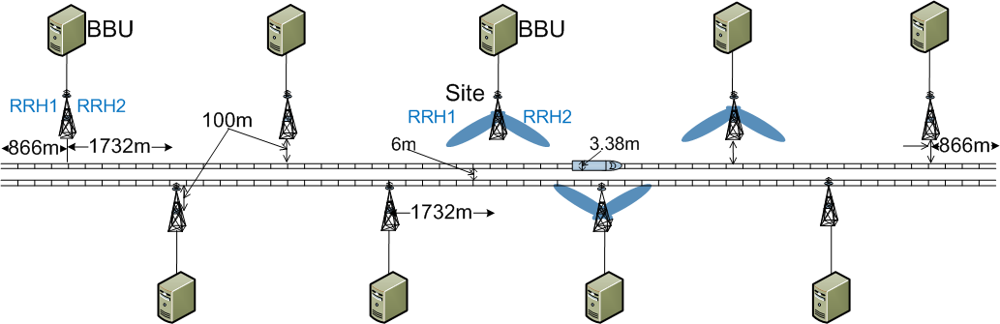{width="6.695138888888889in"
height="4.6402777777777775in"}

Figure 4.2.0-1: NCR *type 1-H* reference points

NOTE 1: the NCR-MT and NCR-Fwd may have the same or separate TAB
connectors.

### 4.2.1 RF repeater type 2-O

For *repeater type 2-O*, the radiated characteristics are defined over
the air (OTA), where the operating band specific radiated interface is
referred to as the Radiated Interface Boundary (RIB). Radiated
requirements are also referred to as OTA requirements. The (spatial)
characteristics in which the OTA requirements apply are detailed for
each requirement.

{width="5.041666666666667in"
height="2.327777777777778in"}

Figure 4.2-1: Radiated reference points for *repeater type 2-O*

### 4.2.2 NCR type 2-O

For *NCR type 2-O*, the radiated characteristics for NCR-Fwd and NCR-MT
are defined over the air (OTA), where the operating band specific
radiated interface is referred to as the Radiated Interface Boundary
(RIB). Radiated requirements are also referred to as OTA requirements.
The (spatial) characteristics in which the OTA requirements apply are
detailed for each requirement.

For *NCR type 2-O,* the NCR-MT radiated RF requirements are applied at
the BS side RIB for the configuration in normal operating conditions.

{width="6.695138888888889in"
height="4.638194444444444in"}

Figure 4.2.2-1: Radiated reference points for *NCR type 2-O*

NOTE: the NCR-MT and NCR-Fwd may have the same or separate RIB.

4.3 RF repeater classes
-----------------------

### 4.3.1 RF repeater class for downlink

The requirements in this specification apply to downlink Wide Area
repeaters, downlink Medium Range repeaters and downlink Local Area
repeaters unless otherwise stated. The associated deployment scenarios
for each class are exactly the same for repeater with and without
connectors.

For *repeater type 2-O*, repeater downlink classes are defined as
indicated below:

\- Wide Area repeaters are characterised by requirements derived from
Macro Cell scenarios with a repeater to UE minimum distance along the
ground equal to 35 m.

\- Medium Range repeaters are characterised by requirements derived from
Micro Cell scenarios with a repeater to UE minimum distance along the
ground equal to 5 m.

\- Local Area repeaters are characterised by requirements derived from
Pico Cell scenarios with a repeater to UE minimum distance along the
ground equal to 2 m.

### 4.3.2 RF repeater class for uplink

The requirements in this specification apply to uplink Wide Area
repeaters and uplink Local Area repeaters unless otherwise stated. The
associated deployment scenarios for each class are exactly the same for
repeater with and without connectors.

For *repeater* *type 2-O*, repeater uplink classes are defined as
indicated below:

\- Wide Area repeaters are characterised by requirements derived from
Macro Cell and/or Micro Cell scenarios.

\- Local Area repeaters are characterised by requirements derived from
Pico Cell and/or Micro Cell scenarios.

4.3A NCR classes

### 4.3A.1 NCR class for downlink

The requirements in this specification apply to downlink Wide Area NCR,
downlink Medium Range NCR and downlink Local Area NCR unless otherwise
stated. The associated deployment scenarios for each class are exactly
the same for NCR with and without connectors.

For *NCR type 2-O*, NCR downlink classes are defined as indicated below:

\- Wide Area NCR are characterised by requirements derived from Macro
Cell scenarios with a NCR to UE minimum distance along the ground equal
to 35 m.

\- Medium Range NCR are characterised by requirements derived from Micro
Cell scenarios with a NCR to UE minimum distance along the ground equal
to 5 m.

\- Local Area NCR are characterised by requirements derived from Pico
Cell scenarios with a NCR to UE minimum distance along the ground equal
to 2 m or from Femto Cell scenarios.

### 4.3A.2 NCR class for uplink and MT

The requirements in this specification apply to uplink Wide Area NCR and
uplink Local Area NCR unless otherwise stated. The associated deployment
scenarios for each class are exactly the same for NCR with and without
connectors.

For *NCR type 2-O*, NCR uplink classes and MT classes are defined as
indicated below:

\- Wide Area NCR are characterised by requirements derived from Macro
Cell and/or Micro Cell scenarios.

\- Local Area NCR are characterised by requirements derived from Pico
Cell and/or Micro Cell scenarios.

4.4 Regional requirements
-------------------------

Some requirements in the present document may only apply in certain
regions either as optional requirements, or as mandatory requirements
set by local and regional regulation. It is normally not stated in the
3GPP specifications under what exact circumstances the regional
requirements apply, since this is defined by local or regional
regulation.

Table 4.4-1 lists all requirements in the present specification that may
be applied differently in different regions.

Table 4.4-1: List of regional requirements

+---------------+-------------------------+-------------------------+
| Clause number | Requirement             | Comments                |
+===============+=========================+=========================+
| 5.2           | *Operating bands*       | Some NR *operating      |
|               |                         | bands* may be applied   |
|               |                         | regionally.             |
+---------------+-------------------------+-------------------------+
| 7.3.4         | OTA repeater output     | These requirements may  |
|               | power:                  | be applied regionally   |
|               |                         | as additional repeater  |
|               | Additional requirements | output power            |
|               |                         | requirements.           |
+---------------+-------------------------+-------------------------+
| 7.5.3.2       | OTA operating band      | Category A or Category  |
|               | unwanted emissions      | B operating band        |
|               |                         | unwanted emissions      |
|               |                         | limits may be applied   |
|               |                         | regionally.             |
+---------------+-------------------------+-------------------------+
| 7.5.4.2       | OTA Tx spurious         | Category A or Category  |
|               | emissions               | B spurious emission     |
|               |                         | limits, as defined in   |
|               |                         | ITU-R Recommendation    |
|               |                         | SM.329 \[4\], may apply |
|               |                         | regionally.             |
+---------------+-------------------------+-------------------------+
| 7.5.4.2.3     | OTA Tx spurious         | These requirements may  |
|               | emissions: additional   | be applied for the      |
|               | requirements            | protection of system    |
|               |                         | operating in frequency  |
|               |                         | ranges other than the   |
|               |                         | repeater *operating     |
|               |                         | band*.                  |
+---------------+-------------------------+-------------------------+

4.5 Repeater configurations
---------------------------

### 4.5.1 Downlink configurations

Unless otherwise stated, the radiated downlink characteristics in
clause 6 are specified at RIB, with a full complement of transceiver
units for the configuration in normal operating conditions.

{width="6.771527777777778in"
height="2.0881944444444445in"}

Figure 4.5.1-1: Test interface for downlink

### 4.5.2 Uplink configurations

Unless otherwise stated, the radiated downlink characteristics in
clause 6 are specified at RIB, with a full complement of transceiver
units for the configuration in normal operating conditions.

{width="6.536111111111111in" height="2.03125in"}

Figure 4.5.2-1: Test interface for uplink

### 4.5.3 Power supply options

If the repeater is supplied with a number of different power supply
configurations, it may not be necessary to test RF parameters for each
of the power supply options, provided that it can be demonstrated that
the range of conditions over which the equipment is tested is at least
as great as the range of conditions due to any of the power supply
configurations.

4.6 Manufacturer\'s declarations
--------------------------------

The following repeater manufacturer\'s declarations listed in table
4.6-1, when applicable to the repeater under test, are required to be
provided by the manufacturer for radiated requirements testing for
*repeater type 2-O, NCR type 1-H and NCR type 2-O*. Declarations can be
made independently for UL and DL.

For the *NCR type 1-H* declarations required for the conducted
requirements testing, refer to TS 38.115-1 \[3\], clause 4.6.

Table 4.6-1: Manufacturers declarations for *repeater type 2-O* radiated
test requirements

+----------------------+----------------------+----------------------+
| Declaration          | Declaration          | Description          |
| identifier           |                      |                      |
+======================+======================+======================+
| D.1                  | Coordinate system    | Location of          |
|                      | reference point      | coordinated system   |
|                      |                      | reference point in   |
|                      |                      | reference to an      |
|                      |                      | identifiable         |
|                      |                      | physical feature of  |
|                      |                      | the repeater         |
|                      |                      | enclosure.           |
+----------------------+----------------------+----------------------+
| D.2                  | Coordinate system    | Orientation of the   |
|                      | orientation          | coordinate system in |
|                      |                      | reference to an      |
|                      |                      | identifiable         |
|                      |                      | physical feature of  |
|                      |                      | the repeater         |
|                      |                      | enclosure.           |
+----------------------+----------------------+----------------------+
| D.3                  | Beam identifier      | A unique title to    |
|                      |                      | identify a beam,     |
|                      |                      | e.g., a, b, c or 1,  |
|                      |                      | 2, 3. The vendor may |
|                      |                      | declare any number   |
|                      |                      | of beams with unique |
|                      |                      | identifiers. The     |
|                      |                      | minimum set to       |
|                      |                      | declare for          |
|                      |                      | conformance,         |
|                      |                      | corresponds to the   |
|                      |                      | beams at the         |
|                      |                      | reference beam       |
|                      |                      | direction with the   |
|                      |                      | highest intended     |
|                      |                      | EIRP, and covering   |
|                      |                      | the properties       |
|                      |                      | listed below:        |
|                      |                      |                      |
|                      |                      | 1\) A beam with the  |
|                      |                      | narrowest intended   |
|                      |                      | BeW~θ~ and narrowest |
|                      |                      | intended BeW~ϕ~      |
|                      |                      | possible when        |
|                      |                      | narrowest intended   |
|                      |                      | BeW~θ~ is used.      |
|                      |                      |                      |
|                      |                      | 2\) A beam with the  |
|                      |                      | narrowest intended   |
|                      |                      | BeW~ϕ~ and narrowest |
|                      |                      | intended BeW~θ~      |
|                      |                      | possible when        |
|                      |                      | narrowest intended   |
|                      |                      | BeW~ϕ~ is used.      |
|                      |                      |                      |
|                      |                      | 3\) A beam with the  |
|                      |                      | widest intended      |
|                      |                      | BeW~θ~ and widest    |
|                      |                      | intended BeW~ϕ~      |
|                      |                      | possible when widest |
|                      |                      | intended BeW~θ~ is   |
|                      |                      | used.                |
|                      |                      |                      |
|                      |                      | 4\) A beam with the  |
|                      |                      | widest intended      |
|                      |                      | BeW~ϕ~ and widest    |
|                      |                      | intended BeW~θ~      |
|                      |                      | possible when widest |
|                      |                      | intended BeW~ϕ~ is   |
|                      |                      | used.                |
|                      |                      |                      |
|                      |                      | 5\) A beam which     |
|                      |                      | provides the highest |
|                      |                      | intended EIRP of all |
|                      |                      | possible beams.      |
|                      |                      |                      |
|                      |                      | When selecting the   |
|                      |                      | above five beam      |
|                      |                      | widths for           |
|                      |                      | declaration, all     |
|                      |                      | beams that the       |
|                      |                      | repeater is intended |
|                      |                      | to produce shall be  |
|                      |                      | considered,          |
|                      |                      | including beams that |
|                      |                      | during operation may |
|                      |                      | be identified by any |
|                      |                      | kind of cell or UE   |
|                      |                      | specific reference   |
|                      |                      | signals, with the    |
|                      |                      | exception of any     |
|                      |                      | type of beam that is |
|                      |                      | created from a group |
|                      |                      | of transmitters that |
|                      |                      | are not all phase    |
|                      |                      | synchronised.        |
|                      |                      |                      |
|                      |                      | (Note 1)             |
+----------------------+----------------------+----------------------+
| D.4                  | *Operating bands*    | List of NR           |
|                      | and passband         | *operating band(s)*  |
|                      | frequency ranges     | supported by the     |
|                      |                      | repeater and         |
|                      |                      | passband frequency   |
|                      |                      | range(s) within the  |
|                      |                      | *operating band(s)*  |
|                      |                      | that the repeater    |
|                      |                      | can operate in.      |
|                      |                      |                      |
|                      |                      | Supported bands      |
|                      |                      | declared for every   |
|                      |                      | beam (D.3). (Note 2) |
+----------------------+----------------------+----------------------+
| D.5                  | Repeater class       | Declared as Wide     |
|                      |                      | Area repeater,       |
|                      |                      | Medium Range         |
|                      |                      | repeater, or Local   |
|                      |                      | Area repeater.       |
+----------------------+----------------------+----------------------+
| D.6                  | *OTA peak directions | The beam direction   |
|                      | set* reference beam  | pair, describing the |
|                      | direction pair       | reference beam peak  |
|                      |                      | direction and the    |
|                      |                      | reference beam       |
|                      |                      | centre direction.    |
|                      |                      | Declared for every   |
|                      |                      | beam (D.3).          |
+----------------------+----------------------+----------------------+
| D.7                  | OTA peak directions  | The OTA peak         |
|                      | set                  | directions set for   |
|                      |                      | each beam. Declared  |
|                      |                      | for every beam       |
|                      |                      | (D.3).               |
+----------------------+----------------------+----------------------+
| D.8                  | *OTA peak directions | The *beam direction  |
|                      | set* maximum         | pair(s)*             |
|                      | steering             | corresponding to the |
|                      | direction(s)         | following points:    |
|                      |                      |                      |
|                      |                      | 1\) The beam peak    |
|                      |                      | direction            |
|                      |                      | corresponding to the |
|                      |                      | maximum steering     |
|                      |                      | from the reference   |
|                      |                      | beam centre          |
|                      |                      | direction in the     |
|                      |                      | positive Φ           |
|                      |                      | direction, while the |
|                      |                      | θ value being the    |
|                      |                      | closest possible to  |
|                      |                      | the reference beam   |
|                      |                      | centre direction.    |
|                      |                      |                      |
|                      |                      | 2\) The beam peak    |
|                      |                      | direction            |
|                      |                      | corresponding to the |
|                      |                      | maximum steering     |
|                      |                      | from the reference   |
|                      |                      | beam centre          |
|                      |                      | direction in the     |
|                      |                      | negative *Φ*         |
|                      |                      | direction, while the |
|                      |                      | *θ value being the   |
|                      |                      | closest possible to  |
|                      |                      | the* reference beam  |
|                      |                      | centre direction*.*  |
|                      |                      |                      |
|                      |                      | 3\) The beam peak    |
|                      |                      | direction            |
|                      |                      | corresponding to the |
|                      |                      | maximum steering     |
|                      |                      | from the reference   |
|                      |                      | beam centre          |
|                      |                      | direction in the     |
|                      |                      | positive *θ*         |
|                      |                      | direction, while the |
|                      |                      | *Φ value being the   |
|                      |                      | closest possible to  |
|                      |                      | the* reference beam  |
|                      |                      | centre direction.    |
|                      |                      |                      |
|                      |                      | 4\) The beam peak    |
|                      |                      | direction            |
|                      |                      | corresponding to the |
|                      |                      | maximum steering     |
|                      |                      | from the reference   |
|                      |                      | beam centre          |
|                      |                      | direction in the     |
|                      |                      | negative *θ*         |
|                      |                      | direction, while the |
|                      |                      | *Φ value being the   |
|                      |                      | closest possible to  |
|                      |                      | the* reference beam  |
|                      |                      | centre direction*.*  |
|                      |                      |                      |
|                      |                      | The maximum steering |
|                      |                      | direction(s) may     |
|                      |                      | coincide with *the   |
|                      |                      | reference beam       |
|                      |                      | centre direction*.   |
|                      |                      |                      |
|                      |                      | Declared for every   |
|                      |                      | beam (D.3).          |
+----------------------+----------------------+----------------------+
| D.9                  | Rated beam EIRP      | The rated EIRP level |
|                      |                      | per passband         |
|                      |                      | (P~rated,p,EIRP~) at |
|                      |                      | the *beam peak       |
|                      |                      | direction*           |
|                      |                      | associated with a    |
|                      |                      | particular *beam     |
|                      |                      | direction pair* for  |
|                      |                      | each of the declared |
|                      |                      | maximum steering     |
|                      |                      | directions (D.8), as |
|                      |                      | well as the          |
|                      |                      | reference *beam      |
|                      |                      | direction pair*      |
|                      |                      | (D.8). Declared for  |
|                      |                      | every beam (D.3).    |
|                      |                      |                      |
|                      |                      | (Note 5, Note 6,     |
|                      |                      | Note 7)              |
+----------------------+----------------------+----------------------+
| D.10                 | Beamwidth            | The *beamwidth* for  |
|                      |                      | the reference *beam  |
|                      |                      | direction pair* and  |
|                      |                      | the four maximum     |
|                      |                      | steering directions. |
|                      |                      | Declared for every   |
|                      |                      | beam (D.3).          |
+----------------------+----------------------+----------------------+
| D.11                 | Equivalent beams     | List of beams which  |
|                      |                      | are declared to be   |
|                      |                      | equivalent.          |
|                      |                      |                      |
|                      |                      | Equivalent beams     |
|                      |                      | imply that the beams |
|                      |                      | are expected to have |
|                      |                      | identical *OTA peak  |
|                      |                      | directions sets* and |
|                      |                      | intended to have     |
|                      |                      | identical spatial    |
|                      |                      | properties at all    |
|                      |                      | steering directions  |
|                      |                      | within the *OTA peak |
|                      |                      | directions set* when |
|                      |                      | presented with       |
|                      |                      | identical signals.   |
|                      |                      | All declarations     |
|                      |                      | (D.4 -- D.10) made   |
|                      |                      | for the beams are    |
|                      |                      | identical and the    |
|                      |                      | transmitter unit*,*  |
|                      |                      | RDN and antenna      |
|                      |                      | array responsible    |
|                      |                      | for generating the   |
|                      |                      | beam are of          |
|                      |                      | identical design.    |
+----------------------+----------------------+----------------------+
| D.12                 | Parallel beams       | List of beams which  |
|                      |                      | have been declared   |
|                      |                      | equivalent (D.11)    |
|                      |                      | and can be generated |
|                      |                      | in parallel using    |
|                      |                      | independent RF power |
|                      |                      | resources.           |
|                      |                      |                      |
|                      |                      | Independent power    |
|                      |                      | resources mean that  |
|                      |                      | the beams are        |
|                      |                      | transmitted from     |
|                      |                      | mutually exclusive   |
|                      |                      | transmitter units.   |
+----------------------+----------------------+----------------------+
| D.13                 | OTA coverage range   | Declared as a single |
|                      |                      | range of directions  |
|                      |                      | within which         |
|                      |                      | selected TX OTA      |
|                      |                      | requirements are     |
|                      |                      | intended to be met.  |
|                      |                      |                      |
|                      |                      | (Note 3)             |
+----------------------+----------------------+----------------------+
| D.14                 | *OTA coverage range* | The direction        |
|                      | reference direction  | describing the       |
|                      |                      | reference direction  |
|                      |                      | of the *OTA coverage |
|                      |                      | range* (D.13).       |
|                      |                      |                      |
|                      |                      | (Note 4)             |
+----------------------+----------------------+----------------------+
| D.15                 | OTA coverage range   | The directions       |
|                      | maximum directions   | corresponding to the |
|                      |                      | following points:    |
|                      |                      |                      |
|                      |                      | 1\) The direction    |
|                      |                      | determined by the    |
|                      |                      | maximum φ value      |
|                      |                      | achievable inside    |
|                      |                      | the *OTA coverage    |
|                      |                      | range*, while θ      |
|                      |                      | value being the      |
|                      |                      | closest possible to  |
|                      |                      | the *OTA coverage    |
|                      |                      | range* reference     |
|                      |                      | direction.           |
|                      |                      |                      |
|                      |                      | 2\) The direction    |
|                      |                      | determined by the    |
|                      |                      | minimum φ value      |
|                      |                      | achievable inside    |
|                      |                      | the *OTA coverage    |
|                      |                      | range*, while θ      |
|                      |                      | value being the      |
|                      |                      | closest possible to  |
|                      |                      | the *OTA coverage    |
|                      |                      | range* reference     |
|                      |                      | direction.           |
|                      |                      |                      |
|                      |                      | 3\) The direction    |
|                      |                      | determined by the    |
|                      |                      | maximum θ value      |
|                      |                      | achievable inside    |
|                      |                      | the *OTA coverage    |
|                      |                      | range*, while φ      |
|                      |                      | value being the      |
|                      |                      | closest possible to  |
|                      |                      | the *OTA coverage    |
|                      |                      | range* reference     |
|                      |                      | direction.           |
|                      |                      |                      |
|                      |                      | 4\) The direction    |
|                      |                      | determined by the    |
|                      |                      | minimum θ value      |
|                      |                      | achievable inside    |
|                      |                      | the OTA coverage     |
|                      |                      | range, while φ value |
|                      |                      | being the closest    |
|                      |                      | possible to the OTA  |
|                      |                      | coverage range       |
|                      |                      | reference direction. |
+----------------------+----------------------+----------------------+
| D.16                 | The rated passband   | P~rated,p,TRP~ is    |
|                      | OTA repeater power,  | declared as TRP OTA  |
|                      | P~rated,p,TRP~       | power per passband,  |
|                      |                      | declared per         |
|                      |                      | supported operating  |
|                      |                      | band.                |
|                      |                      |                      |
|                      |                      | (Note 5, Note 7)     |
+----------------------+----------------------+----------------------+
| D.17                 | Rated transmitter    | Rated total radiated |
|                      | TRP, P~rated,t,TRP~  | output power*.*      |
|                      |                      |                      |
|                      |                      | Declared per         |
|                      |                      | supported *operating |
|                      |                      | band*.               |
|                      |                      |                      |
|                      |                      | (Note 5, Note 7)     |
+----------------------+----------------------+----------------------+
| D.18                 | Spurious emission    | Declare the repeater |
|                      | category             | spurious emission    |
|                      |                      | category as either   |
|                      |                      | category A or B with |
|                      |                      | respect to the       |
|                      |                      | limits for spurious  |
|                      |                      | emissions, as        |
|                      |                      | defined in           |
|                      |                      | Recommendation ITU-R |
|                      |                      | SM.329 \[4\].        |
+----------------------+----------------------+----------------------+
| D.19                 | Additional operating | The manufacturer     |
|                      | band unwanted        | shall declare        |
|                      | emissions            | whether the repeater |
|                      |                      | under test is        |
|                      |                      | intended to operate  |
|                      |                      | in geographic areas  |
|                      |                      | where the additional |
|                      |                      | operating band       |
|                      |                      | unwanted emission    |
|                      |                      | limits defined in    |
|                      |                      | clause 6.7.4 apply.  |
+----------------------+----------------------+----------------------+
| D.20                 | Co-existence with    | The manufacturer     |
|                      | other systems        | shall declare        |
|                      |                      | whether the repeater |
|                      |                      | under test is        |
|                      |                      | intended to operate  |
|                      |                      | in geographic areas  |
|                      |                      | where one or more of |
|                      |                      | the systems GSM850,  |
|                      |                      | GSM900, DCS1800,     |
|                      |                      | PCS1900, UTRA FDD,   |
|                      |                      | UTRA TDD, E-UTRA     |
|                      |                      | and/or PHS operating |
|                      |                      | in another operating |
|                      |                      | band are deployed.   |
+----------------------+----------------------+----------------------+
| D.21                 | Supported frequency  | List of supported    |
|                      | range of the NR      | frequency ranges     |
|                      | *operating band*     | representing         |
|                      |                      | *fractional          |
|                      |                      | bandwidths* (FBW) of |
|                      |                      | *operating bands*    |
|                      |                      | with FBW larger than |
|                      |                      | 6%.                  |
+----------------------+----------------------+----------------------+
| D.22                 | Rated beam EIRP at   | The rated EIRP level |
|                      | lower end of the     | per passband at      |
|                      | *fractional          | lower frequency      |
|                      | bandwidth*           | range of the         |
|                      | (                    | *fractional          |
|                      | P~rated,out,FBWlow~) | bandwidth*           |
|                      |                      | (P                   |
|                      |                      | ~rated,out,FBWlow~), |
|                      |                      | at the *beam peak    |
|                      |                      | direction*           |
|                      |                      | associated with a    |
|                      |                      | particular *beam     |
|                      |                      | direction pair* for  |
|                      |                      | each of the declared |
|                      |                      | maximum steering     |
|                      |                      | directions (D.10),   |
|                      |                      | as well as the       |
|                      |                      | reference *beam      |
|                      |                      | direction pair*      |
|                      |                      | (D.6).               |
|                      |                      |                      |
|                      |                      | Declared per beam    |
|                      |                      | for all supported    |
|                      |                      | frequency ranges     |
|                      |                      | (D.21).              |
|                      |                      |                      |
|                      |                      | (Note 5, Note 6,     |
|                      |                      | Note 7)              |
+----------------------+----------------------+----------------------+
| D.23                 | Rated beam EIRP at   | The rated EIRP level |
|                      | higher frequency     | per passband at      |
|                      | range of the         | higher frequency     |
|                      | *fractional          | range of the         |
|                      | bandwidth*           | *fractional          |
|                      | (P                   | bandwidth*           |
|                      | ~rated,out,FBWhigh~) | (P~                  |
|                      |                      | rated,out,FBWhigh~), |
|                      |                      | at the *beam peak    |
|                      |                      | direction*           |
|                      |                      | associated with a    |
|                      |                      | particular *beam     |
|                      |                      | direction pair* for  |
|                      |                      | each of the declared |
|                      |                      | maximum steering     |
|                      |                      | directions (D.10),   |
|                      |                      | as well as the       |
|                      |                      | reference *beam      |
|                      |                      | direction pair*      |
|                      |                      | (D.6).               |
|                      |                      |                      |
|                      |                      | Declared per beam    |
|                      |                      | for all supported    |
|                      |                      | frequency ranges in  |
|                      |                      | (D.21).              |
|                      |                      |                      |
|                      |                      | (Note 5, Note 6,     |
|                      |                      | Note 7)              |
+----------------------+----------------------+----------------------+
| D.24                 | Long delay repeater  | Declared only if the |
|                      |                      | repeater internal    |
|                      |                      | delay between the    |
|                      |                      | input and output for |
|                      |                      | this repeater does   |
|                      |                      | not fit within the   |
|                      |                      | TDD transient time.  |
|                      |                      | The repeater is      |
|                      |                      | intended for         |
|                      |                      | situations in which  |
|                      |                      | it will not cause    |
|                      |                      | interference to      |
|                      |                      | other nodes. This is |
|                      |                      | achieved by RF       |
|                      |                      | isolation or by      |
|                      |                      | reservation of       |
|                      |                      | longer guard         |
|                      |                      | periods, which       |
|                      |                      | degrades frame       |
|                      |                      | utilization. The     |
|                      |                      | length of repeaters  |
|                      |                      | internal delay is    |
|                      |                      | declared using this  |
|                      |                      | declaration.         |
+----------------------+----------------------+----------------------+
| D.25                 | Input signal EIRP    | Declaration of input |
|                      | for maximum output   | signal EIRP required |
|                      | power                | to reach maximum     |
|                      |                      | output power.        |
|                      |                      | Declared per         |
|                      |                      | passband.            |
+----------------------+----------------------+----------------------+
| D.26                 | Repeater radiating   | Declaration on       |
|                      | direction            | whether the repeater |
|                      |                      | is intended to       |
|                      |                      | radiate in DL, UL or |
|                      |                      | both. Testing shall  |
|                      |                      | be performed only    |
|                      |                      | for the direction(s) |
|                      |                      | in which the         |
|                      |                      | repeater radiates.   |
+----------------------+----------------------+----------------------+
| D.27                 | Maximum repeater RF  | Maximum *repeater RF |
|                      | Bandwidth            | Bandwidth* in the    |
|                      |                      | *operating band* for |
|                      |                      | single-band          |
|                      |                      | operation. Declared  |
|                      |                      | per supported        |
|                      |                      | *operating band.*    |
|                      |                      | (Note 8)             |
+----------------------+----------------------+----------------------+
| NOTE 1: Depending on |                      |                      |
| the capability of    |                      |                      |
| the system some of   |                      |                      |
| these beams may be   |                      |                      |
| the same. For those  |                      |                      |
| same beams, testing  |                      |                      |
| is not repeated.     |                      |                      |
|                      |                      |                      |
| NOTE 2: These        |                      |                      |
| *operating bands*    |                      |                      |
| are related to their |                      |                      |
| respective           |                      |                      |
| single‑band RIBs.    |                      |                      |
|                      |                      |                      |
| NOTE 3: *OTA         |                      |                      |
| coverage range* is   |                      |                      |
| used for conformance |                      |                      |
| testing of such TX   |                      |                      |
| OTA requirements as  |                      |                      |
| frequency error or   |                      |                      |
| EVM.                 |                      |                      |
|                      |                      |                      |
| NOTE 4: The *OTA     |                      |                      |
| coverage range       |                      |                      |
| reference direction* |                      |                      |
| may be the same as   |                      |                      |
| the Reference beam   |                      |                      |
| direction pair (D.8) |                      |                      |
| but does not have to |                      |                      |
| be.                  |                      |                      |
|                      |                      |                      |
| NOTE 5: If a         |                      |                      |
| *Repeater type 2-O*  |                      |                      |
| is capable of 64QAM  |                      |                      |
| operation but not    |                      |                      |
| capable of 256QAM    |                      |                      |
| operation, then up   |                      |                      |
| to two rated output  |                      |                      |
| power declarations   |                      |                      |
| may be made. One     |                      |                      |
| declaration is       |                      |                      |
| applicable when      |                      |                      |
| configured for 64QAM |                      |                      |
| operation and the    |                      |                      |
| other declaration is |                      |                      |
| applicable when not  |                      |                      |
| configured for 64QAM |                      |                      |
| operation.           |                      |                      |
|                      |                      |                      |
| NOTE 6: If D.22 and  |                      |                      |
| D.23 are declared    |                      |                      |
| for certain          |                      |                      |
| frequency range      |                      |                      |
| (D.21), there shall  |                      |                      |
| be no \"Rated beam   |                      |                      |
| EIRP\" declaration   |                      |                      |
| (D.9) for the        |                      |                      |
| *operating band*     |                      |                      |
| containing that      |                      |                      |
| particular frequency |                      |                      |
| range.               |                      |                      |
|                      |                      |                      |
| NOTE 7: If a         |                      |                      |
| repeater type 2-O is |                      |                      |
| capable of 256QAM    |                      |                      |
| operation, then up   |                      |                      |
| to three rated       |                      |                      |
| output power         |                      |                      |
| declarations may be  |                      |                      |
| made. One            |                      |                      |
| declaration is       |                      |                      |
| applicable when      |                      |                      |
| configured for       |                      |                      |
| 256QAM operation, a  |                      |                      |
| different            |                      |                      |
| declaration is       |                      |                      |
| applicable when      |                      |                      |
| configured for 64QAM |                      |                      |
| operation and the    |                      |                      |
| other declaration is |                      |                      |
| applicable when not  |                      |                      |
| configured neither   |                      |                      |
| for 256QAM nor 64QAM |                      |                      |
| operation.           |                      |                      |
|                      |                      |                      |
| NOTE 8: Parameters   |                      |                      |
| for contiguous or    |                      |                      |
| non-contiguous       |                      |                      |
| spectrum operation   |                      |                      |
| in the operating     |                      |                      |
| band are assumed to  |                      |                      |
| be the same unless   |                      |                      |
| they are separately  |                      |                      |
| declared. When       |                      |                      |
| separately declared, |                      |                      |
| they shall still use |                      |                      |
| the same declaration |                      |                      |
| identifier.          |                      |                      |
+----------------------+----------------------+----------------------+

The following NCR manufacturer\'s declarations listed in table 4.6-2,
when applicable to the NCR under test, are required to be provided by
the manufacturer for radiated requirements testing for *NCR type 1-H*
and *NCR type 2-O*. Declarations can be made independently for UL and
DL.

**Table 4.6-2: Manufacturers declarations for *NCR type 1-H* and *NCR
type 2-O* radiated test requirements**

+----------+----------+----------+----------+----------+----------+
| Dec      | Dec      | Des      | Appli    |          |          |
| laration | laration | cription | cability |          |          |
| id       |          |          |          |          |          |
| entifier |          |          |          |          |          |
+==========+==========+==========+==========+==========+==========+
|          |          |          | NCR type | NCR-Fwd  | NCR-MT   |
|          |          |          | 1-H      | type 2-O | type 2-O |
+----------+----------+----------+----------+----------+----------+
| D.1      | Co       | Location | X        | X        | X        |
|          | ordinate | of       |          |          |          |
|          | system   | coo      |          |          |          |
|          | r        | rdinated |          |          |          |
|          | eference | system   |          |          |          |
|          | point    | r        |          |          |          |
|          |          | eference |          |          |          |
|          |          | point in |          |          |          |
|          |          | r        |          |          |          |
|          |          | eference |          |          |          |
|          |          | to an    |          |          |          |
|          |          | iden     |          |          |          |
|          |          | tifiable |          |          |          |
|          |          | physical |          |          |          |
|          |          | feature  |          |          |          |
|          |          | of the   |          |          |          |
|          |          | NCR      |          |          |          |
|          |          | en       |          |          |          |
|          |          | closure. |          |          |          |
+----------+----------+----------+----------+----------+----------+
| D.2      | Co       | Ori      | X        | x        | x        |
|          | ordinate | entation |          |          |          |
|          | system   | of the   |          |          |          |
|          | ori      | co       |          |          |          |
|          | entation | ordinate |          |          |          |
|          |          | system   |          |          |          |
|          |          | in       |          |          |          |
|          |          | r        |          |          |          |
|          |          | eference |          |          |          |
|          |          | to an    |          |          |          |
|          |          | iden     |          |          |          |
|          |          | tifiable |          |          |          |
|          |          | physical |          |          |          |
|          |          | feature  |          |          |          |
|          |          | of the   |          |          |          |
|          |          | NCR      |          |          |          |
|          |          | en       |          |          |          |
|          |          | closure. |          |          |          |
+----------+----------+----------+----------+----------+----------+
| D.3      | Beam     | A unique | x        | x        | x        |
|          | id       | title to |          |          |          |
|          | entifier | identify |          |          |          |
|          |          | a beam,  |          |          |          |
|          |          | e.g. a,  |          |          |          |
|          |          | b, c or  |          |          |          |
|          |          | 1, 2, 3. |          |          |          |
|          |          | The      |          |          |          |
|          |          | vendor   |          |          |          |
|          |          | may      |          |          |          |
|          |          | declare  |          |          |          |
|          |          | any      |          |          |          |
|          |          | number   |          |          |          |
|          |          | of beams |          |          |          |
|          |          | with     |          |          |          |
|          |          | unique   |          |          |          |
|          |          | iden     |          |          |          |
|          |          | tifiers. |          |          |          |
|          |          | The      |          |          |          |
|          |          | minimum  |          |          |          |
|          |          | set to   |          |          |          |
|          |          | declare  |          |          |          |
|          |          | for      |          |          |          |
|          |          | conf     |          |          |          |
|          |          | ormance, |          |          |          |
|          |          | cor      |          |          |          |
|          |          | responds |          |          |          |
|          |          | to the   |          |          |          |
|          |          | beams at |          |          |          |
|          |          | the      |          |          |          |
|          |          | r        |          |          |          |
|          |          | eference |          |          |          |
|          |          | beam     |          |          |          |
|          |          | d        |          |          |          |
|          |          | irection |          |          |          |
|          |          | with the |          |          |          |
|          |          | highest  |          |          |          |
|          |          | intended |          |          |          |
|          |          | EIRP,    |          |          |          |
|          |          | and      |          |          |          |
|          |          | covering |          |          |          |
|          |          | the      |          |          |          |
|          |          | pr       |          |          |          |
|          |          | operties |          |          |          |
|          |          | listed   |          |          |          |
|          |          | below:   |          |          |          |
|          |          |          |          |          |          |
|          |          | 1\) A    |          |          |          |
|          |          | beam     |          |          |          |
|          |          | with the |          |          |          |
|          |          | n        |          |          |          |
|          |          | arrowest |          |          |          |
|          |          | intended |          |          |          |
|          |          | BeW~θ~   |          |          |          |
|          |          | and      |          |          |          |
|          |          | n        |          |          |          |
|          |          | arrowest |          |          |          |
|          |          | intended |          |          |          |
|          |          | BeW~ϕ~   |          |          |          |
|          |          | possible |          |          |          |
|          |          | when     |          |          |          |
|          |          | n        |          |          |          |
|          |          | arrowest |          |          |          |
|          |          | intended |          |          |          |
|          |          | BeW~θ~   |          |          |          |
|          |          | is used. |          |          |          |
|          |          |          |          |          |          |
|          |          | 2\) A    |          |          |          |
|          |          | beam     |          |          |          |
|          |          | with the |          |          |          |
|          |          | n        |          |          |          |
|          |          | arrowest |          |          |          |
|          |          | intended |          |          |          |
|          |          | BeW~ϕ~   |          |          |          |
|          |          | and      |          |          |          |
|          |          | n        |          |          |          |
|          |          | arrowest |          |          |          |
|          |          | intended |          |          |          |
|          |          | BeW~θ~   |          |          |          |
|          |          | possible |          |          |          |
|          |          | when     |          |          |          |
|          |          | n        |          |          |          |
|          |          | arrowest |          |          |          |
|          |          | intended |          |          |          |
|          |          | BeW~ϕ~   |          |          |          |
|          |          | is used. |          |          |          |
|          |          |          |          |          |          |
|          |          | 3\) A    |          |          |          |
|          |          | beam     |          |          |          |
|          |          | with the |          |          |          |
|          |          | widest   |          |          |          |
|          |          | intended |          |          |          |
|          |          | BeW~θ~   |          |          |          |
|          |          | and      |          |          |          |
|          |          | widest   |          |          |          |
|          |          | intended |          |          |          |
|          |          | BeW~ϕ~   |          |          |          |
|          |          | possible |          |          |          |
|          |          | when     |          |          |          |
|          |          | widest   |          |          |          |
|          |          | intended |          |          |          |
|          |          | BeW~θ~   |          |          |          |
|          |          | is used. |          |          |          |
|          |          |          |          |          |          |
|          |          | 4\) A    |          |          |          |
|          |          | beam     |          |          |          |
|          |          | with the |          |          |          |
|          |          | widest   |          |          |          |
|          |          | intended |          |          |          |
|          |          | BeW~ϕ~   |          |          |          |
|          |          | and      |          |          |          |
|          |          | widest   |          |          |          |
|          |          | intended |          |          |          |
|          |          | BeW~θ~   |          |          |          |
|          |          | possible |          |          |          |
|          |          | when     |          |          |          |
|          |          | widest   |          |          |          |
|          |          | intended |          |          |          |
|          |          | BeW~ϕ~   |          |          |          |
|          |          | is used. |          |          |          |
|          |          |          |          |          |          |
|          |          | 5\) A    |          |          |          |
|          |          | beam     |          |          |          |
|          |          | which    |          |          |          |
|          |          | provides |          |          |          |
|          |          | the      |          |          |          |
|          |          | highest  |          |          |          |
|          |          | intended |          |          |          |
|          |          | EIRP of  |          |          |          |
|          |          | all      |          |          |          |
|          |          | possible |          |          |          |
|          |          | beams.   |          |          |          |
|          |          |          |          |          |          |
|          |          | When     |          |          |          |
|          |          | s        |          |          |          |
|          |          | electing |          |          |          |
|          |          | the      |          |          |          |
|          |          | above    |          |          |          |
|          |          | five     |          |          |          |
|          |          | beam     |          |          |          |
|          |          | widths   |          |          |          |
|          |          | for      |          |          |          |
|          |          | decl     |          |          |          |
|          |          | aration, |          |          |          |
|          |          | all      |          |          |          |
|          |          | beams    |          |          |          |
|          |          | that the |          |          |          |
|          |          | NCR is   |          |          |          |
|          |          | intended |          |          |          |
|          |          | to       |          |          |          |
|          |          | produce  |          |          |          |
|          |          | shall be |          |          |          |
|          |          | con      |          |          |          |
|          |          | sidered, |          |          |          |
|          |          | i        |          |          |          |
|          |          | ncluding |          |          |          |
|          |          | beams    |          |          |          |
|          |          | that     |          |          |          |
|          |          | during   |          |          |          |
|          |          | o        |          |          |          |
|          |          | peration |          |          |          |
|          |          | may be   |          |          |          |
|          |          | id       |          |          |          |
|          |          | entified |          |          |          |
|          |          | by any   |          |          |          |
|          |          | kind of  |          |          |          |
|          |          | cell or  |          |          |          |
|          |          | UE       |          |          |          |
|          |          | specific |          |          |          |
|          |          | r        |          |          |          |
|          |          | eference |          |          |          |
|          |          | signals, |          |          |          |
|          |          | with the |          |          |          |
|          |          | e        |          |          |          |
|          |          | xception |          |          |          |
|          |          | of any   |          |          |          |
|          |          | type of  |          |          |          |
|          |          | beam     |          |          |          |
|          |          | that is  |          |          |          |
|          |          | created  |          |          |          |
|          |          | from a   |          |          |          |
|          |          | group of |          |          |          |
|          |          | tran     |          |          |          |
|          |          | smitters |          |          |          |
|          |          | that are |          |          |          |
|          |          | not all  |          |          |          |
|          |          | phase    |          |          |          |
|          |          | synch    |          |          |          |
|          |          | ronised. |          |          |          |
|          |          |          |          |          |          |
|          |          | (Note 1) |          |          |          |
+----------+----------+----------+----------+----------+----------+
| D.4      | *O       | List of  | c        | x        | x        |
|          | perating | NR       |          |          |          |
|          | bands*   | *o       |          |          |          |
|          | and      | perating |          |          |          |
|          | passband | band(s)* |          |          |          |
|          | f        | s        |          |          |          |
|          | requency | upported |          |          |          |
|          | ranges   | by the   |          |          |          |
|          |          | NCR and  |          |          |          |
|          |          | passband |          |          |          |
|          |          | f        |          |          |          |
|          |          | requency |          |          |          |
|          |          | range(s) |          |          |          |
|          |          | within   |          |          |          |
|          |          | the      |          |          |          |
|          |          | *o       |          |          |          |
|          |          | perating |          |          |          |
|          |          | band(s)* |          |          |          |
|          |          | that the |          |          |          |
|          |          | NCR can  |          |          |          |
|          |          | operate  |          |          |          |
|          |          | in.      |          |          |          |
|          |          |          |          |          |          |
|          |          | S        |          |          |          |
|          |          | upported |          |          |          |
|          |          | bands    |          |          |          |
|          |          | declared |          |          |          |
|          |          | for      |          |          |          |
|          |          | every    |          |          |          |
|          |          | beam     |          |          |          |
|          |          | (D.3).   |          |          |          |
|          |          | (Note 2) |          |          |          |
+----------+----------+----------+----------+----------+----------+
| D.5      | NCR      | Declared | c        | x        | x        |
|          | class    | as Wide  |          |          |          |
|          |          | Area     |          |          |          |
|          |          | NCR,     |          |          |          |
|          |          | Medium   |          |          |          |
|          |          | Range    |          |          |          |
|          |          | NCR, or  |          |          |          |
|          |          | Local    |          |          |          |
|          |          | Area     |          |          |          |
|          |          | NCR.     |          |          |          |
+----------+----------+----------+----------+----------+----------+
| D.6      | *OTA     | The beam | c        | x        | x        |
|          | peak     | d        |          |          |          |
|          | di       | irection |          |          |          |
|          | rections | pair,    |          |          |          |
|          | set*     | de       |          |          |          |
|          | r        | scribing |          |          |          |
|          | eference | the      |          |          |          |
|          | beam     | r        |          |          |          |
|          | d        | eference |          |          |          |
|          | irection | beam     |          |          |          |
|          | pair     | peak     |          |          |          |
|          |          | d        |          |          |          |
|          |          | irection |          |          |          |
|          |          | and the  |          |          |          |
|          |          | r        |          |          |          |
|          |          | eference |          |          |          |
|          |          | beam     |          |          |          |
|          |          | centre   |          |          |          |
|          |          | di       |          |          |          |
|          |          | rection. |          |          |          |
|          |          | Declared |          |          |          |
|          |          | for      |          |          |          |
|          |          | every    |          |          |          |
|          |          | beam     |          |          |          |
|          |          | (D.3).   |          |          |          |
+----------+----------+----------+----------+----------+----------+
| D.7      | OTA peak | The OTA  | c        | x        | x        |
|          | di       | peak     |          |          |          |
|          | rections | di       |          |          |          |
|          | set      | rections |          |          |          |
|          |          | set for  |          |          |          |
|          |          | each     |          |          |          |
|          |          | beam.    |          |          |          |
|          |          | Declared |          |          |          |
|          |          | for      |          |          |          |
|          |          | every    |          |          |          |
|          |          | beam     |          |          |          |
|          |          | (D.3).   |          |          |          |
+----------+----------+----------+----------+----------+----------+
| D.8      | *OTA     | The      | x        | x        | x        |
|          | peak     | *beam    |          |          |          |
|          | di       | d        |          |          |          |
|          | rections | irection |          |          |          |
|          | set*     | pair(s)* |          |          |          |
|          | maximum  | corre    |          |          |          |
|          | steering | sponding |          |          |          |
|          | dire     | to the   |          |          |          |
|          | ction(s) | f        |          |          |          |
|          |          | ollowing |          |          |          |
|          |          | points:  |          |          |          |
|          |          |          |          |          |          |
|          |          | 1\) The  |          |          |          |
|          |          | beam     |          |          |          |
|          |          | peak     |          |          |          |
|          |          | d        |          |          |          |
|          |          | irection |          |          |          |
|          |          | corre    |          |          |          |
|          |          | sponding |          |          |          |
|          |          | to the   |          |          |          |
|          |          | maximum  |          |          |          |
|          |          | steering |          |          |          |
|          |          | from the |          |          |          |
|          |          | r        |          |          |          |
|          |          | eference |          |          |          |
|          |          | beam     |          |          |          |
|          |          | centre   |          |          |          |
|          |          | d        |          |          |          |
|          |          | irection |          |          |          |
|          |          | in the   |          |          |          |
|          |          | positive |          |          |          |
|          |          | Φ        |          |          |          |
|          |          | di       |          |          |          |
|          |          | rection, |          |          |          |
|          |          | while    |          |          |          |
|          |          | the θ    |          |          |          |
|          |          | value    |          |          |          |
|          |          | being    |          |          |          |
|          |          | the      |          |          |          |
|          |          | closest  |          |          |          |
|          |          | possible |          |          |          |
|          |          | to the   |          |          |          |
|          |          | r        |          |          |          |
|          |          | eference |          |          |          |
|          |          | beam     |          |          |          |
|          |          | centre   |          |          |          |
|          |          | di       |          |          |          |
|          |          | rection. |          |          |          |
|          |          |          |          |          |          |
|          |          | 2\) The  |          |          |          |
|          |          | beam     |          |          |          |
|          |          | peak     |          |          |          |
|          |          | d        |          |          |          |
|          |          | irection |          |          |          |
|          |          | corre    |          |          |          |
|          |          | sponding |          |          |          |
|          |          | to the   |          |          |          |
|          |          | maximum  |          |          |          |
|          |          | steering |          |          |          |
|          |          | from the |          |          |          |
|          |          | r        |          |          |          |
|          |          | eference |          |          |          |
|          |          | beam     |          |          |          |
|          |          | centre   |          |          |          |
|          |          | d        |          |          |          |
|          |          | irection |          |          |          |
|          |          | in the   |          |          |          |
|          |          | negative |          |          |          |
|          |          | *Φ*      |          |          |          |
|          |          | di       |          |          |          |
|          |          | rection, |          |          |          |
|          |          | while    |          |          |          |
|          |          | the *θ   |          |          |          |
|          |          | value    |          |          |          |
|          |          | being    |          |          |          |
|          |          | the      |          |          |          |
|          |          | closest  |          |          |          |
|          |          | possible |          |          |          |
|          |          | to the*  |          |          |          |
|          |          | r        |          |          |          |
|          |          | eference |          |          |          |
|          |          | beam     |          |          |          |
|          |          | centre   |          |          |          |
|          |          | dire     |          |          |          |
|          |          | ction*.* |          |          |          |
|          |          |          |          |          |          |
|          |          | 3\) The  |          |          |          |
|          |          | beam     |          |          |          |
|          |          | peak     |          |          |          |
|          |          | d        |          |          |          |
|          |          | irection |          |          |          |
|          |          | corre    |          |          |          |
|          |          | sponding |          |          |          |
|          |          | to the   |          |          |          |
|          |          | maximum  |          |          |          |
|          |          | steering |          |          |          |
|          |          | from the |          |          |          |
|          |          | r        |          |          |          |
|          |          | eference |          |          |          |
|          |          | beam     |          |          |          |
|          |          | centre   |          |          |          |
|          |          | d        |          |          |          |
|          |          | irection |          |          |          |
|          |          | in the   |          |          |          |
|          |          | positive |          |          |          |
|          |          | *θ*      |          |          |          |
|          |          | di       |          |          |          |
|          |          | rection, |          |          |          |
|          |          | while    |          |          |          |
|          |          | the *Φ   |          |          |          |
|          |          | value    |          |          |          |
|          |          | being    |          |          |          |
|          |          | the      |          |          |          |
|          |          | closest  |          |          |          |
|          |          | possible |          |          |          |
|          |          | to the*  |          |          |          |
|          |          | r        |          |          |          |
|          |          | eference |          |          |          |
|          |          | beam     |          |          |          |
|          |          | centre   |          |          |          |
|          |          | di       |          |          |          |
|          |          | rection. |          |          |          |
|          |          |          |          |          |          |
|          |          | 4\) The  |          |          |          |
|          |          | beam     |          |          |          |
|          |          | peak     |          |          |          |
|          |          | d        |          |          |          |
|          |          | irection |          |          |          |
|          |          | corre    |          |          |          |
|          |          | sponding |          |          |          |
|          |          | to the   |          |          |          |
|          |          | maximum  |          |          |          |
|          |          | steering |          |          |          |
|          |          | from the |          |          |          |
|          |          | r        |          |          |          |
|          |          | eference |          |          |          |
|          |          | beam     |          |          |          |
|          |          | centre   |          |          |          |
|          |          | d        |          |          |          |
|          |          | irection |          |          |          |
|          |          | in the   |          |          |          |
|          |          | negative |          |          |          |
|          |          | *θ*      |          |          |          |
|          |          | di       |          |          |          |
|          |          | rection, |          |          |          |
|          |          | while    |          |          |          |
|          |          | the *Φ   |          |          |          |
|          |          | value    |          |          |          |
|          |          | being    |          |          |          |
|          |          | the      |          |          |          |
|          |          | closest  |          |          |          |
|          |          | possible |          |          |          |
|          |          | to the*  |          |          |          |
|          |          | r        |          |          |          |
|          |          | eference |          |          |          |
|          |          | beam     |          |          |          |
|          |          | centre   |          |          |          |
|          |          | dire     |          |          |          |
|          |          | ction*.* |          |          |          |
|          |          |          |          |          |          |
|          |          | The      |          |          |          |
|          |          | maximum  |          |          |          |
|          |          | steering |          |          |          |
|          |          | dire     |          |          |          |
|          |          | ction(s) |          |          |          |
|          |          | may      |          |          |          |
|          |          | coincide |          |          |          |
|          |          | with     |          |          |          |
|          |          | *the     |          |          |          |
|          |          | r        |          |          |          |
|          |          | eference |          |          |          |
|          |          | beam     |          |          |          |
|          |          | centre   |          |          |          |
|          |          | dir      |          |          |          |
|          |          | ection*. |          |          |          |
|          |          |          |          |          |          |
|          |          | Declared |          |          |          |
|          |          | for      |          |          |          |
|          |          | every    |          |          |          |
|          |          | beam     |          |          |          |
|          |          | (D.3).   |          |          |          |
+----------+----------+----------+----------+----------+----------+
| D.9      | Rated    | The      | x        | x        | x        |
|          | beam     | rated    |          |          |          |
|          | EIRP     | EIRP     |          |          |          |
|          |          | level    |          |          |          |
|          |          | per      |          |          |          |
|          |          | passband |          |          |          |
|          |          | (        |          |          |          |
|          |          | P~rated, |          |          |          |
|          |          | p,EIRP~) |          |          |          |
|          |          | at the   |          |          |          |
|          |          | *beam    |          |          |          |
|          |          | peak     |          |          |          |
|          |          | di       |          |          |          |
|          |          | rection* |          |          |          |
|          |          | as       |          |          |          |
|          |          | sociated |          |          |          |
|          |          | with a   |          |          |          |
|          |          | pa       |          |          |          |
|          |          | rticular |          |          |          |
|          |          | *beam    |          |          |          |
|          |          | d        |          |          |          |
|          |          | irection |          |          |          |
|          |          | pair*    |          |          |          |
|          |          | for each |          |          |          |
|          |          | of the   |          |          |          |
|          |          | declared |          |          |          |
|          |          | maximum  |          |          |          |
|          |          | steering |          |          |          |
|          |          | di       |          |          |          |
|          |          | rections |          |          |          |
|          |          | (D.8),   |          |          |          |
|          |          | as well  |          |          |          |
|          |          | as the   |          |          |          |
|          |          | r        |          |          |          |
|          |          | eference |          |          |          |
|          |          | *beam    |          |          |          |
|          |          | d        |          |          |          |
|          |          | irection |          |          |          |
|          |          | pair*    |          |          |          |
|          |          | (D.8).   |          |          |          |
|          |          | Declared |          |          |          |
|          |          | for      |          |          |          |
|          |          | every    |          |          |          |
|          |          | beam     |          |          |          |
|          |          | (D.3).   |          |          |          |
|          |          |          |          |          |          |
|          |          | (Note 5, |          |          |          |
|          |          | 6, 7)    |          |          |          |
+----------+----------+----------+----------+----------+----------+
| D.10     | B        | The      | x        | x        | x        |
|          | eamwidth | *be      |          |          |          |
|          |          | amwidth* |          |          |          |
|          |          | for the  |          |          |          |
|          |          | r        |          |          |          |
|          |          | eference |          |          |          |
|          |          | *beam    |          |          |          |
|          |          | d        |          |          |          |
|          |          | irection |          |          |          |
|          |          | pair*    |          |          |          |
|          |          | and the  |          |          |          |
|          |          | four     |          |          |          |
|          |          | maximum  |          |          |          |
|          |          | steering |          |          |          |
|          |          | dir      |          |          |          |
|          |          | ections. |          |          |          |
|          |          | Declared |          |          |          |
|          |          | for      |          |          |          |
|          |          | every    |          |          |          |
|          |          | beam     |          |          |          |
|          |          | (D.3).   |          |          |          |
+----------+----------+----------+----------+----------+----------+
| D.11     | Eq       | List of  | x        | x        | x        |
|          | uivalent | beams    |          |          |          |
|          | beams    | which    |          |          |          |
|          |          | are      |          |          |          |
|          |          | declared |          |          |          |
|          |          | to be    |          |          |          |
|          |          | equ      |          |          |          |
|          |          | ivalent. |          |          |          |
|          |          |          |          |          |          |
|          |          | Eq       |          |          |          |
|          |          | uivalent |          |          |          |
|          |          | beams    |          |          |          |
|          |          | imply    |          |          |          |
|          |          | that the |          |          |          |
|          |          | beams    |          |          |          |
|          |          | are      |          |          |          |
|          |          | expected |          |          |          |
|          |          | to have  |          |          |          |
|          |          | i        |          |          |          |
|          |          | dentical |          |          |          |
|          |          | *OTA     |          |          |          |
|          |          | peak     |          |          |          |
|          |          | di       |          |          |          |
|          |          | rections |          |          |          |
|          |          | sets*    |          |          |          |
|          |          | and      |          |          |          |
|          |          | intended |          |          |          |
|          |          | to have  |          |          |          |
|          |          | i        |          |          |          |
|          |          | dentical |          |          |          |
|          |          | spatial  |          |          |          |
|          |          | pr       |          |          |          |
|          |          | operties |          |          |          |
|          |          | at all   |          |          |          |
|          |          | steering |          |          |          |
|          |          | di       |          |          |          |
|          |          | rections |          |          |          |
|          |          | within   |          |          |          |
|          |          | the *OTA |          |          |          |
|          |          | peak     |          |          |          |
|          |          | di       |          |          |          |
|          |          | rections |          |          |          |
|          |          | set*     |          |          |          |
|          |          | when     |          |          |          |
|          |          | p        |          |          |          |
|          |          | resented |          |          |          |
|          |          | with     |          |          |          |
|          |          | i        |          |          |          |
|          |          | dentical |          |          |          |
|          |          | signals. |          |          |          |
|          |          | All      |          |          |          |
|          |          | decl     |          |          |          |
|          |          | arations |          |          |          |
|          |          | (D.4 --  |          |          |          |
|          |          | D.10)    |          |          |          |
|          |          | made for |          |          |          |
|          |          | the      |          |          |          |
|          |          | beams    |          |          |          |
|          |          | are      |          |          |          |
|          |          | i        |          |          |          |
|          |          | dentical |          |          |          |
|          |          | and the  |          |          |          |
|          |          | tra      |          |          |          |
|          |          | nsmitter |          |          |          |
|          |          | unit*,*  |          |          |          |
|          |          | RDN and  |          |          |          |
|          |          | antenna  |          |          |          |
|          |          | array    |          |          |          |
|          |          | res      |          |          |          |
|          |          | ponsible |          |          |          |
|          |          | for      |          |          |          |
|          |          | ge       |          |          |          |
|          |          | nerating |          |          |          |
|          |          | the beam |          |          |          |
|          |          | are of   |          |          |          |
|          |          | i        |          |          |          |
|          |          | dentical |          |          |          |
|          |          | design.  |          |          |          |
+----------+----------+----------+----------+----------+----------+
| D.12     | Parallel | List of  | x        | x        | x        |
|          | beams    | beams    |          |          |          |
|          |          | which    |          |          |          |
|          |          | have     |          |          |          |
|          |          | been     |          |          |          |
|          |          | declared |          |          |          |
|          |          | eq       |          |          |          |
|          |          | uivalent |          |          |          |
|          |          | (D.11)   |          |          |          |
|          |          | and can  |          |          |          |
|          |          | be       |          |          |          |
|          |          | g        |          |          |          |
|          |          | enerated |          |          |          |
|          |          | in       |          |          |          |
|          |          | parallel |          |          |          |
|          |          | using    |          |          |          |
|          |          | ind      |          |          |          |
|          |          | ependent |          |          |          |
|          |          | RF power |          |          |          |
|          |          | re       |          |          |          |
|          |          | sources. |          |          |          |
|          |          |          |          |          |          |
|          |          | Ind      |          |          |          |
|          |          | ependent |          |          |          |
|          |          | power    |          |          |          |
|          |          | r        |          |          |          |
|          |          | esources |          |          |          |
|          |          | mean     |          |          |          |
|          |          | that the |          |          |          |
|          |          | beams    |          |          |          |
|          |          | are      |          |          |          |
|          |          | tra      |          |          |          |
|          |          | nsmitted |          |          |          |
|          |          | from     |          |          |          |
|          |          | mutually |          |          |          |
|          |          | e        |          |          |          |
|          |          | xclusive |          |          |          |
|          |          | tra      |          |          |          |
|          |          | nsmitter |          |          |          |
|          |          | units.   |          |          |          |
+----------+----------+----------+----------+----------+----------+
| D.13     | OTA      | Declared | x        | x        | x        |
|          | coverage | as a     |          |          |          |
|          | range    | single   |          |          |          |
|          |          | range of |          |          |          |
|          |          | di       |          |          |          |
|          |          | rections |          |          |          |
|          |          | within   |          |          |          |
|          |          | which    |          |          |          |
|          |          | selected |          |          |          |
|          |          | TX OTA   |          |          |          |
|          |          | requ     |          |          |          |
|          |          | irements |          |          |          |
|          |          | are      |          |          |          |
|          |          | intended |          |          |          |
|          |          | to be    |          |          |          |
|          |          | met.     |          |          |          |
|          |          |          |          |          |          |
|          |          | (Note 3) |          |          |          |
+----------+----------+----------+----------+----------+----------+
| D.14     | *OTA     | The      | x        | x        | x        |
|          | coverage | d        |          |          |          |
|          | range*   | irection |          |          |          |
|          | r        | de       |          |          |          |
|          | eference | scribing |          |          |          |
|          | d        | the      |          |          |          |
|          | irection | r        |          |          |          |
|          |          | eference |          |          |          |
|          |          | d        |          |          |          |
|          |          | irection |          |          |          |
|          |          | of the   |          |          |          |
|          |          | *OTA     |          |          |          |
|          |          | coverage |          |          |          |
|          |          | range*   |          |          |          |
|          |          | (D.13).  |          |          |          |
|          |          |          |          |          |          |
|          |          | (Note 4) |          |          |          |
+----------+----------+----------+----------+----------+----------+
| D.15     | OTA      | The      | x        | x        | x        |
|          | coverage | di       |          |          |          |
|          | range    | rections |          |          |          |
|          | maximum  | corre    |          |          |          |
|          | di       | sponding |          |          |          |
|          | rections | to the   |          |          |          |
|          |          | f        |          |          |          |
|          |          | ollowing |          |          |          |
|          |          | points:  |          |          |          |
|          |          |          |          |          |          |
|          |          | 1\) The  |          |          |          |
|          |          | d        |          |          |          |
|          |          | irection |          |          |          |
|          |          | de       |          |          |          |
|          |          | termined |          |          |          |
|          |          | by the   |          |          |          |
|          |          | maximum  |          |          |          |
|          |          | φ value  |          |          |          |
|          |          | ac       |          |          |          |
|          |          | hievable |          |          |          |
|          |          | inside   |          |          |          |
|          |          | the *OTA |          |          |          |
|          |          | coverage |          |          |          |
|          |          | range*,  |          |          |          |
|          |          | while θ  |          |          |          |
|          |          | value    |          |          |          |
|          |          | being    |          |          |          |
|          |          | the      |          |          |          |
|          |          | closest  |          |          |          |
|          |          | possible |          |          |          |
|          |          | to the   |          |          |          |
|          |          | *OTA     |          |          |          |
|          |          | coverage |          |          |          |
|          |          | range*   |          |          |          |
|          |          | r        |          |          |          |
|          |          | eference |          |          |          |
|          |          | di       |          |          |          |
|          |          | rection. |          |          |          |
|          |          |          |          |          |          |
|          |          | 2\) The  |          |          |          |
|          |          | d        |          |          |          |
|          |          | irection |          |          |          |
|          |          | de       |          |          |          |
|          |          | termined |          |          |          |
|          |          | by the   |          |          |          |
|          |          | minimum  |          |          |          |
|          |          | φ value  |          |          |          |
|          |          | ac       |          |          |          |
|          |          | hievable |          |          |          |
|          |          | inside   |          |          |          |
|          |          | the *OTA |          |          |          |
|          |          | coverage |          |          |          |
|          |          | range*,  |          |          |          |
|          |          | while θ  |          |          |          |
|          |          | value    |          |          |          |
|          |          | being    |          |          |          |
|          |          | the      |          |          |          |
|          |          | closest  |          |          |          |
|          |          | possible |          |          |          |
|          |          | to the   |          |          |          |
|          |          | *OTA     |          |          |          |
|          |          | coverage |          |          |          |
|          |          | range*   |          |          |          |
|          |          | r        |          |          |          |
|          |          | eference |          |          |          |
|          |          | di       |          |          |          |
|          |          | rection. |          |          |          |
|          |          |          |          |          |          |
|          |          | 3\) The  |          |          |          |
|          |          | d        |          |          |          |
|          |          | irection |          |          |          |
|          |          | de       |          |          |          |
|          |          | termined |          |          |          |
|          |          | by the   |          |          |          |
|          |          | maximum  |          |          |          |
|          |          | θ value  |          |          |          |
|          |          | ac       |          |          |          |
|          |          | hievable |          |          |          |
|          |          | inside   |          |          |          |
|          |          | the *OTA |          |          |          |
|          |          | coverage |          |          |          |
|          |          | range*,  |          |          |          |
|          |          | while φ  |          |          |          |
|          |          | value    |          |          |          |
|          |          | being    |          |          |          |
|          |          | the      |          |          |          |
|          |          | closest  |          |          |          |
|          |          | possible |          |          |          |
|          |          | to the   |          |          |          |
|          |          | *OTA     |          |          |          |
|          |          | coverage |          |          |          |
|          |          | range*   |          |          |          |
|          |          | r        |          |          |          |
|          |          | eference |          |          |          |
|          |          | di       |          |          |          |
|          |          | rection. |          |          |          |
|          |          |          |          |          |          |
|          |          | 4\) The  |          |          |          |
|          |          | d        |          |          |          |
|          |          | irection |          |          |          |
|          |          | de       |          |          |          |
|          |          | termined |          |          |          |
|          |          | by the   |          |          |          |
|          |          | minimum  |          |          |          |
|          |          | θ value  |          |          |          |
|          |          | ac       |          |          |          |
|          |          | hievable |          |          |          |
|          |          | inside   |          |          |          |
|          |          | the OTA  |          |          |          |
|          |          | coverage |          |          |          |
|          |          | range,   |          |          |          |
|          |          | while φ  |          |          |          |
|          |          | value    |          |          |          |
|          |          | being    |          |          |          |
|          |          | the      |          |          |          |
|          |          | closest  |          |          |          |
|          |          | possible |          |          |          |
|          |          | to the   |          |          |          |
|          |          | OTA      |          |          |          |
|          |          | coverage |          |          |          |
|          |          | range    |          |          |          |
|          |          | r        |          |          |          |
|          |          | eference |          |          |          |
|          |          | di       |          |          |          |
|          |          | rection. |          |          |          |
+----------+----------+----------+----------+----------+----------+
| D.16     | The      | P~rate   | N/A      | x        | x        |
|          | rated    | d,p,TRP~ |          |          |          |
|          | passband | is       |          |          |          |
|          | OTA NCR  | declared |          |          |          |
|          | power,   | as TRP   |          |          |          |
|          | P~rate   | OTA      |          |          |          |
|          | d,p,TRP~ | power    |          |          |          |
|          |          | per      |          |          |          |
|          |          | p        |          |          |          |
|          |          | assband, |          |          |          |
|          |          | declared |          |          |          |
|          |          | per      |          |          |          |
|          |          | s        |          |          |          |
|          |          | upported |          |          |          |
|          |          | o        |          |          |          |
|          |          | perating |          |          |          |
|          |          | band.    |          |          |          |
|          |          |          |          |          |          |
|          |          | (Note 5, |          |          |          |
|          |          | 7)       |          |          |          |
+----------+----------+----------+----------+----------+----------+
| D.17     | Rated    | Rated    | N/A      | x        | x        |
|          | tra      | total    |          |          |          |
|          | nsmitter | radiated |          |          |          |
|          | TRP,     | output   |          |          |          |
|          | P~rate   | power*.* |          |          |          |
|          | d,t,TRP~ |          |          |          |          |
|          |          | Declared |          |          |          |
|          |          | per      |          |          |          |
|          |          | s        |          |          |          |
|          |          | upported |          |          |          |
|          |          | *o       |          |          |          |
|          |          | perating |          |          |          |
|          |          | band*.   |          |          |          |
|          |          |          |          |          |          |
|          |          | (Note 5, |          |          |          |
|          |          | 7)       |          |          |          |
+----------+----------+----------+----------+----------+----------+
| D.18     | Spurious | Declare  | c        | x        | x        |
|          | emission | the NCR  |          |          |          |
|          | category | spurious |          |          |          |
|          |          | emission |          |          |          |
|          |          | category |          |          |          |
|          |          | as       |          |          |          |
|          |          | either   |          |          |          |
|          |          | category |          |          |          |
|          |          | A or B   |          |          |          |
|          |          | with     |          |          |          |
|          |          | respect  |          |          |          |
|          |          | to the   |          |          |          |
|          |          | limits   |          |          |          |
|          |          | for      |          |          |          |
|          |          | spurious |          |          |          |
|          |          | em       |          |          |          |
|          |          | issions, |          |          |          |
|          |          | as       |          |          |          |
|          |          | defined  |          |          |          |
|          |          | in       |          |          |          |
|          |          | Recomm   |          |          |          |
|          |          | endation |          |          |          |
|          |          | ITU-R    |          |          |          |
|          |          | SM.32    |          |          |          |
|          |          | 9 \[4\]. |          |          |          |
+----------+----------+----------+----------+----------+----------+
| D.19     | Ad       | The      | c        | x        | x        |
|          | ditional | manu     |          |          |          |
|          | o        | facturer |          |          |          |
|          | perating | shall    |          |          |          |
|          | band     | declare  |          |          |          |
|          | unwanted | whether  |          |          |          |
|          | e        | the NCR  |          |          |          |
|          | missions | under    |          |          |          |
|          |          | test is  |          |          |          |
|          |          | intended |          |          |          |
|          |          | to       |          |          |          |
|          |          | operate  |          |          |          |
|          |          | in       |          |          |          |
|          |          | ge       |          |          |          |
|          |          | ographic |          |          |          |
|          |          | areas    |          |          |          |
|          |          | where    |          |          |          |
|          |          | the      |          |          |          |
|          |          | ad       |          |          |          |
|          |          | ditional |          |          |          |
|          |          | o        |          |          |          |
|          |          | perating |          |          |          |
|          |          | band     |          |          |          |
|          |          | unwanted |          |          |          |
|          |          | emission |          |          |          |
|          |          | limits   |          |          |          |
|          |          | defined  |          |          |          |
|          |          | in       |          |          |          |
|          |          | clau     |          |          |          |
|          |          | se 6.7.4 |          |          |          |
|          |          | apply.   |          |          |          |
+----------+----------+----------+----------+----------+----------+
| D.20     | Co-e     | The      | c        | x        | x        |
|          | xistence | manu     |          |          |          |
|          | with     | facturer |          |          |          |
|          | other    | shall    |          |          |          |
|          | systems  | declare  |          |          |          |
|          |          | whether  |          |          |          |
|          |          | the NCR  |          |          |          |
|          |          | under    |          |          |          |
|          |          | test is  |          |          |          |
|          |          | intended |          |          |          |
|          |          | to       |          |          |          |
|          |          | operate  |          |          |          |
|          |          | in       |          |          |          |
|          |          | ge       |          |          |          |
|          |          | ographic |          |          |          |
|          |          | areas    |          |          |          |
|          |          | where    |          |          |          |
|          |          | one or   |          |          |          |
|          |          | more of  |          |          |          |
|          |          | the      |          |          |          |
|          |          | systems  |          |          |          |
|          |          | GSM850,  |          |          |          |
|          |          | GSM900,  |          |          |          |
|          |          | DCS1800, |          |          |          |
|          |          | PCS1900, |          |          |          |
|          |          | UTRA     |          |          |          |
|          |          | FDD,     |          |          |          |
|          |          | UTRA     |          |          |          |
|          |          | TDD,     |          |          |          |
|          |          | E-UTRA   |          |          |          |
|          |          | and/or   |          |          |          |
|          |          | PHS      |          |          |          |
|          |          | o        |          |          |          |
|          |          | perating |          |          |          |
|          |          | in       |          |          |          |
|          |          | another  |          |          |          |
|          |          | o        |          |          |          |
|          |          | perating |          |          |          |
|          |          | band are |          |          |          |
|          |          | d        |          |          |          |
|          |          | eployed. |          |          |          |
+----------+----------+----------+----------+----------+----------+
| D.21     | S        | List of  | c        | x        | x        |
|          | upported | s        |          |          |          |
|          | f        | upported |          |          |          |
|          | requency | f        |          |          |          |
|          | range of | requency |          |          |          |
|          | the NR   | ranges   |          |          |          |
|          | *o       | repr     |          |          |          |
|          | perating | esenting |          |          |          |
|          | band*    | *fr      |          |          |          |
|          |          | actional |          |          |          |
|          |          | ban      |          |          |          |
|          |          | dwidths* |          |          |          |
|          |          | (FBW) of |          |          |          |
|          |          | *o       |          |          |          |
|          |          | perating |          |          |          |
|          |          | bands*   |          |          |          |
|          |          | with FBW |          |          |          |
|          |          | larger   |          |          |          |
|          |          | than 6%. |          |          |          |
+----------+----------+----------+----------+----------+----------+
| D.22     | Rated    | The      | c        | x        | x        |
|          | beam     | rated    |          |          |          |
|          | EIRP at  | EIRP     |          |          |          |
|          | lower    | level    |          |          |          |
|          | end of   | per      |          |          |          |
|          | the      | passband |          |          |          |
|          | *fr      | at lower |          |          |          |
|          | actional | f        |          |          |          |
|          | ba       | requency |          |          |          |
|          | ndwidth* | range of |          |          |          |
|          | (P~ra    | the      |          |          |          |
|          | ted,out, | *fr      |          |          |          |
|          | FBWlow~) | actional |          |          |          |
|          |          | ba       |          |          |          |
|          |          | ndwidth* |          |          |          |
|          |          | (P~rat   |          |          |          |
|          |          | ed,out,F |          |          |          |
|          |          | BWlow~), |          |          |          |
|          |          | at the   |          |          |          |
|          |          | *beam    |          |          |          |
|          |          | peak     |          |          |          |
|          |          | di       |          |          |          |
|          |          | rection* |          |          |          |
|          |          | as       |          |          |          |
|          |          | sociated |          |          |          |
|          |          | with a   |          |          |          |
|          |          | pa       |          |          |          |
|          |          | rticular |          |          |          |
|          |          | *beam    |          |          |          |
|          |          | d        |          |          |          |
|          |          | irection |          |          |          |
|          |          | pair*    |          |          |          |
|          |          | for each |          |          |          |
|          |          | of the   |          |          |          |
|          |          | declared |          |          |          |
|          |          | maximum  |          |          |          |
|          |          | steering |          |          |          |
|          |          | di       |          |          |          |
|          |          | rections |          |          |          |
|          |          | (D.10),  |          |          |          |
|          |          | as well  |          |          |          |
|          |          | as the   |          |          |          |
|          |          | r        |          |          |          |
|          |          | eference |          |          |          |
|          |          | *beam    |          |          |          |
|          |          | d        |          |          |          |
|          |          | irection |          |          |          |
|          |          | pair*    |          |          |          |
|          |          | (D.6).   |          |          |          |
|          |          |          |          |          |          |
|          |          | Declared |          |          |          |
|          |          | per beam |          |          |          |
|          |          | for all  |          |          |          |
|          |          | s        |          |          |          |
|          |          | upported |          |          |          |
|          |          | f        |          |          |          |
|          |          | requency |          |          |          |
|          |          | ranges   |          |          |          |
|          |          | (D.21).  |          |          |          |
|          |          |          |          |          |          |
|          |          | (Note 5, |          |          |          |
|          |          | 6, 7)    |          |          |          |
+----------+----------+----------+----------+----------+----------+
| D.23     | Rated    | The      | c        | x        | x        |
|          | beam     | rated    |          |          |          |
|          | EIRP at  | EIRP     |          |          |          |
|          | higher   | level    |          |          |          |
|          | f        | per      |          |          |          |
|          | requency | passband |          |          |          |
|          | range of | at       |          |          |          |
|          | the      | higher   |          |          |          |
|          | *fr      | f        |          |          |          |
|          | actional | requency |          |          |          |
|          | ba       | range of |          |          |          |
|          | ndwidth* | the      |          |          |          |
|          | (P~rat   | *fr      |          |          |          |
|          | ed,out,F | actional |          |          |          |
|          | BWhigh~) | ba       |          |          |          |
|          |          | ndwidth* |          |          |          |
|          |          | (P~rate  |          |          |          |
|          |          | d,out,FB |          |          |          |
|          |          | Whigh~), |          |          |          |
|          |          | at the   |          |          |          |
|          |          | *beam    |          |          |          |
|          |          | peak     |          |          |          |
|          |          | di       |          |          |          |
|          |          | rection* |          |          |          |
|          |          | as       |          |          |          |
|          |          | sociated |          |          |          |
|          |          | with a   |          |          |          |
|          |          | pa       |          |          |          |
|          |          | rticular |          |          |          |
|          |          | *beam    |          |          |          |
|          |          | d        |          |          |          |
|          |          | irection |          |          |          |
|          |          | pair*    |          |          |          |
|          |          | for each |          |          |          |
|          |          | of the   |          |          |          |
|          |          | declared |          |          |          |
|          |          | maximum  |          |          |          |
|          |          | steering |          |          |          |
|          |          | di       |          |          |          |
|          |          | rections |          |          |          |
|          |          | (D.10),  |          |          |          |
|          |          | as well  |          |          |          |
|          |          | as the   |          |          |          |
|          |          | r        |          |          |          |
|          |          | eference |          |          |          |
|          |          | *beam    |          |          |          |
|          |          | d        |          |          |          |
|          |          | irection |          |          |          |
|          |          | pair*    |          |          |          |
|          |          | (D.6).   |          |          |          |
|          |          |          |          |          |          |
|          |          | Declared |          |          |          |
|          |          | per beam |          |          |          |
|          |          | for all  |          |          |          |
|          |          | s        |          |          |          |
|          |          | upported |          |          |          |
|          |          | f        |          |          |          |
|          |          | requency |          |          |          |
|          |          | ranges   |          |          |          |
|          |          | in       |          |          |          |
|          |          | (D.21).  |          |          |          |
|          |          |          |          |          |          |
|          |          | (Note 5, |          |          |          |
|          |          | 6, 7)\]  |          |          |          |
+----------+----------+----------+----------+----------+----------+
| D.24     | Long     | Declared | c        | x        |          |
|          | delay    | only if  |          |          |          |
|          | NCR      | the NCR  |          |          |          |
|          |          | internal |          |          |          |
|          |          | delay    |          |          |          |
|          |          | between  |          |          |          |
|          |          | the      |          |          |          |
|          |          | input    |          |          |          |
|          |          | and      |          |          |          |
|          |          | output   |          |          |          |
|          |          | for this |          |          |          |
|          |          | NCR does |          |          |          |
|          |          | not fit  |          |          |          |
|          |          | within   |          |          |          |
|          |          | the TDD  |          |          |          |
|          |          | t        |          |          |          |
|          |          | ransient |          |          |          |
|          |          | time.    |          |          |          |
|          |          | The NCR  |          |          |          |
|          |          | is       |          |          |          |
|          |          | intended |          |          |          |
|          |          | for      |          |          |          |
|          |          | si       |          |          |          |
|          |          | tuations |          |          |          |
|          |          | in which |          |          |          |
|          |          | it will  |          |          |          |
|          |          | not      |          |          |          |
|          |          | cause    |          |          |          |
|          |          | inte     |          |          |          |
|          |          | rference |          |          |          |
|          |          | to other |          |          |          |
|          |          | nodes.   |          |          |          |
|          |          | This is  |          |          |          |
|          |          | achieved |          |          |          |
|          |          | by RF    |          |          |          |
|          |          | i        |          |          |          |
|          |          | solation |          |          |          |
|          |          | or by    |          |          |          |
|          |          | res      |          |          |          |
|          |          | ervation |          |          |          |
|          |          | of       |          |          |          |
|          |          | longer   |          |          |          |
|          |          | guard    |          |          |          |
|          |          | periods, |          |          |          |
|          |          | which    |          |          |          |
|          |          | degrades |          |          |          |
|          |          | frame    |          |          |          |
|          |          | util     |          |          |          |
|          |          | ization. |          |          |          |
|          |          | The      |          |          |          |
|          |          | length   |          |          |          |
|          |          | of NCRs  |          |          |          |
|          |          | internal |          |          |          |
|          |          | delay is |          |          |          |
|          |          | declared |          |          |          |
|          |          | using    |          |          |          |
|          |          | this     |          |          |          |
|          |          | decl     |          |          |          |
|          |          | aration. |          |          |          |
+----------+----------+----------+----------+----------+----------+
| D.25     | Input    | Dec      | c        | x        |          |
|          | signal   | laration |          |          |          |
|          | EIRP for | of input |          |          |          |
|          | maximum  | signal   |          |          |          |
|          | output   | EIRP     |          |          |          |
|          | power    | required |          |          |          |
|          |          | to reach |          |          |          |
|          |          | maximum  |          |          |          |
|          |          | output   |          |          |          |
|          |          | power.   |          |          |          |
|          |          | Declared |          |          |          |
|          |          | per      |          |          |          |
|          |          | p        |          |          |          |
|          |          | assband. |          |          |          |
+----------+----------+----------+----------+----------+----------+
| D.26     | NCR      | Dec      | c        | x        |          |
|          | r        | laration |          |          |          |
|          | adiating | on       |          |          |          |
|          | d        | whether  |          |          |          |
|          | irection | the NCR  |          |          |          |
|          |          | is       |          |          |          |
|          |          | intended |          |          |          |
|          |          | to       |          |          |          |
|          |          | radiate  |          |          |          |
|          |          | in DL,   |          |          |          |
|          |          | UL or    |          |          |          |
|          |          | both.    |          |          |          |
|          |          | Testing  |          |          |          |
|          |          | shall be |          |          |          |
|          |          | p        |          |          |          |
|          |          | erformed |          |          |          |
|          |          | only for |          |          |          |
|          |          | the      |          |          |          |
|          |          | dire     |          |          |          |
|          |          | ction(s) |          |          |          |
|          |          | in which |          |          |          |
|          |          | the NCR  |          |          |          |
|          |          | r        |          |          |          |
|          |          | adiates. |          |          |          |
+----------+----------+----------+----------+----------+----------+
| D.27     | Maximum  | Maximum  | c        | x        |          |
|          | NCR RF   | *NCR RF  |          |          |          |
|          | B        | Ba       |          |          |          |
|          | andwidth | ndwidth* |          |          |          |
|          |          | in the   |          |          |          |
|          |          | *o       |          |          |          |
|          |          | perating |          |          |          |
|          |          | band*    |          |          |          |
|          |          | for      |          |          |          |
|          |          | sin      |          |          |          |
|          |          | gle-band |          |          |          |
|          |          | op       |          |          |          |
|          |          | eration. |          |          |          |
|          |          | Declared |          |          |          |
|          |          | per      |          |          |          |
|          |          | s        |          |          |          |
|          |          | upported |          |          |          |
|          |          | *o       |          |          |          |
|          |          | perating |          |          |          |
|          |          | band.*   |          |          |          |
|          |          | (Note 8) |          |          |          |
+----------+----------+----------+----------+----------+----------+
| D.28     | Support  | Dec      | c        | x        | x        |
|          | of       | laration |          |          |          |
|          | simu     | on       |          |          |          |
|          | ltaneous | whether  |          |          |          |
|          | Tx of    | the NCR  |          |          |          |
|          | NCR-Fwd  | support  |          |          |          |
|          | and      | the      |          |          |          |
|          | NCR-MT   | simu     |          |          |          |
|          |          | ltaneous |          |          |          |
|          |          | Tx of    |          |          |          |
|          |          | NCR-Fwd  |          |          |          |
|          |          | and      |          |          |          |
|          |          | NCR-MT   |          |          |          |
+----------+----------+----------+----------+----------+----------+
| D.29     | OTA      | Range of | N/A      | N/A      | x        |
|          | REFSENS  | angles   |          |          |          |
|          | RoAoA    | of       |          |          |          |
|          |          | arrival  |          |          |          |
|          |          | as       |          |          |          |
|          |          | sociated |          |          |          |
|          |          | with the |          |          |          |
|          |          | OTA      |          |          |          |
|          |          | REFSENS. |          |          |          |
+----------+----------+----------+----------+----------+----------+
| D.30     | OTA      | R        | N/A      | N/A      | x        |
|          | REFSENS  | eference |          |          |          |
|          | receiver | d        |          |          |          |
|          | target   | irection |          |          |          |
|          | r        | inside   |          |          |          |
|          | eference | the OTA  |          |          |          |
|          | d        | REFSENS  |          |          |          |
|          | irection | RoAoA    |          |          |          |
|          |          | (D.29).  |          |          |          |
+----------+----------+----------+----------+----------+----------+
| D.31     | OTA      | The      | N/A      | N/A      | x        |
|          | REFSENS  | f        |          |          |          |
|          | con      | ollowing |          |          |          |
|          | formance | four OTA |          |          |          |
|          | test     | REFSENS  |          |          |          |
|          | di       | con      |          |          |          |
|          | rections | formance |          |          |          |
|          |          | test     |          |          |          |
|          |          | di       |          |          |          |
|          |          | rections |          |          |          |
|          |          | shall be |          |          |          |
|          |          | d        |          |          |          |
|          |          | eclared: |          |          |          |
|          |          |          |          |          |          |
|          |          | 1\) The  |          |          |          |
|          |          | d        |          |          |          |
|          |          | irection |          |          |          |
|          |          | de       |          |          |          |
|          |          | termined |          |          |          |
|          |          | by the   |          |          |          |
|          |          | maximum  |          |          |          |
|          |          | φ value  |          |          |          |
|          |          | ac       |          |          |          |
|          |          | hievable |          |          |          |
|          |          | inside   |          |          |          |
|          |          | the OTA  |          |          |          |
|          |          | REFSENS  |          |          |          |
|          |          | RoAoA,   |          |          |          |
|          |          | while θ  |          |          |          |
|          |          | value    |          |          |          |
|          |          | being    |          |          |          |
|          |          | the      |          |          |          |
|          |          | closest  |          |          |          |
|          |          | possible |          |          |          |
|          |          | to the   |          |          |          |
|          |          | OTA      |          |          |          |
|          |          | REFSENS  |          |          |          |
|          |          | receiver |          |          |          |
|          |          | target   |          |          |          |
|          |          | r        |          |          |          |
|          |          | eference |          |          |          |
|          |          | di       |          |          |          |
|          |          | rection. |          |          |          |
|          |          |          |          |          |          |
|          |          | 2\) The  |          |          |          |
|          |          | d        |          |          |          |
|          |          | irection |          |          |          |
|          |          | de       |          |          |          |
|          |          | termined |          |          |          |
|          |          | by the   |          |          |          |
|          |          | minimum  |          |          |          |
|          |          | φ value  |          |          |          |
|          |          | ac       |          |          |          |
|          |          | hievable |          |          |          |
|          |          | inside   |          |          |          |
|          |          | the OTA  |          |          |          |
|          |          | REFSENS  |          |          |          |
|          |          | RoAoA,   |          |          |          |
|          |          | while θ  |          |          |          |
|          |          | value    |          |          |          |
|          |          | being    |          |          |          |
|          |          | the      |          |          |          |
|          |          | closest  |          |          |          |
|          |          | possible |          |          |          |
|          |          | to the   |          |          |          |
|          |          | OTA      |          |          |          |
|          |          | REFSENS  |          |          |          |
|          |          | receiver |          |          |          |
|          |          | target   |          |          |          |
|          |          | r        |          |          |          |
|          |          | eference |          |          |          |
|          |          | di       |          |          |          |
|          |          | rection. |          |          |          |
|          |          |          |          |          |          |
|          |          | 3\) The  |          |          |          |
|          |          | d        |          |          |          |
|          |          | irection |          |          |          |
|          |          | de       |          |          |          |
|          |          | termined |          |          |          |
|          |          | by the   |          |          |          |
|          |          | maximum  |          |          |          |
|          |          | θ value  |          |          |          |
|          |          | ac       |          |          |          |
|          |          | hievable |          |          |          |
|          |          | inside   |          |          |          |
|          |          | the OTA  |          |          |          |
|          |          | REFSENS  |          |          |          |
|          |          | RoAoA,   |          |          |          |
|          |          | while φ  |          |          |          |
|          |          | value    |          |          |          |
|          |          | being    |          |          |          |
|          |          | the      |          |          |          |
|          |          | closest  |          |          |          |
|          |          | possible |          |          |          |
|          |          | to the   |          |          |          |
|          |          | OTA      |          |          |          |
|          |          | REFSENS  |          |          |          |
|          |          | receiver |          |          |          |
|          |          | target   |          |          |          |
|          |          | r        |          |          |          |
|          |          | eference |          |          |          |
|          |          | di       |          |          |          |
|          |          | rection. |          |          |          |
|          |          |          |          |          |          |
|          |          | 4\) The  |          |          |          |
|          |          | d        |          |          |          |
|          |          | irection |          |          |          |
|          |          | de       |          |          |          |
|          |          | termined |          |          |          |
|          |          | by the   |          |          |          |
|          |          | minimum  |          |          |          |
|          |          | θ value  |          |          |          |
|          |          | ac       |          |          |          |
|          |          | hievable |          |          |          |
|          |          | inside   |          |          |          |
|          |          | the OTA  |          |          |          |
|          |          | REFSENS  |          |          |          |
|          |          | RoAoA,   |          |          |          |
|          |          | while φ  |          |          |          |
|          |          | value    |          |          |          |
|          |          | being    |          |          |          |
|          |          | the      |          |          |          |
|          |          | closest  |          |          |          |
|          |          | possible |          |          |          |
|          |          | to the   |          |          |          |
|          |          | OTA      |          |          |          |
|          |          | REFSENS  |          |          |          |
|          |          | receiver |          |          |          |
|          |          | target   |          |          |          |
|          |          | r        |          |          |          |
|          |          | eference |          |          |          |
|          |          | di       |          |          |          |
|          |          | rection. |          |          |          |
+----------+----------+----------+----------+----------+----------+
| D.32     | Sin      | Dec      | c        | x        | x        |
|          | gle-band | laration |          |          |          |
|          | RIB or   | whether  |          |          |          |
|          | mu       | it is    |          |          |          |
|          | lti-band | single   |          |          |          |
|          | RIB      | band RIB |          |          |          |
|          |          | or       |          |          |          |
|          |          | mu       |          |          |          |
|          |          | lti-band |          |          |          |
|          |          | RIB.     |          |          |          |
|          |          | (Note 9) |          |          |          |
+----------+----------+----------+----------+----------+----------+
| NOTE 1:  |          |          |          |          |          |
| D        |          |          |          |          |          |
| epending |          |          |          |          |          |
| on the   |          |          |          |          |          |
| ca       |          |          |          |          |          |
| pability |          |          |          |          |          |
| of the   |          |          |          |          |          |
| system   |          |          |          |          |          |
| some of  |          |          |          |          |          |
| these    |          |          |          |          |          |
| beams    |          |          |          |          |          |
| may be   |          |          |          |          |          |
| the      |          |          |          |          |          |
| same.    |          |          |          |          |          |
| For      |          |          |          |          |          |
| those    |          |          |          |          |          |
| same     |          |          |          |          |          |
| beams,   |          |          |          |          |          |
| testing  |          |          |          |          |          |
| is not   |          |          |          |          |          |
| r        |          |          |          |          |          |
| epeated. |          |          |          |          |          |
|          |          |          |          |          |          |
| NOTE 2:  |          |          |          |          |          |
| These    |          |          |          |          |          |
| *o       |          |          |          |          |          |
| perating |          |          |          |          |          |
| bands*   |          |          |          |          |          |
| are      |          |          |          |          |          |
| related  |          |          |          |          |          |
| to their |          |          |          |          |          |
| re       |          |          |          |          |          |
| spective |          |          |          |          |          |
| sin      |          |          |          |          |          |
| gle‑band |          |          |          |          |          |
| RIBs.    |          |          |          |          |          |
|          |          |          |          |          |          |
| NOTE 3:  |          |          |          |          |          |
| *OTA     |          |          |          |          |          |
| coverage |          |          |          |          |          |
| range*   |          |          |          |          |          |
| is used  |          |          |          |          |          |
| for      |          |          |          |          |          |
| con      |          |          |          |          |          |
| formance |          |          |          |          |          |
| testing  |          |          |          |          |          |
| of such  |          |          |          |          |          |
| TX OTA   |          |          |          |          |          |
| requ     |          |          |          |          |          |
| irements |          |          |          |          |          |
| as       |          |          |          |          |          |
| f        |          |          |          |          |          |
| requency |          |          |          |          |          |
| error or |          |          |          |          |          |
| EVM.     |          |          |          |          |          |
|          |          |          |          |          |          |
| NOTE 4:  |          |          |          |          |          |
| The *OTA |          |          |          |          |          |
| coverage |          |          |          |          |          |
| range    |          |          |          |          |          |
| r        |          |          |          |          |          |
| eference |          |          |          |          |          |
| di       |          |          |          |          |          |
| rection* |          |          |          |          |          |
| may be   |          |          |          |          |          |
| the same |          |          |          |          |          |
| as the   |          |          |          |          |          |
| R        |          |          |          |          |          |
| eference |          |          |          |          |          |
| beam     |          |          |          |          |          |
| d        |          |          |          |          |          |
| irection |          |          |          |          |          |
| pair     |          |          |          |          |          |
| (D.8)    |          |          |          |          |          |
| but does |          |          |          |          |          |
| not have |          |          |          |          |          |
| to be.   |          |          |          |          |          |
|          |          |          |          |          |          |
| NOTE 5:  |          |          |          |          |          |
| If a NCR |          |          |          |          |          |
| type 1-H |          |          |          |          |          |
| or *NCR  |          |          |          |          |          |
| type     |          |          |          |          |          |
| 2-O* is  |          |          |          |          |          |
| capable  |          |          |          |          |          |
| of 64QAM |          |          |          |          |          |
| o        |          |          |          |          |          |
| peration |          |          |          |          |          |
| but not  |          |          |          |          |          |
| capable  |          |          |          |          |          |
| of       |          |          |          |          |          |
| 256QAM   |          |          |          |          |          |
| op       |          |          |          |          |          |
| eration, |          |          |          |          |          |
| then up  |          |          |          |          |          |
| to two   |          |          |          |          |          |
| rated    |          |          |          |          |          |
| output   |          |          |          |          |          |
| power    |          |          |          |          |          |
| decl     |          |          |          |          |          |
| arations |          |          |          |          |          |
| may be   |          |          |          |          |          |
| made.    |          |          |          |          |          |
| One      |          |          |          |          |          |
| dec      |          |          |          |          |          |
| laration |          |          |          |          |          |
| is       |          |          |          |          |          |
| ap       |          |          |          |          |          |
| plicable |          |          |          |          |          |
| when     |          |          |          |          |          |
| co       |          |          |          |          |          |
| nfigured |          |          |          |          |          |
| for      |          |          |          |          |          |
| 64QAM    |          |          |          |          |          |
| o        |          |          |          |          |          |
| peration |          |          |          |          |          |
| and the  |          |          |          |          |          |
| other    |          |          |          |          |          |
| dec      |          |          |          |          |          |
| laration |          |          |          |          |          |
| is       |          |          |          |          |          |
| ap       |          |          |          |          |          |
| plicable |          |          |          |          |          |
| when not |          |          |          |          |          |
| co       |          |          |          |          |          |
| nfigured |          |          |          |          |          |
| for      |          |          |          |          |          |
| 64QAM    |          |          |          |          |          |
| op       |          |          |          |          |          |
| eration. |          |          |          |          |          |
|          |          |          |          |          |          |
| NOTE 6:  |          |          |          |          |          |
| If D.22  |          |          |          |          |          |
| and D.23 |          |          |          |          |          |
| are      |          |          |          |          |          |
| declared |          |          |          |          |          |
| for      |          |          |          |          |          |
| certain  |          |          |          |          |          |
| f        |          |          |          |          |          |
| requency |          |          |          |          |          |
| range    |          |          |          |          |          |
| (D.21),  |          |          |          |          |          |
| there    |          |          |          |          |          |
| shall be |          |          |          |          |          |
| no       |          |          |          |          |          |
| \"Rated  |          |          |          |          |          |
| beam     |          |          |          |          |          |
| EIRP\"   |          |          |          |          |          |
| dec      |          |          |          |          |          |
| laration |          |          |          |          |          |
| (D.9)    |          |          |          |          |          |
| for the  |          |          |          |          |          |
| *o       |          |          |          |          |          |
| perating |          |          |          |          |          |
| band*    |          |          |          |          |          |
| co       |          |          |          |          |          |
| ntaining |          |          |          |          |          |
| that     |          |          |          |          |          |
| pa       |          |          |          |          |          |
| rticular |          |          |          |          |          |
| f        |          |          |          |          |          |
| requency |          |          |          |          |          |
| range.   |          |          |          |          |          |
|          |          |          |          |          |          |
| NOTE 7:  |          |          |          |          |          |
| If a NCR |          |          |          |          |          |
| type 1-H |          |          |          |          |          |
| or NCR   |          |          |          |          |          |
| type 2-O |          |          |          |          |          |
| is       |          |          |          |          |          |
| capable  |          |          |          |          |          |
| of       |          |          |          |          |          |
| 256QAM   |          |          |          |          |          |
| op       |          |          |          |          |          |
| eration, |          |          |          |          |          |
| then up  |          |          |          |          |          |
| to three |          |          |          |          |          |
| rated    |          |          |          |          |          |
| output   |          |          |          |          |          |
| power    |          |          |          |          |          |
| decl     |          |          |          |          |          |
| arations |          |          |          |          |          |
| may be   |          |          |          |          |          |
| made.    |          |          |          |          |          |
| One      |          |          |          |          |          |
| dec      |          |          |          |          |          |
| laration |          |          |          |          |          |
| is       |          |          |          |          |          |
| ap       |          |          |          |          |          |
| plicable |          |          |          |          |          |
| when     |          |          |          |          |          |
| co       |          |          |          |          |          |
| nfigured |          |          |          |          |          |
| for      |          |          |          |          |          |
| 256QAM   |          |          |          |          |          |
| op       |          |          |          |          |          |
| eration, |          |          |          |          |          |
| a        |          |          |          |          |          |
| d        |          |          |          |          |          |
| ifferent |          |          |          |          |          |
| dec      |          |          |          |          |          |
| laration |          |          |          |          |          |
| is       |          |          |          |          |          |
| ap       |          |          |          |          |          |
| plicable |          |          |          |          |          |
| when     |          |          |          |          |          |
| co       |          |          |          |          |          |
| nfigured |          |          |          |          |          |
| for      |          |          |          |          |          |
| 64QAM    |          |          |          |          |          |
| o        |          |          |          |          |          |
| peration |          |          |          |          |          |
| and the  |          |          |          |          |          |
| other    |          |          |          |          |          |
| dec      |          |          |          |          |          |
| laration |          |          |          |          |          |
| is       |          |          |          |          |          |
| ap       |          |          |          |          |          |
| plicable |          |          |          |          |          |
| when not |          |          |          |          |          |
| co       |          |          |          |          |          |
| nfigured |          |          |          |          |          |
| neither  |          |          |          |          |          |
| for      |          |          |          |          |          |
| 256QAM   |          |          |          |          |          |
| nor      |          |          |          |          |          |
| 64QAM    |          |          |          |          |          |
| op       |          |          |          |          |          |
| eration. |          |          |          |          |          |
|          |          |          |          |          |          |
| NOTE 8:  |          |          |          |          |          |
| Pa       |          |          |          |          |          |
| rameters |          |          |          |          |          |
| for      |          |          |          |          |          |
| co       |          |          |          |          |          |
| ntiguous |          |          |          |          |          |
| or       |          |          |          |          |          |
| non-co   |          |          |          |          |          |
| ntiguous |          |          |          |          |          |
| spectrum |          |          |          |          |          |
| o        |          |          |          |          |          |
| peration |          |          |          |          |          |
| in the   |          |          |          |          |          |
| o        |          |          |          |          |          |
| perating |          |          |          |          |          |
| band are |          |          |          |          |          |
| assumed  |          |          |          |          |          |
| to be    |          |          |          |          |          |
| the same |          |          |          |          |          |
| unless   |          |          |          |          |          |
| they are |          |          |          |          |          |
| se       |          |          |          |          |          |
| parately |          |          |          |          |          |
| d        |          |          |          |          |          |
| eclared. |          |          |          |          |          |
| When     |          |          |          |          |          |
| se       |          |          |          |          |          |
| parately |          |          |          |          |          |
| d        |          |          |          |          |          |
| eclared, |          |          |          |          |          |
| they     |          |          |          |          |          |
| shall    |          |          |          |          |          |
| still    |          |          |          |          |          |
| use the  |          |          |          |          |          |
| same     |          |          |          |          |          |
| dec      |          |          |          |          |          |
| laration |          |          |          |          |          |
| ide      |          |          |          |          |          |
| ntifier. |          |          |          |          |          |
|          |          |          |          |          |          |
| NOTE 9:  |          |          |          |          |          |
| In case  |          |          |          |          |          |
| of NCR   |          |          |          |          |          |
| type     |          |          |          |          |          |
| 1-H,     |          |          |          |          |          |
| this     |          |          |          |          |          |
| dec      |          |          |          |          |          |
| laration |          |          |          |          |          |
| applies  |          |          |          |          |          |
| per TAB  |          |          |          |          |          |
| co       |          |          |          |          |          |
| nnector. |          |          |          |          |          |
+----------+----------+----------+----------+----------+----------+

4.7 Test configurations
-----------------------

### 4.7.1 General

Test configurations in this specification refer to the configuration of
test signals from test equipment that are provided to the repeater
input.

The test configurations shall be constructed using the methods defined
below subject to the parameters declared by the manufacturer as listed
in clause 4.6.

The applicable test models for generation of the carrier transmit test
signal are defined in clause 4.9.2.

NOTE: If required, carriers are shifted to align with the channel
raster.

### 4.7.2 Test signal configurations

#### 4.7.2.1 Test signal used to build Test Configurations

The signal\'s channel bandwidth and subcarrier spacing used to build NR
Test Configurations shall be selected according to tables 4.7.2.1-1.

Table 4.7.2.1-1: Signal to be used to build NR TCs

+----------------------+----------------------+----------------------+
| *Operating band*     | F~DL\_high~ --       |                      |
| characteristics      | F~DL\_low~ ≤ 3250    |                      |
|                      | MHz                  |                      |
+======================+======================+======================+
| TC signal            | BW~channel~          | 100 MHz (Note 1,     |
|                      |                      | Note 2)              |
+----------------------+----------------------+----------------------+
| characteristics      | Subcarrier spacing   | Smallest supported   |
|                      |                      | subcarrier spacing   |
|                      |                      | declared per         |
|                      |                      | operating band (D.7) |
+----------------------+----------------------+----------------------+
| NOTE 1: Repeater     |                      |                      |
| vendor can decide to |                      |                      |
| test with 50 MHz     |                      |                      |
| channel bandwidth    |                      |                      |
| and smallest         |                      |                      |
| supported SCS        |                      |                      |
| declared per         |                      |                      |
| *operating band*     |                      |                      |
| (D.7) instead of 100 |                      |                      |
| MHz channel          |                      |                      |
| bandwidth in certain |                      |                      |
| regions, where       |                      |                      |
| spectrum allocation  |                      |                      |
| and regulation       |                      |                      |
| require testing with |                      |                      |
| 50 MHz.              |                      |                      |
|                      |                      |                      |
| NOTE 2: The          |                      |                      |
| narrowest specified  |                      |                      |
| *BS channel          |                      |                      |
| bandwidth* for the   |                      |                      |
| *operating band*     |                      |                      |
| (D.7) shall be used  |                      |                      |
| if 100MHz channel    |                      |                      |
| bandwidth is not     |                      |                      |
| specified for the    |                      |                      |
| band.                |                      |                      |
+----------------------+----------------------+----------------------+

#### 4.7.2.2 RTC1: Contiguous spectrum operation for RF repeater type 2-O

The purpose of test configuration RTC1 is to test all repeater
requirements that need an input signal in the *passband* when there is
only one *passband* per *operating band*.

##### 4.7.2.2.1 RTC1 generation

RTC1 shall be constructed on a per band basis using the following
method:

\- Declared maximum repeater RF Bandwidth supported shall be used
(D.27);

\- Select the carrier to be tested according to 4.7.2 and place it
adjacent to the lower *passband* edge. If the width of the *passband* is
at least twice the bandwidth of the signal to be tested then place a
second signal adjacent to the upper *passband* edge. Otherwise
reposition the carrier to be tested according to the single carrier test
frequencies described in section 4.9.1.

The test configuration should be constructed sequentially on a per band
basis. All configured component carriers are transmitted simultaneously
in the tests where the repeater should be ON.

##### 4.7.2.2.2 RTC1 power allocation

Set the TRP of each carrier to the same level so that the sum of the
carrier powers equals the expected input power to the repeater for the
test (i.e., either P~rated,in~ or P~rated,in~ + 10dB) according to the
manufacturer\'s declaration in clause 4.6.

#### 4.7.2.4 RTC2: Non-contiguous spectrum operation for RF repeater type 2-O

The purpose of RTC2 is to test all repeater requirements that need an
input signal in the *passband* when there is more than one *passband*
per *operating band*.

##### 4.7.2.4.1 RTC2 generation

RTC2 is constructed on a per band basis using the following method:

\- The repeater *passband* bandwidths shall be the declared maximum
repeater RF Bandwidth supported for multiple passbands (D.27). The
repeater RF Bandwidth consists of one sub-block gap and the two highest
and lowest declared *passbands*.

\- For each *passband*, select the carrier to be tested according to
4.7.2. If the width of the *passband* is at least twice that of the
carrier to be tested then place a carrier adjacent to the upper
*passband* edge and another carrier (as described in 4.7.2) adjacent to
the lower *passband* edge. Otherwise, tests shall be applied with one
carrier adjacent to the lower sub-block edge and one carrier adjacent to
the upper sub-block edge for each sub-block gap.

\- The sub-block edges adjacent to the sub-block gap shall be determined
using the specified F~offset\_high~ and F~offset\_low~ for the carriers
adjacent to the sub-block gap.

##### 4.7.2.4.2 RTC2 power allocation

Set the power of each carrier to the same level so that the sum of the
carrier powers equals the expected input power to the repeater for the
test (i.e., either P~in,p,EIRP~ or P~in,p,EIRP~ + 10dB) according to the
manufacturer\'s declaration in clause 4.6.

4.7.2.5 NCRTC1: Contiguous spectrum operation for NCR type 2-O

The purpose of test configuration NCRTC1 is to test all NCR requirements
that need an input signal in the *passband* when there is only one
*passband* per *operating band*.

4.7.2.5.1 NCRTC1 generation

NCRTC1 shall be constructed on a per band basis using the following
method:

> \- Declared maximum NCR RF Bandwidth supported shall be used (D.27);

\- Place an NCR-MT carrier at the lower end of the passband. Generate an
NR carrier using test equipment at the upper edge of the passband, and a
second NR carrier adjacent to the NCR-MT carrier within the passband. If
there is insufficient space for the NR carriers then remove firstly the
NR carrier adjacent to the NCR-MT carrier and then if needed the NR
carrier at the upper end of the passband.

\- Place an NCR-MT carrier at the upper end of the passband. Generate an
NR carrier using test equipment at the lower edge of the passband, and a
second NR carrier adjacent to the NCR-MT carrier within the passband. If
there is insufficient space for the NR carriers then remove firstly the
NR carrier adjacent to the NCR-MT carrier and then if needed the NR
carrier at the lower end of the passband.

The test configuration should be constructed sequentially on a per band
basis. All configured component carriers are transmitted simultaneously
in the tests where the NCR should be ON.

4.7.2.5.2 NCRTC1 power allocation

Set the TRP of each carrier to the same level so that the sum of the
carrier powers equals the expected input power to the NCR for the test
(i.e., either P~rated,in~ or P~rated,in~ + 10dB) according to the
manufacturer\'s declaration in clause 4.6. For the NCR-MT, set the
output power according to the manufacturer\'s declaration in clause 4.6.

4.7.2.6 NCRTC2: Non-contiguous spectrum operation for NCR type 2-O

The purpose of NCRTC2 is to test all NCR requirements that need an input
signal in the *passband* when there is more than one *passband* per
*operating band*.

4.7.2.6.1 NCRTC2 generation

NCRTC2 is constructed on a per band basis using the following method:

> \- The NCR *passband* bandwidths shall be the declared maximum NCR RF
> Bandwidth supported for multiple passbands (D.27). The repeater RF
> Bandwidth consists of one sub-block gap and the two highest and lowest
> declared *passbands*.

\- Place an NCR-MT carrier at the lower end of each passband. Generate
an NR carrier using test equipment at the upper edge of each passband,
and a second NR carrier adjacent to the NCR-MT carrier within each
passband. For each passband, if there is insufficient space for the NR
carriers then remove firstly the NR carrier adjacent to the NCR-MT
carrier and then if needed the NR carrier at the upper end of the
passband.

\- Place an NCR-MT carrier at the upper end of each passband. Generate
an NR carrier using test equipment at the lower edge of each passband,
and a second NR carrier adjacent to the NCR-MT carrier within each
passband. For each passband, if there is insufficient space for the NR
carriers then remove firstly the NR carrier adjacent to the NCR-MT
carrier and then if needed the NR carrier at the lower end of the
passband.

\- Place an NCR-MT carrier at the lower end of the lower passband and
place an NCR-MT carrier at the upper end of the upper passband. Generate
an NR carrier using test equipment at the opposite edge of each
passband, and a second NR carrier adjacent to the NCR-MT carrier within
each passband. For each passband, if there is insufficient space for the
NR carriers then remove firstly the NR carrier adjacent to the NCR-MT
carrier and then if needed the NR carrier at the opposite end of the
passband.

\- Place an NCR-MT carrier at the upper end of the lower passband and
place an NCR-MT carrier at the lower end of the upper passband. Generate
an NR carrier using test equipment at the opposite edge of each
passband, and a second NR carrier adjacent to the NCR-MT carrier within
each passband. For each passband, if there is insufficient space for the
NR carriers then remove firstly the NR carrier adjacent to the NCR-MT
carrier and then if needed the NR carrier at the opposite end of the
passband.

\- The sub-block edges adjacent to the sub-block gap shall be determined
using the specified F~offset\_high~ and F~offset\_low~ for the carriers
adjacent to the sub-block gap.

4.7.2.6.2 NCRTC2 power allocation

Set the power of each carrier to the same level so that the sum of the
carrier powers equals the expected input power to the NCR for the test
(i.e., either P~in,p,EIRP~ or P~in,p,EIRP~ + 10dB) according to the
manufacturer\'s declaration in clause 4.6. For the NCR-MT, set the
output power according to the manufacturer\'s declaration in clause 4.6.

4.8 Applicability of requirements
---------------------------------

4.8.1 Applicability of test configurations

The applicable test configurations are specified in the tables below for
each the supported RF configuration, which shall be declared according
to clause 4.6. The generation and power allocation for each test
configuration is defined in clause 4.7. This clause contains the test
configurations for a RF repeater or NCR capable of single passband,
and/or multi-bandoperation in both contiguous and non-contiguous
spectrum in single band.

For a repeater or NCR declared to support a single *passband* within a
single band, the test configurations in the second column of table
4.8.1-1 shall be used for testing.

For a repeater or NCR declared to support more than one *passband*
within a single band (D.4) and where the parameters in the
manufacture\'s declaration according to clause 4.6 are identical for all
passbands, the test configurations in the third column of table 4.8.1-1
shall be used for testing.

For a repeater or NCR declared to support more than one *passband*
within a single band (D.4) and where the parameters in the
manufacture\'s declaration according to clause 4.6 are not identical for
all passbands, the test configurations in the fourth column of table
4.8.1-1 shall be used for testing.

Table 4.8.1-1: Test configurations for a repeater capable of single or
multiple *passbands* in a single band

  Test case                                                  Single passband repeater             Multiple passband capable repeater with identical parameters per passband   Multiple passband capable repeater with different parameters per passband
  ---------------------------------------------------------- ------------------------------------ --------------------------------------------------------------------------- ---------------------------------------------------------------------------
  Repeater output power                                      RTC1                                 RTC1                                                                        RTC1, RTC2
  Frequency stability                                        Tested with Error Vector Magnitude   Tested with Error Vector Magnitude                                          Tested with Error Vector Magnitude
  Out of band gain                                           N/A                                  N/A                                                                         N/A
  Transmit ON/OFF power (only applied for NR TDD repeater)   RTC1                                 RTC1                                                                        RTC1, RTC2
  Error Vector Magnitude                                     RTC1                                 RTC1                                                                        RTC1, RTC2
  Adjacent Channel Leakage power Ratio (ACLR)                RTC1                                 RTC1, RTC2                                                                  RTC1, RTC2
  Cumulative ACLR requirement in non-contiguous spectrum     \-                                   RTC2                                                                        RTC2
  Operating band unwanted emissions                          RTC1                                 RTC1, RTC2                                                                  RTC1, RTC2
  Transmitter spurious emissions                             RTC1                                 RTC1, RTC2                                                                  RTC1, RTC2
  Output intermodulation                                     RTC1                                 RTC1, RTC2                                                                  RTC1, RTC2
  Input intermodulation                                      N/A                                  N/A                                                                         N/A
  Adjacent Channel Rejection Ratio (ACRR)                    RTC1                                 RTC2                                                                        RTC1, RTC2
  Receiver spurious emissions                                RTC1                                 RTC1, RTC2                                                                  RTC1, RTC2

Table 4.8.1-2: Test configurations for a NCR capable of single or
multiple *passbands* in a single band

  Test case                                                Single passband NCR                  Multiple passband capable NCR with identical parameters per passband   Multiple passband capable NCR with different parameters per passband
  -------------------------------------------------------- ------------------------------------ ---------------------------------------------------------------------- ----------------------------------------------------------------------
  NCR output power                                         NCRTC1                               NCRTC1                                                                 NCRTC1, NCRTC2
  Frequency stability                                      Tested with Error Vector Magnitude   Tested with Error Vector Magnitude                                     Tested with Error Vector Magnitude
  Out of band gain                                         N/A                                  N/A                                                                    N/A
  Transmit ON/OFF power                                    NCRTC1                               NCRTC1                                                                 NCRTC1, NCRTC2
  Error Vector Magnitude                                   NCRTC1                               NCRTC1                                                                 NCRTC1, NCRTC2
  Adjacent Channel Leakage power Ratio (ACLR)              NCRTC1                               NCRTC1, NCRTC2                                                         NCRTC1, RTC2
  Cumulative ACLR requirement in non-contiguous spectrum   \-                                   NCRTC2                                                                 NCRTC2
  Operating band unwanted emissions                        NCRTC1                               NCRTC1, NCRTC2                                                         NCRTC1, NCRTC2
  Transmitter spurious emissions                           NCRTC1                               NCRTC1, NCRTC2                                                         NCRTC1, NCRTC2
  Input intermodulation                                    N/A                                  N/A                                                                    N/A
  Adjacent Channel Rejection Ratio (ACRR)                  NCRTC1                               NCRTC2                                                                 NCRTC1, NCRTC2
  Output power dynamics                                    SC                                   SC                                                                     SC
  Transmitter signal quality                               Tested with Error Vector Magnitude   Tested with Error Vector Magnitude                                     Tested with Error Vector Magnitude
  Reference sensitivity                                    SC                                   SC                                                                     SC
  Adjacent channel selectivity                             NCRTC1                               NCRTC2                                                                 NCRTC1, INCRTC2
  Receiver Blocking characteristics                        NCRTC1                               NCRTC2                                                                 NCRTC1, NCRTC2
  Receiver spurious emissions                              NCRTC1                               NCRTC1, NCRTC2                                                         NCRTC1, NCRTC2

4.9 RF channels and test models
-------------------------------

### 4.9.1 RF channels

For the single passband testing many tests in the present document are
performed with appropriate frequencies in the bottom, middle and top
channels of the supported frequency range of the repeater. These are
denoted as RF channels B (bottom), M (middle) and T (top).

Unless otherwise stated, the test shall be performed with a single
passband at each of the RF channels B, M and T.

Many tests in the present document are performed with the maximum
*repeater RF Bandwidth* located at the bottom, middle and top of the
supported frequency range in the operating band. These are denoted as
B~RFBW~ (bottom), M~RFBW~ (middle) and T~RFBW~ (top).

Unless otherwise stated, the test shall be performed at B~RFBW~, M~RFBW~
and T~RFBW~ defined as following:

\- B~RFBW~: maximum *repeater RF Bandwidth* located at the bottom of the
supported frequency range in the operating band.

\- M~RFBW~: maximum *repeater RF Bandwidth* located in the middle of the
supported frequency range in the operating band.

\- T~RFBW~: maximum *repeater RF Bandwidth* located at the top of the
supported frequency range in the operating band.

When a test is performed by a test laboratory, the position of B, M and
T for single passband, B~RFBW~, M~RFBW~ and T~RFBW~ for single band
operation shall be specified by the laboratory. The laboratory may
consult with operators, the manufacturer or other bodies.

### 4.9.2 Test models

#### 4.9.2.1 General

The following clauses will describe the test models needed for *repeater
type* *2-O*.

#### 4.9.2.2 FR2 test models for repeater type 2-O for DL

FR2 test model in clause 4.9.2.2 in TS 38.141-2 \[6\] applies to
*repeater type 2-O* as below:

\- NR-FR2-TM1.1 applies to RDL-FR2-TM1.1

\- NR-FR2-TM2 applies to RDL-FR2-TM2

\- NR-FR2-TM2a applies to RDL-FR2-TM2a

\- NR-FR2-TM3.1 applies to RDL-FR2-TM3.1

\- NR-FR2-TM3.1a applies to RDL-FR2-TM3.1a

#### 4.9.2.3 FR2 test models for repeater type 2-O for UL

The set-up of physical channels for transmitter tests shall be according
to one of the test models (R-FR2-TMs) below. A reference to the
applicable test model is made within each test.

The following general parameters are used by all NR test models:

\- Duration is 2 radio frames for TDD (20 ms)

\- The slots are numbered 0 to 10×2^µ^ -- 1 where µ is the numerology
corresponding to the subcarrier spacing

\- N~RB~ is the maximum transmission bandwidth configuration seen in
table 5.3.2-2 in TS 38.106 \[2\].

\- Normal CP

\- Virtual resource blocks of localized type

For FR2 TDD, repeater test models are derived based on the
uplink/downlink configuration as shown in the table 4.9.2.3-1 using
information element *TDD-UL-DL-ConfigCommon* as defined in
TS 38.331 \[22\].

Table 4.9.2.3-1: Configurations of TDD for *repeater type 2-O* test
models

  Field name                                           Value   
  ---------------------------------------------------- ------- ------
  referenceSubcarrierSpacing (kHz)                     60      120
  Periodicity (ms) for dl-UL-TransmissionPeriodicity   1.25    1.25
  nrofDownlinkSlots                                    3       7
  nrofDownlinkSymbols                                  10      6
  nrofUplinkSlots                                      1       2
  nrofUplinkSymbols                                    2       4

Common physical channel parameters for all FR2 test models are specified
in table 4.9.2.3-2 and table 4.9.2.3-3 for PUSCH. Specific physical
channel parameters for FR2 test models are described in clauses
4.9.2.3.1 to 4.9.2.3.3.

Table 4.9.2.3-2: Common physical channel parameters for *repeater type
2-O* PUSCH

+----------------------------------+----------------------------------+
| Parameter                        | Value                            |
+==================================+==================================+
| mapping type                     | PUSCH mapping type A             |
+----------------------------------+----------------------------------+
| *dmrs-TypeA-Position* for the    | \'pos2\'                         |
| first DM-RS symbol               |                                  |
+----------------------------------+----------------------------------+
| *dmrs-AdditionalPosition* for    | \'pos0\'                         |
| additional DM-RS symbol(s)       |                                  |
+----------------------------------+----------------------------------+
| *dmrs-Type* for comb pattern     | Configuration type 1             |
+----------------------------------+----------------------------------+
| maxLength                        | 1                                |
+----------------------------------+----------------------------------+
| Ratio of PUSCH EPRE to DM-RS     | 0 dB                             |
| EPRE                             |                                  |
+----------------------------------+----------------------------------+
| PTRS configuration and density   | L~PT-RS~ = 4                     |
|                                  |                                  |
|                                  | K~PT-RS~ = 2                     |
|                                  |                                  |
|                                  | $$k                              |
|                                  | _{\text{ref}}^{\text{RE}} = 00$$ |
+----------------------------------+----------------------------------+
| Ratio of PT-RS EPRE to DM-RS     | 0 dB                             |
| EPRE                             |                                  |
+----------------------------------+----------------------------------+

Table 4.9.2.3-3: Common physical channel parameters for PUSCH by RNTI
for *repeater type 2-O* test models

  Parameter                                              Value
  ------------------------------------------------------ -------
  PUSCH    

##### 4.9.2.3.1 FR2 test model 1.1 (RUL-FR2-TM1.1)

This model shall be used for tests on:

\- OTA output power (EIRP)

\- OTA Repeater output power (TRP)

\- OTA out of band gain

\- OTA Unwanted emissions

\- OTA ACLR

\- OTA operating band unwanted emissions

\- OTA transmitter spurious emissions

\- OTA input intermodulation

\- OTA ACRR

\- OTA transmit ON/OFF power

Common physical channel parameters are defined in clause 4.9.2.3.
Specific physical channel parameters for RUL-FR2-TM1.1 are defined in
table 4.9.2.3.1-1.

Table 4.9.2.3.1-1: Specific physical channel parameters of RUL-FR2-TM1.1

  Parameter                                                         Value
  ----------------------------------------------------------------- -------
  \# of PRBs PUSCH    N~RB~
  Modulation PUSCH    QPSK

##### 4.9.2.3.2 FR2 test model 2 (RUL-FR2-TM2)

This model shall be used for tests on:

\- Uplink OTA repeater EVM of single PRB allocation (at lower PSD TX
power limit at min power)

\- OTA frequency stability (at lower PSD TX power limit at min power)

Common physical channel parameters are defined in clause 4.9.2.3.
Specific physical channel parameters for RUL-FR2-TM2 are defined in
table 4.9.2.3.2-1 for 64QAM. For 16QAM and QPSK, specific physical
channel parameters for RUL-FR2-TM2 are defined in table 4.9.2.3.2-1 with
64QAM PUSCH PRB replaced with selected modulation order PUSCH PRB
according to the corresponding test procedure.

Table 4.9.2.3.2-1: Specific physical channel parameters of RUL-FR2-TM2

+----------------------------------+----------------------------------+
| Parameter                        | Value                            |
+==================================+==================================+
| \# of 64QAM PUSCH PRBs           | 1                                |
+----------------------------------+----------------------------------+
| Level of boosting (dB)           | 0                                |
+----------------------------------+----------------------------------+
| Location of 64QAM PRB            |   Slo                            |
|                                  | t     RB                         |
|                                  |                                n |
|                                  |   -------- --------              |
|                                  | -------------------------------- |
|                                  | ---------------- --------------- |
|                                  | -------------------------------- |
|                                  | -------------------------------- |
|                                  |   3*n*     0                     |
|                                  |                                  |
|                                  |                        $$n = 0,\ |
|                                  | ldots,\left\lceil \frac{10 \time |
|                                  | s 2^{\mu}}{3} \right\rceil - 1$$ |
|                                  |   3*n*+1   $$\lef                |
|                                  | t\lfloor \frac{N_{\text{RB}}}{2} |
|                                  |  \right\rfloor$$   $$n = 0,\ldot |
|                                  | s,\left\lceil \frac{10 \times 2^ |
|                                  | {\mu} - 1}{3} \right\rceil - 1$$ |
|                                  |   3*n*+2   $$N_{\                |
|                                  | text{RB}} - 1$$                  |
|                                  |                    $$n = 0,\ldot |
|                                  | s,\left\lceil \frac{10 \times 2^ |
|                                  | {\mu} - 2}{3} \right\rceil - 1$$ |
+----------------------------------+----------------------------------+
| \# of PUSCH PRBs which are not   | $$N_{\text{RB}} - 1$$            |
| allocated                        |                                  |
+----------------------------------+----------------------------------+

##### 4.9.2.3.2a FR2 test model 2a (RUL-FR2-TM2a)

This model shall be used for tests on:

\- Uplink OTA repeater EVM of single PRB allocation (at lower PSD TX
power limit at min power)

\- OTA frequency stability (at lower PSD TX power limit at min power)

Common physical channel parameters are defined in clause 4.9.2.3.
Specific physical channel parameters for RUL-FR2-TM2a are defined in
table 4.9.2.3.2-1 with all 64QAM PUSCH PRBs replaced by 256QAM PUSCH
PRBs.

##### 4.9.2.3.3 FR2 test model 3.1 (RUL-FR2-TM3.1)

This model shall be used for tests on:

\- Transmitted signal quality

\- OTA frequency stability (at max power)

\- Uplink OTA repeater EVM for modulation (at max power)

Common physical channel parameters are defined in clause 4.9.2.3.
Specific physical channel parameters for RUL-FR2-TM3.1 are defined in
table 4.9.2.3.1-1 with all QPSK PUSCH PRBs replaced with selected
modulation order PUSCH PRBs according to the corresponding test
procedure.

##### 4.9.2.3.4 FR2 test model 3.1a (RUL-FR2-TM3.1a)

This model shall be used for tests on:

\- Transmitted signal quality

\- OTA frequency stability (at max power)

\- Uplink OTA repeater EVM for 256QAM modulation (at max power)

Common physical channel parameters are defined in clause 4.9.2.3.
Specific physical channel parameters for RUL-FR2-TM3.1a shall be defined
in table 4.9.2.3.1-1 with all QPSK PUSCH PRBs replaced by 256QAM.

#### 4.9.2.4 Data content of physical channels and signals for RUL-FR2-TM

Randomisation of the data content is obtained by utilizing a PN sequence
generator and the length-31 Gold sequence scrambling of
TS 38.211 \[18\], clause 5.2.1 which is invoked by all physical channels
prior to modulation and mapping to the RE grid.

Initialization of the scrambler and RE-mappers as defined in
TS 38.211 \[18\] use the following additional parameters:

\- 

\- *q* = 0 (single code word)

\- Rank 1, single layer

##### 4.9.2.4.1 PUSCH

\- Generate the required amount of bits from the output of the PN23
sequence generator \[28\]. The PN sequence generator is initialized with
a starting seed of \"all ones\" in the first allocated slot of each
frame. The PN sequence is continuous over the slot boundaries.

\- Perform user specific scrambling according to TS 38.211 \[18\],
clause 6.3.1.1.

\- 

\- Perform modulation of the scrambled bits with the modulation scheme
defined for each user according to TS 38.211 \[18\], clause 6.3.1.3.

\- Perform mapping of the complex-valued symbols to layer according to
TS 38.211 \[18\], clause 6.3.1.3.

\- Perform PDSCH mapping type A according to TS 38.211 \[18\].

\- DM-RS sequence generation according to TS 38.211 \[18\],
clause 6.4.1.1.1 where *l* is the OFDM symbol number within the slot
with symbols indicated by table 4.9.2.3-3.

\- 

\- 

\- DM-RS mapping according to TS 38.211 \[18\], clause 6.4.1.1.3 with
parameters listed in table 4.9.2.3-3.

\- For RUL-FR2-TM PT-RS sequence generation according to
TS 38.211 \[18\], clause 6.4.1.2.1, with parameters listed in table
4.9.2.3-3.

\- For RUL-FR2-TM PT-RS mapping according to TS 38.211 \[18\],
clause 6.4.1.2.2, with parameters listed in table 4.9.2.3-3.

4.9A RF channels and test models of NCR
---------------------------------------

### 4.9A.1 RF channels

For the single passband or carrier testing many tests in this
specification are performed with appropriate frequencies in the bottom,
middle and top channels of the supported frequency range of the NCR.
These are denoted as RF channels B (bottom), M (middle) and T (top).

Unless otherwise stated, the test shall be performed with a single
passband or carrier at each of the RF channels B, M and T.

Many tests in the present document are performed with the maximum NCR RF
Bandwidth located at the bottom, middle and top of the supported
frequency range in the operating band. These are denoted as B~RFBW~
(bottom), M~RFBW~ (middle) and T~RFBW~ (top).

Unless otherwise stated, the test shall be performed at B~RFBW~, M~RFBW~
and T~RFBW~ defined as following:

\- B~RFBW~: maximum NCR RF Bandwidth located at the bottom of the
supported frequency range in the operating band.

\- M~RFBW~: maximum NCR RF Bandwidth located in the middle of the
supported frequency range in the operating band.

\- T~RFBW~: maximum NCR RF Bandwidth located at the top of the supported
frequency range in the operating band.

When a test is performed by a test laboratory, the position of B, M and
T for single passband or carrier, B~RFBW~, M~RFBW~ and T~RFBW~ for
single band operation, the position of B~RFBW~\_T\'~RFBW~ and
B\'~RFBW~\_T~RFBW~ in the supported operating band combinations shall be
specified by the laboratory. The laboratory may consult with operators,
the manufacturer or other bodies.

### 4.9A.2 Test models

#### 4.9A.2.1 General

The following clauses will describe the test models needed for *NCR
type* *2-O*.

#### 4.9A.2.2 FR2 test models for NCR type 2-O for DL

FR2 test model in clause 4.9.2.2 in TS 38.141-2 \[6\] applies to *NCR
type 2-O* as below:

\- NR-FR2-TM1.1 applies to NCRDL-FR2-TM1.1

\- NR-FR2-TM2 applies to NCRDL-FR2-TM2

\- NR-FR2-TM2a applies to NCRDL-FR2-TM2a

\- NR-FR2-TM3.1 applies to NCRDL-FR2-TM3.1

\- NR-FR2-TM3.1a applies to NCRDL-FR2-TM3.1a

#### 4.9A.2.3 FR2 test models for NCR type 2-O for UL

The set-up of physical channels for transmitter tests shall be according
to one of the test models (NCRUL-FR2-TM) below. A reference to the
applicable test model is made within each test.

The following general parameters are used by all NR test models:

\- Duration is 2 radio frames for TDD (20 ms)

\- The slots are numbered 0 to 10×2^µ^ -- 1 where µ is the numerology
corresponding to the subcarrier spacing

\- N~RB~ is the maximum transmission bandwidth configuration seen in
table 5.3.2-2 in TS 38.106 \[2\].

\- Normal CP

\- Virtual resource blocks of localized type

For FR2 TDD, NCR test models are derived based on the uplink/downlink
configuration as shown in the table 4.9A.2.3-1 using information element
*TDD-UL-DL-ConfigCommon* as defined in TS 38.331 \[22\].

Table 4.9A.2.3-1: Configurations of TDD for *NCR type 2-O* test models

  Field name                                           Value   
  ---------------------------------------------------- ------- ------
  referenceSubcarrierSpacing (kHz)                     60      120
  Periodicity (ms) for dl-UL-TransmissionPeriodicity   1.25    1.25
  nrofDownlinkSlots                                    3       7
  nrofDownlinkSymbols                                  10      6
  nrofUplinkSlots                                      1       2
  nrofUplinkSymbols                                    2       4

Common physical channel parameters for all FR2 test models are specified
in table 4.9A.2.3-2 and table 4.9A.2.3-3 for PUSCH. Specific physical
channel parameters for FR2 test models are described in clauses
4.9A.2.3.1 to 4.9A.2.3.3.

Table 4.9A.2.3-2: Common physical channel parameters for *NCR type 2-O*
PUSCH

+----------------------------------+----------------------------------+
| Parameter                        | Value                            |
+==================================+==================================+
| mapping type                     | PUSCH mapping type A             |
+----------------------------------+----------------------------------+
| *dmrs-TypeA-Position* for the    | \'pos2\'                         |
| first DM-RS symbol               |                                  |
+----------------------------------+----------------------------------+
| *dmrs-AdditionalPosition* for    | \'pos0\'                         |
| additional DM-RS symbol(s)       |                                  |
+----------------------------------+----------------------------------+
| *dmrs-Type* for comb pattern     | Configuration type 1             |
+----------------------------------+----------------------------------+
| maxLength                        | 1                                |
+----------------------------------+----------------------------------+
| Ratio of PUSCH EPRE to DM-RS     | 0 dB                             |
| EPRE                             |                                  |
+----------------------------------+----------------------------------+
| PTRS configuration and density   | L~PT-RS~ = 4                     |
|                                  |                                  |
|                                  | K~PT-RS~ = 2                     |
|                                  |                                  |
|                                  | $$k                              |
|                                  | _{\text{ref}}^{\text{RE}} = 00$$ |
+----------------------------------+----------------------------------+
| Ratio of PT-RS EPRE to DM-RS     | 0 dB                             |
| EPRE                             |                                  |
+----------------------------------+----------------------------------+

Table 4.9A.2.3-3: Common physical channel parameters for PUSCH by RNTI
for *NCR type 2-O* test models

  Parameter                     Value
  ----------------------------- -------
  PUSCH $n_{\text{RNTI}} = 0$   

##### 4.9A.2.3.1 FR2 test model 1.1 (NCRUL-FR2-TM1.1)

This model shall be used for tests on:

OTA output power (EIRP)- OTA Repeater output power (TRP)

\- OTA out of band gain

> \- OTA Transmit ON/OFF power

\- OTA Unwanted emissions

\- OTA ACLR

\- OTA operating band unwanted emissions

> \- OTA transmitter spurious emissions
>
> \- OTA Receiver spurious emissions

\- OTA input intermodulation

\- OTA ACRR

\- OTA transmit ON/OFF power

Common physical channel parameters are defined in clause 4.9A.2.3.
Specific physical channel parameters for NCRUL-FR2-TM1.1 are defined in
table 4.9A.2.3.1-1.

Table 4.9A.2.3.1-1: Specific physical channel parameters of
NCRUL-FR2-TM1.1

  Parameter                                Value
  ---------------------------------------- -------
  \# of PRBs PUSCH $n_{\text{RNTI}} = 0$   N~RB~
  Modulation PUSCH $n_{\text{RNTI}} = 0$   QPSK

##### 4.9A.2.3.2 FR2 test model 2 (NCRUL-FR2-TM2)

This model shall be used for tests on:

\- Uplink OTA NCR EVM of single PRB allocation (at lower PSD TX power
limit at min power)

\- OTA frequency stability (at lower PSD TX power limit at min power)

Common physical channel parameters are defined in clause 4.9A.2.3.
Specific physical channel parameters for NCRUL-FR2-TM2 are defined in
table 4.9A.2.3.2-1 for 64QAM. For 16QAM and QPSK, specific physical
channel parameters for NCRUL-FR2-TM2 are defined in table 4.9A.2.3.2-1
with 64QAM PUSCH PRB replaced with selected modulation order PUSCH PRB
according to the corresponding test procedure.

Table 4.9A.2.3.2-1: Specific physical channel parameters of
NCRUL-FR2-TM2

+----------------------------------+----------------------------------+
| Parameter                        | Value                            |
+==================================+==================================+
| \# of 64QAM PUSCH PRBs           | 1                                |
+----------------------------------+----------------------------------+
| Level of boosting (dB)           | 0                                |
+----------------------------------+----------------------------------+
| Location of 64QAM PRB            |   Slo                            |
|                                  | t     RB                         |
|                                  |                                n |
|                                  |   -------- --------              |
|                                  | -------------------------------- |
|                                  | ---------------- --------------- |
|                                  | -------------------------------- |
|                                  | -------------------------------- |
|                                  |   3*n*     0                     |
|                                  |                                  |
|                                  |                        $$n = 0,\ |
|                                  | ldots,\left\lceil \frac{10 \time |
|                                  | s 2^{\mu}}{3} \right\rceil - 1$$ |
|                                  |   3*n*+1   $$\lef                |
|                                  | t\lfloor \frac{N_{\text{RB}}}{2} |
|                                  |  \right\rfloor$$   $$n = 0,\ldot |
|                                  | s,\left\lceil \frac{10 \times 2^ |
|                                  | {\mu} - 1}{3} \right\rceil - 1$$ |
|                                  |   3*n*+2   $$N_{\                |
|                                  | text{RB}} - 1$$                  |
|                                  |                    $$n = 0,\ldot |
|                                  | s,\left\lceil \frac{10 \times 2^ |
|                                  | {\mu} - 2}{3} \right\rceil - 1$$ |
+----------------------------------+----------------------------------+
| \# of PUSCH PRBs which are not   | $$N_{\text{RB}} - 1$$            |
| allocated                        |                                  |
+----------------------------------+----------------------------------+

##### 4.9A.2.3.2a FR2 test model 2a (NCRUL-FR2-TM2a)

This model shall be used for tests on:

\- Uplink OTA NCR EVM of single PRB allocation (at lower PSD TX power
limit at min power)

\- OTA frequency stability (at lower PSD TX power limit at min power)

Common physical channel parameters are defined in clause 4.9A.2.3.
Specific physical channel parameters for NCRUL-FR2-TM2a are defined in
table 4.9A.2.3.2-1 with all 64QAM PUSCH PRBs replaced by 256QAM PUSCH
PRBs.

##### 4.9A.2.3.3 FR2 test model 3.1 (NCRUL-FR2-TM3.1)

This model shall be used for tests on:

\- OTA Output power dynamics

\- OTA Total power dynamic range (upper TX PSD power limit at max power
with all 64QAM PRBs allocated)

\- OTA Transmitted signal quality

\- OTA Frequency error (at max power)

> \- OTA EVM for modulation (at max power)

Common physical channel parameters are defined in clause 4.9A.2.3.
Specific physical channel parameters for NCRUL-FR2-TM3.1 are defined in
table 4.9A.2.3.1-1 with all QPSK PUSCH PRBs replaced with selected
modulation order PUSCH PRBs according to the corresponding test
procedure.

##### 4.9A.2.3.4 FR2 test model 3.1a (NCRUL-FR2-TM3.1a)

This model shall be used for tests on:

\- OTA Output power dynamics

\- OTA Total power dynamic range (upper TX PSD power limit at max power
with all 256QAM PRBs allocated)

\- OTA Transmitted signal quality

\- OTA Frequency stability (at max power)

\- OTA Frequency error (at max power)

\- EVM for 256QAM modulation (at max power)

Common physical channel parameters are defined in clause 4.9A.2.3.
Specific physical channel parameters for NCRUL-FR2-TM3.1a shall be
defined in table 4.9A.2.3.1-1 with all QPSK PUSCH PRBs replaced by
256QAM.

#### 4.9A.2.4 Data content of physical channels and signals for NCRUL-FR2-TM

4.9A.2.4.1 General

Randomisation of the data content is obtained by utilizing a PN sequence
generator and the length-31 Gold sequence scrambling of
TS 38.211 \[18\], clause 5.2.1 which is invoked by all physical channels
prior to modulation and mapping to the RE grid.

Initialization of the scrambler and RE-mappers as defined in
TS 38.211 \[18\] use the following additional parameters:

\- $N_{\text{ID}}^{\text{cell}} = 1$

\- *q* = 0 (single code word)

\- Rank 1, single layer

##### 4.9A.2.4.2 PUSCH

\- Generate the required amount of bits from the output of the PN23
sequence generator. The PN sequence generator is initialized with a
starting seed of \"all ones\" in the first allocated slot of each frame.
The PN sequence is continuous over the slot boundaries.

\- Perform user specific scrambling according to TS 38.211 \[18\],
clause 6.3.1.1.

\- $n_{\text{ID}} = N_{\text{ID}}^{\text{cell}}$

\- Perform modulation of the scrambled bits with the modulation scheme
defined for each user according to TS 38.211 \[18\], clause 6.3.1.3.

\- Perform mapping of the complex-valued symbols to layer according to
TS 38.211 \[18\], clause 6.3.1.3.

\- Perform PDSCH mapping type A according to TS 38.211 \[18\].

\- DM-RS sequence generation according to TS 38.211 \[18\],
clause 6.4.1.1.1 where *l* is the OFDM symbol number within the slot
with symbols indicated by table 4.9A.2.2-3.

\- $N_{\text{ID}}^{n_{\text{SCID}}} = N_{\text{ID}}^{\text{cell}}$

\- $n_{\text{SCID}} = 0$

\- DM-RS mapping according to TS 38.211 \[18\], clause 6.4.1.1.3 with
parameters listed in table 4.9.2.2-3.

\- For NCRUL-FR2-TM PT-RS sequence generation according to
TS 38.211 \[18\], clause 6.4.1.2.1, with parameters listed in table
4.9A.2.2-3.

\- For NCRUL-FR2-TM PT-RS mapping according to TS 38.211 \[18\],
clause 6.4.1.2.2, with parameters listed in table 4.9A.2.2-3.

4.10 Requirements for contiguous and non-contiguous spectrum
------------------------------------------------------------

A spectrum allocation where a repeater or NCR operates can either be
contiguous or non-contiguous. Unless otherwise stated, the requirements
in the present specification apply for repeater or NCR configured for
both contiguous spectrum operation and non-contiguous spectrum
operation.

For repeater or NCR operation in non-contiguous spectrum, some
requirements apply both at the repeater or NCR *passband* edges and
inside the sub-block gaps. For each such requirement, it is stated how
the limits apply relative to the repeater or NCR *passband* edges and
the sub-block edges respectively.

4.11 Format and interpretation of tests
---------------------------------------

Each test has a standard format:

X Title

All tests are applicable to all equipment within the scope of the
present document, unless otherwise stated.

X.1 Definition and applicability

This clause gives the general definition of the parameter under
consideration and specifies whether the test is applicable to all
equipment or only to a certain subset. Required manufacturer
declarations may be included here.

X.2 Minimum requirement

This clause contains the reference to the clause to the 3GPP reference
(or core) specification which defines the minimum requirement.

X.3 Test purpose

This clause defines the purpose of the test.

X.4 Method of test

X.4.1 General

In some cases there are alternative test procedures or initial
conditions. In such cases, guidance for which initial conditions and
test procedures can be applied are stated here. In the case only one
test procedure is applicable, that is stated here.

X.4.2y First test method

X.4.2y.1 Initial conditions

This clause defines the initial conditions for each test, including the
test environment, the RF channels to be tested and the basic measurement
set-up. The OTA Test System is assumed to be correctly calibrated as
part of the initial conditions. Calibration is not explicitly mentioned.

X.4.2y.2 Procedure

This clause describes the steps necessary to perform the test and
provides further details of the test definition like domain (e.g.
frequency-span), range, weighting (e.g. bandwidth), and algorithms
(e.g. averaging). The procedure may comprise data processing of the
measurement result before comparison with the test requirement (e.g.
average result from several measurement positions).

X.4.3y Alternative test method (if any)

If there are alternative test methods, each is described with its
initial conditions and procedures.

X.5 Test requirement

This clause defines the pass/fail criteria for the equipment under test,
see clause 4.1.3 (Interpretation of measurement results). Test
requirements for every minimum requirement referred in clause X.2 are
listed here. Cases where minimum requirements do not apply need not be
mentioned.

4.12 Reference coordinate system
--------------------------------

Radiated requirements are stated in terms of electromagnetic
characteristics (e.g. EIRP) at certain angles with respect to the
repeater or NCR. To be able to declare radiated characteristics part of
radiated requirements a reference coordinate system is required. The
reference coordinate system should be associated to an identifiable
physical feature on the repeater or NCR enclosure. The location of the
origin and the orientation of the reference coordinate system are for
the repeater or NCR manufacturer to declare.

The reference coordinate system is created of a Cartesian coordinate
system with rectangular axis (x***,*** y***,*** z) and spherical angles
(θ, φ) as showed in figure 4.12-1.

{width="3.933333333333333in"
height="4.066666666666666in"}

Figure 4.12-1: Reference coordinate system

φ*** ***is the angle in the x/y plane, between the x-axis and the
projection of the radiating vector onto the x/y plane and is defined
between -180° and +180°, inclusive. θ*** *** is the angle between the
projection of the vector in the x***/***y plane and the radiating vector
and is defined between -90° and +90°, inclusive. Note that θ is defined
as positive along the down-tilt angle.

5 Operating bands and channel arrangement
=========================================

For the NR repeater operation in NR operating bands specification, their
channel bandwidth configurations, channel spacing and raster, as well as
synchronization raster specification, refer to TS 38.106 \[2\], clause 5
and its relevant clauses.

For the radiated testing purposes in this specification, only FR2-1
operating bands are considered.

6 Radiated characteristics
==========================

6.1 General
-----------

Unless otherwise stated, the radiated characteristics are specified at
RIB for *repeater type 2-O* configuration in normal operating
conditions.

Requirements apply in both DL and UL unless otherwise stated, or
declared.

\- For the DL the BS-side RIB is the input and the UE-side RIB is the
output.

\- For the UL the UE-side RIB is the input and the BS-side RIB is the
output.

General test conditions for radiated tests of the *repeater type 2-O*
are given in clause 4, including interpretation of measurement results
and configurations for testing. Repeater configurations for the tests
are defined in clause 4.5.

If a number of *single-band RIB* have been declared equivalent (D.32),
only a representative one is necessary to be tested to demonstrate
conformance.

6.2 OTA output power
--------------------

### 6.2.1 General

OTA output power includes both OTA output EIRP power and OTA output TRP.

### 6.2.2 OTA output power (EIRP)

#### 6.2.2.1 Definition and applicability

Radiated transmit power is defined as the EIRP level for a declared beam
at a specific *beam peak direction*.

For each declared beam, the requirement is based on declarations
captured in clause 4.6 for a beam identifier (D.3), *reference beam
direction pair* (D.6), *rated beam EIRP* (D.9) at the beam\'s reference
direction pair, *OTA peak directions set* (D.7), the *beam direction
pairs* at the maximum steering directions (D.8) and their associated
*rated beam EIRP* and *beamwidth(s)* for reference *beam direction pair*
and maximum steering directions (D.10).

For a declared beam and *beam direction pair*, the *rated beam EIRP*
level is the maximum power that the repeater is declared to radiate at
the associated *beam peak direction*.

For each *beam peak direction* associated with a *beam direction pair*
within the *OTA peak directions set*, a specific *rated beam EIRP* level
may be claimed. Any claimed value shall be met within the accuracy
requirement as described below. *Rated beam EIRP* is only required to be
declared for the *beam direction pairs* subject to conformance testing
as detailed in clause 6.2.4.

NOTE 1: *OTA peak directions set* is set of *beam peak directions* for
which the EIRP accuracy requirement is intended to be met. The *beam
peak directions* are related to a corresponding contiguous range or
discrete list of *beam centre directions* by the *beam direction pairs*
included in the set.

NOTE 2: A *beam direction pair* is data set consisting of the *beam
centre direction* and the related *beam peak direction.*

NOTE 3: A declared EIRP value is a value provided by the manufacturer
for verification according to the conformance specification declaration
requirements, whereas a claimed EIRP value is provided by the
manufacturer to the equipment user for normal operation of the equipment
and is not subject to formal conformance testing.

For *passbands* where the supported *fractional bandwidth* (FBW) is
larger than 6%, two rated beam EIRP may be declared by manufacturer:

\- P~rated,out,FBWlow~ for lower supported frequency range, and

\- P~rated,out,FBWhigh~ for higher supported frequency range.

For frequencies in between F~FBWlow~ and F~FBWhigh~ the rated beam EIRP
is:

\- P~rated,out,FBWlow,~ for the output whose frequency is within
frequency range F~FBWlow~ ≤ f \< (F~FBWlow~ +F~FBWhigh~) / 2,

\- P~rated,out,FBWhigh,~ for the output whose frequency is within
frequency range (F~FBWlow~ +F~FBWhigh~) / 2 ≤ f ≤F~FBWhigh~.

The repeater radiated transmit power requirements are specified at
*single-band RIB*.

If beams have been declared equivalent and parallel (D.11, D.12), only a
representative beam is necessary to be tested to demonstrate
conformance.

The *repeater rated beam EIRP output power* for *repeater type 2-O* UL
transmission shall be within limits as specified in table 6.2.2.1-1.

Table 6.2.2.1-1: Repeater *rated beam EIRP output power* limits for
*repeater type 2-O* UL transmission

+--------------------------------------------+------------------------+
| Repeater class                             | P~rated,p,EIRP~        |
+============================================+========================+
| Wide Area                                  | (note 1)               |
+--------------------------------------------+------------------------+
| Local Area                                 | ≤ + 55 + X dBm, Note 2 |
+--------------------------------------------+------------------------+
| NOTE 1: There is no upper limit for the    |                        |
| **P~rated,p,EIRP~** of the *repeater type  |                        |
| 2-O* UL transmission.                      |                        |
|                                            |                        |
| NOTE 2: X = 10\*log (ceil (*passband*      |                        |
| bandwidth/100MHz))                         |                        |
+--------------------------------------------+------------------------+

There is no upper limit for the *rated beam EIRP output power* of
*NCR-Fwd type 2-O* DL transmission.

The *rated beam EIRP output power* for *NCR-Fwd type 2-O* UL
transmission shall be within limits as specified in table 6.2.2.1-2.

Table 6.2.2.1-2: *Rated TRP output power* limits and *rated beam EIRP
output power* limits for *NCR- type 2-O* UL transmission

+-------------------------------------------+-------------------------+
| NCR-Fwd class                             | P~rated,p,EIRP~         |
+===========================================+=========================+
| Wide Area                                 | (note 1)                |
+-------------------------------------------+-------------------------+
| Local Area                                | ≤ + 55 + X dBm (Note 2) |
+-------------------------------------------+-------------------------+
| NOTE 1: There is no upper limit for       |                         |
| **P~rated,p,EIRP~** of the *NCR type 2-O* |                         |
| UL transmission.                          |                         |
|                                           |                         |
| NOTE 2: X = 10\*log (ceil (*passband*     |                         |
| bandwidth/100MHz))                        |                         |
+-------------------------------------------+-------------------------+

#### 6.2.2.2 Minimum requirement

The minimum requirement applies per *single-band RIB* supporting
transmission in the *operating band*.

The minimum requirement for *repeater type 2-O* is defined for normal
and extreme conditions in TS 38.106 \[2\], clause 7.2.2.

The minimum requirement for *NCR type 1-H* and *NCR type 2-O* is defined
for normal and extreme conditions in TS 38.106 \[2\], clause 7.2.3.

#### 6.2.2.3 Test purpose

The test purpose is to verify the ability to accurately generate and
direct radiated power per beam, across the frequency range, for all
declared beams.

#### 6.2.2.4 Method of test

##### 6.2.2.4.1 Initial conditions

Test environment:

\- Normal, see annex A.2,

\- Extreme, see annexes A.3 and A.5.

A measurement system set-up is shown in annex E.

RF channels to be tested for single carrier: B, M and T; see
clause 4.9.1.

RF channels positions to be tested for multi-carrier:

\- B~RFBW~, M~RFBW~ and T~RFBW~ for *single-band RIB*, see clause 4.9.1.

Under extreme test environment, it is sufficient to test on one NR-ARFCN
or one RF bandwidth position, and with one applicable test configuration
defined in clauses 4.7 and 4.8. Testing shall be performed under extreme
power supply conditions, as defined in annex B.5.

NOTE: Tests under extreme power supply conditions also test extreme
temperatures.

Directions to be tested:

\- OTA peak directions set reference beam direction pair (D.6), and

\- OTA peak directions set maximum steering directions (D.8).

Beams to be tested: Declared beam with the highest intended EIRP for the
narrowest intended beam corresponding to the smallest BeWθ, or for the
narrowest intended beam corresponding to the smallest BeWϕ (D.3, D.9).

Power levels to be tested:

\- The lowest input power (P~p,in,EIRP~) that produces the *rated
passband TRP output power* (P~rated,p,TRP~).

\- The lowest input power (P~p,in,EIRP~) that produces the *rated
passband TRP output power* (P~rated,p,TRP~), plus 10 dB.

##### 6.2.2.4.2 Procedure

For normal test environment conditions in OTA domain, the test procedure
is as follows:

1\) Place the DUT at the positioner.

2\) Align the manufacturer declared coordinate system orientation (D.2)
of the DUT with the test system.

3\) For repeater type 2-O, orient the positioner (and repeater and test
signal generator) in order that the direction to be tested aligns with
the test antenna and the correct angle of arrival for the input signal
is achieved.

> For NCR-Fwd, orient the positioner (and repeater and test signal
> generator) in order that the direction to be tested aligns with the
> test antenna and the correct angle of arrival for the input signal is
> achieved; for NCR-MT, configure the NCR-MT such that the beam peak
> direction(s) applied during the power measurement step 7.

4\) Configure the *beam peak direction* of the DUT according to the
declared *beam direction pair if necessary*.

5\) Set the test signal generator power at the RIB as shown in annex E
with a power equivalent to the power level to be tested, according to
the applicable test configuration in clause 4.8 using the corresponding
test model(s) in clause 4.9.2, in the correct direction in respect to
the repeater.

6\) Measure EIRP for any two orthogonal polarizations (denoted p1 and
p2) and calculate total radiated transmit power for particular *beam
direction pair* as EIRP = EIRP~p1~ + EIRP~p2~.

7\) Test steps 3 to 6 are repeated for all declared beams (D.7) and
their reference *beam direction pairs* and *maximum steering directions*
(D.6 and D.8), and for all applicable power levels.

For extreme conditions tests the methods in TS 38.141-2 \[6\], annex B.7
may be used.

#### 6.2.2.5 Test requirement for RF repeater type 2-O and NCR-Fwd type 2-O

For each *single-band RIB* under test, the power measured in
clause 6.2.2.4.2 in step 6 shall remain within the values provided in
table 6.2.2.5-1 for normal and extreme test environments, relative to
the manufacturer\'s declared P~rated,p,EIRP~ (D.9) for *repeater type
2-O*:

Table 6.2.2.5-1: Test requirements for radiated transmit power accuracy

  Normal test environment               Extreme test environment
  ------------------------------------- -------------------------------------
  24.25 GHz \< f ≤ 29.5 GHz: ± 5.1 dB   24.25 GHz \< f ≤ 29.5 GHz: ± 7.6 dB
  37 GHz \< f ≤ 43.5 GHz: ± 5.4 dB      37 GHz \< f ≤ 43.5 GHz: ± 7.8 dB
  43.5 GHz \< f ≤ 48.2 GHz: ± 5.6 dB    43.5 GHz \< f ≤ 48.2 GHz: ± 8.0 dB

#### 6.2.2.6 Test requirement for NCR

##### 6.2.2.6.1 Test requirement for NCR-MT

##### 6.2.2.6.1.1 Test requirement for NCR-MT type 1-H

For NCR-MT type 1-H, the IAB requirement specified in clause 9.2.2 in TS
38.174 \[19\] apply.

For each declared conformance *beam direction pair*, the EIRP
measurement results in clause 6.2.4.2 shall remain within the values
provided in table 6.2.2.6.1.1-1, relative to the manufacturer\'s
declared rated beam EIRP (D.9) value:

Table 6.2.2.6.1.1-1: Test requirement for radiated transmit power for
NCR-MT

                      **Normal test environment**    
  ------------------- ------------------------------ --
  *NCR-MT type 1-H*   f ≤ 3 GHz: ± 3.3 dB            
                      3 GHz \< f ≤ 6 GHz: ± 3.5 dB   

##### 6.2.2.6.1.2 Test requirement for NCR-MT type 2-O {#test-requirement-for-ncr-mt-type-2-o .H6}

For each declared conformance *beam direction pair*, the EIRP
measurement results in clause 6.2.2.4.3 shall remain within the values
provided in table 6.2.2.6.1.2-1, relative to the manufacturer\'s
declared rated beam EIRP (D.9) value:

Table 6.2.2.6.1.2-1: Test requirement for radiated transmit power for
NCR-MT

+-------------------+-----------------------+-----------------------+
| **NCR type**      | **Normal test         | **Extreme test        |
|                   | environment**         | environment**         |
+===================+=======================+=======================+
| *NCR-MT type 2-O* | 24.15 GHz \< f ≤ 29.5 | 24.15 GHz \< f ≤ 29.5 |
|                   | GHz: ± 6 dB           | GHz: ± \[7.1\] dB     |
|                   |                       |                       |
|                   | 37 GHz \< f ≤ 43.5    | 37 GHz \< f ≤ 43.5    |
|                   | GHz: ± 6 dB           | GHz: ± \[7.1\] dB     |
|                   |                       |                       |
|                   | 43.5 GHz \< f ≤ 48.2  | 43.5 GHz \< f ≤ 48.2  |
|                   | GHz: ± 6 dB           | GHz: ± \[7.1\] dB     |
+-------------------+-----------------------+-----------------------+

### 6.2.3 OTA repeater output power (TRP)

#### 6.2.3.1 Definition and applicability

OTA repeater output power is declared as rated carrier TRP, with the
output power accuracy requirement defined at the RIB.

The repeater *rated TRP output power* for *repeater type 2-O* UL
transmission shall be within limits as specified in table 6.2.3.1-1.

Table 6.2.3.1-1: Repeater *rated TRP output power* limits for *repeater
type 2-O* UL transmission

+-------------------------------------------+-------------------------+
| Repeater class                            | P~rated,p,TRP~          |
+===========================================+=========================+
| Wide Area                                 | (note 1)                |
+-------------------------------------------+-------------------------+
| Local Area                                | ≤ + 35 + X dBm (note 2) |
+-------------------------------------------+-------------------------+
| NOTE 1: There is no upper limit for the   |                         |
| **P~rated,p,TRP~** of the *repeater type  |                         |
| 2-O* UL transmission.                     |                         |
|                                           |                         |
| NOTE 2: X = 10\*log (ceil (*passband*     |                         |
| bandwidth/100MHz))                        |                         |
+-------------------------------------------+-------------------------+

The output power limit for the respective repeater classes in table
6.2.3.1-1 shall be compared to the rated output power and the declared
repeater class. It is not subject to testing.

#### 6.2.3.2 Minimum requirement

The minimum requirement applies per *single-band RIB* supporting
transmission in the *operating band*.

The minimum requirement for *repeater type 2-O* is defined for normal
conditions in TS 38.106 \[2\], clause 7.2.2.

The minimum requirement for *NCR type 2-O* is defined for normal
conditions in TS 38.106 \[2\], clause 7.2.3.

#### 6.2.3.3 Test purpose

The test purpose is to verify the accuracy of the *maximum passband TRP
output power* (P~max,p~,~TRP~) across the frequency range for all
*RIBs*.

#### 6.2.3.4 Method of test

##### 6.2.3.4.1 Initial conditions

Test environment: Normal, see annex A.2.

A measurement system set-up is shown in annex E.

RF channels to be tested for single carrier: B, M, T; see clause 4.9.1.

*Base Station RF Bandwidth* positions to be tested for multi-carrier:

\- B~RFBW~, M~RFBW~ and T~RFBW~ in single band operation; see
clause 4.9.1.

Beams to be tested: As the requirement is TRP the beam pattern(s) may be
set up to optimise the TRP measurement procedure (see annex G) as long
as the required TRP level is achieved.

Power levels to be tested:

\- The lowest input power (P~p,in,EIRP~) that produces the *rated
passband TRP output power* (P~rated,p,TRP~).

\- The lowest input power (P~p,in,EIRP~) that produces the *rated
passband TRP output power* (P~rated,p,TRP~), plus 10 dB.

##### 6.2.3.4.2 Procedure

The following procedure for measuring TRP is based on the directional
power measurements as described in annex G. An alternative method to
measure TRP is to use a characterized and calibrated reverberation
chamber if so follow steps 1, 3, 5, and 7.

1\) Place the DUT at the positioner.

2\) Align the manufacturer declared coordinate system orientation (D.2)
of the DUT with the test system.

3\) For repeater type 2-O, orient the positioner (and repeater and test
signal generator) in order that the direction to be tested aligns with
the test antenna and the correct angle of arrival for the input signal
is achieved.

> For NCR-Fwd, orient the positioner (and repeater and test signal
> generator) in order that the direction to be tested aligns with the
> test antenna and the correct angle of arrival for the input signal is
> achieved; for NCR-MT, configure the NCR-MT such that the beam peak
> direction(s) applied during the power measurement step 7 are
> consistent with the grid and measurement approach for the TRP test.

4\) Configure the DUT such that the beam peak direction(s) applied
during the power measurement step 6 are consistent with the grid and
measurement approach for the TRP test.

5\) Set the test signal generator power at the RIB as shown in annex G
with a power equivalent to the tested input power level~,~ transmit
according to the applicable test configuration in clause 4.8 using the
corresponding test model(s) in clause 4.9.2, in the correct direction in
respect to the repeater.

6\) For repeater type 2-O, orient the positioner (and DUT) in order that
the direction to be tested aligns with the test antenna such that
measurements to determine TRP can be performed (see annex G) whilst
maintaining the correct direction of arrival for the test signal.

> For NCR-Fwd, orient the positioner (and DUT) in order that the
> direction to be tested aligns with the test antenna such that
> measurements to determine TRP can be performed (see annex G) whilst
> maintaining the correct direction of arrival for the test signal; for
> NCR-MT, orient the positioner (NCR) in order that the direction to be
> tested aligns with the test antenna such that measurements to
> determine TRP can be performed (see annex I).

7\) Measure the radiated power for any two orthogonal polarizations
(denoted p1 and p2) and calculate total radiated transmit power for
particular beam direction pair as EIRP = EIRPp1 + EIRPp2.

8\) Repeat step 6-7 for all directions in the appropriated TRP
measurement grid needed for full TRP estimation (see annex G).

9\) Calculate TRP using the EIRP measurements.

#### 6.2.3.5 Test requirement

The final TRP measurement result in clause 6.2.3.4.2 shall remain:

\- within +5.1 dB and -5.1 dB of the manufacturer\'s declared *rated TRP
output power* P~rated,p,TRP~ for carrier frequency 24.25 GHz \< f ≤ 29.5
GHz.

\- within +5.4 dB and --5.4 dB of the manufacturer\'s declared *rated
TRP output power* P~rated,p,TRP~ for carrier frequency 37 GHz \< f ≤
43.5 GHz.

\- within +5.6 dB and --5.6 dB of the manufacturer\'s declared *rated
TRP output power* P~rated,p,TRP~ for carrier frequency 43.5 GHz \< f ≤
48.2 GHz.

### 6.2.3.6 Test requirement for NCR

##### 6.2.3.6.1 Test requirement for NCR-Fwd type 2-O

The final TRP measurement result in clause 6.2.3.4.3 shall remain:

\- within +5.1 dB and -5.1 dB of the manufacturer\'s declared *rated TRP
output power* P~rated,p,TRP~ for carrier frequency 24.25 GHz \< f ≤ 29.5
GHz.

\- within +5.4 dB and --5.4 dB of the manufacturer\'s declared *rated
TRP output power* P~rated,p,TRP~ for carrier frequency 37 GHz \< f ≤
43.5 GHz.

\- within +5.6 dB and --5.6 dB of the manufacturer\'s declared *rated
TRP output power* P~rated,p,TRP~ for carrier frequency 43.5 GHz \< f ≤
48.2 GHz.

##### 6.2.3.6.2 Test requirement for NCR-MT

##### 6.2.3.6.2.1 Test requirement for NCR-MT type 2-O {#test-requirement-for-ncr-mt-type-2-o-1 .H6}

The final TRP measurement result in clause 6.3.4.2 shall remain:

\- within +5.1 dB and -5.1 dB of the manufacturer\'s declared *rated
carrier TRP* P~rated,c,TRP~ carrier frequency 24.25 GHz \< f ≤ 29.5 GHz.

\- within +5.4 dB and --5.4 dB of the manufacturer\'s declared *rated
carrier TRP* P~rated,c,TRP~ for carrier frequency 37 GHz \< f ≤ 43.5
GHz.

\- within +5.6 dB and --5.6 dB of the manufacturer\'s declared *rated
TRP output power* P~rated,p,TRP~ for carrier frequency 43.5 GHz \< f ≤
48.2 GHz.

##### 6.2.3.6.3 Test requirement for NCR-Fwd

##### 6.2.3.6.3.1 Test requirement for NCR-Fwd type 2-O {#test-requirement-for-ncr-fwd-type-2-o-1 .H6}

The final TRP measurement result in clause 6.2.3.4.3 shall remain:

\- within +5.1 dB and -5.1 dB of the manufacturer\'s declared *rated TRP
output power* P~rated,p,TRP~ for carrier frequency 24.25 GHz \< f ≤ 29.5
GHz.

\- within +5.4 dB and --5.4 dB of the manufacturer\'s declared *rated
TRP output power* P~rated,p,TRP~ for carrier frequency 37 GHz \< f ≤
43.5 GHz.

\- within +5.6 dB and --5.6 dB of the manufacturer\'s declared *rated
TRP output power* P~rated,p,TRP~ for carrier frequency 43.5 GHz \< f ≤
48.2 GHz.

6.3 OTA frequency stability
---------------------------

### 6.3.1 Definition and applicability

Frequency stability is the ability to maintain the same frequency on the
output signal with respect to the input signal.

### 6.3.2 Minimum Requirement

The minimum requirement for repeater type 2-O is in TS 38.106 \[2\],
clause 7.3.2.

The minimum requirement for NCR type 2-O is in TS 38.106 \[2\],
clause 7.3.3.

### 6.3.3 Test purpose

The test purpose is to verify that frequency stability is within the
limit specified by the minimum requirement.

### 6.3.4 Method of test

Requirement is tested together with modulation quality test, as
described in clause 6.6.

### 6.3.5 Test Requirements for RF repeater and NCR

The frequency deviation of the output signal with respect to the input
signal shall be accurate to within ±(0.01 ppm + 12 Hz) observed over 1
ms.

6.4 OTA out of band gain
------------------------

### 6.4.1 Definition and applicability

Out of band gain refers to the gain of the repeater outside the
*passband*.

### 6.4.2 Minimum Requirement

The minimum requirement for RF repeater type 2-O is in TS 38.106 \[2\],
clause 7.4.2.

The minimum requirement for NCR type 2-O is in TS 38.106 \[2\],
clause 7.4.3.

### 6.4.3 Test purpose

The test purpose is to verify that out of band gain is within the limit
specified by the minimum requirement.

### 6.4.4 Method of test

#### 6.4.4.1 Initial conditions

Test environment:

\- Normal, see annex B.2,

#### 6.4.4.2 Procedure

For normal test environment conditions in OTA domain, the test procedure
is as follows:

1\) Place the RF repeater or NCR at the positioner.

2\) Align the manufacturer declared coordinate system orientation (D.2)
of the RF repeater or NCR with the test system.

3\) Orient the positioner (and RF repeater or NCR and test signal
generator) in order that the direction to be tested aligns with the test
antenna and the correct angle of arrival for the input signal is
achieved..

4\) Set the CW generator power at the RIB as shown in annex E with a
power equivalent to P~in,p,EIRP,~ in the correct direction in respect to
the RF repeater or NCR.

5\) Orient the positioner (and RF repeater or NCR and test signal
source) in order that the direction to be tested aligns with the test
antenna such that measurements to determine TRP can be performed (see
annex G) whilst maintaining the correct direction of arrival for the
test signal.

6\) Measure the radiated power for any two orthogonal polarizations
(denoted p1 and p2) and calculate total radiated transmit power for
particular beam direction pair as EIRP = EIRPp1 + EIRPp2.

7\) Repeat step 6-7 for all directions in the appropriated TRP
measurement grid needed for full TRP estimation (see annex G), whilst
maintaining the input signal in the correct direction with respect to
the RF repeater or NCR.

8\) Calculate TRP using the EIRP measurements. The out of band gain at
the frequency under test is given by the difference in dB between the
measured output TRP and the EIRP of the input signal.

9\) Repeat steps 2-8, shifting the offset frequency of the CW from the
edge of the *passband* from 200kHz to 10MHz in steps of 200kHz for each
*passband.*

### 6.4.5 Test Requirements for RF repeater and NCR

The gain outside the *passband* shall not exceed the maximum level
specified in table 6.4.5-1, where:

\- f\_offset\_CW is the offset between the outer channel edge frequency
of the outer channel in the *passband* and a CW signal.

Table 6.4.5-1: Out of band gain limits

+--------------------------------------------------+------------------+
| Frequency offset, f\_offset\_CW                  | Maximum gain     |
+==================================================+==================+
| 0.1\*Minimum {400MHz, *passband* BW} ≤           | 70.1 dB (NOTE 1) |
| f\_offset\_CW \< 150 MHz                         |                  |
|                                                  | 70.4 dB (NOTE 2) |
|                                                  |                  |
|                                                  | 70.6 dB (NOTE 3) |
+--------------------------------------------------+------------------+
| 150 MHz ≤ f\_offset\_CW \< 400 MHz               | 57.1 dB (NOTE 1) |
|                                                  |                  |
|                                                  | 57.4 dB (NOTE 2) |
|                                                  |                  |
|                                                  | 57.6 dB (NOTE 3) |
+--------------------------------------------------+------------------+
| 400 MHz ≤ f\_offset\_CW \< f\_offset\_max        | 37.1 dB (NOTE 1) |
|                                                  |                  |
|                                                  | 37.4 dB (NOTE 2) |
|                                                  |                  |
|                                                  | 37.6 dB (NOTE 3) |
+--------------------------------------------------+------------------+
| NOTE 1: Applicable to bands defined within the   |                  |
| frequency spectrum range of 24.25--29.5 GHz      |                  |
|                                                  |                  |
| NOTE 2: Applicable to bands defined within the   |                  |
| frequency spectrum range of 37-43.5GHz           |                  |
|                                                  |                  |
| NOTE 3: Applicable to bands defined within the   |                  |
| frequency spectrum range of 43.5-48.2 GHz        |                  |
+--------------------------------------------------+------------------+

6.5 OTA unwanted emissions
--------------------------

### 6.5.1 General

Unwanted emissions consist of so-called out-of-band emissions and
spurious emissions according to ITU definitions ITU-R SM.329 \[4\]. In
ITU terminology, out of band emissions are unwanted emissions
immediately outside the *passband* resulting from the modulation process
and non-linearity in the transmitter but excluding spurious emissions.
Spurious emissions are emissions which are caused by unwanted
transmitter effects such as harmonics emission, parasitic emission,
intermodulation products and frequency conversion products, but exclude
out of band emissions.

The OTA out-of-band emissions requirement for the *repeater type 2-O and
NCR-Fwd type 2-O* transmitter is specified both in terms of Adjacent
Channel Leakage power Ratio (ACLR) and operating band unwanted emissions
(OBUE). OTA Unwanted emissions outside of this frequency range are
limited by an OTA spurious emissions requirement.

The maximum offset of the operating band unwanted emissions mask from
the *operating band* edge is Δf~OBUE~. The value of Δf~OBUE~ is defined
in table 6.5.1-1 for *repeater type 2-O* for NR *operating bands*.

Table 6.5.1-1: Maximum offset Δf~OBUE~ outside the downlink/uplink
*operating band for repeater type 2-O*

+---------------------+------------------------------------+----------------+
| Repeater type       | *Operating band* characteristics   | Δf~OBUE~ (MHz) |
+=====================+====================================+================+
| *Repeater type 2-O* | F~DL,high~ -- F~DL,low~ ≤ 4000 MHz | 1500           |
|                     |                                    |                |
| *NCR-Fwd type 2-O*  | F~UL,high~ -- F~UL,low~ ≤ 4000 MHz |                |
+---------------------+------------------------------------+----------------+

The unwanted emission requirements are applied per cell for all the
configurations. Requirements for OTA unwanted emissions are captured
using TRP, *directional requirements* as described per requirement.

If the NCR supports simultaneous NCR-MT and NCR-Fwd transmission, then
the unwanted emissions requirements should be defined on the total
emissions from NCR-MT and NCR-Fwd.

### 6.5.2 OTA Adjacent Channel Leakage Power Ratio (ACLR)

#### 6.5.2.1 Definition and applicability

OTA Adjacent Channel Leakage power Ratio (ACLR) is the ratio of the
filtered mean power centred on the assigned channel frequency to the
filtered mean power centred on an adjacent channel frequency. The
measured power is TRP.

The requirement shall be applied per RIB during the *transmitter ON
state*.

#### 6.5.2.2 Minimum requirement

The minimum requirement for *repeater type 2-O* is defined in
TS 38.106 \[2\], clause 7.5.2.2.

The minimum requirement for *NCR-Fwd type 2-O* is defined in
TS 38.106 \[2\], clause 7.5.2.3.1.1.

For WA NCR-MT type 2-O, the BS ACLR requirements specified in clause
9.7.3.3 in TS 38.104 \[5\] apply.

For LA NCR-MT type 2-O, the UE ACLR requirements specified in clause
6.5.2.3 in TS 38.101-2 \[14\] apply.

For simultaneous transmission the limits apply for sum of NCR-MT
transmission and NCR-Fwd transmission

#### 6.5.2.3 Test purpose

To verify that the adjacent channel leakage power ratio requirement
shall be met as specified by the minimum requirement.

#### 6.5.2.4 Method of test

##### 6.5.2.4.1 Initial conditions

Test environment: Normal; see annex B.2.

RF channels to be tested for single carrier: B, M and T; see
clause 4.9.1.

##### 6.5.2.4.2 Procedure

The following procedure for measuring TRP is based on the directional
power measurements as described in annex G.

1\) Place the repeater at the positioner.

2\) Align the manufacturer declared coordinate system orientation (D.2)
of the repeater with the test system.

3\) The measurement devices characteristics shall be:

\- measurement filter bandwidth: defined in clause 6.5.2.5.

\- detection mode: true RMS voltage or true power averaging.

4a) For RF repeater, set the input signal at the RIB according to the
applicable test configuration and direction in clause 4.8 using the
corresponding test models RDL-FR2-TM1.1 and RUL-FR2-TM1.1 in
clause 4.9.2 at the input power intended to produce the maximum rated
output power, P~in,p,EIRP~ + 10dB.

For NCR-Fwd, set the input signal at the RIB according to the applicable
test configuration and direction in clause 4.8 using the corresponding
test models NCRDL-FR2-TM1.1 and NCRUL-FR2-TM1.1 in clause 4.9A.2 at the
input power intended to produce the maximum rated output power,
P~in,p,EIRP~ + 10dB.

For NCR-MT, set the NCR-MT with the declared maximum output power
according to the applicable test configuration and direction in
clause 4.8 using the corresponding test models NCRUL-FR2-TM1.1 in
clause 4.9.2.

4b) Verify measurement impact from feeding test signal by generating a
signal for repeater input with repeater to be turned off. Verify
measured result is enough below requirement limit.

5\) Orient the positioner (and repeater and test signal source) in order
that the direction to be tested aligns with the test antenna such that
measurements to determine TRP can be performed (see annex G) whilst
maintaining the correct direction of arrival for the test signal.

6\) Measure the absolute power of the assigned channel frequency and the
(adjacent channel frequency).

7\) Repeat step 5-6 for all directions in the appropriated TRP
measurement grid needed for TRP~Estimate~ (see annex G).

8\) Calculate TRP~Estimate~ for the absolute total radiated power of the
wanted channel and the adjacent channel using the measurements made in
Step 7.

9\) Calculate relative ACLR estimate.

NOTE 1: ACLR is calculated by the ratio of the absolute TRP of the
assigned channel frequency and the absolute TRP of the adjacent
frequency channel.

10\) Measure OTA ACLR for the frequency offsets both side of the
passband edge and carrier edge as specified in table 6.5.2.5-1. In
multiple carrier case only offset frequencies below the lowest and above
the highest carrier frequency used shall be measured.

11\) For the OTA ACLR requirement applied inside *gap between
passbands*:

a\) Measure OTA ACLR inside *gap between passbands*, if applicable.

b\) Measure OTA CACLR inside *gap between passbands*, if applicable.

#### 6.5.2.5 Test requirements

The OTA ACLR limit for *repeater type 2-O* and *NCR-Fwd type 2-O* is
specified in table 6.5.2.5-1 for DL and UL for Wide Area class and DL
for Local Area class.

The OTA ACLR limit for *repeater type 2-O* and *NCR-Fwd type 2-O* is
specified in table 6.5.2.5-1a for UL for Local Area class.

The OTA ACLR absolute limit for *repeater type 2-O* and *NCR-Fwd type
2-O* is specified in table 6.5.2.5-2.

The OTA ACLR (CACLR) absolute limit for *repeater type 2-O* and *NCR-Fwd
type 2-O* in table 6.5.2.5-2 or 6.5.2.5-5 or the ACLR (CACLR) limit in
table 6.5.2.5-1, 6.5.2.5-3 or 6.5.2.5-4, whichever is less stringent,
shall apply.

For a RIB operating in *non-contiguous spectrum*, the OTA ACLR
requirement for *repeater type 2-O* and *NCR-Fwd type 2-O* in table
6.5.2.5-3 shall apply in *gaps between passbands* for the frequency
ranges defined in the table, while the OTA CACLR requirement for
*repeater type 2-O* and *NCR-Fwd type 2-O* in table 6.5.2.5-4 shall
apply in *gaps between passbands* for the frequency ranges defined in
the table.

The CACLR in a *gap between passbands* is the ratio of:

a\) the sum of the filtered mean power centred on the assigned channel
frequencies for the two carriers adjacent to each side of the *gap
between passbands*, and

b\) the filtered mean power centred on a frequency channel adjacent to
one of the respective passband edges.

The assumed filter for the adjacent channel frequency is defined in
table 6.5.2.5-4 and the filters on the assigned channels are defined in
table 6.5.2.5-6.

For operation in *non-contiguous spectrum*, the CACLR for NR carriers
located on either side of the *gap between passbands* shall be higher
than the value specified in table 6.5.2.5-4.

Table 6.5.2.5-1: *Repeater type 2-O* and *NCR-Fwd type 2-O* ACLR limit
for DL and UL for WA class and DL for LA class

+-------------+-------------+-------------+-------------+-------------+
| Repeater    | Repeater    | Assumed     | Filter on   | ACLR limit  |
| nominal     | adjacent    | adjacent    | the         |             |
| channel     | channel     | channel     | adjacent    | (dB)        |
| bandwidth   | centre      | carrier     | channel     |             |
|             | frequency   |             | frequency   |             |
| BW~Nominal~ | offset      |             | and         |             |
| (MHz)       | below or    |             | co          |             |
|             | above       |             | rresponding |             |
|             | passband    |             | filter      |             |
|             | edge        |             | bandwidth   |             |
+=============+=============+=============+=============+=============+
| 50, 100,    | BW          | NR of same  | Square      | 25.7 (Note  |
| 200, 400    | ~Nominal~/2 | BW (Note 2) | (           | 3)          |
|             |             |             | BW~Config~) |             |
|             |             |             |             | 23.4 (Note  |
|             |             |             |             | 4)          |
|             |             |             |             |             |
|             |             |             |             | 23.2 (Note  |
|             |             |             |             | 5)          |
+-------------+-------------+-------------+-------------+-------------+
| NOTE 1:     |             |             |             |             |
| BW~No       |             |             |             |             |
| minal~ is t |             |             |             |             |
| he *nominal |             |             |             |             |
| channel     |             |             |             |             |
| bandw       |             |             |             |             |
| idth. *BW~C |             |             |             |             |
| onfig~* *is |             |             |             |             |
| the *t      |             |             |             |             |
| ransmission |             |             |             |             |
| bandwidth   |             |             |             |             |
| con         |             |             |             |             |
| figuration* |             |             |             |             |
| assumed for |             |             |             |             |
| the         |             |             |             |             |
| adjacent    |             |             |             |             |
| channel.    |             |             |             |             |
|             |             |             |             |             |
| NOTE 2:     |             |             |             |             |
| With SCS    |             |             |             |             |
| that        |             |             |             |             |
| provides    |             |             |             |             |
| the largest |             |             |             |             |
| *t          |             |             |             |             |
| ransmission |             |             |             |             |
| bandwidth   |             |             |             |             |
| con         |             |             |             |             |
| figuration* |             |             |             |             |
| (B          |             |             |             |             |
| W~Config~). |             |             |             |             |
|             |             |             |             |             |
| NOTE 3:     |             |             |             |             |
| Applicable  |             |             |             |             |
| to bands    |             |             |             |             |
| defined     |             |             |             |             |
| within the  |             |             |             |             |
| frequency   |             |             |             |             |
| spectrum    |             |             |             |             |
| range of    |             |             |             |             |
| 24.25 --    |             |             |             |             |
| 33.4 GHz    |             |             |             |             |
|             |             |             |             |             |
| NOTE 4:     |             |             |             |             |
| Applicable  |             |             |             |             |
| to bands    |             |             |             |             |
| defined     |             |             |             |             |
| within the  |             |             |             |             |
| frequency   |             |             |             |             |
| spectrum    |             |             |             |             |
| range of 37 |             |             |             |             |
| -- 43.5 GHz |             |             |             |             |
|             |             |             |             |             |
| NOTE 5:     |             |             |             |             |
| Applicable  |             |             |             |             |
| to bands    |             |             |             |             |
| defined     |             |             |             |             |
| within the  |             |             |             |             |
| frequency   |             |             |             |             |
| spectrum    |             |             |             |             |
| range of    |             |             |             |             |
| 43.5 --     |             |             |             |             |
| 48.2 GHz    |             |             |             |             |
|             |             |             |             |             |
| NOTE 6: For |             |             |             |             |
| s           |             |             |             |             |
| imultaneous |             |             |             |             |
| NCR-Fwd and |             |             |             |             |
| NCR-MT      |             |             |             |             |
| tr          |             |             |             |             |
| ansmission, |             |             |             |             |
| if the      |             |             |             |             |
| NCR-MT      |             |             |             |             |
| carrier is  |             |             |             |             |
| within the  |             |             |             |             |
| passband    |             |             |             |             |
| then the    |             |             |             |             |
| nominal     |             |             |             |             |
| channel     |             |             |             |             |
| bandwidth   |             |             |             |             |
| shall be    |             |             |             |             |
| calculated  |             |             |             |             |
| based on    |             |             |             |             |
| the the     |             |             |             |             |
| bandwidth   |             |             |             |             |
| between the |             |             |             |             |
| lower edge  |             |             |             |             |
| of the      |             |             |             |             |
| passband    |             |             |             |             |
| and the     |             |             |             |             |
| lower edge  |             |             |             |             |
| of the      |             |             |             |             |
| NCR-MT      |             |             |             |             |
| carrier for |             |             |             |             |
| lower side, |             |             |             |             |
| or between  |             |             |             |             |
| the upper   |             |             |             |             |
| edge of the |             |             |             |             |
| passband    |             |             |             |             |
| and the     |             |             |             |             |
| upper edge  |             |             |             |             |
| of the      |             |             |             |             |
| NCR-MT      |             |             |             |             |
| carrier for |             |             |             |             |
| upper side. |             |             |             |             |
| If the      |             |             |             |             |
| NCT-MT      |             |             |             |             |
| carrier is  |             |             |             |             |
| adjacent to |             |             |             |             |
| the         |             |             |             |             |
| passband    |             |             |             |             |
| then ACLR   |             |             |             |             |
| requirement |             |             |             |             |
| for NCR-MT  |             |             |             |             |
| based on    |             |             |             |             |
| NCR-MT      |             |             |             |             |
| channel     |             |             |             |             |
| bandwidth   |             |             |             |             |
| shall be    |             |             |             |             |
| applied for |             |             |             |             |
| the NCR-MT  |             |             |             |             |
| carrier     |             |             |             |             |
| side and    |             |             |             |             |
| the nominal |             |             |             |             |
| channel     |             |             |             |             |
| bandwidth   |             |             |             |             |
| calculated  |             |             |             |             |
| with the    |             |             |             |             |
| passband    |             |             |             |             |
| bandwidth   |             |             |             |             |
| shall be    |             |             |             |             |
| used for    |             |             |             |             |
| the         |             |             |             |             |
| passband    |             |             |             |             |
| side. If    |             |             |             |             |
| the NCR-MT  |             |             |             |             |
| carrier is  |             |             |             |             |
| not         |             |             |             |             |
| adjacent to |             |             |             |             |
| the         |             |             |             |             |
| passband    |             |             |             |             |
| then CACLR  |             |             |             |             |
| shall be    |             |             |             |             |
| applied in  |             |             |             |             |
| the gap     |             |             |             |             |
| between the |             |             |             |             |
| passband    |             |             |             |             |
| and the     |             |             |             |             |
| NCR-MT      |             |             |             |             |
| carrier.    |             |             |             |             |
+-------------+-------------+-------------+-------------+-------------+

Table 6.5.2.5-1a: *Repeater type 2-O* and *NCR-Fwd type 2-O* ACLR limit
for UL LA class

+-------------+-------------+-------------+-------------+-------------+
| Repeater    | Repeater    | Assumed     | Filter on   | ACLR limit  |
| nominal     | adjacent    | adjacent    | the         |             |
| channel     | channel     | channel     | adjacent    | (dB)        |
| bandwidth   | centre      | carrier     | channel     |             |
| BW~Nominal~ | frequency   |             | frequency   |             |
| (MHz)       | offset      |             | and         |             |
|             | below or    |             | co          |             |
|             | above       |             | rresponding |             |
|             | passband    |             | filter      |             |
|             | edge        |             | bandwidth   |             |
+=============+=============+=============+=============+=============+
| 50, 100,    | BW          | NR of same  | Square      | 14.7 (Note  |
| 200, 400    | ~Nominal~/2 | BW (Note 2) | (           | 3)          |
|             |             |             | BW~Config~) |             |
|             |             |             |             | 13.4 (Note  |
|             |             |             |             | 4)          |
|             |             |             |             |             |
|             |             |             |             | 13.2 (Note  |
|             |             |             |             | 5)          |
+-------------+-------------+-------------+-------------+-------------+
| NOTE 1:     |             |             |             |             |
| BW~No       |             |             |             |             |
| minal~ is t |             |             |             |             |
| he *nominal |             |             |             |             |
| channel     |             |             |             |             |
| bandw       |             |             |             |             |
| idth. *BW~C |             |             |             |             |
| onfig~* *is |             |             |             |             |
| the *t      |             |             |             |             |
| ransmission |             |             |             |             |
| bandwidth   |             |             |             |             |
| con         |             |             |             |             |
| figuration* |             |             |             |             |
| assumed for |             |             |             |             |
| the         |             |             |             |             |
| adjacent    |             |             |             |             |
| channel.    |             |             |             |             |
|             |             |             |             |             |
| NOTE 2:     |             |             |             |             |
| With SCS    |             |             |             |             |
| that        |             |             |             |             |
| provides    |             |             |             |             |
| the largest |             |             |             |             |
| *t          |             |             |             |             |
| ransmission |             |             |             |             |
| bandwidth   |             |             |             |             |
| con         |             |             |             |             |
| figuration* |             |             |             |             |
| (B          |             |             |             |             |
| W~Config~). |             |             |             |             |
|             |             |             |             |             |
| NOTE 3:     |             |             |             |             |
| Applicable  |             |             |             |             |
| to bands    |             |             |             |             |
| defined     |             |             |             |             |
| within the  |             |             |             |             |
| frequency   |             |             |             |             |
| spectrum    |             |             |             |             |
| range of    |             |             |             |             |
| 24.25 --    |             |             |             |             |
| 33.4 GHz    |             |             |             |             |
|             |             |             |             |             |
| NOTE 4:     |             |             |             |             |
| Applicable  |             |             |             |             |
| to bands    |             |             |             |             |
| defined     |             |             |             |             |
| within the  |             |             |             |             |
| frequency   |             |             |             |             |
| spectrum    |             |             |             |             |
| range of 37 |             |             |             |             |
| -- 43.5 GHz |             |             |             |             |
|             |             |             |             |             |
| NOTE 5:     |             |             |             |             |
| Applicable  |             |             |             |             |
| to bands    |             |             |             |             |
| defined     |             |             |             |             |
| within the  |             |             |             |             |
| frequency   |             |             |             |             |
| spectrum    |             |             |             |             |
| range of    |             |             |             |             |
| 43.5 --     |             |             |             |             |
| 48.2 GHz    |             |             |             |             |
|             |             |             |             |             |
| NOTE 6: For |             |             |             |             |
| s           |             |             |             |             |
| imultaneous |             |             |             |             |
| NCR-Fwd and |             |             |             |             |
| NCR-MT      |             |             |             |             |
| tr          |             |             |             |             |
| ansmission, |             |             |             |             |
| if the      |             |             |             |             |
| NCR-MT      |             |             |             |             |
| carrier is  |             |             |             |             |
| within the  |             |             |             |             |
| passband    |             |             |             |             |
| then the    |             |             |             |             |
| nominal     |             |             |             |             |
| channel     |             |             |             |             |
| bandwidth   |             |             |             |             |
| shall be    |             |             |             |             |
| calculated  |             |             |             |             |
| based on    |             |             |             |             |
| the the     |             |             |             |             |
| bandwidth   |             |             |             |             |
| between the |             |             |             |             |
| lower edge  |             |             |             |             |
| of the      |             |             |             |             |
| passband    |             |             |             |             |
| and the     |             |             |             |             |
| lower edge  |             |             |             |             |
| of the      |             |             |             |             |
| NCR-MT      |             |             |             |             |
| carrier for |             |             |             |             |
| lower side, |             |             |             |             |
| or between  |             |             |             |             |
| the upper   |             |             |             |             |
| edge of the |             |             |             |             |
| passband    |             |             |             |             |
| and the     |             |             |             |             |
| upper edge  |             |             |             |             |
| of the      |             |             |             |             |
| NCR-MT      |             |             |             |             |
| carrier for |             |             |             |             |
| upper side. |             |             |             |             |
| If the      |             |             |             |             |
| NCT-MT      |             |             |             |             |
| carrier is  |             |             |             |             |
| adjacent to |             |             |             |             |
| the         |             |             |             |             |
| passband    |             |             |             |             |
| then ACLR   |             |             |             |             |
| requirement |             |             |             |             |
| for NCR-MT  |             |             |             |             |
| based on    |             |             |             |             |
| NCR-MT      |             |             |             |             |
| channel     |             |             |             |             |
| bandwidth   |             |             |             |             |
| shall be    |             |             |             |             |
| applied for |             |             |             |             |
| the NCR-MT  |             |             |             |             |
| carrier     |             |             |             |             |
| side and    |             |             |             |             |
| the nominal |             |             |             |             |
| channel     |             |             |             |             |
| bandwidth   |             |             |             |             |
| calculated  |             |             |             |             |
| with the    |             |             |             |             |
| passband    |             |             |             |             |
| bandwidth   |             |             |             |             |
| shall be    |             |             |             |             |
| used for    |             |             |             |             |
| the         |             |             |             |             |
| passband    |             |             |             |             |
| side. If    |             |             |             |             |
| the NCR-MT  |             |             |             |             |
| carrier is  |             |             |             |             |
| not         |             |             |             |             |
| adjacent to |             |             |             |             |
| the         |             |             |             |             |
| passband    |             |             |             |             |
| then CACLR  |             |             |             |             |
| shall be    |             |             |             |             |
| applied in  |             |             |             |             |
| the gap     |             |             |             |             |
| between the |             |             |             |             |
| passband    |             |             |             |             |
| and the     |             |             |             |             |
| NCR-MT      |             |             |             |             |
| carrier.    |             |             |             |             |
+-------------+-------------+-------------+-------------+-------------+

Table 6.5.2.5-2: *Repeater type 2-O* and *NCR-Fwd type 2-O* ACLR
absolute limit

+----------------------+----------------------+----------------------+
| Repeater class       | ACLR absolute limit  | ACLR absolute limit  |
|                      | (Note 1)             | (Note 2)             |
+======================+======================+======================+
| Wide-area DL and UL  | -10.3 dBm/MHz        | -10.1 dBm/MHz        |
+----------------------+----------------------+----------------------+
| Medium-range DL      | -17.3 dBm/MHz        | -17.1 dBm/MHz        |
+----------------------+----------------------+----------------------+
| Local-area DL        | -17.3 dBm/MHz        | -17.1 dBm/MHz        |
+----------------------+----------------------+----------------------+
| NOTE 1: Applicable   |                      |                      |
| to bands defined     |                      |                      |
| within the frequency |                      |                      |
| spectrum range of    |                      |                      |
| 24.25 -- 43.5 GHz    |                      |                      |
|                      |                      |                      |
| NOTE 2: Applicable   |                      |                      |
| to bands defined     |                      |                      |
| within the frequency |                      |                      |
| spectrum range of    |                      |                      |
| 43.5 -- 48.2 GHz     |                      |                      |
+----------------------+----------------------+----------------------+

Table 6.5.2.5-3: *Repeater type 2-O* and *NCR-Fwd type 2-O* ACLR limit
in non-contiguous spectrum for DL and UL for WA class and DL for LA
class

+----------+----------+----------+----------+----------+----------+
| Repeater | Gap      | Repeater | Assumed  | Filter   | ACLR     |
| nominal  | between  | adjacent | adjacent | on the   | limit    |
| channel  | p        | channel  | channel  | adjacent |          |
| b        | assbands | centre   | carrier  | channel  |          |
| andwidth | size     | f        |          | f        |          |
| BW~      | (W~gap~) | requency |          | requency |          |
| Nominal~ | where    | offset   |          | and      |          |
| (MHz)    | the      | below or |          | corre    |          |
|          | limit    | above    |          | sponding |          |
|          | applies  | passband |          | filter   |          |
|          | (MHz)    | edge     |          | b        |          |
|          |          | (inside  |          | andwidth |          |
|          |          | the gap) |          |          |          |
+==========+==========+==========+==========+==========+==========+
| 50, 100, | W~gap~≥  | 25 MHz   | 50 MHz   | Square   | 25.7     |
| 200, 400 | 100      |          | NR (Note | (BW~     | (Note 3) |
|          | (Note 6) |          | 2)       | Config~) |          |
|          |          |          |          |          | 23.4     |
|          | W~gap~≥  |          |          |          | (Note 4) |
|          | 250      |          |          |          |          |
|          | (Note 7) |          |          |          | 23.2     |
|          |          |          |          |          | (Note 5) |
+----------+----------+----------+----------+----------+----------+
| 50, 100, | W~gap~≥  | 100 MHz  | 200 MHz  | Square   | 25.7     |
| 200, 400 | 400      |          | NR (Note | (BW~     | (Note 3) |
|          | (Note 7) |          | 2)       | Config~) |          |
|          |          |          |          |          | 23.4     |
|          | W~gap~≥  |          |          |          | (Note 4) |
|          | 250      |          |          |          |          |
|          | (Note 6) |          |          |          | 23.2     |
|          |          |          |          |          | (Note 5) |
+----------+----------+----------+----------+----------+----------+
| NOTE 1:  |          |          |          |          |          |
| BW       |          |          |          |          |          |
| ~Config~ |          |          |          |          |          |
| is       |          |          |          |          |          |
| t        |          |          |          |          |          |
| he *tran |          |          |          |          |          |
| smission |          |          |          |          |          |
| b        |          |          |          |          |          |
| andwidth |          |          |          |          |          |
| config   |          |          |          |          |          |
| uration* |          |          |          |          |          |
| assumed  |          |          |          |          |          |
| for the  |          |          |          |          |          |
| adjacent |          |          |          |          |          |
| channel. |          |          |          |          |          |
|          |          |          |          |          |          |
| NOTE 2:  |          |          |          |          |          |
| With SCS |          |          |          |          |          |
| that     |          |          |          |          |          |
| provides |          |          |          |          |          |
| the      |          |          |          |          |          |
| largest  |          |          |          |          |          |
| *tran    |          |          |          |          |          |
| smission |          |          |          |          |          |
| b        |          |          |          |          |          |
| andwidth |          |          |          |          |          |
| config   |          |          |          |          |          |
| uration* |          |          |          |          |          |
| (BW~C    |          |          |          |          |          |
| onfig~). |          |          |          |          |          |
|          |          |          |          |          |          |
| NOTE 3:  |          |          |          |          |          |
| Ap       |          |          |          |          |          |
| plicable |          |          |          |          |          |
| to bands |          |          |          |          |          |
| defined  |          |          |          |          |          |
| within   |          |          |          |          |          |
| the      |          |          |          |          |          |
| f        |          |          |          |          |          |
| requency |          |          |          |          |          |
| spectrum |          |          |          |          |          |
| range of |          |          |          |          |          |
| 24.25 -- |          |          |          |          |          |
| 33.4     |          |          |          |          |          |
| GHz.     |          |          |          |          |          |
|          |          |          |          |          |          |
| NOTE 4:  |          |          |          |          |          |
| Ap       |          |          |          |          |          |
| plicable |          |          |          |          |          |
| to bands |          |          |          |          |          |
| defined  |          |          |          |          |          |
| within   |          |          |          |          |          |
| the      |          |          |          |          |          |
| f        |          |          |          |          |          |
| requency |          |          |          |          |          |
| spectrum |          |          |          |          |          |
| range of |          |          |          |          |          |
| 37 --    |          |          |          |          |          |
| 43.5     |          |          |          |          |          |
| GHz.     |          |          |          |          |          |
|          |          |          |          |          |          |
| NOTE 5:  |          |          |          |          |          |
| Ap       |          |          |          |          |          |
| plicable |          |          |          |          |          |
| to bands |          |          |          |          |          |
| defined  |          |          |          |          |          |
| within   |          |          |          |          |          |
| the      |          |          |          |          |          |
| f        |          |          |          |          |          |
| requency |          |          |          |          |          |
| spectrum |          |          |          |          |          |
| range of |          |          |          |          |          |
| 43.5 --  |          |          |          |          |          |
| 52.6     |          |          |          |          |          |
| GHz.     |          |          |          |          |          |
|          |          |          |          |          |          |
| NOTE 6:  |          |          |          |          |          |
| Ap       |          |          |          |          |          |
| plicable |          |          |          |          |          |
| in case  |          |          |          |          |          |
| the      |          |          |          |          |          |
| *nominal |          |          |          |          |          |
| channel  |          |          |          |          |          |
| ba       |          |          |          |          |          |
| ndwidth* |          |          |          |          |          |
| at the   |          |          |          |          |          |
| other    |          |          |          |          |          |
| edge of  |          |          |          |          |          |
| the gap  |          |          |          |          |          |
| is ≤ 100 |          |          |          |          |          |
| MHz.     |          |          |          |          |          |
|          |          |          |          |          |          |
| NOTE 7:  |          |          |          |          |          |
| Ap       |          |          |          |          |          |
| plicable |          |          |          |          |          |
| in case  |          |          |          |          |          |
| the      |          |          |          |          |          |
| *nominal |          |          |          |          |          |
| channel  |          |          |          |          |          |
| ba       |          |          |          |          |          |
| ndwidth* |          |          |          |          |          |
| at the   |          |          |          |          |          |
| other    |          |          |          |          |          |
| edge of  |          |          |          |          |          |
| the gap  |          |          |          |          |          |
| is \>    |          |          |          |          |          |
| 100 MHz. |          |          |          |          |          |
|          |          |          |          |          |          |
| NOTE 8:  |          |          |          |          |          |
| For      |          |          |          |          |          |
| simu     |          |          |          |          |          |
| ltaneous |          |          |          |          |          |
| NCR-Fwd  |          |          |          |          |          |
| and      |          |          |          |          |          |
| NCR-MT   |          |          |          |          |          |
| trans    |          |          |          |          |          |
| mission, |          |          |          |          |          |
| if the   |          |          |          |          |          |
| NCR-MT   |          |          |          |          |          |
| carrier  |          |          |          |          |          |
| is       |          |          |          |          |          |
| within   |          |          |          |          |          |
| the      |          |          |          |          |          |
| passband |          |          |          |          |          |
| then the |          |          |          |          |          |
| nominal  |          |          |          |          |          |
| channel  |          |          |          |          |          |
| b        |          |          |          |          |          |
| andwidth |          |          |          |          |          |
| shall be |          |          |          |          |          |
| ca       |          |          |          |          |          |
| lculated |          |          |          |          |          |
| based on |          |          |          |          |          |
| the the  |          |          |          |          |          |
| b        |          |          |          |          |          |
| andwidth |          |          |          |          |          |
| between  |          |          |          |          |          |
| the      |          |          |          |          |          |
| lower    |          |          |          |          |          |
| edge of  |          |          |          |          |          |
| the      |          |          |          |          |          |
| passband |          |          |          |          |          |
| and the  |          |          |          |          |          |
| lower    |          |          |          |          |          |
| edge of  |          |          |          |          |          |
| the      |          |          |          |          |          |
| NCR-MT   |          |          |          |          |          |
| carrier  |          |          |          |          |          |
| for      |          |          |          |          |          |
| lower    |          |          |          |          |          |
| side, or |          |          |          |          |          |
| between  |          |          |          |          |          |
| the      |          |          |          |          |          |
| upper    |          |          |          |          |          |
| edge of  |          |          |          |          |          |
| the      |          |          |          |          |          |
| passband |          |          |          |          |          |
| and the  |          |          |          |          |          |
| upper    |          |          |          |          |          |
| edge of  |          |          |          |          |          |
| the      |          |          |          |          |          |
| NCR-MT   |          |          |          |          |          |
| carrier  |          |          |          |          |          |
| for      |          |          |          |          |          |
| upper    |          |          |          |          |          |
| side. If |          |          |          |          |          |
| the      |          |          |          |          |          |
| NCT-MT   |          |          |          |          |          |
| carrier  |          |          |          |          |          |
| is       |          |          |          |          |          |
| adjacent |          |          |          |          |          |
| to the   |          |          |          |          |          |
| passband |          |          |          |          |          |
| then     |          |          |          |          |          |
| ACLR     |          |          |          |          |          |
| req      |          |          |          |          |          |
| uirement |          |          |          |          |          |
| for      |          |          |          |          |          |
| NCR-MT   |          |          |          |          |          |
| based on |          |          |          |          |          |
| NCR-MT   |          |          |          |          |          |
| channel  |          |          |          |          |          |
| b        |          |          |          |          |          |
| andwidth |          |          |          |          |          |
| shall be |          |          |          |          |          |
| applied  |          |          |          |          |          |
| for the  |          |          |          |          |          |
| NCR-MT   |          |          |          |          |          |
| carrier  |          |          |          |          |          |
| side and |          |          |          |          |          |
| the      |          |          |          |          |          |
| nominal  |          |          |          |          |          |
| channel  |          |          |          |          |          |
| b        |          |          |          |          |          |
| andwidth |          |          |          |          |          |
| ca       |          |          |          |          |          |
| lculated |          |          |          |          |          |
| with the |          |          |          |          |          |
| passband |          |          |          |          |          |
| b        |          |          |          |          |          |
| andwidth |          |          |          |          |          |
| shall be |          |          |          |          |          |
| used for |          |          |          |          |          |
| the      |          |          |          |          |          |
| passband |          |          |          |          |          |
| side. If |          |          |          |          |          |
| the      |          |          |          |          |          |
| NCR-MT   |          |          |          |          |          |
| carrier  |          |          |          |          |          |
| is not   |          |          |          |          |          |
| adjacent |          |          |          |          |          |
| to the   |          |          |          |          |          |
| passband |          |          |          |          |          |
| then     |          |          |          |          |          |
| CACLR    |          |          |          |          |          |
| shall be |          |          |          |          |          |
| applied  |          |          |          |          |          |
| in the   |          |          |          |          |          |
| gap      |          |          |          |          |          |
| between  |          |          |          |          |          |
| the      |          |          |          |          |          |
| passband |          |          |          |          |          |
| and the  |          |          |          |          |          |
| NCR-MT   |          |          |          |          |          |
| carrier. |          |          |          |          |          |
+----------+----------+----------+----------+----------+----------+

Table 6.5.2.2-3a: *Repeater type 2-O* and *NCR-Fwd type 2-O* ACLR limit
in non-contiguous spectrum for UL for LA class

+----------+----------+----------+----------+----------+----------+
| Repeater | Gap      | Repeater | Assumed  | Filter   | ACLR     |
| nominal  | between  | adjacent | adjacent | on the   | limit    |
| channel  | p        | channel  | channel  | adjacent |          |
| b        | assbands | centre   | carrier  | channel  |          |
| andwidth | size     | f        |          | f        |          |
| BW~      | (W~gap~) | requency |          | requency |          |
| Nominal~ | where    | offset   |          | and      |          |
| (MHz)    | the      | below or |          | corre    |          |
|          | limit    | above    |          | sponding |          |
|          | applies  | the      |          | filter   |          |
|          | (MHz)    | passband |          | b        |          |
|          |          | edge     |          | andwidth |          |
|          |          | (inside  |          |          |          |
|          |          | the gap) |          |          |          |
+==========+==========+==========+==========+==========+==========+
| 50, 100, | W~gap~≥  | 25 MHz   | 50 MHz   | Square   | 14.7     |
| 200, 400 | 100      |          | NR (Note | (BW~     | (Note 3) |
|          | (Note 6) |          | 2)       | Config~) |          |
|          |          |          |          |          | 13.4     |
|          | W~gap~≥  |          |          |          | (Note 4) |
|          | 250      |          |          |          |          |
|          | (Note 7) |          |          |          | 13.2     |
|          |          |          |          |          | (Note 5) |
+----------+----------+----------+----------+----------+----------+
| 50, 100, | W~gap~≥  | 100 MHz  | 200 MHz  | Square   | 14.7     |
| 200, 400 | 400      |          | NR (Note | (BW~     | (Note 3) |
|          | (Note 7) |          | 2)       | Config~) |          |
|          |          |          |          |          | 13.4     |
|          | W~gap~≥  |          |          |          | (Note 4) |
|          | 250      |          |          |          |          |
|          | (Note 6) |          |          |          | 13.2     |
|          |          |          |          |          | (Note 5) |
+----------+----------+----------+----------+----------+----------+
| NOTE 1:  |          |          |          |          |          |
| BW       |          |          |          |          |          |
| ~Config~ |          |          |          |          |          |
| is the   |          |          |          |          |          |
| *tran    |          |          |          |          |          |
| smission |          |          |          |          |          |
| b        |          |          |          |          |          |
| andwidth |          |          |          |          |          |
| config   |          |          |          |          |          |
| uration* |          |          |          |          |          |
| assumed  |          |          |          |          |          |
| for the  |          |          |          |          |          |
| adjacent |          |          |          |          |          |
| channel. |          |          |          |          |          |
|          |          |          |          |          |          |
| NOTE 2:  |          |          |          |          |          |
| With SCS |          |          |          |          |          |
| that     |          |          |          |          |          |
| provides |          |          |          |          |          |
| the      |          |          |          |          |          |
| largest  |          |          |          |          |          |
| *tran    |          |          |          |          |          |
| smission |          |          |          |          |          |
| b        |          |          |          |          |          |
| andwidth |          |          |          |          |          |
| config   |          |          |          |          |          |
| uration* |          |          |          |          |          |
| (BW~C    |          |          |          |          |          |
| onfig~). |          |          |          |          |          |
|          |          |          |          |          |          |
| NOTE 3:  |          |          |          |          |          |
| Ap       |          |          |          |          |          |
| plicable |          |          |          |          |          |
| to bands |          |          |          |          |          |
| defined  |          |          |          |          |          |
| within   |          |          |          |          |          |
| the      |          |          |          |          |          |
| f        |          |          |          |          |          |
| requency |          |          |          |          |          |
| spectrum |          |          |          |          |          |
| range of |          |          |          |          |          |
| 24.25 -- |          |          |          |          |          |
| 33.4     |          |          |          |          |          |
| GHz.     |          |          |          |          |          |
|          |          |          |          |          |          |
| NOTE 4:  |          |          |          |          |          |
| Ap       |          |          |          |          |          |
| plicable |          |          |          |          |          |
| to bands |          |          |          |          |          |
| defined  |          |          |          |          |          |
| within   |          |          |          |          |          |
| the      |          |          |          |          |          |
| f        |          |          |          |          |          |
| requency |          |          |          |          |          |
| spectrum |          |          |          |          |          |
| range of |          |          |          |          |          |
| 37 --    |          |          |          |          |          |
| 43.5     |          |          |          |          |          |
| GHz.     |          |          |          |          |          |
|          |          |          |          |          |          |
| NOTE 5:  |          |          |          |          |          |
| Ap       |          |          |          |          |          |
| plicable |          |          |          |          |          |
| to bands |          |          |          |          |          |
| defined  |          |          |          |          |          |
| within   |          |          |          |          |          |
| the      |          |          |          |          |          |
| f        |          |          |          |          |          |
| requency |          |          |          |          |          |
| spectrum |          |          |          |          |          |
| range of |          |          |          |          |          |
| 43.5 --  |          |          |          |          |          |
| 52.6     |          |          |          |          |          |
| GHz.     |          |          |          |          |          |
|          |          |          |          |          |          |
| NOTE 6:  |          |          |          |          |          |
| Ap       |          |          |          |          |          |
| plicable |          |          |          |          |          |
| in case  |          |          |          |          |          |
| the      |          |          |          |          |          |
| *nominal |          |          |          |          |          |
| channel  |          |          |          |          |          |
| ba       |          |          |          |          |          |
| ndwidth* |          |          |          |          |          |
| at the   |          |          |          |          |          |
| other    |          |          |          |          |          |
| edge of  |          |          |          |          |          |
| the gap  |          |          |          |          |          |
| is ≤ 100 |          |          |          |          |          |
| MHz.     |          |          |          |          |          |
|          |          |          |          |          |          |
| NOTE 7:  |          |          |          |          |          |
| Ap       |          |          |          |          |          |
| plicable |          |          |          |          |          |
| in case  |          |          |          |          |          |
| the      |          |          |          |          |          |
| *nominal |          |          |          |          |          |
| channel  |          |          |          |          |          |
| ba       |          |          |          |          |          |
| ndwidth* |          |          |          |          |          |
| at the   |          |          |          |          |          |
| other    |          |          |          |          |          |
| edge of  |          |          |          |          |          |
| the gap  |          |          |          |          |          |
| is \>    |          |          |          |          |          |
| 100 MHz. |          |          |          |          |          |
|          |          |          |          |          |          |
| NOTE 8:  |          |          |          |          |          |
| For      |          |          |          |          |          |
| simu     |          |          |          |          |          |
| ltaneous |          |          |          |          |          |
| NCR-Fwd  |          |          |          |          |          |
| and      |          |          |          |          |          |
| NCR-MT   |          |          |          |          |          |
| trans    |          |          |          |          |          |
| mission, |          |          |          |          |          |
| if the   |          |          |          |          |          |
| NCR-MT   |          |          |          |          |          |
| carrier  |          |          |          |          |          |
| is       |          |          |          |          |          |
| within   |          |          |          |          |          |
| the      |          |          |          |          |          |
| passband |          |          |          |          |          |
| then the |          |          |          |          |          |
| nominal  |          |          |          |          |          |
| channel  |          |          |          |          |          |
| b        |          |          |          |          |          |
| andwidth |          |          |          |          |          |
| shall be |          |          |          |          |          |
| ca       |          |          |          |          |          |
| lculated |          |          |          |          |          |
| based on |          |          |          |          |          |
| the the  |          |          |          |          |          |
| b        |          |          |          |          |          |
| andwidth |          |          |          |          |          |
| between  |          |          |          |          |          |
| the      |          |          |          |          |          |
| lower    |          |          |          |          |          |
| edge of  |          |          |          |          |          |
| the      |          |          |          |          |          |
| passband |          |          |          |          |          |
| and the  |          |          |          |          |          |
| lower    |          |          |          |          |          |
| edge of  |          |          |          |          |          |
| the      |          |          |          |          |          |
| NCR-MT   |          |          |          |          |          |
| carrier  |          |          |          |          |          |
| for      |          |          |          |          |          |
| lower    |          |          |          |          |          |
| side, or |          |          |          |          |          |
| between  |          |          |          |          |          |
| the      |          |          |          |          |          |
| upper    |          |          |          |          |          |
| edge of  |          |          |          |          |          |
| the      |          |          |          |          |          |
| passband |          |          |          |          |          |
| and the  |          |          |          |          |          |
| upper    |          |          |          |          |          |
| edge of  |          |          |          |          |          |
| the      |          |          |          |          |          |
| NCR-MT   |          |          |          |          |          |
| carrier  |          |          |          |          |          |
| for      |          |          |          |          |          |
| upper    |          |          |          |          |          |
| side. If |          |          |          |          |          |
| the      |          |          |          |          |          |
| NCT-MT   |          |          |          |          |          |
| carrier  |          |          |          |          |          |
| is       |          |          |          |          |          |
| adjacent |          |          |          |          |          |
| to the   |          |          |          |          |          |
| passband |          |          |          |          |          |
| then     |          |          |          |          |          |
| ACLR     |          |          |          |          |          |
| req      |          |          |          |          |          |
| uirement |          |          |          |          |          |
| for      |          |          |          |          |          |
| NCR-MT   |          |          |          |          |          |
| based on |          |          |          |          |          |
| NCR-MT   |          |          |          |          |          |
| channel  |          |          |          |          |          |
| b        |          |          |          |          |          |
| andwidth |          |          |          |          |          |
| shall be |          |          |          |          |          |
| applied  |          |          |          |          |          |
| for the  |          |          |          |          |          |
| NCR-MT   |          |          |          |          |          |
| carrier  |          |          |          |          |          |
| side and |          |          |          |          |          |
| the      |          |          |          |          |          |
| nominal  |          |          |          |          |          |
| channel  |          |          |          |          |          |
| b        |          |          |          |          |          |
| andwidth |          |          |          |          |          |
| ca       |          |          |          |          |          |
| lculated |          |          |          |          |          |
| with the |          |          |          |          |          |
| passband |          |          |          |          |          |
| b        |          |          |          |          |          |
| andwidth |          |          |          |          |          |
| shall be |          |          |          |          |          |
| used for |          |          |          |          |          |
| the      |          |          |          |          |          |
| passband |          |          |          |          |          |
| side. If |          |          |          |          |          |
| the      |          |          |          |          |          |
| NCR-MT   |          |          |          |          |          |
| carrier  |          |          |          |          |          |
| is not   |          |          |          |          |          |
| adjacent |          |          |          |          |          |
| to the   |          |          |          |          |          |
| passband |          |          |          |          |          |
| then     |          |          |          |          |          |
| CACLR    |          |          |          |          |          |
| shall be |          |          |          |          |          |
| applied  |          |          |          |          |          |
| in the   |          |          |          |          |          |
| gap      |          |          |          |          |          |
| between  |          |          |          |          |          |
| the      |          |          |          |          |          |
| passband |          |          |          |          |          |
| and the  |          |          |          |          |          |
| NCR-MT   |          |          |          |          |          |
| carrier. |          |          |          |          |          |
+----------+----------+----------+----------+----------+----------+

Table 6.5.2.5-4: *Repeater type 2-O* and *NCR-Fwd type 2-O* CACLR limit
in non-contiguous spectrum for DL and UL for WA class and DL for LA
class

+----------+----------+----------+----------+----------+----------+
| Repeater | Gap      | Repeater | Assumed  | Filter   | CACLR    |
| nominal  | between  | adjacent | adjacent | on the   | limit    |
| channel  | p        | channel  | channel  | adjacent |          |
| b        | assbands | centre   | carrier  | channel  |          |
| andwidth | size     | f        |          | f        |          |
| BW~      | (W~gap~) | requency |          | requency |          |
| Nominal~ | where    | offset   |          | and      |          |
| (MHz)    | the      | below or |          | corre    |          |
|          | limit    | above    |          | sponding |          |
|          | applies  | passband |          | filter   |          |
|          | (MHz)    | edge     |          | b        |          |
|          |          | (inside  |          | andwidth |          |
|          |          | the gap) |          |          |          |
+==========+==========+==========+==========+==========+==========+
| 50, 100, | 50       | 25 MHz   | 50 MHz   | Square   | 25.7     |
| 200, 400 | ≤        |          | NR (Note | (BW~     | (Note 3) |
|          | W~gap~\< |          | 2)       | Config~) |          |
|          | 100      |          |          |          | 23.4     |
|          | (Note 6) |          |          |          | (Note 4) |
|          |          |          |          |          |          |
|          | 50       |          |          |          | 23.2     |
|          | ≤        |          |          |          | (Note 5) |
|          | W~gap~\< |          |          |          |          |
|          | 250      |          |          |          |          |
|          | (Note 7) |          |          |          |          |
+----------+----------+----------+----------+----------+----------+
| 50, 100, | 200      | 100 MHz  | 200 MHz  | Square   | 25.7     |
| 200, 400 | ≤        |          | NR (Note | (BW~     | (Note 3) |
|          | W~gap~\< |          | 2)       | Config~) |          |
|          | 400      |          |          |          | 23.4     |
|          | (Note 7) |          |          |          | (Note 4) |
|          |          |          |          |          |          |
|          | 200      |          |          |          | 23.2     |
|          | ≤        |          |          |          | (Note 5) |
|          | W~gap~\< |          |          |          |          |
|          | 250      |          |          |          |          |
|          | (Note 6) |          |          |          |          |
+----------+----------+----------+----------+----------+----------+
| NOTE 1:  |          |          |          |          |          |
| BW       |          |          |          |          |          |
| ~Config~ |          |          |          |          |          |
| is the   |          |          |          |          |          |
| nominal  |          |          |          |          |          |
| b        |          |          |          |          |          |
| andwidth |          |          |          |          |          |
| confi    |          |          |          |          |          |
| guration |          |          |          |          |          |
| of the   |          |          |          |          |          |
| assumed  |          |          |          |          |          |
| adjacent |          |          |          |          |          |
| channel  |          |          |          |          |          |
| carrier. |          |          |          |          |          |
|          |          |          |          |          |          |
| NOTE 2:  |          |          |          |          |          |
| With SCS |          |          |          |          |          |
| that     |          |          |          |          |          |
| provides |          |          |          |          |          |
| nominal  |          |          |          |          |          |
| b        |          |          |          |          |          |
| andwidth |          |          |          |          |          |
| confi    |          |          |          |          |          |
| guration |          |          |          |          |          |
| (BW~C    |          |          |          |          |          |
| onfig~). |          |          |          |          |          |
|          |          |          |          |          |          |
| NOTE 3:  |          |          |          |          |          |
| Ap       |          |          |          |          |          |
| plicable |          |          |          |          |          |
| to bands |          |          |          |          |          |
| defined  |          |          |          |          |          |
| within   |          |          |          |          |          |
| the      |          |          |          |          |          |
| f        |          |          |          |          |          |
| requency |          |          |          |          |          |
| spectrum |          |          |          |          |          |
| range of |          |          |          |          |          |
| 24.25 -- |          |          |          |          |          |
| 33.4     |          |          |          |          |          |
| GHz.     |          |          |          |          |          |
|          |          |          |          |          |          |
| NOTE 4:  |          |          |          |          |          |
| Ap       |          |          |          |          |          |
| plicable |          |          |          |          |          |
| to bands |          |          |          |          |          |
| defined  |          |          |          |          |          |
| within   |          |          |          |          |          |
| the      |          |          |          |          |          |
| f        |          |          |          |          |          |
| requency |          |          |          |          |          |
| spectrum |          |          |          |          |          |
| range of |          |          |          |          |          |
| 37 --    |          |          |          |          |          |
| 43.5     |          |          |          |          |          |
| GHz.     |          |          |          |          |          |
|          |          |          |          |          |          |
| NOTE 5:  |          |          |          |          |          |
| Ap       |          |          |          |          |          |
| plicable |          |          |          |          |          |
| to bands |          |          |          |          |          |
| defined  |          |          |          |          |          |
| within   |          |          |          |          |          |
| the      |          |          |          |          |          |
| f        |          |          |          |          |          |
| requency |          |          |          |          |          |
| spectrum |          |          |          |          |          |
| range of |          |          |          |          |          |
| 43.5 --  |          |          |          |          |          |
| 52.6     |          |          |          |          |          |
| GHz.     |          |          |          |          |          |
|          |          |          |          |          |          |
| NOTE 6:  |          |          |          |          |          |
| Ap       |          |          |          |          |          |
| plicable |          |          |          |          |          |
| in case  |          |          |          |          |          |
| the      |          |          |          |          |          |
| *nominal |          |          |          |          |          |
| channel  |          |          |          |          |          |
| ba       |          |          |          |          |          |
| ndwidth* |          |          |          |          |          |
| at the   |          |          |          |          |          |
| other    |          |          |          |          |          |
| edge of  |          |          |          |          |          |
| the gap  |          |          |          |          |          |
| is ≤ 100 |          |          |          |          |          |
| MHz.     |          |          |          |          |          |
|          |          |          |          |          |          |
| NOTE 7:  |          |          |          |          |          |
| Ap       |          |          |          |          |          |
| plicable |          |          |          |          |          |
| in case  |          |          |          |          |          |
| the      |          |          |          |          |          |
| *nominal |          |          |          |          |          |
| channel  |          |          |          |          |          |
| ba       |          |          |          |          |          |
| ndwidth* |          |          |          |          |          |
| at the   |          |          |          |          |          |
| other    |          |          |          |          |          |
| edge of  |          |          |          |          |          |
| the gap  |          |          |          |          |          |
| is \>    |          |          |          |          |          |
| 100 MHz. |          |          |          |          |          |
+----------+----------+----------+----------+----------+----------+

Table 6.5.2.5-4a: *Repeater type 2-O* and *NCR-Fwd type 2-O* CACLR limit
in non-contiguous spectrum for UL for LA class

+----------+----------+----------+----------+----------+----------+
| Repeater | Gap      | Repeater | Assumed  | Filter   | CACLR    |
| channel  | between  | adjacent | adjacent | on the   | limit    |
| b        | p        | channel  | channel  | adjacent |          |
| andwidth | assbands | centre   | carrier  | channel  |          |
| BW~      | size     | f        |          | f        |          |
| Nominal~ | (W~gap~) | requency |          | requency |          |
| (MHz)    | where    | offset   |          | and      |          |
|          | the      | below or |          | corre    |          |
|          | limit    | above    |          | sponding |          |
|          | applies  | the      |          | filter   |          |
|          | (MHz)    | passband |          | b        |          |
|          |          | edge     |          | andwidth |          |
|          |          | (inside  |          |          |          |
|          |          | the gap) |          |          |          |
+==========+==========+==========+==========+==========+==========+
| 50, 100, | 50       | 25 MHz   | 50 MHz   | Square   | 14.7     |
| 200, 400 | ≤        |          | NR (Note | (BW~     | (Note 3) |
|          | W~gap~\< |          | 2)       | Config~) |          |
|          | 100      |          |          |          | 13.4     |
|          | (Note 6) |          |          |          | (Note 4) |
|          |          |          |          |          |          |
|          | 50       |          |          |          | 13.2     |
|          | ≤        |          |          |          | (Note 5) |
|          | W~gap~\< |          |          |          |          |
|          | 250      |          |          |          |          |
|          | (Note 7) |          |          |          |          |
+----------+----------+----------+----------+----------+----------+
| 50, 100, | 200      | 100 MHz  | 200 MHz  | Square   | 14.7     |
| 200, 400 | ≤        |          | NR (Note | (BW~     | (Note 3) |
|          | W~gap~\< |          | 2)       | Config~) |          |
|          | 400      |          |          |          | 13.4     |
|          | (Note 7) |          |          |          | (Note 4) |
|          |          |          |          |          |          |
|          | 200      |          |          |          | 13.2     |
|          | ≤        |          |          |          | (Note 5) |
|          | W~gap~\< |          |          |          |          |
|          | 250      |          |          |          |          |
|          | (Note 6) |          |          |          |          |
+----------+----------+----------+----------+----------+----------+
| NOTE 1:  |          |          |          |          |          |
| BW       |          |          |          |          |          |
| ~Config~ |          |          |          |          |          |
| is the   |          |          |          |          |          |
| *tran    |          |          |          |          |          |
| smission |          |          |          |          |          |
| b        |          |          |          |          |          |
| andwidth |          |          |          |          |          |
| config   |          |          |          |          |          |
| uration* |          |          |          |          |          |
| assumed  |          |          |          |          |          |
| for the  |          |          |          |          |          |
| adjacent |          |          |          |          |          |
| channel. |          |          |          |          |          |
|          |          |          |          |          |          |
| NOTE 2:  |          |          |          |          |          |
| With SCS |          |          |          |          |          |
| that     |          |          |          |          |          |
| provides |          |          |          |          |          |
| the      |          |          |          |          |          |
| largest  |          |          |          |          |          |
| *tran    |          |          |          |          |          |
| smission |          |          |          |          |          |
| b        |          |          |          |          |          |
| andwidth |          |          |          |          |          |
| config   |          |          |          |          |          |
| uration* |          |          |          |          |          |
| (BW~C    |          |          |          |          |          |
| onfig~). |          |          |          |          |          |
|          |          |          |          |          |          |
| NOTE 3:  |          |          |          |          |          |
| Ap       |          |          |          |          |          |
| plicable |          |          |          |          |          |
| to bands |          |          |          |          |          |
| defined  |          |          |          |          |          |
| within   |          |          |          |          |          |
| the      |          |          |          |          |          |
| f        |          |          |          |          |          |
| requency |          |          |          |          |          |
| spectrum |          |          |          |          |          |
| range of |          |          |          |          |          |
| 24.25 -- |          |          |          |          |          |
| 33.4     |          |          |          |          |          |
| GHz.     |          |          |          |          |          |
|          |          |          |          |          |          |
| NOTE 4:  |          |          |          |          |          |
| Ap       |          |          |          |          |          |
| plicable |          |          |          |          |          |
| to bands |          |          |          |          |          |
| defined  |          |          |          |          |          |
| within   |          |          |          |          |          |
| the      |          |          |          |          |          |
| f        |          |          |          |          |          |
| requency |          |          |          |          |          |
| spectrum |          |          |          |          |          |
| range of |          |          |          |          |          |
| 37 --    |          |          |          |          |          |
| 43.5     |          |          |          |          |          |
| GHz.     |          |          |          |          |          |
|          |          |          |          |          |          |
| NOTE 5:  |          |          |          |          |          |
| Ap       |          |          |          |          |          |
| plicable |          |          |          |          |          |
| to bands |          |          |          |          |          |
| defined  |          |          |          |          |          |
| within   |          |          |          |          |          |
| the      |          |          |          |          |          |
| f        |          |          |          |          |          |
| requency |          |          |          |          |          |
| spectrum |          |          |          |          |          |
| range of |          |          |          |          |          |
| 43.5 --  |          |          |          |          |          |
| 52.6     |          |          |          |          |          |
| GHz.     |          |          |          |          |          |
|          |          |          |          |          |          |
| NOTE 6:  |          |          |          |          |          |
| Ap       |          |          |          |          |          |
| plicable |          |          |          |          |          |
| in case  |          |          |          |          |          |
| the      |          |          |          |          |          |
| *nominal |          |          |          |          |          |
| channel  |          |          |          |          |          |
| ba       |          |          |          |          |          |
| ndwidth* |          |          |          |          |          |
| at the   |          |          |          |          |          |
| other    |          |          |          |          |          |
| edge of  |          |          |          |          |          |
| the gap  |          |          |          |          |          |
| is ≤ 100 |          |          |          |          |          |
| MHz.     |          |          |          |          |          |
|          |          |          |          |          |          |
| NOTE 7:  |          |          |          |          |          |
| Ap       |          |          |          |          |          |
| plicable |          |          |          |          |          |
| in case  |          |          |          |          |          |
| the      |          |          |          |          |          |
| *nominal |          |          |          |          |          |
| channel  |          |          |          |          |          |
| ba       |          |          |          |          |          |
| ndwidth* |          |          |          |          |          |
| at the   |          |          |          |          |          |
| other    |          |          |          |          |          |
| edge of  |          |          |          |          |          |
| the gap  |          |          |          |          |          |
| is \>    |          |          |          |          |          |
| 100 MHz. |          |          |          |          |          |
+----------+----------+----------+----------+----------+----------+

Table 6.5.2.5-5: *Repeater type 2-O* and *NCR-Fwd type 2-O* CACLR
absolute limit

+----------------------+----------------------+----------------------+
| Repeater class       | ACLR absolute limit  | ACLR absolute limit  |
|                      | (Note 1)             | (Note 2)             |
+======================+======================+======================+
| Wide-area DL and UL  | -10.3 dBm/MHz        | -10.1 dBm/MHz        |
+----------------------+----------------------+----------------------+
| Medium-range DL      | -17.3 dBm/MHz        | -17.1 dBm/MHz        |
+----------------------+----------------------+----------------------+
| Local-area DL        | -17.3 dBm/MHz        | -17.1 dBm/MHz        |
+----------------------+----------------------+----------------------+
| NOTE 1: Applicable   |                      |                      |
| to bands defined     |                      |                      |
| within the frequency |                      |                      |
| spectrum range of    |                      |                      |
| 24.25 -- 43.5 GHz    |                      |                      |
|                      |                      |                      |
| NOTE 2: Applicable   |                      |                      |
| to bands defined     |                      |                      |
| within the frequency |                      |                      |
| spectrum range of    |                      |                      |
| 43.5 -- 48.2 GHz     |                      |                      |
+----------------------+----------------------+----------------------+

Table 6.5.2.5-6: Filter parameters for the assigned channel

  RAT of the carrier adjacent to the *gap between passbands*   Filter on the assigned channel frequency and corresponding filter bandwidth
  ------------------------------------------------------------ -------------------------------------------------------------------------------------
  NR                                                           NR of same BW with SCS that provides largest *transmission bandwidth configuration*

For OTA ACLR requirement of Wide area NCR-MT, the test requirement
defined in clause 6.7.3.5.2 of TS 38.141-2 \[6\] is applicable.

For OTA ACLR requirement for Local area NCR-MT, the test requirement is
defined as UE ACLR requirements specified in clause 6.5.2.3 in TS
38.101-2 \[14\] plus measurement uncertainty as specified in the
following table 6.5.2.5-7.

Table 6.5.2.5-7: measurement uncertainty for NR~ACLR~ for FR2-1

                   **The applicable frequency range**                    
  ---------------- ------------------------------------ ---------------- --------------------------
                   24.25 -- 29.5 GHz                    37 -- 43.5 GHz   43.5 GHz \< f ≤ 48.2 GHz
  Relative ACLR    ±2.3 dB                              ±2.6 dB          ±2.8 dB
  Absolute ACLR:   ±2.7 dB                              ±2.7 dB          ±2.9 dB

### 6.5.3 OTA operating band unwanted emissions

#### 6.5.3.1 Definition and applicability

The requirements of either clause 6.5.3.4.1 (Category A limits) or
clause 6.5.3.4.2 (Category B limits) shall apply. The application of
either Category A or Category B limits shall be the same as for General
OTA transmitter spurious emissions requirements (*repeater type 2-O* and
*NCR-Fwd type 2-O*) in clause 6.5.4. In addition, the limits in clause
6.5.3.4.3 may also apply.

Out-of-band emissions in FR2 are limited by OTA operating band unwanted
emission limits.

For *repeater type 2-O* and *NCR-Fwd type 2-O*, unless otherwise stated,
the OTA operating band unwanted emission limits in FR2 are defined from
Δf~OBUE~ below the lowest frequency of each supported downlink
*operating band* up to Δf~OBUE~ above the highest frequency of each
supported downlink *operating band*.

The values of Δf~OBUE~ are defined in table 6.5.1-1 for the NR
*operating bands*.

The requirements shall apply whatever the type of transmitter considered
and for all transmission modes foreseen by the manufacturer\'s
specification. For a *RIB* operating in contiguous spectrum, the
requirements apply to the frequencies (Δf~OBUE~) starting from the edge
of the *passband.* In addition, for a *RIB* operating in *non-contiguous
spectrum*, the requirements apply inside any *gap between passbands*.

Emissions shall not exceed the maximum levels specified in the tables
below, where:

\- ∆f is the separation between the *passband* edge frequency and the
nominal -3dB point of the measuring filter closest to the *passband*
edge.

\- f\_offset is the separation between the *passband* edge frequency and
the centre of the measuring filter.

\- f\_offset~max~ is the offset to the frequency Δf~OBUE~ outside the
downlink *operating band*, where Δf~OBUE~ is defined in table 6.5.1-1.

\- ∆f~max~ is equal to f\_offset~max~ minus half of the bandwidth of the
measuring filter.

In addition, inside any *gap between passbands* for a *RIB* operating in
*non-contiguous spectrum*, emissions shall not exceed the cumulative sum
of the *limits* specified for the adjacent *sub-blocks* on each side of
the *gap between passbands*. The *limit* for each *sub-block* is
specified in clauses 6.5.3.4.1 and 6.5.3.4.2 below, where in this case:

\- ∆f is the separation between the *sub-block* edge frequency and the
nominal -3 dB point of the measuring filter closest to the *sub-block*
edge.

\- f\_offset is the separation between the *sub-block* edge frequency
and the centre of the measuring filter.

\- f\_offset~max~ is equal to the *gap between passbands* bandwidth
minus half of the bandwidth of the measuring filter.

\- ∆f~max~ is equal to f\_offset~max~ minus half of the bandwidth of the
measuring filter.

#### 6.5.3.2 Minimum requirement

The minimum requirement for *repeater type 2-O* is defined in
TS 38.106 \[2\], clause 7.5.3.2.

The minimum requirement for *NCR-Fwd type 2-O* is defined in
TS 38.106 \[2\], clause 7.5.3.3.1.1.

For Wide Area *NCR-MT type 2-O*, the BS OBUE requirements specified in
clause 9.7.4.3 in TS 38.104 \[5\] apply.

For Local Area *NCR-MT type 2-O*, the UE SEM requirements specified in
clause 6.5.2.1 in TS 38.101-2 \[14\] apply.

#### 6.5.3.3 Test purpose

This test measures the emissions close to the assigned channel bandwidth
of the wanted signal, while the transmitter is in operation.

#### 6.5.3.4 Method of test

##### 6.5.3.4.1 Initial conditions

Test environment: Normal; see annex B.2.

RF channels to be tested for single carrier: B, M and T; see
clause 4.9.1.

##### 6.5.3.4.2 Procedure

The following procedure for measuring TRP is based on the directional
power measurements as described in annex I.

1\) Place the RF repeater or NCR at the positioner.

2\) Align the manufacturer declared coordinate system orientation (D.2)
of the repeater with the test system.

3\) The measurement devices characteristics shall be:

\- detection mode: true RMS.

\- As a general rule, the resolution bandwidth of the measuring
equipment should be equal to the measurement bandwidth. However, to
improve measurement accuracy, sensitivity, efficiency and avoiding e.g.
carrier leakage, the resolution bandwidth may be smaller than the
measurement bandwidth. When the resolution bandwidth is smaller than the
measurement bandwidth, the result should be integrated over the
measurement bandwidth in order to obtain the equivalent noise bandwidth
of the measurement bandwidth.

4a) For RF repeater, set the input signal at the RIB according to the
applicable test configuration and direction in clause 4.8 using the
corresponding test models RDL-FR2-TM1.1and RUL-FR2-TM1.1 in clause 4.9.2
at the input power intended to produce the maximum rated output power,
P~in,p,EIRP~ + 10dB.

\- For NCR-Fwd, set the input signal at the RIB according to the
applicable test configuration and direction in clause 4.8 using the
corresponding test models NCRDL-FR2-TM1.1 and NCRUL-FR2-TM1.1 in
clause 4.9A.2 at the input power intended to produce the maximum rated
output power, P~in,p,EIRP~ + 10dB.

\- For NCR-MT, set the NCR-MT with the declared maximum output power
according to the applicable test configuration and direction in
clause 4.8 using the corresponding test models NCRUL-FR2-TM1.1 in
clause 4.9.2.

4b) Verify measurement impact from feeding test signal by generating a
signal for repeater input with repeater to be turned off. Verify
measured result is enough below requirement limit.

5\) Orient the positioner (and repeater and test signal source) in order
that the direction to be tested aligns with the test antenna such that
measurements to determine TRP can be performed (see annex G) whilst
maintaining the correct direction of arrival for the test signal.

6\) Step the centre frequency of the measurement filter in contiguous
steps and measure the emission within the specified frequency ranges
with the specified measurement bandwidth. For connector under test
declared to operate in non-contiguous spectrum, the emission within the
*sub-block gap* shall be measured using the specified measurement
bandwidth from the closest sub block edge.

7\) Repeat step 5-6 for all directions in the appropriated TRP
measurement grid needed for TRP~Estimate~ (see annex G).

8\) Calculate TRP~Estimate~ using the measurements made in Step 7.

#### 6.5.3.5 Test requirements

##### 6.5.3.5.1 OTA operating band unwanted emission limits (Category A)

*Repeater type 2-O* and *NCR-Fwd type 2-O* unwanted emissions shall not
exceed the maximum levels specified in table 6.5.3.5.1‑1 or 6.5.3.5.1-2
or 6.5.3.5.1-3.

Table 6.5.3.5.1-1: OBUE limits applicable in the frequency range 24.25
-- 33.4 GHz

  Frequency offset of measurement filter -3B point, ∆f                                                                                                                                                                                                 Frequency offset of measurement filter centre frequency, f\_offset   Limit                                                     *Measurement bandwidth*
  ---------------------------------------------------------------------------------------------------------------------------------------------------------------------------------------------------------------------------------------------------- -------------------------------------------------------------------- --------------------------------------------------------- -------------------------
  0 MHz ≤ ∆f \< 0.1\*BW~contiguous~                                                                                                                                                                                                                    0.5 MHz ≤ f\_offset \< 0.1\* BW~contiguous~ +0.5 MHz                 Min(-2.3 dBm, Max(P~rated,t,TRP~ -- 32.3 dB, -9.3 dBm))   1 MHz
  0.1\*BW~contiguous~ ≤ ∆f \< ∆f~max~                                                                                                                                                                                                                  0.1\* BW~contiguous~ +0.5 MHz ≤ f\_offset \< f\_ offset~max~         Min(-13 dBm, Max(P~rated,t,TRP~ -- 43 dB, -20 dBm))       1 MHz
  NOTE 1: For *non-contiguous spectrum* operation within any *operating band* the *limit* within *gaps between passbands* is calculated as a cumulative sum of contributions from adjacent *sub-blocks* on each side of the *gap between passbands*.                                                                                                                                  

Table 6.5.3.5.1-2: OBUE limits applicable in the frequency range 37 --
43.5 GHz

  Frequency offset of measurement filter -3B point, ∆f                                                                                                                                                                                                 Frequency offset of measurement filter centre frequency, f\_offset   Limit                                                     *Measurement bandwidth*
  ---------------------------------------------------------------------------------------------------------------------------------------------------------------------------------------------------------------------------------------------------- -------------------------------------------------------------------- --------------------------------------------------------- -------------------------
  0 MHz ≤ ∆f \< 0.1\*BW~contiguous~                                                                                                                                                                                                                    0.5 MHz ≤ f\_offset \< 0.1\* BW~contiguous~ +0.5 MHz                 Min(-2.3 dBm, Max(P~rated,t,TRP~ -- 30.3 dB, -9.3 dBm))   1 MHz
  0.1\*BW~contiguous~ ≤ ∆f \< ∆f~max~                                                                                                                                                                                                                  0.1\* BW~contiguous~ +0.5 MHz ≤ f\_offset \< f\_ offset~max~         Min(-13 dBm, Max(P~rated,t,TRP~ -- 41 dB, -20 dBm))       1 MHz
  NOTE 1: For *non-contiguous spectrum* operation within any *operating band* the *limit* within *gaps between passbands* is calculated as a cumulative sum of contributions from adjacent *sub-blocks* on each side of the *gap between passbands*.                                                                                                                                  

Table 6.5.3.5.1-3: OBUE limits applicable in the frequency range 43.5 --
48.2 GHz

  Frequency offset of measurement filter -3B point, ∆f                                                                                                                                                                                                 Frequency offset of measurement filter centre frequency, f\_offset   Limit                                                     *Measurement bandwidth*
  ---------------------------------------------------------------------------------------------------------------------------------------------------------------------------------------------------------------------------------------------------- -------------------------------------------------------------------- --------------------------------------------------------- -------------------------
  0 MHz ≤ ∆f \< 0.1\*BW~contiguous~                                                                                                                                                                                                                    0.5 MHz ≤ f\_offset \< 0.1\* BW~contiguous~ +0.5 MHz                 Min(-2.1 dBm, Max(P~rated,t,TRP~ -- 30.1 dB, -9.1 dBm))   1 MHz
  0.1\*BW~contiguous~ ≤ ∆f \< ∆f~max~                                                                                                                                                                                                                  0.1\* BW~contiguous~ +0.5 MHz ≤ f\_offset \< f\_ offset~max~         Min(-13 dBm, Max(P~rated,t,TRP~ -- 41 dB, -20 dBm))       1 MHz
  NOTE 1: For *non-contiguous spectrum* operation within any *operating band* the *limit* within *gaps between passbands* is calculated as a cumulative sum of contributions from adjacent *sub-blocks* on each side of the *gap between passbands*.                                                                                                                                  

For OTA OBUE requirement of Wide area NCR-MT, the test requirement
defined in clause 6.7.4.5.2.2 of TS 38.141-2 \[6\] is applicable.

For OTA OBUE requirement for Local area NCR-MT, the test requirement is
defined as UE OBUE requirements specified in clause 6.5.2.1 in TS
38.101-2 \[14\] plus measurement uncertainty as specified in the
following table 6.5.3.4.1-4.

Table 6.5.3.5.1-4: measurement uncertainty for OBUE for FR2-1

          **The applicable frequency range**                    
  ------- ------------------------------------ ---------------- --------------------------
          24.25 -- 29.5 GHz                    37 -- 43.5 GHz   43.5 GHz \< f ≤ 48.2 GHz
  OBUE:   ±2.7 dB                              ±2.7 dB          ±2.9 dB

##### 6.5.3.5.2 OTA operating band unwanted emission limits (Category B)

*Repeater type 2-O* and *NCR-Fwd type 2-O* unwanted emissions shall not
exceed the maximum levels specified in table 6.5.3.5.2‑1 or 6.5.3.5.2-2
or 6.5.3.5.2-3.

Table 6.5.3.5.2-1: OBUE limits applicable in the frequency range 24.25
-- 33.4 GHz

+----------------+----------------+----------------+----------------+
| Frequency      | Frequency      | Limit          | *Measurement   |
| offset of      | offset of      |                | bandwidth*     |
| measurement    | measurement    |                |                |
| filter -3 dB   | filter centre  |                |                |
| point, ∆f      | frequency,     |                |                |
|                | f\_offset      |                |                |
+================+================+================+================+
| 0 MHz ≤ ∆f \<  | 0.5 MHz ≤      | Min(-2.3 dBm,  | 1 MHz          |
| 0.1\*          | f\_offset \<   | Max(           |                |
| BW~contiguous~ | 0.1\*          | P~rated,t,TRP~ |                |
|                | BW~contiguous~ | -- 32.3 dB,    |                |
|                | +0.5 MHz       | -9.3 dBm))     |                |
+----------------+----------------+----------------+----------------+
| 0.1\*          | 0.1\*          | Min(-13 dBm,   | 1 MHz          |
| BW~contiguous~ | BW~contiguous~ | Max(           |                |
| ≤ ∆f \< ∆f~B~  | +0.5 MHz ≤     | P~rated,t,TRP~ |                |
|                | f\_offset \<   | -- 43 dB, -20  |                |
|                | ∆f~B~ +0.5 MHz | dBm))          |                |
+----------------+----------------+----------------+----------------+
| ∆f~B~ ≤ ∆f \<  | ∆f~B~ +5 MHz ≤ | Min(-5 dBm,    | 10 MHz         |
| ∆f~max~        | f\_offset \<   | Max(           |                |
|                | f\_            | P~rated,t,TRP~ |                |
|                | offset~max~    | -- 33 dB, -10  |                |
|                |                | dBm))          |                |
+----------------+----------------+----------------+----------------+
| NOTE 1: For    |                |                |                |
| non-contiguous |                |                |                |
| spectrum       |                |                |                |
| operation      |                |                |                |
| within any     |                |                |                |
| *operating     |                |                |                |
| band* the      |                |                |                |
| *limit* within |                |                |                |
| gaps between   |                |                |                |
| *passbands* is |                |                |                |
| calculated as  |                |                |                |
| a cumulative   |                |                |                |
| sum of         |                |                |                |
| contributions  |                |                |                |
| from adjacent  |                |                |                |
| sub-blocks on  |                |                |                |
| each side of   |                |                |                |
| the gap        |                |                |                |
| between        |                |                |                |
| *passbands*.   |                |                |                |
|                |                |                |                |
| NOTE 2: ∆f~B~  |                |                |                |
| =              |                |                |                |
| 2\*            |                |                |                |
| BW~contiguous~ |                |                |                |
| when           |                |                |                |
| BW~contiguous~ |                |                |                |
| ≤ 500 MHz,     |                |                |                |
| otherwise      |                |                |                |
| ∆f~B~ =        |                |                |                |
| BW~contiguous~ |                |                |                |
| + 500 MHz.     |                |                |                |
+----------------+----------------+----------------+----------------+

Table 6.5.3.5.2-2: OBUE limits applicable in the frequency range 37 --
43.5 GHz

+----------------+----------------+----------------+----------------+
| Frequency      | Frequency      | Limit          | *Measurement   |
| offset of      | offset of      |                | bandwidth*     |
| measurement    | measurement    |                |                |
| filter -3 dB   | filter centre  |                |                |
| point, ∆f      | frequency,     |                |                |
|                | f\_offset      |                |                |
+================+================+================+================+
| 0 MHz ≤ ∆f \<  | 0.5 MHz ≤      | Min(-2.3 dBm,  | 1 MHz          |
| 0.1\*          | f\_offset \<   | Max(           |                |
| BW~contiguous~ | 0.1\*          | P~rated,t,TRP~ |                |
|                | BW~contiguous~ | -- 30.3 dB,    |                |
|                | +0.5 MHz       | -9.3 dBm))     |                |
+----------------+----------------+----------------+----------------+
| 0.1\*          | 0.1\*          | Min(-13 dBm,   | 1 MHz          |
| BW~contiguous~ | BW~contiguous~ | Max(           |                |
| ≤ ∆f \< ∆f~B~  | +0.5 MHz ≤     | P~rated,t,TRP~ |                |
|                | f\_offset \<   | -- 41 dB, -20  |                |
|                | ∆f~B~ +0.5 MHz | dBm))          |                |
+----------------+----------------+----------------+----------------+
| ∆f~B~ ≤ ∆f \<  | ∆f~B~ +5 MHz ≤ | Min(-5 dBm,    | 10 MHz         |
| ∆f~max~        | f\_offset \<   | Max(           |                |
|                | f\_            | P~rated,t,TRP~ |                |
|                | offset~max~    | -- 31 dB, -10  |                |
|                |                | dBm))          |                |
+----------------+----------------+----------------+----------------+
| NOTE 1: For    |                |                |                |
| non-contiguous |                |                |                |
| spectrum       |                |                |                |
| operation      |                |                |                |
| within any     |                |                |                |
| *operating     |                |                |                |
| band* the      |                |                |                |
| *limit* within |                |                |                |
| gaps between   |                |                |                |
| *passbands* is |                |                |                |
| calculated as  |                |                |                |
| a cumulative   |                |                |                |
| sum of         |                |                |                |
| contributions  |                |                |                |
| from adjacent  |                |                |                |
| sub-blocks on  |                |                |                |
| each side of   |                |                |                |
| the gap        |                |                |                |
| between        |                |                |                |
| *passbands*.   |                |                |                |
|                |                |                |                |
| NOTE 2: ∆f~B~  |                |                |                |
| =              |                |                |                |
| 2\*            |                |                |                |
| BW~contiguous~ |                |                |                |
| when           |                |                |                |
| BW~contiguous~ |                |                |                |
| ≤ 500 MHz,     |                |                |                |
| otherwise      |                |                |                |
| ∆f~B~ =        |                |                |                |
| BW~contiguous~ |                |                |                |
| + 500 MHz.     |                |                |                |
+----------------+----------------+----------------+----------------+

For OTA OBUE requirement of Wide area NCR-MT, the test requirement
defined in clause 6.7.4.5.2.3 of TS 38.141-2 \[6\] is applicable.

Table 6.5.3.5.2-2: OBUE limits applicable in the frequency range 43.5 -
48.2 GHz

+----------------+----------------+----------------+----------------+
| Frequency      | Frequency      | Limit          | *Measurement   |
| offset of      | offset of      |                | bandwidth*     |
| measurement    | measurement    |                |                |
| filter -3 dB   | filter centre  |                |                |
| point, ∆f      | frequency,     |                |                |
|                | f\_offset      |                |                |
+================+================+================+================+
| 0 MHz ≤ ∆f \<  | 0.5 MHz ≤      | Min(-2.3 dBm,  | 1 MHz          |
| 0.1\*          | f\_offset \<   | Max(           |                |
| BW~contiguous~ | 0.1\*          | P~rated,t,TRP~ |                |
|                | BW~contiguous~ | -- 30.3 dB,    |                |
|                | +0.5 MHz       | -9.3 dBm))     |                |
+----------------+----------------+----------------+----------------+
| 0.1\*          | 0.1\*          | Min(-13 dBm,   | 1 MHz          |
| BW~contiguous~ | BW~contiguous~ | Max(           |                |
| ≤ ∆f \< ∆f~B~  | +0.5 MHz ≤     | P~rated,t,TRP~ |                |
|                | f\_offset \<   | -- 41 dB, -20  |                |
|                | ∆f~B~ +0.5 MHz | dBm))          |                |
+----------------+----------------+----------------+----------------+
| ∆f~B~ ≤ ∆f \<  | ∆f~B~ +5 MHz ≤ | Min(-5 dBm,    | 10 MHz         |
| ∆f~max~        | f\_offset \<   | Max(           |                |
|                | f\_            | P~rated,t,TRP~ |                |
|                | offset~max~    | -- 31 dB, -10  |                |
|                |                | dBm))          |                |
+----------------+----------------+----------------+----------------+
| NOTE 1: For    |                |                |                |
| non-contiguous |                |                |                |
| spectrum       |                |                |                |
| operation      |                |                |                |
| within any     |                |                |                |
| *operating     |                |                |                |
| band* the      |                |                |                |
| *limit* within |                |                |                |
| gaps between   |                |                |                |
| *passbands* is |                |                |                |
| calculated as  |                |                |                |
| a cumulative   |                |                |                |
| sum of         |                |                |                |
| contributions  |                |                |                |
| from adjacent  |                |                |                |
| sub-blocks on  |                |                |                |
| each side of   |                |                |                |
| the gap        |                |                |                |
| between        |                |                |                |
| *passbands*.   |                |                |                |
|                |                |                |                |
| NOTE 2: ∆f~B~  |                |                |                |
| =              |                |                |                |
| 2\*            |                |                |                |
| BW~contiguous~ |                |                |                |
| when           |                |                |                |
| BW~contiguous~ |                |                |                |
| ≤ 500 MHz,     |                |                |                |
| otherwise      |                |                |                |
| ∆f~B~ =        |                |                |                |
| BW~contiguous~ |                |                |                |
| + 500 MHz.     |                |                |                |
+----------------+----------------+----------------+----------------+

##### 6.5.3.5.3 Additional OTA operating band unwanted emission requirements

##### 6.5.3.5.3.1 Protection of Earth Exploration Satellite Service {#protection-of-earth-exploration-satellite-service .H6}

For repeater operating in the frequency range 24.25 -- 27.5 GHz, the
power of unwanted emission shall not exceed the limits in table
6.5.3.5.3.1-1 for DL and in table 6.5.3.5.3.1-2 for UL.

Table 6.5.3.5.3.1-1: OBUE limits for protection of Earth Exploration
Satellite Service for DL

+------------------------+-----------------+------------------------+
| Frequency range        | Limit           | *Measurement           |
|                        |                 | Bandwidth*             |
+========================+=================+========================+
| 23.6 -- 24 GHz         | -3 dBm (Note 1) | 200 MHz                |
+------------------------+-----------------+------------------------+
| 23.6 -- 24 GHz         | -9 dBm (Note 2) | 200 MHz                |
+------------------------+-----------------+------------------------+
| NOTE 1: This limit     |                 |                        |
| applies to repeater    |                 |                        |
| brought into use on or |                 |                        |
| before 1 September     |                 |                        |
| 2027 in countries not  |                 |                        |
| adopting EU Decision   |                 |                        |
| 2020/590 \[24\].       |                 |                        |
|                        |                 |                        |
| NOTE 2: This limit     |                 |                        |
| applies to repeater    |                 |                        |
| brought into use after |                 |                        |
| 1 September 2027 or to |                 |                        |
| repeater in countries  |                 |                        |
| adopting EU Decision   |                 |                        |
| 2020/590 \[24\].       |                 |                        |
+------------------------+-----------------+------------------------+

Table 6.5.3.5.3.1-2: OBUE limits for protection of Earth Exploration
Satellite Service for UL

  Frequency range   Limit   *Measurement Bandwidth*
  ----------------- ------- -------------------------
  23.6 -- 24 GHz    1 dBm   200 MHz

### 6.5.4 OTA transmitter spurious emissions

#### 6.5.4.1 Definition and applicability

For *repeater type 2-O* and *NCR-Fwd type 2-O*, the OTA transmitter
spurious emission limits apply from 30 MHz to 2^nd^ harmonic of the
upper frequency edge of the downlink *operating band*, excluding the
frequency range from Δf~OBUE~ below the lowest frequency of the downlink
*operating band*, up to Δf~OBUE~ above the highest frequency of the
downlink *operating band*, where the Δf~OBUE~ is defined in
table 6.5.1-1.

#### 6.5.4.2 Minimum requirement

The minimum requirement for *repeater type 2-O* is defined in
TS 38.106 \[2\], clause 7.5.4.2..

The minimum requirement for *NCR-Fwd type 2-O* is defined in
TS 38.106 \[2\], clause 7.5.3.1.1.

For Wide Area *NCR-MT type 2-O*, the OTA TX spurious emission
requirements are as defined in clause 7.5.4.2 in TS 38.106 \[2\].

For Local Area *NCR-MT type 2-O*, the OTA TX spurious emission
requirements defined for NR UE in clause 6.5.3 in TS 38.101-2 \[14\]
apply.

#### 6.5.4.3 Test purpose

This test measures conducted spurious emissions while the transmitter is
in operation.

#### 6.5.4.4 Method of test

##### 6.5.4.4.1 Initial conditions

Test environment: Normal; see annex B.2.

RF channels to be tested for single carrier:

\- B when testing the spurious emissions below F~DL\_low~ - Δf~OBUE,~

\- T when testing the spurious emissions above F~DL\_high~ + Δf~OBUE~;
see clause 4.9.1.

##### 6.5.4.4.2 Procedure

The following procedure for measuring TRP is based on the directional
power measurements as described in annex.

1\) Place the RF repeater or NCR at the positioner.

2\) Align the manufacturer declared coordinate system orientation (D.2)
of the repeater with the test system.

3\) The measurement devices characteristics shall be:

\- detection mode: true RMS.

4a) for RF repeater, set the input signal at the RIB according to the
applicable test configuration and direction in clause 4.8 using the
corresponding test models RDL-FR2-TM1.1 and RUL-FR2-TM1.1 in
clause 4.9.2 at the input power intended to produce the maximum rated
output power, P~in,p,EIRP~ + 10dB.

\- For NCR-Fwd, set the input signal at the RIB according to the
applicable test configuration and direction in clause 4.8 using the
corresponding test models NCRDL-FR2-TM1.1 and NCRUL-FR2-TM1.1 in
clause 4.9A.2 at the input power intended to produce the maximum rated
output power, P~in,p,EIRP~ + 10dB.

\- For NCR-MT, set the NCR-MT with the declared maximum output power
according to the applicable test configuration and direction in
clause 4.8 using the corresponding test models NCRUL-FR2-TM1.1 in
clause 4.9.2.

4b) Verify measurement impact from feeding test signal by generating a
signal for repeater input with repeater to be turned off. Verify
measured result is enough below requirement limit.

5\) Orient the positioner (and repeater and test signal source) in order
that the direction to be tested aligns with the test antenna such that
measurements to determine TRP can be performed with the specified
measurement bandwidth (see annex I) whilst maintaining the correct
direction of arrival for the test signal.

6\) Measure the emission at the specified frequencies with specified
measurement bandwidth.

7\) Repeat step 5-6 for all directions in the appropriated TRP
measurement grid needed for TRP~Estimate~ (see annex G).

8\) Calculate TRP~Estimate~ using the measurements made in Step 7.

#### 6.5.4.5 Test requirements

##### 6.5.4.5.1 General

The requirements of either clause 6.5.4.5.2 (Category A limits) or
clause 6.5.4.5.3 (Category B limits) shall apply. The application of
either Category A or Category B limits shall be the same as for
Operating band unwanted emissions in clause 6.5.3.

##### 6.5.4.5.2 OTA transmitter spurious emissions (Category A)

For RF repeater, NCR-Fwd and Wide-area NCR-MT, the power of any spurious
emission shall not exceed the limits in table 6.5.4.5.2-1

Table 6.5.4.5.2-1: Repeater radiated Tx spurious emission limits in FR2

+------------------+---------+------------------+----------------+
| Frequency range  | Limit   | *Measurement     | Note           |
|                  |         | Bandwidth*       |                |
+==================+=========+==================+================+
| 30 MHz -- 1 GHz  | -13 dBm | 100 kHz          | Note 1         |
+------------------+---------+------------------+----------------+
| 1 GHz -- 2^nd^   |         | 1 MHz            | Note 1, Note 2 |
| harmonic of the  |         |                  |                |
| upper frequency  |         |                  |                |
| edge of the      |         |                  |                |
| *operating band* |         |                  |                |
+------------------+---------+------------------+----------------+
| NOTE 1:          |         |                  |                |
| Bandwidth as in  |         |                  |                |
| ITU-R SM.329     |         |                  |                |
| \[4\], s4.1      |         |                  |                |
|                  |         |                  |                |
| NOTE 2: Upper    |         |                  |                |
| frequency as in  |         |                  |                |
| ITU-R SM.329     |         |                  |                |
| \[4\], s2.5      |         |                  |                |
| table 1.         |         |                  |                |
+------------------+---------+------------------+----------------+

For Local area NCR-MT, the power of any spurious emission shall not
exceed the limits in table6.5.4.5.2-2 and 6.5.4.5.2-3.

Table 6.5.4.5.2-2: Boundary between NR out of band and spurious emission
domain

+---------------------------+-----+-----+-----+-----+
| Channel bandwidth         | 50  | 100 | 200 | 400 |
|                           |     |     |     |     |
|                           | MHz | MHz | MHz | MHz |
+===========================+=====+=====+=====+=====+
| OOB boundary F~OOB~ (MHz) | 100 | 200 | 400 | 800 |
+---------------------------+-----+-----+-----+-----+

Table 6.5.4.5.2-3: Spurious emissions limits

  Frequency Range                                                                              Maximum Level   Measurement bandwidth
  -------------------------------------------------------------------------------------------- --------------- -----------------------
  30 MHz ≤ f \< 1000 MHz                                                                       -36 dBm         100 kHz
  1 GHz ≤ f \< 12.75 GHz                                                                       -30 dBm         1 MHz
  12.75 GHz ≤ f ≤ 2^nd^ harmonic of the upper frequency edge of the UL operating band in GHz   -13 dBm         1 MHz

##### 6.5.4.5.3 OTA transmitter spurious emissions (Category B)

The power of any spurious emission shall not exceed the limits in table
6.5.4.5.3-1.

Table 6.5.4.5.3-1: Repeater radiated Tx spurious emission limits in FR2
(Category B)

+------------------+---------+------------------+----------------+
| Frequency range\ | Limit   | *Measurement     | Note           |
| (Note 4)         |         | Bandwidth*       |                |
+==================+=========+==================+================+
| 30 MHz ↔ 1 GHz   | -36 dBm | 100 kHz          | Note 1         |
+------------------+---------+------------------+----------------+
| 1 GHz ↔ 18 GHz   | -30 dBm | 1 MHz            | Note 1         |
+------------------+---------+------------------+----------------+
| 18 GHz ↔         | -20 dBm | 10 MHz           | Note 2         |
| F~step,1~        |         |                  |                |
+------------------+---------+------------------+----------------+
| F~step,1~ ↔      | -15 dBm | 10 MHz           | Note 2         |
| F~step,2~        |         |                  |                |
+------------------+---------+------------------+----------------+
| F~step,2~ ↔      | -10 dBm | 10 MHz           | Note 2         |
| F~step,3~        |         |                  |                |
+------------------+---------+------------------+----------------+
| F~step,4~ ↔      | -10 dBm | 10 MHz           | Note 2         |
| F~step,5~        |         |                  |                |
+------------------+---------+------------------+----------------+
| F~step,5~ ↔      | -15 dBm | 10 MHz           | Note 2         |
| F~step,6~        |         |                  |                |
+------------------+---------+------------------+----------------+
| F~step,6~ ↔      | -20 dBm | 10 MHz           | Note 2, Note 3 |
| 2^nd^ harmonic   |         |                  |                |
| of the upper     |         |                  |                |
| frequency edge   |         |                  |                |
| of the           |         |                  |                |
| *operating band* |         |                  |                |
+------------------+---------+------------------+----------------+
| NOTE 1:          |         |                  |                |
| Bandwidth as in  |         |                  |                |
| ITU-R SM.329     |         |                  |                |
| \[5\], s4.1      |         |                  |                |
|                  |         |                  |                |
| NOTE 2: Limit    |         |                  |                |
| and bandwidth as |         |                  |                |
| in ERC           |         |                  |                |
| Recommendation   |         |                  |                |
| 74-01 \[9\],     |         |                  |                |
| Annex 2.         |         |                  |                |
|                  |         |                  |                |
| NOTE 3: Upper    |         |                  |                |
| frequency as in  |         |                  |                |
| ITU-R SM.329     |         |                  |                |
| \[5\], s2.5      |         |                  |                |
| table 1.         |         |                  |                |
|                  |         |                  |                |
| NOTE 4: The step |         |                  |                |
| frequencies      |         |                  |                |
| F~step,X~ are    |         |                  |                |
| defined in Table |         |                  |                |
| 6.5.4.5.3-2.     |         |                  |                |
+------------------+---------+------------------+----------------+

Table 6.5.4.5.3-2: Step frequencies for defining the Repeater radiated
Tx spurious emission limits in FR2 (Category B)

+---------+---------+---------+---------+---------+---------+---------+
| Op      | F~s     | F~s     | F~s     | F~s     | F~s     | F~s     |
| erating | tep,1~\ | tep,2~\ | tep,3~\ | tep,4~\ | tep,5~\ | tep,6~\ |
| band    | (GHz)   | (GHz)   | (GHz)   | (GHz)   | (GHz)   | (GHz)   |
|         |         |         | (Note   | (Note   |         |         |
|         |         |         | 2)      | 2)      |         |         |
+=========+=========+=========+=========+=========+=========+=========+
| n257    | 18      | 23.5    | 25      | 31      | 32.5    | 41.5    |
+---------+---------+---------+---------+---------+---------+---------+
| n258    | 18      | 21      | 22.75   | 29      | 30.75   | 40.5    |
+---------+---------+---------+---------+---------+---------+---------+
| n259    | 23.5    | 35.5    | 38      | 45      | 47.5    | 59.5    |
+---------+---------+---------+---------+---------+---------+---------+
| n263    | 18      | 43      | 53.5    | 74.5    | 85      | 127     |
+---------+---------+---------+---------+---------+---------+---------+
| NOTE 1: |         |         |         |         |         |         |
| F~      |         |         |         |         |         |         |
| step,X~ |         |         |         |         |         |         |
| are     |         |         |         |         |         |         |
| based   |         |         |         |         |         |         |
| on ERC  |         |         |         |         |         |         |
| Recomme |         |         |         |         |         |         |
| ndation |         |         |         |         |         |         |
| 74-01   |         |         |         |         |         |         |
| \[9\],  |         |         |         |         |         |         |
| Annex   |         |         |         |         |         |         |
| 2.      |         |         |         |         |         |         |
|         |         |         |         |         |         |         |
| NOTE 2: |         |         |         |         |         |         |
| F~      |         |         |         |         |         |         |
| step,3~ |         |         |         |         |         |         |
| and     |         |         |         |         |         |         |
| F~      |         |         |         |         |         |         |
| step,4~ |         |         |         |         |         |         |
| are     |         |         |         |         |         |         |
| aligned |         |         |         |         |         |         |
| with    |         |         |         |         |         |         |
| the     |         |         |         |         |         |         |
| values  |         |         |         |         |         |         |
| for     |         |         |         |         |         |         |
| Δ       |         |         |         |         |         |         |
| f~OBUE~ |         |         |         |         |         |         |
| in      |         |         |         |         |         |         |
| Table   |         |         |         |         |         |         |
| 6.5.1-1 |         |         |         |         |         |         |
+---------+---------+---------+---------+---------+---------+---------+

##### 6.5.4.5.4 Additional OTA transmitter spurious emissions requirements

These requirements may be applied for the protection of systems
operating in frequency ranges other than the repeater-Node. The limits
may apply as an optional protection of such systems that are deployed in
the same geographical area as the repeater-Node, or they may be set by
local or regional regulation as a mandatory requirement for an NR
*operating band*. It is in some cases not stated in the present document
whether a requirement is mandatory or under what exact circumstances
that a limit applies, since this is set by local or regional regulation.

##### 6.5.4.5.4.1 Limits for protection of Earth Exploration Satellite Service

For repeater operating in the frequency range 24.25 -- 27.5 GHz, the
power of any spurious emissions shall not exceed the limits in Table
6.5.4.5.4.1-1 and Table 6.5.4.5.4.1-2.

Table 6.5.4.5.4.1-1: Limits for protection of Earth Exploration
Satellite Service for DL

+------------------------+--------+------------------------+--------+
| Frequency range        | Limit  | *Measurement           | Note   |
|                        |        | Bandwidth*             |        |
+========================+========+========================+========+
| 23.6 -- 24 GHz         | -3 dBm | 200 MHz                | Note 1 |
+------------------------+--------+------------------------+--------+
| 23.6 -- 24 GHz         | -9 dBm | 200 MHz                | Note 2 |
+------------------------+--------+------------------------+--------+
| NOTE 1: This limit     |        |                        |        |
| applies to repeater    |        |                        |        |
| brought into use on or |        |                        |        |
| before 1 September     |        |                        |        |
| 2027 in countries not  |        |                        |        |
| adopting EU Decision   |        |                        |        |
| 2020/590 \[24\].       |        |                        |        |
|                        |        |                        |        |
| NOTE 2: This limit     |        |                        |        |
| applies to repeater    |        |                        |        |
| brought into use after |        |                        |        |
| 1 September 2027 or to |        |                        |        |
| repeater in countries  |        |                        |        |
| adopting EU Decision   |        |                        |        |
| 2020/590 \[24\].       |        |                        |        |
+------------------------+--------+------------------------+--------+

Table 6.5.4.5.4.1-2: OBUE limits for protection of Earth Exploration
Satellite Service for UL

  Frequency range   Limit   *Measurement Bandwidth*
  ----------------- ------- -------------------------
  23.6 -- 24 GHz    1 dBm   200 MHz

6.6 OTA Repeater Error Vector Magnitude
---------------------------------------

### 6.6.1 Downlink repeater error vector magnitude

#### 6.6.1.1 General

The Repeater Error Vector Magnitude (EVM) is a measure of the difference
between the symbols provided at the input of the repeater and the
measured signal symbols at the output of the repeater after the
equalization by the measurement equipment. This difference is called the
error vector. Details about how the RF repeater or NCR EVM is determined
are the same as specified in TS 38.104 \[5\] Annex \[C\] for FR2. The RF
repeater or NCR EVM result is defined as the square root of the ratio of
the mean error vector power to the mean reference power expressed in
percent. The accuracy of the input symbols is counted in the measurement
uncertainty.

OTA modulation quality requirement is defined as a *directional
requirement* at the RIB and shall be met within the *OTA coverage range*
on the transmit side and the AoA of the incident wave of the received
signal is in the reference direction at the receive side.

The RF repeater or NCR EVM requirement is applicable when the RF
repeater or NCR is operating with an input power level within the range
from what is required to reach the rated beam EIRP output power
(P~rated,p,EIRP~) to the minimum power levels in table 6.6.1.1-1.

Table 6.6.1.1-1: Minimum input power for RF repeater or NCR EVM

+---------+---------+---------+---------+---------+---------+---------+
| RF      | Minimum |         |         |         |         |         |
| r       | input   |         |         |         |         |         |
| epeater | power   |         |         |         |         |         |
| or NCR  | (d      |         |         |         |         |         |
| class   | Bm/MHz) |         |         |         |         |         |
+=========+=========+=========+=========+=========+=========+=========+
|         | 24.25   | 37 --   |         |         |         |         |
|         | -- 33.4 | 52.6    |         |         |         |         |
|         | GHz     | GHz     |         |         |         |         |
+---------+---------+---------+---------+---------+---------+---------+
|         | Up to   | 64QAM   | 256QAM  | Up to   | 64QAM   | 256QAM  |
|         | 16 QAM  | ^1^     | ^2^     | 16 QAM  | ^1^     | ^2^     |
+---------+---------+---------+---------+---------+---------+---------+
| WA, MR, | -77-    | -73-    | -66-    | -75-    | -71-    | -64-    |
| LA      | G~R     | G~R     | G~R     | G~R     | G~R     | G~R     |
|         | X\_ANT~ | X\_ANT~ | X\_ANT~ | X\_ANT~ | X\_ANT~ | X\_ANT~ |
+---------+---------+---------+---------+---------+---------+---------+
| Note 1: |         |         |         |         |         |         |
| support |         |         |         |         |         |         |
| of      |         |         |         |         |         |         |
| 64QAM   |         |         |         |         |         |         |
| is      |         |         |         |         |         |         |
| based   |         |         |         |         |         |         |
| on the  |         |         |         |         |         |         |
| decl    |         |         |         |         |         |         |
| aration |         |         |         |         |         |         |
|         |         |         |         |         |         |         |
| Note 2: |         |         |         |         |         |         |
| support |         |         |         |         |         |         |
| of      |         |         |         |         |         |         |
| 256QAM  |         |         |         |         |         |         |
| is      |         |         |         |         |         |         |
| based   |         |         |         |         |         |         |
| on the  |         |         |         |         |         |         |
| decl    |         |         |         |         |         |         |
| aration |         |         |         |         |         |         |
+---------+---------+---------+---------+---------+---------+---------+

Where G~RX\_ANT~ is the gain of the receive side antennas and is based
on EIRP and TRP declaration.

#### 6.6.1.2 Minimum requirements

The minimum requirement for *repeater type 2-O* is defined is in
TS 38.106 \[2\] clause 7.6.1.2.

The minimum requirement for *NCR-Fwd type 2-O* is defined in
TS 38.106 \[2\], clause 7.6.1.2A.1.1.

#### 6.6.1.3 Test purpose

To verify that the downlink RF repeater or NCR EVM deterioration is
within the limit specified by the minimum requirements after the signal
passed through the RF Repeater or NCR.

#### 6.6.1.4 Method of test

##### 6.6.1.4.1 Initial conditions

Test environment: normal; see Annex B.2

RF channels to be tested for single carrier:

\- B and T; see clause 4.9.1.

*Passband* positions to be tested for multi-carrier:

\- B~RFBW~ and T~RFBW~ in single-band operation, see clause 4.9.1;

Directions to be tested:

\- The OTA coverage range reference direction (D.14).

\- The OTA coverage range maximum directions (D.15).

Polarizations to be tested: For dual polarized systems the requirement
shall be tested and met for both polarizations.

##### 6.6.1.4.2 Procedure

1a) Place the RF repeater or NCR at the positioner.

1b) Verify measurement impact from feeding test signal by generating a
signal for RF repeater or NCR input with RF repeater or NCR to be turned
off. Verify measured result is enough below requirement limit.

2\) Align the manufacturer declared coordinate system orientation (D.2)
of the RF repeater or NCR with the test system.

3\) Orient the positioner (and RF repeater or NCR) in order that the
direction to be tested aligns with the test antenna.

For *repeater type 2-O* or *NCR-Fwd type 2-O* declared to be capable of
single carrier operation only, set the RF repeater or NCR to transmit a
signal according to the applicable test signal configuration and
corresponding power setting specified in clause 4.7.2 and 4.8 using the
corresponding test models on all carriers configured:

\- RDL-FR2-TM3.1a or NCRDL-FR2-TM3.1a with 256QAM signal if 256QAM is
supported by RF repeater or NCR without power back-off, or

\- RDL-FR2-TM3.1a or NCRDL-FR2-TM3.1a at manufacturer\'s declared rated
output power if 256QAM is supported by RF repeater or NCR with power
back-off, and RDL-FR2-TM3.1 or NCRDL-FR2-TM3.1 with highest modulation
order supported without power back-off, or

\- RDL-FR2-TM3.1 or NCRDL-FR2-TM3.1 with 64QAM signal if 64QAM is
supported by RF repeater or NCR without power back-off, or

\- RDL-FR2-TM3.1 or NCRDL-FR2-TM3.1 with highest modulation order
without power back-off if 64QAM is not supported by RF repeater or NCR,
or

\- if 64 QAM is supported by RF repeater or NCR with power back-off,
RDL-FR2-TM 3.1 or NCRDL-FR2-TM3.1 with 64QAM at manufacturer\'s declared
rated output power (P~rated,c,EIRP~) and RDL-FR2-TM3.1 or
NCRDL-FR2-TM3.1 with highest modulation order supported at maximum
power.

For *repeater type 2-O* or *NCR-Fwd type 2-O* declared to be capable of
multi-carrier, set the RF repeater or NCR to transmit according to:

\- RDL-FR2-TM3.1a or NCRDL-FR2-TM3.1a with 256QAM signal if 256QAM is
supported by RF repeater or NCR without power back-off, or

\- RDL-FR2-TM3.1a or NCRDL-FR2-TM3.1a at manufacturer\'s declared rated
output power if 256QAM is supported by RF repeater or NCR with power
back-off, and RDL-FR2-TM3.1 or NCRDL-FR2-TM3.1a at maximum power, or

\- RDL-FR2-TM3.1 or NCRDL-FR2-TM3.1 with 64QAM signal if 64QAM is
supported by RF repeater or NCR without power back-off, or

\- RDL-FR2-TM3.1 or NCRDL-FR2-TM3.1 with highest modulation order
supported without power back-off if 64QAM is not supported by RF
repeater or NCR, or

\- if 64QAM is supported by RF repeater or NCR with power back-off,
RDL-FR2-TM3.1 or NCRDL-FR2-TM3.1 with 64QAM signal at manufacturer\'s
declared rated output power (P~rated,c,EIRP~) and RDL-FR2-TM3.1 or
NCRDL-FR2-TM3.1 with highest supported modulation order at maximum power

For RDL-FR1-TM 3.1a or NCRDL-FR2-TM3.1a and RDL-FR2-TM 3.1 or
NCRDL-FR2-TM3.1, power back-off shall be applied if it is declared.

4\) For each carrier, measure the RF repeater or NCR EVM and frequency
error as defined in annex L in TS 38.141-2 \[6\].

5\) Adjust the input power to the RF Repeater or NCR to create the
maximum nominal RF Repeater or NCR output power at maximum gain.

6\) Measure the RF repeater or NCR EVM and frequency error as defined in
TS 38.141-2 \[6\] Annex L.

7\) Repeat the procedure with all the narrower bandwidths.

#### 6.6.1.5 Test requirement

The downlink of the RF Repeater or NCR EVM levels for different
modulation schemes shall not exceed values in table 6.6.1.5-1.

Table 6.6.1.5-1: RF Repeater or NCR EVM test requirements

+--------------------------------------------------------+--------------+
| Parameter                                              | Required EVM |
+========================================================+==============+
| QPSK, 16QAM                                            | 13.9 %       |
+--------------------------------------------------------+--------------+
| 64QAM                                                  | 9.5 % ^1^    |
+--------------------------------------------------------+--------------+
| 256QAM                                                 | 5.3 %^2^     |
+--------------------------------------------------------+--------------+
| Note 1: support of 64QAM is based on the declaration   |              |
|                                                        |              |
| Note 2: support of 256QAM is based on the declaration. |              |
+--------------------------------------------------------+--------------+

### 6.6.2 Uplink Repeater error vector magnitude

#### 6.6.2.1 General

The RF Repeater or NCR Error Vector Magnitude is a measure of the
difference between the reference waveform provided at the input of the
RF repeater or NCR and the measured waveform at the output of the RF
repeater or NCR. This difference is called the error vector. Details
about how the RF repeater or NCR EVM is determined are the same as
specified in TS 38.101-2 \[14\] Annex F. Before calculating the RF
repeater or NCR EVM, the measured waveform is corrected by the sample
timing offset and RF frequency offset. Then the carrier leakage shall be
removed from the measured waveform before calculating the RF repeater or
NCR EVM.

The measured waveform is further equalised using the channel estimates
subjected to the RF repeater or NCR EVM equaliser spectrum flatness
requirement specified in TS 38.101-2 \[14\] sub-clauses 6.4.2.4 and
6.4.2.5. For DFT-s-OFDM waveforms, the RF repeater or NCR EVM result is
defined after the front-end FFT and IDFT as the square root of the ratio
of the mean error vector power to the mean reference power expressed as
a %. For CP-OFDM waveforms, the RF repeater or NCR EVM result is defined
after the front-end FFT as the square root of the ratio of the mean
error vector power to the mean reference power expressed as a %. The
accuracy of the input waveform is counted in the measurement
uncertainty.

The basic RF repeater or NCR EVM measurement interval is one slot in the
time domain. The RF repeater or NCR EVM measurement interval is reduced
by any symbols that contains an allowable power transient in the
measurement interval as defined in TS 38.101-2 \[14\] clause 6.3.3 for
EVM for UE.

All the parameters defined in clause 6.6.2 are defined using the
measurement methodology specified in TS 38.101-2 \[14\] Annex F.

OTA modulation quality requirement is defined as a *directional
requirement* at the RIB and shall be met within the *OTA coverage range*
on the transmit side and the AoA of the incident wave of the received
signal is in the reference direction at the receive side.

The RF repeater or NCR EVM requirement is applicable when the RF
repeater or NCR is operating with an input power level within the range
from what is required to reach the rated beam EIRP output power
(P~rated,p,EIRP~) to the minimum input power levels in table 6.6.2.1-1.

Table 6.6.2.1-1: Minimum input power for RF repeater or NCR EVM

  RF repeater or NCR class                                Minimum input power (dBm/MHz)                                       
  ------------------------------------------------------- ------------------------------- ----------------- ----------------- -----------------
                                                          24.25 -- 33.4 GHz               37 -- 52.6 GHz                      
                                                          Up to 16 QAM                    64QAM ^1^         Up to 16 QAM      64QAM^1^
  WA, MR, LA                                              -77- G~RX\_ANT~                 -73- G~RX\_ANT~   -75- G~RX\_ANT~   -71- G~RX\_ANT~
  Note 1:- support of 64QAM is based on the declaration                                                                       

Where G~RX\_ANT~ is the gain of the receive side antennas and is
calculated from EIRP and TRP declaration.

#### 6.6.2.2 Minimum requirement

The minimum requirement for *repeater type 2-O* is defined is in
TS 38.106 \[2\] clause 7.6.2.2.

The minimum requirement for *NCR-Fwd type 2-O* is defined in
TS 38.106 \[2\], clause 7.6.2.3.1.1.

#### 6.6.2.3 Test purpose

To verify that the uplink RF repeater or NCR EVM deterioration is within
the limit specified by the minimum requirements after the signal passed
through the RF Repeater or NCR.

#### 6.6.2.4 Method of test

##### 6.6.2.4.1 Initial conditions

RF channels to be tested for single carrier:

\- B and T; see clause 4.9.1.

*Passband* positions to be tested for multi-carrier:

\- B~RFBW~ and T~RFBW~ in single-band operation, see clause 4.9.1;

Directions to be tested:

\- The OTA coverage range reference direction (D.14).

\- The OTA coverage range maximum directions (D.15).

Polarizations to be tested: For dual polarized systems the requirement
shall be tested and met for both polarizations.

##### 6.6.2.4.2 Procedure

1a) Place the RF repeater or NCR at the positioner.

1b) Verify measurement impact from feeding test signal by generating a
signal for RF repeater or NCR input with RF repeater or NCR to be turned
off. Verify measured result is enough below requirement limit.

2\) Align the manufacturer declared coordinate system orientation (D.2)
of the RF repeater or NCR with the test system.

3\) Orient the positioner (and RF repeater or NCR) in order that the
direction to be tested aligns with the test antenna.

For *repeater type 2-O* or *NCR-Fwd type 2-O* declared to be capable of
multi-carrier operation, set the RF repeater or NCR to transmit
according to:

\- RUL-FR2-TM3.1 or NCRUL-FR2-TM3.1 with 64QAM signal if 64QAM is
supported by RF repeater or NCR without power back-off, or

\- RUL-FR2-TM3.1 or NCRUL-FR2-TM3.1 with highest modulation order
supported without power back-off if 64QAM is not supported by RF
repeater or NCR, or

\- if 64QAM is supported by RF repeater or NCR with power back-off,
RUL-FR2-TM3.1 or NCRUL-FR2-TM3.1 with 64QAM signal at manufacturer\'s
declared rated output power (P~rated,c,EIRP~) and RUL-FR2-TM3.1 or
NCRUL-FR2-TM3.1 with highest supported modulation order at maximum power

For RUL-FR1-TM 3.1a or NCRUL-FR2-TM3.1a and RUL-FR2-TM 3.1 or
NCRUL-FR2-TM3.1, power back-off shall be applied if it is declared.

6\) For each carrier, measure the RF repeater or NCR EVM and frequency
error as defined in annex L.

7\) Repeat steps 5 and 6 for RUL-FR2-TM2 if 256QAM is not supported by
RF *repeater or NCR* or for NCRUL-FR1-TM2a if 256QAM is supported by RF
repeater or NCR. For RUL-FR1-TM2 and RUL-FR1-TM2a or NCRUL-FR1-TM2 and
NCRUL-FR1-TM2a the OFDM symbol power (in the conformance direction)
shall be at the lower limit of the dynamic range according to the test
procedure in clause 6.4.3.4.2 and test requirements in clause 6.4.3.5.1.

#### 6.6.2.5 Test requirement

The uplink of the RF Repeater or NCR EVM levels for different modulation
schemes shall not exceed values in table 6.6.2.5-1.

Table 6.6.2.5-1: RF Repeater or NCR EVM test requirements

  Parameter                                              Unit   Average repeater EVM level
  ------------------------------------------------------ ------ ----------------------------
  QPSK, 16QAM                                            \%     13.9
  64 QAM                                                 \%     9.5^1^
  Note 1: support of 64QAM is based on the declaration          

6.7 OTA input intermodulation
-----------------------------

### 6.7.1 Definition and applicability

#### 6.7.1.1 General

The input intermodulation is a measure of the capability of the repeater
to inhibit the generation of interference in the passband, in the
presence of interfering signals on frequencies other than the passband.

Third and higher order mixing of the two interfering RF signals can
produce an interfering signal in the band of the desired channel.
Intermodulation response rejection is a measure of the capability of the
RF repeater or NCR to maintain the wanted frequency free of internally
created interference.

The measurements shall apply to both uplink and downlink paths of the RF
repeater or NCR, during the *transmitter ON state* at maximum gain.

#### 6.7.1.2 Minimum requirements

The minimum requirement for *repeater type 2-O* is defined is in
TS 38.106 \[2\] clause 7.7.2.

The minimum requirement for *NCR-Fwd type 2-O* is defined in
TS 38.106 \[2\], clause 7.7.3.1.1.

#### 6.7.1.3 Test purpose

The purpose of this test is to verify that the RF repeater or NCR meets
the intermodulation characteristics requirements as specified by the
minimum requirements.

#### 6.7.1.4 Method of test

##### 6.7.1.4.1 Initial conditions

Test environment: normal; see Annex B.2.

A measurement system set-up is shown in Annex E.

##### 6.7.1.4.2 Procedure

1a) Verify measurement impact from feeding test signal by generating a
signal for RF repeater or NCR input with RF repeater or NCR to be turned
off. Verify measured result is enough below requirement limit.

1b) Set the RF repeater or NCR to maximum gain.

2\) Place the RF repeater or NCR with its manufacturer declared
coordinate system reference point in the same place as calibrated point
in the test system, as shown in Annex E.

3\) Align the test antennas and RF repeater or NCR both in input and
output directions of the RF repeater or NCR.

4\) Align the RF repeater or NCR and test antennas so that RF repeater
or NCR antennas are polarization matched with the test antenna(s)

5\) Configure the beam peak direction of the RF repeater or NCR
according to declared reference beam direction pair for the appropriate
beam identifier.

6\) Adjust the frequency of the input signals, either below or above the
passband, so that one carrier, f~1~, is 1 MHz outside the channel edge
frequency of the first or last channel in the passband, and the lowest
order intermodulation product from the two carriers is positioned in the
centre of the passband.

7\) Measure the increase in output power in the passband when the
interferer is applied

8\) Repeat the measurement for all supported polarizations and all
specified measurement directions.

9\) Repeat the measurement for the opposite path of the RF repeater or
NCR.

#### 6.7.1.5 Test requirements

For the parameters specified in table 6.7.1.5-1, the power in the
*passband* shall not increase with more than:

13.9 dB, 24.25 GHz \< f ≤ 29.5 GHz

13.9 dB, 37 GHz \< f ≤ 43.5 GHz

15.4 dB, 43.5 GHz \< f ≤ 48.2 GHz

at the output of the RF repeater or NCR as measured with 1 MHz
measurement bandwidth, compared to the level obtained without
interfering signals applied.

Table 6.7.1.5-1 specifies the parameters for two interfering signals,
where:

\- f~1~ offset is the offset from the channel edge frequency of the
first or last channel in the *passband* of the closer carrier.

\- G~RX\_ANT~ is the gain of the receive side antennas and is calculated
from EIRP and TRP declaration.

Table 6.7.1.5-1: Input intermodulation requirement parameters

  f~1~ offset   Interfering signal levels   Type of signals   Measurement bandwidth
  ------------- --------------------------- ----------------- -----------------------
  1 MHz         -53dBm -- G~\_RX\_ANT~      2 CW carriers     1 MHz

6.8 OTA Adjacent Channel Rejection Ratio (ACRR)
-----------------------------------------------

### 6.8.1 Definitions and applicability

OTA Adjacent Channel Rejection Ratio (ACRR) is the ratio of the average
gain over a carrier of the RF repeater or NCR in the *passband* to the
average gain of the RF repeater or NCR over an adjacent channel outside
the RF repeater or NCR *passband*. The requirement shall apply to the
uplink and downlink of the RF repeater or NCR. The bandwidth of the
channel inside the *passband* and the adjacent channel shall be of the
same type (reference carrier) with bandwidths as defined by *nominal
channel bandwidth*.

The requirement is differentiated between downlink and uplink.

The requirement shall apply during the *transmitter ON state*.

The ACRR is a ratio of gain in the adjacent channel to gain in the
wanted channel. The gain in each case is defined as the ratio of TRP
output power to directional input power.

### 6.8.2 Co-existence with NR

This requirement shall be applied for the protection of NR signals in
geographic areas in which NR RF Repeater or NCR and NR BS are deployed
so that they serve adjacent channels. The reference carrier is a NR
carrier.

#### 6.8.2.1 Minimum requirements

The minimum requirement for *repeater type 2-O* is defined in TS 38.106
\[2\] sub-clause 7.8.1.1.

The minimum requirement for *NCR-Fwd type 2-O* is defined in
TS 38.106 \[2\], clause 7.7.3.1.1.

#### 6.8.2.2 Test purpose

To verify that the RF Repeater or NCR OTA ACRR requirement is met as
specified in sub-clause 6.8.2.1.

#### 6.8.2.3 Method of test

##### 6.8.2.3.1 Initial conditions

Test environment: normal; see Annex B.2.

RF channels to be tested for single carrier: B, M, T; see clause 4.9.1.

Beams to be tested:

As the requirement is TRP the beam pattern(s) may be set up to optimise
the TRP measurement procedure (see annex G) as long as the required TRP
level is achieved.

##### 6.8.2.3.2 Procedure

1a) Place the RF repeater or NCR with its manufacturer declared
coordinate system reference point in the same place as calibrated point
in the test system, as shown in annex E.2.7.

1b) Verify measurement impact from feeding test signal by generating a
signal for RF repeater or NCR input with RF repeater or NCR to be turned
off. Verify measured result is enough below requirement limit.

2\) Align the manufacturer declared coordinate system orientation of the
RF repeater or NCR with the test system.

3\) Align the RF repeater or NCR with the test antenna in the declared
direction to be tested.

4\) Align the RF repeater or NCR to that the wanted signal and
interferer signal is *polarization matched* with the test antenna(s).

5\) Set the signal generator to transmit a signal modulated with test
model RDL-FR2-TM1.1 for RF repeater downlink or NCRDL-FR2-TM1.1 for NCR
downlink and test model RUL-FR2-TM1.1 for RF repeater uplink or
NCRUL-FR2-TM1.1 for NCR uplink as defined in section 4.9 at the first or
last channel with channel offset from frequency range of passband
defined in section 6.8.2.3.3 within the pass band.

6\) Adjust the input power to the RF Repeater or NCR to create the
maximum nominal RF Repeater or NCR output power at maximum gain

7\) Orient the positioner (and RF repeater or NCR) in order that the
direction to be tested aligns with the test antenna such that
measurements to determine TRP can be performed (see annex G).

8\) Measure the absolute power of the assigned channel frequency.

9\) Repeat step 7-8 for all directions in the appropriated TRP
measurement grid needed for TRP~Estimate~ (see annex G).

10\) Calculate TRP~Estimate~ for the absolute total radiated power of a
carrier of the RF repeater or NCR in the *passband* and using the
measurements made in Step 9.

11\) Set the signal generator to transmit the same signal and the same
input power at one of the channel offsets outside the RF repeater or NCR
pass band according to Tables in section 6.8.2.3.3.

12\) Repeat step 7) to 9) for the measurement of the input signal
outside the RF repeater or NCR pass-band;

13\) Calculate TRP~Estimate~ for the absolute total radiated power of a
carrier over an adjacent channel outside the RF repeater or NCR
*passband* and using the measurements made in Step 9.

14\) Calculate relative ACRR estimate.

15\) Repeat step 5) to 14) until all channel offsets in Tables in
section 6.8.2.3.3 are measured.

##### 6.8.2.3.3 Test Requirements

The requirement shall apply at the RIB when the AoA of the incident wave
of a received signal in the *passband* and a received signal on an
adjacent channel outside RF repeater or NCR *passband* is from the same
direction and are the same as the TX reference direction for the
opposite DL/UL setting*.*

For a RF repeater or NCR operating at passband operating in FR2, the
ACRR requirements in table 6.8.2.3.3-1 shall apply in downlink. In
normal conditions the ACRR for downlink shall be higher than the value
specified in the Table 6.8.2.3.3-1.

Table 6.8.2.3.3-1: RF Repeater or NCR Downlink ACRR

+-------------+-------------+-------------+-------------+-------------+
| C           | Repeater or | Channel     | Filter on   | ACRR limit  |
| o-existence | NCR Class   | offset from | the         |             |
| with other  |             | frequency   | adjacent    | (dB)        |
| systems     |             | edge of     | channel     |             |
|             |             | *passband*  | frequency   |             |
|             |             | (MHz)       | and         |             |
|             |             |             | co          |             |
|             |             |             | rresponding |             |
|             |             |             | filter      |             |
|             |             |             | bandwidth   |             |
+=============+=============+=============+=============+=============+
| NR          | Wide Area   | BW          | Square      | 25.3 (Note  |
|             | RF repeater | ~Nominal~/2 | (           | 2)          |
|             | or NCR      |             | BW~Config~) |             |
|             |             |             |             | 23.3 (Note  |
|             |             |             |             | 3)          |
|             |             |             |             |             |
|             |             |             |             | 23.1 (Note  |
|             |             |             |             | 4)          |
+-------------+-------------+-------------+-------------+-------------+
|             | Medium      | BW          | Square      | 25.3 (Note  |
|             | Range RF    | ~Nominal~/2 | (           | 2)          |
|             | repeater or |             | BW~Config~) |             |
|             | NCR         |             |             | 23.3 (Note  |
|             |             |             |             | 3)          |
|             |             |             |             |             |
|             |             |             |             | 23.1 (Note  |
|             |             |             |             | 4)          |
+-------------+-------------+-------------+-------------+-------------+
|             | Local Area  | BW          | Square      | 25.3 (Note  |
|             | RF repeater | ~Nominal~/2 | (           | 1,2)        |
|             | or NCR      |             | BW~Config~) |             |
|             |             |             |             | 23.3 (Note  |
|             |             |             |             | 1,3)        |
|             |             |             |             |             |
|             |             |             |             | 23.1 (Note  |
|             |             |             |             | 1,4)        |
+-------------+-------------+-------------+-------------+-------------+
| NOTE 1:     |             |             |             |             |
| This        |             |             |             |             |
| requirement |             |             |             |             |
| is not      |             |             |             |             |
| applicable  |             |             |             |             |
| if the      |             |             |             |             |
| *passband*  |             |             |             |             |
| occupies    |             |             |             |             |
| the entire  |             |             |             |             |
| *operating  |             |             |             |             |
| band*.      |             |             |             |             |
|             |             |             |             |             |
| NOTE 2:     |             |             |             |             |
| Applicable  |             |             |             |             |
| to bands    |             |             |             |             |
| defined     |             |             |             |             |
| within the  |             |             |             |             |
| frequency   |             |             |             |             |
| spectrum    |             |             |             |             |
| range of    |             |             |             |             |
| 24.         |             |             |             |             |
| 25-29.5GHz. |             |             |             |             |
|             |             |             |             |             |
| NOTE 3:     |             |             |             |             |
| Applicable  |             |             |             |             |
| to bands    |             |             |             |             |
| defined     |             |             |             |             |
| within the  |             |             |             |             |
| frequency   |             |             |             |             |
| spectrum    |             |             |             |             |
| range of    |             |             |             |             |
| 37-43.5     |             |             |             |             |
| GHz.        |             |             |             |             |
|             |             |             |             |             |
| NOTE 4:     |             |             |             |             |
| Applicable  |             |             |             |             |
| to bands    |             |             |             |             |
| defined     |             |             |             |             |
| within the  |             |             |             |             |
| frequency   |             |             |             |             |
| spectrum    |             |             |             |             |
| range of    |             |             |             |             |
| 43          |             |             |             |             |
| .5-48.2GHz. |             |             |             |             |
|             |             |             |             |             |
| NOTE 5:     |             |             |             |             |
| BW~No       |             |             |             |             |
| minal~ is t |             |             |             |             |
| he *nominal |             |             |             |             |
| channel     |             |             |             |             |
| bandw       |             |             |             |             |
| idth. *BW~C |             |             |             |             |
| onfig~* *is |             |             |             |             |
| the *t      |             |             |             |             |
| ransmission |             |             |             |             |
| bandwidth   |             |             |             |             |
| co          |             |             |             |             |
| nfiguration |             |             |             |             |
| assumed for |             |             |             |             |
| the         |             |             |             |             |
| adjacent    |             |             |             |             |
| channel*.   |             |             |             |             |
|             |             |             |             |             |
| NOTE 6:     |             |             |             |             |
| With SCS    |             |             |             |             |
| that        |             |             |             |             |
| provides    |             |             |             |             |
| largest     |             |             |             |             |
| *t          |             |             |             |             |
| ransmission |             |             |             |             |
| bandwidth   |             |             |             |             |
| con         |             |             |             |             |
| figuration* |             |             |             |             |
| (B          |             |             |             |             |
| W~Config~). |             |             |             |             |
+-------------+-------------+-------------+-------------+-------------+

For a RF repeater or NCR operating at passband operating in FR2, the
ACRR requirements in table 6.8.2.3.3-2 shall apply in uplink. In normal
conditions the ACRR for uplink shall be higher than the value specified
in the Table 6.8.2.3.3-2.

Table 6.8.2.3.3-2: RF Repeater or NCR Uplink ACRR

+-------------+-------------+-------------+-------------+-------------+
| C           | Repeater or | Channel     | Filter on   | ACRR limit  |
| o-existence | NCR Class   | offset from | the         |             |
| with other  |             | frequency   | adjacent    | (dB)        |
| systems     |             | edge of     | channel     |             |
|             |             | *passband*  | frequency   |             |
|             |             | (MHz)       | and         |             |
|             |             |             | co          |             |
|             |             |             | rresponding |             |
|             |             |             | filter      |             |
|             |             |             | bandwidth   |             |
+=============+=============+=============+=============+=============+
| NR          | Wide Area   | BW          | Square      | 25.3 (Note  |
|             | RF repeater | ~Nominal~/2 | (           | 2)          |
|             | or NCR      |             | BW~Config~) |             |
|             |             |             |             | 23.3 (Note  |
|             |             |             |             | 3)          |
|             |             |             |             |             |
|             |             |             |             | 23.1 (Note  |
|             |             |             |             | 4)          |
+-------------+-------------+-------------+-------------+-------------+
|             | Local Area  | BW          | Square      | 14.3 (Note  |
|             | RF repeater | ~Nominal~/2 | (           | 1, 2)       |
|             | or NCR      |             | BW~Config~) |             |
|             |             |             |             | 13.3 (Note  |
|             |             |             |             | 1, 3)       |
|             |             |             |             |             |
|             |             |             |             | 13.1 (Note  |
|             |             |             |             | 1, 4)       |
+-------------+-------------+-------------+-------------+-------------+
| NOTE 1:     |             |             |             |             |
| This        |             |             |             |             |
| requirement |             |             |             |             |
| is not      |             |             |             |             |
| applicable  |             |             |             |             |
| if the      |             |             |             |             |
| *passband*  |             |             |             |             |
| occupies    |             |             |             |             |
| the entire  |             |             |             |             |
| *operating  |             |             |             |             |
| band*.      |             |             |             |             |
|             |             |             |             |             |
| NOTE 2:     |             |             |             |             |
| Applicable  |             |             |             |             |
| to bands    |             |             |             |             |
| defined     |             |             |             |             |
| within the  |             |             |             |             |
| frequency   |             |             |             |             |
| spectrum    |             |             |             |             |
| range of    |             |             |             |             |
| 24.         |             |             |             |             |
| 25-29.5GHz. |             |             |             |             |
|             |             |             |             |             |
| NOTE 3:     |             |             |             |             |
| Applicable  |             |             |             |             |
| to bands    |             |             |             |             |
| defined     |             |             |             |             |
| within the  |             |             |             |             |
| frequency   |             |             |             |             |
| spectrum    |             |             |             |             |
| range of    |             |             |             |             |
| 37-43.5     |             |             |             |             |
| GHz.        |             |             |             |             |
|             |             |             |             |             |
| NOTE 4:     |             |             |             |             |
| Applicable  |             |             |             |             |
| to bands    |             |             |             |             |
| defined     |             |             |             |             |
| within the  |             |             |             |             |
| frequency   |             |             |             |             |
| spectrum    |             |             |             |             |
| range of    |             |             |             |             |
| 43          |             |             |             |             |
| .5-48.2GHz. |             |             |             |             |
|             |             |             |             |             |
| NOTE 5:     |             |             |             |             |
| BW~No       |             |             |             |             |
| minal~ is t |             |             |             |             |
| he *nominal |             |             |             |             |
| channel     |             |             |             |             |
| bandw       |             |             |             |             |
| idth. *BW~C |             |             |             |             |
| onfig~* *is |             |             |             |             |
| the *t      |             |             |             |             |
| ransmission |             |             |             |             |
| bandwidth   |             |             |             |             |
| co          |             |             |             |             |
| nfiguration |             |             |             |             |
| assumed for |             |             |             |             |
| the         |             |             |             |             |
| adjacent    |             |             |             |             |
| channel*.   |             |             |             |             |
|             |             |             |             |             |
| NOTE 6:     |             |             |             |             |
| With SCS    |             |             |             |             |
| that        |             |             |             |             |
| provides    |             |             |             |             |
| largest     |             |             |             |             |
| *t          |             |             |             |             |
| ransmission |             |             |             |             |
| bandwidth   |             |             |             |             |
| con         |             |             |             |             |
| figuration* |             |             |             |             |
| (B          |             |             |             |             |
| W~Config~). |             |             |             |             |
+-------------+-------------+-------------+-------------+-------------+

6.9 OTA transmit ON/OFF power
-----------------------------

### 6.9.1 OTA transmitter OFF power

#### 6.9.1.1 Definition and applicability

OTA transmitter OFF power is defined as the mean power measured over
70/N µs filtered with a square filter of bandwidth equal to the
*passband bandwidth* of the RF repeater or NCR (BW~passband~) centred on
the assigned channel frequency during the *transmitter OFF state*. N =
SCS/15, where SCS is Sub Carrier Spacing in kHz of the input signal. The
OTA transmitter OFF power is defined as TRP.

#### 6.9.1.2 Minimum requirement for RF repeater

The minimum requirement is in TS 38.106 \[2\], clause 7.9.2.2.

6.9.1.2A Minimum requirement for NCR

The OTA transmitter OFF TRP spectral density for *repeater type 2-O*
shall be less than ‑36 dBm/MHz.

6.9.1.2A.1 Minimum requirement for NCR

6.9.1.2A.1.1 Minimum requirement for NCR-Fwd

6.9.1.2A.1.1.1 Minimum requirement for NCR-Fwd *type 2-O*

The requirements in clause 7.9.2.2 in TS 38.106 \[2\] apply for NCR-Fwd
type 2-O.

6.9.1.2A.1.2 Minimum requirement for NCR-MT

6.9.1.2A.1.2.1 Minimum requirement for NCR-MT type 2-O

For Wide Area *NCR-MT type 2-O*, the OTA transmitter OFF TRP spectral
density for shall be less than ‑36 dBm/MHz. For Local Area *NCR-MT type
2-O,* the transmit OFF power shall not exceed the values specified in
Tables 6.9.1.2A.1.2.1-1 for each operating band supported. The
requirement is verified with the test metric of TRP (Link=TX beam peak
direction, Meas=TRP grid).

**Table 6.9.1.2A.1.2.1-1: Transmit OFF power for FR2-1**

  **Operating band**                   **Channel bandwidth / Transmit OFF power (dBm) / measurement bandwidth**                               
  ------------------------------------ -------------------------------------------------------------------------- ------------- ------------- -------------
                                       **50 MHz**                                                                 **100 MHz**   **200 MHz**   **400 MHz**
  n257, n258, n259, n260, n261, n262   -35                                                                        -35           -35           -35
                                       47.58 MHz                                                                  95.16 MHz     190.20 MHz    380.28 MHz

#### 6.9.1.3 Test purpose

The purpose of this test is to verify the OTA transmitter OFF power is
within the limits of the minimum requirements.

#### 6.9.1.4 Method of test

Requirement is tested together with transmitter transient period, as
described in clause 6.9.2.4.

#### 6.9.1.5 Test requirements

The conformance testing of transmit OFF power is included in the
conformance testing of transmitter transient period; therefore, see
clause 6.9.2.5 for test requirements.

### 6.9.2 OTA transient period

#### 6.9.2.1 Definition and applicability

The OTA *transmitter transient period* is the time period during which
the transmitter is changing from the tra*nsmitter OFF state* to the
*transmitter ON state* or vice versa. The *transmitter transient period*
is illustrated in figure 6.9.2.1-1.

Figure 6.9.2.1-1: Example of relations between transmitter *ON state*,
transmitter *OFF state* and *transmitter transient period*

This requirement shall be applied at each RIB supporting transmission in
the *operating band*.

For a RF repeater or NCR that is not declared to be a long delay
repeater (D.24), the beginning and end point of downlink and uplink
bursts are referenced to the slot timing at the input.

For a RF repeater or NCR that is declared to be a long delay repeater
(D.24), the beginning and end point of downlink and uplink bursts are
referenced to the slot timing at the input plus the declared repeater
delay.

#### 6.9.2.2 Minimum requirement for RF repeater

The minimum requirement is in TS 38.106 \[2\], clause 7.9.3.2.

6.9.2.2A Minimum requirement for NCR

6.9.2.2A.1 Minimum requirement for NCR-Fwd

6.9.2.2A.1.1 Minimum requirement for NCR-Fwd type 2-O

The requirements in clause 7.9.3.2 in TS 38.106 \[2\] apply for NCR-Fwd
type 2-O.

6.9.2.2A.1.1 Minimum requirement for NCR-MT

6.9.2.2A.1.1.1 Minimum requirement for NCR-MT type 2-O

For Wide Area NCR*-MT type 2-O*, the OTA *transmitter transient period*
shall be shorter than the values listed in the minimum requirement table
6.9.2.2A.1.1.1-1.

**Table 6.9.2.2A.1.1.1-1: Minimum requirement for the OTA *transmitter
transient period* for Wide Area NCR*-MT type 2-O***

  **Transition**   **Transient period length (µs)**
  ---------------- ----------------------------------
  OFF to ON        3
  ON to OFF        3

For Local Area *NCR-MT type 2-O,* the requirement from TS 38.101-2
\[14\] section 6.3.3.2 applies.

#### 6.9.2.3 Test purpose

The purpose of this test is to verify the OTA transmitter transient
periods are within the limits of the minimum requirements.

#### 6.9.2.4 Method of test

##### 6.9.2.4.1 Initial conditions

Test environment: Normal; see annex B.2.

RF channels to be tested: M; see clause 4.9.1.

Directions to be tested:

\- The requirement is verified by an EIRP measurement at a direction
corresponding to the OTA peak directions set reference beam direction
pair (D.6) for the beam identifier (D.3) which provides the highest
intended EIRP.

##### 6.9.2.4.2 Procedure

1a) Place the repeater at the positioner.

1b) Verify measurement impact from feeding test signal by generating a
signal for repeater input with repeater to be turned off. Verify
measured result is enough below requirement limit.

2\) Align the manufacturer declared coordinate system orientation (D.2)
of the repeater with the test system.

4a) For RF repeater transient period measurement, set the input signal
at the RIB according to the applicable test configuration and direction
in clause 4.8 using the corresponding test models RDL-FR2‑TM 1.1 and
RUL-FR2‑TM 1.1 in clause 4.9.2 at the input power intended to produce
the maximum rated output power, P~rated,in,\ EIRP~ + 10dB.

> For NCR-Fwd transient period measurement, set the input signal at the
> RIB according to the applicable test configuration and direction in
> clause 4.8 using the corresponding test models NCRDL-FR2 TM 1.1 and
> NCRUL-FR2 TM 1.1 in clause 4.9.2 at the input power intended to
> produce the maximum rated output power, Prated,in, EIRP + 10dB.
>
> For NCR-MT transient period measurement, set according to the
> applicable test configuration and direction in clause 4.8 using the
> corresponding test models NCRUL-FR2 TM 1.1 in clause 4.9.2 at the
> declared maximum output power.

4b)For OFF power measurement for RF repeater and NCR-Fwd, set the signal
generator RF output turned off for not to generate input signal.

> For OFF power measurement for NCR-Fwd, set the NCR-MT to turn off its
> transmitter.

5\) Orient the positioner (and repeater and test signal source) in order
that the direction to be tested aligns with the test antenna such that
measurements to determine TRP can be performed (see annex I) whilst
maintaining the correct direction of arrival for the test signal.

6\) Measure the mean EIRP spectral density as the power sum over two
orthogonal polarizations over 70/N μs filtered with a square filter of
bandwidth equal to the *passband* bandwidth of the repeater centred on
the central frequency of the *passband*. 70/N μs average window centre
is set from 35/N μs after end of one transmitter ON state + 3 μs to 35/N
μs before start of next transmitter ON state- 3 μs. N = SCS/15, where
SCS is Sub Carrier Spacing in kHz.

NOTE: Make sure that the measurement receiver is not overloaded.

#### 6.9.2.5 Test requirements

The measured mean EIRP spectral density shall be less than -33.1 +
P~rated,c,EIRP ~- P~rated,c,TRP~ dBm/MHz for carrier frequency 24.15 GHz
\< f ≤ 29.5 GHz, where P~rated,c,EIRP~ is the value declared for the
*reference beam direction pair* (D.6) for the beam identifier (D.3)
which provides the highest intended EIRP.

The measured mean EIRP spectral density shall be less than
-32.7 + P~rated,c,EIRP ~- P~rated,c,TRP~ dBm/MHz for carrier frequency
37 GHz \< f ≤ 43.5 GHz, where P~rated,c,EIRP~ is the value declared for
the *reference beam direction pair* (D.6) for the beam identifier (D.3)
which provides the highest intended EIRP.

The measured mean EIRP spectral density shall be less than
-32.4 + P~rated,c,EIRP ~- P~rated,c,TRP~ dBm/MHz for carrier frequency
43.5 GHz \< f ≤ 48.2 GHz, where P~rated,c,EIRP~ is the value declared
for the *reference beam direction pair* (D.6) for the beam identifier
(D.3) which provides the highest intended EIRP

6.10 OTA output power dynamics

6.10.1 Definition and applicability

OTA output power dynamic for NCR-MT consist of three requirements,
transmit OFF power, transmit ON-OFF transition period requirement and
power control requirements. The transmit OFF power and transition period
requirement is specified in clause 6.9. For power control requirement
for NCR-MT, it is the difference between the maximum and the minimum
controlled transmit power in the channel bandwidth for a specified
reference condition. The maximum and minimum output powers are defined
as the mean power in at least one sub-frame 1ms

This requirement shall apply at each RIB supporting transmission in the
*operating band*.

6.10.2 Minimum requirement

For WA NCR-MT type 2-O, the IAB-MT requirements specified in clause
9.4.2.1.3 output dynamic range requirement in TS 38.174 \[19\] applies.

For LA NCR-MT type 2-O, the UE requirements specified in clause 6.3.4.3
of relative power tolerance and clause 6.3.4.4 of aggregate power
tolerance in TS 38.102-2 \[14\] applies

6.10.3 Test purpose

The test purpose is to verify that the NCR-MT OTA total power dynamic
range is within the limits specified by the minimum requirement.

6.10.4 Method of test

##### 6.10.4.1 Initial conditions {#initial-conditions-11 .H6}

Test environment: Normal, see annex B.2.

RF channels to be tested for single carrier:

\- M; see clause 4.9A.1.

Beams to be tested:

\- Declared beam with the highest intended EIRP for the narrowest
intended beam corresponding to the smallest BeW~θ~, or for the narrowest
intended beam corresponding to the smallest BeWϕ (D.3, D.9).

Directions to be tested:

\- The OTA peak directions set reference beam direction pair (D.8).

##### 6.10.4.2 Procedure {#procedure-11 .H6}

> 1\) Place the NCR at the positioner.
>
> 2\) Align the manufacturer declared coordinate system orientation
> (D.2) of the NCR-MT with the test system.
>
> 3\) Orient the positioner (and NCR-MT) in order that the direction to
> be tested aligns with the test antenna.
>
> 4\) Configure the beam peak direction of the NCR-MT according to the
> declared beam direction pair.
>
> 5\) For *NCR type 2-O*, set the NCR-MT to transmit a signal according
> to the applicable test configuration in clause 4.8 using the
> corresponding test model:

\- NCRUL-FR2-TM3.1;

> 6\) Measure the power by measuring the EIRP for any two orthogonal
> polarizations (denoted p1 and p2) over 1ms and calculate total EIRP
> for particular *beam direction pair* as EIRP = EIRP~p1~ + EIRP~p2~.

7\) For NCR *type 2-O*, set the NCR-MT to transmit a signal according to
the applicable test configuration in clause 4.8 using the corresponding
test models:

\- NCRUL-FR2-TM3.1;

> 8\) Measure the power by measuring the EIRP for any two orthogonal
> polarizations (denoted p1 and p2) over 1ms and calculate total EIRP
> for particular *beam direction pair* as EIRP = EIRP~p1~ + EIRP~p2~.

In addition, for *multi-band RIB(s)*, the following steps shall apply:

> 9\) For *multi-band RIBs* and single band tests, repeat the steps
> above per involved band where single band test configurations and test
> models shall apply with no carrier activated in the other band.

6.10.5 Test requirements

For Wide area NCR-MT the ΔP between the power measured in step 6 and
step 8 of clause 6.10.5-1 shall be:

Table 6.10.5-1: NCR-MT type 2-O Output power dynamics test requirements.

  NCR-MT Type   NCR-MT channel bandwidth   Requirement
  ------------- -------------------------- ------------------------------------------------------------
  Wide area     ≤40MHz                     10 log(Maximum RB) -1.2 \< ΔP ≤ 10 log(Maximum RB) + 11.2
                40MHz \< BW ≤ 100MHz       10 log(Maximum RB) -1.5 \< ΔP ≤ 10 log(Maximum RB) + 11.5
  Local area    ≤40MHz                     10 log(Maximum RB) + 3.8 \< ΔP ≤ 10 log(Maximum RB) + 15.2
                40MHz \< BW ≤ 100MHz       10 log(Maximum RB) + 3.5 \< ΔP ≤ 10 log(Maximum RB) + 16.5

For Local area NCR-MT, the test requirement for power control in clause
6.3.4 in TS 38.521-2 \[20\] is applicable.

6.11 OTA transmit signal quality

6.11.1 Definition and applicability

Transmit signal quality is specified in terms of: frequency error and
transmit modulation quality requirements.

6.11.2 Minimum requirement

#### 6.11.2.1 Frequency error requirements for NCR-MT

##### 6.11.2.1.1 Minimum requirement for NCR-MT type 2-O

For NCR-MT type 2-O, the requirements specified in clause 9.6.1.2.3 in
TS 38.174 \[19\] applies.

#### 6.11.2.2 Transmit modulation quality

##### 6.11.2.2.1 Minimum requirement for NCR-MT type 2-O

For NCR-MT type 2-O, the requirements specified in clause 9.6.2.2.3 in
TS 38.174 \[19\] applies.

6.11.3 Test purpose

The test purpose is to verify that OTA transmit signal quality is within
the limit specified by the minimum requirement.

6.11.4 Method of test

#### 6.11.4.1 Initial conditions

Test environment: Normal; see annex B.2.

RF channels to be tested for single carrier:

> \- B and T; see clause 4.9A.1.

*Passband bandwidth* positions to be tested for multi-carrier:

> \- B~RFBW~ and T~RFBW~ in single-band operation, see clause 4.9A.1;

Directions to be tested:

> \- The OTA coverage range reference direction (D.14).
>
> \- The OTA coverage range maximum directions (D.15).

Polarizations to be tested: For dual polarized systems the requirement
shall be tested and met for both polarizations.

#### 6.11.4.2 Initial conditions

> 1\) Place the NCR at the positioner.
>
> 2\) Align the manufacturer declared coordinate system orientation
> (D.2) of the NCR-MT with the test system.
>
> 3\) Orient the positioner (and NCR-MT) in order that the direction to
> be tested aligns with the test antenna.
>
> 4\) Configure the beamforming settings of the NCR-MT according to the
> direction to be tested.
>
> 5\) Set the NCR-MT to output according to the applicable test
> configuration in clause 4.8 using the corresponding test models or set
> of physical channels in clause 4.9.2.
>
> For *NCR-MT type 2-O* declared to be capable of single carrier
> operation only, set the NCR-MT to transmit a signal according to the
> applicable test signal configuration and corresponding power setting
> specified in clause 4.7.2 and 4.8 using the corresponding test models
> on all carriers configured:
>
> \- NCRUL-FR2-TM3.1 with 64QAM signal if 64QAM is supported by NCR-MT
> without power back-off, or
>
> \- NCRUL-FR2-TM 3.1 with highest modulation order without power
> back-off if 64QAM is not supported by NCR-MT, or
>
> \- if 64 QAM is supported by NCR-MT with power back-off, NCRUL-FR2-TM
> 3.1 with 64QAM at manufacturer\'s declared rated output power
> (P~rated,p,EIRP~) and NCRUL-FR2-TM3.1 with highest modulation order
> supported at maximum power.
>
> For *NCR-MT type 2-O* declared to be capable of multi-carrier
> operation, set the NCR-MT to transmit according to:
>
> \- NCRUL-FR2-TM3.1 with 64QAM signal if 64QAM is supported by NCR-MT
> without power back-off, or
>
> \- NCRUL-FR2-TM3.1 with highest modulation order supported without
> power back-off if 64QAM is not supported by NCR-MT, or
>
> \- if 64QAM is supported by NCR-MT with power back-off,
> NCRUL-FR2-TM3.1 with 64QAM signal at manufacturer\'s declared rated
> output power (P~rated,p,EIRP~) and NCRUL-FR2-TM3.1 with highest
> supported modulation order at maximum power
>
> For NCRUL-FR1-TM 3.1a and NCRUL-FR2-TM 3.1, power back-off shall be
> applied if it is declared.
>
> 6\) For each carrier, measure the EVM and frequency error as defined
> in annex E.
>
> 7\) Repeat steps 5 and 6 for NCRUL-FR2-TM2 if 256QAM is not supported
> by *NCR-MT type 2-O* or for NCRUL-MT-FR2-TM2a if 256QAM is supported
> by *NCR-MT type 2-O*. For NCRUL-FR2-TM2 and NCRUL-FR1-TM2a the OFDM
> symbol power (in the conformance direction) shall be at the lower
> limit of the dynamic range according to the test procedure in
> clause 6.10.4.2.

6.11.5 Test requirements

For *NCR-MT type 2-O*, the EVM of each NR carrier for different
modulation schemes on PUSCH shall be less than the limits in
table 6.11.5-1.

**Table 6.11.5-1: EVM requirements for *NCR-MT type 2-O***

  **Modulation scheme for PUSCH**                       **Required EVM (%)**
  ----------------------------------------------------- ----------------------
  QPSK                                                  18.5
  16QAM                                                 13.5
  64QAM                                                 9
  256QAM                                                4.5
  NOTE: 256QAM is not supported by FR2-1 NCR-MT PUSCH   

EVM requirements shall apply for each NR carrier over all allocated
resource blocks and uplink slots for NCR-MT. PT-RS should be configured
for localized setting for every fourth symbol for every second RB for
NCR-MT. Different modulation schemes listed in table 6.11.5-1 shall be
considered for rank 1.

For all bandwidths, the EVM measurement shall be performed for each NR
carrier over all allocated resource blocks and uplink slots for NCR-MT
within 10 ms measurement periods. The boundaries of the EVM measurement
periods need not be aligned with radio frame boundaries.

Tables 6.11.5-2 and 6.11.5-3 below specify the EVM window length (*W*)
for normal CP for *NCR-MT type 2-O*.

**Table 6.11.5-2: EVM window length for normal CP, FR2-1, 60 kHz SCS**

+-------------+-------------+-------------+-------------+-------------+
| **Channel   | **FFT       | **Cyclic    | **EVM       | **Ratio of  |
| bandwidth   | size**      | prefix      | window      | *W* to      |
| (MHz)**     |             | lengthen    | length      | total CP    |
|             |             | FFT         | *W***       | length      |
|             |             | samples**   |             | (Note)**    |
|             |             |             |             |             |
|             |             |             |             | **(%)**     |
+=============+=============+=============+=============+=============+
| 50          | 1024        | 72          | 36          | 50          |
+-------------+-------------+-------------+-------------+-------------+
| 100         | 2048        | 144         | 72          | 50          |
+-------------+-------------+-------------+-------------+-------------+
| 200         | 4096        | 288         | 144         | 50          |
+-------------+-------------+-------------+-------------+-------------+
| NOTE: These |             |             |             |             |
| percentages |             |             |             |             |
| are         |             |             |             |             |
| informative |             |             |             |             |
| and apply   |             |             |             |             |
| to all OFDM |             |             |             |             |
| symbols     |             |             |             |             |
| within      |             |             |             |             |
| subframe    |             |             |             |             |
| except for  |             |             |             |             |
| symbol 0 of |             |             |             |             |
| slot 0 and  |             |             |             |             |
| slot 2.     |             |             |             |             |
| Symbol 0 of |             |             |             |             |
| slot 0 and  |             |             |             |             |
| slot 2 may  |             |             |             |             |
| have a      |             |             |             |             |
| longer CP   |             |             |             |             |
| and         |             |             |             |             |
| therefore a |             |             |             |             |
| lower       |             |             |             |             |
| percentage. |             |             |             |             |
+-------------+-------------+-------------+-------------+-------------+

**Table 6.11.5-3: EVM window length for normal CP, FR2-1, 120 kHz SCS**

+-------------+-------------+-------------+-------------+-------------+
| **Channel   | **FFT       | **Cyclic    | **EVM       | **Ratio of  |
| bandwidth   | size**      | prefix      | window      | *W* to      |
| (MHz)**     |             | length in   | length      | total CP    |
|             |             | FFT         | *W***       | length      |
|             |             | samples**   |             | (Note)**    |
|             |             |             |             |             |
|             |             |             |             | **(%)**     |
+=============+=============+=============+=============+=============+
| 50          | 512         | 36          | 18          | 50          |
+-------------+-------------+-------------+-------------+-------------+
| 100         | 1024        | 72          | 36          | 50          |
+-------------+-------------+-------------+-------------+-------------+
| 200         | 2048        | 144         | 72          | 50          |
+-------------+-------------+-------------+-------------+-------------+
| 400         | 4096        | 288         | 144         | 50          |
+-------------+-------------+-------------+-------------+-------------+
| NOTE: These |             |             |             |             |
| percentages |             |             |             |             |
| are         |             |             |             |             |
| informative |             |             |             |             |
| and apply   |             |             |             |             |
| to all OFDM |             |             |             |             |
| symbols     |             |             |             |             |
| within      |             |             |             |             |
| subframe    |             |             |             |             |
| except for  |             |             |             |             |
| symbol 0 of |             |             |             |             |
| slot 0 and  |             |             |             |             |
| slot 4.     |             |             |             |             |
| Symbol 0 of |             |             |             |             |
| slot 0 and  |             |             |             |             |
| slot 4 may  |             |             |             |             |
| have a      |             |             |             |             |
| longer CP   |             |             |             |             |
| and         |             |             |             |             |
| therefore a |             |             |             |             |
| lower       |             |             |             |             |
| percentage. |             |             |             |             |
+-------------+-------------+-------------+-------------+-------------+

6.12 OTA reference sensitivity

6.12.1 Definition and applicability

The reference sensitivity power level REFSENS is defined as the EIS
level at the centre of the quiet zone in the RX beam peak direction, at
which the throughput shall meet or exceed the requirements for the
specified reference measurement channel.

6.12.2 Minimum requirement for NCR-MT type 2-O

For *NCR type 2-O* of WA class, the reference sensitivity requirement is
specified the same as Wide Area IAB-MT reference sensitivity power level
in TS 38.174 \[19\], clause 10.3.3.3.

For *NCR type 2-O* of LA class, the reference sensitivity requirement is
specified the same as reference sensitivity power level for power class
3 in TS 38.101-2 \[14\], clause 7.3.2.3.

6.12.3 Test purpose

The test purpose is to verify that the NCR-MT can meet the throughput
requirement for a specified measurement channel at the EIS~REFSENS~
level and the range of angles of arrival within the *OTA REFSENS RoAoA*.

6.12.4 Method of test

#### 6.12.4.1 Initial conditions

Test environment: Normal, see annex B.2.

RF channels to be tested for single carrier:

\- B, M and T; see clause 4.9A.1.

Directions to be tested:

\- OTA REFSENS receiver target reference direction (D.30),

\- OTA REFSENS conformance test directions (D.31).

#### 6.12.4.2 Procedure

1\) Place the NCR with its manufacturer declared coordinate system
reference point in the same place as calibrated point in the test system

2\) Align the manufacturer declared coordinate system orientation of the
NCR with the test system.

3\) Align the NCR with the test antenna in the declared direction to be
tested.

4\) Ensure the polarization is accounted for such that all the power
from the test antenna is captured by the NCR under test.

5\) Start the signal generator for the wanted signal to transmit:

\- The test signal as specified in clause 6.12.5.

6\) Set the test signal mean power so the calibrated radiated power at
the BS Antenna Array coordinate system reference point is as specified
in clause 6.12.5.

7\) Measure the throughput.

8\) Repeat steps 3 to 7 for all OTA REFSENS conformance test directions
of the NCR (D.31), and supported polarizations.

6.12.5 Test requirements

For *NCR type 2-O* of WA class, the test requirement for OTA reference
sensitivity requirement is defined in TS 38.176-2 \[21\], clause 7.3.5.

For *NCR type 2-O* of LA class, the test requirement for OTA reference
sensitivity requirement is defined in TS 38.521-2 \[20\], clause
7.3.2.5.

This test requirement applies at MT RIB only.

6.13 OTA maximum input level
----------------------------

### 6.13.1 Definition and applicability

The maximum input level is defined as the maximum mean power, for which
the throughput shall meet or exceed the minimum requirements for the
specified reference measurement channel.

This requirement applies at NCR-MT RIB only.

### 6.13.2 Minimum requirement

For *NCR type 2-O* of LA class, the maximum input power is specified in
TS 38.101-2 \[14\], clause 7.4.

### 6.13.3 Test purpose

Maximum input level tests ability to receive data with a given average
throughput for a specified reference measurement channel, under
conditions of high signal level, ideal propagation and no added noise.

### 6.13.4 Method of test

#### 6.13.4.1 Initial conditions

Test environment: Normal: see annex B.2.

RF channels to be tested for single carrier: M; see clause 4.9A.1.

Directions to be tested: OTA REFSENS receiver target reference direction
(D.30).

#### 6.13.4.2 Procedure

1\) Place the NCR with its manufacturer declared coordinate system
reference point in the same place as calibrated point in the test
system.

2\) Align the manufacturer declared coordinate system orientation of the
NCR with the test system.

3\) Align the NCR with the test antenna in the declared direction to be
tested.

4\) Ensure the polarization is accounted for such that all the power
from the test antenna is captured by the NCR under test.

5\) Set the test signal mean power so that the calibrated radiated power
at the NCR Antenna Array coordinate system reference point is as
follows:

a\) Set the signal generator for the wanted signal to transmit as
specified in clause 6.13.5.

6\) Measure the throughput.

### 6.13.5 Test requirements

For *NCR type 2-O* of LA class, the test requirement for OTA maximum
input level is defined in TS 38.521-2 \[20\], clause 7.4.5.

This test requirement applies at NCR-MT RIB only.

NOTE: According to TS 38.521-2 \[20\], the minimum conformance
requirements in OTA maximum input level test cases are not testable due
to maximum input level unachievable in IFF OTA test setup.

6.14 OTA adjacent channel selectivity
-------------------------------------

### 6.14.1 Definition and applicability

Adjacent Channel Selectivity (ACS) is a measure of a receiver\'s ability
to receive a NR signal at its assigned channel frequency in the presence
of an adjacent channel signal at a given frequency offset from the
centre frequency of the assigned channel. ACS is the ratio of the
receive filter attenuation on the assigned channel frequency to the
receive filter attenuation on the adjacent channel(s).

This requirement applies at NCR-MT RIB only.

### 6.14.2 Minimum requirement

For *NCR type 2-O* of WA class, the ACS requirement is specified in TS
38.174 \[19\], clause 10.5.1.4.

For *NCR type 2-O* of LA class, the ACS requirement is specified in TS
38.101-2 \[14\], clause 7.5.

### 6.14.3 Test purpose

Adjacent channel selectivity tests the ability to receive data with a
given average throughput for a specified reference measurement channel,
in the presence of an adjacent channel signal at a given frequency
offset from the centre frequency of the assigned channel, under
conditions of ideal propagation and no added noise.

### 6.14.4 Method of test

#### 6.14.4.1 Initial conditions

Test environment: Normal, see annex B.2.

RF channels to be tested for single carrier:

\- M; see clause 4.9A.1.

*NCR RF Bandwidth* edge position to be tested for multi-carrier:

\- M~RFBW~ in single-band operation, see clause 4.9A.1;

Directions to be tested:

\- For NCR *type 2-O*, OTA REFSENS receiver target reference direction
(D.30).

#### 6.14.4.2 Procedure

> 1\) Place the NCR with its manufacturer declared coordinate system
> reference point in the same place as calibrated point in the test
> system.
>
> 2\) Align the manufacturer declared coordinate system orientation of
> the NCR with the test system.
>
> 3\) Align the NCR with the test antenna in the declared direction to
> be tested.
>
> 4\) Align the NCR so that the wanted signal and interferer signal is
> *polarization matched* with the test antenna(s).
>
> 5\) Configure the beam peak direction for the transmitter according to
> the declared reference beam direction pair for the appropriate beam
> identifier.
>
> 6\) Set the test signal mean power so that the calibrated radiated
> power at the NCR Antenna Array coordinate system reference point is as
> follows:
>
> a\)
>
> For NCR*-MT* *type 2-O,* set the signal generator for the wanted
> signal to transmit as specified in clause 6.14.5.
>
> b\)
>
> For NCR*-MT* *type 2-O*, set the signal generator for the interfering
> signal at the adjacent channel frequency of the wanted signal to
> transmit as specified in clause 6.14.5.
>
> 7\) Measure throughput according to annex A.1 for each supported
> polarization, for multi-carrier operation the throughput shall be
> measured for relevant carriers specified by the test configuration
> specified in clauses 4.7.2 and 4.8.

### 6.14.5 Test requirements

For *NCR type 2-O* of WA class, the test requirement for OTA ACS is
defined in TS 38.176-2 \[21\], clause 7.5.1.5.3.

For *NCR type 2-O* of LA class, the test requirement for OTA ACS is
defined in TS 38.521-2 \[20\], clause 7.5.5.

This test requirement applies at NCR-MT RIB only.

NOTE: According to TS 38.521-2 \[20\], multiple cases of the OTA ACS
requirement for *NCR type 2-O* of LA class cannot be tested due to
testability issue. For more details, refer to TS 38.521-2 \[20\], clause
7.5.5.

6.15 OTA blocking characteristics
---------------------------------

### 6.15.1 Definition and applicability

The blocking characteristic is a measure of the receiver\'s ability to
receive a wanted signal at its assigned channel frequency in the
presence of an unwanted interferer on frequencies other than those of
the spurious response or the adjacent channels, without this unwanted
input signal causing a degradation of the performance of the receiver
beyond a specified limit. The blocking performance shall apply at all
frequencies except those at which a spurious response occurs.

This requirement applies at NCR-MT RIB only.

NOTE: According to TS 38.521-2 \[20\], multiple cases of the OTA
blocking requirement for *NCR type 2-O* of LA class cannot be tested due
to testability issue. For more details, refer to TS 38.521-2 \[20\],
clause 7.6.2.5.

### 6.15.2 Minimum requirement

For WA class *NCR type 2-O*, the OTA blocking requirement is specified
in TS 38.174 \[19\], clause 10.5.2.4.

For LA class *NCR type 2-O*, the OTA blocking requirement is specified
in TS 38.101-2 \[14\], clause 7.6.

### 6.15.3 Test purpose

The test purpose is to verify the ability of the NCR-MT receiver to
withstand high-levels of in-band interference from unwanted signals at
specified frequency offsets without undue degradation of its
sensitivity.

### 6.15.4 Method of test

#### 6.15.4.1 Initial conditions

Test environment: Normal, see annex B.2.

RF channels to be tested for single carrier:

\- M; see clause 4.9A.1.

*NCR RF Bandwidth* edge position to be tested for multi-carrier:

\- M~RFBW~ in single-band operation, see clause 4.9A.1;

Directions to be tested:

\- For NCR *type 2-O*, OTA REFSENS receiver target reference direction
(D.30).

#### 6.15.4.2 Procedure for general blocking

1\) Place the NCR with its manufacturer declared coordinate system
reference point in the same place as calibrated point in the test
system.

2\) Align the manufacturer declared coordinate system orientation of the
NCR with the test system.

3\) Align the NCR with the test antenna in the declared direction to be
tested.

4\) Align the NCR so that the wanted signal and interferer signal is
*polarization matched* with the test antenna(s).

5\) Configure the beam peak direction for the transmitter according to
the declared reference beam direction pair for the appropriate beam
identifier.

6\) Set the test signal mean power so that the calibrated radiated power
at the NCR Antenna Array coordinate system reference point is as
follows:

a\)

For NCR*-MT* *type 2-O,* set the signal generator for the wanted signal
to transmit as specified in clause 6.15.5.

b\)

For NCR*-MT* *type 2-O*, set the signal generator for the interfering
signal at the in-band blocking frequency of the wanted signal to
transmit as specified in clause 6.15.5.

7\) Measure throughput according to annex A.1 for each supported
polarization, for multi-carrier and/or CA operation the throughput shall
be measured for relevant carriers specified by the test configuration
specified in clauses 4.7.2 and 4.8.

#### 6.15.4.3 Procedure for out of band blocking

1\) Place the NCR with its manufacturer declared coordinate system
reference point in the same place as calibrated point in the test
system.

2\) Align the manufacturer declared coordinate system orientation of the
NCR with the test system.

3\) Align the NCR with the test antenna in the declared direction to be
tested.

4\) Align the NCR so that the wanted signal and interferer signal is
*polarization matched* with the test antenna(s).

5\) Configure the beam peak direction for the transmitter according to
the declared reference beam direction pair for the appropriate beam
identifier.

6\) Set the test signal mean power so that the calibrated radiated power
at the NCR Antenna Array coordinate system reference point is as
follows:

a\)

For NCR*-MT* *type 2-O,* set the signal generator for the wanted signal
to transmit as specified in clause 6.15.5.

b\)

For NCR*-MT* *type 2-O*, set the signal generator for the interfering
signal at the out of band blocking frequency of the wanted signal to
transmit as specified in clause 6.15.5. The interfering signal shall be
swept within the frequency range specified in clause 6.15.5 with the
step size specified in table 6.15.4.3-1.

Table 6.15.4.3-1: Interferer signal step size

+-----------------+------------------------------------+-------------+
| Frequency range | Minimum supported *NCR-MT channel  | Measurement |
|                 | bandwidth* (MHz)                   |             |
| (MHz)           |                                    | step size   |
|                 |                                    |             |
|                 |                                    | (MHz)       |
+=================+====================================+=============+
| 30 to 6000      | 50, 100, 200, 400                  | 1           |
+-----------------+------------------------------------+-------------+
| 6000 to 60000   | 50                                 | 15          |
+-----------------+------------------------------------+-------------+
|                 | 100                                | 30          |
+-----------------+------------------------------------+-------------+
|                 | 200                                | 60          |
+-----------------+------------------------------------+-------------+
|                 | 400                                | 60          |
+-----------------+------------------------------------+-------------+

7\) Measure throughput according to annex A.1 for each supported
polarization, for multi-carrier and/or CA operation the throughput shall
be measured for relevant carriers specified by the test configuration
specified in clauses 4.7.2 and 4.8.

### 6.15.5 Test requirements

For *NCR type 2-O* of WA class, the test requirement for OTA blocking is
defined in TS 38.176-2 \[21\], clause 7.5.2.5.5.

For *NCR type 2-O* of LA class, the test requirement for OTA blocking is
defined in TS 38.521-2 \[20\], clause 7.6.2.5.

This test requirement applies at NCR-MT RIB only.

6.16 OTA receiver spurious emissions
------------------------------------

### 6.16.1 Definition and applicability

The receiver spurious emissions power is the power of emissions
generated or amplified in a receiver. The receiver spurious emissions
power level is measured as TRP.

This requirement applies at NCR-MT RIB only.

### 6.16.2 Minimum requirement

For *NCR type 2-O* of WA class, the OTA receiver spurious emission
requirement is specified in TS 38.174 \[19\], clause 10.7.3.2.

For *NCR type 2-O* of LA class, the OTA receiver spurious emission
requirement is specified in TS 38.101-2 \[14\], clause 7.9.

### 6.16.3 Test purpose

Test verifies whether receiver spurious emissions meet the requirements
described in clause 6.16.5. Excess receiver spurious emissions increase
the interference to other systems.

### 6.16.4 Method of test

#### 6.16.4.1 Initial conditions

Test environment: Normal; see annex B.2.

RF channels to be tested for single carrier, see clause 4.9A.1:

\- For FR2:

\- B when testing from 30 MHz to F~DL\_low~ - Δf~OBUE~

\- T when testing from F~DL\_high~ + Δf~OBUE~ to 2^nd^ harmonic (or to
60 GHz)

RF bandwidth positions to be tested in single-band operation, see
clause 4.9A.1:

\- For FR2:

\- B~RFBW~ when testing from 30 MHz to F~DL\_low~ - Δf~OBUE~

\- T~RFBW~ when testing from F~DL\_high~ + Δf~OBUE~ to 2^nd^ harmonic
(or to 60 GHz)

Directions to be tested: As the requirement is TRP the beam pattern(s)
may be set up to optimise the TRP measurement procedure (see annex I) as
long as the required TRP level is achieved.

#### 6.16.4.2 Procedure

The following procedure for measuring TRP is based on the directional
power measurements as described in annex I. An alternative method to
measure TRP is to use a characterized and calibrated reverberation
chamber if so follow steps 1, 3, 4, 5, 7 and 10.

> 1\) Place the NCR with its manufacturer declared coordinate system
> reference point in the same place as calibrated point in the test
> system.
>
> 2\) Align the manufacturer declared coordinate system orientation of
> the NCR with the test system.
>
> 3\) Align the NCR with the test antenna in the declared direction to
> be tested.
>
> 4\) Measurements shall use a measurement bandwidth in accordance to
> the conditions in clause 6.16.5.
>
> 5\) The measurement device characteristics shall be:
>
> \- Detection mode: True RMS.
>
> 6\) Set the TDD NCR to receive only.
>
> 7\) Orient the positioner (and NCR) in order that the direction to be
> tested aligns with the test antenna such that measurements to
> determine TRP can be performed (see annex I).
>
> 8\) Measure the emission at the specified frequencies with specified
> measurement bandwidth
>
> 9\) Repeat step 7-10 for all directions in the appropriated TRP
> measurement grid needed for full TRP estimation (see annex I).

NOTE 1: The TRP measurement grid may not be the same for all measurement
frequencies.

NOTE 2: The frequency sweep or the TRP measurement grid sweep may be
done in any order

> 10\) Calculate TRP at each specified frequency using the directional
> measurements.

### 6.16.5 Test requirements

For *NCR type 2-O* of WA class, the test requirement for OTA receiver
spurious emission is defined in TS 38.176-2 \[21\], clause 7.7.5.

For *NCR type 2-O* of LA class, the test requirement for OTA receiver
spurious emission is defined in TS 38.521-2 \[20\], clause 7.9.5.

This test requirement applies at NCR-MT RIB only.

7 Radiated performance requirements
===================================

7.1 NCR-MT performance requirements
-----------------------------------

### 7.1.1 General

#### 7.1.1.1 Scope and definitions

Radiated performance requirements specify the ability of the *NCR-MT
type 2-O* to correctly demodulate signals in various conditions and
configurations. Radiated performance requirements are specified at the
RIB.

Radiated performance requirements for the NCR-MT are specified for the
fixed reference channels defined in annex H and the propagation
conditions in annex I. The requirements only apply to those FRCs that
are supported by the NCR-MT.

The radiated performance requirements for *NCR-MT type 2-O* are limited
to two OTA *demodulations branches* as described in clause 7.1.1.2.
Conformance requirements can only be tested for 1 or 2 *demodulation
branches* depending on the number of polarizations supported by the
NCR-MT, with the required SNR applied separately per polarization.

NOTE: NCR-MT can support more than 2 *demodulation branches*, however
OTA conformance testing can only be performed for 1 or 2 *demodulation
branches*.

The SNR used in this clause is specified based on a single carrier and
defined as:

SNR = S / N

Where:

S is the total signal energy in the slot on a single TAB connector (for
NCR-MT type 1-C).

N is the noise energy in a bandwidth corresponding to the transmission
bandwidth over the duration of a slot on a single TAB connector (for
NCR-MT type 1-C).

#### 7.1.1.2 OTA demodulation branches

Radiated performance requirements are only specified for up to 2
*demodulation branches*.

If the *NCR-MT type 2-O* uses polarization diversity and has the ability
to maintain isolation between the signals for each of the *demodulation
branches*, then radiated performance requirements can be tested for up
to two *demodulation branches* (i.e. 1RX or 2RX test setups). When
tested for two *demodulation branches*, each demodulation branch maps to
one polarization.

If the *NCR-MT type 2-O* does not use polarization diversity then
radiated performance requirements can only be tested for a single
*demodulation branch* (i.e. 1RX test setup).

### 7.1.2 Demodulation performance requirements

#### 7.1.2.1 General

##### 7.1.2.1.1 Applicability rule for NCR-MT

##### 7.1.2.1.1.1 General {#general-13 .H6}

Unless otherwise stated, for an NCR-MT declared to support more than 2
demodulation branches (for *NCR-MT type 2-O*), the performance
requirement tests for 2 demodulation branches shall apply, and
demodulation branches is up to NCR-MT implementation.

The tests requiring more than \[20\] dB SNR level are set to N/A in the
test requirements.

##### 7.1.2.1.1.2 Applicability of requirements for different subcarrier spacings {#applicability-of-requirements-for-different-subcarrier-spacings .H6}

Unless otherwise stated, the tests shall apply only for each subcarrier
spacing declared to be supported (see D.7 in table 4.6-1).

##### 7.1.2.1.1.3 Applicability of requirements for TDD with different UL-DL patterns {#applicability-of-requirements-for-tdd-with-different-ul-dl-patterns .H6}

Unless otherwise stated, for each subcarrier spacing declared to be
supported, if NCR-MT supports multiple TDD UL-DL patterns, only one of
the supported TDD UL-DL patterns shall be used for all tests.

#### 7.1.2.2 Performance requirements for PDSCH

##### 7.1.2.2.1 Definition and applicability

The performance requirement of PDSCH is determined by a minimum required
throughput for a given SNR. The required throughput is expressed as a
fraction of maximum throughput for the FRCs listed in annex H.

Which specific test(s) are applicable to NCR-MT is based on the test
applicability rules defined in clause 7.1.2.1.1.

##### 7.1.2.2.2 Minimum requirements

For *NCR-MT type 2-O*, the minimum requirement is in TS 38.106 \[2\],
clause 9.3.1.1.

##### 7.1.2.2.3 Test purpose

The test shall verify the receiver\'s ability to achieve throughput
under multipath fading propagation conditions for a given SNR.

##### 7.1.2.2.4 Method of test

##### 7.1.2.2.4.1 Initial conditions {#initial-conditions-19 .H6}

Test environment: Normal, see annex B.2.

RF channels to be tested for single carrier: M, see clause 4.9.1.

RF channels to be tested for carrier aggregation: M~BW\ Channel\ CA~;
see clause 4.9.1.

Direction to be tested: OTA REFSENS *receiver target reference
direction* (see D.x in table 4.6-1).

##### 7.1.2.2.4.2 Test procedure {#test-procedure .H6}

1\) Place the NCR-MT with its manufacturer declared coordinate system
reference point in the same place as calibrated point in the test
system, as shown in annex E.6.

2\) Align the manufacturer declared coordinate system orientation of the
NCR-MT with the test system.

3\) Set the NCR-MT in the declared direction to be tested.

4\) Connect the NCR-MT tester generating the wanted signal, multipath
fading simulators and AWGN generators to a test antenna via a combining
network in OTA test setup, as shown in annex E.6. Each of the
demodulation branch signals should be transmitted on one polarization of
the test antenna(s).

5\) The characteristics of the wanted signal shall be configured
according to the corresponding DL reference measurement channel defined
in annex I, and according to additional test parameters listed in table
7.1.2.2.4.2-1.

Table: 7.1.2.2.4.2-1 Test parameters for testing PDSCH

+----------------------+----------------------+----------------------+
| Parameter            | NCR-MT type 2-O      |                      |
+======================+======================+======================+
| Cyclic prefix        | Normal               |                      |
+----------------------+----------------------+----------------------+
| Default TDD UL-DL    | 3D1S1U, S=10D:2G:2U  |                      |
| pattern (Note)       |                      |                      |
+----------------------+----------------------+----------------------+
| HARQ                 | Maximum number of    | 4 for Table          |
|                      | HARQ transmissions   | 7.1.2.2.5.2-1        |
|                      |                      |                      |
|                      |                      | 1 for Table          |
|                      |                      | 7.1.2.2.5.2-2        |
+----------------------+----------------------+----------------------+
|                      | RV sequence          | 0, 2, 3, 1           |
+----------------------+----------------------+----------------------+
| DM-RS                | DM-RS configuration  | 1                    |
|                      | type                 |                      |
+----------------------+----------------------+----------------------+
|                      | DM-RS duration       | single-symbol DM-RS  |
+----------------------+----------------------+----------------------+
|                      | DM-RS position       | 2                    |
|                      | (*l~0~*)             |                      |
+----------------------+----------------------+----------------------+
|                      | Additional DM-RS     | pos1                 |
|                      | position             |                      |
+----------------------+----------------------+----------------------+
|                      | Number of DM-RS CDM  | 1                    |
|                      | group(s) without     |                      |
|                      | data                 |                      |
+----------------------+----------------------+----------------------+
|                      | DM-RS port(s)        | {1000}               |
+----------------------+----------------------+----------------------+
|                      | DM-RS sequence       | NID0=0               |
|                      | generation           |                      |
+----------------------+----------------------+----------------------+
| Time domain resource | PDSCH mapping type   | A                    |
| assignment           |                      |                      |
+----------------------+----------------------+----------------------+
|                      | Start symbol         | 1                    |
+----------------------+----------------------+----------------------+
|                      | Allocation length    | 13                   |
+----------------------+----------------------+----------------------+
| Frequency domain     | RB assignment        | Full applicable test |
| resource assignment  |                      | bandwidth            |
+----------------------+----------------------+----------------------+
| PT-RS configuration  | Frequency density    | 2                    |
|                      | (*K~PT-RS~*)         |                      |
+----------------------+----------------------+----------------------+
|                      | Time density         | 1                    |
|                      | (*L~PT-RS~*)         |                      |
+----------------------+----------------------+----------------------+
| PRB bundling size    | 2                    |                      |
+----------------------+----------------------+----------------------+
| VRB-to-PRB mapping   | Not interleaved      |                      |
| type                 |                      |                      |
+----------------------+----------------------+----------------------+
| PDSCH & PDSCH DMRS   | Single Panel Type I, |                      |
| Precoding            | Random precoder      |                      |
| configuration        | selection updated    |                      |
|                      | per slot, with equal |                      |
|                      | probability of each  |                      |
|                      | applicable i1, i2    |                      |
|                      | combination, and     |                      |
|                      | with PRB bundling    |                      |
|                      | granularity          |                      |
+----------------------+----------------------+----------------------+

6\) The multipath fading emulators shall be configured according to the
corresponding channel model defined in annex I.

7\) Adjust the test signal mean power so the calibrated radiated SNR
value at the NCR-MT receiver is as specified in clause 7.1.2.2.5.1 for
NCR-MT type 2-O respectively, and that the SNR at the NCR-MT receiver is
not impacted by the noise floor.

The power level for the transmission may be set such that the AWGN level
at the RIB is equal to the AWGN level in table 7.1.2.2.4.2-2.

Table 7.1.2.2.4.2-2: AWGN power level at the NCR-MT input

+----------------+----------------+----------------+----------------+
| NCR-MT type    | Sub-carrier    | Channel        | AWGN power     |
|                | spacing (kHz)  | bandwidth      | level          |
|                |                | (MHz)          |                |
+================+================+================+================+
| NCR-MT type    | 120            | 100            | EIS            |
| 2-O            |                |                | ~REFSENS\_50M~ |
|                |                |                | +              |
|                |                |                | Δ              |
|                |                |                | ~FR2\_REFSENS~ |
|                |                |                | + 18 dBm /     |
|                |                |                | 95.04 MHz      |
+----------------+----------------+----------------+----------------+
| NOTE 2:        |                |                |                |
| Δ              |                |                |                |
| ~FR2\_REFSENS~ |                |                |                |
| = -3 dB as     |                |                |                |
| described in   |                |                |                |
| clause 6.1,    |                |                |                |
| since the OTA  |                |                |                |
| REFSENS        |                |                |                |
| reference      |                |                |                |
| direction (as  |                |                |                |
| declared in    |                |                |                |
| D.x in table   |                |                |                |
| 4.6-1) is used |                |                |                |
| for testing.   |                |                |                |
|                |                |                |                |
| NOTE 3:        |                |                |                |
| EIS            |                |                |                |
| ~REFSENS\_50M~ |                |                |                |
| as declared in |                |                |                |
| D.y in table   |                |                |                |
| 4.6-1.         |                |                |                |
+----------------+----------------+----------------+----------------+

8\) For reference channels applicable to the NCR-MT, measure the
throughput and BLER.

##### 7.1.2.2.5 Test requirements

##### 7.1.2.2.5.1 Test requirement for *NCR-MT type 2-O* {#test-requirement-for-ncr-mt-type-2-o-2 .H6}

The throughput or BLER shall be equal to or larger than the fraction of
maximum throughput of BLER for the FRCs stated in Tables 7.1.2.2.5.2-1
and 7.1.2.2.5.2-2 at the given SNR with the test parameters stated in
Table 7.1.2.2.4.2-1.

Table 7.1.2.2.5.2-1: Minimum requirements for PDSCH Type A with Rank 1

+---------+---------+---------+---------+---------+---------+------+
| Test    | FRC     | Ba      | Prop    | Antenna | F       | SNR  |
| number  | (Annex  | ndwidth | agation | config  | raction |      |
|         | H)      | (MHz) / | con     | uration | of      | (dB) |
|         |         | Sub     | ditions |         | maximum |      |
|         |         | carrier | (Annex  |         | thr     |      |
|         |         | spacing | I)      |         | oughput |      |
|         |         | (kHz)   |         |         | (%)     |      |
+=========+=========+=========+=========+=========+=========+======+
| 1-1     | **M-F   | 100/120 | TD      | 2x2,    | 70      | -0.1 |
|         | R2-NCR. |         | LA30-75 | ULA Low |         |      |
|         | 1.1-1** |         |         |         |         |      |
+---------+---------+---------+---------+---------+---------+------+

Table 7.1.2.2.5.2-2: Minimum requirements for PDSCH Type A with Rank 1

+---------+---------+---------+---------+---------+---------+------+
| Test    | FRC     | Ba      | Prop    | Antenna | F       | SNR  |
| number  | (Annex  | ndwidth | agation | config  | raction |      |
|         | H)      | (MHz) / | con     | uration | of      | (dB) |
|         |         | Sub     | ditions |         | maximum |      |
|         |         | carrier | (Annex  |         | BLER    |      |
|         |         | spacing | I)      |         | (%)     |      |
|         |         | (kHz)   |         |         |         |      |
+=========+=========+=========+=========+=========+=========+======+
| 1-1     | **M-F   | 100/120 | TD      | 2x2,    | 1       | 3.6  |
|         | R2-NCR. |         | LA30-75 | ULA Low |         |      |
|         | 1.1-1** |         |         |         |         |      |
+---------+---------+---------+---------+---------+---------+------+

#### 7.1.2.3 Demodulation performance requirements for PDCCH

##### 7.1.2.3.1 Definition and applicability

The receiver characteristics of the PDCCH are determined by the
probability of miss-detection of the Downlink Scheduling Grant (Pm-dsg).

Which specific test(s) are applicable to NCR-MT is based on the test
applicability rules defined in clause 7.1.2.1.1.

##### 7.1.2.3.2 Minimum requirement

For *NCR-MT type 2-O*, the minimum requirement is in TS 38.106 \[2\],
clause 9.3.1.2.

##### 7.1.2.3.3 Test purpose

The test shall verify the receiver\'s ability to detect the Downlink
Scheduling Grant (Pm-dsg) under multipath fading propagation conditions
for a given SNR.

##### 7.1.2.3.4 Method of test

##### 7.1.2.3.4.1 Initial conditions {#initial-conditions-20 .H6}

Test environment: Normal, see annex B.2.

RF channels to be tested for single carrier: M, see clause 4.9.1.

RF channels to be tested for carrier aggregation: M~BW\ Channel\ CA~;
see clause 4.9.1.

Direction to be tested: OTA REFSENS *receiver target reference
direction* (see D.x in table 4.6-1).

##### 7.1.2.3.4.2 Test procedure {#test-procedure-1 .H6}

1\) Place the NCR-MT with its manufacturer declared coordinate system
reference point in the same place as calibrated point in the test
system, as shown in annex E.6.

2\) Align the manufacturer declared coordinate system orientation of the
NCR-MT with the test system.

3\) Set the NCR-MT in the declared direction to be tested.

4\) Connect the NCR-MT tester generating the wanted signal, multipath
fading simulators and AWGN generators to a test antenna via a combining
network in OTA test setup, as shown in annex E.6. Each of the
demodulation branch signals should be transmitted on one polarization of
the test antenna(s).

5\) The characteristics of the wanted signal shall be configured
according to the corresponding DL reference measurement channel defined
in annex H, and according to additional test parameters listed in table
7.1.2.3.4.2-1.

Table: 7.1.2.3.4.2-1 Test parameters for testing PDCCH

  -------------------------------------------------------------------------------------------------------------------------------------------------------------------------------------------------------------------------------------------------------------------------------
  Parameter                                                                          NCR-MT type 2-O
  ---------------------------------------------------------------------------------- --------------------------------------------------------------------------------------------------------------------------------------------------------------------------------------------
  Cyclic prefix                                                                      Normal

  Default TDD UL-DL pattern (Note)                                                   3D1S1U, S=10D:2G:2U

  DM-RS sequence generation                                                          NID=0

  Frequency domain resource allocation for CORESET                                   Start from RB = 0 with contiguous RB allocation

  CCE to REG mapping type                                                            Interleaved

  Interleaver size                                                                   3 for test with aggregation level 2, 8\
                                                                                     2 for test with aggregation level 4

  REG bundle size                                                                    2 for test with aggregation level 2, 8\
                                                                                     6 for test with aggregation level 4

  Shift Index                                                                        0

  Slots for PDCCH monitoring                                                         Each slot

  Number of PDCCH candidates for the tested aggregation level                        1

  PDCCH Precoding configuration                                                      Single Panel Type I, Random precoder selection updated per slot, with equal probability of each applicable i1, i2 combination with REG bundling granularity for number of Tx larger than 1

  Note: The same requirements are applicable to TDD with different UL-DL patterns.   
  -------------------------------------------------------------------------------------------------------------------------------------------------------------------------------------------------------------------------------------------------------------------------------

6\) The multipath fading emulators shall be configured according to the
corresponding channel model defined in annex I.

7\) Adjust the test signal mean power so the calibrated radiated SNR
value at the NCR-MT receiver is as specified in clause 7.1.2.3.5.1 for
*NCR-MT type 2-O* respectively, and that the SNR at the NCR-MT receiver
is not impacted by the noise floor.

The power level for the transmission may be set such that the AWGN level
at the RIB is equal to the AWGN level in table 7.1.2.3.4.2-2.

Table 7.1.2.3.4.2-2: AWGN power level at the NCR-MT input

+----------------+----------------+----------------+----------------+
| NCR-MT type    | Sub-carrier    | Channel        | AWGN power     |
|                | spacing (kHz)  | bandwidth      | level          |
|                |                | (MHz)          |                |
+================+================+================+================+
| NCR-MT type    | 120            | 100            | EIS            |
| 2-O            |                |                | ~REFSENS\_50M~ |
|                |                |                | +              |
|                |                |                | Δ              |
|                |                |                | ~FR2\_REFSENS~ |
|                |                |                | + 18 dBm /     |
|                |                |                | 95.04 MHz      |
+----------------+----------------+----------------+----------------+
| NOTE 1:        |                |                |                |
| ΔFR2\_REFSENS  |                |                |                |
| = -3 dB as     |                |                |                |
| described in   |                |                |                |
| clause 7.1,    |                |                |                |
| since the OTA  |                |                |                |
| REFSENS        |                |                |                |
| reference      |                |                |                |
| direction (as  |                |                |                |
| declared in    |                |                |                |
| D.x in table   |                |                |                |
| 4.6-1) is used |                |                |                |
| for testing.   |                |                |                |
|                |                |                |                |
| NOTE 2:        |                |                |                |
| E              |                |                |                |
| ISREFSENS\_50M |                |                |                |
| as declared in |                |                |                |
| D.y in table   |                |                |                |
| 4.6-1.         |                |                |                |
+----------------+----------------+----------------+----------------+

8\) For reference channels applicable to the NCR-MT, measure the
miss-detection of the Downlink Scheduling Grant (Pm-dsg).

##### 7.1.2.3.5 Test requirements

##### 7.1.2.3.5.1 Test requirement for *NCR-MT type 2-O* {#test-requirement-for-ncr-mt-type-2-o-3 .H6}

The Pm-dsg shall be equal to or smaller than 1%, for the cases stated in
Table 7.1.2.3.5.1-1 at the given SNR with the test parameters stated in
Table 7.1.2.3.4.2-1.

Table 7.1.2.3.5.2-1: Minimum requirements for PDCCH

<table>
<thead>
<tr class="header">
<th>Test number</th>
<th>Bandwidth (MHz) / Subcarrier spacing (kHz)</th>
<th>CORESET RB</th>
<th>CORESET duration</th>
<th>Aggregation level</th>
<th>FRC (Annex H)</th>
<th>Propagation conditions (Annex I)</th>
<th>Antenna configuration</th>
<th>Pm-dsg (%)</th>
<th>
SNR

(dB)
</th>
</tr>
</thead>
<tbody>
<tr class="odd">
<td>1-1</td>
<td>100/120</td>
<td>60</td>
<td>1</td>
<td>2</td>
<td>M-FR2-NCR. 1.2-1</td>
<td>TDLA30-75</td>
<td>1x2, ULA Low</td>
<td>1</td>
<td>8.1</td>
</tr>
<tr class="even">
<td>1-2</td>
<td>100/120</td>
<td>60</td>
<td>1</td>
<td>4</td>
<td>M-FR2-NCR. 1.2-2</td>
<td>TDLA30-75</td>
<td>1x2, ULA Low</td>
<td>1</td>
<td>4.6</td>
</tr>
<tr class="odd">
<td>1-3</td>
<td>100/120</td>
<td>60</td>
<td>1</td>
<td>8</td>
<td>M-FR2-NCR. 1.2-3</td>
<td>TDLA30-75</td>
<td>2x2, ULA Low</td>
<td>1</td>
<td>1.9</td>
</tr>
</tbody>
</table>

### 7.1.3 CSI reporting requirements

#### 7.1.3.1 General

##### 7.1.3.1.1 Applicability of requirements

Unless otherwise stated, the tests shall apply only for each subcarrier
spacing declared to be supported.

Unless otherwise stated, for each subcarrier spacing declared to be
supported, if NCR-MT supports multiple TDD UL-DL patterns, only one of
the supported TDD UL-DL patterns shall be used for all tests.

##### 7.1.3.1.2 Common test parameters

Parameters specified in Table 7.1.3.1.2-1 are applied for all test cases
in this clause unless otherwise stated.

Table 7.1.3.1.2-1: Test parameters for CSI test cases

+----------------+----------------+----------------+----------------+
| Parameter      | Unit           | Value          |                |
+================+================+================+================+
| PDSCH          |                | Transmission   |                |
| transmission   |                | scheme 1       |                |
| scheme         |                |                |                |
+----------------+----------------+----------------+----------------+
| Duplex mode    |                | TDD            |                |
+----------------+----------------+----------------+----------------+
| PTRS           |                | 0              |                |
| epre-Ratio     |                |                |                |
+----------------+----------------+----------------+----------------+
| Actual carrier | Offset between | RBs            | 0              |
| configuration  | Point A and    |                |                |
|                | the lowest     |                |                |
|                | usable         |                |                |
|                | subcarrier on  |                |                |
|                | this carrier   |                |                |
|                | (Note 3)       |                |                |
+----------------+----------------+----------------+----------------+
|                | Subcarrier     | kHz            | 120            |
|                | spacing        |                |                |
+----------------+----------------+----------------+----------------+
| DL BWP         | Cyclic prefix  |                | Normal         |
| configuration  |                |                |                |
| \#1            |                |                |                |
+----------------+----------------+----------------+----------------+
|                | RB offset      | RBs            | 0              |
+----------------+----------------+----------------+----------------+
|                | Number of      | PRBs           | 66             |
|                | contiguous PRB |                |                |
+----------------+----------------+----------------+----------------+
| Active DL BWP  |                | 1              |                |
| index          |                |                |                |
+----------------+----------------+----------------+----------------+
| PDSCH          | Mapping type   |                | Type A         |
| configuration  |                |                |                |
+----------------+----------------+----------------+----------------+
|                | k0             |                | 0              |
+----------------+----------------+----------------+----------------+
|                | Starting       |                | 2              |
|                | symbol (S)     |                |                |
+----------------+----------------+----------------+----------------+
|                | Length (L)     |                | 12             |
+----------------+----------------+----------------+----------------+
|                | PDSCH          |                | 1              |
|                | aggregation    |                |                |
|                | factor         |                |                |
+----------------+----------------+----------------+----------------+
|                | PRB bundling   |                | Static         |
|                | type           |                |                |
+----------------+----------------+----------------+----------------+
|                | PRB bundling   |                | 2              |
|                | size           |                |                |
+----------------+----------------+----------------+----------------+
|                | Resource       |                | type 0         |
|                | allocation     |                |                |
|                | type           |                |                |
+----------------+----------------+----------------+----------------+
|                | RBG size       |                | Config 2       |
+----------------+----------------+----------------+----------------+
|                | VRB-to-PRB     |                | N              |
|                | mapping type   |                | on-interleaved |
+----------------+----------------+----------------+----------------+
|                | VRB-to-PRB     |                | N/A            |
|                | mapping        |                |                |
|                | interleaver    |                |                |
|                | bundle size    |                |                |
+----------------+----------------+----------------+----------------+
| PDSCH DMRS     | DMRS Type      |                | Type 1         |
| configuration  |                |                |                |
+----------------+----------------+----------------+----------------+
|                | Number of      |                | 1              |
|                | additional     |                |                |
|                | DMRS           |                |                |
+----------------+----------------+----------------+----------------+
|                | Maximum number |                | 1              |
|                | of OFDM        |                |                |
|                | symbols for DL |                |                |
|                | front loaded   |                |                |
|                | DMRS           |                |                |
+----------------+----------------+----------------+----------------+
|                | DMRS ports     |                | {1000} for     |
|                | indexes        |                | Rank1          |
|                |                |                |                |
|                |                |                | {1000,1001}    |
|                |                |                | for Rank2      |
+----------------+----------------+----------------+----------------+
|                | Number of      |                | 2              |
|                | PDSCH DMRS CDM |                |                |
|                | group(s)       |                |                |
|                | without data   |                |                |
+----------------+----------------+----------------+----------------+
| PTRS           | Frequency      |                | 2              |
| configuration  | density        |                |                |
|                | (*K~PT-RS~*)   |                |                |
+----------------+----------------+----------------+----------------+
|                | Time density   |                | 1              |
|                | (*L~PT-RS~*)   |                |                |
+----------------+----------------+----------------+----------------+
|                | Resource       |                | 2              |
|                | Element Offset |                |                |
+----------------+----------------+----------------+----------------+
| NZP CSI-RS for | Frequency      |                | Start PRB 0    |
| CSI            | Occupation     |                |                |
| acquisition    |                |                | Number of PRB  |
|                |                |                | = BWP size     |
+----------------+----------------+----------------+----------------+
| Redundancy     |                | {0,2,3,1}      |                |
| version coding |                |                |                |
| sequence       |                |                |                |
+----------------+----------------+----------------+----------------+

#### 7.1.3.2 Reporting of Channel Quality Indicator (CQI)

##### 7.1.3.2.1 Definition and applicability

The performance requirement of CSI reporting is determined by the
reporting variance and the BLER performance using the transport format
indicated by the reported CQI. The purpose is to verify that the
reported CQI values are in accordance with the CQI definition given in
TS 38.214 \[15\]. To account for sensitivity of the input SNR the
reporting definition is considered to be verified if the reporting
accuracy is met for at least one of two SNR levels separated by an
offset of 1 dB.

##### 7.1.3.2.2 Minimum requirement

The minimum requirement for *NCR-MT type 2-O* is in TS 38.106 \[2\]
clause 9.4.1.

##### 7.1.3.2.3 Test purpose

The test shall verify the receiver\'s ability to report correct median
CQI and expected BLER performance under AWGN conditions.

##### 7.1.3.2.4 Method of test

###### 7.1.3.2.4.1 Initial conditions

Test environment: Normal, see annex B.2.

RF channels to be tested for single carrier: M; see clause 4.9.1.

RF channels to be tested for carrier aggregation: M~BW\ Channel\ CA~;
see clause 4.9.1.

Direction to be tested: OTA REFSENS *receiver target reference
direction* (see D.x in table 4.6-1).

###### 7.1.3.2.4.2 Procedure

1\) Place the NCR-MT with its manufacturer declared coordinate system
reference point in the same place as calibrated point in the test
system, as shown in annex E.7.

2\) Align the manufacturer declared coordinate system orientation of the
NCR-MT with the test system.

3\) Set the NCR-MT in the declared direction to be tested.

4\) Connect the NCR-MT tester generating the wanted signal and AWGN
generators to a test antenna via a combining network in OTA test setup,
as shown in annex E.7. Each of the demodulation branch signals should be
transmitted on one polarization of the test antenna(s).

5\) The characteristics of the wanted signal shall be configured
according to the corresponding DL reference measurement channel defined
in annex H, and according to additional test parameters listed in table
7.1.3.2.4.2-1.

Table 7.1.3.2.4.2-1: Test parameters for testing CQI reporting
requirements for FR2

+-------------+-------------+-------------+-------------+----+----+
| Parameter   | Unit        | Test 1      | Test 2      |    |    |
+=============+=============+=============+=============+====+====+
| Bandwidth   | MHz         | 100         |             |    |    |
+-------------+-------------+-------------+-------------+----+----+
| Subcarrier  | kHz         | 120         |             |    |    |
| spacing     |             |             |             |    |    |
+-------------+-------------+-------------+-------------+----+----+
| Duplex Mode |             | TDD         |             |    |    |
+-------------+-------------+-------------+-------------+----+----+
| SNR~BB~     | dB          | 8           | 9           | 14 | 15 |
+-------------+-------------+-------------+-------------+----+----+
| Propagation |             | AWGN        |             |    |    |
| channel     |             |             |             |    |    |
+-------------+-------------+-------------+-------------+----+----+
| Antenna     |             | 2×2 with    |             |    |    |
| co          |             | static      |             |    |    |
| nfiguration |             | channel     |             |    |    |
|             |             | specified   |             |    |    |
|             |             | in Annex    |             |    |    |
|             |             | I.1         |             |    |    |
+-------------+-------------+-------------+-------------+----+----+
| Beamforming |             | As          |             |    |    |
| Model       |             | specified   |             |    |    |
|             |             | in Annex    |             |    |    |
|             |             | I.3.1       |             |    |    |
+-------------+-------------+-------------+-------------+----+----+
| NZP CSI-RS  | CSI-RS      |             | Periodic    |    |    |
| for CSI     | resource    |             |             |    |    |
| acquisition | Type        |             |             |    |    |
+-------------+-------------+-------------+-------------+----+----+
|             | Number of   |             | 2           |    |    |
|             | CSI-RS      |             |             |    |    |
|             | ports (*X*) |             |             |    |    |
+-------------+-------------+-------------+-------------+----+----+
|             | CDM Type    |             | fd-CDM2     |    |    |
+-------------+-------------+-------------+-------------+----+----+
|             | Density (ρ) |             | 1           |    |    |
+-------------+-------------+-------------+-------------+----+----+
|             | First       |             | 6           |    |    |
|             | subcarrier  |             |             |    |    |
|             | index in    |             |             |    |    |
|             | the PRB     |             |             |    |    |
|             | used for    |             |             |    |    |
|             | CSI-RS      |             |             |    |    |
|             | (k~0~, k~1~ |             |             |    |    |
|             | )           |             |             |    |    |
+-------------+-------------+-------------+-------------+----+----+
|             | First OFDM  |             | 13          |    |    |
|             | symbol in   |             |             |    |    |
|             | the PRB     |             |             |    |    |
|             | used for    |             |             |    |    |
|             | CSI-RS      |             |             |    |    |
|             | (l~0~,      |             |             |    |    |
|             | l~1~)       |             |             |    |    |
+-------------+-------------+-------------+-------------+----+----+
|             | NZP         | slot        | 5/1         |    |    |
|             | CSI-RS      |             |             |    |    |
|             | -timeConfig |             |             |    |    |
|             |             |             |             |    |    |
|             | periodicity |             |             |    |    |
|             | and offset  |             |             |    |    |
+-------------+-------------+-------------+-------------+----+----+
| Repor       |             | Periodic    |             |    |    |
| tConfigType |             |             |             |    |    |
+-------------+-------------+-------------+-------------+----+----+
| CQI-table   |             | Table 1     |             |    |    |
+-------------+-------------+-------------+-------------+----+----+
| rep         |             | cri         |             |    |    |
| ortQuantity |             | -RI-PMI-CQI |             |    |    |
+-------------+-------------+-------------+-------------+----+----+
| time        |             | Not         |             |    |    |
| Restriction |             | configured  |             |    |    |
| ForChannelM |             |             |             |    |    |
| easurements |             |             |             |    |    |
+-------------+-------------+-------------+-------------+----+----+
| timeRestr   |             | Not         |             |    |    |
| ictionForIn |             | configured  |             |    |    |
| terferenceM |             |             |             |    |    |
| easurements |             |             |             |    |    |
+-------------+-------------+-------------+-------------+----+----+
| cqi-Form    |             | Wideband    |             |    |    |
| atIndicator |             |             |             |    |    |
+-------------+-------------+-------------+-------------+----+----+
| pmi-Form    |             | Wideband    |             |    |    |
| atIndicator |             |             |             |    |    |
+-------------+-------------+-------------+-------------+----+----+
| Sub-band    | RB          | 8           |             |    |    |
| Size        |             |             |             |    |    |
+-------------+-------------+-------------+-------------+----+----+
| csi-Re      |             | 111111111   |             |    |    |
| portingBand |             |             |             |    |    |
+-------------+-------------+-------------+-------------+----+----+
| CSI-Report  | slot        | 5/4         |             |    |    |
| periodicity |             |             |             |    |    |
| and offset  |             |             |             |    |    |
+-------------+-------------+-------------+-------------+----+----+
| Codebook    | Codebook    |             | typeI-      |    |    |
| co          | Type        |             | SinglePanel |    |    |
| nfiguration |             |             |             |    |    |
+-------------+-------------+-------------+-------------+----+----+
|             | Codebook    |             | 1           |    |    |
|             | Mode        |             |             |    |    |
+-------------+-------------+-------------+-------------+----+----+
|             | (Cod        |             | Not         |    |    |
|             | ebookConfig |             | configured  |    |    |
|             | -N1,Codeboo |             |             |    |    |
|             | kConfig-N2) |             |             |    |    |
+-------------+-------------+-------------+-------------+----+----+
|             | Cod         |             | 010000      |    |    |
|             | ebookSubset |             |             |    |    |
|             | Restriction |             |             |    |    |
+-------------+-------------+-------------+-------------+----+----+
|             | RI          |             | N/A         |    |    |
|             | Restriction |             |             |    |    |
+-------------+-------------+-------------+-------------+----+----+
| CQI/RI/PMI  | ms          | 1.75        |             |    |    |
| delay       |             |             |             |    |    |
+-------------+-------------+-------------+-------------+----+----+
| Maximum     |             | 1           |             |    |    |
| number of   |             |             |             |    |    |
| HARQ        |             |             |             |    |    |
| t           |             |             |             |    |    |
| ransmission |             |             |             |    |    |
+-------------+-------------+-------------+-------------+----+----+
| Measurement |             | M-FR        |             |    |    |
| channel     |             | 2-NCR.1.3-1 |             |    |    |
+-------------+-------------+-------------+-------------+----+----+
| Note 1: The |             |             |             |    |    |
| same        |             |             |             |    |    |
| r           |             |             |             |    |    |
| equirements |             |             |             |    |    |
| are         |             |             |             |    |    |
| applicable  |             |             |             |    |    |
| for TDD     |             |             |             |    |    |
| with        |             |             |             |    |    |
| different   |             |             |             |    |    |
| UL-DL       |             |             |             |    |    |
| pattern.    |             |             |             |    |    |
|             |             |             |             |    |    |
| Note 2:     |             |             |             |    |    |
| SSB, TRS,   |             |             |             |    |    |
| CSI-RS      |             |             |             |    |    |
| and/or      |             |             |             |    |    |
| other       |             |             |             |    |    |
| unspecified |             |             |             |    |    |
| test        |             |             |             |    |    |
| parameters  |             |             |             |    |    |
| with        |             |             |             |    |    |
| respect to  |             |             |             |    |    |
| TS 38.101-4 |             |             |             |    |    |
| \[16\] are  |             |             |             |    |    |
| left up to  |             |             |             |    |    |
| test        |             |             |             |    |    |
| impl        |             |             |             |    |    |
| ementation, |             |             |             |    |    |
| if          |             |             |             |    |    |
| transmitted |             |             |             |    |    |
| or needed.  |             |             |             |    |    |
|             |             |             |             |    |    |
| Note 3: If  |             |             |             |    |    |
| the NCR-MT  |             |             |             |    |    |
| reports in  |             |             |             |    |    |
| an          |             |             |             |    |    |
| available   |             |             |             |    |    |
| uplink      |             |             |             |    |    |
| reporting   |             |             |             |    |    |
| instance at |             |             |             |    |    |
| slot \#n    |             |             |             |    |    |
| based on    |             |             |             |    |    |
| PMI         |             |             |             |    |    |
| estimation  |             |             |             |    |    |
| at a        |             |             |             |    |    |
| downlink    |             |             |             |    |    |
| slot not    |             |             |             |    |    |
| later than  |             |             |             |    |    |
| s           |             |             |             |    |    |
| lot\#(n-4), |             |             |             |    |    |
| this        |             |             |             |    |    |
| reported    |             |             |             |    |    |
| PMI cannot  |             |             |             |    |    |
| be applied  |             |             |             |    |    |
| at the gNB  |             |             |             |    |    |
| downlink    |             |             |             |    |    |
| before      |             |             |             |    |    |
| s           |             |             |             |    |    |
| lot\#(n+4). |             |             |             |    |    |
+-------------+-------------+-------------+-------------+----+----+

7\) Adjust the test signal mean power so the calibrated radiated SNR
value at the NCR-MT receiver is as specified in clause 7.1.3.2.5.1, and
that the SNR at the NCR-MT receiver is not impacted by the noise floor.

The power level for the transmission may be set such that the AWGN level
at the RIB is equal to the AWGN level in table 7.1.3.2.4.2-2.

Table 7.2.3.2.4.2-2: AWGN power level at the NCR-MT input

+----------------+----------------+----------------+----------------+
| NCR-MT type    | Sub-carrier    | Channel        | AWGN power     |
|                | spacing (kHz)  | bandwidth      | level          |
|                |                | (MHz)          |                |
+----------------+----------------+----------------+----------------+
| NCR-MT type    | 120            | 100            | E              |
| 2-O            |                |                | ISREFSENS\_50M |
|                |                |                | +              |
|                |                |                | ΔFR2\_REFSENS  |
|                |                |                | + 18 dBm /     |
|                |                |                | 95.04 MHz      |
+----------------+----------------+----------------+----------------+
| NOTE 1:        |                |                |                |
| ΔFR2\_REFSENS  |                |                |                |
| = -3 dB as     |                |                |                |
| described in   |                |                |                |
| clause 7.1,    |                |                |                |
| since the OTA  |                |                |                |
| REFSENS        |                |                |                |
| reference      |                |                |                |
| direction (as  |                |                |                |
| declared in    |                |                |                |
| D.x in table   |                |                |                |
| 4.6-1) is used |                |                |                |
| for testing.   |                |                |                |
|                |                |                |                |
| NOTE 2:        |                |                |                |
| E              |                |                |                |
| ISREFSENS\_50M |                |                |                |
| as declared in |                |                |                |
| D.y in table   |                |                |                |
| 4.6-1.         |                |                |                |
+----------------+----------------+----------------+----------------+

8\) For reference channels applicable to the NCR-MT, measure the median
CQI and the BLER at (median CQI +1) and (median CQI -1).

##### 7.1.3.2.5 Test requirement

###### 7.1.3.2.5.1 Test requirement for NCR type 2-O

For the parameters specified in Table 7.1.3.2.4.2-1, the minimum
requirements are specified by the following:

a\) the reported CQI value shall be in the range of ±1 of the reported
median more than 90% of the time

b\) if the PDSCH BLER using the transport format indicated by median CQI
is less than or equal to 0.1, the BLER using the transport format
indicated by the (median CQI + 1) shall be greater than 0.1. If the
PDSCH BLER using the transport format indicated by the median CQI is
greater than 0.1, the BLER using transport format indicated by (median
CQI -- 1) shall be less than or equal to 0.1.\
Annex A (normative):\
Repeater stimulus signals

A.1 Repeater stimulus signal 1
==============================

This repeater stimulus signal shall be used for tests on:

\- Uplink maximum output power

\- Uplink operating band unwanted emissions

\- Uplink spurious emissions

Two uplink fixed reference channels for performance requirements (16QAM
¾) for FDD according to the TS38.141-2 \[6\], table A.4-5, channel
reference G-FR2-A4-3 of 50 MHz bandwidth generated on separate centre
frequencies with equal power and combined with a time difference of
266,7 us (4 OFDM symbols).

The PUSCH data payload shall contain only zeroes (0000 0000)

Each reference channel shall be subjected to time windowing and
filtering so that it fulfils the spectral purity requirements defined in
A.3

A.2 Repeater stimulus signal 2
==============================

This repeater stimulus signal shall be used for tests on:

\- Downlink operating band unwanted emissions

\- Downlink spurious emissions

Two NR-FR2-TM1.1 channels according to the TS38.141-2 \[6\] of 50 MHz
bandwidth generated on separate centre frequencies with equal power and
combined with a time difference of 1400 us (21 OFDM symbols).

Each NR-FR2-TM1.1 channel shall be subjected to time windowing and
filtering so that it fulfils the spectral purity requirements defined in
annex A.3.

A.3 Repeater stimulus signal spectral purity requirements
=========================================================

The reference channels or test models constituting the repeater stimulus
signal shall fulfil the spectral purity requirements defined by tables
A.3-1, A.3-2 and A.3-3, where;

Table A.3-1: Repeater stimulus signal spectral purity requirements for
frequency range 24.25 GHz \~ 33.4 GHz

+----------------+----------------+----------------+----------------+
| Center         | *Minimum       | *Measurement   | *Integration   |
| frequency of   | requirements*  | filter type    | bandwidth*     |
| measurement    |                | and filter     |                |
| filter         |                | bandwidth*     |                |
+================+================+================+================+
| 0.5 MHz        | 28.7 dBc (Note | Square (1 MHz) | 1 MHz          |
| outside from   | 1)             |                |                |
| channel edge   |                |                |                |
+----------------+----------------+----------------+----------------+
| Center of      | 28.7 dBc (Note | Square         | Nominal        |
| adjacent       | 2)             | (nominal       | channel BW     |
| channel        |                | channel BW)    |                |
| frequency with |                |                |                |
| same nominal   |                |                |                |
| channel BW     |                |                |                |
+----------------+----------------+----------------+----------------+
| NOTE 1: the    |                |                |                |
| reference      |                |                |                |
| spectral       |                |                |                |
| density shall  |                |                |                |
| be taken at    |                |                |                |
| the carrier    |                |                |                |
| center         |                |                |                |
| frequency with |                |                |                |
| an integration |                |                |                |
| bandwidth of 1 |                |                |                |
| MHz.           |                |                |                |
|                |                |                |                |
| NOTE 2: the    |                |                |                |
| reference      |                |                |                |
| spectral       |                |                |                |
| density shall  |                |                |                |
| be taken at    |                |                |                |
| the carrier    |                |                |                |
| center         |                |                |                |
| frequency with |                |                |                |
| an integration |                |                |                |
| bandwidth of   |                |                |                |
| nominal        |                |                |                |
| carrier BW     |                |                |                |
+----------------+----------------+----------------+----------------+

Table A.3-2: Repeater stimulus signal spectral purity requirements for
frequency range 37.0 GHz \~ 43.5 GHz

+----------------+----------------+----------------+----------------+
| Center         | *Minimum       | *Measurement   | *Integration   |
| frequency of   | requirements*  | filter type    | bandwidth*     |
| measurement    |                | and filter     |                |
| filter         |                | bandwidth*     |                |
+================+================+================+================+
| 0.5 MHz        | 26.4 dBc (Note | Square (1 MHz) | 1 MHz          |
| outside from   | 1)             |                |                |
| channel edge   |                |                |                |
+----------------+----------------+----------------+----------------+
| Center of      | 26.4 dBc (Note | Square         | Nominal        |
| adjacent       | 2)             | (nominal       | channel BW     |
| channel        |                | channel BW)    |                |
| frequency with |                |                |                |
| same nominal   |                |                |                |
| channel BW     |                |                |                |
+----------------+----------------+----------------+----------------+
| NOTE 1: the    |                |                |                |
| reference      |                |                |                |
| spectral       |                |                |                |
| density shall  |                |                |                |
| be taken at    |                |                |                |
| the carrier    |                |                |                |
| center         |                |                |                |
| frequency with |                |                |                |
| an integration |                |                |                |
| bandwidth of 1 |                |                |                |
| MHz.           |                |                |                |
|                |                |                |                |
| NOTE 2: the    |                |                |                |
| reference      |                |                |                |
| spectral       |                |                |                |
| density shall  |                |                |                |
| be taken at    |                |                |                |
| the carrier    |                |                |                |
| center         |                |                |                |
| frequency with |                |                |                |
| an integration |                |                |                |
| bandwidth of   |                |                |                |
| nominal        |                |                |                |
| carrier BW     |                |                |                |
+----------------+----------------+----------------+----------------+

Table A.3-3: Repeater stimulus signal spectral purity requirements for
frequency range 43.5 GHz \~ 48.2 GHz

+----------------+----------------+----------------+----------------+
| Center         | *Minimum       | *Measurement   | *Integration   |
| frequency of   | requirements*  | filter type    | bandwidth*     |
| measurement    |                | and filter     |                |
| filter         |                | bandwidth*     |                |
+================+================+================+================+
| 0.5 MHz        | 26.2 dBc (Note | Square (1 MHz) | 1 MHz          |
| outside from   | 1)             |                |                |
| channel edge   |                |                |                |
+----------------+----------------+----------------+----------------+
| Center of      | 26.2 dBc (Note | Square         | Nominal        |
| adjacent       | 2)             | (nominal       | channel BW     |
| channel        |                | channel BW)    |                |
| frequency with |                |                |                |
| same nominal   |                |                |                |
| channel BW     |                |                |                |
+----------------+----------------+----------------+----------------+
| NOTE 1: the    |                |                |                |
| reference      |                |                |                |
| spectral       |                |                |                |
| density shall  |                |                |                |
| be taken at    |                |                |                |
| the carrier    |                |                |                |
| center         |                |                |                |
| frequency with |                |                |                |
| an integration |                |                |                |
| bandwidth of 1 |                |                |                |
| MHz.           |                |                |                |
|                |                |                |                |
| NOTE 2: the    |                |                |                |
| reference      |                |                |                |
| spectral       |                |                |                |
| density shall  |                |                |                |
| be taken at    |                |                |                |
| the carrier    |                |                |                |
| center         |                |                |                |
| frequency with |                |                |                |
| an integration |                |                |                |
| bandwidth of   |                |                |                |
| nominal        |                |                |                |
| carrier BW     |                |                |                |
+----------------+----------------+----------------+----------------+

######## Annex B (normative): Environmental requirements for the Repeater equipment

B.1 General
===========

For each test in the present document, the environmental conditions
under which the repeater is to be tested are defined.

B.2 Normal test environment
===========================

When a normal test environment is specified for a test, the test should
be performed within the minimum and maximum limits of the conditions
stated in table B.2.1.

Table B.2-1: Limits of conditions for normal test environment

  Condition             Minimum                                    Maximum
  --------------------- ------------------------------------------ ---------
  Barometric pressure   86 kPa                                     106 kPa
  Temperature           15 °C                                      30 °C
  Relative humidity     20 %                                       85 %
  Power supply          Nominal, as declared by the manufacturer   
  Vibration             Negligible                                 

The ranges of barometric pressure, temperature and humidity represent
the maximum variation expected in the uncontrolled environment of a test
laboratory. If it is not possible to maintain these parameters within
the specified limits, the actual values shall be recorded in the test
report.

NOTE: This may, for instance, be the case for measurements of radiated
emissions performed on an open field test site.

B.3 Extreme test environment
============================

The manufacturer shall declare one of the following:

1\) The equipment class for the equipment under test, as defined in the
IEC 60 721-3-3 \[7\];

2\) The equipment class for the equipment under test, as defined in the
IEC 60 721-3-4 \[8\];

3\) The equipment that does not comply with the mentioned classes, the
relevant classes from IEC 60 721 \[9\] documentation for temperature,
humidity and vibration shall be declared.

NOTE: Reduced functionality for conditions that fall outside of the
standard operational conditions is not tested in the present document.
These may be stated and tested separately.

B.3.1 Extreme temperature
-------------------------

When an extreme temperature test environment is specified for a test,
the test shall be performed at the standard minimum and maximum
operating temperatures defined by the manufacturer\'s declaration for
the equipment under test.

**Minimum temperature:**

The test shall be performed with the environment test equipment and
methods including the required environmental phenomena into the
equipment, conforming to the test procedure of IEC 60 068-2-1 \[10\].

**Maximum temperature:**

The test shall be performed with the environmental test equipment and
methods including the required environmental phenomena into the
equipment, conforming to the test procedure of IEC 60 068-2-2 \[11\].

NOTE: It is recommended that the equipment is made fully operational
prior to the equipment being taken to its lower operating temperature.

B.4 Vibration
=============

When vibration conditions are specified for a test, the test shall be
performed while the equipment is subjected to a vibration sequence as
defined by the manufacturer\'s declaration for the equipment under test.
This shall use the environmental test equipment and methods of inducing
the required environmental phenomena in to the equipment, conforming to
the test procedure of IEC 60 068-2-6 \[12\]. Other environmental
conditions shall be within the ranges specified in annex A.2.

NOTE: The higher levels of vibration may induce undue physical stress in
to equipment after a prolonged series of tests. The testing body should
only vibrate the equipment during the RF measurement process.

B.5 Power supply
================

When extreme power supply conditions are specified for a test, the test
shall be performed at the standard upper and lower limits of operating
voltage defined by manufacturer\'s declaration for the equipment under
test.

**Upper voltage limit:**

The equipment shall be supplied with a voltage equal to the upper limit
declared by the manufacturer (as measured at the input terminals to the
equipment). The tests shall be carried out at the steady state minimum
and maximum temperature limits declared by the manufacturer for the
equipment, to the methods described in IEC 60 068-2-1 \[10\] Test Ab/Ad
and IEC 60 068-2-2 \[11\] Test Bb/Bd: Dry heat.

**Lower voltage limit:**

The equipment shall be supplied with a voltage equal to the lower limit
declared by the manufacturer (as measured at the input terminals to the
equipment). The tests shall be carried out at the steady state minimum
and maximum temperature limits declared by the manufacturer for the
equipment, to the methods described in IEC 60 068-2-1 \[10\] Test Ab/Ad
and IEC 60 068-2-2 \[11\] Test Bb/Bd: Dry heat.

B.6 Measurement of test environments
====================================

The measurement accuracy of the repeater test environments defined in
annex A shall be:

Pressure: ±5 kPa

Temperature: ±2 degrees

Relative humidity: ±5 %

DC voltage: ±1.0 %

AC voltage: ±1.5 %

Vibration: 10 %

Vibration frequency: 0.1 Hz

The above values shall apply unless the test environment is otherwise
controlled and the specification for the control of the test environment
specifies the uncertainty for the parameter.

######## Annex C (informative): Test tolerances and derivation of test requirements

C.1 Measurement of radiated characteristics
===========================================

Table C.1-1: Derivation of test requirements (radiated tests)

+----------------+----------------+----------------+----------------+
| Test           | Minimum        | Test           | Test           |
|                | requirement in | Tolerance\     | requirement in |
|                | T              | (TT)           | the present    |
|                | S 38.106 \[2\] |                | document       |
+================+================+================+================+
| 6.2 Radiated   | See            | Normal         | Formula:       |
| transmit power | TS             | conditions:    |                |
| (EIRP)         |  38.106 \[2\], |                | Upper limit +  |
|                | clause 7.2     | 1.7 dB,        | TT, Lower      |
|                |                | 24.25GHz \< f  | limit -- TT    |
|                |                | ≦ 29.5GHz      |                |
|                |                |                |                |
|                |                | 2.0 dB, 37GHz  |                |
|                |                | \< f ≦ 43.5GHz |                |
|                |                |                |                |
|                |                | 2.2 dB,        |                |
|                |                | 43.5GHz \< f ≦ |                |
|                |                | 48.2GHz        |                |
|                |                |                |                |
|                |                | Extreme        |                |
|                |                | conditions:    |                |
|                |                |                |                |
|                |                | 3.1 dB,        |                |
|                |                | 24.25GHz \< f  |                |
|                |                | ≦ 29.5GHz      |                |
|                |                |                |                |
|                |                | 3.3 dB, 37GHz  |                |
|                |                | \< f ≦ 43.5GHz |                |
|                |                |                |                |
|                |                | 3.5 dB,        |                |
|                |                | 43.5GHz \< f ≦ |                |
|                |                | 48.2GHz        |                |
+----------------+----------------+----------------+----------------+
| 6.3 OTA        |                | 2.1 dB,        | Formula:       |
| repeater       |                | 24.25GHz \< f  |                |
| output power   |                | ≦ 29.5GHz      | Upper limit +  |
| (TRP)          |                |                | TT, Lower      |
|                |                | 2.4 dB, 37GHz  | limit -- TT    |
|                |                | \< f ≦ 43,5GHz |                |
|                |                |                |                |
|                |                | 2.6 dB,        |                |
|                |                | 43.5GHz \< f ≦ |                |
|                |                | 48.2GHz        |                |
+----------------+----------------+----------------+----------------+
| 6.4 OTA        | See            | 12 Hz          | Formula:       |
| frequency      | TS             |                |                |
| stability      |  38.106 \[2\], |                | Frequency      |
|                | clause 7.3     |                | Error limit +  |
|                |                |                | TT             |
+----------------+----------------+----------------+----------------+
| 6.5 OTA out of | See            | 2.1 dB,        | Formula:       |
| band gain      | TS             | 24.25GHz \< f  |                |
|                |  38.106 \[2\], | ≦ 29.5GHz      | Minimum        |
|                | clause 7.4     |                | Requirement +  |
|                |                | 2.4 dB, 37GHz  | TT             |
|                |                | \< f ≦ 43,5GHz |                |
|                |                |                |                |
|                |                | 2.6 dB,        |                |
|                |                | 43.5GHz \< f ≦ |                |
|                |                | 48.2GHz        |                |
+----------------+----------------+----------------+----------------+
| 6.6.2 OTA ACLR | See            | Relative:      | Formula:       |
|                | TS             |                |                |
|                |  38.106 \[2\], | 2.3 dB,        | Relative limit |
|                | clause 7.5.2   | 24.25GHz \< f  | - TT           |
|                |                | ≦ 29.5GHz      |                |
|                |                |                | Absolute limit |
|                |                | 2.6 dB, 37GHz  | +TT            |
|                |                | \< f ≦43.5GHz  |                |
|                |                |                |                |
|                |                | 2.8 dB,        |                |
|                |                | 43.5GHz \< f ≦ |                |
|                |                | 48.2GHz        |                |
|                |                |                |                |
|                |                | Absolute:      |                |
|                |                |                |                |
|                |                | 2.7 dB,        |                |
|                |                | 24.25GHz \< f  |                |
|                |                | ≦ 29.5GHz      |                |
|                |                |                |                |
|                |                | 2.7 dB, 37GHz  |                |
|                |                | \< f ≦43.5GHz  |                |
|                |                |                |                |
|                |                | 2.9 dB,        |                |
|                |                | 43.5GHz \< f   |                |
|                |                | ≦48.2GHz       |                |
+----------------+----------------+----------------+----------------+
| 6.6.3 OTA      | See            | 0 MHz ≤ ∆f \<  | Formula:       |
| operating band | TS             | 0.1\*          |                |
| unwanted       |  38.106 \[2\], | BW~contiguous~ | Minimum        |
| emission       | clause 7.5.3   |                | Requirement +  |
|                |                | 2.7 dB,        | TT             |
|                |                | 24.25GHz \< f  |                |
|                |                | ≦ 29.5GHz      |                |
|                |                |                |                |
|                |                | 2.7 dB, 37GHz  |                |
|                |                | \< f ≦43.5GHz  |                |
|                |                |                |                |
|                |                | 2.9 dB,        |                |
|                |                | 43.5GHz \< f   |                |
|                |                | ≦48.2GHz       |                |
|                |                |                |                |
|                |                | 0.1\*          |                |
|                |                | BW~contiguous~ |                |
|                |                | ≤ ∆f \<        |                |
|                |                | ∆f~max~        |                |
|                |                |                |                |
|                |                | 0 dB           |                |
+----------------+----------------+----------------+----------------+
| 6.6.4 OTA      | See            | 0 dB           | Formula:       |
| spurious       | TS             |                |                |
| emissions      |  38.106 \[2\], |                | Minimum        |
|                | clause 7.5.4   |                | Requirement +  |
|                |                |                | TT             |
+----------------+----------------+----------------+----------------+
| 6.7 OTA EVM    | See            | 1.4%, QPSK,    | Test           |
|                | TS             | 16QAM          | requirement    |
|                |  38.106 \[2\], |                | limit shifted  |
|                | clause 7.6     | 1.5%, 64QAM    | by RSS of      |
|                |                | NOTE 2         | minimum        |
|                |                |                | requirement    |
|                |                | 1.8%, 256QAM   | and stimulus   |
|                |                | Note 3         | signal EVM.    |
|                |                |                | Analyser error |
|                |                |                | added to       |
|                |                |                | requirement    |
|                |                |                | limit.         |
|                |                |                |                |
|                |                |                | Formula: EVM   |
|                |                |                | limit + TT     |
+----------------+----------------+----------------+----------------+
| 6.7 OTA input  | See            | 3.9 dB, 24.25  | Formula:       |
| i              | TS             | GHz \< f ≤     |                |
| ntermodulation |  38.106 \[2\], | 29.5 GHz       | Minimum        |
|                | clause 7.7     |                | Requirement +  |
|                |                | 3.9 dB, 37 GHz | TT             |
|                |                | \< f ≤ 43.5    |                |
|                |                | GHz            |                |
|                |                |                |                |
|                |                | 5.4 dB, 43.5   |                |
|                |                | GHz \< f ≤     |                |
|                |                | 48.2 GHz       |                |
+----------------+----------------+----------------+----------------+
| 6.9 OTA ACRR   | See            | 2.7 dB (24.25  | Formula:\      |
|                | TS             | -- 29.5 GHz)   | Minimum        |
|                |  38.106 \[2\], |                | Requirement -- |
|                | clause 7.8     | 2.7 dB (37 --  | TT             |
|                |                | 43.5 GHz)      |                |
|                |                |                |                |
|                |                | 2.9 dB (43.5   |                |
|                |                | GHz \< f ≤     |                |
|                |                | 48.2 GHz)      |                |
+----------------+----------------+----------------+----------------+
| 6.10.1 OTA     | See            | 2.9 dB,        | Formula:       |
| transmitter    | TS             | 24.25GHz \< f  |                |
| OFF power      |  38.106 \[2\], | ≦ 29.5GHz      | Minimum        |
|                | clause 7.9.2   |                | Requirement +  |
|                |                | 3.3 dB, 37GHz  | TT             |
|                |                | \< f ≦ 43.5GHz |                |
|                |                |                |                |
|                |                | 3.6 dB,        |                |
|                |                | 43.5GHz \< f ≦ |                |
|                |                | 48.2GHz        |                |
+----------------+----------------+----------------+----------------+
| 6.10 OTA       | See            | ±0.7 dB, BW ≤  | Formula:       |
| output power   | TS             | 40MHz          |                |
| dynamics       |  38.106 \[2\], |                | Minimum        |
|                | clause 7.10.2  | ±1.0 dB, 40MHz | Requirement +  |
|                |                | \< f ≤ 100MHz  | TT             |
+----------------+----------------+----------------+----------------+
| 6.11 OTA       | See            | ± 0.01 ppm     | Formula:       |
| transmit       | TS             |                |                |
| signal quality |  38.106 \[2\], |                | Minimum        |
|                | clause 7.11.2  |                | Requirement +  |
|                | and 7.11.3     |                | TT             |
+----------------+----------------+----------------+----------------+
| 6.12 OTA       | See            | ±3.3 dB, 24.25 | Formula:       |
| reference      | TS             | GHz \< f ≤     |                |
| sensitivity    |  38.106 \[2\], | 29.5 GHz       | Minimum        |
|                | clause 7.11.2  |                | Requirement +  |
|                | and 7.13.2     | ±3.3 dB, 37    | TT             |
|                |                | GHz \< f ≤     |                |
|                |                | 43.5 GHz       |                |
+----------------+----------------+----------------+----------------+
| 6.13 OTA       | See            | 0dB            | Formula:       |
| maximum input  | TS             |                |                |
| level          |  38.106 \[2\], |                | Minimum        |
|                | clause 7.14.2  |                | Requirement +  |
|                |                |                | TT             |
+----------------+----------------+----------------+----------------+
| 6.14 OTA       | See            | ±4.2 dB, 24.25 | Formula:       |
| adjacent       | TS             | GHz \< f ≤     |                |
| channel        |  38.106 \[2\], | 29.5 GHz       | Minimum        |
| selectivity    | clause 7.15.2  |                | Requirement +  |
|                |                | ±4.2 dB, 37    | TT             |
|                |                | GHz \< f ≤     |                |
|                |                | 43.5 GHz       |                |
+----------------+----------------+----------------+----------------+
| 6.15 OTA       | See            | In-band        | Formula:       |
| blocking       | TS             | blocking:      |                |
| c              |  38.106 \[2\], |                | Minimum        |
| haracteristics | clause 7.16.2  | ±4.2 dB, 24.25 | Requirement +  |
|                |                | GHz \< f ≤     | TT             |
|                |                | 29.5 GHz       |                |
|                |                |                |                |
|                |                | ±4.2 dB, 37    |                |
|                |                | GHz \< f ≤     |                |
|                |                | 43.5 GHz       |                |
|                |                |                |                |
|                |                | Out of band    |                |
|                |                | blocking:      |                |
|                |                |                |                |
|                |                | ±4.4 dB, 24.25 |                |
|                |                | GHz \< f ≤     |                |
|                |                | 29.5 GHz       |                |
|                |                |                |                |
|                |                | ±4.4 dB, 37    |                |
|                |                | GHz \< f ≤     |                |
|                |                | 43.5 GHz       |                |
+----------------+----------------+----------------+----------------+
| 6.16 OTA       | See            | ± 2.5 dB, 30   | Formula:       |
| spurious       | TS             | MHz ≤ f ≤ 6    |                |
| emissions      |  38.106 \[2\], | GHz            | Minimum        |
|                | clause 7.17.2  |                | Requirement +  |
|                |                | ±2.9 dB, 6 GHz | TT             |
|                |                | \< f ≤ 40 GHz  |                |
|                |                |                |                |
|                |                | ±5.2 dB, 40    |                |
|                |                | GHz \< f ≤ 60  |                |
|                |                | GHz            |                |
+----------------+----------------+----------------+----------------+
| 6.10.2 OTA     | See            | N/A            |                |
| transient      | TS             |                |                |
| period         |  38.106 \[2\], |                |                |
|                | clause 7.9.3   |                |                |
+----------------+----------------+----------------+----------------+
| NOTE 1: TT     |                |                |                |
| values are     |                |                |                |
| applicable for |                |                |                |
| normal         |                |                |                |
| condition      |                |                |                |
| unless         |                |                |                |
| otherwise      |                |                |                |
| stated.        |                |                |                |
|                |                |                |                |
| NOTE 2:        |                |                |                |
| Support of     |                |                |                |
| 64QAM is based |                |                |                |
| on the         |                |                |                |
| declaration    |                |                |                |
|                |                |                |                |
| NOTE 3:        |                |                |                |
| Support of     |                |                |                |
| 256QAM is      |                |                |                |
| based on the   |                |                |                |
| declaration.   |                |                |                |
+----------------+----------------+----------------+----------------+

######## Annex D (normative): Calibration

For Repeater type 2-O and NCR type 2-O, OTA test requirements specific
and OTA measurement chamber specific calibration (and measurement)
procedures were captured in TR 37.941 \[13\] for the following
requirements sets:

\- TX directional requirements

\- within passband and out-of-passband TRP requirements.

######## Annex E (informative): OTA measurement system set-up

For the measurement setup for NCR-MT type 2-O, the existing measurement
setup in Annex E.1 of TS 38.176-2 \[21\] is applicable.

E.1 OTA output power EIRP, OTA Frequency stability, OTA Error Vector Magnitude and OTA Transmit ON/OFF power
============================================================================================================

{width="6.208333333333333in"
height="3.816666666666667in"}

Figure E.1-1: Measuring system set-up for maximum EIRP testing

Note 1: The repeater is a bi-directional device. The signal generator
may need protection.

Note 2: The OTA chamber shown in figure E.1-1 is intended to be generic
and can be replaced with any suitable OTA chamber (Far field anechoic
chamber, etc.)

Note 3: UL/DL timing can be provided to the repeater.

Note 4: This is applicable for both repeater and NCR

Note 5: For NCR-MT conformance testing, testing signal for NCR-Fwd input
should be terminated.

E.2 Out of band gain
====================

{width="6.025in" height="3.7333333333333334in"}

Figure E.2-1: Measuring system set-up for out of band gain

Note 1: That repeater is a bi-directional device. The signal generator
may need protection.

Note 2: The OTA chamber shown in figure E.2-1 is intended to be generic
and can be replaced with any suitable OTA chamber (Far field anechoic
chamber, etc.)

Note 3: It is possible to keep the repeater static but move the
measurement probes or use multiple probes.

Note 4: This is applicable for both repeater and NCR.

E.3 Unwanted emission: Operating band unwanted emission and ACLR
================================================================

{width="6.158333333333333in"
height="3.7666666666666666in"}

Figure E.3-1: Measuring system set-up for unwanted emission: ACLR,
Operating band unwanted emission and spurious emission requirement

Note 1: That repeater is a bi-directional device. The signal generator
may need protection.

Note 2: The OTA chamber shown in figure E.3-1 is intended to be generic
and can be replaced with any suitable OTA chamber (Far field anechoic
chamber, etc.)

Note 3: It is possible to keep the repeater static but move the
measurement probes or use multiple probes.

Note 4: UL/DL timing can be provided to the repeater.

Note 5: This is applicable for both repeater and NCR.

Note 6: For NCR-MT conformance testing, testing signal for NCR-Fwd input
should be terminated.

E.4 Input intermodulation
=========================

{width="6.025in" height="3.7333333333333334in"}

Figure E.4-1: Measuring system set-up for input intermodulation.

Note 1: That repeater is a bi-directional device. The signal generator
may need protection.

Note 2: The OTA chamber shown in figure E.4-1 is intended to be generic
and can be replaced with any suitable OTA chamber (Far field anechoic
chamber, etc.)

Note 3: It is possible to keep the repeater static but move the
measurement probes or use multiple probes.

Note 4: This is applicable for both repeater and NCR.

E.5 Adjacent Channel Rejection Ratio
====================================

{width="6.689583333333333in"
height="3.188888888888889in"}

Figure E.5-1: Measuring system set-up for Adjacent Channel Rejection
Ratio

Note 1: That repeater is a bi-directional device. The signal generator
may need protection.

Note 2: The OTA chamber shown in figure E.5-1 is intended to be generic
and can be replaced with any suitable OTA chamber (Far field anechoic
chamber, etc.)

Note 3: It is possible to keep the repeater static but move the
measurement probes or use multiple probes.

Note 4: UL/DL timing can be provided to the repeater.

Note 5: This is applicable for both repeater and NCR.

E.6 NCR-MT type 2-O PDSCH and PDCCH testing
-------------------------------------------

Figure E.6-1: Functional set-up for PDCCH, PDSCH performance
requirements with Rx diversity (2 Rx case shown)

The OTA chamber shown in Figure E.6-1 is intended to be generic and can
be replaced with any suitable OTA chamber (e.g. far field anechoic
chamber, CATR, etc.).

NOTE 1: The feedback could be done as an RF feedback, either using NR
channels or using other means, or as a digital feedback. The HARQ
Feedback should be error free.

NOTE 2: In tests performed with signal generators, a synchronization
signal may be provided between the NCR node and the signal generator, or
a common (e.g., GNSS) source may be provided to both NCR node and the
signal generator, to enable correct timing of the wanted signal. The
method of synchronization with the TE is left to test implementation.

NOTE 3: It is left up to implementation how L1/L2 is configured for
testing.

E.7 NCR-MT type 2-O CQI testing
-------------------------------

Figure E.7-1: Functional set-up for PUSCH, PRACH, CSI reporting
performance requirements in static AWGN channel with Rx diversity (2 Rx
case shown)

The OTA chamber shown in Figure E.7-1 is intended to be generic and can
be replaced with any suitable OTA chamber (e.g. far field anechoic
chamber, CATR, etc.).

NOTE 1: The feedback could be done as an RF feedback, either using NR
channels or using other means, or as a digital feedback. The HARQ
Feedback should be error free.

NOTE 2: In tests performed with signal generators, a synchronization
signal may be provided between the NCR node and the signal generator, or
a common (e.g., GNSS) source may be provided to both NCR node and the
signal generator, to enable correct timing of the wanted signal. The
method of synchronization with the TE is left to test implementation.

NOTE 3: It is left up to implementation how L1/L2 is configured for
testing.

######## Annex F (normative): In-channel TX tests

F.1 General
===========

The in-channel TX test enables the measurement of all relevant
parameters that describe the in-channel quality of the output signal of
the repeater under test in a single measurement process.

The parameters describing the in-channel quality of a transmitter,
however, are not necessarily independent. The algorithm chosen for
description inside this annex places particular emphasis on the
exclusion of all interdependencies among the parameters.

F.2 Basic principles
====================

The process is based on the comparison of the actual output signal of
the TX under test, received by an ideal receiver, with an ideal signal,
that is generated by the measuring equipment and represents an ideal
error free received signal. All signals are represented as equivalent
(generally complex) baseband signals.

The description below uses numbers and illustrations as examples only.
These numbers are taken from a TDD frame structure with normal CP
length, 120 kHz SCS and a transmission bandwidth configuration of 400
MHz (*N*~RB~ = 264). The application of the text below, however, is not
restricted to this parameter set.

F.2.1 Output signal of the TX under test
----------------------------------------

The output signal of the TX under test is acquired by the measuring
equipment and stored for further processing. It is sampled at a sampling
rate which is the product of the SCS and the *FFT size*, and it is named
.

For FR2, *FFT size* is determined by the transmission bandwidth in table
6.6.3.5-2 for 60 kHz SCS, and table 6.6.3.5‑3 in \[5\] for 120 kHz SCS.
In the time domain it comprises at least 10 ms. It is modelled as a
signal with the following parameters:

\- demodulated data content,

\- carrier frequency,

\- amplitude and phase for each subcarrier.

For the example in the annex, the *FFT size* is 4096 based on table
6.6.3.5-3 in \[5\]. The sampling rate of 491.52 Msps is the product of
the *FFT size* and SCS.

F.2.2 Ideal signal
------------------

Two types of ideal signals are defined:

The first ideal signal 
is constructed by the measuring equipment according to the relevant TX
specifications, using the following parameters:

\- demodulated data content,

\- nominal carrier frequency,

\- nominal amplitude and phase for each subcarrier.

It is represented as a sequence of samples at the sampling rate
determined from annex F.2.1 in the time domain. The structure of the
signal is described in the test models.

The second ideal signal 
is constructed by the measuring equipment according to the relevant TX
specifications, using the following parameters for FR1 and FR2:

\- nominal demodulation reference signal and nominal PT-RS if present
(all other modulation symbols are set to 0 V),

\- nominal carrier frequency,

\- nominal amplitude and phase for each applicable subcarrier,

\- nominal timing.

It is represented as a sequence of samples at the sampling rate
determined from annex F.2.1 in the time domain.

F.2.3 Measurement results
-------------------------

The measurement results, achieved by the in-channel TX test are the
following:

\- Carrier frequency stability.

\- EVM.

Other side results are: residual amplitude- and phase response of the TX
chain after equalisation.

F.2.4 Measurement points
------------------------

The EVM shall be measured at the point after the FFT and a zero-forcing
(ZF) equalizer in the receiver, as depicted in figure G.2.4-1. The FFT
window of *FFT size* samples out of (*FFT size* + cyclic prefix length)
samples in the time domain is selected in the \"Remove CP\" box.

For FR2, *FFT size* and the cyclic prefix length is determined from
table 6.6.3.5-2 for 60 kHz SCS, and table 6.6.3.5‑3 in \[5\]for 120 kHz
SCS.

In one subframe, there are two symbols with the length of the cyclic
prefix larger than the values listed in tables 6.6.3.5-2 and table
6.6.3.5-3 in \[5\]. Table F.2.4-1 lists the slot number and the symbol
number and the formula how to compute the length of cyclic prefix for
those two symbols according to the sampling rate.

Table F.2.4-1: Slot number and symbol number identifying the longer CP
length for normal CP

  --------------------------------------------------------------------------------------------------------------------------
  SCS (kHz)   Frequency Range   \# slots in subframe   Symbol \# and slot \# with longer CP   Longer CP length
  ----------- ----------------- ---------------------- -------------------------------------- ------------------------------
  15          FR1               1                      (symbol 0, slot 0)\                    CP length + *FFT size* / 128
                                                       (symbol 7, slot 0)                     

  30                            2                      (symbol 0, slot 0)\                    CP length + *FFT size* / 64
                                                       (symbol 0, slot 1)                     

  60                            4                      (symbol 0, slot 0)\                    CP length + *FFT size* / 32
                                                       (symbol 0, slot 2)                     

  60          FR2               4                      (symbol 0, slot 0)\                    CP length + *FFT size* / 32
                                                       (symbol 0, slot 2)                     

  120                           8                      (symbol 0, slot 0)\                    CP length + *FFT size* / 16
                                                       (symbol 0, slot 4)                     
  --------------------------------------------------------------------------------------------------------------------------

For the example used in the annex, the \"Remove CP\" box selects 4096
samples out of 4384 samples. Symbol 0 of slot 0 and slot 4 has 256 more
samples in the cyclic prefix than the other symbols (the longer CP
length = 544).

Figure F.2.4-1: Reference point for FR2 EVM measurements

F.3 Pre-FFT minimization process
================================

Sample timing, carrier frequency in
 are varied in order to
minimise the difference between
 and
, after the amplitude
ratio of  and
 has been scaled. Best
fit (minimum difference) is achieved when the RMS difference value
between  and
 is an absolute minimum.

The carrier frequency variation is the measurement result: carrier
frequency error.

From the acquired samples, one value of carrier frequency error can be
derived.

NOTE 1: The minimisation process, to derive the RF error can be
supported by post-FFT operations. However the minimisation process
defined in the pre-FFT domain comprises all acquired samples (i.e. it
does not exclude the samples in between the FFT widths and it does not
exclude the bandwidth outside the transmission bandwidth configuration).

NOTE 2: The algorithm would allow to derive carrier frequency error and
sample frequency error of the TX under test separately. However there
are no requirements for sample frequency error. Hence the algorithm
models the RF and the sample frequency commonly (not independently). It
returns one error and does not distinguish between both.

After this process the samples
 are called
.

F.4 Timing of the FFT window
============================

The FFT window length is *FFT size* samples per OFDM symbol. For TDD,
the number of FFTs performed is the number of downlink symbols in the
measurement interval.

The position in time for the FFT shall be determined.

For the example used in the annex, the FFT window length is 4096 samples
per OFDM symbol. 832 FFTs (i.e., 3,407,872 samples) cover less than the
acquired number of samples (i.e. 3,651,584 samples in 10 ms). There are
816 symbols with 4384 samples and 16 symbols with 4640 samples.

In an ideal signal, the FFT may start at any instant within the cyclic
prefix without causing an error. The TX filter, however, reduces the
window. The EVM requirements shall be met within a window *W* \< CP.
There are three different instants for FFT:

\- Centre of the reduced window, called
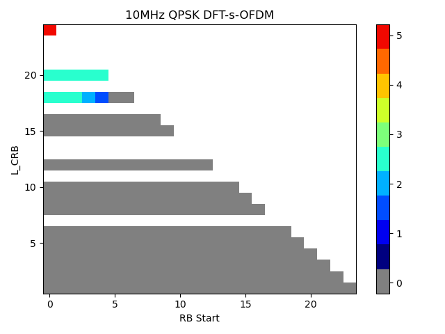,

\- , and

\- .

The value of EVM window length *W* is obtained from the transmission
bandwidth and table 6.6.3.5-2 for 60 kHz SCS, and table 6.6.3.5-3 in
TS 38.104 \[5\] for 120 kHz SCS.

The repeater shall transmit a signal according to the test models
intended for EVM. The demodulation reference signal of the second ideal
signal shall be used to find the centre of the FFT window.

The timing of the measured signal is determined in the pre FFT domain as
follows, using  and
:

1\. The measured signal is delay spread by the TX filter. Hence the
distinct borders between the OFDM symbols and between data and CP are
also spread and the timing is not obvious.

2\. In the ideal signal
, the timing is known.

Correlation between bullet (1) and (2) will result in a correlation
peak. The meaning of the correlation peak is approximately the \"impulse
response\" of the TX filter.

3\. The meaning of \"impulse response\" assumes that the autocorrelation
of the ideal signal  is
a Dirac peak and that the correlation between the ideal signal
 and the data in the
measured signal is 0. The correlation peak, (the highest, or in case of
more than one highest, the earliest) indicates the timing in the
measured signal.

The number of samples, used for FFT is reduced compared to
. This subset of samples
is called .

From the acquired samples one timing can be derived.

The timing of the centre
 is determined according
to the cyclic prefix length of the OFDM symbols. For normal CP, there
are two values for  in a
1 ms period:

\-  = length of cyclic
prefix / 2,

\-  = Longer CP length -
length of cyclic prefix / 2,

Where the length of cyclic prefix is obtained from table 6.6.3.5-2 for
60 kHz SCS, and table 6.6.3.5-3 in TS 38.104 \[5\] for 120 kHz SCS, and
the longer CP length is obtained from table F.2.4-1.

As per the example values.

\-  within the CP of
length 288 for most OFDM symbols in 1 ms,

\-  (= 544 -- 144)
within the CP of length 544 for OFDM symbol 0 of slot 0 and slot 4.

F.5 Resource element TX power
=============================

Perform FFT on  with the
FFT window timing .

The result is called .
The RE TX (RETP) power is then defined as:

$$\text{RETP} = \left| Z'\left( t,f \right) \right|^{2}\text{SCS}$$

where SCS is the subcarrier spacing in Hz.

From RETP, the OFDM symbol TX power (OSTP) is derived as follows:

$$\text{OSTP} = \frac{1}{N_{\text{sym}}}â_{}^{}\text{RETP}$$

Where the summation accumulates
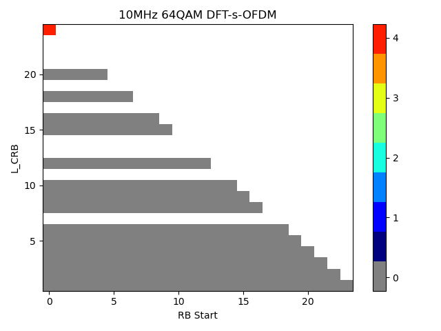 values of all *N~sym~*
OFDM symbols that carry PDSCH and not containing PDCCH, RS or SSB within
a slot.

.

From the acquired samples
 values for each OSTP
can be obtained and averaged where
 is the number of slots
with downlink symbols in a 10 ms measurement interval and is computed
according to the values in table 4.9.2.2-1 in \[5\].

For the example used in the annex,
 and
.

F.6 Post-FFT equalisation
=========================

Perform  FFTs on
, one for each OFDM
symbol within 10 ms measurement interval with the FFT window timing to
produce an array of samples,
 in the time axis *t* by
*FFT size* in the frequency axis *f*.

For the example in the annex, 1120 FFTs are performed on
. The result is an array
of samples, 1120 in the time axis by 4096 in the frequency axis.

The equalizer coefficients
 and
 are determined as
follows:

1\. Calculate the complex ratios (amplitude and phase) of the post-FFT
acquired signal  and the
post-FFT ideal signal ,
for each demodulation reference signal, over 10 ms measurement interval.
This process creates a set of complex ratios:

2\. Perform time averaging at each demodulation reference signal
subcarrier of the complex ratios, the time-averaging length is 10 ms
measurement interval. Prior to the averaging of the phases
 an unwrap operation
must be performed according to the following definition:

\- The unwrap operation corrects the radian phase angles of
 by adding multiples of
2 \* π when absolute phase jumps between consecutive time instances
 are greater than or
equal to the jump tolerance of π radians.

\- This process creates an average amplitude and phase for each
demodulation reference signal subcarrier (i.e. every second subcarrier).

\- Where *N* is the number of demodulation reference signal time-domain
locations  from
 for each demodulation
reference signal subcarrier *f*.

3\. The equalizer coefficients for amplitude and phase
 and
 at the demodulation
reference signal subcarriers are obtained by computing the moving
average in the frequency domain of the time-averaged demodulation
reference signal subcarriers. The moving average window size is 19 and
averaging is over the DM-RS subcarriers in the allocated RBs. For DM-RS
subcarriers at or near the edge of the channel, or when the number of
available DM-RS subcarriers within a set of contiguously allocated RBs
is smaller than the moving average window size, the window size is
reduced accordingly as per figure F.6-1.

4\. Perform linear interpolation from the equalizer coefficients
 and
 to compute coefficients
,
 for each subcarrier.

Figure F.6-1: Reference subcarrier smoothing in the frequency domain

a\) To account for the common phase error (CPE) experienced in
millimetre wave frequencies,
, in the estimated
coefficients contain phase rotation due to the CPE,
, in addition to the
phase of the equalizer coefficient
, that is:

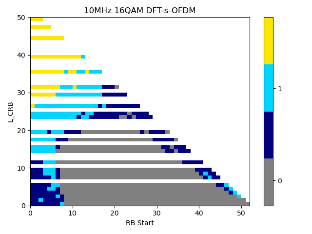

For OFDM symbols where PT-RS does not exist,
 can be estimated by
performing linear interpolation from neighboring symbols where PT-RS is
present.

In order to separate component of the
CPE,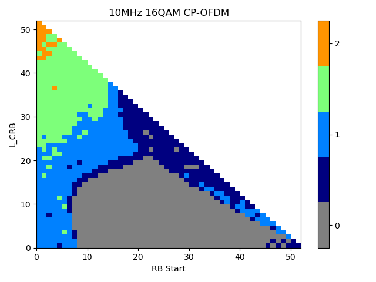, contained in,
, estimation and
compensation of the CPE needs to
follow. is the common
phase error (CPE), that rotates all the subcarriers of the OFDM symbol
at time .

Estimate of the CPE, ,
at OFDM symbol time, ,
can then be obtained from using the PT-RS employing the expression:

In the above equation, 
is the set of subcarriers where PT-RS are mapped,
 where
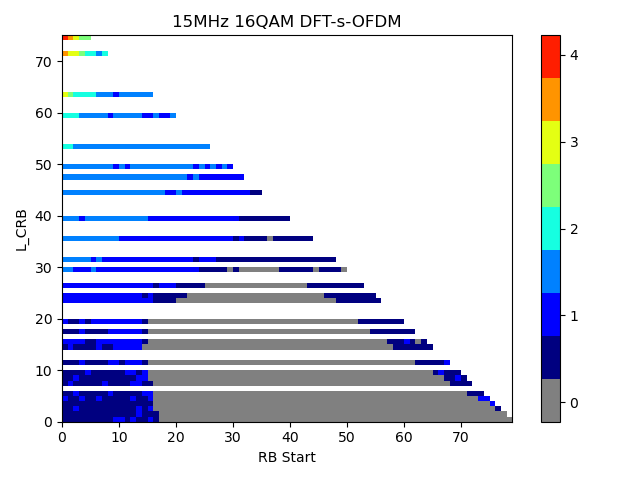 is the set of OFDM
symbols where PT-RS are mapped while
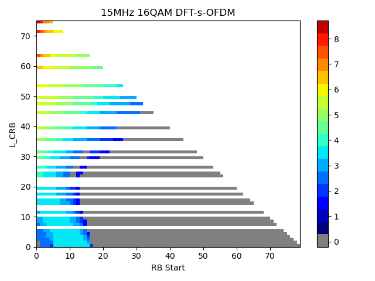 and
 are is the post-FFT
acquired signal and the ideal PT-RS signal respectively. That is,
estimate of the CPE at a given OFDM symbol is obtained from frequency
correlation of the complex ratios at the PT-RS positions with the
conjugate of the estimated equalizer complex coefficients. The estimated
CPE can be subtracted from
 to remove influence of
the CPE, and obtain estimate of the complex coefficient\'s phase:

(t)

F.7 EVM
=======

F.7.0 General
-------------

For EVM create two sets of
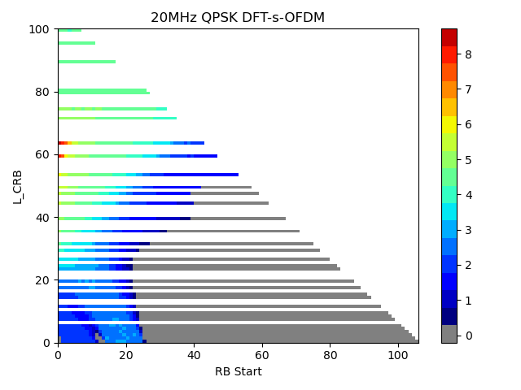, according to the
timing  and
, using the equalizer
coefficients from F.6.

The equivalent ideal samples are calculated from
 (annex G.2.2) and are
called .

The EVM is the difference between the ideal signal and the equalized
measured signal.

Where:

\- *T* is the set of symbols with the considered modulation scheme being
active within the slot,

\- 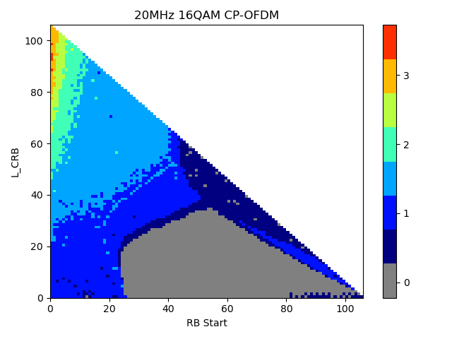 is the set of
subcarriers within the resource blocks with the considered modulation
scheme being active in symbol *t*,

\-  *is* the ideal
signal reconstructed by the measurement equipment in accordance with
relevant test models,

\-  is the equalized
signal under test.

NOTE: Although the basic unit of measurement is one slot, the equalizer
is calculated over the entire 10 ms measurement interval to reduce the
impact of noise in the reference signals.

F.7.1 Averaged EVM
------------------

Let  be the number of
slots with downlink symbols within a 10 ms measurement interval. For
TDD, the averaging in the time domain can be calculated from
 slots of different 10
ms measurement intervals and should have a minimum of
 slots averaging length
where  is the number of
slots in a 10 ms measurement interval.

 is derived by: Square
the EVM results in each 10 ms measurement interval. Sum the squares,
divide the sum by the number of EVM relevant locations, square-root the
quotient (RMS).

*Where*  is the number
of resource blocks with the considered modulation scheme in slot *i*.

The  is calculated,
using the maximum of at
the window *W* extremities. Thus
 is calculated using
 and
 is calculated
using (*l* and *h*, low
and high; where low is the timing
 and and high is the
timing ).

In order to unite at least
 slots, consider the
minimum integer number of 10 ms measurement intervals, where
 is determined by

And  for 60 kHz SCS and
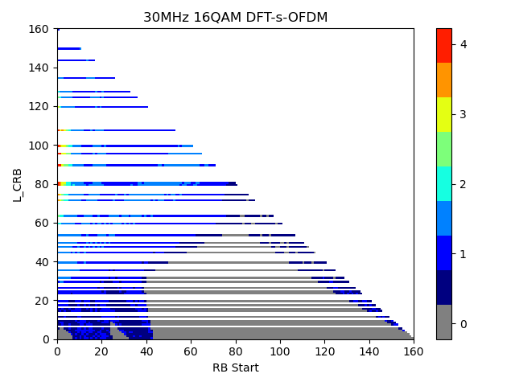 for 120 kHz SCS.

Unite by RMS.

The resulting is
compared against the limit.

 

######## Annex G (normative): TRP measurement procedures

For TRP measurement procedures, refer to annex I in TS 38.141-2 \[6\].

######## Annex H (normative): NCR-MT Fixed Reference Channels

H.1.1 Fixed Reference Channels for PDSCH performance requirements
-----------------------------------------------------------------

The parameters for the reference measurement channels are specified in
table H.1.1-1 for FR2 PDSCH performance requirements.

Table H.1.1-1: FRC parameters for FR2-1 PDSCH performance requirements,
1 transmission layer, QPSK

  Parameter                             Unit   Value
  ------------------------------------- ------ ---------------------
  **Reference Channel**                        **M-FR2-NCR.1.1-1**
  Channel bandwidth                     MHz    100
  Subcarrier spacing                    kHz    120
  Allocated resource blocks             PRBs   66
  Number of consecutive PDSCH symbols          13
  MCS table                                    64QAM
  MCS index                                    4
  Modulation                                   QPSK
  Target Coding Rate                           0.30
  Number of MIMO layers                        1
  Number of DMRS REs                           12
  Overhead for TBS determination               6
  Information Bit Payload per Slot             5504
  Transport block CRC per Slot                 24
  Number of Code Blocks per Slot               1
  Binary Channel Bits Per Slot                 18282

H.1.2 Fixed Reference Channels for PDCCH performance requirements
-----------------------------------------------------------------

The parameters for the reference measurement channels are specified in
table H.1.2-2 for FR2-1 PDCCH performance requirements.

Table H.1.2-2: Fixed Reference Channels for FR2-1 PDCCH

  Reference channel                     M-FR2-NCR.1.2-1   M-FR2-NCR.1.2-2   M-FR2-NCR.1.2-3
  ------------------------------------- ----------------- ----------------- -----------------
  Subcarrier spacing (kHz)              120               120               120
  CORESET frequency domain allocation   60                60                60
  CORESET time domain allocation        1                 1                 1
  Aggregation level                     2                 4                 8
  DCI Format                            1\_0              1\_1              1\_1
  Payload (without CRC) (bits)          40                56                56

H.1.3 Fixed Reference Channels for CQI reporting requirements
-------------------------------------------------------------

The parameters for the reference measurement channels are specified in
Table H.1.3-1 for FR2-1 CQI reporting requirements with the CQI
definition specified in clause 5.2.2.1 of TS 38.214 \[15\] and with the
MCS definition specified in clause 5.1.3 of TS 38.214 \[15\].

Table H.1.3-1: FRC for FR2-1 CQI reporting with CQI table 1 and MCS
table 1

+--------------+--------------+-----------+------------+--------------+
| Reference    | M-F          |           |            |              |
| channel      | R2-NCR.1.3-1 |           |            |              |
+==============+==============+===========+============+==============+
| Number of    | 66           |           |            |              |
| allocated    |              |           |            |              |
| PDSCH        |              |           |            |              |
| resource     |              |           |            |              |
| blocks       |              |           |            |              |
+--------------+--------------+-----------+------------+--------------+
| Number of    | 12           |           |            |              |
| consecutive  |              |           |            |              |
| PDSCH        |              |           |            |              |
| symbols      |              |           |            |              |
+--------------+--------------+-----------+------------+--------------+
| Number of    | 1            |           |            |              |
| PDSCH MIMO   |              |           |            |              |
| layers       |              |           |            |              |
+--------------+--------------+-----------+------------+--------------+
| Number of    | 24           |           |            |              |
| DMRS REs     |              |           |            |              |
| (Note 1)     |              |           |            |              |
+--------------+--------------+-----------+------------+--------------+
| Overhead for | 6            |           |            |              |
| TBS          |              |           |            |              |
| d            |              |           |            |              |
| etermination |              |           |            |              |
+--------------+--------------+-----------+------------+--------------+
| Available    | 7590         |           |            |              |
| RE-s for     |              |           |            |              |
| PDSCH        |              |           |            |              |
+--------------+--------------+-----------+------------+--------------+
| CQI index    | Spectral     | MCS index | Modulation | Information  |
|              | efficiency   |           |            | Bit Payload  |
|              |              |           |            | per Slot     |
+--------------+--------------+-----------+------------+--------------+
| 0            | OOR          | OOR       | OOR        | N/A          |
+--------------+--------------+-----------+------------+--------------+
| 1            | 0.1523       | 0         | QPSK       | 1800         |
+--------------+--------------+-----------+------------+--------------+
| 2            | 0.2344       | 0         |            | 1800         |
+--------------+--------------+-----------+------------+--------------+
| 3            | 0.3770       | 2         |            | 2856         |
+--------------+--------------+-----------+------------+--------------+
| 4            | 0.6016       | 4         |            | 4480         |
+--------------+--------------+-----------+------------+--------------+
| 5            | 0.8770       | 6         |            | 6528         |
+--------------+--------------+-----------+------------+--------------+
| 6            | 1.1758       | 8         |            | 8712         |
+--------------+--------------+-----------+------------+--------------+
| 7            | 1.4766       | 11        | 16QAM      | 11016        |
+--------------+--------------+-----------+------------+--------------+
| 8            | 1.9141       | 13        |            | 14343        |
+--------------+--------------+-----------+------------+--------------+
| 9            | 2.4063       | 15        |            | 17928        |
+--------------+--------------+-----------+------------+--------------+
| 10           | 2.7305       | 18        | 64QAM      | 20496        |
+--------------+--------------+-----------+------------+--------------+
| 11           | 3.3223       | 20        |            | 25104        |
+--------------+--------------+-----------+------------+--------------+
| 12           | 3.9023       | 22        |            | 29192        |
+--------------+--------------+-----------+------------+--------------+
| 13           | 4.5234       | 24        |            | 33816        |
+--------------+--------------+-----------+------------+--------------+
| 14           | 5.1152       | 26        |            | 38936        |
+--------------+--------------+-----------+------------+--------------+
| 15           | 5.5547       | 28        |            | 42016        |
+--------------+--------------+-----------+------------+--------------+
| NOTE 1:      |              |           |            |              |
| Number of    |              |           |            |              |
| DMRS REs     |              |           |            |              |
| includes the |              |           |            |              |
| overhead of  |              |           |            |              |
| the DM-RS    |              |           |            |              |
| CDM groups   |              |           |            |              |
| without data |              |           |            |              |
|              |              |           |            |              |
| NOTE 2:      |              |           |            |              |
| PDSCH is     |              |           |            |              |
| only         |              |           |            |              |
| scheduled on |              |           |            |              |
| slots which  |              |           |            |              |
| are full DL  |              |           |            |              |
+--------------+--------------+-----------+------------+--------------+

######## Annex I (normative): Propagation conditions

I.1 Static propagation condition
--------------------------------

The propagation for the static performance measurement is an Additive
White Gaussian Noise (AWGN) environment. No fading or multi-paths exist
for this propagation model.

I.1.1 NCR-MT Receiver with 2 Rx
-------------------------------

For 1 port transmission the channel matrix is defined in the frequency
domain by:

{width="0.5069444444444444in"
height="0.4513888888888889in"}.

For 2 port transmission the channel matrix is defined in the frequency
domain by:

{width="0.8263888888888888in"
height="0.4513888888888889in"}.

I.1.2 NCR-MT Receiver with 4Rx
------------------------------

For 1 port transmission the channel matrix is defined in the frequency
domain by

.

For 2 port transmission the channel matrix is defined in the frequency
domain by

.

I.2 Multi-path fading propagation conditions
--------------------------------------------

The multipath propagation conditions consist of several parts:

\- A delay profile in the form of a \"tapped delay-line\", characterized
by a number of taps at fixed positions on a sampling grid. The profile
can be further characterized by the r.m.s. delay spread and the maximum
delay spanned by the taps.

\- A combination of channel model parameters that include the Delay
profile and the Doppler spectrum that is characterized by a classical
spectrum shape and a maximum Doppler frequency.

\- Different models are used for FR1 (410 MHz - 7.125GHz) and FR2-1
(24.25 GHz -- 52.6 GHz).

### I.2.1 Delay profiles

The delay profiles are simplified from the TR 38.901 \[17\] TDL models.
The simplification steps are shown below for information. These steps
are only used when new delay profiles are created. Otherwise, the delay
profiles specified in annex I.2.1.1 and I.2.1.2 can be used as such.

Step 1: Use the original TDL model from TR 38.901 \[17\].

Step 2: Re-order the taps in ascending delays.

Step 3: Perform delay scaling according to the procedure described in
clause 7.7.3 in TR 38.901 \[17\].

Step 4: Apply the quantization to the delay resolution 5 ns. This is
done simply by rounding the tap delays to the nearest multiple of the
delay resolution.

Step 5: If multiple taps are rounded to the same delay bin, merge them
by calculating their linear power sum.

Step 6: If there are more than 12 taps in the quantized model, merge the
taps as follows:

\- Find the weakest tap from all taps (both merged and unmerged taps are
considered)

\- If there are two or more taps having the same value and are the
weakest, select the tap with the smallest delay as the weakest tap.

\- When the weakest tap is the first delay tap, merge taps as follows:

\- Update the power of the first delay tap as the linear power sum of
the weakest tap and the second delay tap.

\- Remove the second delay tap.

\- When the weakest tap is the last delay tap, merge taps as follows:

\- Update the power of the last delay tap as the linear power sum of the
second-to-last tap and the last tap.

\- Remove the second-to-last tap.

\- Otherwise:

\- For each side of the weakest tap, identify the neighbour tap that has
the smaller delay difference to the weakest tap.

> \- When the delay difference between the weakest tap and the
> identified neighbour tap on one side equals the delay difference
> between the weakest tap and the identified neighbour tap on the other
> side.

\- Select the neighbour tap that is weaker in power for merging.

\- Otherwise, select the neighbour tap that has smaller delay difference
for merging.

\- To merge, the power of the merged tap is the linear sum of the power
of the weakest tap and the selected tap.

\- When the selected tap is the first tap, the location of the merged
tap is the location of the first tap. The weakest tap is removed.

\- When the selected tap is the last tap, the location of the merged tap
is the location of the last tap. The weakest tap is removed.

\- Otherwise, the location of the merged tap is based on the average
delay of the weakest tap and selected tap. If the average delay is on
the sampling grid, the location of the merged tap is the average delay.
Otherwise, the location of the merged tap is rounded towards the
direction of the selected tap (e.g. 10 ns & 20 ns 15 ns, 10 ns & 25 ns
20 ns, if 25 ns had higher or equal power; 15 ns, if 10 ns had higher
power). The weakest tap and the selected tap are removed.

\- Repeat step 6 until the final number of taps is 12.

Step 7: Round the amplitudes of taps to one decimal (e.g. -8.78 dB -8.8
dB)

Step 8: If the delay spread has slightly changed due to the tap merge,
adjust the final delay spread by increasing or decreasing the power of
the last tap so that the delay spread is corrected.

Step 9: Re-normalize the highest tap to 0 dB.

NOTE 1: Some values of the delay profile created by the simplification
steps may differ from the values in tables I.2.1.1-2, I.2.1.1-3,
I.2.1.1-4, and I.2.1.2-2 for the corresponding model.

NOTE 2: For Step 5 and Step 6, the power values are expressed in the
linear domain using 6 digits of precision. The operations are in the
linear domain.

#### I.2.1.1 Delay profiles for FR2-1

The delay profiles for FR2-1 are specified in I.2.1.1-1 and the tapped
delay line models are specified in table I.2.1.1-2.

Table I.2.1.1-1: Delay profiles for NR channel models

+--------+--------------+--------------+--------------+--------------+
| Model  | Number of\   | Delay spread | Maximum      | Delay        |
|        | channel taps |              | excess tap   | resolution   |
|        |              | (r.m.s.)     | delay (span) |              |
+========+==============+==============+==============+==============+
| TDLA30 | 12           | 30 ns        | 290 ns       | 5 ns         |
+--------+--------------+--------------+--------------+--------------+

Table I.2.1.1-2: TDLA30 (DS = 30 ns)

  Tap \#   Delay (ns\]   Power (dB)   Fading distribution
  -------- ------------- ------------ ---------------------
  1        0             -15.5        Rayleigh
  2        10            0            
  3        15            -5.1         
  4        20            -5.1         
  5        25            -9.6         
  6        50            -8.2         
  7        65            -13.1        
  8        75            -11.5        
  9        105           -11.0        
  10       135           -16.2        
  11       150           -16.6        
  12       290           -26.2        

### I.2.2 Combinations of channel model parameters

The propagation conditions used for the performance measurements in
multi-path fading environment are indicated as a combination of a
channel model name and a maximum Doppler frequency, i.e.,
TDLA\<DS\>-\<Doppler\>, TDLB\<DS\>-\<Doppler\> or TDLC\<DS\>-\<Doppler\>
where \'\<DS\>\' indicates the desired delay spread and \'\<Doppler\>\'
indicates the maximum Doppler frequency (Hz).

Table I.2.2-1 and I.2.2-2 show the propagation conditions that are used
for the performance measurements in multi-path fading environment for
low, medium and high Doppler frequencies for FR1 and FR2, respectively.

Table I.2.2-1: Channel model parameters for FR1

  Combination name   Model    Maximum Doppler frequency
  ------------------ -------- ---------------------------
  TDLA30-10          TDLA30   10 Hz

Table I.2.2-2: Channel model parameters for FR2

  Combination name   Model    Maximum Doppler frequency
  ------------------ -------- ---------------------------
  TDLA30-75          TDLA30   75 Hz

### I.2.3 MIMO channel correlation matrices

The MIMO channel correlation matrices defined in I.2.3 apply for the
antenna configuration using uniform linear arrays at both gNB and NCR-MT
and for the antenna configuration using cross polarized antennas.

#### I.2.3.1 MIMO correlation matrices using Uniform Linear Array (ULA)

The MIMO channel correlation matrices defined in I.2.3.1 apply for the
antenna configuration using uniform linear array (ULA) at both gNB and
NCR-MT.

##### I.2.3.1.1 Definition of MIMO correlation matrices

Table I.2.3.1.1-1 defines the correlation matrix for the gNB.

Table I.2.3.1.1-1: gNB correlation matrix

                 gNB correlation
  -------------- --------------------------------------------------------------------------------------
  One antenna    {width="0.6111111111111112in" height="0.3055555555555556in"}
  Two antennas   {width="1.2013888888888888in" height="0.5069444444444444in"}

Table I.2.3.1.1-2 defines the correlation matrix for the NCR-MT:

Table I.2.3.1.1-2: NCR-MT correlation matrix

                                                                                            NCR-MT correlation
  ----------------------------------------------------------------------------------------- --------------------------------------------------------------------------------------
  Two antennas                                                                              {width="1.0694444444444444in" height="0.5069444444444444in"}
  Four antennas                                                                             
  Note: The correlation matrix $R_{\text{UE}}\ $applies to NCR-MT for NCR-MT requirements   

Table I.2.3.1.1-3 defines the channel spatial correlation
matrix{width="0.3055555555555556in"
height="0.3055555555555556in"}. The parameters, *α* and *β* in table
I.2.3.1.1-3 defines the spatial correlation between the antennas at the
gNB and NCR-MT respectively.

Table I.2.3.1.1-3:
{width="0.3055555555555556in"
height="0.3055555555555556in"}correlation matrices

  1x2 case   
  ---------- --
  1x4 case   
  2x2 case   
  2x4 case   

For cases with more antennas at either gNB or NCR-MT or both, the
channel spatial correlation matrix can still be expressed as the
Kronecker product of $R_{\text{gNB}}$ and $R_{\text{UE}}\ $according to
$R_{\text{spat}} = R_{\text{gNB}} \otimes R_{\text{UE}}$.

##### I.2.3.1.2 MIMO correlation matrices at high, medium and low level

The {width="0.16666666666666666in"
height="0.1597222222222222in"} and
{width="0.16666666666666666in"
height="0.2222222222222222in"} for different correlation types are given
in table I.2.3.1.2-1.

Table I.2.3.1.2-1: Correlation for high, medium and low level

  Low correlation   Medium correlation   High correlation               
  ----------------- -------------------- ------------------ ----- ----- -----
  α                 β                    α                  β     α     β
  0                 0                    0.3                0.9   0.9   0.9

The correlation matrices for high, medium and low correlation are
defined in tables I.2.3.1.2-2, I.2.3.1.2-3 and I.2.3.1.2-4 as below.

The values in table I.2.3.1.2-2 have been adjusted for the 2x4 high
correlation cases to ensure the correlation matrix is positive
semi-definite after round-off to 4 digit precision. This is done using
the equation:

{width="2.0in" height="0.3055555555555556in"}

Where the value \"a\" is a scaling factor such that the smallest value
is used to obtain a positive semi-definite result. For the 2x4 high
correlation case, a=0.00010.

Table I.2.3.1.2-2: MIMO correlation matrices for high correlation

  1x2 case   {width="1.0in" height="0.3888888888888889in"}
  ---------- ---------------------------------------------------------------------------------------
  2x2 case   {width="1.5277777777777777in" height="0.8194444444444444in"}
  2x4 case   {width="3.9027777777777777in" height="1.0in"}

Table I.2.3.1.2-3: MIMO correlation matrices for medium correlation

  1x2 case   N/A
  ---------- ---------------------------------------------------------------------------------------
  2x2 case   {width="2.1180555555555554in" height="0.5138888888888888in"}
  2x4 case   {width="4.208333333333333in" height="1.1180555555555556in"}

Table I.2.3.1.2-4: MIMO correlation matrices for low correlation

  1x2 case   {width="0.6111111111111112in" height="0.2013888888888889in"}
  ---------- ---------------------------------------------------------------------------------------
  1x4 case   {width="0.6111111111111112in" height="0.2013888888888889in"}
  2x2 case   {width="0.6111111111111112in" height="0.2013888888888889in"}
  2x4 case   {width="0.6111111111111112in" height="0.2013888888888889in"}

In table I.2.3.1.2-4,
{width="0.20833333333333334in"
height="0.20833333333333334in"} is a
{width="0.3194444444444444in"
height="0.20833333333333334in"} identity matrix.

NOTE: For completeness, the correlation matrices were defined for high,
medium and low correlation but performance requirements exist only for
low correlation.

#### I.2.3.2 Multi-antenna channel models using cross polarized antennas

The MIMO channel correlation matrices defined in I.2.3.2 apply to two
cases as presented below:

\- One TX antenna and multiple RX antennas case, with cross polarized
antennas used at gNB

\- Multiple TX antennas and multiple RX antennas case, with cross
polarized antennas used at both UE and gNB

The cross-polarized antenna elements with +/-45 degrees polarization
slant angles are deployed at gNB. For one TX antenna case, antenna
element with +90 degree polarization slant angle is deployed at UE. For
multiple TX antennas case, cross-polarized antenna elements with +90/0
degrees polarization slant angles are deployed at UE.

For the cross-polarized antennas, the N antennas are labelled such that
antennas for one polarization are listed from 1 to N/2 and antennas for
the other polarization are listed from N/2+1 to N, where N is the number
of TX or RX antennas.

##### I.2.3.2.1 Definition of MIMO correlation matrices using cross polarized antennas

For the channel spatial correlation matrix, the following is used:

{width="1.9236111111111112in"
height="0.2152777777777778in"}

Where

\- {width="0.2986111111111111in"
height="0.2152777777777778in"} is the spatial correlation matrix at the
UE with same polarization,

\- {width="0.3194444444444444in"
height="0.3055555555555556in"} is the spatial correlation matrix at the
gNB with same polarization,

\- {width="0.3055555555555556in"
height="0.20833333333333334in"} is a polarization correlation matrix,

\- {width="0.20833333333333334in"
height="0.20833333333333334in"} is a permutation matrix, and

\- {width="0.2986111111111111in"
height="0.2569444444444444in"} denotes transpose.

Table I.2.3.2.1-1 defines the polarization correlation matrix.

Table I.2.3.2.1-1 : Polarization correlation matrix

                                    One TX antenna                                                           Multiple TX antennas
  --------------------------------- ------------------------------------------------------------------------ ---------------------------------------------------------------------------------------
  Polarization correlation matrix   {width="1.0in" height="0.5277777777777778in"}   {width="1.5277777777777777in" height="0.8888888888888888in"}

The matrix{width="0.20833333333333334in"
height="0.20833333333333334in"}is defined as

{width="5.902777777777778in"
height="0.6944444444444444in"}

where {width="0.20833333333333334in"
height="0.20833333333333334in"} and
{width="0.20833333333333334in"
height="0.20833333333333334in"} is the number of TX and RX antennas
respectively, and
{width="0.20833333333333334in"
height="0.20833333333333334in"} is the ceiling operator.

The matrix {width="0.20833333333333334in"
height="0.20833333333333334in"} is used to map the spatial correlation
coefficients in accordance with the antenna element labelling system
described in I.2.3.2.

##### I.2.3.2.2 Spatial correlation matrices at NCR-MT and gNB sides

###### I.2.3.2.2.1 Spatial correlation matrices at NCR-MT side

For 2-antenna receiver using one pair of cross-polarized antenna
elements, {width="0.5277777777777778in"
height="0.20833333333333334in"}.

For 4-antenna receiver using two pairs of cross-polarized antenna
elements, {width="1.0in"
height="0.5138888888888888in"}.

###### I.2.3.2.2.2 Spatial correlation matrices at gNB side

For 1-antenna transmitter,
{width="0.5729166666666666in"
height="0.28125in"}.

For 2-antenna transmitter using one pair of cross-polarized antenna
elements, {width="0.6180555555555556in"
height="0.3055555555555556in"}.

##### I.2.3.2.3 MIMO correlation matrices using cross polarized antennas

The values for parameters *α*, *β* and *γ* for low spatial correlation
are given in table I.2.3.2.3-1.

Table I.2.3.2.3-1: Values for parameters α, β and γ

+------------------------------------------------------------+---+---+
| Low spatial correlation                                    |   |   |
+============================================================+===+===+
| Α                                                          | β | γ |
+------------------------------------------------------------+---+---+
| 0                                                          | 0 | 0 |
+------------------------------------------------------------+---+---+
| Note 1: Value of *α* applies when more than one pair of    |   |   |
| cross-polarized antenna elements at gNB side.              |   |   |
|                                                            |   |   |
| Note 2: Value of *β* applies when more than one pair of    |   |   |
| cross-polarized antenna elements at UE side.               |   |   |
+------------------------------------------------------------+---+---+

##### I.2.3.2.4 Beam steering approach

For the 2D cross-polarized antenna array at gNB, given the channel
spatial correlation matrix in I.2.3.2.1, I.2.3.2.2 and I.2.3.2.3, the
corresponding random channel matrix *H* can be calculated. The signal
model for the *k*-th slot is denoted as

And the steering matrix is further expressed as following:

where

\- *H* is the *N­r*×*Nt* channel matrix per subcarrier.

\- is the steering matrix,

\- is the steering matrix in first dimension with same polarization,

\- is the steering matrix in second dimension with same polarization,

\- is the number of antenna elements in first dimension with same
polarization,

\- is the number of antenna elements in second dimension with same
polarization,

\- For antenna array with only one direction, number of antenna element
in second direction equals 1.

For 1 antenna element with the same polarization in one direction,

.

For 2 antenna elements with the same polarization in one direction,

.

For 3 antenna elements with the same polarization in one direction,

.

For 4 antenna elements with the same polarization in one direction,

.

where the index stands for first dimension and second dimension
respectively.

\- controls the phase variation in first dimension and second dimension
respectively, and the phase for k-th subframe is denoted by, where is
the random start value with the uniform distribution, i.e., , is the
step of phase variation, which is defined in Table I.2.3.2.4-1, and k is
the linear increment of 2^-μ^ for every slot throughout the simulation,
the index stands for first dimension and second dimension respectively.

\- is the precoding matrix for Nt transmission antennas,

\- *y* is the received signal, *x* is the transmitted signal, and *n* is
AWGN.

\- corresponds to subcarrier spacing configuration,

For the 1D cross-polarized antenna array at gNB, the corresponding
random channel matrix *H* can be calculated by letting *N*~2~=1, i.e.,

Table I.2.3.2.4-1: The step of phase variation

  Variation Step   Value (rad/ms)
  ---------------- ----------------
                   1.2566×10^-3^

I.3 Physical signals, channels mapping and precoding
----------------------------------------------------

### I.3.1 General

Unless otherwise stated, the transmission on antenna port(s)
 is defined by using a
precoder matrix of size
, where
is the number of
physical transmit antenna elements configured per test ,
 is the number of
ports for a reference signal or physical channel configured per test,
and  is the first port
for that reference signal or physical channel as defined in clauses 7.3
and 7.4 in TS 38.211 \[18\]. This precoder takes as an input a block of
signals for antenna port(s)
,
, , with being the
number of modulation symbols per antenna port including the reference
signal symbols, and generates a block of signals
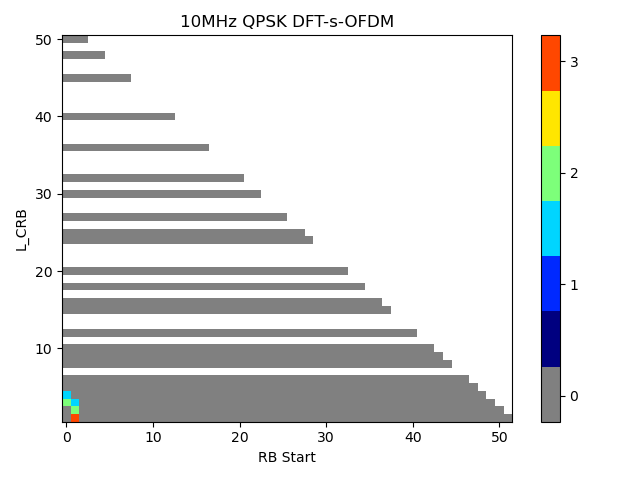 the elements of which
are to be mapped onto the frequency-time index pair as per the test
configuration but transmitted on different physical antenna elements:

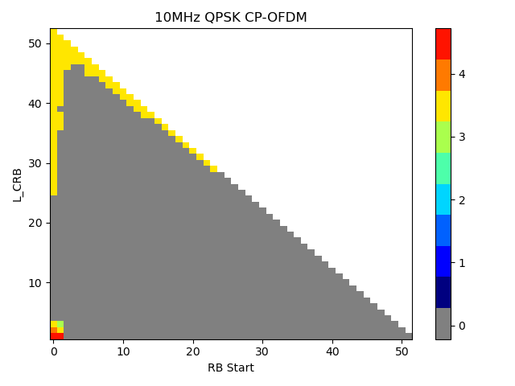

For Clause 6 and 8, the transmission of PDCCH and PDCCH DMRS on antenna
port  is defined by
using a precoder matrix of size 2x1. This precoder takes as an input a
block of signals for antenna port(s)
,
 and generates a block
of signals 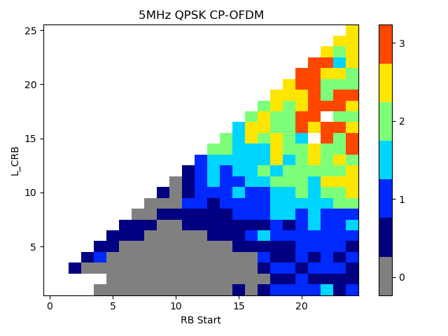 the
elements of which are to be mapped onto the frequency-time index pair as
per the test configuration but transmitted on different physical antenna
elements:

The precoder matrix is specific to the test case configuration is
defined in Clause 5.2.2.2 of TS 38.214 \[15\].

The transmission on PT-RS antenna port is associated (using same
precoder) with the lowest indexed DM-RS antenna port among the DM-RS
antenna ports assigned for the PDSCH.

The physical antenna elements are identified by indices, where is the
number of physical antenna elements configured per test.

Modulation symbols 
with 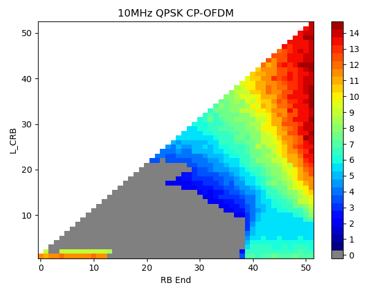 (i.e. PSS, SSS,
PBCH and DM-RS for PBCH) are directly mapped to first physical antenna
element.

*Modulation symbols for CSI-RS resources which configured for tracking
with one port* are directly mapped to first physical antenna element.

*Modulation symbols for CSI-RS resources which configured for beam
refinement with one port* are directly mapped to first physical antenna
element.

*Modulation symbols for NZP CSI-RS which configured for CSI acquisition
with* are *mapped to the physical antenna index* where is the number of
NZP CSI-RS ports configured per test.

######## Annex J (informative): Change history

+-------+-------+-------+-------+-------+-------+-------+-------+
| **C   |       |       |       |       |       |       |       |
| hange |       |       |       |       |       |       |       |
| hist  |       |       |       |       |       |       |       |
| ory** |       |       |       |       |       |       |       |
+=======+=======+=======+=======+=======+=======+=======+=======+
| **D   | *     | **T   | *     | **    | **    | **Su  | **New |
| ate** | *Meet | Doc** | *CR** | Rev** | Cat** | bject | vers  |
|       | ing** |       |       |       |       | /Comm | ion** |
|       |       |       |       |       |       | ent** |       |
+-------+-------+-------+-------+-------+-------+-------+-------+
| 20    | RAN4\ | R4-22 |       |       |       | TS    | 0.0.1 |
| 22-05 | #103e | 10846 |       |       |       | ske   |       |
|       |       |       |       |       |       | leton |       |
+-------+-------+-------+-------+-------+-------+-------+-------+
| 20    | RAN4\ | R4-22 |       |       |       | Added | 0.1.0 |
| 22-08 | #104e | 14368 |       |       |       | app   |       |
|       |       |       |       |       |       | roved |       |
|       |       |       |       |       |       | TPs   |       |
|       |       |       |       |       |       | in    |       |
|       |       |       |       |       |       | R     |       |
|       |       |       |       |       |       | AN4\# |       |
|       |       |       |       |       |       | 104-e |       |
|       |       |       |       |       |       | incl  |       |
|       |       |       |       |       |       | uding |       |
|       |       |       |       |       |       |       |       |
|       |       |       |       |       |       | R4-   |       |
|       |       |       |       |       |       | 22117 |       |
|       |       |       |       |       |       | 03,TP |       |
|       |       |       |       |       |       | for   |       |
|       |       |       |       |       |       | TS    |       |
|       |       |       |       |       |       | 38.1  |       |
|       |       |       |       |       |       | 15-2: |       |
|       |       |       |       |       |       | C     |       |
|       |       |       |       |       |       | lause |       |
|       |       |       |       |       |       | 4.    |       |
|       |       |       |       |       |       | 2-4.5 |       |
|       |       |       |       |       |       |       |       |
|       |       |       |       |       |       | R4-   |       |
|       |       |       |       |       |       | 22117 |       |
|       |       |       |       |       |       | 04,TP |       |
|       |       |       |       |       |       | for   |       |
|       |       |       |       |       |       | TS    |       |
|       |       |       |       |       |       | 38.1  |       |
|       |       |       |       |       |       | 15-2: |       |
|       |       |       |       |       |       | C     |       |
|       |       |       |       |       |       | lause |       |
|       |       |       |       |       |       | 5     |       |
|       |       |       |       |       |       | oper  |       |
|       |       |       |       |       |       | ating |       |
|       |       |       |       |       |       | bands |       |
|       |       |       |       |       |       |       |       |
|       |       |       |       |       |       | R4-   |       |
|       |       |       |       |       |       | 22137 |       |
|       |       |       |       |       |       | 22,TP |       |
|       |       |       |       |       |       | for   |       |
|       |       |       |       |       |       | TS    |       |
|       |       |       |       |       |       | 38.1  |       |
|       |       |       |       |       |       | 15-2: |       |
|       |       |       |       |       |       | se    |       |
|       |       |       |       |       |       | ction |       |
|       |       |       |       |       |       | 4.10\ |       |
|       |       |       |       |       |       | ~4.12 |       |
|       |       |       |       |       |       |       |       |
|       |       |       |       |       |       | R4-   |       |
|       |       |       |       |       |       | 22139 |       |
|       |       |       |       |       |       | 77,TP |       |
|       |       |       |       |       |       | to TS |       |
|       |       |       |       |       |       | 38.   |       |
|       |       |       |       |       |       | 115-2 |       |
|       |       |       |       |       |       | Annex |       |
|       |       |       |       |       |       | A     |       |
|       |       |       |       |       |       | Rep   |       |
|       |       |       |       |       |       | eater |       |
|       |       |       |       |       |       | sti   |       |
|       |       |       |       |       |       | mulus |       |
|       |       |       |       |       |       | si    |       |
|       |       |       |       |       |       | gnals |       |
|       |       |       |       |       |       | (OTA) |       |
|       |       |       |       |       |       |       |       |
|       |       |       |       |       |       | R4-   |       |
|       |       |       |       |       |       | 22147 |       |
|       |       |       |       |       |       | 42,TP |       |
|       |       |       |       |       |       | for   |       |
|       |       |       |       |       |       | TS    |       |
|       |       |       |       |       |       | 38.1  |       |
|       |       |       |       |       |       | 15-2: |       |
|       |       |       |       |       |       | C     |       |
|       |       |       |       |       |       | lause |       |
|       |       |       |       |       |       | 3     |       |
|       |       |       |       |       |       | d     |       |
|       |       |       |       |       |       | efini |       |
|       |       |       |       |       |       | tions |       |
|       |       |       |       |       |       |       |       |
|       |       |       |       |       |       | R4-   |       |
|       |       |       |       |       |       | 22147 |       |
|       |       |       |       |       |       | 88,TP |       |
|       |       |       |       |       |       | to TS |       |
|       |       |       |       |       |       | 38.1  |       |
|       |       |       |       |       |       | 15-2: |       |
|       |       |       |       |       |       | Freq  |       |
|       |       |       |       |       |       | uency |       |
|       |       |       |       |       |       | Stabi |       |
|       |       |       |       |       |       | lity, |       |
|       |       |       |       |       |       | Out   |       |
|       |       |       |       |       |       | of    |       |
|       |       |       |       |       |       | band  |       |
|       |       |       |       |       |       | gain, |       |
|       |       |       |       |       |       | unw   |       |
|       |       |       |       |       |       | anted |       |
|       |       |       |       |       |       | emis  |       |
|       |       |       |       |       |       | sions |       |
|       |       |       |       |       |       |       |       |
|       |       |       |       |       |       | R4-   |       |
|       |       |       |       |       |       | 22147 |       |
|       |       |       |       |       |       | 92,TP |       |
|       |       |       |       |       |       | to TS |       |
|       |       |       |       |       |       | 38.1  |       |
|       |       |       |       |       |       | 15-2: |       |
|       |       |       |       |       |       | TDD   |       |
|       |       |       |       |       |       | Swit  |       |
|       |       |       |       |       |       | ching |       |
|       |       |       |       |       |       |       |       |
|       |       |       |       |       |       | R4-   |       |
|       |       |       |       |       |       | 22148 |       |
|       |       |       |       |       |       | 02,TP |       |
|       |       |       |       |       |       | to TS |       |
|       |       |       |       |       |       | 38.   |       |
|       |       |       |       |       |       | 115-2 |       |
|       |       |       |       |       |       | Ma    |       |
|       |       |       |       |       |       | nufac |       |
|       |       |       |       |       |       | turer |       |
|       |       |       |       |       |       | de    |       |
|       |       |       |       |       |       | clara |       |
|       |       |       |       |       |       | tions |       |
|       |       |       |       |       |       | for   |       |
|       |       |       |       |       |       | NR    |       |
|       |       |       |       |       |       | FR2   |       |
|       |       |       |       |       |       | repe  |       |
|       |       |       |       |       |       | aters |       |
|       |       |       |       |       |       |       |       |
|       |       |       |       |       |       | R4-   |       |
|       |       |       |       |       |       | 22148 |       |
|       |       |       |       |       |       | 04,TP |       |
|       |       |       |       |       |       | to TS |       |
|       |       |       |       |       |       | 38.   |       |
|       |       |       |       |       |       | 115-2 |       |
|       |       |       |       |       |       | c     |       |
|       |       |       |       |       |       | lause |       |
|       |       |       |       |       |       | 6.7   |       |
|       |       |       |       |       |       | OTA   |       |
|       |       |       |       |       |       | Input |       |
|       |       |       |       |       |       | inter |       |
|       |       |       |       |       |       | modul |       |
|       |       |       |       |       |       | ation |       |
|       |       |       |       |       |       |       |       |
|       |       |       |       |       |       | R4-   |       |
|       |       |       |       |       |       | 22148 |       |
|       |       |       |       |       |       | 42,TP |       |
|       |       |       |       |       |       | for   |       |
|       |       |       |       |       |       | TS    |       |
|       |       |       |       |       |       | 38.1  |       |
|       |       |       |       |       |       | 15-2: |       |
|       |       |       |       |       |       | se    |       |
|       |       |       |       |       |       | ction |       |
|       |       |       |       |       |       | 6.8   |       |
|       |       |       |       |       |       |       |       |
|       |       |       |       |       |       | R4-   |       |
|       |       |       |       |       |       | 22148 |       |
|       |       |       |       |       |       | 43,TP |       |
|       |       |       |       |       |       | for   |       |
|       |       |       |       |       |       | TS    |       |
|       |       |       |       |       |       | 38.1  |       |
|       |       |       |       |       |       | 15-2: |       |
|       |       |       |       |       |       | Annex |       |
|       |       |       |       |       |       | D and |       |
|       |       |       |       |       |       | E     |       |
|       |       |       |       |       |       |       |       |
|       |       |       |       |       |       | R4-   |       |
|       |       |       |       |       |       | 22148 |       |
|       |       |       |       |       |       | 68,TP |       |
|       |       |       |       |       |       | to TS |       |
|       |       |       |       |       |       | 38.   |       |
|       |       |       |       |       |       | 115-2 |       |
|       |       |       |       |       |       | c     |       |
|       |       |       |       |       |       | lause |       |
|       |       |       |       |       |       | 6.6   |       |
|       |       |       |       |       |       | OTA   |       |
|       |       |       |       |       |       | EVM   |       |
+-------+-------+-------+-------+-------+-------+-------+-------+
| 20    | RAN4  | R4-22 |       |       |       | Added | 0.2.0 |
| 22-10 | \#104 | 16568 |       |       |       | app   |       |
|       | bis-e |       |       |       |       | roved |       |
|       |       |       |       |       |       | TPs   |       |
|       |       |       |       |       |       | in    |       |
|       |       |       |       |       |       | R     |       |
|       |       |       |       |       |       | AN4\# |       |
|       |       |       |       |       |       | 104-e |       |
|       |       |       |       |       |       | incl  |       |
|       |       |       |       |       |       | uding |       |
|       |       |       |       |       |       |       |       |
|       |       |       |       |       |       | R4-   |       |
|       |       |       |       |       |       | 22147 |       |
|       |       |       |       |       |       | 86,TP |       |
|       |       |       |       |       |       | to TS |       |
|       |       |       |       |       |       | 38.1  |       |
|       |       |       |       |       |       | 15-2: |       |
|       |       |       |       |       |       | Test  |       |
|       |       |       |       |       |       | Conf  |       |
|       |       |       |       |       |       | igura |       |
|       |       |       |       |       |       | tions |       |
|       |       |       |       |       |       | and   |       |
|       |       |       |       |       |       | R     |       |
|       |       |       |       |       |       | equir |       |
|       |       |       |       |       |       | ement |       |
|       |       |       |       |       |       | app   |       |
|       |       |       |       |       |       | licab |       |
|       |       |       |       |       |       | ility |       |
|       |       |       |       |       |       |       |       |
|       |       |       |       |       |       | R4-   |       |
|       |       |       |       |       |       | 22147 |       |
|       |       |       |       |       |       | 90,TP |       |
|       |       |       |       |       |       | to TS |       |
|       |       |       |       |       |       | 38.1  |       |
|       |       |       |       |       |       | 15-2: |       |
|       |       |       |       |       |       | In    |       |
|       |       |       |       |       |       | -band |       |
|       |       |       |       |       |       | me    |       |
|       |       |       |       |       |       | asure |       |
|       |       |       |       |       |       | ments |       |
|       |       |       |       |       |       | Annex |       |
|       |       |       |       |       |       |       |       |
|       |       |       |       |       |       | R4-   |       |
|       |       |       |       |       |       | 22148 |       |
|       |       |       |       |       |       | 66,TP |       |
|       |       |       |       |       |       | to TS |       |
|       |       |       |       |       |       | 38.   |       |
|       |       |       |       |       |       | 115-2 |       |
|       |       |       |       |       |       | c     |       |
|       |       |       |       |       |       | lause |       |
|       |       |       |       |       |       | 4.9   |       |
|       |       |       |       |       |       | RF    |       |
|       |       |       |       |       |       | cha   |       |
|       |       |       |       |       |       | nnels |       |
|       |       |       |       |       |       | and   |       |
|       |       |       |       |       |       | test  |       |
|       |       |       |       |       |       | m     |       |
|       |       |       |       |       |       | odels |       |
|       |       |       |       |       |       |       |       |
|       |       |       |       |       |       | Added |       |
|       |       |       |       |       |       | app   |       |
|       |       |       |       |       |       | roved |       |
|       |       |       |       |       |       | TPs   |       |
|       |       |       |       |       |       | in    |       |
|       |       |       |       |       |       | RAN4  |       |
|       |       |       |       |       |       | \#104 |       |
|       |       |       |       |       |       | bis-e |       |
|       |       |       |       |       |       | incl  |       |
|       |       |       |       |       |       | uding |       |
|       |       |       |       |       |       |       |       |
|       |       |       |       |       |       | R4-   |       |
|       |       |       |       |       |       | 22173 |       |
|       |       |       |       |       |       | 02,TP |       |
|       |       |       |       |       |       | to TS |       |
|       |       |       |       |       |       | 38.   |       |
|       |       |       |       |       |       | 115-2 |       |
|       |       |       |       |       |       | --    |       |
|       |       |       |       |       |       | Annex |       |
|       |       |       |       |       |       | I TRP |       |
|       |       |       |       |       |       | m     |       |
|       |       |       |       |       |       | easur |       |
|       |       |       |       |       |       | ement |       |
|       |       |       |       |       |       | proce |       |
|       |       |       |       |       |       | dures |       |
|       |       |       |       |       |       |       |       |
|       |       |       |       |       |       | R4-   |       |
|       |       |       |       |       |       | 22173 |       |
|       |       |       |       |       |       | 00,TP |       |
|       |       |       |       |       |       | for   |       |
|       |       |       |       |       |       | TS    |       |
|       |       |       |       |       |       | 38.1  |       |
|       |       |       |       |       |       | 15-2: |       |
|       |       |       |       |       |       | S     |       |
|       |       |       |       |       |       | cope, |       |
|       |       |       |       |       |       | refe  |       |
|       |       |       |       |       |       | rence |       |
|       |       |       |       |       |       | and   |       |
|       |       |       |       |       |       | edit  |       |
|       |       |       |       |       |       | orial |       |
|       |       |       |       |       |       | ch    |       |
|       |       |       |       |       |       | anges |       |
|       |       |       |       |       |       |       |       |
|       |       |       |       |       |       | R4-   |       |
|       |       |       |       |       |       | 22173 |       |
|       |       |       |       |       |       | 08,TP |       |
|       |       |       |       |       |       | to TS |       |
|       |       |       |       |       |       | 38.1  |       |
|       |       |       |       |       |       | 15-2: |       |
|       |       |       |       |       |       | M     |       |
|       |       |       |       |       |       | easur |       |
|       |       |       |       |       |       | ement |       |
|       |       |       |       |       |       | unc   |       |
|       |       |       |       |       |       | ertai |       |
|       |       |       |       |       |       | nties |       |
|       |       |       |       |       |       | and   |       |
|       |       |       |       |       |       | test  |       |
|       |       |       |       |       |       | re    |       |
|       |       |       |       |       |       | quire |       |
|       |       |       |       |       |       | ments |       |
|       |       |       |       |       |       | (4.1) |       |
|       |       |       |       |       |       |       |       |
|       |       |       |       |       |       | R4-   |       |
|       |       |       |       |       |       | 22173 |       |
|       |       |       |       |       |       | 10,TP |       |
|       |       |       |       |       |       | to TS |       |
|       |       |       |       |       |       | 38.1  |       |
|       |       |       |       |       |       | 15-2: |       |
|       |       |       |       |       |       | OTA   |       |
|       |       |       |       |       |       | o     |       |
|       |       |       |       |       |       | utput |       |
|       |       |       |       |       |       | power |       |
|       |       |       |       |       |       | (6.1, |       |
|       |       |       |       |       |       | 6.2)  |       |
|       |       |       |       |       |       |       |       |
|       |       |       |       |       |       | R4-   |       |
|       |       |       |       |       |       | 22173 |       |
|       |       |       |       |       |       | 09,TP |       |
|       |       |       |       |       |       | to TS |       |
|       |       |       |       |       |       | 38.1  |       |
|       |       |       |       |       |       | 15-2: |       |
|       |       |       |       |       |       | Annex |       |
|       |       |       |       |       |       | B:    |       |
|       |       |       |       |       |       | Test  |       |
|       |       |       |       |       |       | toler |       |
|       |       |       |       |       |       | ances |       |
|       |       |       |       |       |       | and   |       |
|       |       |       |       |       |       | deriv |       |
|       |       |       |       |       |       | ation |       |
|       |       |       |       |       |       | of    |       |
|       |       |       |       |       |       | test  |       |
|       |       |       |       |       |       | re    |       |
|       |       |       |       |       |       | quire |       |
|       |       |       |       |       |       | ments |       |
|       |       |       |       |       |       |       |       |
|       |       |       |       |       |       | R4-   |       |
|       |       |       |       |       |       | 22168 |       |
|       |       |       |       |       |       | 44,TP |       |
|       |       |       |       |       |       | to TS |       |
|       |       |       |       |       |       | 38.1  |       |
|       |       |       |       |       |       | 15-2: |       |
|       |       |       |       |       |       | Annex |       |
|       |       |       |       |       |       | A:    |       |
|       |       |       |       |       |       | Env   |       |
|       |       |       |       |       |       | ironm |       |
|       |       |       |       |       |       | ental |       |
|       |       |       |       |       |       | re    |       |
|       |       |       |       |       |       | quire |       |
|       |       |       |       |       |       | ments |       |
|       |       |       |       |       |       | for   |       |
|       |       |       |       |       |       | the   |       |
|       |       |       |       |       |       | rep   |       |
|       |       |       |       |       |       | eater |       |
+-------+-------+-------+-------+-------+-------+-------+-------+
| 20    | RAN4  | R4-22 |       |       |       | Added | 0.3.0 |
| 22-11 | \#105 | 19348 |       |       |       | app   |       |
|       |       |       |       |       |       | roved |       |
|       |       |       |       |       |       | TPs   |       |
|       |       |       |       |       |       | in    |       |
|       |       |       |       |       |       | RAN4  |       |
|       |       |       |       |       |       | \#105 |       |
|       |       |       |       |       |       | incl  |       |
|       |       |       |       |       |       | uding |       |
|       |       |       |       |       |       |       |       |
|       |       |       |       |       |       | R4-22 |       |
|       |       |       |       |       |       | 20215 |       |
|       |       |       |       |       |       | TP to |       |
|       |       |       |       |       |       | 38.1  |       |
|       |       |       |       |       |       | 15-2: |       |
|       |       |       |       |       |       | OTA   |       |
|       |       |       |       |       |       | ACLR  |       |
|       |       |       |       |       |       | r     |       |
|       |       |       |       |       |       | equir |       |
|       |       |       |       |       |       | ement |       |
|       |       |       |       |       |       |       |       |
|       |       |       |       |       |       | R4-22 |       |
|       |       |       |       |       |       | 20218 |       |
|       |       |       |       |       |       | TP to |       |
|       |       |       |       |       |       | 38.1  |       |
|       |       |       |       |       |       | 15-2: |       |
|       |       |       |       |       |       | OTA   |       |
|       |       |       |       |       |       | EVM   |       |
|       |       |       |       |       |       | r     |       |
|       |       |       |       |       |       | equir |       |
|       |       |       |       |       |       | ement |       |
|       |       |       |       |       |       |       |       |
|       |       |       |       |       |       | R4-22 |       |
|       |       |       |       |       |       | 20271 |       |
|       |       |       |       |       |       | TP to |       |
|       |       |       |       |       |       | 38.1  |       |
|       |       |       |       |       |       | 15-2: |       |
|       |       |       |       |       |       | OTA   |       |
|       |       |       |       |       |       | ACRR  |       |
|       |       |       |       |       |       | r     |       |
|       |       |       |       |       |       | equir |       |
|       |       |       |       |       |       | ement |       |
|       |       |       |       |       |       |       |       |
|       |       |       |       |       |       | R4-22 |       |
|       |       |       |       |       |       | 20227 |       |
|       |       |       |       |       |       | Draft |       |
|       |       |       |       |       |       | CR to |       |
|       |       |       |       |       |       | 38.1  |       |
|       |       |       |       |       |       | 15-2: |       |
|       |       |       |       |       |       | Spe   |       |
|       |       |       |       |       |       | ctrum |       |
|       |       |       |       |       |       | p     |       |
|       |       |       |       |       |       | urity |       |
|       |       |       |       |       |       |       |       |
|       |       |       |       |       |       | R4-22 |       |
|       |       |       |       |       |       | 20228 |       |
|       |       |       |       |       |       | TP    |       |
|       |       |       |       |       |       | for   |       |
|       |       |       |       |       |       | TS    |       |
|       |       |       |       |       |       | 38.   |       |
|       |       |       |       |       |       | 115-2 |       |
|       |       |       |       |       |       | OTA   |       |
|       |       |       |       |       |       | Out   |       |
|       |       |       |       |       |       | of    |       |
|       |       |       |       |       |       | band  |       |
|       |       |       |       |       |       | gain  |       |
|       |       |       |       |       |       | re    |       |
|       |       |       |       |       |       | quire |       |
|       |       |       |       |       |       | ments |       |
|       |       |       |       |       |       |       |       |
|       |       |       |       |       |       | R4-22 |       |
|       |       |       |       |       |       | 20289 |       |
|       |       |       |       |       |       | M     |       |
|       |       |       |       |       |       | ainte |       |
|       |       |       |       |       |       | nance |       |
|       |       |       |       |       |       | TP    |       |
|       |       |       |       |       |       | for   |       |
|       |       |       |       |       |       | TS    |       |
|       |       |       |       |       |       | 38.   |       |
|       |       |       |       |       |       | 115-2 |       |
+-------+-------+-------+-------+-------+-------+-------+-------+
| 20    | RAN   | RP-2  |       |       |       | Draft | 1.0.0 |
| 22-12 | \#98e | 23091 |       |       |       | ve    |       |
|       |       |       |       |       |       | rsion |       |
|       |       |       |       |       |       | for   |       |
|       |       |       |       |       |       | app   |       |
|       |       |       |       |       |       | roval |       |
|       |       |       |       |       |       | to    |       |
|       |       |       |       |       |       | RAN   |       |
|       |       |       |       |       |       | Pl    |       |
|       |       |       |       |       |       | enary |       |
|       |       |       |       |       |       | mee   |       |
|       |       |       |       |       |       | ting: |       |
|       |       |       |       |       |       |       |       |
|       |       |       |       |       |       | RP-22 |       |
|       |       |       |       |       |       | 3091, |       |
|       |       |       |       |       |       | TS    |       |
|       |       |       |       |       |       | 38.   |       |
|       |       |       |       |       |       | 115-2 |       |
|       |       |       |       |       |       | v     |       |
|       |       |       |       |       |       | 1.0.0 |       |
|       |       |       |       |       |       | NR;   |       |
|       |       |       |       |       |       | Rep   |       |
|       |       |       |       |       |       | eater |       |
|       |       |       |       |       |       | c     |       |
|       |       |       |       |       |       | onfor |       |
|       |       |       |       |       |       | mance |       |
|       |       |       |       |       |       | te    |       |
|       |       |       |       |       |       | sting |       |
|       |       |       |       |       |       | -     |       |
|       |       |       |       |       |       | Part  |       |
|       |       |       |       |       |       | 2:    |       |
|       |       |       |       |       |       | Rad   |       |
|       |       |       |       |       |       | iated |       |
|       |       |       |       |       |       | c     |       |
|       |       |       |       |       |       | onfor |       |
|       |       |       |       |       |       | mance |       |
|       |       |       |       |       |       | te    |       |
|       |       |       |       |       |       | sting |       |
+-------+-------+-------+-------+-------+-------+-------+-------+

+-------+-------+-------+-------+-------+-------+-------+-------+
| **C   |       |       |       |       |       |       |       |
| hange |       |       |       |       |       |       |       |
| hist  |       |       |       |       |       |       |       |
| ory** |       |       |       |       |       |       |       |
+=======+=======+=======+=======+=======+=======+=======+=======+
| **D   | *     | **T   | *     | **    | **    | **Su  | **New |
| ate** | *Meet | Doc** | *CR** | Rev** | Cat** | bject | vers  |
|       | ing** |       |       |       |       | /Comm | ion** |
|       |       |       |       |       |       | ent** |       |
+-------+-------+-------+-------+-------+-------+-------+-------+
| 20    | RAN\  |       |       |       |       | App   | 1     |
| 22-12 | #98-e |       |       |       |       | roved | 7.0.0 |
|       |       |       |       |       |       | by    |       |
|       |       |       |       |       |       | pl    |       |
|       |       |       |       |       |       | enary |       |
|       |       |       |       |       |       | --    |       |
|       |       |       |       |       |       | R     |       |
|       |       |       |       |       |       | el-17 |       |
|       |       |       |       |       |       | spec  |       |
|       |       |       |       |       |       | under |       |
|       |       |       |       |       |       | c     |       |
|       |       |       |       |       |       | hange |       |
|       |       |       |       |       |       | co    |       |
|       |       |       |       |       |       | ntrol |       |
+-------+-------+-------+-------+-------+-------+-------+-------+
| 20    | RA    | RP-2  | 0001  | 1     | F     | CR    | 1     |
| 23-03 | N\#99 | 30518 |       |       |       | for   | 7.1.0 |
|       |       |       |       |       |       | TS    |       |
|       |       |       |       |       |       | 38.1  |       |
|       |       |       |       |       |       | 15-2: |       |
|       |       |       |       |       |       | Corre |       |
|       |       |       |       |       |       | ction |       |
|       |       |       |       |       |       | of    |       |
|       |       |       |       |       |       | some  |       |
|       |       |       |       |       |       | e     |       |
|       |       |       |       |       |       | rrors |       |
+-------+-------+-------+-------+-------+-------+-------+-------+
| 20    | RA    | RP-2  | 0002  |       | F     | CR to | 1     |
| 23-03 | N\#99 | 30518 |       |       |       | 38.1  | 7.1.0 |
|       |       |       |       |       |       | 15-2: |       |
|       |       |       |       |       |       | Corre |       |
|       |       |       |       |       |       | ction |       |
|       |       |       |       |       |       | on    |       |
|       |       |       |       |       |       | OTA   |       |
|       |       |       |       |       |       | rep   |       |
|       |       |       |       |       |       | eater |       |
|       |       |       |       |       |       | EVM   |       |
|       |       |       |       |       |       | test  |       |
|       |       |       |       |       |       | re    |       |
|       |       |       |       |       |       | quire |       |
|       |       |       |       |       |       | ments |       |
+-------+-------+-------+-------+-------+-------+-------+-------+
| 20    | RA    | RP-2  | 0003  |       | F     | CR to | 1     |
| 23-03 | N\#99 | 30518 |       |       |       | 38.1  | 7.1.0 |
|       |       |       |       |       |       | 15-2: |       |
|       |       |       |       |       |       | Corre |       |
|       |       |       |       |       |       | ction |       |
|       |       |       |       |       |       | on    |       |
|       |       |       |       |       |       | deriv |       |
|       |       |       |       |       |       | ation |       |
|       |       |       |       |       |       | of    |       |
|       |       |       |       |       |       | test  |       |
|       |       |       |       |       |       | re    |       |
|       |       |       |       |       |       | quire |       |
|       |       |       |       |       |       | ments |       |
+-------+-------+-------+-------+-------+-------+-------+-------+
| 20    | RA    | RP-2  | 0004  |       | F     | CR to | 1     |
| 23-03 | N\#99 | 30518 |       |       |       | 38.1  | 7.1.0 |
|       |       |       |       |       |       | 15-2: |       |
|       |       |       |       |       |       | Corre |       |
|       |       |       |       |       |       | ction |       |
|       |       |       |       |       |       | of    |       |
|       |       |       |       |       |       | rep   |       |
|       |       |       |       |       |       | eater |       |
|       |       |       |       |       |       | ACLR  |       |
|       |       |       |       |       |       | test  |       |
|       |       |       |       |       |       | proc  |       |
|       |       |       |       |       |       | edure |       |
+-------+-------+-------+-------+-------+-------+-------+-------+
| 20    | RAN   | RP-2  | 0005  | 1     | F     | CR    | 1     |
| 23-06 | \#100 | 31339 |       |       |       | for   | 7.2.0 |
|       |       |       |       |       |       | TS    |       |
|       |       |       |       |       |       | 38.1  |       |
|       |       |       |       |       |       | 15-2, |       |
|       |       |       |       |       |       | Add   |       |
|       |       |       |       |       |       | ma    |       |
|       |       |       |       |       |       | nufac |       |
|       |       |       |       |       |       | turer |       |
|       |       |       |       |       |       | de    |       |
|       |       |       |       |       |       | clara |       |
|       |       |       |       |       |       | tions |       |
|       |       |       |       |       |       | for   |       |
|       |       |       |       |       |       | test  |       |
|       |       |       |       |       |       | conf  |       |
|       |       |       |       |       |       | igura |       |
|       |       |       |       |       |       | tions |       |
|       |       |       |       |       |       | and   |       |
|       |       |       |       |       |       | RF    |       |
|       |       |       |       |       |       | cha   |       |
|       |       |       |       |       |       | nnels |       |
+-------+-------+-------+-------+-------+-------+-------+-------+
| 20    | RAN   | RP-2  | 0006  |       | F     | CR to | 1     |
| 23-06 | \#100 | 31339 |       |       |       | 38.1  | 7.2.0 |
|       |       |       |       |       |       | 15-2: |       |
|       |       |       |       |       |       | C     |       |
|       |       |       |       |       |       | orrec |       |
|       |       |       |       |       |       | tions |       |
|       |       |       |       |       |       | on    |       |
|       |       |       |       |       |       | rep   |       |
|       |       |       |       |       |       | eater |       |
|       |       |       |       |       |       | o     |       |
|       |       |       |       |       |       | utput |       |
|       |       |       |       |       |       | power |       |
|       |       |       |       |       |       | re    |       |
|       |       |       |       |       |       | quire |       |
|       |       |       |       |       |       | ments |       |
+-------+-------+-------+-------+-------+-------+-------+-------+
| 20    | RAN   | RP-2  | 0007  | 1     | F     | CR to | 1     |
| 23-06 | \#100 | 31339 |       |       |       | TS    | 7.2.0 |
|       |       |       |       |       |       | 38.1  |       |
|       |       |       |       |       |       | 15-2: |       |
|       |       |       |       |       |       | Cla   |       |
|       |       |       |       |       |       | rifca |       |
|       |       |       |       |       |       | tions |       |
|       |       |       |       |       |       | for   |       |
|       |       |       |       |       |       | rep   |       |
|       |       |       |       |       |       | eater |       |
|       |       |       |       |       |       | test  |       |
|       |       |       |       |       |       | m     |       |
|       |       |       |       |       |       | odels |       |
+-------+-------+-------+-------+-------+-------+-------+-------+
| 20    | RAN   | RP-2  | 0008  | 1     | F     | \[    | 1     |
| 23-09 | \#101 | 32496 |       |       |       | NR\_r | 7.3.0 |
|       |       |       |       |       |       | epeat |       |
|       |       |       |       |       |       | ers\] |       |
|       |       |       |       |       |       | CR to |       |
|       |       |       |       |       |       | 38.1  |       |
|       |       |       |       |       |       | 15-2: |       |
|       |       |       |       |       |       | Input |       |
|       |       |       |       |       |       | inter |       |
|       |       |       |       |       |       | modul |       |
|       |       |       |       |       |       | ation |       |
+-------+-------+-------+-------+-------+-------+-------+-------+
| 20    | RAN   | RP-2  | 0009  |       | F     | CR    | 1     |
| 23-12 | \#102 | 33350 |       |       |       | for   | 7.4.0 |
|       |       |       |       |       |       | TS    |       |
|       |       |       |       |       |       | 38.1  |       |
|       |       |       |       |       |       | 15-2, |       |
|       |       |       |       |       |       | R     |       |
|       |       |       |       |       |       | emove |       |
|       |       |       |       |       |       | multi |       |
|       |       |       |       |       |       | -band |       |
|       |       |       |       |       |       | re    |       |
|       |       |       |       |       |       | lated |       |
|       |       |       |       |       |       | co    |       |
|       |       |       |       |       |       | ntent |       |
|       |       |       |       |       |       | for   |       |
|       |       |       |       |       |       | rep   |       |
|       |       |       |       |       |       | eater |       |
|       |       |       |       |       |       | type  |       |
|       |       |       |       |       |       | 2-O   |       |
+-------+-------+-------+-------+-------+-------+-------+-------+
| 20    | RAN   | RP-2  | 0010  | 1     | F     | CR to | 1     |
| 23-12 | \#102 | 33350 |       |       |       | 38.1  | 7.4.0 |
|       |       |       |       |       |       | 15-2: |       |
|       |       |       |       |       |       | Corre |       |
|       |       |       |       |       |       | ction |       |
|       |       |       |       |       |       | of    |       |
|       |       |       |       |       |       | ter   |       |
|       |       |       |       |       |       | minol |       |
|       |       |       |       |       |       | ogies |       |
|       |       |       |       |       |       | for   |       |
|       |       |       |       |       |       | NR    |       |
|       |       |       |       |       |       | repe  |       |
|       |       |       |       |       |       | aters |       |
+-------+-------+-------+-------+-------+-------+-------+-------+
| 20    | RAN   | RP-2  | 0011  |       | F     | (NR\_ | 1     |
| 24-03 | \#103 | 40574 |       |       |       | repea | 7.5.0 |
|       |       |       |       |       |       | ters- |       |
|       |       |       |       |       |       | Perf) |       |
|       |       |       |       |       |       | CR    |       |
|       |       |       |       |       |       | for   |       |
|       |       |       |       |       |       | TS    |       |
|       |       |       |       |       |       | 38.1  |       |
|       |       |       |       |       |       | 15-2, |       |
|       |       |       |       |       |       | Corre |       |
|       |       |       |       |       |       | ction |       |
|       |       |       |       |       |       | on BS |       |
|       |       |       |       |       |       | re    |       |
|       |       |       |       |       |       | lated |       |
|       |       |       |       |       |       | d     |       |
|       |       |       |       |       |       | escri |       |
|       |       |       |       |       |       | ption |       |
|       |       |       |       |       |       | i     |       |
|       |       |       |       |       |       | ssues |       |
+-------+-------+-------+-------+-------+-------+-------+-------+
| 20    | RAN   | RP-2  | 0012  | 1     | F     | CR to | 1     |
| 24-03 | \#103 | 40574 |       |       |       | 38.1  | 7.5.0 |
|       |       |       |       |       |       | 15-2: |       |
|       |       |       |       |       |       | NR    |       |
|       |       |       |       |       |       | rep   |       |
|       |       |       |       |       |       | eater |       |
|       |       |       |       |       |       | t     |       |
|       |       |       |       |       |       | ransm |       |
|       |       |       |       |       |       | itter |       |
|       |       |       |       |       |       | spu   |       |
|       |       |       |       |       |       | rious |       |
|       |       |       |       |       |       | emis  |       |
|       |       |       |       |       |       | sions |       |
|       |       |       |       |       |       | re    |       |
|       |       |       |       |       |       | quire |       |
|       |       |       |       |       |       | ments |       |
|       |       |       |       |       |       | (re   |       |
|       |       |       |       |       |       | l-18) |       |
+-------+-------+-------+-------+-------+-------+-------+-------+
| 20    | RAN   | RP-2  | 0013  |       | B     | Big   | 1     |
| 24-03 | \#103 | 40588 |       |       |       | CR on | 8.0.0 |
|       |       |       |       |       |       | P     |       |
|       |       |       |       |       |       | erfor |       |
|       |       |       |       |       |       | mance |       |
|       |       |       |       |       |       | Re    |       |
|       |       |       |       |       |       | quire |       |
|       |       |       |       |       |       | ments |       |
|       |       |       |       |       |       | for   |       |
|       |       |       |       |       |       | N     |       |
|       |       |       |       |       |       | CR-MT |       |
|       |       |       |       |       |       | in    |       |
|       |       |       |       |       |       | 38.   |       |
|       |       |       |       |       |       | 115-2 |       |
+-------+-------+-------+-------+-------+-------+-------+-------+
| 20    | RAN   | RP-2  | 0015  |       | F     | CR on | 1     |
| 24-06 | \#104 | 41422 |       |       |       | FRCs  | 8.1.0 |
|       |       |       |       |       |       | of    |       |
|       |       |       |       |       |       | NCR   |       |
|       |       |       |       |       |       | MT    |       |
|       |       |       |       |       |       | De    |       |
|       |       |       |       |       |       | modul |       |
|       |       |       |       |       |       | ation |       |
|       |       |       |       |       |       | P     |       |
|       |       |       |       |       |       | erfor |       |
|       |       |       |       |       |       | mance |       |
|       |       |       |       |       |       | in    |       |
|       |       |       |       |       |       | 38.   |       |
|       |       |       |       |       |       | 115-2 |       |
+-------+-------+-------+-------+-------+-------+-------+-------+
| 20    | RAN   | RP-2  | 0016  |       | F     | CR on | 1     |
| 24-06 | \#104 | 41422 |       |       |       | P     | 8.1.0 |
|       |       |       |       |       |       | ropag |       |
|       |       |       |       |       |       | ation |       |
|       |       |       |       |       |       | Cond  |       |
|       |       |       |       |       |       | ition |       |
|       |       |       |       |       |       | of    |       |
|       |       |       |       |       |       | N     |       |
|       |       |       |       |       |       | CR-MT |       |
|       |       |       |       |       |       | for   |       |
|       |       |       |       |       |       | 38.   |       |
|       |       |       |       |       |       | 115-2 |       |
+-------+-------+-------+-------+-------+-------+-------+-------+
| 20    | RAN   | RP-2  | 0017  |       | B     | Big   | 1     |
| 24-06 | \#104 | 41422 |       |       |       | CR to | 8.1.0 |
|       |       |       |       |       |       | TS    |       |
|       |       |       |       |       |       | 38.1  |       |
|       |       |       |       |       |       | 15-2: |       |
|       |       |       |       |       |       | the   |       |
|       |       |       |       |       |       | in    |       |
|       |       |       |       |       |       | trodu |       |
|       |       |       |       |       |       | ction |       |
|       |       |       |       |       |       | of    |       |
|       |       |       |       |       |       | NCR   |       |
+-------+-------+-------+-------+-------+-------+-------+-------+
| 20    | RAN   | RP-2  | 0019  | 1     | F     | (NR\  | 1     |
| 24-09 | \#105 | 42172 |       |       |       | _netc | 8.2.0 |
|       |       |       |       |       |       | on\_r |       |
|       |       |       |       |       |       | epeat |       |
|       |       |       |       |       |       | er-Pe |       |
|       |       |       |       |       |       | rf)CR |       |
|       |       |       |       |       |       | for   |       |
|       |       |       |       |       |       | TS    |       |
|       |       |       |       |       |       | 38.1  |       |
|       |       |       |       |       |       | 15-2, |       |
|       |       |       |       |       |       | Corre |       |
|       |       |       |       |       |       | ction |       |
|       |       |       |       |       |       | on    |       |
|       |       |       |       |       |       | ne    |       |
|       |       |       |       |       |       | twork |       |
|       |       |       |       |       |       | contr |       |
|       |       |       |       |       |       | olled |       |
|       |       |       |       |       |       | rep   |       |
|       |       |       |       |       |       | eater |       |
|       |       |       |       |       |       | cl    |       |
|       |       |       |       |       |       | asses |       |
|       |       |       |       |       |       | for   |       |
|       |       |       |       |       |       | NCR   |       |
+-------+-------+-------+-------+-------+-------+-------+-------+
| 20    | RAN   | RP-2  | 0023  | 1     | F     | M     | 1     |
| 24-09 | \#105 | 42172 |       |       |       | ainte | 8.2.0 |
|       |       |       |       |       |       | nance |       |
|       |       |       |       |       |       | CR of |       |
|       |       |       |       |       |       | NCR   |       |
|       |       |       |       |       |       | to TS |       |
|       |       |       |       |       |       | 38.   |       |
|       |       |       |       |       |       | 115-2 |       |
+-------+-------+-------+-------+-------+-------+-------+-------+
| 20    | RAN   | RP-2  | 0024  | 1     | F     | CR on | 1     |
| 24-09 | \#105 | 42172 |       |       |       | 38.   | 8.2.0 |
|       |       |       |       |       |       | 115-2 |       |
|       |       |       |       |       |       | for   |       |
|       |       |       |       |       |       | NCR   |       |
|       |       |       |       |       |       | c     |       |
|       |       |       |       |       |       | onfor |       |
|       |       |       |       |       |       | mance |       |
|       |       |       |       |       |       | te    |       |
|       |       |       |       |       |       | sting |       |
+-------+-------+-------+-------+-------+-------+-------+-------+
| 20    | RAN   | RP-2  | 0025  | 1     | F     | CR to | 1     |
| 24-09 | \#105 | 42172 |       |       |       | TS    | 8.2.0 |
|       |       |       |       |       |       | 38.   |       |
|       |       |       |       |       |       | 115-2 |       |
|       |       |       |       |       |       | with  |       |
|       |       |       |       |       |       | up    |       |
|       |       |       |       |       |       | dates |       |
|       |       |       |       |       |       | and   |       |
|       |       |       |       |       |       | c     |       |
|       |       |       |       |       |       | orrec |       |
|       |       |       |       |       |       | tions |       |
+-------+-------+-------+-------+-------+-------+-------+-------+
| 20    | RAN   | RP-2  | 0026  | 1     | F     | NCR   | 1     |
| 24-09 | \#105 | 42172 |       |       |       | type  | 8.2.0 |
|       |       |       |       |       |       | 2-O   |       |
|       |       |       |       |       |       | tes   |       |
|       |       |       |       |       |       | ting: |       |
|       |       |       |       |       |       | MT    |       |
|       |       |       |       |       |       | re    |       |
|       |       |       |       |       |       | quire |       |
|       |       |       |       |       |       | ments |       |
|       |       |       |       |       |       | te    |       |
|       |       |       |       |       |       | sting |       |
|       |       |       |       |       |       | re    |       |
|       |       |       |       |       |       | stric |       |
|       |       |       |       |       |       | tions |       |
+-------+-------+-------+-------+-------+-------+-------+-------+
| 20    | RAN   | RP-2  | 0028  | 1     | F     | CR on | 1     |
| 24-12 | \#106 | 43053 |       |       |       | C     | 8.3.0 |
|       |       |       |       |       |       | orrel |       |
|       |       |       |       |       |       | ation |       |
|       |       |       |       |       |       | M     |       |
|       |       |       |       |       |       | atrix |       |
|       |       |       |       |       |       | of    |       |
|       |       |       |       |       |       | NCR   |       |
|       |       |       |       |       |       | De    |       |
|       |       |       |       |       |       | modul |       |
|       |       |       |       |       |       | ation |       |
|       |       |       |       |       |       | in    |       |
|       |       |       |       |       |       | 38.   |       |
|       |       |       |       |       |       | 115-2 |       |
+-------+-------+-------+-------+-------+-------+-------+-------+
| 20    | RAN   | RP-2  | 0029  |       | F     | CR to | 1     |
| 24-12 | \#106 | 43053 |       |       |       | 38.1  | 8.3.0 |
|       |       |       |       |       |       | 15-2: |       |
|       |       |       |       |       |       | Rated |       |
|       |       |       |       |       |       | TRP   |       |
|       |       |       |       |       |       | o     |       |
|       |       |       |       |       |       | utput |       |
|       |       |       |       |       |       | power |       |
|       |       |       |       |       |       | limit |       |
+-------+-------+-------+-------+-------+-------+-------+-------+
| 20    | RAN   | RP-2  | 0030  | 1     | F     | CR to | 1     |
| 24-12 | \#106 | 43053 |       |       |       | 38.1  | 8.3.0 |
|       |       |       |       |       |       | 15-2: |       |
|       |       |       |       |       |       | ACLR  |       |
|       |       |       |       |       |       | re    |       |
|       |       |       |       |       |       | quire |       |
|       |       |       |       |       |       | ments |       |
|       |       |       |       |       |       | for   |       |
|       |       |       |       |       |       | NCR   |       |
+-------+-------+-------+-------+-------+-------+-------+-------+
| 20    | RAN   | RP-2  | 0031  | 1     | F     | CR to | 1     |
| 24-12 | \#106 | 43053 |       |       |       | TS    | 8.3.0 |
|       |       |       |       |       |       | 38.   |       |
|       |       |       |       |       |       | 115-2 |       |
|       |       |       |       |       |       | with  |       |
|       |       |       |       |       |       | NCR   |       |
|       |       |       |       |       |       | type  |       |
|       |       |       |       |       |       | 1-H   |       |
|       |       |       |       |       |       | mi    |       |
|       |       |       |       |       |       | ssing |       |
|       |       |       |       |       |       | in    |       |
|       |       |       |       |       |       | some  |       |
|       |       |       |       |       |       | re    |       |
|       |       |       |       |       |       | quire |       |
|       |       |       |       |       |       | ments |       |
+-------+-------+-------+-------+-------+-------+-------+-------+
| 20    | RAN   | RP-2  | 0033  | 1     | F     | (N    | 1     |
| 25-03 | \#107 | 50592 |       |       |       | R\_re | 8.4.0 |
|       |       |       |       |       |       | peate |       |
|       |       |       |       |       |       | rs-Pe |       |
|       |       |       |       |       |       | rf)CR |       |
|       |       |       |       |       |       | for   |       |
|       |       |       |       |       |       | T     |       |
|       |       |       |       |       |       | S38.1 |       |
|       |       |       |       |       |       | 15-2: |       |
|       |       |       |       |       |       | On    |       |
|       |       |       |       |       |       | m     |       |
|       |       |       |       |       |       | mWave |       |
|       |       |       |       |       |       | EESS  |       |
|       |       |       |       |       |       | prote |       |
|       |       |       |       |       |       | ction |       |
+-------+-------+-------+-------+-------+-------+-------+-------+
| 20    | RAN   | RP-2  | 0034  | 1     | F     | M     | 1     |
| 25-03 | \#107 | 50592 |       |       |       | ainte | 8.4.0 |
|       |       |       |       |       |       | nance |       |
|       |       |       |       |       |       | CR to |       |
|       |       |       |       |       |       | TS    |       |
|       |       |       |       |       |       | 38.1  |       |
|       |       |       |       |       |       | 15-2: |       |
|       |       |       |       |       |       | NCR   |       |
|       |       |       |       |       |       | c     |       |
|       |       |       |       |       |       | onfor |       |
|       |       |       |       |       |       | mance |       |
|       |       |       |       |       |       | part  |       |
+-------+-------+-------+-------+-------+-------+-------+-------+
| 20    | RAN   | RP-2  | 0035  |       | F     | CR on | 1     |
| 25-03 | \#107 | 50592 |       |       |       | N     | 8.4.0 |
|       |       |       |       |       |       | CR-MT |       |
|       |       |       |       |       |       | C     |       |
|       |       |       |       |       |       | orrel |       |
|       |       |       |       |       |       | ation |       |
|       |       |       |       |       |       | M     |       |
|       |       |       |       |       |       | atrix |       |
|       |       |       |       |       |       | in    |       |
|       |       |       |       |       |       | 38.   |       |
|       |       |       |       |       |       | 115-2 |       |
+-------+-------+-------+-------+-------+-------+-------+-------+
| 20    | RAN   | RP-2  | 0038  |       | A     | (NR\_ | 1     |
| 25-06 | \#108 | 50921 |       |       |       | repea | 8.5.0 |
|       |       |       |       |       |       | ters- |       |
|       |       |       |       |       |       | Perf) |       |
|       |       |       |       |       |       | CR to |       |
|       |       |       |       |       |       | TS    |       |
|       |       |       |       |       |       | 38.1  |       |
|       |       |       |       |       |       | 15-2: |       |
|       |       |       |       |       |       | Corre |       |
|       |       |       |       |       |       | ction |       |
|       |       |       |       |       |       | of    |       |
|       |       |       |       |       |       | the   |       |
|       |       |       |       |       |       | OTA   |       |
|       |       |       |       |       |       | input |       |
|       |       |       |       |       |       | inter |       |
|       |       |       |       |       |       | modul |       |
|       |       |       |       |       |       | ation |       |
|       |       |       |       |       |       | test  |       |
|       |       |       |       |       |       | r     |       |
|       |       |       |       |       |       | equir |       |
|       |       |       |       |       |       | ement |       |
|       |       |       |       |       |       |       |       |
|       |       |       |       |       |       | Note: |       |
|       |       |       |       |       |       | H     |       |
|       |       |       |       |       |       | uawei |       |
|       |       |       |       |       |       | asked |       |
|       |       |       |       |       |       | that  |       |
|       |       |       |       |       |       | in    |       |
|       |       |       |       |       |       | Table |       |
|       |       |       |       |       |       | C     |       |
|       |       |       |       |       |       | .1-1, |       |
|       |       |       |       |       |       | Test  |       |
|       |       |       |       |       |       | 6.7   |       |
|       |       |       |       |       |       | OTA   |       |
|       |       |       |       |       |       | input |       |
|       |       |       |       |       |       | i     |       |
|       |       |       |       |       |       | nterm |       |
|       |       |       |       |       |       | odula |       |
|       |       |       |       |       |       | tion, |       |
|       |       |       |       |       |       | for   |       |
|       |       |       |       |       |       | the   |       |
|       |       |       |       |       |       | TT    |       |
|       |       |       |       |       |       | +/-   |       |
|       |       |       |       |       |       | s     |       |
|       |       |       |       |       |       | hould |       |
|       |       |       |       |       |       | not   |       |
|       |       |       |       |       |       | be    |       |
|       |       |       |       |       |       | i     |       |
|       |       |       |       |       |       | mplem |       |
|       |       |       |       |       |       | ented |       |
|       |       |       |       |       |       | in    |       |
|       |       |       |       |       |       | the   |       |
|       |       |       |       |       |       | CR as |       |
|       |       |       |       |       |       | it    |       |
|       |       |       |       |       |       | was a |       |
|       |       |       |       |       |       | typo  |       |
|       |       |       |       |       |       | in    |       |
|       |       |       |       |       |       | CR.   |       |
+-------+-------+-------+-------+-------+-------+-------+-------+
| 20    | RAN   | RP-2  | 0040  |       | A     | (NR\_ | 1     |
| 25-06 | \#108 | 50921 |       |       |       | repea | 8.5.0 |
|       |       |       |       |       |       | ters- |       |
|       |       |       |       |       |       | Perf) |       |
|       |       |       |       |       |       | CR to |       |
|       |       |       |       |       |       | TS    |       |
|       |       |       |       |       |       | 38.1  |       |
|       |       |       |       |       |       | 15-2: |       |
|       |       |       |       |       |       | Re    |       |
|       |       |       |       |       |       | moval |       |
|       |       |       |       |       |       | of    |       |
|       |       |       |       |       |       | TRP   |       |
|       |       |       |       |       |       | annex |       |
+-------+-------+-------+-------+-------+-------+-------+-------+
| 20    | RAN   | RP-2  | 0042  |       | A     | (NR\_ | 1     |
| 25-06 | \#108 | 50921 |       |       |       | repea | 8.5.0 |
|       |       |       |       |       |       | ters- |       |
|       |       |       |       |       |       | Perf) |       |
|       |       |       |       |       |       | CR to |       |
|       |       |       |       |       |       | TS    |       |
|       |       |       |       |       |       | 38.1  |       |
|       |       |       |       |       |       | 15-2: |       |
|       |       |       |       |       |       | spec  |       |
|       |       |       |       |       |       | qu    |       |
|       |       |       |       |       |       | ality |       |
|       |       |       |       |       |       | and   |       |
|       |       |       |       |       |       | c     |       |
|       |       |       |       |       |       | onsis |       |
|       |       |       |       |       |       | tency |       |
|       |       |       |       |       |       | im    |       |
|       |       |       |       |       |       | prove |       |
|       |       |       |       |       |       | ments |       |
+-------+-------+-------+-------+-------+-------+-------+-------+
| 20    | RAN   | RP-2  | 0043  |       | F     | CR on | 1     |
| 25-06 | \#108 | 50929 |       |       |       | NCR   | 8.5.0 |
|       |       |       |       |       |       | Mimo  |       |
|       |       |       |       |       |       | C     |       |
|       |       |       |       |       |       | orrel |       |
|       |       |       |       |       |       | ation |       |
|       |       |       |       |       |       | Mat   |       |
|       |       |       |       |       |       | rices |       |
|       |       |       |       |       |       | in    |       |
|       |       |       |       |       |       | 38.   |       |
|       |       |       |       |       |       | 115-2 |       |
+-------+-------+-------+-------+-------+-------+-------+-------+
